# It’s All Training: A Fully Synthetic Single-Stage Recipe for LLMs

Pierre-Carl Langlais\*1,2,3 Pieter Delobelle\*1,9 Yannick Detrois1,4 Pavel Chizhov1,5 Carlos Rosas-Hinostroza1,7 Neil Si Smail1 Benjamin Burtin1 Hanna Shcharbakova8 Ivan Yamshchikov1,5 Anastasia Stasenko1,6

1PleIAs 2Sorbonne Center for Artificial Intelligence 3Sciences Po Médialab 4EPFL 5CAIRO, Technical University of Applied Sciences Würzburg-Schweinfurt 6Paris Dauphine-PSL 7Lattice, ENS-PSL 8TU Munich, Munich Center for Machine Learning 9KU Leuven Correspondence: {pierre-carl, pieter}@pleias.ai

## Abstract

Current pre-training datasets are derived from web crawls, with all their issues, and were not designed to support mid- and post-training pipelines — for instance, they contain little explicit reasoning. Thus, many frontier labs have begun to develop their own internal datasets, starting from state-of-the-art models, to augment their pre-training data mix, e.g., with reasoning traces to address cold-start problems. While demonstratively effective, none of these datasets are public, and the effect of this so-called synthetic data on knowledge and skill acquisition of language models, including small ones, remains poorly understood. We present SYNTH, the first open-source synthetic corpus derived from 58,698 Wikipedia articles that collapses pre-, mid-, and post-training into a single training stage via structured amplification of curated encyclopedic seeds. We evaluate SYNTH by training a suite of models: a 56M tiny model (MONAD), 0.3B–0.6B dense models (BAGUETTOTRON), and a 13B-total / 1B-active Mixture-of-Experts. At iso-compute, SYNTH outperforms filtered web data, and our models remain competitive with similarly-sized openweight baselines. Because SYNTH is back-translated from grounded passages, SYNTH-trained models achieve high factual precision despite 10–140× fewer training tokens, with memorization targeted by the seed corpus. These results show that synthetic datasets, including our SYNTH dataset, are capable of producing competitive generalist models from a fraction of the training data, enabling rapid iteration as the frontier advances. These findings open up possibilities for both generalist models with significantly increased data efficiency, as well as domainspecific models where no instruction or conversational data is available. Finally, we publicly release our SYNTH dataset and the suite of BAGUETTOTRON models under a permissive license, thus supporting open-source language model development.

pleias/synth | pleias/baguettotron

## 1 Introduction

Crawled data has been the most prominent data source for Large Language Model (LLM) pretraining, for instance, for the Pile [Gao et al., 2020] or Common Crawl. However, this data allows for little control over content. Furthermore, in response to AI scraping, some site owners have taken countermeasures to prevent their content from being included in pre-training datasets. As such, most labs have diversified their training mix, for instance, including digitized cultural heritage and scientific literature [Langlais et al., 2026] or synthetic data, which is the focus of this work.

Prior work on synthetic data has explored rephrasing [Maini et al., 2024, 2025] and quality filtering [Idahl et al., 2026, Li et al., 2024, Su et al., 2025] of existing corpora. Labs are also incorporating reasoning traces and other high-quality LLM outputs into pre-training mixes, e.g. from DeepSeek’s R1 model. However, this amounts to distillation with little control over the input beyond the initial query. This approach also heavily depends on source-model quality: unverified errors can enter the mix, and recursive training risks model collapse, reducing distributional support and output diversity [Shumailov et al., 2024, Dohmatob et al., 2024, Alemohammad et al., 2023].

We present SYNTH, a method that addresses these issues by back-translating instruction-tuning data (with RAG support and reasoning) from a set of controlled seeds, in our case 58k multilingual Wikipedia articles. This way, we control which facts the models memorize and the language distribution of the training corpus. By including back-translated reasoning and instructions, we can also eliminate separate training stages for instruction tuning or reasoning entirely: the models presented in this paper undergo no supervised fine-tuning or reinforcement learning. Seed grounding and task heterogeneity also mitigate model collapse by construction [Gerstgrasser et al., 2024, Feng et al., 2024]. To summarize, we make the following contributions in this work:

• We present an open-source dataset, SYNTH, comprising almost 80B tokens of synthetic text in 8 languages, seeded from 58k Wikipedia articles, suitable for all training stages (§ 3).

• We train a suite of models on SYNTH, ranging from 0.05B dense to 13B Mixture-of-Experts, achieving competitive performance with similarly sized open models including Gemma, Qwen, and LFM across a wide range of tasks (§ 4).

• We extensively investigate factual recall from seed articles, showing that our suite of models outperforms comparable open models at memorizing target knowledge (§ 5).

• We show that our method also applies to domain or task adaptation and continuous learning settings by creating a telecommunications-specific model with significant improvement over domain-specific evaluations (§ 5.3).

## 2 Background and related work

Since GPT-3, public LLM research has primarily relied on web archives, for instance, C4 [Raffel et al., 2020], ROOTS [Laurençon et al., 2022], and FineWeb [Penedo et al., 2024, 2025]. Dolma [Soldaini et al., 2024] and The Pile [Gao et al., 2020] expand beyond web crawls to curated educational materials, books, and other domains. However, data reproducibility has been impeded by structural liability concerns, as most crawled web pages are covered by copyright. This leads to content removals [Kandpal et al., 2025, Cooper et al., 2025], licensing confusions [Longpre et al., 2023] and general weakening of data commons [Longpre et al., 2024]. Recent pre-training datasets enforce stronger openness and provenance, including KL3M [Bommarito et al., 2025], Common Pile [Kandpal et al., 2025], and Common Corpus [Langlais et al., 2026]. The hybridization of open data sources and instruction datasets has been shown to effectively bridge the performance gap for small models, thereby demonstrating the viability of a fully open approach [Nguyen et al., 2026].

Synthetic (pre-)training. Advances in reasoning and agentic models have spurred the use of synthetic text across all training phases. Mid-training employs more compute-intensive methods than standard post-training, scaling structured instructions, code simulations, and agent traces to billions of tokens [Abdin et al., 2024, Walsh et al., 2025, Mo et al., 2025]. Synthetic generation helps engineer specific capabilities and knowledge bases that are scarce in publicly available datasets [Liu et al., 2024, Davidson et al., 2025, Mullahmetov and Pershin, 2025], especially for long context [Kim et al., 2026]. Open-Thoughts provides a rare public mid-training dataset, featuring 1.2M sample with extensively documented ablations [Guha et al., 2025].

Synthetic rephrasing reshapes real data sources (seeds) at scale. This enables selective amplification, memorization, and stylistic/semantic improvement. Maini et al. [2024] show that quality-targeted rewriting of web seeds supports memorization better than literal repetition, a finding extended by BeyondWeb [DatologyAI et al., 2025] and by the high-quality synthetic subset of Nemotron-CC [Su et al., 2025]. BeyondWeb also reports diminishing returns past ∼3B-parameter rephrasers under fixed compute, motivating small specialized generators over a single large one. Many recent major model releases rely on some form of synthetic rephrasing [MiniMax et al., 2025, Singh et al., 2026, Kimi Team et al., 2026b,a, NVIDIA et al., 2025].

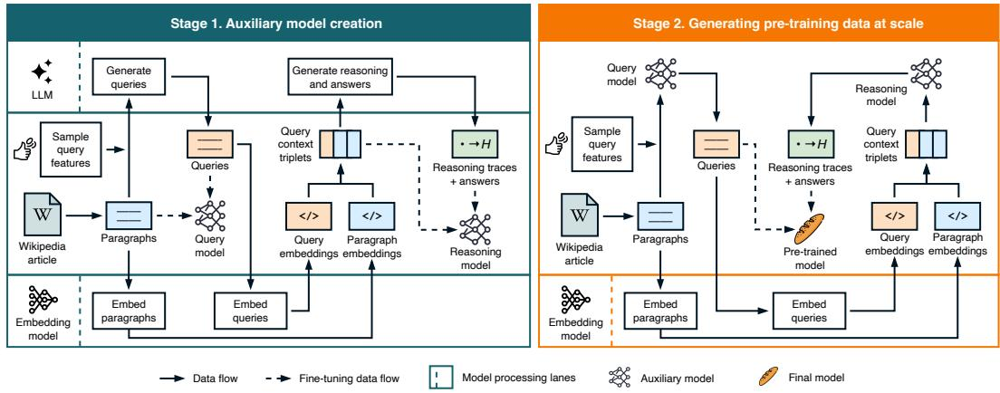  
Figure 1: SYNTH pipeline for the memorization task. At Stage 1, auxiliary models are fine-tuned on LLM-generated data. At Stage 2, these models are used to produce synthetic training data at scale.

Fully-synthetic training (or synthetic pre-training) is a more restricted category. Phi-1.5 [Li et al., 2023] trained a 1.3B parameter model on a corpus dominated by synthetic textbooks, matching the scores of much larger models; Cosmopedia-1b [Ben Allal et al., 2024] reproduced the recipe in the open. Reliance on a single generation template (textbook rewriting) has left these works vulnerable to the surface-diversity collapse Kang et al. [2025], and subsequent Phi releases reintroduced curated web data. We revisit synthetic pretraining and replace single-template generation with a constraint grammar over heterogeneous task pipelines explicitly targeting that failure mode.

Controlled environments. Synthetic data facilitates reproducible training experiments by enabling clean, controlled experiments in playgrounds and engineered corpora that avoid real-world noise and contamination [Allen-Zhu and Li, 2024, Allen-Zhu, 2024]. Such environments are especially prevalent in research on LLM memorization. Morris et al. [2025] estimate the pure memorization capacity of GPT-style transformers at ∼3.6 bits per parameter by training from scratch on uniformly random bit-strings, where no generalization is possible; Allen-Zhu and Li [2024] report a complementary ∼2 bits per parameter on synthetic biographies and phone books, the gap recovered through generalization. This capacity is highly sensitive to data composition: a 1:7 useful-to-junk ratio reduces effective capacity for useful knowledge by a factor of 20 [Allen-Zhu and Li, 2024], providing direct theoretical motivation for the seed-curated approach we adopt. Ye et al. [2026] show that a 110M model pre-trained on annotated Wikipedia matches a 10× larger baseline on entity-fact recall. At a larger scale, Lin et al. [2025b] show that Llama 3.1 8B, mid-trained on 1T tokens of synthetic Wikipedia-sourced study material, beats much larger baselines on closed-book factual QA.

## 3 SYNTH

SYNTH amplifies a fixed set of curated seed segments through a two-stage pipeline (Figure 1). Stage 1 fine-tunes two auxiliaries — a query model and a reasoning model — on supervision distilled from a frontier LLM; a frozen bge-m3 encoder handles nearest-neighbor retrieval over seed paragraphs. Stage 2 runs both auxiliaries at scale: each seed is sampled into queries under a constraint-prior model, paired with a retrieved neighbor paragraph, and routed through a task-specific output adapter (memorization QA, RAG, arithmetic, creative writing, editing).

Seeding corpus. The seed set is anchored on the 50k Wikipedia vital articles (level-1 to level-51), community-curated for broad importance-tiered coverage. We add 8,698 specialized articles in law, medicine, and chemistry (category-tree and Wikidata graph expansion to fill the gaps surfaced during intermediary evaluation); 3,727 Wikibooks pages, primarily cooking and practical knowledge underrepresented in the encyclopedia; and 130 documents covering model self-documentation, recent events, and AI research postdating the snapshot.

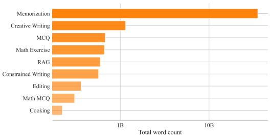  
(a) Word count distribution for SYNTH tasks.

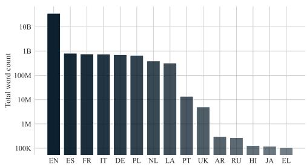  
(b) Word counts for top-15 SYNTH languages.  
Figure 2: Log-scale word counts for SYNTH tasks and languages.

## 3.1 Memorization

Queries. The query model is the entry point of Stage 2; any diversity failure here would propagate to the whole SYNTH corpus. Prompting a single large model with rotating instructions empirically collapses to a narrow distribution over phrasings and formats, so we instead fine-tune a LoRA adapter on Gemma-3-12B-base [Gemma Team, 2025] during Stage 1 on curated ⟨seed, constraints, query⟩ triplets and run in Stage 2 over every seed segment (∼80M tokens, 58k seed articles). Constraints are sampled per call from a simple probabilistic model with independent priors over six axes (query type, complexity, user profile, query result, target language, query style; full enumeration and priors in Appendix A). The priors force rows to differ along controlled axes rather than along whichever axes the base model finds easiest to vary.

Every seed segment is uniformly amplified by 100×. Importance weighting is implicit in the sectiondecomposition step: levels 1–4 (top 10k) are split into all their structured sections, while level 5 (IDs 10k–50k) contributes only the lead abstract as a single seed.

The query result axis is the design choice worth flagging: 20% of rows target a refusal, correction, or hedge rather than a confident answer (negative, absurd, or ambiguous queries). Without this signal, a back-translated corpus teaches the model to always answer, since every training query has a confident grounded target; we return to this in § 5, where the FActScore precision gap partly traces to the model declining to confabulate on entities it does not know.

Answer and reasoning traces. The reasoning model is a separate auxiliary (Figure 1) that produces an answer along with a back-translated reasoning trace. Its input is a query-context triplet: the query, its seed paragraph, and the closest non-seed neighbor retrieved with off-the-shelf bge-m3 + FAISS IVF-flat cosine over the seed pool. Stage 1 fine-tunes on triplets paired with traces and answers distilled from a frontier LLM; Stage 2 runs on every Stage-2 query under the same triplet format. Pairing each query with its seed and a near-neighbor diversifies grounding combinations and creates semantic bridges that no single-paragraph grounding would produce. The trace uses a stenographic syntax rather than natural-language CoT, with three marker families — logical (→, ⟲, ∴), epistemic (• certain . . . ⃝ uncertain), and verification $( \bigcirc / \bigcirc / \bigcirc )$ plus a tree decomposition for multi-step problems. The dedicated tokens (added to the tokenizer, § 4) compress a reasoning step into one or two tokens, letting a small model emit a richer trace within a fixed context window. We also insert simulated entropy markers ⟨H≈X.X⟩ [xjdr, 2024] at decision points; these are training-time annotations only, with no inference-time temperature control.

## 3.2 Auxiliary tasks

We add task pipelines around memorization, all sharing the constraint-driven flow with task-specific prompts and targets (mix shown in Figure 2a): (1) RAG replays the memorization query stream with up to ten retrieved passages and <source>-cited targets, training closed- vs. open-book switching; (2) arithmetic amplifies ∼3,000 Kimina [Wang et al., 2025] templates by randomizing variable values and re-evaluating the symbolic solution (Qwen-3-8B [Qwen Team, 2025], more accurate than Gemma-3-12b on math), reusing the stenographic syntax of § 3.1; (3) creative writing samples constraint specs (lipograms, layout poems, style/persona) independently of topical seeds; (4) editing covers translation, structured extraction, orthographic/factual correction, and style reformulation; (5)

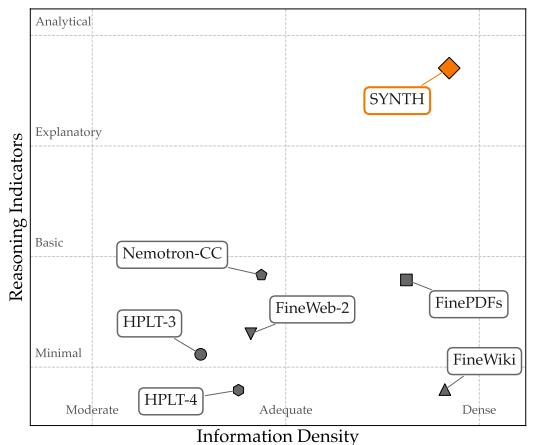

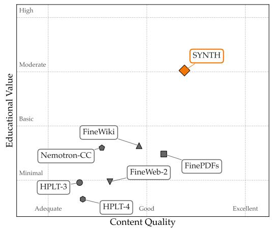  
Figure 3: SYNTH excels in the quality/value pairings by a wide margin compared to other open pre-training corpora, scored by Propella-1. We present integrity/safety evaluations in Appendix D.

MCQ adds closed-set questions with distractors; (6) practical knowledge runs the main generator over 3,727 Wikibooks cooking recipes.

## 3.3 Dataset composition

Multilingual generation. About 20% of SYNTH is non-English, dominated by a handful of European languages selected from Common Corpus (Figure 2b). Reasoning traces remain English even for non-English queries, with possible verbatim query quotes.

Data quality analysis. We use the annotations from Propella-1 multilingual document annotator [Idahl et al., 2026], an external data quality judge, to compare SYNTH to a range of open pretraining corpora (including Nemotron-CC [Su et al., 2025], FinePDFs [Kydlícek et al., 2025],ˇ FineWeb-2 [Penedo et al., 2025], FineWiki [Penedo, 2025], HPLT 3.0 and 4.0 [Oepen et al., 2026])2. Figure 3 reports four property pairings: SYNTH occupies the top-right of both quality / value axes, with the largest margins on reasoning indicators and educational value. SYNTH also ties FineWiki at the ceiling on integrity / safety axes of the same annotation model (see evaluations in Appendix D). The reasoning-indicators score is partly a consequence of the explicit reasoning traces in SYNTH, but the educational-value gap is trace-independent. Wikipedia-derived data matches SYNTH on safety but loses on reasoning; web-cleaned corpora show the opposite tradeoff.

## 4 The BAGUETTOTRON model suite

We present three dense models and one Mixture-of-Experts variant.

• MONAD (56M parameters, 64 layers, $d _ { \mathrm { m o d e l } } = 3 8 4 )$ is the smallest configuration and serves as a stress test of how far engineered synthetic data can push a parameter-constrained model.

• BAGUETTOTRON-350M (321M parameters, 80 layers, $d _ { \mathrm { m o d e l } } = 5 7 6 )$ is a deep design, motivated by the hypothesis that deeper stacks could benefit more from reasoning data.

• BAGUETTOTRON-600M (594M parameters, 48 layers, $d _ { \mathrm { m o d e l } } = 1 0 2 4 )$ is a more tradition architecture inspired by Qwen and is the main reference run for the rest of the paper.

• BAGUETTOTRON-MoE (13.2B total / 1.05B active parameters, 47 layers, $d _ { \mathrm { m o d e l } } = 1 2 8 0$ , 16 experts top-1, expert hidden 4480, no shared expert), routes through softmax gating with a $1 0 ^ { - 3 }$ load-balance auxiliary loss.

Tokenizers. BAGUETTOTRON uses a BPE tokenizer with a vocabulary size $V = 6 5 . 5 3 5$ , trained on a sample from Common Corpus [Langlais et al., 2026] in order to preserve multilingual coverage. The last ∼50 entries of the vocabulary are SYNTH-specific reasoning control tokens. MONAD, the smallest model, instead uses an 8k-vocabulary tokenizer trained on the English section of SYNTH.

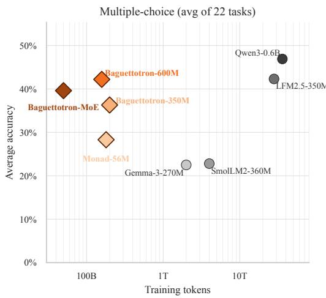

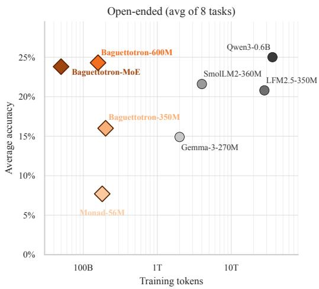  
Figure 4: BAGUETTOTRON sits on the token-efficiency frontier, matching or trailing baselines trained on 80–700× more tokens. Average accuracy vs. pre-training tokens (log scale) on 22 multiple-choice (left) and 8 open-ended (right) tasks. Diamonds: BAGUETTOTRON (ours); circles: open baselines. Token budgets are publicly reported pre-training token counts (post-training tokens excluded). Top-left is better, i.e. more accurate per token of training data.

Infrastructure. Early architecture exploration (depth ablations, MONAD) used Nanotron on H100 GPUs; other runs use torchtitan with FSDP on 16×H100 GPUs (4 nodes × 4 GPUs, 64 GB each). The MoE run uses no expert parallelism; experts are sharded purely through FSDP, as expert parallelism resulted in slightly lower MFU.

Training runs. All runs share sequence length 2048, AdamW (weight decay 0.01, gradient clipping 1.0), and a 16.6% linear decay tail to 0.2% of peak lr; per-run details in Appendix B. BAGUETTOTRON-MoE matches dense BAGUETTOTRON-600M’s final cross-entropy of 1.19 on ∼32% as many tokens (∼50B).

Token budget and scaling laws. The Chinchilla-optimal token budget for a 600M model is ∼12B tokens, 20× parameter count [Hoffmann et al., 2022]; we trained on 264×, deliberately overtrained by web-data conventions. Training loss was still decreasing at step 151,000, with no divergence and no loss spikes. While preliminary, comparing scaling-law fits across three iso-compute 600M runs of SYNTH against scraped baselines FineWiki and FinePDFs-Edu shows a lower asymptotic loss floor on synthetic data. As loss is not directly comparable across corpora (FineWiki reaches its low loss through ∼17 epochs over ∼9B tokens), § 4.2 compares the same runs on downstream tasks.

## 4.1 Evaluation

Figure 4 compares BAGUETTOTRON against four open 270M–600M models (Gemma-3- 270M [Gemma Team, 2025], SmolLM2-360M [Allal et al., 2025], LFM2.5-350M [Amini et al., 2025], Qwen3-0.6B [Qwen Team, 2025]) on 22 multiple-choice and 8 open-ended tasks. Per-benchmark scores, grouped capabilities, and the setup are in Appendix H. These baselines differ from ours in architecture, tokenizer, data, and post-training, so we report them as context.

BAGUETTOTRON-MoE and BAGUETTOTRON-600M sit on the token-efficiency frontier on both task types: ours trail Qwen3-0.6B by 4.7 points on multiple-choice and just 0.7 points on openended, while training on 80–700× fewer tokens. MONAD-56M, despite seeing only 180B tokens at 56M parameters, also sits on the multiple-choice frontier: outperforming Gemma-3-270M and SmolLM2-360M on average. Per-benchmark variance is high: BAGUETTOTRON-600M reaches 45% on NuclearQA (vs. Qwen3-0.6B’s 53%) and our models tie or beat Qwen on TruthfulQA, ESGenius, and FormationEval, but lag substantially on benchmarks that reward broad web knowledge (e.g. ARC-Challenge, GeoBench), which is a limitation of using a limited set of seed sources.

## 4.2 Data ablations

To test whether the gains come from the data rather than from the architecture, tokenizer, or training budget, we train two 600M models that are identical to BAGUETTOTRON-600M except for their pretraining data: FineWiki (English Wikipedia, ∼9B tokens, ∼17 epochs) and FinePDFs-Edu (English, ∼130B tokens, ∼1.2 epochs).

Without post-training, neither web model produces valid multiple-choice answers. We therefore post-train both on SmolTalk [Allal et al., 2025] (99,679 conversations) plus the MMLU auxiliary training split (39,852 questions, disjoint from the test set) for the answer format: ∼100M tokens over 3 epochs, without reasoning traces, adding ∼0.2% to their compute.

SYNTH leads by 16–17 points compared to both post-trained web models on multiple-choice and 11–14 points on open-ended tasks (Table 8, Appendix H). Both web models stay at chance on MMLU (24.0% and 25.6%), and dropping MMLU from the average changes it by at most 0.1 points.

Reasoning traces. We also retrain BAGUETTOTRON-600M on SYNTH without its reasoning traces, keeping queries and answers unchanged and matching tokens, optimizer steps, unique examples, and seed. Multiple-choice accuracy does not change (41.8% vs. 42.2% with traces), but open-ended accuracy drops from 24.3% to 22.0%. The loss is concentrated in truthfulness (TruthfulQA, −9.1) and domain reasoning (NuclearQA, −10.0); factual recall is unaffected (−0.5 on average) and ConflictQA even improves (+3.9; Table 9).

▷ Web pre-training requires a second stage, synthetic pre-training does not. Behaviours that web models only acquire in a separate post-training stage, such as following instructions and answer formats, are written into SYNTH’s pre-training corpus. Even after the post-training stage, the web models trail by 11–17 points, so the advantage is not only one of format.

## 5 Controlling factual generation with synthetic data

SYNTH’s back-translation pipeline grounds every memorization target in a real Wikipedia passage, so the training signal rewards stating verified facts rather than plausible-sounding ones. We test whether this carries over downstream by measuring factual precision on open-ended entity descriptions (Table 1): does a model trained on grounded synthetic data confabulate less per generated fact than baselines on much larger web corpora? Verbatim copying is separately off-limits for copyright reasons [Li et al., 2026]. Precision alone is not the full picture: a useful model also knows when to hedge, returning a fuzzy claim (the right century) rather than a precise but wrong one (the wrong date). SYNTH’s reasoning traces include explicit epistemic markers for exactly this purpose, and § 5.2 tests whether SYNTH-trained models pick them up as a calibrated signal.

Prior synthetic augmentation does not enforce this kind of grounding. EntiGraph [Yang et al., 2025] generates entity-relation text that can introduce claims absent from the source, and Active Reading [Lin et al., 2025a] relies on self-generated strategies without an explicit fact-verification step. In both cases, teacher hallucinations propagate to the student [Liu et al., 2025, Zhu et al., 2025]. SYNTH-trained models should therefore produce more factually accurate generations than models trained on either web data or unverified synthetic data.

## 5.1 Factual precision

For each of n=500 Wikipedia seed entities sampled uniformly from SYNTH’s 52,183-article seed corpus, we prompt the model with “What do you know about {entity}?”, decompose the response into atomic facts via DeepSeek-V3.2, and label each fact Supported, Contradicted, or Inconclusive against the source article, following a FActScore-inspired evaluation protocol Min et al. [2023]. We report precision $S / ( S { + } C )$ on the verifiable subset, and a macro score $S / ( S { + } C { + } I )$ that penalizes inconclusive responses (Appendix F). Note that neither metric captures when a model chooses to abstain or hedge, which we examine in § 5.2.

BAGUETTOTRON-600M and BAGUETTOTRON-MoE reach the highest macro scores in the table (41.7% and 46.3%), beating Phi-4-mini-instruct (a 6× larger dense model) and DeepSeek-MoE-16B-Chat (2.8× active parameters, >40× more pre-training tokens). BAGUETTOTRON-350M (∼200B SYNTH tokens) likewise outperforms LFM2.5-350M and SmolLM2-360M-IT despite seeing 10–

Table 1: Factual precision on Wikipedia entities (n=500), grouped by parameter tier. S/(S+C) = fraction of decomposed atomic facts Supported by Wikipedia. macro = per-entity Supported / total facts (Inconclusive in the denominator). Bold = best in tier. Pill colour encodes a paired-bootstrap test (B=10 000) of each baseline against our in-tier reference: green = ours (reference); red = other model in-tier significantly worse compared to ours; gray = not significant (α=0.05).
<table><tr><td>Model</td><td>Mode</td><td>Tokens</td><td>Sup%</td><td>Con%</td><td>Inc%</td><td>S/(S+C)</td><td></td><td>macro</td></tr><tr><td>~50M parameters</td><td></td><td></td><td></td><td></td><td></td><td></td><td></td><td></td></tr><tr><td>MONAD (56M, ours)</td><td>chat</td><td>180B</td><td>16.3</td><td>21.7</td><td>61.9</td><td>42.9%</td><td>±3.8</td><td>16.3% ±1.8</td></tr><tr><td>~300–400M parameters</td><td></td><td></td><td></td><td></td><td></td><td></td><td></td><td></td></tr><tr><td>SmolLM2-360M-IT</td><td>chat</td><td>4T</td><td>26.0</td><td>16.0</td><td>58.0</td><td>61.8%</td><td>±3.4</td><td>26.6% ±2.1</td></tr><tr><td>LFM2.5-350M</td><td>chat</td><td>28T</td><td>22.0</td><td>15.1</td><td>62.9</td><td>59.3%</td><td>±3.1</td><td>22.0% ±1.8</td></tr><tr><td>Gemma-3-270M-IT</td><td>chat</td><td>2T</td><td>18.4</td><td>13.6</td><td>68.0</td><td>57.6%</td><td>±4.0</td><td>19.4% ±1.8</td></tr><tr><td>OPT-350M</td><td>compl.</td><td>180B</td><td>4.7</td><td>22.5</td><td>72.8</td><td>17.2%</td><td>±4.0</td><td>6.6% ±1.1</td></tr><tr><td>BAGUETTOTRON-350M (ours)</td><td>chat</td><td>200B</td><td>32.4</td><td>17.3</td><td>48.3</td><td>65.1%</td><td>±3.2</td><td>32.4% ±2.3</td></tr><tr><td>~600M+ parameters</td><td></td><td></td><td></td><td></td><td></td><td></td><td></td><td></td></tr><tr><td>Qwen3-0.6B</td><td>chat</td><td>~36T</td><td>31.1</td><td>16.3</td><td>52.6</td><td>65.7%</td><td>±4.9</td><td>31.6% ±2.1</td></tr><tr><td>Phi-4-mini-instruct (3.8B)</td><td>chat</td><td>~5T</td><td>27.3</td><td>8.0</td><td>64.7</td><td>77.4%</td><td>±3.4</td><td>29.5% ±1.8</td></tr><tr><td>BAGUETTOTRON-600M (ours)</td><td>chat</td><td>158B</td><td>42.1</td><td>11.0</td><td>47.0</td><td>79.3%</td><td>±2.1</td><td>41.7% ±2.2</td></tr><tr><td>Sparse MoEs</td><td></td><td></td><td></td><td></td><td></td><td></td><td></td><td></td></tr><tr><td>OLMoE-1B-7B-Instruct (7B/1Bact)</td><td>chat</td><td>~5.1T</td><td>33.1</td><td>7.0</td><td>59.9</td><td>82.6%</td><td>±1.7</td><td>33.4% ±1.8</td></tr><tr><td>DeepSeek-MoE-16B-Chat (16B/2.8Bact)</td><td>chat</td><td>~2T</td><td>36.9</td><td>7.6</td><td>55.5</td><td>82.9%</td><td>±2.1</td><td>38.3% ±2.2</td></tr><tr><td>BAGUETTOTRON-MoE (13B/1Bact, ours)</td><td>chat</td><td>50B</td><td>46.0</td><td>10.3</td><td>43.6</td><td>81.7%</td><td>±2.1</td><td>46.3% ±2.3</td></tr></table>

140× fewer training tokens. The only baseline trained on a comparable token budget is OPT-350M (180B), which is also the only model that confabulates more facts than it states correctly.

▷ Models trained on SYNTH are the most token-efficient factual learners in every parameter tier, topping both precision and macro scores despite 10–140× fewer training tokens, and are the only models above 40% macro on Wikipedia entities.

Validation on held-out entities. SYNTH’s seed determine which facts a model memorizes and we evaluate if the model states them faithfully. No model can report facts it never saw: for instance, a model trained on articles about elephants does not thereby learn about giraffes. The evaluation prompt is not a SYNTH training query either: “What do you know about” occurs in none of the 5,000 queries of the released SYNTH sample.

If the model’s precision came from stating safe, generic claims regardless of the entity, it would persist outside the training data. We test this on 600 Wikipedia Good Articles that are not Vital articles and are absent from the seed corpus, under the same protocol (Appendix G). On held-out entities, BAGUETTOTRON-MoE abstains on 67% (vs. 20% in-seed), and its precision on attempted answers drops from 82% to 62%. The metric therefore tracks what the model knows. OLMoE-1B-7B-Instruct [Muennighoff et al., 2025], a web-trained MoE of the same active size, abstains on only 7% and keeps 81% precision. As web-scale data covers more of these entities, this is expected.

## 5.2 Calibrating factual precision with epistemic markers

SYNTH’s memorization traces include explicit epistemic markers that flag individual claims as confident or uncertain. We test whether models trained on SYNTH learn to deploy these markers in a calibrated way, so whether traces dominated by uncertainty markers correspond to less-factual outputs, and whether the model abstains by committing to fewer claims. For each trace, we count high-confidence and low-confidence symbols, then bucket the trace as Confident (high markers dominate) or Uncertain (low markers dominate); ties are dropped.3

Figure 5a shows that three of four models calibrate factual precision against the markers: BAGUETTOTRON-350M (0.35→0.25), BALANCED-600M (0.44→0.40), and BAGUETTOTRON-MoE (0.50→0.41) all drop FActScore on uncertain-tagged traces, with the larger models showing the cleanest separation. Only for MONAD (56M), the markers carry no signal (0.17→0.17).

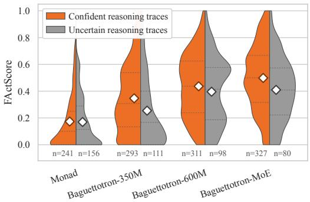  
(a) Per-topic FActScore distribution.

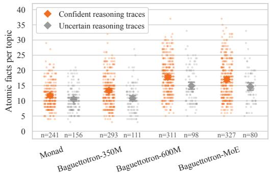  
(b) Atomic facts extracted per topic.  
Figure 5: Epistemic markers in reasoning traces predict factual quality and output volume. Per-topic FActScore (a) and atomic-fact count (b), conditioned on whether the trace is dominated by confident or uncertain markers (majority count; ties dropped). Diamonds mark conditional means.

Figure 5b shows that all four models calibrate output volume: the 350M, 600M, and MoE variants commit to ∼15−20% fewer atomic facts on uncertain traces, and even MONAD shrinks from 11.7 to 10.6 facts per topic. While modest, MONAD learns to say less under uncertainty without learning to be more right, suggesting that calibrated abstention is acquired earlier in the parameter-count curve than calibrated precision. For SYNTH-trained models above ∼300M, the epistemic markers function as a usable confidence indicator for both output volume and factual precision.

▷ Models trained on SYNTH learn to use its epistemic markers as a signal. The uncertainty markers predict both lower factual precision (350M and above) and reduced output volume (all sizes).

## 5.3 Domain and task adaptation

A key advantage of synthetic generation is the ability to target specific domains and skills required of a model. We illustrate this through adaptation to telecommunications, a domain characterized by scarce specialized data and dense terminology. Our seed corpus combines two complementary sources: a telecom-focused slice of English Wikipedia (∼ 3M tokens) and a corpus of 3GPP technical standards [Maatouk et al., 2024] (∼ 90M tokens). Applying the same synthetic generation pipeline to this seed material with task-targeted prompts (memorization, mcq, and free-form QA), we produce ∼460M synthetic tokens (10× paragraph amplification). Fine-tuning the 600M base model on this yields consistent gains across both public and internal benchmarks: TeleQnA accuracy improves from 41.6% to 56.7% (+15.1%), and FactScore on 3GPP standards from 21.5% to 38.8% (+17.3%).

On LLM-as-a-judge evaluation (Claude Opus 4.5, 50 telecom questions scored on 0-100 across accuracy, hallucination, reasoning, and answer quality), the 3GPP-augmented model reaches 67.8, a 15.4% improvement over a wiki-only telco fine-tune (58.7) and 2.4× the score of the 600M baseline (27.8). The gains come mostly from precise domain knowledge (e.g. 5G) and the disambiguation of acronyms, where the baseline tends to hallucinate plausible but incorrect expansions.

Tool calling. We also adapt the base models to tool calling, generating the data with the same two-auxiliary design as SYNTH. A drafter writes a user query, synthetic tool schemas, and the gold call from one seed paragraph and seven sampled constraints (environment, query type, single or multiple calls, menu size up to 25, positive or negative outcome, language, style); a solver writes the reasoning trace. Both are fine-tuned on Gemma-3-12B-base, and ten passes over 28,428 seed passages yield 532k rows (578M tokens). We continue training the base models on a 70/30 mix of this data and general SYNTH for 5,700 steps (∼1.5B tokens), with the same next-token objective and no RL. On BFCL v2 [Patil et al., 2025] (full split, n=3,981; checkpoint selected on a 1,197-item dev subset), BAGUETTOTRON-600M reaches 53.1%, 3.9 points above FunctionGemma-270M (7.8 on macro accuracy) on ∼40× fewer training tokens (Table 10). The base model emits no tool calls, so the capability comes from the tool-calling data. As this data shares the format and objective of SYNTH, it can be folded into the pre-training mix, which we leave to future work.

▷ Synthetic generation enables targeted domain adaptation from small seed corpora. A modest in-domain seed (∼93M tokens), amplified 10× through task-targeted synthesis, more than doubles judge scores over the base 600M model and substantially improves factual grounding.

## 6 Conclusion

We have introduced SYNTH, the first open synthetic-only pretraining corpus designed to support the entire training curriculum as a single stage. The BAGUETTOTRON suite, trained from scratch on SYNTH across dense (56M to 600M parameters) and Mixture-of-Experts (13B/1B active) configurations, undergoes no separate SFT or RLHF stage yet follows instructions, reasons, and recalls facts as native capabilities of a single training stage. The same 600M model pre-trained on web data produces no valid answers without post-training, and still trails by double digits after it. Training without reasoning traces costs up to 10 points on truthfulness and domain reasoning. Our models reach the highest FActScore in every parameter tier on 10–140× fewer tokens, and recognize the limits of their knowledge: outside the seeds, BAGUETTOTRON-MoE abstains on 67% of entities, against 7% for a web-trained MoE. Beyond pre-training, synthetic data adapts the base model to new domains.

These results recontextualize the scaling literature. The Chinchilla coefficients were fit on web text [Hoffmann et al., 2022], which is weakly aligned with the capabilities a small model needs to learn. Engineered data shifts the curve as training remains productive well past the canonical 20× token-to-parameter ratio, and capacity-bound predictions from controlled-synthetic experiments transfer cleanly to deployable generalist models (§ 5). This confirms the initial intuition from the Phi series [Li et al., 2023] that data quality and learnability is an additional controllable axis alongside model size and token count and has been insufficiently optimized by LLM research.

Finally, SYNTH opens up new paths for data releasability and transparency. We showed that a viable pretraining environment could be built from a small collection of 50,000 Wikipedia articles. Conversely, open data sources have consistently emerged as higher quality sources than webcrawl and better suited for large-scale seed infrastructures: Wikipedia and Wikidata are already integral components of synthetic pipelines for generalist and search-specialized models [Huang et al., 2026, Li et al., 2025, Bashir et al., 2026]. We already illustrated this with tool-calling where, with synthetic data, a 600M base model outperforms FunctionGemma-270M, trained on 6T tokens.

## 7 Limitations and future work

Our current research showed that our synthetic training recipe is inherently scalable: models in a larger size range assimilate more facts and do it faster. Yet, to move beyond the current category of models, our pipelines will also need to scale across multiple axes.

Seed coverage and infrastructure. Our current design is bounded by the information contained in the ∼58k Wikipedia seed articles. While this ensures tight experimental control over what the model learns, it imposes a hard ceiling on parametric knowledge. Wikipedia is a natural expansion space, especially across different multilingual versions, and has been shown to reliably improve on advanced knowledge benchmarks [Lin et al., 2025a].

Cultural diversity. Our current seeding infrastructure intently selects knowledge relevant to the English-speaking Wikipedia contributor, which aligns strongly with standard LLM benchmarks. Our multilingual pipeline covers multiple languages but was shaped by English seeds. Future work should extend seed selection to native language content.

Capabilities. The exercise difficulty in current SYNTH is currently calibrated for SLMs use cases. Scaling this pipeline to larger, more generalist model calls for a new synthetic pipeline, extending to code generation, synthesized agentic scenarios (interleaved thinking, multi-step tool use, environment-grounded trajectories) and more broadly long horizon tasks.

Hybrid pretraining mixes. Our current setting isolates the contribution of the synthetic corpus by removing all confounding from web data. Yet it also requires engineering a wide range of model behaviors (including refusal) that may be captured at scale through organic data training.

## Acknowledgements

We acknowledge the EuroHPC Joint Undertaking for awarding this project access to the EuroHPC supercomputer MareNostrum 5, hosted by the Barcelona Supercomputing Center (BSC), through the EuroHPC Extreme Scale Access call (EHPC-EXT-2025E01-092, JULIP: Powerful LLMs made in Europe). This work was granted access to the HPC resources of IDRIS under the allocations A0191016886 (‘EuroSynth’) and AD011014736R1 made by GENCI. Parts of this research received funding from SPRIN-D, the German Federal Agency for Breakthrough Innovation. We also thank Oleg Filatov, Vedant Nanda and Jiangtao Wang for their helpful feedback on this project.

## References

Marah Abdin, Jyoti Aneja, Harkirat Behl, Sébastien Bubeck, Ronen Eldan, Suriya Gunasekar, Michael Harrison, Russell J. Hewett, Mojan Javaheripi, Piero Kauffmann, James R. Lee, Yin Tat Lee, Yuanzhi Li, Weishung Liu, Caio C. T. Mendes, Anh Nguyen, Eric Price, Gustavo de Rosa, Olli Saarikivi, Adil Salim, Shital Shah, Xin Wang, Rachel Ward, Yue Wu, Dingli Yu, Cyril Zhang, and Yi Zhang. Phi-4 Technical Report, December 2024. URL http://arxiv.org/abs/2412.08905. arXiv:2412.08905 [cs].

Sina Alemohammad, Josue Casco-Rodriguez, Lorenzo Luzi, Ahmed Imtiaz Humayun, Hossein Babaei, Daniel LeJeune, Ali Siahkoohi, and Richard Baraniuk. Self-consuming generative models go mad. In The Twelfth International Conference on Learning Representations, 2023.

Loubna Ben Allal, Anton Lozhkov, Elie Bakouch, Gabriel Martin Blazquez, Guilherme Penedo, Lewis Tunstall, Andrés Marafioti, Agustín Piqueres Lajarín, Hynek Kydlícek, Vaibhav Srivastav,ˇ Joshua Lochner, Caleb Fahlgren, Xuan Son NGUYEN, Ben Burtenshaw, Clémentine Fourrier, Haojun Zhao, Hugo Larcher, Mathieu Morlon, Cyril Zakka, Colin Raffel, Leandro Von Werra, and Thomas Wolf. SmolLM2: When smol goes big — data-centric training of a fully open small language model. In Second Conference on Language Modeling, 2025. URL https: //openreview.net/forum?id=3JiCl2A14H.

Zeyuan Allen-Zhu. ICML 2024 Tutorial: Physics of Language Models, July 2024. Project page: https://physics.allen-zhu.com/.

Zeyuan Allen-Zhu and Yuanzhi Li. Physics of Language Models: Part 3.3, Knowledge Capacity Scaling Laws, April 2024. URL http://arxiv.org/abs/2404.05405. arXiv:2404.05405 [cs:CL, cs:cs:AI, cs:cs:LG].

Alexander Amini, Anna Banaszak, Harold Benoit, Arthur Böök, Tarek Dakhran, Song Duong, Alfred Eng, Fernando Fernandes, Marc Härkönen, Anne Harrington, Ramin Hasani, Saniya Karwa, Yuri Khrustalev, Maxime Labonne, Mathias Lechner, Valentine Lechner, Simon Lee, Zetian Li, Noel Loo, Jacob Marks, Edoardo Mosca, Samuel J. Paech, Paul Pak, Rom N. Parnichkun, Alex Quach, Ryan Rogers, Daniela Rus, Nayan Saxena, Bettina Schlager, Tim Seyde, Jimmy T. H. Smith, Aditya Tadimeti, and Neehal Tumma. Lfm2 technical report, 2025. URL https: //arxiv.org/abs/2511.23404.

Hammad Bashir, Kelly Hong, Patrick Jiang, and Zhiyi Shi. Chroma Context-1: Training a Self-Editing Search Agent. Technical report, 2026. URL https://www.trychroma.com/research/ context-1.

Loubna Ben Allal, Anton Lozhkov, Guilherme Penedo, Thomas Wolf, and Leandro von Werra. Cosmopedia, 2024. URL https://huggingface.co/datasets/HuggingFaceTB/cosmopedia.

Michael J. Bommarito, Jillian Bommarito, and Daniel Martin Katz. The KL3M Data Project: Copyright-Clean Training Resources for Large Language Models, April 2025. URL http:// arxiv.org/abs/2504.07854. arXiv:2504.07854 [cs].

Gheorghe Comanici et al. Gemini 2.5: Pushing the frontier with advanced reasoning, multimodality, long context, and next generation agentic capabilities, 2025. URL https://arxiv.org/abs/ 2507.06261.

A. Feder Cooper, Aaron Gokaslan, Ahmed Ahmed, Amy B. Cyphert, Christopher De Sa, Mark A. Lemley, Daniel E. Ho, and Percy Liang. Extracting memorized pieces of (copyrighted) books from open-weight language models, November 2025. URL http://arxiv.org/abs/2505.12546. arXiv:2505.12546 [cs:CL, cs:cs:CY, cs:cs:LG].

DatologyAI, Pratyush Maini, Vineeth Dorna, Parth Doshi, Aldo Carranza, Fan Pan, Jack Urbanek, Paul Burstein, Alex Fang, Alvin Deng, Amro Abbas, Brett Larsen, Cody Blakeney, Charvi Bannur, Christina Baek, Darren Teh, David Schwab, Haakon Mongstad, Haoli Yin, Josh Wills, Kaleigh Mentzer, Luke Merrick, Ricardo Monti, Rishabh Adiga, Siddharth Joshi, Spandan Das, Zhengping Wang, Bogdan Gaza, Ari Morcos, and Matthew Leavitt. BeyondWeb: Lessons from Scaling Synthetic Data for Trillion-scale Pretraining, August 2025. URL http://arxiv.org/abs/2508. 10975. arXiv:2508.10975 [cs].

Tim R Davidson, Benoit Seguin Enrico Bacis, Cesar Ilharco, and Hamza Harkous. Orchestrating Synthetic Data with Reasoning. 2025.

Elvis Dohmatob, Yunzhen Feng, Pu Yang, Francois Charton, and Julia Kempe. A tale of tails: Model collapse as a change of scaling laws. In Forty-first International Conference on Machine Learning, 2024. URL https://openreview.net/forum?id=KVvku47shW.

Yunzhen Feng, Elvis Dohmatob, Pu Yang, Francois Charton, and Julia Kempe. Beyond model collapse: Scaling up with synthesized data requires verification. In The Thirteenth International Conference on Learning Representations, 2024.

Leo Gao, Stella Biderman, Sid Black, Laurence Golding, Travis Hoppe, Charles Foster, Jason Phang, Horace He, Anish Thite, Noa Nabeshima, Shawn Presser, and Connor Leahy. The Pile: An 800gb dataset of diverse text for language modeling. arXiv preprint arXiv:2101.00027, 2020.

Gemma Team. Gemma 3. 2025. URL https://goo.gle/Gemma3Report.

Matthias Gerstgrasser, Rylan Schaeffer, Apratim Dey, Rafael Rafailov, Tomasz Korbak, Henry Sleight, Rajashree Agrawal, John Hughes, Dhruv Bhandarkar Pai, Andrey Gromov, et al. Is model collapse inevitable? breaking the curse of recursion by accumulating real and synthetic data. In First Conference on Language Modeling, 2024.

Google DeepMind. FunctionGemma. https://huggingface.co/google/ functiongemma-270m-it, 2025.

Aaron Grattafiori et al. The Llama 3 herd of models, 2024. URL https://arxiv.org/abs/2407. 21783.

Etash Guha, Ryan Marten, Sedrick Keh, Negin Raoof, Georgios Smyrnis, Hritik Bansal, Marianna Nezhurina, Jean Mercat, Trung Vu, Zayne Sprague, Ashima Suvarna, Benjamin Feuer, Liangyu Chen, Zaid Khan, Eric Frankel, Sachin Grover, Caroline Choi, Niklas Muennighoff, Shiye Su, Wanjia Zhao, John Yang, Shreyas Pimpalgaonkar, Kartik Sharma, Charlie Cheng-Jie Ji, Yichuan Deng, Sarah Pratt, Vivek Ramanujan, Jon Saad-Falcon, Jeffrey Li, Achal Dave, Alon Albalak, Kushal Arora, Blake Wulfe, Chinmay Hegde, Greg Durrett, Sewoong Oh, Mohit Bansal, Saadia Gabriel, Aditya Grover, Kai-Wei Chang, Vaishaal Shankar, Aaron Gokaslan, Mike A. Merrill, Tatsunori Hashimoto, Yejin Choi, Jenia Jitsev, Reinhard Heckel, Maheswaran Sathiamoorthy, Alexandros G. Dimakis, and Ludwig Schmidt. OpenThoughts: Data Recipes for Reasoning Models, June 2025. URL http://arxiv.org/abs/2506.04178. arXiv:2506.04178 [cs].

Jordan Hoffmann, Sebastian Borgeaud, Arthur Mensch, Elena Buchatskaya, Trevor Cai, Eliza Rutherford, Diego de Las Casas, Lisa Anne Hendricks, Johannes Welbl, Aidan Clark, Tom Hennigan, Eric Noland, Katie Millican, George van den Driessche, Bogdan Damoc, Aurelia Guy, Simon Osindero, Karen Simonyan, Erich Elsen, Oriol Vinyals, Jack W. Rae, and Laurent Sifre. Training compute-optimal large language models. In Proceedings ofthe 36th International Conference on Neural Information Processing Systems, NIPS ’22, Red Hook, NY, USA, 2022. Curran Associates Inc. ISBN 9781713871088.

Ailin Huang, Ang Li, Aobo Kong, Bin Wang, Binxing Jiao, Bo Dong, Bojun Wang, Boyu Chen, Brian Li, Buyun Ma, Chang Su, Changxin Miao, Changyi Wan, Chao Lou, Chen Hu, Chen Xu, Chenfeng Yu, Chengting Feng, Chengyuan Yao, Chunrui Han, Dan Ma, Dapeng Shi, Daxin Jiang,

Dehua Ma, Deshan Sun, Di Qi, Enle Liu, Fajie Zhang, Fanqi Wan, Guanzhe Huang, Gulin Yan, Guoliang Cao, Guopeng Li, Han Cheng, Hangyu Guo, Hanshan Zhang, Hao Nie, Haonan Jia, Haoran Lv, Hebin Zhou, Hekun Lv, Heng Wang, Heung-Yeung Shum, Hongbo Huang, Hongbo Peng, Hongyu Zhou, Hongyuan Wang, Houyong Chen, Huangxi Zhu, Huimin Wu, Huiyong Guo, Jia Wang, Jian Zhou, Jianjian Sun, Jiaoren Wu, Jiaran Zhang, Jiashu Lv, Jiashuo Liu, Jiayi Fu, Jiayu Liu, Jie Cheng, Jie Luo, Jie Yang, Jie Zhou, Jieyi Hou, Jing Bai, Jingcheng Hu, Jingjing Xie, Jingwei Wu, Jingyang Zhang, Jishi Zhou, Junfeng Liu, Junzhe Lin, Ka Man Lo, Kai Liang, Kaibo Liu, Kaijun Tan, Kaiwen Yan, Kaixiang Li, Kang An, Kangheng Lin, Lei Yang, Liang Lv, Liang Zhao, Liangyu Chen, Lieyu Shi, Liguo Tan, Lin Lin, Lina Chen, Luck Ma, Mengqiang Ren, Michael Li, Ming Li, Mingliang Li, Mingming Zhang, Mingrui Chen, Mitt Huang, Na Wang, Peng Liu, Qi Han, Qian Zhao, Qinglin He, Qinxin Du, Qiuping Wu, Quan Sun, Rongqiu Yang, Ruihang Miao, Ruixin Han, Ruosi Wan, Ruyan Guo, Shan Wang, Shaoliang Pang, Shaowen Yang, Shengjie Fan, Shijie Shang, Shiliang Yang, Shiwei Li, Shuangshuang Tian, Siqi Liu, Siye Wu, Siyu Chen, Song Yuan, Tiancheng Cao, Tianchi Yue, Tianhao Cheng, Tianning Li, Tingdan Luo, Wang You, Wei Ji, Wei Yuan, Wei Zhang, Weibo Wu, Weihao Xie, Wen Sun, Wenjin Deng, Wenzhen Zheng, Wuxun Xie, Xiangfeng Wang, Xiangwen Kong, Xiangyu Liu, Xiangyu Zhang, Xiaobo Yang, Xiaojia Liu, Xiaolan Yuan, Xiaoran Jiao, Xiaoxiao Ren, Xiaoyun Zhang, Xin Li, Xin Liu, Xin Wu, Xing Chen, Xingping Yang, Xinran Wang, Xu Zhao, Xuan He, Xuanti Feng, Xuedan Cai, Xuqiang Zhou, Yanbo Yu, Yang Li, Yang Xu, Yanlin Lai, Yanming Xu, Yaoyu Wang, Yeqing Shen, Yibo Zhu, Yichen Lv, Yicheng Cao, Yifeng Gong, Yijing Yang, Yikun Yang, Yin Zhao, Yingxiu Zhao, Yinmin Zhang, Yitong Zhang, Yixuan Zhang, Yiyang Chen, Yongchi Zhao, Yongshen Long, Yongyao Wang, Yousong Guan, Yu Zhou, Yuang Peng, Yuanhao Ding, Yuantao Fan, Yuanwei Lu, Yuanzhen Yang, Yuchu Luo, Yudi Zhao, Yue Peng, Yueqiang Lin, Yufan Lu, Yuling Zhao, Yunzhou Ju, Yurong Zhang, Yusheng Li, Yuxiang Yang, Yuyang Chen, Yuzhu Cai, Zejia Weng, Zetao Hong, Zexi Li, Zhe Xie, Zheng Ge, Zheng Gong, Zheng Zeng, Zhenyi Lu, Zhewei Huang, Zhichao Chang, Zhiguo Huang, Zhiheng Hu, Zidong Yang, Zili Wang, Ziqi Ren, Zixin Zhang, and Zixuan Wang. Step 3.5 Flash: Open Frontier-Level Intelligence with 11B Active Parameters, February 2026. URL http://arxiv.org/abs/2602.10604. arXiv:2602.10604 [cs:CL, cs:cs:AI] version: 1.

Maximilian Idahl, Benedikt Droste, Björn Plüster, and Jan Philipp Harries. propella-1: Multi-property document annotation for llm data curation at scale. arXiv preprint arXiv:2602.12414, 2026.

Nikhil Kandpal, Brian Lester, Colin Raffel, Sebastian Majstorovic, Stella Biderman, Baber Abbasi, Luca Soldaini, Enrico Shippole, A. Feder Cooper, Aviya Skowron, Shayne Longpre, Lintang Sutawika, Alon Albalak, Zhenlin Xu, Guilherme Penedo, Loubna Ben allal, Elie Bakouch, John David Pressman, Honglu Fan, Dashiell Stander, Guangyu Song, Aaron Gokaslan, John Kirchenbauer, Tom Goldstein, Brian R. Bartoldson, Bhavya Kailkhura, and Tyler Murray. The Common Pile v0.1: An 8TB Dataset of Public Domain and Openly Licensed Text. In The Thirty ninth Annual Conference on Neural Information Processing Systems Datasets and Benchmarks Track, 2025. URL https://openreview.net/forum?id=DIELgiqdvJ.

Feiyang Kang, Newsha Ardalani, Michael Kuchnik, Youssef Emad, Mostafa Elhoushi, Shubhabrata Sengupta, Shang-Wen Li, Ramya Raghavendra, Ruoxi Jia, and Carole-Jean Wu. Demystifying Synthetic Data in LLM Pre-training: A Systematic Study of Scaling Laws, Benefits, and Pitfalls, October 2025. URL https://arxiv.org/abs/2510.01631v1.

Konwoo Kim, Suhas Kotha, Yejin Choi, Tatsunori Hashimoto, Nick Haber, and Percy Liang. Dataefficient pre-training by scaling synthetic megadocs, March 2026. URL http://arxiv.org/ abs/2603.18534. arXiv:2603.18534 [cs:LG].

Kimi Team, Tongtong Bai, Yifan Bai, Yiping Bao, S. H. Cai, Yuan Cao, Y. Charles, H. S. Che, Cheng Chen, Guanduo Chen, Huarong Chen, Jia Chen, Jiahao Chen, Jianlong Chen, Jun Chen, Kefan Chen, Liang Chen, Ruijue Chen, Xinhao Chen, Yanru Chen, Yanxu Chen, Yicun Chen, Yimin Chen, Yingjiang Chen, Yuankun Chen, Yujie Chen, Yutian Chen, Zhirong Chen, Ziwei Chen, Dazhi Cheng, Minghan Chu, Jialei Cui, Jiaqi Deng, Muxi Diao, Hao Ding, Mengfan Dong, Mengnan Dong, Yuxin Dong, Yuhao Dong, Angang Du, Chenzhuang Du, Dikang Du, Lingxiao Du, Yulun Du, Yu Fan, Shengjun Fang, Qiulin Feng, Yichen Feng, Garimugai Fu, Kelin Fu, Hongcheng Gao, Tong Gao, Yuyao Ge, Shangyi Geng, Chengyang Gong, Xiaochen Gong, Zhuoma Gongque, Qizheng Gu, Xinran Gu, Yicheng Gu, Longyu Guan, Yuanying Guo, Xiaoru Hao, Weiran He, Wenyang He, Yunjia He, Chao Hong, Hao Hu, Jiaxi Hu, Yangyang Hu, Zhenxing Hu, Ke Huang, Ruiyuan Huang, Weixiao Huang, Zhiqi Huang, Tao Jiang, Zhejun Jiang, Xinyi

Jin, Yu Jing, Guokun Lai, Aidi Li, C. Li, Cheng Li, Fang Li, Guanghe Li, Guanyu Li, Haitao Li, Haoyang Li, Jia Li, Jingwei Li, Junxiong Li, Lincan Li, Mo Li, Weihong Li, Wentao Li, Xinhang Li, Xinhao Li, Yang Li, Yanhao Li, Yiwei Li, Yuxiao Li, Zhaowei Li, Zheming Li, Weilong Liao, Jiawei Lin, Xiaohan Lin, Zhishan Lin, Zichao Lin, Cheng Liu, Chenyu Liu, Hongzhang Liu, Liang Liu, Shaowei Liu, Shudong Liu, Shuran Liu, Tianwei Liu, Tianyu Liu, Weizhou Liu, Xiangyan Liu, Yangyang Liu, Yanming Liu, Yibo Liu, Yuanxin Liu, Yue Liu, Zhengying Liu, Zhongnuo Liu, Enzhe Lu, Haoyu Lu, Zhiyuan Lu, Junyu Luo, Tongxu Luo, Yashuo Luo, Long Ma, Yingwei Ma, Shaoguang Mao, Yuan Mei, Xin Men, Fanqing Meng, Zhiyong Meng, Yibo Miao, Minqing Ni, Kun Ouyang, Siyuan Pan, Bo Pang, Yuchao Qian, Ruoyu Qin, Zeyu Qin, Jiezhong Qiu, Bowen Qu, Zeyu Shang, Youbo Shao, Tianxiao Shen, Zhennan Shen, Juanfeng Shi, Lidong Shi, Shengyuan Shi, Feifan Song, Pengwei Song, Tianhui Song, Xiaoxi Song, Hongjin Su, Jianlin Su, Zhaochen Su, Lin Sui, Jinsong Sun, Junyao Sun, Tongyu Sun, Flood Sung, Yunpeng Tai, Chuning Tang, Heyi Tang, Xiaojuan Tang, Zhengyang Tang, Jiawen Tao, Shiyuan Teng, Chaoran Tian, Pengfei Tian, Ao Wang, Bowen Wang, Chensi Wang, Chuang Wang, Congcong Wang, Dingkun Wang, Dinglu Wang, Dongliang Wang, Feng Wang, Hailong Wang, Haiming Wang, Hengzhi Wang, Huaqing Wang, Hui Wang, Jiahao Wang, Jinhong Wang, Jiuzheng Wang, Kaixin Wang, Linian Wang, Qibin Wang, Shengjie Wang, Shuyi Wang, Si Wang, Wei Wang, Xiaochen Wang, Xinyuan Wang, Yao Wang, Yejie Wang, Yipu Wang, Yiqin Wang, Yucheng Wang, Yuzhi Wang, Zhaoji Wang, Zhaowei Wang, Zhengtao Wang, Zhexu Wang, Zihan Wang, Zizhe Wang, Chu Wei, Ming Wei, Chuan Wen, Zichen Wen, Chengjie Wu, Haoning Wu, Junyan Wu, Rucong Wu, Wenhao Wu, Yuefeng Wu, Yuhao Wu, Yuxin Wu, Zijian Wu, Chenjun Xiao, Jin Xie, Xiaotong Xie, Yuchong Xie, Yifei Xin, Bowei Xing, Boyu Xu, Jianfan Xu, Jing Xu, Jinjing Xu, L. H. Xu, Lin Xu, Suting Xu, Weixin Xu, Xinbo Xu, Xinran Xu, Yangchuan Xu, Yichang Xu, Yuemeng Xu, Zelai Xu, Ziyao Xu, Junjie Yan, Yuzi Yan, Guangyao Yang, Hao Yang, Junwei Yang, Kai Yang, Ningyuan Yang, Ruihan Yang, Xiaofei Yang, Xinlong Yang, Ying Yang, Yi Yang, Yi Yang, Zhen Yang, Zhilin Yang, Zonghan Yang, Haotian Yao, Dan Ye, Wenjie Ye, Zhuorui Ye, Bohong Yin, Chengzhen Yu, Longhui Yu, Tao Yu, Tianxiang Yu, Enming Yuan, Mengjie Yuan, Xiaokun Yuan, Yang Yue, Weihao Zeng, Dunyuan Zha, Haobing Zhan, Dehao Zhang, Hao Zhang, Jin Zhang, Puqi Zhang, Qiao Zhang, Rui Zhang, Xiaobin Zhang, Y. Zhang, Yadong Zhang, Yangkun Zhang, Yichi Zhang, Yizhi Zhang, Yongting Zhang, Yu Zhang, Yushun Zhang, Yutao Zhang, Yutong Zhang, Zheng Zhang, Chenguang Zhao, Feifan Zhao, Jinxiang Zhao, Shuai Zhao, Xiangyu Zhao, Yikai Zhao, Zijia Zhao, Huabin Zheng, Ruihan Zheng, Shaojie Zheng, Tengyang Zheng, Junfeng Zhong, Longguang Zhong, Weiming Zhong, M. Zhou, Runjie Zhou, Xinyu Zhou, Zaida Zhou, Jinguo Zhu, Liya Zhu, Xinhao Zhu, Yuxuan Zhu, Zhen Zhu, Jingze Zhuang, Weiyu Zhuang, Ying Zou, and Xinxing Zu. Kimi k2.5: Visual agentic intelligence, 2026a. URL https://arxiv.org/abs/2602.02276.

Kimi Team, Yifan Bai, Yiping Bao, Y. Charles, Cheng Chen, Guanduo Chen, Haiting Chen, Huarong Chen, Jiahao Chen, Ningxin Chen, Ruijue Chen, Yanru Chen, Yuankun Chen, Yutian Chen, Zhuofu Chen, Jialei Cui, Hao Ding, Mengnan Dong, Angang Du, Chenzhuang Du, Dikang Du, Yulun Du, Yu Fan, Yichen Feng, Kelin Fu, Bofei Gao, Chenxiao Gao, Hongcheng Gao, Peizhong Gao, Tong Gao, Yuyao Ge, Shangyi Geng, Qizheng Gu, Xinran Gu, Longyu Guan, Haiqing Guo, Jianhang Guo, Xiaoru Hao, Tianhong He, Weiran He, Wenyang He, Yunjia He, Chao Hong, Hao Hu, Yangyang Hu, Zhenxing Hu, Weixiao Huang, Zhiqi Huang, Zihao Huang, Tao Jiang, Zhejun Jiang, Xinyi Jin, Yongsheng Kang, Guokun Lai, Cheng Li, Fang Li, Haoyang Li, Ming Li, Wentao Li, Yang Li, Yanhao Li, Yiwei Li, Zhaowei Li, Zheming Li, Hongzhan Lin, Xiaohan Lin, Zongyu Lin, Chengyin Liu, Chenyu Liu, Hongzhang Liu, Jingyuan Liu, Junqi Liu, Liang Liu, Shaowei Liu, T. Y. Liu, Tianwei Liu, Weizhou Liu, Yangyang Liu, Yibo Liu, Yiping Liu, Yue Liu, Zhengying Liu, Enzhe Lu, Haoyu Lu, Lijun Lu, Yashuo Luo, Shengling Ma, Xinyu Ma, Yingwei Ma, Shaoguang Mao, Jie Mei, Xin Men, Yibo Miao, Siyuan Pan, Yebo Peng, Ruoyu Qin, Zeyu Qin, Bowen Qu, Zeyu Shang, Lidong Shi, Shengyuan Shi, Feifan Song, Jianlin Su, Zhengyuan Su, Lin Sui, Xinjie Sun, Flood Sung, Yunpeng Tai, Heyi Tang, Jiawen Tao, Qifeng Teng, Chaoran Tian, Chensi Wang, Dinglu Wang, Feng Wang, Hailong Wang, Haiming Wang, Jianzhou Wang, Jiaxing Wang, Jinhong Wang, Shengjie Wang, Shuyi Wang, Si Wang, Xinyuan Wang, Yao Wang, Yejie Wang, Yiqin Wang, Yuxin Wang, Yuzhi Wang, Zhaoji Wang, Zhengtao Wang, Zhengtao Wang, Zhexu Wang, Chu Wei, Qianqian Wei, Haoning Wu, Wenhao Wu, Xingzhe Wu, Yuxin Wu, Chenjun Xiao, Jin Xie, Xiaotong Xie, Weimin Xiong, Boyu Xu, Jinjing Xu, L. H. Xu, Lin Xu, Suting Xu, Weixin Xu, Xinran Xu, Yangchuan Xu, Ziyao Xu, Jing Xu, Jing Xu, Junjie Yan, Yuzi Yan, Hao Yang, Xiaofei Yang, Yi Yang, Ying Yang, Zhen Yang, Zhilin Yang, Zonghan Yang, Haotian Yao, Xingcheng Yao, Wenjie Ye, Zhuorui Ye, Bohong Yin, Longhui Yu, Enming Yuan,

Hongbang Yuan, Mengjie Yuan, Siyu Yuan, Haobing Zhan, Dehao Zhang, Hao Zhang, Wanlu Zhang, Xiaobin Zhang, Yadong Zhang, Yangkun Zhang, Yichi Zhang, Yizhi Zhang, Yongting Zhang, Yu Zhang, Yutao Zhang, Yutong Zhang, Zheng Zhang, Haotian Zhao, Yikai Zhao, Zijia Zhao, Huabin Zheng, Shaojie Zheng, Longguang Zhong, Jianren Zhou, Xinyu Zhou, Zaida Zhou, Jinguo Zhu, Zhen Zhu, Weiyu Zhuang, and Xinxing Zu. Kimi k2: Open agentic intelligence, 2026b. URL https://arxiv.org/abs/2507.20534.

Hynek Kydlícek, Guilherme Penedo, and Leandro von Werra. Finepdfs. ˇ https://huggingface. co/datasets/HuggingFaceFW/finepdfs, 2025.

Pierre-Carl Langlais, Pavel Chizhov, Catherine Arnett, Carlos Rosas Hinostroza, Mattia Nee, Eliot Krzysztof Jones, Irène Girard, David Mach, Anastasia Stasenko, and Ivan P. Yamshchikov. Common corpus: The largest collection of ethical data for LLM pre-training. In The Fourteenth International Conference on Learning Representations, 2026. URL https://openreview.net/ forum?id=0wSlFpMsGb.

Hugo Laurençon, Lucile Saulnier, Thomas Wang, Christopher Akiki, Albert Villanova del Moral, Teven Le Scao, Leandro Von Werra, Chenghao Mou, Eduardo González Ponferrada, Huu Nguyen, Jörg Frohberg, Mario Šaško, Quentin Lhoest, Angelina McMillan-Major, Gerard Dupont, Stella Biderman, Anna Rogers, Loubna Ben allal, Francesco De Toni, Giada Pistilli, Olivier Nguyen, Somaieh Nikpoor, Maraim Masoud, Pierre Colombo, Javier de la Rosa, Paulo Villegas, Tristan Thrush, Shayne Longpre, Sebastian Nagel, Leon Weber, Manuel Muñoz, Jian Zhu, Daniel Van Strien, Zaid Alyafeai, Khalid Almubarak, Minh Chien Vu, Itziar Gonzalez-Dios, Aitor Soroa, Kyle Lo, Manan Dey, Pedro Ortiz Suarez, Aaron Gokaslan, Shamik Bose, David Adelani, Long Phan, Hieu Tran, Ian Yu, Suhas Pai, Jenny Chim, Violette Lepercq, Suzana Ilic, Margaret Mitchell, Sasha Alexandra Luccioni, and Yacine Jernite. The BigScience ROOTS Corpus: A 1.6TB Composite Multilingual Dataset. In S. Koyejo, S. Mohamed, A. Agarwal, D. Belgrave, K. Cho, and A. Oh, editors, Advances in Neural Information Processing Systems, volume 35, pages 31809–31826. Curran As sociates, Inc., 2022. URL https://proceedings.neurips.cc/paper\_files/paper/2022/ file/ce9e92e3de2372a4b93353eb7f3dc0bd-Paper-Datasets\_and\_Benchmarks.pdf.

Jeffrey Li, Alex Fang, Georgios Smyrnis, Maor Ivgi, Matt Jordan, Samir Gadre, Hritik Bansal, Etash Guha, Sedrick Keh, Kushal Arora, et al. Datacomp-lm: In search of the next generation of training sets for language models. Advances in Neural Information Processing Systems, 37:14200–14282, 2024.

Kuan Li, Zhongwang Zhang, Huifeng Yin, Liwen Zhang, Litu Ou, Jialong Wu, Wenbiao Yin, Baixuan Li, Zhengwei Tao, Xinyu Wang, Weizhou Shen, Junkai Zhang, Dingchu Zhang, Xixi Wu, Yong Jiang, Ming Yan, Pengjun Xie, Fei Huang, and Jingren Zhou. WebSailor: Navigating Superhuman Reasoning for Web Agent, July 2025. URL http://arxiv.org/abs/2507.02592. arXiv:2507.02592 [cs].

Muxing Li, Zesheng Ye, Sharon Li, and Feng Liu. Combating data laundering in llm training, 2026. URL https://arxiv.org/abs/2604.01904.

Yuanzhi Li, Sébastien Bubeck, Ronen Eldan, Allie Del Giorno, Suriya Gunasekar, and Yin Tat Lee. Textbooks Are All You Need II: phi-1.5 technical report, September 2023. URL http: //arxiv.org/abs/2309.05463. arXiv:2309.05463 [cs].

Jessy Lin, Vincent-Pierre Berges, Xilun Chen, Wen-Tau Yih, Gargi Ghosh, and Barlas Oguz. Learning˘ facts at scale with active reading. arXiv preprint arXiv:2508.09494, 2025a.

Jessy Lin, Vincent-Pierre Berges, Xilun Chen, Wen-Tau Yih, Gargi Ghosh, and Barlas Oguz. Learning˘ Facts at Scale with Active Reading, August 2025b. URL http://arxiv.org/abs/2508.09494. arXiv:2508.09494 [cs].

Ruibo Liu, Jerry Wei, Fangyu Liu, Chenglei Si, Yanzhe Zhang, Jinmeng Rao, Steven Zheng, Daiyi Peng, Diyi Yang, Denny Zhou, and Andrew M. Dai. Best Practices and Lessons Learned on Synthetic Data, August 2024. URL http://arxiv.org/abs/2404.07503. arXiv:2404.07503 [cs].

Yujian Liu, Shiyu Chang, Tommi Jaakkola, and Yang Zhang. Fictitious synthetic data can improve LLM factuality via prerequisite learning. In The Thirteenth International Conference on Learning Representations, 2025. URL https://openreview.net/forum?id=UyU8ETswPg.

Shayne Longpre, Robert Mahari, Anthony Chen, Naana Obeng-Marnu, Damien Sileo, William Brannon, Niklas Muennighoff, Nathan Khazam, Jad Kabbara, Kartik Perisetla, Xinyi Wu, Enrico Shippole, Kurt Bollacker, Tongshuang Wu, Luis Villa, Sandy Pentland, and Sara Hooker. The Data Provenance Initiative: A Large Scale Audit of Dataset Licensing & Attribution in AI, November 2023. URL http://arxiv.org/abs/2310.16787. arXiv:2310.16787 [cs:CL, cs:cs:AI, cs:cs:LG].

Shayne Longpre, Robert Mahari, Ariel Lee, Campbell Lund, Hamidah Oderinwale, William Brannon, Nayan Saxena, Naana Obeng-Marnu, Tobin South, Cole Hunter, Kevin Klyman, Christopher Klamm, Hailey Schoelkopf, Nikhil Singh, Manuel Cherep, Ahmad Anis, An Dinh, Caroline Chitongo, Da Yin, Damien Sileo, Deividas Mataciunas, Diganta Misra, Emad Alghamdi, Enrico Shippole, Jianguo Zhang, Joanna Materzynska, Kun Qian, Kush Tiwary, Lester Miranda, Manan Dey, Minnie Liang, Mohammed Hamdy, Niklas Muennighoff, Seonghyeon Ye, Seungone Kim, Shrestha Mohanty, Vipul Gupta, Vivek Sharma, Vu Minh Chien, Xuhui Zhou, Yizhi Li, Caiming Xiong, Luis Villa, Stella Biderman, Hanlin Li, Daphne Ippolito, Sara Hooker, Jad Kabbara, and Sandy Pentland. Consent in Crisis: The Rapid Decline of the AI Data Commons, July 2024. URL http://arxiv.org/abs/2407.14933. arXiv:2407.14933 [cs:CL, cs:cs:AI, cs:cs:LG].

Ali Maatouk, Kenny Chirino Ampudia, Rex Ying, and Leandros Tassiulas. Tele-llms: A series of specialized large language models for telecommunications, 2024. URL https://arxiv.org/ abs/2409.05314.

Pratyush Maini, Skyler Seto, Richard Bai, David Grangier, Yizhe Zhang, and Navdeep Jaitly. Rephrasing the web: A recipe for compute and data-efficient language modeling. In Proceedings ofthe 62nd Annual Meeting of the Association for Computational Linguistics (Volume 1: Long Papers), pages 14044–14072, 2024.

Pratyush Maini, Vineeth Dorna, Parth Doshi, Aldo Carranza, Fan Pan, Jack Urbanek, Paul Burstein, Alex Fang, Alvin Deng, Amro Abbas, et al. Beyondweb: Lessons from scaling synthetic data for trillion-scale pretraining. arXiv preprint arXiv:2508.10975, 2025.

Sewon Min, Kalpesh Krishna, Xinxi Lyu, Mike Lewis, Wen-tau Yih, Pang Koh, Mohit Iyyer, Luke Zettlemoyer, and Hannaneh Hajishirzi. Factscore: Fine-grained atomic evaluation of factual precision in long form text generation. In Proceedings of the 2023 Conference on Empirical Methods in Natural Language Processing, pages 12076–12100, 2023.

MiniMax, Aili Chen, Aonian Li, Bangwei Gong, Binyang Jiang, Bo Fei, Bo Yang, Boji Shan, Changqing Yu, Chao Wang, Cheng Zhu, Chengjun Xiao, Chengyu Du, Chi Zhang, Chu Qiao, Chunhao Zhang, Chunhui Du, Congchao Guo, Da Chen, Deming Ding, Dianjun Sun, Dong Li, Enwei Jiao, Haigang Zhou, Haimo Zhang, Han Ding, Haohai Sun, Haoyu Feng, Huaiguang Cai, Haichao Zhu, Jian Sun, Jiaqi Zhuang, Jiaren Cai, Jiayuan Song, Jin Zhu, Jingyang Li, Jinhao Tian, Jinli Liu, Junhao Xu, Junjie Yan, Junteng Liu, Junxian He, Kaiyi Feng, Ke Yang, Kecheng Xiao, Le Han, Leyang Wang, Lianfei Yu, Liheng Feng, Lin Li, Lin Zheng, Linge Du, Lingyu Yang, Lunbin Zeng, Minghui Yu, Mingliang Tao, Mingyuan Chi, Mozhi Zhang, Mujie Lin, Nan Hu, Nongyu Di, Peng Gao, Pengfei Li, Pengyu Zhao, Qibing Ren, Qidi Xu, Qile Li, Qin Wang, Rong Tian, Ruitao Leng, Shaoxiang Chen, Shaoyu Chen, Shengmin Shi, Shitong Weng, Shuchang Guan, Shuqi Yu, Sichen Li, Songquan Zhu, Tengfei Li, Tianchi Cai, Tianrun Liang, Weiyu Cheng, Weize Kong, Wenkai Li, Xiancai Chen, Xiangjun Song, Xiao Luo, Xiao Su, Xiaobo Li, Xiaodong Han, Xinzhu Hou, Xuan Lu, Xun Zou, Xuyang Shen, Yan Gong, Yan Ma, Yang Wang, Yiqi Shi, Yiran Zhong, Yonghong Duan, Yongxiang Fu, Yongyi Hu, Yu Gao, Yuanxiang Fan, Yufeng Yang, Yuhao Li, Yulin Hu, Yunan Huang, Yunji Li, Yunzhi Xu, Yuxin Mao, Yuxuan Shi, Yuze Wenren, Zehan Li, Zelin Li, Zhanxu Tian, Zhengmao Zhu, Zhenhua Fan, Zhenzhen Wu, Zhichao Xu, Zhihang Yu, Zhiheng Lyu, Zhuo Jiang, Zibo Gao, Zijia Wu, Zijian Song, and Zijun Sun. MiniMax-M1: Scaling Test-Time Compute Efficiently with Lightning Attention, June 2025. URL https://arxiv.org/abs/2506.13585v1.

Kaixiang Mo, Yuxin Shi, Weiwei Weng, Zhiqiang Zhou, Shuman Liu, Haibo Zhang, and Anxiang Zeng. Mid-Training of Large Language Models: A Survey, October 2025. URL http://arxiv. org/abs/2510.06826. arXiv:2510.06826 [cs:CL].

John X. Morris, Chawin Sitawarin, Chuan Guo, Narine Kokhlikyan, G. Edward Suh, Alexander M. Rush, Kamalika Chaudhuri, and Saeed Mahloujifar. How much do language models memorize?, June 2025. URL http://arxiv.org/abs/2505.24832. arXiv:2505.24832 [cs:CL].

Niklas Muennighoff, Luca Soldaini, Dirk Groeneveld, Kyle Lo, Jacob Morrison, Sewon Min, Weijia Shi, Pete Walsh, Oyvind Tafjord, Nathan Lambert, Yuling Gu, Shane Arora, Akshita Bhagia, Dustin Schwenk, David Wadden, Alexander Wettig, Binyuan Hui, Tim Dettmers, Douwe Kiela, Ali Farhadi, Noah A. Smith, Pang Wei Koh, Amanpreet Singh, and Hannaneh Hajishirzi. OLMoE: Open mixture-of-experts language models. In The Thirteenth International Conference on Learning Representations, 2025.

Rinat Mullahmetov and Ilya Pershin. Synthetic-Based Retrieval of Patient Medical. 2025.

Huu Nguyen, Victor May, Harsh Raj, Marianna Nezhurina, Yishan Wang, Yanqi Luo, Minh Chien Vu, Taishi Nakamura, Ken Tsui, Van Khue Nguyen, David Salinas, Aleksandra Krasnod˛ebska, Christoph Schuhmann, Mats Leon Richter, Xuan-Son, Vu, and Jenia Jitsev. MixtureVitae: Open Web-Scale Pretraining Dataset With High Quality Instruction and Reasoning Data Built from Permissive-First Text Sources, January 2026. URL http://arxiv.org/abs/2509.25531. arXiv:2509.25531 [cs:CL, cs:cs:AI, cs:cs:LG].

NVIDIA, Aaron Blakeman, Aaron Grattafiori, Aarti Basant, Abhibha Gupta, Abhinav Khattar, Adi Renduchintala, Aditya Vavre, Akanksha Shukla, Akhiad Bercovich, Aleksander Ficek, Aleksandr Shaposhnikov, Alex Kondratenko, Alexander Bukharin, Alexandre Milesi, Ali Taghibakhshi, Alisa Liu, Amelia Barton, Ameya Sunil Mahabaleshwarkar, Amir Klein, Amit Zuker, Amnon Geifman, Amy Shen, Anahita Bhiwandiwalla, Andrew Tao, Anjulie Agrusa, Ankur Verma, Ann Guan, Anubhav Mandarwal, Arham Mehta, Ashwath Aithal, Ashwin Poojary, Asif Ahamed, Asit Mishra, Asma Kuriparambil Thekkumpate, Ayush Dattagupta, Banghua Zhu, Bardiya Sadeghi, Barnaby Simkin, Ben Lanir, Benedikt Schifferer, Besmira Nushi, Bilal Kartal, Bita Darvish Rouhani, Boris Ginsburg, Brandon Norick, Brandon Soubasis, Branislav Kisacanin, Brian Yu, Bryan Catanzaro, Carlo del Mundo, Chantal Hwang, Charles Wang, Cheng-Ping Hsieh, Chenghao Zhang, Chenhan Yu, Chetan Mungekar, Chintan Patel, Chris Alexiuk, Christopher Parisien, Collin Neale, Cyril Meurillon, Damon Mosk-Aoyama, Dan Su, Dane Corneil, Daniel Afrimi, Daniel Lo, Daniel Rohrer, Daniel Serebrenik, Daria Gitman, Daria Levy, Darko Stosic, David Mosallanezhad, Deepak Narayanan, Dhruv Nathawani, Dima Rekesh, Dina Yared, Divyanshu Kakwani, Dong Ahn, Duncan Riach, Dusan Stosic, Edgar Minasyan, Edward Lin, Eileen Long, Eileen Peters Long, Elad Segal, Elena Lantz, Ellie Evans, Elliott Ning, Eric Chung, Eric Harper, Eric Tramel, Erick Galinkin, Erik Pounds, Evan Briones, Evelina Bakhturina, Evgeny Tsykunov, Faisal Ladhak, Fay Wang, Fei Jia, Felipe Soares, Feng Chen, Ferenc Galko, Frank Sun, Frankie Siino, Gal Hubara Agam, Ganesh Ajjanagadde, Gantavya Bhatt, Gargi Prasad, George Armstrong, Gerald Shen, Gorkem Batmaz, Grigor Nalbandyan, Haifeng Qian, Harsh Sharma, Hayley Ross, Helen Ngo, Herbert Hum, Herman Sahota, Hexin Wang, Himanshu Soni, Hiren Upadhyay, Huizi Mao, Huy C. Nguyen, Huy Q. Nguyen, Iain Cunningham, Ido Galil, Ido Shahaf, Igor Gitman, Ilya Loshchilov, Itamar Schen, Itay Levy, Ivan Moshkov, Izik Golan, Izzy Putterman, Jan Kautz, Jane Polak Scowcroft, Jared Casper, Jatin Mitra, Jeffrey Glick, Jenny Chen, Jesse Oliver, Jian Zhang, Jiaqi Zeng, Jie Lou, Jimmy Zhang, Jinhang Choi, Jining Huang, Joey Conway, Joey Guman, John Kamalu, Johnny Greco, Jonathan Cohen, Joseph Jennings, Joyjit Daw, Julien Veron Vialard, Junkeun Yi, Jupinder Parmar, Kai Xu, Kan Zhu, Kari Briski, Katherine Cheung, Katherine Luna, Keith Wyss, Keshav Santhanam, Kevin Shih, Kezhi Kong, Khushi Bhardwaj, Kirthi Shankar, Krishna C. Puvvada, Krzysztof Pawelec, Kumar Anik, Lawrence McAfee, Laya Sleiman, Leon Derczynski, Li Ding, Lizzie Wei, Lucas Liebenwein, Luis Vega, Maanu Grover, Maarten Van Segbroeck, Maer Rodrigues de Melo, Mahdi Nazemi, Makesh Narsimhan Sreedhar, Manoj Kilaru, Maor Ashkenazi, Marc Romeijn, Marcin Chochowski, Mark Cai, Markus Kliegl, Maryam Moosaei, Matt Kulka, Matvei Novikov, Mehrzad Samadi, Melissa Corpuz, Mengru Wang, Meredith Price, Michael Andersch, Michael Boone, Michael Evans, Miguel Martinez, Mikail Khona, Mike Chrzanowski, Minseok Lee, Mohammad Dabbah, Mohammad Shoeybi, Mostofa Patwary, Nabin Mulepati, Najeeb Nabwani, Natalie Hereth, Nave Assaf, Negar Habibi, Neta Zmora, Netanel Haber, Nicola Sessions, Nidhi Bhatia, Nikhil Jukar, Nikki Pope, Nikolai Ludwig, Nima Tajbakhsh, Nir Ailon, Nirmal Juluru, Nishant Sharma,

Oleksii Hrinchuk, Oleksii Kuchaiev, Olivier Delalleau, Oluwatobi Olabiyi, Omer Ullman Argov, Omri Puny, Oren Tropp, Ouye Xie, Parth Chadha, Pasha Shamis, Paul Gibbons, Pavlo Molchanov, Pawel Morkisz, Peter Dykas, Peter Jin, Pinky Xu, Piotr Januszewski, Pranav Prashant Thombre, Prasoon Varshney, Pritam Gundecha, Przemek Tredak, Qing Miao, Qiyu Wan, Rabeeh Karimi Mahabadi, Rachit Garg, Ran El-Yaniv, Ran Zilberstein, Rasoul Shafipour, Rich Harang, Rick Izzo, Rima Shahbazyan, Rishabh Garg, Ritika Borkar, Ritu Gala, Riyad Islam, Robert Hesse, Roger Waleffe, Rohit Watve, Roi Koren, Ruoxi Zhang, Russell Hewett, Russell J. Hewett, Ryan Prenger, Ryan Timbrook, Sadegh Mahdavi, Sahil Modi, Samuel Kriman, Sangkug Lim, Sanjay Kariyappa, Sanjeev Satheesh, Saori Kaji, Satish Pasumarthi, Saurav Muralidharan, Sean Narentharen, Sean Narenthiran, Seonmyeong Bak, Sergey Kashirsky, Seth Poulos, Shahar Mor, Shanmugam Ramasamy, Shantanu Acharya, Shaona Ghosh, Sharath Turuvekere Sreenivas, Shelby Thomas, Shiqing Fan, Shreya Gopal, Shrimai Prabhumoye, Shubham Pachori, Shubham Toshniwal, Shuoyang Ding, Siddharth Singh, Simeng Sun, Smita Ithape, Somshubra Majumdar, Soumye Singhal, Stas Sergienko, Stefania Alborghetti, Stephen Ge, Sugam Dipak Devare, Sumeet Kumar Barua, Suseella Panguluri, Suyog Gupta, Sweta Priyadarshi, Syeda Nahida Akter, Tan Bui, Teodor-Dumitru Ene, Terry Kong, Thanh Do, Tijmen Blankevoort, Tim Moon, Tom Balough, Tomer Asida, Tomer Bar Natan, Tomer Ronen, Tugrul Konuk, Twinkle Vashishth, Udi Karpas, Ushnish De, Vahid Noorozi, Vahid Noroozi, Venkat Srinivasan, Venmugil Elango, Victor Cui, Vijay Korthikanti, Vinay Rao, Vitaly Kurin, Vitaly Lavrukhin, Vladimir Anisimov, Wanli Jiang, Wasi Uddin Ahmad, Wei Du, Wei Ping, Wenfei Zhou, Will Jennings, William Zhang, Wojciech Prazuch, Xiaowei Ren, Yashaswi Karnati, Yejin Choi, Yev Meyer, Yi-Fu Wu, Yian Zhang, Yigong Qin, Ying Lin, Yonatan Geifman, Yonggan Fu, Yoshi Subara, Yoshi Suhara, Yubo Gao, Zach Moshe, Zhen Dong, Zhongbo Zhu, Zihan Liu, Zijia Chen, and Zijie Yan. NVIDIA Nemotron 3: Efficient and Open Intelligence, December 2025. URL http://arxiv.org/abs/2512.20856. arXiv:2512.20856 [cs].

Stephan Oepen, Nikolay Arefyev, Mikko Aulamo, Marta Bañón, Maja Buljan, Laurie V. Burchell, Lucas Georges Gabriel Charpentier, Pinzhen Chen, Mariia Fedorova, Ona de Gibert, Barry Haddow, Jan Hajic, Jindrich Helcl, Andrey Kutuzov, Veronika Laippala, Zihao Li, Bhavitvya Malik,ˇ Vladislav Mikhailov, Amanda Myntti, Dayyán O’Brien, Lucie Polakova, Gema Ramírez-Sánchez, Janine Siewert, Pavel Stepachev, Joerg Tiedemann, Teemu Vahtola, Dusan Varis, Fedor Vitiugin, and Jaume Zaragoza. HPLT 3.0: Very large-scale multilingual resources for LLMs and MT. mono and bi-lingual data, multilingual evaluation, and pre-trained models. In Stelios Piperidis, Núria Bel, Henk van den Heuvel, Nancy Ide, Simon Krek, and Antonio Toral, editors, Proceedings of the Fifteenth Language Resources and Evaluation Conference, pages 1409–1434, Palma de Mallorca, Spain, May 2026. ELRA Language Resource Association. doi: 10.63317/25xbdofco9od. URL https://aclanthology.org/2026.lrec-1.110/.

Shishir G. Patil, Huanzhi Mao, Fanjia Yan, Charlie Cheng-Jie Ji, Vishnu Suresh, Ion Stoica, and Joseph E. Gonzalez. The berkeley function calling leaderboard (BFCL): From tool use to agentic evaluation of large language models. In Forty-second International Conference on Machine Learning, 2025.

Guilherme Penedo. Finewiki, 2025. URL https://huggingface.co/datasets/ HuggingFaceFW/finewiki. Source: Wikimedia Enterprise Snapshot API (https://api.enterprise.wikimedia.com/v2/snapshots). Text licensed under CC BY-SA 4.0 with attribution to Wikipedia contributors.

Guilherme Penedo, Hynek Kydlícek, Loubna Ben allal, Anton Lozhkov, Margaret Mitchell, Colinˇ Raffel, Leandro Von Werra, and Thomas Wolf. The fineweb datasets: Decanting the web for the finest text data at scale. In The Thirty-eight Conference on Neural Information Processing Systems Datasets and Benchmarks Track, 2024. URL https://openreview.net/forum?id= n6SCkn2QaG.

Guilherme Penedo, Hynek Kydlícek, Vinko Sabolˇ cec, Bettina Messmer, Negar Foroutan, Amir Hos-ˇ sein Kargaran, Colin Raffel, Martin Jaggi, Leandro Von Werra, and Thomas Wolf. FineWeb2: One Pipeline to Scale Them All — Adapting Pre-Training Data Processing to Every Language. In Second Conference on Language Modeling, 2025. URL https://openreview.net/forum? id=jnRBe6zatP.

Qwen Team. Qwen3 technical report, 2025. URL https://arxiv.org/abs/2505.09388.

Colin Raffel, Noam Shazeer, Adam Roberts, Katherine Lee, Sharan Narang, Michael Matena, Yanqi Zhou, Wei Li, and Peter J Liu. Exploring the Limits of Transfer Learning with a Unified Text-to-Text Transformer . Journal ofMachine Learning Research, 21(140):1–67, 2020.

Ilia Shumailov, Zakhar Shumaylov, Yiren Zhao, Yarin Gal, Nicolas Papernot, and Ross Anderson. The curse of recursion: Training on generated data makes models forget, 2024. URL https: //arxiv.org/abs/2305.17493.

Varun Singh, Lucas Krauss, Sami Jaghouar, Matej Sirovatka, Charles Goddard, Fares Obied, Jack Min Ong, Jannik Straube, Fern, Aria Harley, Conner Stewart, Colin Kealty, Maziyar Panahi, Simon Kirsten, Anushka Deshpande, Anneketh Vij, Arthur Bresnu, Pranav Veldurthi, Raghav Ravishankar, Hardik Bishnoi, DatologyAI Team, Arcee AI Team, Prime Intellect Team, Mark McQuade, Johannes Hagemann, and Lucas Atkins. Arcee Trinity Large Technical Report, February 2026. URL https://arxiv.org/abs/2602.17004v1.

Luca Soldaini, Rodney Kinney, Akshita Bhagia, Dustin Schwenk, David Atkinson, Russell Authur, Ben Bogin, Khyathi Chandu, Jennifer Dumas, Yanai Elazar, Valentin Hofmann, Ananya Jha, Sachin Kumar, Li Lucy, Xinxi Lyu, Nathan Lambert, Ian Magnusson, Jacob Morrison, Niklas Muennighoff, Aakanksha Naik, Crystal Nam, Matthew Peters, Abhilasha Ravichander, Kyle Richardson, Zejiang Shen, Emma Strubell, Nishant Subramani, Oyvind Tafjord, Evan Walsh, Luke Zettlemoyer, Noah Smith, Hannaneh Hajishirzi, Iz Beltagy, Dirk Groeneveld, Jesse Dodge, and Kyle Lo. Dolma: an Open Corpus of Three Trillion Tokens for Language Model Pretraining Research. In Lun-Wei Ku, Andre Martins, and Vivek Srikumar, editors, Proceedings of the 62nd Annual Meeting ofthe Associationfor Computational Linguistics (Volume 1: Long Papers), pages 15725–15788, Bangkok, Thailand, August 2024. Association for Computational Linguistics. doi: 10.18653/v1/2024.acl-long.840. URL https://aclanthology.org/2024.acl-long.840/.

Dan Su, Kezhi Kong, Ying Lin, Joseph Jennings, Brandon Norick, Markus Kliegl, Mostofa Patwary, Mohammad Shoeybi, and Bryan Catanzaro. Nemotron-CC: Transforming Common Crawl into a Refined Long-Horizon Pretraining Dataset. In Wanxiang Che, Joyce Nabende, Ekaterina Shutova, and Mohammad Taher Pilehvar, editors, Proceedings ofthe 63rd Annual Meeting ofthe Associationfor Computational Linguistics (Volume 1: Long Papers), pages 2459–2475, Vienna, Austria, July 2025. Association for Computational Linguistics. ISBN 9798891762510. doi: 10.18653/v1/2025.acl-long.123. URL https://aclanthology.org/2025.acl-long.123/.

Evan Pete Walsh, Luca Soldaini, Dirk Groeneveld, Kyle Lo, Shane Arora, Akshita Bhagia, Yuling Gu, Shengyi Huang, Matt Jordan, Nathan Lambert, Dustin Schwenk, Oyvind Tafjord, Taira Anderson, David Atkinson, Faeze Brahman, Christopher Clark, Pradeep Dasigi, Nouha Dziri, Allyson Ettinger, Michal Guerquin, David Heineman, Hamish Ivison, Pang Wei Koh, Jiacheng Liu, Saumya Malik, William Merrill, Lester James Validad Miranda, Jacob Morrison, Tyler Murray, Crystal Nam, Jake Poznanski, Valentina Pyatkin, Aman Rangapur, Michael Schmitz, Sam Skjonsberg, David Wadden, Christopher Wilhelm, Michael Wilson, Luke Zettlemoyer, Ali Farhadi, Noah A. Smith, and Hannaneh Hajishirzi. 2 OLMo 2 furious (COLM’s version). In Second Conference on Language Modeling, 2025. URL https://openreview.net/forum?id=2ezugTT9kU.

Haiming Wang, Mert Unsal, Xiaohan Lin, Mantas Baksys, Junqi Liu, Marco Dos Santos, Flood Sung, Marina Vinyes, Zhenzhe Ying, Zekai Zhu, et al. Kimina-prover preview: Towards large formal reasoning models with reinforcement learning. arXiv preprint arXiv:2504.11354, 2025.

xjdr. Entropix: Entropy based sampling and parallel cot decoding, 2024. URL https://github. com/xjdr-alt/entropix.

Zitong Yang, Neil Band, Shuangping Li, Emmanuel Candes, and Tatsunori Hashimoto. Synthetic continued pretraining. In Y. Yue, A. Garg, N. Peng, F. Sha, and R. Yu, editors, International Conference on Learning Representations, volume 2025, pages 44379– 44421, 2025. URL https://proceedings.iclr.cc/paper\_files/paper/2025/file/ 6dcf277ea32ce3288914faf369fe6de0-Paper-Conference.pdf.

Jiayuan Ye, Vitaly Feldman, and Kunal Talwar. Cram Less to Fit More: Training Data Pruning Improves Memorization of Facts, April 2026. URL http://arxiv.org/abs/2604.08519. arXiv:2604.08519 [cs:CL, stat:stat:ML].

Mingkang Zhu, Xi Chen, Zhongdao Wang, Bei Yu, Hengshuang Zhao, and Jiaya Jia. Enhancing LLM knowledge learning through generalization. In Christos Christodoulopoulos, Tanmoy Chakraborty, Carolyn Rose, and Violet Peng, editors, Findings ofthe Associationfor Computational Linguistics: EMNLP 2025, pages 8842–8855, Suzhou, China, November 2025. Association for Computational Linguistics. ISBN 979-8-89176-335-7. doi: 10.18653/v1/2025.findings-emnlp.469. URL https: //aclanthology.org/2025.findings-emnlp.469/.

## A Query generator constraint priors

The query generator (§ 3.1) samples constraints per call from independent priors over six axes:

• Query type: information retrieval, problem-solving, analytical, comparative, predictive, integrative.

• Complexity: simple, moderate, complex.

• User profile: expert, professional, informal reader.

• Query result: positive (0.80), negative (0.10), absurd (0.05), ambiguous (0.05).

• Target language: drawn from the deployed language set (Figure 2b).

• Query style (added in a more recent subset): direct, indirect, oral.

Unless noted, axes use a uniform prior over their listed values; the query result priors are the only deliberately skewed ones, motivated in § 3.1.

## B Training details

MONAD-56M. Trained with Nanotron in approximately 11 hours on 16 H100s over ∼180B tokens. Sequence length 1,024, global batch size 1,024 sequences (local 32, grad-accum 2, ∼1.05M tokens/step), peak lr $\mathbf { \bar { 3 } } \times 1 0 ^ { - 3 }$ with 10,000-step warmup, 150,000 steps; followed by a 10,000-step context-extension phase at sequence length 2,048 (local 16, grad-accum 4, ∼2.10M tokens/step, peak lr $1 \times 1 0 ^ { - 3 }$ , 1,000-step warmup). The custom 8k-vocabulary tokenizer was trained directly on the English segment of SYNTH. Steady-state MFU 13–17% (the lower end at seq=1024 rising to the upper end during the seq=2048 extension), final cross-entropy 1.52.

BAGUETTOTRON-350M. Deep-narrow architecture (d=576, 80 layers, 321M parameters) trained with Nanotron over ∼199B tokens. 170,000 total steps over ∼54 hours on 16 H100s, sequence length 2,048, global batch size 512 sequences (local 8, grad-accum 4, ∼1.05M tokens/step), peak lr $3 { \times } \mathrm { \overline { { 1 } } } 0 ^ { - 3 }$ with 10,000-step warmup; followed by a 20,000-step context-extension phase at sequence length 4,096 (local 4, grad-accum 8, ∼2.10M tokens/step, peak lr $1 \times 1 0 ^ { - 3 }$ , 2,000-step warmup). Steady-state MFU ∼25% in the production run (the deep d=576 ablation at seq=4096 sits at 17–19% MFU), final cross-entropy 1.15.

BAGUETTOTRON-600M. 151,000 steps over ∼52.6 hours across two SLURM jobs at global batch size 512 (local 8, ∼1.05M tokens/step), peak lr $1 . 5 { \times } 1 0 ^ { - 3 }$ with 10,000-step warmup, 158.3B tokens, ∼300 TFLOPS/GPU steady-state (∼30% MFU). The architecture-ablation runs at sequence length 4096 sit closer to 21–31% MFU depending on hidden dimension.

BAGUETTOTRON-MoE. 31,847 steps at global batch size 768 (local 48, ∼1.57M tokens/step), peak lr $3 \times 1 0 ^ { - 3 }$ with 1,000-step warmup, ∼50B tokens (less than one pass through SYNTH). The load-balance auxiliary loss $( 1 0 ^ { - 3 } )$ is the only addition over the dense recipe. Steady-state MFU is ∼17.5%, and final cross-entropy is 1.19 at step 31,840, matching dense BAGUETTOTRON-600M while seeing ∼32% as many tokens. Checkpoints are written every 636 steps (∼1B tokens).

## C Compute accounting

Cluster compute. We collected every SLURM job related to SYNTH, including development runs (Table 2). All jobs ran on Nvidia H100s, 4 per node. Producing the final corpus took 6,144.6 of the 16,044 GPU-hours; the rest is exploratory development.

We did not track MFU for every job. At an assumed 20% MFU against the H100 SXM dense BF16 peak (989.4 TFLOP/s), final corpus production amounts $\mathrm { t o \sim } 4 . \overset { \vartriangle } { 4 } \times \mathrm { 1 0 ^ { 2 1 } }$ FLOPs, 164× below the $\dot { 7 } . 2 \times \dot { 1 0 } ^ { 2 3 }$ reported for Llama 3 8B [Grattafiori et al., 2024].

Table 2: Cluster compute. GPU-hours of all SYNTH-related jobs (H100), including development. Excludes the FineWiki and FinePDFs-Edu 600M runs (broken down in Table 4).
<table><tr><td>Category</td><td>GPU-hours</td></tr><tr><td>Inference (generation)</td><td>10,804</td></tr><tr><td>Training</td><td>4,936</td></tr><tr><td>Fine-tuning</td><td>195</td></tr><tr><td>Evaluation</td><td>71</td></tr><tr><td>Embeddings</td><td>39</td></tr><tr><td>Total</td><td>16,044</td></tr></table>

Frontier-model supervision. The GPU-hours exclude the Gemini 2.5 Pro [Comanici et al., 2025] calls that produce the Stage-1 training sets for the auxiliaries (Table 3).

Table 3: Stage-1 frontier-model supervision (Gemini 2.5 Pro) per auxiliary task (§ 3).
<table><tr><td>Stage-1 category</td><td>Calls</td><td>Output tokens</td></tr><tr><td>Query model</td><td>7,267</td><td>13.3M</td></tr><tr><td>Memorization</td><td>6,006</td><td>10.2M</td></tr><tr><td>RAG</td><td>7,108</td><td>23.2M</td></tr><tr><td>Arithmetic</td><td>6,927</td><td>6.9M</td></tr><tr><td>Creative writing</td><td>14,584</td><td>29.6M</td></tr><tr><td>Editing</td><td>15,963</td><td>27.4M</td></tr><tr><td>MCQ</td><td>20,477</td><td>21.2M</td></tr><tr><td>Conversation</td><td>2,932</td><td>1.4M</td></tr><tr><td>Total</td><td>81,264</td><td>133.2M</td></tr></table>

Per-model cost. We amortize the final corpus production over the four models trained on it in this paper (Table 4). The generation share shrinks with every further model trained on the released corpus.

Table 4: End-to-end GPU-hours of the controlled 600M runs (§ 4.2), excluding Stage-1 frontier supervision.
<table><tr><td>Model</td><td>Pre-training</td><td>Post-training</td><td>Generation share</td><td>Total</td></tr><tr><td>BAGUETTOTRON-600M (SYNTH)</td><td>843</td><td></td><td>1,536</td><td>2,379</td></tr><tr><td>FineWiki 600M</td><td>941</td><td>~4</td><td></td><td>~945</td></tr><tr><td>FinePDFs-Edu 600M</td><td>1,015</td><td>~4</td><td></td><td>~1,019</td></tr></table>

## D Safety and integrity evaluation

In Figure 6, we show that SYNTH is located in the top-right corner of the integrity/safety axes from the propella-1 model, naturally matched only by the Wikipedia-sourced FineWiki dataset. Combined with the results in Figure 3, SYNTH is the only open pre-training corpus located in the top-right corner along all evaluated axes.

## E Second-classifier validation of data quality (Propella)

To check that the Propella-1 scores do not simply reflect annotator alignment with encyclopedic style, we score six English corpora with HuggingFaceFW/fineweb-edu-classifier [Penedo et al., 2024]. This forms a second, independent evaluation of data quality (Table 5).

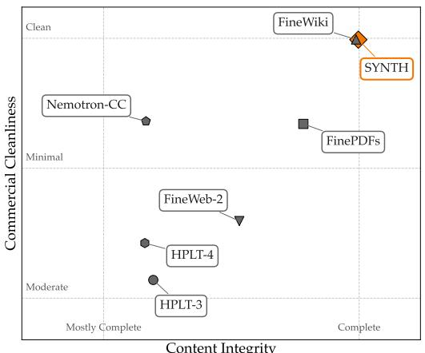

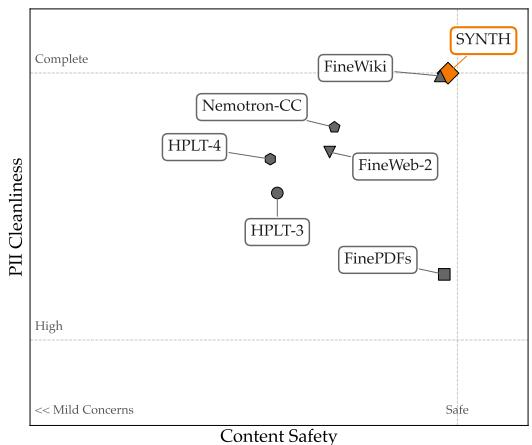  
Figure 6: Propella evaluation on safety and integrity axes.

We evaluate 100 English documents per corpus. The classifier reads 512 tokens, so we average its scores over up to four 512-token windows covering the first 2,048 tokens. SYNTH documents are scored in their pre-training format (query, reasoning, answer). Nemotron-CC is represented by the high-quality bucket of a public 1M-document sample.

Table 5: Educational value by an independent classifier (fineweb-edu-classifier, scale 0–5, higher is better), 100 English documents per corpus, with 95% CIs.
<table><tr><td>Corpus</td><td>Mean score</td></tr><tr><td>SYNTH</td><td>2.23 [2.10, 2.35]</td></tr><tr><td>Nemotron-CC</td><td>1.72 [1.56, 1.88]</td></tr><tr><td>FineWiki</td><td>1.64 [1.49, 1.79]</td></tr><tr><td>Common Corpus</td><td>1.49 [1.36, 1.62]</td></tr><tr><td>FinePDFs</td><td>1.34 [1.19, 1.49]</td></tr><tr><td>FineWeb</td><td>1.21 [1.09, 1.33]</td></tr></table>

SYNTH scores highest, and the ordering agrees with Propella-1’s educational-value ranking. FineWiki, the most encyclopedic corpus, is not favoured.

## F FActScore evaluation protocol

We evaluate factual precision by prompting models with “what do you know about [entity].” for entities sampled from SYNTH’s 52,183 Wikipedia seed articles. The model’s response (excluding any reasoning trace) is decomposed into atomic facts by a strong judge model (DeepSeek-V3, fp8), and each fact is verified against the corresponding Wikipedia source article

For example, for the entity Scipio Africanus:

1. Prompt: “What do you know about Scipio Africanus?”

2. Model output (content only, reasoning trace excluded): “Publius Cornelius Scipio Africanus Major was a Roman general and statesman who rose to prominence during the Second Punic War. . . ”

3. Atomic fact decomposition: ["Scipio Africanus was a Roman general", "Scipio Africanus was a Roman statesman", "Scipio Africanus lived from 236 to 183 BCE", ...]

4. Verification against source passage: each fact is classified as Supported, Contradicted, or Inconclusive by the judge model given the Wikipedia article text

5. FActScore = #Supported / #total atomic facts

Note that we evaluate the model’s content output only, not its internal reasoning trace. The number of atomic facts per response varies (typically 5–25); models that generate more specific claims are exposed to more verification opportunities. We report both the score and the average number of facts per response.

Statistics. Confidence intervals are computed by cluster bootstrap with 10,000 resamples over the n=500 entities (per-fact resampling would inflate effective sample size since facts are correlated within entity). Pairwise comparisons use the paired Wilcoxon signed-rank test on per-entity precision, dropping entities where either model has $S { \bar { + } } C { = } 0$

## G Held-out entity evaluation

This appendix details the held-out validation summarized in § 5.1.

Construction. We start from English Wikipedia Good Articles, which are long enough to verify atomic facts against, and remove all Vital articles (levels 1–5) and all seed articles. Removing Vital articles avoids topics adjacent to the seeds, and leaves 41,927 candidates with no seed overlap. From this pool we sample 600 entities, stratified to match the 500 in-seed entities on $\log _ { 1 0 }$ daily pageviews over 60 days (median 213 vs. 186) and on entity type (26% persons). The prompt and FActScore protocol are those of Appendix F, with the full article extract as reference. As a baseline, we use OLMoE-1B-7B-Instruct [Muennighoff et al., 2025], the web-trained MoE with the same active size in Table 1.

Abstention and metric. DeepSeek-V4-Pro labels each response as abstain or attempt. It agrees with a refusal regex on 90.5% of responses and gives the same aggregate rates; most disagreements are confabulations that contain a stray disclaimer. Abstaining responses still decompose into atomic claims, mostly meta-claims about the model’s own knowledge, which inflate $\mathrm { S } / ( \bar { \mathrm { S } } { + } \mathrm { C } )$ (Table 7). Table 6 therefore reports precision over attempted responses only. The in-seed and held-out tiers also differ in reference (seed passages vs. full articles) and judge version, but OLMoE’s stable precision (82.7% vs. 81.1%) indicates that this shift does not bias $\mathrm { S } / ( \mathrm { S } { + } \mathrm { C } )$

Table 6: Abstention and precision on held-out entities. Abstention rate (LLM judge) and S/(S+C) over attempted responses, with 95% CIs (Wilson for abstention; entity-level bootstrap, B=10,000, for precision). No title mention: held-out entities whose title never occurs in the SYNTH training text.
<table><tr><td>Model</td><td>Entities</td><td>n</td><td>Abstain (%)</td><td>S/(S+C), attempted (%)</td></tr><tr><td rowspan="3">BAGUETTOTRON-MoE</td><td>in-seed</td><td>500</td><td>19.8 [16.5, 23.5]</td><td>81.8 [79.5, 84.0]</td></tr><tr><td>held-out</td><td>600</td><td>66.8 [63.0, 70.5]</td><td>61.7 [56.2, 66.8]</td></tr><tr><td>no title mention</td><td>302</td><td>74.2 [69.0, 78.8]</td><td>55.2 [46.1, 63.9]</td></tr><tr><td rowspan="3">OLMoE-1B-7B-Instruct</td><td>in-seed</td><td>500</td><td>0.8 [0.3, 2.0]</td><td>82.7 [81.0, 84.4]</td></tr><tr><td>held-out</td><td>600</td><td>7.2 [5.4, 9.5]</td><td>81.1 [79.6, 82.6]</td></tr><tr><td>no title mention</td><td>302</td><td>11.9 [8.7, 16.1]</td><td>77.5 [75.0, 79.8]</td></tr></table>

Results. Outside its seeds, BAGUETTOTRON-MoE abstains on 67% of entities, against 20% in-seed, while OLMoE abstains on only 7% (Table 6). When our model does answer, its precision drops from 82% to 62%, so SYNTH gives faithful recall of its seeds rather than broader coverage. OLMoE keeps ∼81% precision, as web-scale pre-training covers many of these etities.

Leakage. Retrieval in SYNTH runs only over the seed articles, and the Good Articles were collected for this experiment only, so no held-out passage can reach the corpus. Titles can still appear incidentally, as Wikipedia is densely cross-referenced. We therefore scan the assembled training text of all 77,908,583 SYNTH rows with Aho–Corasick exact matching (case-sensitive, word-boundary filtered, patterns of at least 5 characters). Of the 600 titles, 298 occur at least once (279,016 occurrences, median 114 per matched entity) and 302 never do; adding MediaWiki redirect aliases raises the matched set to 360 (390,921 occurrences), leaving 240 clean. These counts overstate exposure: matches carry no facts, and the most frequent are generic strings (The 1: 87,597; 5,6,7,8: 16,655) or parts of other names (Mario Bros.). On the 302 title-clean entities, the abstention gap widens to 74% vs. 12% (Table 6), and to 76.7% vs. 14.6% on the 240 alias-clean ones. Both models abstain less on mentioned entities (BAGUETTOTRON-MoE 59%, OLMoE 2%), so mentions also track general familiarity.

Table 7: Atomic-fact counts on the 600 held-out entities, split by the judge’s abstain/attempt label. S, C, I: Supported, Contradicted, Inconclusive facts. 95% CIs by entity-level bootstrap (B=10,000).
<table><tr><td>Model</td><td>Responses</td><td>n</td><td>S</td><td>C</td><td>I</td><td>S/(S+C) (%)</td></tr><tr><td rowspan="3">BAGUETTOTRON-MoE</td><td>attempt</td><td>199</td><td>960</td><td>596</td><td>1,944</td><td>61.7 [56.2, 66.8]</td></tr><tr><td>abstain</td><td>401</td><td>1,988</td><td>299</td><td>2,429</td><td>86.9 [85.0, 88.7]</td></tr><tr><td>total</td><td>600</td><td>2,948</td><td>895</td><td>4,373</td><td>76.7 [74.0, 79.3]</td></tr><tr><td rowspan="3">OLMoE-1B-7B-Instruct</td><td>attempt</td><td>557</td><td>10,581</td><td>2,459</td><td>11,763</td><td>81.1 [79.6, 82.6]</td></tr><tr><td>abstain</td><td>43</td><td>401</td><td>87</td><td>559</td><td>82.2 [77.3, 86.5]</td></tr><tr><td>total</td><td>600</td><td>10,982</td><td>2,546</td><td>12,322</td><td>81.2 [79.7, 82.6]</td></tr></table>

## H Benchmark suite: full results

Models. Four SYNTH based models (56M, 350M, 600M dense, 13B/1B-active MoE) and four open small models in the 270M–600M parameter range: Gemma-3-270M, SmolLM2-360M, LFM2.5- 350M, Qwen3-0.6B. Baselines see 2–36T tokens of curated web data; BAGUETTOTRON sees 50–200B tokens of SYNTH.

Benchmarks. 22 multiple-choice tasks (MMLU, ARC-Easy, ARC-Challenge, plus vertical benchmarks spanning medicine, science, finance, cyber, geography and engineering) and 8 open-ended QA tasks (closed-book recall, reading comprehension, calibration). The full list is given on the y-axes of Figure 8 and Figure 9. Multilingual benchmarks are evaluated over all available language splits, not English alone, with per-task scores averaged across splits; this exercises the non-English capabilities induced by SYNTH’s multilingual generation (Figure 2b).

Table 8: Pre-training data ablation at 600M. Identical architecture, tokenizer, and training steps. Only the SYNTH model is evaluated without post-training. w/o MMLU: 21-task average, since the MMLU training split is in the web models’ post-training mix.
<table><tr><td>Pre-training data</td><td>Post-training</td><td>MCQ (22)</td><td>MCQ w/o MMLU (21)</td><td>Open-ended (8)</td></tr><tr><td>FineWiki</td><td>SmolTalk + MMLU-aux</td><td>26.1</td><td>26.2</td><td>10.2</td></tr><tr><td>FinePDFs-Edu</td><td>SmolTalk + MMLU-aux</td><td>25.1</td><td>25.1</td><td>13.5</td></tr><tr><td>SYNTH</td><td>none</td><td>42.2</td><td>42.2</td><td>24.3</td></tr></table>

Table 9: Reasoning-trace ablation. BAGUETTOTRON-600M trained on SYNTH with and without reasoning traces (§ 4.2), grouped by capability. Matched on tokens, optimizer steps, unique examples, and seed; one run each.
<table><tr><td>Group</td><td>Benchmark</td><td>With traces</td><td>Without</td><td>∆</td></tr><tr><td rowspan="5">Factual recall</td><td>NQ-Open</td><td>17.7</td><td>16.6</td><td>+1.1</td></tr><tr><td>PopQA</td><td>10.0</td><td>9.8</td><td>+0.2</td></tr><tr><td>TriviaQA</td><td>24.0</td><td>25.3</td><td>-1.3</td></tr><tr><td>WikiFact</td><td>14.3</td><td>10.9</td><td>+3.4</td></tr><tr><td>SimpleQA</td><td>1.9</td><td>2.7</td><td>-0.8</td></tr><tr><td>Truthfulness</td><td>TruthfulQA</td><td>42.6</td><td>33.5</td><td>+9.1</td></tr><tr><td>Domain reasoning</td><td>NuclearQA</td><td>45.0</td><td>35.0</td><td>+10.0</td></tr><tr><td>Context-grounded reasoning</td><td>ConflictQA</td><td>38.5</td><td>42.4</td><td>-3.9</td></tr><tr><td colspan="2">Open-ended overall (8) Multiple-choice overall (22)</td><td>24.3 42.2</td><td>22.0 41.8</td><td>+2.3 +0.4</td></tr></table>

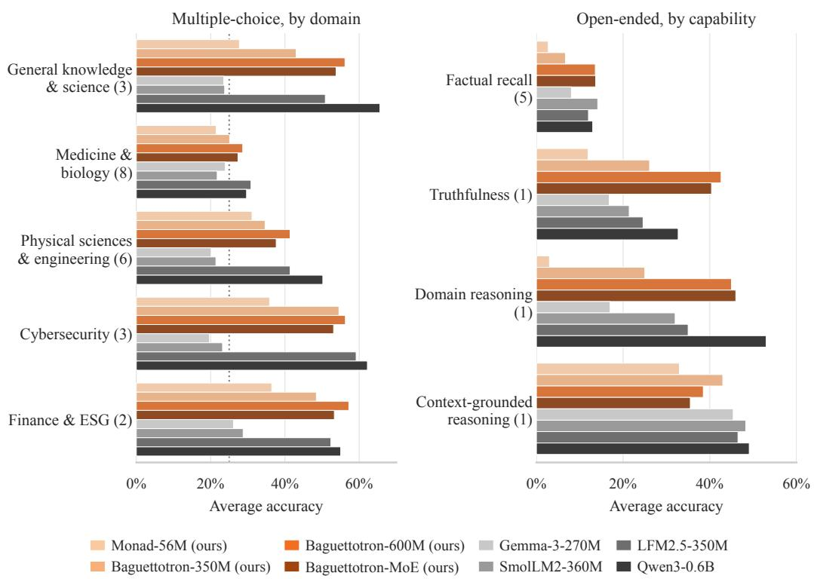  
Figure 7: Average accuracy per grouped capability. Multiple-choice tasks are grouped by knowledge domain, open-ended tasks by the capability they probe; the number of tasks per group is in parentheses. Dotted line: 4-way random baseline.

Protocol. All evaluations are zero-shot and served with vLLM. Every model is run with chatmlformat chat templating (GEMMA uses its native <start\_of\_turn> markers): the user turn carries the question and the lettered choices for MCQ, generation begins after <|im\_start|>assistant.

PLEIAS models (BAGUETTOTRON-300M, BALANCED-600M, MOE, MONAD) are SYNTH-trained thinking models, evaluated without a system prompt and with <think>\n seeded immediately after the assistant role marker, matching their training distribution. Instruction-tuned baselines (QWEN3- 0.6B, LFM2-350M, GEMMA-3-270M-IT, SMOLLM2-360M) instead receive a short instruction system prompt : “Answer the multiple choice question by reasoning step by step, then give your final answer as a single letter (A, B, C, or D).” for MCQ, and “Answer the question concisely and accurately.” for open-ended. QWEN3, itself a thinking model, additionally has <think>\n seeded for both tasks.

For thinking models, the <think>...</think> trace is stripped before scoring. Generation uses temperature 0.1. MCQ benchmarks with more than 1000 questions are subsampled to 1000, picked with seed 42. MCQ answers are extracted by a multi-level regex cascade (letter at the start of the answer, “Answer: X” patterns, line-leading letter, choice-text match, and a last-resort standalone capital) and scored as letter-vs-gold. Open-ended answers are graded with a LLM-as-judge approach using QWEN3-30B-A3B, classifying each response as CORRECT, INCORRECT, NOT\_ATTEMPTED, or UNPARSEABLE; reported accuracy is the fraction of CORRECT verdicts.

## I Tool calling results

Table 10: Tool calling on BFCL v2. Micro: accuracy over all items; macro: mean over categories. The base model emits no tool calls and scores only on the irrelevance categories.
<table><tr><td>Model</td><td>Training tokens</td><td>Micro</td><td>Macro</td></tr><tr><td>BAGUETTOTRON-600M + tool calling</td><td> $1 5 8 \mathrm { B } + 1 . 5 \mathrm { B }$ </td><td>53.1</td><td>53.1</td></tr><tr><td>BAGUETTOTRON-350M + tool calling</td><td> $2 0 0 \mathrm { B } + 1 . 5 \mathrm { B }$ </td><td>47.7</td><td>46.9</td></tr><tr><td>FunctionGemma-270M [Google DeepMind, 2025]</td><td>6T</td><td>49.2</td><td>45.3</td></tr><tr><td>BAGUETTOTRON-600M (base)</td><td>158B</td><td>28.0</td><td>11.1</td></tr></table>

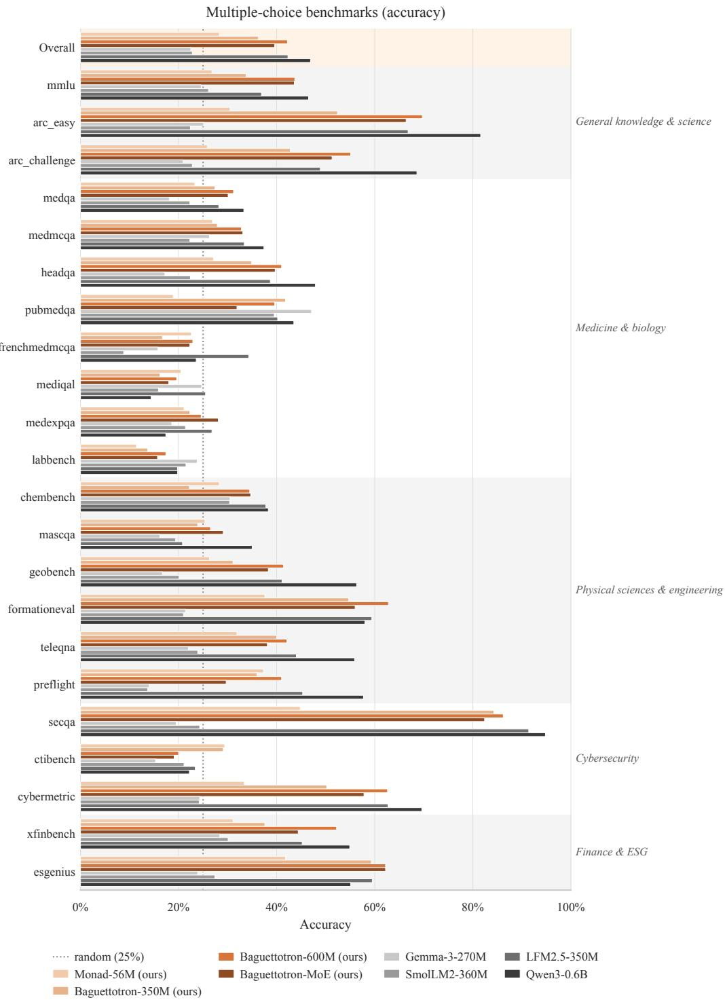  
Figure 8: Per-benchmark accuracy on the 22 multiple-choice tasks. Dotted line: 4-way random baseline. The Overall row (highlighted) is the simple average across the 22 tasks. Tasks are ordered by knowledge domain (right margin).

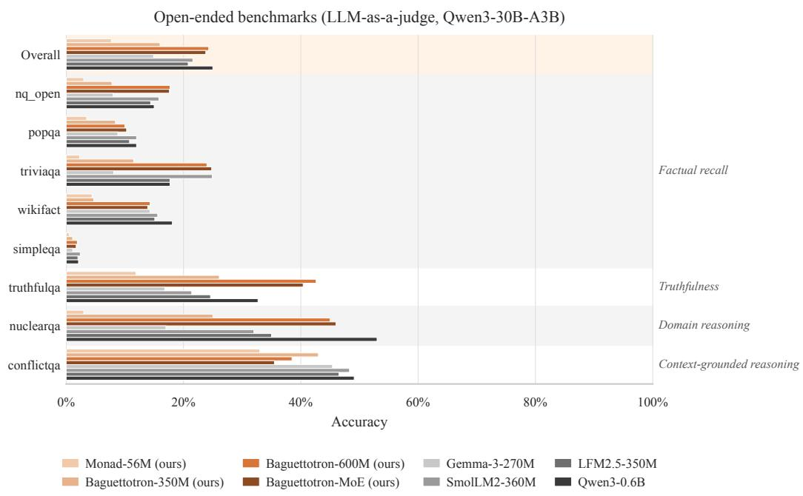  
Figure 9: Per-benchmark CORRECT answers on the 8 open-ended tasks. Tasks are ordered by capability group (right margin).

## NeurIPS Paper Checklist

## 1. Claims

Question: Do the main claims made in the abstract and introduction accurately reflect the paper’s contributions and scope?

Answer: [Yes]

Justification: Each of our contributions has a reference to the section/subsection discussing the claims, and the same claims are made in the abstract.

Guidelines:

• The answer [N/A] means that the abstract and introduction do not include the claims made in the paper.

• The abstract and/or introduction should clearly state the claims made, including the contributions made in the paper and important assumptions and limitations. A [No] or [N/A] answer to this question will not be perceived well by the reviewers.

• The claims made should match theoretical and experimental results, and reflect how much the results can be expected to generalize to other settings.

• It is fine to include aspirational goals as motivation as long as it is clear that these goals are not attained by the paper.

## 2. Limitations

Question: Does the paper discuss the limitations of the work performed by the authors?

Answer: [Yes]

Justification: See section Limitations and future work

Guidelines:

• The answer [N/A] means that the paper has no limitation while the answer [No] means that the paper has limitations, but those are not discussed in the paper.

• The authors are encouraged to create a separate “Limitations” section in their paper.

• The paper should point out any strong assumptions and how robust the results are to violations of these assumptions (e.g., independence assumptions, noiseless settings, model well-specification, asymptotic approximations only holding locally). The authors should reflect on how these assumptions might be violated in practice and what the implications would be.

• The authors should reflect on the scope of the claims made, e.g., if the approach was only tested on a few datasets or with a few runs. In general, empirical results often depend on implicit assumptions, which should be articulated.

• The authors should reflect on the factors that influence the performance of the approach. For example, a facial recognition algorithm may perform poorly when image resolution is low or images are taken in low lighting. Or a speech-to-text system might not be used reliably to provide closed captions for online lectures because it fails to handle technical jargon.

• The authors should discuss the computational efficiency of the proposed algorithms and how they scale with dataset size.

• If applicable, the authors should discuss possible limitations of their approach to address problems of privacy and fairness.

• While the authors might fear that complete honesty about limitations might be used by reviewers as grounds for rejection, a worse outcome might be that reviewers discover limitations that aren’t acknowledged in the paper. The authors should use their best judgment and recognize that individual actions in favor of transparency play an important role in developing norms that preserve the integrity of the community. Reviewers will be specifically instructed to not penalize honesty concerning limitations.

## 3. Theory assumptions and proofs

Question: For each theoretical result, does the paper provide the full set of assumptions and a complete (and correct) proof?

Answer: [N/A]

Justification: No theoretical proofs, all empirical results.

## Guidelines:

• The answer [N/A] means that the paper does not include theoretical results.

• All the theorems, formulas, and proofs in the paper should be numbered and crossreferenced.

• All assumptions should be clearly stated or referenced in the statement of any theorems.

• The proofs can either appear in the main paper or the supplemental material, but if they appear in the supplemental material, the authors are encouraged to provide a short proof sketch to provide intuition.

• Inversely, any informal proof provided in the core of the paper should be complemented by formal proofs provided in appendix or supplemental material.

• Theorems and Lemmas that the proof relies upon should be properly referenced.

## 4. Experimental result reproducibility

Question: Does the paper fully disclose all the information needed to reproduce the main experimental results of the paper to the extent that it affects the main claims and/or conclusions of the paper (regardless of whether the code and data are provided or not)?

Answer: [Yes]

Justification: While the manuscript should be enough to reproduce our results, we released models and the Synth dataset to aid reproductions.

Guidelines:

• The answer [N/A] means that the paper does not include experiments.

• If the paper includes experiments, a [No] answer to this question will not be perceived well by the reviewers: Making the paper reproducible is important, regardless of whether the code and data are provided or not.

• If the contribution is a dataset and/or model, the authors should describe the steps taken to make their results reproducible or verifiable.

• Depending on the contribution, reproducibility can be accomplished in various ways. For example, if the contribution is a novel architecture, describing the architecture fully might suffice, or if the contribution is a specific model and empirical evaluation, it may be necessary to either make it possible for others to replicate the model with the same dataset, or provide access to the model. In general. releasing code and data is often one good way to accomplish this, but reproducibility can also be provided via detailed instructions for how to replicate the results, access to a hosted model (e.g., in the case of a large language model), releasing of a model checkpoint, or other means that are appropriate to the research performed.

• While NeurIPS does not require releasing code, the conference does require all submissions to provide some reasonable avenue for reproducibility, which may depend on the nature of the contribution. For example

(a) If the contribution is primarily a new algorithm, the paper should make it clear how to reproduce that algorithm.

(b) If the contribution is primarily a new model architecture, the paper should describe the architecture clearly and fully.

(c) If the contribution is a new model (e.g., a large language model), then there should either be a way to access this model for reproducing the results or a way to reproduce the model (e.g., with an open-source dataset or instructions for how to construct the dataset).

(d) We recognize that reproducibility may be tricky in some cases, in which case authors are welcome to describe the particular way they provide for reproducibility. In the case of closed-source models, it may be that access to the model is limited in some way (e.g., to registered users), but it should be possible for other researchers to have some path to reproducing or verifying the results.

## 5. Open access to data and code

Question: Does the paper provide open access to the data and code, with sufficient instructions to faithfully reproduce the main experimental results, as described in supplemental material?

## Answer: [Yes]

Justification: The supplementary material includes a 5,000-row sample of SYNTH and the FActScore evaluation code. Anonymized BAGUETTOTRON-350M weights are hosted at https://anonymous-hf.up.railway.app/a/3e0gcxurz29r/. The full SYNTH corpus (CC BY 4.0) and the remaining BAGUETTOTRON models (Apache-2.0) will be released with the camera-ready version. Training and data-generation code is not released; the dataset construction (§ 3, Appendix A), training configurations (Appendix B), and evaluation protocol (Appendix F, Appendix H) are documented in the paper at a level sufficient for re-implementation.

## Guidelines:

• The answer [N/A] means that paper does not include experiments requiring code.

• Please see the NeurIPS code and data submission guidelines (https://neurips.cc/ public/guides/CodeSubmissionPolicy) for more details.

• While we encourage the release of code and data, we understand that this might not be possible, so [No] is an acceptable answer. Papers cannot be rejected simply for not including code, unless this is central to the contribution (e.g., for a new open-source benchmark).

• The instructions should contain the exact command and environment needed to run to reproduce the results. See the NeurIPS code and data submission guidelines (https: //neurips.cc/public/guides/CodeSubmissionPolicy) for more details.

• The authors should provide instructions on data access and preparation, including how to access the raw data, preprocessed data, intermediate data, and generated data, etc.

• The authors should provide scripts to reproduce all experimental results for the new proposed method and baselines. If only a subset of experiments are reproducible, they should state which ones are omitted from the script and why.

• At submission time, to preserve anonymity, the authors should release anonymized versions (if applicable).

• Providing as much information as possible in supplemental material (appended to the paper) is recommended, but including URLs to data and code is permitted.

## 6. Experimental setting/details

Question: Does the paper specify all the training and test details (e.g., data splits, hyperparameters, how they were chosen, type of optimizer) necessary to understand the results?

Answer: [Yes]

Justification: Pre-training hyperparameters (optimizer, schedule, batch size, sequence length, steps, token budget) are reported per model in Appendix B; evaluation prompts, sampling parameters, and scoring are in Appendix H and Appendix F.

Guidelines:

• The answer [N/A] means that the paper does not include experiments.

• The experimental setting should be presented in the core of the paper to a level of detail that is necessary to appreciate the results and make sense of them.

• The full details can be provided either with the code, in appendix, or as supplemental material.

## 7. Experiment statistical significance

Question: Does the paper report error bars suitably and correctly defined or other appropriate information about the statistical significance of the experiments?

Answer: [Yes]

Justification: FActScore comparisons (§ 5) report cluster-bootstrap confidence intervals over 10,000 resamples and paired Wilcoxon signed-rank tests on per-entity precision (Appendix F). Pre-training and benchmark accuracies are reported as single runs; repeating full pre-training across seeds is computationally infeasible at this scale, and we instead report token-budget trajectories and per-benchmark variance across 26 MCQ tasks (Appendix H).

Guidelines:

• The answer [N/A] means that the paper does not include experiments.

• The authors should answer [Yes] if the results are accompanied by error bars, confidence intervals, or statistical significance tests, at least for the experiments that support the main claims of the paper.

• The factors of variability that the error bars are capturing should be clearly stated (for example, train/test split, initialization, random drawing of some parameter, or overall run with given experimental conditions).

• The method for calculating the error bars should be explained (closed form formula, call to a library function, bootstrap, etc.)

• The assumptions made should be given (e.g., Normally distributed errors).

• It should be clear whether the error bar is the standard deviation or the standard error of the mean.

• It is OK to report 1-sigma error bars, but one should state it. The authors should preferably report a 2-sigma error bar than state that they have a 96% CI, if the hypothesis of Normality of errors is not verified.

• For asymmetric distributions, the authors should be careful not to show in tables or figures symmetric error bars that would yield results that are out of range (e.g., negative error rates).

• If error bars are reported in tables or plots, the authors should explain in the text how they were calculated and reference the corresponding figures or tables in the text.

## 8. Experiments compute resources

Question: For each experiment, does the paper provide sufficient information on the computer resources (type of compute workers, memory, time of execution) needed to reproduce the experiments?

Answer: [Yes]

Justification: Hardware (16×H100 GPUs per run), wall-clock time, MFU, and token budgets are reported per model in Appendix B. Generator fine-tuning was performed on a single H100. The architecture-ablation sweep used the same 16×H100 setup over 10B tokens per configuration.

Guidelines:

• The answer [N/A] means that the paper does not include experiments.

• The paper should indicate the type of compute workers CPU or GPU, internal cluster, or cloud provider, including relevant memory and storage.

• The paper should provide the amount of compute required for each of the individual experimental runs as well as estimate the total compute.

• The paper should disclose whether the full research project required more compute than the experiments reported in the paper (e.g., preliminary or failed experiments that didn’t make it into the paper).

## 9. Code of ethics

Question: Does the research conducted in the paper conform, in every respect, with the NeurIPS Code of Ethics https://neurips.cc/public/EthicsGuidelines?

Answer: [Yes]

Justification: The research conforms with the NeurIPS Code of Ethics. No human subjects are involved, all source data (Wikipedia, Wikibooks, Common Corpus) is used under permissive licenses, and released artifacts are shared under permissive licenses (SYNTH: CC BY 4.0; BAGUETTOTRON: Apache-2.0).

Guidelines:

• The answer [N/A] means that the authors have not reviewed the NeurIPS Code of Ethics.

• If the authors answer [No], they should explain the special circumstances that require a deviation from the Code of Ethics.

• The authors should make sure to preserve anonymity (e.g., if there is a special consideration due to laws or regulations in their jurisdiction).

## 10. Broader impacts

Question: Does the paper discuss both potential positive societal impacts and negative societal impacts of the work performed?

Answer: [Yes]

Justification: Positive impacts are discussed throughout: substantially lower training-token and compute requirements (§ 4) lower the barrier to training open small models, and the released SYNTH corpus enables a fully open and reproducible pre-training pipeline that does not depend on web-scraped data of uncertain provenance. We do not discuss negative societal impacts in detail because the released models are small (≤ 1.05B active parameters) with limited generative capabilities relative to frontier systems, and the dataset is grounded in publicly licensed encyclopedic sources.

Guidelines:

• The answer [N/A] means that there is no societal impact of the work performed.

• If the authors answer [N/A] or [No], they should explain why their work has no societal impact or why the paper does not address societal impact.

• Examples of negative societal impacts include potential malicious or unintended uses (e.g., disinformation, generating fake profiles, surveillance), fairness considerations (e.g., deployment of technologies that could make decisions that unfairly impact specific groups), privacy considerations, and security considerations.

• The conference expects that many papers will be foundational research and not tied to particular applications, let alone deployments. However, if there is a direct path to any negative applications, the authors should point it out. For example, it is legitimate to point out that an improvement in the quality of generative models could be used to generate Deepfakes for disinformation. On the other hand, it is not needed to point out that a generic algorithm for optimizing neural networks could enable people to train models that generate Deepfakes faster.

• The authors should consider possible harms that could arise when the technology is being used as intended and functioning correctly, harms that could arise when the technology is being used as intended but gives incorrect results, and harms following from (intentional or unintentional) misuse of the technology.

• If there are negative societal impacts, the authors could also discuss possible mitigation strategies (e.g., gated release of models, providing defenses in addition to attacks, mechanisms for monitoring misuse, mechanisms to monitor how a system learns from feedback over time, improving the efficiency and accessibility of ML).

## 11. Safeguards

Question: Does the paper describe safeguards that have been put in place for responsible release of data or models that have a high risk for misuse (e.g., pre-trained language models, image generators, or scraped datasets)?

Answer: [N/A]

Justification: The released models are small (≤ 1.05B active parameters) and the training corpus is grounded in publicly licensed encyclopedic sources rather than web scrape, so the released artifacts pose limited dual-use risk. SYNTH’s third-party integrity/safety scores (Appendix D) place it at the top of the open-corpus distribution alongside Wikipedia-derived data.

Guidelines:

• The answer [N/A] means that the paper poses no such risks.

• Released models that have a high risk for misuse or dual-use should be released with necessary safeguards to allow for controlled use of the model, for example by requiring that users adhere to usage guidelines or restrictions to access the model or implementing safety filters.

• Datasets that have been scraped from the Internet could pose safety risks. The authors should describe how they avoided releasing unsafe images.

• We recognize that providing effective safeguards is challenging, and many papers do not require this, but we encourage authors to take this into account and make a best faith effort.

## 12. Licenses for existing assets

Question: Are the creators or original owners of assets (e.g., code, data, models), used in the paper, properly credited and are the license and terms of use explicitly mentioned and properly respected?

## Answer: [Yes]

Justification: All third-party datasets, models, and tools used in the paper are cited at first use. Seed sources are Wikipedia and Wikibooks (CC BY-SA 4.0) and Common Corpus [Langlais et al., 2026] for tokenizers; baseline corpora referenced in the data-quality comparison (Nemotron-CC, FinePDFs, FineWeb-2, FineWiki, HPLT-4) are cited with their original references. Generator base models include Gemma-3-PT (Gemma Terms of Use) and Qwen3 (Apache-2.0); the bge-m3 retriever (MIT) and torchtitan/Nanotron training stacks are also cited. All assets are used in compliance with their respective licenses.

## Guidelines:

• The answer [N/A] means that the paper does not use existing assets.

• The authors should cite the original paper that produced the code package or dataset.

• The authors should state which version of the asset is used and, if possible, include a URL.

• The name of the license (e.g., CC-BY 4.0) should be included for each asset.

• For scraped data from a particular source (e.g., website), the copyright and terms of service of that source should be provided.

• If assets are released, the license, copyright information, and terms of use in the package should be provided. For popular datasets, paperswithcode.com/datasets has curated licenses for some datasets. Their licensing guide can help determine the license of a dataset.

• For existing datasets that are re-packaged, both the original license and the license of the derived asset (if it has changed) should be provided.

• If this information is not available online, the authors are encouraged to reach out to the asset’s creators.

## 13. New assets

Question: Are new assets introduced in the paper well documented and is the documentation provided alongside the assets?

Answer: [Yes]

Justification: We release the SYNTH dataset under CC BY 4.0 and the BAGUETTOTRON model suite (MONAD-56M, BAGUETTOTRON-350M/600M, and BAGUETTOTRON-MoE) un der Apache-2.0. For anonymous review, the supplementary zip contains a 5,000-row SYNTH sample and the FActScore evaluation code, and BAGUETTOTRON-350M is hosted anonymously at https://anonymous-hf.up.railway.app/a/3e0gcxurz29r/. Dataset construction, languages, task mix, and constraint priors are documented in § 3 and Appendix A; per-model architectures, tokenizers, and training recipes in § 4 and Appendix B. Each released artifact will ship with a model/dataset card at the camera-ready stage.

Guidelines:

• The answer [N/A] means that the paper does not release new assets.

• Researchers should communicate the details of the dataset/code/model as part of their submissions via structured templates. This includes details about training, license, limitations, etc.

• The paper should discuss whether and how consent was obtained from people whose asset is used.

• At submission time, remember to anonymize your assets (if applicable). You can either create an anonymized URL or include an anonymized zip file.

## 14. Crowdsourcing and research with human subjects

Question: For crowdsourcing experiments and research with human subjects, does the paper include the full text of instructions given to participants and screenshots, if applicable, as well as details about compensation (if any)?

Answer: [N/A]

Justification: The paper does not involve crowdsourcing or research with human subjects. Guidelines:

• The answer [N/A] means that the paper does not involve crowdsourcing nor research with human subjects.

• Including this information in the supplemental material is fine, but if the main contribution of the paper involves human subjects, then as much detail as possible should be included in the main paper.

• According to the NeurIPS Code of Ethics, workers involved in data collection, curation, or other labor should be paid at least the minimum wage in the country of the data collector.

## 15. Institutional review board (IRB) approvals or equivalent for research with human subjects

Question: Does the paper describe potential risks incurred by study participants, whether such risks were disclosed to the subjects, and whether Institutional Review Board (IRB) approvals (or an equivalent approval/review based on the requirements of your country or institution) were obtained?

Answer: [N/A]

Justification: The paper does not involve crowdsourcing or research with human subjects. Guidelines:

• The answer [N/A] means that the paper does not involve crowdsourcing nor research with human subjects.

• Depending on the country in which research is conducted, IRB approval (or equivalent) may be required for any human subjects research. If you obtained IRB approval, you should clearly state this in the paper.

• We recognize that the procedures for this may vary significantly between institutions and locations, and we expect authors to adhere to the NeurIPS Code of Ethics and the guidelines for their institution.

• For initial submissions, do not include any information that would break anonymity (if applicable), such as the institution conducting the review.

## 16. Declaration of LLM usage

Question: Does the paper describe the usage of LLMs if it is an important, original, or non-standard component of the core methods in this research? Note that if the LLM is used only for writing, editing, or formatting purposes and does not impact the core methodology, scientific rigor, or originality of the research, declaration is not required.

Answer: [Yes]

Justification: Used for LLM-as-a-Judge in § 5, used for synthetic data generation in § 3 Guidelines:

• The answer [N/A] means that the core method development in this research does not involve LLMs as any important, original, or non-standard components.

• Please refer to our LLM policy in the NeurIPS handbook for what should or should not be described.