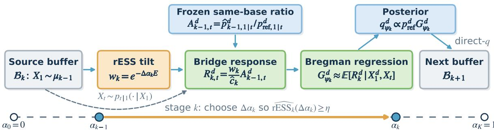
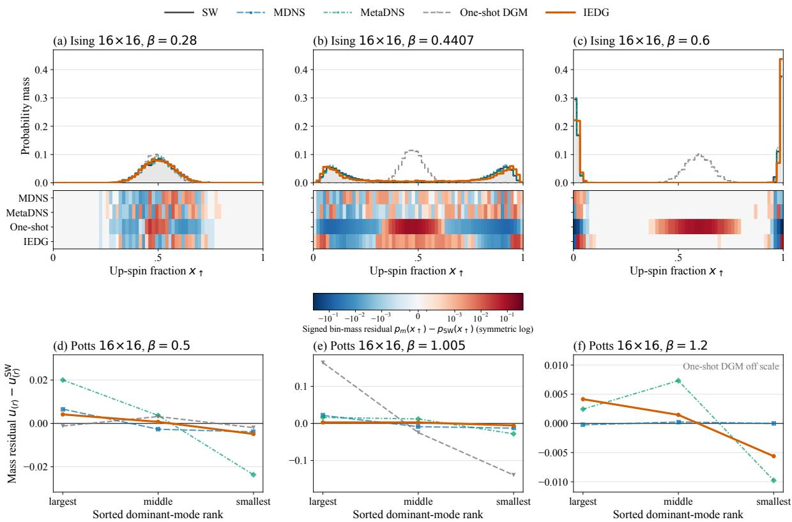
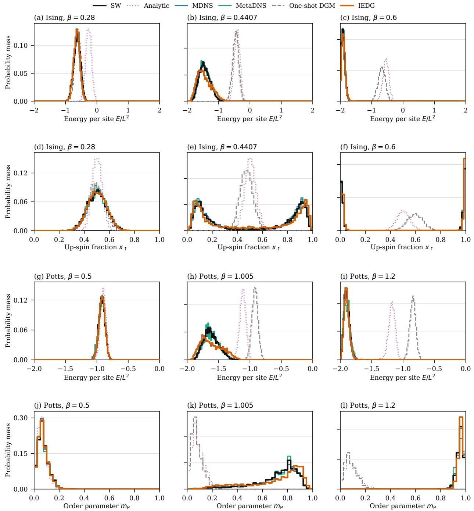
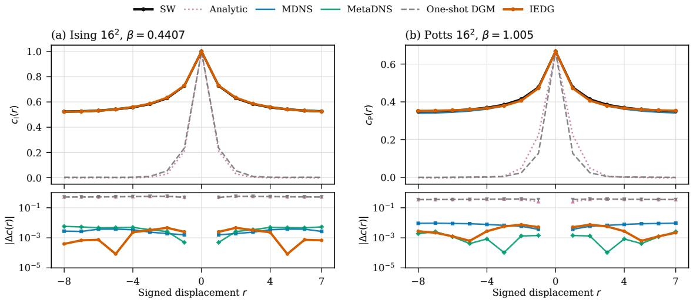
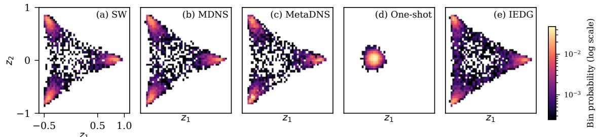
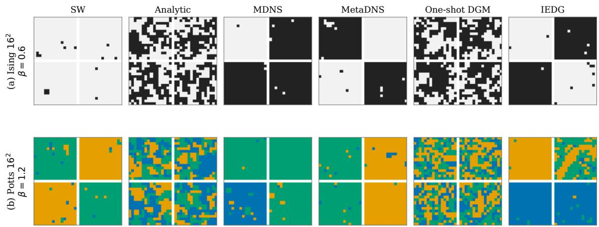

# Iterative Exact Discrete Guidance for Energy-Based Sampling

Yuwen Qian<sup>1</sup>, Yidong Ouyang<sup>2</sup>, Zhengyan Wan<sup>2</sup>, and Hongyuan Zha<sup>3,\*</sup>

<sup>1</sup>School of Science and Engineering, The Chinese University of Hong Kong, Shenzhen <sup>2</sup>Department of Statistics, University of California, Los Angeles <sup>3</sup>School of Data Science, The Chinese University of Hong Kong, Shenzhen <sup>\*</sup>Corresponding author

## Abstract

Sampling from unnormalized distributions over large discrete state spaces becomes dificult when a multimodal target is far from a tractable reference. We introduce Iterative Exact Discrete Guidance (IEDG), a population-exact, trajectory-wise guidance framework for unnormalized discrete targets. Rather than learn the full reference-to-target correction in one step, IEDG introduces a global Boltzmann tilt along an annealing trajectory. Each stage learns a stage-local posterior correction for an incremental Boltzmann tilt of the current source, while the resulting corrections are accumulated relative to a fixed analytic posterior. At the population optimum, exact stage posteriors recover the correct reverse dynamics, whose exact simulation reproduces the target distribution.

IEDG chooses stage increments by relative efective sample size (rESS), which controls R´enyi-2 displacement and locally adapts the step size to the thermodynamic geometry of the annealing path. Our stagewise total-variation analysis shows that limited overlap amplifies Bregman fitting error by 1/ rESS, while posterior, simulation, and truncation errors enter additively. IEDG improves all distribution-level errors over the neural baselines on ordered, exactly enumerated Ising 4 × 4, while substantially reducing one-shot errors on Ising/Potts 16 × 16 across thermodynamic regimes and attaining the best neural-sampler result on several reported local-statistic and phase-coverage metrics. On Max-Cut, its best-of-512 and averagesample ratios exceed all the baselines. Code and artifacts are available at https://github.com/ StillFantasy123/iterative-exact-discrete-guidance.

## 1 Introduction

Many problems in statistical physics, probabilistic inference, and combinatorial optimization specify a target only through an unnormalized energy, $\pi ( x ) \propto \pi _ { \mathrm { r e f } } ( x ) e ^ { - E ( x ) }$ . Unlike energy minimization, sampling must reproduce how probability mass is distributed across configurations, including uncertainty, coexisting phases, and diverse near-optimal solutions.

Discrete difusion and flow models amortize transport from a simple reference by learning reverse rates or endpoint posteriors (Austin et al., 2021; Sun et al., 2023; Campbell et al., 2024; Lou et al., 2024). Recent neural samplers train them directly from unnormalized energies (Ou et al., 2025; Zhu et al., 2025). A recurring obstacle is the global source-to-target tilt: poor overlap concentrates its density ratio on rare source states, destabilizing learning and mode coverage. Progressive methods replace this global transport with a sequence of easier problems (Guo et al., 2026a).

Discrete Guidance Matching (DGM) shows that an endpoint reweighting can be converted into an exact correction of a discrete flow’s denoising posterior (Wan et al., 2026). Specifically, the target posterior is obtained by reweighting with a conditional expectation of the terminal density ratio under the source process. However, when applied directly to energy-based sampling, it must learn the entire reference-to-target correction and becomes dificult under poor overlap.

We introduce Iterative Exact Discrete Guidance (IEDG), a trajectory-wise extension of guidance matching. We first build a global Boltzmann tilt along an annealing trajectory. At each stage, IEDG learns a mild energy correction from the current sampler and rewrites the updated posterior relative to the original analytic reference. This construction folds all previous corrections into one guide, so terminal inference does not replay the annealing chain. Ideally, each stage uses its source’s exact posterior, so the stagewise Bayes updates compose exactly; Section 5 bounds the error from instead using the previous learned posterior, together with fitting, simulation, and truncation errors.

IEDG chooses each annealing increment by relative efective sample size (rESS), taking shorter steps when the current source overlaps poorly with the next target. The same overlap also controls stability: for the same error in learning a stagewise guidance correction, the resulting sampling error scales as 1/ rESS. Thus rESS links path design directly to the propagation of learning error, and our stagewise stability recursion carries these local errors toward the terminal distribution.

## Contributions. Our main contributions are:

• We introduce IEDG, a trajectory-wise guidance framework that replaces a dificult one-shot DGM correction with a sequence of variance-controlled local tilts, each applied as a posterior correction relative to the current source. Its ideal population updates compose exactly, while terminal inference retains only one accumulated guide.

• We develop an ESS-controlled annealing path. Population rESS defines a finite-step R´enyi-2 trust region, locally recovers equal thermodynamic-length increments and quantifies how limited overlap amplifies stagewise Bregman fitting error in multistage total-variation.

• Across exact-distribution recovery, lattice sampling, and graph optimization, IEDG substantially improves one-shot guidance on enumerated Ising 4 × 4 and Max-Cut, while remaining competitive across magnetization, correlation, and phase-coverage metrics on Ising and Potts 16 × 16, with improvements on several local-statistic and phase-coverage metrics.

## 2 Related Work

Discrete difusion, flow, and guidance. Discrete difusion learns reverse kernels, rates, or density ratios, while Discrete Flow Matching marginalizes endpoint-conditional rates using a learned posterior (Austin et al., 2021; Sun et al., 2023; Lou et al., 2024; Campbell et al., 2024; Gat et al., 2024). Guidance can instead reweight discrete reverse dynamics through classifiers or CTMC rate corrections (Schif et al., 2025; Nisonof et al., 2025). Our closest foundation is DGM, whose Bayes identity gives an exact posterior correction from a terminal density ratio (Wan et al., 2026).

Neural samplers for unnormalized discrete targets. Existing methods use variational objectives, path-space importance weights, Kolmogorov residuals, or stochastic optimal control (Wu et al., 2019; Sanokowski et al., 2025; Holderrieth et al., 2025; Ou et al., 2025; Zhu et al., 2025; Du et al., 2026; Guo et al., 2026b). IEDG instead learns conditional incremental tilts and accumulates them relative to a fixed analytic posterior base.

Progressive transport. AIS and SMC bridge targets by reweighting and Markov transitions, with ESS-based temperature adaptation being well established (Neal, 2001; Del Moral et al., 2006; Zhou et al., 2016). Learned variants fit annealed maps or proximal path-space updates (Arbel et al., 2021; Matthews et al., 2022; Guo et al., 2026a). IEDG uses stages to construct posterior corrections rather than a composition of transport maps; terminal sampling evaluates one accumulated guide. Appendix B gives detailed comparisons.

## 3 Preliminaries

## 3.1 Discrete energy-based sampling

Let S be a finite alphabet and $\mathcal { X } = \mathcal { S } ^ { D }$ . For any distribution P on $\mathcal { X }$ and positive weight function $w : \mathcal { X } \to ( 0 , \infty )$ , define the normalized tilt of P by

$$
{ \mathcal { T } } _ { w } ( P ) ( x ) : = { \frac { P ( x ) w ( x ) } { \sum _ { x ^ { \prime } \in { \mathcal { X } } } P ( x ^ { \prime } ) w ( x ^ { \prime } ) } } .
$$

Given a tractable reference distribution $\pi _ { \mathrm { r e f } }$ and an energy function $E : \mathcal { X }  \mathbb { R }$ , our goal is to sample from the energy-tilted distribution

$$
\pi ( x ) = \frac { \pi _ { \mathrm { r e f } } ( x ) \exp \{ - E ( x ) \} } { \sum _ { x ^ { \prime } \in \mathcal { X } } \pi _ { \mathrm { r e f } } ( x ^ { \prime } ) \exp \{ - E ( x ^ { \prime } ) \} } .
$$

Thus $\pi = { \mathcal { T } } _ { \mathrm { e x p } \{ - E \} } ( \pi _ { \mathrm { r e f } } )$ . We assume access to samples from $\pi _ { \mathrm { r e f } }$ and pointwise evaluations of $E _ { \mathrm { { i } } }$ but neither samples from π nor its partition function. We write $x ^ { d }$ for coordinate d of x. In our experiments, $\nu = \operatorname { U n i f } ( S )$ and $\pi _ { \mathrm { r e f } } = \nu ^ { \otimes D }$ , where $\nu ^ { \otimes D }$ denotes the D-fold product distribution.

## 3.2 Discrete flow models

Following discrete flow matching (Campbell et al., 2024; Wan et al., 2026), let $q _ { 1 }$ be a terminal distribution and let $q _ { t \mid 1 } ( x _ { t } \mid x _ { 1 } )$ be a conditional probability path from a noise law $q _ { 0 }$ at $t = 0$ to the endpoint $x _ { 1 }$ at $t = 1$ . Its marginal and posterior are

$$
q _ { t } ( x _ { t } ) = \sum _ { x _ { 1 } \in \mathcal { X } } q _ { t | 1 } ( x _ { t } \mid x _ { 1 } ) q _ { 1 } ( x _ { 1 } ) , \qquad q _ { 1 | t } ( x _ { 1 } \mid x _ { t } ) = \frac { q _ { t | 1 } ( x _ { t } \mid x _ { 1 } ) q _ { 1 } ( x _ { 1 } ) } { q _ { t } ( x _ { t } ) } .
$$

We write $q _ { 1 \mid t } ^ { d } ( z \mid x _ { t } ) : = \mathbb { P } ( X _ { 1 } ^ { d } = z \mid X _ { t } = x _ { t } )$ for the dth coordinate posterior; the full posterior need not factorize. Marginalizing endpoint-conditional transition rates under $q _ { 1 | t }$ yields a CTMC following $q _ { t }$ and, for coordinate-factorized paths, requires only these coordinate posteriors (Campbell et al., 2024). Appendix C gives the complete rate construction.

As in DGM, we use the uniform-replacement path. Let $\kappa : [ 0 , 1 ]  [ 0 , 1 ]$ be diferentiable and nondecreasing with $\kappa _ { 0 } = 0$ and $\kappa _ { 1 } = 1$ , and let $\nu$ be a full-support categorical distribution. The conditional path factorizes across coordinates:

$$
q _ { t | 1 } ( x _ { t } \mid x _ { 1 } ) = \prod _ { d = 1 } ^ { D } q _ { t | 1 } ^ { d } ( x _ { t } ^ { d } \mid x _ { 1 } ^ { d } ) , \qquad q _ { t | 1 } ^ { d } ( x _ { t } ^ { d } \mid x _ { 1 } ^ { d } ) = ( 1 - \kappa _ { t } ) \nu ( x _ { t } ^ { d } ) + \kappa _ { t } { \bf 1 } \left\{ x _ { t } ^ { d } = x _ { 1 } ^ { d } \right\} .
$$

Here $\mathbf { 1 } \{ \cdot \}$ denotes an indicator. For the reference endpoint law $\pi _ { \mathrm { r e f } } = \nu ^ { \otimes D }$ , the path is stationary and its coordinate posterior is available analytically:

$$
p _ { \mathrm { r e f } , 1 | t } ^ { d } ( z \mid x _ { t } ) = ( 1 - \kappa _ { t } ) \nu ( z ) + \kappa _ { t } \mathbf { 1 } \Big \{ z = x _ { t } ^ { d } \Big \} .\tag{3.1}
$$

This posterior has full categorical support for $t < 1$ and serves as the fixed posterior base of IEDG.   
We write $a _ { t } : = \dot { \kappa } _ { t } / ( 1 - \kappa _ { t } )$ for the corresponding rate factor.

## 3.3 Posterior-exact guidance and Bregman learning

Let $p _ { 1 }$ and $q _ { 1 }$ be source and target terminal distributions with sup $\ l ( q _ { 1 } ) \subseteq \operatorname { s u p p } ( p _ { 1 } )$ , where supp denotes support, and suppose that they share the same conditional path, $p _ { t | 1 } = q _ { t | 1 }$ . If $r ( x ) =$ $q _ { 1 } ( x ) / p _ { 1 } ( x )$ , then the posterior guidance identity of DGM (Wan et al., 2026) gives

$$
q _ { 1 \mid t } ^ { d } ( z \mid x _ { t } ) = \frac { p _ { 1 \mid t } ^ { d } ( z \mid x _ { t } ) h _ { t } ^ { d } ( z , x _ { t } ) } { \sum _ { a \in \mathcal { S } } p _ { 1 \mid t } ^ { d } ( a \mid x _ { t } ) h _ { t } ^ { d } ( a , x _ { t } ) } .\tag{3.2}
$$

where $h _ { t } ^ { d } ( z , x _ { t } ) : = \mathbb { E } [ r ( X _ { 1 } ) \mid X _ { 1 } ^ { d } = z , X _ { t } = x _ { t } ]$ . The expectation is taken under $X _ { 1 } \sim p _ { 1 }$ and $X _ { t } \sim p _ { t | 1 } ( \cdot \mid X _ { 1 } )$

DGM uses the positive Bregman loss $\ell _ { \mathrm { D G M } } ( h , r ) : = h - r$ log h for $h , r > 0$ . For each $( t , d , z , x _ { t } )$ , its population optimum satisfies

$$
\underset { h > 0 } { \arg \operatorname* { m i n } } \ \mathbb { E } \Big [ \ell _ { \mathrm { D G M } } ( h , r ( X _ { 1 } ) ) \Big | X _ { 1 } ^ { d } = z , X _ { t } = x _ { t } \Big ] = \mathbb { E } \Big [ r ( X _ { 1 } ) \mid X _ { 1 } ^ { d } = z , X _ { t } = x _ { t } \Big ] .\tag{3.3}
$$

Hence, the population minimizer in equation 3.3 is exactly the DGM guidance term $h _ { t } ^ { d } ( z , x _ { t } )$ defined above. IEDG exploits the same conditional-mean property, with the stagewise response introduced in Section 4.3.

## 4 Iterative Exact Discrete Guidance

Direct application of equation 3.2 learns the entire reference-to-target correction in one step, even when the target has poor overlap with the reference. IEDG replaces this global correction with local Boltzmann tilts. Each ideal stage applies the exact DGM update to its current source, while IEDG expresses every updated posterior relative to the same analytic reference posterior $p _ { \mathrm { r e f } , 1 | t }$ , allowing one guide to represent all corrections learned so far.

## 4.1 Ideal annealing and the stage-local target

Choose $0 = \alpha _ { 0 } < \alpha _ { 1 } < \cdot \cdot \cdot < \alpha _ { K } = 1$ . Define the continuous ideal path $\{ \pi _ { \alpha } \} _ { \alpha \in [ 0 , 1 ] }$ , its stage values $\pi _ { k } : = \pi _ { \alpha _ { k } }$ , and the tractable incremental weight by

$$
\pi _ { \alpha } ( x ) : = \frac { \pi _ { \mathrm { r e f } } ( x ) \exp \{ - \alpha E ( x ) \} } { \sum _ { x ^ { \prime } \in \mathcal { X } } \pi _ { \mathrm { r e f } } ( x ^ { \prime } ) \exp \{ - \alpha E ( x ^ { \prime } ) \} } ,\tag{4.1}
$$

Thus $\pi _ { 0 } = \pi _ { \mathrm { r e f } } , \pi _ { K } = \pi$ , and $\pi _ { k } = \mathcal T _ { w _ { k } } ( \pi _ { k - 1 } )$



Figure 1: IEDG training. Samples from the current bufer $\boldsymbol { B } _ { k }$ estimate rESS and set the next annealing increment $\Delta \alpha _ { k }$ . The energy weight $w _ { k }$ and frozen posterior ratio $A _ { k - 1 , t } ^ { d }$ form the regression response $R _ { k , t } ^ { d } ,$ whose conditional mean is learned by positive Bregman regression as the accumulated guide $G _ { \psi _ { k } }$ . Combined with the analytic reference posterior, this defines $q _ { \psi _ { k } , 1 | t } ^ { d } ,$ whose direct-q rollout produces the next bufer $B _ { k + 1 }$

At a non-ideal stage, let $\mu _ { k - 1 }$ denote the stage-output law actually promoted as the next source. We define the stage-local target as its exact Boltzmann tilt:

$$
\widetilde { \pi } _ { k } ( x ) : = \frac { \mu _ { k - 1 } ( x ) w _ { k } ( x ) } { \sum _ { x ^ { \prime } \in \mathcal { X } } \mu _ { k - 1 } ( x ^ { \prime } ) w _ { k } ( x ^ { \prime } ) } .\tag{4.2}
$$

where $w _ { k } ( x ) : = \exp \{ - \Delta \alpha _ { k } E ( x ) \}$ and $\Delta \alpha _ { k } : = \alpha _ { k } - \alpha _ { k - 1 }$

## 4.2 Stage-local posterior correction

At stage k, the available endpoint law is $\mu _ { k - 1 }$ and the local target is the Boltzmann tilt $\widetilde { \pi } _ { k }$ in equation 4.2. Define $\begin{array} { r } { Z _ { k } : = \sum _ { x \in \mathcal { X } } \mu _ { k - 1 } ( x ) w _ { k } ( x ) } \end{array}$ . Then, for $x \in \operatorname { s u p p } ( \mu _ { k - 1 } ) , \ \widetilde { \pi } _ { k } ( x ) / \mu _ { k - 1 } ( x ) =$ $w _ { k } ( x ) / Z _ { k }$ , where $Z _ { k }$ is independent of $x .$

Under the shared forward path $X _ { 1 } \sim \mu _ { k - 1 }$ and $X _ { t } \sim p _ { t | 1 } ( \cdot \mid X _ { 1 } )$ , let $p _ { k - 1 , 1 | t } ^ { d }$ and $q _ { k , 1 | t } ^ { d }$ denote the coordinate posteriors induced by $\mu _ { k - 1 }$ and $\widetilde { \pi } _ { k }$ , respectively. The conditional density ratio in the DGM identity satisfies

$$
\mathbb { E } _ { \mu _ { k - 1 } } \bigg [ \frac { \widetilde { \pi } _ { k } ( X _ { 1 } ) } { \mu _ { k - 1 } ( X _ { 1 } ) } \bigg | X _ { 1 } ^ { d } = z , X _ { t } = x _ { t } \bigg ] = \frac { 1 } { Z _ { k } } \mathbb { E } _ { \mu _ { k - 1 } } \Big [ w _ { k } ( X _ { 1 } ) \mid X _ { 1 } ^ { d } = z , X _ { t } = x _ { t } \Big ] .
$$

Since $Z _ { k }$ is common to all categories z, it cancels under posterior normalization. Hence we define the stage guidance function $h _ { k , t } ^ { d } ( z , x _ { t } ) : = \mathbb { E } _ { \mu _ { k - 1 } } [ w _ { k } ( X _ { 1 } ) \mid X _ { 1 } ^ { d } = z , X _ { t } = x _ { t } ]$ . Substituting it into equation 3.2 gives

$$
q _ { k , 1 \mid t } ^ { d } ( z \mid x _ { t } ) = \frac { p _ { k - 1 , 1 \mid t } ^ { d } ( z \mid x _ { t } ) h _ { k , t } ^ { d } ( z , x _ { t } ) } { \sum _ { a \in \mathcal { S } } p _ { k - 1 , 1 \mid t } ^ { d } ( a \mid x _ { t } ) h _ { k , t } ^ { d } ( a , x _ { t } ) } .\tag{4.3}
$$

Thus the exact stage posterior can be learned without evaluating $Z _ { k }$

## 4.3 Same-base accumulated bridge

Equation 4.3 shows that stage k reweights the current source posterior by $h _ { k , t } ^ { d }$ . Because this posterior changes after each rollout, the stagewise functions cannot simply be multiplied. IEDG instead represents every posterior correction relative to the same analytic reference posterior.

At the beginning of stage $k ,$ freeze the ofline source bufer $B _ { k } = \{ X ^ { ( i ) } \} _ { i = 1 } ^ { n _ { k } }$ , drawn from $\mu _ { k - 1 }$ together with the preceding guide $G _ { \psi _ { k - 1 } }$ . The guide represents the posterior

$$
\widehat { p } _ { k - 1 , 1 | t } ^ { d } ( z \mid x _ { t } ) : = \frac { p _ { \mathrm { r e f } , 1 | t } ^ { d } ( z \mid x _ { t } ) G _ { \psi _ { k - 1 } , t } ^ { d } ( z , x _ { t } ) } { \sum _ { a \in \mathcal { S } } p _ { \mathrm { r e f } , 1 | t } ^ { d } ( a \mid x _ { t } ) G _ { \psi _ { k - 1 } , t } ^ { d } ( a , x _ { t } ) } .
$$

In particular, $G _ { \psi _ { 0 } , t } ^ { d } \equiv 1$ . Define the frozen posterior ratio $A _ { k - 1 , t } ^ { d } ( z , x _ { t } ) : = \widehat { p } _ { k - 1 , 1 | t } ^ { d } ( z | x _ { t } ) / p _ { \mathrm { r e f } , 1 | t } ^ { d } ( z | x _ { t } )$ IEDG uses this frozen posterior in place of the exact source posterior. Since $\widehat { p } _ { k - 1 , 1 | t } ^ { d } = p _ { \mathrm { r e f } , 1 | t } ^ { d } A _ { k - 1 , t } ^ { d } ,$ its category-wise update $\widehat { p } _ { k - 1 , 1 | t } ^ { d } h _ { k , t } ^ { d }$ is represented relative to the analytic base by the target

$$
G _ { k , t } ^ { \star , d } ( z , x _ { t } ) : = \frac { A _ { k - 1 , t } ^ { d } ( z , x _ { t } ) h _ { k , t } ^ { d } ( z , x _ { t } ) } { \widehat { c } _ { k } } .\tag{4.4}
$$

Here $\widehat { c } _ { k } > 0$ is fixed within the stage, improves numerical conditioning, and cancels under posterior normalization; Appendix A.1 gives its bufer-based construction. To estimate equation 4.4 from source samples, IEDG uses the positive regression response

$$
R _ { k , t } ^ { d } ( X _ { 1 } , X _ { t } ) : = \frac { w _ { k } ( X _ { 1 } ) A _ { k - 1 , t } ^ { d } ( X _ { 1 } ^ { d } , X _ { t } ) } { \widehat c _ { k } } .\tag{4.5}
$$

For fixed $( z , x _ { t } ) , A _ { k - 1 , t } ^ { d } ( z , x _ { t } )$ is constant under the conditional expectation, so $\mathbb { E } [ R _ { k , t } ^ { d } ( X _ { 1 } , X _ { t } )$ $X _ { 1 } ^ { d } = z , X _ { t } = x _ { t } ] = A _ { k - 1 , t } ^ { d } ( z , x _ { t } ) h _ { k , t } ^ { d } ( z , x _ { t } ) / \hat { c } _ { k } = G _ { k , t } ^ { \star , d } ( z , x _ { t } )$ . Thus $G _ { k } ^ { \star }$ is the population regression target induced by the frozen posterior. If $\widehat { p } _ { k - 1 , 1 | t } ^ { d } = p _ { k - 1 , 1 | t } ^ { d } .$ , its category-wise update is the exact numerator in equation 4.3.

IEDG therefore fits a positive guide $G _ { \psi _ { k } }$ by minimizing

$$
\mathcal { L } _ { k } [ G _ { \psi } ] : = \mathbb { E } _ { t \sim \tau , X _ { 1 } \sim \mu _ { k - 1 } , } \left[ \frac { 1 } { D } \sum _ { d = 1 } ^ { D } \ell _ { \mathrm { D G M } } \Big ( G _ { \psi , t } ^ { d } ( X _ { 1 } ^ { d } , X _ { t } ) , R _ { k , t } ^ { d } ( X _ { 1 } , X _ { t } ) \Big ) \right] .\tag{4.6}
$$

After fitting, the accumulated guide induces the fixed-base posterior

$$
q _ { \psi _ { k } , 1 | t } ^ { d } ( z \mid x _ { t } ) = \frac { p _ { \mathrm { r e f } , 1 | t } ^ { d } ( z \mid x _ { t } ) G _ { \psi _ { k } , t } ^ { d } ( z , x _ { t } ) } { \sum _ { a \in \cal S } p _ { \mathrm { r e f } , 1 | t } ^ { d } ( a \mid x _ { t } ) G _ { \psi _ { k } , t } ^ { d } ( a , x _ { t } ) } .\tag{4.7}
$$

This posterior is frozen as $\widehat { p } _ { k , 1 | t } ^ { d } : = q _ { \psi _ { k } , 1 | t } ^ { d }$ for the next stage.

Proposition 1 (Exact same-base bridge). Under the support conditions of Appendix $D ,$ suppose that $\widehat { p } _ { k - 1 , 1 | t } ^ { d } = p _ { k - 1 , 1 | t } ^ { d }$ for every d, τ -almost every t, and $p _ { k - 1 , i }$ <sub>t</sub>-almost every $x _ { t }$ . For fixed $\widehat { c } _ { k } , G _ { k } ^ { \star }$ is the unique positive measurable population minimizer of $\mathcal { L } _ { k } [ G ]$ , up to null sets under the training law, and the fixed-base posterior induced by $G _ { k , t } ^ { \star }$ in equation $4 . 7$ equals the exact stage posterior $q _ { k , 1 | t } ^ { d }$ in equation 4.3.

Stagewise learning. Starting with $G _ { \psi _ { 0 } } \equiv 1$ and $B _ { 1 } \sim \pi _ { \mathrm { r e f } }$ , stage k fits $G _ { \psi _ { k } }$ after replacing $X _ { 1 } \sim \mu _ { k - 1 }$ in equation 4.6 with $X _ { 1 } \sim \mathrm { U n i f } ( B _ { k } )$ . It then freezes the fitted guide and uses direct-q sampling to generate $\boldsymbol { B } _ { k + 1 }$ , whose endpoint law $\mu _ { k }$ becomes the next source. Algorithm 1 gives the complete procedure.

## 4.4 ESS-controlled thermodynamic path

Section 4.1 specifies the annealed family but not the stage locations $\left\{ \alpha _ { k } \right\}$ . Because a fixed temperature increment can have very diferent overlap along the path, IEDG selects each increment using the current source $\mu _ { k - 1 }$ . For $\Delta \geq 0$ , let $w _ { \Delta } ( x ) : = e ^ { - \Delta E ( x ) }$ . Its population relative efective sample size is

$$
\mathrm { r E S S } _ { k } ( \Delta ) : = \frac { \left( \mathbb { E } _ { \mu _ { k - 1 } } [ w _ { \Delta } ( X ) ] \right) ^ { 2 } } { \mathbb { E } _ { \mu _ { k - 1 } } [ w _ { \Delta } ( X ) ^ { 2 } ] } .\tag{4.8}
$$

ESS-based adaptation is standard in annealed SMC (Zhou et al., 2016; Syed et al., 2026), and the local geometry of a Gibbs path is characterized by thermodynamic length (Crooks, 2007). The following proposition specializes these relations to IEDG’s stagewise tilt.

Proposition 2 (R´enyi-controlled thermodynamic increments). For every $\Delta \geq 0$ , with $D _ { 2 } ( P \Vert Q ) : =$ $\textstyle \log \sum _ { x : Q ( x ) > 0 } P ( x ) ^ { 2 } / Q ( x )$ , the population rESS satisfies

$$
\begin{array} { r } { \mathrm { r E S S } _ { k } ( \Delta ) = \exp \{ - D _ { 2 } ( { \mathcal T } _ { w _ { \Delta } } ( \mu _ { k - 1 } ) | | \mu _ { k - 1 } ) \} . } \end{array}\tag{4.9}
$$

If $\mu _ { k - 1 } = \pi _ { \alpha }$ lies on the ideal Boltzmann path, then

$$
- \log \mathrm { r E S S } _ { \alpha } ( \Delta ) = \Delta ^ { 2 } \mathrm { V a r } _ { \pi _ { \alpha } } [ E ( X ) ] + O ( \Delta ^ { 3 } ) \qquad a s \Delta  0 .\tag{4.10}
$$

Thus, for $\eta \in ( 0 , 1 ] , \operatorname { r E S S } _ { k } ( \Delta ) \geq \eta$ imposes a finite-step R´enyi-2 radius − log η and, locally on the ideal path, approximates equal thermodynamic-length increments. Given the source bufer $B _ { k } = \{ X ^ { ( i ) } \} _ { i = 1 } ^ { n _ { k } }$ , IEDG uses the plug-in rule

$$
\widehat { \mathrm { r E S S } } _ { k } ( \Delta ) : = \frac { \left( \sum _ { x \in B _ { k } } e ^ { - \Delta E ( x ) } \right) ^ { 2 } } { n _ { k } \sum _ { x \in B _ { k } } e ^ { - 2 \Delta E ( x ) } } , \qquad \Delta _ { k } ^ { \mathrm { E S S } } : = \operatorname* { m a x } \left\{ 0 \leq \Delta \leq 1 - \alpha _ { k - 1 } : \widehat { \mathrm { r E S S } } _ { k } ( \Delta ) \geq \eta \right\}\tag{4.11}
$$

In development, we hold the groupwise rESS thresholds fixed across stages and use the resulting empirical rule to construct a path. Its endpoints are then frozen across formal runs; Appendix F.3 gives the protocol and realized paths.

## 4.5 Sampling with the accumulated guide

Using the fixed-base posterior in equation 4.7, the final guide defines the posterior-marginal CTMC rates

$$
u _ { \psi _ { K } , t } ^ { d } ( z , x ) = a _ { t } q _ { \psi _ { K } , 1 | t } ^ { d } ( z \mid x ) \mathbf { 1 } \Big \{ z \neq x ^ { d } \Big \} .
$$

where $a _ { t } = \dot { \kappa } _ { t } / ( 1 - \kappa _ { t } )$ . Starting from $X _ { 0 } \sim \pi _ { \mathrm { r e f } }$ , we simulate these rates with the direct-q tau-leaping scheme in Algorithm 2. Final inference evaluates only $p _ { \mathrm { r e f } , 1 | t }$ and $G _ { \psi _ { K } }$ , independent of the number of training stages.

## 5 Learning Error and Stagewise Stability

We analyze a finite horizon $T < 1$ to avoid the endpoint singularity. At stage k, substituting the frozen posterior $\widehat { p } _ { k - 1 , 1 | t } ^ { d }$ for the exact source posterior $p _ { k - 1 , 1 | t } ^ { d }$ in equation 4.3 gives $\bar { q } _ { k , 1 | t } ^ { d }$ in equation D.6. This separates frozen-posterior mismatch between $q _ { k , 1 | t } ^ { d }$ and $\bar { q } _ { k , 1 | t } ^ { d }$ from guide-fitting error between $\bar { q } _ { k , 1 | t } ^ { d }$ and $q _ { \psi _ { k } , 1 | t } ^ { d }$ . The former enters the stagewise remainder below; the latter is controlled by Bregman excess risk.

From Bregman risk to one-stage sampling error. Let $G _ { k } ^ { \star }$ be the population minimizer in equation 4.4, and let $\Delta \mathcal { L } _ { k } : = \mathcal { L } _ { k } [ G _ { \psi _ { k } } ] - \mathcal { L } _ { k } [ G _ { k } ^ { \star } ]$ denote the population excess risk of the stagewise Bregman objective. For training-time density τ , define

$$
\mathcal { A } _ { \tau , T } ^ { 2 } : = \int _ { 0 } ^ { T } \frac { a _ { t } ^ { 2 } } { \tau ( t ) } \mathrm { d } t , \qquad \mathsf { K } _ { k , T } : = D \mathcal { A } _ { \tau , T } \sqrt { 2 \mathcal { C } _ { k , T } } ,
$$

where $\mathcal { C } _ { k , T }$ is the conditional coverage ratio defined in Appendix D.6. Let $\boldsymbol { \mu } _ { k , t } ^ { \mathrm { c t } }$ denote the learned continuous-time law, $\boldsymbol { \mu } _ { k } ^ { \mathrm { c t } }$ its terminal law, and $q _ { k , T }$ the exact stage law at time T. The terms not controlled by $\Delta \mathcal { L } _ { k }$ are collected in

$$
r _ { k , T } ^ { \mathrm { p r } } : = \underbrace { 2 \delta _ { k , T } ^ { \mathrm { s g c } } } _ { \mathrm { f r o z e n - p o s t e r i o r ~ m i s m a t c h } } + \underbrace { \mathrm { T V } ( \mu _ { k } , \mu _ { k } ^ { \mathrm { c t } } ) } _ { \mathrm { n u m e r i c a l ~ s i m u l a t i o n } } + \underbrace { \mathrm { T V } ( \mu _ { k } ^ { \mathrm { c t } } , \mu _ { k , T } ^ { \mathrm { c t } } ) } _ { \mathrm { l e a r n e d - p r o c e s s ~ t r u n c a t i o n } } + \underbrace { \mathrm { T V } ( q _ { k , T } , \widetilde { \pi } _ { k } ) } _ { \mathrm { e x a c t - p r o c e s s ~ t r u n c a t i o n } } .
$$

Here TV denotes total variation and $\delta _ { k , T } ^ { \mathrm { s r c } }$ is the rate-weighted discrepancy between the frozen posterior and that induced by the current source. Thus $r _ { k , T } ^ { \mathrm { p r } }$ contains exactly the frozen-posterior, numerical-simulation, and two finite-T truncation terms.

Proposition 3 (One-stage Bregman-to-sampling bound). Assume the source, fixed-base, and frozen coordinate posteriors have full categorical support on the training contexts, $\tau ( t ) > 0$ on [0, T], and $\mathcal { A } _ { \tau , T } , \mathcal { C } _ { k , T } < \infty$ . Then

$$
\mathrm { T V } ( \mu _ { k } , \widetilde { \pi } _ { k } ) \leq \frac { \mathsf { K } _ { k , T } } { \sqrt { \mathrm { r E S S } _ { k } ( \Delta \alpha _ { k } ) } } \sqrt { \Delta \mathcal { L } _ { k } } + r _ { k , T } ^ { \mathrm { p r } } .\tag{5.1}
$$

The fitting contribution scales as $\sqrt { \Delta \mathcal { L } _ { k } / \mathrm { r E S S } _ { k } ( \Delta \alpha _ { k } ) }$ . Hence small Bregman excess risk is not suficient: the error is amplified when consecutive distributions overlap poorly. The tail is explicit, $\mathrm { T V } ( q _ { k , T } , \widetilde { \pi } _ { k } ) \le 1 - \kappa _ { T } ^ { D }$ ; Appendix D.6 gives the remaining definitions and finite-time controls.

Stagewise propagation. Positive reweighting propagates each local discrepancy through the Boltzmann path. Let $e _ { k } : = \mathrm { T V } ( \mu _ { k } , \pi _ { k } )$ and define the stage-local, normalizer-aware sensitivity

$$
\Lambda _ { k } : = \frac { \operatorname* { m a x } _ { x \in \mathcal { X } } w _ { k } ( x ) } { \operatorname* { m a x } \bigl \{ \mathbb { E } _ { \mu _ { k - 1 } } [ w _ { k } ( X ) ] , \mathbb { E } _ { \pi _ { k - 1 } } [ w _ { k } ( X ) ] \bigr \} } .
$$

Theorem 1 (Stagewise stability recursion). Assume the support and finite-coverage conditions of Proposition 3 hold at every stage, $\mathrm { r E S S } _ { k } ( \Delta \alpha _ { k } ) \geq \eta _ { k }$ , and $\mu _ { 0 } = \pi _ { 0 } = \pi _ { \mathrm { r e f } }$ . Then, for $k = 1 , \ldots , K$

$$
e _ { k } \leq \frac { \mathsf { K } _ { k , T } } { \sqrt { \eta _ { k } } } \sqrt { \Delta \mathcal { L } _ { k } } + r _ { k , T } ^ { \mathrm { p r } } + \Lambda _ { k } e _ { k - 1 } .\tag{5.2}
$$

The recursion separates current-stage from inherited error: $\eta _ { k } ^ { - 1 / 2 }$ is the overlap penalty on the guide-fitting term, $r _ { k , T } ^ { \mathrm { p r } }$ collects the remaining local discrepancies, and $\Lambda _ { k }$ propagates $e _ { k - 1 }$ through normalized Boltzmann reweighting. Iterating equation 5.2 gives a terminal bound; an optional distribution-free envelope is deferred to Appendix D.7.

Corollary 1 (Exact recovery of the untruncated construction). If, at every stage, $\widehat { p } _ { k - 1 , 1 | t } ^ { d } = p _ { k - 1 , 1 | t } ^ { d }$ for every d and almost every rate-evaluation context, $G _ { \psi _ { k } } = G _ { k } ^ { \star }$ at those contexts, and the exact posterior-marginal process is simulated to its terminal law, then $\Delta \mathcal { L } _ { k } = 0$ and $r _ { k , T } ^ { \mathrm { p r } }  0$ as $T \uparrow 1$ ; consequently $\mu _ { k } = \pi _ { k }$ for all k and $\mu _ { K } = \pi$

## 6 Experiments

Our experiments ask whether iteration improves (i) recovery of an exactly enumerable target distribution, (ii) sampling across high-dimensional phase transitions, and (iii) graph-conditioned optimization. We study enumerable Ising $4 \times 4$ , Ising and Potts $1 6 \times 1 6$ , and Barab´asi–Albert (BA) Max-Cut. We compare IEDG with one-shot DGM, our UDNS reproduction based on DASBS (Guo et al., 2026b), MDNS (Zhu et al., 2025), MetaDNS (Du et al., 2026), and PDNS (Guo et al., 2026a). Appendix F gives complete protocol, and Appendix G provides ablations and diagnostics.

## 6.1 Exact distribution recovery

For spins $s _ { i } \in \{ - 1 , + 1 \}$ on a periodic $L \times L$ square lattice, the Ising target is

$$
\pi _ { \beta } ^ { \mathrm { I } } ( s ) = \frac { 1 } { Z _ { \beta } ^ { \mathrm { I } } } \exp \{ - \beta H _ { \mathrm { I } } ( s ) \} , \mathrm { ~ w h e r e ~ } H _ { \mathrm { I } } ( s ) = - J \sum _ { \langle i , j \rangle } s _ { i } s _ { j } - h \sum _ { i } s _ { i } .\tag{6.1}
$$

$Z _ { \beta } ^ { \mathrm { I } }$ is the partition function. For Ising $4 \times 4$ with $( J , h ) = ( 1 , 0 . 1 )$ , enumeration permits exact TV, $\mathrm { K L } ( \widehat { p } | | \pi )$ , and $\chi ^ { 2 } ( \widehat { p } \| \pi )$ evaluation. Table 1 reports the ordered endpoint $\beta = 0 . 6$ with equal-budget i.i.d. target samples as Exact $\operatorname { M C } ;$ the full temperature sweep is in Appendix G.4.

Table 1: Distribution-level errors on exactly enumerated Ising $4 \times 4$ at $\beta = 0 . 6$ (lower is better). Exact MC is the equal-budget i.i.d. reference; † marks the MDNS-reported F<sub>WDCE</sub> result. Bold marks the best neural sampler.
<table><tr><td>Method</td><td>TV</td><td> $\mathrm { K L } ( \widehat { \boldsymbol { p } } | | \pi )$ </td><td> $\chi ^ { 2 } ( \widehat { p } \| \pi )$ </td></tr><tr><td>Exact MC</td><td>0.00411±0.00019</td><td>0.00426±0.00006</td><td>0.0515±0.0122</td></tr><tr><td>One-shot DGM</td><td>0.779</td><td>2.55</td><td>722</td></tr><tr><td>UDNS (reproduced)</td><td>0.150</td><td>0.165</td><td>0.237</td></tr><tr><td>MDNS  $( F _ { \mathrm { W D C E } } ) ^ { \dag }$ </td><td>0.0418</td><td>0.0282</td><td>1.66</td></tr><tr><td>IEDG</td><td>0.0314</td><td>0.00993</td><td>0.229</td></tr></table>

IEDG achieves the lowest TV, ${ \mathrm { K L } } ,$ and $\chi ^ { 2 }$ errors among the evaluated neural baselines, while a visible gap to the equal-budget Exact-MC floor remains.

## 6.2 High-dimensional lattice models

The Ising benchmark uses equation 6.1 with $L = 1 6$ and $\left( J , h \right) = \left( 1 , 0 \right)$ . For three-state labels $x _ { i } \in \{ 1 , 2 , 3 \}$ on a periodic $L \times L$ square lattice, the Potts target is

$$
\pi _ { \beta } ^ { \mathrm { P } } ( x ) = \frac { 1 } { Z _ { \beta } ^ { \mathrm { P } } } \exp \{ - \beta H _ { \mathrm { P } } ( x ) \} , \mathrm { ~ w h e r e ~ } H _ { \mathrm { P } } ( x ) = - J \sum _ { \langle i , j \rangle } { \bf 1 } \{ x _ { i } = x _ { j } \} ,
$$

$Z _ { \beta } ^ { \mathrm { P } }$ is the partition function and $L = 1 6 , \ J = 1$ . We evaluate disordered, near-critical, and ordered regimes at $\beta \in \{ 0 . 2 8 , 0 . 4 4 0 7 , 0 . 6 \}$ for Ising and $\beta \in \{ 0 . 5 , 1 . 0 0 5 , 1 . 2 \}$ for Potts (Table 2). To stabilize the high-dimensional transports, we use two training components detailed in Appendix E: analytic preconditioning provides a short-range belief-propagation initialization for the learned residual, and conditional reweighting supplies lower-variance auxiliary supervision. Both lattices use preconditioning, whereas conditional reweighting $( \lambda _ { \mathrm { C R } } = 1 )$ is restricted to the transports ending at Ising $\beta = 0 . 4 4 0 7$ and Potts $\beta = 1 . 0 0 5$ . Ablation of such components is introduced in Appendix G.3.

  
Figure 2: Phase coverage on $1 6 \times 1 6$ lattices: Ising $x _ { \uparrow }$ histograms (a–c) and Potts sorted dominantmode mass residuals relative to SW (d–f) across three regimes. In (a–c), the upper subpanels show the full distributions, while the maps below show signed per-bin residuals on a common symmetric-log scale (red: excess; blue: deficit). Panel (f) omits the of-scale one-shot curve.

We use independent Swendsen–Wang (SW) samples as the reference distribution for both $1 6 \times 1 6$ lattice benchmarks. Relative to SW, Table 2 reports the local Mag. and MDNS Corr. aggregates together with phase-sensitive errors: Ising $x _ { \uparrow }$ JS and Potts permutation-invariant dominant-mode $\ell _ { 1 }$ The phase-sensitive terms assess the relative masses of the two Ising phases and three Potts phases; all metrics are minimized. Definitions and additional diagnostics are given in $\mathrm { A }$ ppendices F.2–G.4. Validation and test evaluation use independent SW pools and disjoint rollout seeds.

Ising: two-phase recovery. The $x _ { \uparrow }$ law tracks the symmetry-breaking transition from a single disordered mode through critical broadening to two ordered modes (Figure $2 ( \mathrm { a - c } ) )$ . IEDG leads the learned samplers in Mag. and $x _ { \uparrow }$ JS in the disordered regime; near criticality, iteration repairs the correlation and phase-coverage failures of one-shot DGM while improving Corr. agg. over MDNS. At the ordered endpoint, IEDG attains the lowest Corr. error and improves on MDNS in magnetization, although MDNS and MetaDNS recover the two phase weights more accurately.

Table 2: Sampling $1 6 \times 1 6$ lattice models across thermodynamic regimes (lower is better). Bold marks the best result.  
(a) Ising 16 × 16
<table><tr><td></td><td colspan="3"> $\beta = 0 . 2 8$ </td><td colspan="3"> $\beta = 0 . 4 4 0 7$ </td><td colspan="3"> $\beta = 0 . 6$ </td></tr><tr><td>Method</td><td>Mag.</td><td> $\mathrm { C o r r . ~ a g g . }$ </td><td> $x _ { \uparrow } ~ \mathrm { J S }$ </td><td> ${ \mathrm { M a g . } }$ </td><td> $\mathrm { C o r r . ~ a g g . }$ </td><td> $x _ { \uparrow } ~ \mathrm { J S }$ </td><td> ${ \mathrm { M a g . } }$ </td><td> $\mathrm { C o r r . ~ a g g . }$ </td><td>x↑JS</td></tr><tr><td>Analytic preconditioner</td><td>0.00615</td><td>1.51</td><td>0.0863</td><td>0.00409</td><td>16.5</td><td>0.609</td><td>0.0169</td><td>27.1</td><td>0.693</td></tr><tr><td>MDNS (official ckpt.)</td><td>0.0112</td><td>0.161</td><td>0.00937</td><td>0.0105</td><td>0.171</td><td>0.00980</td><td>0.0173</td><td>0.0582</td><td>0.00336</td></tr><tr><td>MetaDNS (official ckpt.)</td><td>0.00839</td><td>0.195</td><td>0.00889</td><td>0.0317</td><td>0.124</td><td>0.0132</td><td>0.00490</td><td>0.0892</td><td>0.00574</td></tr><tr><td>One-shot DGM</td><td>0.0112</td><td>0.402</td><td>0.0159</td><td>0.0587</td><td>16.3</td><td>0.599</td><td>0.170</td><td>26.8</td><td>0.693</td></tr><tr><td>IEDG</td><td>0.00613</td><td>0.242</td><td>0.00742</td><td>0.0106</td><td>0.150</td><td>0.0252</td><td>0.0157</td><td>0.0537</td><td>0.0193</td></tr></table>

(b) Three-state Potts 16 × 16
<table><tr><td rowspan="2">Method</td><td colspan="3"> $\beta = 0 . 5$ </td><td colspan="3"> $\beta = 1 . 0 0 5$ </td><td colspan="3"> $\beta = 1 . 2$ </td></tr><tr><td> ${ \mathrm { M a g . } }$ </td><td>Corr. agg.</td><td>Mode  $\ell _ { 1 }$ </td><td> ${ \mathrm { M a g . } }$ </td><td>Corr. agg.</td><td>Mode  $\ell _ { 1 }$ </td><td> $\mathrm { M a g . }$ </td><td>Corr. agg.</td><td>Mode  $\ell _ { 1 }$ </td></tr><tr><td>Analytic preconditioner</td><td>0.0294</td><td>0.152</td><td>0.0161</td><td>0.156</td><td>10.4</td><td>0.0372</td><td>0.0237</td><td>16.9</td><td>0.0254</td></tr><tr><td>MDNS (official ckpt.)</td><td>0.0285</td><td>0.0675</td><td>0.0132</td><td>0.340</td><td>0.212</td><td>0.0431</td><td>0.0179</td><td>0.0386</td><td>0.000490</td></tr><tr><td>MetaDNS (official ckpt.)</td><td>0.246</td><td>0.114</td><td>0.0474</td><td>0.483</td><td>0.123</td><td>0.0563</td><td>0.197</td><td>0.131</td><td>0.0195</td></tr><tr><td>One-shot DGM</td><td>0.0309</td><td>0.0677</td><td>0.00635</td><td>0.488</td><td>10.9</td><td>0.328</td><td>0.947</td><td>17.7</td><td>0.825</td></tr><tr><td>IEDG</td><td>0.0284</td><td>0.0673</td><td>0.00977</td><td>0.108</td><td>0.123</td><td>0.0109</td><td>0.0757</td><td>0.0379</td><td>0.0112</td></tr></table>

Potts: three-phase recovery. Ranked dominant-color masses measure probability across the three symmetry-related sectors (Figure 2(d–f)). IEDG remains competitive in the disordered regime and, near criticality, repairs one-shot mode collapse, leading the learned samplers in Mag. and Mode $\ell _ { 1 }$ while matching the best Corr. agg. At the ordered endpoint, it sharply improves the one-shot Mag. and Corr. errors while covering all sectors. MDNS retains more accurate Mag. and phase weights.

## 6.3 Graph-conditioned Max-Cut sampling

For an undirected BA graph $G = ( V , E )$ with n vertices and binary partition $x ,$ the cut size is $\begin{array} { r } { C _ { G } ( x ) : = \sum _ { \{ i , j \} \in E } { \bf 1 } \{ x _ { i } \ne x _ { j } \} } \end{array}$ . We sample from $\pi _ { \lambda } ( x \mid G ) \propto e ^ { \lambda C _ { G } ( x ) }$ at $\lambda \ : = \ : 5 .$ , which concentrates probability on large cuts; Appendix F.1 gives the complete target. For each $n \in$ [20, 32], [40, 64], [100, 128], we train on 1024 BA graphs and evaluate 512 samples on each of 32 held-out graphs. Relative to the certified optimum $C _ { G } ^ { \star } : = \operatorname* { m a x } _ { x } C _ { G } ( x ) , ( R _ { \mathrm { m a x } } , R _ { \mathrm { a v g } } )$ measure best-of-budget and average sample quality.

Table 3: BA Max-Cut approximation ratios on 32 held-out graphs (higher is better), using 512 samples per graph. † marks PDNS values (Guo et al., 2025). Bold marks the best result.
<table><tr><td rowspan="2">Method</td><td colspan="2"> $n \in [ 2 0 , 3 2 ]$ </td><td colspan="2"> $n \in [ 4 0 , 6 4 ]$ </td><td colspan="2"> $n \in [ 1 0 0 , 1 2 8 ]$ </td></tr><tr><td>Max.</td><td>Avg.</td><td>Max.</td><td>Avg.</td><td>Max.</td><td>Avg.</td></tr><tr><td>Uniform</td><td>0.888</td><td>0.696</td><td>0.825</td><td>0.687</td><td>0.769</td><td>0.678</td></tr><tr><td>One-shot DGM</td><td>0.962</td><td>0.854</td><td>0.884</td><td>0.798</td><td>0.814</td><td>0.748</td></tr><tr><td>PDNS†</td><td>0.963</td><td>0.911</td><td>0.897</td><td>0.869</td><td>0.876</td><td>0.840</td></tr><tr><td>IEDG</td><td>1.00</td><td>0.965</td><td>0.987</td><td>0.920</td><td>0.915</td><td>0.871</td></tr></table>

Across all three size ranges, IEDG improves both ratios over one-shot DGM and PDNS; in particular, it reaches the certified optimum within budget on the smallest graphs.

## 7 Conclusion

IEDG replaces a global energy correction with ESS-controlled stagewise posterior updates accumulated in one guide. When the frozen posterior matches that induced by the current source, population-optimal updates recover the intended reverse dynamics; otherwise, our analysis links Bregman fitting error, overlap, and stagewise stability. Experiments demonstrate improved fulldistribution recovery, substantial gains over one-shot guidance on large lattices, and stronger BA Max-Cut ratios than other baselines.

rESS controls endpoint overlap but not conditional-category coverage or rare phases, so posterior errors may propagate across stages. Stronger variance reduction and online joint updates of the guide and source distribution are promising directions.

## References

Tara Akhound-Sadegh, Jarrid Rector-Brooks, Joey Bose, Sarthak Mittal, Pablo Lemos, Cheng-Hao Liu, Marcin Sendera, Siamak Ravanbakhsh, Gauthier Gidel, Yoshua Bengio, Nikolay Malkin, and Alexander Tong. Iterated denoising energy matching for sampling from Boltzmann densities. In Proceedings of the 41st International Conference on Machine Learning, volume 235 of Proceedings of Machine Learning Research, pp. 760–786, 2024.

Michael Arbel, Alexander G. D. G. Matthews, and Arnaud Doucet. Annealed flow transport monte carlo. In International Conference on Machine Learning, 2021.

Jacob Austin, Daniel D. Johnson, Jonathan Ho, Daniel Tarlow, and Rianne van den Berg. Structured denoising difusion models in discrete state-spaces. In Advances in Neural Information Processing Systems, volume 34, 2021.

Arindam Banerjee, Xin Guo, and Hui Wang. On the optimality of conditional expectation as a bregman predictor. IEEE Transactions on Information Theory, 51(7):2664–2669, 2005.

Yoshua Bengio, Salem Lahlou, Tristan Deleu, Edward J. Hu, Mo Tiwari, and Emmanuel Bengio. GFlowNet foundations. Journal of Machine Learning Research, 24(210):1–55, 2023.

Alexandros Beskos, Ajay Jasra, Nikolas Kantas, and Alexandre Thiery. On the convergence of adaptive sequential Monte Carlo methods. The Annals of Applied Probability, 26(2):1111–1146, 2016. doi: 10.1214/15-AAP1113.

Andrew Campbell, Joe Benton, Valentin De Bortoli, Tom Rainforth, George Deligiannidis, and Arnaud Doucet. A continuous time framework for discrete denoising models. In Advances in Neural Information Processing Systems, volume 35, 2022.

Andrew Campbell, Jason Yim, Regina Barzilay, Tom Rainforth, and Tommi Jaakkola. Generative flows on discrete state-spaces: Enabling multimodal flows with applications to protein co-design. In International Conference on Machine Learning, 2024.

Arran Carter, Sanghyeok Choi, Kirill Tamogashev, V´ıctor Elvira, and Nikolay Malkin. Discrete difusion samplers and bridges: Of-policy algorithms and applications in latent spaces. In International Conference on Machine Learning, 2026.

Gavin E. Crooks. Measuring thermodynamic length. Physical Review Letters, 99(10):100602, 2007. doi: 10.1103/PhysRevLett.99.100602.

Pierre Del Moral, Arnaud Doucet, and Ajay Jasra. Sequential monte carlo samplers. Journal of the Royal Statistical Society: Series B (Statistical Methodology), 68(3):411–436, 2006.

Xiaochen Du, Juno Nam, Jaemoo Choi, Wei Guo, Sathya Edamadaka, Junyi Sha, Elton Pan, Yongxin Chen, Molei Tao, and Rafael G´omez-Bombarelli. MetaDNS: Enhancing exploration in discrete neural samplers via metadynamics. In Proceedings of the 43rd International Conference on Machine Learning, volume 306 of Proceedings of Machine Learning Research, 2026.

Itai Gat, Tal Remez, Neta Shaul, Felix Kreuk, Ricky T. Q. Chen, Gabriel Synnaeve, Yossi Adi, and Yaron Lipman. Discrete flow matching. In Advances in Neural Information Processing Systems, volume 37, pp. 133345–133385, 2024.

Will Grathwohl, Kevin Swersky, Milad Hashemi, David Duvenaud, and Chris Maddison. Oops i took a gradient: Scalable sampling for discrete distributions. In Proceedings of the 38th International Conference on Machine Learning, volume 139 of Proceedings of Machine Learning Research, pp. 3831–3841, 2021.

Wei Guo, Jaemoo Choi, Yuchen Zhu, Molei Tao, and Yongxin Chen. Proximal difusion neural sampler. arXiv preprint arXiv:2510.03824v1, 2025. URL https://arxiv.org/abs/2510.03824v1.

Wei Guo, Jaemoo Choi, Yuchen Zhu, Molei Tao, and Yongxin Chen. Proximal difusion neural sampler. In International Conference on Learning Representations, 2026a.

Wei Guo, Yuchen Zhu, Xiaochen Du, Juno Nam, Yongxin Chen, Rafael G´omez-Bombarelli, Guan-Horng Liu, Molei Tao, and Jaemoo Choi. Discrete adjoint schr¨odinger bridge sampler. In International Conference on Machine Learning, 2026b. URL https://openreview.net/forum? id=G9KydTWzZL.

Ye He, Kevin Rojas, and Molei Tao. What exactly does guidance do in masked discrete difusion models? In International Conference on Learning Representations, 2026.

Peter Holderrieth, Michael Samuel Albergo, and Tommi Jaakkola. LEAPS: A discrete neural sampler via locally equivariant networks. In International Conference on Machine Learning, 2025.

Emiel Hoogeboom, Didrik Nielsen, Priyank Jaini, Patrick Forr´e, and Max Welling. Argmax flows and multinomial difusion: Learning categorical distributions. In Advances in Neural Information Processing Systems, volume 34, pp. 12454–12465, 2021.

Ajay Jasra, David A. Stephens, Arnaud Doucet, and Theodoros Tsagaris. Inference for L´evydriven stochastic volatility models via adaptive sequential Monte Carlo. Scandinavian Journal of Statistics, 38(1):1–22, 2011. doi: 10.1111/j.1467-9469.2010.00723.x.

Aaron Lou, Chenlin Meng, and Stefano Ermon. Discrete difusion modeling by estimating the ratios of the data distribution. In International Conference on Machine Learning, 2024.

Alex Matthews, Michael Arbel, Danilo Jimenez Rezende, and Arnaud Doucet. Continual repeated annealed flow transport Monte Carlo. In International Conference on Machine Learning, pp. 15196–15219, 2022.

Laurence Illing Midgley, Vincent Stimper, Gregor N. C. Simm, Bernhard Sch¨olkopf, and Jos´e Miguel Hern´andez-Lobato. Flow annealed importance sampling bootstrap. In International Conference on Learning Representations, 2023.

Radford M. Neal. Annealed importance sampling. Statistics and Computing, 11(2):125–139, 2001.

Hunter Nisonof, Junhao Xiong, Stephan Allenspach, and Jennifer Listgarten. Unlocking guidance for discrete state-space difusion and flow models. In International Conference on Learning Representations, 2025.

Zijing Ou, Ruixiang Zhang, and Yingzhen Li. Discrete neural flow samplers with locally equivariant transformer. In Advances in Neural Information Processing Systems, 2025.

Severi Rissanen, Ruikang Ouyang, Jiajun He, Wenlin Chen, Markus Heinonen, Arno Solin, and Jos´e Miguel Hern´andez-Lobato. Progressive tempering sampler with difusion. In Proceedings of the 42nd International Conference on Machine Learning, volume 267 of Proceedings of Machine Learning Research, pp. 51724–51746, 2025.

Sebastian Sanokowski, Sepp Hochreiter, and Sebastian Lehner. A difusion model framework for unsupervised neural combinatorial optimization. In International Conference on Machine Learning, 2024.

Sebastian Sanokowski, Wilhelm Berghammer, Martin Ennenmoser, Haoyu Peter Wang, Sepp Hochreiter, and Sebastian Lehner. Scalable discrete difusion samplers: Combinatorial optimization and statistical physics. In International Conference on Learning Representations, 2025.

Yair Schif, Subham Sekhar Sahoo, Hao Phung, Guanghan Wang, Sam Boshar, Hugo Dalla-Torre, Bernardo P. de Almeida, Alexander M. Rush, Thomas Pierrot, and Volodymyr Kuleshov. Simple guidance mechanisms for discrete difusion models. In International Conference on Learning Representations, 2025.

Henrik Schopmans and Pascal Friederich. Temperature-annealed Boltzmann generators. In Proceedings of the 42nd International Conference on Machine Learning, volume 267 of Proceedings of Machine Learning Research, pp. 53467–53500, 2025.

Haoran Sun, Lijun Yu, Bo Dai, Dale Schuurmans, and Hanjun Dai. Score-based continuous-time discrete difusion models. In International Conference on Learning Representations, 2023.

Saifuddin Syed, Alexandre Bouchard-Cˆot´e, Kevin Chern, and Arnaud Doucet. Optimized annealed sequential monte carlo samplers. Journal of the Royal Statistical Society Series B: Statistical Methodology, pp. qkag082, 2026. doi: 10.1093/jrsssb/qkag082.

Zhengyan Wan, Yidong Ouyang, Liyan Xie, Fang Fang, Hongyuan Zha, and Guang Cheng. Discrete guidance matching: Exact guidance for discrete flow matching. In International Conference on Learning Representations, 2026.

Dian Wu, Lei Wang, and Pan Zhang. Solving statistical mechanics using variational autoregressive networks. Physical Review Letters, 122(8):080602, 2019.

Giacomo Zanella. Informed proposals for local MCMC in discrete spaces. Journal of the American Statistical Association, 115(530):852–865, 2020. doi: 10.1080/01621459.2019.1585255.

Ruqi Zhang, Xingchao Liu, and Qiang Liu. A Langevin-like sampler for discrete distributions. In Proceedings of the 39th International Conference on Machine Learning, volume 162 of Proceedings of Machine Learning Research, pp. 26375–26396, 2022.

Yan Zhou, Adam M. Johansen, and John A. D. Aston. Toward automatic model comparison: An adaptive sequential monte carlo approach. Journal of Computational and Graphical Statistics, 25 (3):701–726, 2016.

Yuchen Zhu, Wei Guo, Jaemoo Choi, Guan-Horng Liu, Yongxin Chen, and Molei Tao. MDNS: Masked difusion neural sampler via stochastic optimal control. In Advances in Neural Information Processing Systems, 2025.

## A Algorithms

Algorithms 1 and 2 turn the construction in Section 4 into the stagewise training and sampling procedures used throughout the paper.

Algorithm 1 Iterative Exact Discrete Guidance training   
Require: Energy E; base posterior $p _ { \mathrm { r e f } , 1 | t } ,$ conditional path $p _ { t | 1 } ;$ time law $\tau ;$ rESS thresholds $( \eta _ { \mathrm { m e d } } , \eta _ { 1 0 } ) ;$   
stage budget $K _ { \mathrm { m a x } } ;$ bufer size $n ;$ optional frozen path $\mathcal { A } ^ { \star }$   
Ensure: Final guide $G _ { \psi _ { K } }$ and endpoints $\mathcal { A } = \left( \alpha _ { 0 } , \ldots , \alpha _ { K } \right)$   
1: Set $G _ { \psi _ { 0 } } \equiv 1 , \alpha _ { 0 }  0 , k  1 _ { \mathrm { { \ell } } }$ , and draw $B _ { 1 } = \{ X ^ { ( i ) } \} _ { i = 1 } ^ { n } \stackrel { \mathrm { i . i . d . } } { \sim } \pi _ { \mathrm { r e f } }$   
2: while $\alpha _ { k - 1 } < 1$ do   
3: if $\mathcal { A } ^ { \star }$ is provided then   
4: Set $\alpha _ { k }  \alpha _ { k } ^ { \star }$   
5: else   
6: Set $K _ { k } ^ { \mathrm { r e m } } \gets K _ { \mathrm { m a x } } - k + 1 ;$ compute $\Delta _ { k } ^ { \mathrm { E S S } }$ by equation A.2, and set $\Delta \alpha _ { k }$ by equation A.1   
7: Set $\alpha _ { k }  \alpha _ { k - 1 } + \Delta \alpha _ { k }$   
8: end if   
9: Set $w _ { k } ( x )  e ^ { - ( \alpha _ { k } - \alpha _ { k - 1 } ) E ( x ) }$ and freeze $\begin{array} { r } { \widehat { c } _ { k } \gets | \mathcal { B } _ { k } | ^ { - 1 } \sum _ { x \in \mathcal { B } _ { k } } w _ { k } ( x ) } \end{array}$   
10: Initialize $\psi _ { k } \gets \psi _ { k - 1 }$   
11: for each stochastic training update do   
12: Sample $X _ { 1 } \sim \mathrm { U n i f } ( \mathcal { B } _ { k } ) , t \sim \tau ,$ and $X _ { t } \sim p _ { t | 1 } ( \cdot \mid X _ { 1 } )$   
13: Evaluate the frozen teacher $\widehat { p } _ { k - 1 , 1 | t } ^ { d }  p _ { \mathrm { r e f } , 1 | t } ^ { d } \mathrm { ~ i f ~ } k = 1$ , and $\widehat { p } _ { k - 1 , 1 | t } ^ { d }  q _ { \psi _ { k - 1 } , 1 | t } ^ { d }$ otherwise   
14: Form, for each $d ,$   
$R _ { k , t } ^ { d }  \frac { w _ { k } ( X _ { 1 } ) } { \widehat { c } _ { k } } \frac { \widehat { p } _ { k - 1 , 1 \mid t } ^ { d } ( X _ { 1 } ^ { d } \mid X _ { t } ) } { p _ { \mathrm { r e f } , 1 \mid t } ^ { d } ( X _ { 1 } ^ { d } \mid X _ { t } ) }$   
15: Update $\psi _ { k }$ using the bridge objective $\mathcal { L } _ { k }$ in equation 4.6   
16: end for   
17: Freeze the stage guide $G _ { \psi _ { k } }$   
18: if $\alpha _ { k } < 1$ then   
19: Generate the n states of $B _ { k + 1 }$ by repeated calls to Algorithm 2 using $G _ { \psi _ { k } }$   
20: end if   
21: $k \gets k + 1$   
22: end while   
23: Set $K \gets k - 1$ and assert $\alpha _ { K } = 1$   
24: return $G _ { \psi _ { K } }$ and A

```latex
Algorithm 2 Direct-q posterior-marginal tau-leaping
Require: Positive guide $G _ { \psi } ;$ analytic base posterior $p _ { \mathrm { r e f } , 1 | t } ,$ interpolation schedule $\kappa ;$ number of steps N
Ensure: Terminal state $X _ { N }$
1: Sample $X _ { 0 } \sim \nu ^ { \otimes D }$ and set $\Delta t \gets 1 / N$
2: for $i = 0 , \ldots , N - 1$ do
3: $t _ { i } \gets i / N$
4: Compute, for every d and $z \in { \mathcal { S } } ,$
$a _ { \mathrm { ~ \tiny ~ \cdot ~ } , \mathrm { ~ \cdot ~ } } ^ { d } ( z \mid X _ { i } ) \gets \overbrace { \mathrm { ~ \normalfont ~ \cdot ~ } } ^ { \mathrm { ~ \normalfont ~ \it ~ \backslash ~ } } p _ { \mathrm { \scriptsize { r e f } } , 1 | t _ { i } } ^ { d } ( z \mid X _ { i } ) G _ { \psi , t _ { i } } ^ { d } ( z , X _ { i } )$
q<sub>ψ,1|ti</sub> (z $\begin{array} { r } { \sum _ { a \in S } p _ { \mathrm { r e f } , 1 \mid t _ { i } } ^ { d } ( a \mid X _ { i } ) G _ { \psi , t _ { i } } ^ { d } ( a , X _ { i } ) } \end{array} .$
5: for all $d = 1 , \ldots , D$ in parallel do
6: $\lambda _ { i } ^ { d } ( z ) \longleftarrow \frac { \kappa _ { t _ { i } } } { 1 - \kappa _ { t _ { i } } } q _ { \psi , 1 | t _ { i } } ^ { d } ( z \mid X _ { i } ) \mathbf { 1 } \big \{ z \neq X _ { i } ^ { d } \big \} \mathrm { ~ a n d ~ } \Lambda _ { i } ^ { d }  \sum _ { z \in { \cal S } } \lambda _ { i } ^ { d } ( z )$
7: Sample $J _ { i } ^ { d } \sim \mathrm { B e r n o u l l i } ( 1 - e ^ { - \Delta t \Lambda _ { i } ^ { d } } )$
8: if $J _ { i } ^ { \bar { d } } = 1 \mathrm { \bar { \Sigma } }$ then
9: Sample $\boldsymbol { \widetilde { X } } _ { i + 1 } ^ { d }$ from $\mathrm { P r } ( \widetilde { X } _ { i + 1 } ^ { d } = z ) = \lambda _ { i } ^ { d } ( z ) / \Lambda _ { i } ^ { d }$
10: else
11: $\widetilde X _ { i + 1 } ^ { d }  X _ { i } ^ { d }$
12: end if
13: end for
14: Commit the parallel update $X _ { i + 1 } \gets \widetilde { X } _ { i + 1 }$
15: end for
16: return $X _ { N }$
```

Algorithm 1 selects each endpoint from the current source bufer without $\mathcal { A } ^ { \star }$ . For reported experiments, one development run executes this adaptive branch; its endpoints are then frozen and replayed across formal runs to reduce path-induced variation. Algorithm 2 holds the statedependent rates fixed on each interval, integrates the resulting exit rate through the exponential jump probability, and permits at most one jump per coordinate. It performs N posterior evaluations and no additional terminal denoising step. The resulting finite-step error is isolated in Appendix D.6.

## A.1 ESS path construction and experimental conventions

Adaptive ESS path construction. The increment actually applied at stage k is

$$
\Delta \alpha _ { k } : = \operatorname* { m i n } \left. 1 - \alpha _ { k - 1 } , \operatorname* { m a x } \left. \Delta _ { k } ^ { \mathrm { E S S } } , \frac { 1 - \alpha _ { k - 1 } } { K _ { k } ^ { \mathrm { r e m } } } \right. \right. .\tag{A.1}
$$

Here $K _ { k } ^ { \mathrm { r e m } }$ is the number of available transitions including stage $k ,$ and $\Delta _ { k } ^ { \mathrm { E S S } }$ is the largest candidate satisfying the groupwise overlap constraints

$$
\begin{array} { r } { \Delta _ { k } ^ { \mathrm { E S S } } : = \operatorname* { m a x } \bigr \{ 0 \leq \Delta \leq 1 - \alpha _ { k - 1 } : \mathrm { M e d i a n } _ { g } \bigl [ \widehat { \mathrm { r E S S } } _ { k , g } ( \Delta ) \bigr ] \geq \eta _ { \mathrm { m e d } } , } \\ { Q _ { 0 . 1 } ^ { ( g ) } \bigl [ \widehat { \mathrm { r E S S } } _ { k , g } ( \Delta ) \bigr ] \geq \eta _ { 1 0 } \bigr \} . } \end{array}\tag{A.2}
$$

In this expression, $Q _ { 0 . 1 } ^ { ( g ) } [ \cdot ]$ is the empirical lower decile over groups and

$$
\widehat { \mathrm { r E S S } } _ { k , g } ( \Delta ) : = \frac { \left( \sum _ { x \in \mathcal { B } _ { k , g } } e ^ { - \Delta E ( x ) } \right) ^ { 2 } } { | \mathcal { B } _ { k , g } | \sum _ { x \in \mathcal { B } _ { k , g } } e ^ { - 2 \Delta E ( x ) } } ,\tag{A.3}
$$

is the empirical rESS of group $B _ { k , g }$ . The analytic first stage draws path-selection states from $\pi _ { \mathrm { r e f } } ;$ later stages use the fixed source bufer. Lattice bufers are split into contiguous groups, whereas each graph and its source states form one group. We evaluate equation A.3 by log-sum-exp and find the largest admissible candidate by bisection. The reachability term in equation A.1 guarantees arrival at $\alpha = 1$ within the stage budget; the groupwise statistics are finite-bufer estimates of the population rESS in equation 4.8. Frozen endpoints and numerical settings are reported in Appendix F.3.

Stagewise response normalization. The source bufer fixes the positive stage scale

$$
\widehat { c } _ { k } : = \frac { 1 } { | \mathcal { B } _ { k } | } \sum _ { x \in \mathcal { B } _ { k } } \exp \{ - \Delta \alpha _ { k } E ( x ) \} > 0 ,
$$

which is held constant throughout training; graph-conditioned targets use one ${ \widehat { c } } _ { k } ( G )$ per graph bufer. Because this factor is independent of $( t , x _ { t } , d , z )$ within an instance, it rescales the population guide uniformly and cancels in the normalized posterior equation 4.7.

Experimental source-promotion exponent. For the two lattice transports specified in $\mathrm { A p \mathrm { - } }$ pendix F.3, an intermediate source bufer may be generated from

$$
q _ { \psi _ { k } , 1 | t } ^ { d , ( \gamma ) } ( z \mid x _ { t } ) = \frac { p _ { \mathrm { r e f } , 1 | t } ^ { d } ( z \mid x _ { t } ) [ G _ { \psi _ { k } , t } ^ { d } ( z , x _ { t } ) ] ^ { \gamma } } { \sum _ { a \in S } p _ { \mathrm { r e f } , 1 | t } ^ { d } ( a \mid x _ { t } ) [ G _ { \psi _ { k } , t } ^ { d } ( a , x _ { t } ) ] ^ { \gamma } } ,\tag{A.4}
$$

where $\gamma = 1$ recovers the canonical posterior. Validation selects $\gamma _ { \mathrm { s r c } } \in \{ 1 , 1 . 1 \}$ together with the source checkpoint; this pair is used only to construct the next bufer and its frozen posterior. All exactness statements and terminal samples use $\gamma _ { \mathrm { t e r m } } = 1$ . Thus nonunit source promotion is a finite-model bias-compensation heuristic accounted for by $r _ { k , T } ^ { \mathrm { p r } }$ in Appendix D.6.

## B Additional Related Works

## B.1 Discrete difusion, flow, and guidance

Categorical difusion models reverse multinomial or structured corruption kernels (Hoogeboom et al., 2021; Austin et al., 2021). Continuous-time formulations represent denoising by a CTMC (Campbell et al., 2022) and estimate reverse rates or density ratios (Sun et al., 2023; Lou et al., 2024). Discrete Flow Matching specifies a conditional probability path and marginalizes endpoint-conditional rates using a learned posterior; this formulation includes discrete difusion paths as special cases (Campbell et al., 2024; Gat et al., 2024).

Guidance modifies or reweights reverse dynamics using conditional signals, which may come from an auxiliary model or a jointly trained conditional parameterization. Schif et al. (2025) derive classifier-based and classifier-free reweighting rules for discrete difusion, whereas Nisonof et al. (2025) formulate guidance through CTMC transition rates, including an exact but generally costly correction and practical approximations. Recent work also characterizes the distributions and dynamics induced by classifier-free guidance in masked difusion (He et al., 2026). DGM takes a diferent route: it proves that a terminal density ratio yields an exact endpoint-posterior correction through a conditional expectation (Wan et al., 2026). IEDG uses this identity unchanged; its contribution is a multistage construction that defines each local ratio against the available sampler and accumulates all corrections on a shared posterior base.

## B.2 Neural samplers for unnormalized discrete targets

Variational autoregressive networks minimize variational free energy using tractable likelihoods (Wu et al., 2019), while GFlowNets train constructive policies whose terminal probabilities are proportional to a reward (Bengio et al., 2023). DifUCO minimizes a reverse-KL upper bound for data-free combinatorial optimization (Sanokowski et al., 2024); SDDS avoids backpropagation through a complete difusion trajectory using policy-gradient and self-normalized neural importancesampling objectives (Sanokowski et al., 2025).

An alternative line improves inference-time Markov transitions rather than amortizing a complete sampler. Locally balanced proposals use pointwise target information to construct eficient discretespace Metropolis–Hastings moves (Zanella, 2020). Gradient-informed Gibbs proposals and discrete Langevin proposals extend this principle to high-dimensional energy models (Grathwohl et al., 2021; Zhang et al., 2022). Their Metropolis-corrected forms retain the target as the stationary law, but still require a chain of local transitions for each new sample; neural samplers instead move most of this cost to training.

LEAPS learns locally equivariant CTMC rates by controlling path-space importance weights (Holderrieth et al., 2025). DNFS fits neural rates through Monte Carlo Kolmogorov residuals, with control variates and coordinate descent for variance reduction (Ou et al., 2025). MDNS derives masked-difusion objectives from stochastic optimal control (Zhu et al., 2025), and MetaDNS incorporates well-tempered metadynamics into difusion or autoregressive samplers to improve metastable-mode exploration (Du et al., 2026). DASBS extends adjoint matching to finite-state CTMC Schr¨odinger bridges using a cyclic-group construction (Guo et al., 2026b). Concurrent work develops of-policy training for discrete difusion samplers and data-to-energy bridges (Carter et al., 2026). These objectives difer from IEDG’s conditional energy-ratio regression and same-base posterior accumulation.

## B.3 Progressive tempering and learned transport

Annealed importance sampling and sequential Monte Carlo connect a tractable reference to a target through intermediate distributions, importance weighting, and Markov transitions or resampling (Neal, 2001; Del Moral et al., 2006). Adaptive SMC uses empirical particle statistics, notably ESS, to select intermediate temperatures and tune subsequent transitions (Jasra et al., 2011; Beskos et al., 2016; Zhou et al., 2016); this scheduling principle predates IEDG. Thermodynamic length provides a metric of separation along equilibrium paths and is linked to Fisher information (Crooks, 2007). IEDG uses rESS to control consecutive overlap, and its analysis additionally makes the induced change-of-measure factor explicit in the learning-to-sampling bound alongside conditional coverage.

The closest continuous-space analogues combine progressive targets with self-generated training data. Temperature-Annealed Boltzmann Generators (TA-BG) first fit a normalizing flow at high temperature and then retrain it at successively lower temperatures using importance-weighted samples from the current generator; reverse ESS measures the quality of this reweighting (Schopmans & Friederich, 2025). FAB instead bootstraps a flow from annealed-importance-weighted samples (Midgley et al., 2023). iDEM alternates reverse-difusion sampling with denoising energy-matching updates on regions visited by the current model, without an explicit temperature path (Akhound-Sadegh et al., 2024). PTSD trains difusion samplers sequentially across temperatures, combines higher-temperature models to initialize the next target, and applies limited MCMC refinement before retraining (Rissanen et al., 2025).

These methods share IEDG’s use of easier intermediate problems and samples from the current sampler, but their correction mechanisms difer: importance-weighted flow fitting for TA-BG and FAB, iterative reverse-SDE self-training for iDEM, and MCMC-refined temperature transfer for PTSD. IEDG instead learns finite-state endpoint density-ratio corrections for local Boltzmann increments and accumulates them on a common analytic posterior base. Annealed Flow Transport and CRAFT likewise fit normalizing-flow maps between successive annealed targets (Arbel et al., 2021; Matthews et al., 2022). Most closely, PDNS performs proximal updates in path-measure space and solves each subproblem with a weighted denoising objective (Guo et al., 2026a). IEDG likewise uses a geometric Boltzmann path, which is not itself novel, but transports by posterior-exact local tilts and absorbs every correction into a common analytic base. Unlike annealed map-composition methods, its intermediate stages construct the training-time posterior; terminal inference uses one accumulated guide.

## C Extended Background: Marginalizing Conditional Rates

This appendix records the finite-state marginalization argument used by the posterior-marginal sampler. It also clarifies which part of reverse sampling is an exact continuous-time identity and which part is introduced by numerical discretization.

Proposition 4 (Marginalization of endpoint-conditional rates). Let $X _ { 1 } \sim q _ { 1 }$ and suppose that, conditional on $X _ { 1 } = x _ { 1 }$ , a finite-state time-inhomogeneous Markov chain has marginal $q _ { t | 1 } ( \cdot \mid x _ { 1 } )$ and $o f f -$ diagonal rate $u _ { t } ^ { q } ( z , x \mid x _ { 1 } )$ ) from x to z. Let

$$
u _ { t } ^ { q } ( z , x ) : = \mathbb { E } [ u _ { t } ^ { q } ( z , x \mid X _ { 1 } ) \mid X _ { t } = x ] .\tag{C.1}
$$

Then the unconditional marginal $\begin{array} { r } { q _ { t } ( \boldsymbol { x } ) = \sum _ { \boldsymbol { x } _ { 1 } } q _ { 1 } ( \boldsymbol { x } _ { 1 } ) q _ { t | 1 } ( \boldsymbol { x } \mid \boldsymbol { x } _ { 1 } ) } \end{array}$ satisfies the forward equation with $o f f$ diagonal rate $u _ { t } ^ { q }$

Proof. For each endpoint $x _ { 1 }$ , the conditional marginal satisfies

$$
\partial _ { t } q _ { t | 1 } ( x \mid x _ { 1 } ) = \sum _ { z \neq x } \left[ q _ { t | 1 } ( z \mid x _ { 1 } ) u _ { t } ^ { q } ( x , z \mid x _ { 1 } ) - q _ { t | 1 } ( x \mid x _ { 1 } ) u _ { t } ^ { q } ( z , x \mid x _ { 1 } ) \right] .
$$

Multiplying by $q _ { 1 } ( x _ { 1 } )$ , summing over $x _ { 1 }$ , and using Bayes’ rule gives

$$
\begin{array} { l } { { \partial _ { t } q _ { t } ( x ) = \displaystyle \sum _ { z \neq x } \left[ q _ { t } ( z ) \mathbb { E } [ u _ { t } ^ { q } ( x , z \mid X _ { 1 } ) \mid X _ { t } = z ] - q _ { t } ( x ) \mathbb { E } [ u _ { t } ^ { q } ( z , x \mid X _ { 1 } ) \mid X _ { t } = x ] \right] } } \\ { { \ = \displaystyle \sum _ { z \neq x } \left[ q _ { t } ( z ) u _ { t } ^ { q } ( x , z ) - q _ { t } ( x ) u _ { t } ^ { q } ( z , x ) \right] . } } \end{array}
$$

This is the desired forward equation; all interchanges are finite sums.

For the coordinate-wise uniform-replacement path, the of-diagonal conditional rate for changing coordinate d from $x ^ { d }$ to $z$ is

$$
u _ { t } ^ { q , d } ( z , x ^ { d } \mid x _ { 1 } ^ { d } ) = \frac { \dot { \kappa } _ { t } } { 1 - \kappa _ { t } } \mathbf { 1 } \Bigl \{ z = x _ { 1 } ^ { d } \Bigr \} \mathbf { 1 } \Bigl \{ z \neq x ^ { d } \Bigr \} .
$$

Conditioning on $X _ { t } = x$ in equation C.1 immediately yields

$$
u _ { t } ^ { q , d } ( z , x ) = \frac { \dot { \kappa } _ { t } } { 1 - \kappa _ { t } } q _ { 1 | t } ^ { d } ( z \mid x ) \mathbf { 1 } \Big \{ z \ne x ^ { d } \Big \} .
$$

Therefore, an exact coordinate posterior gives exact marginal rates for the intended path. Euler or tau-leap simulation of these rates is a separate numerical approximation.

## D Complete Proofs

Sections D.1–D.3 establish the population-exact stage bridge, and Section D.4 develops the ESS geometry and its $L ^ { 2 }$ change-of-measure control. Sections D.5–D.6 connect Bregman excess risk to finite-time sampling error and define the resulting stagewise remainder. Section D.7 propagates this error across stages and proves ideal recovery.

## D.1 Bregman conditional mean and excess identity

We record the standard conditional-mean property of the DGM Bregman loss (Banerjee et al., 2005;   
Wan et al., 2026) and the associated excess-risk identity used in Section D.6.

Lemma 1 (Positive conditional Bregman predictor). Let $( R , Y )$ be random variables with $R > 0$ integrable. Among positive measurable predictors of finite risk, the population DGM loss is uniquely minimized, up to null sets, by

$$
g ^ { \star } ( Y ) = \mathbb { E } [ R \mid Y ] .
$$

Proof. Set $a ( Y ) : = \mathbb { E } [ R \mid Y ] > 0$ . By the tower property, the predictor-dependent risk is $\mathbb { E } [ g ( Y ) -$ $a ( Y ) \log g ( Y ) ]$ . For fixed $a > 0 , g - a \log g$ has derivative $1 - a / g$ and second derivative $a / g ^ { 2 } > 0 ;$ hence its unique minimizer is $g = a$ . Moreover, with $\phi ( u ) : = u - 1$ − log u,

$$
\Big [ g - a \log g \Big ] - \Big [ a - a \log a \Big ] = a \phi \Big ( \frac { g } { a } \Big ) .\tag{D.1}
$$

The right-hand side is nonnegative and vanishes only at $g = a$

## D.2 DGM posterior reweighting identity

Let $p _ { 1 }$ be the source terminal law, let $w > 0$ satisfy $0 < \mathbb { E } _ { p _ { 1 } } [ w ( X _ { 1 } ) ] < \infty$ , and let $q _ { 1 } = \mathcal { T } _ { w } ( p _ { 1 } )$ , i.e., $q _ { 1 } ( x _ { 1 } ) = p _ { 1 } ( x _ { 1 } ) w ( x _ { 1 } ) / Z _ { w }$ with $Z _ { w } : = \mathbb { E } _ { p _ { 1 } } [ w ( X _ { 1 } ) ]$ . The source and target use the same conditional path $p _ { t | 1 }$ . Writing $p _ { t }$ and $q _ { t }$ for the corresponding noised marginals, all conditional expectations below are under the source joint law $p _ { 1 } ( x _ { 1 } ) p _ { t | 1 } ( x _ { t } \mid x _ { 1 } )$ . Bayes’ rule gives

$$
\frac { q _ { t } ( x _ { t } ) } { p _ { t } ( x _ { t } ) } = \frac { \mathbb { E } [ w ( X _ { 1 } ) \mid X _ { t } = x _ { t } ] } { Z _ { w } } .
$$

Hence, for any positive-probability context,

$$
\begin{array} { l } { q _ { 1 | t } ( x _ { 1 } \mid x _ { t } ) = \frac { q _ { 1 } ( x _ { 1 } ) p _ { t | 1 } ( x _ { t } \mid x _ { 1 } ) } { q _ { t } ( x _ { t } ) } } \\ { \quad \quad = \frac { p _ { 1 } ( x _ { 1 } ) p _ { t | 1 } ( x _ { t } \mid x _ { 1 } ) } { p _ { t } ( x _ { t } ) } \frac { w ( x _ { 1 } ) p _ { t } ( x _ { t } ) } { Z _ { w } q _ { t } ( x _ { t } ) } } \\ { \quad \quad = p _ { 1 | t } ( x _ { 1 } \mid x _ { t } ) \frac { w ( x _ { 1 } ) } { { \mathbb { E } } [ w ( X _ { 1 } ) \mid X _ { t } = x _ { t } ] } . } \end{array}\tag{D.2}
$$

Thus the unknown terminal normalizer $Z _ { w }$ cancels inside the posterior. Writing $x _ { 1 } ^ { - d }$ for all endpoint coordinates except $d ,$ marginalization over $x _ { 1 } ^ { - d }$ gives

$$
\begin{array} { l } { { q _ { 1 \mid t } ^ { d } ( z \mid x _ { t } ) = \displaystyle \sum _ { x _ { 1 } ^ { - d } } q _ { 1 \mid t } ( z , x _ { 1 } ^ { - d } \mid x _ { t } ) } } \\ { { \mathrm { } = \displaystyle \frac { p _ { 1 \mid t } ^ { d } ( z \mid x _ { t } ) \mathbb { E } [ w ( X _ { 1 } ) \mid X _ { 1 } ^ { d } = z , X _ { t } = x _ { t } ] } { \mathbb { E } [ w ( X _ { 1 } ) \mid X _ { t } = x _ { t } ] } . } } \end{array}
$$

Finally, the law of total expectation gives

$$
\mathbb { E } [ w ( X _ { 1 } ) \mid X _ { t } = x _ { t } ] = \sum _ { a \in S } p _ { 1 \mid t } ^ { d } ( a \mid x _ { t } ) \mathbb { E } [ w ( X _ { 1 } ) \mid X _ { 1 } ^ { d } = a , X _ { t } = x _ { t } ] .
$$

Substitution proves equation 3.2. This is the DGM posterior-guidance identity, restated to expose the normalizer cancellation used at every IEDG stage.

## D.3 Posterior-exact bridge and same-base accumulation

For Proposition 1, assume that, for τ-almost every t and $p _ { k - 1 , t ^ { - } } \mathrm { a l m o s t }$ every $x _ { t } ,$ , the source, fixedbase, and frozen coordinate posteriors are strictly positive for every d and $z \in { \mathcal { S } }$ , and that the Bregman risks are finite. These conditions hold at $t < 1$ for the uniform-replacement path with full-support reference and source.

Proof of Proposition 1. Fix a coordinate d and condition on a training context $( X _ { 1 } ^ { d } , X _ { t } , t ) = ( z , x _ { t } , t )$ By Lemma 1, the unique conditional-risk minimizer is the conditional mean of the sampled response:

$$
\begin{array} { l } { G _ { k , t } ^ { \star , d } ( z , x _ { t } ) = { \mathbb E } [ R _ { k , t } ^ { d } \ | \ X _ { 1 } ^ { d } = z , X _ { t } = x _ { t } , t ] } \\ { \quad \quad = \displaystyle \frac { 1 } { \widehat c _ { k } } A _ { k - 1 , t } ^ { d } ( z , x _ { t } ) { \mathbb E } [ w _ { k } ( X _ { 1 } ) \ | \ X _ { 1 } ^ { d } = z , X _ { t } = x _ { t } , t ] } \\ { \quad \quad = \displaystyle \frac { 1 } { \widehat c _ { k } } A _ { k - 1 , t } ^ { d } ( z , x _ { t } ) h _ { k , t } ^ { d } ( z , x _ { t } ) . } \end{array}\tag{D.3}
$$

Here the second equality uses that $A _ { k - 1 , t } ^ { d } ( X _ { 1 } ^ { d } , X _ { t } )$ is fixed by the regression context. Under the posterior equality assumed in Proposition 1,

$$
p _ { \mathrm { r e f } , 1 | t } ^ { d } ( z \mid x _ { t } ) A _ { k - 1 , t } ^ { d } ( z , x _ { t } ) = p _ { k - 1 , 1 | t } ^ { d } ( z \mid x _ { t } ) .
$$

Multiplying equation D.3 by the fixed-base posterior and normalizing over categories therefore yields

$$
\frac { p _ { \mathrm { r e f } , 1 | t } ^ { d } ( z \mid x _ { t } ) G _ { k , t } ^ { \star , d } ( z , x _ { t } ) } { \sum _ { a \in \mathcal { S } } p _ { \mathrm { r e f } , 1 | t } ^ { d } ( a \mid x _ { t } ) G _ { k , t } ^ { \star , d } ( a , x _ { t } ) } = \frac { p _ { k - 1 , 1 | t } ^ { d } ( z \mid x _ { t } ) h _ { k , t } ^ { d } ( z , x _ { t } ) } { \sum _ { a \in \mathcal { S } } p _ { k - 1 , 1 | t } ^ { d } ( a \mid x _ { t } ) h _ { k , t } ^ { d } ( a , x _ { t } ) } = q _ { k , 1 | t } ^ { d } ( z \mid x _ { t } ) ,\tag{D.4}
$$

where the last equality is the coordinate DGM identity equation 3.2. Lemma 1 gives uniqueness for $\tau ( t ) p _ { k - 1 , t } ( x _ { t } )$ -almost every training context. Replacing $\widehat { c } _ { k }$ by any $\widetilde { c } _ { k } ^ { \prime } > 0$ multiplies the population guide by the common factor $\widehat { c } _ { k } / \widetilde { c } _ { k } ^ { \prime }$ , which cancels in equation D.4. □

## D.4 ESS-controlled annealing geometry

Proof of Proposition 2. Abbreviate $\mu = \mu _ { k - 1 }$ and $Z _ { \mu } ( \Delta ) = \mathbb { E } _ { \mu } [ w _ { \Delta } ( X ) ]$ . Since $w _ { \Delta } > 0 , \mathcal { T } _ { w _ { \Delta } } ( \mu )$ and $\mu$ have the same support and

$$
\frac { \mathcal { T } _ { w _ { \Delta } } ( \mu ) ( x ) } { \mu ( x ) } = \frac { w _ { \Delta } ( x ) } { Z _ { \mu } ( \Delta ) } .
$$

By the definition $\begin{array} { r } { D _ { 2 } ( P \| Q ) = \log \sum _ { x : Q ( x ) > 0 } P ( x ) ^ { 2 } / Q ( x ) } \end{array}$ ，

$$
\begin{array} { r l } {  { D _ { 2 } ( \mathcal T _ { w _ { \Delta } } ( \mu ) \| \mu ) = \log \sum _ { x } \mu ( x ) ( \frac { w _ { \Delta } ( x ) } { Z _ { \mu } ( \Delta ) } ) ^ { 2 } } } \\ & { = \log \frac { \mathbb { E } _ { \mu } [ w _ { \Delta } ( X ) ^ { 2 } ] } { \mathbb { E } _ { \mu } [ w _ { \Delta } ( X ) ] ^ { 2 } } = - \log \mathrm { r E S S } _ { k } ( \Delta ) . } \end{array}
$$

This proves equation 4.9. Convexity of $\Psi _ { \mu } ( s ) : = \log \mathbb { E } _ { \mu } [ e ^ { - s E ( X ) } ]$ also implies that $- \log \mathrm { r E S S } _ { k } ( \Delta ) =$ $\Psi _ { \mu } ( 2 \Delta ) - 2 \Psi _ { \mu } ( \Delta )$ is non-decreasing; hence the rESS search in equation 4.11 is well posed. Equivalently, for $\bar { w } _ { \Delta } = w _ { \Delta } / \mathbb { E } _ { \mu } [ w _ { \Delta } ] , \operatorname { V a r } _ { \mu } [ \bar { w } _ { \Delta } ] = \mathrm { r E S S } _ { k } ( \Delta ) ^ { - 1 } - 1$

For the ideal path, let $\begin{array} { r } { Z ( \alpha ) : = \sum _ { x } \pi _ { \mathrm { r e f } } ( x ) e ^ { - \alpha E ( x ) } } \end{array}$ and write $\Phi ( \alpha ) = \log Z ( \alpha )$ . Direct substitution gives

$$
- \log \mathrm { r E S S } _ { \alpha } ( \Delta ) = \Phi ( \alpha ) + \Phi ( \alpha + 2 \Delta ) - 2 \Phi ( \alpha + \Delta ) .
$$

Finiteness of X makes Φ analytic, and diferentiating the log-partition function gives $\Phi ^ { \prime \prime } ( \alpha ) =$ $\operatorname { V a r } _ { \pi _ { \alpha } } [ E ]$ . Taylor expansion around α therefore proves equation 4.10.

Since $\partial _ { \alpha }$ log $\pi _ { \alpha } ( x ) = - E ( x ) + \mathbb { E } _ { \pi _ { \alpha } } [ E ]$ , the Fisher information of the ideal family is ${ \mathcal { T } } ( \alpha ) = \operatorname { V a r } _ { \pi _ { \alpha } } ( E )$ and its thermodynamic line element is $\mathrm { d } \ell _ { \mathrm { t h } } = \sqrt { \mathcal { I } ( \alpha ) }$ dα. Maintaining constant relative ESS therefore matches squared thermodynamic line elements through second order in $\Delta .$ □

Noised occupation. For the applied increment, abbreviate $\mu = \mu _ { k - 1 } , w = w _ { k }$ , and $\bar { w } = w / \mathbb { E } _ { \mu } [ w ]$ Let $p _ { k - 1 , t }$ and ${ q } _ { k , t }$ be the noised marginals of $\mu$ and $\mathcal { T } _ { w } ( \mu )$ under their shared conditional path. Bayes’ rule gives

$$
\omega _ { k , t } ( x _ { t } ) : = \frac { q _ { k , t } ( x _ { t } ) } { p _ { k - 1 , t } ( x _ { t } ) } = \mathbb { E } [ \bar { w } ( X _ { 1 } ) \mid X _ { t } = x _ { t } ] .
$$

Conditional Jensen and equation 4.9 then imply, for every $t < 1$ ，

$$
\begin{array} { r } { \mathbb { E } _ { X _ { t } \sim p _ { k - 1 , t } } [ \omega _ { k , t } ( X _ { t } ) ^ { 2 } ] \leq \mathbb { E } _ { X _ { 1 } \sim \mu } [ \bar { w } ( X _ { 1 } ) ^ { 2 } ] = \mathrm { r E S S } _ { k } ( \Delta \alpha _ { k } ) ^ { - 1 } . } \end{array}\tag{D.5}
$$

Thus the forward kernel contracts the order-2 R´enyi change of measure; this is the $L ^ { 2 }$ control used in Section D.6.

## D.5 Positive-tilt perturbation

The following elementary stability bound supports the multistage recursion and the source-posteriormismatch accounting; it is not an additional exactness claim.

Lemma 2 (Stability of a positive tilt). Let $0 < m \le w ( x ) \le M < \infty$ . For any probability measures P and Q on X, write $P ( f ) : = \mathbb { E } _ { P } [ f ( X ) ]$ and similarly for Q(f), and let $a \vee b : = \operatorname* { m a x } \{ a , b \}$ . Then

$$
\begin{array} { r l } & { \mathrm { T V } ( \mathcal { T } _ { w } ( P ) , \mathcal { T } _ { w } ( Q ) ) \leq \displaystyle \frac { M } { P ( w ) \vee Q ( w ) } \mathrm { T V } ( P , Q ) } \\ & { \qquad \leq \displaystyle \frac { M } { m } \mathrm { T V } ( P , Q ) . } \end{array}
$$

Proof. For $0 \leq f \leq 1$ , set $\bar { f } = \mathcal { T } _ { w } ( Q ) ( f )$ . Since $Q ( w ( f - { \bar { f } } ) ) = 0$ and $\operatorname { o s c } ( w ( f - { \bar { f } } ) ) \leq M$ , TV duality gives

$$
| { \mathcal T } _ { w } ( P ) ( f ) - { \mathcal T } _ { w } ( Q ) ( f ) | = \frac { | ( P - Q ) ( w ( f - \bar { f } ) ) | } { P ( w ) } \leq \frac { M } { P ( w ) } \mathrm { T V } ( P , Q ) .
$$

Taking the supremum, interchanging $P , Q .$ , and using $P ( w ) \lor Q ( w ) \geq m$ proves both inequalities.

At stage $k ,$ source states follow $\mu _ { k - 1 }$ . Let $p _ { k - 1 , 1 | t } ^ { d }$ be their exact coordinate posterior and $\widehat { p } _ { k - 1 , 1 | t } ^ { d }$ the frozen posterior used by the bridge. Repeating the conditional-mean calculation with this general frozen teacher shows that $G _ { k } ^ { \star }$ in equation 4.4 remains the population minimizer induced by the frozen posterior. It gives

$$
\bar { q } _ { k , 1 \mid t } ^ { d } ( z \mid x _ { t } ) = \frac { \widehat { p } _ { k - 1 , 1 \mid t } ^ { d } ( z \mid x _ { t } ) h _ { k , t } ^ { d } ( z , x _ { t } ) } { \sum _ { a \in \mathcal { S } } \widehat { p } _ { k - 1 , 1 \mid t } ^ { d } ( a \mid x _ { t } ) h _ { k , t } ^ { d } ( a , x _ { t } ) } .\tag{D.6}
$$

Proposition 5 (Frozen-teacher posterior stability). For a fixed positive-probability context $( d , x _ { t } , t )$ 2 define

$$
\mathsf { S } _ { k , t } ^ { d } ( x _ { t } ) : = \frac { \operatorname* { m a x } _ { z \in \mathcal { S } } h _ { k , t } ^ { d } ( z , x _ { t } ) } { \left[ \sum _ { z \in \mathcal { S } } p _ { k - 1 , 1 \mid t } ^ { d } ( z \mid x _ { t } ) h _ { k , t } ^ { d } ( z , x _ { t } ) \right] \vee \left[ \sum _ { z \in \mathcal { S } } \widehat { p } _ { k - 1 , 1 \mid t } ^ { d } ( z \mid x _ { t } ) h _ { k , t } ^ { d } ( z , x _ { t } ) \right] } .
$$

Then

$$
\begin{array} { r } { \mathrm { T V } \left( \bar { q } _ { k , 1 \mid t } ^ { d } ( \cdot  { | } x _ { t } ) , q _ { k , 1 \mid t } ^ { d } ( \cdot  { | } x _ { t } ) \right) \leq { \sf S } _ { k , t } ^ { d } ( x _ { t } ) \mathrm { T V } \left( \widehat { p } _ { k - 1 , 1 \mid t } ^ { d } ( \cdot  { | } x _ { t } ) , p _ { k - 1 , 1 \mid t } ^ { d } ( \cdot  { | } x _ { t } ) \right) . } \end{array}
$$

Proof of Proposition 5. Fix $( d , x _ { t } , t )$ and abbreviate $p = p _ { k - 1 , 1 | t } ^ { d } ( \cdot \mid x _ { t } ) , \widehat { p } = \widehat { p } _ { k - 1 , 1 | t } ^ { d } ( \cdot \mid x _ { t } )$ , and $h = h _ { k , t } ^ { d } ( \cdot , x _ { t } )$ . Equation D.6 becomes $\begin{array} { r } { \bar { q } ( z ) = \widehat { p } ( z ) h ( z ) / \sum _ { a } \widehat { p } ( a ) h ( a ) } \end{array}$ , whereas equation 3.2 gives

$$
q _ { k , 1 \mid t } ^ { d } ( z \mid x _ { t } ) = \frac { p ( z ) h ( z ) } { \sum _ { a } p ( a ) h ( a ) } .
$$

Lemma 2, applied on the categorical alphabet with weight h, gives

$$
\mathrm { T V } ( \bar { q } _ { k , 1 | t } ^ { d } , q _ { k , 1 | t } ^ { d } ) \leq \frac { \operatorname* { m a x } _ { a } h ( a ) } { p ( h ) \vee \widehat { p } ( h ) } \mathrm { T V } ( \widehat { p } , p ) = \mathsf { S } _ { k , t } ^ { d } ( x _ { t } ) \mathrm { T V } ( \widehat { p } , p ) .
$$

## D.6 One-stage Bregman-to-sampling bound

All risks below are population risks under $\mu _ { k - 1 } ;$ the finite source bufer determines the fitted guide but is not separately decomposed. Fix $T < 1$ and write $\tau ( t )$ for the training-time density. We assume $\tau ( t ) > 0$ almost everywhere on [0, T]; it may also place mass at later times. Let $p _ { k - 1 , t }$ and $q _ { k , t }$ denote the noised marginals of $\mu _ { k - 1 }$ and $\widetilde { \pi } _ { k }$ , respectively. We first control fitting to the posterior induced by the frozen posterior; source-posterior mismatch is added before passing from posterior error to generator error.

Throughout this subsection, ${ q } _ { k , t }$ is the exact noised stage marginal, $\bar { q } _ { k , 1 | t } ^ { d }$ the posterior induced by the frozen posterior, $q _ { \psi _ { k } , 1 | t } ^ { d }$ the learned posterior, and $Q _ { k , t }$ and $\widehat { Q } _ { k , t }$ the exact and learned reverse generators, respectively.

For a training context $y = ( d , x _ { t } , t )$ , define

$$
\begin{array} { r l r } {  { Z _ { k , t } ^ { d } ( x _ { t } ) : = \sum _ { a \in \mathcal { S } } p _ { \mathrm { r e f } , 1 \mid t } ^ { d } ( a \mid x _ { t } ) G _ { k , t } ^ { \star , d } ( a , x _ { t } ) , } } \\ & { } & \\ & { C _ { k , t } ^ { d } ( x _ { t } ) : = \operatorname* { m a x } _ { z \in \mathcal { S } } \frac { p _ { \mathrm { r e f } , 1 \mid t } ^ { d } ( z \mid x _ { t } ) } { p _ { k - 1 , 1 \mid t } ^ { d } ( z \mid x _ { t } ) Z _ { k , t } ^ { d } ( x _ { t } ) } , } \\ & { } & { \mathcal { C } _ { k , T } : = \displaystyle \sum _ { 0 \leq t < T , x _ { t } , d } C _ { k , t } ^ { d } ( x _ { t } ) . } \end{array}
$$

where the essential supremum is taken under the training-context law on $[ 0 , T ]$ . The posterior-support conditions above make these ratios well defined. With

$$
\mathcal { A } _ { \tau , T } ^ { 2 } : = \int _ { 0 } ^ { T } \frac { a _ { t } ^ { 2 } } { \tau ( t ) } \mathrm { d } t , \qquad \mathsf { K } _ { k , T } : = D \mathcal { A } _ { \tau , T } \sqrt { 2 \mathcal { C } _ { k , T } } ,
$$

assume $\mathcal { A } _ { \tau , T } , \mathcal { C } _ { k , T } < \infty$ . These are analysis constants, not algorithmic hyperparameters. Unlike the corresponding integral through $t = 1 , A _ { \tau , T }$ can be finite because the endpoint rate singularity is excluded. The product $\mathsf { K } _ { k , T } \sqrt { \Delta \mathcal { L } _ { k } }$ is invariant under the common guide rescaling induced by any $\widehat { c } _ { k } > 0$ in equation 4.5.

Let $\mathbb { E } _ { \mathrm { t r } , k }$ average over $t \sim \tau , X _ { t } \sim p _ { k - 1 , t }$ , and a uniformly chosen coordinate d.

Proof of Proposition 3. Fix a training context $y = ( d , x _ { t } , t )$ and use the quantities above. Set $G ^ { \star } = G _ { k , t } ^ { \star , d } ( \cdot , x _ { t } ) , G = G _ { \psi _ { k } , t } ^ { d } ( \cdot , x _ { t } )$ , and $u ( z ) = G ( z ) / G ^ { \star } ( z )$ . By equation D.1, the conditional contribution to population excess risk is

$$
\Delta _ { y } = \sum _ { z \in \cal { S } } p _ { k - 1 , 1 | t } ^ { d } ( z \mid x _ { t } ) G ^ { \star } ( z ) \phi ( u ( z ) ) ,
$$

Moreover,

$$
\bar { q } ( z ) = \frac { p _ { \mathrm { r e f } , 1 | t } ^ { d } ( z \mid x _ { t } ) G ^ { \star } ( z ) } { Z ^ { \star } } , \qquad q _ { \psi _ { k } } ( z ) = \frac { \bar { q } ( z ) u ( z ) } { \mathbb { E } _ { \bar { q } } [ u ] } ,
$$

where $Z ^ { \star } = Z _ { k , t } ^ { d } ( x _ { t } )$ . Equation D.6 identifies q¯ as the posterior induced by $G _ { k } ^ { \star }$ and the frozen

posterior. Therefore

$$
\begin{array} { r l } { \mathrm { K L } ( \bar { q } | | q _ { \psi _ { k } } ) = \log \mathbb { E } _ { \bar { q } } [ u ] - \mathbb { E } _ { \bar { q } } [ \log u ] } & { } \\ & { \leq \mathbb { E } _ { \bar { q } } [ u - 1 - \log u ] } \\ & { = \frac { 1 } { Z ^ { \star } } \displaystyle \sum _ { z } p _ { \mathrm { r e f } , 1 \mid t } ^ { d } ( z \mid x _ { t } ) G ^ { \star } ( z ) \phi ( u ( z ) ) } \\ & { \leq \left[ \displaystyle \operatorname* { m a x } _ { z } \frac { p _ { \mathrm { r e f } , 1 \mid t } ^ { d } ( z \mid x _ { t } ) } { p _ { k - 1 , 1 \mid t } ^ { d } ( z \mid x _ { t } ) Z ^ { \star } } \right] \Delta _ { y } , } \end{array}
$$

where the first inequality is log $v \leq v - 1$ . Pinsker’s inequality consequently gives

$$
\mathrm { T V } ( \bar { q } , q _ { \psi _ { k } } ) \leq \left[ \frac { \Delta _ { y } } { 2 } \operatorname* { m a x } _ { z } \frac { p _ { \mathrm { r e f } , 1 | t } ^ { d } ( z \mid x _ { t } ) } { p _ { k - 1 , 1 | t } ^ { d } ( z \mid x _ { t } ) Z ^ { \star } } \right] ^ { 1 / 2 } .\tag{D.7}
$$

Under the training-context law defined above, conditioning the Bregman excess risk first on $( d , X _ { t } , t )$ shows that

$$
\begin{array} { r } { \Delta \mathcal { L } _ { k } = \mathbb { E } _ { \mathrm { t r } , k } [ \Delta _ { y } ] . } \end{array}\tag{D.8}
$$

Changing from the training-context measure to the rate-weighted exact occupation measure, applying equation D.7, and then using Cauchy–Schwarz yields, with $\omega _ { k , t } = q _ { k , t } / p _ { k - 1 , t }$

$$
\begin{array} { r l } & {  { \int _ { 0 } ^ { T } a _ { t } \mathbb { E } _ { X _ { t } \sim q _ { k , t } } [ \sum _ { d = 1 } ^ { D } \mathrm { T V } ( \overline { { q } } _ { k , 1 \mid t } ^ { d } , q _ { \psi _ { k , 1 \mid t } } ^ { d } ) ] \mathrm { d } t } } \\ & { \le \{ \mathbb { E } _ { \mathrm { t r } , k } [ 1 \{ t \le T \} ( \frac { D a _ { t } q _ { k , t } ( X _ { t } ) } { r ( t ) p _ { k - 1 , t } ( X _ { t } ) } ) ^ { 2 } C _ { k , t } ^ { d } ( X _ { t } ) ] \} ^ { 1 / 2 } \sqrt { \frac { \Delta \mathcal { L } _ { k } } { 2 } } } \\ & { \le D \{ \mathcal { C } _ { k , T } \int _ { 0 } ^ { T } \frac { a _ { t } ^ { 2 } } { \tau ( t ) } \mathbb { E } _ { p _ { k - 1 , t } [ \omega _ { k , t } ^ { 2 } ] \mathrm { d } t } \} ^ { 1 / 2 } \sqrt { \frac { \Delta \mathcal { L } _ { k } } { 2 } } } \\ & { \le \frac { D A _ { t } , r \sqrt { \mathcal { C } _ { k , T } } } { \sqrt { \mathrm { F E S } \mathbb { S } _ { k } ( \Delta _ { k , t } ) } } \sqrt { \frac { \Delta \mathcal { L } _ { k } } { 2 } } . } \end{array}\tag{D.9}
$$

The second inequality expands the training expectation and bounds $C _ { k , t } ^ { d } \ \leq \ C _ { k , T } ;$ the last uses equation D.5. All posterior arguments are $( \cdot \ | \ X _ { t } )$ . The indicator restricts the first Cauchy–Schwarz factor to [0, T], while its second factor is bounded by the full nonnegative excess risk in equation D.8. Thus equation D.9 controls frozen-posterior-to-learned posterior error without requiring the frozen posterior to equal the posterior induced by the current source.

From posterior error to finite-time sampling error. Let $\mu _ { k , t } ^ { \mathrm { c t } }$ be the law generated by $\widehat { Q } _ { k , t } ;$ the law generated by $Q _ { k , t }$ is ${ { q } _ { k , t } }$ . Both start from $q _ { k , 0 } = \mu _ { k , 0 } ^ { \mathrm { c t } } = \pi _ { \mathrm { r e f } }$ . For a zero-mass signed row $\xi ,$ write $\begin{array} { r } { \| \xi \| _ { \mathrm { T V } } : = \frac 1 2 \sum _ { y } | \xi ( y ) | } \end{array}$ . For every $T < 1$ , Duhamel’s formula and contraction of total variation under a Markov operator give

$$
\mathrm { T V } ( q _ { k , T } , \mu _ { k , T } ^ { \mathrm { c t } } ) \leq \int _ { 0 } ^ { T } \mathbb { E } _ { X _ { t } \sim q _ { k , t } } \left[ \left\| ( Q _ { k , t } - \widehat { Q } _ { k , t } ) ( X _ { t } , \cdot ) \right\| _ { \mathrm { T V } } \right] \mathrm { d } t .\tag{D.10}
$$

For any current state x, the diagonal generator entry is minus the total exit rate. Hence the TV norm of the signed row diference is at most the sum of the absolute of-diagonal rate diferences. Using the exact and learned posterior-marginal rates,

$$
\begin{array} { r l } & { \left\| ( Q _ { k , t } - \widehat { Q } _ { k , t } ) ( x , \cdot ) \right\| _ { \mathrm { T V } } \leq \displaystyle \sum _ { d = 1 } ^ { D } \sum _ { z \neq x ^ { d } } a _ { t } \left| q _ { k , 1 | t } ^ { d } ( z \mid x ) - q _ { \psi _ { k } , 1 | t } ^ { d } ( z \mid x ) \right| } \\ & { \qquad \leq 2 a _ { t } \displaystyle \sum _ { d = 1 } ^ { D } \mathrm { T V } \Big ( q _ { k , 1 | t } ^ { d } , q _ { \psi _ { k } , 1 | t } ^ { d } \Big ) . } \end{array}\tag{D.11}
$$

For each context, the posterior triangle inequality and Proposition 5 give

$$
\begin{array} { r } { \mathrm { T V } ( q _ { k , 1 \mid t } ^ { d } , q _ { \psi _ { k } , 1 \mid t } ^ { d } ) \le \mathsf { S } _ { k , t } ^ { d } ( x _ { t } ) \mathrm { T V } ( p _ { k - 1 , 1 \mid t } ^ { d } , \widehat { p } _ { k - 1 , 1 \mid t } ^ { d } ) + \mathrm { T V } ( \bar { q } _ { k , 1 \mid t } ^ { d } , q _ { \psi _ { k } , 1 \mid t } ^ { d } ) . } \end{array}
$$

Define the corresponding rate-weighted source-posterior residual by

$$
\delta _ { k , T } ^ { \mathrm { s r c } } : = \int _ { 0 } ^ { T } a _ { t } \mathbb { E } _ { X _ { t } \sim q _ { k , t } } \left[ \sum _ { d = 1 } ^ { D } { \sf S } _ { k , t } ^ { d } ( X _ { t } ) \mathrm { T V } \Big ( \widehat { p } _ { k - 1 , 1 | t } ^ { d } ( \cdot \mid X _ { t } ) , p _ { k - 1 , 1 | t } ^ { d } ( \cdot \mid X _ { t } ) \Big ) \right] \mathrm { d } t .\tag{D.12}
$$

Combining equation D.10, equation D.11, and equation D.9 yields

$$
\begin{array} { r } { \mathrm { T V } ( \mu _ { k , T } ^ { \mathrm { c t } } , q _ { k , T } ) \leq \frac { D \mathcal { A } _ { \tau , T } \sqrt { 2 \mathcal { C } _ { k , T } } } { \sqrt { \mathrm { r E S S } _ { k } ( \Delta \alpha _ { k } ) } } \sqrt { \Delta \mathcal { L } _ { k } } + 2 \delta _ { k , T } ^ { \mathrm { s r c } } } \\ { = \frac { \mathsf { K } _ { k , T } } { \sqrt { \mathrm { r E S S } _ { k } ( \Delta \alpha _ { k } ) } } \sqrt { \Delta \mathcal { L } _ { k } } + 2 \delta _ { k , T } ^ { \mathrm { s r c } } , } \end{array}\tag{D.13}
$$

Posterior, simulation, and truncation terms. Let $\mu _ { k } ^ { \mathrm { c t } } : = \dim _ { t \uparrow 1 } \mu _ { k , t } ^ { \mathrm { c t } }$ denote the terminal law of the canonical $\gamma = 1$ learned continuous-time process, and define

$$
\begin{array} { r l } & { r _ { k , T } ^ { \mathrm { p r } } : = 2 \delta _ { k , T } ^ { \mathrm { s r c } } + \mathrm { T V } ( \mu _ { k } , \mu _ { k } ^ { \mathrm { c t } } ) + \mathrm { T V } ( \mu _ { k } ^ { \mathrm { c t } } , \mu _ { k , T } ^ { \mathrm { c t } } ) } \\ & { ~ + \mathrm { T V } ( q _ { k , T } , \widetilde { \pi } _ { k } ) . } \end{array}\tag{D.14}
$$

Thus $r _ { k , T } ^ { \mathrm { p r } }$ contains the rate-weighted frozen-posterior mismatch and three TV terms: numerical implementation error relative to the $\gamma = 1$ learned continuous-time process, truncation of that process at $T ,$ and truncation of the exact stage process at $T .$ . It excludes the Bregman fitting contribution. The last term is explicit under uniform replacement:

$$
\mathrm { T V } ( q _ { k , T } , \widetilde { \pi } _ { k } ) \le 1 - \kappa _ { T } ^ { D } \le D ( 1 - \kappa _ { T } ) .
$$

Indeed, the forward coupling selects the identity branch for every coordinate with probability $\kappa _ { T } ^ { D }$ The learned tail can also be bounded when the guide has finite dynamic range. If

$$
\rho _ { k , T } : = \operatorname* { e s s } _ { T \leq t < 1 , { x _ { t } } , d } \frac { G _ { \psi _ { k } , t } ^ { d } ( z , x _ { t } ) } { G _ { \psi _ { k } , t } ^ { d } ( z ^ { \prime } , x _ { t } ) } < \infty ,
$$

then the learned posterior assigns at most $\rho _ { k , T } ( 1 - \kappa _ { t } ) / \kappa _ { t }$ mass away from the current category. Its total exit rate on [T, 1) is therefore at most $D \rho _ { k , T } \dot { \kappa } _ { t } / \kappa _ { t }$ , which gives

$$
\mathrm { T V } ( \mu _ { k } ^ { \mathrm { c t } } , \mu _ { k , T } ^ { \mathrm { c t } } ) \leq \operatorname* { m i n } \{ 1 , D \rho _ { k , T } \log ( 1 / \kappa _ { T } ) \} .
$$

On the fixed interval $[ 0 , T ]$ , standard finite-state CTMC consistency makes $\mathrm { T V } ( \mu _ { k } , \mu _ { k } ^ { \mathrm { c t } } )$ vanish under simulation refinement when the learned rates satisfy boundedness and time regularity (Campbell et al., 2022). The triangle inequality gives

$$
\begin{array} { r l } & { \mathrm { T V } ( \mu _ { k } , \widetilde { \pi } _ { k } ) \leq \mathrm { T V } ( \mu _ { k } , \mu _ { k } ^ { \mathrm { c t } } ) + \mathrm { T V } ( \mu _ { k } ^ { \mathrm { c t } } , \mu _ { k , T } ^ { \mathrm { c t } } ) + \mathrm { T V } ( \mu _ { k , T } ^ { \mathrm { c t } } , q _ { k , T } ) + \mathrm { T V } ( q _ { k , T } , \widetilde { \pi } _ { k } ) } \\ & { \qquad \leq \frac { \mathsf { K } _ { k , T } } { \sqrt { \mathrm { r E S S } _ { k } ( \Delta \alpha _ { k } ) } } \sqrt { \Delta \mathcal { L } _ { k } } + r _ { k , T } ^ { \mathrm { p r } } . } \end{array}
$$

The second line uses equation D.13 and proves equation 5.1.

## D.7 Multistage propagation and exact recovery

Proof of the multistage claim in Theorem 1. Let $e _ { k } : = \mathrm { T V } ( \mu _ { k } , \pi _ { k } )$ . Proposition 3 and the definition of $r _ { k , T } ^ { \mathrm { p r } }$ give

$$
\mathrm { T V } ( \mu _ { k } , \widetilde { \pi } _ { k } ) \le \zeta _ { k , T } : = \frac { \mathsf { K } _ { k , T } } { \sqrt { \eta _ { k } } } \sqrt { \Delta \mathcal { L } _ { k } } + r _ { k , T } ^ { \mathrm { p r } } .\tag{D.15}
$$

The triangle inequality and Lemma 2 then give

$$
\begin{array} { r l } & { e _ { k } \leq \mathrm { T V } ( \mu _ { k } , { \mathcal T } _ { w _ { k } } ( { \mu } _ { k - 1 } ) ) + \mathrm { T V } ( { \mathcal T } _ { w _ { k } } ( { \mu } _ { k - 1 } ) , { \mathcal T } _ { w _ { k } } ( { \pi } _ { k - 1 } ) ) } \\ & { \quad \leq { \zeta } _ { k , T } + { \Lambda } _ { k } e _ { k - 1 } . } \end{array}\tag{D.16}
$$

Equations equation D.15 and equation D.16 prove equation 5.2.

Distribution-free envelope. Write $D _ { \infty } ( P \| Q ) : = \arg \operatorname* { m a x } _ { x : Q ( x ) > 0 } P ( x ) / Q ( x )$ and $\sec ( E ) : =$ ma $\mathrm { x } _ { x } E ( x ) - \mathrm { m i n } _ { x } E ( x )$ . Iterating the recursion gives $\begin{array} { r } { e _ { K } \le \sum _ { j = 1 } ^ { K } \zeta _ { j , T } \prod _ { \ell = j + 1 } ^ { K } \Lambda _ { \ell } } \end{array}$ . Since $\Lambda _ { \ell } \ \leq$ ma $\mathfrak { c } _ { x } w _ { \ell } ( x ) / \pi _ { \ell - 1 } ( w _ { \ell } ) = \exp \{ D _ { \infty } ( \pi _ { \ell } \| \pi _ { \ell - 1 } ) \}$ , aligned energy minimizers and telescoping normalizers along the shared-energy path imply the optional bound

$$
e _ { K } \le \sum _ { j = 1 } ^ { K } \zeta _ { j , T } \exp \{ D _ { \infty } ( \pi \| \pi _ { j } ) \} , \qquad D _ { \infty } ( \pi \| \pi _ { j } ) \le ( 1 - \alpha _ { j } ) \operatorname { o s c } ( E ) .
$$

This is a uniform envelope over all discrepancies with the same stagewise TV, rather than a prediction of the realized terminal error. Attaining it would require the signed discrepancy at each stage to concentrate on states with the largest remaining normalized weight and to remain aligned with those extremizers through every subsequent tilt. When the learned error is dispersed across states, this adversarial alignment is absent, and the realized amplification can be substantially smaller. We therefore use equation 5.2, with its stage-local normalizers $\Lambda _ { k } .$ , as the primary stability statement and retain the $D _ { \infty }$ expression only as a distribution-free fallback.

Proof of Corollary 1. Proceed by induction. The base case is $\mu _ { 0 } = \pi _ { 0 } = \pi _ { \mathrm { r e f } }$ , whose posterior is the analytic fixed base. Suppose $\mu _ { k - 1 } = \pi _ { k - 1 }$ and the frozen guide induces the exact forward posterior of this law on all rate-relevant times. By the assumed population optimality, $G _ { \psi _ { k } } = G _ { k } ^ { \star }$ on those times. Proposition 1 then makes the learned and exact posterior-marginal generators equal almost everywhere along the reverse path. Since they share the initial law, their marginals agree for every $t < 1$

$$
\mu _ { k , t } ^ { \mathrm { c t } } = q _ { k , t } .
$$

Exact terminal simulation therefore gives

$$
\mu _ { k } = \mu _ { k } ^ { \mathrm { c t } } = \operatorname* { l i m } _ { t \uparrow 1 } q _ { k , t } = { \widetilde { \pi } } _ { k } = { \mathcal { T } } _ { w _ { k } } ( \mu _ { k - 1 } ) = { \mathcal { T } } _ { w _ { k } } ( \pi _ { k - 1 } ) = \pi _ { k } .
$$

Moreover, the population-optimal guide induces the exact posterior of $\pi _ { k }$ under the shared forward kernel, so its frozen posterior satisfies the equality required at stage $k + 1$ . The claim follows for all $k ,$ and $\pi _ { K } = \pi$ by equation 4.1. □

## E Practical Training Components

We use two optimization aids on the large-lattice benchmarks: analytic local preconditioning and conditional-reweight auxiliary supervision. Their roles relative to exactness are diferent. Preconditioning is a positive reparameterization and does not change the population optimum. Conditional reweighting instead supplies an auxiliary signal; for a learned source its implemented teacher is generally approximate and is not part of the exactness claim.

## E.1 Analytic local preconditioning

For the uniform-replacement process, the analytic base posterior is given by equation 3.1. On the $1 6 \times 1 6$ lattice models, we use local message passing to absorb the dominant short-range interactions before learning. This is useful because the exact accumulated posterior can become sharply concentrated even when the remaining correction is comparatively smooth. Concretely, we factor the accumulated guide as

$$
\log G _ { \psi _ { k } , t } ^ { i } ( a , x _ { t } ) = \log G _ { \mathrm { p r e } , k , t } ^ { i } ( a , x _ { t } ) + \Delta _ { \psi _ { k } , t } ^ { i } ( a , x _ { t } ) ,
$$

and train the network to predict the residual $\Delta _ { \psi _ { k } }$ . The fixed positive field $G _ { \mathrm { p r e } , k }$ is a guide, not itself a posterior: after normalization, $p _ { \mathrm { r e f } , 1 | t } ^ { i } G _ { \mathrm { p r e } , k , t } ^ { i }$ locally approximates the stage-k posterior. Thus preconditioning changes the parameterization, not the bridge objective or its population target.

For the lattice models, we index the same Boltzmann family directly by inverse temperature, $\pi _ { \beta } ( x ) \propto \exp \{ - \beta H ( x ) \}$ , instead of the generic α notation; the Ising and Potts Hamiltonians are given in Sections 6.1 and 6.2. At a segment ending at inverse temperature $\beta _ { k }$ , the preconditioner uses the tempered interaction strength $\bar { \beta } _ { k } : = \rho _ { \mathrm { p r e } } \beta _ { k }$ . Its auxiliary pairwise posterior is

$$
\widetilde { p } _ { \bar { \beta } _ { k } , 1 | t } ( \boldsymbol { x } _ { 1 } \mid \boldsymbol { x } _ { t } ) \propto \prod _ { i } p _ { \mathrm { r e f } , 1 | t } ^ { i } ( \boldsymbol { x } _ { 1 } ^ { i } \mid \boldsymbol { x } _ { t } ) e ^ { u _ { k } ( \boldsymbol { x } _ { 1 } ^ { i } ) } \prod _ { ( i , j ) \in \mathcal { E } } \Psi _ { k } ( \boldsymbol { x } _ { 1 } ^ { i } , \boldsymbol { x } _ { 1 } ^ { j } ) .
$$

Here $\mathcal { E }$ is the periodic four-neighbor edge set. For Ising, $s ( a ) = 2 a - 1 , u _ { k } ( a ) = \bar { \beta } _ { k } h s ( a )$ , and $\Psi _ { k } ( a , b ) = e ^ { \bar { \beta } _ { k } J s ( a ) s ( b ) }$ ; for the zero-field Potts model, $u _ { k } ( a ) = 0$ and $\Psi _ { k } ( a , b ) = e ^ { \bar { \beta } _ { k } J \mathbf { 1 } \{ a = b \} }$ . Here $e ^ { u _ { k } }$ and $\Psi _ { k }$ are respectively the unary and pairwise factors of $\exp \{ - \rho _ { \mathrm { p r e } } \beta _ { k } H \}$ . Thus $\rho _ { \mathrm { p r e } }$ multiplies every physical log-potential used by the fixed BP approximation: $\rho _ { \mathrm { p r e } } = 1$ uses the full endpoint Hamiltonian, whereas $0 < \rho _ { \mathrm { p r e } } < 1$ supplies a softened local approximation. This scale acts only inside the analytic preconditioner. It changes neither the physical target $\pi _ { \beta _ { k } }$ nor the bridge increment or sampling guidance strength; the learned residual is always trained against the full target.

We approximate the single-site marginals of this law using M synchronous cavity updates:

$$
\begin{array} { c } { { b _ { j \backslash i } ^ { ( \ell ) } ( b ) : = \displaystyle \frac { p _ { \mathrm { r e f } , 1 \mid t } ^ { j } ( b \mid x _ { t } ) e ^ { u _ { k } ( b ) } \prod _ { r \in \mathcal { N } ( j ) \backslash \{ i \} } m _ { r  j } ^ { ( \ell - 1 ) } ( b ) } { \sum _ { b ^ { \prime } \in \mathcal { S } } p _ { \mathrm { r e f } , 1 \mid t } ^ { j } ( b ^ { \prime } \mid x _ { t } ) e ^ { u _ { k } ( b ^ { \prime } ) } \prod _ { r \in \mathcal { N } ( j ) \backslash \{ i \} } m _ { r  j } ^ { ( \ell - 1 ) } ( b ^ { \prime } ) } , } } \\ { { m _ { j  i } ^ { ( \ell ) } ( a ) : = \displaystyle \sum _ { b \in \mathcal { S } } b _ { j \backslash i } ^ { ( \ell ) } ( b ) \Psi _ { k } ( a , b ) , } } \\ { { \log G _ { \mathrm { p r e } , k , t } ^ { i } ( a , x _ { t } ) : = u _ { k } ( a ) + \displaystyle \sum _ { j \in \mathcal { N } ( i ) } \log m _ { j  i } ^ { ( M ) } ( a ) , } } \end{array}
$$

where $\mathcal { N } ( i )$ is the neighborhood of site i and $m _ { j \to i } ^ { ( 0 ) } ( a ) = 1$ . The final line is the BP marginal divided by the analytic base posterior, up to a category-independent scale. For Potts, the message update simplifies to

$$
m _ { j  i } ^ { ( \ell ) } ( a ) = 1 + ( e ^ { \bar { \beta } _ { k } J } - 1 ) b _ { j \backslash i } ^ { ( \ell ) } ( a ) .
$$

The canonical IEDG lattice runs use $M = 2$ undamped updates. Because the periodic lattice is loopy, the resulting local approximation can become overly sharp as correlations strengthen. We therefore use $\rho _ { \mathrm { p r e } } = 1 , 0 . 5$ , and 0.3 in the disordered, near-critical, and ordered regimes, respectively, leaving the learned residual to recover the omitted interaction and loop-dependent structure. The near-critical scale is examined in Appendix G.3.

## E.2 Conditional-reweight auxiliary supervision

For a fixed frozen source-posterior teacher and stage normalizer $\widehat { c } _ { k }$ , the sampled response in equation 4.5 is an unbiased one-sample target for the conditional mean induced by the frozen posterior, but it can have high conditional variance. In the near-critical regime, the practical loss is therefore

$$
\begin{array} { r } { \mathcal { L } _ { k } ^ { \mathrm { t r a i n } } [ G _ { \psi } ] = \mathcal { L } _ { k } [ G _ { \psi } ] + \lambda _ { \mathrm { C R } } \mathcal { L } _ { k } ^ { \mathrm { C R } } [ G _ { \psi } ] . } \end{array}
$$

Here $\mathcal { L } _ { k }$ is the core bridge objective in equation 4.6, and $\lambda _ { \mathrm { C R } }$ controls an auxiliary category-wise loss:

$$
\begin{array} { r l } & { \mathcal { L } _ { k } ^ { \mathrm { C R } } [ G _ { \psi } ] : = \mathbb { E } _ { ( t , X _ { t } ) \sim \mathcal { D } _ { k } ^ { \mathrm { C R } } } \Bigg [ \frac { 1 } { D } \underset { d = 1 } { \sum } \underset { z \in \mathcal { S } } { \sum } \hat { p } _ { \beta _ { s } , 1 | t } ^ { \mathrm { C R } , d } ( z \mid X _ { t } ) } \\ & { \quad \quad \quad \quad \quad \quad \quad \quad \quad \quad \quad \times \ell _ { \mathrm { D G M } } \Big ( G _ { \psi , t } ^ { d } ( z , X _ { t } ) , \widehat { G } _ { k , t } ^ { \mathrm { C R } , d } ( z , X _ { t } ) \Big ) \Bigg ] . } \end{array}
$$

The refreshed bufer $\mathcal { D } _ { k } ^ { \mathrm { C R } }$ contains noised contexts from the realized source bufer and the conditional estimates defined below. The main experiments enable this term only in the near-critical Ising and Potts $1 6 \times 1 6$ regimes, with $\lambda _ { \mathrm { C R } } = 1$

For each context, the auxiliary accumulated-guide teacher is

$$
\widehat { G } _ { k , t } ^ { \mathrm { C R } , d } ( \boldsymbol { z } , \boldsymbol { x } _ { t } ) : = \frac { \widehat { p } _ { \beta _ { s } , 1 | t } ^ { \mathrm { C R } , d } ( \boldsymbol { z } \mid \boldsymbol { x } _ { t } ) } { p _ { \mathrm { r e f } , 1 | t } ^ { d } ( \boldsymbol { z } \mid \boldsymbol { x } _ { t } ) } \widehat { h } _ { k , t } ^ { \mathrm { C R } , d } ( \boldsymbol { z } , \boldsymbol { x } _ { t } ) .
$$

The first factor estimates the source-posterior correction relative to the analytic base; the second estimates the normalized incremental tilt. Given S post-burn-in Gibbs records pooled across chains

and retained sweeps, the implementation computes

$$
\begin{array} { r l } & { \widehat { p } _ { \beta _ { s } , 1 \mid t } ^ { \mathrm { C R } , d } ( z \mid x _ { t } ) : = \displaystyle \frac { 1 } { S } \sum _ { m = 1 } ^ { S } q _ { \beta _ { s } , t } ^ { d } \big ( z \mid X _ { 1 , - d } ^ { ( m ) } , x _ { t } \big ) , } \\ & { \widehat { h } _ { k , t } ^ { \mathrm { C R } , d } ( z , x _ { t } ) : = \displaystyle \frac { \sum _ { m = 1 } ^ { S } q _ { \beta _ { s } , t } ^ { d } \big ( z \mid X _ { 1 , - d } ^ { ( m ) } , x _ { t } \big ) e ^ { - \Delta \beta _ { k } H ( X _ { 1 , - d } ^ { ( m ) } , z ) } / \widehat { c } _ { k } } { \sum _ { m = 1 } ^ { S } q _ { \beta _ { s } , t } ^ { d } \big ( z \mid X _ { 1 , - d } ^ { ( m ) } , x _ { t } \big ) } . } \end{array}
$$

Here $( x _ { 1 , - d } , z )$ denotes the state obtained by setting coordinate d to z. The records target the posterior induced by the ideal physical source $\pi _ { \beta _ { s } } ( x ) \stackrel { - } { \propto } e ^ { - \beta _ { s } H ( x ) }$ :

$$
\varrho _ { \beta _ { s } , t } ^ { x _ { t } } ( x _ { 1 } ) \propto e ^ { - \beta _ { s } H ( x _ { 1 } ) } p _ { t | 1 } ( x _ { t } \mid x _ { 1 } ) ,
$$

where $\beta _ { s }$ is the source inverse temperature and $\Delta \beta _ { k }$ is the current temperature increment. Because the forward path factorizes across coordinates, write $p _ { t | 1 } ^ { d }$ for its coordinate factor. The exact single-site Gibbs conditional is

$$
q _ { \beta _ { s } , t } ^ { d } ( z \mid x _ { 1 , - d } , x _ { t } ) = \frac { p _ { t | 1 } ^ { d } ( x _ { t } ^ { d } \mid z ) e ^ { - \beta _ { s } H ( x _ { 1 , - d } , z ) } } { \sum _ { a \in { \cal S } } p _ { t | 1 } ^ { d } ( x _ { t } ^ { d } \mid a ) e ^ { - \beta _ { s } H ( x _ { 1 , - d } , a ) } } .
$$

To see why these estimates have the desired meaning, let $\mathbb { E } _ { \varrho }$ denote expectation under $\varrho _ { \beta _ { s } , t } ^ { x _ { t } }$ and set $\bar { h } _ { k , t } ^ { d } : = h _ { k , t } ^ { d } / \widehat { c } _ { k }$ . Let $p _ { \beta _ { s } , 1 | t } ^ { d }$ denote the coordinate posterior induced by $\pi _ { \beta _ { s } }$ . The tower property gives

$$
\begin{array} { r l } & { p _ { \beta _ { s } , 1 \mid t } ^ { d } ( z \mid x _ { t } ) = \operatorname { \mathbb { E } } _ { \varrho } \Bigl [ q _ { \beta _ { s } , t } ^ { d } ( z \mid X _ { 1 , - d } , x _ { t } ) \Bigr ] , } \\ & { ~ \bar { h } _ { k , t } ^ { d } ( z , x _ { t } ) = \frac { \operatorname { \mathbb { E } } _ { \varrho } \Bigl [ q _ { \beta _ { s } , t } ^ { d } ( z \mid X _ { 1 , - d } , x _ { t } ) e ^ { - \Delta \beta _ { k } H ( X _ { 1 , - d } , z ) } / \widehat { c } _ { k } \Bigr ] } { \operatorname { \mathbb { E } } _ { \varrho } \Bigl [ q _ { \beta _ { s } , t } ^ { d } ( z \mid X _ { 1 , - d } , x _ { t } ) \Bigr ] } . } \end{array}
$$

Thus both empirical quantities Rao–Blackwellize each Gibbs record over its single-site conditional. The second is a finite-sample ratio estimator and is not generally unbiased. Moreover, it uses the idealized physical source $\pi _ { \beta _ { s } }$ rather than the realized learned source $\mu _ { k - 1 } ;$ it is therefore auxiliary supervision, not part of the exact bridge claim.

## F Experimental Protocol and Reproducibility

This appendix provides the information needed to reproduce the three empirical questions in Section 6. We first summarize benchmark configurations and construct the reference distributions, then specify the reported metrics, training and model-selection protocol, baseline provenance, and held-out reporting. IEDG’s algorithms and optional training components appear in Appendices A and E; controlled studies and additional diagnostics are collected in Appendix G.

## F.1 Benchmarks and reference construction

Table 4 summarizes the targets, references, and terminal sampling budgets; NFE denotes posteriornetwork evaluations per sample. Exact enumeration supplies the small-Ising law, independent

SW pools provide large-lattice references, and certified solutions normalize Max-Cut quality. The generated-sample and NFE columns describe our local IEDG-family evaluations; released baselines use the native generation protocols summarized in Table 9.

Table 4: Benchmark and terminal-evaluation configurations. “Reference” denotes the distribution used to compute evaluation errors.
<table><tr><td>Benchmark</td><td>Size</td><td>|s|</td><td>Target parameter</td><td>Reference</td><td>Generated</td><td>NFE</td></tr><tr><td>Ising-exact</td><td> $4 \times 4$ </td><td>2</td><td> $\beta = . 2 8 , . 4 4 0 7 , . 6$ </td><td>Enumeration</td><td> $2 ^ { 2 0 }$ </td><td>128/256/256</td></tr><tr><td>Ising</td><td> $1 6 \times 1 6$ </td><td>2</td><td>β = .28, .4407, .6</td><td>SW</td><td>4096</td><td>256</td></tr><tr><td>Potts</td><td>16 × 16</td><td>3</td><td>β = .5, 1.005, 1.2</td><td>SW</td><td>4096</td><td>256</td></tr><tr><td>BA Max-Cut</td><td>[20, 32]</td><td>2</td><td> $\lambda _ { \mathrm { c u t } } = 5$ </td><td>Certified optimum</td><td>512/graph</td><td>128</td></tr><tr><td></td><td>[40, 64]</td><td>2</td><td> $\lambda _ { \mathrm { c u t } } = 5$ </td><td>Certified optimum</td><td>512/graph</td><td>128</td></tr><tr><td></td><td>[100, 128]</td><td>2</td><td> $\lambda _ { \mathrm { c u t } } = 5$ </td><td>Certified optimum</td><td> $5 1 2 / \mathrm { g r a p h }$ </td><td>128</td></tr></table>

Lattice conventions. The Ising and Potts targets are defined in Sections 6.1 and 6.2. Both use periodic square lattices with each undirected nearest-neighbor edge counted once. Ising $4 \times 4$ uses $( J , h ) = ( 1 , 0 . 1 )$ , Ising $1 6 \times 1 6$ uses $( J , h ) = ( 1 , 0 )$ , and Potts $1 6 \times 1 6$ uses $q = 3$ and $J = 1$ . The inverse temperatures in Table 4 cover disordered, near-critical, and ordered regimes.

Lattice references. For Ising $4 \times 4 ,$ we enumerate all $2 ^ { 1 6 }$ configurations, evaluate equation 6.1 in float64, and normalize by log-sum-exp. Independent i.i.d. sample sets of size $2 ^ { 2 0 }$ from this law define the finite-sample floor. Exact-MC entries report the mean and sample standard deviation over five such sets, generated with seeds 2701–2705. We pre-specify the ordered-regime endpoint $\beta = 0 . 6$ as the primary Ising $4 \times 4$ condition and report the remaining regimes in Appendix G.4. For the $1 6 \times 1 6$ targets, we follow the SW reference protocol used by MDNS (Zhu et al., 2025). Each pool comprises 128 separately initialized chains. We discard 8,192 cluster sweeps per Ising chain and 65,536 per Potts chain, then retain states at intervals of 128 sweeps. In the disordered and ordered regimes, validation and test pools retain 32 states per chain (4, 096 total). At Ising $\beta = 0 . 4 4 0 7$ and Potts $\beta = 1 . 0 0 5$ , both pools retain 512 states per chain (65, 536 total). Validation (seed 1) and test (seed 0) are separate SW runs with independent chain initializations. The Ising-exact NFE entries in Table 4 follow the listed regime order.

Table 5 quantifies near-critical Monte Carlo variation by treating the two independent SW pools as the distributions being compared. Increasing the pool from 4,096 to 65,536 states reduces every seed-to-seed discrepancy, motivating the larger pools at these targets.

Table 5: Near-critical SW reference stability (seed 0 versus seed 1; zero is ideal). Metrics use the same fixed definitions as model evaluation; dashes denote inapplicable phase statistics.
<table><tr><td>Target</td><td>States</td><td>Mag.</td><td>Corr. agg.</td><td> $x _ { \uparrow }$  JS</td><td>Mode  $\ell _ { 1 }$ </td><td>CV JS</td></tr><tr><td rowspan="3">Ising  $\beta = . 4 4 0 7$ </td><td>4,096</td><td>.00416</td><td>.190</td><td>.0144</td><td></td><td></td></tr><tr><td>65,536</td><td>.00201</td><td>.0573</td><td>.00102</td><td></td><td></td></tr><tr><td>4,096</td><td>.0635</td><td>.143</td><td></td><td>.0244</td><td>.0555</td></tr><tr><td>Potts  $\beta = 1 . 0 0 5$ </td><td>65,536</td><td>.0280</td><td>.0183</td><td></td><td>.00497</td><td>.00379</td></tr></table>

BA Max-Cut. For an undirected graph $G = ( V , E )$ and assignment $x \in \{ 0 , 1 \} ^ { | V | }$ , let

$$
C _ { G } ( x ) = \sum _ { \{ i , j \} \in E } { \bf 1 } \{ x _ { i } \ne x _ { j } \}
$$

be the cut size. We use the three node ranges in Table 4, following the BA setting reported in PDNS (Guo et al., 2025). Within each range, node count is sampled uniformly and graphs are generated by the Barab´asi–Albert model with $m = 4$ , where each newly added vertex attaches to m existing vertices. A separate model is trained on 1024 graphs, selected on 32 validation graphs, and evaluated on 32 independently generated test graphs.

Writing the optimization loss as $E _ { G } ( x ) : = - C _ { G } ( x )$ , the finite-temperature sampling target is

$$
\pi _ { \lambda } ( x \mid G ) \propto e ^ { - \lambda E _ { G } ( x ) } = e ^ { \lambda C _ { G } ( x ) } , \qquad \lambda \in [ 0 , \lambda _ { \mathrm { c u t } } ] , \quad \lambda _ { \mathrm { c u t } } = 5 .\tag{F.1}
$$

Thus increasing λ concentrates probability on assignments with larger cuts. We compute $C _ { G } ^ { \star }$ with a Gurobi mixed-integer linear program. Binary $x _ { i }$ encode the partition and binary $y _ { i j }$ encode $\vert x _ { i } - x _ { j } \vert$ using the four standard linear inequalities; the objective maximizes $\textstyle \sum _ { \{ i , j \} \in E } y _ { i j }$ . Solves use zero requested MIP gap, no time limit, and otherwise default Gurobi settings. All training, validation, and test instances terminate with status OPTIMAL and zero recorded MIP gap; certified test optima are used only for evaluation.

## F.2 Evaluation metrics

The metrics follow the three empirical questions in the main text: distribution-level recovery, lattice statistics and phase coverage, and best-of-budget versus average Max-Cut quality.

Table 6: Metric map. Main-text columns are the primary evidence for each benchmark; Appendix G.4 reports the listed complementary distributional diagnostics.
<table><tr><td>Benchmark</td><td>Main-text metrics</td><td>Supplemental evidence</td></tr><tr><td>Ising  $4 \times 4$ </td><td>TV, KL,  $\chi ^ { 2 }$ </td><td>regime sweep; observables</td></tr><tr><td>Ising  $1 6 \times 1 6$ </td><td>Mag., Corr. agg.,  $x _ { \uparrow }$  JS</td><td> $J _ { E } ,$  Corr.-curve; marginal plots</td></tr><tr><td>Potts  $1 6 \times 1 6$  BA Max-Cut</td><td>Mag., Corr. agg., Mode  $R _ { \mathrm { m a x } } , R _ { \mathrm { a v g } }$ </td><td> $\ell _ { 1 } \quad J _ { E }$  , Corr.-curve, CV JS; marginal/CV plots stage-count and path-schedule ablations</td></tr></table>

Exact-state metrics. For terminal samples $X _ { 1 } , \ldots , X _ { N }$ , define $\begin{array} { r } { \widehat { p } _ { N } ( x ) = N ^ { - 1 } \sum _ { n } \mathbf { 1 } \{ X _ { n } = x \} } \end{array}$ Against the exact target π, we report

$$
\mathrm { T V } ( \widehat { p } _ { N } , \pi ) = \frac { 1 } { 2 } \sum _ { x } | \widehat { p } _ { N } ( x ) - \pi ( x ) | ,
$$

$$
\mathrm { K L } ( \widehat { p } _ { N } | | \pi ) = \sum _ { x : \widehat { p } _ { N } ( x ) > 0 } \widehat { p } _ { N } ( x ) \log \frac { \widehat { p } _ { N } ( x ) } { \pi ( x ) } ,
$$

$$
\chi ^ { 2 } ( \widehat { p } _ { N } \| \pi ) = \sum _ { x } \frac { ( \widehat { p } _ { N } ( x ) - \pi ( x ) ) ^ { 2 } } { \pi ( x ) } .
$$

Energy and nearest-neighbor-correlation errors are reported as supplemental observable diagnostics.

Lattice observables. We use the MDNS magnetization and aggregate-correlation definitions (Zhu et al., 2025). Let $P$ denote the evaluated sample law and $P _ { \mathrm { r e f } }$ the corresponding reference law. The Ising magnetization error is

$$
\mathrm { M a g } _ { \mathrm { I } } ( P , P _ { \mathrm { r e f } } ) = \frac { 1 } { 2 L } \left[ \sum _ { r } | m _ { r } ^ { \mathrm { r o w } } ( P ) - m _ { r } ^ { \mathrm { r o w } } ( P _ { \mathrm { r e f } } ) | + \sum _ { c } | m _ { c } ^ { \mathrm { c o l } } ( P ) - m _ { c } ^ { \mathrm { c o l } } ( P _ { \mathrm { r e f } } ) | \right] .
$$

Here

$$
m _ { r } ^ { \mathrm { r o w } } ( P ) = \frac { 1 } { L } \sum _ { c } \mathbb { E } _ { P } [ s _ { r , c } ] , \qquad m _ { c } ^ { \mathrm { c o l } } ( P ) = \frac { 1 } { L } \sum _ { r } \mathbb { E } _ { P } [ s _ { r , c } ]
$$

are the row- and column-averaged spin profiles.

The corresponding Potts error is

$$
\mathrm { M a g } _ { \mathrm { P } } ( P , P _ { \mathrm { r e f } } ) = \frac { 1 } { 2 L } \left[ \sum _ { r } | { \cal M } _ { r } ^ { \mathrm { r o w } } ( P ) - { \cal M } _ { r } ^ { \mathrm { r o w } } ( P _ { \mathrm { r e f } } ) | + \sum _ { c } | { \cal M } _ { c } ^ { \mathrm { c o l } } ( P ) - { \cal M } _ { c } ^ { \mathrm { c o l } } ( P _ { \mathrm { r e f } } ) | \right] ,
$$

where, for site $i = ( r , c )$

$$
M _ { i } ( P ) = \frac { q \operatorname* { m a x } _ { a } P ( x _ { i } = a ) - 1 } { q - 1 } , \qquad M _ { r } ^ { \mathrm { r o w } } ( P ) = \sum _ { c } M _ { r , e } ( P ) , \qquad M _ { c } ^ { \mathrm { c o l } } ( P ) = \sum _ { r } M _ { r , c } ( P ) .
$$

The main-text correlation score is the MDNS-style aggregate error

$$
\mathrm { C o r r A g g } ( P , P _ { \mathrm { r e f } } ) = \frac { 1 } { L ^ { 2 } } \sum _ { k , l } \left( | C _ { P } ^ { \mathrm { r o w } } ( k , l ) - C _ { P _ { \mathrm { r e f } } } ^ { \mathrm { r o w } } ( k , l ) | + | C _ { P } ^ { \mathrm { c o l } } ( k , l ) - C _ { P _ { \mathrm { r e f } } } ^ { \mathrm { c o l } } ( k , l ) | \right) .
$$

Here

$$
C _ { P } ^ { \mathrm { r o w } } ( k , l ) = \sum _ { c } K ( ( k , c ) , ( l , c ) ; P ) , \qquad C _ { P } ^ { \mathrm { c o l } } ( k , l ) = \sum _ { r } K ( ( r , k ) , ( r , l ) ; P ) ,
$$

with the family-specific kernels

$$
\begin{array} { l } { { \displaystyle K _ { \mathrm { I } } ( i , j ; P ) = \mathbb { E } _ { P } [ s _ { i } s _ { j } ] - \mathbb { E } _ { P } [ s _ { i } ] \mathbb { E } _ { P } [ s _ { j } ] } , } \\ { { \displaystyle K _ { \mathrm { P } } ( i , j ; P ) = P ( x _ { i } = x _ { j } ) - \frac { 1 } { q } . } } \end{array}
$$

This is the empirical form of MDNS Eqs. (28) and (32) and is reported as Corr. $\mathrm { a g g }$ The supplemental pointwise correlation-curve error is

$$
\mathrm { C o r r C u r v e } _ { \mathsf { f } } ( P , P _ { \mathrm { r e f } } ) = \frac { 1 } { | \mathcal { R } _ { L } | } \sum _ { r \in \mathcal { R } _ { L } } | c _ { \mathsf { f } } ( r ; P ) - c _ { \mathsf { f } } ( r ; P _ { \mathrm { r e f } } ) | , \qquad \mathsf { f } \in \{ \mathrm { I } , \mathsf { P } \} ,
$$

where $\mathcal { R } _ { L } = \{ - L / 2 , \ldots , L / 2 - 1 \} , e _ { 1 }$ is the first lattice axis, and

$$
c _ { \mathrm { I } } ( r ; P ) = \frac { 1 } { L ^ { 2 } } \sum _ { i } \mathbb { E } _ { P } [ s _ { i } s _ { i + r e _ { 1 } } ] ,
$$

$$
c _ { \mathrm { P } } ( r ; P ) = \frac { 1 } { L ^ { 2 } } \sum _ { i } \left[ P ( x _ { i } = x _ { i + r e _ { 1 } } ) - \frac { 1 } { q } \right] .
$$

Mode coverage. For normalized histograms $P , Q$ on shared bins, with $M = ( P + Q ) / 2$ , define

$$
\mathrm { J S } ( P , Q ) = \frac { 1 } { 2 } \mathrm { K L } ( P \| M ) + \frac { 1 } { 2 } \mathrm { K L } ( Q \| M ) .
$$

The Ising phase metric is the JS divergence between the generated and SW laws of

$$
x _ { \uparrow } ( x ) = { \frac { 1 } { L ^ { 2 } } } \sum _ { i } { \bf 1 } \{ s _ { i } = + 1 \} .
$$

The main-text Potts phase error is

$$
\mathrm { M o d e } _ { \mathrm { P } } ( P , P _ { \mathrm { r e f } } ) = \Vert \mathrm { s o r t } ( u ( P ) ) - \mathrm { s o r t } ( u ( P _ { \mathrm { r e f } } ) ) \Vert _ { 1 } ,
$$

where

$$
u _ { a } ( P ) = \mathbb { P } _ { x \sim P } \bigg \{ a = \arg \operatorname* { m a x } _ { b } f _ { b } ( x ) \bigg \} .
$$

Here $\begin{array} { r } { f _ { a } ( x ) = L ^ { - 2 } \sum _ { i } { 1 \{ x _ { i } = a \} } } \end{array}$ , ties follow a fixed rule, and all samples contribute to the score. For the supplemental order-parameter marginal we use

$$
m _ { \mathrm { P } } ( x ) = \frac { q \operatorname* { m a x } _ { a } f _ { a } ( x ) - 1 } { q - 1 } .
$$

Potts also reports the MetaDNS two-dimensional collective variable

$$
\begin{array} { r } { z _ { 1 } = f _ { 1 } - \frac { 1 } { 2 } ( f _ { 2 } + f _ { 3 } ) , \qquad z _ { 2 } = \frac { \sqrt { 3 } } { 2 } ( f _ { 2 } - f _ { 3 } ) . } \end{array}\tag{F.2}
$$

CV JS is the JS divergence between generated and SW histograms on the fixed $5 0 \times 5 0$ grid over $[ - 0 . 6 , 1 . 1 ] \times [ - 1 , 1 ]$ , matching the projection, range, and bin count in the oficial MetaDNS implementation (Du et al., 2026).

All histogram grids are fixed independently of generated samples and shared across methods, regimes, and seeds. We use 256 bins on [−2, 2] for Ising energy per site, 256 bins on [0, 1] for $x _ { \uparrow }$ , and 256 bins on $[ - 2 , 0 ]$ for Potts energy per site; the energy intervals are the analytic supports of the periodic $J = 1 , h = 0$ models. Counts are normalized, natural logarithms are used without a pseudocount, and the final bin includes its right endpoint. Appendix G.4 reports energy JS, Corr.-curve MAE, and Potts CV JS; the other histograms are visual diagnostics.

Max-Cut ratios. For the terminal sample set $\mathit { S } _ { \mathit { G } }$ of graph G, we compute

$$
R _ { \mathrm { m a x } } ( G ) = \operatorname* { m a x } _ { x \in S _ { G } } \frac { C _ { G } ( x ) } { C _ { G } ^ { \star } } , \qquad R _ { \mathrm { a v g } } ( G ) = \frac { 1 } { | S _ { G } | } \sum _ { x \in S _ { G } } \frac { C _ { G } ( x ) } { C _ { G } ^ { \star } } .
$$

The first is best-of-budget optimization quality and the second is average sample quality. Ratios are computed per graph before averaging across the test set.

## F.3 Models, training, and model selection

We describe the common IEDG configuration first, followed by path freezing, terminal checkpoint selection, and the separate source-promotion decision used by two near-critical transports. Baseline provenance is reported at the end of the subsection.

Table 7: Training configurations for the formal IEDG results. Each lattice row is the path segment ending at the reported $\beta ;$ “updates” is its realized segment budget or global cap. Width/depth/heads $\left( \mathrm { W / D / H } \right)$ describes the principal guide; LR and EMA denote learning rate and exponential-movingaverage decay, and source bufer is the number of initially generated source states (per graph for Max-Cut).
<table><tr><td>Reported target</td><td>Backbone</td><td>W/D/H Batch</td><td></td><td>Updates</td><td>Optimizer</td><td>LR</td><td>EMA</td><td>Source buffer</td></tr><tr><td>Ising  $4 \times 4 , \beta = . 2 8$ </td><td>tiny MLP</td><td></td><td>512</td><td>90000</td><td>Adam</td><td> $1 0 ^ { - 4 }$ </td><td>.999</td><td>1000000</td></tr><tr><td>Ising  $4 \times 4 , \beta = . 4 4 0 7$ </td><td>tiny MLP</td><td></td><td>1024</td><td>65000</td><td>Adam</td><td> $1 0 ^ { - 4 }$ </td><td>.995</td><td>1000000</td></tr><tr><td>Ising  $4 \times 4 , \beta = . 6$ </td><td>tiny MLP</td><td></td><td>1024</td><td>70000</td><td>Adam</td><td> $1 0 ^ { - 4 }$ </td><td>.995</td><td>1000000</td></tr><tr><td>Ising  $1 6 \times 1 6 , \beta = . 2 8$ </td><td>RoPE DeiT2D</td><td> $6 4 / 4 / 4$ </td><td>1024</td><td>35000</td><td>Adam</td><td> $4 \times 1 0 ^ { - 5 }$ </td><td>.999</td><td>131072</td></tr><tr><td>Ising  $1 6 \times 1 6 , \beta = . 4 4 0 7$ </td><td>RoPE DeiT2D</td><td> $6 4 / 4 / 4$ </td><td>512</td><td>65000</td><td>Adam</td><td> $4 \times 1 0 ^ { - 5 }$ </td><td>.999</td><td>100000</td></tr><tr><td>Ising  $1 6 \times 1 6 , \beta = . 6$ </td><td>RoPE DeiT2D</td><td> $6 4 \dot { / } 4 \dot { / } 4$ </td><td>512</td><td>65000</td><td>Adam</td><td> $4 \times 1 0 ^ { - 5 }$ </td><td>.999</td><td>100000</td></tr><tr><td>Potts  $1 6 \times 1 6 , \beta = . 5$ </td><td>RoPE DeiT2D</td><td> $9 6 / 3 / 4$ </td><td>512</td><td>40000</td><td>AdamW</td><td> $3 \times 1 0 ^ { - 5 }$ </td><td>.999</td><td>100000</td></tr><tr><td>Potts  $1 6 \times 1 6 , \beta = 1 . 0 0 5$ </td><td>RoPE DeiT2D</td><td> $9 6 / 3 / 4$ </td><td>512</td><td>90000</td><td>AdamW</td><td> $3 \times 1 0 ^ { - 5 }$ </td><td>.999</td><td>100000</td></tr><tr><td>Potts  $1 6 \times 1 6 , \beta = 1 . 2$ </td><td>RoPE DeiT2D</td><td> $9 6 / 3 / 4$ </td><td>512</td><td>46000</td><td>AdamW</td><td> $3 \times 1 0 ^ { - 5 }$ </td><td>.999</td><td>100000</td></tr><tr><td>BA Max-Cut (all ranges)</td><td>edge-aware DNFS</td><td>128/3/4</td><td>512</td><td>125000</td><td>AdamW</td><td> $1 0 ^ { - 4 }$ </td><td>.999</td><td> $2 5 6 / \mathrm { g r a p h }$ </td></tr></table>

IEDG configuration. All IEDG-family runs use the cosine uniform-replacement schedule $\kappa _ { t } =$ $\sin ^ { 2 } ( \pi t / 2 )$ with endpoint clamp $\epsilon = 1 0 ^ { - 4 }$ , the positive Bregman objective in Algorithm 1, and the fixed stage normalizer in Appendix A.1. Terminal samples are generated by the direct-q posterior-marginal sampler in Algorithm 2; sample counts and NFE are given in Table 4.

The lattice backbone is a two-dimensional RoPE DeiT with periodic spatial encoding. The Max-Cut model is trained separately for each node range. It embeds normalized degree, signed neighbor agreement, local cut fraction, time, and a problem identifier, then applies three edge-aware attention/message-passing blocks and a global pooled update to produce nodewise binary logits. Each graph minibatch contains 32 graphs and 16 source states per graph.

Frozen ESS paths. For each target sequence, the groupwise thresholds $( \eta _ { \mathrm { m e d } } , \eta _ { 1 0 } )$ are held fixed across all stages of a development run. We vary these thresholds only during development to contro the realized path resolution and stage count. At each stage, the empirical rule in Appendix A.1 evaluates the current generated source bufer and selects the next endpoint. Once a canonical path is chosen, its endpoints are frozen and replayed in all formal training and evaluation runs. The frozen endpoints are listed in Table 8. Path and stage-count ablations use separately specified frozen alternatives, while matched-K comparisons preserve the realized stage count of the canonical path. Together with the stage budgets in the resolved configurations, they define the paper paths. One-shot DGM has no annealing path, and the uniform-path study in Appendix G.2 uses the same realized stage count as its ESS-controlled counterpart.

Terminal checkpoint selection. EMA checkpoints saved every 2,000 updates are evaluated at $\gamma = 1$ on the validation reference. Ising $4 \times 4$ minimizes TV. Ising 16 × 16 minimizes Corr.-curve MAE subject to Mag. constraint. Potts $1 6 \times 1 6$ minimizes Corr. agg., with Mag. constraint at $\beta = 0 . 5$ and no constraint at the other targets. If no large-lattice checkpoint satisfies an active constraint, the same primary metric is minimized without it. Selection uses validation only; the chosen checkpoint is then frozen for test evaluation. When another stage follows, its $\gamma = 1$ state also initializes the next-stage optimizer.

Table 8: Frozen ESS-controlled path segments used for the formal IEDG results. Lattice endpoints are inverse temperatures $\beta ;$ Max-Cut endpoints are efective inverse temperatures λ in Equation F.1. The adaptive Ising-16 × 16, β = .28 interior endpoints are rounded to four decimals.
<table><tr><td>Reported target</td><td>Frozen segment endpoints</td><td>Stages K</td></tr><tr><td> $\mathrm { I s i n g \ 4 \times 4 } , \beta = . 2 8$ </td><td>0, .1, .19, .28</td><td>3</td></tr><tr><td>Ising  $4 \times 4 , \beta = . 4 4 0 7$ </td><td>.28, .36, .4407</td><td>2</td></tr><tr><td>Ising  $4 \times 4 , \beta = . 6$ </td><td>.4407, .50232, .6</td><td>2</td></tr><tr><td>Ising  $1 6 \times 1 6 , \beta = . 2 8$ </td><td>0, .0769, .1502, .2186, .28</td><td>4</td></tr><tr><td>Ising  $1 6 \times 1 6 , \beta = . 4 4 0 7$ </td><td>.28, .3195, .3555, .3865, .413, .4407</td><td>5</td></tr><tr><td>Ising  $1 6 \times 1 6 , \beta = . 6$ </td><td> $. 4 4 0 7 , . 4 7 2 , . 5 1 , . 5 5 2 , . 6$ </td><td>4</td></tr><tr><td>Potts  $1 6 \times 1 6 , \beta = . 5$ </td><td>0, .1763, .343, .5</td><td>3</td></tr><tr><td>Potts  $1 6 \times 1 6 , \beta = 1 . 0 0 5$ </td><td>.5, .625, .738, .839, .92, .97, 1.005</td><td>6</td></tr><tr><td>Potts  $1 6 \times 1 6 , \beta = 1 . 2$ </td><td> $1 . 0 0 5 , 1 . 0 3 5 , 1 . 0 8 , 1 . 1 3 5 , 1 . 2$ </td><td>4</td></tr><tr><td>BA Max-Cut (all ranges)</td><td> $0 , . 3 5 , . 7 9 8 , 1 . 3 3 9 1 , 2 . 0 5 , 2 . 8 5 , 3 . 7 5 , 5$ </td><td>7</td></tr></table>

Near-critical source promotion. Validation-based source promotion is used only for Ising $1 6 \times 1 6 , 0 . 2 8 \to 0 . 4 4 0 7$ , and Potts $1 6 \times 1 6 , 0 . 5 \to 1 . 0 0 5$ . Every 2,000 updates, candidate EMA checkpoints are evaluated with $\gamma _ { \mathrm { s r c } } \in \{ 1 , 1 . 1 \}$ on the validation SW pool. The same primary metric and active Mag. constraint select a (checkpoint, $\gamma _ { \mathrm { s r c } } )$ pair, which defines the next source bufer and its frozen teacher; optimizer initialization uses the terminal checkpoint selected above. Source promotion may use $\gamma _ { \mathrm { s r c } } = 1 . 1 ;$ all reported terminal samples use $\gamma _ { \mathrm { t e r m } } = 1$

Baseline provenance. Table 9 distinguishes local results, released checkpoints, and numbers from prior work. Local rows share our references and metric code; published values are marked by † in the main tables.

Table 9: Baseline provenance and terminal generation protocol.
<table><tr><td>Comparison</td><td>Parameters or source</td><td>Terminal generation</td><td>Evidence</td></tr><tr><td>Uniform (Max-Cut) Analytic preconditioner</td><td>none fixed BP field,  $\Delta _ { \psi } \equiv 0$ </td><td>i.i.d. base samples direct-q, matched samples/NFE</td><td>local local</td></tr><tr><td>One-shot DGM</td><td>trained by us</td><td>direct-q</td><td>local</td></tr><tr><td></td><td></td><td></td><td></td></tr><tr><td>UDNS</td><td>DASBS-based reproduction</td><td>factorized uniform CTMC</td><td>local</td></tr><tr><td>MDNS (Ising 4 × 4)</td><td>value from MDNS</td><td>reported native setup</td><td>published†</td></tr><tr><td>MDNS (16 × 16 lattices)</td><td>released checkpoints</td><td>native sampler</td><td>local</td></tr><tr><td></td><td>released checkpoints</td><td>native + reweight/resample</td><td>local</td></tr><tr><td>MetaDNS (16 × 16 lattices) PDNS (Max-Cut)</td><td>PDNS v1, Table 4</td><td></td><td>published†</td></tr></table>

The analytic-preconditioner row samples from the fixed BP field in Appendix E.1, with no learned residual $( \Delta _ { \psi } \equiv 0 )$ , using the same direct-q sampler, terminal sample count, and NFE as IEDG. IEDG and one-shot DGM use the same terminal sample count and NFE, apply no local search after sampling, and set $\gamma _ { \mathrm { t e r m } } = 1$ . One-shot DGM uses the same architecture family and aggregate optimizer budget, concentrated on a single target. The UDNS rows in Tables 1 and 14 are our local DASBS-based reproduction (Guo et al., 2026b), evaluated with the same exact-state metrics.

For the large lattices, MDNS and MetaDNS use their released checkpoints and native samplers (Zhu et al., 2025; Du et al., 2026). MetaDNS generates 4096 autoregressive proposals and converts them to 4096 unweighted samples by normalized physical importance weighting followed by systematic resampling. The published MDNS value for Ising $4 \times 4$ at $\beta = 0 . 6$ uses the warm-start setting reported in that paper. Max-Cut uses the published PDNS results (Guo et al., 2025). We follow the PDNS v1 Table 4 benchmark specification, matching the BA graph family, node-count ranges, sampling budget, and reported metrics. PDNS values are quoted from that table; IEDG is evaluated on independently generated held-out graphs under the same specification. Exact enumeration and SW are evaluation references, not learned baselines.

## F.4 Data separation and reporting

Development uses generated source bufers and energy values to freeze the paths. Validation uses SW seed 1 and rollout seed 1701 to select terminal checkpoints at γ = 1 and, for Section F.3, near-critical source pairs. After these choices are frozen, test evaluation uses SW seed 0 and rollout seed 2701. Reference-pool sizes are specified in Section F.1; each large-lattice model rollout contains 4,096 states. Neither SW pool enters the gradient objective or ESS path selection. Max-Cut test graphs and certified optima never enter training or model selection.

## G Additional Experimental Results

The evidence below addresses four questions left open by the main tables: how many stages are useful, whether ESS-controlled scheduling helps at fixed stage count, how sensitive IEDG is to its two largelattice training components, and which residual errors remain under distributional and configurationlevel checks. All studies use the benchmark definitions and metrics in Appendix F. Within each ablation, variants share the optimizer budget, architecture, source-bufer size, terminal NFE, sample count, and validation seeds; each path generates its own downstream bufers. Throughout the ablations, θ denotes inverse temperature $\beta$ for the lattices and efective inverse temperature λ for Max-Cut. Phase error denotes $x _ { \uparrow }$ JS for Ising and Mode $\ell _ { 1 }$ for Potts.

## G.1 How many annealing stages are needed?

Table 10 asks whether shorter bridges improve the terminal law enough to justify additional stages. Here K is the number of transitions, so the path contains K + 1 endpoints. We compare three explicit paths for Ising 0.28→0.4407 and Potts 0.5→1.005, and two for Max-Cut on [100,128]. The canonical row uses the frozen ESS-controlled path from the main experiment; alternatives change K under their specified stagewise schedules. Schedule design at fixed K is examined in Section G.2.

Table 10: Sensitivity to the number of annealing stages. Paths are shown in the result rows (endpoints rounded to three decimals); lower lattice errors and higher Max-Cut ratios are better. The phase metric is $x _ { \uparrow }$ JS for Ising and Mode $\ell _ { 1 }$ for Potts.
<table><tr><td>Setting</td><td> $\{ \theta _ { k } \} _ { k = 0 } ^ { K }$ </td><td>K</td><td>Mag.</td><td></td><td>Corr. agg. Phase error</td></tr><tr><td rowspan="3">Ising 0.28→0.4407</td><td> $\{ . 2 8 0 , . 3 2 9 , . 3 7 3 , . 4 0 9 , . 4 4 1 \}$ </td><td>4</td><td> $7 . 2 6 \times 1 0 ^ { - 3 }$ </td><td> $5 . 3 8 \times 1 0 ^ { - 1 }$ </td><td> $6 . 3 7 \times 1 0 ^ { - 2 }$ </td></tr><tr><td> $\{ . 2 8 0 , . 3 2 0 , . 3 5 6 , . 3 8 7 , . 4 1 3 , . 4 4 1 \}$ </td><td>5 (canonical)</td><td> $1 . 0 6 \times 1 0 ^ { - 2 }$ </td><td> $\mathbf { 1 . 5 0 \times 1 0 ^ { - 1 } }$ </td><td> $\mathbf { 2 . 5 2 } \times \mathbf { 1 0 ^ { - 2 } }$ </td></tr><tr><td> $\{ . 2 8 0 , . 3 1 3 , . 3 4 4 , . 3 7 3 , . 3 9 8 , . 4 2 0 , . 4 4 1 \}$ </td><td>6</td><td> $\mathbf { 5 . 4 2 \times 1 0 ^ { - 3 } }$ </td><td> $2 . 1 0 \times 1 0 ^ { - 1 }$ </td><td> $3 . 7 5 \times 1 0 ^ { - 2 }$ </td></tr><tr><td rowspan="3">Potts  $0 . 5  1 . 0 0 5$ </td><td> $\{ . 5 0 0 , . 6 3 7 , . 7 5 9 , . 8 6 5 , . 9 4 6 , 1 . 0 0 5 \}$ </td><td>5</td><td> $1 . 3 0 \times 1 0 ^ { - 1 }$ </td><td> $6 . 3 2 \times 1 0 ^ { - 1 }$ </td><td> $3 . 9 1 \times 1 0 ^ { - 2 }$ </td></tr><tr><td> $\{ . 5 0 0 , . 6 2 5 , . 7 3 8 , . 8 3 9 , . 9 2 0 , . 9 7 0 , \dot { 1 } . 0 0 5 \}$ </td><td>6 (canonical)</td><td> $\mathbf { 1 . 0 8 \times 1 0 ^ { - 1 } }$ </td><td> $\mathbf { 1 . 2 3 \times 1 0 ^ { - 1 } }$ </td><td> $\mathbf { 1 . 0 9 \times 1 0 ^ { - 2 } }$ </td></tr><tr><td> $\{ . 5 0 0 , . 5 9 8 , . 6 9 2 , . 7 7 5 , . 8 5 1 , . 9 1 4 , . 9 6 3 , \dot { 1 } . 0 0 5 \}$ </td><td>7</td><td> $3 . 9 3 \times 1 0 ^ { - 1 }$ </td><td> $4 . 9 1 \times 1 0 ^ { - 1 }$ </td><td> $9 . 6 2 \times 1 0 ^ { - 2 }$ </td></tr><tr><td rowspan="2">Setting</td><td> $\{ \theta _ { k } \} _ { k = 0 } ^ { K }$ </td><td></td><td> $K$ </td><td> $R _ { \mathrm { m a x } }$   $R _ { \mathrm { a v g } }$ </td><td></td></tr><tr><td>BA [100,128]  $\{ . 0 0 0 , . 5 4 4 , 1 . 2 6 1 , 2 . 2 5 6 , 3 . 4 4 4 , 5 . 0 0 0 \}$  {.000, .350, .798, 1.339, 2.050, 2.850, 3.750, 5.000} 7 (canonical) 0.915 0.871</td><td></td><td>5</td><td>0.884 0.838</td><td></td></tr></table>

Stage count is not monotone in accuracy. The canonical paths give the strongest joint correlation and phase recovery, although the finer Ising path improves Mag.; adding another Potts bridge weakens all three errors. Max-Cut instead benefits from the denser path, showing that useful resolution depends on the target rather than stage count alone.

## G.2 Does ESS-controlled scheduling help at fixed stage count?

At the canonical stage count, we compare the frozen ESS-controlled path with a uniform grid over the same endpoints and update budget. Let $K ^ { \star }$ be the number of transitions in the ESS-controlled path for Ising $0 . 2 8 \substack {  } 0 . 4 4 0 7$ or Max-Cut. The uniform comparator uses the frozen grid

$$
\theta _ { k } ^ { \mathrm { u n i } } = \theta _ { 0 } + \frac { k } { K ^ { \star } } ( \theta _ { K ^ { \star } } - \theta _ { 0 } ) , \qquad k = 0 , \ldots , K ^ { \star } .
$$

Table 11: ESS-controlled and uniform schedules at matched stage count and total training/evaluation budgets. Paths are rounded to three decimals.
<table><tr><td>Setting</td><td>Schedule</td><td> $\{ \theta _ { k } \} _ { k = 0 } ^ { K }$ </td><td>K  ${ \mathrm { M a g . } }$ </td><td> $\mathrm { C o r r . ~ a g g . }$ </td><td> $x _ { \uparrow } ~ \mathrm { J S }$ </td></tr><tr><td>Ising  $0 . 2 8 \substack {  } 0 . 4 4 0 7$ </td><td>Matched-K uniform</td><td> $\{ . 2 8 0 , . 3 1 2 , . 3 4 4 , . 3 7 6 , . 4 0 9 , . 4 4 1 \}$  ESS-controlled (canonical) {.280, .320, .356, .387, .413, .441}</td><td>5  $\mathbf { 5 . 5 8 \times 1 0 ^ { - 3 } }$  5  $1 . 0 6 \times 1 0 ^ { - 2 }$ </td><td> $3 . 1 7 \times 1 0 ^ { - 1 }$   $\mathbf { 1 . 5 0 \times 1 0 ^ { - 1 } }$ </td><td> $2 . 6 1 \times 1 0 ^ { - 2 }$   $\mathbf { 2 . 5 2 \times 1 0 ^ { - 2 } }$ </td></tr><tr><td>Setting Schedule</td><td></td><td> $\{ \theta _ { k } \} _ { k = 0 } ^ { K }$ </td><td></td><td>K</td><td></td></tr><tr><td>BA [100,128] Matched-K uniform</td><td></td><td>{.000, .714, 1.429, 2.143, 2.857, 3.571, 4.286, 5.000}</td><td></td><td> $R _ { \mathrm { m a x } }$ </td><td> $R _ { \mathrm { a v g } }$  7 0.903 0.864</td></tr></table>

At matched stage count, uniform spacing gives the lower Ising Mag. error, whereas ESS control gives better correlation and phase recovery. ESS control also improves both Max-Cut ratios, supporting overlap-aware placement.

## G.3 Which practical components matter?

Conditional reweighting. Table 12 compares $\lambda _ { \mathrm { C R } } \in \{ 0 . 5 , 1 . 0 , 2 . 0 \}$ on the Ising 0.28→0.4407 and Potts 0.5→1.005 transitions. The only configured change is the auxiliary-loss weight. $\lambda _ { \mathrm { C R } } = 1$ is canonical. We report the same $\gamma = 1$ , 4,096-sample protocol as in the main lattice tables.

Table 12: Sensitivity to conditional-reweight strength. All other components, including analytic preconditioning and stagewise response normalization, remain enabled at their canonical settings.
<table><tr><td>Setting</td><td>λCR</td><td>Mag.</td><td>Corr. agg.</td><td>Phase error</td></tr><tr><td rowspan="3">Ising 0.28 →0.4407</td><td>0.5</td><td> $2 . 3 7 \times 1 0 ^ { - 2 }$ </td><td> $3 . 1 4 \times 1 0 ^ { - 1 }$ </td><td> $4 . 0 1 \times 1 0 ^ { - 2 }$ </td></tr><tr><td>1.0 (canonical)</td><td> $1 . 0 6 \times 1 0 ^ { - 2 }$ </td><td> $\mathbf { 1 . 5 0 \times 1 0 ^ { - 1 } }$ </td><td> $2 . 5 2 \times 1 0 ^ { - 2 }$ </td></tr><tr><td>2.0</td><td> $\mathbf { 5 . 7 3 \times 1 0 ^ { - 3 } }$ </td><td> $9 . 5 9 \times 1 0 ^ { - 1 }$ </td><td> $\mathbf { 1 . 8 9 \times 1 0 ^ { - 2 } }$ </td></tr><tr><td rowspan="3">Potts 0.5→1.005</td><td>0.5</td><td> $1 . 9 9 \times 1 0 ^ { - 1 }$ </td><td> $2 . 8 1 \times 1 0 ^ { - 1 }$ </td><td> $1 . 2 4 \times 1 0 ^ { - 2 }$ </td></tr><tr><td>1.0 (canonical)</td><td> $\mathbf { 1 . 0 8 \times 1 0 ^ { - 1 } }$ </td><td> $\mathbf { 1 . 2 3 \times 1 0 ^ { - 1 } }$ </td><td> $\mathbf { 1 . 0 9 \times 1 0 ^ { - 2 } }$ </td></tr><tr><td>2.0</td><td> $3 . 3 1 \times 1 0 ^ { - 1 }$ </td><td>1.23</td><td> $1 . 5 3 \times 1 0 ^ { - 2 }$ </td></tr></table>

The canonical weight gives the best correlation recovery in both systems and the best Potts phase balance. A larger weight improves the Ising phase error but weakens correlations, while the weaker setting is less balanced. $\lambda _ { \mathrm { C R } } = 1$ is a joint choice rather than a uniformly optimal value for every statistic.

Analytic-preconditioner scale. We retain analytic preconditioning and vary only its strength on the same two near-critical transitions. Table 13 compares $\rho _ { \mathrm { p r e } } = { \tt r a t i o \_ s c a l e } \in \{ 0 . 5 , 1 . 0 \}$ , with conditional reweighting fixed to $\lambda _ { \mathrm { C R } } = 1$

Table 13: Sensitivity to the analytic-preconditioner ratio scale in the near-critical regime; preconditioning remains enabled in every row.
<table><tr><td>Setting</td><td>ρpre</td><td>Mag.</td><td>Corr. agg.</td><td>Phase error</td></tr><tr><td>Ising 0.28→0.4407</td><td>0.5 (canonical) 1.0</td><td> $\mathbf { 1 . 0 6 \times 1 0 ^ { - 2 } }$   $1 . 7 3 \times 1 0 ^ { - 2 }$ </td><td> $\mathbf { 1 . 5 0 \times 1 0 ^ { - 1 } }$ </td><td> $\mathbf { 2 . 5 2 } \times \mathbf { 1 0 ^ { - 2 } }$   $8 . 9 2 \times 1 0 ^ { - 2 }$ </td></tr><tr><td>Potts 0.5→1.005</td><td>0.5 (canonical)</td><td> $\mathbf { 1 . 0 8 \times 1 0 ^ { - 1 } }$   $3 . 3 8 \times 1 0 ^ { - 1 }$ </td><td>1.43  $\mathbf { 1 . 2 3 \times 1 0 ^ { - 1 } }$ </td><td> $\mathbf { 1 . 0 9 \times 1 0 ^ { - 2 } }$ </td></tr></table>

The half-scale setting gives lower errors across both transitions. This agrees with the role of $\rho _ { \mathrm { p r e } }$ in Appendix E.1: softening the local analytic field leaves the residual more freedom to recover near-critical correlations and phase balance.

## G.4 What distributional errors remain?

Exact Ising distribution sweep. Table 14 reports the two Ising $4 \times 4$ conditions omitted from the primary table. Together with Table 1, it gives the complete pre-specified regime sweep.

Table 14: Full-distribution recovery in the remaining Ising $4 \times 4$ regimes (lower is better). Exact MC is the equal-budget i.i.d. reference; UDNS is our DASBS-based reproduction and † denotes values reported by MDNS. Bold marks the best neural sampler.
<table><tr><td> $\beta$ </td><td>Method</td><td>TV</td><td> $\mathrm { K L } ( \widehat { \boldsymbol { p } } | | \pi )$ </td><td> $\chi ^ { 2 } ( \widehat { p } | | \pi )$ </td></tr><tr><td>0.28</td><td>Exact MC</td><td>0.0664±0.00018</td><td>0.0323±0.00021</td><td>0.0626±0.00064</td></tr><tr><td></td><td>One-shot DGM</td><td>0.193</td><td>0.149</td><td>0.341</td></tr><tr><td></td><td>UDNS (reproduced)</td><td>0.0909</td><td>0.0412</td><td>0.0931</td></tr><tr><td></td><td>MDNS  $( F _ { \mathrm { W D C E } } ) ^ { \dag }$ </td><td>0.0799</td><td>0.0382</td><td>0.0868</td></tr><tr><td></td><td>IEDG</td><td>0.0860</td><td>0.0380</td><td>0.0823</td></tr><tr><td>0.4407</td><td>Exact MC</td><td>0.0221±0.00024</td><td>0.0193±0.00010</td><td>0.0627±0.00285</td></tr><tr><td></td><td>One-shot DGM</td><td>0.520</td><td>0.861</td><td>4.17</td></tr><tr><td></td><td>UDNS (reproduced)</td><td>0.249</td><td>0.416</td><td>22.0</td></tr><tr><td></td><td>MDNS  $( F _ { \mathrm { W D C E } } ) ^ { \dag }$ </td><td>0.0789</td><td>0.0375</td><td>0.0839</td></tr><tr><td></td><td>IEDG</td><td>0.0630</td><td>0.0300</td><td>0.116</td></tr></table>

Exact Ising observables. Table 15 tests whether the full-state gains translate to familiar physical observables. It complements Tables 1 and 14 with energy and nearest-neighbor-correlation errors across the disordered, near-critical, and ordered regimes; $C _ { \mathrm { n n } }$ denotes the mean product of spins over undirected nearest-neighbor edges.

Table 15: Observable errors on Ising $4 \times 4$ (lower is better). Exact MC is the equal-budget i.i.d. reference; bold marks the best neural sampler.
<table><tr><td>β</td><td>Method</td><td>|∆E|</td><td> $| \Delta C _ { \mathrm { n n } } |$ </td></tr><tr><td>0.28</td><td>Exact MC</td><td>0.00523±0.00609</td><td>0.000150±0.000188</td></tr><tr><td></td><td>One-shot DGM</td><td>3.53</td><td>0.108</td></tr><tr><td></td><td>UDNS (reproduced)</td><td>0.740</td><td>0.0224</td></tr><tr><td></td><td>IEDG</td><td>0.661</td><td>0.0203</td></tr><tr><td>0.4407</td><td>Exact MC</td><td>0.00940±0.00562</td><td>0.000284±0.000177</td></tr><tr><td></td><td>One-shot DGM</td><td>10.7</td><td>0.319</td></tr><tr><td></td><td>UDNS (reproduced)</td><td>1.32</td><td>0.0585</td></tr><tr><td></td><td>IEDG</td><td>0.876</td><td>0.0266</td></tr><tr><td>0.6</td><td>Exact MC</td><td>0.00355±0.00257</td><td>0.000110±0.000056</td></tr><tr><td></td><td>One-shot DGM</td><td>13.7</td><td>0.411</td></tr><tr><td></td><td>UDNS (reproduced)</td><td>0.470</td><td>0.00159</td></tr><tr><td></td><td>IEDG</td><td>0.298</td><td>0.00832</td></tr></table>

IEDG improves both observables over one-shot DGM throughout the sweep and over UDNS in the disordered and near-critical regimes. In the ordered regime, IEDG better matches energy while UDNS better matches nearest-neighbor correlation; both remain above the Exact-MC floor.

Large-lattice residuals. The main table already measures local statistics and global phase coverage. Here we report two residual diagnostics shared by both lattice families: energy JS $\left( J _ { E } \right)$ tests the thermodynamic marginal, while Corr.-curve MAE tests spatial dependence across separations. For Potts, fixed-grid CV JS additionally measures the two-dimensional phase geometry. Tables 16 and 17 evaluate these quantities on the same 4,096 generated terminal samples per method; lower is better. Definitions and fixed evaluation protocols are given in Appendix F.2.

Table 16: Two complementary residual diagnostics for the $1 6 \times 1 6$ lattices: energy-marginal JS $\left( J _ { E } \right)$ and translational correlation-curve MAE (Corr.-curve; lower is better). Bold marks the best result. (a) Ising 16 × 16
<table><tr><td> $\beta$ </td><td>Metric</td><td>Analytic precond.</td><td>MDNS</td><td>MetaDNS</td><td>One-shot DGM</td><td>IEDG</td></tr><tr><td rowspan="2">0.28</td><td> $J _ { E }$ </td><td>0.620</td><td>0.00230</td><td>0.00377</td><td>0.0123</td><td>0.00433</td></tr><tr><td>Corr.-curve</td><td>0.0462</td><td>0.00235</td><td>0.00125</td><td>0.0121</td><td>0.00682</td></tr><tr><td rowspan="2">0.4407</td><td> $J _ { E }$ </td><td>0.693</td><td>0.00189</td><td>0.00548</td><td>0.693</td><td>0.0223</td></tr><tr><td>Corr.-curve</td><td>0.516</td><td>0.00467</td><td>0.00360</td><td>0.507</td><td>0.00275</td></tr><tr><td rowspan="2">0.6</td><td> $J _ { E }$ </td><td>0.693</td><td>0.00117</td><td>0.00314</td><td>0.693</td><td>0.00445</td></tr><tr><td>Corr.-curve</td><td>0.848</td><td>0.00100</td><td>0.000908</td><td>0.803</td><td>0.000623</td></tr></table>

(b) Three-state Potts 16 × 16
<table><tr><td> $\beta$ </td><td>Metric</td><td>Analytic precond.</td><td>MDNS</td><td>MetaDNS</td><td>One-shot DGM</td><td>IEDG</td></tr><tr><td rowspan="2">0.5</td><td> $J _ { E }$ </td><td>0.0318</td><td>0.00334</td><td>0.00903</td><td>0.00246</td><td>0.00172</td></tr><tr><td>Corr.-curve</td><td>0.00390</td><td>0.000491</td><td>0.000973</td><td>0.000640</td><td>0.000627</td></tr><tr><td rowspan="2">1.005</td><td> $J _ { E }$ </td><td>0.689</td><td>0.00330</td><td>0.00980</td><td>0.693</td><td>0.0413</td></tr><tr><td>Corr.-curve</td><td>0.325</td><td>0.00610</td><td>0.00379</td><td>0.339</td><td>0.00344</td></tr><tr><td rowspan="2">1.2</td><td> $J _ { E }$ </td><td>0.693</td><td>0.00375</td><td>0.0146</td><td>0.693</td><td>0.0111</td></tr><tr><td>Corr.-curve</td><td>0.529</td><td>0.000261</td><td>0.00233</td><td>0.554</td><td>0.000699</td></tr></table>

Table 17: Fixed-grid Potts CV JS across the disordered, near-critical, and ordered regimes (lower is better). Bold marks the best result.
<table><tr><td> $\beta$ </td><td>Analytic precond.</td><td>MDNS</td><td>MetaDNS</td><td>One-shot DGM</td><td>IEDG</td></tr><tr><td>0.5</td><td>0.0143</td><td>0.0104</td><td>0.0119</td><td>0.00897</td><td>0.00868</td></tr><tr><td>1.005</td><td>0.646</td><td>0.0347</td><td>0.0548</td><td>0.658</td><td>0.0818</td></tr><tr><td>1.2</td><td>0.693</td><td>0.00332</td><td>0.0111</td><td>0.693</td><td>0.0329</td></tr></table>

Across these diagnostics, iteration largely repairs the near-critical correlation errors of one-shot DGM and preserves accurate spatial structure in near-critical and ordered regimes. Its remaining discrepancies lie mainly in the near-critical and ordered energy marginals and Potts CV-plane geometry, indicating residual phase-weight and within-mode errors rather than complete mode collapse.

The following figures localize these residuals in the same frozen terminal samples: Figure 3 shows marginal errors, Figure 4 resolves their spatial dependence, Figure 5 shows Potts phase geometry, and Figure 6 gives a configuration-level check.

  
Figure 3: Regime-wide one-dimensional marginals from the frozen 4,096-sample payloads. Columns traverse the disordered, near-critical, and ordered regimes; rows show Ising energy per site and x<sub>↑</sub>, followed by Potts energy per site and m . All methods share histogram edges fixed from the analytic support, with SW (black) as the test reference.



Figure 4: Near-critical signed-displacement correlation profiles for Ising at $\beta = 0 . 4 4 0 7$ and Potts at $\beta = 1 . 0 0 5$ . Unlike Corr. agg., these profiles resolve spatial dependence at each separation. Upper panels compare each empirical curve with SW; lower panels show $| c _ { \mathrm { m e t h o d } } ( r ) - c _ { \mathrm { S W } } ( r ) |$ on a logarithmic scale. The deterministic self-correlation at $r = 0$ is omitted. Relative to one-shot DGM, the IEDG residual is reduced across separations rather than at a single displacement.  
  
Figure 5: Potts phase geometry at $\beta = 1 . 0 0 5$ . Unlike Mode $\ell _ { 1 } .$ , which compares only ranked sector masses, the two-dimensional CV plane exposes within-sector geometry. IEDG recovers the three symmetry-related directions absent from one-shot DGM, while excess inter-sector probability explains its remaining CV JS gap. All methods use the same fixed $5 0 \times 5 0$ grid and logarithmic probability scale.

  
Figure 6: Representative ordered-endpoint configurations. Columns denote methods; rows show Ising at $\beta = 0 . 6$ and Potts at $\beta = 1 . 2$ . Indices {973, 2172, 2598, 4081} are drawn once with seed 2701 and reused across each method’s independently generated 4,096-state payload. This qualitative check is not used for checkpoint selection; Potts colors are shared across methods.