# JAXOLOTL: A UNIFIED HIGH-PERFORMANCE BENCH-MARK SUITE FOR LTL-BASED MULTI-TASK RL

Mathias Jackermeier∗1 Jacques Cloete∗2 Alessandro Abate1

1Department of Computer Science, University of Oxford

2Oxford Robotics Institute, University of Oxford

## ABSTRACT

Training agents to follow arbitrary instructions is an important goal of multi-task reinforcement learning (RL). Linear temporal logic (LTL) provides a precise and structured formalism for specifying instructions to agents, and has been successfully adopted for training generalist multi-task policies. However, differences in implementations, task distributions, and evaluation protocols make existing methods difficult to compare, while high computational costs limit the scale and statistical reliability of experiments. We introduce JAXOLOTL, a unified highperformance benchmark suite for multi-task LTL-RL to address these concerns.1 JAXOLOTL provides a modular, end-to-end JAX implementation of six representative algorithms and four environments, together with newly curated task suites and a standardised, statistically robust evaluation protocol. By precompiling symbolic task representations into static arrays, JAXOLOTL enables fully JIT-compiled training and evaluation, achieving end-to-end speedups of up to 220× and supporting controlled comparisons at substantially greater experimental scale. We use this framework to systematically evaluate existing approaches, revealing complementary strengths and limitations: general methods capable of non-myopic reasoning struggle as the number of propositions grows, while methods with stronger scaling rely on environment-specific assumptions and suffer from myopia.

## 1 INTRODUCTION

Multi-task reinforcement learning (RL) is a promising approach towards training generalist agents that can complete diverse objectives. A central question in this setting is how to specify tasks (or instructions) to the agent. While many works have explored natural language as an intuitive interface (e.g. Hill et al., 2020; Carta et al., 2023), there has been increasing interest in formal specification languages such as linear temporal logic (LTL; Pnueli, 1977). LTL specifies temporally extended tasks over atomic propositions, i.e. high-level Boolean features of the environment state, and is especially appealing due to its unambiguous semantics and compositional task structure.

Despite recent progress in multi-task LTL-conditioned RL (Vaezipoor et al., 2021; Qiu et al., 2023; Liu et al., 2024; Jackermeier & Abate, 2025; Guo et al., 2025; Jackermeier et al., 2026), it remains challenging to understand how different methods actually compare: existing evaluations rely on different environments, evaluation protocols, and low-level implementation details, making it difficult to draw general conclusions. As a result, it is unclear whether reported differences arise from algorithmic choices or from experimental setup. Systematic comparison is further hindered by the computational cost of experiments, which typically involve training RL agents for millions of steps in CPU-based environments, restricting evaluations to a few random seeds and limiting broad analyses.

We introduce JAXOLOTL (JAX-Optimised Learning for Objectives in Temporal Logic) as a unified benchmark suite to address these shortcomings. JAXOLOTL provides a modular, end-to-end JAX (Bradbury et al., 2018) implementation of six representative algorithms and four environments, spanning high-dimensional navigation, continuous control, and object interaction. We precompile inherently symbolic task structures, such as finite automata and syntax trees, into static tensor representations to meet JAX’s strict requirements on static array shapes and functional control flow.

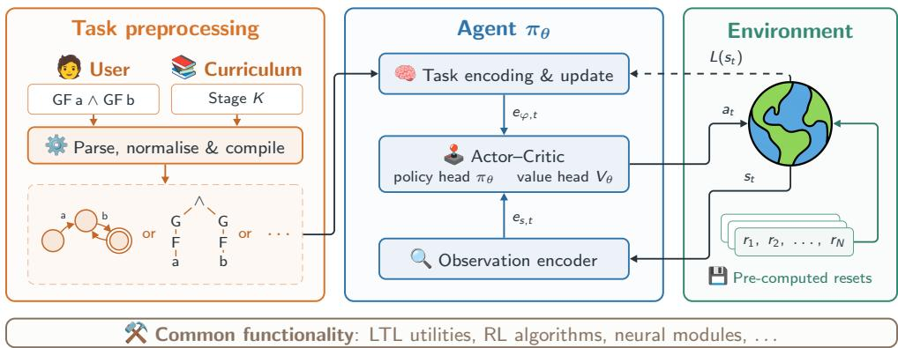  
Figure 1: Overview of JAXOLOTL’s design and implementation. We provide a modular implementation of representative multi-task LTL-RL algorithms in terms of a generic task representation, policy architecture, and shared common modules. Precompilation of dynamic structures and environment resets enables end-to-end JIT compilation of the entire training and evaluation loop.

This allows us to fully just-in-time (JIT) compile the entire training and evaluation loop, leading to end-to-end speedups of up to 220× over reference implementations on hardware accelerators. These efficiency improvements enable controlled benchmarking at substantially greater experimental scale, such as training 10 independent seeds in under four minutes rather than 13.4 hours.

We use JAXOLOTL to conduct an extensive controlled benchmark of existing methods, isolating aspects such as general task satisfaction, non-myopic reasoning, and scaling with the number of atomic propositions. Our experiments reveal complementary limitations in current approaches: general methods capable of non-myopic reasoning (i.e. reasoning about the entire task rather than individual subgoals) struggle to scale to environments with large numbers of propositions. Conversely, methods exhibiting stronger proposition scaling rely on environment-specific observation-reduction functions and suffer from myopia, preventing them from planning multiple steps ahead.

Our main contributions are as follows:

• we introduce JAXOLOTL, an open-source JAX benchmark suite for multi-task LTL-RL, unifying six representative algorithms and four environments under shared abstractions;

• we design a precompilation strategy for dynamic symbolic task representations that enables end-to-end JIT compilation, yielding training speedups of up to 220×;

• we establish a standardised evaluation protocol and curated task suites for controlled comparison across methods, including uncertainty estimates over independently trained policies;

• lastly, we conduct an extensive benchmark evaluating existing methods across general task completion, non-myopic reasoning, and proposition scaling, uncovering complementary strengths and limitations of current approaches.

## 2 RELATED WORK

LTL-Based Multi-Task RL. LTL and related formalisms such as reward machines are widely used to specify single, fixed tasks for RL agents (Hahn et al., 2019; Camacho et al., 2019; Toro Icarte et al., 2022; Voloshin et al., 2023; Hasanbeig et al., 2023). We instead consider the multi-task setting, where a single policy is required to zero-shot execute arbitrary LTL instructions. Many approaches have been developed for this setting, which can be broadly categorised into decomposition-based and holistic methods. Decomposition-based methods break down LTL specifications into subgoals that can be completed one at a time by a goal-conditioned policy (Araki et al., 2021; Leon et al.´ , 2022; Qiu et al., 2023; Liu et al., 2024; Guo et al., 2025). While this simplifies learning, it limits the agent’s ability to reason about the entire task and may lead to myopic behaviour. Holistic approaches instead condition the policy on broader task structure, for example by encoding the formula syntax tree (Vaezipoor et al., 2021) or Buchi automaton sequences (¨ Jackermeier & Abate, 2025). Recent work targets scaling to large proposition sets, via proposition-specific observation reduction (Guo et al., 2025) or parameterised predicates (Cloete et al., 2026). While the field has seen rapid progress in recent years, it remains difficult to compare methods due to differences in environments, task distributions, and evaluation protocols. Our work builds on these existing LTL-based multi-task RL methods and unifies them within a single JAX framework.

Existing LTL-Based Benchmarks. Closest to our work, Guo et al. (2026) introduce SpecRLBench, a suite of environments and tasks for generalisation in multi-task LTL-RL. While SpecRLBench standardises several experimental settings, it relies on the methods’ original codebases, retaining differences in their training and evaluation pipelines. In contrast, JAXOLOTL provides a unified implementation of six representative algorithms, together with a standardised evaluation protocol and curated task suites for controlled comparison. Furthermore, while SpecRLBench relies on CPUbased environments, JAXOLOTL enables end-to-end training and evaluation on hardware accelerators, yielding orders-of-magnitude speedups over the reference algorithm implementations. These speedups make larger-scale, statistically robust benchmarking practical. Concurrent work (Peng et al., 2026) evaluates VLA policies using $\mathrm { L T L } _ { f }$ monitors, but does not address multi-task LTL-RL methods.

Hardware-Accelerated RL. The speedups enabled by end-to-end JIT-compiled training in JAX (Lu et al., 2022) have spurred a broad ecosystem of accelerated environments (Freeman et al., 2021; Lange, 2022; Bonnet et al., 2024; Matthews et al., 2024; Pignatelli et al., 2025; Zakka et al., 2025) and algorithm libraries (Liesen et al., 2024; Rutherford et al., 2024). Closest to our design, XLand-MiniGrid (Nikulin et al., 2024) encodes procedurally generated symbolic rules and goals as fixed-size arrays to enable compiled multi-task training. However, these accelerated frameworks do not support LTL-specified tasks, whose inherently dynamic structure in the form of finite automata or syntax trees poses a significant challenge for JIT compilation. See Appendix A for extended related work.

## 3 BACKGROUND

Reinforcement Learning. We consider a standard reinforcement learning (RL) setting, where an agent interacts with an environment modelled as a Markov decision process (MDP). An MDP is a tuple $\mathcal { M } = ( S , \mathcal { A } , P , R , \gamma , \rho _ { 0 } )$ , where S is the state space, A is the action space, $P : S \times \mathcal { A } \times \mathcal { S } $ $[ 0 , 1 ]$ is the transition kernel, $R : \mathcal { S } \times \mathcal { A } \times \mathcal { S }  \mathbb { R }$ is the reward function, $\gamma \in \ [ 0 , 1 )$ is the discount factor, and $\rho _ { 0 } \in \Delta ( \mathcal { S } )$ is the initial state distribution. The agent’s objective is to learn a (stationary) policy $\pi : S  \Delta ( { \mathcal { A } } )$ that maximises the expected cumulative discounted reward $\begin{array} { r } { \mathbb { E } _ { \tau \sim \pi } \left[ \sum _ { t = 0 } ^ { \infty } \dot { \gamma ^ { t } } R ( s _ { t } , a _ { t } , s _ { t + 1 } ) \right] } \end{array}$ , where $\tau \in ( S \times \mathcal { A } ) ^ { \infty }$ is a trajectory generated by π in M.

Linear Temporal Logic. Linear temporal logic (LTL; Pnueli, 1977) is a formal language for specifying temporal properties of systems, which is being increasingly adopted as a task specification language in multi-task RL. The basic unit of LTL formulae are atomic propositions ${ \bar { A } } P ,$ which represent Boolean properties of the environment (e.g. “the agent is at the goal”). The syntax of LTL formulae is defined recursively as follows:

$$
\varphi : : = { \textsf { T } } | { \textsf { p } } | \neg \varphi \mid \varphi _ { 1 } \wedge \varphi _ { 2 } \mid \mathsf { X } \varphi \mid \varphi _ { 1 } \cup \varphi _ { 2 }
$$

where $\top$ is the Boolean constant true, $\textsf { p } \in \ A P$ is an atomic proposition, ¬ is negation, ∧ is conjunction, $\mathsf { X }$ is the next operator, and U is the until operator. Standard Boolean connectives (e.g. $\lor ,  )$ and temporal operators $( \mathrm { e . g . } \mathsf { F } , \mathsf { G } )$ can be derived from the above syntax. Intuitively, $\mathsf { X } _ { \mathcal { S } }$ means that $\varphi$ is true in the next step, $\varphi _ { 1 } \cup \varphi _ { 2 }$ means that $\varphi _ { 1 }$ holds until $\varphi _ { 2 }$ is true, $\textsf { F } \varphi$ means that $\varphi$ eventually holds at some future time step, and ${ \sf G } \varphi$ means that $\varphi$ is true always (at all time steps). These operators allow for the specification of complex compositional and temporally extended tasks, such as “eventually reach the goal while avoiding obstacles” or “visit all rooms in a specific order”.

To interpret LTL formulae in an MDP, we assume a labelling function $L \colon S \to 2 ^ { A P }$ that returns the set of true atomic propositions for a given state. An MDP trajectory τ satisfies an LTL formula $\varphi ,$ denoted by ${ \boldsymbol { \tau } } \left| = \varphi \right.$ , if the sequence of labels $L ( s _ { 0 } ) , L ( s _ { 1 } ) , . . .$ . satisfies the formula according to the standard semantics of LTL (see Appendix B). Multi-task RL with LTL specifications aims to train generalist LTL policies by solving the following optimisation problem:

$$
\pi ^ { * } ( \cdot \vert \varphi ) \in \arg \operatorname* { m a x } _ { \pi } \underset { \tau \sim \pi \vert \varphi } { \mathbb { E } } \left[ \mathbb { 1 } [ \tau \mapsto \varphi ] \right] ,
$$

where $\mathcal { D }$ is an arbitrary distribution over LTL tasks, and $\pi \mid \varphi$ is a policy conditioned on the task $\varphi .$

## 4 JAXOLOTL

We present JAXOLOTL (JAX-Optimised Learning for Objectives in Temporal Logic), a unified high-performance benchmark suite for multi-task RL with LTL specifications. JAXOLOTL provides a modular end-to-end JAX implementation of representative multi-task LTL-RL environments and algorithms, enabling controlled benchmarking at substantially greater experimental scale.

## 4.1 DESIGN PRINCIPLES

See Figure 1 for an illustration of JAXOLOTL’s design and implementation principles. The framework is designed to be modular via common abstractions, leverages flexible configuration management, and achieves highly efficient training and evaluation via end-to-end JIT compilation.

Modular Abstractions. JAXOLOTL defines modular abstractions that allow implementing LTL-RL methods in terms of a generic task representation and policy architecture. Here, a task representation is the algorithm-specific data structure used to encode the current LTL instruction, such as a formula syntax tree (Vaezipoor et al., 2021), reach–avoid sequence (Jackermeier & Abate, 2025), or reach– avoid subgoal (Guo et al., 2025). As the agent interacts with the environment and completes parts of the task, this representation is generally updated online. A task encoder maps this representation to an embedding for the policy. The policy architecture further consists of an observation encoder to process environment observations, and a shared actor–critic module that outputs actions and value estimates based on the combined observation and task embeddings.

Actions and value estimates are used for policy optimisation using goal-conditioned RL (Liu et al., 2022), where goals are task representations sampled at the beginning of each episode. A reusable curriculum learning implementation lets users gradually increase task complexity during training. Curricula consist of a sequence of stages with different task distributions, and the agent progresses to the next stage once it achieves a specified performance threshold. JAXOLOTL currently supports on-policy optimisation with PPO (Schulman et al., 2017), but the abstractions are agnostic to the underlying RL algorithm and can be extended to support off-policy methods.

By providing reusable implementations of common modules, JAXOLOTL enables controlled comparisons between different algorithms, while keeping shared components such as observation encoders fixed. The modular design further makes it easy to combine components from different methods, and to extend the framework with new approaches in the future.

Flexible Configuration. Experiments are configured using Hydra (Yadan, 2019), a flexible configuration management system. We provide pre-defined configurations for the entire benchmark suite, and individual hyperparameters or components can be overridden directly from the command line. To illustrate, training DeepLTL (Jackermeier & Abate, 2025) on ZoneEnv is as simple as running:

\$ python scripts/train.py alg=deep ltl env=zone env

End-to-End JIT Compilation. JAX’s just-in-time (JIT) compilation achieves significant speedups by compiling Python code into XLA-optimised kernels for accelerators such as GPUs or TPUs. JAXOLOTL follows the recent trend of JIT-compiling the entire training and evaluation loop (Lu et al., 2022; Liesen et al., 2024), rather than only the environment step function or policy network.

However, end-to-end compilation is considerably more challenging for LTL-RL than for standard RL workloads. The algorithms considered in this work manipulate symbolic objects whose structure depends on the sampled task, including formula syntax trees, automata with variable topology, and reach–avoid sequences with variable numbers of steps. These task representations are inherently dynamic and may change during environment interaction, directly conflicting with JAX’s strict requirements for static tensor shapes and control flow during JIT compilation.2

JAXOLOTL addresses this mismatch by extensively precompiling dynamic structures into static array representations, such as padded adjacency lists for formula graphs or padded transition tables for Buchi automata. Before training, we sample tasks for each curriculum stage, convert them into¨ method-specific array representations, and pad all variable-sized components to fixed shapes. Task sampling and updating then reduce to simple array indexing operations, which are fully compatible with JIT compilation. We similarly precompute compact environment-reset descriptors to efficiently handle control flow under JIT, and compile evaluation formulae into static representations. The entire training and evaluation loops are therefore pure JIT-compiled functions, which further enables straightforward parallelisation across independent seeds via vmap.

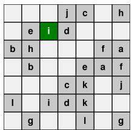  
(a) LetterWorld

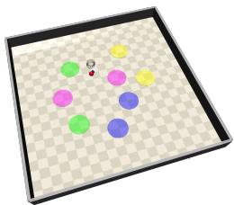  
(b) ZoneEnv

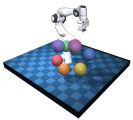  
(c) FrankaZoneEnv

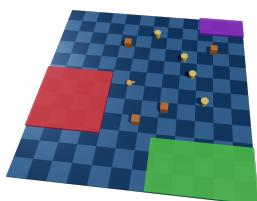  
(d) Warehouse  
Figure 2: Visualisations of the main environments included in JAXOLOTL.

## 4.2 EVALUATION INFRASTRUCTURE

Deep RL algorithms are well-known to be sensitive to hyperparameter choices and random initialisation (Henderson et al., 2018; Chan et al., 2019), making meaningful comparisons between different methods challenging. JAXOLOTL’s computational efficiency allows increasing the number of independent training runs and evaluation episodes at marginal cost (see § 5.1), thereby improving estimates of expected performance and its uncertainty due to training randomness. We leverage this to provide a standardised evaluation protocol that adapts the general evaluation principles of Agarwal et al. (2021) to the generalist-policy setting.

In particular, JAXOLOTL reports estimates of expected performance on a fixed set of benchmark tasks, together with 95% confidence intervals (CIs) over independent training runs. In contrast to conventional evaluation settings in which separate policies are trained for each task, each training run in our setting produces a single generalist policy that is evaluated on multiple tasks. This results in correlated scores across tasks, and we hence treat independently trained policies, rather than task-policy pairs, as the statistical units. Moreover, we deliberately use the arithmetic mean to aggregate performance across tasks, rather than a robust statistic such as the median or IQM (Agarwal et al., 2021). This ensures that potentially poor performance on difficult tasks is not discarded as outliers. Additionally, we provide per-task performance scores for fine-grained comparisons. We report two-sided 95% Student-t CIs (Student, 1908) over the resulting policy-level estimates. A full description of our evaluation protocol is provided in Appendix C.

## 4.3 ENVIRONMENTS AND EVALUATION TASKS

JAXOLOTL includes JAX implementations of four main environments spanning discrete navigation, continuous control, and object interaction, visualised in Figure 2. These are summarised below:

<table><tr><td>Environment</td><td>Observation Space</td><td>Action Space</td><td>Reference</td></tr><tr><td>LetterWorld</td><td>Grid (7 × 7 × 13)</td><td>Discrete (4 directions)</td><td>Vaezipoor et al. (2021)</td></tr><tr><td>ZoneEnv</td><td>Proprioception + LiDAR (69D)</td><td>Continuous (2D)</td><td>Vaezipoor et al. (2021)</td></tr><tr><td>FrankaZoneEnv</td><td>Proprioception + range-bearing (72D)</td><td>Continuous (6D)</td><td>Guo et al. (2026)</td></tr><tr><td>Warehouse</td><td>Proprio. + LiDAR + inventory (47D)</td><td>Hybrid (2D + 5D)</td><td>Jackermeier et al. (2026)</td></tr></table>

LetterWorld, ZoneEnv, and Warehouse are implemented directly in JAX, whereas our FrankaZoneEnv implementation is based on MuJoCo XLA (MJX; Todorov et al., 2012). Each environment comes with curated finite- and infinite-horizon specification suites derived from tasks in the literature. We provide further details on the environments and task suites in Appendix D.

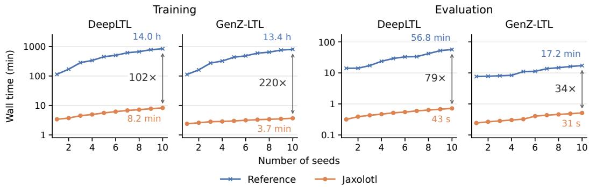  
Figure 3: End-to-end training and evaluation times of JAXOLOTL compared to original reference implementations on ZoneEnv. We achieve speedups of up to 220× for training and 79× for evaluation.

## 4.4 ALGORITHMS

We provide unified implementations of six state-of-the-art multi-task LTL-RL methods:
<table><tr><td>Algorithm</td><td>Task representation</td><td>Full obs.</td><td>Infinite</td><td>Curriculum</td><td>Reference</td></tr><tr><td>LTL2Action</td><td>Formula syntax tree</td><td>√</td><td>X</td><td>√</td><td>Vaezipoor et al. (2021)</td></tr><tr><td>GCRL-LTL</td><td>Proposition subgoal</td><td>√</td><td>√</td><td>X</td><td>Qiu et al. (2023)</td></tr><tr><td>DeepLTL</td><td>Reach-avoid sequence</td><td>√</td><td>√</td><td>√</td><td>Jackermeier &amp; Abate (2025)</td></tr><tr><td>GenZ-LTL</td><td>Reach-avoid subgoal</td><td>X</td><td>√</td><td>X</td><td>Guo et al. (2025)</td></tr><tr><td>SemLTL</td><td>Semantic LDBA</td><td>√</td><td>√</td><td>√</td><td>Abate et al. (2026)</td></tr><tr><td>StructLTL</td><td>Boolean formula sequence</td><td>√</td><td>√</td><td>√</td><td>Jackermeier et al. (2026)</td></tr></table>

In contrast to the other methods, GenZ-LTL relies on domain-specific observation reduction functions (see § 5.2) and LTL2Action does not support infinite-horizon tasks. Our reusable curriculum learning implementation can be applied to any method, but the subgoal-based representations of GCRL-LTL and GenZ-LTL do not naturally allow for gradual increases in task complexity, and we hence do not apply curriculum learning (following the original works). See Appendix E for details on methods.

## 5 EXPERIMENTAL EVALUATION

Our experimental evaluation is split into two parts. We first demonstrate the efficiency and correctness of JAXOLOTL with respect to reference implementations (§ 5.1). We then systematically evaluate existing methods on our benchmark suites to answer three research questions (§ 5.2):

(Q1) How do existing approaches compare in terms of general task satisfaction on the curated finite- and infinite-horizon LTL suites?

(Q2) What are the capabilities of existing approaches for non-myopic reasoning?

(Q3) How do existing algorithms scale with the number of atomic propositions?

## 5.1 EFFICIENCY AND CORRECTNESS

Computational Efficiency. We investigate the speed improvements enabled by JAXOLOTL by comparing end-to-end training and evaluation times on ZoneEnv with original reference implementations. We focus on DeepLTL and GenZ-LTL, two representative methods with distinct task representations. All timings are measured on standard consumer hardware and include compilation overhead for the JAX implementations. See Appendix G.1 for full experimental details.

As shown in Figure 3, our implementation yields speedups of 34× and 47× for training a single seed of DeepLTL and GenZ-LTL, respectively. This difference becomes even more pronounced as we increase the number of independent runs, achieving efficiency improvements of 102× and 220× for 10 seeds. This allows us to train 10 seeds of DeepLTL in 8.2 minutes and GenZ-LTL in 3.7 minutes, compared to 14.0 and 13.4 hours for the original implementations. We further observe significant

GenZ-LTL SemLTL StructLTL

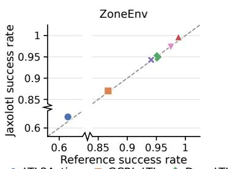

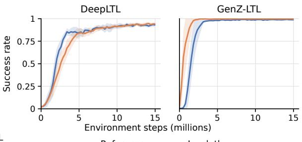  
Figure 4: Validation of JAXOLOTL. (Left) Final ZoneEnv success rates are within ±1.1% of the reference implementations for all methods. (Right) Overall training dynamics of DeepLTL and GenZ-LTL closely follow the references.

speedups for evaluation, with 79× and 34× improvements for DeepLTL and GenZ-LTL, respectively.   
Appendix G.1 provides additional comparisons on raw environment throughput.

Implementation Validation. To validate the correctness of our implementations, we compare the performance of JAXOLOTL against original reference implementations on ZoneEnv. Figure 4 compares final success rates across all methods (left), and training curves for DeepLTL and GenZ-LTL (right). The results demonstrate that our implementations closely match the references. While there are small differences in the training curves, these can be explained by minor low-level implementation details. Crucially, both overall learning behaviour and final success rates accurately reproduce the reference results. Further experimental details are provided in Appendix G.2.

## 5.2 BENCHMARKING EXISTING METHODS

We proceed to systematically evaluate existing methods with JAXOLOTL. Detailed training parameters are described in Appendix F. The evaluation tasks in our general benchmark suite are drawn from the literature and enriched with curated specifications that cover a wide range of environment-specific behaviour and LTL objectives; see Appendix D.2 for details. Unless stated otherwise, we train each method using 10 independent random seeds, compute individual policy–task results over 512 episodes, and report 95% Student-t CIs over independent policies (see § 4.2).

GenZ-LTL Observation Interfaces. Standard GenZ-LTL uses domain-specific observationreduction functions that map the current observation s into a task-relative representation, containing only features relevant for the current reach–avoid subgoal (see Appendix E). We denote this configu ration by GenZ-LTL† throughout figures and tables, and additionally evaluate GenZ-LTL (unreduced obs.), which conditions on the full observation together with a one-hot encoding of the current subgoal, following Guo et al. (2025). The standard reduction assumes that observations decompose into proposition-specific components and relies on a hand-designed fusion operator to produce fixed reach and avoid features. The unreduced variant removes these assumptions while retaining the rest of the method’s design, and is used when the assumptions do not hold, such as in Warehouse.

## 5.2.1 GENERAL LTL TASK SATISFACTION (Q1)

Table 1 lists final aggregate results across all task suites, and Figure 5 shows training dynamics on finite-horizon tasks, which we focus on first. We observe that GenZ-LTL performs exceptionally well when provided with a suitable observation reduction function, achieving near perfect success rates. While its unreduced variant obtains high performance on LetterWorld and ZoneEnv, it struggles in more complex environments, where StructLTL dominates among the general methods. GCRL-LTL, DeepLTL, and SemLTL overall perform similarly, but GCRL-LTL is not applicable to Warehouse due to its limited avoidance heuristic (see Appendix E). The early method LTL2Action is consistently outperformed by more modern approaches, showing a distinct gap in success rates.

For infinite-horizon tasks, we report the established metric of average completed accepting cycles in the Buchi automaton constructed from the task (¨ Jackermeier & Abate, 2025; Guo et al., 2026).

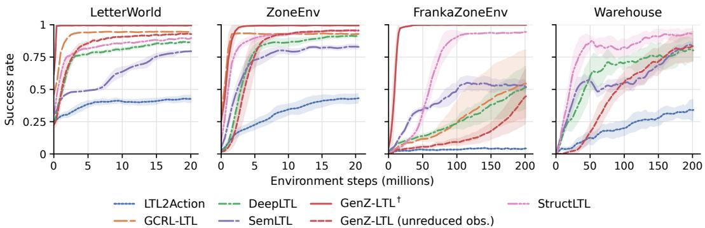  
Figure 5: Aggregate finite-horizon success rates over training. Lines show means across 10 independently trained policies, with shaded 95% Student-t confidence intervals.

Table 1: Aggregated benchmark results over the JAXOLOTL task suites, averaged over 512 episodes per formula, with 95% CIs over 10 training seeds. Fin.: finite-horizon success rate (0–1); Inf.: completed accepting cycles with fixed episode length. R-S: completed accepting cycles on the reachstay task suite. Best results are bold, second best underlined, — denotes unsupported configurations. See Appendix H.1 for per-specification results.
<table><tr><td></td><td colspan="2">LetterWorld</td><td colspan="3">ZoneEnv</td><td colspan="2">FrankaZoneEnv</td><td colspan="3">Warehouse</td></tr><tr><td>Method</td><td>Fin. ↑</td><td>Inf. ↑</td><td>Fin.↑</td><td>Inf. ↑</td><td>R-S↑</td><td>Fin.↑</td><td>Inf. ↑</td><td>Fin.↑</td><td>Inf.↑</td><td>R-S↑</td></tr><tr><td>LTL2Action</td><td>0.42±0.03</td><td></td><td> $0 . 4 3 _ { \pm 0 . 0 3 }$ </td><td></td><td></td><td> $0 . 0 4 _ { \pm 0 . 0 1 }$ </td><td></td><td>0.34±0.09</td><td></td><td></td></tr><tr><td>GCRL-LTL</td><td> $\underline { { 0 . 9 4 } } \underline { { { \pm } } } \underline { { { 0 . 0 0 } } }$ </td><td> $\underline { { 8 . 0 \pm 0 . 1 } }$ </td><td> $0 . 9 3 _ { \pm 0 . 0 0 }$ </td><td> $\underline { { 5 . 7 \pm 0 . 1 } }$ </td><td> $3 0 . 2 { \scriptstyle \pm 3 . 3 }$ </td><td> $0 . 5 5 { \scriptstyle \pm 0 . 2 7 }$ </td><td> $8 . 1 _ { \pm 5 . 9 }$ </td><td></td><td></td><td></td></tr><tr><td>DeepLTL</td><td> $0 . 8 7 _ { \pm 0 . 0 1 }$ </td><td>5.3±0.2</td><td> $0 . 9 2 _ { \pm 0 . 0 2 }$ </td><td> $3 . 0 { \scriptstyle \pm 0 . 3 }$ </td><td> $\underline { { 5 4 0 . 1 \pm 4 8 . 0 } }$ </td><td> $0 . 5 1 { \scriptstyle \pm 0 . 1 7 }$ </td><td> $4 . 8 { \scriptstyle \pm 3 . 3 }$ </td><td> $0 . 8 0 { \scriptstyle \pm 0 . 0 9 }$ </td><td> $\underline { { 2 . 6 \pm 0 . 3 } }$ </td><td> $6 1 8 . 1 _ { \pm 1 1 8 . 7 }$ </td></tr><tr><td>GenZ-LTL†</td><td>0.99±0.00 8.2±0.0 1.00±0.00 6.5±0.2</td><td></td><td></td><td></td><td> $4 9 2 . 0 { \scriptstyle \pm 5 0 . 6 }$ </td><td> $\mathbf { 1 . 0 0 } _ { \pm 0 . 0 0 }$ </td><td> $3 5 . 0 { \scriptstyle \pm 0 . 6 }$ </td><td></td><td></td><td></td></tr><tr><td>→ unreduced obs.</td><td> $0 . 9 3 _ { \pm 0 . 0 0 }$ </td><td></td><td>5.6±0.0 0.96±0.01</td><td> $5 . 0 { \scriptstyle \pm 0 . 1 }$ </td><td> $3 2 1 . 6 { \scriptstyle \pm 5 9 . 2 }$ </td><td> $0 . 4 5 _ { \pm 0 . 2 2 }$ </td><td> $5 . 1 { \scriptstyle \pm 3 . 6 }$ </td><td> $\underline { { 0 . 8 4 } } \pm 0 . 1 2$ </td><td> $2 . 2 \pm 0 . 7$ </td><td> $1 0 2 . 6 { \scriptstyle \pm 2 4 . 8 }$ </td></tr><tr><td>SemLTL</td><td> $0 . 7 9 _ { \pm 0 . 0 1 }$ </td><td></td><td></td><td></td><td>4.2±0.1 0.83±0.02 2.6±0.1 532.9±36.6 0.51±0.05</td><td></td><td> $1 3 . 6 { \scriptstyle \pm 1 . 0 }$ </td><td> $0 . 8 3 _ { \pm 0 . 0 4 }$ </td><td> $0 . 2 { \scriptstyle \pm 0 . 1 }$ </td><td> $6 7 3 . 5 { \scriptstyle \pm 3 0 . 9 }$ </td></tr><tr><td>StructLTL</td><td> $0 . 9 0 { \scriptstyle \pm 0 . 0 1 }$ </td><td></td><td>5.5±0.2 0.95±0.01</td><td> $3 . 7 _ { \pm 0 . 3 }$ </td><td> ${ \bar { 5 } } 7 2 . 7 _ { \pm 4 7 . 7 }$ </td><td>0.94±0.00</td><td> $1 5 . 3 { \scriptstyle \pm 0 . 4 }$ </td><td> $\mathbf { 0 . 9 6 _ { \pm 0 . 0 1 } }$ </td><td> $3 . 1 _ { \pm 0 . 2 }$ </td><td> $\mathbf { 8 0 9 . 9 } _ { \pm 3 0 . 4 }$ </td></tr></table>

Performance on recurrence tasks (Inf. suite) follows the same general trends as in the finite case. We include reach-stay (i.e. persistence) tasks, which require the agent to infinitely maintain a proposition, for ZoneEnv and Warehouse, where this necessitates meaningful closed-loop behaviour. Here, automata-based methods that account for non-determinism perform best, led by StructLTL.

## 5.2.2 NON-MYOPIC REASONING (Q2)

We first isolate non-myopic reasoning in ConveyorWorldSimple-k, a simplified variant of Abate et al. (2026)’s grid-based ConveyorWorld. At the first step, the agent enters one of two one-way conveyor belts, which it cannot leave, leading to rooms A and B. It must then satisfy $\mathsf { F } \left( \mathsf { p } _ { 1 } \wedge \mathsf { F } \left( \mathsf { p } _ { 2 } \wedge \cdot \cdot \cdot \wedge \mathsf { F } \bar { \mathsf { p } _ { k } } \right) \right)$ , where $\mathsf { p } _ { 1 } , \ldots , \mathsf { p } _ { k - 1 }$ lie in order along both belts, but ${ \mathsf p } _ { k }$ is sampled uniformly from {a, b}, with a only reachable in A and b only in B. The correct belt thus depends on a subgoal k steps ahead, which a non-myopic method should be able to account for. Since the only observation is the agent’s position, GenZ-LTL cannot use observation reduction here.

Figure 6 (left) shows success rate over k. For k > 1, GenZ-LTL and GCRL-LTL drop to 50%, the success rate of always entering the same belt. Both commit to a belt while pursuing p1, using an action policy conditioned only on the current subgoal, which is reachable via either belt. GCRL-LTL does select a complete subgoal sequence with its goal-conditioned value function (Appendix E), but its policy cannot distinguish between sequence-dependent ways of reaching the same subgoal. The other methods, which condition on the full task, generally maintain high success rates up to $k = 3 2$ Such long-horizon reasoning is much harder to learn once exploration and credit assignment become non-trivial (see original ConveyorWorld, Appendix H.2).

To test non-myopic reasoning in a high-dimensional setting, we use a variation of ZonEnv (ZoneEnv-NM, Jackermeier et al., 2026), in which entering a purple zone removes all green zones for the rest of the episode, so the agent must avoid purple zones whenever a green zone is required later. On finitehorizon tasks (Figure 6, middle), GenZ-LTL and GCRL-LTL plateau at 70.0% and 66.9%, while StructLTL and DeepLTL reach 92.7% and 83.6%. SemLTL plateaus at 67.5% despite conditioning on the full task: this suggests that such conditioning alone does not ensure non-myopic behaviour, as the policy must still learn to exploit this information. LTL2Action struggles to converge (44.2%).

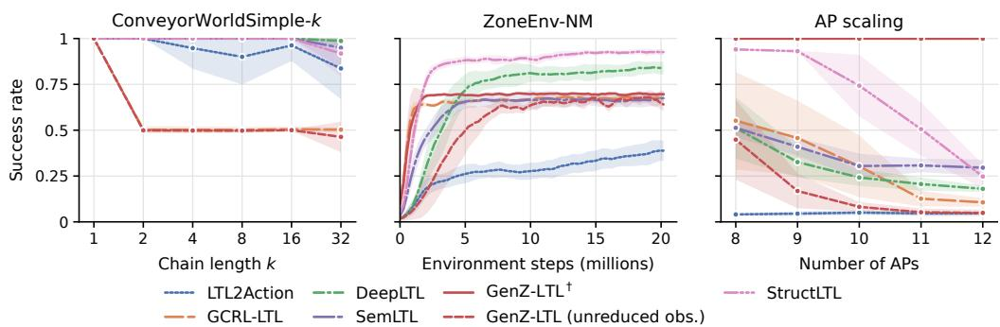  
Figure 6: (Left) Non-myopic reasoning results on different step variants of ConveyorWorldSimple-k. (Middle) Aggregate finite-horizon success rates on ZoneEnv-NM over training. (Right) Results of scaling the number of atomic propositions in FrankaZoneEnv.

## 5.2.3 SCALING WITH ATOMIC PROPOSITIONS (Q3)

We train each method in FrankaZoneEnv with an increasing number of propositions, evaluating on the same finite-horizon tasks (spanning the first 8 propositions) throughout. This isolates the difficulty of training with an increasing number of propositions, while keeping the task difficulty fixed.

Figure 6 (right) presents the results. All methods except GenZ-LTL with observation reduction degrade as |AP| grows. We attribute this mainly to grounding: each additional proposition must be associated with its own features in an increasingly complex observation space. This affects myopic methods too; GenZ-LTL (unreduced obs.) and GCRL-LTL lose most of their success rate by $| \dot { A } \dot { P } | = 1 1$ . Non-myopic methods must additionally generalise over a set of task sequences that grows exponentially with |AP|: StructLTL, the strongest general method up to $| A P | = 9 { \mathrm { ; } }$ , degrades sharply beyond that. GenZ-LTL is unaffected only because its hand-designed observation reduction maps zones to generic “reach” and “avoid” features, sidestepping the grounding problem by construction.

## 6 CONCLUSION, LIMITATIONS, AND FUTURE WORK

We introduced JAXOLOTL, a unified, high-performance benchmark suite for multi-task LTL-RL that enables controlled comparisons of existing methods at scale. Our evaluation shows that existing methods have complementary strengths and limitations. Methods that condition on the full task, such as StructLTL and DeepLTL, reason non-myopically, but, like all methods without observation reduction, they degrade as the number of atomic propositions grows. GenZ-LTL scales by exploiting a useful prior in the form of observation reduction, but this requires manual engineering, is not always applicable, and remains myopic. No evaluated method yet combines non-myopic reasoning, scaling to many propositions, and independence from environment-specific preprocessing.

Limitations. Our task suites are finite and curated by hand to capture interesting behaviour, but some of our results may depend on the specific task families that we used. JAXOLOTL currently only supports PPO training (as in the supported methods), although its abstractions are algorithmagnostic. Other restrictions stem from the methods rather than the framework: LTL2Action does not support infinite-horizon tasks, GCRL-LTL and GenZ-LTL with observation reduction cannot be applied to Warehouse, and all methods assume known propositions (for GenZ-LTL, a known space of propositions) and an accurate labelling function with access to privileged state information.

Future work. We plan to extend JAXOLOTL with off-policy algorithms and additional environments, particularly robotics domains such as contact-rich manipulation, and to scale the benchmark to larger proposition vocabularies and richer task distributions. For methods, the central open problems are relaxing the assumptions above, e.g. through learned or uncertain labelling functions and openvocabulary settings, and designing a single approach with all three properties identified above.

## AI USE STATEMENT

In this work, we used generative AI tools to implement methods: they helped create and edit software code, including parts of the environment and method implementations as well as plotting and tooling scripts. We have not used generative AI tools to generate synthetic data, develop conceptual frameworks, propose or refine hypotheses, design or give feedback on experiments, or interpret results; formulating or proving mathematical claims, translation, dataset cleaning and qualitative data analysis are not applicable to this work. Additionally, we used generative AI tools to polish and proof read text for readability and to find typos. We have reviewed all AI-assisted work: an author reviewed every AI-assisted code change, the code is checked by automated tests, and we validated our implementations against re-runs of the official codebases and published results (Appendix G.2). All AI-assisted text was revised by the authors. We take responsibility for the final content of thi work, including text, claims or artifacts produced with the aid of generative AI.

## REPRODUCIBILITY STATEMENT

Our full implementation is available at https://github.com/mathiasj33/jaxolotl, including all environments, algorithms and task suites, together with pre-defined Hydra configurations for the entire benchmark suite. Appendix D describes the environments and task suites, Appendix E the implemented methods, and Appendix F the model architectures, curricula and hyperparameters for each method and environment. Appendix C formalises our evaluation protocol: unless stated otherwise, all results use 10 independent training runs, 512 evaluation episodes per policy and specification, and two-sided 95% Student-t confidence intervals over policies. Appendix G.1 specifies the hardware and timing protocol for the efficiency comparisons, Appendix G.2 the re-runs and reported results used to validate our implementations, and Appendix H.1 reports per-specification results for all benchmarks.

## ACKNOWLEDGMENTS

This work was supported by the UKRI Erlangen AI Hub on Mathematical and Computational Foundations of AI (No. EP/Y028872/1). MJ and JC are funded by the EPSRC Centre for Doctoral Training in Autonomous Intelligent Machines and Systems (EP/S024050/1).

## REFERENCES

Alessandro Abate, Giuseppe De Giacomo, Mathias Jackermeier, Jan Kret´ınsky, Maximilian Prokop,´ and Christoph Weinhuber. Semantically Labelled Automata for Multi-Task Reinforcement Learning with LTL Instructions. In International Joint Conference on Artificial Intelligence, February 2026.

Rishabh Agarwal, Max Schwarzer, Pablo Samuel Castro, Aaron Courville, and Marc Bellemare. Deep Reinforcement Learning at the Edge of the Statistical Precipice. In Advances in Neural Information Processing Systems, volume 34, pp. 29304–29320. Curran Associates, Inc., 2021.

Derya Aksaray, Austin Jones, Zhaodan Kong, Mac Schwager, and Calin Belta. Q-Learning for robust satisfaction of signal temporal logic specifications. In 2016 IEEE 55th Conference on Decision and Control (CDC), pp. 6565–6570, December 2016.

Jacob Andreas, Dan Klein, and Sergey Levine. Modular Multitask Reinforcement Learning with Policy Sketches. In Proceedings of the 34th International Conference on Machine Learning, pp. 166–175. PMLR, July 2017.

Brandon Araki, Xiao Li, Kiran Vodrahalli, Jonathan Decastro, Micah Fry, and Daniela Rus. The Logical Options Framework. In Proceedings ofthe 38th International Conference on Machine Learning, pp. 307–317, July 2021.

Fahiem Bacchus and Froduald Kabanza. Using temporal logics to express search control knowledge for planning. Artificial Intelligence, 116(1):123–191, 2000. ISSN 0004-3702.

Marco Bagatella, Andreas Krause, and Georg Martius. Directed Exploration in Reinforcement Learning from Linear Temporal Logic. Transactions on Machine Learning Research, 2025.

Clement Bonnet, Daniel Luo, Donal Byrne, Shikha Surana, Sasha Abramowitz, Paul Duckworth,´ Vincent Coyette, Laurence Illing Midgley, Elshadai Tegegn, Tristan Kalloniatis, Omayma Mahjoub, Matthew Macfarlane, Andries P. Smit, Nathan Grinsztajn, Raphael Boige, Cemlyn N. Waters,¨ Mohamed A. Mimouni, Ulrich A. Mbou Sob, Ruan de Kock, Siddarth Singh, Daniel Furelos-Blanco, Victor Le, Arnu Pretorius, and Alexandre Laterre. Jumanji: a Diverse Suite of Scalable Reinforcement Learning Environments in JAX. In 12th International Conference on Learning Representations, 2024.

Alper Kamil Bozkurt, Yu Wang, Michael M. Zavlanos, and Miroslav Pajic. Control Synthesis from Linear Temporal Logic Specifications using Model-Free Reinforcement Learning. In 2020 IEEE International Conference on Robotics and Automation (ICRA), pp. 10349–10355, May 2020.

James Bradbury, Roy Frostig, Peter Hawkins, Matthew James Johnson, Yash Katariya, Chris Leary, Dougal Maclaurin, George Necula, Adam Paszke, Jake VanderPlas, Skye Wanderman-Milne, and Qiao Zhang. JAX: Composable transformations of Python+NumPy programs, 2018.

Alberto Camacho, Rodrigo Toro Icarte, Toryn Q. Klassen, Richard Anthony Valenzano, and Sheila A. McIlraith. LTL and beyond: Formal languages for reward function specification in reinforcement learning. In Proceedings ofthe Twenty-Eighth International Joint Conference on Artificial Intelligence, IJCAI 2019, pp. 6065–6073. ijcai.org, 2019.

Thomas Carta, Clement Romac, Thomas Wolf, Sylvain Lamprier, Olivier Sigaud, and Pierre-Yves´ Oudeyer. Grounding Large Language Models in Interactive Environments with Online Reinforcement Learning. In Proceedings ofthe 40th International Conference on Machine Learning, pp. 3676–3713. PMLR, July 2023.

Stephanie C. Y. Chan, Samuel Fishman, Anoop Korattikara, John Canny, and Sergio Guadarrama. Measuring the Reliability of Reinforcement Learning Algorithms. In International Conference on Learning Representations, September 2019.

Maxime Chevalier-Boisvert, Dzmitry Bahdanau, Salem Lahlou, Lucas Willems, Chitwan Saharia, Thien Huu Nguyen, and Yoshua Bengio. BabyAI: A Platform to Study the Sample Efficiency of Grounded Language Learning. In 7th International Conference on Learning Representations, 2019.

Kyunghyun Cho, Bart van Merrienboer, Dzmitry Bahdanau, and Yoshua Bengio. On the Properties¨ of Neural Machine Translation: Encoder–Decoder Approaches. In Proceedings ofSSST-8, Eighth Workshop on Syntax, Semantics and Structure in Statistical Translation, pp. 103–111. Association for Computational Linguistics, 2014. doi: 10.3115/v1/W14-4012.

Jacques Cloete, Mathias Jackermeier, Ioannis Havoutis, and Alessandro Abate. PlatoLTL: Learning to Generalize Across Symbols in LTL Instructions for Multi-Task RL. arXiv:2601.22891, 2026.

Cedric Colas, Olivier Sigaud, and Pierre-Yves Oudeyer. How Many Random Seeds? Statistical´ Power Analysis in Deep Reinforcement Learning Experiments. arXiv:1806.08295, 2018.

Matthias Cosler, Christopher Hahn, Daniel Mendoza, Frederik Schmitt, and Caroline Trippel. Nl2spec: Interactively Translating Unstructured Natural Language to Temporal Logics with Large Language Models. In Constantin Enea and Akash Lal (eds.), Computer Aided Verification, pp. 383–396, Cham, 2023. Springer Nature Switzerland. ISBN 978-3-031-37703-7.

Samuel Coward, Michael Beukman, and Jakob N. Foerster. JaxUED: A simple and useable UED library in Jax. arXiv:2403.13091, 2024.

Giuseppe De Giacomo, Luca Iocchi, Marco Favorito, and Fabio Patrizi. Foundations for Restraining Bolts: Reinforcement Learning with LTLf/LDLf Restraining Specifications. Proceedings ofthe International Conference on Automated Planning and Scheduling, 29:128–136, 2019. ISSN 2334-0843.

Zeyu Feng, Hao Luan, Pranav Goyal, and Harold Soh. LTLDoG: Satisfying Temporally-Extended Symbolic Constraints for Safe Diffusion-Based Planning. IEEE Robotics and Automation Letters, 9(10):8571–8578, October 2024. ISSN 2377-3766.

C. Daniel Freeman, Erik Frey, Anton Raichuk, Sertan Girgin, Igor Mordatch, and Olivier Bachem. Brax - A differentiable physics engine for large scale rigid body simulation. In 35th Annual Conference on Neural Information Processing Systems Datasets and Benchmarks Track, 2021.

Francesco Fuggitti and Tathagata Chakraborti. NL2LTL – a Python Package for Converting Natural Language (NL) Instructions to Linear Temporal Logic (LTL) Formulas. In 37th AAAI Conference on Artificial Intelligence, 2023.

Daniel Furelos-Blanco, Mark Law, Anders Jonsson, Krysia Broda, and Alessandra Russo. Hierarchies of Reward Machines. In International Conference on Machine Learning, volume 202 of Proceedings ofMachine Learning Research, pp. 10494–10541, 2023.

Rihab Gorsane, Omayma Mahjoub, Ruan de Kock, Roland Dubb, Siddarth Singh, and Arnu Pretorius. Towards a Standardised Performance Evaluation Protocol for Cooperative MARL. In 36th Annual Conference on Neural Information Processing Systems, 2022.

Zijian Guo, Weichao Zhou, and Wenchao Li. Temporal Logic Specification-Conditioned Decision Transformer for Offline Safe Reinforcement Learning. In Forty-First International Conference on Machine Learning, June 2024.

Zijian Guo, Ilker Is¸ık, H M Sabbir Ahmad, and Wenchao Li. One Subgoal at a Time: Zero-Shot Generalization to Arbitrary Linear Temporal Logic Requirements in Multi-Task Reinforcement Learning. In Advances in Neural Information Processing Systems, volume 38, Main Conference, pp. 77500–77529. Curran Associates, Inc., 2025.

Zijian Guo, ˙Ilker Is¸ık, H. M. Sabbir Ahmad, and Wenchao Li. SpecRLBench: A Benchmark for Generalization in Specification-Guided Reinforcement Learning, April 2026.

Ernst Moritz Hahn, Mateo Perez, Sven Schewe, Fabio Somenzi, Ashutosh Trivedi, and Dominik Wojtczak. Omega-Regular Objectives in Model-Free Reinforcement Learning. In Toma´s Vojnarˇ and Lijun Zhang (eds.), Tools and Algorithmsfor the Construction and Analysis ofSystems, pp. 395–412, Cham, 2019. Springer International Publishing. ISBN 978-3-030-17462-0.

Mohammadhosein Hasanbeig, Alessandro Abate, and Daniel Kroening. Logically-Constrained Reinforcement Learning. arXiv:1801.08099, 2018.

Mohammadhosein Hasanbeig, Daniel Kroening, and Alessandro Abate. Certified reinforcement learning with logic guidance. Artificial Intelligence, 322:103949, 2023. ISSN 0004-3702.

Peter Henderson, Riashat Islam, Philip Bachman, Joelle Pineau, Doina Precup, and David Meger. Deep Reinforcement Learning That Matters. Proceedings of the AAAI Conference on Artificial Intelligence, 32(1), April 2018. ISSN 2374-3468.

Felix Hill, Sona Mokra, Nathaniel Wong, and Tim Harley. Human Instruction-Following with Deep Reinforcement Learning via Transfer-Learning from Text. arXiv:2005.09382, 2020.

Shengyi Huang, Rousslan Fernand Julien Dossa, Chang Ye, Jeff Braga, Dipam Chakraborty, Kinal Mehta, and Joao G. M. Ara ˜ ujo. CleanRL: High-quality Single-file Implementations of Deep ´ Reinforcement Learning Algorithms. Journal ofMachine Learning Research, 23:274:1–274:18, 2022.

Rodrigo Toro Icarte, Ethan Waldie, Toryn Q. Klassen, Richard Anthony Valenzano, Margarita P. Castro, and Sheila A. McIlraith. Learning Reward Machines for Partially Observable Reinforcement Learning. In 33rd Annual Conference on Neural Information Processing Systems, pp. 15497–15508, 2019.

Mathias Jackermeier and Alessandro Abate. DeepLTL: Learning to Efficiently Satisfy Complex LTL Specifications for Multi-Task RL. In The Thirteenth International Conference on Learning Representations, 2025.

Mathias Jackermeier, Mattia Giuri, Jacques Cloete, and Alessandro Abate. Zero-Shot Instruction Following in RL via Structured LTL Representations, August 2026.

Jiaming Ji, Borong Zhang, Jiayi Zhou, Xuehai Pan, Weidong Huang, Ruiyang Sun, Yiran Geng, Yifan Zhong, Josef Dai, and Yaodong Yang. Safety Gymnasium: A Unified Safe Reinforcement Learning Benchmark. In 37th Annual Conference on Neural Information Processing Systems Datasets and Benchmarks Track, 2023.

Jiaming Ji, Jiayi Zhou, Borong Zhang, Juntao Dai, Xuehai Pan, Ruiyang Sun, Weidong Huang, Yiran Geng, Mickel Liu, and Yaodong Yang. Omnisafe: An Infrastructure for Accelerating Safe Reinforcement Learning Research. Journal of Machine Learning Research, 25:285:1–285:6, 2024.

Scott M. Jordan, Yash Chandak, Daniel Cohen, Mengxue Zhang, and Philip S. Thomas. Evaluating the Performance of Reinforcement Learning Algorithms. In 37th International Conference on Machine Learning, volume 119 of Proceedings ofMachine Learning Research, pp. 4962–4973, 2020.

Scott M. Jordan, Adam White, Bruno Castro da Silva, Martha White, and Philip S. Thomas. Position: Benchmarking is limited in reinforcement learning research. In 41st International Conference on Machine Learning, volume 235 of Proceedings ofMachine Learning Research, pp. 22551–22569, 2024.

Kishor Jothimurugan, Rajeev Alur, and Osbert Bastani. A Composable Specification Language for Reinforcement Learning Tasks. In Advances in Neural Information Processing Systems, volume 32. Curran Associates, Inc., 2019.

Diederik P. Kingma and Jimmy Ba. Adam: A method for stochastic optimization. In Yoshua Bengio and Yann LeCun (eds.), 3rd International Conference on Learning Representations, 2015.

Sotetsu Koyamada, Shinri Okano, Soichiro Nishimori, Yu Murata, Keigo Habara, Haruka Kita, and Shin Ishii. Pgx: Hardware-Accelerated Parallel Game Simulators for Reinforcement Learning. In 37th Annual Conference on Neural Information Processing Systems Datasets and Benchmarks Track, 2023.

Robert Tjarko Lange. gymnax: A JAX-based Reinforcement Learning Environment Library, 2022. URL http://github.com/RobertTLange/gymnax.

Borja G. Leon, Murray Shanahan, and Francesco Belardinelli. Systematic Generalisation through´ Task Temporal Logic and Deep Reinforcement Learning. arXiv:2006.08767, 2021.

Borja G. Leon, Murray Shanahan, and Francesco Belardinelli. In a Nutshell, the Human Asked ´ for This: Latent Goals for Following Temporal Specifications. In International Conference on Learning Representations, 2022.

Xiao Li, Cristian-Ioan Vasile, and Calin Belta. Reinforcement learning with temporal logic rewards. In 2017 IEEE/RSJ International Conference on Intelligent Robots and Systems (IROS), pp. 3834– 3839, September 2017.

Jarek Liesen, Chris Lu, and Robert Lange. Rejax, 2024. URL https://github.com/keraJLi/ rejax.

Jason Xinyu Liu, Ziyi Yang, Ifrah Idrees, Sam Liang, Benjamin Schornstein, Stefanie Tellex, and Ankit Shah. Grounding Complex Natural Language Commands for Temporal Tasks in Unseen Environments. In Conference on Robot Learning, 2023.

Jason Xinyu Liu, Ankit Shah, Eric Rosen, Mingxi Jia, George Konidaris, and Stefanie Tellex. Skill Transfer for Temporal Task Specification. In 2024 IEEE International Conference on Robotics and Automation (ICRA), pp. 2535–2541, 2024.

Minghuan Liu, Menghui Zhu, and Weinan Zhang. Goal-Conditioned Reinforcement Learning: Problems and Solutions. In Proceedings of the Thirty-First International Joint Conference on Artificial Intelligence, pp. 5502–5511, July 2022. ISBN 978-1-956792-00-3.

Chris Lu, Jakub Grudzien Kuba, Alistair Letcher, Luke Metz, Christian Schroeder de Witt, and Jakob Foerster. Discovered policy optimisation. In Proceedings of the 36th International Conference on Neural Information Processing Systems, NIPS ’22, pp. 16455–16468, Red Hook, NY, USA, November 2022. Curran Associates Inc. ISBN 978-1-7138-7108-8.

Jelena Luketina, Nantas Nardelli, Gregory Farquhar, Jakob N. Foerster, Jacob Andreas, Edward Grefenstette, Shimon Whiteson, and Tim Rocktaschel. A survey of reinforcement learning¨ informed by natural language. In Proceedings ofthe Twenty-Eighth International Joint Conference on Artificial Intelligence, pp. 6309–6317. ijcai.org, 2019.

Michael T. Matthews, Michael Beukman, Benjamin Ellis, Mikayel Samvelyan, Matthew Thomas Jackson, Samuel Coward, and Jakob Nicolaus Foerster. Craftax: A Lightning-Fast Benchmark for Open-Ended Reinforcement Learning. In 41st International Conference on Machine Learning, volume 235 of Proceedings ofMachine Learning Research, pp. 35104–35137, 2024.

Michael T. Matthews, Michael Beukman, Chris Lu, and Jakob Nicolaus Foerster. Kinetix: Investigating the Training of General Agents through Open-Ended Physics-Based Control Tasks. In 13th International Conference on Learning Representations, 2025.

Yue Meng and Chuchu Fan. TeLoGraF: Temporal Logic Planning via Graph-encoded Flow Matching. In 42nd International Conference on Machine Learning, volume 267 of Proceedings of Machine Learning Research, 2025.

Alexander Nikulin, Vladislav Kurenkov, Ilya Zisman, Artem Agarkov, Viacheslav Sinii, and Sergey Kolesnikov. XLand-MiniGrid: Scalable Meta-Reinforcement Learning Environments in JAX. In 38th Annual Conference on Neural Information Processing Systems Datasets and Benchmarks Track, 2024.

Junhyuk Oh, Satinder Singh, Honglak Lee, and Pushmeet Kohli. Zero-Shot Task Generalization with Multi-Task Deep Reinforcement Learning. In Proceedings ofthe 34th International Conference on Machine Learning, pp. 2661–2670. PMLR, July 2017.

Matteo Pannacci, Andrea Fanti, Elena Umili, and Roberto Capobianco. Grounding LTL Tasks in Sub-Symbolic RL Environments for Zero-Shot Generalization. arXiv:2602.09761, 2026.

Andrew Patterson, Samuel Neumann, Martha White, and Adam White. Empirical Design in Reinforcement Learning. Journal ofMachine Learning Research, 25:318:1–318:63, 2024.

Yiyan Peng, Philip Wang, Simon Sinong Zhan, Yiqi Lyu, Zhenyang Ni, Jixin Yan, Fiorelli Wong, Ruochen Jiao, Hang Yin, Xinyu Cao, Huajie Shao, Manling Li, Ruohan Zhang, and Qi Zhu. Maniguard: A benchmark and data suite for specification-grounded safety evaluation and improvement of robotic manipulation. arXiv:2608.17386, 2026.

Eduardo Pignatelli, Jarek Liesen, Robert T. Lange, Chris Lu, Pablo Samuel Castro, and Laura Toni. NAVIX: Scaling MiniGrid Environments with JAX. In 39th Annual Conference on Neural Information Processing Systems, 2025.

Amir Pnueli. The temporal logic of programs. In 18th Annual Symposium on Foundations of Computer Science (SFCS 1977), pp. 46–57, October 1977.

Ofir Press, Noah Smith, and Mike Lewis. Train Short, Test Long: Attention with Linear Biases Enables Input Length Extrapolation. In International Conference on Learning Representations, October 2021.

Wenjie Qiu, Wensen Mao, and He Zhu. Instructing Goal-Conditioned Reinforcement Learning Agents with Temporal Logic Objectives. In Thirty-Seventh Conference on Neural Information Processing Systems, November 2023.

Antonin Raffin, Ashley Hill, Adam Gleave, Anssi Kanervisto, Maximilian Ernestus, and Noah Dormann. Stable-Baselines3: Reliable Reinforcement Learning Implementations. Journal of Machine Learning Research, 22:268:1–268:8, 2021.

David E. Rumelhart, Geoffrey E. Hinton, and Ronald J. Williams. Learning representations by back-propagating errors. Nature, 323(6088):533–536, 1986.

Alexander Rutherford, Benjamin Ellis, Matteo Gallici, Jonathan Cook, Andrei Lupu, Gardar Ingvarsson, Timon Willi, Ravi Hammond, Akbir Khan, Christian S. de Witt, Alexandra Souly, Saptarashmi Bandyopadhyay, Mikayel Samvelyan, Minqi Jiang, Robert Lange, Shimon Whiteson, Bruno Lacerda, Nick Hawes, Tim Rocktaschel, Chris Lu, and Jakob Foerster. JaxMARL: Multi-Agent RL¨ Environments and Algorithms in JAX. Advances in Neural Information Processing Systems, 37: 50925–50951, December 2024.

Dorsa Sadigh, Eric S. Kim, Samuel Coogan, S. Shankar Sastry, and Sanjit A. Seshia. A learning based approach to control synthesis of Markov decision processes for linear temporal logic specifications. In 53rd IEEE Conference on Decision and Control, pp. 1091–1096, December 2014.

Michael Sejr Schlichtkrull, Thomas N. Kipf, Peter Bloem, Rianne van den Berg, Ivan Titov, and Max Welling. Modeling relational data with graph convolutional networks. In ESWC, volume 10843 of Lecture Notes in Computer Science, pp. 593–607. Springer, 2018.

John Schulman, Filip Wolski, Prafulla Dhariwal, Alec Radford, and Oleg Klimov. Proximal Policy Optimization Algorithms. arXiv:1707.06347, 2017.

Antonio Serrano-Munoz, Dimitrios Chrysostomou, Simon Bøgh, and Nestor Arana-Arexolaleiba.˜ skrl: Modular and Flexible Library for Reinforcement Learning. Journal of Machine Learning Research, 24:254:1–254:9, 2023.

Daqian Shao and Marta Kwiatkowska. Sample efficient model-free reinforcement learning from LTL specifications with optimality guarantees. In Proceedings ofthe Thirty-Second International Joint Conference on Artificial Intelligence, pp. 4180–4189, 2023.

Salomon Sickert, Javier Esparza, Stefan Jaax, and Jan Kˇret´ınsky. Limit-Deterministic B´ uchi Automata¨ for Linear Temporal Logic. In Computer Aided Verification, Lecture Notes in Computer Science, pp. 312–332, 2016. ISBN 978-3-319-41540-6.

Sungryull Sohn, Junhyuk Oh, and Honglak Lee. Hierarchical Reinforcement Learning for Zero-shot Generalization with Subtask Dependencies. In 32nd Annual Conference on Neural Information Processing Systems, pp. 7156–7166, 2018.

Student. The probable error of a mean. Biometrika, 6(1):1–25, 1908.

Vignesh Subramanian, Rohit Kushwah, Subhajit Roy, and Suguman Bansal. Inductive generalization in reinforcement learning from specifications. In Automated Technology for Verification and Analysis, volume 16145 of Lecture Notes in Computer Science, pp. 277–298, 2025.

Emanuel Todorov, Tom Erez, and Yuval Tassa. MuJoCo: A physics engine for model-based control. In 2012 IEEE/RSJ International Conference on Intelligent Robots and Systems, pp. 5026–5033. IEEE, 2012.

Edan Toledo. Stoix: Distributed Single-Agent Reinforcement Learning End-to-End in JAX, 2024. URL https://github.com/EdanToledo/Stoix.

Rodrigo Toro Icarte, Toryn Q. Klassen, Richard Valenzano, and Sheila A. McIlraith. Teaching Multiple Tasks to an RL Agent using LTL. In Proceedings of the 17th International Conference on Autonomous Agents and MultiAgent Systems, AAMAS ’18, pp. 452–461, July 2018a.

Rodrigo Toro Icarte, Toryn Q. Klassen, Richard Valenzano, and Sheila A. McIlraith. Using Reward Machines for High-Level Task Specification and Decomposition in Reinforcement Learning. In Proceedings of the 35th International Conference on Machine Learning, pp. 2107–2116. PMLR, July 2018b.

Rodrigo Toro Icarte, Toryn Q. Klassen, Richard Valenzano, and Sheila A. McIlraith. Reward Machines: Exploiting Reward Function Structure in Reinforcement Learning. Journal of Artificial Intelligence Research, 73:173–208, January 2022. ISSN 1076-9757.

Mark Towers, Ariel Kwiatkowski, John U. Balis, Gianluca De Cola, Tristan Deleu, Manuel Goulao,˜ Kallinteris Andreas, Markus Krimmel, Arjun Kg, Rodrigo De Lazcano Perez-Vicente, J. K. Terry, Andrea Pierre, Sander V. Schulhoff, Jun Jet Tai, Hannah Tan, and Omar G. Younis. Gymnasium:´ A Standard Interface for Reinforcement Learning Environments. In The Thirty-ninth Annual Conference on Neural Information Processing Systems Datasets and Benchmarks Track, October 2025.

Elena Umili, Francesco Argenziano, and Roberto Capobianco. Neural Reward Machines, August 2024.

Pashootan Vaezipoor, Andrew C. Li, Rodrigo A. Toro Icarte, and Sheila A. Mcilraith. LTL2Action: Generalizing LTL Instructions for Multi-Task RL. In Proceedings of the 38th International Conference on Machine Learning, pp. 10497–10508. PMLR, July 2021.

Ashish Vaswani, Noam Shazeer, Niki Parmar, Jakob Uszkoreit, Llion Jones, Aidan N Gomez, Ł ukasz Kaiser, and Illia Polosukhin. Attention is All you Need. In Advances in Neural Information Processing Systems, volume 30. Curran Associates, Inc., 2017.

Cameron Voloshin, Hoang Le, Swarat Chaudhuri, and Yisong Yue. Policy Optimization with Linear Temporal Logic Constraints. Advances in Neural Information Processing Systems, 35: 17690–17702, December 2022.

Cameron Voloshin, Abhinav Verma, and Yisong Yue. Eventual Discounting Temporal Logic Counterfactual Experience Replay. In Proceedings ofthe 40th International Conference on Machine Learning, pp. 35137–35150. PMLR, July 2023.

Duo Xu and Faramarz Fekri. Generalization of Temporal Logic Tasks via Future Dependent Options. In RLBRew Workshop, Reinforcement Learning Conference, 2024.

Zhe Xu, Ivan Gavran, Yousef Ahmad, Rupak Majumdar, Daniel Neider, Ufuk Topcu, and Bo Wu. Joint Inference of Reward Machines and Policies for Reinforcement Learning. In 30th International Conference on Automated Planning and Scheduling, pp. 590–598. AAAI Press, 2020.

Omry Yadan. Hydra - A framework for elegantly configuring complex applications. Github, 2019.

Beyazit Yalcinkaya, Niklas Lauffer, Marcell Vazquez-Chanlatte, and Sanjit A. Seshia. Compositional Automata Embeddings for Goal-Conditioned Reinforcement Learning. In The Thirty-eighth Annual Conference on Neural Information Processing Systems, 2024.

Cambridge Yang, Michael L. Littman, and Michael Carbin. On the (In)Tractability of reinforcement learning for LTL objectives. In Luc De Raedt (ed.), Proceedings of the Thirty-First International Joint Conference on Artificial Intelligence, pp. 3650–3658, 2022.

Manzil Zaheer, Satwik Kottur, Siamak Ravanbakhsh, Barnabas Poczos, Russ R Salakhutdinov, and Alexander J Smola. Deep Sets. In Advances in Neural Information Processing Systems, volume 30, 2017.

Kevin Zakka, Baruch Tabanpour, Qiayuan Liao, Mustafa Haiderbhai, Samuel Holt, Jing Yuan Luo, Arthur Allshire, Erik Frey, Koushil Sreenath, Lueder A. Kahrs, Carmelo Sferrazza, Yuval Tassa, and Pieter Abbeel. MuJoCo Playground. arXiv:2502.08844, 2025.

Hao Zhang, Hao Wang, and Zhen Kan. Exploiting Transformer in Sparse Reward Reinforcement Learning for Interpretable Temporal Logic Motion Planning. IEEE Robotics and Automation Letters, 8(8):4831–4838, August 2023. ISSN 2377-3766.

Hao Zhang, Hao Wang, Xiucai Huang, Wenrui Chen, and Zhen Kan. Exploiting Hybrid Policy in Reinforcement Learning for Interpretable Temporal Logic Manipulation. In IEEE/RSJ International Conference on Intelligent Robots and Systems, 2024.

Moritz Zoellner, Anastasios Manganaris, Ahmed H. Qureshi, and Rohan Paleja. hint2: Hierarchical World Models for Inference-Time Temporal Logic Guidance. arXiv:2608.13678, 2026.

## A EXTENDED RELATED WORK

RL from Temporal Logic Specifications. A large body of work uses LTL to specify a single, fixed task to an RL agent. The standard approach translates the formula into an automaton, typically a limit-deterministic Buchi automaton (LDBA;¨ Sickert et al., 2016), and learns a policy on the product of the MDP and the automaton (Sadigh et al., 2014; Hasanbeig et al., 2018; 2023; Hahn et al., 2019; Bozkurt et al., 2020). Subsequent work develops reward and discounting schemes with optimality guarantees (Voloshin et al., 2022; 2023; Shao & Kwiatkowska, 2023), improves exploration under the resulting sparse rewards (Bagatella et al., 2025), and characterises the fundamental limits of learning LTL objectives (Yang et al., 2022). Related work uses quantitative semantics of temporal logics as dense rewards (Aksaray et al., 2016; Li et al., 2017; Jothimurugan et al., 2019), or specifies tasks over finite traces (Camacho et al., 2019; De Giacomo et al., 2019). These methods learn a separate policy per specification, whereas we consider policies that generalise zero-shot to unseen specifications.

Reward Machines. Reward machines (RMs) expose the structure of a reward function as a finitestate machine (Toro Icarte et al., 2018b; 2022), enabling counterfactual experience sharing across machine states and automated reward shaping. RMs can be constructed from formal specifications (Camacho et al., 2019), learned from experience (Icarte et al., 2019; Xu et al., 2020), composed hierarchically (Furelos-Blanco et al., 2023), or grounded in raw observations via neural relaxations (Umili et al., 2024). Since automata derived from LTL formulae can be viewed as RMs, many multi-task LTL-RL methods build on this perspective, although RM methods themselves typically target a single fixed machine.

Further LTL-Based Multi-Task RL Methods. Toro Icarte et al. (2018a) learn options for cosafe LTL subformulae and use progression to transfer them to new tasks composed of known subformulae, while Leon et al.´ (2021) study systematic generalisation to unseen formulae. Other work encodes specifications with transformers (Zhang et al., 2023; 2024), conditions policies on pretrained embeddings of compositional DFAs (Yalcinkaya et al., 2024), learns future-dependent options (Xu & Fekri, 2024), or studies inductive generalisation from specifications (Subramanian et al., 2025). Most of these methods, like those we implement, assume access to a ground-truth labelling function mapping observations to propositions; Pannacci et al. (2026) relax this by jointly learning a symbol grounder alongside the policy.

Instruction Following and Multi-Task RL. Beyond formal languages, instruction-following agents have been conditioned on natural language, policy sketches, and subtask graphs (Oh et al., 2017; Andreas et al., 2017; Sohn et al., 2018; Chevalier-Boisvert et al., 2019); see Luketina et al. (2019) for a survey. Natural language is flexible but ambiguous, whereas LTL provides precise semantics and automata that track task progress. Translating natural language into LTL is an active area of research (Cosler et al., 2023; Fuggitti & Chakraborti, 2023; Liu et al., 2023), suggesting that LTL-conditioned policies can serve as a backbone for language-driven agents.

Offline and Generative Approaches. A complementary line of work satisfies temporal logic specifications with generative models trained on offline data, including diffusion-based planners guided by LTL (Feng et al., 2024; Zoellner et al., 2026), flow matching over graph-encoded specifications (Meng & Fan, 2025), and specification-conditioned decision transformers (Guo et al., 2024). In robotic manipulation, ManiGuard (Peng et al., 2026) evaluates vision-language-action (VLA) policies on LTL tasks. These settings assume access to demonstration data or pretrained models, whereas JAXOLOTL targets online RL.

RL Software. General-purpose libraries such as Gymnasium (Towers et al., 2025), STABLE-BASELINES3 (Raffin et al., 2021), CleanRL (Huang et al., 2022), and skrl (Serrano-Munoz et al.˜ , 2023), as well as safe RL libraries such as Safety-Gymnasium (Ji et al., 2023) and OmniSafe (Ji et al., 2024), do not natively represent temporally extended task specifications. LTL-based RL codebases therefore typically implement automaton construction and progression symbolically in Python on top of these libraries, which runs on the CPU and prevents end-to-end JIT compilation. In addition to the JAX frameworks discussed in Section 2, the ecosystem includes Pgx (Koyamada et al., 2023), Kinetix (Matthews et al., 2025), Stoix (Toledo, 2024), and JaxUED (Coward et al., 2024), none of which support LTL-specified tasks.

Evaluation Methodology. Concerns about the reliability of empirical RL results are long-standing (Henderson et al., 2018; Colas et al., 2018). Recommended remedies include performance profiles and aggregate metrics with interval estimates (Jordan et al., 2020; Agarwal et al., 2021), careful experimental design (Patterson et al., 2024), and community-wide standardised protocols (Gorsane et al., 2022; Jordan et al., 2024). JAXOLOTL adopts these recommendations, and its computational efficiency makes the required number of seeds and evaluation episodes practical.

## B SEMANTICS OF LTL

LTL semantics are defined over infinite words $\sigma \in ( 2 ^ { A P } ) ^ { \omega }$ . The satisfaction relation $\sigma \models \varphi$ is defined recursively as (Pnueli, 1977):

$$
\begin{array} { r l r l } & { \sigma \models \top } \\ & { \sigma \models \mathbf { a } } & & { \qquad \mathrm { i f f ~ } \mathbf { a } \in \sigma _ { 0 } } \\ & { \sigma \models \varphi _ { 1 } \land \varphi _ { 2 } } & & { \qquad \mathrm { i f f } \ \sigma \models \varphi _ { 1 } \land \sigma \models \varphi _ { 2 } } \\ & { \sigma \models \varphi } & & { \qquad \mathrm { i f f } \ \sigma \models \varphi } \\ & { \sigma \models \mathbf { X } \varphi } & & { \qquad \mathrm { i f f } \ \sigma _ { 1 . . . } \ \middle = \varphi } \\ & { \sigma \models \varphi _ { 1 } \cup \varphi _ { 2 } } & & { \qquad \mathrm { i f f } \ \exists j \geq 0 . \sigma _ { j . . . } \ \middle = \varphi _ { 2 } \land \forall 0 \leq i < j . \sigma _ { i . . . } \ \middle = \varphi _ { 1 } . } \end{array}
$$

## C EVALUATION PROTOCOL

This appendix formalises the evaluation protocol summarised in Section 4.2, which adapts the evaluation principles of Agarwal et al. (2021) to generalist policies evaluated on a fixed set of benchmark tasks. Since each training run yields a single policy that is evaluated on every task, we treat independently trained policies, rather than policy–task pairs, as the statistical units.

Concretely, let $\Phi = \Phi _ { \mathrm { f i n } } \not \in \Phi _ { \infty }$ denote a fixed set of finite- and infinite-horizon benchmark tasks for a given environment, let S denote the number of independently trained policies (i.e. seeds), and let E be the number of evaluation episodes per policy and specification. We first estimate

$$
\hat { x } _ { s , \varphi } = \frac { 1 } { E } \sum _ { e = 1 } ^ { E } m _ { \varphi } ( \tau _ { s , \varphi , e } ) ,
$$

where $m _ { \varphi }$ is the evaluation metric for $\varphi .$ For finite-horizon specifications, $m _ { \varphi } ( \tau ) : = \mathbb { 1 } [ \tau \models \varphi ]$ directly measures satisfaction; for infinite-horizon specifications we use the number of visits to accepting states. Since the initial state of every evaluation episode is drawn from the environment’s episode initialisation distribution (Appendix D.1), $\hat { x } _ { s , \varphi }$ is an unbiased estimate of the expected performance of policy $\pi _ { s } \ : { \bf o n } \ : \varphi$ under this distribution.

For a nonempty subset $\Psi \subseteq \mathfrak { i }$ Φ of specifications with comparable metrics (e.g. all finite-horizon tasks), we define the per-policy aggregate $\begin{array} { r } { \hat { x } _ { s , \Psi } : = | \Psi | ^ { - 1 } \sum _ { \varphi \in \Psi } \hat { x } _ { s , \varphi } } \end{array}$ . The overall point estimates across all evaluated runs are

$$
\hat { \mu } _ { \varphi } : = \frac { 1 } { S } \sum _ { s = 1 } ^ { S } \hat { x } _ { s , \varphi } , \qquad \hat { \mu } _ { \Psi } : = \frac { 1 } { S } \sum _ { s = 1 } ^ { S } \hat { x } _ { s , \Psi } .
$$

Aggregating task scores within each policy before estimating uncertainty preserves the correlations between scores obtained from the same training run.

To account for uncertainty across seeds, we report two-sided 95% Student-t confidence intervals. For either an individual specification or a task-set aggregate, let $z _ { s }$ denote the corresponding policy-level estimate, and define

$$
\bar { z } : = \frac { 1 } { S } \sum _ { s = 1 } ^ { S } z _ { s } , \qquad \hat { \sigma } _ { z } ^ { 2 } : = \frac { 1 } { S - 1 } \sum _ { s = 1 } ^ { S } ( z _ { s } - \bar { z } ) ^ { 2 } .
$$

The confidence interval is then

$$
\left[ \bar { z } - t _ { S - 1 , 0 . 9 7 5 } \frac { \hat { \sigma } _ { z } } { \sqrt { S } } , \bar { z } + t _ { S - 1 , 0 . 9 7 5 } \frac { \hat { \sigma } _ { z } } { \sqrt { S } } \right] ,
$$

where $t _ { \nu , q }$ denotes the q-quantile of the Student-t distribution with ν degrees of freedom. We use $S = 1 0$ independent training runs. These intervals are exact for normally distributed policy-level estimates and otherwise approximate; they quantify uncertainty under repeated training and evaluation, conditional on the fixed benchmark tasks. For performance curves, we apply the same procedure at each training checkpoint, obtaining pointwise rather than simultaneous confidence intervals.

## D ENVIRONMENTS AND TASK SUITES

## D.1 ENVIRONMENTS

We provide a brief overview of the four main environments supported in JAXOLOTL.

LetterWorld (Vaezipoor et al., 2021). LetterWorld is a discrete navigation environment on a $7 \times 7$ grid on which 12 distinct letters are scattered, each appearing in two randomly chosen cells. The letters constitute the atomic propositions: a proposition holds exactly when the agent occupies a cell containing the corresponding letter, so every reachable assignment is a singleton set or the empty set. The agent starts each episode in a fixed corner cell and moves in the four cardinal directions via a discrete action space; the grid is toroidal, so moving across an edge wraps the agent around to the opposite side. The observation is an egocentric view of the entire grid, centred on the agent, encoded as one-hot letter channels plus an additional agent channel. Letter placements are resampled at the beginning of every episode, rejecting layouts in which some cell cannot be reached without crossing a letter; this guarantees that tasks requiring the avoidance of certain letters remain solvable.

ZoneEnv (Vaezipoor et al., 2021). ZoneEnv consists of a bounded $6 . 6 \times 6 . 6$ m plane containing eight non-overlapping circular zones of radius 0.4 m, two of each of four colours. The colours form the atomic propositions: a proposition holds while the agent is inside a zone of the corresponding colour, and since zones never overlap, all reachable assignments are singletons or empty. The agent is a point robot that applies a forward force along its current heading and controls its angular velocity through a 2-dimensional continuous action space. Observations combine proprioceptive information (acceleration, velocity, and angular velocity) with a per-colour LiDAR that partitions the agent’s surroundings into 16 evenly spaced angular bins and reports an exponentially decaying signal based on the distance to the nearest zone of each colour in each bin. Both the zone layout and the initial agent pose are randomly sampled within a central $5 \times 5$ m spawn area at the start of every episode, with zone centres kept at least 1.1 m apart, and episodes terminate prematurely if the agent leaves the arena. Our implementation replaces the MuJoCo-based point robot of the original environment with lightweight point-mass dynamics that retain the original control interface.

FrankaZoneEnv (Guo et al., 2026). FrankaZoneEnv is a 3D robotic manipulation environment in which a 7-DoF Franka Panda arm, simulated with MuJoCo XLA (MJX; Todorov et al., 2012), must visit coloured zones with its end effector. The zones are virtual spheres of radius 7 cm without contact geometry, one per colour (eight by default), placed uniformly at random in a $0 . 5 2 \times 0 . 6 4 \times 0 . 4 8$ m box within the arm’s reachable workspace; rejection sampling ensures that the sphere centres are at least 14 cm apart, reachable, and clear of the initial end-effector position. Each colour is an atomic proposition that holds while the grasp centre lies inside the corresponding sphere, so all reachable assignments are singletons or empty. The 6-dimensional continuous action specifies Cartesian pose increments (up to 2 cm of translation and 0.1 rad of rotation per step) of the end effector, which a differential inverse-kinematics controller converts into joint-space position targets. Observations consist of arm proprioception (joint angles and velocities, the actual and commanded end-effector poses, and an inverse-kinematics feasibility flag) together with range–bearing information for every zone, i.e. the relative position of and distance to each sphere. The initial arm configuration is perturbed around a home pose with up to ±0.15 rad of per-joint noise, and the zone centres are resampled at the beginning of each episode. The number of colours is configurable, which makes the environment particularly suited to studying how methods scale with the number of propositions.

Warehouse (Jackermeier et al., 2026). The Warehouse environment couples continuous navigation with object interaction. A point robot with the same dynamics as in ZoneEnv moves in a bounded $6 . 6 \times 6 . 6$ m world containing four vases and four crates at randomised positions, along with three fixed axis-aligned rectangular regions: region A $( 2 . 2 \times 2 . 2 \ : \mathrm { m } )$ , region B $( 2 . 9 \times 1 . 5 \mathrm { m } )$ , and a door area $( 1 . 6 \times 0 . 8 \mathrm { m } )$ . The action space is hybrid: at every step, the agent applies a continuous (force, angular velocity) pair and simultaneously selects one of five discrete interactions (do nothing, pick up or drop a vase, pick up or drop a crate). An object can be picked up when the agent is within a radius of 0.2 m of it, and a carried object is deposited at the agent’s current position when dropped, after which a 10-step cooldown prevents an immediate pickup. The five atomic propositions indicate whether the agent is inside each of the three regions and whether it is currently carrying a vase or a crate. In contrast to the other environments, multiple propositions can hold simultaneously (e.g. carrying both a vase and a crate while inside region A), giving rise to non-singleton assignments; since the regions are disjoint and at most one object of each type can be carried, 16 assignments are reachable in total. Observations comprise proprioception, the agent’s global position, a per-object-type egocentric LiDAR with 16 angular bins, direction vectors towards the three regions, and binary carrying flags. Episodes terminate prematurely if the agent leaves the world.

## D.2 TASK SUITES

Table 2, Table 3, and Table 4 present the finite-horizon, infinite-horizon, and reach-stay LTL specifications used for evaluation in Section 5.2.1, respectively. Table 2 also includes the specifications used to compute the evaluation curves for ZoneEnv-NM in Section 5.2.2. For LetterWorld, ZoneEnv, Warehouse, and ZoneEnv-NM, these specifications were largely taken from the literature, and augmented with a broader coverage of more challenging tasks. For FrankaZoneEnv, the specifications are new and span a broad range of complex and interesting temporally extended behaviours; the pool of eight unique propositions allows for much greater compositional complexity compared to, e.g., ZoneEnv (which only names four unique propositions in its standard formula set).

As stated in Section 5.2.2, ConveyorWorld and ConveyorWorldSimple evaluate on sequential reachability specifications of the form $\left( \mathsf { p } _ { 1 } \wedge \mathsf { F } \left( \mathsf { p } _ { 2 } \wedge \cdots \wedge \mathsf { F } \mathsf { p } _ { k } \right) \right)$ ) where ${ \mathsf p } _ { i } \neq { \mathsf p } _ { j }$ , and propositions up to pk 1 are accessible in both rooms, but ${ \mathsf p } _ { k } \sim U ( \{ { \mathsf a } , { \mathsf b } \} )$ is sampled evenly between a (only accessible in room A) and b (only accessible in room B).

## E SUPPORTED LTL-RL ALGORITHMS

We provide a brief characterisation of the multi-task LTL-RL methods supported in JAXOLOTL, focusing on their task representations, task encoder architectures, and evaluation-time procedures. The corresponding training and model hyperparameters are listed in Appendix F.3.

LTL2Action (Vaezipoor et al., 2021). LTL2Action conditions the policy directly on the syntax tree of the LTL formula and keeps the task Markovian viaformula progression (Bacchus & Kabanza, 2000): after every environment step, the formula is rewritten into an equivalent residual formula expressing what remains to be satisfied given the observed assignment, and the task counts as satisfied (or violated) once the formula progresses to ⊤ (or ⊥). The syntax tree of the current formula is encoded with a relational graph convolutional network (RGCN; Schlichtkrull et al., 2018): every operator and proposition corresponds to a node with a learned embedding, and messages are passed from children to parents along three edge relations (unary operand, left and right binary operands) for a fixed number of rounds with shared weights, after which the embedding of the root node serves as the task embedding. Since messages only flow upwards, the number of message-passing rounds bounds the formula depth visible at the root, and must therefore be chosen to cover the deepest formulae in the task distribution. The policy is trained on randomly sampled reach–avoid formulae with a curriculum of increasing depth. Because progression only signals success for specifications that resolve to ⊤ after finitely many steps, LTL2Action does not support infinite-horizon tasks. In our implementation, the closure of each formula under progression is precomputed offline, reducing run-time progression to indexing a static transition table; at evaluation time, a new specification requires no further machinery, as the same progression mechanism applies unchanged.

GCRL-LTL (Qiu et al., 2023). GCRL-LTL trains a goal-conditioned policy to reach individual atomic propositions, sampled uniformly at random and presented to the policy as a learned embedding of the goal proposition; no LTL formulae or curriculum are involved during policy training. Once the policy has been trained, a goal-conditioned value function (GCVF) is fitted in a second phase: it estimates the value of pursuing a new goal $g ^ { \prime }$ from states encountered while travelling towards a goal g, and, following the official implementation, is trained by regressing onto the critic’s value estimates along successful trajectories of the frozen policy.

At evaluation time, a given LTL specification is converted to an LDBA, and a depth-first search extracts candidate reach–avoid paths representing accepting runs from every automaton state, with accepting loops unrolled for infinite-horizon tasks. Whenever the automaton state changes, GCRL-LTL scores each candidate path by accumulating negative log-values along its subgoals—the first edge using the policy’s critic, and subsequent edges using the GCVF—and directs the goal-conditioned policy towards the first subgoal of the best-scoring path; ε-transitions of the LDBA are taken automatically whenever the plan calls for them. Avoidance is handled heuristically: if the value estimate for an avoid proposition is sufficiently high, the action that the policy would greedily take towards it is masked out of the action distribution. Since this masking operates on discrete action logits, GCRL-LTL runs on discretised variants of the continuous-control environments. The proposition-based avoidance heuristic furthermore does not translate to environments with more complex avoidance requirements, making GCRL-LTL not applicable to Warehouse.

DeepLTL (Jackermeier & Abate, 2025). DeepLTL conditions the policy on sequences of reach– avoid pairs of assignment sets, which represent accepting runs of an LDBA and inform the policy of the subgoals that remain until satisfaction. Training requires no LTL formulae: the policy learns on randomly sampled reach–avoid sequences under a curriculum of increasing depth, including sequences that begin with an ε-transition and repeat their final element to capture stability (F G -type) tasks. To embed a sequence, each assignment is mapped to a learned embedding (with a dedicated token for ε-transitions), the reach and avoid sets of every step are pooled by a permutation-invariant deep sets network (Zaheer et al., 2017), and the resulting per-step representations are processed by a gated recurrent unit (GRU; Cho et al., 2014) traversed from the end of the sequence backwards, so that its final hidden state is aligned with the current subgoal. The ε-transitions of the LDBA, which resolve its non-determinism, are exposed to the agent as an additional binary action that advances the automaton without affecting the environment.

At evaluation time, a given specification is converted into an LDBA, and a depth-first search enumerates the reach–avoid sequences corresponding to possible accepting runs from every automaton state, unrolling accepting loops for infinite-horizon tasks. Whenever the automaton state changes, the agent selects among the candidate sequences of the new state using its learned value function. Since the policy is trained on arbitrary sequences, it generalises across automata, and hence across LTL specifications.

GenZ-LTL (Guo et al., 2025). GenZ-LTL is a decomposition-based method that handles one reach–avoid subgoal at a time, where a subgoal consists of a single assignment to reach and a set of assignments to avoid. Instead of learning a task embedding, GenZ-LTL relies on hand-designed observation reduction functions that map the observation into a subgoal-relative form containing only the features relevant to the current subgoal, rendering the policy invariant to the number and identity of propositions. In ZoneEnv, for instance, the per-colour LiDARs are reduced to the LiDAR of the reach colour and an element-wise maximum over the LiDARs of the avoid colours; in LetterWorld, the per-letter grid channels are collapsed into a single channel marking reach and avoid cells; and in FrankaZoneEnv, the range–bearing features of the reach zone are retained alongside the avoid zones sorted by distance. This reduction assumes that observations decompose into proposition-specific components; where this does not hold, the unreduced variant conditions on the full observation together with one-hot encodings of the subgoal. The policy is trained on randomly sampled subgoals without a curriculum, using a safe-RL formulation: a Lagrangian-constrained variant of PPO in which a cost critic estimates the (maximum-based, reachability-style) probability of violating the avoid set, weighted against the reward objective by a state-dependent Lagrange-multiplier network.

At evaluation time, a specification is converted into an LDBA, and the first reach–avoid pair of every accepting run from the current automaton state yields the set of candidate subgoals. The agent selects the subgoal maximising the learned value minus the multiplier-weighted cost estimate, re-selects when the automaton state changes or a subgoal times out, and takes ε-transitions automatically whenever doing so is safe.

SemLTL (Abate et al., 2026). SemLTL conditions the policy on semantic state labels of an LDBA. Each specification is compiled into a semantically labelled LDBA, in which every automaton state carries a feature vector summarising the semantics of its associated formulae; crucially, semantically equivalent states of different automata receive identical labels, which is what enables generalisation across specifications. The dimensionality of this label vector (the semantic input size) depends on the number of atomic propositions, and a single learned linear projection maps it to the task embedding. To resolve the non-determinism of the LDBA, the policy additionally receives the labels of all states reachable via ε-transitions, and a dedicated categorical action head chooses at every step between acting in the environment and jumping to one of the ε-successors. The policy is trained on sampled LTL formulae—including infinite-horizon G F - and F G -type tasks—under a curriculum of increasing complexity, receiving reward for accepting transitions of the automaton and a penalty for entering rejecting sink states. At evaluation time, a new specification is simply compiled into its semantically labelled LDBA and the policy acts directly on the resulting labels; no search or planning is involved.

StructLTL (Jackermeier et al., 2026). StructLTL conditions the policy on sequences of reach– avoid pairs of Boolean formulae over propositions, which represent the transitions along accepting runs of an LDBA: the reach formula is a conjunction of literals that characterises the transition to be taken, while the avoid formula is a disjunction of such conjunctions that must not be triggered. The encoder mirrors this logical structure hierarchically: propositions receive learned embeddings, with negation applied as a learned linear transform; a first deep sets module (the clause network) pools the literals of each conjunction; a second deep sets module (the disjunct network) pools the clause embeddings of each avoid formula; and the resulting per-step subgoal representations are combined by a single-head attention mechanism (Vaswani et al., 2017) in which the current subgoal attends over future ones, with a linear ALiBi position bias (Press et al., 2021) whose slope controls how strongly attention is biased towards nearby subgoals. As in DeepLTL, training requires no LTL formulae: the policy learns on randomly sampled sequences of Boolean reach–avoid pairs under a curriculum, including ε-prefixed stability sequences, and ε-transitions are exposed as an additional binary action.

At evaluation time, a specification is converted into an LDBA and a depth-first search extracts accepting runs from every automaton state; the assignment sets labelling each transition are then synthesised into minimal Boolean formulae, with disjunctive reach formulae split into one candidate sequence per disjunct. Whenever the automaton state changes, the agent re-selects among the candidate sequences of the new state using its learned value function. Having been trained on arbitrary formula sequences, the policy generalises across automata and therefore across LTL specifications.

## F TRAINING DETAILS

## F.1 MODEL ARCHITECTURES

All methods in JAXOLOTL instantiate the same modular policy architecture, assembled from interchangeable components configured per environment. An observation encoder (“Env $\mathrm { \Delta N e t { \vec { \mathbf { \Lambda } } } }$ in the tables of Appendix F.3) maps the environment observation to a feature vector: in LetterWorld, a convolutional network processes the egocentric grid channels, whereas in every other environment the observation is flattened and passed through a multi-layer perceptron $\mathrm { ( M L P ; }$ Rumelhart et al., 1986). In parallel, the method-specific task encoder of Appendix E (“LTL Encoder”) produces an embedding of the current task representation. The observation features and task embedding are concatenated into a joint representation on which both the actor and the critic operate; the two encoders are thus shared, while the actor and critic themselves have no common parameters. The critic is an MLP mapping the joint representation to a scalar value estimate. The actor is an MLP whose final hidden layer feeds one linear head per parameter group of the action distribution. GenZ-LTL deviates from this pattern only in that it has no task encoder: its observation reduction (see Appendix E) injects the subgoal into the observation itself, so the joint representation coincides with the encoded (reduced) observation; in the unreduced variant, one-hot encodings of the reach and avoid assignments are appended to the flattened observation before encoding. All linear layers are initialised with orthogonal weights and zero biases.

The actor heads follow the action space of the environment. In LetterWorld and ConveyorWorld, as well as in the discretised environment variants on which GCRL-LTL operates, a single head outputs the logits of a categorical distribution over the discrete actions. In ZoneEnv, ZoneEnv-NM, and FrankaZoneEnv, two heads output the mean and the state-dependent standard deviation of a diagonal

Gaussian, with a softplus transformation guaranteeing positivity of the latter. In Warehouse, whose hybrid action space pairs a continuous control input with a discrete interaction, the Gaussian heads are complemented by a categorical head, and the resulting distributions are treated as independent factors of a joint distribution.

Methods that expose the ε-transitions of the LDBA to the agent extend the actor with dedicated heads. In DeepLTL and StructLTL, an additional scalar head defines a Bernoulli distribution over taking the ε-action, masked out whenever no ε-transition is available in the current automaton state; if the ε-action is taken, the sampled environment action is discarded and only the automaton advances. In SemLTL, the analogous head is instead evaluated once per ε-successor—on a joint representation formed from the observation features and the projected semantic label of that successor—and once on the current state, yielding a masked categorical distribution that selects between jumping to one of the ε-successors and acting in the environment.

Two methods maintain auxiliary networks alongside the actor and critic. GenZ-LTL, trained with the Lagrangian-constrained variant of PPO, adds a cost critic with the same structure as the critic, together with a state-dependent Lagrange-multiplier network whose softplus activation keeps the multiplier non-negative; both operate on the same encoded observation as the actor. GCRL-LTL fits its goal-conditioned value function as an entirely separate model comprising its own observation encoder and goal-embedding table: the encoded observation is concatenated with the embeddings of the currently pursued and the prospective goal propositions and mapped to a scalar value by an MLP.

## F.2 CURRICULA

A curriculum in JAXOLOTL is a sequence of stages, each of which defines a distribution over tasks via a sampler (or a mixture of samplers with associated probabilities). Since sampled tasks are dynamic Python objects, curricula are precomputed: before training, we draw a fixed number of tasks per stage and convert them into the method-specific static array representation. At the beginning of each episode, a task is then sampled uniformly at random from the precomputed samples of the current stage. If sampling is expensive (as for SemLTL, which compiles every sampled formula into an LDBA), the precomputed curriculum is generated once and cached on disk.

The agent progresses through the stages based on a stage frontier shared across all parallel environments. We track the success rate at the frontier stage over a rolling window of recently completed episodes, where an episode counts as successful if it terminates with positive reward. The frontier advances once this rate exceeds the threshold of the current stage, provided that the window has been filled and that a minimum fraction of environments has contributed episodes at the frontier (this prevents a small number of environments from dominating the estimate). Environments behind the frontier do not switch immediately: after each training rollout, a lagging environment advances one stage with a fixed adoption probability, so that the training distribution shifts gradually.

The task distributions reflect the task representation of each method. DeepLTL and StructLTL are trained on reach–avoid sequences, where later stages increase the sequence depth and the number of reach and avoid propositions per step, and additionally include reach–stay tasks in environments with infinite-horizon specifications. For StructLTL, the reach and avoid components are Boolean formulae drawn from environment-specific pools rather than single assignments; the two methods share identical curricula in several environments. LTL2Action and SemLTL sample LTL formulae from templates of the corresponding families (sequenced reach and reach–avoid objectives, as well as reach–stay objectives for SemLTL), such that all curriculum-based methods are trained on comparable task distributions. In all cases, the samplers ensure that sampled tasks are feasible, e.g. by never sampling a reach objective that is already satisfied by the preceding step. As discussed in Section 4.4, GenZ-LTL and GCRL-LTL are trained on a single stage without progression, which samples uniformly random reach–avoid subgoals and goal propositions, respectively.

Depending on the method and environment, curricula consist of between one and seven stages. Where the original works prescribe curricula, ours closely follow them; for the remaining environments, we design analogous curricula. The exact stage definitions for each method and environment (samplers, parameter ranges, mixture weights, and thresholds) can be found in the accompanying codebase.

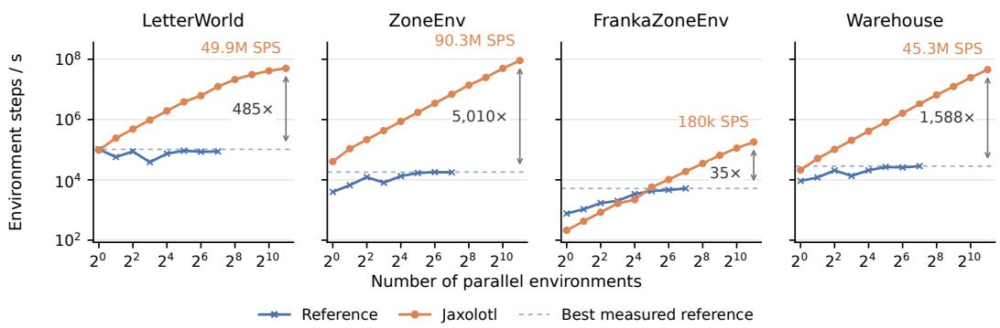  
Figure 7: Environment throughput of JAXOLOTL and the reference implementations against the number of parallel environments (log scales). The references run at most 128 parallel environments; the dashed line marks their best measured throughput. Annotations give the peak throughput of JAXOLOTL and its speedup over this best reference measurement.

## F.3 HYPERPARAMETERS

We provide the full set of training and model hyperparameters for each method in each environment; see Table 8 for LetterWorld, Table 9 for ZoneEnv and ZoneEnv-NM, Table 10 for FrankaZoneEnv, Table 11 for Warehouse, and Table 12 for ConveyorWorld and ConveyorWorldSimple. For GenZ-LTL and GCRL-LTL, the training “curriculum” consists of a single stage (i.e. no curriculum), so hyperparameters related to curriculum progression do not apply. Hyperparameters were largely taken from the literature where applicable. We use Adam (Kingma & Ba, 2015) for all experiments.

## G EXPERIMENTAL DETAILS

## G.1 COMPUTATIONAL EFFICIENCY

All timing experiments were run on a single desktop machine with consumer hardware: an NVIDIA GeForce RTX 5070 Ti GPU (16 GiB VRAM), an Intel Core i5-13600K CPU, and 32 GiB of RAM. For the comparison in Figure 3, JAXOLOTL trains multiple seeds in parallel on the GPU by vectorising the training loop over seeds with vmap. The reference implementations train a single seed per run. Running two reference instances concurrently increases their overall throughput, whereas running more reduces it due to resource contention. For each number of seeds k, we therefore report the fastest wall-clock time in which each implementation produces k trained seeds, and measure evaluation times in the same way. Timings for JAXOLOTL include JIT compilation.

Environment Throughput. Figure 7 compares raw environment throughput, measured in environment steps per second (SPS) over 8,192 steps of each parallel environment. JAXOLOTL batches environments on the GPU with vmap, whereas the reference implementations run each environment in a separate process and step them asynchronously. We evaluate JAXOLOTL with up to 2,048 parallel environments and the references with at most 128, since larger numbers caused them to crash. At its largest setting, JAXOLOTL is between 35× (FrankaZoneEnv) and 5,010× (ZoneEnv) faster than the best reference measurement. On FrankaZoneEnv, which simulates a 7-DoF arm with MJX, JAXOLOTL only overtakes the reference from 32 parallel environments onwards. Part of the ZoneEnv speedup comes from replacing the MuJoCo-based point robot of the original environment with point-mass dynamics (Appendix D.1).

## G.2 IMPLEMENTATION VALIDATION

We validate our implementations on the finite-horizon ZoneEnv task set of Jackermeier & Abate (2025). We re-run DeepLTL, GenZ-LTL, SemLTL and StructLTL with their official codebases over 10 seeds on this task set and compare them to our implementations on the same tasks. The reference success rates in Figure 4 (left) come from these re-runs, except for LTL2Action and GCRL-LTL, for which we use the results reported by Jackermeier & Abate (2025) on the same task set. The training curves in Figure 4 (right) show the re-runs of DeepLTL and GenZ-LTL.

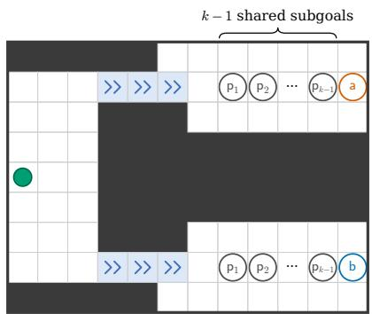  
(a)

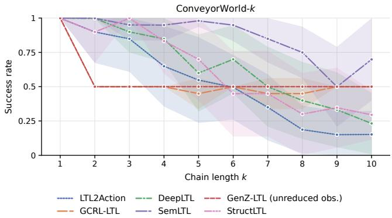  
(b)  
Figure 8: (a) A visualisation of ConveyorWorld-k; the green circle marks the agent start position, and the upper and lower one-way conveyor belts lead to rooms A and B respectively. (b) Non-myopic reasoning results on different step variants of ConveyorWorld-k.

## H ADDITIONAL RESULTS

## H.1 PER-SPECIFICATION RESULTS

Table 5, Table 6, and Table 7 present per-specification benchmark results (aggregated in Section 5.2.1) for the finite-horizon, infinite-horizon, and reach-stay LTL specifications, respectively.

## H.2 NON-MYOPIC REASONING

While many of the methods studied are capable of non-myopic reasoning in principle, reasoning over many steps becomes difficult to learn in practice once exploration and credit assignment are non-trivial. To demonstrate, we evaluate them on k-step variants of the original ConveyorWorld environment (Abate et al., 2026), of which ConveyorWorldSimple-k (Section 5.2.2) is a simplification. The task structure is the same: the agent must commit to one of two one-way conveyor belts leading to rooms A and B before satisfying $\mathsf { F } \left( \mathsf { p } _ { 1 } \wedge \mathsf { F } \left( \mathsf { p } _ { 2 } \wedge \cdot \cdot \cdot \wedge \mathsf { F } \mathsf { p } _ { k } \right) \right)$ ) with ${ \mathsf p } _ { i } \neq { \mathsf p } _ { j }$ , where $\mathsf { p } _ { 1 } , \ldots , \mathsf { p } _ { k - 1 }$ are accessible in both rooms and ${ \mathsf p } _ { k } \sim U ( \{ { \mathsf a } , { \mathsf b } \} )$ is accessible only in room A (for a) or B (for b). Unlike the simplified version, the agent must first explore the starting room to reach the belts, and then explore the room it arrives in to enter the grid tile associated with each proposition in order from p1 to ${ \mathsf p } _ { k }$ before receiving any reward. Figure 8a provides a visualisation of ConveyorWorld-k.

Figure 8b presents success rate over k in ConveyorWorld; we see severe degradation of all nonmyopic methods as k increases. The performance of trained policies is trimodal across seeds for each: some seeds learn the task and achieve 100% success rate, others collapse to always entering the same room as a local optimum, and the rest never learn to exploit any reward within the training budget (e.g. continually staying in the initial room). The distribution generally shifts from the first mode through the second into the last with increasing k as exploration and credit assignment become more challenging, since the agent must visit all k subgoals in order before receiving any reward. Note that using a multi-stage curriculum did not improve performance, as many seeds failed to learn even simple $\mathsf { F } _ { \mathsf { P } k }$ reach tasks in the first curriculum stage.

Table 2: Finite-horizon LTL specifications used for evaluation.
<table><tr><td></td><td>ID</td><td>LTL Formula</td></tr><tr><td>Iettrorid</td><td>41 42 43 44 45 46 47 48 49</td><td>F(a∧(¬b∪c))∧Fd (Fd) ∧ (¬f U (d ∧ F b))  $( \mathsf { F } ( ( \mathsf { a } \lor \mathsf { c } \lor \mathsf { j } ) \land \mathsf { F } \mathsf { b } ) ) \land ( \mathsf { F } ( \mathsf { c } \land \mathsf { F } \mathsf { d } ) ) \land \mathsf { F } \mathsf { k }$   $\neg \mathsf { a } \ u ( \mathsf { b } \wedge ( \neg \mathsf { c } \cup ( \mathsf { d } \wedge ( \neg \mathsf { e } \cup \mathsf { f } ) ) ) )$   $G \neg ( \mathsf { k } \setminus \mathsf { l } ) \wedge \mathsf { F } ( \mathsf { a } \wedge \mathsf { F } ( \mathsf { e } \wedge \mathsf { F } ( \mathsf { i } \wedge \mathsf { F } \mathsf { d } ) ) )$   $\mathsf { G } \to ( \mathsf { a } \lor \mathsf { b } \lor \mathsf { c } \lor \mathsf { d } ) \land \mathsf { G } ( \mathsf { h } \to \neg \mathsf { f } \cup \mathsf { g } ) \land \mathsf { F g } \land \mathsf { F } ( \mathsf { h } \land \mathsf { F } \mathsf { i } )$   $\mathsf { F } \left( \left( \mathsf { a } \lor \mathsf { I } \right) \wedge \left( \left( \mathsf { a } \to \left( \mathsf { - b } \mathsf { b } \cup \left( \mathsf { c } \land \mathsf { F } \mathsf { d } \right) \right) \right) \wedge \left( \mathsf { I } \to \mathsf { F } \mathsf { g } \right) \right) \right)$   $\mathsf { F } ( \mathsf { a } \wedge \mathsf { F } ( \mathsf { b } \wedge \mathsf { F } ( \mathsf { c } \wedge \mathsf { F } ( \mathsf { d } \wedge \mathsf { F } ( \mathsf { e } \wedge \mathsf { F } ( \mathsf { f } \wedge \mathsf { F } ( \mathsf { g } \wedge \mathsf { F } ( \mathsf { p } \wedge \mathsf { F } ( \mathsf { d } ) ) ) ) ) ) ) )$   ${ \sf G \to \ln F ( i \land F ( e \land F ( a \land F ( k \land F ( g \land F ( e ) ) ) ) ) ) }$   $\lnot ( { \mathsf { b } } \lor { \mathsf { d } } \lor { \mathsf { f } } \lor { \mathsf { h } } \lor { \mathsf { j } } ) { \mathsf { U } } ( { \mathsf { I } } \land { \mathsf { F } } ( ( { \mathsf { a } } \lor { \mathsf { k } } ) \land ( ( { \mathsf { a } } \to { \mathsf { F } } { \mathsf { c } } ) ) ) )$  F (green ∧ (¬red U yellow))∧ F purple</td></tr><tr><td>Zonn</td><td>410 411 412 413 414 415 416 417 418 419</td><td>(F red)∧(¬red U(green∧F yellow)) F (red ∨ green)∧ F yellow ∧ F purple ¬(purple ∨ yellow) U (red ∧ F green) ¬green U ((red ∨ purple) ∧ (¬green U yellow)) ((green ∨ red) → (¬yellow U purple)) U yellow G ¬purple ∧ F (red ∧ F (green ∧ F yellow)) ¬(green ∨ purple ∨ yellow) U (red ∧ F (yellow ∧ (¬red U green))) G ¬yellow ∧F (red ∧F (purple ∧ F (green ∧ F red)))</td></tr><tr><td>Franvy</td><td>420 421 422 423 424 425 426 427 428 429 430</td><td>F ((red∨green)∧((red → (¬yellow U (purple∧F green)))∧(green →(¬purple U (yellow∧ F red))))) G ¬(cyan ∨ pink) ∧ (F (red ∧ F (yellow ∧ F purple)) ∨ F (blue ∧ F (green ∧ F orange))) F (red ∧ F (green ∧ F blue)) ∧ F (orange ∧ F (pink ∧ F cyan)) F yellow ∧ F purple ∧ F cyan ∧ F blue ∧ (¬cyan U yellow)∧(¬blue U purple) (¬pink U cyan) ∧ F (pink ∧ F red) ¬(green ∨ yellow) U ((red ∨ purple) ∧ (¬(blue ∨ pink) U (cyan ∨ orange))) (¬red U (greenVpink))∧(((green → (¬red U cyan))∧(pink→ (¬red U orange))) U (red∧ Fyellow)) G¬(red∨ pink) ∧ F ((green ∨ blue) ∧ F (yellow ∧ F (cyan ∧ F orange)) (F red ∧ F green ∧G ¬(blue ∨ yellow)) ∨ (F blue ∧ F yellow ∧ G ¬(red ∨ green)) È (red ∧ F (green ∧ F (purple ∧ F (yellow λ F (blue ∧ F (orange ∧ È (cyan ∧ F pink)))))) ¬green U (red ∧ (¬purple U (green ∧ (¬yellow U (purple ∧ (¬blue U (yellow ∧ (¬orange U (blue ∧ (¬cyan U (orange ∧ (¬pink U (cyan ∧(¬red U pink))))))))))))</td></tr><tr><td>Warrouse</td><td>431 432 433 434 435 436 437 438 439 440</td><td>F (region_a ∧ F (crate ∧ F region_b)) ¬(region_a ∨ door) U (vase ∧ region_b) ¬door U (region_a ∧ (¬vase U region_b)) ¬(vase ∨ crate) U (region_a ∧ F (door ∧ F region_b)) F (vase ∧ region_a λ (region_a U (¬vase ∧ region_a))) F (vase ∧ crate ∧ region_b ∧ (region_b U (¬vase ∧ ¬crate ∧ region_b))) (crate → (crate U region_b)) U (crate ∧ region_b ∧ (region_b U (¬crate ∧ region_b))) (vase → (vase U door)) U (F (crate ∧ region_b ∧ (region_b U (¬crate ∧ region_b))) ∧ È (vase ∧ door ∧ (door Ü (¬vase ∧ door)))) (crate → (¬(region_a ∨ region_b)) U door) U (vase ∧ door ∧ (door U (¬vase ∧ door))) È (crate ∧ region_a ∧ (region_a U (¬crate ∧ region_a)))∧F (vase ∧ door ∧ (door U (¬vase ∧ door)))</td></tr><tr><td>ZOo-NM</td><td>441 442 443 444 445 446 447 448 449 450</td><td>(F red)∧ (¬red U (green ∧ F yellow)) F (red ∨ green)∧ F yellow ∧ F purple ¬(purple ∨ yellow) U (red ∧ F green) ¬green U ((red ∨ purple)∧ (¬green U yellow)) ((green ∨ red) → (¬yellow U purple)) U yellow F(green ∧ (¬red U yellow))∧ F purple F (yellow ∨ purple ∨ red)∧ (¬yellow U green) F purple ∧ F green ∧ F yellow∧ F red F ((purple ∨ yellow)∧ F ((purple ∨ red)∧ F green)) (¬yellow U purple) ∧ F (green ∧ F (red ∧ F green))</td></tr></table>

Table 3: Infinite-horizon LTL specifications used for evaluation.
<table><tr><td>ID</td><td></td><td>LTL Formula</td></tr><tr><td>Letrorid</td><td>ψ1 ψ2 ψ3 ψ4 ψ5 ψ6 ψ7 ψ8 ψ9</td><td>G F a ∧ G F b ∧ G F c G F (a ∧F d)∧GF (b ∧F e) G¬I∧GFc∧GFg∧GF j (¬a U b)∧G Fa ∧ GF f ∧ GF g∧G F h G (a → F d) ∧ G F a ∧ G F h G È (c ∧ (¬d U e)) ∧ G F b F (a ∧ F (b ∧ F c)) ∧ G F d ∧ G F e ∧ G F f ∧ G F g G (b → (¬c U d)) ∧ G F b ∧ G F c G F (e ∧ F h) ∧ G F k</td></tr><tr><td>Zonn</td><td>ψ10 ψ11 ψ12 ψ13 ψ14 ψ15 ψ16 ψ17 ψ18 ψ19</td><td>G F a ∧G F b ∧ G F c ∧ G F d ∧ G ¬I G F yellow ∧ G F green ∧ G F red G F red ∧G F green ∧G F yellow ∧G ¬purple G F red ∧ G F yellow ∧ G F purple G F (red ∧ F green)∧ G F purple G ¬purple ∧G F (red ∧F green)∧G F yellow G (red → F yellow)∧ G F red ∧G F green G F (green ∧ (¬yellow U purple))∧ G F red</td></tr><tr><td>Frny</td><td>ψ20 ψ21 ψ22 ψ23 ψ24 ψ25 ψ26 ψ27 ψ28</td><td>(¬red U purple) ∧ G F red ∧ G F yellow ∧ G F green G (purple → (¬green U yellow)) ∧ G F purple ∧ G F green F (red ∧ F green)∧ G F yellow ∧ G F purple ∧ G F red G F red ∧ G F green ∧ G F blue ∧ G F yellow G F (orange ∧ F pink) ∧ G F (cyan ∧ F purple) G ¬(red ∨ pink)∧ GF green ∧G F orange ∧ G F cyan G F (yellow ∧ (¬(blue ∨ red) U purple))∧ G F orange (¬blue U cyan)∧ G F blue ∧ G F pink G (blue → F yellow) ∧ G (green → F purple) ∧ G F blue ∧ G F green</td></tr><tr><td>Warouse</td><td>ψ29 ψ30 ψ31 ψ32 ψ33 ψ34 ψ35 ψ36 ψ37 ψ38 ψ39 ψ40</td><td>G È cyan ∧ G F purple ∧ G (cyan → (¬purple U orange)) F (yellow ∧ F (orange ∧ F pink))∧ G F red ∧ G F green G (red → (¬blue U green)) ∧ G (blue → (¬red U green)) ∧ G F red ∧ G F blue G È (cyan λ (¬pink U purple)) ∧G F (pink ∧ (¬cyan U yellow)) G F region_a ∧ G F region_b ∧ G F door G F (vase ∧ F ¬vase)∧ G F (crate ∧ F ¬crate)∧ G F door ∧ G ¬region_a F (vàse ∧ region_a ∧ (region_a U (¬vase ∧ region_a)))∧ G F door ∧ G F region_b G F (vase ∧ region_a ∧ (region_a U (¬vase ∧ region_a))) ∧ G F (crate ∧ region_b ∧ (region_b U (¬crate ∧ region_b))) G F region_a ∧ G F region_b ∧ G F door ∧ G (door → F region_a) G F (vase ∧ F (¬vase ∧ region_a))∧ G F region_b G F (crate ∧ F (¬crate ∧ region_b))∧ G F door G ¬region_b ∧GF region_a ∧G F door ∧ G F (vase ∧F ¬vase) G F (region_a ∧ F region_b) ∧ G F door G (vase → F (¬vase ∧ region_a)) ∧ G F vase ∧ G F door</td></tr></table>

Table 4: Reach-stay LTL specifications used for evaluation.
<table><tr><td>ID</td><td>LTL Formula</td></tr><tr><td></td><td>F G red</td></tr><tr><td>X1 X2</td><td>F G red ∧ F (yellow ∧ F green)</td></tr><tr><td>X3 X4</td><td>F G purple ∧ G ¬yellow</td></tr><tr><td>X5</td><td>G ((green ∨ yellow) → F red) ∧ F G (green ∨ purple)</td></tr><tr><td></td><td>F G green</td></tr><tr><td>Zonnnv X6</td><td>F G yellow</td></tr><tr><td>X7</td><td>F G green ∧ G ¬red</td></tr><tr><td>X8</td><td>F G purple ∧ F (green ∧ F red)</td></tr><tr><td>X9</td><td>F G purple ∧ G ¬green</td></tr><tr><td>X10 X11</td><td>G (yellow → F red) ∧ F G purple</td></tr><tr><td>X12 X13 Warouse X14 X15 X16 X17 X18 X19 X20</td><td>F G region_a F (vase ∧ region_b ∧ (region_b U (¬vase ∧ region_b)))∧ F G region_b F G region_b F G vase ∧ G ¬region_a</td></tr></table>

Table 5: Per-specification finite-horizon benchmark results (success rate), averaged over 512 evaluation episodes, with 95% Student-t CIs over training seeds. Best results are bold, second best underlined, — denotes unsupported configurations.
<table><tr><td rowspan=1 colspan=9>GenZ-LTL4  LTL2Action GCRL-LTL DeepLTL GenZ-LTL†                   SemLTL StructLTL(unreduced obs.)</td></tr><tr><td rowspan=1 colspan=9>41   $0 . 6 2 { \scriptstyle \pm 0 . 1 4 }$   $0 . 9 9 { \scriptstyle \pm 0 . 0 0 }$   $\underline { { 1 . 0 0 } } \pm 0 . 0 0$   $0 . 9 9 { \scriptstyle \pm 0 . 0 0 }$      $1 . 0 0 { \scriptstyle \pm 0 . 0 0 }$     $\mathbf { 1 . 0 0 } _ { \pm 0 . 0 0 }$  $1 . 0 0 { \scriptstyle \pm 0 . 0 0 }$ </td></tr><tr><td rowspan=1 colspan=4>42   $0 . 7 4 _ { \pm 0 . 1 5 }$   $\underline { { 0 . 9 9 _ { \pm 0 . 0 0 } } }$ </td><td rowspan=1 colspan=1> $0 . 9 6 _ { \pm 0 . 0 1 }$ </td><td rowspan=1 colspan=4> $\mathbf { 1 . 0 0 _ { \pm 0 . 0 0 } }$      $0 . 9 8 _ { \pm 0 . 0 0 }$     $0 . 9 5 _ { \pm 0 . 0 1 }$  $0 . 9 7 _ { \pm 0 . 0 1 }$ </td></tr><tr><td rowspan=1 colspan=4>43   $0 . 4 5 { \scriptstyle \pm 0 . 1 3 }$    $\mathbf { 1 . 0 0 } _ { \pm 0 . 0 0 }$ </td><td rowspan=1 colspan=1> $1 . 0 0 { \scriptstyle \pm 0 . 0 0 }$ </td><td rowspan=1 colspan=4> $\mathbf { 1 . 0 0 } _ { \pm 0 . 0 0 }$      $1 . 0 0 { \scriptstyle \pm 0 . 0 0 }$     $1 . 0 0 { \scriptstyle \pm 0 . 0 0 }$  $\mathbf { 1 . 0 0 _ { \pm 0 . 0 0 } }$ </td></tr><tr><td rowspan=1 colspan=3>44   $0 . 5 2 { \scriptstyle \pm 0 . 2 0 }$ </td><td rowspan=1 colspan=1> $\underline { { 0 . 9 8 } } \pm 0 . 0 1$ </td><td rowspan=1 colspan=1> $0 . 9 5 { \scriptstyle \pm 0 . 0 1 }$ </td><td rowspan=1 colspan=4> ${ \bf 0 . 9 9 { \scriptstyle \pm 0 . 0 0 } }$      $0 . 9 7 { \scriptstyle \pm 0 . 0 1 }$     $0 . 9 4 { \scriptstyle \pm 0 . 0 1 }$  $0 . 9 5 { \scriptstyle \pm 0 . 0 1 }$ </td></tr><tr><td rowspan=1 colspan=3>45   $0 . 0 2 { \scriptstyle \pm 0 . 0 1 }$ </td><td rowspan=1 colspan=1> $\underline { { 0 . 9 2 } } \pm \mathbf { 0 . 0 1 }$ </td><td rowspan=1 colspan=1> $0 . 7 3 { \scriptstyle \pm 0 . 0 3 }$ </td><td rowspan=1 colspan=4> $\mathbf { 1 . 0 0 } _ { \pm 0 . 0 0 }$      $0 . 8 5 { \scriptstyle \pm 0 . 0 2 }$     $0 . 5 7 { \scriptstyle \pm 0 . 0 7 }$   $0 . 7 9 { \scriptstyle \pm 0 . 0 4 }$ </td></tr><tr><td rowspan=1 colspan=3>46   $0 . 0 0 { \scriptstyle \pm 0 . 0 0 }$ </td><td rowspan=1 colspan=1> $0 . 7 2 _ { \pm 0 . 0 1 }$ </td><td rowspan=1 colspan=1> $0 . 5 3 { \scriptstyle \pm 0 . 0 7 }$ </td><td rowspan=1 colspan=3> ${ \bf 0 . 9 7 { \scriptstyle \pm 0 . 0 1 } }$      $\underline { { 0 . 7 7 } } \pm \mathbf { 0 . 0 2 }$     $0 . 3 2 _ { \pm 0 . 0 4 }$ </td><td rowspan=1 colspan=1> $0 . 6 2 _ { \pm 0 . 0 3 }$ </td></tr><tr><td rowspan=1 colspan=3>47   $0 . 6 3 { \scriptstyle \pm 0 . 1 5 }$ </td><td rowspan=1 colspan=1>1.00±0.00</td><td rowspan=1 colspan=1> $1 . 0 0 { \scriptstyle \pm 0 . 0 0 }$ </td><td rowspan=1 colspan=3> $0 . 9 9 { \scriptstyle \pm 0 . 0 0 }$      $1 . 0 0 { \scriptstyle \pm 0 . 0 0 }$     $\mathbf { 1 . 0 0 } _ { \pm 0 . 0 0 }$ </td><td rowspan=1 colspan=1> $1 . 0 0 { \scriptstyle \pm 0 . 0 0 }$ </td></tr><tr><td rowspan=1 colspan=3>48   $0 . 9 0 { \scriptstyle \pm 0 . 0 3 }$ </td><td rowspan=1 colspan=1>1.00±0.00</td><td rowspan=1 colspan=1> $1 . 0 0 { \scriptstyle \pm 0 . 0 0 }$ </td><td rowspan=1 colspan=3> $\mathbf { 1 . 0 0 } _ { \pm 0 . 0 0 }$      $0 . 9 9 { \scriptstyle \pm 0 . 0 0 }$     $0 . 8 1 { \scriptstyle \pm 0 . 0 6 }$ </td><td rowspan=1 colspan=1> $\underline { { 1 . 0 0 } } \pm \mathbf { 0 . 0 0 }$ </td></tr><tr><td rowspan=1 colspan=2>49</td><td rowspan=1 colspan=1> $0 . 0 1 { \scriptstyle \pm 0 . 0 1 }$ </td><td rowspan=1 colspan=1>0.97±0.01</td><td rowspan=1 colspan=1> $0 . 7 9 { \scriptstyle \pm 0 . 0 2 }$ </td><td rowspan=1 colspan=3> $\mathbf { 1 . 0 0 } _ { \pm 0 . 0 0 }$      $0 . 8 9 _ { \pm 0 . 0 1 }$     $0 . 6 2 { \scriptstyle \pm 0 . 0 7 }$ </td><td rowspan=1 colspan=1>0.83±0.03</td></tr><tr><td rowspan=1 colspan=2>410</td><td rowspan=1 colspan=1> $0 . 2 7 { \scriptstyle \pm 0 . 1 0 }$ </td><td rowspan=1 colspan=1>0.85±0.02</td><td rowspan=1 colspan=1> $0 . 7 8 _ { \pm 0 . 0 2 }$ </td><td rowspan=1 colspan=3> $\mathbf { 1 . 0 0 _ { \pm 0 . 0 0 } }$      $\underline { { 0 . 8 9 } } \underline { { \pm 0 . 0 2 } }$     $0 . 7 0 { \scriptstyle \pm 0 . 0 2 }$ </td><td rowspan=1 colspan=1> $0 . 8 1 _ { \pm 0 . 0 2 }$ </td></tr><tr><td rowspan=1 colspan=2>411</td><td rowspan=1 colspan=1> $0 . 3 3 { \scriptstyle \pm 0 . 1 1 }$ </td><td rowspan=1 colspan=1>0.99±0.00</td><td rowspan=1 colspan=1> $0 . 9 6 { \scriptstyle \pm 0 . 0 2 }$ </td><td rowspan=1 colspan=4> $\mathbf { 1 . 0 0 } _ { \pm 0 . 0 0 }$      $1 . 0 0 { \scriptstyle \pm 0 . 0 0 }$    0.97±0.02 $0 . 9 8 { \scriptstyle \pm 0 . 0 2 }$ </td></tr><tr><td rowspan=1 colspan=2>412</td><td rowspan=1 colspan=1> $0 . 2 4 { \scriptstyle \pm 0 . 2 1 }$ </td><td rowspan=1 colspan=1> $0 . 9 5 { \scriptstyle \pm 0 . 0 1 }$ </td><td rowspan=1 colspan=1> $0 . 9 4 { \scriptstyle \pm 0 . 0 1 }$ </td><td rowspan=1 colspan=3> $\mathbf { 1 . 0 0 } _ { \pm 0 . 0 0 }$      $0 . 9 7 { \scriptstyle \pm 0 . 0 1 }$     $0 . 9 2 _ { \pm 0 . 0 1 }$ </td><td rowspan=1 colspan=1>0.97±0.01</td></tr><tr><td rowspan=1 colspan=2>413</td><td rowspan=1 colspan=1>0.68±0.13</td><td rowspan=1 colspan=1>1.00±0.00</td><td rowspan=1 colspan=1> $0 . 9 8 { \scriptstyle \pm 0 . 0 1 }$ </td><td rowspan=1 colspan=3> $\mathbf { 1 . 0 0 } _ { \pm 0 . 0 0 }$      $\underline { { 1 . 0 0 } } \pm \mathbf { 0 . 0 0 }$     $0 . 9 8 { \scriptstyle \pm 0 . 0 1 }$ </td><td rowspan=1 colspan=1> $0 . 9 9 { \scriptstyle \pm 0 . 0 0 }$ </td></tr><tr><td rowspan=1 colspan=2>414</td><td rowspan=1 colspan=1>0.68±0.15</td><td rowspan=1 colspan=1>0.92±0.01</td><td rowspan=1 colspan=1> $0 . 9 1 _ { \pm 0 . 0 2 }$ </td><td rowspan=1 colspan=3> ${ \bf 0 . 9 9 _ { \pm 0 . 0 0 } }$      $0 . 9 3 _ { \pm 0 . 0 1 }$     $0 . 9 1 _ { \pm 0 . 0 2 } 0</td><td rowspan=1 colspan=1>. 9 4 _ { \pm 0 . 0 1 }$ </td></tr><tr><td rowspan=1 colspan=2>415</td><td rowspan=1 colspan=1>0.79±0.16</td><td rowspan=1 colspan=1>0.93±0.01</td><td rowspan=1 colspan=1> $0 . 9 4 { \scriptstyle \pm 0 . 0 1 }$ </td><td rowspan=1 colspan=1> $\mathbf { 1 . 0 0 } _ { \pm 0 . 0 0 }$ </td><td rowspan=1 colspan=1> $0 . 9 5 { \scriptstyle \pm 0 . 0 1 }$ </td><td rowspan=1 colspan=1> $0 . 9 0 { \scriptstyle \pm 0 . 0 5 }$ </td><td rowspan=1 colspan=1> $\underline { { 0 . 9 7 } } \pm \mathbf { 0 . 0 0 }$ </td></tr><tr><td rowspan=1 colspan=2>416</td><td rowspan=1 colspan=1> $0 . 9 0 { \scriptstyle \pm 0 . 0 4 }$ </td><td rowspan=1 colspan=1> $0 . 9 9 { \scriptstyle \pm 0 . 0 0 }$ </td><td rowspan=1 colspan=1> $0 . 9 6 { \scriptstyle \pm 0 . 0 1 }$ </td><td rowspan=1 colspan=1> $\mathbf { 1 . 0 0 } _ { \pm 0 . 0 0 }$ </td><td rowspan=1 colspan=1> $0 . 9 9 { \scriptstyle \pm 0 . 0 1 }$ </td><td rowspan=1 colspan=1> $0 . 9 8 { \scriptstyle \pm 0 . 0 1 }$ </td><td rowspan=1 colspan=1> $\underline { { 0 . 9 9 { \pm } 0 . 0 1 } }$ </td></tr><tr><td rowspan=1 colspan=2>417</td><td rowspan=1 colspan=1>0.06±0.06 0</td><td rowspan=1 colspan=1>.88±0.02 0</td><td rowspan=1 colspan=1>.83±0.07</td><td rowspan=1 colspan=1> ${ \bf 0 . 9 9 { \scriptstyle \pm 0 . 0 0 } }$ </td><td rowspan=1 colspan=1> $0 . 9 3 { \scriptstyle \pm 0 . 0 2 }$ </td><td rowspan=1 colspan=1> $0 . 8 3 { \scriptstyle \pm 0 . 0 5 }$ </td><td rowspan=1 colspan=1> $\underline { { 0 . 9 4 } } \underline { { { \pm } } } \mathbf { 0 . 0 2 }$ </td></tr><tr><td rowspan=1 colspan=2>418</td><td rowspan=1 colspan=1> $0 . 4 7 _ { \pm 0 . 1 9 }$ </td><td rowspan=1 colspan=1> $0 . 8 5 _ { \pm 0 . 0 1 }$ </td><td rowspan=1 colspan=1> $0 . 8 1 _ { \pm 0 . 0 3 }$ </td><td rowspan=1 colspan=1> $\mathbf { 0 . 9 8 _ { \pm 0 . 0 0 } }$ </td><td rowspan=1 colspan=1> $0 . 8 8 _ { \pm 0 . 0 2 }$ </td><td rowspan=1 colspan=1> $0 . 8 3 _ { \pm 0 . 0 1 }$ </td><td rowspan=1 colspan=1> $\underline { { 0 . 8 8 } } \pm 0 . 0 1$ </td></tr><tr><td rowspan=1 colspan=2>419</td><td rowspan=1 colspan=1>0.03±0.06</td><td rowspan=1 colspan=1> $0 . 8 3 { \scriptstyle \pm 0 . 0 2 }$ </td><td rowspan=1 colspan=1> $0 . 8 4 _ { \pm 0 . 0 7 }$ </td><td rowspan=1 colspan=1> ${ \bf 0 . 9 9 { \scriptstyle \pm 0 . 0 0 } }$ </td><td rowspan=1 colspan=1> $\underline { { 0 . 9 2 } } \pm \mathbf { 0 . 0 2 }$ </td><td rowspan=1 colspan=1> $0 . 7 1 { \scriptstyle \pm 0 . 0 9 }$ </td><td rowspan=1 colspan=1> $0 . 8 8 { \scriptstyle \pm 0 . 0 8 }$ </td></tr><tr><td rowspan=1 colspan=2>420</td><td rowspan=1 colspan=1> $0 . 1 7 { \scriptstyle \pm 0 . 0 7 }$ </td><td rowspan=1 colspan=1> $1 . 0 0 { \scriptstyle \pm 0 . 0 0 }$ </td><td rowspan=1 colspan=1> $0 . 9 8 { \scriptstyle \pm 0 . 0 1 }$ </td><td rowspan=1 colspan=1> $\mathbf { 1 . 0 0 } _ { \pm 0 . 0 0 }$ </td><td rowspan=1 colspan=2> $\underline { { 1 . 0 0 } } \pm \mathbf { 0 . 0 0 }$     $0 . 3 2 { \scriptstyle \pm 0 . 0 7 }$ </td><td rowspan=1 colspan=1> $0 . 9 8 { \scriptstyle \pm 0 . 0 2 }$ </td></tr><tr><td rowspan=1 colspan=2>421</td><td rowspan=1 colspan=1> $0 . 0 2 _ { \pm 0 . 0 1 }$ </td><td rowspan=1 colspan=1>0.50±0.26</td><td rowspan=1 colspan=1> $0 . 3 9 _ { \pm 0 . 1 8 }$ </td><td rowspan=1 colspan=1> $\mathbf { 1 . 0 0 _ { \pm 0 . 0 0 } }$ </td><td rowspan=1 colspan=2> $0 . 4 5 _ { \pm 0 . 2 1 }$    0.50±0.13</td><td rowspan=1 colspan=1> $\underline { { 0 . 8 8 } } \pm \mathbf { 0 . 0 1 }$ </td></tr><tr><td rowspan=1 colspan=1></td><td rowspan=1 colspan=1>422</td><td rowspan=1 colspan=1> $0 . 0 0 { \scriptstyle \pm 0 . 0 0 }$ </td><td rowspan=1 colspan=1> $0 . 5 6 _ { \pm 0 . 3 1 }$ </td><td rowspan=1 colspan=1> $0 . 7 6 _ { \pm 0 . 1 4 }$ </td><td rowspan=1 colspan=1> $\mathbf { 1 . 0 0 _ { \pm 0 . 0 0 } }$ </td><td rowspan=1 colspan=1> $0 . 3 8 _ { \pm 0 . 2 6 }$ </td><td rowspan=1 colspan=1>0.48±0.08</td><td rowspan=1 colspan=1> $\underline { { 0 . 9 9 _ { \pm 0 . 0 0 } } }$ </td></tr><tr><td rowspan=1 colspan=1></td><td rowspan=1 colspan=1>423</td><td rowspan=1 colspan=1> $0 . 0 2 { \scriptstyle \pm 0 . 0 1 }$ </td><td rowspan=1 colspan=1> $0 . 5 4 { \scriptstyle \pm 0 . 2 8 }$ </td><td rowspan=1 colspan=1> $0 . 5 4 { \scriptstyle \pm 0 . 1 8 }$ </td><td rowspan=1 colspan=1> $\mathbf { 1 . 0 0 } _ { \pm 0 . 0 0 }$ </td><td rowspan=1 colspan=1> $0 . 4 4 _ { \pm 0 . 2 3 }$ </td><td rowspan=1 colspan=1> $0 . 6 2 { \scriptstyle \pm 0 . 1 0 }$ </td><td rowspan=1 colspan=1> $\underline { { 0 . 9 4 } } \pm \mathbf { 0 . 0 1 }$ </td></tr><tr><td rowspan=1 colspan=1></td><td rowspan=1 colspan=1>424</td><td rowspan=1 colspan=1> $0 . 0 7 { \scriptstyle \pm 0 . 0 3 }$ </td><td rowspan=1 colspan=1> $0 . 6 6 { \scriptstyle \pm 0 . 2 9 }$ </td><td rowspan=1 colspan=1>0.62±0.20</td><td rowspan=1 colspan=1> $\mathbf { 1 . 0 0 } _ { \pm 0 . 0 0 }$ </td><td rowspan=1 colspan=1> $0 . 5 5 { \scriptstyle \pm 0 . 2 7 }$ </td><td rowspan=1 colspan=1> $0 . 8 9 { \scriptstyle \pm 0 . 0 4 }$ </td><td rowspan=1 colspan=1> $\underline { { 0 . 9 7 } } \pm \mathbf { 0 . 0 1 }$ </td></tr><tr><td rowspan=1 colspan=1></td><td rowspan=1 colspan=1>425</td><td rowspan=1 colspan=1> $0 . 1 4 _ { \pm 0 . 0 5 }$ </td><td rowspan=1 colspan=1> $0 . 7 2 _ { \pm 0 . 1 9 }$ </td><td rowspan=1 colspan=1> $0 . 5 0 { \scriptstyle \pm 0 . 1 0 }$ </td><td rowspan=1 colspan=1> $\mathbf { 1 . 0 0 _ { \pm 0 . 0 0 } }$ </td><td rowspan=1 colspan=1> $0 . 7 1 { \scriptstyle \pm 0 . 2 0 }$ </td><td rowspan=1 colspan=1> $0 . 8 3 _ { \pm 0 . 0 2 }$ </td><td rowspan=1 colspan=1> $\underline { { 0 . 9 7 } } \pm \mathbf { 0 . 0 1 }$ </td></tr><tr><td rowspan=1 colspan=1>a</td><td rowspan=1 colspan=1>426</td><td rowspan=1 colspan=1> $0 . 0 1 _ { \pm 0 . 0 1 }$ </td><td rowspan=1 colspan=1> $0 . 5 3 { \scriptstyle \pm 0 . 3 0 }$ </td><td rowspan=1 colspan=1> $0 . 5 0 { \scriptstyle \pm 0 . 2 1 }$ </td><td rowspan=1 colspan=1> $\mathbf { 1 . 0 0 _ { \pm 0 . 0 0 } }$ </td><td rowspan=1 colspan=1> $0 . 4 5 _ { \pm 0 . 2 6 }$ </td><td rowspan=1 colspan=1> $0 . 2 8 { \scriptstyle \pm 0 . 0 5 }$ </td><td rowspan=1 colspan=1> $\underline { { 0 . 9 5 _ { \pm 0 . 0 1 } } }$ </td></tr><tr><td></td><td rowspan=1 colspan=1>427</td><td rowspan=1 colspan=1> $0 . 0 0 { \scriptstyle \pm 0 . 0 0 }$ </td><td rowspan=1 colspan=1> $0 . 4 3 _ { \pm 0 . 2 7 }$ </td><td rowspan=1 colspan=1> $0 . 2 5 { \scriptstyle \pm 0 . 1 6 }$ </td><td rowspan=1 colspan=1> $\mathbf { 1 . 0 0 } _ { \pm 0 . 0 0 }$ </td><td rowspan=1 colspan=1> $0 . 3 2 { \scriptstyle \pm 0 . 1 8 }$ </td><td rowspan=1 colspan=1> $0 . 4 4 { \scriptstyle \pm 0 . 1 5 }$ </td><td rowspan=1 colspan=1>0.81±0.01</td></tr><tr><td></td><td rowspan=1 colspan=1>428</td><td rowspan=1 colspan=1> $0 . 1 3 { \scriptstyle \pm 0 . 0 3 }$ </td><td rowspan=1 colspan=1> $0 . 7 0 { \scriptstyle \pm 0 . 2 0 }$ </td><td rowspan=1 colspan=1>0.63±0.14</td><td rowspan=1 colspan=1> $\mathbf { 1 . 0 0 } _ { \pm 0 . 0 0 }$ </td><td rowspan=1 colspan=1> $0 . 6 0 { \scriptstyle \pm 0 . 1 9 }$ </td><td rowspan=1 colspan=1> $0 . 5 2 { \scriptstyle \pm 0 . 1 9 }$ </td><td rowspan=1 colspan=1> $\underline { { 0 . 9 5 } } \pm \mathbf { 0 . 0 1 }$ </td></tr><tr><td rowspan=1 colspan=2>429</td><td rowspan=1 colspan=1> $0 . 0 0 { \scriptstyle \pm 0 . 0 0 }$ </td><td rowspan=1 colspan=1> $0 . 4 7 _ { \pm 0 . 3 3 }$ </td><td rowspan=1 colspan=1> $0 . 5 8 _ { \pm 0 . 2 1 }$ </td><td rowspan=1 colspan=1> $\mathbf { 1 . 0 0 _ { \pm 0 . 0 0 } }$ </td><td rowspan=1 colspan=1> $0 . 3 1 { \scriptstyle \pm 0 . 2 5 }$ </td><td rowspan=1 colspan=1> $0 . 3 4 _ { \pm 0 . 1 1 }$ </td><td rowspan=1 colspan=1> $\underline { { 0 . 9 9 _ { \pm 0 . 0 0 } } }$ </td></tr><tr><td rowspan=1 colspan=2>430</td><td rowspan=1 colspan=1> $0 . 0 0 { \scriptstyle \pm 0 . 0 0 }$ </td><td rowspan=1 colspan=1> $0 . 3 9 _ { \pm 0 . 2 8 }$ </td><td rowspan=1 colspan=1> $0 . 3 5 { \scriptstyle \pm 0 . 2 6 }$ </td><td rowspan=1 colspan=1> $\mathbf { 1 . 0 0 _ { \pm 0 . 0 0 } }$ </td><td rowspan=1 colspan=2> $0 . 2 7 _ { \pm 0 . 2 3 }$     $0 . 2 3 { \scriptstyle \pm 0 . 0 8 }$ </td><td rowspan=1 colspan=1> $\underline { { 0 . 9 5 _ { \pm 0 . 0 1 } } }$ </td></tr><tr><td rowspan=1 colspan=1></td><td rowspan=1 colspan=1>431</td><td rowspan=1 colspan=1> $0 . 9 7 { \scriptstyle \pm 0 . 0 2 }$ </td><td rowspan=1 colspan=1></td><td rowspan=1 colspan=1> $\underline { { 0 . 9 8 } } \pm 0 . 0 1$ </td><td rowspan=1 colspan=1></td><td rowspan=1 colspan=2> $0 . 9 6 { \scriptstyle \pm 0 . 0 3 }$     $0 . 9 5 { \scriptstyle \pm 0 . 1 0 }$ </td><td rowspan=1 colspan=1> ${ \bf 0 . 9 9 { \scriptstyle \pm 0 . 0 1 } }$ </td></tr><tr><td rowspan=1 colspan=1></td><td rowspan=1 colspan=1>432</td><td rowspan=1 colspan=1> $0 . 4 1 { \scriptstyle \pm 0 . 2 6 }$ </td><td rowspan=1 colspan=1></td><td rowspan=1 colspan=1> $\underline { { 0 . 9 4 } } \underline { { { \pm 0 . 0 2 } } }$ </td><td rowspan=1 colspan=1></td><td rowspan=1 colspan=2> $0 . 9 1 { \scriptstyle \pm 0 . 0 3 }$     $0 . 9 2 _ { \pm 0 . 0 3 }$ </td><td rowspan=1 colspan=1> $\mathbf { 0 . 9 5 { \scriptstyle \pm 0 . 0 1 } }$ </td></tr><tr><td rowspan=1 colspan=1></td><td rowspan=1 colspan=1>433</td><td rowspan=1 colspan=1> $0 . 1 9 _ { \pm 0 . 2 2 }$ </td><td rowspan=1 colspan=1></td><td rowspan=1 colspan=1> $\underline { { 0 . 9 7 } } \pm \mathbf { 0 . 0 3 }$ </td><td rowspan=1 colspan=1></td><td rowspan=1 colspan=2> $0 . 9 5 _ { \pm 0 . 0 4 }$     ${ \bf 0 . 9 9 _ { \pm 0 . 0 1 } }$ </td><td rowspan=1 colspan=1> $0 . 9 4 _ { \pm 0 . 0 8 }$ </td></tr><tr><td rowspan=1 colspan=1></td><td rowspan=1 colspan=1>434</td><td rowspan=1 colspan=1> $0 . 2 1 { \scriptstyle \pm 0 . 1 0 }$ </td><td rowspan=1 colspan=1></td><td rowspan=1 colspan=1> ${ \bf 0 . 9 3 _ { \pm 0 . 0 2 } }$ </td><td rowspan=1 colspan=1></td><td rowspan=1 colspan=2> $0 . 7 4 _ { \pm 0 . 2 7 }$     $0 . 7 8 { \scriptstyle \pm 0 . 0 8 }$ </td><td rowspan=1 colspan=1> $\underline { { 0 . 7 9 } } \pm \mathbf { 0 . 1 4 }$ </td></tr><tr><td rowspan=1 colspan=1></td><td rowspan=1 colspan=1>435</td><td rowspan=1 colspan=1> $0 . 6 2 _ { \pm 0 . 3 3 }$ </td><td rowspan=1 colspan=1></td><td rowspan=1 colspan=1> $0 . 7 6 { \scriptstyle \pm 0 . 2 2 }$ </td><td rowspan=1 colspan=1></td><td rowspan=1 colspan=2> $\underline { { 0 . 9 9 { \pm } 0 . 0 1 } }$     $0 . 9 8 { \scriptstyle \pm 0 . 0 2 }$ </td><td rowspan=1 colspan=1> ${ \bf 0 . 9 9 { \scriptstyle \pm 0 . 0 0 } }$ </td></tr><tr><td rowspan=1 colspan=1></td><td rowspan=1 colspan=1>436</td><td rowspan=1 colspan=1> $0 . 5 2 { \scriptstyle \pm 0 . 3 1 }$ </td><td rowspan=1 colspan=1></td><td rowspan=1 colspan=1> $0 . 7 2 { \scriptstyle \pm 0 . 2 0 }$ </td><td rowspan=1 colspan=1></td><td rowspan=1 colspan=2> $\underline { { 0 . 9 6 \pm 0 . 0 1 } }$     $0 . 8 3 { \scriptstyle \pm 0 . 1 6 }$ </td><td rowspan=1 colspan=1>0.99±0.01</td></tr><tr><td rowspan=1 colspan=2>437</td><td rowspan=1 colspan=1> $0 . 1 2 _ { \pm 0 . 1 0 }$ </td><td rowspan=1 colspan=1></td><td rowspan=1 colspan=1> $0 . 8 5 _ { \pm 0 . 1 1 }$ </td><td rowspan=1 colspan=1></td><td rowspan=1 colspan=2> $\underline { { 0 . 9 7 } } \pm \mathbf { 0 . 0 2 }$     $0 . 7 5 _ { \pm 0 . 1 1 }$ </td><td rowspan=1 colspan=1> $\mathbf { 0 . 9 8 _ { \pm 0 . 0 1 } }$ </td></tr><tr><td rowspan=1 colspan=2>438</td><td rowspan=1 colspan=1> $0 . 1 1 { \scriptstyle \pm 0 . 1 9 }$ </td><td rowspan=1 colspan=1></td><td rowspan=1 colspan=1> $0 . 6 0 _ { \pm 0 . 2 4 }$ </td><td rowspan=1 colspan=1></td><td rowspan=1 colspan=2> $\underline { { 0 . 6 3 } } \pm \mathbf { 0 . 3 1 }$     $0 . 4 1 _ { \pm 0 . 1 4 }$ </td><td rowspan=1 colspan=1> $\mathbf { 0 . 8 8 _ { \pm 0 . 2 2 } }$ </td></tr><tr><td rowspan=1 colspan=2>439</td><td rowspan=1 colspan=1> $0 . 1 1 { \scriptstyle \pm 0 . 1 4 }$ </td><td rowspan=1 colspan=1></td><td rowspan=1 colspan=1> $0 . 7 7 { \scriptstyle \pm 0 . 2 0 }$ </td><td rowspan=1 colspan=1></td><td rowspan=1 colspan=2> $0 . 6 6 { \scriptstyle \pm 0 . 3 3 }$     $\underline { { 0 . 8 0 } } \pm 0 . 1 2$ </td><td rowspan=1 colspan=1> $\mathbf { 0 . 9 5 _ { \pm 0 . 0 3 } }$ </td></tr><tr><td rowspan=1 colspan=2>440</td><td rowspan=1 colspan=1> $0 . 1 1 { \scriptstyle \pm 0 . 2 0 }$ </td><td rowspan=1 colspan=1></td><td rowspan=1 colspan=1> $0 . 5 1 { \scriptstyle \pm 0 . 2 7 }$ </td><td rowspan=1 colspan=1></td><td rowspan=1 colspan=2> $0 . 6 4 { \scriptstyle \pm 0 . 3 1 }$     $\mathbf { 0 . 9 4 _ { \pm 0 . 0 4 } }$ </td><td rowspan=1 colspan=1> $\underline { { 0 . 8 8 } } \pm \mathbf { 0 . 2 2 }$ </td></tr></table>

Table 6: Per-specification infinite-horizon benchmark results (completed accepting cycles), averaged over 512 evaluation episodes, with 95% Student-t CIs over training seeds. Best results are bold, second best underlined, — denotes unsupported configurations.
<table><tr><td rowspan=1 colspan=10>GenZ-LTL $\psi$    GCRL-LTL DeepLTL  ${ \mathrm { G e n Z - L T L } } ^ { \dagger }$                       SemLTL StructLTL(unreduced obs.)</td></tr><tr><td rowspan=1 colspan=9> $\psi _ { 1 }$      $9 . 4 \pm 0 . 1$     $6 . 8 { \scriptstyle \pm 0 . 3 }$     ${ \bf 9 . 8 \pm } 0 . 1$         $6 . 9 { \pm } 0 . 1$        $6 . 0 { \scriptstyle \pm 0 . 2 }$ </td><td rowspan=1 colspan=1> $6 . 7 \pm 0 . 4$ </td></tr><tr><td rowspan=1 colspan=3> $\psi _ { 2 }$ </td><td rowspan=1 colspan=1> $6 . 4 \pm 0 . 0$ </td><td rowspan=1 colspan=5> $4 . 3 { \pm } 0 . 2$     ${ \bf 6 . 7 \pm 0 . 1 }$         $4 . 5 _ { \pm 0 . 0 }$        $4 . 1 \pm 0 . 1$ </td><td rowspan=1 colspan=1> $4 . 3 _ { \pm 0 . 2 }$ </td></tr><tr><td rowspan=1 colspan=3> $\psi _ { 3 }$ </td><td rowspan=1 colspan=1> $8 . 8 { \pm } 0 . 5$ </td><td rowspan=1 colspan=5> $5 . 3 { \pm } 0 . 4$     ${ \bf 9 . 8 \pm } 0 . 1$         $6 . 2 \pm 0 . 1$        $4 . 5 _ { \pm 0 . 3 }$ </td><td rowspan=1 colspan=1> $5 . 7 \pm \mathrm { 0 . 3 }$ </td></tr><tr><td rowspan=1 colspan=3>1ψ4</td><td rowspan=1 colspan=1> $\underline { { 6 . 3 \pm 0 . 0 } }$ </td><td rowspan=1 colspan=5> $4 . 0 { \pm } 0 . 3$     ${ \bf 6 . 7 \pm 0 . 1 }$         $4 . 5 _ { \pm 0 . 0 }$        $3 . 3 { \pm } 0 . 2$ </td><td rowspan=1 colspan=1> $4 . 1 \pm 0 . 2$ </td></tr><tr><td rowspan=1 colspan=3>W ψ5</td><td rowspan=1 colspan=1> ${ \bf 9 . 4 _ { \pm 0 . 3 } }$ </td><td rowspan=1 colspan=5> $6 . 3 { \scriptstyle \pm 0 . 9 }$     $6 . 4 { \scriptstyle \pm 0 . 3 }$         $5 . 2 { \scriptstyle \pm 0 . 3 }$        $6 . 0 { \pm } 0 . 3$ </td><td rowspan=1 colspan=1> $\underline { { 7 . 1 \pm 0 . 8 } }$ </td></tr><tr><td rowspan=1 colspan=3> ψ6</td><td rowspan=1 colspan=1> $\underline { { 9 . 3 \pm 0 . 1 } }$ </td><td rowspan=1 colspan=5> $6 . 4 { \scriptstyle \pm 0 . 5 }$     ${ \bf 9 . 9 _ { \pm 0 . 1 } }$         $6 . 8 \pm 0 . 2$        $4 . 2 \pm _ { 0 . 6 }$ </td><td rowspan=1 colspan=1> $6 . 8 \pm 0 . 4$ </td></tr><tr><td rowspan=1 colspan=3> ψ7</td><td rowspan=1 colspan=1> $5 . 6 { \pm } 0 . 1$ </td><td rowspan=1 colspan=5> $3 . 6 { \scriptstyle \pm 0 . 2 }$     ${ \bf 5 . 9 2 0 . 0 }$         $3 . 8 \pm 0 . 1$        $2 . 7 \pm 0 . 2$ </td><td rowspan=1 colspan=1> $3 . 5 { \scriptstyle \pm 0 . 2 }$ </td></tr><tr><td rowspan=1 colspan=3> $\psi _ { 8 }$ </td><td rowspan=1 colspan=1> $9 . 7 \pm 0 . 1$ </td><td rowspan=1 colspan=5> $6 . 2 \pm 0 . 4$     ${ \bf 1 0 . 5 _ { \pm 0 . 1 } }$         $7 . 0 { \scriptstyle \pm 0 . 1 }$       2.1±0.3</td><td rowspan=1 colspan=1> $6 . 8 \pm 0 . 2$ </td></tr><tr><td rowspan=1 colspan=3> $\psi _ { 9 }$ </td><td rowspan=1 colspan=1> $9 . 4 \pm 0 . 1$ </td><td rowspan=1 colspan=5> $6 . 6 { \scriptstyle \pm 0 . 4 }$     ${ \bf 9 . 9 _ { \pm 0 . 1 } }$         $7 . 0 { \scriptstyle \pm 0 . 2 }$        $6 . 2 \pm 0 . 4$ </td><td rowspan=1 colspan=1> $6 . 8 \pm \mathrm { 0 . 3 }$ </td></tr><tr><td rowspan=1 colspan=3> $\psi _ { 1 0 }$ </td><td rowspan=1 colspan=1> $6 . 0 { \pm } 0 . 1$ </td><td rowspan=1 colspan=6> $3 . 4 _ { \pm 0 . 2 }$     ${ \bf 6 . 7 \pm 0 . 1 }$         $3 . 9 { \pm } 0 . 1$        $2 . 7 \pm 0 . 2$    $3 . 5 { \scriptstyle \pm 0 . 2 }$ </td></tr><tr><td rowspan=1 colspan=3> $\psi _ { 1 1 }$ </td><td rowspan=1 colspan=1> $6 . 0 { \pm } 0 . 1$ </td><td rowspan=1 colspan=5> $3 . 3 { \pm } 0 . 4$     ${ \bf 6 . 7 \pm 0 . 3 }$         $5 . 1 \pm 0 . 2$       3.3±0.2</td><td rowspan=1 colspan=1> $3 . 9 { \scriptstyle \pm 0 . 4 }$ </td></tr><tr><td rowspan=1 colspan=3>ψ12</td><td rowspan=1 colspan=1> $4 . 5 _ { \pm 0 . 2 }$ </td><td rowspan=1 colspan=2> $2 . 3 { \pm } 0 . 4$ </td><td rowspan=1 colspan=2> ${ \bf 6 . 6 _ { \pm 0 . 3 } }$         $\underline { { 4 . 7 } } \pm \mathrm { 0 . 1 }$ </td><td rowspan=1 colspan=1> $2 . 8 \pm 0 . 1$ </td><td rowspan=1 colspan=1> $3 . 0 { \pm } 0 . 3$ </td></tr><tr><td rowspan=1 colspan=3>ψ13</td><td rowspan=1 colspan=1> $6 . 0 { \pm } 0 . 1$ </td><td rowspan=1 colspan=2> $3 . 2 { \pm } 0 . 3$ </td><td rowspan=1 colspan=2> ${ \bf 6 . 7 \pm 0 . 3 }$         $5 . 1 \pm 0 . 2$ </td><td rowspan=1 colspan=1> $3 . 2 \pm 0 . 1$ </td><td rowspan=1 colspan=1> $3 . 9 { \scriptstyle \pm 0 . 5 }$ </td></tr><tr><td rowspan=1 colspan=3>ψ14</td><td rowspan=1 colspan=1>5.9±0.1</td><td rowspan=1 colspan=2> $3 . 3 { \pm } 0 . 5$ </td><td rowspan=1 colspan=2> ${ \bf 6 . 6 _ { \pm 0 . 2 } }$         $5 . 1 \pm 0 . 2$ </td><td rowspan=1 colspan=1> $3 . 1 \pm 0 . 1$ </td><td rowspan=1 colspan=1> $3 . 6 { \pm } 0 . 6$ </td></tr><tr><td rowspan=1 colspan=3>ψ15</td><td rowspan=1 colspan=1> $4 . 4 _ { \pm 0 . 2 }$ </td><td rowspan=1 colspan=2> $2 . 2 { \scriptstyle \pm 0 . 4 }$ </td><td rowspan=1 colspan=1> ${ \bf 6 . 6 _ { \pm 0 . 3 } }$ </td><td rowspan=1 colspan=1> $\underline { { 4 . 6 } } \pm \mathrm { 0 . 2 }$ </td><td rowspan=1 colspan=1>2.8±0.2</td><td rowspan=1 colspan=1> $2 . 9 { \scriptstyle \pm 0 . 3 }$ </td></tr><tr><td rowspan=1 colspan=3>ψ16</td><td rowspan=1 colspan=1> ${ \bf 6 . 9 2 0 . 1 }$ </td><td rowspan=1 colspan=2> $3 . 5 { \pm } 0 . 6$ </td><td rowspan=1 colspan=1> $5 . 1 { \pm } 0 . 9$ </td><td rowspan=1 colspan=1> $4 . 7 \pm 0 . 7$ </td><td rowspan=1 colspan=1> $3 . 2 \pm _ { 0 . 2 }$ </td><td rowspan=1 colspan=1> $4 . 2 \pm _ { 0 . 5 }$ </td></tr><tr><td rowspan=1 colspan=3>417</td><td rowspan=1 colspan=1> $5 . 7 \pm 0 . 1$ </td><td rowspan=1 colspan=2> $3 . 1 \pm 0 . 5$ </td><td rowspan=1 colspan=1> ${ \bf 6 . 6 _ { \pm 0 . 3 } }$ </td><td rowspan=1 colspan=1> $5 . 0 { \scriptstyle \pm 0 . 2 }$ </td><td rowspan=1 colspan=1> $2 . 3 { \pm } 0 . 3$ </td><td rowspan=1 colspan=1> $3 . 7 \pm \mathrm { 0 . 5 }$ </td></tr><tr><td rowspan=1 colspan=1></td><td rowspan=1 colspan=2>ψ18</td><td rowspan=1 colspan=1> $5 . 6 { \pm } 0 . 1$ </td><td rowspan=1 colspan=2> $3 . 0 { \pm } 0 . 3$ </td><td rowspan=1 colspan=1> ${ \bf 6 . 7 \pm 0 . 3 }$ </td><td rowspan=1 colspan=1> $5 . 0 { \pm } 0 . 1$ </td><td rowspan=1 colspan=1> $2 . 5 { \scriptstyle \pm 0 . 2 }$ </td><td rowspan=1 colspan=1> $3 . 7 \pm 0 . 4$ </td></tr><tr><td rowspan=1 colspan=1></td><td rowspan=1 colspan=2>ψ19</td><td rowspan=1 colspan=1> $\underline { { 6 . 3 \pm 0 . 1 } }$ </td><td rowspan=1 colspan=2> $3 . 3 { \pm } 0 . 4$ </td><td rowspan=1 colspan=1> ${ \bf 7 . 3 \pm 0 . 2 }$ </td><td rowspan=1 colspan=1> $5 . 5 { \scriptstyle \pm 0 . 2 }$ </td><td rowspan=1 colspan=1> $1 . 2 { \scriptstyle \pm 0 . 4 }$ </td><td rowspan=1 colspan=1> $4 . 3 _ { \pm 0 . 2 }$ </td></tr><tr><td rowspan=1 colspan=3>ψ20</td><td rowspan=1 colspan=1> $5 . 7 \pm 0 . 1$ </td><td rowspan=1 colspan=2> $2 . 9 { \scriptstyle \pm 0 . 3 }$ </td><td rowspan=1 colspan=1> ${ \bf 6 . 4 \pm } 0 . 3$ </td><td rowspan=1 colspan=1> $4 . 8 \pm _ { 0 . 1 }$ </td><td rowspan=1 colspan=1> $2 . 1 \pm 0 . 2$ </td><td rowspan=1 colspan=1> $3 . 5 { \scriptstyle \pm 0 . 4 }$ </td></tr><tr><td rowspan=1 colspan=3>421</td><td rowspan=1 colspan=1> $5 . 3 { \pm } 4 . 0$ </td><td rowspan=1 colspan=2> $4 . 0 { \scriptstyle \pm 2 . 7 }$ </td><td rowspan=1 colspan=1> ${ \bf 2 4 . 6 _ { \pm 0 . 3 } }$ </td><td rowspan=1 colspan=1> $3 . 4 \pm 2 . 9$ </td><td rowspan=1 colspan=1> $\underline { { 1 5 . 1 } } \pm 1 . 7$ </td><td rowspan=1 colspan=1> $1 1 . 9 { \scriptstyle \pm 0 . 3 }$ </td></tr><tr><td rowspan=1 colspan=1></td><td rowspan=1 colspan=1>ψ22</td><td></td><td rowspan=1 colspan=1> $5 . 4 _ { \pm 4 . 0 }$ </td><td rowspan=1 colspan=2> $3 . 9 { \scriptstyle \pm 2 . 6 }$ </td><td rowspan=1 colspan=1> $2 3 . 9 _ { \pm 0 . 3 }$ </td><td rowspan=1 colspan=1> $3 . 6 _ { \pm 3 . 0 }$ </td><td rowspan=1 colspan=1> $\underline { { 1 4 . 3 } } \pm 1 . 2$ </td><td rowspan=1 colspan=1> $1 1 . 5 _ { \pm 0 . 4 }$ </td></tr><tr><td rowspan=1 colspan=1></td><td rowspan=1 colspan=1>ψ23</td><td></td><td rowspan=1 colspan=1> $5 . 7 \pm 4 . 6$ </td><td rowspan=1 colspan=2> $2 . 2 { \scriptstyle \pm 2 . 5 }$ </td><td rowspan=1 colspan=1> ${ \bf 3 2 . 1 { \bf _ { \pm 0 . 6 } } }$ </td><td rowspan=1 colspan=1> $3 . 3 { \scriptstyle \pm 3 . 0 }$ </td><td rowspan=1 colspan=1> $\underline { { 1 2 . 7 } } \pm 3 . 5$ </td><td rowspan=1 colspan=1> $1 0 . 7 { \scriptstyle \pm 0 . 9 }$ </td></tr><tr><td rowspan=1 colspan=3>424</td><td rowspan=1 colspan=1> $7 . 3 \pm 5 . 5$ </td><td rowspan=1 colspan=2> $5 . 0 { \pm } 3 . 6 $ </td><td rowspan=1 colspan=1> ${ \bf 3 3 . 9 2 0 . 5 }$ </td><td rowspan=1 colspan=1> $4 . 4 _ { \pm 3 . 3 }$ </td><td rowspan=1 colspan=1> $8 . 2 \pm 2 . 0$ </td><td rowspan=1 colspan=1> $1 5 . 3 { \scriptstyle \pm 0 . 4 }$ </td></tr><tr><td rowspan=1 colspan=3>425</td><td rowspan=1 colspan=1> $1 7 . 1 \pm 1 2 . 7$ </td><td rowspan=1 colspan=2> $8 . 6 { \pm } 5 . 8$ </td><td rowspan=1 colspan=1> ${ \bf 6 7 . 7 \pm 2 . 3 }$ </td><td rowspan=1 colspan=1> $9 . 9 { \scriptstyle \pm 7 . 9 }$ </td><td rowspan=1 colspan=1> $\underline { { 3 5 . 7 } } \pm 2 . 9$ </td><td rowspan=1 colspan=1> $2 7 . 8 { \scriptstyle \pm 1 . 1 }$ </td></tr><tr><td rowspan=1 colspan=2>ψ26</td><td></td><td rowspan=1 colspan=1> $5 . 6 { \scriptstyle \pm 3 . 4 }$ </td><td rowspan=1 colspan=2> $4 . 1 \pm 1 . 7$ </td><td rowspan=1 colspan=1> $\underline { { 1 3 . 5 } } \pm 2 . 1$ </td><td rowspan=1 colspan=1> $3 . 0 { \pm } 1 . 4$ </td><td rowspan=1 colspan=1> ${ \bf 1 5 . 8 \pm 1 . 4 }$ </td><td rowspan=1 colspan=1> $1 1 . 1 { \scriptstyle \pm 0 . 5 }$ </td></tr><tr><td rowspan=1 colspan=2>427</td><td></td><td rowspan=1 colspan=1>7.7±5.1</td><td rowspan=1 colspan=2> $5 . 1 \pm 3 . 3$ </td><td rowspan=1 colspan=1>33.7±0.8</td><td rowspan=1 colspan=1> $5 . 2 { \scriptstyle \pm 3 . 5 }$ </td><td rowspan=1 colspan=1> $2 . 8 \pm 1 . 6$ </td><td rowspan=1 colspan=1> $\underline { { 1 4 . 0 _ { \pm 0 . 8 } } }$ </td></tr><tr><td rowspan=1 colspan=2>428</td><td></td><td rowspan=1 colspan=1> $1 6 . 3 \pm 1 2 . 4$ </td><td rowspan=1 colspan=2> $8 . 2 \pm 6 . 3$ </td><td rowspan=1 colspan=1> ${ \bf 6 8 . 1 \pm 1 . 9 }$ </td><td rowspan=1 colspan=1> $9 . 5 { \scriptstyle \pm 7 . 6 }$ </td><td rowspan=1 colspan=1> $\underline { { 2 8 . 9 } } \pm 4 . 7$ </td><td rowspan=1 colspan=1> $2 8 . 0 { \scriptstyle \pm 1 . 2 }$ </td></tr><tr><td rowspan=1 colspan=2>429</td><td></td><td rowspan=1 colspan=1> $6 . 2 \pm 4 . 0$ </td><td rowspan=1 colspan=2> $3 . 7 \pm 2 . 5$ </td><td rowspan=1 colspan=1> $2 8 . 4 _ { \pm 0 . 7 }$ </td><td rowspan=1 colspan=1> $4 . 2 \pm 3 . 0$ </td><td rowspan=1 colspan=1> $1 . 1 \pm 1 . 1$ </td><td rowspan=1 colspan=1> $\underline { { 1 1 . 2 } } \pm \mathbf { 0 } . 5$ </td></tr><tr><td rowspan=1 colspan=4>ψ30   $4 . 8 \pm 3 . 5$ </td><td rowspan=1 colspan=3> $3 . 5 { \pm 2 . 6 }$     $2 3 . 6 _ { \pm 0 . 3 }$ </td><td rowspan=1 colspan=1> $4 . 9 { \pm } 3 . 4$ </td><td rowspan=1 colspan=1> $1 . 3 { \pm } 0 . 4$ </td><td rowspan=1 colspan=1> $\underline { { 1 1 . 3 } } \pm \mathbf { 0 } . 2$ </td></tr><tr><td rowspan=1 colspan=4>ψ31</td><td rowspan=1 colspan=3> $\underline { { 2 . 3 } } \pm \mathbf { 0 . 4 }$ </td><td rowspan=1 colspan=1> $1 . 6 { \pm } 0 . 6$ </td><td rowspan=1 colspan=1> $0 . 2 { \scriptstyle \pm 0 . 2 }$ </td><td rowspan=1 colspan=1> $2 . 5 _ { \pm 0 . 2 }$ </td></tr><tr><td rowspan=1 colspan=1></td><td rowspan=1 colspan=3> $\psi _ { 3 2 }$ </td><td rowspan=1 colspan=2> ${ \bf 4 . 0 _ { \pm 3 . 3 } }$ </td><td rowspan=1 colspan=1></td><td rowspan=1 colspan=1> $2 . 6 { \pm } 1 . 5$ </td><td rowspan=1 colspan=1> $0 . 3 { \scriptstyle \pm 0 . 4 }$ </td><td rowspan=1 colspan=1> $2 . 1 \pm 1 . 2$ </td></tr><tr><td rowspan=1 colspan=1></td><td rowspan=1 colspan=3>ψ33</td><td rowspan=1 colspan=2> $\underline { { 1 . 9 \pm 0 . 7 } }$ </td><td rowspan=1 colspan=1></td><td rowspan=1 colspan=1> $1 . 9 { \scriptstyle \pm 0 . 9 }$ </td><td rowspan=1 colspan=1> $0 . 3 { \scriptstyle \pm 0 . 2 }$ </td><td rowspan=1 colspan=1> ${ \bf 3 . 0 \mathrm { _ { \pm 0 . 1 } } }$ </td></tr><tr><td rowspan=1 colspan=4> $\psi _ { 3 4 }$ </td><td rowspan=1 colspan=3> $1 . 7 \pm 0 . 9$ </td><td rowspan=1 colspan=1> $\underline { { 3 . 0 \pm 0 . 3 } }$ </td><td rowspan=1 colspan=1> $0 . 1 \pm 0 . 1$ </td><td rowspan=1 colspan=1> ${ \bf 3 . 8 \pm } 0 . 2$ </td></tr><tr><td rowspan=1 colspan=4> $\psi _ { 3 5 }$ </td><td rowspan=1 colspan=3> $\underline { { 2 . 3 } } \underline { { \pm 0 . 3 } }$ </td><td rowspan=1 colspan=1> $1 . 5 _ { \pm 0 . 7 }$ </td><td rowspan=1 colspan=1> $0 . 2 _ { \pm 0 . 2 }$ </td><td rowspan=1 colspan=1> $\pm . 8 _ { \pm 0 . 1 }$ </td></tr><tr><td rowspan=1 colspan=2> $\psi _ { 3 6 }$ </td><td rowspan=1 colspan=2></td><td rowspan=1 colspan=1> $\underline { { 3 . 7 } } \pm \mathrm { 0 . 5 }$ </td><td rowspan=1 colspan=2></td><td rowspan=1 colspan=1> $3 . 2 \pm _ { 0 . 9 }$ </td><td rowspan=1 colspan=1> $0 . 2 { \scriptstyle \pm 0 . 2 }$ </td><td rowspan=1 colspan=1> ${ \bf 4 . 4 } _ { \pm 0 . 3 }$ </td></tr><tr><td rowspan=1 colspan=2> $\psi _ { 3 7 }$ </td><td rowspan=1 colspan=2></td><td rowspan=1 colspan=3> $2 . 5 { \pm } 0 . 5$ </td><td rowspan=1 colspan=1> $1 . 9 { \pm } 0 . 8$ </td><td rowspan=1 colspan=1> $0 . 0 { \scriptstyle \pm 0 . 0 }$ </td><td rowspan=1 colspan=1> $\mathbf { 2 . 9 _ { \pm 0 . 1 } }$ </td></tr><tr><td rowspan=1 colspan=2> $\psi _ { 3 8 }$ </td><td rowspan=1 colspan=2></td><td rowspan=1 colspan=3> $\underline { { 1 . 9 \pm 0 . 6 } }$ </td><td rowspan=1 colspan=1> $1 . 8 { \scriptstyle \pm 0 . 7 }$ </td><td rowspan=1 colspan=1> $0 . 3 { \scriptstyle \pm 0 . 2 }$ </td><td rowspan=1 colspan=1> $\pm . 6 _ { \pm 0 . 5 }$ </td></tr><tr><td rowspan=1 colspan=2> $\psi _ { 3 9 }$ </td><td rowspan=1 colspan=2></td><td rowspan=1 colspan=3> $2 . 2 { \pm } 0 . 4$ </td><td rowspan=1 colspan=1> $1 . 6 { \pm } 0 . 6$ </td><td rowspan=1 colspan=1> $0 . 2 { \scriptstyle \pm 0 . 2 }$ </td><td rowspan=1 colspan=1> $\pm . 4 _ { \pm 0 . 3 }$ </td></tr><tr><td rowspan=1 colspan=4> $\psi _ { 4 0 }$ </td><td rowspan=1 colspan=6> $\underline { { 3 . 7 } } \pm \mathrm { 0 . 6 }$                        $3 . 0 { \pm } 0 . 9$       0.1±0.1   ${ \bf 4 . 2 \mathrm { _ { \pm 0 . 2 } } }$ </td></tr></table>

Table 7: Per-specification reach-stay benchmark results (completed accepting cycles), averaged over 512 evaluation episodes, with 95% Student-t CIs over training seeds. Best results are bold, second best underlined, — denotes unsupported configurations.
<table><tr><td>X</td><td></td><td>GCRL-LTL</td><td>DeepLTL</td><td> ${ \mathrm { G e n Z - L T L } } ^ { \dagger }$ </td><td>GenZ-LTL (unreduced obs.)</td><td>SemLTL</td><td>StructLTL</td></tr><tr><td rowspan="11">Zonnn</td><td>X1</td><td> $2 4 . 2 { \scriptstyle \pm 5 . 0 }$ </td><td> ${ \bf 6 4 5 . 1 { \scriptstyle \pm 8 5 . 6 } }$ </td><td> $5 4 8 . 0 { \scriptstyle \pm 5 7 . 2 }$ </td><td> $3 4 0 . 6 { \scriptstyle \pm 1 1 9 . 3 }$ </td><td> $\underline { { 6 1 5 . 7 } } \pm 3 8 . 5$ </td><td> $6 0 8 . 4 { \scriptstyle \pm 6 1 . 8 }$ </td></tr><tr><td>X2</td><td> $5 1 . 2 { \scriptstyle \pm 1 6 . 2 }$ </td><td> $\underline { { 4 9 7 . 2 } } \pm 6 1 . 5$ </td><td> $4 7 1 . 7 { \scriptstyle \pm 6 1 . 7 }$ </td><td> $3 0 7 . 4 { \scriptstyle \pm 9 9 . 8 }$ </td><td> $4 4 5 . 5 { \scriptstyle \pm 2 2 . 1 }$ </td><td> $\mathbf { 5 0 1 . 2 \bot 5 6 . 8 }$ </td></tr><tr><td>X3</td><td> $2 1 . 6 { \scriptstyle \pm 3 . 3 }$ </td><td> $5 1 2 . 8 { \scriptstyle \pm 7 9 . 5 }$ </td><td> $5 3 3 . 1 { \scriptstyle \pm 5 1 . 9 }$ </td><td> $3 1 7 . 6 { \scriptstyle \pm 1 0 3 . 0 }$ </td><td> $\mathbf { 5 9 1 . 4 } \pm 6 7 . 9$ </td><td> $\underline { { 5 7 5 . 4 } } \pm 6 3 . 8$ </td></tr><tr><td>X4</td><td> $2 8 . 4 \pm 6 . 7$ </td><td> $\underline { { 5 2 0 . 9 } } \pm 8 5 . 7$ </td><td> $4 9 5 . 6 { \scriptstyle \pm 3 7 . 5 }$ </td><td> $3 0 3 . 1 { \scriptstyle \pm 1 0 4 . 9 }$ </td><td> $2 8 5 . 3 { \scriptstyle \pm 1 0 1 . 4 }$ </td><td> ${ \bar { \bf s } } 7 1 . { \bf 0 } _ { \pm 6 4 . 9 }$ </td></tr><tr><td>X5</td><td> $2 5 . 9 { \scriptstyle \pm 4 . 3 }$ </td><td> $6 3 5 . 4 { \scriptstyle \pm 5 1 . 3 }$ </td><td> $5 4 1 . 4 { \scriptstyle \pm 5 1 . 2 }$ </td><td> $3 3 3 . 8 { \scriptstyle \pm 1 2 9 . 0 }$ </td><td> ${ \bf 6 7 9 . 1 { \scriptstyle \pm 6 4 . 9 } }$ </td><td> $5 9 3 . 8 { \scriptstyle \pm 1 0 0 . 8 }$ </td></tr><tr><td>X6</td><td> $1 8 . 9 { \scriptstyle \pm 2 . 6 }$ </td><td> $5 1 3 . 4 _ { \pm 1 1 3 . 3 }$ </td><td> $2 9 9 . 4 _ { \pm 9 4 . 5 }$ </td><td> $3 4 1 . 8 _ { \pm 1 0 4 . 1 }$ </td><td> ${ \bf 6 3 9 . 0 _ { \pm 6 6 . 7 } }$ </td><td> $6 2 6 . 8 { \scriptstyle \pm 9 7 . 9 }$ </td></tr><tr><td>X7</td><td> $2 2 . 8 _ { \pm 4 . 3 }$ </td><td> $\underline { { 6 0 3 . 1 } } \pm 4 4 . 7$ </td><td> $5 1 1 . 4 _ { \pm 5 2 . 9 }$ </td><td> $3 2 1 . 6 { \scriptstyle \pm 1 2 7 . 6 }$ </td><td> ${ \bf 6 3 1 . 5 _ { \pm 7 1 . 5 } }$ </td><td> $5 7 3 . 9 _ { \pm 1 0 6 . 0 }$ </td></tr><tr><td>X8</td><td> $6 0 . 3 { \scriptstyle \pm 1 2 . 9 }$ </td><td> $4 3 8 . 9 _ { \pm 7 1 . 3 }$ </td><td> $4 7 7 . 3 _ { \pm 6 0 . 3 }$ </td><td> $3 0 6 . 9 _ { \pm 9 3 . 7 }$ </td><td> $\underline { { 4 9 5 . 3 } } \pm 5 3 . 7$ </td><td> ${ \bf 5 1 1 . 6 _ { \pm 6 1 . 2 } }$ </td></tr><tr><td>X9</td><td> $2 2 . 1 _ { \pm 4 . 1 }$ </td><td> $5 1 3 . 6 _ { \pm 8 8 . 2 }$ </td><td> $5 1 1 . 2 { \scriptstyle \pm 5 4 . 7 }$ </td><td> $3 1 8 . 4 _ { \pm 1 0 4 . 1 }$ </td><td> ${ \bf 6 0 5 . 0 _ { \pm 6 1 . 7 } }$ </td><td> $\underline { { 5 7 7 . 8 } } \pm 7 6 . 8$ </td></tr><tr><td>X10</td><td> $2 6 . 1 \pm 3 . 6$ </td><td> $5 2 1 . 1 { \scriptstyle \pm 8 1 . 9 }$ </td><td> $5 3 0 . 7 { \scriptstyle \pm 5 3 . 6 }$ </td><td> $3 2 5 . 0 _ { \pm 1 0 3 . 9 }$ </td><td> $3 4 1 . 4 { \scriptstyle \pm 9 0 . 3 }$ </td><td> ${ \bar { 5 } } 8 6 . 7 _ { \pm 5 9 . 3 }$ </td></tr><tr><td rowspan="14">Waroouse</td><td>X11</td><td></td><td> $8 6 0 . 6 { \scriptstyle \pm 6 3 . 4 }$ </td><td></td><td> $1 2 8 . 6 { \scriptstyle \pm 4 8 . 6 }$ </td><td> $8 2 3 . 1 { \scriptstyle \pm 2 4 . 9 }$ </td><td> $\mathbf { 8 7 2 . 2 \bot _ { \pm 3 5 . 1 } }$ </td></tr><tr><td>X12 X13</td><td></td><td> $3 3 7 . 4 { \scriptstyle \pm 2 1 6 . 5 }$ </td><td></td><td> $6 6 . 4 \pm 2 7 . 7$ </td><td> $\underline { { 5 3 8 . 6 } } \pm 8 6 . 2$ </td><td> $\mathbf { 8 0 0 . 2 \bot 6 4 . 3 }$ </td></tr><tr><td></td><td></td><td> $6 0 0 . 5 { \scriptstyle \pm 2 2 4 . 8 }$ </td><td></td><td> $7 0 . 9 { \scriptstyle \pm 3 2 . 3 }$ </td><td> $7 5 9 . 4 { \scriptstyle \pm 7 8 . 6 }$ </td><td> $\mathbf { 8 6 7 . 8 \bot _ { \pm 4 8 . 0 } }$ </td></tr><tr><td>X14</td><td></td><td> $6 5 6 . 5 { \scriptstyle \pm 1 7 5 . 3 }$ </td><td></td><td> $1 9 3 . 9 { \scriptstyle \pm 7 9 . 6 }$ </td><td> $6 2 2 . 1 \pm 1 5 7 . 2$ </td><td> $7 1 2 . 9 _ { \pm 8 6 . 0 }$ </td></tr><tr><td>X15</td><td></td><td> $7 9 1 . 5 { \scriptstyle \pm 6 5 . 1 }$ </td><td></td><td> $1 1 7 . 9 { \scriptstyle \pm 4 5 . 3 }$ </td><td> $7 4 5 . 9 { \scriptstyle \pm 4 5 . 2 }$ </td><td> ${ \bf 8 1 5 . 9 } _ { \pm 3 6 . 6 }$ </td></tr><tr><td>X16</td><td></td><td> $5 6 3 . 4 _ { \pm 1 9 7 . 4 }$ </td><td></td><td> $7 5 . 6 _ { \pm 3 0 . 2 }$ </td><td> $\underline { { 7 1 2 . 9 } } \pm 4 0 . 1$ </td><td> ${ \bf 8 0 8 . 9 } _ { \pm 4 1 . 8 }$ </td></tr><tr><td>X17</td><td></td><td> $\mathbf { 8 1 9 . 9 _ { \pm 8 3 . 0 } }$ </td><td></td><td> $1 1 5 . 1 _ { \pm 3 4 . 7 }$ </td><td> $6 1 3 . 4 _ { \pm 1 2 0 . 6 }$ </td><td> $\underline { { 7 8 8 . 7 } } \pm 1 4 2 . 4$ </td></tr><tr><td>X18</td><td></td><td> $5 6 8 . 4 _ { \pm 2 1 0 . 6 }$ </td><td></td><td> $6 9 . 1 _ { \pm 2 6 . 2 }$ </td><td> $6 7 1 . 6 { \scriptstyle \pm 7 6 . 1 }$ </td><td> ${ \bf 7 9 7 . 3 _ { \pm 6 5 . 4 } }$ </td></tr><tr><td>X19</td><td></td><td> $4 1 4 . 2 _ { \pm 2 2 2 . 1 }$ </td><td></td><td> $1 2 1 . 2 { \scriptstyle \pm 5 8 . 1 }$ </td><td> $\underline { { 5 9 2 . 0 } } \pm 8 5 . 8$ </td><td> $\mathbf { 8 2 1 . 8 _ { \pm 3 0 . 0 } }$ </td></tr><tr><td>X20</td><td></td><td> $5 6 8 . 4 _ { \pm 2 0 2 . 8 }$ </td><td></td><td> $6 7 . 2 { \scriptstyle \pm 2 3 . 8 }$ </td><td> $6 5 5 . 7 _ { \pm 6 1 . 6 }$ </td><td> ${ \bf 8 1 3 . 0 _ { \pm 4 2 . 8 } }$ </td></tr></table>

Table 8: Training and model hyperparameters for LetterWorld. Values spanning multiple columns are shared by those methods; N/A marks settings that do not apply to a method.
<table><tr><td>Category</td><td>Hyperparameter</td><td>LTL2Action</td><td>SemLTL</td><td>DeepLTL</td><td>StructLTL</td><td>GCRL-LTL</td><td>GenZ-LTL</td></tr><tr><td rowspan="10">PPO</td><td>Total environment steps Environments</td><td></td><td></td><td>2 × 107 16</td><td></td><td></td><td></td></tr><tr><td></td><td></td><td></td><td></td><td></td><td></td><td></td></tr><tr><td>Steps/update</td><td></td><td></td><td>128</td><td></td><td></td><td></td></tr><tr><td>Minibatches</td><td></td><td></td><td>8</td><td></td><td></td><td></td></tr><tr><td>Update epochs</td><td></td><td></td><td>8</td><td></td><td></td><td></td></tr><tr><td>Discount (γ)</td><td></td><td></td><td>0.94</td><td></td><td></td><td></td></tr><tr><td>GAE lambda (λ)</td><td></td><td></td><td>0.95</td><td></td><td></td><td></td></tr><tr><td></td><td></td><td></td><td>0.2</td><td></td><td></td><td></td></tr><tr><td>Clip epsilon Entropy coef.</td><td>0.01</td><td></td><td></td><td>0.05</td><td></td><td></td></tr><tr><td>Value func. coef.</td><td></td><td></td><td>0.5</td><td></td><td></td><td></td></tr><tr><td></td><td>Learning rate</td><td></td><td></td><td>3 × 10−4</td><td></td><td></td></tr><tr><td>Max grad norm</td><td></td><td></td><td></td><td>0.5</td><td></td><td></td></tr><tr><td></td><td>Adam epsilon</td><td></td><td></td><td>10-8</td><td></td><td></td></tr><tr><td></td><td></td><td></td><td></td><td></td><td></td><td></td></tr><tr><td></td><td>Cost discount (γc)</td><td></td><td>N/A</td><td></td><td></td><td>0.94</td></tr><tr><td></td><td>Cost value func. coef.</td><td></td><td>N/A</td><td></td><td></td><td>1.0</td></tr><tr><td></td><td></td><td></td><td></td><td></td><td></td><td>1.0</td></tr><tr><td>Safe PPO</td><td>Lagrangian coef.</td><td></td><td>N/A</td><td></td><td></td><td></td></tr><tr><td></td><td>Target cost</td><td></td><td>N/A</td><td></td><td></td><td>-0.1</td></tr><tr><td></td><td>Min Lagrangian</td><td></td><td>N/A</td><td></td><td></td><td>10-3</td></tr><tr><td></td><td>Max Lagrangian</td><td></td><td>N/A</td><td></td><td></td><td>3.0</td></tr><tr><td></td><td>Target KL</td><td></td><td></td><td>N/A</td><td></td><td>0.015</td></tr><tr><td></td><td>Samples per stage</td><td></td><td></td><td>104</td><td></td><td>105</td></tr><tr><td>Curriculum</td><td>Episode window</td><td>N/A</td><td></td><td></td><td>N/A</td><td></td></tr><tr><td></td><td>Adoption prob.</td><td>N/A</td><td></td><td></td><td>N/A</td><td></td></tr><tr><td></td><td>Min coverage</td><td>N/A</td><td>0.9</td><td></td><td>N/A</td><td></td></tr><tr><td></td><td>Channels</td><td></td><td></td><td></td><td></td><td></td></tr><tr><td>Env Net</td><td>Kernel size</td><td></td><td></td><td>[16, 32, 64]</td><td></td><td></td></tr><tr><td></td><td>Activation</td><td></td><td></td><td>[2, 2] ReLU</td><td></td><td></td></tr><tr><td></td><td></td><td></td><td></td><td></td><td></td><td></td></tr><tr><td>Actor</td><td>Hidden sizes</td><td></td><td></td><td>[64, 64, 64]</td><td></td><td></td></tr><tr><td></td><td>Activation</td><td></td><td></td><td>ReLU</td><td></td><td></td></tr><tr><td>Critic</td><td>Hidden sizes</td><td></td><td></td><td>[64,64]</td><td></td><td></td></tr><tr><td></td><td>Activation</td><td></td><td></td><td>Tanh</td><td></td><td></td></tr><tr><td>Cost Critic</td><td>Hidden sizes</td><td></td><td></td><td>N/A</td><td></td><td>[64, 64]</td></tr><tr><td>Lagrangian Net</td><td>Activation</td><td></td><td></td><td>N/A</td><td></td><td>Tanh</td></tr><tr><td></td><td>Hidden sizes</td><td></td><td></td><td>N/A</td><td></td><td>[64, 64]</td></tr><tr><td></td><td>Activation</td><td></td><td></td><td>N/A</td><td></td><td>Softplus</td></tr><tr><td></td><td>Embedding dim.</td><td>32</td><td>64</td><td>32</td><td></td><td>N/A</td></tr><tr><td></td><td>RGCN layers</td><td>8 Tanh</td><td></td><td>N/A</td><td></td><td></td></tr><tr><td></td><td>RGCN activation Semantic input size</td><td>N/A</td><td>762</td><td>N/A</td><td>N/A</td><td></td></tr><tr><td></td><td>Sequence model</td><td>N/A</td><td></td><td>ALiBi attention</td><td>N/A</td><td></td></tr><tr><td>LTL Encoder</td><td>Deep sets hidden sizes</td><td>N/A</td><td>GRU [32, 32]</td><td></td><td>N/A</td><td></td></tr><tr><td></td><td>Deep sets output size</td><td>N/A</td><td>32</td><td></td><td>N/A</td><td></td></tr><tr><td></td><td>Deep sets activation</td><td>N/A</td><td>ReLU</td><td></td><td>N/A</td><td></td></tr><tr><td></td><td>Clause net output size</td><td>N/A</td><td></td><td>32</td><td>N/A</td><td></td></tr><tr><td></td><td>Disjunct net output size</td><td>N/A</td><td></td><td>32</td><td>N/A</td><td></td></tr><tr><td></td><td>Attention hidden dim.</td><td>N/A</td><td></td><td>32</td><td>N/A</td><td></td></tr><tr><td></td><td>ALiBi slope</td><td>N/A</td><td></td><td>0.5</td><td>N/A</td><td></td></tr><tr><td></td><td>Samples</td><td></td><td></td><td></td><td>2 × 105</td><td>N/A</td></tr><tr><td></td><td></td><td></td><td>N/A</td><td></td><td>512</td><td>N/A</td></tr><tr><td>GCVF</td><td>Batch size</td><td></td><td>N/A</td><td></td><td>4 × 10−4</td><td>N/A</td></tr><tr><td></td><td>Learning rate</td><td></td><td>N/A</td><td></td><td></td><td>N/A</td></tr><tr><td></td><td>Epochs Environments</td><td></td><td>N/A N/A</td><td></td><td>100 16</td></table>

Table 9: Training and model hyperparameters for ZoneEnv and ZoneEnv-NM. Values spanning multiple columns are shared by those methods; N/A marks settings that do not apply to a method.
<table><tr><td>Category</td><td>Hyperparameter</td><td>LTL2Action</td><td>SemLTL DeepLTL</td><td>StructLTL</td><td>GCRL-LTL</td><td>GenZ-LTL</td></tr><tr><td rowspan="10"></td><td>Total environment steps Environments</td><td></td><td>2 × 107 16</td><td></td><td></td><td></td></tr><tr><td></td><td></td><td></td><td></td><td></td><td></td></tr><tr><td>Steps/update</td><td></td><td></td><td>4,096</td><td></td><td></td></tr><tr><td>Minibatches</td><td></td><td>32 10</td><td></td><td></td><td></td></tr><tr><td>Update epochs</td><td></td><td></td><td></td><td></td><td></td></tr><tr><td>Discount (γ)</td><td></td><td>0.998</td><td></td><td></td><td></td></tr><tr><td>GAE lambda (λ)</td><td></td><td>0.95</td><td></td><td></td><td></td></tr><tr><td>Clip epsilon</td><td></td><td>0.2</td><td></td><td></td><td></td></tr><tr><td>Entropy coef.</td><td></td><td>0.003</td><td></td><td></td><td></td></tr><tr><td>Value func. coef.</td><td></td><td>0.5</td><td></td><td></td><td>1.0</td></tr><tr><td rowspan="10"></td><td>Learning rate</td><td></td><td></td><td>3 × 10−4</td><td></td><td></td></tr><tr><td>Max grad norm</td><td></td><td></td><td></td><td></td><td></td></tr><tr><td>Adam epsilon</td><td></td><td></td><td>0.5 10-8</td><td></td><td></td></tr><tr><td>Cost discount (γc)</td><td></td><td></td><td></td><td></td><td></td></tr><tr><td>Cost value func. coef.</td><td></td><td>N/A</td><td></td><td></td><td>0.998</td></tr><tr><td></td><td></td><td>N/A</td><td></td><td></td><td>1.0</td></tr><tr><td>Lagrangian coef.</td><td></td><td>N/A</td><td></td><td></td><td>1.0</td></tr><tr><td>Target cost</td><td></td><td>N/A</td><td></td><td></td><td>-0.05</td></tr><tr><td>Min Lagrangian</td><td></td><td>N/A</td><td></td><td></td><td>0.01</td></tr><tr><td>Max Lagrangian</td><td></td><td>N/A</td><td></td><td></td><td>5.0</td></tr><tr><td rowspan="4">Curriculum</td><td>Target KL</td><td></td><td>N/A</td><td></td><td></td><td>0.015</td></tr><tr><td>Samples per stage</td><td></td><td>104</td><td></td><td></td><td>105</td></tr><tr><td>Episode window</td><td></td><td>256</td><td></td><td>N/A</td><td></td></tr><tr><td>Adoption prob.</td><td></td><td></td><td></td><td>N/A</td><td></td></tr><tr><td rowspan="3">Env Net</td><td>Min coverage</td><td></td><td>0.1 0.9</td><td></td><td></td><td></td></tr><tr><td>Hidden sizes</td><td></td><td></td><td></td><td>N/A</td><td></td></tr><tr><td>Output size</td><td></td><td>[128]</td><td></td><td></td><td></td></tr><tr><td rowspan="3">Actor</td><td>Activation</td><td></td><td></td><td>64</td><td></td><td></td></tr><tr><td>Hidden sizes</td><td></td><td></td><td>Tanh</td><td></td><td></td></tr><tr><td>Activation</td><td></td><td>[64, 64, 64]</td><td></td><td></td><td></td></tr><tr><td rowspan="3"></td><td>Output activation</td><td></td><td></td><td>ReLU</td><td></td><td>Tanh</td></tr><tr><td>Hidden sizes</td><td></td><td>Tanh</td><td></td><td>N/A</td><td></td></tr><tr><td>Activation</td><td></td><td>[64, 64]</td><td></td><td></td><td></td></tr><tr><td rowspan="2">Cost Critic</td><td>Hidden sizes</td><td></td><td>Tanh</td><td></td><td></td><td>Softplus</td></tr><tr><td>Activation</td><td></td><td>N/A</td><td></td><td></td><td>[64, 64]</td></tr><tr><td rowspan="9">Lagrangian Net</td><td></td><td></td><td>N/A</td><td></td><td></td><td>Tanh</td></tr><tr><td>Hidden sizes Activation</td><td></td><td>N/A</td><td></td><td></td><td>[64, 64]</td></tr><tr><td></td><td></td><td>N/A</td><td></td><td></td><td>Softplus</td></tr><tr><td>Embedding dim. RGCN layers</td><td>32 8</td><td></td><td>16</td><td></td><td>N/A</td></tr><tr><td>RGCN activation</td><td>Tanh</td><td></td><td>N/A N/A</td><td></td><td></td></tr><tr><td>Semantic input size</td><td>N/A</td><td></td><td>N/A</td><td></td><td></td></tr><tr><td>Sequence model</td><td>N/A</td><td>GRU</td><td>ALiBi attention</td><td>N/A</td><td></td></tr><tr><td>Deep sets hidden sizes</td><td>N/A N/A</td><td>[32]</td><td></td><td>N/A</td><td></td></tr><tr><td>Deep sets output size Deep sets activation</td><td>N/A</td><td>16 ReLU</td><td>N/A</td><td></td><td></td></tr><tr><td>Clause net output size</td><td>N/A</td><td></td><td>16</td><td>N/A</td><td></td></tr><tr><td>Disjunct net output size</td><td>N/A</td><td></td><td>16</td><td>N/A N/A</td><td></td></tr><tr><td>Attention hidden dim.</td><td>N/A</td><td></td><td>32</td><td>N/A</td><td></td></tr><tr><td>ALiBi slope</td><td>N/A</td><td></td><td>0.5</td><td>N/A</td><td></td></tr><tr><td>Samples</td><td></td><td>N/A</td><td></td><td>2 × 105</td><td>N/A</td></tr><tr><td rowspan="7">GCVF</td><td></td><td></td><td></td><td></td><td>N/A</td></tr><tr><td>Batch size</td><td>N/A</td><td></td><td>512</td><td></td></tr><tr><td>Learning rate</td><td>N/A</td><td></td><td>4 × 10−4</td><td>N/A</td></tr><tr><td>Epochs</td><td>N/A</td><td></td><td>100</td><td>N/A</td></tr><tr><td>Environments</td><td>N/A</td><td></td><td>16</td><td>N/A</td></tr><tr><td>Steps/env</td><td>N/A</td><td></td><td>2,048</td><td>N/A</td></tr><tr><td></td><td></td><td>10,240</td><td></td><td></td><td></td></tr><tr><td rowspan="2">Environment</td><td>Precomputed resets Max episode length</td><td></td><td></td><td>1,000</td><td></td><td></td></table>

Table 10: Training and model hyperparameters for FrankaZoneEnv. Values spanning multiple columns are shared by those methods; N/A marks settings that do not apply to a method. The table covers FrankaZoneEnv-k for $k \in \{ 8 , 9 , 1 0 , 1 1 , 1 2 \}$ . Hyperparameters that vary with k are given as functions of k.
<table><tr><td>Category</td><td>Hyperparameter</td><td>LTL2Action</td><td>SemLTL</td><td>DeepLTL</td><td>StructLTL</td><td>GCRL-LTL</td><td>GenZ-LTL</td></tr><tr><td rowspan="10"></td><td>Total environment steps Environments</td><td></td><td></td><td>2 × 108</td><td></td><td></td><td></td></tr><tr><td></td><td></td><td></td><td>2,048</td><td></td><td></td><td></td></tr><tr><td>Steps/update</td><td></td><td></td><td>64</td><td></td><td></td><td></td></tr><tr><td>Minibatches</td><td></td><td></td><td>4</td><td></td><td></td><td></td></tr><tr><td>Update epochs</td><td></td><td></td><td>5</td><td></td><td></td><td></td></tr><tr><td>Discount (γ)</td><td></td><td></td><td>0.995</td><td></td><td></td><td></td></tr><tr><td>GAE lambda (λ)</td><td></td><td></td><td>0.95</td><td></td><td></td><td></td></tr><tr><td>Clip epsilon</td><td></td><td></td><td>0.2</td><td></td><td></td><td></td></tr><tr><td>Entropy coef.</td><td></td><td></td><td>0.003</td><td></td><td></td><td></td></tr><tr><td>Value func. coef.</td><td></td><td>0.5</td><td></td><td></td><td></td><td>1.0</td></tr><tr><td></td><td>Learning rate Max grad norm</td><td></td><td></td><td>5 × 10−4</td><td></td><td></td></tr><tr><td>Adam epsilon</td><td></td><td></td><td>-1.0</td><td></td><td></td><td></td></tr><tr><td></td><td></td><td></td><td>10-8</td><td></td><td></td><td></td></tr><tr><td rowspan="8">Safe PPO</td><td>Cost discount (γc)</td><td></td><td>N/A</td><td></td><td></td><td>0.995</td></tr><tr><td>Cost value func. coef.</td><td></td><td></td><td></td><td></td><td>1.0</td></tr><tr><td>Lagrangian coef.</td><td></td><td>N/A</td><td></td><td></td><td>1.0</td></tr><tr><td>Target cost</td><td></td><td>N/A</td><td></td><td></td><td></td></tr><tr><td></td><td></td><td>N/A</td><td></td><td></td><td>-0.05</td></tr><tr><td>Min Lagrangian</td><td></td><td>N/A</td><td></td><td></td><td>0.01</td></tr><tr><td>Max Lagrangian Target KL</td><td></td><td>N/A</td><td></td><td></td><td>5.0</td></tr><tr><td></td><td></td><td colspan="2">N/A</td><td></td><td>0.015</td></tr><tr><td rowspan="4">Curriculum</td><td>Samples per stage</td><td colspan="5">104</td><td></td></tr><tr><td>Episode window</td><td></td><td>512</td><td></td><td></td><td>N/A</td></tr><tr><td>Adoption prob.</td><td></td><td>0.1</td><td></td><td>N/A</td><td>N/A</td></tr><tr><td>Min coverage</td><td colspan="5">0.9</td></tr><tr><td rowspan="2">Env Net</td><td>Hidden sizes Output size</td><td colspan="5">[128] 64</td></tr><tr><td>Activation</td><td colspan="5"></td></tr><tr><td rowspan="3">Actor</td><td></td><td colspan="5">Tanh</td></tr><tr><td>Hidden sizes</td><td colspan="5">[128, 128]</td></tr><tr><td>Activation Output activation</td><td colspan="5">ReLU</td></tr><tr><td rowspan="2">Critic</td><td></td><td colspan="5">Tanh [128, 128]</td></tr><tr><td>Hidden sizes Activation</td><td colspan="5"></td></tr><tr><td rowspan="2"></td><td></td><td colspan="5">Tanh</td></tr><tr><td>Hidden sizes</td><td colspan="5">N/A</td></tr><tr><td rowspan="2">Cost Critic</td><td>Activation</td><td colspan="5">N/A</td></tr><tr><td>Hidden sizes</td><td colspan="5">N/A</td></tr><tr><td rowspan="10"></td><td colspan="5">Activation Embedding dim.</td><td>Softplus N/A</td></tr><tr><td>RGCN layers</td><td colspan="5">32</td></tr><tr><td></td><td></td><td>N/A N/A</td><td></td><td></td></tr><tr><td>RGCN activation</td><td>N/A 4k2 + 14k + 18</td><td></td><td>N/A</td><td></td></tr><tr><td>Semantic input size Sequence model</td><td>N/A</td><td>GRU ALiBi attention</td><td></td><td>N/A</td></tr><tr><td>Deep sets hidden sizes</td><td>N/A</td><td>[32] 16</td><td>N/A</td><td></td></tr><tr><td>Deep sets output size</td><td>N/A</td><td></td><td>N/A N/A</td><td></td></tr><tr><td>Deep sets activation</td><td>N/A N/A</td><td></td><td></td><td></td></tr><tr><td>Clause net output size</td><td>N/A</td><td>16 16</td><td></td><td>N/A</td></tr><tr><td>Disjunct net output size</td><td></td><td></td><td></td><td>N/A</td></tr><tr><td>Attention hidden dim.</td><td>N/A N/A</td><td></td><td></td><td>N/A</td></tr><tr><td>ALiBi slope</td><td></td><td></td><td>2 × 105</td><td>N/A N/A</td></tr><tr><td rowspan="7">GCVF</td><td>Samples</td><td colspan="5">N/A</td></tr><tr><td>Batch size</td><td colspan="5">N/A</td></tr><tr><td>Learning rate</td><td colspan="5">N/A</td></tr><tr><td>Epochs</td><td colspan="5">N/A</td></tr><tr><td>Environments</td><td colspan="5">N/A</td></tr><tr><td></td><td colspan="5">N/A</td></tr><tr><td>Steps/env</td><td colspan="5">10,240</td></tr><tr><td rowspan="3">Environment</td><td>Precomputed resets Max episode length (train)</td><td colspan="5">200</td></tr><tr><td></td><td colspan="5"></td></tr><tr><td>Max episode length (eval)</td><td colspan="5">1,000</td></table>

Table 11: Training and model hyperparameters for Warehouse. Values spanning multiple columns are shared by those methods; N/A marks settings that do not apply to a method.
<table><tr><td>Category</td><td>Hyperparameter</td><td>LTL2Action</td><td>SemLTL</td><td>DeepLTL</td><td>StructLTL</td><td>GenZ-LTL</td></tr><tr><td rowspan="10">PPO</td><td>Total environment steps Environments</td><td></td><td></td><td>2 × 108</td><td></td><td></td></tr><tr><td></td><td></td><td></td><td>1,024</td><td></td><td></td></tr><tr><td>Steps/update</td><td></td><td></td><td>128</td><td></td><td></td></tr><tr><td>Minibatches</td><td></td><td></td><td>4</td><td></td><td></td></tr><tr><td>Update epochs</td><td></td><td></td><td>5</td><td></td><td></td></tr><tr><td>Discount (γ)</td><td></td><td></td><td>0.998</td><td></td><td></td></tr><tr><td></td><td></td><td></td><td></td><td></td><td></td></tr><tr><td>GAE lambda (λ)</td><td></td><td></td><td>0.95</td><td></td><td></td></tr><tr><td>Clip epsilon</td><td></td><td></td><td>0.2</td><td></td><td></td></tr><tr><td>Entropy coef. Value func. coef.</td><td></td><td>0.5</td><td>0.003</td><td></td><td>1.0</td></tr><tr><td rowspan="10"></td><td>Learning rate</td><td></td><td></td><td>5 × 10−4</td><td></td><td></td></tr><tr><td>Max grad norm</td><td></td><td></td><td></td><td></td><td></td></tr><tr><td></td><td></td><td></td><td>1.0</td><td></td><td></td></tr><tr><td>Adam epsilon</td><td></td><td></td><td>10-8</td><td></td><td></td></tr><tr><td>Cost discount (γc)</td><td></td><td>N/A</td><td></td><td></td><td>0.998</td></tr><tr><td>Cost value func. coef.</td><td></td><td></td><td></td><td></td><td>1.0</td></tr><tr><td>Lagrangian coef.</td><td></td><td>N/A</td><td></td><td></td><td>1.0</td></tr><tr><td>Target cost</td><td></td><td></td><td></td><td></td><td>-0.1</td></tr><tr><td>Min Lagrangian</td><td></td><td>N/A</td><td></td><td></td><td>10−3</td></tr><tr><td>Max Lagrangian</td><td></td><td>N/A</td><td></td><td></td><td>3.0</td></tr><tr><td rowspan="4">Curriculum</td><td>Target KL</td><td></td><td>N/A</td><td></td><td></td><td>0.015</td></tr><tr><td>Samples per stage</td><td></td><td></td><td></td><td></td><td>105</td></tr><tr><td></td><td></td><td>104</td><td></td><td></td><td>N/A</td></tr><tr><td>Episode window Adoption prob.</td><td></td><td>256 0.1</td><td></td><td></td><td>N/A</td></tr><tr><td rowspan="3"></td><td>Min coverage</td><td>0.9</td><td></td><td></td><td></td><td>N/A</td></tr><tr><td></td><td></td><td></td><td></td><td></td><td></td></tr><tr><td>Hidden sizes</td><td></td><td></td><td></td><td></td><td></td></tr><tr><td rowspan="3">Env Net</td><td>Output size</td><td></td><td></td><td>[128] 64</td><td></td><td></td></tr><tr><td>Activation</td><td></td><td></td><td>Tanh</td><td></td><td></td></tr><tr><td>Hidden sizes</td><td></td><td></td><td>[64, 64, 64]</td><td></td><td></td></tr><tr><td rowspan="3">Actor</td><td>Activation</td><td></td><td></td><td>ReLU</td><td></td><td></td></tr><tr><td>Output activation</td><td></td><td></td><td>Tanh</td><td></td><td></td></tr><tr><td>Hidden sizes</td><td></td><td></td><td></td><td></td><td></td></tr><tr><td rowspan="2">Critic</td><td>Activation</td><td></td><td>Tanh</td><td>[64, 64]</td><td></td><td>Softplus</td></tr><tr><td>Hidden sizes</td><td></td><td>N/A</td><td></td><td></td><td>[64, 64]</td></tr><tr><td rowspan="2">Cost Critic</td><td>Activation</td><td></td><td>N/A</td><td></td><td></td><td></td></tr><tr><td></td><td></td><td></td><td></td><td></td><td>Tanh</td></tr><tr><td rowspan="2">Lagrangian Net</td><td>Hidden sizes Activation</td><td></td><td>N/A N/A</td><td></td><td></td><td>[64, 64]</td></tr><tr><td></td><td></td><td></td><td></td><td></td><td>Softplus</td></tr><tr><td rowspan="13">LTL Encoder</td><td>Embedding dim. RGCN layers</td><td>16 8</td><td>32</td><td>16 N/A</td><td></td><td>N/A</td></tr><tr><td>RGCN activation</td><td>Tanh</td><td></td><td></td><td>N/A</td><td></td></tr><tr><td>Semantic input size</td><td>N/A</td><td>488</td><td></td><td>N/A</td><td>N/A</td></tr><tr><td>Sequence model</td><td>N/A</td><td></td><td>GRU [32]</td><td>ALiBi attention</td><td></td></tr><tr><td>Deep sets hidden sizes</td><td>N/A</td><td></td><td></td><td>N/A</td><td></td></tr><tr><td>Deep sets output size</td><td>N/A</td><td></td><td>16</td><td>N/A</td><td></td></tr><tr><td>Deep sets activation</td><td>N/A</td><td></td><td>ReLU</td><td>N/A</td><td></td></tr><tr><td>Clause net output size</td><td></td><td>N/A</td><td></td><td>16</td><td>N/A</td></tr><tr><td>Disjunct net output size</td><td></td><td>N/A</td><td></td><td>16</td><td>N/A</td></tr><tr><td>Attention hidden dim.</td><td></td><td>N/A</td><td></td><td>32</td><td>N/A</td></tr><tr><td>ALiBi slope</td><td></td><td>N/A</td><td></td><td>5.0</td><td>N/A</td></tr><tr><td></td><td></td><td></td><td></td><td></td><td></td></tr><tr><td></td><td>Precomputed resets</td><td></td><td>10,240</td><td></td><td></td></tr><tr><td>Environment</td><td>Max episode length</td><td></td><td>1,000</td><td></td><td></td></tr></table>

Table 12: Training and model hyperparameters for ConveyorWorld and ConveyorWorldSimple. Values spanning multiple columns are shared by those methods; N/A marks settings that do not apply to a method. The table covers ConveyorWorld-k for $k \in \{ 1 , 2 , 3 , 4 , 5 , 6 , 7 , 8 , 9 , 1 0 \}$ and ConveyorWorldSimple-k for $k \in \{ 1 , 2 , 4 , 8 , 1 \dot { 6 } , 3 2 \}$ . Hyperparameters that vary with k are given as functions of k. Note that environment resets are not precomputed for these environments (since they are trivially cheap), and the training “curriculum” only consists of a single stage (i.e. no curriculum) for all methods.
<table><tr><td>Category</td><td>Hyperparameter</td><td>LTL2Action</td><td>SemLTL</td><td>DeepLTL</td><td>StructLTL</td><td>GCRL-LTL</td><td>GenZ-LTL</td></tr><tr><td rowspan="10">PPO</td><td>Total environment steps Environments</td><td></td><td></td><td>2 × 10⁶ 256</td><td></td><td></td><td></td></tr><tr><td></td><td></td><td></td><td></td><td></td><td></td><td></td></tr><tr><td>Steps/update</td><td></td><td></td><td>64</td><td></td><td></td><td></td></tr><tr><td>Minibatches</td><td></td><td></td><td></td><td></td><td></td><td></td></tr><tr><td>Update epochs</td><td></td><td></td><td>48</td><td></td><td></td><td></td></tr><tr><td>Discount (γ)</td><td></td><td></td><td>0.9</td><td></td><td></td><td></td></tr><tr><td>GAE lambda (λ)</td><td></td><td></td><td>0.95</td><td></td><td></td><td></td></tr><tr><td>Clip epsilon</td><td></td><td></td><td>0.2</td><td></td><td></td><td></td></tr><tr><td>Entropy coef.</td><td></td><td></td><td>0.05</td><td></td><td></td><td></td></tr><tr><td>Value func. coef.</td><td></td><td></td><td>0.5</td><td></td><td></td><td></td></tr><tr><td>Learning rate Max grad norm</td><td></td><td></td><td>3 × 10−4</td><td></td><td></td><td></td></tr><tr><td>Adam epsilon</td><td></td><td></td><td>0.5</td><td></td><td></td><td></td></tr><tr><td></td><td></td><td></td><td>10-8</td><td></td><td></td><td></td></tr><tr><td></td><td>Cost discount (γc)</td><td></td><td></td><td></td><td></td><td></td></tr><tr><td></td><td></td><td></td><td>N/A</td><td></td><td></td><td>0.9</td></tr><tr><td></td><td>Cost value func. coef.</td><td></td><td>N/A</td><td></td><td></td><td>1.0</td></tr><tr><td>Safe PPO</td><td>Lagrangian coef.</td><td></td><td>N/A</td><td></td><td></td><td>1.0</td></tr><tr><td></td><td>Target cost</td><td></td><td>N/A</td><td></td><td></td><td>-0.1</td></tr><tr><td></td><td>Min Lagrangian</td><td></td><td>N/A</td><td></td><td></td><td>10-3</td></tr><tr><td></td><td>Max Lagrangian</td><td></td><td>N/A</td><td></td><td></td><td>3.0</td></tr><tr><td></td><td>Target KL</td><td></td><td>N/A</td><td></td><td></td><td>0.015</td></tr><tr><td>Curriculum</td><td>Samples per stage</td><td></td><td></td><td></td><td></td><td></td><td></td></tr><tr><td rowspan="3">Env Net</td><td></td><td></td><td></td><td>10⁴</td><td></td><td></td><td></td></tr><tr><td>Hidden sizes</td><td></td><td></td><td></td><td></td><td></td><td>[128]</td></tr><tr><td>Output size</td><td></td><td></td><td></td><td></td><td></td><td>64</td></tr><tr><td rowspan="2"></td><td>Activation</td><td></td><td></td><td>Tanh</td><td></td><td></td><td></td></tr><tr><td>Hidden sizes</td><td></td><td></td><td></td><td></td><td></td><td></td></tr><tr><td rowspan="2">Actor</td><td>Activation</td><td></td><td></td><td>[64]</td><td></td><td></td><td></td></tr><tr><td></td><td></td><td></td><td>ReLU</td><td></td><td></td><td></td></tr><tr><td rowspan="2">Critic</td><td>Hidden sizes</td><td></td><td></td><td></td><td></td><td></td><td></td></tr><tr><td>Activation</td><td></td><td>Tanh</td><td>[64]</td><td></td><td></td><td></td></tr><tr><td rowspan="2">Cost Critic</td><td>Hidden sizes</td><td></td><td></td><td></td><td></td><td></td><td>Softplus</td></tr><tr><td></td><td></td><td></td><td>N/A</td><td></td><td></td><td>[64]</td></tr><tr><td rowspan="2">Lagrangian Net</td><td>Activation</td><td></td><td></td><td></td><td></td><td></td><td>Tanh</td></tr><tr><td>Hidden sizes</td><td></td><td></td><td></td><td></td><td></td><td>[64]</td></tr><tr><td></td><td>Activation</td><td></td><td>N/A N/A</td><td></td><td></td><td></td><td>Softplus</td></tr><tr><td rowspan="10">LTL Encoder</td><td>Embedding dim.</td><td>32</td><td></td><td>16</td><td></td><td></td><td>N/A</td></tr><tr><td>RGCN layers</td><td>2k + 1</td><td></td><td></td><td>N/A</td><td></td><td></td></tr><tr><td>RGCN activation</td><td>Tanh</td><td></td><td></td><td>N/A</td><td></td><td></td></tr><tr><td>Semantic input size</td><td>N/A</td><td>4k2 + 22k + 36</td><td></td><td>N/A</td><td></td><td></td></tr><tr><td>Sequence model</td><td>N/A N/A</td><td></td><td>GRU</td><td>ALiBi attention</td><td>N/A N/A</td><td></td></tr><tr><td>Deep sets hidden sizes Deep sets output size</td><td>N/A</td><td></td><td></td><td></td><td></td><td></td></tr><tr><td></td><td>N/A</td><td></td><td></td><td></td><td></td><td></td></tr><tr><td>Deep sets activation Clause net output size</td><td></td><td>N/A</td><td></td><td>16</td><td>N/A</td><td></td></tr><tr><td>Disjunct net output size</td><td></td><td>N/A</td><td></td><td>16</td><td></td><td></td></tr><tr><td>Attention hidden dim.</td><td></td><td></td><td></td><td>32</td><td>N/A N/A</td><td></td></tr><tr><td>ALiBi slope</td><td></td><td>N/A</td><td></td><td></td><td>N/A</td><td></td></tr><tr><td></td><td></td><td>N/A</td><td></td><td>0.5</td><td></td><td></td></tr><tr><td rowspan="6">GCVF</td><td>Samples</td><td></td><td>N/A</td><td></td><td></td><td>2 × 105</td><td>N/A</td></tr><tr><td>Batch size</td><td></td><td>N/A</td><td></td><td></td><td>512 4 × 10−4</td><td>N/A N/A</td></tr></table>