# JUDGECAST: TIME SERIES FORECASTING WITH EXPERIENCE-INFORMED COVARIATE JUDGMENTS

Donguk Kwon1 Wooseok Jeong2 Dongha Lee1∗

1Yonsei University 2Konkuk University

{donguk.kwon, donalee}@yonsei.ac.kr jws010825@konkuk.ac.kr

## ABSTRACT

Covariate effects vary across contexts and shift over time, requiring forecasters to assess how to use them for each forecasting context. As forecasting proceeds, observations for earlier forecasts become available, providing feedback on past covariate use for subsequent forecasts. However, when multiple covariates act together, the forecast error reveals the numerical discrepancy from the observation but not how the covariates should have been used. We introduce JudgeCast, an experience-based framework for time series forecasting with covariates. Following the judgmental adjustment practice, a frozen TSFM provides the base forecast, while a frozen LLM uses the current context and relevant experience to adjust it. Within the adjustment, assessing covariate effects and determining the numerical adjustment serve distinct roles, so JudgeCast first forms explicit covariate-wise judgments and then determines the adjustment. After observation, JudgeCast uses the observed residual of the base forecast to reconstruct alternative judgments and evaluates the original and alternatives through their resulting adjustments. The best-performing decision is selected and retained as validated experience for subsequent forecasts. Across diverse real-world datasets, JudgeCast outperforms strong baselines. Ablations show that explicit covariate-wise judgment can improve forecast-time adjustment, while residual-guided experience construction yields more reliable forecasting gains than retaining raw decisions as experience.

## 1 INTRODUCTION

Time series forecasting supports decision-making across a wide range of domains, including healthcare, demand planning, and transportation (Saleh et al., 2025; Feddersen & Cleophas, 2026; Zhang et al., 2026). This task has advanced rapidly with time series foundation models (TSFMs), which are pretrained on large collections of series and produce strong zero-shot forecasts for unseen targets (Das et al., 2024; Ansari et al., 2024; Woo et al., 2024; Ansari et al., 2025). Beyond the temporal patterns in the target’s own past, its future may also depend on covariates. The effects of these covariates vary across contexts and shift over time, requiring forecasters to assess how to use them for each forecasting context (Hastie & Tibshirani, 1993; Foekens et al., 1998; Huang et al., 2019).

Existing forecasting approaches address this by incorporating contextual information during forecast generation. Covariate-informed forecasters model covariate effects together with the target’s temporal patterns in a predictive function (Lim et al., 2021; Wang et al., 2024b; Ansari et al., 2025; Yang et al., 2026), while large language model (LLM)-based forecasters embed contextual reasoning within forecast generation (Zhou et al., 2026; Wang et al., 2026; Das et al., 2026). As forecasting proceeds, observations corresponding to earlier forecasts become available, allowing those forecasts to be evaluated through their forecast errors. This evaluation provides feedback that can be incorporated into subsequent forecasts through retraining or parameter-efficient adaptation. Applying these methods repeatedly, however, incurs additional computational cost and latency. These methods are also unavailable when model parameters cannot be updated. This motivates using forecast feedback to inform subsequent forecasts without parameter updates.

Recent time series forecasting methods use such feedback without parameter updates by deriving reflections or guidance from forecast errors and retaining them as reusable experience for subsequent forecasts (Wang et al., 2024a; Tao et al., 2026; Liao et al., 2026). However, when multiple covariates act together, the forecast error does not uniquely indicate how their effects should have been assessed. For example, if demand exceeds the forecast during a rainy promotion period, the promotion may have been underestimated, the dampening effect of rain may have been overestimated, or rain may have altered how customers responded to the promotion, as illustrated in Figure 1. Thus, the forecast error reveals the numerical discrepancy from the observation, but not how the covariates should have been used. The remaining challenge is therefore to construct reusable experience about covariate use from such forecast feedback.

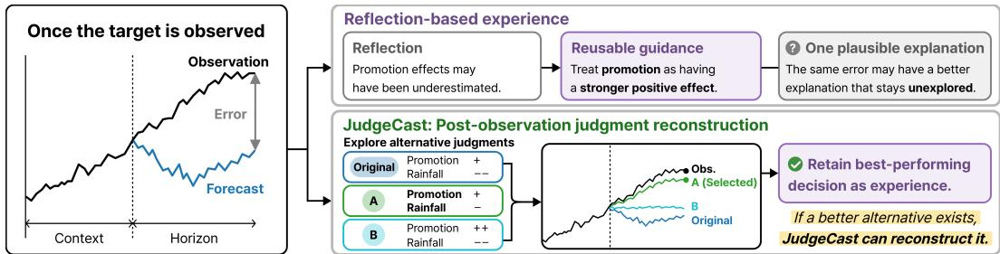  
Figure 1: Illustration of post-observation judgment reconstruction. A single reflection provides one plausible explanation, whereas JudgeCast revisits forecast-time judgments by exploring alternatives and comparing their resulting adjustments to construct reusable experience.

We introduce JudgeCast, an experience-based framework for time series forecasting with covariates. At forecast time, JudgeCast formulates covariate-informed forecasting as a judgmental adjustment to a base forecast. Judgmental adjustment is a forecasting practice in which a practitioner uses contextual information to revise a statistical forecast (Lawrence et al., 2006; Fildes et al., 2009). Following this practice, a frozen TSFM produces the base forecast from the target’s past alone, while a frozen LLM uses the current context and relevant experience to adjust it. Within this adjustment, assessing covariate effects from contextual information and determining the numerical adjustment serve distinct roles. The former assesses the expected effect of each covariate relative to the base forecast, whereas the latter uses these assessments collectively to determine the numerical adjustment. JudgeCast reflects this distinction by representing the expected covariate effects as ex plicit covariate-wise judgments and using these judgments to determine the numerical adjustment. Together, the judgments and adjustment constitute the forecast-time decision.

Once the target observation becomes available, JudgeCast revisits the covariate-wise judgments formed at forecast time to construct experience for subsequent forecasts. The residual of the base forecast indicates the numerical discrepancy from the observation, but does not determine how the covariate effects should have been judged. Using this residual as feedback, JudgeCast reconstructs alternative covariate-wise judgments and evaluates the original and alternative judgments through their resulting adjustments. The best-performing decision is retained as validated experience only if its adjusted forecast improves on the base forecast. This process uses the observed residual to construct reusable experience about covariate use beyond the forecast error itself. This validation does not establish that the selected judgment faithfully reflects the effects of the covariates.

Across diverse real-world datasets, JudgeCast outperforms the strongest baselines in our main evaluation by 16.7% in MSE and 6.5% in MAE on average. Ablations show that explicit covariate-wise judgment can improve forecast-time adjustment, while residual-guided experience construction consistently outperforms raw experience by reconstructing past decisions into validated experience.

• We introduce JudgeCast, an experience-based judgmental adjustment framework for time series forecasting with covariates. A TSFM provides the base forecast, while an LLM uses relevant experience to form explicit covariate-wise judgments and determine the numerical adjustment.

• We develop residual-guided experience construction that reconstructs alternative forecast-time judgments after observation. The original and alternative judgments are evaluated through their resulting adjustments, and the best-performing decision is retained as validated experience only when its adjusted forecast improves on the base forecast.

• We demonstrate consistent forecasting gains across diverse real-world datasets. Ablations further show that explicit covariate-wise judgment can improve forecast-time adjustment, while residual-guided construction yields more reliable gains than raw experience.

## 2 RELATED WORK

Covariate-Informed Time Series Forecasting. Existing covariate-informed forecasters feed covariates into the predictive function together with the target (Lim et al., 2021; Wang et al., 2024b; Ansari et al., 2025; Yang et al., 2026), with recent variants guiding this conditioning with statistical priors or external contextual knowledge (Cheng et al., 2026a; Wu et al., 2026). Covariate effects are thus modeled within forecast generation rather than represented separately as covariate-wise judgments. Post-hoc attribution quantifies covariate contributions after prediction rather than as a forecast-time decision (Lundberg & Lee, 2017; Hertel et al., 2026).

LLM-based Time Series Forecasting with Experience. Some LLM-based forecasters retrieve past cases to inform later forecasts (Yang et al., 2025; Wang et al., 2026). Others use forecast errors to refine contextual reasoning or derive forecasting guidance (Wang et al., 2024a; Das et al., 2026). MemCast (Tao et al., 2026) further organizes prediction outcomes, inference trajectories, and temporal features into hierarchical forecasting experience for subsequent forecasts. These approaches reuse past cases, forecast errors, reflections, guidance, or inference trajectories, but do not use the observation to reconstruct the forecast-time decision about how contextual information was used.

Judgmental Adjustment in Time Series Forecasting. Automated judgmental adjustment keeps the forecaster fixed and places a separate adjustment over its forecast. Existing approaches use agents to revise forecasts using external information and reflect after observation (Liao et al., 2026), train LLMs to revise or refine forecasts (Liu et al., 2026; You et al., 2026), use LLM-guided residual learning to correct frozen backbone forecasts (Kim et al., 2026), or retrieve similar historical series for post-hoc revision (Liu et al., 2025). Retrieval-based conformal methods similarly retrieve relevant past residuals, but for interval calibration (Heurich et al., 2026; Jin et al., 2026). These approaches automate forecast revision without explicitly separating covariate effect assessment from numerical adjustment. JudgeCast instead represents expected covariate effects as explicit covariatewise judgments and uses them to determine the adjustment.

## 3 JUDGECAST

JudgeCast is an experience-based framework for time series forecasting with covariates over sequential forecasting windows. It formulates covariate-informed forecasting as a judgmental adjustment to a base forecast. For each window, a TSFM first produces the base forecast from the target’s past alone, while an LLM uses relevant experience to form explicit covariate-wise judgments and determine a numerical adjustment. Once the target is observed, JudgeCast revisits the forecast-time decision to construct validated experience, which is stored only when the resulting adjusted forecast improves on the base forecast. Figure 2 illustrates this process for a single forecasting window.

## 3.1 PROBLEM FORMULATION

Let y denote the target time series and $X = ( x _ { 1 } , \dots , x _ { C } )$ collect the $C$ covariate time series, where $x _ { c }$ denotes the c-th covariate series. Forecasting proceeds over sequential forecasting windows indexed by w, where $y _ { 1 : L }$ is the target context of length $L ,$ and $y _ { L + 1 : L + H }$ is the target over the forecast horizon of length $H$ . For each window w, let $X _ { w }$ denote the covariate values available in that window. We refer to $y _ { 1 : L }$ and $X _ { w }$ collectively as the current context.

Following the practice of judgmental adjustment (Lawrence et al., 2006; Fildes et al., 2009), we formulate forecasting in each window with a separate base forecast and numerical adjustment. Let $f _ { \phi }$ and $g _ { \theta }$ denote the frozen TSFM and LLM with parameters $\phi$ and θ, respectively. The TSFM produces the base forecast from the target context alone,

$$
\begin{array} { r } { \hat { \boldsymbol { y } } ^ { \mathrm { b a s e } } = f _ { \phi } ( \boldsymbol { y } _ { 1 : L } ) , \qquad \hat { \boldsymbol { y } } ^ { \mathrm { b a s e } } \in \mathbb { R } ^ { H } . } \end{array}\tag{1}
$$

For the adjustment, the LLM $g _ { \theta }$ forms explicit covariate-wise judgments and uses them to determine a numerical adjustment $a \in \mathbb { R } ^ { H }$ to the base forecast. The final forecast is

$$
\begin{array} { r } { \hat { \boldsymbol { y } } = \hat { \boldsymbol { y } } ^ { \mathrm { b a s e } } + \boldsymbol { a } , \qquad \hat { \boldsymbol { y } } \in \mathbb { R } ^ { H } . } \end{array}\tag{2}
$$

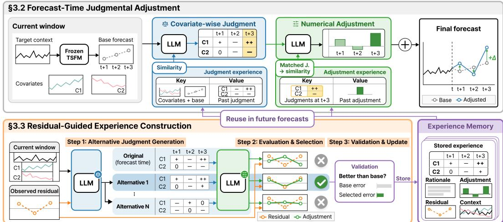  
Figure 2: Overview of a single forecasting window in JudgeCast. A frozen TSFM provides the base forecast, while a frozen LLM uses relevant experience to form explicit covariate-wise judgments and determine the numerical adjustment. After observation, the residual guides alternative judgment generation and adjustment evaluation to select the best-performing decision, which is added to memory as validated experience only when its adjusted forecast improves on the base forecast.

## 3.2 FORECAST-TIME JUDGMENTAL ADJUSTMENT

At forecast time, assessing covariate effects and determining the numerical adjustment serve distinct roles. JudgeCast represents each covariate’s expected effect relative to the base forecast using predefined qualitative judgment labels. The numerical adjustment is then determined by considering these covariate-wise judgments collectively. Together, the judgments and adjustment constitute the forecast-time decision.

Let $\mathcal { S } = \{ - - , - , 0 , + , + + \}$ denote the set of judgment labels. For covariate $x _ { c }$ and forecast step $h , J _ { c , h } \in S$ denotes the direction and qualitative strength of its expected effect relative to the base forecast. The signs + and − indicate upward and downward effects, repeated signs indicate greater strength, and 0 denotes no meaningful effect. Collectively, the judgments form $\breve { J } \in { \cal S } ^ { C \times H }$

To ground the current forecast-time decision in preceding windows, JudgeCast uses experience from those windows and their associated decisions. Let $\mathcal { M } _ { < w }$ denote the memory of validated experience accumulated from preceding windows. To inform the current judgments, JudgeCast retrieves relevant experience based on similarity in the normalized covariate values and base forecast. Let $\mathcal { E } _ { w } ^ { \mathrm { j u d } } \subseteq \mathcal { M } _ { < w } ^ { \bullet }$ denote the retrieved relevant experience. The LLM forms the current judgments as

$$
\begin{array} { r } { J = g _ { \theta } ^ { \mathrm { j u d } } \left( y _ { 1 : L } , X _ { w } , \hat { y } ^ { \mathrm { b a s e } } , \mathcal { E } _ { w } ^ { \mathrm { j u d } } \right) . } \end{array}\tag{3}
$$

Superscripts distinguish the roles of the same LLM gθ across the procedure.

For numerical adjustment, JudgeCast determines one adjustment value for forecast steps with the same judgments across covariates. Relevant experience with matching covariate-wise judgments is retrieved based on similarity in the target context and base forecast. Let $\mathcal { E } _ { w } ^ { \mathrm { a d j } } \subseteq \mathcal { M } _ { < w }$ denote the retrieved relevant experience. Its numerical adjustments provide references for determining the current adjustment. The LLM then determines

$$
a = g _ { \theta } ^ { \mathrm { a d j } } \left( y _ { 1 : L } , X _ { w } , \hat { y } ^ { \mathrm { b a s e } } , J , \mathcal { E } _ { w } ^ { \mathrm { a d j } } \right) .\tag{4}
$$

The resulting adjustment is applied to the base forecast to obtain the forecast for the current window.

## 3.3 RESIDUAL-GUIDED EXPERIENCE CONSTRUCTION

Once the target observation becomes available, JudgeCast revisits the forecast-time decision to construct validated experience for subsequent forecasts. The error of the base forecast provides feedback on the numerical discrepancy from the target observation, but does not determine how the covariate

effects should have been judged. We represent this feedback by the observed residual. At forecast step h, the observed residual is

$$
r _ { h } = y _ { L + h } - \hat { y } _ { h } ^ { \mathrm { b a s e } } , \qquad 1 \leq h \leq H .\tag{5}
$$

Let $r = ( r _ { 1 } , \hdots , r _ { H } ) \in \mathbb { R } ^ { H }$ denote the observed residual over the forecast horizon.

Alternative Judgment Generation. For reconstruction, $g _ { \theta } ^ { \mathrm { a l t } }$ uses the current context, base forecast, and observed residual r to generate N alternative covariate-wise judgments ${ \tilde { J } } ^ { ( 1 ) } , \dots , { \tilde { J } } ^ { ( N ) } \in$ $S ^ { C \times H }$ . We exclude J and $\mathcal { M } _ { < w }$ from the input so that alternatives are generated without using the original forecast-time judgment or stored experience. The original forecast-time judgment is then included with the generated alternatives for subsequent evaluation,

$$
\mathcal { I } = \{ J \} \cup \left\{ \tilde { J } ^ { ( 1 ) } , \ldots , \tilde { J } ^ { ( N ) } \right\} .\tag{6}
$$

Evaluation and Selection. Each judgment $J ^ { \prime } \in \mathcal { I }$ is evaluated through a numerical adjustment produced by $g _ { \theta } ^ { \mathrm { a d j } }$ without stored experience. The original judgment is re-evaluated under these conditions rather than using its forecast-time adjustment. The resulting adjustment for $J ^ { \prime }$ is

$$
a ( J ^ { \prime } ) = g _ { \theta } ^ { \mathrm { a d j } } \left( y _ { 1 : L } , X _ { w } , \hat { y } ^ { \mathrm { b a s e } } , J ^ { \prime } \right) .\tag{7}
$$

We compare the resulting adjustments with the observed residual and select the judgment whose adjustment best matches it. Let $\mathcal { L } ( r , a ( J ^ { \prime } ) )$ denote an error measure between the observed residual r and the adjustment produced from $J ^ { \prime } .$ . The selected judgment and adjustment are

$$
J ^ { \star } = \underset { J ^ { \prime } \in \mathcal { I } } { \arg \operatorname* { m i n } } \ \mathcal { L } \left( r , a ( J ^ { \prime } ) \right) , \quad \quad a ^ { \star } = a ( J ^ { \star } ) .\tag{8}
$$

Validation and Memory Update. The selected adjustment may still fail to improve on the base forecast. JudgeCast therefore validates the selected adjustment by comparing its error with the error of no adjustment, $\mathcal { L } ( r , a ^ { \star } ) < \mathcal { L } ( r , 0 )$ . When this condition is satisfied, the selected judgment and adjustment are retained as validated experience together with their associated rationales, denoted by $R ^ { \check { J } , \star }$ and $R ^ { a , \star }$ . The validated experience for window w is

$$
e _ { w } = ( y _ { 1 : L } , X _ { w } , \hat { y } ^ { \mathrm { b a s e } } , J ^ { \star } , R ^ { J , \star } , a ^ { \star } , R ^ { a , \star } , r ) , \qquad \mathcal { M } _ { < w + 1 }  \mathcal { M } _ { < w } \cup \{ e _ { w } \} .\tag{9}
$$

If the validation condition is not satisfied, the memory remains unchanged. This validation does not establish that the selected judgment faithfully reflects the effects of the covariates. Prompts for each LLM role are provided in Appendix D.

## 4 EXPERIMENTS

## 4.1 EXPERIMENTAL SETUP

Datasets. We evaluate JudgeCast on diverse real-world datasets with covariates. We consider five short-term electricity price forecasting datasets from the electricity price forecasting (EPF) benchmark (Lago et al., 2021). This benchmark includes NP, PJM, BE, FR, and DE, which provide hourly electricity prices from different regional power markets together with two market-specific forecast covariates. For long-term forecasting, we also consider ENTSO-e Load and Rossmann tasks from fev-bench (Shchur et al., 2025), which provide hourly electricity load with weather covariates and daily retail sales with calendar and promotion covariates, respectively. Following MemCast (Tao et al., 2026), we match its dataset sizes and reserve the final 20% of each dataset for testing. We use $L = 7 H$ throughout, with $H = 2 4$ , 168, and 48 for short-term forecasting, ENTSO-e, and Rossmann, respectively. Detailed dataset descriptions and statistics are provided in Appendix A.1.

Baselines. We compare JudgeCast with representative statistical, training-based, and LLMbased forecasting methods. Statistical baselines include ARIMA (Hyndman & Khandakar, 2008) and Prophet (Taylor & Letham, 2018), representing classical statistical forecasting approaches. Training-based baselines include DLinear (Zeng et al., 2023), PatchTST (Nie et al., 2023), iTransformer (Liu et al., 2024b), TimeXer (Wang et al., 2024b), and ConvTimeNet (Cheng et al., 2025), spanning linear, Transformer-based, and convolutional forecasting architectures, together with Time-LLM (Jin et al., 2024), which trains lightweight adaptation layers around a frozen LLM. Inference-only LLM-based baselines include LSTPrompt (Liu et al., 2024a), LLM-Time (Gruver et al., 2023), and TimeReasoner (Cheng et al., 2026b), representing approaches that leverage LLMs for time series forecasting. We further compare with the memory-based forecasting method Mem-Cast (Tao et al., 2026). Detailed baseline descriptions are provided in Appendix A.2.

Table 1: Overall forecasting performance across diverse real-world datasets. Chronos-2 is the target-only frozen TSFM used as the base forecaster in JudgeCast. Lower values indicate better performance. The best and second-best results are shown in bold and underlined, respectively. a and denote MSE and MAE reported in $\times 1 0 ^ { 6 }$ and $\times 1 0 ^ { 3 }$ , respectively.
<table><tr><td rowspan="2">Method</td><td colspan="2">NP</td><td colspan="2">PJM</td><td colspan="2">BE</td><td colspan="2">FR</td><td colspan="2">DE</td><td colspan="2">ENTSO-e</td><td colspan="2">Rossmann</td></tr><tr><td>MSE</td><td>MAE</td><td>MSE</td><td>MAE</td><td>MSE</td><td>MAE</td><td>MSE</td><td>MAE</td><td>MSE</td><td>MAE</td><td>MSEª</td><td>MAEb</td><td>MSEª</td><td>MAEb</td></tr><tr><td>ARIMA Prophet</td><td>45.681 50.383</td><td>4.108 5.086</td><td>53.988 70.194</td><td>5.217 6.379</td><td>1,319.458 950.769</td><td>16.622 17.790</td><td>1,391.465 1,003.981</td><td>12.591 14.898</td><td>334.941 464.086</td><td>11.841 15.197</td><td>46.943 7.544</td><td>3.161 1.986</td><td>8.760 10.793</td><td>2.065 2.228</td></tr><tr><td>DLinear PatchTST</td><td>34.315 29.360</td><td>3.817 3.519</td><td>41.687 34.711</td><td>4.640 4.349</td><td>758.796 769.533</td><td>12.426 11.695</td><td>792.836 835.216</td><td>9.619 9.039</td><td>236.175 211.958</td><td>10.537 9.870</td><td>3.573 3.514</td><td>1.301 1.359</td><td>10.210 11.169</td><td>2.248 2.261</td></tr><tr><td>iTransformer</td><td>30.941</td><td>3.537</td><td>35.467</td><td>4.240</td><td>767.894</td><td>12.195</td><td>943.188</td><td>11.195</td><td>247.900</td><td>10.857</td><td>3.548</td><td>1.380</td><td>11.220</td><td>2.354</td></tr><tr><td>TimeXer</td><td>27.769</td><td>3.408</td><td>29.458</td><td>3.888</td><td>781.929</td><td>11.479</td><td>777.474</td><td>9.379</td><td>238.436</td><td>10.378</td><td>3.723</td><td>1.431</td><td>9.368</td><td>2.052</td></tr><tr><td>ConvTimeNet</td><td>27.420</td><td>3.351</td><td>37.861</td><td>4.525</td><td>725.707</td><td>11.729</td><td>736.373</td><td></td><td></td><td>10.060</td><td></td><td></td><td></td><td></td></tr><tr><td></td><td></td><td></td><td></td><td></td><td></td><td></td><td></td><td>8.998</td><td>214.620</td><td></td><td>3.709</td><td>1.408</td><td>8.292</td><td>2.012</td></tr><tr><td>Time-LLM</td><td>29.022</td><td>3.468</td><td>33.748</td><td>4.232</td><td>691.979</td><td>10.905</td><td>767.107</td><td>8.987</td><td>211.507</td><td>9.772</td><td>3.444</td><td>1.355</td><td>7.108</td><td>1.803</td></tr><tr><td>LSTPrompt</td><td>41.120</td><td>4.084</td><td>46.662</td><td>4.906</td><td>743.230</td><td>13.336</td><td>986.232</td><td>10.597</td><td>333.517</td><td>12.202</td><td>18.996</td><td>2.895</td><td>10.683</td><td>2.107</td></tr><tr><td>LLM-Time</td><td>73.374 5.873</td><td></td><td>111.900</td><td>7.277</td><td>1006.604</td><td>16.182</td><td>1045.227</td><td>13.062</td><td>677.279</td><td>14.771</td><td>45.379</td><td>5.499</td><td>15.714</td><td>2.790</td></tr><tr><td>TimeReasoner</td><td>54.041 4.793</td><td></td><td>65.931</td><td>5.901</td><td>889.498</td><td>14.240</td><td>967.291</td><td>11.772</td><td>1,215.101</td><td>15.039</td><td>45.582</td><td>4.650</td><td>11.489</td><td>2.126</td></tr><tr><td>MemCast</td><td>27.761</td><td>3.327</td><td>37.166</td><td>4.406</td><td>670.449</td><td>12.205</td><td>790.738</td><td>9.463</td><td>269.270</td><td>10.276</td><td></td><td></td><td></td><td>2.935</td></tr><tr><td></td><td></td><td></td><td></td><td></td><td></td><td></td><td></td><td></td><td></td><td></td><td>48.734</td><td>5.739</td><td>18.693</td><td></td></tr><tr><td>Chronos-2</td><td>25.129</td><td>2.990</td><td>36.641</td><td>4.333</td><td>649.521</td><td>10.272</td><td>722.148</td><td>7.559</td><td>224.197</td><td>9.786</td><td>2.889</td><td>1.093</td><td>4.551</td><td>1.311</td></tr><tr><td>JudgeCast</td><td>19.657 2.875</td><td></td><td>25.946 3.736</td><td></td><td>610.917</td><td>9.971</td><td>677.679</td><td>7.412</td><td>158.678</td><td>8.363</td><td>2.393</td><td>0.988</td><td>3.225</td><td>1.197</td></tr></table>

Implementation Details. We use Chronos-2 (Ansari et al., 2025) with its default inference configuration and 0.5 quantile as the frozen TSFM, and GPT-5 mini (OpenAI, 2026) with medium reasoning effort as the LLM backbone. The same GPT-5 mini configuration is used for LLM-based baselines with replaceable LLM backbones. We generate N = 4 alternative judgments and retrieve the top-5 experiences for both judgment formation and adjustment determination. We evaluate forecasting accuracy using mean squared error (MSE) and mean absolute error (MAE), and use MSE as the error measure L for experience construction. For each test window, MSE and MAE are computed over the H-step forecast horizon and then averaged across windows. Lower values indicate better forecasting accuracy. For the main experiments, M is accumulated chronologically over the training set and remains fixed over the test set.

## 4.2 MAIN RESULTS

Table 1 reports the overall forecasting performance across datasets. JudgeCast achieves the lowest MSE and MAE on all seven datasets, outperforming the strongest baseline in the main evaluation for each dataset and metric by 16.7% and 6.5% on average, respectively. The performance gap is particularly pronounced on the long-term datasets, where inference-only LLM forecasters are substantially less competitive. Despite also relying on an LLM without task-specific training, JudgeCast achieves the lowest MSE and MAE on both ENTSO-e and Rossmann.

Dependence on Backbone Choice. We examine whether the forecasting gains of JudgeCast persist across different TSFM and LLM backbones. We evaluate TimesFM 2.5 (Das et al., 2024) and Toto 2.0-313M (Khwaja et al., 2026) as TSFM backbones with Qwen3.5-27B (Qwen Team, 2026) and Gemini 3.5 Flash-Lite (Google, 2026) as LLM backbones, reconstructing the experience memory independently for each combination. As shown in Table 2, all four backbone combinations outperform the second-best method in Table 1 in MSE on both NP and PJM, while achieving comparable or better MAE.

Table 2: Backbone robustness on NP and PJM. Qwen and Gemini abbreviate Qwen3.5-27B and Gemini 3.5 Flash-Lite. TSFM-only rows report base forecasts.
<table><tr><td rowspan="2">Backbone</td><td colspan="2">NP</td><td colspan="2">PJM</td></tr><tr><td>MSE</td><td>MAE</td><td>MSE</td><td>MAE</td></tr><tr><td>TimesFM 2.5</td><td>23.655</td><td>3.079</td><td>33.135</td><td>4.106</td></tr><tr><td>+ Qwen</td><td>19.314</td><td>2.979</td><td>26.860</td><td>3.827</td></tr><tr><td>+ Gemini</td><td>17.637</td><td>2.829</td><td>28.503</td><td>3.884</td></tr><tr><td>Toto 2.0-313M</td><td>26.921</td><td>3.165</td><td>32.307</td><td>4.115</td></tr><tr><td>+ Qwen</td><td>21.831</td><td>3.092</td><td>24.905</td><td>3.673</td></tr><tr><td>+ Gemini</td><td>22.760</td><td>3.072</td><td>26.681</td><td>3.763</td></tr></table>

Table 3: Ablation study of explicit covariate-wise judgment and experience construction across datasets. Raw experience retains the original forecast-time judgment or adjustment without postobservation reassessment. $\mathrm { R a w } + \mathrm { V a l i d }$ . retains the original judgment and adjustment only when the resulting adjusted forecast improves on the base forecast. Validated experience applies residualguided experience construction and corresponds to full JudgeCast. Lower values indicate better performance. a and b denote MSE and MAE reported in $\times 1 0 ^ { \tilde { 6 } }$ and $\times 1 0 ^ { 3 }$ , respectively.
<table><tr><td rowspan="2">Explicit Judgment</td><td rowspan="2">Experience Construction</td><td colspan="2">NP</td><td colspan="2">PJM</td><td colspan="2">BE</td><td colspan="2">FR</td><td colspan="2">DE</td><td colspan="2">ENTSO-e</td><td colspan="2">Rossmann</td></tr><tr><td>MSE</td><td>MAE</td><td>MSE</td><td>MAE</td><td>MSE</td><td>MAE</td><td>MSE</td><td>MAE</td><td>MSE</td><td>MAE</td><td>MSEa</td><td>MAEb</td><td>MSEa</td><td>MAEb</td></tr><tr><td>X</td><td>None</td><td>22.551</td><td>3.206</td><td>30.493</td><td>4.012</td><td>624.713</td><td>10.003</td><td>689.195</td><td>7.461</td><td>178.935</td><td>8.699</td><td>3.128</td><td>1.209</td><td>4.469</td><td>1.249</td></tr><tr><td>√</td><td>None</td><td>21.514</td><td>3.096</td><td>30.290</td><td>4.112</td><td>619.435</td><td>10.842</td><td>680.784</td><td>8.250</td><td>161.724</td><td>8.564</td><td>3.359</td><td>1.201</td><td>4.556</td><td>1.386</td></tr><tr><td>X</td><td>Raw</td><td>22.422</td><td>2.908</td><td>34.429</td><td>4.219</td><td>641.466</td><td>10.310</td><td>718.869</td><td>7.564</td><td>|210.147</td><td>9.421</td><td>2.773</td><td>1.068</td><td>4.363</td><td>1.247</td></tr><tr><td>√</td><td>Raw</td><td>22.767</td><td>2.990</td><td>29.975</td><td>3.958</td><td>623.891</td><td>10.158</td><td>712.784</td><td>7.710</td><td>192.831</td><td>9.012</td><td>3.162</td><td>1.195</td><td>7.194</td><td>1.649</td></tr><tr><td>√</td><td>Raw + Valid.</td><td>21.961</td><td>2.884</td><td>29.855</td><td>3.952</td><td>615.480</td><td>10.028</td><td>701.613</td><td>7.812</td><td>176.561</td><td>8.720</td><td>3.216</td><td>1.180</td><td>7.255</td><td>1.632</td></tr><tr><td>√</td><td>Validated</td><td></td><td>19.657 2.875</td><td>25.9463.736</td><td></td><td>610.917</td><td>9.971</td><td>677.679 7.412</td><td></td><td>158.678 8.363</td><td></td><td>2.393</td><td>0.988</td><td>3.225</td><td>1.197</td></tr></table>

Table 5: Forecasting performance on NP and DE with one temporally misaligned covariate. Results are reported in MSE.

Table 4: Forecasting performance on fev-bench tasks where direct covariate conditioning with Chronos-2 does not improve the target-only forecast. a and b denote MSE and MAE reported in $\times 1 0 ^ { 6 }$ and $\times 1 0 ^ { 3 }$ , respectively.
<table><tr><td rowspan="2">Method</td><td colspan="2">UK COVID</td><td colspan="2">Rohlik Orders</td><td colspan="2">M5</td></tr><tr><td>MSEª</td><td>MAEb</td><td>MSEª</td><td>MAE</td><td>MSE</td><td>MAE</td></tr><tr><td>Target-only</td><td>137.711</td><td>2.901</td><td>722.252</td><td>545.659</td><td>33.231</td><td>4.032</td></tr><tr><td>Direct cov.</td><td>153.922</td><td>3.803</td><td>821.473</td><td>585.984</td><td>34.992</td><td>4.204</td></tr><tr><td>JudgeCast</td><td>128.357</td><td>2.824</td><td>672.847</td><td>524.037</td><td>32.348</td><td>4.008</td></tr></table>

<table><tr><td>Dataset</td><td>Method</td><td>0h</td><td>6h</td><td>12h</td></tr><tr><td rowspan="2">NP (Grid load)</td><td>Target-only Direct cov.</td><td>25.129</td><td>25.129</td><td>25.129</td></tr><tr><td>JudgeCast</td><td>15.899 19.657</td><td>23.695 20.700</td><td>25.043 21.548</td></tr><tr><td rowspan="2">DE (PV wind)</td><td>Target-only</td><td>224.197</td><td>224.197</td><td>224.197</td></tr><tr><td>Direct cov. JudgeCast</td><td>73.164 158.678</td><td>131.504 175.161</td><td>195.862 185.979</td></tr></table>

## 4.3 ABLATION STUDY

Table 3 examines explicit covariate-wise judgment and experience construction in JudgeCast.

Explicit Judgment. Across the five short-term datasets, explicitly forming covariate-wise judgments before numerical adjustment reduces MSE over direct adjustment by 3.4% without experience and 4.6% with raw experience. This improvement is less consistent on the long-term tasks, where forecast steps with the same covariate-wise judgments can require different numerical adjustments. Beyond its forecast-time role, explicit judgment preserves the covariate-wise assessment for post-observation reconstruction.

Experience Construction. Relative to no experience, raw experience improves forecasting performance on some datasets but degrades it on others. Retaining raw decisions only when their adjusted forecast improves on the base forecast performs better than raw experience on most datasets, but still does not consistently outperform no experience. In contrast, validated experience outperforms no experience and both raw experience settings across datasets, reducing MSE and MAE by 12.1% and 9.7% on average relative to no experience. This contrast shows that the gains from validated experience cannot be explained by validating the original decision alone, and instead depend on reconstructing the forecast-time decision after observation.

## 4.4 COVARIATE UTILIZATION ANALYSIS

Recent TSFMs such as Chronos-2 can effectively use covariate information across diverse realworld forecasting settings. We refer to providing the available covariates directly to the TSFM together with the target context as direct covariate conditioning. Its benefit, however, can be limited in some settings and sensitive to unreliable covariate information. We examine whether JudgeCast can effectively use covariate information in these two settings.

Limited Direct Conditioning. We first examine whether JudgeCast can effectively use covariates when direct covariate conditioning provides limited forecasting benefit. We consider three additional fev-bench tasks, UK COVID, Rohlik Orders, and M5, where direct conditioning provides no improvement over the target-only forecast. Detailed dataset descriptions and experimental setups are provided in Appendix A.3. Table 4 shows that JudgeCast consistently improves the target-only forecast on all three tasks using the same covariates, whereas direct conditioning does not. These results show that limited benefit from direct conditioning does not necessarily indicate limited forecasting utility of the covariates themselves.

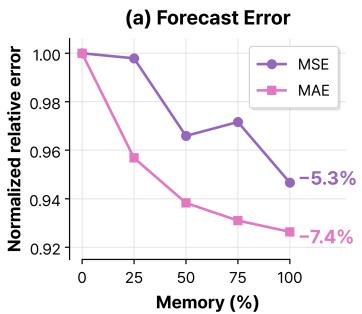

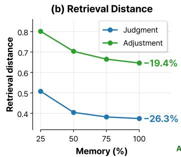

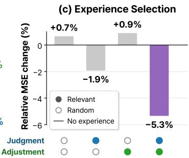  
Figure 3: Experience accumulation and retrieval analysis. (a) Normalized forecasting error as validated experience accumulates, relative to no experience. (b) Retrieval distance for judgment and adjustment retrieval across memory sizes. (c) Relative MSE change under relevant and random retrieval at the judgment and adjustment stages using the full memory.

Temporal Covariate Misalignment. We next examine the sensitivity of JudgeCast to temporal misalignment in one covariate, with results shown in Table 5. We apply 6 and 12-hour offsets to grid load on NP and PV wind on DE while leaving the other covariate unchanged, and use the same offset during experience construction and testing. Although direct conditioning outperforms JudgeCast with aligned covariates, its forecasting error increases much more sharply under temporal misalignment. Consequently, the advantage of direct conditioning is reversed at both offsets on NP and at 12 hours on DE. The 0 judgment rate increases mainly for the shifted covariate while remaining relatively stable for the unchanged covariate. Together, these results suggest that explicit covariate-wise assessment can limit the impact of unreliable covariates without discarding other covariate information. Full MSE, MAE, and judgment statistics are provided in Appendix B.1.

## 4.5 EXPERIENCE ANALYSIS

We analyze how accumulating validated experience affects forecasting performance and retrieval, and whether its forecasting benefit depends on selecting relevant experience. Detailed dataset-level results for experience accumulation, retrieval behavior, and relevant experience selection are provided in Appendices B.2 and B.3.

Experience Accumulation. We first examine how forecasting performance changes as validated experience accumulates. On the five short-term datasets, we build memory from the first 25%, 50%, 75%, or 100% of the training windows in chronological order, and evaluate each setting on the same test windows, including no experience. Figure 3(a) shows that forecasting performance improves overall as more validated experience accumulates, with full memory achieving the lowest MSE on all five datasets and reducing MSE and MAE by 5.3% and 7.4% on average relative to no experience.

Retrieval Behavior. Using the same memories evaluated in the preceding analysis, we next examine whether retrieved experience becomes more closely matched as validated experience accumulates. For judgment and adjustment retrieval, we measure retrieval distance using the similarity criterion at each stage and average it over the top-5 retrieved experiences, test windows, and datasets. Figure 3(b) shows that as memory grows from 25% to 100%, average retrieval distance decreases from 0.508 to 0.374 for judgment retrieval and from 0.802 to 0.646 for adjustment retrieval.

Selecting Relevant Experience. We finally examine whether the benefit of accumulated experi ence depends on selecting relevant experience at the judgment and adjustment stages. We keep the full validated memory fixed and compare similarity-based and random retrieval independently at the two stages. Figure 3(c) shows that relevant judgment retrieval reduces MSE by 1.9% even with random adjustment retrieval, whereas relevant adjustment retrieval alone does not improve over no experience. Using relevant retrieval at both stages yields the largest average reductions in both MSE and MAE, with a 5.3% MSE reduction and the lowest MSE among the four settings on all five datasets. These results indicate that judgment retrieval plays the primary role by informing how covariate effects are assessed, while adjustment retrieval provides additional gains when determining the numerical adjustment from these assessments.

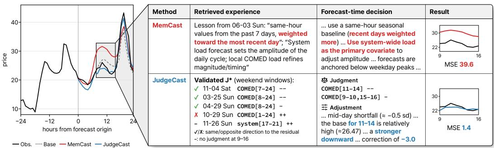  
Figure 4: PJM case study of JudgeCast and MemCast. For the same window, retrieved experience informs each method’s forecast-time decision and resulting forecast. Only judgment retrieval is shown for JudgeCast. Steps 9 to 16 highlight the interval where their forecasts differ most.

## 4.6 CASE STUDY

We use a PJM case study to examine how accumulated experience informs forecast-time decisions. PJM targets the hourly day-ahead electricity price in the Commonwealth Edison zone, with systemwide and COMED day-ahead load forecasts as covariates. Figure 4 compares JudgeCast with Mem-Cast, a memory-based forecaster that also accumulates experience, showing each method’s retrieved experience, forecast-time decision, and forecast for the same window.

Forecast Behavior. We focus on steps 9 to 16, where the forecasts of JudgeCast and MemCast differ most. Over this interval, JudgeCast applies a negative adjustment to the base forecast, reducing its overestimation, whereas MemCast substantially overestimates the observation. The MSE over these steps is 1.4 for JudgeCast and 39.6 for MemCast.

Experience Use and Decision Formation. To understand this difference, we examine how each method uses retrieved experience at forecast time. MemCast retrieves general forecasting guidance that places greater weight on recent same-hour values and uses system load as the primary covariate. Following this guidance, its forecast-time decision prioritizes recent observations and system load, while the resulting forecast overestimates the observation over the highlighted interval. In contrast, JudgeCast retrieves validated covariate-wise judgments from preceding weekend windows. Most retrieved COMED judgments indicate a downward effect over similar daytime intervals, while one indicates the opposite direction. Using this experience, JudgeCast assigns negative COMED judgments over steps 9 to 16 and determines downward numerical adjustments to the base forecast. By retaining explicit forecast-time decisions as experience, JudgeCast allows the current judgment to be traced to the preceding decisions that informed it.

## 5 CONCLUSION

We introduced JudgeCast, an experience-based framework for time series forecasting with covariates that makes covariate-wise judgments explicit. At forecast time, JudgeCast uses accumulated experience to form these judgments and determine how the base forecast should be adjusted. After observation, JudgeCast revisits the forecast-time decision to construct validated experience for sub sequent forecasts. Across diverse real-world datasets, JudgeCast consistently improves forecasting performance over strong baselines. Our findings show that revisiting forecast-time decisions after observation can make forecast feedback reusable for subsequent decisions about covariate use.

## AI USE STATEMENT

In this work, we used generative AI tools for research ideation and execution, literature retrieval and discovery, drafting parts of the paper, and polishing the writing. We reviewed all AI-assisted work and manually verified retrieved literature and citations. We take responsibility for the final content of this work, including text, claims, or artifacts produced with the aid of generative AI.

## REPRODUCIBILITY STATEMENT

Section 3 describes JudgeCast, and Section 4 provides the datasets, baselines, and implementation details used in our experiments. The Appendix contains additional methodological and experimental details, including the prompts used in JudgeCast, and source code is provided in the supplementary material.

## REFERENCES

Abdul Fatir Ansari, Lorenzo Stella, Ali Caner Turkmen, Xiyuan Zhang, Pedro Mercado, Huibin Shen, Oleksandr Shchur, Syama Sundar Rangapuram, Sebastian Pineda Arango, Shubham Kapoor, Jasper Zschiegner, Danielle C. Maddix, Hao Wang, Michael W. Mahoney, Kari Torkkola, Andrew Gordon Wilson, Michael Bohlke-Schneider, and Bernie Wang. Chronos: Learning the language of time series. Transactions on Machine Learning Research, 2024. ISSN 2835-8856. URL https://openreview.net/forum?id=gerNCVqqtR. Expert Certification.

Abdul Fatir Ansari, Oleksandr Shchur, Jaris Kuken, Andreas Auer, Boran Han, Pedro Mercado,¨ Syama Sundar Rangapuram, Huibin Shen, Lorenzo Stella, Xiyuan Zhang, Mononito Goswami, Shubham Kapoor, Danielle C. Maddix, Pablo Guerron, Tony Hu, Junming Yin, Nick Erickson, Prateek Mutalik Desai, Hao Wang, Huzefa Rangwala, George Karypis, Yuyang Wang, and Michael Bohlke-Schneider. Chronos-2: From univariate to universal forecasting, 2025. URL https://arxiv.org/abs/2510.15821.

Hanyin Cheng, Jingrong Zhou, Yang Shu, and Chenjuan Guo. KITE: Knowledge-guided probabilistic modeling for time series forecasting with exogenous variables. In Forty-third International Conference on Machine Learning, 2026a. URL https://openreview.net/forum?id= FYkXNAqq2D.

Mingyue Cheng, Jiqian Yang, Tingyue Pan, Qi Liu, Zhi Li, and Shijin Wang. Convtimenet: A deep hierarchical fully convolutional model for multivariate time series analysis. In Companion Proceedings ofthe ACM on Web Conference 2025, WWW ’25, pp. 171–180, New York, NY, USA, 2025. Association for Computing Machinery. ISBN 9798400713316. doi: 10.1145/3701716. 3715214. URL https://doi.org/10.1145/3701716.3715214.

Mingyue Cheng, Jiahao Wang, Daoyu Wang, Xiaoyu Tao, Qi Liu, and Enhong Chen. Can slowthinking llms reason over time? empirical studies in time series forecasting. In Proceedings of the Nineteenth ACM International Conference on Web Search and Data Mining, WSDM ’26, pp. 99–110, New York, NY, USA, 2026b. Association for Computing Machinery. ISBN 9798400722929. doi: 10.1145/3773966.3777931. URL https://doi.org/10.1145/ 3773966.3777931.

Abhimanyu Das, Weihao Kong, Rajat Sen, and Yichen Zhou. A decoder-only foundation model for time-series forecasting. In Ruslan Salakhutdinov, Zico Kolter, Katherine Heller, Adrian Weller, Nuria Oliver, Jonathan Scarlett, and Felix Berkenkamp (eds.), Proceedings of the 41st International Conference on Machine Learning, volume 235 of Proceedings of Machine Learning Research, pp. 10148–10167. PMLR, 21–27 Jul 2024. URL https://proceedings.mlr. press/v235/das24c.html.

Sarkar Snigdha Sarathi Das, Palash Goyal, Mihir Parmar, Nanyun Peng, Vishy Tirumalashetty, Chun-Liang Li, Rui Zhang, Jinsung Yoon, and Tomas Pfister. Nexus : An agentic framework for time series forecasting, 2026. URL https://arxiv.org/abs/2605.14389.

Leif Feddersen and Catherine Cleophas. Hierarchical neural additive models for interpretable demand forecasts. International Journal of Forecasting, 42(1):216–234, 2026. doi: 10.1016/j. ijforecast.2025.03.003.

Robert Fildes, Paul Goodwin, Michael Lawrence, and Konstantinos Nikolopoulos. Effective forecasting and judgmental adjustments: an empirical evaluation and strategies for improvement in supply-chain planning. International journal offorecasting, 25(1):3–23, 2009.

Eijte W Foekens, Peter SH Leeflang, and Dick R Wittink. Varying parameter models to accommodate dynamic promotion effects. Journal ofeconometrics, 89(1-2):249–268, 1998.

Google. Gemini 3.5 flash-lite model card, 2026. URL https://deepmind.google/ models/model-cards/gemini-3-5-flash-lite.

Nate Gruver, Marc Finzi, Shikai Qiu, and Andrew G Wilson. Large language models are zero-shot time series forecasters. In A. Oh, T. Naumann, A. Globerson, K. Saenko, M. Hardt, and S. Levine (eds.), Advances in Neural Information Processing Systems, volume 36, pp. 19622–19635. Curran Associates, Inc., 2023. doi: 10.52202/ 075280-0861. URL https://proceedings.neurips.cc/paper\_files/paper/ 2023/file/3eb7ca52e8207697361b2c0fb3926511-Paper-Conference.pdf.

Trevor Hastie and Robert Tibshirani. Varying-coefficient models. Journal of the Royal Statistical Society Series B: Statistical Methodology, 55(4):757–779, 1993.

Matthias Hertel, Alexandra Nikoltchovska, Sebastian Putz, Benjamin Sch¨ afer, Ralf Mikut, and¨ Veit Hagenmeyer. Explainable load forecasting with covariate-informed time series foundation models. In Proceedings of the 17th ACM International Conference on Future and Sustainable Energy Systems, E-Energy ’26, pp. 612–626, New York, NY, USA, 2026. Association for Computing Machinery. ISBN 9798400720116. doi: 10.1145/3744255.3811724. URL https://doi.org/10.1145/3744255.3811724.

Manuel Heurich, Maximilian Granz, and Tim Landgraf. Rarecp: Regime-aware retrieval for efficient conformal prediction, 2026. URL https://arxiv.org/abs/2605.08857.

Tao Huang, Robert Fildes, and Didier Soopramanien. Forecasting retailer product sales in the presence of structural change. European Journal ofOperational Research, 279(2):459–470, 2019.

Rob J Hyndman and Yeasmin Khandakar. Automatic time series forecasting: the forecast package for r. Journal ofstatistical software, 27:1–22, 2008.

Ming Jin, Shiyu Wang, Lintao Ma, Zhixuan Chu, James Y. Zhang, Xiaoming Shi, Pin-Yu Chen, Yuxuan Liang, Yuan-Fang Li, Shirui Pan, and Qingsong Wen. Time-LLM: Time series forecasting by reprogramming large language models. In The Twelfth International Conference on Learning Representations, 2024. URL https://openreview.net/forum?id=Unb5CVPtae.

Sangjin Jin, Kangmin Kim, Junhyeong Lee, and Yongjae Lee. Retrieval-corrected conformal prediction for time series. In Proceedings ofthe 35th ACM International Conference on Information and Knowledge Management, 2026. URL https://arxiv.org/abs/2608.10553.

Emaad Khwaja, Chris Lettieri, Gerald Woo, Eden Belouadah, Marc Cenac, Guillaume Jarry, Enguerrand Paquin, Xunyi Zhao, Viktoriya Zhukov, Othmane Abou-Amal, Chenghao Liu, Ameet Talwalkar, and David Asker. Toto 2.0: Time series forecasting enters the scaling era, 2026. URL https://arxiv.org/abs/2605.20119.

Minkyoung Kim, Daeun Ji, Yohan Lee, Beomsoo Kim, and Beakcheol Jang. CTRL: Control-based time series forecasting with LLM-guided residual learning. In Maria Liakata, Viviane P. Moreira, Jiajun Zhang, and David Jurgens (eds.), Findings of the Association for Computational Linguistics: ACL 2026, pp. 21952–21968, San Diego, California, United States, July 2026. Association for Computational Linguistics. ISBN 979-8-89176-395-1. doi: 10.18653/v1/2026.findings-acl. 1104. URL https://aclanthology.org/2026.findings-acl.1104/.

Jesus Lago, Grzegorz Marcjasz, Bart De Schutter, and Rafał Weron. Forecasting day-ahead electricity prices: A review of state-of-the-art algorithms, best practices and an open-access benchmark. Applied Energy, 293:116983, 2021.

Michael Lawrence, Paul Goodwin, Marcus O’Connor, and Dilek Onkal. Judgmental forecasting: A ¨ review of progress over the last 25 years. International Journal of forecasting, 22(3):493–518, 2006.

Yuhua Liao, Zetian Wang, Qiangqiang Nie, and Zhenhua Zhang. Bridging the last mile of time series forecasting with llm agents, 2026. URL https://arxiv.org/abs/2606.02497.

Bryan Lim, Sercan O Arık, Nicolas Loeff, and Tomas Pfister. Temporal fusion transformers for¨ interpretable multi-horizon time series forecasting. International journal offorecasting, 37(4): 1748–1764, 2021.

Haoxin Liu, Zhiyuan Zhao, Jindong Wang, Harshavardhan Kamarthi, and B. Aditya Prakash. LST-Prompt: Large language models as zero-shot time series forecasters by long-short-term prompting. In Lun-Wei Ku, Andre Martins, and Vivek Srikumar (eds.), Findings of the Association for Computational Linguistics: ACL 2024, pp. 7832–7840, Bangkok, Thailand, August 2024a. Association for Computational Linguistics. doi: 10.18653/v1/2024.findings-acl.466. URL https://aclanthology.org/2024.findings-acl.466/.

Haoxin Liu, Yichen Zhou, Rajat Sen, B. Aditya Prakash, and Abhimanyu Das. Rethinking posttraining recipes for multimodal time-series forecasting, 2026. URL https://arxiv.org/ abs/2605.29401.

Yong Liu, Tengge Hu, Haoran Zhang, Haixu Wu, Shiyu Wang, Lintao Ma, and Mingsheng Long. itransformer: Inverted transformers are effective for time series forecasting. In The Twelfth International Conference on Learning Representations, 2024b. URL https://openreview. net/forum?id=JePfAI8fah.

Zhiding Liu, Mingyue Cheng, Guanhao Zhao, Jiqian Yang, Qi Liu, and Enhong Chen. Improving time series forecasting via instance-aware post-hoc revision. In D. Belgrave, C. Zhang, H. Lin, R. Pascanu, P. Koniusz, M. Ghassemi, and N. Chen (eds.), Advances in Neural Information Processing Systems, volume 38, Main Conference, pp. 35604–35629. Curran Associates, Inc., 2025. doi: 10.52202/085713-1196. URL https://proceedings.neurips.cc/paper\_files/paper/2025/file/ 331c41353b053683e17f7c88a797701d-Paper-Conference.pdf.

Scott M Lundberg and Su-In Lee. A unified approach to interpreting model predictions. In I. Guyon, U. Von Luxburg, S. Bengio, H. Wallach, R. Fergus, S. Vishwanathan, and R. Garnett (eds.), Advances in Neural Information Processing Systems, volume 30. Curran Associates, Inc., 2017. URL https://proceedings.neurips.cc/paper\_files/ paper/2017/file/8a20a8621978632d76c43dfd28b67767-Paper.pdf.

Yuqi Nie, Nam H Nguyen, Phanwadee Sinthong, and Jayant Kalagnanam. A time series is worth 64 words: Long-term forecasting with transformers. In The Eleventh International Conference on Learning Representations, 2023. URL https://openreview.net/forum?id= Jbdc0vTOcol.

OpenAI. Openai gpt-5 system card, 2026. URL https://arxiv.org/abs/2601.03267.

Qwen Team. Qwen3.5: Towards native multimodal agents, February 2026. URL https://qwen. ai/blog?id=qwen3.5.

Hager Saleh, Shaker El-Sappagh, Michael McCann, Saeed Hamood Alsamhi, and John G Breslin. Multivariate multi-horizon time-series forecasting for real-time patient monitoring based on cascaded fine tuning of attention-based models. Computers in Biology and Medicine, 194:110406, 2025.

Oleksandr Shchur, Abdul Fatir Ansari, Caner Turkmen, Lorenzo Stella, Nick Erickson, Pablo Guerron, Michael Bohlke-Schneider, and Yuyang Wang. fev-bench: A realistic benchmark for time series forecasting, 2025. URL https://arxiv.org/abs/2509.26468.

Xiaoyu Tao, Mingyue Cheng, Ze Guo, Shuo Yu, Yaguo Liu, Qi Liu, and Shijin Wang. Memcast: Memory-driven time series forecasting with experience-conditioned reasoning. In Forty-third International Conference on Machine Learning, 2026. URL https://openreview.net/ forum?id=IoY0A6opfl.

Sean J Taylor and Benjamin Letham. Forecasting at scale. The American Statistician, 72(1):37–45, 2018.

Siyuan Wang, Peng Chen, Yihang Wang, Wanghui Qiu, Chenjuan Guo, Bin Yang, and Yang Shu. Unlocking the value of text: Event-driven reasoning and multi-level alignment for time series forecasting. In The Fourteenth International Conference on Learning Representations, 2026. URL https://openreview.net/forum?id=0TAFiyHgEl.

Xinlei Wang, Maike Feng, Jing Qiu, Jinjin Gu, and Junhua Zhao. From news to forecast: Integrating event analysis in llm-based time series forecasting with reflection. In A. Globerson, L. Mackey, D. Belgrave, A. Fan, U. Paquet, J. Tomczak, and C. Zhang (eds.), Advances in Neural Information Processing Systems, volume 37, pp. 58118–58153. Curran Associates, Inc., 2024a. doi: 10.52202/ 079017-1853. URL https://proceedings.neurips.cc/paper\_files/paper/ 2024/file/6aef8bffb372096ee73d98da30119f89-Paper-Conference.pdf.

Yuxuan Wang, Haixu Wu, Jiaxiang Dong, Guo Qin, Haoran Zhang, Yong Liu, Yunzhong Qiu, Jianmin Wang, and Mingsheng Long. Timexer: Empowering transformers for time series forecasting with exogenous variables. In A. Globerson, L. Mackey, D. Belgrave, A. Fan, U. Paquet, J. Tomczak, and C. Zhang (eds.), Advances in Neural Information Processing Systems, volume 37, pp. 469–498. Curran Associates, Inc., 2024b. doi: 10.52202/ 079017-0015. URL https://proceedings.neurips.cc/paper\_files/paper/ 2024/file/0113ef4642264adc2e6924a3cbbdf532-Paper-Conference.pdf.

Gerald Woo, Chenghao Liu, Akshat Kumar, Caiming Xiong, Silvio Savarese, and Doyen Sahoo. Unified training of universal time series forecasting transformers. In Ruslan Salakhutdinov, Zico Kolter, Katherine Heller, Adrian Weller, Nuria Oliver, Jonathan Scarlett, and Felix Berkenkamp (eds.), Proceedings of the 41st International Conference on Machine Learning, volume 235 of Proceedings of Machine Learning Research, pp. 53140–53164. PMLR, 21–27 Jul 2024. URL https://proceedings.mlr.press/v235/woo24a.html.

Lan Wu, Xuebin Wang, Chenglong Ge, Ruijuan Chu, and LinYu Wang. Exotimer: Leveraging large language models for time series forecasting with exogenous variables. In Proceedings ofthe AAAI Conference on Artificial Intelligence, pp. 26956–26964, 2026.

Linxiao Yang, Xue Jiang, Gezheng Xu, Tian Zhou, Min Yang, Zhaoyang Zhu, Linyuan Geng, Zhipeng Zeng, Qiming Chen, Xinyue Gu, Rong Jin, and Liang Sun. Baguan-TS: A sequencenative in-context learning model for time series forecasting with covariates. In Forty-third Interna tional Conference on Machine Learning, 2026. URL https://openreview.net/forum? id=xO10rIopwe.

Silin Yang, Dong Wang, Haoqi Zheng, and Ruochun Jin. Timerag: Boosting llm time series forecasting via retrieval-augmented generation. In ICASSP 2025 - 2025 IEEE International Conference on Acoustics, Speech and Signal Processing (ICASSP), pp. 1–5, 2025. doi: 10.1109/ICASSP49660.2025.10889933.

Jiacheng You, Jingcheng Yang, Yuhang Xie, Zhongxuan Wu, Xiucheng Li, Feng Li, Pengjie Wang, Jian Xu, Bo Zheng, and Xinyang Chen. Loft-llm: Low-frequency time-series forecasting with large language models. In Proceedings of the 32nd ACM SIGKDD Conference on Knowledge Discovery and Data Mining V.1, KDD ’26, pp. 1809–1820, New York, NY, USA, 2026. Association for Computing Machinery. ISBN 9798400722585. doi: 10.1145/3770854.3780245. URL https://doi.org/10.1145/3770854.3780245.

Ailing Zeng, Muxi Chen, Lei Zhang, and Qiang Xu. Are transformers effective for time series forecasting? In Proceedings of the AAAI conference on artificial intelligence, pp. 11121–11128, 2023.

Jinlei Zhang, Congwang Deng, Lixing Yang, Shuxin Zhang, Daoping Wang, Jianxi Gao, and Ziyou Gao. A scalable and generic framework for city-wide traffic prediction with large language model. Nature Communications, 2026.

Yitong Zhou, Yucong Luo, Mingyue Cheng, Qi Liu, Jiahao Wang, Daoyu Wang, and Enhong Chen. Time series forecasting via reasoning: A slow-thinking approach with reinforcement fine-tuned

llms. In Proceedings of the 35th ACM International Conference on Information and Knowledge Management, 2026. URL https://arxiv.org/abs/2506.10630.

## A EXPERIMENTAL DETAILS

## A.1 DATASET DETAILS

Following MemCast (Tao et al., 2026), we match its dataset sizes by taking the corresponding number of timestamps from the end of each dataset. We reserve the final 20% for testing. For baselines that require training and validation, the preceding 80% is divided chronologically into 70% training and 10% validation, preserving the same test set. Table 6 summarizes dataset statistics and temporal ranges used in our experiments. Train and Test denote the number of timestamps per split.

Table 6: Dataset statistics used in our experiments. Rossmann uses a fixed random subset.
<table><tr><td>Dataset</td><td>Target</td><td># Cov.</td><td>Frequency</td><td>Train</td><td>Test</td><td>Date Range</td></tr><tr><td>NP</td><td>Nord Pool electricity price</td><td>2</td><td>1 hour</td><td>11,616</td><td>2,880</td><td>2017-04-30–2018-12-24</td></tr><tr><td>PJM</td><td>COMED zonal electricity price</td><td>2</td><td>1 hour</td><td>11,616</td><td>2,880</td><td>2017-04-30–2018-12-24</td></tr><tr><td>BE</td><td>Belgian electricity price</td><td>2</td><td>1 hour</td><td>11,616</td><td>2,880</td><td>2015-05-08-2016-12-31</td></tr><tr><td>FR</td><td>French electricity price</td><td>2</td><td>1 hour</td><td>11,616</td><td>2,880</td><td>2015-05-08– 2016-12-31</td></tr><tr><td>DE</td><td>German electricity price</td><td>2</td><td>1 hour</td><td>11,616</td><td>2,880</td><td>2016-05-07-2017-12-31</td></tr><tr><td>ENTSO-e</td><td>Austrian electricity load</td><td>3</td><td>1 hour</td><td>34,944</td><td>8,736</td><td>2015-01-01 –2019-12-26</td></tr><tr><td>Rossmann</td><td>Daily retail sales</td><td>6</td><td>1 day</td><td>7,530</td><td>1,890</td><td>2013-01-01-2015-07-31</td></tr></table>

Electricity Price Forecasting Datasets. NP, PJM, BE, FR, and DE are drawn from the electricity price forecasting (EPF) benchmark (Lago et al., 2021). All five contain hourly day-ahead electricity prices together with two market-specific forecast covariates available before the target horizon.

• NP represents the Nord Pool electricity market in the Nordic countries. The target is the hourly day-ahead electricity price, with day-ahead load and wind generation forecasts as covariates.

• PJM represents the Pennsylvania, New Jersey, and Maryland electricity market in the United States. The target is the hourly day-ahead price in the Commonwealth Edison zone, with system-wide and zonal day-ahead load forecasts as covariates.

• BE represents the Belgian electricity market. The target is the hourly day-ahead Belgian electricity price, with French day-ahead load and generation forecasts as covariates.

• FR represents the French electricity market. The target is the hourly day-ahead French electricity price, with day-ahead load and generation forecasts as covariates.

• DE represents the German electricity market. The target is the hourly day-ahead German electricity price, with the Amprion zonal load forecast and aggregated wind and solar generation forecasts as covariates.

fev-bench Forecasting Tasks. fev-bench (Shchur et al., 2025) is a benchmark for evaluating forecasters across diverse real-world settings and has been adopted in the evaluation of recent TSFMs. It comprises 100 forecasting tasks across seven domains, including tasks with multivariate targets and covariates. For long-term forecasting, we consider the 1-hour variant of ENTSO-e Load and the 1-day variant of Rossmann Store Sales.

• ENTSO-e Load 1H contains hourly electricity load series from European countries. Specifically, we use the Austrian series, with electricity load as the target and temperature, direct horizontal radiation, and diffuse horizontal radiation as weather covariates.

• Rossmann Store Sales 1D contains daily retail sales series with calendar and promotion covariates. We evaluate a fixed random subset of 10 stores, shared across all methods.

## A.2 BASELINE DETAILS

We provide detailed descriptions of the baselines used in our experiments below.

## Statistical Methods.

• ARIMA (Hyndman & Khandakar, 2008) combines autoregressive and moving-average components with differencing to model temporal dependencies in the target series.

• Prophet (Taylor & Letham, 2018) models a time series through additive trend, seasonality, and holiday components, with changepoints allowing the trend to vary over time.

## Training-based Methods.

• DLinear (Zeng et al., 2023) decomposes the input series into trend and remainder components and forecasts them with separate linear mappings before combining their outputs.

• PatchTST (Nie et al., 2023) segments each univariate series into temporal patches and processes them with a channel-independent Transformer.

• iTransformer (Liu et al., 2024b) embeds each variable as a variate token and applies attention across variables to model multivariate dependencies.

• TimeXer (Wang et al., 2024b) represents the target at the patch level and covariates at the variate level, using global target tokens to integrate exogenous information into target forecasting.

• ConvTimeNet (Cheng et al., 2025) uses deformable patching and hierarchical convolutional blocks to capture local patterns and dependencies across multiple scales.

• Time-LLM (Jin et al., 2024) keeps the LLM backbone frozen while training reprogramming and projection layers to align time series patches with the LLM and produce forecasts.

## LLM-based Methods.

• LSTPrompt (Liu et al., 2024a) decomposes forecasting into short-term and long-term subtasks and prompts an off-the-shelf LLM with forecasting rules tailored to each subtask.

• LLM-Time (Gruver et al., 2023) encodes numerical time series as strings of digits and formulates zero-shot forecasting as next-token prediction with a pretrained language model.

• TimeReasoner (Cheng et al., 2026b) formulates forecasting as a conditional reasoning task and uses prompting strategies to elicit inference-time temporal reasoning from pretrained slow-thinking LLMs.

• MemCast (Tao et al., 2026) organizes accumulated forecasting experience into historical patterns, reasoning wisdom, and general laws, which guide later reasoning, trajectory selection, and reflective iteration. It provides a direct comparison to JudgeCast as an LLM-based forecaster that also accumulates forecasting experience.

## A.3 DATASET DETAILS FOR LIMITED DIRECT CONDITIONING ANALYSIS

In addition to the fev-bench tasks used in the main evaluation, we consider three additional tasks for the limited direct conditioning analysis in Section 4.4. For this analysis, we set the context length to L = 7H for all tasks and retain the forecast horizon H specified by fev-bench. For the multivariate setting, we evaluate each target separately.

• UK COVID Nation contains daily COVID-19 measurements for four UK nations, with new cases, deaths, and hospital admissions as targets and five covariates describing vaccination, hospitalization, and intensive-care occupancy. We use H = 28.

• Rohlik Orders contains daily order volumes from seven online-grocery warehouses, with 13 covariates describing calendar events, store operations, weather, and user activity. We use H = 61.

• M5 1D contains daily item-level Walmart sales with price, event, and SNAP indicators as covariates. We do not use the static attributes as separate covariates. We use H = 28.

## B DETAILED ANALYSIS RESULTS

## B.1 TEMPORAL COVARIATE MISALIGNMENT RESULTS

Table 7 reports the full results for the temporal covariate misalignment analysis in Section 4.4. We report MSE and MAE at 0, 6, and 12 hour offsets, together with the covariate-wise rate of 0 judgments for the shifted and unchanged covariates in JudgeCast, computed as the proportion of forecast horizon timestamps assigned 0 across the test windows.

Table 7: Full results for temporal covariate misalignment. Offsets are applied to grid load on NP and PV wind on DE while the other covariate remains unchanged. Forecasting rows report MSE and MAE, and 0 Judgment rows report the covariate-wise rate of 0 judgments.
<table><tr><td rowspan="2">Dataset</td><td rowspan="2">Result</td><td rowspan="2">Method / Covariate</td><td colspan="2">0h</td><td colspan="2">6h</td><td colspan="2">12h</td></tr><tr><td>MSE</td><td>MAE</td><td>MSE</td><td>MAE</td><td>MSE</td><td>MAE</td></tr><tr><td rowspan="4">NP</td><td rowspan="2">Forecasting</td><td>Target-only</td><td>25.129</td><td>2.990</td><td>25.129</td><td>2.990</td><td>25.129</td><td>2.990</td></tr><tr><td>Direct cov.</td><td>15.899</td><td>2.336</td><td>23.695</td><td>2.848</td><td>25.043</td><td>2.998</td></tr><tr><td rowspan="2"></td><td>JudgeCast</td><td>19.657</td><td>2.875</td><td>20.700</td><td>2.991</td><td>21.548</td><td>3.069</td></tr><tr><td>Grid load</td><td colspan="2">23.6%</td><td colspan="2">26.7%</td><td colspan="2">30.0%</td></tr><tr><td rowspan="4">DE</td><td rowspan="2"></td><td>Wind</td><td>12.5%</td><td></td><td>13.2%</td><td></td><td>11.5%</td><td></td></tr><tr><td>Target-only</td><td>224.197</td><td>9.786</td><td>224.197</td><td>9.786</td><td>224.197</td><td>9.786</td></tr><tr><td rowspan="2">Forecasting</td><td>Direct cov.</td><td>73.164</td><td>5.428</td><td>131.504</td><td>7.437</td><td>195.862</td><td>9.044</td></tr><tr><td>JudgeCast</td><td>158.678</td><td>8.363</td><td>175.161</td><td>8.907</td><td>185.979</td><td>9.399</td></tr><tr><td rowspan="2"></td><td rowspan="2">0 Judgment</td><td>PV wind</td><td colspan="2">17.2%</td><td colspan="2">29.8%</td><td colspan="2">25.7%</td></tr><tr><td>Amprion load</td><td colspan="2">19.8%</td><td colspan="2">22.2%</td><td colspan="2">21.7%</td></tr></table>

Table 8: Dataset-level results for experience accumulation and retrieval behavior. Memory indicates the fraction of training windows used for experience construction. The 0% and 100% settings denote no experience and full validated experience, respectively.
<table><tr><td rowspan="2">Dataset</td><td rowspan="2">Memory</td><td colspan="2">Forecasting</td><td colspan="3">Experience Construction</td><td rowspan="2">Avg. Judgment Retrieval Distance</td><td rowspan="2">Avg. Adjustment Retrieval Distance</td></tr><tr><td>MSE</td><td>MAE</td><td># Constructed # Validated</td><td></td><td>Valid. (%)</td></tr><tr><td rowspan="5">NP</td><td>0%</td><td>21.514</td><td>3.096</td><td>0</td><td>0</td><td></td><td></td><td></td></tr><tr><td>25%</td><td>20.382</td><td>2.971</td><td>121</td><td>101</td><td>83.5</td><td>0.550</td><td>0.874</td></tr><tr><td>50%</td><td>19.857</td><td>2.871</td><td>238</td><td>202</td><td>84.9</td><td>0.484</td><td>0.774</td></tr><tr><td>75%</td><td>20.583</td><td>2.931</td><td>354</td><td>304</td><td>85.9</td><td>0.464</td><td>0.728</td></tr><tr><td>100%</td><td>19.657</td><td>2.875</td><td>477</td><td>405</td><td>84.9</td><td>0.452</td><td>0.702</td></tr><tr><td rowspan="5">PJM</td><td>0%</td><td>30.290</td><td>4.112</td><td>0</td><td>0</td><td></td><td></td><td></td></tr><tr><td>25%</td><td>27.148</td><td>3.850</td><td>122</td><td>111</td><td>91.0</td><td>0.443</td><td>0.713</td></tr><tr><td>50%</td><td>26.823</td><td>3.810</td><td>239</td><td>222</td><td>92.9</td><td>0.327</td><td>0.622</td></tr><tr><td>75%</td><td>26.130</td><td>3.725</td><td>360</td><td>333</td><td>92.5</td><td>0.311</td><td>0.612</td></tr><tr><td>100%</td><td>25.946</td><td>3.736</td><td>477</td><td>444</td><td>93.1</td><td>0.302</td><td>0.588</td></tr><tr><td rowspan="5">BE</td><td>0%</td><td>619.435</td><td>10.842</td><td>0</td><td>0</td><td></td><td></td><td></td></tr><tr><td>25%</td><td>620.595</td><td>10.469</td><td>121</td><td>109</td><td>90.1</td><td>0.495</td><td>0.805</td></tr><tr><td>50%</td><td>620.328</td><td>10.182</td><td>247</td><td>218</td><td>88.3</td><td>0.390</td><td>0.702</td></tr><tr><td>75%</td><td>624.832</td><td>10.247</td><td>363</td><td>328</td><td>90.4</td><td>0.368</td><td>0.663</td></tr><tr><td>100%</td><td>610.917</td><td>9.971</td><td>477</td><td>437</td><td>91.6</td><td>0.360</td><td>0.633</td></tr><tr><td rowspan="5">FR</td><td>0%</td><td>680.784</td><td>8.250</td><td>0</td><td>0</td><td>一</td><td>1</td><td></td></tr><tr><td>25%</td><td>701.284</td><td>7.423</td><td>118</td><td>109</td><td>92.4</td><td>0.465</td><td>0.726</td></tr><tr><td>50%</td><td>696.773</td><td>7.477</td><td>236</td><td>218</td><td>92.4</td><td>0.368</td><td>0.632</td></tr><tr><td>75%</td><td>684.141</td><td>7.292</td><td>353</td><td>326</td><td>92.4</td><td>0.348</td><td>0.591</td></tr><tr><td>100%</td><td>677.679</td><td>7.412</td><td>477</td><td>435</td><td>91.2</td><td>0.344</td><td>0.593</td></tr><tr><td rowspan="5">DE</td><td>0%</td><td>161.724</td><td>8.564</td><td>0</td><td>0</td><td>1</td><td></td><td></td></tr><tr><td>25%</td><td>180.149</td><td>8.760</td><td>119</td><td>112</td><td>94.1</td><td>0.587</td><td>0.890</td></tr><tr><td>50%</td><td>161.097</td><td>8.496</td><td>239</td><td>224</td><td>93.7</td><td>0.454</td><td>0.788</td></tr><tr><td>75%</td><td>165.796</td><td>8.336</td><td>359</td><td>337</td><td>93.9</td><td>0.420</td><td>0.732</td></tr><tr><td>100%</td><td>158.678</td><td>8.363</td><td>477</td><td>449</td><td>94.1</td><td>0.414</td><td>0.715</td></tr></table>

## B.2 EXPERIENCE ACCUMULATION AND RETRIEVAL BEHAVIOR RESULTS

Table 8 reports the dataset-level results underlying the experience accumulation analysis in Section 4.5. For experience accumulation, we report MSE and MAE as memory is constructed from 0%, 25%, 50%, 75%, and 100% of the training windows, together with the number and proportion of constructed experiences retained as validated experience. For retrieval behavior, we report the average retrieval distance for judgment and adjustment retrieval at each nonzero memory size.

## B.3 SELECTING RELEVANT EXPERIENCE RESULTS

Table 9 reports the dataset-level results for the relevant experience selection analysis in Section 4.5. Using the full validated memory, we compare similarity-based and random retrieval at the judgment and adjustment stages, including all four combinations. For each setting, we report MSE and MAE together with the average retrieval distance at each stage. The no experience setting is included as a reference, while relevant retrieval at both stages corresponds to the full JudgeCast.

Table 9: Dataset-level results for selecting relevant experience. Retrieval denotes the strategies used for judgment and adjustment retrieval, respectively. Relevant uses the similarity-based retrieval criterion of JudgeCast, while Random replaces it with random selection. All retrieval settings use the full validated memory, and Relevant / Relevant corresponds to JudgeCast.
<table><tr><td rowspan="2">Dataset</td><td rowspan="2">Retrieval</td><td colspan="2">Forecasting</td><td rowspan="2">Judgment Retr. Dist.</td><td rowspan="2">Adjustment Retr. Dist.</td></tr><tr><td>MSE</td><td>MAE</td></tr><tr><td rowspan="5">NP</td><td>No Experience</td><td>21.514</td><td>3.096</td><td></td><td></td></tr><tr><td>Random / Random</td><td>20.974</td><td>3.003</td><td>1.154</td><td>1.035</td></tr><tr><td>Relevant / Random</td><td>20.576</td><td>3.001</td><td>0.452</td><td>1.037</td></tr><tr><td>Random / Relevant</td><td>21.469</td><td>2.996</td><td>1.154</td><td>0.692</td></tr><tr><td>Relevant / Relevant</td><td>19.657</td><td>2.875</td><td>0.452</td><td>0.702</td></tr><tr><td rowspan="5">PJM</td><td>No Experience</td><td>30.290</td><td>4.112</td><td></td><td></td></tr><tr><td>Random / Random</td><td>29.702</td><td>4.008</td><td>0.952</td><td>0.903</td></tr><tr><td>Relevant / Random</td><td>26.500</td><td>3.820</td><td>0.302</td><td>0.905</td></tr><tr><td>Random / Relevant</td><td>28.498</td><td>3.927</td><td>0.952</td><td>0.584</td></tr><tr><td>Relevant / Relevant</td><td>25.946</td><td>3.736</td><td>0.302</td><td>0.588</td></tr><tr><td rowspan="5">BE</td><td>No Experience</td><td>619.435</td><td>10.842</td><td></td><td></td></tr><tr><td>Random / Random</td><td>633.665</td><td>10.273</td><td>0.988</td><td>0.958</td></tr><tr><td>Relevant / Random</td><td>625.879</td><td>10.157</td><td>0.360</td><td>0.940</td></tr><tr><td>Random / Relevant</td><td>630.511</td><td>10.316</td><td>0.988</td><td>0.648</td></tr><tr><td>Relevant / Relevant</td><td>610.917</td><td>9.971</td><td>0.360</td><td>0.633</td></tr><tr><td rowspan="5">FR</td><td>No Experience</td><td>680.784</td><td>8.250</td><td></td><td></td></tr><tr><td>Random / Random</td><td>681.604</td><td>7.375</td><td>0.986</td><td>0.903</td></tr><tr><td>Relevant / Random</td><td>690.065</td><td>7.469</td><td>0.344</td><td>0.891</td></tr><tr><td>Random / Relevant</td><td>699.525</td><td>7.329</td><td>0.986</td><td>0.588</td></tr><tr><td>Relevant / Relevant</td><td>677.679</td><td>7.412</td><td>0.344</td><td>0.593</td></tr><tr><td rowspan="5">DE</td><td>No Experience</td><td>161.724</td><td>8.564</td><td></td><td></td></tr><tr><td>Random / Random</td><td>170.344</td><td>8.423</td><td>1.083</td><td>1.038</td></tr><tr><td>Relevant / Random</td><td>169.595</td><td>8.514</td><td>0.414</td><td>1.043</td></tr><tr><td>Random / Relevant</td><td>171.544</td><td>8.587</td><td>1.083</td><td>0.720</td></tr><tr><td>Relevant / Relevant</td><td>158.678</td><td>8.363</td><td>0.414</td><td>0.715</td></tr></table>

## C QUALITATIVE ANALYSIS

## C.1 CASE VISUALIZATION

Figures 5 and 6 show two forecasting windows in which competing forecasts exhibit sustained errors in opposite directions. In the NP case, most competing forecasts capture the initial price increase but underestimate the high price level sustained over the middle of the forecast horizon. JudgeCast applies an upward adjustment to the base forecast over this interval, bringing it closer to the target observation. In contrast, in the PJM case, most competing forecasts overestimate the subsequent price peak. JudgeCast applies a downward adjustment to the base forecast over the forecast horizon, reducing this overestimation. In both cases, JudgeCast achieves the lowest window-level MSE and MAE, outperforming direct covariate conditioning with Chronos-2, the second-best method. Together, these cases illustrate that the gains of JudgeCast can arise from adjusting the base forecast in different directions depending on the forecasting context, rather than from consistently shifting it in a single direction.

## C.2 FAILURE CASE ANALYSIS

We analyze failure cases of JudgeCast on PJM and identify three major failure modes in its forecasttime judgmental adjustment. Figure 7 shows representative examples of each failure mode.

Incorrect Adjustment Direction. The numerical adjustment moves the base forecast in the direction opposite to the observed residual, increasing the forecast error. Similar preceding windows generally support the selected adjustment direction, but some current spans exhibit the opposite residual direction. This discrepancy is more likely when the covariate departures are modest, with similar preceding windows also showing less consistent residual directions. When JudgeCast nevertheless forms directional covariate-wise judgments and applies a substantial numerical adjustment in such spans, the resulting forecast can move considerably farther from the target observation.

Unnecessary Adjustment. The base forecast is already close to the target observation, but the numerical adjustment moves the final forecast away from it. Similar covariate patterns in preceding windows generally support the applied adjustment, but the current window exhibits an unusually small observed residual. This unusually small residual is not evident from the information available at forecast time. As a result, an adjustment that is supported by the available context becomes unnecessary for the current window.

Missed Within-Horizon Reversal. The correction needed relative to the base forecast changes direction within the forecast horizon, while the applied adjustment remains largely one-sided. The forecast-time covariate-wise judgments are also largely one-sided, following covariate departures that remain in the same direction over the horizon. Similar preceding windows likewise do not con sistently indicate a reversal in the observed residual. The judgments thus fail to anticipate a change in the required correction that is not clearly indicated by the available forecast-time information.

## D PROMPTS

For reproducibility, we provide prompts for the three LLM roles in Figures 8 through 10.

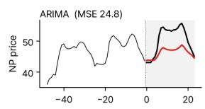

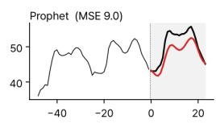

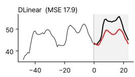

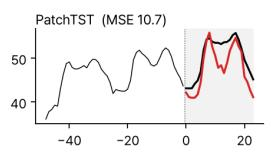

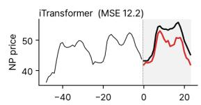

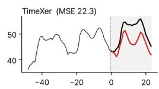

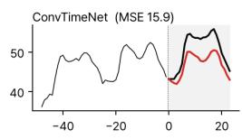

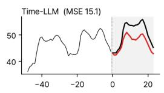

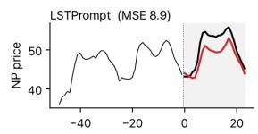

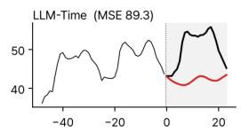

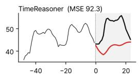

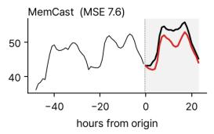

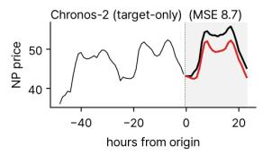

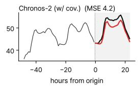

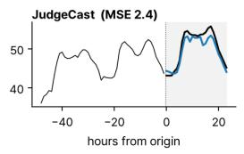  
Figure 5: Case visualization on NP. Most competing forecasts underestimate the sustained high price level, whereas JudgeCast adjusts upward and remains closer to the target observation.

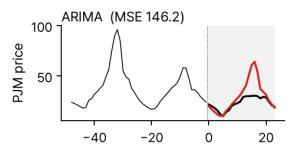

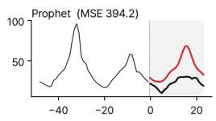

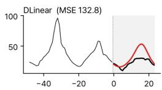

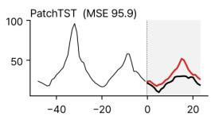

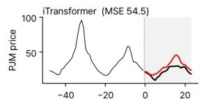

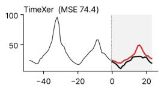

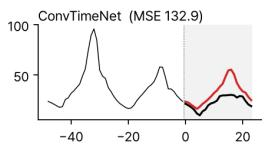

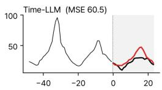

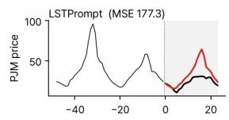

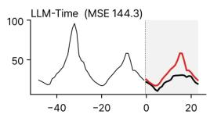

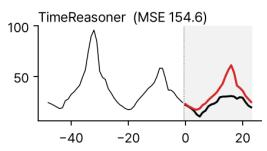

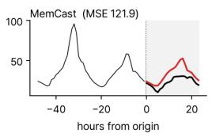

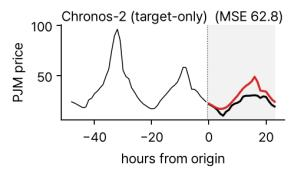

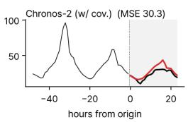

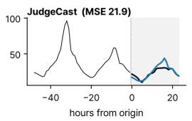  
Figure 6: Case visualization on PJM. Most competing forecasts overestimate the price peak, whereas JudgeCast reduces this overestimation and remains closer to the target observation.

(a) Incorrect Adjustment Direction  
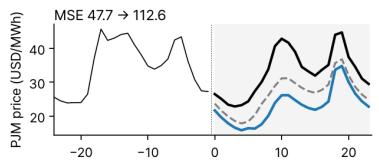  
(b) Unnecessary Adjustment

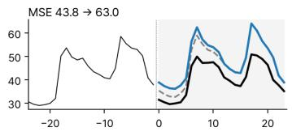

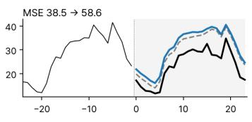

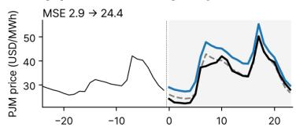

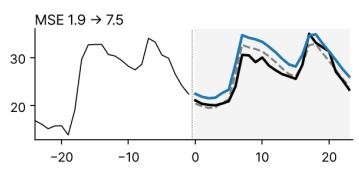

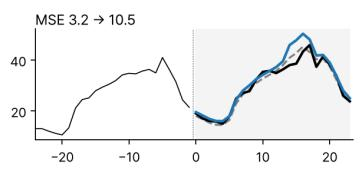

(c) Missed Within-Horizon Reversal  
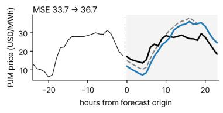

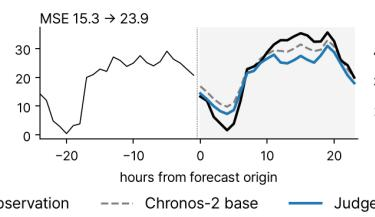

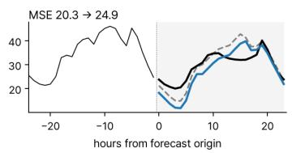  
Figure 7: Representative failure cases of JudgeCast on PJM. (a) Incorrect Adjustment Direction, where the numerical adjustment moves the base forecast in the direction opposite to the observed residual. (b) Unnecessary Adjustment, where the base forecast is already close to the target observation but the numerical adjustment moves the final forecast away from it. (c) Missed Within-Horizon Reversal, where the correction needed relative to the base forecast changes direction within the forecast horizon while the applied adjustment remains largely one-sided.

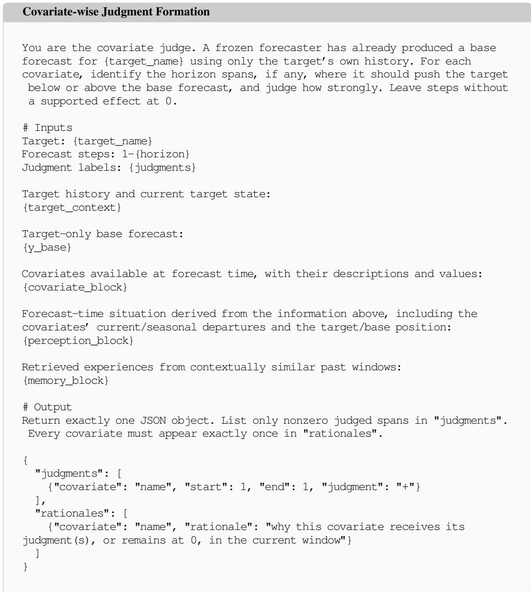  
Figure 8: Prompt for forecast-time covariate-wise judgment formation.

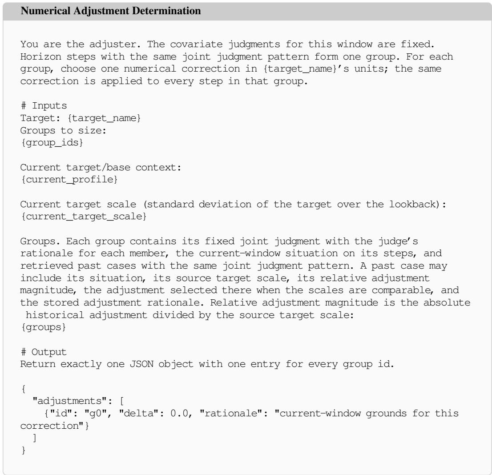  
Figure 9: Prompt for forecast-time numerical adjustment determination.

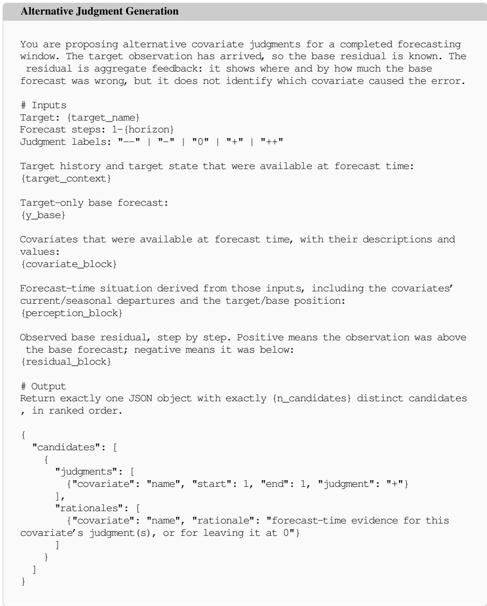  
Figure 10: Prompt for post-observation alternative judgment generation.