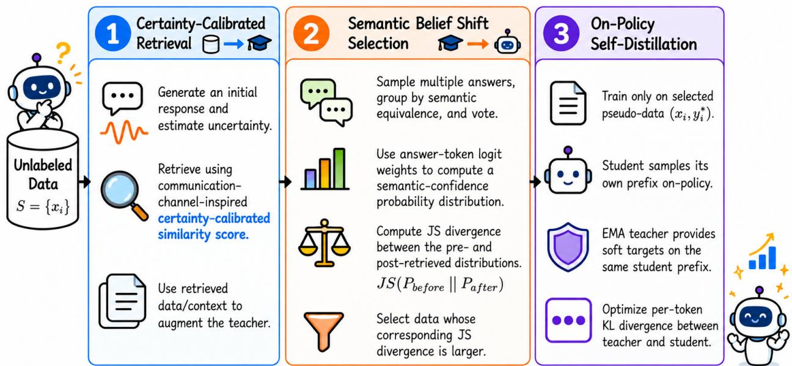
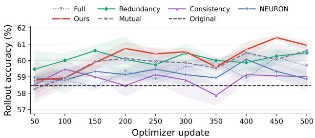
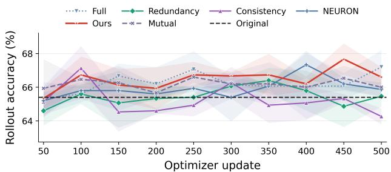
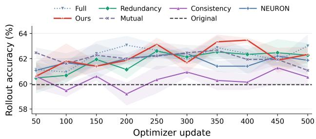
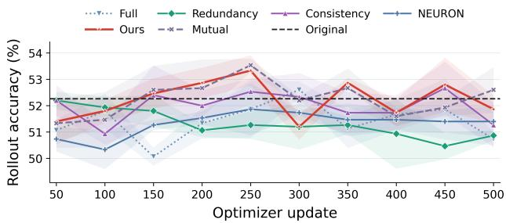
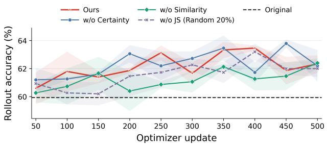
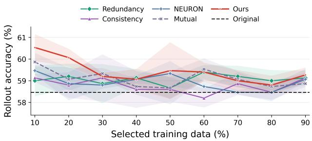
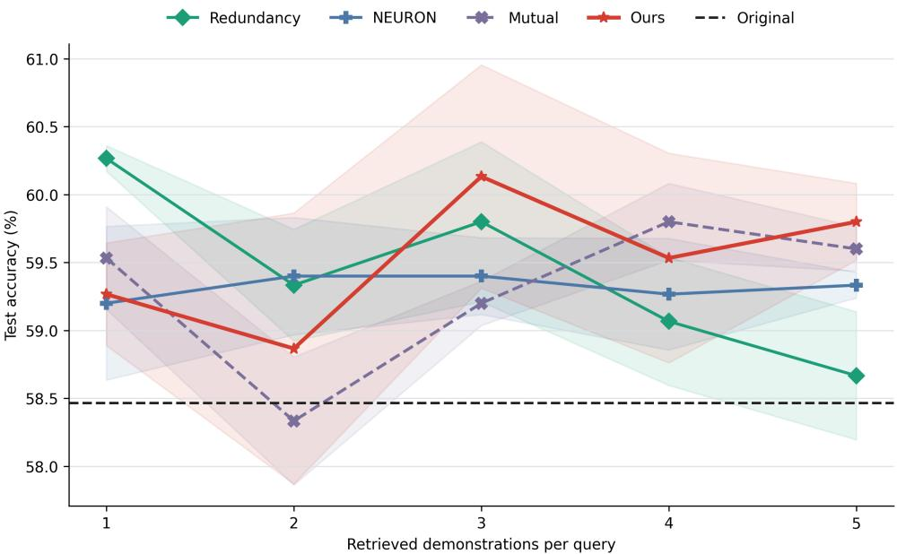
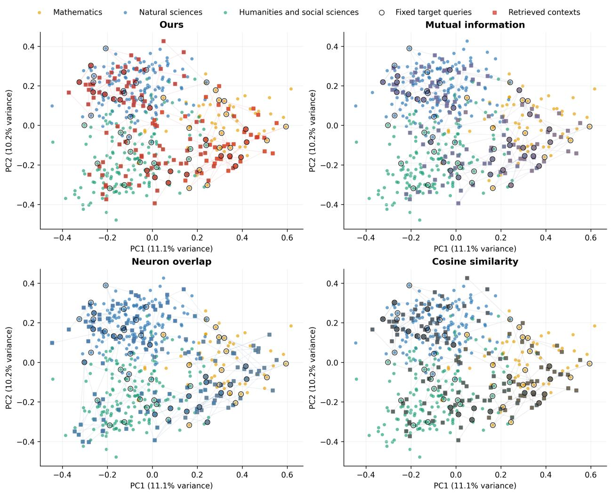

# Know Thyself, Teach Thyself: Internal Information Flow for Selective Self-Distillation

Rui Wang<sup>1\*</sup> Ruijie Wang<sup>2</sup> Bo Chen<sup>3</sup> Jiangxuan Long<sup>3</sup> Yingyu Liang<sup>3†</sup>

<sup>1</sup>Peking University <sup>2</sup>University of Oxford <sup>3</sup>The University of Hong Kong

## Abstract

Self-distillation turns knowledge distillation into a closed learning loop and offers a path toward recursive self-improvement. Without an external teacher, however, the model must determine both what information can improve its supervision and which induced changes should be learned. Existing methods typically improve teacher-generated data or select training examples in isolation, leaving the information transferred between these stages unmeasured. We introduce INFLOW, a retrieval-guided on-policy self-distillation framework that models this process as potential-to-realized information flow. INFLOW first retrieves potentially informative sources using certainty-calibrated hidden-state trajectories, then measures their realized effect through the Jensen–Shannon divergence between the teacher’s initial and retrieval-conditioned answer beliefs. Examples with larger belief shifts are selected for on-policy distillation. Our analysis formalizes the information optimized by retrieval and selection and relates the answer-level shift to the teacher–student distillation gap. Across four open-weight language models and three knowledge domains, INFLOW achieves the strongest cross-model average among the compared selection methods, with ablations supporting both stages of the framework. Our code is available at https://github.com/1240148048/INFLOW.

## 1 Introduction

Knowledge distillation transfers predictive information from a teacher to a student, including relations among outputs and representations that hard labels discard (Hinton et al., 2015; Ojha et al., 2023; Zhang et al., 2023). Self-distillation retains this principle while replacing the external teacher with another view of the learner, obtained from a previous checkpoint, self-generated data, or richer conditioning (Tarvainen and Valpola, 2017; Furlanello et al., 2018; Zhang et al., 2019). This removes the dependence on a larger teacher, makes unlabeled data directly usable, and keeps supervision within the learner’s own output space. For language models, self-generated instructions and reasoning traces have extended self-distillation from regularization to iterative adaptation (Wang et al., 2023c; Zelikman et al., 2022; Huang et al., 2023; Chen et al., 2024b; Yuan et al., 2024). Such a closed loop offers a path toward Recursive Self-Improvement (RSI): the prospect that a model can repeatedly transform its own experience and available evidence into supervision for a more capable successor, without requiring a progressively stronger external teacher or human supervision.

The same autonomy creates the central obstacle. Without an independent teacher or gold labels, selfgenerated supervision inherits the model’s uncertainty and systematic errors, which subsequent optimization may reinforce. Existing methods approach this problem from two directions. Teacher-data enhancement constructs a stronger model view through retrieval, contextual guidance, self-consistency, revision, or selfreward (Wang et al., 2023b; Yuan et al., 2024; Ye et al., 2026; Hübotter et al., 2026). Data-selection methods instead retain examples according to confidence, diversity, influence, consistency, or internal activation (Liu et al., 2024; Xia et al., 2024; Wang et al., 2023a; Chen and Li, 2026). Annotation-free methods perform these operations without labeled targets, while on-policy distillation aligns teacher guidance with prefixes visited by the current student (Huang et al., 2023; Agarwal et al., 2024). These advances improve either the information supplied to the teacher or the supervision consumed by the student, but usually optimize the two decisions separately.

This separation overlooks that distillation is fundamentally a process of information transfer (Ojha et al., 2023; Zhang et al., 2023). Progress toward RSI requires a model to diagnose its current decision state from internal representations, retrieve information targeted to that state, ruminate on the augmented teacher-generated data, then filter it, and train on the effective information. This creates a directed flow in which external evidence enters the contextual teacher through retrieval, and the information expressed by the revised teacher returns to the student through selective distillation. To our knowledge, existing self-distillation methods have not connected model-internal representations with end-to-end optimization of this information flow. Conditional mutual-information objectives provide a related perspective in knowledge distillation (Ye et al., 2024; Chen et al., 2024a), but they rely on teacher-side information or external verification that do not capture the endogenous, intervention-dependent flow of annotation-free self-distillation.

We introduce INFLOW (Internal Information Flow) following the principle of maximizing the information expected to be transferred during self-distillation. Before generation, certainty-calibrated hidden-state trajectories identify sources that can provide the largest potential information to the target’s current decision state. After retrieval, INFLOW compares the teacher’s initial and contextual answer beliefs, using their Jensen–Shannon divergence to measure the semantic information realized by the intervention. Examples with larger realized shifts are retained for on-policy distillation, which transfers the retrieval-conditioned teacher distribution back to the student. The resulting potential-to-realized-to-distilled pipeline connects targeted information acquisition, teacher self-comparison, and selective model updating within one optimization framework. Figure 1 presents an overview of the entire INFLOW pipeline. Our contributions are:

• Method. We formulate annotation-free self-distillation as a closed information-flow problem and introduce a coupled mechanism that retrieves potentially informative internal sources, measures their realized effect on the teacher, and distills the selected contextual supervision.

• Experiments. Across four model backbones and three knowledge domains, INFLOW improves the corresponding unadapted checkpoints by 1.0–3.2 overall accuracy points and achieves the strongest cross-model average among the compared selection methods. Controlled ablations further analyze the contribution of each module. Comparative experiments demonstrate the generalization of our method across different hyperparameter settings.

• Theory. We show that INFLOW jointly uses certainty-calibrated retrieval and semantic belief shift to optimize the budgeted allocation of information flow for self-distillation given the available evidence. We further characterize the convergence rate of the teacher–student information gap during distillation and qualitatively discuss the ability and limitations of semantic belief shifts to predict correct-label revisions without ground-truth supervision.

## 2 Related Work

## 2.1 Self-Distillation and Iterative Self-Improvement

Self-distillation extends knowledge distillation by replacing the external teacher with alternative views of the model itself, such as averaged checkpoints, successive generations, or intermediate representations (Tarvainen and Valpola, 2017; Furlanello et al., 2018; Zhang et al., 2019). Language models further externalize these views as generated instructions, shifting self-distillation from representation regularization toward iterative adaptation (Wang et al., 2023c; Zelikman et al., 2022; Huang et al., 2023). Annotation-free methods remove the need for labeled targets, while on-policy methods align supervision with states visited by the current student (Chen et al., 2024b; Yuan et al., 2024; Agarwal et al., 2024). Together, they suggest a path toward continual self-improvement, in which each updated model produces supervision for the next round.

  
Figure 1: Overview of INFLOW. For each query, Stage I uses internal signals to estimate how much information retrieval can channel from external evidence into the teacher. In Stage II, the teacher reflects through self-comparison and selects the realized information to provide to the student. Stage III distills this new information into the student, where it is expected to shift the original semantic belief without retrieval context.

The central obstacle is that this supervision remains endogenous. Self-training can propagate confidently incorrect pseudo-labels across iterations (Rodemann et al., 2023); without external feedback, recursive training on generated data can accumulate approximation errors and progressively discard low-probability regions of the original distribution (Huang et al., 2024). More broadly, repeated training on data generated for a particular task, or poorly designed difficulty levels, may lead to overfitting and catastrophic forgetting (Shumailov et al., 2024). Sustainable self-improvement therefore places requirements on both data quality and curriculum design.

## 2.2 Teacher Data Enhancement and Selection for Self-Distillation

One line of work improves the supervision produced by the teacher before it reaches the student. Self-Instruct expands the training distribution through model-generated instructions, while STaR iteratively retains successful reasoning traces to strengthen subsequent supervision (Wang et al., 2023c; Zelikman et al., 2022). Later approaches improve teacher outputs through agreement across generations, contrastive rationales, persistent behavioral consistency, or self-evaluation and revision (Wang et al., 2023a; Yuan et al., 2024; Lv et al., 2026). Retrieval offers another route: methods such as KATE and EPR construct a more informative teacher context by supplying demonstrations that are semantically relevant or preferred by the language model (Liu et al., 2022; Rubin et al., 2022). These mechanisms are particularly attractive for self-distillation because they can create a stronger teacher view without introducing a separate, more capable model. Their reliability, however, is limited by the closed nature of self-supervision. Semantic proximity does not imply that a demonstration contains a reliable decision process, and self-evaluation may inherit the generator’s own blind spots. Therefore, improving teacher data quality under unsupervised conditions requires not only enhanced information acquisition and internal self-evaluation, but also prediction of its actual effectiveness during training.

A complementary line of work selects which teacher-generated examples should drive optimization. DEITA balances estimated data quality against redundancy, LESS measures how a candidate’s gradient influences a target task, and NEURON uses model-internal activation patterns to select examples without annotations (Liu et al., 2024; Xia et al., 2024; Chen and Li, 2026). Selection principles developed for conventional knowledge distillation can also be transferred to self-distillation. For example, consistencybased rationale transfer and mutual-information objectives motivate ranking a candidate demonstration by how much information it provides about the target answer Y beyond the input (Wang et al., 2023a; Chen et al., 2024a). This transfer is not direct, however. Conventional distillation usually relies on a fixed and independently trained teacher, so teacher–student agreement or dependence has a meaningful external reference; in self-distillation, the teacher and student share parameters, architecture, and often the same errors. Consequently, high consistency or mutual information may indicate redundant copying. Therefore, during the data selection phase of self-distillation, “dissenting voices” may be more valuable than highly similar information.

## 3 Method

## 3.1 Problem Setting and Overview

Let $\mathcal { U } = \{ x _ { i } \} _ { i = 1 } ^ { N }$ be an unlabeled collection of questions and let $p _ { \theta }$ be a causal language model. Each question contains a prompt and, for multiple-choice tasks, a legal answer set $\mathbf { \mathcal { A } } _ { i }$ . We seek an adapted model without gold labels or a stronger external teacher. One iteration of INFLOW contains three stages: (1) certainty-calibrated retrieval, (2) semantic belief-shift selection, and (3) on-policy distillation from an EMA teacher. Retrieval and selection are recomputed from the model’s own signals without external annotations. Algorithm 1 in Appendix A.1 gives the complete procedure.

For each $x _ { i } ,$ the model first emits a structured response containing a short knowledge summary, a solution method, the selected option text, and its answer label. We then run a forward pass over the prompt and this initial response. Let $t _ { i }$ be the position of the final answer token and let

$$
\tau _ { i } = \left( \bar { h } _ { i , t _ { i } } ^ { ( 1 ) } , \ldots , \bar { h } _ { i , t _ { i } } ^ { ( L ) } \right) , \qquad \bar { h } _ { i , t _ { i } } ^ { ( \ell ) } = \frac { h _ { i , t _ { i } } ^ { ( \ell ) } } { \vert \vert h _ { i , t _ { i } } ^ { ( \ell ) } \vert \vert _ { 2 } } ,\tag{1}
$$

where $h _ { i , t _ { i } } ^ { ( \ell ) }$ is the hidden vector at the same final-token position after transformer layer ℓ. Thus $\tau _ { i }$ is the trajectory followed by the decision token as information is transformed through depth.

## 3.2 Certainty-Calibrated Retrieval as Potential Information Flow

We flatten the layer axis only when computing a pairwise cosine:

$$
s _ { i j } = \operatorname* { m a x } \left( 0 , \frac { \langle \mathrm { v e c } ( \tau _ { i } ) , \mathrm { v e c } ( \tau _ { j } ) \rangle } { \| \mathrm { v e c } ( \tau _ { i } ) \| _ { 2 } \| \mathrm { v e c } ( \tau _ { j } ) \| _ { 2 } } \right) .\tag{2}
$$

The nonnegative part excludes trajectories whose layerwise directions are opposed.

Similarity identifies aligned computation but does not establish that the source decision is trustworthy. Let $\mathbf { \Delta } \mathbf { q } _ { j }$ be the softmax distribution over the legal answer-token logits of source $j .$ . We use Shannon entropy to quantify uncertainty, normalized to a score between 0 and 1. The certainty score is then defined as one minus the uncertainty score. The certainty score is zero for a uniform answer belief and approaches one when probability mass concentrates on one option.

$$
c _ { j } = 1 - { \frac { H ( { \pmb q } _ { j } ) } { \log | \mathcal { A } _ { j } | } } , \qquad H ( { \pmb q } _ { j } ) = - \sum _ { a \in \mathcal { A } _ { j } } { q } _ { j } ( a ) \log { q } _ { j } ( a ) .\tag{3}
$$

Channel theory suggests that a useful demonstration should provide a strong signal about the target decision through a reliable channel. To derive the retrieval score, let $T _ { i } \sim \mathcal { N } ( 0 , 1 )$ denote a local scalar representation of the target decision and source j as the standardized Gaussian observation

$$
Z _ { i j } = \sqrt { c _ { j } } s _ { i j } T _ { i } + \sqrt { 1 - c _ { j } s _ { i j } ^ { 2 } } \varepsilon _ { j } , \qquad \varepsilon _ { j } \sim \mathcal { N } ( 0 , 1 ) .\tag{4}
$$

The effective squared correlation is therefore $\rho _ { i j } ^ { 2 } = c _ { j } s _ { i j } ^ { 2 }$ : certainty controls the probability of reliable transmission, while squared similarity determines its aligned signal strength. The theoretical information of this local Gaussian channel is

$$
I _ { i j } ^ { \mathrm { p o t } } = I ( T _ { i } ; Z _ { i j } ) = - \frac { 1 } { 2 } \log \left( 1 - \widetilde { \rho } _ { i j } ^ { 2 } \right) , \qquad \widetilde { \rho } _ { i j } ^ { 2 } = \operatorname * { m i n } \{ \rho _ { i j } ^ { 2 } , 1 - \epsilon \} .\tag{5}
$$

We use this quantity as a local information-potential surrogate and retrieve the top k sources for each target. Because $I _ { i j } ^ { \mathrm { p o \it { \tilde { t } } } }$ is monotone in $c _ { j } s _ { i j } ^ { 2 }$ , this ranking favors sources whose internal trajectories are both strongly aligned with the target and supported by a reliable answer belief. The score is directional because reversing i and j generally changes the estimated channel quality.

## 3.3 Semantic Beliefs and Realized Belief Shift

For each target $x _ { i }$ , we compare its initial decision with the teacher responses induced by the retrieved set $S _ { i }$ . We reuse the single no-retrieval response generated in Stage I, and generate M retrieval-conditioned responses using the same decoding configuration,

$$
y _ { i } ^ { 0 } \sim p _ { \bar { \theta } } ( \cdot \mid x _ { i } ) , \quad y _ { i } ^ { S , m } \sim p _ { \bar { \theta } } ( \cdot \mid x _ { i } , S _ { i } ) , \qquad m = 1 , \ldots , M .\tag{6}
$$

Let $t _ { i } ^ { 0 }$ and $t _ { i } ^ { S , m }$ denote the final answer-token positions of these responses. For each legal answer $a \in { \mathcal { A } } _ { i }$ , let $z _ { i } ^ { 0 } ( a )$ and $z _ { i } ^ { S , m } ( a )$ be the corresponding teacher logits. We normalize these logits:

$$
q _ { i } ^ { 0 } ( a ) = \frac { \exp \bigl ( z _ { i } ^ { 0 } ( a ) / T \bigr ) } { \sum _ { a ^ { \prime } \in \mathcal { A } _ { i } } \exp \bigl ( z _ { i } ^ { 0 } ( a ^ { \prime } ) / T \bigr ) } , \qquad q _ { i } ^ { S , m } ( a ) = \frac { \exp \Bigl ( z _ { i } ^ { S , m } ( a ) / T \Bigr ) } { \sum _ { a ^ { \prime } \in \mathcal { A } _ { i } } \exp \Bigl ( z _ { i } ^ { S , m } ( a ^ { \prime } ) / T \Bigr ) } ,\tag{7}
$$

where $T$ is the default decoding temperature. Normalization over the legal answer set makes each distribution invariant to an additive shift of the vocabulary logits at its scoring position. For multiple-choice tasks, the initial semantic belief is the answer-token distribution from the single no-retrieval response, while the retrieval-conditioned belief averages the distributions of the M teacher responses:

$$
P _ { i } ^ { 0 } ( a ) = q _ { i } ^ { 0 } ( a ) , \qquad P _ { i } ^ { S } ( a ) = \frac { 1 } { M } \sum _ { m = 1 } ^ { M } q _ { i } ^ { S , m } ( a ) .\tag{8}
$$

For open-ended generation tasks, where no fixed legal answer set is available, we follow the semantic-entropy principle of grouping semantically equivalent responses and estimating probability mass in the resulting semantic space (Kuhn et al., 2023); Appendix A.2 provides the corresponding estimator.

This construction compares the model’s initial sampled decision with the distribution of teacher decisions induced by the retrieved context. The realized belief shift is

$$
B _ { i } = \mathrm { J S } ( P _ { i } ^ { 0 } \| P _ { i } ^ { S } ) = \frac { 1 } { 2 } \operatorname { K L } ( P _ { i } ^ { 0 } \| M _ { i } ) + \frac { 1 } { 2 } \operatorname { K L } ( P _ { i } ^ { S } \| M _ { i } ) , \qquad M _ { i } = \frac { P _ { i } ^ { 0 } + P _ { i } ^ { S } } { 2 } .\tag{9}
$$

INFLOW retains the top αN targets according to $B _ { i }$ . The score measures the magnitude of the retrievalinduced change in the teacher’s semantic belief, and serves as an estimate of the information transferred to the student through distillation on that example. Sec. 5 shows that INFLOW follows the principle of maximizing the expected amount of information transferred through distillation.

## 3.4 On-Policy Self-Distillation

For a selected target, the student samples a trajectory $\hat { \pmb { y } } \sim p _ { \theta } ( \cdot \mid x _ { i } )$ . At every student prefix $\hat { \mathbf { { y } } } _ { < t } .$ , the EMA teacher is conditioned on the same prefix and retrieved demonstrations $S _ { i }$ . The update minimizes reverse KL divergence:

$$
\mathcal { L } _ { \mathrm { O P S D } } = \frac { 1 } { \vert \hat { y } \vert } \mathbb { E } _ { \hat { y } \sim p _ { \theta } } \sum _ { t = 1 } ^ { \vert \hat { y } \vert } \mathrm { K L } \big ( p _ { \theta } ( \cdot \vert x _ { i } , \hat { y } _ { < t } ) \vert \vert p _ { \bar { \theta } } ( \cdot \vert x _ { i } , S _ { i } , \hat { y } _ { < t } ) \big ) .\tag{10}
$$

After each optimizer step, $\bar { \theta }  \beta \bar { \theta } + ( 1 - \beta ) \theta$ . The teacher therefore supplies a retrieval-conditioned view of the same model, while on-policy prefixes align supervision with the student’s current state distribution. LoRA confines the update to a low-rank parameter subspace (Hu et al., 2022).

## 4 Experiments

## 4.1 Experimental Setup

Data and domains. We construct disjoint unlabeled training and test pools from three domains using SciKnowEval (Feng et al., 2024) and MMLU-Pro (Wang et al., 2024): mathematics (accounts for 20%); natural science, including biology, chemistry, materials, and physics (each accounts for 10%, 40% in total); and humanities and social science, including psychology, history, economics, law, and global facts (each accounts for 8%, 40% in total). The test set consists of 500 new questions drawn from the same domains and in the same proportions. Gold labels are used only for evaluation.

Models. We study Qwen3-4B-Instruct (Qwen Team, 2025), Qwen3.5-9B-Instruct (Qwen Team, 2026), Ministral-3-8B-Instruct (Liu et al., 2026), and Llama-3.1-8B-Instruct (Llama Team, 2024). Deploying the same protocol across these model families tests whether the selector depends on one representation geometry or capacity regime.

Training protocol. Unless varied in an ablation, every method uses 250 small-step optimizer updates (micro-batch size 4), a 20% selection ratio, three retrieved demonstrations, five teacher candidates per target, and the same LoRA configuration and decoding budget. The EMA coefficient is $\beta = 0 . 9 9 5$

Baselines. ORIGINAL is the unadapted model, and FULL trains on all generated data without any additional selection. REDUNDANCY implements the quality-diversity selection principle of DEITA (Liu et al., 2024). CONSISTENCY selects self-consistent teacher support motivated by SCOTT (Wang et al., 2023a) and PCSD (Lv et al., 2026). NEURON follows the internal-activation selection criterion of on-policy selfdistillation (Chen and Li, 2026). MUTUAL adapts representation mutual-information maximization from chain-of-thought distillation (Chen et al., 2024a). SCOTT and Mutual originally use a stronger-teacher

Table 1: Average rollout accuracy at 250 optimizer updates and a 20% selection ratio. Each entry is Avg@3 ± SD (%). The final row reports mean runtime per run. Bold and underlined entries denote the best and second-best results, respectively. Maj@3 results are reported in Appendix C.1.
<table><tr><td>Model</td><td>Domain</td><td>Original</td><td>Full</td><td>Redundancy</td><td>Consistency</td><td>NEURON</td><td>Mutual</td><td>INFLOW</td></tr><tr><td rowspan="4"> $Q w e n 3 – 4 B$ </td><td>Math</td><td> $4 5 . 3 { \scriptstyle \pm 0 . 4 7 }$ </td><td> $4 9 . 0 { \scriptstyle \pm 0 . 8 2 }$ </td><td> $4 9 . 7 _ { \pm 0 . 9 4 }$ </td><td> $4 8 . 0 { \scriptstyle \pm 1 . 4 1 }$ </td><td> $4 6 . 7 { \scriptstyle \pm 0 . 4 7 }$ </td><td> $4 9 . 3 { \scriptstyle \pm 1 . 7 0 }$ </td><td> ${ \bf 5 1 . 3 _ { \pm 0 . 9 4 } }$ </td></tr><tr><td>Natural Sci.</td><td> $7 8 . 5 { \scriptstyle \pm 0 . 8 2 }$ </td><td> $7 8 . 8 { \scriptstyle \pm 0 . 2 4 }$ </td><td> $7 8 . 8 { \scriptstyle \pm 0 . 6 2 }$ </td><td> $7 8 . 7 { \scriptstyle \pm 0 . 2 4 }$ </td><td> ${ \bf 7 9 . 8 _ { \pm 0 . 8 5 } }$ </td><td> $7 9 . 5 { \scriptstyle \pm 1 . 0 8 }$ </td><td> $7 9 . 2 { \scriptstyle \pm 0 . 4 7 }$ </td></tr><tr><td>Hum. &amp; Soc.</td><td> $4 5 . 0 { \scriptstyle \pm 0 . 7 1 }$ </td><td> $4 3 . 8 { \scriptstyle \pm 0 . 8 5 }$ </td><td> $\underline { { 4 5 . 7 \pm 1 . 0 3 } }$ </td><td> $4 5 . 2 { \scriptstyle \pm 1 . 0 3 }$ </td><td> $4 5 . 5 { \scriptstyle \pm 0 . 7 1 }$ </td><td> $4 5 . 7 { \scriptstyle \pm 0 . 6 2 }$ </td><td> ${ \bf 4 6 . 2 _ { \pm 0 . 4 7 } }$ </td></tr><tr><td>Overall</td><td> $5 8 . 5 { \scriptstyle \pm 0 . 0 9 }$ </td><td> $5 8 . 9 { \scriptstyle \pm 0 . 3 4 }$ </td><td> $5 9 . 7 _ { \pm 0 . 4 1 }$ </td><td> $5 9 . 1 { \scriptstyle \pm 0 . 5 2 }$ </td><td> $5 9 . 5 { \scriptstyle \pm 0 . 6 6 }$ </td><td> $5 9 . 9 { \scriptstyle \pm 0 . 9 0 }$ </td><td> ${ \bf 6 0 . 4 \underline { { { \ t } } 0 . 3 3 } }$ </td></tr><tr><td rowspan="4"> $Q w e n 3 . 5 – 9 B$ </td><td>Math</td><td> $4 9 . 3 _ { \pm 0 . 4 7 }$ </td><td> $5 1 . 3 { \scriptstyle \pm 2 . 4 9 }$ </td><td> $5 1 . 3 { \scriptstyle \pm 1 . 7 0 }$ </td><td> $4 9 . 0 { \scriptstyle \pm 1 . 4 1 }$ </td><td> $5 1 . 0 { \scriptstyle \pm 1 . 4 1 }$ </td><td> $5 1 . 3 { \scriptstyle \pm 0 . 4 7 }$ </td><td> ${ \bf 5 3 . 3 \pm 2 . 0 5 }$ </td></tr><tr><td>Natural Sci.</td><td> $8 0 . 2 _ { \pm 1 . 2 5 }$ </td><td> $8 0 . 8 { \scriptstyle \pm 1 . 2 5 }$ </td><td> $\overline { { 8 0 . 7 _ { \pm 1 . 2 5 } } }$ </td><td> $7 9 . 7 _ { \pm 0 . 4 7 }$ </td><td> $\mathbf { 8 1 . 7 _ { \pm 0 . 6 2 } }$ </td><td> $8 0 . 8 _ { \pm 0 . 2 4 }$ </td><td> $\mathbf { 8 1 . 7 _ { \pm 0 . 6 2 } }$ </td></tr><tr><td>Hum. &amp; Soc.</td><td> $5 8 . 7 { \scriptstyle \pm 0 . 9 4 }$ </td><td> ${ \bf 6 1 . 2 \pm 0 . 2 4 }$ </td><td> $5 7 . 2 { \scriptstyle \pm 0 . 8 5 }$ </td><td> $5 8 . 2 { \scriptstyle \pm 1 . 0 3 }$ </td><td> $5 7 . 7 { \scriptstyle \pm 0 . 4 7 }$ </td><td> $6 0 . 0 { \scriptstyle \pm 0 . 7 1 }$ </td><td> $5 8 . 5 { \scriptstyle \pm 1 . 4 7 }$ </td></tr><tr><td>Overall</td><td> $6 5 . 4 { \scriptstyle \pm 0 . 5 9 }$ </td><td> $\mathbf { 6 7 . 1 \pm 1 . 0 6 }$ </td><td> $6 5 . 4 { \scriptstyle \pm 0 . 5 7 }$ </td><td> $6 4 . 9 { \scriptstyle \pm 0 . 6 6 }$ </td><td> $6 5 . 9 { \scriptstyle \pm 0 . 1 9 }$ </td><td> $6 6 . 6 { \scriptstyle \pm 0 . 3 3 }$ </td><td> $\underline { { 6 6 . 7 \pm 0 . 7 7 } }$ </td></tr><tr><td rowspan="4">Ministral-3-8B</td><td>Math</td><td> $4 2 . 3 { \scriptstyle \pm 2 . 4 9 }$ </td><td> $4 3 . 0 { \scriptstyle \pm 0 . 8 2 }$ </td><td> $4 4 . 0 { \scriptstyle \pm 2 . 4 5 }$ </td><td> $4 1 . 0 { \scriptstyle \pm 0 . 8 2 }$ </td><td> $4 5 . 3 { \scriptstyle \pm 2 . 4 9 }$ </td><td> $4 4 . 0 { \scriptstyle \pm 1 . 4 1 }$ </td><td> ${ \bf 4 6 . 7 _ { \pm 1 . 7 0 } }$ </td></tr><tr><td>Natural Sci.</td><td> $7 7 . 7 { \scriptstyle \pm 1 . 6 5 }$ </td><td> $7 8 . 2 { \scriptstyle \pm 0 . 8 5 }$ </td><td> ${ \bf 7 9 . 2 _ { \pm 0 . 2 4 } }$ </td><td> $7 7 . 3 { \scriptstyle \pm 1 . 0 3 }$ </td><td> $7 8 . 3 { \scriptstyle \pm 0 . 8 5 }$ </td><td> $7 8 . 2 { \scriptstyle \pm 1 . 9 3 }$ </td><td> $7 8 . 5 { \scriptstyle \pm 0 . 8 2 }$ </td></tr><tr><td>Hum. &amp; Soc.</td><td> $5 1 . 0 { \scriptstyle \pm 1 . 0 8 }$ </td><td> $\mathbf { 5 7 . 0 _ { \pm 1 . 2 2 } }$ </td><td> $5 5 . 3 { \scriptstyle \pm 2 . 0 1 }$ </td><td> $5 3 . 0 { \scriptstyle \pm 2 . 5 5 }$ </td><td> $5 4 . 7 _ { \pm 0 . 6 2 }$ </td><td> $5 5 . 3 { \scriptstyle \pm 0 . 8 5 }$ </td><td> $\underline { { 5 6 . 0 _ { \pm 1 . 4 1 } } }$ </td></tr><tr><td>Overall</td><td> $5 9 . 9 { \scriptstyle \pm 0 . 9 8 }$ </td><td> $\underline { { 6 2 . 7 \pm 0 . 5 0 } }$ </td><td> $6 2 . 6 { \scriptstyle \pm 0 . 4 3 }$ </td><td> $6 0 . 3 { \scriptstyle \pm 1 . 0 9 }$ </td><td> $6 2 . 3 { \scriptstyle \pm 0 . 1 9 }$ </td><td> $6 2 . 2 { \scriptstyle \pm 1 . 0 7 }$ </td><td> ${ \bf 6 3 . 1 { \scriptstyle \pm 0 . 5 2 } }$ </td></tr><tr><td rowspan="4">Llama-3.1-8B</td><td>Math</td><td> $2 6 . 7 { \scriptstyle \pm 3 . 3 0 }$ </td><td> $2 5 . 0 { \scriptstyle \pm 2 . 1 6 }$ </td><td> $2 4 . 7 _ { \pm 1 . 2 5 }$ </td><td> $2 7 . 7 { \scriptstyle \pm 0 . 4 7 }$ </td><td> $2 3 . 7 _ { \pm 2 . 6 2 }$ </td><td> $2 8 . 7 { \scriptstyle \pm 1 . 8 9 }$ </td><td> $\mathbf { 3 1 . 3 \_ 1 . 2 5 }$ </td></tr><tr><td>Natural Sci.</td><td> $7 8 . 2 { \scriptstyle \pm 0 . 6 2 }$ </td><td> $\underline { { 7 8 . 8 \pm 0 . 6 2 } }$ </td><td> $7 8 . 2 { \scriptstyle \pm 0 . 9 4 }$ </td><td> $7 8 . 5 { \scriptstyle \pm 0 . 4 1 }$ </td><td> ${ \bf 7 9 . 0 _ { \pm 0 . 7 1 } }$ </td><td> $7 8 . 8 { \scriptstyle \pm 0 . 2 4 }$ </td><td> $7 8 . 2 { \scriptstyle \pm 0 . 2 4 }$ </td></tr><tr><td>Hum. &amp; Soc.</td><td> $3 9 . 2 { \scriptstyle \pm 3 . 1 2 }$ </td><td> $3 8 . 3 { \scriptstyle \pm 1 . 9 3 }$ </td><td> $3 7 . 7 _ { \pm 0 . 4 7 }$ </td><td> $3 9 . 0 { \scriptstyle \pm 0 . 8 2 }$ </td><td> $3 8 . 8 { \scriptstyle \pm 0 . 6 2 }$ </td><td> $\mathbf { 4 0 . 7 \pm 1 . 3 1 }$ </td><td> $3 9 . 5 { \scriptstyle \pm 1 . 0 8 }$ </td></tr><tr><td>Overall</td><td> $5 2 . 3 { \scriptstyle \pm 2 . 0 4 }$ </td><td> $5 1 . 9 { \scriptstyle \pm 1 . 0 9 }$ </td><td> $5 1 . 3 { \scriptstyle \pm 0 . 5 2 }$ </td><td> $5 2 . 5 { \scriptstyle \pm 0 . 5 0 }$ </td><td> $5 1 . 9 { \scriptstyle \pm 0 . 9 8 }$ </td><td> ${ \bf 5 3 . 5 \pm 0 . 2 5 }$ </td><td> ${ \underline { { 5 3 . 3 } } } { \underline { { \pm 0 . 5 7 } } }$ </td></tr><tr><td colspan="2">Average Time Cost (min)</td><td>0.0</td><td>70.1</td><td>63.3</td><td>59.6</td><td>76.1</td><td>68.5</td><td>66.7</td></tr></table>

knowledge-distillation setting, and PCSD targets agentic reinforcement learning. We therefore re-implement their ideas inside our retrieval-conditioned self-distillation pipeline with identical data, generation, and update budgets. Detailed algorithm descriptions and fairness adjustments are provided in Appendix D.  
Metrics. For every test question, we independently repeated the test three times. Avg@3 is the mean accuracy across the three rollout indices, and SD is their standard deviation. Table 1 reports $\mathrm { A v g } @ \ @ 3 \pm \mathrm { S D }$ . Maj@3 is the accuracy of the majority-voted final answer. We also record end-to-end wall-clock time, including retrieval, teacher generation, selection, and optimization.

## 4.2 Main Results

Effectiveness of our signal. Table 1 first evaluates whether INFLOW identifies more useful training data under a fixed update budget. Although it retains only 20% of the unlabeled pool, INFLOW outperforms FULL on three of four backbones and raises their mean overall accuracy from 60.2% to 60.9%. It also achieves the highest cross-backbone average among the selection methods. The advantage is not uniform: FULL remains better on Qwen3.5-9B and MUTUAL narrowly leads on Llama-3.1-8B. A post-hoc direction analysis provides complementary evidence for this selection signal: among the top 20% of Qwen3-4B targets ranked by belief shift, Fix (the original answer is incorrect while the teacher’s answer is correct) exceeds Break (correct to incorrect) by 13 percentage points and the retrieval-conditioned teacher accuracy rises from 23% to 36% (Appendix C.2).

Generalization, efficiency, and domain dependence. The clearest pattern appears in mathematics. Across the four backbones, INFLOW improves the corresponding unadapted checkpoints by 6.0, 4.0, 4.4, and 4.6 points. Gains are smaller in natural science, where the original checkpoints already achieve 77.7–80.2%. This contrast suggests that the selection signal is most useful when retrieved evidence can revise an initially weak decision. INFLOW requires 66.7 minutes per run, compared with 68.5 minutes for MUTUAL and 76.1 minutes for NEURON. Its performance therefore does not come from additional generation or optimization. In Section 5.2, we further derive the convergence rate of the expected information gap during self-distillation

  
(a) Qwen3-4B-Instruct

  
(b) Qwen3.5-9B-Instruct

  
(c) Ministral-3-8B-Instruct

  
(d) Llama-3.1-8B-Instruct  
Figure 2: Accuracy over optimizer updates. Shaded bands denote the standard deviation across three rolloutindex accuracies.

with respect to optimization updates.

Why self-distillation helps less on Llama. Llama-3.1-8B-Instruct exhibits weaker and less stable gains across the self-distillation methods in the long run (Figure 2). In Table 1, FULL, REDUNDANCY, and NEURON all reduce its overall accuracy relative to the unadapted checkpoint, suggesting that the limitation is not specific to one selector. The direction analysis in Appendix C.2 traces this pattern to the quality of the self-generated supervision. Within the top 20% selected by belief shift, Qwen3-4B obtains 36% Fix and 23% Break, increasing teacher accuracy from 23% to 36%. The corresponding Llama subset obtains 26% Fix and 27% Break, while the teacher accuracy is slightly lower than the initial accuracy by 1.0 percentage point. Retrieval therefore produces a strong information change on Llama without satisfactory corrective outcomes. INFLOW still improves its mathematics and overall accuracy by 4.6 and 1.0 points, respectively, but the near-zero Fix−Break balance helps explain why these gains remain unstable.

## 4.3 Ablation Studies

The following experiments separate the quality of the selection signal from the effects of training duration and data volume.

Sensitivity to the optimization budget. Figure 2 shows that self-distillation accuracy is non-monotonic across update counts. INFLOW remains above the unadapted checkpoint over most of the trajectory on Qwen3-4B, Qwen3.5-9B, and Ministral-3-8B, whereas the methods are less clearly separated on Llama-3.1- 8B. We use a common 250-update checkpoint for all methods to avoid selecting model-specific peaks. These curves indicate that data selection determines which supervision enters training, but does not eliminate the backbone-dependent effects of prolonged fitting to self-generated targets.

Does belief shift identify useful supervision? The most direct control is the “w/o JS” variant in Figure 3: it preserves the same retrieval procedure, selection ratio, and optimization budget, but replaces beliefshift ranking with a random 20% subset. At the default 250-update checkpoint, accuracy decreases from approximately 63.1% to 61.7%. Since the retrieved contexts and amount of training data are otherwise unchanged, this difference isolates the value of ranking targets by their realized response to retrieval rather than merely training on fewer examples.



  
Figure 3: Component ablation on Ministral-3-8B-Instruct. Shaded bands denote SD across three rollout-index accuracies. “w/o JS” replaces beliefshift selection with a random 20% subset; “w/o Similarity” and “w/o Certainty” remove the corresponding retrieval factors.  
Figure 4: Selection-ratio ablation on Qwen3-4B-Instruct. Shaded bands denote SD across three rollout-index accuracies. The selected fraction of the unlabeled pool is varied while the generation and optimization budgets remain fixed.

Figure 4 tests the same claim across selection budgets. INFLOW has its clearest advantage at 10% and 20%, where the selector must distinguish a small high-value subset from the remaining pool. Its advantage contracts as the retained fraction increases and lower-ranked targets enter training. This budget-dependent pattern is evidence of a meaningful ordering: belief shift concentrates useful self-distillation examples near the top of the ranking, rather than benefiting all subsets equally. The balance between this concentration and target coverage motivates the default ratio of 20%.

Which components make the signal informative? Figure 3 further separates potential from realized information. Removing trajectory similarity produces the largest reduction at 250 updates, from approximately 63.1% to 60.9%, showing that certainty alone cannot identify sources whose internal decision process is relevant to the target. Removing certainty gives 62.2%, while replacing JS selection with random selection gives 61.7%. Similarity therefore supplies the main retrieval signal on Ministral, certainty calibrates its reliability, and belief shift determines which retrieval-conditioned targets enter distillation. The occasional advantage of “w/o Certainty” at other checkpoints also shows that certainty does not necessarily indicate correctness or effectiveness. For the motivation behind certainty calibration and further discussion, please refer to Section 5.

The retrieval-depth experiment is deferred to Appendix C.3, where Figure 5 tests the marginal benefit of increasing the amount of retrieved data without expanding the main-text ablation block.

## 5 Discussion on the Theoretical Principles

## 5.1 Maximizing Information Transfer for Self-Distillation

INFLOW organizes self-distillation as a two-stage information-transfer process. Retrieval determines how much information can be supplied to the teacher before generation, whereas data selection determines how much of the resulting information enters the distillation set. These decisions are made sequentially because the teacher’s response to a context is unavailable when retrieval is performed.

For target $x _ { i }$ , let $\widetilde { \rho } _ { i j } ^ { 2 } = \operatorname* { m i n } \{ c _ { j } s _ { i j } ^ { 2 } , 1 - \epsilon \}$ and $\gamma _ { i j } = \widetilde { \rho } _ { i j } ^ { 2 } / ( 1 - \widetilde { \rho } _ { i j } ^ { 2 } )$ . Under the local Gaussian channel

model and conditionally independent source noises, the information supplied by a size-k source set is

$$
V _ { i } ( S ) = I ( T _ { i } ; Z _ { i S } ) = \frac { 1 } { 2 } \log \left( 1 + \sum _ { j \in S } \gamma _ { i j } \right) .\tag{11}
$$

Because Equation 11 is monotone in the sum of signal-to-noise ratios, retrieving the top-k sources under $I _ { i j } ^ { \mathrm { p o t } }$ maximizes the information available to the target decision state before teacher generation.

After generation, let $C _ { i }$ indicate whether the retrieved context $S _ { i }$ is supplied, and let $A _ { i }$ denote the resulting semantic answer. The realized information transferred to the teacher target is

$$
I ( A _ { i } ; C _ { i } \mid X _ { i } = x _ { i } , S _ { i } ) = \operatorname { J S } ( P _ { i } ^ { 0 } \| P _ { i } ^ { S _ { i } } ) = B _ { i } .\tag{12}
$$

Thus, $B _ { i }$ measures in nats how much information about the retrieval intervention is expressed in the teacher’s answer distribution.

Proposition 1 (Information-transfer maximization). Assume that source observations are conditionally independent in the Gaussian channel and that teacher responses are conditionally independent across targets. Under retrieval depth k and training-set size $m = \lceil \alpha N \rceil$ , INFLOW satisfies

$$
S _ { i } ^ { \star } \in \arg \operatorname* { m a x } _ { | S | = k } I ( T _ { i } ; Z _ { i S } ) ,\tag{13}
$$

$$
\mathcal { T } ^ { \star } \in \arg \operatorname* { m a x } _ { | \mathcal { T } | = m } I ( A _ { \mathcal { T } } ; C _ { \mathcal { T } } \mid X _ { \mathcal { T } } , S _ { \mathcal { T } } ) ,\tag{14}
$$

where $A _ { \mathcal { T } } = ( A _ { i } ) _ { i \in \mathcal { T } }$ and $C _ { \mathcal { T } } = ( C _ { i } ) _ { i \in \mathcal { T } }$ . Therefore, INFLOW maximizes the information supplied by retrieval and the total retrieval-induced information retainedfor distillation.

The two stages optimize different points of the same information path. Potential information is the largest amount supported by the internal retrieval channel before its effect can be observed. Realized information is the part that appears in the contextual teacher’s prediction and is therefore available to the student through Equation 10. In contrast, MUTUAL uses representation-level conditional mutual information to measure information predicted before teacher generation, but does not verify how much of that information is expressed in the teacher targets. We actually considered adapting mutual-information-guided knowledge distillation (Chen et al., 2024a) to self-distillation as the core method, but ultimately found that the method derived in Proposition 1 could make better use of the information available in practice. The full proof is provided in Appendix B.

## 5.2 Distillation Rate and Corrective Direction

Let $q _ { i } ^ { S }$ be the contextual teacher distribution and $p _ { \theta }$ the student sequence distribution on the selected targets. The information gap optimized by on-policy distillation is

$$
\mathcal { K } _ { \mathcal { T } } ( \theta ) = \frac { 1 } { | \mathcal { T } | } \sum _ { i \in \mathcal { T } } \mathrm { K L } \left( p _ { \theta } ( \cdot  { | } x _ { i } )  { | | } q _ { i } ^ { S } ( \cdot  { | } x _ { i } ) \right) .\tag{15}
$$

By the KL chain rule, this is the expected token-level objective in Equation 10. Moreover, for the population semantic-answer distributions induced by the same sequence models,

$$
\begin{array} { r } { \mathrm { K L } ( P _ { i } ^ { 0 } \| P _ { i } ^ { S } ) \leq \mathrm { K L } ( p _ { \theta _ { 0 } } \| q _ { i } ^ { S } ) , } \end{array}\tag{16}
$$

so an answer-level change exposes part of the sequence-level information that distillation transfers.

Proposition 2 (Convergence of the transferred information). Suppose the local distillation objective is L-smooth and satisfies the Polyak–Łojasiewicz condition with parameter $\mu .$ For $\eta \leq 1 / L$

$$
\begin{array} { r } { \mathcal { K } _ { \mathcal { T } } ( \theta _ { t } ) - \mathcal { K } _ { \mathcal { T } } ^ { \star } \le ( 1 - \mu \eta ) ^ { t } \left[ \mathcal { K } _ { \mathcal { T } } ( \theta _ { 0 } ) - \mathcal { K } _ { \mathcal { T } } ^ { \star } \right] . } \end{array}\tag{17}
$$

A larger teacher–student gap supplies a stronger non-zero training signal, but requires more updates to reach the same absolute residual; the contraction rate itself is controlled by optimization geometry. More importantly, successful transfer does not imply correction. If $A _ { i } ^ { \star }$ is the gold answer and $P _ { i } ^ { + }$ is the post-distillation belief, then

$$
\frac { 1 } { | \mathcal { T } | } \sum _ { i \in \mathcal { T } } \left[ P _ { i } ^ { + } ( A _ { i } ^ { \star } ) - P _ { i } ^ { 0 } ( A _ { i } ^ { \star } ) \right] \geq \Delta _ { \mathcal { T } } - E _ { \mathcal { T } } ,\tag{18}
$$

where $\begin{array} { r } { \Delta \tau = \frac { 1 } { | T | } \sum _ { i \in \mathcal { T } } \left[ P _ { i } ^ { S } ( A _ { i } ^ { \star } ) - P _ { i } ^ { 0 } ( A _ { i } ^ { \star } ) \right] , \qquad E _ { \mathcal { T } } = \frac { 1 } { | T | } \sum _ { i \in \mathcal { T } } \mathrm { T V } ( P _ { i } ^ { + } , P _ { i } ^ { S } ) . } \end{array}$

The convergence of the teacher–student information gap measures how faithfully contextual information is transferred, but does not guarantee correct-label repair: as Appendix C.2 shows, a large information shift may instead preserve or introduce an erroneous target. For Llama-3.1-8B, its low initial accuracy implies that the unlabeled source pool contains many incorrect model answers, yielding a small or negative $\Delta \tau$ and propagating errors through distillation. INFLOW improves overall accuracy by 1.0 percentage point after 250 updates yet declines after 500 updates, suggesting that further erasure of information gaps in distillation is not necessarily beneficial.

## 6 Conclusion

We propose INFLOW to connect two decisions that previous annotation-free self-distillation methods largely treat separately: which evidence should condition the teacher and which resulting targets should be retained for training. INFLOW formulates this process as budgeted information-flow optimization. Certainty-calibrated retrieval maximizes the information available to the target under a local channel model, while semantic belief shift allocates the training budget according to the information expected to be transferred. Our analysis further relates the induced answer-level gap to the sequence-level distillation objective while acknowledging that information gaps in annotation-free self-distillation cannot fully guide the correction of incorrect answers. Experiments across four model backbones, together with posterior statistics, ablation studies, and hyperparameter analysis, support INFLOW as an effective data-selection signal. Overall, INFLOW provides a unified basis for guiding knowledge retrieval and data selection in self-distillation through information flow optimization.

## AI Use Statement

Generative AI tools, primarily OpenAI Codex, were used to assist with research framing, feedback, manuscript drafting, and language editing. All AI-assisted text was reviewed by the authors. The authors take full responsibility for the accuracy, originality, and final content of this work.

## Ethics Statement

This work uses publicly available academic benchmarks, and does not involve newly collected personal data or human-subject experiments. The datasets and models are used in accordance with their stated terms and licenses. Annotation-free self-distillation can reproduce or amplify incorrect and biased predictions already present in a model, particularly when confident but erroneous outputs are selected as supervision. INFLOW measures whether retrieved information changes the teacher’s belief, but does not by itself certify that the change is factually correct or socially unbiased. The method should therefore be combined with appropriate validation and safety evaluation before deployment in consequential applications.

## Reproducibility Statement

The method section specifies the trajectory representation, certainty-calibrated retrieval score, semantic belief construction, belief-shift criterion, and on-policy distillation objective; Algorithm 1 summarizes the complete training procedure. The experimental setup reports the evaluated models and datasets, generation settings, retrieval and selection budgets, optimization configuration, and evaluation protocol. The appendix provides the prompts, baseline implementations, additional hyperparameter analyses, qualitative retrieval examples, and case studies. Together, these materials are intended to support independent reproduction of the method and reported experiments.

## References

Rishabh Agarwal, Nino Vieillard, Yongchao Zhou, Piotr Stanczyk, Sabela Ramos, Matthieu Geist, and Olivier Bachem. On-policy distillation of language models: Learning from self-generated mistakes. In International Conference on Learning Representations, 2024. URL https://openreview.net/ forum?id=3zKtaqxLhW.

Xin Chen, Hanxian Huang, Yanjun Gao, Yi Wang, Jishen Zhao, and Ke Ding. Learning to maximize mutual information for chain-of-thought distillation. In Findings ofthe Associationfor Computational Linguistics: ACL 2024, pages 6857–6868. Association for Computational Linguistics, 2024a. doi: 10.18653/v1/2024. findings-acl.409. URL https://aclanthology.org/2024.findings-acl.409/.

Zhuowei Chen and Xiang Lorraine Li. Neuron-aware data selection for annotation-free LLM self-distillation, 2026. URL https://arxiv.org/abs/2607.02460.

Zixiang Chen, Yihe Deng, Huizhuo Yuan, Kaixuan Ji, and Quanquan Gu. Self-play fine-tuning converts weak language models to strong language models. arXiv preprint arXiv:2401.01335, 2024b.

Sebastian Farquhar, Jannik Kossen, Lorenz Kuhn, and Yarin Gal. Detecting hallucinations in large language models using semantic entropy. Nature, 630:625–630, 2024. doi: 10.1038/s41586-024-07421-0. URL https://www.nature.com/articles/s41586-024-07421-0.

Kehua Feng, Keyan Ding, Weijie Wang, Xiang Zhuang, Zeyuan Wang, Ming Qin, Yu Zhao, Jianhua Yao, Qiang Zhang, and Huajun Chen. SciKnowEval: Evaluating multi-level scientific knowledge of large language models, 2024. URL https://arxiv.org/abs/2406.09098.

Tommaso Furlanello, Zachary C. Lipton, Michael Tschannen, Laurent Itti, and Anima Anandkumar. Born again neural networks. In Proceedings of the 35th International Conference on Machine Learning, volume 80 of Proceedings ofMachine Learning Research, pages 1607–1616. PMLR, 2018. URL https: //proceedings.mlr.press/v80/furlanello18a.html.

Geoffrey Hinton, Oriol Vinyals, and Jeff Dean. Distilling the knowledge in a neural network, 2015. URL https://arxiv.org/abs/1503.02531.

Edward J. Hu, Yelong Shen, Phillip Wallis, Zeyuan Allen-Zhu, Yuanzhi Li, Shean Wang, Lu Wang, and Weizhu Chen. LoRA: Low-rank adaptation of large language models. In International Conference on Learning Representations, 2022. URL https://openreview.net/forum?id=nZeVKeeFYf9.

Jiaxin Huang, Shixiang Gu, Le Hou, Yuexin Wu, Xuezhi Wang, Hongkun Yu, and Jiawei Han. Large language models can self-improve. In Proceedings of the 2023 Conference on Empirical Methods in Natural Language Processing, pages 1051–1068. Association for Computational Linguistics, 2023. doi: 10. 18653/v1/2023.emnlp-main.67. URL https://aclanthology.org/2023.emnlp-main.67/.

Jie Huang, Xinyun Chen, Swaroop Mishra, Huaixiu Steven Zheng, Adams Wei Yu, Xinying Song, and Denny Zhou. Large language models cannot self-correct reasoning yet. In International Conference on Learning Representations, 2024. URL https://openreview.net/forum?id=IkmD3fKBPQ.

Jonas Hübotter, Frederike Lübeck, Lejs Behric, Anton Baumann, Marco Bagatella, Daniel Marta, Ido Hakimi, Idan Shenfeld, Thomas Kleine Buening, Carlos Guestrin, et al. Reinforcement learning via self-distillation. arXiv preprint arXiv:2601.20802, 2026.

Lorenz Kuhn, Yarin Gal, and Sebastian Farquhar. Semantic uncertainty: Linguistic invariances for uncertainty estimation in natural language generation. In International Conference on Learning Representations, 2023. URL https://openreview.net/forum?id=VD-AYtP0dve.

Alexander H Liu, Kartik Khandelwal, Sandeep Subramanian, Victor Jouault, Abhinav Rastogi, Adrien Sadé, Alan Jeffares, Albert Jiang, Alexandre Cahill, Alexandre Gavaudan, et al. Ministral 3. arXiv preprint arXiv:2601.08584, 2026.

Jiachang Liu, Dinghan Shen, Yizhe Zhang, Bill Dolan, Lawrence Carin, and Weizhu Chen. What makes good in-context examples for GPT-3? In Proceedings ofDeep Learning Inside Out: The 3rd Workshop on Knowledge Extraction and Integration for Deep Learning Architectures, pages 100–114. Association for Computational Linguistics, 2022. doi: 10.18653/v1/2022.deelio-1.10. URL https://aclanthology. org/2022.deelio-1.10/.

Wei Liu, Weihao Zeng, Keqing He, Yong Jiang, and Junxian He. What makes good data for alignment? a comprehensive study of automatic data selection in instruction tuning. In International Conference on Learning Representations, 2024. URL https://openreview.net/forum?id=BTKAeLqLMw.

Llama Team. The llama 3 herd of models, 2024. URL https://arxiv.org/abs/2407.21783.

Chunji Lv, Yangguang Wei, Junlin Liu, Yang Gao, Ming Liu, Xinming Wang, Jinyang Wu, Guoren Wang, and Changsheng Li. PCSD: Persistent consistency for self-distillation in agentic reinforcement learning, 2026. URL https://arxiv.org/abs/2608.01837.

Utkarsh Ojha, Yuheng Li, Anirudh Sundara Rajan, Yingyu Liang, and Yong Jae Lee. What knowledge gets distilled in knowledge distillation? In Advances in Neural Information Processing Systems, volume 36, 2023. doi: 10.52202/075280-0487. URL https://proceedings.neurips.cc/paper\_files/ paper/2023/hash/2433fec2144ccf5fea1c9c5ebdbc3924-Abstract-Conference. html.

Qwen Team. Qwen3 technical report, 2025. URL https://arxiv.org/abs/2505.09388.

Qwen Team. Qwen3.5: Towards native multimodal agents, February 2026. URL https://qwen.ai/ blog?id=qwen3.5.

Julian Rodemann, Jann Goschenhofer, Emilio Dorigatti, Thomas Nagler, and Thomas Augustin. Approximately Bayes-optimal pseudo-label selection. In Proceedings ofthe Thirty-Ninth Conference on Uncertainty in Artificial Intelligence, volume 216 of Proceedings ofMachine Learning Research, pages 1762– 1773. PMLR, 2023. URL https://proceedings.mlr.press/v216/rodemann23a.html.

Ohad Rubin, Jonathan Herzig, and Jonathan Berant. Learning to retrieve prompts for in-context learning. In Proceedings of the 2022 Conference of the North American Chapter of the Association for Computational Linguistics: Human Language Technologies, pages 2655–2671. Association for Computational Linguistics, 2022. doi: 10.18653/v1/2022.naacl-main.191. URL https://aclanthology.org/ 2022.naacl-main.191/.

Ilia Shumailov, Zakhar Shumaylov, Yiren Zhao, Nicolas Papernot, Ross Anderson, and Yarin Gal. AI models collapse when trained on recursively generated data. Nature, 631:755–759, 2024. doi: 10.1038/ s41586-024-07566-y.

Antti Tarvainen and Harri Valpola. Mean teachers are better role models: Weight-averaged consistency targets improve semi-supervised deep learning results. In Advances in Neural Information Processing Systems, volume 30, pages 1195–1204, 2017. URL https://proceedings.neurips.cc/paper/2017/ hash/68053af2923e00204c3ca7c6a3150cf7-Abstract.html.

Peifeng Wang, Zhengyang Wang, Zheng Li, Yifan Gao, Bing Yin, and Xiang Ren. SCOTT: Self-consistent chain-of-thought distillation. In Proceedings of the 61st Annual Meeting of the Association for Computational Linguistics (Volume 1: Long Papers), pages 5546–5558. Association for Computational Linguistics, 2023a. doi: 10.18653/v1/2023.acl-long.304. URL https://aclanthology.org/2023. acl-long.304/.

Xuezhi Wang, Jason Wei, Dale Schuurmans, Quoc V. Le, Ed H. Chi, Sharan Narang, Aakanksha Chowdhery, and Denny Zhou. Self-consistency improves chain of thought reasoning in language models. In International Conference on Learning Representations, 2023b. URL https://openreview.net/forum? id=1PL1NIMMrw.

Yizhong Wang, Yeganeh Kordi, Swaroop Mishra, Alisa Liu, Noah A. Smith, Daniel Khashabi, and Hannaneh Hajishirzi. Self-instruct: Aligning language models with self-generated instructions. In Proceedings of the 61st Annual Meeting of the Association for Computational Linguistics, pages 13484– 13508. Association for Computational Linguistics, 2023c. doi: 10.18653/v1/2023.acl-long.754. URL https://aclanthology.org/2023.acl-long.754/.

Yubo Wang, Xueguang Ma, Ge Zhang, Yuansheng Ni, Abhranil Chandra, Shiguang Guo, Weiming Ren, Aaran Arulraj, Xuan He, Ziyan Jiang, Tianle Li, Max Ku, Kai Wang, Alex Zhuang, Rongqi Fan, Xiang Yue, and Wenhu Chen. MMLU-Pro: A more robust and challenging multi-task language understanding benchmark. In Advances in Neural Information Processing Systems, Datasets and Benchmarks Track, 2024. URL https://arxiv.org/abs/2406.01574.

Mengzhou Xia, Sadhika Malladi, Suchin Gururangan, Sanjeev Arora, and Danqi Chen. LESS: Selecting influential data for targeted instruction tuning. In Proceedings of the 41st International Conference on Machine Learning, volume 235 of Proceedings of Machine Learning Research, pages 54104–54132. PMLR, 2024. URL https://proceedings.mlr.press/v235/xia24c.html.

Linfeng Ye, Shayan Mohajer Hamidi, Renhao Tan, and En-Hui Yang. Bayes conditional distribution estimation for knowledge distillation based on conditional mutual information. In International Conference on Learning Representations, 2024. URL https://openreview.net/forum?id=yV6wwEbtkR.

Tianzhu Ye, Li Dong, Xun Wu, Shaohan Huang, and Furu Wei. On-policy context distillation for language models. arXiv preprint arXiv:2602.12275, 2026.

Weizhe Yuan, Richard Yuanzhe Pang, Kyunghyun Cho, Xian Li, Sainbayar Sukhbaatar, Jing Xu, and Jason Weston. Self-rewarding language models, 2024. URL https://arxiv.org/abs/2401.10020.

Eric Zelikman, Yuhuai Wu, Jesse Mu, and Noah D. Goodman. STaR: Bootstrapping reasoning with reasoning. In Advances in Neural Information Processing Systems, volume 35, pages 15476– 15488, 2022. URL https://proceedings.neurips.cc/paper\_files/paper/2022/ hash/639a9a172c044fbb64175b5fad42e9a5-Abstract-Conference.html.

Linfeng Zhang, Jiebo Song, Anni Gao, Jingwei Chen, Chenglong Bao, and Kaisheng Ma. Be your own teacher: Improve the performance of convolutional neural networks via self distillation. In Proceedings of the IEEE/CVF International Conference on Computer Vision, pages 3713–3722, 2019. URL https://openaccess.thecvf.com/content\_ICCV\_2019/html/Zhang\_ Be\_Your\_Own\_Teacher\_Improve\_the\_Performance\_of\_Convolutional\_Neural\_ ICCV\_2019\_paper.html.

Yanzhao Zhang, Dingkun Long, Zehan Li, and Pengjun Xie. Text representation distillation via information bottleneck principle. In Proceedings ofthe 2023 Conference on Empirical Methods in Natural Language Processing, pages 14372–14383. Association for Computational Linguistics, 2023. doi: 10.18653/v1/2023. emnlp-main.888. URL https://aclanthology.org/2023.emnlp-main.888/.

## A Algorithmic Description

## A.1 Algorithm pseudocode

Algorithm 1 summarizes the complete procedure, from internal-state extraction and retrieval to belief-shift selection and on-policy optimization.

## A.2 Semantic Beliefs for Open-Ended Generation

For tasks without a predefined answer set, answer-token probabilities cannot be normalized over a shared collection of legal options. We instead construct a discrete semantic space from sampled responses, following the semantic-entropy principle (Kuhn et al., 2023; Farquhar et al., 2024). Let $r _ { i } ^ { 0 , 1 }$ denote the initial response and let $\{ r _ { i } ^ { S , m } \} _ { m = 1 } ^ { M }$ denote the retrieval-conditioned teacher responses. We cluster the union

$$
\mathscr { R } _ { i } = \{ r _ { i } ^ { 0 , 1 } \} \cup \{ r _ { i } ^ { S , m } \} _ { m = 1 } ^ { M }\tag{19}
$$

into semantic classes $\mathcal { G } _ { i } = \{ G _ { i , 1 } , \dots , G _ { i , K _ { i } } \}$ . Two responses are assigned to the same class when a naturallanguage-inference model predicts entailment in both directions. This criterion merges surface-distinct generations that express the same answer while separating responses with incompatible conclusions.

Let $g _ { i } ( r ) \in \mathcal G _ { i }$ denote the semantic class assigned to response r. For each retrieval-conditioned generation, we compute its length-normalized sequence score

$$
\ell _ { i } ^ { S , m } = \frac { 1 } { | r _ { i } ^ { S , m } | } \sum _ { t = 1 } ^ { | r _ { i } ^ { S , m } | } \log p _ { \bar { \theta } } \left( r _ { i , t } ^ { S , m } \mid x _ { i } , S _ { i } , r _ { i , < t } ^ { S , m } \right)\tag{20}
$$

and normalize the scores across the sampled responses:

$$
w _ { i } ^ { S , m } = \frac { \exp \Bigl ( \ell _ { i } ^ { S , m } / T _ { s } \Bigr ) } { \sum _ { m ^ { \prime } = 1 } ^ { M } \exp \Bigl ( \ell _ { i } ^ { S , m ^ { \prime } } / T _ { s } \Bigr ) } .\tag{21}
$$

The initial and retrieval-conditioned beliefs over semantic classes are then

$$
P _ { i } ^ { 0 } ( G ) = \mathbb { I } \Big [ g _ { i } \big ( r _ { i } ^ { 0 , 1 } \big ) = G \Big ] , \qquad P _ { i } ^ { S } ( G ) = \sum _ { m = 1 } ^ { M } w _ { i } ^ { S , m } \mathbb { I } \Big [ g _ { i } \big ( r _ { i } ^ { S , m } \big ) = G \Big ] .\tag{22}
$$

When sequence scores are unavailable, setting $w _ { i } ^ { S , m } = 1 / M$ reduces Equation 22 to the empirical frequency of each semantic class. Because both distributions are defined on the shared class set $\mathcal { G } _ { i }$ , their retrieval-induced shift is computed using the same Jensen–Shannon divergence as in Equation 9.

## B Proofs for the Information Analysis

## B.1 Proof of Proposition 1

Fix target i. Under the local Gaussian model, an invertible rescaling of the standardized channel in Equation 4 gives

$$
R _ { i j } = \sqrt { \gamma _ { i j } } T _ { i } + \varepsilon _ { i j } , \qquad T _ { i } \sim { \mathcal { N } } ( 0 , 1 ) , \qquad \varepsilon _ { i j } \stackrel { \mathrm { i . i . d . } } { \sim } { \mathcal { N } } ( 0 , 1 ) .\tag{23}
$$

For a source set $S _ { \ast }$ , write

$$
R _ { i S } = v _ { S } T _ { i } + \varepsilon _ { S } , \qquad v _ { S } = ( \sqrt { \gamma _ { i j } } ) _ { j \in S } .
$$

The conditional covariance of $R _ { i S }$ given $T _ { i }$ is $I ,$ while its marginal covariance is $I + v _ { S } v _ { S } ^ { \top }$ . Gaussian entropy and the matrix determinant lemma yield

$$
I ( T _ { i } ; R _ { i S } ) = \frac { 1 } { 2 } \log \operatorname* { d e t } ( I + v _ { S } v _ { S } ^ { \top } )\tag{24}
$$

$$
= \frac { 1 } { 2 } \log ( 1 + v _ { S } ^ { \top } v _ { S } )\tag{25}
$$

$$
= \frac { 1 } { 2 } \log \left( 1 + \sum _ { j \in S } \gamma _ { i j } \right) .\tag{26}
$$

Since the logarithm is increasing, the maximizing size-k set contains the k largest $\gamma _ { i j }$ . Moreover,

$$
I _ { i j } ^ { \mathrm { p o t } } = \frac { 1 } { 2 } \log ( 1 + \gamma _ { i j } ) = - \frac { 1 } { 2 } \log ( 1 - \widetilde { \rho } _ { i j } ^ { 2 } ) ,
$$

so ranking by $I _ { i j } ^ { \mathrm { p o t } }$ produces the same set. This proves Equation 13.

For the realized stage, let $C _ { i } \sim$ Bernoulli(1/2), with

$$
p ( A _ { i } \mid C _ { i } = 0 ) = P _ { i } ^ { 0 } , \qquad p ( A _ { i } \mid C _ { i } = 1 ) = P _ { i } ^ { S _ { i } } .
$$

The marginal answer distribution is $M _ { i } = ( P _ { i } ^ { 0 } + P _ { i } ^ { S _ { i } } ) / 2$ . Hence

$$
I ( A _ { i } ; C _ { i } \mid X _ { i } = x _ { i } , S _ { i } ) = { \frac { 1 } { 2 } } \operatorname { K L } ( P _ { i } ^ { 0 } \| M _ { i } ) + { \frac { 1 } { 2 } } \operatorname { K L } ( P _ { i } ^ { S _ { i } } \| M _ { i } )
$$

$$
= \mathrm { J S } ( P _ { i } ^ { 0 } \| P _ { i } ^ { S _ { i } } )\tag{27}
$$

(28)

$$
\mathbf { \tau } = B _ { i } .\tag{29}
$$

Conditional independence across targets gives

$$
I ( A _ { \mathcal { T } } ; C _ { \mathcal { T } } \mid X _ { \mathcal { T } } , S _ { \mathcal { T } } ) = \sum _ { i \in \mathcal { T } } I ( A _ { i } ; C _ { i } \mid X _ { i } = x _ { i } , S _ { i } )\tag{30}
$$

$$
= \sum _ { i \in T } B _ { i } .\tag{31}
$$

For fixed $| \mathcal { T } | = m$ , maximizing the joint information in Equation 31 is therefore equivalent to selecting the m largest $B _ { i }$ . This is precisely the semantic belief-shift selection rule and proves Equation 14.

## B.2 Why Representation CMI Differs from Realized Flow

For MUTUAL, let $S _ { i } ^ { ( 0 ) } = \emptyset$ and greedily select

$$
j _ { t } ^ { \star } = \arg \operatorname* { m a x } _ { j \notin S _ { i } ^ { ( t - 1 ) } \cup \{ i \} } \widehat { I } \left( z _ { i } ; z _ { j } \mid \boldsymbol { z } _ { S _ { i } ^ { ( t - 1 ) } } \right) , \qquad S _ { i } ^ { ( t ) } = S _ { i } ^ { ( t - 1 ) } \cup \{ j _ { t } ^ { \star } \} .\tag{32}
$$

Its accumulated retrieval score is

$$
U _ { i } ^ { \mathrm { m u t } } = \sum _ { t = 1 } ^ { k } \widehat { I } \left( z _ { i } ; z _ { j _ { t } ^ { \star } } \mid z _ { S _ { i } ^ { ( t - 1 ) } } \right) \approx \widehat { I } ( z _ { i } ; z _ { S _ { i } ^ { ( k ) } } ) .\tag{33}
$$

This quantity estimates non-redundant dependence among the target and source representations. It contains neither the contextual answer distribution $P _ { i } ^ { S }$ nor the realized flow $b _ { i } ( S )$ . Consequently, $U _ { i } ^ { \mathrm { m u t } }$ remains unchanged whether the contextual teacher uses or ignores the retrieved sources.

Both methods require a pre-generation proxy to avoid generating under all possible contexts. Their difference appears in target selection. MUTUAL ranks targets using $U _ { i } ^ { \mathrm { m u t } }$ , so an end-to-end guarantee would require its representation score to preserve realized-flow ordering among candidate contexts and across different targets. INFLOW uses the pre-generation proxy only within each target’s retrieval problem and then ranks targets by the measured $\widehat { B } _ { i } ( \widehat { S } _ { i } )$ ). Proposition 1 therefore separates its approximation error into within-target retrieval calibration and finite-sample belief estimation.

Neither quantity determines whether the intervention is correct. Representation CMI measures internal statistical dependence, while $B _ { i } ( S )$ measures the teacher’s answer-level response to retrieval. Connecting either quantity to $I ( A _ { i } ^ { \star } ; Z _ { i S } \mid X _ { i } )$ would require an additional assumption relating model beliefs to the unknown gold answer.

## B.3 Proof of Proposition 2

For each selected target, let $p _ { \theta } ( y \mid x _ { i } )$ and $q _ { i } ^ { S } ( y \mid x _ { i } )$ be the student and retrieval-conditioned teacher sequence distributions. Autoregressive factorization and the chain rule of KL divergence give

$$
\begin{array} { l } { \displaystyle \mathrm { K L } \left( p _ { \theta } ( \cdot  { | } x _ { i } ) \| q _ { i } ^ { S } ( \cdot  { | } x _ { i } ) \right) } \\ { \displaystyle = \mathbb { E } _ { y \sim p _ { \theta } ( \cdot  { | } x _ { i } ) } \sum _ { r = 1 } ^ { | y | } \mathrm { K L } \left( p _ { \theta } ( \cdot  { | } x _ { i } , y _ { < r } ) \| q _ { i } ^ { S } ( \cdot  { | } x _ { i } , y _ { < r } ) \right) . } \end{array}\tag{34}
$$

(35)

Averaging Equation 35 over T yields Equation 15.

Let $g ( y )$ map a complete sequence to its semantic answer. Since deterministic post-processing cannot increase KL divergence,

$$
\begin{array} { r } { \mathrm { K L } \left( g _ { \# } p _ { \theta _ { 0 } } \| g _ { \# } q _ { i } ^ { S } \right) \leq \mathrm { K L } \left( p _ { \theta _ { 0 } } \| q _ { i } ^ { S } \right) , } \end{array}\tag{36}
$$

where $g _ { \# }$ denotes the induced answer distribution. Substituting $g _ { \# } p _ { \theta _ { 0 } } = P _ { i } ^ { 0 }$ and $g _ { \# } q _ { i } ^ { S } = P _ { i } ^ { S }$ proves Equation 16.

Now abbreviate $\mathcal { K } ( \boldsymbol { \theta } )$ by $\displaystyle { \mathcal { K } } _ { \theta }$ . L-smoothness and the update $\theta _ { t + 1 } = \theta _ { t } - \eta \nabla { \mathcal K } _ { \theta _ { t } }$ <sub>t</sub> imply

$$
\mathcal { K } _ { \theta _ { t + 1 } } \leq \mathcal { K } _ { \theta _ { t } } - \eta \left( 1 - \frac { L \eta } { 2 } \right) \| \nabla \mathcal { K } _ { \theta _ { t } } \| _ { 2 } ^ { 2 }\tag{37}
$$

$$
\leq \mathcal { K } _ { \theta _ { t } } - \frac { \eta } { 2 } \| \nabla \mathcal { K } _ { \theta _ { t } } \| _ { 2 } ^ { 2 } ,\tag{38}
$$

where the second inequality uses $\eta \leq 1 / L$ . Under the Polyak–Łojasiewicz condition,

$$
\frac { 1 } { 2 } \| \nabla { \mathcal { K } } _ { \theta } \| _ { 2 } ^ { 2 } \geq \mu \big ( { \mathcal { K } } ( \theta ) - { \mathcal { K } } ^ { \star } \big ) .\tag{39}
$$

For exact local teacher fitting gives

$$
\begin{array} { r } { \mathcal { K } ( \theta _ { t + 1 } ) \leq ( 1 - \mu \eta ) \big ( \mathcal { K } ( \theta ) - \mathcal { K } ^ { \star } \big ) . } \end{array}\tag{40}
$$

Iterating proves Equation 17. Solving $( 1 - \mu \eta ) ^ { t } \mathcal { K } ( \theta _ { 0 } ) \le \varepsilon$ for t proves Equation 17.

## B.4 Effect of EMA Teacher Drift

Proposition 2 treats the teacher as locally fixed. Let $\textstyle { \boldsymbol { \mathcal { K } } } _ { t }$ denote the objective induced by the EMA teacher at update t, and suppose its one-step drift satisfies

$$
\qquad K _ { t + 1 } ( \theta ) \leq \mathcal { K } _ { t } ( \theta ) + \delta _ { t } \qquad \mathrm { f o r ~ a l l ~ l o c a l } \theta .\tag{41}
$$

Applying the previous contraction before each teacher update yields

$$
\mathcal { K } _ { t } ( \theta _ { t } ) \leq ( 1 - \mu \eta ) ^ { t } \mathcal { K } _ { 0 } ( \theta _ { 0 } ) + \sum _ { r = 0 } ^ { t - 1 } ( 1 - \mu \eta ) ^ { t - 1 - r } \delta _ { r } .\tag{42}
$$

Thus EMA drift produces a tracking floor rather than changing the local geometric rate. A slowly moving teacher has small $\delta _ { t } ;$ large or inconsistent contextual changes can prevent the student from closing the information gap within the fixed update budget.

## B.5 Direction of the Teacher Information

Let

$$
\hat { A } _ { i } ^ { 0 } = \arg \operatorname* { m a x } _ { a } P _ { i } ^ { 0 } ( a ) , \qquad \hat { A } _ { i } ^ { S } = \arg \operatorname* { m a x } _ { a } P _ { i } ^ { S } ( a ) .
$$

The change in teacher hard-answer accuracy is

$$
\frac { 1 } { | \mathcal { T } | } \sum _ { i \in \mathcal { T } } \Big ( \mathbb { I } [ \hat { A } _ { i } ^ { S } = A _ { i } ^ { \star } ] - \mathbb { I } [ \hat { A } _ { i } ^ { 0 } = A _ { i } ^ { \star } ] \Big )\tag{43}
$$

$$
= { \frac { N _ { \mathrm { f i x } } - N _ { \mathrm { b r e a k } } } { | { \mathcal { T } } | } } .\tag{44}
$$

A Fix contributes +1, a Break contributes −1, and unchanged or wrong-to-wrong transitions contribute zero. This direction is not determined by the information gap. For any $P _ { i } ^ { 0 } \neq P _ { i } ^ { \bar { S } }$ , at least one answer gains probability and another loses probability. Assigning either answer as $A _ { i } ^ { \star }$ preserves $B _ { i }$ and the teacher–student KL while reversing whether the same distillation target is beneficial. Consequently, rapid convergence of Equation 17 guarantees faithful transfer of the contextual teacher distribution, not correction of its answer.

## C Additional Experimental Results

## C.1 Majority-Vote Results

Majority voting preserves the cross-model conclusion from Table 1. INFLOW reaches the best or tied-best overall Maj@3 on Qwen3-4B, Qwen3.5-9B, and Llama-3.1-8B, and is 0.2 points behind Full on Ministral. Averaged across the four backbones, its overall majority-vote accuracy is 61.3%, compared with 60.7% for Mutual, the strongest baseline average, and 59.8% for the unadapted models. The gains over Original are 1.8, 0.6, 3.2, and 0.6 points. The smaller Qwen3.5 gain after voting is consistent with its high unadapted Maj@3, while the Ministral result shows that broader Full supervision can improve answer consensus even when INFLOW has the higher average-rollout score.

## C.2 Direction of Retrieval-Induced Belief Shifts

We examine whether retrieval-induced belief shifts tend to produce corrective supervision on Qwen3-4B and Llama-3.1-8B. For each model, all targets are ranked by $B _ { i }$ in descending order and divided into ten equally sized intervals. The initial and retrieval-conditioned decisions are defined as arg max<sub>a</sub> $P _ { i } ^ { 0 } ( a )$ and arg max<sub>a</sub> ${ \cal P } _ { i } ^ { S } ( a )$ , respectively. A Fix changes an incorrect initial prediction to the gold answer, a Break changes a correct prediction to an incorrect one, and the remaining cases are categorized as wrong-to-wrong or right-to-right. Gold labels are used only in this post-hoc analysis.

The comparison separates the magnitude of an information intervention from its direction. In the top 20% selected by INFLOW, Qwen3-4B obtains 36% Fix and 23% Break, yielding a positive Fix−Break balance of 13 percentage points and increasing teacher accuracy from 23% to 36%. The same subset on Llama-3.1-8B contains 26% Fix and 27% Break: its Fix−Break balance is −1 point, and teacher accuracy decreases from 27% to 26%. Moreover, 47% of the selected Llama targets remain wrong before and after retrieval, compared with 41% for Qwen3. These results show that belief shift successfully concentrates retrieval-sensitive examples on both models, but the induced changes are substantially less corrective on Llama. The negative direction of its highest-ranked interval is particularly important: despite a mean JS close to the maximum log 2, Break exceeds Fix by eight points. Thus, a large realized information flow does not necessarily provide a better pseudo-label when the base model and its retrieved sources share systematic errors.

Table 2: 3-rollout Majority-vote accuracy (Maj@3, %) at 250 optimizer updates and a 20% selection ratio. Bold and underlined values are the best and second best in each row. In the event of a tie, the voting outcome is determined by the softmax of the average answer token logit.
<table><tr><td>Model</td><td>Domain</td><td>Original</td><td>Full</td><td>Redundancy</td><td>Consistency</td><td>NEURON</td><td>Mutual</td><td>INFLOW</td></tr><tr><td rowspan="4">Qwen3-4B</td><td>Math</td><td>47.0</td><td>50.0</td><td>51.0</td><td>50.0</td><td>46.0</td><td>50.0</td><td>52.0</td></tr><tr><td>Natural Sci.</td><td>78.5</td><td>79.5</td><td>78.5</td><td>78.5</td><td>80.0</td><td>79.5</td><td>79.0</td></tr><tr><td>Hum. &amp; Soc.</td><td>44.5</td><td>44.0</td><td>45.0</td><td>46.0</td><td>45.0</td><td>45.5</td><td>46.0</td></tr><tr><td>Overall</td><td>58.6</td><td>59.4</td><td>59.6</td><td>59.8</td><td>59.2</td><td>60.0</td><td>60.4</td></tr><tr><td rowspan="4">Qwen3.5-9B</td><td>Math</td><td>53.0</td><td>53.0</td><td>54.0</td><td>49.0</td><td>54.0</td><td>50.0</td><td>54.0</td></tr><tr><td>Natural Sci.</td><td>80.5</td><td>80.0</td><td>81.0</td><td>82.0</td><td>82.5</td><td>81.0</td><td>82.5</td></tr><tr><td>Hum. &amp; Soc.</td><td>61.0</td><td>60.5</td><td>56.5</td><td>59.0</td><td>58.0</td><td>59.0</td><td>60.0</td></tr><tr><td>Overall</td><td>67.2</td><td>66.8</td><td>65.8</td><td>66.2</td><td>67.0</td><td>66.0</td><td>67.8</td></tr><tr><td rowspan="4">Ministral-3-8B</td><td>Math</td><td>42.0</td><td>43.0</td><td>43.0</td><td>40.0</td><td>44.0</td><td>43.0</td><td>47.0</td></tr><tr><td>Natural Sci.</td><td>78.0</td><td>80.0</td><td>80.5</td><td>77.0</td><td>78.5</td><td>79.0</td><td>79.5</td></tr><tr><td>Hum. &amp; Soc.</td><td>51.5</td><td>57.5</td><td>56.0</td><td>54.0</td><td>56.5</td><td>57.5</td><td>55.5</td></tr><tr><td>Overall</td><td>60.2</td><td>63.6</td><td>63.2</td><td>60.4</td><td>62.8</td><td>63.2</td><td>63.4</td></tr><tr><td rowspan="4">Llama-3.1-8B</td><td>Math</td><td>30.0</td><td>26.0</td><td>22.0</td><td>28.0</td><td>24.0</td><td>28.0</td><td>31.0</td></tr><tr><td>Natural Sci.</td><td>79.5</td><td>79.0</td><td>78.5</td><td>78.0</td><td>79.0</td><td>79.0</td><td>78.5</td></tr><tr><td>Hum. &amp; Soc.</td><td>38.0</td><td>38.0</td><td>38.0</td><td>40.0</td><td>39.5</td><td>41.0</td><td>40.0</td></tr><tr><td>Overall</td><td>53.0</td><td>52.0</td><td>51.0</td><td>52.8</td><td>52.2</td><td>53.6</td><td>53.6</td></tr></table>

## C.3 Retrieval-Depth Ablation

The number of demonstrations trades off potential evidence against context interference. Figure 5 varies k for Qwen3-4B while fixing the selection ratio and optimizer budget. Increasing k initially expands the available source information, but additional sources can be redundant, correlated, or incompatible with the target. The curve therefore measures where the conditional-independence approximation ceases to translate into realized gains.

## C.4 Knowledge Graph Visualization

We visualize how different retrieval criteria organize the information sources supplied to Qwen3-4B-Instruct. We fix the same target queries across all methods and retrieve three contexts for each target from a shared candidate pool. All questions are projected into a common two-dimensional PCA space using their answer representations. Colored points denote the three knowledge domains, outlined circles mark the fixed target queries, squares mark the retrieved contexts, and edges indicate query–context retrieval relations. Because the projection and target queries are shared, differences between panels arise solely from the retrieval rule.

Figure 6 reveals distinct retrieval structures. Final-layer cosine similarity primarily follows local neighborhoods in the projected representation space. Greedy mutual-information retrieval introduces broader connections by favoring sources that provide additional information beyond those already selected, while neu ron overlap produces relations governed by shared contributing-neuron sets rather than geometric proximity. INFLOW exhibits a different balance: it preserves many locally compatible, domain-structured relations but also retrieves sources beyond the nearest visible neighbors when their layerwise decision trajectories align with the query and their source beliefs are sufficiently certain. Consequently, its graph is neither a nearestneighbor graph nor a maximally dispersed one. It represents query-specific information channels selected jointly by internal computational alignment and source confidence, consistent with the potential-information stage of INFLOW.

Table 3: Direction of retrieval-induced belief shifts on Qwen3-4B. Targets are ranked by JS belief shift from largest to smallest. Transition frequencies and accuracies are percentages within each interval; Fix−Break is measured in percentage points.
<table><tr><td colspan="8">JS rank Fix Break W→W R→R Fix-Break Initial Acc. Teacher Acc. Mean JS</td></tr><tr><td>0-10%</td><td>36.0</td><td>30.0</td><td>34.0</td><td>0.0</td><td>6.0</td><td>30.0 36.0</td><td>0.6931</td></tr><tr><td>10-20%</td><td>36.0</td><td>16.0</td><td>48.0</td><td>0.0</td><td>20.0</td><td>16.0 36.0</td><td>0.5898</td></tr><tr><td>20-30%</td><td>12.0</td><td>20.0</td><td>50.0</td><td>18.0</td><td>-8.0</td><td>38.0 30.0</td><td>0.3242</td></tr><tr><td>30-40%</td><td>0.0</td><td>0.0</td><td>54.0</td><td>46.0</td><td>0.0</td><td>46.0 46.0</td><td>0.0182</td></tr><tr><td>40-50%</td><td>0.0</td><td>0.0</td><td>26.0</td><td>74.0</td><td>0.0</td><td>74.0 74.0</td><td>0.0000</td></tr><tr><td>50-60%</td><td>0.0</td><td>0.0</td><td>22.0</td><td>78.0</td><td>0.0</td><td>78.0 78.0</td><td>0.0000</td></tr><tr><td>60-70%</td><td>0.0</td><td>0.0</td><td>26.0</td><td>74.0</td><td>0.0</td><td>74.0 74.0</td><td>0.0000</td></tr><tr><td>70-80%</td><td>0.0</td><td>0.0</td><td>26.0</td><td>74.0</td><td>0.0</td><td>74.0 74.0</td><td>0.0000</td></tr><tr><td>80-90%</td><td>0.0</td><td>0.0</td><td>34.0</td><td>66.0</td><td>0.0</td><td>66.0 66.0</td><td>0.0000</td></tr><tr><td>90-100%</td><td>0.0</td><td>0.0</td><td>32.0</td><td>68.0</td><td>0.0</td><td>68.0 68.0</td><td>0.0000</td></tr></table>

Table 4: Direction of retrieval-induced belief shifts on Llama-3.1-8B, using the same protocol and notation as Table 3.
<table><tr><td colspan="8">JS rank Fix Break W→W R→R Fix-Break Initial Acc. Teacher Acc. Mean JS</td></tr><tr><td>0-10%</td><td>26.0</td><td>34.0</td><td>40.0</td><td>0.0</td><td>-8.0 34.0</td><td>26.0</td><td>0.6931</td></tr><tr><td>10-20%</td><td>26.0</td><td>20.0</td><td>54.0</td><td>0.0</td><td>6.0 20.0</td><td>26.0</td><td>0.6414</td></tr><tr><td>20-30%</td><td>26.0</td><td>16.0</td><td>56.0</td><td>2.0</td><td>10.0 18.0</td><td>28.0</td><td>0.4223</td></tr><tr><td>30-40%</td><td>4.0</td><td>4.0</td><td>68.0</td><td>24.0</td><td>0.0 28.0</td><td>28.0</td><td>0.1815</td></tr><tr><td>40-50%</td><td>0.0</td><td>0.0</td><td>62.0</td><td>38.0</td><td>0.0 38.0</td><td>38.0</td><td>0.0461</td></tr><tr><td>50-60%</td><td>0.0</td><td>0.0</td><td>38.0</td><td>62.0</td><td>0.0 62.0</td><td>62.0</td><td>0.0000</td></tr><tr><td>60-70%</td><td>0.0</td><td>0.0</td><td>28.0</td><td>72.0</td><td>0.0 72.0</td><td>72.0</td><td>0.0000</td></tr><tr><td>70-80%</td><td>0.0</td><td>0.0</td><td>26.0</td><td>74.0</td><td>0.0 74.0</td><td>74.0</td><td>0.0000</td></tr><tr><td>80-90%</td><td>0.0</td><td>0.0</td><td>18.0</td><td>82.0</td><td>0.0 82.0</td><td>82.0</td><td>0.0000</td></tr><tr><td>90-100%</td><td>0.0</td><td>0.0</td><td>18.0</td><td>82.0</td><td>0.0 82.0</td><td>82.0</td><td>0.0000</td></tr></table>

## D Baseline Instantiations under the Unified Framework

The compared methods were originally developed under different supervision and optimization settings. We retain their central selection principles but place them in the same teacher-generation and on-policy distillation framework. Table 5 specifies how each method constructs the retrieval context and selects teacher data. Except for ORIGINAL and FULL, every method retains the same fraction α of the candidate pool. All trainable methods use the same number of teacher samples, decoding configuration, optimizer updates, and loss in Equation 10.

  
Figure 5: Qwen3-4B-Instruct ablation over the number of retrieved demonstrations per target. Other generation and optimization budgets are fixed.

Redundancy. Following the diversity component of DEITA (Liu et al., 2024), we remove examples that duplicate information already represented in the retained set. Let $z _ { i }$ be the normalized final-layer representation of the selected teacher response for target i. For a current retained set S, the redundancy of example i is

$$
r _ { i } ( S ) = \operatorname* { m a x } _ { j \in S \setminus \{ i \} } \cos ( z _ { i } , z _ { j } ) .\tag{45}
$$

Starting from the complete teacher-data pool, the algorithm repeatedly applies

$$
i ^ { \star } = \arg \operatorname* { m a x } _ { i \in S } r _ { i } ( S ) , \qquad S \gets S \setminus \{ i ^ { \star } \} ,\tag{46}
$$

until $\vert S \vert = \lceil \alpha N \rceil$ . This instantiation isolates representation diversity because annotation-free evaluation provides no external quality score.

NEURON. For each response, let ${ \mathcal { N } } _ { i }$ contain the positively contributing neurons retained by token-level and global Top-K attribution. Retrieval follows the activation-overlap principle of NEURON (Chen and Li, 2026):

$$
J _ { i j } = \frac { | \mathcal { N } _ { i } \cap \mathcal { N } _ { j } | } { | \mathcal { N } _ { i } \cup \mathcal { N } _ { j } | } , \qquad S _ { i } = \mathrm { T o p K } _ { j \neq i } ( J _ { i j } , k ) .\tag{47}
$$

After generating M teacher responses, the selection score is their mean activation-set size,

$$
A _ { i } = \frac { 1 } { M } \sum _ { m = 1 } ^ { M } \left| \mathcal { N } _ { i } ^ { ( m ) } \right| .\tag{48}
$$

Table 5: Baseline instantiations in the unified comparison framework. Here k is the retrieval depth, M is the number of teacher generations, and α is the selection ratio.
<table><tr><td>Method</td><td>Retrieval rule</td><td>Teacher-data selection rule</td></tr><tr><td>ORIGINAL</td><td>None.</td><td>No adaptation.</td></tr><tr><td>FULL</td><td>Retrieve the k sources with the largest co- Retain all generated teacher data. sine similarity between final-layer answer representations.</td><td></td></tr><tr><td>REDUNDANCY</td><td>FULL.</td><td>Use the same final-layer cosine retrieval as Iteratively remove the example most similar to another retained teacher representation until αN examples remain.</td></tr><tr><td>CONSISTENCY</td><td>multiple sampling, consistency checks, and self-feedback.</td><td>No retrieved demonstrations; instead, we Retain the αN targets with the largest modal- obtain more confident training data through answer agreement among M generations.</td></tr><tr><td>NEURON</td><td>tributing neurons.</td><td>Retrieve the k sources with the largest Jac- Retain the αN targets with the smallest mean card overlap between sets of positively con- number of activated contributing neurons across teacher generations.</td></tr><tr><td>MUTUAL</td><td>conditional mutual information for the tar- retrieval-information score. get data using a greedy algorithm.</td><td>Retrieve the k sources that provide more Retain the αN targets with the largest aggregated</td></tr></table>

The lowest-scoring αN targets are retained, following the hypothesis that concentrated neuron support indicates a more stable teaching signal.

Mutual. The Mutual baseline adapts conditional mutual-information selection from chain-of-thought distillation (Chen et al., 2024a). Let

$$
\mathbf { z } _ { i } = \mathrm { v e c } \Big ( \mathbf { h } _ { i } ^ { ( 1 ) } , \ldots , \mathbf { h } _ { i } ^ { ( L ) } \Big )\tag{49}
$$

denote the representation of target i, obtained by concatenating its normalized layerwise answer representations. Rather than ranking sources independently, Mutual constructs the retrieved set greedily. Starting from $S _ { i } ^ { ( 0 ) } = \emptyset$ , its t-th retrieval step is

$$
j _ { t } ^ { \star } = \arg \operatorname* { m a x } _ { j \notin S _ { i } ^ { ( t - 1 ) } \cup \{ i \} } \widehat { I } \Big ( \mathbf { z } _ { i } ; \mathbf { z } _ { j } \mid \mathbf { z } _ { S _ { i } ^ { ( t - 1 ) } } \Big ) , \qquad S _ { i } ^ { ( t ) } = S _ { i } ^ { ( t - 1 ) } \cup \{ j _ { t } ^ { \star } \} ,\tag{50}
$$

for $t = 1 , \ldots , k$ . Here, $\widehat { I } ( \mathbf { z } _ { i } ; \mathbf { z } _ { j } \mid \mathbf { z } _ { S } )$ estimates the additional representation-level information that candidate j provides about target i after conditioning on the sources already included in S. The first step reduces to ordinary mutual-information maximization because $S _ { i } ^ { ( 0 ) }$ is empty.

The information assigned to the resulting context is the cumulative marginal gain

$$
U _ { i } ^ { \mathrm { m u t } } = \sum _ { t = 1 } ^ { k } { \widehat { I } } \Big ( \mathbf { z } _ { i } ; \mathbf { z } _ { j _ { t } ^ { \star } } \mid \mathbf { z } _ { S _ { i } ^ { ( t - 1 ) } } \Big ) .\tag{51}
$$

Equivalently, when the estimator is consistent with the chain rule, $U _ { i } ^ { \mathrm { m u t } }$ estimates $\widehat { I } \big ( \mathbf { z } _ { i } ; \mathbf { z } _ { S _ { i } ^ { ( k ) } } \big )$ . The retrieved context is $S _ { i } = S _ { i } ^ { ( k ) }$ , and the αN targets with the largest $U _ { i } ^ { \mathrm { m u t } }$ are retained for distillation.

Mutual therefore accounts for redundancy through conditional, set-dependent retrieval, but both retrieval and target selection are completed before observing the retrieval-conditioned teacher answers. In contrast, INFLOW uses a pre-generation score to construct the context and then selects targets according to the semantic belief change realized after that context is applied.

## E Reproducibility Details

## E.1 Implementation

All experiments use the same unlabeled training pool and a disjoint 500-question test set. The source ordering and split construction are fixed across methods, and gold answers are accessed only during evaluation and the post-hoc direction analysis. Unless otherwise stated, candidate preparation uses one initial generation per question with a maximum prompt length of 2,048 tokens. Retrieval-conditioned teacher generation uses a maximum prompt length of 4,096 tokens and produces five responses per target. Both stages use a maximum of 256 generated tokens, temperature 0.6, and nucleus sampling with $p = 0 . 9 5$ . The layerwise trajectory representation is projected to 64 dimensions with a fixed Rademacher projection generated from seed 42. The default retrieval depth is three, and the selector retains the top 20% of the question pool. Candidate generation, retrieval, and selection are completed before optimization and are held fixed within each training run.

We optimize rank-16 LoRA adapters with scaling parameter 32 and zero LoRA dropout. For Qwen3-4B, Ministral-3-8B, and Llama-3.1-8B, LoRA is applied to the query, key, value, output, gate, up, and down projections. Qwen3.5 additionally adapts its Gated DeltaNet input and output projections. Training uses AdamW with learning rate $2 . 5 \times 1 0 ^ { - 6 }$ , zero weight decay, cosine decay, a 3% warm-up ratio, gradient-norm clipping at 1.0, and minibatches of four on-policy trajectories. Each trajectory is limited to 2048 generated tokens, while the combined teacher sequence is truncated to 8,192 tokens. The token-level reverse KL is averaged over response positions and then over the minibatch. The EMA teacher is initialized from the student and updated after every optimizer step as $\bar { \theta }  ( 1 - \gamma ) \bar { \theta } + \gamma \theta$ , where $\gamma = 0 . 0 0 5 0 1 8 8 6$ , corresponding to an EMA retention coefficient of approximately 0.995.

The complete update curves use 2,000 on-policy trajectories, corresponding to 500 optimizer updates, and are evaluated every 50 updates. Table 1 reports the checkpoint at 250 updates. Evaluation uses three independently sampled responses per test question with temperature $0 . 6 , \mathrm { t o p } – p = 0 . 9 5$ , and at most 2048 generated tokens. Avg@3 averages correctness over all three rollout columns, its reported standard deviation is computed across the three rollout-level accuracies, and Maj@3 evaluates their majority answer. All model computation uses bfloat16 on one NVIDIA Virtual GPU (vGPU) 48GB. The random seed is fixed to 42 for candidate preparation, subset ordering, optimization, and evaluation; method-specific deterministic offsets are used for teacher generation so that separate methods do not reuse identical sampling streams. The same candidate pool, generation budget, update budget, decoding parameters, and evaluation set are used by all compared methods.

## E.2 Prompt Templates

The structured initial-response prompt used to obtain the decision token and its chain-of-thought is:

{question}

{labeled\_options}

Solve the problem internally, then return exactly one valid JSON

object and no other text. Use this schema:   
{"knowledge":["keyword 1","keyword 2"],   
"method":"one concise sentence describing the solution method",   
"result":"the complete text of the selected option",   
"answer":"X"}.   
Knowledge must contain only a few short keywords, method must be   
exactly one concise sentence, result must reproduce the selected   
option content, and answer must be its option letter.

## F Case Studies

We report 3 Qwen3 examples from SciKnowEval and 5 from MMLU-Pro. Each entry shows the question, retrieved demonstrations, the no-retrieval response and normalized semantic belief, the retrieval-conditioned response and belief, and the resulting belief shift. Through the case study, we can see how the metrics in InFlow are computed and, in a concrete example, examine both the effectiveness and the limitations of the information-gap selection signal in correcting erroneous student responses without access to ground-truth labels.

## F.1 Natural Sciences

Case Study 1: sciknoweval:Biology:00000006   
Question: In the context of MHC binding and peptide predictions, what term refers to the subset of peptide residues that interact with the   
binding groove of MHC?   
Choices: A: Allele conservation; B: Binding core; C: Aggregate adjacency; D: Canonical adjacency. Gold: B   
Initial Response:   
{"knowledge":["MHC binding","peptide interaction","binding groove"],"method":"The term   
’binding core’ refers to the specific residues of a peptide that directly interact with   
the MHC binding groove, as defined in peptide-MHC binding studies.","result":"Binding   
core","answer":"B"}   
Parsed answer: B; p(B) = 1.0; choice entropy = 1.11 × 10<sup>−13</sup>; normalized choice entropy = 8.02 × 10<sup>−14</sup>; mean token entropy = 0.144.   
Retrieved Contexts:   
1. In the context ofbacterial genetics, what term refers to a specific sitefor transposon Tn7 integration? Answer: C; score = 0.5161; certainty   
≈ 1.0.   
2. In the context ofHIV-1 research, which ofthefollowing is a key determinantfor viral entry and cellular tropism? Answer: A; score = 0.5507;   
certainty ≈ 1.0.   
3. In the context of ion translocation through nanopores, which factor is NOT generally associated with affecting the free energy of ion   
translocation? Answer: A; score = 0.6569; certainty ≈ 1.0.   
Teacher Generation:   
Sample 0: {"knowledge":["MHC binding","peptide residues","binding groove","binding   
core"],"method":"Determined the correct term describing the specific peptide residues   
that interact with the MHC binding groove from standard immunology and peptide binding   
terminology.","result":"Binding core","answer":"B"}   
Sample 1: {"knowledge":["MHC binding","peptide residues","binding groove","binding   
core"],"method":"Identified the term that specifically describes the peptide   
residues directly interacting with the MHC binding groove from standard immunology   
terminology.","result":"Binding core","answer":"B"}   
Sample 2: {"knowledge":["MHC binding","peptide residues","binding groove","binding   
core"],"method":"Determined the correct term describing the specific peptide residues   
that interact with the MHC binding groove from standard immunology and peptide binding   
terminology.","result":"Binding core","answer":"B"}   
Sample 3: {"knowledge":["MHC binding","peptide residues","binding groove","binding   
core"],"method":"Identified the correct term describing the specific peptide residues that   
directly interact with the MHC binding groove from standard immunology and peptide binding   
terminology.","result":"Binding core","answer":"B"}   
Sample 4: {"knowledge":["MHC binding","peptide residues","binding groove","binding   
core"],"method":"Determined the correct term describing the specific peptide residues

that interact with the MHC binding groove from standard immunology and peptide prediction   
terminology.","result":"Binding core","answer":"B"}   
Hard vote counts: {B: 5}; modal answer: B; vote agreement: 1.0; best sample index: 4.   
Data Selection: distribution shift JS = 5.55 × 10<sup>−17</sup>; selected = false.   
Case Study 2: sciknoweval:Chemistry:00008081   
Question: In the context of microbial thermoelectric systems, what is the primary function of a ThermoElectric Heat Exchanger (TEHE)?   
Choices: A: Microbial metabolic heat conversion; B: Temperature control and fresh medium input; C: Cellular density stabilization; D:   
Electricity storage and distribution. Gold: B   
Initial Response:   
{"knowledge":["heat exchange","temperature regulation","microbial systems"],"method":"The primary   
function of a TEHE in microbial thermoelectric systems is to facilitate efficient heat transfer   
between microbial processes and the environment to maintain optimal operating temperatures.","result":"Temperat   
control and fresh medium input","answer":"B"}   
Parsed answer: B; p(B) = 1.0.   
Retrieved Contexts:   
1. In the context ofcell culture duration and responses in PB design experiments, which term represents the maximum amount ofintegral   
viable cell counts (IVCCs) during cell culture?   
Demo answer: C; gold: C; score = 0.6495.   
2. Which ofthefollowing behaviors is NOT typically associated with amoeboid swimmers in afluid environment?   
Demo answer: A; gold: B; score = 0.6729.   
3. In the context ofmicrofluidic devices, what term refers to the ability ofa material to absorb and release small molecules like drugs and   
growthfactors when in contact with cell culture media?   
Demo answer: B; gold: B; score = 0.8598.   
Teacher Generation:   
Sample 0:   
{"knowledge":["thermal exchange","heat conversion","microbial metabolism"],"method":"The primary   
function of a ThermoElectric Heat Exchanger in microbial thermoelectric systems is to facilitate   
the transfer of metabolic heat generated by microbes into usable electrical energy through thermoelectric   
effects.","result":"A. Microbial metabolic heat conversion","answer":"A"}   
Parsed answer: A.   
Sample 1:   
{"knowledge":["thermoelectric","heat exchanger","heat conversion","microbial metabolism"],"method":"In   
microbial thermoelectric systems, the TEHE primarily facilitates the transfer of heat generated   
by microbial metabolism to generate electrical energy through thermoelectric effects.","result":"A.   
Microbial metabolic heat conversion","answer":"A"}   
Parsed answer: A.   
Sample 2:   
{"knowledge":["thermal exchange","heat conversion","microbial metabolism"],"method":"In microbial   
thermoelectric systems, the TEHE’s primary function is to facilitate the transfer of heat generated   
by microbial metabolism into usable electrical energy through thermal gradients.","result":"A. Microbial   
metabolic heat conversion","answer":"A"}   
Parsed answer: A.   
Sample 3:   
{"knowledge":["thermal exchange","heat conversion","microbial metabolism"],"method":"In microbial   
thermoelectric systems, the ThermoElectric Heat Exchanger (TEHE) facilitates the transfer of heat   
from microbial metabolic processes to generate electricity, making heat conversion its primary function.","resu   
Microbial metabolic heat conversion","answer":"A"}   
Parsed answer: A.   
Sample 4:   
{"knowledge":["thermoelectric","heat exchange","microbial metabolism","temperature control"],"method":"The   
primary function of a ThermoElectric Heat Exchanger in microbial thermoelectric systems is to facilitate   
temperature control by exchanging heat generated from microbial metabolism with the environment.","result":"B.   
Temperature control and fresh medium input","answer":"B"}   
Parsed answer: B.   
Hard vote counts: {A: 4, B: 1}; modal answer: A; vote agreement: 0.8; best sample index: 3.   
Data Selection:   
distribution shift JS = 0.422810; selected = false.

Case Study 3: sciknoweval:Physics:00023453   
Question: Which material has been identified as a prime candidate for use in optical temperature sensors due to its temperature-susceptible   
refractive index?   
Choices: A: Silicon Carbide; B: Gallium Nitride; C: SU-8; D: Indium Phosphide. Gold: C   
Initial Response:   
{"knowledge":["refractive index","temperature sensitivity","optical sensors"],"method":"The   
material with a temperature-susceptible refractive index is identified by evaluating known optical   
materials for their sensitivity to temperature changes through refractive index variation.","result":"Indium   
Phosphide","answer":"D"}   
Parsed answer: D; p(D) = 1.0; choice entropy $= 1 . 6 1 \times 1 0 ^ { - 1 3 }$ ; normalized choice entropy = $= 1 . 1 6 \times 1 0 ^ { - 1 3 } ;$ mean token entropy   
= 0.166.   
Retrieved Contexts:   
1. In the context ofconfocal Brillouin microscopy, what does the term ’Brillouin elastic contrast’ primarily indicate? Demo answer: A;   
gold: A; score = 0.5813; certainty ≈ 1.0.   
2. A keyfactor influencing the shift ofthe emission peak, denoted as $\Delta \omega _ { 2 } ,$ in a temperature-dependent wavelength measurement is: Demo   
answer: B; gold: A; score = 0.6943; certainty ≈ 1.0.   
3. Which material is often used in nanophotonic applications due to its high refractive index, well-establishedfabrication methodology,   
and compatibility with microfabrication techniques? Demo answer: C; gold: A; score = 0.7064; certainty ≈ 1.0.   
Teacher Generation:   
Sample 0:   
{"knowledge":["refractive index","temperature susceptibility","optical temperature sensor"],"method":"Materi   
with a strong temperature-dependent refractive index are ideal for optical temperature sensing,   
and SU-8 exhibits such sensitivity due to its thermally responsive optical properties.","result":"SU-8","answer   
Parsed answer: C; choice entropy $= 1 . 3 0 \times \mathrm { { \bar { 1 0 } } ^ { - 1 2 } } ;$ ; normalized choice entropy $= { \dot { 9 } } . 3 4 \times 1 0 ^ { - 1 { \dot { 3 } } } ;$ ; mean token entropy = 0.153.   
Sample 1:   
{"knowledge":["refractive index","temperature susceptibility","optical temperature sensor"],"method":"Materi   
with a strong temperature-dependent refractive index are ideal for optical temperature sensing,   
and SU-8 exhibits such sensitivity due to its thermal and optical properties.","result":"SU-8","answer":"C"}   
Parsed answer: C; choice entropy $= 1 . 1 4 \times \mathrm { { \bar { 1 0 ^ { - 1 2 } } } } ;$ normalized choice entropy $= 8 . 2 4 \times 1 0 ^ { - 1 3 } ;$ mean token entropy = 0.170.   
Sample 2:   
{"knowledge":["refractive index","temperature susceptibility","optical temperature sensor"],"method":"Materi   
with temperature-sensitive refractive index are preferred for optical temperature sensing, and SU-8   
exhibits strong dependence of refractive index on temperature.","result":"SU-8","answer":"C"}   
Parsed answer: C; choice entropy $= 1 . 4 4 \times 1 0 ^ { - 1 2 } ;$ normalized choice entropy $\mathrm { \prime } = 1 . 0 4 \times 1 0 ^ { - 1 2 } \mathrm { ; }$ mean token entropy = 0.171.   
Sample 3:   
{"knowledge":["refractive index","temperature susceptibility","optical temperature sensor"],"method":"Materi   
with temperature-sensitive refractive index are ideal for optical temperature sensing, and SU-8   
exhibits strong dependence of its refractive index on temperature.","result":"SU-8","answer":"C"}   
Parsed answer: C; choice entropy $= 1 . 4 4 \times 1 0 ^ { - 1 2 } $ ; normalized choice entrop $\phantom { + } _ { 7 } \dot { = } 1 . 0 4 \times 1 0 ^ { - 1 2 } ;$ mean token entropy = 0.158.   
Sample 4:   
{"knowledge":["refractive index","temperature susceptibility","optical temperature sensor"],"method":"Materi   
with a strong temperature-dependent refractive index are ideal for optical temperature sensing,   
and SU-8 exhibits such sensitivity due to its thermal and optical properties.","result":"SU-8","answer":"C"}   
Parsed answer: C; choice entrop $\mathsf { y } = 1 . 1 4 \times \mathsf { \bar { 1 0 } ^ { - 1 2 } }$ ; normalized choice entropy $= \bar { 8 } . 2 4 \times 1 0 ^ { - 1 3 }$ ; mean token entropy = 0.170.   
Hard vote counts: {C: 5}; modal answer: C; vote agreement: 1.0; best sample index: 1.   
Data Selection:   
distribution shift JS = 0.693147; selected = true; selection rank = 83; selection score = 0.693147.

## F.2 Mathematics

Case Study 4: mmlu\_pro:Math:00007694   
Question: Statement 1: There exists a free abelian group of every positive integer rank. Statement 2: A finitely generated abelian group is free   
abelian if its Betti number equals the number of elements in some generating set.   
Choices: A: False, False; B: True, Cannot be determined; C: False, True; D: Cannot be determined, True; E: False, Cannot be determined; F:   
Statement 1 is false for certain positive integers, Statement 2 is false; G: True, False; H: Statement 1 is true only for certain positive integers,   
Statement 2 is true; I: Cannot be determined, False; J: True, True. Gold: J   
Initial Response:   
{"knowledge":["free abelian group","Betti number","finitely generated","rank","generating   
set"],"method":"A free abelian group of rank n exists for every positive integer n, and

the Betti number of a finitely generated abelian group equals the rank of its free part,   
which must match the number of generators in a minimal generating set for it to be free   
abelian.","result":"J. True, True","answer":"J"}   
Parsed answer: J; p(J) = 1.0; choice entropy = 8.04 × 10<sup>−15</sup>; normalized choice entropy $= 3 . 4 9 \times 1 0 ^ { - 1 5 }$ ; mean token entropy = 0.118.   
Retrieved Contexts:   
1. The external direct product ofcyclic groups is cyclic; the external direct product ofD and $D _ { 4 }$ is isomorphic to $D _ { 1 2 } .$ Demo answer: C; gold:   
I; score = 0.4948; certainty ≈ 1.0.   
2. R is a splitting field of some polynomial over Q; there is a field with 60 elements. Demo answer: B; gold: H; score = 0.7709; certainty   
≈ 1.0.   
3. Every nonzerofree abelian group has an infinite number ofbases; everyfree abelian group ofrank at least 2 has an infinite number ofbases.   
Demo answer: B; gold: G; score = 0.9554; certainty ≈ 1.0.   
Teacher Generation:   
Sample 0: {"knowledge":["free abelian group","Betti number","finitely generated","generating   
set"],"method":"Free abelian groups exist for every positive integer rank by definition, and   
a finitely generated abelian group is free abelian if and only if it has no torsion, which is   
equivalent to its Betti number equaling the rank of the free part, not necessarily the number   
of elements in a generating set.","result":"G. True, False","answer":"G"}   
Sample 1: {"knowledge":["free abelian group","Betti number","finitely   
generated","rank"],"method":"Free abelian groups exist for every positive integer rank by   
definition, and a finitely generated abelian group is free abelian if and only if it has no   
torsion, which is equivalent to its Betti number matching the number of generators in a free   
basis, not just any generating set.","result":"G. True, False","answer":"G"}   
Sample 2: {"knowledge":["free abelian group","Betti number","finitely generated","generating   
set"],"method":"Free abelian groups exist for every positive integer rank by definition, and   
a finitely generated abelian group is free abelian if and only if it has no torsion, which is   
equivalent to its Betti number matching the rank of the free part, not necessarily the number   
of elements in a generating set.","result":"G. True, False","answer":"G"}   
Sample 3: {"knowledge":["free abelian group","Betti number","finitely generated","generating   
set"],"method":"Free abelian groups exist for every positive integer rank by definition, and   
a finitely generated abelian group is free abelian if and only if it has no torsion, which is   
equivalent to the Betti number equaling the rank, not necessarily the number of elements in a   
generating set.","result":"G. True, False","answer":"G"}   
Sample 4: {"knowledge":["free abelian group","Betti number","finitely generated","generating   
set"],"method":"Free abelian groups exist for every positive integer rank by definition, and   
the Betti number of a finitely generated abelian group equals the rank of its free part; a   
finitely generated abelian group is free abelian if and only if it has no torsion, which is   
equivalent to its Betti number matching the number of generators in the free part, not just   
any generating set.","result":"G. True, False","answer":"G"}   
Hard vote counts: {G: 5}; modal answer: G; vote agreement: 1.0; best sample index: 1.   
Data Selection: distribution shift JS = 0.693147; selected = true; selection rank = 5; selection score = 0.693147.

```jsonl
Case Study 5: mmlu_pro:Math:00007732
Question: What is the units digit in the standard decimal expansion of the number $7 ^ { 2 5 } \small { ? }$
Choices: A: 8; B: 2; C: 9; D: 4; E: 1; F: 0; G: 7; H: 3; I: 5; J: 6. Gold: G
Initial Response:
{"knowledge":["units digit","exponent pattern","modular arithmetic"],"method":"The units digit
of powers of 7 follows a cycle of 4: 7, 9, 3, 1, so we find the position of 25 in this cycle using
modulo 4.","result":"8","answer":"A"}
Parsed answer: A; p(A) = 1.0.
Retrieved Contexts:
1. A boyfound a bicycle lockfor which the combination was unknown. The correct combination is afour-digit number, where each digit is
selectedfrom 1 through 8. How many different lock combinations are possible?
Demo answer: A; gold: G; score = 0.4884.
2. What is the probability that a randomly selected integer in the set {1, 2, 3, . . . , 100} is divisible by 2 and not divisible by 3?
Demo answer: D; gold: D; score = 0.5432.
3. For how many positive integral values ofx ≤ 100 is 3<sup>x</sup> − x<sup>2</sup> divisible by 5?
Demo answer: B; gold: D; score = 0.6307.
Teacher Generation:
Sample 0:
{"knowledge":["units digit","pattern cycle","exponent modulo"],"method":"Determine the cycle
of the units digit of powers of 7, which repeats every 4 terms: 7, 9, 3, 1, and find the position
of 7<sup>ˆ</sup>25 in the cycle","result":"1","answer":"E"}
```

Parsed answer: E.   
Sample 1:   
{"knowledge":["units digit","pattern cycle","exponent modulo"],"method":"Determine the cyclic   
pattern of the units digit of powers of 7, which repeats every 4 terms","result":"8","answer":"A"}   
Parsed answer: A.   
Sample 2:   
{"knowledge":["units digit","pattern cycle","exponent modulo"],"method":"Determine the cycle   
of the units digit of powers of 7, which repeats every 4 terms: 7, 9, 3, 1, and find the position   
of 25 in the cycle","result":"1","answer":"E"}   
Parsed answer: E.   
Sample 3:   
{"knowledge":["units digit","pattern cycle","exponent modulo"],"method":"Identify the cyclic   
pattern of the units digit of powers of 7, which repeats every 4 exponents","result":"8","answer":"A"}   
Parsed answer: A.   
Sample 4:   
{"knowledge":["units digit","pattern cycle","powers of 7"],"method":"Determine the cyclic pattern   
of the units digit of powers of 7 and find the position of 7<sup>ˆ</sup>25 in the cycle","result":"7","answer":"G"}   
Parsed answer: G.   
Hard vote counts: {E: 2, A: 2, G: 1}; modal answer: A; vote agreement: 0.4; best sample index: 1.   
Data Selection:   
distribution shift JS = 0.274358; selected = false.

## F.3 Humanities & Social Sciences

Case Study 6: mmlu\_pro:Psychology:00002027   
Question: The part of the neuron that directs synthesis of neurotransmitters and proteins is the   
Choices: A: axon terminal; B: axon; C: synaptic cleft; D: neuroglia; E: myelin sheath; F: schwann cell; G: cell body; H: axon hillock; I:   
nodes of Ranvier; J: dendrite. Gold: G   
Initial Response:   
{"knowledge":["cell body","neurotransmitter","protein synthesis"],"method":"The cell body contains   
the nucleus and organelles responsible for synthesizing neurotransmitters and proteins.","result":"cell   
body","answer":"G"}   
Parsed answer: G; p(G) = 1.0; choice entropy = 1.71 × 10<sup>−14</sup>; normalized choice entropy = 7.42 × 10<sup>−15</sup>; mean token entropy   
= 0.0598.   
Retrieved Contexts:   
1. In the context ofophthalmic imaging, what is the primary purpose ofutilizing targeted spectroscopy? Demo answer: D; gold: D; score   
= 0.4546; certainty ≈ 1.0.   
2. In the context of fungal genetics, what term refers to the process of sexual reproduction between different species? Demo answer: B;   
gold: B; score = 0.4578; certainty ≈ 1.0.   
3. In the context ofcell movement, what primarily drives the protoplasmicflow that deforms the cell body and propels the cell? Demo   
answer: B; gold: B; score = 0.4970; certainty ≈ 1.0.   
Teacher Generation:   
Sample 0:   
{"knowledge":["neurotransmitter synthesis","protein synthesis","cell body"],"method":"The cell   
body of a neuron contains the organelles and machinery necessary for synthesizing neurotransmitters   
and proteins.","result":"cell body","answer":"G"}   
Sample 1:   
{"knowledge":["neurotransmitter synthesis","protein synthesis","cell body"],"method":"The cell   
body of a neuron contains the organelles and machinery responsible for synthesizing neurotransmitters   
and proteins.","result":"cell body","answer":"G"}   
Sample 2:   
{"knowledge":["neurotransmitter synthesis","protein synthesis","cell body"],"method":"The cell   
body of a neuron contains the organelles and machinery necessary for synthesizing neurotransmitters   
and proteins.","result":"cell body","answer":"G"}   
Sample 3:   
{"knowledge":["neurotransmitter synthesis","protein synthesis","cell body"],"method":"The cell   
body of a neuron contains the organelles and machinery necessary for synthesizing neurotransmitters   
and proteins.","result":"cell body","answer":"G"}   
Sample 4:

```jsonl
{"knowledge":["neurotransmitter synthesis","protein synthesis","cell body"],"method":"The cell
body of a neuron contains the organelles and machinery necessary for synthesizing neurotransmitters
and proteins.","result":"cell body","answer":"G"}
Hard vote counts: {G: 5}; modal answer: G; vote agreement: 1.0; best sample index: 0.
Data Selection:
distribution shift JS = 5.55 × 10<sup>−17</sup>; selected = false.
Case Study 7: mmlu_pro:Law:00000878
Question: An uncle owns his property in fee simple. The uncle executes and delivers a deed to the property with the following granting
clause: “To my nephew and my niece for the life of my nephew, then to my gardener.” As a result of the grant, which of the following is the
most accurate statement regarding the ownership rights of the property?
Choices: A: The nephew has a life estate pur autre vie, the niece has a vested remainder, and the gardener has a life estate; B: The nephew
and niece are tenants in common for the life of the first of them to die, the nephew and niece have contingent remainders in fee simple defeasible,
and the gardener has an executory interest; C: The nephew and niece are joint tenants with rights of survivorship, and the gardener has a
contingent remainder; D: The nephew and niece are tenants in common, and the gardener has a vested remainder in fee simple; E: The nephew
and niece are joint tenants in fee simple defeasible, and the gardener has an executory interest; F: The nephew has a vested remainder, the niece
has a life estate, and the gardener has a life estate pur autre vie; G: The nephew and niece both have life estates pur autre vie, and the gardener
has a contingent remainder; H: The nephew has a life estate, the niece has a life estate pur autre vie, and the gardener has a vested remainder; I:
The nephew has a life estate, the niece has a vested remainder, and the gardener has a life estate pur autre vie; J: The nephew has a life estate,
the niece also has a life estate, and the gardener has a vested remainder. Gold: H
Initial Response:
{"knowledge":["life estate","vested remainder","executory interest","pur autre vie","tenants
in common"],"method":"The granting clause specifies a life estate to the nephew, a remainder interest
to the niece, and a life estate to the gardener, with the nephew’s life determining the termination
of the grant, thus creating a life estate pur autre vie for the nephew and a vested remainder for
the niece, with the gardener receiving an executory interest upon the nephew’s death.","result":"The
nephew has a life estate pur autre vie, the niece has a vested remainder, and the gardener has an
executory interest.","answer":"B"}
Parsed answer: B; p(B) = 0.9241; choice entropy = 0.2685; normalized choice entropy = 0.1166; mean token entropy = 0.2498.
Retrieved Contexts:
1. A general contractor invited a carpenter and others to bid on carpentry work and agreed to give the carpenter the job ifhis bid was
lowest and the general contractor received the main contract. Whichfact best supports the carpenter’s position that the general contractor is
obligated to award him the subcontract?
Demo answer: A; gold: I; score = 0.6633; certainty ≈ 1.0.
2. Afarmer repeatedly used a road across a widower’s land to reach the widower’s daughter’s property. Ifthe widower prevails in an
action to enjoin thefarmer’s use, it will be because thefarmer’s use was:
Demo answer: A; gold: G; score = 0.6869; certainty ≈ 1.0.
3. Two cousins held real estate as joint tenants with right ofsurvivorship. One cousin’s interest became subject to a judgment lien and he
later died. Will the court enforce the lien against the surviving cousin’s sale ofthe property?
Demo answer: D; gold: D; score = 0.7726; certainty ≈ 1.0.
Teacher Generation:
Sample 0:
{"knowledge":["life estate","vested remainder","executory interest","pur autre vie","tenants
in common"],"method":"The grant creates a life estate in the nephew, with a remainder to the niece,
and a contingent remainder to the gardener, but the phrase ’for the life of my nephew’ indicates
a life estate in the nephew, and the remainder to the niece is not a life estate but a vested remainder,
with the gardener’s interest being an executory interest that only takes effect if the nephew dies
and the niece does not inherit.","result":"The nephew has a life estate, the niece has a vested
remainder, and the gardener has a life estate pur autre vie.","answer":"I"}
Parsed answer: I; choice entropy = 4.87 × 10<sup>−12</sup>; normalized choice entropy = 2.11 × 10<sup>−12</sup>; mean token entropy = 0.3032.
Sample 1:
{"knowledge":["life estate","vested remainder","executory interest","pur autre vie","tenants
in common"],"method":"The grant creates a life estate to the nephew, a remainder interest to the
niece (as a vested remainder), and an executory interest to the gardener, which only takes effect
if the nephew dies before the niece, thus requiring interpretation of the phrase ’for the life of
my nephew, then to my gardener’ as a life estate to the nephew with a contingent remainder to the
gardener, but standard interpretation treats ’then to’ as an executory interest, not a life estate
for the gardener.","result":"The nephew and niece are tenants in common for the life of the first
of them to die, the nephew and niece have contingent remainders in fee simple defeasible, and the
gardener has an executory interest.","answer":"B"}
Parsed answer: B; choice entropy = 1.49 × 10<sup>−13</sup>; normalized choice entropy = 6.48 × 10<sup>−14</sup>; mean token entropy = 0.2706.
```

Sample 2:   
{"knowledge":["life estate","vested remainder","executory interest","pur autre vie","tenants   
in common"],"method":"The grant creates a life estate to the nephew, with the niece receiving a   
vested remainder, and the gardener receiving an executory interest that takes effect only if the   
nephew dies; the phrase ’for the life of my nephew’ means the nephew holds a life estate, and the   
niece gets a remainder interest after the nephew’s death, with the gardener as a contingent beneficiary   
only if the nephew dies.","result":"The nephew has a life estate, the niece has a vested remainder,   
and the gardener has a life estate pur autre vie.","answer":"I"}   
Parsed answer: I; choice entropy $= 6 . 5 3 \times 1 0 ^ { - 1 2 }$ ; normalized choice entropy $= 2 . 8 4 \times 1 0 ^ { - 1 2 }$ ; mean token entropy = 0.2715.   
Sample 3:   
{"knowledge":["life estate","vested remainder","executory interest","pur autre vie","tenants   
in common"],"method":"The grant creates a life estate in the nephew, a vested remainder in the niece,   
and an executory interest for the gardener, with the nephew’s life estate being ’pur autre vie’   
because it is tied to the life of the nephew, not the first to die.","result":"The nephew has a   
life estate pur autre vie, the niece has a vested remainder, and the gardener has a life estate.","answer":"I"}   
Parsed answer: I; choice entropy = 0.0140; normalized choice entropy = 0.00607; mean token entropy = 0.2070.   
Sample 4:   
{"knowledge":["life estate","vested remainder","executory interest","pur autre vie","tenants   
in common"],"method":"The grant creates a life estate to the nephew, a remainder to the niece, and   
an executory interest to the gardener, with the nephew’s life estate being the primary interest;   
the phrase ’for the life of my nephew’ establishes a life estate, and ’then to my gardener’ indicates   
an executory interest that takes effect after the nephew’s death, not a vested remainder for the   
niece.","result":"The nephew has a life estate, the niece has a vested remainder, and the gardener   
has a life estate pur autre vie.","answer":"I"}   
Parsed answer: I; choice entropy = 1.83 × 10<sup>−12</sup>; normalized choice entropy $= 7 . 9 3 \times 1 0 ^ { - 1 3 } ;$ mean token entropy = 0.2444.   
Hard vote counts: {I: 4, B: 1}; modal answer: I; vote agreement: 0.8; best sample index: 4.   
Data Selection:   
distribution shift JS = 0.428766; selected = false.   
Case Study 8: mmlu\_pro:Global Facts:00005309   
Question: In 2016, what percentage of the population of South Sudan had access to electricity?   
Choices: A: 79%; B: 49%; C: 69%; D: 9%; E: 59%; F: 39%; G: 19%; H: 29%; I: 89%; J: 99%. Gold: D   
Initial Response:   
{"knowledge":["South Sudan","2016","electricity access"],"method":"The percentage of the population   
with access to electricity in South Sudan in 2016 was reported by international sources as 49% based   
on data from the World Bank and United Nations Development Programme.","result":"49%","answer":"B"}   
Parsed answer: B; p(B) = 1.0; choice entropy $= 1 . 2 4 \times 1 0 ^ { - 1 3 } ;$ normalized choice entropy = 5.39 × 10<sup>−14</sup>; mean token entropy   
= 0.152.   
Retrieved Contexts:   
1. As of2019, about what share ofelectricity camefromfossilfuels in the United States?   
Demo answer: G; gold: G; score = 0.6536; certainty ≈ 1.0.   
2. As of 2015, agriculture made up about what percentage of total Indian GDP?   
Demo answer: H; gold: H; score = 0.7390; certainty ≈ 1.0.   
3. Which ofthefollowing countries invested the largestfraction ofits GDP in renewable energy in 2015?   
Demo answer: G; gold: C; score = 0.7405; certainty ≈ 1.0.   
Teacher Generation:   
Sample 0:   
{"knowledge":["South Sudan","electricity access","2016"],"method":"According to the International   
Energy Agency’s 2016 data, approximately 19% of South Sudan’s population had access to electricity.","result":"   
19%","answer":"G"}   
Parsed answer: G; choice entropy $\mathit { \check { \tau } } = 4 . 0 4 \times 1 0 ^ { - 1 5 } ;$ normalized choice entropy $\mathbf { \tau } = 1 . 7 5 \times 1 0 ^ { - 1 5 } ;$ mean token entropy = 0.0679.   
Sample 1:   
{"knowledge":["South Sudan","electricity access","2016"],"method":"According to the International   
Energy Agency’s data, in 2016, only about 19% of South Sudan’s population had access to electricity.","result":   
19%","answer":"G"}   
Parsed answer: G; choice entropy $= 4 . 6 9 \times 1 0 ^ { - 1 5 } ;$ normalized choice entropy = 2.04 × 10<sup>−15</sup>; mean token entropy = 0.0648.   
Sample 2:   
{"knowledge":["South Sudan","electricity access","2016"],"method":"According to the International   
Energy Agency, in 2016, only about 19% of South Sudan’s population had access to electricity.","result":"G.   
19%","answer":"G"}

Parsed answer: G; choice entropy $= 4 . 1 3 \times 1 0 ^ { - 1 5 } ;$ normalized choice entropy $= 1 . 7 9 \times 1 0 ^ { - 1 5 } ;$ mean token entropy = 0.0562.   
Sample 3:   
{"knowledge":["South Sudan","electricity access","2016"],"method":"According to the International   
Energy Agency, in 2016, approximately 19% of South Sudan’s population had access to electricity.","result":"G.   
19%","answer":"G"}   
Parsed answer: G; choice entropy $= 2 . 6 8 \times 1 0 ^ { - 1 5 } ;$ ; normalized choice entropy $= 1 . 1 6 \times 1 0 ^ { - 1 5 } ;$ mean token entropy = 0.0568.   
Sample 4:   
{"knowledge":["South Sudan","electricity access","2016"],"method":"According to the International   
Energy Agency, in 2016, approximately 19% of South Sudan’s population had access to electricity.","result":"G.   
19%","answer":"G"}   
Parsed answer: G; choice entropy $\dot { \mathbf { \rho } } = 2 . 6 8 \times 1 0 ^ { - 1 5 } \dot { \mathbf { \rho } }$ ; normalized choice entropy $= 1 . 1 6 \times 1 0 ^ { - 1 5 }$ ; mean token entropy = 0.0568.   
Hard vote counts: {G: 5}; modal answer: G; vote agreement: 1.0; best sample index: 3.   
Data Selection:   
distribution shift $\mathbf { J } \mathbf { S } = 0 . 6 9 3 1 4 7 ;$ selected = true; selection rank = 17; selection score = 0.693147.

Algorithm 1 INFLOW On-Policy Self-Distillation   
Require: Unlabeled questions $\boldsymbol { \mathcal { U } } = \{ x _ { i } \} _ { i = 1 } ^ { N } ;$ model $p _ { \theta } ;$ retrieval depth $k ;$ teacher samples $M ;$ selection ratio   
$\alpha ;$ belief temperature $T ;$ ; EMA coefficient $\beta ;$ optimizer $\mathrm { O p t } ;$ optimizer updates $J ;$ minibatch size $b$   
Ensure: Adapted model $p _ { \theta }$   
1: Initialize EMA teacher parameters $\bar { \theta }  \theta$   
Stage I: Estimate potential information   
2: for $x _ { i } \in \mathcal { U }$ do   
3: Generate an initial response with $p _ { \bar { \theta } }$   
4: Extract the layerwise final-answer trajectory $\tau _ { i }$   
5: Compute the legal-answer belief $q _ { i }$ at the fixed answer-scoring position   
6: $c _ { i } \gets 1 - H ( q _ { i } ) /$ log $| \mathcal { A } _ { i } |$   
7: end for   
8: for $x _ { i } \in \mathcal { U }$ do   
9: for $x _ { j } \in \mathcal { U } \setminus \{ x _ { i } \}$ do   
10: Compute ${ \dot { I } } _ { i j } ^ { \mathrm { p o t } }$ from $\tau _ { i } , \tau _ { j }$ , and $c _ { j }$   
11: end for   
12: $S _ { i } \gets \mathrm { T o p K } _ { j \neq i } \Big ( I _ { i j } ^ { \mathrm { p o t } } , k \Big )$   
13: end for   
Stage II: Measure realized information   
14: for $x _ { i } \in \mathcal { U }$ do   
15: Compute $q _ { i } ^ { 0 }$ using Equation 7   
16: Sample $\{ r _ { i } ^ { S , m } \} _ { m = 1 } ^ { M } \sim p _ { \bar { \theta } } ( \cdot \mid x _ { i } , S _ { i } )$   
17: for $m = 1 , \ldots , M$ do   
18: Compute $q _ { i } ^ { \stackrel { \scriptstyle \hat { S } , m } { } }$ using Equation 7   
19: end for   
20: Estimate $P _ { i } ^ { 0 }$ and $P _ { i } ^ { S }$ using Equation 8   
21: $B _ { i } \gets \mathrm { J S } \big ( \check { P } _ { i } ^ { 0 } \| P _ { i } ^ { S } \big )$   
22: end for   
23: $\mathcal { D } $ TopFraction $\mathbf { \Phi } _ { i } \big ( \{ ( x _ { i } , S _ { i } ) \} _ { i = 1 } ^ { N } , B _ { i } , \alpha \big )$   
Stage III: On-policy self-distillation   
24: for $j = 1 , \dots , J$ do   
25: Sample a minibatch $B _ { j } \subset { \mathcal { D } }$ with $| B _ { j } | = b$   
26: $\mathcal { L } _ { j }  0$   
27: for $( x _ { i } , S _ { i } ) \in B _ { j }$ do   
28: Sample $\hat { y } _ { i } \sim p _ { \theta } ( \cdot \mid x _ { i } )$   
29: $\ell _ { i } \gets 0$   
30: for $t = 1 , \ldots , | \hat { y } _ { i } |$ do   
31: $\ell _ { i } \gets \ell _ { i } + \mathrm { K L } ( p _ { \theta } ( \cdot  { | } x _ { i } , \hat { y } _ { i , < t } )  { | } | p _ { \bar { \theta } } ( \cdot  { | } x _ { i } , S _ { i } , \hat { y } _ { i , < t } ) )$   
32: end for   
33: $\mathcal { L } _ { j }  \mathcal { L } _ { j } + \ell _ { i } / | \hat { y } _ { i } |$   
34: end for   
35: $\mathcal { L } _ { j }  \mathcal { L } _ { j } / | B _ { j } |$   
36: $\theta \gets \mathrm { O p t } ( \theta , \nabla _ { \theta } \mathcal { L } _ { j } )$   
37: $\bar { \theta }  \beta \bar { \theta } + ( 1 - \beta ) \theta$   
38: end for   
39: return $p _ { \theta }$

## Representation Retrieval Graphs (fixed queries, three contexts)

  
Figure 6: Knowledge-retrieval graphs on Qwen3-4B-Instruct. Each panel uses the same target queries, candidate pool, and retrieval depth k = 3. Background colors indicate mathematics, natural sciences, and humanities and social sciences. Outlined circles are target queries, squares are retrieved contexts, and connecting edges show the resulting retrieval relations. PC1 and PC2 explain 11.1% and 10.2% of the representation variance, respectively.