# LEAPQUANT: EFFICIENT LINEAR ATTENTION WITH ACCURATE RECURRENT STATE QUANTIZATION

Yi Pan1∗ Haocheng Xi1∗ Kan Zhu2 Xingyang Li3 Yibo Wu4 Mayank Mishra1 Hongtao Zhang2 William X.Zheng1 Baris Kasikci2 Song Han3,5 Kurt Keutzer1 Rishabh Iyer1 Ion Stoica1

1UC Berkeley, 2University of Washington, 3MIT, 4Perplexity AI, 5NVIDIA

## ABSTRACT

Recent LLMs increasingly adopt hybrid designs that replace standard attention with linear attention, such as Gated DeltaNet (GDN) and Kimi Delta Attention (KDA). Although they compress the context into a fixed-size recurrent state and substantially reduce the cost of long-context processing, repeatedly reading and updating that state remains a major inference bottleneck. Quantization offers a natural way to reduce this cost, but can significantly degrade model quality, due to the accumulation of rounding errors and the presence of outlier rows and columns in the state. To address these challenges, we propose LeapQuant, a training-free method that achieves near-lossless performance under 8-bit recurrent-state quantization. First, to mitigate error accumulation, we propose per-window quantization, which leaps over a window of tokens and quantizes the state only once at its end. Within a window, outputs are computed from the fixed low-bit state together with high-precision buffered updates. Second, to reduce the error introduced by each quantization, LeapQuant retains the state’s largest outliers as a few high-precision Compensator Tokens, which share the update path of real tokens. We then smooth the remaining residual before quantization to further reduce the error. Comprehensive experiments across the Qwen, Kimi, and GLM model families show that LeapQuant substantially reduces memory and compute costs during inference. With accuracy comparable to the FP32 baseline, it achieves average speedups of 2.05–3.70× at the kernel level and 1.47× for end-to-end inference on NVIDIA B200, RTX PRO 6000, and RTX 5090 GPUs.

## 1 INTRODUCTION

Linear attention, which compresses the token history into a fixed-size recurrent state, is now widely used in long-context large language models. For instance, recent hybrid architectures in the Qwen, Kimi, and GLM model families replace many standard attention layers with recurrent linear attention layers such as Gated DeltaNet (GDN) and Kimi Delta Attention (KDA) (Qwen Team, 2025; Yang et al., 2025; Team et al., 2025). By compressing the token history, these layers reduce the computation and memory growth associated with long context, making inference more efficient.

However, the recurrent state in linear attention still imposes substantial memory bandwidth and capacity costs during inference. For each generated token, a linear-attention layer loads its state matrix from HBM, applies a lightweight update, computes the token output, and writes the updated matrix back to HBM. This full-state transfer repeats at every decoding step. Since the update and readout perform little arithmetic relative to the bytes transferred, inference throughput is bottlenecked by HBM bandwidth (Williams et al., 2009). Consequently, reading and writing the recurrent states across many linear attention layers and concurrent requests accounts for a significant fraction of decoding time, as shown in Figure 1(a). Additionally, the recurrent state consumes substantial GPU memory when prefix caching is enabled, as serving systems retain separate states for each cached prefix (Figure 1(b)) (Pan et al., 2025).

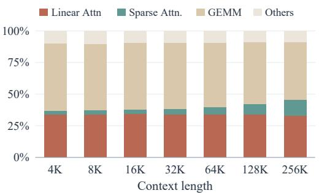  
(a)

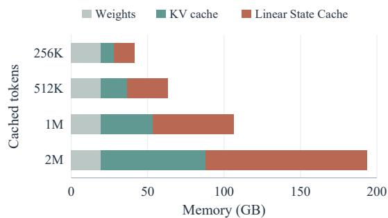  
(b)  
Figure 1: Recurrent-state access is a major cost of LLM serving. (a) Decode-time breakdown for GLM-5.3-Flash-NVFP4 on the B200 GPU at batch size 256. The share spent on linear attention stays roughly constant as context length grows. (b) GPU memory footprint for Qwen3.5-9B with prefix caching, assuming one linear attention state per 1,024 cached tokens.

Quantizing the recurrent state is a natural way to reduce both memory traffic and footprint, but doing so in a way that preserves model accuracy is challenging. In particular, a naive approach that stores the state in a standard low-bit format and re-quantizes it after every token can substantially degrade accuracy, especially over long thinking traces. We find that accuracy degradation arises from two sources of error. First, quantization error accumulates recurrently: each update starts from an already quantized state, and quantizing the result introduces another rounding error, causing the state to deviate progressively from the FP32 trajectory over a long generation (Figure 3). Second, large outliers are often concentrated in a few rows and columns of the state. These outliers widen the quantization range and force smaller values onto coarse quantization levels, amplifying the error introduced each time the state is quantized. Accurate low-bit quantization therefore requires reducing both how often error is introduced and how much error each quantization introduces.

We propose LeapQuant, a training-free method for recurrent-state quantization that achieves nearlossless model quality. LeapQuant introduces two key ideas that directly address the above sources of error. First, per-window quantization limits error accumulation by allowing LeapQuant to leap over a window of tokens before quantizing the state again (Figure 2). At the beginning of each window, LeapQuant stores the recurrent state in low precision. Within the window, it holds this state fixed, buffers higher-precision token updates, and computes each output from the fixed state and buffered updates. Only at the end of the window does it reconstruct and quantize the full updated state for the next window. As a result, LeapQuant introduces quantization error less frequently, slowing its accumulation over long contexts.

To address quantization error caused by outliers, LeapQuant introduces Compensator Tokens, which capture the state’s largest outliers in high precision and thereby reduce the error of each quantization (Figure 4). Each Compensator Token represents a high-precision outer product of two vectors, capturing large-magnitude patterns across both rows and columns and leaving a residual that is easier to quantize. Since these rank-one terms have the same form as real-token updates, LeapQuant incorporates them directly into the window’s update path using only a few additional vectors and no separate recurrent state update. LeapQuant further smooths the residual across channels before quantization to reduce error. Both key techniques in LeapQuant are training-free and require no calibration data.

Our evaluation spanning the Qwen, Kimi, and GLM families demonstrates that LeapQuant substantially reduces memory costs and improves inference throughput. Across 12 model–task pairs, LeapQuant achieves accuracy comparable to the FP32 baseline while reducing state memory traffic by 3.4× and end-to-end memory footprint by up to 56%. Across NVIDIA B200, RTX PRO 6000, and RTX 5090 GPUs, LeapQuant achieves average speedups of 2.05–3.70× at the kernel level and 1.47× for end-to-end inference.

## 2 RELATED WORK

Linear attention and hybrid models. Katharopoulos et al. (2020) propose Linear attention to replace the softmax attention (Vaswani et al., 2017) with a recurrence over a fixed-size state, and a series of works improve its expressiveness with data-dependent gating and delta-rule updates, including GLA (Yang et al., 2023), Mamba2 (Dao & Gu, 2024), DeltaNet (Schlag et al., 2021; Yang et al., 2024), Gated DeltaNet (Yang et al., 2025), and KDA (Team et al., 2025). Their chunkwise formulation (Yang et al., 2023) materializes the state in HBM only at chunk boundaries during train ing and prefill, and is implemented using efficient Triton kernels (Tillet et al., 2019) in libraries such as FLA (Yang & Zhang, 2024). Recent LLMs combine a few full or sparse attention layers with a majority of linear attention layers (Qwen Team, 2025; Team et al., 2026; Z.ai, 2026; Blakeman et al., 2025), and these hybrid models have become a common design for long-context and long-reasoning workloads. These works focus on the architecture and its full-precision kernels; the storage precision of the recurrent state is not their concern.

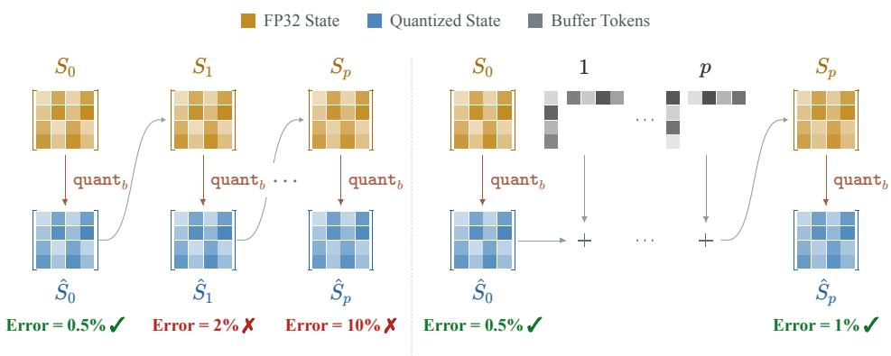  
(a) Per-token Quantization  
(b) Per-window Quantization  
Figure 2: Per-token versus per-window quantization. Per-token quantization re-quantizes the full state after every update. Per-window quantization holds the quantized boundary state $\hat { S } _ { 0 }$ fixed, buffers the p updates of the window in higher precision, and reconstructs the state from them; the full state is quantized only once per window, into $\hat { S } _ { p } .$

Quantization for ML models. Quantization has become a standard approach for reducing the memory requirements for LLM inference. Weight-only methods such as GPTQ (Frantar et al., 2022) and AWQ (Lin et al., 2024) compress the weights to 4 bits, and SmoothQuant (Xiao et al., 2023) further quantizes the activations by migrating their outliers into the weights. As the context grows, the KV cache becomes the dominant memory cost. KIVI (Liu et al., 2024) quantizes keys per channel and values per token, KVQuant (Hooper et al., 2024) isolates outliers into a sparse full-precision component. SVDQuant (Li et al., 2024) and GEAR (Kang et al., 2024) absorb outliers into a high-precision low-rank component and quantize the residual. For state space models, Quamba (Chiang et al., 2025b) and MambaQuant (Yue et al., 2025) quantize the weights and activations, and Quamba2 (Chiang et al., 2025a) and Q-Mamba (Tianqi et al., 2025) further quantize the cached SSM state. These methods are specialized to Mamba’s selective SSM, whose state is updated differently from that of other linear attention architectures.

State management in linear attention serving. Since the recurrent state is overwritten at every token, serving systems need extra mechanisms to keep or restore earlier states. ReplaySSM (Liou & Dao, 2026) supports speculative decoding by keeping the state at a checkpoint and recomputing the recent tokens for efficient rollback of the state. Per-window quantization similarly starts from a stored boundary state and replays recent updates, but uses this structure to improve quantization accuracy. Marconi (Pan et al., 2025) enables prefix caching for hybrid models by saving the states of cached prefixes as checkpoints, at the cost of a larger memory footprint.

## 3 METHOD

## 3.1 PRELIMINARIES

We consider one head of a linear attention model with a recurrent state matrix $S _ { t } \in \mathbb { R } ^ { d _ { k } \times d _ { v } }$ , query $q _ { t } \in \mathbb { R } ^ { d _ { k } }$ , and value and output $v _ { t } , o _ { t } \in \mathbb { R } ^ { d _ { v } }$ . We study recurrences whose update is a diagonal

decay followed by a single rank-one delta-rule (Schlag et al., 2021) update:

$$
S _ { t } = \mathrm { D i a g } ( \alpha _ { t } ) S _ { t - 1 } + k _ { t } \big ( v _ { t } - S _ { t - 1 } ^ { \top } \beta _ { t } \big ) ^ { \top } , \qquad o _ { t } = S _ { t } ^ { \top } q _ { t } .\tag{1}
$$

Here $\mathrm { D i a g } ( \alpha _ { t } )$ is the diagonal decay (Team et al., 2025), $\boldsymbol { k } _ { t } \in \mathbb { R } ^ { d _ { k } }$ is the key vector, and $\beta _ { t } \in \mathbb { R } ^ { d _ { k } }$ is a read vector $( \beta _ { t } = 0$ for models without the delta rule). Appendix A shows how other linear attention models fit this form.

For state quantization, denote $\hat { S } = \mathtt { q u a n t } _ { b } ( S )$ , where quan $\mathbf { t } _ { b }$ is the b-bit quantization operator, S is the original state, and $\hat { S }$ is its quantized representation, including scale metadata. We use $S _ { t } ^ { \mathrm { F P 3 2 } }$ for the independent trajectory of equation 1 without state quantization and $E _ { t } = \mathsf { d e q u a n t } _ { b } ( \hat { S } _ { t } ) -$ $S _ { t } ^ { \mathrm { F P 3 2 } }$ for its quantization-induced deviation, where dequan $\mathtt { t } _ { b }$ is the corresponding dequantization operator. When a quantized state participates in arithmetic below, its dequantization is implicit.

## 3.2 PER-WINDOW QUANTIZATION

A na¨ıve state-quantized model quantizes and dequantizes the full state after every decode step. At step $t ,$ it first computes the full-precision updated recurrent state $S _ { t }$ from the previously quantized state $\hat { S } _ { t - 1 }$ , then quantizes the resulting new recurrent state:

$$
\begin{array} { r l } & { S _ { t } = \mathrm { D i a g } ( \alpha _ { t } ) \hat { S } _ { t - 1 } + k _ { t } \big ( v _ { t } - \hat { S } _ { t - 1 } ^ { \top } \beta _ { t } \big ) ^ { \top } , } \\ & { \hat { S } _ { t } = \mathtt { q u a n t } _ { b } \big ( S _ { t } \big ) . } \end{array}\tag{2}
$$

Because every update starts from an already quantized state, its rounding error is carried into subsequent steps and can accumulate over long contexts (Appendix B.1). Per-step quantization therefore introduces a new error at every token. Figure 3 tracks the error of the quantized state against the FP32 trajectory of Qwen3.5-9B over 64K decoded tokens. Under per-step quantization, the error grows steadily with the context length, even for BF16. Stochastic rounding helps little, as it only lowers the BF16 error at 64K by 3× and makes INT8 diverge. In contrast, quantizing only once per 16-token window, as introduced below (the -w variants), lowers the error at 64K by 100× for BF16 and by 39× for INT8. LeapQuant further reduces the error of each window-boundary quantization and keeps the lowest error throughout, even below per-window BF16 at half the bits.

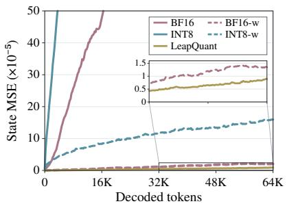  
Figure 3: State MSE over 64K decoded tokens on PG-19 (Qwen3.5-9B); -w quantizes once per window.

Motivated by the error growth in Figure 3, we propose per-window quantization (Figure 2). We write each update as a decay followed by a rank-one update whose correction vector $u _ { i }$ is computed from the previous state. For every instance of equation 1, this update is described by the decay $\alpha _ { i } .$ the key vector $k _ { i }$ , and the computed correction $u _ { i } \colon$

$$
u _ { i } = v _ { i } - S _ { i - 1 } ^ { \top } \beta _ { i } , \qquad S _ { i } = \mathrm { D i a g } ( \alpha _ { i } ) S _ { i - 1 } + k _ { i } u _ { i } ^ { \top } .\tag{3}
$$

We now consider a sequence of $p$ consecutive tokens fed into the linear state. For simplicity, index them as tokens $1 , \ldots , p$ . We keep the quantized boundary state $\hat { S } _ { 0 }$ fixed and buffer the p tuples $( \alpha _ { i } , k _ { i } , u _ { i } )$ in higher precision. For $a \leq b ,$ denote the cumulative decay from step a through step b by $\Gamma _ { a : b } = \mathrm { D i a g } ( \alpha _ { b } ) \mathrm { D i a g } ( \alpha _ { b - 1 } ) \cdot \cdot \cdot \mathrm { D i a g } ( \alpha _ { a } )$ , and set $\Gamma _ { a ; b } = I$ when $a > b .$ . Then, for any $1 \leq \ell \leq p _ { : }$ unrolling equation 3 from $\hat { S } _ { 0 }$ yields (Appendix B.2)

$$
\begin{array} { r l r } & { S _ { \ell } = \Gamma _ { 1 : \ell } \hat { S } _ { 0 } + \displaystyle \sum _ { j = 1 } ^ { \ell } \Gamma _ { j + 1 : \ell } k _ { j } u _ { j } ^ { \top } , \quad } & { 1 \le \ell \le p , } \\ & { \hat { S } _ { p } = \mathrm { q u a n t } _ { b } \big ( S _ { p } \big ) . } \end{array}\tag{4}
$$

This is the chunk-level form that linear attention uses in training and prefill (Yang et al., 2024; 2025): intermediate states are expressed through the boundary state and the buffered tuples, so the full state is never re-quantized within the window. Only at $\ell = p$ do we materialize $S _ { p }$ and quantize it for the next window as $\hat { S } _ { p }$ . This reduces the quantization frequency by a factor of $p$ and substantially lowers the state error over long contexts.

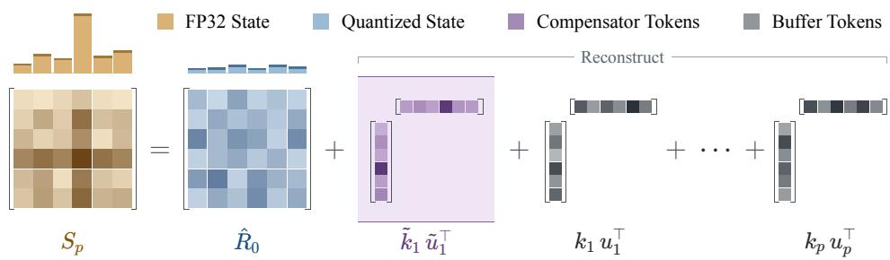  
Figure 4: Per-window state reconstruction with Compensator Tokens. The FP32 state is split into a low-bit quantized residual, a few higher-precision Compensator Tokens that capture its dominant large-magnitude structure, and the buffered real-token updates of the window. The Compensator Tokens absorb dominant outliers, flattening the residual’s row $\ell _ { 2 }$ norms and making it easier to quantize.

## 3.3 COMPENSATOR TOKENS

Although per-window quantization reduces the quantization frequency, the reconstructed state $S _ { p }$ can contain large-magnitude outliers concentrated in a few rows and columns (Figure 6(a)), and a few singular components carry most of its energy (Figure 5). These outliers dominate the quantization scale, forcing most entries to be represented with unnecessarily coarse quantization steps. To address this problem, we introduce Compensator Tokens (Figure 4), which reduce outlier-induced quantization error while integrating naturally with per-window quantization.

Before quantizing $S _ { p } ,$ we fit a rank-one matrix $\tilde { k } \tilde { u } ^ { \top }$ to capture its dominant large-magnitude structure. We subtract this matrix from $S _ { p }$ and quantize only the residual $R _ { p }$ . The largest values are therefore kept out of the tensor being quantized, reducing its dynamic range and alleviating the quantization pressure:

$$
\begin{array} { r l } & { ( \tilde { k } , \tilde { u } ) = \underset { k , u } { \arg \operatorname* { m i n } } \big \| S _ { p } - k u ^ { \top } \big \| _ { F } , } \\ & { ~ R _ { p } = S _ { p } - \tilde { k } \tilde { u } ^ { \top } , \qquad \hat { R } _ { p } = \mathtt { q u a n t } _ { b } ( R _ { p } ) , } \\ & { ~ \tilde { S } _ { p } = \mathtt { d e q u a n t } _ { b } \big ( \hat { R } _ { p } \big ) + \tilde { k } \tilde { u } ^ { \top } . } \end{array}\tag{5}
$$

Here $\left\| \cdot \right\| _ { F }$ is the Frobenius norm. We call the pair $( \tilde { k } , \tilde { u } )$ a Compensator Token as it preserves the dominant state component in higher precision and, together with identity decay, has the same rank-one update form as a real token in equation 3. Unlike a real input token, it is not produced by the model and does not generate an output. It exists only in the window representation and is placed before the real-token updates of the next window. Since the decode kernel operates directly on rank-one updates, it processes the Compensator Token through the same path as the real tokens without any model-specific modification.

At the start of the next window, the quantized residual and the compensator tokens together represent the initial state. The decode kernel processes the compensator tokens before the real-token updates, so subsequent updates and outputs use the combined state without the need for an extra kernel.

At the end of each window, we reconstruct $S _ { p }$ from the quantized residual, the current compensator tokens, and the window’s real-token updates. We then discard the old compensator tokens, fit a new approximation to $S _ { p } ,$ and quantize the remaining residual. The new quantized residual and compensator tokens initialize the next window.

The construction extends directly to r compensator tokens. Let $\tilde { K } = [ \tilde { k } _ { 1 } , \ldots , \tilde { k } _ { r } ] \in \mathbb { R } ^ { d _ { k } \times r }$ and $\tilde { U } = [ \tilde { u } _ { 1 } , \dots , \tilde { u } _ { r } ] \in \mathbb { R } ^ { d _ { v } \times r }$ collect their vector pairs. Their combined contribution is

$$
\begin{array} { r l r } {  { \tilde { K } \tilde { U } ^ { \top } = \sum _ { h = 1 } ^ { r } \tilde { k } _ { h } \tilde { u } _ { h } ^ { \top } , } } \\ & { } & { \quad R _ { p } = S _ { p } - \tilde { K } \tilde { U } ^ { \top } , \qquad \hat { R } _ { p } = { \tt q u a n t } _ { b } ( R _ { p } ) , } \\ & { } & { \quad \tilde { S } _ { p } = { \tt d e q u a n t } _ { b } \big ( \hat { R } _ { p } \big ) + \tilde { K } \tilde { U } ^ { \top } . } \end{array}\tag{6}
$$

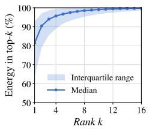

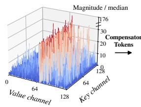  
(a) Original State Hard to quantize

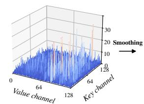  
(b) Residual (Compensator Tokens) Easier to quantize

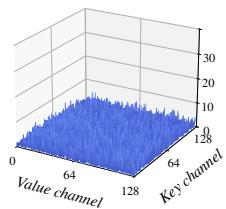  
(c) Residual (Smoothing) Easy to quantize  
Figure 5: Energy of the top singular values in the Qwen3.5-9B model.  
Figure 6: Magnitude of one Qwen3.5-9B head (layer 13, head 16) at 8K context, normalized by the median magnitude of S in (a) and (b) and of the smoothed residual in (c). Outliers up to $1 7 6 \times$ the median (a) drop to $4 7 \times$ after Compensator Tokens (b) and to 5.3× after smoothing (c).

In this way, compensator tokens preserve the dominant state structure in higher precision and leave a residual that is easier to quantize. For the small values of r used in practice, reconstructing the compensator tokens is fully hidden by the state memory read. At each window boundary, we refit the compensator tokens on tensor cores without materializing the old ones in the dense state, so for $r \leq 8$ the exposed kernel-level overhead stays within 7% in all settings.

## 3.4 RESIDUAL SMOOTHING

Compensator tokens preserve the dominant low-rank structure in higher precision, but the remaining residual can still have uneven magnitudes across key rows (Figure 6(b)). A few large key- and valuechannels can dominate the quantization scale, leaving smaller entries with coarse resolution. We therefore smooth the residual before quantization to balance its row magnitudes and make it easier to represent at low precision (Figure 6(c)).

Let $R _ { 0 }$ denote the residual at the start of a window. Each entry of the smoothing vector $c \in \mathbb { R } _ { > 0 } ^ { d _ { k } }$ is the square root of the corresponding key row’s mean absolute value, with a small positive floor to avoid division by zero. Setting $C = { \mathrm { D i a g } } ( c )$ , we left-multiply by $C ^ { - 1 }$ to balance the key-row magnitudes before quantization. We quantize this rescaled residual and retain the smoothing scales alongside the quantized residual. Since the distribution changes over time, these scales remain fixed within each window but are recomputed from the new residual at every boundary.

After dequantization, multiplying by C restores the original key coordinates. The transform itself is invertible; only the intervening quantization introduces approximation. Adding back the unchanged higher-precision compensator tokens recovers the initial state. Substituting this representation into equation 4 gives the reconstructed state $S _ { p }$ at the end of the window (Appendix B.3 derives the corresponding readout), without changing the buffered real-token updates:

$$
\begin{array} { l } { { \hat { R } _ { 0 } ^ { C } = \mathrm { q u a n t } _ { b } ( C ^ { - 1 } R _ { 0 } ) , } } \\ { { { \cal S } _ { p } = \Gamma _ { 1 : p } \displaystyle \big [ C ~ \mathrm { d e q u a n t } _ { b } \big ( \hat { R } _ { 0 } ^ { C } \big ) + \tilde { K } \tilde { U } ^ { \top } \big ] + \sum _ { j = 1 } ^ { p } \Gamma _ { j + 1 : p } k _ { j } u _ { j } ^ { \top } . } } \end{array}\tag{7}
$$

## 4 EVALUATION

## 4.1 SETUPS

Models. We evaluate LeapQuant on five hybrid linear-attention LLMs: Qwen3.5-9B, Qwen3.5- 35B-A3B, and Qwen3.8-Flash use GDN (Yang et al., 2025); Kimi-Linear-48B-A3B-Instruct (Team et al., 2025) and GLM-5.3-Flash use KDA. Due to limited hardware resources, we run only 8- layer versions of Qwen3.8-Flash and GLM-5.3-Flash on a single GPU, which preserve the per-layer decode cost but not the model output, and use them only for efficiency measurements.

Datasets and Evaluation. We use AIME 2026 (Mathematical Association of America, 2026), GPQA-Diamond (Rein et al., 2023), MMLU-Pro (Wang et al., 2024), LiveCodeBench v6 (Jain et al., 2025), and GSM8K (Cobbe et al., 2021). We report downstream accuracy averaged over three random seeds. For each model, all methods use the same prompts and the sampling parameters from its official model card (Appendix E). For decode and end-to-end efficiency, we compare against the FP32-state implementation of vLLM with CUDA graphs enabled.

Table 1: Downstream performance (%, higher is better). Best scores in each column within the 8-bit, 6-bit, and 4-bit groups are in bold.
<table><tr><td></td><td colspan="4">Qwen3.5-9B</td><td colspan="4">Qwen3.5-35B-A3B</td><td colspan="4">Kimi-Linear-48B-A3B</td><td rowspan="3">Avg.</td></tr><tr><td>Method</td><td>AIME</td><td>GPQA</td><td>LCB</td><td>MMLU</td><td>AIME</td><td>GPQA</td><td>LCB</td><td>MMLU</td><td>AIME</td><td>GPQA LCB</td><td>MMLU</td></tr><tr><td>FP32</td><td>87.9</td><td>81.3</td><td>64.1</td><td>83.3</td><td>91.5</td><td>84.7</td><td>75.6</td><td>85.9</td><td>67.5</td><td>70.3</td><td>41.4</td><td>72.4</td><td>75.5</td></tr><tr><td>BF16</td><td>72.1</td><td>66.2</td><td>49.6</td><td>81.0</td><td>85.8</td><td>79.3</td><td>67.2</td><td>85.2</td><td>64.3</td><td>68.1</td><td>41.0</td><td>64.0</td><td>68.7</td></tr><tr><td colspan="10">8-bit methods</td><td></td><td></td><td></td><td></td></tr><tr><td>Ours</td><td>87.9 81.8 64.1</td><td></td><td></td><td>83.8</td><td></td><td></td><td>91.083.976.1</td><td>85.8</td><td>68.3</td><td></td><td>3 69.8 41.3</td><td>72.1</td><td>75.5</td></tr><tr><td>FP8</td><td>14.6 34.3</td><td></td><td>21.4</td><td>42.6</td><td>29.6</td><td>39.9</td><td>26.7</td><td>56.4</td><td>25.6</td><td>46.6</td><td>16.0</td><td>57.0</td><td>34.2</td></tr><tr><td>INT8</td><td>7.1</td><td>26.8</td><td>9.2</td><td>44.3</td><td>0.0</td><td>0.0</td><td>3.1</td><td>6.8</td><td>52.8</td><td>65.8</td><td>35.5</td><td>64.5</td><td>26.3</td></tr><tr><td>KVQuant</td><td>74.6</td><td>70.2</td><td>59.5</td><td>82.4</td><td>76.3</td><td>69.7</td><td>44.3</td><td>83.5</td><td>66.6</td><td>69.7</td><td>42.1</td><td>65.0</td><td>67.0</td></tr><tr><td>QuaRot</td><td>49.6</td><td>57.1</td><td>38.2</td><td>73.1</td><td>32.9</td><td>36.4</td><td>15.3</td><td>56.0</td><td>63.3</td><td>69.2</td><td>36.6</td><td>73.1</td><td>50.1</td></tr><tr><td>TurboQuant</td><td>70.8</td><td>61.1</td><td>45.0</td><td>80.5</td><td>10.4</td><td>22.7</td><td>15.3</td><td>52.7</td><td>57.5</td><td>69.2</td><td>41.2</td><td>69.0</td><td>49.6</td></tr><tr><td colspan="10">6-bit methods</td><td></td><td></td><td></td><td></td></tr><tr><td>Ours</td><td>85.8 79.8 59.5</td><td></td><td></td><td>81.7</td><td></td><td></td><td>88.8 83.8 68.7</td><td>79.5</td><td></td><td></td><td>66.1 66.2 35.9</td><td>73.4</td><td>72.4</td></tr><tr><td>TurboQuant</td><td>27.5</td><td>29.8</td><td>16.0</td><td>61.2</td><td>0.4</td><td>5.1</td><td>4.6</td><td>16.1</td><td>48.8</td><td></td><td>64.7 35.9</td><td>72.7</td><td>31.9</td></tr><tr><td>NVFP6</td><td>0.4</td><td>18.7</td><td>12.2</td><td>28.3</td><td>13.8</td><td>34.3</td><td>25.2</td><td>46.3</td><td>30.8</td><td>52.0</td><td>25.2</td><td>67.4</td><td>29.6</td></tr><tr><td colspan="10">4-bit methods</td><td></td><td></td><td></td><td></td></tr><tr><td>Ours</td><td>58.1 65.7 34.0</td><td></td><td></td><td>80.2</td><td></td><td></td><td></td><td>59.2 57.6 37.4 81.4</td><td>67.9</td><td>69.2</td><td>240.5</td><td>73.4</td><td>60.4</td></tr><tr><td>TurboQuant</td><td>3.3</td><td>26.8</td><td>13.0</td><td>47.4</td><td>0.0</td><td>0.0</td><td>0.0</td><td>0.3</td><td>24.2</td><td>63.1</td><td>26.7</td><td>69.5</td><td>22.9</td></tr><tr><td>MXFP4</td><td>0.0</td><td>5.1</td><td>0.0</td><td>7.4</td><td>0.0</td><td>4.5</td><td>0.8</td><td>5.5</td><td>4.2</td><td>26.9</td><td>8.7</td><td>53.1</td><td>9.7</td></tr></table>

Implementation. We implement LeapQuant in vLLM (Kwon et al., 2023) and write the linear attention decode kernels in TileLang (Wang et al., 2025). All other components (e.g., MoE layers) stay in the baseline precision. At each window boundary, the compensator tokens are fitted with power iteration. For all models and tasks, we use a window of p = 16 tokens, r = 4 FP16 Compensator Tokens (r = 8 at 4 bits), and FP32 smoothing scales (Section 4.4 studies p and r). All experiments run on NVIDIA B200, RTX PRO 6000, and RTX 5090 GPUs.

Baselines. We compare LeapQuant with the FP32 and BF16 states, the default and optional formats in vLLM and SGLang, and with state quantization baselines that re-quantize the state after every decode step. At 8 bits, we evaluate FP8 and INT8 at their best granularities. Given the lack of existing recurrent state quantization methods, we also evaluate three methods originally designed for the KV cache or activations, which we adapt to the recurrent state: KVQuant (Hooper et al., 2024), QuaRot (Ashkboos et al., 2024), and TurboQuant (Zandieh et al., 2026). At 6 and 4 bits, we evaluate NVFP6, MXFP6, and INT6, and NVFP4, MXFP4, and per-channel INT4, together with low-bit variants of the three adapted methods. Table 1 reports the best direct and adapted methods at each of these bit widths, and Appendix C lists all of them.

## 4.2 ACCURACY RESULTS

Downstream tasks. Table 1 shows the downstream accuracy of the three models. With 8-bit quantization, LeapQuant achieves accuracy on par with the FP32 baseline across the 12 model–task pairs. In contrast, per-step quantization leads to poor accuracy even at 16 bits: storing the Qwen3.5- 9B state in BF16 lowers its AIME score from 87.9% to 72.1%, whereas LeapQuant keeps 87.9% with half as many bits. This gap is especially clear on long generations: Qwen3.5-9B’s AIME reasoning traces can run to tens of thousands of tokens, and per-step FP8 achieves only 14.6% on AIME, versus 87.9% for FP32. Kimi-Linear-48B-A3B-Instruct produces shorter outputs and is less sensitive to per-step 8-bit storage; on AIME, GPQA, and LiveCodeBench, BF16, KVQuant, and QuaRot remain within 5% of FP32.

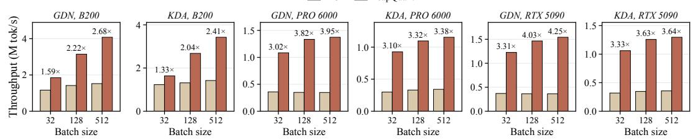  
Figure 7: Kernel throughput of one linear attention layer.

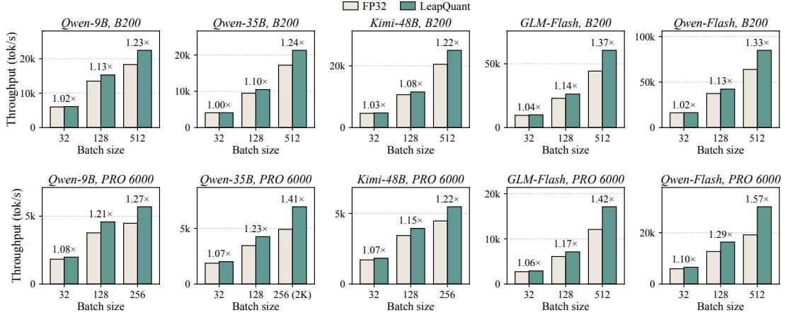  
Figure 8: Decode-step throughput in vLLM at context length 4K. On the RTX PRO 6000, the largest batch size is 256 where 512 does not fit, and Qwen3.5-35B-A3B uses 2K instead of 4K at this batch size.

Lower bit widths. The gap between per-window and per-step quantization widens as the bit width decreases. At 6 bits, the best baselines, NVFP6 and TurboQuant, average only 29.6% and 31.9%, and both collapse on the Qwen models, while LeapQuant averages 72.4%, close to FP32’s 75.5%. At 4 bits, MXFP4 and TurboQuant average 9.7% and 22.9% and collapse on the Qwen models, while LeapQuant still averages 60.4% and stays within 1.1% of FP32 on every task of Kimi-Linear-48B-A3B. These results show that LeapQuant retains substantially more downstream accuracy than the baselines even under aggressive 4-bit state quantization.

## 4.3 EFFICIENCY RESULTS

Kernel speedup. Figure 7 compares one linear attention layer (32 heads, $d _ { k } = d _ { v } = 1 2 8 )$ with the FP32 kernel in FLA. At batch size 512, LeapQuant is 2.68×, 3.95×, and 4.25× faster on GDN and 2.41×, 3.38×, and 3.64× on KDA on the B200, RTX PRO 6000, and RTX 5090. The larger gains on the RTX PRO 6000 and RTX 5090 are consistent with recurrent-state traffic being a stronger bottleneck on these GPUs.

Decode speedup. Figure 8 measures pure decode steps on five hybrid models at context length 4K. At batch size 512 on the B200, LeapQuant improves decode throughput by 1.22–1.37×; at the largest batch size that fits on the RTX PRO 6000, the gain is 1.22–1.57×. The gain increases with batch size as linear attention takes a larger share of each step. Appendix D reports other context lengths, up to 128K.

Memory reduction. LeapQuant stores each window-boundary state at 1.19 bytes per element instead of 4, including the INT8 residual, the smoothing scales, and the Compensator Tokens, a 3.4× reduction. At a window length of 16, the FP16 update buffer requires only around 8 KiB per head per layer for 128×128 states and is allocated once per active request, making its overhead marginal. When prefix caching is enabled in the default mode in vLLM and SGLang, a checkpoint is kept per 1K cached tokens. In this setting, LeapQuant reduces the end-to-end memory by 41%,

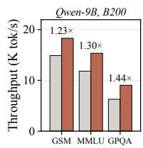

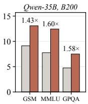

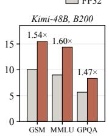  
Figure 9: End-to-end inference throughput on different datasets.

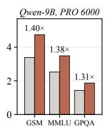

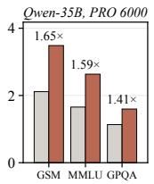

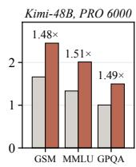

51%, and 56% on Qwen3.5-9B, Qwen3.5-35B-A3B, and Kimi-Linear-48B-A3B. This allows up to   
1.4× more concurrent requests when serving the Qwen3.5-9B model on one B200 GPU.

End-to-end inference speedup. We run offline inference on GSM8K, MMLU-Pro, and GPQA with the input and output lengths of the original model. Since Kimi-Linear is a non-reasoning model, we use the distribution of Qwen3.5-9B for it to simulate the real workload of production KDA models. With more concurrent requests and faster decode steps, LeapQuant improves the output throughput by 1.23–1.60× on the B200 and 1.31–1.65× on the RTX PRO 6000 (Figure 9).

## 4.4 ABLATION STUDY

We ablate the design choices of LeapQuant on Qwen3.5-9B, using AIME 2026 and LiveCodeBench v6 as the most sensitive tasks in Table 1; kernel speedups are over the FP32 kernel at batch size 256.

Effectiveness of each design. Table 2 adds the designs one at a time to an INT8 state, with BF16 as a higher-precision reference. Per-step INT8 drops AIME from 87.9% to 7.1% and LiveCodeBench from 64.1% to 9.2%. Per-window quantization improves AIME and LiveCodeBench accuracy to 82.4% and 60.6%, respectively; with BF16, it also raises AIME from 72.1% to 87.8%. Compensator Tokens then improve the INT8 scores to 86.6% and 61.5%, while smoothing closes the remaining gap to FP32 at 2.52× kernel speedup. Each stage improves quality while the complete 8-bit method retains a substantial efficiency advantage. For efficiency, we compare against the FP32 and BF16 per-step FLA kernels and the BF16 ReplaySSM kernel in the official repository (Liou & Dao, 2026). With all three components, LeapQuant matches FP32 accuracy at a 2.52× kernel speedup.

Table 2: Ablation of individual LeapQuant components on Qwen3.5-9B.
<table><tr><td>Method</td><td>AIME</td><td>LCB</td><td>Kernel</td></tr><tr><td>FP32 per-step</td><td>87.9</td><td>64.1</td><td>1.00×</td></tr><tr><td>BF16 per-step</td><td>72.1</td><td>49.6</td><td>1.64×</td></tr><tr><td>+ Per-window</td><td>87.8</td><td>62.9</td><td>1.71×</td></tr><tr><td>INT8 per-step</td><td>7.1</td><td>9.2</td><td>2.43×</td></tr><tr><td>+ Per-window</td><td>82.4</td><td>60.6</td><td>2.64×</td></tr><tr><td>+ Comp. Tokens</td><td>86.6</td><td>61.5</td><td>2.56×</td></tr><tr><td>+ Smoothing</td><td>87.9</td><td>64.1</td><td>2.52×</td></tr></table>

Window length. Table 3 (left) varies the window size p with r = 4. Longer windows quantize less often, so accuracy improves up $\mathrm { t o } p = 1 6$ and then saturates. The kernel is fastest at $p \ : = \ : 1 6 \colon$ shorter windows reconstruct the state more often, while longer ones enlarge the record buffer read at every step and leave less shared memory for pipelining. $p = 3 2$ gives no further accuracy gain, but its kernel speedup drops from 2.52× to 2.20× due to the increased memory traffic.

Table 3: Ablations of window length p and  
Compensator Token count r on Qwen3.5-9B.
<table><tr><td>p AIME</td><td>LCB</td><td>Kernel</td><td>r</td><td>AIME LCB</td><td>Kernel</td></tr><tr><td>4</td><td>86.2</td><td>62.8 1.59×</td><td>2</td><td>85.7</td><td>63.4 2.57×</td></tr><tr><td>8</td><td>87.1</td><td>63.2 2.13×</td><td>4</td><td>87.9</td><td>64.1 2.52×</td></tr><tr><td>16</td><td>87.9</td><td>64.1 2.52×</td><td>8</td><td>88.1</td><td>64.0 2.37×</td></tr><tr><td>32</td><td>87.9</td><td>64.2 2.20×</td><td>16</td><td>87.9</td><td>62.8 0.74×</td></tr></table>

Number of Compensator Tokens. Table 3 (right) varies r with $p = 1 6 .$ . Accuracy saturates at $r = 4 ,$ , consistent with the energy concentrated in a few singular values (Figure 5). Efficiency-wise, the power iteration and reconstruction work of up to four compensator tokens is fully overlapped with the memory reads on the B200 GPU, but it becomes exposed for larger r and makes the kernel even slower than FP32 at $r = 1 6$ . We therefore use $r = 4$ , which matches the accuracy of larger r at nearly the kernel speed of $r = 2 .$

## 5 CONCLUSION

We present LeapQuant, a training-free method for near-lossless quantization of recurrent states in linear attention. LeapQuant mitigates error accumulation by quantizing the state only once per window, and captures state outliers in a few high-precision compensator tokens before smoothing the residual. With an 8-bit state, LeapQuant matches FP32 accuracy on long reasoning and code generation while reducing the state memory and accelerating decoding on both GDN and KDA models. As hybrid models devote more of their layers to linear attention, we believe LeapQuant can make low-precision recurrent states a practical default for serving them.

## ACKNOWLEDGEMENT

This research is supported by NSF (IFML) CCF-2019844 and gifts from Accenture, AMD, Anyscale, Broadcom Inc., Google, IBM, Intel, Intesa Sanpaolo, Lambda, Mibura Inc., Samsung SDS, and SAP.

## REFERENCES

Saleh Ashkboos, Amirkeivan Mohtashami, Maximilian L Croci, Bo Li, Pashmina Cameron, Martin Jaggi, Dan Alistarh, Torsten Hoefler, and James Hensman. Quarot: Outlier-free 4-bit inference in rotated llms. Advances in Neural Information Processing Systems, 37:100213–100240, 2024.

Aaron Blakeman, Aarti Basant, Abhinav Khattar, Adithya Renduchintala, Akhiad Bercovich, Aleksander Ficek, Alexis Bjorlin, Ali Taghibakhshi, Amala Sanjay Deshmukh, Ameya Sunil Mahabaleshwarkar, et al. Nemotron-h: A family of accurate and efficient hybrid mamba-transformer models. arXiv preprint arXiv:2504.03624, 2025.

Hung-Yueh Chiang, Chi-Chih Chang, Natalia Frumkin, Kai-Chiang Wu, Mohamed S Abdelfattah, and Diana Marculescu. Quamba2: A robust and scalable post-training quantization framework for selective state space models. arXiv preprint arXiv:2503.22879, 2025a.

Hung-Yueh Chiang, Chi-Chih Chang, Natalia Frumkin, Kai-Chiang Wu, and Diana Marculescu. Quamba: A post-training quantization recipe for selective state space models. In International Conference on Learning Representations, volume 2025, pp. 101328–101354, 2025b.

Karl Cobbe, Vineet Kosaraju, Mohammad Bavarian, Mark Chen, Heewoo Jun, Lukasz Kaiser, Matthias Plappert, Jerry Tworek, Jacob Hilton, Reiichiro Nakano, Christopher Hesse, and John Schulman. Training verifiers to solve math word problems. arXiv preprint arXiv:2110.14168, 2021.

Tri Dao and Albert Gu. Transformers are ssms: Generalized models and efficient algorithms through structured state space duality. arXiv preprint arXiv:2405.21060, 2024.

Elias Frantar, Saleh Ashkboos, Torsten Hoefler, and Dan Alistarh. Gptq: Accurate post-training quantization for generative pre-trained transformers. arXiv preprint arXiv:2210.17323, 2022.

Coleman Hooper, Sehoon Kim, Hiva Mohammadzadeh, Michael W Mahoney, Yakun S Shao, Kurt Keutzer, and Amir Gholami. Kvquant: Towards 10 million context length llm inference with kv cache quantization. Advances in Neural Information Processing Systems, 37:1270–1303, 2024.

Naman Jain, Alex Gu, Wen-Ding Li, Fanjia Yan, Tianjun Zhang, Sida Wang, Armando Solar-Lezama, Koushik Sen, and Ion Stoica. Livecodebench: Holistic and contamination free evaluation of large language models for code. In International Conference on Learning Representations, volume 2025, pp. 58791–58831, 2025.

Hao Kang, Qingru Zhang, Souvik Kundu, Geonhwa Jeong, Zaoxing Liu, Tushar Krishna, and Tuo Zhao. GEAR: An efficient KV cache compression recipe for near-lossless generative inference of LLM. arXiv preprint arXiv:2403.05527, 2024.

Angelos Katharopoulos, Apoorv Vyas, Nikolaos Pappas, and Franc¸ois Fleuret. Transformers are rnns: Fast autoregressive transformers with linear attention. In International conference on machine learning, pp. 5156–5165. PMLR, 2020.

Woosuk Kwon, Zhuohan Li, Siyuan Zhuang, Ying Sheng, Lianmin Zheng, Cody Hao Yu, Joseph Gonzalez, Hao Zhang, and Ion Stoica. Efficient memory management for large language model serving with pagedattention. In Proceedings of the 29th symposium on operating systems principles, pp. 611–626, 2023.

Muyang Li, Yujun Lin, Zhekai Zhang, Tianle Cai, Xiuyu Li, Junxian Guo, Enze Xie, Chenlin Meng, Jun-Yan Zhu, and Song Han. Svdquant: Absorbing outliers by low-rank components for 4-bit diffusion models. arXiv preprint arXiv:2411.05007, 2024.

Ji Lin, Jiaming Tang, Haotian Tang, Shang Yang, Wei-Ming Chen, Wei-Chen Wang, Guangxuan Xiao, Xingyu Dang, Chuang Gan, and Song Han. Awq: Activation-aware weight quantization for on-device llm compression and acceleration. Proceedings of machine learning and systems, 6:87–100, 2024.

Ze-Wei Liou and Tri Dao. Replayssm: Cache ssm inputs, not state. https://tridao.me/ blog/2026/replayssm/, June 2026.

Zirui Liu, Jiayi Yuan, Hongye Jin, Shaochen Zhong, Zhaozhuo Xu, Vladimir Braverman, Beidi Chen, and Xia Hu. Kivi: A tuning-free asymmetric 2bit quantization for kv cache. arXiv preprint arXiv:2402.02750, 2024.

Mathematical Association of America. The 44th annual American Invitational Mathematics Examination. Competition Examination, February 2026. URL https://maa.org/ maa-invitational-competitions/.

Rui Pan, Zhuang Wang, Zhen Jia, Can Karakus, Luca Zancato, Tri Dao, Yida Wang, and Ravi Netravali. Marconi: Prefix caching for the era of hybrid llms. Proceedings of Machine Learning and Systems, 7, 2025.

Bo Peng, Daniel Goldstein, Quentin Anthony, Alon Albalak, Eric Alcaide, Stella Biderman, Eugene Cheah, Xingjian Du, Teddy Ferdinan, Haowen Hou, et al. Eagle and finch: Rwkv with matrixvalued states and dynamic recurrence. arXiv preprint arXiv:2404.05892, 2024.

Bo Peng, Ruichong Zhang, Daniel Goldstein, Eric Alcaide, Xingjian Du, Haowen Hou, Jiaju Lin, Jiaxing Liu, Janna Lu, William Merrill, et al. Rwkv-7” goose” with expressive dynamic state evolution. arXiv preprint arXiv:2503.14456, 2025.

Zhen Qin, Songlin Yang, Weixuan Sun, Xuyang Shen, Dong Li, Weigao Sun, and Yiran Zhong. Hgrn2: Gated linear rnns with state expansion. arXiv preprint arXiv:2404.07904, 2024.

Qwen Team. Qwen3-next: Towards ultimate training & inference efficiency. Qwen Blog, September 2025. URL https://qwen.ai/blog?id= 4074cca80393150c248e508aa62983f9cb7d27cd.

David Rein, Betty Li Hou, Asa Cooper Stickland, Jackson Petty, Richard Yuanzhe Pang, Julien Dirani, Julian Michael, and Samuel R Bowman. Gpqa: A graduate-level google-proof q&a benchmark. arXiv preprint arXiv:2311.12022, 2023.

Imanol Schlag, Kazuki Irie, and Jurgen Schmidhuber. Linear transformers are secretly fast weight¨ programmers. In International conference on machine learning, pp. 9355–9366. PMLR, 2021.

Julien Siems, Timur Carstensen, Arber Zela, Frank Hutter, Massimiliano Pontil, and Riccardo Grazzi. Deltaproduct: Improving state-tracking in linear rnns via householder products, 2025. URL https://arxiv.org/abs/2502.10297.

Yutao Sun, Li Dong, Shaohan Huang, Shuming Ma, Yuqing Xia, Jilong Xue, Jianyong Wang, and Furu Wei. Retentive network: A successor to transformer for large language models. arXiv preprint arXiv:2307.08621, 2023.

Kimi Team, Yu Zhang, Zongyu Lin, Xingcheng Yao, Jiaxi Hu, Fanqing Meng, Chengyin Liu, Xin Men, Songlin Yang, Zhiyuan Li, et al. Kimi linear: An expressive, efficient attention architecture. arXiv preprint arXiv:2510.26692, 2025.

Kimi Team, Tongtong Bai, Yifan Bai, Yiping Bao, Jianfeng Cai, Xinyuan Cai, Peizhou Cao, Yuxuan Cao, Ziwei Chai, Y Charles, et al. Kimi k3: Open frontier intelligence. arXiv preprint arXiv:2607.24653, 2026.

Chen Tianqi, Yuanteng Chen, Peisong Wang, Weixiang Xu, Zeyu Zhu, and Jian Cheng. Q-mamba: Towards more efficient mamba models via post-training quantization. In Findings of the Associationfor Computational Linguistics: ACL 2025, pp. 10594–10610, 2025.

Philippe Tillet, H. T. Kung, and David Cox. Triton: an intermediate language and compiler for tiled neural network computations. In Proceedings of the 3rd ACM SIGPLAN International Workshop on Machine Learning and Programming Languages, MAPL 2019, pp. 10–19, New York, NY, USA, 2019. Association for Computing Machinery. ISBN 9781450367196. doi: 10.1145/3315508.3329973. URL https://doi.org/10.1145/3315508.3329973.

Ashish Vaswani, Noam Shazeer, Niki Parmar, Jakob Uszkoreit, Llion Jones, Aidan N Gomez, Łukasz Kaiser, and Illia Polosukhin. Attention is all you need. Advances in neural information processing systems, 30, 2017.

Lei Wang, Yu Cheng, Yining Shi, Zhengju Tang, Zhiwen Mo, Wenhao Xie, Lingxiao Ma, Yuqing Xia, Jilong Xue, Fan Yang, et al. Tilelang: A composable tiled programming model for ai systems. arXiv preprint arXiv:2504.17577, 2025.

Yubo Wang, Xueguang Ma, Ge Zhang, Yuansheng Ni, Abhranil Chandra, Shiguang Guo, Weiming Ren, Aaran Arulraj, Xuan He, Ziyan Jiang, et al. Mmlu-pro: A more robust and challenging multitask language understanding benchmark. Advances in Neural Information Processing Systems, 37:95266–95290, 2024.

Samuel Williams, Andrew Waterman, and David Patterson. Roofline: an insightful visual performance model for multicore architectures. Communications ofthe ACM, 52(4):65–76, 2009.

Guangxuan Xiao, Ji Lin, Mickael Seznec, Hao Wu, Julien Demouth, and Song Han. Smoothquant: Accurate and efficient post-training quantization for large language models. In International conference on machine learning, pp. 38087–38099. PMLR, 2023.

Songlin Yang and Yu Zhang. Fla: A triton-based library for hardware-efficient implementations of linear attention mechanism, January 2024. URL https://github.com/fla-org/ flash-linear-attention.

Songlin Yang, Bailin Wang, Yikang Shen, Rameswar Panda, and Yoon Kim. Gated linear attention transformers with hardware-efficient training. arXiv preprint arXiv:2312.06635, 2023.

Songlin Yang, Bailin Wang, Yu Zhang, Yikang Shen, and Yoon Kim. Parallelizing linear transformers with the delta rule over sequence length. Advances in neural information processing systems, 37:115491–115522, 2024.

Songlin Yang, Jan Kautz, and Ali Hatamizadeh. Gated delta networks: Improving mamba2 with delta rule. In International Conference on Learning Representations, volume 2025, pp. 29687– 29707, 2025.

Yuxuan Yue, Xing Hu, Dawei Yang, Zhihang Yuan, Zixu Jiang, Zhixuan Chen, Jiangyong Yu, and Sifan Zhou. Mambaquant: Quantizing the mamba family with variance aligned rotation methods. In International Conference on Learning Representations, volume 2025, pp. 33231–33250, 2025.

Z.ai. Glm-5.3-flash: Frontier intelligence, flash cost. Z.ai Blog, August 2026. URL https: //z.ai/blog/glm-5.3-flash.

Amir Zandieh, Majid Daliri, Majid Hadian, and Vahab Mirrokni. Turboquant: Online vector quantization with near-optimal distortion rate. In International Conference on Learning Representations, volume 2026, pp. 56418–56439, 2026.

## A INSTANCES OF THE GENERAL UPDATE

For the model-specific expansions and recurrence derivations below, $D _ { t } = \mathrm { D i a g } ( d _ { t } ) , \tilde { k } _ { t }$ , and $b _ { t }$ denote the main text’s $\mathrm { D i a g } ( \alpha _ { t } ) , k _ { t }$ , and $\beta _ { t }$ , respectively, with $d _ { t } = \alpha _ { t }$ . This notation separates the general recurrence coefficients from the raw keys and scalar gates in each model’s native update. Section 3.1 thus writes every model we consider in the form

$$
S _ { t } = D _ { t } S _ { t - 1 } + \tilde { k } _ { t } \big ( v _ { t } - S _ { t - 1 } ^ { \top } b _ { t } \big ) ^ { \top } , \qquad o _ { t } = S _ { t } ^ { \top } q _ { t } ,
$$

with a diagonal decay $D _ { t } = \mathrm { D i a g } ( d _ { t } )$ , a write key $\tilde { k } _ { t }$ and a read vector $b _ { t }$ . Table 4 lists common instances: linear attention (Katharopoulos et al., 2020), RetNet (Sun et al., 2023), Mamba2 (Dao & Gu, 2024), GLA (Yang et al., 2023), RWKV6 (Peng et al., 2024), HGRN2 (Qin et al., 2024), DeltaNet (Yang et al., 2024), Gated DeltaNet (Yang et al., 2025), KDA (Team et al., 2025) and DeltaProduct (Siems et al., 2025). The decay may be the identity, a constant scalar, a data-dependent scalar or a data-dependent vector. The term $S _ { t - 1 } ^ { \top } b _ { t }$ reads the previous state, and the write subtracts it from $v _ { t }$ along the same direction $\tilde { k } _ { t } ;$ this is the delta rule. Plain and gated linear attention have $b _ { t } = 0$

Table 4: Instances of equation 1. DeltaProduct applies n delta-rule sub-steps per token, each of which is an instance of equation 1. The last column gives the number of values in one buffered update $( d _ { i } , \tilde { k } _ { i } , u _ { i } )$
<table><tr><td>Model</td><td> $D _ { t }$ </td><td> $\tilde { k } _ { t }$ </td><td> $b _ { t }$ </td><td>Record size</td></tr><tr><td>Linear Attention</td><td> $I$ </td><td> $k _ { t }$ </td><td>0</td><td> $d _ { k } + d _ { v }$ </td></tr><tr><td>RetNet</td><td> $\gamma I$ </td><td> $k _ { t }$ </td><td>0</td><td> $d _ { k } + d _ { v }$ </td></tr><tr><td>Mamba2</td><td> $\alpha _ { t } I$ </td><td> $k _ { t }$ </td><td>0</td><td> $1 + d _ { k } + d _ { v }$ </td></tr><tr><td>GLA /RWKV6 /HGRN2</td><td>Diag(αt)</td><td> $k _ { t }$ </td><td>0</td><td> $2 d _ { k } + d _ { v }$ </td></tr><tr><td>DeltaNet</td><td>I</td><td> $\beta _ { t } k _ { t }$ </td><td> $k _ { t }$ </td><td> $d _ { k } + d _ { v }$ </td></tr><tr><td>Gated DeltaNet</td><td> $\alpha _ { t } I$ </td><td> $\beta _ { t } k _ { t }$ </td><td> $\alpha _ { t } k _ { t }$ </td><td> $1 + d _ { k } + d _ { v }$ </td></tr><tr><td>KDA</td><td> $\mathrm { D i a g } ( \alpha _ { t } )$ </td><td> $\beta _ { t } k _ { t }$ </td><td> $\alpha _ { t } \odot k _ { t }$ </td><td> $2 d _ { k } + d _ { v }$ </td></tr><tr><td>DeltaProduct, sub-step j</td><td>I</td><td> $\beta _ { t , j } k _ { t , j }$ </td><td> $k _ { t , j }$ </td><td> $d _ { k } + d _ { v }$ </td></tr></table>

Gated DeltaNet and KDA. Expanding the original updates recovers the rows of Table 4:

$$
\begin{array} { r l } & { \mathrm { G D N : } \quad \alpha _ { t } \big ( I - \beta _ { t } k _ { t } k _ { t } ^ { \top } \big ) S _ { t - 1 } + \beta _ { t } k _ { t } v _ { t } ^ { \top } = \alpha _ { t } S _ { t - 1 } + \beta _ { t } k _ { t } \big ( v _ { t } - S _ { t - 1 } ^ { \top } ( \alpha _ { t } k _ { t } ) \big ) ^ { \top } , } \\ & { \mathrm { K D A : } \quad \big ( I - \beta _ { t } k _ { t } k _ { t } ^ { \top } \big ) \mathrm { D i a g } ( \alpha _ { t } ) S _ { t - 1 } + \beta _ { t } k _ { t } v _ { t } ^ { \top } = \mathrm { D i a g } ( \alpha _ { t } ) S _ { t - 1 } + \beta _ { t } k _ { t } \big ( v _ { t } - S _ { t - 1 } ^ { \top } ( \alpha _ { t } \odot k _ { t } ) \big ) ^ { \top } . } \end{array}
$$

In both cases the erase direction coincides with the write key, so each token contributes a single rank-one record. In this convention the step size $\beta _ { t }$ is carried by the write key; placing it in the correction instead, $\tilde { k } _ { t } = k _ { t }$ and $u _ { t } = \beta _ { t } ( v _ { t } - S _ { t - 1 } ^ { \top } b _ { t } )$ , is equivalent.

Models with a separate erase direction. The form equation 1 requires the erase direction to coincide with the write key. A model whose erase direction differs from its write key still fits by splitting each token into two sub-steps of equation 1. For RWKV7 (Peng et al., 2025), whose transition is $\mathrm { D i a g } ( w _ { t } ) - \hat { \kappa } _ { t } \big ( a _ { t } \odot \hat { \kappa } _ { t } \big ) ^ { \top }$ , the two sub-steps are an erase with $v = 0$ and a pure write with $D = I$ and $b = 0 \colon$

$$
\begin{array} { r l } & { S _ { t } ^ { \prime } = \operatorname { D i a g } ( w _ { t } ) S _ { t - 1 } + \hat { \kappa } _ { t } \big ( 0 - S _ { t - 1 } ^ { \top } \big ( a _ { t } \odot \hat { \kappa } _ { t } \big ) \big ) ^ { \top } , } \\ & { S _ { t } = S _ { t } ^ { \prime } + k _ { t } v _ { t } ^ { \top } . } \end{array}
$$

Each token then contributes two rank-one records, the same treatment as a DeltaProduct token with $n = 2$

## B DERIVATIONS

## B.1 PROPAGATION OF THE QUANTIZATION-INDUCED DEVIATION

For this recurrence-level analysis, we fix the layer-input sequence and supply the FP32 reference and the quantized recurrence with the same coefficients $( d _ { t } , \tilde { k } _ { t } , b _ { t } , v _ { t } ) \colon$

$$
S _ { t } ^ { \mathrm { F P 3 2 } } = D _ { t } S _ { t - 1 } ^ { \mathrm { F P 3 2 } } + \tilde { k } _ { t } \big ( v _ { t } - ( S _ { t - 1 } ^ { \mathrm { F P 3 2 } } ) ^ { \top } b _ { t } \big ) ^ { \top } ,
$$

$$
S _ { t } = D _ { t } \hat { S } _ { t - 1 } + \tilde { k } _ { t } \big ( v _ { t } - \hat { S } _ { t - 1 } ^ { \top } b _ { t } \big ) ^ { \top } .
$$

Subtracting the two, the value $v _ { t }$ cancels:

$$
S _ { t } - S _ { t } ^ { \mathrm { F P 3 2 } } = D _ { t } E _ { t - 1 } - \tilde { k } _ { t } \big ( E _ { t - 1 } ^ { \top } b _ { t } \big ) ^ { \top } .
$$

Adding $\boldsymbol { \varepsilon } _ { t } = \operatorname { d e q u a n t } _ { b } ( \hat { \boldsymbol { S } } _ { t } ) - \boldsymbol { S } _ { t }$ to both sides gives

$$
E _ { t } = D _ { t } E _ { t - 1 } - \tilde { k } _ { t } \big ( E _ { t - 1 } ^ { \top } b _ { t } \big ) ^ { \top } + \varepsilon _ { t } .\tag{8}
$$

Unrolling it, each error $\varepsilon _ { s }$ is carried to step t by the same decay and erase steps that act on memories written at step s, and it reaches the output through $o _ { t } = S _ { t } ^ { \top } q _ { t }$ . Under per-window quantization, $\varepsilon _ { s }$ is nonzero only at window boundaries. Because each update is small relative to the state, perstep rounding discards part of it at every step, so these errors are correlated and add up coherently. Per-window quantization rounds the accumulated updates only once, which reduces the error by far more than the factor of p in quantization frequency.

## B.2 WINDOW UNROLLING AND STATE READOUT

Restoring an arbitrary window-start index t, equation 4 follows from equation 3 by induction on the window length: applying one more record multiplies every existing term by $D _ { t + p + 1 }$ and appends $\tilde { k } _ { t + p + 1 } u _ { t + p + 1 } ^ { \top }$ , and $D _ { t + p + 1 } \Gamma _ { a : t + p } = \Gamma _ { a : t + p + 1 }$ . Transposing the unrolled state at step i and multiplying by x gives, for $t \leq i \leq t + p ,$

$$
{ S _ { i } ^ { \top } } \boldsymbol { x } = \hat { S } _ { t } ^ { \top } \Gamma _ { t + 1 : i } \boldsymbol { x } + \sum _ { j = t + 1 } ^ { i } u _ { j } \big ( \tilde { k } _ { j } ^ { \top } \Gamma _ { j + 1 : i } \boldsymbol { x } \big ) ,\tag{9}
$$

using $\Gamma ^ { \top } = \Gamma$ for diagonal Γ. The first term costs $O ( d _ { k } d _ { v } )$ , and each of the $i - t$ records costs $O ( d _ { k } + d _ { v } )$ : one inner product $\tilde { k } _ { j } ^ { \top } ( \Gamma _ { j + 1 : i } x )$ and one scaled vector $u _ { j }$ . The diagonal products $\Gamma _ { j + 1 : i }$ are cumulative decays and can be maintained incrementally, so the read never forms a $d _ { k } \times d _ { \tau }$ intermediate state.

## B.3 READOUT WITH A SMOOTHED QUANTIZED RESIDUAL

For per-value-channel symmetric INT8 quantization, let $Z _ { 0 }$ denote the integer payload and B the diagonal scale matrix, so that dequan $\mathsf { t } _ { b } ( \hat { R } _ { 0 } ^ { C } ) = ( Z _ { 0 } / 1 2 7 ) B$ . Therefore, for any read vector x and cumulative diagonal decay Γ,

$$
\left[ \boldsymbol { C } \mathrm { \ d e q u a n t } _ { b } ( \hat { R } _ { 0 } ^ { C } ) \right] ^ { \top } \boldsymbol { \Gamma } \boldsymbol { x } = \left( \boldsymbol { C } \frac { Z _ { 0 } } { 1 2 7 } \boldsymbol { B } \right) ^ { \top } \boldsymbol { \Gamma } \boldsymbol { x } = { B } \frac { Z _ { 0 } ^ { \top } } { 1 2 7 } \boldsymbol { C } \boldsymbol { \Gamma } \boldsymbol { x } .
$$

C and Γ act on the key coordinates, while $B$ rescales the quantized residual’s value-side projection. Neither scale is applied to the real or Compensator Token records, whose contributions are already expressed in the original state coordinates.

For the Compensator Token component $\tilde { K } \tilde { U } ^ { \top }$ , the corresponding read is

$$
( \tilde { K } \tilde { U } ^ { \top } ) ^ { \top } \Gamma x = \tilde { U } ( \tilde { K } ^ { \top } \Gamma x ) = \sum _ { h = 1 } ^ { r } \tilde { u } _ { h } ( \tilde { k } _ { h } ^ { \top } \Gamma x ) .
$$

Adding these rank-one records and the real records to the quantized-residual read gives the readout form of equation 7:

$$
\begin{array} { r l } & { S _ { \ell } ^ { \top } x = \mathsf { d e q u a n t } _ { b } ( \hat { R } _ { 0 } ^ { C } ) ^ { \top } C \Gamma _ { 1 : \ell } x + \tilde { U } \big ( \tilde { K } ^ { \top } \Gamma _ { 1 : \ell } x \big ) } \\ & { \qquad + \displaystyle \sum _ { j = 1 } ^ { \ell } u _ { j } \big ( k _ { j } ^ { \top } \Gamma _ { j + 1 : \ell } x \big ) . } \end{array}\tag{10}
$$

At a boundary, the sum is reconstructed in the original state coordinates before fitting the new factors and recomputing the residual scales.

## C FULL DOWNSTREAM RESULTS

Table 5 extends Table 1 with GSM8K and with every direct quantization format and adapted method we evaluate at 8, 6, and 4 bits. Direct quantization formats are listed before the adapted methods in each group, and all baselines re-quantize the state at every decode step. LeapQuant uses the configurations of Section 4.1 at each bit width.

Table 5: Full downstream performance (%, higher is better). Best scores in each column within each bit width are in bold.
<table><tr><td></td><td>Qwen3.5-9B</td><td></td><td>Qwen3.5-35B-A3B</td><td>Kimi-Linear-48B-A3B</td></tr><tr><td>Method</td><td colspan="4">GSM AIME GPQA LCB MMLU GSM AIME GPQA LCB MMLU GSM AIME GPQA LCB MMLU</td></tr><tr><td>FP32</td><td>96.1 87.9 81.3 64.1</td><td>83.3 96.7 91.5</td><td>84.7 75.6</td><td>85.9 92.1 67.5 70.3 41.4 72.4</td></tr><tr><td>BF16</td><td>94.9 72.1 66.2</td><td>49.6 81.0 96.6 85.8</td><td>79.3 67.2 85.2</td><td>92.1 64.3 68.1 41.0 64.0</td></tr><tr><td>8-bit methods</td><td></td><td></td><td></td><td></td></tr><tr><td>Ours</td><td></td><td></td><td></td><td>96.3 87.9 81.8 64.1 83.8 96.5 91.0 83.9 76.1 85.8 92.0 68.3 69.8 41.3 72.1</td></tr><tr><td>FP8 per-tensor</td><td></td><td>79.2 14.6 34.3 21.4 42.6 86.7 29.6</td><td>39.9</td><td>26.7 56.4 91.8 25.6 46.6 16.0 57.0</td></tr><tr><td>FP8 per-channel</td><td>84.2 0.8 13.6</td><td>611.5 46.6 76.9</td><td>0.0 5.6</td><td>8.4 36.6 91.6 35.4 57.6 16.5 65.5</td></tr><tr><td>FP8 per-group</td><td>71.2 0.0 2.5</td><td>2.3 25.8 67.2 0.0</td><td>1.5 2.3</td><td>24.9 91.7 25.347.615.863.5</td></tr><tr><td>MXFP8</td><td>67.9 7.1 24.2</td><td>15.3 32.2 80.6 29.6</td><td>36.4 29.8 45.5</td><td>91.4 43.5 50.3 23.4 67.0</td></tr><tr><td>INT8 per-tensor</td><td>38.5 0.0 3.0</td><td>3.1 25.1 10.2 0.0</td><td>3.5 1.5 8.5</td><td>89.9 5.3 31.3 8.4 54.8</td></tr><tr><td>INT8 per-channel 53.5</td><td>7.1 26.8</td><td>9.2 44.3 16.5 0.0</td><td>0.0 3.1</td><td>6.8 91.8 52.8 65.8 35.5 64.5</td></tr><tr><td>KVQuant</td><td></td><td>95.1 74.6 70.2 59.5 82.4 95.8 76.3</td><td>69.7 44.3</td><td>83.5 92.0 66.6 69.7 42.1 65.0</td></tr><tr><td>QuaRot</td><td></td><td>93.1 49.6 57.1 38.2 73.1 80.7 32.9</td><td>936.4 15.3 56.0 92.6 63.3</td><td>69.2 36.6 73.1</td></tr><tr><td>TurboQuant</td><td></td><td></td><td></td><td>94.8 70.8 61.1 45.0 80.5 82.910.4 22.7 15.3 52.7 92.3 57.5 69.2 41.2 69.0</td></tr><tr><td>6-bit methods</td><td></td><td></td><td></td><td></td></tr><tr><td>Ours</td><td></td><td></td><td></td><td>95.5 85.8 79.8 59.5 81.7 95.2 88.8 83.8 68.7 79.5 91.8 66.1 66.2 35.9 73.4</td></tr><tr><td>NVFP6</td><td>66.7</td><td></td><td></td><td>0.4 18.7 12.2 28.3 75.4 13.8 34.3 25.2 46.3 92.5 30.8 52.0 25.2 67.4</td></tr><tr><td>MXFP6</td><td>15.9 0.0 1.0 3.1</td><td>8.7 37.1 0.0</td><td>7.1</td><td>9.2 23.6 91.8 37.1 53.5 19.1 66.7</td></tr><tr><td>INT6 per-channel 50.6</td><td>0.0 5.6 1.5</td><td>23.5 1.0 0.0</td><td>3.0 0.0</td><td>3.9 91.3 22.9 50.013.7 64.2</td></tr><tr><td>KVQuant</td><td>79.3 4.2 23.2 13.7</td><td>40.5 59.8</td><td>0.0 10.1 2.3</td><td>21.6 91.9 55.0 66.2 29.8 71.8</td></tr><tr><td>QuaRot</td><td>51.9 0.0 10.1</td><td>3.1 26.6 8.8</td><td>0.0 0.5 0.0</td><td>2.9 92.5 25.4 43.917.664.2</td></tr><tr><td>TurboQuant</td><td>87.5 27.5 529.8</td><td>16.0 61.2 54.1</td><td>0.4 5.1</td><td>4.6 16.1 92.7 48.8 64.7 35.9 72.7</td></tr><tr><td>4-bit methods</td><td></td><td></td><td></td><td></td></tr><tr><td>Ours</td><td></td><td></td><td></td><td>95.9 58.1 65.7 34.0 80.2 96.0 59.2 57.6 37.4 81.4 92.0 67.9 69.2 40.5 73.4</td></tr><tr><td>NVFP4</td><td>0.4 0.0 0.0</td><td>0.0 2.0 0.4</td><td>0.0 0.0 0.0</td><td>0.3 85.1 0.0 6.4 0.8 9.7</td></tr><tr><td>MXFP4</td><td>4.6 0.0 5.1</td><td>0.0 7.4 3.9</td><td>0.0 4.5 0.8</td><td>5.5 87.7 4.2 26.9 8.7 53.1</td></tr><tr><td>INT4 per-channel</td><td>0.2 0.0 6.6</td><td>0.0 5.8 0.2</td><td>0.0 0.0 0.0</td><td>0.7 78.1 0.0 7.1 0.8 28.8</td></tr><tr><td>KVQuant</td><td>1.1 0.0 0.0</td><td>0.0 1.0 0.0</td><td>0.0 0.0 0.0</td><td>0.0 89.6 4.2 19.7 2.3 46.9</td></tr><tr><td>QuaRot</td><td>0.6 0.0 0.5</td><td>0.0 1.6 0.0</td><td>0.0 0.0</td><td>0.0 0.0 84.3 0.8 15.2 1.5 38.2</td></tr><tr><td></td><td>3.3 26.8</td><td></td><td></td><td></td></tr><tr><td>TurboQuant</td><td>41.6</td><td>13.0 47.4 0.0</td><td>0.0 0.0 0.0</td><td>0.3 90.3 24.2 63.1 26.7 69.5</td></tr></table>

## D ADDITIONAL EFFICIENCY EVALUATION

Figure 10 reports the decode-step throughput on the B200 at context lengths from 1K to 8K, complementing the 4K results in Figure 8. Each bar stacks the FP32 throughput (lighter shade) and the gain of LeapQuant (darker shade). For models that pair linear attention with dense full attention, the gain shrinks slightly as the context grows, since the full attention layers take a growing share of each step. It remains substantial at 8K, where LeapQuant still accelerates Kimi-Linear-48B-A3B by 1.18× at batch size 512. Recent models increasingly combine linear attention with sparse attention rather than full attention, which keeps the attention cost nearly constant as the context grows. Figure 11 evaluates two such models, GLM-5.3-Flash and Qwen3.8-Flash, up to 128K and 96K at batch size 256. LeapQuant accelerates them by 1.25× and 1.23× at 4K and still by 1.23× and 1.20× at the longest context. We therefore expect LeapQuant to perform equally well at very long contexts on upcoming hybrid models.

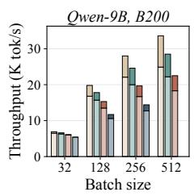

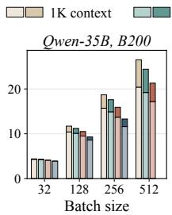

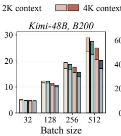

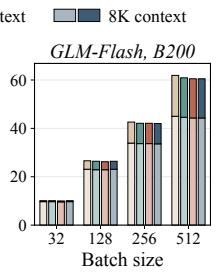

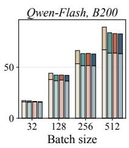  
Figure 10: Decode-step throughput in vLLM on the B200 at context lengths 1K–8K. Each bar stacks the FP32 throughput (lighter) and the gain of LeapQuant (darker).

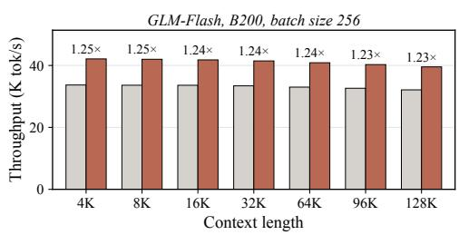

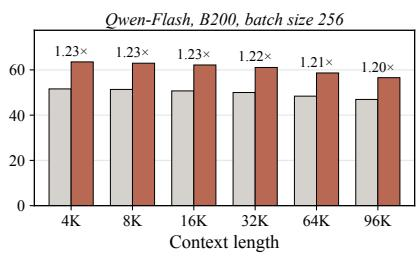  
Figure 11: Decode-step throughput of the two sparse-attention models on the B200 at batch size 256 and long contexts.

## E EVALUATION DETAILS

Sampling parameters. Table 6 lists the generation settings. All methods of a model share the same settings, prompts, and sample set. For the Qwen3.5 models, we follow the benchmark settings of the official model cards with thinking enabled; Kimi-Linear-48B-A3B-Instruct is an instruction model without a thinking mode. The maximum model length is set to the output limit plus 8,192 tokens, so that no generation is truncated by the context window before reaching the output limit.

Table 6: Generation settings of the downstream evaluation.
<table><tr><td>Model</td><td>Temp.</td><td>Top-p</td><td>Top-k</td><td>Presence</td><td>Thinking</td><td>Max output</td></tr><tr><td>Qwen3.5-9B</td><td>1.0</td><td>0.95</td><td>20</td><td>1.5</td><td>on</td><td>81,920</td></tr><tr><td>Qwen3.5-35B-A3B</td><td>1.0</td><td>0.95</td><td>20</td><td>1.5</td><td>on</td><td>81,920</td></tr><tr><td>Kimi-Linear-48B-A3B</td><td>1.0</td><td>1.0</td><td>一</td><td>0</td><td>一</td><td>65,536</td></tr></table>