# LEARNING BEYOND WHAT YOU SAMPLE:OFF-POLICY-AWARE CROSS-MODELTRAJECTORY EXCHANGE FOR RLVR

Doohyuk Jang1, Yoonsik Park1, Gyouk Chu1, Sihwan Park1, Eunho Yang1,2† 1KAIST 2AITRICS

## ABSTRACT

Reinforcement Learning with Verifiable Rewards (RLVR) methods such as GRPO rely on successful self-generated trajectories, but finite rollout budgets can produce all-fail groups with no reward-based policy-gradient signal. While additional rollouts improve the chance of success at higher cost, successful trajectories missing from one model’s rollouts may already have been discovered by another. Indeed, we observe that heterogeneous models often succeed on complementary prompts, creating opportunities for mutual learning without a designated stronger teacher. To exploit this complementarity, we propose GRAFT (Gated Replacement of Answer-Failed groups with peer Trajectories), an offpolicy-aware framework that replaces all-fail groups with informative peer groups. GRAFT transfers both successful and unsuccessful peer responses with peercomputed advantages, while controlling cross-model mismatch through sequencelevel compatibility weighting and token-level importance ratio clipping. Across three heterogeneous model pairs and five mathematical reasoning benchmarks, GRAFT consistently improves both models over GRPO with the same per-model rollout budget, gaining 2.1 points on average and up to 4.5 points in model-level average performance. Stored peer trajectories preserve most of the gains, improving over GRPO by 1.8 points on average without simultaneous co-training.

## 1 INTRODUCTION

Reinforcement Learning with Verifiable Rewards (RLVR) has become a key post-training paradigm for improving the reasoning ability of Large Language Models (LLMs), with substantial gains on many reasoning tasks (Shao et al., 2024; Lambert et al., 2025; Guo et al., 2025). Group Relative Policy Optimization (GRPO) (Shao et al., 2024) and its variants (Yu et al., 2025; Liu et al., 2025b; Zheng et al., 2025; Kim et al., 2026) optimize the policy using relative rewards among sampled responses, raising the likelihood of high-reward trajectories and suppressing low-reward ones. In this on-policy setting, learning reinforces successful reasoning strategies from self-generated trajectories, without fine-grained supervision (Guo et al., 2025; Wen et al., 2026).

The effectiveness of this learning process depends on whether the model discovers a successful trajectory within its rollout budget (Liu et al., 2026a; Yue et al., 2025; Dong et al., 2026). This limitation arises when every sampled response fails, leaving all group-relative advantages at zero. Such groups can be dropped, their prompts replaced, or their rewards reshaped to recover a nonzero learning signal (Yu et al., 2025; Le et al., 2026; He et al., 2026), while increasing the group size improves the odds of sampling a correct trajectory at higher rollout cost. These approaches, however, remain dependent on the learner’s own exploration.

The growing diversity of open-source LLMs creates an opportunity to move beyond learning solely from self-generated trajectories: a successful response missing from one model’s rollouts may al ready be present in another’s. Yet standard single-model RLVR trains each policy in isolation, leaving these successes unused. We observe this complementarity in independent GRPO runs of SmolLM3-3B-Base (Bakouch et al., 2025) and Qwen3-1.7B-Base (Yang et al., 2025), two models with distinct pretraining histories (Figure 1). SmolLM3-3B-Base solves 47.9% of the prompts on which Qwen3-1.7B-Base fails across all eight rollouts, while Qwen3-1.7B-Base solves 18.7% of SmolLM3-3B-Base’s all-fail prompts. These complementary successes suggest that both models could benefit from exchanging verified solutions, without requiring a designated stronger teacher.

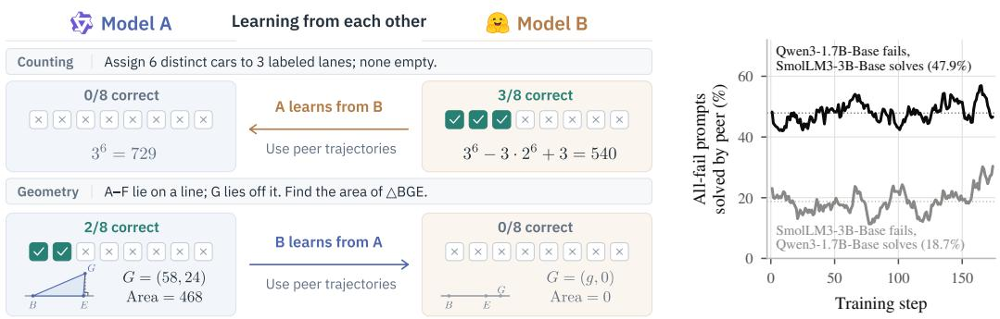  
Figure 1: Complementary successes persist throughout training. (Left) Illustrative examples where one model solves a prompt its peer fails entirely, so each could learn from the other’s trajectories. (Right) Fraction of all-fail prompts solved by the peer, with means shown as dotted lines.

Turning complementary successes into learning gains requires deciding which prompts warrant peer supervision and how to learn from peer responses. These choices interact: all-fail prompts lack a reward-based policy-gradient signal, but successful peer responses may still be poorly matched to the receiver. Conversely, transferring peer responses on prompts with an informative self-generated group changes an update that already has an on-policy learning signal. HACPO (Zhang et al., 2026) accounts for cross-model mismatch but shares peer rollouts beyond receiver-failure prompts, while SGT (Liu et al., 2026b) targets receiver failures through a fixed-weight supervised loss without compatibility-based weighting. Applying either update rule to our selected prompts still underperforms GRAFT (Section 6.3). This motivates pairing complementary prompt selection with compatibility-aware learning from full peer groups.

We propose GRAFT (Gated Replacement of Answer-Failed groups with peer Trajectories), an off-policy-aware framework for cross-model trajectory sharing in RLVR that addresses both decisions. For which, GRAFT selects prompts on which the receiver fails entirely and the peer produces both successful and unsuccessful responses, while balancing exchange volume across directions. For how, it replaces the selected receiver groups with the corresponding peer groups and retains their source-computed advantages, preserving within-peer reward contrast without pooling rewards across models. It controls peer influence through bounded sequence-level compatibility gating and token-level importance ratio clipping, and keeps the receiver’s own data primary by processing peercontaining minibatches after its on-policy minibatches.

Across three heterogeneous pairs of open-source base models and five mathematical reasoning benchmarks, GRAFT improves both models in every pair over GRPO (n=8), by 2.1 points on average and up to 4.5 points in model-level average score. In two of the three pairs, both models match or exceed GRPO trained with four times the rollout budget (n=32). GRAFT also outperforms HACPO and SGT by 4.0 and 1.5 points on average, respectively. The gains largely persist when reusing peer trajectories from completed independent GRPO runs (+1.8 points on average), without simultaneous co-training or additional peer rollouts.

## 2 RELATED WORK

Exploration limitations in RLVR. GRPO and related RLVR methods learn only from reward variation within self-generated rollout groups (Shao et al., 2024; Yu et al., 2025). Dynamic sampling discards zero-variance groups and resamples (Yu et al., 2025), while larger groups improve success coverage; both cost extra rollouts without guaranteeing success. Entropy-guided advantage shaping recovers a signal without additional rollouts (Le et al., 2026), but on an all-incorrect group it can only suppress the sampled failures, not supply a correct response. Even at scale, RLVR improves sampling efficiency without expanding the base model’s solvable prompt set (Yue et al., 2025), and declining entropy further limits exploration (Cui et al., 2025). Hints, partial solutions, and expert guidance ease exploration but require an external solution source or a stronger model (Li et al., 2026; Huang et al., 2026; Jiang et al., 2026). We instead use trajectories from heterogeneous peers when the learner’s own rollouts all fail.

Off-policy guidance and mismatch control. External demonstrations, teacher solutions, and historical trajectories augment RLVR rollouts but introduce policy mismatch (Yan et al., 2025; Dong et al., 2026; Mao et al., 2026). Prior work addresses rollout–training mismatch through importance weighting and truncation (Yao et al., 2025; Ling Team et al., 2025), and studies sequence-level optimization and off-policy correction (Zheng et al., 2025; Chen et al., 2025). We consider distinct peer models with potentially different tokenizers. GRAFT separates within-receiver policy change from cross-model mismatch through token-level importance ratio clipping and sequence-level compatibility filtering with bounded weighting. The compatibility score is an empirical proxy from average token log-likelihoods, not an exact cross-tokenizer importance ratio.

Cross-model learning and trajectory sharing. Recent work enables multiple models to learn from one another during RL. HACPO (Zhang et al., 2026) exchanges peer rollouts with off-policy correction, while Mutual RL (Liu et al., 2026b) introduces SGT to transfer verified peer successes on prompts where the receiver fails. F-TIS (Blagoev et al., 2026) studies collaborative GRPO among models from the same family with a shared vocabulary, using truncated importance sampling and off-policy filtering. Unlike teacher-guided distillation (Agarwal et al., 2024), these approaches motivate learning across peer models without relying exclusively on a designated stronger teacher. We build on this direction by jointly addressing where peer trajectories provide missing supervision and how their influence should be controlled under cross-model mismatch.

## 3 PRELIMINARIES

Group Relative Policy Optimization. Given a prompt q sampled from a prompt set $\mathcal { D } _ { : }$ GRPO (Shao et $\mathrm { { a l . } }$ , 2024) samples a group of n responses ${ \mathcal { G } } ( q ) = ( o _ { 1 } , \ldots , o _ { n } )$ from an old policy $\pi _ { \theta _ { \mathrm { o l d } } }$ and assigns each response a verifiable reward $r _ { i } = r ( q , o _ { i } ) \in \{ 0 , 1 \}$ . In this section we identify each response with its token sequence and write $o _ { i } = \left( o _ { i , 1 } , \ldots , o _ { i , \left| o _ { i } \right| } \right)$ ; Section 4 makes tokenizers explicit. Let $\mathcal { R } ( q ) = ( r _ { 1 } , \ldots , r _ { n } )$ denote the corresponding rewards. The group-relative advantage of response $o _ { i }$ is computed as

$$
\hat { a } _ { i } = \frac { r _ { i } - \mathrm { m e a n } ( \mathcal { R } ( q ) ) } { \mathrm { s t d } ( \mathcal { R } ( q ) ) + \epsilon _ { \mathrm { a d v } } } .\tag{1}
$$

When std $\begin{array} { r } { ( \mathcal { R } ( q ) ) = 0 , } \end{array}$ i.e., the group is entirely correct or entirely incorrect, all advantages become zero, so the group contributes no policy-gradient signal. Following DAPO (Yu et al., 2025), a GRPO variant, we use token-level loss aggregation with asymmetric clipping:

$$
\mathcal { I } _ { \mathrm { G R P O } } ( \theta ) = \mathbb { E } _ { \mathcal { B } } \left[ \frac { 1 } { \sum _ { j \in \mathcal { B } } \left| o _ { j } \right| } \sum _ { j \in \mathcal { B } } \sum _ { t = 1 } ^ { \left| o _ { j } \right| } \operatorname* { m i n } \left( \rho _ { j , t } ( \theta ) \widehat { a } _ { j } , \operatorname { c l i p } ( \rho _ { j , t } ( \theta ) , 1 - \varepsilon _ { \mathrm { l o w } } , 1 + \varepsilon _ { \mathrm { h i g h } } ) \widehat { a } _ { j } \right) \right] ,\tag{2}
$$

where denotes a batch of responses sampled from $\pi _ { \theta _ { \mathrm { o l d } } }$ , with their corresponding prompts drawn from $\mathcal { D } _ { : }$ , and

$$
\rho _ { j , t } ( \theta ) = \frac { \pi _ { \theta } ( o _ { j , t } \mid q _ { j } , o _ { j , < t } ) } { \pi _ { \theta _ { \mathrm { o l d } } } ( o _ { j , t } \mid q _ { j } , o _ { j , < t } ) }\tag{3}
$$

is the token-level importance ratio, where $q _ { j }$ denotes the prompt corresponding to response $o _ { j }$

Cross-model trajectory sharing. Cross-model RLVR allows heterogeneous models to learn from trajectories generated by their peers. HACPO (Zhang et al., 2026) broadly reuses peer rollouts during policy optimization, using capability-aware advantage estimation, sequence-level importance sampling, and clipping to account for cross-model mismatch. Its sharing is not restricted to prompts where the receiver’s rollout group fails. SGT (Liu et al., 2026b) instead transfers a verified peer success only when the receiver’s entire rollout group fails and a peer succeeds, and learns from it through an auxiliary negative log-likelihood objective alongside on-policy GRPO. These approaches raise two complementary design questions: which peer trajectories should supplement the receiver’s own rollouts, and how the receiver should optimize on them under cross-model policy mismatch.

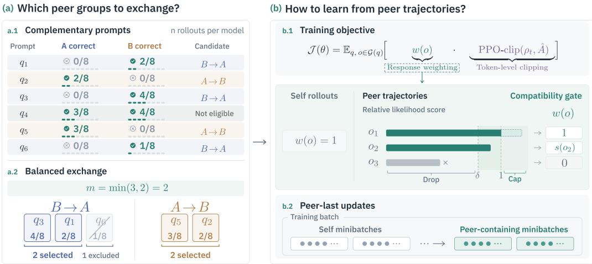  
Figure 2: Overall Framework of GRAFT. GRAFT selects and balances complementary peer groups, then controls their off-policy influence through compatibility weighting, token-level clipping, and peer-last updates.

## 4 GRAFT: GATED REPLACEMENT OF ANSWER-FAILED GROUPS WITH PEER TRAJECTORIES

Overview. GRAFT addresses the two design questions introduced in Section 3: which peer trajectories to transfer, and how the receiver should learn from them under cross-model mismatch (Figure 2). GRAFT identifies complementary peer groups, replaces receiver groups that provide no successful trajectory, and balances transfer across the two directions (Section 4.1). The receiver then learns from the transferred trajectories using source-computed advantages, sequence-level compatibility weighting, token-level importance ratio clipping, and peer-last updates (Section 4.2).

Setting. We consider two policies $\pi _ { \theta ^ { A } }$ and $\pi _ { \boldsymbol { \theta } ^ { B } }$ trained simultaneously on the same prompt distribution with a verifiable binary reward. The models maintain separate parameters and gradients, and exchange only sampled responses, their generation log-probabilities, and rewards. A response o is a string; $o ^ { M } \bar { = } ( o _ { 1 } ^ { \dot { M } } , \dots , o _ { | o ^ { M } | } ^ { \dot { M } } )$ denotes its tokenization under $M \mathrm { { s } }$ tokenizer, and for a policy π on M’s vocabulary we set $\begin{array} { r } { \pi ( o \mid q ) = \prod _ { t = 1 } ^ { | o ^ { M } | } \pi ( o _ { t } ^ { M } \mid q , o _ { < t } ^ { M } ) . ^ { 1 } } \end{array}$ For each prompt $q \sim \mathcal { D }$ , each model $M \in \{ A , B \}$ samples $\mathcal { G } _ { M } ( q ) = ( o _ { 1 } , \cdot . . , o _ { n } )$ from its behavior policy $\pi _ { \theta _ { \mathrm { o l d } } ^ { M } }$ . We denote the corresponding GRPO advantages by $\{ \hat { a } _ { i } ^ { M } \} _ { i = 1 } ^ { n } ,$ , and define the number of successful responses as $\begin{array} { r } { k _ { M } ( q ) = et { } { ' } \sum _ { o \in \mathcal { G } _ { M } ( q ) } r ( q , o ) } \end{array}$ . Throughout, we describe transfer from model A to model ${ \dot { B , } }$ treating A as the source and B as the receiver; the reverse direction is symmetric.

## 4.1 COMPLEMENTARY AND BALANCED GROUP REPLACEMENT

Complementary group replacement. Model B receives peer trajectories only when its own rollout group fails entirely and the peer group contains both successful and unsuccessful responses:

$$
\mathcal { C } _ { A  B } = \big \{ q \in \mathcal { Q } : k _ { B } ( q ) = 0 \ \wedge \ 1 \leq k _ { A } ( q ) < n \big \} ,\tag{4}
$$

where $\mathcal { Q } \subset \mathcal { D }$ . The condition $k _ { B } ( q ) = 0$ restricts transfer to prompts with no reward-based policygradient signal from the receiver’s own group. The condition $1 \leq k _ { A } ( q ) < n$ ensures that the peer group contains a verified success and nonzero reward variance.

For each prompt selected from $\mathcal { C } _ { A  B }$ by the balancing procedure below, we replace $B ^ { * } { \bf s }$ failed group with $A \ ' \mathrm s$ entire rollout group $\mathcal { G } _ { A } ( \boldsymbol { q } )$ ; each transferred response enters $B ^ { \prime } \bar { \bf s }$ update with its source-computed advantage $\hat { a } _ { i } ^ { A }$ rather than a re-normalized one.

Transferring both successful and unsuccessful responses preserves the reward contrast within the peer group, supplying positive and negative advantages without pooling rewards across models. The receiver then applies the compatibility weights of Section 4.2 while keeping the source advantages fixed.

Balanced exchange. Complementary candidate sets can differ substantially in size across directions, exposing one receiver to many more peer groups than the other. We use the smaller candidate count, $\bar { m } = \bar { \operatorname* { m i n } } ( | \mathcal C _ { A  B } | , | \mathcal C _ { B  A } | )$ , as a common selection target. In each direction, candidates are ranked by the source model’s success count in descending order, and the first m prompts are retained together with all ties at the boundary. This reduces directional imbalance while preserving equal-ranked candidates.

## 4.2 OFF-POLICY-AWARE PEER UPDATES

A grafted response is generated by $\pi _ { \phi } \equiv \pi _ { \theta _ { \mathrm { o l d } } ^ { A } }$ and used to update $\pi _ { \boldsymbol { \theta } ^ { B } }$ . At the string level, the likelihood ratio factorizes as

$$
\begin{array} { r } { \frac { \pi _ { \theta ^ { B } } ( o \mid q ) } { \pi _ { \phi } ( o \mid q ) } = \underbrace { \frac { \pi _ { \theta ^ { B } } ( o ^ { B } \mid q ) } { \pi _ { \theta _ { \mathrm { o l d } } ^ { B } } ( o ^ { B } \mid q ) } } _ { \mathrm { w i t h i n r e c e i v e r ~ c h a n g e } } \cdot \underbrace { \frac { \pi _ { \theta _ { \mathrm { o l d } } ^ { B } } ( o ^ { B } \mid q ) } { \pi _ { \phi } ( o ^ { A } \mid q ) } } _ { \mathrm { c r o s s - m o d e l ~ m i s m a t c h } } , } \end{array}\tag{5}
$$

which separates the receiver’s change during optimization from its initial mismatch with the peer. We use this factorization to motivate treating the two discrepancies separately, with a token-level PPO surrogate for the former and a sequence-level compatibility weight for the latter; we do not use it to derive an exact importance-weighted objective.

To operationalize the cross-model mismatch under differing tokenizers, we define the average token log-likelihood

$$
\bar { \ell } \big ( \pi , o ^ { M } \mid q \big ) = \frac { 1 } { \vert o ^ { M } \vert } \sum _ { t = 1 } ^ { \vert o ^ { M } \vert } \log \pi \big ( o _ { t } ^ { M } \mid q , o _ { < t } ^ { M } \big ) .\tag{6}
$$

Compatibility gate. We use sequence-level likelihood only to decide whether and how strongly a peer trajectory is admitted, and token-level importance ratio clipping to control the receiver’s update on it. We evaluate each tokenization under its corresponding model and define

$$
s ( o \mid q ) = \exp \Bigl ( \bar { \ell } \bigl ( \pi _ { \theta _ { \mathrm { o l d } } ^ { B } } , o ^ { B } \mid q \bigr ) - \bar { \ell } \bigl ( \pi _ { \phi } , o ^ { A } \mid q \bigr ) \Bigr ) .\tag{7}
$$

This score compares average token log-likelihoods rather than accumulating log-probabilities over the entire response. When the tokenizations coincide, $s ( o \mid q )$ reduces to the length-normalized sequence likelihood ratio; with different tokenizers, we instead interpret it as a compatibility score.

The score defines a bounded weight for each peer sequence,

$$
w ( o \mid q ) = \mathbf { 1 } \left[ s ( o \mid q ) > \delta \right] \cdot \operatorname* { m i n } \{ s ( o \mid q ) , 1 \} .\tag{8}
$$

When the prompt is clear from context, we abbreviate $w ( o _ { j } ) \equiv w ( o _ { j } \mid q _ { j } )$ . The threshold δ excludes low-scoring peer trajectories regardless of correctness: any response with $s ( o \mid q ) \leq \delta$ is dropped from the transferred group before optimization. The cap then limits the weight of each admitted response to at most one. Correctness identifies a successful response, but on its own it does not say how well the receiver can learn from that response under this update rule.

Token-level clipping. After group replacement, an optimization minibatch may contain two kinds of responses: self-generated responses $o _ { j } \in { \mathcal G } _ { B } ( q _ { j } )$ and grafted peer responses $o _ { j } \in \mathcal { G } _ { A } ( q _ { j } )$ Regardless of which model generated $o _ { j }$ , the receiver updates on its own tokenization $o _ { j } ^ { B } \ =$ $( o _ { j , 1 } ^ { B } , \hdots , o _ { j , | o _ { i } ^ { B } | } ^ { B } )$ ; for grafted responses this amounts to re-tokenizing the peer’s response string with the receiver’s tokenizer. The token-level importance ratio is defined on this common receiverside representation,

$$
\rho _ { j , t } ( \theta ^ { B } ) = \frac { \pi _ { \theta ^ { B } } \left( o _ { j , t } ^ { B } \mid q _ { j } , o _ { j , < t } ^ { B } \right) } { \pi _ { \theta _ { \mathrm { o l d } } ^ { B } } \left( o _ { j , t } ^ { B } \mid q _ { j } , o _ { j , < t } ^ { B } \right) } ,\tag{9}
$$

whose denominator is the receiver’s behavior policy for both kinds of responses. In particular, for a grafted response the denominator is not the generating policy $\pi _ { \phi } \colon$ following Equation (5), the token-level ratio tracks only the within-receiver change, while the cross-model mismatch is carried entirely by the sequence-level weight. The two kinds of responses therefore enter the objective with identically defined ratios and differ only in their weights and advantages: self-generated responses use $w ( o _ { j } ) = 1$ and $\hat { a } _ { j } = \hat { a } _ { j } ^ { B }$ , while grafted responses use $w ( o _ { j } )$ from Equation (8) and their sourcecomputed $\hat { a } _ { j } = \hat { a } _ { j } ^ { A }$

The receiver maximizes

$$
\mathcal { I } ( \theta ^ { B } ) = \mathbb { E } _ { B } \left[ \frac { 1 } { \sum _ { j \in B } \left| o _ { j } ^ { B } \right| } \sum _ { j \in B } w ( o _ { j } ) \sum _ { t = 1 } ^ { \left| o _ { j } ^ { B } \right| } \operatorname* { m i n } \Bigl ( \rho _ { j , t } ( \theta ^ { B } ) \hat { a } _ { j } , \ \mathrm { c l i p } \bigl ( \rho _ { j , t } ( \theta ^ { B } ) , 1 - \varepsilon _ { \mathrm { l o w } } , 1 + \varepsilon _ { \mathrm { h i g h } } \bigr ) \hat { a } _ { j } \Bigr ) \right] ,\tag{10}
$$

where both the advantages and the compatibility weights are held fixed during receiver optimization. Without transfer, every $w ( o _ { j } ) = 1$ and the objective reduces to the GRPO surrogate with the same clipping settings.

Peer-last updates. Token-level clipping moderates peer contributions only once the importance ratios deviate from one. Before the first optimization step on a newly collected rollout batch, $\theta ^ { B } =$ $\theta _ { \mathrm { o l d } } ^ { B }$ and hence $\rho _ { j , t } = 1$ , so a grafted minibatch processed first would enter the update unclipped, and the sequence-level weight would be the only control on cross-model mismatch. We therefore place minibatches containing grafted groups after the receiver’s own on-policy minibatches. By the time grafted responses are processed, clipping attenuates contributions whose ratios have moved outside $[ 1 - \varepsilon _ { \mathrm { l o w } } , 1 + \varepsilon _ { \mathrm { h i g h } } ]$ on the side determined by the sign of the advantage. This ordering gives the receiver’s own data priority and turns clipping into a second mechanism for moderating peer influence; we assess its empirical effect in Section 6.3 and trace the resulting clipping dynamics in Appendix H.

## 5 EXPERIMENTS

## 5.1 SETUP

Models and pairs. We evaluate three heterogeneous model pairs: SmolLM3-3B-Base (Bakouch et al., 2025) Qwen3-1.7B-Base (Yang et al., 2025) (Pair 1), OctoThinker-3B-Hybrid-Base (Wang et al., 2025) Qwen3-1.7B-Base (Pair 2), and SmolLM3-3B-Base OctoThinker-3B-Hybrid-Base (Pair 3). They differ in scale, tokenizer, pretraining corpus, and model architecture.

Training. All runs use verl with Ray, FSDP, and vLLM rollout. Each model samples $n { = } 8$ responses per prompt. Training data, learning rate, and training steps are held fixed across methods. Unless stated otherwise, we use a compatibility gate threshold $\delta = 0 . 8$ for all pairs. Full hyperparameters are provided in Appendix B.

Evaluation. We report pass@1 on five mathematical benchmarks: MATH500 (Hendrycks et al., 2021), AIME2024, AIME2025, AMC23, and Minerva (Lewkowycz et al., 2022), together with their average. Each checkpoint is evaluated over five runs with 8 samples per prompt, and we report the mean and standard deviation. $\Delta$ denotes the change in the five-benchmark average relative to GRPO (n=8).

Table 1: Results of cross-model rollout exchange during co-training. Each updated policy uses the same GRPO baselines for both of its peer policies. Bold: best among the n=8 methods [GRPO (n=8), HACPO, SGT, GRAFT] within each peer block; no bold means GRPO (n=8) is best. $^ { \dag } / \ddag \vdots$ GRAFT exceeds all baselines up to GRPO $\scriptstyle ( n = 1 6 ) / ( n = 3 2 )$ , respectively. $\Delta \colon$ change in average score relative to GRPO (n=8).
<table><tr><td>Method</td><td>MATH500</td><td>AIME2024</td><td>AIME2025</td><td>AMC23</td><td>Minerva</td><td>Avg.</td><td> $\Delta _ { \mathrm { A v g } }$ </td></tr><tr><td colspan="8">Updated policy: SmolLM3-3B-Base</td></tr><tr><td> $\mathrm { G R P O } \left( n { = } 8 \right)$ </td><td> $7 2 . 0 8 \pm 0 . 5 2$ </td><td> $8 . 5 8 \pm 1 . 1 3$ </td><td> $8 . 5 0 \pm 0 . 9 6$ </td><td> $4 6 . 6 2 \pm 1 . 4 9$ </td><td> $2 7 . 2 2 \pm 0 . 6 3$ </td><td> $3 2 . 6 0 { \scriptstyle \pm 0 . 4 9 }$ </td><td></td></tr><tr><td>GRPO (n=16)</td><td> $7 2 . 8 8 \pm 0 . 4 0$ </td><td> $9 . 0 8 \pm 0 . 9 0 $ </td><td> $9 . 8 3 \pm 1 . 3 4$ </td><td> $4 7 . 1 9 \pm 1 . 0 1$ </td><td> $2 7 . 9 0 { \scriptstyle \pm 0 . 7 5 }$ </td><td> $3 3 . 3 8 \pm 0 . 2 5$ </td><td>↑0.78</td></tr><tr><td> ${ \mathrm { G R P O ~ } } ( n { = } 3 2 )$ </td><td> $7 6 . 6 8 \pm 0 . 5 6$ </td><td> $1 1 . 4 2 \pm 0 . 8 1$ </td><td> $1 2 . 8 3 \pm 1 . 2 3$ </td><td> $4 9 . 5 6 \pm 1 . 8 0$ </td><td> $2 8 . 0 8 \pm 0 . 5 7$ </td><td> $3 5 . 7 1 \pm 0 . 1 8$ </td><td>↑3.11</td></tr><tr><td colspan="8">Peer policy: Qwen3-1.7B-Base (Pair 1)</td></tr><tr><td>HACPO</td><td> $6 9 . 5 8 \pm 0 . 5 3 $ </td><td> $7 . 0 8 \pm 1 . 7 9$ </td><td> $1 0 . 8 3 \pm 1 . 6 9$ </td><td> $4 2 . 8 8 \pm 1 . 6 1$ </td><td> $2 7 . 1 7 \pm 0 . 6 1$ </td><td> $3 1 . 5 1 \pm 0 . 4 3 $ </td><td>↓1.09</td></tr><tr><td>SGT</td><td> $7 5 . 5 3 \pm 0 . 5 1$ </td><td> $1 0 . 6 7 \pm 1 . 5 2$ </td><td> $1 1 . 5 0 { \scriptstyle \pm 0 . 3 7 }$ </td><td> $4 9 . 0 6 \pm 1 . 5 1$ </td><td> $2 7 . 6 3 \pm 0 . 6 8$ </td><td> $3 4 . 8 8 \pm 0 . 2 1$ </td><td>↑2.28</td></tr><tr><td>GRAFT</td><td> $\mathbf { 7 6 . 8 6 } ^ { \ddagger } \pm \mathbf { 0 . 3 2 }$ </td><td> ${ \bf 1 4 . 4 2 ^ { \ddagger } \pm 1 . 4 9 }$ </td><td> $\mathbf { 1 4 . 5 0 ^ { \ddagger } \pm 0 . 9 9 }$ </td><td> $\mathbf { 5 0 . 8 7 ^ { \ddagger } \pm 1 . 6 0 }$ </td><td> $2 8 . 6 8 ^ { \dagger } \pm 0 . 5 7$ </td><td> $\mathbf { 3 7 . 0 6 } ^ { \div } \pm \mathbf { 0 . 6 7 }$ </td><td>↑4.46</td></tr><tr><td colspan="8">Peer policy: OctoThinker-3B-Hybrid-Base (Pair 3)</td></tr><tr><td>HACPO</td><td> $6 6 . 6 6 \pm 0 . 6 6$ </td><td> $5 . 9 2 \pm 1 . 6 8$ </td><td> $5 . 4 2 \pm 1 . 2 1$ </td><td> $3 8 . 9 4 \pm 1 . 9 1$ </td><td> $2 5 . 2 2 \pm 0 . 7 7$ </td><td> $2 8 . 4 3 \pm 0 . 7 0$ </td><td>↓4.17</td></tr><tr><td>SGT</td><td> $7 2 . 3 6 \pm 0 . 4 3$ </td><td> $8 . 6 7 \pm 1 . 1 9$ </td><td> $8 . 6 7 \pm 1 . 5 7$ </td><td> $4 3 . 6 2 \pm 1 . 0 7$ </td><td> $2 7 . 0 1 \pm 0 . 3 2$ </td><td> $3 2 . 0 7 \pm 0 . 4 8$ </td><td>↓0.53</td></tr><tr><td>GRAFT</td><td>73.28† ±0.14</td><td> ${ \bf 1 0 . 4 2 ^ { \dagger } \pm 1 . 0 2 }$  </td><td> ${ \bf 1 0 . 8 3 ^ { \dagger } \pm 0 . 7 8 }$ </td><td> $4 6 . 4 4 \pm 1 . 4 9$ </td><td> $2 5 . 3 5 \pm 0 . 2 4$ </td><td> $\mathbf { 3 3 . 2 6 \pm 0 . 3 2 }$ </td><td>↑0.66</td></tr><tr><td colspan="8"></td></tr><tr><td>Updated policy: Qwen3-1.7B-Base GRPO (n=8)</td><td> $7 0 . 6 9 \pm 0 . 4 4$ </td><td> $9 . 1 7 \pm 1 . 2 8$ </td><td> $4 . 7 5 \pm 0 . 9 1$ </td><td> $4 3 . 5 0 \pm 1 . 5 7$ </td><td> $2 7 . 8 9 \pm 0 . 2 9$ </td><td> $3 1 . 2 0 { \scriptstyle \pm 0 . 2 7 }$ </td><td></td></tr><tr><td>GRPO (n=16)</td><td> $7 1 . 6 4 \pm 0 . 6 0$ </td><td> $1 0 . 6 7 \pm 1 . 7 3$ </td><td> $8 . 2 5 \pm 1 . 6 5$ </td><td> $4 1 . 4 4 \pm 1 . 1 2$ </td><td> $2 8 . 7 5 { \scriptstyle \pm 0 . 3 5 }$ </td><td> $3 2 . 1 5 { \scriptstyle \pm 0 . 7 3 }$ </td><td>↑0.95</td></tr><tr><td>GRPO (n=32)</td><td> $7 1 . 9 0 { \scriptstyle \pm 0 . 1 0 }$ </td><td> $1 0 . 1 7 \pm 0 . 5 6$ </td><td> $5 . 7 5 \pm 0 . 7 5$ </td><td> $4 5 . 6 2 \pm 2 . 3 1$ </td><td> $2 8 . 7 1 \pm 0 . 5 6$ </td><td> $3 2 . 4 3 \pm 0 . 6 5$ </td><td>↑1.23</td></tr><tr><td colspan="8">Peer policy: SmolLM3-3B-Base (Pair 1)</td></tr><tr><td>HACPO</td><td> $6 3 . 7 4 \pm 0 . 6 0$ </td><td> $7 . 1 7 \pm 0 . 9 0$ </td><td> $4 . 1 7 \pm 1 . 1 8$ </td><td> $3 6 . 0 6 \pm 1 . 2 0$ </td><td> $2 5 . 0 4 \pm 0 . 4 4$ </td><td> $2 7 . 2 4 \pm 0 . 3 0$ </td><td>↓3.96</td></tr><tr><td>SGT</td><td> $7 0 . 9 7 \pm 0 . 7 7$ </td><td> $1 0 . 1 7 \pm 1 . 3 4$ </td><td> $5 . 9 2 \pm 0 . 8 5$ </td><td> $4 0 . 7 5 { \scriptstyle \pm 0 . 8 7 }$ </td><td> $2 8 . 3 9 \pm 0 . 4 3$ </td><td> $3 1 . 2 4 \pm 0 . 5 6$ </td><td>↑0.04</td></tr><tr><td>GRAFT</td><td> $7 2 . 2 2 ^ { \ddagger } \pm 0 . 2 5$  </td><td> $\mathbf { 1 } 2 . 5 \mathbf { 0 } ^ { \ddagger } \pm \mathbf { 0 } . 4 2$ </td><td> ${ \bf 7 . 6 7 \pm 1 . 3 4 }$ </td><td> $\pm \bar { \bf 5 } . 5 6 ^ { \dag } \pm { \bf 1 . 0 9 }$ </td><td> $2 9 . 2 3 ^ { \dagger } \pm 0 . 3 2$ </td><td> $3 3 . 4 4 ^ { \dagger } \pm 0 . 2 3$ </td><td>↑2.24</td></tr><tr><td colspan="8">Peer policy: OctoThinker-3B-Hybrid-Base (Pair 2)</td></tr><tr><td>HACPO</td><td> $6 6 . 9 3 \pm 0 . 3 0$ </td><td> $6 . 8 3 \pm 0 . 9 6$ </td><td> $4 . 0 0 { \scriptstyle \pm 0 . 4 8 }$ </td><td> $3 6 . 6 9 \pm 1 . 7 8$ </td><td> $2 7 . 6 4 \pm 0 . 3 8$ </td><td> $2 8 . 4 2 \pm 0 . 3 8$ </td><td>↓2.78</td></tr><tr><td>SGT</td><td> $6 9 . 4 7 \pm 0 . 2 5$ </td><td> $9 . 5 8 \pm 0 . 2 9$ </td><td> $5 . 8 3 \pm 1 . 2 8$ </td><td> $4 1 . 6 9 \pm 1 . 9 0$ </td><td> $2 8 . 4 2 \pm 0 . 8 1$ </td><td> $3 1 . 0 0 { \scriptstyle \pm 0 . 4 0 }$ </td><td>↓0.20</td></tr><tr><td>GRAFT</td><td> ${ \bf 7 1 . 7 5 ^ { \dagger } \pm 0 . 3 6 }$ </td><td> ${ \bf 1 1 . 3 3 ^ { \ddagger } \pm 0 . 9 9 }$ </td><td> ${ \bf 7 . 2 5 \pm 1 . 2 0 }$ </td><td> $\pm \mathbf { 4 . 5 6 } ^ { \dagger } \pm \mathbf { 3 . 8 8 }$ </td><td> ${ \bf 2 9 . 0 2 ^ { \div } \pm 0 . 7 7 }$ </td><td> $\mathbf { 3 2 . 7 8 ^ { \div } \pm 0 . 4 9 }$ </td><td>↑1.58</td></tr><tr><td colspan="8">Updated policy: OctoThinker-3B-Hybrid-Base</td></tr><tr><td>GRPO (n=8)</td><td> $5 6 . 3 2 \pm 0 . 6 0$ </td><td> $2 . 5 0 { \scriptstyle \pm 0 . 9 3 }$ </td><td> $1 . 0 8 \pm 0 . 8 6$ </td><td> $2 7 . 9 4 \pm 1 . 7 5$ </td><td> $1 8 . 0 6 \pm 0 . 8 1$ </td><td> $2 1 . 1 8 \pm 0 . 4 0$ </td><td></td></tr><tr><td>GRPO (n=16)</td><td> $5 8 . 3 9 \pm 0 . 6 9$ </td><td> $3 . 2 5 \pm 0 . 5 4$ </td><td> $1 . 8 3 \pm 0 . 4 8$ </td><td> $2 8 . 6 9 \pm 0 . 8 7$ </td><td> $1 9 . 8 6 \pm 0 . 5 0$ </td><td> $2 2 . 4 0 { \scriptstyle \pm 0 . 4 3 }$ </td><td>↑1.22</td></tr><tr><td> ${ \mathrm { G R P O ~ } } ( n { = } 3 2 )$ </td><td> $6 0 . 8 9 \pm 0 . 3 3$ </td><td> $3 . 4 2 \pm 1 . 1 9$ </td><td> $1 . 7 5 \pm 0 . 4 6$ </td><td> $3 1 . 1 9 \pm 2 . 3 3$ </td><td> $1 9 . 7 0 { \scriptstyle \pm 0 . 7 3 }$ </td><td> $2 3 . 3 9 \pm 0 . 5 6$ </td><td>↑2.21</td></tr><tr><td colspan="8"> $P e e r p o l i c y \colon Q w e n 3 \ – { I . 7 B } \ – B a s e ( P a i r 2 )$ </td></tr><tr><td> $_ \mathrm { H A C P O }$ </td><td> $5 5 . 4 4 \pm 0 . 5 1$ </td><td> ${ \bf 3 . 5 8 \pm 1 . 4 9 }$ </td><td> $0 . 9 2 \pm 0 . 1 9$ </td><td> $2 6 . 3 8 \pm 1 . 6 2$ </td><td> $1 8 . 1 2 \pm 0 . 4 4$ </td><td> $2 0 . 8 9 \pm 0 . 3 8$ </td><td>↓0.29</td></tr><tr><td>SGT</td><td> ${ \bf 5 8 . 1 1 \pm 0 . 4 1 }$ </td><td> $2 . 1 7 \pm 1 . 2 6$ </td><td> $\mathbf { 2 . 0 8 \pm 0 . 5 9 }$ </td><td> $2 8 . 6 9 \pm 1 . 8 9$ </td><td> $1 8 . 6 3 \pm 0 . 6 2$ </td><td> $2 1 . 9 3 \pm 0 . 4 5$ </td><td>↑0.75</td></tr><tr><td>GRAFT</td><td> $5 8 . 0 1 \pm 0 . 3 6 $ </td><td> $3 . 4 2 \pm 0 . 8 0$ </td><td> $1 . 2 5 \pm 0 . 7 8$ </td><td> $\pm \mathbf { 4 . 7 5 ^ { \ddagger } } \pm 2 . 9 8$ </td><td> $\mathbf { 1 9 . 9 0 } ^ { \dagger } \pm \mathbf { 0 . 7 1 }$ </td><td> $2 3 . 4 7 ^ { \div } \pm 0 . 6 8$ </td><td>↑2.29</td></tr><tr><td colspan="8">Peer policy: SmolLM3-3B-Base (Pair 3)</td></tr><tr><td>HACPO</td><td> $5 6 . 7 0 { \scriptstyle \pm 0 . 4 0 }$ </td><td> $2 . 9 2 \pm 1 . 0 2$ </td><td> $1 . 3 3 \pm 0 . 3 5$ </td><td> $2 9 . 1 2 { \scriptstyle \pm 0 . 7 8 }$ </td><td> $1 9 . 3 7 \pm 0 . 6 8$ </td><td> $2 1 . 8 9 \pm 0 . 2 5$ </td><td>↑0.71</td></tr><tr><td>SGT</td><td> $\pm 7 . 8 2 \pm 0 . 3 1$ </td><td> $3 . 5 0 \pm 0 . 4 8$ </td><td> $1 . 8 3 \pm 0 . 6 3$ </td><td> $2 9 . 1 2 \pm 0 . 9 7$ </td><td> ${ \bf 2 0 . 2 6 \pm 0 . 8 9 }$ </td><td> $2 2 . 5 1 \pm 0 . 3 2$ </td><td>↑1.33</td></tr><tr><td>GRAFT</td><td> $5 7 . 5 9 \pm 0 . 5 0 $ </td><td> $\mathbf { 4 . 2 5 ^ { \dagger } \pm 0 . 7 5 }$ </td><td> $\pm . 2 5 ^ { \ddagger } \pm \mathbf { 0 . 7 0 }$ </td><td> $\mathbf { 3 0 . 1 9 ^ { \dagger } \pm 1 . 3 0 }$ </td><td> $1 8 . 7 4 \pm 0 . 7 6$ </td><td> $2 2 . 6 0 ^ { \dagger } \pm 0 . 2 2$ </td><td>↑1.42</td></tr></table>

Baselines. We compare against independent GRPO with $n { = } 8 , 1 6 ,$ and 32 rollouts, as well as two cross-model training baselines, HACPO (Zhang et al., 2026) and SGT (Liu et al., 2026b). GRAFT, HACPO, and SGT all use $n { = } 8$ rollouts per model, while GRPO with n=16 and n=32 gives a largerrollout reference for assessing the benefit of additional independent exploration. Across methods, we keep the training data, learning rate, and number of training steps fixed. Appendix B lists the full baseline configurations.

## 5.2 MAIN RESULTS

Table 1 reports the main comparison. GRAFT improves over single-model GRPO in all six model blocks, with average-score gains between +0.66 and +4.46. Rollout budget alone does not explain these gains. On Pair 1, both models outperform GRPO with 4 the rollouts (n=32), and on Pair 2 both are comparable to it. Over three independent training runs, GRAFT also has a higher mean aggregate score than budget-matched GRPO (Appendix C).

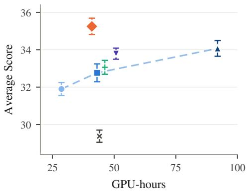  
(a)

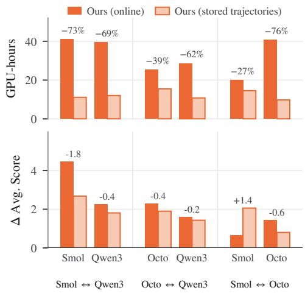  
(b)  
Figure 3: (a) Average score of Pair 1 vs. total GPU-hours. Error bars: 95% CIs over five evaluation runs; the dashed line traces GRPO with increasing rollout budget, and DS denotes dynamic sampling. GRAFT exceeds GRPO (n=32) by 1.18 at 0.45 the cost. (b) Replacing the co-trained partner with its stored trajectories across all six blocks. Top: GPU-hours to the reported checkpoint; bottom: gain over GRPO (n=8). Stored trajectories cut compute by 27–76% while keeping a positive gain in every block (84% of the online gain on average).

The magnitude of improvement varies across pairs, with the largest gains on Pair 1 and the smallest on Pair 3. Both co-training baselines are weaker. HACPO falls below budget-matched GRPO in five of six blocks, by as much as 4.17 in average score. SGT does better but is inconsistent, ranging from 0.53 to +2.28. GRAFT’s margin over the budget-matched baselines emerges early and persists throughout training rather than at an isolated checkpoint (Figure 4).

Qualitative case studies show shared solution steps between GRAFT and peer responses, including root shifting and inclusion–exclusion, alongside elements of the receiver’s GRPO solution structure (Appendix I).

## 6 ANALYSIS

We next examine three questions about the gains of GRAFT: whether they come at a better compute trade-off than simply increasing the rollout budget (Section 6.1), whether they strictly require synchronous co-training or persist with stored peer trajectories (Section 6.2), and which components drive them, including whether the which and how decisions must be addressed together (Section 6.3).

## 6.1 COMPUTE-EFFICIENT GAINS FROM PEER EXCHANGE

We compare the GPU-hours required to obtain both models of Pair 1. Because GRAFT jointly trains two policies, we compare the total cost of obtaining both resulting models rather than the cost of either model in isolation. In Figure 3a, GRAFT reaches a pair-mean score of 35.25 at 40.9 GPUhours. This exceeds GRPO (n=32) by 1.18 points at 0.45 its compute, and GRPO (n=16) by 2.48 points at a comparable compute budget. Thus, increasing independent rollout budgets does not match the performance-compute trade-off of peer exchange in this comparison. Appendix D defines checkpoint-cost accounting and reports full-run costs and per-model results.

## 6.2 USING STORED PEER TRAJECTORIES DURING TRAINING

Online co-training keeps both models and their optimizer states resident. We therefore test whether GRAFT can instead use peer trajectories stored from the partner’s independent GRPO (n=8) run:

Table 2: Ablations and alternative designs on Pair 1 (S: SmolLM3-3B, Q: Qwen3-1.7B; ∆: change vs. full GRAFT). (a) removes or randomizes one component at a time; (b) replaces the transfer rule, or fixes only one of which and how while borrowing the other. Variant definitions and per-benchmark scores: Appendices G and F.  
(a) Component ablation
<table><tr><td rowspan="2"></td><td colspan="2">S</td><td colspan="2">Q</td></tr><tr><td>Avg.</td><td>∆</td><td>Avg.</td><td>∆</td></tr><tr><td>GRAFT (full)</td><td>37.06±0.67</td><td></td><td>33.44±0.23</td><td>一</td></tr><tr><td colspan="5">Component removal</td></tr><tr><td>compat. gate</td><td>28.70±0.78</td><td>↓8.36</td><td>30.93 ±0.52</td><td>↓2.51</td></tr><tr><td>compat. floor</td><td>35.17±0.59</td><td>↓1.89</td><td>29.88±0.62</td><td>↓3.56</td></tr><tr><td>balancing</td><td>35.06±0.27</td><td>↓2.00</td><td>32.96±0.56</td><td>↓0.48</td></tr><tr><td>token ratio</td><td>35.21 ±0.65</td><td>↓1.85</td><td>32.99±0.33</td><td>↓0.45</td></tr><tr><td colspan="5">Random selection</td></tr><tr><td>prompts</td><td>34.66±0.47</td><td>↓2.40</td><td>31.86±0.48</td><td>↓1.58</td></tr><tr><td>admission</td><td>35.20±0.85</td><td>↓1.86</td><td>32.35 ±0.32</td><td>↓1.09</td></tr><tr><td colspan="5">Peer position</td></tr><tr><td>first</td><td>34.61 ±0.43</td><td>↓2.45</td><td>31.73 ±0.58</td><td>↓1.71</td></tr><tr><td>uniform</td><td>33.49±0.47</td><td>↓3.57</td><td>32.41 ±0.55</td><td>↓1.03</td></tr><tr><td>GRPO</td><td>32.60±0.49</td><td>↓4.46</td><td>31.20±0.27</td><td>↓2.24</td></tr></table>

(b) Alternative designs
<table><tr><td rowspan="2"></td><td colspan="2">S</td><td colspan="2">Q</td></tr><tr><td>Avg.</td><td>∆</td><td>Avg.</td><td>∆</td></tr><tr><td>GRAFT (full)</td><td>37.06±0.67</td><td>一</td><td>33.44±0.23</td><td>-</td></tr><tr><td>Transfer rule</td><td></td><td></td><td></td><td></td></tr><tr><td>pooled groups</td><td>33.07 ±0.47</td><td>↓3.99</td><td>30.78 ±0.48</td><td>↓2.66</td></tr><tr><td>success-only</td><td>29.22 ±0.26</td><td>↓7.84</td><td>29.51 ±0.65</td><td>↓3.93</td></tr><tr><td>+ w/o floor</td><td>32.14±0.38</td><td>↓4.92</td><td>29.85 ±0.44</td><td>↓3.59</td></tr><tr><td>Our which, prior how</td><td></td><td></td><td></td><td></td></tr><tr><td>HACPO update</td><td>28.97±0.52</td><td>↓8.09</td><td>27.79±0.38</td><td>↓5.65</td></tr><tr><td>SFT update (SGT)</td><td>34.08 ±0.15</td><td>↓2.98</td><td>31.89±0.37</td><td>↓1.55</td></tr><tr><td>LUFFY update</td><td>32.51 ±0.89</td><td>↓4.55</td><td>31.41 ±0.50</td><td>↓2.03</td></tr><tr><td>Original methods</td><td></td><td></td><td></td><td></td></tr><tr><td>HACPO</td><td>31.51 ±0.43</td><td>↓5.55</td><td>27.24±0.30</td><td>↓6.20</td></tr><tr><td>SGT</td><td>34.88±0.21</td><td>↓2.18</td><td>31.24±0.56</td><td>↓2.20</td></tr><tr><td>GRPO</td><td>32.60±0.49</td><td>↓4.46</td><td>31.20±0.27</td><td>↓2.24</td></tr></table>

at each receiver step we load the partner’s recorded responses and log-probabilities for the same prompt batch, re-verify their rewards, and apply the same selection, weighting, and update rule (Appendix B). Transfer is unidirectional, so balanced exchange is inactive.

Stored trajectories improve over GRPO (n=8) in all six model blocks, by 1.78 points on average compared with 2.11 for online exchange (Figure 3b; full results in Appendix E). On Pair 1, obtaining both selected receiver checkpoints requires 23.2 GPU-hours, excluding the prior GRPO runs used to collect the peer logs. Most of the performance benefit therefore persists when existing peer trajectories are reused, without simultaneous co-training or keeping the peer model in memory.

## 6.3 ABLATIONS AND ALTERNATIVE DESIGNS

Table 2a evaluates individual design choices on Pair 1. Removing compatibility weighting causes the largest degradation for SmolLM3 ( 8.36 points), while removing the floor causes the largest degradation for Qwen3 ( 3.56). Removing balancing or replacing the token-level ratio with a sequencelevel ratio also lowers performance. Count-matched random prompts and random admission also underperform. Peer-last ordering beats peer-first and uniform; Appendix H additionally shows that it yields the highest clipping rate on peer tokens. We use δ = 0.8 throughout, with a threshold sweep in Appendix F.

Table 2b tests alternative designs. Pooling peer and self groups or transferring only successes underperforms full GRAFT, and the floor improves aggregate scores only under full-group transfer. With our prompt selection fixed, HACPO, SGT, and LUFFY-style (Yan et al., 2025) updates all trail GRAFT. Using GRAFT’s update with SGT’s unbalanced selection also leaves a gap of 2.00/0.48 points. Together, these comparisons support combining complementary and balanced prompt selection with compatibility-aware peer updates.

## 7 CONCLUSION

We have introduced GRAFT, an off-policy-aware framework for cross-model trajectory exchange in RLVR. GRAFT exploits complementary successes across heterogeneous models by replacing allfail rollout groups with informative peer groups, while controlling cross-model mismatch through compatibility-aware and clipped updates. Across three heterogeneous model pairs, GRAFT consistently improves both models over standard GRPO with the same rollout budget and can match or exceed GRPO with substantially more rollouts. Moreover, most of the gains persist when using stored peer trajectories, showing that the benefit of cross-model exploration does not require synchronous co-training.

Limitations. GRAFT’s gain depends on how complementary the two models are and is smallest on Pair 3. Across tokenizers, the compatibility score is a proxy, not a density ratio. We also study only two-model pairs, only on math, and only with base models of at most 3B parameters. We leave exchange among more than two peers, and in domains without verifiable rewards, to future work.

## REFERENCES

Rishabh Agarwal, Nino Vieillard, Yongchao Zhou, Piotr Stanczyk, Sabela Ramos Garea, Matthieu Geist, and Olivier Bachem. On-policy distillation of language models: Learning from selfgenerated mistakes. In The Twelfth International Conference on Learning Representations, 2024. 3

Elie Bakouch, Loubna Ben Allal, Anton Lozhkov, Nouamane Tazi, Lewis Tunstall, Carlos Miguel Patino, Edward Beeching, Aymeric Roucher, Aksel Joonas Reedi, Quentin Gallou˜ edec, Kashif´ Rasul, Nathan Habib, Clementine Fourrier, Hynek Kydlicek, Guilherme Penedo, Hugo Larcher,´ Mathieu Morlon, Vaibhav Srivastav, Joshua Lochner, Xuan-Son Nguyen, Colin Raffel, Leandro von Werra, and Thomas Wolf. SmolLM3: smol, multilingual, long-context reasoner. https: //huggingface.co/blog/smollm3, 2025. 1, 6

Nikolay Blagoev, Oguzhan Ersoy, Wendelin Boehmer, and Lydia Chen. F-TIS: Harnessing diverse models in collaborative GRPO. In ICML 2026 Workshop on Multimodal AI Agents, 2026. 3

Aili Chen, Aonian Li, Bangwei Gong, Binyang Jiang, Bo Fei, Bo Yang, Boji Shan, Changqing Yu, Chao Wang, Cheng Zhu, et al. Minimax-m1: Scaling test-time compute efficiently with lightning attention. arXiv preprint arXiv:2506.13585, 2025. 3

Ganqu Cui, Yuchen Zhang, Jiacheng Chen, Lifan Yuan, Zhi Wang, Yuxin Zuo, Haozhan Li, Yuchen Fan, Huayu Chen, Weize Chen, et al. The entropy mechanism of reinforcement learning for reasoning language models. arXiv preprint arXiv:2505.22617, 2025. 3

Yihong Dong, Xue Jiang, Yongding Tao, Huanyu Liu, Kechi Zhang, Lili Mou, Rongyu Cao, Yingwei Ma, Jue Chen, Binhua Li, et al. Rl-plus: Countering capability boundary collapse of llms in reinforcement learning with hybrid-policy optimization. In Proceedings of the 64th Annual Meeting ofthe Associationfor Computational Linguistics (Volume 1: Long Papers), 2026. 1, 3

Daya Guo, Dejian Yang, Haowei Zhang, Junxiao Song, Peiyi Wang, Qihao Zhu, Runxin Xu, Ruoyu Zhang, Shirong Ma, Xiao Bi, et al. Deepseek-r1: Incentivizing reasoning capability in llms via reinforcement learning. arXiv preprint arXiv:2501.12948, 2025. 1

Xixiang He, Qiyao Sun, Ao Cheng, Xingming Li, Xuanyu Ji, Hailun Lu, Runke Huang, and Qingyong Hu. Advantage collapse in group relative policy optimization: Diagnosis and mitigation. In Forty-third International Conference on Machine Learning, 2026. 1

Dan Hendrycks, Collin Burns, Saurav Kadavath, Akul Arora, Steven Basart, Eric Tang, Dawn Song, and Jacob Steinhardt. Measuring mathematical problem solving with the MATH dataset. In Proceedings of the Neural Information Processing Systems Track on Datasets and Benchmarks, volume 1, 2021. 6

Zeyu Huang, Tianhao Cheng, Zihan Qiu, Zili Wang, Xu Yinghui, Edoardo Ponti, and Ivan Titov. Blending supervised and reinforcement fine-tuning with prefix sampling. In Forty-third International Conference on Machine Learning, 2026. 3

Yuxian Jiang, Yafu Li, Guanxu Chen, Dongrui Liu, Yu Cheng, and Jing Shao. Rethinking entropy regularization in large reasoning models. arXiv preprint arXiv:2509.25133, 2025. 15

Zishang Jiang, Jinyi Han, tingyun li, Xinyi Wang, Sihang Jiang, Zhaoqian Dai, Ma Shuguang, Fei Yu, Jiaqing Liang, and Yanghua Xiao. Selective expert guidance for effective and diverse exploration in reinforcement learning of LLMs. In The Fourteenth International Conference on Learning Representations, 2026. 3

Haechan Kim, Soohyun Ryu, Gyouk Chu, Doohyuk Jang, and Eunho Yang. Discounted beta–bernoulli reward estimation for sample-efficient reinforcement learning with verifiable rewards. In Forty-third International Conference on Machine Learning, 2026. 1, 15

Nathan Lambert, Jacob Morrison, Valentina Pyatkin, Shengyi Huang, Hamish Ivison, Faeze Brahman, Lester James Validad Miranda, Alisa Liu, Nouha Dziri, Xinxi Lyu, Yuling Gu, Saumya Malik, Victoria Graf, Jena D. Hwang, Jiangjiang Yang, Ronan Le Bras, Oyvind Tafjord, Christopher Wilhelm, Luca Soldaini, Noah A. Smith, Yizhong Wang, Pradeep Dasigi, and Hannaneh Hajishirzi. Tulu 3: Pushing frontiers in open language model post-training. In Second Conference on Language Modeling, 2025. 1

Thanh-Long V. Le, Myeongho Jeon, Kim Vu, Viet Dac Lai, and Eunho Yang. No prompt left behind: Exploiting zero-variance prompts in LLM reinforcement learning via entropy-guided advantage shaping. In The Fourteenth International Conference on Learning Representations, 2026. 1, 2, 15

Aitor Lewkowycz, Anders Andreassen, David Dohan, Ethan Dyer, Henryk Michalewski, Vinay Ramasesh, Ambrose Slone, Cem Anil, Imanol Schlag, Theo Gutman-Solo, Yuhuai Wu, Behnam Neyshabur, Guy Gur-Ari, and Vedant Misra. Solving quantitative reasoning problems with language models. In Advances in Neural Information Processing Systems, volume 35, 2022. 6

Jiazheng Li, Hongzhou Lin, Hong Lu, Kaiyue Wen, Zaiwen Yang, Jiaxuan Gao, Yi Wu, and Jingzhao Zhang. Questa: Expanding reasoning capacity in LLMs via question augmentation. In The Fourteenth International Conference on Learning Representations, 2026. 3

Ling Team, Anqi Shen, Baihui Li, Bin Hu, Bin Jing, Cai Chen, Chao Huang, Chao Zhang, Chaokun Yang, Cheng Lin, Chengyao Wen, Congqi Li, Deng Zhao, Dingbo Yuan, Donghai You, Fagui Mao, Fanzhuang Meng, Feng Xu, Guojie Li, Guowei Wang, Hao Dai, Haonan Zheng, et al. Every step evolves: Scaling reinforcement learning for trillion-scale thinking model. arXiv preprint arXiv:2510.18855, 2025. 3

Huanyu Liu, Jia Li, Yihong Dong, Chang Yu, Taozhi Chen, Lecheng Wang, Yongding Tao, Bin Gu, and Ge Li. Evocot: Overcoming the exploration bottleneck in reinforcement learning for llms. In Findings of the Association for Computational Linguistics: ACL 2026, 2026a. 1

Mingjie Liu, Shizhe Diao, Ximing Lu, Jian Hu, Xin Dong, Yejin Choi, Jan Kautz, and Yi Dong. Prorl: Prolonged reinforcement learning expands reasoning boundaries in large language models. In Advances in Neural Information Processing Systems, volume 38, Main Conference, 2025a. 15

Xiaoze Liu, Dhananjay Ram, Yuting Zhang, Zhaoyang Zhang, Wei Xia, and Stefano Soatto. Experience sharing in mutual reinforcement learning for heterogeneous language models. arXiv preprint arXiv:2605.07244, 2026b. 2, 3, 7, 14

Zichen Liu, Changyu Chen, Wenjun Li, Penghui Qi, Tianyu Pang, Chao Du, Wee Sun Lee, and Min Lin. Understanding r1-zero-like training: A critical perspective. In Second Conference on Language Modeling, 2025b. 1

Yixiu Mao, Yun Qu, Qi Wang, Heming Zou, and Xiangyang Ji. Rlvr without ineffective samples: Group prioritized off-policy optimization for llm reasoning. arXiv preprint arXiv:2606.01281, 2026. 3

Zhihong Shao, Peiyi Wang, Qihao Zhu, Runxin Xu, Junxiao Song, Xiao Bi, Haowei Zhang, Mingchuan Zhang, YK Li, Yang Wu, et al. Deepseekmath: Pushing the limits of mathematical reasoning in open language models. arXiv preprint arXiv:2402.03300, 2024. 1, 2, 3

Zengzhi Wang, Fan Zhou, Xuefeng Li, and Pengfei Liu. Octothinker: Mid-training incentivizes reinforcement learning scaling. arXiv preprint arXiv:2506.20512, 2025. 6

Xumeng Wen, Zihan Liu, Shun Zheng, Shengyu Ye, Zhirong Wu, Yang Wang, Zhijian Xu, Xiao Liang, Junjie Li, Ziming Miao, Jiang Bian, and Mao Yang. Reinforcement learning with verifiable rewards implicitly incentivizes correct reasoning in base LLMs. In The Fourteenth International Conference on Learning Representations, 2026. 1

Jianhao Yan, Yafu Li, Zican Hu, Zhi Wang, Ganqu Cui, Xiaoye Qu, Yu Cheng, and Yue Zhang. Learning to reason under off-policy guidance. In Advances in Neural Information Processing Systems, volume 38, Main Conference, 2025. 3, 9, 22

An Yang, Anfeng Li, Baosong Yang, Beichen Zhang, Binyuan Hui, Bo Zheng, Bowen Yu, Chang Gao, Chengen Huang, Chenxu Lv, et al. Qwen3 technical report. arXiv preprint arXiv:2505.09388, 2025. 1, 6

Feng Yao, Liyuan Liu, Dinghuai Zhang, Chengyu Dong, Jingbo Shang, and Jianfeng Gao. On the rollout-training mismatch in modern RL systems. In NeurIPS 2025 Workshop on Efficient Reasoning, 2025. 3

Qiying Yu, Zheng Zhang, Ruofei Zhu, Yufeng Yuan, Xiaochen Zuo, Yu Yue, Weinan Dai, Tiantian Fan, Gaohong Liu, juncai liu, LingJun Liu, Xin Liu, Haibin Lin, Zhiqi Lin, Bole Ma, Guangming Sheng, Yuxuan Tong, Chi Zhang, Mofan Zhang, Ru Zhang, Wang Zhang, Hang Zhu, Jinhua Zhu, Jiaze Chen, Jiangjie Chen, Chengyi Wang, Hongli Yu, Yuxuan Song, Xiangpeng Wei, Hao Zhou, Jingjing Liu, Wei-Ying Ma, Ya-Qin Zhang, Lin Yan, Yonghui Wu, and Mingxuan Wang. Dapo: An open-source llm reinforcement learning system at scale. In Advances in Neural Information Processing Systems, volume 38, Main Conference, 2025. 1, 2, 3, 15

Yang Yue, Zhiqi Chen, Rui Lu, Andrew Zhao, Zhaokai Wang, Yang Yue, Shiji Song, and Gao Huang. Does reinforcement learning really incentivize reasoning capacity in llms beyond the base model? In Advances in Neural Information Processing Systems, volume 38, Main Conference, 2025. 1, 3

Zhixia Zhang, Zixuan Huang, Gongxun Li, Huaiyang Wang, Chengyi Yuan, Xin Xia, Deqing Wang, Fuzhen Zhuang, Shuai Ma, Ning Ding, et al. Heterogeneous agent collaborative reinforcement learning. arXiv preprint arXiv:2603.02604, 2026. 2, 3, 7, 14

Chujie Zheng, Shixuan Liu, Mingze Li, Xiong-Hui Chen, Bowen Yu, Chang Gao, Kai Dang, Yuqiong Liu, Rui Men, An Yang, Jingren Zhou, and Junyang Lin. Group sequence policy optimization. arXiv preprint arXiv:2507.18071, 2025. 1, 3

## A FULL ALGORITHM OF GRAFT

Algorithm 1 GRAFT: Cross-Model Trajectory Exchange   
Require: Policies $\pi _ { \theta ^ { A } } , \pi _ { \theta ^ { B } } ;$ prompt set ; rollout count n; compatibility threshold δ; clipping   
parameters $\varepsilon _ { \mathrm { l o w } } , \varepsilon _ { \mathrm { h i g h } }$   
1: for each training step do   
2: Sample a shared prompt batch $\mathcal { Q } \subset \mathcal { D }$   
3: for $\grave { M } \in \{ A , B \}$ do   
4: $\theta _ { \mathrm { o l d } } ^ { M }  \theta ^ { M }$   
5: Sample n responses $\mathcal { G } _ { M } ( \boldsymbol { q } )$ from $\pi _ { \theta _ { \mathrm { o l d } } ^ { M } }$ for each $q \in \mathcal { Q }$   
6: Store source tokens and generation log-probabilities   
7: Compute rewards, success counts $k _ { M } ( q )$ , and advantages $\hat { a } _ { M } ( \boldsymbol { q } )$   
8: Set advantages to zero for zero-variance groups   
9: end for   
▷ Select complementary groups with nonzero reward variance   
10: for $( S , R ) \in \{ ( A , B ) , ( B , A ) \}$ do   
11: $\stackrel { \triangledown } { \mathcal { C } } _ { S \right. R } \left. \left\{ \boldsymbol { q } \in \underline { { \partial } } : k _ { R } ( \boldsymbol { q } ) = 0 , 1 \leq k _ { S } ( \boldsymbol { q } ) < n \right\}$   
12: end for   
13: m min $( | { \mathcal { C } } _ { A  B } | , | { \mathcal { C } } _ { B  A } | )$   
14: for $( S , R ) \stackrel { \cdot } { \in } \{ ( A , \stackrel { \cdot } { B } ) , ( B , \stackrel { \cdot } { A } ) \}$ do   
15: $\dot { \mathcal { E } } _ { S  R }  \dot { \mathrm { S E L E C T W I T H T I E S } } ( \mathcal { C } _ { S  R } , k _ { S } , m )$   
16: end for   
▷ Replace selected groups using the original source rollouts   
17: for $( S , R ) \in \{ ( A , B ) , ( B , A ) \}$ do   
18: Initialize receiver training buffer $B _ { R } \gets \emptyset$   
19: for $q \in \mathcal { Q }$ do   
20: if $q \in \mathcal { E } _ { S  R }$ then   
21: Re-tokenize $\mathcal { G } _ { S } ( q )$ for receiver R   
22: Compute $s ( o \mid q )$ using $\pi _ { \theta _ { \mathrm { o l d } } ^ { R } }$ and stored source log-probabilities   
23: $w ( o )  \mathbf { 1 } [ s ( o \mid q ) > \delta ]$ min $\{ s ( o \mid q ) , 1 \}$   
24: Add the admitted peer responses $( s ( o \mid q ) > \delta )$ with source advantages $\hat { a } _ { S } ( q )$   
and weights w(o) to $\scriptstyle B _ { R }$   
25: else   
26: Add $\mathcal { G } _ { R } ( \boldsymbol { q } )$ with advantages $\hat { a } _ { R } ( q )$ and unit weights to $\scriptstyle { B _ { R } }$   
27: end if   
28: end for   
29: end for   
▷ Optimize with fixed advantages and compatibility weights   
30: for $R \in \{ A , B \}$ do   
31: for each optimization epoch do   
32: Arrange $\scriptstyle { B _ { R } }$ into minibatches, placing peer-containing minibatches last   
33: for each minibatch in this order do   
34: Compute token ratios relative to $\pi _ { \theta _ { \mathrm { o l d } } ^ { R } }$   
35: Update $\theta ^ { R }$ by gradient ascent on Equation (10)   
36: end for   
37: end for   
38: end for   
39: end for   
40: return $\pi _ { \theta ^ { A } } , \pi _ { \theta ^ { B } }$

SelectWithTies $( \mathcal { C } , k _ { S } , m )$ ranks candidate prompts by the source model’s success count $k _ { S } ( q )$ in descending order and retains the first m prompts, including all ties at the boundary. It returns ∅ when $m = 0$ . The selected counts may exceed m and need not be identical across directions. Compatibility weights and group advantages remain fixed during optimization. Peer responses failing the compatibility floor are removed before optimization; group advantages are computed on the full source group prior to this removal and remain fixed.

## B TRAINING AND EVALUATION DETAILS

Data and reward. We train on the 7,500 problems in the MATH training split, using all difficulty levels. Each problem is formatted as a single user message with the suffix “Let’s think step by step and output the final answer within boxed .” The reward is binary: math verify checks the final boxed answer against the reference answer, with verification timeouts assigned zero reward. We use no additional format or length reward, and score responses that reach the generation limit as generated.

Optimization and implementation. We use verl with FSDP for policy optimization and vLLM 0.8.5 for rollout generation. Each pair is trained on four NVIDIA H200 GPUs, with both models colocated on the same node and rollout tensor parallelism set to two. Table 3 summarizes the common configuration; baseline-specific exceptions are described below. Both models receive the same prompt batch at each training step. We perform one optimization epoch per rollout batch, partitioned into four minibatches of 32 prompts. The implementation averages the policy loss over response tokens (token-mean aggregation). Training uses dynamic microbatching and gradient checkpointing.

Table 3: Training hyperparameters. These settings apply to GRAFT and independent GRPO unless otherwise specified. The larger-budget GRPO baselines change only the rollout count.
<table><tr><td>Hyperparameter</td><td>Value</td></tr><tr><td>Training epochs</td><td>3</td></tr><tr><td>Prompt batch size</td><td>128</td></tr><tr><td>Rollouts per prompt per model</td><td>8</td></tr><tr><td>Optimization minibatch size</td><td>32 prompts</td></tr><tr><td>Optimization epochs per rollout batch</td><td>1</td></tr><tr><td>Maximum prompt / response length</td><td>2,048 / 4,096 tokens</td></tr><tr><td>Rollout temperature / top-p</td><td>1.0 / 1.0</td></tr><tr><td>Optimizer</td><td>AdamW</td></tr><tr><td>Learning rate</td><td> $1 0 ^ { - 6 } ,$  , constant, no warmup</td></tr><tr><td>Adam coefficients  $( \beta _ { 1 } , \beta _ { 2 } )$ </td><td>(0.9,0.999)</td></tr><tr><td>Weight decay</td><td>0.01</td></tr><tr><td>Maximum gradient norm</td><td>1.0</td></tr><tr><td>PPO clipping  $\big ( \varepsilon _ { \mathrm { l o w } } , \varepsilon _ { \mathrm { h i g h } } \big )$ </td><td> $( 0 . 2 , 0 . 2 8 )$ </td></tr><tr><td>GRPO normalization stabilizer</td><td> $\mathrm { i } 0 ^ { - 6 }$ </td></tr><tr><td>KL regularization / entropy bonus</td><td>none / none</td></tr><tr><td>Precision</td><td>bfloat16</td></tr></table>

GRAFT configuration. We use the same exchange and optimization settings for all three pairs. The compatibility threshold $\delta = 0 . 8$ was selected on Pair 1 and fixed before running Pairs 2 and 3. Exchange is performed at every training step using the selection and balancing rules in Section 4.1, with no additional exchange-volume cap. Peer responses are re-tokenized for the receiver, while source-computed advantages and compatibility weights remain fixed throughout optimization. Minibatches containing peer groups are placed last. The method uses no additional rollouts; its additional computation is receiver-side likelihood evaluation of transferred responses.

Baseline configurations. Independent GRPO uses the same training settings with $n \in \{ 8 , 1 6 , 3 2 \}$ and no trajectory exchange. The minibatch size remains fixed at 32 prompts, so larger rollout groups increase the number of responses per update while preserving the number of optimizer updates. For HACPO (Zhang et al., 2026), we retain the released method configuration: sequence-level clipping with lower and upper clip deltas of $3 \times 1 0 ^ { - 4 }$ and $4 \times 1 0 ^ { - 4 }$ , a peer-rollout clipping lower bound initialized at 0.8 and increased by 0.025 per step, a peer loss coefficient of 1.0, a minibatch size of 64 prompts, and a KL loss coefficient of $1 0 ^ { - 3 }$ , following the default configuration in their official implementation. HACPO pools peer rollouts for every prompt and uses $n { = } 8$ , the same learning rate, and the same training duration. We also tested HACPO without KL regularization and with 32-prompt minibatches; the reported configuration performed better. For SGT (Liu et al., 2026b), we augment the GRPO loss with a supervised negative log-likelihood term weighted by $\lambda = 0 . 1$ following the paper’s original setting. Whenever a receiver has no correct rollout and its peer has at least one, we uniformly sample one correct peer response for this term. This rule is applied in both directions. Variants that combine a baseline with a component of GRAFT are described in Appendix G.

Saved peer logs. For experiments using saved peer logs, the trajectories come from the partner’s independent GRPO (n=8) training run. At each receiver training step, we load the corresponding recorded peer responses and generation log-probabilities, re-evaluate their rewards, and apply the same selection, compatibility weighting, and receiver update. The partner model is not loaded or trained. Directional balancing is inactive because transfer is unidirectional.

Evaluation. We evaluate on MATH500 (500 problems), AIME2024 (30), AIME2025 (30), AMC23 (40), and Minerva Math (272), using the same prompt formatting, answer verifier, and length limits as in training, with temperature 0.6, top-p 0.95, and eight responses per problem. We estimate pass@1 by averaging correctness over responses and then over problems; the aggregate score is the unweighted mean of the five benchmarks. Since RLVR training curves are nonmonotonic across nearby checkpoints, it is common to monitor training on validation sets drawn from the evaluation benchmarks (Yu et al., 2025; Liu et al., 2025a) and report the best checkpoint so selected (Le et al., 2026; Kim et al., 2026; Jiang et al., 2025).

We follow this practice with a single fixed rule: every model is validated every five steps on the aggregate score and the highest-scoring checkpoint is reported, under the identical rule for every method and rollout budget. Figure 4 shows that GRAFT leads the budget-matched baselines throughout most of training. Each selected checkpoint is evaluated over five independent runs, and we report their mean and standard deviation. For Appendix C, we average the five evaluation scores within each training run and report the mean and sample standard deviation over three independent runs; main-table results use the first run.

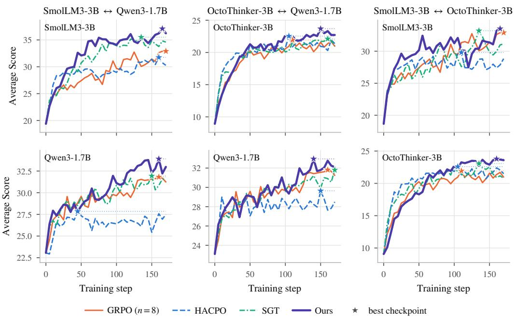  
Figure 4: Validation trajectories used for checkpoint selection. Five-benchmark average vs. training step for each updated model, evaluated under the identical protocol for all methods. Stars mark the selected checkpoints in Table 1.

## C TRAINING STABILITY ACROSS INDEPENDENT RUNS

To assess sensitivity to training variability, we independently repeat both GRPO (n=8) and GRAFT three times for all three model pairs. For each training run, we evaluate the resulting checkpoint over five evaluation runs with 8 samples per prompt and report their mean performance. Table 4 reports the mean and sample standard deviation across the three independent training runs. The main results in Table 1 use the first training run for each setting. Across all six model blocks, GRAFT maintains higher mean aggregate performance than the single-model GRPO baseline, indicating that the improvements persist across independent training runs.

Table 4: Training stability across three independent runs. We repeat GRPO (n=8) and GRAFT three times for all three model pairs and report the mean and sample standard deviation across runs. ∆ denotes the difference in the mean average score relative to GRPO (n=8) within each model block. Bold indicates the better mean performance between GRPO (n=8) and GRAFT.
<table><tr><td>Method</td><td>MATH500</td><td>AIME2024</td><td>AIME2025</td><td>AMC23</td><td>Minerva</td><td>Avg.</td><td> $\Delta _ { \mathrm { A v g } }$ </td></tr><tr><td colspan="8">Pair 1 SmolLM3-3B-Base ↔ Qwen3-1.7B-Base</td></tr><tr><td colspan="8">SmolLM3-3B-Base</td></tr><tr><td>GRPO (n=8)</td><td>72.21 ±2.78</td><td>7.91 ±0.58</td><td>8.72 ±2.01</td><td>45.08 ±2.46</td><td>26.84±0.45</td><td>32.15±1.48</td><td></td></tr><tr><td>GRAFT</td><td>75.37 ±1.30</td><td>13.28±1.32</td><td>13.22±1.29</td><td>50.37 ±0.98</td><td>28.34±1.36</td><td>36.12±0.85</td><td>↑3.97</td></tr><tr><td colspan="8">Qwen3-1.7B-Base</td></tr><tr><td>GRPO (n=8)</td><td>70.69 ±0.30</td><td>9.66±0.43</td><td>5.86±0.97</td><td>42.60 ±0.78</td><td>28.10±0.35</td><td>31.38 ±0.16</td><td></td></tr><tr><td>GRAFT</td><td>71.78±0.38</td><td>12.06±0.57</td><td>7.33±0.96</td><td>45.81 ±0.29</td><td>29.22±0.09</td><td>33.24±0.33</td><td>↑1.86</td></tr><tr><td colspan="8">Pair 2 OctoThinker-3B-Hybrid-Base ↔ Qwen3-1.7B-Base</td></tr><tr><td colspan="8">OctoThinker-3B-Hybrid-Base</td></tr><tr><td>GRPO (n=8)</td><td>55.86±0.42</td><td>2.94±1.15</td><td>0.72 ±0.38</td><td>28.35 ±0.36</td><td>17.82 ±0.40</td><td>21.14±0.22</td><td></td></tr><tr><td>GRAFT</td><td>57.36±0.57</td><td>3.67 ±0.90</td><td>2.05±0.94</td><td>33.56±2.11</td><td>19.30 ±0.72</td><td>23.19±0.24</td><td>↑2.05</td></tr><tr><td colspan="8">Qwen3-1.7B-Base</td></tr><tr><td>GRPO (n=8)</td><td>70.69 ±0.30</td><td>9.66±0.43</td><td>5.86±0.97</td><td>42.60±0.78</td><td>28.10±0.35</td><td>31.38±0.16</td><td></td></tr><tr><td>GRAFT</td><td>71.17 ±0.53</td><td>11.19±0.64</td><td>7.72±0.97</td><td>43.19±1.44</td><td>28.57 ±0.48</td><td>32.37 ±0.41</td><td>↑0.99</td></tr><tr><td colspan="8">Pair 3 SmolLM3-3B-Base ↔ OctoThinker-3B-Hybrid-Base</td></tr><tr><td colspan="8">SmolLM3-3B-Base</td></tr><tr><td>GRPO (n=8)</td><td>72.21 ±2.78</td><td>7.91 ±0.58</td><td>8.72±2.01</td><td>45.08 ±2.46</td><td>26.84±0.45</td><td>32.15±1.48</td><td></td></tr><tr><td>GRAFT</td><td>72.27 ±1.13</td><td>9.92±1.96</td><td>10.19±0.90</td><td>46.92±0.94</td><td>26.03±0.63</td><td>33.06 ±0.31</td><td>↑0.91</td></tr><tr><td colspan="8">OctoThinker-3B-Hybrid-Base</td></tr><tr><td>GRPO (n=8)</td><td>55.86±0.42</td><td>2.94±1.15</td><td>0.72±0.38</td><td>28.35 ±0.36</td><td>17.82 ±0.40 19.29±1.57</td><td>21.14±0.22</td><td></td></tr><tr><td>GRAFT</td><td>56.47 ±2.47</td><td>5.03±1.35</td><td>1.75±0.60</td><td>30.25 ±0.06</td><td></td><td>22.56±1.07</td><td>↑1.42</td></tr></table>

## D COMPUTE ACCOUNTING

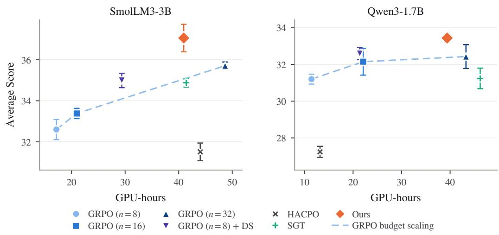  
Figure 5: Per-model score against the GPU-hours charged to that model under the most conservative rule: GRPO pays for its own model only; each model of a cross-model method is charged the full joint-run cost (both models’ training) up to that model’s own selected checkpoint. Error bars are 1 s.d. over inference seeds.

Measurement. GPU-hours are computed as N times the summed per-step wall-clock training time, excluding validation and checkpoint writing. All runs in Table 5 use four GPUs. We report both the cost of obtaining the selected checkpoints and the cost of completing all three training epochs (174 steps).

For independent GRPO, the cost of obtaining both models is the sum of the costs of their separate runs up to their respective selected checkpoints. For online cross-model methods, the two selected checkpoints can occur at different steps. The joint checkpoint cost is therefore the cost of running the joint training process through the later of these two steps. It is not generally equal to the sum of the two per-model checkpoint entries. The full-run cost reports the complete training budget without assuming that the selected checkpoint is known in advance.

Conservative per-model accounting. Figure 5 charges independent GRPO only for the model it produces, but charges each model of an online cross-model method the full cost of the joint run, covering both models’ training, up to that model’s own selected checkpoint (e.g., 40.9 GPUhours for SmolLM3 at step 165 and 39.4 for Qwen3 at step 160 under GRAFT). This differs from the joint checkpoint cost in Table 5, which runs through the later of the two checkpoints. Under this accounting, GRAFT exceeds GRPO (n=32) by 1.35 points for SmolLM3 and 1.01 points for Qwen3, at approximately 0.84 and 0.91 their respective checkpoint costs. Compared with GRPO (n=16), it improves scores by 3.68 and 1.29 points at approximately 1.95 and 1.78 the cost. Thus, the advantage over the largest tested rollout budget persists even when the full joint cost is charged to each model separately.

Table 5: Score and training cost on Pair 1. Avg. is the five-benchmark average at the selected checkpoint (Table 1). GPU-hour columns report the cost up to the selected checkpoint and for the complete three-epoch run. For online cross-model methods, the “Both models / Best ckpt” entry measures the joint run through the later of the two selected checkpoints; for independent GRPO, it sums the two separate checkpoint costs. Stored-trajectory costs exclude the prior runs used to collect peer logs.
<table><tr><td rowspan="2"></td><td colspan="3">SmolLM3-3B-Base</td><td colspan="3">Qwen3-1.7B-Base</td><td colspan="2">Both models</td></tr><tr><td>Avg. (%)</td><td>Best ckpt (GPU-h)</td><td>3 epochs (GPU-h)</td><td>Avg. (%)</td><td>Best ckpt (GPU-h)</td><td>3 epochs (GPU-h)</td><td>Best ckpt (GPU-h)</td><td>3 epochs (GPU-h)</td></tr><tr><td>GRPO (n=8)</td><td>32.60±0.49</td><td>17.2</td><td>17.4</td><td>31.20±0.27</td><td>11.4</td><td>12.5</td><td>28.6</td><td>29.9</td></tr><tr><td>GRPO (n=16)</td><td>33.38±0.25</td><td>21.0</td><td>34.8</td><td>32.15 ±0.73</td><td>22.1</td><td>22.5</td><td>43.1</td><td>57.3</td></tr><tr><td>GRPO (n=32)</td><td>35.71 ±0.18</td><td>48.7</td><td>99.5</td><td>32.43 ±0.65</td><td>43.3</td><td>45.6</td><td>92.0</td><td>145.1</td></tr><tr><td>GRPO (n=8) + Dynamic Sampling</td><td>34.99±0.35</td><td>29.4</td><td>40.5</td><td>32.59±0.33</td><td>21.4</td><td>27.4</td><td>50.8</td><td>67.9</td></tr><tr><td>HACPO</td><td>31.51 ±0.43</td><td>23.5</td><td>25.1</td><td>27.24±0.30</td><td>5.9</td><td>22.0</td><td>44.0</td><td>47.1</td></tr><tr><td>SGT</td><td>34.88±0.21</td><td>24.0</td><td>30.9</td><td>31.24±0.56</td><td>19.4</td><td>22.2</td><td>46.2</td><td>53.1</td></tr><tr><td>GRAFT</td><td>37.06±0.67</td><td>25.3</td><td>26.7</td><td>33.44±0.23</td><td>15.0</td><td>16.6</td><td>40.9</td><td>43.3</td></tr><tr><td>GRAFT w/ stored traj.</td><td>35.28±0.33</td><td>11.1</td><td>20.0</td><td>33.01 ±0.53</td><td>12.1</td><td>13.3</td><td>23.2</td><td>33.3</td></tr></table>

## E FULL RESULTS FOR STORED TRAJECTORY EXPERIMENTS

Table 6 reports per-benchmark results for the stored trajectory experiments in Section 6.2. GRAFT with stored trajectories improves the average score over GRPO (n=8) in all six model blocks, by 0.80–2.68 points (1.78 on average, 84% of the 2.11 point online gain), and exceeds online GRAFT for SmolLM3-3B-Base in Pair 3.

Table 6: Effect of learning from peer-model training trajectories. We compare standard GRPO (n=8), online cross-model rollout exchange (GRAFT), and GRAFT with peer replay, where each model learns from peer trajectories collected from a previous training run rather than from a simultaneously co-trained peer. All methods use n=8 self-rollouts per model. ∆ reports the change in average score relative to GRPO (n=8) within each model block.
<table><tr><td>Method</td><td>MATH500</td><td>AIME2024</td><td>AIME2025</td><td>AMC23</td><td>Minerva</td><td>Avg.</td><td>∆Avg</td></tr><tr><td colspan="8">Pair 1 SmolLM3-3B-Base ↔ Qwen3-1.7B-Base</td></tr><tr><td colspan="8">SmolLM3-3B-Base</td></tr><tr><td>GRPO (n=8)</td><td>72.08 ±0.52</td><td>8.58 ±1.13</td><td>8.50 ±0.96</td><td>46.62±1.49</td><td>27.22 ±0.63</td><td>32.60 ±0.49</td><td></td></tr><tr><td>GRAFT</td><td>76.86±0.32</td><td>14.42±1.49</td><td>14.50 ±0.99</td><td>50.87±1.60</td><td>28.68±0.57</td><td>37.06±0.67</td><td>↑4.46</td></tr><tr><td>GRAFT w/ stored traj.</td><td>74.53 ±0.41</td><td>12.00 ±1.62</td><td>12.50 ±0.29</td><td>49.94±2.36</td><td>27.44±0.69</td><td>35.28 ±0.33</td><td>↑2.68</td></tr><tr><td colspan="8">Qwen3-1.7B-Base</td></tr><tr><td>GRPO (n=8)</td><td>70.69 ±0.44</td><td>9.17 ±1.28</td><td>4.75 ±0.91</td><td>43.50±1.57</td><td>27.89 ±0.29</td><td>31.20 ±0.27</td><td></td></tr><tr><td>GRAFT</td><td>72.22±0.25</td><td>12.50 ±0.42</td><td>7.67±1.34</td><td>45.56±1.09</td><td>29.23±0.32</td><td>33.44±0.23</td><td>↑2.24</td></tr><tr><td>GRAFT w/ stored traj.</td><td>72.81 ±0.63</td><td>10.92±0.90</td><td>5.83 ±1.21</td><td>46.00 ±1.42</td><td>29.49 ±0.70</td><td>33.01 ±0.53</td><td>↑1.81</td></tr><tr><td colspan="8">Pair 2 OctoThinker-3B-Hybrid-Base ↔ Qwen3-1.7B-Base</td></tr><tr><td colspan="8">OctoThinker-3B-Hybrid-Base</td></tr><tr><td>GRPO (n=8)</td><td>56.32±0.60</td><td>2.50 ±0.93</td><td>1.08 ±0.86</td><td>27.94±1.75</td><td>18.06±0.81</td><td>21.18 ±0.40</td><td></td></tr><tr><td>GRAFT</td><td>58.01 ±0.36</td><td>3.42±0.80</td><td>1.25 ±0.78</td><td>34.75±2.98</td><td>19.90±0.71</td><td>23.47±0.68</td><td>↑2.29</td></tr><tr><td>GRAFT w/ stored traj.</td><td>57.91 ±0.83</td><td>4.00 ±1.76</td><td>2.42 ±0.85</td><td>31.06 ±2.28</td><td>20.03 ±0.51</td><td>23.08 ±0.35</td><td>↑1.90</td></tr><tr><td colspan="8">Qwen3-1.7B-Base</td></tr><tr><td>GRPO (n=8)</td><td>70.69 ±0.44</td><td>9.17 ±1.28</td><td>4.75 ±0.91</td><td>43.50±1.57</td><td>27.89 ±0.29</td><td>31.20 ±0.27</td><td></td></tr><tr><td>GRAFT</td><td>71.75±0.36</td><td>11.33 ±0.99</td><td>7.25±1.20</td><td>44.56±3.88</td><td>29.02±0.77</td><td>32.78±0.49</td><td>↑1.58</td></tr><tr><td>GRAFT w/ stored traj.</td><td>71.86±0.24</td><td>11.08 ±1.46</td><td>7.08 ±0.98</td><td>44.06±2.17</td><td>29.03 ±0.33</td><td>32.63 ±0.63</td><td>↑1.43</td></tr><tr><td colspan="8">Pair 3 SmolLM3-3B-Base ↔ OctoThinker-3B-Hybrid-Base</td></tr><tr><td colspan="8">SmolLM3-3B-Base</td></tr><tr><td>GRPO (n=8)</td><td>72.08 ±0.52</td><td>8.58±1.13</td><td>8.50 ±0.96</td><td>46.62±1.49</td><td>27.22±0.63</td><td>32.60 ±0.49</td><td></td></tr><tr><td>GRAFT</td><td>73.28±0.14</td><td>10.42±1.02</td><td>10.83 ±0.78</td><td>46.44±1.49</td><td>25.35±0.24</td><td>33.26±0.32</td><td>↑0.66</td></tr><tr><td>GRAFT w/ stored traj.</td><td>73.83 ±0.36</td><td>10.42±1.14</td><td>12.67 ±1.05</td><td>48.56±2.51</td><td>27.83 ±0.76</td><td>34.66±0.62</td><td>↑2.06</td></tr><tr><td colspan="8">OctoThinker-3B-Hybrid-Base</td></tr><tr><td>GRPO (n=8)</td><td>56.32±0.60</td><td>2.50 ±0.93</td><td>1.08 ±0.86</td><td>27.94±1.75</td><td>18.06±0.81</td><td>21.18 ±0.40</td><td>1</td></tr><tr><td>GRAFT</td><td>57.59±0.50</td><td>4.25 ±0.75</td><td>2.25 ±0.70</td><td>30.19±1.30</td><td>18.74±0.76</td><td>22.60±0.22</td><td>↑1.42</td></tr><tr><td>GRAFT w/ stored traj.</td><td>55.21 ±0.56</td><td>3.50±1.05</td><td>2.25 ±0.76</td><td>30.63 ±2.80</td><td>18.31 ±0.91</td><td>21.98 ±0.33</td><td>↑0.80</td></tr></table>

## F FULL RESULTS FOR ABLATIONS AND ALTERNATIVE DESIGNS

Table 7 reports per-benchmark results for Tables 2a and 2b, and the compatibility-threshold sweep. Table 8 reports per-benchmark results for combinations of prior methods with GRAFT’s prompt selection or peer update. Implementation details are provided in Appendix G.

All listed variants lower the aggregate score relative to full GRAFT for both models, although individual benchmark scores can improve. Removing compatibility weighting causes the largest aggregate degradation for SmolLM3, whereas removing only the floor causes the largest degradation for Qwen3 among the variants in Table 7. Count-matched random selection and alternative peerminibatch orderings also reduce aggregate performance. Among the tested thresholds, δ = 0.8 achieves the highest aggregate score for both receivers.

Table 7: Full ablation of GRAFT on Pair 1. Per-benchmark scores behind Table 2. Each variant changes a single component of the full method while keeping the compute budget fixed at n=8 rollouts per model. Count-matched random variants match the prompt-selection or response-admission count obtained by applying GRAFT to the current rollout batch, separately in each direction, but select uniformly at random. Random admission replaces the compatibility floor while retaining weights min s, 1 . ∆ reports the change in average score relative to full GRAFT within each model block.
<table><tr><td>Variant</td><td>MATH500</td><td>AIME2024</td><td>AIME2025</td><td>AMC23</td><td>Minerva</td><td>Avg.</td><td> $\Delta _ { \mathrm { A v g } }$ </td></tr><tr><td colspan="8">SmolLM3-3B-Base</td></tr><tr><td>GRAFT (full, δ=0.8)</td><td>76.86±0.32</td><td>14.42±1.49</td><td>14.50±0.99</td><td>50.87±1.60</td><td>28.68±0.57</td><td>37.06±0.67</td><td></td></tr><tr><td colspan="8">Removing one component</td></tr><tr><td>w/o compatibility gate</td><td>68.66±0.40</td><td>5.42 ±1.47</td><td>4.92±1.12</td><td>39.19±1.66</td><td>25.33±0.57</td><td>28.70±0.78</td><td>↓8.36</td></tr><tr><td>w/o balanced exchange</td><td>75.05 ±0.25</td><td>10.08±1.68</td><td>12.50±0.78</td><td>49.44±2.20</td><td>28.24±0.48</td><td>35.06±0.27</td><td>↓2.00</td></tr><tr><td>w/o token-level ratio</td><td>75.83 ±0.58</td><td>10.50±1.04</td><td>12.50 ±1.56</td><td>48.94±1.80</td><td>28.26±0.49</td><td>35.21 ±0.65</td><td>↓1.85</td></tr><tr><td colspan="8">Count-matched random selection</td></tr><tr><td>random prompts</td><td>75.81 ±0.31</td><td>10.08 ±1.12</td><td>11.75 ±0.68</td><td>47.94±1.69</td><td>27.70±0.71</td><td>34.66±0.47</td><td>↓2.40</td></tr><tr><td>random admission</td><td>76.00 ±0.45</td><td>11.25 ±1.53</td><td>11.25 ±1.67</td><td>50.25 ±3.02</td><td>27.24±0.53</td><td>35.20 ±0.85</td><td>↓1.86</td></tr><tr><td colspan="8">Position of peer minibatches</td></tr><tr><td>first</td><td>75.74±0.32</td><td>9.83 ±1.49</td><td>11.25 ±0.51</td><td>49.06±1.98</td><td>27.18±0.53</td><td>34.61 ±0.43</td><td>↓2.45</td></tr><tr><td>uniform</td><td>72.47 ±0.68</td><td>12.58 ±1.30</td><td>9.92±0.90</td><td>45.06 ±2.53</td><td>27.42±0.63</td><td>33.49 ±0.47</td><td>↓3.57</td></tr><tr><td colspan="8">Advantage computation</td></tr><tr><td>pooled with receiver group</td><td>74.21 ±0.44</td><td>9.58±1.32</td><td>9.17±1.06</td><td>45.88±1.39</td><td>26.53 ±0.61</td><td>33.07 ±0.47</td><td>↓3.99</td></tr><tr><td colspan="8">Varying the compatibility gate threshold</td></tr><tr><td>δ=0 (no floor)</td><td>75.66±0.49</td><td>11.75 ±1.23 11.17 ±1.54</td><td>12.17±1.16</td><td>49.38±1.86</td><td>26.89±0.66</td><td>35.17 ±0.59</td><td>↓1.89</td></tr><tr><td>δ=0.7</td><td>74.16±0.48</td><td></td><td>9.58 ±1.06</td><td>48.69±1.16</td><td>27.26±0.88</td><td>34.17 ±0.49</td><td>↓2.89</td></tr><tr><td>δ=0.9</td><td>77.38±0.26</td><td>9.83±1.43</td><td>14.00 ±0.48</td><td>51.75±1.65</td><td>27.75 ±0.65</td><td>36.14±0.18</td><td>↓0.92</td></tr><tr><td>GRPO (n=8)</td><td>72.08±0.52</td><td>8.58 ±1.13</td><td>8.50±0.96</td><td>46.62±1.49</td><td>27.22±0.63</td><td>32.60±0.49</td><td>↓4.46</td></tr><tr><td colspan="8">Qwen3-1.7B-Base</td></tr><tr><td>GRAFT (full, δ=0.8)</td><td>72.22±0.25</td><td>12.50±0.42</td><td>7.67±1.34</td><td>45.56±1.09</td><td>29.23 ±0.32</td><td>33.44±0.23</td><td></td></tr><tr><td colspan="8">Removing one component</td></tr><tr><td>w/o compatibility gate</td><td>69.20 ±0.25</td><td>8.00 ±0.80</td><td>5.75±1.12</td><td>42.81 ±1.89</td><td>28.88±0.37</td><td>30.93 ±0.52</td><td>↓2.51</td></tr><tr><td>w/o balanced exchange</td><td>71.77 ±0.59</td><td>11.25 ±1.14</td><td>7.67 ±0.48</td><td>44.94±2.01</td><td>29.17±0.33</td><td>32.96±0.56</td><td>↓0.48</td></tr><tr><td>w/o token-level ratio</td><td>72.18 ±0.46</td><td>11.67 ±1.69</td><td>6.50±1.09</td><td>44.81 ±1.44</td><td>29.77 ±0.33</td><td>32.99 ±0.33</td><td>↓0.45</td></tr><tr><td colspan="8">Count-matched random selection</td></tr><tr><td>random prompts</td><td>71.51 ±0.29</td><td>9.50±1.39</td><td>6.50±1.09</td><td>43.44±1.29</td><td>28.35±0.56</td><td>31.86 ±0.48</td><td>↓1.58</td></tr><tr><td>random admission</td><td>71.29±0.29</td><td>11.08 ±1.09</td><td>6.50±1.52</td><td>44.56±1.03</td><td>28.29±0.39</td><td>32.35 ±0.32</td><td>↓1.09</td></tr><tr><td colspan="8">Position of peer minibatches</td></tr><tr><td>first uniform</td><td>71.29±0.53</td><td>9.75 ±0.56</td><td>5.42±0.88</td><td>43.69±2.33</td><td>28.48±0.36</td><td>31.73 ±0.58</td><td>↓1.71</td></tr><tr><td></td><td>71.25 ±0.28</td><td>11.08 ±1.09</td><td>6.58±0.75</td><td>44.31 ±1.88</td><td>28.80±0.43</td><td>32.41 ±0.55</td><td>↓1.03</td></tr><tr><td colspan="8">Advantage computation pooled with receiver group</td></tr><tr><td>Varying the compatibility gate threshold</td><td>69.77 ±0.70</td><td>8.92±1.00</td><td>5.50±0.90</td><td>41.88±1.45</td><td>27.87 ±0.58</td><td>30.78±0.48</td><td>↓2.66</td></tr><tr><td colspan="8">δ=0 (no floor)</td></tr><tr><td>δ=0.7</td><td>66.97±0.60 71.94±0.21</td><td>8.50±1.05 10.83 ±0.78</td><td>4.58 ±1.18 7.00 ±1.30</td><td>41.69±1.87 46.31 ±1.87</td><td>27.66±0.73 28.41 ±0.79</td><td>29.88±0.62 32.90 ±0.50</td><td>↓3.56 ↓0.54</td></tr><tr><td>δ=0.9</td><td>71.33 ±0.66</td><td>9.58±1.95</td><td>6.08 ±1.83</td><td>43.38±1.91</td><td>29.14±0.50</td><td>31.90 ±0.63</td><td>↓1.54</td></tr><tr><td>GRPO (n=8)</td><td>70.69±0.44</td><td>9.17 ±1.28</td><td>4.75 ±0.91</td><td>43.50±1.57</td><td>27.89±0.29</td><td>31.20 ±0.27</td><td>↓2.24</td></tr><tr><td></td><td></td><td></td><td></td><td></td><td></td><td></td><td></td></tr></table>

Table 8: Full results for prior methods with one side replaced, on Pair 1. Per-benchmark results for combinations of prior methods with GRAFT’s prompt selection or peer update. HACPO and SGT rows are from Table 1; “SGT + GRAFT how” is identical to ${ ^ { 6 6 } \mathrm { w } / \mathrm { o } }$ balanced exchange” in Table 7. ∆ reports the change in average score relative to full GRAFT within each model block.
<table><tr><td>Method</td><td>MATH500</td><td>AIME2024</td><td>AIME2025</td><td>AMC23</td><td>Minerva</td><td>Avg.</td><td> $\Delta _ { \mathrm { A v g } }$ </td></tr><tr><td>SmolLM3-3B-Base</td><td></td><td></td><td></td><td></td><td></td><td></td><td></td></tr><tr><td>GRAFT</td><td> $7 6 . 8 6 \pm 0 . 3 2$ </td><td> $1 4 . 4 2 \pm 1 . 4 9$ </td><td> $1 4 . 5 0 { \scriptstyle \pm 0 . 9 9 }$ </td><td> $5 0 . 8 7 \pm 1 . 6 0 $ </td><td> $2 8 . 6 8 \pm 0 . 5 7$ </td><td> $3 7 . 0 6 \pm 0 . 6 7$ </td><td></td></tr><tr><td>HACPO</td><td> $6 9 . 5 8 \pm 0 . 5 3 $ </td><td> $7 . 0 8 \pm 1 . 7 9$ </td><td> $1 0 . 8 3 \pm 1 . 6 9$ </td><td> $4 2 . 8 8 \pm 1 . 6 1$ </td><td> $2 7 . 1 7 \pm 0 . 6 1$ </td><td> $3 1 . 5 1 \pm 0 . 4 3 $ </td><td>↓5.55</td></tr><tr><td> $\mathrm { H A C P O } + \mathrm { G R A F T } \mathrm { w h i c h }$ </td><td> $6 7 . 7 3 \pm 0 . 4 3$ </td><td> $6 . 4 2 \pm 0 . 3 7$ </td><td> $6 . 4 2 \pm 1 . 1 6$ </td><td> $4 0 . 0 6 \pm 1 . 6 4$ </td><td> $2 4 . 2 3 \pm 0 . 5 8$ </td><td> $2 8 . 9 7 \pm 0 . 5 2$ </td><td>↓8.09</td></tr><tr><td>SGT</td><td> $7 5 . 5 3 \pm 0 . 5 1$ </td><td> $1 0 . 6 7 \pm 1 . 5 2$ </td><td> $1 1 . 5 0 { \scriptstyle \pm 0 . 3 7 }$ </td><td> $4 9 . 0 6 \pm 1 . 5 1$ </td><td> $2 7 . 6 3 \pm 0 . 6 8$ </td><td> $3 4 . 8 8 \pm 0 . 2 1$ </td><td>↓2.18</td></tr><tr><td>SGT + GRAFT how SGT + GRAFT which</td><td> $7 5 . 0 5 \pm 0 . 2 5$ </td><td> $1 0 . 0 8 \pm 1 . 6 8$ </td><td> $1 2 . 5 0 { \scriptstyle \pm 0 . 7 8 }$ </td><td> $4 9 . 4 4 \pm 2 . 2 0$ </td><td> $2 8 . 2 4 \pm 0 . 4 8 $ </td><td> $3 5 . 0 6 \pm 0 . 2 7$ </td><td>↓2.00</td></tr><tr><td></td><td> $7 5 . 5 7 \pm 0 . 3 9$ </td><td> $9 . 0 8 \pm 1 . 9 4$ </td><td> $1 2 . 0 8 \pm 1 . 5 9$ </td><td> $4 6 . 6 3 \pm 1 . 4 9$ </td><td> $2 7 . 0 2 \pm 0 . 6 6$ </td><td> $3 4 . 0 8 \pm 0 . 1 5$ </td><td>↓2.98</td></tr><tr><td>GRAFT + LUFFY update</td><td> $7 3 . 6 2 \pm 0 . 4 5$ </td><td> $9 . 5 0 \pm 0 . 9 0 $ </td><td> $7 . 7 5 \pm 1 . 4 0$ </td><td> $4 5 . 1 9 \pm 2 . 2 8$ </td><td> $2 6 . 5 0 { \scriptstyle \pm 0 . 3 9 }$ </td><td>32.51 ±0.89</td><td>↓4.55</td></tr><tr><td> $\mathrm { G R P O } \left( n { = } 8 \right)$ </td><td> $7 2 . 0 8 \pm 0 . 5 2$ </td><td> $8 . 5 8 \pm 1 . 1 3$ </td><td> $8 . 5 0 \pm 0 . 9 6$ </td><td> $4 6 . 6 2 \pm 1 . 4 9$ </td><td> $2 7 . 2 2 \pm 0 . 6 3$ </td><td> $3 2 . 6 0 { \scriptstyle \pm 0 . 4 9 }$ </td><td>↓4.46</td></tr><tr><td>Qwen3-1.7B-Base</td><td></td><td></td><td></td><td></td><td></td><td></td><td></td></tr><tr><td>GRAFT</td><td> $7 2 . 2 2 \pm 0 . 2 5$ </td><td> $1 2 . 5 0 { \scriptstyle \pm 0 . 4 2 }$ </td><td> $7 . 6 7 \pm 1 . 3 4$ </td><td> $4 5 . 5 6 \pm 1 . 0 9$ </td><td> $2 9 . 2 3 \pm 0 . 3 2$ </td><td>33.44±0.23</td><td></td></tr><tr><td>HACPO</td><td> $6 3 . 7 4 \pm 0 . 6 0$ </td><td> $7 . 1 7 \pm 0 . 9 0$ </td><td> $4 . 1 7 \pm 1 . 1 8$ </td><td> $3 6 . 0 6 \pm 1 . 2 0$ </td><td> $2 5 . 0 4 \pm 0 . 4 4$ </td><td>27.24 ±0.30</td><td>↓6.20</td></tr><tr><td>HACPO + GRAFT which</td><td> $6 5 . 5 9 \pm 0 . 3 8$ </td><td> $6 . 2 5 \pm 1 . 2 8$ </td><td> $4 . 9 2 \pm 1 . 6 0$ </td><td> $3 5 . 7 5 \pm 2 . 0 6$ </td><td> $2 6 . 4 5 \pm 0 . 4 5$ </td><td>27.79±0.38</td><td>↓5.65</td></tr><tr><td>SGT</td><td> $7 0 . 9 7 \pm 0 . 7 7$ </td><td> $1 0 . 1 7 \pm 1 . 3 4$ </td><td> $5 . 9 2 \pm 0 . 8 5$ </td><td> $4 0 . 7 5 \pm 0 . 8 7$ </td><td> $2 8 . 3 9 \pm 0 . 4 3$ </td><td>31.24±0.56</td><td>↓2.20</td></tr><tr><td>SGT + GRAFT how</td><td> $7 1 . 7 7 \pm 0 . 5 9$ </td><td> $1 1 . 2 5 \pm 1 . 1 4$ </td><td> $7 . 6 7 \pm 0 . 4 8$ </td><td> $4 4 . 9 4 \pm 2 . 0 1$ </td><td> $2 9 . 1 7 \pm 0 . 3 3$ </td><td>32.96±0.56</td><td>↓0.48</td></tr><tr><td>SGT + GRAFT which</td><td> $7 1 . 0 0 { \scriptstyle \pm 0 . 5 0 }$ </td><td> $1 0 . 5 8 \pm 1 . 3 7$ </td><td> $5 . 8 3 \pm 0 . 7 8$ </td><td> $4 3 . 1 2 \pm 1 . 5 0$ </td><td> $2 8 . 9 0 \pm 1 . 3 6$ </td><td>31.89±0.37</td><td>↓1.55</td></tr><tr><td>GRAFT + LUFFY update</td><td> $7 1 . 1 6 \pm 0 . 3 7$ </td><td> $9 . 4 2 \pm 1 . 5 2 $ </td><td> $5 . 0 8 \pm 0 . 9 5$ </td><td> $4 3 . 4 4 \pm 1 . 4 7$ </td><td> $2 7 . 9 4 \pm 0 . 6 6$ </td><td>31.41 ±0.50</td><td>↓2.03</td></tr><tr><td> $\mathrm { G R P O } \left( n { = } 8 \right)$ </td><td> $7 0 . 6 9 \pm 0 . 4 4$ </td><td> $9 . 1 7 \pm 1 . 2 8$ </td><td> $4 . 7 5 \pm 0 . 9 1$ </td><td> $4 3 . 5 0 \pm 1 . 5 7$ </td><td> $2 7 . 8 9 \pm 0 . 2 9$ </td><td>31.20±0.27</td><td>↓2.24</td></tr></table>

## G IMPLEMENTATION OF ALTERNATIVE DESIGNS

All variants in Tables 2 and 8 use Pair 1 and the configuration of Table 3, and differ from full GRAFT or from the corresponding baseline only as described below.

HACPO + GRAFT which. We keep the HACPO configuration of Appendix B but apply its peer-rollout loss only on prompts where the receiver fails on all n rollouts $( k _ { B } ( q ) = 0 )$ and the peer succeeds at least once $( 1 \leq k _ { A } ( q ) < n )$ , subject to the balanced exchange of Section 4.1. Peer responses on all other prompts receive zero advantage and contribute no gradient.

SGT + GRAFT how. This variant retains SGT’s unbalanced prompt-selection rule: the receiver has no successful rollout and the peer has at least one. For the selected prompts, it uses GRAFT’s peer-data learning rule, replacing the receiver group with the full peer group and applying sourcecomputed advantages, compatibility weighting, token-level clipping, and peer-last updates. Thus, it preserves SGT’s prompt eligibility rather than its single-success response selection. Peer groups with $k _ { A } ( q ) = n$ have zero source-computed advantages and provide no reward-based policy gradient. The reported variant corresponds to GRAFT without balanced exchange.

SGT + GRAFT which. We retain SGT’s auxiliary supervised objective and loss coefficient, but restrict transfer to prompts selected by GRAFT’s complementary and balanced selection rule. For each selected prompt, we uniformly sample one successful peer response for the supervised loss.

LUFFY-style peer updates. Following LUFFY (Yan et al., 2025), peer tokens are optimized with the regularized importance-sampling objective $f { \bigl ( } \pi _ { \boldsymbol { \theta } } { \bigl ( } o _ { t } ~ | ~ q , o _ { < t } { \bigr ) } { \bigr ) }$ aˆ with the shaping function $f ( x ) = x / ( x + \gamma )$ and $\gamma = 0 . 1$ , in place of the compatibility gate and the token-level clipped ratio. As in LUFFY, the behavior probability of peer tokens is set to one and no clipping is applied to peer tokens, while receiver tokens use the standard clipped surrogate. Selection, balanced exchange, source-computed advantages, and peer-last ordering follow GRAFT.

Count-matched random selection. At each step, we apply GRAFT’s selection rules to the current rollout batch to determine the selection count separately for each transfer direction. For random prompts, we sample the same number of prompts uniformly from the prompt batch, irrespective of either model’s rewards, and transfer their peer groups. The standard compatibility weighting is then applied to these responses.

For random admission, we retain GRAFT’s prompt selection and count the peer responses satisfying $s ( o \mid q ) > \delta$ . We then sample exactly this many responses uniformly from the transferred peer groups. I $\mathrm { f } \ { \mathcal { A } } _ { \mathrm { r a n d } }$ denotes the randomly selected responses, their weights are

$$
w _ { \mathrm { r a n d o m } } ( o ) = { \bf 1 } [ o \in { \mathcal { A } } _ { \mathrm { r a n d } } ] \operatorname* { m i n } \{ s ( o \mid q ) , 1 \} .\tag{11}
$$

The compatibility floor is used only to determine the admission count; it is not applied to the randomly selected responses. Thus, a selected response with $s ( o \mid q ) \leq \delta$ retains its bounded compatibility weight. All other settings follow GRAFT.

Peer minibatch position. GRAFT places minibatches containing peer groups last. First places them before the receiver’s own minibatches, and uniform shuffles the minibatch order uniformly at random at every step.

Pooled groups. Instead of replacing the receiver’s all-fail group, this variant retains both the receiver and peer responses and computes advantages over their concatenation:

$$
\mathcal { G } _ { \mathrm { p o o l } } ( q ) = \mathcal { G } _ { B } ( q ) \parallel \mathcal { G } _ { A } ( q ) , \qquad \hat { a } _ { i } = \frac { r _ { i } - \mathrm { m e a n } ( \mathcal { G } _ { \mathrm { p o o l } } ) } { \mathrm { s t d } ( \mathcal { G } _ { \mathrm { p o o l } } ) + \epsilon _ { \mathrm { a d v } } } .\tag{12}
$$

Here, denotes concatenation and $\epsilon _ { \mathrm { a d v } } = 1 0 ^ { - 6 }$ . Since $k _ { B } ( q ) = 0$ , the pooled reward mean is $k _ { A } ( q ) \ddot { / } ( 2 n )$ , and the receiver’s failed responses receive negative advantages. Peer responses retain compatibility weights $w ( o )$ , while receiver responses have unit weight. All retained response tokens are included in the token-mean loss denominator. This variant changes the advantage normalization, the responses included in optimization, and the loss normalization; it therefore evaluates pooled group construction as a whole.

Success-only transfer. This variant uses the same prompt selection as full GRAFT and computes advantages from the original peer group before filtering. Only successful peer responses contribute to the peer policy-gradient term, with their source-computed advantages retained. Unsuccessful peer responses are excluded from both the policy-gradient numerator and the token-mean loss denominator.

Compatibility gating and floor. The w/o compatibility gate variant sets $w ( o ) = 1$ for every transferred peer response, removing both the floor and compatibility-dependent weighting. The nofloor variant removes only the admission threshold and uses $w ( o ) \stackrel { \cdot } { = } \operatorname* { m i n } \{ s ( o \mid q ) , \stackrel { \cdot } { 1 } \}$ . It therefore retains bounded compatibility weighting while admitting every transferred response.

## H CLIPPING DYNAMICS UNDER PEER MINIBATCH POSITION

We examine whether peer-minibatch ordering changes the activation of token-level clipping on Pair 1. Over training steps 1–48, we measure the fraction of tokens for which the clipped surrogate is strictly smaller than the unclipped surrogate: $\hat { a } _ { j } > 0$ with $\rho _ { j , t } > 1 + \varepsilon _ { \mathrm { h i g h } } , \mathrm { o r } \hat { a } _ { j } < 0$ with $\rho _ { j , t } < 1 - \varepsilon _ { \mathrm { l o w } }$ . We report these fractions separately for self-generated and grafted responses, using one run per ordering (Table 9).

Table 9: Token-level clipping under different peer-minibatch orderings on Pair 1, measured over training steps 1–48.
<table><tr><td rowspan="2">Clipped-token fraction (%) Update</td><td rowspan="2"></td><td colspan="3">Peer minibatch position</td></tr><tr><td>First</td><td>Uniform</td><td>Last (ours)</td></tr><tr><td rowspan="2">Self-generated</td><td>SmolLM3-3B</td><td>0.046</td><td>0.043</td><td>0.045</td></tr><tr><td>Qwen3-1.7B</td><td>0.068</td><td>0.068</td><td>0.072</td></tr><tr><td rowspan="2">Grafted (peer)</td><td>SmolLM3-3B ← Qwen3-1.7B</td><td>0.004</td><td>0.130</td><td>0.277</td></tr><tr><td>Qwen3-1.7B ← SmolLM3-3B</td><td>0.002</td><td>0.248</td><td>0.440</td></tr><tr><td colspan="2">Steps with zero clipping on peer tokens (%)</td><td>97.6</td><td>13.0</td><td>0.0</td></tr></table>

Peer-last ordering yields the highest clipped-token fraction on grafted responses (0.28–0.44%), compared with 0.13–0.25% under uniform ordering and less than 0.01% under peer-first. This pattern is consistent with earlier receiver updates moving peer-token ratios away from one before peer optimization.

## I QUALITATIVE ANALYSIS

We present three examples for each target model in Pair 1, for a total of six examples. Figures 6–8 show Qwen3-1.7B examples and Figures 9–11 show SmolLM3-3B examples. Each figure presents a GRPO response from the target model, a GRPO response from its peer, and a GRAFT response from the target model. We show excerpts of the responses and condense equations for readability. Vertical ellipses mark omitted steps. The shaded Step analysis boxes summarize our analysis of the approach taken in each response.

## I.1 QWEN3-1.7B

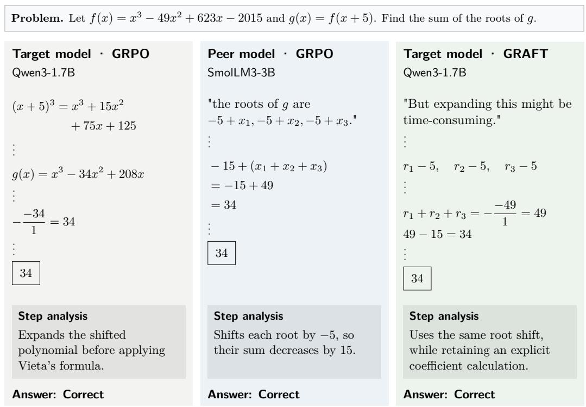  
Figure 6: Root shift in Qwen3-1.7B (MATH500). Target GRPO expands $g ( x ) = f ( x + 5 )$ and uses the expanded polynomial to compute the root sum with Vieta’s formula. The peer instead shifts each root of f by 5, so their sum decreases by 15. GRAFT uses the same root shift as the peer, computes the original root sum with Vieta’s formula, and obtains $4 9 - 1 5 = 3 4$

Case 2. Keeping every lane occupied  
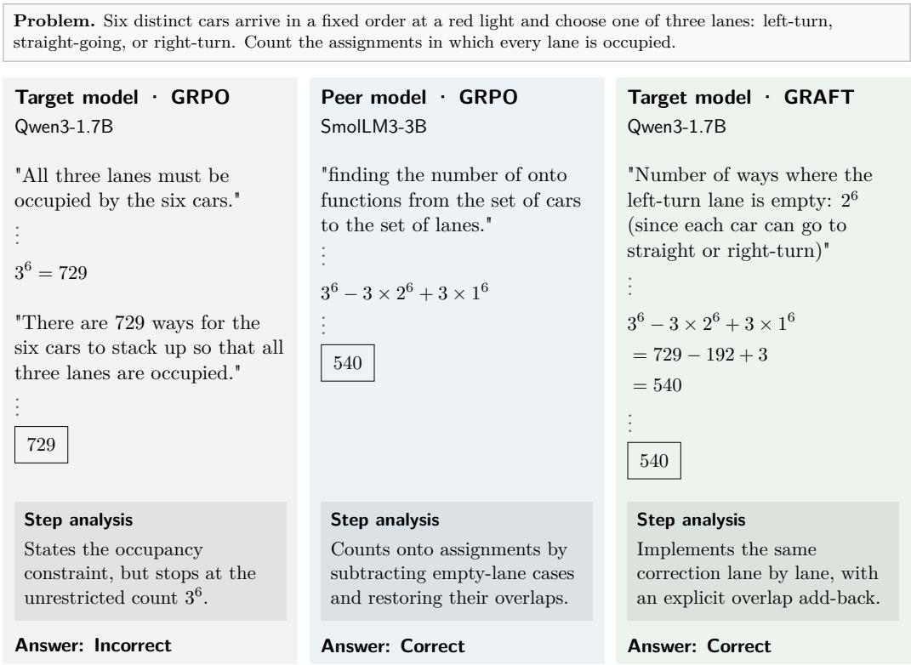  
Figure 7: Enforcing the occupancy constraint in Qwen3-1.7B (MATH500). Target GRPO counts all $3 ^ { 6 } = 7 2 9$ lane assignments without enforcing that every lane is occupied. The peer treats an assignment as an onto mapping from the six cars to the three lanes and applies inclusion–exclusion. GRAFT applies the same inclusion–exclusion correction through empty-lane events: it subtracts $3 \times 2 ^ { 6 }$ assignments, adds back the three assignments in which only one lane is occupied, and obtains $7 2 9 - 1 9 2 + 3 = 5 4 0$

Case 3. Keeping the logarithmic factor once  
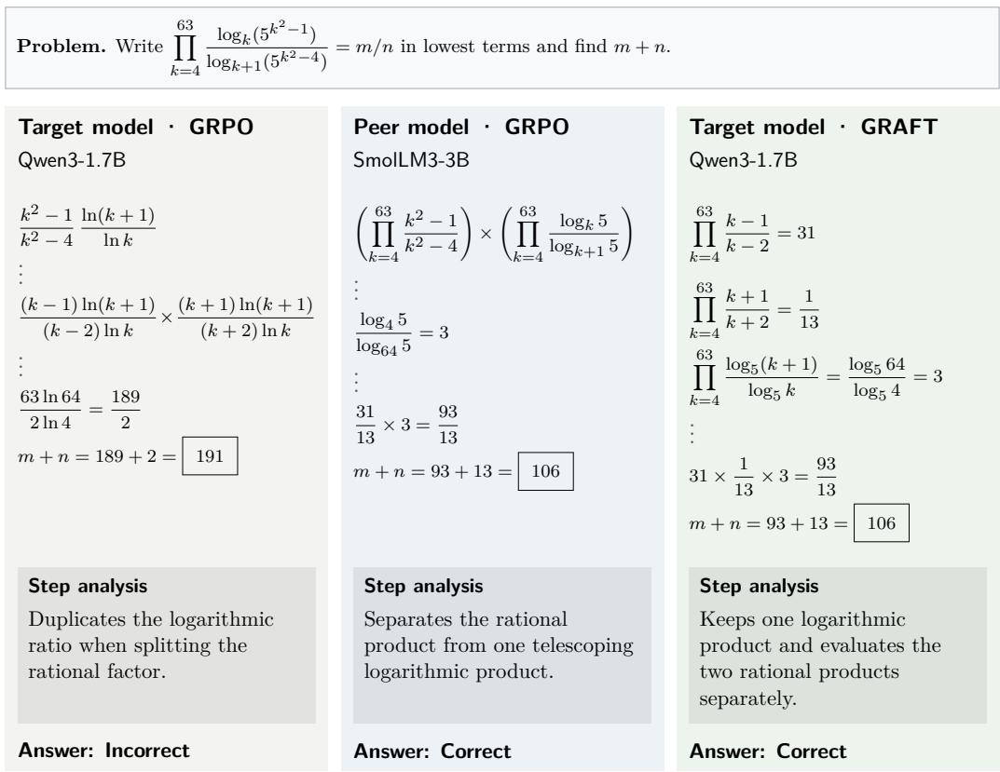  
Figure 8: Separating the rational and logarithmic factors in Qwen3-1.7B (AIME2025). Target GRPO separates the rational and logarithmic factors, then duplicates the logarithmic ratio when factoring the rational term. The peer separates the rational product from a single logarithmic product that telescopes to 3. GRAFT uses the same separation with base-5 logarithms, evaluates the two rational products as 31 and 1/13, and obtains $3 \dot { 1 } \times ( 1 / 1 3 ) \times 3 = 9 3 / 1 \dot { 3 }$ , so $m + n = 1 0 6$

## I.2 SMOLLM3-3B

Case 1. Switching to constrained optimization  
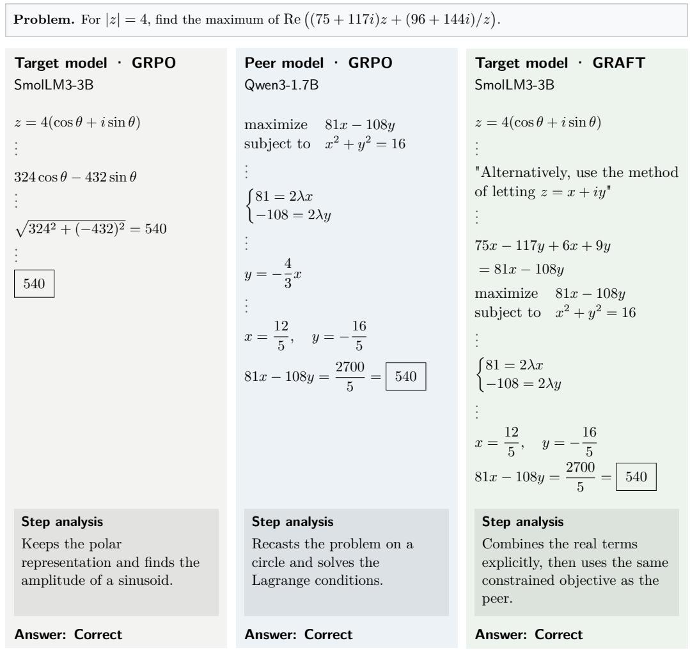  
Figure 9: Cartesian optimization in SmolLM3-3B (AIME2024). Target GRPO uses the polar parameterization to reduce the objective to 324 cos $\theta - 4 3 2 \sin \theta .$ whose maximum is 540. The peer writes $z \ = \ x + i y$ , rewrites the objective as $8 1 x \mathrm { ~ - ~ } 1 0 8 y$ under $x ^ { 2 } + y ^ { 2 } = 1 6 .$ , and solves the constrained problem with Lagrange multipliers. GRAFT starts with the polar parameterization, then switches to $z = x + i y$ , derives the same constrained objective as the peer, and obtains $x = 1 2 / 5$ $y = - 1 6 / 5 .$ , and the maximum 540 from the Lagrange equations.

Case 2. Preserving the of-line height

Problem. Points $A , \ldots , F$ lie in order on a line; G lies of it. Given $A C = 2 6 ,$ BD = 22, CE = 31, DF = 33, $A F = 7 3 , C G = 4 0$ , and $D G = 3 0 ,$ , find the area of BGE.

## Target model · GRPO

## SmolLM3-3B

"Point $\mathrm { G } \colon ( \mathrm { x 6 } , 0 ) ^ { \mathfrak { n } }$

$$
{ } ^ { " } \mathrm { G } = ( \mathrm { g } , 0 ) ^ { " }
$$

"since all points are collinear, the area of triangle BGE is zero if we consider the line as a base. This indicates a misunderstanding in the approach."

## Step analysis

## Peer model · GRPO

Detects its collinear setup error, but does not recover a valid height.

## Qwen3-1.7B

Answer: Incorrect

$$
( x _ { G } - 2 6 ) ^ { 2 } + y _ { G } ^ { 2 } = 1 6 0 0
$$

$$
( x _ { G } - 4 0 ) ^ { 2 } + y _ { G } ^ { 2 } = 9 0 0
$$

$$
2 8 x _ { G } - 9 2 4 = 7 0 0
$$

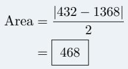

$$
x _ { G } = 5 8 , \quad y _ { G } = \pm 2 4
$$

## Step analysis

Keeps a height variable in both distance equations, then eliminates it.

Answer: Correct

## Target model · GRAFT

$$
G = ( g , h ) , \quad h \neq 0
$$

$$
( g - 2 6 ) ^ { 2 } + h ^ { 2 } = 1 6 0 0
$$

$$
( g - 4 0 ) ^ { 2 } + h ^ { 2 } = 9 0 0
$$

$$
g = 5 8 , \quad h = \pm 2 4
$$

$$
B E = 5 7 - 1 8 = 3 9
$$

$$
{ \mathrm { A r e a } } = { \frac { 3 9 \times 2 4 } { 2 } } = { \overline { { 4 6 8 } } }
$$

## Step analysis

Recovers the same height as the peer, then computes the area from base and height.

Answer: Correct

Figure 10: Recovering the height in SmolLM3-3B (AIME2025). Target GRPO places G on the line containing $A , \ldots , F _ { \mathrm { { i } } }$ , recognizes the resulting collinearity as an error, but does not recover a nonzero height. The peer keeps a vertical coordinate for G in the distance constraints $C G = 4 0$ and $D G = 3 0 .$ , obtains a height of 24, and computes the area as 468 with the shoelace formula. GRAFT places G off the line, uses the two distance constraints to recover a height of 24, and computes the area from $B E = 3 9 \mathrm { a s } { \frac { 3 9 \times 2 4 } { 2 } } = 4 6 8$

Case 3. Taking the square root of the maximum  
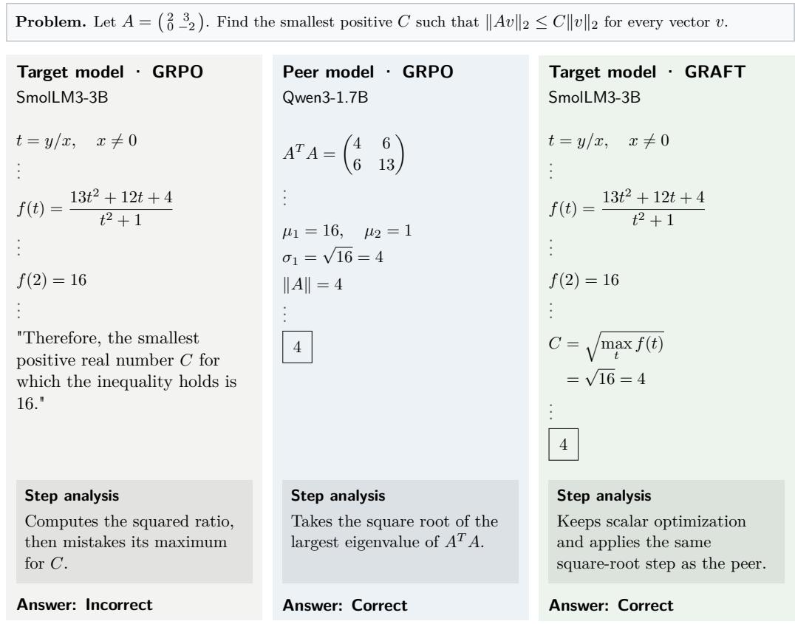  
Figure 11: Recovering the norm from the squared ratio in SmolLM3-3B (MATH500). Target GRPO maximizes the squared norm ratio $f ( t )$ with $t = y / x$ , obtains a maximum of 16, and sets $C = 1 6$ without taking the square root. The peer computes the largest eigenvalue of $A ^ { \top } A$ as 16 and takes its square root to obtain the operator norm $C = 4$ . GRAFT keeps the scalar optimization used by target GRPO and also takes the square root of the resulting maximum to obtain $C = { \sqrt { 1 6 } } = 4$