# LEARNING EXPRESSIVE AND COMPOSITIONAL MO-TION REPRESENTATION VIA SPECTRAL SKILLS

Feiyang Wu1,∗, Chenxiao Gao1,∗, Chen Yang1, Ye Zhao1, Bo Dai1,†, Anqi Wu1,† 1Georgia Institute of Technology

{feiyangwu, cgao, cyang711, yezhao, anqiwu}@gatech.edu ∗Equal contribution. †Equal advising.

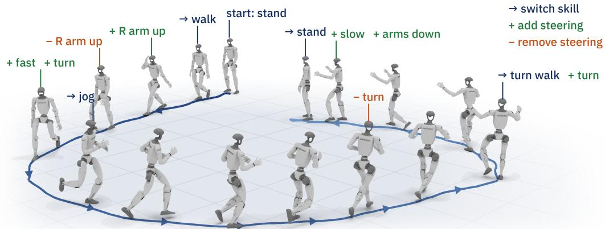  
Figure 1: Skill chaining and composition with one controller. One frozen controller chains skills and adds or removes steering, executing a loop in physics simulation.

## ABSTRACT

Robotic foundation models offer a promising path toward general-purpose humanoid robot control often with hierarchical architectures. However, their effectiveness depends on a command interface between the planner and the controller, which must support accurate execution while remaining easy to predict, and ideally compose new behaviors from prior ones. In this work, we introduce a latent-representation of such interface we term spectral skills, which meets these requirements through predictive representation learning. By design, the spectral skills compactly encodes short motion segments and are learned by predicting subsequent motion rather than reconstructing the encoder’s input. On a 29-DoF humanoid, a controller conditioned on spectral skills reduces global tracking error by 62% relative to the state-of-the-art. The same frozen controller chains independently encoded skills without a separate transition policy. It also composes new behaviors by adding orthogonal directions to any compatible base skill, producing combinations that are unseen from the training data. We demonstrate tracking, chaining and composition, as well as through a languaged conditioned planner on Unitree G1 hardware. Project page: https: //spectral-skill.github.io.

## 1 INTRODUCTION

A central challenge in hierarchical humanoid control is deciding what should be communicated between a high-level behavior model and a low-level whole-body controller (Merel et al., 2018). The high-level model must generate temporally coherent behaviors from abstract task specifications, while the controller must translate these commands into dynamically feasible actions at high frequency. Despite substantial advances in robot learning, modern systems largely preserve this hierarchical structure, replacing both components with learned models. At the high level, Behavior Foundation Models (BFMs), including Vision-Language-Action (VLA) models, learn to generate robot behaviors from large, diverse multimodal datasets. At the low level, reinforcement learning (RL) has emerged as a powerful tool for training robust whole-body controllers at scale (Luo et al., 2026; Wu et al., 2025). Yet the command representation connecting these components remains underexplored. This representation must satisfy two requirements: it must be predictable by the high-level model and expressive enough to support diverse whole-body motions. Therefore we ask: What command representation should a high-level planner use to instruct a whole-body controller?

Classical hierarchical control methods implement this interface as explicit targets with physical meanings, leading to a wide range of interface designs. Some predict explicit full-body trajectories, joint-space targets, or velocity commands (Kaelbling & Lozano-Perez´ , 2011; Kuindersma et al., 2016), while others use lower-dimensional Cartesian targets such as pelvis and end-effector poses (He et al., 2025; 2024). Similar hierarchical interfaces also appear beyond humanoid control, including robot manipulation (Belkhale et al., 2024), dexterous manipulation (Chen et al., 2024), and navigation (Cheng et al., 2024). Explicit interfaces have several appealing properties: they are interpretable, easy to supervise from motion data, and directly connected to conventional control objectives. However, they can also expose the high-level model to the complexity of the robot’s dynamics, especially those that predict robot joint targets, or end-effector Cartesian targets. For example, for a high-degree-of-freedom humanoid, accurately predicting long-horizon joint or Cartesian trajectories can be a difficult learning problem, and the representation is inherently tied to a particular embodiment and command parameterization. Errors made by the high-level are accumulated and passed to the low-level controller, making robust and expressive closed-loop control challenging.

An increasingly popular alternative is to learn a latent interface that compactly represents temporally extended motion sequences. Rather than predicting explicit targets in joint or Cartesian space, the high-level planner predicts a latent representation that conditions a whole-body controller. Existing latent interfaces are typically learned through motion reconstruction or posterior inference (Liang et al., 2025; Peng et al., 2022; Luo et al., 2026). Although these approaches demonstrate that lowdimensional latent spaces can support expressive whole-body behaviors, they leave three important questions open: First, what should the latent interface capture, for example the current pose of the segment or how the body will move next? Second, how should it be learned so that the controller can execute it accurately and the high-level model can predict it reliably? Third, can the latent interface support composition: can new behaviors be built from known skills, the way a person adds a wave to a walk, without data for every combination or retraining the controller?

In this work, we study the latent interface from both sides of the hierarchy: how accurately a lowlevel controller can execute latent commands and how reliably a high-level behavior model can generate them in closed loop. Drawing inspiration from predictive representation learning (Gao et al., 2025) and latent action models (Ye et al., 2025), we introduce spectral skills, a latent interface learned by factorizing the multi-step transition probability of reference motions. The resulting representation preserves information predictive of future motion outcomes, rather than merely reconstructing the motion segment from which it is encoded (Luo et al., 2026). This design yields three key properties. Expressivity: the representation supports accurate and robust tracking across a diverse repertoire of whole-body motions. Efficiency: it can be learned independently of the controller using only offline data and provides a compact prediction target for a high-level behavior model. Compositionality: the spectral skill enters the predictor linearly, so we can read off spectral directions that each change one and only one aspect of the motion, such as raising an arm or turning, and add them to a base skill.

In summary, our contributions in this work are as follows:

• Spectral skills: we train a latent skill space learned offline by predicting the motion that follows a segment.

• Expressive and efficient: conditioned on spectral skills, one controller lowers global tracking error by 62% relative to SOTA with 12× fewer environment steps, and as a language planner’s output, spectral skills raise success from 77.1% to 91.1% over predicting explicit trajectories .

• Composable: the frozen controller composes new skills zero-shot by steering a base skill along spectral directions, producing combinations unseen from the data for the first time in whole body control. Extensive experiments in simulation and on a Unitree G1 in the real world demonstrate the effectiveness of our method.

## 2 RELATED WORK

## 2.1 HUMANOID WHOLE-BODY CONTROL

Recent work in humanoid control has increasingly adopted motion-tracking reinforcement learning (Gu et al., 2026). Rather than crafting task-specific rewards, these approaches learn to follow reference motions retargeted from motion-capture data, by optimizing rewards that encourage the robot to track the reference motion (Chen et al., 2025; Yin et al., 2026; Wang et al., 2026; Luo et al., 2026). At inference time, however, they still require a specification of the desired motion, which is often difficult to specify directly. Existing approaches therefore commonly use a high-level planner to generate reference trajectories or latent representations from language and visual inputs for the low-level policy to track (Jiang et al., 2025; Xie et al., 2026; Tao et al., 2026; Zhang et al., 2026; Peng et al., 2022; Tessler et al., 2023; Luo et al., 2024; Tessler et al., 2024; Yao et al., 2024; Luo et al., 2026; Tirinzoni et al., 2025; Li et al., 2026). The representations serve as commands to the low-level policy, allowing it to produce different behaviors without explicit reference trajectories. The high-level planners can then be supervised by predicting these commands (Xue et al., 2025; Jiang et al., 2026; Luo et al., 2026; Liao et al., 2026; Zeng et al., 2026), which tends to be easier due to the semantic structure and low-frequency nature of these command interfaces. Like these methods, we learn a command space from motion data, but by predicting how motion continues rather than reconstructing it.

## 2.2 PREDICTIVE LATENT REPRESENTATIONS FOR CONTROL

The training procedure for our skill encoder is closely related to approaches that learn representations by factorizing system dynamics. Spectral representation methods (Gao et al., 2025) use a low-rank factorization of the state–action transition kernel to obtain representations that are provably sufficient for downstream reinforcement learning (Ren et al., 2022b; Zhang et al., 2022; Ren et al., 2023a;b; Zhang et al.). DiffSR (Shribak et al., 2024) learns such a factorization as an energybased model through the score of a diffusion model, which captures richer transition distributions. Successor features (Dayan, 1993; Kulkarni et al., 2016; Barreto et al., 2017) instead factorize the cumulative state-visitation operator $( I - \gamma T ^ { \pi } ) ^ { - 1 }$ under a behavior policy π, a multi-step operator, using its left singular vectors as features. Building on this idea, forward–backward representations jointly learn a low-rank factorization of future visitation probabilities and a family of latent-conditioned policies (Touati & Ollivier, 2021). Together, these works show how predictive representations can support reusable behaviors. We factorize the operator one level up the hierarchy: the transition of the high-level semi-MDP, that is, the law of the motion that follows when a skill runs for multiple steps learned with the diffusion recipe of DiffSR.

## 2.3 SKILL COMPOSITION

Composition by adding energies has a long history: a product of experts multiplies densities, so their energies add (Hinton, 2002), and energy-based and diffusion models compose concepts by summing energies or scores during sampling (Du et al., 2020; Liu et al., 2022). Our model is an energy-based model in which the skill enters affinely, so composition happens in the skill space itself: adding spectral directions to a base skill adds their predicted effects. Extracting the directions of largest response from a Jacobian also has a long history. Manipulability analysis uses the singular vectors of a manipulator’s Jacobian (Yoshikawa, 1985), active-subspace methods use the leading eigenvectors of the expected Jacobian Gram of a vector-valued function (Zahm et al., 2020), and in generative models semantic directions are computed in closed form from the first affine layer of a GAN (Shen & Zhou, 2021) or from the pullback metric of a generative model’s decoder (Shao et al., 2017) or of a diffusion model’s features (Park et al., 2023). In these generative models the map from latent space to output is nonlinear, so these directions are exact only for the first layer at best or hold only locally. In our decoder, the response to a skill change does not depend on the skill (Prop. 3.1). For humanoid robots motion composition, Meta Motivo and BFM-Zero condition one policy on a prompt vector for tracking, goal reaching and reward optimization (Tirinzoni et al., 2025; Li et al.,

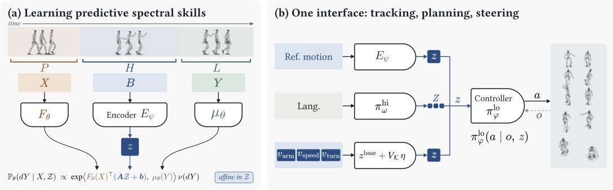  
Figure 2: Overview. (a) An encoder $E _ { \psi }$ maps a state history to a skill z that linearly parameterizes a low-rank transition model. (b) One controller $\pi _ { \theta } ^ { \mathrm { l o } }$ takes this skill from reference tracking, languageconditioned planning, or skill composition.

2026). However such methods are constrained by the existent of frames of the desired composed motion. Whereas spectral directions are extracted from the trained model and have generalization capability across the skill space.

## 3 LEARNING SPECTRAL SKILLS

Preliminaries Figure 2 illustrates the overall framework. We formulate humanoid whole-body control as a hierarchical semi-Markov decision process (SMDP) operating at two time scales. The interface between them, which we call spectral skills, is learned by factorizing transitions in offline motion capture data. Conditioned on a natural-language instruction, the high-level planner selects a skill to execute over an extended horizon; while a low-level policy trained through motion-tracking reinforcement learning converts the skill command into joint actions at a higher frequency.

Formally, consider the low-level MDP $\mathcal { M } ^ { \mathrm { l o } } = ( S , \mathcal { O } , \mathcal { A } , \mathbb { P } ^ { \mathrm { l o } } , r ^ { \mathrm { l o } } , \gamma )$ . At micro step $t ,$ the state $s _ { t } \in$ $\mathbb { R } ^ { 9 3 }$ contains the joint positions and velocities, pelvis velocity, projected gravity, and previous action. The observation $o _ { t }$ is derived from $s _ { t }$ under domain randomization, and the action $a _ { t }$ specifies a full joint command. Given a high-level command or spectral skill $z \in { \mathcal { Z } }$ , the low-level policy selects an action according to $a _ { t } \sim \pi _ { \varphi } ^ { \mathrm { \ln } } ( \cdot | o _ { t } , z )$ , parameterized by $\varphi .$

At macro step $k ,$ with decision time $t _ { k } = k \Delta _ { t }$ , the high-level planner observes a macro state $X _ { k } \in$ X, a window of W recent robot configurations ending at $t _ { k }$ , where $\boldsymbol { x } _ { t } \in \mathbb { R } ^ { n }$ contains the reference motion. It selects a skill $z _ { k } \in \mathcal Z$ , which the low-level policy executes until the next decision, inducing the high-level transition $\mathbb { P } ^ { \mathrm { h i } } ( X _ { k + 1 } \mid X _ { k } , z _ { k } )$ . The window length W and the interval $\Delta _ { t }$ are design choices and consecutive macro states may overlap or leave gaps.

## 3.1 LEARNING SPECTRAL SKILLS FROM FACTORIZED DYNAMICS

We learn the latent spectral skill with an encoder–decoder architecture. The encoder maps an executed motion segment to a compact skill representation, while the decoder combines this representation with the preceding context to predict the subsequent motion.

Let $\mathcal { D } = \{ ( x _ { 1 } ^ { j } , \hdots , x _ { T ^ { j } } ^ { j } ) \} _ { j = 1 } ^ { J }$ be a dataset of J reference trajectories, where $\boldsymbol { x } _ { t } ^ { j } \in \mathbb { R } ^ { n }$ . For a sampled trajectory j and time $t _ { k }$ , we divide the segment $x _ { t _ { k } - P + 1 : t _ { k } + H + L } ^ { j }$ into three consecutive windows:

$$
X _ { k } = x _ { t _ { k } - P + 1 : t _ { k } } ^ { j } , \qquad B _ { k } = x _ { t _ { k } : t _ { k } + H - 1 } ^ { j } , \qquad Y _ { k } = x _ { t _ { k } + H : t _ { k } + H + L } ^ { j } .\tag{1}
$$

Here, $X _ { k }$ is the observed context, $B _ { k }$ is the motion executed under a command, and $Y _ { k }$ is the subsequent motion. The parameters P, H, and L are the context length, command duration, and prediction horizon. The window $Y _ { k }$ contains $L + 1$ states, beginning at the boundary state $x _ { t _ { k } + H } ^ { j } .$ and does not overlap with $B _ { k }$ . All windows are expressed relative to the frame at $\boldsymbol { x } _ { t _ { k } } ^ { j }$ before being passed to the networks.

Encoder. A deterministic encoder maps the executed motion $B _ { k }$ to a latent representation:

$$
\begin{array} { r } { z _ { k } = E _ { \psi } ( B _ { k } ) \in \mathcal { Z } . } \end{array}\tag{2}
$$

We call $z _ { k }$ the spectral skill: a low-d representation of the temporally extended motion in $B _ { k }$

Decoder. The decoder predicts $Y _ { k }$ from the context $X _ { k }$ and skill $z _ { k }$ . Unlike reconstruction-based models such as variational autoencoders, it predicts the future rather than reconstructing $B _ { k }$ . This encourages z to capture the aspects of $B _ { k }$ that determine its future dynamical consequences.

We construct the decoder by factorizing the high-level transition kernel as

$$
\mathsf { P } ( d Y | X , z ) \propto \exp \left( \langle \phi ( X , z ) , \mu ( Y ) \rangle \right) \nu ( d Y ) , \qquad \phi ( X , z ) = F _ { \beta } ( X ) ^ { \top } ( A z + b ) ,\tag{3}
$$

where $\mu ( Y ) \in \mathbb { R } ^ { r }$ represents the outcome and $\phi ( X , z ) ~ \in ~ \mathbb { R } ^ { r }$ represents the context–skill pair. Their inner product measures the compatibility of a future motion with the context and skill (Ren et al., 2022a). The skill enters only through the affine map $A z + b$ , which is critical for learning a composable skill space, as discussed in Section 3.4.

Because the normalizing constant in equation 3 is intractable, we follow Shribak et al. (2024) and learn the decoder through diffusion-based score estimation. Given a noise schedule $\{ ( \alpha _ { \tau } , \sigma _ { \tau } ) \} _ { \tau = 1 } ^ { K } ,$ we sample

$$
Y ^ { \tau } = \alpha _ { \tau } Y + \sigma _ { \tau } \epsilon , \qquad \epsilon \sim { \mathcal { N } } ( 0 , I ) .\tag{4}
$$

The score of equation 3 factorizes as $\nabla _ { Y }$ log $p ( Y | X , z ) = ( \partial \mu ( Y ) / \partial Y ) ^ { \top } \phi ( X , z )$ . Motivated by this structure, we parameterize the noise predictor as

$$
D _ { \theta } ( X , z , Y ^ { \tau } , \tau ) = M _ { \kappa } ( Y ^ { \tau } , \tau ) ^ { \top } F _ { \beta } ( X ) ^ { \top } ( A z + b ) ,\tag{5}
$$

where $F _ { \beta } ( X ) \in \mathbb { R } ^ { e \times r } , M _ { \kappa } ( Y ^ { \tau } , \tau ) \in \mathbb { R } ^ { r \times m } , A \in \mathbb { R } ^ { e \times d } , b \in \mathbb { R } ^ { \epsilon }$ , and $m = n ( L + 1 )$ . The decoder parameters are $\theta = \{ \kappa , \beta , A , b \}$

We jointly train the encoder and decoder using the standard noise-prediction objective:

$$
\begin{array} { r } {  { \mathcal L } _ { \mathrm { p r e d } } ( \psi , \theta ) = {  { \mathbb E } } \left[ \| D _ { \theta } ( X , z , Y ^ { \tau } , \tau ) - \epsilon \| _ { 2 } ^ { 2 } \right] , \qquad \mathrm { w h e r e } \quad z = E _ { \psi } ( B ) . } \end{array}\tag{6}
$$

The resulting z is a predictive representation of motion: the encoder extracts a spectral skill from $B ,$ and the decoder uses it with X to predict Y. Because z enters only through $A z + b$ , both $D _ { \theta }$ and the score estimate $s _ { \theta } = - D _ { \theta } / \sigma _ { \tau }$ are affine in z for fixed $( X , Y ^ { \tau } , \tau )$

## 3.2 LOW-LEVEL MOTION TRACKING AND HIGH-LEVEL PLANNING

Low-level tracking. After achieving the skill encoder with offline data, we freeze the skill encoder and train a 50 Hz controller $\pi _ { \varphi } ^ { \mathrm { l o } }$ with PPO to track reference motions conditioned on given skills. Let $o _ { t }$ be the robot’s proprioceptive observation. At each control step, the controller samples $a _ { t } \sim \pi _ { \varphi } ^ { \mathrm { l o } } ( \cdot | o _ { t } , z _ { t } )$ , where $\boldsymbol { \dot { a } _ { t } } \in \mathbb { R } ^ { 2 9 }$ specifies joint-position commands. During training, reference motions provide both the windows from which the frozen encoder extracts $z _ { t }$ and the targets for the tracking reward. The training environment follows SONIC (Luo et al., 2026); further details are given in Appendix A.1.

High-level planning. The high-level planner maps the robot’s last $Q _ { \mathrm { h i } } = 1 0$ states and a language embedding to a sequence of $N _ { \mathrm { h i } }$ skill commands:

$$
p _ { \eta } ^ { \mathrm { h i } } ( Z _ { t } | h _ { t } , \ell ) , \qquad h _ { t } = o _ { t - Q _ { \mathrm { h i } } + 1 : t } , \qquad Z _ { t } = ( z _ { t } , \dots , z _ { t + N _ { \mathrm { h i } } - 1 } ) .\tag{7}
$$

We train the planner using the conditional flow-matching objective and GR00T action-head architecture (Bjorck et al., 2025). Each training target is a reference skill sequence $\begin{array} { r l } { Z _ { t } ^ { \star } } & { { } = } \end{array}$ $\big ( z _ { t } ^ { \star } , \ldots , z _ { t + N _ { \mathrm { h i } } - 1 } ^ { \star } \big )$ , where $z _ { t + j } ^ { \star } = E _ { \psi } ( B _ { t + j } ^ { \mathrm { o b s } } )$ ) is computed by the frozen encoder from the reference states $x _ { t + j }$ . Since $h _ { t }$ consists of $o _ { t }$ , the planner is conditioned on the robot’s actual observation history rather than the reference trajectory $x ,$ enabling closed-loop autonomous planning.

During inference, the planner samples $\hat { Z } _ { t } \ = \ ( \hat { z } _ { t } , \dotsc , \hat { z } _ { t + N _ { \mathrm { h i } } - 1 } ) \ \sim p _ { \eta } ^ { \mathrm { h i } } ( \cdot \vert h _ { t } , \ell )$ . The low-level controller executes the first $N \leq N _ { \mathrm { h i } }$ skills, one per control step, $a _ { t + j } \sim \pi _ { \varphi } ^ { \mathrm { l o } } \left( \cdot \vert o _ { t + j } , \hat { z } _ { t + j } \right) , 0 \leq$ $j < N$ , after which the planner is called again at $t + N$ with the updated state history.

## 3.3 SKILL COMPOSITION THROUGH SPECTRAL STEERING

So far a spectral skill describes a motion we have seen: the controller tracks the skill of a walking clip and the robot walks. Humans, however, rarely reuse a motion as is. We wave while walking, turn while carrying a box, or lift our feet higher on uneven ground, and we do so without having practised every combination. Could a robot achieve the same? Could we take a base skill, change one or several aspect(s) of it, such as raising an arm, and leaving the rest of the motion intact, without new data and without retraining the controller?

Neither explicit joint targets nor a generic learned skill space supports this directly. Explicit joint targets must be changed in joint space, oftentimes outside the controller’s model of the motion, so the change may compete with the controller instead of being carried out. In a generic learned skill space, the map from skills to motion is nonlinear and usually unknown, so neither the direction nor the size of a useful change is tractable.

Our model avoids both, because of the design choice in Section 3.1: the skill enters the predictor only through the affine map $A z + b$ (equation 5).

Skill composition. Fix a context $\xi = ( X , Y ^ { \tau } , \tau )$ with $\alpha _ { \tau } ~ > ~ 0$ . From one denoising step, the model’s estimate of the clean future motion is $\widehat { Y } _ { \xi } ( z ) = ( Y ^ { \tau } - \sigma _ { \tau } D _ { \theta } ( X , z , Y ^ { \tau } , \tau ) ) / \alpha _ { \tau }$ . Since $D _ { \theta }$ is affine in z, so is this estimate, and the effect of any change of the skill has a closed form.

Proposition 3.1 (Exact latent response). For any fixed context $\xi ,$ the Jacobian of the denoised estimate with respect to the skill is

$$
\begin{array} { r } { J _ { \xi } : = \frac { \partial \widehat { Y } _ { \xi } } { \partial z } = - \frac { \sigma _ { \tau } } { \alpha _ { \tau } } M _ { \kappa } ( Y ^ { \tau } , \tau ) ^ { \top } F _ { \beta } ( X ) ^ { \top } A . } \end{array}\tag{8}
$$

It is independent $o f z .$ . Consequently, for every $\delta z \in \mathbb { R } ^ { d } , \widehat { Y } _ { \xi } ( z + \delta z ) - \widehat { Y } _ { \xi } ( z ) = J _ { \xi } \delta z .$

So in a given context, moving the skill by $\delta z$ moves the predicted future by exactly $J _ { \xi } \delta z$ , whatever the base skill. The identity concerns one denoising prediction at a fixed context. It does not claim that the full diffusion sampler, or the robot’s executed motion, is globally linear; how closely the robot follows the prediction is measured in Section 4.2. The proof is in Appendix A.2.

Spectral Directions. The Jacobian gives the effect of any change, but not which changes are useful. We look for directions in skill space that change the predicted motion strongly across many situations, not just in one. To do this, we sample $N$ contexts from recorded motions and average the squared response into the response Gram matrix

$$
C = \frac { 1 } { N } \sum _ { i = 1 } ^ { N } { J _ { \xi _ { i } } ^ { \top } J _ { \xi _ { i } } } .\tag{9}
$$

so that $v ^ { \top } C v$ is the mean squared change in the predicted motion caused by a unit step $v .$ The best such directions are its eigenvectors, which we call them Spectral Directions.

Definition 3.2 (Spectral Directions). Let $\left( \lambda _ { k } , v _ { k } \right)$ be the eigenpairs of $C ,$ ordered so that $\lambda _ { 1 } \geq$ $\cdots \geq \lambda _ { d } \geq 0 \mathrm { ~ }$ , with orthonormal eigenvectors. Then $v _ { k } \in \mathrm { ~ \frac ~ { ~ \pi ~ a r g ~ m a x ~ \pi ~ } ~ { ~ \frac ~ { 1 } { ~ N } ~ } ~ } \sum _ { i = 1 } ^ { N } \| J _ { \xi _ { i } } v \| _ { 2 } ^ { 2 }$ ∥v∥2=1 v⊥v1,...,vk−1

and the maximum equals $\lambda _ { k }$ . Equivalently, the $v _ { k }$ are the right singular vectors of the vertically stacked Jacobians, scaled by $1 / \sqrt { N }$

Note that $v _ { k }$ come from the trained model alone, without labels. The eigenvalue ranks a direction by how much it changes the predicted motion, not by how useful it is, so we examine directions across the whole spectrum and find what each one does by executing it with the frozen controller. Many turn out to change one recognizable thing: one arm rises, the feet lift higher, or the robot turns.

Composition is addition. With spectral directions in hand, composing a new skill is simple. Given a base skill stream $z _ { t } ^ { \mathrm { b a s e } }$ , for instance the codes of a walking clip, a set of directions $V _ { \mathcal { K } } = [ v _ { k } ] _ { k \in \mathcal { K } } .$ and time-varying amplitudes $\boldsymbol { \eta } ( t ) \in \mathbb { R } ^ { K \times 1 }$ , we steer the base skill as

$$
z _ { t } ^ { \mathrm { s t e e r } } = z _ { t } ^ { \mathrm { b a s e } } + V _ { K } \eta ( t ) .\tag{10}
$$

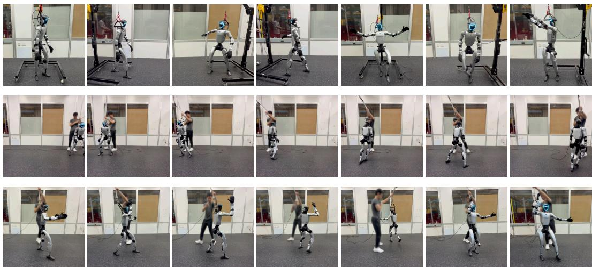  
Figure 3: Real-robot deployment of the frozen controller on a Unitree G1. Top: tracking diverse whole-body motions. Middle: skill chaining, a side step, a 180◦ turn and another side step, by switching skill codes. Bottom: knobs composed on one base skill. From left to right: base; right arm up; right arm up with increasing left turns (three panels) and increasing right turns (two panels) with each instance being a separate trajectory.

Each component of η(t) turns one direction on, off, up or down while the base skill continues, and by Proposition 3.1 the predicted effects of several directions add. Steering a walk with the arm direction and the turn direction, for example, asks for a turning walk with the arm raised, a combination the controller never saw as one clip. Similar motion exist, which is why the controller can still execute it, but the dataset does not contain motions that produce the steered skill exactly.

## 4 EXPERIMENTS

We evaluate whether spectral skills are expressive enough to drive whole-body motion in simulation and on hardware (Section 4.1); whether they are composable, i.e., whether steering a base skill with spectral directions produces new skills (Section 4.2); and whether the hierarchy could benefit a language-conditioned planner to predict these skills (Section 4.3). All experiments use a 29-DoF Unitree G1, simulated in Isaac Lab (Mittal et al., 2023) with the Newton/MuJoCo-Warp backend (Todorov et al., 2012) for tracking and planning and PhysX for rendering chaining and composition. Reference motions are the 129,785 BONES-SEED clips (Bones Studio, 2026) re leased with SONIC (Luo et al., 2026), with its G1 retargeting; the skill encoder is pretrained and frozen. Hardware, composition, and most chaining runs use a deployment version of the tracking controller, trained further with hardware-oriented regularization. We report success rate (SR) and mean per-joint position error in the root and world frames (MPJPE-L, MPJPE-G).

## 4.1 EXPRESSIVE SKILLS

Lower tracking error than SONIC. Conditioned on spectral skills, our controller tracks more accurately than the released SONIC tracker (Luo et al., 2026), evaluated under identical settings on a 124-motion capability set and 4,096 motions across the corpus (Table 1; Appendix C). The table also lists SONIC’s reported numbers (its MPJPE is our MPJPE-L) for itself, Any2Track (Zhang et al., 2025) and BeyondMimic (Liao et al., 2026). On both sets our controller lowers MPJPE-L by 23% and MPJPE-G by 62–63%; on the 4096-motion set its SR is 0.6 points lower, trading a little robustness on the hardest motions for trajectory

Table 1: Whole-body tracking. 1Reported by SONIC on its own evaluation sets, not on these clips.
<table><tr><td>Method</td><td></td><td>SR ↑ MPJPE-L ↓ MPJPE-G ↓</td><td></td></tr><tr><td>Any2Track¹ BeyondMimic¹</td><td>69.4 85.4</td><td>≈60 39.1</td><td>一</td></tr><tr><td>SONIC¹</td><td>99.2</td><td>23.8</td><td>一</td></tr><tr><td>124-motion capability set</td><td></td><td></td><td></td></tr><tr><td>SONIC</td><td>100.00</td><td>23.79</td><td>173.92</td></tr><tr><td>Ours</td><td>100.00</td><td>18.22</td><td>65.06</td></tr><tr><td>4096-motion evaluation set</td><td></td><td></td><td></td></tr><tr><td>SONIC</td><td>98.88</td><td>26.74</td><td>187.86</td></tr><tr><td>Ours</td><td>98.27</td><td>20.54</td><td>70.51</td></tr></table>

Table 2: Effects on the walk base at a=2 in Isaac PhysX.
<table><tr><td>Direction</td><td>Measured effect</td><td>Direction</td><td>Measured effect</td></tr><tr><td>Left arm raise</td><td>shoulder pitch ±0.86 rad</td><td>Arms out</td><td>roll +0.45 rad/side, +0.43 (carry)</td></tr><tr><td>Both arms</td><td>shoulder pitch ±0.67 rad</td><td>High steps</td><td>swing apex 15 → 36 cm (L), 14 → 32 (R)</td></tr><tr><td>Right arm raise</td><td>shoulder pitch ±0.90 rad</td><td>Turn</td><td> $\pm 1 3 0 ^ { \circ } \mathrm { i n } 4 \mathrm { s }$ </td></tr><tr><td>Right arm yaw</td><td>shoulder  $\mathrm { \ y a w \pm 0 . 4 3 - 0 . 5 1 r a d ^ { \dagger } }$ </td><td>Speed</td><td>+0.33 m/s, 6° heading change (a=3)</td></tr></table>

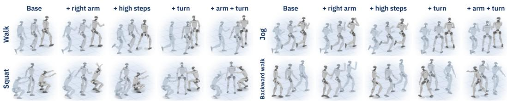  
Figure 4: One controller, many composed skills. Rows: base skills (walk, jog, squat, backward walk); columns: knobs added to the same frozen controller.

fidelity. SONIC reproduces body configurations accurately but drifts from the commanded trajectory; root drift is 98% of its squared global error (Appendix E). Our lower drift is consistent with a representation trained to predict how motion progresses over long horizons, and matched-budget ablations point to predictive supervision as the main source of the gain. Our controller was trained on one GPU for $5 . 0 \times 1 0 ^ { 1 0 }$ simulated frames, about 12× fewer than SONIC. Additionally, we conduct extensive ablation studies on the design choicesin Appendix D.

Skill chaining. A controller that tracks skills can also chain them: switching the skill sequence from one motion to another mid-run moves the robot from one behavior to the next. On the real robot, the deployment controller tracks diverse motions and chains a side step, a 180◦ turn and another side step (Figure 3, top and middle). In simulation, we compare the smoothness of such switches between our controller and SONIC, given the same motion sequences. We run 42 chained sequences, in which each switch from one motion to the next takes between 2 and 30 control steps, and measure the root-mean-square joint acceleration during the switches (lower is smoother). Our switches are smoother in 36 of the 42 sequences, including all 13 that switch within two steps.

## 4.2 COMPOSABLE SKILLS

When steer a motion, the deployment controller and encoder stay frozen; a base clip is encoded into its base skill sequence $z _ { t } ^ { \mathrm { b a s e } }$ , which we steer by adding spectral directions with steering amplitude η (Equation 10), and each steered run is compared with the unsteered run of the same base. The five bases (walk, jog, squat, carry, backward walk) differ in contact pattern (Appendix G.1).

Steering. Adding a spectral direction to a base skill mainly changes one attribute while the base motion continues (Table 2, Figure 4). The right-arm direction raises the arm while the walk continues; the turn direction turns the walk and barely moves the arms. Steering also works on the real robot (Figure 3, bottom). Effects add up: two directions held together change the joints like the sum of their single-direction changes. Whether a direction exhibits a clear, opposite effect in the two signs without falling depends on the base. Of 19 sampled spectral directions, 13 directions can be cleanly applied on the walk skill while 7 on the squat skill, and five arm directions among them can be applied on all five bases (see Appendix G for more detail). Additionally we provide negative results on the baseline methods from BFM-zero and SONIC in the Appendix F.

Latent space analysis. Figure 5 checks whether steering only retrieves motions that already exist in the training data. Panels (a) and (b) are maps of the training clips (corpus): each dot is one clip, placed so that clips with similar skills lie close together (t-SNE), and colored by the kind of motion in its name; (b) enlarges the corner where walks concentrate. Panels (c)–(d) follow one walk that we steer along the arm, turn and high-steps directions, added one at a time and then released. In (c), the axes are the skill’s coordinates along the arm and turn directions: the steered skill moves right when the arm direction is added and up when the turn is added, and ends outside the regions where corpus walks that raise an arm or turn are most common (colored contours). In (d), the curve is the distance in the map from the robot’s motion to the nearest corpus motion cluster over time: it rises with each added direction and falls back after the release, while the unsteered walk (dashed) stays at a typical distance towards the cluster center.

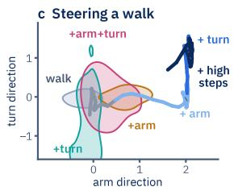

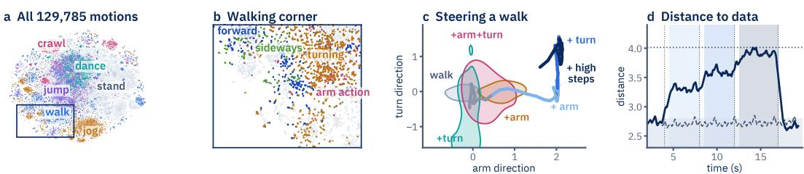

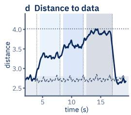  
Figure 5: Steering composes skills rarely seen in the data. (a) Map of all 129,785 training clips (t-SNE), colored by motion kind; (b) walking corner. (c)–(d) One walk steered along the arm, turn and high-steps directions: (c) steered skill on the arm and turn directions, with contours of corpus walks that raise an arm or turn; (d) distance of the robot’s motion to the corpus (dashed: unsteered) and corpus windows showing each combination.

## 4.3 LANGUAGE-CONDITIONED PLANNING

Skills can also serve as the action space of a highlevel planner. We evaluate whether z provides a better interface between planning and tracking than explicit robot observations o. In all routes, the planner predicts $N _ { \mathrm { h i } } ~ = ~ 3 0$ commands, the controller executes the first N, and the planner then replans from the updated robot history. Table 3 compares three routes, denoted by planner output → controller input, using the same planner architecture and training budget.

Skills $( z \ \to \ z ) .$ . The planner predicts a skill sequence $\hat { Z } _ { t } ~ = ~ \left( \hat { z } _ { t } , \dots , \hat { z } _ { t + N _ { \mathrm { h i } } - 1 } \right)$ , and the continuous latent controller directly executes $\boldsymbol { a } _ { t + j }$ ∼ $\pi _ { \varphi } ^ { \mathrm { l o } } ( \cdot | o _ { t + j } , \hat { z } _ { t + j } )$

Table 3: Language-conditioned planning interfaces. Arrows denote planner output → tracker command; z is skill and o is explicit root-andjoint frame. L/G: local/global MPJPE (mm).
<table><tr><td>Interface N L↓ G↓</td></tr><tr><td>SR↑ Skill tracker: 256-D z, hold 1</td></tr><tr><td>Oracle 17.19 51.7 1.000 Skills (z → z) 30 38.41 251.2 0.914</td></tr><tr><td>Skills (z→z) 10 42.83 230.2 0.911 Re-encode (o → z) 10 60.19 425.1 0.771 Re-encode (o→z) 21 88.64 796.8 0.546</td></tr><tr><td>Explicit tracker: 38-D o, no encoder</td></tr><tr><td>Oracle 17.64 1.000 Explicit  $( o \to o )$  10 116.46 704.9 0.525 Explicit  $( o \to o )$  30 117.42 707.1 0.516</td></tr></table>

Explicit re-encode $( o  z ) .$ The planner instead predicts 30 explicit root-pose and joint-position frames $\hat { O } _ { t } = ( \hat { o } _ { t } , \dots , \hat { o } _ { t + 2 9 } )$ . At step $t + j ,$ , the frozen encoder converts the predicted 10-frame window into $\hat { z } _ { t + j } = E _ { \psi } \big ( \hat { o } _ { t + j : t + j + 9 } \big )$ , which is then passed to the same continuous latent controller. Because each window must lie within the predicted chunk, this route supports only $N \leq 2 1$

Explicit-to-explicit $( o \ \to \ o ) .$ The planner again predicts $\hat { O } _ { t }$ , but a controller trained without an encoder directly executes one predicted frame per step: $a _ { t + j } \sim \pi _ { \varphi } ^ { \mathrm { e x p } } ( \cdot \vert o _ { t + j } , \hat { o } _ { t + j } )$ . Its planner is trained on rollouts from a separately trained explicit controller and is therefore not collectionmatched with the other routes. For each controller, the oracle replaces planner with the corresponding commands derived directly from the reference motion x, providing an upper bound on tracking.

At the matched replanning interval $N = 1 0$ , Skills reduces MPJPE-L by 29% relative to Explicit re-encode and improves success from 77.1% to 91.1%; Explicit-to-explicit achieves only 52.5% success. As N increases, MPJPE-L decreases for Skills but increases for Explicit re-encode. The ordering reverses at $N = 1$ (50.76 vs. 41.64 mm and 84.3% vs. 94.5% success), indicating that explicit predictions are effective under frequent replanning, whereas skills provide a more compact and robust interface over longer horizons. We also deploy the skill-based planner on hardware, where it produces smooth motion; videos are available on the project website.

## 5 CONCLUSIONS

We introduced spectral skills, a command space for humanoid whole-body control learned by predicting how motion continues, with the skill entering the predictor affinely. A controller conditioned on these skills tracks diverse motions with lower global error than SONIC and serves as the action space of a language-conditioned planner, and steering a base skill along spectral directions compose new skills that are rare in the data, without retraining.

## AI USE STATEMENT

In this work, we used generative AI tools to assist in the writing of the paper and assist in translation.

We have not used generative AI tools to generate synthetic datasets, help develop theoretical models or conceptual frameworks, formulate mathematical claims, provide critical ingredients for proving mathematical claims, propose or refine hypotheses, design or provide feedback on research methodology or experiments, implement methods, clean and reformat datasets, support qualitative and thematic data analysis, or interpret results.

Additionally, we used generative AI tools to organize and improve the visualization of the experiment results.

We reviewed all AI-assisted content, including text and figures, to ensure that it accurately reflects the paper’s ideas and underlying data. We take full responsibility for the final content of this work, including any text, claims, or artifacts produced with the aid of generative AI.

## REPRODUCIBILITY STATEMENT

We provide complete details of the model architecture, training objectives, reward design, environment configuration, and evaluation protocol in Appendix. Hyperparameters and additional ablations are also provided. We will release the training and evaluation code upon publication.

## REFERENCES

Andre Barreto, Will Dabney, R´ emi Munos, Jonathan J Hunt, Tom Schaul, Hado P van Hasselt,´ and David Silver. Successor features for transfer in reinforcement learning. Advances in Neural Information Processing Systems (NeurIPS), 30, 2017.

Suneel Belkhale, Tianli Ding, Ted Xiao, Pierre Sermanet, Quon Vuong, Jonathan Tompson, Yevgen Chebotar, Debidatta Dwibedi, and Dorsa Sadigh. Rt-h: Action hierarchies using language. arXiv preprint arXiv:2403.01823, 2024.

Johan Bjorck, Fernando Castaneda, Nikita Cherniadev, Xingye Da, Runyu Ding, Linxi Fan,˜ Yu Fang, Dieter Fox, Fengyuan Hu, Spencer Huang, et al. Gr00t n1: An open foundation model for generalist humanoid robots. arXiv preprint arXiv:2503.14734, 2025.

Bones Studio. BONES-SEED: Skeletal Everyday Embodied Dataset. https://bones. studio/datasets/seed, 2026. Accessed: 2026.

Yuanpei Chen, Chen Wang, Yaodong Yang, and C Karen Liu. Object-centric dexterous manipulation from human motion data. arXiv preprint arXiv:2411.04005, 2024.

Zixuan Chen, Mazeyu Ji, Xuxin Cheng, Xuanbin Peng, Xue Bin Peng, and Xiaolong Wang. Gmt: General motion tracking for humanoid whole-body control. arXiv preprint arXiv:2506.14770, 2025.

An-Chieh Cheng, Yandong Ji, Zhaojing Yang, Zaitian Gongye, Xueyan Zou, Jan Kautz, Erdem Bıyık, Hongxu Yin, Sifei Liu, and Xiaolong Wang. Navila: Legged robot vision-language-action model for navigation. arXiv preprint arXiv:2412.04453, 2024.

Peter Dayan. Improving generalization for temporal difference learning: The successor representation. Neural computation, 5(4):613–624, 1993.

Yilun Du, Shuang Li, and Igor Mordatch. Compositional visual generation with energy based models. Advances in Neural Information Processing Systems, 33:6637–6647, 2020.

Chenxiao Gao, Haotian Sun, Na Li, Dale Schuurmans, and Bo Dai. Spectral representation-based reinforcement learning. arXiv preprint arXiv:2512.15036, 2025.

Zhaoyuan Gu, Junheng Li, Wenlan Shen, Wenhao Yu, Zhaoming Xie, Stephen McCrory, Xianyi Cheng, Abdulaziz Shamsah, Robert Griffin, C Karen Liu, et al. Humanoid locomotion and manipulation: Current progress and challenges in control, planning, and learning. IEEE/ASME Transactions on Mechatronics, 31(2):2300–2330, 2026.

Tairan He, Zhengyi Luo, Xialin He, Wenli Xiao, Chong Zhang, Weinan Zhang, Kris Kitani, Changliu Liu, and Guanya Shi. Omnih2o: Universal and dexterous human-to-humanoid whole body teleoperation and learning. arXiv preprint arXiv:2406.08858, 2024.

Tairan He, Wenli Xiao, Toru Lin, Zhengyi Luo, Zhenjia Xu, Zhenyu Jiang, Jan Kautz, Changliu Liu, Guanya Shi, Xiaolong Wang, et al. Hover: Versatile neural whole-body controller for humanoid robots. In 2025 IEEE International Conference on Robotics and Automation (ICRA), pp. 9989– 9996. IEEE, 2025.

Geoffrey E Hinton. Training products of experts by minimizing contrastive divergence. Neural computation, 14(8):1771–1800, 2002.

Haoran Jiang, Jin Chen, Qingwen Bu, Li Chen, Modi Shi, Yanjie Zhang, Delong Li, Chuanzhe Suo, Hongyang Li, et al. Wholebodyvla: Towards unified latent vla for whole-body loco-manipulation control. In International Conference on Learning Representations, volume 2026, pp. 157438– 157461, 2026.

Nan Jiang, Zimo He, Wanhe Yu, Lexi Pang, Yunhao Li, Hongjie Li, Jieming Cui, Yuhan Li, Yizhou Wang, Yixin Zhu, et al. Uniact: Unified motion generation and action streaming for humanoid robots. arXiv preprint arXiv:2512.24321, 2025.

Leslie Pack Kaelbling and Tomas Lozano-P´ erez. Hierarchical task and motion planning in the now.´ In 2011 IEEE international conference on robotics and automation, pp. 1470–1477. IEEE, 2011.

Scott Kuindersma, Robin Deits, Maurice Fallon, Andres Valenzuela, Hongkai Dai, Frank Perme-´ nter, Twan Koolen, Pat Marion, and Russ Tedrake. Optimization-based locomotion planning, estimation, and control design for the atlas humanoid robot. Autonomous robots, 40(3):429–455, 2016.

Tejas D Kulkarni, Ardavan Saeedi, Simanta Gautam, and Samuel J Gershman. Deep successor reinforcement learning. arXiv preprint arXiv:1606.02396, 2016.

Yitang Li, Zhengyi Luo, Tonghe Zhang, Cunxi Dai, Anssi Kanervisto, Andrea Tirinzoni, Haoyang Weng, Kris Kitani, Mateusz Guzek, Ahmed Touati, et al. Bfm-zero: A promptable behavioral foundation model for humanoid control using unsupervised reinforcement learning. In International Conference on Learning Representations, volume 2026, pp. 79697–79725, 2026.

Anthony Liang, Pavel Czempin, Matthew M Hong, Yutai Zhou, Jingzhen Wang, Erdem Biyik, and Stephen Tu. Clam: Continuous latent action models for robot learning from unlabeled demonstrations. arXiv preprint arXiv:2505.04999, 2025.

Qiayuan Liao, Takara E Truong, Xiaoyu Huang, Yuman Gao, Guy Tevet, Koushil Sreenath, and C Karen Liu. Beyondmimic: From motion tracking to versatile humanoid control via guided diffusion. Science Robotics, 11(117):eadx8924, 2026.

Nan Liu, Shuang Li, Yilun Du, Antonio Torralba, and Joshua B Tenenbaum. Compositional visual generation with composable diffusion models. In European conference on computer vision, pp. 423–439. Springer, 2022.

Zhengyi Luo, Jinkun Cao, Josh Merel, Alexander Winkler, Jing Huang, Kris Kitani, and Weipeng Xu. Universal humanoid motion representations for physics-based control. In International Conference on Learning Representations, volume 2024, pp. 56766–56782, 2024.

Zhengyi Luo, Ye Yuan, Tingwu Wang, Chenran Li, Fernando Castaneda, Sirui Chen, Zi-Ang Cao,˜ Jiefeng Li, David Minor, Qingwei Ben, et al. Sonic: Supersizing motion tracking for natural humanoid whole-body control. Science Robotics, 11(117):eaed4592, 2026.

Josh Merel, Leonard Hasenclever, Alexandre Galashov, Arun Ahuja, Vu Pham, Greg Wayne, Yee Whye Teh, and Nicolas Heess. Neural probabilistic motor primitives for humanoid control. arXiv preprint arXiv:1811.11711, 2018.

Mayank Mittal, Calvin Yu, Qinxi Yu, Jingzhou Liu, Nikita Rudin, David Hoeller, Jia Lin Yuan, Ritvik Singh, Yunrong Guo, Hammad Mazhar, Ajay Mandlekar, Buck Babich, Gavriel State, Marco Hutter, and Animesh Garg. Orbit: A unified simulation framework for interactive robot learning environments. IEEE Robotics Autom. Lett., 8(6):3740–3747, 2023. doi: 10.1109/LRA. 2023.3270034. URL https://doi.org/10.1109/LRA.2023.3270034.

Yong-Hyun Park, Mingi Kwon, Jaewoong Choi, Junghyo Jo, and Youngjung Uh. Understanding the latent space of diffusion models through the lens of riemannian geometry. Advances in Neural Information Processing Systems, 36:24129–24142, 2023.

Xue Bin Peng, Yunrong Guo, Lina Halper, Sergey Levine, and Sanja Fidler. Ase: Large-scale reusable adversarial skill embeddings for physically simulated characters. ACM Transactions On Graphics (TOG), 41(4):1–17, 2022.

Tongzheng Ren, Tianjun Zhang, Lisa Lee, Joseph E Gonzalez, Dale Schuurmans, and Bo Dai. Spectral decomposition representation for reinforcement learning. arXiv preprint arXiv:2208.09515, 2022a.

Tongzheng Ren, Tianjun Zhang, Csaba Szepesvari, and Bo Dai. A free lunch from the noise: Prov- ´ able and practical exploration for representation learning. In Uncertainty in Artificial Intelligence (UAI), pp. 1686–1696. PMLR, 2022b.

Tongzheng Ren, Chenjun Xiao, Tianjun Zhang, Na Li, Zhaoran Wang, Sujay Sanghavi, Dale Schu urmans, and Bo Dai. Latent variable representation for reinforcement learning. In The Eleventh International Conference on Learning Representations (ICLR). OpenReview.net, 2023a.

Tongzheng Ren, Tianjun Zhang, Lisa Lee, Joseph E. Gonzalez, Dale Schuurmans, and Bo Dai. Spectral decomposition representation for reinforcement learning. In The Eleventh International Conference on Learning Representations (ICLR). OpenReview.net, 2023b.

Hang Shao, Abhishek Kumar, and P. Thomas Fletcher. The riemannian geometry of deep generative models, 2017. URL https://arxiv.org/abs/1711.08014.

Yujun Shen and Bolei Zhou. Closed-form factorization of latent semantics in gans. In 2021 IEEE/CVF Conference on Computer Vision and Pattern Recognition (CVPR), pp. 1532–1540. IEEE, 2021.

Dmitry Shribak, Chen-Xiao Gao, Yitong Li, Chenjun Xiao, and Bo Dai. Diffusion spectral representation for reinforcement learning. Advances in Neural Information Processing Systems, 37: 110028–110056, 2024.

Zelin Tao, Zeran Su, Peiran Liu, Jingkai Sun, Wenqiang Que, Jiahao Ma, Jialin Yu, Jiahang Cao, Pihai Sun, Hao Liang, et al. Heracles: Bridging precise tracking and generative synthesis for general humanoid control. arXiv preprint arXiv:2603.27756, 2026.

Chen Tessler, Yoni Kasten, Yunrong Guo, Shie Mannor, Gal Chechik, and Xue Bin Peng. Calm: Conditional adversarial latent models for directable virtual characters. In ACM SIGGRAPH 2023 conference proceedings, pp. 1–9, 2023.

Chen Tessler, Yunrong Guo, Ofir Nabati, Gal Chechik, and Xue Bin Peng. Maskedmimic: Unified physics-based character control through masked motion inpainting. ACM Transactions On Graphics (TOG), 43(6):1–21, 2024.

Andrea Tirinzoni, Ahmed Touati, Jesse Farebrother, Mateusz Guzek, Anssi Kanervisto, Yingchen Xu, Alessandro Lazaric, and Matteo Pirotta. Zero-shot whole-body humanoid control via behavioral foundation models. In International Conference on Learning Representations, volume 2025, pp. 21693–21748, 2025.

Emanuel Todorov, Tom Erez, and Yuval Tassa. Mujoco: A physics engine for model-based control. In 2012 IEEE/RSJ international conference on intelligent robots and systems, pp. 5026–5033. IEEE, 2012.

Ahmed Touati and Yann Ollivier. Learning one representation to optimize all rewards. Advances in Neural Information Processing Systems, 34:13–23, 2021.

Yunshen Wang, Shaohang Zhu, Peiyuan Zhi, Yuhan Li, Jiaxin Li, Yong-Lu Li, Yuchen Xiao, Xingxing Wang, Baoxiong Jia, and Siyuan Huang. Omnixtreme: Breaking the generality barrier in high-dynamic humanoid control. arXiv preprint arXiv:2602.23843, 2026.

Feiyang Wu, Xavier Nal, Jaehwi Jang, Wei Zhu, Zhaoyuan Gu, Anqi Wu, and Ye Zhao. Learn to teach: Sample-efficient privileged learning for humanoid locomotion over real-world uneven terrain. IEEE Robotics and Automation Letters, 10(9):9048–9055, 2025.

Weiji Xie, Jiakun Zheng, Jinrui Han, Jiyuan Shi, Weinan Zhang, Chenjia Bai, and Xuelong Li. Textop: Real-time interactive text-driven humanoid robot motion generation and control. arXiv preprint arXiv:2602.07439, 2026.

Haoru Xue, Xiaoyu Huang, Dantong Niu, Qiayuan Liao, Thomas Kragerud, Jan Tommy Gravdahl, Xue Bin Peng, Guanya Shi, Trevor Darrell, Koushil Sreenath, et al. Leverb: Humanoid whole body control with latent vision-language instruction. arXiv preprint arXiv:2506.13751, 2025.

Heyuan Yao, Zhenhua Song, Yuyang Zhou, Tenglong Ao, Baoquan Chen, and Libin Liu. Moconvq: Unified physics-based motion control via scalable discrete representations. ACM Transactions On Graphics (TOG), 43(4):1–21, 2024.

Seonghyeon Ye, Joel Jang, Byeongguk Jeon, Se June Joo, Jianwei Yang, Baolin Peng, Ajay Mandlekar, Reuben Tan, Yu-Wei Chao, Bill Yuchen Lin, et al. Latent action pretraining from videos. In International Conference on Learning Representations, volume 2025, pp. 28213–28239, 2025.

Kangning Yin, Weishuai Zeng, Ke Fan, Minyue Dai, Zirui Wang, Qiang Zhang, Zheng Tian, Jingbo Wang, Jiangmiao Pang, and Weinan Zhang. Unitracker: Learning universal whole-body motion tracker for humanoid robots. IEEE Robotics and Automation Letters, 2026.

Tsuneo Yoshikawa. Manipulability of robotic mechanisms. The international journal of Robotics Research, 4(2):3–9, 1985.

Olivier Zahm, Paul G Constantine, Clementine Prieur, and Youssef M Marzouk. Gradient-based´ dimension reduction of multivariate vector-valued functions. SIAM Journal on Scientific Computing, 42(1):A534–A558, 2020.

Weishuai Zeng, Kangning Yin, Xiaojie Niu, Shunlin Lu, Weixiang Zhong, Jiahe Chen, Feiyu Jia, Xiao Chen, Zirui Wang, Furui Xu, et al. Scaling behavior foundation model for humanoid robots. arXiv preprint arXiv:2607.15163, 2026.

Hongming Zhang, Tongzheng Ren, Chenjun Xiao, Dale Schuurmans, and Bo Dai. Provable representation with efficient planning for partially observable reinforcement learning. In International Conference on Machine Learning (ICML).

Tianjun Zhang, Tongzheng Ren, Mengjiao Yang, Joseph Gonzalez, Dale Schuurmans, and Bo Dai. Making linear mdps practical via contrastive representation learning. In International Conference on Machine Learning (ICML), volume 162 of Proceedings of Machine Learning Research, pp. 26447–26466. PMLR, 2022.

Zewei Zhang, Kehan Wen, Michael Xu, Junzhe He, Chenhao Li, Takahiro Miki, Clemens Schwarke, Chong Zhang, Xue Bin Peng, and Marco Hutter. Learning whole-body humanoid locomotion via motion generation and motion tracking. IEEE Robotics and Automation Letters, 2026.

Zhikai Zhang, Jun Guo, Chao Chen, Jilong Wang, Chenghuai Lin, Yunrui Lian, Han Xue, Zhenrong Wang, Maoqi Liu, Jiangran Lyu, et al. Track any motions under any disturbances. arXiv preprint arXiv:2509.13833, 2025.

## Appendix overview.

• A: settings and proofs, body-part and target-directed directions, and the planner interface and its training.

• B, C: settings, metrics, motion sets, controllers and training compute.

• D: interface ablations, and planning with an FSQ tracker.

• E: tracking against SONIC, whose world-frame gap is root drift.

• F–G.1: composition against joint offsets, SONIC and BFM-Zero; more composition results and the experiment setting.

• H: our method on LAFAN1 against BFM-Zero.

## A SKILL RESPONSE: SETTINGS, PROOFS AND PLANNER

This appendix gives the settings and proofs behind spectral steering (Section 3.3), the body-part and target-directed directions, and the planner interface (Appendix A.3). The exact skill response holds only for the single-step denoising estimate, not for the sampler or the robot rollout, so we qualify directions by execution.

## A.1 WINDOWS, NORMALIZATION AND CONTROLLER INPUT

The analysis freezes one checkpoint; architectures and training budgets are in Appendix B.

Windows. The encoder window $B _ { t }$ of Equation 1 shares $x _ { t }$ with the context $X _ { t }$ . For the analyzed checkpoint $( H = L = 1 0 )$ , the boundary frame $x _ { t + H }$ is the first target frame and is hidden from the encoder.

Settings of the analyzed model:

<table><tr><td>Quantity</td><td>Setting</td></tr><tr><td>Reference state width n Past context  $P$ </td><td> $2 9 + 3 + 6 = 3 8$ </td></tr><tr><td>Encoder window H</td><td>6 states 10 states, width 380</td></tr><tr><td>Target horizon  $L$ </td><td>10 steps; 11 states, width 418</td></tr><tr><td>Skill width  $d$ </td><td>64</td></tr><tr><td>Predictor widths  $( e , r )$ </td><td>(1024, 256)</td></tr><tr><td>Regularization  $( \beta , \lambda _ { z } )$ </td><td> $( 1 , 1 0 ^ { - 3 } )$ </td></tr><tr><td>Reference sampling / controller rate</td><td>50 Hz</td></tr><tr><td>Skill refresh</td><td>One skill per control step</td></tr><tr><td>Controller history  $Q$ </td><td>10 proprioceptive frames</td></tr><tr><td>Controller input width</td><td> $1 0 \cdot 9 3 + 6 4 + 2 = 9 9 6$ </td></tr></table>

Root positions and 6-D orientations are expressed in the heading frame at the window origin. The 93-D proprioceptive frame is listed under Actor and critic in Appendix B. The command appends a sine/cosine phase pair to the 64 skill coordinates. Steering changes only the skill coordinates and keeps the phase.

Evaluation contexts. The analysis freezes all weights and normalization statistics and samples past and future windows from recorded motions and queries the lowest noise level $\tau _ { \star }$ with zero added noise, $y _ { \tau _ { \star } } = \alpha _ { \tau _ { \star } } y$ . These fixed queries are not the noisy distribution seen in training. Executing a spectral direction needs no Jacobian or future window.

## A.2 ASSUMPTIONS AND PROOFS

Both propositions are exact for the frozen single-step estimate.

Assumption 1 (Frozen affine response analysis). The predictor has the form in Equation 5. Its weights, target mean $m _ { Y }$ , and positive diagonal scale $S$ are fixed. For each query $\xi = ( X , y _ { \tau } , \tau )$ differentiation holds all components of $\xi$ fixed, with $\alpha _ { \tau } ~ > ~ 0$ . The set or distribution of queries does not depend $_ \mathrm { ~ o n ~ } z .$ . The analyzed clean-target estimate is the unclipped single-step estimate of Section 3.3, in the original motion coordinates:

$$
\widehat { Y } _ { \xi } ( z ) = m _ { Y } + \frac { S } { \alpha _ { \tau } } \big ( y _ { \tau } - \sigma _ { \tau } D _ { \theta } ( \xi , z ) \big ) .\tag{11}
$$

Proof of Proposition 3.1. At fixed $\xi ,$ collect the coefficient of z in the noise field:

$$
D _ { \theta } ( \xi , z ) = G _ { \xi } z + c _ { \xi } , \qquad G _ { \xi } = \frac { 1 } { \sqrt { e } } M _ { \theta } ( y _ { \tau } , \tau ) ^ { \top } F _ { \theta } ( X ) ^ { \top } A .\tag{12}
$$

Substitution into Equation 11 yields $\widehat { Y } _ { \xi } ( z ) ~ = ~ d _ { \xi } + J _ { \xi } z$ , with z-independent $d _ { \xi }$ and $\begin{array} { r l } { J _ { \xi } } & { { } = } \end{array}$ $- ( \sigma _ { \tau } / \alpha _ { \tau } ) S G _ { \xi }$ . Proposition 3.1 states $\bar { \boldsymbol J } _ { \xi }$ with $S$ and $1 / \sqrt { e }$ absorbed into $M _ { \theta }$ . Subtracting its values a $\mathrm { t } z + \delta z$ and z proves the identity for every finite $\delta z$ . There is no Taylor remainder. □

The responses of different spectral directions are orthogonal on average over contexts, not in each context, and for repeated eigenvalues only the eigenspace is determined. The full sampler need not be affine in z: in a reverse-diffusion update $y _ { \tau - 1 } = T _ { \tau } ( y _ { \tau } , z )$ the noisy state $y _ { \tau }$ itself moves with $z ,$ and clipping can change the derivative further.

## A.3 PLANNER INTERFACE AND SAMPLING

The planner reads $Q _ { \mathrm { h i } } = 1 0$ frames of 93-D proprioception and predicts $N _ { \mathrm { p } } = 3 0$ consecutive skills per call. For the continuous tracker of Table 3 (256-D, hold 1), it executes the leading $r _ { \mathrm { p } } = N \in$ {10, 30} skills at 50 Hz before replanning, i.e. at 5 or about 1.7 Hz.

The planner uses the GR00T N1.7 action head (Bjorck et al., 2025) with a frozen language backbone. Target skills are normalized with fixed training-data statistics. The time τ in Equation ?? follows the head’s training schedule. An Euler sampler with $K _ { \mathrm { h i } } = 4$ steps integrates

$$
\mathcal { Z } ^ { j + 1 } = \mathcal { Z } ^ { j } + \frac { 1 } { K _ { \mathrm { h i } } } v _ { \omega } ( \mathcal { Z } ^ { j } , j / K _ { \mathrm { h i } } \mid X _ { k } , \ell ) , \qquad \mathcal { Z } ^ { 0 } \sim \mathcal { N } ( 0 , I ) .\tag{13}
$$

Replanning times and histories are kept per environment.

## A.4 PLANNER TRAINING AND EVALUATION

All planners in Table 3 share one architecture and training budget. The table compares routes at matched re-plan intervals N, although each route has its own preferred interval. Only the explicitto-explicit rows use a different data collection.

Training. Each planner is the GR00T N1.7 action head of Appendix A.3, trained for 12k updates at batch size 64. The latent and explicit re-encode planners use the continuous tracker of the table (256-D, hold 1). We run that tracker on oracle skills for 28 language-described motions, with 93 environments per motion for up to 500 control steps. Every step until the reference ends gives one row, about 1.09M rows per collection. A row pairs the executed observation history with the skill chunk sent to the controller or, for the explicit routes, with the 30-frame root-and-joint target. The explicit-to-explicit head was trained on the collection of an FSQ tracker and drives an explicit tracker trained for $7 . { \overset { \cdot } { 6 } } \times 1 0 ^ { 9 }$ frames, so its rows are not collection-matched.

Evaluation. We run 20 episodes per motion (560 in total, seed 0). Episodes start on the reference, with observation noise but no pushes or domain randomization, and end only on a fall or after 2,000 steps. SR is the fraction of episodes that never exceed SONIC’s failure thresholds (Appendix C). MPJPE-L is averaged within each episode and then over episodes. For planner evaluation on hardware, we retrain the whole planner with a controller for a 64-dimensional skill space. Everything else stays the same.

## B EXPERIMENTAL SETTINGS

Ours is the final tracker, trained for 50B environment frames. The ablations of Appendix D use their own training settings and are scored at a matched 2B-frame checkpoint (Table 5), so compare each arm with the ablation baseline, not with the 50B system.

## B.1 NETWORK ARCHITECTURES

Skill encoder. A reference frame holds 29 joint angles, the 3-D pelvis position and a 6-D pelvis orientation (38 values). Ten frames are flattened into a 380-D input. The encoder has four hidden layers of widths (2048, 1024, 512, 512), each linear with LayerNorm and SiLU, and a linear projection to $d = 6 4$ . The encoder is frozen during tracker training, except in the posterior and online-adaptation variants.

Diffusion factorization networks. Ours uses affine conditioning (Equation 5) with feature width $r = 2 5 6$ and embedding width $e = 1 0 2 4$ . The context X is the current frame and five past frames $( 6 \times 3 8 = 2 2 8$ values). The state network outputs $F ( X ) \in \mathbb { R } ^ { 1 0 2 4 \times 2 5 6 }$ and has residual hidden widths (512, 512). The skill map is a single affine layer, $g ( z ) = A z + b .$ . The noisy-target network M has residual hidden widths (1024, 1024, 512) with Mish and outputs $2 5 6 \times m$ values for a target of width m. It sees the noisy target and an embedding of the noise level τ (a 128-D positional feature followed by $1 2 8 \to 2 5 6 \to 1 2 8$ linear layers with Mish). The context enters only through $F ( X )$

A residual network with widths $( h _ { 1 } , \ldots , h _ { J } )$ maps its input to $h _ { 1 }$ , applies J blocks

$$
B ( h ) = W _ { 2 } \mathrm { M i s h } ( W _ { 1 } \mathrm { L N } ( h ) + b _ { 1 } ) + b _ { 2 } + P ( h ) ,\tag{14}
$$

then Mish and a linear output layer. P is the identity when widths match and a learned linear map otherwise.

The original concatenation variant uses three residual networks, for the state, the skill and their concatenated readout, each with hidden widths (1024, 1024, 512) and output widths 1024, 1024 and 256. Its context is a single 38-D frame.

Deterministic prediction and reconstruction heads. The next-skill predictor is $d  5 1 2 $ 512 → d with SiLU hidden layers. The offline reconstruction decoder mirrors the encoder, $d $ $5 1 2  5 1 2  1 0 2 4  2 0 4 8  3 8 0$ , with SiLU and a linear output. The posterior route (the joint rows of Table 7) has its own encoder and reconstruction decoder, both with two hidden layers of width 256 and ELU, and learns its 64-D skill during tracker training, so it also differs from the offline routes in architecture and data.

Actor and critic. Both have six hidden layers of widths (2048, 2048, 1024, 1024, 512, 512) with SiLU. The actor outputs 29 joint-action means and a learned diagonal Gaussian standard deviation. The critic outputs a scalar value from single-frame privileged inputs. Ours stacks ten frames of projected gravity, base angular velocity, joint positions, joint velocities and previous actions, 10(3 + $\bar { 3 } + \bar { 2 } 9 + 2 \bar { 9 } + 2 \bar { 9 } ) = 9 3 0$ values, and appends the 64-D skill and two phase values (996 actor inputs). Observation normalization excludes the skill input. The ablation baseline uses one proprioceptive frame (159 actor inputs). Histories and command clocks reset independently in each environment.

## B.2 OPTIMIZATION AND TRAINING BUDGETS

The next-chunk diffusion head uses the encoder’s learning rate (Table 4). Only the separate endpoint head uses $1 0 ^ { - 4 }$ , and its loss coefficient is zero in the final formulation. At runtime the skill comes from the encoder alone. The pretraining heads are not run as iterative denoisers at runtime.

Resets follow SONIC’s adaptive sampler. Each clip is split into 50-frame bins. A clip and bin are drawn from a mixture that puts weight u on a uniform distribution and 1 − u on the bins’ normalized failure rates. The episode starts up to 200 frames before the drawn bin. The 50B run lowers u from 0.8 to 0.5 over the first 4B frames of its first training stage and from 0.5 to 0.2 over the first 4B frames of the second, then keeps 0.2. The share of failure-weighted resets thus grows from 20% to 80%. The ablation schedule ramps u from 0.8 to 0.2 over its first 1B frames.

Table 4: Representation-learning settings.
<table><tr><td>Setting</td><td>Value</td></tr><tr><td>Reference data</td><td>129,785 retargeted BONES-SEED clips</td></tr><tr><td>Robot and simulator</td><td>29-DoF G1; Isaac Lab with the Newton/MuJoCo-Warp backend</td></tr><tr><td>Control frequency</td><td>50 Hz</td></tr><tr><td>Offline pretraining</td><td>50,000 updates; batch size 8,192</td></tr><tr><td>Offline optimizer</td><td>AdamW; weight decay 0; gradient norm clip 1</td></tr><tr><td>Encoder learning rate Generative next-chunk/next-skill head learn-</td><td> $3 \times 1 0 ^ { - 4 }$   $3 \times 1 0 ^ { - 4 }$ </td></tr><tr><td>ing rate</td><td> $3 \times 1 0 ^ { - 4 }$ </td></tr><tr><td>Deterministic next-skill predictor learning rate</td><td></td></tr><tr><td>Separate endpoint DiffSR head learning rate</td><td> $1 0 ^ { - 4 }$ </td></tr><tr><td>Offline reconstruction decoder learning rate</td><td> $3 \times 1 0 ^ { - 4 }$   $3 \times 1 0 ^ { - 4 }$ </td></tr><tr><td>Online posterior reconstruction learning rate Online dynamics adaptation learning rate</td><td> $3 \times 1 0 ^ { - 5 }$ </td></tr><tr><td>Diffusion schedule</td><td>Variance-preserving; 8 noise levels</td></tr><tr><td>SIGReg</td><td>Coefficient 1; 64 random projections; 17 quadrature points</td></tr><tr><td>Bottleneck regularizer coefficient</td><td> $1 0 ^ { - 3 } .$  , unless explicitly removed</td></tr><tr><td>Target-encoder EMA momentum</td><td>0.996, where a next-skill target is used</td></tr></table>

Table 5: Tracker-training settings.
<table><tr><td>Setting</td><td>Value</td></tr><tr><td>Tracker optimizer</td><td>AdamW; initial actor/critic LR  $1 0 ^ { - 3 }$ </td></tr><tr><td>Actor LR adaptation</td><td>Per-iteration KL; target 0.02; limits  $[ 1 0 ^ { - 5 } , 1 0 ^ { - 3 } ]$ </td></tr><tr><td>Ours: critic LR</td><td>Linear decay  $1 0 ^ { - 3 }  1 0 ^ { - 5 }$  over the 50B budget</td></tr><tr><td>Ours: tracker weight decay</td><td> $1 0 ^ { - 2 }$ </td></tr><tr><td>PPO clipping; GAE; discount</td><td>0.2; 0.95; 0.97</td></tr><tr><td>Entropy coefficient; gradient norm clip</td><td>0; 1</td></tr><tr><td>Ours: environments and rollout</td><td>16,384 environments, 24 steps; batch 393,216</td></tr><tr><td>Ours: PPO updates</td><td>3 full-batch epochs per rollout</td></tr><tr><td>Ours: tracker budget</td><td>50B cumulative environment frames</td></tr><tr><td>Ablations: environments and rollout</td><td>20,480 environments, 24 steps; batch 491,520</td></tr><tr><td>Ablations: PPO updates</td><td>5 epochs; configured minibatch size 368,640</td></tr><tr><td>Ablations: weight decay; critic LR Ablations: tracker budget</td><td>0; constant  $1 0 ^ { - 3 }$ </td></tr><tr><td></td><td>5B frames per arm, seed 0; all rows scored at the matched 2.0B checkpoint</td></tr><tr><td>Command width; hold</td><td>64 skill values plus 2 phase values; 1 control step</td></tr></table>

## B.3 FRAMES, WINDOWS AND CONTROLLER INPUT

Aframe $x _ { t } \in \mathbb { R } ^ { 3 8 }$ is one reference pose in a shared anchor coordinate system. For anchor origin o and rotation $R _ { a }$

$$
\begin{array} { r } { x _ { t } ^ { ( o , R _ { a } ) } = [ q _ { t } ^ { * } ; R _ { a } ^ { \top } ( p _ { t } ^ { * } - o ) ; \mathrm { r o t } 6 \mathrm { d } ( R _ { a } ^ { \top } R _ { t } ^ { * } ) ] . } \end{array}\tag{15}
$$

The heading anchor uses a yaw-only rotation and the horizontal origin $( p _ { x } , p _ { y } , 0 )$ , so the reference height is kept. At runtime the anchor is the robot’s heading by default. Offline pretraining anchors on the reference itself.

The skill z of Section 3 is the d-dimensional encoder output for the window, or chunk, $B _ { t } \ =$ $( x _ { t } , \ldots , x _ { t + H - 1 } )$ of Equation 1, with horizon $H = 1 0$ and stride $\delta = 1$

$$
z _ { t } = E _ { \psi } ( B _ { t } ) = q \big ( f _ { \psi } ( \mathrm { v e c } ( B _ { t } ) ) \big ) \in \mathbb { R } ^ { d } ,\tag{16}
$$

where $f _ { \psi }$ is the encoder network and q the bottleneck. The default skill is continuous $( q$ is the identity). The encoder sees $x _ { t }$ through $x _ { t + H - 1 }$ but not $x _ { t + H }$ . For stride-δ variants, $x _ { t + j }$ is the j-th sampled frame, at $j \delta / 5 0 \mathrm { s }$

The next skill (the target of the Next-skill arm in Table 6) encodes the next non-overlapping chunk, which starts at $x _ { t + H }$ and is re-anchored to its own first frame. The next-chunk diffusion target of Ours instead holds raw future poses in the current chunk’s anchor.

The command is the held skill with its phase appended:

$$
c _ { t } = [ z _ { t _ { \mathrm { p u b } } ( t ) } ; \sin ( 2 \pi \rho _ { t } ) ; \cos ( 2 \pi \rho _ { t } ) ] , \qquad \rho _ { t } = ( t - t _ { \mathrm { p u b } } ( t ) ) / K _ { \mathrm { h o l d } } ,\tag{17}
$$

where $t _ { \mathrm { p u b } } ( t )$ is the latest publication time in that environment and $K _ { \mathrm { h o l d } }$ is the hold period. At hold one the phase is the constant (0, 1). Encoding horizon, prediction span and hold period are separate quantities: a skill that summarizes ten frames can still be refreshed at every control step.

## C EVALUATION SETUP

Every BONES-SEED tracking result we measured, for ours and for SONIC, uses this setup.

Metrics. We report success rate (SR), local error (MPJPE-L) and global error (MPJPE-G). As in SONIC (Luo et al., 2026), an episode fails once the root or an end-effector height is off by more than 0.25 m, or the root orientation by more than 1 rad, and succeeds if it reaches its clip’s end. Let $p _ { t , j }$ and $\hat { p } _ { t , j }$ be the world positions of link j at frame t on the robot and the reference, over 14 links $B { : }$ the pelvis $( j = 0 )$ , hips, knees, ankles, torso, shoulders, elbows and wrists. Both errors are in millimeters, averaged over the frames $\tau$ of successful episodes:

$$
\mathrm { M P J P E - L } = \frac { 1 } { | \mathcal { B } | | \mathcal { T } | } \sum _ { t \in \mathcal { T } } \sum _ { j \in \mathcal { B } } \big | \big | ( p _ { t , j } - p _ { t , 0 } ) - \big ( \hat { p } _ { t , j } - \hat { p } _ { t , 0 } \big ) \big | \big | ,
$$

$$
\mathrm { M P J P E - G } = \frac { 1 } { | \boldsymbol { \mathcal { B } } | | \mathcal { T } | } \sum _ { t \in \mathcal { T } } \sum _ { j \in \boldsymbol { \mathcal { B } } } \left\| p _ { t , j } - \hat { p } _ { t , j } \right\| .
$$

Only MPJPE-G penalizes drift off the reference path. Both skip failed episodes, so compare them only at similar SR.

Motion sets. Both sets come from the 129,785-clip BONES-SEED training corpus, with no clip held out. The 4096-motion set is sampled with a fixed seed after three filters that use only reference kinematics and clip names:

(i) drop the 6,121 clips that need absent objects or terrain (e.g. crates, doors, ladders);

(ii) drop clips shorter than 100 or longer than 1,500 frames, or with the pelvis below the floor;

(iii) drop the easiest quarter of the remainder by mean percentile of minimum pelvis height, peak root speed, 99th-percentile joint velocity and peak foot height.

Squatting, kneeling, crawling and boxing clips remain. The 124-motion capability set is selected differently (below).

Capability set. The 124-motion capability set of Table 1 calibrates against SONIC and was chosen using SONIC’s own results. It starts from a separate SONIC evaluation on 4,096 corpus clips, not the 4096-motion set. We removed clips with object or scene dependencies and clips outside 100– 1,500 frames, which left 3,732 clips. From these we drew seeded random 124-clip subsets and kept the first one that meets coverage quotas and on which SONIC reaches an SR of at least 0.98 and a success-only MPJPE-L of 23.5–23.9 mm, near its reported scale. The quotas include at least 30 locomotion, 15 gesture, 5 dance, 5 jump or kick, 5 injured-motion, 4 ground-motion and 1 boxing clip.

Training compute. SONIC reports training its largest tracker for about $6 . 2 9 \times 1 0 ^ { 1 1 }$ environment frames: 50k iterations on 128 GPUs, with 4,096 environments per GPU and 24 rollout steps per iteration, over approximately seven days (about 21k GPU-hours) (Luo et al., 2026). Our tracker in Table 1 was trained for $5 . 0 \times 1 0 ^ { 1 0 }$ frames, about 12.6× fewer (16,384 environments and 24 steps per iteration; Table 5). It ran on one H200 GPU at a logged throughput of about $1 . 5 \times 1 0 ^ { 5 }$ frames per second, in under 144 GPU-hours.

Simulation settings. Tracking and planning run in Isaac Lab with the Newton/MuJoCo-Warp backend, and composition in Isaac PhysX. Unless noted, runs use seed 0, mean actions, no domain randomization or pushes, and the full clip from frame 0. Composition seed repeats add startup and reset randomization (Appendix G.1), and the push test adds one push per 6 s run on top of that randomization (Appendix G). Steering runs in the MuJoCo deployment simulator use the exported controller on a simulated G1 through the robot’s deployment runtime at 50 Hz, with sensor noise measured on the real robot at rest.

Controllers. The paper uses three controllers; unless noted, each is conditioned on a 64-D affine spectral skill.

(i) Tracking (Table 1, Appendix E): trained for $5 . 0 \times 1 0 ^ { 1 0 }$ environment frames (Appendix B). It also runs four of the eleven chaining suites (Appendix G.1).

(ii) Composition, hardware and the other seven chaining suites (Section 4.2, Figure 3): the deployment controller, tracker (i) fine-tuned to $8 . 9 5 \times 1 0 ^ { 1 0 }$ frames with a larger actionrate penalty, SONIC’s power penalty, a larger joint-limit penalty, a joint-limit termination, a posture term, actuation delay, PD-gain and anchor randomization, and SONIC’s resetsampling values. The encoder and predictor are unchanged, so the same directions apply.

(iii) Planning (Table 3): the continuous (256-D, hold 1) and FSQ (64-D, hold 10) trackers of an earlier interface study, each with its own planner. The hold is the number of control steps a skill is held.

Ablations (Appendix D) are all scored at a matched $2 \times 1 0 ^ { 9 }$ -frame checkpoint.

SONIC. We run the publicly released SONIC tracker (v1.1, 41.6M tracking parameters, the size of SONIC’s largest model) in our environment, on our clips and metrics, re-encoding its token at every control step as in its deployment. Its deployment set was never released, so the numbers SONIC reports for itself, Any2Track and BeyondMimic (marked in Table 1) come from its own evaluation sets, not from our clips. Its measured rows in Table 1 are scored by SONIC’s own evaluator; Appendix E re-measures them with matched frame indices.

## D ABLATION STUDIES

We isolate the interface design choices behind the tracking results of Section 4.1. Unless otherwise stated, every ablation arm is scored at the same checkpoint of $2 \times 1 0 ^ { 9 }$ simulated environment frames (training continued to $5 \times 1 0 ^ { 9 } )$ and evaluated on the fixed 4096-motion set.

Prediction target. We first vary the prediction target while holding the tracker fixed. Our model predicts a complete future motion chunk. We compare against predicting only the horizon endpoint (End-point), a deterministic endpoint predictor (End-point-det), and predicting the skill of the next chunk (Next-skill).

Table 6: Prediction-target ablation. All arms, including Ours, share one interface and are scored at the same 2.0B-frame checkpoint on the same 4096-motion set. Ours here is not the 50B tracker of Table 1.
<table><tr><td>Prediction target</td><td>SR↑</td><td>MPJPE-L↓</td><td>MPJPE-G↓</td></tr><tr><td>Ours</td><td>92.85</td><td>24.47</td><td>99.51</td></tr><tr><td>End-point</td><td>91.48</td><td>26.24</td><td>128.32</td></tr><tr><td>End-point-det</td><td>91.92</td><td>26.25</td><td>110.77</td></tr><tr><td>Next-skill</td><td>92.46</td><td>25.32</td><td>102.42</td></tr></table>

Table 7: Representation-learning ablation.
<table><tr><td>Representation Training</td><td></td><td></td><td>SR ↑ MPJPE-L↓ MPJPE-G↓</td></tr><tr><td>Ours</td><td>offline, cont. 64</td><td>92.85 24.47</td><td>99.51</td></tr><tr><td>Ours</td><td>offline, cont. 256 92.77</td><td>24.68</td><td>104.02</td></tr><tr><td>Ours</td><td>offline, FSQ</td><td>89.28 31.19</td><td>108.87</td></tr><tr><td>Ours</td><td>offline, cat.</td><td>68.48 46.97</td><td>273.29</td></tr><tr><td>Recon.</td><td>offline, cont.</td><td>93.53 22.93</td><td>278.98</td></tr><tr><td>Recon.</td><td>offline, FSQ</td><td>93.68 22.50</td><td>238.12</td></tr><tr><td>Recon.</td><td>offline, VQ</td><td>5.10 62.79</td><td>909.34</td></tr><tr><td>Recon.</td><td>joint, cont.</td><td>84.69 35.68</td><td>387.05</td></tr><tr><td>Recon.+PG</td><td>joint, cont.</td><td>88.92 30.82</td><td>418.26</td></tr><tr><td></td><td></td><td>30.69</td><td></td></tr><tr><td>Recon.+PG</td><td>joint, FSQ</td><td>86.67</td><td>420.71</td></tr><tr><td>Recon.+PG</td><td>joint, VQ</td><td>87.48 32.29</td><td>390.04</td></tr></table>

Predicting the complete future chunk gives the best overall result (Table 6): compared with endpoint prediction, MPJPE-G drops from 128.32 to 99.51 mm and success rises from 91.48% to 92.85%. A deterministic endpoint (110.77 mm) and next-skill prediction (102.42 mm) recover part of this gain.

Representation learning. We next vary how the skill space is learned. The predictive route (ours) pretrains the encoder with DiffSR and freezes it before RL. The reconstruction baseline keeps the encoder architecture, input window, bottleneck and frozen-encoder pipeline, but trains the encoder offline as an auto-encoder that reconstructs its input window. We also test whether a useful skill space can emerge from downstream control alone. In the joint variants, no pretrained encoder is loaded; the encoder is optimized together with the tracking policy using reconstruction, policy gradient (PG), or both. Across these routes we also vary the bottleneck: continuous, FSQ, categorical or VQ.

Both predictive and reconstruction encoders support good local tracking when pretrained before policy optimization (Table 7). Reconstruction, however, yields much worse global tracking (278.98 vs. 99.51 mm MPJPE-G with continuous bottlenecks).

Training the encoder jointly with the policy is the weakest option for the viable continuous and FSQ bottlenecks. Moving the continuous reconstruction encoder from offline pretraining to joint training raises MPJPE-G from 278.98 to 387.05 mm, and adding policy-gradient supervision raises it further (418.26 mm). The joint FSQ variant reaches 420.71 mm, far above offline FSQ reconstruction (238.12 mm) and predictive FSQ pretraining (108.87 mm). Offline VQ reconstruction collapses (5.10% success), whereas joint VQ behaves like the other joint variants.

Interface design. Finally, we vary the remaining parts of the command interface with the predictive objective fixed. Table 8 covers bottleneck geometry, encoder input and coordinate frame.

Bottleneck. The continuous bottleneck is robust to its width: going from 64 to 256 dimensions changes MPJPE-G only from 99.51 to 104.02 mm. FSQ remains viable but raises both local and global error. Learned discrete codebooks are much less stable: the categorical model drops to 68.48% success and VQ-EMA nearly collapses.

Table 8: Additional interface design choices.
<table><tr><td colspan="4">Design axis Variant SR ↑ MPJPE-L↓ MPJPE-G↓</td></tr><tr><td colspan="2">Ours 92.85</td><td>24.47</td><td>99.51</td></tr><tr><td rowspan="2">Skill width</td><td>Cont. 128-D</td><td>92.90 24.79</td><td>99.81</td></tr><tr><td>Cont. 256-D</td><td>92.77 24.68</td><td>104.02</td></tr><tr><td>FSQ</td><td>64× 32</td><td>89.28 31.19</td><td>108.87</td></tr><tr><td rowspan="3">Codebook</td><td>Gumbel 64 × 32 69.60</td><td>44.03 68.48</td><td>180.60</td></tr><tr><td>Cat. 64 × 32</td><td>46.97</td><td>273.29</td></tr><tr><td>VQ-EMA</td><td>0.78 125.21</td><td>678.48</td></tr><tr><td rowspan="6">Enc. input</td><td>+ joint velocity</td><td>53.30 54.85</td><td>528.55</td></tr><tr><td>Stride 5</td><td>73.56 37.17</td><td>147.36</td></tr><tr><td>Full window</td><td>92.63 24.97</td><td>111.85</td></tr><tr><td>Horizon 5</td><td>91.58 25.93</td><td>96.84</td></tr><tr><td>Horizon 20</td><td>56.69 54.93</td><td>635.31</td></tr><tr><td>Robot frame</td><td></td><td>109.21</td></tr><tr><td rowspan="2">Anchoring</td><td>Expert heading</td><td>92.68 91.82</td><td>24.60</td></tr><tr><td></td><td>31.57</td><td>292.63</td></tr></table>

Table 9: Language-conditioned planning with an FSQ tracker (64-D, hold 10). Every planner row re-plans every N = 10 control steps (one held FSQ skill, or 10 frames of the explicit chunk). Compare Table 3.
<table><tr><td>Planner output</td><td>SR (%) ↑</td><td>MPJPE-L↓</td><td>MPJPE-G↓</td></tr><tr><td>Oracle</td><td></td><td>20.47</td><td>90.5</td></tr><tr><td>FSQ latent, temporal ensembling</td><td>90.4</td><td>45.49</td><td>220.5</td></tr><tr><td>FSQ latent, no ensembling</td><td>87.7</td><td>52.30</td><td>246.5</td></tr><tr><td>Explicit re-encode</td><td>90.2</td><td>44.75</td><td>252.0</td></tr></table>

Encoder input. The encoder is sensitive to how time is presented. Sampling frames with stride 5 hurts success and accuracy, and adding joint velocities is far worse than encoding a dense sequence of positions. Showing the full window keeps success but raises global error slightly. A 5-frame horizon lowers MPJPE-G slightly (96.84 mm) at some cost in success and local error, and a 20- frame horizon degrades sharply.

Coordinate frame. Ours expresses the window in the live robot’s heading frame (yaw only, horizontal origin). Robotframe uses the robot’s full anchor pose, which removes the reference’s height and tilt relative to gravity. It costs little. Expert heading anchors both pretraining and rollout on the reference’s own heading, so the encoder never sees the robot’s tracking error. Success stays high but MPJPE-G nearly triples.

Planning with an FSQ tracker. Table 9 repeats the planner comparison of Table 3 with an FSQ tracker, which is not one of the 2B-frame ablation arms. The gap between latent and explicit prediction is smaller than with the continuous tracker. Temporal ensembling of latent predictions lowers both errors and raises success, so part of the planner error comes from inconsistency between successive predictions. Qualitative planner rollouts, not tied to this table, are shown in Figure 6.

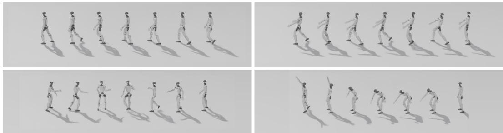  
Figure 6: Language-conditioned rollouts. The planner produces skills that the low-level policy executes: walking in a circle, lifting and carrying a box, opening a door while turning, and reaching from low to high.

## E COMPARISON WITH SONIC: GLOBAL ROOT TRACKING

SONIC tracks the body pose almost as well as ours, but its root drifts much further from the reference path. This drift accounts for nearly all of the MPJPE-G gap in Table 1. It grows faster with time than ours and lies mostly along the direction of travel.

Setup. We compare the tracker of Table 1 with the released SONIC tracker (Luo et al., 2026), run as described in Appendix C. We re-ran both motion sets, recording root positions and MPJPEs at every control step. Scored by each method’s own evaluator, as in Table 1, the re-runs match it to within 0.02 SR points, 0.22 mm MPJPE-L and 0.5 mm MPJPE-G. Below, both methods compare the state after control step t with reference frame t.1

Error decomposition. The world-frame error of each link (notation of Appendix C) splits into a root term and a local residual:

$$
p _ { t , j } - \hat { p } _ { t , j } = \underbrace { \left( p _ { t , 0 } - \hat { p } _ { t , 0 } \right) } _ { \mathrm { r o o t d r i f t } } + \underbrace { \left( p _ { t , j } - p _ { t , 0 } \right) - \left( \hat { p } _ { t , j } - \hat { p } _ { t , 0 } \right) } _ { \mathrm { l o c a l r e s i d u a l } } .
$$

The root drift d is the mean of $\| p _ { t , 0 } - \hat { p } _ { t , 0 } \|$ over the frames used for MPJPE. If the two terms are uncorrelated, MPJPE- $\begin{array} { r } { { \bf - G } ^ { 2 } \approx d ^ { 2 } + \bf { M P J P E } { - } L ^ { 2 } } \end{array}$ . This holds within 0.4 mm for SONIC and 3.7 mm for ours (Table 10). Root drift makes up 98–99% of SONIC’s MPJPE- $\mathbf { \cdot G ^ { 2 } }$ and 81% of ours. Between the methods, root drift differs by 116–126 mm and MPJPE-L by only 5.6–6.0 mm (Figure 7c). The same holds on the clips both methods complete, which we call jointly completed (4096∗ rows). Per clip, SONIC’s mean root error is larger on 117 of 124 and 3,793 of 4,013 jointly completed clips (Figure 7d).

Drift over time. Figure 7a,b follows the root error over the first 8 s of the jointly completed clips lasting at least 8 s (35 clips of the 124 set, 1,057 of the 4096 set). A least-squares line fit to the mean root error has slope 36 mm/s for SONIC and 10 mm/s for ours on the 4096 set (40 and 5 mm/s on the 124 set). At 8 s on the 4096 set, the mean root error is 29.1 cm for SONIC and 8.3 cm for ours (medians 14.4 and 2.0 cm).

Drift direction. On the 1,629 jointly completed clips of the 4096 set whose reference root ends at least 2 m from its start, we split the final horizontal root error (robot minus reference) into a signed part along the reference’s start-to-end direction and an unsigned part across it. SONIC ends short on 89% of these clips, with median offsets of 28 cm along (7.7% of the net travel) and 11.5 cm across. For ours the medians are 0.8 cm along and 1.2 cm across.

Qualitative examples. In clips (a)–(c) of Figure 8 and Table 11, SONIC’s body matches the ref erence pose while its root is displaced. In (b) and (c) the root lags mostly behind the reference along the path, and the offset persists after the reference stops. For the renders, we re-ran each clip and replayed the recorded joint positions kinematically in Isaac PhysX, without alignment or re-timing.

Table 10: World-frame error decomposition, re-measured with matched frame indices (one seed, one evaluation per method). MPJPE and root drift d are frame-weighted means over successful clips. Final is the median, over successful clips, of the root error at the last frame. All errors in mm. ∗The 4,013 clips of the 4096 set that both methods complete.
<table><tr><td>Set</td><td>Method</td><td>SR</td><td>MPJPE-L</td><td>MPJPE-G</td><td>Root drift d</td><td> $\sqrt { d ^ { 2 } + \mathrm { L } ^ { 2 } }$ </td><td>Final</td></tr><tr><td>124</td><td>SONIC</td><td>100.00</td><td>23.60</td><td>176.21</td><td>174.95</td><td>176.54</td><td>136</td></tr><tr><td rowspan="2">4096</td><td>Ours</td><td>100.00</td><td>18.00</td><td>65.05</td><td>58.66</td><td>61.35</td><td>15</td></tr><tr><td>SONIC</td><td>98.88</td><td>26.52</td><td>190.82</td><td>189.27</td><td>191.12</td><td>177</td></tr><tr><td rowspan="2">4096*</td><td>Ours</td><td>98.29</td><td>20.55</td><td>70.13</td><td>63.20</td><td>66.46</td><td>17</td></tr><tr><td>SONIC</td><td>一</td><td>26.35</td><td>187.7</td><td>186.1</td><td>一</td><td>一</td></tr><tr><td rowspan="2"></td><td>Ours</td><td>一</td><td>20.48</td><td>70.0</td><td>63.1</td><td>一</td><td>一</td></tr><tr><td></td><td></td><td></td><td></td><td></td><td></td><td></td></tr></table>

(a) 124-motion set  
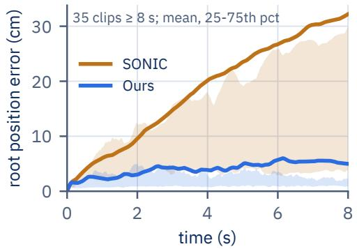  
(c) MPJPE-L, root drift, MPJPE-G

(b) 4096-motion set  
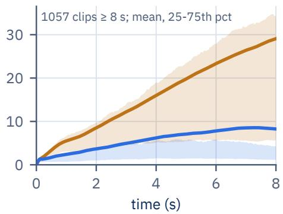  
(d) Per clip, 4096-motion set

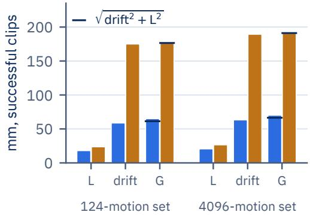

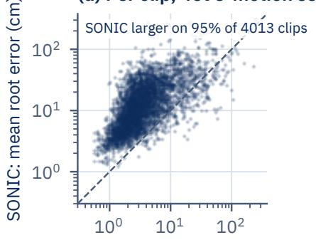  
Ours: mean root error (cm)  
Figure 7: Global root tracking, ours vs. SONIC. (a, b) Root position error over the first 8 s of jointly completed clips lasting at least 8 s: mean (line) and interquartile range (band). In (a), a few SONIC clips that drift by over a meter lift its mean above the upper quartile. (c) MPJPE-L, root drift and MPJPE-G over successful clips. The tick marks $\sqrt { \mathrm { d r i f t } ^ { 2 } + \mathrm { L } ^ { 2 } }$ . (d) Mean root error per jointly completed clip of the 4096 set. The dashed line is equality.

Interface difference. We did not isolate the cause of the drift; one untested difference is that SONIC’s released configuration gives the reference pelvis position in the robot’s frame (motion anchor pos b) only to the critic, not to the actor or tokenizer. Our encoder window includes the corresponding term (expert anchor pos b), so it reaches our actor through the skill.

Table 11: Root error of the four clips in Figure 8, averaged over the clip and at the last frame, in cm.
<table><tr><td colspan="2"></td><td colspan="2">Mean root error</td><td colspan="2">Final root error</td></tr><tr><td>Clip</td><td>Reference motion</td><td>Ours</td><td>SONIC</td><td>Ours</td><td>SONIC</td></tr><tr><td>(a) Walk, random directions</td><td>28.3 s, 12.6 m path</td><td>3.9</td><td>43.8</td><td>0.7</td><td>58.3</td></tr><tr><td>(b) Jog forward</td><td>8.9 m in 4.8 s, then stands</td><td>2.7</td><td>62.1</td><td>1.6</td><td>76.2</td></tr><tr><td>(c) Walk sideways</td><td>8.3m</td><td>2.2</td><td>55.4</td><td>1.3</td><td>89.5</td></tr><tr><td>(d) Balance on one foot</td><td>24.3 s</td><td>29.9</td><td>17.2</td><td>91.8</td><td>40.8</td></tr></table>

a) Walk, random directions, 28.3 s  
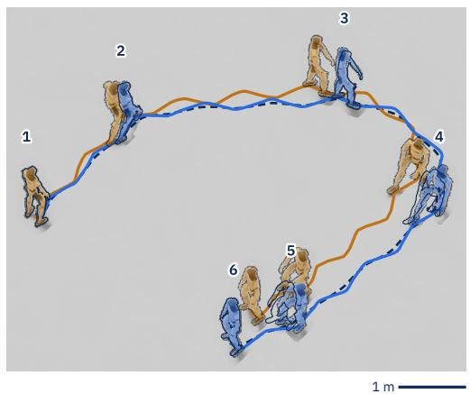

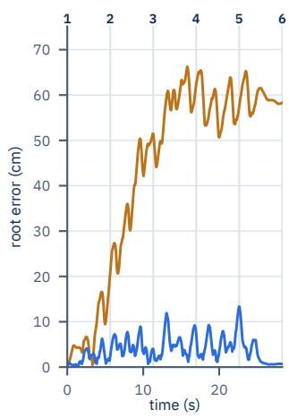

b) Jog forward, 16.5 s  
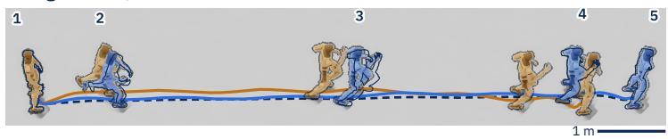

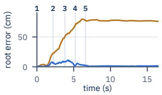

c) Walk sideways, 17.7 s  
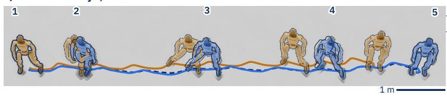

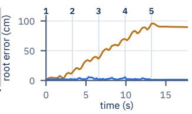

d) Balance on one foot, 24.3 s (pose at 21.6 s)  
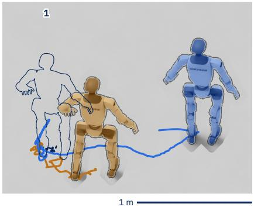

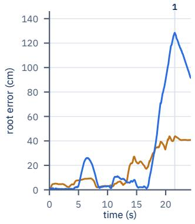  
Figure 8: Four long clips from the 4096 set, seen from above. Left: rollouts, one fixed camera per clip. Root paths: reference dashed, ours blue, SONIC orange. Robots are drawn at the numbered times, ours and SONIC shaded, the reference as an outline. The scale bar is 1 m at the depth of the nearest path point. Right: root position error, with the pose times marked. In (b) and (c) the poses span the part of the clip in which the reference moves; (d) shows one pose, at the time of our largest error.

## F SKILL COMPOSITION: COMPARISON WITH ALTERNATIVES

Steering changes both arm poses and gait. Joint offsets overshoot or are canceled and cannot reproduce gait changes, SONIC (Luo et al., 2026) token directions never reach a speed target, and BFM-Zero reward prompts reach each target but with side-effect turns and a dependence on a small part of its motion bank. Our runs follow the setting of Section 4.2 (Isaac PhysX, no domain randomization, single seed). Appendix H compares ours and BFM-Zero on the same 40 LAFAN1 clips, each with its own retarget and simulator.

Joint offsets. We replay each steered run’s mean joint deviation as an offset under the same policy, on the action (which the policy sees as its last action) or on the servo target. The 66 matched triples of Table 12 are drawn from the steered runs that did not fall (five directions on five bases at three amplitudes, and one wave gesture on walk).

Action offsets overshoot the pose because the policy feeds its last action back in. The policy partly cancels servo offsets. Offsets suffice for symmetric arm poses on slow or static bases (servo pose ratio 1.03 on squat) but not for gait. A copied foot-clearance deviation crouches the robot (root −7 cm) or topples it, and a copied turn under-delivers. A copied waving gesture stalls the walk (0.01× base speed on the action), while the steered wave keeps 1.15×.

Pass rates. A run in Table 13 passes if it does not fall and changes the target attribute by at least $g / 2 ,$ , where the goal g is 1.0 rad for the right arm, 0.6 rad for spread (both arms out), +0.3 m/s for speed and 90◦ for turn. Speed v and heading ψ, unless targeted, must stay near base: $| v / v _ { \mathrm { b a s e } } - 1 | \leq$ 0.3 and $| \psi - \psi _ { \mathrm { b a s e } } | \leq 2 7 ^ { \circ }$

Only our steering passes speed. With spectral directions alone, the speed direction passes only on walk, the base it was chosen on. On the arm targets, SONIC’s label-free token PCA matches or exceeds our spectral directions, while its label-fitted ridge directions fail on the arm and speed targets. Both representations can turn, since both encode a heading-relative reference window. Targetdirected steering needs a predictor of future motion, which SONIC lacks.

BFM-Zero reward prompts. BFM-Zero (Li et al., 2026) has no joint or velocity command, so each target is set by a reward prompt $r = r _ { \mathrm { w a l k } } \cdot \tau .$ , where τ is a tolerance on the target attribute. The released checkpoint infers its prompt vector, which conditions the policy, by scoring this reward on the states of its LAFAN1 motion bank. BFM-Zero runs in its own MuJoCo simulator on its own data, with a deterministic actor and one seed. Each run walks 4 s on the plain walk prompt, then 6 s on the target prompt, of which we report the last 5 s (the hold window). Literal speed and turn targets undershoot, so we calibrated them. No run fell, and each prompt moves its target (Table 14). The arm raise also adds shoulder roll and turns the robot.

Matched changes. Figure 9 runs the four targets with both methods on a walk. For each target we use the steering amplitude whose change lies closest to BFM-Zero’s $\scriptstyle ( a = 3$ for arm raise and speed-up, a=2 for spread, a=1.2 for turn). The speed-up has the turn direction projected out. The arm raise turns ours by $2 2 ^ { \circ }$ and BFM-Zero by $5 9 ^ { \circ }$ beyond its plain walk.

Arm swing. Over the hold window, the right shoulder pitch’s standard deviation is 0.03 rad for BFM-Zero and 0.27 rad for ours (0.02 and 0.18 rad in the plain walks).

Side-effect turns. BFM-Zero’s arm raise fails the pass rule on its turn, since its prompts carry no heading term. Retrieval predicts such side effects, but our arm raise also turns the walk, so these runs cannot show how much of BFM-Zero’s turn comes from retrieval.

Dependence on rare data. Removing the 0.85% of bank frames that score a walk with both arms up (0.7 m/s, both wrists at least 1.0 m high, unlike the right-arm prompt of Table 14) stops BFM-Zero from walking on that prompt $( 0 . 7 6 \overset { \cdot } {  } 0 . 0 0 \mathrm { m / s } )$ . We rebuild our arm direction from a response Gram over 100 clips, after excluding every clip (and its mirror) with a 1 s window that walks, jogs, walks backward or squats while a shoulder angle reaches 80% of an arm direction’s change (5,508 motions). The rebuilt direction’s shoulder change goes from −1.43 to −1.34 rad on walk, −0.85 to

Table 12: Steering vs. matched joint offsets over 66 triples (5 bases, 5 directions, 3 amplitudes, and one wave gesture). Pose is the achieved pose relative to the steered run, so it is 1.00 for steering by definition; steered runs have 0 falls by construction. Speed is the median ratio to base for arm directions on walk, jog and backward walk. Turn is the turn direction’s median heading change. The speed ratios are not robust across seeds (Appendix G.1).
<table><tr><td>Interface</td><td>Falls</td><td>Pose</td><td>Speed</td><td>Turn</td></tr><tr><td>Steering</td><td>0/66</td><td>1.00</td><td>0.95</td><td> $2 7 9 ^ { \circ }$ </td></tr><tr><td>Offset on action</td><td>17/66</td><td>1.30</td><td>0.78</td><td> $1 6 2 ^ { \circ }$ </td></tr><tr><td>Offset on servo target</td><td>5/66</td><td>0.76</td><td>0.91</td><td> $6 8 ^ { \circ }$ </td></tr></table>

Table 13: Steering pass rates at $a \ge 2$ on five bases (walk, jog, squat, carry, backward walk). Targetdirected directions are computed from chosen output rows of $J _ { \xi } ;$ spectral directions are response-Gram eigenvectors. Joint offset (oracle) adds the matched steered run’s mean joint deviation to the servo target. Denominators count runs: 10 Isaac runs $\scriptstyle ( a = 2$ and 3 per base, one joint-offset spread run lost), plus 2, 2 and 1 walk runs of our right-arm, speed and turn steering in the MuJoCo deployment simulator. Other rows have one run per base at $a { = } 2$ (SONIC in the MuJoCo simulator). Spectral-direction and token-PCA rows use directions chosen on walk; single seed.
<table><tr><td>Method</td><td>Right arm</td><td>Spread</td><td>Speed</td><td>Turn</td></tr><tr><td>Ours, target-directed</td><td>9/12</td><td>9/10</td><td>4/12</td><td>6/11</td></tr><tr><td>Ours, spectral directions only</td><td>3/5</td><td>0/5</td><td>1/5</td><td>2/5</td></tr><tr><td>Joint offset (oracle)</td><td>2/10</td><td>8/9</td><td>0/10</td><td>5/10</td></tr><tr><td>SONIC, token PCA</td><td>4/5</td><td>2/5</td><td>0/5</td><td>0/5</td></tr><tr><td> ${ \mathrm { S O N I C } } ,$  ridge directions</td><td>0/5</td><td>0/5</td><td>0/5</td><td>4/5</td></tr></table>

−0.81 on jog and −1.13 to −1.07 on backward walk. Our test removes clips before building the Gram, while BFM-Zero’s removes frames at inference.

Table 14: BFM-Zero reward prompts applied to a walk (hold window, single seed). Yaw is the heading change over the window.
<table><tr><td>Prompt</td><td>speed (m/s)</td><td>yaw (°)</td><td>R. shoulder pitch (rad)</td><td>other</td></tr><tr><td>Plain walk</td><td>0.60</td><td>22</td><td>+0.21</td><td rowspan="4">R. shoulder roll —0.61 roll L +0.55 / R -0.50</td></tr><tr><td>Raise right arm</td><td>0.69</td><td>81</td><td>-1.20</td></tr><tr><td>Spread arms</td><td>0.64</td><td>49</td><td>+0.29</td></tr><tr><td>Speed up</td><td>0.92</td><td>21</td><td>+0.27</td></tr><tr><td>Turn</td><td>0.61</td><td>88</td><td>+0.22</td><td></td></tr></table>

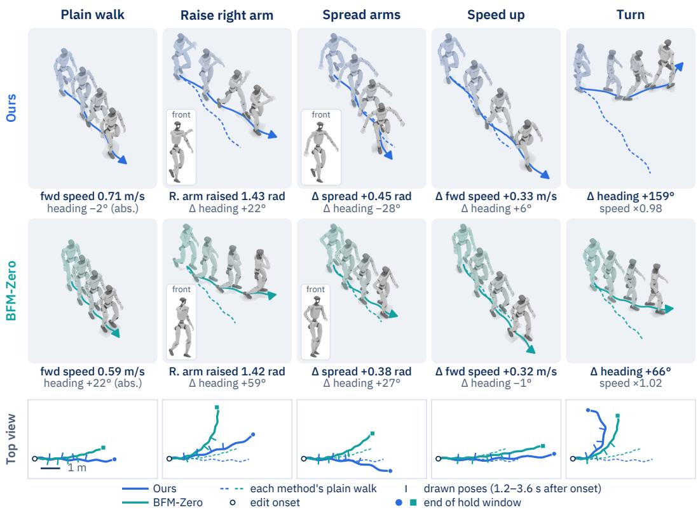  
Figure 9: A walk under our steering (top row) and under BFM-Zero’s reward prompts (middle row). Tiles show poses 1.2–3.6 s after onset. The bottom row shows ground paths from above (left turns bend upward). Numbers are changes against the same method’s plain walk over its hold window (ours 0.5–5.9 s, BFM-Zero 1.0–6.0 s after onset); plain-walk tiles instead give that walk’s own forward speed and heading change. Spread is the mean outward shoulder-roll change of both arms, and “speed $\times ^ { \dag \mathparagraph }$ is the ratio of mean ground-path speeds. The “front” insets show the newest pose from the robot’s front right.

## G ADDITIONAL COMPOSITION RESULTS

Runs use Isaac PhysX and one seed unless noted; the setup is in Appendix G.1.

All 64 spectral directions. We executed every eigenvector of the response Gram in both signs on the walk base, at an amplitude matched to its predicted gain (Figure 10). Of these, 30 work in both signs, 26 in one, and the rest fall in both signs or are weak. Grouping directions whose executed effects correlate at $| \rho | \geq 0 . 7$ gives 22 groups. The top directions are single arm gestures. Ranks 11–64 span a nearly degenerate subspace: of these 54 directions, 36 have turning as their dominant effect once amplified, two more drift sideways in one sign and turn in the other, 7 change speed, 6 fall in both signs, and 3 move one limb or are weak.

All 64 eigen-directions executed on the walk base, coloured by outcome  
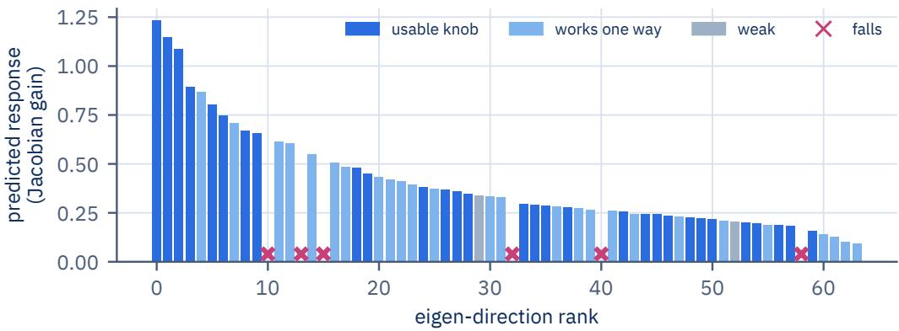  
Figure 10: All 64 spectral directions (eigenvectors of the response Gram) executed in both signs on the walk base. Bars give the predicted gain by rank, colored by outcome. Crosses mark directions that fall in both signs.

Transfer across bases. Of 19 representative directions, between 7 (squat) and 14 (carry), 13 on the walk, work in both signs per base, including all five arm directions.

Steering vs. adding skills. Table 15 compares four ways to raise the right arm during the walk; every line is applied for the whole run and no run falls. A convex blend toward a standing clip with the right arm raised trades walking for standing. Adding a skill difference keeps the walk and raises the arm, but a motion that shows the raised arm also carries the rest of its skill, so the difference brings other changes: the difference from a standing idle turns the walk by up to 55◦ and lifts the left foot; the difference between the mean standing skills with and without the raised arm also raises the left arm and both feet; the same difference taken over walking skills turns and slows the walk. Steering along the right-arm spectral direction moves the left arm by at most 0.14 rad and keeps foot height within 3 cm of the unsteered walk; its heading change grows with amplitude, to 41◦ at a=4.

Table 15: Raising the right arm during the walk (Isaac PhysX, walk base, 400 control steps, one seed; means over steps 65–335). Blend: $( \breve { 1 } - \lambda ) z ^ { \mathrm { w a i k } } + \lambda z ^ { \mathrm { a \bar { r } m } }$ ; skill differences: $z ^ { \mathrm { w a l k } } + \dot { \lambda } ( z _ { B } - z _ { A } ) ;$ steering: $z ^ { \mathrm { w a l k } ^ { * } } + a v$ , with v the right-arm spectral direction. Shoulder pitch is negative when the arm rises.
<table><tr><td>Line</td><td></td><td>λ or a Speed (m/s)</td><td>Heading (°)</td><td>(rad)</td><td>R. shoulder L. shoulder L. foot apex (rad)</td><td>(cm)</td></tr><tr><td>Unsteered walk</td><td></td><td>0.71</td><td>-2</td><td>-0.05</td><td>-0.04</td><td>15.6</td></tr><tr><td rowspan="2">Blend toward standing, arm raised</td><td>0.5</td><td>0.26</td><td>-50</td><td>-1.09</td><td>+0.10</td><td>8.0</td></tr><tr><td>1</td><td>0.00</td><td>-11</td><td>-2.38</td><td>+0.27</td><td>0.0</td></tr><tr><td rowspan="3">Arm-raise clip — standing idle</td><td>0.5</td><td>0.71</td><td>-42</td><td>-0.96</td><td>+0.17</td><td>20.6</td></tr><tr><td>0.75</td><td>0.66</td><td>-55</td><td>-1.64</td><td>+0.33</td><td>23.7</td></tr><tr><td>1</td><td>0.63</td><td>-41</td><td>-2.30</td><td>+0.42</td><td>25.6</td></tr><tr><td rowspan="3">Standing: arm raised — not raised (mean skills)</td><td>0.5</td><td>0.82</td><td>-8</td><td>-0.65</td><td>-0.28</td><td>18.4</td></tr><tr><td>1</td><td>0.90</td><td>+10</td><td>-1.70</td><td>-0.68</td><td>22.9</td></tr><tr><td>1.5</td><td>0.94</td><td>+15</td><td>-2.65</td><td>-1.03</td><td>26.6</td></tr><tr><td rowspan="3">Walking: arm raised — not raised (mean skills)</td><td>0.5</td><td>0.75</td><td>+27</td><td>-0.59</td><td>-0.35</td><td>18.7</td></tr><tr><td>1</td><td>0.44</td><td>+77</td><td>-1.56</td><td>-0.91</td><td>22.4</td></tr><tr><td>1.5</td><td>0.24</td><td>+120</td><td>-2.34</td><td>-1.36</td><td>25.9</td></tr><tr><td rowspan="4">Steering, right-arm direction</td><td>1</td><td>0.74</td><td>+4</td><td>-0.46</td><td>-0.08</td><td>14.8</td></tr><tr><td>2</td><td>0.75</td><td>+6</td><td>-0.97</td><td>-0.12</td><td>14.6</td></tr><tr><td>3</td><td>0.73</td><td>+20</td><td>-1.51</td><td>-0.15</td><td>14.0</td></tr><tr><td>4</td><td>0.64</td><td>+41</td><td>-2.01</td><td>-0.18</td><td>12.7</td></tr></table>

Hand targets. The hand Jacobian of the standing pose times the joint rows of the exact skill response $J _ { \xi }$ maps skill changes to hand motion. Its regularized least-squares inverse, which also holds the legs, waist, other arm and root, gives a 64 × 3 map that we apply open loop on the standing base. The first pass has a median error of 10.1 cm. One compensation pass, which pre-inverts the measured linear map from target to achieved hand displacement, lowers the error to 4.6 cm (8.0 cm at the 90th percentile) without falls, while the root drifts by up to 8.9 cm. A traced circle has 3.6 cm error (Figure 11).

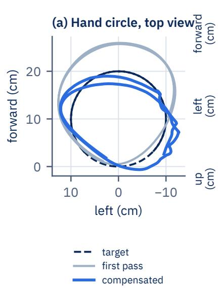

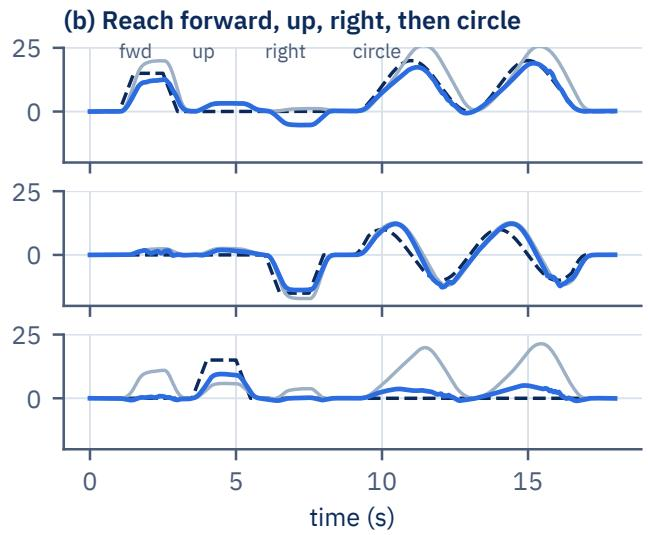  
Figure 11: Open-loop hand control on the standing base: (a) top view of a traced circle, (b) hand position while reaching forward, up, right and then tracing a circle. Dashed lines are targets, gray the first pass and blue the compensated pass.

Pushes. With startup and reset randomization and a push every 4–6 s (one per 6 s run), the walk steered with the right-arm direction at a=1.8 never fell in five seeds and kept 0.76–0.80 m/s, against 0.69–0.73 m/s unsteered.

## G.1 EXPERIMENT SETTING AND SUPPORTING MEASUREMENTS

Steering setup. Composition runs use the frozen encoder and the deployment controller (controller (ii) in Appendix C). Each base clip is encoded open loop into its base skill sequence, and the steered sequence is replayed to the controller. Replaying rather than re-encoding keeps the base skill sequence fixed while steering changes the trajectory; a base skill re-encoded in the robot’s heading frame could undo a steered turn. Steering ramps in and out over 0.5 s (25 control steps), the same ramp as in the LAFAN1 runs of Appendix H. The steering amplitude a is in raw skill units. One unit is about 1.25 standard deviations of the corpus skills, whose mean per-dimension standard deviation is 0.80. The five bases are a forward walk, a jog, a squat, a two-handed carry that contains its own 360◦ turn, and a backward walk, each $n = 3 9 0 { - } 4 0 0$ control steps long. Steering runs from control step 40 to 40 steps before the end, ramps included. Effects are averaged over the full-amplitude part (steps 65 to $n { \mathrm { - } } 6 5 )$ and compared with the unsteered run of the same base. A run passes if the robot does not fall, i.e. the root never drops below 0.40 m (0.22 m on the squat). The right-arm amplitude sweep and the high-steps entry of Table 2 come from an earlier 300-step run of the same walk, with the hold window at steps 65–235.

Steering measurements. On the walk in Isaac PhysX, the right-arm direction reaches a shoulder pitch of −0.53, −0.83 and −1.45 rad at $a { = } 1 . 2 , 1 . 8$ and 3.0. The walking speed is 0.77, 0.79 and 0.81 m/s, against 0.72 m/s unsteered. In the MuJoCo deployment simulator, the turn direction at $a = \pm 2$ on a walk changes the heading by $+ 1 3 1 ^ { \circ }$ and $- 1 2 9 ^ { \circ }$ over 4 s. The arms deviate by only 0.05 and 0.06 rad RMS, and the stride frequency stays at 0.79 Hz. Steering effects add up in the same simulator. The right arm with a left turn turns $+ 1 4 4 ^ { \circ }$ , against $+ 1 4 3 ^ { \circ }$ for the sum of the two single-direction runs (joint-pattern correlation 1.00). Adding a lowered stance gives $+ 1 5 2 ^ { \circ }$ against $+ 1 \bar { 4 } 1 ^ { \circ }$ (correlation 0.98). The superposition cosines of Table ?? cover three pairs, the right arm with a left turn, with a right turn and with a lowered stance (0.992–0.996), and this three-direction case (0.976). Additivity degrades when directions overlap: with four directions (left arm, right arm, turn, speed) scheduled with partial overlaps, so that at most three are active at once, the turn delivers $+ 1 5 ^ { \circ }$ instead of $+ 8 5 ^ { \circ }$ in a single full-amplitude run in the deployment simulator.

Executed response of 33 candidate directions, 4 bases (396 plant rehearsals)  
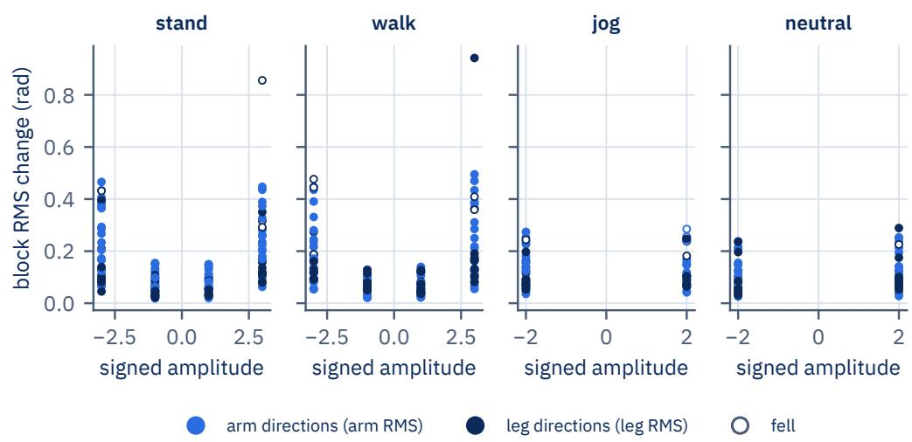  
Figure 12: RMS change of the targeted arm (blue) or leg (navy) joints against signed amplitude. “Stand” is a standing typing idle and “neutral” a neutral standing idle. Open circles are falls.

Support and distance to the data. Each one-second corpus window (1,697,723 in total) is described by its forward speed, yaw rate, root height and four shoulder angles. Swing-foot apex is added for the sequence of Figure 5. The support of an executed composition is the number of windows that move like the base and in which every steered attribute has changed at least 80% as much as in the executed run. The eleven two-direction runs pair an arm direction with the turn on the backward walk, jog, walk and squat, and none falls. Their supports are 1, 3, 3, 3, 37, 38, 53, 96, 117, 132 and 289 windows. The lowest support of a single direction is 2 windows (backward walk with arms out). None of these runs has zero support, whereas the backward-walk ladder of Table 16 reaches zero at its turn and clearance stages. The steered skills of the single-direction five-base runs have a median nearest-corpus distance of 3.42, against 2.79 between corpus skills (leave-one-clip-out, 99th percentile 4.90), whereas Table 16 measures the distance of the re-encoded executed motion.

We repeat the composition ladder of Figure 5 and the a=2 runs of Table 12 over three randomized seeds. Both reproduce qualitatively, but at $a { = } 2$ the speed cost of action offsets does not hold.

Setup. All runs use the controller of Section 4.2 in Isaac PhysX. The deterministic run has no randomization, as in the main text. Seeds 0–2 add startup randomization (friction 0.3–1.6, per-joint offsets of the default joint positions of up to ±0.01 rad, torso center of mass, wrist and torso mass ×0.8–2.5) and a random start pose and velocity, without pushes. Skills and the deterministic run’s offset tables are fixed across seeds, and the SD is the sample SD over the three seeds.

Ladder. On every base, each direction moves its own attribute (Table 16). The distance to the corpus rises with each added direction and falls on release. Support drops to 0–1 windows by the clearance stage on jog and backward walk.

Table 16: Composition ladder over three randomized seeds $( \mathrm { m e a n } \pm \mathrm { S D } ;$ brackets: deterministic run). Steering along the right-arm, turn and high-steps directions starts at 4, 8 and 12 s (a=2, 1.2 and 1.2), and all three are released together at 17 s. Each row averages the steady control steps of one stage. Speed is horizontal path speed, yaw the mean yaw rate, shoulder the mean right shoulder pitch, and apex the swing-foot height range over 1 s windows (left/right). Distance is the median over the stage of the Euclidean distance from the re-encoded executed skill to the nearest of 263,395 skills from 4,000 corpus clips (corpus skills to the nearest skill of another clip: median 2.80, p90 4.01). Support counts corpus 1 s windows (of 1,697,723) that move like the base and show every attribute moved so far, one entry per seed. No run fell.
<table><tr><td>Stage</td><td>Speed (m/s)</td><td>Yaw (°/s)</td><td>Shoulder (rad)</td><td>Apex L/R (cm)</td><td>Distance</td><td>Support</td></tr><tr><td colspan="7">Forward walk</td></tr><tr><td>Base</td><td>0.98±0.03</td><td>-8±2</td><td>0.05±0.01</td><td>15±0/16±0</td><td>2.73±0.09 [2.76]</td><td>90009, 92259, 93794 [90252]</td></tr><tr><td>+ right arm</td><td>1.07±0.01</td><td>3±1</td><td>−0.76±0.02</td><td>15±0/16±0</td><td>3.32±0.04 [3.37]</td><td>2334, 1988, 2124 [2180]</td></tr><tr><td>+ turn</td><td>1.06±0.03</td><td>35±2</td><td>-0.77±0.03</td><td>14±1/15±0</td><td>3.63±0.08 [3.60]</td><td>112, 102, 100 [119]</td></tr><tr><td>+ clearance</td><td>1.11±0.06</td><td>36±3</td><td>−0.80±0.04</td><td>19±2/24±1</td><td>3.93±0.03 [3.96]</td><td>19, 35, 95 [21]</td></tr><tr><td>Released</td><td>1.02±0.01</td><td>-1±2</td><td>0.01±0.02</td><td>16±0/15±1</td><td>2.87±0.15 [2.69]</td><td></td></tr><tr><td colspan="7">Jog</td></tr><tr><td>Base</td><td>1.21±0.03</td><td>2±1</td><td>-0.10±0.01</td><td>17±0/16±0</td><td>2.95±0.03 [2.93]</td><td>68531, 68818, 71607 [71050]</td></tr><tr><td>+ right arm</td><td>1.45±0.04</td><td>3±1</td><td>−1.10±0.04</td><td>17±0/19±0</td><td>3.66±0.03 [3.65]</td><td>245, 210, 276 [228]</td></tr><tr><td>+ turn</td><td>1.32±0.03</td><td>42±3</td><td>−1.09±0.04</td><td>16±1/17±1</td><td>4.26±0.05 [4.22]</td><td>23, 13, 20 [21]</td></tr><tr><td>+ clearance</td><td>1.49±0.14</td><td>38±5</td><td>−1.17±0.07</td><td>27±1/32±1</td><td>4.39±0.11 [4.32]</td><td>1, 0, 0 [1]</td></tr><tr><td>Released</td><td>1.35±0.11</td><td>-4±3</td><td>-0.13±0.03</td><td>18±1/17±1</td><td>3.32±0.25 [3.09]</td><td></td></tr><tr><td colspan="7">Backward walk</td></tr><tr><td>Base</td><td>0.84±0.00</td><td>1±1</td><td>-0.15±0.00</td><td>11±0/10±0</td><td>2.67±0.02 [2.66]</td><td>27865, 27582, 27902 [27626]</td></tr><tr><td>+ right arm</td><td>0.76±0.02</td><td>6±1</td><td>-1.38±0.02</td><td>11±1/13±0</td><td>3.69±0.03 [3.67]</td><td>206, 193, 189 [192]</td></tr><tr><td>+ turn</td><td>0.58±0.01</td><td>45±2</td><td>-1.36±0.01</td><td>11±1/11±0</td><td>4.13±0.03 [4.10]</td><td>0, 0, 0 [0]</td></tr><tr><td>+ clearance</td><td>0.38±0.04</td><td>51±7</td><td>−1.47±0.06</td><td>19±2/24±0</td><td>4.17±0.02 [4.15]</td><td>0,0, 0 [0]</td></tr><tr><td>Released</td><td>0.73±0.05</td><td>-5±3</td><td>−0.29±0.00</td><td>12±0/10±1</td><td>2.70±0.11 [2.65]</td><td></td></tr></table>

Table 17: Steering vs. matched joint offsets at a=2 over three randomized seeds (mean ± SD; brackets: deterministic run). The 22 triples cover five bases × five directions, minus three steered clearance runs that fell deterministically. Falls are per seed (0, 1, 2), out of 22. Speed is the median ratio to base of arm directions on walk, jog and backward walk, drift the median |heading change of non-turn directions, and turn the median heading change of the turn direction, all over runs that stayed up. Pose is relative to the seed’s steered run.
<table><tr><td>Interface</td><td>Falls</td><td>Pose</td><td>Speed</td><td>Drift (°)</td><td> $\mathrm { T u r n } ( ^ { \circ } )$ </td></tr><tr><td>Steering</td><td>0,0, 0 [0]</td><td>1.00</td><td>0.95±0.02 [0.90]</td><td>16±3 [20]</td><td>295±10 [279]</td></tr><tr><td>Offset on action</td><td>4, 5, 5 [5]</td><td>1.37±0.03 [1.38]</td><td>0.98±0.10 [0.89]</td><td>36±8 [29]</td><td>192±4[177]</td></tr><tr><td>Offset on servo target</td><td>1, 1, 2 [1]</td><td>0.73±0.00 [0.76]</td><td>0.92±0.01 [0.91]</td><td>23±3[19]</td><td>92±13 [80]</td></tr></table>

## H TRAINING ON LAFAN1

The released BFM-Zero model compared in Appendix F was trained on LAFAN1, and ours on 129,785 BONES-SEED clips. To separate the method from the data, we trained our method on LAFAN1. On the same 40 clips and under the same termination rule, it completes 17 whole clips and BFM-Zero none, each in its own simulator. Over the first 15 s the counts are 34 and 19. Steering still works for speed and turn, but the arm directions are weaker than on BONES-SEED.

Setup. We use our own G1 retarget of LAFAN1 (441,080 frames at 50 Hz; BFM-Zero’s bank, from its own retarget, has 441,122). Six of the 40 clips show a fall and a get-up. The encoder and predictor are those of Section $3 ~ ( z ~ \in \mathbb { R } ^ { 6 4 }$ , five past frames of context, H = 10), pretrained on all 40 clips for 3,000 updates instead of 50,000, since with four clips held out the next-chunk loss was lowest at 2,000–3,000 updates. The tracker has the architecture and PPO recipe of our BONES-SEED tracker and is trained from scratch, without the later fine-tuning stages. Resets are drawn uniformly over clips and start frames. We report the last checkpoint (27.0B frames) and an earlier one (6.0B). Evaluation uses the same 40 clips in Isaac Lab with the Newton/MuJoCo-Warp backend of training, the mean action and no domain randomization.

Evaluation settings. Table 18 uses three settings.

Table 18: Our method trained and evaluated on the 40 LAFAN1 clips. MPJPE in mm, mean over clips with the median in parentheses. No-termination rows include steps after a fall. Window rows average the pre-fall steps. †Successful clips only, frame-weighted. ‡Torso-height fall test: torso below 0.4 m while the reference pelvis is at or above 0.4 m. With the relative fall test, 688/800 windows are fall-free at 27.0B.
<table><tr><td>Setting</td><td>Frames</td><td>Success</td><td>MPJPE-L</td><td>MPJPE-G</td></tr><tr><td rowspan="2">Terminating, whole clip</td><td>6.0B</td><td>10/40</td><td>22.5†</td><td>85.2†</td></tr><tr><td>27.0B</td><td>17/40</td><td>22.1†</td><td>77.7†</td></tr><tr><td>No termination, whole clip</td><td>6.0B</td><td>23/40 fall-free</td><td>110.9 (42.7)</td><td>829.9 (398.4)</td></tr><tr><td rowspan="4">20 × 10 s windows per clip</td><td>27.0B</td><td>24/40 fall-free</td><td>98.7 (27.8)</td><td>578.3 (142.0)</td></tr><tr><td>6.0B</td><td>665/800 fall-free</td><td>41.0 (31.0)</td><td>157.1 (127.6)</td></tr><tr><td>6.0B</td><td>594/800 complete</td><td></td><td></td></tr><tr><td>27.0B</td><td>668/800 fall-free‡</td><td>32.5 (25.5)</td><td>101.6 (78.6)</td></tr><tr><td></td><td>27.0B</td><td>639/800 complete</td><td></td><td></td></tr></table>

Terminating. A run ends when the pelvis height error or an end-effector (ankle or wrist) height error exceeds 0.25 m, or the pelvis orientation error exceeds 1 rad. A whole clip succeeds if it reaches its end.

No termination. The setting of BFM-Zero’s evaluation. Each clip runs to its end without reset. A (relative) fall is recorded when the pelvis stays more than 0.25 m below the reference pelvis for 0.5 s.

Windows. 20 ten-second windows per clip at uniformly sampled start frames, scored with the terminating rule (complete) and with a torso-height fall test (fall-free).

Results. At 27.0B, 17 of the 40 clips complete under termination, up from 10 at 6.0B (Table 18).

Side by side with BFM-Zero. Table 19 compares the two models; its terminating rows use the same three termination terms and thresholds for both. The comparison is not controlled: BFM-Zero runs in its MuJoCo deployment simulator on its own retarget, and ours in Isaac Lab on ours. Both evaluations compute MPJPE-L after subtracting only the pelvis position, so heading drift raises MPJPE-L as well as MPJPE-G. Most of BFM-Zero’s terminations are orientation failures, which its evaluation attributes to heading drift. In a separate run without termination, 23 clips first failed on orientation, and 22 of them had a tilt error below 0.2 rad at failure. Without termination, BFM-Zero falls less often than ours, but its MPJPE-L on clips without a fall is 196.4 mm against 23.4 mm.

Table 19: BFM-Zero (released checkpoint, its MuJoCo deployment simulator and retarget) and our 27.0B LAFAN1 model (Isaac Lab) on the 40 LAFAN1 clips. MPJPE in mm, frame-weighted over the scored steps of the stated clips. The torso-height rows exclude every clip in which the torso reaches the floor: five fall-and-get-up clips for BFM-Zero, all six for ours. ∗From a separate run in which a fall ends the clip.
<table><tr><td></td><td>BFM-Zero</td><td>Ours, 27.0B</td></tr><tr><td colspan="3">Whole clip, terminating</td></tr><tr><td>Success</td><td>0/40</td><td>17/40</td></tr><tr><td>Mean steps before termination First failure: orientation / end effector / pelvis height</td><td>1,028 24 / 15 / 1</td><td>7,904 2 / 19 / 2</td></tr><tr><td>MPJPE-L / G, successful clips</td><td></td><td>22.1 / 77.7</td></tr><tr><td>Fall-and-get-up clips completed</td><td>0/6</td><td>0/6</td></tr><tr><td>Whole clip, no termination</td><td></td><td></td></tr><tr><td>MPJPE-L / G, all clips</td><td>211.1 / 6,372</td><td>85.0 / 501.9</td></tr><tr><td>Clips without a relative fall</td><td>30/40</td><td>24/40</td></tr><tr><td>excluding the six fall-and-get-up clips</td><td>30/34</td><td>24/34</td></tr><tr><td>MPJPE-L / G, clips without a fall</td><td>196.4 / 6,601</td><td>23.4 / 89.4</td></tr><tr><td>MPJPE-L / G, fall-and-get-up clips (all fall)</td><td>295.7 / 3,777</td><td>353.0 /2,259</td></tr><tr><td>MPJPE-L / G, pre-fall prefix, all clips</td><td>201.7 / 6,462</td><td>25.8 / 108.1*</td></tr><tr><td>First 15 s, terminating</td><td></td><td></td></tr><tr><td>Success</td><td>19/40</td><td>34/40</td></tr><tr><td>MPJPE-L / G, successful clips</td><td>42.5 / 298</td><td>19.6 / 52.2</td></tr><tr><td>First 15 s, no termination</td><td></td><td></td></tr><tr><td>MPJPE-L / G, all clips</td><td>72.0 / 567</td><td>35.7 / 183.7</td></tr><tr><td></td><td>35/40</td><td></td></tr><tr><td>Torso never below 0.4 m</td><td></td><td>34/40</td></tr><tr><td>MPJPE-L / G, those clips</td><td>62.7 / 513</td><td>19.5 / 78.7</td></tr></table>