# LEARNING MACROSCOPIC DYNAMICS WITHOUT RE-CONSTRUCTING MICROSCOPIC STATES

Zhichao Han1 Yue Zhao1 Qianxiao Li1 ∗ 1National University of Singapore

## ABSTRACT

Modeling the temporal evolution of macroscopic properties of complex systems is an important scientific task. To predict this evolution without full microscopic simulation, a common approach encodes microstates into compact latent states, learns their evolution, and reads out macroscopic predictions from the latent trajectory. These latent states are often learned through microstate reconstruction. However, with limited latent capacity, reconstruction can favor high-variance microscopic details over information needed for macroscopic prediction. Yet jointly learning latent states and their transition without reconstruction often fails to obtain latent dynamics that support accurate macroscopic prediction. We show that this failure can arise from latent scale collapse: shrinking the latent state scale reduces training loss while macroscopic evolution error remains large. Here, we propose a reconstruction-free framework to learn latent states with their dynamics for prescribed macroscopic prediction. Training alternates between updating the latent representation with the transition and next-state latent targets fixed, and updating the transition with the latent representation fixed. At inference, the trained model predicts macroscopic states recursively from an initial microstate. Our theoretical analysis characterizes reconstruction misalignment and scale collapse under joint training, and gives a sufficient condition for local convergence to correct latent dynamics for our method. Experiments on epidemic spreading on a lattice, mixing of two particle species, and polymer stretching demonstrate that the proposed method achieves substantially better macroscopic prediction over baselines.

## 1 INTRODUCTION

Many physical systems evolve in high-dimensional microscopic states, while the quantities of interest are low-dimensional collective observables (Kevrekidis et al., 2003). Instead of tracking microstate details, we can summarize the high-dimensional microstates into compact latent embeddings that preserve the information relevant to the prescribed macroscopic dynamics, and learn a closed transition in the latent space. The macroscopic predictions are made from the resulting latent rollout (Champion et al., 2019; Lee & Carlberg, 2020; Fries et al., 2022; Chen & Li, 2024; Lusch et al., 2018; Mardt et al., 2018; Vlachas et al., 2022).

Reconstruction-based representation learning trains the latent state to reconstruct the input microstate via some autoencoders (Champion et al., 2019; Zhu et al., 2025). Macroscopic prediction, however, requires latent states retaining only the information needed to predict macroscopic evolution. Reconstruction can therefore be misaligned with this task, devoting limited latent capacity to irrelevant microstate variation or stochastic details that are difficult to predict (Nair et al., 2020; Nguyen et al., 2021). We analyze this misalignment in Sec. 4.1. Reconstruction also couples the learned representation to the decoder’s design and capacity, adding architectural and tuning costs that do not directly serve macroscopic prediction (Shu et al., 2020; Han et al., 2026). Nevertheless, most existing approaches still use microstate reconstruction, and simply removing this objective can introduce difficulties in learning the latent dynamics (Champion et al., 2019; Lee & Carlberg, 2020; Fries et al., 2022; Chen & Li, 2024; Han et al., 2026).

A key difficulty is latent collapse, in which the scale of the learned latent states tends to shrink toward zero. Reconstruction can help prevent this by requiring the representation to retain input information (Chen & Li, 2024; Han et al., 2026). We show in Sec. 4.2 that jointly optimizing the encoder and latent transition without reconstruction admits scale-collapse minimizing sequences. The encoder can reduce the training loss by shrinking the latent scale while macroscopic rollout predictions remain inaccurate, as discussed in Sec. 4.2. This creates a dilemma: reconstruction can be misaligned with macroscopic prediction, yet learning the representation and transition without it can lead to collapse. We therefore ask: can we learn a closed, predictive state for macroscopic dynamics without reconstructing microscopic details?

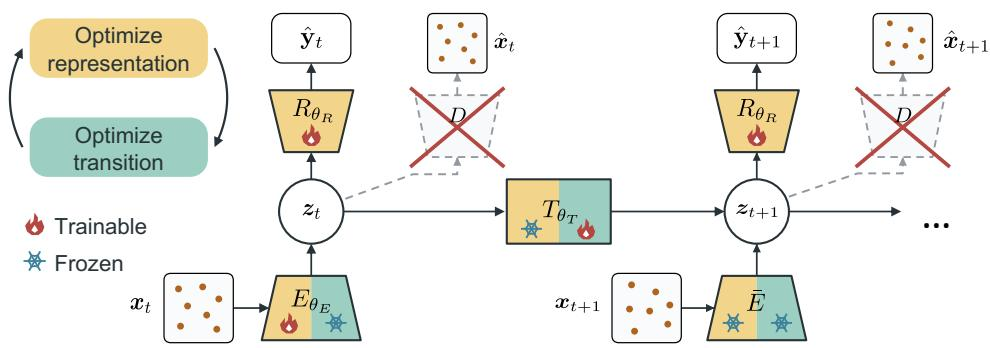  
Figure 1: Overview of TAMPL. The encoder $E _ { \theta _ { E } }$ maps microstates $\mathbf { \Delta } _ { \mathbf { \mathcal { X } } _ { t } }$ to latent states $z _ { t } ,$ , which the transition model $T _ { \theta _ { T } }$ propagates forward and the readout $R _ { \theta _ { R } }$ maps to macroscopic predictions $\hat { \mathbf { y } } _ { t }$ The target encoder $\bar { E }$ applied to ${ \pmb x } _ { t + 1 }$ is a copy of $E _ { \theta _ { E } }$ and the parameters in $\bar { E }$ are not trainable. Optimization alternates between representation learning (yellow) and transition learning (green), with and $\frac { 2 x } { 4 }$ icons indicating trainable and frozen modules, respectively. $\bar { E }$ is only updated after one representation learning stage finishes. Crossed-out decoder branches emphasize that the latent representation is trained without microstate reconstruction.

To this end, we propose Target-Anchored Macro-Predictive Latents (TAMPL), a reconstructionfree framework for learning latent dynamics tailored to prescribed macroscopic observables (Fig. 1). TAMPL alternates between updating the latent representation and fitting the transition model, with each stage specifically designed to address latent collapse. During representation update, a frozen copy of the encoder anchors the next-state target, preventing the latent state and its next-state target from shrinking together. During transition fitting, the encoder is fixed, so the transition is fitted in the current latent coordinates. We make theoretical analyses on linear systems in Sec. 4 to discuss how this training strategy addresses the training dilemma. Experiments (Sec. 5) on epidemic spread ing on a lattice, mixing of two particle species, and polymer stretching demonstrate the improved macroscopic prediction of TAMPL over baselines. For example, only TAMPL captures the distinct extension time scales across all test regimes in the polymer extension experiment.

## 2 RELATED WORK

Modeling macroscopic dynamics from microstates. Many methods for learning macroscopic dynamics reconstruct microstates to encode microscopic information and regularize latent states, even when their closure variables need not support microscopic recovery (Champion et al., 2019; Chen et al., 2022; Chen & Li, 2024; Han et al., 2026). TAMPL shares their prediction objective but learns representations without reconstruction through a training procedure designed to stabilize learning. For observables depending locally on microscopic coordinates, equation-free approaches estimate and advance macroscopic evolution through short microscopic simulations in small spatial domains, without explicitly learning a macroscopic dynamics model (Kevrekidis et al., 2003; Chen & Li, 2024). TAMPL supports observables depending on the full microstate and explicitly learns a latent transition from trajectories, requiring no further microscopic simulation after encoding the initial microstate. In the closely related task of reduced-order modeling, autoencoder-based reducedorder models learn and evolve low-dimensional coordinates to approximate high-dimensional dynamics, then decode them for full-state recovery (Lusch et al., 2018; Lee & Carlberg, 2020; Fries et ${ \mathrm { a l . , } }$ , 2022; Champion et al., 2019; Park et al., 2024). TAMPL instead predicts prescribed macroscopic observables, so its latent states need not support microscopic recovery.

Reconstruction-free latent dynamics modeling. For physical systems, unsupervised methods such as VAMPnets (Mardt et al., 2018) and the work by Hromadka et al. (2026) learn internal states and their evolution without reconstruction or prescribed macroscopic targets, using a linear Koopman model and a linear Gaussian latent prior, respectively. TAMPL likewise avoids reconstruction, but trains its representation for prescribed macroscopic prediction and allows nonlinear latent transitions. In control and reinforcement learning, reconstruction-free world models learn latent representations and dynamics for prediction and planning. Predictive coding methods combine contrastive learning with latent consistency (Shu et al., 2020; Nguyen et al., 2021), while LeWorld-Model jointly trains its encoder and latent transition model using latent prediction with distributional regularization (Maes et al., 2026). DeepMDP learns representations through reward prediction and prediction of distributions over subsequent latent states (Gelada et al., 2019). TD-MPC jointly trains its encoder and dynamics using reward and value prediction together with latent consistency against an exponentially averaged target encoder (Hansen et al., 2022). In LQG control, Tian et al. (2023) first learn representations through cumulative-cost prediction, then fit latent transition and cost models. Like these methods, TAMPL combines task supervision with latent consistency, but stabilizes the training via its specifically designed training strategy.

Training latent representations and dynamics without reconstruction. Learning latent embed dings by predicting future latent states admits trivial solutions, including learning constant representations (Schwarzer et al., 2021; Tang et al., 2023). One type of approach regularizes representation geometry. For example, VICReg penalizes low variance and cross-coordinate covariance (Bardes et al., 2022), while Sketched Isotropic Gaussian Regularization (SIGReg), introduced in LeJEPA, encourages an isotropic Gaussian embedding distribution (Balestriero & LeCun, 2025). Another line studies training strategies for stable latent dynamics learning. SPR predicts future latent representa tions using stop-gradient targets from an exponentially averaged encoder (Schwarzer et al., 2021). Tang et al. (2023) study latent dynamics by matching predicted next latent states to stop-gradient encodings of subsequent observations. They consider faster predictor optimization and slower representation learning, establishing noncollapse in an idealized setting where the predictor is optimal for the current representation. Ni et al. (2024) extend the analysis in Tang et al. (2023) to actionconditioned transitions, partial observability, and exponentially averaged encoded targets. TAMPL shares stop-gradient targets and the alternating update with Tang et al. (2023), but couples them with prescribed macroscopic supervision and takes finitely many gradient steps for each component. Our analysis establishes sufficient conditions considering the linear system for local convergence of thi optimization procedure.

## 3 METHOD

## 3.1 PROBLEM SETUP AND LEARNING OBJECTIVE

Let $\pmb { x } _ { t } \in \mathbb { R } ^ { n }$ denote the high-dimensional microstate of a dynamical system at time t, and $\pmb { y } _ { t } = \pmb { g } ( \pmb { x } _ { t } ) \in \mathbb { R } ^ { m }$ denote the low-dimensional macroscopic observation defined by a prescribed map g. For example, in a particle system, $\mathbf { \Delta } _ { \mathbf { \mathcal { X } } _ { t } }$ records particle positions and $\mathbf { \mathscr { y } } _ { t }$ may be the density in a fixed region, computed by g as the number of particles in that region divided by its volume. Given training trajectories $\mathcal { D } = \{ ( \boldsymbol  { \mathbf { \mathit { x } } } _ { t } ^ { ( i ) } , \boldsymbol { \mathbf { \mathit { y } } } _ { t } ^ { ( i ) } ) _ { t = 0 } ^ { T _ { i } } \} _ { i = 1 } ^ { N }$ , where i indexes trajectories, we seek a model that recursively predicts future macroscopic observations $\{ y _ { t } \} _ { t = 1 } ^ { T }$ from an initial observed microstate x0. The macroscopic process $\{ y _ { t } \} _ { t = 1 } ^ { T }$ is not necessarily Markovian, since $g$ may discard information relevant to its future evolution. We therefore evolve the dynamics in a learned latent space and read out macroscopic predictions at each step.

We encode the microstate into a latent state ${ \boldsymbol { z } } _ { t } = E _ { { \boldsymbol { \theta } } _ { E } } ( { \bf { x } } _ { t } )$ , where $E _ { \theta _ { E } } : \mathbb { R } ^ { n }  \mathbb { R } ^ { d _ { z } }$ is a learned encoder and $d _ { z } < n$ is the latent dimension. The encoder architecture depends on the input type. For example, we can use a CNN (LeCun et al., 1998) for images and a DeepSet (Zaheer et al., 2017) for particle sets. We model the latent dynamics as Markovian, with transition $T _ { \theta _ { T } }$ conditioned only on the current latent state ${ \boldsymbol { z } } _ { t } .$ . For deterministic dynamics, $T _ { \theta _ { T } } : \mathbb { R } ^ { d _ { z } }  \mathbb { R } ^ { d _ { z } }$ predicts the next latent state. For stochastic dynamics, $T _ { \theta _ { T } } ( \cdot \ | \ z _ { t } )$ defines a conditional distribution over the next latent state. A current readout $R _ { \theta _ { R } } : \mathbb { R } ^ { \dot { d } _ { z } } \xrightarrow { \cdot } \mathbb { R } ^ { m }$ maps the latent state to the prescribed macroscopic observation and is implemented as an MLP (Rumelhart et al., 1986).

We train the latent state to support current readout and next-state prediction:

$$
R _ { \theta _ { R } } ( E _ { \theta _ { E } } ( { \pmb x } _ { t } ) ) \approx { \pmb y } _ { t } ,
$$

$$
T _ { \boldsymbol { \theta } _ { T } } ( E _ { \boldsymbol { \theta } _ { E } } ( \mathbf { x } _ { t } ) ) \approx E _ { \boldsymbol { \theta } _ { E } } ( \mathbf { x } _ { t + 1 } ) ,\tag{1}
$$

(2)

For stochastic transitions, Eq. 2 denotes matching the conditional distribution of the next encoded state given the current one. Together, Eqs. 1 and 2 support recursive macroscopic prediction by evolving the latent state and applying the readout at each step. These two prediction requirements motivate the following learning objective:

$$
\begin{array} { r } { \mathcal { L } = \lambda _ { \mathrm { c u r } } \mathbb { E } \Big [ \| R _ { \theta _ { R } } ( z _ { t } ) - y _ { t } \| _ { 2 } ^ { 2 } \Big ] + \lambda _ { \mathrm { t r } } \mathbb { E } \big [ \ell _ { \mathrm { t r } } ( T _ { \theta _ { T } } ; z _ { t } , E _ { \theta _ { E } } ( x _ { t + 1 } ) ) \big ] . } \end{array}\tag{3}
$$

We denote the two terms before weighting by ${ \mathcal { L } } _ { \mathrm { c u r } }$ and $\mathcal { L } _ { \mathrm { t r } }$ , respectively. The transition loss form $\mathcal { L } _ { \mathrm { t r } }$ depends on the transition model. Expectations average over sampled trajectories and valid source times, together with any auxiliary randomness in the transition loss. For stochastic latent transitions in the domain experiments, we use conditional flow matching (Tong et al., 2024), with the transition loss detailed in Appendix A.1. The weights satisfy $\lambda _ { \mathrm { c u r } } , \lambda _ { \mathrm { t r } } > 0$

In the objective, we omit microscopic reconstruction to avoid allocating latent capacity to encode input features irrelevant to macroscopic prediction. We supervise the transition to match the next latent state ${ z } _ { t + 1 }$ rather than the next macrostate $\mathbf { \pmb { y } } _ { t + 1 }$ , because the latter does not imply accurate long-term recursive prediction. Section 4.1 motivates both choices in a linear setting. At inference time, the encoder is applied only to the initial microstate to obtain ${ z } _ { 0 } = E _ { \theta _ { E } } ( { \pmb x } _ { 0 } )$ . For deterministic dynamics, the model recursively applies $z _ { t + 1 } = T _ { \theta _ { T } } ( z _ { t } )$ ) and $\widehat { \pmb { y } } _ { t + 1 } = R _ { \theta _ { R } } ( \pmb { z } _ { t + 1 } )$ for $t = 0 , \ldots , T -$ 1. For stochastic dynamics, we instead sample $z _ { t + 1 } \sim T _ { \theta _ { T } } ( \cdot \mid z _ { t } )$ before applying the same readout.

## 3.2 TRAINING STRATEGY

The encoder defines both the source and target in ${ \mathcal L } _ { \mathrm { t r } }$ . Directly minimizing Eq. 3 changes the latent coordinates in which the transition is fitted, which can further lead to the latent scale collapse problem (Sec. 4.2). We instead alternate representation and transition updates with detached latent prediction targets, as shown by the yellow and green stages in Fig. 1.

We maintain an online encoder $E _ { \theta _ { E } }$ and a frozen target copy $E _ { \bar { \theta } _ { E } }$ , initialized with the same encoder parameters. The target encoder remains fixed throughout each representation block and is refreshed between blocks. For brevity, we suppress parameter subscripts and write $E , R , T , \bar { E }$ for $E _ { \theta _ { E } } , R _ { \theta _ { R } } , T _ { \theta _ { T } } , E _ { \bar { \theta } _ { E } }$ , respectively. For representation updates, we use the same transition loss with $\bar { E } ( { \boldsymbol x } _ { t + 1 } )$ replacing the online next-state target and have $\mathcal { L } _ { \mathrm { t r } } ( E , \bar { E } ; T ) \ =$ $\mathbb { E } \big [ \ell _ { \mathrm { t r } } \big ( T ; E ( \pmb { x } _ { t } ) , \bar { E } ( \pmb { x } _ { t + 1 } ) \big ) \big ]$

In the representation stage (yellow), we update $E _ { : }$ , R using the objective

$$
\mathcal { L } _ { \mathrm { e n c } } ( E , R ; T , \bar { E } ) = \lambda _ { \mathrm { c u r } } \mathcal { L } _ { \mathrm { c u r } } + \lambda _ { \mathrm { t r } } \mathcal { L } _ { \mathrm { t r } } ( E , \bar { E } ; T )
$$

Here $T$ and $\bar { E }$ remain fixed, and the transition gradient passes through T to E but not through the target E¯. After the representation block, we refresh the target encoder by copying the updated online encoder, $\bar { E }  E$ . In the transition stage (green), we update only T using $\dot { \mathcal { L } } _ { \mathrm { t r } } ( \breve { E } , \bar { E } ; \breve { T } )$ , fitting the transition in the updated latent coordinates.

Each training epoch consists of one pass of representation updates, a target refresh, and one pass of transition updates. Section 4.3 analyzes these two roles in a linear setting. Appendix A.2 gives the training and inference pseudocode.

## 4 ANALYSIS

We analyze the training mechanisms in Sec. 3 using a deterministic linear system with squared transition loss. We first justify the training objective (Eq. 3) and examine why directly minimizing it can fail to produce predictive latent dynamics. We then analyze how TAMPL’s frozen representation and detached target change the updates, and give a local convergence condition.

Consider the linear system ${ \pmb x } _ { t + 1 } = A { \pmb x } _ { t } , { \pmb y } _ { t } = C _ { \star } { \pmb x } _ { t }$ , where $\pmb { x } _ { t } \in \mathbb { R } ^ { n } , \pmb { y } _ { t } \in \mathbb { R } ^ { m }$ , and $A \in \mathbb { R } ^ { n \times n }$ $C _ { \star } \in \mathbb { R } ^ { m \times n }$ are fixed. We learn the encoder $E ( { \pmb x } ) = B { \pmb x }$ , latent transition $T ( z ) = K z$ , and macroscopic readout $R ( z ) = D z$ , with $B \in \mathbb { R } ^ { d \times n } , \dot { K } \in \mathbb { R } ^ { d \times d } , D \in \mathbb { R } ^ { m \times d }$ and $d : = d _ { z } \leq n$ . Let $\scriptstyle { \pmb x } _ { 0 }$ be random and sample the source time t; expectations below average over these sampled pairs. Assume $\mathbb { E } [ { \pmb x } _ { t } ] = 0$ and $\dot { \Sigma _ { \mathrm { x } } } : = \mathbb { E } [ { \pmb x } _ { t } { \pmb x } _ { t } ^ { \top } ] \succ 0$ over the sampled source states. Write $\Vert M \Vert _ { \Sigma _ { \mathrm { x } } } ^ { 2 ^ { \bullet } } : = \mathbf { \dot { t } } \mathrm { r } ( M \Sigma _ { \mathrm { x } } M ^ { \top } )$ and $\langle M , N \rangle _ { \Sigma _ { \mathbf { x } } } : = \mathrm { t r } ( M \Sigma _ { \mathbf { x } } N ^ { \top } )$ for compatible matrices. Matrix gradients and parameter tuples use the product Frobenius inner product, and $\| \cdot \| _ { 2 }$ denotes the spectral norm. We use Eq. 3 with squared transition loss $\ell _ { \mathrm { t r } } ( T ; z _ { t } , \dot { z } _ { t + 1 } ) = \| T ( \ddot { z } _ { t } ) ^ { \cdot } - z _ { t + 1 } \| _ { 2 } ^ { 2 }$ . The current and transition losses from Eq. 3 become

$$
\begin{array} { r } { \mathcal { L } _ { \mathrm { c u r } } ( B , D ) = \| D B - C _ { \star } \| _ { \Sigma _ { \mathbf { x } } } ^ { 2 } , \qquad \mathcal { L } _ { \mathrm { t r } } ( K ; B ) = \| K B - B A \| _ { \Sigma _ { \mathbf { x } } } ^ { 2 } . } \end{array}\tag{4}
$$

For the convergence analysis, assume there are parameters $( B _ { \star } , D _ { \star } , K _ { \star } )$ satisfying $D _ { \star } B _ { \star } = C _ { \star }$ and $K _ { \star } B _ { \star } = B _ { \star } \bar { A }$ , with rank $( B _ { \star } ) = d .$ These identities mean that the latent model reproduces both the prescribed macroscopic observation and the encoded dynamics. Appendix B.1 characterizes this capacity condition.

## 4.1 JUSTIFICATION OF THE LEARNING OBJECTIVE

Why can reconstruction be harmful? We do not include a loss term to reconstruct microstates in the objective (Eq. 3). This is because the reconstruction loss can make the latent state encode microstate information irrelevant to macroscopic prediction. To see this, we express microscopic reconstruction through a decoder $G \in \mathbb { R } ^ { n \times d }$ and the loss

$$
\begin{array} { r } { \mathcal { L } _ { \mathrm { r e c } } ( B , G ) : = \mathbb { E } \| G B \pmb { x } _ { t } - \pmb { x } _ { t } \| _ { 2 } ^ { 2 } = \| G B - I _ { n } \| _ { \Sigma _ { \mathbf { x } } } ^ { 2 } . } \end{array}\tag{5}
$$

Prediction and reconstruction can compete for the available latent capacity. The following theorem isolates this competition without the transition term.

Theorem 1 Let $\lambda _ { \mathrm { { r e c } } } \geq 0$ A rank-d encoder B minimizes min $_ { D , G } \{ \lambda _ { \mathrm { c u r } } \mathcal { L } _ { \mathrm { c u r } } ( B , D ) \ + $ $\lambda _ { \mathrm { { r e c } } } \mathcal { L } _ { \mathrm { { r e c } } } ( B , G ) \}$ over B ifand only $i f \operatorname { r o w } ( B \Sigma _ { \mathrm { x } } ^ { 1 / 2 } )$ is a top-d eigenspace of $M _ { \mathrm { { c u r } } } + \lambda _ { \mathrm { { r e c } } } \Sigma _ { \mathrm { { x } } }$ , where $M _ { \mathrm { c u r } } : = \lambda _ { \mathrm { c u r } } \Sigma _ { \mathrm { x } } ^ { 1 / 2 } C _ { \star } ^ { \top } C _ { \star } \Sigma _ { \mathrm { x } } ^ { 1 / 2 } a n d \Sigma _ { \mathrm { x } } ^ { 1 / 2 }$ is the symmetric covariance square root.

Theorem 1 identifies the competition: $M _ { \mathrm { c u r } }$ rewards directions that predict the prescribed macroscopic observation, while $\lambda _ { \mathrm { { r e c } } } \Sigma _ { \mathrm { { x } } }$ rewards high-variance microstate directions, as in linear PCA (Baldi & Hornik, 1989). Appendix B.2.1 proves the theorem.

Two-dimensional illustration. Let $\pmb { x } _ { t } = ( u _ { t } , n _ { t } ) ^ { \top }$ have uncorrelated coordinates with positive variances $\sigma _ { \mathrm { u } } ^ { 2 } , \sigma _ { \mathrm { n } } ^ { 2 } .$ , dynamics $\mathrm { d i a g } ( a , b )$ , and output $y _ { t } = c _ { \mathrm { u } } u _ { t }$ with $c _ { \mathrm { u } } \neq 0$ . With one latent coordinate, Theorem 1 uniquely selects the macrostate-irrelevant coordinate $n _ { t }$ when

$$
\lambda _ { \mathrm { r e c } } \sigma _ { \mathrm { n } } ^ { 2 } > ( \lambda _ { \mathrm { c u r } } c _ { \mathrm { u } } ^ { 2 } + \lambda _ { \mathrm { r e c } } ) \sigma _ { \mathrm { u } } ^ { 2 } .\tag{6}
$$

Since $u _ { t + 1 } = a u _ { t }$ and $n _ { t + 1 } = b n _ { t }$ , either coordinate has zero transition loss with $K = a$ or $K = b$ Thus optimizing the transition does not remove this failure.

Why predict the next latent state instead of the next macrostate $\mathrm { ? } \qquad \mathrm { A n }$ alternative to our loss (Eq. 4) retains ${ \mathcal { L } } _ { \mathrm { c u r } }$ but replaces the ${ \mathcal L } _ { \mathrm { t r } }$ with next-macrostate prediction: $\mathcal { L } _ { \mathrm { m a c r o } } ( B , D , K ) : =$ $\lambda _ { \mathrm { c u r } } \vert \vert D B - C _ { \star } \vert \vert _ { \Sigma _ { \mathrm { v } } } ^ { 2 } + \lambda _ { \mathrm { n e x t } } \vert \vert D K B - C _ { \star } A \vert \vert _ { \Sigma } ^ { 2 } ,$ . However, supervising the next macrostate constrains only the readout of the predicted latent state, leaving information needed for subsequent predictions potentially unconstrained. The following proposition makes this precise:

Proposition 4.1 (One-step macrostate supervision) Let $\lambda _ { \mathrm { c u r } } \geq 0 , \lambda _ { \mathrm { n e x t } } \geq 0 . { \mathcal { L } } _ { \mathrm { m a c r o } } = 0$ does not imply $D K ^ { h } B = C _ { \star } \bar { A } ^ { h } f o r h \ge 2 ,$ , even when an exact realization exists at the chosen latent dimension. In contrast, $\mathcal { L } _ { \mathrm { c u r } } = \mathcal { L } _ { \mathrm { t r } } = 0$ implies $D K ^ { h } B = C _ { \star } A ^ { h }$ for every $h \geq 0$

The following example illustrates Proposition 4.1. Let $A = \mathrm { d i a g } ( a , b , c )$ and ${ C _ { \star } } = ( 1 , 1 , 0 )$ , with $0 < a , b , c < 1$ and $a \neq b$ . We use two latent coordinates for three microstate coordinates. An exact realization exists with $B _ { \star } = [ I _ { 2 } \mid 0 _ { 2 \times 1 } ] , K _ { \star } = \mathrm { d i a g } ( a , b )$ , and $D _ { \star } = ( 1 , 1 )$ . However, the choice

$$
B = \left( { \begin{array} { c c c } { 1 } & { 1 } & { 0 } \\ { a } & { b } & { 0 } \end{array} } \right) , \qquad K = \left( { \begin{array} { c c } { 0 } & { 1 } \\ { 0 } & { 0 } \end{array} } \right) , \qquad D = ( 1 \quad 0 )
$$

satisfies $\begin{array} { r } { D B = C , } \end{array}$ ⋆ and $D K B = C _ { \star } A$ , but $D K ^ { 2 } B \neq C _ { \star } A ^ { 2 }$ . Here B and BA have rank two, whereas KB has rank one: the transition discards information needed for future prediction. Supervising macroscopic predictions over several rollout steps adds more constraints, but fitting a finite horizon need not ensure accurate predictions beyond it. Appendix B.3 proves Proposition 4.1, and explains the general distinction between macrostate prediction supervision and latent consistency.

## 4.2 WHY DIRECTLY MINIMIZING THE OBJECTIVE CAN FAIL

In this linear setting, directly minimizing the objective (Eq. 3) amounts to jointly optimizing $B , D , K$ in Eq. 4. A change of latent coordinates can reduce its transition loss without changing the macroscopic predictions. Write

$$
\mathcal { L } _ { \mathrm { j o i n t } } = \lambda _ { \mathrm { c u r } } \Vert D B - C _ { \star } \Vert _ { \Sigma _ { \mathbf { x } } } ^ { 2 } + \lambda _ { \mathrm { t r } } \Vert K B - B A \Vert _ { \Sigma _ { \mathbf { x } } } ^ { 2 } ,\tag{7}
$$

$$
( B _ { S } , D _ { S } , K _ { S } ) = ( S B , D S ^ { - 1 } , S K S ^ { - 1 } ) , \qquad S \in \mathrm { G L } ( d ) .\tag{8}
$$

This transformation preserves DB and every $D K ^ { h } B ,$ , but changes the transition loss to $\parallel S ( K B -$ $B A ) \| _ { \Sigma _ { \mathrm { x } } } ^ { 2 }$ . It implies $\mathcal { L } _ { \mathrm { j o i n t } }$ can be reduced via the shortcut S, as stated by the following proposition.

Proposition 4.2 (Scale non-coercivity) Let $\begin{array} { r } { D B = C _ { \star } } \end{array}$ and $\Delta : = K B - B A \neq 0 .$ . For $\alpha > 0 ,$ set $\bar { ( } B _ { \alpha } , D _ { \alpha } , K _ { \alpha } ) = ( \alpha B , \alpha ^ { - 1 } D , K )$ . Then ${ \cal L } _ { \mathrm { j o i n t } } ( B _ { \alpha } , D _ { \alpha } , K _ { \alpha } ) = \lambda _ { \mathrm { t r } } \alpha ^ { 2 } \| \dot { \Delta } \| _ { \Sigma _ { \times } } ^ { 2 }  0 $ , while $D _ { \alpha } K _ { \alpha } ^ { h } B _ { \alpha } = D K ^ { h } B f o r e \nu e r y h \ge 0 .$

Proposition 4.2 implies that, if $D K ^ { h } B \neq C _ { \star } A ^ { h }$ for some $h , \mathcal { L } _ { \mathrm { j o i n t } } \to 0$ as $\alpha \downarrow 0$ while that rollout error stays fixed (Appendix B.4.1). Directly minimizing $\mathcal { L } _ { \mathrm { j o i n t } }$ can also converge to an incorrect closed solution: Appendix B.4.3 gives conditions under which a full-row-rank $( B _ { 0 } , 0 , K _ { 0 } )$ with $K _ { 0 } B _ { 0 } = B _ { 0 } A , C _ { \star } \bar { \Sigma } _ { \mathbf { x } } B _ { 0 } ^ { \top } = 0 $ , and $C _ { \star } \neq 0$ is locally attracting, although its current macrostate prediction is wrong.

## 4.3 HOW TAMPL CHANGES THE OPTIMIZATION

The two training blocks in TAMPL address the preceding failures in different ways. Freezing the representation prevents latent coordinates rescaling during transition fitting with $\mathcal { L } _ { \mathrm { t r } } .$ , whereas detaching the next-state target makes the incorrect solution whose transition loss is zero despite its incorrect macroscopic predictions locally unstable under suitable conditions.

Freeze the representation while fitting the transition. For fixed full-row-rank $B , { \mathcal { L } } _ { \mathrm { t r } }$ is strictly convex in $K ,$ , with

$$
K ^ { \star } ( B ) = B A \Sigma _ { \mathbf { x } } B ^ { \top } ( B \Sigma _ { \mathbf { x } } B ^ { \top } ) ^ { - 1 } .\tag{9}
$$

Freezing B therefore gives a unique optimal transition in the current latent coordinates and prevents transition fitting from lowering its loss through representation rescaling (Appendix B.5.1).

Detach the target while updating the representation. The representation update block fixes K and a target copy $\bar { B } \mathbf { : }$

$$
\mathcal { L } _ { \mathrm { e n c } } ( B , D ; K , \bar { B } ) = \lambda _ { \mathrm { c u r } } \mathcal { L } _ { \mathrm { c u r } } ( B , D ) + \lambda _ { \mathrm { t r } } \| K B - \bar { B } A \| _ { \Sigma _ { \mathrm { x } } } ^ { 2 } ,\tag{10}
$$

To isolate the effect of the fixed target, first consider an optimally fitted transition $K = K ^ { \star } ( \bar { B } )$ with $K \bar { B } \neq 0$ . Along $B = \alpha \bar { B }$ , the normal equation gives

$$
\lVert \alpha K \bar { B } - \bar { B } A \rVert _ { \Sigma _ { \mathbf { x } } } ^ { 2 } = \lVert K \bar { B } - \bar { B } A \rVert _ { \Sigma _ { \mathbf { x } } } ^ { 2 } + ( \alpha - 1 ) ^ { 2 } \lVert K \bar { B } \rVert _ { \Sigma _ { \mathbf { x } } } ^ { 2 } .\tag{11}
$$

The fixed target therefore penalizes uniform rescaling away from α = 1 (Appendix B.5.2).

To analyze repeated TAMPL updates, consider a training round with one gradient step per block, starting from ${ \bar { B } } = B \mathrm { : }$ : take one simultaneous $( B , D )$ gradient step on ${ \mathcal { L } } _ { \mathrm { e n c } }$ with $K , { \bar { B } }$ fixed, refresh $\bar { B }  \bar { B }$ , and take one $K$ gradient step on $\lambda _ { \mathrm { t r } } \mathcal { L } _ { \mathrm { t r } }$ with the updated B fixed. We use this training round throughout the remainder of this subsection. Under suitable conditions, these training rounds destabilize the incorrect solution in Sec. $4 . 2 ;$ see Appendix B.5.3 for details.

We next study local convergence of the combined updates. Write $\theta ~ = ~ ( B , D , K )$ and collect the weighted current and transition residuals as $\mathcal { R } ( \theta ) \ : = \ \left( \sqrt [ ] { \lambda _ { \mathrm { c u r } } } ( D B - C _ { \star } ) \Sigma _ { \mathrm { x } } ^ { 1 / 2 } \right)$ . At

$\theta _ { \star } = ( B _ { \star } , D _ { \star } , K _ { \star } )$ defined at the beginning of Sec. 4, let $s _ { \star }$ be the smallest singular value of the residual Jacobian $\mathrm { D } \mathcal { R } ( \theta _ { \star } )$ restricted to parameter directions orthogonal to infinitesimal changes of latent coordinates. It measures the weakest first-order residual response to a unit perturbation in these directions. The condition below makes this sensitivity dominate the target-refresh contribution, yielding local contraction for sufficiently small steps.

Theorem 2 (Local convergence of TAMPL, informal) $I f s _ { \star } > \sqrt { \lambda _ { \mathrm { t r } } } \| A \Sigma _ { \mathrm { x } } ^ { 1 / 2 } \| _ { 2 } ,$ , then with a sufficiently small common step size, the training rounds converge from every initialization sufficiently close to $\theta _ { \star }$ to parameters related to $\theta _ { \star }$ by an invertible change oflatent coordinates.

Let $( B _ { j } , D _ { j } , K _ { j } )$ denote the parameters after j completed training rounds, with $j = 0$ denoting initialization. There exist $C > 0$ and a per-round geometric convergence factor $\rho \in ( 0 , 1 )$ such that, for every $j \geq 0 ,$

$$
\| \mathcal { R } ( B _ { j } , D _ { j } , K _ { j } ) \| _ { F } \leq C \rho ^ { j } .
$$

Consequently,for everyfixed integer rollout horizon $H \geq 1 _ { : }$ , there exists $C _ { H } > 0$ such that

$$
\sum _ { h = 1 } ^ { H } \| D _ { j } K _ { j } ^ { h } B _ { j } - C _ { \star } A ^ { h } \| _ { \Sigma _ { \mathbf { x } } } ^ { 2 } \leq C _ { H } \rho ^ { 2 j } .
$$

Appendix B.5.5 defines $s _ { \star }$ precisely and proves the theorem with an explicit step-size bound. $\mathsf { A p - }$ pendix B.5.4 discusses training rounds that allow multiple gradient steps in the representation and transition stages. Appendix C verifies these analyses in controlled linear experiments.

## 5 EXPERIMENTS

We compare TAMPL with baselines with and without reconstructing microstates. Among reconstruction-free methods, JLD (joint latent $\mathrm { { d y } \mathrm { { - } } }$ namics) jointly trains the same encoder, macrostate readout, and latent transition as TAMPL, testing whether ordinary joint training suffices. Its variants JLD–SIG and JLD–VIC regularize the latent embedding using Sketched Isotropic Gaussian Regularization (Balestriero & LeCun, 2025) and

Table 1: Experiment summary. n and m are the microscopic and macroscopic dimensions, respectively.
<table><tr><td>Experiment</td><td>Microstate</td><td>n</td><td>m</td></tr><tr><td>Lattice SIRS</td><td>Discrete lattice</td><td>10,000</td><td>3</td></tr><tr><td>Binary mixing</td><td>Particle set</td><td>1,536</td><td>2</td></tr><tr><td>Polymer extension</td><td>Grayscale image</td><td>50,000</td><td>1</td></tr></table>

VICReg variance and covariance penalties (Bardes et al., 2022), respectively, testing whether latent geometry control suffices to stabilize training. VAMP learns a latent embedding whose expected evolution is approximated by a linear transition (Mardt et al., 2018), and we then fit a macrostate readout to the learned embedding. Among reconstruction-based methods, JLD–Recon adds a microscopic reconstruction loss to JLD and trains all modules jointly (Champion et al., 2019; He et al., 2023). TwoStage–Recon first trains an autoencoder, then learns the transition with the latent representation frozen. This is adopted in some recent works (Chen & Li, 2024; Zhu et al., 2025).

We test all methods on three challenging stochastic dynamical systems, summarized in Table 1. For a fair comparison within each system, all methods use the same encoder and macroscopic readout architectures and latent dimension $d _ { z }$ . The stochastic latent models also use the same transition architecture, trained using conditional flow matching (Tong et al., 2024). VAMP uses its deterministic linear transition. All models are trained for the same number of epochs within each system. Our primary metric, mean macrostate RMSE (RMSE), compares predicted and ground-truth ensemble means of the macrostates for each initial microstate. We additionally report marginal MMD (MMD) to compare the predicted and ground-truth distributions of individual macroscopic features at each evaluation time. The score averages these squared discrepancies over initial microstates, evaluation times, and features. Since VAMP assumes a deterministic linear transition, it is evaluated only on mean macrostate prediction. Metric definitions and evaluation details, including the training seeds used for quantitative results and prediction figures, are provided in Appendix D.1.

## 5.1 LATTICE SIRS

We consider a susceptible–infected–recovered–susceptible (SIRS) process on a periodic square lattice, which is a model for infectious disease spread (de Souza & Tome, 2010). The micro-´ scopic state x specifies the state of every lattice site, and the prescribed macroscopic observation $\pmb { y } _ { t } = \left( S _ { t } , I _ { t } , R _ { t } \right)$ is the susceptible, infected, and recovered population fractions. Because infection depends on local neighborhoods, microscopic configurations with identical population fractions can exhibit different macroscopic evolution. All methods use a CNN encoder with circular padding to respect the periodic boundary conditions (Bulusu et al., 2021) and a latent dimension of $d _ { z } = 1 6$ Data-generation details and an example microscopic trajectory are provided in Appendix D.2.

Table 2: Quantitative evaluation on the SIRS, binary mixing, and polymer extension experiments. Macroscopic features are standardized using the mean and population standard deviation of training data. We set $d _ { z } = 1 6$ for SIRS, $d _ { z } = 8$ for mixing, and $d _ { z } = 4$ for polymer. Values are the mean ± standard deviation over three independent runs. Lower is better. The methods are summarized at the beginning of Sec. 5
<table><tr><td rowspan="2">Method</td><td colspan="2">Lattice SIRS</td><td colspan="2">Binary Mixing</td><td colspan="2">Polymer Extension</td></tr><tr><td>RMSE</td><td>MMD</td><td>RMSE</td><td>MMD</td><td>RMSE</td><td>MMD</td></tr><tr><td>JLD</td><td>0.6254 ±0.2400</td><td>0.2263 ±0.1200</td><td>0.7731 ±0.0016</td><td>0.3415 ±0.0021</td><td>0.6433 ±0.0019</td><td>0.1817 ±0.0029</td></tr><tr><td>JLD-SIG</td><td>0.2234 ±0.0668</td><td>0.0412 ±0.0235</td><td>0.7741 ±0.0019</td><td>0.3427 ±0.0024</td><td>0.4562 ±0.1464</td><td>0.0980 ±0.0558</td></tr><tr><td>JLD-VIC</td><td>0.1324 ±0.0180</td><td>0.0158 ±0.0040</td><td>0.6043 ±0.0209</td><td>0.2438 ±0.0105</td><td>0.6236 ±0.0218</td><td>0.1696 ±0.0089</td></tr><tr><td>VAMP</td><td>0.1955 ±0.0312</td><td>N/A</td><td>0.6607 ±0.0074</td><td>N/A</td><td>0.4431 ±0.0644</td><td>N/A</td></tr><tr><td>JLD-Recon</td><td>0.4406 ±0.1848</td><td>0.0876 ±0.0194</td><td>0.6772 ±0.0862</td><td>0.2639 ±0.0698</td><td>0.6517 ±0.0097</td><td>0.1958 ±0.0137</td></tr><tr><td>TwoStage-Recon 0.5609 ±0.0279</td><td></td><td>0.1967 ±0.0133</td><td>0.3039 ±0.0201</td><td>0.1150 ±0.0032</td><td>0.5863 ±0.0554</td><td>0.1446 ±0.0257</td></tr><tr><td>TAMPL</td><td>0.1056 ±0.0201 0.0105 ±0.0043 0.2613 ±0.0389 0.1092 ±0.0162 0.1131 ±0.0350 0.0069 ±0.0033</td><td></td><td></td><td></td><td></td><td></td></tr></table>

We compare TAMPL with two conventional SIRS modeling approaches: a mean-field approximation that neglects spatial correlations and a pair approximation that additionally evolves nearest-neighbor pair densities (Joo $\&$ Lebowitz, 2004). See Appendix D.2 for details. Figure 2 shows predictions for two initial microscopic configurations. In both examples, TAMPL closely follows the reference mean trajectories, including the timing and magnitude of the infection and recovery peaks.

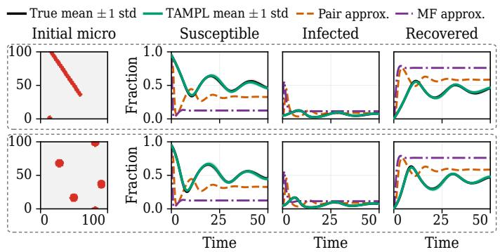  
Figure 2: SIRS macroscopic prediction by TAMPL. The left column shows the initial lattice, with infected sites in red and susceptible sites in gray. The right three columns show the predicted and ground-truth macroscopic observations.

The mean-field and pair approximations predict earlier and larger initial infection peaks and deviate from the reference population fractions later. Table 2 reports quantitative comparisons with the learned baselines. TAMPL achieves the lowest mean macrostate RMSE and MMD among the evaluated methods. JLD exhibits large macroscopic prediction errors, consistent with our analysis in Sec. 4.2. Varying its transition-loss weight does not close the performance gap (Appendix Table 3). Additional trajectory comparisons are provided in Appendix Fig. 9.

## 5.2 BINARY MIXING

Next, we consider binary mixing of two particle types in a two-dimensional square domain with reflecting boundaries. Particles interact through type-dependent Lennard–Jones potentials (Das et al., 2003). The observed microstate $\mathbf { \Delta } _ { \mathbf { \mathcal { X } } _ { t } }$ is an unordered set of particle positions and particle type labels. Appendix Fig. 10 shows one example microstate trajectory. Following prior work (Munao et al., 2022; Li et al., 2024), the macroscopic observation $\pmb { y } _ { t } = ( S _ { t } , K _ { t } )$ comprises the sum of the largest cluster sizes for the two particle types $S _ { t }$ and the total cluster count $K _ { t } ,$ both normalized by the total number of particles. All methods use a DeepSet encoder (Zaheer et al., 2017) with latent dimension $d _ { z } = 8$ . Definitions of the macroscopic observables and experimental details are provided in Appendix D.3.

As reported in Table 2, TAMPL achieves the lowest mean macrostate RMSE and MMD among the evaluated methods. Compared to the SIRS experiment (Sec. 5.1), the best baseline is TwoStage–Recon here rather than the JLD–VIC. This indicates different baselines may suit different physical systems, whereas TAMPL consistently performs best. Figure 3 shows predictions from two initial particle configurations. In these examples, TAMPL closely follows the reference ensem ble means, although it underestimates trajectory variability. Additional comparisons in Appendix Fig. 11 show that baselines do not predict the macroscopic dynamics accurately.

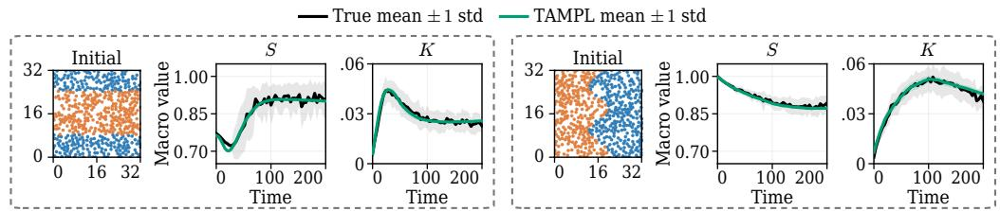  
Figure 3: Binary mixing macroscopic prediction by TAMPL. Particle colors indicate the two types at initial microstates. Curves show means, with shades indicating one standard deviation.

## 5.3 POLYMER EXTENSION

Last, we use the released polymer image dataset of Han et al. (2026) to predict the extension of the polymer chain undergoing Brownian dynamics in a planar elongational flow. The observed microstate $\mathbf { \Delta } _ { \mathbf { \mathcal { X } } _ { t } }$ is a grayscale image, and the macroscopic observation ${ \mathbf { } } _ { \mathbf { } } \mathbf { \mathbf { } } _ { \mathbf { } } \mathbf { \mathbf { } } _ { \mathbf { } } \mathbf { \mathbf { } } _ { \mathbf { } } \mathbf { \mathbf { } } _ { \mathbf { } } \mathbf { \mathbf { } } _ { \mathbf { } } \mathbf { \mathbf { } } _ { \mathbf { } } \mathbf { \mathbf { } } _ { \mathbf { } } \mathbf { \Xi } _ { \mathbf { } } \mathbf { \Lambda } _ { \mathbf { } } \mathbf { \Lambda } _ { \mathbf { } } \textbf { } _ { \mathbf { } } \textbf { } \textbf { } _ { \mathrm { } }$ is the polymer extension length. All methods use a ResNet-34 encoder initialized with pretrained weights and a latent dimension of $d _ { z } = 4$ . Experiment details are provided in Appendix D.4.

Learning the stretch dynamics is quite difficult because the image representation removes the order information and smooths out position information of polymer beads. To test the learning algorithm, this dataset provides three testing cases named Fast, Medium, and Slow, which correspond to three different stretch dynamics due to the initial configuration of microstates. We find that only TAMPL captures the distinct extension time scales, including the delayed extension in the Slow regime (Fig. 4). In contrast, the baselines generally predict incorrect extension in the Slow regime (Appendix Fig. 12).

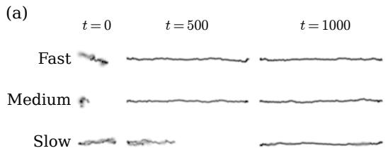

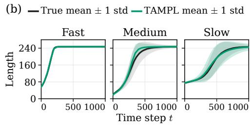  
Figure 4: Microstates illustration and TAMPL predictions of polymer extension for the Fast, Medium, and Slow test cases.

## 6 DISCUSSION

In this work, we introduced TAMPL, a reconstruction-free framework for learning latent states and dynamics for prescribed macroscopic prediction. The training alternates between representation and transition updates, using a frozen target encoder to define next-state targets during representation learning. Our analysis of linear systems characterizes the misalignment with the reconstruction objective and latent scale collapse, and establishes sufficient conditions for local convergence to nondegenerate exact latent dynamics. Numerical experiments on lattice SIRS, binary mixing, and polymer extension demonstrate improved macroscopic prediction over the evaluated baselines.

The proposed framework flexibly accommodates different input modalities, such as images and particles, by selecting appropriate encoders that respect their structure. The latent transition can also be linear or nonlinear, and deterministic or stochastic. We use conditional flow matching because it is convenient to implement and powerful for learning stochastic dynamics. Future work includes extending the theoretical analysis beyond linear systems, exploring history-dependent latent transitions (Vlachas et al., 2022), and applying the framework to laboratory data.

## AI USE STATEMENT

In this work, we used generative AI tools to generate synthetic datasets, formulate mathematical claims, provide critical ingredients for proving mathematical claims, assist in writing proofs, implement methods, and interpret results. We have not used generative AI tools to help develop theoretical models or conceptual frameworks, propose or refine hypotheses, or design or provide feedback on research methodology or experiments. Translation assistance, dataset cleaning and reformatting, and qualitative and thematic data analysis are not applicable to this work. Additionally, we used generative AI tools to create scientific figures or images, draft parts of the paper such as the pseudocode description, summarize or analyze existing literature, discover research topics or identify gaps, source or search for information, identify relevant literature, and format references. We have reviewed all AI-assisted work. For example, we checked that LLM-polished text preserved its original meaning and verified that LLM-generated code ran as intended. We take responsibility for the final content of this work, including text, claims or artifacts produced with the aid of generative AI.

## REPRODUCIBILITY STATEMENT

We provide anonymous source code for the Lattice SIRS experiment in the supplementary materials along with this submission. We will clean and release the full source code once the paper is accepted.

## REFERENCES

Pierre Baldi and Kurt Hornik. Neural networks and principal component analysis: Learning from examples without local minima. Neural Networks, 2(1):53–58, 1989. doi: 10.1016/0893-6080(89) 90014-2.

Randall Balestriero and Yann LeCun. Lejepa: Provable and scalable self-supervised learning without the heuristics. arXiv preprint arXiv:2511.08544, 2025.

Adrien Bardes, Jean Ponce, and Yann LeCun. Vicreg: Variance-invariance-covariance regularization for self-supervised learning. In International Conference on Learning Representations, 2022. URL https://openreview.net/forum?id=xm6YD62D1Ub.

Srinath Bulusu, Matteo Favoni, Andreas Ipp, David I. Muller, and Daniel Schuh. Generalization¨ capabilities of translationally equivariant neural networks. Physical Review D, 104:074504, Oct 2021. doi: 10.1103/PhysRevD.104.074504.

Kathleen Champion, Bethany Lusch, J. Nathan Kutz, and Steven L. Brunton. Data-driven discovery of coordinates and governing equations. Proceedings of the National Academy of Sciences, 116 (45):22445–22451, 2019. doi: 10.1073/pnas.1906995116.

Boyuan Chen, Kuang Huang, Sunand Raghupathi, Ishaan Chandratreya, Qiang Du, and Hod Lipson. Automated discovery of fundamental variables hidden in experimental data. Nature Computational Science, 2(7):433–442, 2022.

Mengyi Chen and Qianxiao Li. Learning macroscopic dynamics from partial microscopic observations. Advances in Neural Information Processing Systems, 37:48996–49021, 2024.

Xiaoli Chen, Beatrice W. Soh, Zi-En Ooi, Eleonore Vissol-Gaudin, Haijun Yu, Kostya S. Novoselov, Kedar Hippalgaonkar, and Qianxiao Li. Constructing custom thermodynamics using deep learn ing. Nature Computational Science, 4(1):66–85, 2024. doi: 10.1038/s43588-023-00581-5.

Subir K Das, Jurgen Horbach, and Kurt Binder. Transport phenomena and microscopic structure¨ in partially miscible binary fluids: A simulation study of the symmetrical lennard-jones mixture. The Journal ofchemical physics, 119(3):1547–1558, 2003.

David R. de Souza and Tania Tom ˆ e. Stochastic lattice gas model describing the dynamics of the ´ SIRS epidemic process. Physica A: Statistical Mechanics and its Applications, 389(5):1142– 1150, 2010. doi: 10.1016/j.physa.2009.10.039.

Ky Fan. Maximum properties and inequalities for the eigenvalues of completely continuous operators. Proceedings of the National Academy of Sciences, 37(11):760–766, 1951. doi: 10.1073/pnas.37.11.760.

William D. Fries, Xiaolong He, and Youngsoo Choi. LaSDI: Parametric latent space dynamics identification. Computer Methods in Applied Mechanics and Engineering, 399:115436, 2022. doi: 10.1016/j.cma.2022.115436.

Carles Gelada, Saurabh Kumar, Jacob Buckman, Ofir Nachum, and Marc G. Bellemare. DeepMDP: Learning continuous latent space models for representation learning. In Proceedings of the 36th International Conference on Machine Learning, volume 97 of Proceedings of Machine Learning Research, pp. 2170–2179. PMLR, 2019. URL https://proceedings.mlr.press/v97/ gelada19a.html.

Zhichao Han, Mengyi Chen, and Qianxiao Li. Learning permutation-invariant macroscopic dynamics. In Forty-third International Conference on Machine Learning, 2026. URL https: //openreview.net/forum?id=BN1NC3OH61.

Nicklas A. Hansen, Hao Su, and Xiaolong Wang. Temporal difference learning for model predictive control. In Proceedings of the 39th International Conference on Machine Learning, volume 162 of Proceedings of Machine Learning Research, pp. 8387–8406, 2022. URL https:// proceedings.mlr.press/v162/hansen22a.html.

Xiaolong He, Youngsoo Choi, William D Fries, Jonathan L Belof, and Jiun-Shyan Chen. glasdi: Parametric physics-informed greedy latent space dynamics identification. Journal of Computational Physics, 489:112267, 2023.

Morris W. Hirsch, Charles C. Pugh, and Michael Shub. Invariant Manifolds, volume 583 of Lecture Notes in Mathematics. Springer Berlin, Heidelberg, 1977. doi: 10.1007/BFb0092042.

Samo Hromadka, Kai Biegun, Lior Fox, James Heald, and Maneesh Sahani. Maximum-likelihood learning of latent dynamics without reconstruction. In Proceedings of the 43rd International Conference on Machine Learning, Proceedings of Machine Learning Research, 2026.

Jaewook Joo and Joel L. Lebowitz. Pair approximation of the stochastic susceptible-infectedrecovered-susceptible epidemic model on the hypercubic lattice. Physical Review E, 70(3): 036114, 2004. doi: 10.1103/PhysRevE.70.036114.

Ioannis G. Kevrekidis, C. William Gear, James M. Hyman, Panagiotis G. Kevrekidis, Olof Runborg, and Constantinos Theodoropoulos. Equation-free, coarse-grained multiscale computation: Enabling microscopic simulators to perform system-level analysis. Communications in Mathematical Sciences, 1(4):715–762, 2003. doi: 10.4310/CMS.2003.v1.n4.a5.

Yann LeCun, Leon Bottou, Yoshua Bengio, and Patrick Haffner. Gradient-based learning applied to´ document recognition. Proceedings ofthe IEEE, 86(11):2278–2324, 1998.

Kookjin Lee and Kevin T. Carlberg. Model reduction of dynamical systems on nonlinear manifolds using deep convolutional autoencoders. Journal of Computational Physics, 404:108973, 2020. doi: 10.1016/j.jcp.2019.108973.

Jia-jian Li, Rui-xue Guo, and Bao-quan Ai. Spontaneous separation of attractive chiral mixtures. Physical Review E, 110(2):024608, 2024.

Bethany Lusch, J. Nathan Kutz, and Steven L. Brunton. Deep learning for universal linear embeddings of nonlinear dynamics. Nature Communications, 9:4950, 2018. doi: 10.1038/ s41467-018-07210-0.

Lucas Maes, Quentin Le Lidec, Damien Scieur, Yann LeCun, and Randall Balestriero. LeWorld Model: Stable end-to-end joint-embedding predictive architecture from pixels. arXiv preprint arXiv:2603.19312, 2026. URL https://arxiv.org/abs/2603.19312.

Andreas Mardt, Luca Pasquali, Hao Wu, and Frank Noe. Vampnets for deep learning of molecular kinetics. Nature Communications, 9:5, 2018. doi: 10.1038/s41467-017-02388-1.

Gianmarco Munao, Dino Costa, Gianpietro Malescio, Jean-Marc Bomont, and Santi Prestipino. Competition between clustering and phase separation in binary mixtures containing salr particles. Soft Matter, 18(34):6453–6464, 2022.

Suraj Nair, Silvio Savarese, and Chelsea Finn. Goal-aware prediction: Learning to model what matters. In Proceedings ofthe 37th International Conference on Machine Learning, volume 119 of Proceedings ofMachine Learning Research, pp. 7207–7219, 2020.

Tung D. Nguyen, Rui Shu, Tuan Pham, Hung Bui, and Stefano Ermon. Temporal predictive coding for model-based planning in latent space. In Proceedings ofthe 38th International Conference on Machine Learning, volume 139 of Proceedings of Machine Learning Research, pp. 8130–8139, 2021.

Tianwei Ni, Benjamin Eysenbach, Erfan Seyedsalehi, Michel Ma, Clement Gehring, Aditya Mahajan, and Pierre-Luc Bacon. Bridging state and history representations: Understanding selfpredictive RL. In International Conference on Learning Representations, pp. 23555–23569, 2024. URL https://proceedings.iclr.cc/paper\_files/paper/2024/file/ 666c1861d709bd84e20b6e0e02a2c223-Paper-Conference.pdf.

Jun Sur Richard Park, Siu Wun Cheung, Youngsoo Choi, and Yeonjong Shin. tlasdi: Thermodynamics-informed latent space dynamics identification. Computer Methods in Applied Mechanics and Engineering, 429:117144, 2024.

David E Rumelhart, Geoffrey E Hinton, and Ronald J Williams. Learning representations by backpropagating errors. nature, 323(6088):533–536, 1986.

Max Schwarzer, Ankesh Anand, Rishab Goel, R. Devon Hjelm, Aaron Courville, and Philip Bachman. Data-efficient reinforcement learning with self-predictive representations. In International Conference on Learning Representations, 2021.

Rui Shu, Tung Nguyen, Yinlam Chow, Tuan Pham, Khoat Than, Mohammad Ghavamzadeh, Stefano Ermon, and Hung Bui. Predictive coding for locally-linear control. In International Conference on Machine Learning, pp. 8862–8871. PMLR, 2020.

Yunhao Tang, Zhaohan Daniel Guo, Pierre Harvey Richemond, Bernardo Avila Pires, Yash Chandak, Remi Munos, Mark Rowland, Mohammad Gheshlaghi Azar, Charline Le Lan, Clare Lyle,´ Andras Gy´ orgy, Shantanu Thakoor, Will Dabney, Bilal Piot, Daniele Calandriello, and Michal¨ Valko. Understanding self-predictive learning for reinforcement learning. In Proceedings of the 40th International Conference on Machine Learning, volume 202 of Proceedings of Machine Learning Research, pp. 33632–33656, 2023.

Yi Tian, Kaiqing Zhang, Russ Tedrake, and Suvrit Sra. Can direct latent model learning solve linear quadratic gaussian control? In Proceedings of the 5th Annual Learning for Dynamics and Control Conference, volume 211 of Proceedings ofMachine Learning Research, pp. 51–63, 2023.

Alexander Tong, Kilian Fatras, Nikolay Malkin, Guillaume Huguet, Yanlei Zhang, Jarrid Rector-Brooks, Guy Wolf, and Yoshua Bengio. Improving and generalizing flow-based generative models with minibatch optimal transport. Transactions on Machine Learning Research, 2024.

Pantelis R. Vlachas, Georgios Arampatzis, Caroline Uhler, and Petros Koumoutsakos. Multiscale simulations of complex systems by learning their effective dynamics. Nature Machine Intelli gence, 4:359–366, 2022. doi: 10.1038/s42256-022-00464-w.

Manzil Zaheer, Satwik Kottur, Siamak Ravanbakhsh, Barnabas P´ oczos, Ruslan Salakhutdinov, and´ Alexander J Smola. Deep sets. In Proceedings of the 31st International Conference on Neural Information Processing Systems, NIPS’17, pp. 3394–3404, Red Hook, NY, USA, 2017. Curran Associates Inc.

Aiqing Zhu, Yuting Pan, and Qianxiao Li. Continuity-preserving convolutional autoencoders for learning continuous latent dynamical models from images. In The Thirteenth International Conference on Learning Representations, 2025.

## A TRAINING AND INFERENCE DETAILS

## A.1 CONDITIONAL FLOW MATCHING FOR LATENT TRANSITIONS

In the domain experiments, the stochastic latent transition $T _ { \theta _ { T } } ( \cdot \mid z _ { t } )$ is represented by a conditional flow trained using conditional flow matching (Tong et al., 2024). Given a current latent state ${ \boldsymbol { z } } _ { t }$ and a next-state target $z _ { t + 1 }$ , we independently sample $s \sim \mathcal { U } ( 0 , 1 )$ and $\epsilon \sim \mathcal { N } ( \mathbf { 0 } , I _ { d _ { z } } )$ and construct the interpolated state

$$
{ \bf u } _ { s } = ( 1 - s ) \epsilon + s z _ { t + 1 } .\tag{12}
$$

Here s is an auxiliary flow time, distinct from the physical time index $t . \ \mathrm { ~ \bf ~ A ~ }$ velocity field ${ \bf v } _ { \theta _ { T } } ( { \bf u } _ { s } , s ; z _ { t } )$ , conditioned on $z _ { t } ,$ , is trained to predict the interpolation velocity $z _ { t + 1 } - \epsilon$ using

$$
\ell _ { \mathrm { t r } } ( T _ { \theta _ { T } } ; z _ { t } , z _ { t + 1 } ) = \mathbb { E } _ { s , \epsilon } \bigg [ \frac { 1 } { d _ { z } } \left. \mathbf { v } _ { \theta _ { T } } ( \mathbf { u } _ { s } , s ; z _ { t } ) - ( z _ { t + 1 } - \epsilon ) \right. _ { 2 } ^ { 2 } \bigg ] .\tag{13}
$$

In the stage to update latent representation, we set ${ \boldsymbol { z } } _ { t } = E _ { { \boldsymbol { \theta } } _ { E } } ( { \boldsymbol { \mathbf { x } } } _ { t } )$ and $\boldsymbol { z } _ { t + 1 } = \boldsymbol { E } _ { \bar { \boldsymbol { \theta } } _ { E } } ( \boldsymbol { x } _ { t + 1 } )$ . The target encoder and velocity-field parameters remain fixed, while gradients pass through the conditioning state ${ \boldsymbol { z } } _ { t }$ to the online encoder. Thus freezing the transition does not block the encoder gradient: $\begin{array} { r } { \nabla _ { \theta _ { E } } \ell _ { \mathrm { t r } } = J _ { E _ { \theta _ { E } } } ^ { \top } ( \pmb { x } _ { t } ) \nabla _ { z _ { t } } \ell _ { \mathrm { t r } } , } \end{array}$ . Its direction depends on the learned conditional velocity field; the fixedtarget radial calculation in Sec. 4.3 applies to the squared-loss linear specialization. In the stage to update transition, both latent states are computed with the refreshed, frozen target encoder, and only the velocity-field parameters are updated.

At inference, we sample an independent Gaussian initial state for each latent transition and numerically integrate

$$
\frac { \mathrm { d } \mathbf { w } _ { s } } { \mathrm { d } s } = \mathbf { v } _ { \theta _ { T } } ( \mathbf { w } _ { s } , s ; z _ { t } ) , \qquad \mathbf { w } _ { 0 } \sim \mathcal { N } ( \mathbf { 0 } , I _ { d _ { z } } ) , \qquad s \in [ 0 , 1 ] ,\tag{14}
$$

with the conditioning state ${ \boldsymbol { z } } _ { t }$ held fixed. The sampled next latent state is $z _ { t + 1 } = \mathbf { w } _ { 1 }$

## A.2 TRAINING AND INFERENCE ALGORITHMS

Each training epoch consists of Stage I (encoder and readout updates) followed by Stage II (latent transition updates), with one pass over the training minibatches in each stage. The target encoder remains fixed throughout the entire Stage I pass. Theorem 4 gives an explicit sufficient condition for one exact-gradient step per block, whereas Proposition B.1 gives a local spectral criterion for fixed finite block lengths. TAMPL uses $\lambda _ { \mathrm { c u r } } = 1$ and $\lambda _ { \mathrm { t r } } = 0 . 1$ 1 in all domain experiments in Sec. 5. The controlled linear experiments specify their weights in Appendix C.1. The transition stage below uses the unweighted loss. For ordinary gradient descent, its step size absorbs the factor $\lambda _ { \mathrm { t r } }$ used in Theorem 4.

## B PROOFS AND SUPPORTING RESULTS

After introducing the linear setting and exact-realizability condition, we organize the supporting results around the three parts of Sec. 4: reconstruction, joint-training failures, and TAMPL.

## B.1 EXACT REALIZABILITY

We use the linear system, source-state distribution, and weighted norms defined in Sec. 4.

The observation model $y = C _ { \star } x$ assumes that the sampled microstate determines the current observable. Positive definite $\Sigma _ { \mathbf { x } }$ ensures that zero population squared loss identifies the corresponding matrix map on every source direction. For a fixed encoder $B ,$ a readout satisfying $D B = C _ { \star }$ exists exactly when row $( C _ { \star } ) \subseteq \operatorname { r o w } ( B )$ , equivalently ker $B \subseteq$ ker $C _ { \star }$ . A latent transition satisfying $K B = B A$ exists exactly when row $( \bar { B A } ) \subseteq \operatorname { r o w } ( B )$ . Consequently, a full-row-rank exact realization of dimension d exists exactly when there is a d-dimensional right-A-invariant row space containing $\operatorname { r o w } ( C _ { \star } )$ . This is an assumption about capacity, not about the row spaces visited during training. Let r be the rank of the stacked matrix $[ C _ { \star } ^ { \dagger } , ( \check { C } _ { \star } A ) ^ { \top } , \dots , ( C _ { \star } A ^ { n - 1 } ) ^ { \top } ] ^ { \top }$ . Its row space is the smallest such invariant space: invariance follows from Cayley–Hamilton, and any invariant space containing row $( C _ { \star } )$ contains all the displayed rows. Choosing a row basis gives an exact realization of dimension r. For a prescribed $d > r ,$ a full-rank realization additionally requires a d-dimensional invariant extension. Merely requiring $d \ge \mathrm { r a n k } ( C _ { \star } )$ ensures a current readout can exist but is not sufficient for closed latent dynamics.

Algorithm 1 Alternating training strategy.   
Require: Observed training trajectories $\overline { { \mathcal { D } ; } }$ initialized modules $E _ { \theta _ { E } } , R _ { \theta _ { R } }$ , and $T _ { \theta _ { 7 } }$   
1: Initialize $E _ { \bar { \theta } _ { E } }  E _ { \theta _ { E } }$ by a hard copy   
2: while the stopping criterion is not met do ▷ One training epoch   
Stage I: Update the encoder and readout   
Trainable: $E _ { \theta _ { E } } , R _ { \theta _ { R } }$   
Fixed: $E _ { \bar { \theta } _ { E } } , T _ { \theta _ { T } } ^ { - }$   
3: for each minibatch B of $( { \pmb x } _ { t } , { \pmb y } _ { t } , { \pmb x } _ { t + 1 } )$ do   
4: ${ \boldsymbol { z } } _ { t } \gets E _ { { \boldsymbol { \theta } } _ { E } } ( { \bf x } _ { t } )$   
5: $\widetilde { \boldsymbol { z } } _ { t + 1 } \gets \boldsymbol { E } _ { \bar { \boldsymbol { \theta } } _ { E } } ( \mathbf { \Delta } \mathbf { x } _ { t + 1 } )$   
6: Evaluate ${ \mathcal { L } } _ { \mathrm { c u r } }$ and $\dot { \mathcal { L } } _ { \mathrm { t r } } ( E _ { \theta _ { E } } , E _ { \bar { \theta } _ { E } } ; T _ { \theta _ { T } } )$   
7: Update $E _ { \theta _ { E } } , R _ { \theta _ { R } }$ using $\nabla \mathcal { L } _ { \mathrm { e n c } }$   
8: $E _ { \bar { \theta } _ { E } }  E _ { \theta _ { E } }$ by a hard copy   
Stage II: Update the latent transition   
Trainable: $T _ { \theta _ { T } }$   
Fixed: $E _ { \theta _ { E } } , \bar { E _ { \bar { \theta } _ { E } } } , R _ { \theta _ { R } }$   
9: for each minibatch B of $\mathbf { \Phi } ( \pmb { x } _ { t } , \pmb { x } _ { t + 1 } )$ do   
10: ${ \boldsymbol { z } } _ { t } \gets E _ { \bar { \boldsymbol { \theta } } _ { E } } ( { \boldsymbol { x } } _ { t } )$   
11: $\widetilde { \pmb { z } } _ { t + 1 } \gets \mathbf { \widetilde { E } } _ { \bar { \theta } _ { E } } ( \pmb { x } _ { t + 1 } )$   
12: Evaluate $\mathcal { L } _ { \mathrm { t r } } ( E _ { \bar { \theta } _ { E } } , E _ { \bar { \theta } _ { E } } ; T _ { \theta _ { T } } )$   
13: Update $T _ { \theta _ { T } }$ using $\nabla \mathcal L _ { \mathrm { t r } } ^ { - }$   
Ensure: Trained $E _ { \theta _ { E } } , R _ { \theta _ { R } } ,$ and $T _ { \theta _ { T } }$

Algorithm 2 Latent-only inference.   
Require: Initial microscopic state ${ \bf { x } } _ { 0 } ;$ trained modules $E _ { \theta _ { E } } , T _ { \theta _ { T } }$ , and $R _ { \theta _ { R } } ;$ ; rollout length H   
Ensure: Predicted macroscopic trajectory $\{ \widehat { \pmb { y } } _ { t } \} _ { t = 0 } ^ { H }$   
Fixed: $E _ { \theta _ { E } } , T _ { \theta _ { T } } , R _ { \theta _ { R } }$   
1: ${ z _ { 0 } } \gets E _ { \theta _ { E } } ( { \pmb x } _ { 0 } )$   
2: $\widehat { \pmb y } _ { 0 } \gets { \cal R } _ { \theta _ { R } } ( { \pmb z } _ { 0 } )$   
3: for $t = 0$ to $\dot { H } - 1$ do   
4: Generate $z _ { t + 1 }$ from $T _ { \theta _ { 7 } }$ given ${ \boldsymbol { z } } _ { t }$ (sample for stochastic transitions)   
5: $\widehat { \pmb { y } } _ { t + 1 }  { \cal R } _ { \theta _ { R } } ( \pmb { z } _ { t + 1 } )$   
6: return $\{ \widehat { \pmb { y } } _ { t } \} _ { t = 0 } ^ { H }$

## B.2 WHEN RECONSTRUCTION HARMS MACROSCOPIC PREDICTION

This part provides the spectral-selection proof and two-dimensional illustration supporting the discussion of reconstruction loss in Sec. 4.1.

## B.2.1 PROOF OF THEOREM 1

Use the macro-prediction and reconstruction losses defined in Eqs. 4 and 5. Define the currentprediction matrix and whitened encoder row space by

$$
M _ { \mathrm { c u r } } : = \lambda _ { \mathrm { c u r } } \Sigma _ { \mathrm { x } } ^ { 1 / 2 } C _ { \star } ^ { \top } C _ { \star } \Sigma _ { \mathrm { x } } ^ { 1 / 2 } , \qquad S _ { B } : = \mathrm { r o w } ( B \Sigma _ { \mathrm { x } } ^ { 1 / 2 } ) ,\tag{15}
$$

and let $P _ { B }$ be the orthogonal projector onto $\boldsymbol { S } _ { B }$ . The optimization in Theorem 1 is

$$
\operatorname* { m i n } _ { \mathrm { r a n k } ( B ) = d , G , D } \lambda _ { \mathrm { c u r } } \mathcal { L } _ { \mathrm { c u r } } ( B , D ) + \lambda _ { \mathrm { r e c } } \mathcal { L } _ { \mathrm { r e c } }\tag{16}
$$

For fixed B, least squares projects each row of $\Sigma _ { \mathrm { x } } ^ { 1 / 2 }$ and of $C _ { \star } \Sigma _ { \mathbf { x } } ^ { 1 / 2 }$ onto $ { S _ { B } } = \mathrm { r o w } (  { B \Sigma _ { \mathrm { x } } } ^ { 1 / 2 } )$ ). The minimized reconstruction loss and weighted current-prediction loss are

$$
\| \Sigma _ { \mathbf { x } } ^ { 1 / 2 } ( I _ { n } - P _ { B } ) \| _ { F } ^ { 2 } = \operatorname { t r } ( \Sigma _ { \mathbf { x } } ) - \operatorname { t r } ( P _ { B } \Sigma _ { \mathbf { x } } ) ,\tag{17}
$$

$$
\lambda _ { \mathrm { c u r } } \| C _ { \star } \Sigma _ { \mathrm { x } } ^ { 1 / 2 } ( I _ { n } - P _ { B } ) \| _ { F } ^ { 2 } = \mathrm { t r } ( M _ { \mathrm { c u r } } ) - \mathrm { t r } ( P _ { B } M _ { \mathrm { c u r } } ) .\tag{18}
$$

After dropping constants, the profiled objective is therefore equivalent to

$$
\operatorname * { m a x } _ { P = P ^ { \top } = P ^ { 2 } } \operatorname { t r } [ P ( M _ { \mathrm { c u r } } + \lambda _ { \mathrm { r e c } } \Sigma _ { \mathrm { x } } ) ] .\tag{19}
$$

Every rank-d orthogonal projector is realizable as $P _ { B }$ because $\Sigma _ { \mathbf { x } }$ is invertible. The Ky Fan variational principle (Fan, 1951) then selects a top-d eigenspace of $M _ { \mathrm { { c u r } } } + \lambda _ { \mathrm { { r e c } } } \Sigma _ { \mathrm { { x } } }$ □

Two-dimensional illustration. In the example of Sec. 4.1, the two eigenvalues are $( \lambda _ { \mathrm { c u r } } c _ { \mathrm { u } } ^ { 2 } +$ $\lambda _ { \mathrm { { r e c } } } ) \sigma _ { \mathrm { { u } } } ^ { 2 }$ and $\lambda _ { \mathrm { { r e c } } } \sigma _ { \mathrm { { n } } } ^ { 2 }$ , giving Eq. 6. Adding the nonnegative term $\lambda _ { \mathrm { t r } }$ minK $\| \bar { K } B - B A \| _ { \Sigma _ { \mathbf { x } } } ^ { 2 }$ preserves the selected coordinate because that encoder already achieves zero transition loss.

## B.3 MACROSCOPIC SUPERVISION AND LATENT CONSISTENCY

This part supports the discussion of macrostate prediction loss in Sec. 4.1. We first prove Proposition 4.1, and then explain which latent errors output supervision can leave unconstrained.

## B.3.1 PROOF OF PROPOSITION 4.1

For the construction in the main text, which uses two latent coordinates and three microstate coordinates,

$$
D B = C _ { \star } , \qquad D K B = C _ { \star } A , \qquad K ^ { 2 } = 0 .
$$

Consequently, ${ \mathcal { L } } _ { \mathrm { m a c r o } } = 0$ for any nonnegative loss weights, but

$$
D K ^ { h } B = 0 \neq ( a ^ { h } , b ^ { h } , 0 ) = C _ { \star } A ^ { h } \qquad { \mathrm { f o r ~ e v e r y ~ } } h \geq 2 .
$$

An exact realization exists at the same latent dimension: $B _ { \star } = [ I _ { 2 } | 0 _ { 2 \times 1 } ] , D _ { \star } = ( 1 , 1 )$ , and $K _ { \star } = \mathrm { d i a g } ( a , b )$ . Thus the failure occurs despite sufficient model capacity.

For the second claim, positive definiteness of $\Sigma _ { \mathbf { x } }$ implies that $\mathcal { L } _ { \mathrm { c u r } } = \mathcal { L } _ { \mathrm { t r } } = 0$ is equivalent to

$$
D B = C _ { \star } , \qquad K B = B A .
$$

Induction gives $K ^ { h } B = B A ^ { h }$ for every $h \geq 0$ . Hence

$$
D K ^ { h } B = D B A ^ { h } = C _ { \star } A ^ { h } \qquad { \mathrm { f o r } } { \mathrm { e v e r y } } h \geq 0 .
$$

## B.3.2 WHAT MACROSCOPIC SUPERVISION CONSTRAINS

Assume exact current readout, $D B = C _ { \star }$ , and write $\Delta : = K B - B A$ for the latent-transition residual. Then

$$
D K B - C _ { \star } A = D ( K B - B A ) = D \Delta .
$$

Thus next-macrostate supervision penalizes $\| D \Delta \| _ { \Sigma _ { \mathbf { x } } } ^ { 2 }$ , whereas latent-transition supervision penalizes $\| \Delta \| _ { \Sigma _ { \mathbf { x } } } ^ { 2 }$ . If D has a nontrivial kernel, the columns of a nonzero $\Delta$ can lie in that kernel and remain invisible to the one-step output. When the one-step output is also exact,

$$
D K ^ { 2 } B - C _ { \star } A ^ { 2 } = D K \Delta + ( D K B - C _ { \star } A ) A = D K \Delta .
$$

An error invisible to $D$ can therefore become visible after another application of $K$ . If D has full column rank, however, $D \Delta = 0$ implies $\Delta = 0$ . The failure of one-step supervision is consequently a possibility, rather than an inevitable outcome.

The rank mechanism in the main-text example can also be expressed without choosing particular coordinates. Every future prediction factors through the predicted next latent state:

$$
D K ^ { h } B = D K ^ { h - 1 } ( K B ) , \qquad \operatorname { r o w } ( D K ^ { h } B ) \subseteq \operatorname { r o w } ( K B ) , \qquad h \geq 1 .
$$

Exact predictions through horizon H therefore require

$$
\operatorname { r o w } { \left( \begin{array} { l } { C _ { \star } A } \\ { C _ { \star } A ^ { 2 } } \\ { \vdots } \\ { C _ { \star } A ^ { H } } \end{array} \right) } \subseteq \operatorname { r o w } ( K B ) ,
$$

and, in particular,

$$
\operatorname { r a n k } { \left( \begin{array} { l } { C _ { \star } A } \\ { C _ { \star } A ^ { 2 } } \\ { \vdots } \\ { C _ { \star } A ^ { H } } \end{array} \right) } \leq \operatorname { r a n k } ( K B ) .
$$

One-step fitting need not enforce the information requirements of later outputs. In the main-text example, row(KB) is spanned by $( a , b , 0 )$ , whereas $( a ^ { 2 } , b ^ { 2 } , 0 )$ lies outside this space because $a b ( b - a ) \neq 0$ The encoder has full rank, but the predicted next latent state has already lost a direction required for two-step prediction. These row-space and rank conditions identify an information obstruction; satisfying them alone does not ensure that the learned transition propagates the retained information correctly.

Finite-horizon macroscopic supervision. Adding $\begin{array} { r } { \sum _ { h = 1 } ^ { H } \| D K ^ { h } B - C _ { \star } A ^ { h } \| _ { \Sigma } ^ { 2 } } \end{array}$ to the currentx readout loss constrains additional future outputs, but need not ensure accurate predictions beyond the supervised horizon. For example, extending the main-text construction to encode $( y _ { t } , y _ { t + 1 } , \ldots , y _ { t + H } ) ^ { \top }$ , with a transition that shifts these coordinates and inserts zero, gives exact current and future outputs through horizon H but predicts zero at horizon $H + 1$ , which can differ from the true output. Thus a model can store and emit the supervised outputs without learning the latent update needed to continue their evolution.

## B.4 WHY JOINT TRAINING CAN FAIL

This part supports Sec. 4.2. We establish the coordinate-rescaling identities, analyze simultaneous gradients and slow optimization, and then derive conditions for an incorrect attracting manifold.

## B.4.1 COORDINATE TRANSFORMATIONS AND SCALE NON-COERCIVITY

Let $\operatorname { G L } ( d )$ be the invertible d × d matrices and define

$$
B _ { S } = S B , \quad K _ { S } = S K S ^ { - 1 } , \quad D _ { S } = D S ^ { - 1 } .\tag{20}
$$

$$
D _ { S } B _ { S } = D B , \qquad D _ { S } K _ { S } B _ { S } = D K B ,\tag{21}
$$

$$
K _ { S } B _ { S } - B _ { S } A = S ( K B - B A ) .\tag{22}
$$

These transformations preserve the model maps, not the numerical transition loss or Euclidean gradient dynamics. Choosing $G _ { S } ~ = ~ G S ^ { - 1 }$ also preserves the reconstruction map GB. Thus the same rescaling is possible when reconstruction is included. For every fixed integer $h \geq 0 .$ $D _ { S } K _ { S } ^ { h } B _ { S } = D K ^ { \check { h } } B$

For $S = \alpha I _ { d } .$ , the squared transition norm is exactly $\alpha ^ { 2 } \lVert K B - B A \rVert _ { \Sigma } ^ { 2 } ,$ , whereas the current and one-step macro maps remain fixed. For $D \neq 0$ , the readout $D / \alpha$ diverges as $\alpha \downarrow 0 ,$ although the macro prediction maps stay unchanged. With $\begin{array} { r } { D B = C _ { \star } } \end{array}$ , these identities imply the scaling relation in Proposition 4.2.

## B.4.2 JOINT GRADIENTS AND LATENT SCALING

We relate the scaling identity in Proposition 4.2 to simultaneous gradient updates. Write $E : =$ $D B - C _ { \star }$ and $\Delta : = K B - B A$ . With all gradients evaluated at the current $( B , D , K )$ , one joint step of size η is

$$
D ^ { + } = D - 2 \eta \lambda _ { \mathrm { c u r } } E \Sigma _ { \mathrm { x } } B ^ { \top } ,\tag{23}
$$

$$
\begin{array} { r } { K ^ { + } = K - 2 \eta \lambda _ { \mathrm { t r } } \Delta \Sigma _ { \mathrm { x } } B ^ { \top } , } \end{array}\tag{24}
$$

$$
\begin{array} { r } { B ^ { + } = B - 2 \eta \lambda _ { \mathrm { c u r } } D ^ { \top } E \Sigma _ { \mathrm { x } } - 2 \eta \lambda _ { \mathrm { t r } } \left( K ^ { \top } \Delta \Sigma _ { \mathrm { x } } - \Delta \Sigma _ { \mathrm { x } } A ^ { \top } \right) . } \end{array}\tag{25}
$$

Let $G _ { B } : = \nabla _ { B } \mathcal { L } _ { \mathrm { j o i n t } }$ and $G _ { D } : = \nabla _ { D } \mathcal { L } _ { \mathrm { j o i n t } }$ . Taking Frobenius inner products of these gradients with $B , D$ gives

$$
\langle B , G _ { B } \rangle _ { F } = 2 \lambda _ { \mathrm { c u r } } \langle D B , E \rangle _ { \Sigma _ { \mathrm { x } } } + 2 \lambda _ { \mathrm { t r } } \| \Delta \| _ { \Sigma _ { \mathrm { x } } } ^ { 2 } , \qquad \langle D , G _ { D } \rangle _ { F } = 2 \lambda _ { \mathrm { c u r } } \langle D B , E \rangle _ { \Sigma _ { \mathrm { x } } } .\tag{26}
$$

The transition term follows from $\langle K B , \Delta \rangle _ { \Sigma _ { \mathbf { x } } } - \langle B A , \Delta \rangle _ { \Sigma _ { \mathbf { x } } } = \| \Delta \| _ { \Sigma _ { \mathbf { x } } } ^ { 2 }$ . Since

$$
\| B ^ { + } \| _ { F } ^ { 2 } - \| B \| _ { F } ^ { 2 } = - 2 \eta \langle B , G _ { B } \rangle _ { F } + \eta ^ { 2 } \| G _ { B } \| _ { F } ^ { 2 } ,\tag{27}
$$

the encoder norm decreases whenever $\langle B , G _ { B } \rangle _ { F } > 0$ and $0 < \eta < 2 \langle B , G _ { B } \rangle _ { F } / \Vert G _ { B } \Vert _ { F } ^ { 2 }$ . In particular, accurate current prediction $( E = 0 )$ and nonzero $\Delta$ imply such a contraction for a sufficiently small step. This controls the total encoder norm; individual latent directions can evolve differently.

For $B = \alpha \widehat { B }$ with fixed $K , { \widehat { B } } _ { { \mathrm { i } } }$ , put $\widehat { \Delta } = K \widehat { B } - \widehat { B } A$ . Then

$$
\begin{array} { r } { \nabla _ { K } \mathcal { L } _ { \mathrm { j o i n t } } = 2 \lambda _ { \mathrm { t r } } \alpha ^ { 2 } \widehat { \Delta } \Sigma _ { \mathrm { x } } \widehat { B } ^ { \top } . } \end{array}\tag{28}
$$

Thus the transition-learning gradient weakens quadratically along the scaling ray. The same issue can affect a single latent direction. For a unit eigenvector u of $B \Sigma _ { \mathbf { x } } ^ { - } B ^ { \top }$ with eigenvalue $s ^ { 2 }$ , Cauchy– Schwarz gives

$$
\begin{array} { r } { \| ( \nabla _ { K } \mathcal { L } _ { \mathrm { j o i n t } } ) u \| _ { 2 } \leq 2 \lambda _ { \mathrm { t r } } s \sqrt { \mathcal { L } _ { \mathrm { t r } } } . } \end{array}\tag{29}
$$

Here $( \nabla _ { K } \mathcal { L } _ { \mathrm { j o i n t } } ) u \ : = \ : 2 \lambda _ { \mathrm { t r } } \mathbb { E } [ ( \Delta \mathbf { x } _ { t } ) ( u ^ { \top } B \mathbf { x } _ { t } ) ]$ . For bounded transition loss, shrinking this latent variance forces the corresponding transition gradient to zero. This explains the scale diagnostic in Appendix C.

Finally, Eq. 26 implies $\langle B , G _ { B } \rangle _ { F } - \langle D , G _ { D } \rangle _ { F } = 2 \lambda _ { \mathrm { t r } } \mathcal { L } _ { \mathrm { t r } }$ r. Every finite stationary point consequently has $\mathcal { L } _ { \mathrm { t r } } = 0$ . The incorrect attracting solution analyzed next fails through its macroscopic readout, whereas the scale mechanism above can slow transition learning before stationarity.

## B.4.3 AN INCORRECT ATTRACTING MANIFOLD

We now turn from slow optimization to attraction to an incorrect finite-scale solution. The following theorem gives sufficient conditions for an incorrect attracting manifold.

Theorem 3 (An incorrect attracting manifold) Let $C _ { \star } \neq 0$ and let full-row-rank $B _ { 0 }$ satisfy $K _ { 0 } B _ { 0 } = B _ { 0 } A$ and $C _ { \star } \Sigma _ { \mathbf { x } } B _ { 0 } ^ { \top } = 0$ . Put $S _ { 0 } = B _ { 0 } \Sigma _ { \mathrm { x } } B _ { 0 } ^ { \top }$ , let $P _ { 0 }$ be the orthogonal projector onto row $( B _ { 0 } \Sigma _ { \mathrm { x } } ^ { 1 / 2 } )$ , and define

$$
\tau _ { 0 } : = \operatorname* { m i n } _ { \substack { U \in \mathbb { R } ^ { d \times n } , U \Sigma _ { \mathbf { x } } B _ { 0 } ^ { \top } = 0 } } \Vert ( K _ { 0 } U - U A ) \Sigma _ { \mathbf { x } } ^ { 1 / 2 } ( I - P _ { 0 } ) \Vert _ { F } .\tag{30}
$$

I $\begin{array} { r l r } { f \mathrm { \lambda } \lambda _ { \mathrm { t r } } \tau _ { 0 } ^ { 2 } \lambda _ { \mathrm { m i n } } ( S _ { 0 } ) } & { > } & { \lambda _ { \mathrm { c u r } } \Vert C _ { \star } \Sigma _ { \mathrm { x } } ^ { 1 / 2 } \Vert _ { 2 } ^ { 2 } , } \end{array}$ , then a neighborhood of $( B _ { 0 } , 0 , K _ { 0 } )$ within $\begin{array} { r l } { \mathcal { N } _ { 0 } } & { { } : = } \end{array}$ $\{ ( S B _ { 0 } , 0 , S K _ { 0 } S ^ { - 1 } ) : S \in \mathrm { G L } ( d ) \}$ is a manifold of local minima. For some neighborhood U $o f \left( B _ { 0 } , 0 , K _ { 0 } \right)$ and $\eta _ { 0 } > 0$ , simultaneous gradient descent with any fixed $0 < \eta <$ η0 converges from U to a point in ${ \mathcal { N } } _ { 0 } ,$ , where $\mathcal { L } _ { \mathrm { t r } } = 0$ but $\mathcal { L } _ { \mathrm { c u r } } = \| C _ { \star } \| _ { \Sigma _ { \mathrm { v } } } ^ { 2 } > 0 .$

Proof of Theorem 3. Let $\theta _ { 0 } = ( B _ { 0 } , 0 , K _ { 0 } )$ satisfy the conditions of the theorem and set

$$
\widetilde { B } _ { 0 } = B _ { 0 } \Sigma _ { \mathrm { x } } ^ { 1 / 2 } , \quad S _ { 0 } = \widetilde { B } _ { 0 } \widetilde { B } _ { 0 } ^ { \top } , \quad P _ { 0 } = \widetilde { B } _ { 0 } ^ { \top } S _ { 0 } ^ { - 1 } \widetilde { B } _ { 0 } .\tag{31}
$$

The condition $C _ { \star } \Sigma _ { \mathbf { x } } B _ { 0 } ^ { \top } = 0$ says that the task is orthogonal to every retained feature under the source distribution. It is stronger than merely being an inaccurate readout. Every point in

$$
\mathcal { N } _ { 0 } = \{ ( S B _ { 0 } , 0 , S K _ { 0 } S ^ { - 1 } ) : S \in \mathrm { G L } ( d ) \}\tag{32}
$$

is stationary and has the stated nonzero current loss and zero transition loss. For unrestricted perturbations $( \bar { U , } \bar { V , } W )$ of $( B , D , K )$ , half the joint Hessian quadratic form at $\theta _ { 0 }$ is

$$
\begin{array} { r } { q ( U , V , W ) = \lambda _ { \mathrm { c u r } } \| V B _ { 0 } \| _ { \Sigma _ { \mathrm { x } } } ^ { 2 } - 2 \lambda _ { \mathrm { c u r } } \langle C _ { \star } , V U \rangle _ { \Sigma _ { \mathrm { x } } } + \lambda _ { \mathrm { t r } } \| K _ { 0 } U + W B _ { 0 } - U A \| _ { \Sigma _ { \mathrm { x } } } ^ { 2 } . } \end{array}\tag{33}
$$

Completing squares in $V , W$ gives

$$
\operatorname* { m i n } _ { V , W } q ( U , V , W ) = \lambda _ { \mathrm { t r } } \| S _ { 0 } U \| _ { F } ^ { 2 } - \lambda _ { \mathrm { c u r } } \| S _ { 0 } ^ { - 1 / 2 } U \Sigma _ { \mathbf { x } } C _ { \star } ^ { \top } \| _ { F } ^ { 2 } ,\tag{34}
$$

$$
S _ { 0 } U : = ( K _ { 0 } U - U A ) \Sigma _ { \mathbf { x } } ^ { 1 / 2 } ( I - P _ { 0 } ) ,
$$

$$
V _ { \mathrm { m i n } } = C _ { \star } \Sigma _ { \mathrm { x } } U ^ { \top } S _ { 0 } ^ { - 1 } , \qquad W _ { \mathrm { m i n } } = - ( K _ { 0 } U - U A ) \Sigma _ { \mathrm { x } } B _ { 0 } ^ { \top } S _ { 0 } ^ { - 1 } .
$$

Every U decomposes uniquely as $U = H B _ { 0 } + U _ { \perp }$ , where $U _ { \perp } \Sigma _ { \mathrm { x } } B _ { 0 } ^ { \top } = 0$ . The right-hand side of Eq. 34 depends only on $U _ { \perp }$ . Define

$$
\tau _ { 0 } : = \operatorname* { i n f } _ { U \Sigma _ { \mathbf { x } } B _ { 0 } ^ { \top } = 0 } \| \boldsymbol { S } _ { 0 } U \| _ { F } .\tag{35}
$$

Using $\| S _ { 0 } ^ { - 1 / 2 } U \Sigma _ { \mathbf { x } } C _ { \star } ^ { \top } \| _ { F } \leq \lambda _ { \operatorname* { m i n } } ( S _ { 0 } ) ^ { - 1 / 2 } \| C _ { \star } \Sigma _ { \mathbf { x } } ^ { 1 / 2 } \| _ { 2 } \| U \| _ { \Sigma _ { \mathbf { x } } }$ shows that the sufficient inequality in Theorem 3 makes this reduced Hessian positive definite on all nonzero $U _ { \perp }$ . The completed-square terms are positive definite in $V - V _ { \mathrm { m i n } }$ and $W - W _ { \operatorname* { m i n } }$ . Thus the only Hessian null directions are

$$
( U , V , W ) = ( H B _ { 0 } , 0 , H K _ { 0 } - K _ { 0 } H ) ,\tag{36}
$$

exactly the tangent space of $\mathcal { N } _ { 0 }$ . The Hessian is positive definite normal to the manifold at $\theta _ { 0 }$ and on a sufficiently small surrounding portion. In a tubular chart around that portion, the loss equals its value on $\mathcal { N } _ { 0 }$ plus a positive quadratic normal term and higher-order terms. For sufficiently small positive gradient steps, the normal derivative $I - \eta \nabla ^ { 2 } \mathcal { L } _ { \mathrm { j o i n t } }$ contracts, tangential drift is summable, and every sufficiently close initialization converges to a member of $\mathcal { N } _ { 0 }$ . Equation 34 is also a less conservative test than the theorem’s sufficient norm bound. A negative value for some $U _ { \perp }$ proves that the point is a saddle. Failure of the sufficient norm bound alone proves neither success nor failure. □

Why the condition measures a directional barrier. The second term of Eq. 34 is the best secondorder gain available to the macro readout when a missing source direction is added. The first is the transition cost that remains even after the best accompanying change of K. If the transition term dominates, joint training suppresses the perturbations needed to acquire task information.

## B.5 HOW TAMPL CHANGES THE OPTIMIZATION

Following Sec. 4.3, we first analyze fixed-coordinate transition fitting and fixed-target representation updates, then study instability of the incorrect fixed point and local convergence near an exact realization. The general convergence criterion for finite alternating blocks precedes the explicit one-step sufficient condition that uses it.

## B.5.1 FIXED-COORDINATE TRANSITION REGRESSION

For full-row-rank B, the latent covariance and conditional transition optimum are

$$
\begin{array} { r } { C _ { B } : = B \Sigma _ { \mathrm { x } } B ^ { \top } , \qquad K ^ { \star } ( B ) : = B A \Sigma _ { \mathrm { x } } B ^ { \top } C _ { B } ^ { - 1 } . } \end{array}\tag{37}
$$

Fixed-coordinate contraction lemma. For fixed B, let $0 < \beta \le \Lambda$ satisfy $\beta I _ { d } \preceq C _ { B } \preceq \Lambda I _ { d } .$ where ⪯ is the Loewner order on symmetric matrices. The transition loss decomposes exactly as

$$
\| K B - B A \| _ { \Sigma _ { \mathrm { x } } } ^ { 2 } = \operatorname* { m i n } _ { \tilde { K } } \| \widetilde K B - B A \| _ { \Sigma _ { \mathrm { x } } } ^ { 2 } + \mathrm { t r } \big [ ( K - K ^ { \star } ) C _ { B } ( K - K ^ { \star } ) ^ { \top } \big ] .\tag{38}
$$

Consequently, its excess above its minimum lies between $\beta \| K - K ^ { \star } ( B ) \| _ { F } ^ { 2 }$ and $\Lambda \| K - K ^ { \star } ( B ) \| _ { F } ^ { 2 }$ One gradient step of size $0 < \mu _ { T } \leq 1 / ( 2 \lambda _ { \mathrm { t r } } \Lambda )$ on the weighted transition loss satisfies

$$
K ^ { + } - K ^ { \star } ( B ) = ( K - K ^ { \star } ( B ) ) ( I _ { d } - 2 \lambda _ { \mathrm { t r } } \mu _ { T } C _ { B } ) ,
$$

and contracts $\| K - K ^ { \star } ( B ) \| _ { F }$ by a factor at most $1 - 2 \lambda _ { \mathrm { t r } } \mu _ { T } \beta < 1$

Proof. Positive-definite $C _ { B }$ makes the normal equation $K C _ { B } = B A \Sigma _ { \mathrm { x } } B ^ { \intercal }$ uniquely solvable. For $E ^ { \star } : = K ^ { \star } ( B ) B - B A$ and $\Delta K : = K - K ^ { \star } ( \grave { B } )$ , this equation gives $E ^ { \star } \Sigma _ { \mathrm { x } } B ^ { \intercal } \overset { = } { = } 0$ . The cross term therefore vanishes:

$$
\begin{array} { r l } & { \| K B - B A \| _ { \Sigma _ { \mathbf { x } } } ^ { 2 } = \| E ^ { \star } + \Delta K B \| _ { \Sigma _ { \mathbf { x } } } ^ { 2 } } \\ & { \qquad = \| E ^ { \star } \| _ { \Sigma _ { \mathbf { x } } } ^ { 2 } + \mathrm { t r } ( \Delta K C _ { B } \Delta K ^ { \top } ) . } \end{array}\tag{39}
$$

This proves the decomposition and the two-sided excess bound. Differentiating the weighted transi tion loss and using $K ^ { \star } C _ { B } = B A \Sigma _ { \mathrm { x } } B ^ { \top }$ gives the stated update identity. Under the step condition, every eigenvalue of $I _ { d } - 2 \lambda _ { \mathrm { t r } } \mu _ { T } C _ { B }$ lies in $[ 0 , 1 - 2 \lambda _ { \mathrm { t r } } \mu _ { T } \overset { . } { \beta } ]$ , which proves contraction. □

## B.5.2 FIXED-TARGET SCALE ANCHORING

Freezing B during the transition step prevents the feature covariance from contracting while K is being updated. During the representation step, fixing $K , { \bar { B } }$ gives the transition-term encoder derivative $\mathrm { \dot { 2 } } K ^ { \top } ( K B - \bar { B } A ) \Sigma _ { \mathbf { x } } . \mathrm { \dot { ~ } A t } B = \bar { B }$ , its radial component is $2 \langle K B , K B - B A \rangle _ { \Sigma _ { \mathbf { x } } }$ , rather than $2 \| K B - { \dot { B } } A \| _ { \Sigma } ^ { 2 }$ as in joint training. Along $B = \alpha \bar { B }$ , the transition term becomes x

$$
\| \alpha K { \bar { B } } - { \bar { B } } A \| _ { \Sigma _ { \mathbf { x } } } ^ { 2 } ,\tag{40}
$$

If ${ \bar { B } } A \neq 0 .$ , its limit as $\alpha  0$ is $\| \bar { B } A \| _ { \Sigma _ { \mathbf { x } } } ^ { 2 } > 0$ , so uniform contraction of the online encoder toward zero cannot make the transition loss vanish. If $K = K ^ { \star } ( \bar { B } )$ from Eq. 9 and $K \bar { B } \neq 0$ , the normal equation gives

$$
\lVert \alpha K \bar { B } - \bar { B } A \rVert _ { \Sigma _ { \mathbf { x } } } ^ { 2 } = \lVert K \bar { B } - \bar { B } A \rVert _ { \Sigma _ { \mathbf { x } } } ^ { 2 } + ( \alpha - 1 ) ^ { 2 } \lVert K \bar { B } \rVert _ { \Sigma _ { \mathbf { x } } } ^ { 2 } .\tag{41}
$$

Under these conditions, the transition term is uniquely minimized along the scaling ray at $\alpha =$ 1. These conclusions concern one fixed-target block; local convergence to a nondegenerate exact realization across repeated target refreshes is established under the conditions of Theorem 4.

## B.5.3 DETACHED INSTABILITY OF THE INCORRECT FIXED POINT

We return to the incorrect attracting manifold in Appendix B.4.3 and examine its stability under detached updates. In addition to the assumptions of Theorem 3, assume $\Sigma _ { \mathrm { { x } } } = I _ { n } , A { \overset { \cdot } { = } } A ^ { \top }$ $B _ { 0 } B _ { 0 } ^ { \top } = s ^ { \top } I _ { d }$ with $s > 0 , K _ { 0 } \succ 0$ , and $\lambda _ { \mathrm { m a x } } \bar { ( } K _ { 0 } ) < \lambda _ { \mathrm { m i n } } ( A | _ { \mathrm { k e r } B _ { 0 } } )$ . Here $A | _ { \ker B _ { 0 } }$ is the restriction of A to the discarded subspace ker $B _ { 0 } = \{ { \pmb x } : B _ { 0 } { \pmb x } = 0 \}$ . This subspace is invariant because $K _ { 0 } B _ { 0 } = B _ { 0 } A ;$ symmetry of A makes its orthogonal complement invariant as well. On the subspace represented by the encoder, A is represented by $K _ { 0 }$ in the orthonormal basis below. Thus the spectral inequality requires every eigenvalue on the discarded subspace to exceed every eigenvalue on the subspace represented by the encoder. Write $V _ { 0 } = B _ { 0 } ^ { \top } / s$ and choose an orthonormal complement $Q _ { 0 }$ to its columns. Since $A = A ^ { \top }$ and $K _ { 0 } B _ { 0 } = B _ { 0 } A$

$$
A V _ { 0 } = V _ { 0 } K _ { 0 } , \qquad A Q _ { 0 } = Q _ { 0 } A _ { \perp } , \qquad K _ { 0 } = K _ { 0 } ^ { \top } , \quad A _ { \perp } = A _ { \perp } ^ { \top } .\tag{42}
$$

Put $C _ { \perp } = C _ { \star } Q _ { 0 }$ . For the normal encoder component $X = U Q _ { 0 }$ and readout perturbation Z, the refreshed-detached linearization is the closed matrix system

$$
\dot { X } = 2 \lambda _ { \mathrm { t r } } ( K _ { 0 } X A _ { \perp } - K _ { 0 } ^ { 2 } X ) + 2 \lambda _ { \mathrm { c u r } } Z ^ { \top } C _ { \perp } ,\tag{43}
$$

$$
\dot { Z } = 2 \lambda _ { \mathrm { c u r } } C _ { \perp } X ^ { \top } - 2 \lambda _ { \mathrm { c u r } } s ^ { 2 } Z .\tag{44}
$$

The cross operators are adjoints in the product Frobenius inner product. The entire displayed block is self-adjoint, and

$$
\langle X , K _ { 0 } X A _ { \perp } - K _ { 0 } ^ { 2 } X \rangle _ { F } \geq \lambda _ { \operatorname* { m i n } } ( K _ { 0 } ) [ \lambda _ { \operatorname* { m i n } } ( A _ { \perp } ) - \lambda _ { \operatorname* { m a x } } ( K _ { 0 } ) ] \| X \| _ { F } ^ { 2 } > 0\tag{45}
$$

for $X \neq 0 .$ . Its quadratic form is positive on (X, 0), hence it has a positive eigenvalue. For one representation step followed by one transition step, this same closed $( X , Z )$ block of the round Jacobian is $I + \eta { \mathcal { A } }$ , where $\mathcal { A }$ is the operator in Eq. 44. The subsequent transition step changes neither X nor Z and its perturbation does not feed back into this block at first order. Therefore an eigenvalue exceeds one for every $\eta > 0$ . The bad point remains fixed, but loses local attraction. This proves the detached statement for the actual finite-step round. □ The spectral ordering is specific to this instability result; the bad-minimum theorem allows arbitrary A and $\Sigma _ { \mathrm { x } } \succ 0$ . Convergence to an exact realization is established separately in a neighborhood of such a realization.

## B.5.4 LOCAL CONVERGENCE FOR FINITE ALTERNATING BLOCKS

We first define the equivalent-coordinate manifold and residual differential, then state and prove a convergence criterion for repeated TAMPL updates. Define the weighted residual map

$$
\begin{array} { r } { \mathcal { R } ( B , D , K ) = \left( \sqrt { \lambda _ { \mathrm { c u r } } } ( D B - C _ { \star } ) \Sigma _ { \mathbf { x } } ^ { 1 / 2 } \right) . } \end{array}\tag{46}
$$

Its squared Frobenius norm equals $\lambda _ { \mathrm { c u r } } \mathcal { L } _ { \mathrm { c u r } } + \lambda _ { \mathrm { t r } } \mathcal { L } _ { \mathrm { t r } }$ . Write $\theta = ( B , D , K )$ and equip parameter tuples with the product Frobenius inner product.

For an exact full-row-rank realization $\theta _ { \star } = ( B _ { \star } , D _ { \star } , K _ { \star } )$ , define the equivalent-coordinate manifold

$$
\mathcal { M } _ { \star } : = \{ ( S B _ { \star } , D _ { \star } S ^ { - 1 } , S K _ { \star } S ^ { - 1 } ) : S \in \mathrm { G L } ( d ) \} .\tag{47}
$$

For a perturbation $( U , V , W )$ of $( B _ { \star } , D _ { \star } , K _ { \star } )$ , define the linearized current and transition residuals

$$
P : = D _ { \star } U + V B _ { \star } , \qquad Q : = K _ { \star } U + W B _ { \star } - U A .\tag{48}
$$

Thus $P$ and $Q$ are the first-order changes in $D B - C ,$ and $K B - B A$ . The differential of the weighted residual map is then

$$
\mathcal { R } _ { \star } ^ { \prime } ( U , V , W ) = \left( \sqrt { \lambda _ { \mathrm { c u r } } } P \Sigma _ { \mathrm { x } } ^ { 1 / 2 } \right) .\tag{49}
$$

The tangent space of the similarity orbit is

$$
T _ { \theta _ { \star } } \mathcal { M } _ { \star } = \{ ( \Omega B _ { \star } , - D _ { \star } \Omega , \Omega K _ { \star } - K _ { \star } \Omega ) : \Omega \in \mathbb { R } ^ { d \times d } \} .\tag{50}
$$

Because R vanishes on $\mathcal { M } _ { \star }$ , its differential is zero along this tangent space. Restricting to the orthogonal complement measures residual sensitivity to departures from the set of equivalent exact realizations. Let the columns of $N _ { \perp }$ form an orthonormal basis for the orthogonal complement of this tangent space in vectorized parameter space.

Proposition B.1 (Local convergence of alternating updates) Let $\theta _ { \star } = ( B _ { \star } , D _ { \star } , K _ { \star } )$ be an exact realization with B offull row rank. Let Ψ be one round ofthe linear specialization ofAlgorithm $\mathit { l } \colon$ $N _ { E } \geq 1$ simultaneous gradient steps on $( B , D )$ in Eq. 10, target refresh, then $N _ { T } \geq 1$ steps on $\lambda _ { \mathrm { t r } } \mathcal { L } _ { \mathrm { t r } }$ with B fixed. Each step differentiates its population objective, with expectation over the fixed $( \pmb { x } _ { 0 } , t )$ sampling protocol; no minibatch estimate is used. The weighted objectives have fixed positive step sizes $\mu _ { E } , \mu _ { T }$ . Let $J _ { \mathrm { e r r } }$ be the map induced by $\mathrm { D } \Psi ( \theta _ { \star } )$ on parameter perturbations modulo the coordinate-change tangent space in Eq. 50. $H \rho ( J _ { \mathrm { e r r } } ) < 1 _ { \cdot }$ , where ρ is spectral radius, then there is a $\delta > 0$ such that every initialization with $\lVert \dot { { \boldsymbol { \theta } } _ { 0 } } - { \boldsymbol { \theta } } _ { \star } \rVert < \delta$ and $\bar { B } _ { 0 } ^ { \mathrm { ~ ~ } } = \bar { B } _ { 0 } ^ { \mathrm { ~ ~ } }$ converges at block boundaries to an exact realization equivalent to $\theta _ { \star }$ . For $\theta _ { j } = ( B _ { j } , D _ { j } , K _ { j } ) = \Psi ^ { j } ( \theta _ { 0 } )$ , some $C < \infty , q \in ( 0 , 1 )$ and $\beta > 0$ satisfy

$$
\begin{array} { r } { \| D _ { j } B _ { j } - C _ { \star } \| _ { \Sigma _ { \mathbf { x } } } + \| K _ { j } B _ { j } - B _ { j } A \| _ { \Sigma _ { \mathbf { x } } } \leq C q ^ { j } , } \\ { B _ { j } \Sigma _ { \mathbf { x } } B _ { j } ^ { \top } \succeq \beta I _ { d } . } \end{array}\tag{51}
$$

The transition step size $\mu _ { T }$ on $\lambda _ { \mathrm { t r } } \mathcal { L } _ { \mathrm { t r } }$ corresponds to $\lambda _ { \mathrm { t r } } \mu _ { T }$ on Method’s unweighted transition loss. Every point in $\mathcal { M } ,$ ⋆ is a fixed point of Ψ and gives the same macroscopic dynamics. Let $U _ { 0 } : = U$ be the perturbation of the copied target at the start of a round. For $s = 0 , \ldots , N _ { E } - 1$ , define one linearized representation step by

$$
P _ { s } : = D _ { \star } U _ { s } + V _ { s } B _ { \star } ,\tag{52}
$$

$$
\begin{array} { r } { Q _ { s } : = K _ { \star } U _ { s } + W B _ { \star } - U _ { 0 } A , } \end{array}\tag{53}
$$

$$
\begin{array} { r } { U _ { s + 1 } : = U _ { s } - 2 \mu _ { E } \big ( \lambda _ { \mathrm { c u r } } D _ { \star } ^ { \top } P _ { s } + \lambda _ { \mathrm { t r } } K _ { \star } ^ { \top } Q _ { s } \big ) \Sigma _ { \mathbf { x } } , } \end{array}\tag{54}
$$

$$
V _ { s + 1 } : = V _ { s } - 2 \mu _ { E } \lambda _ { \mathrm { c u r } } P _ { s } \Sigma _ { \mathrm { x } } B _ { \star } ^ { \top } .\tag{55}
$$

Starting from $( U _ { 0 } , V _ { 0 } ) \ = \ ( U , V )$ and applying these equations $N _ { E }$ times gives $( U _ { E } , V _ { E } )$ . The transition block leaves these two perturbations fixed and applies $N _ { T }$ iterations of

$$
W _ { r + 1 } : = W _ { r } - 2 \lambda _ { \mathrm { t r } } \mu _ { T } \big ( W _ { r } B _ { \star } + K _ { \star } U _ { E } - U _ { E } A \big ) \Sigma _ { \mathbf { x } } B _ { \star } ^ { \top } , \qquad W _ { 0 } = W .\tag{56}
$$

The Jacobian of one round is

$$
J _ { \mathrm { c y c } } : = \mathrm { D } \Psi ( \theta _ { \star } ) , \qquad ( U , V , W ) \mapsto ( U _ { E } , V _ { E } , W _ { N _ { T } } ) .\tag{57}
$$

These formulas follow by differentiating the two gradient blocks at an exact realization, where both residuals vanish. If $\mathcal { R } _ { \star } ^ { \prime } ( \dot { U } , V , W ) = 0$ , every linearized substep leaves (U, V, W) unchanged: both initial residuals are zero, so the representation and transition increments remain zero. Thus $J _ { \mathrm { c y c } }$ is the identity on ker $\mathcal { R } _ { \star } ^ { \prime }$ . The tangent space in Eq. 50 is contained in this kernel. Any additional kernel direction would give a nonzero fixed vector of the quotient map, contradicting $\rho ( J _ { \mathrm { e r r } } ) < 1$ The spectral condition in Proposition B.1 therefore implies

$$
\ker \mathcal { R } _ { \star } ^ { \prime } = T _ { \theta _ { \star } } \mathcal { M } _ { \star } .\tag{58}
$$

For a direct numerical check, vectorize $( U , V , W )$ and form the matrix $J _ { \mathrm { c y c } }$ from Eqs. 54–56. Then $J _ { \mathrm { e r r } } = N _ { \perp } ^ { \top } J _ { \mathrm { c y c } } N _ { \perp }$ represents the induced quotient map.

Proof of Proposition B.1. The update map Ψ is continuously differentiable in a neighborhood of $\theta _ { \star }$ and fixes every point of $\mathcal { M } _ { \star } . \ \mathrm { A s }$ shown above, $\rho ( J _ { \mathrm { e r r } } ) < 1$ implies Eq. 58: the residual differential has kernel equal to the $d ^ { 2 }$ -dimensional similarity tangent space. Select a maximal independent set of residual coordinates and apply the implicit function theorem to their common zero set. This set is a smooth manifold of dimension $d ^ { 2 }$ containing $\mathcal { M } _ { \star }$ . The similarity orbit is locally embedded because $B _ { \star }$ has full row rank, so its inclusion into this zero set is a local diffeomorphism. After restricting to a neighborhood, the two manifolds coincide; all remaining residual coordinates vanish there because they vanish on the orbit. Choose smooth local coordinates $( \xi , e )$ in which ξ parameterizes $\mathcal { M } _ { \star }$ and $e = 0$ is that manifold (Hirsch et al., 1977). Because $\Psi ( \xi , 0 ) = ( \xi , 0 )$ ), the map has the local form

$$
\begin{array} { r } { \xi ^ { + } = \xi + g _ { \xi } ( \xi , e ) , \qquad e ^ { + } = g _ { e } ( \xi , e ) , \qquad g _ { \xi } ( \xi , 0 ) = 0 , \quad g _ { e } ( \xi , 0 ) = 0 . } \end{array}\tag{59}
$$

The derivative $\partial _ { e } g _ { e }$ at $( \xi _ { \star } , 0 )$ represents $J _ { \mathrm { e r r } }$ . The assumption $\rho ( J _ { \mathrm { e r r } } ) < 1$ permits an equivalent norm and constants $0 < q < 1 , r > 0$ such that, after shrinking the chart if necessary,

$$
\| g _ { e } ( \xi , e ) \| \le q \| e \| , \qquad \| g _ { \xi } ( \xi , e ) \| \le L \| e \|\tag{60}
$$

whenever $\| ( \xi , e ) - ( \xi _ { \star } , 0 ) \| < r .$ . The constants $q , L , r$ are chosen for the fixed update map Ψ. A sufficient initialization condition in these local coordinates is

$$
\| \xi _ { 0 } - \xi _ { \star } \| + \left( 1 + \frac { L } { 1 - q } \right) \| e _ { 0 } \| < r .\tag{61}
$$

Indeed, the left-hand side bounds $\| \xi _ { j } - \xi _ { \star } \| + \| e _ { j } \|$ for every $j ,$ so all iterates stay in the chart where Eq. 60 holds. For $N _ { E } = N _ { T } = \mathrm { \ddot { 1 } }$ and $\mu _ { E } = \mu _ { T } = \mu$ , the inverse image of this strict inequality under the chart gives the neighborhood $\mathcal { U } _ { \mu }$ in Theorem 4. Then $\| e _ { j } \| \le q ^ { \bar { j } } \| e _ { 0 } \|$ , while

$$
\sum _ { j = 0 } ^ { \infty } \| \xi _ { j + 1 } - \xi _ { j } \| \leq \frac { L \| e _ { 0 } \| } { 1 - q } < \infty .\tag{62}
$$

Thus $\xi _ { j }$ converges and $( \xi _ { j } , e _ { j } )$ converges to $( \xi _ { \infty } , 0 ) \in \mathcal { M } _ { \star }$ . Full row rank of $B _ { \star }$ and positive definiteness of $\Sigma _ { \mathrm { x } }$ imply $B _ { \star } \Sigma _ { \mathrm { x } } B _ { \star } ^ { \top } \succ 0$ . Continuity and invariance of a sufficiently small neighborhood give a uniform positive lower bound on the encoder covariance after every round. This bound rules out collapse in any latent direction within this neighborhood. The same bound, decreased if necessary, holds at intermediate updates because there are finitely many smooth substep maps and each fixes the exact realization. The current and transition residual maps are continuously differentiable and vanish on $\mathcal { M } _ { \star }$ , so they are $O ( \| e _ { j } \| )$ . For every $h \geq 1$

$$
D _ { j } K _ { j } ^ { h } B _ { j } - C _ { \star } A ^ { h } = D _ { j } \sum _ { r = 0 } ^ { h - 1 } K _ { j } ^ { h - 1 - r } ( K _ { j } B _ { j } - B _ { j } A ) A ^ { r } + ( D _ { j } B _ { j } - C _ { \star } ) A ^ { h } .\tag{63}
$$

All parameter matrices remain bounded in the local neighborhood. Hence, for fixed $H _ { \ast }$ , summing the squared covariance-weighted norms of this identity for $h \leq H$ gives the rollout rate in Theorem 4. This proves the stated conclusions. □

## B.5.5 PRECISE STATEMENT AND PROOF OF THEOREM 2

This subsection gives the precise version of Theorem 2. We use the residual differential $\mathcal { R } _ { \star } ^ { \prime } \ =$ $\mathrm { D } \mathcal { R } ( \theta _ { \star } )$ from Eq. 49 and the orthonormal basis $N _ { \perp }$ defined above. At an exact realization $\theta _ { \star }$ define

$$
\begin{array} { r l } & { s _ { \star } : = \underset { \| \boldsymbol { T } _ { \boldsymbol { \theta } _ { \star } } \mathcal { M } _ { \star } } { \operatorname* { m i n } } \| \mathcal { R } _ { \star } ^ { \prime } v \| _ { F } = \sigma _ { \operatorname* { m i n } } ( \mathcal { R } _ { \star } ^ { \prime } N _ { \bot } ) . } \end{array}
$$

Thus $s _ { \star }$ measures the minimum first-order residual sensitivity outside changes of latent coordinates. Orthogonality and parameter norms use the product Frobenius inner product, and operator norms are induced by these norms.

The target copy is fixed when computing the representation gradient, but varies with the initial encoder when differentiating the full update map. We retain this dependence below. The result does

not require symmetry of A or an alignment constraint on the initialization. In terms of the linearized residuals $P , Q ,$ , define the two linear operators

$$
\mathcal { G } _ { E } ( U , V , W ) = \left( 2 ( \lambda _ { \mathrm { c u r } } D _ { \star } ^ { \top } P + \lambda _ { \mathrm { t r } } K _ { \star } ^ { \top } Q ) \Sigma _ { \mathbf { x } } , 2 \lambda _ { \mathrm { c u r } } P \Sigma _ { \mathbf { x } } B _ { \star } ^ { \top } , 0 \right) ,\tag{64}
$$

$$
\begin{array} { r } { \mathcal G _ { T } ( U , V , W ) = \left( 0 , 0 , 2 \lambda _ { \mathrm { t r } } Q \Sigma _ { \mathrm { x } } B _ { \star } ^ { \top } \right) . } \end{array}\tag{65}
$$

These operators are the differentials of the representation and transition update directions. In $\mathcal { G } _ { E }$ the term −UA in $Q$ accounts for the copied target changing between rounds. The encoder gradient itself does not differentiate through that target. Let

$$
\varepsilon _ { \star } : = \sqrt { \lambda _ { \mathrm { t r } } } \| A \Sigma _ { \mathbf { x } } ^ { 1 / 2 } \| _ { 2 } , \qquad \gamma : = 2 s _ { \star } ( s _ { \star } - \varepsilon _ { \star } ) , \qquad \ell : = \| \mathcal { G } _ { E } \| _ { 2 } + \| \mathcal { G } _ { T } \| _ { 2 } .\tag{66}
$$

An explicit common step-size bound for Theorem 4 is

$$
\mu _ { \mathrm { { m a x } } } : = \gamma / \ell ^ { 2 } , \qquad 0 < \mu _ { E } = \mu _ { T } = \mu \leq \mu _ { \mathrm { { m a x } } } .\tag{67}
$$

These step sizes apply to the weighted objectives. To evaluate the condition, form the matrices of $\mathcal { R } _ { \star } ^ { \prime } , \mathcal { G } _ { E } , \bar { \mathcal { G } } _ { T }$ by applying their displayed formulas to a parameter basis. A singular-value decomposition of $\mathcal { R } _ { \star } ^ { \prime } \dot { N _ { \perp } }$ gives $s _ { \star }$

Theorem 4 (Local convergence of TAMPL (precise)) Let $\theta _ { \star } = ( B _ { \star } , D _ { \star } , K _ { \star } )$ be an exact realization with B⋆ having full row rank. Suppose

$$
s _ { \star } > \varepsilon _ { \star } = \sqrt { \lambda _ { \mathrm { t r } } } \| A \Sigma _ { \mathrm { x } } ^ { 1 / 2 } \| _ { 2 } .
$$

For every common step size $0 < \mu \leq \mu _ { \mathrm { m a x } } ,$ , with $\mu _ { \mathrm { m a x } }$ defined in Eq. 67, there is an open neighborhood $\mathcal { U } _ { \mu }$ ofθ such that every initialization $\theta _ { 0 } \in \mathcal { U } _ { \mu }$ with $\bar { B } _ { 0 } = B _ { 0 }$ converges under the population update rounds defined in Proposition B.1, with $\dot { N _ { E } } = N _ { T } = 1$ and $\mu _ { E } = \mu _ { T } = \mu ,$ to an exact realization equivalent to $\theta _ { \star }$ .

Writing j for the number of completed training rounds, there are constants $C , \beta > 0$ and $\rho \in ( 0 , 1 )$ such that

$$
\begin{array} { r } { \| \mathcal { R } ( B _ { j } , D _ { j } , K _ { j } ) \| _ { F } \leq C \rho ^ { j } , \qquad B _ { j } \Sigma _ { \mathbf { x } } B _ { j } ^ { \top } \succeq \beta I _ { d } } \end{array}\tag{68}
$$

for every $j \geq 0$ . Consequently, for every fixed integer rollout horizon $H \geq 1$ , there exists $C _ { H } > 0$ such that

$$
\sum _ { h = 1 } ^ { H } \| D _ { j } K _ { j } ^ { h } B _ { j } - C _ { \star } A ^ { h } \| _ { \Sigma _ { \mathbf { x } } } ^ { 2 } \leq C _ { H } \rho ^ { 2 j } \qquad f o r e \nu e r y j \geq 0 .
$$

Proof of Theorem 4. Write $v = ( U , V , W )$ and $\mathcal { G } = \mathcal { G } _ { E } + \mathcal { G } _ { T }$ . Expanding the two residual squares gives the identity

$$
\langle v , \mathcal { G } v \rangle = 2 \| \mathcal { R } _ { \star } ^ { \prime } v \| _ { F } ^ { 2 } + 2 \lambda _ { \mathrm { t r } } \langle U , Q \Sigma _ { \mathbf { x } } A ^ { \top } \rangle _ { F } .\tag{69}
$$

The second term is the effect of using a refreshed detached target instead of differentiating the online objective through both endpoints. Its absolute value is at most $2 \varepsilon _ { \star } \| v \| \| \mathcal { R } _ { \star } ^ { \prime } v \| _ { F }$ . For v perpendicular to the coordinate-change directions, $\| \mathcal { R } _ { \star } ^ { \prime } v \| _ { F } \geq s _ { \star } \| v \|$ . Since $s _ { \star } > \varepsilon _ { \star } ,$ Eq. 69 implies

$$
\langle v , \mathcal { G } v \rangle \geq \gamma \| v \| ^ { 2 } .\tag{70}
$$

Both $\mathcal { G } _ { E }$ and $\mathcal { G } _ { T }$ annihilate coordinate-change directions because $P = Q = 0$ there. One round of the actual alternating updates therefore has differential

$$
J = ( I - \mu \mathcal { G } _ { T } ) ( I - \mu \mathcal { G } _ { E } ) = I - \mu \mathcal { G } + \mu ^ { 2 } \mathcal { G } _ { T } \mathcal { G } _ { E } .\tag{71}
$$

This product uses the updated encoder in the transition step. For its quotient $J _ { \mathrm { e r r } } = N _ { \mathrm { ~ } | } ^ { \top } J N _ { \bot }$ , Eq. 70 gives

$$
\| J _ { \mathrm { e r r } } \| _ { 2 } \leq \sqrt { 1 - 2 \mu \gamma + \mu ^ { 2 } \ell ^ { 2 } } + \mu ^ { 2 } \| \mathcal { G } _ { T } \| _ { 2 } \| \mathcal { G } _ { E } \| _ { 2 }\tag{72}
$$

$$
\begin{array} { r } { \leq 1 - \mu \gamma + \frac { 1 } { 2 } \mu ^ { 2 } \ell ^ { 2 } + \frac { 1 } { 4 } \mu ^ { 2 } \ell ^ { 2 } } \end{array}
$$

$$
\begin{array} { r } { \leq 1 - \frac { 1 } { 4 } \mu \gamma < 1 . } \end{array}\tag{73}
$$

Here $\gamma \leq \ell$ and $\mu \ell ^ { 2 } \leq \gamma$ . Setting $z = 2 \mu \gamma - \mu ^ { 2 } \ell ^ { 2 }$ gives $0 < z \leq \gamma ^ { 2 } / \ell ^ { 2 } \leq 1$ , so the second line follows directly from $\sqrt { 1 - z } \leq 1 - z / 2$ and $\| \mathcal { G } _ { T } \| _ { 2 } \| \mathcal { G } _ { E } \| _ { 2 } \leq \ell ^ { 2 } / 4$ . The last line uses $\mu ^ { 2 } \ell ^ { 2 } \leq \mu \gamma$ The explicit feedback inequality and step-size bound therefore make the quotient update contractive. Choose a scalar $\rho$ with $\| J _ { \mathrm { e r r } } \| _ { 2 } < \rho < 1$ . By continuity, a sufficiently small local chart has transverse contraction factor at most $\rho ,$ so the preceding proof applies with $q = \rho$ . This gives the per-round geometric factor in the theorem; it depends on the reference realization, loss weights, and step size. Proposition B.1, with one step in each block, now proves convergence to an equivalent exact realization, geometric residual decay, and a uniform positive lower bound on latent covariance. □

Coordinate scale and nonempty conditions. The condition is sufficient and is evaluated in the coordinates and Euclidean gradient metric used for training. Its scale dependence can be seen in the unit perturbation $v _ { 0 } = ( 0 , 0 , I _ { d } / \sqrt { d } )$ . For every coordinate-change direction, its inner product with $v _ { 0 }$ is $\mathrm { t r } ( \Omega K _ { \star } - K _ { \star } \Omega ) / \sqrt { d } = 0$ . Hence

$$
s _ { \star } \leq \| \mathcal { R } _ { \star } ^ { \prime } v _ { 0 } \| _ { F } = \sqrt { \frac { \lambda _ { \mathrm { t r } } } { d } } \| B _ { \star } \Sigma _ { \mathrm { x } } ^ { 1 / 2 } \| _ { F } .\tag{74}
$$

The theorem’s sufficient inequality therefore requires

$$
\frac { \lVert B _ { \star } \Sigma _ { \mathrm { x } } ^ { 1 / 2 } \rVert _ { F } } { \sqrt { d } } > \lVert A \Sigma _ { \mathrm { x } } ^ { 1 / 2 } \rVert _ { 2 } .\tag{75}
$$

This is a necessary consequence of the bound, not a sufficient convergence test on its own. In particular, decreasing $\lambda _ { \mathrm { t r } }$ alone cannot overcome a violation of Eq. 75. If $\mathbf { \bar { \boldsymbol { B } } } _ { \star } \Sigma _ { \mathbf { x } } \boldsymbol { B } _ { \star } ^ { \top } = \boldsymbol { I } _ { d } .$ , it requires $\| A \Sigma _ { \mathrm { x } } ^ { 1 / 2 } \| _ { 2 } < 1$ . For example, with unit loss weights, $A = K _ { \star } = 0 , \Sigma _ { \mathrm { { x } } } = I _ { n } , B _ { \star } = C _ { \star } = [ I _ { d } 0 ]$ and $D _ { \star } = I _ { d } ,$ one has $s _ { \star } = 1$ and $\varepsilon _ { \star } = 0$ . The strict inequality persists under small changes of these matrices that preserve an exact realization, including nonsymmetric dynamics and nonisotropic covariance. The condition is sufficient and local; it does not compare joint and detached convergence near the exact realization.

## C CONTROLLED NUMERICAL EXPERIMENT DETAILS

## C.1 SHARED PROTOCOL AND DIAGNOSTICS

All experiments use $n = 7 , d = 3 , m = 1$ , float64 arithmetic, exact population gradients, and $\lambda _ { \mathrm { c u r } } =$ $\lambda _ { \mathrm { t r } } = 1$ . The two mechanism cases use $\Sigma _ { \mathrm { x } } = I _ { 7 }$ , learning rate 0.003, and 15,000 updates. For each of five seeds, Joint and TAMPL start from identical initial parameters. Joint updates $( B , D , K )$ simultaneously. TAMPL takes one $( B , D )$ step with K, B¯ fixed, refreshes the target, then takes one K step with the new B fixed. No head is refitted after initialization. There is no weight decay, parameter mask, or minibatch noise.

Figure 5 reports

$$
\mathcal L _ { \mathrm { c u r } } , \quad \mathcal L _ { \mathrm { t r } } , \quad s _ { \mathrm { m i n } } ( B ) : = \sigma _ { \mathrm { m i n } } \bigl ( B \Sigma _ { \mathrm { x } } ^ { 1 / 2 } \bigr ) , \quad \mathcal E _ { \mathrm { r o l l } } ^ { ( 1 0 ) } : = \sum _ { h = 1 } ^ { 1 0 } \| D K ^ { h } B - C _ { \star } A ^ { h } \| _ { \Sigma _ { \mathrm { x } } } ^ { 2 } .\tag{76}
$$

The third quantity detects contraction in any latent direction; the fourth directly evaluates the deployed macro predictor and is invariant to invertible latent coordinate changes. Losses below $1 0 ^ { - 1 6 }$ are displayed at $1 0 ^ { - 1 6 }$ on log axes; the latent-scale panels begin at $1 0 ^ { - 3 }$ . Orthogonal source and latent rotations make the trained matrices dense without changing the canonical constructions below.

## C.2 CONTROLLED TEST

To test the analysis in Sec. 4.2 and Sec. 4.3, we consider the two failure cases of directly optimizing the objective and check whether TAMPL addresses these failures.

Case I: scale-induced optimization bottleneck In canonical coordinates, set

$$
\begin{array} { r l } { A = \mathrm { d i a g } ( 0 . 3 , A _ { \mathrm { v } } , A _ { \mathrm { r } } ) , \quad } & { C _ { \star } = [ 0 \mid 1 0 \mid 0 0 0 0 ] , } \\ { A _ { \mathrm { v } } = \left[ \begin{array} { l l } { 0 . 8 2 } & { 0 . 0 7 } \\ { - 0 . 0 4 } & { 0 . 7 2 } \end{array} \right] , \quad } & { A _ { \mathrm { r } } = \mathrm { d i a g } ( 0 . 1 8 , - 0 . 2 0 , 0 . 3 8 , - 0 . 3 1 ) . } \end{array}\tag{77}
$$

Take $H _ { 0 } = 0 . 5 0 I _ { 2 } + 0 . 0 1 2 G , M _ { 0 } = 0 . 0 1 I _ { 2 } + 0 . 0 0 3 G ^ { \prime }$ with independent Gaussian entries, and initialize $B _ { 0 } = \mathrm { d i a g } ( 1 . 5 , H _ { 0 } ) [ I _ { 3 } 0 ] , D _ { 0 } = [ 0 \mid e _ { 1 } ^ { \top } H _ { 0 } ^ { - 1 } ]$ , and $K _ { 0 } = \mathrm { d i a g } ( 0 . 3 , M _ { 0 } )$ . Hence $D _ { 0 } B _ { 0 } =$ $C _ { \star }$ , but the transition on the two-dimensional block is inaccurate. Because $( A _ { \mathrm { v } } ) _ { 1 2 } = 0 . 0 7$ , its second coordinate affects future macro outputs although it is absent from the current readout. Under joint training, the mean minimum latent scale falls from 0.49 to $5 . 7 5 \times 1 0 ^ { - 3 }$ before reaching $7 . 5 1 \times \mathrm { { i } 0 ^ { - 3 } }$ at the shared budget; the rollout error remains 0.105. TAMPL retains finite latent scale and fits the rollout. This case (Fig. 5) illustrates scale contraction and slow rollout fitting, consistent with the scale sensitivity in Sec. 4.2 and the gradient calculations in Appendix B.4.2.

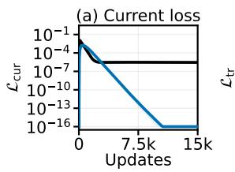

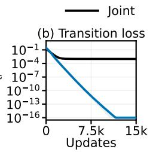

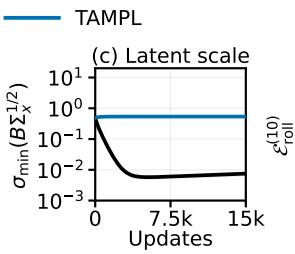

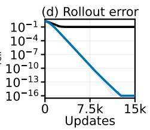  
Figure 5: Numerical evidence of the failure mode of joint training and the optimization behavior of TAMPL. Curves and bands are the mean and standard deviation of five independent runs.

Case II: noncollapsed task failure For Case II $( \operatorname { F i g } . 6 ) .$ , in canonical source coordinates, set

$$
A = \mathrm { d i a g } ( A _ { \mathrm { u } } , A _ { \mathrm { n } } , 0 . 6 5 ) , \qquad C _ { \star } = [ 1 0 0 | 0 0 0 | 0 ] , \qquad \Sigma _ { \mathrm { x } } = I _ { 7 } ,\tag{78}
$$

where $A _ { \mathrm { u } }$ and $A _ { \mathrm { n } }$ are independently rotated symmetric matrices with spectra $( 0 . 6 5 , 0 . 7 5 , 0 . 8 5 )$ and $\left( 0 . 1 0 , 0 . 1 5 , 0 . 2 0 \right)$ The reference is $B _ { \star } = [ \bar { I } _ { 3 } 0 0 ] , D _ { \star } = [ 1 0 0 ] , \bar { K _ { \star } } = \bar { A _ { \mathrm { u } } }$ . The exact wrongsubspace reference $B _ { \mathrm { b } } = 4 [ 0 \ I _ { 3 } \ 0 ] , D _ { \mathrm { b } } = { \mathrm { { \bar { 0 } } } } , \bar { K _ { \mathrm { b } } } = A _ { \mathrm { n } }$ satisfies Theorem $3 \colon \tau _ { 0 } = 0 . 4 5$ and the margin in its sufficient inequality is 2.24. It also satisfies the spectral ordering used by the detachedinstability calculation on the omitted four-dimensional subspace. Initialize $\bar { B } _ { 0 } = 4 [ \mathring { P } Q 0 ]$ , where $P = 0 . 3 \dot { 0 } I _ { 3 } + 0 . 0 2 5 G , Q = I _ { 3 } + 0 . 0 1 5 G ^ { \prime }$ and $G , G ^ { \prime }$ have independent standard Gaussian entries. Set $D _ { 0 } = C _ { \star }  { B _ { 0 } ^ { \top } } ( B _ { 0 } B _ { 0 } ^ { \top } ) ^ { - \tilde { 1 } }$ and $K _ { 0 } = B _ { 0 } A B _ { 0 } ^ { \top } ( \bar { B } _ { 0 } B _ { 0 } ^ { \top } ) ^ { - 1 }$ once, then train all matrices by gradients with $\eta = 0 . 0 0 3$ . The representation initially contains task information and is not closed. Projecting each joint endpoint to the exact wrong-subspace orbit gives a positive certificate margin of at least 1.90.

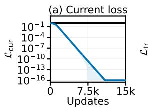

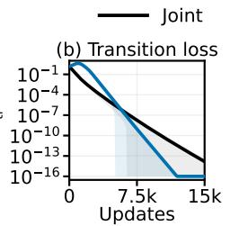

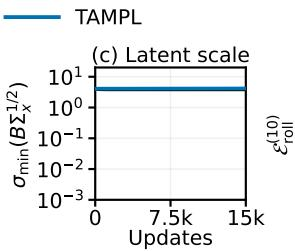

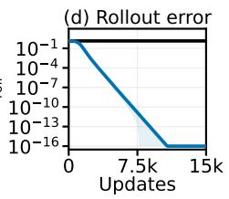  
Figure 6: Numerical evidence of Case II. Curves and bands are the mean and standard deviation of five independent runs.

Additional local-convergence test Moreover, we test the local convergence prediction of Theorem 2 in the numerical setting as illustrated by the following example.

Let $A _ { \mathrm { c a n } } = \mathrm { d i a g } ( 0 . 7 , 0 . 8 , 0 . 9 , - 0 . 8 , - 0 . 7 , - 0 . 6 , - 0 . 5 )$ and $C _ { \mathrm { c a n } } = [ 1 , 0 . 5 , - 0 . 3 , 0 , 0 , 0 , 0 ]$ . Draw orthogonal matrices $Q , O$ and set $T = Q ( I _ { 7 } + 0 . 0 1 2 G )$ . Define

$$
\begin{array} { r l } & { \quad A = T A _ { \mathrm { c a n } } T ^ { - 1 } , \quad C _ { \star } = C _ { \mathrm { c a n } } T ^ { - 1 } , \quad \Sigma _ { \mathrm { x } } = T T ^ { \top } , } \\ & { B _ { \star } = 2 O [ I _ { 3 } 0 ] T ^ { - 1 } , \quad D _ { \star } = \frac { 1 } { 2 } [ 1 , 0 . 5 , - 0 . 3 ] O ^ { \top } , \quad K _ { \star } = O \mathrm { d i a g } ( 0 . 7 , 0 . 8 , 0 . 9 ) O ^ { \top } . } \end{array}\tag{79}
$$

This gives nonsymmetric dynamics, nondiagonal positive-definite covariance, and an exact realization. Add independent 0.006-scale Gaussian perturbations to every entry of $B _ { \star } , D _ { \star } , K _ { \star } ,$ , and use $\eta = 0 . 0 0 1$ . Form the full residual differential and quotient update Jacobian as in Appendix B.5.4, and evaluate the sufficient step bound from Appendix B.5.5. Across seeds, $s _ { \star } - \varepsilon _ { \star } > 0 . 3 1 5 .$ , the sufficient step bound exceeds 0.00275, and the quotient spectral radius is below 0.99816. The joint and TAMPL residual norms both decrease while the minimum latent variance stays positive (Fig. 7).

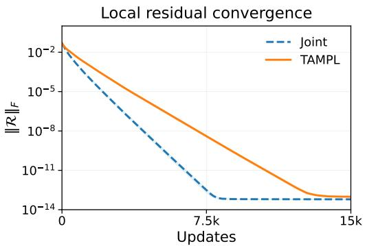

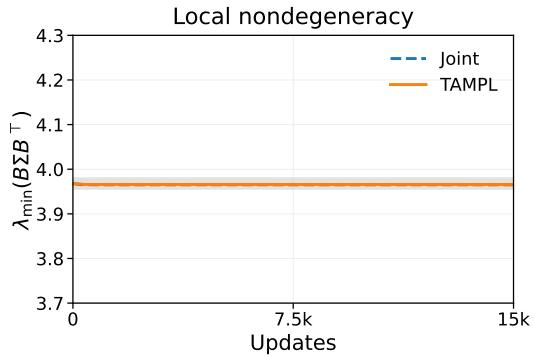  
Figure 7: Independent local test of Theorem 2. The complete weighted residual norm contracts and latent covariance remains positive. Both algorithms start from the same full-matrix perturbations.

## D EXPERIMENT DETAILS

## D.1 METRIC DEFINITIONS AND EVALUATION DETAILS

We evaluate mean macrostate prediction using root mean square error (RMSE) and marginal distributional accuracy using squared maximum mean discrepancy (MMD). For each of G initial microstates in the test set, we compare ground-truth and predicted ensembles of N independent trajectories at $T$ evaluation times over D macroscopic features. To account for differences in feature scales, we standardize both ensembles using featurewise training means and nonzero population standard deviations computed over all training trajectories and observation times. These statistics are shared across all methods within each system. Let $\widetilde { \bar { y } } _ { g , t , j } ^ { ( n ) }$ and $\boldsymbol { \widetilde { y } } _ { g , t , j } ^ { ( n ) }$ denote the standardized ground-truth and predicted values, respectively, where $g$ indexes the initial microstate, t the evaluation time, j the macroscopic feature, and n the trajectory.

The mean macrostate RMSE compares the predicted and ground-truth ensemble means for each initial microstate:

$$
\mathrm { R M S E } = \left[ \frac { 1 } { G T D } \sum _ { g = 1 } ^ { G } \sum _ { t = 1 } ^ { T } \sum _ { j = 1 } ^ { D } \left( \left. \widetilde { y } \right. _ { g , t , j } - \left. \widetilde { y } \right. _ { g , t , j } \right) ^ { 2 } \right] ^ { 1 / 2 } ,\tag{80}
$$

where $\langle \cdot \rangle$ denotes the average over the N trajectories in an ensemble initialized from the same microstate.

To assess distributional accuracy, we compute $\mathrm { { \bf M M D } ^ { 2 } }$ separately for each initial microstate, time, and feature using the Gaussian kernel $k ( a , \dot { b } ) = \mathrm { e x p } ( - ( a \dot { - } b ) ^ { 2 } / ( \dot { 2 } \sigma ^ { 2 } ) )$ with $\sigma = 1$ (note we already standardized the predicted and ground-truth macrostate). We use the biased empirical estimator, including diagonal terms in the within-ensemble sums:

$$
\widehat { \mathrm { M M D } } _ { g , t , j } ^ { 2 } = \frac { 1 } { N ^ { 2 } } \sum _ { n = 1 } ^ { N } \sum _ { m = 1 } ^ { N } k \left( \widetilde { y } _ { g , t , j } ^ { ( n ) } , \widetilde { y } _ { g , t , j } ^ { ( m ) } \right) + \frac { 1 } { N ^ { 2 } } \sum _ { n = 1 } ^ { N } \sum _ { m = 1 } ^ { N } k \left( \widetilde { y } _ { g , t , j } ^ { ( n ) } , \widetilde { y } _ { g , t , j } ^ { ( m ) } \right) - \frac { 2 } { N ^ { 2 } } \sum _ { n = 1 } ^ { N } \sum _ { m = 1 } ^ { N } k \left( \widetilde { y } _ { g , t , j } ^ { ( n ) } , \widetilde { y } _ { g , t , j } ^ { ( m ) } \right) .
$$

The reported score averages these squared discrepancies without taking a square root:

$$
\mathrm { M M D } _ { \operatorname* { m a r g i n a l } } ^ { 2 } = \frac { 1 } { G T D } \sum _ { g = 1 } ^ { G } \sum _ { t = 1 } ^ { T } \sum _ { j = 1 } ^ { D } \widehat { \mathrm { M M D } } _ { g , t , j } ^ { 2 } .\tag{81}
$$

This metric compares scalar marginal distributions at each evaluation time and does not assess dependence between features or across times.

For Table 2, all methods use the same training seeds 42, 43, and 44. We compute each reported metric separately for each seed and report its mean and sample standard deviation across seeds, without pooling trajectories across seeds. The prediction figures for the domain experiments use models trained with seed 42.

## D.2 SIRS EXPERIMENT

The SIRS model describes a stochastic process of epidemic propagation. It can be seen as a continuous-time Markov chain with each site in a susceptible, infected, or recovered state. A susceptible site with $n _ { I }$ infected neighbors becomes infected at instantaneous rate $\beta n _ { I } / 4$ , where each site has four nearest neighbors. An infected site recovers at the instantaneous rate $\gamma ,$ and a recovered site becomes susceptible again at rate $\mu .$ Each transition occurs after a random exponentially distributed waiting time. For a transition with constant rate λ, the probability that the transition has not yet occurred after time t is $e ^ { - \lambda t }$ . The reciprocal of the constant rate λ is the mean exponential waiting time of the transition. In our case, $\dot { \lambda } = \beta n _ { I } / 4$ for infection, $\lambda = \gamma$ for recovery, and $\lambda = \mu$ for loss of immunity. Figure 8 illustrates a microscopic trajectory.

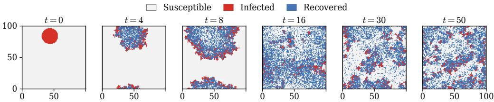  
Figure 8: One SIRS microstate trajectory.

To generate data, we simulate the SIRS process on a $1 0 0 \times 1 0 0$ lattice and record 101 frames at intervals of 0.5. We set $\beta = 8 , \gamma = 1$ , and $\mu = 0 . 1 5$ . Each initial microstate contains no recovered sites and a randomly sampled spatial infection pattern covering approximately 5% of the lattice. We generate $1 , 6 0 0 / 2 0 \dot { 0 } / 2 0 \dot { 0 }$ distinct initial microstates for training, validation, and testing. For training and validation, we run one trajectory per initial microstate, yielding 1,600 and 200 trajectories, respectively. For each test microstate, we simulate 64 independent reference trajectories and generate 64 independent predictions from each stochastic learned model. We evaluate mean macrostate RMSE and MMD as described in Appendix D.1.

All methods use a CNN encoder with circular padding. Each lattice site is represented by a threedimensional one-hot vector indicating whether it is susceptible, infected, or recovered. The resulting three-channel lattice representation is processed by the CNN encoder.

The spatially homogeneous mean-field approximation (Joo & Lebowitz, 2004) neglects correlations between neighboring sites at the microscopic scale, replacing the susceptible–infected pair probability by $S _ { t } I _ { t }$ . With the per-neighbor infection rate $\beta / 4$ used here, the approximate population fractions satisfy

$$
\dot { S } _ { t } = \mu R _ { t } - \beta S _ { t } I _ { t } , \qquad \dot { I } _ { t } = \beta S _ { t } I _ { t } - \gamma I _ { t } , \qquad \dot { R } _ { t } = \gamma I _ { t } - \mu R _ { t } .
$$

The pair approximation evolves the same population fractions $S _ { t } , I _ { t } , R _ { t }$ together with joint probabilities $p _ { t } ( A , B )$ for ordered nearest-neighbor pairs, where A, $B \in \{ S , I , R \}$ . These probabilities represent the expected fractions of neighboring pairs in the specified states. Under spatial homogeneity, the population equations are

$$
\begin{array} { r } { \dot { S } _ { t } = \mu R _ { t } - \beta p _ { t } ( S , I ) , \qquad \dot { I } _ { t } = \beta p _ { t } ( S , I ) - \gamma I _ { t } , \qquad \dot { R } _ { t } = \gamma I _ { t } - \mu R _ { t } . } \end{array}
$$

The pair approximation closes the evolution equations by treating the states of two distinct neighbors of a central site as conditionally independent given that site’s state (Joo & Lebowitz, 2004). On the square lattice, the resulting pair evolution equations, expressed in our rate convention, are (Joo & Lebowitz, 2004):

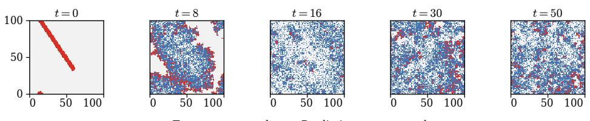

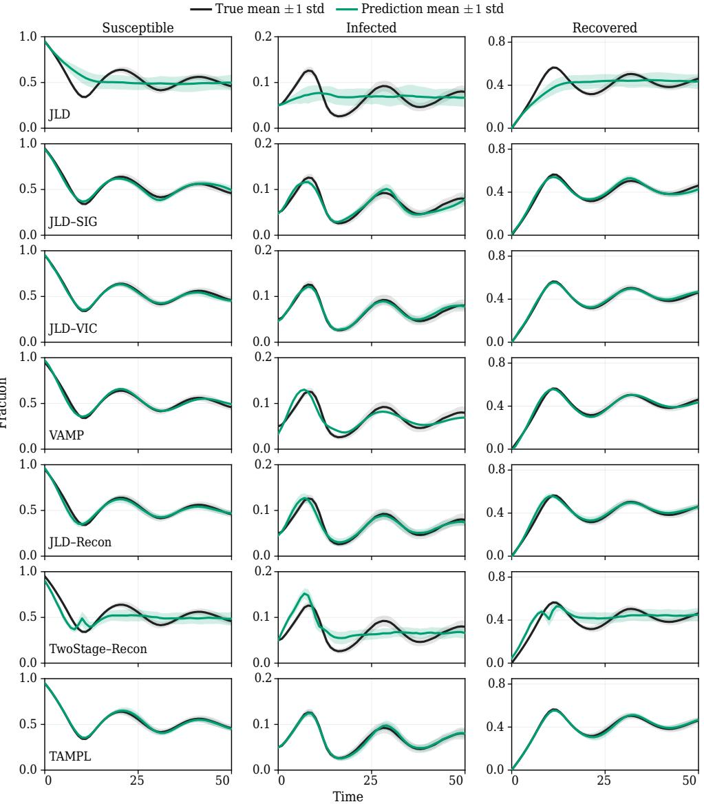  
Figure 9: Comparison of different methods on SIRS prediction. The top row shows one reference trajectory given the initial microstate. The other rows compare the predicted and ground-truth macrostates. The reference simulations and all methods except VAMP use ensembles of 64 inde pendent trajectories initialized from the same microstate. All models were trained with seed 42.

$$
\begin{array} { l l l } & { \displaystyle \frac { d p _ { t } ( S , I ) } { d t } = \mu p _ { t } ( R , I ) - \left( \gamma + \frac { \beta } { 4 } \right) p _ { t } ( S , I ) + \frac { 3 \beta } { 4 } \frac { p _ { t } ( S , I ) } { S _ { t } } \left( S _ { t } - 2 p _ { t } ( S , I ) - p _ { t } ( S , R ) \right) , } \\ & { \displaystyle \frac { d p _ { t } ( S , R ) } { d t } = \gamma p _ { t } ( S , I ) + \mu \left( R _ { t } - p _ { t } ( R , I ) - 2 p _ { t } ( S , R ) \right) - \frac { 3 \beta } { 4 } \frac { p _ { t } ( S , I ) p _ { t } ( S , R ) } { S _ { t } } , } \\ & { \displaystyle \frac { d p _ { t } ( R , I ) } { d t } = \gamma \left( I _ { t } - p _ { t } ( S , I ) \right) - ( 2 \gamma + \mu ) p _ { t } ( R , I ) + \frac { 3 \beta } { 4 } \frac { p _ { t } ( S , I ) p _ { t } ( S , R ) } { S _ { t } } , \qquad S _ { t } > 0 . } \end{array}
$$

The coefficient $3 \beta / 4$ accounts for the three neighbors other than the partner in the tracked pair.   
Since $S _ { t } + I _ { t } + R _ { t } = 1$ , the pair approximation has five independent evolving variables.

Both the mean-field and pair approximations are deterministic. Each produces a single macroscopic trajectory $( S _ { t } , I _ { t } , R _ { t } )$ from a fixed initial microstate. This is because the initial microstate determines the site fractions for both methods and the additional ordered nearest-neighbor pair fractions for the pair approximation.

To assess sensitivity to the relative weighting of JLD’s two loss terms, we fix $\lambda _ { \mathrm { c u r } } = 1$ and vary $\lambda _ { \mathrm { t r } } \in \{ 0 . 1 , 0 . 5 , 1 . \dot { 0 } , 2 . 0 \}$ , keeping all other training settings unchanged. Table 3 shows that some weights improve average prediction accuracy, but all yield higher mean macrostate RMSE and MMD than TAMPL.

Table 3: Sensitivity of JLD to the transition-loss weight on SIRS, with $\lambda _ { \mathrm { c u r } } = 1$ . Values are the mean ± sample standard deviation over training seeds 42, 43, and 44.
<table><tr><td>Transition weight  $\lambda _ { \mathrm { t r } }$ </td><td>Mean macrostate RMSE</td><td>MMD</td><td></td></tr><tr><td>0.1</td><td> $2 . 4 8 5 4 \pm 3 . 3 3 0 9$ </td><td> $0 . 3 3 3 9 \pm 0 . 2 8 9 8$ </td><td rowspan="4"></td></tr><tr><td>0.5</td><td> $0 . 5 7 7 9 \pm 0 . 1 0 3 2$ </td><td> $0 . 1 8 8 3 \pm 0 . 0 7 4 4$ </td></tr><tr><td>1.0</td><td> $0 . 6 2 5 4 \pm 0 . 2 4 0 0$ </td><td> $0 . 2 2 6 3 \pm 0 . 1 2 0 0$ </td></tr><tr><td>2.0</td><td> $0 . 5 3 2 3 \pm 0 . 2 0 7 1$ </td><td> $0 . 2 0 2 9 \pm 0 . 0 7 1 1$ </td></tr></table>

## D.3 BINARY MIXING EXPERIMENT

We simulate the binary mixing at the atomistic level with 512 particles, with 256 particles of each type, in a square domain $[ 0 , 3 2 ] ^ { 2 }$ with reflecting boundaries. All particles have unit mass and interact through type-dependent Lennard–Jones potentials, truncated and shifted to zero at distance 2.5. In reduced Lennard–Jones units, the interaction strengths are $( \epsilon _ { 1 1 } , \epsilon _ { 2 2 } , \epsilon _ { 1 2 } ) = ( 0 . 5 , 0 . 6 , 0 . 7 )$ and the length scales are $( \sigma _ { 1 1 } , \sigma _ { 2 2 } , \sigma _ { 1 2 } ) = ( 1 . 0 , 0 . 9 , 0 . 9 )$ . We characterize macroscopic clustering structures using connectivity-based observables (Munao et al., 2022; Li et al., 2024). For each particle type, we connect particles whose Euclidean separation is at most 2.5 and define clusters as the connected components, including isolated particles. Let $L _ { t } ^ { ( a ) }$ and $C _ { t } ^ { ( a ) }$ denote the largest cluster size and the number of clusters for particle type $a \in \{ 1 , 2 \}$ . The macroscopic observables are

$$
S _ { t } = \frac { L _ { t } ^ { ( 1 ) } + L _ { t } ^ { ( 2 ) } } { 5 1 2 } , \qquad K _ { t } = \frac { C _ { t } ^ { ( 1 ) } + C _ { t } ^ { ( 2 ) } } { 5 1 2 } .
$$

Figure 10 illustrates an example microstate trajectory. Evaluation follows Appendix D.1.  
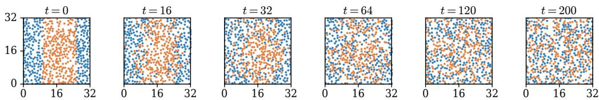  
Figure 10: One example of the microstate trajectory in binary mixing.

To generate the data, we sample initial arrangements of the two particle types from six pattern families: a half-plane, a centered slab, four bands, a checkerboard, a central disk, and a wavy interface. For each sampled geometry, we prepare an initial configuration by random placement, energy minimization, and NVT equilibration at temperature 1 under spatial constraints that preserve the prescribed pattern. We then remove these constraints, independently sample initial velocities fo each run, and simulate NVE dynamics with time step 0.002. Each trajectory contains 501 frame recorded at intervals of 0.4. The observed microstate contains positions and particle type labels. Independently sampled initial velocities therefore produce an ensemble of trajectories from the same initial microstate and this is where the stochasticity comes from. The training, validation, and test splits contain 480, 96, and 48 distinct initial microstates, respectively. We perform 4, 4, and 32 independent simulation runs per initial configuration, yielding 1,920, 384, and 1,536 trajectories.

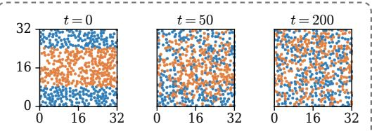

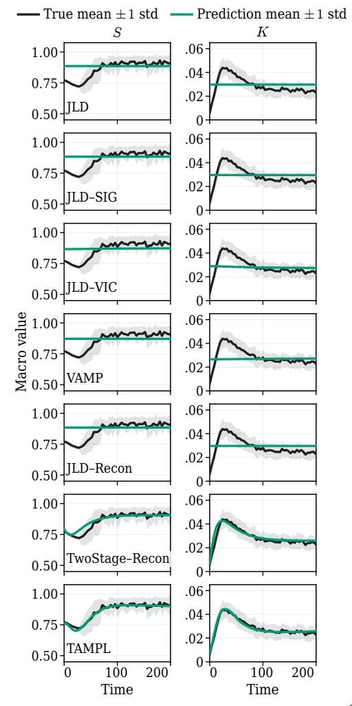

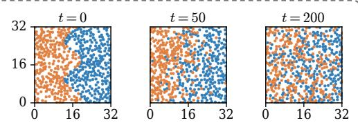

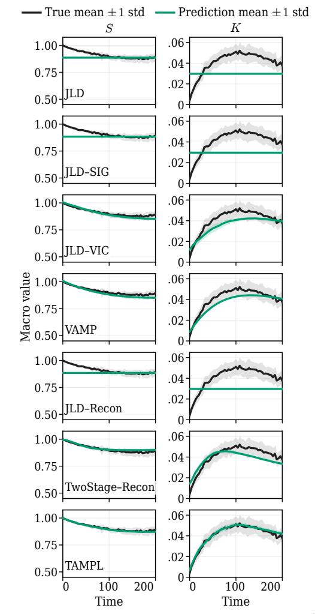  
Figure 11: Comparison of methods for binary mixing prediction from two initial configurations. The top row shows snapshots from one reference trajectory for each configuration. Subsequent rows compare predicted and reference evolution of S and K. Curves show ensemble means, with shaded bands indicating one standard deviation. VAMP provides a deterministic prediction.

We use a two-dimensional one-hot encoding to represent particle types. For the DeepSet encoder (Zaheer et al., 2017), we concatenate each particle’s normalized two-dimensional position with this two-dimensional one-hot encoding as the input feature. A shared particle MLP processes these four-dimensional inputs, followed by mean pooling over all particles and an output MLP to obtain the eight-dimensional latent state.

For the reconstruction-based baselines, we adapt the conditional normalizing-flow decoder of Han et al. (2026) to model the joint distribution of particle positions and types:

$$
q ( \mathbf { r } , c \mid z _ { t } ) = q _ { \mathrm { p o s } } ( \mathbf { r } \mid z _ { t } ) q _ { \mathrm { t y p e } } ( c \mid \mathbf { r } , z _ { t } ) ,
$$

where $\mathbf { r } \in \mathbb { R } ^ { 2 }$ is the normalized particle position and $c \in \{ 1 , 2 \}$ is its type. We parameterize $q _ { \mathrm { p o s } }$ with a conditional autoregressive rational-quadratic spline flow and $q _ { \mathrm { t y p e } }$ with an MLP with a twoclass softmax output, conditioned on both position and latent state. The reconstruction objective combines position negative log-likelihood and type cross-entropy, evaluated on sampled particles with Gaussian-perturbed positions.

Note that the setting here is different from the original dataset in Han et al. (2026), where they split the domain by a vertical boundary and predict local mixing ratios. The position of a vertical interface largely determines both the initial mixing ratio and its subsequent evolution, making the task relatively easy without microscopic information. Instead, we initialize microstates using different spatial patterns with fixed numbers of particles of each type. This design tests whether learned latent representations capture microscopic spatial information beyond particle composition.

## D.4 POLYMER EXTENSION EXPERIMENT

We use the polymer image dataset released by Han et al. (2026), based on the Brownian-dynamics simulations of Chen et al. (2024). Each polymer chain consists of 300 beads moving in three dimensions under a planar elongational flow. The dataset represents each configuration as a $1 0 0 \times 5 0 0$ grayscale image by placing a Gaussian blob at each bead’s $( x , y )$ position, with its width determined by the magnitude of the bead’s displacement from the mean z coordinate. The blobs are summed, normalized by the maximum frame intensity, and quantized to 8-bit grayscale. This representation does not explicitly encode bead ordering or chain connectivity, making it challenging to learn the latent embedding to capture the underlying physical processes. The macroscopic observation is the polymer extension length, defined as the difference between the maximum and minimum bead x-coordinates.

We use the released training, validation, and test splits. The training and validation sets contain 610 and 110 trajectories, respectively, each comprising 1,001 frames. The three test regimes, Fast, Medium, and Slow, correspond to three different initial configurations and exhibit different extension rates. Each regime contains 500 reference trajectories initialized from its fixed configuration, with variability arising from Brownian dynamics. Predictions are initialized from the corresponding initial image, and ensemble means and standard deviations are compared with the reference simulations. Comparisons with the baselines are shown in Fig. 12.

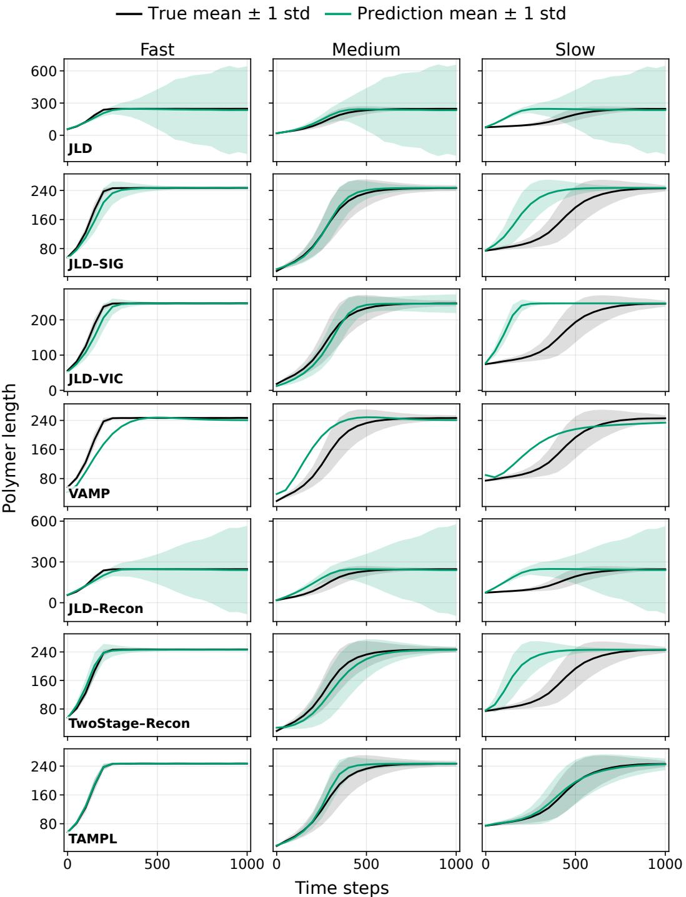  
Figure 12: Comparison of methods for polymer extension prediction.