# LEARNING WHAT TO REMEMBER: LONG-HORIZON COUNTERFACTUAL MEMORY OPTIMIZATION

Jiaming Tang<sup>1</sup>, Mingyan Liu<sup>1</sup>, Armin Sarabi<sup>1</sup>

<sup>1</sup>Department of Electrical Engineering and Computer Science, University of Michigan

## ABSTRACT

Persistent textual memory allows language models to carry information across long interactions, but learning what to remember is fundamentally a creditassignment problem. A memory rewrite may only become useful many steps later, while much of the observed utility may be inherited from information already stored before the rewrite. We introduce Memory Gain Policy Optimization (MGPO), which isolates the incremental value of each memory rewrite by crediting it for its marginal contribution to current and future downstream utility. This turns delayed memory utility into a direct learning signal for optimizing what information should persist. We study MGPO on document-level information extraction, where structured supervision makes the effects of individual memory updates directly measurable. MGPO improves extraction while reducing average memory length by nearly 80% relative to the initial memory policy before optimization. The learned memory policy also supports reuse and transfer across domains, downstream models without further training. These results show that effective memory learning depends not only on preserving useful information, but on identifying which memory updates create lasting incremental value.

## 1 INTRODUCTION

Persistent memory allows language models to maintain information across interactions, but limited capacity requires them to selectively retain, revise, or discard stored content (Toshniwal et al., 2020; Wang et al., 2023; Yu et al., 2026a; Zhou et al., 2026). Learning such update decisions is challenging because information that appears irrelevant at the time of writing may become useful only much later (Arjona-Medina et al., 2019; Han et al., 2019; Hung et al., 2019). Moreover, even when a memory proves useful for a downstream task, its utility may be largely attributable to information inherited from the preceding memory state rather than to the most recent revision. As a result, the utility of the resulting memory does not by itself reveal how much the latest update contributed (Setlur et al., 2025). Learning what to remember thus means learning not only whether a memory update is useful now, but also its incremental value for the future beyond what the memory already knows.

Existing memory systems support selective retention through retrieval (Guo et al., 2025), explicit memory management (Chhikara et al., 2025; Xu et al., 2026; Yu et al., 2026b), and learned policies that construct and revise persistent memory (Yu et al., 2026a; Yan et al., 2026a; Zhou et al., 2026). Yet these approaches largely leave a central learning problem unresolved. It remains unclear whether a memory update actually creates downstream value. To make the effect of memory updates measurable, we optimize a persistent memory writer against a fixed downstream reader, following prior work on upstream adaptation against frozen downstream models (Xu et al., 2024; Yang et al., 2023; Yoon et al., 2024). This leads to a more fundamental credit-assignment problem: when an updated memory improves downstream utility, how much of that utility is created by the latest rewrite, rather than inherited from the memory that already existed?

To answer this question, consider a reader working through a long document with a small notebook. A natural way to assess a notebook revision is to retain both versions and compare how well the same reader performs on the same downstream tasks using each. Information already present contributes to both evaluations, so their difference isolates the change in utility attributable to the revision, following the broader principle (Tumer et al., 2002; Harutyunyan et al., 2019; Foerster et al., 2018) of counterfactual credit assignment. Persistent memory also has value through future reuse. A recorded detail may offer little immediate benefit yet help interpret subsequent evidence after the original passage has left the reader’s context. This motivates long-horizon counterfactual credit assignment, where the pre- and post-rewrite memories are evaluated with the same reader and downstream target, and the paired comparison is propagated across subsequent targets that reuse the updated memory.

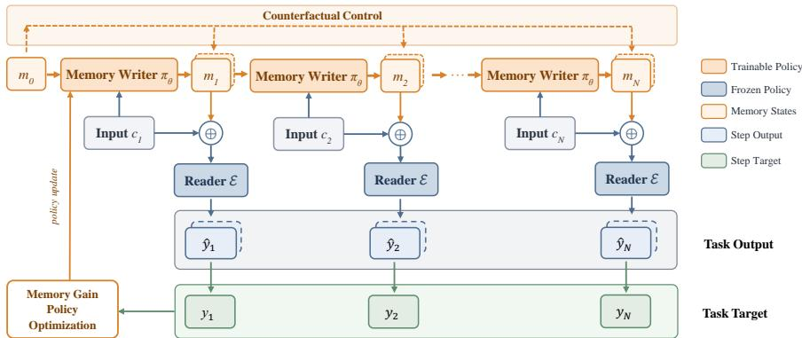  
Figure 1: Overview of our methodology. A trainable writer sequentially updates a persistent memory state, while a frozen reader evaluates its downstream utility. A counterfactual comparison evaluates the pre- and post-rewrite memories on the same current and future targets. Summing these utility differences yields the Memory Gain, which serves as the learning signal for optimizing the writer.

We propose the Memory Gain Policy Optimization (MGPO), which trains the memory writer using counterfactual utility differences measured by the frozen reader across current and future downstream targets. MGPO uses these differences to credit each rewrite for its current and future utility, with policy-gradient returns accounting for subsequent rewrites along the memory trajectory. We show that the resulting return decomposes into the cumulative downstream utility minus the inherited utility of the pre-rewrite memory over the same remaining horizon. Because this inherited component is independent of the current rewrite, MGPO preserves the expected policy gradient of the underlying factual objective while changing how credit is assigned to individual memory rewrites.

We evaluate MGPO on document-level information extraction (IE), where predictions often depend on evidence distributed across distant passages (Yao et al., 2019; Tan et al., 2022; Jain et al., 2020), providing a natural setting for studying the value of memory through later reuse. Our experiments demonstrate that MGPO learns compact, effective memories that support the integration of evidence across distant passages and improve downstream extraction performance. The learned writer also transfers across unseen readers, domains, and downstream tasks, showing that the benefits of mem ory construction extend beyond the reader and task used during training.

The main contributions of this paper are as follows:

• We identify inherited utility as a central challenge in persistent memory learning. The utility of a memory state may largely reflect previously stored information, obscuring the contribution of individual memory rewrites.

• We introduce Memory Gain Policy Optimization (MGPO), which assigns each rewrite longhorizon counterfactual credit. MGPO preserves the original downstream objective while providing a more informative learning signal for memory updates.

• We show that MGPO learns compact and selective memories, improves document-level information extraction, and generalizes beyond its training setting through reuse across readers and transfer across downstream domains.

## 2 METHODOLOGY

Persistent-memory learning faces a fundamental attribution ambiguity: state utility conflates what is inherited from prior memory with what the current rewrite contributes. MGPO isolates the latter by counterfactually comparing adjacent memory states over their downstream reuse horizon. The resulting credit is exactly potential-shaped, preserving the factual policy objective while reallocating learning signal to the rewrites that generate downstream utility.

## 2.1 DECOUPLED PERSISTENT MEMORY WRITING

As illustrated in Figure 1, we consider a streaming process where inputs $c _ { 1 } , \ldots , c _ { N }$ arrive sequentially, with only a bounded persistent memory carried forward. At step $t ,$ a learnable memory writer π<sub>θ</sub> processes the previous memory and new input to generate an updated memory state:

$$
m _ { t } \sim \pi _ { \theta } ( \cdot \mid m _ { t - 1 } , c _ { t } ) , \qquad m _ { 0 } = \emptyset . \qquad \mid m _ { t } \mid \leq B .\tag{1}
$$

The resulting memory text replaces the previous memory under a fixed budget $B ,$ so optimizing the writer entails learning what information should be retained, discarded, or reorganized as the state evolves. Crucially, we decouple this writing process from answer generation: the writer $\pi _ { \theta }$ remains the sole trainable component, while a fixed reader $\mathcal { E }$ processes the memory state $m _ { t }$ together with downstream input $c _ { j }$ to yield an answer:

$$
\hat { y } _ { t , j } ( \xi ) = \mathcal { E } ( m _ { t } , c _ { j } ; \xi ) .\tag{2}
$$

Here, $\xi$ denotes reader randomness. We then define the utility of memory state $m _ { t }$ on target j as:

$$
F _ { t , j } = \mathbb { E } _ { \xi } \left[ \mathcal { U } \left( \hat { y } _ { t , j } ( \xi ) , y _ { j } \right) \right] ,\tag{3}
$$

where $y _ { j }$ denotes the target associated with $c _ { j }$ and $\mathcal { U }$ is a task-specific utility function. The expectation is taken over the fixed sampling distribution of the downstream reader. In practice, we estimate each $F _ { t , j }$ with one Monte Carlo sample from the same fixed reader decoding distribution. An empirical analysis of sampling noise are reported in Appendix E.2. This separation makes memory independently measurable. Because the reader, target, and utility function are fixed, differences in $F _ { t , j }$ isolate the effect of the supplied memory state, enabling counterfactual evaluation of individual rewrites.

## 2.2 FROM MEMORY-STATE UTILITY TO REWRITE CREDIT

The quantity $F _ { t , j }$ evaluates a memory state, but policy optimization requires credit for the action that produced that state. These are not equivalent: a high $F _ { t , j }$ may largely reflect information that was already present in $m _ { t - 1 }$ rather than from rewrite t itself. We refer to this pre-existing contribution as inherited utility. To attribute utility to the rewrite itself, we evaluate the pre- and post-rewrite memories on the same downstream target:

$$
\Delta _ { t , j } = F _ { t , j } - F _ { t - 1 , j } .\tag{4}
$$

Because all downstream factors are held fixed, $\Delta _ { t , j }$ measures the change in utility associated with the rewrite t on target $j$

A rewrite can matter beyond the prediction immediately after it. Information introduced at step t may become useful only when combined with evidence encountered several steps later. We therefore evaluate the same rewrite over its entire remaining reuse horizon and define its Memory Gain as:

$$
M G _ { t } = \sum _ { j = t } ^ { N } \Delta _ { t , j } = \sum _ { j = t } ^ { N } \left( F _ { t , j } - F _ { t - 1 , j } \right) .\tag{5}
$$

The quantities $F _ { t , j }$ form the upper-triangular counterfactual matrix in Figure 2. The diagonal $F _ { j , j }$ corresponds to the factual streaming trajectory, whereas off-diagonal entries evaluate how an earlier memory state would support later targets. These counterfactual evaluations are needed only during training, while inference follows the diagonal factual trajectory. Appendix F.1 compares the training cost with group-based RL methods.

$M G _ { t }$ aggregates the marginal effect of the transition from $m _ { t - 1 }$ to $m _ { t }$ over all current and future targets. Since $m _ { t }$ also influences subsequent rewrites, we define the return for rewrite t as $\begin{array} { r } { G _ { t } = \sum _ { k = t } ^ { N } M G _ { k } , } \end{array}$ , thereby including their future rewards. Thus, $M G _ { t }$ aggregates over downstream targets for a single rewrite, whereas $G _ { t }$ aggregates over the current and subsequent rewrites.

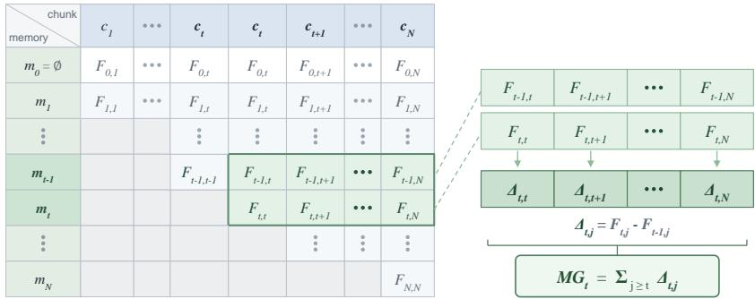  
Figure 2: Counterfactual evaluation matrix. $F _ { t , j }$ measures the utility of memory state $m _ { t }$ on downstream target j, with the diagonal corresponding to the streaming trajectory during evaluation. The difference $F _ { t , j } - F _ { t - 1 , j }$ attributes the marginal utility on target $j$ to rewrite $t ,$ and $M G _ { t }$ aggregates this contribution over all current and future targets $( j \geq t )$

## 2.3 MEMORY GAIN AS POTENTIAL-SHAPED CREDIT

Memory Gain attributes downstream utility to individual memory rewrites. We now show that this rewrite-level credit remains aligned with the original objective along the factual streaming trajectory.

Along the factual trajectory, the memory produced at step t is evaluated on its corresponding target, giving the per-step reward $r _ { t } ^ { \mathrm { f a c t } } = F _ { t , t }$ , and the remaining factual return $\begin{array} { r } { G _ { t } ^ { \mathrm { f a c t } } = \sum _ { k = t } ^ { N } r _ { k } ^ { \mathrm { f a c t } } } \end{array}$ . Unlike $r _ { t } ^ { \mathrm { f a c t } }$ , which evaluates the utility of the resulting memory state, $M G _ { t }$ measures the marginal contribution of rewrite t across its current and future reuse. $G _ { t }$ additionally accounts for rewards assigned to subsequent rewrites. To relate this return to the factual objective, we define the inherited utility already supported by the pre-rewrite memory over the remaining horizon as:

$$
\Phi _ { t } = \sum _ { j = t } ^ { N } F _ { t - 1 , j } , \qquad \Phi _ { N + 1 } = 0 .\tag{6}
$$

By the definition of Memory Gain, we have:

$$
M G _ { t } = r _ { t } ^ { \mathrm { f a c t } } + \Phi _ { t + 1 } - \Phi _ { t } .\tag{7}
$$

Hence, Memory Gain is a potential-shaped form of the factual streaming reward. Subtracting $\Phi _ { t }$ removes inherited utility from preceding memory, while adding $\Phi _ { t + 1 }$ captures the updated memory’s future utility, assigning credit according to each rewrite’s incremental downstream contribution.

Summing over the remaining trajectory telescopes the potential terms:

$$
G _ { t } = G _ { t } ^ { \mathrm { f a c t } } - \Phi _ { t } .\tag{8}
$$

We next show that this preserves the expected policy gradient of the underlying objective while changing its finite-sample gradient estimator. Let

$$
\psi _ { t } = \nabla _ { \theta } \log \pi _ { \theta } ( m _ { t } \mid m _ { t - 1 } , c _ { t } ) .\tag{9}
$$

Then the Memory Gain gradient estimator at step t can be written as

$$
\hat { g } _ { t } = \psi _ { t } G _ { t } = \hat { g } _ { t } ^ { \mathrm { f a c t } } - \psi _ { t } \Phi _ { t } .\tag{10}
$$

Since $\Phi _ { t }$ is determined entirely by the pre-rewrite memory $m _ { t - 1 }$ and the remaining targets, it is determined before $m _ { t }$ is sampled and is therefore independent of the current action conditional on the pre-rewrite history. Therefore, $\mathbb { E } [ \psi _ { t } \Phi _ { t } ] = 0$ , and consequently:

$$
\nabla _ { \theta } J _ { \mathrm { M G } } = \nabla _ { \theta } J _ { \mathrm { f a c t } } .\tag{11}
$$

MGPO therefore provides a different finite-sample estimator of the same factual policy gradient; empirically, we show in Section 3.3 that this estimator outperforms the estimator obtained by directly using the factual return. The counterfactual term $\Phi _ { t }$ acts as an action-independent control variate that removes utility already supported by the pre-rewrite memory, changing the sample-wise credit assigned to each rewrite without changing the underlying policy gradient. Unlike a learned critic, $\Phi _ { t }$ is obtained directly from counterfactual evaluation. A formal derivation is provided in Appendix A.

## 2.4 POLICY OPTIMIZATION OBJECTIVE FOR MEMORY GAIN

The equivalence above applies to the underlying expected policy gradient. In finite-sample optimization, however, earlier rewrites span longer remaining horizons and therefore produce returns with systematically different scales. To calibrate returns across positions, we center each return using a position-specific historical Exponential Moving Average (EMA) b(t) and normalize by a global EMA scale:

$$
A _ { t } = \frac { G _ { t } - b ( t ) } { \sqrt { \sigma ^ { 2 } + \varepsilon } } .\tag{12}
$$

Here, $b ( t )$ tracks the historical mean return at position $t ,$ while $\sigma ^ { 2 }$ tracks a global mean squared residual. This calibration accounts for systematic horizon-dependent differences in return scale.

We then use the position-calibrated advantage $A _ { t }$ to optimize the memory writer. We apply a PPOstyle token-level clipped policy objective (Schulman et al., 2017), assigning the rewrite-specific advantage $A _ { t }$ to each token generated in $m _ { t } \colon$

$$
\begin{array} { l } { \displaystyle \boldsymbol { J } ( \theta ) = \mathbb { E } \biggl [ \frac { 1 } { N } \sum _ { t = 1 } ^ { N } \frac { 1 } { L _ { t } } \sum _ { l = 1 } ^ { L _ { t } } \operatorname* { m i n } \Big ( \rho _ { t , l } ( \theta ) A _ { t } , \mathrm { c l i p } \big ( \rho _ { t , l } ( \theta ) , 1 - \epsilon _ { c } , 1 + \epsilon _ { c } \big ) A _ { t } \Big ) \biggr ] } \\ { \displaystyle - \beta _ { \mathrm { K L } } \mathbb { E } \left[ \hat { D } _ { \mathrm { K L } } ( \pi _ { \theta } \| \pi _ { \mathrm { r e f } } ) \right] . } \end{array}\tag{13}
$$

Here, $\rho _ { t , l } ( \theta )$ is the token-level importance ratio between the current and rollout policies. The KL term regularizes the writer toward the reference policy. Length normalization by $1 / L _ { t }$ averages token contributions within each rewrite. A detailed algorithm is provided in Appendix B.1.

## 3 EXPERIMENTS

## 3.1 EXPERIMENTAL SETUP

Training setup. We instantiate MGPO through document-level IE and construct the target utility as an additive first-order surrogate of document-level micro-F1. Gold labels are assigned to the earliest observable chunk, yielding additive chunk-wise utilities aligned with the document-level objective. On held-out trajectories, the surrogate closely tracks the exact document-level F1 change (Spearman $\rho = 0 . 9 8 8 )$ . Full derivations and scoring details are provided in Appendix B.

Datasets. We study document-level IE primarily on SciREX (Jain et al., 2020), which annotates Method, Task, Material, and Metric entities and their document-level structure. We optimize two tasks: salient clustering, which groups coreferent mentions involved in reported results, and binary relation extraction among salient entities. We train on the training split, select models on the development split, and report results on the test split.

To evaluate cross-domain transfer, we use AIPAN-10K (Tang et al., 2026), a corpus of website privacy policies with annotations of mentioned data practices. Compared with SciREX, AIPAN-10K differs substantially in domain and extraction schema, and contains longer documents with denser annotations. All memory policies are trained only on SciREX and transferred to AIPAN-10K without further training or adaptation.

Metrics and evaluation setup. We evaluate structured IE through entity-cluster and relation extraction, where entity clusters group mentions by entity identity in SciREX or by privacy-data and practice categories in AIPAN-10K, and relations capture document-supported binary associations between these clusters. This evaluation provides a consistent measure of how well each memory state supports entity and relation extraction. We additionally report the official SciREX relation metric for benchmark comparability in Appendix D.1. We report micro-pooled precision, recall, and F1 for each extraction type.

Documents are segmented into 1,024-token chunks, and the persistent memory is bounded to 256 tokens. Unless otherwise specified, all learned memory policies use Qwen3-8B and all frozen readers use Qwen3-14B (Yang et al., 2025), both in non-thinking mode. Detailed scoring and implementation settings are provided in Appendix C.

Baselines. We compare against three groups of baselines: (1) direct readout methods, including Direct Readout and R1-RE Dai et al. (2026); (2) external memory methods, including LightRAG

Table 1: Document-level IE results on SciREX and AIPAN-10K. All memory policies are trained only on SciREX. SciREX reports in-domain performance, while AIPAN-10K evaluates out-ofdomain (OOD) transfer across domain and extraction schema without further training or adaptation. Memory length is the average number of tokens in the memory state provided to the frozen reader for each chunk. Results are averaged over 4 evaluation runs. The 14B subscript denotes evaluation with the frozen Qwen3-14B reader in place of the method’s learned reader.
<table><tr><td rowspan="3">Method</td><td colspan="6">SciREX (in-domain)</td><td colspan="6">AIPAN-10K (OOD)</td></tr><tr><td rowspan="2">Memory length</td><td colspan="2">Entity cluster</td><td rowspan="2"></td><td colspan="2">Binary relation</td><td rowspan="2">Memory</td><td rowspan="2"></td><td colspan="2">Entity cluster</td><td colspan="2"></td><td colspan="2">Binary relation</td></tr><tr><td>R</td><td>F1</td><td>P</td><td>R</td><td>length</td><td>R</td><td>F1</td><td>P</td><td>R</td><td>F1</td></tr><tr><td>Direct Readout</td><td></td><td></td><td></td><td></td><td></td><td></td><td></td><td></td><td></td><td></td><td></td><td></td><td></td><td></td></tr><tr><td>Direct Readout</td><td></td><td>29.5</td><td>58.4</td><td>39.2</td><td>10.8</td><td>35.0</td><td>16.5</td><td></td><td>38.0</td><td>31.6</td><td>34.5</td><td>24.2</td><td>9.4</td><td>13.5</td></tr><tr><td>R1-RE</td><td></td><td>43.9</td><td>59.8</td><td>50.6</td><td>19.2</td><td>24.9</td><td>21.7</td><td></td><td>28.7</td><td>4.6</td><td>7.9</td><td>6.0</td><td>0.7</td><td>1.2</td></tr><tr><td>External Memory</td><td></td><td></td><td></td><td></td><td></td><td></td><td></td><td></td><td></td><td></td><td></td><td></td><td></td><td></td></tr><tr><td>LightRAG</td><td>256</td><td>27.4</td><td>58.9</td><td>37.4</td><td>10.2</td><td>32.0</td><td>15.4</td><td>253</td><td>25.0</td><td>86.8</td><td>38.8</td><td>15.7</td><td>31.7</td><td>21.0</td></tr><tr><td>Mem0</td><td>213</td><td>34.6</td><td>66.9</td><td>45.6</td><td>15.8</td><td>41.6</td><td>22.9</td><td>236</td><td>22.2</td><td>86.8</td><td>35.4</td><td>15.5</td><td>33.9</td><td>21.3</td></tr><tr><td>Learned Memory</td><td></td><td></td><td></td><td></td><td></td><td></td><td></td><td></td><td></td><td></td><td></td><td></td><td></td><td></td></tr><tr><td>MemAgent</td><td>62</td><td>49.8 50.1</td><td></td><td>49.9</td><td>22.6</td><td></td><td>16.7 19.2</td><td>200</td><td>24.7</td><td>18.9</td><td>21.4</td><td>4.4</td><td>4.3</td><td>4.4</td></tr><tr><td>MemAgent14B</td><td>64</td><td>50.5</td><td>51.3</td><td>50.9</td><td>24.1</td><td>25.9</td><td>24.9</td><td>202</td><td>31.9</td><td>25.2</td><td>28.2</td><td>4.5</td><td>1.5</td><td>2.2</td></tr><tr><td>HiMPO</td><td>256</td><td>39.8</td><td>47.6</td><td>43.3</td><td>15.4</td><td>17.7</td><td>16.5</td><td>256</td><td>21.7</td><td>9.9</td><td>13.5</td><td>2.1</td><td>1.8</td><td>1.9</td></tr><tr><td> $\mathrm { H i M P O } _ { 1 4 B }$ </td><td>256</td><td>35.0</td><td>40.8</td><td>37.7</td><td>13.5</td><td>16.8</td><td>15.0</td><td>256</td><td>33.5</td><td>17.8</td><td>23.2</td><td>7.1</td><td>0.8</td><td>1.4</td></tr><tr><td colspan="2">Decoupled Memory</td><td></td><td></td><td></td><td></td><td></td><td></td><td></td><td></td><td></td><td></td><td></td><td></td><td></td></tr><tr><td>MGPO-base</td><td>202</td><td></td><td>27.859.2</td><td>37.8</td><td></td><td>10.034.0</td><td>015.5</td><td>241</td><td>24.7</td><td>86.6</td><td>38.4 15.5</td><td></td><td>33.7</td><td>21.3</td></tr><tr><td>MGPO</td><td>43</td><td>44.2 61.0</td><td></td><td>51.3</td><td></td><td></td><td>20.8 36.8 26.5</td><td>168</td><td>25.1</td><td>85.9</td><td>39.2</td><td>17.7</td><td>32.9</td><td>22.9</td></tr></table>

Guo et al. (2025) and Mem0 Chhikara et al. (2025); and (3) learned memory policies, including MemAgent Yu et al. (2026a) and HiMPO (Yan et al., 2026a).

## 3.2 COMPARISON OF MEMORY SYSTEMS

Table 1 evaluates the end-to-end performance of memory systems under their respective training settings. MemAgent and HiMPO denote results using the originally learned readers, while MemAgent and $\mathrm { H i M P O } _ { 1 4 B }$ use the same frozen Qwen3-14B reader as other baselines for a more controlled comparison. MGPO achieves the highest F1 among the compared methods. Relative to Direct Readout, MGPO improves entity cluster F1 by 30.9% and binary relation F1 by 60.6%. Notably, these gains coincide with a substantial reduction in the memory footprint, cutting the average memory length by 78.7% compared with MGPO-base. Thus, MGPO improves extraction while using substantially less memory, suggesting more selective and effective retention of downstreamrelevant information.

The learned memory writer also transfers to a new document domain and extraction schema. On AIPAN-10K, MGPO substantially outperforms other learned memory policies without further adaptation and exceeds the next best external-memory baseline F1 by 0.4 points on entity clusters and 1.6 points on binary relations. Repetitive outputs and format violations contribute to the low extraction scores of R1-RE, MemAgent, and HiMPO. These results suggest that the writer learns to preserve downstream-relevant information beyond the scientific-document setting on which it was trained.

## 3.3 LONG-HORIZON COUNTERFACTUAL CREDIT IMPROVES MEMORY LEARNING

We next ask what form of credit assignment is required to learn useful memory rewrites. We compare two reference baselines with four reward variants that isolate different aspects of rewrite-level credit. NO MEMORY performs chunk-wise extraction without persistent memory, while BASE POLICY uses the unoptimized writer. TERMINAL optimizes only the final document score. FACTUAL uses reward-to-go over downstream factual extraction scores without subtracting utility already present before a rewrite. MYOPIC also uses reward-to-go, but measures each rewrite’s marginal effect only on the current target. FULL uses our proposed MGPO objective. For the specific implementation, please refer to Section C.2.

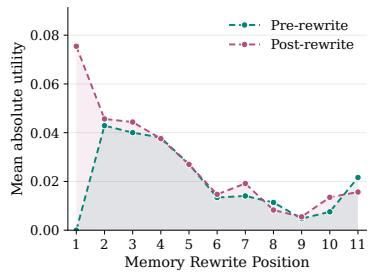

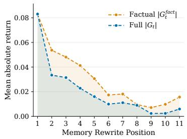

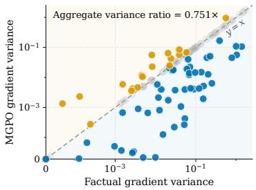  
Figure 3: Inherited utility and gradient-estimator variance under the untrained memory policy on SciREX test. Left: Mean absolute utility before and after each memory rewrite, showing the utility already present in the preceding memory state. Mid: Mean absolute factual and MGPO returns. Right: Paired gradient-variance estimates at 261 fixed states from 66 documents. Variance is mea sured over 12,288 selected normalization parameters.

Inherited utility confounds rewrite credit. Before comparing the training objectives, we first examine whether the utility of an updated memory state accurately reflects the contribution of its most recent rewrite. As shown in Figure 3, pre- and post-rewrite utilities closely track each other once memory is established, indicating that substantial utility is inherited from the preceding state. Removing this inherited component substantially changes the return, highlighting the importance of distinguishing memory state utility from rewrite-level credit. Under a fixed, untrained memory policy, MGPO reduces aggregate across-rollout gradient variance by 24.9% (95% CI: 6.4%–42.6%), supporting the role of the pre-rewrite baseline in reducing estimator variance in this setting. Full evaluation details are provided in Appendix C.4.

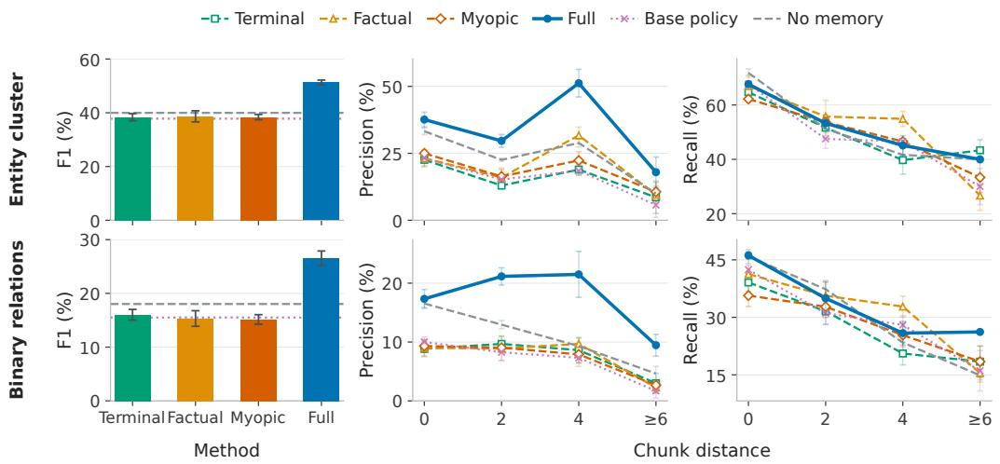  
Figure 4: Effect of credit assignment on document-level extraction. Left: overall F1. Middle and right: precision and recall versus chunk distances, defined as the number of chunks separating the evidence required for a prediction. Error bars are standard deviations for 4 evaluation runs.

Credit assignment ablations. The left panels of Figure 4 show that FULL is the only variant that consistently improves over NO MEMORY on both entity cluster and binary relation extraction. The key comparison is FULL versus FACTUAL: both optimize the same underlying factual objective, but FULL subtracts utility already present before each rewrite using a pre-rewrite counterfactual baseline. The resulting performance gap supports the importance of attributing utility to the rewrite itself rather than to inherited memory content. In contrast, MYOPIC restricts marginal credit only to the current target, while TERMINAL provides only a sparse end-of-document signal.

The distance-stratified results in the middle and right panels further show where this improvement arises. FULL achieves substantially higher precision across chunk distances, with the clearest separation in precision at longer distances and smaller differences in recall. This pattern suggests that long-horizon counterfactual credit improves the selectivity with which previously stored information is reused, particularly across distant chunks.

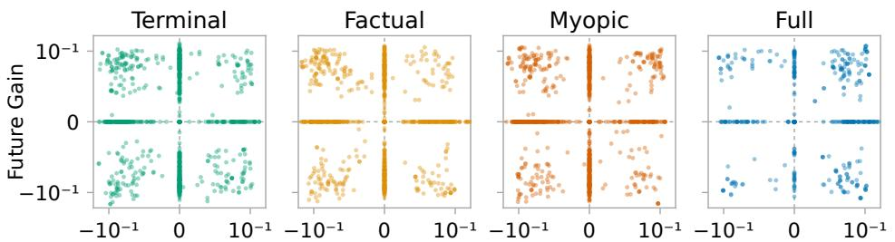

Immediate Gain  
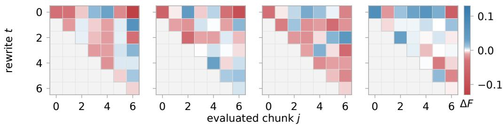  
Figure 5: How credit assignment shapes memory rewrites. Top: Immediate versus future extraction gain for each rewrite. Bottom: Counterfactual contribution of each rewrite to subsequent chunks.

How credit shapes memory rewrites. For each learned rewrite, we compare extraction with the post-rewrite memory against the pre-rewrite memory, measuring its marginal effect on the current and subsequent targets. Figure 5 shows how these effects differ across objectives. In the top panel, FACTUAL and MYOPIC often produce rewrites whose immediate and future utility are misaligned. FULL shifts the distribution toward positive future utility and reduces rewrites that help the current target but hurt later ones. It also preserves rewrites with negative immediate gains but positive future rewards, consistent with learning to retain information whose value emerges through later reuse.

The bottom panel shows these effects across subsequent chunks. Compared with the other objectives, FULL produces stronger positive off-diagonal effects, indicating that a rewrite can continue to benefit multiple subsequent targets. These effects persist across several chunks, providing further evidence that rewrites preserve information that remains useful over time.

## 3.4 MGPO LEARNS REUSABLE MEMORY REPRESENTATIONS

A key benefit of decoupling the memory writer from the downstream reader is that the learned writer can be reused across models without retraining. As shown in Table 2, a single MGPO-trained 8B writer, optimized with a frozen Qwen3-14B reader, improves six readers spanning four model families over their corresponding no-memory baselines. For example, entity cluster F1 improves from 34.3 to 44.5 with Qwen3-8B, from 40.0 to 51.3 with Qwen3-14B, and from 38.3 to 46.6 with Phi-4-14B. These results suggest that MGPO learns a reusable memory representation rather than a memory policy specialized to a particular reader.

This reuse is not limited to the downstream reader. As shown in Table 1, the same SciREX-trained writer also transfers across document domains and extraction schemas without further optimization. We further test whether this reuse extends beyond information extraction on BABILong (Kuratov et al., 2024), where MGPO improves over the unoptimized base writer on QA3 and several QA5 settings; results are reported in Appendix D.2.

Taken together, these results show that MGPO learns a reusable memory writer rather than one tied to a specific reader or training domain. Its benefits extend across reader architectures, model scales, domains, extraction schemas, and selected downstream tasks beyond information extraction.

Table 2: Pairing the learned memory writer with different readers. All rows use MGPO-trained memory writers. In the coupled variant, the writer and reader are trained jointly based on the same model. Results are mean ± standard deviation over 4 runs.
<table><tr><td rowspan="2">Setting</td><td rowspan="2">Reader</td><td colspan="2">No Memory</td><td colspan="2">Memory</td></tr><tr><td>Cluster</td><td>Relation</td><td>Cluster</td><td>Relation</td></tr><tr><td>Coupled</td><td>Self (8B)</td><td>44.7±0.2</td><td>17.5±0.8</td><td>44.9±1.0</td><td>20.1±1.4</td></tr><tr><td rowspan="6"></td><td>Qwen3-8B (Yang et al., 2025)</td><td>34.3±0.2</td><td>12.8±0.6</td><td>44.5±1.0</td><td>20.4±1.1</td></tr><tr><td>Qwen3-14B</td><td>40.0±0.8</td><td>18.0±0.6</td><td>51.3±0.9</td><td>26.5±1.3</td></tr><tr><td>Qwen3-32B</td><td>45.2±0.2</td><td>21.5±0.5</td><td>50.7±1.3</td><td>27.0±1.4</td></tr><tr><td>Llama3.1-8B (Grattafiori et al., 2024)</td><td>34.5±1.4</td><td>12.9±0.9</td><td>41.5±0.9</td><td>18.3±0.6</td></tr><tr><td>Nemo-12B (Mistral AI &amp; NVIDIA, 2024)</td><td>39.3±0.8</td><td>17.1±0.6</td><td>42.0±0.8</td><td>19.3±1.1</td></tr><tr><td>Phi-4-14B (Abdin et al., 2024)</td><td>38.3±0.5</td><td>15.2±0.9</td><td>46.6±0.4</td><td>23.7±0.6</td></tr></table>

## 4 RELATED WORK

Learning and optimizing memory. Earlier approaches learn recurrent or retrieved memory representations (Bulatov et al., 2022; Wang et al., 2023), while EMR uses reinforcement learning to manage bounded streaming memory (Han et al., 2019). RECOMP and PRCA train compressors or contextual adapters for fixed downstream models (Xu et al., 2024; Yang et al., 2023), and CompAct learns iterative textual compression (Yoon et al., 2024). Previous methods optimize persistent memory through downstream rewards. MEM1 jointly learns reasoning and memory consolidation (Zhou et al., 2026), while Memory-R1, Mem-α, MemAgent, and MemPO optimize memory policies through reinforcement learning (Yan et al., 2026c; Wang et al., 2025; Yu et al., 2026a; Li et al., 2026). More recent methods introduce memory-specific credit signals, including hindsight-informed utility in HiMPO (Yan et al., 2026a), fine-grained feedback in Fine-Mem (Ma et al., 2026), beliefentropy supervision in MMPO (Liu et al., 2026), and shared-state local rerollouts in Memory-R2 (Yan et al., 2026b). MGPO instead isolates the contribution of each rewrite from utility inherited from prior memory.

Credit assignment for RL. Dense credit assignment has been studied through process rewards for intermediate reasoning steps (Lightman et al., 2024; Wang et al., 2024) and progress-based rewards that measure improvement toward eventual task success (Setlur et al., 2025). Long-range temporal credit has also been addressed through value transport, which propagates delayed rewards back to earlier decisions (Hung et al., 2019). Counterfactual credit assignment instead isolates an action’s contribution by comparing its outcome against an appropriate counterfactual baseline, as in difference rewards (Tumer et al., 2002) and COMA (Foerster et al., 2018). This principle has been further developed for temporal credit assignment in single-agent reinforcement learning (Mesnard et al., 2021). MGPO extends counterfactual attribution to persistent memory, crediting each rewrite for the marginal utility it contributes across the remaining horizon.

Document-level reasoning and information extraction. Document-level reasoning and information extraction require integrating distributed evidence through document graphs, localized aggregation, and reasoning-based architectures (Christopoulou et al., 2019; Nan et al., 2020; Zhou et al., 2021; Ma et al., 2023; Dai et al., 2026). Recent approaches address this challenge through recurrent representations (Wang et al., 2023), memory tokens (Gao et al., 2024), retrieval and graph/vector stores (Guo et al., 2025), or explicit textual memory (Zhu et al., 2025). MGPO instead learns a bounded textual memory policy for deciding what to remember as context unfolds.

## 5 CONCLUSION

In this paper, we introduced Memory Gain Policy Optimization (MGPO) for learning persistent memory for long-horizon tasks. MGPO assigns each memory rewrite counterfactual credit according to its marginal contribution to current and future targets, providing dense supervision for optimizing what information should persist. Our experiments show that this long-horizon marginal credit produces more selective memory, improves long-range prediction, and supports transfer across readers, domains, and downstream tasks. These results suggest that learning what to remember requires crediting each memory rewrite for the downstream utility it uniquely contributes over time.

## REFERENCES

Marah Abdin, Jyoti Aneja, Harkirat Behl, Sébastien Bubeck, Ronen Eldan, Suriya Gunasekar, Michael Harrison, Russell J Hewett, Mojan Javaheripi, Piero Kauffmann, et al. Phi-4 technical report. arXiv preprint arXiv:2412.08905, 2024.

Jose A Arjona-Medina, Michael Gillhofer, Michael Widrich, Thomas Unterthiner, Johannes Brandstetter, and Sepp Hochreiter. Rudder: Return decomposition for delayed rewards. Advances in Neural Information Processing Systems, 32, 2019.

Aydar Bulatov, Yury Kuratov, and Mikhail Burtsev. Recurrent memory transformer. Advances in neural information processing systems, 35:11079–11091, 2022.

Prateek Chhikara, Dev Khant, Saket Aryan, Taranjeet Singh, and Deshraj Yadav. Mem0: Building production-ready ai agents with scalable long-term memory. arXiv preprint arXiv:2504.19413, 2025.

Fenia Christopoulou, Makoto Miwa, and Sophia Ananiadou. Connecting the dots: Document-level neural relation extraction with edge-oriented graphs. In Proceedings of the 2019 conference on empirical methods in natural language processing and the 9th international joint conference on natural language processing (EMNLP-IJCNLP), pp. 4925–4936, 2019.

Runpeng Dai, Tong Zheng, Run Yang, Kaixian Yu, and Hongtu Zhu. R1-re: Cross-domain relation extraction with rlvr. In Proceedings of the 64th Annual Meeting of the Association for Computational Linguistics (Volume 1: Long Papers), pp. 34387–34401, 2026.

Jakob Foerster, Gregory Farquhar, Triantafyllos Afouras, Nantas Nardelli, and Shimon Whiteson. Counterfactual multi-agent policy gradients. In Proceedings of the AAAI conference on artificial intelligence, volume 32, 2018.

Chufan Gao, Xuan Wang, and Jimeng Sun. Ttm-re: Memory-augmented document-level relation extraction. In Proceedings of the 62nd Annual Meeting of the Association for Computational Linguistics (Volume 1: Long Papers), pp. 443–458, 2024.

Aaron Grattafiori, Abhimanyu Dubey, Abhinav Jauhri, Abhinav Pandey, Abhishek Kadian, Ahmad Al-Dahle, Aiesha Letman, Akhil Mathur, Alan Schelten, Alex Vaughan, et al. The llama 3 herd of models. arXiv preprint arXiv:2407.21783, 2024.

Zirui Guo, Lianghao Xia, Yanhua Yu, Tian Ao, and Chao Huang. Lightrag: Simple and fast retrievalaugmented generation. In EMNLP (Findings), pp. 10746–10761, 2025.

Moonsu Han, Minki Kang, Hyunwoo Jung, and Sung Ju Hwang. Episodic memory reader: Learning what to remember for question answering from streaming data. In Proceedings of the 57th annual meeting ofthe associationfor computational linguistics, pp. 4407–4417, 2019.

Anna Harutyunyan, Will Dabney, Thomas Mesnard, Mohammad Gheshlaghi Azar, Bilal Piot, Nicolas Heess, Hado P van Hasselt, Gregory Wayne, Satinder Singh, Doina Precup, et al. Hindsight credit assignment. Advances in neural information processing systems, 32, 2019.

Kung-Hsiang Huang, Sam Tang, and Nanyun Peng. Document-level entity-based extraction as template generation. In Proceedings of the 2021 Conference on Empirical Methods in Natural Language Processing, pp. 5257–5269, 2021.

Chia-Chun Hung, Timothy Lillicrap, Josh Abramson, Yan Wu, Mehdi Mirza, Federico Carnevale, Arun Ahuja, and Greg Wayne. Optimizing agent behavior over long time scales by transporting value. Nature communications, 10(1):5223, 2019.

Sarthak Jain, Madeleine Van Zuylen, Hannaneh Hajishirzi, and Iz Beltagy. Scirex: A challenge dataset for document-level information extraction. In Proceedings of the 58th annual meeting of the association for computational linguistics, pp. 7506–7516, 2020.

Yuri Kuratov, Aydar Bulatov, Petr Anokhin, Ivan Rodkin, Dmitry Sorokin, Artyom Sorokin, and Mikhail Burtsev. Babilong: Testing the limits of llms with long context reasoning-in-a-haystack. Advances in Neural Information Processing Systems, 37:106519–106554, 2024.

Ruoran Li, Xinghua Zhang, Haiyang Yu, Shitong Duan, Xiang Li, Wenxin Xiang, Chonghua Liao, Xudong Guo, Yongbin Li, and Jinli Suo. Mempo: Self-memory policy optimization for longhorizon agents. In Findings of the Association for Computational Linguistics: ACL 2026, pp. 23286–23301, 2026.

Hunter Lightman, Vineet Kosaraju, Yuri Burda, Harrison Edwards, Bowen Baker, Teddy Lee, Jan Leike, John Schulman, Ilya Sutskever, and Karl Cobbe. Let’s verify step by step. In International Conference on Learning Representations, volume 2024, pp. 39578–39601, 2024.

Ziyan Liu, Zhezheng Hao, Yeqiu Chen, Hong Wang, Jingren Hou, Ruiyi Ding, Yongkang Yang, Wence Ji, Wei Xia, and Feng Liu. Meta-cognitive memory policy optimization for long-horizon llm agents. arXiv preprint arXiv:2605.30159, 2026.

Weitao Ma, Xiaocheng Feng, Lei Huang, Xiachong Feng, Zhanyu Ma, Jun Xu, Jiuchong Gao, Jinghua Hao, Renqing He, and Bing Qin. Fine-mem: Fine-grained feedback alignment for longhorizon memory management. In Proceedings of the 64th Annual Meeting of the Association for Computational Linguistics (Volume 1: Long Papers), pp. 19666–19684, 2026.

Youmi Ma, An Wang, and Naoaki Okazaki. Dreeam: Guiding attention with evidence for improving document-level relation extraction. In Proceedings of the 17th Conference of the European Chapter ofthe Associationfor Computational Linguistics, pp. 1971–1983, 2023.

Thomas Mesnard, Theophane Weber, Fabio Viola, Shantanu Thakoor, Alaa Saade, Anna Harutyunyan, Will Dabney, Thomas S. Stepleton, Nicolas Heess, Arthur Guez, Eric Moulines, Marcus Hutter, Lars Buesing, and Remi Munos. Counterfactual credit assignment in model-free reinforcement learning. In Proceedings of the 38th International Conference on Machine Learning, pp. 7654–7664, 2021.

Mistral AI and NVIDIA. Mistral nemo. https://mistral.ai/news/mistral-nemo/, July 2024.

Guoshun Nan, Zhijiang Guo, Ivan Sekulic, and Wei Lu. Reasoning with latent structure refine-´ ment for document-level relation extraction. In Proceedings of the 58th annual meeting of the association for computational linguistics, pp. 1546–1557, 2020.

Andrew Y Ng, Daishi Harada, and Stuart Russell. Policy invariance under reward transformations: Theory and application to reward shaping. In Icml, volume 99, pp. 278–287. Citeseer, 1999.

John Schulman, Filip Wolski, Prafulla Dhariwal, Alec Radford, and Oleg Klimov. Proximal policy optimization algorithms. arXiv preprint arXiv:1707.06347, 2017.

Amrith Setlur, Chirag Nagpal, Adam Fisch, Xinyang Geng, Jacob Eisenstein, Rishabh Agarwal, Alekh Agarwal, Jonathan Berant, and Aviral Kumar. Rewarding progress: Scaling automated process verifiers for llm reasoning. In International Conference on Learning Representations, volume 2025, pp. 60808–60838, 2025.

Zhihong Shao, Peiyi Wang, Qihao Zhu, Runxin Xu, Junxiao Song, Xiao Bi, Haowei Zhang, Mingchuan Zhang, YK Li, Yang Wu, et al. Deepseekmath: Pushing the limits of mathematical reasoning in open language models. arXiv preprint arXiv:2402.03300, 2024.

Qingyu Tan, Lu Xu, Lidong Bing, Hwee Tou Ng, and Sharifah Mahani Aljunied. Revisiting docredaddressing the false negative problem in relation extraction. In Proceedings of the 2022 conference on empirical methods in natural language processing, pp. 8472–8487, 2022.

Jiaming Tang, Chenlan Wang, Mingyan Liu, and Armin Sarabi. Decoding the legalese: A scalable and quantitative framework for analyzing corporate privacy policies. arXiv preprint arXiv:2609.26680, 2026.

Shubham Toshniwal, Sam Wiseman, Allyson Ettinger, Karen Livescu, and Kevin Gimpel. Learning to ignore: Long document coreference with bounded memory neural networks. In Proceedings of the 2020 Conference on Empirical Methods in Natural Language Processing (EMNLP), pp. 8519–8526, 2020.

Kagan Tumer, Adrian K Agogino, and David H Wolpert. Learning sequences of actions in collectives of autonomous agents. In Proceedings of the first international joint conference on autonomous agents and multiagent systems: Part 1, pp. 378–385, 2002.

Peiyi Wang, Lei Li, Zhihong Shao, Runxin Xu, Damai Dai, Yifei Li, Deli Chen, Yu Wu, and Zhifang Sui. Math-shepherd: Verify and reinforce llms step-by-step without human annotations. In Proceedings of the 62nd Annual Meeting of the Association for Computational Linguistics (Volume 1: Long Papers), pp. 9426–9439, 2024.

Weizhi Wang, Li Dong, Hao Cheng, Xiaodong Liu, Xifeng Yan, Jianfeng Gao, and Furu Wei. Augmenting language models with long-term memory. Advances in neural information processing systems, 36:74530–74543, 2023.

Yu Wang, Ryuichi Takanobu, Zhiqi Liang, Yuzhen Mao, Yuanzhe Hu, Julian McAuley, and Xiaojian Wu. Mem-{\alpha}: Learning memory construction via reinforcement learning. arXiv preprint arXiv:2509.25911, 2025.

Fangyuan Xu, Weijia Shi, and Eunsol Choi. Recomp: Improving retrieval-augmented lms with context compression and selective augmentation. In International Conference on Learning Representations, volume 2024, pp. 43478–43502, 2024.

Wujiang Xu, Zujie Liang, Kai Mei, Hang Gao, Juntao Tan, and Yongfeng Zhang. A-mem: Agentic memory for llm agents. Advances in Neural Information Processing Systems, 38:17577–17604, 2026.

Jiangze Yan, Yi Shen, Wenjing Zhang, Jieyun Huang, Zhaoxiang Liu, Ning Wang, Kai Wang, and Shiguo Lian. Himpo: Hindsight-informed memory policy optimization for less-entangled credit in long-horizon agents. arXiv preprint arXiv:2606.16285, 2026a.

Sikuan Yan, Ahmed Bahloul, Ercong Nie, Susanna Schwarzmann, Riccardo Trivisonno, Volker Tresp, and Yunpu Ma. Memory-r2: Fair credit assignment for long-horizon memory-augmented llm agents. arXiv preprint arXiv:2605.21768, 2026b.

Sikuan Yan, Xiufeng Yang, Zuchao Huang, Ercong Nie, Zifeng Ding, Zonggen Li, Xiaowen Ma, Jinhe Bi, Kristian Kersting, Jeff Z Pan, et al. Memory-r1: Enhancing large language model agents to manage and utilize memories via reinforcement learning. In Proceedings of the 64th Annual Meeting of the Association for Computational Linguistics (Volume 1: Long Papers), pp. 12805– 12825, 2026c.

An Yang, Anfeng Li, Baosong Yang, Beichen Zhang, Binyuan Hui, Bo Zheng, Bowen Yu, Chang Gao, Chengen Huang, Chenxu Lv, et al. Qwen3 technical report. arXiv preprint arXiv:2505.09388, 2025.

Haoyan Yang, Zhitao Li, Yong Zhang, Jianzong Wang, Ning Cheng, Ming Li, and Jing Xiao. Prca: Fitting black-box large language models for retrieval question answering via pluggable rewarddriven contextual adapter. In Proceedings of the 2023 conference on empirical methods in natural language processing, pp. 5364–5375, 2023.

Yuan Yao, Deming Ye, Peng Li, Xu Han, Yankai Lin, Zhenghao Liu, Zhiyuan Liu, Lixin Huang, Jie Zhou, and Maosong Sun. Docred: A large-scale document-level relation extraction dataset. In Proceedings of the 57th annual meeting of the association for computational linguistics, pp. 764–777, 2019.

Chanwoong Yoon, Taewhoo Lee, Hyeon Hwang, Minbyul Jeong, and Jaewoo Kang. Compact: Compressing retrieved documents actively for question answering. In Proceedings of the 2024 Conference on Empirical Methods in Natural Language Processing, pp. 21424–21439, 2024.

Hongli Yu, Tinghong Chen, Jiangtao Feng, Jiangjie Chen, Weinan Dai, Qiying Yu, Ya-Qin Zhang, Wei-Ying Ma, Jingjing Liu, Mingxuan Wang, et al. Memagent: Reshaping long-context llm with multi-conv rl-based memory agent. In International Conference on Learning Representations, volume 2026, pp. 39458–39486, 2026a.

Yi Yu, Liuyi Yao, Yuexiang Xie, Qingquan Tan, Jiaqi Feng, Yaliang Li, and Libing Wu. Agentic memory: Learning unified long-term and short-term memory management for large language model agents. In Proceedings of the 64th Annual Meeting of the Association for Computational Linguistics (Volume 1: Long Papers), pp. 21457–21483, 2026b.

Wenxuan Zhou, Kevin Huang, Tengyu Ma, and Jing Huang. Document-level relation extraction with adaptive thresholding and localized context pooling. In Proceedings ofthe AAAI conference on artificial intelligence, volume 35, pp. 14612–14620, 2021.

Zijian Zhou, Ao Qu, Zhaoxuan Wu, Sunghwan Kim, Alok Prakash, Daniela Rus, Bryan Kian Hsiang Low, and Paul Liang. Mem1: Learning to synergize memory and reasoning for efficient longhorizon agents. In International Conference on Learning Representations, volume 2026, pp. 58413–58438, 2026.

Lixing Zhu, Jun Wang, and Yulan He. Llmlink: Dual llms for dynamic entity linking on long narratives with collaborative memorisation and prompt optimisation. In Proceedings of the 31st international conference on computational linguistics, pp. 11334–11347, 2025.

## APPENDIX CONTENTS

A Theoretical Foundations of MGPO 15   
A.1 POMDP formulation. 15   
A.2 Memory Gain as Potential-Based Reward Shaping . 15   
A.3 Return Decomposition and Advantage Preservation 16   
A.4 Policy-Gradient Preservation 16   
B MGPO Algorithm and Task Instantiation 18   
B.1 MGPO Algorithm . 18   
B.2 Streaming Target Construction 18   
B.3 Additive Utility for Document-Level Micro-F1 19   
B.4 Relation to Document-Level Micro-F1 19   
C Experimental Setup and Reproducibility 20   
C.1 Datasets and Splits 20   
C.2 Implementation Protocols 20   
C.3 Hyperparameter Settings. . 22   
C.4 Additional Experiment Details. 22   
C.5 Prompt Settings . 22   
D Additional Experimental Results 24   
D.1 Complete SciREX Results 24   
D.2 BABILong Results 25   
E Mechanism and Diagnostic Analyses 25   
E.1 Empirical Fidelity of the Surrogate 25   
E.2 Robustness to Reader Sampling 25   
E.3 Memory-Budget and Chunk-Size Sensitivity . 26   
E.4 Position-EMA Estimator 26   
E.5 Case Study 27   
F Computational Analysis 28   
F.1 Computation Complexity 28   
F.2 GPU Usage 28   
G Scope and Limitations 29

## A THEORETICAL FOUNDATIONS OF MGPO

## A.1 POMDP FORMULATION.

We formalize memory writing as an undiscounted finite-horizon contextual partially observable Markov decision process (POMDP). At the beginning of each episode, a task and its supervision are sampled as the environment context. Let $x _ { t }$ denote the augmented pre-action state containing the task T , stream position, pre-rewrite memory $m _ { t - 1 }$ , and relevant history, while the writer observes only $o _ { t } = ( T , m _ { t - 1 } , c _ { t } )$ . The action is the rewritten memory itself, $a _ { t } = m _ { t } \sim \pi _ { \theta } ( \cdot \mid o _ { t } )$ , after which the process advances to $x _ { t + 1 }$ with $m _ { t }$ as the persistent state.

Let $F ( m , c _ { j } )$ denote the expected utility of the fixed reader on target $c _ { j }$ when conditioned on memory m, and write $F _ { t , j } = F ( m _ { t } , c _ { j } )$ . The factual reward and remaining-horizon return are

$$
r _ { t } ^ { \mathrm { f a c t } } = F _ { t , t } , \qquad G _ { t } ^ { \mathrm { f a c t } } = \sum _ { j = t } ^ { N } F _ { j , j } .\tag{14}
$$

The corresponding value, action-value, and advantage functions are

$$
V _ { t } ^ { \pi , \mathrm { f a c t } } ( x ) = \mathbb { E } _ { \pi } \left[ G _ { t } ^ { \mathrm { f a c t } } \mid x _ { t } = x \right] ,\tag{15}
$$

$$
Q _ { t } ^ { \pi , \mathrm { f a c t } } ( x , a ) = \mathbb { E } _ { \pi } \left[ G _ { t } ^ { \mathrm { f a c t } } \mid x _ { t } = x , \ a _ { t } = a \right] ,
$$

$$
A _ { t } ^ { \pi , \mathrm { f a c t } } ( x , a ) = Q _ { t } ^ { \pi , \mathrm { f a c t } } ( x , a ) - V _ { t } ^ { \pi , \mathrm { f a c t } } ( x ) .\tag{16}
$$

(17)

## A.2 MEMORY GAIN AS POTENTIAL-BASED REWARD SHAPING

For the pre-action state $x _ { t }$ with memory $m _ { t - 1 }$ , define

$$
\Phi _ { t } ( x _ { t } ) = \sum _ { j = t } ^ { N } F _ { t - 1 , j } , \qquad \Phi _ { N + 1 } = 0 .\tag{18}
$$

Thus, $\Phi _ { t } ( x _ { t } )$ is the remaining-horizon utility of the fixed pre-rewrite memory. Unlike $V _ { t } ^ { \pi }$ , it does not average over future policy-induced memory updates, but is directly evaluated from the counterfactual matrix. Since it is determined by $x _ { t } ,$ , it is fixed before $a _ { t }$ is sampled.

Lemma 1 (Potential form of Memory Gain). Memory Gain is a potential-shaped version of the factual streaming reward:

$$
M G _ { t } = r _ { t } ^ { \mathrm { f a c t } } + \Phi _ { t + 1 } ( x _ { t + 1 } ) - \Phi _ { t } ( x _ { t } ) .\tag{19}
$$

Proof. Since $x _ { t + 1 }$ contains the updated memory $m _ { t } .$ , we have $\begin{array} { r } { \Phi _ { t + 1 } ( x _ { t + 1 } ) = \sum _ { j = t + 1 } ^ { N } F _ { t , j } } \end{array}$ . Therefore,

$$
r _ { t } ^ { \mathrm { f a c t } } + \Phi _ { t + 1 } ( x _ { t + 1 } ) - \Phi _ { t } ( x _ { t } ) = F _ { t , t } + \sum _ { j = t + 1 } ^ { N } F _ { t , j } - \sum _ { j = t } ^ { N } F _ { t - 1 , j }\tag{20}
$$

$$
= \sum _ { j = t } ^ { N } ( F _ { t , j } - F _ { t - 1 , j } )\tag{21}
$$

$$
= M G _ { t } .\tag{22}
$$

Thus, in the undiscounted finite-horizon setting, Memory Gain has the standard form of potentialbased reward shaping (Ng et al., 1999). Because the stream position is included in the augmented state $x _ { t }$ , the time-dependent quantity $\Phi _ { t }$ can be treated as an ordinary state potential on this augmented state space. □

## A.3 RETURN DECOMPOSITION AND ADVANTAGE PRESERVATION

Proposition 1 (Return decomposition and advantage preservation). For the Memory-Gain return

$$
G _ { t } ^ { \mathrm { M G } } = \sum _ { k = t } ^ { N } M G _ { k } ,\tag{23}
$$

we have

$$
G _ { t } ^ { \mathrm { M G } } = G _ { t } ^ { \mathrm { f a c t } } - \Phi _ { t } ( x _ { t } ) ,\tag{24}
$$

and consequently

$$
A _ { t } ^ { \pi , \mathrm { M G } } ( x , a ) = A _ { t } ^ { \pi } ( x , a ) .\tag{25}
$$

Proof. By Lemma 1,

$$
G _ { t } ^ { \mathrm { M G } } = \sum _ { k = t } ^ { N } \left( r _ { k } ^ { \mathrm { f a c t } } + \Phi _ { k + 1 } ( x _ { k + 1 } ) - \Phi _ { k } ( x _ { k } ) \right)\tag{26}
$$

$$
= \sum _ { k = t } ^ { N } r _ { k } ^ { \mathrm { f a c t } } - \Phi _ { t } ( x _ { t } ) + \Phi _ { N + 1 } ( x _ { N + 1 } )\tag{27}
$$

$$
{ \bf \Phi } = G _ { t } ^ { \mathrm { f a c t } } - \Phi _ { t } ( x _ { t } ) ,\tag{28}
$$

where Φ $\dot { } _ { N + 1 } = 0$

Taking conditional expectations yields

$$
Q _ { t } ^ { \pi , \mathrm { M G } } ( x , a ) = \mathbb { E } _ { \pi } \left[ G _ { t } ^ { \mathrm { M G } } \mid x _ { t } = x , a _ { t } = a \right]\tag{29}
$$

$$
= \mathbb { E } _ { \pi } \left[ G _ { t } ^ { \mathrm { f a c t } } - \Phi _ { t } ( x _ { t } ) \mid x _ { t } = x , a _ { t } = a \right]\tag{30}
$$

$$
= Q _ { t } ^ { \pi } ( x , a ) - \Phi _ { t } ( x ) ,\tag{31}
$$

and similarly,

$$
V _ { t } ^ { \pi , \mathrm { M G } } ( x ) = \mathbb { E } _ { \pi } \left[ G _ { t } ^ { \mathrm { M G } } \mid x _ { t } = x \right]\tag{32}
$$

$$
= V _ { t } ^ { \pi } ( x ) - \Phi _ { t } ( x ) .\tag{33}
$$

Therefore,

$$
A _ { t } ^ { \pi , \mathrm { M G } } ( x , a ) = Q _ { t } ^ { \pi , \mathrm { M G } } ( x , a ) - V _ { t } ^ { \pi , \mathrm { M G } } ( x )
$$

$$
= Q _ { t } ^ { \pi } ( x , a ) - V _ { t } ^ { \pi } ( x )\tag{34}
$$

$$
= A _ { t } ^ { \pi } ( x , a ) .\tag{35}
$$

(36)

## A.4 POLICY-GRADIENT PRESERVATION

Proposition 2 (Policy-gradient preservation). We define the action log-probability gradient:

$$
\psi _ { t } = \nabla _ { \theta } \log \pi _ { \theta } ( a _ { t } \mid o _ { t } ) .\tag{37}
$$

Then the Memory-Gain return induces the same expected score-function policy gradient as the factual return:

$$
\nabla _ { \theta } J _ { \mathrm { M G } } = \mathbb { E } _ { \boldsymbol { \pi } } \left[ \sum _ { t = 1 } ^ { N } \psi _ { t } G _ { t } ^ { \mathrm { M G } } \right] = \mathbb { E } _ { \boldsymbol { \pi } } \left[ \sum _ { t = 1 } ^ { N } \psi _ { t } G _ { t } ^ { \mathrm { f a c t } } \right] = \nabla _ { \theta } J _ { \mathrm { f a c t } } .\tag{38}
$$

Proof. From Proposition 1,

$$
G _ { t } ^ { \mathrm { M G } } = G _ { t } ^ { \mathrm { f a c t } } - \Phi _ { t } ( x _ { t } ) .\tag{39}
$$

Hence,

$$
\mathbb { E } _ { \boldsymbol \pi } \left[ \sum _ { t = 1 } ^ { N } \psi _ { t } G _ { t } ^ { \mathrm { M G } } \right] = \mathbb { E } _ { \boldsymbol \pi } \left[ \sum _ { t = 1 } ^ { N } \psi _ { t } \left( G _ { t } ^ { \mathrm { f a c t } } - \Phi _ { t } ( x _ { t } ) \right) \right]\tag{40}
$$

$$
= \mathbb { E } _ { \pi } \left[ \sum _ { { t } = 1 } ^ { N } \psi _ { { t } } G _ { { t } } ^ { \mathrm { f a c t } } \right] - \sum _ { { t } = 1 } ^ { N } \mathbb { E } _ { \pi } \left[ \psi _ { { t } } \Phi _ { { t } } ( x _ { t } ) \right] .\tag{41}
$$

By the law of iterated expectation,

$$
\mathbb { E } _ { \pi } \left[ \psi _ { t } \Phi _ { t } ( x _ { t } ) \right] = \mathbb { E } _ { \pi } \left[ \mathbb { E } _ { \pi } \left[ \psi _ { t } \Phi _ { t } ( x _ { t } ) \mid x _ { t } \right] \right] .\tag{42}
$$

Since $\Phi _ { t } ( x _ { t } )$ is determined by the pre-action state,

$$
\begin{array} { r l } & { \mathbb { E } _ { \boldsymbol { \pi } } \left[ \psi _ { t } \Phi _ { t } ( { \boldsymbol x } _ { t } ) ~ | ~ { \boldsymbol x } _ { t } \right] = \Phi _ { t } ( { \boldsymbol x } _ { t } ) \mathbb { E } _ { \boldsymbol { \pi } } \left[ \psi _ { t } ~ | ~ { \boldsymbol x } _ { t } \right] } \\ & { \qquad = \Phi _ { t } ( { \boldsymbol x } _ { t } ) \mathbb { E } _ { a _ { t } \sim \pi _ { \boldsymbol \theta } ( \cdot | { \boldsymbol \sigma } _ { t } ) } \left[ \nabla _ { \boldsymbol \theta } \log \pi _ { \boldsymbol \theta } ( a _ { t } ~ | ~ { \boldsymbol \sigma } _ { t } ) \right] . } \end{array}\tag{43}
$$

(44)

Because $o _ { t }$ is determined by $x _ { t }$ ,

$$
\mathbb { E } _ { a _ { t } \sim \pi _ { \theta } ( \cdot | o _ { t } ) } \left[ \nabla _ { \theta } \log \pi _ { \theta } ( a _ { t } \mid o _ { t } ) \right] = \sum _ { a } \pi _ { \theta } ( a \mid o _ { t } ) \nabla _ { \theta } \log \pi _ { \theta } ( a \mid o _ { t } )\tag{45}
$$

$$
= \sum _ { a } \nabla _ { \theta } \pi _ { \theta } ( a \mid o _ { t } )\tag{46}
$$

$$
= \nabla _ { \theta } \sum _ { a } \pi _ { \theta } ( a \mid o _ { t } )\tag{47}
$$

$$
= \nabla _ { \boldsymbol { \theta } } 1\tag{48}
$$

$$
\displaystyle \ = 0 .\tag{49}
$$

Therefore,

$$
\mathbb { E } _ { \pi } \left[ \psi _ { t } \Phi _ { t } ( x _ { t } ) \right] = 0\tag{50}
$$

for every t, and thus

$$
\mathbb { E } _ { \boldsymbol \pi } \left[ \sum _ { t = 1 } ^ { N } \psi _ { t } G _ { t } ^ { \mathrm { M G } } \right] = \mathbb { E } _ { \boldsymbol \pi } \left[ \sum _ { t = 1 } ^ { N } \psi _ { t } G _ { t } ^ { \mathrm { f a c t } } \right] .\tag{51}
$$

The right-hand side is the standard score-function gradient of $J _ { \mathrm { f a c t } }$ , which proves the result. □

Remark (Episode-level objective equivalence). Telescoping over the complete trajectory gives

$$
G _ { 1 } ^ { \mathrm { M G } } = G _ { 1 } ^ { \mathrm { f a c t } } - \Phi _ { 1 } ( x _ { 1 } ) ,\tag{52}
$$

and hence

$$
J _ { \mathrm { M G } } ( \theta ) = J _ { \mathrm { f a c t } } ( \theta ) - \mathbb { E } [ \Phi _ { 1 } ( x _ { 1 } ) ] .\tag{53}
$$

Since the initial memory and episode context are sampled independently of $\theta ,$ the last term is constant with respect to θ. Therefore,

$$
\nabla _ { \theta } J _ { \mathrm { M G } } = \nabla _ { \theta } J _ { \mathrm { f a c t } } .\tag{54}
$$

Finite-sample effect of the counterfactual potential. Although the expected policy gradient is preserved, the samplewise contributions differ:

$$
\psi _ { t } \left( G _ { t } ^ { \mathrm { M G } } - G _ { t } ^ { \mathrm { f a c t } } \right) = - \psi _ { t } \Phi _ { t } ( x _ { t } ) , \qquad \mathbb { E } [ \psi _ { t } \Phi _ { t } ( x _ { t } ) ] = 0 .\tag{55}
$$

Thus, $\Phi _ { t }$ acts as a counterfactual control variate: it modifies finite-sample updates while preserving their expectation, and can reduce variance without requiring a learned critic.

The position EMA provides action-independent centering, while the global EMA scale is used only as an optimization normalization. Thus, the theoretical equivalence applies to the underlying objective rather than to the exact finite-sample PPO update. Accordingly, MGPO targets the same factual streaming objective through a counterfactually centered estimator, rather than optimizing a different utility objective.

## B.1 MGPO ALGORITHM

Algorithm 1 Memory Gain Policy Optimization (MGPO)   
Require: Policy $\pi _ { \theta } .$ , reference policy $\pi _ { \mathrm { r e f } } .$ , frozen reader $\mathcal { E } ,$ dataset $\mathcal { D } ,$ , utility function $u ,$ EMA   
decay $\alpha ,$ KL coefficient $\beta _ { \mathrm { K L } } ,$ learning rate $\eta ,$ clipping threshold $\epsilon _ { c } ,$ numerical stabilizer ε   
1: Initialize position-wise EMA means $\bar { \{ \boldsymbol { b } ( t ) \} }$ and global EMA variance $\sigma ^ { 2 }$   
2: while not converged do   
3: Sample a minibatch $\boldsymbol { B } \sim \mathcal { D }$   
4: for all $d \in B$ do   
5: Split d into a stream inputs $( c _ { 1 } , \ldots , c _ { N } )$ and gold answers $\left( y _ { 1 } , \dotsc , y _ { N } \right)$   
6: $m _ { 0 } \gets \emptyset$   
7: for $t = 1$ to $N$ do   
8: $m _ { t } \sim \pi _ { \theta _ { \mathrm { o l d } } } ( \cdot \mid m _ { t - 1 } , c _ { t } )$ ▷ Streaming memory rollout   
9: end for   
10: for $0 \le s \le j \le N$ do   
11: $F _ { s , j } \gets \breve { \mathbb { E } } \left[ \mathcal { U } ( \mathcal { E } ( m _ { s } , c _ { j } ) , y _ { j } ) \right]$ ▷ Counterfactual evaluation   
12: end for   
13: for $t = 1$ to $N$ do   
14: $M G _ { t } \gets \sum _ { j = t } ^ { N } ( F _ { t , j } - F _ { t - 1 , j } )$ ▷ Long-horizon marginal utility   
15: $G _ { t } \gets \sum _ { k = t } ^ { N } M G _ { k }$   
16: $\delta _ { t } \gets G _ { t } - b ( t )$   
17: end for   
18: end for   
19: $\sigma ^ { 2 } \gets \alpha \sigma ^ { 2 } + ( 1 - \alpha ) \operatorname* { m e a n } _ { \iota , \iota \wedge \sim \boldsymbol { \mathsf { p } } } \delta _ { d , t } ^ { 2 }$ ▷ One global scale update per minibatch   
(d,t)∈B   
20: $A _ { d , t }  \frac { \delta _ { d , t } } { \sqrt { \sigma ^ { 2 } } + \varepsilon } \quad \forall ( d , t ) \in \mathcal { B }$   
21: for all memory positions t represented in B do   
22: $b ( t ) \gets \alpha \dot { b ( t ) } + ( 1 - \alpha )$ mean $G _ { d , t } \quad \triangleright$ One position-wise mean update per minibatch   
d:(d,t)∈B   
23: end for   
24: $\rho _ { d , t , \ell } \gets \frac { \pi _ { \theta } ( \pi n _ { d , t , \ell } \mid \pi n _ { d , t - 1 } , c _ { d , t } , \pi n _ { d , t , < \ell } ) } { \pi _ { \theta _ { \mathrm { o l d } } } \big ( m _ { d , t , \ell } \mid m _ { d , t - 1 } , c _ { d , t } , m _ { d , t , < \ell } \big ) }$ $\pi _ { \boldsymbol { \theta } } ( m _ { d , t , \ell } \mid m _ { d , t - 1 } , c _ { d , t } , m _ { d , t , < \ell } )$   
25: $\mathcal { I } _ { \mathrm { c l i p } } \gets \frac { 1 } { | \mathcal { B } | } \sum _ { d \in \mathcal { B } } \frac { 1 } { N _ { d } } \sum _ { t = 1 } ^ { N _ { d } } \frac { 1 } { L _ { d , t } } \sum _ { \ell = 1 } ^ { L _ { d , t } } \operatorname* { m i n } ( \rho _ { d , t , \ell } A _ { d , t } , \mathrm { c l i p } ( \rho _ { d , t , \ell } , 1 - \epsilon , 1 + \epsilon ) A _ { d , t } )$   
26: $\theta  \theta + \eta \nabla _ { \theta } [ \mathcal { I } _ { \mathrm { c l i p } } - \beta \mathrm { K L } ( \pi _ { \theta } \| \pi _ { \mathrm { r e f } } ) ]$   
27: end while

## B.2 STREAMING TARGET CONSTRUCTION

We convert document-level supervision into chunk-level targets by assigning each gold structure to the earliest chunk at which it becomes observable. During training, entity-level labels are assigned to the chunk containing their first mention, while relation labels are assigned to the first chunk by which all required arguments have appeared. For evaluation, we merge the outputs from different chunks and compare them against the document-level IE gold labels. Let $y _ { j } ^ { ( a ) }$ denote the gold structures of task a assigned to chunk $c _ { j }$ . We further define the historical labels at chunk $j$ as

$$
H _ { j } ^ { ( a ) } = \bigcup _ { k < j } y _ { k } ^ { ( a ) } .
$$

When scoring chunk $c _ { j }$ , predicted structures matching $H _ { j } ^ { ( a ) }$ are masked, and the remaining predictions are evaluated against $y _ { i } ^ { ( a ) }$ . This produces a unique temporal attribution of each gold structure and avoids repeatedly scoring targets assigned to earlier chunks.

## B.3 ADDITIVE UTILITY FOR DOCUMENT-LEVEL MICRO-F1

Because the reader is frozen, the role of memory is to improve the extraction quality achievable by a fixed readout. We therefore define memory utility relative to the performance of the same reader without memory. For task a, memory state $m _ { t }$ , and target chunk $c _ { j }$ , we summarize the resulting extraction outcome by the count vector

$$
\mathbf { q } _ { t , j } ^ { ( a ) } = \left( T { \cal P } _ { t , j } ^ { ( a ) } , { \cal F } { \cal P } _ { t , j } ^ { ( a ) } , { \cal F } { \cal N } _ { t , j } ^ { ( a ) } \right) ,
$$

computed from reader $\mathcal { E } ( m _ { t } , c _ { j } ; \xi )$ under the scoring rule above. Because document-level micro-F1 is defined over counts aggregated across chunks and is therefore non-additive, we construct an additive first-order surrogate around a memory-off reference. Let

$$
\mathbf { Q } _ { \mathrm { o f f } } ^ { ( a ) } = \sum _ { j = 1 } ^ { N } \mathbf { q } _ { \mathrm { o f f } , j } ^ { ( a ) }
$$

denote the document-level count vector obtained with memory disabled, and define

$$
\mathbf { w } ^ { ( a ) } = \nabla f \left( \mathbf { Q } _ { \mathrm { o f f } } ^ { ( a ) } \right) , \qquad f ( T P , F P , F N ) = \frac { 2 T P } { 2 T P + F P + F N } .
$$

The utility assigned to counterfactual cell (t, j) is then

$$
F _ { t , j } = \sum _ { a } \lambda _ { a } \left. \mathbf { w } ^ { ( a ) } , \mathbf { q } _ { t , j } ^ { ( a ) } \right. ,
$$

where $\lambda _ { a }$ is the weight of task a. For training, we set $\lambda ^ { \mathrm { e n t i t y } } = \lambda ^ { \mathrm { r e l a t i o n } } = 0 . 5$ . Since $\mathbf { w } ^ { ( a ) }$ is fixed for a given document and task, these cell utilities are additive across target chunks. For each document, the memory-off reference and its linearization weights are fixed across all sampled memory states, allowing their utilities to be compared under the same reader and document-level objective. The relation between this surrogate and exact document-level micro-F1 is derived below.

## B.4 RELATION TO DOCUMENT-LEVEL MICRO-F1

We provide the derivation of the linearized score used in Section 2.2 and establish its relation to document-level F1 improvement.

For a single target type, define

$$
f ( T P , F P , F N ) = \frac { 2 T P } { D } , \qquad D = 2 T P + F P + F N .\tag{56}
$$

Its partial derivatives are

$$
\frac { \partial f } { \partial T P } = \frac { 2 ( 1 - f ) } { D } , \qquad \frac { \partial f } { \partial F P } = - \frac { f } { D } , \qquad \frac { \partial f } { \partial F N } = - \frac { f } { D } .\tag{57}
$$

Accordingly, for an offline anchor $\mathbf { Q } _ { \mathrm { o f f } } = ( T P _ { 0 } , F P _ { 0 } , F N _ { 0 } )$ with $D _ { 0 } = 2 T P _ { 0 } + F P _ { 0 } + F N _ { 0 }$ an $f _ { 0 } = 2 T \bar { P } _ { 0 } \bar { / } D _ { 0 }$ , the fixed linearization weights are

$$
\mathbf { w } = \left( { \frac { 2 ( 1 - f _ { 0 } ) } { D _ { 0 } } } , - { \frac { f _ { 0 } } { D _ { 0 } } } , - { \frac { f _ { 0 } } { D _ { 0 } } } \right) .\tag{58}
$$

Thus, the local approximation rewards additional true positives while penalizing false positives and false negatives according to the behaviors of the frozen reader.

A first-order Taylor expansion around $\mathbf { Q } _ { \mathrm { o f f } }$ gives

$$
f ( \mathbf { Q } ) = f ( \mathbf { Q } _ { \mathrm { o f f } } ) + \mathbf { w } ^ { \top } \left( \mathbf { Q } - \mathbf { Q } _ { \mathrm { o f f } } \right) + O \Big ( \big \| \mathbf { Q } - \mathbf { Q } _ { \mathrm { o f f } } \big \| ^ { 2 } \Big ) .\tag{59}
$$

This motivates the relative cell contribution

$$
\widetilde { F } _ { t , j } = \mathbf { w } ^ { \top } \left( \mathbf { q } _ { t , j } - \mathbf { q } _ { 0 , j } \right) .\tag{60}
$$

The explicit subtraction of the offline contribution is unnecessary for counterfactual differences because it cancels between adjacent memory states:

$$
\widetilde { F } _ { t , j } - \widetilde { F } _ { t - 1 , j } = \mathbf { w } ^ { \top } \left( \mathbf { q } _ { t , j } - \mathbf { q } _ { t - 1 , j } \right) = F _ { t , j } - F _ { t - 1 , j } .\tag{61}
$$

Hence, the main text uses the simpler absolute form $F _ { t , j } = \mathbf { w } ^ { \top } \mathbf { q } _ { t , j }$ without altering the resulting memory gain.

Finally, the accumulated memory gain admits a telescoping interpretation. Let $\mathbf { Q } _ { \mathrm { p i p e } } ^ { ( a ) }$ denote the document-level count vector produced along the deployment trajectory for task a. Then

$$
\sum _ { t = 1 } ^ { N } M G _ { t } = \sum _ { j = 1 } ^ { N } ( F _ { j , j } - F _ { 0 , j } ) = \sum _ { a } \lambda _ { a } \left. \mathbf { w } ^ { ( a ) } , \mathbf { Q } _ { \mathrm { p i p e } } ^ { ( a ) } - \mathbf { Q } _ { \mathrm { o f f } } ^ { ( a ) } \right. .\tag{62}
$$

Applying the same first-order approximation to each target type yields

$$
\sum _ { t = 1 } ^ { N } M G _ { t } \approx \sum _ { a } \lambda _ { a } \left[ f \Big ( \mathbf { Q } _ { \mathrm { p i p e } } ^ { ( a ) } \Big ) - f \Big ( \mathbf { Q } _ { \mathrm { o f f } } ^ { ( a ) } \Big ) \right] .\tag{63}
$$

Therefore, $F _ { t , j }$ provides an additive local surrogate for document-level extraction quality, while $M G _ { t }$ attributes changes in that surrogate to individual memory rewrites. Their accumulated credit approximates the improvement of the streaming pipeline over the memory-off reader under the original document-level F1 objective.

## C EXPERIMENTAL SETUP AND REPRODUCIBILITY

## C.1 DATASETS AND SPLITS

We evaluate on SciREX test set and a 50-document subset of AIPAN-10K selected from 9,430 annotated policies after length, annotation-consistency, relation-density, and deduplication filtering. Dataset statistics are reported in (Table 3). For AIPAN-10K, gold mention boundaries are provided to isolate document-level clustering and relation extraction. This focuses evaluation on documentlevel entity clustering and relation extraction, since our objective does not optimize mention identi fication.

Table 3: IE Test-set statistics. Entity and relation counts are per-document averages over entity clusters and unique binary relations.
<table><tr><td>Dataset</td><td># Docs</td><td>Avg. length</td><td>Max. length</td><td>Avg. entities</td><td>Avg. relations</td></tr><tr><td>SciREX</td><td>66</td><td>6,947</td><td>16,908</td><td>5.12</td><td>8.67</td></tr><tr><td>AIPAN-10K</td><td>50</td><td>15,375</td><td>59,344</td><td>28.00</td><td>65.54</td></tr></table>

We evaluate BABILong QA1–QA5 at 8K, 16K, 32K, and 128K contexts using 100 examples per task and length, reporting mean accuracy under the official scoring procedure. In order to test only memory capabilities, all methods use their trained memory writer, while sharing the same frozen Qwen3-14B reader.

## C.2 IMPLEMENTATION PROTOCOLS

Baseline implementation. Table 5 summarizes the deployment settings. Direct Readout and R1- RE process the entire document in a single pass. LightRAG and Mem0 construct external memory stores and provide retrieved content to a frozen reader, with the memory budget applied to the retrieved text. MemAgent and HiMPO update memory after each chunk and use either their own trained model or the shared frozen Qwen3-14B reader for readout. MGPO updates memory sequentially and uses the frozen Qwen3-14B reader for downstream predictions. We use 1,024-token chunks with a 256-token memory budget for SciREX and AIPAN-10K, and 4,096-token chunks with a 1,024-token memory budget for BABILong.

Credit assignment variants. Table 4 defines the four credit-assignment variants. FACTUAL, MY-OPIC, and FULL share the same chunk-aligned supervision, position-EMA calibration, and differ only in reward definition.

Table 4: Credit-assignment variants.
<table><tr><td>Method</td><td>Step reward  $r _ { t }$ </td><td>Return  $G _ { t }$ </td></tr><tr><td>Terminal</td><td></td><td> $\mathrm { F 1 _ { d o c } }$ </td></tr><tr><td>Factual</td><td> $F _ { t , t }$ </td><td> $\textstyle \sum _ { k = t } ^ { N } F _ { k , k }$ </td></tr><tr><td>Myopic</td><td> $\Delta _ { t , t }$ </td><td> $\scriptstyle \sum _ { k = t } ^ { N } \Delta _ { k , k }$ </td></tr><tr><td>Full</td><td> $M G _ { t }$ </td><td> $\sum _ { k = t } ^ { N } M G _ { k }$ </td></tr></table>

Training supervision. MGPO uses chunk-aligned targets deterministically derived from existing SciREX annotations, whereas TERMINAL, MemAgent and HiMPO use document-level targets. Thus, TERMINAL is used to verify the effectiveness of the chunk-aligned reward, and the controlled credit-assignment comparison is provided by FACTUAL, MYOPIC, and FULL, which share identical supervision and readout protocols.

Optimizer choice. We train R1-RE and HiMPO with GRPO $( G = 8 )$ (Shao et al., 2024). For MemAgent, originally trained with Multi-Conv DAPO (Yu et al., 2026a), we retain its memory mechanism and outcome reward and use the same GRPO objective to standardize optimization across these baselines. We also evaluate a Multi-Conv DAPO variant under the same data, reward, model, and training budget. On the SciREX test set, MemAgent-GRPO achieved 49.9 salient-cluster F1 and 19.2 binary-relation F1, compared with 31.7 and 10.7 for this variant. We therefore use GRPO for MemAgent in our comparison.

Table 5: Implementation settings of baselines.
<table><tr><td>Type</td><td>Method</td><td>Trainable component</td><td>Readout</td><td>Chunk</td><td>Memory budget</td></tr><tr><td>Direct</td><td>Direct-Readout R1-RE</td><td>Qwen3-8B readout</td><td>Qwen3-14B Self</td><td>Whole doc. Whole doc.</td><td>None None</td></tr><tr><td>External</td><td>LightRAG Mem0</td><td>一 一</td><td>Qwen3-14B Qwen3-14B</td><td>1,024 / 4,096 1,024 / 4,096</td><td>256 / 1,024 256 / 1,024</td></tr><tr><td>Learned</td><td>MemAgent HiMPO</td><td>Qwen3-8B writer Qwen3-8B writer</td><td>Self / Qwen3-14B Self / Qwen3-14B</td><td>1,024 / 4,096 1,024 / 4,096</td><td>256 / 1,024 256 / 1,024</td></tr><tr><td>Ours</td><td>MGPO</td><td>Qwen3-8B writer</td><td>Qwen3-14B</td><td>1,024 / 4,096</td><td>256 / 1,024</td></tr></table>

## C.2.1 EVALUATION PROTOCOL.

We evaluate entity clusters and binary relations using dataset-specific cluster matching (Table 6). Relations are scored through independently matched relation-referenced entities. We report microprecision, recall, and F1 from pooled TP/FP/FN counts. Incomplete or incorrect JSON formatting is treated as a format violation, and the output is recorded as null.

SciREX. We evaluate salient-cluster identification and binary relation extraction. Gold-span coverage is the fraction of annotated spans in a gold cluster overlapped by at least one predicted span. Binary relations are untyped and are induced from pairs of salient entities that co-occur in gold result tuples. We do not evaluate 4-ary tuple extraction, which additionally requires composing pairwise relations into globally consistent result structures.

AIPAN-10K. We provide gold mention boundaries to isolate document-level clustering and relation extraction. Because its clusters represent semantic categories rather than coreference identities, multiple predicted subclusters may map to the same gold category. We therefore allow many-to-one matching. Data types use normalized exact matching, while other entity types use token- $\mathrm { \cdot \dot { F } 1 \geq 0 . 5 }$ for long phrases matching. Mapped relation pairs are deduplicated before scoring.

<table><tr><td>Dataset</td><td>Cluster matching</td></tr><tr><td>SciREX</td><td>Greedy one-to-one matching by gold-span coverage  $( \ge ~ 0 . 5 )$  , without an entity-type constraint.</td></tr><tr><td>AIPAN-10K</td><td>Same-type matching using exact normalized aliases for data types and token-  ${ \mathrm { F } } 1 \left( \geq 0 . 5 \right)$  for other entity types. Many-to-one matches are allowed.</td></tr></table>

Table 6: Dataset-specific cluster matching for document-level evaluation.

BABILong. We evaluate question-answering accuracy using the benchmark’s official answermatching procedure. Answers are generated from the final memory and the question, without access to the original document.

## C.3 HYPERPARAMETER SETTINGS.

We assign equal weights to entity and relation utility, $\lambda ^ { \mathrm { e n t i t y } } = \lambda ^ { \mathrm { r e l a t i o n } } = 0 . 5 ,$ , and use undiscounted returns $( \gamma = 1 )$ . For position-calibrated advantages, we set the EMA decay to $\alpha = 0 . 9$ and the numerical stabilizer to $\varepsilon = 1 0 ^ { - 6 }$ . All zero-based positions $t \geq 9$ share one baseline bucket.

We optimize the writer with AdamW, using a peak learning rate of $1 0 ^ { - 6 } .$ , 10 warmup steps, and cosine decay to $1 0 ^ { - 7 }$ . The optimizer uses betas (0.9, 0.999), weight decay 0.01, and gradient-norm clipping at 1.0. We set the PPO clipping threshold to ϵ = 0.2 and the KL coefficient to $\beta = 1 0 ^ { - 3 }$ The KL penalty uses the low-variance estimator and is added to the loss; no entropy bonus is used.

We train for one epoch, with 4 documents per rollout batch and one sampled trajectory per document. Each batch receives one PPO epoch, with minibatches of two memory-update sequences. Writer rollouts use temperature 1.0 and top-p = 1.0 during training, and temperature 0.7, top-p = 0.8, and top-k = 20 during evaluation. The Qwen3-14B reader uses temperature 0.7, top-p = 0.8, and top-k = 20 for both training utility estimation and test readout. Others use the official recommended settings.

## C.4 ADDITIONAL EXPERIMENT DETAILS.

Inherited utility. We evaluate the untrained Qwen3-8B writer using four trajectories for each of 63 SciREX test documents with complete records. Pre- and post-rewrite utilities are evaluated by holding the respective memory fixed over remaining targets, using one reader sample with seed 0. At each position, we average absolute utilities first within documents and then equally across documents containing that position. Using the same trajectories and averaging procedure, we compare mean absolute factual and MGPO suffix returns. Counterfactual baseline subtraction precedes the absolute value.

Gradient variance. On the same SciREX test set, we select four approximately evenly spaced positions, including the first and last, from one trajectory per test document. At each fixed state $( m _ { t - 1 } , c _ { t } )$ , we sample four continuations using the training decoding settings and retain states with at least two valid branches, yielding 261 states. Both estimators share the same branches and current action score gradients. Utility evaluations average eight reader samples with matched seeds 1–8 and cache identical requests, fixing the pre-rewrite baseline across branches. The first position instead reuses the seed-0 empty-memory anchor. Variance is the trace of the unbiased sample covariance over 12,288 parameters comprising the final block’s two normalization weight vectors and the final model normalization weights. The aggregate ratio is $\begin{array} { r } { \sum _ { s } \widehat { V } _ { \mathrm { M G P O } , s } / \sum _ { s } \widehat { V } _ { \mathrm { F a c t u a l } , s } } \end{array}$ . Its 95% percentile confidence interval uses 5,000 paired document-cluster bootstrap resamples, retaining all states per sampled document and holding their estimated variances fixed.

## C.5 PROMPT SETTINGS

We report abridged prompts that preserve the task definition, model inputs, and evaluation-relevant constraints. Full runtime prompts are released with the implementation.

Across tasks, the writer uses the same update interface. Given a task specification, previous memory, and current chunk, it produces the next memory state. Tasks differ only in the specification supplied to the writer and the downstream readout.

## C.5.1 TASK SPECIFICATIONS

The task specification defines the downstream objective without prescribing how information should be represented in memory.

SciREX. The schema contains four entity types (Method, Metric, Task, and Material). Salient entities participate in reported experimental results, and relations connect entity pairs participating in the same result.

AIPAN-10K. The schema contains five entity types (Data type, Data Purpose, Recipient, Data Handling, and User Right). Relations connect each data type to its stated privacy practices.

BABILong. The writer receives the sample question as the task specification. Benchmark-specific instructions and demonstrations are provided only to the reader.

## C.5.2 MEMORY WRITER PROMPT

All tasks use the same memory-update interface. At each step, the writer receives the previous memory and the current document chunk together with the task specification.

Memory writer prompt   
Follow the task below. The previous memory and current chunk are provided as   
inputs.   
<task>{task}</task>   
You are presented with a task, a chunk of the document that may contain   
information relevant to the task, and a previous memory. Read the chunk   
carefully and update the memory with new information that helps future   
predictions. Return only the updated memory.   
<memory>{memory}</memory>   
<chunk>{chunk}</chunk>   
Updated memory:

For SciREX and AIPAN-10K, task contains the corresponding extraction task description above. For BABILong, it only contains the benchmark question: question. The initial memory is No previous memory, and each update replaces the preceding memory. No memory schema or examples are prescribed. The memory budget is enforced during generation.

## C.5.3 READER PROMPTS

IE Readout. For SciREX and AIPAN-10K, the frozen reader combines the current chunk with memory and returns structured extraction predictions:

IE Reader prompt   
You are an information-extraction system. Return exactly one JSON object.   
<task>   
{task\_description}   
{extraction\_instructions}   
</task>   
<memory>{memory}</memory>   
<chunk>{chunk}</chunk>   
Extraction:

For SciREX, the reader extracts typed entities, groups aliases, predicts salience, and returns unordered relations between salient entities of different types participating in the same result: entities: [id, name, type, mentions, salient], relations: [head, tail, type].

For AIPAN-10K, the reader extracts minimal verbatim mentions of data types and associated privacy practices, omits explicitly denied practices, and returns: entities: [id, name, type, mentions], relations: [head, tail].

BABILong Readout. After the final chunk, the reader receives only the final memory and the question, using the benchmark’s released instruction, demonstrations, and answer-format prompt:

BABILong reader prompt   
System: You are a helpful assistant.   
{instruction}   
{examples}   
{post\_prompt}   
<context>{final\_memory}</context>   
Question: {question}

The fields examples and post\_prompt contain the benchmark’s task-specific demonstrations and answer-format requirement, respectively. The original document chunks are not provided at readout.

## D ADDITIONAL EXPERIMENTAL RESULTS

## D.1 COMPLETE SCIREX RESULTS

For compatibility with prior SciREX work (Jain et al., 2020; Huang et al., 2021), we additionally report binary-relation scores using the unmodified TempGen evaluation script. This evaluator first maps predicted clusters to gold clusters by span overlap and then scores relations over the mapped identities, making it relatively insensitive to cluster fragmentation. We therefore use our structured IE scorer as the primary measure of entity-cluster recovery. Table 7 also reports typed-mention extraction as a diagnostic. MGPO retains 44.3 F1 despite receiving no reward on this metric, whereas R1-RE, MemAgent, and HiMPO obtain 29.4, 23.5, and 24.2 F1, respectively, consistent with reduced interference when memory learning is decoupled from the frozen reader.

Table 7: Complete SciREX test results. Structured IE uses our document-level scorer, while SciREX reports binary relations using the unmodified TempGen evaluator (Huang et al., 2021). All nonprior-work results are mean@4.
<table><tr><td></td><td colspan="9">Structured IE</td><td colspan="3">SciREX</td></tr><tr><td></td><td colspan="3">Typed Mention</td><td colspan="3">Salient cluster</td><td colspan="3">Binary relation</td><td colspan="3">Binary relation</td></tr><tr><td>Method</td><td>P</td><td>R</td><td>F1</td><td>P</td><td>R</td><td>F1</td><td>P</td><td>R</td><td>F1</td><td>P</td><td>R</td><td>F1</td></tr><tr><td>Prior work</td><td></td><td></td><td></td><td></td><td></td><td></td><td></td><td></td><td></td><td></td><td></td><td></td></tr><tr><td>SciREX-P</td><td>50.3</td><td>90.2</td><td>64.6</td><td>17.6</td><td>78.4</td><td>28.8</td><td>2.8</td><td>58.2</td><td>5.4</td><td>6.5</td><td>41.1</td><td>9.6</td></tr><tr><td>TempGen</td><td>79.0</td><td>7.9</td><td>14.4</td><td>24.2</td><td>23.7</td><td>23.9</td><td>8.3</td><td>6.3</td><td>7.1</td><td>17.1</td><td>13.6</td><td>14.5</td></tr><tr><td>Direct Readout Direct Readout</td><td>65.9</td><td>25.3</td><td>36.5</td><td>29.5</td><td>58.4</td><td>39.2</td><td>10.8</td><td>35.0</td><td>16.5</td><td>9.8</td><td>22.0</td><td>11.8</td></tr><tr><td>R1-RE</td><td>72.6</td><td>18.4</td><td>29.4</td><td>43.9</td><td>59.8</td><td>50.6</td><td>19.2</td><td>24.9</td><td>21.7</td><td>19.5</td><td>24.9</td><td>20.1</td></tr><tr><td>External Memory</td><td></td><td></td><td></td><td></td><td></td><td></td><td></td><td></td><td></td><td></td><td></td><td></td></tr><tr><td>LightRAG</td><td>58.4</td><td>43.4</td><td>49.8</td><td>27.4</td><td>58.9</td><td>37.4</td><td>10.2</td><td>32.0</td><td>15.4</td><td>14.3</td><td>29.1</td><td>16.8</td></tr><tr><td>Mem0</td><td>50.0</td><td>45.7</td><td>47.7</td><td>34.6</td><td>66.9</td><td>45.6</td><td>15.8</td><td>41.6</td><td>22.9</td><td>16.8</td><td>31.8</td><td>19.8</td></tr><tr><td>Learned Memory</td><td></td><td></td><td></td><td></td><td></td><td></td><td></td><td></td><td></td><td></td><td></td><td></td></tr><tr><td>MemAgent</td><td>86.3</td><td>13.6</td><td>23.5</td><td>49.8</td><td>50.1</td><td>49.9</td><td>22.6</td><td>16.7</td><td>19.2</td><td>21.5</td><td>22.0</td><td>20.9</td></tr><tr><td>HiMPO</td><td>72.0</td><td>14.6</td><td>24.2</td><td>39.8</td><td>47.6</td><td>43.3</td><td>15.4</td><td>17.7</td><td>16.5</td><td>20.8</td><td>23.3</td><td>20.5</td></tr><tr><td></td><td></td><td></td><td></td><td></td><td></td><td></td><td></td><td></td><td></td><td></td><td></td><td></td></tr><tr><td>Decoupled Memory</td><td></td><td></td><td></td><td>56.4 36.4 44.3 44.2</td><td></td><td></td><td></td><td></td><td></td><td></td><td></td><td></td></tr></table>

## D.2 BABILONG RESULTS

As shown in Figure 6, MGPO remains effective across diverse QA tasks and context lengths up to 128K, consistently outperforming HiMPO and MemAgent in most settings and matching or exceeding MGPO-base on several tasks, particularly QA3 and QA5. These results indicate that MGPO learns a reusable strategy for preserving downstream-relevant information that transfers across downstream tasks and output schemas.

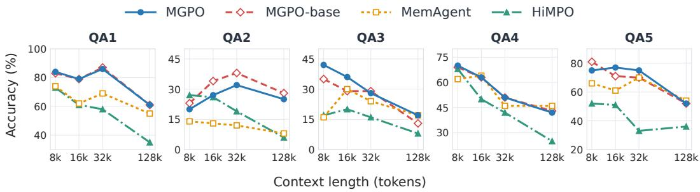  
Figure 6: Accuracy on BABILong QA1–QA5 across context lengths.

## E MECHANISM AND DIAGNOSTIC ANALYSES

## E.1 EMPIRICAL FIDELITY OF THE SURROGATE

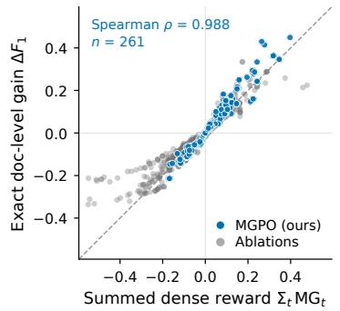

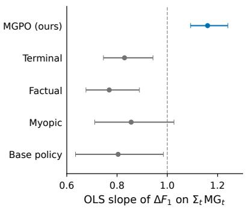  
Figure 7: The linearized reward closely tracks exact F1 gain. Left: Exact document-level F1 gain versus summed Memory Gain on SciREX, computed from the same history-masked counterfactual counts. MGPO (blue; $n \ : = \ : 2 6 1 )$ achieves Spearman $\rho ~ = ~ 0 . 9 8 8$ and matching signs whenever both gains are nonzero; credit ablations and the base policy are shown in grey. Right: OLS slopes of exact on linearized gain with document-bootstrap 95% CIs $( B = 2 0 0 0 )$ . The surrogate slightly underestimates MGPO gains (1.16, 95% CI [1.09, 1.24]) and overestimates ablation loss magnitudes (0.77–0.86).

## E.2 ROBUSTNESS TO READER SAMPLING

We use temperature-based decoding because greedy decoding substantially degrades Qwen3 extraction quality, and estimate each $F _ { t , j }$ from one independently sampled reader output. To quantify the resulting sampling noise, we evaluate unchanged-memory trajectories across eight random seeds as an empirical noise reference. As shown in Figure 8, 85% of the total absolute rewrite-credit mass comes from rewrites whose Memory Gain exceeds the 95th percentile of this reference, indicating that most credit lies well above single-sample variation.

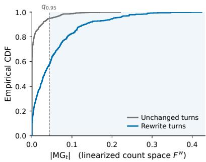  
Figure 8: Noise in single-sample utility estimation. Empirical CDFs of $| M G _ { t } |$ for unchangedmemory controls (grey) and actual rewrites (blue). The dashed line is the 95th percentile of the control distribution.

## E.3 MEMORY-BUDGET AND CHUNK-SIZE SENSITIVITY

Table 8: Sensitivity to memory budget and chunk size. We conduct experiments using the model trained with a configuration of a 1024 tokens chunk size and a 256 tokens memory budget. Performance is largely insensitive to the memory budget, while varying the chunk size shows a minor effect, peaking at 2048. <sup>†</sup> denotes the training configuration.

<table><tr><td>Memory</td><td>Chunk</td><td>Salient cluster</td><td>Binary relation</td></tr><tr><td colspan="3">Memory budget, chunk fixed at 1024</td><td></td></tr><tr><td>64</td><td>1024</td><td> $5 0 . 8 \pm 0 . 4$ </td><td> $2 6 . 1 \pm 0 . 7$ </td></tr><tr><td>128</td><td>1024</td><td> $5 1 . 3 \pm 1 . 2$ </td><td> $2 6 . 4 \pm 1 . 6$ </td></tr><tr><td>256†</td><td>1024†</td><td> $5 1 . 3 \pm 0 . 9$ </td><td> $2 6 . 5 \pm 1 . 3$ </td></tr><tr><td>512</td><td>1024</td><td> $5 1 . 5 \pm 0 . 7$ </td><td> $2 6 . 7 \pm 0 . 8$ </td></tr><tr><td colspan="4">Chunk size, memory fixed at 256</td></tr><tr><td>256</td><td>512</td><td> $4 7 . 9 \pm 0 . 7$ </td><td> $2 4 . 8 \pm 0 . 4$ </td></tr><tr><td>256†</td><td>1024†</td><td> $5 1 . 3 \pm 0 . 9$ </td><td> $2 6 . 5 \pm 1 . 3$ </td></tr><tr><td>256</td><td>2048</td><td> $5 1 . 2 \pm 0 . 5$ </td><td> $2 8 . 0 \pm 0 . 6$ </td></tr><tr><td>256</td><td>4096</td><td> $4 9 . 8 \pm 0 . 5$ </td><td> $2 5 . 3 \pm 0 . 5$ </td></tr></table>

## E.4 POSITION-EMA ESTIMATOR

We compare our position-specific EMA baseline with a group-relative alternative while keeping the Memory Gain objective unchanged. To accommodate variable document lengths, we maintain position-specific baselines only up to a cutoff K, and pool all later rewrites into a shared tail bucket, $\bar { \mathrm { i } } . \mathrm { e } . , b ( t ) \bar { = } b ( K )$ for $t \geq K$ . This avoids increasingly sparse position estimates for long documents while retaining position-dependent calibration over the earlier trajectory. As shown in Table 9, Position EMA performs better on the document-level tasks than group-relative method while requiring only one sample per state.

Table 9: Position EMA versus group-relative baseline on SciREX. Both variants use the same Memory Gain objective. MGPO-EMA uses position EMA $( G = 1 )$ , whereas MGPO-GR uses GRPO (G = 8). Policy rollouts and reader evaluations are reported per training document. GPUhours cover the complete training run, and peak memory is the analytical per-step training footprint.
<table><tr><td>Method</td><td>G</td><td>Mem. tokens</td><td>Policy rollouts</td><td>Reader evaluations</td><td>hours</td><td>GPU- Peak mem. (GiB)</td><td>Cluster F1 Relation F1</td><td></td></tr><tr><td>MGPO-base</td><td></td><td>202</td><td>一</td><td></td><td></td><td></td><td> $3 7 . 8 \pm 0 . 4$ </td><td> $1 5 . 5 \pm 0 . 4$ </td></tr><tr><td>MGPO-GR</td><td>8</td><td>72</td><td>8</td><td>50.7</td><td>142.0</td><td>198.4</td><td> $4 5 . 5 \pm 0 . 5$ </td><td> $2 0 . 1 \pm 0 . 3$ </td></tr><tr><td>MGPO-EMA</td><td>1</td><td>43</td><td>1</td><td>8.3</td><td>26.9</td><td>192.5</td><td> ${ \bf 5 1 . 3 \pm 0 . 9 }$ </td><td> $2 6 . 5 \pm 1 . 3$ </td></tr></table>

## E.5 CASE STUDY

We inspect two points along a SciREX evaluation trajectory from the SciREX-trained MGPO writer. Chunk indices are zero-based. Each box shows source excerpts and the complete memory after that chunk; [...] denotes omitted source text. Line breaks are for layout.

The seven-chunk paper “Training Region-based Object Detectors with Online Hard Example Mining” introduces OHEM and its evaluation datasets in chunk 0. The writer retains a compact result record while later chunks describe the training algorithm and implementation details.

```jsonl
SciREX: chunk 0 and memory 0
Chunk 0 (excerpts; [...] marks omissions)
[...]
We present a simple yet surprisingly effective online hard example mining ( OHEM
) algorithm for training region - based ConvNet detectors .
[...]
Moreover , combined with complementary advances in the field , OHEM leads to
state - of - the - art results of 78.9\% and 76.3\% mAP on PASCAL VOC 2007 and
2012 respectively .
[...]
Memory 0
{
"Method": "OHEM",
"Metric": "mAP",
"Task": "Object detection",
"Material": "PASCAL VOC 2007",
"Metric-Task": "mAP-Object detection",
"Method-Metric": "OHEM-mAP",
"Method-Task": "OHEM-Object detection",
"Method-Material": "OHEM-PASCAL VOC 2007",
"Task-Material": "Object detection-PASCAL VOC 2007",
"Metric-Material": "mAP-PASCAL VOC 2007"
}
```

Chunks 1–3 leave the memory unchanged. Chunk 3 mentions OHEM and Caffe, but contains no gold alias of PASCAL VOC 2007. Caffe appears only as the implementation framework.

SciREX: chunk 3 and memory 3   
Chunk 3 (excerpts; [...] marks omissions)   
[...]   
More specifically , the online hard example mining algorithm ( OHEM ) proceeds   
as follows .   
[...]   
We implement both options described above using the Caffe framework ( see ) .   
[...]   
Memory 3   
{   
"Method": "OHEM",   
"Metric": "mAP",   
"Task": "Object detection",   
"Material": "PASCAL VOC 2007",   
"Metric-Task": "mAP-Object detection",   
"Method-Metric": "OHEM-mAP",   
"Method-Task": "OHEM-Object detection",   
"Method-Material": "OHEM-PASCAL VOC 2007",   
"Task-Material": "Object detection-PASCAL VOC 2007",   
"Metric-Material": "mAP-PASCAL VOC 2007"   
}

At chunk 3, the memory-conditioned reader predicts OHEM–PASCAL VOC 2007, combining the locally observed method with the dataset retained in memory. Without memory, the reader instead predicts two relations to Caffe framework, neither matching a gold relation. The retained result context thus separates evaluation material from implementation context across chunks.

## F COMPUTATIONAL ANALYSIS

## F.1 COMPUTATION COMPLEXITY

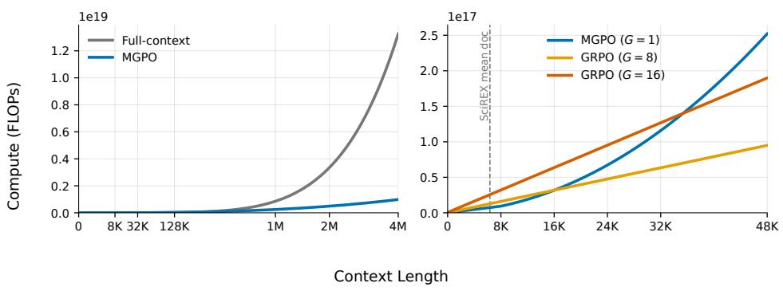  
Figure 9: Analytical FLOPs under the SciREX instrument, every call charged at its configured maximum width. Left: Inference: a full-context 14B reader scales quadratically in document length while chunk-wide MGPO scales linearly. Right: Training: Memory Gain (G=1) pays a triangular counterfactual reward matrix, GRPO pays G trajectories with diagonal reader cells. At the mean SciREX (train) document (dashed line, 6,346 tokens) Memory Gain costs half of GRPO-8, and only overtakes it past 16K tokens.

Practical training cost. During training, we use only chunks containing attributed gold structures as reader-evaluation targets in the counterfactual matrix. Chunks without attributed targets are still processed by the memory policy, so their rewrites remain part of the trajectory and can affect utility on subsequent supervised targets, but they are not themselves scored as target chunks. This sparse target evaluation substantially reduces the number of reader calls relative to the dense estimate in Figure 9. Our transfer experiments further show that memory policies trained on shorter documents remain effective on substantially longer contexts, reducing the need to train directly at the longest deployment lengths.

## F.2 GPU USAGE

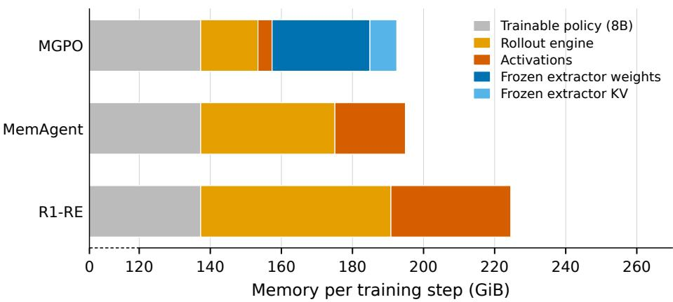  
Figure 10: Training-time GPU memory breakdown on SciREX. All methods train the same Qwen3-8B policy under their respective training configurations. Policy memory is therefore identical, while rollout KV cache and activations vary with each method’s sequence and batch geometry. MGPO additionally maintains a frozen Qwen3-14B reader and its KV cache. Nevertheless, its chunk-wise training setup substantially reduces rollout and activation memory, yielding a total footprint comparable to MemAgent and lower than R1-RE.

## G SCOPE AND LIMITATIONS

MGPO isolates the marginal effect introduced between adjacent memory states, but does not explicitly decompose higher-order interactions among multiple rewrites. When downstream utility emerges only after several complementary updates, the newly realized gain is attributed to the rewrite at which that utility becomes observable rather than divided among the preceding contributing updates. This does not eliminate long-horizon credit to earlier actions, since subsequent Memory Gains remain included in their cumulative returns $G _ { t }$ . Rather, it limits the granularity of rewrite-level attribution. Explicit interaction-aware or coalitional attribution is an interesting direction for future work.