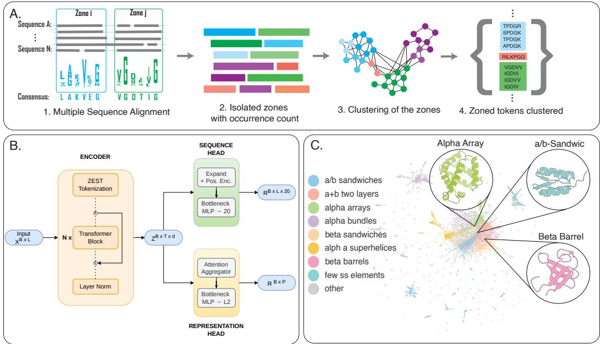
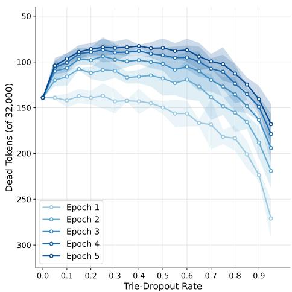
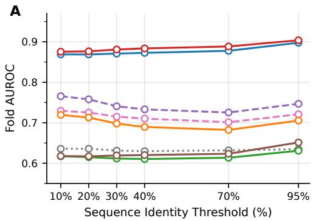
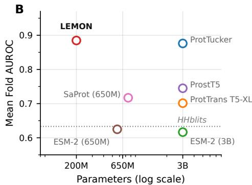
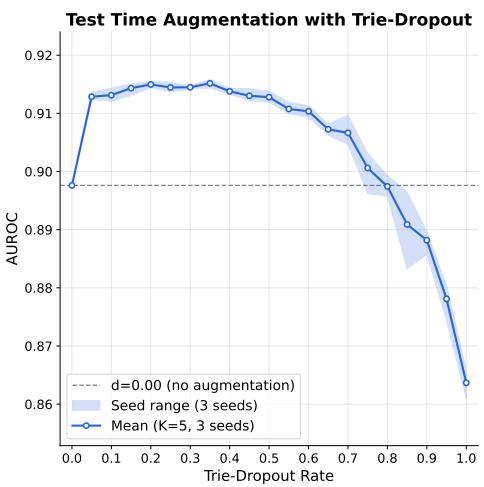

# LEMON-ZEST: Evolution-Informed Tokenization for Efficient Protein Language Modeling

Biswajit Banerjee1 Claudia Alvarez-Carreño2,∗ Anton S. Petrov1,∗

1Georgia Institute of Technology 2University College London

## Abstract

Protein Language Models (PLMs) have made remarkable progress following scaling laws established in natural language processing across sequence- and structurebased tasks, yet the potential of tokenization remains underexploited. Unlike human language, proteins preserve structure despite extensive sequence variation — a property standard tokenization strategies fundamentally fail to capture. We introduce ZEST (Zoned Encoding of Sequence Traits), an evolution-informed vocabulary derived from conserved regions of multiple sequence alignments. ZEST allows embedding domain-level biological priors directly at the tokenization stage rather than learning them implicitly through scale. ZEST natively compresses sequences to an average token length of 4 residues, enabling our model to process 4,000 residues within a standard 1024-token context window. Building on this, we present LEMON (Layered Extraction of Molecular Ordering from Nature), a compact 200M-parameter sequence-based model for detection of remote homology between protein sequences trained on a single H100 GPU for one week. Despite its modest size, LEMON outperforms state-of-the-art models ranging from 600M to 3B parameters. Our results demonstrate that evolution-informed tokenization can substitute for massive parameter scaling, opening a new direction for efficient, biologically-grounded protein representation learning. All code, model weights, and results are publicly available under the MIT license.

## 1 Introduction

The success of modern language models stems from two critical innovations: sub-word tokenization and compute-optimal scaling. Transitioning from character-level to Byte-Pair Encoding [1] allowed models to compress text into tokens (word fragments), establishing an efficient underlying vocabulary. Similarly, research by Hoffmann et al. [2] has shown that scaling in both the data and compute axes significantly decreases loss, leading to the development of extremely large models scaling on both axes, while Kaplan et al. [3] provided a more compute-optimal training regime.

Following a similar trajectory, Protein Language Models (PLMs) have shown strong performance at both protein sequence- and structure-level tasks. While the major focus of PLM development has been on scaling laws to boost performance, the role of tokenization granularity has received comparatively little attention in PLMs. Unlike human language, nature’s vocabulary that is protein domains, has evolved built-in mutation tolerance to preserve structural robustness. During evolution, structure is often preserved despite extensive sequence variation, and structural constraints play a central role in determining protein function.

The Ship of Theseus is a paradoxical question: if one by one all components of a ship are replaced, does the ship remain the same? While answering the paradox is tough, for folds it is answerable: the fold remains the same as long as amino acids in the sequence maintain its structural integrity. These amino acids are often found within evolutionarily conserved regions. Their presence enables the sequence to retain access to the same folding landscape. To understand it more clearly, biologists align a variety of sequences that result in the same fold into a 2D grid, a Multiple Sequence Alignment (MSA), revealing a landscape of conserved regions that are crucial for protein folding, which in turn governs its function. Since structure is more conserved than sequence[4], the sequence-to-structure mapping is a many-to-one problem. To address this, researchers have developed various substitution matrices[5] that define the penalty of mutability between a pair of amino acids using empirical data.

Structural classification systems reveal that proteins with highly divergent sequences can share common folds and the task of detecting them is known as remote homology inference[6]. In these systems[7, 8], a fold is a conceptual entity that represents all individual domains within a given level of the classification hierarchy. The classification levels can have different arrangements and names, ranging from finest to coarse grain, such as CATH [7]:Class, Architecture, Topology, Homology which differs from SCOP [9] annotations Class, Fold, Superfamily, Family. The Class-level contains collections of alpha elements (spiral coil shape), beta elements (flat sheet), or a combination of them. The divergence of these sequences can be computed as the number of amino acid differences between aligned sequences. Applying a threshold of 30% sequence identity as a definition of remote homology, Kabir et al. [10] demonstrates that PLMs still fail to detect remote homologs and assign them correctly within structural classification hierarchies. Remote homology inference is, thus, considered one of the hardest tasks in this field.

Structural information greatly simplifies homology inference. Although structure-prediction models have made incredible progress, the protein folding problem—essential rules governing fold conservation and the problem of function prediction remain unsolved [11–13]. If the sequence holds the fundamental ground truth of function, it is inherently more valuable to decode this from sequence space rather than treating the two modalities as isolated spaces.

If fold survival constrains sequence divergence, conserved MSA zones can act as the fundamental vocabulary of nature. In this work, we demonstrate that incorporating knowledge from the biological domain directly into the tokenization stage can substantially improve protein language model efficiency and performance without scaling in either axis. Primarily our contributions are:

• Zoned Encoding of Sequence Traits (ZEST): Creating a method to inject known domain priors as the vocabulary, thereby bypassing the need to relearn these priors during training and compressing the context far beyond any existing PLM.

• Trie-Dropout: A novel tokenization regularization technique that stochastically decomposes longer ZEST tokens into their constituent sub-zones during training, ensuring uniform vocabulary utilization and enabling Test Time Augmentation (TTA) at inference.

• Layered Extraction of Molecular Ordering from Nature (LEMON): Demonstrating that a highly compact model trained with this vocabulary on a single H100 GPU for a week can outperform existing state of the art models in remote homology inference while preserving sequence level characteristics.

## 2 Related Works

Profile-Based Homology Inference. Classical approaches to remote homology inference rely on profile-based methods built from MSAs. These profiles are based on Hidden Markov Models, considering a protein sequence as a Markovian Decision Process (MDP) over match, insert or delete state and residues being the emission. Tool-kits such as HMMER3 [14], HH-suite3 [15] construct these profiles from MSAs and use dynamic programming for similarity search. Despite their interpretability, these methods have the fundamental limitation of the Markovian Assumption (the future is conditionally independent of the past, given the present), which prevents them from capturing long range dependencies over the sequence governing fold. Curated collections of HMMs, such as Pfam [16], TIGRFAMs [17] and Gene3D [18], have been paramount for identification and annotation of folds from sequence. TEDLH [19] is a recent library of HMM profiles derived from The Encyclopedia of Domains (TED) [20]. TED leverages structure-based domain segmentation tools to describe nearly 365 million domains in the alphafold database (AFDB) [21].

  
Figure 1: Overview of the proposed architecture and methodology. (A) The biological prior-injected vocabulary generation process. (B) The dual-head Y-architecture model design. (C) A reduceddimensionality projection of the latent representations of protein domains, illustrating clear spatial separation between alpha helices, beta sheets, and their combinations.

Sequence-Based Protein Language Models. Recent advances in protein language models have leveraged transformer [22] architectures to learn contextual representations directly from raw protein sequences with the ability of bi-directional attention. The field pivoted to pre-train sequence based PLMs with BERT-style Masked Language Modeling (MLM) [23] on larger sequence corpora from UniRef [24]. Models trained in this fashion demonstrate that raw PLM embeddings capture biophysical properties of the sequence without any structural supervision. Taking a different approach, MSAtransformers [25] operate on aligned sequences using axial attention across rows and columns allowing them to capture co-evolutionary patterns. Despite impressive performance, residue based models are still limited by the sequence noise limiting their capacity [10].

Contrastive Learning For Remote Homology. To address the limitations of masked language modeling for similarity search, recent work has incorporated contrastive learning objectives to better align protein embeddings with structural relationships. The standard MLM training optimizes denoising of the sequence rather than similarity search. Models such as ProtTucker [26] address this by applying contrastive learning to PLM embeddings to optimize PLM embeddings for CATH hierarchy towards structural similarity. Other research groups take a more direct approach, aligning sequence model embeddings to structure-trained PLM embeddings to incorporate structural supervision into sequence-only models [27].

Structure-Aware Vocabulary. Several recent approaches attempt to incorporate structural information into protein language models through structure-aware tokenization or joint sequence–structure representations. Thus, models such as SaProt [28] introduces structure aware vocabulary including 3Di structure derived tokens from Foldseek [29]. SaProt achieves strong performance utilizing these tokens but requires explicit structure as input limiting it’s capacity for protein with no known structures. ProstT5 [30] takes a bilingual approach of treating these 1D sequence and 3D structure as two languages. More recently, work on protein structure tokenization has explored encoding local 3D context into discrete representations to improve structure informed language modeling. While GeoBPE [31] proposed applying BPE to geometric protein structures. All these methods have similar dependency of structure availability at inference time, limiting the real world applications. CATHe [32] trained an artificial neural network directly on ProstT5 embeddings to classify sequences into CATH superfamilies, targeting sub-20% (CATHS20) sequence identity regime.

Tokenization Strategies. EvoBPE [33] challenged this by augmenting the standard BPE algorithm with evolution aware mutations, using substitution matrices to generate candidate token pairs, but remains theoretically proposed without trained models and relies on statistical mutation tendencies rather than empirically observed conservation.

## 3 Methods

## 3.1 Vocabulary

To construct a biologically informed vocabulary, we identified conserved and synonymous multiresidue patterns, zones(≥ 3 residues & is not homo-polymer) from HHsuite’s consensus sequences for 765,248 HMM profiles (TEDLH) [19]. These zones are further clustered using MMseqs2 linclust [34] at 70 % sequence identity. To prioritize biologically significant motifs, each cluster was ranked using a score that aggregates cross-profile frequency while prioritizing zone length From this ranking, we select top 31,975 clusters.To formalize the vocabulary, we append 20 standard amino acids as residue level fallback tokens and 5 special tokens. Each member of the clusters are assigned the same token id, inherently addressing the many-to-one problem. The resulting vocabulary Zoned Encoding of Sequence Traits (ZEST), achieves a mean token length of mean length ∼ 4 residues, yielding meaningful context compression.

Protein evolution reuses successful structural fragments: a long conserved motif often contains shorter conserved sub-motifs as prefixes. Meaning that shorter sub-patterns—which may themselves carry distinct structural semantics— are never exposed to the encoder as independent tokens. Figure 2 shows that nearly 139 tokens are left completely unattended after visiting 5 millions sequences due to greedy longest-match tokenizer will always consume the longest available zone at each position, An analogous problem exists in sub-word NLP tokenization, where BPE-dropout [35] addresses it by randomly omitting merge operations; however, BPE merges are learned from corpus statistics and the resulting segmentation has no guaranteed structural correspondence. To mitigate this issue, we built a prefix tree (trie); where a vocabulary entry spanning k residues naturally nests within longer entries that share the same prefix, providing a biologically grounded hierarchy of segmentation granularity.

  
Figure 2: Multi-seed analysis of vocabulary coverage across one million sequences across epochs.

During tokenization, the trie matcher at each position returns all valid matches from longest to shortest. With probability $p _ { \mathrm { d r o p } } ,$ the greedy choice is overridden and a uniformly sampled shorter match is selected instead, forcing the encoder to process the remaining suffix as one or more separate tokens. Serving as a augmentation, the dropout ensures the same protein sequence is segmented differently across iterations, preventing the model from relying solely on surface-level long-zoned identity. At the highest dropout the vocab falls back to individual characters. Concretely, for a position where the trie yields matches of lengths $( k _ { 1 } > k _ { 2 } > \cdots > k _ { m } )$ , trie dropout selects $k _ { j }$ $( j > 1 )$ with probability $p _ { \mathrm { d r o p } } / ( m - 1 )$ per alternative, otherwise retaining the greedy choice $k _ { 1 }$

## 3.2 Model Architecture

Standard protein language models operate at the single-residue level, processing sequences of length L with ${ \hat { O ( L ^ { 2 } ) } }$ attention cost. The ZEST tokenizer replaces this with a 32K-entry vocabulary greedy max-match, compressing protein sequences by 4–6×. This compression is not merely computational; each multi-residue token corresponds to a recurrent characteristic signature, injecting domain-aware inductive bias directly at the input representation.

Tokenization compresses a sequence of $L$ amino acids into $T \ll L$ tokens, where each token spans a variable number of residues recorded in a token\_lengths vector. This creates a fundamental tension: the compressed token-level representation is efficient for global reasoning (attention, pooling), but downstream tasks such as residue-level properties require recovering per-residue embeddings. LEMON resolves this through a shared encoder whose token embeddings are simultaneously consumed by two task-specific heads Figure 1 B.

Shared Encoder. The encoder is a pre-norm transformer stack with Rotary Position Embeddings (RoPE) [36], SwiGLU feed-forward networks [37], and Flash Attention [38] via PyTorch’s scaled\_dot\_product\_attention. Each attention block applies pre-LayerNorm, projects to queries/keys/values (bias-free), applies RoPE to Q and K, computes attention, then feeds through a gated FFN: $\mathrm { F F N } ( x ) = W _ { 3 } \bar { ( \mathrm { S i L U } ( W _ { 1 } x ) \odot W _ { 2 } x ) }$ , with hidden dimension $\lfloor \frac { 2 } { 3 } \dot { d } \cdot m \rfloor$ where m is the FFN multiplier. Padding tokens are zeroed in keys and values before attention and in the output after each sub-layer. Token embeddings are tied to the MLM output projection, i.e. the token-level MLM logits are computed as logits $= \breve { z } \cdot W _ { \mathrm { e m b } } ^ { \top }$

Representation head. For hierarchical contrastive learning, variable-length token embeddings are projected into a fixed-size sequence representation. We implement attention pooling that uses a single learned query vector $q _ { 0 } \in \bar { \mathbb { R } ^ { d } }$ (initialized as $\mathcal { N } ( 0 , 0 . 0 2 ) \}$ attending over all token embeddings via 4-head scaled dot-product attention for projecting $\boldsymbol { z } \in \mathbb { R } ^ { \tilde { B } \times T \times d }$

$$
f _ { \mathrm { s e q } } = \mathrm { L a y e r N o r m } \big ( W _ { O } \cdot \mathrm { A t t n } ( W _ { Q } q _ { 0 } , ~ W _ { K } z , ~ W _ { V } z ) \big ) ,\tag{1}
$$

followed by a learned alignment projection initialized to identity. The resulting $f _ { \mathrm { s e q } } \in \mathbb { R } ^ { d }$ is then passed through a bottleneck projector—a stack of $N _ { \mathrm { p r o j } }$ blocks, each containing two sub-layers forming a $d { \xrightarrow { } } h { \xrightarrow { } } d$ bottleneck—followed by a final linear projection to the contrastive embedding dimension $d _ { \mathrm { p r o j } }$ and ℓ2-normalized.

Sequence head. The sequence head reconstructs per-residue amino acid predictions from the encoder’s compressed token representations, effectively inverting the tokenization. Given encoder outputs $z \in \mathbb { R } ^ { \mathbf { \mathring { B } } \times T \times d }$ , each token embedding is first broadcast across its residue span to produce $\tilde { z } \in \mathbb { R } ^ { B \times L \times d }$ . Each residue then receives two additive positional signals: a global embedding $p _ { g }$ encoding its absolute position in the chain, and a local embedding pℓ (ALiBi-style [39]) encoding its offset within the token span. The combined representation $\hat { z } = \tilde { z } + p _ { g } + p _ { \ell }$ is passed through a two-block bottleneck MLP and a final linear projection to 20-way amino acid logits.

The dual positional encoding serves a specific purpose: the global signal prevents the model from conflating the same conserved motif appearing at different chain positions, while the local signal preserves sub-token residue identity. Together, the MLM gradient from this head penalizes any loss of fine-grained sequence information during encoding, keeping the shared encoder honest about local residue content despite operating on coarse token boundaries.

This design enables the shared encoder to maintain residue-level fidelity despite operating on compressed tokens: the expansion head’s gradient signal (via residue MLM) penalizes any loss of local sequence information during encoding, while the global positional encoding prevents the model from confusing identical motifs occurring at different chain positions.

## 3.3 Data

We pre-train on 50% of UniRef90 [40], containing ∼90M protein sequences with the objective of token level and sequence level MLM. For fine-tuning, we construct 59.7M protein pairs from TEDLH domain annotations, each labeled at three levels of the CATH [7] hierarchy: Architecture, Topology, and Superfamily. The model was trained on sequences alone and contrastive learning was applied at the hierarchy level. Training and validation pairs are separated by CD-HIT[41] to prevent sequence level leakage within the finetuning set. For evaluations, we rely on standard SCOP, SCOPe [42] and CATH S20.

We conducted a rigorous audit between finetuning sequences (726,922 TED domains) and all three benchmarks. Exact string matching found zero identical sequence. An all-against-all search using cd-hit-2d revealed that $\sim 1 0 \%$ of benchmark domains share $\ge 7 0 \%$ global sequence identity with a training sequence, and $\sim 2 . 5 \%$ share $\geq 9 0 \%$ identity—consistent with the natural redundancy of protein sequence space and well below the identity threshold at which benchmarks are evaluated.

At the fold level, 80.9% of S20 fold types appear in training, which is expected: remote homology benchmarks test sequence-distant members of known folds, not unseen fold classes. Collectively, these results confirm that benchmark performance reflects generalization across sequence divergence, not memorization of training sequences.

## 4 Experiments

## 4.1 Remote Homology with LEMON

  
LEMON ProtTucker ProtTrans T5-XL ESM-2 (650M) ESM-2 (3B) SaProt (650M) ProstT5 HHblits

Figure 3: (a) AUROC computed on SCOP dataset plotted against Sequence Identity Threshold; each point corresponds to an evaluation where the retrieval pool is filtered to proteins sharing at most t% sequence identity with the query (x-axis). Dashed lines indicate models requiring 3Di structural tokens as input (SaProt, ProstT5) and a dotted line represents HHblits. (b) Mean fold-level AUROC averaged across all six thresholds in comparison to model size. HHblits is a non-parametric, HMM profile-based comparison.

Task Definition: We evaluate LEMON on the task of remote homology detection, where the goal is to retrieve proteins sharing the same fold as a query despite low sequence similarity. Each protein sequence is encoded into a single embedding vector, and retrieval is performed by ranking all candidate sequences by cosine similarity to the query. Using the SCOP and CATH classifications as ground truth, pairs are labeled positive if they agree at a given hierarchical level (e.g. SCOP Family and CATH Superfamily) but disagree at the level below, and negative otherwise [43–45]. This approach ensures that only remote homologs constitute positive pairs, making the benchmark a stringent test of learned protein representations.

Evaluation baselines: With LEMON being finetuned on CATH hierarchy, our evaluations are done on both annotation schemes SCOP and CATH. Following evaluation criteria defined by Kabir et al. [10], we segment across sequence-identity thresholds(10–95%) for SCOP sequences. These evaluation benchmarks are constructed to ensure evaluation schema differs from training schema to ensure retainability.

We compare LEMON against state-of-the-art baselines spanning three families. Sequence PLMs (no contrastive supervision): ESM-2 (650M and 3B) [46] and ProtTrans-T5-XL (3B) [47] are evaluated with mean-pool embeddings using publicly available weights. Structure-conditioned PLMs: SaProt (650M) [28] and ProstT5 (3B) [30] augment sequences with Foldseek 3Di structure tokens derived from AlphaFold2 predictions. Supervised/alignment baselines: ProtTucker (3B) [26] fine-tunes ProtT5-XL with a CATH-supervised contrastive head and 128-d projection; All embeddings for PLM baselines were generated by us under identical conditions. We also provide general purpose PLMs Ankh [48] and PLMSearch [49]. Ultimately we also add HMM profile based method HHblits [15].

Metrics: The difficulty of fold level retrieval arises in part due to the extreme class imbalance(∼ 200 : 1 negative-to-positive ratio on SCOP). While such imbalance is grounds for favoring Area Under Precision-Recall Curve (AUPRC), McDermott et al. [50] show that class imbalance alone doesn’t justify AUPRC over Area Under the Receiver Operating Characteristic Curve (AUROC). AUROC treats all misranked pairs uniformly, whereas AUPRC disproportionately penalizes errors among high-scoring samples. Therefore, we adopt fold-level AUROC as our primary metric and offer mAP as a complementary measure of top-of-list retrieval quality.

Table 1: Complete benchmark results across all datasets and classification levels. The Superfamily level measures detection of proteins sharing the same fold. Time = total GPU wall-clock on single H100. † Additionally requires ESMFold structure prediction as a pre-processing step.
<table><tr><td>Model</td><td>Params</td><td>Time</td><td colspan="4">CATH S20</td><td colspan="4">SCOPe</td><td colspan="4">SCOP</td></tr><tr><td></td><td></td><td></td><td colspan="2">Architecture</td><td colspan="2">Topology</td><td colspan="2">Fold</td><td colspan="2">Superfamily</td><td colspan="2">Fold</td><td colspan="2">Superfamily</td></tr><tr><td></td><td></td><td></td><td>AUROC</td><td>mAP</td><td>AUROC</td><td>mAP</td><td>AUROC</td><td>mAP</td><td>AUROC</td><td>mAP</td><td>AUROC</td><td>mAP</td><td>AUROC</td><td>mAP</td></tr><tr><td>LEMON</td><td>200M</td><td>5m</td><td>0.825</td><td>0.356</td><td>0.898</td><td>0.320</td><td>0.903</td><td>0.347</td><td>0.959</td><td>0.555</td><td>0.904</td><td>0.287</td><td>0.948</td><td>0.421</td></tr><tr><td>ProtTucker</td><td>3,000M</td><td>9m</td><td>0.783</td><td>0.250</td><td>0.874</td><td>0.293</td><td>0.876</td><td>0.263</td><td>0.971</td><td>0.693</td><td>0.855</td><td>0.212</td><td>0.961</td><td>0.541</td></tr><tr><td>SaProt</td><td>650M</td><td>x†</td><td>0.619</td><td>0.143</td><td>0.658</td><td>0.067</td><td>0.717</td><td>0.075</td><td>0.859</td><td>0.204</td><td>0.670</td><td>0.055</td><td>0.778</td><td>0.062</td></tr><tr><td>ProtTrans</td><td>3,000M</td><td>9m</td><td>0.608</td><td>0.126</td><td>0.699</td><td>0.091</td><td>0.701</td><td>0.092</td><td>0.914</td><td>0.386</td><td>0.710</td><td>0.085</td><td>0.889</td><td>0.233</td></tr><tr><td>ProstT5</td><td>3,000M</td><td>x†</td><td>0.604</td><td>0.145</td><td>0.678</td><td>0.122</td><td>0.745</td><td>0.152</td><td>0.927</td><td>0.540</td><td>0.578</td><td>0.020</td><td>0.655</td><td>0.008</td></tr><tr><td>Ankh-Base</td><td>450M</td><td>10m</td><td>0.589</td><td>0.128</td><td>0.692</td><td>0.118</td><td>0.718</td><td>0.135</td><td>0.907</td><td>0.571</td><td>0.726</td><td>0.129</td><td>0.890</td><td>0.435</td></tr><tr><td>Ankh-Large</td><td>1,500M</td><td>18m</td><td>0.583</td><td>0.122</td><td>0.675</td><td>0.099</td><td>0.675</td><td>0.101</td><td>0.891</td><td>0.493</td><td>0.687</td><td>0.100</td><td>0.871</td><td>0.338</td></tr><tr><td>PLMSearch</td><td>650M</td><td>6m</td><td>0.548</td><td>0.114</td><td>0.620</td><td>0.082</td><td>0.622</td><td>0.075</td><td>0.851</td><td>0.404</td><td>0.630</td><td>0.076</td><td>0.813</td><td>0.261</td></tr><tr><td>ESM-2 (650M)</td><td>650M</td><td>7m</td><td>0.546</td><td>0.110</td><td>0.608</td><td>0.061</td><td>0.625</td><td>0.054</td><td>0.787</td><td>0.241</td><td>0.624</td><td>0.053</td><td>0.753</td><td>0.126</td></tr><tr><td>ESM-2 (3B)</td><td>3,000M</td><td>18m</td><td>0.535</td><td>0.106</td><td>0.605</td><td>0.069</td><td>0.616</td><td>0.056</td><td>0.799</td><td>0.297</td><td>0.610</td><td>0.055</td><td>0.769</td><td>0.177</td></tr></table>

Results: Figure 3a depicts fold-level retrieval on SCOP database across six sequence-identity thresholds, where lower thresholds retain only distant homologs making retrieval strictly harder. LEMON ranks first at every threshold, from the most challenging (th10: 0.875) to the easiest (th95: 0.904), maintaining a consistent lead over its strongest competitor, ProtTucker. Structure supervised SaProt trails LEMON by a large margin, underscoring that structural supervision at the residue level does not substitute for the global representation geometry learned by LEMON. Figure 3b shows the parameter efficiency compared to performance. HHblits (an alignment-based method) outperforms all models that have not undergone contrastive fine-tuning, highlighting the extent to which standard PLM embeddings remain poorly calibrated for similarity search without explicit metric learning.

Further shown in Table 1, LEMON achieves the highest mean AUROC(0.86) and mAP(0.31) across all three benchmarks. Despite, LEMON being 200M parameters it outperform all PLMs ranging from 650M till 3B-parameter baselines, indicating that representation quality drives performance rather than brute-force scale and contrastive metric learning on sequence tokens alone suffices for fold-level discrimination.

## 4.2 Test Time Augmentation:

Because ZEST’s trie-based tokenizer supports stochastic segmentation, it naturally enables testtime augmentation (TTA): at inference by generating K stochastic tokenizations of each sequence and averaging the resulting embeddings,

$$
\bar { \mathbf { e } } = \frac { 1 } { K } \sum _ { k = 1 } ^ { K } f _ { \theta } \big ( \mathrm { T O K E N I Z E } ( \mathbf { x } ; d ) \big )
$$

where d is the trie-dropout rate and $f _ { \theta }$ is frozen LEMON. We sweep $d \in \ [ 0 , 1 ]$ with $k \ = \ 5$ passes per sequence, evaluating in SCOP foldlevel retrieval across three random seeds; results shown in Figure 4.

The resulting inverted-U profile has two implications. First, moderate trie-dropout provides a reliable, training-free improvement to retrieval quality: embeddings from multiple passes are averaged, the computational overhead scales linearly with K and carries no memory cost beyond a single forward pass. Second, the breadth of the plateau—spanning roughly $d \in [ 0 . 0 5 , 0 . 5 ]$

  
Figure 4: Multi-seed test time augmentation effect.

means that practitioners need not tune d precisely; any value in this range recovers the majority of the available gain, making the method robust to hyperparameter choice in deployment.

## 4.3 Isolating effects of ZEST

Table 2: SCOPe (10%-identity) retrieval benchmark across three seeds with identical architecture and effective batch size of 1024; the total times are averaged across three runs of each category.
<table><tr><td>Tokenizer</td><td>ROC-AUC</td><td>mAP</td><td>fold ROC</td><td> $T _ { \mathrm { p r e } }$  (mins)</td><td> $T _ { \mathrm { f t } }$  (mins)</td></tr><tr><td>ZEST (32K)</td><td> ${ \bf 0 . 7 3 9 \pm 0 . 0 1 7 }$ </td><td> $\mathbf { 0 . 0 6 8 \pm 0 . 0 0 2 }$ </td><td> $\mathbf { 0 . 7 4 9 \pm 0 . 0 1 4 }$ </td><td>304.7</td><td>985.5</td></tr><tr><td>BPE (32K)</td><td> $0 . 7 2 9 \pm 0 . 0 0 8$ </td><td> $0 . 0 3 6 \pm 0 . 0 0 2$ </td><td> $0 . 7 4 3 \pm 0 . 0 0 8$ </td><td>278.0</td><td>1030.0</td></tr><tr><td>Char (25)</td><td> $0 . 7 0 8 \pm 0 . 0 1 1$ </td><td> $0 . 0 5 9 \pm 0 . 0 0 2$ </td><td> $0 . 7 2 1 \pm 0 . 0 1 0$ </td><td>650.7</td><td>1043.1</td></tr></table>

To justify our vocabulary design, we evaluate ZEST against standard character-level and a BPE vocabulary, constructed by iteratively merging the most frequent adjacent character pairs in the TEDLH corpus—across multiple seeds. We initializing 9 models (3 seeds × 3 tokenization models) with the same architecture (50M encoder + 8M head); ZEST and BPE both having a $3 2 , 0 0 0 \times 5 1 2 =$ 16.4M embedding matrix, while char has $2 5 \times 5 1 2 = 0 . 0 1 \mathrm { { M } }$ . We first pre-train on a stratified 20M subset of Uniref90 and then finetune in the entire TED-LH dataset. In Table 2, the results clearly indicate despite BPE being faster to train than char, the precision trade off gives diminishing returns. Further strengthening our proposition on natural language laws do not apply as is to natures language of proteins. Remarkably, ZEST eliminates the trade-off between the two tokenization strategies: by implicitly injecting the evolutionary conservation from nature, it achieves higher accuracy than both character-level and BPE approaches while also having the shortest total training time.

## 4.4 Zero-Shot Generalization

Table 3: Zero-shot generalization across four protein tasks. All methods use frozen embeddings with cosine-similarity k-NN label transfer $( K = 1 5 )$ or pairwise classification—no task-specific fine-tuning. The table shows that at a fraction of its parameter size, LEMON matches or exceeds SOTA zero-shot performance.
<table><tr><td>Task</td><td>Metric</td><td>LEMON (200M)</td><td>ESM-2 (650M)</td><td>ProtTucker (3B)</td></tr><tr><td rowspan="2">Circular Permutation</td><td>AUROC</td><td>0.779</td><td>0.476</td><td>0.720</td></tr><tr><td>AUPRC</td><td>0.285</td><td>0.081</td><td>0.238</td></tr><tr><td>EC Number</td><td>F-max</td><td>0.821</td><td>0.800</td><td>0.878</td></tr><tr><td rowspan="2">GO Mol. Function</td><td>F-max</td><td>0.639</td><td>0.603</td><td>0.635</td></tr><tr><td>AUPR</td><td>0.625</td><td>0.584</td><td>0.616</td></tr><tr><td rowspan="2">Domain Boundary</td><td>NDO</td><td>0.758</td><td>0.771</td><td>0.750</td></tr><tr><td>NRes</td><td>0.637</td><td>0.658</td><td>0.674</td></tr></table>

We evaluate LEMON’s embedding quality across four structurally and functionally distinct tasks: i) Circular Permutation, ii) EC Number Classification, iii) GO Molecular Function, and iv) Domain Boundary Detection; spanning both fold-level and functional retrieval challenges. In all settings, embeddings are frozen and no task-specific parameters are learned or tuned, providing a strict measure of zero-shot generalization. Against our primary baselines, ESM-2 and ProtTucker, LEMON achieves competitive or superior performance across tasks, demonstrating that the ZEST contrastive objective yields embeddings with broad structural and functional utility beyond the training objective.

Circular Permutation: Nature has a tendency of reusing successful patterns. A circular permutation (CP) where proteins share highly similar global folds but differ in the ordering of their structural elements completely reorders sequence. Detection therefore requires the embedding to be invariant to linear sequence order—a property sequence statistics alone cannot provide. We evaluate on the CIRPIN SCOPe40 benchmark [51], which comprises 1 968 verified CP pairs drawn from ASTRAL SCOPe 2.08 at 40% maximum identity, paired with hard false-positive negatives (similar secondarystructure content but no true CP relationship) and random non-CP pairs. ESM-2’s near-random prediction is sensitive to sequence order and collapse on CPs as the model was never trained on contrastive representations; LEMON achieves substantially above random despite taking only aminoacid sequences as input. The current frontier is held by structure-based methods: CIRPIN recovers 9/11 pairs on the adjusted benchmark, and TM-align-CP [52] recovers 7/11, but both require predicted or experimental 3D-coordinates. LEMON sets the state of the art among sequence-only methods.

EC Number Classification: We follow the zero-shot evaluation protocol of ProteInfer [53], using its 12-shard random-split SwissProt test set. The supervised ceiling is ProteInfer itself $( F _ { \mathrm { m a x } } { = } 0 . 9 7 7 )$ trained exclusively on this EC annotation task. Among zero-shot embedding methods, ProtTucker shows dominance followed by LEMON and ESM-2. Indicating its contrastive objective produces a neighborhood structure better aligned with enzymatic function even without any EC supervision.

GO Molecular Function: We evaluate on the MZSGO benchmark [54], which uses the CAFA5 [55] train/test split from SwissProt. Predictions are generated by transferring GO term scores from the k nearest training-set neighbors of each test protein by cosine similarity. We report $F _ { \mathrm { m a x } }$ and AUPR over the MF ontology. LEMON and ProtTucker are essentially indistinguishable on this task, which is expected: GO MF encompasses broad biochemical vocabulary learned from sequence co-evolution at scale, and the LEMON paired with ZEST trained on sequence-level TEDLH hierarchy—is not specifically aligned with GO term boundaries.

Domain Boundary Detection: We evaluate on the CATH-17287 benchmark [56], comprising 17287 multi-domain PDB [57] chains with CATH boundary annotations, following the Merizo evaluation protocol. Using a sliding window approach, we cluster representations to determine domain counts. NDO (Normalized Domain Overlap) measures how well predicted segments cover each ground-truth domain; NRes measures per-residue assignment accuracy. LEMON was finetuned on single domain sequence choppings, hence this task is truly novel for our model. LEMON, ESM-2 & ProtTucker stays at a competitive range. The structure-based frontier is Merizo (NDO ≈0.83), which uses predicted 3D coordinates; the sequence-only frontier prior to this work was Chainsaw [58] (NDO ≈0.72). LEMON exceeds Chainsaw while requiring no structural input.

## 5 Conclusions

We introduce ZEST, a novel biologically-grounded protein vocabulary derived from nature’s own conservation signals, and demonstrate its effectiveness through LEMON, a compact protein language model trained entirely on a single GPU. Rather than following the prevailing paradigm of scaling parameters and computational resources, we show that embedding evolutionary knowledge directly at the tokenization stage is a novel and powerful alternative.

Proteins carry billions of years of evolution in their sequences, and rather than letting a model slowly rediscover these patterns through massive training, ZEST injects them directly, offering a clear philosophy that domain knowledge belongs at the foundation of a model, not as an afterthought, with broad implications for modern bioinformatics. The advantage of this approach extends well beyond benchmarks: remote homology detection, protein engineering, and some of the deepest open questions in evolutionary biology, including how life reuses successful structural solutions across vastly different species and, more fundamentally, how the universe of protein folds first arose and diversified over evolutionary trajectories.

A key technical ingredient behind ZEST’s success is trie-dropout. Our ablation studies show that without dropout, a subset of tokens is rarely or never attended to, leaving their embeddings effectively random. Trie-dropout ensures a more uniform and expressive token utilization across the vocabulary, thus acting as a powerful regularizer and promoting uniform vocabulary coverage.

We designed LEMON, driven by ZEST, for fold-level understanding. LEMON converges faster than its baselines and demonstrates strong zero-shot generalization at the fold level — learning structural relationships directly from sequence space alone, without any explicit structural supervision. Our results suggest that evolutionary conservation encodes latent structural information that a sufficiently well-tokenized model can surface without additional modalities.

We release this work as an open proof of concept, and expect that it will be expanded in the future by domain experts in structural and evolutionary biology. We believe that the intersection of biological prior knowledge and representation learning is a largely uncharted territory, and that biologically informed tokenization is one of the most underexplored levers available to the field.

Limitation: When evaluated on finer-grained, sequence-level property prediction tasks, LEMON underperforms other models such as ESM, which benefit from vastly larger training regimes. These results are reported and point to a natural direction for future work: extending ZEST-style vocabularies to richer training pipelines without sacrificing their residue-level grounding.

## References

[1] Rico Sennrich, Barry Haddow, and Alexandra Birch. Neural machine translation of rare words with subword units. In Proceedings ofthe 54th annual meeting ofthe associationfor computational linguistics (volume 1: long papers), pages 1715–1725, 2016.

[2] Jordan Hoffmann, Sebastian Borgeaud, Arthur Mensch, Elena Buchatskaya, Trevor Cai, Eliza Rutherford, DDL Casas, Lisa Anne Hendricks, Johannes Welbl, Aidan Clark, et al. Training compute-optimal large language models. arXiv preprint arXiv:2203.15556, 10, 2022.

[3] Jared Kaplan, Sam McCandlish, Tom Henighan, Tom B Brown, Benjamin Chess, Rewon Child, Scott Gray, Alec Radford, Jeffrey Wu, and Dario Amodei. Scaling laws for neural language models. arXiv preprint arXiv:2001.08361, 2020.

[4] Kristoffer Illergård, David H Ardell, and Arne Elofsson. Structure is three to ten times more conserved than sequence—a study of structural response in protein cores. Proteins: Structure, Function, and Bioinformatics, 77(3):499–508, 2009.

[5] Steven Henikoff and Jorja G Henikoff. Amino acid substitution matrices from protein blocks. Proceedings of the national academy of sciences, 89(22):10915–10919, 1992.

[6] Burkhard Rost. Twilight zone of protein sequence alignments. Protein engineering, 12(2): 85–94, 1999.

[7] Christine A Orengo, Alex D Michie, Susan Jones, David T Jones, Mark B Swindells, and Janet M Thornton. Cath–a hierarchic classification of protein domain structures. Structure, 5 (8):1093–1109, 1997.

[8] Hua Cheng, R Dustin Schaeffer, Yuxing Liao, Lisa N Kinch, Jimin Pei, Shuoyong Shi, Bong-Hyun Kim, and Nick V Grishin. Ecod: an evolutionary classification of protein domains. PLoS computational biology, 10(12):e1003926, 2014.

[9] Steven E Brenner, Cyrus Chothia, Tim JP Hubbard, and Alexey G Murzin. [37] understanding protein structure: Using scop for fold interpretation. In Methods in enzymology, volume 266, pages 635–643. Elsevier, 1996.

[10] Anowarul Kabir, Asher Moldwin, Yana Bromberg, and Amarda Shehu. In the twilight zone of protein sequence homology: do protein language models learn protein structure? Bioinformatics Advances, 4(1):vbae119, 2024.

[11] John Jumper, Richard Evans, Alexander Pritzel, Tim Green, Michael Figurnov, Olaf Ronneberger, Kathryn Tunyasuvunakool, Russ Bates, Augustin Žídek, Anna Potapenko, et al. Highly accurate protein structure prediction with alphafold. nature, 596(7873):583–589, 2021.

[12] Josh Abramson, Jonas Adler, Jack Dunger, Richard Evans, Tim Green, Alexander Pritzel, Olaf Ronneberger, Lindsay Willmore, Andrew J Ballard, Joshua Bambrick, et al. Accurate structure prediction of biomolecular interactions with alphafold 3. Nature, 630(8016):493–500, 2024.

[13] Thomas Hayes, Roshan Rao, Halil Akin, Nicholas J. Sofroniew, Deniz Oktay, Zeming Lin, Robert Verkuil, Vincent Q. Tran, Jonathan Deaton, Marius Wiggert, Rohil Badkundri, Irhum Shafkat, Jun Gong, Alexander Derry, Raul S. Molina, Neil Thomas, Yousuf A. Khan, Chetan Mishra, Carolyn Kim, Liam J. Bartie, Matthew Nemeth, Patrick D. Hsu, Tom Sercu, Salvatore Candido, and Alexander Rives. Simulating 500 million years of evolution with a language model. Science, 387(6736):850–858, 2025. doi: 10.1126/science.ads0018. URL https: //www.science.org/doi/abs/10.1126/science.ads0018.

[14] Sean R Eddy. Accelerated profile hmm searches. PLoS computational biology, 7(10):e1002195, 2011.

[15] Martin Steinegger, Markus Meier, Milot Mirdita, Harald Vöhringer, Stephan J Haunsberger, and Johannes Söding. Hh-suite3 for fast remote homology detection and deep protein annotation. BMC bioinformatics, 20(1):473, 2019.

[16] Typhaine Paysan-Lafosse, Antonina Andreeva, Matthias Blum, Sara Rocio Chuguransky, Tiago Grego, Beatriz Lazaro Pinto, Gustavo A Salazar, Maxwell L Bileschi, Felipe Llinares-López, Laetitia Meng-Papaxanthos, et al. The pfam protein families database: embracing ai/ml. Nucleic acids research, 53(D1):D523–D534, 2025.

[17] Daniel H Haft, Jeremy D Selengut, and Owen White. The tigrfams database of protein families. Nucleic acids research, 31(1):371–373, 2003.

[18] Tony E Lewis, Ian Sillitoe, Natalie Dawson, Su Datt Lam, Tristan Clarke, David Lee, Christine Orengo, and Jonathan Lees. Gene3d: extensive prediction of globular domains in proteins. Nucleic acids research, 46(D1):D435–D439, 2018.

[19] Claudia Alvarez Carreño, Anton S Petrov, Vaishali P Waman, Ian Sillitoe, and Christine Orengo. Tedlh: Domain hmms for sensitive detection of remote homologues. bioRxiv, pages 2026–01, 2026.

[20] Andy M. Lau, Nicola Bordin, Shaun M. Kandathil, Ian Sillitoe, Vaishali P. Waman, Jude Wells, Christine A. Orengo, and David T. Jones. Exploring structural diversity across the protein universe with the encyclopedia of domains. Science, 386(6721):eadq4946, 2024. doi: 10.1126/science.adq4946. URL https://www.science.org/doi/abs/10.1126/science. adq4946.

[21] Mihaly Varadi, Stephen Anyango, Mandar Deshpande, Sreenath Nair, Cindy Natassia, Galabina Yordanova, David Yuan, Oana Stroe, Gemma Wood, Agata Laydon, et al. Alphafold protein structure database: massively expanding the structural coverage of protein-sequence space with high-accuracy models. Nucleic acids research, 50(D1):D439–D444, 2022.

[22] Ashish Vaswani, Noam Shazeer, Niki Parmar, Jakob Uszkoreit, Llion Jones, Aidan N Gomez, Łukasz Kaiser, and Illia Polosukhin. Attention is all you need. Advances in neural information processing systems, 30, 2017.

[23] Jacob Devlin, Ming-Wei Chang, Kenton Lee, and Kristina Toutanova. Bert: Pre-training of deep bidirectional transformers for language understanding. In Proceedings ofthe 2019 conference of the North American chapter ofthe associationfor computational linguistics: human language technologies, volume 1 (long and short papers), pages 4171–4186, 2019.

[24] Baris E Suzek, Hongzhan Huang, Peter McGarvey, Raja Mazumder, and Cathy H Wu. Uniref: comprehensive and non-redundant uniprot reference clusters. Bioinformatics, 23(10):1282– 1288, 2007.

[25] Roshan M Rao, Jason Liu, Robert Verkuil, Joshua Meier, John Canny, Pieter Abbeel, Tom Sercu, and Alexander Rives. Msa transformer. In International conference on machine learning, pages 8844–8856. PMLR, 2021.

[26] Michael Heinzinger, Maria Littmann, Ian Sillitoe, Nicola Bordin, Christine Orengo, and Burkhard Rost. Contrastive learning on protein embeddings enlightens midnight zone. NAR genomics and bioinformatics, 4(2):lqac043, 2022.

[27] Duolin Wang, Mahdi Pourmirzaei, Usman L. Abbas, Shuai Zeng, Negin Manshour, Farzaneh Esmaili, Biplab Poudel, Yuexu Jiang, Qing Shao, Jin Chen, and Dong Xu. S-plm: Structureaware protein language model via contrastive learning between sequence and structure. Advanced Science, 12(5):2404212, 2025. doi: https://doi.org/10.1002/advs.202404212. URL https://advanced.onlinelibrary.wiley.com/doi/abs/10.1002/advs.202404212.

[28] Jin Su, Chenchen Han, Yuyang Zhou, Junjie Shan, Xibin Zhou, and Fajie Yuan. Saprot: Protein language modeling with structure-aware vocabulary. BioRxiv, pages 2023–10, 2023.

[29] Michel Van Kempen, Stephanie S Kim, Charlotte Tumescheit, Milot Mirdita, Jeongjae Lee, Cameron LM Gilchrist, Johannes Söding, and Martin Steinegger. Fast and accurate protein structure search with foldseek. Nature biotechnology, 42(2):243–246, 2024.

[30] Michael Heinzinger, Konstantin Weissenow, Joaquin Gomez Sanchez, Adrian Henkel, Milot Mirdita, Martin Steinegger, and Burkhard Rost. Bilingual language model for protein sequence and structure. NAR Genomics and Bioinformatics, 6(4):lqae150, 12 2024. ISSN 2631-9268. doi: 10.1093/nargab/lqae150. URL https://doi.org/10.1093/nargab/lqae150.

[31] Michael Sun, Weize Yuan, Gang Liu, Wojciech Matusik, and Marinka Zitnik. Protein structure tokenization via geometric byte pair encoding. arXiv preprint arXiv:2511.11758, 2025.

[32] Vamsi Nallapareddy, Nicola Bordin, Ian Sillitoe, Michael Heinzinger, Maria Littmann, Vaishali P Waman, Neeladri Sen, Burkhard Rost, and Christine Orengo. Cathe: detection of remote homologues for cath superfamilies using embeddings from protein language models. Bioinformatics, 39(1):btad029, 2023.

[33] Burak Suyunu, Özdeniz Dolu, Ibukunoluwa Abigail Olaosebikan, Hacer Karatas Bristow, and Arzucan Özgür. Puma: Discovery of protein units via mutation-aware merging. arXiv preprint arXiv:2503.08838, 2025.

[34] Martin Steinegger and Johannes Söding. Mmseqs2 enables sensitive protein sequence searching for the analysis of massive data sets. Nature biotechnology, 35(11):1026–1028, 2017.

[35] Ivan Provilkov, Dmitrii Emelianenko, and Elena Voita. Bpe-dropout: Simple and effective subword regularization. In Proceedings of the 58th Annual Meeting of the Association for Computational Linguistics, pages 1882–1892, 2020.

[36] Jianlin Su, Murtadha Ahmed, Yu Lu, Shengfeng Pan, Wen Bo, and Yunfeng Liu. Roformer: Enhanced transformer with rotary position embedding. Neurocomputing, 568:127063, 2024.

[37] Noam Shazeer. Glu variants improve transformer. arXiv preprint arXiv:2002.05202, 2020.

[38] Tri Dao, Dan Fu, Stefano Ermon, Atri Rudra, and Christopher Ré. Flashattention: Fast and memory-efficient exact attention with io-awareness. Advances in neural information processing systems, 35:16344–16359, 2022.

[39] Ofir Press, Noah A Smith, and Mike Lewis. Train short, test long: Attention with linear biases enables input length extrapolation. arXiv preprint arXiv:2108.12409, 2021.

[40] Baris E Suzek, Yuqi Wang, Hongzhan Huang, Peter B McGarvey, Cathy H Wu, and the UniProt Consortium. Uniref clusters: a comprehensive and scalable alternative for improving sequence similarity searches. Bioinformatics, 31(6):926–932, 2015.

[41] Weizhong Li and Adam Godzik. Cd-hit: a fast program for clustering and comparing large sets of protein or nucleotide sequences. Bioinformatics, 22(13):1658–1659, 2006.

[42] John-Marc Chandonia, Naomi K Fox, and Steven E Brenner. Scope: classification of large macromolecular structures in the structural classification of proteins—extended database. Nucleic acids research, 47(D1):D475–D481, 2019.

[43] Junjie Chen, Mingyue Guo, Xiaolong Wang, and Bin Liu. A comprehensive review and comparison of different computational methods for protein remote homology detection. Briefings in bioinformatics, 19(2):231–244, 2018.

[44] Nils Strodthoff, Patrick Wagner, Markus Wenzel, and Wojciech Samek. Udsmprot: universal deep sequence models for protein classification. Bioinformatics, 36(8):2401–2409, 2020.

[45] Alexander Rives, Joshua Meier, Tom Sercu, Siddharth Goyal, Zeming Lin, Jason Liu, Demi Guo, Myle Ott, C Lawrence Zitnick, Jerry Ma, et al. Biological structure and function emerge from scaling unsupervised learning to 250 million protein sequences. Proceedings ofthe national academy ofsciences, 118(15):e2016239118, 2021.

[46] Zeming Lin, Halil Akin, Roshan Rao, Brian Hie, Zhongkai Zhu, Wenting Lu, Nikita Smetanin, Robert Verkuil, Ori Kabeli, Yaniv Shmueli, Allan dos Santos Costa, Maryam Fazel-Zarandi, Tom Sercu, Salvatore Candido, and Alexander Rives. Evolutionary-scale prediction of atomiclevel protein structure with a language model. Science, 379(6637):1123–1130, 2023. doi: 10.1126/science.ade2574. URL https://www.science.org/doi/abs/10.1126/science. ade2574.

[47] Ahmed Elnaggar, Michael Heinzinger, Christian Dallago, Ghalia Rehawi, Yu Wang, Llion Jones, Tom Gibbs, Tamas Feher, Christoph Angerer, Martin Steinegger, et al. Prottrans: toward understanding the language of life through self-supervised learning. IEEE transactions on pattern analysis and machine intelligence, 44(10):7112–7127, 2021.

[48] Ahmed Elnaggar, Hazem Essam, Wafaa Salah-Eldin, Walid Moustafa, Mohamed Elkerdawy, Charlotte Rochereau, and Burkhard Rost. Ankh: Optimized protein language model unlocks general-purpose modelling. arXiv preprint arXiv:2301.06568, 2023.

[49] Wei Liu, Ziye Wang, Ronghui You, Chenghan Xie, Hong Wei, Yi Xiong, Jianyi Yang, and Shanfeng Zhu. Plmsearch: Protein language model powers accurate and fast sequence search for remote homology. Nature communications, 15(1):2775, 2024.

[50] Matthew B McDermott, Haoran Zhang, Lasse H Hansen, Giovanni Angelotti, and Jack Gallifant. A closer look at auroc and auprc under class imbalance. Advances in Neural Information Processing Systems, 37:44102–44163, 2024.

[51] Aiden R Kolodziej, S Mazdak Abulnaga, and Sergey Ovchinnikov. Cirpin: Learning circular permutation-invariant representations to uncover putative protein homologs. bioRxiv, pages 2025–11, 2025.

[52] Yang Zhang and Jeffrey Skolnick. Tm-align: a protein structure alignment algorithm based on the tm-score. Nucleic acids research, 33(7):2302–2309, 2005.

[53] Theo Sanderson, Maxwell L Bileschi, David Belanger, and Lucy J Colwell. Proteinfer, deep neural networks for protein functional inference. eLife, 12:e80942, feb 2023. ISSN 2050-084X. doi: 10.7554/eLife.80942. URL https://doi.org/10.7554/eLife.80942.

[54] Boyue Cui, Yujuan Li, Shiqu Chen, Jiaming Wei, Xuan Wang, Yadong Wang, and Junyi Li. Mzsgo: multimodal zero-shot protein function annotation via evolutionary signals and textual semantics. Bioinformatics, page btag168, 04 2026. ISSN 1367-4811. doi: 10.1093/ bioinformatics/btag168. URL https://doi.org/10.1093/bioinformatics/btag168.

[55] Iddo Friedberg, Predrag Radivojac, Clara De Paolis, Damiano Piovesan, Parnal Joshi, Walter Reade, and Addison Howard. Cafa 5 protein function prediction. https://kaggle.com/ competitions/cafa-5-protein-function-prediction, 2023. Kaggle.

[56] Andy M Lau, Shaun M Kandathil, and David T Jones. Merizo: a rapid and accurate protein domain segmentation method using invariant point attention. Nature Communications, 14(1): 8445, 2023.

[57] Helen M Berman, John Westbrook, Zukang Feng, Gary Gilliland, Talapady N Bhat, Helge Weissig, Ilya N Shindyalov, and Philip E Bourne. The protein data bank. Nucleic acids research, 28(1):235–242, 2000.

[58] Jude Wells, Alex Hawkins-Hooker, Nicola Bordin, Ian Sillitoe, Brooks Paige, and Christine Orengo. Chainsaw: protein domain segmentation with fully convolutional neural networks. Bioinformatics, 40(5):btae296, 05 2024. ISSN 1367-4811. doi: 10.1093/bioinformatics/btae296. URL https://doi.org/10.1093/bioinformatics/btae296.