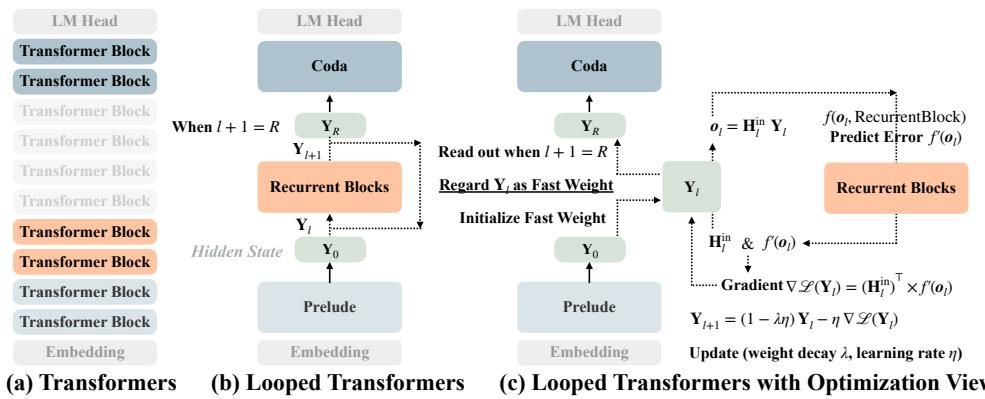
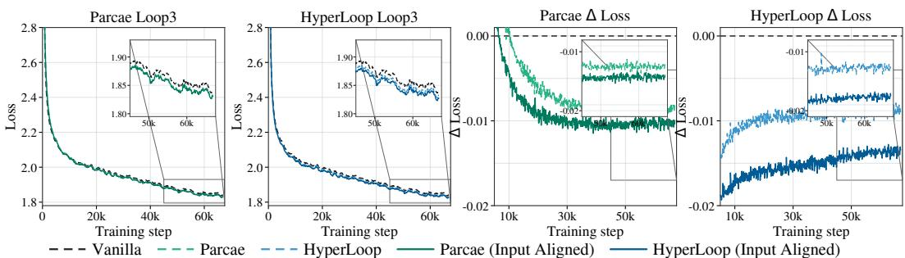
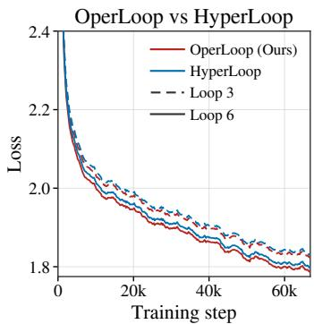

# LOOPED TRANSFORMERS AS OPTIMIZERS

Yulong Huang∗1, Chen Jiang∗ 2, Zhanpeng Zhou3, Hongtao Zhang4, Tianyu Li5,   
Tianyu He2, Xiangyu Zhang 2, Bojun Cheng  1   
1HKUST (GZ) 2StepFun 3SJTU 4UCAS 5THU

## ABSTRACT

Looped Transformers provide a parameter-efficient approach to depth scaling by repeatedly applying shared Transformer blocks. Recent reasoning models have likewise highlighted the value of scaling test-time computation through longer computation trajectories. However, the principles for designing effective loop transitions remain poorly understood. We view the looped hidden state as a fast weight1 that is updated throughout the depth. We formulate loop transitions as local gradient-based updates, with recurrent blocks predicting implicit targets at each depth. Our framework derives loop transitions in closed form from a projection, a local objective and an optimizer update rule. Mapping representative loop transitions into this framework reveals mismatches between their transitions and projections. We first align the input maps of existing transitions. We then derive OperLoop, which combines explicit weight decay, adaptive step size and a delta objective. The aligned variants reduce training loss and improve average commonsense accuracy. OperLoop improves average generative performance over the compared looped and non-looped baselines under matched training FLOPs. These results support the framework’s usefulness for loop design. We extend the analysis to additional loop models and outline a roadmap for future loop transition design.

## 1 INTRODUCTION

The scaling of modern large language models (LLMs) follows an empirical principle (Sutton, 2019): jointly increasing model size, training data and computation generally improves performance (Kaplan et al., 2020). In conventional Transformers, increasing depth by stacking independently parameterized blocks also increases the number of unique parameters (Vaswani et al., 2017). Greater depth can improve performance on challenging reasoning tasks (Rodkin et al., 2026), but additional parameters can yield diminishing returns under data constraints (Muennighoff et al., 2023). Looped Transformers address this tension by decoupling depth from parameter scaling. They repeatedly reuse shared blocks without proportionally increasing the unique parameters (Dehghani et al., 2019; Lan et al., 2020). The repeated computation increases the effective depth, providing additional latent refinement that can enhance the model’s reasoning ability (Saunshi et al., 2025).

Looped Transformer designs vary along two complementary dimensions: where to loop and how to loop. For where to loop, recurrence varies in both depth and feedback location. It may span the entire model (Zhu et al., 2025), middle blocks (Geiping et al., 2025), or individual layers (Gao et al., 2026), and feedback is drawn from different token or layer locations (Mozer et al., 2026; Wang et al., 2026). For how to loop, methods differ in their recurrent-state update mechanisms, using state decay and source injection for stability (Prairie et al., 2026), or an expanded state with parallel streams (Xie et al., 2025) to improve the parameter compute trade-off (Zeitoun et al., 2026).

Despite these diverse designs, existing where and how designs are often coupled to specific architectures. Regardless of loop placement, each iteration must transform the state produced at one step into the state used at the next. We refer to this transformation as the recurrent transition. The transition determines how the state is read, retained and updated, governing representational refinement (Hegazy et al., 2026) and dynamical stability (Prairie et al., 2026). However, existing transition mechanisms remain closely coupled to their underlying architectures, making it difficult to compare them or derive general principles for improving recurrent state evolution.

  
Figure 1: Optimization view of Looped Transformers. (a) A standard Transformer uses independently parameterized blocks. (b) A middle-looped Transformer repeatedly applies shared blocks; the Prelude and Coda may be identity maps in a fully looped model. (c) The recurrent state is treated as a fast weight. An input map $\mathbf { H } _ { l } ^ { \mathrm { i n } }$ reads out the state, and the shared blocks predict an implicit target. The local objective and optimizer update rule determine the state update. Setting $\mathbf { H } _ { \mathrm { i n } } = \mathbf { I } , \lambda = \eta = 1$ and $f ^ { \prime } ( \bar { \bf { o } } _ { l } ) = -$ RecurrentBlocks(o ) recovers the vanilla loop in (b).

In this work, we propose a unified optimization framework for analyzing and designing loop transi tions (Figure 1). The framework treats the recurrent state as a fast weight updated across the depth and connects three components: projection, objective, and optimizer update rule. The projection reads out the fast weight, while shared recurrent blocks implicitly predict the target. The objective relates the projection to a target. A loop transition is therefore a fast weight update governed by the optimizer rule and the objective’s gradient. Mapping several loop models into this framework reveals mismatches between their transitions and projections. Aligning these maps improves performance, supporting the framework’s design constraints. We then derive OperLoop using this optimization framework. Under matched training FLOPs, OperLoop improves average generative performance over the evaluated looped and non-looped baselines. Together, these results suggest that the framework provides useful guidance for improving existing transitions and designing new ones. Finally, we analyze additional loop models and outline a roadmap for future transition design. Our contributions are:

• Unified Framework. We develop a unified optimization framework that treats recurrent states as fast weights updated across the depth. It derives the loop transitions in closed form from a projection, a local objective, and an optimizer update rule.

• Input-Map Alignment. We use the framework to identify input-map mismatches and construct aligned variants of existing looped models. Their improved performance provides empirical support for the framework’s design constraints.

• Optimizer-Guided Loop Design. We derive OperLoop from the framework using a delta objective and adaptive step-size control. Matched compute budget evaluations and component ablations further support the framework’s ability to guide effective loop-transition design.

• Extended Analysis and Roadmap. We apply the framework to additional loop models, identifying shared objective forms and recurring input-map mismatches. This analysis informs a roadmap within the framework to guide future Looped Transformers architecture design.

## 2 PRELIMINARIES

Notation. Let $\mathbf { X } = ( \pmb { x } _ { 1 } , \dots , \pmb { x } _ { N } )$ be a sequence of N tokens and $\mathbf { H } \in \mathbb { R } ^ { N \times d }$ its hidden states, where d is the model width. The symbols k and l denote the depth and loop indices, respectively. We use L, K, and R for the depth of a conventional Transformer, the number of distinct blocks in the shared recurrent blocks, and the number of recurrent steps, respectively. Unless stated otherwise, bold uppercase and lowercase letters denote matrices and vectors, respectively. We use function composition notation, writing $\mathcal { F } _ { 3 } ( \mathcal { F } _ { 2 } ( \mathcal { F } _ { 1 } ( x ) ) )$ compactly as $\mathcal { F } _ { 3 } \circ \mathcal { F } _ { 2 } \circ \dot { \mathcal { F } } _ { 1 } ( x )$

Standard Transformers. A standard Transformer increases its effective depth by stacking independently parameterized blocks (Vaswani et al., 2017). Given a hidden state $\mathbf { H } ^ { ( \bar { k } ) }$ , a pre-norm Transformer block applies an attention sublayer followed by an FFN sublayer:

$$
\mathbf { H } ^ { ( k + 1 ) } = \widetilde { \mathbf { H } } ^ { ( k ) } + \mathrm { F F N } _ { \theta _ { k } ^ { \mathrm { F F N } } } \Big ( \mathrm { L N } ( \widetilde { \mathbf { H } } ^ { ( k ) } ) \Big ) , \qquad \widetilde { \mathbf { H } } ^ { ( k ) } = \mathbf { H } ^ { ( k ) } + \mathrm { A t t n } _ { \theta _ { k } ^ { \mathrm { A t t n } } } \Big ( \mathrm { L N } ( \mathbf { H } ^ { ( k ) } ) \Big ) .\tag{1}
$$

For depth index $k = 0 , \ldots , L - 1 .$ , let $\theta _ { k } : = ( \theta _ { k } ^ { \mathrm { A t t n } } , \theta _ { k } ^ { \mathrm { F F N } } )$ and $\mathbf { H } ^ { ( k + 1 ) } : = \mathcal { F } _ { \boldsymbol { \theta } _ { k } } ( \mathbf { H } ^ { ( k ) } )$ for simplicity. Given $\mathbf { H } ^ { ( 0 ) } = \mathrm { E m b e d d i n g } ( \mathbf { X } )$ , stacking these blocks yields the final hidden state in Eq. 2:

$$
\mathbf { H } ^ { ( L ) } = \mathcal { F } _ { \theta _ { L - 1 } } \circ \mathcal { F } _ { \theta _ { L - 2 } } \circ \cdot \cdot \cdot \circ \mathcal { F } _ { \theta _ { 1 } } \circ \mathcal { F } _ { \theta _ { 0 } } ( \mathbf { H } ^ { ( 0 ) } ) .\tag{2}
$$

Looped Transformers. Looped Transformers increase effective depth by reusing the same blocks without introducing additional parameters (Dehghani et al., 2019). Let Blocks $\theta : = \mathcal { F } _ { \theta _ { i + K - 1 } } \circ \cdot \cdot \cdot \circ$ $\mathcal { F } _ { \theta _ { i + 1 } } \circ \mathcal { F } _ { \theta _ { i + 0 } }$ , Prelude $\dot { \boldsymbol { \varphi } } : = \mathcal { F } _ { \boldsymbol { \theta } _ { i - 1 } } \circ \cdot \cdot \cdot \circ \mathcal { F } _ { \boldsymbol { \theta } _ { 0 } }$ and $\mathrm { C o d a } _ { \phi } : = \mathcal { F } _ { \theta _ { L - 1 } } \circ \cdot \cdot \cdot \circ \mathcal { F } _ { \theta _ { L - i } }$ , where i and j denote the numbers of Prelude and Coda blocks, respectively. The middle-looped architecture (Geiping et al., 2025) yields the final hidden state in Eq. 3:

$$
\mathbf { H } ^ { ( L ) } = \mathrm { C o d a } _ { \phi } \circ \mathrm { B l o c k s } _ { \theta } \circ \cdot \cdot \cdot \circ \mathrm { B l o c k s } _ { \theta } \circ \mathrm { P r e l u d e } _ { \varphi } ( \mathbf { H } ^ { ( 0 ) } ) .\tag{3}
$$

The shared Blocks is iteratively applied R times to update the latent hidden state. The Prelude embeds the input representation into the latent space, while the Coda decodes the final latent state into the output (Geiping et al., 2025). For a fully-looped model (Zhu et al., 2025), both the Prelude and Coda degenerate to the identity. In this work, we focus on the middle-loop architecture, which retains separate prelude and coda modules. Additional related work is discussed in Appendix A.

## 3 A UNIFIED FRAMEWORK FOR LOOPED TRANSFORMERS

This section develops a unified framework for Looped Transformers by focusing on the recurrent state transitions induced by shared recurrent blocks. We first characterize the transition structure of representative architectures, then formulate loop transitions from an optimization perspective, and finally map these transitions into the resulting framework, as summarized in Table 1.

## 3.1 A TRANSITION VIEW OF LOOPED TRANSFORMERS

Vanilla State Transition. The vanilla loop updates the recurrent state through a simple transition. Let $\boldsymbol { y } _ { l } ~ \in ~ \mathbb { R } ^ { d }$ denote the recurrent state and $\pmb { \hat { b } } \in \mathbb { R } ^ { d }$ an optional bias. Its transition is given by Eq. 4. Given the prelude output $\pmb { e } = \mathrm { P r e l u d e } _ { \phi } ( \mathbf { H } ^ { ( 0 ) } ) \in \mathbb { R } ^ { d }$ , the initial state is either $y _ { 0 } = e$ or ${ \pmb y } _ { 0 } \sim \mathcal { N } ( { \boldsymbol \mu } , { \boldsymbol \sigma } )$ . Under this abstraction, Ouro (Zhu et al., 2025) omits bias $( b = \mathbf { 0 } )$ , whereas Huginn (Geiping et al., 2025) uses injection $( b = e )$ . The final state is read out as $\mathbf { H } ^ { ( L ) } = \operatorname { C o d a } _ { \phi } ( \pmb { y } _ { R } )$

$$
\pmb { y } _ { l + 1 } = \operatorname { B l o c k s } _ { \theta } ( \pmb { y } _ { l } + \pmb { b } ) .\tag{4}
$$

Structured State Transition. Parcae (Prairie et al., 2026) augments the vanilla transition with a structured state space model inspired by Gu et al. (2021). Its transition2 is given by Eq. 5. For learnable parameters $\Delta , \mathbf { A } \in \mathbb { R } ^ { \dot { d } }$ and $\dot { \mathbf { B } } \in \mathbb { R } ^ { d \times d }$ , the diagonal operator $\bar { \mathbf { A } } \stackrel { - } { = } \mathrm { D i a g } ( \mathrm { e x p } \bar { ( } - \Delta \mathbf { A } ) )$ decays the state $\boldsymbol { y } _ { l } \in \mathbb { R } ^ { d }$ and promotes $\rho ( \bar { \mathbf { A } } ) < 1$ for stable dynamics. Following Huang (2026), the input gain is $\begin{array} { r } { \bar { \bf B } = \mathrm { D i a g } ( \frac { 1 - \exp ( - \Delta { \bf A } ) } { { \bf A } } ) { \bf B } } \end{array}$ . The final state is read out as $\mathbf { H } ^ { ( L ) } = \mathrm { C o d a } _ { \phi } ( \bar { \mathbf { C } } y _ { R } )$

$$
\pmb { y } _ { l + 1 } = \mathrm { B l o c k s } _ { \theta } ( \bar { \bf A } \pmb { y } _ { l } + \bar { \bf B } \pmb { e } ) .\tag{5}
$$

Expanded State Transition. HyperLoop (Zeitoun et al., 2026) expands the recurrent state to r streams as $\mathbf { Y } _ { l + 1 } \in \mathbb { R } ^ { r \times d }$ . Its transition is given by Eq. 6. The state-dependent transformations $\mathbf { H } _ { l } ^ { \mathrm { p r e } } , \mathbf { H } _ { l } ^ { \mathrm { p o s t } } \in \mathbb { R } ^ { 1 \times r }$ map between the streams and the d-dimensional block input, while the matrix $\mathbf { H } _ { l } ^ { \mathrm { r e s } } \in \mathbb { R } ^ { r \times r }$ mixes the carried state. The final state is read out as $\mathbf { H } ^ { ( L ) } = \mathrm { C o d a } _ { \phi } ( \mathrm { M e a n } _ { r } ( \mathbf { Y } _ { R } ) )$ Here $b _ { l } \in \mathbb { R } ^ { d }$ is an optional independent bias, which we omit for notational simplicity.

$$
{ \bf Y } _ { l + 1 } = { \bf H } _ { l } ^ { \mathrm { r e s } } { \bf Y } _ { l } + ( { \bf H } _ { l } ^ { \mathrm { p o s t } } ) ^ { \top } \left( \mathrm { B l o c k s } _ { \theta } \left( { \bf H } _ { l } ^ { \mathrm { p r e } } { \bf Y } _ { l } \right) + { \bf b } _ { l } \right) .\tag{6}
$$

Despite their architectural differences, these models share a common pattern: they read the recurrent state, transform it using the shared block Blocks and write the result back as the next state.

Table 1: Comparison of loop transitions under the optimizer update rule in Eq. 7. The lower rows identify the decay coefficient (λ), step size (η), input map (x), output error $( f ^ { \prime } )$ , and recurrent state (W). Red marks mismatches between the update’s implied input map and the projection’s map. Aligning the transition with the input map used in the projection improves performance (§ 5.1).
<table><tr><td>Models</td><td>Ouro  $( \mathrm { Z h u } \mathrm { e t a l . , } 2 0 2 5 )$ </td><td>Huginn  $( \mathrm { G e i p i n g e t a l . , } 2 0 2 5 )$ </td><td>Parcae (Prairie et al., 2026)</td><td>HyperLoop  $( \mathrm { Z e i t o u n } \mathrm { e t a l . , } \bar { 2 } 0 2 6 )$ </td></tr><tr><td colspan="5">Original loop transitions</td></tr><tr><td>Loop</td><td> $\pmb { y } _ { l + 1 } = \mathrm { B l o c k s } _ { \theta } ( \pmb { o } _ { l } )$ </td><td> $\pmb { y } _ { l + 1 } = \mathrm { B l o c k s } _ { \theta } ( \pmb { o } _ { l } )$ </td><td> $\pmb { y } _ { l + 1 } = \mathrm { B l o c k s } _ { \theta } ( \pmb { o } _ { l } )$ </td><td> $\mathbf { Y } _ { l + 1 } = \mathbf { H } _ { l } ^ { \mathrm { r e s } } \mathbf { Y } _ { l } +$   $( \mathbf { H } _ { l } ^ { \mathrm { p o s t } } ) ^ { \top } \mathrm { B l o c k s } _ { \theta } ( \pmb { o } _ { l } )$   ${ \bf o } _ { l } = { \bf H } _ { l } ^ { \mathrm { p r e } } { \bf Y } _ { l }$ </td></tr><tr><td colspan="5"> $\mathbf { \Delta } _ { O l } = \mathbf { \Delta } _ { y l }$   $\pmb { o } _ { l } = \pmb { y } _ { l } + \mathbf { e }$   $o _ { l } = \bar { \mathbf { A } } \pmb { y } _ { l } + \bar { \mathbf { B } } \mathbf { e }$   $\mathbf { W } _ { i + 1 } = \left( 1 - \lambda \eta \right) \mathbf { W } _ { i } - \eta \left( \mathbf { x } ^ { \top } f ^ { \prime } \right)$ </td></tr><tr><td>Optimization mapping to</td><td></td><td></td><td></td><td></td></tr><tr><td>λ η</td><td>1 1</td><td>1 1</td><td>1 1</td><td> $\mathbf { I } - \mathbf { H } _ { l } ^ { \mathrm { r e s } }$  1</td></tr><tr><td>x  $f ^ { \prime } ( o _ { l } )$ </td><td>I  $- \operatorname { B l o c k s } _ { \theta } ( \pmb { o } _ { l } )$ </td><td>I  $- \operatorname { B l o c k s } _ { \theta } ( \pmb { o } _ { l } )$ </td><td> $\mathbf { I } ( \mathrm { M i s m a t c h } \mathrm { w i t h } \bar { \mathbf { A } } )$   $- \operatorname { B l o c k s } _ { \theta } ( \pmb { o } _ { l } )$ </td><td> $\mathbf { H } _ { l } ^ { \mathrm { p o s t } } ( \mathrm { M i s m a t c h } \mathrm { w i t h } \mathbf { H } _ { l } ^ { \mathrm { p r e } } )$   $- \operatorname { B l o c k s } _ { \theta } ( \pmb { o } _ { l } )$ </td></tr></table>

## 3.2 AN OPTIMIZATION VIEW OF LOOPED TRANSFORMERS

To build a connection between the looped transition and optimization, we interpret the recurrent state as a fast weight updated across the depth. Then we further express loop transitions in an optimization form. This formulation reveals the implicit target predicted by the recurrent blocks.

We first consider a toy optimization example. Let $\pmb { x } \in \mathbb { R } ^ { 1 \times d _ { 1 } } , \pmb { b } \in \mathbb { R } ^ { 1 \times d _ { 2 } }$ and $\mathbf { W } \in \mathbb { R } ^ { d _ { 1 } \times d _ { 2 } }$ be an input, bias and weights, respectively. The output is $\pmb { o } = \pmb { x } \mathbf { W } + \pmb { b } \in \mathbb { R } ^ { 1 \times d _ { 2 } }$ . For the local objective ${ \mathcal { L } } : = f ( o )$ , the output error is $\begin{array} { r } { \frac { \partial \mathcal { L } } { \partial \pmb { o } } : = f ^ { \prime } ( \pmb { o } ) \in \mathbb { R } ^ { 1 \times d _ { 2 } } } \end{array}$ . Then the gradient with respect to the weight is $\begin{array} { r } { \frac { \partial \mathcal { L } } { \partial \mathbf { W } } = \pmb { x } ^ { \top } \pmb { f } ^ { \prime } ( \pmb { o } ) \in \mathbb { R } ^ { d _ { 1 } \times d _ { 2 } } } \end{array}$ . For step size η and weight decay λ, the optimization update is:

$$
\mathbf { W } _ { i + 1 } = \mathbf { W } _ { i } - \eta \left( \nabla _ { \mathbf { W } } \mathcal { L } + \lambda \mathbf { W } _ { i } \right) = \left( 1 - \eta \lambda \right) \mathbf { W } _ { i } - \eta \left( { x ^ { \top } f ^ { \prime } ( o ) } \right) .\tag{7}
$$

To relate loop transitions to optimization, we interpret the recurrent state $\mathbf { Y } _ { l } \in \mathbb { R } ^ { d _ { 1 } \times d _ { 2 } }$ as a fast weight playing the role of W in $E q . 7 .$ The dimensions $d _ { 1 } , d _ { 2 }$ denote its row and column dimensions, which are specified for each architecture. Proposition 1 gives the resulting optimizer-form transition.

Proposition 1 (Optimization interpretation of loop transitions). Let $\mathbf { Y } _ { l } \in \mathbb { R } ^ { d _ { 1 } \times d _ { 2 } }$ denote the fast weight updated across recurrent depth l. Let $\mathbf { H } _ { l } ^ { \mathrm { i n } } \in \mathbb { R } ^ { m \times d _ { 1 } }$ be an adaptive input map and $b _ { l } \ \in$ $\mathbb { R } ^ { m \times d _ { 2 } } \textbf { } _ { a }$ bias. For a projection ${ \pmb O } _ { l } = { \bf H } _ { l } ^ { \mathrm { i n } } { \bf Y } _ { l } + { \pmb b } _ { l }$ with the local objective ${ \mathcal { L } } : = f ( o _ { l } )$ , the loop transition can be written in the gradient-based optimizationform shown in Eq. 8:

$$
\mathbf { Y } _ { l + 1 } = \left( \mathbf { I } _ { d _ { 1 } } - \eta _ { l } \mathbf { A } _ { l } \right) \mathbf { Y } _ { l } - \eta _ { l } \left( ( \mathbf { H } _ { l } ^ { \mathrm { i n } } ) ^ { \top } f ^ { \prime } ( \pmb { o } _ { l } ) \right) ,\tag{8}
$$

where $\eta _ { l }$ is an adaptive step size and $\pmb { \Lambda } _ { l } \in \mathbb { R } ^ { d _ { 1 } \times d _ { 1 } }$ is a decay operator representing weight decay.

Proof Sketch. From the optimizer perspective, the general update in Eq. 8 contains an implicit forward computation and a local objective evaluation. In particular, the fast weight projection is computed as $\begin{array} { r } { \bar { \pmb { o } _ { l } } = \mathbf { H } _ { l } ^ { \mathrm { i n } } \mathbf { Y } _ { l } + \pmb { b } _ { l } \in \mathbb { R } ^ { \bar { m } \times d _ { 2 } } } \end{array}$ , where $\mathbf { H } _ { I } ^ { \mathrm { i n } } \in \mathbb { R } ^ { \mathit { \hat { m } } \times d _ { 1 } }$ is the input map and $\mathbf { \bar { \boldsymbol { b } } } _ { l } \in \mathbb { R } ^ { m \times d _ { 2 } }$ is an optional bias. To update the fast weight $\mathbf { Y } _ { l } .$ , we consider gradient-based optimization with decay:

$$
\mathbf { Y } _ { l + 1 } = \mathbf { Y } _ { l } - \eta _ { l } \left( \nabla _ { \mathbf { Y } _ { l } } \mathcal { L } + \mathbf { A } _ { l } \mathbf { Y } _ { l } \right) .\tag{9}
$$

The partial derivative of L is $\begin{array} { r } { \frac { \partial \mathcal { L } } { \partial \pmb { o } _ { l } } = f ^ { \prime } ( \pmb { o } _ { l } ) \in \mathbb { R } ^ { m \times d _ { 2 } } } \end{array}$ . We then obtain the gradient:

$$
\nabla _ { \mathbf { Y } _ { l } } { \mathcal { L } } = { \frac { \partial { \mathcal { L } } } { \partial \mathbf { Y } _ { l } } } = \left( \mathbf { H } _ { l } ^ { \mathrm { i n } } \right) ^ { \top } { \frac { \partial { \mathcal { L } } } { \partial o _ { l } } } = ( \mathbf { H } _ { l } ^ { \mathrm { i n } } ) ^ { \top } f ^ { \prime } ( o _ { l } ) .\tag{10}
$$

The gradient has shape $d \sb { 1 } \times d \sb { 2 }$ , matching that of the fast weight. The matrix product in Eq. 10 reduces to an outer product when $m = 1$ . Substituting Eq. 10 into Eq. 9 yields:

$$
\mathbf { Y } _ { l + 1 } = \mathbf { Y } _ { l } - \eta _ { l } \left( ( \mathbf { H } _ { l } ^ { \mathrm { i n } } ) ^ { \top } f ^ { \prime } ( \pmb { \sigma } _ { l } ) + \mathbf { \Lambda } _ { l } \mathbf { Y } _ { l } \right) = \left( \mathbf { I } _ { d _ { 1 } } - \eta _ { l } \mathbf { \Lambda } _ { l } \right) \mathbf { Y } _ { l } - \eta _ { l } \left( ( \mathbf { H } _ { l } ^ { \mathrm { i n } } ) ^ { \top } f ^ { \prime } ( \pmb { \sigma } _ { l } ) \right) .\tag{11}
$$

Finally, Eq. 11 recovers the formulation in Eq. 8, as stated in Proposition 1.

Let $\mathbf { \delta t } _ { l } = \operatorname { B l o c k s } _ { \theta } ( \pmb { o } _ { l } )$ be the implicit target predicted by the shared recurrent blocks. For the local algebraic derivation, we hold $\mathbf { \Delta } _ { t _ { l } }$ fixed when differentiating the implicit negative inner product objective $\mathcal { L } _ { l } = - \langle \boldsymbol { o } _ { l } , \boldsymbol { t } _ { l } \rangle$ , giving $f ^ { \prime } ( \pmb { \mathscr { o } } _ { l } ) = \nabla _ { \pmb { \mathscr { o } } _ { l } } \mathcal { L } _ { l } = - \pmb { \mathscr { t } } _ { l } = - \mathrm { B l o c k s } _ { \theta } ( \pmb { \mathscr { o } } _ { l } )$ . The fixed-target convention is used only to derive the closed-form transition algebraically. It does not imply that gradients are stopped during training. Under this hypothesis and Proposition 1, we can map the transition in § 3.3.

## 3.3 MAPPING LOOP TRANSITIONS

In this subsection, we map the loop transitions to the optimizer update rule introduced in § 3.2. We identify the recurrent state, projection, input map, decay operator and step size for Vanilla Loop, Parcae and HyperLoop. This analysis reveals input-map mismatches in Parcae and HyperLoop. The resulting mappings are summarized in Table 1.

Vanilla Loop. Let $\mathbf { Y } _ { l } = \pmb { y } _ { l } \in \mathbb { R } ^ { d \times 1 }$ and $\pmb { b } \in \mathbb { R } ^ { d \times 1 }$ . The projection $\begin{array} { r } { o _ { l } = y _ { l } + b } \end{array}$ uses $\mathbf { H } _ { l } ^ { \mathrm { i n } } = \mathbf { I } _ { d }$ and $b _ { l } \ = \ b .$ Setting $\eta _ { l } = 1$ and $\boldsymbol { \Lambda } _ { l } \ = \ \mathbf { I } _ { d }$ in Eq. 8 gives ${ \pmb y } _ { l + 1 } = - f ^ { \prime } ( { \pmb o } _ { l } ) = \mathrm { B l o c k s } _ { \theta } ( { \pmb o } _ { l } ) =$ $\mathrm { B l o c k s } _ { \boldsymbol { \theta } } ( { \pmb y } _ { l } + { \pmb b } )$ , which recovers Eq. 4. Vanilla Loop is a special case of the optimizer update rule.

Parcae. For the structured state with $\boldsymbol { e } \in \mathbb { R } ^ { d \times 1 }$ , the projection $o _ { l } = \bar { \mathbf { A } } y _ { l } +$ B¯ e uses $\mathbf { H } _ { l } ^ { \mathrm { i n } } = \bar { \mathbf { A } } \in$ $\mathbb { R } ^ { d \times d }$ and ${ \pmb b } _ { l } = \bar { \bf B } { \pmb e } \in \mathbb { R } ^ { d \times 1 }$ . Setting $\eta _ { l } = 1$ and $\pmb { \Lambda } _ { l } = \mathbf { I } _ { d }$ in $\mathrm { E q . ~ } 8$ yields ${ \pmb y } _ { l + 1 } = - \bar { \bf A } ^ { \top } f ^ { \prime } ( { \pmb o } _ { l } ) =$ $\bar { \mathbf { A } } ^ { \top }$ Blocksθ(ol). Compared with Eq. 5, this update exposes the missing input-map factor.

HyperLoop. For the expanded state $\mathbf { Y } _ { l } \in \mathbb { R } ^ { r \times d }$ , the projection ${ \pmb { o } } _ { l } = { \bf { H } } _ { \imath } ^ { \mathrm { p r e } } { \bf { Y } } _ { l } \in \mathbb { R } ^ { 1 \times d }$ uses $\mathbf { H } _ { l } ^ { \mathrm { i n } } =$ $\mathbf { H } _ { l } ^ { \mathrm { p r e } } \in \mathbb { R } ^ { 1 \times r }$ without bias. Setting $\eta _ { l } = 1$ and $\pmb { \Lambda } _ { l } = \mathbf { I } _ { r } - \mathbf { H } _ { l } ^ { \mathrm { r e s } }$ in Eq. 8 gives $\mathbf { Y } _ { l + 1 } = \mathbf { H } _ { l } ^ { \mathrm { r e s } } \mathbf { Y } _ { l } +$ $\mathbf { H } _ { l } ^ { \mathrm { p r e } ^ { \top } } \mathrm { B l o c k s } _ { \theta } ( \mathbf { H } _ { l } ^ { \mathrm { p r e } } \mathbf { Y } _ { l } )$ . Compared with Eq. 6, this update requires input-map alignment.

After mapping, Parcae and HyperLoop exhibit input-map mismatches under the optimization view. The gradient form in Eq. 10 uses the matrix product of the transposed input map and the output error: Parcae omits $\bar { \mathbf { A } } ^ { \top }$ , while HyperLoop uses separate $\mathbf { H } _ { l } ^ { \mathrm { p r e } }$ and $\mathbf { H } _ { l } ^ { \mathrm { { \bar { p } o s t } } }$ . After input-map alignment, both Parcae and HyperLoop show improved performance as shown in $\ S 5 . 1$ , providing further support for the proposed framework. These findings motivate the optimizer-guided loop design in $\ S 4$

## 4 OPTIMIZER-GUIDED LOOP DESIGN

To examine whether the framework can guide loop-transition design, we derive OperLoop using HyperLoop’s expanded state and a delta objective. Let $\mathbf { Y } _ { l } \in \mathbb { R } ^ { r \times d }$ be the expanded fast weight and $\bar { \mathbf { H } _ { l } ^ { \mathrm { i n } } } \in \mathbb { R } ^ { 1 \times r }$ the input map. The projection is $\pmb { o } _ { l } = \mathbf { H } _ { l } ^ { \mathrm { i n } } \mathbf { Y } _ { l } \in \mathbb { R } ^ { 1 \times d }$ . We switch to the delta objective $\begin{array} { r } { \mathcal { L } = \frac { 1 } { 2 } \left. \pmb { o } _ { l } - \pmb { t } _ { l } \right. _ { 2 } ^ { 2 } } \end{array}$ , whose gradient with respect to the fast weight is $\nabla _ { \mathbf { Y } _ { l } } \mathcal { L } _ { l } = ( \mathbf { H } _ { l } ^ { \mathrm { i n } } ) ^ { \top } ( \pmb { o } _ { l } - \pmb { t } _ { l } ) =$ $( \mathbf { H } _ { l } ^ { \mathrm { i n } } ) ^ { \top } ( \pmb { o } _ { l } - \mathrm { B l o c k s } _ { \theta } ( \pmb { o } _ { l } ) ) ^ { 3 }$ . Substituting this gradient into Eq. 8 yields:

$$
\mathbf { Y } _ { l + 1 } = ( \mathbf { I } - \eta _ { l } \mathbf { A } _ { l } ) \mathbf { Y } _ { l } + \eta _ { l } \mathbf { \Gamma } ( \mathbf { H } _ { l } ^ { \mathrm { i n } } ) ^ { \top } \left( \mathrm { B l o c k s } _ { \theta } ( \pmb { o } _ { l } ) - \pmb { o } _ { l } \right) .\tag{12}
$$

We parameterize the state-dependent input map $\mathbf { H } _ { l } ^ { \mathrm { i n } }$ , decay operator $\mathbf { \Lambda } _ { \Lambda _ { l } }$ and step size $\eta _ { l }$ as follows:

$$
\eta _ { l } = \sigma \left( a ^ { \mathrm { l r } } \cdot \left( \mathbf { W } ^ { \mathrm { l r } } \mathbf { Z } _ { l } \right) + b ^ { \mathrm { l r } } \right) \cdot \eta _ { l - 1 }
$$

$$
\in \mathbb { R } ,\tag{13}
$$

$$
\pmb { \Lambda } _ { l } = \mathrm { D i a g } \left( \sigma \left( \pmb { a } ^ { \mathrm { w d } } \cdot \left( \mathbf { W } ^ { \mathrm { w d } } \mathbf { Z } _ { l } \right) + \pmb { b } ^ { \mathrm { w d } } \right) \right)
$$

$$
\in \mathbb { R } ^ { r \times r } ,\tag{14}
$$

$$
\mathbf { H } _ { l } ^ { \mathrm { i n } } = \sigma \left( \pmb { a } ^ { \mathrm { i n } } \cdot \left( \mathbf { W } ^ { \mathrm { i n } } \mathbf { Z } _ { l } \right) + b ^ { \mathrm { i n } } \right)
$$

$$
\in \mathbb { R } ^ { 1 \times r } ,\tag{15}
$$

where the causal step size decreases monotonically with $\eta _ { l } = \sigma \cdot \eta _ { l - 1 }$ and is initialized with $\eta _ { - 1 } = 1$ This design is inspired by learning-rate scheduling. Here, σ denotes the sigmoid function. We set $\mathbf { Z } _ { l } = \mathrm { R M S N }$ orm(flatten $( \mathbf { Y } _ { l } ) ) \in \mathbb { R } ^ { r d }$ . The projection matrices satisfy $\mathbf { W } ^ { \mathrm { w d } } , \mathbf { W } ^ { \mathrm { i n } } \in \mathbb { R } ^ { r \times r d }$ , while ${ \bf W } ^ { \mathrm { l r } } \in \mathbb { R } ^ { 1 \times r d }$ . The biases satisfy $b ^ { \mathrm { w d } } , b ^ { \mathrm { i n } } \in \mathbb { R } ^ { r }$ and $\pmb { b } ^ { \mathrm { l r } } \in \mathbb { R }$ . After R loops, we obtain $\mathbf { Y } ^ { ( R ) }$

This architecture can also be expressed in a transition form similar to that of HyperLoop, but with a different parameterization. Substituting ${ \bf o } _ { l } = { \bf H } _ { l } ^ { \mathrm { i n } } { \bf Y } _ { l }$ into Eq. 12, we get the new transition:

$$
\mathbf { Y } _ { l + 1 } = \left( \mathbf { I } - \eta _ { l } ( \mathbf { A } _ { l } + ( \mathbf { H } _ { l } ^ { \mathrm { i n } } ) ^ { \top } \mathbf { H } _ { l } ^ { \mathrm { i n } } ) \right) \mathbf { Y } _ { l } + \eta _ { l } ( \mathbf { H } _ { l } ^ { \mathrm { i n } } ) ^ { \top } \mathrm { B l o c k s } _ { \theta } ( \mathbf { H } _ { l } ^ { \mathrm { i n } } \mathbf { Y } _ { l } ) .\tag{16}
$$

Specifically, setting $\mathbf { H } ^ { \mathrm { p r e } } = \mathbf { H } ^ { \mathrm { i n } } , \mathbf { H } ^ { \mathrm { p o s t } } = \eta _ { l } \mathbf { H } ^ { \mathrm { i n } }$ , and $\mathbf { H } ^ { \mathrm { r e s } } = \mathbf { I } - \eta _ { l } \left( \pmb { \Lambda } _ { l } + ( \mathbf { H } _ { l } ^ { \mathrm { i n } } ) ^ { \top } \mathbf { H } _ { l } ^ { \mathrm { i n } } \right)$ recovers the proposed transition. This correspondence allows us to implement this loop transition within the HyperLoop implementation, as shown in Algorithm 1 in Appendix B.

  
Figure 2: Training-loss comparison for optimizer-aligned loop transitions. The left two panels show training-loss trajectories for Parcae Loop3 and HyperLoop Loop3, together with their input-mapaligned variants. The right two panels show the corresponding loss differences relative to Vanilla Loop3, defined as $\Delta \mathcal { L } = \mathcal { L } _ { \mathrm { v a r i a n t } } - \mathcal { L } _ { \mathrm { V a n i l l a } }$ . Negative values indicate lower loss than Vanilla Loop3.

Table 2: Effect of input-map alignment on Parcae and HyperLoop in language modeling and commonsense evaluation. The looped variants differ only in their transitions. Parameters and training FLOPs are relative to the 18-layer baseline. The subscript n denotes normalized accuracy. ∆Avg. is the improvement over the corresponding unaligned model, in percentage points.
<table><tr><td rowspan="2">Model</td><td rowspan="2">Param. FLOPs</td><td rowspan="2"></td><td colspan="2">PPL↓</td><td colspan="7">Commonsense Acc. (%) ↑</td><td rowspan="2">∆Avg.</td></tr><tr><td>Lamb.</td><td>Wiki.</td><td>Lamb.</td><td>ARCcn</td><td>ARCen</td><td>HellaS.n</td><td>WinoG.</td><td>PIQAn</td><td>Avg.</td></tr><tr><td>Baseline [18L]</td><td>1×</td><td>1x</td><td>6.56</td><td>13.08</td><td>60.16</td><td>40.96</td><td>71.13</td><td>64.78</td><td>59.51</td><td>76.61</td><td>62.19</td><td></td></tr><tr><td>Parcae [4L-4L×3-2L]</td><td>0.56×</td><td>1×</td><td>7.71</td><td>13.98</td><td>57.44</td><td>38.57</td><td>65.91</td><td>62.00</td><td>56.12</td><td>74.81</td><td>59.14</td><td></td></tr><tr><td>Parcae (Aligned)</td><td>0.56×</td><td>1x</td><td>7.41</td><td>13.93</td><td>58.59</td><td>37.71</td><td>65.53</td><td>62.09</td><td>56.91</td><td>74.92</td><td>59.29</td><td>+0.15</td></tr><tr><td>HyperLoop [4L-4L×3-2L]</td><td>0.56×</td><td>1×</td><td>7.68</td><td>13.96</td><td>57.46</td><td>38.40</td><td>63.51</td><td>61.41</td><td>57.77</td><td>75.03</td><td>58.93</td><td></td></tr><tr><td>HyperLoop (Aligned)</td><td>0.56×</td><td>1x</td><td>7.35</td><td>13.93</td><td>58.63</td><td>35.15</td><td>66.67</td><td>62.83</td><td>58.56</td><td>74.97</td><td>59.47</td><td>+0.54</td></tr></table>

## 5 EXPERIMENTS

We use an MoE backbone with sliding-window attention (SWA) and full attention in a 3:1 ratio (Huang et al., 2026a). Our non-looped baselines are an 18-layer, 5B-parameter model with 600M activated parameters and a depth-scaled 32-layer, 10B-parameter model with 900M activated parameters. Following HyperLoop (Zeitoun et al., 2026), each looped variant uses the middle-loop pattern and matches the unrolled training FLOPs of its non-looped baseline, with approximately 50% as many parameters. All HyperLoop and OperLoop variants use four parallel streams $( r = 4 )$ throughout the experiments. After unrolling, the looped and non-looped baseline models have the same effective depth, KV-cache layout, and attention pattern. Comparisons among looped variant under these matched settings isolate the effect of the loop transition.

All models are trained with a sequence length of 4096. The 18-layer 5B and 32-layer 10B baselines are trained on approximately 300B and 500B tokens over 67K and 120K updates, respec tively. Both scales use cosine learning-rate decay, a weight decay of 0.1, and global gradient clipping at 1.0. Model parameters are optimized with Muon using momentum 0.95 and six Polar Express NS iterations (Liu et al., 2025). The looped variants follow the same training recipe as their corresponding baselines. We evaluate perplexity and downstream accuracy using the open-source lm-eval-harness toolkit (Gao et al., 2024), largely following its default settings. Further model and training details are provided in Appendix C, and evaluation details are given in Appendix D.

## 5.1 CONTROLLED STUDY OF OPTIMIZER-ALIGNED LOOP TRANSITIONS

We first test whether the framework can guide improvements to existing loop transitions. Specifically, input-map alignment enforces the transpose relationship between the read and write maps required by the corresponding gradient update. For Parcae, we replace Eq. 5 with the aligned update ${ \pmb y } _ { l + 1 } = \bar { \bf A } ^ { \top } \mathrm { B l o c k s } _ { \theta } ( \bar { \bf A } { \pmb y } _ { l } + \bar { \bf B } { e } )$ . For HyperLoop in Eq. 6, we set $\mathbf { H } _ { l } ^ { \mathrm { p o s t } } = \mathbf { H } _ { l } ^ { \mathrm { p r e } }$ , giving ${ \bf Y } _ { l + 1 } = { \bf H } _ { l } ^ { \mathrm { r e s } } { \bf Y } _ { l } + ( { \bf H } _ { l } ^ { \mathrm { p r e } } ) ^ { \top } ( \mathrm { B l o c k s } _ { \theta } ( { \bf H } _ { l } ^ { \mathrm { p r e } } { \bf Y } _ { l } ) + { \bf b } _ { l } )$ . This constraint also reduces the number of parameters in the HyperLoop transition by removing the separate $\mathbf { H } ^ { \mathrm { p o s t } }$ map.

Table 3: Main results on commonsense, math, code, and reasoning benchmarks. Parameters and training FLOPs are relative to the corresponding non-looped baseline. Bold and underlined values indicate the best and second-best results among looped models at each scale, respectively. The subscript n denotes normalized accuracy, and ∗ denotes CoT evaluation. H.Eval and H.Eval+ denote HumanEval and HumanEval+, respectively, both report pass@1 with greedy decoding.
<table><tr><td colspan="2"></td><td colspan="4">300B Training Tokens, 4k Sequence Length</td><td colspan="4">500B Training Tokens, 4k Sequence Length</td></tr><tr><td>Category</td><td>Dataset</td><td>Base[18L]</td><td colspan="3">L00p[4L-4L×3-2L]</td><td>Base [32L]</td><td colspan="3">L00p[4L-8L×3-4L]</td></tr><tr><td>(Metrics)</td><td></td><td>5B MoE</td><td>Parcae</td><td>HyperLoop</td><td>OperLoop</td><td>10B MoE</td><td>Parcae</td><td>HyperLoop</td><td>OperLoop</td></tr><tr><td rowspan="3"></td><td>Parameters</td><td>1×</td><td>0.56×</td><td>0.56×</td><td>0.56×</td><td>1×</td><td>0.48×</td><td>0.48×</td><td>0.48×</td></tr><tr><td>FLOPs</td><td>1×</td><td>1×</td><td>1×</td><td>1×</td><td>1×</td><td>1×</td><td>1×</td><td>1×</td></tr><tr><td>Wikitext</td><td>13.08</td><td>13.98</td><td>13.96</td><td>13.90</td><td>11.06</td><td>11.76</td><td>11.87</td><td>11.74</td></tr><tr><td rowspan="6">(PPL↓) Com.Sen.</td><td>Lambada</td><td>6.56</td><td>7.71</td><td>7.68</td><td>7.21</td><td>4.82</td><td>5.20</td><td>5.32</td><td>5.14</td></tr><tr><td>Lambada</td><td>60.16</td><td>57.44</td><td>57.46</td><td>59.29</td><td>67.48</td><td>65.96</td><td>64.91</td><td>66.04</td></tr><tr><td> $\mathbf { A R C c } _ { \mathrm { n } }$ </td><td>40.96</td><td>38.57</td><td>38.40</td><td>37.63</td><td>44.62</td><td>45.73</td><td>45.56</td><td>44.34</td></tr><tr><td> $\mathbf { A R C e } _ { \mathrm { n } }$ </td><td>71.13</td><td>65.91</td><td>63.51</td><td>65.99</td><td>72.26</td><td>71.17</td><td>73.23</td><td>73.65</td></tr><tr><td>HellaSwagn</td><td>64.78</td><td>62.00</td><td>61.41</td><td>62.20</td><td>71.78</td><td>70.05</td><td>69.33</td><td>70.07</td></tr><tr><td>WinoGrande</td><td>59.51 76.61</td><td>56.12 74.81</td><td>57.77 75.03</td><td>57.85 75.63</td><td>63.61</td><td>62.98 77.41</td><td>64.17</td><td>63.43</td></tr><tr><td>(LL↑)</td><td> $\mathbf { P I Q A } _ { \mathrm { n } }$ </td><td>62.19</td><td>59.14</td><td>58.93</td><td></td><td>78.62</td><td></td><td>77.42</td><td>77.88</td></tr><tr><td></td><td> $L L A \nu g .$ </td><td></td><td></td><td></td><td>59.77</td><td>66.40</td><td>65.55</td><td>65.77</td><td>65.90</td></tr><tr><td rowspan="2">Math</td><td> $\mathbf { G S M 8 K } _ { \mathrm { 5 s h o t } }$   $\mathbf { G S M 8 K _ { 8 s h o t } } ^ { * }$ </td><td>15.77</td><td>14.25</td><td>12.89</td><td>15.85</td><td>33.06</td><td>32.07 39.35</td><td>33.36</td><td>33.21</td></tr><tr><td></td><td>17.44</td><td>17.06 21.34</td><td>14.03 18.90</td><td>17.13</td><td>37.15</td><td>28.05</td><td>37.68</td><td>39.65</td></tr><tr><td rowspan="2">Code</td><td> $\mathbf { H . E v a l } _ { \mathrm { 0 s h o t } }$ </td><td>21.95</td><td></td><td></td><td>23.78</td><td>28.66</td><td></td><td>30.49</td><td>29.88</td></tr><tr><td> $\mathbf { H . E v a l ^ { + } } _ { 0 \mathrm { s h o t } }$ </td><td>18.90</td><td>17.68 42.46</td><td>16.46 42.71</td><td>20.12</td><td>25.00 52.81</td><td>24.39 53.92</td><td>25.61</td><td>26.22</td></tr><tr><td rowspan="2">Reason.</td><td> $\mathbf { M M L U } _ { \mathrm { 5 s h o t } }$ </td><td>37.52 31.75</td><td>31.70</td><td>31.05</td><td>44.41 32.18</td><td>41.86</td><td>39.90</td><td>52.62 39.64</td><td>52.76</td></tr><tr><td> $\mathbf { B B H _ { 3 s h o t } } ^ { * }$ </td><td></td><td></td><td></td><td></td><td></td><td></td><td></td><td>43.04</td></tr><tr><td>(EM ↑)</td><td>EM Avg.</td><td>23.89</td><td>24.08</td><td>22.67</td><td>25.58</td><td>36.42</td><td>36.28</td><td>36.57</td><td>37.46</td></tr><tr><td>Overall</td><td>EM &amp; LL Avg.</td><td>43.04</td><td>41.61</td><td>40.80</td><td>42.68</td><td>51.41</td><td>50.92</td><td>51.17</td><td>51.68</td></tr></table>

Alignment improves training loss, perplexity, and average commonsense accuracy for both Parcae and HyperLoop (Figure 2; Table 2). For example, HyperLoop improves average accuracy from 58.93 to 59.47 while using fewer transition parameters. These results support input-map alignment as a useful design constraint and provide empirical support for the optimization view.

## 5.2 MAIN DOWNSTREAM RESULTS

We next test whether the framework can guide new transition designs by evaluating OperLoop. At both model scales, OperLoop improves average generative performance over the evaluated baselines.

Relative to the looped baselines in Table 3, OperLoop achieves the highest overall and EM averages among the evaluated looped models at both scales. OperLoop also achieves the lowest PPL and highest LL average among the looped variants. Under matched training FLOPs, these results support the benefits of its transition design for both language modeling and generation.

Relative to the non-looped baselines in Table 3, OperLoop uses approximately half the parameters while improving the EM average by 1.69 and 1.04 percentage points at the two scales. For PPL and LL accuracy, all looped models perform slightly worse at both scales. These differing rankings indicate that PPL and LL alone would understate looped models’ generative performance in this comparison. Overall, even though its PPL and LL results are slightly worse than those of the non-looped baseline, a looped model can achieve better results in the EM evaluation.

The gains also vary across tasks and scales. Performance on both code benchmarks improves over that of the non-looped baselines at both scales. At the larger scale, OperLoop surpasses the baseline on GSM8K with CoT and BBH, reaching 43.04 on BBH compared with 41.86. The higher EM average thus reflects different task-level gains across scales. Together, the alignment and OperLoop results support the framework for modifying existing transitions and designing new ones.

Table 4: Downstream evaluation at Loop3 and Loop6. Models are trained separately at each loop count. Com. Avg. denotes average commonsense accuracy. EM Avg. is the arithmetic mean of the six reported math, code, and reasoning scores, and $\Delta$ is its difference from the baseline.
<table><tr><td colspan="4"></td><td colspan="2">PPL↓ LL Acc ↑</td><td colspan="8">EM Acc ↑</td></tr><tr><td>Model</td><td>Params.</td><td>FLOPs</td><td>Wiki. Lamb.</td><td></td><td>Com. Avg.</td><td>GSM8K</td><td>GSM8K*</td><td>H.Eval</td><td>H.Eval+</td><td>MMLU</td><td>BBH* EM Avg.</td><td></td><td>∆</td></tr><tr><td>Baseline (5B, 18L)</td><td>1×</td><td>1×</td><td>13.08</td><td>6.56</td><td>62.19</td><td>15.77</td><td>17.44</td><td>21.95</td><td>18.90</td><td>37.52</td><td>31.75</td><td>23.89</td><td>-</td></tr><tr><td>HyperLoop (Loop 3)</td><td>0.56×</td><td>1×</td><td>13.96</td><td>7.68</td><td>58.93</td><td>12.89</td><td>14.03</td><td>18.90</td><td>16.46</td><td>42.71</td><td>31.05</td><td>22.67</td><td>-1.22</td></tr><tr><td>OperLoop (Loop 3)</td><td>0.56×</td><td>1×</td><td>13.90</td><td>7.21</td><td>59.77</td><td>15.85</td><td>17.13</td><td>23.78</td><td>20.12</td><td>44.41</td><td>32.18</td><td>25.58</td><td>+1.69</td></tr><tr><td>HyperLoop (Loop 6)</td><td>0.56×</td><td>1.67×</td><td>13.35</td><td>6.51</td><td>61.39</td><td>22.44</td><td>27.14</td><td>24.39</td><td>20.73</td><td>48.25</td><td>35.54</td><td>29.75</td><td>+5.86</td></tr><tr><td>OperLoop (Loop 6)</td><td>0.56×</td><td>1.67×</td><td>13.16</td><td>6.39</td><td>61.72</td><td>24.87</td><td>31.08</td><td>27.44</td><td>21.95</td><td>50.15</td><td>35.89</td><td>31.90</td><td>+8.01</td></tr></table>

## 5.3 ABLATION STUDY

We first evaluate scaling from Loop 3 to Loop 6, then ablate the delta objective and step-size schedule with Loop 3. We report Wikitext and Lambada perplexity (PPL), average commonsense accuracy based on log-likelihood (LL), and the reported six-task exact match (EM) average.

Compute Scaling. We train Loop3 and Loop6 separately with three and six looped steps and evaluate each at its trained depth. Loop6 increases both training and inference compute to 1.67× the baseline FLOPs (Figure 3). Additional loops improve all six generation scores for both models, with the largest gains on math tasks (Table 4). For OperLoop, the EM average rises from 25.58 to 31.90, with 8-shot CoT GSM8K improving from 17.13 to 31.08. PPL and LL accuracy also improve, although Loop6 still trails the non-looped baseline on Wikitext PPL and LL accuracy while surpassing it on Lambada PPL. The matched-compute Loop3 comparison further shows why generative evaluation matters: OperLoop exceeds the non-looped baseline in EM average despite worse PPL and LL accuracy. Overall, additional recurrent computation improves generative performance at a fixed parameter budget, highlighting the value of evaluating looped models beyond PPL and LL.

  
Figure 3: Scaling loop from three (Loop3) to six (Loop6).

Delta Objective Ablation. With the causal step-size schedule fixed, removing the delta objective worsens Wikitext PPL from 13.90 to 13.92 and Lambada PPL from 7.21 to 7.25, while lowering average commonsense accuracy from 59.77 to 59.36 and the EM average on generation

Table 5: Delta objective ablation at three loops with the causal step-size schedule fixed.
<table><tr><td>Variant</td><td>Delta Obj.</td><td>Step Size Schedule</td><td>Wiki. PPL↓</td><td>Lamb. PPL↓</td><td>LL Avg. ↑</td><td>EM Avg. ↑</td></tr><tr><td>OperLoop (Ours)</td><td>√</td><td>Causal</td><td>13.90</td><td>7.21</td><td>59.77</td><td>25.58</td></tr><tr><td>w/o Delta Obj.</td><td>X</td><td>Causal</td><td>13.92</td><td>7.25</td><td>59.36</td><td>24.84</td></tr></table>

tasks from 25.58 to 24.84 (Table 5). Thus, the delta objective improves both language modeling and generative performance. This indicates that loop transition designs derived from an objective under the optimization view can improve performance.

Step-Size Schedule Ablation. With the delta objective fixed, we compare the causal schedule $\eta _ { l } ~ = ~ \sigma ( \cdot ) \eta _ { l - 1 }$ , the noncausal schedule $\eta _ { l } = \sigma ( \cdot )$ , and a fixed unit step η = 1 (Table 6). The causal and noncausal schedules use the state-dependent sigmoid factor in Section 4. The causal schedule improves all reported metrics over

Table 6: Step-size schedule ablation at three loops with the delta objective fixed.
<table><tr><td>Variant</td><td>Delta Obj.</td><td>Step Size Schedule</td><td>Wiki. PPL↓</td><td>Lamb. PPL ↓</td><td>LL Avg. ↑</td><td>EM Avg. ↑</td></tr><tr><td>OperLoop (Ours)</td><td>√</td><td>Causal</td><td>13.90</td><td>7.21</td><td>59.77</td><td>25.58</td></tr><tr><td>LR w Non-causal</td><td>√</td><td>Non-Causal</td><td>13.93</td><td>7.15</td><td>59.80</td><td>24.02</td></tr><tr><td>w/o LR</td><td>√</td><td>×</td><td>13.95</td><td>7.48</td><td>59.38</td><td>24.40</td></tr></table>

unit steps, including EM by 1.18 percentage points. Without a monotonicity constraint, step-size fluctuations may induce oscillatory updates that hinder generation. Relative to the non-causal schedule, it improves the EM average by 1.56 percentage points. Since the step size is inspired by learning rate scheduling, these performance gains support the optimization view.

Table 7: Extended comparison of loop transitions under the optimization framework. Recurrent states are treated as fast weights corresponding to W. Vector and expanded states are denoted by $\boldsymbol { y } _ { l } \in \mathbb { R } ^ { d }$ and $\mathbf { Y } _ { l } \in \mathbb { R } ^ { r \times d }$ , respectively. Shared blocks predict the implicit target $\mathbf { \delta t } _ { l } = \operatorname { B l o c k s } _ { \theta } ( \pmb { o } _ { l } )$ Red highlights input-map mismatches under the chosen optimizer update rule. Here, e is the Prelude output, ϵ is a noise vector, and ∗ denotes token shifts along the context. For training-free Recirculation, we compare only its transition. The Vanilla category includes Universal Transformers (Dehghani et al., 2019), MoEUT (Csordas et al.´ , 2024), Recursive Transformer (Bae et al., 2025) and Ouro (Zhu et al., 2025).
<table><tr><td rowspan="2">Original Transition</td><td rowspan="2"></td><td colspan="5"> $\mathbf { W } _ { i + 1 } = \left( 1 - \eta \lambda \right) \mathbf { W } _ { i } - \eta \left( \mathbf { x } ^ { \top } f ^ { \prime } ( \pmb { o } _ { l } ) \right)$ </td></tr><tr><td>ll</td><td>λ</td><td>η</td><td>x</td><td>L</td></tr><tr><td>Vanilla</td><td> $\pmb { y } _ { l + 1 } = \mathrm { B l o c k s } _ { \theta } ( \pmb { o } _ { l } )$ </td><td>yl</td><td>1</td><td>1</td><td>I</td><td> $\left. t _ { l } , o _ { l } \right.$  一</td></tr><tr><td>Huginn (Geiping et al., 2025)</td><td> $\pmb { y } _ { l + 1 } = \mathrm { B l o c k s } _ { \theta } ( \pmb { o } _ { l } )$ </td><td> $y _ { l } + \mathbf { e }$ </td><td>1</td><td>1</td><td>I</td><td> $- \langle t _ { l } , o _ { l } \rangle$ </td></tr><tr><td>Parcae (Prairie et al., 2026)</td><td> ${ \pmb y } _ { l + 1 } = \mathrm { B l o c k s } _ { \theta } ( { \pmb o } _ { l } )$ </td><td> $\bar { \mathbf { A } } \pm \bar { \mathbf { B } } \mathbf { e }$ </td><td>1</td><td>1</td><td>I</td><td> $- \langle t _ { l } , o _ { l } \rangle$ </td></tr><tr><td>Full-Bandwidth* (Wang et al., 2026)</td><td> $\pmb { y } _ { l + 1 } = \mathrm { B l o c k s } _ { \theta } ( \pmb { o } _ { l } )$ </td><td> $\sigma ( \mathbf { W } ^ { \mathrm { g } } e _ { l } ) \odot \mathbf { W } ^ { \mathrm { u } } \pmb { y } \imath$ </td><td>1</td><td>1</td><td>I</td><td> $\left. t _ { l } , o _ { l } \right.$  一</td></tr><tr><td>RecurrentGPT (Hegazy et al., 2026)</td><td> $\pmb { y } _ { l + 1 } = \pmb { g } _ { l } \odot \pmb { y } _ { l } + ( 1 - \pmb { g } _ { l } ) \odot \mathrm { B l o c k s } _ { \theta } ( \pmb { o } _ { l } )$ </td><td> $\textbf { W } [ \pmb { y } _ { l } + \epsilon , e ]$ </td><td>1</td><td> $1 - \mathbf { \nabla } _ { \mathbf { \mathbf { \mathbf { g } } } _ { l } }$ </td><td>I</td><td> $- \langle t _ { l } , o _ { l } \rangle$ </td></tr><tr><td>Recirculation* (Mozer et al., 2026)</td><td> $\begin{array} { r } { \pmb { y } _ { l + 1 } = \left( 1 - \alpha \right) \pmb { y } _ { l } + \alpha \| \pmb { y } _ { l } \| _ { 2 } \frac { \mathrm { B l o c k s } _ { \theta } \left( \pmb { o } _ { l } \right) } { \| \mathrm { B l o c k s } _ { \theta } \left( \pmb { o } _ { l } \right) \| _ { 2 } } } \end{array}$ </td><td>yl</td><td> $\frac { 1 } { \| \pmb { y } _ { l } \| _ { 2 } }$ </td><td>α||y||z</td><td></td><td> $\begin{array} { r l } { \textbf { I } } & { { } - \langle \frac { \pmb { t } _ { l } } { \| \pmb { t } _ { l } \| _ { 2 } } , \pmb { o } _ { l } \rangle } \end{array}$ </td></tr><tr><td>HyperLoop (Zeitoun et al., 2026)</td><td> ${ \bf Y } _ { l + 1 } = { \bf H } _ { l } ^ { \mathrm { r e s } } { \bf Y } _ { l } + ( { \bf H } _ { l } ^ { \mathrm { p o s t } } ) ^ { \top }$  Blocksθ(ol)</td><td> $\mathbf { H } _ { l } ^ { \mathrm { p r e } } \mathbf { Y } _ { l }$ </td><td> $\mathbf { I } - \mathbf { H } _ { l } ^ { \mathrm { r e s } }$ </td><td>1</td><td></td><td> $\begin{array} { r l } { \mathbf { H } _ { l } ^ { \mathrm { p o s t } } } & { { } - \langle \pmb { t } _ { l } , \pmb { o } _ { l } \rangle } \end{array}$ </td></tr><tr><td>OperLoop (Ours)</td><td> $\mathbf { Y } _ { l + 1 } = ( \mathbf { I } - \eta _ { l } \mathbf { A } _ { l } ) \mathbf { Y } _ { l }$   $+ \eta _ { l } \big ( \mathbf { H } _ { l } ^ { i n } \big ) ^ { \top } \big ( \mathrm { B l o c k s } _ { \theta } \big ( \pmb { o } _ { l } \big ) - \pmb { o } _ { l } \big )$ </td><td> $\mathbf { H } _ { l } ^ { \mathrm { i n } } \mathbf { Y } _ { l }$ </td><td> $\mathbf { \Lambda } _ { \pmb { \Lambda } _ { l } }$ </td><td>ηi</td><td></td><td> $\mathbf { H } _ { l } ^ { i n } \mathbf { \frac { \eta _ { 1 } } { 2 } } \lVert \mathbf { \pmb { t } } _ { l } - \mathbf { o } _ { l } \rVert _ { 2 } ^ { 2 }$ </td></tr></table>

## 6 ANALYSIS AND DISCUSSION

Table 7 extends the analysis in § 3.3 to additional loop models. We compare their projections (ol), local objectives (L), and optimizer update rules (weight decay λ, step size η, and input map x) to identify directions for future transition design.

Input injection, gating, and expanded-state readouts define different projections. Decay and step size control state retention and update scales in the optimizer update rule. Under the chosen local gradient formulation, input-map mismatches occur in Parcae, Full-Bandwidth, RecurrentGPT, and HyperLoop. The framework identifies which transitions need input-map alignment to match the chosen optimizer update rule.

Most compared transitions map to a negative inner product objective, with Recirculation using a normalized target. Their write term is driven by the predicted target. OperLoop’s delta objective instead uses the difference between the target and projected state, adding an explicit correction for the current projection. The ablation in $\$ 5$ supports this objective choice, illustrating how the framework guides the design of a different update signal.

This comparison suggests a roadmap: specify the projection and local objective, select an optimizer update rule, and derive the loop transition. Future work can vary the structure, computation, and initialization of fast weights and explore linear or nonlinear projections. Objectives shape update signals, and their values may guide adaptive looping for early stopping or extrapolation. Ideas from advanced optimizers like Muon (Jordan et al., 2024) or Hyperball (Wen et al., 2026) may inspire new loop architectures to improve loop stability and reasoning performance.

## 7 CONCLUSION

In this work, we present an optimization view of Looped Transformers that treats recurrent states as fast weights updated under local prediction objectives. This framework organizes loop transitions into a projection, an objective, and an optimizer rule, with shared blocks predicting implicit targets. It identifies input-map mismatches in existing transitions and guides the design of OperLoop. The alignment studies, downstream evaluations, and component ablations support its design guidance. The extended comparison further identifies directions for improving loop transitions in the future.

## AI USE STATEMENT

In this work, we used generative AI tools for language polishing, grammar correction, and figure creation to improve the clarity and readability of the manuscript. We also used these tools to help identify related literature. We did not use generative AI tools to generate original research ideas. We have reviewed all AI-assisted work, including the edited text, figures, and suggested references, to ensure accuracy and consistency with our research. We take responsibility for the final content of this work, including text, claims, or artifacts produced with the aid of generative AI.

## ACKNOWLEDGMENTS

This work is supported in part by the Guangdong Basic and Applied Basic Research Foundation (NO.2025A1515011758) and Guangdong Provincial Key Lab of Integrated Communication, Sensing and Computation for Ubiquitous Internet of Things (No. 2023B1212010007).

## REFERENCES

Ekin Akyurek, Dale Schuurmans, Jacob Andreas, Tengyu Ma, and Denny Zhou. What learning¨ algorithm is in-context learning? investigations with linear models. In International Conference on Learning Representations, 2023.

Marcin Andrychowicz, Misha Denil, Sergio Gomez, Matthew W. Hoffman, David Pfau, Tom´ Schaul, Brendan Shillingford, and Nando de Freitas. Learning to learn by gradient descent by gradient descent. In Advances in Neural Information Processing Systems, 2016.

Jimmy Lei Ba, Geoffrey E. Hinton, Volodymyr Mnih, Joel Z. Leibo, and Catalin Ionescu. Using fast weights to attend to the recent past. In Advances in Neural Information Processing Systems, 2016.

Sangmin Bae, Adam Fisch, Hrayr Harutyunyan, Ziwei Ji, Seungyeon Kim, and Tal Schuster. Relaxed recursive transformers: Effective parameter sharing with layer-wise lora. In International Conference on Learning Representations, 2025. URL https://arxiv.org/abs/2410. 20672.

Yonatan Bisk, Rowan Zellers, Ronan Le Bras, Jianfeng Gao, and Yejin Choi. PIQA: Reasoning about physical commonsense in natural language. arXiv preprint arXiv:1911.11641, 2019. URL https://arxiv.org/abs/1911.11641.

Lizhang Chen, Jonathan Li, Chen Liang, Ni Lao, and Qiang Liu. Training-free looped transformers. arXiv preprint arXiv:2605.23872, 2026.

Mark Chen, Jerry Tworek, Heewoo Jun, Qiming Yuan, Henrique Ponde de Oliveira Pinto, Jared Kaplan, Harri Edwards, Yuri Burda, Nicholas Joseph, Greg Brockman, et al. Evaluating large language models trained on code. arXiv preprint arXiv:2107.03374, 2021.

Peter Clark, Isaac Cowhey, Oren Etzioni, Tushar Khot, Ashish Sabharwal, Carissa Schoenick, and Oyvind Tafjord. Think you have solved question answering? try arc, the ai2 reasoning challenge. arXiv preprint arXiv:1803.05457, 2018.

Karl Cobbe, Vineet Kosaraju, Mohammad Bavarian, Mark Chen, Heewoo Jun, Lukasz Kaiser, Matthias Plappert, Jerry Tworek, Jacob Hilton, Reiichiro Nakano, et al. Training verifiers to solve math word problems. arXiv preprint arXiv:2110.14168, 2021.

Robert Csord ´ as, Kazuki Irie, J ´ urgen Schmidhuber, Christopher Potts, and Christopher D. Manning.¨ Moeut: Mixture-of-experts universal transformers. arXiv preprint arXiv:2405.16039, 2024. URL https://arxiv.org/abs/2405.16039.

Tri Dao and Albert Gu. Transformers are ssms: Generalized models and efficient algorithms through structured state space duality. In Proceedings of the 41st International Conference on Machine Learning, volume 235, pp. 10041–10071. PMLR, 2024. URL https://proceedings. mlr.press/v235/dao24a.html.

Mostafa Dehghani, Stephan Gouws, Oriol Vinyals, Jakob Uszkoreit, and Lukasz Kaiser. Universal transformers. In International Conference on Learning Representations, 2019.

Ying Fan, Yilun Du, Kannan Ramchandran, and Kangwook Lee. Looped transformers for length generalization. In International Conference on Learning Representations, 2025.

Jacob Fein-Ashley and Paria Rashidinejad. Solve the loop: Attractor models for language and reasoning. arXiv preprint arXiv:2605.12466, 2026.

Leo Gao, Jonathan Tow, Baber Abbasi, Stella Biderman, Sid Black, Anthony DiPofi, Charles Foster, Laurence Golding, Jeffrey Hsu, Alain Le Noac’h, Haonan Li, Kyle McDonell, Niklas Muennighoff, Chris Ociepa, Jason Phang, Laria Reynolds, Hailey Schoelkopf, Aviya Skowron, Lintang Sutawika, Eric Tang, Anish Thite, Ben Wang, Kevin Wang, and Andy Zou. The language model evaluation harness, 07 2024. URL https://zenodo.org/records/12608602.

Zitian Gao, Yilong Chen, Yihao Xiao, Xinyu Yang, Ran Tao, Joey Zhou, and Bryan Dai. Loop the loopies! arXiv preprint arXiv:2607.16051, 2026.

Khashayar Gatmiry, Nikunj Saunshi, Sashank J Reddi, Stefanie Jegelka, and Sanjiv Kumar. Can looped transformers learn to implement multi-step gradient descent for in-context learning? arXiv preprint arXiv:2410.08292, 2024.

Jonas Geiping, Sean McLeish, Neel Jain, John Kirchenbauer, Siddharth Singh, Brian R. Bartoldson, Bhavya Kailkhura, Abhinav Bhatele, and Tom Goldstein. Scaling up test-time compute with latent reasoning: A recurrent depth approach. arXiv preprint arXiv:2502.05171, 2025.

Alex Graves. Adaptive computation time for recurrent neural networks. arXiv preprint arXiv:1603.08983, 2016.

Karol Gregor and Yann LeCun. Learning fast approximations of sparse coding. In Proceedings ofthe 27th International Conference on Machine Learning, 2010. URL https://icml.cc/ Conferences/2010/papers/449.pdf.

Albert Gu, Karan Goel, and Christopher Re. Efficiently modeling long sequences with structured´ state spaces. arXiv preprint arXiv:2111.00396, 2021.

Kaiming He, Xiangyu Zhang, Shaoqing Ren, and Jian Sun. Deep residual learning for image recognition. In Proceedings of the IEEE Conference on Computer Vision and Pattern Recognition, 2016.

Amr Hegazy, Amr Alanwar, and Mostafa Elhoushi. Recurrentgpt: Expressive depth through recurrent modulation in transformers. arXiv preprint arXiv:2608.15062v1, 2026. URL https: //arxiv.org/abs/2608.15062v1.

Dan Hendrycks, Collin Burns, Steven Basart, Andy Zou, Mantas Mazeika, Dawn Song, and Jacob Steinhardt. Measuring massive multitask language understanding. In International Conference on Learning Representations, 2021.

Sepp Hochreiter and Jurgen Schmidhuber. Long short-term memory. ¨ Neural Computation, 9(8): 1735–1780, 1997.

Ailin Huang, Ang Li, Aobo Kong, et al. Step 3.5 flash: Open frontier-level intelligence with 11b active parameters, 2026a. URL https://arxiv.org/abs/2602.10604.

Benhao Huang. Exact input writes improve stable looped language models. Husky’s Log (blog post), April 2026. URL https://huskydoge.github.io/husky-blog/posts/ recursive\_models/improve-parcae/.

Yulong Huang, Xiang Liu, Hongxiang Huang, Xiaopeng Lin, Zunchang Liu, Xiaowen Chu, Zeke Xie, and Bojun Cheng. Mdn: Parallelizing stepwise momentum for delta linear attention. In Proceedings ofthe International Conference on Machine Learning (ICML), 2026b. URL https: //icml.cc/virtual/2026/poster/63901.

Keller Jordan, Yuchen Jin, Vlado Boza, Jiacheng You, Franz Cesista, Laker Newhouse, and Jeremy Bernstein. Muon: An optimizer for hidden layers in neural networks, 2024. URL https: //kellerjordan.github.io/posts/muon/.

Jared Kaplan, Sam McCandlish, Tom Henighan, Tom B. Brown, Benjamin Chess, Rewon Child, Scott Gray, Alec Radford, Jeffrey Wu, and Dario Amodei. Scaling laws for neural language models. arXiv preprint arXiv:2001.08361, 2020.

Kimi Team, Yu Zhang, Zongyu Lin, Xingcheng Yao, Jiaxi Hu, Fanqing Meng, Chengyin Liu, Xin Men, Songlin Yang, Zhiyuan Li, Wentao Li, Enzhe Lu, Weizhou Liu, Yanru Chen, Weixin Xu, Longhui Yu, Yejie Wang, Yu Fan, Longguang Zhong, Enming Yuan, Dehao Zhang, Yizhi Zhang, T. Y. Liu, Haiming Wang, Shengjun Fang, Weiran He, Shaowei Liu, Yiwei Li, Jianlin Su, Jiezhong Qiu, Bo Pang, Junjie Yan, Zhejun Jiang, Weixiao Huang, Bohong Yin, Jiacheng You, Chu Wei, Zhengtao Wang, Chao Hong, Yutian Chen, Guanduo Chen, Yucheng Wang, Huabin Zheng, Feng Wang, Yibo Liu, Mengnan Dong, Zheng Zhang, Siyuan Pan, Wenhao Wu, Yuhao Wu, Longyu Guan, Jiawen Tao, Guohong Fu, Xinran Xu, Yuzhi Wang, Guokun Lai, Yuxin Wu, Xinyu Zhou, Zhilin Yang, and Yulun Du. Kimi linear: An expressive, efficient attention architecture, 2025. URL https://arxiv.org/abs/2510.26692.

Takeshi Kojima, Shixiang Shane Gu, Machel Reid, Yutaka Matsuo, and Yusuke Iwasawa. Large language models are zero-shot reasoners. arXiv preprint arXiv:2205.11916, 2022.

Zhenzhong Lan, Mingda Chen, Sebastian Goodman, Kevin Gimpel, Piyush Sharma, and Radu Soricut. Albert: A lite bert for self-supervised learning of language representations. In International Conference on Learning Representations, 2020.

Huan Li, Yibo Yang, Dongmin Chen, and Zhouchen Lin. Optimization algorithm inspired deep neural network structure design. In Jun Zhu and Ichiro Takeuchi (eds.), Proceedings of the 10th Asian Conference on Machine Learning, volume 95 of Proceedings of Machine Learning Research, pp. 614–629. PMLR, 2018. URL https://proceedings.mlr.press/v95/li18f.html.

Jiawei Liu, Chunqiu Steven Xia, Yuyao Wang, and Lingming Zhang. Is your code generated by ChatGPT really correct? rigorous evaluation of large language models for code generation. In Thirty-seventh Conference on Neural Information Processing Systems, 2023. URL https:// openreview.net/forum?id=1qvx610Cu7.

Jingyuan Liu, Jianlin Su, Xingcheng Yao, Zhejun Jiang, Guokun Lai, Yulun Du, Yidao Qin, Weixin Xu, Enzhe Lu, Junjie Yan, et al. Muon is scalable for llm training. arXiv preprint arXiv:2502.16982, 2025. URL https://arxiv.org/abs/2502.16982.

Stephen Merity, Caiming Xiong, James Bradbury, and Richard Socher. Pointer sentinel mixture models. arXiv preprint arXiv:1609.07843, 2016. URL https://arxiv.org/abs/1609. 07843.

Michael C Mozer, Shoaib Ahmed Siddiqui, Danny Sawyer, Sunny Sanyal, and Rosanne Liu. Recirculation. arXiv preprint arXiv:2608.17981, 2026.

Niklas Muennighoff, Alexander Rush, Boaz Barak, Teven Le Scao, Nouamane Tazi, Aleksandra Piktus, Sampo Pyysalo, Thomas Wolf, and Colin A Raffel. Scaling data-constrained language models. Advances in Neural Information Processing Systems, 36:50358–50376, 2023.

Hayden Prairie, Zachary Novack, Taylor Berg-Kirkpatrick, and Daniel Y. Fu. Parcae: Scaling laws for stable looped language models. arXiv preprint arXiv:2604.12946, 2026.

Alec Radford, Jeffrey Wu, Rewon Child, David Luan, Dario Amodei, and Ilya Sutskever. Language models are unsupervised multitask learners. Technical report, OpenAI, 2019. URL https://cdn.openai.com/better-language-models/language\_ models\_are\_unsupervised\_multitask\_learners.pdf.

Ivan Rodkin, Daniil Orel, Konstantin Smirnov, Arman Bolatov, Bilal Elbouardi, Besher Hassan, Yurii Kuratov, Aydar Bulatov, Preslav Nakov, Timothy Baldwin, Artem Shelmanov, and

Mikhail Burtsev. Beyond memorization: Extending reasoning depth with recurrence, memory and test-time compute scaling. In Findings of the Association for Computational Linguistics: ACL 2026, pp. 42385–42404, 2026. doi: 10.18653/v1/2026.findings-acl.2103. URL https://aclanthology.org/2026.findings-acl.2103/.

Keisuke Sakaguchi, Ronan Le Bras, Chandra Bhagavatula, and Yejin Choi. WinoGrande: An ad versarial winograd schema challenge at scale. arXiv preprint arXiv:1907.10641, 2019. URL https://arxiv.org/abs/1907.10641.

Nikunj Saunshi, Nishanth Dikkala, Zhiyuan Li, Sanjiv Kumar, and Sashank J. Reddi. Reasoning with latent thoughts: On the power of looped transformers. In International Conference on Learning Representations, 2025. URL https://arxiv.org/abs/2502.17416.

Imanol Schlag, Kazuki Irie, and Jurgen Schmidhuber. Linear transformers are secretly fast weight¨ programmers. In International Conference on Machine Learning, pp. 9355–9366, 2021. URL https://proceedings.mlr.press/v139/schlag21a.html.

Charlie Snell, Jaehoon Lee, Kelvin Xu, and Aviral Kumar. Scaling LLM test-time compute optimally can be more effective than scaling model parameters. arXiv preprint arXiv:2408.03314, 2024.

Yu Sun, Xinhao Li, Karan Dalal, Jiarui Xu, Arjun Vikram, Genghan Zhang, Yann Dubois, Xinlei Chen, Xiaolong Wang, Sanmi Koyejo, Tatsunori Hashimoto, and Carlos Guestrin. Learning to (learn at test time): RNNs with expressive hidden states. arXiv preprint arXiv:2407.04620, 2024. URL https://arxiv.org/abs/2407.04620.

Richard S. Sutton. The bitter lesson. http://www.incompleteideas.net/IncIdeas/ BitterLesson.html, 2019.

Mirac Suzgun, Nathan Scales, Nathanael Scharli, Sebastian Gehrmann, Yi Tay, Hyung Won Chung,¨ Aakanksha Chowdhery, Quoc V. Le, Ed H. Chi, Denny Zhou, and Jason Wei. Challenging bigbench tasks and whether chain-of-thought can solve them. arXiv preprint arXiv:2210.09261, 2022.

Ashish Vaswani, Noam Shazeer, Niki Parmar, Jakob Uszkoreit, Llion Jones, Aidan N. Gomez, Lukasz Kaiser, and Illia Polosukhin. Attention is all you need. In Advances in Neural Information Processing Systems, 2017.

Johannes von Oswald, Eyvind Niklasson, Ettore Randazzo, Joao Sacramento, Alexander Mord vintsev, Andrey Zhmoginov, and Max Vladymyrov. Transformers learn in-context by gradient descent. In Proceedings of the 40th International Conference on Machine Learning, volume 202 of Proceedings of Machine Learning Research, pp. 35151–35174. PMLR, 2023. URL https://proceedings.mlr.press/v202/von-oswald23a.html.

Xi Wang, Ziyang Cai, Zheng Zhan, Harry Dong, Ying Fan, Gustavo de Rosa, Tim Pearce, and John Langford. Full-bandwidth transformer. arXiv preprint arXiv:2608.08888, 2026.

Jason Wei, Xuezhi Wang, Dale Schuurmans, Maarten Bosma, Brian Ichter, Fei Xia, Ed Chi, Quoc V. Le, and Denny Zhou. Chain-of-thought prompting elicits reasoning in large language models. In Advances in Neural Information Processing Systems, 2022.

Kaiyue Wen, Xingyu Dang, Kaifeng Lyu, Tengyu Ma, and Percy Liang. Fantastic pretraining optimizers and where to find them ii: Hyperball optimization. arXiv preprint arXiv:2606.16899, 2026.

Zhenda Xie, Yixuan Wei, Huanqi Cao, Chenggang Zhao, Chengqi Deng, Jiashi Li, Damai Dai, Huazuo Gao, Jiang Chang, Kuai Yu, et al. mHC: Manifold-constrained hyper-connections. arXiv preprint arXiv:2512.24880, 2025.

Liu Yang, Kangwook Lee, Robert D Nowak, and Dimitris Papailiopoulos. Looped transformers are better at learning learning algorithms. In The Twelfth International Conference on Learning Representations, 2024a. URL https://openreview.net/forum?id=HHbRxoDTxE.

Songlin Yang, Bailin Wang, Yu Zhang, Yikang Shen, and Yoon Kim. Parallelizing linear transformers with the delta rule over sequence length. Advances in neural information processing systems, 37:115491–115522, 2024b.

Songlin Yang, Jan Kautz, and Ali Hatamizadeh. Gated delta networks: Improving Mamba2 with delta rule. In The Thirteenth International Conference on Learning Representations, 2025. URL https://openreview.net/forum?id=r8H7xhYPwz.

Abbas Zeitoun, Lucas Torroba-Hennigen, and Yoon Kim. HyperLoop transformers. arXiv preprint arXiv:2604.21254, 2026.

Rowan Zellers, Ari Holtzman, Yonatan Bisk, Ali Farhadi, and Yejin Choi. Hellaswag: Can a machine really finish your sentence? In Proceedings of the 57th Annual Meeting of the Association for Computational Linguistics, 2019.

Rui-Jie Zhu, Zixuan Wang, Kai Hua, Tianyu Zhang, Ziniu Li, Haoran Que, Boyi Wei, Zixin Wen, Fan Yin, He Xing, Lu Li, Jiajun Shi, Kaijing Ma, Shanda Li, Taylor Kergan, Andrew Smith, Xingwei Qu, Mude Hui, Bohong Wu, Qiyang Min, Hongzhi Huang, Xun Zhou, Wei Ye, Jiaheng Liu, Jian Yang, Yunfeng Shi, Chenghua Lin, Enduo Zhao, Tianle Cai, Ge Zhang, Wenhao Huang, Yoshua Bengio, and Jason Eshraghian. Scaling latent reasoning via looped language models. arXiv preprint arXiv:2510.25741, 2025.

## A EXTENDED RELATED WORK

Origins and development of Looped Transformers. Looped Transformers build on parameter sharing across depth and repeated application of a shared transition. Adaptive Computation Time makes the number of recurrent updates input-dependent (Graves, 2016). Universal Transformers repeatedly apply a shared Transformer block with adaptive per-position computation (Dehghani et al., 2019). ALBERT improves parameter efficiency through cross-layer sharing (Lan et al., 2020). Later work studies length generalization with adaptive loop counts (Fan et al., 2025). RecurrentGPT adds recurrent modulation to a shared Transformer core (Hegazy et al., 2026). Training-free methods introduce inference-time looping into frozen pretrained models without additional training (Chen et al., 2026). Looping thus increases effective depth without adding new parameters at each step.

Looping, Test-Time Compute, and Reasoning. Looping can scale test-time computation through additional recurrent passes, as demonstrated by Huginn (Geiping et al., 2025). Broader work on testtime scaling studies verifier-guided search and iterative response revision (Snell et al., 2024). Ouro studies latent reasoning through repeated hidden-state computation (Zhu et al., 2025). Attractor Models refine embeddings by solving for a fixed point (Fein-Ashley & Rashidinejad, 2026). Saunshi et al. analyze the reasoning capacity of looped Transformers and establish theoretical connections to chain-of-thought (CoT) (Saunshi et al., 2025). Rodkin et al. study recurrence, memory, and testtime computation in controlled cellular-automata tasks (Rodkin et al., 2026). CoT prompting elicits explicit intermediate reasoning steps (Wei et al., 2022; Kojima et al., 2022), whereas looping refines hidden states. The two approaches therefore provide complementary routes to test-time reasoning.

Recurrent Updates Along Depth and Context. Looped Transformers apply recurrence along depth, updating the state at each visit to a shared block for a fixed input. Residual connections propagate representations across layers in ResNets and Transformers (He et al., 2016; Vaswani et al., 2017). Looping additionally shares block parameters across recurrent visits. Context-axis recurrence instead updates the state as tokens are processed. Examples include recurrent networks (Hochreiter & Schmidhuber, 1997), Fast Weight and Linear-Attention models (Ba et al., 2016; Schlag et al., 2021), and Structured State Space models (Gu et al., 2021; Dao & Gu, 2024). Delta-based linear attention models update recurrent memory along context using delta-rule corrections (Yang et al., 2025; Huang et al., 2026b; Kimi Team et al., 2025). These updates offer useful analogies for loop transitions, but follow a different recurrence axis.

Optimization Views Beyond Looped Transformers. Viewing recurrent updates as optimization updates connects our framework to work on neural computation beyond looped Transformers. LISTA unfolds iterative shrinkage and thresholding for sparse coding into a trainable network (Gregor & LeCun, 2010). Li et al. (2018) interprets feedforward computation with shared linear transformations as gradient descent. They use accelerated optimization algorithms to motivate network architectures. Learned optimizers use recurrent networks to learn parameter-update rules (Andrychowicz et al., 2016). Studies of linear regression show that Transformers can implement gradient-based in-context learning in their forward pass (Akyurek et al.¨ , 2023; von Oswald et al., 2023). Test-Time Training (TTT) layers represent the recurrent hidden state as model parameters. As tokens are processed, gradient descent updates these parameters using a self-supervised objective (Sun et al., 2024). Yang et al. (2024a) study looped Transformers as iterative learning algorithms for in-context learning, while Gatmiry et al. (2024) show that, in linear in-context regression, a trained looped Transformer can implement multi-step preconditioned gradient descent. Our framework takes the reverse direction: we use an optimizer update as a construction principle to derive depth-axis loop transitions from a projection and a local objective. This local objective defines the forward transition and differs from the language-modeling loss used for end-to-end training.

## B PSEUDOCODE FOR OPERLOOP

Algorithm 1 gives a common implementation of HyperLoop and OperLoop. Blue and orange denote the HyperLoop and OperLoop transition rules, respectively. Both initialize the recurrent state by duplicating the Prelude output into parallel streams. At each loop, OperLoop computes a statedependent input map, decay operator, and causal step size. These determine the read, write, and residual maps. The residual map incorporates the delta correction in Eq. 16. After R recurrent steps, the streams are averaged and passed through the Coda and language-model head.

Algorithm 1 Common implementation of HyperLoop (Zeitoun et al., 2026) and OperLoop (ours).   
Require: Input tokens x; recurrent-step index $l ;$ number of streams $r ;$ hidden dimension $\overline { { d ; } }$ number of loops   
R; Trainable bias ${ \pmb { e } } _ { l } \in \{ { \pmb { e } } _ { l } \} _ { l = 0 , \cdots , R - 1 } ;$ Trainable weights $\{ \mathbf { W } _ { l } ^ { \tau } , \pmb { b } _ { l } ^ { \tau } , \pmb { a } _ { l } ^ { \tau } \} _ { l = 0 , \cdots , R - 1 } , \tau \in$ {res, pre, post}   
${ \mathrm { o r ~ } } \tau \in \{ { \mathrm { w d } } , { \mathrm { i n } } , { \mathrm { i r } } \}$   
Ensure: Language-model head output $\mathrm { L M H e a d } _ { \theta } ( \mathbf { h } _ { \mathrm { o u t } } ) .$   
1: $\mathbf { h }  \mathrm { E m b e d d i n g } _ { \theta } ( \mathbf { x } )$   
2: $\mathbf { h } \gets \mathrm { P r e l u d e } _ { \theta } ( \bar { \mathbf { h } } )$   
3: $\mathbf Y _ { 0 } \gets \mathrm { D u p l i c a t e } _ { r } ( { \mathbf h } )$ $\mathsf { D } \in \mathbb { R } ^ { d } \to \mathbb { R } ^ { r \times d }$   
4: $\eta _ { - 1 }  \mathbf { 1 }$   
5: for $l  0$ to $R - 1$ do   
6: Zl ← RMSNorm(flatten(Yl)) $\mathsf { D } \in \mathbb { R } ^ { r \times d } \to \mathbb { R } ^ { r d }$   
7: $\eta _ { l }  \eta _ { l - 1 } \cdot \sigma ( a ^ { \mathrm { { l r } } } \cdot ( \mathbf { W } ^ { \mathrm { { l r } } } \mathbf { Z } _ { l } ) + b ^ { \mathrm { { l r } } } )$ $\triangleright \in \mathbb { R }$   
8: $\mathbf H _ { l } ^ { \mathrm { i n } }  \sigma ( \pmb { a } ^ { \mathrm { i n } } \cdot ( \mathbf W ^ { \mathrm { i n } } \mathbf Z _ { l } ) + b ^ { \mathrm { i n } } )$ $\mathsf { D } \in \mathbb { R } ^ { 1 \times r }$   
9: $\pmb { \Lambda } _ { l }  \mathrm { D i a g } ( \sigma ( \pmb { a } ^ { \mathrm { w d } } \cdot ( \mathbf { W } ^ { \mathrm { w d } } \pmb { Z } _ { l } ) + b ^ { \mathrm { w d } } ) )$ ${ \sf D } \in \mathbb { R } ^ { r \times r }$   
10: $\mathbf { H } _ { l } ^ { \mathrm { p r e } } \gets \sigma \left( \pmb { a } _ { l } ^ { \mathrm { p r e } } \cdot \left( \mathbf { W } _ { l } ^ { \mathrm { p r e } } \mathbf { Z } _ { l } \right) + b _ { l } ^ { \mathrm { p r e } } \right) \mathrm { o r } \mathbf { H } _ { l } ^ { \mathrm { i n } }$ $\mathsf { D } \in \mathbb { R } ^ { 1 \times r }$   
11: $\mathbf { H } _ { l } ^ { \mathrm { p o s t } }  2 \cdot \sigma ( \pmb { a } _ { l } ^ { \mathrm { p o s t } } \cdot ( \mathbf { W } _ { l } ^ { \mathrm { p o s t } } \mathbf { Z } _ { l } ) + b _ { l } ^ { \mathrm { p o s t } } )$ or $\eta _ { l } \mathbf { H } _ { l } ^ { \mathrm { i n } }$ $\mathsf { D } \in \mathbb { R } ^ { 1 \times r }$   
12: $\mathbf { H } _ { l } ^ { \mathrm { r e s } } \gets \mathrm { D i a g } ( \sigma ( \pmb { a } _ { l } ^ { \mathrm { r e s } } \cdot ( \mathbf { W } _ { l } ^ { \mathrm { r e s } } \mathbf { Z } _ { l } ) + b _ { l } ^ { \mathrm { r e s } } ) )$ or $\mathbf { I } - \eta _ { l } \cdot \left( \mathbf { A } _ { l } + \left( \mathbf { H } _ { l } ^ { \mathrm { i n } } \right) ^ { \top } \mathbf { H } _ { l } ^ { \mathrm { i n } } \right)$ ${ \sf D } \in \mathbb { R } ^ { r \times r }$   
13: $\mathbf { Y } _ { l + 1 }  \mathbf { H } _ { l } ^ { \mathrm { r e s } } \mathbf { Y } _ { l } + ( \mathbf { H } _ { l } ^ { \mathrm { p o s t } } ) ^ { \top }$ · (RecurrentBlockθ $( { \bf H } _ { l } ^ { \mathrm { p r e } } { \bf Y } _ { l } ) + e _ { l } )$ $\mathsf { D } \in \mathbb { R } ^ { r \times d }$   
14: end for   
15: $\mathbf { h } _ { \mathrm { l o o p } }  \mathbf { Y } _ { R } . \mathrm { M e a n ( - 2 ) }$ $\mathsf { D } \in \mathbb { R } ^ { r \times d } \to \mathbb { R } ^ { d }$   
16: hout $ \mathrm { C o d a } _ { \theta } ( \mathbf { h } _ { \mathrm { l o o p } } )$   
17: return $\operatorname { L M H e a d } _ { \theta } ( \mathbf { h } _ { \mathrm { o u t } } )$

State layout and module correspondence. All HyperLoop and OperLoop experiments use $r = 4$ parallel streams. The state $\mathbf { Y } _ { l } \in \mathbf { \bar { \mathbb { R } } } ^ { r \times d }$ represents one token, with batch and token indices omitted. Flattening and RMSNorm produce the controller input $\mathbf { Z } _ { l } \in \mathbb { R } ^ { r d }$ . The map $\mathbf { H } _ { l } ^ { \mathrm { i n } } \in \mathbb { R } ^ { 1 \times r }$ reads the streams into the block input. The decay operator $\bar { \mathbf { A } _ { l } } \in \mathbb { R } ^ { r \times r }$ acts on the stream dimension. Each RecurrentBlock call represents the shared stack Blocks of K Transformer blocks.

Implementation details. HyperLoop and OperLoop use loop-specific transition parameters. Their loop indices are omitted in the OperLoop expressions. Both retain HyperLoop’s trainable output bias $e _ { l } .$ In the implementation, it shifts the predicted target to $\pmb { t } _ { l } = \mathrm { B l o c k s } _ { \theta } ( \pmb { o } _ { l } ) + \pmb { e } _ { l }$ . The optimizerderived formulas omit this term for brevity. This matches HyperLoop’s bias setting when assessing performance gains from the optimizer-guided loop transition. Parcae uses shared transition parameters and initializes its recurrent state with Gaussian noise. All recurrent steps are fully backpropagated. Further details of the local optimization interpretation appear in Appendix E.

Causal step-size schedule. Let $\gamma _ { l }$ denote the sigmoid factor in the step-size parameterization in $\ S \ 4 .$ With $\eta _ { - 1 } = 1$ , the causal recurrence gives $\begin{array} { r } { \eta _ { l } = \gamma _ { l } \eta _ { l - 1 } = \prod _ { j = 0 } ^ { l } \gamma _ { j } } \end{array}$ . Since $0 < \gamma _ { l } < 1$ for finite sigmoid inputs, the step size decreases monotonically across recurrent depth. Here, “causal” refers to dependence on the previous loop’s step size. The non-causal ablation uses $\eta _ { l } = \gamma _ { l } ,$ , and the unit-step ablation fixes $\eta = 1$ . Both retain the delta objective in Table 6.

## C MODEL AND TRAINING CONFIGURATION

Table 8 summarizes the architecture of the 18- and 32-layer baselines. Both use the same hidden width, attention configuration, and MoE design. Sliding-window and full attention follow a repeating 3:1 pattern. The first two layers are dense, and the remaining layers use MoE. Parameter estimates refer to trainable non-vocabulary parameters.

Loop layouts and compute scaling. Table 9 details the middle-loop configurations in Tables 3 and 4. Each layout contains i Prelude blocks, K shared blocks, and $j$ Coda blocks. Repeating the shared blocks for R steps gives an effective depth o $\dot { \bf \Phi } _ { i + R K + j }$ . The number of distinct Transformer blocks is $i + K + j$ . Parameter and FLOP totals also depend on the block contents and transition overhead. Loop3 and Loop6 are trained separately and evaluated at their respective training depths. Their comparison therefore changes both training and inference computation.

Table 8: Architecture configuration used in the experiments. The sliding–sliding–sliding–full pattern repeats every four layers.
<table><tr><td>Component</td><td>Setting</td><td>Value</td></tr><tr><td>Model family</td><td>Architecture</td><td>Decoder-only Transformer</td></tr><tr><td>Numerics</td><td>Parameter / router / LM-head precision</td><td>BF16 / FP32 / FP32</td></tr><tr><td>Representation</td><td>Hidden size / vocabulary size</td><td>1024 /128,896</td></tr><tr><td>Attention</td><td>Heads / head dimension / GQA groups</td><td>16 / 128 / 4</td></tr><tr><td>Context</td><td>Maximum sequence length</td><td>4096</td></tr><tr><td>Attention pattern</td><td>Repeated every four layers</td><td>Sliding-Sliding-Sliding-Full</td></tr><tr><td>Sliding attention</td><td>Window / QK RoPE dimension / RoPE theta</td><td>512 /128 / 1,000</td></tr><tr><td>Full attention</td><td>QK RoPE dimension / RoPE theta</td><td>64 / 10,000</td></tr><tr><td>Feed-forward</td><td>Dense intermediate size / activation</td><td>4096 / SwiGLU</td></tr><tr><td>MoE</td><td>Type / experts per MoE layer / router top-k</td><td>Marco-style / 256 / 8</td></tr><tr><td>MoE experts</td><td>Routed / shared intermediate size</td><td>384 /384</td></tr><tr><td>Routing</td><td>Router / load balancing</td><td>Sigmoid / auxiliary-loss-free</td></tr><tr><td>Routing</td><td>Routed scaling / router bias update rate / coefficient</td><td> $2 . 5 / 5 \times 1 0 ^ { - 3 } / 1 0 ^ { - 3 }$ </td></tr><tr><td>Initialization</td><td>Standard deviation / LayerNorm epsilon</td><td> $0 . 0 0 6 / 1 0 ^ { - 5 }$ </td></tr><tr><td>Initialization</td><td>RMSNorm gamma initialization</td><td>Zero</td></tr><tr><td>18-layer model</td><td>Layers / dense layers / MoE layers</td><td>18 / 0-1 / 2-17</td></tr><tr><td>18-layer model</td><td>Full-attention layers / estimated parameters</td><td> $3 , 7 , 1 1 , 1 5 / 4 . 9 7 4 \mathrm { B }$ </td></tr><tr><td>32-layer model</td><td>Layers / dense layers / MoE layers</td><td>32 / 0-1 / 2–31</td></tr><tr><td>32-layer model</td><td>Full-attention layers / estimated parameters</td><td>3, 7, 11, 15, 19, 23, 27, 31 / 9.296B</td></tr></table>

Table 9: The number of distinct blocks is $i + K + j ,$ and the effective depth is $i + R K + j .$
<table><tr><td>Setting</td><td>Prelude i</td><td>Shared K</td><td>Loops R</td><td>Coda j</td><td>Effective Depth</td><td>Distinct Blocks</td></tr><tr><td>18-layer comparison (Loop3)</td><td>4</td><td>4</td><td>3</td><td>2</td><td>18</td><td>10</td></tr><tr><td>32-layer comparison (Loop3)</td><td>4</td><td>8</td><td>3</td><td>4</td><td>32</td><td>16</td></tr><tr><td>Compute scaling (Loop6)</td><td>4</td><td>4</td><td>6</td><td>2</td><td>30</td><td>10</td></tr></table>

Training settings. Table 10 reports the training settings. Both scales use the same batch configuration, weight decay, gradient clipping, and cosine learning-rate schedule. Muon updates eligible QKV and FFN linear weights, while AdamW updates the remaining parameters. The peak learning rate, warmup duration, and number of updates vary by scale.

Training budgets. Nominal token counts are calculated from the sequence length, global batch size, and number of updates. A global batch of 1024 sequences of length 4096 gives 4,194,304 nominal token positions per update. The 67,000 and 120,000 updates correspond to 281.018B and 503.316B nominal tokens, respectively. The main text uses the approximate budget labels 300B and 500B. Comparisons at matched compute use training FLOPs, including transition overhead. Parameter ratios are normalized and rounded; they do not imply exact parameter equality.

## D EVALUATION DETAILS

We evaluate perplexity and downstream performance with lm-eval-harness v0.4.13 (Gao et al., 2024). Each benchmark uses its task-specific default prompts, few-shot settings, answer filters, normalization rules, and generation parameters. Table 3 summarizes the few-shot and chainof-thought (CoT) settings. All compared models use the same evaluation configuration.

We report perplexity on Wikitext (Merity et al., 2016) and Lambada (Radford et al., 2019). Commonsense scores cover Lambada) (Radford et al., 2019), ARCc and ARCe (Clark et al., 2018), HellaSwag (Zellers et al., 2019), WinoGrande (Sakaguchi et al., 2019), and PIQA (Bisk et al., 2019).

For GSM8K (Cobbe et al., 2021), we report 5-shot evaluation and 8-shot evaluation with CoT. HumanEval (Chen et al., 2021) and HumanEval+ (Liu et al., 2023) use 0-shot evaluation and report pass@1. MMLU (Hendrycks et al., 2021) uses 5-shot evaluation, with generated answers scored by exact match (EM). BBH (Suzgun et al., 2022) uses 3-shot evaluation with CoT.

Table 10: Training configuration. Nominal token counts are computed from the sequence length, global batch size, and number of updates.
<table><tr><td>Category</td><td>Setting</td><td>Value</td></tr><tr><td>Objective</td><td>Training objective / loss</td><td>Causal LM / vocabulary-parallel cross-entropy</td></tr><tr><td>Batching</td><td>Global batch / micro batch</td><td>1024 / 8 sequences</td></tr><tr><td>Batching</td><td>Nominal tokens per update</td><td>4,194,304</td></tr><tr><td>Precision</td><td>Training parameter precision</td><td>BF16</td></tr><tr><td>Optimizer</td><td>Muon momentum / Nesterov</td><td>0.95 / enabled</td></tr><tr><td>Optimizer</td><td>Newton-Schulz variant / iterations</td><td>Polar Express / 6</td></tr><tr><td>Optimizer</td><td>AdamW  $\beta _ { 1 } / \beta _ { 2 } / \epsilon$ </td><td> $0 . 9 / 0 . 9 5 / 1 0 ^ { - 8 }$ </td></tr><tr><td>Regularization</td><td>Weight decay / global gradient clipping</td><td> $0 . 1 / 1 . 0$ </td></tr><tr><td>Schedule</td><td>Learning-rate schedule / minimum rate</td><td> $\mathrm { C o s i n e } / 1 0 ^ { - 5 }$ </td></tr><tr><td>Schedule</td><td>Schedule unit</td><td>Iteration</td></tr><tr><td>18-layer model</td><td>Peak rate / warmup / iterations</td><td> $\mathrm { 7 . 3 \times 1 0 ^ { - 4 } / 1 , 0 0 0 / 6 7 , 0 0 0 }$ </td></tr><tr><td>18-layer model</td><td>Nominal training tokens / Muon-matched AdamW RMS</td><td> $2 8 1 . 0 1 8 \mathrm { B } / 0 . 1 8$ </td></tr><tr><td>32-layer model</td><td>Peak rate / warmup / iterations</td><td> $5 . 6 \times 1 0 ^ { - 4 } / 2 , 0 0 0 / 1 2 0 , 0 0 0$ </td></tr><tr><td>32-layer model</td><td>Nominal training tokens / Muon-matched AdamW RMS</td><td> $5 0 3 . 3 1 6 8 / 0 . 1 8$ </td></tr></table>

Downstream scores are reported as percentages. LL Avg. is the unweighted mean of the six reported commonsense scores. EM Avg. is the unweighted mean of the six reported math, code, and reasoning scores, including code pass@1. The two GSM8K settings and the two HumanEval variants each contribute separate entries. EM & LL Avg. is the mean of the two reported group averages, with equal weight assigned to each group. Accuracy differences and $\Delta$ in Table 4 are measured in percentage points. All compared runs use the same training and evaluation seed. Every result is evaluated from the final checkpoint of its run.

## E ADDITIONAL DETAILS OF THE OPTIMIZATION VIEW

The following identities detail the local-gradient calculation in Proposition 1. At recurrent step $l ,$ consider ${ \pmb O } _ { l } \ = \ { \bf H } _ { l } ^ { \mathrm { i n } } { \bf Y } _ { l } + { \pmb b } _ { l }$ . For the local derivative with respect to $\mathbf { Y } _ { l } .$ , hold Hin, $\mathbf { \delta } _ { b _ { l } , \mathbf { \delta } }$ , and the predicted target $\mathbf { \Delta } _ { t _ { l } }$ fixed. The linear and delta objectives then give:

$$
\mathcal { L } _ { l } ^ { \mathrm { l i n } } = - \langle \pmb { o } _ { l } , \pmb { t } _ { l } \rangle , \qquad \nabla _ { \pmb { \Upsilon } _ { l } } \mathcal { L } _ { l } ^ { \mathrm { l i n } } = - ( \mathbf { H } _ { l } ^ { \mathrm { i n } } ) ^ { \top } \pmb { t } _ { l } ,\tag{17}
$$

$$
\begin{array} { r } { \mathcal { L } _ { l } ^ { \mathrm { d e l t a } } = \frac { 1 } { 2 } \| o _ { l } - \pmb { t } _ { l } \| _ { 2 } ^ { 2 } , \qquad \nabla _ { \mathbf { Y } _ { l } } \mathcal { L } _ { l } ^ { \mathrm { d e l t a } } = ( \mathbf { H } _ { l } ^ { \mathrm { i n } } ) ^ { \top } ( \pmb { o } _ { l } - \pmb { t } _ { l } ) . } \end{array}\tag{18}
$$

Holding these quantities fixed is only a convention for deriving the closed-form forward transition. The target and state-dependent maps are recomputed across recurrent steps. End-to-end training does not detach the target, input map, or bias. Gradients propagate through their computation.

For the bias-free projection in Eq. 12, substitute ${ \pmb o } _ { l } = { \bf H } _ { l } ^ { \mathrm { i n } } { \bf Y } _ { l }$ into the delta update. This gives

$$
\begin{array} { r l } & { \mathbf { Y } _ { l + 1 } = ( \mathbf { I } - \eta _ { l } \mathbf { A } _ { l } ) \mathbf { Y } _ { l } + \eta _ { l } ( \mathbf { H } _ { l } ^ { \mathrm { i n } } ) ^ { \top } ( { \boldsymbol { \ t t } } _ { l } - \mathbf { H } _ { l } ^ { \mathrm { i n } } \mathbf { Y } _ { l } ) } \\ & { \qquad = \left( \mathbf { I } - \eta _ { l } \bigl ( \mathbf { A } _ { l } + ( \mathbf { H } _ { l } ^ { \mathrm { i n } } ) ^ { \top } \mathbf { H } _ { l } ^ { \mathrm { i n } } \bigr ) \right) \mathbf { Y } _ { l } + \eta _ { l } ( \mathbf { H } _ { l } ^ { \mathrm { i n } } ) ^ { \top } \pmb { \ t u } . } \end{array}\tag{19}
$$

This recovers the residual-map form in Eq. 16, with $\mathbf { H } _ { l } ^ { \mathrm { p r e } } = \mathbf { H } _ { l } ^ { \mathrm { i n } }$ and $\mathbf { H } _ { l } ^ { \mathrm { p o s t } } = \eta _ { l } \mathbf { H } _ { l } ^ { \mathrm { i n } }$ . The stored write map therefore includes the step-size factor. The HyperLoop alignment study equates the stored input and write maps under a unit step size. OperLoop uses the adaptive step size $\eta _ { l }$

Here, a closed-form transition specifies one update of the looped state. It does not denote a closedform minimizer of the local objective. The local objective differs from the causal language-modeling loss used to train model parameters. The loop step size $\eta _ { l }$ differs from the training learning rate. The decay operator $\mathbf { \Lambda } _ { \Lambda _ { l } }$ also differs from the training weight-decay coefficient in Table 10.