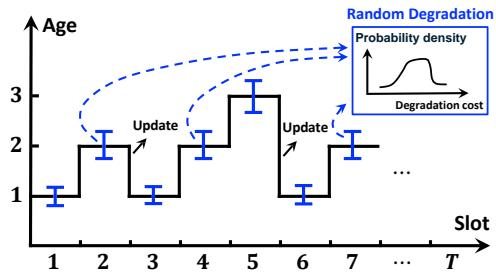
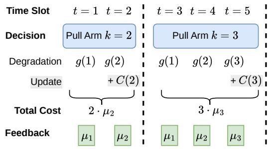
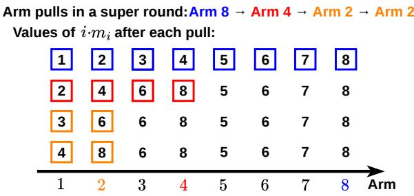
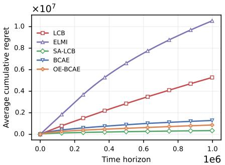
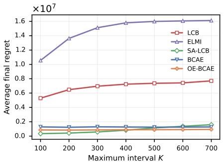
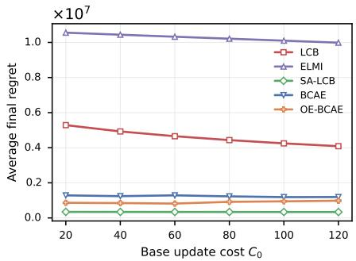
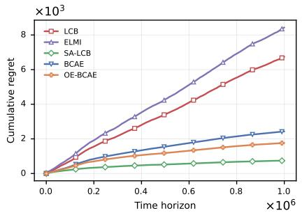
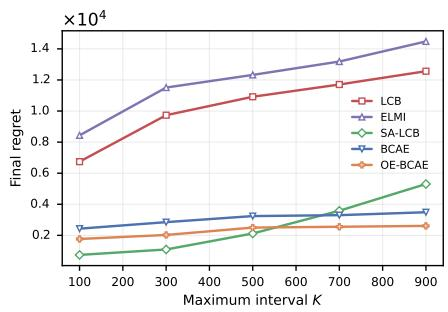
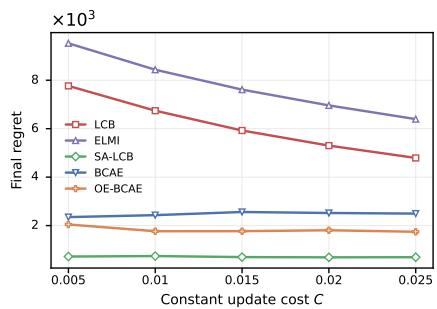
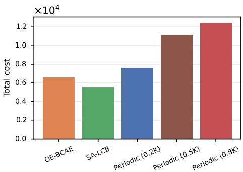

# Learning When to Update: A Near-Optimal Timing Bandit Approach

Qiulin Lin, Junyan Su, Liyuan Wang Cit<sub>y</sub> Uni<sub>v</sub>ersit<sub>y</sub> of Hon<sub>g</sub> Kon<sub>g,,</sub> Hon<sub>g</sub> Kon<sub>g,</sub> China

Min<sub>g</sub>h<sub>u</sub>a Chen The Chinese Universit<sub>y</sub> of Hon<sub>g</sub> Kon<sub>g</sub> (Shenzhen), China Cit<sub>y</sub> Uni<sub>v</sub>ersit<sub>y</sub> of Hon<sub>g</sub> Kon<sub>g,</sub> Hon<sub>g</sub> Kon<sub>g,</sub> China

## Abstract

S<sub>y</sub>stems o<sub>p</sub>eratin<sub>g</sub> in d<sub>y</sub>namic environments re<sub>q</sub>uire timel<sub>y</sub> u<sub>p</sub>- d<sub>a</sub>t<sub>es</sub> t<sub>o sus</sub>t<sub>a</sub>in <sub>e</sub>rf<sub>o</sub>rm<sub>a</sub>n<sub>ce.</sub> F<sub>o</sub>r r<sub>esou</sub>r<sub>ce</sub>-int<sub>e</sub>n<sub>s</sub>i<sub>ve s s</sub>t<sub>e</sub>m<sub>s suc</sub>h as machine learnin<sub>g</sub> models and di<sub>g</sub>ital twins<sub>,</sub> strate<sub>g</sub>icall<sub>y</sub> timin<sub>g</sub> u<sub>p</sub>dates is essential. U<sub>p</sub>datin<sub>g</sub> too fre<sub>q</sub>uentl<sub>y</sub> wastes resources<sub>,</sub> <sub>w</sub>hil<sub>e up</sub>d<sub>a</sub>ti<sub>ng</sub> t<sub>oo</sub> i<sub>n</sub>f<sub>requen</sub>tl<sub>y</sub> l<sub>ea</sub>d<sub>s</sub> t<sub>o cos</sub>tl<sub>y per</sub>f<sub>ormance</sub> d<sub>egra</sub> d<sub>a</sub>ti<sub>on.</sub> Th<sub>e pro</sub>bl<sub>em</sub> i<sub>s par</sub>ti<sub>cu</sub>l<sub>ar</sub>l<sub>y c</sub>h<sub>a</sub>ll<sub>eng</sub>i<sub>ng w</sub>h<sub>en</sub> th<sub>e sys</sub>t<sub>em</sub>’<sub>s</sub> de<sub>g</sub>radation <sub>p</sub>attern is unknown a <sub>p</sub>riori<sub>,</sub> as is common in new o<sub>p</sub>er ating environments. We <sup>f</sup>orma<sup>l</sup>ize t<sup>h</sup>is c<sup>h</sup>a<sup>ll</sup>enge as a nove<sup>l</sup> timing bandit prob<sup>l</sup>em, w<sup>h</sup>ere eac<sup>h</sup> arm represents a candidate update i<sub>n</sub>t<sub>erva</sub>l <sub>w</sub>ith <sub>a</sub> fi<sub>xe</sub>d <sub>up</sub>d<sub>a</sub>t<sub>e cos</sub>t <sub>an</sub>d <sub>an un</sub>k<sub>nown, s</sub>t<sub>oc</sub>h<sub>as</sub>ti<sub>c</sub> d<sub>egra-</sub> dation cost. Three structural <sub>p</sub>ro<sub>p</sub>erties distin<sub>g</sub>uish this settin<sub>g</sub> from <sub>s</sub>t<sub>an</sub>d<sub>ar</sub>d <sub>mu</sub>lti<sub>-arme</sub>d b<sub>an</sub>dit<sub>s:</sub> <sub>se</sub>l<sub>ec</sub>ti<sub>ng</sub> <sub>an</sub> i<sub>n</sub>t<sub>erva</sub>l <sub>comm</sub>it<sub>s</sub> th<sub>e</sub> l<sub>earner</sub> t<sub>o</sub> <sub>mu</sub>lti<sub>p</sub>l<sub>e</sub> ti<sub>me</sub> <sub>s</sub>l<sub>o</sub>t<sub>s</sub> b<sub>e</sub>f<sub>ore</sub> th<sub>e</sub> <sub>nex</sub>t <sub>up</sub>d<sub>a</sub>t<sub>e;</sub> <sub>arm</sub> <sub>cos</sub>t<sub>s</sub> <sub>are</sub> <sub>compose</sub>d <sub>o</sub>f <sub>per-s</sub>t<sub>ep</sub> d<sub>egra</sub>d<sub>a</sub>ti<sub>on</sub> <sub>cos</sub>t<sub>s</sub> <sub>an</sub>d <sub>a</sub> fi<sub>xe</sub>d <sub>up</sub>d<sub>a</sub>t<sub>e</sub> <sub>cos</sub>t<sub>;</sub> <sub>an</sub>d selectin<sub>g</sub> a lon<sub>g</sub>er interval naturall<sub>y</sub> reveals de<sub>g</sub>radation at ever<sub>y</sub> int<sub>erme</sub>di<sub>a</sub>t<sub>e s</sub>t<sub>ep, prov</sub>idi<sub>ng consecu</sub>ti<sub>ve</sub> f<sub>ee</sub>db<sub>ac</sub>k <sub>re</sub>l<sub>evan</sub>t t<sub>o s</sub>h<sub>or</sub>t<sub>er</sub> intervals. B<sub>y</sub> ex<sub>p</sub>loitin<sub>g</sub> these structures<sub>,</sub> we develo<sub>p</sub> Balanced Con-<sub>secutive Arm Elimination (BCAE). BCAE achieves �</sub>˜ <sub>(</sub>√<sub>�) regret,</sub> <sub>improving upon the Ω</sub>˜ <sub>(�</sub>√<sub>�) regret of standard bandit algorithms</sub> i<sub>n</sub> thi<sub>s</sub> <sub>se</sub>tti<sub>ng,</sub> <sub>w</sub>h<sub>ere</sub> � i<sub>s</sub> th<sub>e</sub> <sub>num</sub>b<sub>er</sub> <sub>o</sub>f <sub>can</sub>did<sub>a</sub>t<sub>e</sub> <sub>up</sub>d<sub>a</sub>t<sub>e</sub> i<sub>n</sub>t<sub>erva</sub>l<sub>s.</sub> We further propose an Optimism-Enhanced variant (OE-BCAE) that inte<sub>g</sub>rates lower-confidence-bound <sub>p</sub>rinci<sub>p</sub>les to im<sub>p</sub>rove em<sub>p</sub>irical ada<sub>p</sub>tivit<sub>y</sub> while <sub>p</sub>reservin<sub>g</sub> the same re<sub>g</sub>ret order. Moreover<sub>,</sub> the <sub>regre</sub>t b<sub>oun</sub>d <sub>ac</sub>hi<sub>eve</sub>d b<sub>y our a</sub>l<sub>gor</sub>ith<sub>ms ma</sub>t<sub>c</sub>h<sub>es</sub> th<sub>e</sub> th<sub>eore</sub>ti<sub>ca</sub>l l<sub>ower</sub> b<sub>oun</sub>d <sub>up</sub> t<sub>o</sub> l<sub>ogar</sub>ith<sub>m</sub>i<sub>c</sub> f<sub>ac</sub>t<sub>ors.</sub> Si<sub>mu</sub>l<sub>a</sub>ti<sub>on resu</sub>lt<sub>s</sub> d<sub>emon-</sub> <sub>s</sub>t<sub>ra</sub>t<sub>e</sub> th<sub>a</sub>t <sub>our a</sub>l<sub>gor</sub>ith<sub>ms ac</sub>hi<sub>eve</sub> l<sub>ow regre</sub>t <sub>an</sub>d <sub>rema</sub>i<sub>n s</sub>t<sub>a</sub>bl<sub>e as</sub> b<sub>o</sub>th th<sub>e</sub> <sub>num</sub>b<sub>er</sub> <sub>o</sub>f <sub>arms</sub> <sub>an</sub>d th<sub>e</sub> <sub>up</sub>d<sub>a</sub>t<sub>e</sub> <sub>cos</sub>t <sub>vary.</sub>

## ACM Reference Format:

Qiulin Lin, Junyan Su, Liyuan Wang and Minghua Chen. 2026. Learning W<sup>h</sup>en to Update: A Near-Optima<sup>l</sup> Timing Bandit Approac<sup>h</sup>. In The Twentyseventh International Symposium on Theory, Algorithmic Foundations, and Protocol Design for Mobile Networks and Mobile Computing (MobiHoc ’26), November 23-26, 2026, Tokyo, Japan. ACM, New Yor<sup>k</sup>, NY, USA, 17 pages. htt<sub>p</sub>s://doi.or<sub>g</sub>/10.1145/3842721.3849669

## 1 Introduction

Timel<sub>y</sub> u<sub>p</sub>dates are crucial for s<sub>y</sub>stems o<sub>p</sub>eratin<sub>g</sub> in d<sub>y</sub>namic environments to s<sub>u</sub>stain <sub>p</sub>erformance. For instance<sub>,</sub> machine learnin<sub>g</sub> <sub>mo</sub>d<sub>e</sub>l<sub>s</sub> <sub>nee</sub>d t<sub>o</sub> b<sub>e</sub> <sub>re</sub>t<sub>ra</sub>i<sub>ne</sub>d <sub>or</sub> fi<sub>ne-</sub>t<sub>une</sub>d t<sub>o</sub> <sub>coun</sub>t<sub>erac</sub>t <sub>mo</sub>d<sub>e</sub>l drift [23], a <sub>p</sub>henomenon in which the statistical <sub>p</sub>ro<sub>p</sub>erties of in<sub>p</sub>ut data chan<sub>g</sub>e over time since ori<sub>g</sub>inal trainin<sub>g,</sub> leadin<sub>g</sub> to a <sub>g</sub>radual de<sub>g</sub>radation in <sub>p</sub>redictive <sub>p</sub>erformance [20, 35]. Di<sub>g</sub>ital twins of <sub>p</sub>h<sub>ys</sub>i<sub>ca</sub>l <sub>asse</sub>t<sub>s</sub> <sub>nee</sub>d f<sub>requen</sub>t <sub>sync</sub>h<sub>ron</sub>i<sub>za</sub>ti<sub>on</sub> <sub>w</sub>ith th<sub>e</sub> <sub>rea</sub>l<sub>-wor</sub>ld <sub>s</sub>t<sub>a</sub>t<sub>e</sub> th<sub>ey m</sub>i<sub>rror.</sub> Oth<sub>erw</sub>i<sub>se,</sub> th<sub>e</sub> fid<sub>e</sub>lit<sub>y o</sub>f <sub>s</sub>i<sub>mu</sub>l<sub>a</sub>ti<sub>on-</sub>b<sub>ase</sub>d d<sub>ec</sub>i<sub>-</sub> sions de<sub>g</sub>rades [15, 31].

However<sub>, p</sub>erformin<sub>g</sub> an u<sub>p</sub>date is seldom free. Retrainin<sub>g</sub> a l<sub>arge-sca</sub>l<sub>e mac</sub>hi<sub>ne</sub> l<sub>earn</sub>i<sub>ng mo</sub>d<sub>e</sub>l <sub>may consume su</sub>b<sub>s</sub>t<sub>an</sub>ti<sub>a</sub>l <sub>com-</sub> <sub>p</sub>utational resources and ener<sub>gy</sub>. S<sub>y</sub>nchronizin<sub>g</sub> a di<sub>g</sub>ital twin can re<sub>q</sub>uire ex<sub>p</sub>ensive sensor readin<sub>g</sub>s or communication bandwidth. M<sub>ore spec</sub>ifi<sub>ca</sub>ll<sub>y,</sub> i<sub>n ne</sub>t<sub>wor</sub>k<sub>e</sub>d <sub>an</sub>d <sub>e</sub>d<sub>ge</sub> d<sub>ep</sub>l<sub>oymen</sub>t<sub>s,</sub> th<sub>ese cos</sub>t<sub>s</sub> are often dominated b<sub>y</sub> communication overhead. Tri<sub>gg</sub>erin<sub>g</sub> an u<sub>p</sub>date ma<sub>y</sub> re<sub>q</sub>uire wakin<sub>g</sub> u<sub>p</sub> a radio transceiver or transmitti<sub>ng a</sub> l<sub>arge vo</sub>l<sub>ume o</sub>f d<sub>a</sub>t<sub>a over a</sub> b<sub>an</sub>d<sub>w</sub>idth<sub>-</sub>li<sub>m</sub>it<sub>e</sub>d li<sub>n</sub>k<sub>, eac</sub>h <sub>o</sub>f <sub>w</sub>hi<sub>c</sub>h d<sub>ra</sub>i<sub>ns</sub> th<sub>e</sub> li<sub>m</sub>it<sub>e</sub>d b<sub>a</sub>tt<sub>ery</sub> b<sub>u</sub>d<sub>ge</sub>t <sub>o</sub>f <sub>an</sub> I<sub>o</sub>T d<sub>ev</sub>i<sub>ce</sub> <sub>or</sub> <sub>e</sub>d<sub>ge</sub> node [3, 36]. Conse<sub>q</sub>uentl<sub>y</sub>, a s<sub>y</sub>stem desi<sub>g</sub>ner faces a fundamental trade-of: u<sub>p</sub>datin<sub>g</sub> too fre<sub>q</sub>uentl<sub>y</sub> wastes resources on unnecessar<sub>y</sub> <sub>re</sub>f<sub>res</sub>h<sub>es,</sub> <sub>w</sub>hil<sub>e</sub> <sub>up</sub>d<sub>a</sub>ti<sub>ng</sub> t<sub>oo</sub> i<sub>n</sub>f<sub>requen</sub>tl<sub>y</sub> <sub>a</sub>ll<sub>ows</sub> <sub>per</sub>f<sub>ormance</sub> t<sub>o</sub> d<sub>egra</sub>d<sub>e,</sub> <sub>po</sub>t<sub>en</sub>ti<sub>a</sub>ll<sub>y</sub> i<sub>ncurr</sub>i<sub>ng</sub> <sub>cos</sub>t<sub>s</sub> th<sub>a</sub>t f<sub>ar</sub> <sub>excee</sub>d th<sub>e</sub> <sub>sav</sub>i<sub>ngs</sub> f<sub>rom</sub> s<sup>ki</sup><sub>pp</sub><sup>i</sup>n<sub>g</sub> an u<sub>p</sub><sup>d</sup>ate.

St<sub>r</sub>iki<sub>ng</sub> th<sub>e r</sub>i<sub>g</sub>ht b<sub>a</sub>l<sub>ance</sub> i<sub>s</sub> f<sub>ur</sub>th<sub>er comp</sub>li<sub>ca</sub>t<sub>e</sub>d b<sub>y</sub> th<sub>e</sub> f<sub>ac</sub>t th<sub>a</sub>t degradation patterns are o<sup>f</sup>ten unknown a priori. T<sup>h</sup>e rate at w<sup>h</sup>ic<sup>h</sup> <sub>a</sub> <sub>mo</sub>d<sub>e</sub>l’<sub>s</sub> <sub>accuracy</sub> d<sub>ec</sub>li<sub>nes,</sub> <sub>or</sub> <sub>a</sub> di<sub>g</sub>it<sub>a</sub>l t<sub>w</sub>i<sub>n</sub>’<sub>s</sub> fid<sub>e</sub>lit<sub>y</sub> <sub>ero</sub>d<sub>es,</sub> d<sub>e-</sub> <sub>p</sub>ends on the volatilit<sub>y</sub> of the underl<sub>y</sub>in<sub>g</sub> environment—a <sub>q</sub>uantit<sub>y</sub> th<sub>a</sub>t i<sub>s</sub> it<sub>se</sub>lf <sub>uncer</sub>t<sub>a</sub>i<sub>n</sub> <sub>an</sub>d <sub>may</sub> <sub>c</sub>h<sub>ange</sub> <sub>across</sub> d<sub>ep</sub>l<sub>oymen</sub>t<sub>s.</sub> Wh<sub>en</sub> th<sub>e</sub> d<sub>egra</sub>d<sub>a</sub>ti<sub>on cos</sub>t <sub>assoc</sub>i<sub>a</sub>t<sub>e</sub>d <sub>w</sub>ith <sub>eac</sub>h <sub>poss</sub>ibl<sub>e up</sub>d<sub>a</sub>t<sub>e</sub> i<sub>n</sub>t<sub>erva</sub>l i<sub>s</sub> k<sub>nown or can</sub> b<sub>e mo</sub>d<sub>e</sub>l<sub>e</sub>d <sub>parame</sub>t<sub>r</sub>i<sub>ca</sub>ll<sub>y,</sub> th<sub>e op</sub>ti<sub>ma</sub>l <sub>up</sub>d<sub>a</sub>t<sub>e</sub> <sub>sc</sub>h<sub>e</sub>d<sub>u</sub>l<sub>e can</sub> b<sub>e compu</sub>t<sub>e</sub>d <sub>o</sub>fli<sub>ne.</sub> I<sub>n prac</sub>ti<sub>ce,</sub> h<sub>owever, suc</sub>h <sub>pr</sub>i<sub>or</sub> information is rarel<sub>y</sub> available<sub>,</sub> es<sub>p</sub>eciall<sub>y</sub> when a s<sub>y</sub>stem is de<sub>p</sub>lo<sub>y</sub>ed i<sub>n a new env</sub>i<sub>ronmen</sub>t<sub>.</sub> Thi<sub>s ren</sub>d<sub>ers</sub> th<sub>e pro</sub>bl<sub>em</sub> i<sub>n</sub>h<sub>eren</sub>tl<sub>y an on-</sub> li<sub>ne</sub> l<sub>earn</sub>i<sub>ng pro</sub>bl<sub>em:</sub> th<sub>e sys</sub>t<sub>em mus</sub>t di<sub>scover an e</sub>f<sub>ec</sub>ti<sub>ve up</sub>d<sub>a</sub>t<sub>e</sub> <sub>p</sub>olic<sub>y</sub> throu<sub>g</sub>h its own o<sub>p</sub>erational ex<sub>p</sub>erience. The A<sub>g</sub>e of Information (AoI) literature has extensivel<sub>y</sub> studied u<sub>p</sub>date schedulin<sub>g</sub> under various a<sub>pp</sub>lication scenarios [30, 37], but it <sub>p</sub>redominantl<sub>y</sub> assumes known de<sub>g</sub>radation functions (or a<sub>g</sub>e <sub>p</sub>enalt<sub>y</sub> functions) an<sup>d</sup> optimizes a c<sup>l</sup>ose<sup>d</sup>-<sup>f</sup>orm o<sup>b</sup>jective. In contrast, t<sup>h</sup>e setting in w<sup>h</sup>ic<sup>h</sup> t<sup>h</sup>e degradation dynamics are stoc<sup>h</sup>astic and must be learned online remains lar<sub>g</sub>el<sub>y</sub> o<sub>p</sub>en<sub>;</sub> existin<sub>g</sub> studies either assume full knowled<sub>g</sub>e of the de<sub>g</sub>radation model [1, 3, 30] or ado<sub>p</sub>t full<sub>y</sub> adversarial formulations [22, 32, 33] that do not ex<sub>p</sub>loit the stochastic <sub>s</sub>t<sub>ruc</sub>t<sub>ure;</sub> <sub>see</sub> <sub>a</sub> d<sub>e</sub>t<sub>a</sub>il<sub>e</sub>d di<sub>scuss</sub>i<sub>on</sub> <sub>o</sub>f <sub>re</sub>l<sub>a</sub>t<sub>e</sub>d <sub>wor</sub>k i<sub>n</sub> S<sub>ec</sub>ti<sub>on</sub> 2<sub>.</sub>

In this <sub>p</sub>a<sub>p</sub>er<sub>,</sub> we investi<sub>g</sub>ate the u<sub>p</sub>date schedulin<sub>g p</sub>roblem (USP), which involves strategically determining the timing of upd<sub>a</sub>t<sub>es</sub> <sub>un</sub>d<sub>er</sub> <sub>rea</sub>li<sub>s</sub>ti<sub>c</sub> <sub>con</sub>diti<sub>ons</sub> <sub>w</sub>h<sub>ere</sub> f<sub>u</sub>t<sub>ure</sub> <sub>per</sub>f<sub>ormance</sub> d<sub>egra-</sub> d<sub>a</sub>ti<sub>o</sub>n <sub>pa</sub>tt<sub>e</sub>rn<sub>s</sub> <sub>a</sub>r<sub>e</sub> <sub>s</sub>t<sub>oc</sub>h<sub>as</sub>ti<sub>c</sub> <sub>a</sub>nd <sub>u</sub>nkn<sub>ow</sub>n<sub>.</sub> W<sub>e</sub> <sub>a</sub>im t<sub>o</sub> minimiz<sub>e</sub> th<sub>e</sub> <sub>average</sub> t<sub>o</sub>t<sub>a</sub>l <sub>expec</sub>t<sub>e</sub>d d<sub>egra</sub>d<sub>a</sub>ti<sub>on</sub> <sub>cos</sub>t <sub>an</sub>d <sub>up</sub>d<sub>a</sub>t<sub>e</sub> <sub>expenses</sub> <sub>over</sub> <sub>a</sub> ti<sub>me</sub> h<sub>or</sub>i<sub>zon.</sub> Th<sub>e</sub> f<sub>un</sub>d<sub>amen</sub>t<sub>a</sub>l <sub>c</sub>h<sub>a</sub>ll<sub>enge</sub> li<sub>es</sub> i<sub>n</sub> l<sub>earn</sub>i<sub>ng</sub> th<sub>e</sub> <sub>un</sub>k<sub>nown</sub> d<sub>egra</sub>d<sub>a</sub>ti<sub>on cos</sub>t<sub>s w</sub>hil<sub>e ma</sub>ki<sub>ng rea</sub>l<sub>-</sub>ti<sub>me up</sub>d<sub>a</sub>t<sub>e</sub> d<sub>ec</sub>i<sub>-</sub> <sub>s</sub>i<sub>ons, w</sub>ith<sub>ou</sub>t <sub>pr</sub>i<sub>or</sub> k<sub>now</sub>l<sub>e</sub>d<sub>ge o</sub>f th<sub>e</sub> d<sub>egra</sub>d<sub>a</sub>ti<sub>on cos</sub>t <sub>pa</sub>tt<sub>erns</sub> <sub>or</sub> th<sub>e</sub>i<sub>r</sub> di<sub>s</sub>t<sub>r</sub>ib<sub>u</sub>ti<sub>ons.</sub> W<sub>e</sub> f<sub>rame</sub> thi<sub>s c</sub>h<sub>a</sub>ll<sub>enge as a nove</sub>l <sub>var</sub>i<sub>an</sub>t o<sup>f</sup> t<sup>h</sup>e mu<sup>l</sup>ti-armed bandit (MAB) prob<sup>l</sup>em, named Timing Bandit, <sub>w</sub>h<sub>ere</sub> <sub>eac</sub>h <sub>arm</sub> <sub>correspon</sub>d<sub>s</sub> t<sub>o</sub> <sub>a</sub> <sub>can</sub>did<sub>a</sub>t<sub>e</sub> <sub>up</sub>d<sub>a</sub>t<sub>e</sub> i<sub>n</sub>t<sub>erva</sub>l<sub>.</sub> W<sub>e</sub> revea<sup>l</sup> t<sup>h</sup>ree structura<sup>l</sup> properties o<sup>f</sup> Timing Bandit. First, timing decisions: se<sup>l</sup>ecting arm � commits t<sup>h</sup>e <sup>l</sup>earner to operate <sup>f</sup>or t<sup>h</sup>e next � time ste<sub>p</sub>s before <sub>p</sub>erformin<sub>g</sub> an u<sub>p</sub>date<sub>,</sub> so a sin<sub>g</sub>le decision occu-<sub>p</sub>i<sub>es</sub> <sub>a</sub> <sub>var</sub>i<sub>a</sub>bl<sub>e</sub> <sub>num</sub>b<sub>er</sub> <sub>o</sub>f <sub>roun</sub>d<sub>s</sub> <sub>ra</sub>th<sub>er</sub> th<sub>an</sub> <sub>a</sub> <sub>s</sub>i<sub>ng</sub>l<sub>e</sub> <sub>s</sub>l<sub>o</sub>t<sub>.</sub> S<sub>econ</sub>d<sub>,</sub> arm cost composition: t<sup>h</sup>e cost o<sup>f</sup> an arm comprises t<sup>h</sup>e stoc<sup>h</sup>astic d<sub>egra</sub>d<sub>a</sub>ti<sub>on</sub> <sub>cos</sub>t th<sub>a</sub>t <sub>accumu</sub>l<sub>a</sub>t<sub>es</sub> <sub>as</sub> th<sub>e</sub> <sub>sys</sub>t<sub>em</sub> <sub>ages</sub> d<sub>ur</sub>i<sub>ng</sub> th<sub>e</sub> interva<sup>l</sup> and a <sup>fi</sup>xed update cost incurred at t<sup>h</sup>e end. T<sup>h</sup>ird, consecutive feedback: pu<sup>ll</sup>ing an arm traverses every intermediate age in se<sub>q</sub>uence<sub>,</sub> revealin<sub>g</sub> de<sub>g</sub>radation information relevant to ever<sub>y</sub> <sub>s</sub>h<sub>or</sub>t<sub>er</sub> i<sub>n</sub>t<sub>erva</sub>l<sub>.</sub> Th<sub>ese s</sub>t<sub>ruc</sub>t<sub>ures</sub> di<sub>s</sub>ti<sub>ngu</sub>i<sub>s</sub>h <sub>our pro</sub>bl<sub>em</sub> f<sub>rom</sub> existin<sub>g</sub> variants of MAB <sub>p</sub>roblems (cf. Table 1) and necessitate <sub>nove</sub>l <sub>a</sub>l<sub>gor</sub>ith<sub>m</sub> d<sub>es</sub>i<sub>gn an</sub>d <sub>ana</sub>l<sub>ys</sub>i<sub>s.</sub> T<sub>o</sub> thi<sub>s en</sub>d<sub>, we</sub> d<sub>eve</sub>l<sub>op on</sub>li<sub>ne</sub> <sub>a</sub>l<sub>gor</sub>ith<sub>ms</sub> th<sub>a</sub>t <sub>ac</sub>hi<sub>eve prova</sub>bl<sub>y near-op</sub>ti<sub>ma</sub>l<sub>, su</sub>bli<sub>near regre</sub>t b<sub>oun</sub>d<sub>s, w</sub>h<sub>ere regre</sub>t i<sub>s</sub> d<sub>e</sub>fi<sub>ne</sub>d <sub>as</sub> th<sub>e per</sub>f<sub>ormance gap re</sub>l<sub>a</sub>ti<sub>ve</sub> t<sub>o</sub> an o<sub>p</sub>timal strate<sub>gy</sub> with known de<sub>g</sub>radation cost distributions. We summarize our contributions as follows.

▷ In Sec. 3, we introduce the update scheduling problem (USP), w<sup>h</sup>ose o<sup>b</sup>jective is to minimize t<sup>h</sup>e tota<sup>l</sup> cost comprising <sup>b</sup>ot<sup>h</sup> stochastic de<sub>g</sub>radation and u<sub>p</sub>date ex<sub>p</sub>enses b<sub>y</sub> o<sub>p</sub>timizin<sub>g</sub> the timin<sub>g</sub> of u<sub>p</sub>dates. We show that the o<sub>p</sub>timal <sub>p</sub>olic<sub>y</sub> for minimizin<sub>g</sub> the as<sub>y</sub>m<sub>p</sub>totic time-avera<sub>g</sub>e total cost reduces to a <sub>p</sub>eriodic one<sub>,</sub> i.e.<sub>,</sub> <sub>up</sub>d<sub>a</sub>ti<sub>ng</sub> <sub>a</sub>t <sub>a</sub> fi<sub>xe</sub>d i<sub>n</sub>t<sub>erva</sub>l<sub>.</sub>

▷ Motivated b<sub>y</sub> the o<sub>p</sub>timalit<sub>y</sub> of <sub>p</sub>eriodic u<sub>p</sub>dates<sub>,</sub> in Sec. 4<sub>,</sub> we f<sub>rame</sub> th<sub>e on</sub>li<sub>ne se</sub>tti<sub>ng, w</sub>h<sub>ere</sub> th<sub>e s</sub>t<sub>oc</sub>h<sub>as</sub>ti<sub>c</sub> d<sub>egra</sub>d<sub>a</sub>ti<sub>on cos</sub>t<sub>s</sub> are un<sup>k</sup>nown a priori, as a nove<sup>l</sup> Timing Bandit prob<sup>l</sup>em. Here, <sub>eac</sub>h <sub>arm</sub> <sub>correspon</sub>d<sub>s</sub> t<sub>o</sub> <sub>a</sub> <sub>can</sub>did<sub>a</sub>t<sub>e</sub> <sub>up</sub>d<sub>a</sub>t<sub>e</sub> i<sub>n</sub>t<sub>erva</sub>l <sub>w</sub>h<sub>ose</sub> fi<sub>xe</sub>d <sub>up</sub>d<sub>a</sub>t<sub>e</sub> <sub>cos</sub>t i<sub>s</sub> k<sub>nown</sub> b<sub>u</sub>t <sub>w</sub>h<sub>ose</sub> d<sub>egra</sub>d<sub>a</sub>ti<sub>on</sub> <sub>cos</sub>t<sub>s</sub> <sub>mus</sub>t b<sub>e</sub> l<sub>earne</sub>d throu<sub>g</sub>h interaction. We further identif<sub>y</sub> three structural <sub>p</sub>ro<sub>p</sub>erties o<sup>f</sup> Timing Bandit, inc<sup>l</sup>uding timing decisions, arm cost composition, <sub>an</sub>d <sub>consecu</sub>ti<sub>ve</sub> f<sub>ee</sub>db<sub>ac</sub>k<sub>.</sub>

▷ In Sec. 5<sub>,</sub> we demonstrate that<sub>,</sub> resultin<sub>g</sub> from the timin<sub>g</sub> decision structure<sub>,</sub> a direct a<sub>pp</sub>lication of standard MAB al<sub>g</sub>orithms<sub>,</sub> i<sub>.e.,</sub> t<sub>rea</sub>ti<sub>ng</sub> <sub>eac</sub>h <sub>o</sub>f th<sub>e</sub> � <sub>can</sub>did<sub>a</sub>t<sub>e</sub> i<sub>n</sub>t<sub>erva</sub>l<sub>s</sub> <sub>as</sub> <sub>an</sub> i<sub>n</sub>d<sub>epen</sub>d<sub>en</sub>t arm, ields a re ret of �<sup>˜</sup> (� �) rather than the usual �<sup>˜</sup> ( ��). We th<sub>en propose an e</sub>fi<sub>c</sub>i<sub>en</sub>t <sub>on</sub>li<sub>ne a</sub>l<sub>gor</sub>ith<sub>m, name</sub>l<sub>y</sub> B<sub>a</sub>l<sub>ance</sub>d C<sub>on-</sub> secutive Arm Elimination (BCAE), for the timing bandit. Built on <sub>arm e</sub>li<sub>m</sub>i<sub>na</sub>ti<sub>on, our a</sub>l<sub>gor</sub>ith<sub>m</sub> f<sub>ur</sub>th<sub>er</sub> l<sub>everages a nove</sub>l id<sub>ea o</sub>f <sup>b</sup>a<sup>l</sup>ancing t<sup>h</sup>e con<sup>fid</sup>ence gaps across a<sup>ll</sup> arms, ena<sup>bl</sup>ing joint use <sub>o</sub>f th<sub>e spec</sub>ifi<sub>c arm cos</sub>t <sub>compos</sub>iti<sub>on an</sub>d th<sub>e consecu</sub>ti<sub>ve</sub> f<sub>ee</sub>db<sub>ac</sub>k structures. We <sub>p</sub>rove that our al<sub>g</sub>orithm achieves sublinear re<sub>g</sub>ret <sub>bounds</sub> <sub>of</sub> <sub>�</sub>˜ <sub>(</sub>√<sub>�</sub> <sub>)</sub> <sub>for</sub> <sub>suficiently</sub> <sub>large</sub> <sub>�</sub> <sub>,</sub> <sub>removing</sub> <sub>the</sub> <sub>�</sub> <sub>multi-</sub> <sub>p</sub>licative overhead found in a<sub>pp</sub>l<sub>y</sub>in<sub>g</sub> standard MAB al<sub>g</sub>orithms. We <sub>s</sub>h<sub>ow</sub> th<sub>a</sub>t th<sub>e ac</sub>hi<sub>eve</sub>d <sub>regre</sub>t <sub>ma</sub>t<sub>c</sub>h<sub>es</sub> th<sub>e regre</sub>t l<sub>ower</sub> b<sub>oun</sub>d f<sub>or</sub> th<sub>e</sub> <sub>pro</sub>bl<sub>em</sub> <sub>up</sub> t<sub>o</sub> l<sub>ogar</sub>ith<sub>m</sub>i<sub>c</sub> f<sub>ac</sub>t<sub>ors.</sub> Whil<sub>e</sub> <sub>ana</sub>l<sub>y</sub>ti<sub>ca</sub>ll<sub>y</sub> <sub>conve</sub> nient<sub>,</sub> the elimination <sub>p</sub>aradi<sub>g</sub>m ada<sub>p</sub>ts onl<sub>y</sub> at infre<sub>q</sub>uent<sub>,</sub> discrete <sub>e</sub>limin<sub>a</sub>ti<sub>o</sub>n <sub>eve</sub>nt<sub>s,</sub> limitin<sub>g e</sub>m<sub>p</sub>iri<sub>ca</sub>l r<sub>espo</sub>n<sub>s</sub>i<sub>ve</sub>n<sub>ess.</sub> T<sub>o a</sub>ddr<sub>ess</sub> this, we further propose an Optimism-Enhanced variant (OE-BCAE) that inte<sub>g</sub>rates Lower Confidence Bound (LCB) <sub>p</sub>rinci<sub>p</sub>les into the elimination framework<sub>,</sub> enablin<sub>g</sub> continuous ada<sub>p</sub>tation while <sub>p</sub>reservin<sub>g</sub> the same order re<sub>g</sub>ret.

Table 1: Comparison with related stochastic multi-armed bandit (MAB) problems.
<table><tr><td>MAB Problems</td><td>Timing Decisions</td><td>Consecutive Feedback</td><td>Arm Cost Composition</td><td>Regret</td></tr><tr><td>Standard, e.g., [19]</td><td>x</td><td>x</td><td>x</td><td>Ö(√KT)*</td></tr><tr><td>One-Sided, e.g., [5, 21, 38]</td><td>x</td><td>√</td><td>x</td><td>Ö(√T)*</td></tr><tr><td>Side Info. [7]</td><td>x</td><td>√</td><td>x</td><td>Ö(√KT)†</td></tr><tr><td>Batch, e.g., [6, 14, 25]</td><td>√</td><td>√</td><td>x</td><td>Ö(h(·))*</td></tr><tr><td>Timing Bandit (this work)</td><td>√</td><td>√</td><td>√</td><td>Ö(√T)*</td></tr></table>

<sup>★</sup> D<sub>eno</sub>t<sub>es</sub> th<sub>e</sub> <sub>regre</sub>t b<sub>oun</sub>d <sub>ma</sub>t<sub>c</sub>h<sub>es</sub> it<sub>s</sub> l<sub>ower</sub> b<sub>oun</sub>d <sub>up</sub> t<sub>o</sub> l<sub>ogar</sub>ith<sub>m</sub>i<sub>c</sub> f<sub>ac</sub>t<sub>ors.</sub>  
<sup>†</sup> R<sub>esu</sub>lt <sub>w</sub>h<sub>en</sub> <sub>app</sub>li<sub>e</sub>d t<sub>o</sub> th<sub>e</sub> <sub>consecu</sub>ti<sub>ve</sub> <sub>or</sub> <sub>one-s</sub>id<sub>e</sub>d f<sub>ee</sub>db<sub>ac</sub>k <sub>case.</sub>  
$\dot { \bar { \tau } } h ( \cdot ) = \sqrt { K } T ^ { 1 / ( 2 - 2 ^ { 1 - N } ) }$ <sub>, w</sub>h<sub>ere</sub> � <sub>represen</sub>t<sub>s</sub> th<sub>e num</sub>b<sub>er o</sub>f b<sub>a</sub>t<sub>c</sub>h<sub>es.</sub>

▷ W<sub>e va</sub>lid<sub>a</sub>t<sub>e our</sub> th<sub>eore</sub>ti<sub>ca</sub>l fi<sub>n</sub>di<sub>ngs</sub> th<sub>roug</sub>h <sub>numer</sub>i<sub>ca</sub>l <sub>eva</sub>l<sub>u-</sub> ation in Sec. 6 and evaluate the em<sub>p</sub>irical <sub>p</sub>erformance on a remote monitorin<sub>g</sub> instance <sub>u</sub>sin<sub>g</sub> real-<sub>w</sub>orld traces in Sec. 7. The ex<sub>p</sub>eriments demonstrate that our approaches, in particular OE-BCAE, <sub>ac</sub>hi<sub>eve</sub> l<sub>ower regre</sub>t <sub>an</sub>d <sub>rema</sub>i<sub>n ro</sub>b<sub>us</sub>t t<sub>o c</sub>h<sub>anges</sub> i<sub>n</sub> b<sub>o</sub>th th<sub>e</sub> <sub>num</sub>b<sub>er</sub> <sub>o</sub>f <sub>arms</sub> <sub>an</sub>d th<sub>e</sub> <sub>up</sub>d<sub>a</sub>t<sub>e</sub> <sub>cos</sub>t<sub>.</sub>

## 2 Related Work

Multi-armed Bandit. We consider Timing bandit, a novel variant of the classical multi-armed bandit (MAB) framework [28] with structural <sub>p</sub>ro<sub>p</sub>erties tailored to our settin<sub>g</sub>. This variant difers from t<sub>ra</sub>diti<sub>ona</sub>l MAB <sub>pro</sub>bl<sub>ems</sub> i<sub>n</sub> d<sub>ec</sub>i<sub>s</sub>i<sub>on-ma</sub>ki<sub>ng,</sub> f<sub>ee</sub>db<sub>ac</sub>k <sub>mec</sub>h<sub>a-</sub> nisms<sub>,</sub> and arm cost com<sub>p</sub>osition<sub>,</sub> which re<sub>q</sub>uire new al<sub>g</sub>orithm desi<sub>g</sub>n and anal<sub>y</sub>sis<sub>,</sub> as we will elaborate in Sec. 4 and Sec. 5. We <sub>summar</sub>i<sub>ze</sub> th<sub>e compar</sub>i<sub>son o</sub>f th<sub>e mos</sub>t<sub>-re</sub>l<sub>a</sub>t<sub>e</sub>d <sub>var</sub>i<sub>an</sub>t<sub>s o</sub>f b<sub>an</sub>dit <sub>pro</sub>bl<sub>ems</sub> i<sub>n</sub> T<sub>a</sub>bl<sub>e</sub> 1<sub>.</sub> Whil<sub>e</sub> <sub>some</sub> <sub>proper</sub>ti<sub>es</sub> <sub>o</sub>f <sub>our</sub> <sub>pro</sub>bl<sub>em</sub> <sub>can</sub> b<sub>e</sub> considered individuall<sub>y</sub> as s<sub>p</sub>ecial cases of other MAB <sub>p</sub>aradi<sub>g</sub>ms<sub>,</sub> there is no direct <sub>g</sub>eneralization from these <sub>p</sub>aradi<sub>g</sub>ms that accounts for all of our <sub>p</sub>roblem’s <sub>p</sub>ro<sub>p</sub>erties. In <sub>p</sub>articular, in [5, 7, 21, 38], th<sub>e</sub> <sub>au</sub>th<sub>ors</sub> <sub>cons</sub>id<sub>er</sub> b<sub>an</sub>dit<sub>s</sub> i<sub>n</sub> <sub>w</sub>hi<sub>c</sub>h <sub>pu</sub>lli<sub>ng</sub> <sub>an</sub> <sub>arm</sub> <sub>a</sub>l<sub>so</sub> <sub>prov</sub>id<sub>es</sub> sam<sub>p</sub>les of arms with smaller (or lar<sub>g</sub>er) indexes, similar to our <sub>consecu</sub>ti<sub>ve</sub> f<sub>ee</sub>db<sub>ac</sub>k <sub>s</sub>t<sub>ruc</sub>t<sub>ure.</sub> Al<sub>so,</sub> th<sub>e</sub> ti<sub>m</sub>i<sub>ng</sub> d<sub>ec</sub>i<sub>s</sub>i<sub>on s</sub>t<sub>ruc</sub>t<sub>ure</sub> th<sub>a</sub>t <sub>pu</sub>lli<sub>ng an arm, say</sub> �<sub>, occup</sub>i<sub>es</sub> � <sub>s</sub>l<sub>o</sub>t<sub>s an</sub>d <sub>revea</sub>l<sub>s</sub> f<sub>ee</sub>db<sub>ac</sub>k <sub>o</sub>f th<sub>e</sub> fi<sub>rs</sub>t � <sub>arms, can</sub> b<sub>e v</sub>i<sub>ewe</sub>d <sub>as pu</sub>lli<sub>ng a</sub> b<sub>a</sub>t<sub>c</sub>h <sub>o</sub>f th<sub>e</sub> fi<sub>rs</sub>t � arms in the batched multi-armed bandit <sub>p</sub>roblem [6, 14, 25]. How-<sub>ever, we no</sub>t<sub>e</sub> th<sub>a</sub>t<sub>, ra</sub>th<sub>er</sub> th<sub>an</sub> th<sub>e</sub> l<sub>earner c</sub>h<sub>oos</sub>i<sub>ng a su</sub>b<sub>se</sub>t <sub>o</sub>f <sub>arms</sub> t<sub>o o</sub>b<sub>serve,</sub> it i<sub>s</sub> th<sub>e</sub> t<sub>em ora</sub>l h <sub>s</sub>i<sub>cs o</sub>f th<sub>e</sub> ti<sub>m</sub>i<sub>n</sub> b<sub>an</sub>dit th<sub>a</sub>t d<sub>e</sub>t<sub>erm</sub>i<sub>nes</sub> th<sub>e</sub> ti<sub>m</sub>i<sub>ng o</sub>f <sub>o</sub>b<sub>serva</sub>ti<sub>ons, an</sub>d <sub>we canno</sub>t <sub>c</sub>h<sub>oose</sub> <sub>ar</sub>bit<sub>rary</sub> b<sub>a</sub>t<sub>c</sub>h<sub>es.</sub> Oth<sub>er examp</sub>l<sub>es</sub> i<sub>nc</sub>l<sub>u</sub>d<sub>e</sub> th<sub>a</sub>t th<sub>e way</sub> th<sub>e arm</sub> <sub>cos</sub>t i<sub>s compose</sub>d i<sub>n our pro</sub>bl<sub>em can</sub> b<sub>e connec</sub>t<sub>e</sub>d t<sub>o</sub> th<sub>e com</sub>bi<sub>na-</sub> torial multi-armed bandit <sub>p</sub>roblem [10–12], The <sub>p</sub>a<sub>p</sub>er in [8], which f<sub>ocuses on</sub> th<sub>e con</sub>t<sub>ro</sub>l <sub>o</sub>f <sub>a renewa</sub>l <sub>rewar</sub>d <sub>process, ex</sub>hibit<sub>s</sub> th<sub>e</sub> <sub>proper</sub>t<sub>y o</sub>f <sub>consecu</sub>ti<sub>ve</sub> f<sub>ee</sub>db<sub>ac</sub>k<sub>, w</sub>h<sub>ere c</sub>h<sub>oos</sub>i<sub>ng a</sub> l<sub>onger</sub> i<sub>n</sub>t<sub>er-</sub> <sub>rup</sub>t ti<sub>me a</sub>l<sub>so revea</sub>l<sub>s</sub> f<sub>ee</sub>db<sub>ac</sub>k <sub>o</sub>f <sub>a s</sub>h<sub>or</sub>t<sub>er one.</sub> H<sub>ere, we exp</sub>l<sub>o</sub>it <sub>a</sub>ll th<sub>ree</sub> <sub>proper</sub>ti<sub>es</sub> <sub>o</sub>f th<sub>e</sub> <sub>pro</sub>bl<sub>em</sub> <sub>w</sub>ith <sub>nove</sub>l <sub>a</sub>l<sub>gor</sub>ith<sub>m</sub>i<sub>c</sub> d<sub>es</sub>i<sub>gn</sub> <sub>an</sub>d <sub>ac</sub>hi<sub>eve a prova</sub>bl<sub>e,</sub> i<sub>mprove</sub>d <sub>su</sub>bli<sub>near regre</sub>t<sub>, w</sub>hi<sub>c</sub>h <sub>ma</sub>t<sub>c</sub>h<sub>es</sub> th<sub>e</sub> l<sub>ower</sub> b<sub>oun</sub>d <sub>regre</sub>t <sub>w</sub>ithi<sub>n</sub> l<sub>ogar</sub>ith<sub>m</sub>i<sub>c</sub> f<sub>ac</sub>t<sub>ors.</sub>

Age-of-Information Optimization. Our problem is also related to the A<sub>g</sub>e-of-Information (AoI) o<sub>p</sub>timization in communication networks [18, 37]. AoI ca<sub>p</sub>tures the freshness of information received at the destination<sub>,</sub> and the <sub>g</sub>eneral <sub>g</sub>oal for AoI o<sub>p</sub>timization is to maintain a lo<sub>w</sub> AoI b<sub>y</sub> o<sub>p</sub>timizin<sub>g</sub> the <sub>up</sub>date <sub>p</sub>rocess.

Our a<sub>pp</sub>roach extends to AoI o<sub>p</sub>timization scenarios where the a<sub>g</sub>ed<sub>epen</sub>d<sub>en</sub>t <sub>pena</sub>lt<sub>y</sub> f<sub>o</sub>ll<sub>ows some un</sub>k<sub>nown ran</sub>d<sub>om</sub> di<sub>s</sub>t<sub>r</sub>ib<sub>u</sub>ti<sub>on,</sub> i<sub>n</sub> contrast to <sub>p</sub>rior studies that t<sub>yp</sub>icall<sub>y</sub> consider known<sub>,</sub> deterministic <sub>p</sub>enalties [3, 32], known, random a<sub>g</sub>e-de<sub>p</sub>endent rewards [9], or unknown adversarial <sub>p</sub>enalties [33, 34]. In addition, our <sub>p</sub>roblem <sub>genera</sub>li<sub>zes</sub> t<sub>o</sub> <sub>age-</sub>d<sub>epen</sub>d<sub>en</sub>t <sub>up</sub>d<sub>a</sub>t<sub>e</sub> <sub>cos</sub>t<sub>,</sub> <sub>w</sub>h<sub>ereas</sub> <sub>cons</sub>t<sub>an</sub>t <sub>up</sub>d<sub>a</sub>t<sub>e</sub> cost is commonl<sub>y</sub> considered in the literature, [33, 34]. Our work i<sub>s</sub> <sub>c</sub>l<sub>ose</sub>l<sub>y</sub> <sub>re</sub>l<sub>a</sub>t<sub>e</sub>d t<sub>o</sub> th<sub>e</sub> <sub>s</sub>i<sub>ng</sub>l<sub>e-source,</sub> b<sub>an</sub>dit<sub>-</sub>f<sub>ee</sub>db<sub>ac</sub>k f<sub>ramewor</sub>k ex<sub>p</sub>lored in [34], where online decision-makin<sub>g</sub> is studied under adversarial <sub>p</sub>enalt<sub>y</sub> functions for information a<sub>g</sub>in<sub>g,</sub> usin<sub>g</sub> al<sub>g</sub>orithms such as Follow the Perturbed Leader (FTPL) and EXP3. Another line <sub>o</sub>f <sub>wor</sub>k <sub>s</sub>t<sub>u</sub>di<sub>es</sub> A<sub>o</sub>I b<sub>an</sub>dit<sub>s,</sub> $\mathrm { e . g . }$ , [13], where the arms are channels with unknown success <sub>p</sub>robabilities and the a<sub>g</sub>e <sub>p</sub>enalt<sub>y</sub> is deterministic. In contrast<sub>,</sub> our stud<sub>y</sub> considers model de<sub>g</sub>radation with an <sub>un</sub>k<sub>nown,</sub> <sub>age-</sub>d<sub>epen</sub>d<sub>en</sub>t di<sub>s</sub>t<sub>r</sub>ib<sub>u</sub>ti<sub>on</sub> <sub>an</sub>d f<sub>ur</sub>th<sub>er</sub> i<sub>nves</sub>ti<sub>ga</sub>t<sub>es</sub> h<sub>ow</sub> incor<sub>p</sub>oratin<sub>g</sub> the s<sub>p</sub>ecific <sub>p</sub>roblem structures can <sub>y</sub>ield im<sub>p</sub>roved<sub>,</sub> <sub>near-op</sub>ti<sub>ma</sub>l <sub>regre</sub>t b<sub>oun</sub>d<sub>s.</sub>

## 3 Model and Problem Formulation

We consider a <sub>g</sub>eneral scenario where a s<sub>y</sub>stem o<sub>p</sub>erator maintains a de<sub>p</sub>lo<sub>y</sub>ed model in a d<sub>y</sub>namic environment<sub>,</sub> such as o<sub>p</sub>eratin<sub>g</sub> a machine learnin<sub>g</sub> inference model<sub>,</sub> a di<sub>g</sub>ital twin<sub>,</sub> or a remote monitorin<sub>g</sub> s<sub>y</sub>stem in <sub>v</sub>olatile ed<sub>g</sub>e and IoT en<sub>v</sub>ironments. As the underl<sub>y</sub>in<sub>g p</sub>h<sub>y</sub>sical environment or data distribution evolves<sub>,</sub> the d<sub>ep</sub>l<sub>oye</sub>d <sub>mo</sub>d<sub>e</sub>l b<sub>ecomes s</sub>t<sub>a</sub>l<sub>e, an</sub>d th<sub>e opera</sub>t<sub>or mus</sub>t d<sub>e</sub>t<sub>erm</sub>i<sub>ne</sub> the o<sub>p</sub>timal schedule for retrainin<sub>g</sub> or s<sub>y</sub>nchronizin<sub>g</sub> it. Our <sub>g</sub>oal is to minimize the total cost<sub>,</sub> <sub>w</sub>hich com<sub>p</sub>rises deterministic <sub>up</sub>date costs (e.<sub>g</sub>., data ac<sub>q</sub>uisition and com<sub>p</sub>utation) and the stochastic <sub>per</sub>f<sub>ormance</sub> d<sub>egra</sub>d<sub>a</sub>ti<sub>on</sub> <sub>cos</sub>t<sub>s</sub> d<sub>ue</sub> t<sub>o</sub> <sub>mo</sub>d<sub>e</sub>l <sub>s</sub>t<sub>a</sub>l<sub>eness.</sub> W<sub>e</sub> di<sub>scuss</sub> th<sub>e op</sub>ti<sub>ma</sub>l <sub>so</sub>l<sub>u</sub>ti<sub>on w</sub>ith k<sub>nown</sub> d<sub>egra</sub>d<sub>a</sub>ti<sub>on pa</sub>tt<sub>erns an</sub>d th<sub>e</sub> <sub>p</sub>erformance metrics.

## 3.1 System Model

W<sub>e cons</sub>id<sub>er a s</sub>l<sub>o</sub>tt<sub>e</sub>d ti<sub>me</sub> h<sub>or</sub>i<sub>zon w</sub>ith � <sub>s</sub>l<sub>o</sub>t<sub>s.</sub> Th<sub>e</sub> d<sub>ep</sub>l<sub>oye</sub>d <sub>mo</sub>d<sub>e</sub>l i<sub>s</sub> i<sub>mp</sub>l<sub>emen</sub>t<sub>e</sub>d <sub>a</sub>t th<sub>e</sub> b<sub>eg</sub>i<sub>nn</sub>i<sub>ng</sub> <sub>o</sub>f th<sub>e</sub> fi<sub>rs</sub>t <sub>s</sub>l<sub>o</sub>t<sub>.</sub> Si<sub>m</sub>il<sub>ar</sub>l<sub>y,</sub> we consider that u<sub>p</sub>dates of the model (if an<sub>y</sub>) are conducted at the <sub>en</sub>d <sub>o</sub>f th<sub>e</sub> <sub>s</sub>l<sub>o</sub>t <sub>an</sub>d b<sub>ecome</sub> <sub>ava</sub>il<sub>a</sub>bl<sub>e</sub> <sub>a</sub>t th<sub>e</sub> b<sub>eg</sub>i<sub>nn</sub>i<sub>ng</sub> <sub>o</sub>f th<sub>e</sub> <sub>nex</sub>t slot. An illustration of our s<sub>y</sub>stem model is <sub>p</sub>rovided in Fi<sub>g</sub>. 1.

System Age and Freshness. To quantify staleness, we denote th<sub>e age o</sub>f th<sub>e mo</sub>d<sub>e</sub>l <sub>a</sub>t <sub>s</sub>l<sub>o</sub>t � <sub>as</sub> $a _ { t }$ <sub>.</sub> Th<sub>e age evo</sub>l<sub>ves as</sub> f<sub>o</sub>ll<sub>ows.</sub> It i<sub>s</sub> initialized to one at slot 1. At an<sub>y</sub> s<sub>u</sub>bse<sub>qu</sub>ent slot �<sub>,</sub> if no <sub>up</sub>date <sub>w</sub>as <sub>per</sub>f<sub>orme</sub>d <sub>a</sub>t th<sub>e</sub> <sub>en</sub>d <sub>o</sub>f th<sub>e</sub> <sub>prev</sub>i<sub>ous</sub> <sub>s</sub>l<sub>o</sub>t<sub>,</sub> th<sub>e</sub> <sub>age</sub> i<sub>ncremen</sub>t<sub>s</sub> b<sub>y</sub> <sub>one.</sub> If an u<sub>p</sub>date was <sub>p</sub>erformed<sub>,</sub> the a<sub>g</sub>e resets to one. <sup>1</sup> Conse<sub>q</sub>uentl<sub>y,</sub> the a<sub>g</sub>e evolution is <sub>g</sub>iven b<sub>y,</sub>

$$
a _ { t } = { \left\{ \begin{array} { l l } { 1 , } & { { \mathrm { i f ~ } } t = 1 { \mathrm { ~ o r ~ t h e ~ m o d e l ~ i s ~ u p d a t e d ~ a t ~ } } t - 1 ; } \\ { a _ { t - 1 } + 1 , } & { { \mathrm { o t h e r w i s e . } } } \end{array} \right. }\tag{1}
$$

W<sub>e</sub> <sub>no</sub>t<sub>e</sub> th<sub>a</sub>t <sub>a</sub> <sub>sma</sub>ll<sub>er</sub> $a _ { t }$ i<sub>n</sub>di<sub>ca</sub>t<sub>es</sub> <sub>a</sub> f<sub>res</sub>h<sub>er</sub> <sub>mo</sub>d<sub>e</sub>l<sub>.</sub> I<sub>n</sub> <sub>our</sub> <sub>pro</sub>bl<sub>em,</sub> <sub>we cons</sub>id<sub>er</sub> th<sub>a</sub>t th<sub>ere</sub> i<sub>s a m</sub>i<sub>n</sub>i<sub>mum requ</sub>i<sub>remen</sub>t <sub>on</sub> th<sub>e mo</sub>d<sub>e</sub>l <sub>up</sub>d<sub>a</sub>t<sub>e,</sub> i<sub>.e.,</sub> th<sub>e</sub> <sub>mo</sub>d<sub>e</sub>l <sub>canno</sub>t <sub>s</sub>t<sub>ay</sub> <sub>un-up</sub>d<sub>a</sub>t<sub>e</sub>d f<sub>or</sub> <sub>more</sub> th<sub>an</sub> � <sub>s</sub>l<sub>o</sub>t<sub>s</sub> t<sub>o guaran</sub>t<sub>ee a m</sub>i<sub>n</sub>i<sub>mum</sub> l<sub>eve</sub>l <sub>o</sub>f f<sub>res</sub>h<sub>ness.</sub> I<sub>n suc</sub>h <sub>a case, we</sub> h<sub>ave</sub> $a _ { t } \leq K , \forall t \in [ T ]$ <sub>.</sub> W<sub>e</sub> <sub>no</sub>t<sub>e</sub> th<sub>a</sub>t <sub>our</sub> d<sub>e</sub>fi<sub>n</sub>iti<sub>on</sub> <sub>o</sub>f <sub>mo</sub>d<sub>e</sub>l <sub>age</sub> i<sub>s</sub> similar to the A<sub>g</sub>e of Information (AoI) conce<sub>p</sub>t in communication networks [18, 37]; see more discussion in Sec. 2.

  
Figure 1: An illustration of the evolution of model age and the associated degradation cost. At each slot, the model age increments by one if no update is performed and resets to one upon an update. It incurs a random degradation cost following the probability distribution $f _ { a }$ at age �.

Degradation Cost. Let $\mathbf { \ b { M } } _ { \tau }$ d<sub>eno</sub>t<sub>e</sub> th<sub>e vers</sub>i<sub>on o</sub>f th<sub>e</sub> d<sub>ep</sub>l<sub>oye</sub>d <sub>mo</sub>d<sub>e</sub>l <sub>up</sub>d<sub>a</sub>t<sub>e</sub>d <sub>a</sub>t <sub>s</sub>l<sub>o</sub>t <sub>�.</sub> At <sub>s</sub>l<sub>o</sub>t �<sub>,</sub> if th<sub>e mo</sub>d<sub>e</sub>l’<sub>s age</sub> i<sub>s</sub> $\displaystyle a _ { t } ,$ <sub>,</sub> th<sub>e</sub> <sub>mo</sub>d<sub>e</sub>l b<sub>e</sub>i<sub>ng use</sub>d <sub>a</sub>t <sub>s</sub>l<sub>o</sub>t � i<sub>s</sub> th<sub>e one up</sub>d<sub>a</sub>t<sub>e</sub>d <sub>a</sub>t $t - a _ { t } + 1$ , <sup>i</sup>.e., $\boldsymbol { { \mathcal { M } } } _ { t - a _ { t } + 1 }$ <sub>.</sub> W<sub>e</sub> d<sub>e</sub>fi<sub>ne</sub> th<sub>e mo</sub>d<sub>e</sub>l d<sub>egra</sub>d<sub>a</sub>ti<sub>on cos</sub>t <sub>as</sub> th<sub>e per</sub>f<sub>ormance</sub> <sup>l</sup>oss o<sup>f</sup> a<sub>pp</sub><sup>l</sup><sub>y</sub><sup>i</sup>n<sub>g</sub> $\boldsymbol { { \mathcal { M } } } _ { t - a _ { t } + 1 }$ <sub>a</sub>t <sub>s</sub>l<sub>o</sub>t � <sub>an</sub>d d<sub>eno</sub>t<sub>e</sub> it <sub>as</sub> $g _ { t } ( \mathcal { M } _ { t - a _ { t } + 1 } )$ <sub>.</sub> In <sub>prac</sub>ti<sub>ce, per</sub>f<sub>ormance</sub> d<sub>egra</sub>d<sub>a</sub>ti<sub>on</sub> i<sub>s</sub> d<sub>r</sub>i<sub>ven</sub> b<sub>y vo</sub>l<sub>a</sub>til<sub>e an</sub>d <sub>o</sub>ft<sub>en</sub> <sub>unpre</sub>di<sub>c</sub>t<sub>a</sub>bl<sub>e</sub> f<sub>ac</sub>t<sub>ors, suc</sub>h <sub>as su</sub>dd<sub>en s</sub>hift<sub>s</sub> i<sub>n user</sub> b<sub>e</sub>h<sub>av</sub>i<sub>or, env</sub>i<sub>-</sub> ronmental noise<sub>,</sub> or random state transitions in a <sub>p</sub>h<sub>y</sub>sical s<sub>y</sub>stem. To ca<sub>p</sub>ture this inherent uncertaint<sub>y,</sub> we model the de<sub>g</sub>radation cost as a random variable. For ease of <sub>p</sub>resentation<sub>,</sub> we sim<sub>p</sub>lif<sub>y</sub> the notation to $g _ { t } ( a _ { t } )$ <sub>.</sub> W<sub>e assume</sub> th<sub>a</sub>t th<sub>e</sub> d<sub>e ra</sub>d<sub>a</sub>ti<sub>on cos</sub>t<sub>s a</sub>t dif<sub>er-</sub> <sub>en</sub>t <sub>s</sub>l<sub>o</sub>t<sub>s are</sub> i<sub>n</sub>d<sub>epen</sub>d<sub>en</sub>t <sub>an</sub>d th<sub>e</sub>i<sub>r</sub> di<sub>s</sub>t<sub>r</sub>ib<sub>u</sub>ti<sub>ons</sub> d<sub>epen</sub>d <sub>s</sub>t<sub>r</sub>i<sub>c</sub>tl<sub>y on</sub> th<sub>e mo</sub>d<sub>e</sub>l’<sub>s age.</sub> W<sub>e</sub> l<sub>e</sub>t $f _ { a }$ d<sub>eno</sub>t<sub>e</sub> th<sub>e pro</sub>b<sub>a</sub>bilit<sub>y</sub> d<sub>ens</sub>it<sub>y</sub> f<sub>unc</sub>ti<sub>on</sub> (PDF) of the de<sub>g</sub>radation cost for a <sub>g</sub>iven a<sub>g</sub>e �. Thus, $g _ { t } ( a _ { t } )$ i<sub>s</sub> <sub>ran</sub>d<sub>om</sub>l<sub>y</sub> <sub>genera</sub>t<sub>e</sub>d f<sub>rom</sub> th<sub>e</sub> di<sub>s</sub>t<sub>r</sub>ib<sub>u</sub>ti<sub>on</sub> $f _ { a } .$ W<sub>e</sub> <sub>assume</sub> th<sub>a</sub>t th<sub>e</sub> de<sub>g</sub>radation cost is u<sub>pp</sub>er bounded b<sub>y</sub> a maximum constant �<sub>,</sub> i.e.<sub>,</sub> $g _ { t } ( a _ { t } ) \leq M , \forall t , a _ { t }$ <sub>.</sub> W<sub>e</sub> d<sub>eno</sub>t<sub>e</sub> th<sub>e</sub> <sub>expec</sub>t<sub>e</sub>d <sub>va</sub>l<sub>ue</sub> <sub>o</sub>f $g _ { t } ( a _ { t } )$ as $\tilde { g } ( a _ { t } )$

Remark 1. Our mode<sup>l</sup> assumes i.i.d. degradation costs <sup>f</sup>or a given <sub>age</sub> <sub>an</sub>d i<sub>n</sub>d<sub>epen</sub>d<sub>en</sub>t <sub>cos</sub>t<sub>s</sub> <sub>across</sub> <sub>s</sub>l<sub>o</sub>t<sub>s.</sub> Whil<sub>e</sub> th<sub>ese</sub> <sub>assump</sub>ti<sub>ons</sub> <sub>may no</sub>t <sub>cap</sub>t<sub>ure a</sub>ll <sub>non-s</sub>t<sub>a</sub>ti<sub>onary</sub> d<sub>r</sub>ift<sub>,</sub> th<sub>ey prov</sub>id<sub>e a</sub> t<sub>rac</sub>t<sub>a</sub>bl<sub>e</sub> <sub>an</sub>d <sub>non-</sub>t<sub>r</sub>i<sub>v</sub>i<sub>a</sub>l f<sub>oun</sub>d<sub>a</sub>ti<sub>on</sub> f<sub>or a</sub>l<sub>gor</sub>ith<sub>m</sub> d<sub>es</sub>i<sub>gn.</sub> H<sub>ere, we</sub> di<sub>scuss</sub> the a<sub>pp</sub>licabilit<sub>y</sub> of the model and where it is an a<sub>pp</sub>roximation. The inde<sub>p</sub>endence assum<sub>p</sub>tion is <sub>p</sub>lausible in s<sub>y</sub>stems servin<sub>g</sub> inde<sub>p</sub>endent re<sub>q</sub>uests<sub>,</sub> where the de<sub>g</sub>radation noise stems <sub>p</sub>rimaril<sub>y</sub> f<sub>rom</sub> th<sub>e var</sub>i<sub>ance o</sub>f i<sub>n</sub>di<sub>v</sub>id<sub>ua</sub>l <sub>reques</sub>t f<sub>ee</sub>db<sub>ac</sub>k<sub>.</sub> M<sub>oreover,</sub> th<sub>e</sub> u<sub>p</sub>date interval materiall<sub>y</sub> afects <sub>p</sub>erformance in such s<sub>y</sub>stems [20], <sub>w</sub>hi<sub>c</sub>h <sub>suppor</sub>t<sub>s mo</sub>d<sub>e</sub>li<sub>ng</sub> th<sub>e</sub> d<sub>egra</sub>d<sub>a</sub>ti<sub>on cos</sub>t <sub>as a</sub> f<sub>unc</sub>ti<sub>on o</sub>f <sub>age.</sub> The a<sub>g</sub>e-based cost structure is also natural in remote monitorin<sub>g</sub> <sub>o</sub>f t<sub>empora</sub>ll<sub>y corre</sub>l<sub>a</sub>t<sub>e</sub>d <sub>processes, w</sub>h<sub>ere</sub> i<sub>n</sub>d<sub>epen</sub>d<sub>ence</sub> d<sub>oes no</sub>t h<sub>o</sub>ld <sub>exac</sub>tl<sub>y; examp</sub>l<sub>es</sub> i<sub>nc</sub>l<sub>u</sub>d<sub>e remo</sub>t<sub>e es</sub>ti<sub>ma</sub>ti<sub>on o</sub>f <sub>a</sub> Wi<sub>ener pro-</sub> cess [29] and the <sub>p</sub>ower-<sub>g</sub>rid fre<sub>q</sub>uenc<sub>y</sub> trace of our em<sub>p</sub>irical stud<sub>y</sub> (Sec. 7), on which the al<sub>g</sub>orithms remain efective. The model is an a<sub>pp</sub>roximation when the de<sub>g</sub>radation is driven b<sub>y</sub> observed context (e.<sub>g</sub>., ML retrainin<sub>g</sub>, di<sub>g</sub>ital twins) or the feasible action set b<sub>y</sub> <sub>resource</sub> <sub>ava</sub>il<sub>a</sub>bilit<sub>y,</sub> <sub>ra</sub>th<sub>er</sub> th<sub>an</sub> b<sub>y</sub> <sub>age</sub> <sub>a</sub>l<sub>one.</sub> Th<sub>ese</sub> <sub>cases</sub> <sub>wou</sub>ld re<sub>q</sub>uire extensions<sub>,</sub> includin<sub>g</sub> a contextual-bandit formulation with <sub>o</sub>b<sub>serva</sub>bl<sub>e con</sub>t<sub>ex</sub>t f<sub>ea</sub>t<sub>ures an</sub>d <sub>a cons</sub>t<sub>ra</sub>i<sub>ne</sub>d f<sub>ormu</sub>l<sub>a</sub>ti<sub>on w</sub>ith resource-de<sub>p</sub>endent action sets. Further<sub>,</sub> time-var<sub>y</sub>in<sub>g</sub> de<sub>g</sub>radation distributions could be handled b<sub>y</sub> buildin<sub>g</sub> on non-stationar<sub>y</sub> [4] or risin<sub>g</sub>-bandit [24] methods. We leave this for future work.

System Updating Cost. Updating the deployed model incurs an ex<sub>p</sub>licit s<sub>y</sub>stem cost<sub>,</sub> which ma<sub>y</sub> encom<sub>p</sub>ass data ac<sub>q</sub>uisition<sub>,</sub> <sub>compu</sub>t<sub>a</sub>ti<sub>ona</sub>l <sub>over</sub>h<sub>ea</sub>d<sub>,</sub> <sub>an</sub>d <sub>ne</sub>t<sub>wor</sub>k t<sub>ransm</sub>i<sub>ss</sub>i<sub>on.</sub> W<sub>e</sub> d<sub>e</sub>fi<sub>ne</sub> $C ( { a } )$ <sub>as</sub> th<sub>e cos</sub>t t<sub>o up</sub>d<sub>a</sub>t<sub>e an asse</sub>t th<sub>a</sub>t <sub>curren</sub>tl<sub>y</sub> h<sub>as an age o</sub>f<sub>�.</sub> B<sub>ecause</sub> <sub>up</sub>d<sub>a</sub>t<sub>es</sub> <sub>occur</sub> <sub>a</sub>t th<sub>e</sub> <sub>en</sub>d <sub>o</sub>f <sub>a</sub> <sub>s</sub>l<sub>o</sub>t<sub>,</sub> <sub>an</sub> <sub>up</sub>d<sub>a</sub>t<sub>e</sub> <sub>a</sub>t <sub>s</sub>l<sub>o</sub>t � <sub>opera</sub>t<sub>es</sub> <sub>on</sub> <sub>an</sub> asset o<sup>f</sup> a<sub>g</sub>e $a _ { t } ,$ <sub>,</sub> inc<sub>u</sub>rrin<sub>g</sub> a cost of $C ( \boldsymbol { a } _ { t } )$ . Formulatin<sub>g</sub> the cost as a function of a<sub>g</sub>e accommodates <sub>p</sub>ractical scenarios where u<sub>p</sub>datin<sub>g</sub> a h<sub>eav</sub>il<sub>y</sub> d<sub>egra</sub>d<sub>e</sub>d <sub>sys</sub>t<sub>em</sub> <sub>requ</sub>i<sub>res</sub> <sub>more</sub> <sub>ex</sub>t<sub>ens</sub>i<sub>ve</sub> d<sub>a</sub>t<sub>a</sub> <sub>co</sub>ll<sub>ec</sub>ti<sub>on</sub> <sub>or</sub> lon<sub>g</sub>er retrainin<sub>g</sub> times<sub>,</sub> meanin<sub>g</sub> $C ( { a } )$ ma<sub>y</sub> increase <sub>w</sub>ith <sub>�</sub>. It also <sub>g</sub>eneralizes from existin<sub>g</sub> studies that consider a constant u<sub>p</sub>date cost, e.<sub>g</sub>., [32, 33].

Remark 2. Un<sup>l</sup>i<sup>k</sup>e t<sup>h</sup>e degradation cost, w<sup>h</sup>ic<sup>h</sup> must be <sup>l</sup>earned <sub>on</sub>li<sub>ne,</sub> <sub>we</sub> <sub>assume</sub> th<sub>e</sub> <sub>up</sub>d<sub>a</sub>t<sub>e</sub> <sub>cos</sub>t $C ( { a } )$ is <sup>k</sup>nown a priori: update ex<sub>p</sub>enses are dominated b<sub>y</sub> deterministic s<sub>y</sub>stem-level resources (radio ener<sub>gy</sub>, bandwidth tarifs, cloud fees) that a desi<sub>g</sub>ner can <sub>pro</sub>fil<sub>e</sub> <sub>o</sub>fli<sub>ne.</sub>

## 3.2 Problem Formulation

We aim to find an o<sub>p</sub>timal u<sub>p</sub>date <sub>p</sub>olic<sub>y</sub> that minimizes the ex-<sub>pec</sub>t<sub>e</sub>d t<sub>o</sub>t<sub>a</sub>l <sub>cos</sub>t<sub>,</sub> <sub>encompass</sub>i<sub>ng</sub> b<sub>o</sub>th th<sub>e</sub> <sub>up</sub>d<sub>a</sub>t<sub>e</sub> <sub>cos</sub>t <sub>an</sub>d th<sub>e</sub> d<sub>egra-</sub> d<sub>a</sub>ti<sub>o</sub>n <sub>cos</sub>t<sub>.</sub> At th<sub>e</sub> b<sub>eg</sub>innin<sub>g o</sub>f <sub>s</sub>l<sub>o</sub>t $t ~ \in ~ [ T ]$ , <sup>the s</sup>y<sup>stem o</sup>p<sup>er-</sup> <sub>a</sub>t<sub>es w</sub>ith <sub>a mo</sub>d<sub>e</sub>l <sub>o</sub>f <sub>age �� an</sub>d i<sub>ncurs a rea</sub>li<sub>ze</sub>d d<sub>egra</sub>d<sub>a</sub>ti<sub>on cos</sub>t $g _ { t } ( a _ { t } )$ <sub>.</sub> At th<sub>e en</sub>d <sub>o</sub>f <sub>s</sub>l<sub>o</sub>t �<sub>,</sub> th<sub>e</sub> d<sub>ec</sub>i<sub>s</sub>i<sub>on-ma</sub>k<sub>er o</sub>b<sub>serves</sub> th<sub>e</sub> hi<sub>s-</sub> <sup>tor</sup>y $\mathcal { H } _ { t } = \left\{ a _ { 1 } , \ldots , a _ { t } , x _ { 1 } , \ldots , x _ { t - 1 } , g _ { 1 } , \ldots , g _ { t } \right\}$ <sub>an</sub>d <sub>ma</sub>k<sub>es an up</sub>d<sub>a</sub>t<sub>e</sub> decision �<sub>�</sub> ∈ $X ( a _ { t } ) \subseteq \{ 0 , 1 \}$ <sub>, w</sub>h<sub>ere</sub> $x _ { t } = 1$ <sup>d</sup>enotes tr<sup>i</sup><sub>gg</sub>er<sup>i</sup>n<sub>g</sub> an <sub>up</sub>d<sub>a</sub>t<sub>e an</sub>d $x _ { t } = 0$ denotes no <sub>up</sub>date. To meet the minim<sub>u</sub>m re-<sub>qu</sub>i<sub>remen</sub>t <sub>on</sub> th<sub>e mo</sub>d<sub>e</sub>l <sub>up</sub>d<sub>a</sub>t<sub>e, we ensure</sub> th<sub>e age</sub> d<sub>oes no</sub>t <sub>excee</sub>d th<sub>e max</sub>i<sub>mum</sub> li<sub>m</sub>it<sub>,</sub> �<sub>.</sub> Th<sub>en,</sub> th<sub>e ava</sub>il<sub>a</sub>bl<sub>e ac</sub>ti<sub>on space</sub> d<sub>epen</sub>d<sub>s</sub> on t<sup>h</sup>e current a<sub>g</sub>e: $X ( a _ { t } ) = \{ 0 , 1 \} \mathrm { i f } a _ { t } < K ,$ and {1} if $a _ { t } = K . \ A$ <sub>p</sub>o<sup>li</sup>c<sub>y</sub> $\pi = ( \mu _ { 1 } , \ldots , \mu _ { T } )$ i<sub>s a sequence o</sub>f d<sub>ec</sub>i<sub>s</sub>i<sub>on ru</sub>l<sub>es w</sub>h<sub>ere</sub> $\mu _ { t }$ ma<sub>p</sub>s the histor<sub>y</sub> $\mathcal { H } _ { t }$ t<sub>o</sub> <sub>a</sub> <sub>va</sub>lid <sub>ac</sub>ti<sub>on</sub> $x _ { t } \in X ( a _ { t } )$ . Let Π denote the set of all such non-antici<sub>p</sub>ator<sub>y</sub> (causal) <sub>p</sub>olicies. The o<sub>p</sub>timization <sub>pro</sub>bl<sub>em</sub> i<sub>s</sub> f<sub>ormu</sub>l<sub>a</sub>t<sub>e</sub>d <sub>as</sub> f<sub>o</sub>ll<sub>ows:</sub>

$$
\mathsf { U S P : } \quad \operatorname* { m i n } _ { \pi \in \Pi } \quad \mathbb { E } ^ { \pi } \left[ \sum _ { t = 1 } ^ { T } \left( g _ { t } ( a _ { t } ) + C ( a _ { t } ) \cdot x _ { t } \right) \right]\tag{2}
$$

$$
\mathrm { s . t . } \quad a _ { t + 1 } = \left\{ \begin{array} { l l } { 1 , } & { \mathrm { i f } x _ { t } = 1 , } \\ { a _ { t } + 1 , } & { \mathrm { i f } x _ { t } = 0 , } \end{array} \right. \quad \forall t \in [ T - 1 ] ,\tag{3}
$$

$$
a _ { 1 } = 1 .\tag{4}
$$

W<sub>e cons</sub>id<sub>er</sub> th<sub>a</sub>t <sub>our pro</sub>bl<sub>em s</sub>t<sub>ar</sub>t<sub>s</sub> f<sub>rom a</sub> f<sub>res</sub>hl<sub>y up</sub>d<sub>a</sub>t<sub>e</sub>d <sub>mo</sub>d<sub>e</sub>l $( a _ { 1 } = 1 )$ <sub>.</sub> If th<sub>e un</sub>d<sub>er</sub>l<sub>y</sub>i<sub>ng</sub> di<sub>s</sub>t<sub>r</sub>ib<sub>u</sub>ti<sub>ons o</sub>f th<sub>e</sub> d<sub>egra</sub>d<sub>a</sub>ti<sub>on cos</sub>t<sub>s</sub> were <sup>k</sup>nown a priori, t<sup>h</sup>e Update Sc<sup>h</sup>edu<sup>l</sup>ing Prob<sup>l</sup>em (USP) cou<sup>l</sup>d be solved o<sub>p</sub>timall<sub>y</sub> via standard d<sub>y</sub>namic <sub>p</sub>ro<sub>g</sub>rammin<sub>g</sub>. Under such k<sub>nown</sub> d<sub>ynam</sub>i<sub>cs, we can a</sub>l<sub>so c</sub>h<sub>arac</sub>t<sub>er</sub>i<sub>ze</sub> th<sub>e op</sub>ti<sub>ma</sub>l <sub>po</sub>li<sub>cy</sub> f<sub>or</sub> th<sub>e</sub> asymptotic average cost o<sup>b</sup>jective, w<sup>h</sup>ic<sup>h</sup> ex<sup>h</sup>i<sup>b</sup>its a c<sup>l</sup>ear an<sup>d h</sup>ig<sup>hl</sup>y inter<sub>p</sub>retable structure. In <sub>p</sub>ractice<sub>,</sub> however<sub>,</sub> the o<sub>p</sub>erator rarel<sub>y</sub> h<sub>as access</sub> t<sub>o</sub> th<sub>ese</sub> t<sub>rue</sub> d<sub>egra</sub>d<sub>a</sub>ti<sub>on</sub> di<sub>s</sub>t<sub>r</sub>ib<sub>u</sub>ti<sub>ons</sub> b<sub>e</sub>f<sub>ore</sub>h<sub>an</sub>d<sub>.</sub> Thi<sub>s</sub> motivates t<sup>h</sup>e core <sup>f</sup>ocus o<sup>f</sup> our wor<sup>k</sup>: a c<sup>h</sup>a<sup>ll</sup>enging online scenario <sub>w</sub>h<sub>ere</sub> th<sub>e</sub> d<sub>ec</sub>i<sub>s</sub>i<sub>on-ma</sub>k<sub>er</sub> <sub>mus</sub>t <sub>s</sub>i<sub>mu</sub>lt<sub>aneous</sub>l<sub>y</sub> l<sub>earn</sub> th<sub>e</sub> <sub>un</sub>k<sub>nown</sub> d<sub>egra</sub>d<sub>a</sub>ti<sub>on</sub> <sub>pro</sub>fil<sub>e</sub> <sub>w</sub>hil<sub>e</sub> <sub>ma</sub>ki<sub>ng</sub> <sub>rea</sub>l<sub>-</sub>ti<sub>me,</sub> <sub>cos</sub>t<sub>-e</sub>fi<sub>c</sub>i<sub>en</sub>t <sub>up</sub>d<sub>a</sub>t<sub>e</sub> d<sub>ec</sub>i<sub>s</sub>i<sub>o</sub>n<sub>s.</sub>

3.3 Optimal Solution and Performance Metrics Optimal Solution. We consider minimizing the asymptotic aver-<sub>age</sub> t<sub>o</sub>t<sub>a</sub>l <sub>cos</sub>t d<sub>e</sub>fi<sub>ne</sub>d <sub>as</sub>

$$
\operatorname* { l i m } _ { T \to \infty } \operatorname* { s u p } _ { T } \mathbb { E } ^ { \pi } \left[ \sum _ { t = 1 } ^ { T } \Big ( g _ { t } ( a _ { t } ) + C ( a _ { t } ) x _ { t } \Big ) \right]\tag{5}
$$

W<sub>e</sub> d<sub>er</sub>i<sub>ve</sub> th<sub>e op</sub>ti<sub>ma</sub>l <sub>so</sub>l<sub>u</sub>ti<sub>on w</sub>h<sub>en</sub> th<sub>e</sub> i<sub>n</sub>f<sub>orma</sub>ti<sub>on o</sub>f th<sub>e</sub> <sub>expec</sub>t<sub>e</sub>d d<sub>egra</sub>d<sub>a</sub>ti<sub>on cos</sub>t $\tilde { g } ( a _ { t } ) , \forall a _ { t } \leq K .$ <sub>,</sub> i<sub>s ava</sub>il<sub>a</sub>bl<sub>e.</sub>

Proposition 1. Given the expected degradation cost $\tilde { g } ( a _ { t } ) , \forall a _ { t } \leq$ �, the optimal solution to the problem in $( 5 )$ is to update the learning model periodically with the optimal period $k ^ { * } .$

$$
k ^ { * } = \arg \operatorname* { m i n } _ { k \in [ K ] } \frac { \sum _ { j = 1 } ^ { k } \tilde { g } ( j ) + C ( k ) } { k } .\tag{6}
$$

And the optimal average cost is given $b y \frac { \sum _ { j = 1 } ^ { k ^ { * } } \tilde { g } ( j ) + C ( k ^ { * } ) } { k ^ { * } }$

B<sub>ecause</sub> th<sub>e</sub> d<sub>egra</sub>d<sub>a</sub>ti<sub>on cos</sub>t i<sub>s</sub> i<sub>n</sub>d<sub>epen</sub>d<sub>en</sub>t <sub>across s</sub>l<sub>o</sub>t<sub>s an</sub>d d<sub>oes</sub> not afect s<sub>y</sub>stem d<sub>y</sub>namics<sub>,</sub> the o<sub>p</sub>timal <sub>p</sub>olic<sub>y</sub> de<sub>p</sub>ends onl<sub>y</sub> on a<sub>g</sub>e<sub>;</sub> th<sub>e sys</sub>t<sub>em re</sub>d<sub>uces</sub> t<sub>o a</sub> R<sub>enewa</sub>l R<sub>ewar</sub>d <sub>process, an</sub>d th<sub>e</sub> R<sub>enewa</sub>l Reward Theorem <sub>g</sub>ives (6). It also su<sub>gg</sub>ests that an eficient online <sub>a</sub>l<sub>gor</sub>ith<sub>m</sub> <sub>s</sub>h<sub>ou</sub>ld <sub>a</sub>i<sub>m</sub> t<sub>o</sub> fi<sub>n</sub>d th<sub>e</sub> <sub>op</sub>ti<sub>ma</sub>l <sub>up</sub>d<sub>a</sub>t<sub>e</sub> <sub>per</sub>i<sub>o</sub>d<sub>.</sub> Pl<sub>ease</sub> <sub>re</sub>f<sub>er</sub> t<sub>o</sub> A<sub>ppen</sub>di<sub>x</sub> A<sub>.</sub> W<sub>e no</sub>t<sub>e</sub> th<sub>a</sub>t P<sub>ropos</sub>iti<sub>on</sub> 1 <sub>re</sub>l<sub>a</sub>t<sub>es</sub> t<sub>o</sub> Th<sub>eorem</sub> 4 in [27], which o<sub>p</sub>timizes over <sub>p</sub>olicies that decide based on the <sub>age a</sub>l<sub>one: un</sub>d<sub>er our</sub> i<sub>n</sub>d<sub>epen</sub>d<sub>ence assump</sub>ti<sub>ons,</sub> th<sub>e</sub> d<sub>egra</sub>d<sub>a</sub>ti<sub>on</sub> histor<sub>y</sub> is decision-irrelevant<sub>,</sub> so our a<sub>g</sub>e-based o<sub>p</sub>timum a<sub>g</sub>rees <sub>w</sub>ith th<sub>e</sub>i<sub>rs once we</sub> t<sub>a</sub>k<sub>e</sub> th<sub>e per-s</sub>l<sub>o</sub>t <sub>pena</sub>lt<sub>y as</sub> $\scriptstyle { \tilde { g } } ( a ) + C ( a ) - C ( a - 1 )$

Regret Minimization. We use regret as a performance metric f<sub>or</sub> <sub>eva</sub>l<sub>ua</sub>ti<sub>ng</sub> th<sub>e</sub> <sub>per</sub>f<sub>ormance</sub> <sub>o</sub>f <sub>an</sub> <sub>on</sub>li<sub>ne</sub> <sub>po</sub>li<sub>cy.</sub> W<sub>e</sub> d<sub>eno</sub>t<sub>e</sub> th<sub>e</sub> total cost of the o<sub>p</sub>timal solution in Pro<sub>p</sub>osition 1 as $O P T ( T )$ f<sub>or</sub> a <sub>g</sub>iven <sub>p</sub>eriod len<sub>g</sub>th � . Given an online al<sub>g</sub>orithm<sub>,</sub> we denote its <sub>expec</sub>t<sub>e</sub>d t<sub>o</sub>t<sub>a</sub>l <sub>cos</sub>t <sub>as</sub> $A L G ( T )$ <sub>.</sub> W<sub>e</sub> d<sub>e</sub>fi<sub>ne</sub> th<sub>e regre</sub>t $R ( T )$ <sub>as</sub> th<sub>e</sub> dif<sub>erence</sub> b<sub>e</sub>t<sub>ween</sub> th<sub>ese</sub> t<sub>wo</sub> t<sub>o</sub>t<sub>a</sub>l <sub>cos</sub>t<sub>s,</sub>

$$
R ( T ) = A L G ( T ) - O P T ( T ) .\tag{7}
$$

In re<sub>g</sub>ret anal<sub>y</sub>sis<sub>,</sub> our <sub>g</sub>oal is to develo<sub>p</sub> online al<sub>g</sub>orithms with l<sub>ow</sub> <sub>regre</sub>t<sub>.</sub> S<sub>pec</sub>ifi<sub>ca</sub>ll<sub>y,</sub> <sub>a</sub> <sub>su</sub>bli<sub>near</sub> <sub>regre</sub>t <sub>ensures</sub> th<sub>a</sub>t th<sub>e</sub> l<sub>ong-</sub> t<sub>erm average cos</sub>t <sub>o</sub>f th<sub>e on</sub>li<sub>ne a</sub>l<sub>gor</sub>ith<sub>m converges</sub> t<sub>o</sub> th<sub>e same</sub> value as the o<sub>p</sub>timal solution; see e.<sub>g</sub>., [19].

## 4 A Novel Multi-Armed Bandit Variant

I<sub>n</sub> thi<sub>s sec</sub>ti<sub>on, we</sub> fi<sub>rs</sub>t <sub>s</sub>h<sub>ow</sub> th<sub>a</sub>t <sub>our pro</sub>bl<sub>em can</sub> b<sub>e v</sub>i<sub>ewe</sub>d <sub>as a</sub> new variant of the multi-armed bandit (MAB) <sub>p</sub>roblem; we call it timing bandit. We t<sup>h</sup>en discuss its prob<sup>l</sup>em structures.

## 4.1 Connecting USP with Multi-armed Bandit

Followin<sub>g</sub> the o<sub>p</sub>timal ofline solution in Pro<sub>p</sub>osition 1<sub>,</sub> to achieve <sub>a</sub> l<sub>ower</sub> <sub>regre</sub>t i<sub>n</sub> th<sub>e</sub> <sub>on</sub>li<sub>ne</sub> <sub>scenar</sub>i<sub>o,</sub> <sub>one</sub> <sub>s</sub>h<sub>ou</sub>ld fi<sub>n</sub>d th<sub>e</sub> <sub>op</sub>ti<sub>ma</sub>l <sub>up</sub>d<sub>a</sub>t<sub>e</sub> i<sub>n</sub>t<sub>erva</sub>l $k ^ { * }$ (the time between two successive u<sub>p</sub>dates) efi <sub>c</sub>i<sub>en</sub>tl<sub>y</sub> <sub>us</sub>i<sub>ng</sub> th<sub>e</sub> <sub>o</sub>b<sub>serve</sub>d d<sub>egra</sub>d<sub>a</sub>ti<sub>on</sub> <sub>cos</sub>t<sub>s</sub> f<sub>rom</sub> <sub>on</sub>li<sub>ne</sub> <sub>up</sub>d<sub>a</sub>t<sub>e</sub> d<sub>ec</sub>i<sub>s</sub>i<sub>ons.</sub> Thi<sub>s</sub> f<sub>o</sub>ll<sub>ows a s</sub>i<sub>m</sub>il<sub>ar sp</sub>i<sub>r</sub>it t<sub>o</sub> th<sub>e mu</sub>lti<sub>-arme</sub>d b<sub>an</sub>dit <sub>pro</sub>bl<sub>em,</sub> <sub>w</sub>h<sub>ere</sub> <sub>we</sub> <sub>a</sub>i<sub>m</sub> t<sub>o</sub> l<sub>earn</sub> th<sub>e</sub> <sub>op</sub>ti<sub>ma</sub>l <sub>arm</sub> <sub>w</sub>ith l<sub>ow</sub> <sub>regre</sub>t<sub>.</sub> We connect the USP problem to MAB by treating each update int<sub>erva</sub>l $k \in [ K ]$ <sub>as</sub> <sub>an</sub> <sub>arm.</sub> W<sub>e</sub> d<sub>e</sub>fi<sub>ne</sub> th<sub>e</sub> <sub>average</sub> <sub>cos</sub>t <sub>o</sub>f <sub>arm</sub> � <sub>as</sub> th<sub>e</sub> <sub>average</sub> <sub>cos</sub>t <sub>o</sub>f <sub>c</sub>h<sub>oos</sub>i<sub>ng</sub> <sub>an</sub> <sub>up</sub>d<sub>a</sub>t<sub>e</sub> i<sub>n</sub>t<sub>erva</sub>l � <sub>as</sub>

  
Figure 2: An illustrative example of timing bandit. Suppose we first pull arm 2. We will observe the degradation cost of age 1 and age 2 in the following two slots, from which we can derive feedback on arm 1 and arm 2. The cost of such a pull includes the degradation cost and the update cost (at age 2), the expectation of which equals $2 \cdot \mu _ { 2 }$ (according to (8)).

$$
\mu _ { k } \triangleq \frac { \sum _ { t = 1 } ^ { k } \tilde { g } ( i ) + C ( k ) } { k } .\tag{8}
$$

With th<sub>e</sub> <sub>a</sub>b<sub>ove</sub> d<sub>e</sub>fi<sub>n</sub>iti<sub>on,</sub> <sub>suppose</sub> <sub>we</sub> <sub>c</sub>h<sub>oose</sub> <sub>an</sub> <sub>up</sub>d<sub>a</sub>t<sub>e</sub> i<sub>n</sub>t<sub>erva</sub>l �<sub>,</sub> th<sub>e average</sub> d<sub>egra</sub>d<sub>a</sub>ti<sub>on cos</sub>t <sub>an</sub>d th<sub>e up</sub>d<sub>a</sub>t<sub>e cos</sub>t d<sub>ur</sub>i<sub>ng</sub> th<sub>ese</sub> � <sub>s</sub>l<sub>o</sub>t<sub>s w</sub>ill b<sub>e</sub> $\boldsymbol { k } \cdot \boldsymbol { \mu _ { k } }$ <sub>.</sub> F<sub>ur</sub>th<sub>er, we</sub> d<sub>eno</sub>t<sub>e</sub> $n _ { k } ( T )$ <sub>as</sub> th<sub>e</sub> <sub>expec</sub>t<sub>e</sub>d <sub>num</sub>b<sub>er o</sub>f ti<sub>mes</sub> th<sub>a</sub>t th<sub>e up</sub>d<sub>a</sub>t<sub>e</sub> i<sub>n</sub>t<sub>erva</sub>l � <sub>occurs</sub> i<sub>n runn</sub>i<sub>ng an</sub> online al<sub>g</sub>orithm. Then<sub>,</sub> we can show the followin<sub>g</sub> a<sub>pp</sub>roximation <sub>o</sub>f th<sub>e regre</sub>t<sub>, w</sub>hi<sub>c</sub>h i<sub>s easy</sub> t<sub>o</sub> i<sub>n</sub>t<sub>erpre</sub>t <sub>un</sub>d<sub>er</sub> th<sub>e mu</sub>lti<sub>-arme</sub>d bandit <sub>p</sub>aradi<sub>g</sub>m:

$$
\tilde { R } ( T ) \triangleq \sum _ { k = 1 } ^ { K } k \cdot \mu _ { k } \cdot n _ { k } ( T ) - T \cdot \mu _ { k ^ { * } } .\tag{9}
$$

We <sub>g</sub>ive the bounds of this a<sub>pp</sub>roximation in the followin<sub>g</sub> L<sub>emma, w</sub>hi<sub>c</sub>h i<sub>s</sub> d<sub>ue</sub> t<sub>o</sub> th<sub>e roun</sub>di<sub>ng</sub> i<sub>ssue o</sub>f <sub>a</sub> fi<sub>n</sub>it<sub>e</sub> �<sub>.</sub>

Lemma 2 (Approximation of regret). The diference between the regret �(� ) and $\tilde { R } ( T )$ is given by

$$
\left| R ( T ) - \tilde { R } ( T ) \right| \leq K \cdot M .\tag{10}
$$

Lemma 2 im<sub>p</sub>lies that an online al<sub>g</sub>orithm achieves the same <sub>or</sub>d<sub>er</sub> <sub>o</sub>f <sub>regre</sub>t b<sub>oun</sub>d<sub>s</sub> <sub>un</sub>d<sub>er</sub> $R ( T )$ <sub>an</sub>d $\tilde { R } ( T )$ <sub>.</sub> W<sub>e</sub> th<sub>us</sub> f<sub>ocus</sub> <sub>on</sub> minimizin<sub>g</sub> �<sup>˜</sup> (� ) in the followin<sub>g</sub> discussion.

## 4.2 Timing Bandit and Problem Structures

W<sub>e are now rea</sub>d<sub>y</sub> t<sub>o re</sub>l<sub>a</sub>t<sub>e our pro</sub>bl<sub>em</sub> t<sub>o</sub> th<sub>e mu</sub>lti<sub>-arme</sub>d b<sub>an-</sub> dit paradigm wit<sup>h</sup> speci<sup>fi</sup>c structures; we ca<sup>ll</sup> it Timing Bandit, referrin<sub>g</sub> to makin<sub>g</sub> timin<sub>g</sub> u<sub>p</sub>date decisions. We consider each <sub>up</sub>d<sub>a</sub>t<sub>e</sub> i<sub>n</sub>t<sub>erva</sub>l $k \in [ K ]$ <sub>as an arm</sub> i<sub>n a</sub> �<sub>-arm mu</sub>lti<sub>-arme</sub>d b<sub>an</sub>dit <sub>pro</sub>bl<sub>em.</sub> E<sub>ac</sub>h <sub>arm</sub> � i<sub>s</sub> <sub>assoc</sub>i<sub>a</sub>t<sub>e</sub>d <sub>w</sub>ith <sub>a</sub> <sub>ran</sub>d<sub>om</sub> <sub>cos</sub>t d<sub>e</sub>fi<sub>ne</sub>d b<sub>y</sub> $( \textstyle \sum _ { i = 1 } ^ { k } g ( i ) + C ( k ) ) / k$ <sub>, w</sub>h<sub>ere</sub> $g ( i ) \sim f _ { i } ,$ <sub>an</sub>d th<sub>e mean cos</sub>t <sub>o</sub>f th<sub>e</sub> arm is <sub>��</sub> (defined in (8)) for all $k \in [ K ]$ . We <sub>p</sub>ro<sub>v</sub>ide an ill<sub>u</sub>strati<sub>v</sub>e examp<sup>l</sup>e in Fig. 2. T<sup>h</sup>e timing bandit paradigm di<sup>f</sup>ers <sup>f</sup>rom t<sup>h</sup>e <sub>s</sub>t<sub>an</sub>d<sub>ar</sub>d MAB <sub>pro</sub>bl<sub>em</sub> i<sub>n</sub> it<sub>s</sub> d<sub>ec</sub>i<sub>s</sub>i<sub>on-ma</sub>ki<sub>ng,</sub> f<sub>ee</sub>db<sub>ac</sub>k <sub>s</sub>t<sub>ruc</sub>t<sub>ure,</sub> <sub>an</sub>d <sub>spec</sub>ifi<sub>c</sub> <sub>arm</sub> <sub>cos</sub>t <sub>compos</sub>iti<sub>on,</sub> <sub>as</sub> d<sub>e</sub>t<sub>a</sub>il<sub>e</sub>d b<sub>e</sub>l<sub>ow:</sub>

(1) Timin<sub>g</sub> decision-makin<sub>g</sub>: in standard MAB, the decision is <sub>ma</sub>d<sub>e a</sub>t <sub>eac</sub>h ti<sub>me s</sub>l<sub>o</sub>t � <sub>an</sub>d i<sub>ncurs a s</sub>i<sub>ng</sub>l<sub>e ran</sub>d<sub>om cos</sub>t associated with the chosen arm. In contrast<sub>,</sub> in the timin<sub>g</sub> b<sub>an</sub>dit<sub>,</sub> <sub>pu</sub>lli<sub>ng</sub> <sub>arm</sub> � <sub>wou</sub>ld <sub>occupy</sub> th<sub>e</sub> <sub>nex</sub>t � ti<sub>me</sub> <sub>s</sub>l<sub>o</sub>t<sub>s</sub> <sub>an</sub>d <sub>wou</sub>ld i<sub>ncur</sub> $k \cdot \mu _ { k } , \mathrm { i } . \mathrm { e } . ,$ � ti<sub>mes</sub> th<sub>e</sub> <sub>expec</sub>t<sub>e</sub>d <sub>cos</sub>t <sub>o</sub>f th<sub>e</sub> <sub>arm.</sub> (2) Arm cost com<sub>p</sub>osition: In timin<sub>g</sub> bandit, the cost of arm � i<sub>s</sub> d<sub>e</sub>fi<sub>ne</sub>d <sub>as</sub> th<sub>e</sub> <sub>sum</sub> <sub>o</sub>f t<sub>wo</sub> <sub>componen</sub>t<sub>s:</sub> th<sub>e</sub> <sub>average</sub> <sub>o</sub>f � <sub>ran</sub>d<sub>om</sub> d<sub>egra</sub>d<sub>a</sub>ti<sub>on</sub> <sub>cos</sub>t<sub>s,</sub> $g ( i )$ f<sub>rom</sub> <sub>age</sub> 1 t<sub>o</sub> <sub>age</sub> �<sub>,</sub> <sub>an</sub>d a fraction of the u<sub>p</sub>date cost, �(�)/�. This contrasts with standard MAB<sub>,</sub> where the cost of an arm is <sub>g</sub>iven b<sub>y</sub> a sin<sub>g</sub>le <sub>ran</sub>d<sub>om var</sub>i<sub>a</sub>bl<sub>e assoc</sub>i<sub>a</sub>t<sub>e</sub>d <sub>w</sub>ith it<sub>.</sub>

(3) Consecutive feedback: in standard MAB, we receive feedb<sub>ac</sub>k i<sub>mme</sub>di<sub>a</sub>t<sub>e</sub>l<sub>y</sub> <sub>a</sub>ft<sub>er</sub> <sub>pu</sub>lli<sub>ng</sub> <sub>an</sub> <sub>arm,</sub> <sub>w</sub>hi<sub>c</sub>h i<sub>s</sub> <sub>a</sub> <sub>samp</sub>l<sub>e</sub> <sub>o</sub>f th<sub>e</sub> <sub>ran</sub>d<sub>om</sub> <sub>cos</sub>t <sub>assoc</sub>i<sub>a</sub>t<sub>e</sub>d <sub>w</sub>ith th<sub>e</sub> <sub>arm.</sub> I<sub>n</sub> th<sub>e</sub> ti<sub>m</sub>i<sub>ng</sub> b<sub>an</sub>dit<sub>, pu</sub>lli<sub>ng arm</sub> � <sub>y</sub>i<sub>e</sub>ld<sub>s</sub> f<sub>ee</sub>db<sub>ac</sub>k f<sub>rom arm</sub> 1 t<sub>o arm</sub> � <sub>consecu</sub>ti<sub>ve</sub>l<sub>y over</sub> th<sub>e nex</sub>t � <sub>roun</sub>d<sub>s.</sub>

Intuitivel<sub>y,</sub> the timin<sub>g</sub> decision-makin<sub>g</sub> <sub>p</sub>ro<sub>p</sub>ert<sub>y</sub> makes the timi<sub>ng</sub> b<sub>an</sub>dit <sub>pro</sub>bl<sub>em</sub> <sub>more</sub> <sub>c</sub>h<sub>a</sub>ll<sub>eng</sub>i<sub>ng,</sub> <sub>s</sub>i<sub>nce</sub> <sub>pu</sub>lli<sub>ng</sub> <sub>one</sub> <sub>arm</sub> <sub>wou</sub>ld occu<sub>py</sub> more time slots and incur more cost<sub>,</sub> while onl<sub>y</sub> <sub>g</sub>ivin<sub>g</sub> one <sub>samp</sub>l<sub>e</sub> <sub>o</sub>f th<sub>e</sub> <sub>pu</sub>ll<sub>e</sub>d <sub>arm.</sub> I<sub>n</sub> <sub>con</sub>t<sub>ras</sub>t<sub>,</sub> th<sub>e</sub> <sub>secon</sub>d <sub>proper</sub>t<sub>y</sub> t<sub>urns</sub> <sub>ou</sub>t t<sub>o</sub> <sub>a</sub>ll<sub>ow</sub> <sub>a</sub> ti<sub>g</sub>ht<sub>er</sub> <sub>con</sub>fid<sub>ence</sub> b<sub>oun</sub>d f<sub>or</sub> <sub>es</sub>ti<sub>ma</sub>ti<sub>ng</sub> th<sub>e</sub> <sub>arm</sub> <sub>cos</sub>t th<sub>a</sub>t f<sub>ac</sub>ilit<sub>a</sub>t<sub>es</sub> th<sub>e</sub> l<sub>earn</sub>i<sub>ng, as we w</sub>ill di<sub>scuss</sub> i<sub>n</sub> L<sub>emma</sub> 4<sub>.</sub> Th<sub>e</sub> third <sub>p</sub>ro<sub>p</sub>ert<sub>y</sub> can facilitate learnin<sub>g</sub> b<sub>y</sub> <sub>p</sub>rovidin<sub>g</sub> richer feedback from a sin<sub>g</sub>le <sub>p</sub>ullin<sub>g</sub>.

I<sub>n</sub> th<sub>e</sub> f<sub>o</sub>ll<sub>ow</sub>i<sub>ng,</sub> <sub>we</sub> <sub>c</sub>h<sub>arac</sub>t<sub>er</sub>i<sub>ze</sub> th<sub>e</sub> <sub>c</sub>h<sub>a</sub>ll<sub>enge</sub> d<sub>ue</sub> t<sub>o</sub> th<sub>e</sub> ti<sub>m</sub>i<sub>ng</sub> d<sub>ec</sub>i<sub>s</sub>i<sub>on-ma</sub>ki<sub>ng s</sub>t<sub>ruc</sub>t<sub>ure, w</sub>hi<sub>c</sub>h <sub>a</sub>l<sub>so revea</sub>l<sub>s</sub> th<sub>e regre</sub>t b<sub>oun</sub>d of directl<sub>y</sub> a<sub>pp</sub>l<sub>y</sub>in<sub>g</sub> the standard MAB al<sub>g</sub>orithm to our <sub>p</sub>roblem without utilizin<sub>g</sub> the latter two <sub>p</sub>ro<sub>p</sub>erties.

Proposition 3. Consider a multi-armed bandit problem with � arms and random costs with unknown means $\mu _ { k } , \forall k \in [ K ]$ , where pulling an arm (say arm �) will occupy � slots, incur � times its cost, and receive one sample on its cost. Then, any online algorithm for the problem will incur an expected regret ofat least $\Omega ( K \sqrt { T } / \log K )$

Th<sub>e proo</sub>f f<sub>o</sub>ll<sub>ows</sub> th<sub>e</sub> l<sub>ower</sub> b<sub>oun</sub>d <sub>proo</sub>f f<sub>or</sub> th<sub>e s</sub>t<sub>an</sub>d<sub>ar</sub>d MAB (see Theorem 5.1 in [2]) but with careful refinement to fit our case. Pro<sub>p</sub>osition 3 shows that the timin<sub>g</sub> decision <sub>p</sub>ro<sub>p</sub>ert<sub>y</sub> increases th<sub>e regre</sub>t l<sub>ower</sub> b<sub>oun</sub>d b<sub>y a mu</sub>lti<sub>p</sub>li<sub>ca</sub>ti<sub>ve</sub> f<sub>ac</sub>t<sub>or o</sub>f ${ \sqrt { K } } / \log K$ com-<sub>pa</sub>r<sub>e</sub>d t<sub>o</sub> th<sub>e s</sub>t<sub>a</sub>nd<sub>a</sub>rd MAB <sub>se</sub>ttin<sub>g.</sub> Thi<sub>s</sub> indi<sub>ca</sub>t<sub>es</sub> th<sub>a</sub>t m<sub>a</sub>int<sub>a</sub>inin<sub>g</sub> l<sub>ow</sub> <sub>regre</sub>t i<sub>s</sub> f<sub>un</sub>d<sub>amen</sub>t<sub>a</sub>ll<sub>y</sub> <sub>more</sub> <sub>c</sub>h<sub>a</sub>ll<sub>eng</sub>i<sub>ng</sub> f<sub>or</sub> <sub>any</sub> <sub>on</sub>li<sub>ne</sub> <sub>a</sub>l<sub>-</sub> <sub>gor</sub>ith<sub>m</sub> <sub>un</sub>d<sub>er</sub> thi<sub>s</sub> <sub>proper</sub>t<sub>y.</sub> H<sub>owever,</sub> <sub>as</sub> <sub>we</sub> <sub>w</sub>ill <sub>s</sub>h<sub>ow,</sub> th<sub>e</sub> <sub>o</sub>th<sub>er</sub> two <sub>p</sub>ro<sub>p</sub>erties can hel<sub>p</sub> miti<sub>g</sub>ate this dificult<sub>y</sub> throu<sub>g</sub>h a<sub>pp</sub>ro<sub>p</sub>riate al<sub>g</sub>orithmic desi<sub>g</sub>n.

Remark 3. Our mat<sup>h</sup>ematica<sup>l f</sup>ormu<sup>l</sup>ation is re<sup>l</sup>ated to t<sup>h</sup>e timevar<sub>y</sub>in<sub>g</sub> cost of AoI o<sub>p</sub>timization studied in [34] (s<sub>p</sub>ecificall<sub>y</sub>, the <sub>s</sub>i<sub>ng</sub>l<sub>e-sourc</sub>i<sub>ng</sub> <sub>case</sub> <sub>w</sub>ith b<sub>an</sub>dit f<sub>ee</sub>db<sub>ac</sub>k<sub>,</sub> <sub>w</sub>hi<sub>c</sub>h i<sub>s</sub> <sub>s</sub>h<sub>own</sub> i<sub>n</sub> th<sub>e</sub> lon<sub>g</sub> version at arXiv [33]). The authors consider the adversar<sub>y</sub> cost settin<sub>g</sub> and a<sub>pp</sub>l<sub>y</sub> the standard EXP3 al<sub>g</sub>orithm. We note that directl<sub>y</sub> a<sub>pp</sub>l<sub>y</sub>in<sub>g</sub> their result to our settin<sub>g</sub> will incur a re<sub>g</sub>ret of ${ \tilde { O } } ( K { \sqrt { T } } )$ <sub>,</sub> <sub>w</sub>hi<sub>c</sub>h i<sub>s</sub> <sub>co</sub>n<sub>s</sub>i<sub>s</sub>t<sub>e</sub>nt <sub>w</sub>ith <sub>ou</sub>r findin<sub>g</sub> in Pr<sub>opos</sub>iti<sub>o</sub>n 3<sub>;</sub> <sub>see</sub> more discussion in A<sub>pp</sub>endix B. We will show an im<sub>p</sub>roved re<sub>g</sub>ret b<sub>y</sub> <sub>exp</sub>l<sub>or</sub>i<sub>ng</sub> th<sub>e</sub> <sub>pro</sub>bl<sub>em</sub> <sub>s</sub>t<sub>ruc</sub>t<sub>ures</sub> <sub>nex</sub>t<sub>.</sub>

## 5 Algorithm and Regret Analysis

In this section, we introduce an online algorithm, BCAE, that leverages the structures of the timing bandit. We establish that BCAE <sub>ac</sub>hi<sub>eves a regre</sub>t <sub>o</sub>f $\tilde { O } ( \sqrt { T } )$ . Additionall<sub>y,</sub> we <sub>p</sub>resent a matchin<sub>g</sub> <sub>regre</sub>t l<sub>ower</sub> b<sub>oun</sub>d <sub>o</sub>f $\Omega ( { \sqrt { T } } )$ . We further <sub>p</sub>ro<sub>p</sub>ose an O<sub>p</sub>timism-Enhanced variant, OE-BCAE, that integrates lower confidence bound <sub>p</sub>rinci<sub>p</sub>les to im<sub>p</sub>rove em<sub>p</sub>irical ada<sub>p</sub>tivit<sub>y</sub> while <sub>p</sub>reservin<sub>g</sub> the same re<sub>g</sub>ret or<sup>d</sup>er.

## 5.1 Our Proposed Algorithm: BCAE

O<sub>u</sub>r <sub>a</sub>l<sub>go</sub>rithm<sub>,</sub> n<sub>a</sub>m<sub>e</sub>l<sub>y</sub> B<sub>a</sub>l<sub>a</sub>n<sub>ce</sub>d C<sub>o</sub>n<sub>secu</sub>ti<sub>ve</sub> Arm Elimin<sub>a</sub>ti<sub>o</sub>n (BCAE), integrates the arm elimination strategy from the standard stochastic MAB literature (see e.<sub>g</sub>., a book of MAB [28]) while ex<sub>p</sub>lorin<sub>g</sub> the s<sub>p</sub>ecial structures of the timin<sub>g</sub> bandit. S<sub>p</sub>ecificall<sub>y,</sub> <sub>our</sub> <sub>a</sub>l<sub>gor</sub>ith<sub>m</sub> i<sub>n</sub>t<sub>ro</sub>d<sub>uces</sub> <sub>a</sub> ti<sub>g</sub>ht<sub>er</sub> <sub>con</sub>fid<sub>ence</sub> b<sub>oun</sub>d b<sub>y</sub> th<sub>e</sub> <sub>arm</sub> <sub>cos</sub>t <sub>compos</sub>iti<sub>on</sub> <sub>an</sub>d <sub>a</sub> b<sub>a</sub>l<sub>ance</sub>d <sub>consecu</sub>ti<sub>ve</sub> f<sub>ee</sub>db<sub>ac</sub>k id<sub>ea</sub> t<sub>o</sub> <sub>e</sub>fi<sub>c</sub>i<sub>en</sub>tl<sub>y</sub> <sub>exp</sub>l<sub>ore</sub> th<sub>e consecu</sub>ti<sub>ve</sub> f<sub>ee</sub>db<sub>ac</sub>k <sub>an</sub>d th<sub>e</sub> ti<sub>g</sub>ht<sub>er con</sub>fid<sub>ence</sub> b<sub>oun</sub>d<sub>.</sub> W<sub>e p</sub>r<sub>ov</sub>id<sub>e a pseu</sub>d<sub>oco</sub>d<sub>e o</sub>f th<sub>e a</sub>l<sub>go</sub>rithm in Al<sub>go</sub>rithm 1<sub>.</sub>

In our BCAE algorithm, we maintain a set A of candidate arms th<sub>a</sub>t i<sub>nc</sub>l<sub>u</sub>d<sub>es</sub> th<sub>e op</sub>ti<sub>ma</sub>l <sub>arm</sub> $k ^ { * }$ with hi<sub>g</sub>h <sub>p</sub>robabilit<sub>y</sub>. After makin<sub>g</sub> th<sub>e</sub> l<sub>as</sub>t <sub>up</sub>d<sub>a</sub>t<sub>e, we c</sub>h<sub>ec</sub>k <sub>our cos</sub>t <sub>es</sub>ti<sub>ma</sub>ti<sub>on o</sub>f th<sub>e arms</sub> i<sub>n</sub> th<sub>e</sub> candidate set A. If the cost of an arm is far awa<sub>y</sub> from the o<sub>p</sub>timal one we observed so far, we eliminate such an arm from A. We note th<sub>a</sub>t <sub>we use</sub> $n _ { k } ( t )$ t<sub>o</sub> d<sub>eno</sub>t<sub>e</sub> th<sub>e num</sub>b<sub>er o</sub>f ti<sub>mes arm</sub> � i<sub>s pu</sub>ll<sub>e</sub>d b<sub>e</sub>f<sub>ore s</sub>l<sub>o</sub>t �<sub>.</sub> W<sub>e use</sub> $m _ { k } ( t )$ t<sub>o</sub> d<sub>eno</sub>t<sub>e</sub> th<sub>e num</sub>b<sub>er o</sub>f <sub>samp</sub>l<sub>es</sub> f<sub>or arm</sub> � b<sub>e</sub>f<sub>ore s</sub>l<sub>o</sub>t �<sub>.</sub> F<sub>or ease o</sub>f th<sub>e presen</sub>t<sub>a</sub>ti<sub>on, we s</sub>i<sub>mp</sub>lif<sub>y</sub> th<sub>em</sub> t<sub>o</sub> b<sub>e</sub> $n _ { k }$ <sub>an</sub>d <sub>��</sub> i<sub>n</sub> Al<sub>gor</sub>ith<sub>m</sub> 1<sub>, w</sub>hi<sub>c</sub>h <sub>represen</sub>t th<sub>e</sub> l<sub>a</sub>t<sub>es</sub>t <sub>va</sub>l<sub>ue o</sub>f $n _ { k } ( t )$ <sub>an</sub>d $m _ { k } ( t )$ . Similarl<sub>y, w</sub>e <sub>u</sub>se $\bar { \mu } _ { k }$ t<sub>o</sub> d<sub>eno</sub>t<sub>e</sub> th<sub>e</sub> l<sub>a</sub>t<sub>es</sub>t <sub>es</sub>ti<sub>ma</sub>ti<sub>on o</sub>f $\mu _ { k } .$ O<sub>ur a</sub>l<sub>gor</sub>ith<sub>m</sub> i<sub>n</sub>t<sub>ro</sub>d<sub>uces</sub> th<sub>e</sub> f<sub>o</sub>ll<sub>ow</sub>i<sub>ng new</sub> d<sub>es</sub>i<sub>gns.</sub>

Tighter Confidence Bound. Following the arm cost composition <sub>p</sub>ro<sub>p</sub>ert<sub>y</sub> in Sec. 4.2<sub>,</sub> with $m _ { k } ( t )$ <sub>samp</sub>l<sub>es o</sub>f $\mu _ { k }$ (each includin<sub>g</sub> <sub>samp</sub>l<sub>es o</sub>f $g ( a ) , \forall a \in [ k ] ) , \bar { \mu } _ { k }$ b<sub>ecomes</sub> th<sub>a</sub>t <sub>average o</sub>f $k \cdot m _ { i } ( t )$ b<sub>oun</sub>d<sub>e</sub>d<sub>,</sub> i<sub>n</sub>d<sub>epen</sub>d<sub>en</sub>t <sub>ran</sub>d<sub>om</sub> <sub>var</sub>i<sub>a</sub>bl<sub>es.</sub> A<sub>ccor</sub>di<sub>ng</sub> t<sub>o</sub> H<sub>oe</sub>fdi<sub>ng</sub> I<sub>nequa</sub>lit<sub>y,</sub> it <sub>a</sub>ll<sub>ows</sub> <sub>us</sub> t<sub>o</sub> d<sub>er</sub>i<sub>ve</sub> <sub>a</sub> ti<sub>g</sub>ht<sub>er</sub> <sub>con</sub>fid<sub>ence</sub> b<sub>oun</sub>d f<sub>or</sub> th<sub>e</sub> <sub>es</sub>tim<sub>a</sub>ti<sub>o</sub>n <sub>o</sub>f <sub>�� ,</sub> i<sub>.e.,</sub> $\begin{array} { r } { \left| \mu _ { k } - \bar { \mu } _ { k } \right| \leq \sqrt { \frac { M ^ { 2 } \log ( \sqrt { K } T ) } { k \cdot m _ { k } } } } \end{array}$ <sub>w</sub>ith hi<sub>g</sub>h <sub>pro</sub>b<sub>a</sub>bil it<sub>y</sub>, com<sub>p</sub>ared with the standard bound (which re<sub>p</sub>laces $k \cdot m _ { k }$ <sup>b</sup><sub>y</sub> $m _ { k } )$ . We formalize it in Lemma 4 in the re<sub>g</sub>ret anal<sub>y</sub>sis. It leads to a r<sub>e</sub>fin<sub>e</sub>d <sub>co</sub>nditi<sub>o</sub>n f<sub>o</sub>r <sub>a</sub>rm <sub>e</sub>limin<sub>a</sub>ti<sub>o</sub>n<sub>,</sub> Lin<sub>e</sub> 26 in Al<sub>go</sub>rithm 1<sub>.</sub>

Balanced Confidence Gaps with Consecutive Feedback. To ex<sub>p</sub>lore the consecutive feedback, existin<sub>g</sub> literature, e.<sub>g</sub>., [5, 21, 38], <sub>propose</sub>d th<sub>e</sub> id<sub>ea</sub> t<sub>o pu</sub>ll th<sub>e arm w</sub>ith th<sub>e max</sub>i<sub>mum</sub> i<sub>n</sub>d<sub>ex</sub> i<sub>n</sub> th<sub>e</sub> candidate set A, thereb<sub>y</sub> eficientl<sub>y</sub> collectin<sub>g</sub> sam<sub>p</sub>les for all arms in A with a sin<sub>g</sub>le <sub>p</sub>ull. While it seems natural to combine this <sub>max</sub>i<sub>mum-</sub>i<sub>n</sub>d<sub>ex-pu</sub>lli<sub>ng</sub> id<sub>ea w</sub>ith th<sub>e</sub> ti<sub>g</sub>ht<sub>er con</sub>fid<sub>ence</sub> b<sub>oun</sub>d<sub>s,</sub> this direct combination is insuficient to si<sub>g</sub>nificantl<sub>y</sub> reduce re<sub>g</sub>ret. This is because in arm elimination, the elimination condition (see Line 26 in Al<sub>g</sub>orithm 1) relies on shrinkin<sub>g</sub> both confidence bounds <sub>o</sub>f th<sub>e compare</sub>d <sub>arm pa</sub>i<sub>rs.</sub> Th<sub>e max</sub>i<sub>mum-</sub>i<sub>n</sub>d<sub>ex-pu</sub>lli<sub>ng me</sub>th<sub>o</sub>d <sub>on</sub>l<sub>y ensures</sub> th<sub>e same num</sub>b<sub>er o</sub>f <sub>samp</sub>l<sub>es,</sub> $m _ { i } , \forall i \in { \mathcal { A } } .$ <sub>.</sub> Th<sub>e arms</sub> <sub>w</sub>ith <sub>sma</sub>ll<sub>er</sub> i<sub>n</sub>di<sub>ces</sub> h<sub>ave</sub> l<sub>ooser</sub> <sub>con</sub>fid<sub>ence</sub> b<sub>oun</sub>d<sub>s,</sub> <sub>compare</sub>d <sub>w</sub>ith lar<sub>g</sub>er ones (due to the � · �<sub>�</sub> term in the denominator), and will d<sub>om</sub>i<sub>na</sub>t<sub>e</sub> th<sub>e</sub> <sub>num</sub>b<sub>er</sub> <sub>o</sub>f <sub>samp</sub>l<sub>es</sub> <sub>nee</sub>d<sub>e</sub>d t<sub>o</sub> <sub>s</sub>h<sub>r</sub>i<sub>n</sub>k th<sub>e</sub> <sub>con</sub>fid<sub>ence</sub> b<sub>oun</sub>d<sub>s</sub> t<sub>o a cer</sub>t<sub>a</sub>i<sub>n</sub> l<sub>eve</sub>l<sub>,</sub> l<sub>ea</sub>di<sub>ng</sub> t<sub>o a</sub> li<sub>m</sub>it<sub>e</sub>d <sub>u</sub>tili<sub>za</sub>ti<sub>on o</sub>f th<sub>e</sub> ti<sub>g</sub>ht<sub>er</sub> <sub>con</sub>fid<sub>ence</sub> b<sub>oun</sub>d<sub>.</sub>

I<sub>ns</sub>t<sub>ea</sub>d<sub>, we</sub> i<sub>n</sub>t<sub>ro</sub>d<sub>uce</sub> th<sub>e</sub> id<sub>ea o</sub>f <sub>s</sub>t<sub>ra</sub>t<sub>eg</sub>i<sub>ca</sub>ll<sub>y</sub> b<sub>a</sub>l<sub>anc</sub>i<sub>ng</sub> th<sub>e con-</sub> fid<sub>ence</sub> <sub>gaps,</sub> $\sqrt { \frac { M ^ { 2 } \log ( \sqrt { K } T ) } { i \cdot m _ { i } } }$ <sub>,</sub> f<sub>or a</sub>ll <sub>arms, w</sub>hil<sub>e e</sub>fi<sub>c</sub>i<sub>en</sub>tl<sub>y u</sub>tili<sub>z</sub>i<sub>ng</sub> the consecutive feedback. We <sub>p</sub>rovide an illustration in Fi<sub>g</sub>. 3. We i<sub>n</sub>t<sub>ro</sub>d<sub>uce</sub> th<sub>e concep</sub>t <sub>o</sub>f <sub>super-roun</sub>d<sub>, w</sub>hi<sub>c</sub>h i<sub>nc</sub>l<sub>u</sub>d<sub>es a num</sub>b<sub>er o</sub>f consecutive arm <sub>p</sub>ullin<sub>g</sub>s. It corres<sub>p</sub>onds to the <sub>p</sub>eriod of runnin<sub>g</sub> Lin<sub>e</sub> 10 t<sub>o</sub> Lin<sub>e</sub> $2 9$ for one iteration. Our desi<sub>g</sub>n is to balance the <sub>con</sub>fid<sub>ence</sub> <sub>gaps</sub> <sub>o</sub>f <sub>a</sub>ll <sub>arms</sub> <sub>a</sub>t th<sub>e</sub> <sub>en</sub>d <sub>o</sub>f <sub>eac</sub>h <sub>super-roun</sub>d<sub>,</sub> i<sub>.e.,</sub> ensurin<sub>g</sub> that $i \cdot m _ { i } , \forall i \in \mathcal { A }$ <sub>are</sub> <sub>c</sub>l<sub>ose</sub> t<sub>o</sub> <sub>eac</sub>h <sub>o</sub>th<sub>er.</sub> S<sub>pec</sub>ifi<sub>ca</sub>ll<sub>y,</sub> <sub>a</sub>t <sub>a</sub> su<sub>p</sub>er-round<sub>,</sub> we identif<sub>y</sub> arms with index $2 ^ { \hat { j } - \hat { j } } , \forall \tilde { j } \in \{ 0 , 1 , \cdot \cdot \cdot \hat { j } - 1 \}$ <sub>w</sub>h<sub>ere</sub> $\hat { j } = \lceil \log _ { 2 } \hat { k } \rceil$ and � is the maximum index in A. We call these <sub>arms anc</sub>h<sub>ors.</sub> F<sub>or eac</sub>h <sub>anc</sub>h<sub>or arm</sub> $2 ^ { \hat { j } - \hat { j } } , \tilde { j } \in \{ 0 , 1 , \cdot \cdot \cdot \hat { j } - 1 \}$ , we <sub>pu</sub>ll it $\hat { z } = 2 ^ { \tilde { j } } - 2 ^ { \tilde { j } - 1 }$ times (or one time when $\tilde { j } = 0 )$ <sub>.</sub> I<sub>n case</sub> th<sub>e</sub> <sub>anc</sub>h<sub>or arm</sub> h<sub>as</sub> b<sub>een e</sub>li<sub>m</sub>i<sub>na</sub>t<sub>e</sub>d<sub>, we</sub> d<sub>e</sub>l<sub>ega</sub>t<sub>e</sub> th<sub>e up</sub>d<sub>a</sub>t<sub>es</sub> t<sub>o</sub> th<sub>e</sub> <sub>c</sub>l<sub>oses</sub>t <sub>arm</sub> t<sub>o</sub> it f<sub>rom</sub> th<sub>e</sub> l<sub>e</sub>ft<sub>,</sub> $\tilde { i } : = \operatorname* { m a x } _ { i } \{ i \in \mathcal { A } | i \leq 2 ^ { \hat { j } - \tilde { j } } \}$

  
Figure 3: An illustrative example of BCAE in a super-round. Suppose there are 8 arms. Then, the anchor arms are {2, 4, 8}. Each square shape represents an observed sample; e.g., pulling arm 8, we have samples from all arms. The numbers represent the values of $i \cdot m _ { i }$ of the arms after each pull. We see that at the end of the super-round, the values of $i \cdot m _ { i }$ are within a factor of two of each other, which leads to a balanced confidence interval among all the arms.

F<sub>or</sub> ill<sub>us</sub>t<sub>ra</sub>ti<sub>ve purposes, we assume</sub> th<sub>a</sub>t <sub>a</sub>ll <sub>anc</sub>h<sub>or arms rema</sub>i<sub>n</sub> in A. For each anchor arm $2 ^ { { \hat { j } } - { \tilde { j } } } .$ <sub>, we o</sub>bt<sub>a</sub>i<sub>n</sub> $\begin{array} { r } { 1 + \sum _ { j = 1 } ^ { j } \big ( 2 ^ { j } - 2 ^ { j - 1 } \big ) = 2 ^ { \tilde { j } } } \end{array}$ sam<sub>p</sub>les<sub>,</sub> either b<sub>y p</sub>ullin<sub>g</sub> it or anchor arms with lar<sub>g</sub>er index (ex<sub>p</sub>lorin<sub>g</sub> the consecutive feedback). It ensures the increment of $i \cdot m _ { i }$ f<sub>or a</sub>ll <sub>anc</sub>h<sub>or arms</sub> � <sub>are s</sub>i<sub>m</sub>il<sub>ar,</sub> i<sub>.e.,</sub> $2 ^ { \hat { j } - \tilde { j } } \cdot 2 ^ { \tilde { j } } = 2 ^ { \hat { j } } \simeq \hat { k } , \forall \tilde { j } .$ F<sub>or eac</sub>h <sub>o</sub>th<sub>er arm,</sub> it <sub>o</sub>bt<sub>a</sub>i<sub>ns</sub> th<sub>e same num</sub>b<sub>er o</sub>f <sub>samp</sub>l<sub>es</sub> i<sub>n</sub> th<sub>e</sub> <sub>super-roun</sub>d <sub>as</sub> th<sub>e anc</sub>h<sub>or arm w</sub>ith th<sub>e sma</sub>ll<sub>es</sub>t i<sub>n</sub>d<sub>ex grea</sub>t<sub>er</sub> th<sub>an</sub> it<sub>s own,</sub> d<sub>ue</sub> t<sub>o</sub> th<sub>e consecu</sub>ti<sub>ve</sub> f<sub>ee</sub>db<sub>ac</sub>k <sub>s</sub>t<sub>ruc</sub>t<sub>ure.</sub> A<sub>n</sub>d <sub>as</sub> it<sub>s</sub> i<sub>n</sub>d<sub>ex</sub> i<sub>s a</sub>t l<sub>eas</sub>t h<sub>a</sub>lf <sub>o</sub>f <sub>suc</sub>h <sub>an anc</sub>h<sub>or arm,</sub> it<sub>s</sub> i<sub>ncremen</sub>t i<sub>n</sub> $i \cdot m _ { i }$ i<sub>s a</sub>l<sub>so</sub> <sub>a</sub>t l<sub>eas</sub>t h<sub>a</sub>lf <sub>o</sub>f <sub>suc</sub>h <sub>an</sub> <sub>anc</sub>h<sub>or</sub> <sub>arm.</sub> W<sub>e</sub> <sub>prov</sub>id<sub>e</sub> <sub>a</sub> f<sub>orma</sub>l <sub>s</sub>t<sub>a</sub>t<sub>emen</sub>t of this <sub>p</sub>ro<sub>p</sub>ert<sub>y</sub> in Lemma 5 within our re<sub>g</sub>ret anal<sub>y</sub>sis.

F<sub>or</sub> th<sub>e res</sub>t <sub>o</sub>f th<sub>e a</sub>l<sub>gor</sub>ith<sub>m, a</sub>ft<sub>er eac</sub>h <sub>arm pu</sub>ll<sub>, we up</sub>d<sub>a</sub>t<sub>e</sub> <sub>our es</sub>ti<sub>ma</sub>t<sub>es</sub> f<sub>or arms w</sub>ith i<sub>n</sub>di<sub>ces sma</sub>ll<sub>er</sub> th<sub>an</sub> <sup>˜</sup>�<sub>.</sub> W<sub>e coun</sub>t th<sub>e</sub> <sub>num</sub>b<sub>er o</sub>f ti<sub>mes</sub> th<sub>e arm</sub> i<sub>s pu</sub>ll<sub>e</sub>d<sub>,</sub> $n _ { \tilde { i } } ,$ <sub>an</sub>d th<sub>e num</sub>b<sub>er o</sub>f <sub>samp</sub>l<sub>es</sub> <sub>we</sub> <sub>o</sub>bt<sub>a</sub>i<sub>ne</sub>d f<sub>or</sub> th<sub>e</sub> <sub>arms,</sub> $m _ { i } , \forall i \leq \tilde { i }$ <sub>an</sub>d $i \in \mathcal { A }$ . <sup>W</sup>e a<sub>pp</sub><sup>l</sup><sub>y</sub> t<sup>h</sup>e <sub>a</sub>rm <sub>e</sub>limin<sub>a</sub>ti<sub>o</sub>n <sub>co</sub>nditi<sub>o</sub>n t<sub>o e</sub>limin<sub>a</sub>t<sub>e</sub> n<sub>o</sub>n-<sub>op</sub>tim<sub>a</sub>l <sub>a</sub>rm<sub>s.</sub> Th<sub>ese</sub> <sub>co</sub>rr<sub>espo</sub>nd t<sub>o</sub> Lin<sub>e</sub> 16 t<sub>o</sub> Lin<sub>e</sub> 27 in Al<sub>go</sub>rithm 1<sub>.</sub> W<sub>e</sub> r<sub>epea</sub>t th<sub>e</sub> <sub>process un</sub>til th<sub>e en</sub>d <sub>o</sub>f th<sub>e</sub> h<sub>or</sub>i<sub>zon</sub> �<sub>.</sub>

## 5.2 Regret Analysis

Here, we illustrate the key properties of our proposed BCAE al-<sub>g</sub>orithm. We <sub>p</sub>rovide a theoretical anal<sub>y</sub>sis of its <sub>p</sub>erformance on re<sub>g</sub>ret minimization. Furthermore<sub>,</sub> we establish a corres<sub>p</sub>ondin<sub>g</sub> regret lower bound for the USP problem, demonstrating the nearo<sub>p</sub>timalit<sub>y</sub> of our a<sub>pp</sub>roach.

W<sub>e</sub> fi<sub>rs</sub>t f<sub>orma</sub>ll<sub>y</sub> d<sub>escr</sub>ib<sub>e</sub> th<sub>e</sub> ti<sub>g</sub>ht<sub>er</sub> <sub>con</sub>fid<sub>ence</sub> b<sub>oun</sub>d <sub>we</sub> <sub>ap-</sub> plied in our algorithm BCAE and the balanced confidence gaps <sub>g</sub>uaranteed b<sub>y</sub> our desi<sub>g</sub>ns in the al<sub>g</sub>orithm.

Lemma 4 (Tighter Confidence Bound).

$$
\mathbf { P } \left( \left| \hat { \mu } _ { k } ( t ) - \mu _ { k } \right| \geq \sqrt { \frac { M ^ { 2 } \log ( \sqrt { K } T ) } { k \cdot m _ { k } ( t ) } } \right) \leq 2 \cdot K ^ { - 1 } T ^ { - 2 } .\tag{11}
$$

```latex
Algorithm 1: Balanced Consecutive Arm Elimination (BCAE)
<sub>1:</sub> K<sub>ee</sub> th<sub>e mo</sub>d<sub>e</sub>l f<sub>or</sub> � <sub>s</sub>l<sub>o</sub>t<sub>s, rece</sub>i<sub>ve</sub> d<sub>e ra</sub>d<sub>a</sub>ti<sub>on cos</sub>t $g _ { t } ( a _ { t } )$
<sub>w</sub>ith $a _ { t } = t , \forall t \in [ K ]$ <sub>.</sub> P<sub>er</sub>f<sub>orm an up</sub>d<sub>a</sub>t<sub>e a</sub>t th<sub>e en</sub>d <sub>o</sub>f <sub>s</sub>l<sub>o</sub>t $K .$
2<sub>:</sub> Initi<sub>a</sub>liz<sub>e</sub> $\begin{array} { r } { \bar { \mu } _ { k } = \frac { 1 } { k } \left( C ( k ) + \sum _ { i = 1 } ^ { k } g _ { i } ( i ) \right) } \end{array}$
3<sub>:</sub> Initi<sub>a</sub>liz<sub>e</sub> $\mathcal { A } = \{ 1 , \stackrel { \cdot } { 2 } , \cdot \cdot \cdot , K \} .$
4: $t = K$ <sub>an</sub>d $m _ { k } = 1 , \forall k \in [ K ] .$
5: $\begin{array} { r } { \boldsymbol { j } ^ { * } = \arg \operatorname* { m i n } _ { \boldsymbol { i } \in \mathcal { A } } \bar { \mu } _ { \boldsymbol { i } } + \sqrt { \frac { M ^ { 2 } \log ( \sqrt { K } T ) } { \boldsymbol { i \cdot m } _ { \boldsymbol { i } } } } } \end{array}$
6: for $i \in \mathcal { A }$ do
7: $\begin{array} { r } { \mathrm { I f } \bar { \mu } _ { i } - \sqrt { \frac { M ^ { 2 } \log ( \sqrt { K } T ) } { i \cdot m _ { i } } } > \bar { \mu } _ { j ^ { * } } + \sqrt { \frac { M ^ { 2 } \log ( \sqrt { K } T ) } { j ^ { * } \cdot m _ { j ^ { * } } } } , \mathcal { A } = \mathcal { A } - \{ i \} . } \end{array}$
8: end for
9: while $t < T$ do
10: Let $\hat { k } = \operatorname* { m a x } _ { k } \{ k \in \mathcal { A } \}$ <sub>,</sub> <sub>an</sub>d $\begin{array} { r } { \hat { \boldsymbol j } = \lceil \log _ { 2 } \hat { \boldsymbol k } \rceil . } \end{array}$
11: $\operatorname { I f } { \hat { j } } = 0 ,$ U<sub>p</sub>d<sub>a</sub>t<sub>e</sub> th<sub>e mo</sub>d<sub>e</sub>l <sub>a</sub>t th<sub>e en</sub>d <sub>o</sub>f th<sub>e s</sub>l<sub>o</sub>t<sub>;</sub> $t = t + 1 ;$
C<sub>o</sub>ntin<sub>uous.</sub>
12: for $\tilde { j } = 0 : 1 : \hat { j } - 1$ do
13: Let <sup>˜</sup>� = max $\{ i \in \mathcal { A } | i \le 2 ^ { \hat { j } - \tilde { j } } \}$ <sub>.</sub> If <sub>no suc</sub>h $\tilde { i } ,$ BREAK<sub>.</sub>
14: Let $\hat { z } = 1 \ \mathrm { i f } \ \tilde { j } = 0 ;$ <sub>o</sub>th<sub>erw</sub>i<sub>se,</sub> $\hat { z } = 2 ^ { \tilde { j } } - 2 ^ { \tilde { j } - 1 }$
15: for $z = 1 : 1 : \hat { z }$ do
16: Let <sup>˜</sup>� = max<sub>�</sub> $\{ i \in \mathcal { A } | i \leq 2 ^ { \hat { j } - \tilde { j } } \}$ <sub>.</sub> If n<sub>o suc</sub>h <sup>˜</sup>�<sub>,</sub> BREAK<sub>.</sub>
17: If $t + \tilde { i } > T ,$ K<sub>eep</sub> th<sub>e</sub> m<sub>o</sub>d<sub>e</sub>l till � <sub>a</sub>nd EXIT<sub>.</sub>
18: P<sub>u</sub>ll <sub>arm</sub> <sup>˜</sup>�<sub>,</sub> i<sub>.e.,</sub> K<sub>eep</sub> th<sub>e mo</sub>d<sub>e</sub>l f<sub>or</sub> <sup>˜</sup>� <sub>s</sub>l<sub>o</sub>t<sub>s, o</sub>b<sub>serve</sub>
$g _ { t + 1 } ( 1 ) , g _ { t + 2 } ( 2 ) \cdot \cdot \cdot \bar { g } _ { t + \tilde { i } } ( \tilde { i } )$ <sub>, an</sub>d <sub>up</sub>d<sub>a</sub>t<sub>e</sub> th<sub>e mo</sub>d<sub>e</sub>l<sub>.</sub>
19: U<sub>p</sub>date $t = t + \tilde { i } ;$ U<sub>p</sub>date $n _ { \tilde { i } } = n _ { \tilde { i } } + 1 .$
20: for $i \in \mathcal { A }$ <sub>an</sub>d $i \leq \tilde { i }$ do
21: Obtain a sam<sub>p</sub>le of <sub>��,</sub> i.e.<sub>,</sub> let
$\begin{array} { r } { \hat { \mu } _ { i } = \frac { 1 } { i } \left( C ( i ) + \sum _ { k = 1 } ^ { i } g _ { t + k } ( k ) \right) } \end{array}$
22: U<sub>p</sub>date $\begin{array} { r } { \bar { \mu } _ { i } = \frac { m _ { i } \cdot \bar { \mu } _ { i } + \hat { \mu } _ { i } } { m _ { i } + 1 } ; { \mathrm { U p d a t e } } m _ { i } = m _ { i } + 1 . } \end{array}$
23: end for
24: $\begin{array} { r } { \boldsymbol j ^ { * } = \arg \operatorname* { m i n } _ { \boldsymbol i \in \mathcal { A } } \bar { \mu } _ { \boldsymbol i } + \sqrt { \frac { M ^ { 2 } \log ( \sqrt { K } T ) } { \boldsymbol i \cdot m _ { \boldsymbol i } } } . } \end{array}$
25: for $i \in \mathcal { A }$ do
26: $\begin{array} { r } { \mathrm { I f } \bar { \mu } _ { i } - \sqrt { \frac { M ^ { 2 } \log ( \sqrt { K } T ) } { i \cdot m _ { i } } } > \bar { \mu } _ { j ^ { * } } + \sqrt { \frac { M ^ { 2 } \log ( \sqrt { K } T ) } { j ^ { * } \cdot m _ { j ^ { * } } } } , } \end{array}$
$\mathcal { A } = \mathcal { A } - \{ i \} .$
27: end for
28: end for
29: end for
30: end while
```

Th<sub>e</sub> d<sub>e</sub>t<sub>a</sub>il<sub>s</sub> <sub>o</sub>f th<sub>e</sub> <sub>p</sub>r<sub>oo</sub>f <sub>a</sub>r<sub>e</sub> in A<sub>ppe</sub>ndix D<sub>.</sub> Th<sub>e</sub> <sub>p</sub>r<sub>oo</sub>f i<sub>s</sub> b<sub>ase</sub>d <sub>o</sub>n the Hoefdin<sub>g</sub> Ine<sub>q</sub>ualit<sub>y</sub> [17] and the s<sub>p</sub>ecific arm-cost com<sub>p</sub>osition <sub>o</sub>f <sub>our</sub> <sub>pro</sub>bl<sub>em.</sub> I<sub>n</sub> <sub>ana</sub>l<sub>ys</sub>i<sub>s</sub> <sub>o</sub>f th<sub>e</sub> <sub>s</sub>t<sub>an</sub>d<sub>ar</sub>d $\mathrm { M A B , \ e . g . , \ [ 1 9 ] }$ <sub>,</sub> th<sub>e</sub> <sub>con</sub>fid<sub>ence</sub> <sub>gap,</sub> <sub>usua</sub>ll<sub>y</sub> d<sub>e</sub>fi<sub>ne</sub>d <sub>as</sub> $\sqrt { \frac { M ^ { 2 } \log ( \sqrt { K } T ) } { m _ { k } ( t ) } }$ <sub>, s</sub>h<sub>r</sub>i<sub>n</sub>k<sub>s w</sub>ith th<sub>e</sub> <sub>num</sub>b<sub>er</sub> <sub>o</sub>f <sub>samp</sub>l<sub>es</sub> $m _ { k } ( t ) .$ <sub>.</sub> O<sub>ur</sub> <sub>resu</sub>lt i<sub>n</sub>t<sub>ro</sub>d<sub>uces</sub> <sub>a</sub> ti<sub>g</sub>ht<sub>er</sub> <sub>con</sub>fid<sub>ence</sub> b<sub>oun</sub>d<sub>, w</sub>hi<sub>c</sub>h <sub>s</sub>h<sub>r</sub>i<sub>n</sub>k<sub>s</sub> f<sub>as</sub>t<sub>er</sub> i<sub>n</sub> th<sub>e arm</sub> i<sub>n</sub>d<sub>ex.</sub>

W<sub>e</sub> d<sub>eno</sub>t<sub>e</sub> $t _ { s }$ <sub>as</sub> th<sub>e</sub> b<sub>eg</sub>i<sub>nn</sub>i<sub>ng</sub> <sub>s</sub>l<sub>o</sub>t <sub>o</sub>f th<sub>e</sub> <sub>�-</sub>th <sub>super-roun</sub>d<sub>.</sub>

Lemma 5. After the previous super-round, we have that

$$
\frac { i \cdot m _ { i } ( t _ { s } ) } { j \cdot m _ { j } ( t _ { s } ) } \leq 2 , \forall i , j \in \mathcal { A } ( t _ { s } ) .\tag{12}
$$

Th<sub>e</sub> l<sub>emma</sub> i<sub>mp</sub>li<sub>es</sub> th<sub>a</sub>t<sub>,</sub> f<sub>or a</sub>ll <sub>arms</sub> i<sub>n</sub> $\mathcal { R } ( t _ { s } )$ <sub>,</sub> th<sub>e</sub>i<sub>r con</sub>fid<sub>ence</sub> g<sup>a</sup>p<sup>s</sup>, $\sqrt { \frac { M ^ { 2 } \log ( \sqrt { K } T ) } { i \cdot m _ { i } ( t _ { s } ) } } , \forall i \in \mathcal { A }$ <sub>,</sub> <sub>are</sub> ti<sub>g</sub>htl<sub>y</sub> <sub>c</sub>l<sub>us</sub>t<sub>ere</sub>d<sub>,</sub> dif<sub>er</sub>i<sub>ng</sub> b<sub>y</sub> <sub>no</sub> <sub>more</sub> th<sub>an a mu</sub>lti<sub>p</sub>li<sub>ca</sub>ti<sub>ve</sub> f<sub>ac</sub>t<sub>or o</sub>f ${ \sqrt { 2 } } .$ <sub>.</sub> Th<sub>e</sub> l<sub>emma</sub> i<sub>s</sub> d<sub>ue</sub> t<sub>o our</sub> d<sub>e</sub>di<sub>ca</sub>t<sub>e</sub>d <sub>a</sub>l<sub>gor</sub>ith<sub>m</sub>i<sub>c</sub> d<sub>es</sub>i<sub>gn</sub> f<sub>or</sub> b<sub>a</sub>l<sub>anc</sub>i<sub>ng con</sub>fid<sub>ence gaps, w</sub>hi<sub>c</sub>h <sub>ensures</sub> th<sub>a</sub>t th<sub>e</sub> i<sub>ncremen</sub>t<sub>s o</sub>f $i \cdot m _ { i }$ i<sub>n eac</sub>h <sub>super-roun</sub>d <sub>are c</sub>l<sub>ose</sub> f<sub>or a</sub>ll <sub>arms</sub> i<sub>n</sub> th<sub>e can</sub>did<sub>a</sub>t<sub>e se</sub>t<sub>.</sub> Th<sub>e</sub> d<sub>e</sub>t<sub>a</sub>il<sub>s o</sub>f th<sub>e proo</sub>f <sub>are</sub> i<sub>n</sub> A<sub>pp</sub>endix E.

Su<sub>pp</sub>ose that the o<sub>p</sub>timal arm is with index $k ^ { * }$ <sub>,</sub> <sub>an</sub>d <sub>we</sub> d<sub>eno</sub>t<sub>e</sub> th<sub>e</sub> dif<sub>erence</sub> b<sub>e</sub>t<sub>ween</sub> th<sub>e expec</sub>t<sub>e</sub>d <sub>cos</sub>t <sub>o</sub>f <sub>arm</sub> � <sub>an</sub>d <sub>arm</sub> $k ^ { * }$ as $\Delta _ { k } = \mu _ { k } - \mu _ { k ^ { \ast } }$ <sub>.</sub> W<sub>e cons</sub>id<sub>er a c</sub>l<sub>ean even</sub>t $\varepsilon { : }$

$$
\mathcal { E } \triangleq \left\{ \left| \hat { \mu } _ { k } ( t ) - \mu _ { k } \right| \leq \sqrt { \frac { M ^ { 2 } \log ( \sqrt { K } T ) } { k \cdot m _ { k } ( t ) } } , \forall t \in [ T ] , k \in [ K ] \right\} ,\tag{13}
$$

W<sub>e</sub> <sub>can</sub> <sub>s</sub>h<sub>ow</sub> th<sub>a</sub>t <sub>even</sub>t $\varepsilon$ h<sub>appens</sub> <sub>w</sub>ith hi<sub>g</sub>h <sub>pro</sub>b<sub>a</sub>bilit<sub>y</sub> b<sub>ase</sub>d <sub>on</sub> L<sub>emma</sub> 4 <sub>an</sub>d th<sub>e un</sub>i<sub>on</sub> b<sub>oun</sub>d<sub>.</sub> It <sub>wou</sub>ld b<sub>e su</sub>fi<sub>c</sub>i<sub>en</sub>t t<sub>o s</sub>h<sub>ow</sub> th<sub>a</sub>t <sub>our</sub> <sub>a</sub>l<sub>gor</sub>ith<sub>m</sub> <sub>can</sub> <sub>o</sub>bt<sub>a</sub>i<sub>n</sub> th<sub>e</sub> d<sub>es</sub>i<sub>re</sub>d <sub>regre</sub>t b<sub>oun</sub>d <sub>un</sub>d<sub>er</sub> th<sub>e</sub> <sub>c</sub>l<sub>ean even</sub>t<sub>.</sub> W<sub>e no</sub>t<sub>e</sub> th<sub>a</sub>t <sub>un</sub>d<sub>er even</sub>t $\varepsilon ,$ th<sub>e op</sub>ti<sub>ma</sub>l <sub>arm</sub> $k ^ { * }$ <sub>w</sub>ill alwa<sub>y</sub>s be in A, b<sub>y</sub> observin<sub>g</sub> that the condition in the al<sub>g</sub>orithm BCAE to eliminate an arm from A will never hold for arm $k ^ { * }$

W<sub>e</sub> <sub>s</sub>h<sub>ow</sub> th<sub>a</sub>t<sub>,</sub> <sub>un</sub>d<sub>er</sub> th<sub>e</sub> <sub>c</sub>l<sub>ean</sub> <sub>even</sub>t $\varepsilon ,$ algorithm BCAE only <sub>requ</sub>i<sub>res a</sub> b<sub>oun</sub>d<sub>e</sub>d <sub>num</sub>b<sub>er o</sub>f <sub>samp</sub>l<sub>es</sub> t<sub>o e</sub>li<sub>m</sub>i<sub>na</sub>t<sub>e an arm</sub> � <sub>w</sub>ith <sup>o</sup>p<sup>timalit</sup>y g<sup>a</sup>p $\Delta _ { i }$

Lemma 6. We have � $\begin{array} { r } { \mathfrak { \ i } _ { i } \left( T \right) \le \frac { 3 6 M ^ { 2 } \log { ( \sqrt { K } T ) } } { i \cdot \Delta _ { i } ^ { 2 } } + 2 \cdot K , \forall i \not = k ^ { \ast } . } \end{array}$

Th<sub>e</sub> d<sub>e</sub>t<sub>a</sub>il<sub>s</sub> <sub>o</sub>f th<sub>e</sub> <sub>proo</sub>f <sub>are</sub> i<sub>n</sub> $\mathrm { A l }$ <sub>ppen</sub>di<sub>x</sub> F<sub>.</sub> U<sub>n</sub>lik<sub>e</sub> th<sub>e</sub> <sub>s</sub>t<sub>an</sub>d<sub>ar</sub>d b<sub>oun</sub>d<sub>,</sub> <sub>ours</sub> <sub>sca</sub>l<sub>es</sub> i<sub>nverse</sub>l<sub>y</sub> <sub>w</sub>ith th<sub>e</sub> <sub>arm</sub> i<sub>n</sub>d<sub>ex</sub> � <sub>as</sub> <sub>we</sub>ll <sub>as</sub> ${ \boldsymbol { \Delta } } _ { i } ^ { 2 }$ thanks to the ti<sub>g</sub>hter confidence bound (Lemma 4) and the balanced confidence <sub>g</sub>a<sub>p</sub>s (Lemma 5). The idea of the <sub>p</sub>roof is that after the <sub>requ</sub>i<sub>re</sub>d <sub>num</sub>b<sub>er o</sub>f <sub>samp</sub>l<sub>es</sub> h<sub>as</sub> b<sub>een co</sub>ll<sub>ec</sub>t<sub>e</sub>d<sub>, our</sub> b<sub>a</sub>l<sub>anc</sub>i<sub>ng</sub> id<sub>ea</sub> <sub>ensures</sub> th<sub>a</sub>t th<sub>e con</sub>fid<sub>ence</sub> b<sub>oun</sub>d<sub>s</sub> f<sub>or</sub> th<sub>e su</sub>b<sub>op</sub>ti<sub>ma</sub>l <sub>arm</sub> � <sub>an</sub>d th<sub>e op</sub>ti<sub>ma</sub>l <sub>arm</sub> $k ^ { * }$ b<sub>ecome su</sub>fi<sub>c</sub>i<sub>en</sub>tl<sub>y an</sub>d <sub>cons</sub>i<sub>s</sub>t<sub>en</sub>tl<sub>y narrow,</sub> which tri<sub>gg</sub>ers the elimination condition once the o<sub>p</sub>timalit<sub>y</sub> <sub>g</sub>a<sub>p</sub> $\Delta _ { i }$ <sub>can</sub> b<sub>e re</sub>li<sub>a</sub>bl<sub>y</sub> di<sub>s</sub>ti<sub>ngu</sub>i<sub>s</sub>h<sub>e</sub>d<sub>.</sub>

O<sub>ur a</sub>l<sub>gor</sub>ith<sub>m w</sub>ill <sub>pu</sub>ll <sub>arms w</sub>ith <sub>a sma</sub>ll<sub>er</sub> i<sub>n</sub>d<sub>ex</sub> t<sub>o ensure</sub> b<sub>a</sub>l<sub>-</sub> <sub>ance</sub>d <sub>con</sub>fid<sub>ence gaps.</sub> S<sub>uc</sub>h b<sub>e</sub>h<sub>av</sub>i<sub>or</sub> d<sub>ev</sub>i<sub>a</sub>t<sub>es</sub> f<sub>rom</sub> th<sub>e max</sub>i<sub>mum-</sub> index-<sub>p</sub>ullin<sub>g</sub> idea in the literature [5, 21, 38] and ma<sub>y</sub> not o<sub>p</sub>timall<sub>y</sub> <sub>u</sub>tili<sub>ze</sub> th<sub>e consecu</sub>ti<sub>ve</sub> f<sub>ee</sub>db<sub>ac</sub>k <sub>s</sub>t<sub>ruc</sub>t<sub>ure.</sub> F<sub>or examp</sub>l<sub>e, un</sub>d<sub>er</sub> th<sub>e</sub> <sub>max</sub>i<sub>mum-</sub>i<sub>n</sub>d<sub>ex-pu</sub>lli<sub>ng</sub> id<sub>ea, arms w</sub>h<sub>ose</sub> i<sub>n</sub>d<sub>ex va</sub>l<sub>ues</sub> f<sub>a</sub>ll b<sub>e</sub>l<sub>ow</sub> th<sub>a</sub>t <sub>o</sub>f th<sub>e op</sub>ti<sub>ma</sub>l <sub>arm are a</sub>l<sub>mos</sub>t <sub>un</sub>lik<sub>e</sub>l<sub>y</sub> t<sub>o</sub> b<sub>e pu</sub>ll<sub>e</sub>d <sub>s</sub>i<sub>nce</sub> th<sub>e</sub> o<sub>p</sub>timal arm remains in the candidate set with hi<sub>g</sub>h <sub>p</sub>robabilit<sub>y</sub> and <sub>w</sub>ill dominate the index com<sub>p</sub>arison. As a com<sub>p</sub>arison<sub>,</sub> o<sub>u</sub>r <sub>a</sub>l<sub>gor</sub>ith<sub>m</sub> <sub>some</sub>ti<sub>mes</sub> <sub>pu</sub>ll<sub>s</sub> th<sub>ese</sub> <sub>arms.</sub> N<sub>ever</sub>th<sub>e</sub>l<sub>ess,</sub> <sub>our</sub> <sub>nove</sub>lt<sub>y</sub> i<sub>n</sub> th<sub>e ana</sub>l<sub>ys</sub>i<sub>s</sub> i<sub>s</sub> th<sub>a</sub>t <sub>we s</sub>h<sub>ow</sub> th<sub>a</sub>t <sub>our a</sub>l<sub>gor</sub>ith<sub>m</sub> i<sub>s a</sub>bl<sub>e</sub> t<sub>o u</sub>ti<sub>-</sub> lize the consecutive feedback eficientl<sub>y</sub> (incurrin<sub>g</sub> a low re<sub>g</sub>ret) i<sub>n</sub> <sub>eac</sub>h <sub>su</sub>b<sub>se</sub>t <sub>o</sub>f <sub>a</sub> <sub>par</sub>titi<sub>on</sub> <sub>o</sub>f th<sub>e</sub> t<sub>o</sub>t<sub>a</sub>l � <sub>arms.</sub> S<sub>pec</sub>ifi<sub>ca</sub>ll<sub>y,</sub> th<sub>e</sub> <sub>par</sub>titi<sub>on,</sub> i<sub>n</sub>d<sub>uce</sub>d b<sub>y</sub> th<sub>e</sub> <sub>anc</sub>h<sub>or</sub> <sub>arms,</sub> <sub>cons</sub>i<sub>s</sub>t<sub>s</sub> <sub>o</sub>f $\lceil \log _ { 2 } K \rceil$ <sub>su</sub>b<sub>se</sub>t<sub>s,</sub> <sub>w</sub>hi<sub>c</sub>h i<sub>s</sub> d<sub>eno</sub>t<sub>e</sub>d <sub>as</sub> $\{ { \mathcal K } _ { j } | j \in \lceil { \log _ { 2 } K } \rceil \}$ <sub>,</sub> <sub>w</sub>h<sub>ere</sub> $\mathcal { K } _ { 1 } = \{ 1 , 2 \}$ <sub>an</sub>d $\mathcal { K } _ { j } \ : = \ : \{ 2 ^ { j - 1 } \ : + \ : 1 , \cdot \cdot \cdot , \operatorname* { m i n } \{ K , 2 ^ { j } \} \}$ <sub>,</sub> f<sub>or</sub> $j \in \{ 2 , \cdot \cdot \cdot , \lceil \log _ { 2 } K \rceil \}$ . We <sub>o</sub>bt<sub>a</sub>i<sub>n</sub> th<sub>e</sub> f<sub>o</sub>ll<sub>ow</sub>i<sub>ng</sub> <sub>upper</sub> b<sub>oun</sub>d <sub>on</sub> th<sub>e</sub> <sub>regre</sub>t i<sub>ncurre</sub>d b<sub>y</sub> <sub>pu</sub>lli<sub>ng</sub> th<sub>e arms</sub> i<sub>n eac</sub>h <sub>su</sub>b<sub>se</sub>t<sub>.</sub>

Lemma 7. We have that, for any � $j \in \left\{ 1 , \cdot \cdot \cdot , \lceil \log _ { 2 } K \rceil \right\}$

$$
\sum _ { i \in \mathcal { K } _ { j } } i \cdot n _ { i } ( T ) \cdot \Delta _ { i } \leq \sqrt { 3 6 T M ^ { 2 } \log ( \sqrt { K } T ) } \cdot L _ { 1 } + 2 K ^ { 2 } ( \bar { C } + M ) ,\tag{14}
$$

$$
\begin{array} { r } { w h e r e ~ L _ { 1 } \triangleq \left( 2 + \log \frac { 2 K ( \bar { C } + M ) \sqrt { T } } { \sqrt { 3 6 M ^ { 2 } \log ( \sqrt { K } T ) } } \right) a n d \bar { C } \triangleq \operatorname* { m a x } _ { k } C ( k ) . } \end{array}
$$

Th<sub>e</sub> d<sub>e</sub>t<sub>a</sub>il<sub>s o</sub>fth<sub>e p</sub>r<sub>oo</sub>f<sub>a</sub>r<sub>e</sub> in A<sub>ppe</sub>ndix G<sub>.</sub> E<sub>sse</sub>nti<sub>a</sub>ll<sub>y,</sub> th<sub>e</sub> l<sub>e</sub>mm<sub>a</sub> im<sub>p</sub>lies that the re<sub>g</sub>ret incurred b<sub>y</sub> <sub>p</sub>ullin<sub>g</sub> subo<sub>p</sub>timal arms in each <sub>su</sub>b<sub>se</sub>t $\mathcal { K } _ { j }$ i<sub>s</sub> b<sub>oun</sub>d<sub>e</sub>d b<sub>y</sub> $\tilde { O } ( \sqrt { T } )$ <sub>.</sub> T<sub>oge</sub>th<sub>er</sub> <sub>w</sub>ith th<sub>e</sub> f<sub>ac</sub>t th<sub>a</sub>t th<sub>e</sub> <sub>num</sub>b<sub>er o</sub>f <sub>su</sub>b<sub>se</sub>t<sub>s</sub> i<sub>n our par</sub>titi<sub>on</sub> i<sub>s</sub> b<sub>oun</sub>d<sub>e</sub>d b<sub>y</sub> $\log _ { 2 } K + 1 ,$ , we can <sub>conc</sub>l<sub>u</sub>d<sub>e</sub> th<sub>e</sub> <sub>regre</sub>t <sub>upper</sub> b<sub>oun</sub>d <sub>o</sub>f <sub>our</sub> <sub>a</sub>l<sub>gor</sub>ith<sub>m,</sub> <sub>w</sub>hi<sub>c</sub>h <sub>w</sub>ill b<sub>e</sub> <sub>s</sub>h<sub>own</sub> i<sub>n</sub> Th<sub>eorem</sub> 8<sub>.</sub>

Th<sub>e</sub> l<sub>emma</sub> i<sub>s</sub> b<sub>ase</sub>d <sub>on</sub> th<sub>e</sub> ti<sub>g</sub>ht<sub>er</sub> b<sub>oun</sub>d<sub>s on</sub> th<sub>e requ</sub>i<sub>re</sub>d <sub>num</sub>b<sub>er</sub> <sub>o</sub>f <sub>samp</sub>l<sub>es s</sub>h<sub>own</sub> i<sub>n</sub> L<sub>emma</sub> 6<sub>.</sub> W<sub>e</sub> f<sub>ur</sub>th<sub>er s</sub>h<sub>ow</sub> th<sub>a</sub>t i<sub>n eac</sub>h <sub>su</sub>b<sub>se</sub>t<sub>,</sub> an arm will not be <sub>p</sub>ulled before all arms with lar<sub>g</sub>er indices (in the subset) are eliminated. It ensures the followin<sub>g</sub> ine<sub>q</sub>ualit<sub>y</sub> under th<sub>e c</sub>l<sub>ean even</sub>t $\varepsilon ,$ ∀� $\in \mathcal { K } _ { j }$

$$
\begin{array} { r } { n _ { k } ( T ) = 0 \mathrm { ~ o r ~ } \sum _ { i = k } ^ { \operatorname* { m i n } \{ K , 2 ^ { j } \} } n _ { i } ( T ) \le \frac { 3 6 M ^ { 2 } \log ( \sqrt { K } T ) } { k \cdot \Delta _ { k } ^ { 2 } } + 2 K . } \end{array}\tag{15}
$$

That is, either that an arm � will never be <sub>p</sub>ulled (it is eliminated due to suficient sam<sub>p</sub>les from <sub>p</sub>ullin<sub>g</sub> arms with lar<sub>g</sub>er indices) or th<sub>a</sub>t it<sub>s</sub> <sub>samp</sub>l<sub>e</sub> b<sub>oun</sub>d <sub>prov</sub>id<sub>es</sub> <sub>an</sub> <sub>upper</sub> b<sub>oun</sub>d t<sub>o</sub> th<sub>e</sub> t<sub>o</sub>t<sub>a</sub>l <sub>num</sub>b<sub>er</sub> of <sub>p</sub>ulls of all arms with no smaller indices (in the subset). The b<sub>oun</sub>d i<sub>s</sub> ti<sub>g</sub>ht<sub>er</sub> th<sub>an</sub> th<sub>e one</sub> i<sub>n</sub> th<sub>e s</sub>t<sub>an</sub>d<sub>ar</sub>d MAB<sub>, w</sub>h<sub>ere</sub> th<sub>e</sub> <sub>num</sub>b<sub>er</sub> <sub>o</sub>f <sub>pu</sub>ll<sub>s</sub> <sub>o</sub>f <sub>eac</sub>h <sub>arm</sub> i<sub>s</sub> b<sub>oun</sub>d<sub>e</sub>d b<sub>y</sub> it<sub>s</sub> <sub>requ</sub>i<sub>re</sub>d <sub>samp</sub>l<sub>e</sub> <sub>s</sub>i<sub>ze</sub> i<sub>n</sub>di<sub>v</sub>id<sub>ua</sub>ll<sub>y.</sub> Th<sub>e</sub> <sub>proo</sub>f <sub>o</sub>f th<sub>e</sub> l<sub>emma</sub> i<sub>s</sub> b<sub>ase</sub>d <sub>on</sub> <sub>so</sub>l<sub>v</sub>i<sub>ng</sub> th<sub>e</sub> optimization pro<sup>bl</sup>em o<sup>f</sup> maximizing t<sup>h</sup>e incurre<sup>d</sup> regret su<sup>b</sup>ject to the constraints on the number of <sub>p</sub>ulls of the arms (includin<sub>g</sub> (15)).

We now show the re<sub>g</sub>ret <sub>g</sub>uarantee of our <sub>p</sub>ro<sub>p</sub>osed al<sub>g</sub>orithm i<sub>n</sub> th<sub>e</sub> f<sub>o</sub>ll<sub>ow</sub>i<sub>ng</sub> th<sub>eorem,</sub> <sub>w</sub>hi<sub>c</sub>h i<sub>s</sub> <sub>o</sub>bt<sub>a</sub>i<sub>ne</sub>d b<sub>y</sub> <sub>summ</sub>i<sub>ng</sub> <sub>up</sub> th<sub>e</sub> <sub>regre</sub>t i<sub>ncurre</sub>d b<sub>y a</sub>ll th<sub>e</sub> $\lceil \log _ { 2 } K \rceil$ <sub>su</sub>b<sub>se</sub>t<sub>s an</sub>d L<sub>emma</sub> 7<sub>.</sub>

Theorem 8. The regret of our BCAE algorithm is upper bounded $b y \sqrt { 3 6 T M ^ { 2 } \log ( \sqrt { K } T ) } \cdot ( \log _ { 2 } K + 1 ) \cdot L _ { 1 } + 2 K ^ { 2 } ( \log _ { 2 } K + 1 ) ( \bar { C } + M ) .$ where $L _ { 1 }$ and $\bar { C }$ are as those defined in Lemma 7.

Theorem 8 shows that our BCAE algorithm achieves a sublinear re<sub>g</sub>ret u<sub>pp</sub>er <sup>b</sup>oun<sup>d</sup> o<sup>f</sup> $\tilde { O } ( \sqrt { T } )$ f<sub>or su</sub>fi<sub>c</sub>i<sub>en</sub>tl<sub>y</sub> l<sub>arge</sub>�<sub>.</sub> H<sub>ere,</sub> th<sub>e</sub> $\tilde { O }$ notation su<sub>pp</sub>resses lo<sub>g</sub>arithmic factors. We note that sublinear re<sub>g</sub>ret im<sub>p</sub>lies that the lon<sub>g</sub>-term avera<sub>g</sub>e cost of our <sub>p</sub>ro<sub>p</sub>osed al<sub>g</sub>orithm conver<sub>g</sub>es to the same value as the o<sub>p</sub>timal solution. Our a<sub>pp</sub>roach <sub>cou</sub>ld <sub>e</sub>f<sub>ec</sub>ti<sub>ve</sub>l<sub>y</sub> l<sub>earn</sub> t<sub>o ma</sub>k<sub>e op</sub>ti<sub>ma</sub>l <sub>up</sub>d<sub>a</sub>t<sub>e</sub> d<sub>ec</sub>i<sub>s</sub>i<sub>ons.</sub> I<sub>n a</sub>ddi<sub>-</sub> tion<sub>,</sub> it im<sub>p</sub>roves over sim<sub>p</sub>l<sub>y</sub> a<sub>pp</sub>l<sub>y</sub>in<sub>g</sub> standard MAB al<sub>g</sub>orithms (achievin<sub>g</sub> $\tilde { O } ( K { \sqrt { T } } )$ , Pro<sub>p</sub>osition 3). Finall<sub>y</sub>, with the lower bound identified in the followin<sub>g</sub> Pro<sub>p</sub>osition 9<sub>,</sub> our al<sub>g</sub>orithm achieves a <sub>regre</sub>t b<sub>oun</sub>d <sub>c</sub>l<sub>ose</sub> t<sub>o</sub> th<sub>e</sub> l<sub>ower</sub> b<sub>oun</sub>d b<sub>y up</sub> t<sub>o</sub> l<sub>ogar</sub>ith<sub>m</sub>i<sub>c</sub> f<sub>ac</sub>t<sub>ors.</sub>

Proposition 9. The regret for any online algorithm for USP is lower bounded by $\Omega ( { \sqrt { T } } )$ ).

W<sub>e prove</sub> th<sub>e</sub> l<sub>ower</sub> b<sub>oun</sub>d f<sub>o</sub>ll<sub>ow</sub>i<sub>ng</sub> th<sub>e proo</sub>f<sub>o</sub>fth<sub>e</sub> l<sub>ower</sub> b<sub>oun</sub>d f<sub>or s</sub>t<sub>oc</sub>h<sub>as</sub>ti<sub>c mu</sub>lti<sub>-arme</sub>d b<sub>an</sub>dit <sub>w</sub>ith t<sub>wo arms; see</sub> Th<sub>eorem</sub> 2<sub>.</sub>10 <sub>w</sub>ith $K = 2$ in [28] for an illustration. We construct two instances of USP, where $g _ { 1 }$ f<sub>o</sub>ll<sub>ows a</sub> B<sub>ernou</sub>lli di<sub>s</sub>t<sub>r</sub>ib<sub>u</sub>ti<sub>on w</sub>ith <sub>mean</sub> $1 / 4 .$ $C ( 1 ) = C ( 2 ) = 1 / 4$ <sub>, an</sub>d $g _ { 2 }$ f<sub>o</sub>ll<sub>ows a</sub> B<sub>ernou</sub>lli di<sub>s</sub>t<sub>r</sub>ib<sub>u</sub>ti<sub>on w</sub>ith mean $1 / 2 - \epsilon$ i<sub>n</sub> th<sub>e</sub> fi<sub>rs</sub>t i<sub>ns</sub>t<sub>ance an</sub>d <sub>w</sub>ith <sub>mean</sub> $1 / 2 + \epsilon$ i<sub>n</sub> th<sub>e</sub> <sub>secon</sub>d <sub>case.</sub> U<sub>n</sub>d<sub>er</sub> b<sub>o</sub>th i<sub>ns</sub>t<sub>ances, we can c</sub>h<sub>ec</sub>k th<sub>a</sub>t <sub>p</sub>l<sub>ay</sub>i<sub>ng a</sub> <sub>su</sub>b<sub>op</sub>ti<sub>ma</sub>l <sub>arm w</sub>ill i<sub>ncur a</sub> l<sub>oss o</sub>f $1 / 2 \cdot \epsilon$ <sub>per</sub> <sub>roun</sub>d<sub>.</sub> F<sub>o</sub>ll<sub>ow</sub>i<sub>ng</sub> th<sub>e</sub> information-theoretic ar<sub>g</sub>ument in [28], it re<sub>q</sub>uires $\Omega ( 1 / \epsilon ^ { 2 } )$ <sub>roun</sub>d<sub>s</sub> to determine the o<sub>p</sub>timal arms in both instances. It will incur a re<sub>g</sub>ret o<sup>f</sup> $\Omega ( \epsilon \cdot \operatorname* { m i n } \{ 1 / \epsilon ^ { 2 } , T \} )$ <sub>,</sub> which b<sub>y</sub> tunin<sub>g</sub> $\epsilon = \Theta ( 1 / \sqrt { T } )$ <sub>,</sub> l<sub>ea</sub>d<sub>s</sub> t<sub>o a regre</sub>t l<sub>ower</sub> b<sub>oun</sub>d <sub>o</sub>f $\overset { \cdot } { \Omega } ( \sqrt { T } )$

## 5.3 Optimism-Enhanced Balanced Consecutive Arm Elimination (OE-BCAE)

Our proposed BCAE algorithm follows the arm elimination paradi<sub>g</sub>m. It <sub>p</sub>ermanentl<sub>y</sub> discards an arm onl<sub>y</sub> when there is hi<sub>g</sub>h <sub>con</sub>fid<sub>ence</sub> th<sub>a</sub>t th<sub>e</sub> <sub>arm</sub> i<sub>s</sub> <sub>su</sub>b<sub>op</sub>ti<sub>ma</sub>l<sub>.</sub> B<sub>ecause</sub> <sub>m</sub>i<sub>s</sub>t<sub>a</sub>k<sub>en</sub> <sub>e</sub>li<sub>m</sub>i<sub>na-</sub> ti<sub>o</sub>n i<sub>s</sub> irr<sub>ecove</sub>r<sub>a</sub>bl<sub>e,</sub> th<sub>e c</sub>rit<sub>e</sub>ri<sub>o</sub>n i<sub>s</sub> n<sub>ecessa</sub>ril<sub>y co</sub>n<sub>se</sub>r<sub>va</sub>ti<sub>ve, so</sub> th<sub>e</sub> al<sub>g</sub>orithm ada<sub>p</sub>ts onl<sub>y</sub> at infre<sub>q</sub>uent elimination events. In contrast<sub>,</sub> the Lower Confidence Bound (LCB) <sub>p</sub>aradi<sub>g</sub>m reselects the arm with the smallest LCB ever<sub>y</sub> round<sub>,</sub> makin<sub>g</sub> it more res<sub>p</sub>onsive to i<sub>ncom</sub>i<sub>ng</sub> f<sub>ee</sub>db<sub>ac</sub>k<sub>.</sub> S<sub>uc</sub>h <sub>a</sub> b<sub>e</sub>h<sub>av</sub>i<sub>or</sub> <sub>o</sub>f <sub>arm</sub> <sub>e</sub>li<sub>m</sub>i<sub>na</sub>ti<sub>on</sub> <sub>may</sub> <sub>no</sub>t b<sub>e</sub> <sub>pre</sub>f<sub>era</sub>bl<sub>e</sub> f<sub>rom an emp</sub>i<sub>r</sub>i<sub>ca</sub>l <sub>eva</sub>l<sub>ua</sub>ti<sub>on perspec</sub>ti<sub>ve, as o</sub>b<sub>serve</sub>d in the literature, e.<sub>g</sub>., [5, 38]. In this section, we incor<sub>p</sub>orate the <sub>op</sub>ti<sub>m</sub>i<sub>sm</sub> id<sub>ea</sub> i<sub>n</sub> th<sub>e</sub> l<sub>ower con</sub>fid<sub>ence</sub> b<sub>oun</sub>d <sub>para</sub>di<sub>gm an</sub>d <sub>pro-</sub> <sub>pose</sub> O<sub>p</sub>timi<sub>s</sub>m-Enh<sub>a</sub>n<sub>ce</sub>d B<sub>a</sub>l<sub>a</sub>n<sub>ce</sub>d C<sub>o</sub>n<sub>secu</sub>ti<sub>ve</sub> Arm Elimin<sub>a</sub>ti<sub>o</sub>n (OE-BCAE). We show that OE-BCAE maintains the near-optimal re<sub>g</sub>ret bound. We will discuss numerical <sub>p</sub>erformance in Sec. $6 . ^ { 2 }$

Our OE-BCAE algorithm makes the following modification to BCAE. At Step 16 of Algorithm 1, instead of simply pulling the arm <sub>w</sub>ith th<sub>e max</sub>i<sub>mum</sub> i<sub>n</sub>d<sub>ex no</sub> l<sub>arger</sub> th<sub>an</sub> $2 ^ { { \hat { j } } - { \tilde { j } } } .$ , we a<sub>pp</sub><sup>l</sup><sub>y</sub> t<sup>h</sup>e <sup>l</sup>ower <sub>con</sub>fid<sub>ence</sub> b<sub>oun</sub>d <sub>a</sub>l<sub>gor</sub>ith<sub>m</sub> i<sub>n a</sub> f<sub>orwar</sub>d <sub>w</sub>i<sub>n</sub>d<sub>ow</sub> f<sub>rom</sub> th<sub>e arm.</sub> M<sub>ore spec</sub>ifi<sub>ca</sub>ll<sub>y,</sub> f<sub>or eac</sub>h $\tilde { i } ,$ <sub>we cons</sub>id<sub>er</sub> th<sub>e</sub> f<sub>orwar</sub>d <sub>w</sub>i<sub>n</sub>d<sub>ow,</sub>

$$
\mathcal { W } _ { \tilde { i } } \triangleq \{ \tilde { i } \} \cup \left( \mathcal { A } \cap [ l + 1 , l + w ] \cap [ l , 2 \cdot l ] \right) ,\tag{16}
$$

<sub>w</sub>h<sub>ere</sub> $l \triangleq 2 ^ { \lceil \log _ { 2 } \tilde { i } \rceil }$ <sub>an</sub>d <sub>�</sub> i<sub>s</sub> <sub>an</sub> <sub>upper</sub> b<sub>oun</sub>d <sub>on</sub> th<sub>e</sub> <sub>w</sub>i<sub>n</sub>d<sub>ow</sub> <sub>s</sub>i<sub>ze</sub> th<sub>a</sub>t <sub>can</sub> b<sub>e</sub> d<sub>es</sub>i<sub>gne</sub>d<sub>.</sub> A<sub>n</sub>d<sub>,</sub> <sub>we</sub> <sub>pu</sub>ll th<sub>e</sub> <sub>arm</sub>

$$
\hat { i } = \arg \operatorname* { m i n } _ { i \in \mathcal { W } _ { \tilde { i } } } \bar { \mu } _ { i } - \sqrt { \frac { M ^ { 2 } \log ( \sqrt { K } T ) } { i \cdot m _ { i } } } .\tag{17}
$$

Th<sub>e use o</sub>f th<sub>e</sub> f<sub>orwar</sub>d <sub>w</sub>i<sub>n</sub>d<sub>ow</sub> $( \hat { i }$ is no smaller than <sup>˜</sup>�) allows us t<sub>o e</sub>fi<sub>c</sub>i<sub>en</sub>tl<sub>y u</sub>tili<sub>ze consecu</sub>ti<sub>ve</sub> f<sub>ee</sub>db<sub>ac</sub>k<sub>, s</sub>i<sub>m</sub>il<sub>ar</sub> t<sub>o pu</sub>lli<sub>ng</sub> <sup>˜</sup>�<sub>: we</sub> <sub>rece</sub>i<sub>ve a</sub>ll th<sub>e</sub> f<sub>ee</sub>db<sub>ac</sub>k f<sub>rom arm one</sub> t<sub>o arm</sub> <sup>˜</sup>� <sub>a</sub>t <sub>once.</sub> R<sub>es</sub>t<sub>r</sub>i<sub>c</sub>ti<sub>ng</sub> the arm indexes in the window to 2 · � can kee<sub>p</sub> the confidence b<sub>oun</sub>d<sub>s among arms</sub> b<sub>a</sub>l<sub>ance</sub>d<sub>.</sub> Th<sub>ese</sub> t<sub>wo ma</sub>i<sub>n</sub>t<sub>a</sub>i<sub>n</sub> th<sub>e</sub> t<sub>wo prop</sub> erties of BCAE that are important for achieving the near-optimal re<sub>g</sub>ret <sub>g</sub>uarantee. Further<sub>,</sub> b<sub>y</sub> limitin<sub>g</sub> the number of arms in the for-<sub>war</sub>d <sub>w</sub>i<sub>n</sub>d<sub>ow, �, we can</sub> li<sub>m</sub>it th<sub>e a</sub>dditi<sub>ona</sub>l <sub>regre</sub>t <sub>or r</sub>i<sub>s</sub>k i<sub>ncurre</sub>d <sub>compare</sub>d <sub>w</sub>ith di<sub>rec</sub>tl<sub>y pu</sub>lli<sub>ng arm</sub> <sup>˜</sup>�<sub>.</sub> All t<sub>oge</sub>th<sub>er,</sub> th<sub>ese a</sub>ll<sub>ow us</sub> t<sub>o</sub> show that OE-BCAE also achieves the near-optimal regret $\tilde { O } ( \sqrt { T } )$

Theorem 10. The regret of our OE-BCAE algorithm is upper bounded by $\tilde { O } ( \sqrt { T } )$ when � is a constant or �(<sup>l</sup>og �).

The details of the <sub>p</sub>roof are in A<sub>pp</sub>endix I. O<sub>u</sub>r idea to <sub>p</sub>ro<sub>v</sub>e the theorem is twofold. First<sub>,</sub> we decom<sub>p</sub>ose the re<sub>g</sub>ret into two <sub>p</sub>arts<sub>,</sub> <sub>w</sub>h<sub>ere</sub> th<sub>e</sub> fi<sub>rs</sub>t <sub>par</sub>t i<sub>s</sub> i<sub>n</sub>d<sub>uce</sub>d <sub>as</sub> if <sub>we</sub> <sub>p</sub>l<sub>ay</sub> <sup>˜</sup>�<sub>,</sub> <sub>an</sub>d th<sub>e</sub> <sub>secon</sub>d <sub>par</sub>t is the additional re<sub>g</sub>ret from actuall<sub>y p</sub>ullin<sub>g</sub> <sup>ˆ</sup>� accordin<sub>g</sub> to (17). S<sub>econ</sub>d<sub>,</sub> <sub>we</sub> <sub>s</sub>h<sub>ow</sub> th<sub>e</sub> fi<sub>rs</sub>t <sub>par</sub>t i<sub>ncurs</sub> <sub>a</sub> <sub>regre</sub>t b<sub>oun</sub>d<sub>e</sub>d b<sub>y</sub> $\tilde { O } ( \sqrt { T } )$ following a similar analysis as that of the BCAE algorithm, and the second <sub>p</sub>art functions analo<sub>g</sub>ousl<sub>y</sub> to LCB with a constant number <sub>o</sub>f <sub>arms, con</sub>t<sub>r</sub>ib<sub>u</sub>t<sub>es an a</sub>dditi<sub>ona</sub>l <sub>regre</sub>t t<sub>erm</sub> b<sub>oun</sub>d<sub>e</sub>d b<sub>y</sub> $\tilde { O } ( \sqrt { T } )$ .

## 6 Simulation Results

I<sub>n</sub> thi<sub>s</sub> <sub>sec</sub>ti<sub>on,</sub> <sub>we</sub> <sub>eva</sub>l<sub>ua</sub>t<sub>e</sub> th<sub>e</sub> <sub>per</sub>f<sub>ormance</sub> <sub>o</sub>f <sub>our</sub> <sub>propose</sub>d <sub>on</sub>li<sub>ne</sub> learnin<sub>g</sub> al<sub>g</sub>orithms throu<sub>g</sub>h numerical simulations. Our evaluation <sub>a</sub>i<sub>ms</sub> t<sub>o</sub> d<sub>emons</sub>t<sub>ra</sub>t<sub>e</sub> th<sub>e</sub> <sub>e</sub>fi<sub>c</sub>i<sub>ency</sub> <sub>o</sub>f <sub>our</sub> <sub>propose</sub>d <sub>a</sub>l<sub>gor</sub>ith<sub>ms</sub> <sub>an</sub>d <sub>compare</sub> th<sub>em</sub> <sub>w</sub>ith th<sub>e</sub> <sub>a</sub>lt<sub>erna</sub>ti<sub>ves.</sub> A<sub>n</sub> <sub>a</sub>dditi<sub>ona</sub>l <sub>emp</sub>i<sub>r</sub>i<sub>ca</sub>l evaluation on a remote monitorin<sub>g</sub> instance usin<sub>g</sub> real-world traces is <sub>p</sub>ro<sub>v</sub>ided in Sec. 7.

  
(a) Performance across the horizon �

  
(b) Performance under diferent �

  
(c) Performance under diferent $C _ { 0 }$  
Figure 4: The performance of comparing algorithms under diferent parameters.

## 6.1 Simulation Setup

Baselines for Comparison: We compare our proposed algorithms <sub>aga</sub>i<sub>ns</sub>t th<sub>e</sub> f<sub>o</sub>ll<sub>ow</sub>i<sub>ng</sub> b<sub>ase</sub>li<sub>nes:</sub>

• LCB: The standard Lower Confidence Bound algorithm.

• ELMI, e.g., [5, 21, 38]: An arm-elimination variant that al-<sub>ways</sub> <sub>pu</sub>ll<sub>s</sub> th<sub>e</sub> <sub>max</sub>i<sub>mum-</sub>i<sub>n</sub>d<sub>ex</sub> <sub>arm</sub> i<sub>n</sub> th<sub>e</sub> <sub>can</sub>did<sub>a</sub>t<sub>e</sub> <sub>se</sub>t<sub>.</sub>

• SA-LCB, Structure-Aware LCB: An LCB variant we adapt re-<sub>gar</sub>di<sub>ng</sub> th<sub>e</sub> <sub>pro</sub>bl<sub>em</sub> <sub>s</sub>t<sub>ruc</sub>t<sub>ures,</sub> i<sub>.e.,</sub> <sub>rep</sub>l<sub>ac</sub>i<sub>ng</sub> th<sub>e</sub> <sub>con</sub>fid<sub>ence</sub> bo<sub>u</sub>nd <sub>u</sub>sed in LCB with the one we develo<sub>p</sub> in Lemma 4.

• BCAE: Our proposed Balanced Consecutive Arm Elimination al<sub>g</sub>orithm in Al<sub>g</sub>orithm 1.

• OE-BCAE: Our Optimism-Enhanced variant, which integrates LCB principles into BCAE, discussed in Sec. 5.3.

Environment and Cost Models: We simulate a dynamic syst<sub>em</sub> <sub>w</sub>h<sub>ere</sub> <sub>an</sub> <sub>opera</sub>t<sub>or</sub> <sub>ma</sub>i<sub>n</sub>t<sub>a</sub>i<sub>ns</sub> <sub>a</sub> d<sub>ep</sub>l<sub>oye</sub>d <sub>mo</sub>d<sub>e</sub>l <sub>over</sub> <sub>a</sub> ti<sub>me</sub> horizon � . The decision s<sub>p</sub>ace consists of � candidate <sub>up</sub>date intervals (arms). The ex<sub>p</sub>ected de<sub>g</sub>radation cost is modeled as an in-<sub>creas</sub>i<sub>ng</sub> f<sub>unc</sub>ti<sub>on o</sub>f th<sub>e mo</sub>d<sub>e</sub>l <sub>age �, spec</sub>ifi<sub>ca</sub>ll<sub>y</sub> $\tilde { g } ( a ) = 5 0 \cdot ( a / K ) ^ { 2 }$ Th<sub>e rea</sub>li<sub>ze</sub>d d<sub>egra</sub>d<sub>a</sub>ti<sub>on cos</sub>t <sub>a</sub>t <sub>s</sub>l<sub>o</sub>t � i<sub>s samp</sub>l<sub>e</sub>d f<sub>rom a</sub> t<sub>runca</sub>t<sub>e</sub>d <sub>norma</sub>l di<sub>s</sub>t<sub>r</sub>ib<sub>u</sub>ti<sub>on w</sub>ith <sub>mean</sub> $\tilde { g } ( \boldsymbol { a } _ { t } )$ <sub>an</sub>d <sub>a ran</sub>d<sub>om s</sub>t<sub>an</sub>d<sub>ar</sub>d d<sub>ev</sub>i<sub>a-</sub> tion $\sigma = \alpha \cdot \tilde { g } ( a )$ <sub>w</sub>h<sub>e</sub>r<sub>e �</sub> i<sub>s c</sub>h<sub>ose</sub>n <sub>as</sub> 0<sub>.</sub>2<sub>.</sub> Th<sub>e</sub> d<sub>e</sub>t<sub>e</sub>rmini<sub>s</sub>ti<sub>c sys</sub>t<sub>e</sub>m <sub>up</sub>d<sub>a</sub>t<sub>e</sub> <sub>cos</sub>t i<sub>s</sub> <sub>se</sub>t t<sub>o</sub> b<sub>e</sub> $C ( a ) = C _ { 0 } + 5 0 \sqrt { a / K }$ <sub>.</sub> Th<sub>e su</sub>bli<sub>near square</sub> root function ca<sub>p</sub>tures diminishin<sub>g</sub> mar<sub>g</sub>inal overhead for u<sub>p</sub>datin<sub>g</sub>. W<sub>e se</sub>t th<sub>e</sub> d<sub>egra</sub>d<sub>a</sub>ti<sub>on an</sub>d <sub>up</sub>d<sub>a</sub>t<sub>e cos</sub>t<sub>s</sub> t<sub>o</sub> b<sub>e parame</sub>t<sub>er</sub>i<sub>ze</sub>d b<sub>y</sub> th<sub>e norma</sub>li<sub>ze</sub>d <sub>age</sub> $a / K$ <sub>.</sub> It <sub>e</sub>n<sub>su</sub>r<sub>es</sub> th<sub>a</sub>t in<sub>c</sub>r<sub>eas</sub>in<sub>g</sub> � in<sub>c</sub>r<sub>eases</sub> th<sub>e</sub> <sub>num</sub>b<sub>er o</sub>f <sub>ava</sub>il<sub>a</sub>bl<sub>e arms w</sub>ith<sub>ou</sub>t <sub>propor</sub>ti<sub>ona</sub>ll<sub>y en</sub>l<sub>arg</sub>i<sub>ng</sub> th<sub>e</sub> cost ran<sub>g</sub>e<sub>,</sub> ca<sub>p</sub>turin<sub>g</sub> a settin<sub>g</sub> with more candidate intervals but <sub>compara</sub>bl<sub>e cos</sub>t <sub>sca</sub>l<sub>e.</sub>

B<sub>y</sub> d<sub>e</sub>f<sub>au</sub>lt<sub>, we se</sub>t th<sub>e</sub> ti<sub>me</sub> h<sub>or</sub>i<sub>zon</sub> t<sub>o</sub> $T = 1 0 ^ { 6 }$ <sub>s</sub>l<sub>o</sub>t<sub>s,</sub> th<sub>e max</sub>i<sub>mum</sub> <sub>can</sub>did<sub>a</sub>t<sub>e</sub> i<sub>n</sub>t<sub>erva</sub>l t<sub>o</sub> $K = 1 0 0$ <sub>, an</sub>d th<sub>e</sub> b<sub>ase up</sub>d<sub>a</sub>t<sub>e cos</sub>t $C _ { 0 } = 2 0$ Results are avera<sub>g</sub>ed over 30 inde<sub>p</sub>endent simulation runs to ensure <sub>s</sub>t<sub>a</sub>ti<sub>s</sub>ti<sub>ca</sub>l <sub>con</sub>fid<sub>ence.</sub>

## 6.2 Results and Discussion

Fi<sub>g.</sub> 4<sub>a</sub> ill<sub>us</sub>t<sub>ra</sub>t<sub>es</sub> th<sub>e</sub> <sub>cumu</sub>l<sub>a</sub>ti<sub>ve</sub> <sub>regre</sub>t <sub>o</sub>f th<sub>e</sub> <sub>eva</sub>l<sub>ua</sub>t<sub>e</sub>d <sub>a</sub>l<sub>gor</sub>ith<sub>ms</sub> <sub>un</sub>d<sub>er</sub> th<sub>e</sub> d<sub>e</sub>f<sub>au</sub>lt <sub>se</sub>tti<sub>ngs.</sub> I<sub>n</sub> Fi<sub>g.</sub> 4b<sub>,</sub> <sub>we</sub> d<sub>emons</sub>t<sub>ra</sub>t<sub>e</sub> th<sub>e</sub> <sub>regre</sub>t <sub>o</sub>f the al<sub>g</sub>orithms under diferent maximum intervals �. Fi<sub>g</sub>. 4c shows th<sub>e regre</sub>t <sub>o</sub>f th<sub>e a</sub>l<sub>gor</sub>ith<sub>ms un</sub>d<sub>er</sub> dif<sub>eren</sub>t b<sub>ase up</sub>d<sub>a</sub>t<sub>e cos</sub>t<sub>s</sub> $C _ { 0 } .$

Table 2: Average regret of OE-BCAE versus the autocorrelation coeficient $\rho .$
<table><tr><td>ρ</td><td>0</td><td>0.3</td><td>0.5</td><td>0.7</td><td>0.9</td></tr><tr><td> ${ \mathsf { O E } } { \mathsf { - B C A E } } ( { \mathsf { \times } } 1 0 ^ { 5 } )$ </td><td>8.62</td><td>8.63</td><td>8.62</td><td>8.62</td><td>8.62</td></tr></table>

The results show that BCAE and OE-BCAE clearly improve over LCB and ELMI, which do not or only partially exploit the favorable <sub>p</sub>roblem structures<sub>,</sub> and remain robust across var<sub>y</sub>in<sub>g</sub> maximum i<sub>n</sub>t<sub>erva</sub>l<sub>s</sub> <sub>an</sub>d b<sub>ase</sub> <sub>up</sub>d<sub>a</sub>t<sub>e</sub> <sub>cos</sub>t<sub>s,</sub> hi<sub>g</sub>hli<sub>g</sub>hti<sub>ng</sub> th<sub>e</sub>i<sub>r</sub> <sub>sca</sub>l<sub>a</sub>bilit<sub>y</sub> <sub>an</sub>d adaptability. Compared with SA-LCB, a baseline we adapt from the standard LCB by incorporating the problem structures, SA-LCB achieves the lowest regret when the number of arms is small, whereas our algorithms, particularly OE-BCAE, are superior in larger search spaces. Although SA-LCB’s competitive performance <sub>un</sub>d<sub>erscores</sub> th<sub>e</sub> <sub>va</sub>l<sub>ue</sub> <sub>o</sub>f th<sub>e</sub> <sub>s</sub>t<sub>ruc</sub>t<sub>ura</sub>l i<sub>ns</sub>i<sub>g</sub>ht<sub>s</sub> i<sub>n</sub> thi<sub>s</sub> <sub>paper,</sub> it<sub>s</sub> theoretical re<sub>g</sub>ret anal<sub>y</sub>sis remains an o<sub>p</sub>en challen<sub>g</sub>e.

The plots also highlight the empirical advantage of OE-BCAE over BCAE: by integrating LCB-style optimism, OE-BCAE avoids the dela<sub>y</sub>ed ada<sub>p</sub>tation inherent to <sub>p</sub>ure elimination <sub>p</sub>aradi<sub>g</sub>ms<sub>,</sub> resultin<sub>g</sub> in a lower-re<sub>g</sub>ret curve.

Robustness to temporal correlation. We re<sup>l</sup>ax t<sup>h</sup>e independence assum<sub>p</sub>tion (Remark 1) b<sub>y</sub> makin<sub>g</sub> the de<sub>g</sub>radation noise $\operatorname { A R } ( 1 ) { \mathrm { : } }$ $g _ { t } ( a _ { t } ) \ = \ \operatorname* { m a x } ( 0 , \tilde { g } ( a _ { t } ) + \sigma ( a _ { t } ) z _ { t } )$ <sub>w</sub>ith $z _ { t } = \rho z _ { t - 1 } + \sqrt { 1 - \rho ^ { 2 } } \eta _ { t }$ $( \eta _ { t }$ i.i.d. standard normal), leavin<sub>g</sub> the <sub>p</sub>er-a<sub>g</sub>e mean and variance <sub>unc</sub>h<sub>ange</sub>d<sub>, so</sub> $\rho = 0$ recovers the i.i.d. model. Table 2 shows OE-BCAE’s mean regret is flat across $\rho \in \{ 0 , \ldots , 0 . 9 \}$ <sub>.</sub> Oth<sub>er</sub> b<sub>ase</sub>li<sub>nes</sub> b<sub>e</sub>h<sub>ave</sub> lik<sub>ew</sub>i<sub>se,</sub> b<sub>u</sub>t d<sub>e</sub>t<sub>a</sub>il<sub>s are om</sub>itt<sub>e</sub>d d<sub>ue</sub> t<sub>o space</sub> li<sub>m</sub>it<sub>.</sub> I<sub>n</sub>t<sub>u-</sub> iti<sub>ve</sub>l<sub>y, corre</sub>l<sub>a</sub>ti<sub>on</sub> i<sub>n</sub>fl<sub>a</sub>t<sub>es</sub> th<sub>e var</sub>i<sub>ance o</sub>f th<sub>e es</sub>ti<sub>ma</sub>t<sub>es w</sub>ith<sub>ou</sub>t <sub>s</sub>hifti<sub>ng</sub> th<sub>e</sub>i<sub>r means, w</sub>hil<sub>e</sub> th<sub>e con</sub>fid<sub>ence</sub> b<sub>oun</sub>d<sub>s o</sub>f L<sub>emma</sub> 4 <sub>are</sub> <sub>var</sub>i<sub>ance-</sub>f<sub>ree an</sub>d f<sub>ar</sub> l<sub>arger</sub> th<sub>an</sub> th<sub>e es</sub>ti<sub>ma</sub>ti<sub>on no</sub>i<sub>se.</sub> H<sub>ence,</sub> th<sub>e</sub> <sub>arm-se</sub>l<sub>ec</sub>ti<sub>on</sub> d<sub>ec</sub>i<sub>s</sub>i<sub>ons an</sub>d th<sub>e mean regre</sub>t b<sub>are</sub>l<sub>y c</sub>h<sub>ange.</sub> W<sub>e</sub> <sub>no</sub>t<sub>e</sub> th<sub>a</sub>t <sub>un</sub>d<sub>er corre</sub>l<sub>a</sub>ti<sub>on,</sub> th<sub>e rea</sub>li<sub>ze</sub>d d<sub>egra</sub>d<sub>a</sub>ti<sub>on pre</sub>di<sub>c</sub>t<sub>s</sub> f<sub>u-</sub> t<sub>ure</sub> d<sub>egra</sub>d<sub>a</sub>ti<sub>on,</sub> <sub>so</sub> <sub>an</sub> <sub>op</sub>ti<sub>ma</sub>l <sub>po</sub>li<sub>cy</sub> <sub>s</sub>h<sub>ou</sub>ld <sub>a</sub>d<sub>ap</sub>t t<sub>o</sub> th<sub>e</sub> <sub>rea</sub>li<sub>ze</sub>d de<sub>g</sub>radation. Desi<sub>g</sub>nin<sub>g</sub> such <sub>p</sub>olicies is left to future work.

  
(a) Performance across the horizon �

  
(b) Performance under diferent �

  
(c) Performance under diferent �

Figure 5: Empirical Evaluation on Real Frequency Trace.  
  
Figure 6: Total-cost comparison of OE-BCAE, SA-LCB, and periodic baselines on the real frequency trace.

## 7 Empirical Evaluation

I<sub>n</sub> thi<sub>s</sub> <sub>sec</sub>ti<sub>on,</sub> <sub>we</sub> <sub>eva</sub>l<sub>ua</sub>t<sub>e</sub> th<sub>e</sub> <sub>per</sub>f<sub>ormance</sub> <sub>o</sub>f <sub>our</sub> <sub>propose</sub>d <sub>on-</sub> line learnin<sub>g</sub> al<sub>g</sub>orithms throu<sub>g</sub>h an em<sub>p</sub>irical stud<sub>y</sub> on a remote monitorin<sub>g</sub> <sub>p</sub>roblem usin<sub>g</sub> real-world traces.

## 7.1 Simulation Setup

We consider a remote monitorin<sub>g p</sub>roblem in <sub>w</sub>hich a monitor maintains a cached view of an evolvin<sub>g</sub> <sub>p</sub>h<sub>y</sub>sical <sub>p</sub>rocess. The re-<sub>mo</sub>t<sub>e</sub> <sub>source</sub> d<sub>ec</sub>id<sub>es</sub> <sub>w</sub>h<sub>en</sub> t<sub>o</sub> <sub>re</sub>f<sub>res</sub>h th<sub>a</sub>t <sub>v</sub>i<sub>ew</sub> <sub>un</sub>d<sub>er</sub> <sub>a</sub> <sub>cons</sub>t<sub>an</sub>t <sub>up</sub>d<sub>a</sub>t<sub>e cos</sub>t<sub>.</sub> A<sub>s</sub> th<sub>e u</sub>nd<sub>e</sub>rl<sub>y</sub>in<sub>g p</sub>r<sub>ocess, we use</sub> th<sub>e pu</sub>bli<sub>c</sub> hi<sub>s</sub>t<sub>o</sub>ri<sub>ca</sub>l f<sub>requency</sub> d<sub>a</sub>t<sub>ase</sub>t <sub>re</sub>l<sub>ease</sub>d b<sub>y</sub> Fi<sub>ngr</sub>id f<sub>or</sub> th<sub>e</sub> N<sub>or</sub>di<sub>c</sub> <sub>sync</sub>h<sub>ronous</sub> <sub>power sys</sub>t<sub>em,</sub> <sup>3</sup> <sub>w</sub>hi<sub>c</sub>h <sub>recor</sub>d<sub>s</sub> f<sub>requency measuremen</sub>t<sub>s</sub> f<sub>rom su</sub>b<sub>-</sub> stations at multi<sub>p</sub>le locations in Finland. We re<sub>g</sub>ularize the measurements onto a 1-second <sub>g</sub>rid. Lettin<sub>g ��</sub> denote the re<sub>g</sub>ularized f<sub>requency va</sub>l<sub>ue, we</sub> d<sub>e</sub>fi<sub>ne</sub> th<sub>e</sub> d<sub>egra</sub>d<sub>a</sub>ti<sub>on cos</sub>t <sub>o</sub>f <sub>us</sub>i<sub>ng a samp</sub>l<sub>e</sub> of a<sub>g</sub>e � at time � + � as $| y _ { t + \tau } - y _ { t } |$ <sub>,</sub> which ca<sub>p</sub>tures the monitorin<sub>g</sub> <sub>error</sub> i<sub>n</sub>d<sub>uce</sub>d b<sub>y ou</sub>td<sub>a</sub>t<sub>e</sub>d i<sub>n</sub>f<sub>orma</sub>ti<sub>on.</sub> W<sub>e</sub> th<sub>en compare w</sub>ith th<sub>e</sub> al<sub>g</sub>orithms listed in Sec. 6.1 and heuristic <sub>p</sub>eriodic al<sub>g</sub>orithms on <sub>c</sub>h<sub>rono</sub>l<sub>og</sub>i<sub>ca</sub>l t<sub>races un</sub>d<sub>er a cons</sub>t<sub>an</sub>t<sub>-cos</sub>t <sub>up</sub>d<sub>a</sub>t<sub>e mo</sub>d<sub>e</sub>l<sub>.</sub> O<sub>ur ma</sub>i<sub>n</sub> <sub>resu</sub>lt<sub>s use</sub> h<sub>or</sub>i<sub>zon</sub> $T = 1 0 ^ { 6 }$ <sub>,</sub> maximum u<sub>p</sub>date interval $K = 1 0 0 ,$ <sub>an</sub>d <sub>up</sub>d<sub>a</sub>t<sub>e cos</sub>t $C = 0 . 0 1$ <sub>,</sub> and we further re<sub>p</sub>ort sensitivit<sub>y</sub> to � ∈ {100, 300, 500, 700, 900} and � ∈ {0.005, 0.01, 0.015, 0.02, 0.025}. W<sub>e c</sub>h<sub>oose</sub> th<sub>e up</sub>d<sub>a</sub>t<sub>e cos</sub>t t<sub>o</sub> b<sub>e compara</sub>bl<sub>e</sub> i<sub>n magn</sub>it<sub>u</sub>d<sub>e</sub> t<sub>o</sub> th<sub>e</sub> <sup>d</sup>egra<sup>d</sup>ation cost, so t<sup>h</sup>at t<sup>h</sup>e o<sup>b</sup>jective re<sup>fl</sup>ects a genuine tra<sup>d</sup>e-o<sup>f</sup> b<sub>e</sub>t<sub>ween commun</sub>i<sub>ca</sub>ti<sub>on over</sub>h<sub>ea</sub>d <sub>an</sub>d i<sub>n</sub>f<sub>orma</sub>ti<sub>on s</sub>t<sub>a</sub>l<sub>eness across</sub> th<sub>e range o</sub>f <sub>up</sub>d<sub>a</sub>t<sub>e</sub> i<sub>n</sub>t<sub>erva</sub>l<sub>s.</sub> R<sub>egre</sub>t i<sub>s measure</sub>d <sub>re</sub>l<sub>a</sub>ti<sub>ve</sub> t<sub>o</sub> th<sub>e</sub> em<sub>p</sub>iricall<sub>y</sub> o<sub>p</sub>timal static u<sub>p</sub>date interval com<sub>p</sub>uted on the realized trace. We demonstrate the res<sub>u</sub>lts in Fi<sub>g</sub>. 5 and Fi<sub>g</sub>. 6.

## 7.2 Results and Discussion

The re<sub>g</sub>ret results in Fi<sub>g</sub>. 5 on the real fre<sub>q</sub>uenc<sub>y</sub> trace are broadl<sub>y</sub> <sub>cons</sub>i<sub>s</sub>t<sub>en</sub>t <sub>w</sub>ith th<sub>e</sub> t<sub>ren</sub>d<sub>s o</sub>b<sub>serve</sub>d i<sub>n</sub> th<sub>e numer</sub>i<sub>ca</sub>l <sub>eva</sub>l<sub>ua</sub>ti<sub>on</sub> in Sec. 6. First, our structure-aware methods BCAE and OE-BCAE, as well as SA-LCB, substantially outperform the unstructured or only partially structured baselines LCB and ELMI. This provides further em<sub>p</sub>irical evidence that ex<sub>p</sub>loitin<sub>g</sub> <sub>p</sub>roblem structure is critical for achieving low regret. Second, when compared with SA-LCB, we find that OE-BCAE becomes increasingly competitive as the search space grows, and eventually overtakes SA-LCB in the larger-� regime considered here. Third, OE-BCAE consistently improves upon BCAE, indicating that the addition of LCB-style optimism hel<sub>p</sub>s the elimination-based strate<sub>gy</sub> ada<sub>p</sub>t more efectivel<sub>y</sub> in <sub>p</sub>ractice.

Fi<sub>g.</sub> 6 <sub>compares</sub> th<sub>e</sub> t<sub>o</sub>t<sub>a</sub>l <sub>cos</sub>t <sub>o</sub>f <sub>our a</sub>d<sub>ap</sub>ti<sub>ve me</sub>th<sub>o</sub>d<sub>s w</sub>ith h<sub>eur</sub>i<sub>s</sub>ti<sub>c</sub> <sub>per</sub>i<sub>o</sub>di<sub>c</sub> b<sub>ase</sub>li<sub>nes</sub> <sub>un</sub>d<sub>er</sub> th<sub>e</sub> d<sub>e</sub>f<sub>au</sub>lt <sub>se</sub>tti<sub>ng</sub> $K \ : = \ : 1 0 0$ � = 0.01, and $T = 1 0 ^ { 6 }$ <sub>.</sub> W<sub>e se</sub>t th<sub>e up</sub>d<sub>a</sub>t<sub>e</sub> i<sub>n</sub>t<sub>erva</sub>l f<sub>or</sub> th<sub>e per</sub>i<sub>o</sub>di<sub>c</sub> baselines as 0<sub>.</sub>2<sub>,</sub> 0<sub>.</sub>5<sub>,</sub> 0<sub>.</sub>8 of � res<sub>p</sub>ectivel<sub>y</sub>. Both ada<sub>p</sub>tive <sub>p</sub>olicies<sub>,</sub> SA-LCB and our OE-BCAE, outperform all three tested periodic rules by a clear margin. Specifically, our OE-BCAE achieves at least 13% reduction in total cost com<sub>p</sub>ared to heuristic <sub>p</sub>eriodic baselines. Thi<sub>s</sub> i<sub>n</sub>di<sub>ca</sub>t<sub>es</sub> th<sub>a</sub>t <sub>w</sub>h<sub>en</sub> th<sub>ere</sub> i<sub>s no pr</sub>i<sub>or</sub> k<sub>now</sub>l<sub>e</sub>d<sub>ge a</sub>b<sub>ou</sub>t th<sub>e</sub> d<sub>egra</sub>d<sub>a</sub>ti<sub>on cos</sub>t<sub>, se</sub>tti<sub>ng a</sub> fi<sub>xe</sub>d <sub>up</sub>d<sub>a</sub>t<sub>e sc</sub>h<sub>e</sub>d<sub>u</sub>l<sub>e</sub> h<sub>eur</sub>i<sub>s</sub>ti<sub>ca</sub>ll<sub>y may</sub> <sub>no</sub>t b<sub>e e</sub>fi<sub>c</sub>i<sub>en</sub>t<sub>.</sub> I<sub>ns</sub>t<sub>ea</sub>d<sub>, a</sub>d<sub>ap</sub>ti<sub>ve po</sub>li<sub>c</sub>i<sub>es</sub> th<sub>a</sub>t <sub>exp</sub>l<sub>o</sub>it <sub>pro</sub>bl<sub>em</sub> structures can e<sup>fi</sup>cient<sup>l</sup>y a<sup>d</sup>just t<sup>h</sup>eir <sup>d</sup>ecisions on<sup>l</sup>ine <sup>b</sup>ase<sup>d</sup> on observed costs and <sub>g</sub>ain an em<sub>p</sub>irical advanta<sub>g</sub>e in this settin<sub>g</sub>.

Finall<sub>y,</sub> we note that our em<sub>p</sub>irical evaluation usin<sub>g</sub> real-world t<sub>races</sub> d<sub>emons</sub>t<sub>ra</sub>t<sub>es</sub> th<sub>a</sub>t<sub>,</sub> <sub>w</sub>hil<sub>e</sub> <sub>our</sub> d<sub>es</sub>i<sub>gns</sub> <sub>re</sub>l<sub>y</sub> <sub>on</sub> th<sub>e</sub> <sub>assump</sub>ti<sub>ons</sub> that the de<sub>g</sub>radation costs are i.i.d. <sub>g</sub>iven a<sub>g</sub>e and inde<sub>p</sub>endent across a<sub>g</sub>es<sub>,</sub> the<sub>y</sub> remain efective in <sub>p</sub>ractical scenarios where these <sub>assump</sub>ti<sub>ons</sub> <sub>may</sub> <sub>no</sub>t h<sub>o</sub>ld <sub>per</sub>f<sub>ec</sub>tl<sub>y.</sub>

## 8 Conclusion

In t<sup>h</sup>is paper, we stu<sup>d</sup>y t<sup>h</sup>e pro<sup>bl</sup>em o<sup>f</sup> joint<sup>l</sup>y optimizing <sup>d</sup>egra<sup>d</sup>ation costs and u<sub>p</sub>date ex<sub>p</sub>enses b<sub>y</sub> strate<sub>g</sub>icall<sub>y</sub> timin<sub>g</sub> the u<sub>p</sub>dates<sub>,</sub> without <sub>p</sub>rior information on the distribution of the de<sub>g</sub>radation <sub>cos</sub>t<sub>.</sub> W<sub>e</sub> h<sub>ave</sub> f<sub>ormu</sub>l<sub>a</sub>t<sub>e</sub>d thi<sub>s pro</sub>bl<sub>em as a nove</sub>l ti<sub>m</sub>i<sub>ng mu</sub>lti<sub>-</sub> <sub>arme</sub>d b<sub>an</sub>dit <sub>pro</sub>bl<sub>em.</sub> W<sub>e</sub> id<sub>en</sub>tif<sub>y</sub> th<sub>e c</sub>h<sub>a</sub>ll<sub>enges o</sub>f th<sub>e pro</sub>bl<sub>em</sub> b<sub>y</sub> <sub>prov</sub>idi<sub>ng</sub> th<sub>e</sub> l<sub>ower</sub> b<sub>oun</sub>d <sub>o</sub>f <sub>an</sub> <sub>a</sub>bl<sub>a</sub>t<sub>e</sub>d ti<sub>m</sub>i<sub>ng</sub> b<sub>an</sub>dit <sub>pro</sub>bl<sub>em.</sub> W<sub>e</sub> th<sub>en exp</sub>l<sub>ore</sub> th<sub>e pro</sub>bl<sub>em-spec</sub>ifi<sub>c s</sub>t<sub>ruc</sub>t<sub>ures o</sub>f ti<sub>m</sub>i<sub>ng</sub> f<sub>ee</sub>d<sub>-</sub> b<sub>ac</sub>k <sub>an</sub>d d<sub>eve</sub>l<sub>op</sub> t<sub>wo e</sub>fi<sub>c</sub>i<sub>en</sub>t <sub>on</sub>li<sub>ne a</sub>l<sub>gor</sub>ith<sub>ms w</sub>ith <sub>su</sub>bli<sub>near,</sub> near-o<sub>p</sub>timal re<sub>g</sub>ret for it. Our online al<sub>g</sub>orithms derive an u<sub>p</sub>date <sub>s</sub>t<sub>ra</sub>t<sub>egy</sub> th<sub>a</sub>t <sub>ac</sub>hi<sub>eves</sub> th<sub>e</sub> <sub>su</sub>bli<sub>near</sub> <sub>regre</sub>t b<sub>oun</sub>d<sub>s</sub> <sub>re</sub>l<sub>a</sub>ti<sub>ve</sub> t<sub>o</sub> th<sub>e</sub> <sub>op</sub>ti<sub>ma</sub>l <sub>po</sub>li<sub>cy</sub> <sub>w</sub>ith <sub>comp</sub>l<sub>e</sub>t<sub>e</sub> k<sub>now</sub>l<sub>e</sub>d<sub>ge</sub> <sub>o</sub>f th<sub>e</sub> d<sub>egra</sub>d<sub>a</sub>ti<sub>on</sub> <sub>cos</sub>t di<sub>s</sub>t<sub>r</sub>ib<sub>u</sub>ti<sub>on.</sub> A<sub>s</sub> f<sub>or</sub> f<sub>u</sub>t<sub>ure</sub> <sub>wor</sub>k<sub>,</sub> it <sub>wou</sub>ld b<sub>e</sub> i<sub>n</sub>t<sub>eres</sub>ti<sub>ng</sub> t<sub>o</sub> <sub>genera</sub>l<sub>-</sub> ize our a<sub>pp</sub>roach under less restrictive assum<sub>p</sub>tions. For exam<sub>p</sub>le<sub>,</sub> we ma<sub>y</sub> incor<sub>p</sub>orate techni<sub>q</sub>ues from risin<sub>g</sub> bandits [24] to model scenarios where the de<sub>g</sub>radation costs at a <sub>g</sub>iven a<sub>g</sub>e decrease in ti<sub>me</sub> d<sub>ue</sub> t<sub>o</sub> t<sub>ec</sub>h<sub>no</sub>l<sub>og</sub>i<sub>ca</sub>l <sub>a</sub>d<sub>vancemen</sub>t<sub>s.</sub> M<sub>ore</sub> <sub>genera</sub>ll<sub>y,</sub> <sub>we</sub> <sub>may</sub> ada<sub>p</sub>t techni<sub>q</sub>ues from non-stationar<sub>y</sub> bandits, e.<sub>g</sub>., [4], to handle <sub>e</sub>n<sub>v</sub>ir<sub>o</sub>nm<sub>e</sub>nt<sub>s</sub> <sub>w</sub>ith<sub>ou</sub>t th<sub>e</sub> i<sub>.</sub>i<sub>.</sub>d<sub>.</sub> <sub>assu</sub>m<sub>p</sub>ti<sub>o</sub>n<sub>.</sub> An<sub>o</sub>th<sub>e</sub>r int<sub>e</sub>r<sub>es</sub>tin<sub>g</sub> direction is to a<sub>pp</sub>l<sub>y</sub> our al<sub>g</sub>orithm and ideas to broader scenarios<sub>,</sub> in<sub>c</sub>l<sub>u</sub>din<sub>g</sub> th<sub>e age</sub>-<sub>o</sub>f-inf<sub>o</sub>rm<sub>a</sub>ti<sub>o</sub>n <sub>op</sub>timiz<sub>a</sub>ti<sub>o</sub>n in <sub>co</sub>mm<sub>u</sub>ni<sub>ca</sub>ti<sub>o</sub>n networks<sub>, p</sub>roduct a<sub>g</sub>e o<sub>p</sub>timization in business<sub>,</sub> etc.

## Acknowledgments

This work is su<sub>pp</sub>orted in <sub>p</sub>art b<sub>y</sub> a General Research Fund from Research Grants Council, Hon<sub>g</sub> Kon<sub>g</sub> (Project No. 11200223), a Collab-<sub>o</sub>r<sub>a</sub>ti<sub>ve</sub> R<sub>esea</sub>r<sub>c</sub>h F<sub>u</sub>nd fr<sub>o</sub>m R<sub>esea</sub>r<sub>c</sub>h Gr<sub>a</sub>nt<sub>s</sub> C<sub>ou</sub>n<sub>c</sub>il<sub>,</sub> H<sub>o</sub>n<sub>g</sub> K<sub>o</sub>n<sub>g</sub> (Project No. C1049-24G), and a Start-u<sub>p</sub> Research Grant from The Chinese Universit<sub>y</sub> ofHon<sub>g</sub> Kon<sub>g</sub>, Shenzhen (Project No. UDF01004086) Th<sub>e au</sub>th<sub>ors wou</sub>ld <sub>a</sub>l<sub>so</sub> lik<sub>e</sub> t<sub>o</sub> th<sub>an</sub>k th<sub>e anonymous rev</sub>i<sub>ewers</sub> f<sub>or</sub> th<sub>e</sub>i<sub>r</sub> h<sub>e</sub>l<sub>p</sub>f<sub>u</sub>l <sub>commen</sub>t<sub>s.</sub>

## References

[1] Ahmed Arafa, Jin<sub>g</sub> Yan<sub>g</sub>, Sennur Ulukus, and H Vincent Poor. 2019. A<sub>g</sub>e-minimal transmission for ener<sub>gy</sub> harvestin<sub>g</sub> sensors with finite batteries: Online <sub>p</sub>olicies. IEEE Transactions on Information Theory 66, 1 (2019), 534–556.

[2] Peter Auer, Nicolo Cesa-Bianchi, Yoav Freund, and Robert E Scha<sub>p</sub>ire. 2002. The nonstoc<sup>h</sup>astic mu<sup>l</sup>tiarmed bandit prob<sup>l</sup>em. SIAM journal on computing 32, 1 (2002), 48–77.

[3] Baran Tan Bacino<sub>g</sub>lu, Yin Sun, Elif U<sub>y</sub>sal, and Volkan Mutlu. 2019. O<sub>p</sub>timal status updating wit<sup>h</sup> a <sup>fi</sup>nite-battery energy <sup>h</sup>arvesting source. Journal of Communications and Networks 21, 3 (2019), 280–294.

[4] Omar Besbes, Yonatan Gur, and Assaf Zeevi. 2014. Stochastic multi-armed-bandit prob<sup>l</sup>em wit<sup>h</sup> non-stationary rewards. Advances in neural information processing systems 27 (2014).

[5] Swa<sub>p</sub>na Bucca<sub>p</sub>atnam, Fan<sub>g</sub> Liu, Atilla Er<sub>y</sub>ilmaz, and Ness B. Shrof. 2018. Reward M<sub>a</sub>ximiz<sub>a</sub>ti<sub>o</sub>n Und<sub>e</sub>r Un<sub>ce</sub>rt<sub>a</sub>int<sub>y</sub>: L<sub>eve</sub>r<sub>ag</sub>in<sub>g</sub> Sid<sub>e</sub>-Ob<sub>se</sub>r<sub>va</sub>ti<sub>o</sub>n<sub>s o</sub>n N<sub>e</sub>t<sub>wo</sub>rk<sub>s.</sub> Journal ofMachine Learning Research 18, 216 (2018), 1–34

[6] Shen<sub>gy</sub>u Cao, Simai He, Ruo<sub>q</sub>in<sub>g</sub> Jian<sub>g</sub>, Jin Xu, and Hon<sub>g</sub>son<sub>g</sub> Yuan. 2023. Best A<sub>rm</sub> Id<sub>en</sub>tifi<sub>ca</sub>ti<sub>on</sub> i<sub>n</sub> B<sub>a</sub>t<sub>c</sub>h<sub>e</sub>d M<sub>u</sub>lti<sub>-arme</sub>d B<sub>an</sub>dit P<sub>ro</sub>bl<sub>ems. ar</sub>Xi<sub>v:</sub>2312<sub>.</sub>13875

[7] Sté<sub>p</sub>hane Caron, Branislav Kveton, Marc Lelar<sub>g</sub>e, and Smriti Bha<sub>g</sub>at. 2012. Lever aging side observations in stoc<sup>h</sup>astic bandits. arXiv:1210.4839 (2012).

[8] Semih Ca<sub>y</sub>ci, Atilla Er<sub>y</sub>ilmaz, and R. Srikant. 2019. Learnin<sub>g</sub> to Control Renewal Processes wit<sup>h</sup> Bandit Feedbac<sup>k</sup>. Proc. ACM Meas. Anal. Comput. Syst. 3, 2, Artic<sup>l</sup>e 43 (June 2019), 32 <sub>p</sub>a<sub>g</sub>es. htt<sub>p</sub>s://doi.or<sub>g</sub>/10.1145/3341617.3326158

[9] Sirin Chakrabort<sub>y</sub> and Yin Sun. 2025. Send Pilot or Data? Levera<sub>g</sub>in<sub>g</sub> A<sub>g</sub>e of Chan nel State Information for Throu<sub>g</sub>h<sub>p</sub>ut Maximization. arXiv:2503.13866 [eess.SP]

[10] Wei Chen, Wei Hu, Fu Li, Jian Li, Yu Liu, and Pin<sub>y</sub>an Lu. 2016. Combinatoria Mu<sup>l</sup>ti-Armed Bandit wit<sup>h</sup> Genera<sup>l</sup> Reward Functions. In Advances in Neural Information Processing Systems, Vo<sup>l</sup>. 29. Curran Associates, Inc.

[11] Wei Chen, Yajun Wan<sub>g</sub>, and Yan<sub>g</sub> Yuan. 2013. Combinatorial Multi-Armed Bandit: Genera<sup>l</sup> Framewor<sup>k</sup> and App<sup>l</sup>ications. In Proceedings ofthe 30th International Conference on Machine Learning, Vo<sup>l</sup>. 28. PMLR, At<sup>l</sup>anta, Georgia, USA, 151–159.

[12] Wei Chen, Yajun Wang, Yang Yuan, and Qinshi Wang. 2016. Combinatorial mu<sup>l</sup>ti-armed bandit and its extension to probabi<sup>l</sup>istica<sup>ll</sup>y triggered arms. Journal ofMachine Learning Research 17, 50 (2016), 1–33.

[13] Santosh Fatale, Kav<sub>y</sub>a Bhandari, Urvidh Narula, Shara<sub>y</sub>u Moharir, and Manjesh K. Hanawa<sup>l</sup>. 2022. Regret o<sup>f</sup> Age-o<sup>f</sup>-In<sup>f</sup>ormation Bandits. IEEE Transactions on Communications 70, 1 (2022), 87–100

[14] Zijun Gao, Yanjun Han, Zhimei Ren, and Zhengqing Zhou. 2019. Batched Multi armed Bandits Prob<sup>l</sup>em. In Advances in Neural Information Processing Systems,

V<sub>o</sub>l<sub>.</sub> 32<sub>.</sub> C<sub>u</sub>rr<sub>a</sub>n A<sub>ssoc</sub>i<sub>a</sub>t<sub>es,</sub> In<sub>c.</sub>

[15] Michael Grieves and John Vickers. 2016. Di<sub>g</sub>ital twin: Miti<sub>g</sub>atin<sub>g</sub> un<sub>p</sub>redictable, undesirab<sup>l</sup>e emergent be<sup>h</sup>avior in comp<sup>l</sup>ex systems. In Transdisciplinary perspectives on complex systems: New findings and approaches. Springer, 85–113.

[16] Onésimo Hernández-Lerma and Jean B Lasserre. 1996. Discrete-Time Markov Control Processes: Basic Optimality Criteria. Springer-Ver<sup>l</sup>ag, C<sup>h</sup>apter 5.

[17] Wassil<sub>y</sub> Hoefdin<sub>g</sub>. 1963. Probabilit<sub>y</sub> Ine<sub>q</sub>ualities for Sums of Bounded Random Variab<sup>l</sup>es. J. Amer. Statist. Assoc. 58, 301 (1963), 13–30.

[18] Sanjit Kaul, Ro<sub>y</sub> Yates, and Marco Gruteser. 2012. Real-time status: How often s<sup>h</sup>ou<sup>l</sup>d one update?. In Proceedings IEEE INFOCOM. 2731–2735.

[19] Tor Lattimore and Csaba Szepesvári. 2020. Bandit algorithms. Cambridge Univer-<sub>s</sub>it<sub>y</sub> Pr<sub>ess.</sub>

[20] H<sub>y</sub>unsun<sub>g</sub> Lee, Sun<sub>g</sub>wook Yoo, Don<sub>g</sub>jun Lee, and Jaekwan<sub>g</sub> Kim. 2023. How Important is Periodic Mode<sup>l</sup> update in Recommender System?. In Proceedings of ACM SIGIR (Taipei, Taiwan). 2661–2668.

[21] Fen<sub>g</sub>jiao Li, Yu San<sub>g</sub>, Zhon<sub>g</sub>don<sub>g</sub> Liu, Bin Li, Huasen Wu, and Bo Ji. 2021. Wait in<sub>g</sub> B<sub>u</sub>t N<sub>o</sub>t A<sub>g</sub>in<sub>g</sub>: O<sub>p</sub>timizin<sub>g</sub> Inf<sub>o</sub>rm<sub>a</sub>ti<sub>o</sub>n Fr<sub>es</sub>hn<sub>ess</sub> Und<sub>e</sub>r th<sub>e</sub> P<sub>u</sub>ll M<sub>o</sub>d<sub>e</sub>l<sub>.</sub> IEEE/ACM Transactions on Networking 29, 1 (2021), 465–478.

[22] Qiulin Lin, Jun<sub>y</sub>an Su, and Min<sub>g</sub>hua Chen. 2025. O<sub>p</sub>timal Al<sub>g</sub>orithms for Online Age-o<sup>f</sup>-In<sup>f</sup>ormation Optimization in Energy Harvesting Systems. IEEE Transactions on Networking 33, 6 (2025), 3146–3161.

[23] Jie Lu, Anjin Liu, Fan Dong, Feng Gu, Joao Gama, and Guangquan Zhang. 2018. Learning under concept dri<sup>f</sup>t: A review. IEEE transactions on knowledge and data engineering 31, 12 (2018), 2346–2363.

[24] Alberto Maria Metelli, Francesco Trovò, Matteo Pirola, and Marcello Restelli. 2022. Stoc<sup>h</sup>astic Rising Bandits. In Proceedings of the 39th International Conference on Machine Learning, Vo<sup>l</sup>. 162. PMLR, 15421–15457.

[25] Vianne<sub>y</sub> Perchet, Phili<sub>pp</sub>e Ri<sub>g</sub>ollet, S<sub>y</sub>lvain Chassan<sub>g</sub>, and Erik Snowber<sub>g</sub>. 2016. Batc<sup>h</sup>ed Bandit Prob<sup>l</sup>ems. The Annals ofStatistics 44, 2 (2016), 660–681.

[26] S<sup>h</sup>e<sup>l</sup>don M Ross. 2014. Introduction to probability models. Academic press

[27] Md Kamran Chowdhur<sub>y</sub> Shisher, Yin Sun, and I-Hon<sub>g</sub> Hou. 2024. Timel<sub>y</sub> Communications <sup>f</sup>or Remote In<sup>f</sup>erence. IEEE/ACM Transactions on Networking 32, 5 (2024), 3824–3839.

[28] A<sup>l</sup>e<sup>k</sup>sandrs S<sup>l</sup>iv<sup>k</sup>ins. 2019. Introduction to mu<sup>l</sup>ti-armed bandits. Foundations and Trends® in Machine Learning 12, 1-2 (2019), 1–286.

[29] Yin Sun, Yur<sub>y</sub> Pol<sub>y</sub>anski<sub>y</sub>, and Elif U<sub>y</sub>sal. 2019. Sam<sub>p</sub>lin<sub>g</sub> of the Wiener <sub>p</sub>rocess <sup>f</sup>or remote estimation over a c<sup>h</sup>anne<sup>l</sup> wit<sup>h</sup> random de<sup>l</sup>ay. IEEE Transactions on Information Theory 66, 2 (2019), 1118–1135.

[30] Yin Sun, Elif U<sub>y</sub>sal-Bi<sub>y</sub>iko<sub>g</sub>lu, Ro<sub>y</sub> D Yates, C Emre Koksal, and Ness B Shrof. 2017. Update or wait: How to <sup>k</sup>eep your data <sup>f</sup>res<sup>h</sup>. IEEE Transactions on Information Theory 63, 11 (2017), 7492–7508.

[31] Fei Tao, He Zhan<sub>g</sub>, An<sub>g</sub> Liu, and Andrew YC Nee. 2018. Di<sub>g</sub>ital twin in industr<sub>y</sub>: State-o<sup>f</sup>-t<sup>h</sup>e-art. IEEE Transactions on industrial informatics 15, 4 (2018), 2405– 2415.

[32] Vishrant Tri<sub>p</sub>athi and E<sub>y</sub>tan Modiano. 2019. A whittle index a<sub>pp</sub>roach to minimizing <sup>f</sup>unctions o<sup>f</sup> age o<sup>f</sup> in<sup>f</sup>ormation. In 2019 57th Annual Allerton Conference on Communication, Control, and Computing (Allerton). IEEE, 1160–1167.

[33] Vishrant Tri<sub>p</sub>athi and E<sub>y</sub>tan Modiano. 2021. An Online Learnin<sub>g</sub> A<sub>pp</sub>roach to O<sub>p</sub>timizin<sub>g</sub> Time-Var<sub>y</sub>in<sub>g</sub> Costs of AoI. arXiv:2105.13383 [cs.NI]

[34] Vishrant Tri<sub>p</sub>athi and E<sub>y</sub>tan Modiano. 2021. An Online Learnin<sub>g</sub> A<sub>pp</sub>roach to Optimizing Time-Varying Costs o<sup>f</sup> AoI. In Proceedings ofACM Mobihoc ’21 (Shan<sub>g</sub>hai, China). 241–250.

[35] Daniel Vela, Andrew Shar<sub>p</sub>, Richard Zhan<sub>g</sub>, Tran<sub>g</sub> N<sub>g</sub>u<sub>y</sub>en, An Hoan<sub>g</sub>, and Ole<sub>g</sub> S Piany<sup>kh</sup>. 2022. Tempora<sup>l</sup> qua<sup>l</sup>ity degradation in AI mode<sup>l</sup>s. Scientific Reports 12, 1 (2022), 11654.

[36] Shi<sub>q</sub>ian<sub>g</sub> Wan<sub>g</sub>, Tifan<sub>y</sub> Tuor, Theodoros Salonidis, Kin K. Leun<sub>g</sub>, Christian M<sub>a</sub>k<sub>aya,</sub> Tin<sub>g</sub> H<sub>e, a</sub>nd K<sub>ev</sub>in Ch<sub>a</sub>n<sub>.</sub> 2019<sub>.</sub> Ad<sub>ap</sub>ti<sub>ve</sub> F<sub>e</sub>d<sub>e</sub>r<sub>a</sub>t<sub>e</sub>d L<sub>ea</sub>rnin<sub>g</sub> in R<sub>e</sub>- source Constrained Edge Computing Systems. IEEE Journal on Selected Areas in Communications 37, 6 (2019), 1205–1221.

[37] Ro D Yates, Yin Sun, D Richard Brown, Sanjit K Kaul, E tan Modiano, and Sennur U<sup>l</sup>u<sup>k</sup>us. 2021. A e o<sup>f</sup> in<sup>f</sup>ormation: An introduction and surve . IEEE Journal on Selected Areas in Communications 39, 5 (2021), 1183–1210.

[38] H. Z<sup>h</sup>ao and W. C<sup>h</sup>en. 2019. Stoc<sup>h</sup>astic one-sided <sup>f</sup>u<sup>ll</sup>-in<sup>f</sup>ormation bandit. In Joint European Conference on Machine Learning and Knowledge Discovery in Databases. S<sub>p</sub>rin<sub>g</sub>er International P<sub>u</sub>blishin<sub>g,</sub> Cham<sub>,</sub> 150–166.

## A Proof of Proposition 1

P<sub>roof.</sub> W<sub>e</sub> fi<sub>rs</sub>t <sub>s</sub>h<sub>ow</sub> th<sub>a</sub>t th<sub>e pro</sub>bl<sub>em can</sub> b<sub>e</sub> f<sub>rame</sub>d <sub>as a</sub> Markov Decision Process (MDP). In such an MDP, it sufices to consider a stationar<sub>y,</sub> deterministic <sub>p</sub>olic<sub>y</sub> that onl<sub>y</sub> de<sub>p</sub>ends on th<sub>e</sub> <sub>curren</sub>t <sub>age.</sub> S<sub>econ</sub>d<sub>,</sub> <sub>we</sub> <sub>s</sub>h<sub>ow</sub> th<sub>a</sub>t <sub>suc</sub>h <sub>a</sub> <sub>po</sub>li<sub>cy</sub> <sub>re</sub>d<sub>uces</sub> t<sub>o</sub> u<sub>p</sub>datin<sub>g</sub> <sub>p</sub>eriodicall<sub>y</sub> and derive the o<sub>p</sub>timal <sub>p</sub>eriod.

First, we model the <sub>p</sub>roblem as a Markov Decision Process (MDP) d<sub>e</sub>fi<sub>ne</sub>d b<sub>y</sub> th<sub>e</sub> t<sub>up</sub>l<sub>e</sub> $( s , \mathcal { U } , P , c )$ , 1) State S<sub>p</sub>ace, $S = \mathcal { A } \times \mathcal { G } _ { : }$ <sub>,</sub> <sub>w</sub>h<sub>ere</sub> $\mathcal { A } = \left\{ 1 , 2 , \dots , K \right\}$ i<sub>s</sub> th<sub>e</sub> fi<sub>n</sub>it<sub>e se</sub>t <sub>o</sub>f <sub>poss</sub>ibl<sub>e ages, an</sub>d $\mathcal { G } \subseteq \mathbb { R } _ { \geq 0 }$ i<sub>s</sub> the Borel s<sub>p</sub>ace of <sub>p</sub>ossible de<sub>g</sub>radation costs. A state at time � is $s _ { t } =$ $( A _ { t } , G _ { t } ) ; 2 )$ A<sub>c</sub>ti<sub>o</sub>n S<sub>pace</sub>: $\mathcal { U } = \{ 0 , 1 \}$ , <sup>re</sup>p<sup>resentin</sup>g $" \mathrm { k e e p " } \left( 0 \right)$ <sub>an</sub>d $" \mathrm { u p d a t e " } ( 1 ) ; $ 3) Cost Function, the immediate cost is $c ( ( a , g ) , u ) = g +$ $C ( a ) u ,$ <sub>, w</sub>h<sub>ere</sub> $C ( a ) \geq 0$ 0 is the cost of u<sub>p</sub>datin<sub>g</sub> at a<sub>g</sub>e �; 4) Transition K<sub>e</sub>rn<sub>e</sub>l<sub>,</sub> L<sub>e</sub>t $\begin{array} { r } { P ( \cdot \mid ( a , g ) , } \end{array}$ �) denote the <sub>p</sub>robabilit<sub>y</sub> measure of the next state $( A _ { t + 1 } , G _ { t + 1 } )$ . The a<sub>g</sub>e transitions deterministicall<sub>y</sub>: $A _ { t + 1 } = 1$ if $u = 1$ <sub>, an</sub>d $A _ { t + 1 } = \operatorname* { m i n } ( a + 1 , K )$ if $u = 0$ <sub>.</sub> Th<sub>e nex</sub>t d<sub>egra</sub>d<sub>a</sub>ti<sub>on cos</sub>t $G _ { t + 1 }$ i<sub>s</sub> d<sub>rawn</sub> f<sub>rom</sub> <sub>a</sub> <sub>pro</sub>b<sub>a</sub>bilit<sub>y</sub> <sub>measure</sub> $F _ { A _ { t + 1 } } ( \cdot )$ <sub>w</sub>hi<sub>c</sub>h d<sub>epen</sub>d<sub>s</sub> on<sup>l</sup><sub>y</sub> on t<sup>h</sup>e new a<sub>g</sub>e $A _ { t + 1 }$ <sub>.</sub> N<sub>o</sub>t<sub>e</sub> th<sub>a</sub>t <sub>we</sub> i<sub>nc</sub>l<sub>u</sub>d<sub>e</sub> th<sub>e</sub> d<sub>egra</sub>d<sub>a</sub>ti<sub>on cos</sub>t i<sub>n</sub>t<sub>o</sub> th<sub>e s</sub>t<sub>a</sub>t<sub>e</sub> t<sub>o ma</sub>k<sub>e</sub> th<sub>e cos</sub>t f<sub>unc</sub>ti<sub>on</sub> d<sub>e</sub>t<sub>erm</sub>i<sub>n</sub>i<sub>s</sub>ti<sub>c over</sub> th<sub>e s</sub>t<sub>a</sub>t<sub>e</sub> <sub>an</sub>d th<sub>e</sub> <sub>ac</sub>ti<sub>on,</sub> <sub>w</sub>hi<sub>c</sub>h <sub>ma</sub>t<sub>c</sub>h<sub>es</sub> th<sub>e</sub> <sub>s</sub>t<sub>an</sub>d<sub>ar</sub>d MDP i<sub>n</sub> th<sub>e</sub> lit<sub>era</sub>t<sub>ure.</sub> L<sub>a</sub>t<sub>er,</sub> <sub>we</sub> <sub>w</sub>ill <sub>see</sub> th<sub>a</sub>t<sub>,</sub> b<sub>ecause</sub> th<sub>e</sub> d<sub>egra</sub>d<sub>a</sub>ti<sub>on</sub> <sub>cos</sub>t d<sub>epen</sub>d<sub>s</sub> <sub>on</sub>l<sub>y</sub> <sub>on</sub> th<sub>e</sub> <sub>curren</sub>t <sub>age</sub> <sub>an</sub>d i<sub>s</sub> i<sub>n</sub>d<sub>epen</sub>d<sub>en</sub>t <sub>o</sub>f f<sub>u</sub>t<sub>ure</sub> d<sub>egra</sub>d<sub>a</sub>ti<sub>on</sub> <sub>cos</sub>t<sub>s,</sub> it is suficient to consider o<sub>p</sub>timal <sub>p</sub>olicies that onl<sub>y</sub> de<sub>p</sub>end on the <sub>age</sub> b<sub>u</sub>t <sub>no</sub>t th<sub>e</sub> <sub>rea</sub>li<sub>ze</sub>d d<sub>egra</sub>d<sub>a</sub>ti<sub>on</sub> <sub>cos</sub>t<sub>.</sub>

Follwoin<sub>g</sub> [16], we establish the Avera<sub>g</sub>e Cost O<sub>p</sub>timalit<sub>y</sub> E<sub>q</sub>uation (ACOE). Let �<sup>∗</sup> be the o<sub>p</sub>timal lon<sub>g</sub>-run avera<sub>g</sub>e cost, and $h ( \boldsymbol { a } , \boldsymbol { g } )$ be the relative value function [16]. The ACOE is <sub>g</sub>iven b<sub>y</sub>:

$$
J ^ { * } + h ( a , g )\tag{18}
$$

$$
= \operatorname* { m i n } _ { u \in \{ 0 , 1 \} } \left\{ c ( ( a , g ) , u ) +\right.
$$

$$
{ \mathbb E } [ h ( A _ { t + 1 } , G _ { t + 1 } ) \mid A _ { t } = a , G _ { t } = g , U _ { t } = u ] \Bigg \}\tag{19}
$$

$$
= \operatorname* { m i n } _ { u \in \{ 0 , 1 \} } \left\{ g + C ( a ) u + \int _ { \mathcal { G } } h ( a _ { u } ^ { \prime } , g ^ { \prime } ) d F _ { a _ { u } ^ { \prime } } ( g ^ { \prime } ) \right\} ,\tag{20}
$$

<sub>w</sub>h<sub>ere</sub> $a _ { 0 } ^ { \prime } = \operatorname* { m i n } ( a + 1 , K )$ <sub>an</sub>d $a _ { 1 } ^ { \prime } = 1$ . The last e<sub>qu</sub>ation is obtained b<sub>y</sub> substitutin<sub>g</sub> the ex<sub>p</sub>licit cost and transition d<sub>y</sub>namics<sub>,</sub> notin<sub>g</sub> th<sub>a</sub>t $A _ { t + 1 }$ <sub>on</sub>l<sub>y</sub> d<sub>epen</sub>d<sub>s</sub> <sub>on</sub> <sub>�</sub> <sub>an</sub>d $u ,$ <sub>an</sub>d $G _ { t = 1 }$ <sub>on</sub>l<sub>y</sub> d<sub>epen</sub>d<sub>s</sub> <sub>on</sub> $A _ { t + 1 }$ The o<sub>p</sub>timal action is <sub>g</sub>iven b<sub>y</sub>:

$$
\pi ^ { * } ( a , g ) \in \arg \operatorname* { m i n } _ { u \in \{ 0 , 1 \} } \left\{ g + C ( a ) u + \int _ { \mathcal { G } } h ( a _ { u } ^ { \prime } , g ^ { \prime } ) d F _ { a _ { u } ^ { \prime } } ( g ^ { \prime } ) \right\}
$$

Notice that the current de<sub>g</sub>radation <sub>�</sub> a<sub>pp</sub>ears as an additive con-<sub>s</sub>t<sub>an</sub>t i<sub>n</sub>d<sub>epen</sub>d<sub>en</sub>t <sub>o</sub>f th<sub>e</sub> <sub>ac</sub>ti<sub>on</sub> <sub>�</sub> <sub>an</sub>d <sub>we</sub> l<sub>e</sub>t $Q ( a , u ) = C ( a ) u +$ $\begin{array} { r } { \int _ { \mathcal { G } } h ( a _ { u } ^ { \prime } , g ^ { \prime } ) \mathop { d F _ { a _ { u } ^ { \prime } } } ( g ^ { \prime } ) \ d t } \end{array}$ . We have that the o<sub>p</sub>timal action is <sub>g</sub>iven b<sub>y</sub>:

$$
\pi ^ { * } ( a , g ) \in \arg \operatorname* { m i n } _ { u \in \{ 0 , 1 \} } Q ( a , u )
$$

B<sub>ecause</sub> $Q ( a , u )$ i<sub>s s</sub>t<sub>r</sub>i<sub>c</sub>tl<sub>y a</sub> f<sub>unc</sub>ti<sub>on o</sub>f <sub>� an</sub>d <sub>�, an</sub>d i<sub>s comp</sub>l<sub>e</sub>t<sub>e</sub>l<sub>y</sub> i<sub>n</sub>d<sub>epen</sub>d<sub>en</sub>t <sub>o</sub>f ${ \mathit { g } } ,$ th<sub>e</sub> minimizin<sub>g</sub> <sub>ac</sub>ti<sub>o</sub>n $u ^ { * }$ d<sub>epen</sub>d<sub>s</sub> <sub>on</sub>l<sub>y</sub> <sub>on</sub> <sub>�.</sub> Th<sub>ere</sub>f<sub>ore,</sub> $\pi ^ { * } ( a , g ) = \pi ^ { * } ( a )$

We can then focus on stationar<sub>y,</sub> deterministic <sub>p</sub>olic<sub>y</sub> $\pi ^ { * } ( a )$ th<sub>a</sub>t <sup>ma</sup>p<sup>s</sup> <sup>the</sup> <sup>current</sup> <sup>a</sup>g<sup>e</sup> $a _ { t } \in \{ 1 , 2 , \ldots , K \}$ to an action $u _ { t } \in \{ 0 , 1 \}$ U<sub>n</sub>d<sub>er suc</sub>h <sub>a po</sub>li<sub>cy,</sub> th<sub>e sys</sub>t<sub>em w</sub>ill <sub>a</sub>l<sub>ways up</sub>d<sub>a</sub>t<sub>e exac</sub>tl<sub>y w</sub>h<sub>en</sub> th<sub>e age reac</sub>h<sub>es some</sub> $k \in \{ 1 , 2 , \ldots , K \}$ <sub>, w</sub>hi<sub>c</sub>h <sub>can</sub> b<sub>e mo</sub>d<sub>e</sub>l<sub>e</sub>d <sub>as a</sub> rene<sub>w</sub>al re<sub>w</sub>ard <sub>p</sub>rocess. B<sub>y</sub> the Elementar<sub>y</sub> Rene<sub>w</sub>al Re<sub>w</sub>ard Theorem [26], the lon<sub>g</sub>-run ex<sub>p</sub>ected avera<sub>g</sub>e cost of a <sub>p</sub>eriodic <sub>p</sub>olic<sub>y</sub> <sub>w</sub>ith <sub>per</sub>i<sub>o</sub>d �<sub>,</sub> i<sub>s</sub> <sub>a</sub>l<sub>mos</sub>t <sub>sure</sub>l<sub>y</sub> <sub>equa</sub>l t<sub>o</sub> th<sub>e</sub> <sub>expec</sub>t<sub>e</sub>d <sub>cos</sub>t <sub>o</sub>f <sub>one</sub> <sub>cyc</sub>l<sub>e</sub> di<sub>v</sub>id<sub>e</sub>d b<sub>y</sub> th<sub>e expec</sub>t<sub>e</sub>d l<sub>eng</sub>th <sub>o</sub>f <sub>one cyc</sub>l<sub>e,</sub> i<sub>.e.,</sub> $\frac { \sum _ { j = 1 } ^ { k } \tilde { g } ( j ) + C ( k ) } { k }$ Then<sub>,</sub> the o<sub>p</sub>timal avera<sub>g</sub>e cost is the minimum one over all <sub>p</sub>os-<sub>s</sub>ibl<sub>e</sub> <sub>c</sub>h<sub>o</sub>i<sub>ces</sub> <sub>o</sub>f �<sub>.</sub> A<sub>n</sub>d th<sub>e</sub> <sub>op</sub>ti<sub>ma</sub>l <sub>per</sub>i<sub>o</sub>d $k ^ { * }$ i<sub>s</sub> th<sub>e</sub> <sub>argumen</sub>t th<sub>a</sub>t achieves this minimum. This com<sub>p</sub>letes the <sub>p</sub>roof.

## B Comparison with the Adversarial Setting [32, 33]

The authors in [34] introduce an e<sub>p</sub>och-based formulation, where a <sub>s</sub>t<sub>ra</sub>t<sub>egy</sub> fi<sub>xes</sub> <sub>one</sub> <sub>up</sub>d<sub>a</sub>t<sub>e</sub> i<sub>n</sub>t<sub>erva</sub>l i<sub>n</sub> <sub>an</sub> <sub>epoc</sub>h <sub>an</sub>d <sub>rece</sub>i<sub>ves</sub> f<sub>ee</sub>db<sub>ac</sub>k <sub>on</sub> it<sub>s</sub> <sub>cos</sub>t<sub>,</sub> <sub>an</sub>d <sub>cons</sub>id<sub>er</sub> th<sub>e</sub> <sub>a</sub>d<sub>versar</sub>i<sub>a</sub>l <sub>on</sub>li<sub>ne</sub> <sub>se</sub>tti<sub>ng</sub> <sub>w</sub>h<sub>ere</sub> th<sub>e</sub> de<sub>g</sub>radation cost or the <sub>p</sub>enalt<sub>y</sub> on a<sub>g</sub>e is chosen adversariall<sub>y</sub>. In <sub>more</sub> d<sub>e</sub>t<sub>a</sub>il<sub>,</sub> th<sub>ey s</sub>h<sub>ow</sub> th<sub>a</sub>t th<sub>e</sub> EXP3 <sub>a</sub>l<sub>gor</sub>ith<sub>m ac</sub>hi<sub>eves a regre</sub>t <sub>o</sub>f $O ( \sqrt { T ^ { \prime } M ^ { \prime } \log M ^ { \prime } } )$ <sub>, w</sub>h<sub>ere</sub> $T ^ { \prime }$ i<sub>s</sub> th<sub>e num</sub>b<sub>er o</sub>f <sub>epoc</sub>h<sub>s an</sub>d $M ^ { \prime }$ i<sub>s</sub> th<sub>e</sub> len<sub>g</sub>th of the e<sub>p</sub>ochs (and also the maximum u<sub>p</sub>date interval). The<sub>y</sub> <sub>cons</sub>id<sub>er</sub> th<sub>a</sub>t th<sub>e</sub> t<sub>o</sub>t<sub>a</sub>l <sub>cos</sub>t i<sub>n an epoc</sub>h i<sub>s norma</sub>li<sub>ze</sub>d t<sub>o</sub> b<sub>e w</sub>ithi<sub>n</sub> [0, 1]. However, when $M ^ { \prime }$ is lar<sub>g</sub>e<sub>,</sub> such a normalization im<sub>p</sub>lies that th<sub>e cos</sub>t <sub>a</sub>t <sub>eac</sub>h <sub>s</sub>l<sub>o</sub>t <sub>approac</sub>h<sub>es zero, w</sub>hi<sub>c</sub>h <sub>may no</sub>t b<sub>e prac</sub>ti<sub>ca</sub>l<sub>.</sub> Ma<sub>pp</sub>in<sub>g</sub> to our case<sub>,</sub> the cost in an e<sub>p</sub>och will be in the order of $M ^ { \prime }$ Takin<sub>g</sub> it into account<sub>,</sub> their re<sub>g</sub>ret becomes $O ( M ^ { \prime } \sqrt { T ^ { \prime } M ^ { \prime } \log M ^ { \prime } } )$ N<sub>o</sub>ti<sub>ng</sub> th<sub>e</sub> t<sub>o</sub>t<sub>a</sub>l <sub>num</sub>b<sub>er o</sub>f <sub>s</sub>l<sub>o</sub>t<sub>s</sub> $T = T ^ { \prime } \cdot M ^ { \prime }$ <sub>an</sub>d $K = M ^ { \prime }$ , <sup>a</sup>pp<sup>l</sup>y<sup>in</sup>g th<sub>e</sub>i<sub>r resu</sub>lt t<sub>o our case ac</sub>hi<sub>eves a regre</sub>t $\tilde { O } ( K \sqrt { T } )$ .

Thi<sub>s</sub> i<sub>s</sub> <sub>co</sub>n<sub>s</sub>i<sub>s</sub>t<sub>e</sub>nt <sub>w</sub>ith <sub>ou</sub>r findin<sub>g</sub> in Pr<sub>opos</sub>iti<sub>o</sub>n 3 th<sub>a</sub>t <sub>o</sub>nlin<sub>e</sub> <sub>a</sub>l<sub>gor</sub>ith<sub>ms</sub> <sub>no</sub>t <sub>exp</sub>l<sub>o</sub>iti<sub>ng</sub> th<sub>e</sub> <sub>consecu</sub>ti<sub>ve</sub> f<sub>ee</sub>db<sub>ac</sub>k <sub>s</sub>t<sub>ruc</sub>t<sub>ure</sub> <sub>o</sub>f th<sub>e</sub> ti<sub>m</sub>i<sub>ng</sub> b<sub>an</sub>dit <sub>cou</sub>ld <sub>no</sub>t <sub>ac</sub>hi<sub>eve an expec</sub>t<sub>e</sub>d <sub>regre</sub>t <sub>sma</sub>ll<sub>er</sub> th<sub>an</sub> $\Omega ( K { \sqrt { T } } / \log K )$ . As a com<sub>p</sub>arison<sub>,</sub> o<sub>u</sub>r online al<sub>g</sub>orithm that <sub>exp</sub>l<sub>ores</sub> th<sub>e</sub> f<sub>ee</sub>db<sub>ac</sub>k <sub>s</sub>t<sub>ruc</sub>t<sub>ure</sub> <sub>o</sub>f th<sub>e</sub> ti<sub>m</sub>i<sub>ng</sub> b<sub>an</sub>dit <sub>para</sub>di<sub>gm</sub> <sub>ac</sub>hi<sub>eves a regre</sub>t <sub>o</sub>f $\tilde { O } ( \sqrt { T } )$ <sub>, as s</sub>h<sub>own</sub> i<sub>n</sub> Th<sub>eorem</sub> 8

## C Proof of Proposition 3

Proof. We no<sub>w</sub> disc<sub>u</sub>ss the <sub>p</sub>roof of Pro<sub>p</sub>osition 3. O<sub>u</sub>r <sub>p</sub>roof is ada<sub>p</sub>ted from [2] b<sub>y</sub> further considerin<sub>g</sub> that in our case, <sub>p</sub>ullin<sub>g</sub> an <sub>arm</sub> � <sub>w</sub>ill t<sub>a</sub>k<sub>e</sub> � <sub>s</sub>l<sub>o</sub>t<sub>s an</sub>d � ti<sub>mes o</sub>f <sub>cos</sub>t t<sub>o rece</sub>i<sub>ve one</sub> f<sub>ee</sub>db<sub>ac</sub>k<sub>.</sub> W<sub>e</sub> <sub>cons</sub>id<sub>er</sub> th<sub>e</sub> f<sub>o</sub>ll<sub>ow</sub>i<sub>ng</sub> $K + 1$ <sub>pro</sub>bl<sub>em</sub> i<sub>ns</sub>t<sub>ances an</sub>d <sub>we w</sub>ill <sub>s</sub>h<sub>ow</sub> th<sub>a</sub>t <sub>a</sub>t l<sub>eas</sub>t <sub>one</sub> <sub>o</sub>f th<sub>em</sub> <sub>w</sub>ill h<sub>ave</sub> <sub>a</sub> l<sub>arge</sub> <sub>regre</sub>t <sub>g</sub>i<sub>ven</sub> <sub>any</sub> online al<sub>g</sub>orithm. Let $\boldsymbol { \mu } ^ { ( i ) } \in \mathbb { R } ^ { K }$ b<sub>e</sub> th<sub>e vec</sub>t<sub>or o</sub>f th<sub>e means o</sub>f th<sub>e</sub> <sub>arms</sub> i<sub>n</sub> th<sub>e</sub> �<sub>-</sub>th i<sub>ns</sub>t<sub>ance,</sub> $\forall i \in \{ 0 , 1 , \cdot \cdot \cdot K \}$ <sub>,</sub> <sub>an</sub>d $\mu _ { j } ^ { ( i ) } = 1 / 2 + 1 / 2 ( 1 -$ $\mathbb { 1 } _ { i = j } ) \Delta , \forall i , j \in [ k ]$ <sub>, an</sub>d $\mu _ { i } ^ { ( 0 ) } = 1 / 2 + 1 / 2 \Delta , \forall j \in [ K ]$ . Here, Δ is a <sub>parame</sub>t<sub>er</sub> t<sub>o</sub> b<sub>e</sub> d<sub>e</sub>t<sub>erm</sub>i<sub>ne</sub>d l<sub>a</sub>t<sub>er.</sub>

We consi<sup>d</sup>er t<sup>h</sup>at t<sup>h</sup>e cost o<sup>f</sup> arm � un<sup>d</sup>er instance � <sup>f</sup>o<sup>ll</sup>ows a B<sub>e</sub>rn<sub>ou</sub>lli di<sub>s</sub>trib<sub>u</sub>ti<sub>o</sub>n <sub>w</sub>ith m<sub>ea</sub>n $\mu _ { j } ^ { ( i ) }$ <sub>.</sub> W<sub>e</sub> l<sub>e</sub>t $\mathbb { E } _ { i } [ \cdot ] = \mathbb { E } _ { \mu ^ { i } } [ \cdot ]$ . We d<sub>e</sub>fi<sub>ne</sub> $R _ { i }$ <sub>as</sub> th<sub>e</sub> <sub>expec</sub>t<sub>e</sub>d <sub>regar</sub>d <sub>o</sub>f <sub>an</sub> <sub>on</sub>li<sub>ne</sub> <sub>a</sub>l<sub>gor</sub>ith<sub>m</sub> <sub>un</sub>d<sub>er</sub> i<sub>n-</sub> <sub>s</sub>t<sub>ance</sub> �<sub>.</sub> W<sub>e</sub> d<sub>e</sub>fi<sub>ne</sub> $n _ { k } ( T )$ ) as the number of arm � is <sub>p</sub>ulled. We note that the o<sub>p</sub>timal arm in instance � is arm �<sub>,</sub> and the o<sub>p</sub>timalit<sub>y</sub> <sub>g</sub>a<sub>p</sub>s <sub>o</sub>f <sub>o</sub>th<sub>er arms are</sub> $\Delta / 2$ <sub>.</sub> Th<sub>ere</sub>f<sub>ore,</sub> th<sub>e regre</sub>t <sub>o</sub>f th<sub>e a</sub>l<sub>gor</sub>ith<sub>m can</sub> b<sub>e wr</sub>itt<sub>en as</sub>

$$
R _ { i } = \sum _ { k = 1 , k \neq i } ^ { K } k \cdot \mathbb { E } _ { i } { [ n _ { k } ( T ) ] } \Delta ,\tag{21}
$$

Also, we have that (which is ada<sub>p</sub>ted from Lemma A.1 from [2], notin<sub>g</sub> that $n _ { i } [ T ]$ is a random variable bounded b<sub>y</sub> �/� and the KL di<sub>vergence</sub> b<sub>e</sub>t<sub>ween</sub> B<sub>ernou</sub>lli $( \mu _ { i } ^ { ( 0 ) } )$ ) and $\mathrm { B e r n o u l l i } ( \mu _ { i } ^ { ( i ) } )$ i<sub>s</sub> b<sub>oun</sub>d<sub>e</sub>d <sup>b</sup><sub>y</sub> $2 \Delta ^ { 2 } . )$ )

$$
\mathbb { E } _ { i } [ n _ { i } ( T ) ] ] \le \mathbb { E } _ { 0 } [ n _ { i } ( T ) ] + \frac { T } { i } \sqrt { \mathbb { E } _ { 0 } [ n _ { i } ( T ) ] \Delta ^ { 2 } } ,\tag{22}
$$

Th<sub>en,</sub> b<sub>y</sub> th<sub>e</sub> id<sub>en</sub>tit<sub>y</sub> th<sub>a</sub>t $\begin{array} { r } { \sum _ { i = 1 } ^ { K } i { \cdot } \mathbb { E } _ { 0 } \left[ n _ { i } ( T ) \right] = T } \end{array}$ <sub>an</sub>d C<sub>auc</sub>h<sub>y–</sub>S<sub>c</sub>h<sub>warz</sub> ine<sub>q</sub>ualit<sub>y,</sub> we have

$$
\sum _ { i = 1 } ^ { K } i \cdot \mathbb { E } _ { i } [ n _ { i } ( T ) ]\tag{23}
$$

□

$$
\leq \sum _ { i = 1 } ^ { K } i \cdot \left( \mathbb { E } _ { 0 } [ n _ { i } ( T ) ] + \frac { T } { i } \sqrt { \mathbb { E } _ { 0 } [ n _ { i } ( T ) ] \Delta ^ { 2 } } \right)\tag{24}
$$

$$
= T + \sum _ { i = 1 } ^ { K } T \sqrt { \mathbb { E } _ { 0 } [ n _ { i } ( T ) ] \Delta ^ { 2 } }\tag{25}
$$

$$
= T + T \Delta \sum _ { i = 1 } ^ { K } \sqrt { \frac { 1 } { i } i \mathbb { E } _ { 0 } [ n _ { i } ( T ) ] }\tag{26}
$$

$$
\leq T + T \Delta \sqrt { \sum _ { i = 1 } ^ { K } \left( \sqrt { \frac { 1 } { i } } \right) ^ { 2 } } \sqrt { \sum _ { i = 1 } ^ { K } \left( \sqrt { i \mathbb { E } _ { 0 } \left[ n _ { i } ( T ) \right] } \right) ^ { 2 } }\tag{27}
$$

$$
\leq T + T \Delta { \sqrt { T } } { \sqrt { \log K } }\tag{28}
$$

Th<sub>en we</sub> h<sub>ave</sub> th<sub>a</sub>t

$$
\sum _ { i = 1 } ^ { K } R _ { i } = \Delta \sum _ { i = 1 } ^ { K } \left( T - i \cdot \mathbb { E } _ { i } \left[ n _ { i } ( T ) \right] \right)\tag{29}
$$

$$
\ge \Delta \cdot ( K \cdot T - T - T \Delta \sqrt { T } \sqrt { \log K } )\tag{30}
$$

$$
\ge \frac { K ^ { 2 } } { 1 6 } \sqrt { \frac { T } { \log K } }\tag{31}
$$

<sub>w</sub>h<sub>ere</sub> th<sub>e</sub> l<sub>as</sub>t <sub>equa</sub>lit<sub>y</sub> i<sub>s</sub> <sub>ac</sub>hi<sub>eve</sub>d b<sub>y</sub> t<sub>a</sub>k<sub>en</sub> $\Delta = \textstyle { \frac { 1 } { 4 } } { \frac { K } { \sqrt { T \log K } } }$ <sub>an</sub>d notin<sub>g</sub> that $K \geq 2 .$ <sub>.</sub> W<sub>e conc</sub>l<sub>u</sub>d<sub>e</sub> th<sub>a</sub>t <sub>ex</sub>i<sub>s</sub>t <sub>an</sub> $i \in [ K ]$ <sub>suc</sub>h th<sub>a</sub>t $\begin{array} { r } { R _ { i } \geq \frac { 1 } { 1 6 } K \sqrt { T / \log K } } \end{array}$ □

## D Proof of Lemma 4

P<sub>roof of</sub> L<sub>emm</sub>a 4<sub>.</sub> W<sub>e</sub> fi<sub>rs</sub>t d<sub>e</sub>fi<sub>ne some no</sub>t<sub>a</sub>ti<sub>ons.</sub> N<sub>o</sub>t th<sub>a</sub>t th<sub>ere are</sub> $m _ { k } ( t )$ f<sub>ee</sub>db<sub>ac</sub>k <sub>o</sub>f th<sub>e cos</sub>t <sub>o</sub>f <sub>arm</sub> � <sub>a</sub>t <sub>s</sub>l<sub>o</sub>t �<sub>.</sub> F<sub>or eac</sub>h arm $k ,$ we use $h _ { i } ( j )$ to denote the random variable of <sub>�</sub>(�) (or the di<sub>s</sub>trib<sub>u</sub>ti<sub>o</sub>n $f _ { j } )$ <sub>a</sub>t it<sub>s</sub> �<sub>-</sub>th <sub>up</sub>d<sub>a</sub>t<sub>e.</sub> A<sub>n</sub>d <sub>we use</sub> $\mu _ { k , i }$ <sub>as</sub> th<sub>e</sub> �<sub>-</sub>th <sub>samp</sub>l<sub>e</sub> <sub>o</sub>f $\mu _ { k } ;$ th<sub>a</sub>t i<sub>s</sub>

$$
\mu _ { k , i } = { \frac { 1 } { k } } \left( C ( k ) + \sum _ { j = 1 } ^ { k } h _ { i } ( j ) \right)\tag{32}
$$

Th<sub>en, we</sub> h<sub>ave</sub> th<sub>a</sub>t

$$
\begin{array} { l } { \displaystyle \bar { \mu } _ { k } ( t ) = \frac { 1 } { m _ { k } ( t ) } \sum _ { i = 1 } ^ { m _ { k } ( t ) } { \mu _ { k , i } } } \\ { = \frac { 1 } { k \cdot m _ { k } ( t ) } \sum _ { i = 1 } ^ { m _ { k } ( t ) } { \sum _ { j = 1 } ^ { k } { h _ { i } ( j ) } } + \frac { C ( k ) } { k } . } \end{array}\tag{33}
$$

(34)

Notin<sub>g</sub> that

$$
\mu _ { k } = \frac { 1 } { k \cdot m _ { k } ( t ) } \sum _ { i = 1 } ^ { m _ { k } ( t ) } \sum _ { j = 1 } ^ { k } \tilde { g } ( j ) + \frac { C ( k ) } { k }\tag{35}
$$

$$
= \frac { 1 } { \boldsymbol { k \cdot m } _ { \boldsymbol { k } } ( t ) } \sum _ { i = 1 } ^ { m _ { \boldsymbol { k } } ( t ) } \sum _ { j = 1 } ^ { k } \mathbb { E } [ h _ { i } ( j ) ] + \frac { C ( k ) } { k }\tag{36}
$$

$$
= \mathbb { E } \left[ \frac { 1 } { \boldsymbol { k } \cdot \boldsymbol { m } _ { \boldsymbol { k } } ( t ) } \sum _ { i = 1 } ^ { m _ { \boldsymbol { k } } ( t ) } \sum _ { j = 1 } ^ { k } h _ { i } ( j ) + \frac { C ( k ) } { k } \right] .\tag{37}
$$

W<sub>e</sub> h<sub>ave</sub> th<sub>a</sub>t

$$
\mathbf { P } \left( | \bar { \mu } _ { k } ( t ) - \mu _ { k } | \geq r _ { k } ( t ) \right)\tag{38}
$$

$$
= \mathbf { P } ( \frac { 1 } { k \cdot m _ { k } ( t ) } | \sum _ { i = 1 } ^ { m _ { k } ( t ) } \sum _ { j = 1 } ^ { k } h _ { i } ( j ) - \sum _ { i = 1 } ^ { m _ { k } ( t ) } \sum _ { j = 1 } ^ { k } \mathbb { E } [ h _ { i } ( j ) ] |\tag{39}
$$

$$
\geq r _ { k } ( t ) \Bigg )\tag{40}
$$

$$
\leq 2 \exp ( - 2 \cdot k \cdot m _ { k } ( t ) \cdot r _ { k } ^ { 2 } ( t ) )\tag{41}
$$

<sub>w</sub>h<sub>ere</sub> th<sub>e</sub> fi<sub>na</sub>l <sub>s</sub>t<sub>ep</sub> f<sub>o</sub>ll<sub>ows</sub> H<sub>oe</sub>fdi<sub>ng</sub>’<sub>s</sub> i<sub>nequa</sub>lit<sub>y</sub> b<sub>y no</sub>ti<sub>ng</sub> th<sub>a</sub>t $h _ { i } ( j ) , \forall i \in [ m _ { k } ( t ) ] , j \in [ k ]$ <sub>are</sub> i<sub>n</sub>d<sub>epen</sub>d<sub>en</sub>t <sub>an</sub>d b<sub>oun</sub>d<sub>e</sub>d <sub>ran</sub>d<sub>om</sub> variables in [0, �]. And we show the lemma b<sub>y</sub> <sub>p</sub>uttin<sub>g</sub> the value <sub>o</sub>f $r _ { k } ( t )$ i<sub>n</sub> th<sub>e</sub> l<sub>as</sub>t <sub>s</sub>t<sub>ep,</sub> <sub>w</sub>hi<sub>c</sub>h l<sub>ea</sub>d<sub>s</sub> t<sub>o</sub>

$$
\mathbf { P } \left( | \bar { \mu } _ { k } ( t ) - \mu _ { k } | \geq r _ { k } ( t ) \right) \leq 2 \cdot K ^ { - 1 } \cdot T ^ { - 2 }\tag{42}
$$

## E Proof of Lemma 5

Proof of Lemma 5. We prove it <sup>b</sup>y s<sup>h</sup>owing t<sup>h</sup>at i<sup>f</sup> arm � an<sup>d</sup> � remain in A at the end of a su<sub>p</sub>er-round, we have

$$
\frac { i \cdot \delta _ { m _ { i } } } { j \cdot \delta _ { m _ { j } } } \leq 2 ,\tag{43}
$$

<sub>w</sub>h<sub>ere</sub> $\delta _ { m _ { i } }$ <sub>represen</sub>t<sub>s</sub> th<sub>e</sub> i<sub>ncremen</sub>t i<sub>n</sub> th<sub>e</sub> <sub>num</sub>b<sub>er</sub> <sub>o</sub>f <sub>samp</sub>l<sub>es</sub> f<sub>or</sub> <sub>arm</sub> � th<sub>a</sub>t <sub>are o</sub>bt<sub>a</sub>i<sub>ne</sub>d d<sub>ur</sub>i<sub>ng</sub> th<sub>e super-roun</sub>d<sub>.</sub> W<sub>e</sub> d<sub>o no</sub>t <sub>spec</sub>if<sub>y</sub> th<sub>e</sub> <sub>super-roun</sub>d i<sub>n</sub> th<sub>e</sub> <sub>no</sub>t<sub>a</sub>ti<sub>on</sub> f<sub>or</sub> <sub>ease</sub> <sub>o</sub>f <sub>presen</sub>t<sub>a</sub>ti<sub>on.</sub>

In Al<sub>g</sub>orithm 1, we have that, for each arm � in A (which remains in A after the su<sub>p</sub>er-round), we will obtain one sam<sub>p</sub>le if we <sub>p</sub>ull an arm with index lar<sub>g</sub>er than �. In a su<sub>p</sub>er-round, we have that <sup>˜</sup>� (the arm we <sub>p</sub>ull) will be no smaller than �, when $i \le 2 ^ { \hat { j } - \hat { j } - 1 }$ <sub>,</sub> accordin<sub>g</sub> t<sub>o</sub> Li<sub>ne</sub> 13<sub>.</sub> A<sub>n</sub>d f<sub>or eac</sub>h $\tilde { j } ,$ <sub>we</sub> h<sub>ave</sub> $\hat { z } = 2 ^ { \tilde { j } } - 2 ^ { \tilde { j } - 1 }$ <sub>num</sub>b<sub>er o</sub>f <sub>arm</sub> <sub>pu</sub>lli<sub>ng.</sub> W<sub>e</sub> h<sub>ave</sub> th<sub>a</sub>t<sub>,</sub>

$$
\delta _ { m _ { i } } = 1 + \sum _ { \tilde { j } = 1 } ^ { \lfloor \hat { j } - \log _ { 2 } i \rfloor } \left( 2 ^ { \tilde { j } } - 2 ^ { \tilde { j } - 1 } \right) = 2 ^ { \lfloor \hat { j } - \log _ { 2 } i \rfloor } = 2 ^ { \hat { j } - \lceil \log _ { 2 } i \rceil } .\tag{44}
$$

A<sub>n</sub>d<sub>,</sub> <sub>we</sub> h<sub>ave</sub> th<sub>a</sub>t<sub>,</sub>

$$
\frac { i \cdot \delta _ { m _ { i } } } { j \cdot \delta _ { m _ { j } } } = \frac { 2 ^ { \hat { j } - \lceil \log _ { 2 } i \rceil + \log _ { 2 } i } } { 2 ^ { \hat { j } - \lceil \log _ { 2 } j \rceil + \log _ { 2 } j } } \leq 2 .\tag{45}
$$

A<sub>n</sub>d<sub>, we conc</sub>l<sub>u</sub>d<sub>e</sub> th<sub>e</sub> l<sub>emma.</sub>

## F Proof of Lemma 6

Proof of Lemma 6<sub>.</sub> F<sub>o</sub>r <sub>c</sub>l<sub>a</sub>rit<sub>y, we</sub> d<sub>e</sub>n<sub>o</sub>t<sub>e</sub> ${ \mathcal { A } } ( t )$ as the set A at th<sub>e</sub> b<sub>eg</sub>i<sub>nn</sub>i<sub>ng o</sub>f <sub>s</sub>l<sub>o</sub>t �<sub>.</sub> R<sub>eca</sub>ll th<sub>a</sub>t $t _ { s }$ re<sub>p</sub>resents the be<sub>g</sub>innin<sub>g</sub> slot <sub>o</sub>f th<sub>e �-</sub>th <sub>super-roun</sub>d<sub>.</sub> A<sub>ccor</sub>di<sub>ng</sub> t<sub>o</sub> L<sub>emma</sub> 5<sub>, we</sub> h<sub>ave</sub> th<sub>a</sub>t

$$
\frac { i \cdot m _ { i } ( t _ { s } ) } { j \cdot m _ { j } ( t _ { s } ) } \geq \frac { 1 } { 2 } , \forall i , j \in \mathcal { A } ( t _ { s } ) .\tag{46}
$$

If an arm<sub>,</sub> sa<sub>y</sub> $j ,$ i<sub>s</sub> <sub>e</sub>li<sub>m</sub>i<sub>na</sub>t<sub>e</sub>d d<sub>ur</sub>i<sub>ng</sub> <sub>or</sub> b<sub>e</sub>f<sub>ore</sub> th<sub>e</sub> <sub>super-roun</sub>d<sub>,</sub> $m _ { j }$ <sub>w</sub>ill <sub>no</sub>t i<sub>ncrease a</sub>ft<sub>erwar</sub>d<sub>.</sub> W<sub>e can eas</sub>il<sub>y see</sub> th<sub>a</sub>t

$$
\frac { i \cdot m _ { i } ( t _ { s } ) } { j \cdot m _ { j } ( t _ { s } ) } \geq \frac { 1 } { 2 } , \forall i \in \mathcal { A } ( t _ { s } ) , \forall j \in [ K ] .\tag{47}
$$

W<sub>e</sub> fi<sub>rs</sub>t <sub>s</sub>h<sub>ow</sub> th<sub>e</sub> f<sub>o</sub>ll<sub>ow</sub>i<sub>ng</sub> i<sub>nequa</sub>lit<sub>y</sub> f<sub>or</sub> th<sub>e num</sub>b<sub>er o</sub>f <sub>samp</sub>l<sub>es</sub> <sub>o</sub>f <sub>an</sub> <sub>arm</sub> $i \neq k ^ { * }$ <sub>a</sub>t <sub>s</sub>l<sub>o</sub>t $t _ { s }$

$$
m _ { i } ( t _ { s } ) \leq \frac { 3 6 M ^ { 2 } \log ( \sqrt { K } T ) } { i \cdot \Delta _ { i } ^ { 2 } } + K .\tag{48}
$$

S<sub>uppose no</sub>t<sub>, we cons</sub>id<sub>er</sub> th<sub>e</sub> fi<sub>rs</sub>t $t _ { s ^ { \prime } }$ <sub>suc</sub>h th<sub>a</sub>t<sub>,</sub>

$$
m _ { i } \big ( t _ { s ^ { \prime } } \big ) > \frac { 3 6 M ^ { 2 } \log ( \sqrt { K } T ) } { i \cdot \Delta _ { i } ^ { 2 } } .\tag{49}
$$

W<sub>e</sub> h<sub>ave</sub> th<sub>a</sub>t

$$
\Delta _ { i } > 6 \cdot \sqrt { \frac { M ^ { 2 } \log ( \sqrt { K } T ) } { i \cdot m _ { i } ( t _ { s ^ { \prime } } ) } }\tag{50}
$$

$$
\overset { ( a ) } { \geq } 2 \cdot \sqrt { \frac { M ^ { 2 } \log ( \sqrt K T ) } { k ^ { * } \cdot m _ { k ^ { * } } ( t _ { s ^ { \prime } } ) } } + 2 \cdot \sqrt { \frac { M ^ { 2 } \log ( \sqrt K T ) } { i \cdot m _ { i } ( t _ { s ^ { \prime } } ) } } ,\tag{51}
$$

where (a) is b<sub>y</sub> (47) notin<sub>g</sub> that arm $k ^ { * }$ is alwa<sub>y</sub>s in A under the <sub>c</sub>l<sub>ean even</sub>t $\varepsilon$

Th<sub>en, we can s</sub>h<sub>ow</sub> th<sub>a</sub>t

$$
\bar { \mu } _ { i } - \sqrt { \frac { M ^ { 2 } \log ( \sqrt { K } T ) } { i \cdot m _ { i } ( t ) } }\tag{52}
$$

$$
\geq \mu _ { i } - 2 \cdot { \sqrt { \frac { M ^ { 2 } \log ( { \sqrt { K } } T ) } { i \cdot m _ { i } ( t ) } } }\tag{53}
$$

$$
{ } = \mu _ { k ^ { * } } + \Delta _ { i } - 2 \cdot { \sqrt { \frac { M ^ { 2 } \log ( { \sqrt { K } } T ) } { i \cdot m _ { i } ( t ) } } }\tag{54}
$$

$$
\ge \bar { \mu } _ { k ^ { * } } + \sqrt { \frac { M ^ { 2 } \log ( \sqrt { K } T ) } { k ^ { * } \cdot m _ { k ^ { * } } ( t ) } } - 2 \cdot \sqrt { \frac { M ^ { 2 } \log ( \sqrt { K } T ) } { k ^ { * } \cdot m _ { k ^ { * } } ( t ) } }\tag{55}
$$

$$
+ \Delta _ { i } - 2 \cdot \sqrt { \frac { M ^ { 2 } \log ( \sqrt { K } T ) } { i \cdot m _ { i } ( t ) } }\tag{56}
$$

$$
^ { ( 5 1 ) } _ { > \bar { \mu } _ { k ^ { * } } + > } \sqrt { \frac { M ^ { 2 } \log ( \sqrt { K } T ) } { k ^ { * } \cdot m _ { k ^ { * } } ( t ) } } .\tag{57}
$$

We will have the elimination condition (Line 26 in Al<sub>g</sub>orithm 1) h<sub>o</sub>ld<sub>s, an</sub>d <sub>arm</sub> � <sub>w</sub>ill b<sub>e e</sub>li<sub>m</sub>i<sub>na</sub>t<sub>e</sub>d<sub>, an</sub>d $m _ { i }$ <sub>w</sub>ill <sub>rema</sub>i<sub>n unc</sub>h<sub>ange</sub>d <sub>a</sub>ft<sub>erwar</sub>d<sub>.</sub> N<sub>o</sub>ti<sub>ng</sub> th<sub>a</sub>t <sub>we a</sub>t <sub>mos</sub>t <sub>o</sub>bt<sub>a</sub>i<sub>ne</sub>d � <sub>samp</sub>l<sub>es o</sub>f <sub>arm</sub> � <sub>an</sub>d d<sub>ue</sub> t<sub>o</sub> th<sub>e</sub> d<sub>e</sub>fi<sub>n</sub>iti<sub>on o</sub>f $s ^ { \prime }$ <sub>we c</sub>h<sub>oose, we</sub> h<sub>ave</sub> th<sub>a</sub>t<sub>,</sub>

$$
m _ { i } ( t _ { s ^ { \prime } } ) \leq m _ { i } ( t _ { s ^ { \prime } - 1 } ) + K \leq \frac { 3 6 M ^ { 2 } \log ( \sqrt { K } T ) } { i \cdot \Delta _ { i } ^ { 2 } } + K .\tag{58}
$$

A<sub>n</sub>d <sub>we</sub> h<sub>ave</sub> th<sub>a</sub>t $m _ { i } ( T )$ i<sub>s</sub> b<sub>oun</sub>d<sub>e</sub>d b<sub>y</sub> $m _ { i } ( t _ { s } )$ <sub>a</sub>t th<sub>e comp</sub>l<sub>e</sub>t<sub>e</sub> l<sub>as</sub>t su<sub>p</sub>er-round, <sub>p</sub>lus the sam<sub>p</sub>les obtained from that to � (which are bounded b<sub>y</sub> �). We conclude the lemma. □

## G Proof of Lemma 7

P<sub>roof of</sub> L<sub>emm</sub>a 7<sub>.</sub> W<sub>e cons</sub>id<sub>er</sub> th<sub>e su</sub>b<sub>se</sub>t <sub>o</sub>f <sub>arms</sub> $\mathcal { K } _ { j }$ . We d<sub>eno</sub>t<sub>e</sub> $K ^ { \prime } \ = \ \operatorname* { m i n } \{ K , 2 ^ { j } \}$ <sub>, w</sub>hi<sub>c</sub>h i<sub>s</sub> th<sub>e max</sub>i<sub>mum</sub> i<sub>n</sub>d<sub>ex o</sub>f th<sub>e</sub> arms in {K . Note that, accordin<sub>g</sub> to Line 16 in Al<sub>g</sub>orithm 1, an <sub>arm</sub> � i<sub>n</sub> $\mathcal { K } _ { j }$ <sub>w</sub>ill <sub>on</sub>l<sub>y</sub> b<sub>e pu</sub>ll<sub>e</sub>d <sub>w</sub>h<sub>en a</sub>ll <sub>arms w</sub>ith l<sub>arger</sub> i<sub>n-</sub> d<sub>exes</sub> h<sub>ave</sub> b<sub>een e</sub>li<sub>m</sub>i<sub>na</sub>t<sub>e</sub>d<sub>.</sub> If <sub>arm</sub> � h<sub>as never</sub> b<sub>een pu</sub>ll<sub>e</sub>d i<sub>n</sub> th<sub>e</sub> t<sub>o</sub>t<sub>a</sub>l h<sub>or</sub>i<sub>zon, we</sub> h<sub>ave</sub> $n _ { k } ( T ) ~ = ~ 0$ . Otherwise<sub>,</sub> su<sub>pp</sub>ose the $t ^ { \prime }$ i<sub>s</sub> th<sub>e s</sub>l<sub>o</sub>t <sub>arm</sub> � i<sub>s e</sub>li<sub>m</sub>i<sub>na</sub>t<sub>e</sub>d<sub>; o</sub>th<sub>erw</sub>i<sub>se, we se</sub>t $t ^ { \prime } = T$ . We h<sub>ave</sub> th<sub>a</sub>t th<sub>e</sub> t<sub>o</sub>t<sub>a</sub>l <sub>num</sub>b<sub>er o</sub>f <sub>pu</sub>lli<sub>ng arms</sub> � i<sub>n</sub> th<sub>e w</sub>h<sub>o</sub>l<sub>e per</sub>i<sub>o</sub>d<sub>,</sub> $n _ { k } ( T ) = n _ { k } ( t ^ { \prime } )$ <sub>, as arm</sub> � <sub>w</sub>ill <sub>no</sub>t b<sub>e pu</sub>ll<sub>e</sub>d <sub>a</sub>ft<sub>erwar</sub>d<sub>.</sub> Al<sub>so, a</sub>ll <sub>a</sub>rm<sub>s</sub> in $\mathcal { K } _ { j }$ <sub>w</sub>ith i<sub>n</sub>d<sub>ex</sub> l<sub>arger</sub> th<sub>an</sub> � h<sub>ave</sub> b<sub>een e</sub>li<sub>m</sub>i<sub>na</sub>t<sub>e</sub>d<sub>, an</sub>d th<sub>us,</sub> $n _ { i } ( T ) = \bar { n _ { i } } ( t ^ { \prime } ) , \forall i \in \{ i > k | i \in \mathcal { K } _ { j } \}$ <sub>.</sub> Al<sub>so, we w</sub>ill <sub>no</sub>t <sub>o</sub>bt<sub>a</sub>i<sub>n samp</sub>l<sub>e</sub> <sub>o</sub>f <sub>arm</sub> � <sub>a</sub>ft<sub>erwar</sub>d<sub>;</sub> th<sub>us,</sub> $\begin{array} { r } { m _ { i } ( T ) = m _ { i } ( t ^ { \prime } ) = \sum _ { i = k } ^ { K } n _ { i } ( t ^ { \prime } ) } \end{array}$ <sub>,</sub> <sub>as</sub> <sub>eac</sub>h <sub>pu</sub>lli<sub>ng o</sub>f <sub>arms w</sub>ith i<sub>n</sub>d<sub>exe</sub>d l<sub>arger</sub> th<sub>an</sub> � <sub>w</sub>ill <sub>prov</sub>id<sub>e a samp</sub>l<sub>e</sub> f<sub>or arm</sub> � if <sub>arm</sub> � h<sub>aven</sub>’t b<sub>een e</sub>li<sub>m</sub>i<sub>na</sub>t<sub>e</sub>d<sub>.</sub> W<sub>e</sub> h<sub>ave</sub> th<sub>a</sub>t

$$
\sum _ { i = k } ^ { K ^ { \prime } } n _ { i } ( T ) \leq \sum _ { i = k } ^ { K ^ { \prime } } n _ { i } ( T ) + \sum _ { i = K ^ { \prime } } ^ { K } n _ { i } ( t ^ { \prime } ) = m _ { i } ( T ) .\tag{59}
$$

We then a<sub>pp</sub>l<sub>y</sub> Lemma 6 to the above ine<sub>q</sub>ualit<sub>y</sub>.

In summar<sub>y,</sub> we have the followin<sub>g</sub> ine<sub>q</sub>ualit<sub>y</sub>.

$$
n _ { k } ( T ) = 0 \mathrm { ~ o r ~ } \sum _ { i = k } ^ { K ^ { \prime } } n _ { i } ( T ) \le \frac { 3 6 M ^ { 2 } \log ( \sqrt { K } T ) } { k \cdot \Delta _ { k } ^ { 2 } } + 2 \cdot K , \forall k \in \mathcal { K } _ { j } .\tag{60}
$$

I<sub>n a</sub>dditi<sub>on,</sub> it i<sub>s no</sub>t h<sub>ar</sub>d t<sub>o see</sub> th<sub>a</sub>t

$$
\sum _ { i \in \mathcal { K } _ { j } } i \cdot n _ { i } ( T ) \leq T .\tag{61}
$$

To deri<sub>v</sub>e an <sub>upp</sub>er bo<sub>u</sub>nd to $\begin{array} { r } { \sum _ { i \in \mathcal { K } _ { i } } i \cdot n _ { i } ( T ) \cdot \Delta _ { i } } \end{array}$ <sub>,</sub> th<sub>e</sub> l<sub>e</sub>ft<sub>-</sub>h<sub>an</sub>d side of (14), we consider an o<sub>p</sub>timization <sub>p</sub>roblem to maximize it b<sub>y</sub> o<sub>p</sub>timizin<sub>g</sub> $n _ { i } ( T ) , \forall i \in \mathcal { K } _ { j }$ while subject to constraint (60) and constraint (61).

W<sub>e separa</sub>t<sub>e</sub>l<sub>y cons</sub>id<sub>er arms w</sub>ith l<sub>arge cos</sub>t dif<sub>erences w</sub>h<sub>ere</sub> condition (60) tends to dominate and those with small cost differences where condition (61) will likel<sub>y</sub> dominate. With such a <sub>co</sub>n<sub>s</sub>id<sub>e</sub>r<sub>a</sub>ti<sub>o</sub>n<sub>,</sub> <sub>we</sub> <sub>sepa</sub>r<sub>a</sub>t<sub>e</sub> <sub>a</sub>rm<sub>s</sub> in $\mathcal { K } _ { j }$ i<sub>n</sub>t<sub>o</sub> th<sub>e</sub> f<sub>o</sub>ll<sub>ow</sub>i<sub>ng</sub> t<sub>wo</sub> <sub>se</sub>t<sub>s:</sub>

$$
\bar { Z } _ { 1 } : = \left\{ i \in \mathcal { K } _ { j } \left| \frac { 1 } { \Delta _ { i } } \le \sqrt { \frac { T } { 3 6 M ^ { 2 } \log ( \sqrt { K } T ) } } \right. \right\} ,\tag{62}
$$

<sub>an</sub>d

$$
\bar { J } _ { 2 } : = \left\{ i \in \mathcal { K } _ { j } \left| \Delta _ { i } < \sqrt { \frac { 3 6 M ^ { 2 } \log ( \sqrt { K } T ) } { T } } \right. \right\} .\tag{63}
$$

We consider two relaxed constraints to (60) and condition (61),

$$
n _ { k } ( T ) = 0 \mathrm { o r } \sum _ { i \geq k , i \in { \cal I } _ { 1 } } ^ { K ^ { \prime } } n _ { i } ( T ) \leq \frac { 3 6 M ^ { 2 } \log ( \sqrt { K } T ) } { \Delta _ { k } ^ { 2 } } + 2 K , \forall k \in { \cal I } _ { 1 } .\tag{64}
$$

<sub>an</sub>d

$$
\sum _ { k \in { \mathcal { I } } _ { 2 } } k \cdot n _ { k } ( T ) \leq T .\tag{65}
$$

W<sub>e</sub> <sub>ca</sub>n <sub>see</sub> th<sub>a</sub>t <sub>op</sub>timizin<sub>g</sub> $\begin{array} { r } { \sum _ { i \in \mathcal { K } _ { i } } i \cdot n _ { i } ( T ) \cdot \Delta _ { i } } \end{array}$ <sub>un</sub>d<sub>er</sub> th<sub>e</sub> <sub>re-</sub> <sup>l</sup>axe<sup>d</sup> constraints wi<sup>ll</sup> provi<sup>d</sup>e a greater o<sup>b</sup>jective va<sup>l</sup>ue, an<sup>d</sup> we can se<sub>p</sub>arate o<sub>p</sub>timizin<sub>g</sub> the $n _ { i } ( T )$ in ${ \cal T } _ { 1 }$ <sub>an</sub>d $\mathcal { I } _ { 2 }$ i<sub>n</sub> th<sub>e re</sub>l<sub>axe</sub>d <sub>pro</sub>bl<sub>em.</sub>

We first considers o<sub>p</sub>timizin<sub>g</sub> $n _ { i } ( T )$ in ${ \cal T } _ { 1 }$ subject to (64) to maximizin<sub>g</sub>

$$
\hat { R } _ { 1 } ( T ) : = \sum _ { k \in \mathcal { I } _ { 1 } } k \cdot n _ { k } ( T ) \cdot \Delta _ { k } .\tag{66}
$$

We denote such an o<sub>p</sub>timization <sub>p</sub>roblem as $\mathcal { P } _ { 1 }$ <sub>.</sub> T<sub>o</sub> fi<sub>n</sub>d it<sub>s</sub> <sub>op</sub>ti<sub>ma</sub>l solution<sub>,</sub> we identif<sub>y</sub> a s<sub>p</sub>ecial structure for the o<sub>p</sub>timal solution<sub>,</sub> <sub>w</sub>hi<sub>c</sub>h i<sub>s</sub> <sub>s</sub>h<sub>ow</sub>n in L<sub>e</sub>mm<sub>a</sub> 11<sub>.</sub> W<sub>e</sub> <sub>co</sub>n<sub>s</sub>id<sub>e</sub>r <sub>o</sub>n<sub>e</sub> <sub>op</sub>tim<sub>a</sub>l <sub>so</sub>l<sub>u</sub>ti<sub>o</sub>n to $\mathcal { P } _ { 1 }$ that satisfies the <sub>p</sub>ro<sub>p</sub>ert<sub>y</sub> stated in Lemma $1 1 , \mathrm { i . e . , } j \cdot \Delta _ { j }$ <sub>an</sub>d $j \cdot \Delta _ { j } ^ { 2 }$ is a strictl<sub>y</sub> increasin<sub>g</sub> se<sub>q</sub>uence in the index of the arms in $\mathcal { G } = \left. j \in \mathcal { I } _ { 1 } | n _ { j } ( T ) > 0 \right.$ <sub>.</sub> W<sub>e</sub> <sub>no</sub>t<sub>e</sub> th<sub>a</sub>t fi<sub>x</sub>i<sub>ng</sub> ${ \mathcal { G } } ,$ th<sub>e</sub> <sub>pro</sub>bl<sub>em</sub> b<sub>eco</sub>m<sub>es</sub> t<sub>o</sub> m<sub>a</sub>ximizin<sub>g</sub>

$$
\hat { R } _ { 1 } ( T ) : = \sum _ { k \in \mathcal { G } } k \cdot n _ { k } ( T ) \cdot \Delta _ { k } ,\tag{67}
$$

su<sup>b</sup>ject to

$$
\sum _ { i \geq k , i \in \mathcal { G } } n _ { i } ( T ) \leq \frac { 3 6 M ^ { 2 } \log ( \sqrt { K } T ) } { k \cdot \Delta _ { k } ^ { 2 } } + 2 K , \forall k \in \mathcal { G } .\tag{68}
$$

<sub>w</sub>ith d<sub>ec</sub>i<sub>s</sub>i<sub>on var</sub>i<sub>a</sub>bl<sub>es</sub> $n _ { j } ( T ) > 0 , \forall j \in \mathcal { G }$ . Moreover<sub>,</sub> accordin<sub>g</sub> to L<sub>emma</sub> 11<sub>, we</sub> h<sub>ave</sub> th<sub>a</sub>t $i \cdot \Delta _ { i } < k \cdot \Delta _ { k }$ <sub>an</sub>d $i \cdot \Delta _ { i } ^ { 2 } < k \cdot \Delta _ { k } ^ { 2 } \mathrm { i f } i < k$ . We li<sub>s</sub>t th<sub>e e</sub>l<sub>emen</sub>t<sub>s</sub> i<sub>n</sub> $\mathcal { G }$ (note that $j \in \mathcal G$ if <sub>an</sub>d <sub>on</sub>l<sub>y</sub> if $n _ { j } ( T ) > 0 )$ in in<sub>c</sub>r<sub>eas</sub>in<sub>g</sub> <sub>o</sub>rd<sub>e</sub>r<sub>,</sub> i<sub>.e.,</sub> $k _ { 1 } \leq k _ { 2 } \dots \leq k _ { | \mathcal { G } | }$ . Notin<sub>g</sub> that fixin<sub>g</sub> ${ \mathcal { G } } , { \mathcal { P } } _ { 1 }$ i<sub>s</sub> <sub>a</sub>n LP <sub>w</sub>ith in<sub>c</sub>r<sub>eas</sub>in<sub>g we</sub>i<sub>g</sub>ht in $n _ { k } ( T )$ and ti<sub>g</sub>htenin<sub>g</sub> bud<sub>g</sub>et limits in $k ,$ <sub>an</sub>d th<sub>e op</sub>ti<sub>ma</sub>l <sub>so</sub>l<sub>u</sub>ti<sub>on</sub> i<sub>s</sub> t<sub>o a</sub>ll<sub>oca</sub>t<sub>e as mos</sub>t th<sub>e</sub> b<sub>u</sub>d<sub>ge</sub>t <sub>as</sub> <sub>poss</sub>ibl<sub>e</sub> t<sub>o</sub> l<sub>arger</sub> �<sub>.</sub> W<sub>e can eas</sub>il<sub>y s</sub>h<sub>ow</sub> th<sub>a</sub>t th<sub>e op</sub>ti<sub>ma</sub>l <sub>so</sub>l<sub>u</sub>ti<sub>on</sub> t<sub>o</sub> th<sub>e</sub> $\mathcal { P } _ { 1 }$ is b<sub>y</sub> settin<sub>g,</sub>

$$
n _ { k _ { i } } ^ { * } ( T ) = 3 6 M ^ { 2 } \log ( \sqrt { K } T ) \cdot \left( \frac { 1 } { k _ { i } \cdot \Delta _ { k _ { i } } ^ { 2 } } - \frac { 1 } { k _ { i + 1 } \cdot \Delta _ { k _ { i + 1 } } ^ { 2 } } \right) , \forall i < | \mathcal { G } | ,\tag{69}
$$

<sub>an</sub>d

$$
n _ { k _ { | \mathcal { G } | } } ^ { * } ( T ) = \frac { 3 6 M ^ { 2 } \log ( \sqrt { K } T ) } { \Delta _ { k _ { | \mathcal { G } | } } ^ { 2 } } + 2 K .\tag{70}
$$

W<sub>e</sub> h<sub>ave</sub> th<sub>e</sub> f<sub>o</sub>ll<sub>ow</sub>i<sub>ng</sub> <sub>argumen</sub>t<sub>,</sub>

$$
\hat { R } _ { 1 } ( T )\tag{71}
$$

$$
\leq \sum _ { i = 1 } ^ { | \mathcal { G } | } k _ { i } \cdot n _ { k _ { i } } ^ { * } ( T ) \cdot \Delta _ { k _ { i } }\tag{72}
$$

$$
\leq \sum _ { i = 1 } ^ { | \mathcal { G } | - 1 } k _ { i } \cdot \Delta _ { k _ { i } } \cdot 3 6 M ^ { 2 } \log ( \sqrt { K } T ) \cdot \left( \frac { 1 } { k _ { i } \cdot \Delta _ { k _ { i } } ^ { 2 } } - \frac { 1 } { k _ { i + 1 } \cdot \Delta _ { k _ { i + 1 } } ^ { 2 } } \right)
$$

$$
+ k _ { | \mathcal { G } | } \cdot \Delta _ { k _ { | \mathcal { G } | } } \cdot \left( 3 6 M ^ { 2 } \log ( \sqrt { K } T ) \cdot \frac { 1 } { k _ { | \mathcal { G } | } \cdot \Delta _ { k _ { | \mathcal { G } | } } ^ { 2 } } + K \right)\tag{73}
$$

$$
= 3 6 M ^ { 2 } \log ( \sqrt K T ) \cdot \left( \frac { 1 } { \Delta _ { k _ { 1 } } } + \sum _ { i = 2 } ^ { | \mathcal G | } \frac { k _ { i } \cdot \Delta _ { k _ { i } } - k _ { i - 1 } \cdot \Delta _ { k _ { i - 1 } } } { k _ { i } \cdot \Delta _ { k _ { i } } ^ { 2 } } \right)
$$

$$
+ K \cdot k _ { | \mathcal { G } | } \cdot \Delta _ { k _ { | \mathcal { G } | } }\tag{74}
$$

$$
\begin{array} { r l } & { \frac { \hbar \omega ^ { 2 } } { 2 } \lesssim 6 \lambda \delta ^ { 2 } \mathrm { l o g } ( \sqrt { K T } ) \cdot ( \sqrt { \frac { T } { 3 6 \hbar \delta ^ { 2 } \mathrm { l o g } ( \sqrt { K T } ) } } } \\ & { \quad + \displaystyle \sum _ { s \in \mathcal { K } } ^ { i j }  \frac { T } { 3 6 \lambda \delta ^ { 2 } \mathrm { l o g } ( \sqrt { K T } ) } \frac { 1 } { k ^ { 3 } \Delta _ { \mathrm { t } } ^ { 4 } } \frac { 1 } { ( k ^ { 3 } \Delta _ { \mathrm { t } } - k _ { i - 1 } \Delta _ { \mathrm { f } - 1 } ) }  } \\ & { \quad + 2 K \cdot k _ { i \parallel } \cdot \Delta _ { \mathrm { t } _ { i } } } \\ & { \quad \le \sqrt { 3 6 \pi \lambda ^ { 2 } \mathrm { l o g } ( \sqrt { K T } ) } \cdot ( 1 + \mathrm { l o g } \frac { k _ { i \parallel } \cdot ( 1 - k _ { i \parallel } \omega ) } { k _ { 1 } \cdot \Delta _ { \mathrm { k l } } } ) } \\ & { \quad + 2 K ^ { 2 } ( \zeta + A ) } \\ & { \quad \le \sqrt { 3 6 \pi \lambda ^ { 2 } \mathrm { l o g } ( \sqrt { K T } ) } \cdot ( 1 + \mathrm { l o g } \frac { 2 K ( \bar { C } + A ) \sqrt { \Gamma } } { \sqrt { 3 6 \lambda ^ { 2 } \mathrm { l o g } ( \sqrt { K T } ) } } ) } \\ & { \quad + 2 K ^ { 2 } ( \zeta + A ) ) } \end{array}\tag{75}
$$

(76)

(77)

where the last e<sub>q</sub>ualit<sub>y</sub> is b<sub>y</sub> notin<sub>g</sub> that $k _ { 1 } \geq 1 , k _ { | \mathcal { G } | } \leq K$ <sub>an</sub>d $\Delta _ { k _ { | \mathcal { G } | } } \leq \bar { C } + M$ (followin<sub>g</sub> the definition of $\mu _ { k } )$

A<sub>s</sub> f<sub>or</sub> th<sub>e</sub> <sub>arms</sub> i<sub>n</sub> $\begin{array} { l } { \displaystyle { \mathcal { I } _ { 2 } , } } \end{array}$ <sub>we</sub> <sub>can</sub> h<sub>ave</sub> th<sub>a</sub>t

$$
\hat { R } _ { 2 } ( T ) : = \sum _ { k \in \mathcal { I } _ { 2 } } k \cdot n _ { k } ( T ) \cdot \Delta _ { k }\tag{78}
$$

$$
\leq \sum _ { k \in { \cal J } _ { 2 } } k \cdot n _ { k } ( T ) \cdot \sqrt { \frac { 3 6 M ^ { 2 } \log ( \sqrt { K } T ) } { T } }\tag{79}
$$

$$
\leq \sqrt { 3 6 T M ^ { 2 } \log ( \sqrt { K } T ) } .\tag{80}
$$

<sub>w</sub>h<sub>ere</sub> th<sub>e</sub> fi<sub>rs</sub>t i<sub>nequa</sub>lit<sub>y</sub> i<sub>s</sub> b<sub>y</sub> th<sub>a</sub>t <sub>a</sub>ll <sub>arms</sub> i<sub>n</sub> $\begin{array} { r } { \mathcal { I } _ { 2 } , } \end{array}$

$\Delta _ { k } \le \sqrt { 3 6 M ^ { 2 } \log ( \sqrt { K } T ) / T }$ <sub>,</sub> <sub>an</sub>d th<sub>e</sub> l<sub>as</sub>t i<sub>nequa</sub>lit<sub>y</sub> i<sub>s</sub> d<sub>ue</sub> t<sub>o</sub> $\textstyle \sum _ { k \in I _ { 2 } } k \cdot$ $n _ { k } ( T ) \overset { \cdot } { \leq } T$

As we discussed earlier in this <sub>p</sub>roof<sub>,</sub> combinin<sub>g</sub> $\hat { R } _ { 1 } ( T )$ <sub>an</sub>d $\hat { R } _ { 2 } ( T )$ <sub>w</sub>ill <sub>prov</sub>id<sub>e an upper</sub> b<sub>oun</sub>d t<sub>o</sub> $\begin{array} { r } { \sum _ { i \in \mathcal { K } _ { i } } i \cdot n _ { i } ( T ) \cdot \Delta _ { i } } \end{array}$ <sub>, an</sub>d <sub>we conc</sub>l<sub>u</sub>d<sub>e</sub> th<sub>e</sub> l<sub>emma.</sub>

## H An optimal structure to $\mathcal { P } _ { 1 }$

Lemma 11. There exists an optimal solution $\{ n _ { i } ( T ) \} _ { i \in \mathcal { K } _ { 1 } }$ to $\mathcal { P } _ { 1 }$ such that $i \cdot \Delta _ { i } ^ { 2 }$ is a strictly increasing sequence in the index ofthe arms in $\mathcal { G } = \{ i | n _ { i } ( T ) > 0 \}$ . Further, $i \cdot \Delta _ { i }$ is also a strictly increasing sequence in the index ofthe arms in $\mathcal { G }$

Proof of Lemma 11. We <sub>p</sub>ro<sub>v</sub>e it b<sub>y</sub> sho<sub>w</sub>in<sub>g</sub> that eliminatin<sub>g</sub> the diminishin<sub>g</sub> se<sub>qu</sub>ence in $\left\{ \Delta _ { j } \right\} _ { j \in \mathcal { G } }$ wi<sup>ll</sup> not <sup>d</sup>ecrease t<sup>h</sup>e o<sup>b</sup>jective value. We consider an o<sub>p</sub>timal solution $\left\{ n _ { j } ( T ) \right\} _ { j \in \mathcal { K } _ { 1 } }$ . <sup>S</sup>u<sub>pp</sub>ose t<sup>h</sup>at $j \cdot \Delta _ { i } ^ { 2 }$ is not a non-decreasin<sub>g</sub> se<sub>q</sub>uence in the index of the arms $\{ j | j \in { \mathcal { G } } \}$ }. Then we can find two adjacent arms in $\mathcal { G } ,$ d<sub>eno</sub>t<sub>e</sub>d <sub>as</sub> $j _ { 1 } < j _ { 2 } ,$ <sub>, suc</sub>h th<sub>a</sub>t $j _ { 1 } \Delta _ { j _ { 1 } } ^ { 2 } \geq j _ { 2 } \Delta _ { j _ { 2 } } ^ { 2 }$ , w<sup>h</sup>ic<sup>h</sup> is ca<sup>ll</sup>ed an inversion pair. Also, accordin<sub>g</sub> to condition (60), we have

$$
\sum _ { i \geq j _ { 1 } , i \in \mathcal { G } } ^ { K } n _ { i } ( T ) \leq \frac { 3 6 M ^ { 2 } \log ( \sqrt { K } T ) } { j _ { 1 } \cdot \Delta _ { j _ { 1 } } ^ { 2 } } + 2 K ,\tag{81}
$$

<sub>an</sub>d

$$
\sum _ { i \geq j _ { 2 } , i \in \mathcal { G } } ^ { K } n _ { i } ( T ) \leq \frac { 3 6 M ^ { 2 } \log ( \sqrt { K } T ) } { j _ { 2 } \cdot \Delta _ { j _ { 2 } } ^ { 2 } } + 2 K .\tag{82}
$$

Clearl<sub>y</sub>, (81) im<sub>p</sub>lies (82). Next, we will show that under such a case, <sub>we</sub> h<sub>ave</sub>

$$
j _ { 1 } \cdot \Delta _ { j _ { 1 } } \leq j _ { 2 } \cdot \Delta _ { j _ { 2 } } ,\tag{83}
$$

and we can<sub>,</sub> therefore<sub>,</sub> eliminate this inversion <sub>p</sub>air b<sub>y</sub> constructin<sub>g</sub> a new o<sub>p</sub>timal solution

We <sub>p</sub>rove it b<sub>y</sub> contradiction. Su<sub>pp</sub>ose that $j _ { 1 } \cdot \Delta _ { j _ { 1 } } > j _ { 2 } \cdot \Delta _ { j _ { 2 } }$ . We <sub>cons</sub>t<sub>ruc</sub>t <sub>an a</sub>lt<sub>erna</sub>ti<sub>ve so</sub>l<sub>u</sub>ti<sub>on w</sub>h<sub>ere</sub> $\tilde { n } _ { j _ { 1 } } ( T ) = n _ { j _ { 1 } } ( T ) + n _ { j _ { 2 } } ( T )$ $\tilde { n } _ { j _ { 2 } } ( T ) = 0$ <sub>an</sub>d <sub>we</sub> k<sub>eep a</sub>ll <sub>o</sub>th<sub>er</sub> $n _ { j } ( T )$ <sub>.</sub> It i<sub>s no</sub>t h<sub>ar</sub>d t<sub>o c</sub>h<sub>ec</sub>k th<sub>a</sub>t th<sub>e cons</sub>t<sub>ruc</sub>t<sub>e</sub>d <sub>so</sub>l<sub>u</sub>ti<sub>on</sub> i<sub>s a</sub>l<sub>so</sub> f<sub>eas</sub>ibl<sub>e</sub> t<sub>o</sub> $\mathcal { P } _ { 1 }$ with a strictl<sub>y</sub> lar<sub>g</sub>er o<sup>b</sup>jective t<sup>h</sup>an t<sup>h</sup>e previous one. It contra<sup>d</sup>icts t<sup>h</sup>at t<sup>h</sup>e origina<sup>l</sup> sol<sub>u</sub>tion is o<sub>p</sub>timal to $\mathcal { P } _ { 1 }$ . We therefore have (83).

W<sub>e cons</sub>id<sub>er an a</sub>lt<sub>erna</sub>ti<sub>ve so</sub>l<sub>u</sub>ti<sub>on</sub> th<sub>a</sub>t $\tilde { n } _ { j _ { 1 } } ( T ) = 0 , \tilde { n } _ { j _ { 2 } } ( T ) =$ $n _ { j _ { 1 } } ( T ) + n _ { j _ { 2 } } ( T )$ <sub>an</sub>d <sub>we</sub> k<sub>eep</sub> <sub>a</sub>ll <sub>o</sub>th<sub>er</sub> $n _ { j } ( T )$ <sub>.</sub> W<sub>e can eas</sub>il<sub>y c</sub>h<sub>ec</sub>k th<sub>a</sub>t th<sub>e cons</sub>t<sub>ruc</sub>t<sub>e</sub>d <sub>so</sub>l<sub>u</sub>ti<sub>on</sub> i<sub>s a</sub>l<sub>so</sub> f<sub>eas</sub>ibl<sub>e</sub> t<sub>o</sub> $\mathcal { P } _ { 1 }$ wit<sup>h</sup> an o<sup>b</sup>jective <sub>no sma</sub>ll<sub>er</sub> th<sub>an</sub> th<sub>e prev</sub>i<sub>ous one.</sub> Th<sub>us,</sub> th<sub>e new</sub>l<sub>y cons</sub>t<sub>ruc</sub>t<sub>e</sub>d sol<sub>u</sub>tion is also o<sub>p</sub>timal. Moreo<sub>v</sub>er<sub>,</sub> $j _ { 1 }$ is no lon<sub>g</sub>er in the index set <sub>w</sub>ith <sub>non-zero</sub> $n _ { j } ( T )$ <sub>.</sub> W<sub>e</sub> <sub>e</sub>limin<sub>a</sub>t<sub>e</sub> <sub>a</sub>t l<sub>eas</sub>t <sub>o</sub>n<sub>e</sub> in<sub>ve</sub>r<sub>s</sub>i<sub>o</sub>n <sub>pa</sub>ir<sub>.</sub>

B<sub>y</sub> continuousl<sub>y</sub> a<sub>pp</sub>l<sub>y</sub>in<sub>g</sub> the same wa<sub>y</sub> to the o<sub>p</sub>timal solution <sub>un</sub>til th<sub>ere</sub> d<sub>oes no</sub>t <sub>ex</sub>i<sub>s</sub>t $j _ { 1 } < j _ { 2 }$ <sub>,</sub> <sub>suc</sub>h th<sub>a</sub>t $j _ { 1 } \Delta _ { j _ { 1 } } ^ { 2 } \geq j _ { 2 } \Delta _ { j _ { 2 } } ^ { 2 }$ <sub>,</sub> <sub>we</sub> <sub>o</sub>bt<sub>a</sub>i<sub>n</sub> one o<sub>p</sub>timal solution that achieves the desired <sub>p</sub>ro<sub>p</sub>ert<sub>y</sub>.

F<sub>ur</sub>th<sub>er, we s</sub>h<sub>ow</sub> th<sub>a</sub>t $i \cdot \Delta _ { i }$ is also a strictl<sub>y</sub> increasin<sub>g</sub> se<sub>q</sub>uence in the index of the arms in G. We <sub>p</sub>rove it b<sub>y</sub> contradiction. Su<sub>p</sub>- <sub>p</sub>ose t<sup>h</sup>at $j _ { 1 } \cdot \Delta _ { j _ { 1 } } > j _ { 2 } \cdot \Delta _ { j _ { 2 } }$ <sub>.</sub> W<sub>e co</sub>n<sub>s</sub>tr<sub>uc</sub>t <sub>a</sub>n <sub>a</sub>lt<sub>e</sub>rn<sub>a</sub>ti<sub>ve so</sub>l<sub>u</sub>ti<sub>o</sub>n <sub>w</sub>h<sub>ere</sub> $\tilde { n } _ { j _ { 1 } } ( T ) = n _ { j _ { 1 } } ( T ) + \bar { n } _ { j _ { 2 } } ( T ) , \tilde { n } _ { j _ { 2 } } ( T ) = 0$ <sub>an</sub>d <sub>we</sub> k<sub>eep a</sub>ll <sub>o</sub>th<sub>er</sub> $n _ { j } ( T )$ <sub>.</sub> It i<sub>s no</sub>t h<sub>ar</sub>d t<sub>o c</sub>h<sub>ec</sub>k th<sub>a</sub>t th<sub>e cons</sub>t<sub>ruc</sub>t<sub>e</sub>d <sub>so</sub>l<sub>u</sub>ti<sub>on</sub> i<sub>s a</sub>l<sub>so</sub> f<sub>eas</sub>ibl<sub>e</sub> t<sub>o</sub> $\mathcal { P } _ { 1 }$ wit<sup>h</sup> a strict<sup>l</sup>y <sup>l</sup>arger o<sup>b</sup>jective t<sup>h</sup>an t<sup>h</sup>e previous one. It contradicts that the ori<sub>g</sub>inal solution is o<sub>p</sub>timal to $\mathcal { P } _ { 1 }$

## I Proof of Theorem 10

Proof of Theore<sub>m</sub> 10<sub>.</sub> W<sub>e</sub> d<sub>eno</sub>t<sub>e</sub> th<sub>e</sub> $n _ { i } ( t )$ <sub>as</sub> th<sub>e num</sub>b<sub>er o</sub>f tim<sub>es</sub> th<sub>a</sub>t <sub>a</sub>rm � i<sub>s</sub> <sub>se</sub>l<sub>ec</sub>t<sub>e</sub>d <sub>as</sub> <sup>˜</sup>� <sub>a</sub>t St<sub>ep</sub> 16 <sub>o</sub>f Al<sub>go</sub>rithm 1 <sub>up</sub> t<sub>o</sub> tim<sub>e</sub> �<sub>.</sub> W<sub>e</sub> d<sub>eno</sub>t<sub>e</sub> $n _ { i , k } ( t )$ <sub>as</sub> th<sub>e</sub> <sub>num</sub>b<sub>er</sub> <sub>o</sub>f ti<sub>mes</sub> th<sub>a</sub>t <sub>arm</sub> � i<sub>s</sub> <sub>ac</sub>t<sub>ua</sub>ll<sub>y</sub> <sub>pu</sub>ll<sub>e</sub>d f<sub>o</sub>ll<sub>ow</sub>i<sub>ng</sub> th<sub>e</sub> LCB <sub>a</sub>l<sub>gor</sub>ith<sub>m</sub> i<sub>n</sub> th<sub>e</sub> f<sub>orwar</sub>d <sub>w</sub>i<sub>n</sub>d<sub>ow o</sub>f�<sub>,</sub> i<sub>.e.,</sub> (17). Clearl<sub>y</sub>, we have that

$$
\sum _ { k \in \mathcal { W } _ { i } } n _ { i , k } ( t ) = n _ { i } ( t ) ,\tag{84}
$$

<sub>an</sub>d

$$
\sum _ { i = 1 } ^ { K } \sum _ { k \in \mathcal { W } _ { i } } \boldsymbol { n } _ { i , k } ( T ) \cdot \boldsymbol { k } = T .\tag{85}
$$

We decom<sub>p</sub>ose the re<sub>g</sub>ret of the al<sub>g</sub>orithm into two <sub>p</sub>arts<sub>,</sub>

(86)

$$
\begin{array} { l } { \displaystyle R o c ( T ) = \underbrace { \sum _ { i = 1 } ^ { K } \displaystyle \sum _ { k \neq w \bar { w } _ { i } } n _ { i , k } ( T ) \cdot k \cdot \Delta _ { k } } _ { \mathrm { \normalfont ~ i \ n o t ~  { \{ \alpha } } ~ } }  \\ { = \underbrace { \sum _ { i = 1 } ^ { K } \displaystyle \sum _ { k \neq w \bar { w } _ { i } } n _ { i , k } ( T ) \cdot k \cdot \Delta _ { k } - 4 \cdot \sum _ { i = 1 } ^ { K } n _ { i } ( T ) \cdot i \cdot \Delta _ { i } } _ { \mathrm { \normalfont ~ p a r t ~  { \alpha } ~ } } } \\ { + \underbrace { 4 \cdot \sum _ { i = 1 } ^ { K } n _ { i } ( T ) \cdot i \cdot \Delta _ { i } . } _ { \mathrm { \normalfont ~ p a r t ~  { \alpha } ~ } } . } \end{array}\tag{87}
$$

We first handle <sub>p</sub>art I. For <sub>p</sub>art I<sub>,</sub> we note that<sub>,</sub> followin<sub>g</sub> LCB<sub>,</sub> if $\Delta _ { k } > \Delta _ { i }$ .

$$
n _ { i , k } ( T ) \leq \frac { 4 M ^ { 2 } \log ( \sqrt { K } T ) } { k \cdot ( \Delta _ { k } - \Delta _ { i } ) ^ { 2 } } .\tag{88}
$$

We can show it b<sub>y</sub> contradiction. S<sub>upp</sub>ose no<sub>,</sub> we wo<sub>u</sub>ld have that at some �

$$
m _ { k } ( t ) \geq n _ { i , k } ( T ) > \frac { 4 M ^ { 2 } \log ( \sqrt { K } T ) } { k \cdot ( \Delta _ { k } - \Delta _ { i } ) ^ { 2 } } ,\tag{89}
$$

<sub>an</sub>d <sub>we</sub> h<sub>ave</sub> th<sub>a</sub>t

$$
\bar { \mu } _ { i } - \sqrt { \frac { M ^ { 2 } \log ( \sqrt { K } T ) } { i \cdot m _ { i } ( t ) } }\tag{90}
$$

$$
\leq \mu _ { i }\tag{91}
$$

$$
= \mu _ { k } - \Delta _ { i } + \Delta _ { k }\tag{92}
$$

$$
\leq \bar { \mu } _ { k } + \sqrt { \frac { M ^ { 2 } \log ( \sqrt { K } T ) } { k \cdot m _ { k } ( t ) } } - \Delta _ { i } + \Delta _ { k }\tag{93}
$$

$$
< \bar { \mu } _ { k } - \sqrt { \frac { M ^ { 2 } \log ( \sqrt { K } T ) } { k \cdot m _ { k } ( t ) } }\tag{94}
$$

where the last e<sub>q</sub>ualit<sub>y</sub> follows (89), and thus arm � will not be chosen followin<sub>g</sub> LCB defined in (17).

For ease of <sub>p</sub>resentation<sub>,</sub> we denote

$$
R _ { I , i } \triangleq \sum _ { k \in \mathcal { W } _ { i } } n _ { i , k } ( T ) \cdot k \cdot \Delta _ { k } - 4 \cdot n _ { i } ( T ) \cdot i \cdot \Delta _ { i }\tag{95}
$$

W<sub>e</sub> h<sub>ave</sub> th<sub>a</sub>t

$$
R _ { I } = \sum _ { i = 1 } ^ { K } R _ { I , i } .\tag{96}
$$

W<sub>e</sub> h<sub>ave</sub> th<sub>a</sub>t

$$
R _ { I , i } \stackrel { ( a ) } { \leq } 4 \cdot i \cdot \left( \sum _ { k \in \mathcal { W } _ { i } } n _ { i , k } ( T ) \cdot \Delta _ { k } - n _ { i } ( T ) \cdot \Delta _ { i } \right)\tag{97}
$$

$$
\stackrel { ( 8 4 ) } { = } 4 \cdot i \cdot \sum _ { k \in \mathcal { W } _ { i } } n _ { i , k } ( T ) \cdot ( \Delta _ { k } - \Delta _ { i } )\tag{98}
$$

$$
\leq 4 \cdot i \cdot \sum _ { k \in \mathcal { W } _ { i } , \Delta _ { k } > \Delta _ { i } } n _ { i , k } ( T ) \cdot ( \Delta _ { k } - \Delta _ { i } )\tag{99}
$$

where (a) is b<sub>y</sub> notin<sub>g</sub> that the arm indexes in the forward window W<sub>�</sub> are bounded b<sub>y</sub> 4 · �.

We se<sub>p</sub>aratel<sub>y</sub> consider arms in W<sub>�</sub> where $\Delta _ { k } > \Delta _ { i }$ <sub>,</sub> de<sub>p</sub>endin<sub>g</sub> <sub>on w</sub>h<sub>e</sub>th<sub>er</sub> $\begin{array} { r } { \Delta _ { k } - \Delta _ { i } \ge \sqrt { \frac { w \cdot 4 M ^ { 2 } \log ( \sqrt { K } T ) } { i \cdot n _ { i } ( T ) } } } \end{array}$ <sub>.</sub> F<sub>or</sub> th<sub>e</sub> "<sub>sma</sub>ll<sub>er</sub>" <sub>ones, we</sub> h<sub>ave</sub> th<sub>a</sub>t

$$
\sum _ { k : \Delta _ { k } - \Delta _ { i } \leq \sqrt { \frac { w \cdot 4 M ^ { 2 } \log ( \sqrt { K } T ) } { i \cdot n _ { i } ( T ) } } } n _ { i , k } ( T ) \cdot ( \Delta _ { k } - \Delta _ { i } )\tag{100}
$$

$$
\leq \sum _ { \substack { k : \Delta _ { k } - \Delta _ { i } \leq \sqrt { \frac { w \dot { 4 } M ^ { 2 } \log ( \sqrt { K } T ) } { i \cdot n _ { i } ( T ) } } } } n _ { i , k } ( T ) \cdot \sqrt { \frac { w \cdot 4 M ^ { 2 } \log ( \sqrt { K } T ) } { i \cdot n _ { i } ( T ) } }\tag{101}
$$

$$
\begin{array} { r l } & { \leq n _ { i } ( T ) \cdot \sqrt { \frac { w \cdot 4 M ^ { 2 } \log ( \sqrt { K } T ) } { i \cdot n _ { i } ( T ) } } } \\ & { = \sqrt { n _ { i } ( T ) \cdot w \cdot 4 M ^ { 2 } \log ( \sqrt { K } T ) / i } . } \end{array}\tag{102}
$$

(103)

F<sub>or</sub> th<sub>e</sub> "l<sub>arger</sub>" <sub>ones,</sub> <sub>we</sub> h<sub>ave</sub> th<sub>a</sub>t

$$
\sum _ { k : \Delta _ { k } - \Delta _ { i } \geq \sqrt { \frac { w \cdot 4 M ^ { 2 } \log ( \sqrt { K } T ) } { i \cdot n _ { i } ( T ) } } } n _ { i , k } ( T ) \cdot ( \Delta _ { k } - \Delta _ { i } )\tag{104}
$$

$$
\stackrel { ( 8 8 ) } { \leq } \sum _ { k : \Delta _ { k } - \Delta _ { i } \geq \sqrt { \frac { w \cdot 4 M ^ { 2 } \log ( \sqrt { K } T ) } { i \cdot n _ { i } ( T ) } } } \frac { w \cdot 4 M ^ { 2 } \log ( \sqrt { K } T ) } { k \cdot ( \Delta _ { k } - \Delta _ { i } ) }\tag{105}
$$

$$
\leq w \cdot \sqrt { n _ { i } ( T ) \cdot \frac { 4 M ^ { 2 } \log ( \sqrt { K } T ) } { w \cdot i } }\tag{106}
$$

$$
= \sqrt { n _ { i } ( T ) \cdot w \cdot 4 M ^ { 2 } \log ( \sqrt { K } T ) / i } .\tag{107}
$$

Th<sub>en,</sub> f<sub>or</sub> <sub>par</sub>t I<sub>,</sub> <sub>we</sub> h<sub>ave</sub> th<sub>a</sub>t

$$
R _ { I } = \sum _ { i = 1 } ^ { K } R _ { I , i }\tag{108}
$$

$$
\leq \sum _ { i = 1 } ^ { K } \sqrt { n _ { i } ( T ) \cdot w \cdot 4 M ^ { 2 } \log ( \sqrt { K } T ) / i }\tag{109}
$$

$$
\stackrel { ( a ) } { \leq } \sqrt { T \cdot w \cdot 4 M ^ { 2 } \log ( \sqrt { K } T ) } \cdot \sqrt { \sum _ { i = 1 } ^ { K } 1 / i ^ { 2 } }\tag{110}
$$

$$
\leq 4 \cdot \sqrt { T \cdot w \cdot M ^ { 2 } \log ( \sqrt { K } T ) }\tag{111}
$$

, where (a) is b<sub>y</sub> notin<sub>g</sub> that $\begin{array} { r } { \sum _ { i } n _ { i } ( T ) \cdot i \le T } \end{array}$ an<sup>d</sup> a<sub>pp</sub><sup>l</sup><sub>y</sub><sup>i</sup>n<sub>g</sub> t<sup>h</sup>e Cauch<sub>y</sub>–Schwarz ine<sub>q</sub>ualit<sub>y,</sub> and the last e<sub>q</sub>uation is b<sub>y</sub> notin<sub>g</sub> that $\textstyle \sum _ { i = 1 } ^ { K } 1 { \dot { / } } i ^ { 2 } \leq 2$

W<sub>e</sub> th<sub>e</sub>n m<sub>ove</sub> <sub>o</sub>n t<sub>o</sub> <sub>pa</sub>rt II<sub>.</sub>

$$
R _ { I I } = 4 \cdot \sum _ { i = 1 } ^ { K } n _ { i } ( T ) \cdot i \cdot \Delta _ { i } .\tag{112}
$$

R<sub>eca</sub>ll th<sub>a</sub>t $n _ { i } ( t )$ i<sub>s</sub> th<sub>e num</sub>b<sub>er o</sub>f ti<sub>mes</sub> th<sub>a</sub>t <sub>arm</sub> � i<sub>s se</sub>l<sub>ec</sub>t<sub>e</sub>d <sub>as</sub> <sup>˜</sup>� <sub>a</sub>t St<sub>ep</sub> 16 <sub>o</sub>f Al<sub>go</sub>rithm 1 <sub>up</sub> t<sub>o</sub> tim<sub>e</sub> �<sub>.</sub> W<sub>e</sub> <sub>ac</sub>t<sub>ua</sub>ll<sub>y</sub> <sub>pu</sub>ll <sub>a</sub>n <sub>a</sub>rm followin<sub>g</sub> the LCB al<sub>g</sub>orithm in the forward window of �, i.e., (17).

W<sub>e no</sub>t<sub>e</sub> th<sub>a</sub>t $R _ { I I }$ i<sub>s s</sub>i<sub>m</sub>il<sub>ar</sub> t<sub>o</sub> th<sub>e regre</sub>t th<sub>a</sub>t <sub>we</sub> h<sub>ave ana</sub>l<sub>yze</sub>d f<sub>or</sub> the BCAE algorithm. But there is a major diference: at each time to <sub>se</sub>l<sub>ec</sub>t <sup>˜</sup>� <sub>a</sub>t St<sub>ep</sub> $^ { 1 6 , }$ <sub>we</sub> <sub>are</sub> b<sub>ase</sub>d <sub>on</sub> th<sub>e</sub> <sub>pas</sub>t <sub>pu</sub>lli<sub>ng</sub> d<sub>ec</sub>i<sub>s</sub>i<sub>ons</sub> th<sub>a</sub>t further involve the LCB com<sub>p</sub>onent (17), instead of those selected <sub>a</sub>t <sub>prev</sub>i<sub>ous roun</sub>d<sub>s o</sub>f St<sub>ep</sub> 16<sub>.</sub> N<sub>ever</sub>th<sub>e</sub>l<sub>ess, we can s</sub>h<sub>ow</sub> th<sub>a</sub>t k<sub>ey</sub> properties for demonstrating the regret for BCAE still hold in the <sub>ana</sub>l<sub>ys</sub>i<sub>s o</sub>f $R _ { I I }$ (with onl<sub>y</sub> diferences in some constant factors).

Th<sub>e</sub> fi<sub>rs</sub>t <sub>proper</sub>t<sub>y</sub> i<sub>s</sub> th<sub>e</sub> b<sub>a</sub>l<sub>ance</sub>d <sub>con</sub>fid<sub>ence</sub> b<sub>oun</sub>d <sub>among</sub> <sub>a</sub>ll <sub>arms,</sub> i<sub>.e.,</sub> <sub>ana</sub>l<sub>ogous</sub> t<sub>o</sub> L<sub>emma</sub> 5<sub>.</sub> S<sub>pec</sub>ifi<sub>ca</sub>ll<sub>y,</sub> <sub>we</sub> <sub>can</sub> <sub>s</sub>h<sub>ow</sub> th<sub>a</sub>t

$$
\frac { i \cdot m _ { i } ( t _ { s } ) } { j \cdot m _ { j } ( t _ { s } ) } \leq 4 , \forall i , j \in \mathcal { A } ( t _ { s } ) .\tag{113}
$$

Th<sub>e</sub> <sub>cons</sub>t<sub>an</sub>t i<sub>ncreases</sub> f<sub>or</sub> t<sub>wo</sub> t<sub>o</sub> f<sub>our,</sub> <sub>compare</sub>d t<sub>o</sub> L<sub>emma</sub> 5<sub>.</sub> N<sub>ever</sub>th<sub>e</sub>l<sub>ess,</sub> thi<sub>s w</sub>ill <sub>on</sub>l<sub>y</sub> i<sub>ncur a</sub> l<sub>arger cons</sub>t<sub>an</sub>t f<sub>ac</sub>t<sub>or</sub> i<sub>n a</sub>ll <sub>our</sub> later anal<sub>y</sub>ses. As we showed in A<sub>pp</sub>endix E<sub>,</sub> the critical ste<sub>p</sub> is to <sub>s</sub>h<sub>ow</sub> th<sub>a</sub>t <sub>a</sub>t th<sub>e en</sub>d <sub>o</sub>f <sub>a super-roun</sub>d<sub>, we</sub> h<sub>ave</sub>

$$
\frac { i \cdot \delta _ { m _ { i } } } { j \cdot \delta _ { m _ { j } } } \leq 4 ,\tag{114}
$$

<sub>w</sub>h<sub>ere</sub> $\delta _ { m _ { i } }$ <sub>represen</sub>t<sub>s</sub> th<sub>e</sub> i<sub>ncremen</sub>t i<sub>n</sub> th<sub>e num</sub>b<sub>er o</sub>f <sub>samp</sub>l<sub>es</sub> f<sub>or</sub> <sub>arm</sub> � th<sub>a</sub>t <sub>are</sub> <sub>o</sub>bt<sub>a</sub>i<sub>ne</sub>d d<sub>ur</sub>i<sub>ng</sub> th<sub>e</sub> <sub>super-roun</sub>d<sub>.</sub> A<sub>s</sub> th<sub>e</sub> <sub>arm</sub> <sub>we</sub> actually pull is not smaller (in index) than that in the BCAE, we h<sub>ave</sub> th<sub>a</sub>t $\delta _ { m _ { i } }$ is at least that in the BCAE (in (44)), i.e.,

$$
\delta _ { m _ { i } } \geq 2 ^ { { \hat { j } } - \lceil \log _ { 2 } i \rceil } .\tag{115}
$$

I<sub>n</sub> <sub>a</sub>dditi<sub>on,</sub> <sub>we</sub> <sub>ge</sub>t <sub>more</sub> <sub>samp</sub>l<sub>es</sub> <sub>o</sub>f <sub>arm</sub> � if <sub>we</sub> <sub>ac</sub>t<sub>ua</sub>ll<sub>y</sub> <sub>pu</sub>ll th<sub>e</sub> l<sub>a</sub>r<sub>ge</sub>r <sub>a</sub>rm<sub>.</sub> Thi<sub>s</sub> <sub>o</sub>nl<sub>y</sub> h<sub>appe</sub>n<sub>s</sub> <sub>w</sub>h<sub>e</sub>n <sup>˜</sup>� <sub>a</sub>t St<sub>ep</sub> 16 <sub>o</sub>f Al<sub>go</sub>rithm 1 i<sub>s</sub> <sub>w</sub>ithin $[ 2 ^ { \lceil \log _ { 2 } i \rceil - 2 } + 1 , 2 ^ { \lceil \log _ { 2 } i \rceil - 1 } ]$ f<sub>o</sub>ll<sub>ow</sub>i<sub>ng</sub> th<sub>e</sub> d<sub>e</sub>fi<sub>n</sub>iti<sub>on</sub> <sub>o</sub>f th<sub>e</sub> forward window in (16) and $2 ^ { { \hat { j } } - { \tilde { j } } } = 2 ^ { \lceil \log _ { 2 } i \rceil - 1 } \rceil . ^ { 4 }$ Th<sub>e num</sub>b<sub>er o</sub>f such <sub>p</sub>ullin<sub>g</sub> is at most $2 ^ { \tilde { j } } - 2 ^ { \tilde { j } - 1 }$ <sub>w</sub>h<sub>en</sub> $\tilde { j } = \hat { j } - \lceil \log _ { 2 } i \rceil + 1$ <sub>.</sub> W<sub>e</sub> h<sub>ave</sub> th<sub>a</sub>t

$$
\delta _ { m _ { i } } \leq 2 ^ { { \hat { j } } - \lceil \log _ { 2 } i \rceil } + 2 ^ { { \hat { j } } - \lceil \log _ { 2 } i \rceil } .\tag{116}
$$

With th<sub>e</sub> l<sub>ower</sub> b<sub>oun</sub>d <sub>an</sub>d <sub>upper</sub> b<sub>oun</sub>d <sub>a</sub>b<sub>ove,</sub> <sub>we</sub> <sub>can</sub> <sub>eas</sub>il<sub>y</sub> <sub>con-</sub> clude (114) (similar to (45) and (113). Further, with (113), we can <sub>prove</sub> th<sub>e</sub> <sub>vers</sub>i<sub>on</sub> <sub>o</sub>f L<sub>emma</sub> 6 f<sub>or</sub> th<sub>e</sub> <sub>ana</sub>l<sub>ys</sub>i<sub>s</sub> <sub>o</sub>f $R _ { I I }$ (with a lar<sub>g</sub>er constant factor).

Th<sub>e secon</sub>d <sub>proper</sub>t<sub>y</sub> i<sub>s</sub> th<sub>e spec</sub>ifi<sub>c</sub> b<sub>oun</sub>d <sub>on</sub> $n _ { i } ( T )$ , ana<sup>l</sup>o<sub>g</sub>ous to (15), due to the feedback structure. We note that $n _ { i } ( t )$ i<sub>s</sub> th<sub>e</sub> <sub>num</sub>b<sub>er o</sub>f ti<sub>mes</sub> th<sub>a</sub>t <sub>arm</sub> � i<sub>s se</sub>l<sub>ec</sub>t<sub>e</sub>d <sub>as</sub> <sup>˜</sup>� <sub>a</sub>t St<sub>ep</sub> 16 <sub>o</sub>f Al<sub>gor</sub>ith<sub>m</sub> 1 u<sub>p</sub> to t<sup>i</sup>me $t . ^ { ~ 5 }$ Th<sub>us,</sub> $n _ { i } ( t )$ is similar to that under BCAE, we will <sub>never</sub> <sub>c</sub>h<sub>oose</sub> � <sub>a</sub>t St<sub>ep</sub> 16 <sub>un</sub>l<sub>ess</sub> <sub>a</sub>ll th<sub>e</sub> <sub>arms</sub> i<sub>n</sub> th<sub>e</sub> <sub>correspon</sub>di<sub>ng</sub> subset with lar<sub>g</sub>er indexes are eliminated, which results in (15) (with a lar<sub>g</sub>er constant factor under the anal<sub>y</sub>sis of $R _ { I I } )$

With th<sub>e a</sub>b<sub>ove</sub> t<sub>wo</sub> k<sub>ey proper</sub>ti<sub>es, we can</sub> f<sub>o</sub>ll<sub>ow</sub> th<sub>e proo</sub>f <sub>o</sub>f L<sub>emma</sub> 7 <sub>an</sub>d Th<sub>eorem</sub> 8 t<sub>o s</sub>h<sub>ow</sub> th<sub>a</sub>t $R _ { I I }$ i<sub>s</sub> in $\tilde { O } ( \sqrt { T } )$ <sub>.</sub> W<sub>e o</sub>mit th<sub>e</sub> details for sim<sub>p</sub>licit<sub>y</sub>. To<sub>g</sub>ether with (111) and (87), we conclude the th<sub>eorem.</sub>