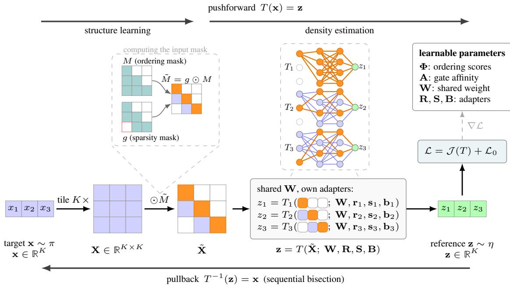
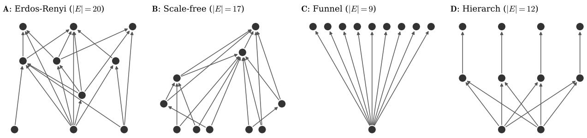
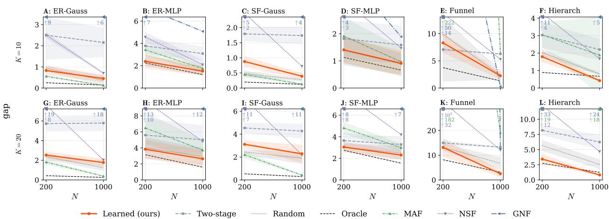
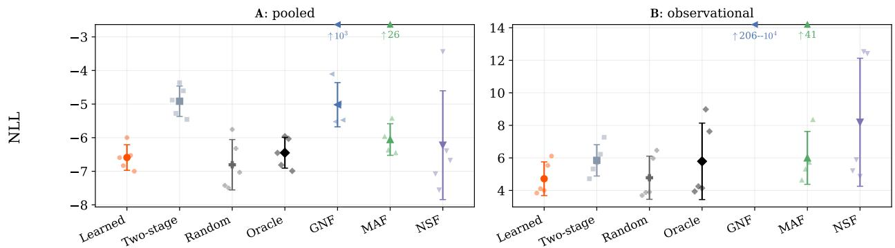
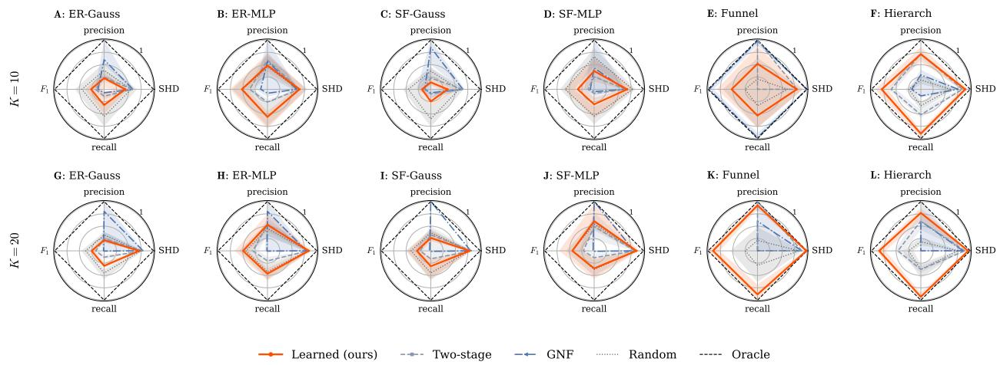
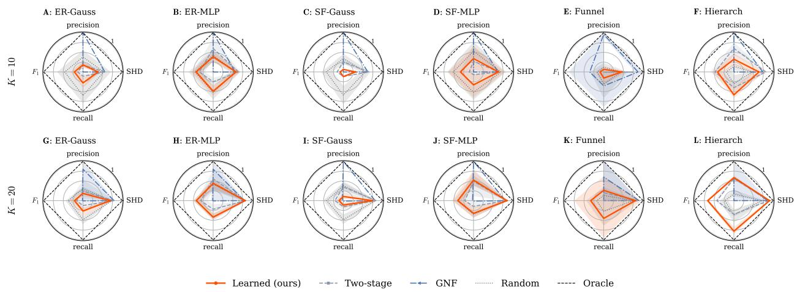
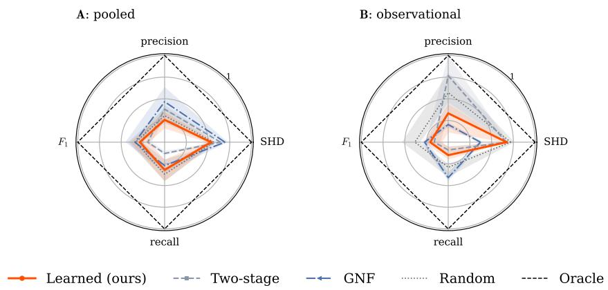
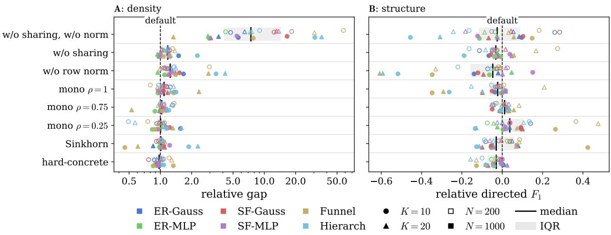

# Learning the Structure of Triangular Transport Maps

Morten Blørstad \*

Pekka Parviainen

Berent Å. S. Lunde \* †

## Abstract

Triangular transport maps provide a flexible approach to sampling-based probabilistic modeling, including density estimation, generative modeling, and Bayesian inference. They transform an unknown target distribution into a simpler reference through a monotone triangular map. The map structure is defined by a variable ordering and sparsity pattern, which together encode a directed acyclic graph. Map quality can depend strongly on this structure, yet finding a good structure is computationally expensive because each candidate generally requires fitting a different map. A central challenge is therefore to learn density and structure jointly, while keeping computation manageable as dimension grows. We introduce Self-Structuring Transport Maps (SSTM), which learn the map, ordering, and sparsity jointly. We use SoftSort to learn the variable ordering and $L _ { 0 }$ gates to learn the sparsity, while preserving a triangular structure. To keep the map scalable, we use a monotone BatchEnsemble that shares one weight matrix across all map components through rank-one adapters. Across synthetic and real data, jointly learning the structure and map gives better density estimates than estimating the structure first. When the structure is identifiable from the density, SSTM matches the density performance of a map fitted with the true structure and outperforms autoregressive flows. On large datasets, SSTM is competitive with autoregressive flows.

## 1 Introduction

The problem. This work concerns the joint learning of a monotone triangular transport map and its structure from samples. Triangular transport maps represent a target distribution by transforming it into a simple reference distribution (Marzouk et al., 2016), with applications in Bayesian inference (Marzouk et al., 2016; Baptista et al., 2024a), density estimation and generative modeling (Wang & Marzouk, 2022; Irons et al., 2022), experimental design (Huan et al., 2024), and data assimilation (Spantini et al., 2022). Their structure comprises a variable ordering, which determines a factorization into conditional densities, and a sparsity pattern, which restricts each conditional's dependence on preceding variables. An appropriate structure can yield parsimonious maps, improve sample efficiency, and expose dependencies (Ramgraber et al., 2025); a poor ordering can require a dense representation of the same distribution (Spantini et al., 2018). However, a suitable structure is rarely known in advance. Searching over structures combines a combinatorial search over orderings with repeated map fitting: evaluating a candidate ordering can require fitting new, separately parameterized map components. We ask whether the map and its structure can instead be learned together in a single optimization.

Existing work. Most applications of triangular transport maps choose the structure before fitting the map. The ordering may be based on domain knowledge, selected from a small set of candidates, or constructed from spatial information (Ramgraber et al., 2023; Bryutkin & Marzouk, 2025; Schäfer et al., 2021). Other methods adapt the structure during map estimation. Baptista et al. (2024c) fit each component with a sparse basis expansion, greedily adding terms under a fixed variable ordering. Baptista et al. (2024b) iteratively fit a transport map, estimates the Markov structure from the fitted density, and updates the ordering and sparsity pattern before refitting the map.

For density estimation, monotone triangular maps belong to the broader class of measure transport methods, including normalizing flows. Autoregressive flow layers and monotone triangular maps represent the same class of functions (Jaini et al., 2019; Papamakarios et al., 2021). Monotonicity ensures invertibility, while the triangular structure gives efficient change-of-variable calculations through the Jacobian. Normalizing flows often compose many triangular layers, such as splines (Durkan et al., 2019) or monotone neural networks (Huang et al., 2018), with ordering permutations (Kingma & Dhariwal, 2018) to increase expressiveness. Composition with ordering permutations loses the triangular structure and the direct conditional inference it enables. Extracting conditionals from a composed flow requires more general inference methods, such as MCMC in latent space (Cannella et al., 2021) or a separately trained conditional flow for each conditioning structure.

For structure discovery with triangular transport maps, Xi et al. (2023) show that a maximally sparse triangular map can identify the Markov equivalence class. Their approach searches over variable orderings and fits a map for each candidate, making the search increasingly expensive with dimension. They also identify reliable estimation of map sparsity as a practical challenge. Izadi & Ester (2024) avoid permutation search by recovering the ordering one variable at a time. At each step, they fit conditional models for the remaining variables to identify the next root, then recover the graph in a separate step.

More general DAG-learning methods optimize graph structure directly. NOTEARS imposes a differentiable acyclicity constraint on a weighted adjacency matrix, with sparsity regularization and augmented-Lagrangian optimization (Zheng et al., 2018). Its nonlinear extension represents each conditional with a separate nonlinear function (Zheng et al., 2020). Graphical Normalizing Flows (GNF) extend this approach to density estimation by jointly learning a normalizing flow and a relaxed adjacency matrix that determines its conditioning structure (Wehenkel & Louppe, 2021). GNF uses unconstrained monotonic neural networks (UMNNs) for monotonic normalizers and the same sparsity and acyclicity machinery. This requires a sequence of optimization problems, which the authors report at least doubles training time.

Permutation-based methods have been used for causal discovery and avoid explicit acyclicity constraints by restricting edges to follow a learned ordering. Cundy et al. (2021) jointly learn an ordering and lower-triangular edge weights with variational inference under a linear-Gaussian structural equation model. Charpentier et al. (2022) learn an ordering together with binary edges and nonlinear structural equations. They use Gumbel-Sinkhorn or Gumbel-Top-k with SoftSort for the ordering, and a differentiable binary relaxation for the edges. Kamkari et al. (2024) learn a topological ordering from the likelihood of an affine autoregressive flow. Permutation-dependent masks share the flow parameters across orderings, while graph sparsity is recovered in a separate step.

## Our method.

We introduce Self-Structuring Transport Maps (SSTM)1 , which jointly learn the map, variable ordering, and sparsity from samples. The map components operate on subsets of the same feature space and share the goal of pushing target conditionals to the reference. We therefore treat them as a multi-task learning problem and parameterize them with a BatchEnsemble (Wen et al., 2020). The components share the main network parameters and have their own rank-one adapters. To ensure monotonicity in the diagonal variable, we introduce a monotone BatchEnsemble that restricts the diagonal variable to positive-weight paths while leaving the conditioning variables unrestricted. We furthermore learn the variable ordering with SoftSort (Prillo & Eisenschlos, 2020) and use a hard permutation in the forward pass. Cumulative summation converts the permutation into nested triangular masks, which preserve the triangular structure throughout optimization. Stochastic L0 gates (Louizos et al., 2018) learn sparsity within these masks. Straight-through estimators provide gradients to the ordering and gates, so the map and its structure are optimized jointly under the same transport objective.

State-of-the-art joint estimation of structure and density. Few methods learn structure and density jointly as a factorization into conditionals. GNF is closest to our method and objective. SSTM matches or improves on GNF in density estimation, while requiring substantially fewer optimization steps. It also remains competitive with autoregressive flows while retaining a learned triangular structure. When the density favors a particular ordering, SSTM can recover much of the benefit of knowing the structure in advance.

Practical advantages. SSTM reduces the cost of joint map and structure learning by sharing the main network across map components through a BatchEnsemble. The monotone parameterization preserves invertibility, while the learned ordering keeps the map triangular throughout optimization. Ordering, sparsity, and density are therefore learned jointly without an acyclicity constraint or a separate structure-learning stage. SSTM also supports partial ordering constraints without fixing the full structure. For Bayesian inference, variables to condition on can be constrained to appear first, while the remaining ordering and sparsity are learned from data. This lets the user impose only the ordering constraints required by the inference task.

## 2 Background

## 2.1 Triangular Transport Maps

Let $\mathbf { x } \sim \pi$ be a sample from a K-dimensional target distribution and $\mathbf { z } \sim \eta = \mathcal { N } ( \mathbf { 0 } , \mathbf { I } )$ follow a K-dimensional standard Gaussian reference. A triangular transport map $\breve { T } : \mathbb { R } ^ { K } \to \mathbb { R } ^ { K }$ pushes π to η through the lower-triangular structure

$$
T ( \mathbf { x } ) = \left[ \begin{array} { c } { T _ { 1 } ( x _ { 1 } ) } \\ { T _ { 2 } ( x _ { 1 } , x _ { 2 } ) } \\ { \vdots } \\ { T _ { K } ( x _ { 1 } , \ldots , x _ { K } ) } \end{array} \right] = \left[ \begin{array} { c } { z _ { 1 } } \\ { z _ { 2 } } \\ { \vdots } \\ { z _ { K } } \end{array} \right] = \mathbf { z } ,\tag{1}
$$

where each component $T _ { k } : \mathbb { R } ^ { k }  \mathbb { R }$ depends only on the first k inputs and is strictly monotone increasing in its diagonal variable $x _ { k }$ (Marzouk et al., 2016). Monotonicity guarantees bijectivity, and the lower-triangular Jacobian yields an efficient log-determinant for change of measure computations:

$$
\log \operatorname* { d e t } \nabla _ { \mathbf { x } } T ( \mathbf { x } ) = \sum _ { k = 1 } ^ { K } \log { \frac { \partial T _ { k } } { \partial x _ { k } } } .\tag{2}
$$

Given N samples $\mathbf { x } ^ { ( i ) } \sim \pi .$ the map is fitted by minimizing the empirical KL divergence between π and the pullback density $T ^ { \sharp } \eta$ , which decomposes into K independent per-component objectives (Baptista et al., 2024c):

$$
\mathcal { I } ( T ) = \sum _ { k = 1 } ^ { K } \mathcal { I } _ { k } ( T _ { k } ) , \qquad \mathcal { T } _ { k } ( T _ { k } ) = \frac { 1 } { N } \sum _ { i = 1 } ^ { N } \left[ \underbrace { \frac { 1 } { 2 } T _ { k } ( \mathbf { x } ^ { ( i ) } ) ^ { 2 } } _ { \mathrm { m o d e - s e c k i n g } } - \underbrace { \log \frac { \partial T _ { k } ( \mathbf { x } ^ { ( i ) } ) } { \partial x _ { k } } } _ { \mathrm { s p r e a d - e n c o u r a g i n g } } \right] .\tag{3}
$$

The first term drives pushforward samples toward the Gaussian mode; the second term prevents collapse and encourages spread. This decomposition means each component can, in principle, be fitted independently

## 2.2 Why Ordering and Sparsity Matter

When $x _ { j }$ is conditionally independent of $x _ { k }$ given $x _ { 1 : k - 1 \backslash j }$ , the argument $x _ { j }$ may be dropped from $T _ { k }$ , yielding a sparse map. Sparsity reduces parameter count, improves sample efficiency, and makes the map more interpretable. The sparsity pattern depends on the variable ordering: different orderings correspond to different factorizations of π into a product of conditionals, and some factorizations are much sparser than others (Spantini et al., 2018)

## 2.3 BatchEnsemble

BatchEnsemble (Wen et al., 2020) is a parameter-efficient approach to multi-task learning. It shares a single weight matrix $\mathbf { W } \in \mathbb { R } ^ { q \times p }$ across K tasks, individualizing each through lightweight rank-1 adapters: an input adapter $\mathbf { r } _ { k } \in \mathbb { R } ^ { p }$ an output adapter $\mathbf { s } _ { k } \in \mathbb { R } ^ { q }$ , and a bias $\mathbf { b } _ { k } \in \mathbb { R } ^ { q }$ . For nonlinearity $\phi ,$ task k computes

$$
\mathbf { h } _ { \ell + 1 } ^ { ( k ) } = \phi \Big ( \mathbf { W } ( \mathbf { h } _ { \ell } ^ { ( k ) } \odot \mathbf { r } _ { k } ) \odot \mathbf { s } _ { k } + \mathbf { b } _ { k } \Big ) .\tag{4}
$$

Stacking adapters into matrices $\mathbf { R } \in \mathbb { R } ^ { K \times p } , \mathbf { S } \in \mathbb { R } ^ { K \times q }$ , and $\mathbf { B } \in \mathbb { R } ^ { K \times q }$ , the vectorized forward pass evaluates all K tasks simultaneously:

$$
\mathbf { H } _ { \ell + 1 } = \phi \Big ( \big ( \mathbf { H } _ { \ell } \odot \mathbf { R } \big ) \mathbf { W } ^ { \top } \odot \mathbf { S } + \mathbf { B } \Big ) ,\tag{5}
$$

at a total parameter cost of $p q + K ( p { + } q )$ per layer, compared to Kpq for K independent networks.

## 3 Self-Structuring Transport Maps

SSTM jointly learns a monotone triangular map, variable ordering, and sparsity. Let $o = ( o ( 1 ) , \dots , o ( K ) )$ be a permutation of the K variables, and index component $T _ { k }$ by rank k in this ordering. Its diagonal variable is $x _ { o ( k ) }$ and it may depend on preceding variables. We encode these dependencies by a sparse triangular mask ${ \widetilde { \mathbf { M } } } .$ Figure 1 summarizes the construction.

  
Figure 1: Overview of SSTM. The forward map pushes $\mathbf { x } \sim \pi \ \mathrm { t o } \ \mathbf { z } \sim \eta .$ , while the inverse uses sequential bisection. The learned ordering and sparsity gates form the sparse triangular mask $\tilde { M } = g \odot M ,$ which is applied to the input. Each of the K masked rows is input to one map component $T _ { k } .$ The K components share weights W and use rank-one adapters $\left( \mathbf { r } _ { k } , \mathbf { s } _ { k } , \mathbf { b } _ { k } \right)$ . The objective $\mathcal { L } = \mathcal { I } ( T ) + \mathcal { L } _ { 0 }$ jointly optimizes the map, ordering, and sparsity. Cell colours: orange, diagonal variable; blue, conditioning variable; white, masked off.

## 3.1 Monotone BatchEnsemble

The K map components solve the same transport problem on subsets of the same variable space. We therefore parameterize them with a BatchEnsemble that shares one weight matrix per layer and uses variable-indexed rank-one adapters routed according to the current ordering

Each component must be monotone increasing in its diagonal variable. We enforce this by separating monotone and free paths through the network, illustrated in Figure 1 in orange and blue, respectively. The diagonal variable enters only the monotone path. Conditioning variables may also enter the free path. We use the monotonic activation of Runje & Shankaranarayana (2023) in the hidden layers.

Monotone BatchEnsemble layer. Let $V \in \{ 0 , 1 \} ^ { K \times p }$ select monotone inputs and $U \in \{ 0 , 1 \} ^ { K \times q }$ select monotone output units. At the input layer, row k of V selects the diagonal variable $x _ { o ( k ) } ;$ at hidden layers, it selects the monotone units of the preceding layer. Let $\mathbf { W } _ { + } = \sigma _ { + } ( \mathbf { W } )$ . We split the input and output adapters as

$$
\mathbf { R } _ { \mathrm { m o n o } } = \sigma _ { + } ( \mathbf { R } ) \odot V , \qquad \mathbf { R } _ { \mathrm { f r e e } } = \mathbf { R } \odot ( \mathbf { 1 } - V ) , \qquad \mathbf { S } _ { \mathrm { m o n o } } = \sigma _ { + } ( \mathbf { S } ) \odot U .\tag{6}
$$

For layer input $\mathbf { H } _ { \ell } ,$ the layer output is

$$
\mathbf H _ { \ell + 1 } = \phi \big ( ( \mathbf H _ { \ell } \odot \mathbf R _ { \mathrm { m o n o } } ) \mathbf W _ { + } ^ { \top } \odot \mathbf S _ { \mathrm { m o n o } } + ( \mathbf H _ { \ell } \odot \mathbf R _ { \mathrm { f r e e } } ) \mathbf W ^ { \top } \odot \mathbf S + \mathbf B \big ) .\tag{7}
$$

Thus, the diagonal variable affects the output only through positive paths, while conditioning variables remain unrestricted.

Memory-efficient weight normalization. We add weight normalization to the monotone BatchEnsemble layer Standard BatchEnsemble, member k has effective weight matrix $\mathbf { W } ^ { ( k ) } = \mathbf { W } \odot ( \mathbf { s } _ { k } \mathbf { r } _ { k } ^ { \top } )$ . We normalize each effective row before applying the output adapter, so the shared weights and input adapters determine its direction and the output adapter determines its scale. Rather than forming the full $K \times q \times p$ tensor, we compute the row norms directly from the BatchEnsemble factors.

For monotone output units, the norm includes monotone and free input contributions; for free units, only the free contribution:

$$
\| \mathbf { w } _ { \mathrm { m o n o } } \| ^ { 2 } = \big ( \mathbf { W } _ { + } ^ { 2 } \left[ \sigma _ { + } ( \mathbf { R } ) ^ { 2 } \odot V \right] ^ { \top } + \mathbf { W } ^ { 2 } \left[ \mathbf { R } ^ { 2 } \odot ( \mathbf { 1 } - V ) \right] ^ { \top } \big ) ^ { \top } ,\tag{8}
$$

$$
\mathbf { \left\| w _ { \mathrm { f r e e } } \right\| ^ { 2 } } = \left( \mathbf { W } ^ { 2 } \left[ \mathbf { R } ^ { 2 } \odot \left( \mathbf { 1 } { - } V \right) \right] ^ { \top } \right) ^ { \top } ,\tag{9}
$$

$$
\| \mathbf { w } \| = \sqrt { U \odot \| \mathbf { w } _ { \mathrm { m o n o } } \| ^ { 2 } + ( \mathbf { 1 } \mathbf { - } U ) \odot \| \mathbf { w } _ { \mathrm { f r e e } } \| ^ { 2 } + \epsilon } ,\tag{10}
$$

where $\epsilon > 0$ ensures numerical stability. The output adapters remain outside the normalization and act as componentspecific gains. The normalized layer is

$$
\mathbf H _ { \ell + 1 } = \phi \left( \frac { ( \mathbf H _ { \ell } \odot \mathbf R _ { \mathrm { m o n o } } ) \mathbf W _ { + } ^ { \top } \odot \mathbf S _ { \mathrm { m o n o } } + ( \mathbf H _ { \ell } \odot \mathbf R _ { \mathrm { f r e e } } ) \mathbf W ^ { \top } \odot \mathbf S } { \| \mathbf w \| } + \mathbf B \right) .\tag{11}
$$

This retains $p q + K ( p + q )$ non-bias weights per layer, compared with $K p q$ for independent networks. All components and diagonal derivatives are evaluated in one vectorized forward pass by propagating derivatives alongside activations, avoiding K separate backward passes.

## 3.2 Learning the Variable Ordering

We parameterize the ordering by a score vector Φ $\in \mathbb { R } ^ { K }$ . Sorting the scores in descending order gives the ordering o and its permutation matrix $\widehat { \mathbf { P } } \in \{ 0 , 1 \} ^ { K \times K }$ , where $\widehat { P } _ { k j } = 1$ if variable $j$ has rank k. SoftSort (Prillo & Eisenschlos, 2020) gives a differentiable relaxation $\mathbf { P } _ { }$ During training, we add Gumbel noise and sample multiple orderings per input.

We use a straight-through estimator (STE) that combines the hard permutation in the forward pass with the SoftSort relaxation in the backward pass,

$$
\mathbf { P } ^ { \mathrm { S T E } } = \widehat { \mathbf { P } } + \mathbf { P } - \mathrm { s g } ( \mathbf { P } ) ,\tag{12}
$$

where $\operatorname { s g } ( \cdot )$ denotes stop-gradient. We convert the permutation into a nested triangular mask by cumulative summation,

$$
\mathbf { M } _ { k , : } = \sum _ { r = 1 } ^ { k } \mathbf { P } _ { r , : } ^ { \mathrm { S T E } } .\tag{13}
$$

Row k therefore selects the first k variables in the current ordering, and row $k$ of $\mathbf { P } ^ { \mathrm { S T E } }$ identifies the diagonal variable of $T _ { k } .$ The forward pass always uses a hard triangular mask, while gradients from the transport objective update Φ through SoftSort. Thus, the ordering is learned without relaxing the triangular structure of the map. The newly introduced variable at rank k is identified by

$$
\begin{array} { r } { \pmb { \Delta } _ { k } = \mathbf { M } _ { k , : } - \mathbf { M } _ { k - 1 , : } , \qquad \mathbf { M } _ { 0 , : } = \mathbf { 0 } . } \end{array}\tag{14}
$$

Thus, $\Delta _ { k }$ selects the diagonal variable of component $T _ { k }$

## 3.3 Learning the Sparsity Pattern

The triangular mask M allows component $T _ { k }$ to depend on every variable that precedes its diagonal variable in the ordering. We learn which of these conditioning variables are needed using stochastic binary gates.

Let $\mathbf { A } \in \mathbb { R } ^ { K \times K }$ contain learnable gate affinities in the original variable coordinates. Since the rows of M are indexed by rank, we map these affinities into the current ordering as

$$
\log \alpha = \mathrm { s g } ( \mathbf { P } ^ { \mathrm { S T E } } ) \mathbf { A } ,\tag{15}
$$

where log $\alpha _ { k j }$ parameterizes the gate for variable $j$ in component $T _ { k }$ . The stop-gradient prevents the sparsity gates from updating the ordering through this operation.

During training, we sample

$$
g _ { k j } ^ { \mathrm { s o f t } } = \sigma \biggl ( \frac { \log u _ { k j } - \log ( 1 - u _ { k j } ) + \log \alpha _ { k j } } { \beta } \biggr ) , \qquad u _ { k j } \sim \mathrm { U n i f o r m } ( 0 , 1 ) ,\tag{16}
$$

and use $g _ { k j } ^ { \mathrm { h a r d } } = \mathbf { 1 } \left\lceil g _ { k j } ^ { \mathrm { s o f t } } > \frac { 1 } { 2 } \right\rceil$ in the forward pass. Gradients to the gate parameters are obtained with the straightthrough estimator $g ^ { \mathsf { \bar { S } T E } } = g ^ { \mathsf { h a r d } } + g ^ { \mathsf { s o f t } } - \mathrm { s g } ( g ^ { \mathrm { s o f t } } )$

The diagonal entries identified by $\pmb { \Delta }$ are always retained, so the gates only prune conditioning variables. The resulting sparse triangular mask is

$$
\widetilde { \mathbf { M } } = g ^ { \mathrm { S T E } } \odot \mathbf { M } .\tag{17}
$$

We encourage sparsity by penalizing the expected number of retained conditioning variables,

$$
\mathcal { L } _ { 0 } = \lambda _ { \mathrm { s p } } \sum _ { k , j } \sigma ( \log \alpha _ { k j } ) \left( M _ { k j } - \Delta _ { k j } \right) ,\tag{18}
$$

where ${ \bf M } - \Delta$ restricts the penalty to non-diagonal entries allowed by the triangular mask.

## 3.4 Joint Objective

Given N samples $\mathbf { x } ^ { ( i ) } \sim \pi$ , the sparse mask $\widetilde { \bf M }$ determines the inputs to each map component. The transport objective becomes

$$
\mathcal { I } ( T ) = \frac { 1 } { N } \sum _ { i = 1 } ^ { N } \sum _ { k = 1 } ^ { K } \left[ \frac { 1 } { 2 } T _ { k } \left( \widetilde { \mathbf { M } } _ { k , : } \odot \mathbf { x } ^ { ( i ) } \right) ^ { 2 } - \log \left( \nabla _ { \mathbf { x } } T _ { k } \left( \widetilde { \mathbf { M } } _ { k , : } \odot \mathbf { x } ^ { ( i ) } \right) \cdot \Delta _ { k } \right) \right] .\tag{19}
$$

The first term fits the pushforward to the Gaussian reference, while $\Delta _ { k }$ selects the derivative with respect to the diagonal variable of component $T _ { k }$

We optimize the transport objective together with the sparsity penalty,

$$
\begin{array} { r } { \mathcal { L } = \mathcal { I } ( T ) + \mathcal { L } _ { 0 } . } \end{array}\tag{20}
$$

We additionally apply an $\ell _ { 1 }$ penalty to the output-adapter gains through the optimizer:

$$
\mathcal { R } _ { 1 } = \lambda _ { 1 } \left( \| \sigma _ { + } ( \mathbf { S } ) \odot U \| _ { 1 } + \| \mathbf { S } \odot ( \mathbf { 1 } - U ) \| _ { 1 } \right) .\tag{21}
$$

The penalty acts on the positive gain $\sigma _ { + } ( \mathbf { S } )$ for monotone units and on the unrestricted gain magnitude for free units. The map parameters, ordering scores Φ, and gate affinities A are updated jointly. Straight-through estimators provide gradients through the discrete permutation and sparsity gates, while the forward pass remains a sparse triangular map.

## 4 Experiments

We evaluate SSTM on synthetic and real data, comparing joint structure learning with random, known, and separately estimated structures, as well as flow-based density estimators.

## 4.1 Experimental Setup

Datasets. We evaluate on three groups of datasets with different levels of ground truth: synthetic data with known density and structure, real data without known structure, and real data with a reference graph.

For the synthetic experiments, we use six datasets with known directed acyclic graphs and tractable densities. Four are structural equation models generated as in Zheng et al. (2020), using linear and nonlinear mechanisms on Erdős-Rényi (Erdős & Rényi, 1960) and scale-free (Barabási & Albert, 1999) graphs with $| E | = 2 K$ edges in expectation. In these datasets, parents affect the conditional mean. The remaining two are Neal's funnel (Neal, 2003) and a two-level hierarchical model where root variables also control the scale of downstream variables. We vary $K \in \{ 1 0 , 2 0 \}$ and $N \in \{ 2 0 0 , 1 0 0 0 \}$ . Figure 2 shows one example from each graph family.

For real data without known structure, we use the four tabular UCI benchmarks of Papamakarios et al. (2017); Durkan et al. (2019): POWER, GAS, HEPMASS, and MINIBOONE, with their cleaning and splits. They range from 6 to 43 dimensions and from thirty thousand to 1.7 million training points (Table 2).

For real data with a reference graph, we use the protein-signaling data of Sachs et al. (2005). It contains 11 variables and a consensus graph with 20 directed edges. We evaluate both the 853 observational samples and the pooled 7,466-sample dataset, which also includes interventional measurements. We use the 20-edge reference graph throughout.

Models. We compare four triangular-map variants that share the same architecture and differ only in how their structure is obtained. Learned is SSTM, which learns the ordering and sparsity jointly with the map. Random fixes a random ordering and learns the sparsity. Two-stage first estimates the structure with nonlinear NOTEARS (Zheng et al., 2018;

  
Figure 2: The four graph families. One generated DAG example per family at K = 10 (edges oriented parent-to-child; |E| = edge count). A: Erdős–Rényi, random edges. B: scale-free, a few high-degree hubs. C: Neal's funnel, a star with one root parenting all others. D: two-level hierarchical, roots feed a middle layer that generates the leaves.

2020), using the authors' official implementation², and then fits the map with that structure fixed. Oracle fixes the true structure on synthetic data and the reference graph on Sachs. These variants compare joint structure learning with a random ordering, structure-first estimation, and known structure.

We also compare against flow-based models. Masked Autoregressive Flow (MAF) (Papamakarios et al., 2017) and Neural Spline Flow (NSF) (Durkan et al., 2019) are density-only baselines, while Graphical Normalizing Flow (GNF) (Wehenkel & Louppe, 2021) jointly learns graph structure and density. We use the authors' official GNF implementation³ on the synthetic and Sachs data. On the tabular benchmarks, we compare against the published GNF results.

Setup. All experiments use five seeds, with model selection based on validation data and final evaluation on held-out test data. We standardize using training-set statistics, removing marginal-variance cues. For the synthetic datasets, each seed generates a new graph and dataset with $N \in \{ 2 0 0 , 1 0 0 0 \}$ training samples and 5000 validation and test samples. The same standardization is applied to the known true density when computing likelihoods. For the real data without known structure, we otherwise follow the preprocessing and data splits of Papamakarios et al. (2017); Durkan et al. (2019). For the Sachs data, each seed uses an 80/10/10 train, validation, and test split for both the observational and pooled data including interventions. Full architectures, optimization settings, and hyperparameters are given in Appendix A.

Metrics. We evaluate density estimation by mean test negative log-likelihood (NLL). For synthetic datasets, where the true density is known, we report the gap: $\mathrm { N L L } _ { \mathrm { m o d e l } } - \mathrm { N L L } _ { \mathrm { t r u e } }$

Where a true or reference graph is available, we evaluate structure using structural Hamming distance (SHD), precision, recall, and $F _ { 1 }$ on directed edges. SHD counts missing, extra, and reversed edges. Precision is the fraction of predicted edges that are correctly oriented, recall is the fraction of true directed edges recovered, and $F _ { 1 }$ is their harmonic mean.

## 4.2 Experimental Results

Known Synthetic DAGs Figure 3 compares density estimation across the 24 combinations of dataset, dimension, and training-set size. SSTM achieves a lower NLL gap than GNF in 23 of 24 combinations and than Two-stage in 23 of 24. The exceptions are both on the funnel at K = 10: GNF performs better at N = 1000 (0.28 versus 2.26), while Two-stage performs better at N = 200 (7.09 versus 8.31).

The benefit of learning the ordering depends strongly on the dataset. At K = 20 and N = 1000, the funnel gap is 6.73 for Random, 2.52 for SSTM, and 3.10 for Oracle. On the hierarchical dataset, the corresponding gaps are 2.56, 0.83, and 1.25. In contrast, Learned and Random are much closer on ER-Gauss, ER-MLP, SF-Gauss, and SF-MLP, although Oracle remains better. For example, on ER-Gauss at K = 20 and N = 1000, the gaps are 1.77 for Learned, 1.24 for Random, and 0.25 for Oracle. At the same K and N, GNF gives gaps of 12.81 on the funnel, 23.96 on the hierarchical dataset, and 18.19 on ER-Gauss.

SSTM also outperforms MAF and NSF on the funnel and hierarchical datasets for both dimensions and both training-set sizes. The differences can be large. On the funnel at $K = 2 0$ and N = 200, the NLL gaps are 13.16 for SSTM, 31.54 for NSF, 181.69 for MAF, and 1850.85 for GNF. MAF performs better than SSTM on the linear-Gaussian datasets.

  
Figure 3: Gap to the true density per data-generating process (columns) and dimension K (rows). Per-curve bands are ±1 standard deviation over five runs.

Structure recovery shows a similar but not identical pattern. By directed $F _ { 1 }$ , SSTM outperforms GNF in 22 of 24 combinations and Two-stage in 21 of 24. Full structure results, including SHD, precision, and recall, are reported in the Appendix B, Figure 5 and 6.

Real data without reference graphs. Table 1 reports density estimation on the four tabular UCI benchmarks. SSTM achieves a lower NLL than MAF on three of four datasets, GNF on two, and NSF on one. NSF performs best on POWER and GAS, GNF on HEPMASS, and SSTM on MINIBOONE.

Table 1: Real-data density estimation on the UCI benchmarks, Mean NLL ± one standard deviation over five runs. Results followed by a star are copied from the Wehenkel & Louppe (2021) which reports over 3 runs.
<table><tr><td></td><td>POWER  $K = 6$ </td><td>GAS  $K = 8$ </td><td>HEPMASS  $K = 2 1$ </td><td>MINIBOONE  $K = 4 3$ </td></tr><tr><td>SSTM (ours)</td><td> $- 0 . 5 2 7 \pm 0 . 0 2 0$ </td><td> $- 1 0 . 8 5 4 \pm 0 . 0 3 9$  一</td><td> $1 6 . 1 5 3 \pm 0 . 3 1 2$ </td><td> $9 . 9 2 5 \pm 0 . 1 3 7$ </td></tr><tr><td>MAF</td><td> $- 0 . 4 5 4 \pm 0 . 0 1 1$ </td><td> $- 1 1 . 9 5 7 \pm 0 . 0 3 3$ </td><td> $1 7 . 0 5 8 \pm 0 . 2 5 0$ </td><td> $1 0 . 3 1 4 \pm 0 . 1 0 0$ </td></tr><tr><td>NSF</td><td> $- 0 . 6 5 0 \pm 0 . 0 0 3$ </td><td> $- 1 3 . 0 3 1 \pm 0 . 0 2 3$ </td><td> $1 4 . 2 6 8 \pm 0 . 2 6 2$ </td><td> $1 0 . 3 0 0 \pm 0 . 0 8 9$ </td></tr><tr><td>GNF*</td><td> $- 0 . 6 2 \pm 0 . 0 4$  一</td><td> $- 1 0 . 1 5 \pm 0 . 1 5$ </td><td> $1 4 . 1 7 \pm 0 . 1 3$ </td><td> $1 6 . 2 3 \pm 0 . 5 2$ </td></tr></table>

Real data with a reference graph. Figure 4 reports density estimation on the Sachs data. On the pooled data, Random has the lowest mean NLL, followed closely by SSTM and Oracle. SSTM has a lower mean NLL than MAF, NSF, GNF, and Two-stage. On the observational data, SSTM has the lowest mean NLL, closely followed by Random, while Oracle, Two-stage, and MAF have higher means. NSF has a still higher mean and substantially larger variation. GNF diverges in all observational runs and in one pooled run.

No learned structure method clearly outperforms Random. On the pooled data, directed $F _ { 1 }$ is similar for Random, GNF, and SSTM (0.33, 0.34, and 0.29). On the observational data, Random has the highest directed $F _ { 1 }$ at 0.38, compared with 0.27 for GNF and 0.21 for SSTM. Full structure results are reported in the Appendix B, Figure 7.

Ablation of design choices. We ablate the main design choices of SSTM. Figure 8 in Appendix B.1 shows that parameter sharing and weight normalization improve both density estimation and structure recovery. SoftSort performs similarly to Gumbel-Sinkhorn at substantially lower cost, while hard-concrete gates give similar density estimates but worse directed $F _ { 1 }$

## 5 Discussion and Conclusion

The goal of this paper was to provide a triangular transport map that learns map, ordering and sparsity jointly from samples in a single optimization. Our experiments show that SSTM can jointly learn a map and structure that provide accurate density estimates.

The experiments suggest that SSTM learns useful orderings where they matter most, notably in hierarchical, funnel-type distributions. A suitable ordering simplifies the conditional maps, making them easier to learn from limited data; at fixed sample size, this advantage may grow with dimension. Elsewhere, alternative orderings perform similarly. These findings suggest that SSTM favors good factorizations whose complexity is supported by the available data.

  
Figure 4: Density estimation on the Sachs data: test NLL on the pooled (A) and observational (B) subsets. Small markers are single runs, bars the mean ±1 standard deviation over five runs. Values beyond the axis range are marked at the frame with their value.

Several design choices make the joint optimization practical. SSTM preserves triangularity through the learned ordering and monotonicity through the map parameterization. This avoids the augmented-Lagrangian acyclicity optimization and UMNNs used by GNF. In our experiments, GNF requires significantly more optimization steps. Sampling also requires less computation per bisection step. Each step in SSTM requires one forward pass through the shared map, whereas GNF must numerically evaluate the UMNN integral using 20–40 function evaluations. SSTM also reduce computational cost through parameter sharing across map components. The ablations show that this sharing, together with weight normalization, improves both density estimation and structure recovery. One possible explanation for the improvement is that the shared weights capture information common across map components, while the rank-one adapters handle component-specific changes as the structure changes. Parameter sharing and weight normalization may also provide useful regularization.

The main limitations concern optimization, scale, and evaluation. Training requires tuning separate learning rates and schedules for the map, ordering, and sparsity parameters. Although the regularization strength adapts to the data through an EBIC-style schedule, more adaptive optimization could reduce tuning and make the method easier to use in practice. We also do not evaluate beyond K = 43. Finally, although conditional sampling is an important motivation for triangular transport maps, we do not evaluate it directly. Future work should therefore focus on more adaptive training scaling to higher dimensions, and evaluating the learned maps on conditional sampling tasks.

In conclusion, SSTM shows that the map, ordering, and sparsity of a triangular transport map can be learned jointly from samples in a single optimization.

## References

Ricardo Baptista, Lianghao Cao, Joshua Chen, Omar Ghattas, Fengyi Li, Youssef M Marzouk, and J Tinsley Oden. Bayesian model calibration for block copolymer self-assembly: Likelihood-free inference and expected information gain computation via measure transport. Journal of Computational Physics, 503:112844, 2024a.

Ricardo Baptista, Youssef Marzouk, Rebecca E. Morrison, and Olivier Zahm. Learning non-Gaussian graphical models via Hessian scores and triangular transport. Journal of Machine Learning Research, 25(85):1–46, 2024b.

Ricardo Baptista, Youssef Marzouk, and Olivier Zahm. On the representation and learning of monotone triangular transport maps. Foundations of Computational Mathematics, 24(6):2063–2108, 2024c.

Albert-László Barabási and Réka Albert. Emergence of scaling in random networks. Science, 286(5439):509–512, 1999.

Andrey Bryutkin and Youssef Marzouk. Neural triangular transport maps: A new approach towards sampling in lattice QCD. arXiv preprint arXiv:2510.13112, 2025.

Chris Cannella, Ricardo Baptista, and Pablo V. Rubio. Projected latent Markov chain Monte Carlo: Conditional sampling of normalizing flows. arXiv preprint arXiv:2007.06140, 2021.

Bertrand Charpentier, Simon Kibler, and Stephan Günnemann. Differentiable DAG sampling. In International Conference on Learning Representations, 2022. URL https ://openreview.net/forum?id=9wOQOgNe -W.

Jiahua Chen and Zehua Chen. Extended Bayesian information criteria for model selection with large model spaces. Biometrika, 95(3):759–771, 2008

Chris Cundy, Aditya Grover, and Stefano Ermon. Bcd nets: Scalable variational approaches for bayesian causal discovery. In M. Ranzato, A. Beygelzimer, Y. Dauphin, P.S. Liang, and J. Wortman Vaughan (eds.), Advances in Neural Information Processing Systems, volume 34, pp. 7095–7110. Curran Associates, Inc., 2021. URL https://proceedings.neurips.cc/paper\_files/paper/2021/file/39799c18791e8d7eb 29704fc5bc04ac8-Paper.pdf.

Conor Durkan, Artur Bekasov, Iain Murray, and George Papamakarios. Neural spline flows. In Advances in Neural Information Processing Systems (NeurIPS), 2019.

Paul Erdős and Alfréd Rényi. On the evolution of random graphs. Publications of the Mathematical Institute of the Hungarian Academy of Sciences, 5:17–61, 1960.

Xun Huan, Jayanth Jagalur, and Youssef Marzouk. Optimal experimental design: Formulations and computations. Acta Numerica, 33:715–840, 2024.

Chin-Wei Huang, David Krueger, Alexandre Lacoste, and Aaron Courville. Neural autoregressive flows. In Jennifer Dy and Andreas Krause (eds.), Proceedings of the 35th International Conference on Machine Learning, volume 80 of Proceedings of Machine Learning Research, pp. 2078–2087. PMLR, 10–15 Jul 2018. URL ht tps : / /proceedi ngs.mlr.press/v80/huang18d.html.

Nicholas J Irons, Meyer Scetbon, Soumik Pal, and Zaid Harchaoui. Triangular flows for generative modeling: Statistical consistency, smoothness classes, and fast rates. In International Conference on Artificial Intelligence and Statistics, pp. 10161–10195. PMLR, 2022.

Ali Izadi and Martin Ester. Causal order discovery based on monotonic scms, 2024. URL https : // arxiv. org/ abs/2410.19870.

Priyank Jaini, Kira A. Selby, and Yaoliang Yu. Sum-of-squares polynomial flow. In International Conference on Machine Learning (ICML), 2019.

Hamidreza Kamkari, Vahid Balazadeh, Vahid Zehtab, and Rahul G. Krishnan. Order-based structure learning with normalizing flows, 2024.URLhttps://arxiv.org/abs/2308.07480.

Durk P. Kingma and Prafulla Dhariwal. Glow: Generative flow with invertible 1 ×1 convolutions. In Advances in Neural Information Processing Systems (NeurIPS), 2018.

Christos Louizos, Max Welling, and Diederik P. Kingma. Learning sparse neural networks through l0 regularization. In International Conference on Learning Representations (ICLR), 2018.

Youssef Marzouk, Tarek Moselhy, Matthew Parno, and Alessio Spantini. Sampling via Measure Transport: An Introduction, pp. 1–41. Springer International Publishing, Cham, 2016. ISBN 978-3-319-11259-6. doi: 10.1007/97 8-3-319-11259-6\_23-1.URLhttps://doi.org/10.1007/978-3-319-11259-6\_23-1.

Radford M. Neal. Slice sampling. The Annals of Statistics, 31(3):705–767, 2003.

George Papamakarios, Theo Pavlakou, and Iain Murray. Masked autoregressive flow for density estimation. In Advances in Neural Information Processing Systems (NeurIPS), 2017.

George Papamakarios, Eric Nalisnick, Danilo Jimenez Rezende, Shakir Mohamed, and Balaji Lakshminarayanan. Normalizing flows for probabilistic modeling and inference. Journal of Machine Learning Research, 22(57):1–64, 2021.

Sebastian Prillo and Julian Martin Eisenschlos. SoftSort: A continuous relaxation for the argsort operator. In International Conference on Machine Learning (ICML), 2020

Maximilian Ramgraber, Ricardo Baptista, Dennis McLaughlin, and Youssef Marzouk. Ensemble transport smoothing. Part II: Nonlinear updates. Journal of Computational Physics: X, 17:100133, 2023.

Maximilian Ramgraber, Daniel Sharp, Mathieu Le Provost, and Youssef Marzouk. A friendly introduction to triangular transport,2025. URL https://arxiv.org/abs/2503.21673.

Davor Runje and Sharath M Shankaranarayana. Constrained monotonic neural networks. In Proceedings of the 40th International Conference on Machine Learning, ICML'23. JMLR.org, 2023.

Karen Sachs, Omar Perez, Dana Pe'er, Douglas A. Lauffenburger, and Garry P. Nolan. Causal protein-signaling networks derived from multiparameter single-cell data. Science, 308(5721):523–529, 2005.

Florian Schäfer, Matthias Katzfuss, and Houman Owhadi. Sparse cholesky factorization by kullback-leibler minimization. SIAM Journal on Scientific Computing, 43(3):A2019–A2046, 2021. doi: 10.1137/20M1336254. URL https://doi.orq/10.1137/20M1336254.

Alessio Spantini, Daniele Bigoni, and Youssef Marzouk. Inference via low-dimensional couplings. Journal of Machine Learning Research, 19(66):1–71, 2018.

Alessio Spantini, Ricardo Baptista, and Youssef Marzouk. Coupling techniques for nonlinear ensemble filtering. SIAM Review, 64(4):921–953, 2022.

Sven Wang and Youssef Marzouk. On minimax density estimation via measure transport. arXiv preprint arXiv:2207.10231, 2022.

Antoine Wehenkel and Gilles Louppe. Graphical normalizing flows. In International Conference on Artificial Intelligence and Statistics (AISTATS), 2021.

Yeming Wen, Dustin Tran, and Jimmy Ba. BatchEnsemble: an alternative approach to efficient ensemble and lifelong learning. In 8th International Conference on Learning Representations, ICLR 2020, Addis Ababa, Ethiopia, April 26-30, 2020.OpenReview.net, 2020. URL https://openreview.net/forum?id=Sklf1yrYDr.

Quanhan Xi, Sebastian Gonzalez, and Benjamin Bloem-Reddy. Triangular monotonic generative models can perform causal discovery. In Causal Representation Learning Workshop at NeurIPS 2023, 2023. URL https : / /openre view.net/forum?id=kbXmvuk2Mc.

Xun Zheng, Bryon Aragam, Pradeep K Ravikumar, and Eric Xing. Dags with no tears: Continuous optimization for structure learning. In S. Bengio, H. Wallach, H. Larochelle, K. Grauman, N. Cesa-Bianchi, and R. Garnett (eds.), Advances in Neural Information Processing Systems, volume 31. Curran Associates, Inc., 2018. URL https://proceedings.neurips.cc/paper\_files/paper/2018/file/e347c51419ffb23ca 3fd5050202f9c3d-Paper.pdf.

Xun Zheng, Chen Dang, Bryon Aragam, Pradeep Ravikumar, and Eric P. Xing. Learning sparse nonparametric DAGs. In International Conference on Artificial Intelligence and Statistics (AISTATS), 2020.

## Appendix

## A Experimental Setup Details

## A.1 Known Synthetic DAGs

SSTM and map variants. All four triangular-map variants use two hidden layers of width 32 and train for 500 epochs with batch size 64. We use Adam with learning rate $1 0 ^ { - 2 }$ for the map, ordering, and sparsity parameters, with an initial ramp-up followed by a constant learning rate and no decay. The sparsity gates use the straight-through estimator with penalty strength $\lambda _ { \mathrm { s p } } = 1 0 ^ { - 3 }$ . The ordering uses SoftSort with $m = 1 0$ Monte Carlo samples per optimization step. The map is trained alone for the first 50 epochs, after which ordering and sparsity learning begin. The SoftSort temperature is annealed from $0 . 3 \sqrt { K }$ to 0.1 over training. The $\ell _ { 1 }$ strength $\lambda _ { 1 }$ is an extended-BIC-style (EBIC) density prior (Chen & Chen, 2008) that decays with the training-set size,

$$
{ \lambda } _ { 1 } ^ { \star } = c \frac { \ln N } { 2 N } , \qquad c = 0 . 2 3 .\tag{22}
$$

The constant was set during development by fitting per-dataset schedules on validation diagnostics. The fitted schedules are EBIC-shaped with dataset-dependent constants between 0.03 and 0.23 using validation data. We use the largest, so a single schedule covers the most overfit-prone target. For the models that learn sparsity (learned and random), $\lambda _ { 1 }$ is ramped linearly from 0 to $\lambda _ { 1 } ^ { \star }$ over training, reaching its full value only once the SoftSort temperature has annealed to its floor (around epoch 390 of 500). This keeps $\lambda _ { 1 } \approx 0$ while the ordering and gates form, then applies the prior as the map refines. For the fixed-structure models (oracle and two-stage) there is no structure to protect, so $\lambda _ { 1 }$ is held at $\lambda _ { 1 } ^ { \star }$ throughout.

The two-stage model estimates its structure with the MLP variant of NOTEARS, with their paper settings: hidden width 10, penalties $\lambda _ { 1 } = \lambda _ { 2 } = 0 . 0 3$ , edge threshold 0.5, and at most 100 iterations.

Flow baselines. On the synthetic targets, NSF use the authors' implementation4with 5 transforms, hidden width 128. and two residual blocks per transform. MAF's affine scale is bounded to $( e ^ { - 1 } , e )$ . NSF uses 4 spline bins with tail bound 3. Both train for 125 epochs at batch size 64 with Adam at learning rate $3 \times 1 0 ^ { - 4 }$ , dropout 0.2, no weight decay, and a cosine schedule annealing the learning rate to zero. The configuration was chosen by validation search and is shared by both flows. We searched the number of transforms over {5, 10}, the hidden width over {32, 64, 128}, dropout over {0, 0.1, 0.2}, and weight decay over $\{ 0 , 1 0 ^ { - 6 } , 1 0 ^ { - 4 } \}$ . For MAF we additionally compared four parameterizations of its affine scale, from a contractive sigmoid to an unbounded softplus. The bounded scale in $( e ^ { - 1 } , \bar { e } )$ was best and is the one reported.

GNF. We use the authors' released implementation with the topology-learning architecture reported in their paper: a graphical conditioner with three hidden layers of width 100, embedding size 30, and an integrand network with three hidden layers of width 50. We use batch size 100 and Adam with learning rate $1 0 ^ { - 3 }$ . The main tuning concerned the augmented-Lagrangian schedule. The authors define the number of dual steps as the number of epochs between updates of the DAGness constraint. They use values between 10 and 200 across their experiments and note that increasing this value can improve performance at the cost of longer optimization. Their implementation default value is 100 dual steps, but we found this required too many epochs to converge to a DAG. We therefore tuned the number of dual steps together with the training budget, using 10 dual steps and 5,000 epochs for $N = 1 0 0 0$ , and 50 dual steps and $2 0 { , } 0 0 0$ epochs for $N = 2 0 0$ We use the augmented-Lagrangian progress factor $\gamma = 1 / 4$ for $N = 2 0 0$ , and $\gamma = 0 . 9$ for $\bar { N } = 1 0 0 0$ . Finally, we searched $\ell _ { 1 } \in \left\{ 0 , 6 , 1 2 \right\}$ and weight decay in $\{ 1 0 ^ { - 5 } , \dot { 1 } 0 ^ { - 3 } , \dot { 1 } 0 ^ { - 2 } \}$ for a common setting across the synthetic targets, and use $\ell _ { 1 } = 1 2$ and weight decay $\overline { { 1 } } 0 ^ { - 2 }$

Reporting. All triangular-map models report the weights of the final epoch, with no checkpoint selection. The MAF, NSF and GNF report the epoch with the lowest validation negative log-likelihood, following their papers.

## A.2 Real Data without Known Structure

Budget and schedule. Every model trains at the per-dataset batch size and step budget of Durkan et al. (2019, Table 5), with the step budget converted to whole epochs. Validation, checkpointing, and the cosine schedule run per epoch rather than per 250 steps as in their code. All models anneal the learning rate to zero with a cosine schedule. On the synthetic targets a paired comparison showed the cosine schedule does not change the results, so those experiments keep their original schedule.

SSTM. We use the synthetic configuration above with three changes. The warmup is shortened from 50 epochs to one, which still corresponds to more gradient updates because of the larger training sets. We use three hidden layers, with the width selected on validation data as shown in Table 2. We also searched the sparsity strength, but open gates performed best on validation data for all four datasets. We therefore keep the gates open and learn only the variable ordering. We also use a cosine schedule annealing the learning rate to zero.

Reporting. SSTM reports the final epoch, which differs from its best-validation checkpoint by at most 0.03 nats.

Table 2: Hyperparameters of the density experiment on the UCI benchmarks, per dataset. Data: the standard splits of Papamakarios et al. (2017). Common: the per-dataset batch size and step budget of Durkan et al. (2019, Table 5), converted to whole epochs and shared by all models. Flows: their published per-dataset settings. SSTM: per-dataset size, chosen on validation.
<table><tr><td></td><td>POWER</td><td>GAS</td><td>HEPMASS</td><td>MINIBOONE</td></tr><tr><td>Data</td><td></td><td></td><td></td><td></td></tr><tr><td>Dimension K</td><td>6</td><td>8</td><td>21</td><td>43</td></tr><tr><td>Training points</td><td>1,659,917</td><td>852,174</td><td>315,123</td><td>29,556</td></tr><tr><td>Validation points</td><td>184,435</td><td>94,685</td><td>35,013</td><td>3,284</td></tr><tr><td>Test points</td><td>204,928</td><td>105,206</td><td>174,987</td><td>3,648</td></tr><tr><td>Common (all models)</td><td></td><td></td><td></td><td></td></tr><tr><td>Batch size</td><td>512</td><td>512</td><td>512</td><td>64</td></tr><tr><td>Step budget</td><td>400,000</td><td>400,000</td><td>400,000</td><td>250,000</td></tr><tr><td>Epochs</td><td>124</td><td>241</td><td>651</td><td>543</td></tr><tr><td>Flows (MAF, NSF)</td><td></td><td></td><td></td><td></td></tr><tr><td>Learning rate</td><td>0.0005</td><td>0.0005</td><td>0.0005</td><td>0.0003</td></tr><tr><td>Transforms</td><td>10</td><td>10</td><td>10</td><td>10</td></tr><tr><td>Residual blocks</td><td>2</td><td>2</td><td>2</td><td>1</td></tr><tr><td>Hidden features</td><td>256</td><td>256</td><td>256</td><td>64</td></tr><tr><td>Spline bins (NSF)</td><td>8</td><td>8</td><td>8</td><td>4</td></tr><tr><td>Dropout</td><td>0.0</td><td>0.1</td><td>0.2</td><td>0.2</td></tr><tr><td>SSTM</td><td></td><td></td><td></td><td></td></tr><tr><td>Hidden features</td><td>256</td><td>256</td><td>256</td><td>128</td></tr></table>

## A.3 Real Data with a Reference Graph

The triangular-map variants, MAF, and NSF use the synthetic configurations above. GNF runs at its authors' published Sachs configuration. The conditioner has three layers of width 100 and embedding size 30. The integrand network has three layers of width 50. The $\ell _ { 1 }$ strength is 12. Some settings are not stated in their paper. We take them from the defaults of their released training script. These are Adam at learning rate $1 0 ^ { - 3 }$ , weight decay $1 0 ^ { - 5 }$ , batch size 100, and a constraint update every 100 epochs.

Some choices were needed. Their paper describes early stopping on the validation loss, but the released code does not implement it. We use their code as is, using a fixed number of epochs instead. Their default is 10,000 epochs. At this default, the smaller datasets did not converge to a DAG in any seed. We therefore scale the number of epochs so that each model trains for approximately the same number of gradient updates regardless of the dataset size. The pooled data trains for 10,000 epochs, about 590,000 updates. The observational subset trains for 85,000 epochs, about 510,000 updates. SSTM trains for 500 epochs on the same splits, about 46,000 updates. GNF reports the checkpoint with the best validation NLL among the states where its training has committed to an acyclic graph.

## B Additional Experimental Results

Synthetic structure recovery. Figures 5 and 6 report the full structure metrics for the synthetic experiments. They complement the directed F1 results in the main text with SHD, precision, and recall. Across metrics, the results show the same dataset-dependent pattern: SSTM recovers structure most reliably on the funnel and hierarchical targets, while recovery is weaker on the other graph families.

  
Figure 5: Structure recovery on the synthetic data at N = 1000, per data-generating process (columns) and dimension K (rows). Metrics are [0, 1] with 1 best; SHD is inverted and normalized. Lines are means, bands the min to max over five runs.

  
Figure 6: Structure recovery on the synthetic data at N = 200, per data-generating process (columns) and dimension K (rows). Metrics are [0, 1] with 1 best; SHD is inverted and normalized. Lines are means, bands the min to max over five runs.

Sachs structure recovery. Figure 7 gives the full structure metrics against the Sachs reference graph. As discussed in the main text, no learned structure method consistently improves on random ordering with learned sparsity, despite their differences in density estimation.

  
Figure 7: Structure recovery on the Sachs data against the 20-edge reference graph, on the pooled (A) and observational (B) subsets. Metrics are scaled to [0, 1] with 1 best; SHD is inverted and normalized. Lines are means, bands the min to max over five runs.

## B.1 Ablation of Design Choices

We ablate the design choices of SSTM one at a time. Each variant changes one choice of the learned model and keeps everything else. We compare variant and our default design on the gap and directed $F _ { 1 }$ evaluated on test data. Figure 8 shows the result.

  
Figure 8: Method ablation: each variant changes one design choice of the default configuration and is compared against the default per dataset, dimension K, and training-set size N. Each marker is one such setting, averaged over five seeds (color = dataset, shape = $\mathbf { \hat { \phi } } _ { k , \mathrm { { f i l l } } } = N )$ . The black line is the median over settings and the grey band the interquartile range. The dashed line marks the default. A: gap to the true density relative to the default (ratio, log scale, $1 = \mathrm { d e f a u l t , r i g h t } = \mathrm { w o r s e } )$ . B: directed $F _ { 1 }$ relative to the default (difference, $0 = \mathrm { d e f a u l t , r i g h t } = \mathrm { b e t t e r } )$

Parameter sharing and weight normalization. Using BatchEnsemble reduces the number of parameters per layer from $K p q  p q + K ( p { + } q )$ . The parameter sharing reduces model expressivity. Comparing the BatchEnsemble variant to fully independent map components, lets us measure whether parameter sharing affects density estimation and structure recovery. Letting every component be its own model does not improve density estimation or structure recovery. It rather seems to hurt. The BatchEnsemble variant is better on density in 20 of 24 cells and on structure in 18 of 24 cells by directed $F _ { 1 }$ . Sharing acts as an implicit regularizer across components.

weight normalization regularize and stabilizes training. Removing weight normalization makes training unstable and hurts both density estimation and structure recovery. It becomes even worse if we remove both parameter sharing and weight normalization.

Monotonicity. We make half of each layer's units monotone and leave the rest free. The free path is necessary. Letting all units be monotone hurts density estimation and structure recovery the most options. Letting 75% of the units be monotone seem to equivalent to the default (50% monotone). Letting 25% of the units be monotone seems to improve structure recovery at the same density estimation performance.

Ordering. We relax the ordering with SoftSort because it is cheap and sufficient. SoftSort and Gumbel-Sinkhorn give similar performance. Gumbel-Sinkhorn does better on the funnel and worse on the hierarchical. But the big difference is computational cost. Gumbel-Sinkhorn‘s is roughly 10x slower. SoftSort also only needs K ordering parameters where Sinkhorn needs $K ^ { 2 }$

Sparsity. We gate with a STE because it keeps the gates discrete, whereas hard-concrete allows gate values between 0 and 1 both during training and at inference. Hard-concrete gates give the same density but worse structure recovery. They keep more edges in every setting (median 29% more) with the same recall, so the extra edges are false positives.

## C Use of Large Language Models

We used a large language model as a coding assistant, to help debug code, and to set up experiments to run in parallel on a GPU server. We also used it to search for related work and to summarize existing papers, to draft and rewrite text based on the authors' own drafts, to edit for grammar and readability, and to improve figures, tables, and formatting. The authors designed and implemented the method, ran the analysis, and interpreted the results. The authors verified all AI-assisted work and take full responsibility for the content of this paper.