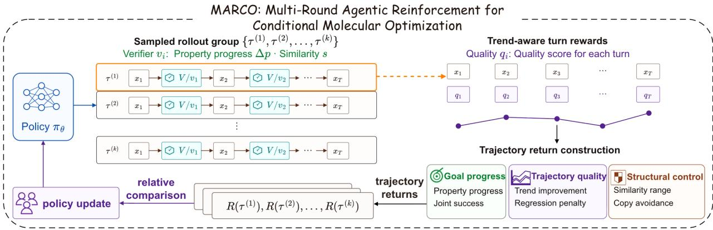
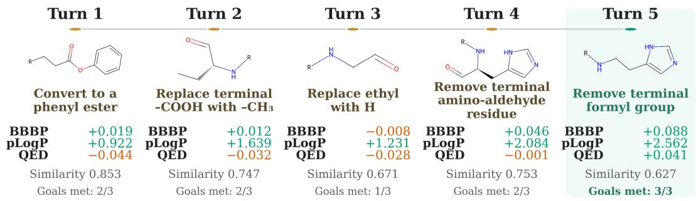
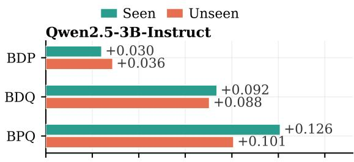
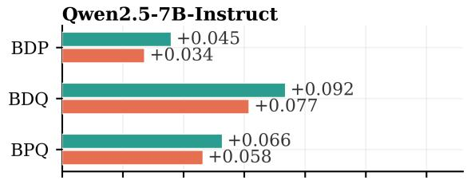
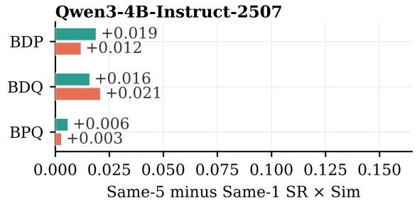
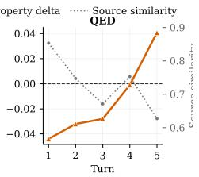
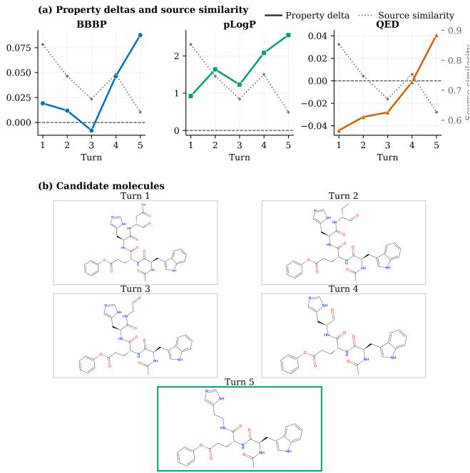

# MARCO: Multi-Round Agentic Reinforcement for Conditional Molecular Optimization

Shicheng Fang1,2, Yuxin Wang1,2,†, Zhuo Yang2,4, Xiaohu Xu2,5, Jiahao Lu1,2, Chuanyuan Tan3, Tong Zhu2,5, Yining Zheng1,2, Xipeng Qiu1,2,†

1Fudan University 2Shanghai Innovation Institute 3Soochow University 4Southeast University 5East China Normal University

†Corresponding author

## Abstract

Molecular optimization is inherently iterative: a candidate is proposed, evaluated against several objectives, and revised while preserving a relationship to the source molecule. Most instructionfollowing models instead emit one edited molecule, forcing validity, property improvement, and similarity control into a single response. We introduce MARCO, an evaluator-grounded reinforcementlearning framework that trains molecular editors on bounded proposal–feedback–revision trajectories. MARCO aggregates shaped turn rewards into an undiscounted trajectory return for group-relative policy optimization. We evaluate two consequences of this training: Same-1 tests the trained policy under a one-response budget, while Same-5 tests whether the same policy can use verifier feedback when up to five responses are available. Across the three-objective MuMOInstruct benchmark, three Qwen backbones, and seen/unseen instruction splits, SFT-initialized MARCO obtains the highest product of property success rate and similarity in every reported primary setting. Same-5 further improves the observed score under the tested budget, while four-objective and public-checkpoint experiments test transfer across constraint sets and initialization regimes.

Code: https://github.com/euReKa025/MARCO-release

## 1 Introduction

Conditional molecular optimization is a closed-loop task: the candidate is proposed, evaluated against multiple objectives, and revised according to the remaining deficits. Existing instruction-following pipelines usually train and evaluate a one-shot mapping, so one response must satisfy validity, property improvement, and source-structure similarity without a structured opportunity for correction.

Recent generative models, instruction-tuning datasets, and LLM-based systems improve molecule generation from natural-language objectives or reference examples Dey, Hu, and Ning (2025); Li et al. (2024; 2026); Sun et al. (2025); Tang et al. (2024); Ye et al. (2025). The central mismatch remains: the task is iterative, but the dominant policy interface is one-shot. We study whether exposing a policy to verifier-guided revision during training improves its first response, and whether the same policy can continue using feedback when additional inference turns are afordable.

We propose MARCO, short for Multi-Round Agentic Reinforcement for Conditional Molecular Optimization. Here, agentic denotes only a bounded policy–verifier interaction: the model observes structured feedback and revises its next molecular action. The verifier checks validity, directional property changes, and sourcemolecule fingerprint similarity at each turn. MARCO starts from a per-subtask SFT checkpoint, aggregates shaped turn rewards into a trajectory return, and applies a group-relative policy update. Same-1 therefore tests the first response after trajectory training; Same-5 tests the same policy with verifier feedback during inference. MARCO makes three contributions:

• It casts instruction-based molecular optimization as a bounded feedback-conditioned decision process and trains a molecular editor from verifier-grounded trajectory returns that combine property progress, structural similarity, validity, and revision quality.

• It evaluates the same trained policy at two operating points: Same-1 tests transfer to a first response under a single-response budget, while Same-5 tests revision when additional verifier-guided responses are available.

• It provides ablation and transfer evidence across initialization, training horizon, objective count, and public-checkpoint adaptation, clarifying where the complete MARCO recipe is efective.

## 2 Related Work

Classical and neural molecular optimization. Molecular optimization has been studied through graph-based generation, fragment editing, reinforcement learning, and goal-directed search Chen et al. (2021); Fu et al. (2021); Gao et al. (2022); Jin, Barzilay, and Jaakkola (2018); Olivecrona et al. (2017); You et al. (2018). Some methods modify molecular graphs or fragments directly, while sequence-to-sequence approaches such as Chemformer and PMol cast optimization as translation over SMILES strings learned from molecule pairs Irwin et al. (2022); Wu et al. (2024). Evolutionary approaches, including recent LLM-assisted search over chemical space, provide another path for proposing improved candidates Wang et al. (2025a). These methods establish the property–similarity tradeof, but do not provide a common language-model training interface for verifier-guided revision.

Training-free LLM methods. One line of LLM-based chemistry work uses prompting, retrieval, tools, or dialogue without updating the underlying policy. Speak-to-Structure evaluates open-domain natural-language-driven molecule generation Li et al. (2024). MuMOInstruct formulates source-conditioned instruction-following multi-property optimization Dey, Hu, and Ning (2025). Tool- and dialogue-based systems such as ChemCrow, autonomous chemistry agents, ChatDrug, and Re3DF further show how retrieval, domain feedback, and iterative interaction support chemistry-facing workflows at inference time Boiko et al. (2023); Bran et al. (2024); Le, Hua, and Chawla (2025); Liu et al. (2024). These systems expose interaction at inference time, but do not use the resulting verifier trajectories to update the molecular editor.

Training-based LLM methods. Another line updates the model through instruction tuning or reinforcement learning. DrugAssist instruction-tunes LLMs for molecular optimization, while Mol-Instructions, LlaSMol, and GeLLM3O develop chemistry or biomolecular instruction resources Dey, Hu, and Ning (2025); Fang et al. (2024); Ye et al. (2025); Yu et al. (2024). PPO and GRPO-style objectives provide widely used foundations for language-model post-training with verifiable rewards Guo et al. (2025); Schulman et al. (2017); Shao et al. (2024). MolAct uses a two-stage editing-to-optimization curriculum with multi-turn, tool-augmented RL on ChemCoTBench Yang et al. (2025b). RePO applies reference-guided single-turn policy optimization to molecular editing Li et al. (2026). Multi-turn RL has also been studied for language-model agents operating in interactive environments Wang et al. (2025b); Zhou et al. (2024). MARCO uses verifier-grounded trajectories for source-conditioned multi-property optimization and evaluates the same trained policy under one- and five-response budgets.

## 3 Problem Formulation

Let $x _ { 0 } \in X$ be a source molecule represented as a SMILES string Weininger (1988). An instruction specifies an active property set $\mathcal { P }$ and a direction vector $\mathbf { d } = \{ d _ { p } \} _ { p \in \mathcal { P } }$ , where $d _ { p } \in \{ + 1 , - 1 \}$ indicates whether property � should increase or decrease. Each property has a scoring function $f _ { p } : X \to \mathbb { R }$ . For a candidate molecule $x ,$ the directional improvement for property � is

$$
\Delta _ { p } ( x ; x _ { 0 } ) = d _ { p } \cdot \big ( f _ { p } ( x ) - f _ { p } ( x _ { 0 } ) \big ) .\tag{1}
$$

A candidate succeeds on the requested properties when every active directional improvement is positive:

$$
\operatorname { S u c c } ( x ; x _ { 0 } , \mathcal { P } , \mathbf { d } ) = \mathbf { 1 } \left[ \forall p \in \mathcal { P } , ~ \Delta _ { p } ( x ; x _ { 0 } ) > 0 \right] .\tag{2}
$$

Auxiliary properties may be logged for analysis, but they are not part of the active success or reward target unless included in $\mathcal { P }$

The molecule must also preserve a useful structural relationship to the source. We use Tanimoto similarity over Morgan fingerprints Rogers and Hahn (2010), a common similarity measure in cheminformatics Bajusz, Rácz, and Héberger (2015); López-Pérez et al. (2024):

$$
s ( x , x _ { 0 } ) = { \frac { | \mathrm { F P } ( x ) \cap \mathrm { F P } ( x _ { 0 } ) | } { | \mathrm { F P } ( x ) \cup \mathrm { F P } ( x _ { 0 } ) | } } .\tag{3}
$$

Validity is treated separately from property success. A reported candidate must parse as a valid single connected molecule. We denote this event by $V ( x ) = 1$ . Similarity acceptance uses lower and upper fingerprintsimilarity bounds:

$$
A _ { \mathrm { s i m } } ( x ; x _ { 0 } ) = \mathbf { 1 } \left[ \delta _ { \mathrm { l o w } } \leq s ( x , x _ { 0 } ) < \delta _ { \mathrm { h i g h } } \right] .\tag{4}
$$

The lower bound limits fingerprint deviation from the source, and the upper bound prevents near-identity candidates from receiving full editing credit.

In single-turn optimization, a policy directly produces one candidate �ˆ for the instruction. In MARCO training, the same instance is lifted to a bounded �-turn decision process. The policy can observe feedback from previous proposals before choosing the next candidate, but evaluation still reports a selected final candidate under the specified interaction budget.

## 4 Method

MARCO turns conditional molecular optimization into bounded feedback-conditioned trajectory learning. Figure 1 summarizes the RL stage. For each instruction, the policy samples a group of trajectories that alternate between candidate molecules and verifier feedback on validity, directional property progress, and source similarity. The realized shaped turn rewards are aggregated into one trajectory return. Returns are compared within the rollout group to update the policy. In the main recipe, this RL stage starts from a per-subtask SFT policy that provides initial molecular-editing behavior.

Intuitively, a proposal should move the requested properties in the correct directions and remain within a useful similarity range rather than drift or copy the source. Later attempts also receive credit when they improve after verifier feedback. Invalid proposals receive a fixed penalty, but the trajectory continues so later valid actions can still be evaluated.

## 4.1 Environment Feedback

For an instruction $u = ( x _ { 0 } , \mathcal { P } , \mathbf { d } )$ , the initial history is $h _ { 1 } = u$ . At turn �, the policy samples a molecular response

$$
o _ { t } \sim \pi _ { \theta } ( \cdot \mid h _ { t } ) , \qquad x _ { t } = \psi ( o _ { t } ) \in X \cup \{ \perp \} ,\tag{5}
$$

  
Figure 1 Overview of MARCO trajectory learning. The policy samples bounded trajectories in which candidate molecules alternate with verifier feedback on validity, directional property progress, and source similarity. After rollout, the shaped turn rewards are aggregated into one trajectory return; group-relative comparison of these returns updates the policy.

where $\psi$ extracts the proposed molecule and returns the sentinel ⊥ when the response does not yield a valid, evaluable candidate. The environment feedback is

$$
z _ { t } = \left\{ \begin{array} { l l } { \left( 1 , \{ \Delta _ { p } ( x _ { t } ; x _ { 0 } ) \} _ { p \in \mathcal { P } } , s _ { t } , A _ { \mathrm { s i m } , t } , m _ { t } \right) , } & { x _ { t } \in \mathcal { X } , } \\ { \left( 0 , m _ { t } ^ { \mathrm { i n v } } \right) , } & { x _ { t } = \bot , } \end{array} \right.\tag{6}
$$

where $s _ { t } = s ( x _ { t } , x _ { 0 } )$ , �� is valid-candidate feedback, and $m _ { t } ^ { \mathrm { i n v } }$ reports the invalid action. Property deltas, similarity, and valid-candidate quality are not evaluated for ⊥. The next history is

$$
h _ { t + 1 } = h _ { t } \oplus \left( o _ { t } , z _ { t } \right) .\tag{7}
$$

The realized trajectory is $\tau = \left( h _ { 1 } , o _ { 1 } , z _ { 1 } , \dots , o _ { T _ { \tau } } , z _ { T _ { \tau } } \right)$ , truncated early when a proposal satisfies both property success and similarity acceptance.

Invalid format, invalid molecule parse, disconnected molecules, and unevaluable candidates are treated as failed model actions. An invalid action receives invalid feedback and the trajectory continues.

## 4.2 Trajectory Return Construction

For a valid candidate, property quality is a clipped directional-progress score:

$$
Q _ { \mathrm { p r o p } } ( x _ { t } ) = \frac { 1 } { | \mathcal { P } | } \sum _ { p \in \mathcal { P } } \mathrm { c l i p } \big ( \Delta _ { p } ( x _ { t } ; x _ { 0 } ) , 0 , c _ { p } \big ) ,\tag{8}
$$

where $c _ { p }$ is a property-specific clipping scale. This term measures only directional property progress; structural preservation is handled by the separate similarity-quality term below.

Similarity quality is range-aware:

$$
Q _ { \mathrm { s i m } } ( s _ { t } ) = \left\{ \begin{array} { l l } { - \alpha _ { \mathrm { l o w } } \displaystyle \frac { \delta _ { \mathrm { l o w } } - s _ { t } } { \delta _ { \mathrm { l o w } } } , } & { s _ { t } < \delta _ { \mathrm { l o w } } , } \\ { \displaystyle \frac { s _ { t } - \delta _ { \mathrm { l o w } } } { \delta _ { \mathrm { h i g h } } - \delta _ { \mathrm { l o w } } } , } & { \delta _ { \mathrm { l o w } } \leq s _ { t } < \delta _ { \mathrm { h i g h } } , } \\ { \displaystyle 1 - \alpha _ { \mathrm { c o p y } } \displaystyle \frac { s _ { t } - \delta _ { \mathrm { h i g h } } } { 1 - \delta _ { \mathrm { h i g h } } } , } & { s _ { t } \geq \delta _ { \mathrm { h i g h } } . } \end{array} \right.\tag{9}
$$

This reward shape favors the accepted fingerprint-similarity range while penalizing low-similarity edits and near-copy outputs.

The per-turn state quality is

$$
\begin{array} { r l } { q _ { t } = w _ { \mathrm { p r o p } } Q _ { \mathrm { p r o p } } ( x _ { t } ) + w _ { \mathrm { s i m } } Q _ { \mathrm { s i m } } ( s _ { t } ) } \\ { + b _ { \mathrm { s u c c } } S \mathbf { u c c } ( x _ { t } ; x _ { 0 } , \mathcal { P } , \mathbf { d } ) } \\ { \mathbf { \cdot } A _ { \mathrm { s i m } } ( x _ { t } ; x _ { 0 } ) , } \end{array}\tag{10}
$$

with a gated bonus when both property and similarity conditions hold. The trend contribution is

$$
\phi _ { t } = \left\{ \begin{array} { l l } { \displaystyle 0 , \quad } & { t = 1 , } \\ { \displaystyle \lambda _ { \mathrm { i m p } } \left[ q _ { t } - \mathop { \operatorname* { m a x } } _ { j < t } q _ { j } - \eta _ { \mathrm { i m p } } \right] _ { + } } & { t \geq 2 . } \\ { \displaystyle - \lambda _ { \mathrm { r e g } } \left[ q _ { t - 1 } - q _ { t } - \eta _ { \mathrm { r e g } } \right] _ { + } } & { } \end{array} \right.\tag{11}
$$

The trend terms are zero at the first turn. The shaped turn reward is

$$
r _ { t } = \left\{ \begin{array} { l l } { r _ { \mathrm { i n v } } , } & { x _ { t } = \perp , } \\ { q _ { t } + \phi _ { t } - \lambda _ { \mathrm { l e n } } { \bf 1 } [ \ell _ { t } > \ell _ { \mathrm { m a x } } ] , } & { x _ { t } \in \mathcal { X } , } \end{array} \right.\tag{12}
$$

where $r _ { \mathrm { i n v } } < 0$ is the fixed invalid-action reward, $[ a ] _ { + } = \operatorname* { m a x } ( a , 0 )$ , ℓ� is the generated length, and $\eta _ { \mathrm { i m p } }$ and $\eta _ { \mathrm { r e g } }$ are trend margins. For an invalid model action, MARCO assigns the fixed invalid-action penalty and carries forward the previous state-quality value for trajectory bookkeeping; the invalid turn contributes no improvement or regression term. Subsequent valid turns compare their quality against this carried-forward history. Let $r _ { t }$ denote the shaped reward at turn �. We use the undiscounted trajectory return

$$
R ( \tau ) = \sum _ { t = 1 } ^ { T _ { \tau } } r _ { t } .\tag{13}
$$

Unexecuted turns lie outside the realized trajectory and do not appear in the sum.

## 4.3 Policy Optimization

For each instruction $u ,$ MARCO samples a group of � trajectories $\{ \tau _ { i } \} _ { i = 1 } ^ { K }$ . Each trajectory receives a scalar return $R _ { i } = R ( \tau _ { i } )$ . Following group-relative policy optimization Shao et al. (2024), the advantage is

$$
A _ { i } = \frac { R _ { i } - \mu ( R _ { 1 : K } ) } { \sigma ( R _ { 1 : K } ) + \epsilon } .\tag{14}
$$

Let $M _ { i }$ be the set of model-generated tokens in trajectory $\tau _ { i } ,$ excluding environment feedback tokens. The clipped PPO-style objective Schulman et al. (2017) is

$$
\begin{array} { l } { \displaystyle \mathcal { J } _ { \mathrm { M A R C O } } ( \theta ) = \mathbb { E } _ { u , \{ \tau _ { i } \} _ { i = 1 } ^ { K } } \Big [ \frac { 1 } { K } \sum _ { i = 1 } ^ { K } \bar { L } _ { i } } \\ { \displaystyle - \beta \mathbb { D } _ { \mathrm { K L } } ( \pi _ { \mathrm { e f f } } ) \Big ] , } \\ { \displaystyle \bar { L } _ { i } = \frac { 1 } { | \boldsymbol { M } _ { i } | } \sum _ { k \in \mathcal { M } _ { i } } \operatorname* { m i n } \Bigl ( \rho _ { i , k } A _ { i } , } \\ { \displaystyle \mathrm { c l i p } ( \rho _ { i , k } , 1 - \varepsilon , 1 + \varepsilon ) A _ { i } \Bigr ) . } \end{array}\tag{15}
$$

where $\rho _ { i , k }$ is the policy ratio for token �. Masking the environment feedback text is important: the update is applied to the model’s molecular-editing actions, not to the verifier messages that the environment inserts between turns.

## 5 Experiments

## 5.1 Experimental Setup

Benchmark We evaluate on MuMOInstruct, introduced by $_ \mathrm { G e L L M ^ { 3 } O }$ for instruction-following multi-property molecule optimization Dey, Hu, and Ning (2025). The primary benchmark uses three-objective BDP, BDQ, and BPQ tasks across Qwen2.5-3B-Instruct, Qwen2.5-7B-Instruct, and Qwen3-4B-Instruct-2507 backbones Qwen Team (2025); Yang et al. (2025a). Following MuMOInstruct, seen instructions use phrasings and property names observed during instruction tuning, whereas unseen instructions use the held-out paraphrase and alternative property names. We also report HMPQ and BDPQ as four-objective extensions, with Same-1 rows in the main text and Same-5 details in Supplementary Material, Sec. D.4. Following MuMOInstruct, we use its released benchmark property evaluators. BBBP, DRD2, HIA, and mutagenicity are learned scoring-oracle outputs in the goal-directed benchmark sense Brown et al. (2019), whereas QED Bickerton et al. (2012) and penalized logP are deterministic molecular scores. Table 1 states every requested optimization direction. For experiments newly run for this paper, each reported value is the arithmetic mean over three independent runs. Prior-paper data retain the published values.

<table><tr><td>Task</td><td>Requested directions</td></tr><tr><td>BDP</td><td> $\mathrm { B B B P \uparrow + D R D 2 \uparrow + p L o g P \uparrow }$ </td></tr><tr><td>BDQ</td><td> $\mathsf { B B B P \uparrow + D R D 2 \uparrow + Q E D \uparrow }$ </td></tr><tr><td>BPQ</td><td> $\mathrm { B B B P \uparrow + p L o g P \uparrow + Q E D \uparrow }$ </td></tr><tr><td>HMPQ</td><td> $\mathrm { H I A \uparrow + \bar { \ m u t a g e n i c i t y \downarrow } + p L o g P \uparrow + Q E D \uparrow }$ </td></tr><tr><td>BDPQ</td><td> $\mathrm { B B B P \uparrow + D R D 2 \uparrow + p L o g P \uparrow + Q E D \uparrow }$ </td></tr></table>

Table 1 Molecular optimization tasks and requested directions. BDP, BDQ, and BPQ form the primary three-objective benchmark; HMPQ and BDPQ are four-objective extensions. pLogP denotes penalized logP.

Baselines and training. We compare the base instruction model, per-subtask SFT, GRPO, RePO, and MARCO. In prose, we refer to SFT-initialized and base-initialized configurations explicitly. In compact tables, a superscript \* marks initialization from the corresponding per-subtask SFT checkpoint. Following the original RePO recipe, we initialize RePO from the base instruction model and retain its answer-level reference guidance during policy optimization Li et al. (2026). The primary RePO–MARCO\* comparison therefore evaluates their complete training recipes.

The GRPO baseline follows the RePO-compatible one-response reward: candidates outside the lower similarity gate receive zero, while accepted candidates combine source similarity with the fraction of improved active properties Li et al. (2026). The full expression is given in Supplementary Material, Sec. B.1.

We use two evaluation budgets. Same-1 denotes single-response same-harness evaluation and is the primary protocol. Same-5 is an auxiliary interaction-budget extension that permits up to five responses; within this evaluation, all compared methods receive the same verifier-feedback fields, accumulated interaction history, parsing rules, and candidate-selection procedure. Same-5 is reported across Qwen2.5-3B-Instruct, Qwen2.5-7B-Instruct, and Qwen3-4B-Instruct-2507. Supplementary Material documents the four-objective runs and the $\mathrm { G e L L M ^ { 3 } O - P ( 6 ) _ { M i s t r a l } }$ public-checkpoint adaptation experiment based on Mistral-7B-Instruct v0.3. All reported evaluations cover the complete seen or unseen benchmark split without evaluation-time subsampling.

Evaluation protocol and metrics. To preserve comparability with prior work, the primary Same-1 results use the established MuMOInstruct benchmark and RePO-compatible reporting convention: the oficial seen/unseen instruction splits with unchanged membership, released property evaluators, property-only success, and the SR×Sim aggregate Dey, Hu, and Ning (2025); Li et al. (2026).

For an evaluation set with � instructions, let $\hat { x } _ { i }$ be the selected candidate under the evaluation budget. In Same-1, $\hat { x } _ { i }$ is the single generated candidate. In Same-5, $\hat { x } _ { i }$ is the first property-success candidate if one appears before the horizon and the horizon candidate otherwise. Define

$$
\begin{array} { r l } & { v _ { i } = V ( \hat { x } _ { i } ) , } \\ & { y _ { i } = v _ { i } { \operatorname { S u c c } } ( \hat { x } _ { i } ; x _ { 0 , i } , \mathcal { P } _ { i } , \mathbf { d } _ { i } ) , } \\ & { s _ { i } = \left\{ \begin{array} { l l } { s ( \hat { x } _ { i } , x _ { 0 , i } ) , } & { v _ { i } = 1 , } \\ { 0 , } & { v _ { i } = 0 . } \end{array} \right. } \end{array}\tag{16}
$$

Success rate is property-only, following the RePO-compatible benchmark definition Li et al. (2026):

$$
\mathrm { S R } = \frac { 1 } { N } \sum _ { i = 1 } ^ { N } y _ { i } .\tag{17}
$$

Similarity is the mean selected-candidate Tanimoto similarity over valid selected molecules:

$$
\mathrm { S i m } = \frac { \sum _ { i = 1 } ^ { N } v _ { i } s _ { i } } { \operatorname* { m a x } \left( 1 , \sum _ { i = 1 } ^ { N } v _ { i } \right) } .\tag{18}
$$

The benchmark summary multiplies these two aggregate statistics:

$$
{ \mathrm { S R } } \times { \mathrm { S i m } } = { \mathrm { S R } } \cdot { \mathrm { S i m } } .\tag{19}
$$

## 5.2 Main Single-Turn Results

Table 2 presents the primary Same-1 comparison under a single-response budget. Across all three backbones, both instruction splits, and all three objectives, MARCO achieves the highest SR×Sim in every reported cell. Because Same-1 does not permit inference-time revision, these results evaluate the learned first response without additional verifier calls. The consistent gains therefore show that verifier-guided trajectory training can improve the initial molecular-editing action.

The component metrics show that this advantage is not explained by similarity alone. A policy may obtain high Sim by making negligible changes while failing to improve the requested properties. For example, on Qwen3-4B-Instruct-2507 BDQ, GRPO reaches Sim = 1.000 and SR = 0 on both instruction splits. MARCO instead retains nonzero property success while preserving substantial source similarity, producing the highest SR×Sim in the same setting. This result reflects a better balance between property optimization and structural preservation rather than an isolated increase in either component.

Because SR and Sim are marginal statistics computed over diferent candidate sets, we additionally audit success-weighted similarity (SWS) at the candidate level. Let $c _ { i }$ indicate exact molecular identity with the source. SWS retains similarity only for a valid, non-copy candidate that improves every requested property direction:

$$
\mathrm { S W S } = \frac { 1 } { N } \sum _ { i = 1 } ^ { N } v _ { i } y _ { i } ( 1 - c _ { i } ) s _ { i } .\tag{20}
$$

Using aligned local Same-1 outputs for all methods, MARCO obtains the highest SWS in every audited primary task–split cell for all three backbones (Table 3). This candidate-level audit is complementary to the

<table><tr><td rowspan="3">Metric Method</td><td rowspan="3"></td><td colspan="2">Qwen2.5-3B Instruct</td><td colspan="2">Qwen2.5-7B Instruct</td><td colspan="2">Qwen3-4B Instruct-2507</td></tr><tr><td>Seen</td><td>Unseen</td><td>Seen</td><td>Unseen</td><td>Seen</td><td>Unseen</td></tr><tr><td colspan="3"></td><td colspan="3">BDP BDQ BPQ BDP BDQ BPQ BDP BDQ BPQ BDP BDQ BPQ BDP BDQ BPQ BDP BDQ BPQ</td></tr><tr><td rowspan="5">SR</td><td>Base</td><td colspan="3">0.0520.0340.0520.0520.0420.0500.0980.0820.1340.0740.0880.2540.1300.1200.1540.1180.1620.172</td><td></td><td></td><td></td></tr><tr><td>SFT</td><td colspan="5">0.3980.3190.4710.3100.3420.4190.3680.2900.5220.4080.3340.5460.4500.2840.5320.4360.2740.558</td><td></td></tr><tr><td>GRPO</td><td colspan="5">0.1560.0820.2120.1480.0780.186 0.0680.0740.1580.070 0.1240.180 0.000 0.000 0.290 0.0000.000 0.292</td><td></td></tr><tr><td>RePO</td><td colspan="5">0.2060.1600.2740.1980.1700.2420.2760.1700.2580.3020.2500.2920.1580.2480.3000.2720.2100.356</td><td></td></tr><tr><td>MARCO*</td><td colspan="5">0.4180.2880.4400.3780.2740.5120.3700.3820.5880.4020.3720.580 0.4980.2820.570 0.4660.2840.594</td><td></td></tr><tr><td rowspan="5">Sim</td><td>Base</td><td colspan="5">0.1490.1170.1940.1430.1040.1300.6300.686 0.660 0.591 0.6310.5350.6710.6170.641 0.6490.690 0.698</td></tr><tr><td>SFT</td><td colspan="5">0.2540.2790.2440.2610.2570.2480.4810.6700.4820.4650.6390.4460.5590.6440.5250.5590.6560.500</td></tr><tr><td>GRPO</td><td colspan="5">0.759 0.479 0.567 0.727 0.457 0.573 0.850 0.8180.798 0.822 0.777 0.759 0.9981.000 0.873 0.9981.000 0.870</td></tr><tr><td>RePO</td><td colspan="5">0.5690.3650.5090.5720.3220.596 0.4350.3520.4480.3440.3010.4030.656 0.6750.621 0.6080.680 0.599</td></tr><tr><td>MARCO*</td><td colspan="5">0.4850.5760.5270.4640.5700.5230.5290.5730.5270.5010.5910.5330.5410.6520.5790.5420.6560.531</td></tr><tr><td rowspan="4"></td><td>Base</td><td colspan="5">0.008 0.0040.010 0.0070.0040.0070.0620.056 0.0880.0440.0550.1360.0870.0740.0990.0770.1120.120</td></tr><tr><td>SFT</td><td colspan="3">0.1010.0890.1150.0810.0880.1040.1770.1940.2520.1900.2130.2440.2520.1830.2800.2440.1800.279</td><td colspan="2"></td></tr><tr><td colspan="2">SR×Sim GRPO</td><td colspan="5">0.1180.0390.120 0.108 0.036 0.1070.0580.0610.1260.0580.096 0.1370.000 0.000 0.2530.000 0.000 0.254</td></tr><tr><td colspan="2">RePO</td><td colspan="5">0.1170.0580.1390.1130.0550.1440.1200.0600.1160.1040.0750.1180.1040.1670.1860.1650.1430.213</td></tr><tr><td colspan="2"></td><td colspan="5">MARCO* 0.203 0.166 0.232 0.175 0.156 0.268 0.196 0.219 0.310 0.201 0.220 0.309 0.270 0.184 0.330 0.253 0.186 0.315</td></tr></table>

∗ Initialization from the corresponding per-subtask SFT checkpoint. Best and second-best values within each metric/backbone/split/objective column are bolded and underlined, respectively.

Table 2 Primary Same-1 results under single-response same-harness evaluation. Backbones are grouped horizontally; columns report seen/unseen instruction splits and three objectives.
<table><tr><td rowspan="2" colspan="3">Metric Method</td><td colspan="2">Qwen2.5-3B Instruct</td><td colspan="2">Qwen2.5-7B Instruct</td><td colspan="2">Qwen3-4B Instruct-2507</td></tr><tr><td>Seen</td><td>Unseen</td><td>Seen</td><td>Unseen</td><td>Seen</td><td>Unseen</td></tr><tr><td rowspan="5">SWS</td><td></td><td>BDP BDQ BPQ BDP BDQ BPQ BDP BDQ BPQ BDP BDQ BPQ BDP BDQ BPQ BDP BDQ BPQ</td><td></td><td></td><td></td><td></td><td></td></tr><tr><td>Base</td><td>0.0400.0270.055 0.0230.0270.0480.063 0.0480.083 0.0430.0540.129 0.0810.068 0.0920.069 0.0930.102</td><td></td><td></td><td></td><td></td><td></td></tr><tr><td>SFT</td><td></td><td></td><td></td><td></td><td></td><td>0.1620.1490.2050.1470.1330.241 0.170 0.186 0.2470.1780.2000.2460.2390.1690.281 0.231 0.1810.268</td></tr><tr><td>GRPO</td><td></td><td></td><td></td><td></td><td></td><td>0.0560.0680.1190.0420.0650.1190.0490.0460.0980.0480.0870.1060.000 0.000 0.2230.000 0.000 0.217</td></tr><tr><td>RePO</td><td>0.0820.0500.0840.0530.0600.0720.1500.0850.1560.1720.1130.1780.0980.1480.1680.1580.1150.192</td><td></td><td></td><td></td><td>MARCO 0.164 0.154 0.208 0.148 0.137 0.260 0.1870.201 0.298 0.196 0.203 0.305 0.265 0.171 0.326 0.245 0.1840.311</td><td></td></tr></table>

SWS uses aligned local Same-1 outputs and a fixed complete-split denominator. Bold marks the highest numerical value in each task–split column. The audit is separate from prior-paper aggregate rows retained in the primary comparison.

Table 3 Candidate-level success-weighted similarity (SWS) under Same-1. Invalid candidates, property failures, and exact source copies contribute zero.

benchmark SR×Sim metric and further checks that the gains are not explained by exact-copy behavior.

## 5.3 Trajectory-Return Audit

We audited the realized trajectory returns on the validation rollouts used for model selection. Across the audited runs, trajectories that achieved joint property and similarity success generally received higher returns than unsuccessful trajectories, while trajectories that reached the rollout horizon without success had substantially lower mean and median returns. For example, on Qwen3-4B-Instruct-2507 BPQ, early-success trajectories achieved a mean return of 1.905, whereas unsuccessful trajectories that reached the four-turn horizon averaged −2 988. This separation provides an empirical sanity check that the shaped trajectory return assigns higher credit to the intended optimization behavior.

<table><tr><td rowspan="3">Metric Method</td><td rowspan="3"></td><td colspan="2">Qwen2.5-3B Instruct</td><td colspan="2">Qwen2.5-7B Instruct</td><td colspan="2">Qwen3-4B Instruct-2507</td></tr><tr><td>Seen</td><td>Unseen</td><td>Seen</td><td>Unseen</td><td>Seen</td><td>Unseen</td></tr><tr><td></td><td>BDP BDQ BPQ BDP BDQ BPQ BDP BDQ BPQ BDP BDQ BPQ BDP BDQ BPQ BDP BDQ BPQ</td><td></td><td></td><td></td><td></td></tr><tr><td rowspan="5"></td><td>Base</td><td>0.0960.0760.1410.0610.0960.1320.1280.1360.1910.1130.1300.2150.1080.0940.1390.1140.1420.149</td><td></td><td></td><td></td><td></td><td></td></tr><tr><td>SFT</td><td>0.2260.1910.2890.1980.1830.3070.1850.2250.2820.1980.2380.2630.2590.1930.2800.2560.1840.281</td><td></td><td></td><td></td><td></td><td></td></tr><tr><td>SR×Sim GRPO</td><td>0.091 0.066 0.159 0.0950.0710.1550.105 0.079 0.220 0.121 0.099 0.213 0.002 0.000 0.2960.0000.000 0.283</td><td></td><td></td><td></td><td></td><td></td></tr><tr><td>RePO</td><td>0.1560.1980.2340.0990.1690.1590.2300.2550.2900.2290.2410.2490.2750.1980.2260.2430.1950.241</td><td></td><td></td><td></td><td></td><td></td></tr><tr><td></td><td>MARCO* 0.232 0.258 0.358 0.2110.2440.369 0.241 0.311 0.375 0.236 0.297 0.367 0.289 0.200 0.336 0.265 0.207 0.318</td><td></td><td></td><td></td><td></td><td></td></tr></table>

∗ Initialization from the corresponding per-subtask SFT checkpoint. Complete SR and Sim are in Supplementary Material, Sec. D.1; bold and underline mark the best and second-best values.

Table 4 Same-5 SR×Sim across backbones, instruction splits, and objectives.
<table><tr><td>Train horizon</td><td>Eval. budget</td><td>BDP Seen</td><td>BDP Unseen</td><td>BDQ Seen</td><td>BDQ Unseen</td><td>BPQ Seen</td><td>BPQ Unseen</td></tr><tr><td>1 turn</td><td>Same-1</td><td>0.184</td><td>0.165</td><td>0.158</td><td>0.142</td><td>0.225</td><td>0.267</td></tr><tr><td>5 turns</td><td>Same-1</td><td>0.203</td><td>0.175</td><td>0.166</td><td>0.156</td><td>0.232</td><td>0.268</td></tr><tr><td>1 turn</td><td>Same-5</td><td>0.222</td><td>0.200</td><td>0.180</td><td>0.170</td><td>0.290</td><td>0.312</td></tr><tr><td>5 turns</td><td>Same-5</td><td>0.232</td><td>0.211</td><td>0.258</td><td>0.244</td><td>0.358</td><td>0.369</td></tr></table>

Table 5 Training-horizon control on Qwen2.5-3B-Instruct MARCO-from-SFT (SR×Sim).

## 5.4 Ablations

Initialization. The initialization ablation separates the contribution of the supervised editing prior from that of subsequent trajectory training on Qwen2.5-3B-Instruct. SFT-initialized MARCO achieves the highest SR×Sim in all six objective/split columns, while base-initialized MARCO improves over the corresponding base model in every cell. These comparisons indicate that trajectory training provides measurable gains even without supervised initialization, although its efect is substantially stronger when the policy already possesses task-specific molecular-editing behavior. GRPO also changes under SFT initialization, confirming that the starting policy influences reinforcement-learning outcomes. Nevertheless, the matched rows consistently show that the strongest first-response policy results from combining the supervised molecular-editing prior with MARCO’s verifier-guided trajectory training.

Interaction budget and training horizon. Same-5 tests whether the trained policy can use feedback when more than one response is available. Every method receives the same five-response budget and matched verifier/selection protocol. Table 4 reports the compact comparison, and Figure 3 visualizes the withinconfiguration gains over Same-1.

The gain bars are computed for each fixed backbone, objective, and instruction split, and are positive throughout. A matched training-horizon control provides more specific evidence: the five-turn-trained policy improves over the one-turn-trained control in all six task–split cells under both evaluation budgets. Averaged over the six cells, it yields a relative SR×Sim increase of 5.2% under Same-1 and 21.7% under Same-5.

## 5.5 Qualitative Case Study

An illustrative five-turn trajectory shows successive proposals that miss diferent requested property directions before the final candidate jointly improves BBBP, penalized logP, and QED while retaining a source similarity of 0.627. This example illustrates feedback-conditioned revision at the trajectory level and is not intended to replace the aggregate evaluation. Supplementary Material, Sec. F.1, provides the source molecule, candidate SMILES, RDKit depictions, verifier-feedback context, and raw predictor deltas.

  
Figure 2 Five-turn BPQ optimization trajectory. Each panel shows the edited local fragment, with � denoting the omitted structure; the Turn-1 label describes the change from the source and later labels describe changes from the preceding candidate. The targets are BBBP↑, pLogP↑, and QED↑, and values are signed changes from the source.

## 5.6 Four-Objective and Transfer Extensions

HMPQ combines increasing HIA, penalized logP, and QED with decreasing mutagenicity; BDPQ requests four increases. On Qwen2.5-7B-Instruct, MARCO has the highest Same-1 SR×Sim for both tasks and splits. Its margins over SFT are larger on HMPQ than BDPQ. Same-5 rows and component metrics are in Supplementary Material, Sec. D.4. These extensions increase the number of simultaneous property constraints, so they test whether the recipe transfers beyond the primary three-objective setting. Applying MARCO feedback RL to the released GeLLM3O checkpoint built on Mistral-7B also improves SR×Sim in all six task–split cells under the direct-SMILES five-turn protocol; complete SR, Sim, and SR×Sim results are reported in Table 6.

<table><tr><td rowspan="2">Task</td><td rowspan="2">Split</td><td colspan="3">Released checkpoint</td><td colspan="3">After feedback RL</td></tr><tr><td>SR</td><td>Sim</td><td>SR×Sim</td><td>SR</td><td>Sim</td><td>SR×Sim</td></tr><tr><td rowspan="2">BDP</td><td>Seen</td><td>0.554</td><td>0.598</td><td>0.332</td><td>0.584</td><td>0.614</td><td>0.358</td></tr><tr><td>Unseen</td><td>0.518</td><td>0.616</td><td>0.319</td><td>0.536</td><td>0.630</td><td>0.338</td></tr><tr><td rowspan="2">BDQ</td><td>Seen</td><td>0.556</td><td>0.613</td><td>0.341</td><td>0.578</td><td>0.605</td><td>0.350</td></tr><tr><td>Unseen</td><td>0.462</td><td>0.650</td><td>0.300</td><td>0.500</td><td>0.637</td><td>0.319</td></tr><tr><td rowspan="2">BPQ</td><td>Seen</td><td>0.700</td><td>0.581</td><td>0.407</td><td>0.732</td><td>0.594</td><td>0.435</td></tr><tr><td>Unseen</td><td>0.666</td><td>0.604</td><td>0.402</td><td>0.690</td><td>0.614</td><td>0.424</td></tr></table>

Bold and underlined entries mark the better and second value within each metric/task/split pair.  
Table 6 Public-checkpoint adaptation of GeL $\mathrm { \mathrm { . L M ^ { 3 } O - P ( 6 ) _ { M i s t r a l } } }$ under the direct-SMILES five-turn protocol.

<table><tr><td rowspan="2">Method</td><td colspan="3">Seen instruction</td><td colspan="3">Unseen instruction</td></tr><tr><td>BDP</td><td>BDQ</td><td>BPQ</td><td>BDP</td><td>BDQ</td><td>BPQ</td></tr><tr><td>Base</td><td>0.008</td><td>0.004</td><td>0.010</td><td>0.007</td><td>0.004</td><td>0.007</td></tr><tr><td>SFT</td><td>0.101</td><td>0.089</td><td>0.115</td><td>0.081</td><td>0.088</td><td>0.104</td></tr><tr><td>GRPO *</td><td>0.118</td><td>0.039</td><td>0.120</td><td>0.108</td><td>0.036</td><td>0.107</td></tr><tr><td>GRPO*</td><td>0.082</td><td>0.100</td><td>0.154</td><td>0.066</td><td>0.108</td><td>0.176</td></tr><tr><td>RePO</td><td>0.117</td><td>0.058</td><td>0.139</td><td>0.113</td><td>0.055</td><td>0.144</td></tr><tr><td>MARCO MARCO*</td><td>0.143 0.203</td><td>0.065 0.166</td><td>0.091 0.232</td><td>0.106 0.175</td><td>0.067 0.156</td><td>0.117 0.268</td></tr></table>

∗ Initialization from the corresponding per-subtask SFT checkpoint.

  
Best and second-best values in each column are bolded and underlined, respectively.

Table 7 Initialization ablation on Qwen2.5-3B-Instruct Same-1. Values are SR×Sim.
<table><tr><td rowspan="2">Method</td><td colspan="2">HMPQ</td><td colspan="2">BDPQ</td></tr><tr><td>Seen</td><td>Unseen</td><td>Seen</td><td>Unseen</td></tr><tr><td>Base</td><td>0.026</td><td>0.037</td><td>0.016</td><td>0.027</td></tr><tr><td>SFT</td><td>0.222</td><td>0.250</td><td>0.127</td><td>0.117</td></tr><tr><td>GRPO</td><td>0.028</td><td>0.014</td><td>0.054</td><td>0.031</td></tr><tr><td>RePO</td><td>0.097</td><td>0.114</td><td>0.058</td><td>0.043</td></tr><tr><td>MARCO* ¥</td><td>0.257</td><td>0.285</td><td>0.134</td><td>0.130</td></tr></table>

∗ Initialization from the corresponding per-subtask SFT checkpoint.

  
Figure 3 Same-5 minus Same-1 SR×Sim for MARCO∗ by backbone, split, and objective.  
Best and second-best values in each column are bolded and underlined, respectively.  
Table 8 Four-objective Same-1 SR×Sim on Qwen2.5-7B-Instruct; Same-5 results are in Supplementary Material, Sec. D.4.

## 6 Conclusion

MARCO addresses the mismatch between the iterative nature of molecular optimization and the one-shot training paradigm used by most instruction-following molecular editors. Learning from bounded proposal– feedback–revision trajectories improves the policy’s first molecular-editing action under Same-1 while preserving its ability to exploit verifier feedback under Same-5. The training-horizon control suggests that the Same-5 gains are associated with multi-turn training exposure, not only with a larger evaluation budget. Four-objective experiments and public-checkpoint adaptation extend the evaluation to denser constraints and a distinct initialization regime. Together, these results show that trajectory training turns verifier feedback into stronger initial edits while retaining feedback-driven revision. MARCO therefore unifies one-response and bounded interactive molecular optimization in one policy.

## Acknowledgments

This work is supported by SCION (Scientific Collaborative Innovation with Agentic Organizational Nexus) from Shanghai Innovation Institute.

## References

Bajusz, D.; Rácz, A.; and Héberger, K. 2015. Why is Tanimoto index an appropriate choice for fingerprint-based similarity calculations? Journal of cheminformatics, 7(1): 20.

Bickerton, G. R.; Paolini, G. V.; Besnard, J.; Muresan, S.; and Hopkins, A. L. 2012. Quantifying the chemical beauty of drugs. Nature Chemistry, 4(2): 90–98.

Boiko, D. A.; MacKnight, R.; Kline, B.; and Gomes, G. 2023. Autonomous chemical research with large language models. Nature, 624(7992): 570–578.

Bran, A. M.; Cox, S.; Schilter, O.; Baldassari, C.; White, A. D.; and Schwaller, P. 2024. Augmenting large language models with chemistry tools. Nature Machine Intelligence, 6(5): 525–535.

Brown, N.; Fiscato, M.; Segler, M. H. S.; and Vaucher, A. C. 2019. GuacaMol: Benchmarking Models for de Novo Molecular Design. Journal ofChemical Information and Modeling, 59(3): 1096–1108.

Chen, Z.; Min, M. R.; Parthasarathy, S.; and Ning, X. 2021. A deep generative model for molecule optimization via one fragment modification. Nature Machine Intelligence, 3(12): 1040–1049.

Dey, V.; Hu, X.; and Ning, X. 2025. GeLLM³O: Generalizing Large Language Models for Multi-property Molecule Optimization. In Che, W.; Nabende, J.; Shutova, E.; and Pilehvar, M. T., eds., Proceedings of the 63rd Annual Meeting of the Association for Computational Linguistics (Volume 1: Long Papers), 25192–25221. Vienna, Austria: Association for Computational Linguistics. ISBN 979-8-89176-251-0.

Fang, Y.; Liang, X.; Zhang, N.; Liu, K.; Huang, R.; Chen, Z.; Fan, X.; and Chen, H. 2024. Mol-Instructions: A Large-Scale Biomolecular Instruction Dataset for Large Language Models. In International Conference on Learning Representations.

Fu, T.; Xiao, C.; Li, X.; Glass, L. M.; and Sun, J. 2021. MIMOSA: Multi-constraint molecule sampling for molecule optimization. In Proceedings of the AAAI Conference on Artificial Intelligence, volume 35, 125–133.

Gao, W.; Fu, T.; Sun, J.; and Coley, C. W. 2022. Sample Eficiency Matters: A Benchmark for Practical Molecular Optimization. In Advances in Neural Information Processing Systems, volume 35, 21342–21357.

Guo, D.; Yang, D.; Zhang, H.; Song, J.; Wang, P.; Zhu, Q.; Xu, R.; Zhang, R.; Ma, S.; Bi, X.; et al. 2025. DeepSeek-R1: Incentivizing Reasoning Capability in LLMs via Reinforcement Learning. arXiv:2501.12948.

Irwin, R.; Dimitriadis, S.; He, J.; and Bjerrum, E. J. 2022. Chemformer: a pre-trained transformer for computational chemistry. Machine Learning: Science and Technology, 3(1): 015022.

Jiang, A. Q.; Sablayrolles, A.; Mensch, A.; Bamford, C.; Chaplot, D. S.; Casas, D. d. l.; Bressand, F.; Lengyel, G.; Lample, G.; Saulnier, L.; Lavaud, L. R.; Lachaux, M.-A.; Stock, P.; Scao, T. L.; Lavril, T.; Wang, T.; Lacroix, T.; and Sayed, W. E. 2023. Mistral 7B. arXiv:2310.06825.

Jin, W.; Barzilay, R.; and Jaakkola, T. 2018. Junction Tree Variational Autoencoder for Molecular Graph Generation. In Dy, J.; and Krause, A., eds., Proceedings of the 35th International Conference on Machine Learning, volume 80 of Proceedings of Machine Learning Research, 2323–2332. PMLR.

Landrum, G. 2014. RDKit: Open-source cheminformatics. Zenodo.

Le, K.; Hua, T.; and Chawla, N. V. 2025. AgentDrug: Utilizing Large Language Models in an Agentic Workflow for Zero-Shot Molecular Editing. In Christodoulopoulos, C.; Chakraborty, T.; Rose, C.; and Peng, V., eds., Findings of the Association for Computational Linguistics: EMNLP 2025, 24448–24458. Suzhou, China: Association for Computational Linguistics. ISBN 979-8-89176-335-7.

Li, J.; Li, J.; Wang, W.; Liu, Y.; Zheng, C.; Bian, Y.; Zhou, D.; Wei, X.-y.; and Li, Q. 2024. Speak-to-Structure: Evaluating LLMs in Open-Domain Natural Language-Driven Molecule Generation. arXiv:2412.14642.

Li, X.; Zhou, Z.; Li, Z.; Yao, J.; Rong, Y.; Zhang, L.; and Han, B. 2026. Reference-guided Policy Optimization for Molecular Optimization via LLM Reasoning. arXiv:2603.05900.

Liu, S.; Wang, J.; Yang, Y.; Wang, C.; Liu, L.; Guo, H.; and Xiao, C. 2024. Conversational drug editing using retrieval and domain feedback. In The twelfth international conference on learning representations.

López-Pérez, K.; Avellaneda-Tamayo, J. F.; Chen, L.; López-López, E.; Juárez-Mercado, K. E.; Medina-Franco, J. L.; and Miranda-Quintana, R. A. 2024. Molecular similarity: Theory, applications, and perspectives. Artificial Intelligence Chemistry, 2(2): 100077.

Olivecrona, M.; Blaschke, T.; Engkvist, O.; and Chen, H. 2017. Molecular De Novo Design through Deep Reinforcement Learning. Journal of Cheminformatics, 9(1).

Qwen Team. 2025. Qwen2.5 Technical Report. arXiv:2412.15115.

Rogers, D.; and Hahn, M. 2010. Extended-Connectivity Fingerprints. Journal of Chemical Information and Modeling, 50(5): 742–754.

Schulman, J.; Wolski, F.; Dhariwal, P.; Radford, A.; and Klimov, O. 2017. Proximal policy optimization algorithms. arXiv:1707.06347.

Shao, Z.; Wang, P.; Zhu, Q.; Xu, R.; Song, J.; Bi, X.; Zhang, H.; Zhang, M.; Li, Y. K.; Wu, Y.; et al. 2024. DeepSeekMath: Pushing the Limits of Mathematical Reasoning in Open Language Models. arXiv:2402.03300.

Sun, Y.; Chen, L.; Jing, Z.; Li, Y. Y.; Kim, D.; Gao, J.-Y.; Noroozi, R.; Yi, G. Y.; Tetsassi Feugmo, C. G.; Klinkova, A.; Sask, K.; Kristiadi, A.; Wang, B.; Gillies, E. R.; Lu, K. P.; Shi, H. H.; and Hu, P. 2025. Generative AI for the Design of Molecules: Advances and Challenges. Journal ofChemical Information and Modeling, 65(23): 12668–12690. PMID: 41253282.

Tang, X.; Dai, H.; Knight, E.; Wu, F.; Li, Y.; Li, T.; and Gerstein, M. 2024. A Survey of Generative AI for de novo Drug Design: New Frontiers in Molecule and Protein Generation. Briefings in Bioinformatics, 25(4).

Wang, H.; Skreta, M.; Ser, C.-T.; Gao, W.; Kong, L.; Strieth-Kalthof, F.; Duan, C.; Zhuang, Y.; Yu, Y.; Zhu, Y.; et al. 2025a. Eficient evolutionary search over chemical space with large language models. In International Conference on Learning Representations, 51694–51727.

Wang, Z.; Wang, K.; Wang, Q.; Zhang, P.; Li, L.; Yang, Z.; Jin, X.; Yu, K.; Nguyen, M. N.; Liu, L.; et al. 2025b. RAGEN: Understanding Self-Evolution in LLM Agents via Multi-Turn Reinforcement Learning. arXiv:2504.20073.

Weininger, D. 1988. SMILES, a chemical language and information system. 1. Introduction to methodology and encoding rules. Journal of chemical information and computer sciences, 28(1): 31–36.

Wu, Z.; Zhang, O.; Wang, X.; Fu, L.; Zhao, H.; Wang, J.; Du, H.; Jiang, D.; Deng, Y.; Cao, D.; et al. 2024. Leveraging language model for advanced multiproperty molecular optimization via prompt engineering. Nature Machine Intelligence, 6(11): 1359–1369.

Yang, A.; Li, A.; Yang, B.; Zhang, B.; Hui, B.; Zheng, B.; Yu, B.; Gao, C.; Huang, C.; Lv, C.; et al. 2025a. Qwen3 Technical Report. arXiv:2505.09388.

Yang, Z.; Chen, Y.; Xie, J.; Gao, B.; Shen, S.; Liu, W.; Yang, L.; Wang, B.; Fu, T.; and Li, Y. 2025b. MolAct: An Agentic RL Framework for Molecular Editing and Property Optimization. arXiv:2512.20135.

Ye, G.; Cai, X.; Lai, H.; Wang, X.; Huang, J.; Wang, L.; Liu, W.; and Zeng, X. 2025. DrugAssist: A large language model for molecule optimization. Briefings in Bioinformatics, 26(1): bbae693.

You, J.; Liu, B.; Ying, R.; Pande, V.; and Leskovec, J. 2018. Graph Convolutional Policy Network for Goal-Directed Molecular Graph Generation. In Advances in Neural Information Processing Systems, volume 31.

Yu, B.; Baker, F. N.; Chen, Z.; Ning, X.; and Sun, H. 2024. LlaSMol: Advancing Large Language Models for Chemistry with a Large-Scale, Comprehensive, High-Quality Instruction Tuning Dataset. In Conference on Language Modeling.

Zhou, Y.; Zanette, A.; Pan, J.; Levine, S.; and Kumar, A. 2024. ArCHer: Training Language Model Agents via Hierarchical Multi-Turn RL. arXiv:2402.19446.

## Appendix

This supplementary document provides the experimental details needed to interpret the main-paper comparisons. It reports complete ablation metrics, the common evaluation and candidate-selection protocol, policy and verifier-feedback templates, and an illustrative five-turn optimization trajectory.

## A Experimental Protocol

## A.1 Tasks and model roles.

MuMOInstruct BDP, BDQ, and BPQ constitute the three-objective benchmark and are evaluated on seen and unseen instruction splits Dey, Hu, and Ning (2025). The requested directions are BBBP↑/DRD2↑/pLogP↑ for BDP, BBBP↑/DRD2↑/QED↑ for BDQ, and BBBP↑/pLogP↑/QED↑ for BPQ. Here pLogP denotes penalized logP. The backbone study covers Qwen2.5-3B-Instruct, Qwen2.5-7B-Instruct, and Qwen3-4B-Instruct-2507 under the same task construction. The HMPQ and BDPQ four-objective extensions use Qwen2.5-7B-Instruct: HMPQ requests HIA↑/mutagenicity↓/pLogP↑/QED↑, and BDPQ requests BBBP↑/DRD2↑/pLogP↑/QED↑. Initialization ablations use Qwen2.5-3B-Instruct to study the per-subtask SFT starting point. The publiccheckpoint adaptation experiment starts from $\mathrm { G e L L M ^ { 3 } O \bar { - } P ( 6 ) _ { M i s t r a l } } ,$ based on Mistral-7B-Instruct-v0.3 Dey, Hu, and Ning (2025); Jiang et al. (2023).

## A.2 Instruction splits.

We use the oficial MuMOInstruct seen and unseen instruction splits without changing their membership. Each task provides five diverse instruction phrasings for instruction tuning and one held-out phrasing for unseen evaluation. Unseen instructions also use alternative property names that are absent from instruction tuning.

## A.3 Property evaluators and molecular processing.

Following MuMOInstruct, we use its released property evaluators Dey, Hu, and Ning (2025). BBBP, DRD2, HIA, and mutagenicity are predictor scores, whereas QED Bickerton et al. (2012) and penalized logP are deterministic molecular scores. We compute Tanimoto similarity using 2048-bit radius-2 Morgan bit fingerprints Rogers and Hahn (2010) generated by RDKit without chirality encoding Landrum (2014). Molecules are parsed and sanitized with RDKit and must contain a single connected component. We apply no additional tautomer, charge, or salt standardization before fingerprint computation.

## A.4 Comparable evaluation.

The same-harness protocol uses matched instruction splits, predictor semantics, parsing rules, and candidate selection. Same-1 permits one response and measures feedback-trained behavior under a single-response budget. Same-5 permits up to five responses, selecting the first valid property-success candidate or, if none succeeds, the horizon candidate. Under Same-5, Base, SFT, GRPO, RePO, and MARCO receive the same revision-context template, verifier-feedback fields, and accumulated interaction history at each turn. We report property success rate (SR), source-molecule Tanimoto similarity over valid selected candidates (Sim), and SR×Sim.

The Qwen2.5-3B-Instruct Same-1 primary-table Base, SFT, RePO and GRPO aggregate values follow RePO Li et al. (2026). The Qwen2.5-3B-Instruct initialization ablation reported below was newly trained and evaluated for this paper. Newly covered backbones, task combinations, and five-turn controls use standalone evaluation under the same protocol.

<table><tr><td colspan="2">Evaluation and SFT</td><td colspan="2">Feedback RL and reward</td></tr><tr><td>Maximum new tokens</td><td>1024</td><td>Initialization</td><td>Per-subtask SFT policy</td></tr><tr><td>Inference batch size</td><td>8</td><td>Rollout horizon</td><td>5 turns</td></tr><tr><td>Decoding</td><td>Deterministic</td><td>Training batch / group size K</td><td> $3 2 / 8$ </td></tr><tr><td>SFT sequence length</td><td>4096</td><td>Response length</td><td>1024</td></tr><tr><td>SFT epochs</td><td>2</td><td>Actor learning rate</td><td> $1 \times 1 0 ^ { - 6 }$ </td></tr><tr><td>SFT learning rate</td><td> $5 \times 1 0 ^ { - 6 }$ </td><td>Temperature / top-p</td><td> $1 . 0 ~ / ~ 0 . 8$ </td></tr><tr><td>Effective batch,  $3 \mathrm { B } ~ / ~ 7 \mathrm { B }$ </td><td> $3 2 / 1 6$ </td><td>KL coefficient</td><td>0.05</td></tr><tr><td>Micro-batch, 3B / 7B</td><td> $2 / 1 \mathsf { p e r G P U }$ </td><td>Screening interval</td><td>Every 5 updates</td></tr><tr><td>Directional-progress clip</td><td>1.0</td><td> $\alpha _ { \mathrm { l o w } } / \alpha _ { \mathrm { c o p y } }$ </td><td> $1 . 0 ~ / ~ 2 . 0$ </td></tr><tr><td>Similarity interval</td><td> $[ \delta _ { \mathrm { l o w } } , \delta _ { \mathrm { h i g h } } )$ </td><td> $w _ { \mathrm { p r o p } } \ / / \ w _ { \mathrm { s i m } }$ </td><td>1.0 / 1.5</td></tr><tr><td>Early stopping</td><td>Joint property/similarity success</td><td> $b _ { \mathrm { s u c c } }$ </td><td>0.5</td></tr><tr><td> $r _ { \mathrm { i n v } } / \lambda _ { \mathrm { l e n } }$ </td><td> $- 1 . 0 \ / \ 0 . 2$ </td><td> $\ell _ { \mathrm { m a x } }$ </td><td>256</td></tr><tr><td> $\lambda _ { \mathrm { i m p } } / \lambda _ { \mathrm { r e g } }$ </td><td> $0 . 5 / 0 . 7 5$ </td><td> $\eta _ { \mathrm { i m p } } / \eta _ { \mathrm { r e g } }$ </td><td>0.02 / 0.02</td></tr></table>

Table 9 Canonical MARCO training, evaluation, and reward settings. Reward coeficients correspond to the turn-reward equations in the main paper; the similarity bounds remain $\delta _ { \mathrm { l o w } }$ and $\delta _ { \mathrm { h i g h } }$

## B Training and Evaluation Settings

Table 9 summarizes the generation budgets, optimization settings, and standalone evaluation conditions used in the reported experiments.

## B.1 Baseline reward definition

The GRPO baseline follows the RePO-compatible one-response reward. Given a proposed molecule $x ,$ candidates outside the lower similarity gate $G _ { \mathrm { s i m } } ( x ; x _ { 0 } ) = \mathbf { 1 } [ s ( x , x _ { 0 } ) \geq \delta _ { \mathrm { l o w } } ]$ receive zero. Accepted candidates combine source similarity with the fraction of improved active properties:

$$
\begin{array} { r l } & { r _ { \mathrm { 1 s h o t } } ( x ) = \left\{ \displaystyle r _ { \mathrm { e d i t } } ( x ) , \quad G _ { \mathrm { s i m } } ( x ; x _ { 0 } ) = 1 , \right. } \\ & { \left. \begin{array} { l } { r _ { \mathrm { e d i t } } ( x ) = 1 } \\ { 2 } \end{array} \right. } \end{array}\tag{21}
$$

## C Feedback-RL Procedure

Algorithm 1 summarizes the SFT-initialized multi-turn rollout and trajectory-level update used by MARCO. Each instruction produces a group of trajectories from the same source molecule. At every turn, the verifier evaluates validity, requested property directions, and source similarity, then appends structured feedback to the history. A trajectory stops after joint property and accepted fingerprint-similarity success or continues to the horizon.

Let $r _ { t }$ denote the shaped reward at turn �. The trend contribution is zero at $t = 1 ;$ the existing improvement and regression terms apply from the second turn onward. For each realized trajectory $\tau ,$ we construct the undiscounted trajectory return

$$
R ( \tau ) = \sum _ { t = 1 } ^ { T _ { \tau } } r _ { t } ,\tag{22}
$$

where $T _ { \tau }$ is the number of realized turns. Unexecuted turns are outside the realized trajectory and do not appear in the sum. A response that does not yield an evaluable molecular candidate is represented by an invalid sentinel. This action receives the fixed invalid-action reward, appends invalid-candidate feedback, and continues the feedback trajectory; property deltas, similarity, and valid-candidate quality are not evaluated for the sentinel. For an invalid model action, MARCO assigns the fixed invalid-action penalty and carries forward the previous state-quality value for trajectory bookkeeping; the invalid turn contributes no improvement or regression term. Subsequent valid turns compare their quality against this carried-forward history.

Algorithm 1 SFT-initialized multi-turn feedback RL   
Input: Instruction �, SFT policy $\pi _ { \theta } ,$ reference $\pi _ { \mathrm { r e f } } ,$ group size �, horizon �   
1: Sample � trajectories for instruction �   
2: for each trajectory $\tau _ { g }$ do   
3: Initialize source $x _ { 0 }$ and feedback history $h _ { 0 } \gets \emptyset$   
4: for $t = 1$ to � do   
5: Generate an action from $\pi _ { \theta } ( \cdot \mid I , x _ { 0 } , h _ { t - 1 } )$ and parse its candidate   
6: if the response does not yield an evaluable candidate then   
7: Set the candidate to the invalid sentinel; set $r _ { t }$ to the fixed invalid-action reward and append invalid feedback   
8: else   
9: Evaluate properties and source similarity; construct $r _ { t }$ and append verifier feedback   
10: Stop early if the candidate satisfies the joint property and similarity conditions   
11: end if   
12: end for   
13: Construct $\begin{array} { r } { R ( \tau _ { g } ) = \sum _ { t = 1 } ^ { T _ { \tau _ { g } } } r _ { t } } \end{array}$ from the realized turns   
14: end for   
15: Compute group-relative advantages and update �, optionally KL-regularized to $\pi _ { \mathrm { r e f } }$

## D Complete Ablation Results

The complete three-backbone Same-5 component table is provided below. We additionally expand the initialization study, four-objective results, and the $\mathrm { G e L L M ^ { 3 } O - P ( 6 ) _ { M i s t r a l } }$ public-checkpoint adaptation experiment, reporting SR and Sim alongside SR×Sim.

## D.1 Same-5 Component Results

The main paper reports the compact Same-5 SR×Sim comparison. The table below provides the corresponding SR and Sim components for all three backbones under the same matched five-response protocol.

## D.2 Initialization Ablation

Table 11 gives all Qwen2.5-3B-Instruct Same-1 metrics. Starred methods use the corresponding per-subtask SFT initialization. MARCO\* obtains the best SR×Sim in all six settings; GRPO\* retains high similarity but lower success, and unstarred MARCO improves over the base model without matching the combined recipe.

## D.3 Candidate-Level SWS Details

The main paper reports SWS for all three backbones. SWS uses the complete evaluation split as a fixed denominator: invalid candidates, candidates that fail any requested property direction, and exact source copies contribute zero. We impose no additional similarity threshold. Exact molecular identity is determined using canonical isomeric SMILES with stereochemistry retained; it is separate from the fingerprint-similarity interval $[ \delta _ { \mathrm { l o w } } , \delta _ { \mathrm { h i g h } } )$

For the Qwen2.5-7B-Instruct audit, GRPO produces 237, 204, 112, 50, 141, and 49 exact source copies for BDP seen/unseen, BDQ seen/unseen, and BPQ seen/unseen, respectively. Among these, 39, 37, 13, 10, 18, and 8 satisfy the uncorrected strict-positive property-success rule through numerical predictor variation. RePO has

<table><tr><td rowspan="3">Metric Method</td><td rowspan="3"></td><td colspan="2">Qwen2.5-3B Instruct</td><td colspan="2">Qwen2.5-7B Instruct</td><td colspan="2">Qwen3-4B Instruct-2507</td></tr><tr><td>Seen</td><td>Unseen</td><td>Seen</td><td>Unseen</td><td>Seen</td><td>Unseen</td></tr><tr><td></td><td>BDP BDQ BPQ BDP BDQ BPQ BDP BDQ BPQ BDP BDQ BPQ BDP BDQ BPQ BDP BDQ BPQ</td><td></td><td></td><td></td><td></td></tr><tr><td rowspan="5">SR</td><td>Base</td><td colspan="5">0.1520.1080.2500.0920.1400.2040.1920.2020.2800.1660.1900.3480.1600.1500.2120.1720.2060.212</td><td></td></tr><tr><td>SFT</td><td colspan="5">0.5040.3340.5440.4420.3320.5780.4080.3440.6160.4460.3760.6180.4800.3000.5340.4680.2820.558</td><td></td></tr><tr><td>GRPO</td><td colspan="5">0.1140.0720.1860.1180.0780.1840.1540.0980.2940.1680.1200.2940.0020.0000.3440.0000.0000.328</td><td></td></tr><tr><td>RePO</td><td colspan="5">0.1760.2280.2520.1060.1900.1660.3740.4160.4300.4040.4160.3680.4240.2820.3560.3800.2800.402</td><td></td></tr><tr><td>MARCO*</td><td colspan="5">0.5080.3620.5240.4480.3520.5500.496 0.610 0.7520.5060.5720.736 0.5580.306 0.5820.5120.3160.602</td><td></td></tr><tr><td rowspan="5"></td><td>Base</td><td colspan="5">0.6290.700 0.5640.6680.6830.6470.6660.6720.6810.6830.6850.6190.6770.6260.6540.6650.691 0.703</td></tr><tr><td>SFT</td><td colspan="5">0.4480.5720.5310.4470.5500.5310.4550.6530.4580.4440.6330.4250.5390.6430.5250.5480.6540.503</td></tr><tr><td>GRPO</td><td colspan="5">0.798 0.920 0.857 0.809 0.906 0.843 0.682 0.8110.749 0.722 0.825 0.724 0.9931.000 0.860 0.9941.000 0.863</td></tr><tr><td>RePO</td><td colspan="5">0.8880.8680.9280.9380.8920.960 0.6150.6130.6750.566 0.579 0.676 0.6480.7020.6350.6400.6980.600</td></tr><tr><td>MARCO*</td><td colspan="5">0.4570.7130.6830.471 0.6940.6710.4860.510 0.4990.4660.5190.4990.5180.6540.5770.5180.6550.529</td></tr><tr><td rowspan="4"></td><td colspan="2">Base</td><td colspan="5">0.0960.0760.1410.0610.0960.1320.1280.1360.1910.1130.1300.2150.1080.0940.1390.1140.1420.149</td></tr><tr><td colspan="2">SFT</td><td colspan="5">0.2260.1910.2890.1980.1830.3070.1850.2250.2820.1980.2380.2630.2590.1930.2800.2560.1840.281</td></tr><tr><td colspan="2">SR×Sim GRPO</td><td colspan="5">0.091 0.066 0.159 0.095 0.071 0.155 0.1050.0790.220 0.121 0.099 0.213 0.002 0.000 0.296 0.000 0.000 0.283</td></tr><tr><td colspan="2">RePO</td><td colspan="5">0.1560.1980.2340.0990.1690.1590.2300.2550.2900.2290.2410.2490.2750.1980.2260.2430.1950.241</td></tr><tr><td colspan="2"></td><td colspan="5">MARCO* 0.232 0.258 0.358 0.211 0.244 0.369 0.2410.3110.375 0.236 0.297 0.367 0.289 0.200 0.336 0.265 0.2070.318</td></tr></table>

∗ Initialization from the corresponding per-subtask SFT checkpoint. Best and second-best values within each metric/backbone/split/objective column are bolded and underlined, respectively.

Table 10 Complete Same-5 component results. Backbones are grouped horizontally; rows report SR, Sim, and SR×Sim for seen/unseen instruction splits and the three primary objectives.

12, 0, 6, 0, 5, and 0 property-success exact copies, whereas Base, SFT, and MARCO have none. These copies receive zero contribution in SWS.

## D.4 Four-Objective Extension

The four-objective extension increases the number of simultaneously requested directions from three to four and is evaluated on Qwen2.5-7B-Instruct. Table 12 reports SR, Sim, and SR×Sim for both evaluation budgets. SFT-initialized MARCO has the highest SR and SR×Sim for HMPQ and BDPQ on both instruction splits.

## D.5 Public-Checkpoint Adaptation

Table 6 in the main text reports public-checkpoint adaptation with its component metrics. The starting point is the released $\mathrm { G e L L M ^ { 3 } O \bar { - } P ( 6 ) _ { M i s t r a l } }$ checkpoint built on Mistral-7B-Instruct-v0.3 Dey, Hu, and Ning (2025); Jiang et al. (2023). Feedback RL improves property success and SR×Sim in all six rows. Similarity increases in four rows, while the released checkpoint has higher similarity on the two BDQ rows.

## E Prompt and Feedback Templates

The templates use semantic placeholders for the policy–verifier interaction. Candidate molecules are parsed from a single <SMILES>...</SMILES> block.

<table><tr><td rowspan="2">Metric</td><td rowspan="2">Method</td><td colspan="3">Seen instruction</td><td colspan="3">Unseen instruction</td></tr><tr><td>BDP</td><td>BDQ</td><td>BPQ</td><td>BDP</td><td>BDQ</td><td>BPQ</td></tr><tr><td rowspan="7">SR</td><td>Base</td><td>0.052</td><td>0.034</td><td>0.052</td><td>0.052</td><td>0.042</td><td>0.050</td></tr><tr><td>SFT</td><td>0.398</td><td>0.319</td><td>0.471</td><td>0.310</td><td>0.342</td><td>0.419</td></tr><tr><td>GRPO</td><td>0.156</td><td>0.082</td><td>0.212</td><td>0.148</td><td>0.078</td><td>0.186</td></tr><tr><td>GRPO*</td><td>0.090</td><td>0.128</td><td>0.160</td><td>0.072</td><td>0.138</td><td>0.186</td></tr><tr><td>RePO</td><td>0.206</td><td>0.160</td><td>0.274</td><td>0.198</td><td>0.170</td><td>0.242</td></tr><tr><td>MARCO</td><td>0.184</td><td>0.086</td><td>0.124</td><td>0.130</td><td>0.086</td><td>0.178</td></tr><tr><td>MARCO*</td><td>0.418</td><td>0.288</td><td>0.440</td><td>0.378</td><td>0.274</td><td>0.512</td></tr><tr><td rowspan="7">Sim</td><td>Base</td><td>0.149</td><td>0.117</td><td>0.194</td><td>0.143</td><td>0.104</td><td>0.130</td></tr><tr><td>SFT</td><td>0.254</td><td>0.279</td><td>0.244</td><td>0.261</td><td>0.257</td><td>0.248</td></tr><tr><td>GRPO</td><td>0.759</td><td>0.479</td><td>0.567</td><td>0.727</td><td>0.457</td><td>0.573</td></tr><tr><td>GRPO*</td><td>0.911</td><td>0.782</td><td>0.961</td><td>0.922</td><td>0.781</td><td>0.944</td></tr><tr><td>RePO</td><td>0.569</td><td>0.365</td><td>0.509</td><td>0.572</td><td>0.322</td><td>0.596</td></tr><tr><td>MARCO</td><td>0.775</td><td>0.761</td><td>0.737</td><td>0.812</td><td>0.781</td><td>0.659</td></tr><tr><td>MARCO*</td><td>0.485</td><td>0.576</td><td>0.527</td><td>0.464</td><td>0.570</td><td>0.523</td></tr><tr><td rowspan="7">SR×Sim</td><td>Base</td><td>0.008</td><td>0.004</td><td>0.010</td><td>0.007</td><td>0.004</td><td>0.007</td></tr><tr><td>SFT</td><td>0.101</td><td>0.089</td><td>0.115</td><td>0.081</td><td>0.088</td><td>0.104</td></tr><tr><td>GRPO</td><td>0.118</td><td>0.039</td><td>0.120</td><td>0.108</td><td>0.036</td><td>0.107</td></tr><tr><td>GRPO*</td><td>0.082</td><td>0.100</td><td>0.154</td><td>0.066</td><td>0.108</td><td>0.176</td></tr><tr><td>RePO</td><td>0.117</td><td>0.058</td><td>0.139</td><td>0.113</td><td>0.055</td><td>0.144</td></tr><tr><td>MARCO</td><td>0.143</td><td>0.065</td><td>0.091</td><td>0.106</td><td>0.067</td><td>0.117</td></tr><tr><td>MARCO*</td><td>0.203</td><td>0.166</td><td>0.232</td><td>0.175</td><td>0.156</td><td>0.268</td></tr></table>

Initialization from the corresponding per-subtask SFT checkpoint.  
Best and second-best values in each metric/objective/split column are bolded and underlined. Tied best values are both bolded.

Table 11 Complete SFT-initialization ablation on Qwen2.5-3B-Instruct under Same-1.
<table><tr><td>Metric</td><td>Method</td><td colspan="4">Same-1</td><td colspan="4">Same-5</td></tr><tr><td></td><td></td><td colspan="2">HMPQ</td><td colspan="2">BDPQ</td><td colspan="2">HMPQ</td><td colspan="2">BDPQ</td></tr><tr><td></td><td></td><td>Seen</td><td>Unseen</td><td>Seen</td><td>Unseen</td><td>Seen</td><td>Unseen</td><td>Seen</td><td>Unseen</td></tr><tr><td></td><td>Base</td><td>0.042</td><td>0.062</td><td>0.024</td><td>0.040</td><td>0.146</td><td>0.146</td><td>0.054</td><td>0.082</td></tr><tr><td>SR</td><td>SFT</td><td>0.385</td><td>0.469</td><td>0.202</td><td>0.186</td><td>0.469</td><td>0.510</td><td>0.252</td><td>0.232</td></tr><tr><td></td><td>GRPO</td><td>0.042</td><td>0.021</td><td>0.068</td><td>0.040</td><td>0.167</td><td>0.104</td><td>0.096</td><td>0.058</td></tr><tr><td></td><td>RePO</td><td>0.135</td><td>0.156</td><td>0.090</td><td>0.068</td><td>0.156</td><td>0.198</td><td>0.138</td><td>0.084</td></tr><tr><td></td><td>MARCO*</td><td>0.458</td><td>0.510</td><td>0.222</td><td>0.210</td><td>0.562</td><td>0.552</td><td>0.336</td><td>0.324</td></tr><tr><td></td><td>Base</td><td>0.634</td><td>0.597</td><td>0.683</td><td>0.672</td><td>0.682</td><td>0.605</td><td>0.698</td><td>0.700</td></tr><tr><td></td><td>SFT</td><td>0.577</td><td>0.534</td><td>0.631</td><td>0.626</td><td>0.547</td><td>0.528</td><td>0.605</td><td>0.608</td></tr><tr><td>Sim</td><td>GRPO</td><td>0.682</td><td>0.654</td><td>0.788</td><td>0.780</td><td>0.669</td><td>0.714</td><td>0.827</td><td>0.839</td></tr><tr><td></td><td>RePO</td><td>0.715</td><td>0.730</td><td>0.641</td><td>0.630</td><td>0.744</td><td>0.747</td><td>0.592</td><td>0.577</td></tr><tr><td></td><td>MARCO*</td><td>0.562</td><td>0.557</td><td>0.605</td><td>0.617</td><td>0.525</td><td>0.539</td><td>0.493</td><td>0.490</td></tr><tr><td></td><td>Base</td><td>0.026</td><td>0.037</td><td>0.016</td><td>0.027</td><td>0.099</td><td>0.088</td><td>0.038</td><td>0.057</td></tr><tr><td></td><td>SFT</td><td>0.222</td><td>0.250</td><td>0.127</td><td>0.117</td><td>0.256</td><td>0.269</td><td>0.152</td><td>0.141</td></tr><tr><td>SR×Sim</td><td>GRPO</td><td>0.028</td><td>0.014</td><td>0.054</td><td>0.031</td><td>0.111</td><td>0.074</td><td>0.079</td><td>0.049</td></tr><tr><td></td><td>RePO</td><td>0.097</td><td>0.114</td><td>0.058</td><td>0.043</td><td>0.116</td><td>0.148</td><td>0.082</td><td>0.048</td></tr><tr><td></td><td>MARCO*</td><td>0.257</td><td>0.285</td><td>0.134</td><td>0.130</td><td>0.296</td><td>0.298</td><td>0.166</td><td>0.159</td></tr></table>

Initialization from the corresponding per-subtask SFT checkpoint.

Table 12 Complete four-objective Same-1 and Same-5 results on Qwen2.5-7B-Instruct.

<table><tr><td rowspan=1 colspan=1>Policy and instruction templates</td></tr><tr><td rowspan=1 colspan=1>System. You are a molecular optimization assistant. Reason concisely about the requested edits, thenreturn exactly one valid, connected molecule enclosed in &lt;SMILES&gt; and &lt;/SMILES&gt;. Do not returnmultiple candidates or text after the closing tag.User. Source molecule: {SOURCE}. Modify it to {DIRECTION} each property in {PROPERTY SET} whileretaining the core structure as much as possible.Output.&lt;SMILES&gt;{CANDIDATE}&lt;/SMILES&gt;</td></tr><tr><td rowspan=1 colspan=1>Revision-context template</td></tr><tr><td rowspan=1 colspan=1>Previous candidate: {CANDIDATE}. Predictor and similarity feedback: {FEEDBACK}. Propose one revisedmolecule that addresses the remaining misses without unnecessary scaffold change.</td></tr><tr><td rowspan=1 colspan=1>Valid-candidate feedback</td></tr><tr><td rowspan=1 colspan=1>Candidate is valid. For each active property: predicted value {VALUE}, requested direction {DIRECTION},directional change {DELTA}, and progress status {STATUS}. Similarity to the source is {SIMILARITY}with respect to the target scaffold-preservation range. All requested property directions satisfied:{YES/NO}. Revise only the remaining misses.</td></tr><tr><td rowspan=1 colspan=1>Invalid-candidate feedback</td></tr><tr><td rowspan=1 colspan=1>Candidate is invalid: {ERROR TYPE}. Reason: {ERROR MESSAGE}. Return exactly one connected,parseable molecule. Preserve the source scaffold where possible and avoid disconnected fragments ormultiple alternatives.</td></tr><tr><td rowspan=1 colspan=1>Similarity-range feedback</td></tr><tr><td rowspan=1 colspan=1>Near copy. Candidate is too close to the source to receive full editing credit. Make a targeted structuralchange that advances the requested properties while remaining within the accepted similarity region.Scaffold drift. Candidate has moved outside the accepted scaffold-preservation region. Restore more ofthe source scaffold while retaining property-improving edits.</td></tr></table>

## F Qualitative Trajectory Details

Figure 2 in the main paper summarizes an illustrative Qwen2.5-3B-Instruct SFT-initialized MARCO BPQ trajectory using edited local fragments, with � denoting omitted structure. It reports signed property changes— green when the requested direction is met and vermillion otherwise—together with source similarity and the number of goals met at each turn. We select this case because it spans all five turns, contains intermediate candidates that miss diferent requested directions, and ends with a property-success candidate. The first four candidates miss at least one requested direction; Turn 5 satisfies all three at similarity 0.627.

Figure 4 provides the complementary full-trajectory view: it separates the three property scales, marks the directional-success boundary at zero, reports source similarity on the shared secondary scale, and shows the complete candidate molecules rather than only the edited local fragments.

## F.1 Qualitative Case Study

The five-turn trajectory in Figure 4 illustrates successive proposals that miss diferent requested property directions before the final candidate achieves joint improvement in BBBP, penalized logP, and QED with a source similarity of 0.627. This example serves only as a trajectory-level illustration of feedback use rather than a substitute for the aggregate evaluation; the source molecule, candidate SMILES, RDKit depictions, and raw predictor deltas are provided below.

  
Figure 4 Complete view of the illustrative Qwen2.5-3B-Instruct SFT-initialized MARCO BPQ trajectory summarized by Figure 2 in the main paper. Panel (a) shows directional BBBP, pLogP, and QED changes with source similarity; panel (b) shows the five complete RDKit-rendered candidates. The green frame marks the first property-success candidate at Turn 5.

<table><tr><td>Source instruction and molecule</td></tr><tr><td>Source instruction. Adjust the structure of the given molecule to target the specified adjustments in molecular properties. Retain the core structure as much as possible. Respond with only the SMILES of the modified molecule enclosed in &lt;SMILES&gt; &lt;/SMILES&gt; tags. Source SMILES (Input). &lt;SMILES&gt;CC(=0)N[C@H](Cc1c[nH] c2ccccc12)C(=0)N[C@H](CCC(=0)0 )C(=0)N[C@@H](Cc1cnc[nH]1)C(=0)N[C@@H](C=0)CC(=0)O&lt;/SMILES&gt; Requested adjustment. increase BBB permeability, increase Penalized octanol-water partition coefficient (penalized logP) and increase QED</td></tr><tr><td>Five-turn candidate sequence</td></tr><tr><td>Turn1.&lt;SMILES&gt;CC(=0)N[C@H](Cc1c[nH]c2ccccc12)C(=0)N[C@H](CCC(=0)0c3ccccc3)C(=0 )N[C@@H](Cc1cnc[nH]1)C(=0)N[C@@H](C=0)CC(=0)O&lt;/SMILES&gt; Turn 2.&lt;SMILES&gt;CC(=0)N[C@H](Cc1c[nH]c2ccccc12)C(=0)N[C@H](CCC(=0)0c3ccccc3)C(=0 )N[C@@H](Cc1cnc[nH]1)C(=0)N[C@@H](C=0)CC&lt;/SMILES&gt; Turn3.&lt;SMILES&gt;CC(=0)N[C@H](Cc1c[nH]c2ccccc12)C(=0)N[C@H](CCC(=0)0c3ccccc3)C(=0 )N[C@@H](Cc1cnc[nH]1)C(=0)N[C@@H](C=0)&lt;/SMILES&gt; Turn 4.&lt;SMILES&gt;CC(=0)N[C@H](Cc1c[nH]c2ccccc12)C(=0)N[C@H](CCC(=0)0c3ccccc3)C(=0 )N[C@@H](Cc1cnc[nH]1)C(=0)&lt;/SMILES&gt; Turn 5.&lt;SMILES&gt;CC(=0)N[C@H](Cc1c[nH]c2ccccc12)C(=0)N[C@H](CCC(=0)0c3ccccc3)C(=0 )N[C@@H](Cc1cnc[nH]1)&lt;/SMILES&gt;</td></tr></table>