# MESSAGE PASSING DOES MORE WITH LESS FOR IN-CONTEXT LEARNING ON GRAPHS

Dooho Lee1,2, Jinmo Lee1,3, Minho Jeong1,3, Kijung Shin2, Jaemin Yoo1,3∗ 1Nums AI 2KAIST 3Seoul National University

## ABSTRACT

Achieving strong performance with graph neural networks (GNNs) typically requires training and hyperparameter tuning for each dataset, incurring repeated costs and effort. Graph in-context learning (ICL) avoids this by using a single pretrained model to predict unknown node labels directly from labeled context nodes. Existing approaches, however, rely on dense attention across nodes, making inference increasingly expensive as graphs grow. In this work, we present Ephris, a new graph in-context learner built on sparse message passing, scaling linearly with the number of node-feature entries and graph edges. Ephris is pretrained entirely on synthetic graphs generated from structural causal models with diverse graph structures and relational dynamics, exposing the model to varied dependencies among topology, features, and labels. We evaluate Ephris on 51 nodeclassification datasets against 15 extensively tuned GNNs and existing graph ICL methods under both high- and low-label train/validation/test splits. Across both settings, Ephris ranks first on all four aggregate measures: Elo, improvability, average rank, and accuracy. Its inference cost remains comparable to training a single GNN once, while being over 10 times faster than previous graph ICL models. Together, these results advance the performance-runtime Pareto frontier, demonstrating that strong graph ICL does not require dense attention. Code and model weights are available at https://github.com/nums-ai/ephris.

## 1 INTRODUCTION

Node classification arises across diverse graph-structured domains, including social, e-commerce, and road networks (Hamilton et al., 2017; Hu et al., 2020; Liang et al., 2026). Graph neural networks (GNNs) achieve strong predictive performance with message passing between neighboring nodes, allowing node features and graph structure to jointly inform predictions (Hamilton et al., 2017; Kipf & Welling, 2017; Velickovi ˇ c et al., 2018). However, GNNs typically require training and careful´ hyperparameter (HP) tuning for each dataset, incurring substantial costs in time and effort whenever a new graph is encountered (Luo et al., 2024; Platonov et al., 2026).

In-context learning (ICL) offers an alternative paradigm: a pretrained model predicts missing labels on unseen datasets without parameter updates, using observed labels as context. Prior-data fitted networks (PFNs) (Muller et al., 2022) learn this capability by pretraining Transformers (Vaswani¨ et al., 2017) on synthetic task priors, and tabular foundation models (TFMs) enrich these priors with structural causal models (SCMs) (Pearl et al., 2000) to capture diverse feature-label relationships. Recently, TFMs have surpassed HP-tuned supervised methods on tabular benchmarks (Jager et al.,¨ 2026; Zhang et al., 2026a) and seen broader downstream adoption (Hicham et al., 2026; Wu et al., 2026), challenging the convention of training and tuning a separate model for each dataset.

For graphs, several methods extend this PFN framework to node classification by combining graphaware architectures with synthetic graph priors. NodePFN (Choi et al., 2026) augments the TabPFN architecture (Muller et al., 2022) with a parallel message-passing branch and pretrains on synthetic ¨ graphs with varying homophily. GraphPFN (Eremeev et al., 2026) adds graph-attention adapters to pretrained LimiX (Zhang et al., 2025) and trains them on tasks sampled from an SCM augmented with graph convolution. Their improvements over HP-tuned GNNs on several datasets suggest that graph ICL offers a practical alternative to dataset-specific training, as it has in tabular data.

However, existing methods face two key limitations that challenge the success of graph ICL. First, eliminating parameter updates does not necessarily make adaptation computationally efficient. Existing graph ICL models augment TFM backbones with graphspecific modules (Choi et al., 2026; Eremeev et al., 2026), thereby retaining the backbone’s dense selfattention over labeled context nodes. Their computation therefore scales quadratically with context size, making inference increasingly expensive as more labeled nodes are provided and, in some datasets, even slower than training and tuning a GNN.

Second, outperforming tuned GNNs in their original evaluations does not necessarily establish broad competitiveness. NodePFN (Choi et al., 2026) is evaluated only on graphs with fewer than 50,000 nodes and against 2 GNN baselines, while GraphPFN (Eremeev et al., 2026) includes larger graphs but only datasets

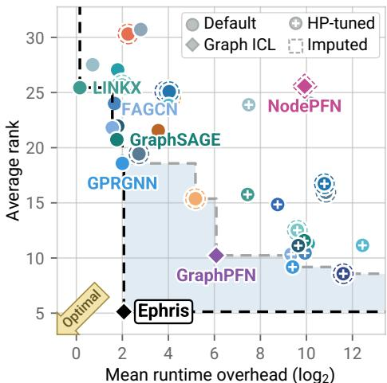  
Figure 1: Performance-runtime Pareto plot across 51 datasets under the 50/25/25 split.

with at most 500 features and 4 GNN baselines. In our main experiments (Section 5), we evaluate both methods more broadly across 51 node-classification datasets, spanning up to 568,795 nodes and 8,710 features per node, against 15 GNNs. Their reported gains do not consistently persist under this broader evaluation, with tuned GNNs remaining stronger on many datasets.

To overcome both limitations, we introduce Ephris, a new graph in-context learner designed to push the performance-runtime frontier (Figure 1). We first develop a scalable architecture for graph ICL that operates entirely through sparse message passing without dense cross-node attention, scaling linearly with node-feature entries and graph edges (Section 3). We then introduce a synthetic graph prior that extends SCMs with diverse graph structures and relational dynamics, exposing the model to varied dependencies among topology, features, and labels (Section 4).

We evaluate Ephris on 51 node-classification datasets against 15 tuned GNNs and 6 graph foundation models (GFMs), including NodePFN and GraphPFN, under high-label (50/25/25) and low-label (10/10/80) train/validation/test splits. Across this broad evaluation, no prior GFM surpasses tuned GNNs overall; GraphPFN comes closest, ranking 4th and 10th by Elo in the two regimes. In contrast, Ephris ranks 1st in Elo, improvability, average rank, and accuracy (defined in Appendix A) under both regimes. It achieves this performance at the cost of a single GNN training run, while being more than 13× faster than GraphPFN. Together, these results show that dense attention is not necessary for strong graph ICL, advancing the performance-runtime frontier and making graph ICL a practical alternative to per-dataset training and tuning. Code and pretrained weights are available at link.

## 2 BACKGROUND AND RELATED WORK

Graph in-context learning. Consider a graph $\mathcal { G } = ( \nu , \mathcal { E } )$ with $N = | \nu |$ nodes and $E = | \mathcal { E } |$ | edges, with adjacency matrix $A \in \{ 0 , 1 \} ^ { N \times N }$ , where $A _ { i j } = 1 { \mathrm { i f } } \left( i , j \right) \in \mathcal { E }$ and 0 otherwise. Node features are collected in $\pmb { X } \in \mathbb { R } ^ { N \times F }$ , with each row an F-dimensional vector. Let $\pmb { y } \in \{ 1 , \ldots , C \} ^ { N }$ denote node labels, where $y _ { i }$ is the label of node i and C the number of classes. Nodes are partitioned into disjoint training and test nodes, which we call context nodes $\mathcal { V } _ { \mathrm { c t x } }$ and query nodes $\mathcal { V } _ { \mathrm { q r y } }$ , respectively.

Following prior graph ICL models (Choi et al., 2026; Eremeev et al., 2026), we pretrain Ephris on synthetic graph tasks. Each task $\mathcal { D } = ( A , X , y , \mathcal { V } _ { \mathrm { c t x } } )$ is sampled from a prior Π, with $\nu _ { \mathrm { q r y } } =$ $\mathcal { V } \backslash \bar { \mathcal { V } } _ { \mathrm { c t x } } .$ . Given the graph structure, node features, and context labels, the model predicts unobserved query labels by minimizing their expected average negative log-likelihood:

$$
\mathcal { L } _ { \mathrm { I C L } } ( \pmb { \theta } ) = - \mathbb { E } _ { \mathcal { D } \sim \Pi } \big ( \frac { 1 } { \vert \mathcal { V } _ { \mathrm { q r y } } \vert } \sum _ { i \in \mathcal { V } _ { \mathrm { q r y } } } \log p _ { \pmb { \theta } } ( y _ { i } \mid i , \pmb { A } , \pmb { X } , \pmb { y } \nu _ { \mathrm { c t x } } ) \big ) .\tag{1}
$$

This objective trains a single set of parameters across synthetic tasks, requiring the model to infer each task-specific prediction rule from its observed context. At inference, the pretrained model applies this capability to unseen graphs without updating θ. For Ephris, $p _ { \pmb { \theta } }$ is defined by the architecture in Section 3, while Π is defined by the synthetic task prior in Section 4.

Structural causal models. Recent TFMs use structural causal models (SCMs) to generate synthetic tasks with diverse feature-label relationships (Hollmann et al., 2025; QU et al., 2026). An SCM defines a directed acyclic graph (DAG) GSCM specifying dependencies over potentially vectorvalued intermediate variables. For N samples, $U ^ { ( a ) }$ collects the values of variable a, with one row per sample. Let $\mathrm { p a } ( a )$ denote its parents. Variables are generated in topological order as

$$
U ^ { ( a ) } = \mathcal { T } _ { a } ( f _ { a } ( \{ U ^ { ( b ) } \} _ { b \in \mathrm { p a } ( a ) } ) ) .\tag{2}
$$

For root variables, $f _ { a } ( \alpha )$ generates sampled noise. For other variables, $f _ { a }$ is drawn from function families such as multi-layer perceptrons (MLPs), tree ensembles, and linear or quadratic mappings, inducing diverse relationships among variables. The transform $\mathcal { T } _ { a }$ applies operations such as normalization and noise injection. Features and labels are extracted from the variables and transformed as needed, for example by discretizing continuous values into categorical features or class labels.

Graph foundation models. GFMs aim to transfer pretrained models across graph datasets (Liu et al., 2024; Wang et al., 2024). Our work aligns with efforts to enable node classification across datasets with varying graph structures, feature and label spaces. These methods differ in which components they transfer and how they adapt to a new dataset. GraphAny (Zhao et al., 2024) transfers an aggregator over linear least-squares predictors fitted to each dataset. GVT (Lee et al., 2026) and Node4All (Lee & Yoo, 2026) transfer feature encoders while training lightweight downstream predictors. G2T-FM (Eremeev et al., 2025) augments node features with graph-derived features and applies a pretrained TFM for prediction. NodePFN (Choi et al., 2026) and GraphPFN (Eremeev et al., 2026) instead use observed node labels as context for graph ICL, avoiding dataset-specific parameter updates at all. Ephris follows this graph ICL approach, aiming to improve predictive performance and computational scalability. We compare against all six methods in our evaluation.

## 3 EPHRIS: A SCALABLE GRAPH IN-CONTEXT LEARNER

Recent in-context learning methods broadly follow two architectural paradigms: bi-axial architectures alternate dense attention across samples and features (Hollmann et al., 2025; Zhang et al., 2025; 2026a;b), while compress-then-ICL architectures compress each sample into a fixed-dimensional representation before performing ICL through attention across samples (QU et al., 2025; 2026). Ephris redesigns the latter architecture for graph-structured data through five stages:

$$
\begin{array} { r } { ( \underbrace { X } _ { N \times F } , y v _ { \mathrm { c t x } } ) \xrightarrow { \mathrm { G \ P o k e n } . } \underbrace { { \Psi } ^ { ( 0 ) } } _ { N \times F \times d } \xrightarrow { \mathrm { \ ? \ Q R e f . } } \underbrace { { \Psi } ^ { ( L _ { \mathrm { r e f } } ) } } _ { N \times F \times d } \xrightarrow { \mathrm { \ ? \ Q o m p . } } \underbrace { Z ^ { ( 0 ) } } _ { N \times D } \xrightarrow { \mathrm { \ @ \Gamma { C L } } } \underbrace { Z ^ { ( L _ { \mathrm { r e L } } ) } } _ { N \times D } \xrightarrow { \mathrm { \# \Gamma { R e a d } } } \underbrace { \hat { P } } _ { N \times C } . } \end{array}
$$

We first outline these stages, which are designed to support diverse graph tasks with shared parameters (§3.1). Then, we introduce the message-passing block $\mathrm { M P } _ { \mathrm { I C L } }$ , which is the core component of Ephris that is utilized in two different stages of the architecture (§3.2). Finally, we analyze computational complexity and empirically compare scalability with prior graph ICL models (§3.3). An overview is shown in Figure 2, with full implementation details in Appendix B.

## 3.1 ARCHITECTURE OVERVIEW

① Tokenization. We first map each scalar node feature into a common d-dimensional token space. A shared MLP is used for all F features. We also incorporate context labels through learned class embeddings, allowing subsequent layers to use the observed label context; the class embeddings are added to an intermediate representation. The resulting tokens form ${ \sf H } ^ { ( 0 ) }$

② Graph-aware token refinement. Before compression, we apply $L _ { \mathrm { r e f } }$ blocks, each consisting of per-feature refinement to capture feature distributions across nodes, followed by per-node refinement to incorporate graph structure into each node’s feature tokens.

Per-feature refinement. For each feature, we use the induced attention (Lee et al., 2019) to exchange information across nodes: $K _ { F }$ learned inducing tokens attend to the node tokens to gather a sum mary, then node tokens attend to it to receive the broadcast. For feature $f$ in block $\ell :$

$$
\begin{array} { r } { \pmb { J } _ { \pmb { f } } ^ { ( \ell ) } = \mathrm { G a t h e r } _ { F } ^ { ( \ell ) } ( \pmb { H } _ { : f } ^ { ( \ell - 1 ) } ) , \qquad \widetilde { \pmb { H } } _ { : f } ^ { ( \ell ) } = \mathrm { B r o a d c a s t } _ { F } ^ { ( \ell ) } ( \pmb { H } _ { : f } ^ { ( \ell - 1 ) } , \pmb { J } _ { f } ^ { ( \ell ) } ) , } \end{array}
$$

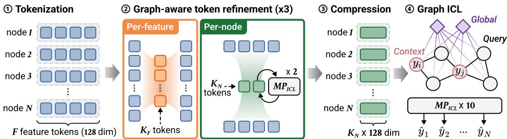  
Figure 2: Architecture overview of Ephris. Ephris tokenizes each scalar node-feature value into a d-dimensional token, compresses feature tokens into fixed-size node representations while integrating distributional and graph context, and performs ICL through stacked message passing.

where $J _ { f } ^ { ( \ell ) }$ contains the $K _ { F }$ summary tokens gathered for feature $f .$ Note that we gather from both context and query nodes, incorporating the full observed distribution, while most TFMs restrict gathering to context samples so that each query prediction is independent of other queries.

Per-node refinement. We then gather each node’s feature tokens into a compact summary using $K _ { N }$ learned inducing tokens. Two message-passing blocks exchange information among these summaries, and broadcast returns the updates to the feature tokens:

$$
\boldsymbol { I } _ { i } ^ { ( \ell ) } = \operatorname { G a t h e r } _ { N } ^ { ( \ell ) } ( \widetilde { \boldsymbol { H } } _ { i : } ^ { ( \ell ) } ) , \quad \boldsymbol { \hat { \mathbb { I } } } ^ { ( \ell ) } = \operatorname { M P } _ { \mathrm { I C L } } ^ { \circ 2 } ( \boldsymbol { \mathbb { I } } ^ { ( \ell ) } , \boldsymbol { A } ) , \quad \boldsymbol { H } _ { i : } ^ { ( \ell ) } = \operatorname { B r o a d c a s t } _ { N } ^ { ( \ell ) } ( \widetilde { \boldsymbol { H } } _ { i : } ^ { ( \ell ) } , \widetilde { \boldsymbol { I } } _ { i } ^ { ( \ell ) } ) ,
$$

where $\pmb { I } _ { i } ^ { ( \ell ) }$ contains node $i \ ' s$ summary tokens, and ${ \sf I } ^ { ( \ell ) }$ collects them across nodes. The messagepassing block includes concatenating each node’s summary tokens into a vector before propagation and splitting the updated vector back into tokens before broadcasting (details in §3.2).

Alternation. Alternating per-feature and per-node refinement across $L _ { \mathrm { r e f } }$ blocks allows feature distributions and graph structure to jointly guide which information is retained during compression.

③ Compression. After refinement, an additional gather operation summarizes each node’s features using $K _ { N }$ inducing tokens. Concatenating these tokens yields a representation of width $D = K _ { N } d ,$ independent of feature count. The resulting matrix ${ Z ^ { ( 0 ) } }$ enters the ICL stage.

④ Graph in-context learning. The compressed node representations pass through $L _ { \mathrm { I C I } }$ successive $\mathrm { M P } _ { \mathrm { I C I } }$ blocks, replacing the dense attention across samples used in existing in-context learners:

$$
\begin{array} { r } { Z ^ { ( L _ { \mathrm { I C L } } ) } = \mathrm { M P } _ { \mathrm { I C L } } ^ { \circ L _ { \mathrm { I C L } } } ( Z ^ { ( 0 ) } , A ) . } \end{array}\tag{3}
$$

Through successive rounds of message passing, the model infers a task-specific predictive rule relating node features and graph connectivity to the observed context labels, progressively updating query-node representations for label prediction.

⑤ Prediction head. A shared head maps each query node’s final representation to class logits. As done in previous work (QU et al., 2026; Hollmann et al., 2025), we use ten learned class embeddings and ten output logits. For $C \leq 1 0$ , softmax is applied to the first C logits. For $C > 1 0$ , errorcorrecting output codes (ECOC) (Dietterich & Bakiri, 1994) decompose the task into classification problems with at most ten classes. Each original class is scored by averaging the log probabilitie assigned to its code entries, and softmax converts these scores into class probabilities.

## 3.2 MESSAGE PASSING BLOCK FOR ICL

The message passing block $\mathrm { M P } _ { \mathrm { I C L } }$ is the central building block of Ephris. The block is designed to accommodate diverse graph structures and predictive relationships across tasks with a single set of shared parameters. Specifically, we introduce four complementary design choices below.

Dynamic neighborhood aggregation. Graph structure provides plausible interactions, but the relevance of each connection for prediction can vary across tasks, graphs, and nodes. We therefore use local attention (Shi et al., 2020) to dynamically weight neighboring messages based on their current representations. Let $\pmb { h } _ { i } \in \mathbb { R } ^ { d _ { h } }$ denote the representation of node i, where $d _ { h }$ is the hidden dimension, and let $\mathcal { N } ( i )$ denote its neighborhood including i itself. We compute

$$
\begin{array} { r l } & { \alpha _ { i j } = \mathrm { s o f t m a x } _ { j \in \mathcal { N } ( i ) } \left( d _ { h } ^ { - 1 / 2 } \pmb { q } _ { i } ^ { \top } \pmb { k } _ { j } \right) , \qquad \mathcal { M } _ { i } ( h ) = \sum _ { j \in \mathcal { N } ( i ) } \alpha _ { i j } \pmb { v } _ { j } , } \end{array}\tag{4}
$$

where $\begin{array} { r } { \pmb { q } _ { i } = \pmb { W } _ { Q } \pmb { h } _ { i } , \pmb { k } _ { i } = \pmb { W } _ { K } \pmb { h } _ { i } } \end{array}$ , and ${ \pmb v } _ { i } = { \pmb W } _ { V } { \pmb h } _ { i }$ are the query, key, and value projections. This lets the model adapt which neighbors to emphasize as their representations evolve across layers.

Neighborhood-aware attention. Neighborhood sizes also vary widely across nodes and graphs, ranging from only a few to thousands (Hu et al., 2020). With more neighbors competing within the same softmax, attention can become increasingly diffuse, a phenomenon known as attention dilution (Zhang et al., 2024). To address this, we extend TabICLv2’s query-aware attention scaling (QU et al., 2026) to jointly account for neighborhood size:

$$
\begin{array} { r } { \widetilde { q } _ { i } = q _ { i } \odot f _ { \pmb { \theta } } ( \log | \mathcal { N } ( i ) | ) \odot [ 1 + \operatorname { t a n h } g _ { \pmb { \theta } } ( \pmb { q } _ { i } ) ] , \qquad \alpha _ { i j } = \operatorname { s o f t m a x } _ { j \in \mathcal { N } ( i ) } \left( d _ { h } ^ { - 1 / 2 } \widetilde { \pmb { q } } _ { i } ^ { \top } \pmb { k } _ { j } \right) , } \end{array}\tag{5}
$$

where ⊙ denotes element-wise multiplication, and $f _ { \theta }$ and $g _ { \pmb { \theta } }$ are two-layer MLPs. This lets the model adapt attention sharpness jointly to the current representation and neighborhood size.

Local and global communication. Graph edges can be too sparse, noisy, or weakly aligned with the prediction task. To improve robustness in these graphs, we introduce $K _ { G }$ learned global nodes $\nu _ { g }$ that enable interactions beyond the observed edges. Each global node connects bidirectionally to every original node (Cai et al., 2023). For each node i, we augment its neighborhood as

$$
\mathcal { N } ^ { + } ( i ) = \mathcal { N } ( i ) \cup \mathcal { V } _ { g } , \qquad | \mathcal { N } ^ { + } ( i ) | = | \mathcal { N } ( i ) | + K _ { G } ,\tag{6}
$$

and apply the same neighborhood-aware attention over $\mathcal { N } ^ { + } ( i )$ . The global nodes allow arbitrary nodes to exchange information within two message-passing layers while adding only $\mathcal { O } ( N K _ { G } )$ interactions, which scale linearly in N for fixed $K _ { G } ^ { - }$

Deep residual propagation. The interaction range needed to infer a prediction rule can vary across graphs and tasks. We therefore design $\mathrm { M P } _ { \mathrm { I C I } }$ for deep stacking using residual connections:

$$
\bar { h } _ { i } = \mathrm { L N } \big ( h _ { i } + \mathcal { M } _ { i } ( h ) \big ) , \qquad \mathrm { M P } _ { \mathrm { I C L } } ( h ) _ { i } = \mathrm { L N } \big ( \bar { h } _ { i } + \mathrm { F F N } ( \bar { h } _ { i } ) \big ) ,\tag{7}
$$

where LN and FFN denote layer normalization and a position-wise feed-forward network, respectively. Stacking these blocks progressively expands each node’s receptive field, allowing information to propagate over increasingly long graph distances. Together, these four design choices let $\mathrm { M P } _ { \mathrm { I C I } }$ adapt what information to aggregate, where to communicate, and how far to propagate it, while retaining sparse, scalable computation.

## 3.3 COMPUTATIONAL COMPLEXITY

Theoretical complexity. We analyze computational complexity under fixed hidden dimensions, inducing-token counts, network depths, and context ratio. Per-feature refinement costs $\mathcal { O } ( N F )$ , per-node refinement including message passing costs $\mathcal { O } ( N F { + } E )$ , and graph ICL costs $\mathcal { O } ( \bar { N } + E )$ . Each prediction pass therefore requires $\mathcal { O } ( N F + E )$ computation, scaling linearly with the number of node-feature entries and graph edges, rather than quadratically with the number of nodes or features as in prior graph ICL models (Table 1).

Empirical scaling. We measure inference runtime on synthetic graphs ranging from 50K to 500K nodes, with 32 features, average degree 8, and a 50% context ratio. All methods run without ensembling on a single NVIDIA H200 GPU; runtime includes preprocessing and inference but excludes model loading. We quantify scaling by fitting $T ( N ) \ : = \ : c + a N ^ { \beta }$ over the measured range. As shown in Figure 3, Ephris scales nearly linearly $( \beta = 1 . 0 7 )$ , whereas NodePFN $( \beta = 1 . 9 8 )$ and GraphPFN $( \dot { \beta } = 1 . 9 0 )$ scale nearly quadratically. The resulting runtime gap widens rapidly with graph size.

Table 1: Theoretical complexity.
<table><tr><td>Model</td><td>Computation</td></tr><tr><td>NodePFN GraphPFN</td><td> $\mathcal { O } ( N F + N ^ { 2 } + E )$   $\mathcal { O } ( N ^ { 2 } F + N F ^ { 2 } + E F )$ </td></tr><tr><td>Ephris</td><td> $\mathcal { O } ( N F + E )$ </td></tr></table>

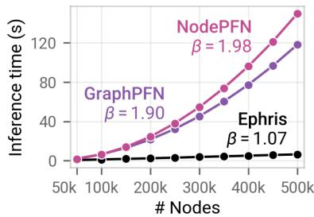  
Figure 3: Inference runtime scaling; median over three seeds.

## 4 PRETRAINING WITH DIVERSE SYNTHETIC GRAPHS

We outline the synthetic graph generation pipeline that defines the pretraining prior Π in Equation (1), followed by the training curriculum and optimization procedure. Detailed descriptions of the prior and training setup are provided in Appendix C and Appendix D, respectively.

## 4.1 SYNTHETIC GRAPH PRIOR

Our pipeline has three stages: sampling a graph topology, generating features and labels conditioned on the sampled graph, and post-processing the features into diverse form of representations.

Graph sampling. Real-world graphs often exhibit a mixture of connectivity patterns. We capture this diversity by combining three graph-generation rules: group-based connectivity favors edges within or across sampled groups, as in stochastic block models (Holland et al., 1983); degreeheterogeneous connectivity samples endpoints according to node-wise weights, producing heterogeneous degrees and hubs as in Chung-Lu graphs (Chung & Lu, 2002); and ordering-based connectivity links nodes according to a sampled ordering, introducing route-like connection patterns. We sample mixture weights for each graph so that these patterns coexist in varying proportions.

Feature and label sampling. We generate features and labels conditioned on the sampled graph by incorporating graph propagation into the SCM. Inspired by GraphPFN (Eremeev et al., 2026), we extend Equation (2) as

$$
\begin{array} { r } { \widetilde { U } ^ { ( a ) } = f _ { a } ( \{ U ^ { ( b ) } \} _ { b \in \mathrm { p a } ( a ) } ) , \qquad U ^ { ( a ) } = \mathcal { T } _ { a } ( \mathrm { P r o p a g a t e } _ { a } ( \widetilde { U } ^ { ( a ) } , A ) ) . } \end{array}\tag{8}
$$

Here, ${ \widetilde { \pmb U } } ^ { ( a ) }$ collects variable $\boldsymbol { a } ^ { \prime } \mathbf { s }$ values across nodes. Before applying $\mathcal { T } _ { a } .$ , propagation updates these values by aggregating neighbor information using operators such as mean, max, or min. Graph structure thus shapes the intermediate variables from which features and labels are generated.

We also diversify the relational dynamics governing how graph structure influences these variables. For each variable selected for propagation, we sample one of three rules: diffusion repeatedly mixes node and neighbor states; cascade starts from a small set of active nodes and updates an inactive node only when agreement between its state and the aggregated states of active neighbors reaches a sampled threshold; and degree-dependent mixing adjusts the strength of neighbor influence based on node degree and neighbor agreement. These rules capture gradual, conditional, and degreedependent effects, respectively. We further vary their behavior by sampling rule-specific mixing coefficients, propagation steps, and activation thresholds.

Post-processing. Finally, we diversify how generated features appear to the model. Real-world node features range from meaningful attributes to image or text embeddings whose information is distributed across dimensions (Yan et al., 2023). We therefore sample three representations: tabular, which preserves the generated features; embedding, which mixes all features through a linear or nonlinear transformation followed by standardization; and hybrid, which transforms only a subset.

## 4.2 TRAINING SCHEDULE AND OPTIMIZATION

Training curriculum. Generalizing across graph datasets requires exposure to diverse graph sizes and feature dimensions, but larger graphs and higher-dimensional features can increase pretraining costs signficantly. We therefore adopt a two-stage curriculum. Stage 1 develops the model’s in-context prediction capability on relatively small graphs over 50,000 steps. Stage 2 then adapts the model to a broader range of graph sizes and feature dimensions over 10,000 additional steps. Each step uses 64 freshly generated graphs, yielding 3.84 million graphs in total.

Table 2: Two-stage training setup.
<table><tr><td></td><td>Stage 1</td><td>Stage 2</td></tr><tr><td># Node</td><td>512–1,024128–16,384</td><td>2-1,024</td></tr><tr><td># Feature # Steps</td><td>2-128 50,000</td><td>10,000</td></tr><tr><td>Muon LR</td><td> $8 \times 1 0 ^ { - 4 }$ </td><td> $4 \times 1 0 ^ { - 5 }$ </td></tr><tr><td>AdamW LR</td><td> $8 \times 1 0 ^ { - 4 }$ </td><td> $1 0 ^ { - 5 }$ </td></tr></table>

Optimization. We optimize eligible matrix-valued parameters with Muon (Jordan et al., 2024) and the remaining parameters with AdamW (Loshchilov & Hutter, 2017). Each stage uses linear warmup followed by cosine decay. In Stage 2, we use lower peak learning rates to preserve learned capabilities while adapting to larger graphs and higher-dimensional features.

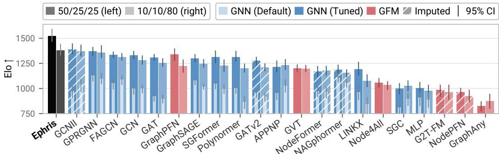  
Figure 4: Elo across label regimes. Each bar nests a default GNN within its HP-tuned counterpart. Hatching marks OOM results imputed with GCN (Default); error bars show 95% confidence intervals. Methods are ordered by mean Elo across regimes. Ephris achieves the highest Elo in both.

## 5 EXPERIMENTS

Model configuration. Our model has 50.16M parameters and uses 128-dimensional feature tokens. Three refinement blocks combine per-feature refinement with 128 inducing tokens and per-node refinement with four inducing tokens. Compression concatenates four tokens into a 512-dimensional node representation, which is then processed by ten MPICL layers for graph ICL. Each MPICL layer uses eight global nodes. Pretraining follows the two-stage curriculum on 3.84M synthetic graphs with no exposure to real-world datasets, requiring 16 GPU-days in our environment. Full model configurations and details of the experimental environment are provided in Appendix D.

Baselines. We compare Ephris against 21 baselines: 15 GNNs and six recent GFMs. The GNN baselines cover neighborhood aggregation (Kipf & Welling, 2017; Hamilton et al., 2017), attentionbased aggregation (Velickoviˇ c et al., 2018; Brody et al., 2021), decoupled feature transformation´ and propagation (Gasteiger et al., 2018; Wu et al., 2019), and architectures for deep propagation and heterophilous graphs (Chen et al., 2020; Chien et al., 2020; Bo et al., 2021). They also include scalable graph transformers (GTs) that capture graph-wide interactions through multi-hop represen tations, kernelized attention, or linear attention (Chen et al., 2022; Wu et al., 2022; Deng et al., 2024; Wu et al., 2023). The GFM baselines are GraphAny (Zhao et al., 2024), GVT (Lee et al., 2026) Node4All (Lee & Yoo, 2026), G2T-FM (Eremeev et al., 2025), NodePFN (Choi et al., 2026), and GraphPFN (Eremeev et al., 2026), introduced in Section 2.

Evaluation protocol. We evaluate all methods on 51 node-classification datasets spanning six application domains. The datasets range from 183 to 568,795 nodes, 12 to 8,710 features, and 2 to 70 classes, with adjusted label homophily from −0.30 to 0.94. Each dataset is evaluated under high-label and low-label regimes, using train/validation/test proportions of 50/25/25 and 10/10/80, respectively, with five splits per regime. Following TabArena (Erickson et al., 2026), each GNN is evaluated under two tuning budgets: default, using default hyperparameters, and tuned, selecting the best of 200 configurations by validation performance. Supervised baselines use validation data for early stopping and hyperparameter selection. Ephris uses only training labels as context and predicts in a single inference pass. Dataset and baseline details, hyperparameter search spaces for each GNN, and adaptation procedures for each GFM are provided in Appendix E.

Metrics. We evaluate predictive performance and adaptation cost. Performance is summarized by Elo, improvability, average rank, and average accuracy. Elo aggregates split-level pairwise wins, draws, and losses, while improvability measures the normalized gap to the best-performing model (Erickson et al., 2026). The first three metrics use AUROC for binary tasks and accuracy for multiclass tasks; average accuracy uses accuracy throughout. Adaptation cost covers a single training run for default GNNs, the full hyperparameter search for tuned GNNs, each GFM’s adap tation procedure, and inference for Ephris. We report this cost as runtime overhead, defined as the log-aggregated slowdown relative to the fastest method. Full definitions are in Appendix A.

## 5.1 MAIN RESULTS

Due to space constraints, we show selected plots here. Complete results, including tables, bar plots, Pareto plots, subgroup radar charts, and pairwise win matrices, are provided in Appendix H.

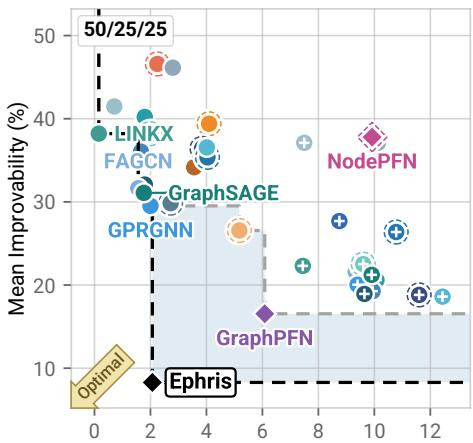  
Mean runtime overhead (log2)

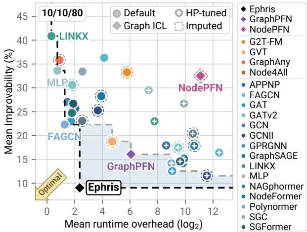  
Figure 5: Performance-runtime trade-offs. Mean improvability versus runtime overhead under high-label (left) and low-label (right) regimes; lower is better on both axes. Black and gray dashed lines show Pareto frontiers with and without Ephris, with the improvement shaded blue.

Predictive performance. A broader evaluation revealed a substantial gap between existing GFMs and extensively tuned GNNs. In particular, GCNII (Chen et al., 2020) and GPRGNN (Chien et al., 2020) demonstrated leading results under both label regimes. GraphPFN (Eremeev et al., 2026) emerged as the strongest existing GFM, but did not outperform either overall. Therefore, the advantages reported for existing GFMs do not hold for broader datasets and stronger baselines.

Ephris closes this gap, ranking first in Elo, improvability, average rank, and average accuracy in both label regimes. Against tuned GCNII, the strongest baseline, it achieves pairwise win rates of 67% and 54% in the high- and low-label regimes, respectively. These gains are particularly notable because supervised baselines use validation labels for early stopping and hyperparameter selection, whereas Ephris uses none. Against GraphPFN, the strongest prior GFM, it wins 71% of comparisons in both regimes. Ephris achieves these results through sparse message passing, demonstrating that dense all-pairs attention is not required for strong predictive performance in graph ICL.

Performance-runtime trade-off. A central promise of GFMs is to reduce adaptation costs by reusing pretrained knowledge. GVT (Lee et al., 2026) and GraphPFN (Eremeev et al., 2026) partially fulfill this promise: both improve on default GNNs at far lower cost than 200-trial HP tuning, reaching the Pareto frontier in both label regimes (Figure 5). However, their adaptation costs remain substantial in practice. Relative to a single GCN training run, GVT requires approximately 9.4-11.5× the runtime and GraphPFN 21.4-24.1× across the two label regimes.

Ephris also closes this efficiency gap. Across the two label regimes, its inference costs 1.33–1.84× a single GCN training run and is 13.1–16.1× faster than GraphPFN, demonstrating the efficiency of replacing dense attention with message passing for graph ICL. Together with its leading predictive performance, this pushes the performance-runtime Pareto frontier forward, with Ephris remaining the only GFM on the frontier across all metrics (Figure 10).

Subgroup Analysis. We assess whether the overall gains of Ephris persist across graph and task characteristics. Figure 6 reports average ranks across subgroups under the high-label regime, with complete results and subgroup definitions in Appendix H. Ephris outperforms GraphPFN in nearly all subgroups under both label regimes, indicating broad improvements of graph ICL rather than gains confined to particu-

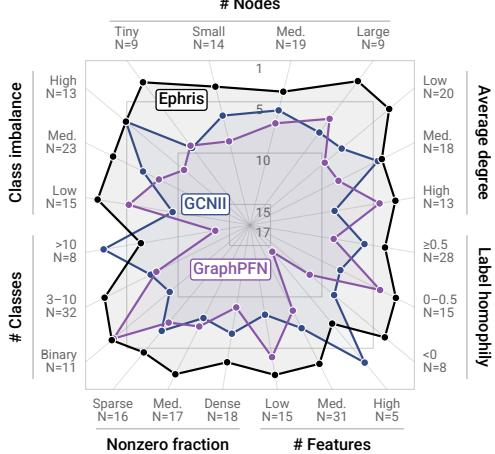  
Figure 6: Subgroup performance. Average ranks under the high-label regime.

lar datasets. Against the runner-up, tuned GCNII, it leads in most subgroups but falls behind on datasets with more than 5,000 features or ten classes. Both exceed the ranges seen during pretraining, suggesting that broader pretraining coverage may help close these gaps.

## 5.2 BEYOND ORDINARY GRAPHS AND RANDOM SPLITS

Having established strong performance across diverse graph datasets, we further test whether Ephris generalizes beyond graphs and random train-test splits, considering hypergraph transfer and distribution shift (Appendix F). On ten AllSet hypergraph datasets (Chien et al., 2021), Ephris ranks first or second on eight using simple clique or incidence representations, suggesting that it also provide a promising alternative to per-dataset training and HP tuning of supervised hypergraph models. On the Graph Out-of-Distribution (GOOD) benchmark (Gui et al., 2022), Ephris ranks first or second in 13 of 20 settings against baselines including methods specifically designed for OOD generalization. However, its performance drops substantially in several remaining settings, indicating that robust generalization under distribution shift remains an important direction for future work.

## 5.3 ABLATION STUDIES

We ablate the key design choices of Ephris to understand their individual contributions. Since full pretraining requires approximately 16 GPU-days, we conduct these analyses at 10% of the Stage 1 scale, using 5,000 updates over 320,000 synthetic graphs and evaluating on the same 51 datasets as in the main experiments. Due to space constraints, we summarize the key findings here; full results, configurations, and detailed analyses are provided in Appendix G.

Disentangling architecture and prior. Ephris introduces improvements along two axes: the architecture and the synthetic graph prior. To disentangle their contributions, we conduct a 3×3 factorial study crossing the architectures and priors of Ephris, GraphPFN (Eremeev et al., 2026) and NodePFN (Choi et al., 2026), training each architecture with every prior. As shown in Figure 7, our architecture achieves the highest mean accuracy under every prior, while our prior performs best across all architectures. These consistent gains show that both contribute independently, rather than only through their specific combination.

<table><tr><td>Prior Arch.</td><td>Ephris</td><td>GraphPFN</td><td>NodePFN</td></tr><tr><td>Ephris</td><td>78.91</td><td>74.15</td><td>77.33</td></tr><tr><td>GraphPFN</td><td>75.08</td><td>73.95</td><td>74.01</td></tr><tr><td>NodePFN</td><td>69.62</td><td>68.33</td><td>68.67</td></tr><tr><td colspan="4">68 Mean test accuracy (%)</td></tr></table>

Component ablations. We ablate key components of the architecture and pretraining prior. For the architecture, restricting perfeature gathering to context nodes, removing token updates after message passing, using static aggregation in MPICL, or removing neighborhood-size-aware scaling or global nodes all reduce both

Figure 7: Architecture–prior factorial study. Bold: column best, underline: row best.

mean accuracy and win rate. For the prior, removing propagation from the SCM causes the largest degradation, reducing mean accuracy by roughly 20%, suggesting that jointly modeling topology, features, and labels is critical. Restricting the prior to any single relational dynamic also underperforms their mixture, while removing embedding-like post-processing also reduces performance. Together, these results support the design choices of both the architecture and pretraining prior.

## 6 CONCLUSION

We introduced Ephris, a scalable graph in-context learner demonstrating that strong ICL can be achieved through message passing over the observed graph without dense cross-node attention. Pretrained on a synthetic prior spanning diverse graph structures, relational dynamics, and feature representations, Ephris transfers effectively to unseen graphs without per-dataset training or tuning. Across 51 node-classification datasets, Ephris outperforms 15 extensively tuned GNNs and six recent GFMs across all aggregate metrics, including Elo, improvability, average rank, and accuracy, under both high- and low-label regimes. It achieves this performance at roughly the cost of a single GNN training run while running 13.1–16.1× faster than GraphPFN, pushing the performance– runtime Pareto frontier forward. Overall, the strong performance and fast inference of Ephris acros diverse datasets suggest graph ICL as a practical alternative to per-dataset GNN training and tuning.

Limitations and Future Work. Our ablation studies use reduced-budget proxy pretraining, so their conclusions may not fully transfer to full-scale training. As shown in Section 5.2, improving robustness to distribution shifts under non-IID grouped and temporal splits remains important for real-world applicability. Our scope is also limited to node classification; extending scalable graph ICL to link prediction and graph-level tasks is an important step toward general-purpose GFMs.

## AI USE STATEMENT

We used generative AI tools during code development and manuscript editing, primarily for code suggestions and improvements to clarity and grammar. The authors reviewed and tested all AIassisted code and independently reviewed and revised all AI-assisted text. Generative AI was not used to generate experimental results or make research decisions. We take full responsibility for the final content of this work, including all AI-assisted content.

## ETHICS STATEMENT

This work does not involve human subjects or the collection of personal data. Our model is pretrained entirely on synthetic graph tasks and evaluated on open node-classification benchmarks. We follow the licenses and intended research use of the datasets and methods used in our experiments, and encourage responsible use of the proposed model in downstream applications.

## REPRODUCIBILITY STATEMENT

We provide the model specifications, experimental settings, and evaluation procedures needed to reproduce our results throughout the appendix. Appendix B describes the architecture and its constituent operations, while Appendix C details graph sampling, relational dynamics, and feature postprocessing in the synthetic pretraining prior. Appendix D documents the model configuration, software and hardware environment, task-size sampling, two-stage curriculum, optimization settings, and inference procedure.

For evaluation, Appendices A and E specify the metrics, datasets, train/validation/test splits, baseline configurations, hyperparameter search spaces, and adaptation procedures for prior GFMs. Complete aggregate results and supplementary comparisons are provided in Appendix H, and Appendix G reports the configurations and results of our ablation studies.

The model checkpoint and code are available at https://github.com/nums-ai/ephris. These artifacts allow researchers to evaluate Ephris directly without repeating the full pretraining process. Together, the released artifacts and documented procedures support independent verification of our results and comparisons with future methods.

## REFERENCES

Gleb Bazhenov, Oleg Platonov, and Liudmila Prokhorenkova. Graphland: Evaluating graph machine learning models on diverse industrial data. Advances in Neural Information Processing Systems, 38, 2026.

Deyu Bo, Xiao Wang, Chuan Shi, and Huawei Shen. Beyond low-frequency information in graph convolutional networks. In Proceedings of the AAAI conference on artificial intelligence, volume 35, pp. 3950–3957, 2021.

Aleksandar Bojchevski and Stephan Gunnemann. Deep gaussian embedding of graphs: Unsuper-¨ vised inductive learning via ranking. arXiv preprint arXiv:1707.03815, 2017.

Shaked Brody, Uri Alon, and Eran Yahav. How attentive are graph attention networks? arXiv preprint arXiv:2105.14491, 2021.

Chen Cai, Truong Son Hy, Rose Yu, and Yusu Wang. On the connection between mpnn and graph transformer. In International conference on machine learning, pp. 3408–3430. PMLR, 2023.

Jinsong Chen, Kaiyuan Gao, Gaichao Li, and Kun He. Nagphormer: A tokenized graph transformer for node classification in large graphs. arXiv preprint arXiv:2206.04910, 2022.

Ming Chen, Zhewei Wei, Zengfeng Huang, Bolin Ding, and Yaliang Li. Simple and deep graph convolutional networks. In International conference on machine learning, pp. 1725–1735. PMLR, 2020.

Eli Chien, Jianhao Peng, Pan Li, and Olgica Milenkovic. Adaptive universal generalized pagerank graph neural network. arXiv preprint arXiv:2006.07988, 2020.

Eli Chien, Chao Pan, Jianhao Peng, and Olgica Milenkovic. You are allset: A multiset function framework for hypergraph neural networks. arXiv preprint arXiv:2106.13264, 2021.

Minyong Cho, Minho Jeong, Dooho Lee, Jinmo Lee, and Jaemin Yoo. Causilo technical report, 2026. URL https://arxiv.org/abs/2609.22866.

Jeongwhan Choi, Jongwoo Kim, Woosung Kang, and Noseong Park. Learning posterior predictive distributions for node classification from synthetic graph priors. In The Fourteenth International Conference on Learning Representations, 2026. URL https://openreview.net/forum? id=FmxRzlu0rT.

Fan Chung and Linyuan Lu. Connected components in random graphs with given expected degree sequences. Annals ofcombinatorics, 6(2):125–145, 2002.

Chenhui Deng, Zichao Yue, and Zhiru Zhang. Polynormer: Polynomial-expressive graph transformer in linear time. In International Conference on Learning Representations, volume 2024, pp. 18323–18348, 2024.

Thomas G Dietterich and Ghulum Bakiri. Solving multiclass learning problems via error-correcting output codes. Journal ofartificial intelligence research, 2:263–286, 1994.

Dmitry Eremeev, Gleb Bazhenov, Oleg Platonov, Artem Babenko, and Liudmila Prokhorenkova. Turning tabular foundation models into graph foundation models. arXiv preprint arXiv:2508.20906, 2025.

Dmitry Eremeev, Oleg Platonov, Gleb Bazhenov, Artem Babenko, and Liudmila Prokhorenkova. GraphPFN: A prior-data fitted graph foundation model. In Forty-third International Conference on Machine Learning, 2026. URL https://openreview.net/forum?id= 340Ep8sfJ3.

Nick Erickson, Lennart Purucker, Andrej Tschalzev, David Holzmuller, Prateek Desai, David Sali-¨ nas, and Frank Hutter. Tabarena: A living benchmark for machine learning on tabular data. Advances in Neural Information Processing Systems, 38, 2026.

Johannes Gasteiger, Aleksandar Bojchevski, and Stephan Gunnemann. Predict then propagate:¨ Graph neural networks meet personalized pagerank. arXiv preprint arXiv:1810.05997, 2018.

Leo Grinsztajn, Klemens Fl ´ oge, Oscar Key, Felix Birkel, Philipp Jund, Brendan Roof, Mihir Ma- ¨ nium, Shi Bin Hoo, Magnus Buhler, Anurag Garg, et al. Tabpfn-3: Technical report. ¨ arXiv preprint arXiv:2605.13986, 2026.

Shurui Gui, Xiner Li, Limei Wang, and Shuiwang Ji. Good: A graph out-of-distribution benchmark. Advances in Neural Information Processing Systems, 35:2059–2073, 2022.

Will Hamilton, Zhitao Ying, and Jure Leskovec. Inductive representation learning on large graphs. Advances in neural information processing systems, 30, 2017.

Karim K Ben Hicham, Jan G Rittig, Martin Grohe, and Alexander Mitsos. Tabular foundation models for in-context prediction of molecular properties. arXiv preprint arXiv:2604.16123, 2026.

Paul W Holland, Kathryn Blackmond Laskey, and Samuel Leinhardt. Stochastic blockmodels: First steps. Social networks, 5(2):109–137, 1983.

Noah Hollmann, Samuel Muller, Lennart Purucker, Arjun Krishnakumar, Max K¨ orfer, Shi Bin Hoo,¨ Robin Tibor Schirrmeister, and Frank Hutter. Accurate predictions on small data with a tabular foundation model. Nature, 637(8045):319–326, 2025.

Weihua Hu, Matthias Fey, Marinka Zitnik, Yuxiao Dong, Hongyu Ren, Bowen Liu, Michele Catasta, and Jure Leskovec. Open graph benchmark: Datasets for machine learning on graphs. Advances in neural information processing systems, 33:22118–22133, 2020.

Keller Jordan, Yuchen Jin, Vlado Boza, You Jiacheng, Franz Cesista, Laker Newhouse, and Jeremy Bernstein. Muon: An optimizer for hidden layers in neural networks, 2024. URL https: //kellerjordan.github.io/posts/muon/.

Benjamin Jager, Nick Erickson, L¨ eo Grinsztajn, Felix Birkel, Klemens Fl´ oge, Oscar Key, K¨ urs¸at¨ Kaya, Jonas Kubler, Ad ¨ ele Frankel, Tobias Schr \` oder, Anurag Garg, Jan Hendrik Metzen, David¨ Salinas, Simon Bing, Kristina Collins, Tuana C¸ elik, Vahid Balazadeh, Lydia Sidhoum, Tomas´ Pereda, Brendan Roof, Andrej Tschalzev, Siyuan Guo, Philipp Singer, Lennart Purucker, Jake Robertson, Marie Salmon, Philipp Jund, Jerry Chen, Diana Kriuchkova, Arthur Cahu, Eliott Kalfon, Adrian Hayler, Georg Grab, Vitor Monteiro, Lilly Wehrhahn, Dominik Safaric, Clara Cornu, Alan Arazi, Rylee Grace, Simone Alessi, Mihir Manium, Bernhard Scholkopf, Yann LeCun,¨ Madelon Hulsebos, Sauraj Gambhir, Noah Hollmann, and Frank Hutter. Tabpfn-3.5: Technical report, 2026. URL https://arxiv.org/abs/2609.17895.

Thomas N. Kipf and Max Welling. Semi-supervised classification with graph convolutional networks. In International Conference on Learning Representations, 2017. URL https: //openreview.net/forum?id=SJU4ayYgl.

Dooho Lee and Jaemin Yoo. Node4all: Learning node representation beyond datasets. In Proceedings of the 32nd ACM SIGKDD Conference on Knowledge Discovery and Data Mining V. 2, pp. 2461–2472, 2026.

Dooho Lee, Myeong Kong, Minho Jeong, and Jaemin Yoo. View space: Learning representation across arbitrary graphs. In Forty-third International Conference on Machine Learning, 2026. URL https://openreview.net/forum?id=9klc62KROH.

Juho Lee, Yoonho Lee, Jungtaek Kim, Adam Kosiorek, Seungjin Choi, and Yee Whye Teh. Set transformer: A framework for attention-based permutation-invariant neural networks. In Interna tional conference on machine learning, pp. 3744–3753. PMLR, 2019.

Jundong Li, Xia Hu, Jiliang Tang, and Huan Liu. Unsupervised streaming feature selection in social media. In Proceedings of the 24th ACM international on conference on information and knowledge management, pp. 1041–1050, 2015.

Huidong Liang, Haitz Saez de Oc ´ ariz Borde, Baskaran Sripathmanathan, Michael Bronstein, and´ Xiaowen Dong. Towards quantifying long-range interactions in graph machine learning: a large graph dataset and a measurement. In International Conference on Learning Representations, volume 2026, pp. 34655–34688, 2026.

Derek Lim, Felix Hohne, Xiuyu Li, Sijia Linda Huang, Vaishnavi Gupta, Omkar Bhalerao, and Ser Nam Lim. Large scale learning on non-homophilous graphs: New benchmarks and strong simple methods. Advances in neural information processing systems, 34:20887–20902, 2021.

Hao Liu, Jiarui Feng, Lecheng Kong, Ningyue Liang, Dacheng Tao, Yixin Chen, and Muhan Zhang. One for all: Towards training one graph model for all classification tasks. In International conference on learning representations, volume 2024, pp. 20188–20210, 2024.

Ilya Loshchilov and Frank Hutter. Decoupled weight decay regularization. arXiv preprint arXiv:1711.05101, 2017.

Yuankai Luo, Lei Shi, and Xiao-Ming Wu. Classic gnns are strong baselines: Reassessing gnns for node classification. Advances in Neural Information Processing Systems, 37:97650–97669, 2024.

Peter Mernyei and C´ at˘ alina Cangea. Wiki-cs: A wikipedia-based benchmark for graph neural net-˘ works. arXiv preprint arXiv:2007.02901, 2020.

Samuel Muller, Noah Hollmann, Sebastian Pineda Arango, Josif Grabocka, and Frank Hutter. Trans-¨ formers can do bayesian inference. In International Conference on Learning Representations, 2022. URL https://openreview.net/forum?id=KSugKcbNf9.

Judea Pearl et al. Models, reasoning and inference. Cambridge, UK: CambridgeUniversityPress, 19(2):3, 2000.

Hongbin Pei, Bingzhe Wei, Kevin Chen-Chuan Chang, Yu Lei, and Bo Yang. Geom-gcn: Geometric graph convolutional networks. arXiv preprint arXiv:2002.05287, 2020.

Oleg Platonov, Denis Kuznedelev, Michael Diskin, Artem Babenko, and Liudmila Prokhorenkova. A critical look at the evaluation of gnns under heterophily: Are we really making progress? arXiv preprint arXiv:2302.11640, 2023.

Oleg Platonov, Gleb Bazhenov, Dmitry Eremeev, and Liudmila Prokhorenkova. A fair evaluation of graph foundation models for node property prediction. In Workshop on Graph Foundation Models: A New Era for Graph Machine Learning, 2026. URL https://openreview.net/ forum?id=u6ssKNnrki.

Jingang QU, David Holzmuller, Ga ¨ el Varoquaux, and Marine Le Morvan. TabICL: A tabular foun- ¨ dation model for in-context learning on large data. In Forty-second International Conference on Machine Learning, 2025. URL https://openreview.net/forum?id=0VvD1PmNzM.

Jingang QU, David Holzmuller, Ga ¨ el Varoquaux, and Marine Le Morvan. TabICLv2: A better, ¨ faster, scalable, and open tabular foundation model. In Forty-third International Conference on Machine Learning, 2026. URL https://openreview.net/forum?id=SxsyLjIfWB.

Benedek Rozemberczki and Rik Sarkar. Characteristic functions on graphs: Birds of a feather, from statistical descriptors to parametric models. In Proceedings of the 29th ACM international conference on information & knowledge management, pp. 1325–1334, 2020.

Benedek Rozemberczki, Carl Allen, and Rik Sarkar. Multi-scale attributed node embedding. Journal ofComplex Networks, 9(2):cnab014, 2021.

Oleksandr Shchur, Maximilian Mumme, Aleksandar Bojchevski, and Stephan Gunnemann. Pitfalls¨ of graph neural network evaluation. arXiv preprint arXiv:1811.05868, 2018.

Yunsheng Shi, Zhengjie Huang, Shikun Feng, Hui Zhong, Wenjin Wang, and Yu Sun. Masked label prediction: Unified message passing model for semi-supervised classification. arXiv preprint arXiv:2009.03509, 2020.

Ashish Vaswani, Noam Shazeer, Niki Parmar, Jakob Uszkoreit, Llion Jones, Aidan N Gomez, Łukasz Kaiser, and Illia Polosukhin. Attention is all you need. Advances in neural information processing systems, 30, 2017.

Petar Velickoviˇ c, Guillem Cucurull, Arantxa Casanova, Adriana Romero, Pietro Li´ o, and Yoshua\` Bengio. Graph attention networks. In International Conference on Learning Representations, 2018. URL https://openreview.net/forum?id=rJXMpikCZ.

Haoyu Peter Wang, Shikun Liu, Rongzhe Wei, and Pan Li. Generalization principles for inference over text-attributed graphs with large language models. In Forty-second International Conference on Machine Learning, 2025.

Zehong Wang, Zheyuan Zhang, Tianyi Ma, Nitesh V Chawla, Chuxu Zhang, and Yanfang Ye. Towards graph foundation models: Learning generalities across graphs via task-trees. arXiv preprint arXiv:2412.16441, 2024.

Mark Weber, Giacomo Domeniconi, Jie Chen, Daniel Karl I Weidele, Claudio Bellei, Tom Robin son, and Charles E Leiserson. Anti-money laundering in bitcoin: Experimenting with graph convolutional networks for financial forensics. arXiv preprint arXiv:1908.02591, 2019.

Dan-Ni Wu, Joey Jen, Erickson Fajiculay, Min-Fen Hsu, Ming-Chu Chang, Jen-Chen Yeh, Karen Sargsyan, Juozas Kupcinskas, Jurgita Skieceviciene, Ruta Steponaitiene, et al. Panmetai-a high performance tabular foundation model for accurate pancreatic cancer diagnosis via nmr metabolomics. Nature Communications, 17(1):1595, 2026.

Felix Wu, Amauri Souza, Tianyi Zhang, Christopher Fifty, Tao Yu, and Kilian Weinberger. Simplifying graph convolutional networks. In International conference on machine learning, pp. 6861–6871. Pmlr, 2019.

Qitian Wu, Wentao Zhao, Zenan Li, David P Wipf, and Junchi Yan. Nodeformer: A scalable graph structure learning transformer for node classification. Advances in neural information processing systems, 35:27387–27401, 2022.

Qitian Wu, Wentao Zhao, Chenxiao Yang, Hengrui Zhang, Fan Nie, Haitian Jiang, Yatao Bian, and Junchi Yan. Sgformer: Simplifying and empowering transformers for large-graph representations. Advances in neural information processing systems, 36:64753–64773, 2023.

Hao Yan, Chaozhuo Li, Ruosong Long, Chao Yan, Jianan Zhao, Wenwen Zhuang, Jun Yin, Peiyan Zhang, Weihao Han, Hao Sun, et al. A comprehensive study on text-attributed graphs: Benchmarking and rethinking. Advances in Neural Information Processing Systems, 36:17238–17264, 2023.

Renchi Yang, Jieming Shi, Xiaokui Xiao, Yin Yang, Juncheng Liu, Sourav S Bhowmick, et al. Scaling attributed network embedding to massive graphs. Proceedings ofthe VLDB Endowment, 14(1):37–49, 2020.

Zhilin Yang, William Cohen, and Ruslan Salakhudinov. Revisiting semi-supervised learning with graph embeddings. In International conference on machine learning, pp. 40–48. PMLR, 2016.

Hanqing Zeng, Hongkuan Zhou, Ajitesh Srivastava, Rajgopal Kannan, and Viktor Prasanna. Graphsaint: Graph sampling based inductive learning method. arXiv preprint arXiv:1907.04931, 2019.

Xingxuan Zhang, Gang Ren, Han Yu, Hao Yuan, Hui Wang, Jiansheng Li, Jiayun Wu, Lang Mo, Li Mao, Mingchao Hao, et al. Limix: Unleashing structured-data modeling capability for generalist intelligence. arXiv preprint arXiv:2509.03505, 2025.

Xingxuan Zhang, Gang Ren, Hao Yuan, Hao Zou, Hongze Tan, Hui Wang, Jianhao Song, Jiansheng Li, Jiayao Zhang, Jinghan Zhang, et al. Limix-2: A contextual mechanism network towards general structured-data intelligence. arXiv preprint arXiv:2609.17488, 2026a.

Xiyuan Zhang, Danielle Maddix Robinson, Junming Yin, Nick Erickson, Abdul Fatir Ansari, Boran Han, Shuai Zhang, Leman Akoglu, Christos Faloutsos, Michael Mahoney, et al. Mitra: Mixed synthetic priors for enhancing tabular foundation models. Advances in neural information processing systems, 38:15795–15840, 2026b.

Xuechen Zhang, Xiangyu Chang, Mingchen Li, Amit Roy-Chowdhury, Jiasi Chen, and Samet Oymak. Selective attention: Enhancing transformer through principled context control. Advances in Neural Information Processing Systems, 37:11061–11086, 2024.

Jianan Zhao, Hesham Mostafa, Michael Galkin, Michael Bronstein, Zhaocheng Zhu, and Jian Tang. Graphany: A foundation model for node classification on any graph. arXiv preprint arXiv:2405.20445, 29, 2024.

Jianan Zhao, Zhaocheng Zhu, Mikhail Galkin, Hesham Mostafa, Michael Bronstein, and Jian Tang. Fully-inductive node classification on arbitrary graphs. In International Conference on Learning Representations, volume 2025, pp. 23968–23986, 2025.

## A EVALUATION METRICS

We evaluate the high-label and low-label regimes separately, each using 51 datasets and five splits per dataset. Default and tuned GNNs are treated as separate participants, yielding 37 configurations. Unless otherwise specified, the predictive score $s _ { m , d , \prime }$ for method m on dataset d and split r is AU-ROC for binary classification and accuracy for multiclass classification. Comparisons are computed within each dataset-split, rather than from scores averaged across splits.

Elo. For every pair of methods on the same dataset-split, we assign an outcome of 1 for a win, 0.5 for an exact tie, and 0 for a loss. We fit a Bradley-Terry model to these outcomes, weighting each split by $1 / 5$ so that datasets contribute equally. The resulting ratings are expressed on the Elo scale and shifted so that default GCN has a rating of 1000. Higher ratings indicate stronger pairwise performance; the reference rating only fixes the origin of the scale.

Average rank. We rank all configurations within each dataset-split, assigning tied methods the average of their occupied ranks. We then average ranks over the five splits within each dataset and over the 51 datasets. Lower values indicate better average standing. In particular, we do not average predictive scores across splits before computing ranks.

Improvability (Erickson et al., 2026). Let $s _ { * , d , r } = \operatorname* { m a x } _ { j } s _ { j , d , r }$ denote the best score among all configurations on dataset d and split r. The improvability of method m is

$$
I _ { m , d , r } = 1 0 0 \frac { s _ { * , d , r } - s _ { m , d , r } } { 1 - s _ { m , d , r } } .\tag{9}
$$

This measures the fraction of the remaining gap to a perfect score that could be closed by matching the best evaluated configuration. For example, scores of 0.80 and 0.90 for the method and the best configuration yield an improvability of 50%. For AUROC, the denominator is the gap to perfect AUROC, not a misclassification rate. The best configuration has zero improvability; cases with a denominator numerically close to zero are also assigned zero. We average split-level values within each dataset, then average across datasets. Lower mean improvability is better.

Pairwise win rate. For methods a and $b ,$ we compute

$$
W _ { a , b } = \frac { 1 0 0 } { D } \sum _ { d = 1 } ^ { D } \frac { 1 } { S } \sum _ { r = 1 } ^ { S } \left[ { \bf 1 } \{ s _ { a , d , r } > s _ { b , d , r } \} + \frac { 1 } { 2 } { \bf 1 } \{ s _ { a , d , r } = s _ { b , d , r } \} \right] ,\tag{10}
$$

where $D = 5 1$ and $S = 5$ . Thus, ties count as half a win and each dataset receives equal weight. With five splits for every dataset, this equals the tie-adjusted win rate over all 255 comparisons. The overall leaderboard win rate averages pairwise win rates over all other configurations.

Average accuracy. We additionally report accuracy averaged across splits and datasets, using accuracy for both binary and multiclass tasks. This metric therefore differs from Elo, average rank, and improvability in its treatment of binary classification, for which those metrics use AUROC.

Runtime. Runtime measures the wall-clock cost of adapting a method to a new dataset. It includes training and the full hyperparameter search for tuned supervised methods, or the adaptation procedure for GFMs. Let $t _ { m , d }$ denote the runtime of method m on dataset d. We define the relative runtime overhead and its aggregate as

$$
\rho _ { m , d } = \frac { t _ { m , d } } { \operatorname* { m i n } _ { j } t _ { j , d } } , \qquad \bar { \rho } _ { m } = \exp \left( \frac { 1 } { D } \sum _ { d = 1 } ^ { D } \log \rho _ { m , d } \right) .\tag{11}
$$

The geometric mean weights datasets equally and summarizes multiplicative runtime differences.   
Pairwise speedups are aggregated in the same way.

## B ARCHITECTURE DETAILS

We describe the five stages of the architecture in Section 3. The model uses feature-token width $d = 1 2 8 , K _ { F } = 1 2 8$ per-feature inducing tokens, and $K _ { N } = 4$ per-node inducing tokens, giving a compressed width of $D = K _ { N } d = 5 1 \dot { 2 }$ . Each message-passing stage maintains $\bar { K } _ { G } = 8$ global nodes, which are updated throughout its successive blocks.

Tokenization. Numeric features are standardized, binary features are encoded as zero or one, and categorical features are ordinally encoded. Each scalar value is then clipped to $[ - 8 , 8 ]$ . For a clipped value x¯, we construct an 11-dimensional basis:

$$
b ( \bar { x } ) = [ \bar { x } , \ \mathrm { t a n h } ( \bar { x } ) , \ \mathrm { s i g n } ( \bar { x } ) \log ( 1 + \vert \bar { x } \vert ) , \ r _ { 1 } ( \bar { x } ) , \ \dotsc , r _ { 8 } ( \bar { x } ) ] , \quad r _ { q } ( \bar { x } ) = \exp ( - ( \bar { x } - c _ { q } ) ^ { 2 } / ( 2 w ^ { 2 } ) ) .
$$

The eight radial basis functions have centers evenly spaced over $[ - 3 , 3 ]$ and bandwidth w. A shared MLP with gating maps this basis into a token of width d.

To provide information about the other features of the same node, the tokenizer also computes a node summary. It takes the elementwise mean and root-mean-square of the basis vectors separately for numeric, binary, and categorical features, then concatenates these statistics. A learned projection of the summary is added to each scalar representation through a gated residual connection, followed by RMS normalization. This introduces node-level information without assigning positions to features.

Let $\mathbf { \boldsymbol { s } } _ { i }$ denote this node summary. The initial tokens are

$$
\begin{array} { r } { \pmb { h } _ { i f } ^ { ( 0 ) } = \mathrm { C e l l E n c o d e } ( \bar { x } _ { i f } , { s } _ { i } ) + \pmb { e } _ { \mathrm { t y p e } } ( t _ { f } ) + \pmb { 1 } [ i \in \mathcal { V } _ { \mathrm { c t x } } ] \pmb { e } _ { \mathrm { f e a t } } ( y _ { i } ) . } \end{array}
$$

Here, CellEncode includes the scalar projection and node-summary update, and $t _ { f }$ identifies the feature type. The context-label embedding is shared across all feature tokens of the same node. Query nodes receive a zero label embedding. The resulting tokens form the initial tensor ${ \bf \cal H } ^ { ( 0 ) }$

Graph-aware refinement. We apply $L _ { \mathrm { r e f } } ~ = ~ 3$ refinement blocks. Each block first exchanges distributional information across nodes for each feature, then incorporates structural information into each node’s feature tokens.

Per-feature refinement. For each feature, $K _ { F }$ learned inducing tokens attend to its tokens across all nodes to gather a summary. The node tokens then attend to that summary to receive the broadcast:

$$
\begin{array} { r } { \pmb { J } _ { \pmb { f } } ^ { ( \ell ) } = \mathrm { G a t h e r } _ { F } ^ { ( \ell ) } ( \pmb { H } _ { : \ell } ^ { ( \ell - 1 ) } ) , \qquad \widetilde { \pmb { H } } _ { : f } ^ { ( \ell ) } = \mathrm { B r o a d c a s t } _ { F } ^ { ( \ell ) } ( \pmb { H } _ { : f } ^ { ( \ell - 1 ) } , \pmb { J } _ { f } ^ { ( \ell ) } ) . } \end{array}
$$

Here, $J _ { f } ^ { ( \ell ) }$ contains the summary tokens for feature $f$ in block ℓ. Both context and query nodes participate in gathering and broadcasting, while only context labels are available. Features are processed independently with shared module parameters. The updated tokens carry information about each feature’s distribution across the graph.

Per-node refinement. We next gather across each node’s features using $K _ { N }$ learned inducing tokens. Two successive $\mathrm { M P } _ { \mathrm { I C L } }$ blocks exchange information among these node summaries before the updates are broadcast back to the feature tokens:

$$
\boldsymbol { I } _ { i } ^ { ( \ell ) } = \operatorname { G a t h e r } _ { N } ^ { ( \ell ) } ( \widetilde { \boldsymbol { H } } _ { i : } ^ { ( \ell ) } ) , \quad \boldsymbol { \hat { \mathsf { I } } } ^ { ( \ell ) } = \operatorname { M P } _ { \mathrm { I C L } , \ell } ^ { \circ 2 } ( \boldsymbol { \mathsf { I } } ^ { ( \ell ) } , \boldsymbol { A } ) , \quad \boldsymbol { H } _ { i : } ^ { ( \ell ) } = \operatorname { B r o a d c a s t } _ { N } ^ { ( \ell ) } ( \widetilde { \boldsymbol { H } } _ { i : } ^ { ( \ell ) } , \widetilde { \boldsymbol { I } } _ { i } ^ { ( \ell ) } ) .
$$

Here, $\pmb { I } _ { i } ^ { ( \ell ) }$ contains node $i \gamma _ { \mathrm { s } }$ summary tokens, and ${ \sf I } ^ { ( \ell ) }$ collects them across nodes. The messagepassing notation includes concatenating each node’s tokens before propagation and splitting the updated vector back into tokens afterward. Each two-block stage initializes its own global nodes and updates them alongside the original nodes through both blocks. Alternating per-feature and pernode refinement allows distributional and structural information to guide the representations used for compression.

Compression. A per-node gather produces $K _ { N }$ summary tokens, which are concatenated into a representation of width $D _ { \mathbf { \delta } }$ , independent of the feature count. Before graph ICL, context-label embeddings are added to these representations, followed by layer normalization:

$$
\mathfrak { z } _ { i } ^ { ( 0 ) } = \mathrm { L N } ( \mathrm { C o n c a t } ( I _ { i } ^ { \mathrm { c o m p } } ) + \mathbf { 1 } [ i \in \mathcal { V } _ { \mathrm { c t x } } ] e _ { \mathrm { I C L } } ( y _ { i } ) ) .
$$

Here, $I _ { i } ^ { \mathrm { c o m p } }$ contains the tokens produced by the compression gather. The ICL label embeddings have width $D$ and use a separate table from the tokenizer’s width-d embeddings. Both tables are trainable and initialized with orthogonal class embeddings. The resulting matrix ${ Z ^ { ( 0 ) } }$ is the labelconditioned input to graph ICL.

Graph in-context learning. The node representations pass through an independent stage of $L _ { \mathrm { I C L } } = 1 0$ successive message-passing blocks:

$$
\begin{array} { r } { Z ^ { ( L _ { \mathrm { I C L } } ) } = \mathrm { M P } _ { \mathrm { I C L } } ^ { \circ L _ { \mathrm { I C L } } } ( Z ^ { ( 0 ) } , A ) . } \end{array}
$$

This stage initializes its own eight global nodes and updates them throughout the ten blocks. Only the representations of the original nodes are retained at the output. Together with the six blocks used during refinement, the model contains 16 message-passing blocks.

Prediction head. A shared head applies layer normalization and a linear projection to produce ten logits per node:

$$
\begin{array} { r } { \pmb { o } _ { i } = \mathrm { L i n e a r } _ { D  1 0 } \big ( \mathrm { L N } ( z _ { i } ^ { ( L _ { \mathrm { I C L } } ) } ) \big ) . } \end{array}
$$

For $C \leq 1 0$ , softmax is applied to the first C logits. For $C > 1 0$ , ECOC decomposes the task into classification problems with at most ten classes, each evaluated using the same pretrained model. Each original class is scored by averaging the log probabilities assigned to its code entries. Softmax then converts these scores into probabilities over the original classes, with the query-node predictions used for evaluation.

## C SYNTHETIC GRAPH PRIOR DETAILS

This section details the three components of the synthetic prior in Section 4: graph sampling, relational dynamics, and feature post-processing. Together, they vary graph topology, how topology influences features and labels, and how generated features are represented. Task-size sampling and the training setup are described in Appendix D.

## C.1 GRAPH SAMPLING

Each graph combines group-based, degree-heterogeneous, and ordering-based connectivity. We sample their relative contributions once per graph and select a rule for each proposed edge. Topology is generated before features and labels, so neither determines which nodes are connected.

Node sampling weights. All rules sample source nodes from a shared distribution:

$$
p _ { i } = \frac { \exp ( \sigma g _ { i } ) } { \sum _ { j = 1 } ^ { N } \exp ( \sigma g _ { j } ) } , \qquad g _ { i } \sim \mathcal { N } ( 0 , 1 ) , \qquad \sigma \sim \mathcal { U } ( 0 . 3 , 1 . 6 ) .
$$

Larger values of σ concentrate source probability on fewer nodes, increasing out-degree heterogeneity. The rules differ in how they choose a destination.

Group-based connectivity. We sample three group structures. First, nodes are randomly partitioned into 2 to 8 approximately balanced coarse groups. Each coarse group is divided into 1 to 4 approximately balanced fine groups. A separate partition assigns nodes to 2 to 4 additional groups.

The coarse and fine rules sample a destination uniformly from the source node’s group. For the additional partition, a fair coin sampled once per graph selects within-group or cross-group connectivity. In the cross-group case, each proposal selects another group uniformly, then samples a destination uniformly within it. These rules produce both within-group concentration and cross-group connections.

Degree-heterogeneous connectivity. The destination is sampled independently from the same distribution as the source. An ordered pair $( i , j )$ is therefore proposed with probability $p _ { i } p _ { j }$ . Nodes with larger weights are more likely to appear at either endpoint, producing heterogeneous degrees and hubs without prescribing an exact degree sequence.

Ordering-based connectivity. We sample a random node ordering and connect each sampled source to the node a fixed number of positions ahead, wrapping around at the end. The offset is shared across the graph and sampled uniformly from 1 to min $( \bar { N } , 3 2 ) - 1$ . Writing the ordering as π, the destination of source i is

$$
j = \pi ( ( \pi ^ { - 1 } ( i ) + \Delta ) { \bmod { N } } ) .
$$

Table 3: Relational-dynamics settings. Discrete choices and continuous intervals are sampled uniformly. Rule-specific parameters apply only to the indicated operations.
<table><tr><td>Setting</td><td>Choices or range</td></tr><tr><td>Rule</td><td>Diffusion, cascade, degree-dependent mixing</td></tr><tr><td>Aggregation</td><td>Mean, max, min, softmax</td></tr><tr><td>Direction</td><td>Incoming, outgoing, bidirected</td></tr><tr><td>Mixing coefficient α</td><td>[0.15, 0.85]</td></tr><tr><td>Steps  $\dot { T }$  (diffusion and cascade)</td><td>{2, 3, 4, 5, 6}</td></tr><tr><td>Seed fraction s (cascade)</td><td>[0.08, 0.28]</td></tr><tr><td>Threshold θ (cascade)</td><td>[0.20, 0.55]</td></tr><tr><td>Temperature τ (softmax)</td><td>[0.25, 2.0]</td></tr></table>

Here, positions are indexed from zero, and $\Delta$ is the sampled offset. This introduces a common transition pattern among the proposed edges. Because only sampled edges are retained and mixed with other rules, the resulting graph need not form a complete cycle.

Mixture weights. The implementation uses six entries: three group-based rules, one orderingbased rule, and two entries with the same degree-heterogeneous rule. For each entry $k ,$ we independently sample $u _ { k } \sim \mathcal { U } ( 0 , 1 )$ and normalize the clipped weights:

$$
w _ { k } = \frac { \operatorname* { m a x } ( u _ { k } , 0 . 0 5 ) } { \sum _ { r = 1 } ^ { 6 } \operatorname* { m a x } ( u _ { r } , 0 . 0 5 ) } .
$$

Each edge proposal samples a source from $p ,$ an entry from $w ,$ and a destination using that entry’s rule. The two degree-heterogeneous entries contribute jointly to the same connectivity pattern.

Edge construction. Given target average out-degree $d ,$ we draw $\begin{array} { r l r } { { \cal M } } & { { } = } & { \operatorname* { m i n } ( N ( N \mathrm { ~ - ~ } } \end{array}$ 1), round(N d)) proposals with replacement, then remove self-edges and duplicates. To vary reciprocity, we sample $\rho \sim \mathcal { U } ( 0 , 1 )$ and independently add the reverse of each remaining edge with probability $\rho .$ After deduplication, any excess over M is removed by uniformly selecting M edges. The realized graph can therefore contain fewer than M edges, and isolated nodes are allowed. This directed graph is used to generate features and labels. The model’s subsequent symmetrization and self-loop insertion are separate from this sampling procedure.

## C.2 RELATIONAL DYNAMICS

Relational dynamics determine how the sampled graph influences the intermediate variables used to generate features and labels. We detail the propagation operator in Equation (8), using the SCM construction described in Equation (2).

Selecting propagation settings. Let L be the number of retained SCM variables needed to generate the outputs. We sample $q _ { \mathrm { p r o p } } \sim \mathcal { U } ( 0 , 1 )$ ) and select round $\lfloor \left( q _ { \mathrm { p r o p } } L _ { \mathrm { S C M } } \right)$ variables uniformly without replacement. Each selected variable independently samples a propagation rule, aggregation operator, and direction. Propagation is the identity for unselected variables.

The direction is chosen uniformly from incoming, outgoing, and bidirected propagation. These use the original edges, reversed edges, or their deduplicated union, respectively. The remaining settings are summarized in Table 3. All sampled settings remain fixed throughout propagation for a given variable.

Neighborhood aggregation. For a selected SCM variable $^ { a , }$ let ${ \pmb u } _ { i } ^ { ( 0 ) }$ denote its value at node i before propagation, corresponding to row i of ${ \widetilde { U } } ^ { ( a ) }$ . We omit the variable index below and use t to index propagation steps. Let $\mathcal { N } ( \bar { i } )$ contain the neighbors that send information to node i under the sampled direction. The neighborhood aggregate is

$$
\begin{array} { r } { \pmb { m } _ { i } ^ { ( t ) } = \mathrm { A g g } ( \{ \pmb { u } _ { j } ^ { ( t ) } : j \in \mathcal { N } ( i ) \} ) . } \end{array}
$$

Mean, max, and min operate coordinatewise. Softmax aggregation weights neighbors by cosine similarity to the receiving node:

$$
\pmb { m } _ { i } ^ { ( t ) } = \sum _ { j \in \mathcal { N } ( i ) } \frac { \exp ( \cos ( \pmb { u } _ { i } ^ { ( t ) } , \pmb { u } _ { j } ^ { ( t ) } ) / \tau ) } { \sum _ { k \in \mathcal { N } ( i ) } \exp ( \cos ( \pmb { u } _ { i } ^ { ( t ) } , \pmb { u } _ { k } ^ { ( t ) } ) / \tau ) } \pmb { u } _ { j } ^ { ( t ) } .
$$

For all rules, nodes without eligible sending neighbors remain unchanged.

Diffusion. Diffusion repeatedly mixes each node’s current value with its neighborhood aggregate:

$$
\pmb { u } _ { i } ^ { ( t + 1 ) } = ( 1 - \alpha ) \pmb { u } _ { i } ^ { ( t ) } + \alpha \pmb { m } _ { i } ^ { ( t ) } , \qquad t = 0 , \ldots , T - 1 .
$$

Repeated updates allow neighbor influence to accumulate and propagate beyond immediate neighbors.

Cascade. Cascade starts from a small set of active nodes and updates other nodes only when their agreement with active neighbors reaches a threshold. The initial active set contains max(1, round(sN)) nodes sampled uniformly without replacement.

At step $t ,$ let $\boldsymbol { A } _ { t }$ be the active set and let $m _ { i , \mathrm { a c t } } ^ { ( t ) }$ aggregate only neighbors in $\mathcal { N } ( i ) \cap \mathcal { A } _ { t }$ . The newly activated nodes are

$$
{ \mathcal { B } } _ { t } = \{ i \not \in { \mathcal { A } } _ { t } : { \mathcal { N } } ( i ) \cap { \mathcal { A } } _ { t } \not = { \mathcal { O } } , ( 1 + \cos ( u _ { i } ^ { ( t ) } , m _ { i , \mathrm { a c t } } ^ { ( t ) } ) ) / 2 \geq \theta \} .
$$

Only these nodes are updated:

$$
\begin{array} { r } { \pmb { u } _ { i } ^ { ( t + 1 ) } = \left\{ \begin{array} { l l } { ( 1 - \alpha ) \pmb { u } _ { i } ^ { ( t ) } + \alpha { \pmb { m } } _ { i , \mathrm { a c t } } ^ { ( t ) } , } & { i \in \mathcal { B } _ { t } , } \\ { \pmb { u } _ { i } ^ { ( t ) } , } & { \mathrm { o t h e r w i s e } , } \end{array} \right. \qquad \mathcal { A } _ { t + 1 } = \mathcal { A } _ { t } \cup \mathcal { B } _ { t } . } \end{array}
$$

The process runs for $T$ steps. Once activated, a node retains its updated value and can influence further activations. Each non-seed node is therefore updated at most once, making propagation conditional rather than continuous.

Degree-dependent mixing. This rule applies a single update whose strength depends on node degree and neighbor agreement. We rank nodes by receiving degree under the sampled direction and assign buckets $b _ { i } \in \{ 0 , 1 , 2 \}$ to the lower, middle, and upper thirds. Using the aggregate of the initial values, we compute

$$
\begin{array} { r } { \delta _ { i } = \big ( 1 - \cos ( u _ { i } ^ { ( 0 ) } , m _ { i } ^ { ( 0 ) } ) ) / 2 , \qquad \gamma _ { i } = 1 + \frac 1 2 b _ { i } + \delta _ { i } , \qquad u _ { i } ^ { ( 1 ) } = u _ { i } ^ { ( 0 ) } + \alpha \gamma _ { i } ( m _ { i } ^ { ( 0 ) } - u _ { i } ^ { ( 0 ) } ) . } \end{array}
$$

Higher degree and greater disagreement both increase the update strength. The effective coefficient $\alpha \gamma _ { i }$ can exceed one, so the update may extrapolate beyond the neighborhood aggregate. This produces node-specific responses to the same propagation mechanism.

## C.3 POST-PROCESSING

We choose uniformly among tabular, embedding, and hybrid representations. These modes vary how feature information is distributed across dimensions while leaving labels unchanged. The mode is selected before feature generation to determine the required source width. Let $F$ denote the final feature count.

Tabular representation. The generator produces $F$ source columns, which are retained without additional mixing. Numerical and categorical attributes therefore remain individually accessible.

Embedding representation. We transform a compact source matrix into an embedding of width $F _ { \mathrm { e m b } }$ , where $\bar { F } _ { \mathrm { e m b } } ~ = ~ F$ in this mode. The source width $q$ is sampled log-uniformly between min $( 4 , F _ { \mathrm { e m b } } )$ and min $\mathrm { _ { 1 } ( 3 2 , } F _ { \mathrm { e m b } } )$ and rounded to the nearest integer.

The source columns are first standardized. With probability $1 / 2 ,$ we apply a random linear map followed by GELU and standardize the result again:

$$
V = \operatorname { S t d } ( \pmb { S } ) , \qquad V \gets \operatorname { S t d } ( \operatorname { G E L U } ( V \pmb { W } + \mathbf { 1 } b ^ { \top } ) ) .
$$

Table 4: Embedding variation. Sampling distributions for projection, noise, and row scaling. Lognormal scaling multiplies row i by $\exp ( \sigma _ { r } z _ { i } )$ , with $z _ { i } \sim \mathcal { N } ( 0 , \bar { 1 } )$
<table><tr><td>Parameter</td><td>Distribution</td></tr><tr><td>Spectral decay η</td><td>U(0.5, 2.0)</td></tr><tr><td>Nuisance rank ν</td><td>Uniform over  $\{ 0 , \ldots , \operatorname* { m i n } ( 8 , { q } ) \}$ </td></tr><tr><td>Nuisance amplitude λ</td><td>U(0,0.5)</td></tr><tr><td>Noise scale €</td><td> $\mathrm { L o g U n i f o r m ( 0 . 0 1 , 0 . 3 5 ) }$ </td></tr><tr><td>Lognormal scale  $\sigma _ { r }$ </td><td>U(0.05, 0.5)</td></tr></table>

Here, $W _ { a b } \sim \mathcal { N } ( 0 , 1 / q )$ and $b _ { a } \sim \mathcal { N } ( 0 , 1 )$ . The operator Std centers each column and divides by its population standard deviation, bounded below by $1 0 ^ { - 6 }$

A random projection then distributes the source information across the embedding dimensions:

$$
B _ { 0 } = \mathrm { S t d } ( V \mathrm { d i a g } ( s ) { \cal Q } ^ { \top } ) , \qquad s _ { k } = \frac { k ^ { - \eta } } { \sqrt { q ^ { - 1 } \sum _ { r = 1 } ^ { q } r ^ { - 2 \eta } } } .
$$

The columns of $Q$ form an orthonormal basis obtained by QR decomposition of a Gaussian matrix.   
The sampled exponent η controls how strongly the source directions contribute.

We add independent low-rank nuisance variation and Gaussian noise:

$$
B _ { 1 } = B _ { 0 } + \lambda \mathrm { S t d } ( R Q _ { \nu } ^ { \top } ) + \epsilon G .
$$

Here, R has $\nu$ independent standard Gaussian columns, $\boldsymbol { Q } _ { \nu }$ is an independent orthonormal projection, and $G$ contains independent standard Gaussian entries. The nuisance term is omitted when $\nu = 0$ . Finally, with equal probability, we either normalize each row to norm $\sqrt { F _ { \mathrm { e m b } } }$ or multiply it by an independent lognormal factor. There is no further column standardization.

Hybrid representation. We combine an embedding with untransformed source columns. The number of retained columns m is sampled uniformly from

$$
\{ 1 , \dotsc , \operatorname* { m i n } ( 1 6 , F - 1 , \operatorname* { m a x } ( 1 , \lfloor F / 4 \rfloor ) ) \} .
$$

We set $F _ { \mathrm { e m b } } = F - m$ and sample the source width $q$ as above. Of the $q + m$ generated columns, the first $q$ are transformed into an embedding and the remaining m are retained. Concatenating the two parts and randomly permuting their columns produces the final F-dimensional representation.

## D IMPLEMENTATION DETAILS

This section describes the experimental environment and implementation details of Ephris, covering its architecture configuration, pretraining setup, and inference protocol.

## D.1 EXPERIMENT ENVIRONMENT

Experiments were conducted on NVIDIA H200 GPUs. The server was equipped with two Intel Xeon Platinum 8462Y+ CPUs (64 physical cores in total) and approximately 2 TiB of RAM, running Ubuntu 22.04.5 LTS. Pretraining used Python 3.11.9 and PyTorch 2.11.0 with CUDA 13.0.

## D.2 ARCHITECTURE SETUP

We instantiate the architecture described in Section 3 using the configuration in Table 5. Each scalar node-feature value is embedded into a 128-dimensional token. Per-feature refinement uses 128 inducing tokens with eight attention heads to model each feature across nodes. Per-node refinement then applies three refinement blocks, each gathering feature tokens into four node-inducing tokens and processing them with two $\mathrm { M P } _ { \mathrm { I C L } }$ layers. After the final per-feature refinement and gather operation, the four tokens of each node are concatenated into a 512-dimensional representation. Ten additional $\mathrm { M P } _ { \mathrm { I C L } }$ layers perform graph ICL, followed by a prediction head supporting up to ten classes.

Table 5: Architecture configuration of Ephris.
<table><tr><td>Component</td><td>Setting</td><td>Value</td></tr><tr><td>Tokenization</td><td>Feature-token dimension</td><td>128</td></tr><tr><td rowspan="2">Per-feature refinement</td><td>Inducing tokens</td><td>128</td></tr><tr><td>Attention heads</td><td>8</td></tr><tr><td rowspan="4">Per-node refinement</td><td>Refinement blocks</td><td>3</td></tr><tr><td>Node-inducing tokens per node</td><td>4</td></tr><tr><td> ${ \mathrm { M P } } _ { \mathrm { I C L } }$  layers per block</td><td>2</td></tr><tr><td>Concatenated node dimension</td><td>512</td></tr><tr><td rowspan="3"> $\mathrm { M P } _ { \mathrm { I C L } }$ </td><td>Global nodes</td><td>8</td></tr><tr><td>Attention heads</td><td>8</td></tr><tr><td>Attention-scaling MLP hidden dimension</td><td>64</td></tr><tr><td>Graph ICL</td><td>MPICL layers</td><td>10</td></tr><tr><td>Prediction</td><td>Maximum output classes</td><td>10</td></tr><tr><td rowspan="2">General</td><td>FFN expansion factor</td><td>4</td></tr><tr><td>Dropout</td><td>0</td></tr></table>

Table 6: Two-stage pretraining configuration. Ranges specify sampling bounds before integer conversion. Stage 2 restricts the feature-count and target-degree supports using memory budgets.
<table><tr><td>Component</td><td>Setting</td><td>Stage 1</td><td>Stage 2</td></tr><tr><td rowspan="5">Task distribution</td><td>Updates</td><td>50,000</td><td>10,000</td></tr><tr><td>Graphs per update</td><td>64</td><td>64</td></tr><tr><td>Node-count bounds</td><td>512 to 1,024</td><td>128 to 16,384</td></tr><tr><td>Feature-count bounds</td><td>2 to 128</td><td>2 to 1,024</td></tr><tr><td>Requested class count</td><td>2 to 10</td><td>2 to 10</td></tr><tr><td rowspan="3">Graph sampling</td><td>Context fraction</td><td>Uniform on [0.3, 0.9]</td><td>0.8</td></tr><tr><td>Target average out-degree bounds</td><td>1.5 to 500</td><td>1.5 to 256</td></tr><tr><td>Node-feature budget  $B _ { N F }$  Directed-edge budget  $B _ { E }$ </td><td>None None</td><td> $2 ^ { 2 1 }$   $2 ^ { 1 9 }$ </td></tr><tr><td rowspan="4">Optimization</td><td>Muon peak learning rate</td><td> $8 \times 1 0 ^ { - 4 }$ </td><td> $4 \times 1 0 ^ { - 5 }$ </td></tr><tr><td>AdamW peak learning rate</td><td> $8 \times 1 0 ^ { - 4 }$ </td><td> $1 0 ^ { - 5 }$ </td></tr><tr><td>LR decay endpoint (both groups)</td><td> $4 \times 1 0 ^ { - 5 }$ </td><td> $1 0 ^ { - 5 }$ </td></tr><tr><td>Warmup updates</td><td>1,000</td><td>500</td></tr></table>

## D.3 PRETRAINING SETUP

Two-stage curriculum. We pretrain Ephris on the synthetic node-classification tasks described in Section 4. Stage 1 uses moderately sized graphs with up to 128 features. Stage 2 broadens the distribution to include smaller and larger graphs, with sampling bounds of 128 to 16,384 nodes and 2 to 1,024 features. Both stages share the SCM, relational-dynamics, and feature-observation settings.

Stage 2 starts from the final Stage 1 model weights, with freshly initialized optimizer and scheduler states. Each update uses 64 newly generated tasks. The full curriculum comprises 50,000 Stage 1 updates and 10,000 Stage 2 updates, totaling 3.84M training tasks. Table 6 summarizes the settings.

Task generation. We sample graph sizes, feature counts, class counts, and target average outdegrees within the stage-specific ranges in Table 6. Stage 2 aims to expose the model to both wide feature sets and large graphs despite limited memory: wide features remain available on smaller graphs, while larger graphs are paired with fewer features. We implement this trade-off through a node-feature budget $\stackrel { \smile } { B } _ { N F } = 2 ^ { 2 1 }$ . After sampling the node count N, we sample the feature count up to the smaller of 1,024 and $B _ { N F } / N$ , rounded down. Similarly, a directed-edge budget $B _ { E } = 2 ^ { 1 9 }$ restricts the target average out-degree to at most the smaller of 256 and ${ B _ { E } } / N _ { : }$ , allowing denser small graphs while keeping larger graphs sparse.

Training context. For each generated task, we select $\lfloor r N \rfloor$ context nodes uniformly without replacement and reveal their labels to the model. Stage 1 samples the context fraction r uniformly from [0.3, 0.9], while Stage 2 fixes $r = 0 . 8$ to stabilize training during adaptation to larger tasks. A high context fraction reduces the loss fluctuations associated with sparse supervision, helping preserve the capabilities learned in Stage 1. The model receives all node features and graph edges together with the context labels, and the classification loss is computed on the remaining query nodes. This trains the model to infer query labels from the observed context within each graph.

## D.4 OPTIMIZATION

We optimize eligible matrix parameters with Muon (Jordan et al., 2024) and the remaining parameters with AdamW (Loshchilov & Hutter, 2017). Muon uses momentum 0.95, Nesterov updates, and five Newton-Schulz iterations to approximately orthogonalize each update. For an $a \times b$ parameter matrix, the resulting update is scaled by $0 . 2 \sqrt { \operatorname* { m a x } ( a , b ) }$ before applying the scheduled learning rate. The peak learning rates reported in Table 6 are specified before this matrix-dependent scaling. AdamW uses $( \beta _ { 1 } , \beta _ { 2 } ) = ( 0 . 9 , 0 . 9 5 )$ and $\epsilon = 1 0 ^ { - 8 }$

Each stage begins with linear warmup from zero to the respective peak learning rates, followed by cosine decay toward the same absolute endpoint for both parameter groups. In Stage 2, the AdamW peak learning rate equals this endpoint, so it remains constant at $1 0 ^ { - 5 }$ after warmup. Over the same period, the Muon learning rate decays from its peak of $4 \times 1 0 ^ { - 5 } ~ \mathrm { t o } ~ 1 0 ^ { - 5 }$

## D.5 INFERENCE

We use the final Stage 2 checkpoint for all datasets without dataset-specific gradient updates. As in pretraining, the model receives all node features and graph edges, while labels are revealed only for context nodes. Feature preprocessing is fitted on the available node features.

We do not use test-time permutation ensembling, which combines predictions across feature and class permutations in many recent TFMs (QU et al., 2026; Grinsztajn et al., 2026; Cho et al., 2026). Our architecture is invariant to feature permutations, so changing feature order does not affect predictions. Class-label permutations, however, can change predictions even after the outputs are mapped back to the original labels. We use a single deterministic feature and class permutation and leave the potential benefits of class-permutation ensembling to future work.

For datasets with more than ten classes, we apply the ECOC procedure described in Section 3 with fixed redundancy four. A dataset with C classes uses $4 \lceil \log _ { 1 0 } C \rceil$ code columns, each defining a classification problem with at most ten outputs. All code problems are evaluated using the same pretrained model weights and preprocessed features. To recover predictions over the original classes, we average the log probabilities assigned to each class’s code symbols across columns, then normalize the resulting scores over the original classes.

## E EVALUATION DETAILS

This section provides additional details of our evaluation. We describe the datasets and baselines, the training and hyperparameter-tuning protocols for supervised GNNs, and the adaptation procedures of GFMs, including their design and our implementation.

## E.1 DATASETS

Our 51 datasets are selected to cover a broad range of node-classification settings rather than a narrow family of commonly used benchmarks. They span six application domains and vary substantially in scale, dimensionality, label space, connectivity, and homophily, ranging from 183 to 568,795 nodes, 12 to 8,710 input features, and 2 to 70 classes, with average degrees from 2.30 to 88.28 and adjusted label homophily from −0.30 to 0.94. This diversity allows us to test whether conclusions persist across substantially different graph and task characteristics. The full dataset list, together with domains, key statistics, and sources, is provided in Table 7.

## E.2 GNN TRAINING AND HYPERPARAMETER TUNING

We extensively tune all 15 supervised GNNs to establish strong per-dataset baselines. When the original work specifies a hyperparameter search space, we follow it; when only selected configurations are reported, we construct a search space that includes the reported choices and varies the corresponding hyperparameters. For conventional GNNs, we additionally tune choices often omitted from default implementations but known to substantially affect node-classification performance, including residual connections, layer normalization, pre-transformation, and dropout where applicable (Luo et al., 2024). Our goal is to avoid comparisons against weak default configurations and provide a stringent test of pretrained methods.

For each method and dataset split, we sample 200 configurations from the resulting search space and select the final configuration solely by validation performance. The complete baseline list, shared training settings, method-specific defaults, and search spaces are reported in Table 8.

## E.3 GFM ADAPTATION PROTOCOLS

Applying a pretrained GFM to a new graph does not always mean inference alone. Depending on the method, the original implementation may fit a new predictor, select among pretrained representations, or choose dataset-specific preprocessing and inference settings. In our evaluation, we preserve these target-time procedures while keeping all pretrained backbones fixed. We count any computation and validation required by these procedures as part of adaptation.

GraphAny. GraphAny (Zhao et al., 2025) combines several LinearGNN prediction channels using a pretrained inductive-attention model. On each new graph, its original inference pipeline first recomputes the analytical LinearGNN predictors from the available training labels and then passes their predictions to the fixed pretrained model. We follow the same procedure: the analytical predictors are recomputed for every dataset, while the pretrained model is never updated. Nodes are processed in batches of 100,000. No dataset-specific hyperparameter selection is performed.

GVT. GVT (Lee et al., 2026) transfers a recurrent graph encoder whose depth can be chosen separately for each target dataset. The original implementation freezes the encoder, produces node representations at depths 1–8, trains a lightweight predictor on each representation, and selects the depth using validation performance. We reproduce this procedure directly. For every depth, we train a two-layer prediction head with hidden width 128, ReLU activation, and no dropout using Adam with learning rate 0.005 and zero weight decay. Training runs for up to 2,500 epochs with patience 200, and we restore the checkpoint with the lowest validation CE or BCE, breaking ties by training loss. Thus, both predictor fitting and depth selection contribute to GVT’s per-dataset adaptation.

Node4All. Node4All (Lee & Yoo, 2026) transfers a fixed pretrained encoder and uses its node representations as input to a downstream predictor. Following its original evaluation protocol, we keep the encoder frozen and fit a two-layer prediction head of hidden width 512 separately on each target dataset. The full graph is encoded once, with features processed in chunks under a budget of 1,000,000 feature elements when necessary. The head uses Adam with learning rate 0.001 and zero weight decay for up to 2,500 epochs with patience 200, and validation loss selects the checkpoint. Unlike GVT, there is no encoder-depth search; target-specific adaptation consists of fitting and selecting the prediction head.

G2T-FM. G2T-FM (Eremeev et al., 2025) augments node features with graph-derived information and presents the resulting representation to a pretrained tabular foundation model. Its released code supports target-specific optimization, but we use the inference-only configuration in our evaluation so that the pretrained model remains fixed. All training nodes are provided as labeled context, from which the model directly predicts the remaining nodes. We use a single canonical configuration with inference batch size 1, seqlenred=1024, and PEARL batch size 8. Because this configuration is fixed across datasets, no validation-based model or hyperparameter selection is required.

GraphPFN. GraphPFN (Eremeev et al., 2026) supports graph-aware ICL: in its inference mode, training nodes are supplied as labeled context and the pretrained model predicts the remaining nodes without gradient updates. The released interface additionally exposes feature preprocessing, most notably optional PCA for high-dimensional inputs. We therefore keep the model fixed and evaluate the two PCA configurations considered in our evaluation, selecting between them for each target dataset. Each configuration uses the full graph, all training nodes as context, and a requested ensemble size of 10, which the implementation increases automatically when required. Thus, GraphPFN requires no model fitting in our evaluation, but its preprocessing choice is dataset-specific.

NodePFN. NodePFN (Choi et al., 2026) also performs graph ICL without updating its pretrained parameters. Its original evaluation pipeline, however, specifies preprocessing and inference settings separately for each dataset, including dimensionality reduction, the retained dimensionality, and feature smoothing. Applying NodePFN to a new dataset therefore requires choosing these settings even though the model itself is frozen. To capture this adaptation cost, we construct a search space that subsumes the dataset-specific configurations reported by the original implementation and sample up to 200 configurations from it. The search varies ensemble size over 1, 4, 8, 16, 32, dimensionality reduction between none and truncated SVD with 10, 15, 20, 25, 50 components, and the exposed smoothing choices. We select the configuration using validation performance, then evaluate with all training nodes as context and the remaining nodes as queries in batches of 32.

Use of validation data. These procedures differ importantly in how much target-specific selection they require. GVT uses validation data to select both predictor checkpoints and recurrent depth; Node4All uses it for predictor checkpoint selection; and GraphPFN and NodePFN use it to resolve dataset-specific preprocessing or inference choices in our evaluation. GraphAny and our inferenceonly G2T-FM configuration require no such selection. Accordingly, a frozen backbone does not necessarily imply validation-free adaptation: several GFMs still use validation data indirectly to choose how the pretrained model is applied to each new dataset. In contrast, Ephris uses a single fixed inference procedure across all datasets: it receives only the training labels as context, performs no parameter updates or dataset-specific configuration search, and never uses validation labels.

Table 7: Overview of the 51 node-classification datasets. We report each dataset’s application domain and key characteristics: number of nodes (N), features (F), classes $( C ) .$ , average degree ( ¯d), and adjusted label homophily $( h _ { \mathrm { a d j } } )$ . Citations refer to the original dataset or benchmark sources.
<table><tr><td>Dataset</td><td>Domain</td><td>N</td><td>F</td><td>C</td><td> $\bar { d }$ </td><td> $h _ { \mathrm { a d j } }$ </td><td>Citation</td></tr><tr><td>actor</td><td>Web</td><td>7,600</td><td>932</td><td>5</td><td>7.02</td><td>0.003</td><td>(Pei et al., 2020)</td></tr><tr><td>amazon_computer</td><td>Commerce</td><td>13,752</td><td>767</td><td>10</td><td>35.76</td><td>0.682</td><td>(Shchur et al., 2018)</td></tr><tr><td>amazon_photo</td><td>Commerce</td><td>7,650</td><td>745</td><td>8</td><td>31.13</td><td>0.785</td><td>(Shchur et al., 2018)</td></tr><tr><td>amazon_ratings</td><td>Commerce</td><td>24,492</td><td>300</td><td>5</td><td>7.60</td><td>0.140</td><td>(Platonov et al., 2023)</td></tr><tr><td>amherst41</td><td>Social</td><td>2,235</td><td>1,193</td><td>2</td><td>81.39</td><td>0.060</td><td>(Lim et al., 2021)</td></tr><tr><td>artnet-exp</td><td>Social</td><td>50,405</td><td>75</td><td>2</td><td>11.12</td><td>0.155</td><td>(Bazhenov et al., 2026)</td></tr><tr><td>blogcatalog</td><td>Social</td><td>5,196</td><td>8,189</td><td>6</td><td>66.11</td><td>0.272</td><td>(Li et al., 2015)</td></tr><tr><td>chameleon</td><td>Web</td><td>890</td><td>2,325</td><td>5</td><td>19.90</td><td>0.030</td><td>(Platonov et al., 2023)</td></tr><tr><td>citation_citeseer</td><td>Scholarly</td><td>4,230</td><td>602</td><td>6</td><td>2.52</td><td>0.938</td><td>(Bojchevski &amp; Günnemann, 2017)</td></tr><tr><td>citeseer</td><td>Scholarly</td><td>3,327</td><td>3,703</td><td>6</td><td>2.74</td><td>0.671</td><td>(Yang et al., 2016)</td></tr><tr><td>city-reviews</td><td>Commerce</td><td>148,801</td><td>204</td><td>2</td><td>15.66</td><td>0.591</td><td>(Bazhenov et al., 2026)</td></tr><tr><td>coauthor_cs</td><td>Scholarly</td><td>18,333</td><td>6,805</td><td>15</td><td>8.93</td><td>0.785</td><td>(Shchur et al., 2018)</td></tr><tr><td>coauthor_physics</td><td>Scholarly</td><td>34,493</td><td>8,415</td><td>5</td><td>14.38</td><td>0.872</td><td>(Shchur et al., 2018)</td></tr><tr><td>cora</td><td>Scholarly</td><td>2,708</td><td>1,433</td><td>7</td><td>3.90</td><td>0.771</td><td>(Yang et al., 2016)</td></tr><tr><td>cora_ml</td><td>Scholarly</td><td>2,995</td><td>2,879</td><td>7</td><td>5.45</td><td>0.749</td><td>(Bojchevski &amp; Günnemann, 2017)</td></tr><tr><td>cornell</td><td>Web</td><td>183</td><td>1,703</td><td>5</td><td>3.03</td><td>-0.220</td><td>(Pe et al., 2020)</td></tr><tr><td>cornell5</td><td>Social</td><td>18,660</td><td>4,735</td><td>2</td><td>84.76</td><td>0.091</td><td>(Lim et al., 2021)</td></tr><tr><td>dblp</td><td>Scholarly</td><td>17,716</td><td>1,639</td><td>4</td><td>5.97</td><td>0.679</td><td>(Bojchevski &amp; Günnemann, 2017)</td></tr><tr><td>deezer</td><td>Social</td><td>28,281</td><td>128</td><td>2</td><td>6.56</td><td>0.030</td><td>(Rozemberczki &amp; Sarkar, 2020)</td></tr><tr><td>elliptic_bitcoin</td><td>Finance</td><td>203,769</td><td>165</td><td>2</td><td>2.30</td><td>0.516</td><td>(Weber et al., 2019)</td></tr><tr><td>facebook_large</td><td>Social</td><td>22,470</td><td>4,714</td><td>4</td><td>15.20</td><td>0.821</td><td>(Rozemberczki et al., 2021)</td></tr><tr><td>flickr</td><td>Social</td><td>89,250</td><td>500</td><td>7</td><td>10.08</td><td>0.094</td><td>(Zeng et al., 2019)</td></tr><tr><td>full_cora</td><td>Scholarly</td><td>19,793</td><td>8,710</td><td>70</td><td>6.41</td><td>0.556</td><td>(Bojchevski &amp; Günnemann, 2017)</td></tr><tr><td>genius</td><td>Social</td><td>421,961</td><td>12</td><td>2</td><td>4.37</td><td>-0.053</td><td>(Lim et al., 2021)</td></tr><tr><td>johnshopkins55</td><td>Social</td><td>5,180</td><td>2,406</td><td>2</td><td>72.04</td><td>0.097</td><td>(Lim et al., 2021)</td></tr><tr><td>la</td><td>Transport</td><td>240,587</td><td>37</td><td>10</td><td>2.84</td><td>0.618</td><td>(Liang et al., 2026)</td></tr><tr><td>lastfm_asia</td><td>Social</td><td>7,624</td><td>7,842</td><td>18</td><td>7.29</td><td>0.856</td><td>(Rozemberczki &amp; Sarkar, 2020)</td></tr><tr><td>london</td><td>Transport</td><td>568,795</td><td>37</td><td>10</td><td>2.66</td><td>0.626</td><td>(Liang et al., 2026)</td></tr><tr><td>ogbn_arxiv</td><td>Scholarly</td><td>169,343</td><td>128</td><td>40</td><td>13.67</td><td>0.588</td><td>(Hu et al., 2020)</td></tr><tr><td>paris</td><td>Transport</td><td>114,127</td><td>37</td><td>10</td><td>3.20</td><td>0.570</td><td>(Liang et al., 2026)</td></tr><tr><td>penn94</td><td>Social</td><td>41,554</td><td>4,814</td><td>2</td><td>65.56</td><td>0.021</td><td>(Lim et al., 2021)</td></tr><tr><td>pubmed</td><td>Scholarly</td><td>19,717</td><td>500</td><td>3</td><td>4.50</td><td>0.686</td><td>(Yang et al., 2016)</td></tr><tr><td>reed98</td><td>Social</td><td>962</td><td>745</td><td>2</td><td>39.11</td><td>0.022</td><td>(Lim et al., 2021)</td></tr><tr><td>shanghai</td><td>Transport</td><td>183,917</td><td>37</td><td>10</td><td>2.85</td><td>0.613</td><td>(Liang et al., 2026)</td></tr><tr><td>squirrel</td><td>Web</td><td>2,223</td><td>2,089</td><td>5</td><td>42.28</td><td>0.009</td><td>(Platonov et al., 2023)</td></tr><tr><td>tag_bookchild</td><td>Commerce</td><td>76,875</td><td>3,072</td><td>24</td><td>30.24</td><td>0.265</td><td>(Wang et al., 2025)</td></tr><tr><td>tag_bookhis</td><td>Commerce</td><td>41,551</td><td>3,072</td><td>12</td><td>12.11</td><td>0.519</td><td>(Wang et al., 2025)</td></tr><tr><td>tag_citeseer</td><td>Scholarly</td><td>3,186</td><td>3,072</td><td>6</td><td>2.65</td><td>0.729</td><td>(Wang et al., 2025)</td></tr><tr><td>tag_cora</td><td>Scholarly</td><td>2,708</td><td>3,072</td><td>7</td><td>3.90</td><td>0.771</td><td>(Wang et al., 2025)</td></tr><tr><td>tag_cornell</td><td>Web</td><td>191</td><td>3,072</td><td>5</td><td>2.87</td><td>-0.225</td><td>(Wang et al., 2025)</td></tr><tr><td>tag-pubmed</td><td>Scholarly</td><td>19,717</td><td>3,072</td><td>3</td><td>4.50</td><td>0.686</td><td>(Wang et al., 2025)</td></tr><tr><td>tag_sportsfit</td><td>Commerce</td><td>173,055</td><td>3,072</td><td>13</td><td>17.45</td><td>0.851</td><td>(Wang et al., 2025)</td></tr><tr><td>tag_texas</td><td>Web</td><td>187</td><td>3,072</td><td>4</td><td>2.99</td><td>-0.294</td><td>(Wang et al., 2025)</td></tr><tr><td>tag_washington</td><td>Web</td><td>229</td><td>3,072</td><td>5</td><td>3.19</td><td>-0.194</td><td>(Wang et al., 2025)</td></tr><tr><td>tag_wikics</td><td>Web</td><td>11,701</td><td>3,072</td><td>10</td><td>36.85</td><td>0.579</td><td>(Wang et al., 2025)</td></tr><tr><td>tag_wisconsin</td><td>Web</td><td>265</td><td>3,072</td><td>5</td><td>3.46</td><td>-0.169</td><td>(Wang et al., 2025)</td></tr><tr><td>texas</td><td>Web</td><td>183</td><td>1,703</td><td>4</td><td>3.05</td><td>-0.298</td><td>(Pei et al., 2020)</td></tr><tr><td>tolokers-2</td><td>Social</td><td>11,758</td><td>19</td><td>2</td><td>88.28</td><td>0.093</td><td>(Bazhenov et al., 2026) (Yang et al., 2020)</td></tr><tr><td>wiki wiki_cs</td><td>Web Web</td><td>2,405 11,701</td><td>4,973 300</td><td>17 10</td><td>9.64 36.85</td><td>0.564 0.579</td></table>

Table 8: Default configurations and hyperparameter search spaces for 15 supervised GNNs. We sample 200 configurations from the listed candidate values. d denotes hidden dimension and L the number of layers. Unless otherwise specified, methods use the shared training configuration and search space in the first row.
<table><tr><td>Method</td><td>Ref.</td><td>Default</td><td>Search space</td></tr><tr><td>Shared training</td><td></td><td> $\mathrm { A d a m ; \mathrm { l r } = 1 0 ^ { - 2 } ; \mathrm { w d } = 5 \times 1 0 ^ { - 4 } ; }$   $2 , 5 0 0 { \mathrm { ~ e p o c h s } } ; { \mathrm { p a t i e n c e } } = 1 0 0$ </td><td> $\mathrm { l r } \in \lbrace 1 0 ^ { - 3 } , 5 \times 1 0 ^ { - 3 } , 1 0 ^ { - 2 } \rbrace ; \mathrm { w d }$   $\in \{ 0 , 5 \times 1 0 ^ { - 5 } , 5 \times 1 0 ^ { - 4 } \} ;$  patience ∈ {20, 100}</td></tr><tr><td>APPNP</td><td>(Gasteiger et al., 2018)</td><td> $d = 6 4 ; \mathrm { d r o p o u t } = . 5 ; K = 1 0 ;$   $\alpha = . 1 ; \mathrm { p r o p . ~ d r o p o u t } = 0$ </td><td> $d \in \{ 6 4 , 1 2 8 , 2 5 6 , 5 1 2 \} ; \mathrm { d r o p o u t } \in \{ 0 , . 3 , . 5 , . 7 \} ;$   $K \in \{ 5 , 1 0 , 2 0 \} ; \alpha \in \{ . 1 , . 2 , . 5 \} ; \mathrm { { p r o p . \ d r o p o u t } }$  ∈ {0, .3, .5}</td></tr><tr><td>FAGCN</td><td>(Bo et al., 2021)</td><td> $d = 3 2 ; { \mathrm { d r o p o u t } } = . 5 ; L = 2 ;$   $\epsilon = . 3 ; \mathrm { e d g e ~ d r o p o u t } = . 5$ </td><td>d ∈ {32, 64, 128}; feature/edge dropout ∈ {0, .3, .5, .7};  $L \in \{ 1 , 2 , 3 , 4 \} ; \stackrel { \cdot } { \epsilon } \in \{ . 1 , . 2 , . 3 , . 5 \}$ </td></tr><tr><td>GAT</td><td>(Veličković et al., 2018)</td><td> $d = 6 4 ; \mathrm { h e a d s } = 1 ; \mathrm { d r o p o u t } = . 5 ;$   $\mathrm { a t t n . \ d r o p o u t = . 2 ; } L = 2 ;$  norm=None; residual=False; pre-transform=False</td><td>d ∈ {64, 128, 256, 512}; heads ∈ {1, 4}; dropout ∈ {0, .3, .5, .7}; attn. dropout ∈  $\{ 0 , . 2 \} ; L \in \{ 1 , 2 , 4 , 8 \} ;$  norm ∈ {none, layernorm}; residual/pre-transform ∈ {F, T}</td></tr><tr><td>GATv2</td><td>(Brody et al., 2021)</td><td> $d = 6 4 ; \mathrm { h e a d s } = 1 ; \mathrm { d r o p o u t } = . 5 ;$   $\mathrm { a t t n . \ d r o p o u t = . 2 ; } L = 2 ;$  norm=None; residual=False; pre-transform=False</td><td>d ∈ {64, 128, 256, 512}; heads ∈ {1, 4}; dropout ∈ {0, .3, .5, .7}; attn. dropout ∈ {0, .2}; L ∈ {1, 2, 4, 8}; norm ∈ {none, layernorm}; residual/pre-transform ∈ {F, T}</td></tr><tr><td>GCN</td><td>(Kipf &amp; Welling, 2017)</td><td> $d = 6 4 ; { \mathrm { d r o p o u t } } = . 5 ; L = 2 ;$  norm=None; residual=False; pre-transform=False</td><td>d ∈ {64, 128, 256, 512}; dropout ∈ {0, .3, .5, .7};  $L \in \{ 1 , 2 , 4 , 8 \} ;$  norm ∈ {none, layernorm}; residual/pre-transform ∈ {F, T}</td></tr><tr><td>GraphSAGE</td><td>(Hamilton et al., 2017)</td><td> $d = 6 4 ; { \mathrm { d r o p o u t } } = . 5 ; L = 2 ;$  norm=None; residual=False; pre-transform=False</td><td>d ∈ {64, 128, 256, 512}; dropout ∈ {0, .3, .5, .7}; L ∈ {1, 2, 4, 8}; norm ∈ {none, layernorm}; residual/pre-transform ∈ {F, T}</td></tr><tr><td>GCNII</td><td>(Chen et al., 2020)</td><td> $d = 6 4 ; \mathrm { d r o p o u t } = . 6 ; L = 1 6 ;$   $\alpha = . 1 ; \theta = . 5 ;$  shared weights; norm=None; residual=False; pre-transform=False</td><td> $d \in \{ 6 4 , 1 2 8 , 2 5 6 , 5 1 2 \} ; \mathrm { d r o p o u t } \in \{ 0 , . 3 , . 5 , . 7 \} ;$   $L \in \{ 4 , 8 , 1 6 , 3 2 \} ; \alpha \in \{ . 1 , . 2 , . 5 \} ; \theta \in \{ . 5 , 1 , 1 . 5 \} ;$  norm/residual/pre-transform choices</td></tr><tr><td>GPRGNN</td><td>(Chien et al., 2020)</td><td>d = 64; feature dropout = .5; prop. dropout = 0; K = 10; α = .1; init.=PPR</td><td>d ∈ {64, 128, 256, 512}; both dropouts ∈ {0, .3, .5, .7};  $K \in \{ 5 , 1 0 , 1 5 , 2 0 \} ; \alpha \in \{ . 1 , . 2 , . 5 , . 9 \} ; \mathrm { i n i t } .$  ∈ {ppr, sgc, random}</td></tr><tr><td>LINKX</td><td>(Lim et al., 2021)</td><td>d = 32; dropout = .5; L = 2; adjacency layers = 1; feature layers =1</td><td>d ∈ {32, 64, 128}; dropout ∈ {0, .3, .5, .7}; L ∈ {1, 2, 3}; adjacency/feature layers ∈ {1, 2}</td></tr><tr><td>MLP</td><td></td><td>d = 64; dropout = .5; L = 2; norm=None; identity skip=False</td><td>d ∈ {64, 128, 256, 512}; dropout ∈ {0, .3, .5, .7};  $L \in \left\{ 1 , 2 , 3 , 4 \right\}$  ; norm ∈ {none, layernorm}; identity skip ∈ {F, T}</td></tr><tr><td>NAGphormer</td><td>(Chen et al., 2022)</td><td>AdamW; d = 512; hops = 7; L = 1; heads = 8; dropout = .1; PE dim.  $= 1 5 ; \mathrm { l r } = 1 0 ^ { \dot { - } 3 } ; \mathrm { w d } = 1 0 ^ { - 5 }$ </td><td>d ∈ {128, 256, 512}; hops ∈  $\{ 2 , \ldots , 2 0 \} ;$   $L \in \{ 1 , . . . , 5 \} ; { \mathrm { d r o p o u t } } \in \{ . 1 , . 3 , . 5 \} ; { \mathrm { l r } }$   $\in \{ 1 0 ^ { - 4 } , 1 0 ^ { - 3 } , 5 \times 1 0 ^ { - 3 } \} ;$  wd  $\in \{ 1 0 ^ { - 5 } , 1 0 ^ { - 4 } , 5 \times 1 0 ^ { - 4 } \}$ </td></tr><tr><td>NodeFormer</td><td>(Wu et al., 2022)</td><td>d = 32; L = 2; heads = 4; dropout = 0; random features = 30; Gumbel samples = 10; link weight = 1; bias order = 2; transform=sigmoid; lr  $\mathbf { \Sigma } = 1 0 ^ { - 3 } ; \mathbf { w } \mathbf { d } = 5 \times 1 0 ^ { - 3 }$ </td><td>d ∈ {32, 64, 128}; L ∈ {2, 3}; heads ∈ {1, 2, 4}; dropout  $\in \{ 0 , . 3 , . 5 \}$  ; random features ∈ {30, 50 }; samples ∈ {5, 10}; link weight ∈ {.01, .1, 1}; bias order ∈ {1, 2, 3}; transform ∈ {sigmoid, identity}; activation/J]  $\mathsf { X } \in \{ \mathrm { F } , \mathrm { T } \} ; \mathrm { l r } \in \{ 1 0 ^ { - 5 } , 1 0 ^ { - 4 } , 1 0 ^ { - { 3 } } , 1 0 ^ { - { 2 } } \}$  wd ∈  $\{ 0 , 5 \times 1 0 ^ { - 4 } , 5 \times 1 0 ^ { - 3 } , . 0 5 \}$ </td></tr><tr><td>Polynormer</td><td>(Deng et al., 2024)</td><td>d = 64; local/global layers = 7/2;  $\mathrm { h e a d s } = 1 ; \beta \stackrel { \cdot } { = } - 1 ;$  input/model/global dropout = .15/.5/.5; local epochs = 100; lr  $\mathbf { \tau } = 1 0 ^ { - 3 } ; \mathbf { w } \mathbf { d } = 5 \times 1 0 ^ { - 4 }$ </td><td> $d \in \{ 6 4 , 1 2 8 , 2 5 6 , 5 1 2 \} ;$  local layers ∈ {5, 7, 10}; global layers ∈  $\{ 1 , 2 , 3 , 4 \} ;$  heads ∈  $\{ 1 , \dot { 2 } , 4 , 8 \dot  \} ;$   $\bar { \beta ^ { \prime } } \in \{ - 1 , . 1 , . 5 , . 9 \}$  ; input dropout ∈ {0, .15, .2, .5}; model dropout ∈ {.2, .3, .5, .7}; global dropout ∈ {.3, .5}; pre-I  $\mathbf { N } \in \left\{ \mathrm { F } , \mathrm { T } \right\}$  local epochs ∈ {100, 200}; lr ∈  $\{ 3 \times 1 0 ^ { - 5 } , 5 \times 1 0 ^ { - 4 } , 1 0 ^ { - 3 } \} ;$  wd</td></tr><tr><td>SGC</td><td>(Wu et al., 2019)</td><td>dropout = 0; K = 2</td><td>∈  $\{ 0 , 5 \times 1 0 ^ { - 5 } , 5 \times 1 0 ^ { - 4 } \}$  dropout ∈ {0, .2, .5}; K ∈ {1, . . . , 8}</td></tr><tr><td>SGFormer</td><td>(Wu et al., 2023)</td><td>d = 64; graph weight = .5; Transformer/GNN layers = 1/2; Transformer/GNN dropout = 0/0;</td><td>d ∈ {64, 128, 256, 512}; graph weight ∈ {.5, .8}; Transformer/GNN dropout ∈ {0, .3, .5}; GNN layers ∈ {1, 2, 4, 8}; initial-feature reuse ∈ {F, T}</td></tr></table>

## F BEYOND STANDARD NODE CLASSIFICATION

Our main evaluation considers graph node classification under random context-query splits. We further examine how Ephris generalizes along two dimensions: distribution shifts between context and query nodes, and hypergraph-structured data unseen during pretraining. For both, we follow existing benchmarks and their established protocols, using the same pretrained Ephris checkpoint as in the main experiments for single-pass inference.

Robustness under distribution shift. We first ask whether Ephris remains effective when labeled context and query nodes follow different distributions. We evaluate on four real-world nodeclassification datasets from the Graph Out-of-Distribution (GOOD) benchmark (Gui et al., 2022). Together, they define six dataset-attribute settings: word diversity and degree for Cora, publication time and degree for Arxiv, university for WebKB, and language for Twitch. For each setting, GOOD provides a random no-shift split and constructs covariate shift by partitioning nodes according to the selected attribute. For concept shift, the partition additionally depends on the class label, altering the relationship between the attribute and label across training and test nodes.

We use the official splits provided by GOOD (link) and compare against the nine baselines reported in the original work. These baselines are evaluated under two model-selection protocols: ID-selected selects models using validation data from the training distribution, whereas OOD-selected uses labeled validation data from the shifted distribution. As in our main experiments, Ephris predicts using only the training-node labels as context, without access to any validation data.

As shown in Tables 9 and 10, Ephris ranks first in all six no-shift settings, consistent with our main experiments. Under distribution shift, its advantage narrows but remains competitive: Ephris achieves the best average rank against ID-selected baselines (4.00) and ranks fourth against OODselected baselines (5.08). These results are encouraging given that several baselines are specifically designed for OOD generalization, whereas Ephris is not explicitly designed to handle distribution shift.

The degradation under distribution shift is concentrated in a few specific settings rather than being uniform across tasks. Ephris degrades substantially under degree-based covariate shift on Arxiv, time-based concept shift on Arxiv, university-based covariate shift on WebKB, and language-based concept shift on Twitch, while remaining competitive in the other settings. This overall competitiveness, together with these localized failures, suggests that Ephris can generalize under distribution shift, but its robustness remains case-dependent. A promising direction is to incorporate distribution-shift scenarios into the synthetic graph prior during pretraining.

Hypergraph transfer. We further test whether Ephris, pretrained exclusively on graphs, can transfer to hypergraph node classification. As shown in Table 11, we evaluate on the ten hypergraph datasets from AllSet (Chien et al., 2021) using the same random 50/25/25 splits over 20 runs. Since Ephris operates on graphs, we convert each hypergraph using either clique expansion, which connects nodes sharing a hyperedge, or an incidence representation, which introduces each hyperedge as an unlabeled node. For both representations, we use the same frozen checkpoint as in the main experiments and perform inference from the 50% labeled context, without hypergraph-specific training or validation-based model selection. In contrast, the published baselines are trained separately on each target hypergraph and use the 25% validation split for model selection.

Despite this difference, Ephris achieves or ties the highest reported accuracy on six of the ten datasets and remains competitive on most others. Neither representation consistently dominates, suggesting that the preferred graph representation depends on the target hypergraph. These results show that the learned graph ICL mechanism transfers effectively to hypergraphs through simple graph representations. More broadly, they suggest that the inference-only paradigm of Ephris may extend beyond replacing per-dataset GNN training to reducing the need for specialized training on other graph-structured data such as hypergraphs.

Table 9: GOOD: no shift and covariate shift. Results on the official GOOD splits using either ID or OOD validation for baseline model selection. Scores are mean ± SD in percent (ROC-AUC for Twitch; accuracy otherwise). Baseline results are reported by GOOD (Gui et al., 2022), while Ephris uses the same frozen checkpoint in both settings without model selection. Red, blue, and green mark the three best distinct scores in each column. Average ranks are computed separately fo ID- and OOD-based selection across the six dataset-attribute settings.
<table><tr><td rowspan="3"> $N o ~ s h i f t - I D – s e l e c t e d$  Method</td><td colspan="2">Cora</td><td colspan="2">Arxiv</td><td rowspan="3">WebKB</td><td rowspan="3">Twitch Language</td><td rowspan="3">Avg. rank ↓</td></tr><tr><td>Word</td><td>Degree</td><td>Time</td><td>Degree</td></tr><tr><td>ERM</td><td> $6 9 . 4 1 \pm 0 . 3 0$ </td><td> $6 9 . 4 2 \pm 0 . 3 0$ </td><td> $7 3 . 0 2 \pm 0 . 1 4$ </td><td> $7 2 . 9 9 \pm 0 . 1 2$ </td><td> $4 7 . 8 5 \pm 0 . 8 9$ </td><td> $6 8 . 0 5 \pm 0 . 5 2$ </td><td>5.92</td></tr><tr><td>IRM</td><td> $6 9 . 4 2 \pm 0 . 3 8$ </td><td> $6 9 . 4 0 \pm 0 . 3 8$ </td><td> $7 2 . 9 0 \pm 0 . 1 4$ </td><td> $7 2 . 9 2 \pm 0 . 0 7$ </td><td> $4 7 . 3 1 \pm 1 . 2 1$ </td><td> $6 8 . 3 0 \pm 0 . 2 9$ </td><td>7.25</td></tr><tr><td>VREx</td><td> $6 9 . 4 3 \pm 0 . 2 9$ </td><td> $6 9 . 4 2 \pm 0 . 2 9$ </td><td> $7 2 . 8 4 \pm 0 . 0 9$ </td><td> $7 2 . 8 8 \pm 0 . 0 9$ </td><td> $4 7 . 8 5 \pm 0 . 8 9$ </td><td> $6 8 . 0 7 \pm 0 . 5 2$ </td><td>7.25</td></tr><tr><td>GroupDRO</td><td> $6 9 . 4 6 \pm 0 . 2 5$ </td><td> $6 9 . 4 0 \pm 0 . 3 0$ </td><td> $7 2 . 9 1 \pm 0 . 1 2$ </td><td> $7 2 . 9 8 \pm 0 . 1 0$ </td><td> $4 7 . 8 5 \pm 0 . 8 9$ </td><td> ${ \bf 6 9 . 1 9 \pm 0 . 2 8 }$ </td><td>5.75</td></tr><tr><td>DANN</td><td> $6 9 . 2 5 \pm 0 . 3 3$ </td><td> $6 9 . 2 4 \pm 0 . 3 4$ </td><td> $7 3 . 0 0 \pm 0 . 1 2$ </td><td> $7 2 . 9 7 \pm 0 . 1 0$ </td><td> $4 7 . 8 5 \pm 0 . 8 9$ </td><td> $6 8 . 0 7 \pm 0 . 5 2$ </td><td>7.00</td></tr><tr><td>Deep Coral</td><td> $6 9 . 4 6 \pm 0 . 2 7$ </td><td> $6 9 . 4 3 \pm 0 . 3 0$ </td><td> $7 2 . 9 5 \pm 0 . 0 9$ </td><td> $7 2 . 9 1 \pm 0 . 1 2$ </td><td> $4 8 . 1 2 \pm 0 . 8 9$ </td><td> $6 8 . 2 9 \pm 0 . 6 5$ </td><td>5.42</td></tr><tr><td>Mixup</td><td> $7 0 . 5 6 \pm 0 . 3 5$ </td><td> $7 0 . 8 7 \pm 0 . 4 7$ </td><td> ${ \bf 7 3 . 1 9 \pm 0 . 1 6 }$ </td><td> $7 3 . 0 3 \pm 0 . 1 4$ </td><td> ${ \bf 5 1 . 8 8 \pm 1 . 3 4 }$ </td><td> $6 7 . 0 9 \pm 0 . 3 4$ </td><td>3.50</td></tr><tr><td>EERM</td><td> $\mathbf { 7 0 . 1 0 \pm 0 . 2 2 }$ </td><td> $7 0 . 3 8 \pm 0 . 2 4$ </td><td>OOM</td><td>OOM</td><td> $5 0 . 5 4 \pm 0 . 4 6$ </td><td> $7 0 . 8 0 \pm 0 . 0 8$ </td><td>5.33</td></tr><tr><td>SRGNN</td><td> $6 9 . 0 5 \pm 0 . 5 4$ </td><td> $6 9 . 0 8 \pm 0 . 5 3$ </td><td> $7 2 . 9 9 \pm 0 . 0 4$ </td><td> $7 2 . 9 9 \pm 0 . 0 2$ </td><td> ${ \bf 5 2 . 9 6 \pm 1 . 0 4 }$ </td><td> $6 7 . 6 9 \pm 0 . 1 3$ </td><td>6.58</td></tr><tr><td>Ephris</td><td> ${ \bf 7 1 . 5 9 \pm 0 . 3 2 }$ </td><td> $7 1 . 5 7 \pm 0 . 3 1$ </td><td> $7 4 . 9 8 \pm 0 . 0 6$ </td><td> ${ \bf 7 4 . 9 7 \pm 0 . 0 5 }$ </td><td> $\mathbf { 8 1 . 4 5 \pm 0 . 0 0 }$ </td><td> $7 3 . 0 6 \pm 0 . 0 1$ </td><td>1.00</td></tr></table>

<table><tr><td rowspan="3">Method</td><td colspan="2">Covariate shift — ID-selected Cora</td><td colspan="2">Arxiv</td><td rowspan="2">WebKB</td><td rowspan="2">Twitch</td><td rowspan="2"> $\mathbf { A v g . { \ r a n k } } \downarrow$ </td></tr><tr><td colspan="2"></td><td colspan="2"></td></tr><tr><td>Word</td><td>Degree</td><td>Time</td><td>Degree</td><td>University</td><td>Language</td></tr><tr><td>ERM</td><td> $6 4 . 4 4 \pm 0 . 5 5$ </td><td> $5 5 . 7 6 \pm 0 . 8 2$ </td><td> $7 0 . 6 4 \pm 0 . 4 7$ </td><td> $5 8 . 5 3 \pm 0 . 1 6$ </td><td> $1 1 . 6 4 \pm 0 . 9 0$ </td><td> $4 7 . 7 3 \pm 0 . 7 2$ </td><td>5.67</td></tr><tr><td>IRM</td><td> $6 4 . 8 3 \pm 0 . 2 5$ </td><td> $5 5 . 7 7 \pm 0 . 4 6$ </td><td> $7 0 . 5 5 \pm 0 . 3 3$ </td><td> $5 8 . 7 0 \pm 0 . 1 2$ </td><td> $1 1 . 9 1 \pm 2 . 6 2$ </td><td> $4 8 . 0 5 \pm 0 . 1 6$ </td><td>3.83</td></tr><tr><td>VREx</td><td> $6 4 . 4 9 \pm 0 . 5 5$ </td><td> $5 5 . 4 6 \pm 0 . 8 7$ </td><td> $7 0 . 5 4 \pm 0 . 3 3$ </td><td> ${ \bf 5 8 . 5 9 \pm 0 . 2 1 }$ </td><td> $1 0 . 5 8 \pm { 1 . 0 2 }$ </td><td> $4 7 . 7 0 \pm 0 . 7 0$ </td><td>6.83</td></tr><tr><td>GroupDRO</td><td> $6 4 . 4 9 \pm 0 . 6 6$ </td><td> $5 5 . 4 4 \pm 0 . 9 1$ </td><td> $7 0 . 6 7 \pm 0 . 3 1$ </td><td> $5 8 . 4 6 \pm 0 . 2 1$ </td><td> $1 2 . 9 6 \pm { 1 . 9 5 }$ </td><td> $4 7 . 2 3 \pm 0 . 2 6$ </td><td>6.00</td></tr><tr><td>DANN</td><td> $6 4 . 7 2 \pm 0 . 2 2$ </td><td> $5 5 . 5 0 \pm 0 . 6 0$ </td><td> $7 0 . 5 7 \pm 0 . 4 0$ </td><td> $5 8 . 5 6 \pm 0 . 1 6$ </td><td> ${ \bf 1 5 . 3 4 \pm 1 . 0 2 }$ </td><td> $4 7 . 7 2 \pm 0 . 7 3$ </td><td>4.67</td></tr><tr><td>Deep Coral</td><td> $6 4 . 6 3 \pm 0 . 3 8$ </td><td> $5 5 . 5 2 \pm 0 . 9 3$ </td><td> $7 0 . 5 9 \pm 0 . 2 9$ </td><td> $5 8 . 6 3 \pm 0 . 2 1$ </td><td> ${ \bf 1 4 . 2 9 \pm 2 . 9 2 }$ </td><td> $4 6 . 6 4 \pm 0 . 7 0$ </td><td>4.83</td></tr><tr><td>Mixup</td><td> $6 3 . 0 7 \pm 1 . 5 2$ </td><td> $5 7 . 2 1 \pm 1 . 1 2$ </td><td> $7 1 . 0 5 \pm 0 . 3 1$ </td><td> $5 7 . 4 3 \pm 0 . 2 7$ </td><td> $1 0 . 8 5 \pm 0 . 6 6$ </td><td> ${ \bf 5 1 . 3 3 \pm 1 . 5 0 }$ </td><td>5.00</td></tr><tr><td>EERM</td><td> $6 0 . 8 0 \pm 0 . 6 1$ </td><td> $5 5 . 2 3 \pm 0 . 4 0$ </td><td>OOM</td><td>OOM</td><td> $1 1 . 9 0 \pm 0 . 3 7$ </td><td> $5 2 . 4 8 \pm 0 . 7 6$ </td><td>7.83</td></tr><tr><td>SRGNN</td><td> $6 4 . 4 9 \pm 0 . 1 9$ </td><td> $5 4 . 6 7 \pm 0 . 3 6$ </td><td> $7 0 . 7 0 \pm 0 . 4 2$ </td><td> $5 7 . 4 8 \pm 0 . 0 7$ </td><td> ${ \bf 1 6 . 1 4 \pm 3 . 3 5 }$ </td><td> $4 6 . 1 7 \pm 0 . 9 8$ </td><td>6.17</td></tr><tr><td>Ephris</td><td> ${ \bf 6 6 . 4 1 \pm 0 . 2 2 }$ </td><td> $5 7 . 2 0 \pm 0 . 4 1$ </td><td> ${ \bf 7 0 . 9 1 \pm 0 . 1 6 }$ </td><td> $5 6 . 7 3 \pm 0 . 4 6$ </td><td> $6 . 7 5 \pm 0 . 4 2$ </td><td> $5 7 . 1 4 \pm 0 . 0 4$ </td><td>4.17</td></tr></table>

<table><tr><td rowspan="2">Method</td><td colspan="2">Covariate shift — OOD-selected Cora</td><td colspan="2">Arxiv</td><td rowspan="2">WebKB</td><td rowspan="2">Twitch Language</td><td rowspan="2">Avg. rank ↓</td></tr><tr><td>Word</td><td>Degree</td><td>Time</td><td>Degree University</td></tr><tr><td>ERM</td><td> $6 4 . 8 6 \pm 0 . 3 8$ </td><td> $5 6 . 3 0 \pm 0 . 4 9$ </td><td> $7 1 . 0 8 \pm 0 . 2 3$ </td><td> $5 8 . 9 1 \pm 0 . 2 3 $ </td><td> $1 4 . 2 9 \pm 3 . 2 4$ </td><td> $4 8 . 9 5 \pm 3 . 1 9$ </td><td>5.17</td></tr><tr><td>IRM</td><td> $6 4 . 7 7 \pm 0 . 3 6$ </td><td> $5 6 . 2 8 \pm 0 . 6 3$ </td><td> $7 1 . 0 4 \pm 0 . 1 6$ </td><td> $5 8 . 9 8 \pm 0 . 2 8 $ </td><td> $1 3 . 4 9 \pm 0 . 7 5$ </td><td> $4 7 . 2 1 \pm 0 . 9 8$ </td><td>6.92</td></tr><tr><td>VREx</td><td> $6 4 . 8 0 \pm 0 . 2 8 $ </td><td> $5 6 . 3 0 \pm 0 . 5 0$ </td><td> $7 1 . 1 2 \pm 0 . 2 4$ </td><td> ${ \bf 5 8 . 9 9 \pm 0 . 1 6 }$ </td><td> $1 4 . 2 9 \pm 3 . 2 4$ </td><td> $4 8 . 9 9 \pm 3 . 2 0$ </td><td>4.33</td></tr><tr><td>GroupDRO</td><td> $6 4 . 7 2 \pm 0 . 3 4$ </td><td> $5 6 . 2 9 \pm 0 . 4 3$ </td><td> $\mathbf { 7 1 . 1 5 \pm 0 . 2 0 }$ </td><td> ${ \bf 5 9 . 0 8 \pm 0 . 1 6 }$ </td><td> $1 7 . 2 0 \pm 0 . 7 6$ </td><td> $4 7 . 2 0 \pm 0 . 4 4$ </td><td>5.08</td></tr><tr><td>DANN</td><td> $6 4 . 7 7 \pm 0 . 4 2$ </td><td> $5 6 . 1 0 \pm 0 . 5 9$ </td><td> $7 1 . 0 5 \pm 0 . 2 9$ </td><td> ${ \bf 5 9 . 0 0 \pm 0 . 1 8 }$ </td><td> $1 5 . 0 8 \pm 0 . 3 7$ </td><td> $4 8 . 9 8 \pm 3 . 2 2$ </td><td>5.42</td></tr><tr><td>Deep Coral</td><td> $6 4 . 7 2 \pm 0 . 3 6$ </td><td> $5 6 . 3 5 \pm 0 . 3 8$ </td><td> $7 1 . 0 7 \pm 0 . 2 1$ </td><td> $5 8 . 9 7 \pm 0 . 2 0$ </td><td> $1 3 . 7 6 \pm 1 . 3 0$ </td><td> $4 9 . 6 4 \pm 2 . 4 4$ </td><td>5.42</td></tr><tr><td>Mixup</td><td> $6 5 . 2 3 \pm 0 . 5 6$ </td><td> ${ \bf 5 8 . 2 0 \pm 0 . 6 7 }$ </td><td></td><td> $5 7 . 6 0 \pm 0 . 3 1$ </td><td> $1 7 . 4 6 \pm 1 . 9 4$ </td><td> $5 2 . 2 7 \pm 0 . 7 8$ </td><td>2.50</td></tr><tr><td>EERM</td><td> $6 1 . 9 8 \pm 0 . 1 0$ </td><td> $5 6 . 8 8 \pm 0 . 3 2$ </td><td> $\begin{array} { c } { { ^ { 7 1 . 3 4 \pm 0 . 1 4 } } } \\ { { 0 0 \mathbf { M } } } \end{array}$ </td><td>OOM</td><td> ${ \bf 2 4 . 6 1 \pm 4 . 8 6 }$ </td><td> ${ \bf 5 1 . 3 4 \pm 1 . 4 1 }$ </td><td>6.17</td></tr><tr><td>SRGNN</td><td> $6 4 . 6 6 \pm 0 . 2 1$ </td><td> $5 4 . 7 8 \pm 0 . 1 0$ </td><td> $7 0 . 8 3 \pm 0 . 1 0$ </td><td> $5 7 . 5 2 \pm 0 . 1 0$ </td><td> $1 3 . 2 3 \pm 2 . 9 3$ </td><td> $4 7 . 3 0 \pm 1 . 4 3 $ </td><td>8.83</td></tr><tr><td>Ephris</td><td> ${ \bf 6 6 . 4 1 \pm 0 . 2 2 }$ </td><td> $5 7 . 2 0 \pm 0 . 4 1$ </td><td> $7 0 . 9 1 \pm 0 . 1 6$ </td><td> $5 6 . 7 3 \pm 0 . 4 6$ </td><td> $6 . 7 5 \pm 0 . 4 2$ </td><td> $5 7 . 1 4 \pm 0 . 0 4$ </td><td>5.17</td></tr></table>

Table 10: GOOD: concept shift. Results on the official GOOD splits using either ID or OOD validation for baseline model selection. Scores are mean ± SD in percent (ROC-AUC for Twitch; accuracy otherwise). Baseline results are reported by GOOD (Gui et al., 2022), while Ephris uses the same frozen checkpoint in both settings without model selection. Red, blue, and green mark the three best distinct scores in each column. Average ranks are computed separately for ID- and OOD-based selection across the six dataset-attribute settings.
<table><tr><td rowspan="2">ID-selected Method</td><td colspan="2">Cora</td><td colspan="2">Arxiv</td><td rowspan="2">WebKB</td><td rowspan="2">Twitch Language</td><td rowspan="2">Avg. rank ↓</td></tr><tr><td>Word</td><td>Degree</td><td>Time</td><td>Degree</td></tr><tr><td>ERM</td><td> $6 4 . 2 0 \pm 0 . 5 6$ </td><td> $6 0 . 3 8 \pm 0 . 3 3$ </td><td> $6 5 . 7 0 \pm 0 . 4 2$ </td><td> ${ \bf 6 1 . 7 7 \pm 0 . 2 9 }$ </td><td> $2 4 . 7 7 \pm 0 . 4 3$ </td><td> $4 8 . 5 7 \pm 0 . 1 7$ </td><td>4.17</td></tr><tr><td>IRM</td><td> $6 4 . 1 6 \pm 0 . 6 1$ </td><td> ${ \bf 6 1 . 0 0 \pm 0 . 3 4 }$ </td><td> $6 5 . 6 9 \pm 0 . 5 5$ </td><td> $6 1 . 4 9 \pm 0 . 3 6$ </td><td> $2 4 . 1 6 \pm 0 . 8 0$ </td><td> $4 9 . 7 7 \pm 0 . 8 2$ </td><td>5.50</td></tr><tr><td>VREx</td><td> $6 4 . 2 0 \pm 0 . 5 4$ </td><td> $6 0 . 0 5 \pm 0 . 7 2$ </td><td> $6 5 . 4 0 \pm 0 . 5 4$ </td><td> $6 1 . 6 1 \pm 0 . 3 2$ </td><td> $2 4 . 7 7 \pm 0 . 4 3$ </td><td> $4 8 . 5 6 \pm 0 . 1 8$ </td><td>6.00</td></tr><tr><td>GroupDRO</td><td> $6 4 . 3 8 \pm 0 . 3 4$ </td><td> $6 0 . 0 3 \pm 0 . 8 8$ </td><td> $6 5 . 5 7 \pm 0 . 6 6$ </td><td> $6 1 . 5 9 \pm 0 . 5 6$ </td><td> $2 4 . 7 7 \pm 0 . 4 3$ </td><td> $4 7 . 4 4 \pm 1 . 0 8$ </td><td>5.67</td></tr><tr><td>DANN</td><td> $6 4 . 2 9 \pm 0 . 3 3$ </td><td> $5 9 . 6 5 \pm 0 . 9 4$ </td><td> $6 5 . 4 2 \pm 0 . 5 3$ </td><td> $6 1 . 4 3 \pm 0 . 4 0$ </td><td> $2 4 . 7 7 \pm 0 . 4 3$ </td><td> $4 8 . 5 7 \pm 0 . 1 8$ </td><td>6.17</td></tr><tr><td>Deep Coral</td><td> $6 4 . 3 8 \pm 0 . 3 6$ </td><td> $6 0 . 2 2 \pm 0 . 5 5$ </td><td> $6 5 . 5 3 \pm 0 . 6 3$ </td><td> ${ \bf 6 1 . 7 7 \pm 0 . 3 7 }$ </td><td> $2 4 . 7 7 \pm 0 . 4 3$ </td><td> $4 7 . 4 6 \pm 0 . 3 2$ </td><td>4.75</td></tr><tr><td>Mixup</td><td> $6 4 . 2 2 \pm 0 . 3 3$ </td><td> $6 3 . 4 9 \pm 0 . 2 3$ </td><td> $6 4 . 0 1 \pm 0 . 5 0$ </td><td> $6 0 . 6 0 \pm 1 . 0 1$ </td><td> $2 7 . 8 3 \pm 1 . 5 3$ </td><td> ${ \bf 5 1 . 8 7 \pm 0 . 3 7 }$ </td><td>4.50</td></tr><tr><td>EERM</td><td> $6 3 . 3 5 \pm 0 . 0 3$ </td><td> $5 7 . 4 6 \pm 0 . 8 7$ </td><td>00M</td><td>O0M</td><td> $2 4 . 7 7 \pm 0 . 4 3$ </td><td> $4 4 . 2 2 \pm 0 . 8 1$ </td><td>9.42</td></tr><tr><td>SRGNN</td><td> ${ \bf 6 4 . 9 0 \pm 0 . 0 3 }$ </td><td> $5 9 . 9 6 \pm 0 . 8 9$ </td><td> $6 5 . 3 7 \pm 0 . 2 2$ </td><td> ${ \bf 6 1 . 7 4 \pm 0 . 1 0 }$ </td><td> ${ \bf 2 5 . 0 8 \pm 1 . 1 3 }$ </td><td> $4 8 . 2 7 \pm 1 . 1 0$ </td><td>5.00</td></tr><tr><td>Ephris</td><td> $6 6 . 3 0 \pm 0 . 2 2$ </td><td> $6 3 . 2 2 \pm 0 . 2 6$ </td><td> $6 3 . 6 0 \pm 0 . 2 0$ </td><td> $6 2 . 2 8 \pm 0 . 4 1$ </td><td> $4 8 . 6 2 \pm 0 . 0 0$ </td><td> $4 4 . 7 2 \pm 0 . 0 1$ </td><td>3.83</td></tr><tr><td colspan="8">OOD-selected</td></tr><tr><td>Method</td><td colspan="2">Cora</td><td colspan="2">Arxiv</td><td>WebKB</td><td>Twitch</td><td>Avg. rank ↓</td></tr><tr><td></td><td>Word</td><td>Degree</td><td>Time</td><td>Degree</td><td>University</td><td>Language</td><td></td></tr><tr><td>ERM</td><td> $6 4 . 6 0 \pm 0 . 1 7$ </td><td> $6 0 . 5 4 \pm 0 . 4 4$ </td><td> $6 7 . 3 2 \pm 0 . 2 4$ </td><td> $6 2 . 9 9 \pm 0 . 2 0$ </td><td> $2 7 . 8 3 \pm 0 . 7 6$ </td><td> $5 7 . 3 2 \pm 0 . 1 8$ </td><td>5.25</td></tr><tr><td>IRM</td><td> $6 4 . 6 0 \pm 0 . 1 6$ </td><td> ${ \bf 6 1 . 2 3 \pm 0 . 3 2 }$ </td><td> ${ \bf 6 7 . 4 1 \pm 0 . 1 6 }$ </td><td> $6 2 . 9 7 \pm 0 . 2 7$ </td><td> $2 7 . 5 2 \pm 0 . 4 3$ </td><td> ${ \bf 5 9 . 1 7 \pm 0 . 8 5 }$ </td><td>4.00</td></tr><tr><td>VREx</td><td> $6 4 . 5 7 \pm 0 . 1 8$ </td><td> $6 0 . 5 8 \pm 0 . 4 2$ </td><td> $6 7 . 3 7 \pm 0 . 2 7$ </td><td> $6 3 . 0 0 \pm 0 . 3 3$ </td><td> $2 7 . 8 3 \pm 0 . 3 8$ </td><td> $5 7 . 3 7 \pm 0 . 1 4$ </td><td>4.92</td></tr><tr><td>GroupDRO</td><td> $6 4 . 6 2 \pm 0 . 1 7$ </td><td> $6 0 . 6 5 \pm 0 . 3 1$ </td><td> $6 7 . 4 5 \pm 0 . 1 5$ </td><td> $6 2 . 8 8 \pm 0 . 2 4$ </td><td> $2 8 . 1 4 \pm 1 . 1 2$ </td><td> $6 0 . 2 7 \pm 0 . 6 2$ </td><td>3.25</td></tr><tr><td>DANN</td><td> $6 4 . 5 1 \pm 0 . 1 9$ </td><td> $6 0 . 7 8 \pm 0 . 3 8$ </td><td> $6 7 . 2 8 \pm 0 . 1 6$ </td><td> $6 2 . 9 1 \pm 0 . 2 2$ </td><td> $2 6 . 9 1 \pm 0 . 6 3$ </td><td> $5 7 . 4 6 \pm 0 . 1 4$ </td><td>6.00</td></tr><tr><td>Deep Coral</td><td> $6 4 . 5 8 \pm 0 . 1 8$ </td><td> $6 0 . 5 8 \pm 0 . 4 0$ </td><td> $6 7 . 4 2 \pm 0 . 2 2$ </td><td> $6 2 . 8 5 \pm 0 . 2 9$ </td><td> ${ \bf 2 8 . 7 5 \pm 1 . 1 3 }$ </td><td> $5 6 . 9 7 \pm 0 . 2 3$ </td><td>5.08</td></tr><tr><td>Mixup</td><td> $6 4 . 4 4 \pm 0 . 1 0$ </td><td> $6 3 . 6 5 \pm 0 . 3 9$ </td><td> $6 4 . 8 4 \pm 0 . 5 9$ </td><td> $6 1 . 2 8 \pm 0 . 8 7$ </td><td> $\mathbf { 3 1 . 1 9 \pm 0 . 4 3 }$ </td><td> $5 5 . 2 8 \pm 0 . 1 2$ </td><td>6.17</td></tr><tr><td>EERM</td><td> $6 3 . 0 9 \pm 0 . 3 6$ </td><td> $5 8 . 3 8 \pm 0 . 0 4$ </td><td>O0M</td><td>OOM</td><td> $2 7 . 8 3 \pm 4 . 1 2$ </td><td> $5 1 . 9 4 \pm 4 . 5 2$ </td><td>9.17</td></tr><tr><td>SRGNN</td><td> $6 4 . 6 2 \pm 0 . 0 7$ </td><td> $6 1 . 0 8 \pm 0 . 0 9$ </td><td> $6 7 . 1 7 \pm 0 . 2 3$ </td><td> $6 2 . 0 9 \pm 0 . 5 8$ </td><td> $2 7 . 5 2 \pm 0 . 4 3$ </td><td> $5 6 . 0 5 \pm 0 . 2 2$ </td><td>6.17</td></tr><tr><td>Ephris</td><td> $6 6 . 3 0 \pm 0 . 2 2$ </td><td> $6 3 . 2 2 \pm 0 . 2 6$ </td><td> $6 3 . 6 0 \pm 0 . 2 0$ </td><td> $6 2 . 2 8 \pm 0 . 4 1$ </td><td> $4 8 . 6 2 \pm 0 . 0 0$ </td><td> $4 4 . 7 2 \pm 0 . 0 1$ </td><td>5.00</td></tr></table>

Table 11: Transfer to hypergraph node classification. Test accuracy (%, mean ± standard deviation) under random 50/25/25 splits. We evaluate two graph representations: clique, which connects nodes that share a hyperedge, and incidence, which introduces unlabeled hyperedge nodes with mean member features and a node-kind indicator. Both Ephris variants use the same 20 splits and perform inference only, using the same pretrained checkpoint as in the main experiments without additional training. Published baseline results are taken from AllSet (Chien et al., 2021) (Table 2), which uses the same random 50/25/25 splits over 20 runs. Red, blue indicate the first-, secondhighest accuracies, respectively, with ties sharing the same color.
<table><tr><td>Method</td><td>Cora</td><td>CiteSeer</td><td>PubMed</td><td> $\mathrm { { C o r a } \mathrm { { - } \mathrm { { C A } } } }$ </td><td>DBLP-CA</td></tr><tr><td colspan="6">Published: AllSet (ICLR 2022), Table 2</td></tr><tr><td>AllSetTransformer</td><td> $7 8 . 5 9 { \scriptstyle \pm 1 . 4 7 }$ </td><td> $7 3 . 0 8 { \scriptstyle \pm 1 . 2 0 }$ </td><td> $8 8 . 7 2 { \scriptstyle \pm 0 . 3 7 }$ </td><td> $8 3 . 6 3 { \scriptstyle \pm 1 . 4 7 }$ </td><td> $9 1 . 5 3 { \scriptstyle \pm 0 . 2 3 }$ </td></tr><tr><td>AllDeepSets</td><td> $7 6 . 8 8 { \scriptstyle \pm 1 . 8 0 }$ </td><td> $7 0 . 8 3 { \scriptstyle \pm 1 . 6 3 }$ </td><td> $8 8 . 7 5 { \scriptstyle \pm 0 . 3 3 }$ </td><td> $8 1 . 9 7 { \scriptstyle \pm 1 . 5 0 }$ </td><td> $9 1 . 2 7 { \scriptstyle \pm 0 . 2 7 }$ </td></tr><tr><td>MLP</td><td> $7 5 . 1 7 { \scriptstyle \pm 1 . 2 1 }$ </td><td> $7 2 . 6 7 { \scriptstyle \pm 1 . 5 6 }$ </td><td> $8 7 . 4 7 { \scriptstyle \pm 0 . 5 1 }$ </td><td> $7 4 . 3 1 { \scriptstyle \pm 1 . 8 9 }$ </td><td> $8 4 . 8 3 { \scriptstyle \pm 0 . 2 2 }$ </td></tr><tr><td>CECGN</td><td> $7 6 . 1 7 { \scriptstyle \pm 1 . 3 9 }$ </td><td> $7 0 . 1 6 { \scriptstyle \pm 1 . 3 1 }$ </td><td> $8 6 . 4 5 { \scriptstyle \pm 0 . 4 3 }$ </td><td> $7 7 . 0 5 { \scriptstyle \pm 1 . 2 6 }$ </td><td> $8 8 . 0 0 { \scriptstyle \pm 0 . 2 6 } $ </td></tr><tr><td>CEGAT</td><td> $7 6 . 4 1 { \scriptstyle \pm 1 . 5 3 }$ </td><td> $7 0 . 6 3 { \scriptstyle \pm 1 . 3 0 }$ </td><td> $8 6 . 8 1 { \scriptstyle \pm 0 . 4 2 }$ </td><td> $7 6 . 1 6 { \scriptstyle \pm 1 . 1 9 }$ </td><td> $8 8 . 5 9 { \scriptstyle \pm 0 . 2 9 }$ </td></tr><tr><td>HNHN</td><td> $7 6 . 3 6 { \scriptstyle \pm 1 . 9 2 }$ </td><td> $7 2 . 6 4 { \scriptstyle \pm 1 . 5 7 }$ </td><td> $8 6 . 9 0 { \scriptstyle \pm 0 . 3 0 }$ </td><td> $7 7 . 1 9 { \scriptstyle \pm 1 . 4 9 }$ </td><td> $8 6 . 7 8 { \scriptstyle \pm 0 . 2 9 }$ </td></tr><tr><td>HGNN</td><td> $7 9 . 3 9 { \scriptstyle \pm 1 . 3 6 }$ </td><td> $7 2 . 4 5 { \scriptstyle \pm 1 . 1 6 }$ </td><td> $8 6 . 4 4 { \scriptstyle \pm 0 . 4 4 }$ </td><td> $8 2 . 6 4 { \scriptstyle \pm 1 . 6 5 }$ </td><td> $9 1 . 0 3 { \scriptstyle \pm 0 . 2 0 } $ </td></tr><tr><td>HCHA</td><td> $7 9 . 1 4 { \pm } 1 . 0 2$ </td><td> $7 2 . 4 2 { \scriptstyle \pm 1 . 4 2 }$ </td><td> $8 6 . 4 1 { \scriptstyle \pm 0 . 3 6 }$ </td><td> $8 2 . 5 5 { \scriptstyle \pm 0 . 9 7 }$ </td><td> $9 0 . 9 2 { \scriptstyle \pm 0 . 2 2 }$ </td></tr><tr><td>HyperGCN</td><td> $7 8 . 4 5 { \scriptstyle \pm 1 . 2 6 }$ </td><td> $7 1 . 2 8 { \scriptstyle \pm 0 . 8 2 }$ </td><td> $8 2 . 8 4 { \scriptstyle \pm 8 . 6 7 }$ </td><td> $7 9 . 4 8 { \scriptstyle \pm 2 . 0 8 }$ </td><td> $8 9 . 3 8 { \scriptstyle \pm 0 . 2 5 }$ </td></tr><tr><td>UniGCNII</td><td> $7 8 . 8 1 { \scriptstyle \pm 1 . 0 5 }$ </td><td> $7 3 . 0 5 { \scriptstyle \pm 2 . 2 1 }$ </td><td> $8 8 . 2 5 { \scriptstyle \pm 0 . 4 0 }$ </td><td> $8 3 . 6 0 { \scriptstyle \pm 1 . 1 4 }$ </td><td> $9 1 . 6 9 { \scriptstyle \pm 0 . 1 9 }$ </td></tr><tr><td>HAN (full batch)*</td><td> $8 0 . 1 8 { \scriptstyle \pm 1 . 1 5 }$ </td><td> $7 4 . 0 5 { \scriptstyle \pm 1 . 4 3 }$ </td><td> $8 6 . 2 1 { \scriptstyle \pm 0 . 4 8 }$ </td><td> $8 4 . 0 4 { \scriptstyle \pm 1 . 0 2 }$ </td><td> $9 0 . 8 9 { \scriptstyle \pm 0 . 2 3 }$ </td></tr><tr><td>HAN (mini batch)*</td><td> $7 9 . 7 0 { \scriptstyle \pm 1 . 7 7 }$ </td><td> $7 4 . 1 2 { \scriptstyle \pm 1 . 5 2 }$ </td><td> $8 5 . 3 2 { \scriptstyle \pm 2 . 2 5 }$ </td><td> $8 1 . 7 1 { \scriptstyle \pm 1 . 7 3 }$ </td><td> $9 0 . 1 7 { \scriptstyle \pm 0 . 6 5 }$ </td></tr><tr><td colspan="6">Frozen Ephris evaluation  $( 2 0 r u n s )$ </td></tr><tr><td>Ephris (clique)</td><td> $8 0 . 7 6 { \scriptstyle \pm 1 . 1 7 }$ </td><td> $7 2 . 7 6 { \scriptstyle \pm 1 . 3 8 }$ </td><td> $9 0 . 7 7 { \scriptstyle \pm 0 . 3 5 }$ </td><td> $\mathbf { 8 4 . 5 1 } { \scriptstyle \pm 1 . 0 5 }$ </td><td> $9 2 . 2 0 { \scriptstyle \pm 0 . 2 3 }$ </td></tr><tr><td>Ephris (incidence)</td><td> $7 9 . 2 4 { \scriptstyle \pm 1 . 5 1 }$ </td><td> $7 1 . 6 3 { \pm } 1 . 4 5$ </td><td> $9 0 . 7 2 { \scriptstyle \pm 0 . 4 0 }$ </td><td> $\mathbf { 8 5 . 0 1 } { \scriptstyle \pm 1 . 0 2 }$ </td><td> $\mathbf { 9 2 . 0 1 } { \scriptstyle \pm 0 . 2 2 }$ </td></tr></table>

<table><tr><td>Method</td><td>Zoo</td><td>20News</td><td>Mushroom</td><td>NTU2012</td><td>ModelNet40</td></tr><tr><td colspan="6">Published: AllSet (ICLR 2022), Table 2</td></tr><tr><td>AllSetTransformer</td><td> $9 7 . 5 0 { \scriptstyle \pm 3 . 5 9 }$ </td><td> $8 1 . 3 8 { \scriptstyle \pm 0 . 5 8 }$ </td><td> $1 0 0 . 0 0 { \scriptstyle \pm 0 . 0 0 }$ </td><td> $8 8 . 6 9 { \scriptstyle \pm 1 . 2 4 }$ </td><td> $9 8 . 2 0 { \scriptstyle \pm 0 . 2 0 } $ </td></tr><tr><td>AllDeepSets</td><td> $\mathbf { 9 5 . 3 9 } { \scriptstyle \pm 4 . 7 7 }$ </td><td> $8 1 . 0 6 { \scriptstyle \pm 0 . 5 4 }$ </td><td> $\mathbf { 9 9 . 9 9 } 2 0 . 0 2 $ </td><td> $8 8 . 0 9 { \scriptstyle \pm 1 . 5 2 }$ </td><td> $9 6 . 9 8 { \scriptstyle \pm 0 . 2 6 }$ </td></tr><tr><td>MLP</td><td> $8 7 . 1 8 { \scriptstyle \pm 4 . 4 4 }$ </td><td> $8 1 . 4 2 { \scriptstyle \pm 0 . 4 9 }$ </td><td> $1 0 0 . 0 0 { \scriptstyle \pm 0 . 0 0 }$ </td><td> $8 5 . 5 2 { \scriptstyle \pm 1 . 4 9 }$ </td><td> $9 6 . 1 4 { \scriptstyle \pm 0 . 3 6 }$ </td></tr><tr><td>CECGN</td><td> $5 1 . 5 4 { \pm } 1 1 . 1 9$ </td><td>OOM</td><td> $9 5 . 2 7 { \scriptstyle \pm 0 . 4 7 }$ </td><td> $8 1 . 5 2 { \scriptstyle \pm 1 . 4 3 }$ </td><td> $8 9 . 9 2 { \scriptstyle \pm 0 . 4 6 }$ </td></tr><tr><td>CEGAT</td><td> $4 7 . 8 8 { \scriptstyle \pm 1 4 . 0 3 }$ </td><td>OOM</td><td> $9 6 . 6 0 { \scriptstyle \pm 1 . 6 7 }$ </td><td> $8 2 . 2 1 { \pm } 1 . 2 3 $ </td><td> $9 2 . 5 2 { \scriptstyle \pm 0 . 3 9 }$ </td></tr><tr><td>HNHN</td><td> $9 3 . 5 9 { \scriptstyle \pm 5 . 8 8 }$ </td><td> $\mathbf { 8 1 . 3 5 \pm 0 . 6 1 }$ </td><td> $\mathbf { 1 0 0 . 0 0 { \scriptstyle \pm 0 . 0 1 } }$ </td><td> $\mathbf { 8 9 . 1 1 \pm 1 . 4 4 }$ </td><td> $9 7 . 8 4 { \pm } 0 . 2 5 $ </td></tr><tr><td>HGNN</td><td> $9 2 . 5 0 { \scriptstyle \pm 4 . 5 8 }$ </td><td> $8 0 . 3 3 { \scriptstyle \pm 0 . 4 2 }$ </td><td> $9 8 . 7 3 { \scriptstyle \pm 0 . 3 2 }$ </td><td> $8 7 . 7 2 { \scriptstyle \pm 1 . 3 5 }$ </td><td> $9 5 . 4 4 { \scriptstyle \pm 0 . 3 3 }$ </td></tr><tr><td>HCHA</td><td> $9 3 . 6 5 { \scriptstyle \pm 6 . 1 5 }$ </td><td> $8 0 . 3 3 { \scriptstyle \pm 0 . 8 0 }$ </td><td> $9 8 . 7 0 { \scriptstyle \pm 0 . 3 9 }$ </td><td> $8 7 . 4 8 { \scriptstyle \pm 1 . 8 7 }$ </td><td> $9 4 . 4 8 { \scriptstyle \pm 0 . 2 8 }$ </td></tr><tr><td>HyperGCN</td><td>N/A</td><td> $8 1 . 0 5 { \scriptstyle \pm 0 . 5 9 }$ </td><td> $4 7 . 9 0 { \scriptstyle \pm 1 . 0 4 }$ </td><td> $5 6 . 3 6 { \scriptstyle \pm 4 . 8 6 }$ </td><td> $7 5 . 8 9 { \scriptstyle \pm 5 . 2 6 }$ </td></tr><tr><td>UniGCNII</td><td> $9 3 . 6 5 { \scriptstyle \pm 4 . 3 7 }$ </td><td> $8 1 . 1 2 { \scriptstyle \pm 0 . 6 7 }$ </td><td> $\mathbf { 9 9 . 9 6 { \pm 0 . 0 5 } }$ </td><td> $8 9 . 3 0 { \scriptstyle \pm 1 . 3 3 }$ </td><td> $9 8 . 0 7 { \scriptstyle \pm 0 . 2 3 }$ </td></tr><tr><td>HAN (full batch)*</td><td> $8 5 . 1 9 { \scriptstyle \pm 8 . 1 8 }$ </td><td> $\mathrm { O O M }$ </td><td> $9 0 . 8 6 { \scriptstyle \pm 2 . 4 0 }$ </td><td> $8 3 . 5 8 { \scriptstyle \pm 1 . 4 6 }$ </td><td> $9 4 . 0 4 { \scriptstyle \pm 0 . 4 1 }$ </td></tr><tr><td>HAN (mini batch)*</td><td> $7 5 . 7 7 { \scriptstyle \pm 7 . 1 0 }$ </td><td> $7 9 . 7 2 { \scriptstyle \pm 0 . 6 2 }$ </td><td> $9 3 . 4 5 { \pm } 1 . 3 1 $ </td><td> $8 0 . 7 7 { \scriptstyle \pm 2 . 3 6 }$ </td><td> $9 1 . 5 2 { \scriptstyle \pm 0 . 9 6 }$ </td></tr><tr><td colspan="6">Frozen Ephris evaluation  $( 2 0 r u n s )$ </td></tr><tr><td>Ephris (clique)</td><td> $9 3 . 8 5 { \scriptstyle \pm 4 . 7 4 }$ </td><td> $8 0 . 8 6 { \scriptstyle \pm 0 . 5 5 }$ </td><td> $1 0 0 . 0 0 { \scriptstyle \pm 0 . 0 0 }$ </td><td> $8 8 . 2 3 { \scriptstyle \pm 1 . 4 0 }$ </td><td> $9 8 . 2 6 { \scriptstyle \pm 0 . 1 8 }$ </td></tr><tr><td>Ephris (incidence)</td><td> $9 6 . 5 4 { \scriptstyle \pm 4 . 3 0 }$ </td><td> $8 1 . 2 3 { \scriptstyle \pm 0 . 4 8 }$ </td><td> $1 0 0 . 0 0 { \scriptstyle \pm 0 . 0 0 }$ </td><td> $8 9 . 1 7 { \scriptstyle \pm 1 . 2 6 }$ </td><td> $9 8 . 3 4 { \scriptstyle \pm 0 . 1 2 }$ </td></tr></table>

Note. ∗HAN uses additional preprocessing in the AllSet source paper. OOM and N/A retain AllSet’s reported out-of-memory and numericalinstability entries, respectively.

## G ABLATION STUDIES

In this section, we use controlled proxy experiments to isolate the contributions of Ephris’s key design choices. Full pretraining requires approximately 16 GPU-days, making repeated full-scale ablations impractical. We therefore train all variants under the same reduced budget, using 10% of Stage 1 training: 5,000 steps over 320,000 synthetic graphs. All other optimization settings follow the Stage 1 configuration in Table 6, including 5% learning-rate warmup followed by cosine decay. We evaluate every variant on the same 51 datasets as in the main experiments.

Because these proxy runs stop well before full pretraining, their absolute performance remains below that of the fully pretrained model, and the relative effects of individual design choices may change with further training. We therefore use them to compare variants under a common early-training budget rather than to estimate full-scale effect sizes. We first disentangle the contributions of the architecture and pretraining prior, and then ablate the individual design choices within each.

Disentangling architecture and prior. Ephris introduces improvements along two axes: the architecture and the synthetic graph prior. To separate their contributions, we conduct a 3 × 3 factorial study using the architectures and priors of Ephris, GraphPFN (Eremeev et al., 2026), and NodePFN (Choi et al., 2026). We train every architecture with every prior under the same 5,000-step budget, allowing architectures to be compared under a fixed prior and priors under a fixed architec ture. GraphPFN supports both training from scratch and adaptation from a pretrained LimiX backbone; we use the latter, consistent with its released checkpoint, and train each prior from the same pretrained backbone. Although this gives GraphPFN an initialization advantage over Ephris and NodePFN, which are trained from scratch, it more closely follows the original GraphPFN pipeline.

As shown in Figure 7, clear differences emerge even within this reduced training budget. Holding the prior fixed, the Ephris architecture achieves the highest mean accuracy under all three priors. This consistency suggests that its gains are not tied to our synthetic prior. Two explanations may contribute: message passing may provide an inductive bias better suited to graph ICL, or its more constrained interaction structure may learn more efficiently than dense attention under the limited training budget. Our proxy experiment does not distinguish these effects.

Holding the architecture fixed, the Ephris prior likewise performs best across all three architectures. The comparison is informative because the three priors construct graphs differently. NodePFN generates features before constructing graph structure from label-induced communities, whereas Graph-PFN and Ephris incorporate sampled graph structure into feature and label generation. The observed ordering does not establish whether feature-first or structure-first generation is inherently preferable, as NodePFN outperforms GraphPFN. However, Ephris consistently improves over GraphPFN despite sharing its structure-first formulation, suggesting that the additional diversity in graph generation and explicitly sampled relational dynamics contributes beyond this high-level choice.

Overall, the factorial study shows that the gains from our architecture and prior are not specific to their pairing: each transfers across substantially different choices of the other. We next examine the individual design choices responsible for these gains.

Architecture Ablations. The left panel of Figure 8 reports training cross-entropy and downstream performance for architectural variants trained on the same prior distribution. For the messagepassing block, we replace local attention with uniform aggregation ( ), remove global nodes ( ), and remove neighborhood-aware scaling ( ). We further ablate our graph-aware feature refinement by restricting symmetric gathering to context nodes ( ) and removing the broadcast after message passing, preventing graph-structural information from updating the feature tokens ( ). All five variants degrade downstream performance, but their training losses show a different pattern. Uniform aggregation and removing the broadcast increase training cross-entropy, whereas the other variants achieve comparable or even lower training loss despite worse downstream performance. This contrast suggests that our architectural choices contribute not only to fitting the synthetic pretraining tasks, but also to transferring to real-world graphs.

Prior Ablations. The right panel of Figure 8 ablates the main components of our synthetic graph prior. We remove relational propagation entirely ( ), restrict it to diffusion ( ), cascade ( ), or node-dependent mixing ( ), and remove embedding-like post-processing ( ). Removing relational propagation causes by far the largest degradation, reducing mean accuracy from 78.91% to 60.61%. This confirms that sampling graph topology alone is insufficient; the topology must also shape feature and label generation during pretraining. Restricting relational propagation to any single dynamic also underperforms their mixture, while removing embedding-like post-processing further reduces performance. Together, these results support diversity in both relational dynamics and feature representations when constructing the synthetic graph prior.

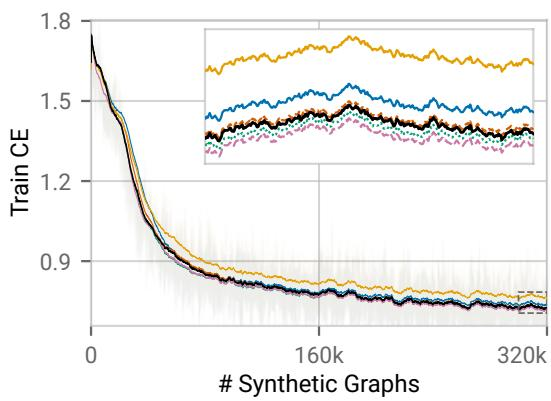

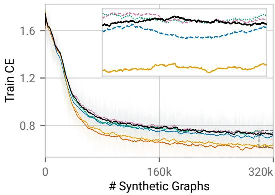

<table><tr><td>Variant</td><td>Acc. ↑ Rank↓</td><td></td><td>Win ↑</td></tr><tr><td>Full model</td><td>78.91</td><td>2.84</td><td></td></tr><tr><td>Uniform aggregation</td><td>78.79</td><td>3.03</td><td>37.25</td></tr><tr><td>w/o global nodes</td><td>76.60</td><td>4.75</td><td>19.61</td></tr><tr><td>w/o degree scaling</td><td>78.48</td><td>3.13</td><td>39.22</td></tr><tr><td>Context-only gather</td><td>78.07</td><td>2.99</td><td>43.14</td></tr><tr><td>w/o feature broadcast</td><td>77.44</td><td>4.26</td><td>31.37</td></tr></table>

<table><tr><td>Variant</td><td>Acc. ↑ Rank↓ Win ↑</td><td></td></tr><tr><td>Full model</td><td>78.91</td><td>2.27 一</td></tr><tr><td>w/o relational updates</td><td>60.61</td><td>5.61 3.92</td></tr><tr><td>■Diffusion only</td><td>77.64</td><td>3.32 35.29</td></tr><tr><td>Cascade only</td><td>76.89</td><td>3.39 21.57</td></tr><tr><td>Degree only</td><td>78.44</td><td>3.34 23.53</td></tr><tr><td>No embedding</td><td>77.38</td><td>3.06 33.33</td></tr></table>

Figure 8: Architecture (left) and prior (right) ablations. Models are pretrained for 5,000 steps. Curves show training cross-entropy smoothed with a trailing 100-step mean, with faint traces indicating raw losses; insets magnify the final 300k–320k training graphs. Tables report mean accuracy (Acc., %), average rank (Rank), and the percentage of strict wins against the full model (Win, %) across 51 datasets under high-label regime. Ranks are computed separately within the architecture and prior ablations, and table swatches indicate the corresponding training curves.

## H FULL EXPERIMENTAL RESULTS

This section provides the complete results underlying the main evaluation in Section 5. We report aggregate performance across all 51 datasets, examine its trade-off with adaptation runtime, and further analyze pairwise and subgroup results to characterize where the observed gains arise.

Aggregate performance. Table 13 and Figure 9 report the complete aggregate results under the high-label (50/25/25) and low-label (10/10/80) regimes. Ephris ranks first in all four metrics in both regimes: Elo, improvability, average rank, and average accuracy. In the high-label regime, Ephris achieves an Elo of 1521 compared with 1388 for the runner-up tuned GCNII, while reducing mean improvability from 18.81% to 8.29% and average rank from 8.57 to 5.13. It also achieves the highest average accuracy at 81.27%. The margins narrow under the low-label regime, where Ephris achieves an Elo of 1381 compared with 1371 for the runner-up tuned GCNII, but remains first in improvability, average rank, and average accuracy at 9.06%, 7.55, and 74.23%, respectively.

HP tuning substantially improves many supervised GNNs, with tuned GCNII and GPRGNN emerging as the strongest GNN baselines across the two regimes. Among prior graph ICL methods, GraphPFN is consistently the strongest. We therefore use these methods as the primary reference points in the comparisons below.

Performance and runtime. The predictive gains of Ephris also come with substantially lower adaptation cost. Runtime overhead is aggregated geometrically across datasets, so differences on the $\log _ { 2 }$ scale in Table 13 correspond directly to multiplicative differences in average runtime. Compared with the strongest tuned GNNs, Ephris is approximately 739× and 584× faster than GCNII in the high-label and low-label regimes, respectively, and 161× and 103× faster than GPRGNN. Compared with GraphPFN, the strongest prior graph ICL baseline, Ephris is approximately 16.1× and 13.1× faster while achieving stronger predictive performance across all four aggregate metrics. Accordingly, Ephris occupies a favorable performance and runtime region across the metrics in Figure 10, improving predictive performance without increasing target-time computation.

Performance across dataset characteristics. Figures 12 and 13 compare performance across subgroups defined by the dataset characteristics in Table 12.

Table 12: Dataset subgroup definitions.
<table><tr><td>Characteristic</td><td>Subgroups</td></tr><tr><td>Nodes N</td><td>Tiny  $( \leq 2 \mathrm { K } )$  , Small (2K to 10K), Medium (10K to 100K), Large  $( >$  100K)</td></tr><tr><td>Avg. degree  $\bar { d }$ </td><td>Low  $( \leq 5 )$  , Medium (5 to 20), High (&gt; 20)</td></tr><tr><td>Adj. homophily  $h _ { \mathrm { a d j } }$ </td><td>Negative  $( < 0 ) .$  , Low (0 to 0.5), High  $( \geq 0 . 5 )$ </td></tr><tr><td>Features  $F$ </td><td>Low (≤ 500), Medium (500 to 5K), High  $( \geq 5 \mathrm { K } )$ </td></tr><tr><td>Nonzero fraction r</td><td>Sparse (≤ 1%), Medium (1% to 50%), Dense  $( > 5 0 \% )$ </td></tr><tr><td>Classes  $C$ </td><td>Binary (2), Medium (3 to 10), Many (&gt; 10)</td></tr><tr><td>Class imbalance</td><td>Low  $( \leq 2 )$  , Medium (2 to 10), High (&gt; 10)</td></tr></table>

Across these groups, Ephris outperforms GraphPFN in nearly every subgroup under both label regimes. This consistent advantage indicates that the improvement of graph ICL is not tied to a particular graph size, connectivity pattern, homophily level, or task characteristic.

A different pattern emerges against the strongest tuned GNNs. In the high-label regime, Ephris outperforms GCNII and GPRGNN across nearly all subgroups, whereas under low labels the methods become comparable and tuned GNNs lead in several cases. One possible explanation is validationbased adaptation: GCNII and GPRGNN select among 200 configurations for each dataset using validation labels, whereas Ephris uses a single fixed checkpoint and no validation labels. This dataset-specific selection may become particularly valuable when labeled context is low.

Notably, the two clear exceptions even in the high-label regime are high-dimensional datasets $( F \geq$ 5K) and tasks with more than ten classes $\bar { ( C ) \ > \ 1 0 ) }$ . Both fall outside the distribution directly observed by Ephris during pretraining, which contains at most 1,024 features and ten classes; larger label spaces are instead handled indirectly through ECOC. GraphPFN shows the same failure pattern in these two subgroups. This shared degradation suggests a broader limitation of current graph ICL: generalization remains strongest within the support of the synthetic pretraining distribution and weakens when feature or label dimensionality requires substantial extrapolation.

Table 13: Comparison across 51 datasets under the high-label (50/25/25, left) and low-label (10/10/80, right) train/validation/test regimes. Each side lists all configurations independently in descending Elo order; entries on the same row need not denote the same method. (D)/(T) denote default/HP-tuned configurations. Imp is mean improvability (%), Acc. is mean accuracy (%), and Time is mean fit-time overhead on a log scale. • Gold, • silver, and • bronze mark the top three in each predictive metric separately within each regime. Under high-label, Ephris ranks 1 in Elo, 1 in improvability, 1 in average rank, and 1 in accuracy. Under low-label, Ephris ranks 1 in Elo, 1 in improvability, 1 in average rank, and 1 in accuracy.
<table><tr><td colspan="6">High-label (50/25/25)</td></tr><tr><td>Method</td><td>Elo ↑</td><td>Imp ↓</td><td>Rank ↓</td><td>Acc. ↑ Time ↓</td><td></td></tr><tr><td>Ephris</td><td>•1521</td><td>8.29</td><td>●5.1381.27</td><td></td><td>2.07</td></tr><tr><td>GCNII (T)</td><td>1388</td><td>18.81</td><td>8.57</td><td>78.02</td><td>11.60</td></tr><tr><td>GPRGNN (T)</td><td> 1369</td><td>20.04</td><td>●9.18</td><td>77.65</td><td>9.40</td></tr><tr><td>GraphPFN</td><td>1337</td><td>16.55</td><td>10.2479.76</td><td></td><td>6.08</td></tr><tr><td>FAGCN (T)</td><td>1334</td><td>21.59</td><td>10.33</td><td>76.50</td><td>9.33</td></tr><tr><td>GCN (T)</td><td>1331</td><td>19.27</td><td>10.45</td><td>78.49</td><td>9.94</td></tr><tr><td>SGFormer (T)</td><td>1312</td><td>18.93</td><td>11.12</td><td>78.54</td><td>9.65</td></tr><tr><td>Polynormer (T)</td><td>1311</td><td>•18.61</td><td>11.15</td><td>79.14</td><td>12.44</td></tr><tr><td>GAT (T)</td><td>1307</td><td>20.59</td><td>11.31</td><td>78.50</td><td>10.08</td></tr><tr><td>GraphSAGE (T)</td><td>1300</td><td>21.23</td><td>11.57</td><td>78.08</td><td>9.91</td></tr><tr><td>GATv2 (T)</td><td>1274</td><td>22.52</td><td>12.52</td><td>77.96</td><td>9.60</td></tr><tr><td>APPNP (T)</td><td>1215</td><td>27.69</td><td>14.85</td><td>74.87</td><td>8.75</td></tr><tr><td>GVT</td><td>1202</td><td>26.56</td><td>15.38</td><td>75.43</td><td>5.18</td></tr><tr><td>LINKX (T)</td><td>1193</td><td>22.30</td><td>15.76</td><td>78.71</td><td>7.44</td></tr><tr><td>NAGphormer (T)</td><td>1188</td><td>26.48</td><td>15.96</td><td>76.60</td><td>10.85</td></tr><tr><td>NodeFormer (T)</td><td>1170</td><td>26.38</td><td>16.73</td><td>75.70</td><td>10.78</td></tr><tr><td>GPRGNN (D)</td><td>1127</td><td>29.52</td><td>18.58</td><td>74.25</td><td>2.00</td></tr><tr><td>NAGphormer (D)</td><td>1107</td><td>29.84</td><td>19.45</td><td>74.16</td><td>2.72</td></tr><tr><td>GraphSAGE (D)</td><td>1078</td><td>31.09</td><td>20.73</td><td>73.95</td><td>1.76</td></tr><tr><td>Node4All</td><td>1059</td><td>34.17</td><td>21.55</td><td>73.47</td><td>3.56</td></tr><tr><td>FAGCN (D)</td><td>1053</td><td>31.65</td><td>21.81</td><td>73.34</td><td>1.56</td></tr><tr><td>SGFormer (D)</td><td>1049</td><td>32.09</td><td>21.96</td><td>74.12</td><td>1.80</td></tr><tr><td>Polynormer (D)</td><td>1004</td><td>36.55</td><td>23.84</td><td>71.21</td><td>4.02</td></tr><tr><td>MLP (T)</td><td>1003</td><td>37.10</td><td>23.89</td><td>72.93</td><td>7.49</td></tr><tr><td>GCN (D)</td><td>1000</td><td>36.04</td><td>24.01</td><td>70.98</td><td>1.66</td></tr><tr><td>SGC (T)</td><td>999</td><td>37.11</td><td>24.06</td><td>70.98</td><td>10.13</td></tr><tr><td>G2T-FM</td><td>986</td><td>39.40</td><td>24.56</td><td>72.11</td><td>4.09</td></tr><tr><td>NodeFormer (D)</td><td>973</td><td>35.36</td><td>25.08</td><td>73.14</td><td>4.04</td></tr><tr><td>GCNII (D)</td><td>973</td><td>36.43</td><td>25.11</td><td>72.00</td><td>3.84</td></tr><tr><td>LINKX (D)</td><td>964</td><td>38.21</td><td>25.45</td><td>72.15</td><td>0.15</td></tr><tr><td>NodePFN</td><td>961</td><td>37.79</td><td>25.58</td><td>72.71</td><td>9.92</td></tr><tr><td>GATv2 (D)</td><td>958</td><td>38.20</td><td>25.69</td><td>69.96</td><td>2.00</td></tr><tr><td>APPNP (D)</td><td>955</td><td>37.82</td><td>25.80</td><td>70.55</td><td>2.16</td></tr><tr><td>GAT (D)</td><td>922</td><td>40.22</td><td>27.05</td><td>69.47</td><td>1.80</td></tr><tr><td>MLP (D)</td><td>909</td><td>41.47</td><td>27.52</td><td>71.21</td><td>0.71</td></tr><tr><td>GraphAny</td><td>824</td><td>46.59</td><td>30.31</td><td>67.77</td><td>2.25</td></tr><tr><td>SGC (D)</td><td>810</td><td>46.14</td><td>30.72</td><td>67.86</td><td>2.80</td></tr></table>

<table><tr><td colspan="6">Low-label (10/10/80)</td></tr><tr><td>Method</td><td>Elo ↑</td><td>Imp ↓</td><td>Rank↓</td><td>Acc. ↑</td><td>Time ↓</td></tr><tr><td>Ephris</td><td>1381</td><td>9.06</td><td>7.5574.23</td><td></td><td>2.36</td></tr><tr><td>GCNII (T)</td><td>1371</td><td>11.58</td><td>7.8373.59</td><td></td><td>11.55</td></tr><tr><td>GPRGNN (T)</td><td>• 1356</td><td>• 12.54</td><td>8.28●73.42</td><td></td><td>9.05</td></tr><tr><td>FAGCN (T)</td><td>1311</td><td>14.18</td><td>9.78</td><td>72.45</td><td>9.00</td></tr><tr><td>GCN (T)</td><td>1280</td><td>14.18</td><td>10.88</td><td>73.00</td><td>9.83</td></tr><tr><td>GAT (T)</td><td>1254</td><td>15.43</td><td>11.86</td><td>72.65</td><td>9.96</td></tr><tr><td>GraphSAGE (T)</td><td>1246</td><td>15.15</td><td>12.18</td><td>72.91</td><td>9.90</td></tr><tr><td>APPNP (T)</td><td>1232</td><td>17.92</td><td>12.73</td><td>71.45</td><td>8.61</td></tr><tr><td>SGFormer (T)</td><td>1225</td><td>14.58</td><td>13.00</td><td>73.10</td><td>9.62</td></tr><tr><td>GraphPFN</td><td>1221</td><td>16.05</td><td>13.18</td><td>72.30</td><td>6.07</td></tr><tr><td>GATv2 (T)</td><td>1210</td><td>17.49</td><td>13.64</td><td>72.02</td><td>9.47</td></tr><tr><td>Polynormer (T)</td><td>1200</td><td>16.43</td><td>14.05</td><td>72.59</td><td>12.45</td></tr><tr><td>GVT</td><td>1195</td><td>18.76</td><td>14.23</td><td>71.19</td><td>4.71</td></tr><tr><td>NodeFormer (T)</td><td>1177</td><td>17.85</td><td>15.01</td><td>71.90</td><td>10.64</td></tr><tr><td>NAGphormer (T)</td><td>1153</td><td>20.39</td><td>16.03</td><td>70.41</td><td>10.54</td></tr><tr><td>GPRGNN (D)</td><td>1100</td><td>23.02</td><td>18.41</td><td>69.15</td><td>1.74</td></tr><tr><td>FAGCN (D)</td><td>1086</td><td>22.29</td><td>19.01</td><td>69.48</td><td>1.28</td></tr><tr><td>LINKX (T)</td><td>1076</td><td>22.98</td><td>19.49</td><td>71.09</td><td>7.78</td></tr><tr><td>NAGphormer (D)</td><td>1056</td><td>23.07</td><td>20.36</td><td>68.92</td><td>2.54</td></tr><tr><td>GCNII (D)</td><td>1036</td><td>25.26</td><td>21.25</td><td>68.18</td><td>3.67</td></tr><tr><td>Node4All</td><td>1034</td><td>25.72</td><td>21.36</td><td>69.29</td><td>3.49</td></tr><tr><td>APPNP (D)</td><td>1025</td><td>25.69</td><td>21.77</td><td>68.15</td><td>2.04</td></tr><tr><td>SGC (T)</td><td>1025</td><td>26.70</td><td>21.77</td><td>68.51</td><td>9.89</td></tr><tr><td>GraphSAGE (D)</td><td>1018</td><td>24.73</td><td>22.04</td><td>69.15</td><td>1.80</td></tr><tr><td>GCN (D)</td><td>1000</td><td>27.06</td><td>22.85</td><td>67.93</td><td>1.48</td></tr><tr><td>SGFormer (D)</td><td>996</td><td>26.67</td><td>23.02</td><td>69.04</td><td>1.90</td></tr><tr><td>MLP (T)</td><td>977</td><td>29.51</td><td>23.83</td><td>68.31</td><td>7.34</td></tr><tr><td>NodeFormer (D)</td><td>967</td><td>28.26</td><td>24.24</td><td>68.46</td><td>3.92</td></tr><tr><td>G2T-FM</td><td>964</td><td>33.26</td><td>24.38</td><td>65.69</td><td>5.79</td></tr><tr><td>NodePFN</td><td>921</td><td>32.51</td><td>26.13</td><td>67.75</td><td>11.09</td></tr><tr><td>GATv2 (D)</td><td>916</td><td>30.61</td><td>26.32</td><td>66.27</td><td>1.83</td></tr><tr><td>GAT (D)</td><td>897</td><td>31.17</td><td>27.05</td><td>66.09</td><td>1.69</td></tr><tr><td>SGC (D)</td><td>896</td><td>33.42</td><td>27.10</td><td>66.23</td><td>2.56</td></tr><tr><td>MLP (D)</td><td>889</td><td>33.60</td><td>27.34</td><td>66.49</td><td>0.75</td></tr><tr><td>GraphAny</td><td>875</td><td>35.83</td><td>27.88</td><td>65.74</td><td>0.90</td></tr><tr><td>Polynormer (D)</td><td>867</td><td>36.30</td><td>28.16</td><td>63.05</td><td>4.13</td></tr><tr><td>LINKX (D)</td><td>843</td><td>40.84</td><td>29.00</td><td>62.99</td><td>0.32</td></tr></table>

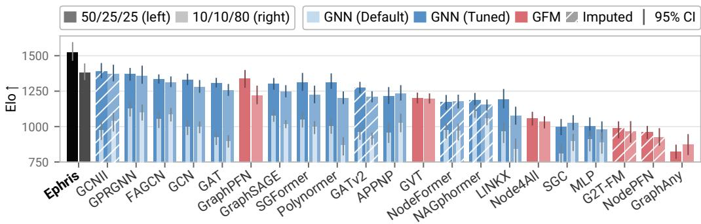  
(a) Elo.

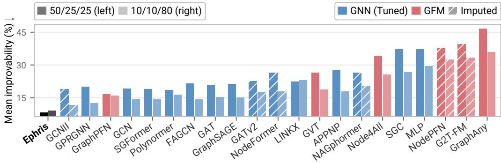  
(b) Improvability.

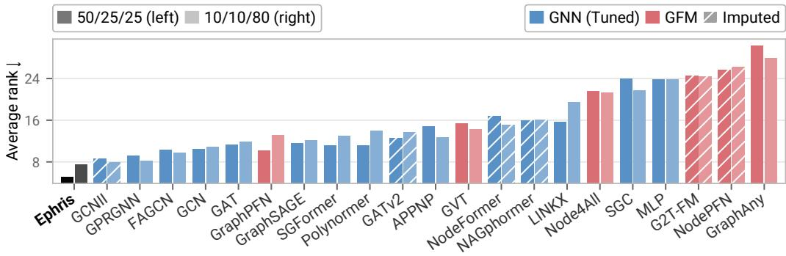  
(c) Average rank.

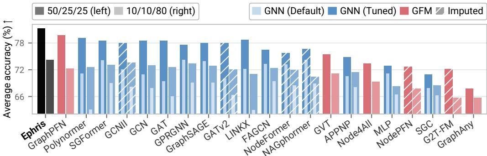  
(d) Average accuracy.  
Figure 9: Aggregate performance across evaluation metrics. Paired comparisons under the highand low-label regimes for (a) Elo, (b) improvability, (c) average rank, and (d) average accuracy. Each bar shows a default GNN alongside its HP-tuned counterpart. Hatching marks results imputed for OOM runs. Methods are ordered by their mean performance across the two label regimes.

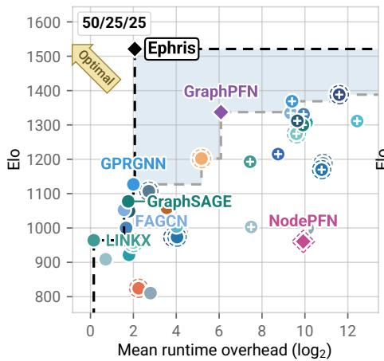

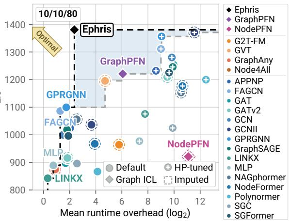  
(a) Elo.

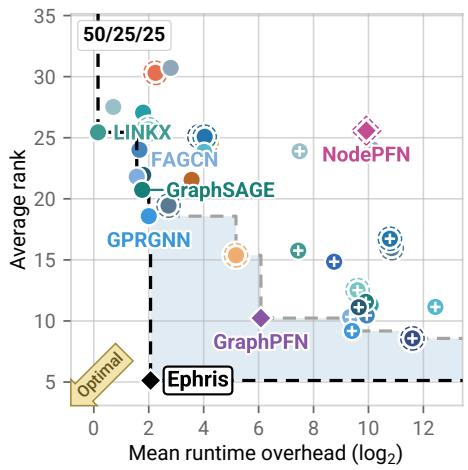

  
(b) Average rank.

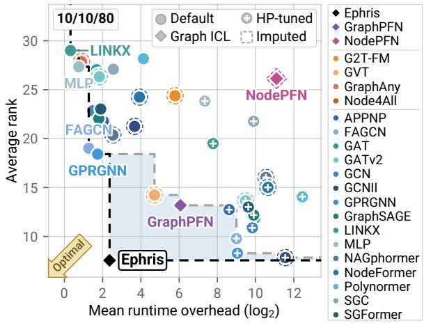  
(c) Average accuracy.  
Figure 10: Performance-runtime Pareto plots. Trade-offs between average runtime overhead and (a) Elo, (b) average rank, and (c) average accuracy. Each point represents an evaluated method, and the Pareto frontier identifies methods that are not jointly dominated in performance and runtime.

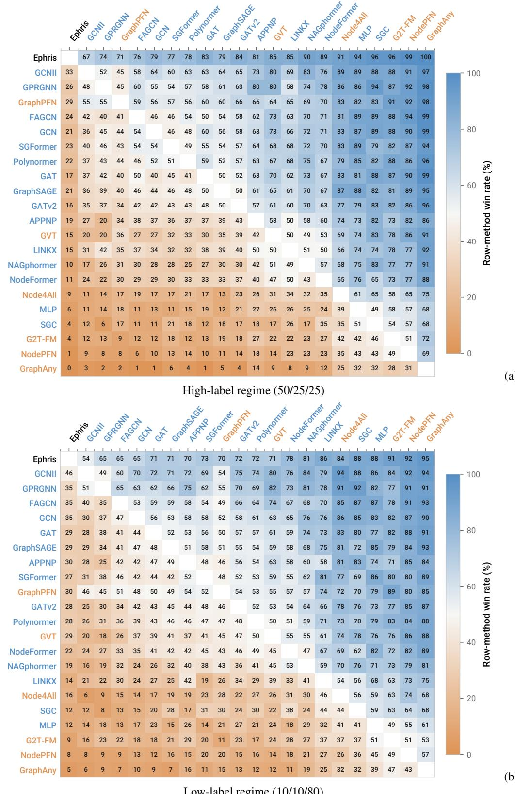  
Figure 11: Pairwise win-rate matrices. Pairwise comparisons under (a) the high-label and (b) the low-label regime. Each entry reports the fraction of datasets on which the row method achieves higher test accuracy than the column method.

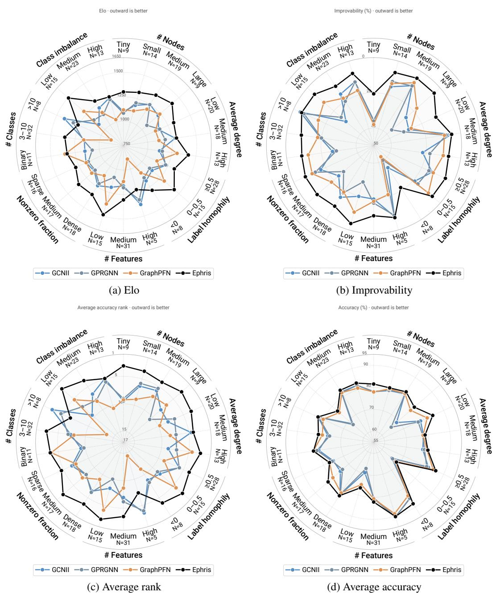  
Figure 12: Performance across dataset subgroups under the high-label regime (50/25/25). Radar plots show subgroup performance measured by (a) Elo, (b) improvability, (c) average rank, and (d) average accuracy. Each axis corresponds to a dataset subgroup, providing a more detailed view of performance across different dataset characteristics.

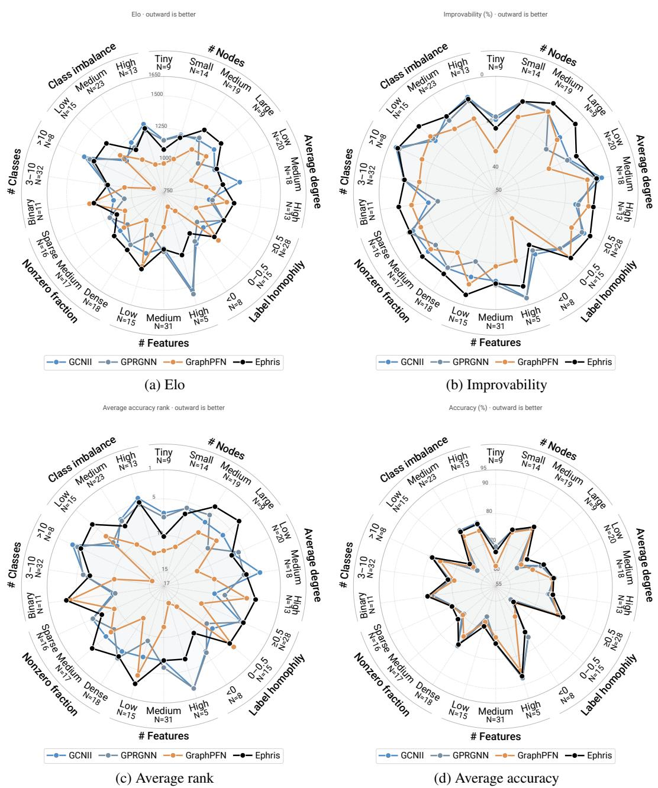  
Figure 13: Performance across dataset subgroups under the low-label regime (10/10/80). Radar plots show subgroup performance measured by (a) Elo, (b) improvability, (c) average rank, and (d) average accuracy. Each axis corresponds to a dataset subgroup, providing a more detailed view of performance across different dataset characteristics.