# Multi-Agent Flow Matching with Decoupled Generative Guidance

Ruoyu Lin1 Magnus Egerstedt2 Fabio Pasqualetti1

Abstract— Generative modeling is widely used for producing diverse objects from complex, multimodal distributions. However, its expressivity does not, in general, come with formal guarantees that the generated objects satisfy hard constraints or requirements. In multi-agent generation, this problem becomes more challenging because a hard requirement can depend on multiple agents, while each agent may need to determine its own guidance input without relying on the simultaneously computed guidance inputs of other agents. To this end, we introduce DeGG-Flow, a general framework for multi-agent flow matching with decoupled generative guidance. By representing the generative process as a control-affine dynamical system, we develop guidance conditions for two classes of coupled requirements: shared requirements whose satisfaction depends on multiple agents together, and private requirements associated with each individual agent dependent on its neighbors. For both classes, we establish feasibility conditions and finite-horizon convergence guarantees. We further derive a Wasserstein bound that characterizes the distributional deviation induced by the guidance. We demonstrate DeGG-Flow on multi-robot collaboration for crossing a spatial gap by reconfiguring the environment, and on multi-object scene generation with affordance requirements. Across both applications, DeGG-Flow directly generates objects that satisfy all corresponding hard requirements, including at team sizes unseen during training.

## 1 INTRODUCTION

Generative models have achieved remarkable success across a wide range of domains, from language and vision to robotics and scientific discovery (Brown et al., 2020; Rombach et al., 2022; Chi et al., 2025; Lipman et al., 2022; Albergo et al., 2025; Janner et al., 2022; Tang et al., 2024). A core strength of these models is their ability to characterize complex, multimodal distributions and generate diverse objects from them. However, such expressivity, in general, does not imply that every generated object satisfies desired hard constraints or requirements. For example, a generated motion may violate safety requirements, a generated molecular structure may violate physical or chemical constraints, and new requirements introduced after training may not be represented in the training data. This gap is especially important when a learned generative model is already useful but new hard requirements arise after training. In such cases, it is desirable to impose constraints at generation time without collecting new data or retraining the model.

Guidance in the generative process provides a natural mechanism for enforcing constraints (Bansal et al., 2024; Feng et al.,

2025). Recent work has made this idea increasingly principled by incorporating control barrier functions (CBF) (Ames et al., 2016) into generative process. SafeDiffuser (Xiao et al., 2025) introduces CBF into the denoising process of diffusion probabilistic model (Ho et al., 2020); SafeFlow (Dai et al., 2025) targets robot motion planning by imposing CBF constraints at the waypoints of a generated trajectory; Gadginmath et al. (2026) formulate constrained sampling through a stochastic differential equation and implement discrete-time CBF through a first-order approximation; and SafeFlowMatcher (Yang et al., 2026) addresses robotic path planning by first generating a candidate path and then applying a separate CBF-based correction.

Multi-agent generative modeling changes the structure of such guidance, as hard constraints or requirements may depend jointly on multiple agents. A direct approach is to treat all agents as a single-agent system and compute the guidance together. However, a key advantage of multi-agent systems is that the team need not depend on a single central decision maker, whose failure could affect all agents at once. This motivates decentralized or agent-wise guidance, where each agent determines its own guidance without relying on that of any other agent. Existing multi-agent generative models address different aspects of this problem. MADiff (Zhu et al., 2024) models multimodal multi-agent behavior and supports decentralized execution; Shaoul et al. (2025) combine diffusion models with search-based planning to generate collision-free multi-robot trajectories; Parimi and Williams (2025) decompose multi-arm planning into single-arm trajectory generation and pairwise collision resolution; Liang et al. (2025) integrate constrained projection into the denoising process (Ho et al., 2020) to satisfy collision avoidance and kinematic constraints; and MAC-Flow (Lee et al., 2026) learns joint behaviors with flow matching and distills them into decentralized one-step policies. These works provide different mechanisms for generating, coordinating, and adapting multi-agent behavior. What remains unresolved is how to guarantee a hard requirement that depends on multiple agents when each agent determines only its own guidance.

The constrained generative methods discussed earlier do not directly resolve this problem either. Applied to the full multiagent state, they naturally lead to a joint guidance problem. The challenge is thus to formulate a guidance rule for each agent that it can satisfy, while ensuring that these agent-level rules together provide provable guarantees on the team-level coupled constraints or requirements.

To this end, we introduce DeGG-Flow, a general framework for multi-agent flow matching with decoupled generative guidance. Its central idea is to preserve agent-wise guidance while providing formal guarantees for requirements that can couple multiple agents. DeGG-Flow handles two classes of requirements: shared requirements for which multiple agents collaboratively contribute to their satisfaction, and private requirements associated with each individual agent whose satisfaction depends on its neighbors. The guidance is applied during the generative process, without collecting new training data, retraining the learned generative model, or repairing the generated objects afterward. The distributional deviation induced by the guidance is further shown to be theoretically bounded rather than uncharacterized. Our main contributions are summarized as follows.

• Agent-wise guidance with team-level requirement. We formulate the generative process of multi-agent flow matching as a control-affine dynamical system and adapt disentangled control (Lin et al., 2026) to decoupled guid ance, so that each agent determines only its own guidance input without relying on the simultaneously computed guidance input of any other agent, while retaining formal guarantees for requirements that couple multiple agents.

• Feasibility and finite-horizon convergence guarantees. For shared requirements, we introduce an adaptive constraint allocation approach to ensure feasibility of the corresponding decoupled guidance, and propose a time-varying bound that guarantees the generated object reaches a desired set in the generative state space within finite horizon. For private requirements, we also establish feasibility conditions for the corresponding decoupled guidance and propose an approach to guarantee finite-horizon convergence.

• Bounded distributional deviation under guidance. We derive a Wasserstein bound that characterizes how far the guided joint generative distribution can deviate from the unguided one, and empirically evaluate the resulting distributional deviation in experiments.

• Applications with shared and private requirements. We demonstrate DeGG-Flow on multi-robot collaborative policy generation with shared coupled requirements for crossing a spatial gap by reconfiguring the environment, and on multi-object scene generation with private coupled requirements, where each object’s affordance re quirements, i.e., its access and use requirements, depend on neighboring objects. In both tasks, DeGG-Flow directly generates objects that satisfy all hard requirements without post-generation correction, including for numbers of agents beyond those used during training.

## 2 MULTI-AGENT FLOW MATCHING GUIDED BYDISENTANGLED CONTROL

## 2.1 MULTI-AGENT FLOW MATCHING

Consider a team of $N \in \mathbb { Z } ^ { + }$ agents, indexed by $i \in \mathcal { N } : =$ $\{ 1 , \ldots , N \}$ , whose joint generative process produces an output $y \in \mathcal { V } _ { N }$ for a given task, where $\mathcal { D } _ { N }$ denotes the corresponding output space. Let $\chi \in \mathcal { C } _ { N }$ denote the generation condition, where $\mathcal { C } _ { N }$ is the corresponding condition space. The condition contains information such as initial states, agent or object properties, environment information, or task specifications. The output y depends on specific applications. For example, in Section 4.1, y represents a motion policy for N robots, and in Section 4.2, y represents an arrangement of N objects. Instead of generating y directly, each agent i has a generative state $z _ { i } ( \tau ) \in \mathcal { Z } \subseteq \mathbb { R } ^ { d _ { z } }$ at generative time $\tau \in [ 0 , 1 ]$ , which is different from physical time $t \in \mathbb { R } _ { > 0 }$ . Denote the joint generative state as $\mathbf { \dot { z } } ( \tau ) : = [ z _ { 1 } ( \tau ) ^ { \top } , \dots , \overline { { z } } _ { N } ( \tau ) ^ { \top } ] ^ { \top } \in \tilde { \mathcal { Z } } ^ { N } \subseteq \mathbf { \bar { \mathbb { R } } } ^ { N d _ { z } }$ The task-specific decoder and encoder map between the joint generative state space and the output space are denoted as

$$
\mathcal { D } _ { N } : \mathcal { Z } ^ { N } \times \mathcal { C } _ { N } \to \mathcal { V } _ { N } , \quad y = \mathcal { D } _ { N } ( \mathbf { z } \mid \chi ) ,\tag{1}
$$

$$
\mathcal { E } _ { N } : \mathcal { V } _ { N } \times \mathcal { C } _ { N } \to \mathcal { Z } ^ { N } , \quad \mathbf { z } = \mathcal { E } _ { N } ( y \vert \chi ) .\tag{2}
$$

For a training data $y , \mathcal { E } _ { N } ( y | \chi )$ per (2) gives its target generative state for flow matching, and $\mathcal { D } _ { N } ( \mathbf { z } ( 1 ) | \chi )$ per (1) represents the final generated object.

Given N and $\chi ,$ let $p _ { \mathrm { d a t a } } ( \mathbf { z } \mid \chi )$ denote the joint conditional distribution of the encoded training data in $\bar { \mathcal { Z } } ^ { N }$ , and let $p _ { 0 } ( \mathbf { x } )$ denote a simple initial distribution in $\mathcal { Z } ^ { N }$ from which samples can be drawn efficiently. Generation starts from $\mathbf { z } ( 0 ) \sim p _ { 0 }$ and evolves over $\tau \in [ 0 , 1 ]$ governed by the dynamical system

$$
\dot { \mathbf { z } } = f ( \tau , \mathbf { z } | \boldsymbol { \chi } ) .
$$

The objective of flow matching (Lipman et al., 2022) is to learn a vector field whose flow transports $p _ { 0 }$ to $p _ { \mathrm { d a t a } } ( \mathbf { z } \mid \chi )$ To learn such a vector field, for each target $\textbf { z } \in \ \mathcal { Z } ^ { N }$ , consider a conditional probability path $p ( \tau , \mathbf { x } | \mathbf { z } , \boldsymbol { \chi } )$ satisfying $p ( 0 , { \bf x } | { \bf z } , \chi ) = p _ { 0 } ( { \bf x } )$ and $p ( 1 , { \bf x } | { \bf z } , \chi ) = \delta ( { \bf x } - { \bf z } )$ , where $\mathbf { x } \in \mathcal { Z } ^ { N }$ is a realization of the intermediate random variable $\mathbf { X } ( \tau )$ and $\delta ( \mathbf { x } - \mathbf { z } )$ is the Dirac delta concentrated at z. Let $v ( \tau , \mathbf { x } | \mathbf { z } , \boldsymbol { \chi } ) \in \mathbb { R } ^ { \dot { N } d _ { z } }$ denote a conditional time-varying vector field that generates this path, then the marginal probability path is $\begin{array} { r } { p ( \tau , \mathbf { x } \mid \chi ) = \int _ { \mathcal { Z } ^ { N } } p ( \tau , \mathbf { x } \mid \mathbf { z } , \chi ) p _ { \mathrm { d a t a } } ( \mathbf { z } \mid \chi ) } \end{array}$ dz, and the corresponding marginal vector field is

$$
f ( \tau , \mathbf { x } \mid \chi ) : = \int _ { \mathcal { Z } ^ { N } } v ( \tau , \mathbf { x } \mid \mathbf { z } , \chi ) \frac { p ( \tau , \mathbf { x } \mid \mathbf { z } , \chi ) p _ { \mathrm { d a t a } } ( \mathbf { z } \mid \chi ) } { p ( \tau , \mathbf { x } \mid \chi ) } \mathrm { d } \mathbf { z } .\tag{3}
$$

Since (3) depends on the unknown data distribution, in this paper, (3) is represented as a message passing graph neural network (GNN) (Gilmer et al., 2017)

$$
f ^ { \theta } : [ 0 , 1 ] \times \mathcal { Z } ^ { N } \times \mathcal { C } _ { N }  \mathbb { R } ^ { N d _ { z } } ,\tag{4}
$$

which we refer to as the nominal vector field. The same neural network parameters θ are shared across all agents. Each agent computes its output from its own state and messages aggregated from neighboring agents so that the GNN (4) is permutation equivariant. Denote $f ^ { \theta } = [ ( f _ { 1 } ^ { \theta } ) ^ { \top } , \dots , ( f _ { N } ^ { \theta } ) ^ { \top } ] ^ { \top }$ where $f _ { i } ^ { \theta } \in \mathbb { R } ^ { \bar { d } _ { z } }$ is the nominal vector field of agent i, which is trained using the multi-agent conditional flow matching loss

$$
\begin{array} { r } { \mathcal { L } _ { \mathrm { M A C } } ( \theta \mid \chi ) : = \mathbb { E } \Bigg [ \frac { 1 } { N } \sum _ { i = 1 } ^ { N } \bigg \| f _ { i } ^ { \theta } ( \tau , \mathbf { X } ( \tau ) \mid \chi ) } \\ { - v _ { i } ( \tau , \mathbf { X } ( \tau ) \mid \mathbf { Z } , \chi ) \bigg \| ^ { 2 } \Bigg ] , } \end{array}\tag{5}
$$

in which the expectation is taken over $\tau \sim \mathrm { U n i f } [ 0 , 1 ]$ , the encoded data random variable $\mathbf { Z } \sim p _ { \mathrm { d a t a } } ( \mathbf { z } \mid \chi )$ , and the intermediate state random variable $\mathbf { X } ( \tau ) \sim p ( \tau , \mathbf { x } | \mathbf { Z } , \chi )$ along the conditional probability path. After training, $f ^ { \theta }$ is the nominal vector field governing the generative dynamics. We next introduce a guidance mechanism modifying such dynamics.

## 2.2 DISENTANGLED CONTROL GUIDANCE

The nominal vector field $f ^ { \theta }$ transports samples from a simple initial distribution toward a complex, multimodal distribution that approximates the encoded data distribution. However, the resulting generated objects are not, in general, guaranteed to satisfy hard constraints or requirements. To this end, we introduce a guidance input to the dynamics of each agent in the generative process. Let $u _ { i } ( \tau ) \in \mathbb { R } ^ { m _ { i } }$ be the guidance input of agent i, and $g _ { i } : [ 0 , 1 ] \times \mathcal { Z } ^ { N } \times \mathcal { C } _ { N }  \mathbb { R } ^ { d _ { z } \times m _ { i } }$ be the map determining how the guidance input affects the generative dynamics. Then, the guided generative dynamics are in the control-affine form

$$
\dot { z } _ { i } = f _ { i } ^ { \theta } ( \tau , \mathbf { z } \vert \chi ) + g _ { i } ( \tau , \mathbf { z } \vert \chi ) u _ { i } , \quad \forall i \in \mathcal { N } .\tag{6}
$$

We represent the hard requirement by a $C ^ { 1 } \left( \mathrm { i . e . } \right.$ ., continuously differentiable) function, and consider two classes of decoupled guidance by adapting disentangled control (Lin et al., 2026) from multi-agent control in physical space into the generative process as a form of decoupled guidance, i.e., guidance for shared-entangled requirements (SE guidance) and guidance for private-entangled requirements (PE guidance), to enable agent i to compute $u _ { i }$ without access to the simultaneously computed guidance input $u _ { j } , \forall j \in \mathcal { N } \backslash \{ i \}$

SE guidance. Let $\begin{array} { r c l } { \mathcal { G } _ { \mathrm { F } } ^ { \mathrm { S E } } } & { = } & { ( \mathcal { N } , \mathcal { A } ^ { \mathrm { S E } } , \mathcal { T } ^ { \mathrm { S E } } ) } \end{array}$ ) be a factor graph (Kschischang et al., 2001), where $\mathcal { A } ^ { \mathrm { S E } }$ is a finite set of factors and $\mathcal { T } ^ { \mathrm { S E } } \subseteq \mathcal { N } \times \mathcal { A } ^ { \mathrm { S E } }$ is the incidence relation. For each factor $a \ \in \ A ^ { \mathrm { S E } }$ , define the incident agent set as $S _ { a } ^ { \mathrm { S E } } : = \{ i \in N : ( i , a ) \in \mathcal { I } ^ { \mathrm { S E } } \} \ne \emptyset$ , and let $\mathbf { z } _ { S _ { a } ^ { \mathrm { S E } } }$ denote the corresponding subvector of the joint generative state. Let $V _ { a } ^ { \mathrm { S E } } : [ 0 , \bar { 1 } ] \times \bar { \prod _ { i \in \mathcal { S } _ { \circ } ^ { \mathrm { S E } } } } \mathcal { Z } \times \mathcal { C } _ { N }  \bar { \mathbb { R } }$ be $C ^ { 1 }$ . The guidance input $u _ { i }$ of agent $i \in \overrightharpoon { S } _ { a } ^ { \mathrm { S E } }$ is such that

$$
\begin{array} { r l } & { \nabla _ { z _ { i } } V _ { a } ^ { \mathrm { S E } } ( \tau , \mathbf { z } _ { S _ { a } ^ { \mathrm { S E } } } \mid \chi ) ^ { \top } \Big ( f _ { i } ^ { \theta } ( \tau , \mathbf { z } \mid \chi ) } \\ & { ~ + g _ { i } ( \tau , \mathbf { z } \mid \chi ) u _ { i } \Big ) + \zeta _ { a , i } ^ { \mathrm { S E } } ( \tau , \mathbf { z } \mid \chi ) \leq 0 , } \end{array}\tag{7}
$$

in which

$$
\begin{array} { r l } { \displaystyle \sum _ { i \in S _ { a } ^ { \mathrm { S E } } } \zeta _ { a , i } ^ { \mathrm { S E } } ( \tau , \mathbf { z } \mid \chi ) = \partial _ { \tau } V _ { a } ^ { \mathrm { S E } } ( \tau , \mathbf { z } _ { S _ { a } ^ { \mathrm { S E } } } \mid \chi ) } & { } \\ { + \alpha _ { a } ^ { \mathrm { S E } } ( V _ { a } ^ { \mathrm { S E } } ( \tau , \mathbf { z } _ { S _ { a } ^ { \mathrm { S E } } } \mid \chi ) ) , } \end{array}\tag{8}
$$

where $\alpha _ { a } ^ { \mathrm { S E } } : \mathbb { R }  \mathbb { R }$ is an extended class $\kappa _ { \infty }$ function.

PE guidance. For each agent $i \in \mathcal { N } .$ , let $V _ { i } ^ { \mathrm { P E } } : [ 0 , 1 ] \times \mathcal { Z } ^ { N } \times$ $\mathcal { C } _ { N }  \mathbb { R } _ { \geq 0 }$ be $C ^ { 1 }$ . The guidance input $u _ { i }$ of agent i is such that

$$
\begin{array} { r l } & { \nabla _ { z _ { i } } V ^ { \mathrm { P E } } ( \tau , \mathbf { z } \vert \chi ) ^ { \top } \left( f _ { i } ^ { \theta } ( \tau , \mathbf { z } \vert \chi ) + g _ { i } ( \tau , \mathbf { z } \vert \chi ) u _ { i } \right) } \\ & { \quad + \zeta _ { i } ^ { \mathrm { P E } } ( \tau , \mathbf { z } \vert \chi ) \leq 0 , \quad \forall i \in \mathcal { N } , } \end{array}\tag{9}
$$

in which

$$
V ^ { \mathrm { P E } } ( \tau , \mathbf { z } \mid \boldsymbol { \chi } ) : = \sum _ { i \in \mathcal { N } } V _ { i } ^ { \mathrm { P E } } ( \tau , \mathbf { z } \mid \boldsymbol { \chi } )
$$

and

$$
\begin{array} { r l } & { \zeta _ { i } ^ { \mathrm { P E } } ( \tau , { \mathbf z } | \chi ) : = \partial _ { \tau } V _ { i } ^ { \mathrm { P E } } ( \tau , { \mathbf z } | \chi ) } \\ & { \qquad + \omega ^ { \mathrm { P E } } ( \tau ) \alpha ^ { \mathrm { P E } } \big ( V _ { i } ^ { \mathrm { P E } } ( \tau , { \mathbf z } | \chi ) \big ) , } \end{array}\tag{10}
$$

where $\omega ^ { \mathrm { P E } } : [ 0 , 1 ] \  \ \mathbb { R } _ { \ge 0 } ,$ , and $\alpha ^ { \mathrm { P E } } : \mathbb { R } _ { \geq 0 }  \mathbb { R } _ { \geq 0 }$ is a subadditive class $\kappa _ { \infty }$ function.

Intuitively, SE guidance is suitable for scenarios where multiple agents have certain shared goals or requirements, such as the task of multi-robot collaborative policy generation in Section 4.1, while PE guidance is suitable for scenarios where each agent has its own requirement, which can be affected by its neighbors, such as the task of multi-object scene generation in Section 4.2.

## 3 ADAPTIVE GUIDANCE AND FORMAL GUARAN-TEES

Section 2 introduces two classes of decoupled guidance for multi-agent generation, under which each agent computes its own guidance input without relying on the simultaneously computed guidance inputs of other agents. Since the generative process evolves over the finite horizon $\tau \in [ 0 , 1 ]$ , it is necessary to ensure that the final generated object directly satisfies the desired hard requirements. In this section, we propose separate finite-horizon convergence methods for SE and PE guidance. We further characterize the distributional deviation induced by guidance through a Wasserstein bound on the guided and nominal joint generative distributions.

## 3.1 SE GUIDANCE WITH FINITE-HORIZON CONVERGENCE

Let the $C ^ { 1 }$ function $q _ { a } ^ { \mathrm { S E } } ( \tau , \mathbf { z } _ { S _ { a } ^ { \mathrm { S E } } } \mid \boldsymbol { \chi } )$ represent a shared requirement, where $q _ { a } ^ { \mathrm { S E } } \leq 0$ means that the requirement is satisfied. $\mathbf { A } \mathbf { n }$ initial sample $\mathbf { z } ( 0 ) \sim p _ { 0 }$ need not satisfy this requirement. Thus, we introduce a time-varying upper bound $\beta _ { a } ^ { \mathrm { S E } } ( \bar { \tau } | \chi , \mathbf { z } ( 0 ) )$ that is initialized from ${ \bf z } ( 0 )$ . The bound is chosen to satisfy

$$
\beta _ { a } ^ { \mathrm { S E } } ( 0 \mid \chi , \mathbf { z } ( 0 ) ) \geq q _ { a } ^ { \mathrm { S E } } ( 0 , \mathbf { z } _ { S _ { a } ^ { \mathrm { S E } } } ( 0 ) \mid \chi ) ,\tag{11}
$$

and is tightened toward a prescribed terminal value. In particular, choosing $\beta _ { a } ^ { \mathrm { S E } } ( 1 | \chi , \mathbf { z } ( 0 ) ) = 0$ ensures that the desired hard requirement is satisfied by the end of the generative process.

Accordingly, define

$$
V _ { a } ^ { \mathrm { S E } } ( \tau , { \mathbf z } _ { S _ { a } ^ { \mathrm { S E } } } \mid \chi ) : = q _ { a } ^ { \mathrm { S E } } ( \tau , { \mathbf z } _ { S _ { a } ^ { \mathrm { S E } } } \mid \chi ) - \beta _ { a } ^ { \mathrm { S E } } ( \tau \mid \chi , { \mathbf z } ( 0 ) ) ,\tag{12}
$$

so that $V _ { a } ^ { \mathrm { S E } } \leq 0$ is equivalent to $q _ { a } ^ { \mathrm { S E } } \leq \beta _ { a } ^ { \mathrm { S E } }$ . Since factor a involves multiple agents, $\partial _ { \tau } V _ { a } ^ { \mathrm { S E } } + \alpha _ { a } ^ { \mathrm { S E } } ( V _ { a } ^ { \mathrm { S E } } )$ can be allocated among the involved agents using $w _ { a , i } ^ { \mathrm { S E } } ~ \geq ~ 0$ with $\begin{array} { r } { \sum _ { i \in S _ { a } ^ { \mathrm { S E } } } w _ { a , i } ^ { \mathrm { S E } } = 1 , \mathrm { i . e . } } \end{array}$ •,

$$
\begin{array} { r l } & { \zeta _ { a , i } ^ { \mathrm { S E } } ( \tau , \mathbf { z } \mid \chi ) : = w _ { a , i } ^ { \mathrm { S E } } \Big ( \partial _ { \tau } q _ { a } ^ { \mathrm { S E } } ( \tau , \mathbf { z } _ { S _ { a } ^ { \mathrm { S E } } } \mid \chi ) } \\ & { \phantom { { \sum } } - \dot { \beta } _ { a } ^ { \mathrm { S E } } ( \tau \mid \chi , \mathbf { z } ( 0 ) ) } \\ & { \phantom { { \sum } } + \alpha _ { a } ^ { \mathrm { S E } } \big ( V _ { a } ^ { \mathrm { S E } } ( \tau , \mathbf { z } _ { S _ { a } ^ { \mathrm { S E } } } \mid \chi ) \big ) \Big ) . } \end{array}\tag{13}
$$

Since $\partial _ { \tau } V _ { a } ^ { \mathrm { S E } } = \partial _ { \tau } q _ { a } ^ { \mathrm { S E } } - \dot { \beta } _ { a } ^ { \mathrm { S E } }$ , this construction satisfies (8). The following theorem shows that satisfying the agent-wise constraint of SE guidance keeps the shared requirement below its prescribed bound throughout the generative process.

Theorem 3.1 (Finite-horizon convergence for SE guidance). Let $q _ { a } ^ { \mathrm { S E } }$ and $\beta _ { a } ^ { \mathrm { S E } }$ be $C ^ { 1 }$ . Suppose (11) holds, and let $V _ { a } ^ { \mathrm { S E } }$ and $\zeta _ { a , i } ^ { \mathrm { S E } }$ be defined by (12) and (13), with $w _ { a , i } ^ { \mathrm { S E } } ~ \geq ~ 0$ and $\begin{array} { r } { \sum _ { i \in S _ { a } ^ { \mathrm { S E } } } w _ { a , i } ^ { \mathrm { S E } } = 1 } \end{array}$ . If every agent $i \in \mathcal { S } _ { a } ^ { \mathrm { S E } }$ , along a trajectory of (6), satisfies (7), $\forall \tau \in [ 0 , 1 ]$ , then

$$
q _ { a } ^ { \mathrm { S E } } ( \tau , \mathbf { z } _ { S _ { a } ^ { \mathrm { S E } } } ( \tau ) | \boldsymbol { \chi } ) \leq \beta _ { a } ^ { \mathrm { S E } } ( \tau | \boldsymbol { \chi } , \mathbf { z } ( 0 ) ) , \quad \forall \tau \in [ 0 , 1 ] .
$$

In particular, if

$$
\beta _ { a } ^ { \mathrm { S E } } ( 1 | \chi , \mathbf { z } ( 0 ) ) = 0 ,
$$

then

$$
q _ { a } ^ { \mathrm { S E } } ( 1 , \mathbf { z } _ { S _ { a } ^ { \mathrm { S E } } } ( 1 ) | \chi ) \leq 0 ,
$$

$i . e . ,$ thefinal generated state satisfies the shared requirement.

Proof. See Appendix A.1.

To ensure that the constraint (7) is feasible for each agent, we adapt the coefficients $w _ { a , i } ^ { \mathrm { S E } }$ according to how each agent can affect the shared requirements. Define

$$
\ell _ { a , i } ^ { \mathrm { S E } } : = g _ { i } ( \tau , \mathbf { z } \vert \chi ) ^ { \top } \nabla _ { z _ { i } } q _ { a } ^ { \mathrm { S E } } ( \tau , \mathbf { z } _ { S _ { a } ^ { \mathrm { S E } } } \vert \chi ) ,
$$

which determines how the guidance input $u _ { i }$ affects the shared requirement $q _ { a } ^ { \mathrm { S E } }$ . Based on (13), the constraint (7) can be written as $( \ell _ { a , i } ^ { \mathrm { S E } } ) ^ { \top } u _ { i } + b _ { a , i } ^ { \mathrm { S E } } \leq 0$ with

$$
\begin{array} { r } { b _ { a , i } ^ { \mathrm { S E } } : = \nabla _ { z _ { i } } q _ { a } ^ { \mathrm { S E } } ( \tau , \mathbf { z } _ { S _ { a } ^ { \mathrm { S E } } } \mid \boldsymbol { \chi } ) ^ { \top } f _ { i } ^ { \theta } ( \tau , \mathbf { z } \mid \boldsymbol { \chi } ) + \zeta _ { a , i } ^ { \mathrm { S E } } ( \tau , \mathbf { z } \mid \boldsymbol { \chi } ) . } \end{array}
$$

When $b _ { a , i } ^ { \mathrm { S E } } \leq 0 , u _ { i } = 0$ already satisfies this inequality. When $b _ { a , i } ^ { \mathrm { S E } } > 0 .$ , agent i must apply a guidance input that reduces the corresponding requirement. When two SE factors are simultaneously active at agent i, their local guidance conditions may compete for the same input $u _ { i }$ . To address this issue, let $a \in \{ 1 , 2 \}$ and $\hat { \ell } _ { a , i } ^ { \mathrm { S E } } : = \ell _ { a , i } ^ { \mathrm { S E } } / \Vert \bar { \ell } _ { a , i } ^ { \mathrm { S E } } \Vert \ \mathrm { i f } \ \ell _ { a , i } ^ { \mathrm { S E } } \neq 0$ and $\hat { \ell } _ { a , i } ^ { \mathrm { S E } } : = 0$ otherwise. Then, $\eta _ { i } ^ { \mathrm { S E } } : = ( \hat { \ell } _ { 1 , i } ^ { \mathrm { S E } } ) ^ { \top } \hat { \ell } _ { 2 , i } ^ { \mathrm { S E } }$ characterizes how aligned the effects of $u _ { i }$ on the two active requirements is. For $\delta \in ( 0 , 1 )$ , let $\phi _ { \delta } : [ - 1 , 1 ] \to [ - 1 , 0 ]$ be a $\bar { C } ^ { 2 }$ function satisfying $\phi _ { \delta } ( \eta ) = \eta$ for $\begin{array} { r } { \jmath \leq - \delta , \phi _ { \delta } ( \eta ) = 0 } \end{array}$ for $\eta \geq \delta .$ , and $\phi _ { \delta } ( \eta ) \leq \operatorname* { m i n } \{ \eta , 0 \}$ for $\eta \in [ - 1 , 1 ]$ . Then, we define the effective directions

$$
d _ { 1 , i } ^ { \mathrm { S E } } : = \ell _ { 1 , i } ^ { \mathrm { S E } } - \Vert \ell _ { 1 , i } ^ { \mathrm { S E } } \Vert \phi _ { \delta } ( \eta _ { i } ^ { \mathrm { S E } } ) \hat { \ell } _ { 2 , i } ^ { \mathrm { S E } }
$$

and

$$
d _ { 2 , i } ^ { \mathrm { S E } } : = \ell _ { 2 , i } ^ { \mathrm { S E } } - \Vert \ell _ { 2 , i } ^ { \mathrm { S E } } \Vert \phi _ { \delta } ( \eta _ { i } ^ { \mathrm { S E } } ) \hat { \ell } _ { 1 , i } ^ { \mathrm { S E } } .
$$

When only one SE factor is active at agent $i ,$ we set $d _ { a , i } ^ { \mathrm { S E } } : = \ell _ { a , i } ^ { \mathrm { S E } }$ The modification is inactive when the two effective directions are sufficiently aligned and increases as they become opposed. As such, for each active SE factor, we choose the adaptive constraint allocation coefficient in (13) as

$$
w _ { a , i } ^ { \mathrm { S E } } : = \frac { \Vert d _ { a , i } ^ { \mathrm { S E } } \Vert ^ { 2 } } { \sum _ { j \in S _ { a } ^ { \mathrm { S E } } } \Vert d _ { a , j } ^ { \mathrm { S E } } \Vert ^ { 2 } } .\tag{14}
$$

Then, the following proposition establishes the existence of guidance inputs such that (7) is satisfied.

Proposition 3.2 (Adaptive SE guidance). Ifeach agent is incident to at most two simultaneously active SEfactors, andfor every active SE factor the denominator of (14) is nonzero and $d _ { a , i } ^ { \mathrm { S E } } \neq 0$ when $\begin{array} { r } { \bar { b } _ { a . i } ^ { \mathrm { S E } } > 0 , } \end{array}$ , then, there exists a guidance input $u _ { i } ( \tau )$ satisfying $( 7 ) , \forall \tau \in [ 0 , 1 ]$ . Such a guidance input can be obtainedfrom

$$
\begin{array} { r l } { \underset { u _ { i } \in \mathbb { R } ^ { m _ { i } } } { \operatorname* { m i n } } } & { u _ { i } ^ { \top } H _ { i } u _ { i } } \\ { \mathrm { s . t . } } & { ( \ell _ { a , i } ^ { \mathrm { S E } } ) ^ { \top } u _ { i } + b _ { a , i } ^ { \mathrm { S E } } \leq 0 , \quad \forall a \in \mathcal { A } _ { i } ^ { \mathrm { S E } } , } \end{array}\tag{15}
$$

which admits a unique minimizer when $H _ { i } \succ 0 ,$ , where $\mathcal { A } _ { i } ^ { \mathrm { S E } } : =$ $\{ a \in \mathcal { A } ^ { \mathrm { S E } } : i \in \mathcal { S } _ { a } ^ { \mathrm { S E } } \}$

Proof. See Appendix A.2.

## 3.2 PE GUIDANCE WITH FINITE-HORIZON CONVERGENCE

Next, we propose a method to ensure finite-horizon convergence for PE guidance. Recall that, unlike the real-valued $\bar { V } _ { a } ^ { \mathrm { S E } } \in$ R in the SE guidance scenario, here each agent has a nonnegative $V _ { i } ^ { \mathrm { P E } } \in \mathbb { R } _ { \geq 0 }$ representing the violation of its private requirement that can be dependent on its neighbors. Let $\stackrel { \cdot } { \partial } _ { \tau } V _ { i } ^ { \mathrm { P E } } ( \tau , { \bf \dot { z } } | \chi ) = 0$ and choose the total violation to be

$$
V ^ { \mathrm { P E } } ( \mathbf { z } \mid \boldsymbol \chi ) = \sum _ { i \in \mathcal { N } } V _ { i } ^ { \mathrm { P E } } ( \mathbf { z } \mid \boldsymbol \chi ) ,
$$

so $V ^ { \mathrm { P E } } = 0$ means that all private requirements are satisfied. We then choose

$$
\alpha ^ { \mathrm { P E } } ( s ) : = c ^ { \mathrm { P E } } s ^ { \rho ^ { \mathrm { P E } } } ,\tag{16}
$$

where $c ^ { \mathrm { P E } } \in \mathbb { R } _ { > 0 }$ and $\rho ^ { \mathrm { P E } } \in \left( 0 , 1 \right)$ . The choice of $0 ~ <$ $\rho ^ { \mathrm { P E } } < 1$ enables finite-horizon convergence, and $\omega ^ { \mathrm { P E } } ( \tau )$ in (10) modulates the required decrease of $\bar { V } ^ { \mathrm { P E } }$ over $\tau ,$ as shown in the following theorem.

Theorem 3.3 (Finite-horizon convergence for PE guidance). Let $\alpha ^ { \mathrm { P E } }$ be given by (16). If every agent, along a trajectory of (6), satisfies $( 9 ) , \forall \tau \in [ 0 , 1 ]$ , then

$$
\begin{array} { r l } & { V ^ { \mathrm { P E } } ( \mathbf { z } ( \tau ) | \boldsymbol { \chi } ) \leq \operatorname* { m a x } \Biggl \{ 0 , \ : \left( V ^ { \mathrm { P E } } ( \mathbf { z } ( 0 ) | \boldsymbol { \chi } ) \right) ^ { 1 - \rho ^ { \mathrm { P E } } } } \\ & { \quad \quad \quad - c ^ { \mathrm { P E } } ( 1 - \rho ^ { \mathrm { P E } } ) \int _ { 0 } ^ { \tau } \omega ^ { \mathrm { P E } } ( s ) \mathrm { d } s \Biggr \} ^ { \frac { 1 } { 1 - \rho ^ { \mathrm { P E } } } } . } \end{array}
$$

In particular, if

$$
c ^ { \mathrm { P E } } ( 1 - \rho ^ { \mathrm { P E } } ) \int _ { 0 } ^ { 1 } \omega ^ { \mathrm { P E } } ( s ) \mathrm { d } s \geq \left( V ^ { \mathrm { P E } } ( \mathbf { z } ( 0 ) | \boldsymbol { \chi } ) \right) ^ { 1 - \rho ^ { \mathrm { P E } } } ,
$$

then

$$
V ^ { \mathrm { P E } } ( \mathbf { z } ( 1 ) \mid \chi ) = 0 ,
$$

i.e., thefinal generated state satisfies all private requirements.

Proof. See Appendix A.3.

Unlike SE guidance, PE guidance assigns each agent a single inequality constraint. Define

$$
\ell _ { i } ^ { \mathrm { P E } } : = g _ { i } ( \tau , \mathbf { z } \vert \chi ) ^ { \top } \nabla _ { z _ { i } } V ^ { \mathrm { P E } } ( \mathbf { z } \vert \chi )
$$

and

$$
\begin{array} { r l } & { b _ { i } ^ { \mathrm { P E } } : = \nabla _ { z _ { i } } V ^ { \mathrm { P E } } ( \mathbf { z } \vert \boldsymbol { \chi } ) ^ { \top } f _ { i } ^ { \theta } ( \tau , \mathbf { z } \vert \boldsymbol { \chi } ) } \\ & { \quad \quad \quad + c ^ { \mathrm { P E } } \omega ^ { \mathrm { P E } } ( \tau ) \left( V _ { i } ^ { \mathrm { P E } } ( \mathbf { z } \vert \boldsymbol { \chi } ) \right) ^ { \rho ^ { \mathrm { P E } } } . } \end{array}
$$

Then the constraint (9) becomes $( \ell _ { i } ^ { \mathrm { P E } } ) ^ { \top } u _ { i } + b _ { i } ^ { \mathrm { P E } } \leq 0 . \mathrm { I f } b _ { i } ^ { \mathrm { P E } } \leq$ 0, the nominal input $u _ { i } = 0$ already satisfies the constraint. If $b _ { i } ^ { \mathrm { P E } } > 0$ , a feasible guidance input exists when $\ell _ { i } ^ { \mathrm { P E } } \neq 0$ . This gives the following feasibility result.

Corollary 3.4 (Feasibility of PE guidance). Per Theorem 3.3, $i f b _ { i } ^ { \mathrm { P E } } \leq 0 ,$ , or $i f b _ { i } ^ { \mathrm { P E } } > 0$ and $\bar { \ell } _ { i } ^ { \mathrm { P E } } \neq 0 ,$ , then there exists a guidance input $u _ { i } ( \tau )$ satisfying $( 9 ) , \ \forall \tau \ \in \ [ 0 , 1 ]$ . Such a guidance input can be obtainedfrom

$$
\begin{array} { r l } { \underset { { \boldsymbol { u } } _ { i } \in \mathbb { R } ^ { m _ { i } } } { \operatorname* { m i n } } } & { { } { \boldsymbol { u } } _ { i } ^ { \top } H _ { i } { \boldsymbol { u } } _ { i } } \\ { \mathrm { s . t . } } & { { } ( { \boldsymbol { \ell } } _ { i } ^ { \mathrm { P E } } ) ^ { \top } { \boldsymbol { u } } _ { i } + b _ { i } ^ { \mathrm { P E } } \leq 0 , } \end{array}\tag{17}
$$

which admits a unique minimizer when $H _ { i } \succ 0$

Proof. See Appendix A.4.

## 3.3 DISTRIBUTIONAL DEVIATION

For generated objects to satisfy certain hard constraints or reach a desired set in the generative space, the nominal vector field is modified by SE or PE guidance. We then establish a Wasserstein bound to characterize the resulting deviation from the nominal joint generative distribution. The bound relates this deviation to the magnitude of the guidance correction, providing a theoretical characterization of such intervention. Specifically, consider nominal and guided joint generative state trajectories initialized from the same random sample, i.e.,

and

$$
\begin{array} { c } { { \displaystyle { \frac { \mathrm { d } } { \mathrm { d } \tau } } \mathbf { X } ^ { \mathrm { { n o m } } } ( \tau ) = f ^ { \theta } ( \tau , \mathbf { X } ^ { \mathrm { { n o m } } } ( \tau ) \mid \chi ) } } \\ { { \ } } \\ { { \displaystyle { \frac { \mathrm { d } } { \mathrm { d } \tau } } \mathbf { X } ^ { \mathrm { { g u i } } } ( \tau ) = f ^ { \theta } ( \tau , \mathbf { X } ^ { \mathrm { { g u i } } } ( \tau ) \mid \chi ) + \Gamma ( \tau \mid \xi ) } } \end{array}
$$

with $\mathbf { X } ^ { \mathrm { n o m } } ( 0 ) = \mathbf { X } ^ { \mathrm { g u i } } ( 0 ) = \xi \sim p _ { 0 }$ , where the joint guidance correction is denoted by

$$
\begin{array} { r } { \Gamma ( \tau \mid \xi ) : = \Bigl [ ( g _ { 1 } ( \tau , \mathbf { X } ^ { \mathrm { g u i } } ( \tau ) \mid \chi ) u _ { 1 } ( \tau ) ) ^ { \top } , \ldots , } \\ { ( g _ { N } ( \tau , \mathbf { X } ^ { \mathrm { g u i } } ( \tau ) \mid \chi ) u _ { N } ( \tau ) ) ^ { \top } \Bigr ] ^ { \top } . } \end{array}\tag{18}
$$

Let $\mu _ { 1 }$ and $\nu _ { 1 }$ denote the probability distributions of $\mathbf { X } ^ { \mathrm { n o m } } ( 1 )$ and $\mathbf { X } ^ { \mathrm { g u i } } ( 1 )$ , respectively.

Theorem 3.5 (Wasserstein bound on guidance-induced distributional deviation). Assume $\mu _ { 1 }$ and $\nu _ { 1 }$ have finite second moments and,for all $\tau \in [ 0 , 1 ]$ and $\mathbf { y } , \mathbf { z } \in \mathcal { Z } ^ { N }$

$$
\left\| f ^ { \theta } ( \tau , \mathbf { y } | \chi ) - f ^ { \theta } ( \tau , \mathbf { z } | \chi ) \right\| \leq L ( \tau ) \left\| \mathbf { y } - \mathbf { z } \right\| ,
$$

where $L : [ 0 , 1 ] \to \mathbb { R } _ { \geq 0 }$ is integrable. If

$$
\int _ { 0 } ^ { 1 } \sqrt { \int _ { \mathcal { Z } ^ { N } } \left\| \Gamma ( s \mid \xi ) \right\| ^ { 2 } p _ { 0 } ( \xi ) \mathrm { d } \xi } \mathrm { d } s < \infty ,
$$

where $\Gamma ( s | \xi )$ per (18) is the guidance correction corresponding to the initial sample $\xi \sim p _ { 0 }$ , then

$$
\begin{array} { r l r } {  { W _ { 2 } ( \mu _ { 1 } , \nu _ { 1 } ) \leq \int _ { 0 } ^ { 1 } \exp ( \int _ { s } ^ { 1 } L ( r ) \mathrm { d } r ) } } \\ & { } & { \cdot \sqrt { \int _ { \mathcal { Z } ^ { N } } \| \Gamma ( s | \xi ) \| ^ { 2 } p _ { 0 } ( \xi ) \mathrm { d } \xi } \mathrm { d } s . } \end{array}\tag{19}
$$

In addition, given χ, assume the decoder satisfies

$$
\left\| { \mathcal D } _ { N } ( \mathbf y | \boldsymbol \chi ) - { \mathcal D } _ { N } ( \mathbf z | \boldsymbol \chi ) \right\| \leq L _ { D } \left\| \mathbf y - \mathbf z \right\| ,
$$

$\forall \mathbf { y } , \mathbf { z } \ \in \ Z ^ { N }$ , for some $L _ { D } ~ \in ~ \mathbb { R } _ { \geq 0 }$ Let $\bar { \mu } _ { 1 }$ and $\bar { \nu } _ { 1 }$ denote the probability distributions of ${ \mathcal { D } } _ { N } ( \mathbf { X } ^ { \mathrm { n o m } } ( 1 ) | \chi )$ and $\mathcal { D } _ { N } ( \mathbf { X } ^ { \mathrm { g u i } } ( 1 ) | \chi )$ , respectively. Then

$$
W _ { 2 } ( \bar { \mu } _ { 1 } , \bar { \nu } _ { 1 } ) \leq L _ { D } W _ { 2 } ( \mu _ { 1 } , \nu _ { 1 } ) .\tag{20}
$$

Proof. See Appendix A.5.

□

Empirically evaluation of the distributional deviation between the nominal vector field and the guided one is in $\mathsf { A p - }$ pendix C.2.

## 3.4 ALGORITHM

After establishing the finite-horizon convergence guarantees for SE and PE guidance, Algorithm 1 summarizes the decoupled guidance procedure. The nominal vector field $f _ { i } ^ { \theta }$ may be provided by a pretrained model, or learned using (5) that can be augmented with task-specific training losses. Such augmentation affects only the learned nominal vector field and is independent of the SE or PE guidance applied during the generative process. Note that the proposed decoupled guidance requires neither retraining nor a particular neural network architecture for the nominal vector field.

Algorithm 1 Multi-agent flow matching with SE/PE guidance   
Require: Condition $\chi ,$ decoder $\mathcal { D } _ { N }$ , and either a pretrained $f _ { i } ^ { \theta }$   
or training data with encoder ${ \mathcal { E } } _ { N }$   
1: $\mathbf { i f } \ f _ { i } ^ { \theta }$ is unavailable then   
2: θ ← arg min ${ \mathcal { L } } _ { \mathrm { M A C } } ( \theta \mid \chi )$ using (5)   
θ   
3: end if   
4: $\mathbf { z } ( 0 ) \sim p _ { 0 } .$   
5: if SE guidance then   
6: Specify $q _ { a } ^ { \mathrm { S E } } , \beta _ { a } ^ { \mathrm { S E } } , \alpha _ { a } ^ { \mathrm { S E } }$ , and $w _ { a , i } ^ { \mathrm { S E } }$ , and construct $V _ { a } ^ { \mathrm { S E } }$   
and $\zeta _ { a , i } ^ { \mathrm { S E } }$ using (12)–(13).   
7: for all $i \in \mathcal N$ do   
8: $u _ { i } ^ { * } ( \tau ) $ solution of (15).   
9: end for   
10: else if PE guidance then   
11: Choose $\alpha ^ { \mathrm { P E } }$ and $\omega ^ { \mathrm { P E } }$ according to Theorem 3.3.   
12: for all $i \in \mathcal N$ do   
13: $u _ { i } ^ { * } ( \tau ) $ solution of (17).   
14: end for   
15: end if   
16: Evolve $\mathbf { z } ( \tau )$ over $\tau \in [ 0 , 1 ]$ according to (6) with $\boldsymbol { u } _ { i } = \boldsymbol { u } _ { i } ^ { * }$   
17: return $\mathcal { D } _ { N } ( { \bf z } ( 1 ) | \chi )$

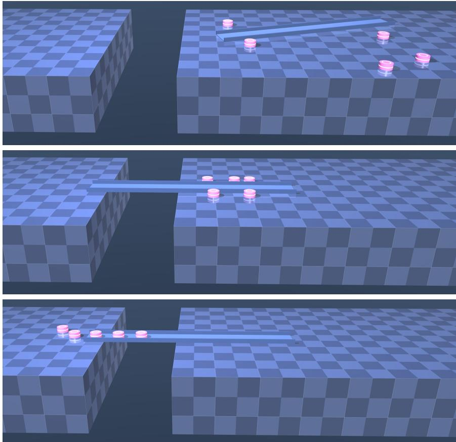  
Figure 1: Snapshots of an $N = 5$ complete process of Task 1 with SE guidance. Top: the initial configuration. Middle: successful bridge construction. Bottom: spatial gap crossing.

## 4 APPLICATIONS

In this section, we apply DeGG-Flow to two tasks with shared and private coupled requirements, respectively. Both applications are visualized in MuJoCo (Todorov et al., 2012).

## 4.1 TASK 1: MULTI-ROBOT POLICY GENERATION USING SE GUIDANCE

Motivated by disaster response and search-and-rescue tasks, we study how multiple robots can collaborate and exploit tools in the environment to accomplish tasks beyond the capability of an individual robot. In Task 1, a team of robots faces a spatial gap that cannot be crossed directly, and collaboratively uses a plank to construct a traversable bridge. Since all robots act on the same rigid body, their generated motions must remain mutually compatible while satisfying shared task and safety requirements. Therefore, SE guidance is suitable for Task 1.

The generated object is a motion policy specifying the robot contact point velocities on the plank. The condition χ contains the current robot and plank states and environment information. Only the first few actions of each generated policy are executed before a new policy is generated. Task 1 contains two SE factors: $q _ { \mathrm { t a s k } } ( \mathbf { z } | \boldsymbol { \chi } )$ , which encodes task progress at the plank pose reached after the executed actions, and $q _ { \mathrm { s a f e } } ( \mathbf { z } | \boldsymbol { \chi } )$ , which evaluates safety along these actions. The detailed settings are provided in Appendix B.

For visualization, each complete process consists of three stages. The plank pose, robot initial and goal positions, and robot-plank contact points are randomly sampled subject to workspace constraints. First, the robots move to the contact points. Then, the learned multi-agent motion policy generates the collaborative motions for the robots to manipulate the plank to form a bridge over the spatial gap, with or without SE guidance. The success rates in Table 1 evaluate only this manipulation stage. After the bridge is successfully constructed, the robots move to the goals through the bridge.

For evaluation, every robot uses the same trained GNN representing the nominal vector field $f _ { i } ^ { \theta }$ in (6). We refer to the generative process with $u _ { i } = 0$ as Nominal, and to the same nominal vector field with SE guidance $g _ { i } u _ { i } ^ { * }$ , where $\boldsymbol { u } _ { i } ^ { * }$ is obtained from (15), as Guided. Nominal and Guided use the same initial physical condition, initial sample ${ \bf z } ( 0 )$ , conditioning information $\chi ,$ , and decoder $\mathcal { D } _ { N }$ . The nominal vector field is trained with $N \in \{ 4 , 5 , 6 \}$ , and we evaluate 50 manipulation trials for each $N \in \{ 4 , 5 , 6 , 7 , 8 \}$ , with $N = 7 , 8$ evaluating generalization to team sizes unseen in the training data.

As shown in Table 1, Nominal fails in 32 trials, whereas Guided successfully constructs a traversable bridge in all 250 trials, including the 100 trials with unseen team sizes of $N = 7 , 8$ Figure 1 visualizes an $N = 5$ Guided example. These results show that SE guidance can recover failures of the nominal generative policy while preserving successful collaboration at team sizes beyond those used during training. Additional results, including an $N = 7$ rescue example, and multi-seed training and validation curves, are provided in Appendix B.3.

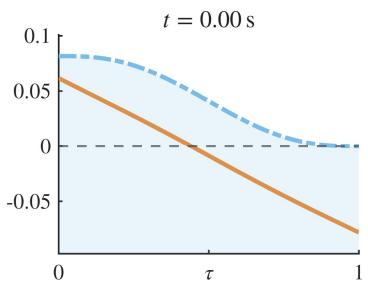

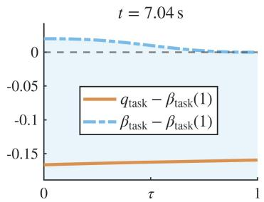

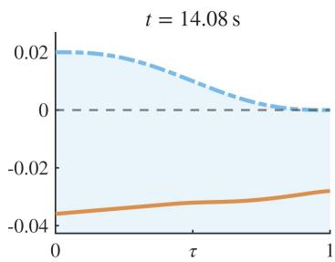  
Figure 2: Evolution of $q _ { \mathrm { t a s k } }$ and its time-varying upper bound βtask $\beta _ { \mathrm { t a s k } }$ during generative processes for policies generated at early (left), middle (center), and late (right) physical times in the manipulation stage of the example shown in Figure 1.

Table 1: Success rates for Task 1
<table><tr><td>N</td><td>Nominal</td><td>Guided</td></tr><tr><td>4</td><td>46/50 (92%)</td><td>50/50 (100%)</td></tr><tr><td>5</td><td>45/50 (90%)</td><td>50/50 (100%)</td></tr><tr><td>6</td><td>43/50 (86%)</td><td>50/50 (100%)</td></tr><tr><td>7 (unseen)</td><td>42/50 (84%)</td><td>50/50 (100%)</td></tr><tr><td>8 (unseen)</td><td>42/50 (84%)</td><td>50/50 (100%)</td></tr><tr><td>Overall</td><td>218/250 (87.2%)</td><td>250/250 (100%)</td></tr></table>

Figure 2 shows $q _ { \mathrm { t a s k } } ( \mathbf { z } ( \tau ) | \boldsymbol { \chi } )$ and $\beta _ { \mathrm { t a s k } } ( \tau )$ along τ in the generative process for policies generated at early, middle, and late physical times in the manipulation stage of the $N = 5$ Guided example shown in Figure 1. For visualization only, both curves in each plot are shifted by the same constant $\beta _ { \mathrm { t a s k } } ( 1 )$ and $q _ { \mathrm { t a s k } } - \beta _ { \mathrm { t a s k } }$ is unchanged. The shaded region corresponds to $q _ { \mathrm { t a s k } } ( \mathbf { z } ( \tau ) | \boldsymbol { \chi } ) \leq \beta _ { \mathrm { t a s k } } ( \tau )$ . As shown in Figure 2, early in physical time, $q _ { \mathrm { t a s k } }$ starts close to its upper bound $\beta _ { \mathrm { t a s k } }$ and then moves farther below it during the generative process. This is because $\beta _ { \mathrm { t a s k , s t a r t } }$ is initialized just above the task factor value of the initial sample, and $\beta _ { \mathrm { t a s k , e n d } } = q _ { \mathrm { t a s k } } ^ { \mathrm { c u r } } - 0 . 0 5$ requires the generated policy to reduce the task factor by at least 0.05 relative to its value at the current plank pose. The SE guidance therefore progressively separates $q _ { \mathrm { t a s k } }$ from the contracting upper bound while improving the task accomplishment. At the middle physical time, $q _ { \mathrm { t a s k } }$ stays below $\beta _ { \mathrm { t a s k } }$ even though it increases during the generative process. This is because the SE guidance does not require $q _ { \mathrm { t a s k } }$ to decrease monotonically. Instead, it only requires $q _ { \mathrm { t a s k } } \le \beta _ { \mathrm { t a s k } }$ , allowing the nominal vector field to dominate the generated policy. Across the three physical times, the observed relation qtask $( \mathbf { z } ( \tau ) | \chi ) \leq \beta _ { \mathrm { t a s k } } ( \tau )$ is consistent with Theorem 3.1.

## 4.2 TASK 2: MULTI-OBJECT SCENE GENERATION USING PE GUIDANCE

Section 4.1 demonstrates SE guidance in multi-robot collaboration. We next consider PE guidance in multi-object scene generation. A useful scene must satisfy not only geometric validity, such as collision avoidance and workspace containment, but also how individual objects are intended to be accessed or used. Each object therefore has its own affordance requirement, while whether that requirement is satisfied can depend on neighboring objects. Thus, PE guidance is suitable for Task 2.

Task 2 generates a tabletop arrangement of N objects. For object $i \in \mathcal N .$ , denote its pose by $g _ { O _ { i } } = ( R _ { i } , p _ { i } ) \in \mathbb { S E } ( 2 )$ and let $\mathcal { D } _ { N } ( \mathbf { z } | \boldsymbol { \chi } ) = \{ g _ { O _ { i } } \} _ { i \in \mathcal { N } }$ . The condition χ specifies the selected objects from a library, their geometry, the tabletop, and their affordance requirements. For each object, one or more nearby regions are specified and should be unobstructed when the object is used. We refer to these as affordance regions. For object i, let $h _ { i k } ( { \bf z } | \chi )$ denote its kth geometric requirement, where $h _ { i k } \geq 0$ means that the requirement is satisfied. These requirements include object separation, unobstructed affordance regions, and containment of both objects and affordance regions within the tabletop. Let $r _ { i k } ~ = ~ - h _ { i k }$ and choose a buffer $\delta ^ { \mathrm { P E } } > 0$ . We define $\begin{array} { r } { V ^ { \mathrm { P E } } = \sum _ { i = 1 } ^ { N } V _ { i } ^ { \mathrm { P E } } } \end{array}$ with $\begin{array} { r } { V _ { i } ^ { \mathrm { P E } } ( \mathbf { z } \mid \boldsymbol { \chi } ) = \sum _ { k } \frac { 1 } { 2 } } \end{array}$ max $\left\{ r _ { i k } ( \mathbf { z } | \boldsymbol { \chi } ) + \delta ^ { \mathrm { P E } } , 0 \right\} ^ { 2 }$ . Detailed settings are provided in Appendix C.

For evaluation, the nominal vector field is trained on scenes with $N \in \{ 4 , 5 , 6 \}$ , and we evaluate 50 cases for each $N \in$ $\{ 4 , 5 , 6 , 7 , 8 \}$ . Natural Nominal evaluates scenes generated by the nominal vector field under the default affordance requirements. Private Nominal evaluates the same nominal scenes after the affordance requirements are changed, while Guided starts from the same initial samples and incorporates PE guidance based on the changed requirements. As shown in Table 2, the nominal success rate decreases as the number of objects increases, and Private Nominal further shows that a scene valid under the default requirements can become invalid when the desired access or use of an object changes. In contrast, Guided satisfies all requirements in all 250 cases, including the 100 cases with team sizes $N = 7 ,$ , 8 unseen in the training data. Figure 3 shows an $N = 7$ example in which PE guidance adapts a nominal scene from a right-handed to a left-handed laptop use requirement without retraining the generative model. These results demonstrate that PE guidance can result in generated objects satisfying private requirements, including at team sizes beyond those used during training. Additional results, including an $N = 8$ example with multiple simultaneous violations resulting from the nominal vector field, results across different affordance requirements, and multi-seed training and validation curves are provided in Appendix C.2.

Figure 4 shows the evolution of $V ^ { \mathrm { P E } }$ during the generative process for the $N = 7$ example corresponding to Figure 3. Both trajectories start from the same initial Gaussian sample and are evaluated under the same left-handed laptop use requirement, which requires the mouse operating region on the left side of the laptop to be unobstructed. Without guidance, this requirement is violated at the end of the generative process, whereas PE guidance guarantees that $V ^ { \mathrm { P E } }$ converges to zero and generates a scene satisfying the new requirement without retraining, which is consistent with Theorem 3.3.

Table 2: Success rates for Task 2
<table><tr><td>N</td><td>Natural Nominal</td><td>Private Nominal</td><td>Guided</td></tr><tr><td>4</td><td>44/50 (88%)</td><td>36/50 (72%)</td><td>50/50 (100%)</td></tr><tr><td>5</td><td>35/50 (70%)</td><td>31/50 (62%)</td><td>50/50 (100%)</td></tr><tr><td>6</td><td>32/50 (64%)</td><td>26/50 (52%)</td><td>50/50 (100%)</td></tr><tr><td>7 (unseen)</td><td>16/50 (32%)</td><td>13/50 (26%)</td><td>50/50 (100%)</td></tr><tr><td>8 (unseen)</td><td>8/50 (16%)</td><td>6/50 (12%)</td><td>50/50 (100%)</td></tr><tr><td>Overall</td><td>135/250 (54.0%)</td><td>112/250 (44.8%)</td><td>250/250 (100%)</td></tr></table>

  
Figure 3: An $N = 7$ example for Task 2. Green circles represent the objects’ affordance regions that are unobstructed, while the red circle represents one that is obstructed. Left: the scene generated using the nominal vector field satisfies the default right-handed laptop use requirement. Center: the same scene evaluated for a left-handed user, where the required mouse operating region on the left side of the laptop is occupied by a potted plant. Right: PE guidance generates a scene satisfying the left-handed use requirement.

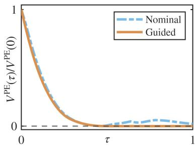  
Figure 4: Evolution of $V ^ { \mathrm { P E } }$ during the generative process for the N = 7 example in Figure 3.

## 5 CONCLUSION

This paper proposes DeGG-Flow, a general framework for addressing coupled multi-agent requirements through decoupled generative guidance, without applying a separate correction stage after generation. Each agent determines its own guidance without relying on the simultaneously computed guidance of any other agents, so the team need not rely on a central decision maker. We establish feasibility and finite-horizon guarantees for both SE and PE guidance, and demonstrate the effectiveness of DeGG-Flow in multi-robot collaboration and multi-object scene generation, including numbers of agents beyond those used in training. More broadly, DeGG-Flow allows a pretrained generative model to accommodate new hard requirements or constraints that are unseen in its training data, without the need of collecting new data or retraining the model. Future work will investigate discrete-time theoretical guarantees and large-scale multi-agent systems in real world.

## REFERENCES

Michael Albergo, Nicholas M Boffi, and Eric Vanden-Eijnden. Stochastic interpolants: A unifying framework for flows and diffusions. Journal ofMachine Learning Research, 26(209): 1–80, 2025.

Aaron D Ames, Xiangru Xu, Jessy W Grizzle, and Paulo Tabuada. Control barrier function based quadratic programs for safety critical systems. IEEE transactions on automatic control, 62(8):3861–3876, 2016.

Arpit Bansal, Hong-Min Chu, Avi Schwarzschild, Roni Sengupta, Micah Goldblum, Jonas Geiping, and Tom Goldstein. Universal guidance for diffusion models. In International Conference on Learning Representations, volume 2024, pages 51304–51323, 2024.

Sanjay P Bhat and Dennis S Bernstein. Finite-time stability of continuous autonomous systems. SIAM Journal on Control and optimization, 38(3):751–766, 2000.

Tom Brown, Benjamin Mann, Nick Ryder, Melanie Subbiah, Jared D Kaplan, Prafulla Dhariwal, Arvind Neelakantan, Pranav Shyam, Girish Sastry, Amanda Askell, et al. Language models are few-shot learners. Advances in neural information processing systems, 33:1877–1901, 2020.

Cheng Chi, Zhenjia Xu, Siyuan Feng, Eric Cousineau, Yilun Du, Benjamin Burchfiel, Russ Tedrake, and Shuran Song.

Diffusion policy: Visuomotor policy learning via action diffusion. The International Journal of Robotics Research, 44 (10-11):1684–1704, 2025.

Xiaobing Dai, Zewen Yang, Dian Yu, Fangzhou Liu, Hamid Sadeghian, Sami Haddadin, and Sandra Hirche. Safeflow: Safe robot motion planning with flow matching via control barrier functions. arXiv preprint arXiv:2504.08661, 2025.

Ruiqi Feng, Chenglei Yu, Wenhao Deng, Peiyan Hu, and Tailin Wu. On the guidance of flow matching. arXiv preprint arXiv:2502.02150, 2025.

Darshan Gadginmath, Ahmed Allibhoy, and Fabio Pasqualetti. Provably safe generative sampling with constricting barrier functions. arXiv preprint arXiv:2602.21429, 2026.

Justin Gilmer, Samuel S Schoenholz, Patrick F Riley, Oriol Vinyals, and George E Dahl. Neural message passing for quantum chemistry. In International conference on machine learning, pages 1263–1272. Pmlr, 2017.

Jonathan Ho, Ajay Jain, and Pieter Abbeel. Denoising diffusion probabilistic models. Advances in neural information processing systems, 33:6840–6851, 2020.

Michael Janner, Yilun Du, Joshua B Tenenbaum, and Sergey Levine. Planning with diffusion for flexible behavior synthesis. arXiv preprint arXiv:2205.09991, 2022.

Frank R Kschischang, Brendan J Frey, and H-A Loeliger. Factor graphs and the sum-product algorithm. IEEE Transactions on information theory, 47(2):498–519, 2001.

Dongsu Lee, Daehee Lee, and Amy Zhang. Multi-agent coordination via flow matching. In International Conference on Learning Representations, volume 2026, pages 99912– 99943, 2026.

Jinhao Liang, Jacob K Christopher, Sven Koenig, and Ferdinando Fioretto. Simultaneous multi-robot motion planning with projected diffusion models. arXiv preprint arXiv:2502.03607, 2025.

Ruoyu Lin, Gennaro Notomista, and Magnus Egerstedt. Disentangled control of multi-agent systems. IEEE Transactions on Control ofNetwork Systems, 2026.

Yaron Lipman, Ricky TQ Chen, Heli Ben-Hamu, Maximilian Nickel, and Matt Le. Flow matching for generative modeling. arXiv preprint arXiv:2210.02747, 2022.

Viraj Parimi and Brian C Williams. Diffusion-guided multi-arm motion planning. arXiv preprint arXiv:2509.08160, 2025.

Frank C Park. Distance metrics on the rigid-body motions with applications to mechanism design. Journal of Mechanical Design, 1995.

Robin Rombach, Andreas Blattmann, Dominik Lorenz, Patrick Esser, and Bjorn Ommer. High-resolution image synthesis¨ with latent diffusion models. In 2022 IEEE/CVF conference on computer vision and pattern recognition (CVPR), pages 10674–10685. ieee, 2022.

Yorai Shaoul, Itamar Mishani, Shivam Vats, Jiaoyang Li, and Maxim Likhachev. Multi-robot motion planning with diffusion models. In International Conference on Learning Representations, volume 2025, pages 95791–95811, 2025.

Jiapeng Tang, Yinyu Nie, Lev Markhasin, Angela Dai, Justus Thies, and Matthias Nießner. Diffuscene: Denoising diffusion models for generative indoor scene synthesis. In 2024 IEEE/CVF Conference on Computer Vision and Pattern Recognition (CVPR), pages 20507–20518. IEEE, 2024.

Emanuel Todorov, Tom Erez, and Yuval Tassa. Mujoco: A physics engine for model-based control. In 2012 IEEE/RSJ international conference on intelligent robots and systems, pages 5026–5033. IEEE, 2012.

Wei Xiao, Johnson Wang, Chuang Gan, Ramin Hasani, Mathias Lechner, and Daniela Rus. Safediffuser: Safe planning with diffusion probabilistic models. In International Conference on Learning Representations, volume 2025, pages 100391– 100412, 2025.

Jeongyong Yang, Seunghwan Jang, and SooJean Han. Safeflowmatcher: Safe and fast planning using flow matching with control barrier functions. In International Conference on Learning Representations, volume 2026, pages 54058– 54087, 2026.

Zhengbang Zhu, Minghuan Liu, Liyuan Mao, Bingyi Kang, Minkai Xu, Yong Yu, Stefano Ermon, and Weinan Zhang. Madiff: Offline multi-agent learning with diffusion models. Advances in Neural Information Processing Systems, 37: 4177–4206, 2024.

## A PROOFS

A.1 PROOF OF THEOREM 3.1

For any $i \in \mathcal { S } _ { a } ^ { \mathrm { S E } }$ , (12) gives

$$
\nabla _ { z _ { i } } V _ { a } ^ { \mathrm { S E } } ( \tau , \mathbf { z } _ { S _ { a } ^ { \mathrm { S E } } } \mid \chi ) = \nabla _ { z _ { i } } q _ { a } ^ { \mathrm { S E } } ( \tau , \mathbf { z } _ { S _ { a } ^ { \mathrm { S E } } } \mid \chi ) .
$$

Along a trajectory of (6),

$$
\begin{array} { r l } & { \frac { \displaystyle \mathrm { d } } { \displaystyle \mathrm { d } \tau } V _ { a } ^ { \mathrm { S E } } ( \tau , { \mathbf z } _ { S _ { a } ^ { \mathrm { S E } } } ( \tau ) \mid \chi ) } \\ & { = \partial _ { \tau } q _ { a } ^ { \mathrm { S E } } ( \tau , { \mathbf z } _ { S _ { a } ^ { \mathrm { S E } } } ( \tau ) \mid \chi ) - \dot { \beta } _ { a } ^ { \mathrm { S E } } ( \tau \mid \chi , { \mathbf z } ( 0 ) ) } \\ & { \quad + \displaystyle \sum _ { i \in S _ { a } ^ { \mathrm { S E } } } \nabla _ { z _ { i } } q _ { a } ^ { \mathrm { S E } } ( \tau , { \mathbf z } _ { S _ { a } ^ { \mathrm { S E } } } ( \tau ) \mid \chi ) ^ { \top } } \\ & { \qquad \cdot \left( f _ { i } ^ { \theta } ( \tau , { \mathbf z } ( \tau ) \mid \chi ) + g _ { i } ( \tau , { \mathbf z } ( \tau ) \mid \chi ) u _ { i } ( \tau ) \right) . } \end{array}\tag{21}
$$

According to (13), (7) becomes

$$
\begin{array} { r l } & { \nabla _ { z _ { i } } q _ { a } ^ { \mathrm { S E } } \big ( \tau , \mathbf { z } _ { S _ { a } ^ { \mathrm { S E } } } \big ( \tau ) \mid \chi \big ) ^ { \top } } \\ & { \qquad \cdot \left( f _ { i } ^ { \theta } \big ( \tau , \mathbf { z } ( \tau ) \mid \chi \big ) + g _ { i } \big ( \tau , \mathbf { z } ( \tau ) \mid \chi \big ) u _ { i } ( \tau ) \right) } \\ & { + w _ { a , i } ^ { \mathrm { S E } } \Big ( \partial _ { \tau } q _ { a } ^ { \mathrm { S E } } \big ( \tau , \mathbf { z } _ { S _ { a } ^ { \mathrm { S E } } } \big ( \tau ) \mid \chi \big ) - \dot { \beta } _ { a } ^ { \mathrm { S E } } \big ( \tau \mid \chi , \mathbf { z } ( 0 ) \big ) } \\ & { \qquad \quad + \alpha _ { a } ^ { \mathrm { S E } } \big ( V _ { a } ^ { \mathrm { S E } } \big ( \tau , \mathbf { z } _ { S _ { a } ^ { \mathrm { S E } } } \big ( \tau ) \mid \chi \big ) \big ) \Big ) \leq 0 . } \end{array}\tag{22}
$$

Summing (22) over $i \in \mathcal { S } _ { a } ^ { \mathrm { S E } }$ and using $w _ { a , i } ^ { \mathrm { S E } } \geq 0$ such that $\begin{array} { r } { \sum _ { i \in S _ { a } ^ { \mathrm { S E } } } w _ { a , i } ^ { \mathrm { S E } } = 1 } \end{array}$ yields

$$
\begin{array} { r l } & { \displaystyle \sum _ { i \in S _ { a } ^ { \mathrm { S E } } } \nabla _ { z _ { i } } q _ { a } ^ { \mathrm { S E } } ( \tau , \mathbf { z } _ { S _ { a } ^ { \mathrm { S E } } } ( \tau ) \mid \chi ) ^ { \top } } \\ & { \quad \quad \quad \quad \cdot \left( f _ { i } ^ { \theta } ( \tau , \mathbf { z } ( \tau ) \mid \chi ) + g _ { i } ( \tau , \mathbf { z } ( \tau ) \mid \chi ) u _ { i } ( \tau ) \right) } \\ & { \quad \quad \quad + \partial _ { \tau } q _ { a } ^ { \mathrm { S E } } ( \tau , \mathbf { z } _ { S _ { a } ^ { \mathrm { S E } } } ( \tau ) \mid \chi ) - \dot { \beta } _ { a } ^ { \mathrm { S E } } ( \tau \mid \chi , \mathbf { z } ( 0 ) ) } \\ & { \quad \quad \quad + \alpha _ { a } ^ { \mathrm { S E } } \big ( V _ { a } ^ { \mathrm { S E } } ( \tau , \mathbf { z } _ { S _ { a } ^ { \mathrm { S E } } } ( \tau ) \mid \chi ) \big ) \le 0 . } \end{array}\tag{23}
$$

According to (23) and (21), we have

$$
\frac { \mathrm { d } } { \mathrm { d } \tau } V _ { a } ^ { \mathrm { S E } } ( \tau , \mathbf { z } _ { S _ { a } ^ { \mathrm { S E } } } ( \tau ) \left| \chi \right. ) + \alpha _ { a } ^ { \mathrm { S E } } \big ( V _ { a } ^ { \mathrm { S E } } ( \tau , \mathbf { z } _ { S _ { a } ^ { \mathrm { S E } } } ( \tau ) \left| \chi \right. ) \big ) \leq 0 .\tag{24}
$$

Since $\alpha _ { a } ^ { \mathrm { S E } }$ is an extended $\mathrm { c l a s s } { - } \mathcal { K } _ { \infty }$ function, we have $\alpha _ { a } ^ { \mathrm { S E } } ( 0 ) = 0$ and $\alpha _ { a } ^ { \mathrm { S E } } ( s ) ~ \in ~ \mathbb { R } _ { 2 0 } , ~ \forall s ~ \in ~ \mathbb { R } _ { \ge 0 }$ Suppose ${ \bar { V } } _ { a } ^ { \mathrm { S E } } ( 0 , \mathbf { z } _ { S _ { a } ^ { \mathrm { S E } } } ( 0 ) | \bar { \mathbf { \xi } } \rangle \leq \mathrm { ~ 0 ~ }$ but there exists some $\tau _ { 1 } ~ \in$ (0, 1] such that $V _ { a } ^ { \mathrm { S E } } ( \tau _ { 1 } , \mathbf { z } _ { S _ { a } ^ { \mathrm { S E } } } ( \tau _ { 1 } ) \mid \chi ) ~ \in ~ \mathbb { R } _ { > 0 }$ . By continuity, let $\tau _ { 0 } ~ < ~ \tau _ { 1 }$ be the last time before $\tau _ { 1 }$ at which ${ \cal V } _ { a } ^ { \mathrm { S E } } ( \tau _ { 0 } , { \bf z } _ { S _ { a } ^ { \mathrm { S E } } } ( \tau _ { 0 } ) | \chi ) = 0$ . Then, for every $\tau \in \mathsf { \Gamma } ( \tau _ { 0 } , \tau _ { 1 } ]$ $V _ { a } ^ { \mathrm { S E } } ( \tau , { \bf z } _ { S _ { a } ^ { \mathrm { S E } } } ( \tau ) | \chi ) \in \mathbb { R } _ { > 0 } , \alpha _ { a } ^ { \mathrm { S E } } \big ( V _ { a } ^ { \mathrm { S E } } ( \tau , { \bf z } _ { S _ { a } ^ { \mathrm { S E } } } ( \tau ) | \chi ) \big ) \in \mathbb { R } _ { > 0 } ,$ $\mathbb { R } _ { > 0 } .$ , and $\bar { \frac { \mathrm { d } } { \mathrm { d } \tau } } V _ { a } ^ { \mathrm { S E } } ( \tau , \mathbf { z } _ { S _ { a } ^ { \mathrm { S E } } } ( \tau ) | \chi ) < 0$ by (24), which contradicts $V _ { a } ^ { \mathrm { S E } } ( \tau _ { 0 } , \mathbf { z } _ { S _ { a } ^ { \mathrm { S E } } } ( \tau _ { 0 } ) \stackrel {  } { | } \chi ) = 0$ and $V _ { a } ^ { \mathrm { S E } } ( \tau _ { 1 } , \mathbf { z } _ { S _ { a } ^ { \mathrm { S E } } } ( \tau _ { 1 } ) | \chi ) \in$ $\mathbb { R } _ { \geq 0 }$ . Therefore,

$$
V _ { a } ^ { \mathrm { S E } } ( \tau , \mathbf { z } _ { S _ { a } ^ { \mathrm { S E } } } ( \tau ) | \boldsymbol { \chi } ) \leq 0 , \quad \forall \tau \in [ 0 , 1 ] ,
$$

and (12) at $\begin{array} { r l r l } { \tau } & { { } = } & { 1 } \end{array}$ gives $\begin{array} { r l } { q _ { a } ^ { \mathrm { S E } } ( 1 , \mathbf { z } _ { S _ { a } ^ { \mathrm { S E } } } ( 1 ) | \chi ) } & { { } \leq } \end{array}$ $\beta _ { a } ^ { \mathrm { S E } } ( 1 | \chi , \mathbf { z } ( 0 ) )$

## A.2 PROOF OF PROPOSITION 3.2

In this paper, we choose

$$
\phi _ { \delta } ( \eta ) = \left\{ \begin{array} { l l } { \eta , } & { \eta \le - \delta , } \\ { \delta \left( \eta / \delta - 1 \right) ^ { 3 } \left( \eta / \delta + 3 \right) / 1 6 , } & { | \eta | < \delta , } \\ { 0 , } & { \eta \ge \delta , } \end{array} \right.
$$

which satisfies that $\phi _ { \delta } \in C ^ { 2 } , \phi _ { \delta } ( \eta ) \in [ - 1 , 0 ]$ , and $\phi _ { \delta } ( \eta ) \leq$ min $\{ \eta , 0 \} , \forall \eta \in [ - 1 , 1 ]$

Given an agnet i, assume it is incident to two active SE factors, indexed by 1 and 2, at any $\tau \in [ 0 , 1 ]$ . Since $\phi _ { \delta } ( \eta ) \leq \eta .$ then we have

$$
\begin{array} { r l } & { ( \ell _ { 2 , i } ^ { \mathrm { { S E } } } ) ^ { \top } d _ { 1 , i } ^ { \mathrm { S E } } = \left\| \ell _ { 1 , i } ^ { \mathrm { { S E } } } \right\| \left\| \ell _ { 2 , i } ^ { \mathrm { S E } } \right\| \left( \eta _ { i } ^ { \mathrm { S E } } - \phi _ { \delta } ( \eta _ { i } ^ { \mathrm { S E } } ) \right) \geq 0 , } \\ & { ( \ell _ { 1 , i } ^ { \mathrm { { S E } } } ) ^ { \top } d _ { 2 , i } ^ { \mathrm { S E } } = \left\| \ell _ { 1 , i } ^ { \mathrm { S E } } \right\| \left\| \ell _ { 2 , i } ^ { \mathrm { S E } } \right\| \left( \eta _ { i } ^ { \mathrm { S E } } - \phi _ { \delta } ( \eta _ { i } ^ { \mathrm { S E } } ) \right) \geq 0 , } \\ & { ( \ell _ { 1 , i } ^ { \mathrm { { S E } } } ) ^ { \top } d _ { 1 , i } ^ { \mathrm { S E } } = \left\| \ell _ { 1 , i } ^ { \mathrm { S E } } \right\| ^ { 2 } \left( 1 - \eta _ { i } ^ { \mathrm { S E } } \phi _ { \delta } ( \eta _ { i } ^ { \mathrm { S E } } ) \right) \geq 0 , } \\ & { ( \ell _ { 2 , i } ^ { \mathrm { { S E } } } ) ^ { \top } d _ { 2 , i } ^ { \mathrm { S E } } = \left\| \ell _ { 2 , i } ^ { \mathrm { S E } } \right\| ^ { 2 } \left( 1 - \eta _ { i } ^ { \mathrm { S E } } \phi _ { \delta } ( \eta _ { i } ^ { \mathrm { S E } } ) \right) \geq 0 , } \end{array}
$$

where the last two quantities are strictly positive whenever the corresponding $d _ { a , i } ^ { \mathrm { S E } } \neq 0$ since $\eta _ { i } ^ { \mathrm { S E } } \in \left[ - 1 , 1 \right]$ and $\phi _ { \delta } ( \eta _ { i } ^ { \mathrm { S E } } ) \ \in$ $[ - 1 , 0 ]$ . Additionally, for every active SE factor $a , ( 1 4 )$ satisfies $w _ { a , i } ^ { \mathrm { \tiny { \bar { S } } E } } \geq 0$ and $\begin{array} { r } { \dot { \sum } _ { i \in { \cal S } _ { a } ^ { \mathrm { S E } } } w _ { a , i } ^ { \mathrm { S E } } = 1 } \end{array}$ . Also, consider the SE inequalities

$$
( \ell _ { a , i } ^ { \mathrm { { S E } } } ) ^ { \top } u _ { i } + b _ { a , i } ^ { \mathrm { { S E } } } \leq 0 , \quad \forall a \in \{ 1 , 2 \} .\tag{25}
$$

Define $\lambda _ { a , i } : = b _ { a , i } ^ { \mathrm { S E } } / ( ( \ell _ { a , i } ^ { \mathrm { S E } } ) ^ { \top } d _ { a , i } ^ { \mathrm { S E } } )$ when $b _ { a , i } ^ { \mathrm { S E } } > 0$ , and $\lambda _ { a , i } : = 0$ otherwise. One can observe that $( \ell _ { a , i } ^ { \mathrm { S E } } ) ^ { \top } d _ { a , i } ^ { \mathrm { S E } } > 0$ whenever $b _ { a , i } ^ { \mathrm { S E } } > 0$ since $d _ { a , i } ^ { \mathrm { S E } } \neq 0$ in this case. Now choose

$$
\begin{array} { r } { u _ { i } = - \lambda _ { 1 , i } d _ { 1 , i } ^ { \mathrm { S E } } - \lambda _ { 2 , i } d _ { 2 , i } ^ { \mathrm { S E } } . } \end{array}
$$

Then, for $a = 1$

$$
\begin{array} { r } { ( \ell _ { 1 , i } ^ { \mathrm { { S E } } } ) ^ { \top } u _ { i } + b _ { 1 , i } ^ { \mathrm { S E } } = - \lambda _ { 1 , i } ( \ell _ { 1 , i } ^ { \mathrm { { S E } } } ) ^ { \top } d _ { 1 , i } ^ { \mathrm { S E } } - \lambda _ { 2 , i } ( \ell _ { 1 , i } ^ { \mathrm { { S E } } } ) ^ { \top } d _ { 2 , i } ^ { \mathrm { S E } } + b _ { 1 , i } ^ { \mathrm { S E } } . } \end{array}\tag{26}
$$

If $b _ { 1 , i } ^ { \mathrm { S E } } > 0$ , the first and last terms on the right-hand side of (26) cancel, and the remaining term is nonpositive. If $b _ { 1 , i } ^ { \mathrm { S E } } \leq 0 ,$ then $\lambda _ { 1 , i } = 0$ and the left-hand side of (26) is nonpositive. The same analysis holds for $a = 2$ . Hence, (25) are satisfied. If only one SE factor is active, then $d _ { a , i } ^ { \mathrm { S E } } = \ell _ { a , i } ^ { \mathrm { S E } }$ , and the same construction with a single coefficient $\lambda _ { a , i }$ also gives a feasible $u _ { i } .$ Therefore, the feasible set of (15) is nonempty.

## A.3 PROOF OF THEOREM 3.3

Since $\partial _ { \tau } V _ { i } ^ { \mathrm { P E } } ( \tau , \mathbf { z } \vert \chi ) = 0 , \forall i \in \mathcal { N }$ , we have

$$
\begin{array} { r l r } {  { \frac { \mathrm { d } } { \mathrm { d } \tau } V ^ { \mathrm { P E } } ( { \mathbf { z } } ( \tau ) | \boldsymbol { \chi } ) } } \\ & { = \sum _ { i \in \cal N } \nabla _ { z _ { i } } V ^ { \mathrm { P E } } ( { \mathbf { z } } ( \tau ) | \boldsymbol { \chi } ) ^ { \top } } \\ & { } & { \ \cdot ( f _ { i } ^ { \theta } ( \tau , { \mathbf { z } } ( \tau ) | \boldsymbol { \chi } ) + g _ { i } ( \tau , { \mathbf { z } } ( \tau ) | \boldsymbol { \chi } ) u _ { i } ( \tau ) ) . } \end{array}\tag{27}
$$

Using (16) in (10), summing (9) over $i \in \mathcal N$ , and applying (27) yield

$$
\frac { \mathrm { d } } { \mathrm { d } \tau } V ^ { \mathrm { P E } } ( \mathbf { z } ( \tau ) | \boldsymbol { \chi } ) + c ^ { \mathrm { P E } } \omega ^ { \mathrm { P E } } ( \tau ) \sum _ { i \in \mathcal { N } } \left( V _ { i } ^ { \mathrm { P E } } ( \mathbf { z } ( \tau ) | \boldsymbol { \chi } ) \right) ^ { \rho ^ { \mathrm { P E } } } \leq 0 .
$$

Since $\rho ^ { \mathrm { P E } } \in ( 0 , 1 ) , \alpha ^ { \mathrm { P E } } ( s ) = c ^ { \mathrm { P E } } s ^ { \rho ^ { \mathrm { P E } } }$ is subadditive on $\mathbb { R } _ { \geq 0 }$ Hence,

$$
\alpha ^ { \mathrm { P E } } \bigl ( V ^ { \mathrm { P E } } ( \mathbf { z } ( \tau ) | \boldsymbol { \chi } ) \bigr ) \leq \sum _ { i \in \mathcal { N } } \alpha ^ { \mathrm { P E } } \bigl ( V _ { i } ^ { \mathrm { P E } } ( \mathbf { z } ( \tau ) | \boldsymbol { \chi } ) \bigr ) ,
$$

and thus

$$
\frac { \mathrm { d } } { \mathrm { d } \tau } V ^ { \mathrm { P E } } ( \mathbf { z } ( \tau ) | \boldsymbol { \chi } ) \leq - c ^ { \mathrm { P E } } \omega ^ { \mathrm { P E } } ( \tau ) \left( V ^ { \mathrm { P E } } ( \mathbf { z } ( \tau ) | \boldsymbol { \chi } ) \right) ^ { \rho ^ { \mathrm { P E } } } ,\tag{28}
$$

which adapts the finite-time Lyapunov inequality (Bhat and Bernstein, 2000) to the generative process using the time-varying weight $\omega ^ { \mathrm { P E } } ( \tau )$ On any interval over which $V ^ { \mathrm { P E } } \bar { ( } { \bf z } ( \bar { \tau } ) \bar { | } \chi ) \bar { { \bf \Delta } } > 0$ , multiplying (28) by $( 1 ~ -$ $\rho ^ { \mathrm { P E } } ) \left( V ^ { \mathrm { P E } } ( \mathbf { z } ( \tau ) | \chi ) \right) ^ { - \rho ^ { \mathrm { P E } } }$ leads to

$$
\frac { \mathrm { d } } { \mathrm { d } \tau } \left( V ^ { \mathrm { P E } } ( \mathbf { z } ( \tau ) | \boldsymbol { \chi } ) \right) ^ { 1 - \rho ^ { \mathrm { P E } } } \leq - c ^ { \mathrm { P E } } ( 1 - \rho ^ { \mathrm { P E } } ) \omega ^ { \mathrm { P E } } ( \tau ) .
$$

Integrating from 0 to τ while $V ^ { \mathrm { P E } } ( { \bf z } ( \tau ) | \chi ) > 0$ results in

$$
\begin{array} { r l } & { \left( { \cal V } ^ { \mathrm { P E } } ( { \bf z } ( \tau ) | \chi ) \right) ^ { 1 - \rho ^ { \mathrm { P E } } } } \\ & { \leq \left( { \cal V } ^ { \mathrm { P E } } ( { \bf z } ( 0 ) | \chi ) \right) ^ { 1 - \rho ^ { \mathrm { P E } } } - c ^ { \mathrm { P E } } ( 1 - \rho ^ { \mathrm { P E } } ) \displaystyle \int _ { 0 } ^ { \tau } \omega ^ { \mathrm { P E } } ( s ) \mathrm { d } s . } \end{array}
$$

Additionally, (28) and $V ^ { \mathrm { P E } } \geq 0$ imply that, for any $\bar { \tau } \in [ 0 , 1 ]$

$$
V ^ { \mathrm { P E } } ( \mathbf { z } ( \bar { \tau } ) | \chi ) = 0 \Longrightarrow V ^ { \mathrm { P E } } ( \mathbf { z } ( \tau ) | \chi ) = 0 , \forall \tau \in [ \bar { \tau } , 1 ] .
$$

Therefore,

$$
\begin{array} { r l r } & { } & { { \cal V } ^ { \mathrm { P E } } ( { \bf z } ( \tau ) | \chi ) \le \operatorname* { m a x } \Biggl \{ 0 , ~ \left( { \cal V } ^ { \mathrm { P E } } ( { \bf z } ( 0 ) | \chi ) \right) ^ { 1 - \rho ^ { \mathrm { P E } } } } \\ & { } & { - c ^ { \mathrm { P E } } ( 1 - \rho ^ { \mathrm { P E } } ) \int _ { 0 } ^ { \tau } \omega ^ { \mathrm { P E } } ( s ) \mathrm { d } s \Biggr \} ^ { \frac { 1 } { 1 - \rho ^ { \mathrm { P E } } } } , } \end{array}
$$

and evaluating the upper bound $\begin{array} { r l r l } { \mathrm { a t } { \ } \tau { } } & { { } = { } } & { 1 } \end{array}$ implies $V ^ { \mathrm { P E } } ( \mathbf { z } ( 1 ) | \chi ) \bar { = } 0$

## A.4 PROOF OF COROLLARY 3.4

If $b _ { i } ^ { \mathrm { P E } } \leq 0$ , then $u _ { i } = 0$ satisfies the inequality constraint in (17). If ${ b } _ { i } ^ { \mathrm { P E } } > 0$ and $\ell _ { i } ^ { \mathrm { P E } } \neq 0$ , choose

$$
u _ { i } = - \frac { b _ { i } ^ { \mathrm { P E } } } { ( \ell _ { i } ^ { \mathrm { P E } } ) ^ { \top } H _ { i } ^ { - 1 } \ell _ { i } ^ { \mathrm { P E } } } H _ { i } ^ { - 1 } \ell _ { i } ^ { \mathrm { P E } } .
$$

Since $H _ { i } \succ 0$ and $\ell _ { i } ^ { \mathrm { P E } } \neq 0$ , we have $( \ell _ { i } ^ { \mathrm { P E } } ) ^ { \top } H _ { i } ^ { - 1 } \ell _ { i } ^ { \mathrm { P E } } > 0$ , and thus $( \ell _ { i } ^ { \mathrm { P E } } ) ^ { \top } u _ { i } + b _ { i } ^ { \tilde { \mathrm { P E } } } = 0$ . Therefore, the feasible set of (17) is nonempty.

## A.5 PROOF OF THEOREM 3.5

For an initial sample $\xi \sim p _ { 0 }$ , define

$$
\Delta ( \tau | \boldsymbol \xi ) : = \mathbf { X } ^ { \mathrm { g u i } } ( \tau | \boldsymbol \xi ) - \mathbf { X } ^ { \mathrm { n o m } } ( \tau | \boldsymbol \xi ) .
$$

Since the nominal and guided trajectories start from the same initial sample, $\Delta ( 0 | \xi ) = 0$ . Then, we can obtain

$$
\begin{array} { c } { \displaystyle \Delta ( \tau \mid \xi ) = \int _ { 0 } ^ { \tau } \Bigl ( f ^ { \theta } ( s , \mathbf { X } ^ { \mathrm { g u i } } ( s \mid \xi ) \mid \chi ) } \\ { \displaystyle - \left. f ^ { \theta } ( s , \mathbf { X } ^ { \mathrm { n o m } } ( s \mid \xi ) \mid \chi ) + \Gamma ( s \mid \xi ) \right) \mathrm { d } s . } \end{array}
$$

Since $\left\| f ^ { \theta } ( \tau , \mathbf { y } | _ { \mathcal { X } } ) - f ^ { \theta } ( \tau , \mathbf { z } | _ { \mathcal { X } } ) \right\| \ \leq \ L ( \tau ) \left\| \mathbf { y } - \mathbf { z } \right\| , \ \forall \tau \ \in$ $[ 0 , 1 ] , \ddot { \forall } \mathbf { y } , \mathbf { z } \in \mathcal { Z } ^ { N }$ , we have

$$
\| \boldsymbol { \Delta } ( \tau | \boldsymbol { \xi } ) \| \leq \int _ { 0 } ^ { \tau } L ( s ) \left\| \boldsymbol { \Delta } ( s | \boldsymbol { \xi } ) \right\| \mathrm { d } s + \int _ { 0 } ^ { \tau } \| \Gamma ( s | \boldsymbol { \xi } ) \| \mathrm { d } s .
$$

Then, applying Gronwall’s inequality leads to¨

$$
\| \Delta ( 1 | \xi ) \| \leq \int _ { 0 } ^ { 1 } \exp \left( \int _ { s } ^ { 1 } L ( r ) \mathrm { d } r \right) \| \Gamma ( s | \xi ) \| \mathrm { d } s .
$$

Thus, using Minkowski’s inequality, we can obtain

$$
\begin{array} { r l } & { \sqrt { \displaystyle \int _ {  { \boldsymbol { z } } ^ { N } } \left\| \Delta ( 1 \mid \xi ) \right\| ^ { 2 } p _ { 0 } ( \xi ) \mathrm { d } \xi } } \\ & { \leq \displaystyle \int _ { 0 } ^ { 1 } \exp \left( \int _ { s } ^ { 1 } L ( r ) \mathrm { d } r \right) \sqrt { \displaystyle \int _ {  { \boldsymbol { z } } ^ { N } } \left\| \Gamma ( s \mid \xi ) \right\| ^ { 2 } p _ { 0 } ( \xi ) \mathrm { d } \xi } \mathrm { d } s . } \end{array}\tag{29}
$$

Since the Wasserstein distance between $\mu$ and $\nu$ with finite second moments is

$$
W _ { 2 } ^ { 2 } ( \mu , \nu ) : = \operatorname* { i n f } _ { \pi \in \Pi ( \mu , \nu ) } \int \left\| \mathbf x - \mathbf y \right\| ^ { 2 } \mathrm { d } \pi ( \mathbf x , \mathbf y ) ,\tag{30}
$$

where $\Pi ( \mu , \nu )$ denotes the set of probability measures π on $\mathcal { Z } ^ { N } \times \mathcal { Z } ^ { \ddot { N } }$ whose first and second marginal distributions are $\mu$ and $\nu ,$ respectively, we have

$$
\begin{array} { r l } & { W _ { 2 } ^ { 2 } ( \mu _ { 1 } , \nu _ { 1 } ) \leq \displaystyle \int _ { \mathcal Z ^ { N } } \left\| \mathbf { X } ^ { \mathrm { g u i } } ( 1 \vert \xi ) - \mathbf { X } ^ { \mathrm { n o m } } ( 1 \vert \xi ) \right\| ^ { 2 } p _ { 0 } ( \xi ) \mathrm { d } \xi } \\ & { \qquad = \displaystyle \int _ { \mathcal Z ^ { N } } \left\| \Delta ( 1 \vert \xi ) \right\| ^ { 2 } p _ { 0 } ( \xi ) \mathrm { d } \xi . } \end{array}
$$

Using(29), (19) can be obtained.

In addition, for $\mathrm { ~ a ~ } \pi \in \Pi ( \mu _ { 1 } , \nu _ { 1 } )$ , let $( \bf { Z } ^ { \mathrm { { n o m } } } , \bf { Z } ^ { \mathrm { { g u i } } } )$ have joint probability distribution π. Then $\mathcal { D } _ { N } ( \mathbf { Z } ^ { \mathrm { { n o m } } } \mid \chi )$ and $\mathcal { D } _ { N } ( \mathbf { Z } ^ { \mathrm { g u i } } | \chi )$ have probability distributions $\bar { \mu } _ { 1 }$ and $\bar { \nu } _ { 1 }$ , respectively. Thus, according to (30) and $\begin{array} { r l r } { \| \mathcal { D } _ { N } ( { \bf y } \vert { \boldsymbol \chi } ) - \mathcal { D } _ { N } ( { \bf z } \vert { \boldsymbol \chi } ) \| } & { \leq } & { L _ { D } \| { \bf y } - { \bf z } \| , \ \forall { \bf y } , { \bf z } \in \mathcal { Z } ^ { N } } \end{array}$ we can obtain

$$
\begin{array} { l } { { \displaystyle { \cal W } _ { 2 } ^ { 2 } ( \bar { \mu } _ { 1 } , \bar { \nu } _ { 1 } ) \leq \int \| { \cal D } _ { N } ( { \bf x } \mid \chi ) - { \cal D } _ { N } ( { \bf y } \mid \chi ) \| ^ { 2 } ~ \mathrm { d } \pi ( { \bf x } , { \bf y } ) } } \\ { ~ } \\ { { \displaystyle ~ \leq { \cal L } _ { D } ^ { 2 } \int \| { \bf x } - { \bf y } \| ^ { 2 } ~ \mathrm { d } \pi ( { \bf x } , { \bf y } ) } . } \end{array}
$$

Since $\pi \in \Pi ( \mu _ { 1 } , \nu _ { 1 } )$ is arbitrary, we have

$$
W _ { 2 } ^ { 2 } ( \bar { \mu } _ { 1 } , \bar { \nu } _ { 1 } ) \leq L _ { D } ^ { 2 } W _ { 2 } ^ { 2 } ( \mu _ { 1 } , \nu _ { 1 } ) ,
$$

which gives (20).

## B TASK 1: DETAILED SETTINGS AND ADDI-TIONAL RESULTS

## B.1 REPRESENTATION, CONDITIONING, NETWORK STRUC-TURE, AND TRAINING

Denote the plank pose as $g _ { B } \in \mathbb { S E } ( 2 )$ , with orientation $R _ { B } \in$ SO(2) and position $p _ { B } \in \mathbb { R } ^ { 2 }$ . Its body twist is

$$
\begin{array} { r } { \boldsymbol { \xi } _ { B } ^ { b } = ( g _ { B } ^ { - 1 } \dot { g } _ { B } ) ^ { \vee } = [ ( \boldsymbol { v } _ { B } ^ { b } ) ^ { \top } , \omega _ { B } ^ { b } ] ^ { \top } \in \mathbb { R } ^ { 3 } , } \end{array}
$$

where $( \cdot ) ^ { \vee } : \mathfrak { s e } ( 2 )  \mathbb { R } ^ { 3 }$

For robot i, let $r _ { i } ~ = ~ [ r _ { i , x } , r _ { i , y } ] ^ { \top } ~ \in ~ \mathbb { R } ^ { 2 }$ denote its contact point in the body frame of the plank and define $r _ { i } ^ { \perp } : = { }$ $[ - r _ { i , y } , r _ { i , x } ] ^ { \top }$ . The velocity of the contact point is

$$
c _ { i } ^ { b } = J _ { B } ( r _ { i } ) \xi _ { B } ^ { b } ,
$$

where $J _ { B } ( r _ { i } ) : = [ I _ { 2 } , r _ { i } ^ { \perp } ] \in \mathbb { R } ^ { 2 \times 3 }$

The object generated in Task 1 is a motion policy over a finite physical horizon. Conditioned on $\chi .$ the decoder maps the joint generative state to a sequence of robot contact-point velocities,

$$
\begin{array} { r } { \mathcal { D } _ { N } ( \mathbf { z } \mid \boldsymbol { \chi } ) = \{ c _ { i , t } ^ { b } \} _ { i \in \mathcal { N } , t \in \mathcal { T } } , } \end{array}
$$

where $\mathcal { T } : = \{ 1 , \ldots , T \}$ and $c _ { i , t } ^ { b } = J _ { B } ( r _ { i } ) \xi _ { B , t } ^ { b } ( \mathbf { z } \mid \chi )$ . Only the first $T _ { \mathrm { e x e c } }$ actions of the generated policy are executed before a new policy is generated.

Let $\mathcal { K } : = \{ 1 , \ldots , K \}$ . For each robot, the generative state $z _ { i } \in \mathbb { R } ^ { 2 4 }$ is decoded into $K = 8$ three-dimensional vectors $\eta _ { i , k } \in \mathbb { R } ^ { 3 } , \forall k \in \mathcal { K }$ . Define $M _ { i } : = J _ { B } ( r _ { i } ) ^ { \top } J _ { B } ( r _ { i } )$ and $G : =$ $\textstyle \sum _ { i = 1 } ^ { N } M _ { i }$ , with $G \succ 0 .$ . Let $\mathcal { T } : = \{ 1 , \ldots , T \}$ with $T = 2 0$ and let $B _ { \mathrm { s p l } } \in \mathbb { R } ^ { T \times K }$ be the B-spline matrix. Before a new policy is generated, a T-step body twist sequence $\{ \bar { \xi } _ { B , t } ^ { b } \} _ { t \in \mathcal { T } }$ is constructed with the previously generated policy and the current motion. Then, the decoder $\mathcal { D } _ { N } ( \mathbf { z } | \boldsymbol { \chi } ) = \{ c _ { i , t } ^ { b } \} _ { i \in \mathcal { N } , t \in \mathcal { T } }$ gives

$$
\xi _ { B , t } ^ { b } = { \bar { \xi } } _ { B , t } ^ { b } + \sum _ { k = 1 } ^ { K } ( B _ { \mathrm { s p l } } ) _ { t , k } { ( G ^ { - 1 } \sum _ { i = 1 } ^ { N } M _ { i } \eta _ { i , k } ) } ,
$$

and $c _ { i , t } ^ { b } = J _ { B } ( r _ { i } ) \xi _ { B , t } ^ { b } , \forall i \in \mathcal { N } , t \in \mathcal { T }$ . Only the first $T _ { \mathrm { e x e c } } = 4$ actions of the generated T-step policy are executed before a new policy is generated. Before the next initial sample is drawn from a Gaussian distribution, the previous policy is shifted forward by these four actions, with its final value repeated to keep length $T ,$ , and its first five values interpolated between the current motion and the shifted sequence. The resulting sequence $\{ \bar { \xi } _ { B , t } ^ { b } \} _ { t \in \mathcal { T } }$ is included in the next condition $\chi .$

For Task 1, the condition χ contains only quantities known before a new policy is generated and is characterized by three vectors for each robot i. Specifically, the vector $\lambda _ { i } \ \in \ \mathbb { R } ^ { 2 3 }$ represents robot i, the plank, and their locations relative to the workspace geometry. For each other robot $j \neq i ,$ the vector $\pi _ { i j } \in \mathbb { R } ^ { 8 }$ represents the position and velocity of robot $j$ relative to robot i. The vector $c _ { i } \in \mathbb { R } ^ { 4 5 }$ represents robot $i \ ' s$ contact location on the plank, the desired plank pose, and the continuation of its contact point velocities from the previously generated policy. In particular, let $p _ { i } ^ { w } , v _ { i } ^ { w } \in \mathbb { R } ^ { 2 }$ be the current position and velocity of robot i in the world frame. Denote the current plank pose as $g _ { B } = ( R _ { B } , p _ { B } )$ with $p _ { B } = [ x _ { B } , y _ { B } ] ^ { \top }$ and let $\theta _ { B }$ denote the angle associated with $R _ { B }$ . Let $v _ { B } ^ { w } \in \mathbb { R } ^ { 2 }$ and $\omega _ { B } ^ { b } \in \mathbb { R }$ be the current translational and angular velocities of the plank. The corresponding quantities in the body frame of the plank are $\Delta p _ { i } ^ { b } : = R _ { B } ^ { \top } ( \bar { p _ { i } ^ { w ^ { - } } } - p _ { B } ) , v _ { i } ^ { b } : = R _ { B } ^ { \top } \bar { v _ { i } ^ { w } }$ , and $v _ { B } ^ { b } : = R _ { B } ^ { \top } v _ { B } ^ { w }$ . Let $[ X _ { \mathrm { m i n } } , X _ { \mathrm { m a x } } ] \times [ Y _ { \mathrm { m i n } } , Y _ { \mathrm { m a x } } ]$ quantify the workspace, define $X : = ( X _ { \mathrm { m a x } } - X _ { \mathrm { m i n } } ) / 2$ and $Y : = ( Y _ { \mathrm { m a x } } -$ $Y _ { \mathrm { m i n } } ) / 2 .$ , and let $x _ { \mathrm { g a p } } ^ { L }$ and $x _ { \mathrm { g a p } } ^ { R }$ be the two x-coordinates of the gap edges. We denote by $x _ { \mathrm { g o a l } } ^ { \mathrm { m i n } }$ the minimum x-coordinate of the region from which robot goals are sampled. The vector $e _ { B } \in \overline { { \mathbb { R } } } ^ { 1 1 }$ consists of the plank orientation and its position relative to the workspace, i.e.,

$$
\begin{array} { r l } & { \boldsymbol { e } _ { B } : = \Bigg [ \cos ( \theta _ { B } ) , - \sin ( \theta _ { B } ) , \sin ( \theta _ { B } ) , \cos ( \theta _ { B } ) , } \\ & { \qquad \frac { X _ { \mathrm { m i n } } - x _ { B } } { X } , \frac { x _ { \mathrm { g a p } } ^ { L } - x _ { B } } { X } , \frac { x _ { \mathrm { g a p } } ^ { R } - x _ { B } } { X } , \frac { x _ { \mathrm { g a d } } ^ { \mathrm { m i n } } - x _ { B } } { X } , } \\ & { \qquad \frac { X _ { \mathrm { m a x } } - x _ { B } } { X } , \frac { Y _ { \mathrm { m i n } } - y _ { B } } { Y } , \frac { Y _ { \mathrm { m a x } } - y _ { B } } { Y } \Bigg ] ^ { \top } . } \end{array}
$$

Denote $o _ { i } \in \{ 0 , 1 \} ^ { 3 }$ , which indicates if robot i is on the initial side ground, on the plank, or on the opposite side ground. Let $a _ { i } \in \{ 0 , 1 \}$ indicate whether robot i contacts with the plank, and let $b _ { B } \in \{ 0 , 1 \}$ indicate whether bridge construction has

succeeded. Additionally,

$$
\begin{array} { r l r } & { } & { \lambda _ { i } = \left[ \left( \mathrm { d i a g } { \left( \frac { 1 } { X } , \frac { 1 } { Y } \right) } \Delta p _ { i } ^ { b } \right) ^ { \top } , \right. } \\ & { } & { \left. \left( \frac { v _ { i } ^ { b } } { 0 . 8 6 } \right) ^ { \top } , o _ { i } ^ { \top } , \left( \frac { v _ { B } ^ { b } } { 0 . 4 4 } \right) ^ { \top } , \right. } \\ & { } & { \left. \frac { \omega _ { B } ^ { b } } { 0 . 3 2 } , b _ { B } , a _ { i } , e _ { B } ^ { \top } \right] ^ { \top } \in \mathbb { R } ^ { 2 3 } . } \end{array}
$$

For every $j \neq i ,$ denote the relative position and velocity $\Delta p _ { i j } ^ { b } : = R _ { B } ^ { \top } ( p _ { j } ^ { w } - p _ { i } ^ { w } )$ and $\Delta v _ { i j } ^ { b } : = \mathrm { ~ \bar { \cal { R } } _ { \cal B } ^ { \top } ( } v _ { j } ^ { w } - v _ { i } ^ { w } )$ in the body frame of the plank, then

$$
\begin{array} { r l } & { \pi _ { i j } = \Bigg [ \left( \mathrm { d i a g } \left( \cfrac { 1 } { X } , \cfrac { 1 } { Y } \right) \Delta p _ { i j } ^ { b } \right) ^ { \top } , } \\ & { \qquad \left( \cfrac { \Delta v _ { i j } ^ { b } } { 0 . 8 6 } \right) ^ { \top } , o _ { j } ^ { \top } , a _ { j } \Bigg ] ^ { \top } \in \mathbb { R } ^ { 8 } . } \end{array}
$$

Let $L _ { B }$ be the plank length, and the desired plank pose be $g _ { B } ^ { \mathrm { g o a l } } = ( R _ { g } ( \theta _ { g } ) , p _ { g } )$ . Denote $R _ { B } ^ { \top } ( p _ { g } - p _ { B } ) = [ \Delta x _ { g } ^ { b } , \Delta y _ { g } ^ { b } ] ^ { \top }$ and let $\Delta \theta _ { g } \in ( - \pi , \pi ]$ be the shortest signed angular difference from $\theta _ { B }$ to $\theta _ { g } .$ . Let

$$
\begin{array} { r } { C _ { i } ^ { \mathrm { c o n t } } = \left[ J _ { B } ( r _ { i } ) \bar { \xi } _ { B , 1 } ^ { b } , \ldots , J _ { B } ( r _ { i } ) \bar { \xi } _ { B , T } ^ { b } \right] ^ { \top } \in \mathbb { R } ^ { T \times 2 } . } \end{array}
$$

For each of the 40 entries of $C _ { i } ^ { \mathrm { { c o n t } } }$ , the corresponding training set mean is subtracted and the result is divided by the corresponding training set standard deviation. Let $\tilde { C } _ { i } ^ { \mathrm { c o n t } } \in \mathbb { R } ^ { T \times 2 }$ denote the resulting matrix, then

$$
\begin{array} { c } { \displaystyle \boldsymbol { c } _ { i } = \left[ \frac { \boldsymbol { r } _ { i , x } } { L _ { B } / 2 } , \mathrm { s g n } ( \boldsymbol { r } _ { i , y } ) , \frac { \Delta x _ { g } ^ { b } } { L _ { B } } , \right. } \\ { \displaystyle \left. \frac { \Delta y _ { g } ^ { b } } { Y } , \frac { \Delta \theta _ { g } } { \pi / 3 } , \mathrm { v e c } ( \widetilde { C } _ { i } ^ { \mathrm { c o n t } } ) ^ { \top } \right] ^ { \top } \in \mathbb { R } ^ { 4 5 } , } \end{array}
$$

where $\operatorname { s g n } ( s ) = 1$ for $s > 0$ and $\operatorname { s g n } ( s ) = - 1$ for $s < 0$ , and $\mathrm { v e c } ( \cdot )$ stacks the entries of a matrix into a vector.

For each $j \neq i$ , the multilayer perceptron $( \mathrm { M L P } ) \psi _ { \mathrm { m s g } } ,$ with layer dimensions $7 7  1 6 0  1 6 0$ , is applied to $z _ { j } , c _ { j }$ , and $\pi _ { i j }$ to form the message vector

$$
m _ { i j } = \psi _ { \mathrm { m s g } } \big ( [ z _ { j } ^ { \top } , c _ { j } ^ { \top } , \pi _ { i j } ^ { \top } ] ^ { \top } \big ) \in \mathbb { R } ^ { 1 6 0 } .
$$

The message vectors from all other robots are averaged as

$$
\bar { m } _ { i } : = \frac { 1 } { N - 1 } \sum _ { j \neq i } m _ { i j } .
$$

The MLP $\psi _ { \mathrm { a g } }$ shared by each agent, with layer dimensions $2 5 8 \to 2 5 6 \to 2 5 6 \to 2 5 6 \to 2 4$ , is used to represent

$$
\begin{array} { r l } & { f _ { i } ^ { \theta } \big ( \tau , \mathbf { z } \big | \chi \big ) = \psi _ { \mathrm { a g } } \bigg ( \big [ z _ { i } ^ { \top } , c _ { i } ^ { \top } , \lambda _ { i } ^ { \top } , \bar { m } _ { i } ^ { \top } , } \\ & { \qquad ( N - 1 ) / 7 , \varphi ( \tau ) ^ { \top } \big ] ^ { \top } \bigg ) \in \mathbb { R } ^ { 2 4 } , } \end{array}
$$

in which

$$
\varphi ( \tau ) = [ \tau , \sin ( \pi \tau ) , \cos ( \pi \tau ) , \sin ( 2 \pi \tau ) , \cos ( 2 \pi \tau ) ] ^ { \top } \in \mathbb { R } ^ { 5 } .
$$

The nominal vector field is trained and validated on $N \in$ $\{ 4 , 5 , 6 \}$ . For Task 1, we instantiate the conditional probability path by choosing $p _ { 0 } = \mathcal { N } ( 0 , I )$ . For an encoded data sample $\mathbf { Z } \sim p _ { \mathrm { d a t a } } ( \mathbf { z } \mid \chi )$ , we draw $\mathbf { X } _ { 0 } \sim p _ { 0 }$ and choose

$$
{ \bf X } ( \tau ) = ( 1 - \tau ) { \bf X } _ { 0 } + \tau { \bf Z } , \quad \forall \tau \sim \mathrm { U n i f } [ 0 , 1 ]
$$

Then, the corresponding conditional vector field is

$$
v ( \tau , { \bf X } ( \tau ) | \textbf { Z } , \boldsymbol { \chi } ) = \textbf { Z } - { \bf X } _ { 0 } .
$$

$\mathbf { A } \mathbf { t } \ { \boldsymbol { \tau } }$ in the generative process, the estimated endpoint is

$$
\widehat { \mathbf { Z } } = \mathbf { X } ( \tau ) + ( 1 - \tau ) f ^ { \theta } ( \tau , \mathbf { X } ( \tau ) | \tau ) .
$$

Let $\widehat { c } _ { i , i } ^ { b }$ and $\widehat { \xi } _ { B , t } ^ { b }$ denote the velocity of the contact point and the body twist of the plank obtained by decoding $\widehat { \mathbf { Z } } ,$ and let $c _ { i , t } ^ { b , * }$ and $\xi _ { B , t } ^ { b , * }$ denote the corresponding quantities from the trajectory used to construct Z. Let $\sigma _ { c } \in \mathbb { R } ^ { 2 }$ contain the training set scales for the two components of the contact point velocity, and let $\sigma _ { \xi } \in \mathbb { R } ^ { 3 }$ contain the training set scales for the three components of the body twist of the plank. Define $\rho _ { t } = 2 . 5 \ : \mathrm { f o r } \ : t = 1 , . . . , 4$ and $\rho _ { t } = 1$ otherwise. The loss function $\mathcal { L } _ { \mathrm { M A C } }$ for Task 1 is augmented as

$$
\mathcal { L } _ { \mathrm { t r a i n } } = \mathcal { L } _ { \mathrm { M A C } } + 0 . 1 6 \mathcal { L } _ { \mathrm { m o t i o n } } + 0 . 4 5 \mathcal { L } _ { \mathrm { t w i s t } } ,
$$

in which

$$
\begin{array} { c l r } { \displaystyle { \mathcal { L } _ { \mathrm { m o t i o n } } = \frac { 1 } { 2 N \sum _ { t = 1 } ^ { T } \rho _ { t } } \sum _ { i = 1 } ^ { N } \sum _ { t = 1 } ^ { T } \rho _ { t } } } \\ { \displaystyle { \cdot ~ \left\| \mathrm { d i a g } ( \sigma _ { c } ) ^ { - 1 } \left( \hat { c } _ { i , t } ^ { b } - c _ { i , t } ^ { b , * } \right) \right\| ^ { 2 } } } \end{array}
$$

and

$$
\mathcal { L } _ { \mathrm { t w i s t } } = \frac { 1 } { 3 \sum _ { t = 1 } ^ { T } \rho _ { t } } \sum _ { t = 1 } ^ { T } \rho _ { t } \left\| \mathrm { d i a g } ( \sigma _ { \xi } ) ^ { - 1 } \left( \widehat { \xi } _ { B , t } ^ { b } - \xi _ { B , t } ^ { b , * } \right) \right\| ^ { 2 } .
$$

In addition, training and validation curves over three independent seeds are provided in Appendix B.3.

## B.2 TASK AND SAFETY FACTORS

The task and safety factors are constructed from geometric margins. Each margin is positive when its corresponding requirement is satisfied. Specifically, the workspace is

$$
[ X _ { \mathrm { m i n } } , X _ { \mathrm { m a x } } ] \times [ Y _ { \mathrm { m i n } } , Y _ { \mathrm { m a x } } ] = [ - 7 , 6 . 8 ] \times [ - 3 , 3 ] ,
$$

and the spatial gap takes

$$
x \in [ x _ { \mathrm { g a p } } ^ { \mathrm { m i n } } , x _ { \mathrm { g a p } } ^ { \mathrm { m a x } } ] = [ 0 , 2 ] .
$$

The plank length and width are $L _ { B } = 5 . 8$ and $W _ { B } = 0 . 7 2$ each robot is a disk with radius $r _ { R } ~ = ~ 0 . 1 6$ , the required plank support on each side of the gap is $d _ { \mathrm { s u p } } = 0 . 5 5$ , and the traversable region for the robot centers must extend at least $d _ { \mathrm { c o r } } = 0 . 0 5$ beyond each gap edge. Let $g _ { B , t } = ( R _ { B , t } , p _ { B , t } )$ $t = 1 , \ldots , T _ { \mathrm { e x e c } }$ , denote the plank poses predicted after the $T _ { \mathrm { e x e c } } = 4$ actions that will be executed, with $p _ { B , t } = [ x _ { t } , y _ { t } ] ^ { \top }$ and orientation angle $\theta _ { t }$ . Define $| \cos ( \theta ) | _ { \varepsilon } : = \sqrt { \cos ^ { 2 } ( \theta ) + \varepsilon ^ { 2 } }$ and $| \sin ( \theta ) | _ { \varepsilon } : = { \sqrt { \sin ^ { 2 } ( \theta ) + \varepsilon ^ { 2 } } }$ with $\varepsilon = 1 0 ^ { - 6 }$ . The distance from the plank center to its outermost point along the x-axis of the world frame is

$$
\begin{array} { r } { h _ { x } ( \theta ) : = \frac 1 2 ( L _ { B } | \cos ( \theta ) | _ { \varepsilon } + W _ { B } | \sin ( \theta ) | _ { \varepsilon } ) . } \end{array}
$$

The projection onto the same axis of the usable half-length of the plank for a robot center is

$$
h _ { c } ( \theta ) : = \left( L _ { B } / 2 - r _ { R } - 0 . 0 7 5 \right) | \cos ( \theta ) | _ { \varepsilon } .
$$

At predicted step t, let the four margins be

$$
\begin{array} { r l } & { m _ { 1 , t } ^ { \mathrm { t a s k } } = x _ { \mathrm { g a p } } ^ { \mathrm { m i n } } - x _ { t } + h _ { x } ( \theta _ { t } ) - d _ { \mathrm { s u p } } , } \\ & { m _ { 2 , t } ^ { \mathrm { t a s k } } = x _ { t } + h _ { x } ( \theta _ { t } ) - x _ { \mathrm { g a p } } ^ { \mathrm { m a x } } - d _ { \mathrm { s u p } } , } \\ & { m _ { 3 , t } ^ { \mathrm { t a s k } } = x _ { \mathrm { g a p } } ^ { \mathrm { m i n } } - x _ { t } + h _ { c } ( \theta _ { t } ) - d _ { \mathrm { c o r } } , } \\ & { m _ { 4 , t } ^ { \mathrm { t a s k } } = x _ { t } + h _ { c } ( \theta _ { t } ) - x _ { \mathrm { g a p } } ^ { \mathrm { m a x } } - d _ { \mathrm { c o r } } . } \end{array}
$$

and let $m _ { 5 , t } ^ { \mathrm { t a s k } } , \ldots , m _ { M _ { \mathrm { t a s k } } , t } ^ { \mathrm { t a s k } }$ denote the remaining geometric margins included in the task factor, where $M _ { \mathrm { t a s k } }$ is the total number of task margins. The task factor evaluates all of these margins at the final predicted plank pose as

$$
\begin{array} { r l r } {  { q _ { \mathrm { t a s k } } ( \mathbf { z } | \mathbf { \boldsymbol { \chi } } ) = \frac { 1 } { 8 0 } \log ( \sum _ { k = 1 } ^ { 2 } \exp [ - 8 0 \frac { m _ { k , T _ { \mathrm { e x e c } } } ^ { \mathrm { t a s k } } } { 0 . 5 5 } ]  } } \\ & { } & {  + \sum _ { k = 3 } ^ { M _ { \mathrm { t a s k } } } \exp [ - 8 0 \frac { m _ { k , T _ { \mathrm { e x e c } } } ^ { \mathrm { t a s k } } } { 0 . 2 } ] ) . } \end{array}
$$

Let $m _ { t , 1 } ^ { \mathrm { s a f e } } , \ldots , m _ { t , M _ { \mathrm { s a f e } } } ^ { \mathrm { s a f e } }$ denote the geometric margins at predicted step $t \in \{ 1 , \ldots , { \cal T } _ { \mathrm { e x e c } } \}$ , where $M _ { \mathrm { s a f e } }$ is the number of safety margins evaluated at each step. These margins measure the distances of the plank from the upper and lower workspace boundaries using a 0.2 buffer, the distances of the robot disks from the gap and from the upper and lower workspace boundaries using a 0.1 buffer, and whether the plank has sufficient support on the side of the workspace where robots are initiated or has reached sufficient support on the opposite side. The safety factor is then

$$
q _ { \mathrm { s a f e } } ( \mathbf { z } \mid \chi ) = \frac { 1 } { 6 0 } \log \left( \sum _ { t = 1 } ^ { T _ { \mathrm { e x e c } } } \sum _ { k = 1 } ^ { M _ { \mathrm { s a f e } } } \exp \left[ - 6 0 \frac { m _ { t , k } ^ { \mathrm { s a f e } } } { 0 . 1 } \right] \right) .
$$

The success and failure are evaluated using the exact geometry (without buffers) instead of the factors above. A trial is successful if the robots can move the plank such that it provides at least $d _ { \mathrm { s u p } } = 0 . 5 5$ of support on both sides of the gap and the region traversable by the robot centers extends beyond both gap edges as required. A failure is counted if the plank loses support on the initial side before reaching the opposite side, leaves the workspace, or causes any robot to cross the workspace boundary or enter the spatial gap.

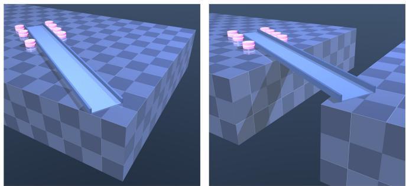  
Figure 5: An $N = 7$ trial of Task 1. Left: the policies generated by the nominal vector field are driving the plank out of the workspace. Right: the policies with SE guidance lead to successful bridge construction.

For Task 1, we choose $g _ { i } = I _ { 2 4 } , H _ { i } = I _ { 2 4 }$ , and $\alpha _ { a } ^ { \mathrm { S E } } ( s ) = s$ For either factor, $V _ { a } ^ { \mathrm { S E } } ( \tau , { \bf z } | \chi ) = q _ { a } ( { \bf z } | \chi ) - \beta _ { a } ( \bar { \tau } )$ . Hence, $\beta _ { a } ( \tau )$ is the upper bound imposed on $q _ { a }$ during the generative process, and $\bar { V } _ { a } ^ { \mathrm { S E } } \leq 0$ is equivalent to $q _ { a } ( \mathbf { z } | \chi ) \ \leq \ \beta _ { a } ( \tau )$ Choose

$$
\beta _ { a } ( \tau ) = \beta _ { a , \mathrm { { e n d } } } + \left( \beta _ { a , \mathrm { { s t a r t } } } - \beta _ { a , \mathrm { { e n d } } } \right) \left( 1 - 6 \tau ^ { 5 } + 1 5 \tau ^ { 4 } - 1 0 \tau ^ { 3 } \right) .
$$

At the beginning of each policy generation, let $g _ { B } ^ { \mathrm { c u r } }$ denote the plank pose and let $q _ { \mathrm { t a s k } } ^ { \mathrm { c u r } }$ denote the task factor evaluated at $g _ { B } ^ { \mathrm { c u r } }$ instead of the predicted terminal plank pose. Let ${ \bf z } _ { 0 } : = { \bf z } ( 0 )$ denote the Gaussian initial state during the generative process. Specifically,

$$
\begin{array} { r } { \beta _ { \mathrm { t a s k , e n d } } = q _ { \mathrm { t a s k } } ^ { \mathrm { c u r } } - 0 . 0 5 , \qquad } \\ { \beta _ { \mathrm { t a s k , s t a r t } } = \operatorname* { m a x } \{ q _ { \mathrm { t a s k } } ( \mathbf { z } _ { 0 } | \chi ) + 0 . 0 2 , \ : \beta _ { \mathrm { t a s k , e n d } } + 0 . 0 2 \} , \ : } \\ { \beta _ { \mathrm { s a f e , e n d } } = 0 , \qquad } \\ { \beta _ { \mathrm { s a f e , s t a r t } } = q _ { \mathrm { s a f e } } ( \mathbf { z } _ { 0 } | \chi ) + 0 . 0 2 . \qquad } \end{array}
$$

Therefore, at the end of each generative process, the task factor is required to satisfy $q _ { \mathrm { t a s k } } \leq q _ { \mathrm { t a s k } } ^ { \mathrm { c u r } } - 0 . 0 5$ , and the safety factor is required to satisfy $q _ { \mathrm { s a f e } } \leq 0$ . Note that $\beta _ { t a s k , \mathrm { s t a r t } }$ is calculated once before the generative process and is fixed throughout the generative process so $\beta _ { \mathrm { t a s k } } ( \tau )$ is $C ^ { 1 }$ in τ. In addition, the adaptive constraint allocation coefficients $w _ { a , i } ^ { \mathrm { S E } }$ are calculated using (14) with $\delta = 0 . 0 2$ . Each robot then solves the decoupled guidance using (15) with one constraint corresponding to the task factor and one corresponding to the safety factor.

## B.3 ADDITIONAL RESULTS FOR TASK 1

Figure 5 shows an $N = 7$ trial in which the two policies, Nominal and Guided, start from the same physical configuration and initial sample. The policy generated by the nominal vector field drives the plank out of the workspace, whereas the policy generated with SE guidance avoids this failure and successfully constructs the bridge. Figure 6 shows the evolution of $q _ { \mathrm { s a f e } }$ and its time-varying upper bound $\beta _ { \mathrm { s a f e } }$ during a generative process with SE guidance right before the policies generated by the nominal vector field drive the plank out of the workspace. During the generative process, $q _ { \mathrm { s a f e } } ( \mathbf { z } ( \tau ) | \boldsymbol { \chi } )$ stays below $\beta _ { \mathrm { s a f e } } ( \tau )$ as the latter goes to $\beta _ { \mathrm { s a f e } } ( 1 ) = 0$ , with the generated policy satisfying $q _ { \mathrm { s a f e } } ( \mathbf { z } ( 1 ) | \chi ) < 0$

Figure 7 shows the training and validation losses over three independent training seeds. The lines show the mean across seeds, and the shaded regions show ± one sample standard deviation.

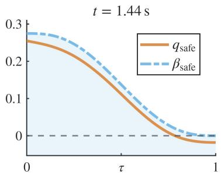  
Figure 6: Evolution of $q _ { \mathrm { s a f e } }$ and its time-varying upper bound $\beta _ { \mathrm { s a f e } }$ during a generative process with SE guidance at a physical time right before the policies generated by the nominal vector field drive the plank out of the workspace in an $N = 7$ trial.

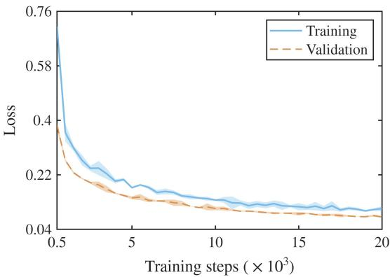  
Figure 7: Training and validation losses over three independent seeds for the GNN-represented nominal vector field in Task 1. Shaded regions represent ± one sample standard deviation.

## C TASK 2: DETAILED SETTINGS AND ADDI-TIONAL RESULTS

## C.1 DETAILED SETTINGS FOR TASK 2

Task 2 considers tabletop scenes with a library of 12 object types. For each scene, N different objects are randomly selected from the library. Each object has a fixed geometric shape and one or more nearby regions that should remain unobstructed when the object is used, which are referred to as affordance regions. A user-specified affordance requirement can change the location, size, or direction of these regions relative to the object. An object can therefore be required to remain accessible from a different side, to have more free space around it, or to satisfy combinations of these changes. The complete object library, geometric representations, affordance-region definitions, and ranges used to generate modified requirements are given below.

For Task 2, choose $g _ { i } = I _ { 3 } , \delta ^ { \mathrm { P E } } = 0 . 0 2$

$$
\begin{array} { c } { { \omega ^ { \mathrm { P E } } ( \tau ) = 0 . 1 + 1 . 8 \tau , } } \\ { { { c } ^ { \mathrm { P E } } = \displaystyle \frac { 1 . 1 5 } { ( 1 - \rho ^ { \mathrm { P E } } ) } \operatorname* { m a x } \bigl \{ V ^ { \mathrm { P E } } ( 0 ) , 1 0 ^ { - 3 0 } \bigr \} ^ { 1 - \rho ^ { \mathrm { P E } } } , } } \end{array}
$$

and $\rho ^ { \mathrm { P E } } = 0 . 7 5 .$ . The tabletop is centered at the origin and has size $1 . 4 0 \times 0 . 9 4$ . For each object $i , z _ { i } \in \mathbb { R } ^ { 3 }$ is decoded into a planar position $p _ { i } \in \mathbb { R } ^ { 2 }$ and an angular coordinate $\theta _ { i } \in \mathbb { R }$ by $[ p _ { i } ^ { \top } , \theta _ { i } ] ^ { \top } = \mathrm { d i a g } ( 0 . 7 0 , 0 . 4 7 , 1 . 3 5 ) \overline { { z } } _ { i }$ with the corresponding orientation $R _ { i } ( \theta _ { i } ) \in \mathbb { S O } ( 2 )$ . Each type of object also has a fixed geometric shape defined in its body frame, represented as a disk, a rounded rectangle, or a combination of these shapes.

Table 3 summarizes the 12 object categories, with each category showing at most once in a scene. Denote $C ( \boldsymbol r )$ for a disk of radius r, $R ( a , b , r _ { c } )$ for a rounded rectangle with half width $^ { a , }$ half height $b ,$ and rounded corner radius $r _ { c } ,$ and $A ( x , y , r )$ for a circular affordance region of radius r centered at $( x , y )$ in the object’s body frame. For multiple affordance regions with the same $y \cdot$ -coordinate and radius, we list their x-coordinates as a set. For example, $A ( \{ x _ { 1 } , \ldots , x _ { m } \} , y , r )$ denotes circles centered at $( x _ { 1 } , y ) , \dots , ( x _ { m } , y )$ , each with radius $^ { r } \cdot$ For the qth affordance region of object $i ,$ let $a _ { i q } \in \mathbb { R } ^ { 2 }$ denote the center of the region in the body frame of object $i ,$ and let $r _ { i q } > 0$ denote its radius. A user-specified requirement is parameterized by $( s _ { i } ^ { o } , s _ { i } ^ { r } , \varphi _ { i } )$ , where $\mathbf { \boldsymbol { s } } _ { i } ^ { o }$ changes the distance of the affordance region from the object, $s _ { i } ^ { r }$ changes its radius, and $\varphi _ { i }$ changes its direction relative to the object. Then, the center and radius expressed in the world frame are $a _ { i q } ^ { W } = p _ { i } + R ( \theta _ { i } + \varphi _ { i } ) s _ { i } ^ { o } a _ { i q }$ and $r _ { i q } ^ { W } = s _ { i } ^ { r } r _ { i q }$ , respectively. The default requirement corresponds to $( s _ { i } ^ { o } , \bar { s _ { i } ^ { r } } , \varphi _ { i } ) = ( 1 , 1 , 0 )$ . A user may instead require an object to be accessible from another side, require more free space around the object, or combine these changes. We sample $s _ { i } ^ { o } \in [ 0 . 9 8 , 1 . 1 2 ]$ and $s _ { i } ^ { r } \in [ 1 . 0 4 , 1 . 2 4 ]$ . For a change in access direction, $\varphi _ { i }$ is selected from the allowed directions for that object type, with an additional perturbation in $[ - \pi / 2 2 . 5 , \pi / 2 2 . 5 ]$ The alternative directions are $- \pi / 6$ and $\pi / 6$ for drawer organizer and drawing board; $- \pi / 2$ and $\pi / 2$ for desk lamp, handled mug, and tissue box; $\pi , - \pi / 2$ , and $\pi / 2$ for teacup, laptop, scissors, pencil case, and pen cup; and $- \pi / 2 , \pi / 2$ , and π for potted plant and compact printer.

In addition, training contains 4,000 scenes for each $N \in$ $\{ 4 , 5 , 6 \}$ and 400 validation scenes for each N. For every scene, N different types of objects are sampled uniformly without replacement from the library. Thus, all object categories appear during training, while $N \ = \ 7 ,$ 8 evaluate generalization to scenes containing more objects than those used for training. The nominal vector field is represented by a GNN shared by every agent. It is trained using (5) without augmentation.

## C.2 ADDITIONAL RESULTS FOR TASK 2

We additionally evaluate five types of requirement: the default requirements, opposite-side access, side-direction access, a larger affordance region, and combinations of these changes. Opposite-side access selects the direction farthest from the default one, and side-direction access selects one of the other non-default directions. Each type contains 50 cases, with 10 cases for each $N \in \{ 4 , 5 , 6 , 7 , 8 \}$ }. As shown in Table 4, Guided directly generates the scenes satisfying all 50 cases in every type of requirement without retraining the nominal vector field.

Figure 8 shows a complementary $N = 8$ example without any user-specified change to the default requirements. The scene generated by the nominal vector field contains several violations: the compact printer and scissors are too close to each other, the desk lamp and pen cup are also too close to each other, and the drawer organizer obstructs the affordance region of the handled mug. Starting from the same initial Gaussian sample, PE guidance directly generates a scene satisfying all of these requirements, without any model retraining.

Figure 9 shows the training and validation flow matching losses over three independent training seeds. The lines show the mean across seeds, and the shaded regions show $\pm$ one sample standard deviation.

We further evaluate how much PE guidance changes the distribution characterized by the nominal flow. Task 2 provides a natural setting for this evaluation as each generative process directly produces one complete scene consisting of the poses of all $N$ objects. For each fixed $N \in \{ 4 , 5 , 6 , 7 , 8 \}$ , let $M = 5 0$ denote the number of evaluated scenes. For scene $m \in$ $\{ 1 , \ldots , M \}$ and object $i \in \{ 1 , \ldots , N \}$ , denote the final generated states by Nominal and Guided by $z _ { m , i } ^ { \mathrm { { N o m } } }$ and $z _ { m , i } ^ { \mathrm { G u i } }$ , respectively. The corresponding joint generative states of the complete scenes are then denoted by $\mathbf { z } _ { m } ^ { \mathrm { N o m } } = [ ( z _ { m , 1 } ^ { \mathrm { N o m } } ) ^ { \top } , \dots , ( z _ { m , N } ^ { \mathrm { N o m } } ) ^ { \top } ] ^ { \top }$ and $\mathbf { z } _ { m } ^ { \mathrm { G u i } } = [ ( z _ { m , 1 } ^ { \mathrm { G u i } } ) ^ { \top } , \dots , ( z _ { m , N } ^ { \mathrm { G u i } } ) ^ { \top } ] ^ { \top }$ , respectively. Thus, the two sets $\{ \mathbf { z } _ { m } ^ { \mathrm { { N o m } } } \} _ { m = 1 } ^ { M }$ and $\{ \mathbf { z } _ { m } ^ { \mathrm { G u i } } \} _ { m = 1 } ^ { M }$ approximate the corresponding Nominal and Guided scene distributions. First, we evaluate the distance directly in the generative state space. For two scene states $\mathbf { z } ~ = ~ [ z _ { 1 } ^ { \top } , \ldots , \bar { z _ { N } } ] ^ { \top }$ and $\mathbf { z } ^ { \prime } =$ $[ \bar { ( } z _ { 1 } ^ { \prime } ) ^ { \top } , \dots , ( z _ { N } ^ { \prime } ) ^ { \top } ] ^ { \top }$ , denote the normalized Euclidean distance as $\begin{array} { r } { d _ { z } ^ { 2 } ( \mathbf { z } , \mathbf { z } ^ { \prime } ) = \frac { 1 } { N } \sum _ { i = 1 } ^ { N } \| z _ { i } - z _ { i } ^ { \prime } \| _ { 2 } ^ { 2 } } \end{array}$ . Using the M generated scenes, we approximate the Wasserstein distance between the Nominal and Guided joint distributions as

$$
\widehat { W } _ { 2 , z } ^ { 2 } ( N ) = \operatorname* { m i n } _ { \sigma \in \mathfrak { S } _ { M } } \frac { 1 } { M } \sum _ { m = 1 } ^ { M } d _ { z } ^ { 2 } \left( \mathbf { z } _ { m } ^ { \mathrm { N o m } } , \mathbf { z } _ { \sigma ( m ) } ^ { \mathrm { G u i } } \right) ,
$$

where ${ \mathfrak { S } } _ { M }$ denotes the set of all permutations of $\{ 1 , \dots , M \}$ Thus, σ specifies a optimal transport assignment between the M Nominal scenes and the M Guided scenes.

We also evaluate the same distributional deviation after decoding into object poses using $[ ( p _ { m , i } ^ { b } ) ^ { \top } , \theta _ { m , i } ^ { b } ] ^ { \top } ~ =$ diag $\left( 0 . 7 0 , 0 . 4 7 , 1 . 3 5 \right) z _ { m , i } ^ { b } .$ , with $b \in \{ \mathrm { N o m } , \mathrm { G u i } \}$ representing Nominal and Guided, and $g _ { m , i } ^ { b } \ \in \ \mathbb { S E } ( 2 )$ . Denote the complete decoded scene as $\mathbf { g } _ { m } ^ { b } = \bigl ( g _ { m , 1 } ^ { b } , \ldots , g _ { m , N } ^ { b } \bigr )$ . For two object poses $g _ { i }$ and $g _ { i } ^ { \prime } ,$ , we use the geodesic (Park, 1995)

$$
d _ { \mathbb { S } \mathbb { E } ( 2 ) } ^ { 2 } ( g _ { i } , g _ { i } ^ { \prime } ) = \lVert p _ { i } - p _ { i } ^ { \prime } \rVert _ { 2 } ^ { 2 } + \lambda _ { \theta } ^ { 2 } \Delta \theta _ { i } ^ { 2 } ,
$$

where $\Delta \theta _ { i } ~ =$ atan2 $( \sin ( \theta _ { i } - \theta _ { i } ^ { \prime } ) , \cos ( \theta _ { i } - \theta _ { i } ^ { \prime } ) ) \ \in \ [ - \pi , \pi ] ,$ and we choose $\lambda _ { \theta } = 0 . 1$ , which places translational and rotational differences on a common length scale comparable to the sizes of the objects in Table 3. For two decoded scenes $\mathbf { g } = ( g _ { 1 } , \ldots , g _ { N } )$ and $\mathbf { g } ^ { \prime } = ( g _ { 1 } ^ { \prime } , \ldots , g _ { N } ^ { \prime } )$ , define the scene distance by

$$
d _ { \mathrm { s c e n e } } ^ { 2 } ( \mathbf { g } , \mathbf { g } ^ { \prime } ) = \frac { 1 } { N } \sum _ { i = 1 } ^ { N } d _ { \mathbb { S E } ( 2 ) } ^ { 2 } ( g _ { i } , g _ { i } ^ { \prime } ) .
$$

Then the corresponding approximation of the Wasserstein distance is

$$
\widehat { W } _ { 2 , g } ^ { 2 } ( N ) = \operatorname* { m i n } _ { \sigma \in \mathfrak { S } _ { M } } \frac { 1 } { M } \sum _ { m = 1 } ^ { M } d _ { \mathrm { s c e n e } } ^ { 2 } \left( \mathbf { g } _ { m } ^ { \mathrm { N o m } } , \mathbf { g } _ { \sigma ( m ) } ^ { \mathrm { G u i } } \right) .
$$

Table 3: Object geometry and default affordance regions for Task 2
<table><tr><td>Object</td><td>Geometry</td><td>Affordance region(s)</td></tr><tr><td>Drawer organizer</td><td>R(0.156, 0.090, 0.012)</td><td>A({−0.1, 0, 0.1}, −0.205, 0.108)</td></tr><tr><td>Teacup</td><td> $C ( 0 . 0 4 6 ) \cup ( C ( 0 . 0 1 9 ) + ( 0 . 0 6 1 , 0 ) )$ </td><td>A(0.125, 0, 0.055)</td></tr><tr><td>Desk lamp</td><td>C(0.06)</td><td>A(0, −0.147, 0.079)</td></tr><tr><td>Laptop</td><td>R(0.085, 0.065, 0.006)</td><td>A(0.155, 0, 0.07)</td></tr><tr><td>Potted plant</td><td>C(0.078)</td><td>A(0, −0.123, 0.062)</td></tr><tr><td>Handled mug</td><td>C(0.067)</td><td>A(0, −0.141, 0.054)</td></tr><tr><td>Drawing board</td><td>R(0.135, 0.048, 0.008)</td><td>A({−0.065, 0.065}, −0.108, 0.05)</td></tr><tr><td>Scissors</td><td>R(0.039, 0.026, 0.016)</td><td>A(0.083, 0, 0.043)</td></tr><tr><td>Compact printer</td><td>R(0.099, 0.07, 0.009)</td><td>A(0, −0.133, 0.057)</td></tr><tr><td>Pencil case</td><td>R(0.037, 0.072, 0.007)</td><td>A(0.087, 0, 0.046)</td></tr><tr><td>Tissue box</td><td>R(0.049, 0.04, 0.009)</td><td>A(0, −0.103, 0.047)</td></tr><tr><td>Pen cup</td><td>C(0.034)</td><td>A(0.083, 0, 0.039)</td></tr></table>

Table 4: Task 2 results with different affordance requirements.
<table><tr><td>Requirement</td><td>Natural Nominal</td><td>Private Nominal</td><td>Guided</td></tr><tr><td>Default</td><td>27/50 (54%)</td><td>27/50 (54%)</td><td>50/50 (100%)</td></tr><tr><td>Opposite-side access</td><td>27/50 (54%)</td><td>23/50 (46%)</td><td>50/50 (100%)</td></tr><tr><td>Side-direction access</td><td>31/50 (62%)</td><td>23/50 (46%)</td><td>50/50 (100%)</td></tr><tr><td>Larger affordance region</td><td>23/50 (46%)</td><td>22/50 (44%)</td><td>50/50 (100%)</td></tr><tr><td>Combined</td><td>27/50 (54%)</td><td>17/50 (34%)</td><td>50/50 (100%)</td></tr></table>

The magnitude of a Wasserstein distance is difficult to interpret without a reference scale, so we compare it with the root mean square (RMS) pairwise distance among the M complete scenes generated by the nominal vector field. In the generative state space, define

$$
S _ { \mathrm { N o m } , z } ( N ) = \left( \frac { 2 } { M ( M - 1 ) } \sum _ { 1 \le m < n \le M } d _ { z } ^ { 2 } \left( \mathbf { z } _ { m } ^ { \mathrm { N o m } } , \mathbf { z } _ { n } ^ { \mathrm { N o m } } \right) \right) ^ { \frac { 1 } { 2 } } .
$$

Similarly, in the decoded physical space, define

$$
S _ { \mathrm { N o m } , g } ( N ) = \left( \frac { 2 } { M ( M - 1 ) } \sum _ { 1 \le m < n \le M } d _ { \mathrm { s c e n e } } ^ { 2 } \left( \mathbf { g } _ { m } ^ { \mathrm { N o m } } , \mathbf { g } _ { n } ^ { \mathrm { N o m } } \right) \right) ^ { \frac { 1 } { 2 } } .
$$

We then plot the two ratios $\begin{array} { r } { \frac { \widehat { W } _ { 2 , z } ( N ) } { S _ { \mathrm { N o m } , z } ( N ) } \mathrm { a n d } \frac { \widehat { W } _ { 2 , g } ( N ) } { S _ { \mathrm { N o m } , g } ( N ) } } \end{array}$ in Figure 10, where the first ratio measures the Wasserstein distance between the Nominal and Guided distributions in the generative state space relative to the RMS pairwise distance among the M complete scenes generated by the nominal vector field, and the second ratio measures the one in the decoded pose space. For example, a value of 0.3 means that the Wasserstein distance between the Nominal and Guided distributions is 0.3 times the RMS pairwise distance among the M complete scenes generated by the nominal vector field. As the number of objects increases, both curves increase gradually, meaning that guidance makes larger modifications when there are more objects and thus more coupled requirements. As shown in Figure 10, in the generative state space, $\widehat { W } _ { 2 , z } ( N ) / S _ { \mathrm { N o m } , z } ( N )$ increases from 20.6% for $N = 4$ to 34.5% for $N = 8$ . In the decoded pose space, $\widehat { W } _ { 2 , g } ( N ) / S _ { \mathrm { N o m } , g } ( N )$ increases from 20.5% to 33.7%.

Thus, even for N = 8, the Wasserstein distance between the Nominal and Guided distributions is only about one third of the RMS pairwise distance among the complete scenes generated by the nominal vector field that measures how spread out the generated scenes are. The results show that guidance introduce a distributional deviation that is much smaller than the variation among scenes generated by the nominal vector field.

We additionally examine whether guidance reduces how spread the generated objects are. Define

$$
S _ { \mathrm { G u i } , z } ( N ) = \left( \frac { 2 } { M ( M - 1 ) } \sum _ { 1 \leq m < n \leq M } d _ { z } ^ { 2 } \left( \mathbf { z } _ { m } ^ { \mathrm { G u i } } , \mathbf { z } _ { n } ^ { \mathrm { G u i } } \right) \right) ^ { \frac { 1 } { 2 } } ,
$$

and

$$
S _ { \mathrm { G u i } , g } ( N ) = \left( \frac { 2 } { M ( M - 1 ) } \sum _ { 1 \le m < n \le M } d _ { \mathrm { s c e n e } } ^ { 2 } \left( \mathbf { g } _ { m } ^ { \mathrm { G u i } } , \mathbf { g } _ { n } ^ { \mathrm { G u i } } \right) \right) ^ { \frac { 1 } { 2 } } .
$$

These quantities are defined in exactly the same way as $S _ { \mathrm { N o m } , z } ( N )$ and $S _ { \mathrm { N o m } , g } ( N )$ , but using the M complete scenes generated with guidance. Across $N \ = \ 4 , \ldots , 8 ,$ $S _ { \mathrm { G u i } , z } ( N ) / S _ { \mathrm { N o m } , z } ( N )$ ranges from 98.3% to 99.9%, and $S _ { \mathrm { G u i } , g } ( N ) / S _ { \mathrm { N o m } , g } ( N )$ ranges from 99.1% to 100.5%, meaning that the RMS pairwise distance among Guided scenes is almost the same as that among scenes generated by the nominal vector field.

These results show that the generated objects with PE guidance satisfy the desired hard requirements while leading to only a moderate deviation of the distribution resulting from the nominal vector field, and approximately preserving the spread of the generated scenes.

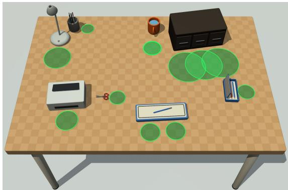  
Figure 8: An $N = 8$ example of Task 2. Green circles denote unobstructed affordance regions, a red circle denotes an obstructed affordance region, and red object outlines indicate pairs of objects that are too close to each other. Left: the compact printer and scissors, and the desk lamp and pen cup, are too close to each other, and the drawer organizer obstructs the affordance region of the handled mug. Right: PE guidance resolves all three violations from the same initial sample without any model retraining.

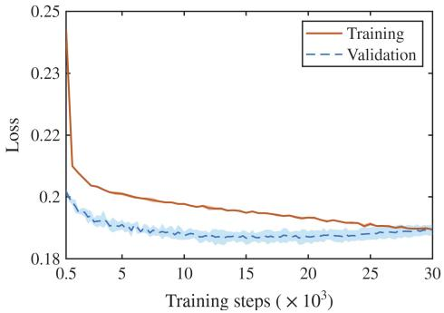  
Figure 9: Training and validation flow matching losses over three independent seeds for the nominal vector field in Task 2. Shaded regions represent ± one sample standard deviation.

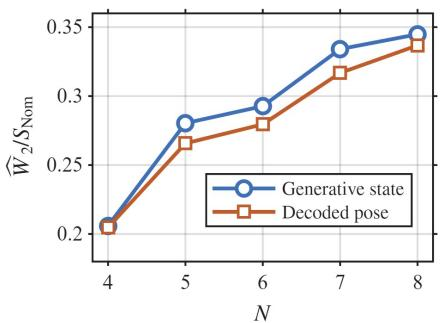  
Figure 10: Approximation of the Wasserstein distance between the Nominal and Guided distributions in Task 2 with respect the total number of generated objects, normalized by the RMS pairwise distance among the $M = 5 0$ scenes generated by the nominal vector field. The blue and orange curves use the distance metrics in the generative state space and the decoded pose space, respectively.