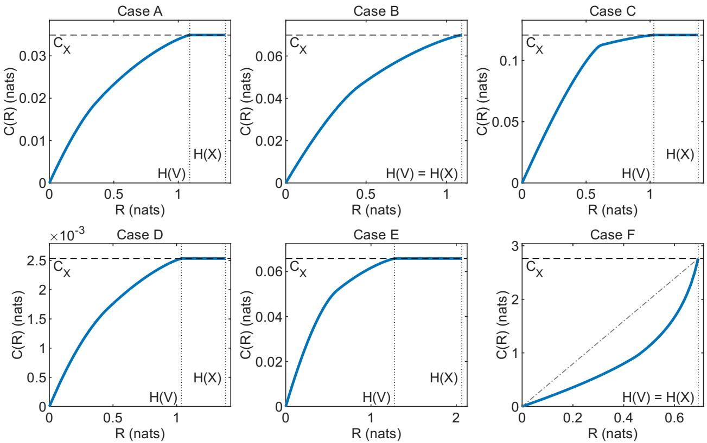
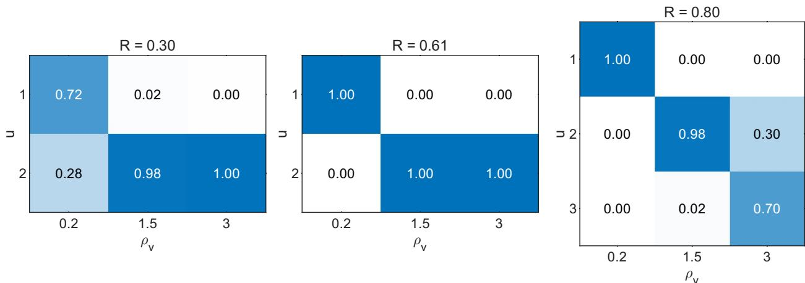
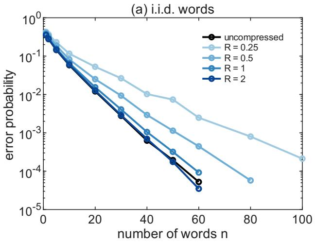
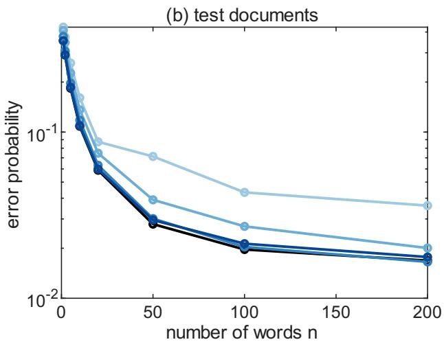

# Mutual Information Constrained Chernof Bottleneck

Dier Tang<sup>∗</sup>, and Guangyue Han<sup>†</sup>

Department of Mathematics, The University of Hong Kong

## Abstract

The classical information bottleneck (IB) measures the relevance of a representation U of X to a target Y by I(U; Y), which does not directly characterize the error of downstream decisions. For a binary hypothesis Y inferred from many separately encoded observations, the optimal error exponent is the Chernof information between the two conditional distributions of U given Y . We study the mutual information constrained Chernof bottleneck, which seeks an encoder that maximizes this Chernof information subject to a rate constraint $I ( U ; X ) \leq R$ . We show that its optimal value C(R) increases strictly up to R = H(V), where V merges the symbols of X with equal likelihood ratio, remains at the uncompressed exponent beyond, and, unlike the IB curve, need not be concave. We further show that k + 1 outputs sufice to attain C(R), where k is the cardinality of V . We propose an alternating algorithm that updates the encoder via a generalized Blahut–Arimoto algorithm and the Chernof parameter s via a nonlinear equation, and prove that its iterates remain feasible, with nondecreasing and convergent Chernof information. Numerical experiments confirm the theory, and on real topic-detection data from the 20 Newsgroups corpus, compressing each word to only 17% of its entropy retains 90% of the error exponent and nearly the accuracy of the uncompressed classifier.

Keywords: Information bottleneck; Chernof information; rate–distortion theory; cardinality bound; hypothesis testing; generalized Blahut–Arimoto algorithm

## 1 Introduction

Representation learning, a fundamental paradigm in machine learning [1], aims to automatically learn meaningful and compact representations of raw data that make downstream tasks—such as inference and prediction—more efective [2, 3, 4, 5, 6, 7]. The information bottleneck (IB) [8] operationalizes this goal by seeking a representation U that preserves the information relevant to a target Y while discarding redundant details of the observation X, expressed as the trade-of between maximizing I(U; Y) and minimizing I(U; X). Since then, the IB principle has been used both as a tool for analyzing deep neural networks and as an objective for learning robust, generalizable representations [9, 10, 11, 12, 13, 14, 15].

However, while the mutual information $I ( U ; Y )$ quantifies average statistical dependence, it does not directly characterize the fundamental limit on the error probability of downstream decisionmaking. Specifically, when $Y \in \{ 0 , 1 \}$ is a binary hypothesis to be inferred from n representation samples $U _ { 1 } , \dots , U _ { n }$ , obtained by applying the same encoder $P _ { U | X }$ to observations $X _ { 1 } , \ldots , X _ { n }$ that are i.i.d. given Y, the minimum Bayes error probability decays exponentially in $n ,$ and the optimal error exponent is the Chernof information [16]

$$
C ( P _ { 0 } , P _ { 1 } ) = \operatorname* { m a x } _ { 0 \leq s \leq 1 } \Big ( - \log \sum _ { u } P _ { 0 } ( u ) ^ { s } P _ { 1 } ( u ) ^ { 1 - s } \Big )
$$

between the conditional distributions $P _ { U | 0 }$ and $P _ { U | 1 }$ of $U$ given $Y = 0$ and $Y = 1$ , for every prior with $P _ { Y } ( 0 ) , P _ { Y } ( 1 ) > 0 \ [ 1 7 , 1 8 ]$ . In contrast to $I ( U ; Y )$ , which depends on the prior, this exponent depends only on $P _ { U | 0 }$ and $P _ { U | 1 }$ , and an encoder that is optimal for the classical IB need not be optimal for testing. This operational interpretation motivates replacing $I ( U ; Y )$ by the Chernof information, thereby leading to the mutual information (MI) constrained Chernof bottleneck

$$
C ( R ) = \operatorname* { m a x } _ { P _ { U | X } } \ C ( P _ { U | 0 } , P _ { U | 1 } ) \quad { \mathrm { s . t . } } \quad I ( U ; X ) \leq R ,
$$

which seeks the representation under which the error of the downstream test decays fastest, subject to a budget R on its complexity. The encoder is applied to each sample separately, as when the samples are observed by diferent sensors or edge devices, or processed by a per-sample feature extractor before the decision is made [19, 20, 21], in contrast to testing under communication constraints, where a whole block of observations is encoded jointly [22, 23].

Although the MI constrained Chernof bottleneck has the same form as the classical IB, the change of objective means that the theory and algorithms developed for the IB do not carry over directly. They rely on two properties of $I ( U ; Y )$ . First, the IB loss $I ( X ; Y ) - I ( U ; Y ) = \mathbb { E } \big [ \mathrm { { D } } ( P _ { Y | X } | | P _ { Y | U } ) \big ]$ is an expectation over $( X , U )$ of a per-letter divergence, which leads to self-consistent equations and Blahut–Arimoto-type iterations [8, 24, 25]. Second, $\begin{array} { r } { I ( U ; Y ) = H ( Y ) - \sum _ { u } P _ { U } ( u ) H ( Y | U = u ) } \end{array}$ is a sum over the outputs of the encoder, weighted by their probabilities, which underlies the time-sharing and cardinality arguments [26]. The Chernof information has neither property: it is not an expectation of a per-letter quantity, and it involves an optimization over the parameter s that couples all outputs. Consequently, neither rate–distortion theory [27, 28] nor the algorithms for the classical IB apply directly, and the shape of the optimal curve, cardinality bounds on the representation, and the computation of optimal encoders must be studied anew.

In this paper, we address these problems. Our contributions are as follows.

(i) Shape of the curve. We prove that $C ( R )$ is strictly increasing on $[ 0 , H ( V ) ]$ and saturates at $C ( P _ { X \mid 0 } , P _ { X \mid 1 } )$ for all $R \geq H ( V )$ , where V merges the symbols of X with equal likelihood ratio (Theorem 3.5), and that for $R \leq H ( V )$ every optimal encoder uses the full rate budget (Corollary 3.6). In contrast to the IB curve, $C ( R )$ need not be concave (Example 3.7).

(ii) Cardinality bounds. We prove that an optimal encoder exists with at most $| \mathcal { X } | + 1$ outputs (Theorem 4.2), and sharpen the bound to $k + 1$ , where k is the number of distinct likelihood ratios, by a reduction to V (Theorem 4.4).

(iii) Computation. We develop an algorithm (Algorithm 2) that alternately updates the encoder, by a generalized Blahut–Arimoto algorithm (Algorithm 1) with a bisection over the trade-of, and the parameter s, by solving a nonlinear equation. We prove that Algorithm 1 converges to a global minimizer at rate $O ( 1 / t )$ with a stopping certificate (Theorem 5.8, Corollary 5.9), that the bisection has an explicit bracket and certificate (Lemma 5.10), and that the iterates of Algorithm 2 remain feasible, with s uniformly bounded away from 0 and 1 and the Chernof information monotonically convergent (Lemma 5.12, Theorem 5.13, Remark 5.14).

(iv) Experiments. On synthetic sources, the computed $C ( R )$ curves confirm the theory of Section 3, and the optimal encoders are randomized likelihood-ratio quantizers (Sections 6.1 and 6.2). On real data, in topic detection on the 20 Newsgroups corpus [29], the Chernof bottleneck compresses each word to 1 nat, only 17% of its entropy, while keeping 90% of the error exponent and nearly the accuracy of the uncompressed classifier (Section 6.3).

The rest of the paper is organized as follows. Section 2 formulates the problem. Section 3 characterizes the shape of the $C ( R )$ curve, and Section 4 establishes the cardinality bounds and reformulates the problem over a finite output alphabet. Section 5 develops and analyzes the algorithm, Section 6 reports the numerical experiments, and Section 7 concludes the paper.

## 2 Problem Setup

Let X, Y be discrete random variables with finite alphabet X and $\mathcal { V } = \{ 0 , 1 \}$ , and joint distribution $P _ { X , Y }$ with marginals $P _ { X } ( x ) > 0 , P _ { Y } ( y ) > 0$ for any $x \in \mathcal { X }$ and $y \in \{ 0 , 1 \}$ . We derive $P _ { X \mid Y = 0 }$ and $P _ { X | Y = 1 }$ via Bayes formula, denote as $P _ { X | 0 }$ and $P _ { X \mid 1 }$ respectively. Assume there are no symbols that are “instantly recognizable”, i.e.,

$$
P _ { X | 0 } ( x ) > 0 , \ P _ { X | 1 } ( x ) > 0 , \ \forall x \in \mathcal { X } ,\tag{1}
$$

together with the nondegeneracy assumption $P _ { X | 0 } \not \equiv P _ { X | 1 }$

Suppose samples $X ^ { n } = ( X _ { 1 } , \cdots , X _ { n } ) $ are i.i.d. drawn from either $P _ { X | 0 }$ or $P _ { X \mid 1 }$ , the error exponent of using $X ^ { n }$ to infer Y is given by the Chernof information

$$
C ( P _ { X | 0 } , P _ { X | 1 } ) = \operatorname* { m a x } _ { 0 \leq s \leq 1 } \Big ( - \log \sum _ { x } P _ { X | 0 } ( x ) ^ { s } P _ { X | 1 } ( x ) ^ { 1 - s } \Big ) = - \operatorname* { m i n } _ { 0 \leq s \leq 1 } \log \sum _ { x } P _ { X | 0 } ( x ) ^ { s } P _ { X | 1 } ( x ) ^ { 1 - s } .
$$

In this paper, we set $0 ^ { 0 } = \operatorname* { l i m } _ { s  0 } 0 ^ { s } = 0$ . All logarithms are natural.

For an encoder $K = K _ { U | X }$ that compresses $X  U$ with finite output alphabet, denote by $P _ { U | 0 } ^ { K } .$ $P _ { U | 1 } ^ { K }$ the induced conditional distributions, $P _ { U } ^ { K }$ the marginal, and $I _ { K } ( U ; X )$ the mutual information. Suppose samples $U ^ { n } = ( U _ { 1 } , \cdots , U _ { n } )$ are i.i.d. drawn from either $P _ { U | 0 } ^ { K }$ or $P _ { U | 1 } ^ { K }$ , the error exponent of using $U ^ { n }$ to infer Y is given by the Chernof information $C ( P _ { U | 0 } ^ { K } , P _ { U | 1 } ^ { K } )$ . Define the distortion of the encoder $K _ { U | X }$ as

$$
d ( K ) = C ( P _ { X | 0 } , P _ { X | 1 } ) - C ( P _ { U | 0 } ^ { K } , P _ { U | 1 } ^ { K } ) .\tag{2}
$$

The distortion $d ( K )$ measures how much information of inferring Y is lost in the encoding process, and is well-defined according to the following lemma.

Lemma 2.1. For any encoder $K _ { U | X } , d ( K ) \geq 0$

Proof. Since $U  X  Y$ forms a Markov chain, the proof is straightforward by the data processing inequality of Chernof information [30]. A direct proof via Hölder’s inequality is given in Lemma 3.3. □

Given rate $R \geq 0$ and alphabet $\mathcal { U } _ { M } = \{ 1 , \cdots , M \}$ with finite M, define the feasible encoder set

$$
{ \cal K } _ { R } ^ { ( M ) } = \Big \{ K _ { U | X } : K ( u | x ) \geq 0 , \sum _ { u } K ( u | x ) = 1 , \forall ( u , x ) \in \mathcal { U } _ { M } \times \chi ; ~ I _ { K } ( U ; X ) \leq R \Big \} ,\tag{3}
$$

with its strictly positive subset

$$
\begin{array} { r } { { \cal K } _ { R , + } ^ { ( M ) } = \Big \{ K _ { U | X } \in { \cal K } _ { R } ^ { ( M ) } : K ( u | x ) > 0 , \forall ( u , x ) \in \mathcal { U } _ { M } \times \mathcal { X } \Big \} , } \end{array}\tag{4}
$$

and define the entire feasible set

$$
\mathcal { H } _ { R } = \bigcup _ { M \geq 1 } \mathcal { K } _ { R } ^ { ( M ) } .\tag{5}
$$

Then, our problem can be formulated as

Problem 1. Given $R \geq 0$ , seek

$$
K ^ { * } \in \arg \operatorname* { i n f } _ { K \in \mathcal { M } _ { R } } d ( K ) ,
$$

equivalently,

$$
K ^ { * } \in \arg \operatorname* { s u p } _ { K \in \mathcal { H } _ { R } } C ( P _ { U | 0 } ^ { K } , P _ { U | 1 } ^ { K } ) .\tag{6}
$$

We refer to (6) as the mutual information (MI) constrained Chernof bottleneck, for which the attainability of the optimal solutions is established in Section 4.

For rate $R \geq 0$ , define the supremum in (6) as

$$
C ( R ) \stackrel { \Delta } { = } \operatorname* { s u p } _ { K \in \mathcal { H } _ { R } } C ( P _ { U | 0 } ^ { K } , P _ { U | 1 } ^ { K } ) ,\tag{7}
$$

which is our object of study. Let $F ( R ) \triangleq e ^ { - C ( R ) }$

Given alphabet $\mathcal { U } _ { M } = \{ 1 , \cdots , M \}$ with finite M. For $K \in \mathcal { K } _ { R } ^ { ( M ) }$ and $s \in [ 0 , 1 ]$ , define

$$
B _ { M } ( K , s ) \stackrel { \Delta } { = } \sum _ { u \in \mathcal { U } _ { M } } P _ { U | 0 } ^ { K } ( u ) ^ { s } P _ { U | 1 } ^ { K } ( u ) ^ { 1 - s } ,\tag{8}
$$

and for $K \in \mathcal { K } _ { R } ^ { ( M ) }$ , define the corresponding Chernof information

$$
{ \mathcal { C } } ( K ) \triangleq - \log \operatorname* { m i n } _ { s \in [ 0 , 1 ] } B _ { M } ( K , s ) .\tag{9}
$$

We abbreviate $C _ { X } = C ( P _ { X \mid 0 } , P _ { X \mid 1 } ) > 0$ , which is strictly positive since $P _ { X | 0 } \not \equiv P _ { X | 1 }$ . Denote by

$$
\ell \overset { \Delta } { = } \operatorname* { m i n } _ { x \in \mathcal { X } } \frac { P _ { X | 1 } ( x ) } { P _ { X | 0 } ( x ) } , \quad L \overset { \Delta } { = } \operatorname* { m a x } _ { x \in \mathcal { X } } \frac { P _ { X | 1 } ( x ) } { P _ { X | 0 } ( x ) } ,\tag{10}
$$

which are both well defined according to (1), and let

$$
\Gamma \triangleq \operatorname* { m a x } \{ L , \ell ^ { - 1 } \} = \exp \Big ( \operatorname* { m a x } _ { x } \Big | \log \frac { P _ { X | 1 } ( x ) } { P _ { X | 0 } ( x ) } \Big | \Big ) > 1 .\tag{11}
$$

For all $x \in \mathcal { X }$ , let $\rho ( x ) \triangleq { \frac { P _ { X \mid 1 } ( x ) } { P _ { X \mid 0 } ( x ) } } \in [ \ell , L ]$ , and $\{ \rho _ { 1 } , \cdots , \rho _ { k } \}$ be the distinct values taken by $\rho ,$ then $2 \leq k \leq | \mathcal { X } |$ (the lower bound is because $P _ { X | 0 } \not \equiv P _ { X | 1 } )$ . Define $\nu : \mathcal { X } \to \{ 1 , \cdots , k \}$ by $\nu ( x ) = j$ if and only if $\rho ( x ) = \rho _ { j }$ , and set variable

$$
V = \nu ( X ) .\tag{12}
$$

Thus V merges exactly those symbols that have the same likelihood ratio, and it is the minimal suficient statistic of X for $Y \ [ 1 7 ]$ . Moreover, $\begin{array} { r } { P _ { V } ( j ) = \sum _ { x : \nu ( x ) = j } P _ { X } ( x ) } \end{array}$ , and since V is a function of $X$ , we have $I ( V ; X ) = H ( V ) \leq H ( X )$ , with equality if and only if all |X| ratios are distinct. We write $\nu ^ { - 1 }$ as the inverse mapping of $\nu ,$ and define

$$
\mathcal X _ { j } \stackrel { \Delta } { = } \nu ^ { - 1 } ( j ) = \{ x \in \mathcal X : \rho ( x ) = \rho _ { j } \} , \quad j = 1 , \cdots , k ,\tag{13}
$$

for the likelihood-ratio classes, so that $\textstyle { \mathcal { X } } = \bigcup _ { j = 1 } ^ { k } { \mathcal { X } } _ { j }$ . Denote by $K ^ { X }$ the identity encoder that outputs X itself (with no compression), and

$$
K ^ { V } ( u | x ) = \mathbf { 1 } \{ u = \nu ( x ) \} , \quad ( u , x ) \in \mathcal { U } _ { k } \times \mathcal { X } ,\tag{14}
$$

the deterministic encoder that outputs V .

## 3 Global Shape of the C(R) Curve

With C(R) defined in (7), the following lemma shows some basic shape of the $C ( R )$ curve.

$$
( i ) ~ C ( 0 ) = 0 ;
$$

(ii) C(R) is nondecreasing on $[ 0 , \infty )$ ;

(iii) $0 \leq C ( R ) \leq C _ { X }$ for all $R \in [ 0 , \infty )$

Proof. For (i), Markovity and $I _ { K } ( U ; X ) = 0$ implies $P _ { U | 0 } ^ { K } \equiv P _ { U | 1 } ^ { K }$ . Hence, $C ( 0 ) = 0$ . For (ii), monotonicity holds because $R \mapsto { \mathcal { H } } _ { R }$ is nondecreasing for inclusion. For (iii), the upper bound follows from Lemma 2.1, i.e., the data processing inequality for Chernof information [30, 31].

Theorem 3.5 gives a stronger result for the shape of $C ( R )$ , and its proof relies on the following lemmas. Throughout, $B _ { M } ( K , s )$ and V are defined in (8) and (12), respectively.

Lemma 3.2 (Suficiency of V ). Let $| \nu | = k$ , and $K ^ { V }$ be defined in (14), we have

$$
I _ { K ^ { V } } ( U ; X ) = H ( V ) , \quad B _ { k } ( K ^ { V } , s ) = B _ { | \mathcal { X } | } ( K ^ { X } , s ) , \ \forall s \in [ 0 , 1 ] .
$$

In particular, $C ( P _ { U | 0 } ^ { K ^ { V } } , P _ { U | 1 } ^ { K ^ { V } } ) = C _ { X }$

Proof. Appendix B.1.

Lemma 3.3 (Hölder). For any encoder $K \in \mathcal { K } _ { R } ^ { ( M ) }$ and $s \in [ 0 , 1 ]$ ，

$$
B _ { M } ( K , s ) \geq B _ { | \mathcal { X } | } ( K ^ { X } , s ) .\tag{15}
$$

Moreover, if $I _ { K } ( U ; X ) < H ( V )$ , then the inequality (15) is strict for every $s \in ( 0 , 1 )$

Proof. Appendix B.2.

Lemma 3.4 (Time-sharing). Let $K _ { 1 } , K _ { 2 }$ be encoders with output alphabets $\mathcal { U } _ { M _ { 1 } } , \mathcal { U } _ { M _ { 2 } }$ , producing $U _ { 1 }$ and $U _ { 2 }$ from X, respectively. For $\theta \in [ 0 , 1 ]$ , let $Q \sim \operatorname { B e r n } ( \theta )$ be independent of X, and let K be the encoder with output alphabet $\mathcal { U } _ { M _ { 1 } + M _ { 2 } }$ producing $U = U _ { 1 } ~ i f Q = 1$ and $U = M _ { 1 } + U _ { 2 } \ i f Q = 0$ . Then, for any $s \in [ 0 , 1 ]$ ，

$$
I _ { K } ( U ; X ) = \theta I _ { K _ { 1 } } ( U ; X ) + ( 1 - \theta ) I _ { K _ { 2 } } ( U ; X ) , \quad B _ { M _ { 1 } + M _ { 2 } } ( K , s ) = \theta B _ { M _ { 1 } } ( K _ { 1 } , s ) + ( 1 - \theta ) B _ { M _ { 2 } } ( K _ { 2 } , s ) .
$$

Proof. Appendix B.3.

Theorem 3.5 (Saturation and strict monotonicity). $C ( R )$ is strictly increasing on $[ 0 , H ( V ) ]$ , and $C ( R ) = C _ { X }$ for every $R \geq H ( V )$

Proof. Saturation. Let $R \geq H ( V )$ . By Lemma 3.2, $I _ { K ^ { V } } ( U ; X ) = H ( V ) \leq R$ , so that $K ^ { V } \in \mathcal { H } _ { R }$ and $C ( P _ { U | 0 } ^ { K ^ { V } } , P _ { U | 1 } ^ { K ^ { V } } ) = C _ { X }$ . Hence $C ( R ) \geq C _ { X }$ , while Lemma 3.1 gives $C ( R ) \leq C _ { X }$ . Therefore $C ( R ) = \dot { C _ { X } }$

Strict monotonicity. Let $0 \leq R _ { 1 } < R _ { 2 } \leq H ( V )$ , and let $K ^ { * } \in \mathcal { H } _ { R _ { 1 } }$ with output alphabet $\boldsymbol { \mathcal { U } } _ { M ^ { \ast } }$ attain $C ( R _ { 1 } )$ , i.e., ${ \mathcal C } ( K ^ { * } ) = C ( R _ { 1 } )$ (the existence of $K ^ { * }$ is guaranteed by Theorem 4.2). Write $I ^ { * } = I _ { K ^ { * } } ( U ; X ) \le R _ { 1 } < H ( V )$

By Young’s inequality (Fact A.1), for every $s \in [ 0 , 1 ]$ ，

$$
B _ { M ^ { * } } ( K ^ { * } , s ) \le \sum _ { u \in \mathcal { U } _ { M ^ { * } } } \left( s P _ { U | 0 } ^ { K ^ { * } } ( u ) + ( 1 - s ) P _ { U | 1 } ^ { K ^ { * } } ( u ) \right) = 1 ,
$$

while $B _ { M ^ { * } } ( K ^ { * } , 0 ) = B _ { M ^ { * } } ( K ^ { * } , 1 ) = 1$ . If $B _ { M ^ { * } } ( K ^ { * } , s ) \equiv 1$ on [0, 1], we select $\begin{array} { r } { \overline { { s } } = \frac { 1 } { 2 } } \end{array}$ . Otherwise, $\begin{array} { r } { \operatorname* { m i n } _ { s \in [ 0 , 1 ] } B _ { M ^ { * } } ( K ^ { * } , s ) < 1 } \end{array}$ , then every $\bar { s } \in \arg \operatorname* { m i n } _ { s \in [ 0 , 1 ] } B _ { M ^ { * } } ( K ^ { * } , s )$ lies in $( 0 , 1 )$ . In both cases, we can select $\bar { s } \in ( 0 , 1 )$ and

$$
B _ { M ^ { * } } ( K ^ { * } , \bar { s } ) = \operatorname* { m i n } _ { s \in \left[ 0 , 1 \right] } B _ { M ^ { * } } ( K ^ { * } , s ) = e ^ { - \mathscr { C } ( K ^ { * } ) } = F ( R _ { 1 } ) .\tag{16}
$$

Moreover, since $I ^ { * } < H ( V )$ , Lemma 3.3 gives

$$
B _ { M ^ { * } } ( K ^ { * } , \bar { s } ) > B _ { | \mathcal { X } | } ( K ^ { X } , \bar { s } ) .\tag{17}
$$

Now let $K ^ { \prime }$ be the encoder with output alphabet $\boldsymbol { \mathcal { U } } _ { k + M ^ { * } }$ given by Lemma 3.4, with $K _ { 1 } = K ^ { V }$ $K _ { 2 } = K ^ { * }$ and

$$
\theta = \frac { R _ { 2 } - I ^ { * } } { H ( V ) - I ^ { * } } \in ( 0 , 1 ] .
$$

By Lemma 3.4 and Lemma 3.2,

$$
I _ { K ^ { \prime } } ( U ; X ) = \theta H ( V ) + ( 1 - \theta ) I ^ { * } = R _ { 2 } ,
$$

so that $K ^ { \prime } \in \mathcal { H } _ { R _ { 2 } }$ . Using Lemma 3.4, then Lemma 3.2, then (17) with $\theta > 0$ , and finally (16),

$$
\begin{array} { r } { F ( R _ { 2 } ) \le e ^ { - \mathcal { C } ( K ^ { \prime } ) } \le B _ { k + M ^ { * } } ( K ^ { \prime } , \bar { s } ) = \theta B _ { k } ( K ^ { V } , \bar { s } ) + ( 1 - \theta ) B _ { M ^ { * } } ( K ^ { * } , \bar { s } ) } \\ { = \theta B _ { | \mathcal { X } | } ( K ^ { X } , \bar { s } ) + ( 1 - \theta ) B _ { M ^ { * } } ( K ^ { * } , \bar { s } ) < B _ { M ^ { * } } ( K ^ { * } , \bar { s } ) = F ( R _ { 1 } ) . } \end{array}
$$

Therefore, $C ( R _ { 2 } ) > C ( R _ { 1 } )$ , which completes the proof.

Corollary 3.6 (The rate constraint is active). For $R \leq H ( V )$ , every optimal encoder of Problem 1 satisfies $I _ { K } ( U ; X ) = R$

Proof. Assume K is optimal at rate R with $I _ { K } ( U ; X ) \ < \ R$ . Since $K \in \mathcal { K } _ { I _ { K } ( U ; X ) }$ , we have $C ( I _ { K } ( U ; X ) ) \ge C ( R )$ , contradicting the strict monotonicity of C on $[ 0 , H ( V ) ]$ established in Theorem 3.5. □

Time-sharing guarantees the concavity of the IB curve $R \mapsto \operatorname* { m a x } \{ I ( U ; Y ) : I ( U ; X ) \leq R \}$ whereas $C ( R )$ need not be concave, as the following example shows.

Example 3.7 $( C ( R )$ curve not necessarily concave). Let ${ \mathcal { X } } ~ = ~ \{ 1 , 2 \} , ~ P _ { Y } ( 0 ) ~ = ~ P _ { Y } ( 1 ) ~ = ~ { \textstyle { \frac { 1 } { 2 } } } ~$ $P _ { X | 0 } = ( 1 - a , a )$ and $P _ { X | 1 } = ( a , 1 - a )$ with $0 < a \le 1 0 ^ { - 3 }$ . Then, C(R) is not concave on [0, log 2]. Proof. Appendix B.4. □

## 4 Cardinality Bounds and Attainability

Since Problem 1 is searching K in the entire feasible set, which is the union of an infinite number of sets, the attainability of the optimal solution has not been determined. Theorem 4.2 provides a guarantee in this regard, while Lemma 4.1 shows many good properties of the feasible encoder set $\bar { \kappa } _ { R } ^ { ( M ) }$ , and is used in the proof of Theorem 4.2.

Lemma 4.1. Given finite M, for any $R \geq 0$ , the feasible encoder set ${ \kappa } _ { R } ^ { ( M ) }$ is non-empty, compact and convex.

Proof. Appendix B.5.

Theorem 4.2 (Cardinality bound). For any $R \geq 0$

$$
\operatorname* { s u p } _ { K \in \mathcal { H } _ { R } } C ( P _ { U | 0 } ^ { K } , P _ { U | 1 } ^ { K } ) = \operatorname* { m a x } _ { K \in { \mathcal K } _ { R } ^ { ( | { \mathcal X } | + 1 ) } } C ( P _ { U | 0 } ^ { K } , P _ { U | 1 } ^ { K } ) ,\tag{18}
$$

which indicates the cardinality of U can be restricted to satisfy $| \mathcal { U } | \leq | \mathcal { X } | + 1$ without loss of generality.   
Moreover, the maximum in (18) is achievable.

Proof. Assume $K \in \mathcal { K } _ { R }$ is an arbitrary feasible encoder with output alphabet $\boldsymbol { \mathcal { U } } _ { m }$ . Let $B _ { m } ( K , s )$ be defined in (8), and choose

$$
s _ { K } \in \arg \operatorname* { m i n } _ { 0 \leq s \leq 1 } B _ { m } ( K , s ) .\tag{19}
$$

Then, the corresponding Chernof information is

$$
\mathcal { C } ( K ) = - \log B _ { m } ( K , s _ { K } ) .
$$

Assume $P _ { U } ^ { K } ( u ) > 0$ for all $u \in \mathcal { U } _ { m }$ , otherwise, it could be directly removed and reduce $m$ . For each $u \in \mathcal { U } _ { m }$ , define $\lambda _ { u } \triangleq P _ { U } ^ { K } ( u ) , w _ { u } \triangleq P _ { X | U = u } ^ { K } \in \Delta _ { | \mathcal { X } | - 1 }$ , and for $s \in [ 0 , 1 ]$

$$
g _ { s } ( w ) \triangleq \Big ( \frac { \sum _ { x } w ( x ) P _ { Y | X } ( 0 | x ) } { P _ { Y } ( 0 ) } \Big ) ^ { s } \Big ( \frac { \sum _ { x } w ( x ) P _ { Y | X } ( 1 | x ) } { P _ { Y } ( 1 ) } \Big ) ^ { 1 - s } \cdot
$$

Then,

$$
B _ { m } ( K , s ) = \sum _ { u = 1 } ^ { m } \lambda _ { u } g _ { s } ( w _ { u } ) .
$$

Construct vectors

$$
v _ { u } = \bigl ( 1 , w _ { u } ( 1 ) , \cdots , w _ { u } ( | \mathcal { X } | - 1 ) , \mathrm { D } ( w _ { u } \| P _ { X } ) \bigr ) \in \mathbb { R } ^ { | \mathcal { X } | + 1 } , \quad \forall u \in \mathcal { U } _ { m } .
$$

If $m \geq | { \mathcal { X } } | + 2$ , then vectors $v _ { 1 } , \cdots , v _ { m }$ are linearly dependent, which means there exists $c _ { 1 } , \cdots , c _ { m }$ not all zeros such that $\scriptstyle \sum _ { u = 1 } ^ { m } c _ { u } v _ { u } = 0$ . In this case, expand each coordinate gives

$$
\sum _ { u = 1 } ^ { m } c _ { u } = 0 ;
$$

$$
\sum _ { u = 1 } ^ { m } c _ { u } w _ { u } ( x ) = 0 , \quad x = 1 , \cdots , | \mathcal { X } | - 1 ;\tag{20}
$$

$$
\sum _ { u = 1 } ^ { m } c _ { u } \mathrm { D } ( w _ { u } \| P _ { X } ) = 0 .
$$

Moreover, since

$$
\sum _ { u = 1 } ^ { m } c _ { u } w _ { u } ( x _ { | \mathcal { X } | } ) = \sum _ { u = 1 } ^ { m } c _ { u } \big ( 1 - \sum _ { x = 1 } ^ { | \mathcal { X } | - 1 } w _ { u } ( x ) \big ) = \sum _ { u = 1 } ^ { m } c _ { u } - \sum _ { x = 1 } ^ { | \mathcal { X } | - 1 } \sum _ { u = 1 } ^ { m } c _ { u } w _ { u } ( x ) = 0 ,
$$

the equation (20) holds for all $x \in \mathcal { X }$

For any $t \in \mathbb { R }$ , define the disturbance weight

$$
\lambda _ { u } ( t ) = \lambda _ { u } + t c _ { u } .
$$

Because $c _ { 1 } , \cdots , c _ { m }$ are not all zeros, and $\Sigma _ { u = 1 } ^ { m } c _ { u } = 0$ , there must be both positive and negative numbers in the sequence $\{ c _ { u } \} _ { u = 1 } ^ { m }$ . Define

$$
t _ { - } = \operatorname* { m a x } _ { u : c _ { u } > 0 } \Big ( - \frac { \lambda _ { u } } { c _ { u } } \Big ) < 0 , \quad t _ { + } = \operatorname* { m i n } _ { u : c _ { u } < 0 } \Big ( - \frac { \lambda _ { u } } { c _ { u } } \Big ) > 0 .
$$

Then, for any $t \in ( t _ { - } , t _ { + } )$ , all $\lambda _ { u } ( t )$ remains positive; when $t = t _ { - }$ or $t _ { + }$ , at least one weight $\lambda _ { u } ( t )$ goes exactly to zero; for any $t \in [ t _ { - } , t _ { + } ]$ , we have

$$
\sum _ { u = 1 } ^ { m } \lambda _ { u } ( t ) = \sum _ { u = 1 } ^ { m } \lambda _ { u } + t \sum _ { u = 1 } ^ { m } c _ { u } = 1 ;
$$

$$
\sum _ { u = 1 } ^ { m } \lambda _ { u } ( t ) w _ { u } ( x ) = P _ { X } ( x ) + t \sum _ { u = 1 } ^ { m } c _ { u } w _ { u } ( x ) = P _ { X } ( x ) ;
$$

$$
I _ { t } ( U ; X ) = \sum _ { u = 1 } ^ { m } \lambda _ { u } ( t ) D ( w _ { u } \| P _ { X } ) = I _ { K } ( U ; X ) + t \sum _ { u = 1 } ^ { m } c _ { u } D ( w _ { u } \| P _ { X } ) = I _ { K } ( U ; X ) .
$$

Furthermore, for the $s _ { K }$ selected in (19), define

$$
\hat { B } _ { s _ { K } } ( t ) \stackrel { \Delta } { = } \sum _ { u = 1 } ^ { m } \lambda _ { u } ( t ) g _ { s _ { K } } ( w _ { u } ) = \hat { B } _ { s _ { K } } ( 0 ) + t \sum _ { u = 1 } ^ { m } c _ { u } g _ { s _ { K } } ( w _ { u } ) .
$$

If $\textstyle \sum _ { u = 1 } ^ { m } c _ { u } g _ { s _ { K } } ( w _ { u } ) \geq 0$ , let $\begin{array} { r } { t = t _ { - } < 0 ; \mathrm { i f } \sum _ { u = 1 } ^ { m } c _ { u } g _ { s _ { K } } ( w _ { u } ) < 0 } \end{array}$ , let $t = t _ { + } > 0$ . Thus, we can always select $t _ { 0 } \in \{ t _ { - } , t _ { + } \}$ such that

$$
\hat { B } _ { s _ { K } } ( t _ { 0 } ) \le \hat { B } _ { s _ { K } } ( 0 ) = B _ { m } ( K , s _ { K } ) ,
$$

and at least one $\lambda _ { u } ( t _ { 0 } ) = 0$ . Define the updated weights $\tilde { \lambda } _ { u } = \lambda _ { u } ( t _ { 0 } ) , \forall u \in \mathcal { U } _ { m }$ , and removing those symbols with zero probability gives the updated alphabet $\mathcal { U } _ { \tilde { m } }$ with $\tilde { m } \le m - 1$ . Define a new encoder $\tilde { K }$ on $\mathcal { U } _ { \tilde { m } }$ as

$$
\tilde { K } ( u | x ) = \frac { \tilde { \lambda } _ { u } w _ { u } ( x ) } { P _ { X } ( x ) } , \quad \forall u \in \mathcal { U } _ { \tilde { m } } .
$$

It satisfies $I _ { \tilde { K } } ( U ; X ) = I _ { K } ( U ; X ) \le R$ , and $B _ { \tilde { m } } ( \tilde { K } , s _ { K } ) \leq B _ { m } ( K , s _ { K } )$ . Hence,

$$
\mathcal { C } ( \tilde { K } ) = - \log \operatorname* { m i n } _ { 0 \leq s \leq 1 } B _ { \tilde { m } } ( \tilde { K } , s ) \geq - \log B _ { \tilde { m } } ( \tilde { K } , s _ { K } ) \geq - \log B _ { m } ( K , s _ { K } ) = \mathcal { C } ( K ) .
$$

Therefore, for any encoder $K$ on $\boldsymbol { \mathcal { U } } _ { m }$ with $m \geq | { \mathcal { X } } | + 2$ , we can always construct a new encoder $\tilde { K }$ , whose positive probability output symbol is reduced by at least one, and

$$
I _ { \tilde { K } } ( U ; X ) = I _ { K } ( U ; X ) , \quad \mathcal { C } ( \tilde { K } ) \geq \mathcal { C } ( K ) .
$$

Accordingly,

$$
\operatorname* { m a x } _ { K \in { \cal K } _ { R } ^ { ( | { \mathcal X } | + 1 ) } } { \mathcal C } ( K ) \ge \operatorname* { m a x } _ { K \in { \cal K } _ { R } ^ { ( | { \mathcal X } | + 2 ) } } { \mathcal C } ( K ) \ge \cdots \ge \operatorname* { m a x } _ { K \in { \cal K } _ { R } ^ { ( | { \mathcal X } | + n ) } } { \mathcal C } ( K ) , \quad n \to \infty .
$$

And since

$$
\mathcal { H } _ { R } = \bigcup _ { M \geq 1 } \mathcal { K } _ { R } ^ { ( M ) } ,
$$

we have

$$
\operatorname* { s u p } _ { K \in \mathcal { H } _ { R } } \mathcal { C } ( K ) = \operatorname* { m a x } _ { K \in \mathcal { K } _ { R } ^ { ( | \mathcal { X } | + 1 ) } } \mathcal { C } ( K ) .
$$

Furthermore, by Lemma 4.1, ${ \ K } _ { R } ^ { ( | { \mathcal { X } } | + 1 ) }$ is non-empty and compact, and since ${ \mathcal { C } } ( K )$ is continuous with respect to $K$ , the maximum in (18) is attainable. □

Theorem 4.2 demonstrates the supremum in the entire feasible set $\mathcal { H } _ { R }$ can be achieved in a feasible encoder set ${ \kappa } _ { R } ^ { ( M ) }$ with cardinality $M = | \mathcal { X } | + 1$ . In fact, the cardinality bound can be further sharpened, as Theorem 4.4 shows, while Lemma 4.3 is applied in the proof. Let V be defined in (12), taking k distinct values.

Lemma 4.3 (Reduction to the suficient statistic). Consider an encoder $\bar { \cal K } = \bar { \cal K } _ { U | V }$ of V with output alphabet $\boldsymbol { \mathcal { U } } _ { M }$ , denote by $\begin{array} { r } { P _ { U | y } ^ { \bar { K } } ( u ) = \sum _ { j = 1 } ^ { k } P _ { V | y } ( j ) \bar { K } ( u | j ) , y \in \{ 0 , 1 \} } \end{array}$ , its induced conditional distributions, and by $I _ { \bar { K } } ( U ; V )$ its mutual information under $P _ { V }$ . Then,

(i) For every encoder $K = K _ { U | X }$ with output alphabet $\boldsymbol { \mathcal { U } } _ { M }$ , there exists an encoder K<sup>¯</sup> of V with output alphabet $\boldsymbol { \mathcal { U } } _ { M }$ such that

$$
P _ { U | y } ^ { \bar { K } } = P _ { U | y } ^ { K } , \ y \in \{ 0 , 1 \} , \qquad I _ { \bar { K } } ( U ; V ) \leq I _ { K } ( U ; X ) .\tag{21}
$$

(ii) For every encoder $\bar { K }$ of V with output alphabet $\boldsymbol { \mathcal { U } } _ { M }$ , the encoder $K ( u | x ) = \bar { K } ( u | \nu ( x ) )$ of X satisfies

$$
P _ { U | y } ^ { K } = P _ { U | y } ^ { \bar { K } } , ~ y \in \{ 0 , 1 \} , \qquad I _ { K } ( U ; X ) = I _ { \bar { K } } ( U ; V ) .\tag{22}
$$

Proof. Appendix B.6.

Theorem 4.4 (Sharpened cardinality bound). For any $R \geq 0$

$$
\operatorname* { s u p } _ { K \in \mathcal { H } _ { R } } C ( P _ { U | 0 } ^ { K } , P _ { U | 1 } ^ { K } ) = \operatorname* { m a x } _ { K \in \mathcal { K } _ { R } ^ { ( k + 1 ) } } C ( P _ { U | 0 } ^ { K } , P _ { U | 1 } ^ { K } ) ,\tag{23}
$$

and the maximum is attained by an encoder of the form $K ( u | x ) = \bar { K } ( u | \nu ( x ) )$ for some encoder $\bar { \cal K } = \bar { \cal K } _ { U | V }$ of V with output alphabet $\mathscr { U } _ { k + 1 }$ . Hence the cardinality of U can be restricted to $| \mathcal { U } | \le k + 1$ without loss of generality.

Proof. Consider the pair (V, Y ) with joint distribution

$$
P _ { V , Y } ( j , y ) = \sum _ { x \in \mathcal { X } _ { j } } P _ { X , Y } ( x , y ) , \quad ( j , y ) \in \{ 1 , \cdots , k \} \times \{ 0 , 1 \} .
$$

The marginals are $P _ { Y } ( y ) > 0$ and $\begin{array} { r } { P _ { V } ( j ) = \sum _ { x \in \mathcal { X } _ { i } } P _ { X } ( x ) > 0 } \end{array}$ , and by $( 1 ) , P _ { V | y } ( j ) = P _ { X | y } ( \mathcal { X } _ { j } ) > 0$ for all j and y. Moreover, summing $P _ { X | 1 } ( x ) = \rho _ { j } \dot { P _ { X | 0 } } ( x )$ over $\chi _ { j }$ derives $P _ { V | 1 } ( j ) = \rho _ { j } P _ { V | 0 } ( j )$ . Thus, $P _ { X | 0 } \not \equiv P _ { X | 1 }$ indicates $P _ { V | 0 } \not \equiv P _ { V | 1 }$

With the notation of Lemma 4.3, and similar to the definition of $\mathcal { H } _ { R }$ in (5), denote by the entire feasible set from V to U as $\bar { \mathcal { H } } _ { R }$ , and define the curve of the reduced problem as

$$
C _ { V } ( R ) \stackrel { \Delta } { = } \operatorname* { s u p } _ { \bar { K } \in \bar { \mathcal { M } } _ { R } } C ( P _ { U | 0 } ^ { \bar { K } } , P _ { U | 1 } ^ { \bar { K } } ) .\tag{24}
$$

Since the proof of Theorem 4.2 uses only the standing assumptions of Section 2, it applies verbatim to the pair $( V , Y )$ , whose alphabet has cardinality k. Therefore, there exists an encoder ${ \bar { K } } ^ { * }$ of V with output alphabet $\mathscr { U } _ { k + 1 }$ such that

$$
I _ { \bar { K } ^ { * } } ( U ; V ) \leq R , \quad C ( P _ { U | 0 } ^ { \bar { K } ^ { * } } , P _ { U | 1 } ^ { \bar { K } ^ { * } } ) = C _ { V } ( R ) .\tag{25}
$$

We now show that $C ( R ) = C _ { V } ( R )$ . Let $K \in \mathcal { K } _ { R }$ be arbitrary, with output alphabet $\boldsymbol { \mathcal { U } } _ { M }$ , and let $\bar { K }$ be defined by Lemma 4.3(i). By (21), $I _ { \bar { K } } ( U ; V ) \le I _ { K } ( U ; X ) \le R$ and $P _ { U | y } ^ { \bar { K } } = P _ { U | y } ^ { K }$ for $y \in \{ 0 , 1 \}$ Hence

$$
\mathcal { C } ( K ) = C \big ( P _ { U | 0 } ^ { K } , P _ { U | 1 } ^ { K } \big ) = C \big ( P _ { U | 0 } ^ { \bar { K } } , P _ { U | 1 } ^ { \bar { K } } \big ) \leq C _ { V } ( R ) ,
$$

and taking the supremum over $K \in \mathcal { K } _ { R }$ gives $C ( R ) \leq C _ { V } ( R )$ . Conversely, let $K ^ { * } ( u | x ) = \bar { K } ^ { * } ( u | \nu ( x ) )$ By (22) and (25), $K ^ { * }$ has output alphabet $\mathcal U _ { k + 1 } , I _ { K ^ { * } } ( U ; X ) = I _ { \bar { K } ^ { * } } ( U ; V ) \le R$ , and $P _ { U | y } ^ { K ^ { * } } = P _ { U | y } ^ { \bar { K } ^ { * } }$ for $y \in \{ 0 , 1 \}$ , so that

$$
K ^ { * } \in { \mathcal { K } } _ { R } ^ { ( k + 1 ) } , \quad { \mathcal { C } } ( K ^ { * } ) = C _ { V } ( R ) \geq C ( R ) .
$$

Combining the two directions, and using ${ \mathcal { K } } _ { R } ^ { ( k + 1 ) } \subseteq { \mathcal { H } } _ { R }$

$$
C ( R ) \leq \mathcal C ( K ^ { * } ) \leq \operatorname* { m a x } _ { K \in { \cal K } _ { R } ^ { ( k + 1 ) } } \mathcal C ( K ) \leq \operatorname* { s u p } _ { K \in \mathcal { H } _ { R } } \mathcal C ( K ) = C ( R ) .
$$

Hence all inequalities hold with equality, and the supremum over ${ \ K } _ { R } ^ { ( k + 1 ) }$ is attained by $K ^ { * }$ , which proves (23) with a maximizer of the form $K ^ { * } ( u | x ) = \bar { K } ^ { * } ( u | \nu ( x ) )$ □

Remark 4.5. Theorem 4.4 strictly improves Theorem 4.2 when $k < | \mathcal { X } |$ , i.e., at least two symbols share the same likelihood ratio. Lemma 4.3 also shows that the curve $C ( R )$ depends on the source only through the joint distribution $P _ { V , Y } \colon$ : compressing X is never better than compressing its minimal suficient statistic, at any rate.

Therefore, we can reformulate the MI constrained Chernof bottleneck as follows:

Problem 2. Given $R \geq 0$ and $\mathcal { U } _ { M } = \{ 1 , \cdots , M \}$ , seek

$$
K ^ { * } \in \arg \operatorname* { m a x } _ { K \in \mathcal { K } _ { R } ^ { ( M ) } } C ( P _ { U | 0 } ^ { K } , P _ { U | 1 } ^ { K } ) .\tag{26}
$$

Theorem 4.4 implies that we can recover the optimal solution of Problem 1 by setting $M \geq k + 1$ in Problem 2, for which we establish an alternating optimization algorithm in Section 5.

## 5 An Alternating Optimization Algorithm

In this section, we fix the alphabet $\mathcal { U } _ { M } = \{ 1 , \cdots , M \}$ . With $B _ { M } ( K , s )$ defined in (8), the maximization in (26) can be rewritten as

$$
\operatorname* { m i n } _ { K \in { \mathcal K } _ { R } ^ { ( M ) } } \operatorname* { m i n } _ { 0 \le s \le 1 } B _ { M } ( K , s ) .
$$

We establish an iterative algorithm for Problem 2 by alternately minimizing over K and s:

(a) Fix s, update K with

$$
K \in \arg \operatorname* { m i n } _ { K \in \mathcal { K } _ { R } ^ { ( M ) } } B _ { M } ( K , s ) ;\tag{27}
$$

(b) Fix K, update s with

$$
s = \arg \operatorname* { m i n } _ { 0 \leq s \leq 1 } B _ { M } ( K , s ) .\tag{28}
$$

## 5.1 Step (a): Generalized Blahut-Arimoto Algorithm

In this step, we fix s and update K. For fixed $s \in ( 0 , 1 )$ , and any $w ( u ) > 0$ , Young’s inequality (Fact A.1) gives

$$
P _ { U | 0 } ^ { K } ( u ) ^ { s } P _ { U | 1 } ^ { K } ( u ) ^ { 1 - s } \leq s w ( u ) P _ { U | 0 } ^ { K } ( u ) + ( 1 - s ) w ( u ) ^ { - \frac { s } { 1 - s } } P _ { U | 1 } ^ { K } ( u ) ,
$$

and equality holds when $w ( u ) P _ { U | 0 } ^ { K } ( u ) = w ( u ) ^ { - \frac { s } { 1 - s } } P _ { U | 1 } ^ { K } ( u )$ . Namely,

$$
P _ { U | 0 } ^ { K } ( u ) ^ { s } P _ { U | 1 } ^ { K } ( u ) ^ { 1 - s } = \operatorname* { m i n } _ { w ( u ) > 0 } \left( s w ( u ) P _ { U | 0 } ^ { K } ( u ) + ( 1 - s ) w ( u ) ^ { - \frac { s } { 1 - s } } P _ { U | 1 } ^ { K } ( u ) \right) ,
$$

with the minimum achieved by

$$
w ( u ) = \Big ( \frac { P _ { U | 1 } ^ { K } ( u ) } { P _ { U | 0 } ^ { K } ( u ) } \Big ) ^ { 1 - s } .\tag{29}
$$

Lemma 5.1. Let ${ \mathcal { K } } _ { R , + } ^ { ( M ) }$ be defined in (4), and ℓ and L be defined in (10). $I f K _ { U | X } \in { \mathcal { K } } _ { R , + } ^ { ( M ) }$ , then $f o r$ any $u \in \mathcal { U } _ { M }$ 2

$$
0 < \ell \leq \frac { P _ { U | 1 } ^ { K } ( u ) } { P _ { U | 0 } ^ { K } ( u ) } \leq L < + \infty .
$$

Hence, $\ell ^ { 1 - s } \leq w ( u ) \leq L ^ { 1 - s }$

Proof. Appendix B.7.

Remark 5.2. Lemma 5.1 gives a uniform bound of $w ( u )$ . The condition $K _ { U | X } \in \mathcal { K } _ { R , + } ^ { ( M ) }$ holds for every iterate of Algorithm 2 by Theorem 5.13.

Thus, the minimization in (27) becomes

$$
\operatorname* { m i n } _ { K \in { \cal K } _ { R } ^ { ( M ) } } \operatorname* { m i n } _ { w ( u ) > 0 } \ \sum _ { u \in \cal U _ { M } } s w ( u ) P _ { U \vert 0 } ^ { K } ( u ) + ( 1 - s ) w ( u ) ^ { - \frac { s } { 1 - s } } P _ { U \vert 1 } ^ { K } ( u ) .\tag{30}
$$

For $y \in \{ 0 , 1 \}$ , Markovity gives

$$
P _ { U | y } ^ { K } ( u ) = \sum _ { x \in \mathcal { X } } K ( u | x ) P _ { X | y } ( x ) .
$$

Define the parameter matrix $C ^ { s } \in \mathbb { R } _ { + } ^ { M \times | \mathcal { X } | }$ with entries

$$
C _ { u , x } ^ { s } = s w ( u ) P _ { X | 0 } ( x ) + ( 1 - s ) w ( u ) ^ { - \frac { s } { 1 - s } } P _ { X | 1 } ( x ) ,\tag{31}
$$

where $w ( u )$ is given by (29) at the current encoder. With $w ( u )$ fixed, the objective in (30) is linear in K, and the update of K solves

$$
\operatorname* { m i n } _ { K \in { \mathcal K } _ { R } ^ { ( M ) } } \sum _ { ( u , x ) \in { \mathcal U } _ { M } \times { \mathcal X } } C _ { u , x } ^ { s } K ( u | x ) .\tag{32}
$$

Remark 5.3 (Concavity and the linear majorizer). For fixed $s \in [ 0 , 1 ] , B _ { M } ( K , s )$ is concave in K, since $( a , b ) \mapsto a ^ { s } b ^ { 1 - s }$ is concave on $\mathbb { R } _ { + } ^ { 2 }$ and $P _ { U | y } ^ { K }$ is linear in K. Consequently, maximizing ${ \mathcal { C } } ( K )$ amounts to minimizing the concave function min $\mathsf { \iota } _ { s \in [ 0 , 1 ] } B _ { M } ( K , s )$ over the convex set ${ \kappa } _ { R } ^ { ( M ) }$ , for which global optimality cannot be expected in general. Moreover, let $w ( u )$ and $C _ { u , x } ^ { s }$ be computed from a current encoder $\tilde { K } \in { \mathcal K } _ { R , + } ^ { ( M ) }$ via (29) and (31). For $s \in ( 0 , 1 )$ , direct diferentiation gives

$$
\left. \frac { \partial B _ { M } ( K , s ) } { \partial K ( u | x ) } \right| _ { K = \tilde { K } } = s w ( u ) P _ { X | 0 } ( x ) + ( 1 - s ) w ( u ) ^ { - \frac { s } { 1 - s } } P _ { X | 1 } ( x ) = C _ { u , x } ^ { s } .
$$

Since $B _ { M } ( \cdot , s )$ is positively homogeneous of degree one, Euler’s identity gives

$$
B _ { M } ( \tilde { K } , s ) = \sum _ { u , x } C _ { u , x } ^ { s } \tilde { K } ( u | x ) .
$$

```latex
Hence the objective in (32) is exactly the tangent plane of $B _ { M } ( \cdot , s )$ at ${ \tilde { K } } \colon$ by concavity, it upper
bounds $B _ { M } ( K , s )$ for every K, with equality at $K = \tilde { K }$ . Step (a) is therefore a successive linearization
of a concave function.
Write the Lagrangian function as
$\mathcal { L } ( K , \lambda , \mu ) = \sum _ { u , x } C _ { u , x } ^ { s } K ( u | x ) + \lambda \big ( I _ { K } ( U ; X ) - R \big ) + \sum _ { x } \mu ( x ) \big ( \sum _ { u } K ( u | x ) - 1 \big ) ,$
with the trade-of parameter $\lambda \geq 0$ . Taking derivative over $K$ gives
$\frac { \partial \mathcal { L } } { \partial K } = C _ { u , x } ^ { s } + \lambda P _ { X } ( x ) \log \frac { K ( u | x ) } { P _ { U } ( u ) } + \mu ( x ) .$
Let $\begin{array} { r } { \frac { \partial \mathcal { L } } { \partial K } = 0 } \end{array}$ and normalize, we have
$K ( u | x ) = \frac { P _ { U } ( u ) \mathrm { e x p } \Big ( - \frac { C _ { u , x } ^ { s } } { \lambda P _ { X } ( x ) } \Big ) } { \sum _ { u ^ { \prime } } P _ { U } ( u ^ { \prime } ) \mathrm { e x p } \Big ( - \frac { C _ { u ^ { \prime } , x } ^ { s } } { \lambda P _ { X } ( x ) } \Big ) } .$ (33)
And for fixed $K ( u | x )$ , the output distribution $P _ { U } ( u )$ is given by $\begin{array} { r } { P _ { U } ( u ) = \sum _ { x } K ( u | x ) P _ { X } ( x ) } \end{array}$ . Thus,
we have established the Generalized Blahut-Arimoto (GBA) algorithm for (32).
Algorithm 1 Generalized Blahut-Arimoto Algorithm for (32)
Input: $P _ { X } ;$ ; parameter matrix $C _ { u , x } ^ { s } ;$ current $K _ { U | X } ;$ ; trade-of $\lambda > 0$
Output: converged encoder ${ \hat { K } } _ { U | X }$
1: $K _ { U | X } ^ { ( 0 ) }  K _ { U | X } ; P _ { U } ^ { ( 0 ) } ( u )  \setminus _ { x } K _ { U | X } ^ { ( 0 ) } ( u | x ) P _ { X } ( x ) ; t  0$
2: repeat
3: Given $P _ { U } ^ { ( t ) }$ , update $K _ { U | X } ^ { ( t + 1 ) }$
$K ^ { ( t + 1 ) } ( u | x ) \gets \frac { P _ { U } ^ { ( t ) } ( u ) \exp \big ( - \frac { C _ { u , x } ^ { s } } { \lambda P _ { X } ( x ) } \big ) } { \sum _ { u ^ { \prime } } P _ { U } ^ { ( t ) } ( u ^ { \prime } ) \exp \big ( - \frac { C _ { u ^ { \prime } , x } ^ { s } } { \lambda P _ { X } ( x ) } \big ) }$
4: Given $K _ { U | X } ^ { ( t + 1 ) }$ , update $P _ { U } ^ { ( t + 1 ) }$
$P _ { U } ^ { ( t + 1 ) } ( u )  \sum _ { x } K ^ { ( t + 1 ) } ( u | x ) P _ { X } ( x )$
5: t ← t + 1
6: until max<sub>u∈U</sub> $( P _ { U } ^ { ( t ) } ( u ) - P _ { U } ^ { ( t - 1 ) } ( u ) ) / P _ { U } ^ { ( t - 1 ) } ( u )$ very small ▷ as stated in Rem. 5.4
7: return $\hat { K } _ { U | X } = K _ { U | X } ^ { ( t ) }$
Remark 5.4. The stopping criterion is that of the Blahut–Arimoto algorithm [24, 25], and it comes
with an optimality certificate. Let $\epsilon _ { t } = \operatorname* { m a x } _ { u } \big ( P _ { U } ^ { ( t ) } ( u ) - P _ { U } ^ { ( t - 1 ) } ( u ) \big ) / P _ { U } ^ { ( t - 1 ) } ( u ) \geq 0$ be the quantity
checked at termination. By Corollary 5.9, the output $\hat { K } _ { U | X } = K _ { U | X } ^ { ( t ) }$ satisfies
$\mathcal { L } _ { \lambda } ( \hat { K } ) - \operatorname* { m i n } _ { K } \mathcal { L } _ { \lambda } ( K ) \leq \lambda \log ( 1 + \epsilon _ { t } ) \leq \lambda \epsilon _ { t } ,$
where $\mathcal { L } _ { \lambda }$ is defined in Section 5.4.
```

## 5.2 Step (b): Solving a Nonlinear Equation

In this step, we fix K and update s. We consider the encoder $K \in \mathcal { K } _ { R , + } ^ { ( M ) }$ , which holds for every iterate of Algorithm 2 by Theorem 5.13.

For fixed $\boldsymbol { \mathcal { U } } _ { M }$ and $K _ { U | X } \in \mathcal { K } _ { R , + } ^ { ( M ) }$ , define

$$
g _ { K } ( s ) \stackrel { \Delta } { = } \sum _ { u \in \mathcal { U } _ { M } } P _ { U | 0 } ^ { K } ( u ) ^ { s } P _ { U | 1 } ^ { K } ( u ) ^ { 1 - s } , \quad s \in [ 0 , 1 ]\tag{34}
$$

Lemma 5.5. For $K _ { U | X } \in \mathcal { K } _ { R , + } ^ { ( M ) } , g _ { K } ( s )$ is continuous and infinitely diferentiable on [0, 1].

Proof. $K _ { U | X } \in \mathcal { K } _ { R , + } ^ { ( M ) }$ and the Markovity guarantees for any $u \in \mathcal { U } _ { M } , P _ { U | 0 } ^ { K } ( u ) > 0 , P _ { U | 1 } ^ { K } ( u ) > 0$ . Since $g _ { K } ( s )$ is a summation of finite terms, considering $h _ { K } ^ { u } ( s ) \triangleq P _ { U | 0 } ^ { K } ( u ) ^ { s } P _ { U | 1 } ^ { K } ( u ) ^ { 1 - s }$ , we have

$$
h _ { K } ^ { u } ( s ) = \exp { ( s \log P _ { U | 0 } ^ { K } ( u ) + ( 1 - s ) \log P _ { U | 1 } ^ { K } ( u ) ) } ,
$$

which is certainly continuous and infinitely diferentiable.

Calculate the derivatives

$$
g _ { K } ^ { \prime } ( s ) = \sum _ { u \in \mathcal { U } _ { M } } P _ { U | 0 } ^ { K } ( u ) ^ { s } P _ { U | 1 } ^ { K } ( u ) ^ { 1 - s } \log \frac { P _ { U | 0 } ^ { K } ( u ) } { P _ { U | 1 } ^ { K } ( u ) } ,\tag{35}
$$

and

$$
g _ { K } ^ { \prime \prime } ( s ) = \sum _ { u \in \mathcal { U } _ { M } } P _ { U | 0 } ^ { K } ( u ) ^ { s } P _ { U | 1 } ^ { K } ( u ) ^ { 1 - s } \Big ( \log \frac { P _ { U | 0 } ^ { K } ( u ) } { P _ { U | 1 } ^ { K } ( u ) } \Big ) ^ { 2 } .\tag{36}
$$

Thus, $g _ { K } ^ { \prime \prime } ( s ) \geq 0$ on [0, 1]. Moreover, if $P _ { U | 0 } ^ { K } \not \equiv P _ { U | 1 } ^ { K }$ on $\boldsymbol { \mathcal { U } } _ { M }$ , we have $g _ { K } ^ { \prime \prime } ( s ) > 0$ on [0, 1], i.e., $g _ { K } ^ { \prime } ( s )$ is monotonically increasing on [0, 1], and

$$
g _ { K } ^ { \prime } ( 0 ) = \sum _ { u \in \mathcal { U } _ { M } } P _ { U | 1 } ^ { K } ( u ) \log \frac { P _ { U | 0 } ^ { K } ( u ) } { P _ { U | 1 } ^ { K } ( u ) } = - \mathrm { D } ( P _ { U | 1 } ^ { K } \Vert P _ { U | 0 } ^ { K } ) < 0 ,\tag{37}
$$

$$
g _ { K } ^ { \prime } ( 1 ) = \sum _ { u \in \mathcal { U } _ { M } } P _ { U | 0 } ^ { K } ( u ) \log \frac { P _ { U | 0 } ^ { K } ( u ) } { P _ { U | 1 } ^ { K } ( u ) } = \mathrm { D } ( P _ { U | 0 } ^ { K } | | P _ { U | 1 } ^ { K } ) > 0 .\tag{38}
$$

Hence, we have the following lemma.

Lemma 5.6. For $K _ { U | X } \in \mathcal { K } _ { R , + } ^ { ( M ) } , P _ { U | 0 } ^ { K } \not \equiv P _ { U | 1 } ^ { K }$ , there exists the unique $s ^ { * } \in ( 0 , 1 )$ such that

$$
g _ { K } ( s ^ { * } ) = \operatorname* { m i n } _ { s \in [ 0 , 1 ] } g _ { K } ( s ) .
$$

Proof. The conditions give (37) and (38). And since $g _ { K } ^ { \prime \prime } ( s ) > 0$ on [0, 1], there exists the unique $s ^ { * } \in ( 0 , 1 )$ such that $g _ { K } ^ { \prime } ( s ^ { * } ) = 0$ □

Searching $\begin{array} { r } { s ^ { * } = \arg \operatorname* { m i n } _ { s \in [ 0 , 1 ] } g _ { K } ( s ) } \end{array}$ is equivalent to searching $s ^ { * }$ such that

$$
g _ { K } ^ { \prime } ( s ^ { * } ) = 0 ,\tag{39}
$$

where $g _ { K } ^ { \prime } ( s )$ is given by (35). Non-linear equation (39) can be solved by numerical methods such as the bisection method, Newton’s method, or Brent’s method [32, 33, 34].

## 5.3 Alternating Optimization Algorithm for Problem 2

Combining step (a) and (b), we establish the algorithm for Problem 2 as below.

Algorithm 2 Algorithm for Problem 2   
Input: $P _ { X } ; P _ { X | 0 } ; P _ { X | 1 } ;$ cardinality M; rate $R > 0$   
Output: Encoder $K ^ { * }$   
1: Initialize: $K _ { U | X } ^ { ( 0 ) } \in { \mathcal { K } } _ { R , + } ^ { ( M ) } ; s ^ { ( 0 ) } \in ( 0 , 1 )$ ; l ← 0   
2: Compute $P _ { U } ^ { ( 0 ) } , \stackrel { \cdot } { P _ { U | 0 } ^ { ( 0 ) } } , \stackrel { } { P _ { U | 1 } ^ { ( 0 ) } }$ from $\begin{array} { r } { K _ { U | X } ^ { ( 0 ) } ; B ^ { ( 0 ) } \gets \sum _ { u \in \mathcal { U } _ { M } } P _ { U | 0 } ^ { ( 0 ) } ( u ) ^ { s ^ { ( 0 ) } } P _ { U | 1 } ^ { ( 0 ) } ( u ) ^ { 1 - s ^ { ( 0 ) } } } \end{array}$   
3: if $B ^ { ( 0 ) } = 1$ then go to line 1 ▷ re-initialize to avoid $P _ { U | 0 } ^ { ( 0 ) } \equiv P _ { U | 1 } ^ { ( 0 ) }$   
4: Compute Γ by (11)   
5: repeat   
6: For each $u , x ,$ compute $w ( u )$ from (29) and $C _ { u , x } ^ { s ^ { ( l ) } }$ from (31)   
7: $\lambda _ { \mathrm { s m a l l } }  0 ; \lambda _ { \mathrm { b i g } }  \Gamma / R ; K _ { U | X } ^ { ( l + 1 ) }  K _ { U | X } ^ { ( l ) }$ ▷ initial bracket (Lem. 5.10)   
8: repeat   
9: $\lambda  ( \lambda _ { \mathrm { s m a l l } } + \lambda _ { \mathrm { b i g } } ) / 2$ ▷ bisection (Lem. 5.10)   
10: Start from $K _ { U | X } ^ { ( l ) }$ , run Algorithm 1 with λ to derive ${ \hat { K } } _ { U | X } ;$ ; compute $\hat { I } _ { K } ( U ; X )$   
11: if $\hat { I } _ { K } ( U ; X ) > \operatorname { R }$ then   
12: $\lambda _ { \mathrm { s m a l l } }  \lambda$   
13: else   
14: $\lambda _ { \mathrm { b i g } }  \lambda$   
15: $\begin{array} { r } { \mathbf { i f } \sum _ { u , x } C _ { u , x } ^ { s ^ { ( l ) } } \hat { K } ( u | x ) \leq \sum _ { u , x } C _ { u , x } ^ { s ^ { ( l ) } } K ^ { ( l + 1 ) } ( u | x ) } \end{array}$ then ▷ safeguard   
16: $K _ { U | X } ^ { ( l + 1 ) }  \hat { K } _ { U | X }$   
17: end if   
18: end if   
19: until $\lambda _ { \mathrm { b i g } } - \lambda _ { \mathrm { s m a l l } }$ very small   
20: Compute $P _ { U } ^ { ( l + 1 ) } , P _ { U | 0 } ^ { ( l + 1 ) } , P _ { U | 1 } ^ { ( l + 1 ) }$ from $K _ { U | X } ^ { ( l + 1 ) }$   
21: Compute $g _ { K } ^ { \prime } ( s )$ from $( 3 5 ) ;$ solve equation (39) to derive $s ^ { ( l + 1 ) }$   
22: $\begin{array} { r } { B _ { \cdot } ^ { ( l + \widehat { 1 } ) } \gets \sum _ { u \in \mathcal { U } _ { M } } P _ { U | 0 } ^ { ( l + 1 ) } ( u ) ^ { s ^ { ( l + 1 ) } } P _ { U | 1 } ^ { ( \widehat { l + 1 } ) } ( u ) ^ { 1 - s ^ { ( l + 1 ) } } } \end{array}$ ▷ update objective B   
23: $l  l + 1$   
24: until $| B ^ { ( l ) } - B ^ { ( l - 1 ) } |$ very small   
25: return $K ^ { * } = K _ { U | X } ^ { ( l ) }$

## 5.4 Convergence Analysis

We analyze the convergence of Algorithms 1 and 2.

Lemma 5.7 (Uniform boundedness). For $K _ { U | X } \in \mathcal { K } _ { R , + } ^ { ( M ) }$ and $s \in ( 0 , 1 )$ , let $w ( u )$ be given by (29) and $C _ { u , x } ^ { s }$ by (31). Then, for all $( u , x ) \in \mathcal { U } _ { M } \times \dot { \mathcal { X } }$

$$
0 < P _ { X | 0 } ( x ) ^ { s } P _ { X | 1 } ( x ) ^ { 1 - s } \leq C _ { u , x } ^ { s } \leq \Gamma \big ( s P _ { X | 0 } ( x ) + ( 1 - s ) P _ { X | 1 } ( x ) \big ) .
$$

Proof. Appendix B.8.

For fixed $C _ { u , x } ^ { s }$ and $\lambda \geq 0 ,$ denote by $\kappa _ { \infty } ^ { ( M ) }$ the set of all encoders with output alphabet $\boldsymbol { \mathcal { U } } _ { M }$ , with

no rate constraint, and define

$$
G ( K ) \triangleq \sum _ { u , x } C _ { u , x } ^ { s } K ( u | x ) , \quad { \mathcal { L } } _ { \lambda } ( K ) \triangleq G ( K ) + \lambda I _ { K } ( U ; X ) ,
$$

so that (32) reads min ${ } _ { K \in { \cal K } _ { R } ^ { ( M ) } } G ( K )$ . Let $\begin{array} { r } { \mathcal { L } _ { \lambda } ^ { * } = \operatorname* { m i n } _ { K \in \mathcal { K } _ { \infty } ^ { ( M ) } } \mathcal { L } _ { \lambda } ( K ) } \end{array}$ , which is attained since $\kappa _ { \infty } ^ { ( M ) }$ is compact and $\mathcal { L } _ { \lambda }$ is continuous. For $\lambda > 0$ , Algorithm 1 alternately minimizes

$$
\hat { \mathcal { L } } _ { \lambda } ( K _ { U | X } , P _ { U } ) = \sum _ { u , x } C _ { u , x } ^ { s } K ( u | x ) + \lambda \sum _ { x } P _ { X } ( x ) \sum _ { u } K ( u | x ) \log { \frac { K ( u | x ) } { P _ { U } ( u ) } }\tag{40}
$$

over $K _ { U | X } \in { \mathcal { K } } _ { \infty } ^ { ( M ) }$ and $P _ { U }$ . Since $\begin{array} { r } { \sum _ { x } P _ { X } ( x ) \sum _ { u } K ( u | x ) \log \frac { K ( u | x ) } { P _ { U } ( u ) } = I _ { K } ( U ; X ) + \mathrm { D } ( P _ { U } ^ { K } \| P _ { U } ) , } \end{array}$

$$
\hat { \mathcal { L } } _ { \lambda } ( K , P _ { U } ) = \mathcal { L } _ { \lambda } ( K ) + \lambda \mathrm { D } ( P _ { U } ^ { K } \| P _ { U } ) ,\tag{41}
$$

so that min ${ } _ { P _ { U } } \hat { \mathcal { L } } _ { \lambda } ( K , P _ { U } ) = \mathcal { L } _ { \lambda } ( K )$ , attained at $P _ { U } = P _ { U } ^ { K }$ , and the global minimum of $\hat { \mathcal { L } } _ { \lambda }$ equals $\mathcal { L } _ { \lambda } ^ { * }$

Theorem 5.8 (Global convergence of Algorithm 1). Given $C _ { u , x } ^ { s }$ and $\lambda > 0$ , assume $P _ { U } ^ { ( 0 ) } ( u ) > 0$ for all $u \in \mathcal { U } _ { M }$ in Algorithm 1, which holds if $K _ { U | X } ^ { ( 0 ) } \in K _ { R , + } ^ { ( M ) }$ . Then $K _ { U | X } ^ { ( t ) }$ converges to a global minimizer $\bar { K }$ of $\mathcal { L } _ { \lambda }$ over $\kappa _ { \infty } ^ { ( M ) }$ , and $( K _ { U | X } ^ { ( t ) } , P _ { U } ^ { ( t ) } )$ converges to $( \bar { K } , P _ { U } ^ { \bar { K } } )$ , a global minimizer of $\hat { \mathcal { L } } _ { \lambda }$ Moreover, $\mathcal { L } _ { \lambda } ( K _ { U | X } ^ { ( t ) } )$ is nonincreasing in $t ,$ and for every global minimizer $K ^ { * }$ of $\mathcal { L } _ { \lambda }$ over $\kappa _ { \infty } ^ { ( M ) }$ and every $t \geq 1$ ，

$$
0 \leq \mathcal { L } _ { \lambda } ( K _ { U | X } ^ { ( t ) } ) - \mathcal { L } _ { \lambda } ^ { \ast } \leq \frac { \lambda \mathrm { D } ( P _ { U } ^ { K ^ { \ast } } \| P _ { U } ^ { ( 0 ) } ) } { t } .\tag{42}
$$

Proof. Appendix B.9.

Corollary 5.9 (Stopping certificate). Under the assumptions of Theorem 5.8, for every $t \geq 1$

$$
0 \leq \mathcal { L } _ { \lambda } ( K _ { U | X } ^ { ( t ) } ) - \mathcal { L } _ { \lambda } ^ { * } \leq \lambda \log \operatorname* { m a x } _ { u \in \mathcal { U } _ { M } } \frac { P _ { U } ^ { ( t ) } ( u ) } { P _ { U } ^ { ( t - 1 ) } ( u ) } .
$$

Proof. Let $K ^ { * }$ be a global minimizer of $\mathcal { L } _ { \lambda }$ and $q ^ { * } = P _ { U } ^ { K ^ { * } }$ . Applying (54) at step $t - 1$ with $K = K ^ { * }$ ， in the notation of Appendix B.9,

$$
\mathcal { L } _ { \lambda } ( K _ { t } ) - \mathcal { L } _ { \lambda } ^ { * } \leq \lambda \big ( \mathrm { D } ( q ^ { * } \| q _ { t - 1 } ) - \mathrm { D } ( q ^ { * } \| q _ { t } ) \big ) = \lambda \sum _ { u } q ^ { * } ( u ) \log \frac { q _ { t } ( u ) } { q _ { t - 1 } ( u ) } \leq \lambda \log \operatorname* { m a x } _ { u } \frac { q _ { t } ( u ) } { q _ { t - 1 } ( u ) } .
$$

In Algorithm 2, the trade-of parameter λ is searched by bisection. To justify this, let $K ( \lambda )$ be any minimizer of $\mathcal { L } _ { \lambda } ( K )$ in $\kappa _ { \infty } ^ { ( M ) }$ , i.e.,

$$
K ( \lambda ) \in \arg \operatorname* { m i n } _ { K \in { \mathcal { K } } _ { \infty } ^ { ( M ) } } { \mathcal { L } } _ { \lambda } ( K ) ,\tag{43}
$$

which Algorithm 1 approximates by Theorem 5.8, and let $I ( \lambda ) \triangleq I _ { K ( \lambda ) } ( U ; X )$ . The minimizer in (43) need not be unique, and the following result holds for every choice of it.

Lemma 5.10 (Bisection search of λ). Let $C _ { u , x } ^ { s }$ be given by (31) for some $K _ { U | X } \in \mathcal { K } _ { R , + } ^ { ( M ) }$ and $s \in ( 0 , 1 )$ , let $R > 0$ , Γ be defined in (11), and $G ^ { * } = \mathrm { m i n } _ { K \in { \mathcal K } _ { R } ^ { ( M ) } } G ( K )$ be the optimal value of (32). $T h e n , f o r$ every choice of $K ( \lambda )$ in (43):

(i) I(λ) is nonincreasing on $[ 0 , + \infty )$ , i. $e . , I ( \lambda _ { 1 } ) \geq I ( \lambda _ { 2 } )$ for all $0 \leq \lambda _ { 1 } < \lambda _ { 2 }$

(ii) $I f I ( \lambda ) \leq R ,$ then $K ( \lambda ) \in { \mathcal { K } } _ { R } ^ { ( M ) }$ and

$$
0 \leq G ( K ( \lambda ) ) - G ^ { * } \leq \lambda ( R - I ( \lambda ) ) .\tag{44}
$$

In particular, K(λ) solves (32) $i f I ( \lambda ) = R o r \lambda = 0$

(iii) There exists $\lambda ^ { * } \in [ 0 , \Gamma / R )$ such that $I ( \lambda ) > R$ for $\lambda < \lambda ^ { * }$ , and $I ( \lambda ) \leq R$ for $\lambda > \lambda ^ { * }$

Consequently, the bisection in lines 7–19 of Algorithm ${ \mathit { 2 } } ,$ initialized with $\lambda _ { s m a l l } = 0$ and $\lambda _ { b i g } = \Gamma / R$ keeps $\lambda ^ { * } \in [ \lambda _ { s m a l l } , \lambda _ { b i g } ]$ and $I ( \lambda _ { b i g } ) \le R$ at every step, and after n steps, $\lambda _ { b i g } - \lambda _ { s m a l l } = \Gamma / ( R 2 ^ { n } )$

Proof. Appendix B.10.

Remark 5.11. Lemma 5.10 justifies lines 7–19 of Algorithm 2. The bracket $[ 0 , \Gamma / R ]$ is valid at every outer iteration, since the bound $\lambda ^ { * } < \Gamma / R$ relies only on Lemma 5.7. Locating $\lambda ^ { * }$ to accuracy $\delta > 0$ takes $\lceil \log _ { 2 } ( \Gamma / ( R \delta ) ) \rceil$ runs of Algorithm 1. Finally, $K _ { U | X } ^ { ( l + 1 ) }$ is only replaced by encoders of rate at most $R ,$ so it stays feasible for (32), and its suboptimality is bounded by (44).

Many previous theorems and lemmas assume $s \in ( 0 , 1 )$ ; the following lemma ensures this.

Lemma 5.12 (Interiority of $s ^ { * } )$ . For $K _ { U | X } \in \mathcal { K } _ { R , + } ^ { ( M ) }$ with $P _ { U | 0 } ^ { K } \not \equiv P _ { U | 1 } ^ { K }$ , let ${ \mathcal { C } } ( K )$ be defined in (9) as the corresponding Chernof information, Γ be defined in (11), and $s ^ { * }$ be the unique root of (39). Then,

$$
{ \frac { { \mathcal { C } } ( K ) } { \log \Gamma } } \leq s ^ { * } \leq 1 - { \frac { { \mathcal { C } } ( K ) } { \log \Gamma } } .\tag{45}
$$

Moreover, $\begin{array} { r } { { \mathcal { C } } ( K ) \le \frac { 1 } { 2 } } \end{array}$ log Γ, which indicates the interval (45) is non-empty.

Proof. By Lemma 5.1, for any $u \in \mathcal { U } _ { M }$ 2

$$
\big | \log \frac { P _ { U | 1 } ^ { K } ( u ) } { P _ { U | 0 } ^ { K } ( u ) } \big | \le \operatorname* { m a x } \{ \log L , \log \ell ^ { - 1 } \} = \log \Gamma .
$$

Thus,

$$
D ( P _ { U | 1 } ^ { K } \| P _ { U | 0 } ^ { K } ) \leq \log \Gamma , \quad D ( P _ { U | 0 } ^ { K } \| P _ { U | 1 } ^ { K } ) \leq \log \Gamma .\tag{46}
$$

With $g _ { K } ( s )$ defined in (34), $K _ { U | X } \in \mathcal { K } _ { R , + } ^ { ( M ) }$ indicates $g _ { K } ( s ) > 0$ . Let $\psi _ { K } ( s ) \triangleq \log g _ { K } ( s )$ . While Lemma 5.5 guarantees the diferentiability, calculate the derivatives gives

$$
\psi _ { K } ^ { \prime } ( s ) = \frac { g _ { K } ^ { \prime } ( s ) } { g _ { K } ( s ) } , \quad \psi _ { K } ^ { \prime \prime } ( s ) = \frac { g _ { K } ^ { \prime \prime } ( s ) g _ { K } ( s ) - ( g _ { K } ^ { \prime } ( s ) ) ^ { 2 } } { ( g _ { K } ( s ) ) ^ { 2 } } .\tag{47}
$$

By (35), (36) and Cauchy-Schwarz inequality, we have $( g _ { K } ^ { \prime } ( s ) ) ^ { 2 } \leq g _ { K } ^ { \prime \prime } ( s ) g _ { K } ( s )$ , and equality holds if and only if $P _ { U | 0 } ^ { K } \equiv P _ { U | 1 } ^ { K }$ . Hence, $\psi _ { K } ( s )$ is strictly convex on $[ 0 , 1 ]$ . Moreover, $g _ { K } ( 0 ) = g _ { K } ( 1 ) = 1$ Thus, $\psi _ { K } ( 0 ) = \psi _ { K } ( 1 ) \stackrel { \cdot } { = } 0$ , and by (37), (38) and (47),

$$
\psi _ { K } ^ { \prime } ( 0 ) = g _ { K } ^ { \prime } ( 0 ) = - D ( P _ { U | 1 } ^ { K } | | P _ { U | 0 } ^ { K } ) , \quad \psi _ { K } ^ { \prime } ( 1 ) = g _ { K } ^ { \prime } ( 1 ) = D ( P _ { U | 0 } ^ { K } | | P _ { U | 1 } ^ { K } ) .
$$

Since arg min $\begin{array} { r } { { \bf \sigma } _ { s \in [ 0 , 1 ] } \psi _ { K } ( s ) = \arg \operatorname* { m i n } _ { s \in [ 0 , 1 ] } g _ { K } ( s ) = s ^ { * } } \end{array}$ , and $\psi _ { K } ( s ^ { * } ) = - { \mathcal { C } } ( K )$ , convexity of $\psi _ { K } ( s )$ gives

$$
\begin{array} { r } { - \mathcal { C } ( K ) = \psi _ { K } ( s ^ { * } ) \geq \psi _ { K } ( 0 ) + \psi _ { K } ^ { \prime } ( 0 ) s ^ { * } = - D ( P _ { U | 1 } ^ { K } | | P _ { U | 0 } ^ { K } ) s ^ { * } , } \end{array}\tag{48}
$$

and

$$
\begin{array} { r } { - \mathcal { C } ( K ) = \psi _ { K } ( s ^ { * } ) \geq \psi _ { K } ( 1 ) + \psi _ { K } ^ { \prime } ( 1 ) ( s ^ { * } - 1 ) = D ( P _ { U | 0 } ^ { K } | | P _ { U | 1 } ^ { K } ) ( s ^ { * } - 1 ) . } \end{array}\tag{49}
$$

Combining (46), (48), (49) derives (45) and $\begin{array} { r } { \mathcal { C } ( K ) \le \frac { 1 } { 2 } \log \Gamma } \end{array}$

Theorem 5.13 (Monotone convergence of Algorithm 2). In Algorithm ${ \mathcal { Q } } ,$ assume that, at every outer iteration $l \geq 0$ , line 21 returns the exact minimizer $s ^ { ( l + 1 ) }$ of $B _ { M } ( K ^ { ( l + 1 ) } , \cdot )$ over [0, 1]. Then, for every $l \ge 0 , K _ { U | X } ^ { ( l ) } \in \mathcal { K } _ { R , + } ^ { ( M ) } , s ^ { ( l ) } \in ( 0 , 1 )$ , and

$$
0 < F ( R ) \leq B ^ { ( l + 1 ) } \leq B ^ { ( l ) } \leq \cdots \leq B ^ { ( 0 ) } < 1 .\tag{50}
$$

Consequently, $\{ B ^ { ( l ) } \} _ { l = 0 } ^ { \infty }$ converges to some $B ^ { * } \in [ F ( R ) , B ^ { ( 0 ) } ] \subset ( 0 , 1 )$ , and the Chernof information $\mathcal { C } ( K ^ { ( l ) } ) = - \log B ^ { ( l ) } , l \ge 1$ , is nondecreasing and converges to − log $B ^ { * } \leq C ( R )$

Proof. By lines 2 and 22, $B ^ { ( l ) } = B _ { M } ( K ^ { ( l ) } , s ^ { ( l ) } )$ for every $l \geq 0$ . For $l \geq 0$ with $K _ { U | X } ^ { ( l ) } \in { \mathcal { K } } _ { R , + } ^ { ( M ) }$ and $s ^ { ( l ) } \in ( 0 , 1 )$ , let $C _ { u , x } ^ { s ^ { ( l ) } }$ be computed from $K _ { U | X } ^ { ( l ) }$ in line 6, and write $\begin{array} { r } { G ^ { ( l ) } ( K ) = \sum _ { u , x } C _ { u , x } ^ { s ^ { ( l ) } } K ( u | x ) } \end{array}$ . We prove by induction on l that

$$
K _ { U | X } ^ { ( l ) } \in { \mathcal K } _ { R , + } ^ { ( M ) } , \quad s ^ { ( l ) } \in ( 0 , 1 ) , \quad B ^ { ( l ) } \le B ^ { ( 0 ) } < 1 .\tag{51}
$$

Base case. By line 1, $K _ { U | X } ^ { ( 0 ) } \in K _ { R , + } ^ { ( M ) }$ and $s ^ { ( 0 ) } \in ( 0 , 1 )$ . By Young’s inequality (Fact A.1) with $w ( u ) = 1$ 2

$$
B ^ { ( 0 ) } \leq \sum _ { u \in \mathcal { U } _ { M } } \big ( s ^ { ( 0 ) } P _ { U | 0 } ^ { K ^ { ( 0 ) } } ( u ) + ( 1 - s ^ { ( 0 ) } ) P _ { U | 1 } ^ { K ^ { ( 0 ) } } ( u ) \big ) = 1 ,
$$

with equality if and only if $P _ { U | 0 } ^ { K ^ { ( 0 ) } } \equiv P _ { U | 1 } ^ { K ^ { ( 0 ) } }$ , which is excluded by line 3. Hence $B ^ { ( 0 ) } < 1$

Induction step. Assume (51) holds for l. In lines 7–19, $K _ { U | X } ^ { ( l + 1 ) }$ is initialized as $K _ { U | X } ^ { ( l ) }$ and replaced only by an output ${ \hat { K } } _ { U | X }$ of Algorithm 1 started from $K _ { U | X } ^ { ( l ) }$ with $\hat { I } _ { K } ( U ; X ) \le R$ and $G ^ { ( l ) } ( { \hat { K } } ) \leq G ^ { ( l ) } ( K ^ { ( l + 1 ) } )$ . Such an output is strictly positive, by the proof of Theorem 5.8. Hence

$$
K _ { U | X } ^ { ( l + 1 ) } \in { \mathcal { K } } _ { R , + } ^ { ( M ) } , \qquad G ^ { ( l ) } ( K ^ { ( l + 1 ) } ) \leq G ^ { ( l ) } ( K ^ { ( l ) } ) .
$$

By Remark $5 . 3 , G ^ { ( l ) }$ is the tangent plane of $B _ { M } ( \cdot , s ^ { ( l ) } )$ at $K ^ { ( l ) }$ , so that $B _ { M } ( K , s ^ { ( l ) } ) \le G ^ { ( l ) } ( K )$ for every K, with equality at $K = K ^ { ( l ) }$ . Since $s ^ { ( l + 1 ) }$ minimizes $B _ { M } ( K ^ { ( l + 1 ) } , \cdot )$

$$
\begin{array} { r l } & { B ^ { ( l + 1 ) } = B _ { M } ( K ^ { ( l + 1 ) } , s ^ { ( l + 1 ) } ) \le B _ { M } ( K ^ { ( l + 1 ) } , s ^ { ( l ) } ) \le G ^ { ( l ) } ( K ^ { ( l + 1 ) } ) } \\ & { \qquad \le G ^ { ( l ) } ( K ^ { ( l ) } ) = B _ { M } ( K ^ { ( l ) } , s ^ { ( l ) } ) = B ^ { ( l ) } \le B ^ { ( 0 ) } < 1 . } \end{array}
$$

If $P _ { U | 0 } ^ { K ^ { ( l + 1 ) } } \equiv P _ { U | 1 } ^ { K ^ { ( l + 1 ) } }$ , then $B _ { M } ( K ^ { ( l + 1 ) } , \cdot ) \equiv 1$ , contradicting $\begin{array} { r } { B ^ { ( l + 1 ) } = \operatorname* { m i n } _ { s \in [ 0 , 1 ] } B _ { M } ( K ^ { ( l + 1 ) } , s ) < 1 } \end{array}$ Hence Lemma 5.6 gives $s ^ { ( l + 1 ) } \in ( 0 , 1 )$ , which completes the induction and proves the monotonicity in (50).

Lower bound. Since $K _ { U | X } ^ { ( l ) } \in \mathcal { K } _ { R } ^ { ( M ) } \subseteq \mathcal { H } _ { R }$

$$
B ^ { ( l ) } \geq \operatorname* { m i n } _ { s \in [ 0 , 1 ] } B _ { M } ( K ^ { ( l ) } , s ) = e ^ { - { \mathcal C } ( K ^ { ( l ) } ) } \geq e ^ { - C ( R ) } = F ( R ) ,
$$

and $F ( R ) > 0$ since $C ( R ) \leq C _ { X } < \infty$ by Lemma 3.1.

Convergence. $\{ B ^ { ( l ) } \}$ is nonincreasing and bounded below by $F ( R )$ , hence converges to some $B ^ { * } \in [ F ( R ) , B ^ { ( 0 ) } ]$ . For $\boldsymbol { l } \ge 1 , s ^ { ( l ) }$ minimizes $B _ { M } ( K ^ { ( l ) } , \cdot )$ , so that $\mathcal { C } ( K ^ { ( l ) } ) = - \log B ^ { ( l ) }$ . This sequence is nondecreasing and converges to − log $B ^ { * } \le - \log F ( R ) = C ( R )$ □

Remark 5.14. Lemma 5.12 ensures that $s ^ { ( l ) }$ lies in the interior of $( 0 , 1 )$ for each iteration $l \geq 1$ of Algorithm 2. Moreover, by Theorem 5.13, $\mathcal { C } ( K ^ { ( l ) } ) = - \log B ^ { ( l ) } \ge - \log B ^ { ( 0 ) } > 0$ for every $l \geq 1$ , so that $s ^ { ( l ) }$ is uniformly bounded away from 0 and 1:

$$
s ^ { ( l ) } \in \Big [ \frac { - \log B ^ { ( 0 ) } } { \log \Gamma } , ~ 1 - \frac { - \log B ^ { ( 0 ) } } { \log \Gamma } \Big ] \subset ( 0 , 1 ) , \quad \forall ~ l \ge 1 .
$$

## 6 Numerical Experiments

## 6.1 The C(R) Curve

We compute $C ( R )$ for the six sources in Table 1, all with $\begin{array} { r } { P _ { Y } ( 0 ) = P _ { Y } ( 1 ) = \frac { 1 } { 2 } } \end{array}$ . In sources A, C, D and E, some symbols share a likelihood ratio, so that $k < | \mathcal { X } |$ and $H ( V ) < H ( X )$ , while in source B all likelihood ratios are distinct, so that $H ( V ) = H ( X )$ . Source A is symmetric, C is asymmetric, D has a weak signal, and E has a larger alphabet. Source F is the source of Example 3.7 with $a = 1 0 ^ { - 3 }$

Table 1: Sources used in Section 6.1, with $\begin{array} { r } { P _ { Y } ( 0 ) = P _ { Y } ( 1 ) = \frac { 1 } { 2 } } \end{array}$ and $a = 1 0 ^ { - 3 }$ (natural logarithms).
<table><tr><td> $P _ { X \mid 0 }$ </td><td></td><td> $P _ { X \mid 1 }$ </td><td>k</td><td> $H ( V )$ </td><td> $H ( X )$ </td><td> $C x$ </td></tr><tr><td>A</td><td>(0.4, 0.2, 0.2, 0.2)</td><td>(0.2, 0.2, 0.2, 0.4)</td><td>3</td><td>1.089</td><td>1.366</td><td>0.0349</td></tr><tr><td>B</td><td>(0.5, 0.3, 0.2)</td><td>(0.2, 0.3,0.5)</td><td>3</td><td>1.096</td><td>1.096</td><td>0.0699</td></tr><tr><td>C</td><td>(0.5, 0.2, 0.2, 0.1)</td><td>(0.1, 0.3, 0.3, 0.3)</td><td>3</td><td>1.030</td><td>1.376</td><td>0.1208</td></tr><tr><td>D</td><td>(0.3, 0.25, 0.25, 0.2)</td><td>(0.25, 0.25, 0.25, 0.25)</td><td>3</td><td>1.037</td><td>1.384</td><td>0.0025</td></tr><tr><td>E</td><td>(0.2, 0.15, 0.15, 0.1,0.1, 0.1, 0.1, 0.1)</td><td>(0.05, 0.075, 0.075, 0.1, 0.1, 0.2, 0.2, 0.2)</td><td>4</td><td>1.277</td><td>2.066</td><td>0.0658</td></tr><tr><td>F</td><td> $( 1 - a , a )$ </td><td>(a, 1 − a)</td><td>2</td><td>0.693</td><td>0.693</td><td>2.7612</td></tr></table>

For each source we set $M = k + 1$ , which sufices by Theorem 4.4, and run Algorithm 2 at 50 evenly spaced rates in $\left( 0 , H ( V ) \right]$ and, when $H ( V ) < H ( X )$ , at 10 rates in $( H ( V ) , H ( X ) ]$ . Since maximizing ${ \mathcal { C } } ( K )$ amounts to minimizing a concave function (Remark 5.3), the algorithm may stop at a local optimum, so at each rate we keep the best of $k + 3$ initializations: two random encoders; the time-sharing encoder of Lemma 3.4 between $K ^ { V }$ and a constant encoder; and, for each $j = 1 , \cdots , k$ , the encoder that outputs j with probability θ when $X \in { \mathcal { X } } _ { j }$ and a constant symbol otherwise. In the last two, θ is the largest value with $I _ { K } ( U ; X ) \le R$ , and the encoder is mixed with weight $1 0 ^ { - 9 }$ with a random feasible encoder, so that it lies in ${ \mathcal { K } } _ { R , + } ^ { ( M ) }$ . Every plotted value is attained by an explicit encoder and is therefore a lower bound on $C ( R )$

Figure 1 shows the results. In every case, $C ( R )$ is strictly increasing on $[ 0 , H ( V ) ]$ and equals $C _ { X }$ on $[ H ( V ) , H ( X ) ]$ , in agreement with Theorem 3.5: rate beyond $H ( V )$ only distinguishes symbols with the same likelihood ratio, which does not help the test. For source B, $H ( V ) = H ( X )$ and the curve has no flat part. Source F illustrates Example 3.7: its whole curve lies below the chord from (0, 0) to $( H ( V ) , C _ { X } )$ . Since B is concave while both B and F have $H ( V ) = H ( X )$ , the non-concavity is not a consequence of $H ( V ) = H ( X )$

  
Figure 1: $C ( R )$ for the sources of Table 1. Dashed: $C _ { X }$ . Dotted: H(V ) and $H ( X )$ . Dash-dotted (F): the chord from (0, 0) to $( H ( V ) , C _ { X } )$

## 6.2 Structure of the Optimal Encoder

We examine the optimal encoders of source C in Table 1, whose classes $\mathcal { X } _ { 1 } = \{ 1 \} , \mathcal { X } _ { 2 } = \{ 2 , 3 \}$ $\mathcal { X } _ { 3 } = \{ 4 \}$ have likelihood ratios $\rho _ { 1 } = 0 . 2 , \rho _ { 2 } = 1 . 5 , \rho _ { 3 } = 3$ , and whose curve in Figure 1 has a kink near $R = 0 . 6 1$ . We take three rates: $R = 0 . 3 0 ; R = h ( P _ { V } ( 1 ) ) = h ( 0 . 3 ) \approx 0 . 6 1$ , where h is the binary entropy function, which is the rate of the deterministic encoder that separates $\mathcal { X } _ { 1 }$ from the other classes; and $R = 0 . 8 0$ . At each rate we compute the best encoder $K ^ { * }$ as in Section 6.1 and map it, as in Lemma $4 . 3 ( \mathrm { i } )$ , to the encoder of V

$$
\bar { K } ^ { * } ( u | j ) = \sum _ { x \in \mathcal { X } _ { j } } \frac { P _ { X } ( x ) } { P _ { V } ( j ) } K ^ { * } ( u | x ) ,
$$

which has the same $P _ { U | 0 }$ and $P _ { U | 1 }$ and no larger rate. Outputs with $P _ { U } ( u ) \leq 1 0 ^ { - 4 }$ are dropped, outputs with equal likelihood ratio are merged, and the remaining outputs are sorted by $P _ { U | 1 } ( u ) / P _ { U | 0 } ( u )$

Figure 2 shows three features. First, the optimal encoders are randomized: at $R = 0 . 3 0$ , class 1 is sent to output 1 with probability 0.72, and at $R = 0 . 8 0$ , class 3 is split between outputs 2 and 3 with probabilities 0.30 and 0.70. This difers from quantizer design under an alphabet constraint, where deterministic likelihood-ratio quantizers are optimal [35]. Second, the encoders are monotone in the likelihood ratio: each output collects a contiguous range of classes in the order of $\rho _ { v }$ , so that ${ \bar { K } } ^ { * }$ is a randomized likelihood-ratio quantizer. The same randomized, monotone structure appears for source E. Third, at $R = h ( 0 . 3 )$ the optimal encoder is the deterministic quantizer $\{ \mathcal { X } _ { 1 } \} , \{ \mathcal { X } _ { 2 } \cup \mathcal { X } _ { 3 } \}$ and this rate is exactly where the curve of source C has its kink. Below it, the encoder randomizes the separation of $\chi _ { \mathrm { 1 } } ;$ above $\mathrm { i t } , \mathcal { X } _ { 1 }$ stays separated and the encoder randomizes the separation of $\mathcal { X } _ { 2 }$ and $\mathcal { X } _ { 3 }$ with a third output.

  
Figure 2: Optimal encoders $\bar { K } ^ { * } ( u | v )$ of source C at three rates. Columns: classes $v ,$ labeled by $\rho _ { v }$ Rows: used outputs $u ,$ sorted by $P _ { U | 1 } ( u ) / P _ { U | 0 } ( u )$

## 6.3 Real Dataset Practice

We apply the Chernof bottleneck to topic detection, where a document is observed word by word and every word is compressed separately before the decision, as in decentralized detection [19, 20]. We use the 20 Newsgroups corpus [29] in its date-sorted train/test split, with the topics rec.sport.hockey $( Y = 0 )$ and sci.med $( Y = 1 )$ , which have 598 and 594 training documents and 399 and 393 test documents. The alphabet X consists of the 1000 most frequent words in the training documents of the two topics, and all other words are discarded. From the training word counts $N _ { y } ( x )$ we estimate

$$
P _ { X | y } ( x ) = \frac { N _ { y } ( x ) + 1 } { \sum _ { x ^ { \prime } } N _ { y } ( x ^ { \prime } ) + | \mathcal { X } | } , \quad y = 0 , 1 ,
$$

which satisfies (1), and se $\begin{array} { r } { P _ { Y } ( 0 ) = P _ { Y } ( 1 ) = \frac { 1 } { 2 } } \end{array}$ . This gives k = 826, H(X) = 5.80 and $C _ { X } = 0 . 1 5 8$ nats per word.

We compute encoders with M = 16 outputs at $R \in \{ 0 . 2 5 , 0 . 5 , 1 , 2 \}$ nats per word by Algorithm 2, keeping at each rate the best of four initializations: two random encoders, the encoder of the previous rate, and a likelihood-ratio quantizer that divides the words, in the order of $\rho ( x )$ , into $M - 1$ groups of equal $P _ { X }$ -mass and is time-shared with a constant symbol so that $I _ { K } ( U ; X ) \le R$ . Since $M < k + 1$ the resulting values of ${ \mathcal { C } } ( K )$ , reported as $C ( R )$ in Table 2, are lower bounds on $C ( R )$ . Each word is encoded independently by the same $K$ , and the decision on $U ^ { n } = \left( U _ { 1 } , \cdots , U _ { n } \right)$ is the MAP test

$$
\hat { Y } = 1 \iff \sum _ { i = 1 } ^ { n } \log \frac { P _ { U | 1 } ^ { K } ( U _ { i } ) } { P _ { U | 0 } ^ { K } ( U _ { i } ) } > 0 ,
$$

where $P _ { U | y } ^ { K }$ is computed from the training estimates. Without compression $( U _ { i } = X _ { i } )$ , this test is the naive Bayes classifier. We measure the error on the test data in two ways, in both cases averaged over the two topics: (a) the n words are drawn i.i.d. from the word frequencies of each topic in the test documents $( 2 \times 1 0 ^ { 5 }$ repetitions per n and topic), so that the model of Section 2 holds up to the mismatch between training and test data; (b) the n words are drawn with replacement from a single test document (200 repetitions per document), which is the actual task.



  
Figure 3: Test error of topic detection (hockey vs. medicine) from n words, each compressed to R nats by the Chernof bottleneck, compared with the uncompressed naive Bayes classifier. (a) Words drawn i.i.d. from each topic. (b) Words drawn from each test document.

Table 2: Rate, Chernof information, and the fitted decay rate of the error in Figure 3(a), i.e., the slope of $- \log P _ { e }$ in n over 10<sup>−</sup> $^ 4 \leq P _ { e } \leq 1 0 ^ { - 1 }$ (nats).
<table><tr><td>R</td><td> $R / H ( X )$   $C ( R )$ </td><td> $C ( R ) / C _ { X }$ </td><td>fitted slope</td></tr><tr><td>0.25</td><td>0.04 0.073</td><td>0.47</td><td>0.071</td></tr><tr><td>0.5</td><td>0.09 0.113</td><td>0.71</td><td>0.107</td></tr><tr><td>1</td><td>0.17 0.142</td><td>0.90</td><td>0.128</td></tr><tr><td>2</td><td>0.34 0.154</td><td>0.98</td><td>0.141</td></tr><tr><td>uncompressed</td><td>1 0.158</td><td>1</td><td>0.151</td></tr></table>

The computed encoders use 3, 8, 12 and 12 of the 16 outputs, and all of them are randomized likelihood-ratio quantizers, as in Section 6.2: each output collects words of similar $\rho ( x )$ , and the assignment is monotone in $\rho ( x )$ . Table 2 shows how much of the exponent is kept: at $R = 1$ nat per word, which is 17% of $H ( X )$ , the encoder keeps 90% of $C _ { X }$ , and even at $R = 0 . 2 5$ , which is 4% of $H ( X )$ , it keeps 47%.

Figure 3(a) confirms that $C ( R )$ predicts the performance on real word statistics: the error decays exponentially in n, with fitted rates within about 10% of $C ( R )$ , the small shortfall being due to the polynomial factor in n and the mismatch between training and test data. Consequently, compression to R nats per word multiplies the number of words needed for a given error by about $C _ { X } / C ( R )$ , i.e., by 1.11 at $R = 1$ and 1.40 at $R = 0 . 5$ . Figure 3(b) shows the actual task. The curves are ordered as $C ( R )$ ; at $R = 1$ the error is close to that of the uncompressed classifier for all $n ,$ and at $R = 2$ the two are indistinguishable. The error levels of near $2 \%$ rather than decaying as $e ^ { - n C }$ , because the words of a document follow the document’s own distribution rather than being i.i.d. given the topic; the uncompressed classifier has the same floor, so it is not caused by compression. Finally, the benefit of the mutual information constraint is largest at low rates: at $R = 0 . 2 5$ , the best deterministic likelihood-ratio quantizer with at most five cells and entropy at most R has Chernof information 0.059, against 0.073 for the Chernof bottleneck, whereas at $R \geq 1$ both are within a few percent of $C _ { X }$

## 7 Conclusion

We studied the MI constrained Chernof bottleneck, which replaces the relevance $I ( U ; Y )$ of the classical IB by the Chernof information of the downstream binary test. The curve $C ( R )$ is governed by the variable V that merges the symbols of X with equal likelihood ratio: $C ( R )$ increases strictly up to $R = H ( V )$ , where it reaches the uncompressed exponent $C _ { X }$ , and stays constant beyond, since additional rate only distinguishes symbols with equal likelihood ratios (Theorem 3.5). For $R \leq H ( V )$ , every optimal encoder uses the full rate budget (Corollary 3.6). Unlike the classical IB curve, which is concave by time-sharing, the $C ( R )$ curve need not be concave (Example 3.7). An optimal encoder exists with at most $| \mathcal { X } | + 1$ outputs (Theorem 4.2) and, by the reduction to $V$ with at most $k + 1$ outputs, where k is the number of distinct likelihood ratios (Theorem 4.4).

Since the Chernof information is not an expectation of a per-letter quantity, the classical Blahut–Arimoto algorithm does not apply directly. We therefore proposed Algorithm 2, which alternates between the encoder K and the parameter s. For fixed s, the encoder minimizes the tangent plane of the concave function $B _ { M } ( \cdot , s )$ at the current encoder under the MI constraint (Remark 5.3), which is a rate–distortion problem solved by a generalized Blahut–Arimoto algorithm (Algorithm 1) with a bisection over the trade-of parameter λ. Algorithm 1 converges to a global minimizer of the Lagrangian at rate $O ( 1 / t )$ with a stopping certificate (Theorem 5.8, Corollary 5.9), and the bisection has an explicit bracket and certificate (Lemma 5.10). For fixed encoder K, the parameter s is the unique root of a nonlinear equation (Lemma 5.6). The iterates of Algorithm 2 remain feasible, s stays uniformly bounded away from 0 and 1, and the Chernof information is nondecreasing and convergent (Lemma 5.12, Theorem 5.13, Remark 5.14). Since the problem amounts to minimizing a concave function, the limit need not be globally optimal, which we mitigate by structured initializations.

The numerical experiments confirm the theory. Figure 1 shows the computed $C ( R )$ curves of six synthetic sources: each curve increases strictly up to $H ( V )$ and stays at $C _ { X }$ beyond; for source B, whose likelihood ratios are all distinct, $H ( V ) = H ( X )$ and the curve has no flat part; and the curve of source F, which is the source of Example 3.7, lies entirely below its chord (Section 6.1). Figure 2 shows the computed encoders of source C at three rates. They are randomized likelihood-ratio quantizers, each output collecting a contiguous range of likelihood ratios, in contrast to quantizer design under an alphabet constraint, where deterministic likelihood-ratio quantizers are optimal. At the kink of $C ( R )$ , the encoder is exactly a deterministic quantizer (Section 6.2). In a real-data application, topic detection on the 20 Newsgroups corpus, compressing each word to 1 nat, only $1 7 \%$ of its entropy, keeps 90% of the error exponent (Table 2). When the words are drawn i.i.d. from the test word frequencies, the error decays exponentially at a rate within about 10% of C(R) (Figure 3(a)). On the actual test documents, the errors are ordered as $C ( R )$ , and at 1 nat the classifier is nearly as accurate as the uncompressed one (Figure $3 ( \mathrm { b } ) )$ . The advantage over deterministic likelihood-ratio quantization is largest at low rates (Section 6.3).

More broadly, the Chernof bottleneck judges a representation by how fast the error of the downstream decision decays, rather than by an average measure of relevance. We believe this makes it a principled criterion for learning compact representations for inference, and hope that the theory, algorithm, and experiments presented here serve as a foundation for its further study.

## References

[1] Yoshua Bengio, Aaron Courville, and Pascal Vincent, “Representation learning: A review and new perspectives,” IEEE Transactions on Pattern Analysis and Machine Intelligence, vol. 35, no. 8, pp. 1798–1828, 2013.

[2] Ting Chen, Simon Kornblith, Mohammad Norouzi, and Geofrey Hinton, “A simple framework for contrastive learning of visual representations,” in Proc. 37th International Conference on Machine Learning (ICML), 2020, pp. 1597–1607.

[3] Alec Radford, Jong Wook Kim, Chris Hallacy, Aditya Ramesh, Gabriel Goh, Sandhini Agarwal, Girish Sastry, Amanda Askell, Pamela Mishkin, Jack Clark, Gretchen Krueger, and Ilya Sutskever, “Learning transferable visual models from natural language supervision,” in Proc. 38th International Conference on Machine Learning (ICML), 2021, pp. 8748–8763.

[4] Ravid Shwartz-Ziv and Yann LeCun, “To compress or not to compress—Self-supervised learning and information theory: A review,” Entropy, vol. 26, no. 3, Art. no. 252, 2024.

[5] Oriane Siméoni, Huy Vo, Maximilian Seitzer, Federico Baldassarre, Maxime Oquab, Cijo Jose, Vasil Khalidov, Marc Szafraniec, Seungeun Yi, Michaël Ramamonjisoa, Francisco Massa, Daniel Haziza, Luca Wehrstedt, Jianyuan Wang, Timothée Darcet, Théo Moutakanni, Leonel Sentana, Claire Roberts, Andrea Vedaldi, Jamie Tolan, John Brandt, Camille Couprie, Julien Mairal, Hervé Jégou, Patrick Labatut, and Piotr Bojanowski, “DINOv3,” arXiv:2508.10104, 2025.

[6] Dier Tang, Jing Yee Tan, and Guangyue Han, “Sharp regret bounds and a task-covariance correction for spectral representation learning,” arXiv:2609.15825v2, 2026.

[7] Achleshwar Luthra, Tianbao Yang, and Tomer Galanti, “Self-supervised contrastive learning is approximately supervised contrastive learning,” in Proc. Advances in Neural Information Processing Systems (NeurIPS), 2025.

[8] Naftali Tishby, Fernando Pereira, and William Bialek, “The information bottleneck method,” in Proc. 37th Annual Allerton Conference on Communication, Control, and Computing, Monticello, IL, USA, 1999, pp. 368–377.

[9] Naftali Tishby and Noga Zaslavsky, “Deep learning and the information bottleneck principle,” in Proc. IEEE Information Theory Workshop (ITW), Jerusalem, Israel, 2015, pp. 1–5.

[10] Ravid Shwartz-Ziv and Naftali Tishby, “Opening the black box of deep neural networks via information,” arXiv:1703.00810, 2017.

[11] Alexander Alemi, Ian Fischer, Joshua Dillon, and Kevin Murphy, “Deep variational information bottleneck,” in Proc. International Conference on Learning Representations (ICLR), 2017.

[12] Artemy Kolchinsky, Brendan Tracey, and David Wolpert, “Nonlinear information bottleneck,” Entropy, vol. 21, no. 12, Art. no. 1181, 2019.

[13] Alessandro Achille and Stefano Soatto, “Emergence of invariance and disentanglement in deep representations,” Journal of Machine Learning Research, vol. 19, no. 50, pp. 1–34, 2018.

[14] Ohad Shamir, Sivan Sabato, and Naftali Tishby, “Learning and generalization with the information bottleneck,” Theoretical Computer Science, vol. 411, no. 29–30, pp. 2696–2711, 2010.

[15] Matías Vera, Pablo Piantanida, and Leonardo Rey Vega, “The role of the information bottleneck in representation learning,” in Proc. IEEE International Symposium on Information Theory (ISIT), Vail, CO, USA, 2018, pp. 1580–1584.

[16] Herman Chernof, “A measure of asymptotic eficiency for tests of a hypothesis based on the sum of observations,” The Annals of Mathematical Statistics, vol. 23, no. 4, pp. 493–507, 1952.

[17] Thomas Cover and Joy Thomas, Elements of Information Theory, 2nd ed. Hoboken, NJ, USA: Wiley, 2006.

[18] Amir Dembo and Ofer Zeitouni, Large Deviations Techniques and Applications, 2nd ed. New York, NY, USA: Springer, 1998.

[19] John Tsitsiklis, “Decentralized detection,” in Advances in Statistical Signal Processing, vol. 2, H. Vincent Poor and John Thomas, Eds. Greenwich, CT, USA: JAI Press, 1993, pp. 297–344.

[20] Jean-François Chamberland and Venugopal Veeravalli, “Decentralized detection in sensor networks,” IEEE Transactions on Signal Processing, vol. 51, no. 2, pp. 407–416, 2003.

[21] Jiawei Shao, Yuyi Mao, and Jun Zhang, “Learning task-oriented communication for edge inference: An information bottleneck approach,” IEEE Journal on Selected Areas in Communications, vol. 40, no. 1, pp. 197–211, 2022.

[22] Rudolf Ahlswede and Imre Csiszár, “Hypothesis testing with communication constraints,” IEEE Transactions on Information Theory, vol. 32, no. 4, pp. 533–542, 1986.

[23] Te Sun Han, “Hypothesis testing with multiterminal data compression,” IEEE Transactions on Information Theory, vol. 33, no. 6, pp. 759–772, 1987.

[24] Richard Blahut, “Computation of channel capacity and rate-distortion functions,” IEEE Transactions on Information Theory, vol. 18, no. 4, pp. 460–473, 1972.

[25] Suguru Arimoto, “An algorithm for computing the capacity of arbitrary discrete memoryless channels,” IEEE Transactions on Information Theory, vol. 18, no. 1, pp. 14–20, 1972.

[26] Hans Witsenhausen and Aaron Wyner, “A conditional entropy bound for a pair of discrete random variables,” IEEE Transactions on Information Theory, vol. 21, no. 5, pp. 493–501, 1975.

[27] Claude Shannon, “A mathematical theory of communication,” The Bell System Technical Journal, vol. 27, no. 3, pp. 379–423, 1948.

[28] Toby Berger, Rate Distortion Theory: A Mathematical Basis for Data Compression. Englewood Clifs, NJ, USA: Prentice-Hall, 1971.

[29] Ken Lang, “NewsWeeder: Learning to filter netnews,” in Proc. 12th International Conference on Machine Learning (ICML), 1995, pp. 331–339.

[30] Tim van Erven and Peter Harremoës, “Rényi divergence and Kullback–Leibler divergence,” IEEE Transactions on Information Theory, vol. 60, no. 7, pp. 3797–3820, 2014.

[31] Imre Csiszár, “Information-type measures of diference of probability distributions and indirect observations,” Studia Scientiarum Mathematicarum Hungarica, vol. 2, pp. 299–318, 1967.

[32] Richard Burden and J. Douglas Faires, Numerical Analysis, 9th ed. Boston, MA, USA: Brooks/Cole, 2011.

[33] Richard Brent, Algorithms for Minimization without Derivatives. Englewood Clifs, NJ, USA: Prentice-Hall, 1973.

[34] William Press, Saul Teukolsky, William Vetterling, and Brian Flannery, Numerical Recipes: The Art of Scientific Computing, 3rd ed. Cambridge, U.K.: Cambridge University Press, 2007.

[35] John Tsitsiklis, “Extremal properties of likelihood-ratio quantizers,” IEEE Transactions on Communications, vol. 41, no. 4, pp. 550–558, 1993.

[36] Walter Rudin, Principles of Mathematical Analysis, 3rd ed. New York, NY, USA: McGraw-Hill, 1976.

## A Several Facts Used in the Proof

Fact A.1 (Young’s inequality). For any $x , y > 0$ , and $p , q > 1$ with $\begin{array} { r } { \frac { 1 } { p } + \frac { 1 } { q } = 1 } \end{array}$ , we have

$$
x y \leq { \frac { x ^ { p } } { p } } + { \frac { y ^ { q } } { q } } ,
$$

equality holds when $x ^ { p } = y ^ { q }$

Fact A.2 (Hölder’s inequality). For nonnegative $a _ { 1 } , \cdots , a _ { n } , b _ { 1 } , \cdots , b _ { n } ,$ and $p , q > 1$ with $\textstyle { \frac { 1 } { p } } + { \frac { 1 } { q } } = 1$

$$
\sum _ { i = 1 } ^ { n } a _ { i } b _ { i } \leq { \Big ( } \sum _ { i = 1 } ^ { n } a _ { i } ^ { p } { \Big ) } ^ { 1 / p } { \Big ( } \sum _ { i = 1 } ^ { n } b _ { i } ^ { q } { \Big ) } ^ { 1 / q } ,
$$

with equality if and only if there exist $\alpha , \beta \geq 0$ , not both zero, such that $\alpha a _ { i } ^ { p } = \beta b _ { i } ^ { q }$ for all i.

Fact A.3 (Weighted average inequality). For finite k and $a _ { i } , b _ { i } > 0 , i = 1 , \cdots , k$ , we have

$$
\operatorname* { m i n } _ { 1 \leq i \leq k } \frac { a _ { i } } { b _ { i } } \leq \frac { \sum _ { i = 1 } ^ { k } a _ { i } } { \sum _ { i = 1 } ^ { k } b _ { i } } \leq \operatorname* { m a x } _ { 1 \leq i \leq k } \frac { a _ { i } } { b _ { i } } .
$$

Fact A.4 (Heine-Borel Theorem). A subset of $\mathbb { R } ^ { n }$ is compact if and only if it is closed and bounded. ${ \it 4 6 } ,$ Theorem $\it { 2 . 4 1 } \mathrm { ] }$

Fact A.5 (Joint convexity of relative entropy). For probability distributions $P _ { i } , Q _ { i } , i = 1 , \cdots , n$ , on a finite set and weights $\pi _ { i } \geq 0$ with $\textstyle \sum _ { i } \pi _ { i } = 1$ 2

$$
\mathrm { D } \Big ( \sum _ { i = 1 } ^ { n } \pi _ { i } P _ { i } \Big \| \sum _ { i = 1 } ^ { n } \pi _ { i } Q _ { i } \Big ) \leq \sum _ { i = 1 } ^ { n } \pi _ { i } \mathrm { D } ( P _ { i } \| Q _ { i } ) .
$$

## [17, Theorem 2.7.2]

Fact A.6 (Pinsker’s inequality). For probability distributions $P , Q$ on a finite set, with natural logarithms,

$$
\mathrm { D } ( P \| Q ) \geq { \frac { 1 } { 2 } } \| P - Q \| _ { 1 } ^ { 2 } .
$$

[17, Lemma 11.6.1]

## B Proofs

## B.1 Proof of Lemma 3.2

$V = \nu ( X )$ gives $H ( V | X ) = 0$ . Thus, $I _ { K ^ { V } } ( U ; X ) = H ( V ) - H ( V | X ) = H ( V )$

Fix $j \in \{ 1 , \cdots , k \}$ and $s \in [ 0 , 1 ]$ . On the class $\chi _ { j }$ we have $P _ { X | 1 } ( x ) = \rho _ { j } P _ { X | 0 } ( x )$ , hence

$$
\sum _ { x \in \mathcal { X } _ { j } } P _ { X | 0 } ( x ) ^ { s } P _ { X | 1 } ( x ) ^ { 1 - s } = \sum _ { x \in \mathcal { X } _ { j } } P _ { X | 0 } ( x ) ^ { s } \big ( \rho _ { j } P _ { X | 0 } ( x ) \big ) ^ { 1 - s } = \rho _ { j } ^ { 1 - s } P _ { X | 0 } ( \mathcal { X } _ { j } ) .
$$

And since $P _ { U | y } ^ { K ^ { V } } ( j ) = P _ { X | y } ( \mathcal { X } _ { j } )$ for $y \in \{ 0 , 1 \}$ , and $P _ { X | 1 } ( \mathcal { X } _ { j } ) = \rho _ { j } P _ { X | 0 } ( \mathcal { X } _ { j } )$ , we derive

$$
P _ { U | 0 } ^ { K V } ( j ) ^ { s } P _ { U | 1 } ^ { K V } ( j ) ^ { 1 - s } = P _ { X | 0 } ( \mathcal { X } _ { j } ) ^ { s } \big ( \rho _ { j } P _ { X | 0 } ( \mathcal { X } _ { j } ) \big ) ^ { 1 - s } = \rho _ { j } ^ { 1 - s } P _ { X | 0 } ( \mathcal { X } _ { j } ) = \sum _ { x \in \mathcal { X } _ { j } } P _ { X | 0 } ( x ) ^ { s } P _ { X | 1 } ( x ) ^ { 1 - s } .
$$

Summing over j and using $\textstyle { \mathcal { X } } = \bigcup _ { j } { \mathcal { X } } _ { j }$ yields $B _ { k } ( K ^ { V } , s ) = B _ { | \mathcal { X } | } ( K ^ { X } , s )$ . Taking the minimum over $s \in [ 0 , 1 ]$ gives $C ( P _ { U | 0 } ^ { K ^ { V } } , P _ { U | 1 } ^ { K ^ { V } } ) = \dot { C _ { X } }$

## B.2 Proof of Lemma 3.3

For $s \in \{ 0 , 1 \}$ both sides of (15) equal 1, so let $s \in ( 0 , 1 )$ . Applying Hölder’s inequality (Fact $\mathrm { A . 2 } )$ with exponents $\frac { 1 } { s }$ and $\begin{array} { r } { { \frac { 1 } { 1 - s } } \mathrm { ~ t o ~ } \big ( K ( u | x ) P _ { X | 0 } ( x ) \big ) ^ { s } } \end{array}$ and $\left( K ( u \vert x ) P _ { X \vert 1 } ( x ) \right) ^ { 1 - s }$ for all $x \in \mathcal { X }$ gives, for each $u \in \mathcal { U } _ { M }$ ，

$$
\begin{array} { r l } {  { \sum _ { x } K ( u | x ) P _ { X | 0 } ( x ) ^ { s } P _ { X | 1 } ( x ) ^ { 1 - s } \leq \Big ( \sum _ { x } K ( u | x ) P _ { X | 0 } ( x ) \Big ) ^ { s } \Big ( \sum _ { x } K ( u | x ) P _ { X | 1 } ( x ) \Big ) ^ { 1 - s } } } \\ & { \qquad = P _ { U | 0 } ^ { K } ( u ) ^ { s } P _ { U | 1 } ^ { K } ( u ) ^ { 1 - s } . } \end{array}\tag{52}
$$

Summing (52) over $u \in \mathcal { U } _ { M }$ and using $\begin{array} { r } { \sum _ { u \in \mathcal { U } _ { M } } K ( u | x ) = 1 } \end{array}$ derives (15).

Suppose that $B _ { M } ( K , s ) = B _ { | \mathcal { X } | } ( K ^ { X } , s )$ for some $s \in ( 0 , 1 )$ . Then (52) holds with equality for every $u \in \mathcal { U } _ { M }$ . By (1), for any $u \in \mathcal { U } _ { M }$ with $P _ { U } ^ { K } ( u ) > 0$ , the equality condition of Fact A.2 indicates there exists $c _ { u } > 0$ such that

$$
K ( u | x ) P _ { X | 1 } ( x ) = c _ { u } K ( u | x ) P _ { X | 0 } ( x ) , \quad \forall x \in \mathcal { X } .
$$

This means $\rho ( x ) = c _ { u }$ for all x with $K ( u | x ) > 0$ , which implies U determines $V = \nu ( X )$ , i.e., $V = g ( U )$ almost surely for some function g. Hence,

$$
I _ { K } ( U ; X ) \geq I ( g ( U ) ; X ) = I ( V ; X ) = H ( V ) - H ( V | X ) = H ( V ) .
$$

Taking the contrapositive gives the conclusion.

## B.3 Proof of Lemma 3.4

Since $Q = { \bf 1 } \{ U \leq M _ { 1 } \}$ is a function of $U ,$ and $Q$ is independent of X, we have

$$
\begin{array} { r l } & { I _ { K } ( U ; X ) = I ( Q ; X ) + I ( U ; X \vert Q ) } \\ & { \qquad = P ( Q = 1 ) I ( U ; X \vert Q = 1 ) + P ( Q = 0 ) I ( U ; X \vert Q = 0 ) } \\ & { \qquad = \theta I _ { K _ { 1 } } ( U ; X ) + ( 1 - \theta ) I _ { K _ { 2 } } ( U ; X ) . } \end{array}
$$

For $y \in \{ 0 , 1 \} , P _ { U | y } ^ { K } ( u ) = \theta P _ { U | y } ^ { K _ { 1 } } ( u )$ for $u \leq M _ { 1 }$ and $P _ { U | y } ^ { K } ( u ) = ( 1 - \theta ) P _ { U | y } ^ { K _ { 2 } } ( u - M _ { 1 } )$ for $u > M _ { 1 }$ Using $( c \alpha ) ^ { s } ( c \beta ) ^ { 1 - s } = c \alpha ^ { s } \beta ^ { 1 - s }$ for $c , \alpha , \beta \geq 0$ , we have

$$
\begin{array} { l } { { \displaystyle B _ { M _ { 1 } + M _ { 2 } } ( K , s ) = \sum _ { w = 1 } ^ { M _ { 1 } } \left( \theta P _ { U | 0 } ^ { K _ { 1 } } ( u ) \right) ^ { s } \left( \theta P _ { U | 1 } ^ { K _ { 1 } } ( u ) \right) ^ { 1 - s } + \sum _ { \tiny { u = M _ { 1 } + 1 } } ^ { M _ { 1 } + M _ { 2 } } \left( ( 1 - \theta ) P _ { U | 0 } ^ { K _ { 2 } } ( u - M _ { 1 } ) \right) ^ { s } \left( ( 1 - \theta ) P _ { U | 1 } ^ { K _ { 2 } } ( u - M _ { 1 } ) \right) ^ { 1 - s } } } \\ { { \displaystyle \qquad = \theta \sum _ { u = 1 } ^ { M _ { 1 } } P _ { U | 0 } ^ { K _ { 1 } } ( u ) ^ { s } P _ { U | 1 } ^ { K _ { 1 } } ( u ) ^ { 1 - s } + ( 1 - \theta ) \sum _ { u = 1 } ^ { M _ { 2 } } P _ { U | 0 } ^ { K _ { 2 } } ( u ) ^ { s } P _ { U | 1 } ^ { K _ { 2 } } ( u ) ^ { 1 - s } } } \\ { { \displaystyle \qquad = \theta B _ { M _ { 1 } } ( K _ { 1 } , s ) + ( 1 - \theta ) B _ { M _ { 2 } } ( K _ { 2 } , s ) . } } \end{array}
$$

## B.4 Proof of Example 3.7

Here $V \ = \ X$ , so $H ( V ) = \log 2$ , and by Theorem 3.5 and symmetry, $C ( \log 2 ) \ = \ C _ { X } \ =$ − log $( 2 \sqrt { a ( 1 - a ) } ) \ \geq \ 2 . 7 6$ . Since $C ( 0 ) = 0$ , concavity would give $C ( R _ { 0 } ) \geq \frac { 1 } { 1 0 } C _ { X } \geq 0 . 2 7 6$ at $\begin{array} { r } { R _ { 0 } = \frac { 1 } { 1 0 } \log 2 } \end{array}$ . We show $C ( R _ { 0 } ) < 0 . 2 6$

Let K be an encoder with $I _ { K } ( U ; X ) \le R _ { 0 }$ , write $K _ { x } = K ( \cdot | x )$ and $\begin{array} { r } { \beta ( P , Q ) = \sum _ { u } \sqrt { P ( u ) Q ( u ) } } \end{array}$ (i) $\psi ( s ) = \log B _ { M } ( K , s )$ is convex with $\psi ( 0 ) = \psi ( 1 ) = 0$ . For $s \leq \frac { 1 } { 2 }$ , convexity on [s, 1] gives $\begin{array} { r } { \psi ( \frac { 1 } { 2 } ) \leq \frac { \psi ( s ) } { 2 ( 1 - s ) } , \mathrm { ~ s o ~ } \psi ( s ) \geq 2 \psi ( \frac { 1 } { 2 } ) } \end{array}$ , and symmetrically for $s \geq { \frac { 1 } { 2 } }$ . Hence $\mathcal { C } ( K ) \le - 2 \log \beta ( P _ { U | 0 } ^ { K } , P _ { U | 1 } ^ { K } )$

(ii) $P _ { U | 0 } ^ { K } = ( 1 - a ) K _ { 1 } + a K _ { 2 } , P _ { U | 1 } ^ { K } = a K _ { 1 } + ( 1 - a ) K _ { 2 }$ , and $\beta$ is jointly concave, so $\beta ( P _ { U | 0 } ^ { K } , P _ { U | 1 } ^ { K } ) \ge$ $\beta ( K _ { 1 } , K _ { 2 } )$ (iii) With $\begin{array} { r } { m = \frac { K _ { 1 } + K _ { 2 } } { 2 } , t _ { u } = \frac { K _ { 1 } ( u ) } { 2 m ( u ) } } \end{array}$ and the binary entropy h, we have $\begin{array} { r } { I _ { K } ( U ; X ) = \sum _ { u } m ( u ) ( \log 2 } \end{array}$ $h ( t _ { u } ) )$ and $\begin{array} { r } { \beta ( K _ { 1 } , K _ { 2 } ) = \sum _ { u } 2 m ( u ) \sqrt { t _ { u } ( 1 - t _ { u } ) } } \end{array}$ . Since log $y \leq { \frac { y - 1 } { \sqrt { y } } }$ for $y \geq 1$ , taking $\begin{array} { r } { y = \frac { 1 } { t } } \end{array}$ and $\begin{array} { r } { y = \frac { 1 } { 1 - t } \mathrm { ~ g i v e s ~ } h ( t ) \leq ( 1 - t ) \sqrt { t } + t \sqrt { 1 - t } \leq \sqrt { 2 t ( 1 - t ) } , \mathrm { ~ s o ~ } \beta ( K _ { 1 } , K _ { 2 } ) \geq \sqrt { 2 } \big ( \log 2 - I _ { K } ( U ; X ) \big ) } \end{array}$ Combining $\mathrm { ( i ) - ( i i i ) } , \mathcal { C } ( K ) \leq - \log \left( 2 ( \log 2 - R _ { 0 } ) ^ { 2 } \right) = 0 . 2 5 0 6$ for every such K. Hence $C ( R _ { 0 } ) \leq$ $0 . 2 5 0 6 < 0 . 2 7 6$

## B.5 Proof of Lemma 4.1

We prove non-emptiness, compactness, and convexity in turn.

For non-emptiness. Let $K _ { 0 }$ be a constant encoder, i.e.,

$$
K _ { 0 } ( 1 | x ) = 1 , \ K _ { 0 } ( u | x ) = 0 , \ \forall x \in \mathcal { X } , u = 2 , \cdot \cdot \cdot , M .
$$

Then $I _ { K _ { 0 } } ( U ; X ) = 0 \le R$ . Thus, ${ \kappa } _ { R } ^ { ( M ) }$ is non-empty.

For compactness. Let $\{ K _ { n } \} _ { n = 1 } ^ { \infty } \subseteq K _ { R } ^ { ( M ) }$ be a sequence such that $K _ { n }  K ^ { * }$ . Since $\Delta _ { U | X }$ is the direct product of a finite number of simplexes, which are closed, indicating that $\Delta _ { U | X }$ is closed, thus we have $K ^ { * } \in \Delta _ { U | X }$ . Moreover, $I ( U ; X )$ is a continuous functional of $K _ { U | X }$ . Then,

$$
I _ { K ^ { * } } ( U ; X ) = I _ { \operatorname* { l i m } _ { n \to \infty } K _ { n } } ( U ; X ) = \operatorname* { l i m } _ { n \to \infty } I _ { K _ { n } } ( U ; X ) \leq \operatorname* { l i m } _ { n \to \infty } R = R .
$$

Thus, $K ^ { * } \in \mathcal { K } _ { R } ^ { ( M ) }$ , i.e., ${ \kappa } _ { R } ^ { ( M ) }$ is closed. Since ${ \kappa } _ { R } ^ { ( M ) }$ is bounded, by Heine-Borel Theorem, ${ \kappa } _ { R } ^ { ( M ) }$ is compact.

For convexity, let $K _ { 1 } , K _ { 2 } \in \mathcal { K } _ { R } ^ { ( M ) }$ and $\theta \in [ 0 , 1 ]$ . Define $K _ { \theta } ( u | x ) = \theta K _ { 1 } ( u | x ) + ( 1 - \theta ) K _ { 2 } ( u | x )$ . For any $x \in \mathcal { X }$ , we have $K _ { \theta } ( u | x ) \ge 0$ and $\begin{array} { r } { \sum _ { u \in \mathcal { U } _ { M } } K _ { \theta } ( u | x ) = \theta \sum _ { u \in \mathcal { U } _ { M } } K _ { 1 } ( u | x ) + ( 1 - \theta ) \sum _ { u \in \mathcal { U } _ { M } } K _ { 2 } ( u | x ) = } \end{array}$ 1. Thus, $K _ { \theta } \in \Delta _ { U | X }$ . For fixed $P _ { X }$ , the mutual information induced by encoder K is

$$
I _ { K } ( U ; X ) = \mathrm { D } \left( P _ { X U } ^ { K } \Big | \Big | P _ { X } P _ { U } ^ { K } \right) ,
$$

where

$$
P _ { X U } ^ { K } ( x , u ) = P _ { X } ( x ) K ( u | x ) , \qquad P _ { U } ^ { K } ( u ) = \sum _ { x \in \mathcal { X } } P _ { X } ( x ) K ( u | x ) .
$$

Since both $P _ { X U } ^ { K }$ and $P _ { X } P _ { U } ^ { K }$ are afine functions of K, we have

$$
P _ { X U } ^ { K _ { \theta } } = \theta P _ { X U } ^ { K _ { 1 } } + ( 1 - \theta ) P _ { X U } ^ { K _ { 2 } } , \quad P _ { X } P _ { U } ^ { K _ { \theta } } = \theta P _ { X } P _ { U } ^ { K _ { 1 } } + ( 1 - \theta ) P _ { X } P _ { U } ^ { K _ { 2 } } .
$$

By the joint convexity of relative entropy,

$$
\begin{array} { r l } & { I _ { K _ { \theta } } ( U ; X ) = \mathrm { D } \left( P _ { X U } ^ { K _ { \theta } } \Big | \Big | P _ { X } P _ { U } ^ { K _ { \theta } } \right) } \\ & { \qquad \quad \le \theta \mathrm { D } \left( P _ { X U } ^ { K _ { 1 } } \Big | \Big | P _ { X } P _ { U } ^ { K _ { 1 } } \right) + ( 1 - \theta ) \mathrm { D } \left( P _ { X U } ^ { K _ { 2 } } \Big | \Big | P _ { X } P _ { U } ^ { K _ { 2 } } \right) } \\ & { \qquad = \theta I _ { K _ { 1 } } ( U ; X ) + ( 1 - \theta ) I _ { K _ { 2 } } ( U ; X ) } \\ & { \qquad \quad \le \theta R + ( 1 - \theta ) R = R , } \end{array}
$$

which gives $K _ { \theta } \in \mathcal { K } _ { R } ^ { ( M ) }$ . Hence, ${ \kappa } _ { R } ^ { ( M ) }$ is convex.

## B.6 Proof of Lemma 4.3

Proof of (i). Fix $j \in \{ 1 , \cdots , k \}$ . On $\chi _ { j }$ we have $P _ { X | 1 } ( x ) = \rho _ { j } P _ { X | 0 } ( x )$ , and summing over $\chi _ { j }$ gives $P _ { V | 1 } ( j ) = \rho _ { j } P _ { V | 0 } ( j )$ . Hence $P _ { X | 0 } ( x ) / P _ { V | 0 } ( j ) = P _ { X | 1 } ^ { \cdot } ( x ) / P _ { V | 1 } ( j )$ for $x \in \mathcal { X } _ { j }$ , and averaging over y with weights $P _ { Y } ( y )$ shows that this common value equals $\bar { P _ { X } } ( x ) / \bar { P _ { V } } ( j )$ , i.e.,

$$
P _ { X | y } ( x ) = P _ { V | y } ( j ) \frac { P _ { X } ( x ) } { P _ { V } ( j ) } , \quad x \in \chi _ { j } , y \in \{ 0 , 1 \} .\tag{53}
$$

Define the encoder $\bar { K }$ of V with output alphabet $\boldsymbol { \mathcal { U } } _ { M }$ by

$$
\bar { K } ( u | j ) = \sum _ { x \in \mathcal { X } _ { j } } \frac { P _ { X } ( x ) } { P _ { V } ( j ) } K ( u | x ) ,
$$

which is well defined since $\begin{array} { r } { \sum _ { u } \bar { K } ( u | j ) = \sum _ { x \in \mathcal { X } _ { i } } P _ { X } ( x ) / P _ { V } ( j ) = 1 } \end{array}$ . By (53),

$$
P _ { U | y } ^ { \bar { K } } ( u ) = \sum _ { j = 1 } ^ { k } \sum _ { x \in \mathcal { X } _ { j } } P _ { V | y } ( j ) \frac { P _ { X } ( x ) } { P _ { V } ( j ) } K ( u | x ) = \sum _ { x \in \mathcal { X } } P _ { X | y } ( x ) K ( u | x ) = P _ { U | y } ^ { K } ( u ) .
$$

Moreover, the joint distribution of $( V , U )$ under K is $\begin{array} { r } { \sum _ { x \in \mathcal { X } _ { i } } P _ { X } ( x ) K ( u | x ) = P _ { V } ( j ) \bar { K } ( u | j ) } \end{array}$ , which is the one induced by K<sup>¯</sup> with input $P _ { V }$ . Since V is a function of $X$

$$
I _ { \bar { K } } ( U ; V ) = I _ { K } ( U ; V ) \leq I _ { K } ( U ; X , V ) = I _ { K } ( U ; X ) .
$$

Proof of (ii). Grouping the symbols of X by class,

$$
P _ { U | y } ^ { K } ( u ) = \sum _ { j = 1 } ^ { k } \sum _ { x \in \mathcal { X } _ { j } } P _ { X | y } ( x ) \bar { K } ( u | j ) = \sum _ { j = 1 } ^ { k } P _ { V | y } ( j ) \bar { K } ( u | j ) = P _ { U | y } ^ { \bar { K } } ( u ) .
$$

Under $K$ , the output U depends on X only through $V = \nu ( X )$ , so $I _ { K } ( U ; X | V ) = 0$ , and the joint distribution of $( V , U )$ is $P _ { V } ( j ) \bar { K } ( u | j )$ . Hence

$$
I _ { K } ( U ; X ) = I _ { K } ( U ; X , V ) = I _ { K } ( U ; V ) + I _ { K } ( U ; X \vert V ) = I _ { \bar { K } } ( U ; V ) .
$$

## B.7 Proof of Lemma 5.1

The Markovity gives

$$
{ \cal P } _ { U | y } ^ { K } ( u ) = \sum _ { x \in \mathcal { X } } K ( u | x ) { \cal P } _ { X | y } ( x ) , \quad y \in \{ 0 , 1 \} .
$$

Then,

$$
\frac { P _ { U | 1 } ^ { K } ( u ) } { P _ { U | 0 } ^ { K } ( u ) } = \frac { \sum _ { x \in \mathcal { X } } K ( u | x ) P _ { X | 1 } ( x ) } { \sum _ { x \in \mathcal { X } } K ( u | x ) P _ { X | 0 } ( x ) } .
$$

Since $K _ { U | X } \in \mathcal { K } _ { R , + } ^ { ( M ) }$ , and by (1), applying the weighted average inequality (Fact A.3) derives

$$
\ell = \mathop * { \operatorname* { m i n } } _ { x \in \mathcal { X } } \frac { P _ { X | 1 } ( x ) } { P _ { X | 0 } ( x ) } \leq \frac { P _ { U | 1 } ^ { K } ( u ) } { P _ { U | 0 } ^ { K } ( u ) } \leq \operatorname* { m a x } _ { x \in \mathcal { X } } \frac { P _ { X | 1 } ( x ) } { P _ { X | 0 } ( x ) } = L .
$$

## B.8 Proof of Lemma 5.7

Applying Young’s inequality (Fact A.1) gives

$$
\begin{array} { r l } & { C _ { u , x } ^ { s } = s w ( u ) P _ { X | 0 } ( x ) + ( 1 - s ) w ( u ) ^ { - \frac { s } { 1 - s } } P _ { X | 1 } ( x ) } \\ & { \qquad \geq \left( w ( u ) P _ { X | 0 } ( x ) \right) ^ { s } \left( w ( u ) ^ { - \frac { s } { 1 - s } } P _ { X | 1 } ( x ) \right) ^ { 1 - s } } \\ & { \qquad = P _ { X | 0 } ( x ) ^ { s } P _ { X | 1 } ( x ) ^ { 1 - s } , } \end{array}
$$

with the lower bound strictly positive and independent of the encoder.

By Lemma 5.1, and $\ell \leq 1 \leq L$ (since $\begin{array} { r } { \sum _ { x } \rho ( x ) P _ { X | 0 } ( x ) = \sum _ { x } P _ { X | 1 } ( x ) = 1 ) } \end{array}$ , we have

$$
w ( u ) \leq L ^ { 1 - s } \leq L \leq \Gamma , \quad w ( u ) ^ { - \frac { s } { 1 - s } } \leq \ell ^ { - s } \leq \ell ^ { - 1 } \leq \Gamma .
$$

Substituting into (31) derives

$$
C _ { u , x } ^ { s } \leq \Gamma \bigl ( s P _ { X | 0 } ( x ) + ( 1 - s ) P _ { X | 1 } ( x ) \bigr ) .
$$

## B.9 Proof of Theorem 5.8

Write $q _ { t } = P _ { U } ^ { ( t ) } , K _ { t } = K _ { U | X } ^ { ( t ) }$ , and $\begin{array} { r } { Z _ { t } ( x ) = \sum _ { u ^ { \prime } } q _ { t } ( u ^ { \prime } ) \exp \big ( - C _ { u ^ { \prime } , x } ^ { s } / ( \lambda P _ { X } ( x ) ) \big ) } \end{array}$ . Since $q _ { 0 }$ has full support and every exponential factor is positive, induction on t gives $q _ { t } ( u ) > 0$ for all $t \geq 0$ and $K _ { t } ( u | x ) > 0$ for all $t \geq 1$ and all $( u , x )$ . Hence every relative entropy below is finite. Note also that $q _ { t } = { \dot { P } } _ { U } ^ { \dot { K } _ { t } }$ for every $t \geq 0$

One-step inequality. Let $K \in \mathcal { K } _ { \infty } ^ { ( M ) }$ and $q = P _ { U } ^ { K }$ . The update in Algorithm 1 gives $C _ { u , x } ^ { s } =$ $- \lambda P _ { X } ( x ) \log \left( Z _ { t } ( x ) K _ { t + 1 } ( u | x ) / q _ { t } ( u ) \right)$ . Substituting it into (40),

$$
\hat { \mathcal { L } } _ { \lambda } ( K , q _ { t } ) = \lambda \sum _ { x } P _ { X } ( x ) \Bigl ( \mathrm { D } \bigl ( K ( \cdot | x ) \parallel K _ { t + 1 } ( \cdot | x ) \bigr ) - \log Z _ { t } ( x ) \Bigr ) .
$$

Taking $K = K _ { t + 1 }$ and subtracting, then applying Fact $\mathrm { A . 5 }$ with $\begin{array} { r } { q = \sum _ { x } P _ { X } ( x ) K ( \cdot | x ) } \end{array}$ and $q _ { t + 1 } =$ $\begin{array} { r } { \sum _ { x } P _ { X } ( x ) K _ { t + 1 } ( \cdot | x ) } \end{array}$

$$
\hat { \mathcal { L } } _ { \lambda } ( K , q _ { t } ) - \hat { \mathcal { L } } _ { \lambda } ( K _ { t + 1 } , q _ { t } ) = \lambda \sum _ { x } P _ { X } ( x ) \mathrm { D } \big ( K ( \cdot | x ) \| K _ { t + 1 } ( \cdot | x ) \big ) \geq \lambda \mathrm { D } ( q \| q _ { t + 1 } ) .
$$

By (41), $\mathcal { L } _ { \lambda } ( K _ { t + 1 } ) \le \hat { \mathcal { L } } _ { \lambda } ( K _ { t + 1 } , q _ { t } )$ and $\hat { \mathcal { L } } _ { \lambda } ( K , q _ { t } ) = \mathcal { L } _ { \lambda } ( K ) + \lambda \mathrm { D } ( q \| q _ { t } )$ . Hence

$$
\begin{array} { r } { \mathcal { L } _ { \lambda } ( K _ { t + 1 } ) \le \mathcal { L } _ { \lambda } ( K ) + \lambda \big ( \mathrm { D } ( q \| q _ { t } ) - \mathrm { D } ( q \| q _ { t + 1 } ) \big ) , \quad \forall K \in \mathcal { K } _ { \infty } ^ { ( M ) } . } \end{array}\tag{54}
$$

Monotonicity and rate. Taking $K = K _ { t } ,$ for which $q = q _ { t } , ( 5 4 )$ gives $\mathcal { L } _ { \lambda } ( K _ { t + 1 } ) \leq \mathcal { L } _ { \lambda } ( K _ { t } )$ . Taking $K = K ^ { * }$ with $q ^ { * } = P _ { U } ^ { K ^ { * } }$ , summing (54) over $t = 0 , \cdots , T - 1$ , and using the monotonicity,

$$
T ( \mathcal { L } _ { \lambda } ( K _ { T } ) - \mathcal { L } _ { \lambda } ^ { * } ) \leq \sum _ { t = 1 } ^ { T } \left( \mathcal { L } _ { \lambda } ( K _ { t } ) - \mathcal { L } _ { \lambda } ^ { * } \right) \leq \lambda \big ( \mathrm { D } ( q ^ { * } \| q _ { 0 } ) - \mathrm { D } ( q ^ { * } \| q _ { T } ) \big ) \leq \lambda \mathrm { D } ( q ^ { * } \| q _ { 0 } ) ,
$$

which proves (42).

Convergence of the iterates. Since $\kappa _ { \infty } ^ { ( M ) }$ is compact, there is a subsequence $K _ { t _ { i } }  \bar { K }$ , and then $q _ { t _ { j } }  \bar { q } = P _ { U } ^ { \bar { K } }$ . By (42) and the continuity of $\mathcal { L } _ { \lambda } , \bar { K }$ is a global minimizer of $\mathcal { L } _ { \lambda }$ . Applying (54) with $K = { \bar { K } }$ and using $\mathcal { L } _ { \lambda } ( K _ { t + 1 } ) \ge \mathcal { L } _ { \lambda } ( \bar { K } )$ shows that $\mathrm { D } ( \bar { q } \| q _ { t } )$ is nonincreasing in t. Moreover, $\begin{array} { r } { \mathrm { D } ( \bar { q } \| q _ { t _ { j } } ) = \sum _ { u : \bar { q } ( u ) > 0 } \bar { q } ( u ) \log \frac { \bar { q } ( u ) } { q _ { t _ { j } } ( u ) } \to 0 , } \end{array}$ , since $q _ { t _ { j } } ( u ) \to \bar { q } ( u ) > 0$ in every nonzero term. Hence the whole sequence $\mathrm { D } ( \bar { q } | | q _ { t } ) \to 0$ , and $q _ { t } \to \bar { q }$ by Fact A.6. Since $Z _ { t } ( x ) \ge \mathrm { m i n } _ { u } \exp \big ( - C _ { u , x } ^ { s } / ( \lambda P _ { X } ( x ) ) \big ) >$ $0 , K _ { t + 1 }$ is a continuous function of $q _ { t }$ through the update in Algorithm 1. Therefore $K _ { t }$ converges, and its limit is $\bar { K }$ . Finally, by (41), $\hat { \mathcal { L } } _ { \lambda } ( \bar { K } , \bar { q } ) = \mathcal { L } _ { \lambda } ( \bar { K } ) = \mathcal { L } _ { \lambda } ^ { * } , \mathrm { ~ s o ~ } ( K _ { t } , q _ { t } )  ( \bar { K } , P _ { U } ^ { \bar { K } } )$ , a global minimizer of $\hat { \mathcal { L } } _ { \lambda }$

## B.10 Proof of Lemma 5.10

Proof of (i). Let $0 \leq \lambda _ { 1 } < \lambda _ { 2 }$ , and write $K _ { i } = K ( \lambda _ { i } ) , G _ { i } = G ( K _ { i } )$ and $I _ { i } = I ( \lambda _ { i } )$ for $i = 1 , 2$ Since $K _ { 1 }$ minimizes $\mathcal { L } _ { \lambda _ { 1 } }$ and $K _ { 2 }$ minimizes $\mathcal { L } _ { \lambda _ { 2 } }$ over $\kappa _ { \infty } ^ { ( M ) }$ 2

$$
{ \cal G } _ { 1 } + \lambda _ { 1 } I _ { 1 } \leq { \cal G } _ { 2 } + \lambda _ { 1 } I _ { 2 } , \qquad { \cal G } _ { 2 } + \lambda _ { 2 } I _ { 2 } \leq { \cal G } _ { 1 } + \lambda _ { 2 } I _ { 1 } .
$$

Adding the two inequalities gives $( \lambda _ { 2 } - \lambda _ { 1 } ) ( I _ { 1 } - I _ { 2 } ) \geq 0$ , hence $I _ { 1 } \geq I _ { 2 }$

Proof of (ii). By Lemma 4.1, ${ \kappa } _ { R } ^ { ( M ) }$ is non-empty and compact, and G is continuous, so $G ^ { * }$ is attained by some $K ^ { \circ } \in { \mathcal { K } } _ { R } ^ { ( M ) }$ . Since $K ( \lambda )$ minimizes $\mathcal { L } _ { \lambda }$ over ${ \ K } _ { \infty } ^ { ( M ) } \ \supseteq { \ K } _ { R } ^ { ( M ) }$ 2

$$
G ( K ( \lambda ) ) + \lambda I ( \lambda ) \leq G ( K ^ { \circ } ) + \lambda I _ { K ^ { \circ } } ( U ; X ) \leq G ^ { * } + \lambda R ,
$$

which gives the upper bound in (44). If $I ( \lambda ) \leq R$ , then $K ( \lambda ) \in \mathcal { K } _ { R } ^ { ( M ) }$ , so that $G ( K ( \lambda ) ) \ge G ^ { * }$ which gives the lower bound. If $I ( \lambda ) = R \ \mathrm { o r } \ \lambda = 0$ , the right-hand side of (44) vanishes, and $G ( K ( \lambda ) ) = G ^ { * }$

Proof of (iii). Let $\begin{array} { r } { \beta = \sum _ { x } P _ { X | 0 } ( x ) ^ { s } P _ { X | 1 } ( x ) ^ { 1 - s } } \end{array}$ , which is strictly positive by (1). By the lower bound in Lemma 5.7, for any $K \in \mathcal { K } _ { \infty } ^ { ( M ) }$

$$
G ( K ) \geq \sum _ { x } \Big ( \sum _ { u } K ( u | x ) \Big ) P _ { X | 0 } ( x ) ^ { s } P _ { X | 1 } ( x ) ^ { 1 - s } = \beta .
$$

Let $K _ { 0 }$ be the constant encoder in Appendix B.5, which satisfies $I _ { K _ { 0 } } ( U ; X ) = 0$ . By the upper bound in Lemma 5.7,

$$
G ( K _ { 0 } ) = \sum _ { x } C _ { 1 , x } ^ { s } \leq \Gamma \sum _ { x } \left( s P _ { X | 0 } ( x ) + ( 1 - s ) P _ { X | 1 } ( x ) \right) = \Gamma .
$$

Hence, for any $\lambda > 0$ , the minimality of $K ( \lambda )$ gives

$$
\begin{array} { r } { \beta + \lambda I ( \lambda ) \le \mathcal { L } _ { \lambda } ( K ( \lambda ) ) \le \mathcal { L } _ { \lambda } ( K _ { 0 } ) = G ( K _ { 0 } ) \le \Gamma , } \end{array}
$$

that is, $I ( \lambda ) \leq ( \Gamma - \beta ) / \lambda$ , which is at most R whenever $\lambda \ge ( \Gamma - \beta ) / R$ . Now define

$$
\lambda ^ { * } \overset { \Delta } { = } \operatorname* { i n f } \big \{ \lambda \geq 0 : I ( \lambda ) \leq R \mathrm { ~ f o r ~ s o m e ~ c h o i c e ~ o f ~ } K ( \lambda ) \big \} ,
$$

so that $\lambda ^ { * } \le ( \Gamma - \beta ) / R < \Gamma / R$ . If $\lambda > \lambda ^ { * }$ , there exist $\lambda _ { 1 } < \lambda$ and a choice of $K ( \lambda _ { 1 } )$ with $I ( \lambda _ { 1 } ) \leq R$ and (i) gives $I ( \lambda ) \leq I ( \lambda _ { 1 } ) \leq R$ for every choice of $K ( \lambda )$ . If $\lambda < \lambda ^ { * }$ , then by the definition of $\lambda ^ { * }$ $I ( \lambda ) > R$ for every choice of $K ( \lambda )$

Consequences for the bisection. The bisection sets $\lambda _ { \mathrm { s m a l l } }  \lambda$ only when $I ( \lambda ) > R$ , which by (iii) forces $\lambda \leq \lambda ^ { * }$ , and sets $\lambda _ { \mathrm { b i g } }  \lambda$ only when $I ( \lambda ) \leq R _ { \Longrightarrow }$ which forces $\lambda \geq \lambda ^ { * }$ . Initially, $\lambda _ { \mathrm { s m a l l } } = 0 \leq \lambda ^ { * } < \Gamma / R = \lambda _ { \mathrm { b i g } } .$ , and $I ( \Gamma / R ) \leq R$ by (iii). Hence $\lambda ^ { * } \in [ \lambda _ { \mathrm { s m a l l } } , \lambda _ { \mathrm { b i g } } ]$ and $I ( \lambda _ { \mathrm { b i g } } ) \leq R$ at every step, and since each step halves the bracket, $\lambda _ { \mathrm { b i g } } - \lambda _ { \mathrm { s m a l l } } = \Gamma / ( R 2 ^ { n } )$ after n steps.