# NEURAL CONSTITUTIVE LEARNING FOR GENERAL-IZED REACTION-DIFFUSION SYSTEMS

Shang-Ke Chen, Yu-Peng Wang, Shih-Hsuan Hung & Min-Jhe Lu National Tsing Hua University

Wei-Fang Sun, Chao-Shun Zhan & Simon SeeNVIDIA

## ABSTRACT

Generalized reaction-diffusion systems encompass diverse transport mechanisms and coupled reaction kinetics. A central question for neural PDE solvers is what should be learned so that a common interface can accommodate phase-field and degenerate transport, local reactions, and multispecies coupling. We propose the Neural Constitutive Laws–Mass-Compression-Transport (NCL-MCT) Solver, which learns PDE-specific constitutive responses while retaining temporal evolution in a shared MCT integrator. Transport is represented through mobility and thermodynamic driving force, and reaction through relative reaction rates. These constitutive responses depend on the current density rather than explicitly on the initial condition or elapsed time, motivating their reuse across different initial conditions and time horizons. The same interface supports velocity-data supervision and known-law supervision, neither of which requires time integration during training. When constitutive laws are known, supervision can be evaluated on independently sampled density fields, enabling trajectory-free constitutive learning without generating solution trajectories. Across seven systems, separately trained constitutive modules share the same interface and MCT integrator and achieve relative rollout L<sup>2</sup> errors of 10<sup>−4</sup> to 10<sup>−2</sup>. Tests with unseen initial-condition families and an extended time horizon assess reuse beyond training conditions, while separate experiments demonstrate trajectory-free constitutive learning. These results support constitutive responses as an effective learning target for a shared neural PDE framework.

## 1 INTRODUCTION

Generalized reaction-diffusion partial differential equations (PDEs) describe the evolution of spatial densities through transport, diffusion, and local production or depletion. They underpin models of biological pattern formation, tumor growth, and intracellular condensation (Turing, 1952; Lu et al., 2022; Groves et al., 2026). Their dynamics span linear, nonlinear, degenerate, and higherorder diffusion, together with local and coupled reactions (Cahn & Hilliard, 1958; Vazquez´ , 2006). These processes may also couple with pressure, fluid flow, or mechanical deformation (Lu et al., 2019; 2022). Despite this diversity, density balance provides a common evolution structure, while constitutive laws determine the system-specific transport and reaction responses.

Most neural PDE methods learn the solution or its evolution: physics-informed neural networks (PINNs) represent solution fields directly (Raissi et al., 2019), neural operators learn solution maps (Li et al., 2021; Lu et al., 2021), and other approaches learn temporal derivatives for numerical integration (Hou et al., 2026). Constitutive laws instead close governing equations by specifying the physical responses that distinguish one system from another. In solid mechanics, neural constitutive laws have shown that such responses can be learned while retaining the governing evolution (Ma et al., 2023). This suggests a complementary learning target for generalized reaction-diffusion systems: learning PDE-specific constitutive responses while retaining the shared evolution structure. The remaining challenge is to define a common constitutive interface that accommodates phasefield and degenerate transport, local reactions, and multispecies coupling, while supporting both velocity-data supervision and known-law supervision.

We address this problem with the Neural Constitutive Laws–Mass-Compression-Transport (NCL-MCT) Solver, which separates PDE-specific constitutive responses from shared temporal kinematics. Guided by the energetic variational approach (EnVarA) (Hyon et al., 2010), the constitutive interface represents transport through mobility and thermodynamic driving force, and reaction through relative reaction rates. The constitutive modules learn these responses, while the shared MCT integrator evolves the density through the decomposition $\rho = M I ,$ , separating material mass from compression associated with local volume change. Each PDE trains its own constitutive modules while sharing the same interface and MCT integrator, under either velocity-data supervision or known-law supervision. When known constitutive laws are evaluated on independently sampled density fields, the same framework further enables trajectory-free constitutive learning without generating solution trajectories. For the autonomous systems considered here, the constitutive responses depend on the current density rather than explicitly on the initial condition or elapsed time, motivating their reuse across different initial conditions and time horizons.

We evaluate NCL-MCT Solver on seven systems spanning phase-field and degenerate transport, local reactions, and coupled species. Across these systems, the shared interface achieves relative rollout $L ^ { 2 }$ errors of $1 0 ^ { - 4 } ~ \mathrm { t o } ~ \dot { 1 } 0 ^ { - 2 }$ and is competitive with or better than the evaluated baselines on most systems. Without retraining, the learned constitutive modules achieve roughly 6× lower error on unseen initial-condition families than the strongest finite baseline. Over an extended time horizon of $1 . 6 7 \times$ the training horizon, their errors increase by at most 1.5×, compared with up to 5× for the evaluated baselines, while remaining an order of magnitude lower in absolute error. Our contributions are threefold:

• We formulate constitutive learning for generalized reaction-diffusion systems, representing transport through mobility and thermodynamic driving force and reaction through relative reaction rates, with velocity-data or known-law supervision, including trajectory-free constitutive learning from independently sampled density fields.

• We develop NCL-MCT Solver, which couples PDE-specific constitutive modules to a shared MCT integrator through a common constitutive interface.

• We demonstrate cross-system applicability across seven systems and evaluate reuse of the learned constitutive modules, without retraining, on unseen initial-condition families and an extended time horizon.

## 2 RELATED WORK

## 2.1 SOLUTION LEARNING WITH PHYSICAL CONSTRAINTS

Physics-informed neural networks (PINNs) represent PDE solutions directly and impose governing equations through residual losses (Raissi et al., 2019; Karniadakis et al., 2021), while neural operators such as FNO (Li et al., 2021), DeepONet (Lu et al., 2021), and CNO (Raonic et al.´ , 2023) learn mappings between input functions and solution fields. Physical structure can further enter through PDE residuals, conservation, hard constraints, architectural constraints, or energy-based regularization (Li et al., 2024; Hansen et al., 2023; Hao et al., 2026; Liu et al., 2024a; Tanaka et al., 2025). These approaches constrain the solution representation or prediction, whereas constitutive learning places the trainable model in the physical response laws used by an explicit evolution procedure.

## 2.2 TIME-DERIVATIVE LEARNING WITH NUMERICAL INTEGRATION

TI-DeepONet (Nayak & Goswami, 2026) and PITI-DeepONet (Mandl et al., 2026) learn temporal derivative operators and advance solutions through numerical integration, while CFO (Hou et al., 2026) learns the complete PDE right-hand side through flow matching. These approaches retain explicit time integration but learn the state evolution at the derivative level. In contrast, constitutive learning separates transport and reaction into PDE-specific physical responses that are supplied to a shared numerical integrator.

## 2.3 COMPONENT LEARNING WITHIN NUMERICAL SOLVERS

Learned numerical solvers may replace selected discretizations or physical components while retaining established PDE update procedures (Bar-Sinai et al., 2019; Kochkov et al., 2021). FINN (Karlbauer et al., 2022), PeRCNN (Rao et al., 2023), PAPM (Liu et al., 2024b), and FluxGNN (Horie & Mitsume, 2024) learn fluxes, sources, nonlinear terms, or conservative exchanges within structured numerical formulations. These approaches preserve physical organization through component definitions and numerical assembly. In contrast, NCL-MCT Solver focuses specifically on PDE-specific constitutive responses and couples them to a shared MCT integrator through a common constitutive interface.

## 2.4 CONSTITUTIVE AND VARIATIONAL LEARNING

Constitutive laws close governing equations by specifying system-specific physical responses, with classical examples in elasticity and plasticity (Treloar, 1943; Arruda & Boyce, 1993; Drucker & Prager, 1952). Variational formulations further organize these responses through energy, dissipation, and kinematics. EnVarA (Hyon et al., 2010) provides such a structure by relating energetic and dissipative forces. EVNN (Hu et al., 2024) and energy-dissipation approaches (Lu et al., 2026a;b) embed related principles into learning and numerical evolution, while VONNs (Huang et al., 2022) directly learns free-energy and dissipation potentials from macroscopic observations. Stat-PINNs (Huang et al., 2025) further learns free energy and dissipative operators from short-time particle data, addressing non-uniqueness in thermodynamic identification. Recent differentiable phase-field models infer free energies and kinetic laws through PDE evolution (Cohen et al., 2026). In mechanics, NCLaw (Ma et al., 2023), UniPhy (Mittal et al., 2025), and PC-NCLaws (Xie et al., 2025) learn material constitutive responses within numerical simulators. DOOL (Chang et al., 2026) learns dis sipative fluxes or change rates by minimizing an Onsager Rayleighian without solution labels and advances them through explicit conservation or change laws. Together, these methods establish physical closures as a learning target, but differ in the learned quantities and evolution mechanisms. For generalized reaction-diffusion systems, NCL-MCT Solver uses a common constitutive interface: mobility and thermodynamic driving force for transport, and relative reaction rates for reaction. These PDE-specific responses are coupled to a shared MCT integrator and can be supervised directly without differentiating through time integration.

## 3 PRELIMINARIES

Following the energetic variational approach (EnVarA) (Hyon et al., 2010; Wang et al., 2020), we organize generalized reaction-diffusion systems into transport and reaction constitutive laws coupled to shared temporal kinematics. For a smooth, positive density $\rho$ on $\Omega \subset \mathbb { R } ^ { d }$ with problemspecific boundary conditions, the density balance is

$$
\partial _ { t } \rho + \nabla \cdot ( \rho \mathbf { u } ) = \rho r .\tag{1}
$$

Constitutive laws from energetic variations. The constitutive laws close Equation 1 by specifying the transport velocity u and relative reaction rate $r .$ For a free energy $\bar { E } [ \rho ]$ and quadratic dissipation $\begin{array} { r } { \mathcal { D } = \int _ { \Omega } \eta | \mathbf { u } | ^ { 2 } d \mathbf { \dot { x } } } \end{array}$ , the maximum dissipation principle gives $\eta \mathbf { u } = - \rho \nabla ( \delta E / \delta \rho )$ , hence

$$
\mathbf { u } = \xi \mathbf { f } , \qquad \xi = { \frac { \rho } { \eta } } > 0 , \qquad \mathbf { f } = - \nabla { \frac { \delta E } { \delta \rho } } , \qquad r = { \frac { S ( \rho ) } { \rho } } ,\tag{2}
$$

where $\xi$ is the transport mobility, f the thermodynamic driving force, and $S ( \rho )$ the reaction source.   
System-specific choices are listed in Appendix D.

Although specifying $E$ and $\eta$ determines both constitutive factors, $( \lambda \xi , { \bf f } / \lambda )$ yields the same u for any $\lambda > 0$ . Thus, velocity data constrain only their product, while separate identification of mobility and force requires additional constitutive information; related identifiability issues also arise in thermodynamic learning (Huang et al., 2025). The factorization nevertheless provides structure: $\xi > 0$ while $\mathbf { f } = - \nabla ( \delta E \bar { / } \delta \rho )$ is curl-free for smooth fields. Transport and reaction also enter the balance differently: u acts through a divergence, whereas r acts pointwise, motivating separate constitutive representations and numerical treatment.

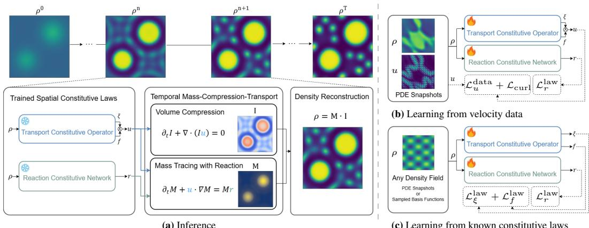  
Figure 1: Overview of NCL-MCT Solver. (a) At inference, frozen constitutive modules are coupled to the shared MCT integrator. At each step, the transport velocity $\mathbf { u } = \xi \mathbf { f }$ and relative reaction rate r are reevaluated from the current density to evolve I and M and reconstruct $\rho = M I$ . During training, transport is supervised either (b) from reference velocities on PDE snapshots, with curl regularization, or (c) directly from known mobility and force laws on density fields, including independently sampled density fields. For reactive systems, r is supervised by the known reaction law in both settings.

Mass-compression-transport kinematics. The MCT formulation separates these effects through the decomposition $\rho = M I ;$

$$
\partial _ { t } I + \nabla \cdot ( I \mathbf { u } ) = 0 , \qquad \partial _ { t } M + \mathbf { u } \cdot \nabla M = M r ,\tag{3}
$$

with $I ( \mathbf { x } , 0 ) = 1$ and $M ( \mathbf { x } , 0 ) = \rho ( \mathbf { x } , 0 )$ . For a regular material flow with local volume ratio $J , I =$ $J ^ { - 1 }$ records compression or expansion, while $M = \rho J$ represents mass per unit reference volume. Along a material trajectory, M changes through reaction according to $\begin{array} { r } { M = \rho ^ { 0 } \exp \bigl ( \int _ { 0 } ^ { t } r d s \bigr ) } \end{array}$ , and the product $\rho = M I$ recovers the original density balance. Appendix A derives these identities. The representation assumes $\rho > 0$ and a regular material flow; near vanishing density, the relative reaction rate and factorization require additional care.

## 4 METHODOLOGY

To share one solver interface across diffusive, phase-field, reactive, and multispecies systems, we introduce NCL-MCT Solver, which couples PDE-specific constitutive modules to a shared masscompression-transport (MCT) integrator. Following the EnVarA formulation in Section 3, transport is represented through positive mobility and thermodynamic driving force, and reaction through relative reaction rates. For the autonomous systems considered here, these constitutive responses depend on the current density rather than explicitly on the initial condition or elapsed time. Figure 1 summarizes the framework. A Transport Constitutive Operator learns the mobility-force factorization, while a Reaction Constitutive Network learns relative reaction rates from local species densities (Section 4.1). At inference, the frozen constitutive modules are reevaluated at each MCT step to advance the compression and mass factors and reconstruct the density (Section 4.2). For each PDE, the constitutive modules are trained separately under either velocity-data supervision or known-law supervision, without time integration during training (Section 4.3).

## 4.1 NEURAL CONSTITUTIVE MODELS

Transport constitutive laws depend on spatial variation of the density field, whereas the reaction laws considered here are local functions of species densities. We therefore represent transport with a field-to-field operator and reaction with a pointwise network.

The Transport Constitutive Operator uses a Convolutional Neural Operator (CNO) (Raonic et al.´ , 2023). The transport responses in Equation 2 involve spatial differential operators of the current density field, up to third order in the phase-field systems. Local convolutions capture this differential

structure, while the multiscale architecture spans the spatial scales over which these responses act. This local representation is also well suited to compactly supported densities in degenerate transport systems. Following the EnVarA mobility-force form, we parameterize

$$
( \widehat { \xi } , \widehat { \mathbf { f } } ) = { \mathcal { C } } _ { \theta _ { u } } [ \rho ] , \qquad \widehat { \mathbf { u } } = \widehat { \xi } \widehat { \mathbf { f } } ,\tag{4}
$$

where $\rho$ is the density field and $\mathcal { C } _ { \theta _ { u } }$ is the CNO with trainable parameters $\theta _ { u } . \mathrm { A }$ Softplus activation enforces $\widehat { \xi } > 0$ by construction. Known-law supervision directly constrains the driving force, while under velocity-data supervision its gradient structure is encouraged by the curl penalty (Section 4.3).

The Reaction Constitutive Network is a multilayer perceptron (MLP) applied pointwise:

$$
\begin{array} { r } { \widehat { r } = \mathcal { R } _ { \theta _ { r } } [ \rho ] , } \end{array}\tag{5}
$$

where ${ \mathcal R } _ { \theta _ { \tau } }$ maps the current local species densities to relative reaction rates. This preserves the locality of the reaction law; predicting the relative reaction rate rather than the source term also lets reaction enter the mass-factor evolution multiplicatively through Equation 3. Nonreactive systems set $r = 0$ and omit this module. Network architectures are detailed in Appendix B.

## 4.2 SHARED MCT TIME INTEGRATION

The MCT integrator contains no trainable update rule. Given the current density $\rho ^ { n }$ , the constitutive modules provide the transport velocity and relative reaction rates required by the shared MCT integrator. Each time step applies a reaction half-step, a transport step, and a second reaction half-step. The transport velocity is evaluated from $\rho ^ { n }$ and held fixed within the step, while the relative reaction rates are reevaluated at each reaction stage. The compression factor I is advanced with a conservative finite-volume method (Eymard et al., 2000), the mass factor M is transported with a semi-Lagrangian method (Staniforth & Cotˆ e´, 1991), and their product reconstructs $\boldsymbol { \rho } ^ { \mathrm { \hat { n } + 1 } } = \boldsymbol { M } ^ { n + 1 } \boldsymbol { I } ^ { n + 1 }$ This splitting mirrors the separation of transport and reaction in the continuous formulation, with I tracking local compression and M tracking material mass under transport and reaction. Because the integrator only queries constitutive responses, numerically evaluated and learned constitutive responses enter through the same interface (Appendix I.5). The complete update does not guarantee exact discrete mass conservation of the reconstructed density or unconditional discrete energy dissipation; numerical details and empirical diagnostics are provided in Appendices C and I.2.

## 4.3 LEARNING CONSTITUTIVE LAWS

We train the constitutive modules under two sources of supervision: velocity-data supervision and known-law supervision. The supervision source is distinct from the source of input density fields, which may be trajectory snapshots or independently sampled density fields. For reactive systems, both modes use known-law supervision for the relative reaction rate. Neither mode requires time integration during training.

Velocity-data supervision. When paired density-velocity observations are available, the transport response can be learned without specifying the underlying mobility and force laws:

$$
\begin{array} { r } { \mathcal { L } _ { u } ^ { \mathrm { d a t a } } = \ell ( \widehat { \mathbf { u } } , \mathbf { u } ^ { \mathrm { d a t a } } ) , \qquad \widehat { \mathbf { u } } = \widehat { \xi } \widehat { \mathbf { f } } , } \end{array}\tag{6}
$$

where $\mathbf { u } ^ { \mathrm { d a t a } }$ is the reference transport velocity and $\begin{array} { r } { \ell ( \widehat { q } , q ) = B ^ { - 1 } \sum _ { b } \| \widehat { q } ^ { ( b ) } - q ^ { ( b ) } \| _ { 2 } ^ { 2 } / ( \| q ^ { ( b ) } \| _ { 2 } ^ { 2 } + \varepsilon ) } \end{array}$ is the per-sample relative squared error over a batch of B density fields, with $\varepsilon = 1 0 ^ { - 1 2 }$ . This normalization prevents low-magnitude constitutive quantities from being underweighted.

Velocity data constrain only the product ${ \widehat { \xi } } { \widehat { \mathbf { f } } } ;$ they neither resolve the factorization freedom in Section 3 nor enforce the expected gradient structure of the driving force. For smooth fields, the EnVarA force $\mathbf { f } = - \nabla ( \delta E / \delta \rho )$ is curl-free. In two dimensions, we encourage this property with

$$
\mathcal { L } _ { \mathrm { c u r l } } = \frac { \left. ( \partial _ { x } \widehat { f } _ { y } - \partial _ { y } \widehat { f } _ { x } ) ^ { 2 } \right. } { \left. ( \partial _ { x } \widehat { f } _ { y } ) ^ { 2 } + ( \partial _ { y } \widehat { f } _ { x } ) ^ { 2 } \right. + \varepsilon } .\tag{7}
$$

Here, ${ \widehat { f } } _ { x }$ and $\widehat { f } _ { y }$ are the predicted driving-force components, and ⟨·⟩ denotes the arithmetic mean over samples and spatial grid points in a training batch. The penalty is applied to the driving force

because spatially varying mobility may produce a transport velocity with nonzero curl; it does not guarantee an underlying energy functional.

The relative reaction rate is supervised by the known source law:

$$
\mathcal { L } _ { r } ^ { \mathrm { l a w } } = \ell ( \widehat { r } , r ^ { \mathrm { l a w } } ) , \qquad r ^ { \mathrm { l a w } } = \frac { S ( \rho ) } { \rho } ,\tag{8}
$$

where $S$ is the prescribed local reaction source. Because $S$ can be evaluated directly on any input density field, all reported reaction modules use known-law supervision. Extracting relative reaction rates from trajectory data would instead require separating reaction from transport. The complete velocity-data objective is

$$
\mathcal { L } _ { \mathrm { v e l } } = \mathcal { L } _ { u } ^ { \mathrm { d a t a } } + \lambda _ { \mathrm { c u r l } } \mathcal { L } _ { \mathrm { c u r l } } + \mathcal { L } _ { r } ^ { \mathrm { l a w } } ,\tag{9}
$$

with $\lambda _ { \mathrm { c u r l } } = 0 . 0 1$ . The reaction term is omitted for nonreactive systems, and the curl term is omitted in one dimension.

Known-law supervision. When the mobility and thermodynamic driving-force laws are known, their evaluations on the current density provide direct constitutive targets:

$$
\begin{array} { r } { \mathcal { L } _ { \xi } ^ { \mathrm { l a w } } = \ell ( \widehat { \xi } , \xi ^ { \mathrm { l a w } } ) , \qquad \mathcal { L } _ { f } ^ { \mathrm { l a w } } = \ell ( \widehat { \mathbf { f } } , \mathbf { f } ^ { \mathrm { l a w } } ) . } \end{array}\tag{10}
$$

These losses constrain the two constitutive factors individually, removing the factorization ambiguity inherent in supervising only their product $\widehat { \mathbf { u } } = \widehat { \xi \mathbf { f } }$ . The force target also supplies the expected gradient structure. Using the same reaction loss $\mathcal { L } _ { r } ^ { \mathrm { l a w } }$ , the complete known-law objective is

$$
\mathcal { L } _ { \mathrm { l a w } } = \mathcal { L } _ { \xi } ^ { \mathrm { l a w } } + \mathcal { L } _ { f } ^ { \mathrm { l a w } } + \mathcal { L } _ { r } ^ { \mathrm { l a w } } .\tag{11}
$$

With partial constitutive knowledge, known responses can remain analytical while only the unknown constitutive modules are learned. When known-law supervision is applied to independently sampled density fields, the framework enables trajectory-free constitutive learning without generating PDE solution trajectories.

## 5 EXPERIMENTS

We evaluate NCL-MCT Solver along three complementary questions. First, cross-system applicability asks whether a common constitutive interface covers systems with different transport mechanisms, reactions, and species counts. Second, generalization beyond training conditions evalu ates reuse of trained constitutive modules on unseen initial-condition families and an extended time horizon. Third, trajectory-free constitutive learning tests whether known-law supervision can train constitutive modules directly on independently sampled density fields without generating solution trajectories. PDE-specific constitutive modules are trained separately for each system while sharing the same constitutive interface and MCT integrator. Unless otherwise specified, training uses a 128 × 128 grid and ten snapshots from each of 100 trajectories, yielding 1,000 training samples. For the trajectory-based benchmarks, we compare against methods with distinct learning targets: F-FNO (Tran et al., 2023) learns a state map, CFO (Hou et al., 2026) learns a temporal derivative, and DOOL (Chang et al., 2026) learns dissipative fluxes through an Onsager variational objective. All methods use the same sampled training states where applicable, and the baselines are trained for 100,000 updates. We report mean ± standard deviation over ten test trajectories of the space-time relative $L ^ { 2 }$ rollout error $E _ { \mathrm { r o l l } }$ and the maximum per-time relative $L ^ { 2 }$ error $E _ { \mathrm { m a x } } .$ For the extended time horizon, we additionally report $\Delta E = \bar { E } ( \dot { T } ) - \bar { E } ( T _ { \mathrm { t r a i n } } )$ , where $\bar { E } ( t )$ is the mean per-time relative $L ^ { 2 }$ error across test trajectories. Vel. and Law denote velocity-data and known-law supervision, respectively. Appendices D-I provide experimental details, additional rollouts, generalization results, and ablations.

## 5.1 APPLICABILITY ACROSS REACTION-DIFFUSION SYSTEMS

Generalized diffusion. We first consider linear diffusion, Cahn-Hilliard (CH), and porous medium (PM), representing spatial smoothing, phase separation, and degenerate diffusion with moving low-density fronts. The same constitutive interface and MCT integrator are used across all three systems. On CH, both NCL-MCT Solver configurations achieve roughly 8× lower rollout errors

(b) Generalized reaction-diffusion

Table 1: Applicability across generalized reaction-diffusion systems. $E _ { \mathrm { r o l l } }$ and $E _ { \mathrm { m a x } }$ denote the space-time and maximum per-time relative $L ^ { 2 }$ errors, reported as mean ± standard deviation over ten test trajectories; N<sub>T</sub> is the rollout length. Vel./Law denote velocity-data and known-law supervision, respectively. Red/orange mark the best/second-best mean per row. Gray<sup>∗</sup> denotes F-FNO results computed from the finite trajectories only; − denotes not evaluated.
<table><tr><td> $N _ { T }$ </td><td></td><td>Metric</td><td>F-FNO  $( \mathrm { T r a n } \mathrm { e t } \mathrm { a l } . , 2 0 2 3 )$ </td><td>CFO  $\mathrm { ( H o u \ e t \ a l . , 2 0 2 6 ) }$ </td><td>DOOL  $( \mathrm { C h a n g ~ e t ~ a l . } , 2 0 2 6 )$ </td><td> $\mathrm { { N C L - M C T } ( V e l . ) }$  (Ours)</td><td> $\mathbf { N C L - M C T } \ ( \mathbf { L a w } )$   $( \mathrm { O u r s } )$ </td></tr><tr><td>(a) Generalized diffusion</td><td></td><td></td><td></td><td></td><td></td><td></td><td></td></tr><tr><td rowspan="2">Linear Diffusion</td><td rowspan="2">600</td><td></td><td> $( 6 . 5 2 \pm 1 . 6 5 ) \times 1 0 ^ { - 4 }$ </td><td> $( 9 . 9 0 \pm 4 . 9 1 ) \times 1 0 ^ { - 3 }$ </td><td> $( 5 . 6 5 \pm 1 . 4 8 ) \times 1 0 ^ { - 2 }$ </td><td> $( 9 . 8 7 \pm 2 . 6 1 ) \times 1 0 ^ { - 4 }$ </td><td> $( 1 . 5 7 \pm 0 . 4 6 ) \times 1 0 ^ { - 3 }$ </td></tr><tr><td> $\begin{array} { l } { E _ { \mathrm { r o l l } } } \\ { E _ { \mathrm { m a x } } } \end{array}$ </td><td> $( 9 . 7 6 \pm 2 . 7 8 ) \times 1 0 ^ { - 4 }$ </td><td> $( 1 . 1 9 \pm 0 . 6 0 ) \times 1 0 ^ { - 2 }$ </td><td> $( 7 . 3 6 \pm 1 . 4 8 ) \times 1 0 ^ { - 2 }$ </td><td> $( 1 . 1 8 \pm 0 . 2 9 ) \times 1 0 ^ { - 3 }$ </td><td> $( 1 . 8 2 \pm 0 . 5 9 ) \times 1 0 ^ { - 3 }$ </td></tr><tr><td rowspan="2">CH</td><td rowspan="2">10,000</td><td></td><td> $( 1 . 4 5 \pm 0 . 0 9 ) \times 1 0 ^ { - 1 }$ </td><td> $( 6 . 1 6 \pm 1 . 4 7 ) \times 1 0 ^ { - 2 }$ </td><td> $( 3 . 3 2 \pm 0 . 5 3 ) \times 1 0 ^ { - 1 }$ </td><td> $( 7 . 5 0 \pm 1 . 9 2 ) \times 1 0 ^ { - 3 }$ </td><td> $( 7 . 5 7 \pm 1 . 2 8 ) \times 1 0 ^ { - 3 }$ </td></tr><tr><td> $E _ { \mathrm { r o l l } }$   $E _ { \mathrm { m a x } }$ </td><td> $( 1 . 8 7 \pm 0 . 1 4 ) \times 1 0 ^ { - 1 }$ </td><td> $( 8 . 7 8 \pm 2 . 3 5 ) \times 1 0 ^ { - 2 }$ </td><td></td><td></td><td> $( 1 . 0 5 \pm 0 . 2 5 ) \times 1 0 ^ { - 2 }$ </td></tr><tr><td rowspan="2">PM</td><td rowspan="2">2,000</td><td></td><td></td><td></td><td> $( 4 . 7 1 \pm 0 . 7 4 ) \times 1 0 ^ { - 1 }$ </td><td> $( 1 . 0 4 \pm 0 . 3 0 ) \times 1 0 ^ { - 2 }$ </td><td></td></tr><tr><td> $\begin{array} { l } { E _ { \mathrm { r o l l } } } \\ { E _ { \mathrm { m a x } } } \end{array}$ </td><td> $( 7 . 8 7 \pm 4 . 0 0 ) \times 1 0 ^ { - 2 }$   $( 1 . 4 6 \pm 0 . 8 3 ) \times 1 0 ^ { - 1 }$ </td><td> $( 2 . 6 8 \pm 0 . 6 1 ) \times 1 0 ^ { - 3 }$   $( 4 . 4 7 \pm 1 . 1 9 ) \times 1 0 ^ { - 3 }$ </td><td> $( 7 . 3 0 \pm 2 . 6 1 ) \times 1 0 ^ { - 1 }$   $( 3 . 1 9 \pm 1 . 0 3 ) \times 1 0 ^ { 0 }$ </td><td> $( 1 . 6 7 \pm 0 . 1 7 ) \times 1 0 ^ { - 2 }$   $( 2 . 0 9 \pm 0 . 2 0 ) \times 1 0 ^ { - 2 }$ </td><td> $( 1 . 6 6 \pm 0 . 2 5 ) \times 1 0 ^ { - 2 }$   $( 2 . 2 0 \pm 0 . 3 4 ) \times 1 0 ^ { - 2 }$ </td></tr></table>

<table><tr><td>Fisher-KPP</td><td>500</td><td>Eroll  $E _ { \mathrm { m a x } }$ </td><td> $( 5 . 3 5 \pm 1 . 3 2 ) \times 1 0 ^ { - 4 }$   $( 7 . 5 0 \pm 1 . 6 7 ) \times 1 0 ^ { - 4 }$ </td><td> $( 5 . 9 0 \pm 2 . 7 9 ) \times 1 0 ^ { - 3 }$   $( 7 . 8 3 \pm 3 . 7 3 ) \times 1 0 ^ { - 3 }$ </td><td></td><td> $( 5 . 0 1 \pm 1 . 3 9 ) \times 1 0 ^ { - 4 }$   $( 5 . 9 6 \pm 1 . 9 6 ) \times 1 0 ^ { - 4 }$ </td><td> $( 6 . 5 8 \pm 0 . 5 4 ) \times 1 0 ^ { - 4 }$   $( 8 . 9 0 \pm 0 . 7 9 ) \times 1 0 ^ { - 4 }$ </td></tr><tr><td rowspan="2">Reactive CH</td><td rowspan="2">10,000</td><td></td><td></td><td></td><td></td><td></td><td></td></tr><tr><td> $\begin{array} { l } { E _ { \mathrm { r o l l } } } \\ { E _ { \mathrm { m a x } } } \end{array}$ </td><td> $( 1 . 2 9 \pm 0 . 2 3 ) \times 1 0 ^ { - 1 }$ </td><td> $( 5 . 6 4 \pm 1 . 1 1 ) \times 1 0 ^ { - 2 }$ </td><td>一</td><td> $( 8 . 8 6 \pm 2 . 2 1 ) \times 1 0 ^ { - 3 }$ </td><td> $( 9 . 6 2 \pm 2 . 1 3 ) \times 1 0 ^ { - 3 }$ </td></tr><tr><td rowspan="2"></td><td rowspan="2"></td><td></td><td> $( 1 . 6 3 \pm 0 . 3 4 ) \times 1 0 ^ { - 1 }$ </td><td> $( 7 . 9 5 \pm 2 . 0 6 ) \times 1 0 ^ { - 2 }$ </td><td>一</td><td> $( 1 . 4 0 \pm 0 . 4 2 ) \times 1 0 ^ { - 2 }$ </td><td> $( 1 . 3 7 \pm 0 . 3 8 ) \times 1 0 ^ { - 2 }$ </td></tr><tr><td> $E _ { \mathrm { r o l l } }$ </td><td> $( 3 . 9 6 \pm 3 . 7 7 ) \times 1 0 ^ { - }$ </td><td> $( 7 . 7 8 \pm 3 . 9 8 ) \times 1 0 ^ { - 3 }$ </td><td></td><td> $( 3 . 8 4 \pm 0 . 7 9 ) \times 1 0 ^ { - 2 }$ </td><td> $( 1 . 5 6 \pm 0 . 5 7 ) \times 1 0 ^ { - 2 }$ </td></tr><tr><td>Reactive PM</td><td>1,000</td><td> $E _ { \mathrm { m a x } }$ </td><td> $( 4 . 8 1 \pm 4 . 0 1 ) \times 1 0 ^ { - 2 }$ </td><td> $( 1 . 5 2 \pm 1 . 0 9 ) \times 1 0 ^ { - 2 }$ </td><td></td><td> $( 5 . 3 2 \pm 1 . 1 6 ) \times 1 0 ^ { - 2 }$ </td><td> $( 1 . 8 9 \pm 0 . 5 5 ) \times 1 0 ^ { - 2 }$ </td></tr></table>

<table><tr><td>Schnakenberg (U)</td><td> $E _ { \mathrm { r o l l } }$   $E _ { \mathrm { m a x } }$ </td><td> $( 2 . 7 3 \pm 0 . 3 6 ) \times 1 0 ^ { - 1 }$   $( 7 . 0 6 \pm 0 . 6 3 ) \times 1 0 ^ { - 1 }$ </td><td> $( 1 . 2 8 \pm 0 . 1 6 ) \times 1 0 ^ { - 1 }$   $( 2 . 8 7 \pm 0 . 4 9 ) \times 1 0 ^ { - 1 }$ </td></tr><tr><td>20,000 Schnakenberg (V)</td><td> $E _ { \mathrm { r o l l } }$   $E _ { \mathrm { m a x } }$ </td><td> $( 1 . 1 8 \pm 0 . 1 8 ) \times 1 0 ^ { - 1 }$   $( 2 . 3 3 \pm 0 . 2 6 ) \times 1 0 ^ { - 1 }$ </td><td> $( 4 . 3 9 \pm 0 . 5 9 ) \times 1 0 ^ { - 2 }$   $( 1 . 0 4 \pm 0 . 1 8 ) \times 1 0 ^ { - 1 }$ </td></tr></table>

<sup>∗</sup>Finite trajectory counts for gray cells: CH 9/10, Reactive CH 8/10, Schnakenberg 9/10.

$$
( 2 . 5 2 \pm 1 . 7 7 ) \times 1 0 ^ { - 2 }
$$

$$
( 6 . 7 4 \pm 3 . 3 7 ) \times 1 0 ^ { - 3 }
$$

$$
( 8 . 2 8 \pm 8 . 5 5 ) \times 1 0 ^ { - 2 }
$$

$$
( 2 . 1 9 \pm 1 . 9 3 ) \times 1 0 ^ { - 2 }
$$

$$
( 2 . 3 8 \pm 1 . 2 6 ) \times 1 0 ^ { - 2 }
$$

$$
( 7 . 3 6 \pm 6 . 1 5 ) \times 1 0 ^ { - 2 }
$$

$$
( 6 . 5 7 \pm 2 . 2 7 ) \times 1 0 ^ { - 3 }
$$

$$
\mathrm { { ( 1 . 9 7 \pm 1 . 3 0 ) \times 1 0 ^ { - 2 } } }
$$

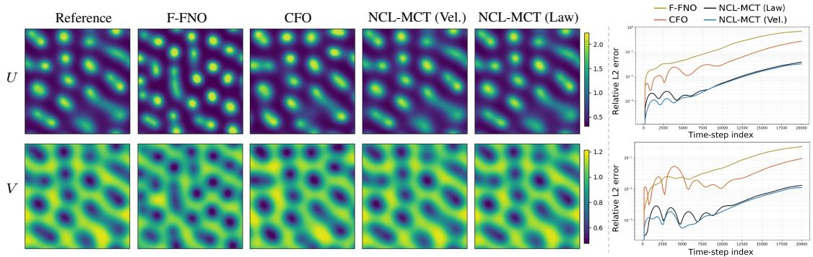

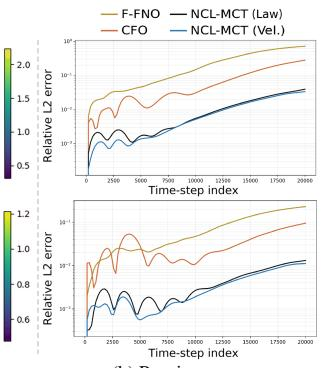  
(a) Results at t = 1 (step 20,000)  
(b) Per-time error  
Figure 2: Schnakenberg comparison for both species. (a) Concentrations U (top) and V (bottom) at $t = 1$ for a test trajectory on which all methods remain finite. (b) Per-time relative $L ^ { 2 }$ errors over the 20,000-step rollout.

than the strongest evaluated baseline (Table 1(a)). On linear diffusion, F-FNO is more accurate; HC-PINN (Hao et al., 2026) shows a similar advantage (Appendix I.3). On PM, CFO is approximately five to six times more accurate than both NCL-MCT Solver configurations, which remain five to seven times more accurate than F-FNO. PM also exposes the positive-density limitation in Section 3: compact support creates vanishing-density regions where the factorization $\rho = M I$ requires additional care near the free boundary.

Generalized reaction-diffusion. Reaction is incorporated by adding a pointwise relative-reactionrate module to the same transport interface and MCT integrator. The DOOL formulation evaluated here is transport-only and is therefore omitted from these reactive benchmarks. On Fisher-KPP, reactive CH, and reactive PM (Table 1(b)), both NCL-MCT Solver configurations achieve roughly 6× lower errors on reactive CH than the strongest evaluated baseline. Vel. attains the lowest mean error on Fisher-KPP, with F-FNO within one standard deviation, whereas CFO is more accurate on reactive PM. The PM ranking follows the nonreactive case, suggesting that degenerate transport remains the dominant difficulty. Known-law supervision reduces the reactive-PM error by roughly 2.5-3× relative to Vel.; the two supervision modes are otherwise comparable.

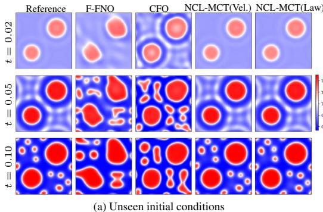

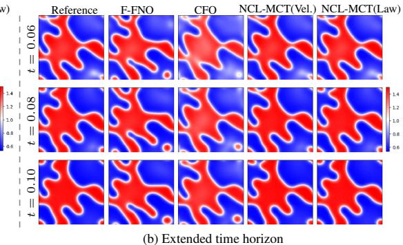  
Figure 3: Generalization beyond training conditions on reactive Cahn–Hilliard. (a) From an unseen two-nucleus initial condition, F-FNO distorts the large domains and loses secondary droplets, while CFO merges them into elongated structures; both NCL-MCT Solver configurations better preserve the reference morphology. (b) Models trained on the first 60% of the interval are rolled out over the full horizon. Beyond the training window, CFO loses interior contrast and smooths narrow channels, while both NCL-MCT Solver configurations better preserve the interfaces.

Table 2: Generalization beyond training conditions, aggregated across systems: (a) unseen initial conditions (five systems, one test trajectory per system) and (b) extended time horizon (four systems, ten test trajectories per system). Entries are averages of the per-system $E _ { \mathrm { r o l l } } , E _ { \mathrm { m a x } } .$ , or $\Delta E$ values. Per-system results are reported in Appendix G. DOOL is omitted because it covers too few systems for aggregation. Red/orange indicate the best/second-best comparable result per row.
<table><tr><td></td><td>Metric</td><td>F-FNO (Tran et al., 2023)</td><td>CFO (Hou et al., 2026)</td><td>NCL-MCT (Vel.) (Ours)</td><td>NCL-MCT (Law) (Ours)</td></tr><tr><td>Unseen initial conditions</td><td> $E _ { \mathrm { r o l l } }$ </td><td> $1 . 8 1 \times 1 0 ^ { - 1 * }$ </td><td> $1 . 6 9 \times 1 0 ^ { - 1 }$ </td><td> $2 . 9 9 \times 1 0 ^ { - 2 }$ </td><td> $2 . 8 6 \times 1 0 ^ { - 2 }$ </td></tr><tr><td>(5 systems)</td><td> $E _ { \mathrm { m a x } }$ </td><td> $2 . 9 7 \times 1 0 ^ { - 1 * }$ </td><td> $2 . 3 8 \times 1 0 ^ { - 1 }$ </td><td> $4 . 3 9 \times 1 0 ^ { - 2 }$ </td><td> $4 . 4 4 \times 1 0 ^ { - 2 }$ </td></tr><tr><td>Extended time horizon</td><td> $E _ { \mathrm { r o l l } }$ </td><td> $6 . 7 5 \times 1 0 ^ { - 2 \dagger }$ </td><td> $6 . 8 9 \times 1 0 ^ { - 2 }$ </td><td> $5 . 8 5 \times 1 0 ^ { - 3 }$ </td><td> $5 . 4 9 \times { { 1 0 } ^ { - 3 } }$ </td></tr><tr><td>(4 systems)</td><td> $\Delta E$ </td><td> $1 . 2 5 \times 1 0 ^ { - 2 \dagger }$ </td><td> $4 . 8 2 \times 1 0 ^ { - 3 }$ </td><td> $1 . 9 7 \times { { 1 0 } ^ { - 3 } }$ </td><td> $2 . 7 6 \times 1 0 ^ { - 3 }$ </td></tr></table>

<sup>∗</sup>F-FNO is nonfinite on CH and Fisher-KPP; the reported average uses only the 3/5 finite systems and is not directly comparable. <sup>†</sup>For reactive CH, F-FNO statistics use the 9/10 trajectories that remain finite.

Multispecies reaction-diffusion. For two species, each species uses its own transport module, while the reaction module takes both local concentrations as input and is trained jointly with the transport modules. On Schnakenberg, both NCL-MCT Solver configurations remain stable over the full 20,000-step rollout, with mean errors three to seven times below CFO and about an order of magnitude below F-FNO across both species and metrics (Table 1(c)). F-FNO becomes nonfinite on one trajectory near the end of the rollout, while Law has the lower mean error for both species. Figure 2 shows the error histories: F-FNO errors grow steadily, CFO accumulates larger final-state discrepancies, and both NCL-MCT Solver configurations remain close to the reference.

## 5.2 GENERALIZATION BEYOND TRAINING CONDITIONS

Unseen initial conditions. Because the constitutive modules are evaluated from the current density rather than explicitly from the initial condition, changing the initial-condition family changes the density fields encountered during rollout. Keeping the trained models and PDE parameters of Section 5.1, we replace only the initial-condition family with unseen structured fields whose amplitudes remain close to the training range, making the shift primarily spatial (Appendix G.1). Across the five systems, both NCL-MCT Solver configurations achieve nearly 6× lower average $E _ { \mathrm { r o l l } }$ than CFO, the strongest baseline that remains finite across all five systems, with per-system margins from 2.4× to 13× (Table 2(a)). Figure 3(a) illustrates the difference on reactive CH. Linear diffusion shows the largest change in ranking: F-FNO is the most accurate method in distribution, but its error increases by roughly 260× under the shift, compared with 24-41× for NCL-MCT Solver, and it becomes nonfinite on CH and Fisher-KPP. The relative degradation is not uniformly smaller for

Table 3: Trajectory-free learning from independently sampled density fields. Both methods use the same unlabeled density fields and are evaluated on ten held-out initial conditions. $E _ { \mathrm { r o l l } }$ and $E _ { \mathrm { m a x } }$ are relative $L ^ { 2 }$ errors (mean ± standard deviation), and $N _ { T }$ is the rollout length. Law denotes knownlaw supervision on independently sampled states. Red marks the lower mean per row.
<table><tr><td>System</td><td> $N _ { T }$ </td><td>Metric</td><td>DOOL (Chang et al., 2026)</td><td>NCL-MCT (Law) (Ours)</td></tr><tr><td>Linear Diffusion (1D, DOOL setting)</td><td>4,000</td><td> $E _ { \mathrm { r o l l } }$   $E _ { \mathrm { m a x } }$ </td><td> $( 1 . 5 3 \pm 1 . 0 7 ) \times 1 0 ^ { - 3 }$   $( 2 . 3 9 \pm 1 . 6 7 ) \times 1 0 ^ { - 3 }$ </td><td> $( 3 . 1 3 \pm 1 . 6 9 ) \times 1 0 ^ { - 4 }$ </td></tr><tr><td>CH</td><td>2,000</td><td> $E _ { \mathrm { r o l l } }$ </td><td> $( 7 . 4 6 \pm 2 . 9 0 ) \times 1 0 ^ { - 3 }$ </td><td> $( 4 . 0 5 \pm 2 . 3 2 ) \times 1 0 ^ { - 4 }$   $( 6 . 4 0 \pm 6 . 6 6 ) \times 1 0 ^ { - 3 }$ </td></tr></table>

NCL-MCT Solver; on Fisher-KPP, its error also increases substantially but remains lower because its in-distribution error starts from a much smaller level.

Extended time horizon. We train on the first 60% of each reference trajectory and evaluate over the full interval, so the final 40% lies beyond the training horizon (Appendix G.2). Averaged across the four systems, both NCL-MCT Solver configurations achieve full-window rollout errors about an order of magnitude below the evaluated baselines. Their errors change by only 0.90-1.46× relative to the corresponding models trained on the full time interval (Table 2(b)). By comparison, CFO errors increase by about 1.6× on the two Cahn-Hilliard systems and 5.2× on linear diffusion and Fisher-KPP. F-FNO remains strongest on linear diffusion but about an order of magnitude less accurate than NCL-MCT Solver on the two Cahn-Hilliard systems. Both NCL-MCT Solver configurations also show the smallest $\Delta E$ on linear diffusion, CH, and Fisher-KPP. Only on reactive CH does CFO show smaller growth, despite an error at $T _ { \mathrm { t r a i n } }$ that is twelve times larger. Figure 3(b) shows the corresponding reactive-CH fields.

## 5.3 TRAJECTORY-FREE CONSTITUTIVE LEARNING

Although the experiments above use trajectory snapshots as training inputs, known-law supervision does not require them: the targets $\xi ^ { \mathrm { l a w } }$ and $\mathbf { f } ^ { \mathrm { l a w } }$ in Equation 10 depend only on the current density field and can be evaluated on independently sampled density fields. We test this trajectory-free setting on one-dimensional linear diffusion and two-dimensional Cahn-Hilliard using the sampled training distributions of DOOL (Chang et al., 2026). For each system, DOOL and NCL-MCT Solver (Law) use the same sampled density fields; solution trajectories are reserved for held-out rollout evaluation (Appendix H). NCL-MCT Solver (Law) achieves lower mean errors on both systems (Table 3). On linear diffusion, $E _ { \mathrm { r o l l } }$ and $E _ { \mathrm { m a x } }$ are lower than those of DOOL by factors of 4.9 and 5.9, respectively. On Cahn-Hilliard, the corresponding factors are 1.2 and 1.4, although the two methods remain within one standard deviation. These results show that, on these benchmarks, constitutive modules trained directly on independently sampled density fields can support 2,000- 4,000-step rollouts without solution trajectories during training. Because the methods use different time integrators, the quantitative comparison reflects the complete solvers rather than the learning objectives alone.

## 6 CONCLUSION

We presented NCL-MCT Solver, which places neural learning in PDE-specific constitutive responses while retaining a shared MCT integrator for density evolution. Transport is represented through mobility and thermodynamic driving force, and reaction through relative reaction rates. Across seven generalized diffusion and reaction-diffusion systems, the shared constitutive interface achieves relative rollout $L ^ { 2 }$ errors of $1 0 ^ { - 4 }$ to $1 0 ^ { - 2 }$ and is competitive with or better than the evaluated baselines on most systems. Tests on unseen initial-condition families and an extended time horizon further assess reuse of the learned constitutive modules without retraining. With known-law supervision on independently sampled density fields, a separate experiment demonstrates trajectoryfree constitutive learning without generating solution trajectories. Together, these results support learning PDE-specific constitutive responses, rather than the full solution evolution, as an effective target for a shared neural PDE framework.

The current formulation assumes positive densities, with porous-medium systems exposing its limitation near vanishing density. Future work will extend the factor evolution to such regimes, investigate constitutive identification under partially known laws, broaden the treatment of boundary conditions (Liu et al., 2024c), incorporate parameter-conditioned constitutive models for inverse problems (Cho & Son, 2025), and couple the framework to multiphysics models involving pressure, flow, and tissue mechanics (Lu et al., 2019; 2022).

## DISCLOSURE OF AI USE

The authors developed the research ideas and proposed method, performed the mathematical verification, and designed and conducted all experiments. AI tools assisted with identifying relevant literature, exploring existing neural network architectures and numerical methods, implementing and debugging code, drafting portions of the manuscript, and improving its wording and clarity. All code was reviewed and validated by the authors, who take full responsibility for the content and conclusions of this work.

## REFERENCES

E. M. Arruda and M. C. Boyce. A three-dimensional constitutive model for the large stretch behavior of rubber elastic materials. Journal ofthe Mechanics and Physics ofSolids, 41(2):389–412, 1993. doi: 10.1016/0022-5096(93)90013-6.

Yohai Bar-Sinai, Stephan Hoyer, Jason Hickey, and Michael P. Brenner. Learning data-driven discretizations for partial differential equations. Proceedings of the National Academy of Sciences, 116(31):15344–15349, 2019. doi: 10.1073/pnas.1814058116.

John W. Cahn and John E. Hilliard. Free energy of a nonuniform system. i. interfacial free energy. The Journal ofChemical Physics, 28(2):258–267, 1958. doi: 10.1063/1.1744102.

Zhipeng Chang, Zhenye Wen, and Xiaofei Zhao. Unsupervised operator learning approach for dissipative equations via Onsager principle. SIAM Journal on Scientific Computing, 48(4):C1060– C1085, 2026. doi: 10.1137/25M1786763.

Sung Woong Cho and Hwijae Son. Physics-informed deep inverse operator networks for solving PDE inverse problems. In International Conference on Learning Representations, 2025. URL https://openreview.net/forum?id=0FxnSZJPmh.

Alexander E. Cohen, Samuel Degnan-Morgenstern, Simon Daubner, Jorn Dunkel, and Martin Z.¨ Bazant. Differentiable learning and control of free-energy-driven pattern dynamics. Physical Review Research, 8:023344, 2026. doi: 10.1103/b8kc-vpwq.

D. C. Drucker and W. Prager. Soil mechanics and plastic analysis or limit design. Quarterly of Applied Mathematics, 10(2):157–165, 1952. doi: 10.1090/qam/48291.

Robert Eymard, Thierry Gallouet, and Rapha¨ ele Herbin. Finite volume methods. In\` Handbook of Numerical Analysis, volume 7, pp. 713–1018. Elsevier, 2000. doi: 10.1016/S1570-8659(00) 07005-8.

Sarah M. Groves, Min-Jhe Lu, Astrid Catalina Alvarez-Yela, Monserrat Gerardo-Ram´ırez, P. Todd Stukenberg, John S. Lowengrub, and Kevin A. Janes. Cell-specific Cahn–Hilliard models predict condensed fates of the chromosomal passenger complex. PLOS Computational Biology, 22(8): e1014568, 2026. doi: 10.1371/journal.pcbi.1014568.

Derek Hansen, Danielle C. Maddix, Shima Alizadeh, Gaurav Gupta, and Michael W. Mahoney. Learning physical models that can respect conservation laws. In Proceedings of the 40th International Conference on Machine Learning, volume 202 of Proceedings of Machine Learning Research, pp. 12469–12510. PMLR, 2023.

Baoli Hao, Chun Liu, Ulisses Braga-Neto, Lifan Wang, and Ming Zhong. Stability in training PINNs for stiff PDEs: Why initial conditions matter. Foundations ofData Science, 2026. doi: 10.3934/ fods.2026016. URL https://doi.org/10.3934/fods.2026016. Early Access.

Masanobu Horie and Naoto Mitsume. Graph neural PDE solvers with conservation and similarityequivariance. In Proceedings of the 41st International Conference on Machine Learning, volume 235 of Proceedings of Machine Learning Research, pp. 18785–18814. PMLR, 2024.

Xianglong Hou, Xinquan Huang, and Paris Perdikaris. CFO: Learning continuous-time PDE dynamics via flow-matched neural operators. In International Conference on Learning Representations, 2026. URL https://openreview.net/forum?id=IQhaeSzyup.

Ziqing Hu, Chun Liu, Yiwei Wang, and Zhiliang Xu. Energetic variational neural network discretizations of gradient flows. SIAM Journal on Scientific Computing, 46(4):A2528–A2556, 2024. doi: 10.1137/22M1529427.

Shenglin Huang, Zequn He, Bryan Chem, and Celia Reina. Variational Onsager neural networks (VONNs): A thermodynamics-based variational learning strategy for non-equilibrium PDEs. Journal of the Mechanics and Physics of Solids, 163:104856, 2022. doi: 10.1016/j.jmps.2022. 104856.

Shenglin Huang, Zequn He, Nicolas Dirr, Johannes Zimmer, and Celia Reina. Statistical-physicsinformed neural networks (Stat-PINNs): A machine learning strategy for coarse-graining dissipative dynamics. Journal of the Mechanics and Physics of Solids, 194:105908, 2025. doi: 10.1016/j.jmps.2024.105908.

Yunkyong Hyon, Do Young Kwak, and Chun Liu. Energetic variational approach in complex fluids: Maximum dissipation principle. Discrete and Continuous Dynamical Systems, 26(4):1291–1304, 2010. doi: 10.3934/dcds.2010.26.1291.

Matthias Karlbauer, Timothy Praditia, Sebastian Otte, Sergey Oladyshkin, Wolfgang Nowak, and Martin V. Butz. Composing partial differential equations with physics-aware neural networks. In Proceedings of the 39th International Conference on Machine Learning, volume 162 of Proceedings of Machine Learning Research, pp. 10773–10801. PMLR, 2022.

George Em Karniadakis, Ioannis G. Kevrekidis, Lu Lu, Paris Perdikaris, Sifan Wang, and Liu Yang. Physics-informed machine learning. Nature Reviews Physics, 3:422–440, 2021. doi: 10.1038/ s42254-021-00314-5.

Dmitrii Kochkov, Jamie A. Smith, Ayya Alieva, Qing Wang, Michael P. Brenner, and Stephan Hoyer. Machine learning–accelerated computational fluid dynamics. Proceedings of the National Academy ofSciences, 118(21):e2101784118, 2021. doi: 10.1073/pnas.2101784118.

Zongyi Li, Nikola Kovachki, Kamyar Azizzadenesheli, Burigede Liu, Kaushik Bhattacharya, Andrew Stuart, and Anima Anandkumar. Fourier neural operator for parametric partial differential equations. In International Conference on Learning Representations, 2021. URL https: //openreview.net/forum?id=c8P9NQVtmnO.

Zongyi Li, Hongkai Zheng, Nikola Kovachki, David Jin, Haoxuan Chen, Burigede Liu, Kamyar Azizzadenesheli, and Anima Anandkumar. Physics-informed neural operator for learning partial differential equations. ACM / IMS Journal of Data Science, 1(3):1–27, 2024. doi: 10.1145/ 3648506.

Ning Liu, Yiming Fan, Xianyi Zeng, Milan Klower, Lu Zhang, and Yue Yu. Harnessing the power¨ of neural operators with automatically encoded conservation laws. In Proceedings of the 41st International Conference on Machine Learning, volume 235 of Proceedings ofMachine Learning Research, pp. 30965–30997. PMLR, 2024a.

Pengwei Liu, Zhongkai Hao, Xingyu Ren, Hangjie Yuan, Jiayang Ren, and Dong Ni. PAPM: A physics-aware proxy model for process systems. In Proceedings of the 41st International Conference on Machine Learning, volume 235 of Proceedings of Machine Learning Research, pp. 31080–31105. PMLR, 2024b.

Ziyuan Liu, Haifeng Wang, Hong Zhang, Kaijun Bao, Xu Qian, and Songhe Song. Render unto numerics: Orthogonal polynomial neural operator for PDEs with nonperiodic boundary conditions. SIAM Journal on Scientific Computing, 46(4):C323–C348, 2024c. doi: 10.1137/23M1556320.

Lu Lu, Pengzhan Jin, Guofei Pang, Zhongqiang Zhang, and George Em Karniadakis. Learning nonlinear operators via DeepONet based on the universal approximation theorem of operators. Nature Machine Intelligence, 3(3):218–229, 2021. doi: 10.1038/s42256-021-00302-5.

Min-Jhe Lu, Chun Liu, and Shuwang Li. Nonlinear simulation of an elastic tumor-host interface. Computational and Mathematical Biophysics, 7(1):25–47, 2019. doi: 10.1515/cmb-2019-0003.

Min-Jhe Lu, Wenrui Hao, Chun Liu, John Lowengrub, and Shuwang Li. Nonlinear simulation of vascular tumor growth with chemotaxis and the control of necrosis. Journal of Computational Physics, 459:111153, 2022. doi: 10.1016/j.jcp.2022.111153.

Yubin Lu, Xiaofan Li, Chun Liu, Qi Tang, and Yiwei Wang. Learning generalized diffusions using an energetic variational approach. Communications in Computational Physics, 40(2):389–412, 2026a. doi: 10.4208/cicp.OA-2025-0141.

Yubin Lu, Xiaofan Li, Chun Liu, Qi Tang, and Yiwei Wang. Structure-aware variational learning of a class of generalized diffusions. Physica D: Nonlinear Phenomena, 498:135404, 2026b. doi: 10.1016/j.physd.2026.135404.

Pingchuan Ma, Peter Yichen Chen, Bolei Deng, Joshua B. Tenenbaum, Tao Du, Chuang Gan, and Wojciech Matusik. Learning neural constitutive laws from motion observations for generalizable PDE dynamics. In Proceedings of the 40th International Conference on Machine Learning, volume 202 of Proceedings of Machine Learning Research, pp. 23279–23300. PMLR, 2023.

Luis Mandl, Dibyajyoti Nayak, Tim Ricken, and Somdatta Goswami. Physics-informed timeintegrated DeepONet: Temporal tangent space operator learning for high-accuracy inference. Computer Methods in Applied Mechanics and Engineering, 455:118917, 2026. doi: 10.1016/ j.cma.2026.118917.

Himangi Mittal, Peiye Zhuang, Hsin-Ying Lee, and Shubham Tulsiani. UniPhy: Learning a unified constitutive model for inverse physics simulation. In Proceedings ofthe IEEE/CVF Conference on Computer Vision and Pattern Recognition, pp. 16208–16218, 2025. doi: 10.1109/CVPR52734. 2025.01511.

Dibyajyoti Nayak and Somdatta Goswami. TI-DeepONet: Learnable time integration for stable long-term extrapolation. Computer Methods in Applied Mechanics and Engineering, 456:118960, 2026. doi: 10.1016/j.cma.2026.118960.

PhysicsNeMo Contributors. NVIDIA PhysicsNeMo: An Open-Source Framework for Physics-Based Deep Learning in Science and Engineering, 2023. URL https://github.com/ NVIDIA/physicsnemo.

Maziar Raissi, Paris Perdikaris, and George Em Karniadakis. Physics-informed neural networks: A deep learning framework for solving forward and inverse problems involving nonlinear partial differential equations. Journal ofComputational Physics, 378:686–707, 2019. doi: 10.1016/j.jcp. 2018.10.045.

Chengping Rao, Pu Ren, Qi Wang, Oral Buyukozturk, Hao Sun, and Yang Liu. Encoding physics to learn reaction–diffusion processes. Nature Machine Intelligence, 5(7):765–779, 2023. doi: 10.1038/s42256-023-00685-7.

Bogdan Raonic, Roberto Molinaro, Tim De Ryck, Tobias Rohner, Francesca Bartolucci, Rima Alai-´ fari, Siddhartha Mishra, and Emmanuel De Bezenac. Convolutional neural operators for robust´ and accurate learning of PDEs. In Advances in Neural Information Processing Systems, volume 36, pp. 77187–77200. Curran Associates, Inc., 2023. doi: 10.52202/075280-3376.

Andrew Staniforth and Jean Cotˆ e. Semi-lagrangian integration schemes for atmospheric models:´ A review. Monthly Weather Review, 119(9):2206–2223, 1991. doi: 10.1175/1520-0493(1991) 119⟨2206:SLISFA⟩2.0.CO;2.

Yusuke Tanaka, Takaharu Yaguchi, Tomoharu Iwata, and Naonori Ueda. Energy-consistent neural operators for Hamiltonian and dissipative partial differential equations. In Proceedings ofthe 28th International Conference on Artificial Intelligence and Statistics, volume 258 of Proceedings of Machine Learning Research, pp. 1882–1890. PMLR, 2025.

Alasdair Tran, Alexander Mathews, Lexing Xie, and Cheng Soon Ong. Factorized fourier neural operators. In International Conference on Learning Representations, 2023. URL https:// openreview.net/forum?id=tmIiMPl4IPa.

L. R. G. Treloar. The elasticity of a network of long-chain molecules. I. Transactions ofthe Faraday Society, 39:36–41, 1943. doi: 10.1039/TF9433900036.

Alan M. Turing. The chemical basis of morphogenesis. Philosophical Transactions of the Royal Society ofLondon. Series B, Biological Sciences, 237(641):37–72, 1952. doi: 10.1098/rstb.1952. 0012.

Juan Luis Vazquez. ´ The Porous Medium Equation: Mathematical Theory. Oxford Mathematical Monographs. Oxford University Press, 2006. doi: 10.1093/acprof:oso/9780198569039.001.0001.

Yiwei Wang, Chun Liu, Pei Liu, and Bob Eisenberg. Field theory of reaction-diffusion: Law of mass action with an energetic variational approach. Physical Review E, 102(6):062147, 2020. doi: 10.1103/PhysRevE.102.062147.

Xueguang Xie, Shu Yan, Shiwen Jia, Siyu Yang, Aimin Hao, Yang Gao, and Peng Yu. PC-NCLaws: Physics-embedded conditional neural constitutive laws for elastoplastic materials. In Pacific Graphics 2025 Conference Papers, 2025. doi: 10.2312/pg.20251266.

## APPENDIX OVERVIEW

• A. Derivation of the Mass-Compression Formulation

– A.1 Compression-Volume Relation

– A.2 Mass Tracing with Reaction

– A.3 Equivalence to the Density Balance

• B. Network Architectures

– B.1 Transport Constitutive Operator

– B.2 Reaction Constitutive Network

• C. Numerical Updates and Rollout Algorithm of MCT

• D. PDE Specifications

• E. Dataset Generation and Training Settings

– E.1 Initial-Condition Families

– E.2 Trajectories, Snapshots and Supervision

– E.3 Training and Baselines

• F. Per-System Rollout Results

• G. Generalization Beyond Training Conditions

– G.1 Unseen Initial Conditions

– G.2 Extended Time Horizon

• H. Trajectory-Free Constitutive Learning

• I. Additional Experimental Results

– I.1 Training Time and Inference Time

– I.2 Evaluation of Mass Behavior

– I.3 Comparison with HC-PINN

– I.4 Ablation of Constitutive Parameterization and Supervision

– I.5 Ablation of Constitutive Modularity

– I.6 Ablation of the Curl Penalty Weight

## A DERIVATION OF THE MASS-COMPRESSION FORMULATION

We verify the continuous identities used in Section 3 for a single species. Assume smooth fields, $\rho > 0 , I > 0 , M > 0 .$ , and a differentiable, invertible material flow. Let $D _ { t } = \partial _ { t } + { \bf u } \cdot \nabla$ and $\rho ^ { 0 } ( \mathbf { x } ) = \rho ( \mathbf { x } , 0 )$ . The derivation holds on material regions where the flow is defined and does not require periodic boundaries. At inflow boundaries, incoming factor data must be consistent with the prescribed density.

## A.1 COMPRESSION-VOLUME RELATION

Let $\Phi ( \mathbf { a } , t )$ denote the material flow generated by u, with $\pmb { \Phi } ( \mathbf { a } , 0 ) = \mathbf { a }$ , and let

$$
J ( \mathbf { a } , t ) = \operatorname* { d e t } \nabla _ { \mathbf { a } } \Phi ( \mathbf { a } , t ) > 0
$$

be its local volume ratio. Differentiating the flow with respect to a and applying Jacobi’s determinant formula gives

$$
\frac { d J } { d t } = J ( \nabla \cdot \mathbf { u } ) ( \Phi ( \mathbf { a } , t ) , t ) .\tag{12}
$$

Meanwhile, Equation 3 implies $D _ { t } I = - I \nabla \cdot { \bf u }$ . Therefore,

$$
\frac { d } { d t } \big [ I ( \Phi ( { \bf a } , t ) , t ) J ( { \bf a } , t ) \big ] = 0 , \qquad I ( \Phi ( { \bf a } , t ) , t ) = J ( { \bf a } , t ) ^ { - 1 } ,\tag{13}
$$

where the second identity uses $I ( \mathbf { x } , 0 ) = 1$ and $J ( \mathbf { a } , 0 ) = 1$ . Thus, $I \ = \ J ^ { - 1 }$ measures local compression: contraction decreases J and increases $I ,$ while expansion has the opposite effect.

## A.2 MASS TRACING WITH REACTION

Since $\rho = M I$ and $I J = 1$ , a material volume element satisfies

$$
\rho ( \Phi ( \mathbf { a } , t ) , t ) J ( \mathbf { a } , t ) d \mathbf { a } = M ( \Phi ( \mathbf { a } , t ) , t ) d \mathbf { a } .\tag{14}
$$

Hence, $M = \rho J$ represents mass per unit reference volume. Its material equation $D _ { t } M = M r$ integrates to

$$
M ( \Phi ( \mathbf { a } , t ) , t ) = \rho ^ { 0 } ( \mathbf { a } ) \exp \left( \int _ { 0 } ^ { t } r ( \Phi ( \mathbf { a } , s ) , s ) d s \right) .\tag{15}
$$

This identity remains valid when r depends on $\rho ,$ since the integral is evaluated along the evolving material trajectory. For any reference region $A$ whose image remains inside $\Omega .$

$$
\int _ { \Phi ( A , t ) } \rho ( \mathbf { x } , t ) d \mathbf { x } = \int _ { A } M ( \Phi ( \mathbf { a } , t ) , t ) d \mathbf { a } .\tag{16}
$$

When $r = 0$ , M is constant along material trajectories; otherwise, it records reaction-induced mass production or loss.

## A.3 EQUIVALENCE TO THE DENSITY BALANCE

For $\rho = M I$ , the product rule and Equation 3 give

$$
\begin{array} { r l } & { \partial _ { t } \rho + \nabla \cdot ( \rho \mathbf { u } ) = M \big [ \partial _ { t } I + \nabla \cdot ( I \mathbf { u } ) \big ] + I \big [ \partial _ { t } M + \mathbf { u } \cdot \nabla M \big ] } \\ & { \qquad = I M r = \rho r . } \end{array}\tag{17}
$$

The initialization $I ( \mathbf { x } , 0 ) = 1$ and $M ( \mathbf { x } , 0 ) = \rho ^ { 0 } ( \mathbf { x } )$ recovers the prescribed initial density.

Conversely, let a positive $\rho$ satisfy Equation 1. Construct M from its material equation with the same velocity and relative reaction rate, with $M ( \mathbf { x } , 0 ) = \rho ^ { 0 } ( \mathbf { x } )$ , and set $I = \rho / M$ . Since

$$
D _ { t } \rho = \rho ( r - \nabla \cdot \mathbf { u } ) ,
$$

we obtain

$$
D _ { t } I = \frac { D _ { t } \rho } { M } - \frac { \rho } { M ^ { 2 } } D _ { t } M = - I \nabla \cdot \mathbf { u } ,\tag{18}
$$

which is equivalent to the conservative equation for I in Equation 3. Boundary data must likewise satisfy $\rho = M I$ together with the boundary conditions of the original problem.

These identities concern the continuous formulation and do not imply discrete guarantees for accuracy, conservation, positivity, or energy dissipation.

## B NETWORK ARCHITECTURES

This appendix details the constitutive modules introduced in Section 4.1. Both modules are trained without differentiating through the MCT integrator; training settings are given in Appendix E.3. The implementation is built on PhysicsNeMo (PhysicsNeMo Contributors, 2023), and the code will be made publicly available.

## B.1 TRANSPORT CONSTITUTIVE OPERATOR

The transport module uses a Convolutional Neural Operator (CNO) (Raonic et al.´ , 2023) with the density field as input. Its three output channels represent a scalar mobility $\widehat { \xi }$ and the two components of the driving force $\widehat { \mathbf { f } } = ( \widehat { f } _ { x } , \widehat { f } _ { y } )$ . Softplus enforces $\widehat { \xi } > 0$ , while the force components use unrestricted linear outputs; their product gives the transport velocity $\widehat { \mathbf { u } } = \widehat { \xi \mathbf { f } }$ . The direct-velocity ablation instead outputs two unrestricted velocity components.

All two-dimensional configurations use two downsampling levels with encoder widths (8, 16, 32), one residual block per encoder level, and two residual blocks at the bottleneck. The decoder uses concatenated skip connections, with hidden width 32 for lifting and projection. Convolutions use $3 \times 3$ kernels with circular padding and LeakyReLU activations with slope 0.01. Downsampling uses average pooling and upsampling uses nearest-neighbor interpolation.

## B.2 REACTION CONSTITUTIVE NETWORK

The reaction module is a pointwise MLP with weights shared across grid points. It has two hidden layers of width 32, tanh activations, and a residual connection between the hidden layers. The network maps local species densities to unrestricted relative reaction rates without using neighboring grid values. Weights use Xavier normal initialization, and biases are initialized to zero. For Schnakenberg, two independent transport CNOs process U and V, respectively, while the reaction MLP takes both local concentrations and predicts their two relative reaction rates using the same hidden architecture.

## C NUMERICAL UPDATES AND ROLLOUT ALGORITHM OF MCT

Algorithm 1 summarizes the split MCT integrator for a single species, following Section 4.2. Each step applies a reaction half-step, a transport step, and a second reaction half-step. The transport velocity $\mathbf { v } = { \widehat { \mathbf { u } } } [ \rho ^ { n } ]$ is evaluated at the beginning of the step and held fixed throughout it, while the relative reaction rates are reevaluated at each reaction stage.

Reaction update. With I fixed, the reaction subproblem is $\partial _ { t } M = M r$ . Using m = log M gives $\partial _ { t } m = r$ . Let R denote the relative-reaction-rate map. An explicit midpoint update over $h = \Delta t / 2$ is

$$
\begin{array} { r l } { k _ { 1 } = \mathcal { R } ( I e ^ { m } ) , } & { { } \quad k _ { 2 } = \mathcal { R } \Big ( I e ^ { m + ( h / 2 ) k _ { 1 } } \Big ) , } \\ { M ^ { + } = e ^ { m + h k _ { 2 } } . } \end{array}\tag{19}
$$

Products and exponentials act pointwise. Nonreactive systems omit these updates.

Compression and mass transport. Let ${ \mathcal { L } } _ { \mathbf { v } }$ denote the unsplit conservative upwind finite-volume discretization of $- \nabla \cdot ( I \mathbf { v } )$ , using arithmetic averages of neighboring velocities at cell faces. The compression factor is advanced by SSPRK2:

$$
\begin{array} { r l } & { I ^ { ( 1 ) } = I ^ { n } + \Delta t \mathcal { L } _ { \mathbf { v } } ( I ^ { n } ) , } \\ & { I ^ { n + 1 } = \frac { 1 } { 2 } I ^ { n } + \frac { 1 } { 2 } \left[ I ^ { ( 1 ) } + \Delta t \mathcal { L } _ { \mathbf { v } } ( I ^ { ( 1 ) } ) \right] . } \end{array}\tag{20}
$$

```latex
Algorithm 1 Single-species rollout with NCL-MCT Solver
Require: Initial density $\rho ^ { 0 } .$ , constitutive modules, step size $\Delta t ,$ number of steps K, reinitialization interval
$\overline { { T } } _ { \mathrm { r e i n i t } }$
Ensure: Predicted densities $\{ \rho _ { \mathrm { ~ \circ ~ } } ^ { n } \} _ { n = } ^ { K }$ 1
1: Initialize $I ^ { 0 }  1 , M ^ { 0 }  \stackrel {  } { \rho ^ { 0 } } ,$ , and $\tau  0 .$
2: for $n = 0 , \ldots , K - 1$ do
3: Evaluate v $ \widehat { \mathbf { u } } [ \rho ^ { n } ] .$
4: $M ^ { a } \gets \mathbb { R } \mathbb { E }$ ACTIONSTEP( $M ^ { n } , I ^ { n } , \Delta t / 2 ) .$
5: Update $I ^ { n } \mapsto I ^ { n + 1 }$ using Equation 20.
6: Update $M ^ { a } \mapsto M ^ { b }$ using Equation 21.
7: $\dot { M } ^ { n + 1 } \gets \mathrm { I }$ REACTIONSTEP( $\mathrm { \large ~ \hat { M } ^ { b } } , I ^ { n + 1 } , \Delta t / 2 ) .$
8: Reconstruct $\rho ^ { n + 1 }  M ^ { n + 1 } I ^ { n + 1 } .$
9: $\tau \gets \tau + \Delta t .$
10: $\mathbf { i f } \tau \geq T _ { \mathrm { r e i n i t } }$ then
11: $\bar { I } ^ { n + 1 } \longleftarrow 1 , M ^ { n + 1 } \longleftarrow \rho ^ { n + 1 }$ , and $\tau  0 .$
12: end if
13: end for
14: function REACTIONSTEP( $M , I , h )$
15: if the system is nonreactive then
16: return M
17: end if
18: Set m ← log M and apply Equation 19.
19: return $M ^ { + }$
20: end function
```

For mass transport, let ${ \mathcal { P } } [ q ] ( \mathbf { x } )$ denote periodic interpolation of the grid field $q .$ . The midpoint semi-Lagrangian update of the post-reaction factor $M ^ { a }$ is

$$
\begin{array} { r } { \begin{array} { r l } & { \mathbf { x } _ { \mathrm { m i d } } = \mathbf { x } - \frac { \Delta t } { 2 } \mathbf { v } ( \mathbf { x } ) , } \\ & { \mathbf { x } _ { \mathrm { d e p } } = \mathbf { x } - \Delta t \mathcal { P } [ \mathbf { v } ] ( \mathbf { x } _ { \mathrm { m i d } } ) , } \\ & { M ^ { b } ( \mathbf { x } ) = \mathcal { P } [ M ^ { a } ] ( \mathbf { x } _ { \mathrm { d e p } } ) . } \end{array} } \end{array}\tag{21}
$$

The two-dimensional implementation uses bilinear interpolation. Interpolating v does not reevaluate the constitutive module. The second reaction half-step then uses $M ^ { b }$ and $I ^ { n + 1 }$

Boundary treatment and reinitialization. The MCT integrator supports periodic and Robin boundary conditions, while the constitutive modules used here assume periodic domains. All bench marks therefore use periodic boundaries, implemented through circular convolutional padding and periodic grid indexing and interpolation. Reinitialization resets $I = 1$ and $M = \rho \mathrm { e v e r y } T _ { \mathrm { r e i n i t } }$ , limiting factor distortion while preserving the reconstructed density rather than correcting accumulated density error.

Scope of numerical properties. For the finite-volume update in Equation 20, periodic fluxes cancel in the discrete integral of I, while positivity requires the corresponding time-step restriction. The logarithmic reaction update preserves $M > 0$ in exact arithmetic, and bilinear interpolation preserves nonnegativity. These substep properties do not imply exact conservation of the total reconstructed density mass or unconditional discrete energy dissipation. Because the transport velocity is frozen at the beginning of each step, the midpoint and SSPRK2 substeps also do not establish second-order accuracy of the complete coupled method. Appendix I.2 therefore evaluates the complete rollout empirically.

## D PDE SPECIFICATIONS

This appendix specifies each benchmark system: its governing equation and parameters, transport constitutive pair (ξ, f), relative reaction rate r, and reference solution. All systems are posed on square periodic domains and discretized on a 128 × 128 uniform grid; their initial-condition families are given in Appendix E.1. Table 4 summarizes the configurations.

## D.1 LINEAR DIFFUSION

PDE definition. Linear diffusion on the periodic unit square $\Omega = [ 0 , 1 ) ^ { 2 }$ is

$$
\partial _ { t } \rho = D \Delta \rho , \qquad D = 1 , \qquad t \in [ 0 , 0 . 0 3 ] .\tag{22}
$$

The system is nonreactive, with transport constitutive pair

$$
\boldsymbol { \xi } = \frac { 1 } { \rho } , \qquad \mathbf { f } = - D \nabla \rho , \qquad \mathbf { u } = \boldsymbol { \xi } \mathbf { f } = - D \nabla \log \rho .\tag{23}
$$

This corresponds to the free energy $\begin{array} { r } { \mathcal { E } [ \rho ] = \frac { D } { 2 } \int _ { \Omega } \rho ^ { 2 } \ : \boldsymbol { c } } \end{array}$ x.

Reference solution. Because Equation 22 is linear and periodic, the reference is given by exact Fourier-mode decay,

$$
\widehat { \rho } ( \mathbf { k } , t ) = \widehat { \rho } ( \mathbf { k } , 0 ) \exp \left( - D | \mathbf { k } | ^ { 2 } t \right) ,\tag{24}
$$

and therefore introduces no time-integration error. Trajectories are stored at 601 uniformly spaced times over [0, 0.03], giving $\Delta t = 5 \times \mathrm { 1 0 ^ { - 5 } }$

## D.2 CAHN-HILLIARD

PDE definition. The shifted Cahn-Hilliard equation on $\Omega = [ 0 , 1 ) ^ { 2 }$ is

$$
\begin{array} { r } { \partial _ { t } \rho = \Delta \mu , \qquad \mu = - \gamma _ { 1 } \Delta \rho + \gamma _ { 2 } W ^ { \prime } ( \rho ) , \qquad W ( \rho ) = \frac { 1 } { 4 } \big ( ( \rho - \rho _ { c } ) ^ { 2 } - h ^ { 2 } \big ) ^ { 2 } . } \end{array}\tag{25}
$$

We use $\gamma _ { 1 } = 1 0 ^ { - 4 } , \gamma _ { 2 } = 1 , \rho _ { c } = 1 , h = 0 . 5$ , and $t \in [ 0 , 0 . 1 ]$ , so the two wells lie at $\rho = 0 . 5$ and $\rho = 1 . 5$ . The system is nonreactive, with transport constitutive pair

$$
\xi = \frac { 1 } { \rho } , \qquad { \bf f } = - \nabla \mu .\tag{26}
$$

Here $\mu = \delta \mathcal { E } / \delta \rho$ for

$$
\mathscr { E } [ \rho ] = \int _ { \Omega } \left( \frac { \gamma _ { 1 } } { 2 } | \nabla \rho | ^ { 2 } + \gamma _ { 2 } W ( \rho ) \right) d \mathbf { x } .
$$

Table 4: Per-system configurations. “Order” denotes the highest spatial derivative order in the transport term of the density equation, and “Reaction” the local reaction source type. $\Delta t$ and $N _ { T }$ denote the reference time-step size and number of time steps, respectively. <sup>†</sup> Degenerate transport, for which the flux vanishes as $\rho \to 0$ at the free boundary.
<table><tr><td>System</td><td>Domain</td><td>Order</td><td>Reaction</td><td>t range</td><td>∆t</td><td> $N _ { T }$ </td></tr><tr><td>Linear Diffusion</td><td> $[ 0 , 1 ) ^ { 2 }$ </td><td>2</td><td>None</td><td>[0, 0.03]</td><td> $5 \times 1 0 ^ { - 5 }$ </td><td>600</td></tr><tr><td>CH</td><td> $[ 0 , 1 ) ^ { 2 }$ </td><td>4</td><td>None</td><td>[0,0.1]</td><td> $1 0 ^ { - 5 }$ </td><td> $1 0 ^ { 4 }$ </td></tr><tr><td>PM</td><td> $[ - 4 , 4 ) ^ { 2 }$ </td><td>2†</td><td>None</td><td>[0.1, 0.3]</td><td> $1 0 ^ { - 4 }$ </td><td>2000</td></tr><tr><td>Fisher-KPP</td><td> $[ 0 , 1 ) ^ { 2 }$ </td><td>2</td><td>Logistic</td><td>[0,0.015]</td><td> $3 \times 1 0 ^ { - 5 }$ </td><td>500</td></tr><tr><td>Reactive CH</td><td> $[ 0 , 1 ) ^ { 2 }$ </td><td>4</td><td>Double-well</td><td>[0,0.1]</td><td> $1 0 ^ { - 5 }$ </td><td> $1 0 ^ { 4 }$ </td></tr><tr><td>Reactive PM</td><td> $[ - 4 , 4 ) ^ { 2 }$ </td><td>2†</td><td>Logistic</td><td>[0.1, 0.6]</td><td> $5 \times 1 0 ^ { - 4 }$ </td><td>1000</td></tr><tr><td>Schnakenberg</td><td> $[ 0 , 1 ) ^ { 2 }$ </td><td>2</td><td>Activator-inhibitor</td><td>[0,1]</td><td> $5 \times 1 0 ^ { - 5 }$ </td><td> $2 \times 1 0 ^ { 4 }$ </td></tr></table>

Reference solution. We use a Fourier pseudospectral discretization with a semi-implicit update that treats the biharmonic term implicitly and the double-well term explicitly:

$$
\widehat { \rho } ^ { n + 1 } = \frac { \widehat { \rho } ^ { n } - \Delta t \gamma _ { 2 } \vert \mathbf { k } \vert ^ { 2 } \widehat { W ^ { \prime } } ( \rho ^ { n } ) } { 1 + \Delta t \gamma _ { 1 } \vert \mathbf { k } \vert ^ { 4 } } .\tag{27}
$$

Each step clamps ρ to [0.45, 1.55] and restores the initial mean density. Trajectories are stored at 10,001 uniformly spaced times over [0, 0.1], giving $\Delta t = 1 0 ^ { - 5 }$

## D.3 POROUS MEDIUM

PDE definition. The porous medium equation on $\Omega = [ - 4 , 4 ) ^ { 2 }$ is

$$
\partial _ { t } \rho = \Delta ( \rho ^ { m } ) , \qquad m = 2 , \qquad t \in [ 0 . 1 , 0 . 3 ] .\tag{28}
$$

Its transport form uses the pressure $\begin{array} { r } { p ( \rho ) = \frac { m } { m - 1 } \rho ^ { m - 1 } } \end{array}$ and transport constitutive pair

$$
\xi = 1 , \qquad \mathbf { f } = - \nabla p ( \rho ) = - m \rho ^ { m - 2 } \nabla \rho .\tag{29}
$$

This corresponds to the internal energy $\begin{array} { r } { \mathcal { E } [ \rho ] = \frac { 1 } { m - 1 } \int _ { \Omega } \rho ^ { m } d \mathbf { x } } \end{array}$ . For $m = 2 , { \bf f } = - 2 \nabla \rho ,$ so the transport response contains no $1 / \rho$ singularity at the free boundary.

Reference solution. The reference is the closed-form Barenblatt similarity solution of Equation 28, evaluated at each stored time. It therefore introduces no time-discretization error and represents compact support exactly through the positive-part operator. Trajectories are stored at 2,001 uniformly spaced times over [0.1, 0.3], giving $\Delta t = 1 \bar { 0 } ^ { - 4 }$

## D.4 FISHER-KPP

PDE definition. The Fisher-KPP equation on $\Omega = [ 0 , 1 ) ^ { 2 }$ is

$$
\partial _ { t } \rho = D \Delta \rho + \lambda \rho ( 1 - \rho ) , \qquad D = 1 , \qquad \lambda = 5 , \qquad t \in [ 0 , 0 . 0 1 5 ] .\tag{30}
$$

Its transport and reaction responses are

$$
{ \boldsymbol { \xi } } = { \frac { 1 } { \rho } } , \qquad \mathbf { f } = - D \nabla \rho , \qquad r = \lambda ( 1 - \rho ) .\tag{31}
$$

The transport pair is identical to linear diffusion, while the logistic source corresponds to the relative reaction rate r.

Reference solution. The reference uses Strang splitting, with exact Fourier-mode decay for diffusion and the closed-form logistic update

$$
\rho \mapsto { \frac { \rho } { \rho + ( 1 - \rho ) e ^ { - \lambda \Delta t } } } ,\tag{32}
$$

so splitting is the only source of time-discretization error. Trajectories are stored at 501 uniformly spaced times over [0, 0.015], giving $\Delta t = 3 \times 1 0 ^ { - 5 }$

## D.5 REACTIVE CAHN-HILLIARD

PDE definition. We augment Equation 25 with the local reaction source

$$
\partial _ { t } \rho = \Delta \mu + G ( \rho ) , \qquad G ( \rho ) = h \lambda \phi ( 1 - \phi ^ { 2 } ) , \qquad \phi = \frac { \rho - \rho _ { c } } { h } .\tag{33}
$$

We retain $\gamma _ { 1 } = 1 0 ^ { - 4 } , \gamma _ { 2 } = 1 , \rho _ { c } = 1 , h = 0 . 5 ,$ , and $t \in [ 0 , 0 . 1 ]$ , with $\lambda = 5$ . The transport pair is that of Appendix $\mathbf { D . } 2 .$ , and the relative reaction rate is $r = G ( \rho ) / \rho .$ . The source drives $\phi$ toward ±1, reinforcing phase separation rather than dissipating the Cahn-Hilliard free energy.

Reference solution. The reference uses Strang splitting between the Cahn-Hilliard update Equation 27 and a closed-form reaction update in the phase variable ϕ. Each step clamps ρ to [0.45, 1.55]. Trajectories are stored at 10,001 uniformly spaced times over [0, 0.1], giving $\Delta t = 1 0 ^ { - 5 }$

## D.6 REACTIVE POROUS MEDIUM

PDE definition. We augment Equation 28 with a logistic source on $\Omega = [ - 4 , 4 ) ^ { 2 } \colon$

$$
\partial _ { t } \rho = \Delta ( \rho ^ { m } ) + \lambda \rho ( 1 - \rho ) , \qquad m = 2 , \qquad \lambda = 5 , \qquad t \in [ 0 . 1 , 0 . 6 ] .\tag{34}
$$

The transport pair is that of Appendix D.3, with relative reaction rate $r = \lambda ( 1 - \rho )$

Reference solution. The reference uses Strang splitting between the closed-form logistic reaction and an explicit nonlinear-diffusion update using a second-order five-point Laplacian on $\rho ^ { m }$ Physical-space differentiation avoids Gibbs oscillations from Fourier differentiation near the free boundary. The density is kept nonnegative after each substep. Trajectories are stored at 1,001 uniformly spaced times over [0.1, 0.6], giving $\Delta t = 5 \times 1 0 ^ { - 4 }$

## D.7 SCHNAKENBERG SYSTEM

PDE definition. The two-species Schnakenberg system on $\Omega = [ 0 , 1 ) ^ { 2 }$ is

$$
\begin{array} { r l } & { \partial _ { t } U = D _ { U } \Delta U + \gamma \big ( a - U + U ^ { 2 } V \big ) , } \\ & { \partial _ { t } V = D _ { V } \Delta V + \gamma \big ( b - U ^ { 2 } V \big ) . } \end{array}\tag{35}
$$

We use $D _ { U } = 8 \times 1 0 ^ { - 3 } , D _ { V } = 1 . 6 \times 1 0 ^ { - 1 } , \gamma = 3 6 , a = 0 . 1 7 1 , b = 0 . 6 2 9$ , and $t \in [ 0 , 1 ]$ ]. The homogeneous steady state $U ^ { * } = a + b , V ^ { * } = \dot { b } / ( a + b ) ^ { 2 }$ lies in the Turing-unstable regime. Each species has its own transport constitutive pair and relative reaction rate:

$$
{ \boldsymbol { \xi } } _ { s } = { \frac { 1 } { s } } , \qquad { \bf f } _ { s } = - D _ { s } \nabla s , \qquad r _ { s } = { \frac { S _ { s } ( U , V ) } { s } } , \qquad s \in \{ U , V \} .\tag{36}
$$

Here $S _ { U }$ and $S _ { V }$ denote the reaction sources in Equation 35.

Reference solution. The reference uses Strang splitting: exact Fourier-mode diffusion half-steps enclose a fourth-order Runge-Kutta step for the local reaction system. Trajectories are stored at 20,001 uniformly spaced times over $[ 0 , \dot { 1 } ]$ , giving $\Delta t = 5 \times 1 0 ^ { - 5 }$

## E DATASET GENERATION AND TRAINING SETTINGS

Appendix D specifies the equations, reference solvers, and time intervals. This appendix defines the initial-condition distributions, retained snapshots and supervision targets, and training settings.

## E.1 INITIAL-CONDITION FAMILIES

Four of the seven systems draw initial conditions from a Gaussian Fourier random field (GFRF),

$$
g ( x , y ) = \sum _ { \begin{array} { l } { 0 \leq k _ { x } , k _ { y } \leq K } \\ { ( k _ { x } , k _ { y } ) \neq ( 0 , 0 ) } \end{array} } \frac { a _ { k _ { x } k _ { y } } \cos \left( 2 \pi ( k _ { x } x + k _ { y } y ) \right) + b _ { k _ { x } k _ { y } } \sin \left( 2 \pi ( k _ { x } x + k _ { y } y ) \right) } { ( 1 + k _ { x } ^ { 2 } + k _ { y } ^ { 2 } ) ^ { 3 / 2 } } ,\tag{37}
$$

with $K \sim \mathcal { U } \{ 3 , \dots , 8 \}$ and $a _ { k _ { x } k _ { y } } , b _ { k _ { x } k _ { y } } \overset { \mathrm { i . i . d . } } { \sim } \mathcal { N } ( 0 , 1 )$ . The spectral decay produces smooth fields, which are linearly rescaled to the positive density range of each system. The remaining three systems use structure-specific families: compactly supported profiles for the two porous-medium systems and perturbations of the homogeneous steady state for Schnakenberg. Table 5 summarizes all seven families.

Porous medium. We use Barenblatt profiles centered at the origin,

$$
\rho ( \mathbf { x } , t ) = t ^ { - \alpha } \big [ C - k | \mathbf { x } | ^ { 2 } t ^ { - 2 \beta } \big ] _ { + } ^ { 1 / ( m - 1 ) } , \qquad \alpha = \frac { d } { d ( m - 1 ) + 2 } , \quad \beta = \frac { \alpha } { d } , \quad k = \frac { ( m - 1 ) \beta } { 2 m } ,\tag{38}
$$

with $d = 2$ and $C$ chosen so that the support radius at $t = 0 . 3$ is $R \sim \mathcal { U } [ 0 . 8 , 1 . 4 ]$ , keeping the support away from the boundary. Because Equation 38 is an exact solution, it also provides the reference trajectory (Appendix D.3).

Reactive porous medium. Because the logistic source is incompatible with Equation 38, we use compactly supported radial profiles,

$$
\rho _ { 0 } ( { \bf x } ) = A \left[ \operatorname* { m a x } \left( 1 - { \frac { | { \bf x } | ^ { 2 } } { R ^ { 2 } } } , 0 \right) \right] ^ { 2 } , \qquad R \sim \mathcal { U } [ 0 . 8 , 2 . 0 ] , \qquad A \sim \mathcal { U } [ 0 . 5 , 0 . 9 ] .\tag{39}
$$

These profiles generate finite-support spreading fronts under the reactive porous-medium dynamics.

Schnakenberg. We perturb the homogeneous steady state $U ^ { * } = a + b , V ^ { * } = b / ( a + b ) ^ { 2 }$ multiplicatively:

$$
U _ { 0 } = U ^ { * } ( 1 + \varepsilon _ { U } g _ { U } ) , \qquad V _ { 0 } = V ^ { * } ( 1 + \varepsilon _ { V } g _ { V } ) ,\tag{40}
$$

where $g _ { U }$ and $g _ { V }$ are independent realizations of Equation 37 with $K \sim \mathcal { U } \{ 2 , \dots , 6 \}$ , normalized to unit maximum magnitude. The amplitudes $\varepsilon _ { U } \sim \mathcal { U } [ 0 . 0 4 , 0 . 1 0 ]$ and $\varepsilon _ { V } \sim \mathcal { U } [ 0 . 1 2 , 0 . 2 2 ]$ are chosen so that pattern formation is driven primarily by the Turing instability.

Table 5: Initial-condition family of each system. GFRF denotes Equation 37 rescaled to the stated density range. Random parameters are sampled independently for each trajectory.
<table><tr><td>System</td><td>Family</td><td>Range or random parameters</td></tr><tr><td>Linear Diffusion</td><td>GFRF, Equation 37</td><td> $\rho _ { 0 } \in [ 0 . 1 , 1 . 0 ]$ </td></tr><tr><td>CH</td><td>GFRF, Equation 37</td><td> $\rho _ { 0 } \in [ 0 . 7 , 1 . 3 ]$ </td></tr><tr><td>Fisher-KPP</td><td>GFRF, Equation 37</td><td> $\rho _ { 0 } \in [ 0 . 2 , 0 . 8 ]$ </td></tr><tr><td>Reactive CH</td><td>GFRF, Equation 37</td><td> $\rho _ { 0 } \in [ 0 . 7 , 1 . 3 ]$ </td></tr><tr><td>PM</td><td>Barenblatt, Equation 38</td><td> $R \sim \mathcal { U } [ 0 . 8 , 1 . 4 ]$ </td></tr><tr><td>Reactive PM</td><td>Radial bump, Equation 39</td><td> $R \sim \mathcal { U } [ 0 . 8 , 2 . 0 \bar { ] } , A \sim \mathcal { U } [ 0 . 5 , 0 . 9 ]$ </td></tr><tr><td>Schnakenberg</td><td>Perturbed steady state, Equation 40</td><td> $\varepsilon _ { U } \sim \dot { \mathcal { U } } [ 0 . 0 4 , \dot { 0 . } 1 0 ] , \varepsilon _ { V } \sim \dot { \mathcal { U } } [ 0 . \dot { 1 } 2 , 0 . 2 2 ]$ </td></tr></table>

## E.2 TRAJECTORIES, SNAPSHOTS AND SUPERVISION

For each system, we sample 100 training and 10 test initial conditions with disjoint random seed and integrate them over the interval in Table 4. Ten snapshots per training trajectory are selected at approximately uniform increments of cumulative state-space arc length, measured by successive relative $L ^ { 2 }$ changes and including the initial and terminal states. This yields 1,000 training snapshots per system; for multispecies systems, all species are retained at the same times.

For NCL-MCT Solver, constitutive targets are evaluated on the fly at each snapshot using the analytical laws in Appendix D. Each snapshot therefore supervises the map from the current density to its constitutive responses rather than to a future density state. Sequential held-out trajectories are used for rollout evaluation.

## E.3 TRAINING AND BASELINES

Schedule. Unless otherwise stated, all models are trained from the same 1,000 snapshots per system for 100,000 updates, with batch size 32 (16 for Schnakenberg) and seed 42. Our constitutive modules (Appendix B) use Adam with learning rate $1 0 ^ { - 3 }$ , weight decay $1 0 ^ { - 6 }$ , and exponential decay by 0.95 every 5,000 steps. Each baseline retains its original optimizer settings described below; we equalize the training data and update budget rather than the optimizer schedule.

F-FNO (Tran et al., 2023). F-FNO maps the current density to the next state using six factorized Fourier layers of width 64, retaining 32 modes per dimension. Spectral weights are shared across layers, and each layer is followed by a feed-forward block with expansion factor 4 (733,506 param eters). Inputs and outputs are normalized channel-wise by the training mean and standard deviation, and Gaussian noise with standard deviation 0.01 is added to normalized inputs during training. Optimization uses AdamW with learning rate $2 . 5 \times 1 0 ^ { - 3 }$ , weight decay $1 0 ^ { - 4 } ,$ 500 warm-up steps, and cosine decay, minimizing per-sample relative $L ^ { 2 }$ error. The target is the reference state one native time step after each sampled state, and rollout applies the learned map autoregressively for the full $N _ { T }$ steps in Table 4.

CFO (Hou et al., 2026). CFO learns the temporal derivative through flow matching rather than a fixed-increment state map, and therefore uses the same ten trajectory snapshots without one-step targets. Snapshot times are normalized to [0, 1], and a quintic spline through the ten states provides time-derivative targets. A two-dimensional U-Net with channel widths (64, 128, 256), group normalization, Swish activations, and a 256-dimensional sinusoidal time embedding $( 8 . 1 0 \times 1 0 ^ { - 6 }$ parameters) regresses the spline derivative under a stochastic interpolant with bridge amplitude $1 0 ^ { - 5 }$ Optimization uses Adam with learning rate $2 \times 1 0 ^ { - 4 }$ and unnormalized mean squared error. Rollout integrates the learned temporal-derivative field on the reference time grid using Heun’s method with two substeps per interval.

DOOL (Chang et al., 2026). DOOL is trained without response targets by minimizing an Onsager Rayleighian on the same 1,000 snapshots. A Fourier DeepONet (64,620 parameters) predicts the two components of the mass flux. Its branch network reads the lowest 8×8 Fourier coefficients of the density, while the trunk network reads normalized grid coordinates; both use four tanh hidden layers of width 70 with rank 120. For porous medium, the predicted flux is multiplied by the density so that it vanishes in the empty region. Optimization uses Adam with learning rate $1 0 ^ { - 3 }$ . Rollout integrates $\partial _ { t } \rho = - \nabla \cdot { \bf j }$ using spectral divergence and Heun’s method on the reference time grid, with density clamped to the training range at each stage. We evaluate the transport-only DOOL formulation on the three nonreactive systems; reactive benchmarks would require additional problem-specific Onsager/Rayleighian design.

Common protocol. All methods operate on the same 128 × 128 density fields and are initialized from the same reference state at the first evaluation time. No additional PDE-coefficient channels are supplied. Architecture-specific inputs, including CFO’s time embedding and DOOL’s trunk coordinates, are retained as required by their formulations. Parameter counts and training/inference costs are reported in Table 10.

## F PER-SYSTEM ROLLOUT RESULTS

This appendix shows predicted fields from one representative test trajectory at three times for each system in Table 1. Evaluation uses the ten test initial conditions of Appendix E.2, with rollouts advanced on the reference time grids in Table 4 using the reference solutions of Appendix D. Each figure shows one column per method, ordered as reference, F-FNO, CFO, DOOL where applicable, NCL-MCT Solver (Vel.), and NCL-MCT Solver (Law), with time increasing downward and a shared color scale within each system.

## F.1 LINEAR DIFFUSION

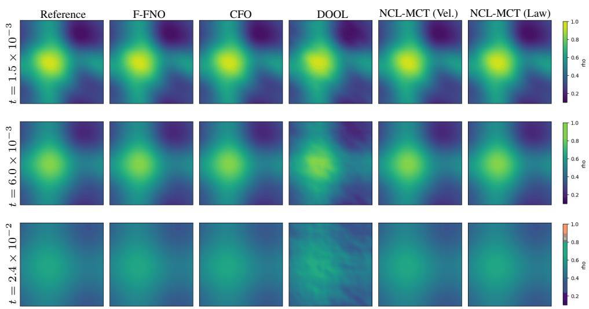  
Figure 4: Linear diffusion, 600-step rollout to $T = 0 . 0 3 .$

Both NCL-MCT Solver configurations track the smoothing dynamics throughout, with Vel. achieving about two-thirds of the Law error on both metrics and F-FNO remaining more accurate (Table 1(a)). All methods are visually similar at the first two times. By $t = 2 . \breve { 4 } \times 1 0 ^ { - 2 } ,$ , the field is nearly uniform; only DOOL retains visible grid-aligned texture, while the remaining discrepancies are diffuse and low amplitude.

## F.2 CAHN-HILLIARD

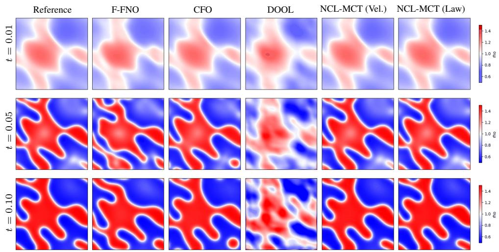  
Figure 5: Cahn-Hilliard, 10,000-step rollout to $T = 0 . 1 .$

This system shows the largest margin over the evaluated baselines: both NCL-MCT Solver configurations remain near $7 . 5 \times \mathrm { \bar { 1 0 } ^ { - 3 } }$ , roughly eight times below the strongest baseline (Table 1(a)). Both recover the domain count and locations at $\bar { T } = 0 . 1$ , including the isolated droplet near the lower boundary. F-FNO captures the two phases but distorts several interfaces, while DOOL loses the reference domain topology.

## F.3 POROUS MEDIUM

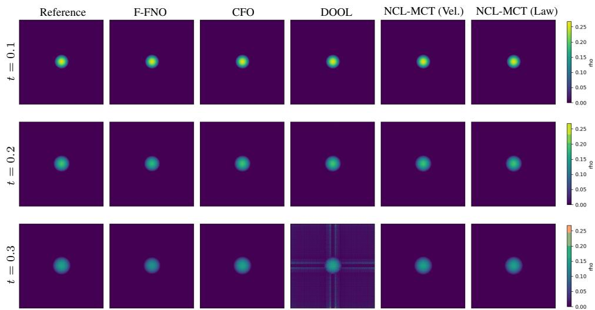  
Figure 6: Porous medium, 2,000-step rollout from $t = 0 . 1$ to $T = 0 . 3 .$

This is the only nonreactive system on which CFO is more accurate than both NCL-MCT Solver configurations. At this color scale, all methods except DOOL are visually close to the reference, so CFO’s quantitative advantage in Table 1(a) is not apparent from the fields alone. DOOL develops grid-aligned artifacts extending from the support boundary, consistent with the difficulty of spectral differentiation across a free boundary.

## F.4 FISHER-KPP

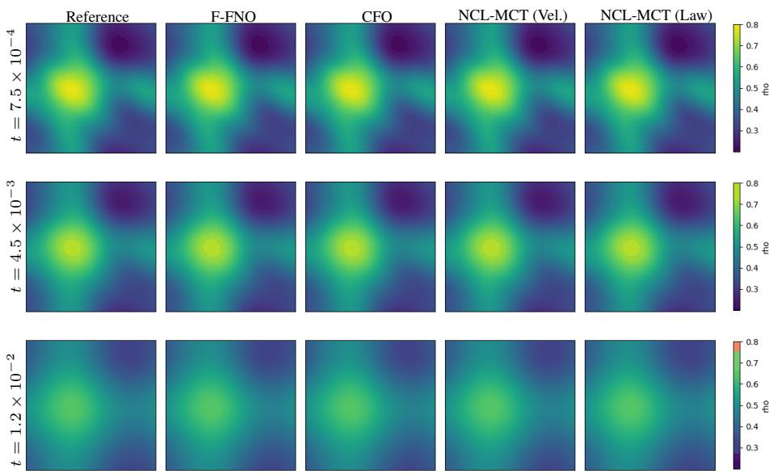  
Figure 7: Fisher-KPP, 500-step rollout to $T = 0 . 0 1 5 .$

Vel. is more accurate than Law on both metrics, giving the largest gap between the two NCL-MCT Solver supervision modes among the scalar reactive systems, with F-FNO between them (Table 1(b)). The two NCL-MCT Solver predictions are visually similar, indicating that the quantitative gap mainly reflects accumulated amplitude error rather than a qualitative difference in the predicted fields.

## F.5 REACTIVE CAHN-HILLIARD

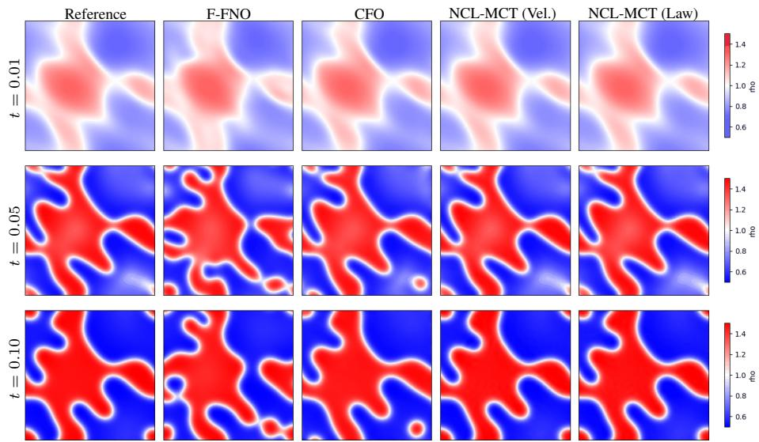  
Figure 8: Reactive Cahn-Hilliard, 10,000-step rollout to $T = 0 . 1$

Errors for both NCL-MCT Solver configurations remain close to those of the nonreactive CH system in Appendix F.2, indicating that the added reaction module does not substantially degrade longrollout accuracy. The reaction drives both phases toward the wells, producing more saturated domain interiors than in Figure 5. Both configurations closely follow the reference, while F-FNO misplaces several smaller features.

## F.6 REACTIVE POROUS MEDIUM

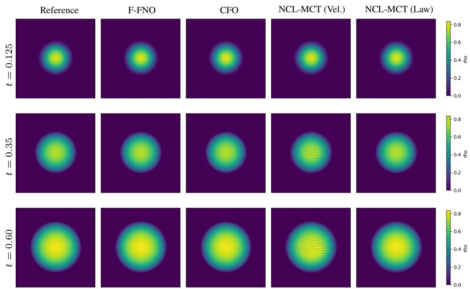  
Figure 9: Reactive porous medium, 1,000-step rollout from $t = 0 . 1$ to $T = 0 . 6 .$

The ranking follows that of the nonreactive porous-medium system in Appendix F.3, consistent with degenerate transport remaining the dominant difficulty. All methods capture the spreading and saturation of the support, but Vel. develops grid-scale oscillations inside the support as the front advances. These oscillations correspond to its higher error relative to Law in Table 1(b) and are absent in the nonreactive case of Figure 6.

## F.7 SCHNAKENBERG SYSTEM

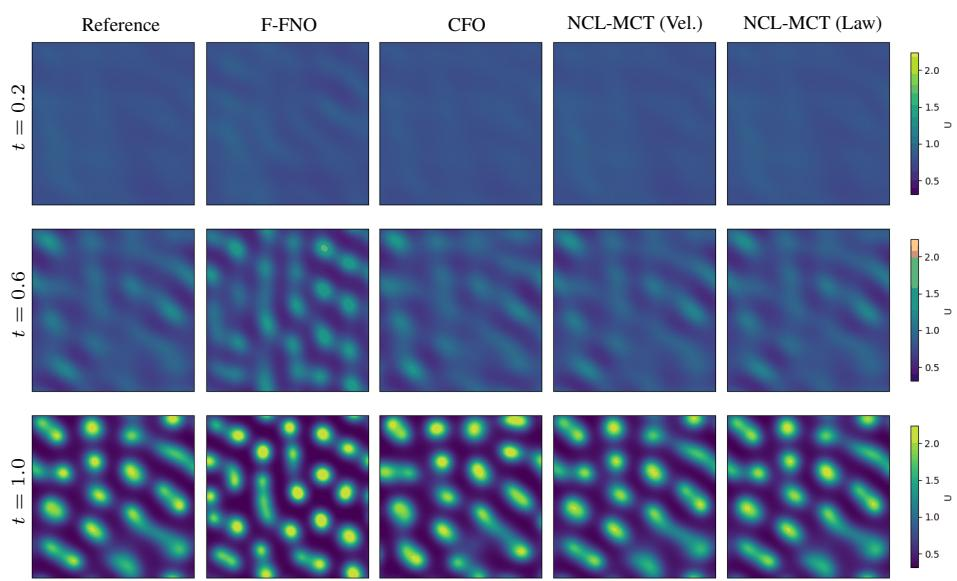

Figure 10: Schnakenberg, activator U, 20,000-step rollout to $T = 1 ,$  
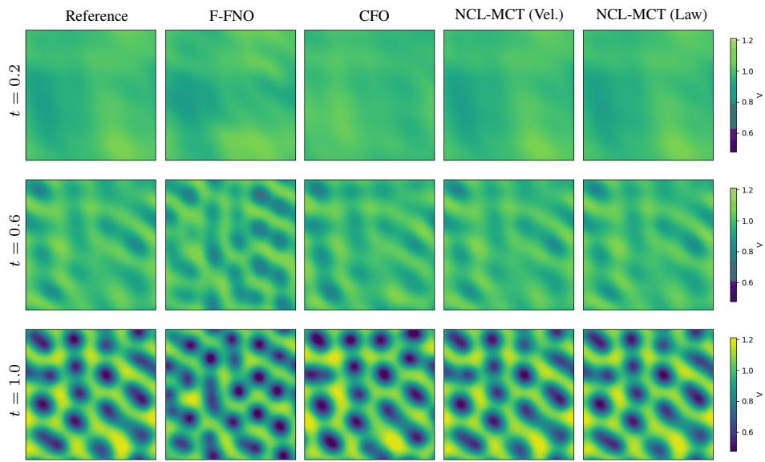  
Figure 11: Schnakenberg, inhibitor V, 20,000-step rollout to $T = 1 ,$

This 20,000-step rollout is the longest in the benchmark. Both NCL-MCT Solver configurations remain stable throughout, with mean errors differing by less than one standard deviation for both species. F-FNO is about an order of magnitude less accurate and becomes nonfinite on one of ten test trajectories after roughly 18,000 steps. Both configurations reproduce the reference spot locations and elongated structures at T = 1. CFO captures the overall pattern type but displaces several spots, while F-FNO produces a finer, more uniform spot pattern and develops a localized circular defect from $t \approx 0 . 6$ onward.

## G GENERALIZATION BEYOND TRAINING CONDITIONS

Both experiments reuse the in-distribution checkpoints of Appendix E.3 without modification: no model is retrained or retuned, and no evaluation trajectory is used for training or checkpoint selection. Errors are reported at 101 uniformly spaced frames, following the in-distribution protocol. We compare NCL-MCT Solver (Vel.), NCL-MCT Solver (Law), CFO, and F-FNO, together with DOOL on the two nonreactive systems included in these tests.

## G.1 UNSEEN INITIAL CONDITIONS

Experimental settings. We test five systems: linear diffusion, CH, Fisher-KPP, reactive CH, and Schnakenberg. For each system, we replace the initial-condition family of Appendix E.1 with a structured family absent from training, while keeping the PDE parameters, domain, 128 × 128 grid, reference solver, and time interval unchanged. The training distributions contain smooth Gaussian Fourier random fields for four systems and random perturbations of the homogeneous steady state for Schnakenberg, whereas the out-of-distribution families in Table 6 impose explicit spatial structure, including blobs, rings, and spot lattices. This setting tests whether constitutive responses learned from one distribution of density fields remain accurate under a different spatial organization. Each system uses one fixed out-of-distribution initial condition, so the reported results are single rollouts rather than trajectory averages. Figures 12-17 show the corresponding rollouts, with columns ordered as reference, F-FNO, CFO, DOOL where applicable, NCL-MCT Solver (Vel.), and NCL-MCT Solver (Law), and time increasing downward.

Out-of-distribution initial conditions. For linear diffusion, six Gaussian blobs are placed at equal angles on a circle,

$$
\rho _ { 0 } ( { \bf x } ) = \rho _ { b } + A \sum _ { k = 0 } ^ { 5 } \exp \Bigl ( - \frac { | { \bf x } - { \bf c } _ { k } | ^ { 2 } } { 2 \sigma ^ { 2 } } \Bigr ) , \qquad \rho _ { b } = 0 . 0 5 , ~ A = 0 . 8 5 , ~ \sigma = 0 . 0 6 ,\tag{41}
$$

with ${ \bf c } _ { k } = ( 0 . 5 , 0 . 5 ) + 0 . 2 2 ( \cos \theta _ { k } ,$ , sin $\theta _ { k } ) , \theta _ { k } = 2 \pi k / 6$ , clipped to $[ 0 , 1 ]$ . The two CH systems use two blobs of unequal size on a uniform background,

$$
\begin{array} { r } { \rho _ { 0 } ( \mathbf { x } ) = 0 . 8 5 + 0 . 2 4 \exp \Bigl ( - \frac { | \mathbf { x } - ( 0 . 2 8 , 0 . 2 8 ) | ^ { 2 } } { 2 \cdot 0 . 1 2 ^ { 2 } } \Bigr ) + 0 . 3 0 \exp \Bigl ( - \frac { | \mathbf { x } - ( 0 . 7 2 , 0 . 7 2 ) | ^ { 2 } } { 2 \cdot 0 . 1 3 ^ { 2 } } \Bigr ) , } \end{array}\tag{42}
$$

clipped to [0.85, 1.15], so phase separation starts from two prescribed nuclei rather than a random field. The Fisher-KPP family is a Gaussian ring with a jittered center and width,

$$
\begin{array} { r } { \rho _ { 0 } ( { \bf x } ) = \rho _ { b } + { \cal A } \exp \Bigl ( - \frac { ( | { \bf x } - { \bf c } | - R ) ^ { 2 } } { 2 \sigma ^ { 2 } } \Bigr ) , \qquad \rho _ { b } = 0 . 0 5 , { \cal A } = 0 . 5 5 , R = 0 . 2 2 , } \end{array}\tag{43}
$$

with $\mathbf { c } = ( 0 . 5 , 0 . 5 ) + \pmb { \delta } , \delta \sim \mathcal { N } ( 0 , 0 . 0 2 ^ { 2 } I ) , \sigma = 0 . 0 6 + \eta ,$ and $\eta \sim \mathcal { N } ( 0 , 0 . 0 0 5 ^ { 2 } )$ , clipped to $[ 1 0 ^ { - 6 } , 0 . 9 5 ]$ . Unlike the training fields, it contains an interior minimum and a single radial length scale. The Schnakenberg family perturbs the homogeneous steady state with a normalized hexagonal spot lattice,

$$
C _ { 0 } = C ^ { \ast } \big ( 1 + \varepsilon _ { C } g \big ) , \qquad g \propto \cos \theta _ { x } + \cos \theta _ { y } + \cos ( \theta _ { x } + \theta _ { y } ) , \qquad C \in \{ U , V \} ,\tag{44}
$$

with $\theta _ { x } = 2 \pi k x + \varphi _ { x } , \theta _ { y } = 2 \pi k y + \varphi _ { y } , k \sim \mathcal { U } \{ 1 , 2 , 3 \}$ , and independent uniform phases. The field $g$ is made mean-free and normalized to unit maximum magnitude. The relative amplitudes are

Table 6: Out-of-distribution initial-condition families. Distances are periodic on each system’s domain, and all fields are evaluated on the same 128 × 128 grid and rolled out over the same interval as the corresponding in-distribution test.
<table><tr><td>System</td><td>Family</td><td> $N _ { T }$ </td></tr><tr><td>Linear Diffusion</td><td>Six Gaussian blobs on a circle, Equation 41</td><td>600</td></tr><tr><td>CH</td><td>Two Gaussian blobs, Equation 42</td><td> $1 0 ^ { 4 }$ </td></tr><tr><td>Fisher-KPP</td><td>Gaussian ring, Equation 43</td><td>500</td></tr><tr><td>Reactive CH</td><td>Two Gaussian blobs, Equation 42</td><td> $1 0 ^ { 4 }$ </td></tr><tr><td>Schnakenberg</td><td>Spot lattice, Equation 44</td><td> $2 \times 1 0 ^ { 4 }$ </td></tr></table>

Table 7: Rollout errors from unseen initial conditions. Each system uses one fixed out-of-distribution initial condition, so entries are single rollouts without standard deviations. $E _ { \mathrm { r o l l } }$ and $E _ { \mathrm { m a x } }$ denote space-time and maximum per-time relative $L ^ { 2 }$ errors. Red/orange mark the best/second-best result per row. NaN denotes a nonfinite rollout; − denotes a method not evaluated under the adopted formulation. Schnakenberg U and V count as one system.
<table><tr><td>System</td><td> $N _ { T }$ </td><td></td><td>F-FNO Metric (Tran et al., 2023) (Hou et al., 2026) (Chang et al., 2026)</td><td>CFO</td><td>DOOL</td><td>(Ours)</td><td>NCL-MCT (Vel.) NCL-MCT (Law) (Ours)</td></tr><tr><td>Linear Diffusion</td><td>600</td><td> $E _ { \mathrm { r o l l } }$   $E _ { \mathrm { m a x } }$ </td><td> $1 . 7 1 \times 1 0 ^ { - }$  1  $2 . 8 7 \times 1 0 ^ { - 1 }$ </td><td> $1 . 6 5 \times 1 0 ^ { - 1 }$   $2 . 1 3 \times 1 0 ^ { - 1 }$ </td><td> $5 . 7 4 \times 1 0 ^ { - 1 }$   $7 . 0 1 \times 1 0 ^ { - 1 }$ </td><td> $4 . 0 7 \times 1 0 ^ { - 2 }$   $4 . 6 7 \times 1 0 ^ { - 2 }$ </td><td> $3 . 8 1 \times 1 0 ^ { - 2 }$   $4 . 4 4 \times 1 0 ^ { - 2 }$ </td></tr><tr><td>CH</td><td>10,000</td><td>Eroll  $E _ { \mathrm { m a x } }$ </td><td>NaN NaN</td><td> $2 . 3 1 \times 1 0 ^ { - 1 }$   $3 . 3 0 \times 1 0 ^ { - 1 }$ </td><td> $4 . 2 8 \times 1 0 ^ { - 1 }$   $5 . 3 3 \times 1 0 ^ { - 1 }$ </td><td> $1 . 9 6 \times 1 0 ^ { - 2 }$   $3 . 6 3 \times 1 0 ^ { - 2 }$ </td><td> $1 . 8 3 \times 1 0 ^ { - 2 }$   $3 . 3 2 \times 1 0 ^ { - 2 }$ </td></tr><tr><td>Fisher-KPP</td><td>500</td><td> $E _ { \mathrm { r o l l } }$   $E _ { \mathrm { m a x } }$ </td><td>NaN NaN</td><td> $1 . 3 5 \times 1 0 ^ { - 1 }$   $1 . 7 1 \times 1 0 ^ { - 1 }$ </td><td></td><td> $5 . 7 1 \times 1 0 ^ { - 2 }$   $7 . 0 2 \times 1 0 ^ { - 2 }$ </td><td> $5 . 3 6 \times 1 0 ^ { - 2 }$   $6 . 5 7 \times 1 0 ^ { - 2 }$ </td></tr><tr><td>Reactive CH</td><td>10,000</td><td> $E _ { \mathrm { r o l l } }$   $E _ { \mathrm { m a x } }$ </td><td> $2 . 3 1 \times 1 0 ^ { - 1 }$   $3 . 2 7 \times 1 0 ^ { - 1 }$ </td><td> $2 . 1 2 \times 1 0 ^ { - 1 }$   $2 . 9 6 \times 1 0 ^ { - 1 }$ </td><td></td><td> $1 . 9 7 \times 1 0 ^ { - 2 }$   $4 . 3 0 \times 1 0 ^ { - 2 }$ </td><td> $2 . 0 3 \times 1 0 ^ { - 2 }$   $4 . 0 7 \times 1 0 ^ { - 2 }$ </td></tr><tr><td>Schnakenberg (U)</td><td></td><td> $E _ { \mathrm { r o l l } }$   $E _ { \mathrm { m a x } }$ </td><td> $2 . 1 3 \times 1 0 ^ { - 1 }$   $4 . 1 5 \times 1 0 ^ { - 1 }$ </td><td> $1 . 5 1 \times 1 0 ^ { - 1 }$   $2 . 6 8 \times 1 0 ^ { - 1 }$ </td><td></td><td> $1 . 9 4 \times 1 0 ^ { - 2 }$   $3 . 6 9 \times 1 0 ^ { - 2 }$ </td><td> $1 . 9 6 \times 1 0 ^ { - 2 }$   $6 . 0 7 \times 1 0 ^ { - 2 }$ </td></tr><tr><td>Schnakenberg (V)</td><td>20,000</td><td> $E _ { \mathrm { r o l l } }$   $E _ { \mathrm { m a x } }$ </td><td> $6 . 8 9 \times 1 0 ^ { - 2 }$   $1 . 4 0 \times 1 0 ^ { - 1 }$ </td><td> $4 . 8 3 \times 1 0 ^ { - 2 }$   $8 . 8 8 \times 1 0 ^ { - 2 }$ </td><td></td><td> $5 . 2 2 \times 1 0 ^ { - 3 }$   $1 . 0 3 \times 1 0 ^ { - 2 }$ </td><td> $5 . 3 7 \times 1 0 ^ { - 3 }$   $1 . 4 8 \times 1 0 ^ { - 2 }$ </td></tr></table>

restricted to the lower $4 0 \%$ of the training range, $\varepsilon _ { U } \in [ 0 . 0 4 , 0 . 0 6 4 ]$ and $\varepsilon _ { V } \in [ 0 . 1 2 , 0 . 1 6 ]$ . The candidate is accepted only if U, V, and ${ \breve { U } } ^ { 2 } V$ remain finite and within the range spanned by the training snapshots throughout the rollout, restricting the shift primarily to spatial organization rather than amplitude.

Results. Table 7 reports the five rollouts. NCL-MCT Solver achieves the lowest error on all five systems and both metrics, with $E _ { \mathrm { r o l l } }$ between 2.4× and 13× below the strongest finite baseline. The two supervision modes remain within 10% of each other in $E _ { \mathrm { r o l l } }$ across all five systems, although their $E _ { \mathrm { m a x } }$ differs more on Schnakenberg. Linear diffusion shows the largest change in ranking. F-FNO, the most accurate method in distribution, increases its error by roughly 260× to $1 . 7 1 \times \bar { 1 0 } ^ { - 1 }$ whereas NCL-MCT Solver increases by 24-41× and remains four to six times lower. F-FNO also becomes nonfinite on CH and Fisher-KPP. The relative degradation is not uniformly smaller for NCL-MCT Solver: on Fisher-KPP, its error increases by about two orders of magnitude, compared with 23× for CFO. Thus, lower out-of-distribution error does not imply uniformly smaller relative degradation from the in-distribution setting. Schnakenberg behaves differently: all methods except CFO are at least as accurate as in distribution. The imposed spot lattice is geometrically unseen but resembles the pattern selected by the Turing dynamics, making this primarily a structural-transfer test rather than a uniformly harder initial condition.

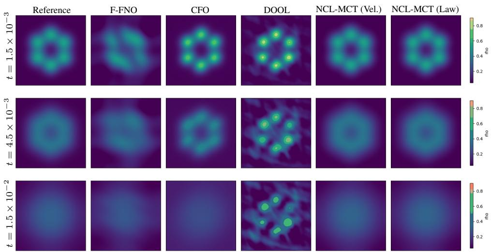  
Figure 12: Linear diffusion from six Gaussian blobs on a circle, Equation 41, 600-step rollout to $T = 0 . 0 3 .$ . F-FNO loses the six-fold symmetry early and replaces the ring by two smeared diagonal lobes, while CFO retains separated blobs after the reference has largely merged them. DOOL show distinct blobs on a striped background where the reference is nearly uniform. Both NCL-MCT Solver configurations more closely follow the merging and flattening dynamics.

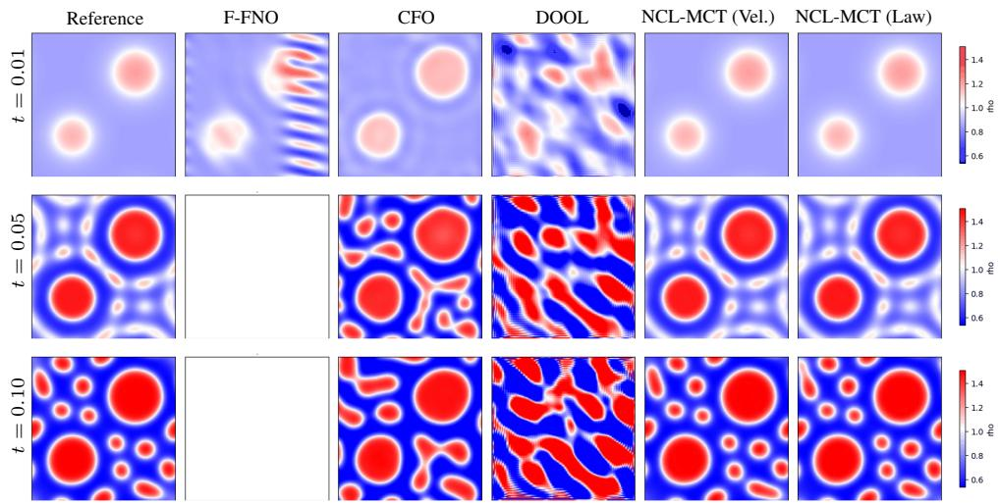  
Figure 13: Cahn-Hilliard from two Gaussian blobs, Equation 42, 10,000-step rollout to $T = 0 . 1 . \ \mathrm { F } .$ FNO develops oscillations near the domain boundary at $t = 0 . 0 1$ and becomes nonfinite thereafter. CFO recovers the two large domains but forms an irregular set of secondary droplets, while DOOL produces a different labyrinthine pattern. Both NCL-MCT Solver configurations reproduce the two domains and the regular array of smaller droplets between them.

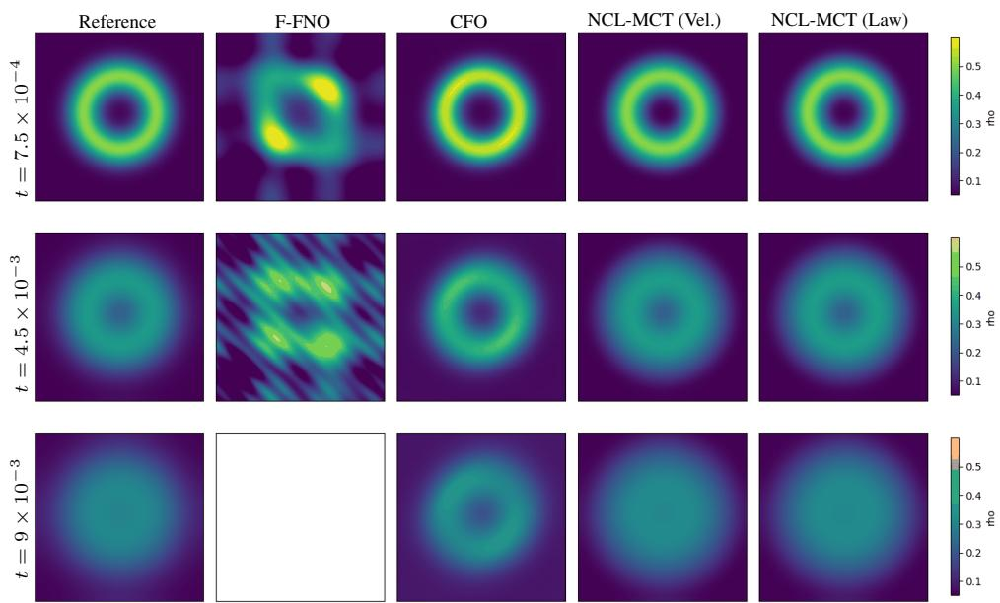  
Figure 14: Fisher-KPP from a Gaussian ring, Equation 43, 500-step rollout to $T = 0 . 0 1 5 .$ The blank panel denotes a nonfinite state. F-FNO breaks the ring into two bright lobes and develops diagonal striping before becoming nonfinite, while CFO retains a pronounced central depression after the reference has filled in. Both NCL-MCT Solver configurations more closely follow the filling of the ring.

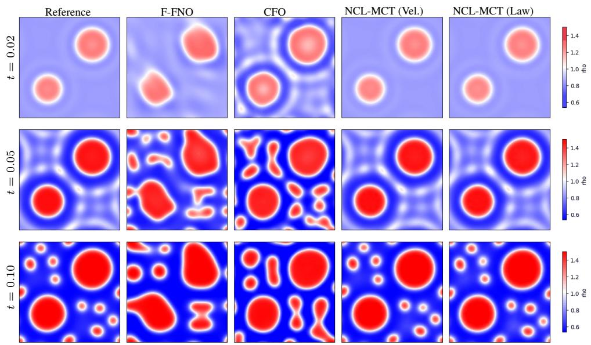  
Figure 15: Reactive Cahn-Hilliard from two Gaussian blobs, Equation 42, 10,000-step rollout to $T = 0 . 1$ . F-FNO preserves the large domains but distorts their shape and misses the secondarydroplet array, while CFO merges the droplets into elongated structures. Both NCL-MCT Solver configurations recover the array more closely.

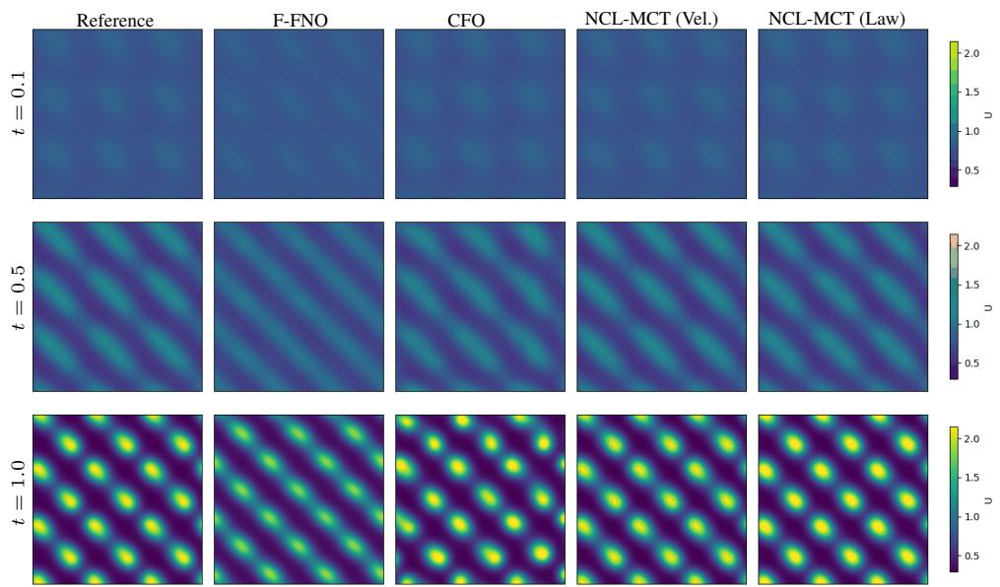

Figure 16: Schnakenberg from a spot lattice, Equation 44, activator U, 20,000-step rollout to T = 1. All methods remain finite but differ in pattern selection: F-FNO retains smooth diagonal bands where the reference has formed a spot lattice, while CFO and both NCL-MCT Solver configurations resolve the spots more closely.  
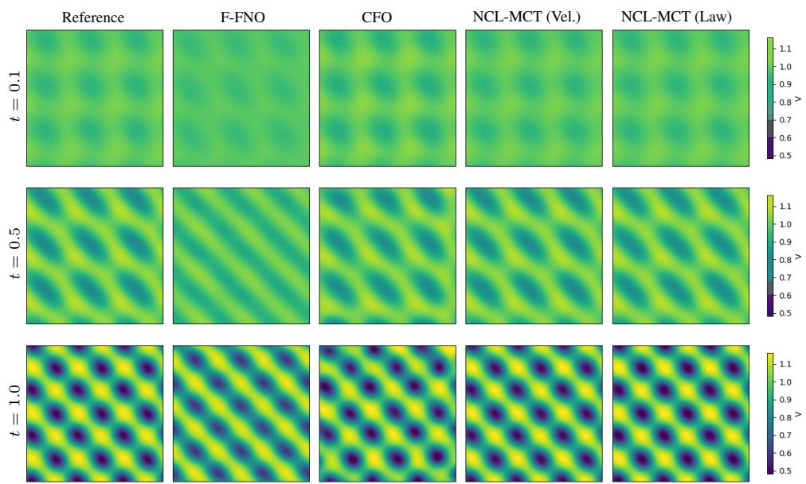  
Figure 17: Schnakenberg from a spot lattice, inhibitor V , with the same rollout and layout as Figure 16. The F-FNO banding is more visible for this species.

## G.2 EXTENDED TIME HORIZON

Experimental settings. For linear diffusion, CH, Fisher-KPP, and reactive CH, models are trained on trajectories truncated to the first 60% of the reference interval and evaluated over the full interval in Table 4, giving an extrapolation factor of $1 / 0 . 6 \approx 1 . 6 7$ . The step size, PDE parameters, and ten in-distribution test initial conditions remain unchanged, so the final 40% of each rollout lies beyond the training horizon. Table 8 lists the training and evaluation horizons.

Metrics. $E _ { \mathrm { r o l l } }$ and $E _ { \mathrm { m a x } }$ are computed over the full evaluation window. To separate extrapolation error from the error already present at the training horizon, we evaluate the trajectory-averaged pertime error $\begin{array} { r } { \bar { E } ( t ) = \frac { 1 } { N } \sum _ { i } \bar { E _ { i } } \bar { ( t ) } } \end{array}$ and report

$$
\Delta E = \bar { E } ( T ) - \bar { E } ( T _ { \mathrm { t r a i n } } ) ,\tag{45}
$$

which measures the additional error from the training horizon to the final time. We report the difference rather than a ratio because the errors at $T _ { \mathrm { t r a i n } }$ differ substantially across methods.

Results. Relative to Table 1, the errors of both NCL-MCT Solver configurations change by factors of 0.90-1.46, so evaluation to $1 . 6 7 \times$ the shortened training horizon increases error by at most about 50% (Table 9). CFO errors increase by 1.6× on the two Cahn-Hilliard systems and by $5 . 2 \times$ on linear diffusion and Fisher-KPP. F-FNO changes little overall, remaining strongest on linear diffusion and second on Fisher-KPP but about an order of magnitude less accurate than NCL-MCT Solver on the two Cahn-Hilliard systems. At $T _ { \mathrm { t r a i n } } .$ , NCL-MCT Solver is already about an order of magnitude below both baselines on the two Cahn-Hilliard systems. Its $\Delta E$ is also smallest on linear diffusion, CH, and Fisher-KPP; only on reactive CH does CFO show smaller growth, despite an error at $T _ { \mathrm { t r a i n } }$ that is twelve times larger. On linear diffusion, $\Delta E < 0$ for both NCL-MCT Solver configurations, indicating that the final relative error is lower than at the training horizon.

Table 8: Training and evaluation horizons. $N _ { T } ^ { \mathrm { t r a i n } }$ and $N _ { T }$ denote the rollout lengths of the truncated training trajectories and full evaluation, respectively. The step size is unchanged and equals the reference $\Delta t$ in Table 4.
<table><tr><td>System</td><td>∆t</td><td> $N _ { T } ^ { \mathrm { t r a i n } } ~ ( T _ { \mathrm { t r a i n } } )$ </td><td> $N _ { T } \left( T \right)$ </td><td>Extrapolated fraction</td></tr><tr><td>Linear diffusion</td><td> $5 \times 1 0 ^ { - 5 }$ </td><td> $3 6 0 \ : ( 0 . 0 1 8 )$ </td><td>600 (0.03)</td><td>40%</td></tr><tr><td>CH</td><td> $1 0 ^ { - 5 }$ </td><td>6,000 (0.06)</td><td>10,000 (0.1)</td><td>40%</td></tr><tr><td>Fisher-KPP</td><td> $3 \times 1 0 ^ { - 5 }$ </td><td>300 (0.009)</td><td>500 (0.015)</td><td>40%</td></tr><tr><td>Reactive CH</td><td> $1 0 ^ { - 5 }$ </td><td>6,000 (0.06)</td><td>10,000 (0.1)</td><td>40%</td></tr></table>

Table 9: Rollout errors with the horizon extended beyond training. Models are trained on the first 60% of each reference interval and evaluated over the full interval (Table 8). $E _ { \mathrm { r o l l } }$ and $E _ { \mathrm { m a x } }$ are mean $\pm$ standard deviation over ten test trajectories. $\bar { E } ( T _ { \mathrm { t r a i n } } )$ is the trajectory-averaged per-time error at the training horizon, and $\Delta E$ is its change to the final time, Equation 45. Red/orange mark the best/second-best mean per row.
<table><tr><td>System</td><td>Metric</td><td>F-FNO  $( \mathrm { T r a n } \mathrm { e t } \mathrm { a l . } , 2 0 2 3 )$ </td><td>CFO (Hou et al., 2026)</td><td> $\overline { { { \bf { N C L - M C T } } \left( { \bf { V e l . } } \right) } }$  (Ours)</td><td> $\mathbf { N C L - M C T } \left( \mathbf { L a w } \right)$  (Ours)</td></tr><tr><td rowspan="4">Linear Diffusion</td><td> $E _ { \mathrm { r o l l } }$ </td><td> $( 4 . 0 1 \pm 1 . 2 6 ) \times 1 0 ^ { - 4 }$ </td><td> $( 5 . 1 3 \pm 1 . 0 4 ) \times 1 0 ^ { - 2 }$ </td><td> $( 1 . 4 4 \pm 0 . 2 7 ) \times 1 0 ^ { - 3 }$ </td><td> $( 2 . 2 6 \pm 0 . 3 7 ) \times 1 0 ^ { - 3 }$ </td></tr><tr><td> $E _ { \mathrm { m a x } }$ </td><td> $( 6 . 0 9 \pm 1 . 8 7 ) \times 1 0 ^ { - 4 }$ </td><td> $( 6 . 2 5 \pm 1 . 5 2 ) \times 1 0 ^ { - 2 }$ </td><td> $( 1 . 6 2 \pm 0 . 3 4 ) \times 1 0 ^ { - 3 }$ </td><td> $( 2 . 6 0 \pm 0 . 4 6 ) \times 1 0 ^ { - 3 }$ </td></tr><tr><td> $\bar { E } ( T _ { \mathrm { t r a i n } } )$ </td><td> $3 . 7 8 \times 1 0 ^ { - 4 }$ </td><td> $5 . 8 2 \times { { 1 0 } ^ { - 2 } }$ </td><td> $1 . 5 8 \times 1 0 ^ { - 3 }$ </td><td> $2 . 5 3 \times \mathrm { i } 0 ^ { - 3 }$ </td></tr><tr><td> $\Delta E$ </td><td> $\overline { { 1 . 6 9 \times 1 0 ^ { - 4 } } }$ </td><td> $2 . 0 9 \times 1 0 ^ { - 3 }$ </td><td> $- 5 . 7 2 \times 1 0 ^ { - 5 }$ </td><td> $- 1 . 7 5 \times 1 0 ^ { - 4 }$ </td></tr><tr><td rowspan="5">CH</td><td> $E _ { \mathrm { r o l l } }$ </td><td> $( 1 . 3 9 \pm 0 . 1 7 ) \times 1 0 ^ { - 1 }$ </td><td> $( 9 . 9 6 \pm 0 . 8 6 ) \times 1 0 ^ { - 2 }$ </td><td> $( 9 . 2 7 \pm 3 . 0 3 ) \times 1 0 ^ { - 3 }$ </td><td> $( 1 . 0 3 \pm 0 . 2 7 ) \times 1 0 ^ { - 2 }$ </td></tr><tr><td> $E _ { \mathrm { m a x } }$ </td><td> $( 1 . 8 5 \pm 0 . 2 4 ) \times 1 0 ^ { - 1 }$ </td><td> $( 1 . 2 6 \pm 0 . 1 3 ) \times 1 0 ^ { - 1 }$ </td><td> $( 1 . 4 4 \pm 0 . 8 9 ) \times 1 0 ^ { - 2 }$ </td><td> $( 1 . 4 9 \pm 0 . 3 7 ) \times 1 0 ^ { - 2 }$ </td></tr><tr><td> $\bar { E } ( T _ { \mathrm { t r a i n } } )$ </td><td> $1 . 5 9 \times 1 0 ^ { - 1 }$ </td><td> $1 . 1 0 \times 1 0 ^ { - 1 }$ </td><td> $9 . 6 9 \times 1 0 ^ { - 3 }$ </td><td> $1 . 1 7 \times 1 0 ^ { - 2 }$ </td></tr><tr><td> $\Delta E$ </td><td> $2 . 6 0 \times 1 0 ^ { - 2 }$ </td><td> $6 . 7 0 \times 1 0 ^ { - 3 }$ </td><td> $4 . 5 1 \times 1 0 ^ { - 3 }$ </td><td> $2 . 5 7 \times 1 0 ^ { - 3 }$ </td></tr><tr><td> $E _ { \mathrm { r o l l } }$ </td><td></td><td></td><td></td><td></td></tr><tr><td rowspan="4">Fisher-KPP</td><td> $E _ { \mathrm { m a x } }$ </td><td> $( 5 . 9 6 \pm 1 . 3 6 ) \times 1 0 ^ { - 4 }$   $( 8 . 0 2 \pm 1 . 7 2 ) \times 1 0 ^ { - 4 }$ </td><td> $( 3 . 1 0 \pm 0 . 4 1 ) \times 1 0 ^ { - 2 }$   $( 4 . 1 5 \pm 0 . 6 8 ) \times 1 0 ^ { - 2 }$ </td><td> $( 5 . 0 2 \pm 0 . 8 2 ) \times 1 0 ^ { - 4 }$   $( 5 . 8 1 \pm 1 . 0 9 ) \times 1 0 ^ { - 4 }$ </td><td> $( 7 . 4 8 \pm 0 . 6 4 ) \times 1 0 ^ { - 4 }$   $( 9 . 6 4 \pm 0 . 9 6 ) \times 1 0 ^ { - 4 }$ </td></tr><tr><td> $\bar { E } ( T _ { \mathrm { t r a i n } } )$ </td><td></td><td></td><td></td><td></td></tr><tr><td></td><td> $6 . 3 2 \times 1 0 ^ { - 4 }$ </td><td> $3 . 4 5 \times 1 0 ^ { - 2 }$ </td><td> $5 . 5 0 \times 1 0 ^ { - 4 }$ </td><td> $8 . 3 2 \times 1 0 ^ { - 4 }$ </td></tr><tr><td> $\Delta E$ </td><td> $1 . 6 7 \times 1 0 ^ { - 4 }$ </td><td> $6 . 8 8 \times 1 0 ^ { - 3 }$ </td><td> $2 . 3 7 \times 1 0 ^ { - 5 }$ </td><td> $1 . 3 2 \times 1 0 ^ { - 4 }$ </td></tr><tr><td rowspan="4">Reactive CH</td><td> $E _ { \mathrm { r o l l } }$   $E _ { \mathrm { m a x } }$ </td><td> $( 1 . 3 0 \pm 0 . 2 2 ) \times 1 0 ^ { - 1 * }$ </td><td> $( 9 . 3 6 \pm 0 . 7 1 ) \times 1 0 ^ { - 2 }$ </td><td> $( 1 . 2 2 \pm 0 . 4 0 ) \times 1 0 ^ { - 2 }$ </td><td> $( 8 . 6 9 \pm 1 . 5 9 ) \times 1 0 ^ { - 3 }$ </td></tr><tr><td></td><td> $( 1 . 7 2 \pm 0 . 2 7 ) \times 1 0 ^ { - 1 * }$ </td><td> $( 1 . 1 8 \pm 0 . 1 2 ) \times 1 0 ^ { - 1 }$ </td><td> $( 1 . 9 6 \pm 0 . 8 1 ) \times 1 0 ^ { - 2 }$ </td><td> $( 1 . 3 8 \pm 0 . 3 2 ) \times 1 0 ^ { - 2 }$ </td></tr><tr><td> $\bar { E } ( T _ { \mathrm { t r a i n } } )$ </td><td> $1 . 4 8 \times 1 0 ^ { - 1 * }$ </td><td> $1 . 0 4 \times 1 0 ^ { - 1 }$ </td><td> $1 . 2 1 \times 1 0 ^ { - 2 }$ </td><td> $8 . 3 2 \times 1 0 ^ { - 3 }$ </td></tr><tr><td> $\Delta E$ </td><td> $2 . 3 6 \times 1 0 ^ { - 2 * }$ </td><td> $3 . 6 1 \times 1 0 ^ { - 3 }$ </td><td> $6 . 5 6 \times 1 0 ^ { - 3 }$ </td><td> $5 . 3 6 \times 1 0 ^ { - 3 }$ </td></tr></table>

<sup>∗</sup>F-FNO becomes nonfinite on the seventh reactive CH trajectory after 400 steps, within the training horizon;  
its reported statistics use the nine remaining trajectories.

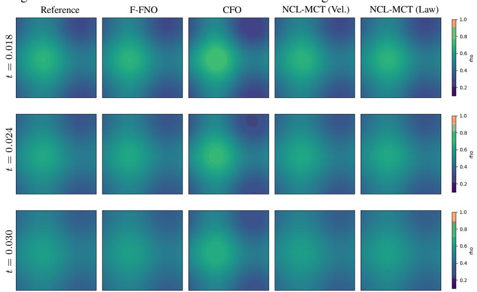

Figure 18: Linear diffusion, trained to $T _ { \mathrm { t r a i n } } = 0 . 0 1 8$ and rolled out to $T = 0 . 0 3 .$ . Only the first row lies within the training horizon.  
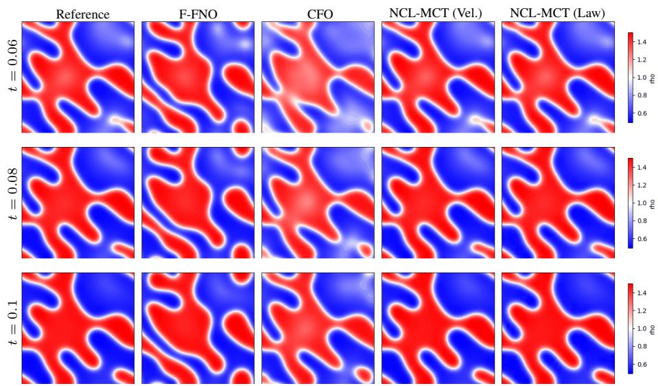  
Figure 19: Cahn-Hilliard, trained to $T _ { \mathrm { t r a i n } } = 0 . 0 6$ and rolled out to $T = 0 . 1$

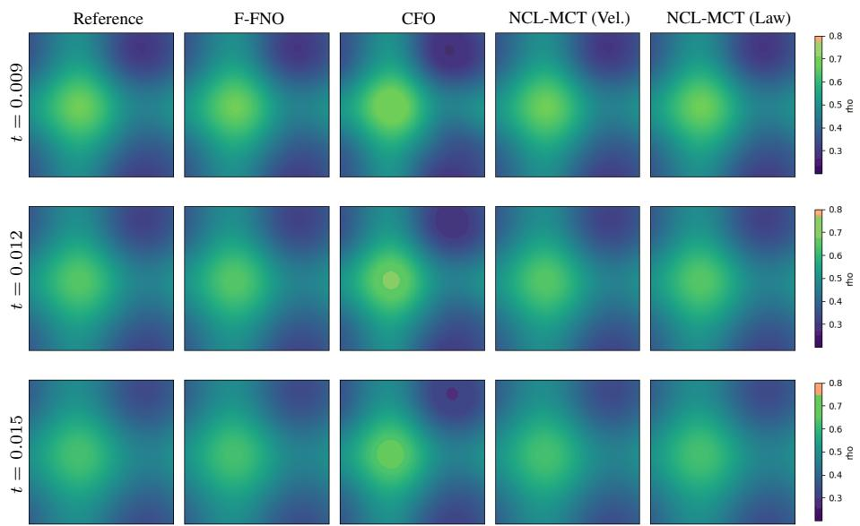

Figure 20: Fisher-KPP, trained to $T _ { \mathrm { t r a i n } } = 0 . 0 0 9$ and rolled out to $T = 0 . 0 1 5 .$  
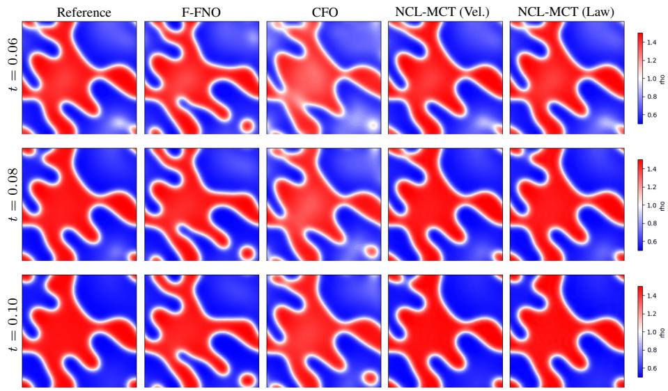  
Figure 21: Reactive Cahn-Hilliard, trained to $T _ { \mathrm { t r a i n } } = 0 . 0 6$ and rolled out to $T = 0 . 1$

## H TRAJECTORY-FREE CONSTITUTIVE LEARNING

In Section 5.1 and Section 5.2, both supervision modes use density fields drawn from precomputed solution trajectories. Thus, even under known-law supervision, a numerical solver is still required to construct the training set. Here we remove this dependence. Because the targets $\xi ^ { \mathrm { l a w } }$ and f<sup>law</sup> in $\mathcal { L } _ { \xi } ^ { \mathrm { l a w } }$ and $\mathcal { L } _ { f } ^ { \mathrm { l a w } }$ (Equation 10) depend only on the current density field, they can be evaluated on arbitrary positive fields without time integration. We therefore train directly on independently sampled density fields. We compare NCL-MCT Solver (Law) with DOOL (Chang et al., 2026) on the one-dimensional linear diffusion and two-dimensional Cahn-Hilliard settings used in that work, using the same independently sampled density fields for both methods. Neither method uses solution trajectories, velocity fields, or time derivatives during training; trajectories are reserved for held-out rollout evaluation.

One-dimensional linear diffusion (DOOL setting). We consider

$$
\partial _ { t } \rho = D \partial _ { x x } \rho , \qquad x \in [ - \pi , \pi ) , \quad D = 1 ,\tag{46}
$$

with periodic boundary conditions. Both methods are trained on the same 50 independently sampled density fields on a 128-point grid,

$$
\rho ( x ) = 2 + c \sin x , \qquad c \sim \mathcal { U } [ 0 , 1 ) ,\tag{47}
$$

which are positive by construction. NCL-MCT Solver uses the factorization $\xi = 1 / \rho$ and $f = - \partial _ { x } \rho ,$ yielding $u = - \partial _ { x } \rho / \rho$ as in Appendix D.1. This also illustrates the factorization freedom discussed in Section 3. For this one-dimensional experiment, we replace the per-sample normalization of ℓ in Section 4.3 with batch-level normalization: the batch-summed squared error is divided by the batchsummed squared target norm, with denominator stabilizer $1 0 ^ { - 1 2 }$ DOOL minimizes its Onsager objective on the same fields; its branch network receives the first eight complex Fourier coefficients, including the constant mode, covering all active modes in Equation $4 7 .$ . Both methods are trained for 50,000 Adam updates with learning rate $1 0 ^ { - 3 }$ and batch size 50. Evaluation uses ten held-out initial conditions from the same family: $c = 1$ for the visualized example and nine independent draws. The reference solution is given analytically by Fourier-mode decay. Both methods roll out to $T = 1$ with $\Delta t = 2 . 5 \times 1 0 ^ { - 4 }$ , corresponding to $N _ { T } = 4 \small { , } 0 0 0$ steps, with errors measured at 101 frames. NCL-MCT Solver advances the one-dimensional MCT factors I and $M ,$ , whereas DOOL advances its predicted flux using spectral differentiation and second-order Runge-Kutta.

Two-dimensional Cahn-Hilliard (DOOL setting). We reproduce Example 3.5 of Chang et al. (2026),

$$
\partial _ { t } u = \Delta \bigl [ - \gamma _ { 1 } \Delta u + \gamma _ { 2 } ( u ^ { 3 } - u ) \bigr ] , \qquad \mathbf { x } \in ( 0 , 2 \pi ) ^ { 2 } , \quad \gamma _ { 1 } = \gamma _ { 2 } = 1 ,\tag{48}
$$

with periodic boundary conditions. Because NCL-MCT Solver uses the mobility factorization $\xi =$ $1 / \rho ,$ it requires a positive density, whereas u changes sign. We therefore represent each state as $\rho = u + 2$ and evaluate the constitutive law through $u = \rho - 2$ . This constant shift preserves the underlying dynamics while ensuring positivity; $\rho$ is clamped to $[ 0 . 7 , 3 . 3 ]$ . The training set contains 1,000 independently sampled density fields on a 128 × 128 grid from the $K = 1$ truncated Fourier coefficient box of Chang et al. (2026). We use 1,000 rather than its $N _ { b } = 1 0 0$ states so that the sample budget matches the other two-dimensional experiments in this paper. Both methods are trained for 100,000 updates with batch size 32. Evaluation uses ten held-out initial conditions from the same band-limited family. The first is $u _ { 0 } =$ sin x sin $y ,$ , following Chang et al. (2026), and the remaining nine are independent draws. Reference trajectories are computed with ETDRK4 at $\Delta t = 1 0 ^ { - 5 }$ and stored every $1 0 ^ { - 4 }$ up to $T \ = \ 0 . 2$ . Both methods roll out with $\Delta t = 1 0 ^ { - 4 }$ corresponding to $N _ { T } = 2 { , } 0 0 0$ steps, with errors measured at 101 frames.

Results. Table 3 reports errors over the ten held-out initial conditions. On one-dimensional linear diffusion, NCL-MCT Solver (Law) achieves $E _ { \mathrm { r o l l } } = 3 . 1 3 \times 1 0 ^ { - 4 }$ and $E _ { \mathrm { m a x } } = 4 . 0 5 \times 1 0 ^ { - 4 }$ , respectively 4.9× and 5.9× lower than DOOL. Figure 22 shows the corresponding space-time density for the visualized initial condition. Both methods reproduce the single-mode decay, with the main visible discrepancy at early times. On two-dimensional Cahn-Hilliard, NCL-MCT Solver (Law) also attains lower mean errors, with $E _ { \mathrm { r o l l } } = 6 . 4 0 \times 1 0 ^ { - 3 }$ and $E _ { \mathrm { m a x } } = 8 . 7 1 \times 1 0 ^ { - 3 }$ , compared with $7 . 4 6 \times 1 0 ^ { - 3 }$ and $1 . 1 7 \times 1 0 ^ { - 2 }$ for DOOL. The standard deviation of NCL-MCT Solver is larger, however, and the two methods remain within one standard deviation; variation across initial conditions is therefore larger than the difference in their mean errors. Figure 23 shows one representative roll out. Both methods preserve the checkerboard structure over all 2,000 steps, while at the final time DOOL exhibits grid-aligned texture and a distorted interface, consistent with the artifacts observed in Appendix F. NCL-MCT Solver remains smooth, with slightly reduced contrast in the domain interiors. These experiments show that known-law supervision on independently sampled density fields can train constitutive modules without solution trajectories and subsequently support longhorizon rollout through the MCT integrator. Because DOOL and NCL-MCT Solver use different time integrators, the quantitative comparison reflects the complete solvers rather than the training objectives alone.

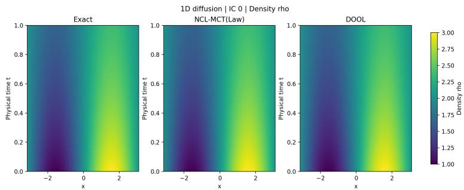  
Figure 22: One-dimensional linear diffusion in the DOOL setting after trajectory-free constitutive learning. Space-time density for the visualized initial condition $\rho _ { 0 } ( x ) = 2 + \sin { x } .$ , rolled out to $T = 1$ in 4,000 steps. Columns show the analytic solution, NCL-MCT Solver (Law), and DOOL using a shared color scale.

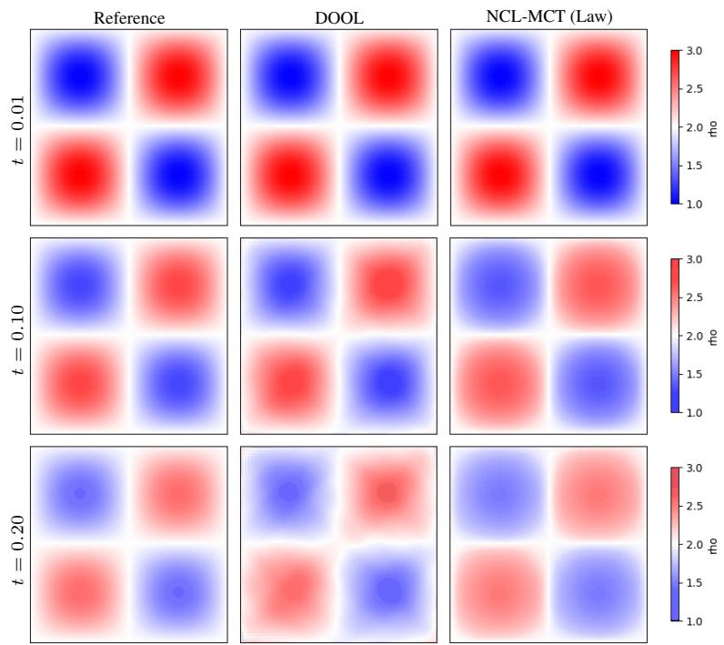  
Figure 23: Two-dimensional Cahn-Hilliard in the DOOL setting after trajectory-free constitutive learning, shown using the shifted density $\rho = u + 2$ for $u _ { 0 } =$ sin x sin y. The rollout extends to $T = 0 . { \bar { 2 } }$ over 2,000 steps. Rows show $t = 0 . 0 1 , 0 . 1 0 .$ , and 0.20, with an independent color scale for each row. Both methods preserve the checkerboard structure, while at the final time DOOL exhibits grid-aligned texture and a distorted interface; NCL-MCT Solver (Law) remains smooth with slightly weaker interior contrast.

## I ADDITIONAL EXPERIMENTAL RESULTS

## I.1 TRAINING TIME AND INFERENCE TIME

Experimental settings. All methods are trained for 100,000 optimizer steps on the same 1,000 snapshots per system and evaluated on the same ten held-out trajectories using a single NVIDIA GeForce RTX 5090 (32 GB) and an AMD Ryzen 9 9950X3D CPU. Peak VRAM is the framework-reported maximum live-tensor memory during training (torch.cuda.max memory allocated; JAX device-memory peak for CFO), excluding the CUDA context and allocator cache. Inference time is averaged over the ten test trajectories after one warm-up rollout. Because $N _ { T }$ varies substantially across systems, we also report the normalized per-step cost.

Results. Table 10 summarizes the measurements. NCL-MCT Solver uses several times fewer parameters than F-FNO and over an order of magnitude fewer than CFO, while also requiring less training memory and wall-clock time. This reflects the division of labor in NCL-MCT Solver: the MCT integrator handles temporal evolution, while the constitutive modules represent only PDEspecific responses. Inference cost reflects the number of constitutive evaluations. The per-step cost is lowest for nonreactive scalar systems, increases when a reaction module is added, and is highest for Schnakenberg, which evaluates two transport operators. NCL-MCT Solver remains faster than CFO on every system and at most about three times slower than F-FNO, whose inference consists only of repeated state-map evaluations. Vel. and Law have nearly identical inference costs and similar training costs because they share the same architecture and differ only in supervision. DOOL is the least expensive method, but its rollout errors are substantially larger on the evaluated systems (Table 1). The transport-only DOOL formulation is evaluated on the three nonreactive systems; reactive cases require additional problem-specific Onsager/Rayleighian design. All models use batch size 16 for Schnakenberg (Appendix E), explaining the lower training time and memory of NCL-MCT Solver and F-FNO there despite their larger multispecies models.

Table 10: Computational cost of all methods. Params counts trainable parameters; peak VRAM is the framework-reported maximum live-tensor memory during training; Train is the wall-clock time for 100,000 optimizer steps; Infer is the mean wall-clock time of one N -step rollout over the ten test trajectories; and ms/step is Infer $/ N _ { T }$ . − denotes unevaluated cases.
<table><tr><td>System</td><td>Method</td><td> $N _ { T }$ </td><td>Params</td><td>VRAM (GiB)</td><td>Train (s)</td><td>Infer (s)</td><td>ms/step</td></tr><tr><td rowspan="5">Linear Diffusion</td><td>F-FNO</td><td rowspan="5">600</td><td>733,506</td><td>8.371</td><td>11,117</td><td> $0 . 8 0 \pm 0 . 0 0$ </td><td>1.34</td></tr><tr><td>CFO</td><td>8,095,489</td><td>6.970</td><td>5,712</td><td> $4 . 9 1 \pm 0 . 0 1$ </td><td>8.18</td></tr><tr><td>DOOL</td><td>64,620</td><td>0.082</td><td>132</td><td> $0 . 4 5 \pm 0 . 0 4$ </td><td>0.75</td></tr><tr><td>NCL-MCT Solver (Vel.)</td><td>97,419</td><td>1.061</td><td>1,912</td><td> $1 . 2 2 \pm 0 . 0 0$ </td><td>2.03</td></tr><tr><td>NCL-MCT Solver (Law)</td><td>97,419</td><td>1.049</td><td>1,866</td><td> $1 . 2 2 \pm 0 . 0 0$ </td><td>2.03</td></tr><tr><td rowspan="5">CH</td><td>F-FNO</td><td rowspan="5">10,000</td><td>733,506</td><td>8.371</td><td>11,117</td><td> $1 3 . 1 5 \pm 0 . 0 1$ </td><td>1.32</td></tr><tr><td>CFO</td><td>8,095,489</td><td>6.970</td><td>5,716</td><td> $7 9 . 1 9 \pm 0 . 0 1$ </td><td>7.92</td></tr><tr><td>DOOL</td><td>64,620</td><td>0.082</td><td>139</td><td> $6 . 2 5 \pm 0 . 0 1$ </td><td>0.63</td></tr><tr><td>NCL-MCT Solver (Vel.)</td><td>97,419</td><td>1.061</td><td>1,920</td><td> $1 9 . 4 3 \pm 0 . 0 5$ </td><td>1.94</td></tr><tr><td>NCL-MCT Solver (Law)</td><td>97,419</td><td>1.050</td><td>1,872</td><td>19.47 ± 0.05</td><td>1.95</td></tr><tr><td rowspan="5">PM</td><td>F-FNO</td><td rowspan="5">2,000</td><td>733,506</td><td>8.371</td><td>11,119</td><td>2.63 ± 0.00</td><td>1.31</td></tr><tr><td>CFO</td><td>8,095,489</td><td>6.970</td><td>5,708</td><td>15.92 ± 0.03</td><td>7.96</td></tr><tr><td>DOOL</td><td>64,620</td><td>0.082</td><td>150</td><td> $1 . 9 6 \pm 0 . 0 0$ </td><td>0.98</td></tr><tr><td>NCL-MCT Solver (Vel.)</td><td>97,419</td><td>1.062</td><td>1,864</td><td> $3 . 9 8 \pm 0 . 0 1$ </td><td>1.99</td></tr><tr><td>NCL-MCT Solver (Law)</td><td>97,419</td><td>1.050</td><td>1,864</td><td>3.96 ± 0.01</td><td>1.98</td></tr><tr><td rowspan="4">Fisher-KPP</td><td>F-FNO</td><td rowspan="4">500</td><td>733,506</td><td>8.371</td><td>11,118</td><td>0.67 ± 0.00</td><td>1.33</td></tr><tr><td>CFO</td><td>8,095,489</td><td>6.970</td><td>6,786</td><td>4.07 ± 0.01</td><td>8.15</td></tr><tr><td>NCL-MCT Solver (Vel.)</td><td>98,572</td><td>1.187</td><td>2,012</td><td> $1 . 2 5 \pm 0 . 0 0$ </td><td>2.50</td></tr><tr><td>NCL-MCT Solver (Law)</td><td>98,572</td><td>1.177</td><td>2,041</td><td>1.25 ± 0.00</td><td>2.50</td></tr><tr><td rowspan="4">Reactive CH</td><td>F-FNO CFO</td><td rowspan="4">10,000</td><td>733,506</td><td>8.371</td><td>11,146</td><td> $1 3 . 2 1 \pm 0 . 0 2$ </td><td>1.32</td></tr><tr><td></td><td>8,095,489</td><td>6.970</td><td>7,245</td><td> $7 9 . 2 3 \pm 0 . 0 2$ </td><td>7.92</td></tr><tr><td>NCL-MCT Solver (Vel.)</td><td>98,572</td><td>1.187</td><td>2,068</td><td> $2 8 . 0 3 \pm 0 . 0 5$ </td><td>2.80</td></tr><tr><td>NCL-MCT Solver (Law)</td><td>98,572</td><td>1.177</td><td>2,050</td><td> $2 8 . 1 7 \pm 0 . 0 2$ </td><td>2.82</td></tr><tr><td rowspan="4">Reactive PM</td><td>F-FNO</td><td rowspan="4">1,000</td><td>733,506</td><td>8.371</td><td>11,111</td><td> $1 . 3 5 \pm 0 . 0 0$ </td><td>1.35</td></tr><tr><td>CFO</td><td>8,095,489</td><td>6.970</td><td>8,281</td><td> $8 . 0 2 \pm 0 . 0 3$ </td><td>8.02</td></tr><tr><td>NCL-MCT Solver (Vel.)</td><td>98,572</td><td>1.187</td><td>2,028</td><td> $2 . 4 6 \pm 0 . 0 0$ </td><td>2.46</td></tr><tr><td>NCL-MCT Solver (Law)</td><td>98,572</td><td>1.177</td><td>2,032</td><td> $2 . 4 6 \pm 0 . 0 0$ </td><td>2.46</td></tr><tr><td rowspan="4">Schnakenberg</td><td>F-FNO</td><td rowspan="4">20,000</td><td>733,700</td><td>4.244</td><td>4,877</td><td> $2 6 . 3 4 \pm 0 . 0 4$ </td><td>1.32</td></tr><tr><td>CFO</td><td>8,096,130</td><td>5.668</td><td>6,158</td><td> $1 5 8 . 4 1 \pm 0 . 0 1$ </td><td>7.92</td></tr><tr><td>NCL-MCT Solver (Vel.)</td><td>194,520</td><td>0.847</td><td>1,656</td><td> $8 2 . 0 3 \pm 0 . 0 7$ </td><td>4.10</td></tr><tr><td>NCL-MCT Solver (Law)</td><td>194,520</td><td>0.843</td><td>1,618</td><td> $8 2 . 0 0 \pm 0 . 0 9$ </td><td>4.10</td></tr></table>

## I.2 EVALUATION OF MASS BEHAVIOR

We evaluate mass behavior on the porous-medium (PM) system to examine the effect of retaining explicit mass-compression-transport kinematics while learning PDE-specific constitutive responses.

Experimental settings. Relative mass error is measured against the total mass at the initial time.   
The reference curve reports the corresponding drift of the reference evaluation.

Results. As shown in Figure 24, both NCL-MCT Solver (Vel.) and NCL-MCT Solver (Law) exhibit smaller relative mass drift than CFO and F-FNO, despite having higher density rollout errors than CFO (Table 1). This shows that lower density error does not necessarily imply better preservation of total mass, while NCL-MCT Solver retains favorable mass behavior over long rollouts. This empirical behavior does not imply exact discrete conservation. As discussed in Section 4.2, conservative evolution of the compression factor I alone does not guarantee conservation of the reconstructed density $\rho = M I$

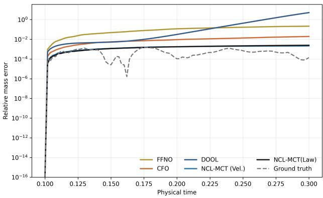  
Figure 24: Relative mass error for porous medium, measured against the total mass at the initial time. The dashed curve shows the corresponding drift of the reference evaluation.

## I.3 COMPARISON WITH HC-PINN

We compare NCL-MCT Solver with HC-PINN (Hao et al., 2026) as two approaches to incorporating physical structure: physics-constrained solution learning and constitutive learning with a shared MCT integrator. The comparison covers all seven systems spanning generalized diffusion, generalized reaction-diffusion, and multispecies reaction-diffusion.

Experimental settings. HC-PINN fits one network to one initial-value problem, with the initial condition embedded in the ansatz. The resulting network represents that trajectory and must be retrained when the initial condition changes. NCL-MCT Solver instead learns the constitutive responses of each PDE and subsequently integrates different initial conditions using the shared MCT integrator. For this comparison, we fit one HC-PINN per system to the first of the ten test initial conditions in Appendix E, and retrain NCL-MCT Solver using only data from the same initial-value problem. The reported values are therefore single-trajectory errors and differ from the ten-trajectory averages in Table 1.

Table 11: Single-trajectory comparison with HC-PINN. HC-PINN and both NCL-MCT Solver configurations are trained and evaluated on the same initial-value problem; the NCL-MCT Solver results therefore differ from the ten-trajectory averages in Table 1. Red/orange mark the best/second-best result per row.
<table><tr><td>System</td><td>Metric</td><td>HC-PINN (Hao et al., 2026)</td><td>NCL-MCT (Vel.) (Ours)</td><td>NCL-MCT (Law) (Ours)</td></tr><tr><td colspan="5">(a) Generalized diffusion</td></tr><tr><td>Linear Diffusion</td><td> $E _ { \mathrm { r o l l } }$   $E _ { \mathrm { m a x } }$ </td><td> $6 . 4 3 \times 1 0 ^ { - 4 }$   $1 . 5 5 \times 1 0 ^ { - 3 }$ </td><td> $2 . 1 7 \times 1 0 ^ { - 3 }$   $3 . 7 8 \times 1 0 ^ { - 3 }$ </td><td> $2 . 2 3 \times 1 0 ^ { - 3 }$   $4 . 1 8 \times 1 0 ^ { - 3 }$ </td></tr><tr><td>CH</td><td> $E _ { \mathrm { r o l l } }$   $E _ { \mathrm { m a x } }$ </td><td> $2 . 4 4 \times 1 0 ^ { - 1 }$   $3 . 0 2 \times 1 0 ^ { - 1 }$ </td><td> $3 . 7 5 \times 1 0 ^ { - 2 }$   $4 . 9 3 \times 1 0 ^ { - 2 }$ </td><td> $6 . 8 9 \times 1 0 ^ { - 3 }$   $1 . 1 1 \times 1 0 ^ { - 2 }$ </td></tr><tr><td>PM</td><td> $E _ { \mathrm { r o l l } }$   $E _ { \mathrm { m a x } }$ </td><td> $1 . 0 4 \times 1 0 ^ { - 1 }$   $1 . 5 2 \times 1 0 ^ { - 1 }$ </td><td> $1 . 3 7 \times 1 0 ^ { - 2 }$   $1 . 7 6 \times 1 0 ^ { - 2 }$ </td><td> $1 . 3 8 \times 1 0 ^ { - 2 }$   $1 . 7 8 \times 1 0 ^ { - 2 }$ </td></tr><tr><td colspan="5">(b) Generalized reaction-diffusion</td></tr><tr><td>Fisher-KPP</td><td> $E _ { \mathrm { r o l l } }$   $E _ { \mathrm { m a x } }$ </td><td>_  $5 . 6 7 \times 1 0 ^ { - 4 }$   $1 . 7 3 \times 1 0 ^ { - 3 }$ </td><td> $1 . 9 9 \times 1 0 ^ { - 3 }$  1  $2 . 5 7 \times 1 0 ^ { - 3 }$ </td><td> $2 . 0 9 \times 1 0 ^ { - 3 }$   $6 . 4 1 \times 1 0 ^ { - 3 }$ </td></tr><tr><td>Reactive CH</td><td> $E _ { \mathrm { r o l l } }$   $E _ { \mathrm { m a x } }$ </td><td> $2 . 5 6 \times 1 0 ^ { - 1 }$   $3 . 1 6 \times 1 0 ^ { - 1 }$ </td><td>_  $1 . 3 7 \times 1 0 ^ { - 2 }$   $2 . 9 8 \times 1 0 ^ { - 2 }$ </td><td> $1 . 6 5 \times 1 0 ^ { - 2 }$   $3 . 5 0 \times 1 0 ^ { - 2 }$ </td></tr><tr><td>Reactive PM</td><td> $E _ { \mathrm { r o l l } }$   $E _ { \mathrm { m a x } }$ </td><td> $5 . 1 4 \times 1 0 ^ { - 2 }$   $8 . 2 5 \times 1 0 ^ { - 2 }$ </td><td>_  $2 . 4 4 \times 1 0 ^ { - 2 }$   $3 . 1 2 \times 1 0 ^ { - 2 }$ </td><td> $1 . 4 2 \times { { 1 0 } ^ { - 2 } }$   $1 . 7 9 \times 1 0 ^ { - 2 }$ </td></tr><tr><td colspan="5">(c) Multispecies reaction-diffusion</td></tr><tr><td>Schnakenberg (U)</td><td> $E _ { \mathrm { r o l l } }$   $E _ { \mathrm { m a x } }$ </td><td> $2 . 4 9 \times 1 0 ^ { - 1 }$   $5 . 0 3 \times 1 0 ^ { - 1 }$ </td><td>_  $3 . 3 0 \times 1 0 ^ { - 2 }$  一  $9 . 2 3 \times 1 0 ^ { - 2 }$ </td><td> $6 . 3 9 \times 1 0 ^ { - 2 }$   $1 . 7 4 \times 1 0 ^ { - 1 }$ </td></tr><tr><td>Schnakenberg  $( V )$ </td><td> $E _ { \mathrm { r o l l } }$   $E _ { \mathrm { m a x } }$ </td><td> $8 . 1 7 \times 1 0 ^ { - 2 }$   $1 . 9 0 \times 1 0 ^ { - 1 }$ </td><td> $1 . 0 1 \times 1 0 ^ { - 2 }$   $3 . 0 6 \times 1 0 ^ { - 2 }$ </td><td>–  $1 . 6 9 \times 1 0 ^ { - 2 }$   $4 . 8 2 \times 1 0 ^ { - 2 }$ </td></tr></table>

We follow the architecture and hard-constraint formulation of Hao et al. (2026): a tanh multilayer perceptron with seven hidden layers of width 32, applied to a Fourier-feature embedding of the spatial coordinates truncated at 16 modes, so periodicity is enforced structurally through the network input rather than a boundary loss. The prediction $\rho = \psi + \varphi \rho _ { \mathrm { n n } } ,$ with $\psi = \dot { e } ^ { - C t } \rho _ { 0 }$ and $\varphi = 1 -$ $e ^ { - C t }$ , satisfies the initial condition exactly, where $C > 0$ controls the hard-constraint ansatz. Selfadaptive weighting is disabled. Each optimizer step evaluates the PDE residual at $1 0 ^ { 4 }$ collocation points sampled uniformly from the same space-time domain. Optimization uses 50,000 Adam steps with learning rate $1 0 ^ { - 3 }$ , followed by 25,000 L-BFGS steps with a strong-Wolfe line search. Because the source code of Hao et al. (2026) is not publicly available, we reimplemented the method from its description. The original configuration uses 5,000 L-BFGS steps after 50,000 Adam steps; we extend the L-BFGS phase to 25,000 steps, by which point the loss has plateaued and the resulting errors match or improve on the reported values.

Results. On linear diffusion and Fisher-KPP, HC-PINN is more accurate on both metrics, consistent with the pattern in Section 5.1: when a trajectory-specific model represents the solution ac curately, direct solution learning avoids repeated constitutive evaluation and numerical integration. On the remaining five systems, both NCL-MCT Solver configurations achieve lower errors on both metrics, by up to 35× on the two fourth-order systems and up to 8.6× on the degenerate-transport and multispecies systems, even though HC-PINN is fitted directly to the initial-value problem on which it is evaluated. These results support constitutive learning with a shared MCT integrator on the more complex systems considered here, although differences in architecture, supervision, and optimization prevent attributing the gap to any single design choice.

## I.4 ABLATION OF CONSTITUTIVE PARAMETERIZATION AND SUPERVISION

We compare three transport-learning configurations on Schnakenberg (Table 12): direct velocity prediction trained with $\dot { \mathcal { L } } _ { u } ^ { \mathrm { d a t a } } + \mathcal { L } _ { r } ^ { \mathrm { l a w } }$ , and mobility-force prediction under either velocity-data supervision with curl regularization $( \mathcal { L } _ { \mathrm { v e l } }$ , Vel.) or known-law supervision of $\xi$ and $\textbf { f } ( \mathcal { L } _ { \mathrm { l a w } } , \mathrm { L a w } )$ All three use the same reaction loss $\mathcal { L } _ { r } ^ { \mathrm { l a w } }$ , isolating differences in transport parameterization and supervision. The errors have comparable magnitude and the same ordering across both metrics and species: Law gives the lowest mean errors, followed by Vel. and direct velocity prediction. Both mobility-force configurations therefore retain an explicit decomposition into positive mobility and thermodynamic driving force while achieving lower mean errors than direct velocity prediction on this system. This comparison does not isolate the effects of factorization and curl regularization; Appendix I.6 separately examines the effect of $\lambda _ { \mathrm { c u r l } }$ on Fisher-KPP.

Table 12: Ablation of constitutive parameterization and supervision on Schnakenberg. Errors are mean ± standard deviation. Red/orange indicate the best/second-best unrounded mean in each column.
<table><tr><td></td><td></td><td colspan="2">Schnakenberg (U)</td><td colspan="2">Schnakenberg (V)</td></tr><tr><td>Parameterization Objective</td><td></td><td> $E _ { \mathrm { r o l l } }$ </td><td> $E _ { \mathrm { m a x } }$ </td><td> $E _ { \mathrm { r o l l } }$ </td><td> $E _ { \mathrm { m a x } }$ </td></tr><tr><td>u, r</td><td> $\mathcal { L } _ { u } ^ { \mathrm { d a t a } } + \mathcal { L } _ { r } ^ { \mathrm { l a w } }$ </td><td> $( 3 . 4 0 \pm 1 . 7 0 ) \times 1 0 ^ { - 2 }$ </td><td> $( 1 . 1 1 \pm 0 . 6 6 ) \times 1 0 ^ { - 1 }$ </td><td> $( 7 . 8 4 \pm 4 . 2 7 ) \times 1 0 ^ { - 3 }$ </td><td> $( 2 . 9 6 \pm 2 . 1 8 ) \times 1 0 ^ { - 2 }$ </td></tr><tr><td> $( \xi , \mathbf { f } ) , \mathbf { r }$ </td><td> $\mathcal { L } _ { \mathrm { v e l } }$ </td><td> $( 2 . 5 2 \pm 1 . 7 7 ) \times 1 0 ^ { - 2 }$ </td><td> $( 8 . 2 8 \pm 8 . 5 5 ) \times 1 0 ^ { - 2 }$ </td><td> $( 6 . 7 4 \pm 3 . 3 7 ) \times 1 0 ^ { - 3 }$ </td><td> $( 2 . 1 9 \pm 1 . 9 3 ) \times 1 0 ^ { - 2 }$ </td></tr><tr><td>(ξ, f), r</td><td> $\mathcal { L } _ { \mathrm { l a w } }$ </td><td> $( 2 . 3 8 \pm 1 . 2 6 ) \times 1 0 ^ { - 2 }$ </td><td> $( 7 . 3 6 \pm 6 . 1 5 ) \times 1 0 ^ { - 2 }$ </td><td> $( 6 . 5 7 \pm 2 . 2 7 ) \times 1 0 ^ { - 3 }$ </td><td> $( 1 . 9 7 \pm 1 . 3 0 ) \times 1 0 ^ { - }$  -2</td></tr></table>

## I.5 ABLATION OF CONSTITUTIVE MODULARITY

This experiment examines whether numerically evaluated and learned constitutive responses can be combined within the same MCT integrator. Here, Numerical denotes responses computed directly from known constitutive laws using the corresponding numerical discretization, while Neural denotes responses predicted by trained constitutive modules. We evaluate four transport-reaction combinations on Schnakenberg: Numerical-Numerical, Neural-Numerical, Numerical-Neural, and Neural-Neural. The Numerical-Numerical configuration serves as the numerical constitutive reference within the same MCT integrator.

Experimental settings. All configurations use the same MCT factor evolution, test initial conditions, 128×128 grid, and 20,000 integration steps to $T = 1$ . Neural constitutive modules are trained separately for each configuration under known-law supervision. Thus, this experiment evaluates module replacement rather than reuse of identical trained modules across configurations. Errors follow the $E _ { \mathrm { r o l l } }$ and $E _ { \mathrm { m a x } }$ definitions in Section 5 and are measured against the reference solution.

Results. Table 13 shows that Numerical-Numerical achieves the lowest errors for both species. Among the mixed configurations, Neural-Numerical yields lower rollout errors than Numerical-Neural, indicating that replacing the reaction response with a learned approximation introduces the larger error in this experiment. The fully learned Neural-Neural configuration achieves mean rollout errors of $2 . 3 8 \times 1 0 ^ { - 2 }$ for $U$ and $6 . 5 7 \times 1 0 ^ { - 3 }$ for V. All four configurations use the same MCT integrator, demonstrating that numerically evaluated and learned transport and reaction responses can share the same constitutive interface.

## I.6 ABLATION OF THE CURL PENALTY WEIGHT

The curl penalty $\mathcal { L } _ { \mathrm { c u r l } }$ in Equation 7 encourages the predicted driving force to be curl-free, reflecting the EnVarA structure $\mathbf { f } = - \nabla ( \delta \mathcal { E } / \delta \rho )$ that velocity-data supervision alone does not enforce. We examine whether this regularization improves rollout accuracy and its sensitivity to the weight $\lambda _ { \mathrm { c u r l } }$

Experimental settings. We vary $\lambda _ { \mathrm { c u r l } } \in \{ 0 , 0 . 0 1 , 0 . 1 , 1 \}$ on Fisher-KPP under velocity-data supervision. Setting $\lambda _ { \mathrm { c u r l } } = 0$ removes the curl penalty, leaving transport supervised only through the reconstructed velocity $\widehat { \mathbf { u } } = \widehat { \xi \mathbf { f } } .$ . All other settings are fixed, including the training samples, network architecture (Appendix B), optimization settings and random seed (Appendix E), and the

Table 13: Ablation of constitutive modularity on Schnakenberg. Numerical denotes constitutive responses computed from known laws using numerical discretization; Neural denotes responses predicted by trained constitutive modules. Errors are mean ± standard deviation. Red/orange mark the best/second-best means for each species. Numerical-Numerical is the numerical constitutive reference within the same MCT integrator.
<table><tr><td>Transport Reaction Species</td><td></td><td></td><td> $E _ { \mathrm { r o l l } }$ </td><td> $E _ { \mathrm { m a x } }$ </td></tr><tr><td>Numerical Numerical</td><td></td><td> $U$  V</td><td>_  $( 6 . 5 7 \pm 2 . 4 3 ) \times 1 0 ^ { - 3 }$   $( 2 . 1 1 \pm 0 . 8 0 ) \times 1 0 ^ { - 3 }$ </td><td> $( 1 . 6 3 4 \pm 0 . 4 8 0 ) \times 1 0 ^ { - 2 }$   $( 6 . 2 5 \pm 1 . 9 5 ) \times 1 0 ^ { - 3 }$ </td></tr><tr><td>Neural</td><td>Numerical</td><td> $U$   $V$ </td><td> $( 1 . 0 5 9 \pm 0 . 2 5 9 ) \times 1 0 ^ { - 2 }$  _  $( 3 . 0 7 \pm 0 . 5 8 ) \times 1 0 ^ { - 3 }$ </td><td> $( 2 . 3 6 1 \pm 0 . 4 1 2 ) \times 1 0 ^ { - 2 }$   $( 7 . 5 2 \pm 1 . 3 5 ) \times 1 0 ^ { - 3 }$ </td></tr><tr><td>Numerical Neural</td><td></td><td> $U$   $V$ </td><td> $( 2 . 1 9 1 \pm 1 . 5 0 7 ) \times 1 0 ^ { - 2 }$   $( 6 . 6 3 \pm 3 . 4 0 ) \times 1 0 ^ { - 3 }$ </td><td> $( 7 . 1 8 2 \pm 6 . 8 5 1 ) \times 1 0 ^ { - 2 }$   $( 2 . 1 7 8 \pm 1 . 8 0 9 ) \times 1 0 ^ { - 2 }$ </td></tr><tr><td>Neural</td><td>Neural</td><td> $U$   $V$ </td><td> $( 2 . 3 7 6 \pm 1 . 2 6 3 ) \times 1 0 ^ { - 2 }$   $( 6 . 5 7 \pm 2 . 2 7 ) \times 1 0 ^ { - 3 }$ </td><td> $( 7 . 3 6 2 \pm 6 . 1 5 2 ) \times 1 0 ^ { - 2 }$   $( 1 . 9 7 1 \pm 1 . 2 9 9 ) \times 1 0 ^ { - 2 }$ </td></tr></table>

Table 14: Ablation of the curl-penalty weight $\lambda _ { \mathrm { c u r l } }$ on Fisher-KPP under velocity-data supervision. $\lambda _ { \mathrm { c u r l } } = 0$ removes the penalty. Errors are mean ± standard deviation over ten test trajectories with 500 rollout steps. Red/orange mark the best/second-best means. $\lambda _ { \mathrm { c u r l } } = 0 . 0 1$ is used throughout the paper.
<table><tr><td colspan="2"> $\lambda _ { \mathrm { c u r l } }$   $E _ { \mathrm { r o l l } }$   $E _ { \mathrm { m a x } }$ </td></tr><tr><td>0</td><td> $( 1 . 0 3 \pm 0 . 2 3 ) \times 1 0 ^ { - 3 }$   $( 1 . 3 2 \pm 0 . 3 6 ) \times 1 0 ^ { - 3 }$ </td></tr><tr><td>0.01</td><td> $( 5 . 0 1 \pm 1 . 3 9 ) \times 1 0 ^ { - 4 }$   $( 5 . 9 6 \pm 1 . 9 6 ) \times 1 0 ^ { - 4 }$ </td></tr><tr><td>0.1</td><td> $( 8 . 6 1 \pm 1 . 5 9 ) \times 1 0 ^ { - 4 }$   $( 1 . 1 7 \pm 0 . 2 6 ) \times 1 0 ^ { - 3 }$ </td></tr><tr><td>1</td><td> $( 1 . 1 3 \pm 0 . 1 9 ) \times 1 0 ^ { - 3 }$   $( 1 . 7 2 \pm 0 . 5 3 ) \times 1 0 ^ { - 3 }$ </td></tr></table>

500-step rollout over ten test trajectories (Appendix D.4). The reaction loss $\mathcal { L } _ { r } ^ { \mathrm { l a w } }$ and unit weight on $\mathcal { L } _ { u } ^ { \mathrm { d a t a } }$ are retained in all runs, isolating the effect of $\lambda _ { \mathrm { c u r l } }$

Results. Table 14 shows the lowest errors at the intermediate weight $\lambda _ { \mathrm { c u r l } } = 0 . 0 1$ , with the same ordering on both metrics. Removing the penalty approximately doubles the error relative to $\lambda _ { \mathrm { c u r l } } =$ 0.01 (2.1× for $E _ { \mathrm { r o l l } }$ and $2 . 2 \times \mathrm { f o r } E _ { \mathrm { m a x } } )$ , indicating that curl regularization provides information not enforced by velocity-data supervision alone. Increasing the weight beyond 0.01 reduces this benefit: at $\lambda _ { \mathrm { c u r l } } = \mathrm { \dot { 1 } }$ , both errors are within one standard deviation of the $\dot { \lambda } _ { \mathrm { c u r l } } = 0 \mathrm { r u n }$ . This suggests that overly strong curl regularization can trade velocity accuracy for force regularity. We therefore use $\lambda _ { \mathrm { c u r l } } = 0 . 0 1$ throughout the paper; this setting corresponds to the NCL-MCT Solver (Vel.) result for Fisher-KPP in Table 1. This ablation is conducted on a single system, and $\lambda _ { \mathrm { c u r l } }$ is not retuned per PDE.