# Neural topology optimization of ship structures under propulsion machinery vibrations

Shengyu Yana, Muhammad Muztahidul Hakim Zareera and Jasmin Jelovicaa,b,∗

aDepartment ofMechanical Engineering, The University ofBritish Columbia, 6250 Applied Science Ln, Vancouver, V6T 1Z4, Canada bDepartment ofCivil Engineering, The University ofBritish Columbia, 6250 Applied Science Ln, Vancouver, V6T 1Z4, Canada

A R T I C L E I N F O

Keywords:   
Topology optimization   
Active input power   
Structural vibration   
Neural reparameterization   
Ship structures   
Forced vibrations

## A BS T R AC T

Ship structural vibrations contribute to noise, fatigue, and equipment damage. Dynamiccompliance topology optimization can produce pathological designs near resonance. This study extends neural-reparameterized topology optimization using a convolutional Kolmogorov– Arnold network (KATO) to forced-vibration design by incorporating active input power (AIP) as the objective. Applications comprise a 100 Hz engine-supporting deck panel and an 18 Hz thruster foundation frame. Helmholtz PDE filtering, Heaviside projection, and three projected deck fields control feature sizes and define a manufacturing-tolerance envelope. Across both deck families, all eight layouts reduce AIP relative to family-matched size-optimized references. After finite-depth extrusion, all eight outperform their references in AIP and static compliance. Corrected 5–500 Hz modal sweeps characterize of-design response. For the unrestricted, manufacturing-aware, and stress-aware frame variants, KATO matches GCMMA in AIP within 0.5 dB and yields 22–36× lower static compliance after matched-volume binary re-analysis. The convolutional generator provides a structural prior and implicit regularization, producing near-binary, connected load paths that remain efective after thresholding. In a matched nearresonant 300 Hz case, both methods reduce initial AIP by more than 32 dB; KATO preserves one connected component, achieves 59× lower binary static compliance, and reduces the maximum AIP over 1–500 Hz by 2.7 dB. On the shared accelerated FEA backend, KATO runs 6.4–10.4× faster than GCMMA for the implemented stress-aware formulations, while the corrected 200- mode model evaluates deck frequency points 990–2125× faster than the full-order solution. These results establish neural AIP-driven topology optimization as an eficient approach for designing connected, feature-size-controlled ship structures with improved forced-vibration performance.

## 1. Introduction

Structural vibrations have several unwanted consequences, including reduced fatigue life, passenger and crew discomfort, and noise. In marine vessels, machinery-induced vibration can contribute to underwater radiated noise (URN) [1]. The current IMO guidelines identify URN from shipping as a source of adverse impacts on marine life and set out measures for its reduction [2]. Vibration generated by propulsion and auxiliary machinery is transmitted through foundations and deck panels and can radiate from the hull skin [3, 4]. Reducing the vibrational energy injected into these structural paths is a primary engineering objective.

Stifened panels, resilient mounts, and constrained-layer damping treatments address ship vibration efectively in many configurations but depend on the designer’s judgment regarding stifener placement and sizing. Such designs satisfy static strength and global stifness requirements yet are rarely tuned for dynamic vibration transmission at specific excitation frequencies. Topology optimization (TO) ofers a systematic alternative: given a design domain, boundary conditions, and loading, TO distributes material to minimize structural objectives while respecting volume and manufacturing constraints [5, 6].

Since the homogenization-based formulation of Bendsøe and Kikuchi [7], density-based methods have become the dominant paradigm. The SIMP method [8, 9] parameterizes each finite element with a continuous density variable and penalizes intermediate densities to drive the design toward a binary (0–1) distribution. Alternative representations include level-set methods [10, 11], evolutionary structural optimization (ESO/BESO) [12, 13, 14], and topologica derivative methods [15, 16]; Sigmund and Maute [6] provide a comparative review. The computational cost of TO grows with problem size, particularly for 3D domains and repeated dynamic solves. Large-scale TO has been enabled by parallel computing [17], and recent work addresses acceleration strategies for industrial problems and compares major TO formulations on industrial-like 3D benchmarks [18, 19]. Numerical instabilities—checkerboard patterns, mesh dependence, local minima—remain persistent challenges [20], addressed by density filtering [21, 22] and Heaviside projection [23].

Extending TO to dynamic structural problems has followed two principal directions. The first manages the eigenvalue spectrum: maximizing fundamental frequencies, widening frequency gaps, or shifting natural frequencies away from excitation bands [24, 25, 26, 27]. These formulations suit free-vibration problems but do not directly address forced-vibration amplitude or power flow. The second direction targets forced-vibration response under harmonic or broadband loading. Dynamic compliance, i.e. the work done by external forces on the displacement field, was historically used as the objective [28, 29], but it exhibits sign changes, singularities, and non-monotonic behavior near resonance and antiresonance frequencies that destabilize gradient-based optimizers [30]. These pathologies are particularly severe in single-frequency optimization, where the optimizer may exploit antiresonance-induced sign flips rather than genuinely reducing vibration. Rong et al. [31] addressed forced-vibration optimization through dynamic response constraints, Takezawa et al. [32] proposed complex dynamic compliance for damped structures, and Saurabh et al. [33] developed robust formulations for transient response. In structural acoustics, Du and Olhof [34] minimized radiated sound power from vibrating bi-material structures, Neofytou et al. [35] demonstrated automaticdiferentiation-based 3D acoustic-structural TO, and Hu et al. [36] explored coupled acoustic–mechanical optimization of porous structures.

An alternative objective that avoids the sign ambiguity of dynamic compliance is active input power (AIP), proposed by Silva et al. [37] following their critical analysis of dynamic compliance [30]. AIP is the time-averaged real power injected by harmonic forces into the structural velocity field. It is non-negative for passive structures, avoids sign ambiguity, and represents the total mechanical energy input that must be either dissipated or radiated as acoustic power. Silva et al. [38] further extended AIP-based optimization to shape and position-preserving objectives. To date, however, AIP-based TO has been applied mainly to academic benchmarks. Its application to large engineering problems including ship structural components has not been explored.

Topology optimization has been applied to ship structures. Cui et al. [39] combined knowledge-based engineering, surrogate modelling, multi-objective optimization, and a level-set method to reduce container-ship tank weight and redesign brackets. Daifuku et al. [40] used frequency-response finite-element analysis to develop engine-room reinforcements that suppress generator-induced vibration. Jia et al. [41] optimized a trimaran bulkhead under seven load cases, obtaining layouts similar to conventional stifener arrangements. Kendibilir and Kefal [42] applied peridynamicsbased topology optimization to a cracked dredger cross-section under hogging and sagging loads, producing stifer web-frame concepts. Yilmaz and Konal [43] converted optimization results into a manufacturable welded hatch cover, reporting a 2.49-t reduction and projected operational benefits. Cao et al. [44] optimized an unmanned sailboat wing sail, hull, keel, and rudder and verified improvements in weight, stability, and wave resistance using coupled multiphysics simulations. When topology optimization is used for large-scale ship structures, computational cost becomes a major bottleneck due to fine discretizations, numerous load cases, and coupled multidisciplinary analyses. Although surrogate modelling has been explored in a limited context, its systematic integration into large-scale, multidisciplinary ship-structure topology optimization remains insuficiently investigated.

Separately, machine learning has been applied to TO through trained neural predictors of optimal layouts [45, 46, 47] and broader ML-assisted workflows [48, 18]. These data-driven approaches accelerate inference but depend on training datasets and may generalize poorly outside their distributions. Neural reparameterization takes a diferent approach: an untrained network parameterizes the density field during optimization, with the architecture imposing an implicit spatial prior toward smooth, connected topologies. Introduced by Hoyer et al. [49] and drawing on the deep image prior [50], this paradigm has been developed through TOuNN [51], TONR [52], physics-informed frameworks [53], and training-dataset-free approaches [54]. Gradient-free variants have also been proposed [55, 56].

Our prior work, KATO [57], introduced convolutional Kolmogorov–Arnold network (cKAN) generators [58, 59] to neural reparameterized TO, demonstrating improved structural connectivity and stress performance relative to standard CNN generators. KATOsuper [60] extended the framework to volumetric 3D optimization and introduced sensitivityconsistent Fourier neural operator (SC-FNO) surrogates. The present work applies the KATO-cKAN architecture to dynamic forced-vibration problems, targeting AIP minimization in an engine-supporting ship deck and a thrustersupporting frame.

This paper makes the following contributions:

1. A dynamic TO for ship structures based on active input power. The forced-vibration pipeline combines AIP with static-compliance regularization, Helmholtz filtering and three-field projection for feature-size control, stress-aware variants, and binary post-evaluation. This extends the KATO generator framework from static objectives to frequency-domain forced-vibration design.

2. Systematic optimization comparison under realistic loading. Topology-optimized deck layouts are benchmarked against size-optimized stifened single-skin and X-core double-skin panels under machinery loading representative of marine propulsion systems.

3. A neural-versus-conventional optimizer comparison on a thruster foundation structure. The KATO generator is compared against the globally convergent method of moving asymptotes (GCMMA) under a common mixed AIP/static base objective.

4. Analysis of stress and feature-size control. The trade-of between vibration suppression, structural compliance, stress �-norm, and local maximum stress is quantified across regularization strategies, including Helmholtz filtering and stress-aware penalization. The behavior of the neural parameterization is contrasted with a densityfiltered conventional baseline.

## 2. Problem Formulation

## 2.1. Density-based topology optimization

Following the SIMP density approach [5], a design domain Ω is discretized into $N _ { e }$ finite elements, each assigned a density $\rho _ { i } \in ( 0 , 1 ]$ . Stifness follows the penalized power law:

$$
E _ { i } = E _ { \operatorname* { m i n } } + \rho _ { i } ^ { p } ( E _ { 0 } - E _ { \operatorname* { m i n } } )\tag{1}
$$

where $E _ { 0 }$ is the base material Young’s modulus, $E _ { \mathrm { m i n } } = 1 0 ^ { - 9 } E _ { 0 }$ prevents singularity, and $p > 1$ is the penalization exponent (ramped during continuation).

Mass density follows a linear interpolation rather than the penalized stifness law [26]:

$$
\varrho _ { i } = \varrho _ { \mathrm { m i n } } + \rho _ { i } ( \varrho _ { \mathrm { 0 } } - \varrho _ { \mathrm { m i n } } )\tag{2}
$$

where $\varrho _ { 0 }$ and $\varrho _ { \mathrm { m i n } }$ are the solid and void material densities. This choice avoids the artificially high local frequencies produced when mass is penalized more strongly than stifness. It can instead introduce low-frequency modes localized in weak, low-density regions. Such modes have negligible participation under the applied loads; resonance locations are thus identified from the load-specific frequency response rather than from the smallest eigenvalue alone.

## 2.2. Frequency-domain dynamic equation

Under harmonic excitation at angular frequency �, the steady-state displacement field $\mathbf { U } ( \omega , \rho ) \in \mathbb { C } ^ { N _ { \mathrm { d o f } } }$ satisfies the frequency-domain equation of motion:

$$
\mathbf { S } ( \omega , \rho ) \mathbf { U } ( \omega , \rho ) = \mathbf { F } ( \omega )\tag{3}
$$

Here, � denotes the element density vector, $\mathbf { U } ( \omega , \pmb { \rho } )$ and $\mathbf F ( \omega )$ are the complex displacement and force amplitude vectors, respectively, and $\mathbf { S } ( \omega , \rho )$ is the dynamic stifness matrix. The density dependence of � enters through �, so the shorter notation $\mathbf { U } ( \omega )$ is used when no ambiguity arises. The matrix � is defined as

$$
\mathbf { S } ( \omega , \rho ) = \mathbf { K } ( \rho ) - \omega ^ { 2 } \mathbf { M } ( \rho ) + \mathrm { i } \omega \mathbf { C } ( \rho )\tag{4}
$$

where $\mathbf { K } ( \boldsymbol { \rho } ) , \mathbf { M } ( \boldsymbol { \rho } )$ , and $\mathbf { C } ( \pmb { \rho } )$ are the global stifness, mass, and damping matrices, respectively, and $\mathrm { { i } } = \sqrt { - 1 }$ . The broadband calculations use stifness-proportional structural damping with a constant loss factor $\eta _ { s }$

$$
\mathbf { S } ( \omega , \rho ) = \mathbf { K } ( \rho ) - \omega ^ { 2 } \mathbf { M } ( \rho ) + \mathrm { i } \eta _ { s } \mathbf { K } ( \rho ) .\tag{5}
$$

We set $\eta _ { s } = 0 . 0 2$ , corresponding to $\zeta \simeq \eta _ { s } / 2 = 1 \%$ for light damping, and use this value throughout the reported analyses. At the design frequency $\omega _ { d }$ , this operator is equivalent to stifness-proportional viscous damping with $\beta = \eta _ { s } / \omega _ { d }$ . Across a broadband sweep, the constant loss factor avoids the increase $\zeta = \beta \omega / 2$ produced by a fixed Rayleigh coeficient.

Because � is complex-valued and non-Hermitian in general, the system in Eq. (3) is recast as an equivalent $2 N _ { \mathrm { f r e e } } \times 2 N _ { \mathrm { f r e e } }$ real block system by splitting $\mathbf { U } = \mathbf { u } _ { r } + \mathrm { i } \mathbf { u } _ { i }$

$$
\left[ \mathbf { A } - \mathbf { B } \right] \left[ \mathbf { u } _ { r } \right] = \left[ \mathbf { f } _ { r } \right]\tag{6}
$$

where $\textbf { A } = \textbf { K } - \omega ^ { 2 } \mathbf { M }$ and $\mathbf { B } \ = \ \omega ( \alpha \mathbf { M } + \beta \mathbf { K } ) + \eta _ { s } \mathbf { K }$ are the real and imaginary parts of � restricted to free DOFs, respectively; � and $\beta$ are the mass- and stifness-proportional Rayleigh damping coeficients. The viscous and structural-loss contributions can be used separately; the reported broadband sweeps use $\alpha = \beta = 0$ and $\eta _ { s } = 0 . 0 2$ . This formulation enables the use of high-performance sparse LU factorization (PARDISO [61]) for the frequency-domain solve.

## 2.3. Active input power objective

The instantaneous mechanical power delivered by a harmonic force $\mathbf { f } ( t ) = \mathrm { R e } [ \mathbf { F } \mathrm { e } ^ { \mathrm { i } \omega t } ]$ to the structural velocity field $\dot { \mathbf { u } } ( t ) = \mathbf { R e } [ \mathrm { i } \omega \mathbf { U } \mathrm { e } ^ { \mathrm { i } \omega t } ]$ has a time-averaged value:

$$
\Pi _ { \mathrm { i n } } ( \omega ) = \frac { 1 } { 2 } \operatorname { R e } \left[ \mathbf { F } ^ { H } \dot { \mathbf { U } } \right]\tag{7}
$$

where superscript � denotes the Hermitian (conjugate transpose). For optimization, $\dot { \mathbf { U } } = \mathrm { i } \omega \mathbf { U }$ is substituted into Eq. (7). For a passive structure the active input power is non-negative $( \Pi _ { \mathrm { i n } } ~ \ge ~ 0 )$ and free of the sign ambiguity that aflicts dynamic compliance near antiresonances [37, 28]. We minimize its magnitude as a safeguard against roundof-scale negative values near zero, while retaining the signed value for consistency checks. For the passivesystem solutions considered here, this safeguard does not alter the positive AIP away from numerical zero crossings. The reported decibel value is

$$
L _ { \Pi } ( \omega ) = 1 0 \log _ { 1 0 } \left( \frac { \left| \Pi _ { \mathrm { i n } } ( \omega ) \right| } { \Pi _ { 0 } } \right) ,\tag{8}
$$

where $\Pi _ { 0 } = 1 0 ^ { - 1 2 }$ W is the standard reference power for a power level. AIP measures the structure-borne power injected by the prescribed harmonic load; it is computed in vacuo and is not radiated acoustic power. Its absolute level changes with the load amplitude, damping model, and reference power, so only designs evaluated under the same finite-element model and load case are compared directly.

## 2.4. Mixed objective and stress-aware regularization

In the present optimizations, AIP minimization without static-compliance regularization can produce weakly connected or hinge-like structures. Near a resonance or a narrow load path, small changes in topology can reduce dynamic stifness and disconnect material paths more severely than they change total mass. A mixed objective combines AIP with static compliance � [9] to regularize structural integrity:

$$
J = w _ { \mathrm { A I P } } \frac { \Pi _ { \mathrm { i n } } ( \omega ) } { \Pi _ { \mathrm { r e f } } } + \left( 1 - w _ { \mathrm { A I P } } \right) \frac { C } { C _ { \mathrm { r e f } } }\tag{9}
$$

Here $\Pi _ { \mathrm { r e f } }$ and $C _ { \mathrm { r e f } }$ are reference values computed on a uniform density field at the target volume fraction, and $w _ { \mathrm { A I P } } \in [ 0 , 1 ]$ controls the trade-of. The static compliance term is evaluated from the static equilibrium problem $\mathbf { K } ( \boldsymbol { \rho } ) \mathbf { u } _ { s } = \mathbf { F } _ { s }$

$$
C = \mathbf { F } _ { s } ^ { T } \mathbf { u } _ { s } .\tag{10}
$$

Setting $w _ { \mathrm { A I P } } = 1$ enables pure AIP minimization; $w _ { \mathrm { A I P } } < 1$ adds static-compliance regularization. The optimization objective uses the normalized ratio $C / C _ { \mathrm { r e f } }$ , whereas the results tables report the unnormalized static compliance $C = \mathbf { F } _ { s } ^ { T } \mathbf { u } _ { s }$ in N m. Since $C _ { \mathrm { r e f } }$ , the static load, and the support conditions are case-specific, these reported compliance values are compared only within a single case study.

The stress-aware variants use a common �-norm measure of element-center von Mises stress recovered with the solid-material constitutive matrix. Static stress uses $\mathbf { u } _ { s } .$ . Dynamic stress is represented by a phase-independent measure formed from the real and imaginary harmonic components and combined as

$$
\sigma _ { \mathrm { v m } } = \sqrt { \sigma _ { \mathrm { v m , r } } ^ { 2 } + \sigma _ { \mathrm { v m , i } } ^ { 2 } } .\tag{11}
$$

This combined measure provides a conservative upper bound on the cycle-maximum von Mises stress and is exact when the real and imaginary stress tensors are proportional. It is used consistently in all dynamic-stress comparisons. For objective-based stress regularization, the mixed objective � gains an additional term,

$$
J _ { \sigma } = J + w _ { \sigma } \frac { \tilde { \sigma } _ { p } } { \sigma _ { \mathrm { r e f } } }\tag{12}
$$

where $w _ { \sigma }$ is a weight and $\sigma _ { \mathrm { r e f } }$ is a normalization reference. Alternatively, the same measure can enter an inequality constraint, $\tilde { \sigma } _ { p } / \sigma _ { \mathrm { l i m } } - 1 \le 0$ . The aggregated stress is evaluated over solid-like material using a weighted �-norm:

$$
\tilde { \sigma } _ { p } = \left( \frac { \sum _ { i } w _ { i } \sigma _ { \mathrm { v m } , i } ^ { p } } { \sum _ { i } w _ { i } + \epsilon } \right) ^ { 1 / p }\tag{13}
$$

where $w _ { i }$ is a solid-region weight and � is a small numerical stabilizer. A hard solid mask sets $w _ { i } ~ = ~ 1$ when $\rho _ { i } \ge \rho _ { \mathrm { t h r } } = 0 . 5$ and $w _ { i } = 0$ otherwise, so only material elements enter the average. A smooth mask replaces this step with a sigmoid weight during continuous optimization. The two choices change only the numerical aggregation of element stresses; the von Mises recovery is the same. All stress-aware optimization runs and binary post-evaluation metrics use $p \ = \ 8$ , which gives a smooth approximation to the local maximum stress while avoiding the stress singularity problem in void regions [62, 63]. The deck and frame stress runs report solid-only aggregation on presen material; the dynamic case uses the combined von Mises measure of Eq. (11).

An optional grayness penalty $J _ { g } \ = \ w _ { g } \cdot \bar { g } .$ , where $\bar { g } = ( 1 / N _ { e } ) \sum _ { i } { 4 \rho _ { i } ( 1 - \rho _ { i } ) }$ , is added for certain variants to discourage intermediate densities during early continuation stages. The same quantity, expressed as a percentage, is the standard measure ofnon-discreteness [64]

$$
M _ { n d } = \frac { 1 0 0 } { N _ { e } } \sum _ { i } 4 \rho _ { i } ( 1 - \rho _ { i } ) [ \% ] ,\tag{14}
$$

used to characterize the continuous field before thresholding: $M _ { n d } = 0 \%$ for a binary design and $M _ { n d } = 1 0 0 \%$ for an all-gray $( \rho _ { i } = 0 . 5 )$ field.

Collecting the objective terms gives

$$
J _ { \mathrm { t o t a l } } = \underbrace { w _ { \mathrm { A I P } } \frac { \Pi _ { \mathrm { i n } } ( \omega ) } { \Pi _ { \mathrm { r e f } } } + ( 1 - w _ { \mathrm { A I P } } ) \frac { C } { C _ { \mathrm { r e f } } } } _ { \mathrm { m i x e d ~ A I P / s t a t i c } ~ J } + w _ { \sigma } \frac { \tilde { \sigma } _ { p } } { \sigma _ { \mathrm { r e f } } } + w _ { g } \bar { g } ,\tag{15}
$$

where $w _ { g } \bar { g }$ is an optional grayness penalty. KATO uses this objective with the volume-preserving density map and, when active, the additive stress term. GCMMA uses the mixed objective � with explicit volume and stress constraints, as detailed in Section 3.1.

## 2.5. Adjoint sensitivity analysis

Sensitivities of $\Pi _ { \mathrm { i n } }$ with respect to the density field are computed via the adjoint method. The loss function is diferentiated through the sparse real-block solve (Eq. (6)) using a custom torch.autograd.Function that stores the LU factorization for the adjoint solve:

$$
\frac { \mathrm { d } J } { \mathrm { d } \rho _ { i } } = - \lambda ^ { T } \frac { \partial \mathbf { S } _ { \mathrm { b l k } } } { \partial \rho _ { i } } \mathbf { U } _ { \mathrm { b l k } } + \frac { \partial J _ { \mathrm { e x p l } } } { \partial \rho _ { i } }\tag{16}
$$

where � satisfies the adjoint system $\mathbf { S } _ { \mathrm { b l k } } ^ { T } \lambda = ( \partial J / \partial \mathbf { U } _ { \mathrm { b l k } } ) ^ { T }$ , solved by back-substitution using the stored LU factors (no additional factorization required). Here $\mathbf { S } _ { \mathrm { b l k } }$ is the real block matrix in Eq. (6), $\mathbf { U } _ { \mathrm { b l k } } = [ \mathbf { u } _ { r } ^ { T } , \mathbf { u } _ { i } ^ { T } ] ^ { T }$ , and $J _ { \mathrm { e x p l } }$ denotes the explicit density dependence of the objective. The resulting sensitivities are passed to the selected optimizer.

## 3. Methodology

## 3.1. Optimization strategies

Two optimization strategies are considered. In the first strategy, KATO parameterizes the density field with a cKAN generator and updates its parameters using the Adam gradient-based optimizer. The volume fraction is imposed by the volume-preserving map described below, and the stress-aware variants minimize $J _ { \mathrm { t o t a l } }$ in Eq. (15). As a density-based benchmark optimizer, GCMMA instead updates the filtered element densities directly and enforces the volume fraction through an inequality constraint in its constrained optimization update. Its stress-aware variants minimize the same mixed AIP/static objective � while enforcing $\tilde { \sigma } _ { p } / \sigma _ { \mathrm { l i m } } - 1 \le 0$ , with $\sigma _ { \mathrm { { l i m } } } = 2 6 ~ \mathrm { { M P a } }$ . Both strategies use the same finite-element responses, normalization references, and $p = 8$ stress aggregation. The comparison therefore changes the optimization parameterization and constraint handling.

Table 1 lists the objective weights. The Unrestricted and Manufacturing-aware KATO variants set $w _ { \sigma } = 0$ , while the stress-aware variants activate the additive stress term. The GCMMA stress-aware variants use the explicit stress constraint instead of $w _ { \sigma }$

Objective weights and stress treatment used by KATO and GCMMA in the deck-panel and frame cases. The stress-aware KATO variants use the weighted stress term in Eq. (12), whereas the stress-aware GCMMA variants impose an explicit 26 MPa stress constraint.
<table><tr><td>Benchmark</td><td>Variant</td><td> $w _ { \mathrm { A I P } }$ </td><td> $w _ { \sigma }$ </td><td>(MPa)  $\sigma _ { \mathrm { r e f } }$ </td></tr><tr><td rowspan="3">Deck (double-skin)</td><td>Unrestricted / Mfg.-aware</td><td>0.9</td><td>0</td><td>一</td></tr><tr><td>Stress-aware</td><td>0.9</td><td>0.05</td><td>35</td></tr><tr><td> ${ \mathsf { S t r e s s } } + { \mathsf { M f g } } .$ </td><td>0.9</td><td>0.08</td><td>35</td></tr><tr><td rowspan="3">Deck (single-skin)</td><td>Unrestricted / Mfg.-aware</td><td>0.9</td><td>0</td><td>一</td></tr><tr><td>Stress-aware</td><td>0.9</td><td>0.20</td><td>25</td></tr><tr><td>Stress + Mfg.</td><td>0.9</td><td>0.25</td><td>25</td></tr><tr><td rowspan="3">Frame (KATO)</td><td>Unrestricted / Mfg.-aware</td><td>0.8</td><td>0</td><td>一</td></tr><tr><td>Stress-aware</td><td>0.8</td><td>0.05</td><td>35</td></tr><tr><td> ${ \mathsf { S t r e s s } } + { \mathsf { M f g } } .$ </td><td>0.8</td><td>0.08</td><td>35</td></tr><tr><td rowspan="2">Frame (GCMMA)</td><td>Unrestricted / Mfg.-aware</td><td>0.8</td><td></td><td>volume constraint only</td></tr><tr><td>Stress-aware  $/ \mathsf { S t r e s s } + \mathsf { M f g } .$ </td><td>0.8</td><td>+ stress constraint</td><td> $\sigma _ { \mathrm { l i m } } = 2 6 ~ \mathsf { M P a }$ </td></tr></table>

## 3.2. KATO generator parameterization

Following KATO [57] and KATOsuper [60], the density field is parameterized by a convolutional Kolmogorov– Arnold network (cKAN) generator $G _ { \theta }$ with learnable B-spline activations. The generator maps a trainable latent code � to a 2D logit field $\mathbf { l } \in \mathbb { R } ^ { N _ { y } \times N _ { x } }$ , which is then processed through the density pipeline described below to produce a physical density field $\rho \in [ 0 , 1 ] ^ { N _ { e } }$ . Both the generator weights � and the latent code � are updated by Adam [65]. A constrained sigmoid enforces the prescribed mean density on the design field before filtering and projection, and al sensitivities are obtained via PyTorch automatic diferentiation through the entire pipeline.

## 3.3. Density pipeline and volume constraint

The physical density � is obtained from the raw logits � through a sequence of operations:

Volume-preserving sigmoid. The mean density of the design field is enforced through a constrained sigmoid. For the $N _ { d }$ design elements, a scalar bias � is found by bisection so that the mean density equals the target ̄�:

$$
\rho _ { i } = \sigma ( l _ { i } + b ) , \qquad \frac { 1 } { N _ { d } } \sum _ { i \in D } \sigma ( l _ { i } + b ) = \bar { v }\tag{17}
$$

where  denotes the designable elements and � is the logistic sigmoid. Implicit diferentiation through � preserves the target volume in the backward pass.

Densityfiltering. Density filtering smooths the density field, suppresses checkerboarding, and reduces mesh dependence. The study uses either a neighborhood-weighted conefilter [21] with radius $r _ { \mathrm { m i n } }$ applied via 2D convolution, or a Helmholtz PDEfilter [66]; the case-specific choices are given in Section 4. Its finite-element form is:

$$
( r ^ { 2 } \mathbf { K } _ { f } + \mathbf { M } _ { f } ) \mathbf { z } _ { f } = \mathbf { T } _ { f } \boldsymbol { \rho }\tag{18}
$$

where $\mathbf { K } _ { f }$ and ${ { \mathbf { M } } _ { f } }$ are the filter stifness and mass matrices, $\mathbf { T } _ { f }$ maps element densities to filter nodes, and $r =$ $r _ { \operatorname* { m i n } } / ( 2 \sqrt { 3 } )$ . The filtered density field is $\tilde { \rho } = \mathrm { \bf ~ T } _ { f } ^ { T } { \bf z } _ { f }$ . Homogeneous Neumann boundary conditions are applied $( \nabla z _ { f } \cdot \mathbf { n } = 0 )$ , where � is the outward boundary normal. The physical radius suppresses mesh-scale oscillations and introduces a mesh-independent smoothing length scale.

Heaviside projection. After filtering, a smooth Heaviside approximation [23] drives the density toward a binary 0–1 distribution:

$$
\hat { \rho } _ { i } = \frac { \operatorname { t a n h } ( \beta _ { H } \mu ) + \operatorname { t a n h } \left( \beta _ { H } ( \tilde { \rho } _ { i } - \mu ) \right) } { \operatorname { t a n h } ( \beta _ { H } \mu ) + \operatorname { t a n h } \left( \beta _ { H } ( 1 - \mu ) \right) }\tag{19}
$$

where $\beta _ { H }$ is the projection sharpness. For the single-field projection used by the Helmholtz-filtered frame variants, � is adjusted by bisection to preserve the target volume.

Three-field manufacturing projection. For the Helmholtz-filtered deck variants, three projected density fields are generated to assess manufacturing tolerance [23, 6]. Three Heaviside projections with distinct thresholds $\mu _ { d } < \mu _ { i } < \mu _ { e }$ produce dilated $( \hat { \pmb { \rho } } _ { d } , \mu _ { d } = 0 . 3 )$ , intermediate $( \hat { \pmb { \rho } } _ { i } , \mu _ { i } = 0 . 5 )$ . and eroded $( \hat { \pmb { \rho } } _ { e } , \mu _ { e } = 0 . 7 )$ density fields. The eroded field tests the survival of narrow solid connections, whereas the dilated field identifies whether small void features remain open under the prescribed geometric perturbation; the intermediate field defines the nominal topology. Together with the Helmholtz filter radius and Heaviside projection, the three fixed thresholds control solid and void feature sizes and define the geometric variation under erosion and dilation. In the final deck Helmholtz runs, both the AIP objective and the stress measure (when active) are evaluated on the intermediate field, while the eroded and dilated fields define its manufacturing-tolerance envelope. Because the objective and stress measure use the intermediate field, the three projections provide feature-size control and geometric-tolerance characterization rather than optimization over all three realizations. The three deck thresholds remain fixed. The frame Helmholtz variants use a single Heaviside projection with a bisection-adjusted threshold. The density pipeline uses staged continuation: the SIMP penalty and projection sharpness increase as the learning rate decreases. The schedules are fixed within each matched comparison.

## 3.4. Physical-unit FEA and diferentiable implementation

The physical-unit FEA uses SI geometry and steel properties. The 2D optimizations use four-node plane-stress quadrilaterals, and the extruded 3D models use eight-node solid elements. Stifness and consistent mass matrices are evaluated by standard Gauss integration with the physical element dimensions, so modal frequencies and harmonic responses are obtained in Hz.

A single frequency-domain factorization per design serves the AIP and dynamic-stress evaluation. After the realblock solve (Eq. (6)) returns $( \mathbf { u } _ { r } , \mathbf { u } _ { i } )$ , the active input power is an $O ( N _ { \mathrm { d o f } } )$ inner product rather than a second solve,

$$
\begin{array} { r } { \boldsymbol { \Pi } _ { \mathrm { i n } } ( \omega ) = \frac { 1 } { 2 } \omega \left( \mathbf { f } _ { i } ^ { T } \mathbf { u } _ { r } - \mathbf { f } _ { r } ^ { T } \mathbf { u } _ { i } \right) , } \end{array}\tag{20}
$$

which reduces to $- \frac { 1 } { 2 } \omega \mathbf { f } _ { r } ^ { T } \mathbf { u } _ { i }$ for a real force vector. The element-center strain amplitudes are recovered from the same $( \mathbf { u } _ { r } , \mathbf { u } _ { i } )$ by the vectorized operation $\boldsymbol \varepsilon _ { e } = \mathbf { B } _ { c } \mathbf { U } _ { e } ,$ , where $\mathbf { B } _ { c }$ is the element-center strain–displacement matrix and $\mathbf { U } _ { e }$ is the complex element displacement vector. This is followed by the solid-material constitutive relation and the combined von Mises definition in Eq. (11). Because the stress term is evaluated on the same density field and frequency as the AIP term, the two share this forward displacement, and the mixed AIP/stress objective needs no additional frequencydomain factorization.

The forward LU factors are reused for the adjoint back-substitution, and the fixed sparsity structure is cached across iterations. The sparse solve is wrapped in a custom torch.autograd.Function; the remaining operations use diferentiable PyTorch tensors.

## 3.5. Modal reduction and frequency sweeps

Evaluating structural performance across a broad frequency band requires solving Eq. (6) repeatedly at many frequency points. For 3D models with approximately 640 000 free degrees of freedom, the cumulative cost of repetitive full-order factorizations and solves becomes a bottleneck. To accelerate frequency-sweep post-evaluation, we employ a reduced-order model (ROM) based on a truncated basis of structural modes; the unreduced finite-element system is referred to as the full-order model (FOM).

A modal basis $\Phi \in \mathbb { R } ^ { N _ { \mathrm { f r e e } } \times m }$ is constructed by solving the generalized eigenvalue problem $\mathbf { K } \mathbf { v } = \lambda \mathbf { M } \mathbf { v }$ for the � lowest modes. We use the shift-invert Lanczos iteration provided by ARPACK [67]. To optimize performance, we pre-factorize the shifted stifness matrix $( \mathbf { K } - \lambda _ { \mathrm { s h i f t } } \mathbf { M } )$ using PARDISO’s factorized operator, where $\lambda _ { \mathrm { s h i f t } }$ is a small positive shift that improves the numerical robustness of the shift-invert eigensolution near the lowest elastic modes. This one-time factorization is then reused throughout the Lanczos iterations to execute fast linear solves, which keeps the modal-basis construction tractable for the high-resolution extruded models investigated in this work.

Once the basis is established, the frequency-domain displacement vector � is approximated as $\mathbf { U } ( \omega ) \approx \Phi \mathbf { q } ( \omega )$ Substituting this into Eq. (3) and pre-multiplying by $\Phi ^ { T }$ yields a reduced-order system of size $m \times m \colon$

$$
\left( \boldsymbol { \Phi } ^ { T } \mathbf { K } \boldsymbol { \Phi } - \omega ^ { 2 } \boldsymbol { \Phi } ^ { T } \mathbf { M } \boldsymbol { \Phi } + \mathrm { i } \omega \boldsymbol { \Phi } ^ { T } \mathbf { C } \boldsymbol { \Phi } + \mathrm { i } \eta _ { s } \boldsymbol { \Phi } ^ { T } \mathbf { K } \boldsymbol { \Phi } \right) \mathbf { q } = \boldsymbol { \Phi } ^ { T } \mathbf { F }\tag{21}
$$

The undamped modal basis diagonalizes � and �; because the structural-loss term is proportional to �, it remains diagonal in the same coordinates. The implementation nonetheless forms and solves the small � × � reduced system directly at each frequency. The reported broadband sweeps use $\mathbf { C } = \mathbf { 0 }$ and $\eta _ { s } = 0 . 0 2$ . The unified deck frequencyresponse sweeps use $m = 2 0 0$ retained modes. The reduced displacement is inserted into the same AIP definition as the full-order model:

$$
\boldsymbol { \Pi } _ { \mathrm { i n } } ( \omega ) \approx \frac { 1 } { 2 } \operatorname { R e } \left[ \mathbf { F } ^ { H } \boldsymbol { \Phi } \boldsymbol { \dot { \mathbf { q } } } ( \omega ) \right]\tag{22}
$$

A truncated basis under-resolves the static flexibility $\mathbf { F } ^ { T } \mathbf { K } ^ { - 1 } \mathbf { F }$ . Below the first elastic resonance of the extruded 3D models $( f _ { 1 } \approx 1 8 0 { - } 5 6 0 \ : \mathrm { H z } )$ the deck response is stifness-controlled, so the active input power is biased low by the unresolved residual flexibility. We therefore add a static residual-flexibility (mode-acceleration) correction [68]. The omitted higher modes $( r > m )$ are treated as quasi-static over the evaluated band, leading to the following residualflexibility correction at each frequency:

$$
\Delta \Pi ( \omega ) = \frac { 1 } { 2 } \omega \eta _ { s } \left[ \mathbf { F } ^ { T } \mathbf { K } ^ { - 1 } \mathbf { F } - \sum _ { r \leq m } \frac { ( \boldsymbol { \phi } _ { r } ^ { T } \mathbf { F } ) ^ { 2 } } { k _ { r } } \right] ,\tag{23}
$$

where $\mathbf { F } ^ { T } \mathbf { K } ^ { - 1 } \mathbf { F }$ is the exact static flexibility from one full-order static solve under the harmonic-force amplitude, $\phi _ { r }$ is the �th retained mode, $k _ { r } = \phi _ { r } ^ { T } \mathbf { K } \phi _ { r }$ is its modal stifness, and the sum is the flexibility already captured by the � retained modes. Adding ΔΠ to the truncated active power removes the low-frequency bias without enlarging the basis. Once the basis is built, each 3D deck frequency sweep reduces to small dense complex solves in modal coordinates. Accuracy is checked against selected full-order PARDISO solves using

$$
\epsilon _ { \Pi } ( \omega ) = \frac { \left| \Pi _ { \mathrm { R O M } } ( \omega ) - \Pi _ { \mathrm { F O M } } ( \omega ) \right| } { \left| \Pi _ { \mathrm { F O M } } ( \omega ) \right| } \times 1 0 0 \%\tag{24}
$$

The correction is applied to each deck layout using its residual flexibility. The 2D frame sweeps are computed by direct re-analysis over 1–500 Hz.

## 4. Case Definitions and Numerical Experiments

The framework is assessed on an engine-supporting panel and a thruster foundation frame. Both cases use steel as the material with $E = 2 1 0 \mathrm { G P a } , \varrho = 7 8 6 0 \mathrm { k g / m } ^ { 3 }$ , and $\nu = 0 . 3$

## 4.1. Case I: Ship deck panel

The first case represents an engine-supporting panel in a harbour or escort tug. The dimensions and loading arrangement are informed by the CAT 3516 engine class, including its published 1.53 m width [69]. The topologyoptimized designs are compared with stifened single-skin and X-core double-skin panel references. These reference families are motivated by established stifened-panel and laser-welded sandwich-panel construction [70, 71].

Figure 1 defines the two-dimensional models. Both use a $2 . 0 \mathrm { m } \times 0 . 4$ m domain, a $3 2 0 \times 6 4$ plane-stress mesh with thickness $t = 0 . 0 1$ m. The double-skin designs have four passive element rows forced to be solid at both the top and bottom, with the ends of both skins clamped. The single-skin designs have four passive-solid element rows at the top, whose ends are clamped. The remaining elements are designable, and the total solid fraction, including passive material, is $v _ { f } = 0 . 3 0$

The deck is optimized at 100 Hz. A total 30 kN harmonic load is split equally between two top-surface locations, $x = 0 . 2 5$ m and $x = 1 . 7 5 \mathrm { m }$ , labelled $F _ { 1 }$ and $F _ { 2 }$ in Figure 1. Their 1.5 m separation follows the width of the engine supports. A separate total static load of 12 kN, labelled � in Figure 1, is distributed uniformly downward along the top boundary and defines the non-harmonic service load used for the static-compliance evaluation. The same prescribed amplitudes are used for all deck variants, so their responses are compared under a common load case. Of-design response is evaluated by frequency sweeps.

Four TO variants are considered: Unrestricted (cone density filter only), Manufacturing-aware (Helmholtz PDE filter with Heaviside three-field projection), Stress-aware (cone filter with the �-norm stress term), and Stress + Manufacturing (Helmholtz filter, Heaviside projection, and stress term). All use KATO with $w _ { \mathrm { A I P } } = 0 . 9$ . The standard runs use 120 optimization steps; the stress-aware runs use 180 steps.

Once the 2D designs are obtained, each binary cross-section is extruded 2.0 m in the � direction (Figure 2). Material nodes on the four lateral boundary faces are clamped, while the cross-section faces remain free. The 3D re-analysis retains the nominal 30 kN harmonic and 12 kN static resultants used in 2D: the two 15 kN harmonic components are distributed along the extrusion direction at $x = 0 . 2 5$ m and � = 1.75 m, and the static resultant is distributed over the full top surface. Because the 2D cross-section and finite-depth 3D models distribute these resultants diferently, their metrics are compared within each model.

The engineering references (stifened single-skin and X-core double-skin panels) retain their prescribed crosssectional topology while their member sizes and spacings are optimized (Figure 3). The X-core double-skin reference varies the face plate thicknesses, diagonal webs, core height, and number of units in the core. The stifened single-skin reference varies the plate thickness, web thickness and height, and number of webs. These structures are loaded and constrained using the same approach as for the TO variants shown in Figure 1. An exhaustive grid search over the ranges in Table 2 screens candidates against the approximate volume-matching band $0 . 2 8 5 \leq v _ { f } \leq 0 . 3 1 5$ and retains the lowest-AIP design in that band. The X-core reference is compared with the double-skin TO family, whereas the stifened reference is compared with the single-skin TO family. Both references are represented as binary geometries in the 2D analysis and are subsequently extruded using the same 3D re-analysis procedure as the corresponding TO family. Together with the four variants in each TO family, the case study compares ten designs in total.

## Table 2

Parameter ranges for the size-optimized cross-sections of the X-core double-skin and stifened single-skin panels.
<table><tr><td>Parameter</td><td></td><td>Range (cells)</td><td>Range (mm)</td><td>Selected</td></tr><tr><td>X-ore</td><td>Top-face thickness  $t _ { t }$  Bottom-face thickness  $t _ { b }$  Diagonal-web thickness  $t _ { d }$  Core height  $h _ { c }$ </td><td>2-6 2-6 2-6 16-60</td><td>12.5-37.5 12.5-37.5 12.5-37.5 100-375</td><td>37.5 mm 18.75 mm 18.75 mm 343.75 mm</td></tr><tr><td>Stined</td><td>Number of X-units  $n _ { u }$  Top-plate thickness  $t _ { p }$  Web thickness  $t _ { w }$  Web height  $h _ { w }$  Number of webs</td><td>3-16 2-8 2-5 20-60 8-24</td><td>12.5–50.0 12.5–31.25 125-375</td><td>8 50.0 mm 31.25 mm 200 mm 24</td></tr></table>

## 4.2. Case II: Thruster foundation frame

The second case represents a side frame in an azimuthing-thruster foundation. Its engineering context is the Seaspan Raven, a Robert Allan Ltd RAstar 2800 escort tug with twin CAT 3516B engines driving Rolls–Royce US 205 CP azimuthing Z-drives with 2.4 m propellers [72]. Figure 4 shows the frame design domain, represented by a $1 2 8 \times 6 4$ plane-stress mesh (1.28 m × 0.64 m) with out-of-plane thickness $t = 0 . 0 1$ m. The left-hand side is fully restrained, and two short right-hand side pads provide local vertical $( u _ { y } = 0 )$ support. The 18 Hz harmonic excitation combines an inward side-thruster load $F _ { \mathrm { s i d e } }$ distributed over the right-hand boundary $( y = 0 . 0 8 – 0 . 5 2 \mathrm { m } )$ with a harmonic load $F _ { \mathrm { t o p } }$ distributed over $x = 1 . 0 0 – 1 . 2 5$ m on the top boundary. The two harmonic components are represented by a real force vector and applied in phase. The static-compliance load case combines the corresponding side and top load components with a uniform static uplift $q _ { \mathrm { b } }$ on the bottom edge. The design frequency represents the blade-passing frequency $f _ { \mathrm { B P F } } = N _ { b } n / 6 0$ of a four-bladed propeller $( N _ { b } = 4 )$ operating at approximately $n = 2 7 0$ rpm. The harmonic loads are each 30 kN, representing horizontal thrust fluctuation and local vertical machinery excitation, respectively. The corresponding static side and top components retain these amplitudes, and the 12 kN bottom static uplift represents an equivalent hydrostatic action. The gray regions in Figure 4 mark the passive-solid left connection column, the side and top load-introduction zones, and the bottom load rows. These elements are held at full density; the design volume fraction is adjusted so that the total volume fraction is $v _ { f } = 0 . 4 5$

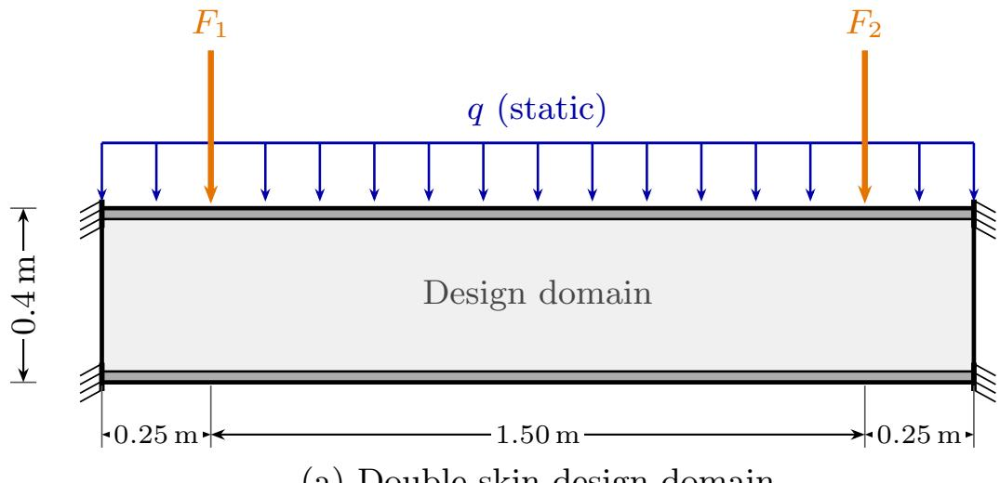  
(a) Double-skin design domain

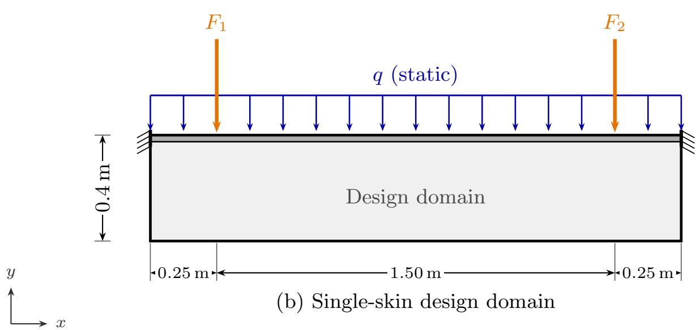  
Figure 1: Two-dimensional deck-panel design domains and loading: (a) double-skin and (b) single-skin configurations. The gray interiors are designable, the black edge strips are passive skins, and the hatched end symbols denote clamped supports. The orange arrows indicate the two 15 kN harmonic forces, and the blue arrows indicate the uniformly distributed 12 kN static load.

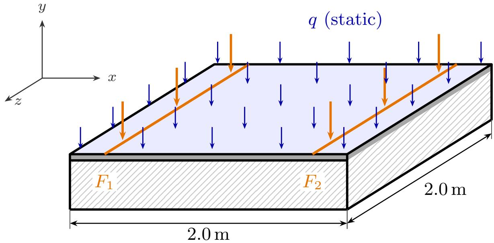  
Figure 2: Three-dimensional re-analysis model formed by extruding the optimized deck cross sections by 2.0 m. The two 15 kN harmonic loads $F _ { 1 }$ and $F _ { 2 }$ are distributed along the extrusion direction at $x = 0 . 2 5$ m and $x = 1 . 7 5$ m, respectively. The 12 kN static load $q$ is distributed over the full top surface, and the hatched lateral faces denote clamped boundaries.

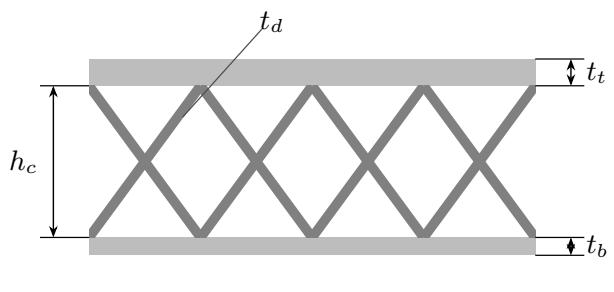  
(a) X-core double-skin SO

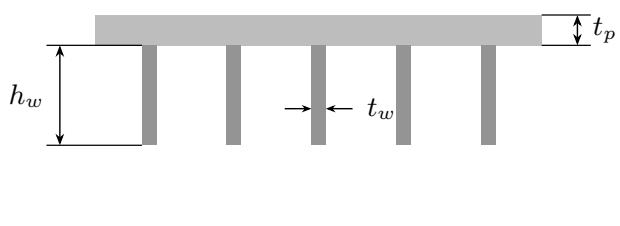  
(b) Stifened single-skin SO  
Figure 3: Cross-sections of the size-optimized engineering references: (a) X-core double-skin and (b) stifened single-skin panels.

In this case, GCMMA [73, 74] is used as a density-based benchmark for KATO. Four variant labels are used for each method: Unrestricted, Manufacturing-aware, Stress-aware and Stress + Manufacturing. All runs use $w _ { \mathrm { A I P } } = 0 . 8$ 160 optimization steps, PARDISO with six threads, and the binary protocol below. The Unrestricted and Stressaware GCMMA variants use a cone filter with $r _ { \operatorname* { m i n } } = 3$ elements. Variants with manufacturing control use the same Helmholtz filter in both methods. KATO then applies the single-field Heaviside projection described in Section 3.3, whereas GCMMA handles the volume fraction through its constrained optimization update.

An additional Unrestricted optimization is performed at 300 Hz, close to the 306 Hz response peak of the uniform starting field. The same control parameters are used.

## 4.3. Binary post-evaluation protocol

After each TO convergence, the continuous density field is binarized by a volume-preserving threshold: each element with $\rho _ { i } \geq \rho ^ { * }$ is set solid (1) and the remainder void (0). The cut level $\rho ^ { * }$ is selected from the final density values to give the closest element-wise realization of $v _ { f }$ . In the 2D re-analysis, void elements are assigned the numerical ersatz density $\rho _ { \mathrm { e r s a t z } } = 1 0 ^ { - 3 }$ to maintain matrix conditioning. The extruded 3D models retain the binary geometry and use the minimum stifness and mass densities in Eqs. (1) and (2). AIP, compliance, stress, and connectivity are recomputed on the binary models. The continuous-field diagnostic $M _ { n d }$ is evaluated over the full frame domain, including the common passive regions. Connectivity is quantified by $N _ { c }$ , the number of four-neighbor connected solid components in the volume-matched binary field; $N _ { c } = 1$ denotes a single connected topology.

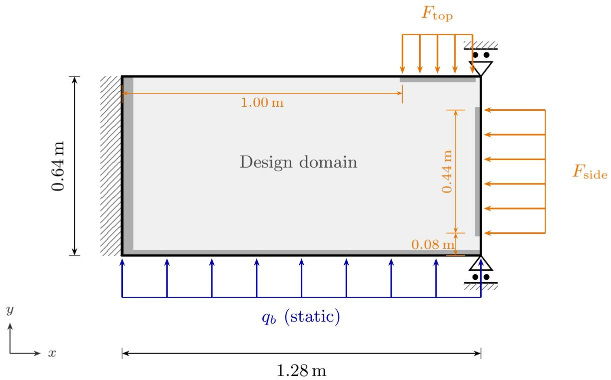  
Figure 4: Design domain, boundary conditions, passive-solid regions, and loading for the thruster foundation frame. The gray regions denote passive-solid connection and load-introduction zones. The orange arrows mark the 30 kN side and top load components, applied over $y = 0 . 0 8 – 0 . 5 2$ m and $x = 1 . 0 0  – 1 . 2 5 \mathrm { ~ n ~ }$ , respectively. The blue arrows indicate the uniformly distributed 12 kN static uplift $q _ { \mathrm { b } }$ over the full bottom edge.

## 5. Results

## 5.1. Ship deck panel

Table 3 compares the optimized panel cross-sections at the 100 Hz design frequency. All topology-optimized variants reduce AIP relative to their corresponding engineering references. The double-skin designs yield 130.02– 131.22 dB, compared with 136.30 dB for the X-core double-skin reference. The single-skin designs yield 135.03– 135.99 dB, compared with 147.99 dB for the stifened single-skin reference. The largest separation occurs in the single-skin family: the Unrestricted and Manufacturing-aware layouts give static compliances of 11.4 and 11.8 N m, compared with 542 N m for the stifened single-skin reference. In the double-skin family, the corresponding values are 6.12 and 6.65 N m, compared with 11.3 N m for the X-core reference. The Stress-aware variants trade some stifness for lower dynamic stress. The double-skin designs attain the lowest AIP because their top and bottom skins provide a closed load path with high bending eficiency under through-thickness vibration, whereas the single-skin designs rely on the top plate.

For the double-skin family, the Stress-aware variant reduces the dynamic von Mises stress �-norm from 41.8 MPa (Unrestricted) to 29.2 MPa. In the single-skin family, it reduces the same measure from 54.7 MPa to 49.1 MPa. These stress reductions come with higher static compliance, while the AIP changes by less than 1 dB in both families. The Manufacturing-aware variant also lowers the dynamic stress in the double-skin family (from 41.8 to 35.4 MPa) by suppressing thin members through feature-size control. In the single-skin family, the Manufacturing-aware variant converges to nearly the same layout as the Unrestricted variant, indicating that the unrestricted topology is already compatible with the imposed feature-size control. Their AIP and stress �-norm values are consequently nearly identical (135.2 versus 135.3 dB and 54.7 MPa in both). The two size-optimized references have slightly diferent solid fractions (0.291 and 0.312) because their parametric search returns discrete sizing; the stifened single-skin reference channels the load through a few webs and reaches a much higher stress �-norm (317 MPa) and AIP. Figure 5 compares the binary layouts and dynamic von Mises stress fields.

Table 3  
Performance at 100 Hz for the eight KATO panel designs and two size-optimized engineering references. Stress values use the combined dynamic von Mises measures, and the solid fraction includes passive material. Bold values identify the best KATO result within each structural family.
<table><tr><td>Structure</td><td>AIP@100 (dB)</td><td>Static comp. (N m)</td><td>Dyn. p-norm (MPa)</td><td>Dyn. max (MPa)</td><td>Solid frac.</td></tr><tr><td>Double-skin designs:</td><td></td><td></td><td></td><td></td><td></td></tr><tr><td>Unrestricted</td><td>131.14</td><td>6.12</td><td>41.8</td><td>97.6</td><td>0.300</td></tr><tr><td>Manufacturing-aware</td><td>131.22</td><td>6.65</td><td>35.4</td><td>89.1</td><td>0.300</td></tr><tr><td>Stress-aware</td><td>130.02</td><td>46.5</td><td>29.2</td><td>67.8</td><td>0.300</td></tr><tr><td>Stress + Manufacturing</td><td>130.09</td><td>22.8</td><td>29.7</td><td>73.0</td><td>0.300</td></tr><tr><td>X-core double-skin (SO)</td><td>136.30</td><td>11.3</td><td>69.0</td><td>183.2</td><td>0.291</td></tr><tr><td>Single-skin designs:</td><td></td><td></td><td></td><td></td><td></td></tr><tr><td>Unrestricted</td><td>135.28</td><td>11.4</td><td>54.7</td><td>139.5</td><td>0.300</td></tr><tr><td>Manufacturing-aware</td><td>135.20</td><td>11.8</td><td>54.7</td><td>139.8</td><td>0.300</td></tr><tr><td>Stress-aware</td><td>135.99</td><td>42.0</td><td>49.1</td><td>118.6</td><td>0.300</td></tr><tr><td>Stress + Manufacturing</td><td>135.03</td><td>64.4</td><td>49.6</td><td>125.5</td><td>0.300</td></tr><tr><td>Stiffened single-skin (SO)</td><td>147.99</td><td>542.0</td><td>317.1</td><td>841.5</td><td>0.312</td></tr></table>

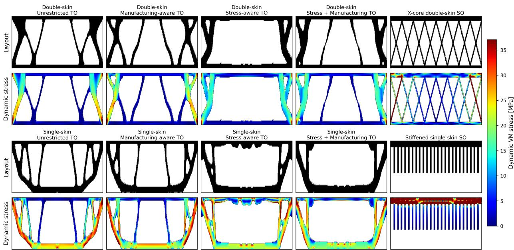  
Figure 5: KATO-optimized cross-sections and corresponding 100 Hz dynamic von Mises stress fields for the double-skin and single-skin designs. Each family is grouped with its corresponding size-optimized reference. The common stress scale is capped at the 98th percentile of the eight KATO layouts; values above this limit are saturated.

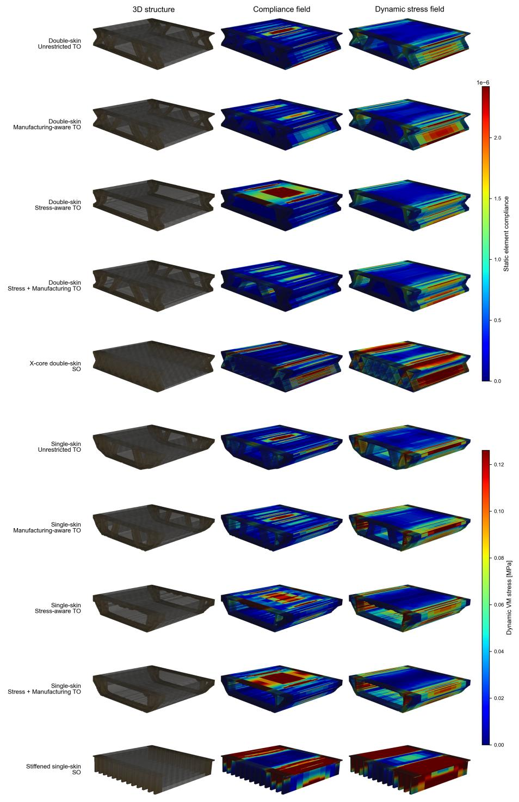  
Figure 6: Extruded three-dimensional models of the eight KATO designs and two size-optimized references. Columns show the optimized structure, element-wise static-compliance contribution, and 100 Hz combined dynamic von Mises stress field. The compliance and stress scales are capped at the 98th percentile of the eight KATO layouts; values above these limit are saturated.

Figure 6 shows the extruded 3D models with static-compliance and dynamic-stress fields, and the KATO layouts remain connected and retain their load paths after extrusion. The stifened single-skin reference concentrates stress and strain energy (compliance) in a small number of webs. Because the 2D and 3D models distribute the load through diferent thicknesses, their absolute metrics are compared within each model.

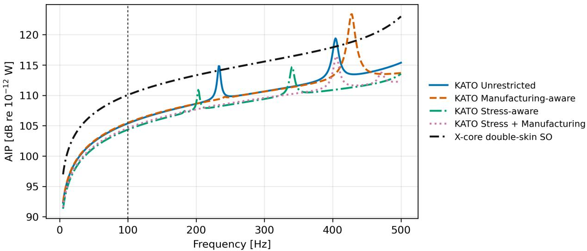  
Figure 7: AIP frequency responses for extruded models over 5–500 Hz for the four double-skin KATO designs and the size-optimized X-core double-skin reference. The vertical dashed line marks the 100 Hz design frequency.

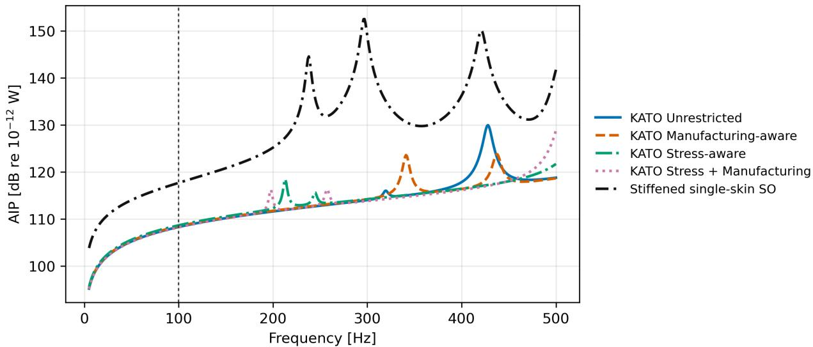  
Figure 8: AIP frequency responses for extruded models over 5–500 Hz for the four single-skin KATO designs and the size-optimized stifened single-skin reference. The vertical dashed line marks the 100 Hz design frequency.

Figure 7 shows that all four double-skin KATO designs retain their design-frequency advantage after 3D extrusion, with AIP values 4.6–5.7 dB below the X-core reference at 100 Hz. Their first modal frequencies and maximum-response frequencies vary with topology, producing distinct of-design responses while remaining below the reference over most of the sweep.

Figure 8 shows a larger design-frequency separation in the case of the single-skin designs: the four KATO layouts are 9.0–9.5 dB below the stifened reference at 100 Hz. The reference also exhibits higher resonant peaks over the sweep, whereas the KATO layouts maintain lower responses with topology-dependent peak locations. Both frequency responses are computed with the corrected 200-mode model.

Table 4 gives the corresponding quantitative 3D metrics. Here $C _ { s }$ is static compliance, $\sigma _ { p }$ is the dynamic stress �-norm, $f _ { 1 }$ is the first elastic modal frequency, and $f _ { \mathrm { m a x } }$ is the frequency of maximum AIP within the 5–500 Hz sweep. At 100 Hz the topology-optimized layouts remain below both engineering baselines in AIP and compliance. Their resonant responses are layout dependent across the sweep.

## Table 4

Performance of the eight extruded KATO deck models and two size-optimized references. AIP and the dynamic stress �-norm are evaluated at 100 Hz; $C _ { s }$ is static compliance, $f _ { 1 }$ is the first elastic modal frequency, and $f _ { \mathrm { m a x } }$ is the frequency of maximum AIP within the 5–500 Hz sweep.
<table><tr><td>Structure</td><td>AIP (dB)</td><td> $C _ { s } \ ( \mathsf { N m } )$ </td><td> $\sigma _ { p } ~ ( { \mathsf { M P a } } )$ </td><td> $f _ { 1 } \ ( \mathsf { H } z )$ </td><td> $f _ { \mathrm { m a x } }$  (Hz)</td></tr><tr><td>Double-skin designs:</td><td></td><td></td><td></td><td></td><td></td></tr><tr><td>Unrestricted</td><td>105.38</td><td> $5 . 4 3 \times 1 0 ^ { - 3 }$ </td><td>0.148</td><td>233</td><td>404</td></tr><tr><td>Manufacturing-aware</td><td>105.49</td><td> $5 . 5 8 \times 1 0 ^ { - 3 }$ </td><td>0.091</td><td>242</td><td>428</td></tr><tr><td>Stress-aware</td><td>104.36</td><td> $4 . 3 2 \times 1 0 ^ { - 3 }$ </td><td>0.069</td><td>183</td><td>341</td></tr><tr><td>Stress + Manufacturing</td><td>104.61</td><td> $4 . 5 8 \times 1 0 ^ { - 3 }$ </td><td>0.070</td><td>226</td><td>405</td></tr><tr><td>X-core double-skin (SO)</td><td>110.06</td><td> $1 . 5 9 \times 1 0 ^ { - 2 }$ </td><td>0.197</td><td>563</td><td>500^†</td></tr><tr><td>Single-skin designs:</td><td></td><td></td><td></td><td></td><td></td></tr><tr><td>Unrestricted</td><td>108.28</td><td> $1 . 0 5 \times 1 0 ^ { - 2 }$ </td><td>0.107</td><td>319</td><td>428</td></tr><tr><td>Manufacturing-aware</td><td>108.42</td><td> $1 . 0 8 \times 1 0 ^ { - 2 }$ </td><td>0.107</td><td>341</td><td>437</td></tr><tr><td>Stress-aware</td><td>108.64</td><td> $1 . 1 4 \times 1 0 ^ { - 2 }$ </td><td>0.109</td><td>213</td><td>500†</td></tr><tr><td>Stress + Manufacturing</td><td>108.20</td><td> $1 . 0 3 \times 1 0 ^ { - 2 }$ </td><td>0.095</td><td>198</td><td>500†</td></tr><tr><td>Stiffened single-skin (SO)</td><td>117.67</td><td> $7 . 6 4 \times 1 0 ^ { - 2 }$ </td><td>0.655</td><td>238</td><td>297</td></tr></table>

† Maximum at the upper sweep boundary.

## 5.2. Thruster foundation frame: KATO versus GCMMA

Table 5 shows the performance of the foundation frame for diferent TO variants and compares KATO with GCMMA. The associated computational cost is shown as well. The $M _ { n d }$ values characterize the continuous final fields. Across all four variants, KATO achieves 126.2–126.9 dB AIP at a binary static compliance of 3.6–3.8 N m and a dynamic stress �-norm of 27.5–38.2 MPa. The GCMMA layouts reach comparable AIP for the Unrestricted, Manufacturing-aware, and Stress-aware variants (125.8–126.7 dB) but at a binary static compliance that is 22–36× larger (80–135 N m). Both continuous stress-constrained GCMMA solutions satisfy the 26 MPa limit, with static compliances of 2.59 and 2.68 N m. After thresholding, the Stress-aware and Stress + Manufacturing designs reach stress �-norms of 33.20 and 218.77 MPa and static compliances of 134.55 and 71.41 N m, respectively. This continuousto-binary change, together with the higher non-discreteness of the GCMMA fields $( M _ { n d } = 1 9 - 6 0 \%$ ; Table 5 and Figure 10), shows how thresholding removes gray load paths and degrades the final stifness. The KATO fields are closer to binary $( M _ { n d } = 5 . 5 – 6 . 4 \% )$ , and all four variants retain one connected component and low compliance after thresholding. The stress-aware KATO variants also reduce the dynamic stress �-norm from 38.2 to 27.5 MPa.

Table 5 also reports the optimization cost after the shared sparse-solver backend acceleration. With 160 outer iterations on a six-thread cached PARDISO backend, the KATO runs complete in 49–57 s. The GCMMA Unrestricted and Manufacturing-aware runs have comparable wall time (52–53 s), whereas the stress-constrained GCMMA runs require 366–581 s because each outer step solves several inner convex subproblems with conservative GCMMA approximations. The number of efective evaluations, i.e., total finite-element objective and sensitivity evaluations, therefore rises to 1112–1227 in the stress-constrained GCMMA runs, against the fixed 160 for KATO. The neural reparameterized KATO formulation gives its clearest runtime advantage in these constrained variants, requiring 160 efective evaluations compared with 1112–1227 for GCMMA, at the cost of a higher peak memory footprint (about 1.65–1.74 GB versus 0.60–0.61 GB), reflecting the autograd graph and generator network held in memory.

Figure 9 shows that all four KATO variants retain continuous diagonal and horizontal load paths after thresholding, consistent with their single connected component. Stress regularization redistributes stress through broader primary members and lowers the KATO stress �-norm, whereas several GCMMA layouts contain disconnected members or pronounced stress concentrations.

Performance and optimization cost for the four KATO and four GCMMA frame variants at 18 Hz. The non-discreteness measure $M _ { n d }$ is evaluated before thresholding; AIP, compliance, stress, and the connected-component count $N _ { c }$ use the post-processed designs. Timing and peak resident set size use six-thread cached PARDISO.
<table><tr><td>Method</td><td>Variant</td><td>AIP (dB)</td><td>Static comp. (N m)</td><td>Dyn. p-norm (MPa)</td><td>Max (MPa)</td><td> $M _ { n d }$   $( \% )$ </td><td> $N _ { c }$ </td><td>Run (s)</td><td>Eff. evals</td><td>Peak RSS (MB)</td></tr><tr><td rowspan="4">KATO</td><td>Unrestricted</td><td>126.19</td><td>3.60</td><td>38.22</td><td>105.0</td><td>6.2</td><td>1</td><td>49.2</td><td>160</td><td>1651</td></tr><tr><td>Manufacturing-aware</td><td>126.24</td><td>3.62</td><td>36.05</td><td>99.3</td><td>6.4</td><td>1</td><td>50.7</td><td>160</td><td>1660</td></tr><tr><td>Stress-aware</td><td>126.93</td><td>3.78</td><td>29.49</td><td>78.0</td><td>5.5</td><td>1</td><td>56.0</td><td>160</td><td>1739</td></tr><tr><td>Stress + Manufacturing</td><td>126.50</td><td>3.72</td><td>27.53</td><td>74.9</td><td>6.4</td><td>1</td><td>57.2</td><td>160</td><td>1730</td></tr><tr><td rowspan="4">GCMMA</td><td>Unrestricted</td><td>125.84</td><td>95.62</td><td>36.45</td><td>100.4</td><td>19.3</td><td>3</td><td>52.6</td><td>382</td><td>598</td></tr><tr><td>Manufacturing-aware</td><td>125.83</td><td>80.38</td><td>36.32</td><td>100.1</td><td>25.9</td><td>2</td><td>51.6</td><td>362</td><td>612</td></tr><tr><td>Stress-aware</td><td>126.68</td><td>134.55</td><td>33.20</td><td>83.2</td><td>60.4</td><td>1</td><td>581.1</td><td>1227</td><td>604</td></tr><tr><td>Stress + Manufacturing</td><td>134.87</td><td>71.41</td><td>218.77</td><td>525.1</td><td>49.8</td><td>1</td><td>366.1</td><td>1112</td><td>614</td></tr></table>

Figure 10 shows sharper material boundaries and consistently low non-discreteness for KATO $( M _ { n d } = 5 . 5 – 6 . 4 \% )$ compared with 19.3–60.4% for GCMMA. The extensive gray regions in the stress-constrained GCMMA fields explain their greater sensitivity to thresholding and the associated changes in binary compliance and stress.

Figure 11 confirms that KATO and the three comparable GCMMA variants reach closely matched AIP at the 18 Hz design frequency, while the GCMMA Stress + Manufacturing result remains higher. Above the design frequency, the responses separate and develop load-participating peaks between 410 and 446 Hz, demonstrating the efect of the final topology on of-design dynamic performance.

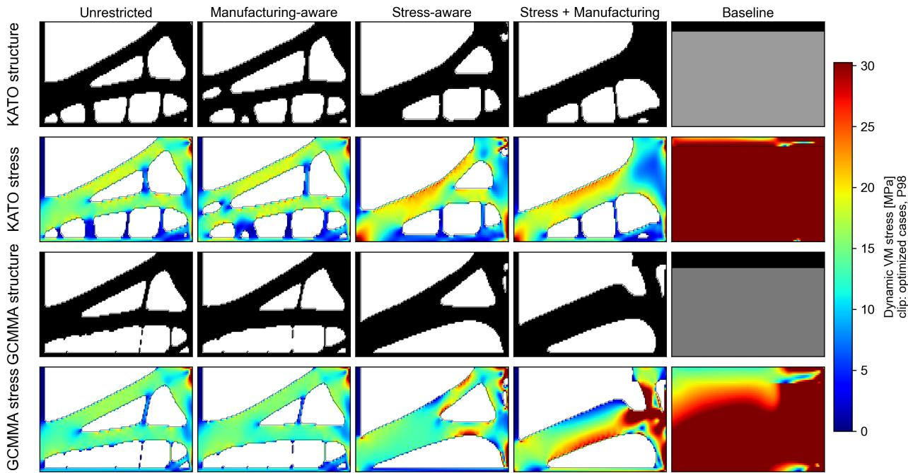  
Figure 9: Optimized designs and 18 Hz combined dynamic von Mises stress fields for the four KATO variants and the corresponding GCMMA variants. The upper and lower pairs of rows show KATO and GCMMA, respectively; the rightmost column shows the uniform baseline with a top flange. The stress scale is clipped at the 98th percentile of the optimized cases.

## 5.3. Near-resonant frame test at 300 Hz

Figure 12 and Table 6 compare the two Unrestricted solutions obtained at 300 Hz. Relative to the uniform starting field (172.02 dB at 300 Hz), KATO and GCMMA reduce the binary AIP to 139.76 and 139.30 dB, respectively. The

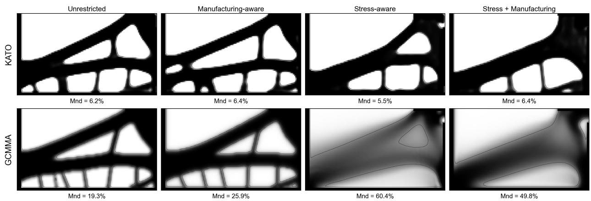  
Figure 10: Continuous final density fields before volume-preserving thresholding for the four KATO variants (top) and four GCMMA variants (bottom). The reported $M _ { n d }$ values quantify pre-threshold non-discreteness.

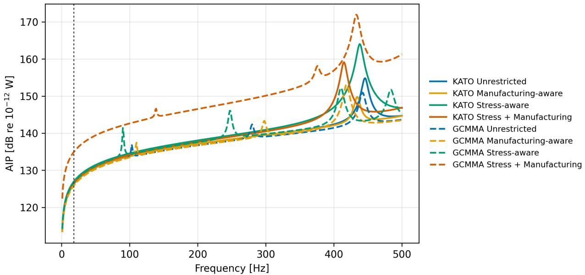  
Figure 11: AIP frequency responses over 1–500 Hz for the optimized 18 Hz frame designs obtained with the four KATO and four GCMMA variants. The vertical dashed line marks the design frequency.

KATO binary has 59.4× lower static compliance, a lower pre-threshold non-discreteness measure $( M _ { n d } = 8 . 0 \%$ versus 32.9%), and one connected component. The GCMMA binary has four components: its principal component contains 99.57% of the solid elements, and three islands contain the remaining 16 elements. The connected KATO result is consistent with the architectural prior and spatial regularization of the neural generator.

Figure 13 compares the 1–500 Hz responses of the uniform starting field and the two binary designs. The swept response in Figure 13 provides a stricter check than the design-frequency value alone. Optimization moves the dominant load-participating peak away from the 306 Hz peak of the uniform field. The KATO peak occurs at 425 Hz and is 2.73 dB below the GCMMA peak at 382 Hz. Thus, in this near-resonant test, KATO gives a slightly higher AIP at the selected frequency but a lower worst-case AIP over 1–500 Hz, together with markedly higher static stifness and a connected binary topology.

Performance of the Unrestricted KATO and GCMMA frame designs optimized at 300 Hz. The non-discreteness measure $M _ { n d }$ uses the continuous final fields; AIP, compliance, stress, and $N _ { c }$ use the post-processed designs, and the FRF peaks are obtained from the 1–500 Hz sweeps.
<table><tr><td>Method</td><td>AIP at 300 Hz (dB)</td><td>Compliance (Nm)</td><td>Stress p-norm (MPa)</td><td> $M _ { n d }$  (%)</td><td> $N _ { c }$ </td><td>FRF peak (Hz)</td><td>Peak AIP (dB)</td></tr><tr><td>KATO</td><td>139.76</td><td>3.74</td><td>40.95</td><td>8.0</td><td>1</td><td>425</td><td>146.67</td></tr><tr><td>GCMMA</td><td>139.30</td><td>222.12</td><td>43.67</td><td>32.9</td><td>4</td><td>382</td><td>149.40</td></tr></table>

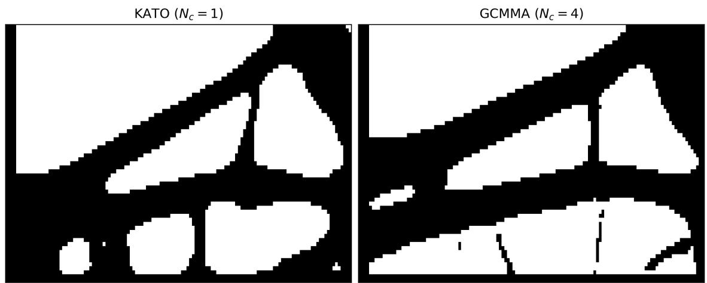  
Figure 12: Optimized designs obtained from the Unrestricted KATO and GCMMA runs at 300 Hz. The labels report the connected-component count $N _ { c }$

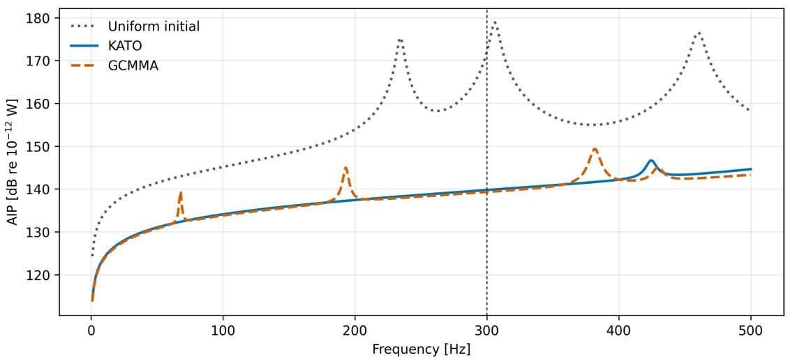  
Figure 13: AIP frequency responses over 1–500 Hz for the uniform initial field and the optimized KATO and GCMMA designs at 300 Hz. The vertical dashed line marks the design frequency.

## 6. Discussion

## 6.1. Topology regularization, stress, and binary performance

Binary re-analysis evaluates the thresholded 0–1 layouts, while $M _ { n d }$ characterizes non-discreteness in the continuous density fields [6, 75]. In the frame cases, thresholding removes gray bridges from several GCMMA fields, whereas the spatially correlated KATO parameterization retains coherent load paths. The lower $M _ { n d }$ and connected KATO binaries support the role of the generator as an architectural prior and implicit regularizer.

The aggregated stress treatment lowers the dynamic stress �-norm in both deck families and in the frame, with small changes in AIP. KATO incorporates this trade-of through objective regularization, while GCMMA uses an explicit constraint. Local stress constraints and stress-relaxed interpolation provide possible extensions [76, 62, 77, 63].

Helmholtz filtering and stress regularization act through complementary mechanisms. The Helmholtz PDE filter suppresses density variation over its physical radius, while the dilated, intermediate, and eroded projections define the retained solid and void geometry across the threshold interval [66, 23]. This combination controls solid and void feature sizes and preserves the principal load paths under erosion and dilation; the resulting deck layouts contain fewer, thicker internal members.

The stress term addresses a diferent design requirement by discouraging highly stressed load paths. The frame results separate these roles clearly: Helmholtz filtering controls feature size while preserving AIP performance, whereas stress regularization produces the main reduction in the stress �-norm.

## 6.2. Relation to prior AIP topology optimization

This work minimizes structural AIP rather than acoustic radiated power directly. Under steady-state harmonic excitation, the time-averaged active power supplied to a passive coupled structural–acoustic system is balanced by internal dissipation and energy transmitted from the structure, including acoustic radiation [78, 1]. Minimizing AIP therefore reduces the mechanical energy available for transmission and acoustic radiation during early structural design. Coupled structural–acoustic analysis can subsequently resolve radiation eficiency and fluid-loading efects [34, 35].

Silva et al. [37] established the viability of AIP as a forced-vibration objective using SIMP on a 2D cantilever benchmark (≈ 40 000 free DOFs). This work applies AIP-based TO to ship-deck and foundation structures with physical units, feature-size control, stress regularization, and binary re-analysis. The convolutional generator adds an architectural prior to these explicit controls and preserves connected load paths in the reported designs.

## 6.3. Computational performance

The experiments were executed on a workstation equipped with an Intel Core i7-14700F CPU (20 cores, up to 5.40 GHz) and 32 GB of dual-channel DDR5-5600 memory.

The KATO and GCMMA runs have comparable cost for the two variants without stress constraints, while KATO is 6.4–10.4× faster for the implemented stress-aware formulations (Table 5). This timing comparison retains the characteristic stress treatment of each method: KATO uses objective penalization, whereas the conventional densitybased GCMMA benchmark uses an explicit stress constraint. The additional GCMMA cost comes from its inner constrained subproblems.

The forward-and-adjoint evaluation was also profiled with three solver backends (Table 7). Replacing SciPy SuperLU with uncached PARDISO reduces the frame and deck step times by 2.7× and 5.3×, respectively. Reusing the PARDISO symbolic factorization and real-block sparsity structure gives 11.0× and 26.8× speedups relative to SuperLU, with gradient diferences at $1 0 ^ { - 1 1 }$ or below.

The 200-mode basis requires approximately 400–2900 s per deck structure, but it reduces each frequency point to a small dense solve. At the full-order spot-checks, the corrected ROM is 990–2125× faster (Table 8). The basis cost is amortized over the frequency sweep.

Table 8 quantifies the accuracy and cost for the double-skin unrestricted deck panel: the residual-flexibility correction lowers the active-power error from up to 11.8% (uncorrected) to below 0.02% across the five 50–400 Hz full-order spot checks. The correction accounts for the 1.7–16.7% residual-flexibility fraction across the ten layouts.

## 6.4. Limitations

1. Material and excitation scope. The study considers isotropic steel; the deck optimizations target 100 Hz and the primary frame study targets 18 Hz, with one additional matched comparison at 300 Hz. Multi-material formulations [79, 80] and multi-frequency objectives [28] would extend the applicability. The swept-frequency post-evaluation confirms that TO layouts retain lower AIP near the design frequency, but the X-core reference becomes competitive at selected higher-frequency peaks.

Table 8  
Table 7  
Sparse-solver timing for one forward-and-adjoint evaluation of the 18 Hz frame and 100 Hz deck cases. All backends use the same objective and adjoint path; speedups and gradient errors are measured relative to SuperLU.
<table><tr><td>Case</td><td>Backend</td><td> $t _ { \mathrm { s t e p } }$  (ms)</td><td>Speedup vs. SuperLU</td><td>Gradient rel. err.</td></tr><tr><td rowspan="3">Frame 18 Hz</td><td>SuperLU</td><td>919</td><td>1.0×</td><td>0</td></tr><tr><td>PARDISO stock</td><td>347</td><td>2.7×</td><td> $8 . 5 \times 1 0 ^ { - 1 3 }$ </td></tr><tr><td>PARDISO cached</td><td>84</td><td>11.0×</td><td> $7 . 7 \times 1 0 ^ { - 1 3 }$ </td></tr><tr><td rowspan="3">Deck 100 Hz</td><td>SuperLU</td><td>4902</td><td>1.0x</td><td>0</td></tr><tr><td>PARDISO stock</td><td>929</td><td>5.3×</td><td> $2 . 8 \times 1 0 ^ { - 1 1 }$ </td></tr><tr><td>PARDISO cached</td><td>183</td><td>26.8×</td><td> $2 . 9 \times 1 0 ^ { - 1 1 }$ </td></tr></table>

Accuracy and per-frequency cost of the uncorrected and residual-flexibility-corrected 200-mode ROM for the double-skin Unrestricted design at five full-order spot-check frequencies. The AIP error $\epsilon _ { \Pi }$ follows Eq. (24); FOM and ROM times are from the dedicated PARDISO benchmark.
<table><tr><td>f (Hz)</td><td> $\mathsf { A l P } _ { \mathrm { F O M } }$  (dB)</td><td> $\epsilon _ { \Pi }$  uncorr.  $( \% )$ </td><td> $\epsilon _ { \Pi }$  corr.  $( \% )$ </td><td>tFOM (s)</td><td>tROM (s)</td><td>Speedup</td></tr><tr><td>50</td><td>102.33</td><td>11.75</td><td>0.004</td><td>742</td><td>0.65</td><td>1140×</td></tr><tr><td>100</td><td>105.38</td><td>11.65</td><td>0.001</td><td>661</td><td>0.67</td><td>990x</td></tr><tr><td>150</td><td>107.21</td><td>11.47</td><td>0.003</td><td>662</td><td>0.63</td><td>1050×</td></tr><tr><td>250</td><td>109.85</td><td>10.43</td><td>0.015</td><td>1011</td><td>0.69</td><td>1470×</td></tr><tr><td>400</td><td>117.07</td><td>3.17</td><td>0.014</td><td>1316</td><td>0.62</td><td>2125×</td></tr></table>

2. Structural AIP scope. The optimization targets structural AIP. Direct radiated sound power optimization requires a coupled structural-acoustic model (e.g., BEM [3]), which is the natural next step toward full URN minimization.

3. Manufacturing scope. Helmholtz filtering [66] and Heaviside projection [23] provide mesh-independent feature-size control and promote discrete designs, but they do not impose fabrication-specific constraints such as weld accessibility and direction, plate rolling direction, joint detailing, or assembly requirements [75, 81]. Incorporating these constraints is a future direction for production-oriented ship structural design.

4. 2D optimization with 3D re-analysis. The deck topology is optimized in 2D and evaluated in finite-depth 3D models. Full 3D TO would permit through-thickness material variation [17, 82].

## 7. Conclusions

Active input power minimization under harmonic excitation was applied to two ship-related structural design problems using the KATO neural reparameterized topology optimization framework with convolutional Kolmogorov– Arnold network (cKAN) generators. The resulting binary layouts produced by KATO remain structurally connected in the final evaluations and are compatible with feature-size control and stress regularization.

The main findings are:

1. AIP provides a non-negative forced-vibration objective for frequency-domain ship TO and avoids the sign ambiguity of dynamic compliance near resonances and antiresonances. Both deck TO families reduce AIP below the engineering references (stifened panel and X-core sandwich panel) in the 2D cross-sectional models at 100 Hz, and the advantage is retained in the extruded 3D models.

2. Stress regularization lowers the dynamic stress �-norm with small AIP changes. For the deck variants, Helmholtz filtering and three-field projection control solid and void feature sizes and preserve the main load paths after binarization.

3. For the foundation frame at 18 Hz, KATO matches GCMMA in AIP within 0.5 dB for three variants while giving 22–36× lower binary compliance. At 300 Hz, KATO gives 59.4× lower binary compliance and a 2.73 dB lower maximum AIP over 1–500 Hz. Its binary layouts remain connected in both comparisons, consistent with the generator’s architectural prior.

4. Cached PARDISO reduces the forward-and-adjoint cost by up to 26.8× relative to SuperLU. The corrected 200- mode model reproduces the full-order spot checks within 0.02% and evaluates each frequency point 990–2125× faster.

Future work could integrate structural-acoustic coupling for direct underwater radiated noise optimization and extend the framework to broadband random excitation.

## Statements and Declarations

## Funding

This research was financially supported by the Natural Sciences and Engineering Research Council of Canada (NSERC) through Discovery Grant RGPIN-2025-04421 and Alliance Advantage Grant ALLRP 607677-25. Additiona financial support was provided by Seaspan Shipyards.

Formal analysis, Investigation, Writing – original draft. Writing – review & editing.

## Data availability

The data and code supporting the findings of this study are available from the corresponding author upon reasonable request. They will be released at https://github.com/ysyysy115/KATO\_aip after the manuscript has been accepted in a journal.

## Acknowledgements

The authors thank Norbert Schumacher, P.Eng., of Robert Allan Ltd. for his constructive comments on ship structural optimization.

## References

[1] D. Ross, Mechanics of Underwater Noise, Peninsula Publishing, Los Altos, CA, 1987.

[2] International Maritime Organization, Revised Guidelines for the Reduction of Underwater Radiated Noise from Shipping to Address Adverse Impacts on Marine Life, Technical Report MEPC.1/Circ.906/Rev.1, International Maritime Organization, 2024.

[3] M. C. Junger, D. Feit, Sound, Structures, and Their Interaction, 2nd ed., MIT Press, Cambridge, MA, 1986.

[4] T. R. Lin, J. Pan, P. J. O’Shea, C. K. Mechefske, A study of vibration and vibration control of ship structures, Marine Structures 22 (2009) 730–743.

[5] M. P. Bendsoe, O. Sigmund, Topology optimization: theory, methods, and applications, Springer Science & Business Media, 2003.

[6] O. Sigmund, K. Maute, Topology optimization approaches: A comparative review, Structural and Multidisciplinary Optimization 48 (2013) 1031–1055.

[7] M. P. Bendsøe, N. Kikuchi, Generating optimal topologies in structural design using a homogenization method, Computer methods in applied mechanics and engineering 71 (1988) 197–224.

[8] M. P. Bendsøe, Optimal shape design as a material distribution problem, Structural optimization 1 (1989) 193–202.

[9] O. Sigmund, A 99 line topology optimization code written in matlab, Structural and multidisciplinary optimization 21 (2001) 120–127.

[10] M. Y. Wang, X. Wang, D. Guo, A level set method for structural topology optimization, Computer methods in applied mechanics and engineering 192 (2003) 227–246.

[11] G. Allaire, F. Jouve, A.-M. Toader, Structural optimization using sensitivity analysis and a level-set method, Journal of computational physics 194 (2004) 363–393.

[12] Y. M. Xie, G. P. Steven, A simple evolutionary procedure for structural optimization, Computers & structures 49 (1993) 885–896.

[13] V. Young, O. M. Querin, G. Steven, Y. Xie, 3d and multiple load case bi-directional evolutionary structural optimization (beso), Structural optimization 18 (1999) 183–192.

[14] X. Huang, M. Xie, Evolutionary topology optimization of continuum structures: methods and applications, John Wiley & Sons, 2010.

[15] J. Sokolowski, A. Zochowski, Topological derivatives for elliptic problems, Inverse problems 15 (1999) 123–134.

[16] H. A. Eschenauer, V. V. Kobelev, A. Schumacher, Bubble method for topology and shape optimization of structures, Structural optimization 8 (1994) 42–51.

[17] N. Aage, E. Andreassen, B. S. Lazarov, O. Sigmund, Giga-voxel computational morphogenesis for structural design, Nature 550 (2017) 84–86.

[18] S. Mukherjee, D. Lu, B. Raghavan, P. Breitkopf, S. Dutta, M. Xiao, W. Zhang, Accelerating Large-scale Topology Optimization: State-of-the-Art and Challenges, Archives of Computational Methods in Engineering 28 (2021) 4549–4571.

[19] D. Yago, J. Cante, O. Lloberas-Valls, J. Oliver, Topology optimization methods for 3d structural problems: a comparative study, Archives of Computational Methods in Engineering 29 (2022) 1525–1567.

[20] O. Sigmund, J. Petersson, Numerical instabilities in topology optimization: a survey on procedures dealing with checkerboards, mesh-dependencies and local minima, Structural optimization 16 (1998) 68–75.

[21] B. Bourdin, Filters in topology optimization, International Journal for Numerical Methods in Engineering 50 (2001) 2143–2158.

[22] K. Svanberg, H. Svärd, Density filters for topology optimization based on the pythagorean means, Structural and Multidisciplinary Optimization 48 (2013) 859–875.

[23] F. Wang, B. S. Lazarov, O. Sigmund, On projection methods, convergence and robust formulations in topology optimization, Structural and Multidisciplinary Optimization 43 (2011) 767–784.

[24] A. R. Diaz, N. Kikuchi, Solutions to shape and topology eigenvalue optimization problems using a homogenization method, International Journal for Numerical Methods in Engineering 35 (1992) 1487–1502.

[25] Z.-D. Ma, N. Kikuchi, I. Hagiwara, Structural topology and shape optimization for a frequency response problem, Computational Mechanics 13 (1993) 157–174.

[26] N. L. Pedersen, Maximization of eigenvalues using topology optimization, Structural and Multidisciplinary Optimization 20 (2000) 2–11.

[27] J. Du, N. Olhof, Topological design of freely vibrating continuum structures for maximum values of simple and multiple eigenfrequencies and frequency gaps, Structural and Multidisciplinary Optimization 34 (2007) 91–110.

[28] N. Olhof, J. Du, Generalized incremental frequency method for topological design of continuum structures for minimum dynamic compliance subject to forced vibration at a prescribed low or high value of the excitation frequency, Structural and Multidisciplinary Optimization 54 (2016) 1113–1141.

[29] N. Olhof, J. Du, Introductory notes on topological design optimization of vibrating continuum structures, in: Topology Optimization in Structural and Continuum Mechanics, CISM International Centre for Mechanical Sciences, Springer Vienna, 2014, pp. 259–273. doi:10.1007/ 978-3-7091-1643-2\_10.

[30] O. M. Silva, M. M. Neves, A. Lenzi, A critical analysis of using the dynamic compliance as objective function in topology optimization of one-material structures considering steady-state forced vibration problems, Journal of Sound and Vibration 444 (2019) 1–20.

[31] J. Rong, Y. M. Xie, X. Y. Yang, Q. Q. Liang, Topology optimization of structures under dynamic response constraints, Journal of Sound and Vibration 234 (2000) 177–189.

[32] A. Takezawa, M. Daifuku, Y. Nakano, K. Nakagawa, T. Yamamoto, M. Kitamura, Topology optimization of damping material for reducing resonance response based on complex dynamic compliance, Journal of Sound and Vibration 365 (2016) 230–243.

[33] S. Saurabh, A. Gupta, R. Chowdhury, P. Podugu, Robust topology optimization for transient dynamic response minimization, Computer Methods in Applied Mechanics and Engineering 426 (2024) 117009.

[34] J. Du, N. Olhof, Minimization of sound radiation from vibrating bi-material structures using topology optimization, Structural and Multidisciplinary Optimization 33 (2007) 305–321.

[35] A. Neofytou, T. Rios, M. Bujny, S. Menzel, H. A. Kim, Automatic diferentiation-based level-set topology optimization for noise minimization in 3d domains considering acoustic-structure interaction, Structural and Multidisciplinary Optimization 68 (2025) 67.

[36] J. Hu, W. Li, J. Li, X. Chen, S. Yao, X. Huang, Topology optimization of porous structures by considering acoustic and mechanical characteristics, Engineering Structures 295 (2023) 116843.

[37] O. M. Silva, M. M. Neves, A. Lenzi, On the use of active and reactive input power in topology optimization of one-material structures considering steady-state forced vibration problems, Journal of Sound and Vibration 464 (2020) 114989.

[38] O. M. Silva, F. Valentini, E. L. Cardoso, Shape and position preserving design of vibrating structures by controlling local energies through topology optimization, Journal of Sound and Vibration 515 (2021) 116478.

[39] J.-j. Cui, D.-y. Wang, Q.-q. Shi, Structural topology design of container ship based on knowledge-based engineering and level set method, China Ocean Engineering 29 (2015) 551–564.

[40] M. Daifuku, T. Nishizu, A. Takezawa, M. Kitamura, H. Terashita, Y. Ohtsuki, Design methodology using topology optimization for anti-vibration reinforcement of generators in a ship’s engine room, Proceedings of the Institution of Mechanical Engineers, Part M: Journal of Engineering for the Maritime Environment 230 (2016) 216–226.

[41] D. Jia, F. Li, C. Zhang, L. Li, Design and simulation analysis of trimaran bulkhead based on topological optimization, Ocean Engineering 191 (2019) 106304.

[42] A. Kendibilir, A. Kefal, Enhanced ship cross-section design methodology using peridynamics topology optimization, Ocean Engineering 286 (2023) 115531.

[43] A. F. Yilmaz, M. Konal, Topology optimization-driven design of container ship hatch cover for lightweight performance and cost eficiency, Journal of Ofshore Mechanics and Arctic Engineering 147 (2025) 041701.

[44] X. Cao, L. Zhang, B. Qi, H. Qin, Y. Xue, Topological optimization design and wave-resistance verification of unmanned sailboats, Journal of Marine Science and Application (2026) 1–28.

[45] B. Li, C. Huang, X. Li, S. Zheng, J. Hong, Non-iterative structural topology optimization using deep learning, Computer-Aided Design 115 (2019) 172–180.

[46] S. Oh, Y. Jung, S. Kim, I. Lee, N. Kang, Deep generative design: Integration of topology optimization and generative models, Journal of Mechanical Design 141 (2019) 111405.

[47] H. Chi, Y. Zhang, T. L. E. Tang, L. Mirabella, L. Dalloro, L. Song, G. H. Paulino, Universal machine learning for topology optimization, Computer Methods in Applied Mechanics and Engineering 375 (2021) 112739.

[48] S. Shin, D. Shin, N. Kang, Topology optimization via machine learning and deep learning: A review, Journal of Computational Design and Engineering 10 (2023) 1736–1766.

[49] S. Hoyer, J. Sohl-Dickstein, S. Greydanus, Neural reparameterization improves structural optimization, arXiv preprint arXiv:1909.04240 (2019).

[50] D. Ulyanov, A. Vedaldi, V. Lempitsky, Deep image prior, in: Proceedings of the IEEE conference on computer vision and pattern recognition, 2018, pp. 9446–9454.

[51] A. Chandrasekhar, K. Suresh, Tounn: Topology optimization using neural networks, Structural and Multidisciplinary Optimization 63 (2021) 1135–1149.

[52] Z. Zhang, Y. Li, W. Zhou, X. Chen, W. Yao, Y. Zhao, Tonr: An exploration for a novel way combining neural network with topology optimization, Computer Methods in Applied Mechanics and Engineering 386 (2021) 114083.

[53] H. Jeong, J. Bai, C. Batuwatta-Gamage, C. Rathnayaka, Y. Zhou, Y. Gu, A Physics-Informed Neural Network-based Topology Optimization (PINNTO) framework for structural optimization, Engineering Structures 278 (2023) 115484.

[54] T. Liu, F. Yu, Q. Li, X.-J. Wan, Z. Han, S. Liu, Topology optimization approach using a training-dataset-free neural network reparameterization framework, Advanced Engineering Informatics 70 (2026) 104111.

[55] G. Kus, M. A. Bessa, Gradient-free neural topology optimization: towards efective fracture-resistant designs, Computational Mechanics 75 (2024) 1327–1355.

[56] M. Kato, T. Kii, K. Yaji, K. Fujita, Tackling an exact maximum stress minimization problem with gradient-free topology optimization incorporating a deep generative model, in: International Design Engineering Technical Conferences and Computers and Information in Engineering Conference, volume 87318, American Society of Mechanical Engineers, 2023, p. V03BT03A008.

[57] S. Yan, J. Jelovica, Kato: Neural-reparameterized topology optimization using convolutional kolmogorov-arnold network for stress minimization, International Journal for Numerical Methods in Engineering 126 (2025) e70034.

[58] A. D. Bodner, A. S. Tepsich, J. N. Spolski, S. Pourteau, Convolutional kolmogorov-arnold networks, arXiv preprint arXiv:2406.13155 (2024).

[59] Z. Liu, Y. Wang, S. Vaidya, F. Ruehle, J. Halverson, M. Soljačić, T. Y. Hou, M. Tegmark, Kan: Kolmogorov-arnold networks, arXiv preprint arXiv:2404.19756 (2024).

[60] S. Yan, J. Jelovica, KATOsuper: Surrogate-accelerated neural topology optimization with sensitivity-consistent fourier neural operators, 2026. URL: https://doi.org/10.2139/ssrn.6184689. doi:10.2139/ssrn.6184689, sSRN preprint.

[61] O. Schenk, K. Gärtner, Solving unsymmetric sparse systems of linear equations with pardiso, Future Generation Computer Systems 20 (2004) 475–487.

[62] C. Le, J. Norato, T. Bruns, C. Ha, D. Tortorelli, Stress-based topology optimization for continua, Structural and Multidisciplinary Optimization 41 (2010) 605–620.

[63] M. Bruggi, P. Venini, A mixed FEM approach to stress-constrained topology optimization, International Journal for Numerical Methods in Engineering 73 (2008) 1693–1714.

[64] O. Sigmund, Morphology-based black and white filters for topology optimization, Structural and Multidisciplinary Optimization 33 (2007) 401–424.

[65] D. P. Kingma, J. Ba, Adam: A method for stochastic optimization, arXiv preprint arXiv:1412.6980 (2014).

[66] B. S. Lazarov, O. Sigmund, Filters in topology optimization based on Helmholtz-type diferential equations, International Journal for Numerical Methods in Engineering 86 (2011) 765–781.

[67] R. B. Lehoucq, D. C. Sorensen, C. Yang, ARPACK Users’ Guide: Solution of Large-Scale Eigenvalue Problems with Implicitly Restarted Arnoldi Methods, SIAM, Philadelphia, PA, 1998. doi:10.1137/1.9780898719628.

[68] R. E. Cornwell, R. R. Craig, C. P. Johnson, On the application of the mode-acceleration method to structural engineering problems, Earthquake Engineering & Structural Dynamics 11 (1983) 679–688.

[69] Caterpillar Inc., Industrial Engine Ratings Guide, Caterpillar Inc., 2019. URL: https://emc.cat.com/pubdirect.ashx?media\_string\_ id=LEGH0002-10.pdf, cAT 3516C basic dimensions, p. 39.

[70] T. Putranto, M. Kõrgesaar, J. Jelovica, K. Tabri, H. Naar, Ultimate strength assessment of stifened panel under uni-axial compression with non-linear equivalent single layer approach, Marine Structures 78 (2021) 103004.

[71] J. Romanof, P. Varsta, H. Remes, Laser-welded web-core sandwich plates under patch loading, Marine structures 20 (2007) 25–48.

[72] Robert Allan Ltd., Robert allan ltd.’s turkish tug connection comes home to vancouver, 2011. URL: https://ral.ca/2011/01/20/ robert-allan-ltd-s-turkish-tug-connection-comes-home-vancouver/.

[73] K. Svanberg, The method of moving asymptotes—a new method for structural optimization, International journal for numerical methods in engineering 24 (1987) 359–373.

[74] K. Svanberg, A class of globally convergent optimization methods based on conservative convex separable approximations, SIAM Journal on Optimization 12 (2002) 555–573.

[75] S. L. Vatanabe, T. N. Lippi, C. R. de Lima, G. H. Paulino, E. C. Silva, Topology optimization with manufacturing constraints: A unified projection based approach, Advances in Engineering Software 100 (2016) 97–112.

[76] G. D. Cheng, X. Guo, �-relaxed approach in structural topology optimization, Structural optimization 13 (1997) 258–266.

[77] E. Holmberg, B. Torstenfelt, A. Klarbring, Stress constrained topology optimization, Structural and Multidisciplinary Optimization 48 (2013) 33–47.

[78] F. Fahy, P. Gardonio, Sound and Structural Vibration: Radiation, Transmission and Response, 2nd ed., Academic Press, Oxford, 2007.

[79] V. Birman, G. A. Kardomateas, Review of current trends in research and applications of sandwich structures, Composites Part B: Engineering 142 (2018) 221–240.

[80] D. Zenkert, The handbook of sandwich construction, Engineering Materials Advisory Services, 1997.

[81] J. Zhu, H. Zhou, C. Wang, L. Zhou, S. Yuan, W. Zhang, A review of topology optimization for additive manufacturing: Status and challenges, Chinese Journal of Aeronautics 34 (2021) 91–110.

[82] K. Liu, A. Tovar, An eficient 3d topology optimization code written in matlab, Structural and Multidisciplinary Optimization 50 (2014) 1175– 1196.