# Normalize-Then-Precondition: A Hierarchical Approach to Marginal Scale and Interaction Geometry for LLM Training

Zixuan Gong Gaoling School of Artificial Intelligence Renmin University of China zxgong@ruc.edu.cn

Jiaye Teng School of Statistics and Management Shanghai University of Finance and Economics tengjiaye@sufe.edu.cn

Zeyu Gan Gaoling School of Artificial Intelligence Renmin University of China zygan@ruc.edu.cn

Yong Liu\* Gaoling School of Artificial Intelligence Renmin University of China liuyonggsai@ruc.edu.cn

## Abstract

Matrix optimizers have emerged as a promising direction, with Muon standing out as a prominent design. Revisiting Muon through its full-Gram representation, we observe that it jointly processes marginal-scale and interaction information. This opens an alternative way to organize geometric information hierarchically, motivating the Normalize-Then-Precondition framework. Specifically, it first uses diagonal-Gram information to construct a marginally normalized update, then applies spectral preconditioning to its directional interaction geometry. Building on this framework, we develop NormPre with NormPre-G and NormPre-L adopting global and localized spectral preconditioning, grounded in spectral-norm steepest descent and a regularized formulation followed by leading mode selection, respectively. To enable large-scale training, NormPre-G uses Newton-Schulz iterations and NormPre-L employs randomized sketching to approximate the leading interaction eigenspace. Theoretically, we establish $\mathcal { O } ( T ^ { - 1 / 2 } )$ convergence guarantees for simplified versions of NormPre. Across extensive pretraining experiments on GPT-2 Small, LLaMA and Qwen3, both variants consistently outperform AdamW, Muon and MANO under matched training budgets. Further efficiency and spectral analyses reveal the complementary strengths of two variants and characterize their performance-efficiency trade-off. We open-source our code through a GitHub repository at https://github.com/zx-gong/NormPre.

## 1 Introduction

Large language model (LLM) training places increasing demands on optimizer performance, efficiency, and scalability. Recent optimizers address these demands by exploiting richer parameter structure, from individual coordinates (Kingma and Ba, 2015; Loshchilov and Hutter, 2019; Chen et al., 2023; Liu et al., 2024; Liang et al., 2026) and parameter blocks (Zhang et al., 2025; Wang et al., 2025) to full matrices (Gupta et al., 2018; Vyas et al., 2025; Jordan et al., 2024; Liu et al., 2025; Gu and Xie, 2026; Deng et al., 2026; Xu et al., 2026). More specifically, orthogonalization and normalization have emerged as prominent matrix-level techniques. On the orthogonalization front, Muon applies a matrix-sign transformation to momentum via Newton-Schulz iterations for rapid convergence (Jordan et al., 2024; Liu et al., 2025). Alternatively, other recent methods use row or column normalization to construct matrix updates. For example, MANO combines momentum projection with alternating normalization (Gu and Xie, 2026), and MOGA derives such normalized updates from mean-normalized operator norms under a steepest-descent perspective (Xu et al., 2026).

Orthogonalization and normalization may appear to follow different routes, yet their Gram representations reveal a shared structure. For a matrix update X, the transformations take the forms

$$
\underbrace { \Phi = ( \mathbf { X } \mathbf { X } ^ { \top } ) ^ { - 1 / 2 } X } _ { \mathrm { F u l l - G r a m \mathrm { R e p r e s e n t a t i o n } } } , \quad \underbrace { \Psi = \left[ \mathbb { D i a g } ( \mathrm { d i a g } ( \mathbf { X } \mathbf { X } ^ { \top } ) ) \right] ^ { - 1 / 2 } X } _ { \mathrm { D i a g o n a l - G r a m \mathrm { R e p r e s e n t a t i o n } } } ,
$$

where $\mathrm { D i a g ( d i a g ( \cdot ) ) }$ retains only the diagonal entries, and the inverse-square-root expressions require full row rank for Φ and nonzero rows for Ψ, respectively. Muon jointly processes marginal scales and cross-row interactions encoded in the full Gram matrix, while normalization draws solely on the Gram diagonal to equalize row norms without altering pairwise angles. As an extreme example, consider fixed row directions with one row norm of $1 0 ^ { 4 }$ and all others of $1 0 ^ { - 3 }$ . As this scale gap increases further, the leading Gram eigenvector approaches the largest $\mathrm { r o w } { \mathbf { \dot { s } } }$ coordinate axis, even if the other rows are strongly correlated. The principal mode thus becomes dominated by marginal scales despite unchanged directional interactions. By removing this scale weighting, diagonal-Gram normalization provides a reference update for processing directional interactions. Together, these observations open an alternative way to organize the available geometric information:

Can we construct a normalized updatefrom scales and refine it via directional interactions?

While recent methods apply normalization to gradients or momentum to improve the numerical conditioning of orthogonalization (Ma et al., 2024; Chang et al., 2026), a systematic framework for formalizing the hierarchical organization has yet to be established. In particular, it remains unclear whether the normalized update should undergo afull-spectrum transformation or serve as a reference for more targeted spectral modifications.

To address this gap, we formalize the hierarchical organization as the Normalize-Then-Precondition framework. The marginally normalized update retains a directional interaction spectrum encoded by $\Gamma = \Psi \Psi ^ { \top }$ . To exploit this spectrum, one choice is global spectral preconditioning, which performs orthogonalization of Ψ and solves a steepest descent problem under the spectral norm constraint. Another choice is to treat the normalized update Ψ as a reference and minimize the changes needed to satisfy the spectral constraint, seeking the closest update within the unit spectral norm ball. This preference is formalized by regularized spectral steepest descent, whose solution clips singular values above one and leaves the others unchanged. A spectral budget r further restricts the transformation to at most r leading super-unit modes, giving localized spectral preconditioning. Here, r controls the selected subspace dimension for spectral transformation and the final update remains dense.

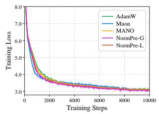

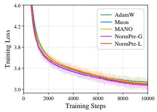

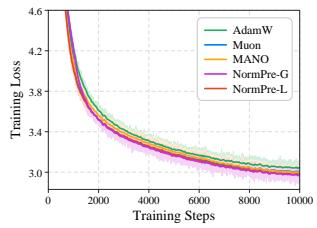

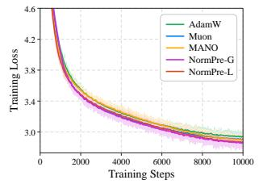

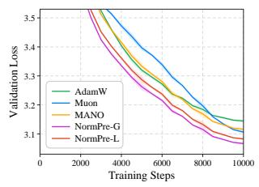  
(a) GPT-2 Small on OWT

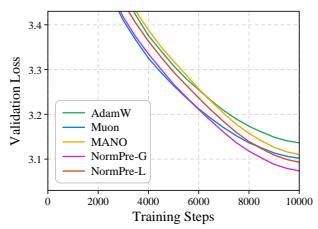  
(b) LLaMA-130M on C4

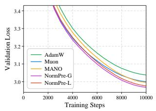  
(c) LLaMA-350M on C4

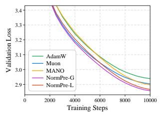  
(d) LLaMA-1.3B on C4  
Figure 1: GPT-2 Small on OpenWebText and LLaMA Models on C4. Training and validation loss for GPT-2 Small and LLaMA-{130M, 350M, 1.3B} with AdamW, Muon, MANO, NormPre-G and NormPre-L. Dark and light curves denote 50-step moving averages and raw training trajectories.

Building on this framework, we propose NormPre, a family of matrix optimizers comprising NormPre-G and NormPre-L, which realize marginal normalization followed by global and localized spectral preconditioning, respectively. Both variants combine relaxed tangent momentum processing with alternating row/column normalization and consistent update RMS scaling. Specifically, NormPre-G approximates the full-spectrum transformation via Newton-Schulz iterations. For NormPre-L, the leading interaction eigenspace is obtained through exact extraction or scalable randomized sketching. We also establish $\mathcal { O } ( T ^ { - 1 / 2 } )$ convergence guarantees for simplified NormPre-G and exact NormPre-L, extending them to sketch-based NormPre-L under controlled approximation error. Empirically, our extensive pretraining evaluations span GPT-2 Small on Open-WebText, LLaMA models up to 1.3B on C4, and Qwen3 models up to 1.7B on Pile. Under matched training budgets, both variants consistently outperform established baselines that represent distinct optimization paradigms: coordinate-wise adaptation (AdamW), matrix orthogonalization (Muon), and normalization (MANO). Furthermore, our spectral dynamics and efficiency analyses highlight that NormPre-L with localized preconditioning delivers strong optimization gains at lower cost and NormPre-G with global preconditioning further reduces validation loss, providing practitioners with flexible choices to balance optimization performance and computational cost.

Our main contributions are summarized as follows.

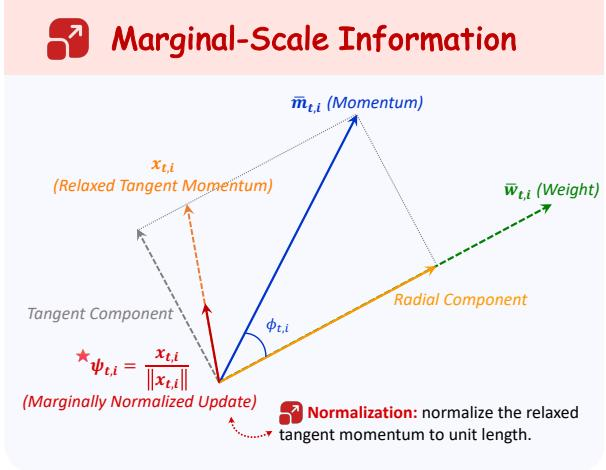  
(a) Normalize: Diagonal-Gram Normalization

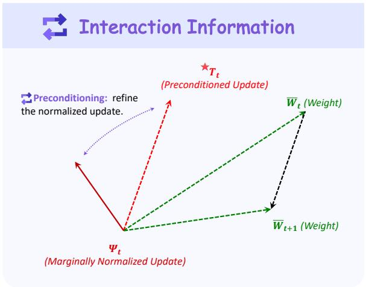  
(b) Precondition: Spectral Interaction Preconditioning  
Figure 2: Geometric Workflow of the NormPre Optimizer (Algorithm 1).

(a) The Normalize-Then-Precondition Framework. Conceptually, departing from joint geometric transformations, we establish a systematic framework to hierarchically construct a normalized update from marginal scales and refine it via interaction information. Unifying full-spectrum and targeted schemes, we formulate global and localized spectral preconditioning as a solution to spectral-norm steepest descent and a regularized formulation with leading mode selection, respectively (Section 2).

(b) The NormPre Optimizer. Algorithmically, we instantiate this framework as the NormPre optimizer, featuring alternating row-column normalization and spectral preconditioning. We provide scalable implementations using Newton-Schulz iterations for global preconditioning (NormPre-G) and randomized sketching for localized eigenspace extraction (NormPre-L), together with theoretical $\mathcal { O } ( T ^ { - 1 / 2 } )$ convergence guarantees for simplified variants (Theorem 1 and Corollary 1).

(c) Optimization Performance and Trade-offs. Empirically, we demonstrate the superior optimization performance of NormPre across the evaluated architectures and model scales, consistently outperforming established baselines (AdamW, Muon, MANO). Furthermore, we characterize the performance-efficiency trade-off between its two variants, providing flexible choices to balance optimization gains and computational cost (Section 4).

## 2 Geometric Foundations of Normalize-Then-Precondition

This section formalizes the Normalize-Then-Precondition framework. We begin by establishing a full-Gram view of row-orthogonalized updates (Section 2.1) and derive the normalized update with the marginal-scale information encoded in the Gram diagonal (Section 2.2). We finally formulate different spectral preconditioning realizations (Section 2.3). Throughout this section, $\ b X \in \mathbb { R } ^ { m \times n }$ denotes a matrix-valued update signal. We write its thin SVD as $X = U \Sigma V ^ { \top }$ . We present the row-side analysis and the column-side counterpart follows by applying the same construction to $X ^ { \top }$

## 2.1 Orthogonalized Updates and Full-Gram Transformation

Muon (Jordan et al., 2024) orthogonalizes a momentum matrix X by replacing it with the nearest semi-orthogonal matrix. For $\ b X \in \mathbb { R } ^ { m \times n }$ with $m \leq n$ , row orthogonalization is defined by

$$
\Phi \in \arg \operatorname* { m i n } _ { O } \{ \| O - X \| _ { F } : O O ^ { \top } = I _ { m } \} .\tag{1}
$$

One solution is given by the matrix sign function, $\Phi = \mathrm { m s i g n } ( X ) = U V ^ { \top }$ . Accordingly, the matrixsign update transforms the singular-value matrix Σ into identity, yielding $\Phi \Phi ^ { \top } = I _ { m }$ . In practice, Muon approximates this orthogonalization efficiently using Newton-Schulz iterations. We next identify an equivalent full-Gram form of the same update, showing how Muon’s orthogonalization depends on the full row Gram matrix.

Full-Gram Representation of Muon. If $X X ^ { \top } \succ 0$ , the matrix-sign update admits the full-Gram representation

$$
\Phi = \operatorname { m s i g n } ( X ) = ( X X ^ { \top } ) ^ { - 1 / 2 } X .\tag{2}
$$

Let $x _ { i } ^ { \top }$ denote the i-th row of X. The entries of the full row Gram matrix satisfy $( X X ^ { \top } ) _ { i i } = \| x _ { i } \| _ { 2 } ^ { 2 }$ and $( \boldsymbol { X } \boldsymbol { X } ^ { \top } ) _ { i j } = \langle \boldsymbol { x } _ { i } , \boldsymbol { x } _ { j } \rangle$ for $i \neq j$ . Its diagonal entries encode the marginal scales of individual rows, whereas its off-diagonal entries encode their pairwise interactions. Together, these two components determine the inverse-square-root operator in Equation 2, which acts on the entire singular spectrum of X. Thus, Muon jointly utilizes marginal-scale and cross-row interaction information through the full row Gram matrix.

## 2.2 Diagonal-Gram Normalization

Within the joint geometry, marginal-scale information is structurally simpler, since each row scale depends only on its corresponding row. This motivates a natural question: is it possible to first use this simpler marginal-scale information to construct a valid matrix update? To answer this question, we isolate the marginal-scale information encoded in the diagonal of $X X ^ { \top }$ . Since $( X X ^ { \top } ) _ { i i } = \| x _ { i } \| _ { 2 } ^ { 2 }$ define the diagonal matrix of row scales as

$$
D ( X ) : = { \mathrm { D i a g } } \left( \mathrm { d i a g } ( X X ^ { \top } ) \right) ^ { 1 / 2 } = { \mathrm { D i a g } } \left( \| x _ { 1 } \| _ { 2 } , \ldots , \| x _ { m } \| _ { 2 } \right) ,
$$

where diag(·) extracts the diagonal entries as a vector and $\mathrm { D i a g ( \cdot ) }$ constructs a diagonal matrix.

Diagonal-Gram Representation of Marginal Normalization. If X has no zero rows, the marginally normalized update admits the diagonal-Gram representation

$$
\Psi = D ( X ) ^ { - 1 } X = \mathrm { D i a g } \left( \mathrm { d i a g } ( X X ^ { \top } ) \right) ^ { - 1 / 2 } X .\tag{3}
$$

Equation 3 provides the diagonal-Gram counterpart of the Muon transformation in Equation 2. Muon constructs its orthogonalized update from the inverse square root of the full row Gram matrix, while Ψ uses only its diagonal component to normalize the marginal scales. This transformation coincides with the core normalization used by normalization-based optimizers (Gu and Xie, 2026;

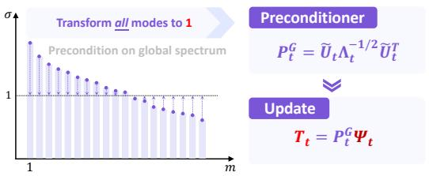  
(b.1) Global Spectral Preconditioning

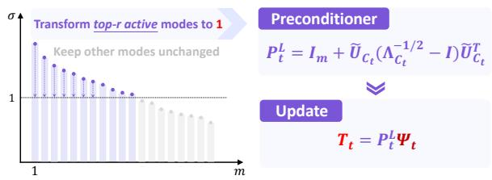  
(b.2) Localized Spectral Preconditioning  
Figure 3: Spectral Interaction Preconditioning.

Xu et al., 2026; Deng et al., 2026; Pethick et al., 2025a; Glentis et al., 2025). Define the normalized interaction matrix as $\Gamma ( X ) : = \Psi \Psi ^ { \top }$ . By construction, $\Gamma ( X ) _ { i i } = 1$ and its off-diagonal entries $\Gamma ( X ) _ { i j } = \langle x _ { i } , x _ { j } \rangle / ( \| x _ { i } \| _ { 2 } \| x _ { j } \| _ { 2 } )$ encode the cosine similarities between rows.

## 2.3 Spectral Interaction Preconditioning

Hierarchical Geometric Construction. Beyond serving as an effective standalone update, the normalization Ψ retains directional correlations in $\Gamma ( X )$ , providing a natural foundation for further spectral preconditioning. Having processed the marginal scales, we now study two realizations of this preconditioning stage (Figure 3): global spectral preconditioning, which performs fullspectrum transformation, and localized spectral preconditioning, which retains Ψ as a reference and concentrates the transformation on selected interaction modes.

Let $\Psi = \widetilde { U } \widetilde { \Sigma } \widetilde { V } ^ { \top }$ be a thin SVD with singular values $\widetilde { \sigma } _ { 1 } \geq \cdot \cdot \cdot \geq \widetilde { \sigma } _ { m } \geq 0$ . Accordingly, $\Gamma ( X ) =$ $\Psi \Psi ^ { \top } = \widetilde { U } \Lambda \widetilde { U } ^ { \top }$ , where $\Lambda = \widetilde { \Sigma } ^ { 2 } = \operatorname { D i a g } ( \lambda _ { 1 } , . . . , \lambda _ { m } )$ and $\lambda _ { i } = \widetilde { \sigma } _ { i } ^ { 2 }$ . The columns $\widetilde { u } _ { i }$ of $\overrightharpoon { U }$ define the corresponding spectral interaction directions.

Global Spectral Preconditioning. A direct method is to solve the spectral steepest descent problem for the normalized update Ψ (Bernstein and Newhouse, 2024),

$$
T ^ { \mathrm { G } } \in \arg \operatorname* { m a x } _ { \| T \| _ { \mathrm { o p } } \leq 1 } \langle \Psi , T \rangle _ { F } .\tag{4}
$$

A solution is the row-orthogonalized update obtained by performing transformation in Equation 2, $T ^ { \mathrm { G } } = P ^ { \mathrm { G } } \Psi = \mathrm { m s i g n } ( \Psi )$ , with the global preconditioner $P ^ { \mathrm { G } } = \breve { \Gamma } ( X ) ^ { - 1 / 2 } = \widetilde { U } \Lambda ^ { - 1 / 2 } \not \widetilde { \widetilde { U } } ^ { \intercal }$ when $\Gamma ( X ) \succ 0$ . Along the i-th spectral interaction direction, $P ^ { \mathrm { G } }$ applies the scaling factor $\lambda _ { i } ^ { - 1 / 2 } = \widetilde { \sigma } _ { i } ^ { - 1 }$ mapping the corresponding singular value $\widetilde { \sigma } _ { i }$ to one.

Localized Spectral Preconditioning. Another possible method starts from the observation that Ψ already serves as a marginally normalized dense update. This motivates retaining Ψ as the reference and considering the regularized spectral steepest descent problem

$$
T _ { + } : = \arg \operatorname* { m i n } _ { \| T \| _ { \mathrm { o p } } \leq 1 } \frac { 1 } { 2 } \| T - \Psi \| _ { F } ^ { 2 } = \arg \operatorname* { m a x } _ { \| T \| _ { \mathrm { o p } } \leq 1 } \left\{ \langle \Psi , T \rangle _ { F } - \frac { 1 } { 2 } \| T \| _ { F } ^ { 2 } \right\} .\tag{5}
$$

Its solution is $T _ { + } = P _ { + } \Psi$ . Defining the active set $\mathcal { A } : = \{ i : \lambda _ { i } > 1 \}$ , the corresponding preconditioner is $P _ { + } = I _ { m } + \widetilde { U } _ { A } ( \Lambda _ { \mathcal { A } } ^ { - 1 / 2 } - I ) \widetilde { U } _ { A } ^ { \intercal }$ (see Proposition 1 in Appendix D.1). Thus, the solution modifies only the active spectral modes (clipping to one) while leaving the remaining modes unchanged. To further localize the transformation, we impose a spectral budget r and let ${ \mathcal { C } } \subseteq A$ index the min $\{ r , | { \cal A } | \}$ largest active eigenvalues (see Proposition 2 in Appendix D.1). The resulting update is $T ^ { \mathrm { L } } = P ^ { \mathrm { L } } \Psi$ , with the localized preconditioner $P ^ { \mathrm { L } } = I _ { m } + \widetilde { U } \mathcal { C } ( \Lambda _ { \mathcal { C } } ^ { - 1 / 2 } - I ) \widetilde { U } _ { \mathcal { C } } ^ { \intercal }$

## 3 NormPre

This section instantiates the Normalize-Then-Precondition framework as the NormPre optimizer, with variants NormPre-G and NormPre-L using global and localized spectral preconditioning, respectively.

## 3.1 The NormPre Optimizer

Let $W _ { t } \in \mathbb { R } ^ { m \times n }$ denote a matrix-valued parameter with stochastic gradient $G _ { t } = \nabla _ { W _ { t } } \mathcal { L } _ { t }$ , and let $M _ { t } = \mu M _ { t - 1 } + G _ { t }$ denote its first-order momentum. Following Sections 2.2 and 2.3, Algorithm 1 summarizes the NormPre optimization procedure.

Algorithm 1 The NormPre Optimizer   
Require: Layer weight $W _ { t } \in \mathbb { R } ^ { m \times n }$ , learning rate $\eta _ { t } ,$ , momentum coefficient $\mu ,$ weight decay   
coefficient $\lambda _ { \mathrm { w d } } .$ , optimizer variant (NormPre-G or NormPre-L).   
1: Initialize $M _ { 0 } \gets \mathbf { 0 }$   
2: for each step do   
3: $G _ { t } \gets \nabla _ { W _ { t } } \mathcal { L } _ { t }$   
4: $M _ { t } \gets \mu M _ { t - 1 } + G _ { t }$   
5: $k _ { t } \gets t$ mod 2 ▷ Alternating Row/Column Orientation   
6: $X _ { t } \gets \mathcal { T } _ { W _ { t } , k _ { t } } ( M _ { t } )$ ▷ Relaxed Tangent Momentum   
7: $\Psi _ { t } \gets D ( X _ { t } ) ^ { - 1 } X _ { t }$ ▷ Diagonal-Gram Normalization   
8: if NormPre-G then   
9: $T _ { t } \gets P _ { t } ^ { \mathrm { G } } \Psi _ { t } = \operatorname { m s i g n } ( \Psi _ { t } )$   
10: else if NormPre-L then   
11: $\left( \widetilde { U } _ { \mathcal { C } _ { t } } , \Lambda _ { \mathcal { C } _ { t } } \right) \gets \mathrm { E i g } _ { \mathcal { C } _ { t } } ( \Psi _ { t } \Psi _ { t } ^ { \top } )$ ▷ Eigenspace Extraction   
12: $\begin{array} { r } { \dot { T _ { t } } \gets P _ { t } ^ { \mathrm { L } } \dot { \Psi } _ { t } = ( I + \widetilde { U } _ { \mathcal { C } _ { t } } ( \Lambda _ { \mathcal { C } _ { t } } ^ { - 1 / 2 } - I ) \widetilde { U } _ { \mathcal { C } _ { t } } ^ { \top } ) \Psi _ { t } } \end{array}$   
13: end if ▷ Spectral Interaction Preconditioning   
14: $W _ { t + 1 }  W _ { t } - \eta _ { t } ( \mathcal { R } _ { k _ { t } } ( T _ { t } ) + \lambda _ { \mathrm { w d } } W _ { t } )$ ▷ Consistent Update RMS   
15: end for

The remaining optimizer-level components in Algorithm 1 specify how the update signal is constructed across matrix orientations and how the final matrix update is rescaled to a consistent RMS.

Alternating Row/Column Orientation. We alternate the active orientation between rows and columns across optimization steps, allowing the row-side construction in Section 2 to apply symmetrically to both matrix axes. Specifically, let $k _ { t } = t$ mod 2 with $\mathcal { O } _ { 0 } ( A ) = A$ and $\mathcal { O } _ { 1 } ( A ) = A ^ { \top }$ , and define $\overline { { W } } _ { t } : = \mathcal { O } _ { k _ { t } } ( W _ { t } )$ and $\overline { { M } } _ { t } : = \mathcal { O } _ { k _ { t } } ( M _ { t } )$

Relaxed Tangent Momentum. We distinguish the row-wise momentum components orthogonal and parallel to the current parameter direction (i.e., tangent and radial components). These components primarily govern changes in parameter direction and scale, respectively. Let $\bar { w } _ { t , i }$ and $\bar { m } _ { t , i }$ denote the i-th rows of $\overline { { W } } _ { t }$ and $\overline { { M } } _ { t }$ , respectively. For each row, we define $x _ { t , i } : = \bar { m } _ { t , i } - \langle \bar { m } _ { t , i } , \bar { w } _ { t , i } \rangle \bar { w } _ { t , i }$ This formulation recovers strict tangent projection when $\lVert \bar { w } _ { t , i } \rVert _ { 2 } = 1$ . For general weights, this relaxed form preserves the tangent component while retaining a norm-dependent radial contribution. Collecting these rows yields the input signal $X _ { t } : = T _ { W _ { t } , k _ { t } } ( M _ { t } )$ for our framework.

Consistent Update RMS. Following the Muon convention (Liu et al., 2025), we set the target RMS of matrix updates to 0.2, facilitating shared hyperparameters and direct comparison with AdamW and Muon. For update $T \in \mathbb { R } ^ { m \times n }$ with $\mathrm { R M S } ( T ) : = \| T \| _ { F } / \sqrt { m n }$ , we define $\mathcal { R } _ { k } ( T ) : =$ $0 . 2 \cdot \mathcal { O } _ { k } ^ { - 1 } ( T ) / \operatorname { R M S } ( T )$ . Here, $\mathcal { O } _ { k } ^ { - 1 }$ maps the update from the active orientation back to the original parameter layout and the rescaling ensures an update RMS of 0.2 across matrix parameters.

## 3.2 Implementation of Spectral Preconditioning

We now detail the spectral preconditioning step in Algorithm 1, implemented via Newton-Schulz iteration for NormPre-G and eigenspace extraction for NormPre-L.

NormPre-G: Newton-Schulz Implementation. For the global realization, we approximate $T _ { t } =$ msign(Ψt) using the Newton-Schulz iteration adopted by Muon (Jordan et al., 2024; Liu et al., 2025). The iteration acts on the normalized update $\Psi _ { t }$ and maps its singular values toward one, realizing full-spectrum preconditioning. We use five Newton-Schulz iterations throughout our experiments.

NormPre-L: Exact and Sketch Implementations. For the localized realization, the preconditioner depends on a selected eigenspace of the interaction matrix $\Gamma _ { t } = \Psi _ { t } \Psi _ { t } ^ { \top }$

• Exact Eigenspace Extraction. The exact implementation computes the full eigendecomposition of $\Gamma _ { t }$ to identify the up to r largest active eigenvalues $( \lambda _ { t , i } > 1 )$ . The selected eigenpairs $( \widetilde { U } _ { \mathcal { C } _ { t } } , \Lambda _ { \mathcal { C } _ { t } } )$ are then used in the localized preconditioner.

• Sketch-Based Eigenspace Extraction. For scalable training, we approximate the leading interaction eigenspace with a randomized sketch (Halko et al., 2011). The sketch builds a low-dimensional subspace from $\Psi _ { t }$ and applies Rayleigh–Ritz extraction to estimate the leading eigenpairs. Modes with $\widehat { \lambda } _ { t , i } > 1$ are retained within the rank budget r and used in the localized preconditioner. The complete procedure is given in Algorithm 2, with details in Appendix B.

Remark 1 (Computational Complexity). Muon and NormPre-G have the same computational complexity $\mathcal { O } ( m n + q m n s )$ , where $s = \operatorname* { m i n } \{ m , n \}$ . Both use the same q-step Newton-Schulz transformation $( \mathcal { O } ( q m n s ) )$ , while the additional diagonal-Gram normalization in NormPre-G contributes only $\mathcal { O } ( m n )$ . For NormPre-L, the Exact implementation requires $\mathcal { O } ( m ^ { 2 } n { + } m ^ { 3 } )$ computation to form and decompose the full interaction matrix. The Sketch-based implementation reduces this cost to $\mathcal { O } ( ( p + 1 ) m n \ell + ( m + n ) \ell ^ { 2 } + \ell ^ { 3 } )$ by restricting eigenspace extraction to a subspace of dimension $\ell = \operatorname* { m i n } \{ m , r + o \}$ , ensuring scalability for $\ell \ll m$ (see Appendix C for detailed analysis).

In the following, we provide the convergence guarantee for NormPre.

Theorem 1 (Convergence of NormPre without Momentum). Suppose L is L-smooth and lower bounded by ${ \mathcal { L } } _ { \mathrm { i n f } }$ and let $\Delta _ { 0 } : = \mathcal { L } ( W _ { 0 } ) - \mathcal { L } _ { \mathrm { i n f } }$ . Under a fixed orientation, let $\phi _ { t , i }$ denote the angle between gradient $\bar { g } _ { t , i }$ and weight $\bar { w } _ { t , i } ,$ , and $\phi _ { t , j , i } ^ { \prime }$ the angle between normalized row $\psi _ { t , j }$ and weight $\bar { w } _ { t , i }$ . Suppose sin $\phi _ { t , i } \geq \gamma > 0$ and $\begin{array} { r } { ( \sum _ { j } \cos ^ { 2 } \phi _ { t , j , i } ^ { \prime } ) ^ { 1 / 2 } \le \gamma ^ { \prime } } \end{array}$ for all t, i. Define the maximum radial ratio $\nu _ { t } : = \operatorname* { m a x } _ { i } \| \bar { g } _ { t , i } - x _ { t , i } \| _ { 2 } / \| x _ { t , i } \| _ { 2 } ^ { \mathsf { - } }$ and the spectral factor $\chi _ { t } : = \widetilde { \sigma } _ { t , 1 } / \widetilde { \sigma } _ { t , m }$ for NormPre-G (assuming $\Gamma _ { t } \succ 0$ for all t), or $\cdot _ { \lambda t } : = \widetilde { \sigma } _ { t , 1 }$ for NormPre-L (Exact). Assume there exists $\epsilon > 0$ such that $\operatorname* { m a x } _ { 0 \leq t \leq T } \nu _ { t } \gamma ^ { \prime } \chi _ { t } \leq 1 - \epsilon$ . For any constant $C > 0 ,$ , choosing $\eta = C / \sqrt { T + 1 }$ yields

$$
\operatorname* { m i n } _ { 0 \leq t \leq T } \| \nabla \mathcal { L } ( W _ { t } ) \| _ { F } \leq \frac { 1 } { \sqrt { T + 1 } } \left( \frac { \Delta _ { 0 } \operatorname* { m a x } \{ m , n \} ^ { 1 / 2 } } { \epsilon \gamma C } + \frac { L C \operatorname* { m a x } \{ m , n \} ^ { 3 / 2 } } { 2 \epsilon \gamma } \right) .
$$

Remark 2. Theorem 1 analyzes deterministic NormPre-G and NormPre-L without momentum, RMS scaling, or weight decay. The condition $\operatorname* { m a x } _ { 0 \leq t \leq T } \nu _ { t } \gamma ^ { \prime } \chi _ { t } \leq 1 - \epsilon$ is sufficient but not necessary for convergence. By bounding the product of the radial ratio $( \nu _ { t } )$ , geometric non-orthogonality $( \gamma ^ { \prime } )$ , and spectral factor $( \chi _ { t } )$ , this condition controls the worst-case reduction in the first-order gradient signal arising from the radial interaction in the refined update. For any constant $C > 0$ choosing $\eta ~ = ~ C / \sqrt { T + 1 }$ yields an $\mathcal { O } ( T ^ { - 1 / 2 } )$ convergence rate. This bound is minimized at $\begin{array} { r } { \eta ^ { \star } = \sqrt { \frac { 2 \Delta _ { 0 } } { L \operatorname* { m a x } \{ m , n \} ( T + 1 ) } } } \end{array}$ , yielding min0≤t≤T $\begin{array} { r } { \| \nabla \mathcal { L } ( W _ { t } ) \| _ { F } \leq \frac { \operatorname* { m a x } \{ m , n \} \sqrt { 2 L \Delta _ { 0 } } } { \epsilon \gamma \sqrt { T + 1 } } } \end{array}$ . We defer the proof of Theorem 1 and the Sketch analysis (Corollary 1) to Appendices D.2.2 and D.2.3, respectively.

## 4 Experiments

This section evaluates NormPre across diverse pretraining settings (Section 4.1), analyzes its efficiency and spectral dynamics (Section 4.2) and characterizes the performance-efficiency trade-off between NormPre-G and NormPre-L (Section 4.3).

## 4.1 Scaling Experiments

Experimental Setup. We evaluate NormPre across model scales, architectures and datasets. Our experiments cover GPT-2 Small on OpenWebText (Radford et al., 2019; Gokaslan and Cohen, 2019), LLaMA-{130M, 350M, 1.3B} on C4 (Touvron et al., 2023; Raffel et al., 2020), and Qwen3-{0.6B, 1.7B} on Pile (Yang et al., 2025; Gao et al., 2020). We compare NormPre-G and NormPre-L with AdamW (Loshchilov and Hutter, 2019), Muon (Jordan et al., 2024) and MANO (Gu and Xie, 2026). NormPre-G uses five Newton-Schulz iterations and NormPre-L uses the Sketch implementation with rank $r = 3 2$ . All models are trained for 10,000 steps with a sequence length of 1024 and an effective batch size of 512. Within each setting, all optimizers use matched model initialization, data order, training budget and evaluation protocol. Detailed configurations are provided in Appendix A.1.

GPT-2 Small Pretraining on OpenWebText. Figure 1a shows training and validation loss trajectories averaged over three matched seeds. Both variants achieve lower training and validation loss than the baselines during later training, demonstrating the effectiveness of NormPre. Table 1 confirms that both variants outperform all three baselines in mean best validation loss, with NormPre-G achieving the lowest value. Compared with the strongest baseline Muon, NormPre-G and NormPre-L reduce validation loss by 0.0397 and 0.0238, respectively.

Table 1: Validation loss across model scales, architectures and pretraining datasets. GPT-2 Small results show mean ± standard deviation over three matched seeds, and larger models report single-run results under matched training budgets. Shaded columns indicate our variants. The best baseline and our outperforming variants are shown in underline and bold, respectively.
<table><tr><td colspan="2">Setting</td><td colspan="5">Validation Loss ↓</td></tr><tr><td>Model</td><td>Dataset</td><td>AdamW</td><td>Muon</td><td>MANO</td><td>NormPre-G</td><td>NormPre-L</td></tr><tr><td>GPT-2 Small</td><td>OpenWebText</td><td>3.1444 ±0.0054</td><td>3.1064 ±0.0054</td><td>3.1156 ±0.0057</td><td>3.0667 ±0.0049</td><td>3.0826 ±0.0034</td></tr><tr><td>LLaMA-130M</td><td>C4</td><td>3.1363</td><td>3.1019</td><td>3.1102</td><td>3.0737</td><td>3.0930</td></tr><tr><td>LLaMA-350M</td><td>C4</td><td>3.0378</td><td>2.9999</td><td>2.9946</td><td>2.9678</td><td>2.9758</td></tr><tr><td>LLaMA-1.3B</td><td>C4</td><td>2.9385</td><td>2.9037</td><td>2.8963</td><td>2.8571</td><td>2.8662</td></tr><tr><td>Qwen3-0.6B</td><td>Pile</td><td>2.8956</td><td>2.8335</td><td>2.8382</td><td>2.7967</td><td>2.8066</td></tr><tr><td>Qwen3-1.7B</td><td>Pile</td><td>2.6758</td><td>2.6408</td><td>2.6205</td><td>2.5868</td><td>2.5897</td></tr></table>

Table 2: Training Efficiency Comparisons. Measurements use the same training configurations as the main experiments and are averaged over 100 optimizer steps after 20 warmup steps.
<table><tr><td>Model</td><td>Dataset</td><td>Optimizer</td><td>Optimizer Latency ↓ (ms/step)</td><td>E2E Step Time ↓ (ms/step)</td><td>Throughput ↑ (k tokens/s)</td><td>Peak Memory ↓ (GiB)</td></tr><tr><td rowspan="5">GPT-2 Small</td><td rowspan="5">OpenWebText</td><td>AdamW</td><td>2.7</td><td>3364.8</td><td>155.82</td><td>14.93</td></tr><tr><td>Muon</td><td>112.8</td><td>3479.8</td><td>150.67</td><td>14.61</td></tr><tr><td>MANO</td><td>8.8</td><td>3365.6</td><td>155.78</td><td>14.61</td></tr><tr><td>NormPre-G</td><td>119.3 ↑5.76%</td><td>3495.0 ↑0.44%</td><td>150.01 ↓0.44%</td><td>14.62</td></tr><tr><td>NormPre-L</td><td>69.8 ↓38.12%</td><td>3439.4 ↓1.16%</td><td>152.44 ↑1.17%</td><td>14.61</td></tr><tr><td rowspan="5">LLaMA-1.3B</td><td rowspan="5">C4</td><td>AdamW</td><td>25.1</td><td>22121.0</td><td>23.70</td><td>42.34</td></tr><tr><td>Muon</td><td>1010.1</td><td>23124.2</td><td>22.67</td><td>37.84</td></tr><tr><td>MANO</td><td>87.1</td><td>22210.3</td><td>23.61</td><td>37.84</td></tr><tr><td>NormPre-G</td><td>1054.2 ↑4.37%</td><td>23141.8 ↑0.08%</td><td>22.66 ↓0.04%</td><td>37.83</td></tr><tr><td>NormPre-L</td><td>333.3 ↓67.00%</td><td>22399.7 ↓3.13%</td><td>23.41 ↑3.26%</td><td>37.84</td></tr></table>

LLaMA Pretraining on C4 and Qwen3 Pretraining on Pile. We extend the comparison to LLaMA-{130M, 350M, 1.3B} on C4 and Qwen3-{0.6B, 1.7B} on Pile. Table 1 and Figures 1b–1d show that both variants consistently outperform all three baselines across these diverse architectures, with NormPre-G achieving the lowest loss. For LLaMA, the advantages over the strongest baseline are most pronounced at the largest evaluated scale (1.3B), where NormPre-G and NormPre-L reduce validation loss by 0.0392 and 0.0301, respectively. These optimization gains extend similarly to Qwen3. Notably, NormPre-L performs closely to NormPre-G at the 1.7B scale with a minimal loss difference of 0.0029 (Qwen3 loss curves are deferred to Appendix A.2).

## 4.2 Training Efficiency and Spectral Dynamics

Training Efficiency. Table 2 reports training efficiency on GPT-2 Small and LLaMA-1.3B under the same configurations as the main experiments. As summarized in Table 9 and Remark 1 (Appendix C), NormPre-G shares Muon’s asymptotic complexity, but its additional normalization increases optimizer latency by 5.76% and 4.37% relative to Muon on the two models, respectively.

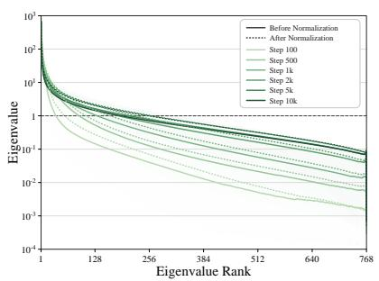  
(a)

  
(b)

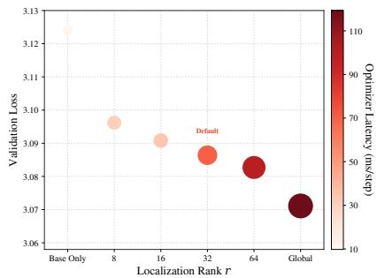  
(c)  
Figure 4: (a) Eigenspectra before and after marginal normalization; (b) Spectral transformation percentages under global and localized preconditioning; (c) Performance-efficiency trade-off.

NormPre-L approximates the interaction subspace via sketching, reducing optimizer latency by 38.12% and 67.00%. These optimizer-level differences have a smaller effect on end-to-end training efficiency because optimizer updates account for only a small fraction of step time, which is largely spent on forward and backward computation. Relative to Muon, NormPre-G increases step time by about 0.44% and 0.08% on both models, while NormPre-L reduces it by 1.16% and 3.13%, with corresponding improvements in throughput. Both variants remain slower per step than AdamW and MANO due to the additional spectral processing, but match the whole-training peak memory of Muon and MANO. Further discussions and efficiency results on Qwen3 are provided in Appendix A.2.

Spectral Dynamics. Figures 4a–4b validate our hierarchical Normalize-Then-Precondition design, revealing two key patterns. (a) Normalization yields an anisotropic base update. Equalizing row norms removes scale weighting in the Gram matrix, giving smaller-norm rows greater relative influence. This redistributes the spectral mass and might raise eigenvalues across multiple ranks (dotted curves over solid curves). Crucially, this anisotropy persists throughout training, necessitating further refinement. Table 7 confirms that constructing the preconditioner from Ψ rather than X yields lower losses. (b) Localized preconditioning captures the dominant transformation energy. Building on the normalized base, global preconditioning contracts modes above one and amplifies positive modes below one. Decomposing its spectral transformation energy (squared singular-value change $\textstyle \sum _ { \lambda _ { i } > 0 } ( { \sqrt { \lambda _ { i } } } - 1 ) ^ { 2 } )$ reveals that the top-32 modes $( \lambda _ { i } > 1 )$ consistently account for approximately $6 2 \% { - } 6 7 \%$ across checkpoints. By concentrating strictly on these modes, localized preconditioning covers a substantial portion of the global transformation to yield the optimization gains observed in Figure 1. Further details and training dynamics are provided in Appendix A.3.

## 4.3 Comparisons of NormPre-G and NormPre-L

Drawing on the preceding findings, we discuss the complementary strengths of two variants.

(a) NormPre-G yields superior performance via full-spectrum transformations. By operating on the entire eigenspectrum, NormPre-G consistently achieves the lowest validation loss across all evaluations. This indicates that transforming the long-tail modes alongside the dominant spectral energy provides crucial optimization benefits that push the absolute performance limit.

(b) NormPre-L offers a performance-efficiency trade-offvia local-spectrum transformations. The normalized base update motivates a regularized steepest-descent problem limiting deviations from this reference, giving NormPre-L a principled formulation (Propositions 1 and 2). Although empirical results favor the broader transformation of NormPre-G in validation loss, Figure 4c illustrates a clear trade-off on GPT-2 Small that larger r lowers validation loss at higher optimizer cost. We use r = 32 as the default spectral budget to balance performance and efficiency. At this budget, NormPre-L yields clear optimization gains with lower optimizer latency and end-to-end step time than NormPre-G (Table 2), serving as a practical and scalable alternative.

## 5 Related Work

LLM Optimizers. Recent optimizers span coordinate-wise methods such as AdamW (Kingma and Ba, 2015; Loshchilov and Hutter, 2019), Lion (Chen et al., 2023), Sophia (Liu et al., 2024), and Cautious Optimizers (Liang et al., 2026), and block-wise approaches like Adam-mini (Zhang et al., 2025) and Blockwise LR (Wang et al., 2025). Alongside these, matrix-level methods like K-FAC (Martens and Grosse, 2015), Shampoo (Gupta et al., 2018; Shi et al., 2023), and SOAP (Vyas et al., 2025) construct preconditioners from curvature or accumulated statistics. We focus on matrix optimizers operating directly on update geometry via orthogonalization or row/column normalization.

Orthogonalization and Normalization. Matrix structure is increasingly exploited via orthogonalization or lightweight row/column normalization. On the orthogonalization front, Muon applies a matrix-sign transformation to momentum via Newton-Schulz iterations (Jordan et al., 2024; Liu et al., 2025), while broader norm-constrained frameworks connect these updates to steepest descent and spectral spheres (Bernstein and Newhouse, 2024; Pethick et al., 2025b; Xie et al., 2026). Alternatively, row/column normalization offers a lightweight way. For example, MANO combines momentum projection with alternating row/column normalization (Gu and Xie, 2026), while RMNP uses only row normalization (Deng et al., 2026). MOGA derives such normalized updates from mean-normalized operator norms under the steepest-descent perspective (Xu et al., 2026).

Closely Relevant Work. Several methods retain orthogonalization as a core operation and incorporate normalization or adaptive scaling. One line modifies the post-orthogonalization update: Muon+ applies row/column normalization to the orthogonalized output (Zhang et al., 2026), while NorMuon and AdaMuon introduce neuron-wise and element-wise adaptive scaling (Li et al., 2025; Si et al., 2025). Another line applies pre-orthogonalization normalization for numerical stability. For instance, SWAN normalizes instantaneous gradients before whitening (Ma et al., 2024) and MuonEq (Chang et al., 2026) equilibrates momentum to improve Newton-Schulz conditioning. While these approaches discuss the utility of incorporating normalization, it remains underexplored to formulate a systematic hierarchical framework and investigate if targeted spectral schemes can be effectively developed. We establish the Normalize-Then-Precondition framework, introducing two realizations of spectral preconditioning from spectral steepest descent and its regularized form with leading mode selection.

## 6 Conclusion

This paper formalizes the Normalize-Then-Precondition framework to hierarchically organize marginal scales and interactions in matrix optimizers. Building on this, we propose NormPre, which achieves superior LLM pretraining performance over established baselines with a clear performance-efficiency trade-off. We highlight three promising directions for future research addressing current limitations: (a) Developing hardware-aware implementations to improve the efficiency of spectral transformations; (b) Scaling our empirical validation beyond 1.7B parameters; (c) Exploring adaptive spectral schemes to narrow the performance gap between localized and global preconditioning while preserving efficiency. Overall, our work provides a systematic framework for integrating normalization and spectral preconditioning, inspiring more effective and efficient LLM training.

## AI use statement

We used OpenAI Codex and Anthropic Claude Code to assist with core code implementation, data processing, experimental evaluation, translation, and the verification and refinement of mathematical proofs. Additionally, we used these tools for literature search, manuscript drafting and revision. The research questions and ideas, conceptual framework, methodology, proof strategies and initial proof drafts, and experimental design were developed by the authors without AI assistance. We have reviewed all AI-assisted work, including manuscript text, source code, data processing, and training and evaluation pipelines. We retain full responsibility for the final content of this work, including text, claims or artifacts produced with the aid of generative AI.

## Ethics statement

This work studies effective and efficient optimization methods for large language model training. It does not involve human-subject experiments, collection of personal information or deployment in real-world decision-making systems. Our experiments use established language-modeling datasets, including OpenWebText, C4 and Pile, and we do not introduce or release new training data. We follow standard research practices for experimental evaluation, reporting and reproducibility.

## Reproducibility statement

Section 3 provides a detailed description of the proposed optimizer NormPre, including two variants NormPre-G and NormPre-L. Section 4 presents the experimental setup, datasets, evaluation protocol and main results, with additional configurations, results, dynamics analyses and ablations provided in Appendix A. Implementation details for spectral preconditioning and computational complexity analyses are given in Appendices B and C. The assumptions, derivations and complete proofs supporting our theoretical results are provided in Appendix D. A repository containing the source code and materials for reproducing the experiments is linked in the abstract.

## References

Diederik P. Kingma and Jimmy Ba. Adam: A Method for Stochastic Optimization. In International Conference on Learning Representations, 2015.

Ilya Loshchilov and Frank Hutter. Decoupled weight decay regularization. In International Conference on Learning Representations, 2019.

Xiangning Chen, Chen Liang, Da Huang, Esteban Real, Kaiyuan Wang, Hieu Pham, Xuanyi Dong, Thang Luong, Cho-Jui Hsieh, Yifeng Lu, et al. Symbolic discovery of optimization algorithms. Advances in neural information processing systems, 36:49205–49233, 2023.

Hong Liu, Zhiyuan Li, David Hall, Percy Liang, and Tengyu Ma. Sophia: A scalable stochastic second-order optimizer for language model pre-training. In International conference on learning representations, volume 2024, pages 1621–1650, 2024.

Kaizhao Liang, Lizhang Chen, Bo Liu, and Qiang Liu. Cautious optimizers: Improving training with one line of code. In International Conference on Learning Representations, volume 2026, pages 106538–106563, 2026.

Yushun Zhang, Congliang Chen, Ziniu Li, Tian Ding, Chenwei Wu, Diederik Durk Kingma, Yinyu Ye, Zhi-Quan Luo, and Ruoyu Sun. Adam-mini: Use fewer learning rates to gain more. In International Conference on Learning Representations, volume 2025, pages 28033–28063, 2025.

Jinbo Wang, Mingze Wang, Zhanpeng Zhou, Junchi Yan, Lei Wu, et al. The sharpness disparity principle in transformers for accelerating language model pre-training. arXiv preprint arXiv:2502.19002, 2025.

Vineet Gupta, Tomer Koren, and Yoram Singer. Shampoo: Preconditioned stochastic tensor optimization. In International Conference on Machine Learning, pages 1842–1850. PMLR, 2018.

Nikhil Vyas, Depen Morwani, Rosie Zhao, Itai Shapira, David Brandfonbrener, Lucas Janson, and Sham Kakade. Soap: Improving and stabilizing shampoo using adam for language modeling. In International Conference on Learning Representations, volume 2025, pages 93423–93444, 2025.

Keller Jordan, Yuchen Jin, Vlado Boza, You Jiacheng, Franz Cesista, Laker Newhouse, and Jeremy Bernstein. Muon: An optimizer for hidden layers in neural networks, 2024. URL https://kellerjordan. github. io/posts/muon, 6(3):4, 2024.

Jingyuan Liu, Jianlin Su, Xingcheng Yao, Zhejun Jiang, Guokun Lai, Yulun Du, Yidao Qin, Weixin Xu, Enzhe Lu, Junjie Yan, et al. Muon is scalable for llm training. arXiv preprint arXiv:2502.16982, 2025.

Yufei Gu and Zeke Xie. Mano: Restriking manifold optimization for llm training. arXiv preprint arXiv:2601.23000, 2026.

Shenyang Deng, Zhuoli Ouyang, Tianyu Pang, Zihang Liu, Ruochen Jin, Shuhua Yu, and Yaoqing Yang. Rmnp: Row-momentum normalized preconditioning for scalable matrix-based optimization. arXiv preprint arXiv:2603.20527, 2026.

Ruihan Xu, Jiajin Li, and Yiping Lu. On the width scaling of neural optimizers under matrix operator norms i: Row/column normalization and hyperparameter transfer. arXiv preprint arXiv:2603.09952, 2026.

Chao Ma, Wenbo Gong, Meyer Scetbon, and Edward Meeds. Swan: Sgd with normalization and whitening enables stateless llm training. arXiv preprint arXiv:2412.13148, 2024.

Da Chang, Qiankun Shi, Lvgang Zhang, Yu Li, Ruijie Zhang, Yao Lu, Yongxiang Liu, and Ganzhao Yuan. Muoneq: Balancing before orthogonalization with lightweight equilibration. arXiv preprint arXiv:2603.28254, 2026.

Thomas Pethick, Wanyun Xie, Kimon Antonakopoulos, Zhenyu Zhu, Antonio Silveti-Falls, and Volkan Cevher. Training deep learning models with norm-constrained lmos. arXiv preprint arXiv:2502.07529, 2025a.

Athanasios Glentis, Jiaxiang Li, Andi Han, and Mingyi Hong. A minimalist optimizer design for llm pretraining. In ES-FoMo III: 3rd Workshop on Efficient Systems for Foundation Models, 2025.

Jeremy Bernstein and Laker Newhouse. Old optimizer, new norm: An anthology. arXiv preprint arXiv:2409.20325, 2024.

Nathan Halko, Per-Gunnar Martinsson, and Joel A Tropp. Finding structure with randomness: Probabilistic algorithms for constructing approximate matrix decompositions. SIAM review, 53 (2):217–288, 2011.

Alec Radford, Jeffrey Wu, Rewon Child, David Luan, Dario Amodei, Ilya Sutskever, et al. Language models are unsupervised multitask learners. OpenAI blog, 1(8):9, 2019.

Aaron Gokaslan and Vanya Cohen. Openwebtext corpus. http://Skylion007.github.io/ OpenWebTextCorpus, 2019.

Hugo Touvron, Thibaut Lavril, Gautier Izacard, Xavier Martinet, Marie-Anne Lachaux, Timothee´ Lacroix, Baptiste Roziere, Naman Goyal, Eric Hambro, Faisal Azhar, et al. Llama: Open and\` efficient foundation language models. arXiv preprint arXiv:2302.13971, 2023.

Colin Raffel, Noam Shazeer, Adam Roberts, Katherine Lee, Sharan Narang, Michael Matena, Yanqi Zhou, Wei Li, and Peter J Liu. Exploring the limits of transfer learning with a unified text-to-text transformer. Journal ofmachine learning research, 21(140):1–67, 2020.

An Yang, Anfeng Li, Baosong Yang, Beichen Zhang, Binyuan Hui, Bo Zheng, Bowen Yu, Chang Gao, Chengen Huang, Chenxu Lv, et al. Qwen3 technical report. arXiv preprint arXiv:2505.09388, 2025.

Leo Gao, Stella Biderman, Sid Black, Laurence Golding, Travis Hoppe, Charles Foster, Jason Phang, Horace He, Anish Thite, Noa Nabeshima, et al. The pile: An 800gb dataset of diverse text for language modeling. arXiv preprint arXiv:2101.00027, 2020.

James Martens and Roger Grosse. Optimizing neural networks with kronecker-factored approximate curvature. In International conference on machine learning, pages 2408–2417. PMLR, 2015.

Hao-Jun Michael Shi, Tsung-Hsien Lee, Shintaro Iwasaki, Jose Gallego-Posada, Zhijing Li, Kaushik Rangadurai, Dheevatsa Mudigere, and Michael Rabbat. A distributed data-parallel pytorch implementation of the distributed shampoo optimizer for training neural networks at-scale. arXiv preprint arXiv:2309.06497, 2023.

Thomas Pethick, Wanyun Xie, Kimon Antonakopoulos, Zhenyu Zhu, Antonio Silveti-Falls, and Volkan Cevher. Training Deep Learning Models with Norm-Constrained LMOs. In ICML, 2025b.

Tian Xie, Haoming Luo, Haoyu Tang, Hu Yiwen, Jason Klein Liu, Qingnan Ren, Yang Wang, Xin Zhao, Rui Yan, Bing Su, Chong Luo, and Baining Guo. Controlled LLM training on spectral sphere. In Forty-third International Conference on Machine Learning, 2026.

Ruijie Zhang, Yequan Zhao, Ziyue Liu, Zhengyang Wang, and Zheng Zhang. Muon+: Towards better muon via one additional normalization step. arXiv e-prints, pages arXiv–2602, 2026.

Zichong Li, Liming Liu, Chen Liang, Weizhu Chen, and Tuo Zhao. Normuon: Making muon more efficient and scalable. arXiv preprint arXiv:2510.05491, 2025.

Chongjie Si, Debing Zhang, and Wei Shen. Adamuon: Adaptive muon optimizer. arXiv preprint arXiv:2507.11005, 2025.

Andrej Karpathy. nanogpt. https://github.com/karpathy/nanoGPT, 2022.

Jiawei Zhao, Zhenyu Zhang, Beidi Chen, Zhangyang Wang, Anima Anandkumar, and Yuandong Tian. Galore: Memory-efficient llm training by gradient low-rank projection. International Conference on Machine Learning, 2024.

Carl Eckart and Gale Young. The approximation of one matrix by another of lower rank. Psychometrika, 1(3):211–218, 1936.

Leon Mirsky. Symmetric gauge functions and unitarily invariant norms. The quarterly journal of mathematics, 11(1):50–59, 1960.

## Appendix

A Experimental Details . 18   
A.1 Experimental Configurations . 18   
A.2 Additional Experimental Results . 19   
A.3 Additional Details on Spectral and Training Dynamics 20   
A.4 Additional Ablations . 24   
B Detailed Implementations on Spectral Preconditioning. 26   
C Detailed Computational Complexity Analysis . 28   
C.1 Shared Components in NormPre-G and NormPre-L. 28   
C.2 NormPre-G and Muon . 28   
C.3 NormPre-L 29   
D Proofs . 31   
D.1 Optimization Formulation of Localized Spectral Refinement . . 31   
D.2 Convergence Analysis of NormPre 33   
D.2.1 Lemmas . 34   
D.2.2 Convergence of NormPre-G and NormPre-L (Exact) . . 38   
D.2.3 Convergence of NormPre-L (Sketch) 40

## A Experimental Details

## A.1 Experimental Configurations

Models and Data. Our experiments use GPT-2 Small on OpenWebText (Radford et al., 2019; Gokaslan and Cohen, 2019), LLaMA-{130M, 350M, 1.3B} on C4 (Touvron et al., 2023; Raffel et al., 2020) and Qwen3-{0.6B, 1.7B} on Pile (Yang et al., 2025; Gao et al., 2020). GPT-2 Small is reproduced using the nanoGPT codebase (Karpathy, 2022). We follow the general pretraining setup in Zhao et al. (2024); Raffel et al. (2020). Table 3 summarizes the model and training configurations.

OpenWebText is processed with the GPT-2 BPE tokenizer, and the preprocessed training and validation data are loaded into CPU memory before training. For C4, we tokenize the English corpus with the T5-base tokenizer. For Pile, we recover documents from the Pythia/Pile token stream and re-tokenize them with the Qwen3 tokenizer. For C4 and Pile, we construct fixed preprocessed datasets of 5,120,000 training sequences and 2,048 validation sequences, each with length 1024. Documents are processed independently by truncating long documents and padding shorter ones without cross-document packing. The resulting data order is fixed and shared across all optimizer runs. With sequence length 1024, effective batch size 512 and 10,000 optimization steps, each training trajectory processes approximately 5.24B nominal token positions.

Table 3: Model and Training Configurations.
<table><tr><td>Model</td><td>Model Size</td><td>Dataset</td><td>Layers</td><td>Hidden</td><td>FFN</td><td>Heads</td><td>Seq. Len.</td><td>Eff. Batch</td><td>Base Peak LR</td><td>Warmup</td><td>Steps</td></tr><tr><td>GPT-2 Small</td><td>124M</td><td>OpenWebText</td><td>12</td><td>768</td><td>3,072</td><td>12</td><td>1,024</td><td>512</td><td> $6 \times 1 0 ^ { - 4 }$ </td><td>2,000</td><td>10,000</td></tr><tr><td>LLaMA-130M</td><td>130M</td><td>C4</td><td>12</td><td>768</td><td>2,048</td><td>12</td><td>1,024</td><td>512</td><td> $6 \times 1 0 ^ { - 4 }$ </td><td>1,000</td><td>10,000</td></tr><tr><td>LLaMA-350M</td><td>350M</td><td>C4</td><td>24</td><td>1,024</td><td>2,736</td><td>16</td><td>1,024</td><td>512</td><td> $3 \times 1 0 ^ { - 4 }$ </td><td>1,000</td><td>10,000</td></tr><tr><td>LLaMA-1.3B</td><td>1.3B</td><td>C4</td><td>24</td><td>2,048</td><td>5,461</td><td>32</td><td>1,024</td><td>512</td><td> $3 \times 1 0 ^ { - 4 }$ </td><td>1,000</td><td>10,000</td></tr><tr><td>Qwen3-0.6B</td><td>0.6B</td><td>Pile</td><td>28</td><td>1,024</td><td>3,072</td><td>16</td><td>1,024</td><td>512</td><td> $3 \times 1 0 ^ { - 4 }$ </td><td>1,000</td><td>10,000</td></tr><tr><td>Qwen3-1.7B</td><td>1.7B</td><td>Pile</td><td>28</td><td>2,048</td><td>6,144</td><td>16</td><td>1,024</td><td>512</td><td> $3 \times 1 0 ^ { - 4 }$ </td><td>1,000</td><td>10,000</td></tr></table>

Optimizers. We compare NormPre-G and NormPre-L with AdamW (Loshchilov and Hutter, 2019), Muon (Jordan et al., 2024) and MANO (Gu and Xie, 2026). Table 4 summarizes the default optimizer configurations. We use $( \beta _ { 1 } , \beta _ { 2 } ) = ( 0 . 9 , 0 . 9 5 )$ for AdamW and momentum coefficient $\mu = 0 . 9 5$ for Muon, MANO and both NormPre variants. Muon and NormPre-G use five Newton-Schulz iterations. NormPre-L uses the Sketch-based implementation with interaction rank $r = 3 2$ sketch oversampling $o = 8$ and one power iteration $p = 1$ . Both NormPre variants match the postpreconditioning update RMS to a target value of 0.2 before the parameter update. For GPT-2 Small, Muon follows the Keller–Jordan convention (Jordan et al., 2024) for hidden matrix parameters, using an effective peak matrix learning rate of 0.02 together with width-dependent update scaling. For LLaMA and Qwen3, Muon follows the scalable RMS-matching convention (Liu et al., 2025) and uses the base learning rate of the corresponding model setting. Muon, MANO and both NormPre variants are applied to hidden two-dimensional attention and MLP weight matrices, with token embeddings, output heads, normalization parameters, biases and other one-dimensional parameters optimized by AdamW.

Training. All models are trained for 10,000 optimization steps with sequence length 1024 and effective batch size 512. We use linear warmup followed by cosine decay to 10% of the peak learning rate, with the model-specific learning rates and warmup steps given in Table 3. Weight decay is 0.1 and gradients are clipped at 1.0. All models are evaluated every 500 optimization steps. GPT-2 Small uses 200 randomly sampled validation mini-batches per evaluation, while LLaMA and Qwen3 evaluate on the complete fixed validation split of 2,048 sequences. Within each setting, all compared optimizers use matched model initialization, data order, training budget, base learning-rate schedule and validation protocol. All experiments use the same PyTorch training codebase and NVIDIA A100 80GB GPUs. GPT-2 Small uses one GPU per training trajectory and LLaMA and Qwen3 use four-rank data parallelism.

Table 4: Default Optimizer Configurations. A dash indicates that the corresponding hyperparameter is not applicable.
<table><tr><td>Hyperparameter</td><td>AdamW</td><td>Muon</td><td>MANO</td><td>NormPre-G</td><td>NormPre-L</td></tr><tr><td> $\beta _ { 1 }$ </td><td>0.9</td><td>一</td><td>一</td><td>一</td><td>一</td></tr><tr><td> $\beta _ { 2 }$ </td><td>0.95</td><td></td><td></td><td></td><td></td></tr><tr><td>Momentum µ</td><td></td><td>0.95</td><td>0.95</td><td>0.95</td><td>0.95</td></tr><tr><td>Newton-Schulz steps</td><td></td><td>5</td><td></td><td>5</td><td></td></tr><tr><td>Weight decay</td><td>0.1</td><td>0.1</td><td>0.1</td><td>0.1</td><td>0.1</td></tr><tr><td>Interaction rank r</td><td></td><td>一</td><td>一</td><td>一</td><td>32</td></tr><tr><td>Sketch oversampling o</td><td>一</td><td>一</td><td>一</td><td>一</td><td>8</td></tr><tr><td>Power iterations p</td><td></td><td></td><td></td><td></td><td>1</td></tr></table>

## A.2 Additional Experimental Results

Training and Validation Loss for Qwen3 Models. We provide the training and validation loss curves for Qwen3-0.6B and Qwen3-1.7B on Pile in Figure 5.

Training Efficiency Configurations. Efficiency measurements mirror the main pretraining configurations (including model architecture, sequence length of 1024, effective batch size of 512, and gradient clipping) with the following specific profiling protocols:

• Precision & Data Loading: GPT-2 Small and LLaMA use FP32 parameters with BF16 autocast, while Qwen3 uses pure BF16. OpenWebText is fully materialized in host memory, whereas C4 and Pile are read dynamically from persistent NumPy memmaps (transferring only the active batch to the GPU to avoid full-dataset materialization).

• Measurement Window: We profile 100 optimizer steps following 20 warmup steps. To isolate core algorithmic overhead, we disable optimizer diagnostics (e.g., descent alignment), validation, checkpointing, W&B logging, and torch.compile.

• Metric Definitions: Optimizer latency isolates optimizer.step() using strict CUDA synchronization immediately before and after the call. E2E step time encompasses the complete training loop (data transfer, forward/backward passes, gradient accumulation, clipping, and optimizer update). Throughput is computed as global tokens per E2E step time, and peak memory tracks the maximum CUDA allocated memory during a measured step.

• TF32 Settings: Unless otherwise stated, TF32 refers to the CUDA matrix-multiplication TF32 setting. To isolate intrinsic algorithmic scaling from hardware-specific Tensor Core accelerations at small dimensions, the main GPT-2 Small efficiency results disable TF32.

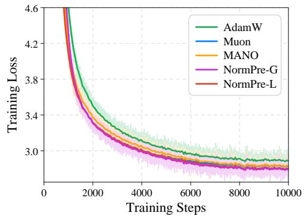

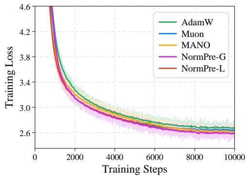

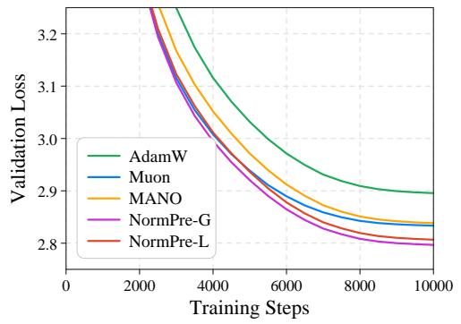  
(a) Qwen3-0.6B on Pile

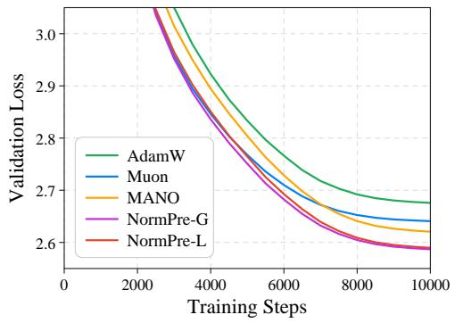  
(b) Qwen3-1.7B on Pile  
Figure 5: Qwen3 Models on Pile. Training and validation loss for Qwen3-{0.6B, 1.7B} with AdamW, Muon, MANO, NormPre-G and NormPre-L. For training loss, dark curves denote 50-step moving averages and light curves the raw trajectories.

Training Efficiency on Qwen3-1.7B. We further evaluate training efficiency on Qwen3-1.7B with Pile under the main experimental configuration. Similar to the observations in Section 4.2, relative to Muon, NormPre-G increases optimizer latency by 6.77%, with an end-to-end step-time overhead of 0.53%. NormPre-L reduces optimizer latency by 57.16%, yielding a 4.21% reduction in step time and a 4.41% increase in throughput. Both variants remain slower per step than AdamW and MANO. All evaluated optimizers have the same whole-training peak allocated memory of 53.17 GiB per GPU. This shared peak is determined by forward and backward computation, whose memory peak exceeds that of the optimizer step.

## A.3 Additional Details on Spectral and Training Dynamics

Spectral Dynamics. We collect spectral diagnostics from a NormPre-L training run on GPT-2 Small with OpenWebText and random seed 1337. We use the Sketch implementation with rank $r = 3 2$ , oversampling o = 8, and one power iteration (p = 1). Diagnostics cover the 48 attention and MLP weight matrices at checkpoints corresponding to steps 100 (101), 500 (501), 1,000 (1,001), 2,000 (2,001), 5,000 (5,001), and 10,000 (9,999). Figure 4a presents row-active spectra, and Figure 6a provides the column-active counterpart.

Table 5: Training Efficiency on Qwen3-1.7B. Measurements use the same training configuration as the main Qwen3-1.7B experiment and are averaged over 100 optimizer steps after 20 warmup steps. We report global throughput across 4 GPUs and per-GPU peak allocated memory.
<table><tr><td>Model</td><td>Dataset</td><td>Optimizer</td><td>Optimizer Latency ↓ (ms/step)</td><td>E2E Step Time ↓ (ms/step)</td><td>Throughput ↑ (k tokens/s)</td><td>Peak Memory ↓ (GiB)</td></tr><tr><td rowspan="5">Qwen3-1.7B</td><td rowspan="5">Pile</td><td>AdamW</td><td>18.3</td><td>12102.7</td><td>43.32</td><td>53.17</td></tr><tr><td>Muon</td><td>940.0</td><td>13050.4</td><td>40.17</td><td>53.17</td></tr><tr><td>MANO</td><td>118.7</td><td>12217.4</td><td>42.91</td><td>53.17</td></tr><tr><td>NormPre-G</td><td>1003.6 ↑6.77%</td><td>13119.7 ↑0.53%</td><td>39.96 ↓0.52%</td><td>53.17</td></tr><tr><td>NormPre-L</td><td>402.7 ↓57.16%</td><td> $1 2 5 0 1 . 4 \downarrow 4 . 2 1 \%$ </td><td>41.94 ↑4.41%</td><td>53.17</td></tr></table>

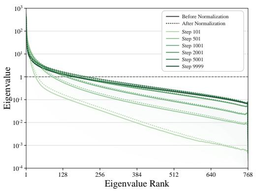  
(a)

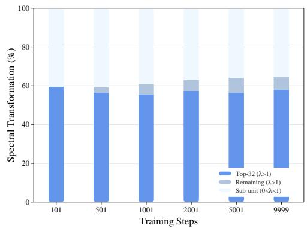  
(b)  
Figure 6: Spectral Dynamics. (a) Eigenspectra before and after marginal normalization in the column-active orientation. (b) Spectral transformation percentages across modes under global and localized preconditioning (column-active orientation).

(1) Eigenspectra Before and After Normalization. Following Section 3, let X denote the update after relaxed tangent processing (i.e., before normalization) and Ψ denote its marginally normalized counterpart. Both are expressed in the active orientation and measured before spectral preconditioning. To isolate changes in spectral shape from differences in global update magnitude, we compare

$$
{ \widehat { G } } _ { X } = { \frac { d } { \operatorname { t r } ( X X ^ { \top } ) } } X X ^ { \top } , \quad \Gamma = \Psi \Psi ^ { \top } ,
$$

where d is the active-axis dimension. Both matrices have trace d and then the same total spectral mass. The scalar rescaling of $X X ^ { \top }$ preserves its eigenvalue ratios and relative row-norm differences, which is used only for analysis in spectral dynamics. We sort the nonzero eigenvalues of ${ \widehat { G } } _ { X }$ and Γ in descending order and average them across matrices at each rank. The shaded regions show the corresponding 25th–75th percentile ranges. Different colors correspond to different training steps. Solid curves show the spectra before marginal normalization $( \widehat { G } _ { X } )$ , and dotted curves show those after normalization (Γ). The horizontal line at λ = 1 indicates the target under full-spectrum preconditioning and localized preconditioning.

Effect ofMarginal Normalization on the Spectrum. Before normalization, correlations between row directions are weighted by the products of their row norms in the Gram matrix. Normalization gives each row unit norm, removing these weights and increasing the relative influence of smaller-norm rows. To illustrate this effect, consider mutually orthogonal rows with norms $a _ { 1 } , \ldots , a _ { d } > 0$ . The trace-matched Gram matrix is diagonal, with eigenvalues $\begin{array} { r } { d a _ { i } ^ { 2 } / \sum _ { j } a _ { j } ^ { 2 } = a _ { i } ^ { 2 } / \overline { { a ^ { 2 } } } } \end{array}$ , where $\begin{array} { r } { \overline { { a ^ { 2 } } } = \frac { 1 } { d } \sum _ { j } a _ { j } ^ { 2 } } \end{array}$ After marginal normalization, the rows remain orthogonal and each has unit norm, so all eigenvalues equal one. Thus, the eigenvalue corresponding to a row increases if its squared norm is below the average and decreases if it is above the average. For nonorthogonal rows, eigenvalues do not directly correspond to individual row norms. Removing row-norm weighting still changes the spectral structure formed jointly by the rows and might increase eigenvalues across multiple ranks. This provides a possible explanation for the dotted curves lying above the solid curves over many ranks in Figures 4a and 6a.

(2) Global and Localized Spectral Preconditioning. We use row-active and column-active snapshots from the same NormPre-L trajectory described above. For each snapshot, we compare the spectral transformations induced by global and localized preconditioning on the same normalized interaction spectrum.

Let $\{ \lambda _ { i } \}$ denote the nonzero eigenvalues of $\Gamma = \Psi \Psi ^ { \top }$ . Global preconditioning maps each corresponding singular value $\sqrt { \lambda _ { i } }$ to one. We define the spectral transformation energy of each mode as its squared singular-value change, $e _ { i } = ( \sqrt { \lambda _ { i } } - 1 ) ^ { 2 }$ , and partition the total into three components:

$$
E _ { \mathrm { t o p } } = \sum _ { i \in C } e _ { i } , \quad E _ { \mathrm { r e m a i n } } = \sum _ { \lambda _ { i } > 1 , i \notin C } e _ { i } , \quad E _ { \mathrm { s u b } } = \sum _ { 0 < \lambda _ { i } < 1 } e _ { i } ,
$$

where $C$ contains the indices of the largest at most $r = 3 2$ eigenvalues exceeding one. Modes with $\lambda _ { i } = 1$ contribute zero. The total spectral transformation energy is $E _ { \mathrm { g l o b a l } } = E _ { \mathrm { t o p } } + E _ { \mathrm { r e m a i n } } + E _ { \mathrm { s u b } } .$ For each matrix, we express each component as a percentage of $E _ { \mathrm { g l o b a l } }$ . The stacked bars show these percentages averaged equally across the 48 matrices at each checkpoint. This decomposition distinguishes the spectral scope of the two variants. Localized preconditioning contracts only the modes in $C$ and leaves the others unchanged. Global preconditioning additionally contracts the remaining modes above one and amplifies the positive modes below one.

Figure 6b presents the column-active results, which follow a similar pattern to the row-active results in Figure 4b. The top-32 modes account for approximately 55%–60% of the total spectral transformation energy across checkpoints.

Training Dynamics. We examine training dynamics on GPT-2 Small with OpenWebText. Gradient norm is measured over all trainable parameters before clipping. Descent alignment is computed over the attention and MLP weight matrices. For each matrix $W ,$ let $G _ { t } ^ { ( W ) }$ denote its gradient and $\Phi _ { t } ^ { ( W ) }$ its optimizer update direction before learning-rate scaling, excluding decoupled weight decay. We report

$$
\mathrm { A l i g n } _ { t } = \frac { 1 } { | \mathcal { M } | } \sum _ { W \in \mathcal { M } } \frac { \langle G _ { t } ^ { ( W ) } , \Phi _ { t } ^ { ( W ) } \rangle _ { F } } { \| G _ { t } ^ { ( W ) } \| _ { F } \| \Phi _ { t } ^ { ( W ) } \| _ { F } } ,
$$

where $\mathcal { M }$ is the set of evaluated weight matrices. This averages the per-matrix cosine similarities. Each cosine equivalently measures the alignment between the optimizer-induced parameter change

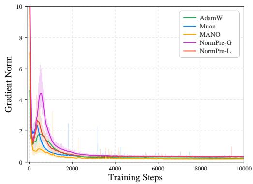  
(a) Gradient Norm

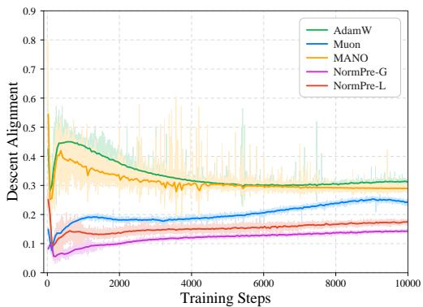  
(b) Descent Alignment  
Figure 7: Training Dynamics. (a) Pre-clipping global gradient norm over all trainable parameters. (b) Descent alignment between the gradient and optimizer update direction over matrix-optimized parameters. Dark curves show 50-step moving averages and light curves show the corresponding raw trajectories.

Table 6: Ablations on Marginally Normalized Update. Results are reported on GPT-2 Small with OpenWebText using seed 1337 under the same 10k-step training budget.  
(a) Momentum Processing
<table><tr><td rowspan="2">Variant</td><td colspan="2">Validation Loss</td></tr><tr><td>NormPre-G</td><td>NormPre-L</td></tr><tr><td>No Tangent</td><td>3.0945</td><td>3.1139</td></tr><tr><td>Strict Tangent</td><td>3.1869</td><td>3.1196</td></tr><tr><td>Relaxed Tangent</td><td>3.0711</td><td>3.0864</td></tr></table>

(b) Normalization Orientation
<table><tr><td rowspan="3">Orientation</td><td colspan="2">Validation Loss</td></tr><tr><td>NormPre-G</td><td>NormPre-L</td></tr><tr><td>Row</td><td>3.0604</td><td>3.0817</td></tr><tr><td>Alternating Row/Column</td><td>3.0711</td><td>3.0864</td></tr><tr><td>Row+Column/Step</td><td>3.0735</td><td>3.0878</td></tr></table>

and the current negative gradient.

Analysis. Both NormPre variants exhibit transient peaks in gradient norm during early training, with a more pronounced peak for NormPre-G. Their descent alignment is also lower than Muon’s, indicating greater deviation from the current negative gradient. These distinct early dynamics do not develop into persistent gradient instability. As training progresses, their gradient norms decrease and stabilize, with fewer isolated spikes overall than Muon. Directional differences persist after the gradient norms stabilize: both variants maintain lower alignment than Muon, with NormPre-G remaining the lowest. Thus, NormPre continues to reshape the update direction throughout training. Together with the lower validation losses, these observations demonstrate an effective update geometry: NormPre adjusts update directions while maintaining positive average descent alignment, sustains relatively steady optimization dynamics in later training, and achieves better final solutions.

Table 7: Ablations on Interaction Geometry Source. Results on GPT-2 Small with OpenWebText using seed 1337 and the same 10k-step training budget.
<table><tr><td rowspan="2">Interaction Source</td><td colspan="2">NormPre-G</td><td colspan="2">NormPre-L</td></tr><tr><td>Training Loss</td><td>Validation Loss</td><td>Training Loss</td><td>Validation Loss</td></tr><tr><td>Update before normalization (X)</td><td>3.0844</td><td>3.0900</td><td>3.1375</td><td>3.1305</td></tr><tr><td>Update after normalization (Ψ)</td><td>3.0655</td><td>3.0711</td><td>3.0810</td><td>3.0864</td></tr></table>

Table 8: Spectral Budget in NormPre-L. Results are reported on GPT-2 Small with OpenWebText using seed 1337 under the same 10k-step training budget.
<table><tr><td>Rank r</td><td>Training Loss Validation Loss</td></tr><tr><td>8</td><td>3.0911 3.0962</td></tr><tr><td>16 3.0857</td><td>3.0908</td></tr><tr><td>32 (default)</td><td>3.0810 3.0864</td></tr><tr><td>64 3.0768</td><td>3.0827</td></tr></table>

## A.4 Additional Ablations

Ablations on Marginally Normalized Update. Table 6 examines two design choices in constructing the marginally normalized update for both NormPre-G and NormPre-L. In part (a), relaxed tangent projection achieves the lowest validation loss for both variants, outperforming both leaving the momentum unchanged and strict tangent projection. The degradation under strict tangent projection is particularly pronounced for NormPre-G, suggesting that completely removing the radial component can discard useful information before spectral refinement. These results support the relaxed design, which prioritizes direction-changing information while retaining a limited scale-dependent component. From part (b), the choice of normalization orientation has a smaller effect. For NormPre-L, row-only and alternating row/column normalization achieve comparable validation losses, with a slight advantage for the row-only variant in this controlled comparison. For NormPre-G, the row-only variant shows a clearer improvement over alternating normalization, while normalizing both axes at every step performs similarly to the alternating scheme. We adopt alternating normalization as the default to treat the two matrix axes symmetrically and avoid introducing a fixed preferred orientation.

Ablations on Interaction Geometry Source. We compare interaction geometry extracted from the update before normalization (X) with that extracted from the update after normalization (Ψ). Both settings apply preconditioning to the same normalized base update Ψ and differ only in the source used to construct the preconditioner.

Table 7 shows that extracting interaction geometry after normalization yields lower training and validation loss for both variants. This supports constructing the preconditioner from the geometry of the update on which it acts. Using the update before normalization causes a larger degradation for NormPre-L, suggesting greater sensitivity to the source when refinement is restricted to selected modes. The marginal scales in X can affect the spectral ordering, so its leading modes may differ from those of Ψ. Normalization removes this scale weighting first, allowing the top-r eigenspace to capture interaction structure without the influence of unequal row norms. This offers a possible explanation for the greater sensitivity of localized refinement. Together, these results support using marginal normalization both to construct the base update and to establish the interaction geometry for subsequent spectral preconditioning.

Spectral Budget in NormPre-L. Table 8 reports training and validation losses for different spectral budgets, complementing Figure 4c. Both losses decrease as r increases over the evaluated range. We use r = 32 as the default to balance these performance gains against the optimizer cost.

## B Detailed Implementations on Spectral Preconditioning

From Section 3.2, NormPre-G realizes global spectral preconditioning by applying Newton-Schulz iteration to the normalized update Ψ, approximating $T ^ { \mathrm { G } } = \mathrm { m s i g n } ( \Psi )$ . This follows the standard Newton-Schulz implementation used by Muon (Jordan et al., 2024; Liu et al., 2025). NormPre-L operates on a selected interaction eigenspace, which can be obtained through exact eigendecomposition or a randomized sketch. In the following, we focus on the implementation details of NormPre-L.

Exact Eigenspace Extraction. The exact implementation explicitly forms the interaction matrix $\Gamma = \Psi \Psi ^ { \top }$ and computes its eigendecomposition $\Gamma = \widetilde U \Lambda \widetilde U ^ { \intercal }$ . Following the localized construction in Section 2.3, we define the active set $\mathcal { A } : = \{ i : \lambda _ { i } > 1 \}$ and let ${ \mathcal { C } } \subseteq A$ index the min $\{ r , | A | \}$ largest active eigenvalues. The selected eigenpairs $( \widetilde { U } _ { \mathcal { C } } , \Lambda _ { \mathcal { C } } )$ are directly used in the localized preconditioner

$$
P ^ { \mathrm { L } } = I _ { m } + \widetilde { U } \mathcal { C } ( \Lambda _ { \mathcal { C } } ^ { - 1 / 2 } - I ) \widetilde { U } \mathcal { C } ^ { \top } .
$$

Sketch-Based Eigenspace Extraction. To avoid forming and decomposing the full interaction matrix, we approximate its leading eigenspace through a randomized sketch (Halko et al., 2011). Among the top-r estimated interaction modes, those satisfying $\widehat { \lambda } _ { i } > 1$ are retained for the localized preconditioner

$$
\widehat { P } ^ { \mathrm { L } } = I _ { m } + \widehat { U } _ { \mathcal { C } } ( \widehat { \Lambda } _ { \mathcal { C } } ^ { - 1 / 2 } - I ) \widehat { U } _ { \mathcal { C } } ^ { \top } .
$$

Algorithm 2 gives the complete procedure.

Algorithm 2 Randomized Interaction Sketch   
Require: Marginally normalized update $\Psi \in \mathbb { R } ^ { m \times n }$ , rank $r \leq m$ , oversampling o, power iterations   
p.   
1: ℓ ← min $\{ m , r + o \}$   
2: Sample $\Omega \in \mathbb { R } ^ { n \times \ell }$ with $\Omega _ { i j } \sim \mathcal { N } ( 0 , 1 )$ and set $Y  \Psi \Omega$ ▷ Gaussian Sketch   
3: for $j = 1 , \dotsc , p$ do   
4: $Y \gets \Psi ( \Psi ^ { \top } Y )$   
5: end for ▷ Power Iteration   
6: $Q  \operatorname { q r } ( Y )$ ▷ Candidate Subspace   
7: $\dot { \Gamma _ { Q } }  \dot { ( Q ^ { \top } \Psi ) } ( Q ^ { \top } \Psi ) ^ { \top }$ ▷ Rayleigh–Ritz Matrix   
8: $( Z , \widehat { \Lambda } ) \gets \mathrm { t o p } { - } r$ eigenpairs of $\Gamma _ { Q }$ ▷ Ritz Pairs   
9: $\widehat { U } \gets Q Z$ ▷ Lifted Ritz Vectors   
10: $\mathcal { C }  \{ i : \widehat { \lambda } _ { i } > 1 \}$   
11: return $( \widehat { U } _ { \mathcal { C } } , \widehat { \Lambda } _ { \mathcal { C } } )$

The main steps of Algorithm 2 are as follows:

• Randomized Subspace Construction (Lines 2–6). The Gaussian sketch $Y = \Psi \Omega$ probes the range of Ψ and the power iterations $Y  \Psi ( \Psi ^ { \top } Y )$ amplify the separation of its leading singular directions. Then, QR decomposition yields an orthonormal basis $Q \in \mathbb { R } ^ { m \times \ell }$ for the candidate interaction subspace.

• Rayleigh–Ritz Eigenspace Extraction (Lines 7–10). The interaction matrix is projected onto the candidate subspace through

$$
\Gamma _ { Q } = Q ^ { \top } \Gamma Q = ( Q ^ { \top } \Psi ) ( Q ^ { \top } \Psi ) ^ { \top } \in \mathbb { R } ^ { \ell \times \ell } .
$$

Computing the top-r eigenpairs $( Z , \widehat { \Lambda } )$ of $\Gamma _ { Q }$ gives the corresponding Ritz pairs and the Ritz vectors are lifted to the original interaction space through $\widehat { U } = Q Z$ . We retain the estimated modes satisfying $\widehat { \lambda } _ { i } > 1$ , yielding $( \widehat { U } _ { \mathcal { C } } , \widehat { \Lambda } _ { \mathcal { C } } )$ for localized spectral preconditioning. Since the Ritz values are ordered in descending order, applying $\widehat { \lambda } _ { i } > 1$ after top-r selection is equivalent to first identifying the active modes and then retaining the largest $r ,$ consistent with Section 2.3.

## C Detailed Computational Complexity Analysis

This section analyzes the optimizer-side computational complexity. For NormPre, the analysis covers momentum update, relaxed tangent projection, diagonal-Gram normalization, spectral preconditioning, update RMS scaling and parameter update. We consider both NormPre-G and NormPre-L, and include Muon as a reference for the Newton-Schulz computation. Table 9 summarizes the resulting complexities.

Let $m \times n$ denote the matrix dimensions entering the spectral preconditioning stage and define $s : = \dim \{ m , n \}$ . For the Newton-Schulz implementations in Muon and NormPre-G, the input is transposed when necessary so that the Gram matrix is $s \times s .$ For NormPre-L, $m \times n$ follows the current active orientation. Let q denote the number of Newton-Schulz iterations, r the interaction rank, o the oversampling parameter, p the number of power iterations and $\ell : = \operatorname* { m i n } \{ m , r + o \}$ . We omit constant factors and lower-order terms.

Table 9: Computational Complexity of Muon and NormPre Variants.
<table><tr><td>Method</td><td>Computational Complexity</td></tr><tr><td>Muon</td><td> $\mathcal { O } ( m n + q m n s )$ </td></tr><tr><td>NormPre-G</td><td> $\mathcal { O } ( m n + q m n s )$ </td></tr><tr><td>NormPre-L (Exact)</td><td> $\mathcal { O } ( m ^ { 2 } n + m ^ { 3 } )$ </td></tr><tr><td>NormPre-L (Sketch)</td><td> $\mathcal { O } \big ( ( p + 1 ) m n \ell + ( m + n ) \ell ^ { 2 } + \ell ^ { 3 } \big )$ </td></tr></table>

## C.1 Shared Components in NormPre-G and NormPre-L

Following Algorithm 1, NormPre-G and NormPre-L share the same optimization pipeline except for the spectral preconditioning step. We analyze these shared operations under the active orientation.

• Momentum Update and Relaxed Tangent Projection. Updating the momentum requires $\mathcal { O } ( m n )$ operations. The tangent projection is applied independently to each row with ${ \mathcal { O } } ( n )$ cost per row (inner products and vector rescaling), giving $\mathcal { O } ( m n )$ operations in total.

• Diagonal-Gram Normalization. Computing the row norms of X and forming the normalized update $\Psi = D ( X ) ^ { - 1 } X$ require $\mathcal { O } ( m n )$ operations.

• Update RMS Scaling and Parameter Update. Computing RMS(T) and rescaling the update both require $\mathcal { O } ( m n )$ operations. Applying weight decay and updating the parameter matrix also require $\mathcal { O } ( m n )$ operations.

Overall, these shared operations contribute $\mathcal { O } ( m n )$ computation to both variants and are included in the total costs reported in Table 9.

## C.2 NormPre-G and Muon

Muon. Muon applies a Newton-Schulz approximation of the matrix-sign transformation to its momentum update. The input is transposed when necessary so that the Gram matrix is $s \times s .$ . Each

Newton-Schulz iteration involves matrix products between the $s \times s$ Gram matrix and the matrix update, with dominant cost $\mathcal { O } ( m n s )$ . For q iterations, the matrix transformation requires $\mathcal { O } ( q m n s )$ The remaining optimizer operations $( e . g .$ ., momentum update, update RMS scaling and parameter update) contribute $\mathcal { O } ( m n )$ , giving the total complexity $\mathcal { O } ( m n + q m n s )$

NormPre-G. NormPre-G applies the same q-step Newton-Schulz transformation to the normalized update Ψ. Thus, its spectral preconditioning stage requires $\mathcal { O } ( q m n s )$ computation. Together with the shared $\mathcal { O } ( m n )$ operations analyzed in Section C.1, the total complexity is $\mathcal { O } ( m n + q m n s )$ Therefore, Muon and NormPre-G have the same leading asymptotic computational complexity for a fixed number of Newton-Schulz iterations. The relaxed tangent projection and diagonal-Gram normalization in NormPre-G add only $\mathcal { O } ( m n )$ computation and do not change the asymptotic order.

## C.3 NormPre-L

For the Exact implementation, the selected eigenvectors $\boldsymbol { \widetilde { U } } _ { \mathcal { C } } \in \mathbb { R } ^ { m \times | \mathcal { C } | }$ and eigenvalues $\Lambda _ { C }$ give $\begin{array} { r } { P ^ { \mathrm { L } } \Psi = \Psi + \widetilde { U } _ { \mathcal { C } } \left( \Lambda _ { \mathcal { C } } ^ { - 1 / 2 } - I \right) \widetilde { U } _ { \mathcal { C } } ^ { \top } \Psi } \end{array}$ . For the Sketch-based implementation, the estimated eigenpairs $( \widehat { U } _ { \mathcal { C } } , \widehat { \Lambda } _ { \mathcal { C } } )$ yield $\widehat { P } ^ { \mathrm { L } } \Psi = \Psi + \widehat { U } _ { \mathcal { C } } \left( \widehat { \Lambda } _ { \mathcal { C } } ^ { - 1 / 2 } - I \right) \widehat { U } _ { \mathcal { C } } ^ { \top } \Psi$ . In both cases, the selected eigenvector matrix has dimension $m \times | \mathcal { C } |$ with $| { \mathcal { C } } | \leq r$ . Computing $\widetilde { U } _ { \mathcal { C } } ^ { \top }$ Ψ or $\widehat { U } _ { \mathcal { C } } ^ { \top } \Psi$ requires $\mathcal { O } ( m n \vert \mathcal { C } \vert )$ operations. Applying the diagonal spectral scaling costs $\mathcal { O } ( n | \mathcal { C } | )$ and multiplying by $\widetilde { U } _ { { \mathcal { C } } }$ or $\widehat { U } _ { \mathcal { C } }$ requires another $\mathcal { O } ( m n | \mathcal { C } | )$ operations. Therefore, the localized spectral application costs $\mathcal { O } ( m n r )$ . The exact and sketch-based implementations differ in the cost of extracting the selected interaction eigenspace.

NormPre-L (Exact). The exact implementation forms the interaction matrix $\Gamma = \Psi \Psi ^ { \top }$ , which costs $\mathcal { O } ( m ^ { 2 } n )$ . The resulting $m \times m$ matrix is then processed by a dense symmetric eigendecomposition with cost $\mathcal { O } ( m ^ { 3 } )$ . Together with the shared $\mathcal { O } ( m n )$ operations analyzed in Section C.1 and the $\mathcal { O } ( m n r )$ localized spectral application, we obtain $\mathcal { O } ( m n + m n r + m ^ { 2 } n + m ^ { 3 } ) = \mathcal { O } ( m ^ { 2 } n + m ^ { 3 } )$ where the simplification follows from $r \leq m$

NormPre-L (Sketch). The sketch-based implementation avoids forming and decomposing the full $m \times m$ interaction matrix by using the randomized sketch in Algorithm 2. Its eigenspace-extraction cost can be decomposed as follows, the main intermediate dimensions are summarized in Table 10.

• Randomized Sketch and Power Iteration. Forming $Y = \Psi \Omega$ costs $\mathcal { O } ( m n \ell )$ . Each power iteration computes $\Psi ^ { \top } Y$ followed by $\Psi ( \Psi ^ { \top } Y )$ , with both matrix multiplications requiring $\mathcal { O } ( m n \ell )$ operations. Over p iterations, the power-iteration cost is $\mathcal { O } ( p m n \ell )$

• Candidate Subspace. Computing the QR decomposition of $Y \in \mathbb { R } ^ { m \times \ell }$ costs $\mathcal { O } ( m \ell ^ { 2 } )$

• Rayleigh–Ritz Matrix. Forming $Q ^ { \top } \Psi \in \mathbb { R } ^ { \ell \times n }$ costs $\mathcal { O } ( m n \ell )$ and constructing $\Gamma _ { Q } = ( Q ^ { \top } \Psi ) ( Q ^ { \top } \Psi ) ^ { \top } \in$ $\mathbb { R } ^ { \ell \times \ell }$ costs $\mathcal { O } ( n \ell ^ { 2 } )$

• Rayleigh–Ritz Extraction. A dense eigendecomposition of $\Gamma _ { Q } \in \mathbb { R } ^ { \ell \times \ell }$ costs $\mathcal { O } ( \ell ^ { 3 } )$ . Computing $\widehat { U } = Q Z$ costs $\mathcal { O } ( m \ell r )$ , which is bounded by $\mathcal { O } ( m \ell ^ { 2 } )$ because $r \leq \ell .$

We have $\mathcal { O } ( m n + m n r + ( p + 1 ) m n \ell + ( m + n ) \ell ^ { 2 } + \ell ^ { 3 } )$ when combining these terms with the shared $\mathcal { O } ( m n )$ operations and $\mathcal { O } ( m n r )$ localized spectral application. Since $r \leq \ell .$ , the $\mathcal { O } ( m n )$ and

$\mathcal { O } ( m n r )$ terms are absorbed into the sketching cost. Therefore, the total computational complexity of NormPre-L (Sketch) is $\mathcal { O } ( ( p + 1 ) m n \ell + ( m + n ) \ell ^ { 2 } + \ell ^ { 3 } )$  
Table 10: Dimensions of the Main Quantities in Algorithm 2
<table><tr><td></td><td>Symbol Dimension Description</td><td></td></tr><tr><td> $\Psi$ </td><td> $m \times n$ </td><td>Marginally normalized update</td></tr><tr><td> $\Omega$ </td><td> $n \times \ell$ </td><td>Gaussian random matrix</td></tr><tr><td> $Y$ </td><td> $m \times \ell$ </td><td>Gaussian sketch</td></tr><tr><td> $Q$ </td><td> $m \times \ell$ </td><td>Candidate subspace</td></tr><tr><td> $\Gamma _ { Q }$ </td><td> $\ell \times \ell$ </td><td>Rayleigh-Ritz matrix</td></tr><tr><td> $Z$   $\widehat { \cdot }$ </td><td> $\ell \times r$ </td><td>Top-r eigenvectors of  $\Gamma _ { Q }$ </td></tr><tr><td> $\Lambda$ </td><td> $r \times r$ </td><td>Estimated eigenvalues</td></tr><tr><td> $\widehat { U }$ </td><td> $m \times r$ </td><td>Estimated eigenvectors</td></tr></table>

## D Proofs

## D.1 Optimization Formulation of Localized Spectral Refinement

Proposition 1 (Regularized Spectral Steepest Descent). Suppose that $\Gamma ( X ) \succ 0$ . The closest update to Ψ within the unit spectral-norm ball is

$$
T _ { + } : = \arg \operatorname* { m i n } _ { \| T \| _ { \mathrm { o p } } \leq 1 } \frac { 1 } { 2 } \| T - \Psi \| _ { F } ^ { 2 } = \arg \operatorname* { m a x } _ { \| T \| _ { \mathrm { o p } } \leq 1 } \left\{ \langle \Psi , T \rangle _ { F } - \frac { 1 } { 2 } \| T \| _ { F } ^ { 2 } \right\} .\tag{6}
$$

Its unique solution is $T _ { + } = P _ { + } \Psi$ , where the preconditioner is

$$
P _ { + } = \widetilde U \mathrm { D i a g } \left( \operatorname* { m i n } \{ 1 , \lambda _ { 1 } ^ { - 1 / 2 } \} , \ldots , \operatorname* { m i n } \{ 1 , \lambda _ { m } ^ { - 1 / 2 } \} \right) \widetilde U ^ { \top } .\tag{7}
$$

In particular, $0 \prec P _ { + } \preceq I _ { m }$ and $\sigma _ { i } ( T _ { + } ) = \operatorname* { m i n } \{ \widetilde { \sigma } _ { i } , 1 \}$

Remark 3. Proposition 1 gives the exact projection of Ψ onto the unit spectral-norm ball, clipping singular values above one to one while leaving the remaining singular values unchanged. Define the active set $\mathcal { A } : = \{ i : \lambda _ { i } > 1 \}$ , together with $\widetilde { U } _ { \mathcal { A } } : = [ \widetilde { u } _ { i } ] _ { i \in \mathcal { A } }$ and $\Lambda _ { \mathcal { A } } : = \operatorname { D i a g } ( \lambda _ { i } ) _ { i \in \mathcal { A } }$ . Equivalently, the preconditioner can be written as

$$
P _ { + } = I _ { m } + \widetilde { U } _ { A } ( \Lambda _ { \mathcal { A } } ^ { - 1 / 2 } - I ) \widetilde { U } _ { \mathcal { A } } ^ { \top } .
$$

Its non-identity component is $\Delta _ { \mathcal { A } } : = P _ { + } - I _ { m }$ . Hence, $P _ { + } \Psi = \Psi + \Delta _ { \mathcal { A } } \Psi$ , where $\Delta _ { \mathcal { A } } \Psi$ is the induced update refinement relative to the normalized update Ψ.

Proof. Let $\Psi = \widetilde { U } \widetilde { \Sigma } \widetilde { V } ^ { \intercal }$ be a thin SVD, where $\widetilde { \Sigma } = \mathrm { D i a g } ( \widetilde { \sigma } _ { 1 } , \dots , \widetilde { \sigma } _ { m } )$ with $\widetilde { \sigma } _ { 1 } \geq \dots \geq \widetilde { \sigma } _ { m } > 0$ Suppose that $\Gamma ( X ) = \Psi \Psi ^ { \top } = \widetilde U \Lambda \widetilde U ^ { \top } \succ 0$ , i.e., Ψ has full row rank and $\lambda _ { i } = \widetilde { \sigma } _ { i } ^ { 2 } > 0$ for every i.

For the regularized steepest-descent problem,

$$
\frac { 1 } { 2 } \| T - \Psi \| _ { F } ^ { 2 } = \frac { 1 } { 2 } \| \Psi \| _ { F } ^ { 2 } - \left( \langle \Psi , T \rangle _ { F } - \frac { 1 } { 2 } \| T \| _ { F } ^ { 2 } \right) .
$$

Since $\| \Psi \| _ { F } ^ { 2 } / 2$ is independent of $T$ , the two optimization problems in Equation 6 are equivalent.

Following the standard spectral steepest-descent derivation of the matrix-sign update, we solve the regularized problem under the same unit spectral-norm constraint by optimizing its singular values modewise.

Let $\tau _ { 1 } , \ldots , \tau _ { m }$ denote the singular values of a feasible T. The constraint $\| T \| _ { \mathrm { o p } } ~ \leq ~ 1$ implies $0 \leq \tau _ { i } \leq 1$ . By von Neumann’s trace inequality, $\textstyle \langle \Psi , T \rangle _ { F } \leq \sum _ { i = 1 } ^ { m } { \widetilde { \sigma } } _ { i } \tau _ { i }$ , with equality when $T$ shares the singular directions of Ψ. Since $\begin{array} { r } { \| T \| _ { F } ^ { 2 } = \sum _ { i = 1 } ^ { m } \tau _ { i } ^ { 2 } } \end{array}$ , the regularized objective satisfies

$$
\langle \Psi , T \rangle _ { F } - \frac { 1 } { 2 } \| T \| _ { F } ^ { 2 } \leq \sum _ { i = 1 } ^ { m } \left( \widetilde { \sigma } _ { i } \tau _ { i } - \frac { 1 } { 2 } \tau _ { i } ^ { 2 } \right) .
$$

Thus, the matrix problem reduces to independently maximizing $\widetilde { \sigma } _ { i } \tau _ { i } - { \textstyle \frac { 1 } { 2 } } \tau _ { i } ^ { 2 }$ over $0 \leq \tau _ { i } \leq 1$ for each singular mode. For each i, consider the scalar objective $f _ { i } ( \tau _ { i } ) : = \widetilde { \sigma } _ { i } \tau _ { i } \stackrel { - } { - } { \textstyle { \frac { 1 } { 2 } } } \tau _ { i } ^ { 2 }$ . Since $f _ { i } ^ { \prime } ( \tau _ { i } ) = \widetilde { \sigma } _ { i } - \tau _ { i }$

and $f _ { i } ^ { \prime \prime } ( \tau _ { i } ) = - 1 < 0$ , its unique unconstrained maximizer is $\tau _ { i } = \widetilde { \sigma } _ { i }$ . With the unit spectral-norm constraint $0 \leq \tau _ { i } \leq 1$ , we have

$$
\tau _ { i } ^ { \star } = \operatorname* { m i n } \{ \widetilde { \sigma } _ { i } , 1 \} .
$$

Therefore, the unique solution is

$$
T _ { + } = \widetilde U \operatorname { D i a g } \left( \operatorname* { m i n } \{ \widetilde \sigma _ { 1 } , 1 \} , \ldots , \operatorname* { m i n } \{ \widetilde \sigma _ { m } , 1 \} \right) \widetilde { V } ^ { \top } .
$$

The uniqueness follows from the strict concavity of $\begin{array} { r } { \langle \Psi , T \rangle _ { F } - \frac { 1 } { 2 } \| T \| _ { F } ^ { 2 } } \end{array}$ over the convex feasible set.

We next express the optimal solution as a left spectral preconditioning of Ψ. Since $\lambda _ { i } = \widetilde { \sigma } _ { i } ^ { 2 }$ , define

$$
\begin{array} { r } { P _ { + } : = \widetilde U \operatorname * { D i a g } \left( \operatorname* { m i n } \{ 1 , \lambda _ { 1 } ^ { - 1 / 2 } \} , \ldots , \operatorname* { m i n } \{ 1 , \lambda _ { m } ^ { - 1 / 2 } \} \right) \widetilde U ^ { \top } . } \end{array}
$$

Then $P _ { + } \Psi = \widetilde U \operatorname { D i a g } \left( \operatorname* { m i n } \{ 1 , \widetilde \sigma _ { 1 } ^ { - 1 } \} \widetilde \sigma _ { 1 } , \dots \right.$ , min $\{ 1 , \widetilde { \sigma } _ { m } ^ { - 1 } \} \widetilde { \sigma } _ { m } \big ) \widetilde { V } ^ { \top } = T _ { + } , \mathrm { i . e . , } T _ { + } = P _ { + } \Psi$ . Since

$$
\operatorname* { m i n } \{ 1 , \lambda _ { i } ^ { - 1 / 2 } \} = \left\{ \begin{array} { l l } { 1 , } & { \lambda _ { i } \leq 1 , } \\ { \lambda _ { i } ^ { - 1 / 2 } , } & { \lambda _ { i } > 1 , } \end{array} \right.
$$

letting $\mathcal { A } : = \{ i : \lambda _ { i } > 1 \}$ gives the equivalent representation of the preconditioner

$$
P _ { + } = I _ { m } + \widetilde { U } _ { A } \left( \Lambda _ { A } ^ { - 1 / 2 } - I \right) \widetilde { U } _ { A } ^ { \top } .
$$

Thus, $P _ { + }$ leaves modes with $\lambda _ { i } \leq 1$ unchanged and contracts modes with $\lambda _ { i } > 1 \mathrm { b y } \lambda _ { i } ^ { - 1 / 2 }$ . Moreover, every eigenvalue of $P _ { + }$ lies in (0, 1], so $0 \prec P _ { + } \preceq I _ { m }$ □

Proposition 2 (Rank-Constrained Spectral Refinement). Suppose that $\Gamma ( X ) \succ 0 .$ . A closest rankconstrained update refinement to $\Delta _ { \mathcal { A } } \Psi$ is obtained by solving

$$
\Delta ^ { \star } \in \arg \operatorname* { m i n } _ { \operatorname { r a n k } ( \Delta ) \leq r } \frac { 1 } { 2 } \left\| ( \Delta - \Delta _ { \mathcal { A } } ) \Psi \right\| _ { F } ^ { 2 } .\tag{8}
$$

Let ${ \mathcal { C } } \subseteq A$ index the min $\{ r , | { \cal A } | \}$ largest eigenvalues satisfying $\lambda _ { i } > 1$ . Then one solution is

$$
\Delta ^ { \star } = \widetilde U _ { \mathcal { C } } \left( \Lambda _ { \mathcal { C } } ^ { - 1 / 2 } - I \right) \widetilde U _ { \mathcal { C } } ^ { \top } .\tag{9}
$$

The resulting preconditioner and update are $P : = I _ { m } + \Delta ^ { \star }$ and $T : = P \Psi$

Remark 4. Proposition 2 characterizes the optimal rank-constrained spectral refinement. Since $\Gamma ( X ) \succ 0$ , Ψ has full row rank and $\mathrm { r a n k } ( \Delta \Psi ) = \mathrm { r a n k } ( \Delta )$ , so the rank constraint on the non-identity component is equivalent to that on its induced update refinement. The result then follows from the Eckart–Young–Mirsky theorem (Eckart and Young, 1936; Mirsky, 1960) applied to $\Delta _ { \mathcal { A } } \Psi$ . Its nonzero singular values are $| 1 - \sqrt { \lambda _ { i } } |$ for $i \in \mathcal A$ and increase monotonically with $\lambda _ { i } ,$ so the optimal truncation retains the active modes associated with the largest $\lambda _ { i }$ indexed by C.

Proof. Recall that $\Psi = \widetilde { U } \widetilde { \Sigma } \widetilde { V } ^ { \top }$ is a thin SVD, where $\widetilde { \Sigma } = \operatorname { D i a g } ( \widetilde { \sigma } _ { 1 } , \dots , \widetilde { \sigma } _ { m } )$ with $\widetilde { \sigma } _ { 1 } \geq \cdots \geq \widetilde { \sigma } _ { m } >$ 0. Suppose that $\Gamma ( X ) = \Psi \Psi ^ { \top } = \widetilde U \Lambda \widetilde U ^ { \top } \succ 0 , \mathrm { i . e . }$ , Ψ has full row rank and $\lambda _ { i } = \widetilde { \sigma } _ { i } ^ { 2 } > 0$ for every i. From Proposition 1, with $\mathcal { A } : = \{ i : \lambda _ { i } > 1 \}$ and $P _ { + } = I _ { m } + \widetilde { U } _ { A } \left( \Lambda _ { A } ^ { - 1 / 2 } - I \right) \widetilde { U } _ { A } ^ { \intercal }$

$$
\Delta _ { \cal A } = P _ { + } - I _ { m } = \widetilde U _ { \cal A } \left( \Lambda _ { \cal A } ^ { - 1 / 2 } - I \right) \widetilde U _ { \cal A } ^ { \top } .
$$

Applying this refinement to $\Psi ,$ , and using that $\widetilde { U } _ { A }$ and $\widetilde { V } _ { A }$ collect the singular directions indexed by A, we have

$$
\begin{array} { r l } & { \Delta _ { \mathcal { A } } \Psi = \widetilde { U } _ { \mathcal { A } } \left( \Lambda _ { \mathcal { A } } ^ { - 1 / 2 } - I \right) \widetilde { U } _ { \mathcal { A } } ^ { \top } \widetilde { U } \widetilde { \Sigma } \widetilde { V } ^ { \top } } \\ & { \quad \quad \quad = \widetilde { U } _ { \mathcal { A } } \left( \Lambda _ { \mathcal { A } } ^ { - 1 / 2 } - I \right) \widetilde { \Sigma } _ { \mathcal { A } } \widetilde { V } _ { \mathcal { A } } ^ { \top } } \\ & { \quad \quad \quad = \widetilde { U } _ { \mathcal { A } } \mathrm { D i a g } \left( 1 - \widetilde { \sigma } _ { i } \right) _ { i \in \mathcal { A } } \widetilde { V } _ { \mathcal { A } } ^ { \top } , } \end{array}
$$

where the last equality follows from $\lambda _ { i } = \widetilde { \sigma } _ { i } ^ { 2 }$ . Since $\lambda _ { i } > 1$ for $i \in { \mathcal { A } } .$ , we have $\widetilde { \sigma } _ { i } = \sqrt { \lambda _ { i } } > 1$ Therefore, the nonzero singular values of $\Delta _ { \mathcal { A } } \Psi$ are $| 1 - \widetilde { \sigma } _ { i } | = \sqrt { \lambda _ { i } } - 1$ for $i \in \mathcal A$

For any feasible $\Delta$ with rank $( \Delta ) \leq r ,$ , we have rank $( \Delta \Psi ) \le \mathrm { r a n k } ( \Delta ) \le r$ . Replacing $\Delta \Psi$ by an arbitrary matrix $Z$ with rank at most r enlarges the feasible set. Therefore,

$$
\operatorname* { m i n } _ { \operatorname { r a n k } ( Z ) \leq r } \| Z - \Delta _ { \cal A } \Psi \| _ { { \cal F } } ^ { 2 } \leq \operatorname* { m i n } _ { \operatorname { r a n k } ( \Delta ) \leq r } \| \Delta \Psi - \Delta _ { \cal A } \Psi \| _ { { \cal F } } ^ { 2 } .
$$

By the Eckart–Young–Mirsky theorem, the left-hand side is minimized by retaining the min $\{ r , | A | \}$ largest singular values of $\Delta _ { \mathcal { A } } \Psi$ , whose rank is $| { \cal A } |$ . Since $\sqrt { \lambda _ { i } } - 1$ is increasing in $\lambda _ { i } .$ , the optimal rank-r approximation retains the modes with the largest active eigenvalues. Let ${ \mathcal { C } } \subseteq A$ index these modes. The resulting truncated approximation is

$$
Z ^ { \star } = \widetilde { U } _ { { \mathcal { C } } } \mathrm { D i a g } \left( 1 - \widetilde { \sigma } _ { i } \right) _ { i \in { \mathcal { C } } } \widetilde { V } _ { { \mathcal { C } } } ^ { \top } .
$$

Define $\Delta ^ { \star } : = \widetilde U _ { \mathcal { C } } \left( \Lambda _ { \mathcal { C } } ^ { - 1 / 2 } - I \right) \widetilde U _ { \mathcal { C } } ^ { \intercal }$ . Since $| { \mathcal { C } } | \leq r$ , we have rank $( \Delta ^ { \star } ) \leq r$ , so $\Delta ^ { \star }$ is feasible for the original problem. Moreover,

$$
\begin{array} { c } { \Delta ^ { \star } \Psi = \widetilde { U } _ { \mathcal { C } } \left( \Lambda _ { \mathcal { C } } ^ { - 1 / 2 } - I \right) \widetilde { \Sigma } _ { \mathcal { C } } \widetilde { V } _ { \mathcal { C } } ^ { \top } } \\ { = \widetilde { U } _ { \mathcal { C } } \mathrm { D i a g } \left( 1 - \widetilde { \sigma } _ { i } \right) _ { i \in \mathcal { C } } \widetilde { V } _ { \mathcal { C } } ^ { \top } } \\ { = Z ^ { \star } , } \end{array}
$$

Thus, $\Delta ^ { \star }$ attains the optimal rank-r approximation obtained from the relaxed problem. Together with the preceding lower bound, this gives

$$
\operatorname* { m i n } _ { \operatorname { r a n k } ( \Delta ) \leq r } \| \Delta \Psi - \Delta _ { \mathcal { A } } \Psi \| _ { F } ^ { 2 } = \operatorname* { m i n } _ { \operatorname { r a n k } ( Z ) \leq r } \| Z - \Delta _ { \mathcal { A } } \Psi \| _ { F } ^ { 2 } .
$$

Therefore, $\Delta ^ { \star }$ is a solution to Equation 8. The resulting preconditioner and refined update are

$$
P = I _ { m } + \Delta ^ { \star } , \quad T = P \Psi ,
$$

where $\Delta ^ { \star } : = \widetilde U _ { \mathcal { C } } \left( \Lambda _ { \mathcal { C } } ^ { - 1 / 2 } - I \right) \widetilde U _ { \mathcal { C } } ^ { \intercal }$

## D.2 Convergence Analysis of NormPre

This section establishes convergence guarantees for NormPre-G and NormPre-L as stated in Theorem 1, with the Sketch-based implementation for NormPre-L given in Corollary 1. Throughout this

convergence analysis, we use a fixed orientation $k _ { t } \equiv k$ for both variants. For NormPre-G, we use the exact matrix-sign transformation and assume $\Gamma _ { t } \succ 0$ for all t.

In the deterministic setting without momentum, let $G _ { t } : = \nabla L ( W _ { t } )$ and define the actively oriented parameter and gradient as $\overline { { W } } _ { t } : = \mathcal { O } _ { k _ { t } } ( W _ { t } )$ and $\overline { { G } } _ { t } : = \mathcal { O } _ { k _ { t } } ( G _ { t } )$ . For their i-th rows $\bar { w } _ { t , i }$ and $\bar { g } _ { t , i }$ respectively, define the relaxed tangent gradient

$$
x _ { t , i } : = \bar { g } _ { t , i } - \langle \bar { g } _ { t , i } , \bar { w } _ { t , i } \rangle \bar { w } _ { t , i } .
$$

Decompose $\bar { g } _ { t , i }$ into the tangent and radial components with respect to $\bar { w } _ { t , i } \colon$

$$
{ { \bar { g } } _ { t , i } } = g _ { t , i } ^ { \mathrm { t a n } } + { g _ { t , i } ^ { \mathrm { r a d } } } , \quad { g _ { t , i } ^ { \mathrm { r a d } } } : = \frac { { \left. { { { \bar { g } } _ { t , i } } , { { \bar { w } } _ { t , i } } } \right. } } { { { \| { { \bar { w } } _ { t , i } } } \| _ { 2 } ^ { 2 } } } { { { \bar { w } } _ { t , i } } } .
$$

Then $x _ { t , i } = g _ { t , i } ^ { \mathrm { t a n } } + \left( 1 - \Vert \bar { w } _ { t , i } \Vert _ { 2 } ^ { 2 } \right) g _ { t , i } ^ { \mathrm { r a d } }$ . Thus, $\boldsymbol { x } _ { t , i }$ preserves the tangent component of $\bar { g } _ { t , i }$ while retaining a norm-dependent radial component. In particular, it reduces to the exact tangent projection when $\lVert \bar { w } _ { t , i } \rVert _ { 2 } = 1$ . Collecting the resulting rows gives $X _ { t } : = { \tau _ { W _ { t } , k _ { t } } ( G _ { t } ) }$

As in Section 2, we present the derivation for matrices in $\mathbb { R } ^ { m \times n }$ under the row orientation; the columnoriented case follows by applying the same argument to the transpose. We assume throughout that the row normalization is well defined. Through row normalization of $X _ { t }$ , we get the normalized update $\Psi _ { t } : = D ( X _ { t } ) ^ { - 1 } X _ { t }$ and its i-th row $\psi _ { t , i \cdot } \mathrm { A }$ pplying spectral preconditioning, we get the refined update $T _ { t } , \mathrm { A s }$ in Algorithm 1, the resulting chain is

$$
\overline { { G } } _ { t } \xrightarrow { \mathrm { R e l a x e d T a n g e n t P r o j e c t i o n } } X _ { t } \xrightarrow { \mathrm { D i a g o n a l . G r a m ~ N o r m a l i z a t i o n } } \Psi _ { t } \xrightarrow { \mathrm { S p e c t r a l ~ P r e c o n d i t i o n i n g } } T _ { t } .
$$

The following lemmas quantify the gradient contribution retained by the normalized update, the spectral properties of the global and localized refinements and the radial interaction induced by each preconditioner. These quantities are used to lower bound the gradient-update inner product and control the smoothness term in the subsequent descent analyses.

## D.2.1 Lemmas

Lemma 1. Let $\phi _ { t , i }$ denote the angle between $\bar { g } _ { t , i }$ and $\bar { w } _ { t , i }$ . Suppose sin $( \phi _ { t , i } ) \geq \gamma > 0$ for every row $i ,$ where $\gamma$ represents the tangential fraction. With the diagonal-Gram normalization $\Psi _ { t } : = $ $D ( X _ { t } ) ^ { - 1 } X _ { t }$ in Algorithm 1,

$$
\langle X _ { t } , \Psi _ { t } \rangle _ { F } \geq \gamma \Vert \overline { { G } } _ { t } \Vert _ { F } .
$$

Proof. Since $\boldsymbol { x } _ { t , i }$ preserves the tangent component of $\bar { g } _ { t , i }$ while retaining a norm-dependent radial component along $\bar { w } _ { t , i }$ , letting $\phi _ { t , i }$ denote the angle between $\bar { g } _ { t , i }$ and $\bar { w } _ { t , i }$ gives

$$
\begin{array} { r } { \| x _ { t , i } \| _ { 2 } ^ { 2 } = \| \bar { g } _ { t , i } \| _ { 2 } ^ { 2 } \left[ \sin ^ { 2 } ( \phi _ { t , i } ) + \left( 1 - \| \bar { w } _ { t , i } \| _ { 2 } ^ { 2 } \right) ^ { 2 } \cos ^ { 2 } ( \phi _ { t , i } ) \right] \geq \| \bar { g } _ { t , i } \| _ { 2 } ^ { 2 } \sin ^ { 2 } ( \phi _ { t , i } ) . } \end{array}
$$

Thus, we get $\| x _ { t , i } \| _ { 2 } \geq \| \bar { g } _ { t , i } \| _ { 2 } \sin ( \phi _ { t , i } )$ . Moreover, since $\Psi _ { t } = D ( X _ { t } ) ^ { - 1 } X _ { t }$ , its i-th row satisfies $\psi _ { t , i } = x _ { t , i } / \lVert x _ { t , i } \rVert _ { 2 }$ . Then

$$
\langle X _ { t } , \Psi _ { t } \rangle _ { F } = \sum _ { i } \langle x _ { t , i } , \psi _ { t , i } \rangle = \sum _ { i } \left. x _ { t , i } , \frac { x _ { t , i } } { \| x _ { t , i } \| _ { 2 } } \right. = \sum _ { i } \| x _ { t , i } \| _ { 2 } \ge \sum _ { i } \| \bar { g } _ { t , i } \| _ { 2 } \sin ( \phi _ { t , i } ) .
$$

The lower bound becomes zero when the full gradient vanishes or when the gradient becomes parallel to the corresponding weight direction, $\sin ( \phi _ { t , i } ) = 0$ . If we assume that the gradient is not perfectly aligned with the weight, i.e., the gradient maintains a tangential fraction sin $\left( \phi _ { t , i } \right) \geq \gamma > 0$ we obtain

$$
\langle X _ { t } , \Psi _ { t } \rangle _ { F } \geq \gamma \sum _ { i } \| \bar { g } _ { t , i } \| _ { 2 } \geq \gamma \left( \sum _ { i } \| \bar { g } _ { t , i } \| _ { 2 } ^ { 2 } \right) ^ { 1 / 2 } = \gamma \| \overline { { G } } _ { t } \| _ { F } .
$$

Thus, this lemma quantifies the first-order gradient signal retained through the relaxed tangent projection and row normalization. □

Lemma 2. Consider the NormPre-G update with matrix-sign transformation and the NormPre-L update with Exact implementation in Algorithm 1 and Section 3.2. For NormPre-G, suppose $\Gamma _ { t } = \Psi _ { t } \Psi _ { t } ^ { \top } \succ 0$ . Let $P _ { t }$ denote the corresponding spectral preconditioner and $T _ { t } = P _ { t } \Psi _ { t }$ . Then

(a) Inner product with relaxed tangent gradient: $\langle X _ { t } , T _ { t } \rangle _ { F } \geq \lambda _ { \operatorname* { m i n } } ( P _ { t } ) \langle X _ { t } , \Psi _ { t } \rangle _ { F } .$

(b) Norm of the refined update: $\Vert T _ { t } \Vert _ { F } \leq \operatorname* { m a x } \{ m , n \} ^ { 1 / 2 } .$

(c) Minimum eigenvalue ofpreconditioner: $\lambda _ { \operatorname* { m i n } } ( P _ { t } ) \geq \lambda _ { t , 1 } ^ { - 1 / 2 } \geq \operatorname* { m a x } \{ m , n \} ^ { - 1 / 2 }$ , where the first inequality holds with equality for NormPre-G.

Proof. Recall that $X _ { t }$ is the relaxed tangent gradient under the active orientation, $\Psi _ { t } = D ( X _ { t } ) ^ { - 1 } X _ { t }$ is the normalized update and $T _ { t } = P _ { t } \Psi _ { t }$ is the update after spectral preconditioning. We follow the chain

$$
\overline { { G } } _ { t } \xrightarrow { \mathrm { R e l a x e d T a n g e n t P r o j e c t i o n } } X _ { t } \xrightarrow { \mathrm { D i a g o n a l . G r a m N o r m a l i z a t i o n } } \Psi _ { t } \xrightarrow { \mathrm { S p e c t r a l P r e c o n d i t i o n i n g } } T _ { t } .
$$

We first characterize how spectral preconditioning changes the inner product with the relaxed tangent gradient. Let $\Gamma _ { t } \stackrel { - } { = } \Psi _ { t } \Psi _ { t } ^ { \top } = \widetilde U _ { t } \Lambda _ { t } \widetilde U _ { t } ^ { \top }$ , and let $\tilde { u } _ { t , i }$ denote the i-th column of $\widetilde { U } _ { t }$ , with corresponding eigenvalue $\lambda _ { t , i }$ of $\Gamma _ { t }$ . For $\mathrm { N o r m P r e - } \mathbf { G } , \Gamma _ { t } \succ 0$ and

$$
P _ { t } = \Gamma _ { t } ^ { - 1 / 2 } = \widetilde { U } _ { t } \Lambda _ { t } ^ { - 1 / 2 } \widetilde { U } _ { t } ^ { \top } .
$$

We have $P _ { t } \tilde { u } _ { t , i } = \lambda _ { t , i } ^ { - 1 / 2 } \tilde { u } _ { t , i }$ for every i. For NormPre-L,

$$
P _ { t } = I + \widetilde { U } \mathcal { C } _ { t } ( \Lambda _ { \mathcal { C } _ { t } } ^ { - 1 / 2 } - I ) \widetilde { U } _ { \mathcal { C } _ { t } } ^ { \top } .
$$

For $i \in \mathcal { C } _ { t } , P _ { t } \tilde { u } _ { t , i } = \lambda _ { t , i } ^ { - 1 / 2 } \tilde { u } _ { t , i }$ , while for i /∈ $\mathcal { C } _ { t } , P _ { t } \tilde { u } _ { t , i } = \tilde { u } _ { t , i }$ . Since every selected mode satisfies $\lambda _ { t , i } > 1$ , the eigenvalues of $P _ { t }$ are $\lambda _ { t , i } ^ { - 1 / 2 } \in ( 0 , 1 )$ on the selected modes and 1 on the unselected modes.

Therefore, for both realizations, $P _ { t }$ and $\Gamma _ { t }$ share the same eigenbasis and $P _ { t } \ \succ \ 0$ . Since $P _ { t } \succeq$ $\lambda _ { \operatorname* { m i n } } ( P _ { t } ) I$

$$
P _ { t } \Gamma _ { t } \succeq \lambda _ { \operatorname* { m i n } } ( P _ { t } ) \Gamma _ { t } .\tag{10}
$$

With $\Psi _ { t } = D ( X _ { t } ) ^ { - 1 } X _ { t }$ , let $D _ { t } : = D ( X _ { t } ) = \operatorname { D i a g } \left( \| x _ { t , 1 } \| _ { 2 } , \dots , \| x _ { t , m } \| _ { 2 } \right)$ . Then $X _ { t } = D _ { t } \Psi _ { t }$ and $D _ { t } \succeq 0$ . Using $T _ { t } = P _ { t } \Psi _ { t }$ and $\Gamma _ { t } = \Psi _ { t } \Psi _ { t } ^ { \top }$

$$
\begin{array} { r } { \langle X _ { t } , T _ { t } \rangle _ { F } = \operatorname { t r } \big ( X _ { t } ^ { \top } T _ { t } \big ) = \operatorname { t r } \big ( ( D _ { t } \Psi _ { t } ) ^ { \top } P _ { t } \Psi _ { t } \big ) } \\ { = \operatorname { t r } \big ( D _ { t } P _ { t } \Psi _ { t } \Psi _ { t } ^ { \top } \big ) = \operatorname { t r } ( D _ { t } P _ { t } \Gamma _ { t } ) . } \end{array}\tag{11}
$$

Together with Equation 10, we have tr $\cdot ( D _ { t } ( P _ { t } \Gamma _ { t } - \lambda _ { \operatorname* { m i n } } ( P _ { t } ) \Gamma _ { t } ) ) \geq 0$ , and thus

$$
\mathrm { t r } ( D _ { t } P _ { t } \Gamma _ { t } ) \geq \lambda _ { \operatorname* { m i n } } ( P _ { t } ) \mathrm { t r } ( D _ { t } \Gamma _ { t } ) .\tag{12}
$$

Since each row of $\Psi _ { t }$ has unit norm, $\mathrm { d i a g } ( \Gamma _ { t } ) = { \bf 1 }$ . Then

$$
\mathrm { t r } ( D _ { t } \Gamma _ { t } ) = \sum _ { i } ( D _ { t } ) _ { i i } ( \Gamma _ { t } ) _ { i i } = \sum _ { i } \| x _ { t , i } \| _ { 2 } .\tag{13}
$$

Combining Equations 11–13 gives $\begin{array} { r } { \langle X _ { t } , T _ { t } \rangle _ { F } \geq \lambda _ { \operatorname* { m i n } } ( P _ { t } ) \sum _ { i } \| x _ { t , i } \| _ { 2 } } \end{array}$ . Since $\psi _ { t , i } = x _ { t , i } / \lVert x _ { t , i } \rVert _ { 2 }$

$$
\langle X _ { t } , \Psi _ { t } \rangle _ { F } = \sum _ { i } \langle x _ { t , i } , \psi _ { t , i } \rangle = \sum _ { i } \| x _ { t , i } \| _ { 2 } .
$$

Therefore,

$$
\langle X _ { t } , T _ { t } \rangle _ { F } \geq \lambda _ { \operatorname* { m i n } } ( P _ { t } ) \langle X _ { t } , \Psi _ { t } \rangle _ { F } .\tag{14}
$$

This inequality quantifies the change in the inner product with the relaxed tangent gradient induced by exact spectral preconditioning: $\langle X _ { t } , \Psi _ { t } \rangle _ { \mathrm { \Gamma } }$ before preconditioning is transformed into $\langle X _ { t } , T _ { t } \rangle _ { F }$ after preconditioning, while retaining at least a $\lambda _ { \operatorname* { m i n } } ( P _ { t } )$ fraction. Together with Lemma 1, this provides the positive first-order descent signal used later in the descent analysis.

We next bound the norm of the refined update $T _ { t }$ . Since $P _ { t }$ is symmetric and $T _ { t } = P _ { t } \Psi _ { t }$

$$
T _ { t } T _ { t } ^ { \top } = P _ { t } \Psi _ { t } \Psi _ { t } ^ { \top } P _ { t } = P _ { t } \Gamma _ { t } P _ { t } .
$$

Recall that $P _ { t }$ and $\Gamma _ { t }$ share the same eigenbasis, and let $p _ { t , i }$ denote the eigenvalue of $P _ { t }$ associated with $\tilde { u } _ { t , i }$ . Then $T _ { t } T _ { t } ^ { \top } = \widetilde U _ { t } \operatorname { D i a g } ( p _ { t , i } ^ { 2 } \lambda _ { t , i } ) \widetilde U _ { t } ^ { \top }$

For NormPre-G, $p _ { t , i } = \lambda _ { t , i } ^ { - 1 / 2 }$ for every i. We have $p _ { t , i } ^ { 2 } \lambda _ { t , i } = 1$ and

$$
\| T _ { t } \| _ { F } ^ { 2 } = \mathrm { t r } ( T _ { t } T _ { t } ^ { \top } ) = m .
$$

For NormPre-L, $p _ { t , i } = \lambda _ { t , i } ^ { - 1 / 2 }$ for $i \in \mathcal { C } _ { t }$ and $p _ { t , i } = 1$ for $i \notin \mathcal { C } _ { t }$ . We have

$$
\| T _ { t } \| _ { F } ^ { 2 } = \mathrm { t r } ( T _ { t } T _ { t } ^ { \top } ) = \sum _ { i \in { \mathcal { C } } _ { t } } 1 + \sum _ { i \notin { \mathcal { C } } _ { t } } \lambda _ { t , i } \leq \sum _ { i } \lambda _ { t , i } = \mathrm { t r } ( \Gamma _ { t } ) = m .
$$

The inequality follows because every selected mode satisfies $\lambda _ { t , i } > 1$ . Therefore, for both realizations,

$$
\lVert T _ { t } \rVert _ { F } \leq m ^ { 1 / 2 } \leq \operatorname* { m a x } \{ m , n \} ^ { 1 / 2 } ,
$$

which later controls the quadratic term in the smoothness inequality.

Finally, we bound the minimum eigenvalue of the preconditioner. For NormPre-G, the eigenvalues of $\boldsymbol { P _ { t } } = \boldsymbol { \Gamma _ { t } } ^ { - 1 / 2 }$ are $\lambda _ { t , i } ^ { - 1 / 2 }$ . We have $\lambda _ { \operatorname* { m i n } } ( P _ { t } ) = \lambda _ { t , 1 } ^ { - 1 / 2 }$ . For NormPre-L, the eigenvalues of $P _ { t }$ are $\lambda _ { t , i } ^ { - 1 / 2 }$ on the selected modes and 1 on the unselected modes. Since $\lambda _ { t , i } \leq \lambda _ { t , 1 }$ for every selected mode and $\lambda _ { t , 1 } \geq 1$ , every eigenvalue of $P _ { t }$ is at least $\lambda _ { t , 1 } ^ { - 1 / 2 }$ . Therefore, for both realizations,

$$
\lambda _ { \operatorname* { m i n } } ( P _ { t } ) \geq \lambda _ { t , 1 } ^ { - 1 / 2 } .
$$

Since $\mathrm { t r } ( \Gamma _ { t } ) = m$ , we have $\lambda _ { t , 1 } \leq m$ . Thus,

$$
\begin{array} { r } { \lambda _ { \operatorname* { m i n } } ( P _ { t } ) \geq \lambda _ { t , 1 } ^ { - 1 / 2 } \geq m ^ { - 1 / 2 } \geq \operatorname* { m a x } \{ m , n \} ^ { - 1 / 2 } . } \end{array}
$$

Lemma 3. Under the setting of Lemma 2, let $\begin{array} { r } { \nu _ { t } : = \operatorname* { m a x } _ { i } \frac { \| \bar { g } _ { t , i } - x _ { t , i } \| _ { 2 } } { \| x _ { t , i } \| _ { 2 } } } \end{array}$ denote the maximum radial ratio. Let $\phi _ { t , j , i } ^ { \prime }$ denote the angle between $\psi _ { t , j }$ and $\bar { w } _ { t , i } ,$ and suppose maxi $\begin{array} { r } { ( \sum _ { j } \cos ^ { 2 } ( \phi _ { t , j , i } ^ { \prime } ) ) ^ { 1 / 2 } \le \gamma ^ { \prime } } \end{array}$ For NormPre-G, let $\kappa _ { t } : = \sqrt { \lambda _ { t , 1 } / \lambda _ { t , m } }$ and define

$$
\chi _ { t } : = \left\{ \begin{array} { l l } { \kappa _ { t } , } & { \mathrm { N o r m P r e \mathrm { - } G } , } \\ { \sqrt { \lambda _ { t , 1 } } , } & { \mathrm { N o r m P r e \mathrm { - } L } . } \end{array} \right.
$$

Then, we have

$$
\left| \langle \overline { { G } } _ { t } - X _ { t } , T _ { t } \rangle _ { F } \right| \leq \nu _ { t } \gamma ^ { \prime } \chi _ { t } \langle X _ { t } , T _ { t } \rangle _ { F } .
$$

Proof. Recall that $X _ { t }$ is the rowwise relaxed tangent gradient of $\overline { { G } } _ { t }$ and $\overline { { G } } _ { t } - X _ { t }$ is the corresponding radial residual. Using $T _ { t } = P _ { t } \Psi _ { t }$ , we have

$$
\langle \overline { { G } } _ { t } - X _ { t } , T _ { t } \rangle _ { F } = \langle \overline { { G } } _ { t } - X _ { t } , P _ { t } \Psi _ { t } \rangle _ { F } .
$$

By the definition of $\nu _ { t }$

$$
\frac { \lVert \bar { g } _ { t , i } - x _ { t , i } \rVert _ { 2 } } { \lVert x _ { t , i } \rVert _ { 2 } } \leq \nu _ { t } ,
$$

or equivalently, $\| \bar { g } _ { t , i } - x _ { t , i } \| _ { 2 } \leq \nu _ { t } \| x _ { t , i } \| _ { 2 }$

We next bound the interaction between the radial residual and the spectrally refined update. From the definition of the relaxed tangent projection, $\begin{array} { r } { \bar { g } _ { t , i } - x _ { t , i } = \langle \bar { g } _ { t , i } , \bar { w } _ { t , i } \rangle \bar { w } _ { t , i } } \end{array}$ . Let $e _ { i }$ denote the i-th standard basis vector. Expanding the Frobenius inner product rowwise gives

$$
\begin{array} { r l r } {  {  \langle \overline { G } _ { t } - X _ { t } , T _ { t } \rangle _ { F }  =  \langle \overline { G } _ { t } - X _ { t } , P _ { t } \Psi _ { t } \rangle _ { F }  =  \sum _ { i }  \bar { g } _ { t , i } - x _ { t , i } , e _ { i } ^ { \top } P _ { t } \Psi _ { t }   } } \\ & { } & { =  \sum _ { i } \langle \bar { g } _ { t , i } , \bar { w } _ { t , i } \rangle e _ { i } ^ { \top } P _ { t } \Psi _ { t } \bar { w } _ { t , i } ^ { \top }  \leq \sum _ { i } \Vert \bar { g } _ { t , i } - x _ { t , i } \Vert _ { 2 } \Vert e _ { i } ^ { \top } P _ { t } \Vert _ { 2 } \frac { \Vert \Psi _ { t } \bar { w } _ { t , i } ^ { \top } \Vert _ { 2 } } { \Vert \bar { w } _ { t , i } \Vert _ { 2 } } } \\ & { } & { \leq \nu _ { t } \Vert P _ { t } \Vert _ { \mathrm { l o p } } \sum _ { i } \Vert x _ { t , i } \Vert _ { 2 } \frac { \Vert \Psi _ { t } \bar { w } _ { t , i } ^ { \top } \Vert _ { 2 } } { \Vert \bar { w } _ { t , i } \Vert _ { 2 } } . \qquad } \end{array}
$$

For all $j$ and $i ,$ let $\phi _ { t , j , i } ^ { \prime }$ denote the angle between $\psi _ { t , j }$ and $\bar { w } _ { t , i }$ . Since each row of $\Psi _ { t }$ has unit norm,

$$
\frac { \| \Psi _ { t } \bar { w } _ { t , i } ^ { \top } \| _ { 2 } } { \| \bar { w } _ { t , i } \| _ { 2 } } = \left( \sum _ { j } \cos ^ { 2 } ( \phi _ { t , j , i } ^ { \prime } ) \right) ^ { 1 / 2 } \leq \gamma ^ { \prime } .
$$

This quantity measures the aggregate non-orthogonality between the i-th weight direction and the normalized relaxed tangent gradients. A smaller $\gamma ^ { \prime }$ corresponds to stronger orthogonality between the normalized relaxed tangent gradients and the weight directions. Therefore,

$$
\left| \langle \overline { { G } } _ { t } - X _ { t } , T _ { t } \rangle _ { F } \right| \leq \nu _ { t } \gamma ^ { \prime } \| P _ { t } \| _ { \mathrm { o p } } \sum _ { i } \| x _ { t , i } \| _ { 2 } .\tag{15}
$$

From Lemma 2(a), $\begin{array} { r } { \langle X _ { t } , T _ { t } \rangle _ { F } \geq \lambda _ { \operatorname* { m i n } } ( P _ { t } ) \sum _ { i } \| x _ { t , i } \| _ { 2 } } \end{array}$ . Combining this inequality with Equation 15 gives

$$
\big | \langle \overline { { G } } _ { t } - X _ { t } , T _ { t } \rangle _ { F } \big | \leq \nu _ { t } \gamma ^ { \prime } \frac { \| P _ { t } \| _ { \mathrm { o p } } } { \lambda _ { \operatorname* { m i n } } ( P _ { t } ) } \langle X _ { t } , T _ { t } \rangle _ { F } .
$$

For NormPre-G, $\boldsymbol { P _ { t } } = \boldsymbol { \Gamma _ { t } } ^ { - 1 / 2 }$ and the eigenvalues of $\Gamma _ { t }$ satisfy $\lambda _ { t , 1 } \geq \cdot \cdot \cdot \geq \lambda _ { t , m } > 0$ . We have

$$
\| P _ { t } \| _ { \mathrm { o p } } = \lambda _ { t , m } ^ { - 1 / 2 } , \quad \lambda _ { \operatorname* { m i n } } ( P _ { t } ) = \lambda _ { t , 1 } ^ { - 1 / 2 } .
$$

Therefore,

$$
\frac { \| P _ { t } \| _ { \mathrm { o p } } } { \lambda _ { \operatorname* { m i n } } ( P _ { t } ) } = \sqrt { \frac { \lambda _ { t , 1 } } { \lambda _ { t , m } } } = \kappa _ { t } .
$$

For NormPre-L, all eigenvalues of $P _ { t }$ lie in (0, 1], so $\| P _ { t } \| _ { \mathrm { o p } } \leq 1$ . From Lemma $2 ( \mathbf { c } ) , \lambda _ { \operatorname* { m i n } } ( P _ { t } ) \geq$ $\lambda _ { t , 1 } ^ { - 1 / 2 }$ . Therefore,

$$
\frac { \| P _ { t } \| _ { \mathrm { o p } } } { \lambda _ { \operatorname* { m i n } } ( P _ { t } ) } \leq \sqrt { \lambda _ { t , 1 } } .
$$

Combining the two cases gives

$$
\left| \langle \overline { { G } } _ { t } - X _ { t } , T _ { t } \rangle _ { F } \right| \leq \nu _ { t } \gamma ^ { \prime } \chi _ { t } \langle X _ { t } , T _ { t } \rangle _ { F } .
$$

In summary, the radial interaction in the spectrally refined update is controlled relative to the inner product between the refined update and the relaxed tangent gradient. Its relative magnitude is determined by the radial ratio $\nu _ { t }$ , the non-orthogonality $\gamma ^ { \prime }$ between the normalized row $\psi _ { t , j }$ and the weight $\bar { w } _ { t , i }$ and the spectral factor $\chi _ { t }$ □

## D.2.2 Convergence of NormPre-G and NormPre-L (Exact)

We now combine Lemmas 1, 2 and 3 to prove the NormPre-G and NormPre-L (Exact) cases of Theorem 1.

Proof. We consider NormPre-G with matrix-sign transformation and NormPre-L with Exact implementation in the deterministic setting without momentum, RMS scaling or weight decay. Let

$\chi _ { t } = \kappa _ { t }$ for NormPre-G and $\chi _ { t } = \sqrt { \lambda _ { t , 1 } }$ for NormPre-L, as in Lemma 3. Taking $G _ { t } = \nabla \mathcal { L } ( W _ { t } )$ , the final update is

$$
W _ { t + 1 } = W _ { t } - \eta \mathcal { O } _ { k _ { t } } ^ { - 1 } ( T _ { t } ) .
$$

Since $\mathcal { O } _ { k _ { t } }$ is either the identity or transpose, it preserves Frobenius inner products and norms. Hence, $\langle G _ { t } , \mathcal { O } _ { k _ { t } } ^ { - 1 } ( T _ { t } ) \rangle _ { F } = \langle \overline { { G } } _ { t } , T _ { t } \rangle _ { F }$ and $\lVert \mathcal { O } _ { k _ { t } } ^ { - 1 } ( T _ { t } ) \rVert _ { F } = \lVert T _ { t } \rVert _ { F }$ . Moreover, $\Vert \overline { { G } } _ { t } \Vert _ { F } = \Vert G _ { t } \Vert _ { F } =$ $\| \nabla \mathcal { L } ( W _ { t } ) \| _ { F }$

By the L-smoothness of ${ \mathcal { L } } ,$

$$
\begin{array} { r l } & { \displaystyle \mathcal { L } ( W _ { t + 1 } ) \leq \mathcal { L } ( W _ { t } ) + \langle \nabla \mathcal { L } ( W _ { t } ) , W _ { t + 1 } - W _ { t } \rangle _ { F } + \frac { L } { 2 } \| W _ { t + 1 } - W _ { t } \| _ { F } ^ { 2 } } \\ & { \quad \quad \quad = \mathcal { L } ( W _ { t } ) - \eta \left. G _ { t } , \mathcal { O } _ { k _ { t } } ^ { - 1 } ( T _ { t } ) \right. _ { F } + \frac { L \eta ^ { 2 } } { 2 } \left\| \mathcal { O } _ { k _ { t } } ^ { - 1 } ( T _ { t } ) \right\| _ { F } ^ { 2 } } \\ & { \quad \quad \quad = \mathcal { L } ( W _ { t } ) - \eta \langle \overline { { G } } _ { t } , T _ { t } \rangle _ { F } + \frac { L \eta ^ { 2 } } { 2 } \| T _ { t } \| _ { F } ^ { 2 } . } \end{array}\tag{16}
$$

Thus, the descent analysis reduces to lower bounding the first-order gradient signal $\langle \overline { { G } } , T _ { t } \rangle _ { F }$ and upper bounding the refined update norm $\| T _ { t } \| _ { F }$

We first lower bound $\langle \overline { { G } } , T _ { t } \rangle _ { F }$ . Using the decomposition ${ \overline { { G } } } _ { t } = X _ { t } + ( { \overline { { G } } } _ { t } - X _ { t } )$

$$
\begin{array} { r l } & { \langle \overline { { G } } _ { t } , T _ { t } \rangle _ { F } = \langle X _ { t } , T _ { t } \rangle _ { F } + \langle \overline { { G } } _ { t } - X _ { t } , T _ { t } \rangle _ { F } \geq ( 1 - \nu _ { t } \gamma ^ { \prime } \chi _ { t } ) \langle X _ { t } , T _ { t } \rangle _ { F } } \\ & { \qquad \geq \epsilon \langle X _ { t } , T _ { t } \rangle _ { F } \geq \epsilon \lambda _ { \operatorname* { m i n } } ( P _ { t } ) \langle X _ { t } , \Psi _ { t } \rangle _ { F } } \\ & { \qquad \geq \epsilon \gamma \lambda _ { \operatorname* { m i n } } ( P _ { t } ) \| \overline { { G } } _ { t } \| _ { F } \geq \epsilon \gamma \operatorname* { m a x } \{ m , n \} ^ { - 1 / 2 } \| \overline { { G } } _ { t } \| _ { F } . } \end{array}
$$

We now explain each step in this bound. The first inequality follows from Lemma 3, which gives

$$
\left| \langle \overline { { G } } _ { t } - X _ { t } , T _ { t } \rangle _ { F } \right| \leq \nu _ { t } \gamma ^ { \prime } \chi _ { t } \langle X _ { t } , T _ { t } \rangle _ { F } .
$$

The second inequality follows from the assumption that there exists $\epsilon > 0$ such that

$$
\operatorname* { m a x } _ { 0 \leq t \leq T } \nu _ { t } \gamma ^ { \prime } \chi _ { t } \leq 1 - \epsilon .
$$

This condition ensures that, in the worst case, the radial interaction can cancel at most a $( 1 - \epsilon )$ fraction of the positive first-order term $\langle X _ { t } , T _ { t } \rangle _ { F }$ , leaving at least an ϵ fraction in the full gradientupdate inner product. Since Lemma 3 bounds the sign-indefinite term $\langle \overline { { G } } _ { t } \mathrm { ~ - ~ } { X } _ { t } , { T } _ { t } \rangle _ { F }$ only in magnitude, this provides a sufficient but not necessary condition for convergence.

The third inequality follows from Lemma 2(a), which gives $\langle X _ { t } , T _ { t } \rangle _ { F } \geq \lambda _ { \operatorname* { m i n } } ( P _ { t } ) \langle X _ { t } , \Psi _ { t } \rangle _ { F }$ . The fourth inequality follows from Lemma 1, which gives $\langle X _ { t } , \Psi _ { t } \rangle _ { F } \geq \gamma \Vert \overline { { G } } _ { t } \Vert _ { F }$ . Finally, Lemma 2(c) gives $\lambda _ { \operatorname* { m i n } } ( P _ { t } ) \geq \operatorname* { m a x } \{ m , n \} ^ { - 1 / 2 }$

We next control the quadratic term in Equation 16. Lemma 2(b) gives $\| T _ { t } \| _ { F } ^ { 2 } \leq \operatorname* { m a x } \{ m , n \}$ . Substituting the preceding lower and upper bounds into Equation 16 and using $\| \overline { { G } } _ { t } \| _ { F } = \| \nabla \mathcal { L } ( W _ { t } ) \| _ { F } .$ gives

$$
\mathcal { L } ( W _ { t + 1 } ) \leq \mathcal { L } ( W _ { t } ) - \eta \epsilon \gamma \operatorname* { m a x } \{ m , n \} ^ { - 1 / 2 } \| \nabla \mathcal { L } ( W _ { t } ) \| _ { F } + \frac { L \eta ^ { 2 } } { 2 } \operatorname* { m a x } \{ m , n \} .\tag{17}
$$

Summing Equation 17 from $t = 0$ to $T$ gives

$$
\eta \epsilon \gamma \operatorname* { m a x } \{ m , n \} ^ { - 1 / 2 } \sum _ { t = 0 } ^ { T } \| \nabla \mathcal { L } ( W _ { t } ) \| _ { F } \leq \mathcal { L } ( W _ { 0 } ) - \mathcal { L } ( W _ { T + 1 } ) + \frac { ( T + 1 ) L \eta ^ { 2 } } { 2 } \operatorname* { m a x } \{ m , n \} .
$$

Since ${ \mathcal { L } } ( W _ { T + 1 } ) \geq { \mathcal { L } } _ { \operatorname* { i n f } }$ and $\Delta _ { 0 } : = \mathcal { L } ( W _ { 0 } ) - \mathcal { L } _ { \mathrm { i n f } } ,$

$$
\eta \epsilon \gamma \operatorname* { m a x } \{ m , n \} ^ { - 1 / 2 } \sum _ { t = 0 } ^ { T } \| \nabla \mathcal { L } ( W _ { t } ) \| _ { F } \leq \Delta _ { 0 } + \frac { ( T + 1 ) L \eta ^ { 2 } } { 2 } \operatorname* { m a x } \{ m , n \} .
$$

Dividing by ηϵγ max $\{ m , n \} ^ { - 1 / 2 } ( T + 1 )$ and using that the minimum does not exceed the average yields

$$
\operatorname* { m i n } _ { 0 \leq t \leq T } \| \nabla \mathcal { L } ( W _ { t } ) \| _ { F } \leq \frac { \Delta _ { 0 } \operatorname* { m a x } \{ m , n \} ^ { 1 / 2 } } { \eta \epsilon \gamma ( T + 1 ) } + \frac { L \eta \operatorname* { m a x } \{ m , n \} ^ { 3 / 2 } } { 2 \epsilon \gamma } .
$$

For any constant $C > 0$ , choosing $\eta = C / \sqrt { T + 1 }$ gives

$$
\operatorname* { m i n } _ { 0 \leq t \leq T } \| \nabla \mathcal { L } ( W _ { t } ) \| _ { F } \leq \frac { 1 } { \sqrt { T + 1 } } \left( \frac { \Delta _ { 0 } \operatorname* { m a x } \{ m , n \} ^ { 1 / 2 } } { \epsilon \gamma C } + \frac { L C \operatorname* { m a x } \{ m , n \} ^ { 3 / 2 } } { 2 \epsilon \gamma } \right) .
$$

For $\Delta _ { 0 } > 0$ , the bound is minimized by

$$
C ^ { \star } = \sqrt { \frac { 2 \Delta _ { 0 } } { L \operatorname* { m a x } \{ m , n \} } } , \qquad \eta ^ { \star } = \frac { C ^ { \star } } { \sqrt { T + 1 } } = \sqrt { \frac { 2 \Delta _ { 0 } } { L \operatorname* { m a x } \{ m , n \} ( T + 1 ) } } .
$$

Substituting $C ^ { \star }$ gives

$$
\operatorname* { m i n } _ { 0 \leq t \leq T } \| \nabla \mathcal { L } ( W _ { t } ) \| _ { F } \leq \frac { \operatorname* { m a x } \{ m , n \} \sqrt { 2 L \Delta _ { 0 } } } { \epsilon \gamma \sqrt { T + 1 } } .
$$

Thus, both NormPre-G with matrix-sign transformation and NormPre-L with Exact implementation achieve an $\mathcal { O } ( T ^ { - 1 / 2 } )$ convergence rate under their corresponding conditions. □

## D.2.3 Convergence of NormPre-L (Sketch)

We next extend the preceding analysis to NormPre-L with the Sketch-based implementation by viewing the sketched localized update as a perturbation of the exact update constructed from the same normalized update $\Psi _ { t }$

Corollary 1 (Convergence of NormPre-L (Sketch) w/o Momentum). Suppose that the assumptions ofTheorem 1 holdfor the sequence generated by NormPre-L with the Sketch-based implementation. Let $P _ { t }$ and $\widehat { P } _ { t }$ denote the exact and sketch-based localized spectral preconditioners constructed from the same $\Psi _ { t } ,$ , respectively. Assume that there exists $\delta \geq 0$ such that $\| \widehat { P } _ { t } - P _ { t } \| _ { \mathrm { o p } } \leq \delta$ and $\delta \operatorname* { m a x } _ { 0 \leq t \leq T } \lambda _ { t , 1 } < \epsilon \gamma$ . For any constant $C > 0$ , choosing $\eta = C / \sqrt { T + 1 }$ gives

$$
\operatorname* { m i n } _ { 0 \le t \le T } \| \nabla \mathcal { L } ( W _ { t } ) \| _ { F } \le \frac { 1 } { \sqrt { T + 1 } } \left( \frac { \Delta _ { 0 } \operatorname* { m a x } \{ m , n \} ^ { 1 / 2 } } { ( \epsilon \gamma - \delta \operatorname* { m a x } _ { 0 \le t \le T } \lambda _ { t , 1 } ) C } + \frac { L C \operatorname* { m a x } \{ m , n \} ^ { 3 / 2 } } { 2 \left( \epsilon \gamma - \delta \operatorname* { m a x } _ { 0 \le t \le T } \lambda _ { t , 1 } \right) } \right) .
$$

Proof. Let $P _ { t }$ and $\widehat { P } _ { t }$ denote the localized spectral preconditioners constructed from the exact and sketch-based interaction eigenspaces, respectively (Section 3.2):

$$
P _ { t } : = I + \widetilde U _ { \mathcal { C } _ { t } } \left( \Lambda _ { \mathcal { C } _ { t } } ^ { - 1 / 2 } - I \right) \widetilde U _ { \mathcal { C } _ { t } } ^ { \top } , \quad \widehat P _ { t } : = I + \widehat U _ { \mathcal { C } _ { t } } \left( \widehat \Lambda _ { \mathcal { C } _ { t } } ^ { - 1 / 2 } - I \right) \widehat U _ { \mathcal { C } _ { t } } ^ { \top } .
$$

For notational simplicity, $\mathcal { C } _ { t }$ denotes the selected index set in each implementation; the exact and sketch-based sets may differ in both membership and cardinality. The corresponding updates are $T _ { t } : = P _ { t } \Psi _ { t }$ and $\widehat { T } _ { t } : = \widehat { P } _ { t } \Psi _ { t }$ . Both are evaluated from the same $\Psi _ { t }$ and differ only in the interaction eigenspace extraction.

We first bound the resulting update perturbation. Using the assumption $\| \widehat { P } _ { t } - P _ { t } \| _ { \mathrm { o p } } \leq \delta$ , we have

$$
\begin{array} { r } { \| \widehat { T } _ { t } - T _ { t } \| _ { \mathrm { o p } } = \| ( \widehat { P } _ { t } - P _ { t } ) \Psi _ { t } \| _ { \mathrm { o p } } \leq \| \widehat { P } _ { t } - P _ { t } \| _ { \mathrm { o p } } \| \Psi _ { t } \| _ { \mathrm { o p } } \leq \delta \sqrt { \lambda _ { t , 1 } } , } \end{array}
$$

where $\| \Psi _ { t } \| _ { \mathrm { o p } } = \sqrt { \lambda _ { t , 1 } }$ follows from $\Gamma _ { t } = \Psi _ { t } \Psi _ { t } ^ { \top }$

We next lower bound the first-order gradient signal. By nuclear/operator norm duality,

$$
\begin{array} { r } { \langle \overline { G } _ { t } , \widehat T _ { t } \rangle _ { F } \geq \langle \overline { G } _ { t } , T _ { t } \rangle _ { F } - \| \overline { G } _ { t } \| _ { * } \| \widehat T _ { t } - T _ { t } \| _ { \mathrm { o p } } . } \end{array}\tag{18}
$$

As in Lemma 1, $\| x _ { t , i } \| _ { 2 } \geq \| \bar { g } _ { t , i } \| _ { 2 } \sin ( \phi _ { t , i } )$ with sin $\smash { \left( \phi _ { t , i } \right) \ \geq \ \gamma }$ . Then, $\begin{array} { r } { \| \overline { { G } } _ { t } \| _ { * } \leq \sum _ { i } \| \bar { g } _ { t , i } \| _ { 2 } \leq } \end{array}$ $\begin{array} { r } { \gamma ^ { - 1 } \sum _ { i } \| x _ { t , i } \| _ { 2 } = \gamma ^ { - 1 } \langle X _ { t } , \Psi _ { t } \rangle _ { F } } \end{array}$ . Therefore,

$$
\Vert \overline { { G } } _ { t } \Vert _ { * } \Vert \widehat { T } _ { t } - T _ { t } \Vert _ { \mathrm { o p } } \leq \frac { \delta \sqrt { \lambda _ { t , 1 } } } { \gamma } \langle X _ { t } , \Psi _ { t } \rangle _ { F } .\tag{19}
$$

As derived in Appendix D.2.2 for NormPre-L (Exact),

$$
\langle \overline { { G } } _ { t } , T _ { t } \rangle _ { F } \geq \epsilon \lambda _ { \operatorname* { m i n } } ( P _ { t } ) \langle X _ { t } , \Psi _ { t } \rangle _ { F } .\tag{20}
$$

Combining Equations 18–20 with $\lambda _ { \operatorname* { m i n } } ( P _ { t } ) \geq \lambda _ { t , 1 } ^ { - 1 / 2 }$ from Lemma 2, we obtain

$$
\begin{array} { r l } & { \langle \overline { G } _ { t } , \widehat T _ { t } \rangle _ { F } \geq \left( \epsilon \lambda _ { t , 1 } ^ { - 1 / 2 } - \frac { \delta \sqrt { \lambda _ { t , 1 } } } { \gamma } \right) \langle X _ { t } , \Psi _ { t } \rangle _ { F } } \\ & { \qquad = \frac { \epsilon \gamma - \delta \lambda _ { t , 1 } } { \gamma \sqrt { \lambda _ { t , 1 } } } \langle X _ { t } , \Psi _ { t } \rangle _ { F } } \\ & { \qquad \geq \frac { \epsilon \gamma - \delta \lambda _ { t , 1 } } { \sqrt { \lambda _ { t , 1 } } } \| \overline { G } _ { t } \| _ { F } } \\ & { \qquad \geq \left( \epsilon \gamma - \delta \operatorname* { m a x } _ { 0 \leq t \leq T } \lambda _ { t , 1 } \right) \operatorname* { m a x } \{ m , n \} ^ { - 1 / 2 } \| \overline { G } _ { t } \| _ { F } . } \end{array}
$$

Thus, the assumption $\delta \operatorname* { m a x } _ { 0 \leq t \leq T } \lambda _ { t , 1 } < \epsilon \gamma$ preserves a positive first-order gradient signal.

It remains to bound the sketched update norm. From $\widehat { P } _ { t } = I + \widehat { U } \mathcal { C } _ { t } \left( \widehat { \Lambda } _ { \mathcal { C } _ { t } } ^ { - 1 / 2 } - I \right) \widehat { U } _ { \mathcal { C } _ { t } } ^ { \top }$ , since the columns of $\widehat { U } _ { \mathcal { C } _ { t } }$ are orthonormal, $\widehat { P } _ { t }$ has eigenvalues $\widehat { \lambda } _ { t , i } ^ { - 1 / 2 }$ along the selected directions and 1 on

the non-selected ones. Since the selected modes satisfy $\widehat { \lambda } _ { t , i } > 1$ , all eigenvalues of $\widehat { P } _ { t }$ lie in $( 0 , 1 ]$ Therefore, $\| \widehat { T } _ { t } \| _ { F } \leq \| \widehat { P } _ { t } \| _ { \mathrm { o p } } \| \Psi _ { t } \| _ { F } \leq \| \Psi _ { t } \| _ { F }$ , which gives $\| \widehat { T } _ { t } \| _ { F } ^ { 2 } \leq \operatorname* { m a x } \{ m , n \}$

Substituting the preceding first-order and norm bounds into the same L-smoothness derivation as in the proof of Appendix D.2.2 gives

$$
\mathcal { L } ( W _ { t + 1 } ) \leq \mathcal { L } ( W _ { t } ) - \eta \left( \epsilon \gamma - \delta \operatorname* { m a x } _ { 0 \leq t \leq T } \lambda _ { t , 1 } \right) \operatorname* { m a x } \{ m , n \} ^ { - 1 / 2 } \| \nabla \mathcal { L } ( W _ { t } ) \| _ { F } + \frac { L \eta ^ { 2 } } { 2 } \operatorname* { m a x } \{ m , n \} .
$$

Summing from $t ~ = ~ 0$ to $T .$ , using ${ \mathcal { L } } ( W _ { T + 1 } ) \ \geq \ { \mathcal { L } } _ { \operatorname* { i n f } }$ and $\Delta _ { 0 } ~ = ~ { \mathcal { L } } ( W _ { 0 } ) - { \mathcal { L } } _ { \operatorname* { i n f } }$ and choosing $\eta = C / \sqrt { T + 1 }$ as in Theorem 1 yields

$$
\operatorname* { m i n } _ { 0 \le t \le T } \| \nabla \mathcal { L } ( W _ { t } ) \| _ { F } \le \frac { 1 } { \sqrt { T + 1 } } \left( \frac { \Delta _ { 0 } \operatorname* { m a x } \{ m , n \} ^ { 1 / 2 } } { \left( \epsilon \gamma - \delta \operatorname* { m a x } _ { 0 \le t \le T } \lambda _ { t , 1 } \right) C } + \frac { L \mathcal { C } \operatorname* { m a x } \{ m , n \} ^ { 3 / 2 } } { 2 \left( \epsilon \gamma - \delta \operatorname* { m a x } _ { 0 \le t \le T } \lambda _ { t , 1 } \right) } \right) .
$$

Therefore, under the condition $\delta \operatorname* { m a x } _ { 0 \leq t \leq T } \lambda _ { t , 1 } < \epsilon \gamma$ with a positive margin independent of $T .$ NormPre-L with the Sketch-based implementation preserves the $\mathcal { O } ( T ^ { - 1 / 2 } )$ convergence rate established for the Exact implementation. □