# OPTIMIZER-DEPENDENT TRAINING DYNAMICS CON-VERGE TO THE SAME ONE-THIRD OPTIMAL DATASCALING

Hyunseok Lee1, Mihir Basil2∗, Yizhou Liu1,†, Jeff Gore1,†

1Department of Physics, Massachusetts Institute of Technology, Cambridge, MA

2Department of Physics, University of Pennsylvania, Philadelphia, PA

†Co-corresponding authors: liuyz@mit.edu, gore@mit.edu

## ABSTRACT

Neural scaling, in which loss falls as a power law with training, is central to large language models, and one recent proposal is that a 1/3 exponent emerges from learning peaked distributions. That account describes SGD, but models in practice are trained with adaptive optimizers. Here we separate two exponents the 1/3 account does not distinguish: how fast the loss falls with training steps along a single run, and how fast the optimally tuned loss falls with dataset size D. We show that the first, a dynamic exponent, is optimizer-specific while the second, an optimal data exponent, converges to 1/3 across optimizers. In an online teacher–student model we decompose the loss into norm growth (radial) and alignment toward the teacher direction (tangential), each decaying as a power law with dynamic exponents α and α . Under SGD, both are close to 1/3, so the data exponent is also 1/3 across different learning rates. Under Adam the two separate: $\alpha _ { r } \simeq 0 . 4 8$ but $\alpha _ { t } \simeq 0 . 0 8$ . Since the total loss is minimized when these two parts are balanced, the optimal learning rate is optimizer-dependent: D-independent for SGD but falls with D for Adam. Yet tuned to that optimum, the loss returns to $D ^ { - 1 / 3 }$ for both. A stochastic-dynamics analysis explains why: the optimizers can trade decay speed between the two channels, but they all fall on a single dynamic exponent relation, $2 \alpha _ { r } + \alpha _ { t } = 1$ , which fixes the optimal data exponent at $1 / 3 .$ Across seven optimizers, including Muon, the measured exponents are consistent with this relation, and the optimal-loss envelopes agree with $D ^ { - 1 / 3 }$ across them. The optimizer sets how fast a model learns per step; tuned optimally, it changes the prefactor but not the rate at which loss falls per sample.

## 1 INTRODUCTION

The training of today’s large language models (LLMs) is driven by neural scaling laws (Hestness et al., 2017; Kaplan et al., 2020; Hoffmann et al., 2022): test loss falls as a power law in training dataset size and in model size, so training longer with more parameters keeps improving performance. These laws now guide how pre-training budgets are set. Their origin, however, is still debated, and without an explanation we cannot confidently predict future scaling or say how to improve it.

We focus on the scaling with dataset size. Recent proposals show that the exponent emerges from non-linearity without power law present in the data (Liu et al., 2026b; Kühn et al., 2026). When a softmax must learn a peaked distribution, as it does in LLMs, the loss then falls as a power law in training time with exponent 1/3. Under online, single-epoch pre-training the number of steps is proportional to the dataset size, so this reads as a $1 / 3$ data scaling, close to the exponents measured from open-source models and from Chinchilla (Hoffmann et al., 2022). The prior works (Liu et al., 2026b; Kühn et al., 2026), however, treat gradient flow or plain SGD, while LLMs are trained with adaptive optimizers (Kingma & Ba, 2015).

Which optimizer is used is not just a detail of implementation. An optimizer rescales the gradient at every step and changes the noise the update carries, so how fast the loss falls under the emergent neural scaling could depend on the choice. The same may hold for where the optimum sits: Adam remains standard for pre-training, alternatives such as Muon (Jordan et al., 2024) are now used in production runs, the two are reported to behave differently, and the learning rate that works best scales differently with batch size and with budget depending on which is chosen (Bjorck et al., 2024; Li et al., 2025; Bergsma et al., 2025; Ren et al., 2026). We therefore ask:

Question: Which parts of neural scaling are set by the optimizer, and which are not?

We find that the training dynamics is optimizer-dependent while the optimal data scaling is not. Where SGD follows a single $1 / 3$ power law in training time, no single exponent describes the Adam loss curves. The reason is that the loss carries two channels at once, a radial one set by softmax saturation and a tangential one set by misalignment, and each decays with its own exponent, $\alpha _ { r }$ and $\alpha _ { t }$ . For SGD both come out close to $1 / 3 ,$ the value the prior works predict (Liu et al., 2026b; Kühn et al., 2026); for Adam neither does, with $\alpha _ { r }$ near $1 / \dot { 2 }$ and $\alpha _ { t }$ near zero. The learning rate that minimizes the loss at a fixed sample budget is optimizer-dependent as well, scaling differently with both batch size and budget. Yet across seven optimizers the two exponents obey a sum rule, $2 \alpha _ { r } + \alpha _ { t } = 1$ , which forces the tuned loss to $L ^ { * } ( \bar { D } ) \sim D ^ { - 1 / 3 }$ no matter where on the line an optimizer sits. An optimizer therefore sets how fast a model learns per step, not how much it can learn per sample.

## Our contributions

• Loss decomposition. The loss splits into a radial part and a tangential part, each following its own power law in training time. The two exponents $\alpha _ { r }$ and $\alpha _ { t }$ depend on the optimizer but not on the learning rate or batch size.

• One-third data optimum. How the optimal hyperparameters scale depends on the optimizer, yet the loss at that optimum scales as $D ^ { - \dot { 1 } \dot { / 3 } }$ for every optimizer we test.

• Dynamic Exponent Relation. The two exponents fall on the sum rule $2 \alpha _ { r } + \alpha _ { t } = 1$ , and this is what produces the one-third optimal data scaling.

In short, SGD and Adam produce different training dynamics on the same task yet reach the same one-third data scaling once the learning rate is tuned. Section 2 sets up the toy model. Section 3 reports the experiments together with the theoretical results that account for them, with the full derivations left to the appendices. Related work follows in Section 4, and Section 5 closes with what the findings imply.

## 2 TOY MODEL

We want the minimal toy model that captures the power-law scaling behavior of LLMs. Following Liu et al. (2026b) and Kühn et al. (2026), we use a single-layer network with a softmax output and a cross-entropy loss, mimicking the language modeling (LM) head.

We use a teacher–student setup in which both networks share the same architecture and the student is trained to match the teacher’s output. The teacher is a fixed matrix $\widehat { W } _ { T } \in \mathbb { R } ^ { n \times m }$ and the student a trainable $W _ { S } \in \mathbb { R } ^ { n \times m }$ , each mapping an m-dimensional input to n logits. Inputs $x \in \mathbb { R } ^ { m }$ which play the role of hidden states, are drawn i.i.d. standard normal and RMS-normalized, as hidden states are before the output head of a language model, and the teacher labels each one by the one-hot encoding of $\operatorname { S o f t m a x } ( \widehat { W } _ { T } x ) \in \mathbb { R } ^ { n }$ . Because a one-hot label records only which logit is largest, the teacher’s scale does not matter and we take $\widehat { W } _ { T }$ to have unit norm. The label is therefore maximally peaked: it is the infinite-inverse-temperature limit of the teacher in Liu et al. (2026b) and the hard-label construction of Kühn et al. (2026), and it removes the teacher inverse temperature as a hyperparameter that would otherwise have to be swept.

The student maps the same input to $q ( x ) = \mathrm { S o f t m a x } ( W _ { S } x )$ , and we train it online on the crossentropy loss $L \stackrel { \cdot } { = } \langle \mathrm { C E } ( p ( x ) , \dot { q ( x ) } ) \rangle _ { x } .$ , drawing a fresh batch at every step. Two things then matter. The first is the weight norm $\beta \overset { \cdot } { = } \| \dot { W } _ { S } \| _ { F }$ . Because the inputs are isotropic with fixed norm, $\beta$ sets the scale of the student’s logits and therefore acts as an inverse temperature: the larger $\beta ,$ the sharper the student’s distribution. Since the teacher’s label is one-hot, the student can go on reducing its loss only by growing $\beta .$ The second is the optimizer. We compare SGD, which follows the mini-batch gradient directly, with Adam, which rescales each coordinate by its accumulated second moment. That rescaling changes both the drift and the noise in the update, and its net effect on the late-time dynamics is not something a single update reveals—so we treat it as something to measure rather than to assume.

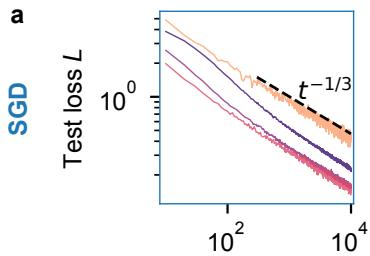

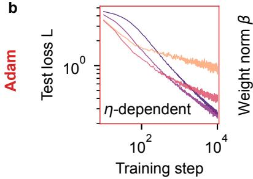

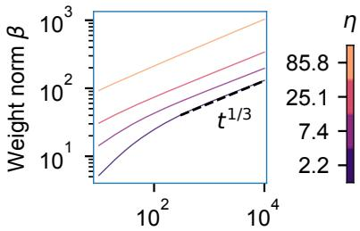

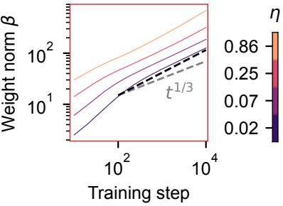  
Figure 1: Optimizers produce qualitatively different dynamics on the same task. Online teacher–student softmax classification with $n = 1 2 8$ classes and input dimension $m = 3 2$ , trained with SGD (top row, batch size $B = 2 5 6 )$ and Adam (bottom row, batch size $B = 6 4 )$ . For each optimizer η and $B$ are chosen so that the tangential loss stays positive and the norm growth remains drift-dominated (Appendix G); the exponents do not depend on batch size for either optimizer (Figure $^ { 7 ) }$ , so the comparison is not affected by the choice. Color denotes learning rate $\eta ;$ the two rows use different ranges, since the useful learning rates differ by roughly two decades between the optimizers. (a) Training dynamics of SGD follows $1 / 3$ time scaling. Left: test loss $L$ follows a single clean power law across the full range, with fitted exponent $0 . 3 4 \pm 0 . 0 1$ . Right: weight norm $\beta = \| W _ { S } \| _ { F }$ is consistent with $\beta \sim t ^ { 1 / 3 }$ (fitted $0 . 3 3 \pm 0 . 0 1 )$ . (b) Training dynamics of Adam deviates from $1 / 3$ time scaling. Left: test loss curves bend over an extended transient and no single exponent describes the trajectory. Right: weight norm expands faster than $t ^ { 1 / 3 }$ throughout (fitted $0 . { \overset { - } { 4 } } 4 \pm 0 . 0 4 )$ .

We next explore how the toy model trains under two different optimizers, SGD and Adam. We fix $n = 1 2 8$ and $m = 3 2$ , use a batch size of 256 for SGD and 64 for Adam (chosen so that the tangential loss stays positive and the norm growth remains drift-dominated; the exponents do not depend on batch size for either optimizer, Figure 7), and show four learning rates spanning each optimizer’s useful range, 2.2 to 85.8 for SGD and 0.02 to 0.86 for Adam—the two optimizers require learning rates some two decades apart on the same task (Appendix H). For each run we read off its time-scaling exponent, by which we mean the exponent of the power law that the loss follows against training step at a fixed learning rate and batch size—the quantity Liu et al. (2026b) predict to be $1 / 3$ . Under SGD both the loss and the weight norm follow power laws whose exponents converge to $1 / 3$ across the whole range of $\eta ,$ , reproducing that prediction (Figure 1a). Under Adam both quantities depart from it: the loss decays far more slowly once $\eta$ grows past its optimum near 0.07, so no single exponent describes the family of curves, and the weight norm, while still a power law, grows faster than the $1 / 3$ that SGD shows (Figure 1b). The time scaling is therefore optimizerdependent, and Adam does not follow the exponent that SGD does. What this does not settle is how much a given number of samples buys once the learning rate is tuned, which is a separate quantity with its own exponent; keeping the two apart is what the rest of the paper is about.

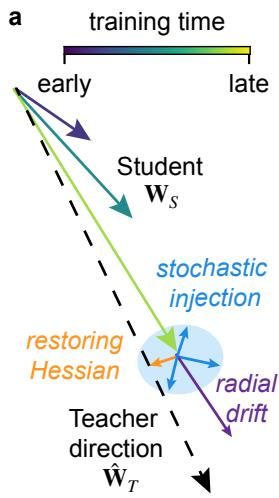

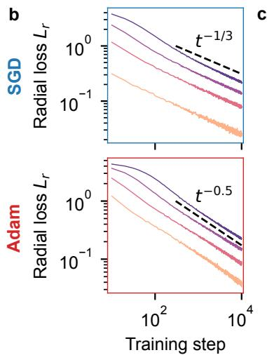

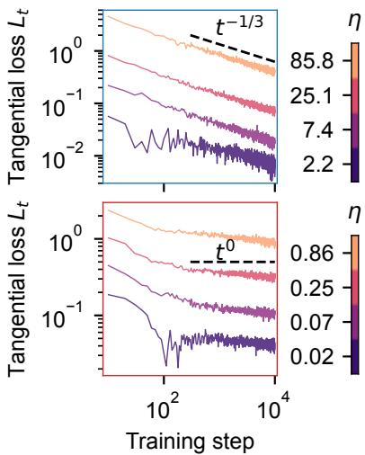  
Figure 2: The loss splits into a radial and a tangential component with distinct power-law dynamics and trade-offs between them. (a) Geometry of the decomposition. The student $W _ { S }$ is compared to the rescaled teacher $W _ { R } = \beta \widehat { W } _ { T }$ , which carries the student’s current norm but the teacher’s direction. The radial loss $L _ { r } = \mathrm { C E } ( p , p _ { R } )$ ) measures scale mismatch and the tangential loss $L _ { t } = L - L _ { r }$ measures misalignment, which the restoring Hessian reduces and stochastic injection from mini-batch noise sustains. $( \mathbf { b } , \mathbf { c } ) \ L _ { r }$ and $L _ { t }$ against training step, for SGD (top) and Adam (bottom), colored by learning rate over the same ranges as in Figure 1. Both decay as power laws whose exponents are independent of the learning rate: $\alpha _ { r } = 0 . 3 5 \pm 0 . 0 1$ and $\alpha _ { t } = 0 . 3 3 \pm 0 . 0 2$ for SGD, $\alpha _ { r } = 0 . 4 8 \pm 0 . 0 3$ and $\alpha _ { t } = 0 . 0 8 \pm 0 . 0 1$ for Adam.

## Observation: Adam has no single exponent

Under SGD the loss follows a single power law in training time; under Adam no single exponent describes it.

## 3 RESULTS

In Adam, we observe loss dynamics that depend on the learning rate η. If the student were perfectly aligned with the teacher direction, as assumed by the aligned student ansatz of Liu et al. (2026b), the loss would track the growth of the weight norm, and its time exponent would therefore be independent of η. We conclude that misalignment can contribute non-negligibly to the loss. Indeed, while the restoring Hessian pulls the student toward the teacher, stochastic injection from mini-batch sampling noise kicks it away from perfect alignment (Figure 2a). This motivates a loss decomposition built on an auxiliary rescaled teacher $W _ { R } = \beta \widehat { W } _ { T } ,$ the teacher rescaled to the student’s norm: we split the loss into a radial part $L _ { r } = \mathrm { C E } ( p , p _ { R } )$ , with $p _ { R } = \mathrm { S o f t m a x } ( W _ { R } x )$ , and a tangential part $\begin{array} { r } { \dot { L _ { t } } = L - L _ { r } , } \end{array}$ , so that the radial loss measures the contribution of scale mismatch, that is an unsaturated softmax, and the tangential loss measures that of misalignment. With this decomposition we expect $L _ { r }$ to follow the time scaling of the weight norm $\beta _ { i }$ , while $L _ { t }$ may have a time dependence of its own.

We first test the radial channel, where the decomposition predicts a loss set by the weight norm. We track $L _ { r }$ against training step for both optimizers, across the same range of learning rates as in Figure 1. Both SGD and Adam show a clear power-law decay of $L _ { r }$ that is independent of the learning rate (Figure 2b). For SGD the time-scaling exponent $\alpha _ { \tau }$ is close to $1 / 3 ( 0 . 3 5 \pm 0 . 0 1 )$ , while for Adam it is faster, close to $1 / 2 \ ( 0 . 4 8 \pm 0 . 0 3 )$ . Both exponents are consistent with $L _ { r } \sim 1 / \beta$ and plotting $L _ { r }$ directly against $\beta$ collapses the curves onto that law (Figure 6). The radial channel therefore obeys the same law under both optimizers, the $L _ { r } \sim 1 / \beta$ predicted by Liu et al. (2026b) and Kühn et al. (2026); what differs between SGD and Adam is only how fast the norm grows, and the two radial exponents follow from that.

We next turn to the tangential channel, the part of the loss that the aligned student ansatz of Liu et al. (2026b) assumes away. Measured the same way, both SGD and Adam again give straight lines in a log-log plot, independent of the learning rate (Figure 2c). For SGD the time-scaling exponent $\alpha _ { t }$ is again close to $1 \bar { / } 3 ( 0 . 3 3 \pm 0 . 0 2 )$ , but for Adam it is much slower, close to zero $( \bar { 0 } . 0 \bar { 8 } \pm 0 . 0 1 )$ Each channel is therefore a clean power law with a learning-rate-independent, optimizer-specific exponent, which explains what we saw in Figure 1: the total loss is the sum of the two, and while for SGD the exponents nearly coincide so the sum is again a single power law, for Adam they are far apart, so the sum crosses over between them at a point that depends on the learning rate.

## Concept: Two channels

The loss splits into a radial part set by the weight norm and a tangential part set by misalignment with the teacher. Each decays as its own power law, with optimizer-dependent yet hyperparameter-independent exponents $\alpha _ { r }$ and $\alpha _ { t } .$

Adam trades radial acceleration $( \alpha _ { r } > 1 / 3 )$ against tangential slowdown $( \alpha _ { t } ~ < ~ 1 / 3 )$ , which is what makes the total loss decay faster than $1 / 3$ early and slow down later. And the experiment shows yet another trade-off, in the coefficients rather than the exponents: in both SGD and Adam, raising the learning rate lowers the radial loss $L _ { r }$ (Figure 2b) at the expense of a larger tangential loss $\bar { L _ { t } }$ (Figure 2c), and batch size trades the same two quantities in the opposite direction at a fixed sample budget (Figure 7). The coefficient trade-off suggests the balance between the two components may set the optimal hyperparameters. The exponent trade-off adds that this balance must shift as training proceeds, since the number of samples seen grows linearly with training time. We therefore expect the optimal hyperparameters to be independent of the data size for SGD, where the two time-exponents coincide, but to depend on it for Adam, where they do not.

We test this expectation by locating the optimal learning rate directly. We sweep two parameters: 16 learning rates, spanning $1 0 ^ { - 3 }$ to 10 for Adam and $1 0 ^ { - 1 }$ to $1 0 ^ { 3 }$ for SGD, and 8 batch sizes from 16 to 2048. For each batch size and each step we take the minimum test loss over learning rates and record the learning rate attaining it, then fit these locations in $( B , D )$ space to a log-log plane, $\log _ { 1 0 } \eta ^ { * } = s _ { D } \log _ { 1 0 } D + s _ { B } \log _ { 1 0 } B + c ( \beta$ Appendix H). The optimal learning rate turns out to be nearly data-independent for SGD $( s _ { D } = - 0 . 0 4 \pm 0 . 0 1 )$ ), while for Adam it decreases with D as $\eta ^ { * } \sim D ^ { - 1 / 3 } \left( s _ { D } = - 0 . 3 5 \pm 0 . 0 1 \right.$ , Figure 3a). The latter is close to the “magic exponent” recently reported for Adam training of LLMs (Bjorck et al., 2024), a connection we return to in Section $5 .$ Figure 3a therefore confirms what the decomposed loss curves led us to expect: where the two timeexponents coincide, as for SGD, the optimum is data-independent. Optimizers like Adam can break that coincidence, which leads to a data-dependent optimum.

We next ask how the optimum depends on batch size. Because the coefficient trade-off between radial and tangential losses is present for both SGD and Adam, we expect a nonzero $s _ { B }$ in both cases. Indeed, the plane fit gives $s _ { B } = 1 . 0 1 \pm 0 . 0 1$ for SGD and $s _ { B } = 0 . 7 6 \pm 0 . 0 1$ for Adam, steeper than the $\eta ^ { * } \sim \sqrt { B }$ of standard practice and than the 0.558 recently reported for LLM training (Ren et al., 2026) (Figure 3b). The curves taken at different D also collapse for SGD while separating for Adam, mirroring Figure 3a. SGD and Adam therefore differ in how the optimum moves with batch size as well as with data size: every hyperparameter exponent we have measured separates the two optimizers.

Now that we know $\eta ^ { * } ( B , D )$ , the natural next step is to ask what the best achievable loss is at a given sample budget. We trace the optimal loss envelope: for each $D ,$ the lowest loss reached by any choice of hyperparameters at that budget. This is a different object from a single training curve, which is tuned for one budget and suboptimal at every other, and it is the one that matters in practice. Given how differently the optimum behaves under the two optimizers, we expect the envelopes $L ^ { * } ( D )$ to differ as well. To our surprise, the envelope scales as $D ^ { - 1 / 3 }$ under both, with fitted exponents $\alpha _ { D } = 0 . 3 4 1 \pm 0 . 0 0 1$ for SGD and $0 . 3 4 1 \pm 0 . 0 0 3$ for Adam (Figure 3c). Tuning therefore washes out the differences we measured in every individual exponent: the optimizer changes how training gets there, but not what a given number of samples buys.

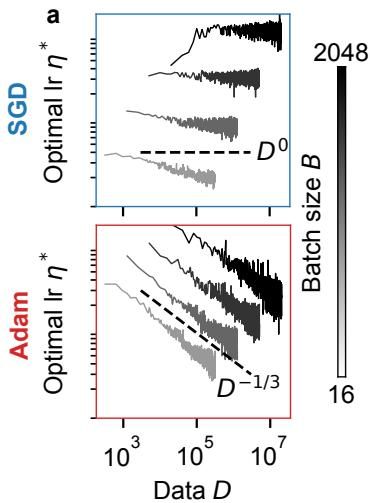

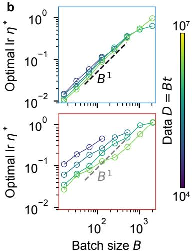

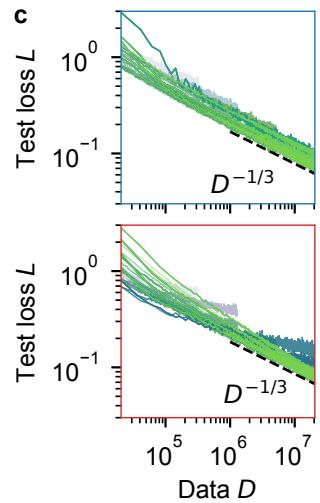  
Figure 3: Optimal learning rate scales differently with B and D for SGD and Adam, but the optimal loss follows one-third data scaling for both. Learning-rate sweeps over 8 batch sizes $\bar { B } \in \left. [ 1 6 , 2 0 4 8 ] \right.$ and 16 learning rates, spanning $[ 1 0 ^ { - 3 }$ , 10] for Adam and $[ 1 0 ^ { - 1 } , 1 0 ^ { 3 } ]$ for SGD, with $\dot { D } = B t$ the number of online samples processed. In each panel the upper row is SGD and the lower row Adam. Slopes $s _ { B }$ and $s _ { D }$ quoted in (a) and (b) are from the joint log-log plane fit $\log _ { 1 0 } \eta ^ { * } = s _ { D } \log _ { 1 0 } D + s _ { B } \log _ { 1 0 } B + c$ described in $\operatorname { A p p e n d i x } \mathrm { H . } \left( \mathbf { a } \right) \boldsymbol { \eta } ^ { * }$ against $D ,$ , one curve per batch size (grayscale). SGD’s optimum is nearly flat $( s _ { D } = - 0 . 0 4 \pm 0 . 0 1 )$ , while Adam’s decreases $( s _ { D } = - 0 . 3 5 \pm 0 . 0 1 )$ , close to $\cdot - 1 / 3$ and to the recently reported “magic exponent” 0.32 (Bjorck et al., 2024). (b) $\eta ^ { * }$ against batch size, one curve per data size (color). SGD follows $\eta ^ { * } \propto B$ $( s _ { B } = 1 . 0 1 \pm 0 . 0 1 ) $ , while Adam gives $s _ { B } = 0 . 7 6 \pm 0 . 0 1$ , steeper than the square-root rule of common practice and than the value reported for LLM training (Ren et al., 2026). (c) Test loss along the optimal-η envelope against $D ,$ with individual runs colored by training step and shaded by batch size. Both optimizers give the same optimal data scaling, $L ^ { * } ( \dot { D } ) \sim D ^ { - 1 / 3 }$ , with fitted exponents $\alpha _ { D } = 0 . 3 4 1 \pm 0 . 0 0 1$ for SGD and $0 . { \dot { 3 } } 4 1 \pm 0 . 0 0 3$ for Adam. The quoted exponent is the pooled estimate across batch sizes of Appendix H.4. The $\eta ^ { * }$ traces in (a) are visibly noisy at large $D$ while the envelope in (c) is clean; Figure 5 shows the underlying sweeps and the flatness of the basin.

## Result 1: One-third data optimum

Although the optimal hyperparameters scale differently with data size and batch size for SGD and Adam, the loss at the optimum follows $L ^ { * } ( D ) \sim D ^ { - 1 / 3 }$ for both.

We explain this convergence by modeling the learning dynamics as an Ornstein–Uhlenbeck process. Although $W _ { S }$ is high-dimensional, its dynamics reduce to a radial and a tangential part, mirroring the loss decomposition, and we solve for the steady state of each. The preconditioner enters the two differently—in the radial channel it rescales the time derivative of the weight norm, in the tangential channel the map from instantaneous loss to data covariance—and that difference is what gives Adam two distinct time-exponents where SGD, whose preconditioner is the identity, has one. For an optimizer whose update $\sim - \eta g$ is scaled by $B ^ { p } \beta ^ { q }$ , we obtain

$$
L _ { r } \sim ( z D ) ^ { - 1 / ( 3 - q ) } , \qquad L _ { t } \sim z ^ { 2 / ( 3 - q ) } D ^ { - ( 1 - q ) / ( 3 - q ) } , \qquad \mathrm { o r } \qquad L \sim \frac { k _ { r } } { \beta } + \frac { k _ { t } \beta ^ { 2 } } { D }\tag{1}
$$

with the hyperparameters collapsing into the single coordinate $z \equiv \eta B ^ { p - 1 }$ (Appendices $\textrm { C }$ and D). Minimizing over z gives $z ^ { * } \sim \mathbf { \bar { \cal D } } ^ { - q / 3 }$ , at which both components scale as $\bar { D ^ { - 1 / 3 } }$ with the $q -$ dependence canceled—the optimizer-independent one-third data scaling. The second form shows why: in terms of the norm, growing $\beta$ sharpens the softmax and cuts the radial cost, while reaching a larger $\beta$ within a fixed budget requires larger steps and injects more misalignment. Neither exponent in that balance carries $q ,$ which enters only through $k _ { t }$ and through how the learning rate controls $\beta .$

How do we know that this calculation is the right explanation for the $1 / 3$ scaling we measured? Usefully, it makes predictions beyond that scaling. Our theory does not derive an individual optimizer’s emergent q. Its parameter-free prediction is instead that, because $\alpha _ { r } = 1 / ( 3 - q )$ and $\alpha _ { t } = ( 1 - q ) / ( 3 - q )$ , the two exponents satisfy $2 \alpha _ { r } + \alpha _ { t } = 1$ whatever q turns out to be. To test this sum rule we run five further optimizers: PowerAdam at three powers, whose preconditioner scales as $V ^ { - a }$ and for which Adam is the case $a = 1 / 2 ;$ Muon; and SignGD (Bernstein et al., 2018). Including SGD and Adam, the measured exponents of all seven lie on the predicted line (Figure 4a). Muon and SignGD are not members of the $V ^ { - a }$ family—Muon’s update is orthogonalized rather than a diagonal rescaling—so their landing on the same line is evidence that the resulting scaling relations extend beyond the diagonal $V ^ { - \bar { a } }$ family that motivates the calculation. Our calculation makes two further predictions, neither displayed in the main figures and both free of parameters fitted to the quantities predicted: a relation between the dynamic exponent $\alpha _ { r }$ and the hyperparameter exponent $s _ { D }$ , and a fixed ratio between the two channels at the optimum, $L _ { t } / L = \bar { 1 / 3 }$ . Both hold across all seven optimizers (Appendix E). The evidence for the scaling description therefore does not rest on any single exponent: its dynamic, hyperparameter, envelope, and loss-ratio predictions are measured by separate procedures. The sum rule therefore holds across optimizers whose individual exponents differ substantially, which means the calculation captures the constraint linking the two channels without needing to know what the preconditioner is.

a  
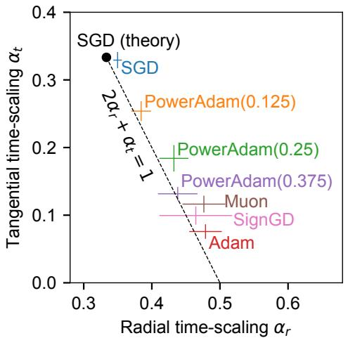

b  
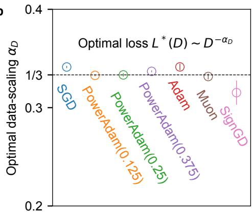  
Figure 4: A sum rule for training exponents holds across optimizers, and fixes the optimal datascaling exponent at $1 / 3 .$ (a) Measured radial and tangential time-scaling exponents, $L _ { r } \sim t ^ { - \alpha _ { r } }$ and $L _ { t } \sim t ^ { - \alpha _ { t } }$ , for SGD, the PowerAdam family $A = \bar { V } ^ { - a } \mathrm { ~ a t ~ } a \in \{ 0 . 1 2 \bar { 5 } , 0 . \bar { 2 } 5 , 0 . 3 7 5 , 0 . 5$ (Adam)}, Muon, and SignGD. Crosses give fit uncertainties. The dashed line is $2 \alpha _ { r } + \alpha _ { t } = 1$ , a parameter-free prediction with no fitted quantities; the black point marks the $a = 0$ prediction $( 1 / 3 , 1 / 3 )$ . Adam sits at $\alpha _ { r } \simeq 0 . 4 8$ , above the nominal $2 / 5 ,$ , corresponding to an effective $q \simeq 0 . 9 ; { \ . }$ Appendix G rules out two alternative explanations. (b) Optimal data-scaling exponent $\alpha _ { D } .$ , with $L ^ { * } ( D ) \sim D ^ { - \alpha _ { D } }$ Six of the seven lie within 2.5% of $1 / 3 .$ , slightly above it by the finite-norm excess (Appendix H.4); SignGD approaches it from below over this window, its larger bar reflecting a longer transient rather than a different exponent (Appendix H.4). This follows from (a): minimizing over z gives $\alpha _ { D } =$ $( 2 \alpha _ { r } + \alpha _ { t } ) / 3$ , which equals $1 / 3$ exactly on the line. Error bars are the spread across four lower fitting cutoffs (Appendix H).

Figure 3c established the 1/3 optimum for two optimizers; the sum rule implies it for every optimizer on the line, since $\alpha _ { D } = ( 2 \alpha _ { r } + \alpha _ { t } ) / 3$ equals $1 / \bar { 3 }$ there. We repeat the envelope measurement for all seven. Although $\alpha _ { t }$ varies by more than a factor of four across the family, the fitted $\alpha _ { D }$ of six of them lie within $2 . 5 \%$ of $1 / 3$ , with a scatter across optimizers of 0.004 (Figure 4b); the seventh, SignGD, approaches $1 / 3$ from below over the budgets we reach, and its per-batch-size exponents identify this as a longer transient rather than a different exponent (Appendix $\mathrm { H } . 4 )$ . Substituting the measured $\alpha _ { r }$ and $\alpha _ { t }$ into the same identity gives $0 . 3 4 \pm 0 . 0 1$ for SGD and $0 . 3 5 \pm 0 . 0 2$ for Adam, against fitted envelopes of 0.341 for both; the two routes therefore agree within their uncertainties and both sit a few percent above $1 / 3 .$ . Appendix H traces that common excess to the radial channel’s approach to $L _ { r } \propto \beta ^ { - 1 }$ , which is measured directly and decreases with the weight norm. The optimal exponent is therefore invariant while its two components are not: an optimizer redistributes loss between the channels without changing what optimally-tuned training buys per sample.

## Result 2: Dynamic exponent relation

The radial and tangential time-exponents fall on a single relation, $2 \alpha _ { r } + \alpha _ { t } = 1$ , across all seven optimizers, extending the one-third data optimum to all of them.

## 4 RELATED WORK

Why adaptive methods behave differently from stochastic gradient descent has been studied both through convergence analyses and through empirical comparisons of their performance (Duchi et al., 2011; Kingma & Ba, 2015; Reddi et al., 2019; Wilson et al., 2017; Zhang et al., 2020; Kunstner et al., 2023; 2024). Our setting has no finite optimum to approach, so the optimizer’s influence appears instead in how fast the loss falls.

A phenomenological picture of pre-training describes the loss landscape as a river valley, in which training progresses slowly along a flat direction while fluctuating across sharp ones (Cohen et al., 2021; Wen et al., 2025; Cohen et al., 2024; Liu et al., 2025c). Many recent optimizers connect to this picture through their designs, which estimate curvature, precondition across matrix structure, or normalize the size of updates (Gupta et al., 2018; Chen et al., 2023; Liu et al., 2024; Vyas et al., 2025; Jordan et al., 2024; Yuan et al., 2024; Liu et al., 2025a). A flat direction of this kind is familiar from separable data, where the cross-entropy loss keeps falling as the weight norm grows without bound, and a large literature characterizes the direction that gradient methods converge to as the norm grows (Soudry et al., 2018; Ji & Telgarsky, 2018; Nacson et al., 2019; Lyu & Li, 2019), and how that direction depends on the choice of optimizer (Gunasekar et al., 2018; Wang et al., 2021; 2022; Zhang et al., 2024; Tsilivis et al., 2026; Fan et al., 2026). Our model offers a minimal, analytically tractable instance of such a landscape due to nonlinearity, where learning a peaked distribution whose samples come arbitrarily close to the decision boundary gives rise to the river.

The loss of language models falls as a power law in data and model size when hyperparameters are tuned (Hestness et al., 2017; Kaplan et al., 2020; Hoffmann et al., 2022; Besiroglu et al., 2024), and theoretical accounts trace these exponents to structure in the data or to the strong non-linearity (Sharma & Kaplan, 2022; Bahri et al., 2024; Maloney et al., 2022; Michaud et al., 2023; Bordelon et al., 2024; Paquette et al., 2024; Bordelon et al., 2025; Liu et al., 2025b; 2026a;b; Kühn et al., 2026). Related literature studies how the optimal hyperparameters scale with batch size, model width, and training budget (Goyal et al., 2017; McCandlish et al., 2018; Smith et al., 2018; Shallue et al., 2019; Yang et al., 2021; Malladi et al., 2022; Bjorck et al., 2024; Li et al., 2025; Bergsma et al., 2025; Ren et al., 2026). We bring these together in a model where both the training dynamics and the optimal hyperparameters depend on the optimizer, while the data exponent at the optimum does not.

## 5 DISCUSSION

From a single-layer toy model, we find that the loss separates into a radial channel and a tangential channel, each decaying as a power law whose exponent depends on the optimizer but not on the learning rate or batch size. Across seven optimizers, these exponents vary substantially, yet all fall on the single relation $2 \alpha _ { r } + \alpha _ { t } = 1$ , which fixes the tuned loss at $\dot { D ^ { - 1 / 3 } }$ for every one of them. The evidence is overdetermined: independently measured channel exponents, the relation between $\alpha _ { r }$ and the budget scaling of the optimal learning rate, the optimal-loss envelope, and the crossing $L _ { t } / L = 1 / 3$ all agree with the same emergent scaling structure. Thus, how fast the loss decays, where the optimum sits, and what a sample budget buys are three faces of a single emergent scaling. An optimizer therefore changes how fast a model learns per step, not how much it can learn per sample. We note that this concerns the exponent, not the coefficient: optimizers differ in the prefactor of $L ^ { * } ( D )$ ), which is what makes one preferable to another in practice. The decomposition also yields a practical handle where the teacher direction is known: because the two channels sit in a fixed ratio at the optimum, measuring $L _ { t } / L$ in a single run locates the optimal hyperparameters without a sweep (Appendix E).

Our work has several limitations. The toy model is a single softmax layer, leaving multi-layer and Transformer architectures untested. It also relies on hard labels: with a finite-temperature teacher the student has a finite optimal scale, so the power law would appear over an intermediate range, as Liu et al. (2026b) report, rather than continuing indefinitely. The two emergent exponents separate as well, with Adam’s batch scaling implying $p \simeq 0 . 2 4$ while its radial exponent implies $q \simeq 0 . 9$ , where an idealized $A = V ^ { - a }$ preconditioner would make them equal; every prediction we test depends on q alone, so this does not affect our conclusions, but predicting either exponent from an optimizer’s definition remains open. Adam in particular is measured close to the edge of the regime the analysis describes (Remark 2). Our results also describe a drift-dominated window at a constant learning rate; trained far beyond that window, adaptive optimizers can enter a qualitatively different regime. Finally, the decomposition itself needs the teacher direction: $L _ { r } , L _ { t }$ and the tangent projector are all defined relative to $\widehat { W } _ { T }$ , so for practical data without a ground-truth teacher, analysis will have additional conceptual complexity. What does transfer is everything in Figures 3 and 4b—the scaling of $\eta ^ { * }$ with batch size and with budget, and the optimal exponent $\alpha _ { D } \mathrm { - w h i c h }$ is also everything for which an LLM counterpart exists. Two of these sit close to their measured counterparts: the tuned data exponent $1 / 3$ lies inside the range 0.28–0.37 of the Chinchilla scaling laws (Hoffmann et al., 2022; Besiroglu et al., 2024), and under Adam the optimal learning rate falls as $\dot { D } ^ { - 0 . 3 5 }$ , near the $D ^ { - 0 . { \dot { 3 } } 2 }$ “magic exponent” reported for the peak learning rate in LLM pre-training (Bjorck et al., 2024). Given the distance between a single softmax layer and a trained LLM, these agreements call for testing the theory at scale (Appendix A).

Several of these limitations lead to one question: can the optimal data scaling be made faster than $1 / 3 2$ One route is the local geometry of the data near decision boundaries. The exponent follows from the loss and the gradient noise localizing near the decision boundary with a regular margin density; if the density instead vanishes there, so that fewer samples come close to the boundary, the sum rule shifts and the optimal exponent accelerates past $1 / 3 .$ , while the shifted values remain optimizerindependent (Appendix F). A second route is the learning rate schedule. We expect the sum rule and the one-third exponent to survive self-similar schedules such as cosine decay or warmup–stable– decay, which preserve the relation between dynamic time and sample count, but they may break for schedules that are not. Whether a schedule, perhaps an adaptive one, can be engineered to improve the optimal data scaling is open.

Our results are reminiscent of universality classes in statistical mechanics. There too, exponents measured in very different systems collapse onto shared values, and the reason is that a diverging scale localizes the physics to a singularity, so only near-boundary behavior survives. Our sum rule plays the role of a scaling relation among critical exponents, such as the Rushbrooke relation (Rushbrooke, 1963), in constraining how the individual exponents must move together. Read this way, the universality we find across optimizers does not bound how fast future models can scale. It indicates where one has to change the problem in order to move that bound.

## USE OF AI TOOLS

In this work, we used generative AI tools for several tasks whose disclosure is required. They assisted in sharpening several steps of our mathematical derivations. They also assisted writing the proofs in Appendix from author-supplied derivations and provided feedback on methodology and experiments.

We have not used generative AI tools for the conceptual framework of this work, the proposal and refinement of the hypotheses tested here, and the design and production of the main figures. Generating synthetic data sets, implementing methods, assisting with translation, cleaning or reformatting data sets, and supporting qualitative or thematic data analysis are either not applicable to this work or were carried out by the authors.

Additionally, and for tasks whose disclosure is recommended, the manuscript text was drafted with AI assistance: the authors supplied paragraph-level notes fixing the content and order of each argument, an AI assistant drafted the prose, and the authors revised. We also used AI tools to identify relevant literature—including Mandt et al. (2017), whose trace identity we had derived independently before locating it.

We have reviewed all AI-assisted work. We verified AI-assisted derivations, verified all numerical values from our own experiment are correctly cited, and read AI-identified references before citation.

We take responsibility for the final content of this work, including text, claims and artifacts produced with the aid of generative AI.

## REPRODUCIBILITY STATEMENT

All experiments use the single-layer teacher–student model described in Section 2 and Appendix B. Appendix H specifies the sweep ranges, the procedure for locating the optimal learning rate, the plane fit, and the fitting windows and uncertainty estimates used for every exponent reported in the main text. Code for the toy-model training runs and for all analysis and figures will be released publicly; until then, it is available from the authors upon request.

## REFERENCES

Yasaman Bahri, Ethan Dyer, Jared Kaplan, Jaehoon Lee, and Utkarsh Sharma. Explaining neural scaling laws. Proceedings ofthe National Academy ofSciences, 121(27):e2311878121, 2024.

Shane Bergsma, Nolan Dey, Gurpreet Gosal, Gavia Gray, Daria Soboleva, and Joel Hestness. Power lines: Scaling laws for weight decay and batch size in LLM pre-training. Advances in Neural Information Processing Systems, 38:125153–125188, 2025.

Jeremy Bernstein, Yu-Xiang Wang, Kamyar Azizzadenesheli, and Anima Anandkumar. signSGD: Compressed optimisation for non-convex problems. In International Conference on Machine Learning (ICML), 2018.

Tamay Besiroglu, Ege Erdil, Matthew Barnett, and Josh You. Chinchilla scaling: A replication attempt. arXiv preprint arXiv:2404.10102, 2024. URL https://arxiv.org/abs/2404. 10102.

Johan Bjorck, Alon Benhaim, Vishrav Chaudhary, Furu Wei, and Xia Song. Scaling optimal LR across token horizons. arXiv preprint arXiv:2409.19913, 2024. URL https://arxiv.org/ abs/2409.19913.

Blake Bordelon, Alexander Atanasov, and Cengiz Pehlevan. A dynamical model of neural scaling laws. arXiv preprint arXiv:2402.01092, 2024. URL https://arxiv.org/abs/2402. 01092.

Blake Bordelon, Alexander Atanasov, and Cengiz Pehlevan. How feature learning can improve neural scaling laws. Journal of Statistical Mechanics: Theory and Experiment, 2025(8):084002, 2025.

Xiangning Chen, Chen Liang, Da Huang, Esteban Real, Kaiyuan Wang, Hieu Pham, Xuanyi Dong, Thang Luong, Cho-Jui Hsieh, Yifeng Lu, et al. Symbolic discovery of optimization algorithms. Advances in neural information processing systems, 36:49205–49233, 2023.

Jeremy M. Cohen, Simran Kaur, Yuanzhi Li, J. Zico Kolter, and Ameet Talwalkar. Gradient descent on neural networks typically occurs at the edge of stability. In International Conference on Learning Representations (ICLR), 2021.

Jeremy M Cohen, Alex Damian, Ameet Talwalkar, J Zico Kolter, and Jason D Lee. Understanding optimization in deep learning with central flows. arXiv preprint arXiv:2410.24206, 2024.

John Duchi, Elad Hazan, and Yoram Singer. Adaptive subgradient methods for online learning and stochastic optimization. Journal ofmachine learning research, 12(7), 2011.

Chen Fan, Mark Schmidt, and Christos Thrampoulidis. Implicit bias of spectral descent and muon on multiclass separable data. Advances in Neural Information Processing Systems, 38:39622–39669, 2026.

Priya Goyal, Piotr Dollár, Ross Girshick, Pieter Noordhuis, Lukasz Wesolowski, Aapo Kyrola, Andrew Tulloch, Yangqing Jia, and Kaiming He. Accurate, large minibatch SGD: Training ImageNet in 1 hour. arXiv preprint arXiv:1706.02677, 2017. URL https://arxiv.org/abs/1706. 02677.

Suriya Gunasekar, Jason Lee, Daniel Soudry, and Nathan Srebro. Characterizing implicit bias in terms of optimization geometry. In International Conference on Machine Learning, pp. 1832– 1841. PMLR, 2018.

Vineet Gupta, Tomer Koren, and Yoram Singer. Shampoo: Preconditioned stochastic tensor optimization. In International Conference on Machine Learning, pp. 1842–1850. PMLR, 2018.

Joel Hestness, Sharan Narang, Newsha Ardalani, Gregory Diamos, Heewoo Jun, Hassan Kianinejad, Md. Mostofa Ali Patwary, Yang Yang, and Yanqi Zhou. Deep learning scaling is predictable, empirically. arXiv preprint arXiv:1712.00409, 2017. URL https://arxiv.org/abs/1712. 00409.

Jordan Hoffmann, Sebastian Borgeaud, Arthur Mensch, et al. Training compute-optimal large language models. In Advances in Neural Information Processing Systems (NeurIPS), 2022.

Ziwei Ji and Matus Telgarsky. Risk and parameter convergence of logistic regression. arXiv preprint arXiv:1803.07300, 2018.

Keller Jordan, Yuchen Jin, Vlado Boza, Jiacheng You, Franz Cesista, Laker Newhouse, and Jeremy Bernstein. Muon: An optimizer for hidden layers in neural networks. https: //kellerjordan.github.io/posts/muon/, 2024.

Jared Kaplan, Sam McCandlish, Tom Henighan, Tom B. Brown, Benjamin Chess, Rewon Child, Scott Gray, Alec Radford, Jeffrey Wu, and Dario Amodei. Scaling laws for neural language models. arXiv preprint arXiv:2001.08361, 2020.

Diederik P. Kingma and Jimmy Ba. Adam: A method for stochastic optimization. In International Conference on Learning Representations (ICLR), 2015.

Marcel Kühn, Yoon Thelge, and Bernd Rosenow. A boundary-layer mechanism for one-third scaling in online softmax classification. arXiv preprint arXiv:2605.22341, 2026. URL https: //arxiv.org/abs/2605.22341.

Frederik Kunstner, Jacques Chen, Jonathan Wilder Lavington, and Mark Schmidt. Noise is not the main factor behind the gap between sgd and adam on transformers, but sign descent might be. arXiv preprint arXiv:2304.13960, 2023.

Frederik Kunstner, Alan Milligan, Robin Yadav, Mark Schmidt, and Alberto Bietti. Heavy-tailed class imbalance and why adam outperforms gradient descent on language models. Advances in Neural Information Processing Systems, 37:30106–30148, 2024.

Houyi Li, Wenzhen Zheng, Qiufeng Wang, Hanshan Zhang, Zili Wang, Shijie Xuyang, Yuantao Fan, Zhenyu Ding, Haoying Wang, Ning Ding, Shuigeng Zhou, Xiangyu Zhang, and Daxin Jiang. Predictable scale: Part I, step law – optimal hyperparameter scaling law in large language model pretraining. arXiv preprint arXiv:2503.04715, 2025. URL https://arxiv.org/abs/2503. 04715.

Hong Liu, Zhiyuan Li, David Hall, Percy Liang, and Tengyu Ma. Sophia: A scalable stochastic second-order optimizer for language model pre-training. In International conference on learning representations, volume 2024, pp. 1621–1650, 2024.

Yizhou Liu, Ziming Liu, and Jeff Gore. Focus: First order concentrated updating scheme. arXiv preprint arXiv:2501.12243, 2025a.

Yizhou Liu, Ziming Liu, and Jeff Gore. Superposition yields robust neural scaling. Advances in Neural Information Processing Systems, 38:159269–159305, 2025b.

Yizhou Liu, Sara Kangaslahti, Ziming Liu, and Jeff Gore. Inverse depth scaling from most layers being similar. arXiv preprint arXiv:2602.05970, 2026a.

Yizhou Liu, Ziming Liu, Cengiz Pehlevan, and Jeff Gore. Universal one-third time scaling in learning peaked distributions. arXiv preprint arXiv:2602.03685, 2026b. URL https://arxiv. org/abs/2602.03685.

Ziming Liu, Yizhou Liu, Jeff Gore, and Max Tegmark. Neural thermodynamic laws for large language model training. arXiv preprint arXiv:2505.10559, 2025c.

Kaifeng Lyu and Jian Li. Gradient descent maximizes the margin of homogeneous neural networks. arXiv preprint arXiv:1906.05890, 2019.

Sadhika Malladi, Kaifeng Lyu, Abhishek Panigrahi, and Sanjeev Arora. On the SDEs and scaling rules for adaptive gradient algorithms. In Advances in Neural Information Processing Systems (NeurIPS), 2022.

Alexander Maloney, Daniel A Roberts, and James Sully. A solvable model of neural scaling laws. arXiv preprint arXiv:2210.16859, 2022.

Stephan Mandt, Matthew D. Hoffman, and David M. Blei. Stochastic gradient descent as approximate Bayesian inference. Journal of Machine Learning Research, 18(134):1–35, 2017. URL https://arxiv.org/abs/1704.04289.

Sam McCandlish, Jared Kaplan, Dario Amodei, and OpenAI Dota Team. An empirical model of large-batch training. arXiv preprint arXiv:1812.06162, 2018. URL https://arxiv.org/ abs/1812.06162.

Eric Michaud, Ziming Liu, Uzay Girit, and Max Tegmark. The quantization model of neural scaling. Advances in Neural Information Processing Systems, 36:28699–28722, 2023.

Mor Shpigel Nacson, Nathan Srebro, and Daniel Soudry. Stochastic gradient descent on separable data: Exact convergence with a fixed learning rate. In The 22nd International Conference on Artificial Intelligence and Statistics, pp. 3051–3059. PMLR, 2019.

Elliot Paquette, Courtney Paquette, Lechao Xiao, and Jeffrey Pennington. 4+ 3 phases of computeoptimal neural scaling laws. Advances in Neural Information Processing Systems, 37:16459– 16537, 2024.

Sashank J Reddi, Satyen Kale, and Sanjiv Kumar. On the convergence of adam and beyond. arXiv preprint arXiv:1904.09237, 2019.

Liliang Ren, Yang Liu, Yelong Shen, and Weizhu Chen. Rethinking language model scaling under transferable hypersphere optimization. arXiv preprint arXiv:2603.28743, 2026. URL https: //arxiv.org/abs/2603.28743.

G. S. Rushbrooke. On the thermodynamics of the critical region for the Ising problem. The Journal ofChemical Physics, 39(3):842–843, 1963. doi: 10.1063/1.1734338.

Christopher J. Shallue, Jaehoon Lee, Joseph Antognini, Jascha Sohl-Dickstein, Roy Frostig, and George E. Dahl. Measuring the effects of data parallelism on neural network training. Journal of Machine Learning Research, 20(112):1–49, 2019.

Utkarsh Sharma and Jared Kaplan. Scaling laws from the data manifold dimension. Journal of Machine Learning Research, 23(9):1–34, 2022.

Samuel L. Smith, Pieter-Jan Kindermans, Chris Ying, and Quoc V. Le. Don’t decay the learning rate, increase the batch size. In International Conference on Learning Representations (ICLR), 2018.

Daniel Soudry, Elad Hoffer, Mor Shpigel Nacson, Suriya Gunasekar, and Nathan Srebro. The implicit bias of gradient descent on separable data. Journal of Machine Learning Research, 19(70): 1–57, 2018.

Nikolaos Tsilivis, Eitan Gronich, Julia Kempe, and Gal Vardi. Flavors of margin: Implicit bias of steepest descent in homogeneous neural networks. Journal of Machine Learning Research, 27 (104):1–37, 2026.

Nikhil Vyas, Depen Morwani, Rosie Zhao, Itai Shapira, David Brandfonbrener, Lucas Janson, and Sham Kakade. Soap: Improving and stabilizing shampoo using adam for language modeling. In International Conference on Learning Representations, volume 2025, pp. 93423–93444, 2025.

Bohan Wang, Qi Meng, Wei Chen, and Tie-Yan Liu. The implicit bias for adaptive optimization algorithms on homogeneous neural networks. In International Conference on Machine Learning, pp. 10849–10858. PMLR, 2021.

Bohan Wang, Qi Meng, Huishuai Zhang, Ruoyu Sun, Wei Chen, Zhi-Ming Ma, and Tie-Yan Liu. Does momentum change the implicit regularization on separable data? Advances in Neural Information Processing Systems, 35:26764–26776, 2022.

Kaiyue Wen, Zhiyuan Li, Jason Wang, David Hall, Percy Liang, and Tengyu Ma. Understanding warmup-stable-decay learning rates: A river valley loss landscape view. In International Conference on Learning Representations, volume 2025, pp. 42840–42885, 2025.

Ashia C Wilson, Rebecca Roelofs, Mitchell Stern, Nati Srebro, and Benjamin Recht. The marginal value of adaptive gradient methods in machine learning. Advances in neural information processing systems, 30, 2017.

Sho Yaida. Fluctuation-dissipation relations for stochastic gradient descent. In International Conference on Learning Representations (ICLR), 2019. arXiv:1810.00004.

Greg Yang, Edward Hu, Igor Babuschkin, Szymon Sidor, Xiaodong Liu, David Farhi, Nick Ryder, Jakub Pachocki, Weizhu Chen, and Jianfeng Gao. Tuning large neural networks via zero-shot hyperparameter transfer. Advances in Neural Information Processing Systems, 34:17084–17097, 2021.

Huizhuo Yuan, Yifeng Liu, Shuang Wu, Xun Zhou, and Quanquan Gu. Mars: Unleashing the power of variance reduction for training large models. arXiv preprint arXiv:2411.10438, 2024.

Chenyang Zhang, Difan Zou, and Yuan Cao. The implicit bias of adam on separable data. Advances in neural information processing systems, 37:23988–24021, 2024.

Jingzhao Zhang, Sai Praneeth Karimireddy, Andreas Veit, Seungyeon Kim, Sashank Reddi, Sanjiv Kumar, and Suvrit Sra. Why are adaptive methods good for attention models? Advances in Neural Information Processing Systems, 33:15383–15393, 2020.

Yikuan Zhang, Ning Yang, and Yuhai Tu. On the superlinear relationship between SGD noise covariance and loss landscape curvature. arXiv preprint arXiv:2602.05600, 2026. URL https: //arxiv.org/abs/2602.05600.

## A RELATION TO LANDSCAPE AND SCALING-LAW LITERATURE

Two prominent explanations of power-law loss derive the exponent from power-law structure in the data (Maloney et al., 2022; Bahri et al., 2024; Bordelon et al., 2024) and from the non-linearity of a softmax learning peaked distributions (Liu et al., 2026b; Kühn et al., 2026) respectively; the mechanism here belongs to the second, and adds the optimizer’s preconditioner to it. A separate literature asks instead how the optimal hyperparameters scale, either deriving rules from the invariance of a stochastic differential equation—the linear rule for SGD (Goyal et al., 2017; Smith et al., 2018) and the square-root rule for adaptive methods (Malladi et al., 2022)—or measuring them empirically, from critical batch size (McCandlish et al., 2018; Shallue et al., 2019) to hyperparameter scaling laws for LLM pre-training (Bjorck et al., 2024; Li et al., 2025; Bergsma et al., 2025; Ren et al., 2026). The two have stayed apart: the first explains how fast the loss falls without reference to hyperparameters, the second locates the optimum without reference to the loss exponent. What we add is the relation between them, in which an optimizer’s emergent scaling fixes the dynamic exponents, the hyperparameter exponents, and the data scaling at the optimum together.

In particular, Kühn et al. (2026) derive coupled alignment and residual-variance dynamics from a boundary-layer analysis, and obtain learning rate schedules from them; their residual-variance chan nel is conceptually analogous to our loss decomposition, although they reach it through statisticalphysics order parameters rather than a stochastic process. Their schedule result also separates observables in a way ours does not: annealing improves classification-error scaling while slowing cross-entropy decay in the regime they analyze. Their machinery is limited to SGD at batch size one, and they name richer optimizers as a future direction. Our machinery instead relates the tangential loss directly to the noise covariance, in the manner of Mandt et al. (2017) and adjacent stochasticprocess treatments of training (Yaida, 2019; Malladi et al., 2022). This approach needs neither a covariance proportional to the Hessian (a condition reported to fail in practice (Zhang et al., 2026)) nor the two to commute, so extending it to state-dependent preconditioners (nonzero q) beyond SGD costs no further assumption about how noise relates to curvature. Combining our extensions of these two machineries connects state-dependent preconditioners to a boundary-localization law, from which power-law dynamics emerges without any power-law structure in the data.

Our specific numbers invite comparison with LLM pre-training, though we draw it cautiously. The Chinchilla scaling laws put the data exponent in the range $0 . { \bar { 2 } } 8 { - } 0 . 3 { \bar { 7 } }$ (Hoffmann et al., 2022; Besiroglu et al., 2024), which brackets $1 / 3 .$ , and the “magic exponent” of Bjorck et al. (2024), which has the optimal learning rate falling as $D ^ { - 0 . 3 2 }$ , is the closest analogue of our $s _ { D } ,$ , though they optimize the peak learning rate of scheduled runs rather than a constant one; we measure $\breve { D } ^ { - 0 . 3 5 }$ under Adam. Ren et al. (2026) report $D ^ { - 0 . 3 2 }$ for Muon, where we measure $D ^ { - 0 . 2 9 }$ ; their value comes from the HyperP framework with hypersphere-constrained optimization rather than from ordinary Muon, so the comparison is looser still. A third comparison goes the other way: Ren et al. (2026) also report $s _ { B } = 0 . 5 5 8$ against our 0.76, a discrepancy as large as the agreements just quoted (Figure 9). Our own framework separates the two cases. Since $s _ { D } = - q / 3$ and $s _ { B } \ = \ 1 - \ p .$ , the quantities that agree are the ones controlled by the preconditioner’s scale exponent, and the one that disagrees is controlled by its batch exponent—which is independently the exponent our measurements find anomalous, since $p$ and q coincide for an idealized $A = V ^ { - a }$ and ours do not. None of this is something our theory predicts, and given the distance between a single-layer toy model and a trained LLM the agreements are surprising rather than confirmatory; what they call for is a closer look at the connection. Our results may also bear on a second observation, that the reported numbers are close to one another across optimizers. In our experiments Adam, Muon, and SignGD cluster tightly, and they share two properties: they normalize the update magnitude, and their tangential loss decays slowly. If those two properties are enough to fix an optimizer’s emergent scaling, they would explain both why these optimizers agree with each other and why they agree with what is measured in LLMs.

## B MODEL, COORDINATES, AND THE RADIAL EQUATION OF MOTION

## B.1 MODEL AND COORDINATES

Inputs are drawn i.i.d. from $\mathcal { N } ( 0 , I _ { m } )$ at every step and RMS-normalized, so that they lie uniformly on the sphere of radius $\sqrt { m }$ with $\mathbb { E } [ \bar { x } x ^ { \top } ] = \bar { I } _ { m } ;$ ; the analysis below uses only this isotropy and the regular margin density of Appendix B.2. The teacher $\widehat { W } _ { T } \in \mathbb { R } ^ { n \times m }$ has unit Frobenius norm and assigns the hard label $y ( x ) = \arg \operatorname* { m a x } _ { c } { ( \widehat { W } _ { T } x ) } _ { \mathfrak { c } }$ c, so that the target is the one-hot vector $p ( x ) = e _ { y ( x ) }$ The student produces $q ( x ) = \mathrm { S o f t m a x } ( W _ { S } x )$ , with per-sample loss $\ell ( W _ { S } ; x ) = - \log q _ { y ( x ) } ( x )$ and population loss $L ( W _ { S } ) = \mathbb { E } _ { x } [ \ell ( W _ { S } ; x ) ]$

Adding a constant to every logit leaves q unchanged, so $W _ { S }$ is defined only up to a common shift of its rows. We remove this gauge freedom analytically by identifying $W _ { S }$ with its canonical row-centered representative $P _ { c } \bar { W } _ { S } \bar { }$ . All parameter-space directions and norms below refer to this identifiable subspace. The labels depend on the teacher only through a softmax and are therefore gauge-invariant, so we replace $\widehat { W } _ { T }$ by its row-centered projection renormalized to unit norm, $P _ { c } \widehat { W } _ { T } / \Vert P _ { c } \widehat { W } _ { T } \Vert _ { F }$ , which leaves every label unchanged and places teacher and student in the same identifiable subspace; below, $\widehat { W } _ { T }$ denotes this centered teacher. In the experiments the rescaling is performed on logits by matching standard deviations across classes (Appendix H.1), which is unchanged by a common shift, so the experiments use the centered teacher automatically.

Write $W _ { S } = \beta \widehat { W } _ { S }$ with $\| \widehat { W } _ { S } \| _ { F } = 1$ , and define the radial and tangent projectors in vectorized parameter space,

$$
P _ { \parallel } = \mathrm { v e c } ( \widehat { W } _ { S } ) \mathrm { v e c } ( \widehat { W } _ { S } ) ^ { \top } , \qquad P _ { \perp } = I - P _ { \parallel } .\tag{2}
$$

The radial gradient is $g _ { \parallel } = \langle \widehat { W } _ { S } , \nabla L \rangle _ { F }$

For Appendix D we also need the raw tangent displacement e, obtained by resolving the student along the teacher direction,

$$
\begin{array} { r } { \mathrm { v e c } ( W _ { S } ) = \omega \mathrm { v e c } ( \widehat { W } _ { T } ) + e , \quad e ^ { \top } \mathrm { v e c } ( \widehat { W } _ { T } ) = 0 , \quad \beta ^ { 2 } = \omega ^ { 2 } + \| e \| ^ { 2 } . } \end{array}\tag{3}
$$

The coefficient of the teacher direction is the overlap ω rather than $\beta ,$ since $\beta$ is the norm of the whole student. Writing θ for the angle between $W _ { S }$ and $\widehat { W } _ { T }$ gives $\omega = \beta$ cos θ and $\| e \| = \beta$ sin θ, so $\omega = \beta \left( 1 + O ( \theta ^ { 2 } ) \right)$ and the two agree at late times. To leading order in $\theta , e \simeq \beta \operatorname { v e c } ( \widehat { W } _ { S } - \widehat { W } _ { T } )$ the tangential part of $\widehat { W } _ { S } - \widehat { W } _ { T } \mathop { \mathrm { i s } } O ( \theta )$ while its radial part is $O ( \theta ^ { 2 } )$ . Raw and angular displacement differ by a factor $\beta ,$ so their variances differ by $\beta ^ { 2 }$ , a distinction that matters in Appendix D .

The same split applies to the loss. Define the rescaled teacher $W _ { R } \ : = \ : \beta \widehat { W } _ { T } ,$ , which carries the student’s current norm but the teacher’s direction, and let $p _ { R } ( x ) = \mathrm { S o f t m a x } ( W _ { R } x )$ . The radial loss $L _ { r } = \mathrm { C E } ( p , p _ { R } )$ is what a perfectly aligned student of norm $\beta$ still pays, and is therefore a function of $\beta$ alone; the tangential loss $L _ { t } = \dot { L } - \dot { L } _ { r }$ is the extra cost of pointing the wrong way, and vanishes when ${ \widehat { W } } _ { S } = { \widehat { W } } _ { T }$ . Appendix D derives $L _ { t } ;$ the rest of this section needs only $L _ { r }$

Note that $L _ { t }$ is not positive by construction. The teacher direction minimizes the loss only as $\beta \to \infty ;$ at finite $\beta$ the best direction at fixed norm differs slightly from $\widehat { W } _ { T }$ , so a student that has found it pays $L _ { t } < 0$ . This finite-norm advantage decays faster than the stochastic contribution that dominates at late times, so negative values are confined to an early transient, visible at small batch size in Figure 7.

## B.2 BOUNDARY LOCALIZATION

For an input with teacher label $y ,$ define the margin

$$
\Delta ( x ) = ( \widehat { W } _ { T } x ) _ { y } - \operatorname* { m a x } _ { c \neq y } ( \widehat { W } _ { T } x ) _ { c } ,\tag{4}
$$

the gap between the largest teacher logit and the runner-up. It is non-negative because the label is the argmax. We assume a regular decision boundary: the margin has a density $p _ { \Delta } ( \delta )$ on $\delta \geq 0$ with $0 < p _ { \Delta } ( 0 ) < \infty$ , and the conditional moments of the per-sample gradient vary continuously as $\delta  0 ^ { + }$ . Appendix F relaxes this.

At large $\beta$ the student’s softmax saturates, so a sample with $\beta \Delta \gg 1$ is classified with near-certainty and contributes exponentially little to the loss or its gradient. The population loss and its moments are therefore dominated by a boundary layer of width $\Delta = O ( \beta ^ { - \bar { 1 } } )$ , the mechanism identified by Kühn et al. (2026). As $\dot { \beta }$ grows this layer thins, and the shrinking fraction of samples that still contribute is what makes progress slow to a power law rather than an exponential.

## B.3 THE RADIAL EQUATION OF MOTION

Inside the boundary layer only the two largest logits matter, so a sample of margin $\Delta$ contributes $\ell \simeq \log ( 1 + e ^ { - \beta \Delta } )$ . Evaluating at the aligned configuration $\widehat { W } _ { S } = \widehat { W } _ { T }$ , where the loss reduces to $L _ { r }$ by construction, and averaging over the margin distribution,

$$
L _ { r } ( \beta ) = \int _ { 0 } ^ { \infty } \log \left( 1 + e ^ { - \beta \delta } \right) p _ { \Delta } ( \delta ) d \delta = \frac { C _ { L } } { \beta } + O ( \beta ^ { - 2 } ) , \qquad C _ { L } = \frac { \pi ^ { 2 } } { 1 2 } p _ { \Delta } ( 0 ) ,\tag{5}
$$

using $\textstyle \int _ { 0 } ^ { \infty } \log ( 1 + e ^ { - u } ) d u = \pi ^ { 2 } / 1 2$ (Liu et al., 2026b). Only the power is structural: a different boundary kernel changes $C _ { L }$ but not the exponent. Differentiating at fixed direction gives the radial gradient

$$
g _ { \parallel } ( \beta ) = \frac { \partial L _ { r } } { \partial \beta } = - C _ { L } \beta ^ { - 2 } + O ( \beta ^ { - 3 } ) .\tag{6}
$$

This identification holds at alignment. For a student with residual misalignment there is a further contribution from $\partial L _ { t } / \partial \beta ;$ using the channel laws of Appendix E, its ratio to the term kept above is $\left( 1 - q \right) L _ { t } / L _ { r }$ , which at the optimum is $( 1 - q ) / 2$ and is therefore not small for SGD. It is, however, independent of $D$ , so it renormalizes $C _ { L }$ without changing the exponent.

Under gradient descent, d $V _ { S } / d \tau = - \nabla L$ with dynamic time $\tau = \eta t$ , the norm obeys $d \beta / d \tau =$ $- g _ { \parallel }$ , so

$$
\frac { d \beta } { d \tau } = C _ { L } \beta ^ { - 2 } , \qquad \beta ( \tau ) = ( 3 C _ { L } \tau ) ^ { 1 / 3 } ,\tag{7}
$$

the $t ^ { 1 / 3 }$ growth measured in Figure 1a (fitted $0 . 3 3 \pm 0 . 0 1 )$ . Stochastic tangent updates also inflate $\beta ;$ that term is subleading in the drift-dominated window and is treated in Appendix G.

## C PRECONDITIONED RADIAL DYNAMICS

## C.1 THE PRECONDITIONER AS A SCALING FORM

Write the update as $\Delta W _ { S } = - \eta A \hat { g } .$ , where $\hat { g }$ is the mini-batch gradient and A is the preconditioner the optimizer applies. What matters for the late-time dynamics is not the detailed form of A but how it scales with the two quantities that vary slowly over training, the batch size and the student norm:

$$
A \sim B ^ { p } \beta ^ { q } .\tag{8}
$$

The exponents $p$ and $q$ are emergent, in the sense that we measure them from the macroscopic dynamics rather than read them off the update rule.

A concrete family makes Eq. (8) less abstract. For optimizers that precondition by the diagonal second moment $\dot { V } _ { i } = \mathbb { E } [ \hat { g } _ { i } ^ { 2 } ]$ of the mini-batch gradient, write $A = V ^ { - a }$ . Boundary localization gives the per-sample gradient covariance $\Sigma _ { i i } \simeq { \bar { s _ { i } } } / { \beta }$ , and since the mini-batch mean has covariance $\Sigma / B$ while the square of the mean gradient is subleading at late times, $V _ { i } \simeq { s _ { i } } / ( B \beta )$ . Hence ${ \cal A } ^ { ' } = V ^ { - a } \sim ( B \bar { \beta ) } ^ { a }$ , that is $p = q = a$ . SGD is the case $a = 0$ with $A = I { \mathrm { ; } }$ ; the idealized Adam or RMSProp preconditioner is $a = 1 / 2 ;$ the PowerAdam family interpolates.

Within this family the two exponents coincide, but the values we measure separate them (Section 5), so $A = V ^ { - a }$ is a special case rather than the general form. Keeping p and $q$ free costs nothing in what follows: $p$ controls only the batch-size dependence and $q$ only the scale dependence, and Appendix E shows that the sum rule and the optimal exponent depend on q alone.

Remark 1. We expect Eq. (8) to be generic. Any optimizer whose preconditioner is determined by the current state, and whose only slowly varying scale is $\beta _ { ; }$ , should asymptotically take this form for some p and $q ;$ escaping it appears to require an anisotropy that does not scale homogeneously with $\beta .$ We do not prove this. The empirical support is that Muon, whose update is orthogonalized and therefore not a diagonal rescaling, nonetheless lies on the same line as the diagonal family (Figure 4a).

## C.2 THE MODIFIED RADIAL DRIFT

With the preconditioner in place the radial drift of Appendix B becomes $d \beta / d \tau = - \langle \widehat { W } _ { S } , A \bar { g } \rangle _ { F } ,$ where $\bar { g } = \mathbb { E } _ { x } [ g ]$ ]. The radial gradient need not be aligned coordinate-wise with a diagonal preconditioner, so we assume a stable preconditioned radial shape: there exists a finite $K > 0$ , independent of $\beta , B$ and η, such that

$$
- \langle \widehat { W } _ { S } , A \bar { g } \rangle _ { F } = K B ^ { p } \beta ^ { q - 2 } \left[ 1 + o ( 1 ) \right] .\tag{9}
$$

This is exact when A becomes asymptotically scalar, and more generally requires the normalized coordinate profiles of the radial gradient and of A to approach fixed shapes. Integrating $d \beta / d \tau =$ $K B ^ { p } \beta ^ { q - 2 } \mathrm { ~ \bar { g } ~ }$ ives

$$
\beta ^ { 3 - q } ( \tau ) = \beta ^ { 3 - q } ( 0 ) + ( 3 - q ) K B ^ { p } \tau .\tag{10}
$$

Writing $\tau = \eta t$ and $D = B t$ for the number of online samples, so that $\tau = \eta D / B$ , the learning rate and batch size enter only through the single combination

$$
z \equiv \eta B ^ { p - 1 } ,\tag{11}
$$

and at late times

$$
\beta ( D ) \simeq \left[ ( 3 - q ) K z D \right] ^ { 1 / ( 3 - q ) } .\tag{12}
$$

SGD $( p = q = 0 )$ recovers $\operatorname { E q . } \left( 7 \right)$ with $z = \eta / B$ . For the idealized Adam preconditioner, $q = 1 / 2$ predicts $\beta \sim D ^ { 2 / 5 }$ ; the measured exponent is $0 . 4 4 \pm 0$ .04 (Figure 1b), above the SGD value and consistent with an effective $q$ larger than the nominal $1 / 2$

## D THE TWO LOSS CHANNELS

## D.1 THE RADIAL CHANNEL

Appendix B gave the radial loss as a function of the norm, $L _ { r } = C _ { L } / \beta$ , and Appendix C gave the norm as a function of the sample budget. Combining them,

$$
L _ { r } ( D ) \simeq C _ { L } \left[ \left( 3 - q \right) K z D \right] ^ { - 1 / ( 3 - q ) } \sim ( z D ) ^ { - 1 / ( 3 - q ) } .\tag{13}
$$

The radial channel therefore needs no stochastic input: it follows from a static property of the loss surface together with the deterministic drift. The tangential channel does not, and occupies the rest of this appendix.

## D.2 TANGENTIAL FLUCTUATIONS AND THE STATIONARY COVARIANCE

Near alignment the tangential loss is a quadratic form in the raw tangent displacement e of $\mathsf { A p - }$ pendix B,

$$
\begin{array} { r } { L _ { t } ( e ) = \frac { 1 } { 2 } e ^ { \top } H e + O ( \| e \| ^ { 3 } ) , } \end{array}\tag{14}
$$

where H is the Hessian restricted to the tangent subspace. Hence

$$
\begin{array} { r } { \mathbb { E } [ L _ { t } ] = \frac { 1 } { 2 } \operatorname { T r } ( H C ) , \qquad C = \mathbb { E } [ e e ^ { \top } ] , } \end{array}\tag{15}
$$

and the tangential loss becomes a property of the stationary distribution of misalignment rather than something evaluated directly.

Because $W _ { R }$ carries the student’s full norm rather than its overlap, $W _ { S } - W _ { R }$ retains a radial component $\omega - \beta = - \| e \| ^ { 2 } / 2 \beta$ , and expanding about $W _ { R }$ produces a linear term $g _ { \parallel } ^ { * } ( \omega - \beta ) = O ( \Vert e \Vert ^ { 2 } / \dot { \beta } ^ { 3 } )$ alongside the quadratic form. Since the tangential Hessian carries $\beta ^ { - 1 }$ against the radial gradient’s $\beta ^ { - 2 }$ , this term is smaller by $O ( \beta ^ { - 2 } )$ and is dropped. The tangential part of $\nabla L ( W _ { R } )$ does not vanish either — the teacher direction is not the finite-norm minimizer — and is the source of the $L _ { t } < 0$ transient noted in Appendix B.

Locally the displacement obeys a linear stochastic recursion,

$$
e _ { t + 1 } = e _ { t } - \eta A \left( H e _ { t } + \xi _ { t } \right) , \qquad \mathbb { E } [ \xi _ { t } ] = 0 , \quad \mathbb { E } [ \xi _ { t } \xi _ { t } ^ { \top } ] = \Sigma / B ,\tag{16}
$$

which contains exactly the two competing terms drawn in Figure 2a: a restoring drift $- \eta A H e$ set by the curvature, and stochastic injection $- \eta A \xi$ set by mini-batch noise. Here A may be any symmetric positive-definite preconditioner that is approximately constant over the local equilibration time. Propagating the covariance gives

$$
C _ { t + 1 } = \left( I - \eta A H \right) C _ { t } \left( I - \eta H A \right) + \frac { \eta ^ { 2 } } { B } A \Sigma A ,\tag{17}
$$

and imposing stationarity $C _ { t + 1 } = C _ { t } = C$ , then cancelling C and dividing by η, yields the exact discrete preconditioned Lyapunov equation

$$
A H C + C H A = \eta A H C H A + \frac { \eta } { B } A \Sigma A .\tag{18}
$$

## D.3 THE TRACE IDENTITY

Equation (18) could be solved for $C ,$ , but by Eq. (15) we only need $\mathrm { T r } ( H C )$ , and that follows from the Lyapunov equation directly.

Proposition 1 (Preconditioned tangential-loss identity). At a stationary state of Eq. (16),

$$
\mathbb { E } [ L _ { t } ] = \frac { \eta } { 4 B } \operatorname { T r } ( A \Sigma ) + \frac { \eta } { 4 } \operatorname { T r } ( H C H A ) = \frac { \eta } { 4 B } \operatorname { T r } ( A \Sigma ) + O ( \eta ^ { 2 } ) .\tag{19}
$$

Proof. Left-multiply Eq. (18) by $A ^ { - 1 }$ and take the trace: $\begin{array} { r l } { \mathrm { T r } ( H C ) ~ + ~ \mathrm { T r } ( A ^ { - 1 } C H A ) } & { { } = } \end{array}$ $\eta \mathrm { T r } ( H C H A ) + \dot { \frac { \eta } { B } } \mathrm { T r } ( \dot { \Sigma } A )$ . Cyclic invariance gives $\mathrm { T r } ( A ^ { - 1 } C H A ) = \mathrm { T r } ( C H ) = \mathrm { T r } ( H C )$ , so $\begin{array} { r } { \dot { 2 } \operatorname { T r } ( H C ) = \dot { \eta } \operatorname { T r } ( H C H A ) + \frac { \dot { \eta } } { B } \operatorname { T r } ( A \Sigma ) } \end{array}$ . Equation (15) then gives the result. □

The Hessian has cancelled from the leading term. Solving Eq. (18) for $C$ would require knowing how the curvature and the noise are oriented relative to one another; taking the trace does not. The Hessian still shapes $C ,$ but it does not survive into the leading trace-level tangential loss.

It is worth being precise about what Proposition 1 assumes. The expansion is local and quadratic in $e ;$ the tangent distribution is taken to be stationary; the step is small, so the $\mathrm { T r } ( H C H A )$ term is dropped; A is approximately constant over the local equilibration time; and the tangent distribution equilibrates faster than $\beta , { \dot { A } } .$ , H and Σ drift. The last two are separations of timescale rather than structural conditions, and along a power-law trajectory the macroscopic quantities vary at relative rate $O ( 1 / \tau )$ , so both separations widen as training proceeds. The small-step condition behaves differently: the ratio of the dropped $\operatorname { T r } ( H C H A )$ term to the one retained scales as $\eta B ^ { p } \beta ^ { q - 1 }$ , which decays only for $q < 1$ , and slowly when q is close to one.

For Adam, Muon and SignGD we do not derive these conditions from the update rules. Adam’s preconditioner fluctuates and is correlated with the current gradient; Muon’s update is orthogonalized rather than a diagonal rescaling; sign-based updates discard gradient magnitude entirely. That these optimizers nonetheless obey the resulting scaling relations is an empirical finding, and the effective description $A \sim B ^ { p } \beta ^ { q }$ should be read as a fitted summary of their behavior rather than a consequence of their definitions.

What the identity does not require is any relation between the noise covariance and the curvature: neither $\Sigma \propto H$ nor $[ H , \Sigma ] = { \mathrm { 0 } }$ . This matters because such a proportionality is a property of the landscape rather than something one can arrange, and it is reported to fail in practice (Zhang et al., 2026).

## D.4 SCALING OF THE TANGENTIAL CHANNEL

Inserting the preconditioner scaling $A \sim B ^ { p } \beta ^ { q }$ of Eq. (8) and the covariance $\Sigma _ { i i } \simeq { \mathit { s } } _ { i } / \beta$ gives $\mathrm { T r } ( A \Sigma \bar { ) = } C _ { T } ^ { \bar { . } } B ^ { p } \beta ^ { q - 1 } [ 1 + o ( 1 ) ]$ for a geometric coefficient $C _ { T }$ , so that

$$
\begin{array} { r } { \mathbb { E } [ L _ { t } ] \simeq \frac { 1 } { 4 } C _ { T } \eta B ^ { p - 1 } \beta ^ { q - 1 } = \frac { 1 } { 4 } C _ { T } z \beta ^ { q - 1 } . } \end{array}\tag{20}
$$

Substituting the norm trajectory of Eq. (12),

$$
L _ { t } ( D ) \sim z ^ { 2 / ( 3 - q ) } D ^ { - ( 1 - q ) / ( 3 - q ) } ,\tag{21}
$$

since $1 + ( q - 1 ) / ( 3 - q ) = 2 / ( 3 - q )$ . Equations (13) and (21) are the two channel laws quoted in Section 3.

For SGD $( p = q = 0 )$ ) the identity reproduces a result of Kühn et al. (2026) in a different form. Mode by mode, $\mathbb { E } [ e _ { i } ^ { 2 } ] = \eta \Sigma _ { i i } / ( 2 B \bar { H _ { i i } } )$ , and since boundary localization makes both $H _ { i i }$ and $\Sigma _ { i i }$ scale as $\beta ^ { - 1 }$ , their ratio is asymptotically constant and $\mathbb { E } [ e _ { i } ^ { 2 } ] \asymp \eta / B$ . The raw misalignment therefore saturates at a noise floor, exactly as they find at $B \stackrel { - } { = } 1$ . The tangential loss nevertheless decays, because $\begin{array} { r } { L _ { t } = \frac { 1 } { 2 } \operatorname { T r } ( H C ) } \end{array}$ and the curvature flattens as $H \sim \beta ^ { - 1 }$ while the boundary layer thins. A constant misalignment floor and a decaying tangential loss are thus the same statement, and the measured $\alpha _ { t } \simeq 1 / 3$ for SGD agrees with their result rather than conflicting with it.

## E THE SUM RULE, THE OPTIMUM, AND THE HYPERPARAMETER EXPONENTS

## E.1 THE TWO CHANNELS

Equations (13) and (21) give the two channels as functions of the optimizer coordinate z and the sample budget $D .$

$$
L _ { r } \simeq c _ { r } ( z D ) ^ { - \alpha _ { r } } , \qquad L _ { t } \simeq c _ { t } z ^ { 2 \alpha _ { r } } D ^ { - \alpha _ { t } } ,\tag{22}
$$

with coefficients $c _ { r } , c _ { t }$ that depend on the boundary geometry but not on $\eta , B$ or $D ,$ and with timescaling exponents

$$
\begin{array} { l l l } { \displaystyle { \prod \alpha _ { r } = \frac { 1 } { 3 - q } , \qquad \alpha _ { t } = \frac { 1 - q } { 3 - q } . } } \end{array}\tag{23}
$$

We have used $1 - \alpha _ { t } = 2 / ( 3 - q ) = 2 \alpha _ { r }$ to write the z-exponent of $L _ { t }$ as $2 \alpha _ { r } .$ , which simplifies everything below. At fixed η and $B$ we have $D \propto t ,$ , so Eq. (23) gives the exponents of the decay against training step plotted in Figure 4a.

## E.2 THE SUM RULE

Both exponents in Eq. (23) are fixed by the single emergent quantity $q ,$ so eliminating it leaves a relation between them. From $\alpha _ { r } = 1 / ( 3 - q )$ we have $q = 3 - 1 / \alpha _ { r }$ , and substituting,

$$
\alpha _ { t } = \frac { 1 - q } { 3 - q } = \left( \frac { 1 } { \alpha _ { r } } - 2 \right) \alpha _ { r } = 1 - 2 \alpha _ { r } ,\tag{24}
$$

that is

$$
\boxed { 2 \alpha _ { r } + \alpha _ { t } = 1 . }\tag{25}
$$

This is a statement about training dynamics at fixed hyperparameters; no optimization enters it. Our theory does not predict $q$ for a given optimizer, but whatever $q$ turns out to be, the pair $\left( \alpha _ { r } , \alpha _ { t } \right)$ lies on this line. That is the sense in which the dashed line of Figure 4a is a parameter-free prediction.

## E.3 THE OPTIMUM

We now minimize the total loss $L = L _ { r } + L _ { t }$ over z at fixed $D .$

Theorem 2. Under Eq. (22), the minimizing coordinate and the loss at that minimum satisfy

$$
\begin{array} { r } { z ^ { * } \propto D ^ { - q / 3 } , \qquad L _ { r } ^ { * } = 2 L _ { t } ^ { * } , \qquad L ^ { * } \propto D ^ { - 1 / 3 } , } \end{array}\tag{26}
$$

the last of these independent of $\mathrm { ~  ~ \omega ~ } _ { q . }$

Proof. Differentiating Eq. (22),

$$
\frac { \partial L } { \partial z } = - \alpha _ { r } c _ { r } z ^ { - \alpha _ { r } - 1 } D ^ { - \alpha _ { r } } + 2 \alpha _ { r } c _ { t } z ^ { 2 \alpha _ { r } - 1 } D ^ { - \alpha _ { t } } = 0 .\tag{27}
$$

Multiplying by $z / \alpha _ { \tau }$ r gives $c _ { r } z ^ { - \alpha _ { r } } D ^ { - \alpha _ { r } } = 2 c _ { t } z ^ { 2 \alpha _ { r } } D ^ { - \alpha _ { t } }$ , which is exactly $L _ { r } ^ { * } = 2 L _ { t } ^ { * }$ : at the optimum the two channels sit in a fixed ratio, independent of q, of D, and of the coefficients. Solving the same equation for z,

$$
z ^ { 3 \alpha _ { r } } = \frac { c _ { r } } { 2 c _ { t } } D ^ { \alpha _ { t } - \alpha _ { r } } ,\tag{28}
$$

and since $\alpha _ { t } - \alpha _ { r } = - q / ( 3 - q ) = - q \alpha _ { r } ,$ , we get $z ^ { * } \propto D ^ { - q / 3 }$ . Substituting back,

$$
L ^ { * } \propto ( z ^ { * } D ) ^ { - \alpha _ { r } } \propto D ^ { - \alpha _ { r } ( 1 - q / 3 ) } = D ^ { - \alpha _ { r } ( 3 - q ) / 3 } = D ^ { - 1 / 3 } ,\tag{29}
$$

using $\alpha _ { r } ( 3 - q ) = 1$ . Both channels carry the same D-exponent, so the sum does too.

The q-dependence cancels in the last step, which is the formal content of Result 2. The same minimization with $\alpha _ { r }$ and $\alpha _ { t }$ treated as independently measured, rather than both expressed through q, gives $\alpha _ { D } = ( 2 \alpha _ { r } + \alpha _ { t } ) / 3$ — exactly one third of the sum-rule combination $- \thinspace \mathrm { s o } \ \alpha _ { D } = 1 / 3$ if and only if $2 \alpha _ { r } + \alpha _ { t } = 1$ . This is the form quoted in Figure 4b. Writing the z-exponent of $L _ { t }$ as $1 - \alpha _ { t }$ rather than $2 \alpha _ { r }$ , which is the same thing on the line but not off it, would instead give $\alpha _ { r } / ( 1 + \alpha _ { r } - \alpha _ { t } )$ ; at the measured exponents the two differ by about one percent.

## E.4 FROM DYNAMIC TO HYPERPARAMETER EXPONENTS

The coordinate z is not measured directly; the optimal learning rate is. Two relations convert between them. At fixed batch size $z \propto \eta ,$ , so Theorem 2 gives

$$
\eta ^ { \ast } \propto D ^ { s _ { D } } , \qquad s _ { D } = - q / 3 .\tag{30}
$$

Separately, because $z ^ { * }$ depends on D alone, the combination $\eta B ^ { p - 1 }$ must be held fixed as B varies, so

$$
\eta ^ { \ast } \propto B ^ { s _ { B } } , \qquad s _ { B } = 1 - p .\tag{31}
$$

The second follows from the definition of z in Eq. (11) rather than from the optimization.

Eliminating $q$ between $s _ { D } = - q / 3$ and $\alpha _ { r } = 1 / ( 3 - q )$ leaves a relation between a dynamic exponent and a hyperparameter one,

$$
\boxed { s _ { D } = - 1 + \frac { 1 } { 3 \alpha _ { r } } }\tag{32}
$$

so the two are not independent. This curve passes through $( \alpha _ { r } , s _ { D } ) = ( 1 / 3 , 0 )$ , the SGD prediction, and terminates at $( 1 / 2 , - 1 / 3 )$ , which is the limit $\alpha _ { t }  0 , \mathrm { o r } q  1$ , where the tangential channel stops decaying altogether. Equation (32) uses the asymptotic identification $\alpha _ { r } = 1 / ( 3 - q )$ . The measured $\alpha _ { r }$ exceeds that value by the finite-β factor discussed in Remark 2, by roughly 8% and by nearly the same amount for every optimizer, so the points in Figure 8 are displaced along the horizontal axis together rather than scattered. The comparison should therefore be read as a test of the functional form rather than of the absolute placement along it.

Note that $s _ { D }$ depends only on $q$ and $s _ { B }$ only on $p .$ The two exponents of the preconditioner are therefore measured by separate experiments, which is what allows the comparison discussed in Section 5.

Remark 2 (Multiple estimates of $q$ from Adam). Adam’s three routes to the exponent q do not quite agree: the norm exponent of Figure 1b gives $q \simeq 0 . 7 4$ , the radial exponent $\alpha _ { r } = 0 . 4 8$ gives 0.92, and $s _ { D } = - 0 . 3 5 \mathrm { g i v e s } 1 . 0 5$ . The last lies outside the admissible range, since $q > 1$ would make $\alpha _ { t }$ negative. Similarly, SignGD has $s _ { D } = - 0 . 3 7$ . The first two are not independent measurements. The norm and radial-loss exponents are related by $\alpha _ { r } = \alpha _ { \beta } \cdot | d \log L _ { r } / d \bar { \log \beta } |$ , which the asymptotic law $L _ { r } \propto 1 / \beta$ fixes at 1; measured over the fitting window this slope is $1 . 0 4 - 1 . 1 5 .$ , decreasing monotonically with $\beta$ and taking nearly identical values under SGD (1.078) and Adam (1.091), as the $O ( 1 / \beta )$ correction from expanding $p _ { \Delta }$ about the boundary predicts. It accounts for the 9% difference between the two exponents, so $\alpha _ { r } = 0 . 4 8$ is an accurate local slope while inverting it to $q = 0 . 9 2$ overstates the asymptotic exponent. In the end, Adam carries the least discriminating weight of the seven optimizers. What establishes the line instead is the three PowerAdam points, which span its interior, together with Muon and SignGD, which lie on it while belonging to no $A = V ^ { - a }$ family at all.

## E.5 THE LOSS RATIO AS A DIAGNOSTIC

The ratio of the two channels, $R \equiv L _ { t } / L _ { r } = \left( c _ { t } / c _ { r } \right) z ^ { 3 \alpha _ { r } } D ^ { \alpha _ { r } - \alpha _ { t } }$ , equals $1 / 2$ at the optimum by Theorem 2. Taking the ratio of $R$ to that value eliminates the coefficients and the D-dependence, leaving $2 R = ( z / \bar { z ^ { * } } ) ^ { 3 \alpha _ { \tau } }$ , that is

$$
z ^ { * } = ( 2 R ) ^ { - 1 / ( 3 \alpha _ { r } ) } z .\tag{33}
$$

A single run at any $( \eta , B )$ therefore locates the optimum multiplicatively, without a sweep. Since $p < 1$ , lowering z means raising $B$ or lowering $\eta \colon \mathrm { i f } R > 1 / 2$ the tangential channel is carrying too much of the loss and one should raise the batch size or lower the learning rate, and if $R < 1 / 2$ the reverse.

Equivalently, since $L = L _ { r } + L _ { t } = 3 L _ { t }$ at the optimum,

$$
L _ { t } / L = 1 / 3 \quad \mathrm { a t \ t h e \ o p t i m u m } .\tag{34}
$$

The tangential channel carries exactly one third of the loss when the hyperparameters are tuned. Unlike the time-scaling and data-scaling exponents this is a pure number, requiring no asymptotics in $D ;$ testing it needs only the plane fit that locates $z ^ { * }$ , and no parameter fitted to the ratio itself.

Figure 10 tests both statements at once. For every optimizer, $L _ { t } / L$ measured across all learning rates, batch sizes and training times collapses onto a single function of $z / z ^ { * }$ , and that function passes through $1 / 3 { \mathrm { ~ a t ~ } } z = z ^ { * }$ . The collapse confirms that the hyperparameters enter only through $z ;$ the crossing confirms the ratio. Deviations appear only for $\stackrel { \bullet } { L } _ { t } / \stackrel { \bullet } { L } \lesssim 0 . 1$ , where $L _ { t }$ is a small difference of two larger quantities and the finite-norm transient of Appendix B can drive it negative.

## E.6 SUMMARY AND COMPARISON WITH MEASUREMENT

Table 1 collects the predictions and the measured values. The nominal Adam column uses $p = q =$ $1 / 2$ , the idealized second-moment preconditioner of Appendix $\mathbf { C } .$

## F SHIFTED EXPONENTS FOR A GENERAL MARGIN DENSITY

Appendices B–E assumed a regular decision boundary, $0 < p _ { \Delta } ( 0 ) < \infty$ . Here we relax that to

$$
p _ { \Delta } ( \delta ) \simeq \rho _ { \nu } \delta ^ { \nu } \quad \mathrm { a s } \delta \to 0 ^ { + } , \qquad \nu > - 1 ,\tag{35}
$$

<table><tr><td>general</td><td>SGD  $( q = 0 )$ </td><td></td><td>Adam (nominal) Adam (measured)</td></tr><tr><td> $\alpha _ { r }$   $1 / ( 3 - q )$ </td><td> $1 / 3$ </td><td> $2 / 5$ </td><td> $0 . 4 8 \pm 0 . 0 3$ </td></tr><tr><td> $\alpha _ { t }$   $( 1 - { \dot { q } } ) / ( 3 - q )$ </td><td> $1 / 3$ </td><td> $1 / 5$ </td><td> $0 . 0 8 \pm 0 . 0 1$ </td></tr><tr><td> $s _ { D }$ </td><td> $- q / 3$  0</td><td> $- 1 / 6$ </td><td> $- 0 . 3 5 \pm 0 . 0 1$ </td></tr><tr><td> $s _ { B }$   $1 - p$ </td><td>1</td><td> $1 / 2$ </td><td> $0 . 7 6 \pm 0 . 0 1$ </td></tr><tr><td> $\alpha _ { D }$ </td><td> $1 / 3$   $1 / 3$ </td><td> $1 / 3$ </td><td> $0 . 3 4 1 \pm 0 . 0 0 3$ </td></tr></table>

Table 1: Predicted and measured exponents. Every nominal entry for Adam is displaced by the measurement, yet $\alpha _ { D }$ is unchanged: the measured $\alpha _ { r }$ corresponds to an effective $q \simeq 0 . 9 2$ by inversion, and the measured $s _ { B }$ to an effective $p \simeq 0 . 2 4$ , a separation discussed in Section 5. The final row is measured for all seven optimizers in Figure 4b and Table 4.

so that $\nu = 0$ recovers the regular case and $\nu > 0$ describes a density that vanishes continuously at the boundary. The point of this appendix is that the shift changes the numbers but not the structure: the exponents still collapse onto a line free of the optimizer, and the optimal data scaling is still optimizer-independent.

## F.1 PRIMITIVES

Repeating the boundary-layer integral of Appendix B with Eq. (35) and substituting $u = \beta \delta$

$$
L _ { r } ( \beta ) \simeq \rho _ { \nu } \beta ^ { - ( \nu + 1 ) } \int _ { 0 } ^ { \infty } u ^ { \nu } \log \left( 1 + e ^ { - u } \right) d u \sim \beta ^ { - ( \nu + 1 ) } ,\tag{36}
$$

and the covariance, being the same kind of boundary-layer average with a different kernel, carries the same power, $\Sigma _ { i i } \sim \bar { \beta ^ { - ( \nu + 1 ) } }$ . In the general notation of Appendices B and D, in which the radial loss and the gradient covariance carry independent powers of the norm,

$$
L _ { r } \sim \beta ^ { 1 - \gamma } , \qquad \Sigma _ { i i } \sim \beta ^ { - \sigma } ,\tag{37}
$$

this reads

$$
\begin{array} { r } { \gamma = \nu + 2 , \qquad \sigma = \nu + 1 . } \end{array}\tag{38}
$$

Only these two numbers carry the data geometry; the derivations of Appendices C and D are otherwise unchanged.

## F.2 SHIFTED EXPONENTS

With general $\gamma$ and $\sigma ,$ the radial drift $d \beta / d \tau \sim B ^ { p } \beta ^ { q - \gamma }$ integrates to $\beta \sim ( z D ) ^ { 1 / m }$ with $m =$ $\gamma + 1 - q$ , and the two channels become

$$
L _ { r } \sim ( z D ) ^ { - \alpha _ { r } } , \qquad L _ { t } \sim z ^ { \kappa \alpha _ { r } } D ^ { - \alpha _ { t } } ,\tag{39}
$$

with

$$
\alpha _ { r } = \frac { \gamma - 1 } { m } , \qquad \alpha _ { t } = \frac { \sigma - q } { m } , \qquad \kappa = \frac { \gamma + 1 - \sigma } { \gamma - 1 } .\tag{40}
$$

For $\nu = 0$ this gives $\kappa = 2$ and recovers Eq. (22). Eliminating q exactly as in Appendix E leaves the shifted sum rule

$$
\boxed { \kappa \alpha _ { r } + \alpha _ { t } = 1 , \qquad \kappa = \displaystyle \frac { 2 } { \nu + 1 } . }\tag{41}
$$

Minimizing $L _ { r } + L _ { t }$ over z gives $L _ { r } ^ { * } = \kappa L _ { t } ^ { * }$ and, on the line Eq. (41),

$$
\boxed { \alpha _ { D } = \frac { 1 } { 1 + \kappa } = \frac { \nu + 1 } { \nu + 3 } . }\tag{42}
$$

The optimal learning rate scales as $\eta ^ { * } \propto D ^ { - q / ( \nu + 3 ) }$ at fixed batch size, while $s _ { B } \ = \ 1 - \ p$ is unchanged, since it comes from the definition of z rather than from the data geometry.

## F.3 WHAT SURVIVES THE SHIFT

Table 2 collects the results. Three things are preserved. First, q drops out of both Eq. (41) and Eq. (42), so the sum rule remains a line in the $\left( \alpha _ { r } , \alpha _ { t } \right)$ plane that every optimizer must lie on, and the optimal data scaling remains optimizer-independent. Second, the relation between the loss ratio at the optimum and the optimal exponent persists: since $L = ( 1 + \kappa ) L _ { t } ^ { * }$ there,

$$
L _ { t } / L = \frac { 1 } { 1 + \kappa } = \alpha _ { D } \qquad \mathrm { \ a t \ t h e \ o p t i m u m } ,\tag{43}
$$

so the tangential fraction of the loss always equals the optimal data-scaling exponent, of which $L _ { t } / L = \alpha _ { D } = 1 / 3$ is the regular-boundary case. Third, $\alpha _ { D }$ is increasing in $\nu ,$ so a density that vanishes at the boundary accelerates the optimum without breaking optimizer-independence.

<table><tr><td></td><td> $\nu = 0$ </td><td> $\nu = 1$ </td><td>general ν</td></tr><tr><td>sum rule</td><td> $2 \alpha _ { r } + \alpha _ { t } = 1$ </td><td> $\alpha _ { r } + \alpha _ { t } = 1$ </td><td> $\begin{array} { r } { \frac { 2 } { \nu + 1 } \alpha _ { r } + \alpha _ { t } = 1 } \end{array}$ </td></tr><tr><td>αD</td><td> $1 / 3$ </td><td>1/2</td><td> $( \dot { \nu } + 1 ) / ( \nu + 3 )$ </td></tr><tr><td> $L _ { r } ^ { * } / L _ { t } ^ { * }$ </td><td>2</td><td>1</td><td> $2 / ( \nu + 1 )$ </td></tr></table>

Table 2: Effect of the margin density on the sum rule and the optimum. The exponents shift with $\nu ,$ but none of these quantities depends on the optimizer.

Remark 3. The acceleration has a limit: $\alpha _ { D }  1$ as $\nu \to \infty$ . Beyond it lies a hard margin gap $\delta _ { \mathrm { m i n } } > 0 .$ , which Eq. (35) does not describe. There the loss and the radial gradient both decay as $e ^ { - \beta \delta _ { \mathrm { m i n } } }$ , so the drift itself is exponentially weak: under gradient descent the norm grows only logarithmically, $\beta \simeq \delta _ { \mathrm { m i n } } ^ { - 1 }$ log τ, and the loss falls as $\tau ^ { - 1 }$ up to logarithmic factors, the rate known for separable data (Soudry et al., 2018; Ji & Telgarsky, 2018) and the $\alpha _ { D }  1$ limit above. The power-law regime studied here is therefore the consequence of samples arriving arbitrarily close to the decision boundary, and any mechanism that thins their supply accelerates training.

## G VALIDITY CONDITIONS

## G.1 TWO ALTERNATIVES RULED OUT BY THE SUM-RULE LINE

Because Eq. (25) contains no fitted quantity, it also serves as a test: mechanisms that would produce power-law channels by a different route generally land off the line. Two are worth naming.

A non-decaying covariance sector. Suppose part of the gradient covariance does not decay with β. Partition the active coordinates into a set with $\Sigma _ { i i }  h _ { i } > 0$ and the rest with $\Sigma _ { i i } \simeq { s _ { i } } / { \beta } $ . The trace identity of Proposition 1 then gives a tangential loss of the form

$$
\mathbb { E } [ L _ { t } ] = \underbrace { \frac { \eta } { 4 B } \sum _ { i \in \mathrm { h a r d } } A _ { i i } h _ { i } } _ { \propto z , \mathrm { i n d e p e n d e n t o f } D } + ( \mathrm { d e c a y i n g ~ b u l k } ) ,\tag{44}
$$

that is a constant ceiling plus a decaying remainder. A ceiling means $\alpha _ { t } = 0$ , and because it places no constraint on the radial channel, $\alpha _ { r }$ would be free: points would lie anywhere along the horizontal line $\alpha _ { t } = 0$ rather than on the sum rule.

This alternative deserves naming because Adam’s measured $\alpha _ { t } ~ = ~ 0 . 0 8$ is close to zero, so the tangential data alone are superficially consistent with it. What separates the two is $\alpha _ { r }$ . A hard sector leaves $\alpha _ { r }$ unconstrained, whereas the sum rule fixes it at $( 1 - \alpha _ { t } ) / 2 = 0 . 4 6 ;$ the measured value is 0.48. We note also that the realizable hard-label teacher of Appendix B provides no source for such a sector, which requires a non-vanishing probability of exactly zero margin, that is genuinely ambiguous labels.

Noise-driven norm growth. Appendix C kept only the deterministic term in the radial drift. Stochastic tangent updates also inflate the norm, and the Itô expansion gives

$$
\frac { d \beta } { d \tau } = K B ^ { p } \beta ^ { q - 2 } + \frac { \eta J } { 2 } B ^ { 2 p - 1 } \beta ^ { 2 q - 2 } + \cdot \cdot \cdot ,\tag{45}
$$

whose second term is negligible when

$$
R _ { \mathrm { r a d } } = \frac { \eta J } { 2 K } B ^ { p - 1 } \beta ^ { q } \ll 1 .\tag{46}
$$

For SGD $( p = q = 0 )$ this is ${ \cal O } ( \eta / B )$ and independent of $\beta \colon$ both terms carry the same $\beta ^ { - 2 }$ , so noise changes the coefficient but not the $1 / 3$ exponent. For Adam $( p = q = 1 / 2 )$ it is $O ( \eta \sqrt { \beta / B } )$ and grows with the norm, so the drift-dominated description holds in a window that closes at large $\beta .$ The neglected radial-noise contribution does not become parametrically small along the optimal envelope: at the optimum $z ^ { * } \propto D ^ { - q / 3 }$ and $\beta ^ { * } \propto D ^ { 1 / 3 }$ , so $z ^ { * } ( \beta ^ { * } ) ^ { q }$ is independent of $D$ and the dropped term keeps a fixed ratio to the deterministic drift as the budget grows. It nevertheless leaves the optimal exponent unchanged. Written against the sample budget, with $d \tau = ( \eta / B ) d D$ , the two terms of Eq. (45) become

$$
\frac { d \beta } { d D } = K z \beta ^ { q - 2 } + \frac { J } { 2 } z ^ { 2 } \beta ^ { 2 q - 2 } ,\tag{47}
$$

in which B enters only through $z ,$ and which is invariant under $D \to \lambda D , z \to \lambda ^ { - q / 3 } z , \beta \to \lambda ^ { 1 / 3 } \beta$ At late times the solution therefore takes the form $\beta = D ^ { 1 / 3 } b ( z D ^ { q / 3 } )$ , and since $L _ { r } \propto \beta ^ { - 1 }$ and $L _ { t } \propto z \beta ^ { q - 1 }$ , the total loss takes the form ${ \cal L } = { \cal D } ^ { - 1 / 3 } G ( z { \cal D } ^ { q / 3 } )$ . Minimizing over z at fixed D then gives $z ^ { * } \propto D ^ { - q / 3 }$ and $L ^ { * } \propto D ^ { - 1 / 3 }$ whatever the value of $R _ { \mathrm { r a d } } { \mathrm { : } }$ the noise term reshapes the scaling function $G$ but not the optimal exponent. Along a trajectory at fixed z, by contrast, the argument $z D ^ { q / 3 }$ grows with D for $q > 0$ , so the dynamic exponents are affected; the sum rule, being a statement about those exponents, still relies on the drift-dominated window.

Beyond that window the variance term dominates, $d \beta / d \tau ~ \sim ~ \eta B ^ { 2 p - 1 } \beta ^ { 2 q - 2 }$ , giving $\beta \sim$ $( \eta \dot { B } ^ { 2 p - 1 } \tau ) ^ { 1 / ( 3 - 2 q ) }$ . For $q = 1 / 2$ this is $\beta \sim \tau ^ { 1 / 2 }$ , hence $\alpha _ { r } = 1 / 2 ,$ and since $L _ { t } ~ \sim ~ z \beta ^ { q - 1 }$ $\alpha _ { t } = 1 / 4$ . The pair $( 1 / 2 , \bar { 1 } / 4 )$ has $2 \alpha _ { r } + \alpha _ { t } = 5 / 4 \neq$ 1: contamination of the radial channel by stochastic norm growth would displace points off the line, and the measured points are on it.

Equation (46) is also the diagnostic behind the statement in Section 5 that adaptive optimizers trained far beyond this window can enter a qualitatively different regime.

## G.2 REGIME CONDITIONS

Noise-dominated second moment. Appendix C used $V _ { i } \simeq \Sigma _ { i i } / B$ , dropping the squared mean gradient in $V _ { i } = { \bar { g } } _ { i } ^ { 2 } { + } \Sigma _ { i i } / B$ . Boundary localization makes $\bar { g } _ { i }$ decay as $\beta ^ { - 2 }$ while $\Sigma _ { i i } / \bar { B ^ { \mathrm { ~ } } } \sim 1 / ( B \beta )$ so the neglected ratio is $\bar { g } _ { i } ^ { 2 } / ( \Sigma _ { i i } / B ) \bar { ~ } \sim ~ B \beta ^ { - 3 }$ and the approximation requires $\beta ^ { 3 } \gg B$ . With $B \leq 2 0 4 8$ and $\beta$ reaching $\mathrm { \bar { 1 0 ^ { 2 } } }$ or more in our runs, this is satisfied by a wide margin over the fitted range.

Finite-step stability. The updates analyzed here are discrete, and the preconditioned drift operator must have eigenvalues inside the discrete stability region. In the optimizer-metric coordinates of Appendix D a sufficient condition is

$$
0 < \eta \lambda _ { \mathrm { m a x } } \Bigl ( A ^ { 1 / 2 } H A ^ { 1 / 2 } \Bigr ) < 2 .\tag{48}
$$

This bounds the usable learning rate from above. Runs that violate it leave the scaling regime altogether rather than shifting exponents, so they sit far from the optimum and are never selected when the optimal learning rate is located; no explicit exclusion is therefore applied (Appendix H).

## G.3 FEATURES OF ADAM ABSENT FROM THE ANALYSIS

Three features of Adam as implemented do not appear in the update $\Delta W _ { S } = - \eta A \hat { g }$ analyzed above.

Finite ϵ. The preconditioner is $( \sqrt { V } + \epsilon ) ^ { - 2 a }$ rather than $V ^ { - a }$ , and saturates once $\sqrt { V _ { i } } \ll \epsilon .$ . Since $V _ { i } \simeq s _ { i } / ( B \beta )$ , this occurs beyond $\beta _ { \epsilon } \sim s _ { i } / ( B \epsilon ^ { 2 } )$ , past which A is an ϵ-dependent constant and the dynamics becomes SGD-like up to a rescaling of the learning rate, returning the radial exponent to $1 / 3$ . The adaptive window is therefore bounded above by ϵ as well as by Eq. (46). We state this as a prediction and do not test it here.

Second-moment memory. With $v _ { t } = \beta _ { 2 } v _ { t - 1 } + ( 1 - \beta _ { 2 } ) \hat { g } _ { t } ^ { \odot 2 }$ the preconditioner tracks V with a lag $t _ { v } \sim 1 / ( 1 - \beta _ { 2 } )$ , and the instantaneous treatment is valid when $\left( 1 - \beta _ { 2 } \right) ^ { - 1 } | d \log V _ { i } / d t | \ll 1$ Along a power-law trajectory d log $V _ { i } / d t = O ( t ^ { - 1 } )$ , so the condition improves at late times for every fixed $\beta _ { 2 } < 1$ . This is the concrete form of the adiabaticity claim in Appendix D.

Momentum. Appendix D assumes a first-order Markov recursion in $e .$ With a first moment the state is augmented to $\boldsymbol { s } _ { t } = \left( \boldsymbol { e } _ { t } , m _ { t - 1 } \right)$ , evolving as $\boldsymbol { s } _ { t + 1 } = \boldsymbol { F } \boldsymbol { s } _ { t } + \boldsymbol { G } \boldsymbol { \xi } _ { t } ,$ and the stationary covariance satisfies $\begin{array} { r } { C _ { s } = F C _ { s } F ^ { \intercal } + \frac { 1 } { B } G \dot { \Sigma } G ^ { \intercal } } \end{array}$ . This is preferable to replacing B by an effective batch size, because momentum introduces temporal correlations as well as a change in instantaneous variance. Since the stationary mean of $m _ { t }$ is the slowly varying mean gradient, momentum does not change the leading β-dependence of the radial drift in the adiabatic regime, although it can change tangential prefactors and the stability boundary above. We do not re-derive Proposition 1 in the augmented state. The empirical evidence that the scaling form survives is in Figure 4a: Adam, the three PowerAdam variants and SignGD all carry a first moment, and all lie on the line.

## G.4 CONDITIONS ESTABLISHED ELSEWHERE

For convenience, the remaining conditions and where they are stated: a regular decision boundary (Appendix B, relaxed in Appendix F); a stable preconditioned radial shape (Appendix $\mathrm { C } ) { \vdots }$ the local quadratic regime, stationarity of the tangent distribution, small steps, A approximately constant over the local equilibration time, and adiabaticity (Appendix D); and hard labels, without which the student has a finite optimal scale and the power law holds over an intermediate range rather than indefinitely (Section 5).

## H EXPERIMENTAL DETAILS

## H.1 MODEL AND SWEEPS

All runs use the teacher–student model of Section 2 and Appendix B: $n = 1 2 8$ classes, $m = 3 2$ input dimensions, inputs drawn i.i.d. from $\mathcal { N } ( 0 , I _ { m } )$ and RMS-normalized, and one-hot labels from a fixed unit-norm teacher. Training is online, with a fresh batch drawn at every step and no sample reused. Every run is 10,000 steps, logged every 10 steps.

The student is initialized at $\begin{array} { r l r } { W _ { S } } & { { } = } & { 0 . } \end{array}$ , which lies in the row-centered subspace of $\mathsf { A p - }$ pendix B, and the teacher’s entries are drawn i.i.d. from PyTorch’s default linear-layer initialization, $\dot { \mathcal { U } } ( - m ^ { - 1 / 2 } , m ^ { - 1 / 2 } )$ . Adam and PowerAdam use $( \beta _ { 1 } , \beta _ { 2 } , \epsilon ) = ( 0 . 9 , 0 . 9 9 9 , 1 0 ^ { - 8 } )$ , Muon uses Nesterov momentum 0.95 with five Newton–Schulz iterations, and SignGD uses momentum $0 . 9 ;$ no optimizer uses weight decay. At each logged step the test loss is evaluated on a fresh batch of 4096 samples. The rescaled teacher $W _ { R } = \beta \widehat { W } _ { T }$ is realized on logits, by rescaling the teacher’s logits to the student’s mean logit standard deviation across classes: for a row-centered matrix with $\mathbb { E } [ x x ^ { \top } ] ~ = ~ I _ { m }$ this standard deviation is $\| W \| _ { F } / { \sqrt { n } }$ , as we confirm for the student (measured 0.0886 β against $\beta / \sqrt { 1 2 8 } = 0 . 0 8 8 4 \beta ) .$ , and it is unaffected by a common logit shift. L and $L _ { r }$ are evaluated on the same test batch, so $L _ { t } = L - L _ { r }$ does not accumulate independent sampling noise from its two terms.

For each optimizer we sweep 16 logarithmically spaced learning rates against 8 batch sizes, $B \in$ $\{ 1 6 , 3 2 , 6 4 , \dots , 2 0 4 8 \}$ , for 128 runs per optimizer. The learning-rate ranges differ by optimizer, because the optimum sits at very different scales (Table 3):

## H.2 LOCATING THE OPTIMUM

For each batch size and each logged step we first take the learning rate that minimizes the test loss on the grid. Because the grid is coarse, we then refine it: writing the loss near its minimum as a quadratic in $\log _ { 1 0 } \eta ,$ , we fit a parabola through the grid minimum and its two neighbors and take its vertex,

$$
\eta ^ { * } = 1 0 ^ { - b / ( 2 a ) } ,\tag{49}
$$

for a fit $L \simeq a ( \log _ { 1 0 } \eta ) ^ { 2 } + b \log _ { 1 0 } \eta + c .$

<table><tr><td>optimizer</td><td>learning-rate range</td></tr><tr><td>SGD PowerAdam(0.125) PowerAdam(0.25)</td><td> $[ 1 0 ^ { - 1 } , 1 0 ^ { 3 } ]$   $\left\lceil 1 0 ^ { - 1 } , \ 1 0 ^ { 3 } \right\rceil$ </td></tr><tr><td>PowerAdam(0.375)</td><td> $\mathrm { \bar { 1 0 ^ { - 2 } } , ~ 1 0 ^ { 2 } \bar { 1 } }$   $[ 1 0 ^ { - 2 } , 1 0 ^ { 1 } ]$ </td></tr><tr><td> $\mathrm { A d a m } = \mathrm { P o w e r A d a m } ( 0 . 5 )$ </td><td> $\mathrm { \bar { [ 1 0 ^ { - 3 } , 1 0 ^ { 1 } \bar { ] } } }$ </td></tr><tr><td>Muon SignGD</td><td> $[ 1 0 ^ { - 2 . 5 } , 1 \dot { 0 } ^ { 1 } ]$   $\left[ 1 0 ^ { - 3 } , \ 1 0 ^ { 0 } \right]$ </td></tr></table>

Table 3: Learning-rate sweep ranges, each with 16 logarithmically spaced values. The ranges shift downward as the preconditioner power increases, spanning six decades across the family; this is the unquantified form of the optimizer-dependence measured in Figure 3.

The same quadratic structure that justifies this interpolation also explains an asymmetry visible in Figure 3: near the optimum the location of the minimum is determined only at second order in $\log _ { 1 0 } \eta ,$ , while its value is determined at first order. The $\eta ^ { * }$ traces in panel (a) are therefore noisy at large D while the envelope in panel (c) is clean.

Runs that violate the stability bound of Appendix G have large loss, sit far from the optimum, and are never selected by this procedure, so no learning rates are excluded by hand.

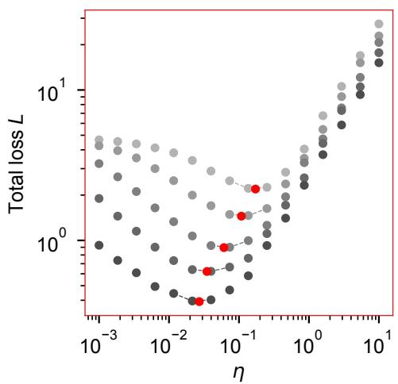

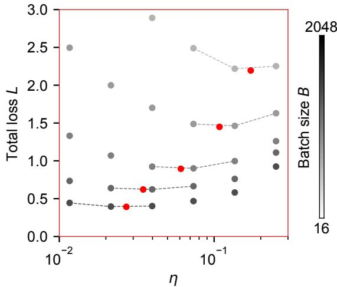  
Figure 5: The loss basin is broad and quadratic in log $\eta \cdot$ Total loss against learning rate for Adam, one point per swept learning rate, with grey level denoting batch size at a fixed training step. Red markers are the parabola vertices used as $\eta ^ { * }$ ; they fall between grid points because they are interpolated. Left: the full swept range. Right: the same data near the minimum, on a linear vertical axis. Two things are visible. The minima are interior to the swept range at every batch size, so the estimator never has to extrapolate to a grid edge. And the basin is flat: the loss changes little over a factor of several in $\eta .$ Since the loss is quadratic in log $\eta$ near its minimum, the location of the optimum is fixed only at second order while its value is fixed at first, which is why the $\eta ^ { * }$ traces in Figure 3a are noisy at large D while the envelope in Figure 3c is clean.

## H.3 THE PLANE FIT

The optimal learning rate is fitted jointly across batch sizes and budgets as a log-log plane,

$$
\log _ { 1 0 } \eta ^ { * } = s _ { D } \log _ { 1 0 } D + s _ { B } \log _ { 1 0 } B + c , \qquad D = B t ,\tag{50}
$$

by ordinary least squares over all pairs $( B , t )$ with $t \geq 1 0 ^ { 3 }$ steps, matching the window used for the channel exponents. The uncertainties quoted for $s _ { D }$ and $s _ { B }$ are the spread across four lower budget cutoffs, $D \overset { \cdot } { \geq } \{ 1 0 ^ { 5 } , 3 \times 1 0 ^ { 5 } , 1 0 ^ { 6 } , 3 \times \overset { \cdot } { 1 } 0 ^ { 6 } \}$ , rather than a regression standard error, since the fitted points are correlated across training steps.

The preconditioner exponents follow from Appendix E: $q = - 3 s _ { D }$ and $p = 1 - s _ { B }$ . For a general margin density the first becomes $q = - ( \nu + 3 ) s _ { D }$ (Appendix F).

Fitting the plane rather than each batch size separately matters. Slopes taken from constant-step slices differ from those taken from constant-budget slices, and the joint fit removes that ambiguity by using every $( B , t )$ pair at once.

## H.4 EXPONENT FITS AND UNCERTAINTIES

Time-scaling exponents are obtained by ordinary least squares on log loss against log training step over a fixed late-time window, applied identically to every curve and every optimizer; no window is chosen per optimizer. The value quoted for an exponent is the mean over the four learning-rate curves shown in the corresponding figure, and the quoted uncertainty is their standard deviation; the crosses in Figures 4a and 8 are the same quantity. Reporting the spread across curves rather than a single regression standard error is the more conservative choice, since it measures whether the curves agree with each other and not merely how well each is fitted. For SGD this gives a loss exponent $0 . 3 4 \pm 0 . 0 1$ and a norm exponent $0 . 3 3 \pm 0 . 0 1$ ; for Adam the norm exponent is $0 . 4 4 \pm 0 . 0 4$ the larger spread reflecting that Adam’s curves are less nearly parallel.

The envelope fit. The envelope $L ^ { * } ( D )$ is the minimum of the loss over hyperparameters at each budget. At each $( B , t )$ the loss entering the fit is the minimum over the learning-rate $\mathrm { g r i d } ;$ the parabolic refinement of Appendix H.2 is used to locate $\eta ^ { * }$ but not to evaluate $L ^ { * }$ , which suffices because near its minimum the loss depends on log η only at second order. Each batch size covers only $D \in \left[ 1 0 ^ { 3 } B , 1 0 ^ { 4 } B \right]$ , so the number of curves available to that minimum falls from four to one across the full range of budgets, and a minimum taken over a set that shrinks with budget is biased by an amount that varies with $D ,$ which tilts the fitted slope. Because the loss collapses onto $z \equiv \eta B ^ { \bar { p } - 1 }$ , the batch sizes after optimizing η estimate one quantity rather than genuinely different conditions, so we estimate the exponent by pooling them, with a single slope in $\log _ { 1 0 } D$ and one free level per batch size,

$$
\log _ { 1 0 } L ^ { * } ( B , D ) = - \alpha _ { D } \log _ { 1 0 } D + c _ { B } ,\tag{51}
$$

fitted by ordinary least squares over every $( B , D )$ point in the window, with each batch size weighted equally since points within a curve are correlated across training steps. This measures the same exponent without the selection bias of the minimum. The fitted levels $c _ { B }$ agree to within $1 \%$ across the batch sizes that span the window for every optimizer except SignGD, an independent check of the collapse onto z.

Consistency of the optimal exponent. The optimal data-scaling exponent can be obtained two ways. Fitting the envelope of Figure 3c gives the values of Table 4, which lie within 2.5% of $1 / 3$ for six of the seven optimizers, with a scatter across optimizers of 0.004; SignGD is the exception and is discussed above. Substituting the measured channel exponents into $\bar { \alpha _ { D } } = ( 2 \alpha _ { r } + \alpha _ { t } ) \bar { / 3 }$ instead gives $0 . 3 4 \pm 0 . 0 1$ for SGD and $0 . 3 5 \pm 0 . 0 2$ for Adam; this route returns the measured sum rule divided by three, so its excess and the sum rule’s $2 \alpha _ { r } + \alpha _ { t } = 1 . 0 3$ for SGD and 1.04 for Adam are the same numbers. Both are consistent with the fitted envelopes, and both sit above $1 / 3$

Where the excess lies. Writing $\alpha _ { r } = \alpha _ { \beta } s _ { r }$ and $\alpha _ { t } = \alpha _ { \beta } s _ { t }$ , where $s _ { r }$ and $s _ { t }$ are the local slopes of $L _ { r }$ and $L _ { t }$ against $\beta ,$ the sum rule takes the time-free form $2 s _ { r } + s _ { t } = 1 / \alpha _ { \beta }$ , in which every quantity is a slope against the weight norm. For SGD the left side measures 3.16 against 3.07 on the right, accounting for the whole of the measured excess. The tangential slope sits at its asymptotic value $( s _ { t } = 1 . 0 1$ against 1) while the radial slope exceeds its own $( s _ { r } = 1 . 0 8$ against 1), so the excess lies in the radial channel, and it is the $O ( 1 \bar { / } \beta )$ correction of Remark $2 \colon s _ { r }$ falls monotonically with $\beta$ over the fitting window and takes nearly the same values under Adam (1.09). Because the two exponents are fitted to the same runs, their spreads move together, and the ratio $s _ { r }$ is better determined than the individual uncertainties on $\alpha _ { \beta }$ and $\alpha _ { r }$ suggest.

The same correction accounts for the envelope. The channel combination gives $( 2 \alpha _ { r } + \alpha _ { t } ) / 3 =$ $0 . 3 4 \pm 0 . 0 1$ for SGD and $0 . 3 5 \pm 0 . 0 2$ for Adam, and the fitted envelopes give 0.341 for both, so the two routes agree to within their uncertainties and both exceed $1 / 3$ by a few percent. Estimating the envelope exponent by fitting the minimum curve directly would bias the slope downward, since that minimum is taken over a batch-size set that shrinks as D grows, so the bias varies with the fitting window; the pooled estimator avoids this, and the per-optimizer spread across cutoffs is 0.003 or less for six of the seven, and 0.012 for SignGD. Since $s _ { r }$ decreases with $\beta ,$ the framework predicts that the remaining excess shrinks at later budgets, and we read $1 / 3$ as the asymptotic value with $0 . 3 3 3 \pm 0 . 0 0 8$ across all seven, or $0 . 3 3 6 \pm 0 . 0 0 4$ excluding SignGD.

<table><tr><td rowspan="2">Optimizer</td><td colspan="4"> $D _ { \mathrm { m i n } }$ </td><td rowspan="2"> $\alpha _ { D }$ </td></tr><tr><td> $1 0 ^ { 5 }$ </td><td> $3 \times 1 0 ^ { 5 }$ </td><td> $1 0 ^ { 6 }$ </td><td> $3 \times 1 0 ^ { 6 }$ </td></tr><tr><td>SGD</td><td>0.343</td><td>0.342</td><td>0.340</td><td> $0 . 3 4 1$ </td><td> $0 . 3 4 1 \pm 0 . 0 0 1$ </td></tr><tr><td>PowerAdam(0.125)</td><td>0.334</td><td>0.332</td><td>0.332</td><td>0.333</td><td> $0 . 3 3 3 \pm 0 . 0 0 1$ </td></tr><tr><td>PowerAdam(0.25)</td><td>0.335</td><td>0.334</td><td>0.331</td><td>0.333</td><td> $0 . 3 3 3 \pm 0 . 0 0 2$ </td></tr><tr><td>PowerAdam(0.375)</td><td>0.337</td><td>0.336</td><td>0.336</td><td>0.339</td><td> $0 . 3 3 7 \pm 0 . 0 0 1$ </td></tr><tr><td>Adam</td><td>0.339</td><td>0.339</td><td>0.342</td><td>0.347</td><td> $0 . 3 4 1 \pm 0 . 0 0 3$ </td></tr><tr><td>Muon</td><td>0.336</td><td>0.332</td><td>0.330</td><td>0.328</td><td> $0 . 3 3 2 \pm 0 . 0 0 3$ </td></tr><tr><td>SignGD</td><td>0.296</td><td>0.314</td><td>0.325</td><td>0.327</td><td> $0 . 3 1 5 \pm 0 . 0 1 2$ </td></tr></table>

Table 4: Envelope exponents against the lower fitting cutoff. $\alpha _ { D }$ fitted over $D \ge D _ { \operatorname* { m i n } }$ for four choices of $D _ { \mathrm { m i n } }$ , with the quoted value the mean across the four and the uncertainty their spread. The envelope is built from checkpoints with $t \geq 1 0 ^ { 3 }$ , the same window used for the dynamic exponents $\alpha _ { r }$ and $\alpha _ { t } .$ , so that all four exponents are fitted over matched data. The envelope is defined as the minimum of the loss over hyperparameters at each budget, as in Figure 3c, with its exponent estimated by a pooled fit with a single slope in log D and one free level per batch size (Appendix H.4). Six of the seven lie within 2.5% of $1 / 3 .$ , with a scatter across optimizers of 0.004; SignGD approaches $1 / 3$ from below over this window, its per-batch-size envelope slopes, fitted separately, rising from 0.06 at $B = 1 6$ to 0.33 at $B = 2 0 4 { \bar { 8 } }$ , so the batch sizes that reach furthest into the asymptotic regime already give the family value. We stop at $D _ { \mathrm { m i n } } = 3 \times 1 0 ^ { 6 }$ because the number of batch sizes reaching a given budget falls as $D$ grows: since each covers $D \in \left[ 1 0 ^ { 3 } B , 1 0 ^ { 4 } B \right]$ , fewer than three contribute above $5 \times 1 0 ^ { 6 }$ and only one above $1 0 ^ { 7 }$ , so later cutoffs measure the largest batch sizes rather than a minimum over hyperparameters.

## H.5 SUPPORTING MEASUREMENTS

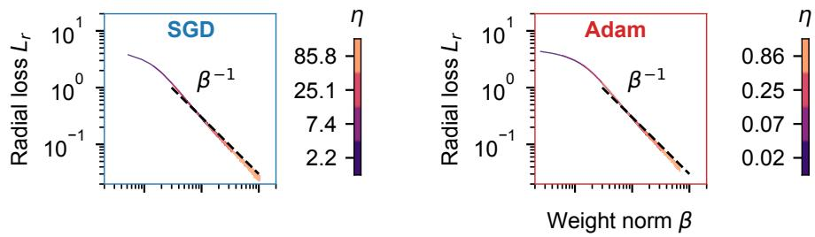  
Figure 6: The radial loss is a function of the weight norm alone. $L _ { r }$ against $\beta$ for SGD (left) and Adam (right), colored by learning rate over the ranges of Figure 1. Curves at different learning rates collapse onto a single master curve approaching $\begin{array} { r } { \breve { L } _ { r } \propto \beta ^ { - 1 } } \end{array}$ (dashed). This tests Eq. (5) directly, without comparing two separately fitted exponents.

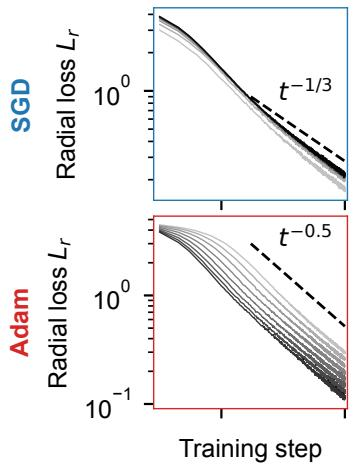

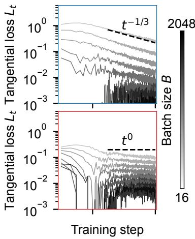  
Figure 7: The channel exponents do not depend on batch size. $L _ { r }$ (left) and $L _ { t }$ (right) against training step for all eight batch sizes at fixed learning rate, SGD above and Adam below, with the exponents of Figure 2 shown as dashed guides. Batch size shifts the curves without changing their slopes, which together with Figure 2 establishes that $\alpha _ { r }$ and $\alpha _ { t }$ depend on neither hyperparameter. Larger batches lower $L _ { t }$ , while $L _ { r }$ is nearly batch-independent for SGD: at fixed step $L _ { r }$ depends on batch size only through $B ^ { p }$ , and $p = 0$ for SGD. At a fixed sample budget $D = B t$ the comparison changes sign, since a larger batch is less noisy and lowers $L _ { t }$ but buys fewer optimization steps and so leaves $L _ { r }$ higher. The erratic early-time behavior at small batch size is $L _ { t } < 0$ , the finite-norm transient described in Appendix B.

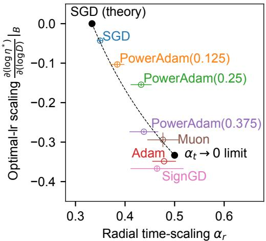  
Figure 8: A dynamic exponent and a hyperparameter exponent are not independent. Measured $s _ { D }$ against $\alpha _ { r }$ for all seven optimizers, with the prediction of Eq. (32) as a dashed curve and the SGD value $( 1 / 3 , 0 )$ as a black point. The two axes come from independent measurements, $\alpha _ { r }$ from the loss curves and $s _ { D }$ from the plane fit, so this test does not involve $\alpha _ { t }$ . The curve terminates at $( 1 / 2 , - 1 / 3 )$ , the limit $\alpha _ { t }  0 \mathrm { o r } q  1$ , beyond which the tangential channel no longer decays.

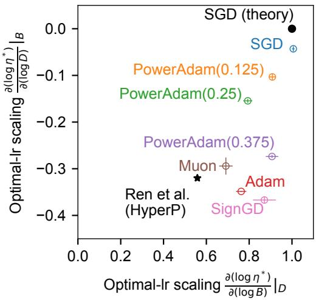  
Figure 9: The two optimal-learning-rate exponents across optimizers. Measured $s _ { D }$ against $s _ { B } .$ with the SGD prediction (1, 0) as a black point and the values reported by Ren et al. (2026) for their hypersphere optimizer as a star. Since $s _ { D } = - q / 3$ and $\begin{array} { r } { s _ { B } = 1 - p , } \end{array}$ the horizontal axis measures the preconditioner’s batch exponent and the vertical axis its scale exponent.

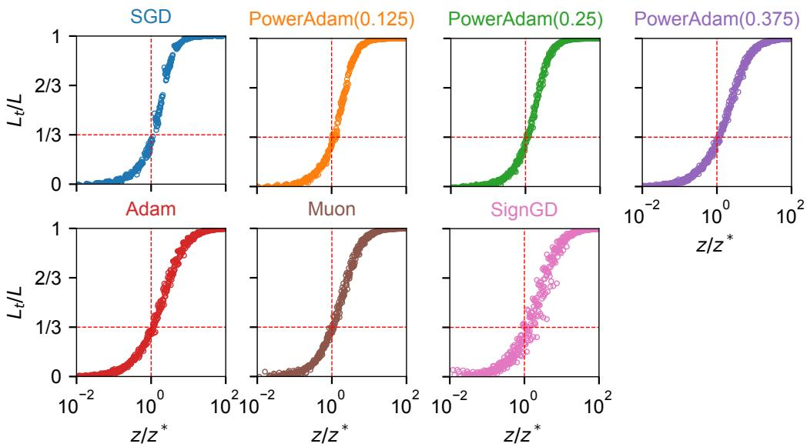  
Figure 10: The two channels reach a fixed ratio at the optimum. $L _ { t } / L$ against $z / z ^ { * }$ for each of the seven optimizers, with $z = \eta B ^ { p - 1 }$ and $z ^ { * } ( D ) = 1 \bar { 0 ^ { c } } D ^ { s _ { D } }$ taken from the plane fit of $\mathsf { A p } \cdot$ pendix H. Each panel contains all 16 learning rates and all 8 batch sizes at five training times $( t \approx 3 0 0$ , 1000, 3000, 5000, 9000), and they collapse onto a single curve: $L _ { t } / L$ depends on the hyperparameters only through $z / z ^ { * }$ . Every optimizer passes through $1 / 3$ at $z = z ^ { * }$ (dashed lines), as Theorem 2 predicts with no fitted quantity beyond the plane fit that sets $z ^ { * }$ . The collapse follows $R / ( 1 + R )$ with $\begin{array} { r } { R = \frac { 1 } { 2 } ( z / z ^ { * } ) ^ { 3 \alpha _ { r } } } \end{array}$ ; deviations appear only for $L _ { t } / L \lesssim 0 . 1$ , where $L _ { t }$ is a small difference of two larger quantities and the finite-norm transient of Appendix B can drive it negative.