# OVERCOMING SCALING LIMITS IN ON-POLICY SELF-DISTILLATION FOR LLM REASONING

Md Ismail Hossain North South University

Humaira Kousar KAIST

Isidora Chara Tourni   
Andria Labs   
∗

## ABSTRACT

On-policy self-distillation (OPSD) trains a student to match a privileged teacher distribution along its own sampled trajectory. Standard OPSD applies this supervision to unverified student rollouts while conditioning the teacher on privileged context, typically a reference solution. We separate these roles in a factorial analysis and find that scaffold correctness has a stronger effect on downstream accuracy than context correctness. Unverified scaffolds create an imitation gap because the teacher can use information unavailable to the student. This gap shrinks with model scale, yet OPSD continues to supervise mostly unverified trajectories. In contrast, verified scaffolds remain effective even when the teacher is conditioned on the student’s own unsuccessful rollout. Based on this finding, we introduce OA-SIS, which retains the OPSD objective but supervises mostly verified by label onpolicy trajectories and replaces written solutions with unverified model-generated attempts as the teacher context. OASIS therefore requires only final-answer labels. Across Qwen3-1.7B, 4B, and 8B on AIME 2024, AIME 2025, and HMMT 2025, OASIS improves over the base model by 3.2–3.8 points on average, while OPSD’s gain falls from 3.05 points at 1.7B to 0.14 at 8B. At 8B, OASIS improves over OPSD by 3.05 points, showing that verified on-policy scaffolds preserve the effectiveness of self-distillation as models scale.

## 1 INTRODUCTION

On-policy self-distillation (OPSD) provides an efficient approach to improving mathematical reasoning in language models (Zhao et al., 2026). In OPSD, a single model is used in two conditioning settings. The student receives only the problem and samples a solution, while the teacher is additionally given a reference solution and evaluates the student-generated trajectory at the token level. The student is then trained to match the teacher’s token distributions along its own sampled trajectory. Since the supervision is applied to trajectories generated by the student itself, OPSD reduces the distribution mismatch associated with sequence-level distillation (Hinton et al., 2015; Kim & Rush, 2016), while retaining the dense supervision of token-level distillation. It is also more token-efficient than reinforcement learning for mathematical reasoning (Shao et al., 2024; Zhao et al., 2026) and builds on on-policy distillation (Ross et al., 2011; Gu et al., 2024).

Two aspects of OPSD remain less understood. First, it requires a worked solution for each training problem, which limits its applicability to datasets that provide only verifiable answers. Second, it is not yet clear what aspects of the teacher signal are most important for learning. Recent analyses have approached the latter question from the teacher side. Shen et al. (2026) decompose the teacher signal into a component induced by the reference solution and a component that depends only on the question, while Ichihara et al. (2026) show that a reference solution written for a different problem can still provide useful supervision. The specific reference solution may therefore matter less than the standard formulation implies (see also Zelikman et al., 2022; Wang et al., 2023). This leaves a complementary question largely unexplored: does it matter where along the student’s trajectory the supervision is applied?

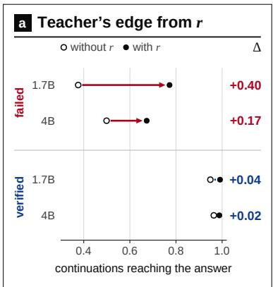

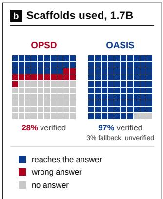

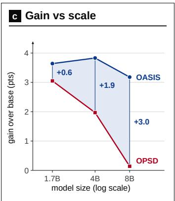  
Figure 1: The teacher’s advantage is concentrated on failed trajectories and decreases with model scale. (a) Fraction of continuations reaching the correct answer from prefixes of student rollouts, with and without the gold reference r. (b) Scaffolds supervised at 1.7B: only 28% of OPSD’s reach a verified answer, and most of the rest are truncated. (c) Average gain over the base model.

We investigate this question with a recovery experiment: we truncate a student rollout and let the model continue from the same prefix under different contexts. On rollouts that end in a wrong answer, the gold-context teacher recovers the correct answer in 77% of continuations versus 37% for the student, while unrelated or empty references give no improvement. On rollouts that already end correctly, the gap is small (99% versus 95%). The teacher’s advantage is therefore concentrated on failed trajectories and relies on information unavailable to the student at test time (Figure 1a, Table 1). This advantage shrinks with scale. From 1.7B to 4B, the student’s own recovery on failed prefixes rises from 0.37 to 0.50 and the teacher’s advantage falls by more than half, yet about 70% of OPSD updates still fall on trajectories that never reach a correct answer. In our experiments, OPSD improves over the base model by 3.05, 1.98, and 0.14 points at 1.7B, 4B, and 8B.

These observations motivate OASIS (On-policy Alignment via Scaffold-Isolated Supervision), which keeps the OPSD objective unchanged. OASIS samples K rollouts per problem, verifies their final answers (Shao et al., 2024), and applies the OPSD loss along the shortest verified rollout. Problems without a verified rollout contribute no signal. Because the teacher signal on verified trajectories is largely insensitive to the context (Figure 2b), OASIS conditions the teacher on a distinct same-problem rollout, typically one of the student’s own unverified attempts, and otherwise another verified rollout, requiring only final-answer verification rather than written solutions. Across Qwen3-1.7B, 4B, and 8B, OASIS improves over OPSD by 0.59, 1.86, and 3.05 points on average across AIME 2024, AIME 2025, and HMMT 2025, and its gain over the base model stays stable with scale (Table 2, Figure 1c).

Our main contributions are the following.

• We characterize the irreducible imitation gap in OPSD when the reference is unavailable to the student (Section 3.5).

• We separate two roles that standard OPSD couples: the trajectory scaffold determines the prefixes receiving supervision, while teacher context determines the target distribution at those prefixes. We introduce signal-replay and recovery probes to analyze these roles separately.

• Across Qwen3-1.7B and Qwen3-4B, the probes show that the gold-context recovery advantage is substantially larger on prefixes from non-verified trajectories, whereas teacher targets on outcome-verified trajectories are relatively insensitive to several alternative contexts.

• We introduce OASIS, which selects a short outcome-verified scaffold from on-policygenerated candidates and pairs it with a distinct self-generated context. Across three Qwen3 sizes and three competition-mathematics benchmarks, OASIS improves mean Avg@12 over OPSD while replacing written reasoning traces with final-answer labels, at increased rollout-generation cost.

## 2 RELATED WORK

On-Policy Self-Distillation and Privileged Context. Classical knowledge distillation trains a student against a teacher on a fixed corpus or teacher-generated sequences (Hinton et al., 2015; Kim & Rush, 2016; Romero et al., 2014). On-policy variants instead evaluate the teacher on samples from the student, reducing the distribution mismatch between training and inference (Agarwal et al., 2024; Gu et al., 2024). Zhao et al. (2026) use a single model as both teacher and student, conditioning only the teacher on a privileged context. Shen et al. (2026) decompose the teacher signal into reference-induced and question-conditioned components to purify long-chain reasoning supervision, and Ichihara et al. (2026) show that a solution to a different problem can still improve the student. Our measurements agree: on verified scaffolds, an empty reference block is about as close to the gold-context teacher as an unrelated solution (Figure 2b). Recent extensions to on-policy self-distillation refine token-level weighting by addressing teacher uncertainty or trajectory dynamics. For instance, EGRSD (Ke et al., 2026) introduces a teacher-entropy confidence gate to mitigate high-entropy token noise, while DASH (Hou et al., 2026) employs divergence-adaptive supervision horizons to capture path-dependent discrepancy dynamics. These works vary based on what the teacher observes. We instead ask on which states of the student’s trajectories its supervision is imitable.

Learning from Privileged Information. The setting in which an expert observes information unavailable to the learner has long been studied as learning using privileged information (Pechyony & Vapnik, 2010). In sequential decision-making, the related imitation gap arises when a policy is trained to imitate an expert with richer observations and is then deployed without that privileged information (Weihs et al., 2021; Swamy et al., 2022). Asymmetric actor-critic methods similarly allow privileged information during training while restricting the deployed policy to its available observations (Lambrechts et al., 2025). OPSD fits this setting: when the teacher’s action depends on the unobserved reference, the student is pushed toward a context-averaged target, leaving the irreducible loss of Proposition 1.

Verification-Based Reasoning Training. Outcome verification is widely used to train reasoning models from their own samples. Rejection-sampling fine-tuning retains successful trajectories as training data (Yuan et al., 2023), while STaR and expert iteration iteratively use verified or selfgenerated solutions to improve the model (Zelikman et al., 2022; Anthony et al., 2017). Process supervision instead evaluates intermediate reasoning steps and can provide finer-grained credit assignment, at the cost of step-level annotations or reward models (Uesato et al., 2022; Lightman et al., 2024). Reinforcement learning with verifiable rewards uses the same type of outcome signal as a sequence-level reward (Schulman et al., 2017; Shao et al., 2024). In OASIS, the verified trajectory is neither a supervised target nor a scalar reward: verification only decides which on-policy scaffold receives the teacher’s token-level distribution. The comparison with GRPO in Section 5.2 is complementary, since both use the same verifier.

## 3 DIAGNOSING ON-POLICY SELF-DISTILLATION

## 3.1 PRELIMINARIES

On-Policy Self-Distillation (OPSD). Let x denote a problem and $\pi _ { \theta }$ an autoregressive policy. OPSD uses the same model parameters in two conditioning settings. The student receives only the problem and samples a trajectory

$$
y = ( y _ { 1 } , \dots , y _ { L } ) \sim \pi _ { \boldsymbol \theta } ( \cdot \mid s ( x ) ) ,\tag{1}
$$

where $s ( x )$ denotes the student prompt. The teacher receives the same problem together with a privileged context r, typically the written gold solution. This context is provided through a teacher prompt $\boldsymbol { u } ( \boldsymbol { x } , \boldsymbol { r } )$ . At each prefix $y _ { < t }$ of the student-generated trajectory, the two branches produce

$$
\begin{array} { r } { p _ { t } = \pi _ { \theta } ^ { ( T ) } ( \cdot \mid s ( x ) , y _ { < t } ) , \qquad q _ { t } = \pi _ { \theta _ { 0 } } ^ { ( T ) } ( \cdot \mid u ( x , r ) , y _ { < t } ) , } \end{array}\tag{2}
$$

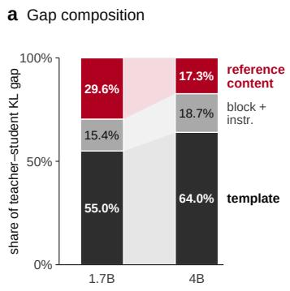

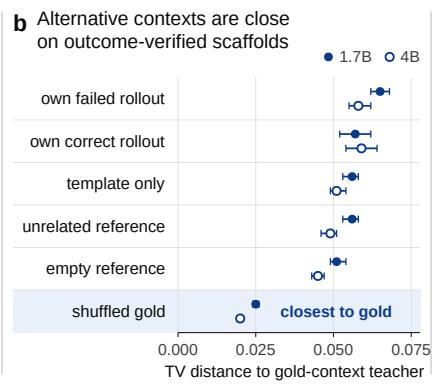

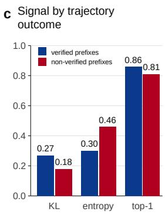  
Figure 2: Anatomy of the teacher signal. (a) Sequential attribution of the teacher–student KL gap. (b) Total-variation distance from the gold-context teacher for alternative contexts, with 95% bootstrap intervals. (c) Teacher statistics on verified and non-verified prefixes.

where $\pi ^ { ( T ) }$ denotes the next-token distribution at temperature $T .$

The student is trained to match teacher distributions at these prefixes using a forward KL divergence. Following OPSD, each vocabulary contribution is clipped at a constant $\kappa ,$ and the loss is averaged over supervised tokens in a batch B:

$$
\mathcal { L } ( \theta ) = \frac { 1 } { \sum _ { ( x , y ) \in \mathcal { B } } \left| y \right| } \sum _ { ( x , y ) \in \mathcal { B } } \sum _ { t = 1 } ^ { | y | } \sum _ { a \in \mathcal { V } } \operatorname* { m i n } \left( q _ { t } ( a ) \log \frac { q _ { t } ( a ) } { p _ { t } ( a ) } , \kappa \right) .\tag{3}
$$

We refer to $y$ as the scaffold (defining where supervision is applied) and r as the context (defining information available to the teacher). Standard OPSD pairs an unverified student scaffold with a gold reference context.

Offline Diagnostic Protocols. To analyze OPSD without training overhead, we evaluate two diagnostic setups: (i) a signal replay test that replays student and teacher distributions along recorded scaffolds to measure next-token divergence under varied contexts, and (ii) a truncated continuation benchmark that cuts student rollouts at fraction $f \in \{ 0 . 1 , \ldots , 0 . 9 \}$ of their length and measures outcome recovery under different teacher contexts (full details in Appendix A.2).

## 3.2 SUPERVISION ALLOCATION AND WASTE

Tracking trajectory outcomes across training logs reveals a major efficiency bottleneck. At Qwen3- 1.7B and Qwen3-4B, only 28.3% and 30.6% of training rollouts, respectively, produce a correct answer, while 62.0% and 64.4% reach the token cap without producing an answer (Table 5). Thus, 71.7% and 69.4% of rollouts end without a verified answer. Truncated rollouts also contain neither an answer token nor a stop token, so they provide no supervision for completing the solution. Over 100 training steps, rollouts become longer while the fraction that verifies decreases from 0.333 to 0.229 at 1.7B and from 0.394 to 0.218 at 4B (Figure 5).

## 3.3 ANATOMY OF THE TEACHER SIGNAL

Much of the teacher–student KL gap comes from formatting rather than reference content. At 1.7B, the thinking-mode template accounts for 55.0% of the gap and the reference block and its instructions for 15.4%, leaving 29.6% for the reference content itself, which falls to 17.3% at 4B (Figure 2a). On verified scaffolds the teacher is also weakly sensitive to its context: the student’s own failed attempt gives a total-variation distance of 0.065 from the gold-context teacher, and unrelated, empty, and template-only contexts give 0.056, 0.051, and 0.056 (Figure 2b). A line-shuffled gold reference is closest (0.025), suggesting the teacher relies on the reference content more than on the order of its reasoning (Ichihara et al., 2026).

Table 1: The teacher’s advantage is concentrated on failed trajectories. Fraction of continuations that reach the correct answer after resuming from a prefix of a student rollout, averaged over cut fractions $f \in \{ 0 . 1 , \ldots , 0 . 9 \}$ The student receives no context. $\Delta$ is the difference from the student-alone condition of the same run. <sup>∗</sup>Restricted to problems where the answer does not appear elsewhere in the redacted reference (failed: 69 at 1.7B, 72 at 4B; verified: 37 at 1.7B, 52 at 4B).
<table><tr><td colspan="2"></td><td colspan="2">Qwen3-1.7B</td><td colspan="2">Qwen3-4B</td></tr><tr><td>Prefix</td><td>Context</td><td>Recovers</td><td>Δ</td><td>Recovers</td><td>Δ</td></tr><tr><td rowspan="7">Failed</td><td>Gold reference</td><td>0.77</td><td>+0.40</td><td>0.67</td><td>+0.17</td></tr><tr><td>Answer only</td><td>0.61</td><td>+0.23</td><td>0.59</td><td>+0.09</td></tr><tr><td>Gold, answer removed</td><td>0.59</td><td>+0.22</td><td>0.57</td><td>+0.08</td></tr><tr><td>Gold, answer removed*</td><td>0.51</td><td>+0.13</td><td>0.50</td><td>+0.01</td></tr><tr><td>Unrelated reference</td><td>0.32</td><td>-0.06</td><td>0.37</td><td>-0.13</td></tr><tr><td>Empty reference</td><td>0.37</td><td>-0.01</td><td>0.41</td><td>-0.09</td></tr><tr><td>Student alone</td><td>0.37</td><td></td><td>0.50</td><td></td></tr><tr><td rowspan="6">Verified</td><td>Gold reference</td><td>0.99</td><td>+0.04</td><td>0.99</td><td>+0.02</td></tr><tr><td>Answer only</td><td>0.98</td><td>+0.03</td><td>0.98</td><td>+0.02</td></tr><tr><td>Gold, answer removed</td><td>0.95</td><td>+0.00</td><td>0.95</td><td>-0.01</td></tr><tr><td>Unrelated reference</td><td>0.91</td><td>-0.04</td><td>0.93</td><td>-0.03</td></tr><tr><td>Empty reference</td><td>0.94</td><td>-0.01</td><td>0.96</td><td>-0.01</td></tr><tr><td>Student alone</td><td>0.95</td><td></td><td>0.97</td><td></td></tr></table>

## 3.4 PRIVILEGED TEACHER ADVANTAGE

On failed prefixes at 1.7B, the gold-context teacher recovers a correct answer in 77% of cases versus 37% for the student $( \Delta = + 0 . 4 0$ Table 1), while empty and unrelated references give 37% and 32%, so the advantage comes from the privileged content. The final answer alone gives 61% and the written reasoning without the answer 51% (excluding cases where the answer reappears), so both contribute, and neither is available to the student at inference time. On verified scaffolds the gap is small $( \Delta = + 0 . 0 4$ at 1.7B and +0.02 at 4B). On failed states, the teacher has higher entropy (0.461 vs. 0.297), assigns lower probability to the token sampled by the student (0.775 vs. 0.834), and produces a lower KL signal (0.181 vs. 0.274) than on verified states (Table 6). Thus, OPSD applies most of its supervision on failed states, where the teacher’s predictions are both more contextdependent and less concentrated.

## 3.5 THE PRIVILEGED IMITATION GAP

Because the student cannot observe r, it cannot in general match teacher distributions that depend on privileged context. Under forward-KL distillation, the optimal student instead matches the contextaveraged teacher distribution.

Proposition 1 (Mixture Optimum and Irreducible Loss). Let $ { \boldsymbol { z } } ^ { \mathrm { ~ } } = \left( x , y _ { < t } \right)$ denote the student observation and let $\begin{array} { r } {  { { \mathchoice { \mathrm {  ~ \displaystyle ~ R ~ } } { \mathrm {  ~ \textstyle ~ R ~ } } { \mathrm {  ~ \textstyle ~ R ~ } } { \mathrm {  ~ \scriptstyle ~ R ~ } } { \mathrm {  ~ \scriptscriptstyle ~ R ~ } } } } \sim  { { \mathchoice { \mathrm {  ~ \displaystyle ~ P ~ } } { \mathrm {  ~ \textstyle ~ P ~ } } { \mathrm {  ~ \textstyle ~ P ~ } } { \mathrm {  ~ \scriptscriptstyle ~ P ~ } } } } ( r  { { \mathchoice { \mathrm {  ~ \displaystyle ~ \mu ~ } } { \mathrm {  ~ \textstyle ~ \mu ~ } } { \mathrm {  ~ \textstyle ~ \mu ~ } } { \mathrm {  ~ \scriptscriptstyle ~ \mu ~ } } { \mathrm {  ~ \scriptscriptstyle ~ \mu ~ } } { \mathrm {  ~ \scriptscriptstyle ~ \mu ~ } } } } z ) } \end{array}$ denote the privileged context. Minimizing $\mathbb { E } _ { R } \left[ \mathrm { K L } ( q ( \cdot \mid z , R ) \parallel p ( \cdot \mid z ) ) \right]$ ] over p yields $p ^ { \star } ( \dot { \cdot } \mid z ) = \mathbb { E } _ { R \mid z } \left[ \dot { q ( \cdot \mid z , R ) } \right]$ . The minimum objective value equals the conditional mutual information $I ( A ; R \mid Z = z )$ , and $H ( p ^ { \star } ( \cdot \mid z ) ) \geq \mathbb { E } _ { R \mid z } H ( q ( \cdot \mid$ $z , R ) )$ .

(Proof in Appendix A.1.) Proposition 1 formalizes the constraint imposed by privileged information. Whenever teacher actions retain information about r that is unavailable to the student, the corresponding KL loss cannot be eliminated by updating the student alone. This connects OPSD to the broader imitation-learning setting in which the learner lacks information available to the expert (Swamy et al., 2022). This predicts that distillation on states with a large privileged advantage can increase the student’s uncertainty. Section 5.3 examines this during training.

## 3.6 SCALING BOTTLENECKS AND KL CLIPPING

The privileged advantage shrinks with scale: reference content accounts for 29.6% of the KL gap at 1.7B but 17.3% at 4B (Figure 2a), and ∆ on failed prefixes falls from +0.40 to +0.17 (Table 1). OPSD nevertheless keeps about 70% of its updates on unverified trajectories, and its gain over the base model falls from 3.05 to 1.98 to 0.14 points across 1.7B, 4B, and 8B (Table 2). The per-entry KL clip κ in Eq. 3 is a second, independent issue. Proposition 2 (Appendix A.3) shows that clipping an entry removes the teacher’s upward pull on that token and reverses the sign of its logit gradient. At $\kappa = 0 . 0 5$ , the clip removes 97% of positive KL mass on verified scaffolds and 94% on failed ones, affecting 29–32% of tokens (Figure 4).

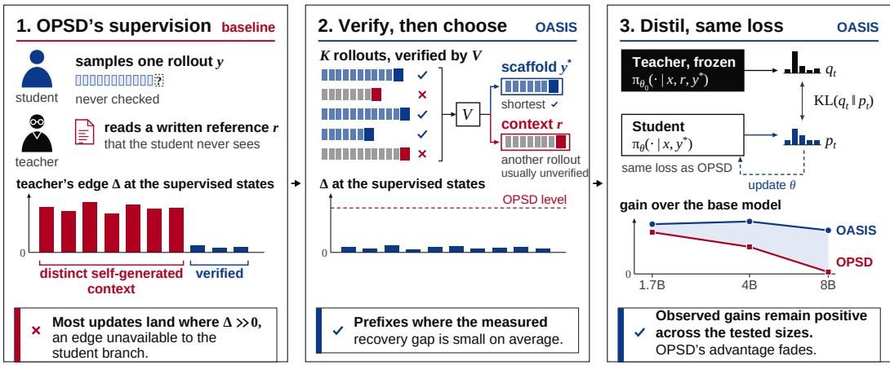  
Figure 3: OPSD versus OASIS. (1) OPSD distills along a single unverified rollout y, so most updates land where the teacher’s edge from the hidden reference r is large. (2) OASIS samples K rollouts, verifies them, and takes the shortest verified one as scaffold $y ^ { * }$ and another same-problem rollout as context r, typically unverified as context $r ,$ where the teacher’s edge is small. (3) The student is trained against the frozen teacher with the unchanged OPSD loss.

## Section Takeaways

The diagnosis shows that teacher advantage is concentrated on failed trajectories, while the recovery gap is small on verified trajectories. This advantage shrinks with scale, alongside diminishing OPSD gains from 1.7B to 8B. These findings reveal a scaling bottleneck and motivate distillation on verified trajectories.

## 4 OASIS: DISTILLING WHERE THE TEACHER IS IMITABLE

Supervision is most useful when the teacher’s behaviour can be reproduced from information available to the student. The corresponding quantity, $I ( A ; R \mid Z )$ in Proposition 1, cannot be evaluated during training, so OASIS uses outcome verification as an empirical proxy: it restricts supervision to verified on-policy trajectories and builds the teacher context from the same rollouts.

## 4.1 VERIFICATION AS A CRITERION FOR SUPERVISION

Let $V ( x , y ) ~ \in ~ \{ 0 , 1 \}$ denote a task verifier that evaluates the final answer of a trajectory. The expected OPSD objective can be decomposed according to the verifier outcome:

$$
\mathbb { E } _ { y \sim \pi _ { \theta } } \big [ \mathcal { L } ( \theta ; r , y ) \big ] = \underbrace { \mathrm { P r } ( V { = } 1 ) \cdot \mathbb { E } \big [ \mathcal { L } \mid V { = } 1 \big ] } _ { \mathrm { v e r i f i e d ~ t r a j e c t o r i e s } } + \underbrace { \mathrm { P r } ( V { = } 0 ) \cdot \mathbb { E } \big [ \mathcal { L } \mid V { = } 0 \big ] } _ { \mathrm { u n v e r i f i e d ~ t r a j e c t o r i e s } } .\tag{4}
$$

The two groups differ sharply in privileged advantage $( \Delta = + 0 . 0 4$ versus +0.40 at 1.7B,Table 1), yet unverified trajectories receive about 72% of OPSD updates at 1.7B (Table 5).

OASIS retains supervision from the verified trajectories:

$$
\mathcal { L } _ { \mathrm { o a s r s } } ( \theta ) = \mathbb { E } _ { x } \Big [ | \mathcal { K } \big [ y ^ { + } ( x ) \neq \emptyset \big ] \cdot \mathcal { L } \big ( \theta ; r ( x ) , y ^ { \star } ( x ) \big ) \Big ] , \qquad y ^ { + } ( x ) = \{ y \in \mathcal { Y } ( x ) : V ( x , y ) = 1 \} ,\tag{5}
$$

where $y ( x )$ contains K rollouts sampled from the current policy. Except for rare all-masked microbatches, this indicator restricts supervision to problems with at least one verified rollout. The fallback rule used in that rare case is given in Appendix A.5 (paragraph “Masking”). The loss, teacher, prompts, clipping constant, temperature, and optimizer are identical to OPSD. Only the distribution of supervised trajectories changes, and the scaffold remains on policy. Unlike rejection-sampling fine-tuning (Yuan et al., 2023; Zelikman et al., 2022), the verified trajectory is not the training target: the teacher distribution is.

## 4.2 SCAFFOLD: THE SHORTEST VERIFIED TRAJECTORY

For each problem, we draw K rollouts using the student prompt and the sampling settings of OPSD, verify their final answers, and select

$$
y ^ { \star } ( x ) = \underset { y \in { \mathcal { Y } } ^ { + } ( x ) } { \operatorname { a r g m i n } } | y | .\tag{6}
$$

Verification decides whether a problem contributes supervision. Length only chooses among verified trajectories. A verified trajectory contains a completed answer and a stopping point that truncated rollouts lack (Section 3.2), and the shortest one limits the weight of unnecessarily long trajectories. We treat this rule as an empirical choice (Appendix A.4).

## 4.3 CONTEXT: A DISTINCT SAME-PROBLEM ROLLOUT

On verified scaffolds the teacher is relatively insensitive to its context (Section 3.3), consistent with the student already recovering 95% of verified prefixes without privileged context. We therefore construct the context from another rollout of the same problem:

$$
r ( x ) \in \mathcal { V } ( x ) \backslash \mathcal { V } ^ { + } ( x ) , \qquad r ( x ) = \operatorname * { a r g m i n } _ { y \in \mathcal { V } ( x ) \backslash \mathcal { V } ^ { + } ( x ) } | y | .\tag{7}
$$

When all sampled rollouts are verified, we instead use another verified rollout and never use the scaffold itself as its own context. Figure 6c reports the frequency of each case. Because the verifier is imperfect, a rollout in $\mathcal { V } ( x ) \setminus \mathcal { V } ^ { + } ( x )$ is more precisely described as a trajectory that was not verified as correct rather than as a necessarily incorrect solution. The method therefore requires only a final answer per training problem, not a written solution.

## 5 EXPERIMENTS

## 5.1 SETUP

We follow the protocol of Zhao et al. (2026) and change only the construction of $( r , y )$ . We use Qwen3-1.7B, Qwen3-4B, and Qwen3-8B (Yang et al., 2025). Training uses the mathematical subset of OpenThoughts (Guha et al., 2026). OPSD uses both the problem and its written solution, whereas OASIS uses only the final answer. All distillation methods use the same core settings unless otherwise stated, while Base, SFT, and GRPO use method-specific components. Complete distillation settings are provided in Table 9. For Table 2, we use a level playing field in terms of training samples. OPSD, AVSD, and CRISP use 32 problems per step for 100 steps, while OASIS samples $K = 8$ rollouts for 64 candidate problems and trains on at most 32 verified problems. We compare the base model, supervised fine-tuning on the reference solutions, GRPO (Shao et al., 2024) with a binary outcome reward verified against the same answers, OPSD (Zhao et al., 2026), AVSD (Nguyen et al., 2026), and CRISP (Sang et al., 2026). Evaluation uses Avg@12 on AIME 2024, AIME 2025, and HMMT 2025 with the sampling settings recommended for Qwen3. Checkpoints are evaluated every 20 steps using the same checkpoint selection rule for all methods. Unless noted otherwise, each reported score is from a single training run evaluated once. Table 3 additionally reports repeatedevaluation variability (three evaluation seeds on one Qwen3-4B checkpoint per method), confirming that this variation is small relative to the OASIS–OPSD gap.

## 5.2 MAIN RESULTS

OASIS improves over OPSD by 0.59, 1.86, and 3.05 points on average at 1.7B, 4B, and 8B (Table 2). At 1.7B the difference is within the range that sampling variation can produce on 30 problems, so it alone is not conclusive. The differences at 4B and 8B are larger. GRPO uses the same verifier and answer labels but optimizes a scalar outcome reward, and improves over the base model by only 0.60, 0.60, and 0.23 points, against 3.64, 3.84, and 3.19 for OASIS, indicating that the dense teacher distribution contributes beyond the verifier alone. SFT on the written solutions is at or below the base model at all three scales. Across scale, OPSD’s gain over the base model falls from 3.05 to 1.98 to 0.14 while the teacher’s privileged advantage on failed prefixes falls from +0.40 to +0.17 (Table 1). This matches Section 3.5: as the student grows stronger, the reference adds less information, whereas OASIS already restricts supervision to the regime where that component is small.

Table 2: Competition mathematics benchmark performance (Avg@12, %). Best result per block in bold, second best underlined. $\Delta _ { \mathrm { O u r s - O P S D } }$ highlights the growing margin of OASIS over OPSD as model scale increases.
<table><tr><td>Model</td><td>Method</td><td>AIME24</td><td>AIME25</td><td>HMMT25</td><td>Average</td></tr><tr><td rowspan="7">Qwen3-1.7B</td><td>Base</td><td>51.50</td><td>36.70</td><td>23.10</td><td>37.10</td></tr><tr><td>SFT</td><td>48.40</td><td>36.70</td><td>22.70</td><td>35.93</td></tr><tr><td>GRPO</td><td>51.10</td><td>38.30</td><td>23.70</td><td>37.70</td></tr><tr><td>OPSD</td><td>53.88</td><td>40.80</td><td>25.76</td><td>40.15</td></tr><tr><td>AVSD</td><td>51.85</td><td>38.61</td><td>26.39</td><td>38.95</td></tr><tr><td>OASIS (ours)</td><td>54.17</td><td>41.11</td><td>26.94</td><td>40.74</td></tr><tr><td> $\Delta _ { \mathrm { O u r s - O P S D } }$ </td><td>+0.29</td><td>+0.31</td><td>+1.18</td><td>+0.59</td></tr><tr><td rowspan="8">Qwen3-4B</td><td>Base</td><td>73.02</td><td>65.00</td><td>41.56</td><td>59.86</td></tr><tr><td>SFT</td><td>70.20</td><td>62.30</td><td>43.40</td><td>58.63</td></tr><tr><td>GRPO</td><td>73.06</td><td>63.33</td><td>45.00</td><td>60.46</td></tr><tr><td>OPSD</td><td>74.48</td><td>67.92</td><td>43.12</td><td>61.84</td></tr><tr><td>AVSD</td><td>73.06</td><td>68.06</td><td>43.98</td><td>61.70</td></tr><tr><td>CRISP</td><td>74.06</td><td>63.33</td><td>40.94</td><td></td></tr><tr><td>OASIS (ours)</td><td>76.66</td><td>69.17</td><td>45.27</td><td>59.44 63.70</td></tr><tr><td> $\Delta _ { \mathrm { O u r s - O P S D } }$ </td><td>+2.18</td><td>+1.25</td><td>+2.15</td><td>+1.86</td></tr><tr><td rowspan="8">Qwen3-8B</td><td></td><td></td><td></td><td></td><td></td></tr><tr><td>Base</td><td>75.11</td><td>67.71</td><td>45.10</td><td>62.64</td></tr><tr><td>SFT</td><td>73.61</td><td>66.67</td><td>46.67</td><td>62.32</td></tr><tr><td>GRPO</td><td>75.28</td><td>71.67</td><td>41.67</td><td>62.87</td></tr><tr><td>OPSD</td><td>73.75</td><td>68.75</td><td>45.84</td><td>62.78</td></tr><tr><td>AVSD</td><td>75.74</td><td>70.09</td><td>44.91</td><td>63.58</td></tr><tr><td>CRISP</td><td>76.04</td><td>67.29</td><td>42.92</td><td>62.08</td></tr><tr><td>OASIS (ours)  $\Delta _ { \mathrm { O u r s - O P S D } }$ </td><td>77.50 +3.75</td><td>72.22 +3.47</td><td>47.77 +1.93</td><td>65.83 +3.05</td></tr></table>

## 5.2.1 RESULTS AT SCALE

Table 3 reports the performance of OPSD and OASIS with Qwen3-4B across three competition mathematics benchmarks. We report three complementary metrics. Avg@12 measures the mean accuracy across 12 sampled solutions per problem. Pass@12 measures the fraction of problems for which at least one of the 12 samples is correct. Each value is reported as the mean ± standard deviation over three evaluation seeds using the same trained checkpoint.

Training cost OASIS changes how many problems a model has to see, how many it is trained on, and what it needs for each of them. Table 4 compares the two sides of that budget with the scores they buy. Table 4 uses a differ-

Table 3: Qwen3-4B reasoning benchmark results. Results are reported as mean ± standard deviation over 3 evaluation seeds with 12 samples per problem.
<table><tr><td>Benchmark</td><td>Metric</td><td>OPSD</td><td>OASIS</td></tr><tr><td rowspan="3">AIME 2024</td><td> $\mathbf { A v g } @ 1 2$ </td><td> $7 4 . 4 \pm 0 . 7 1$ </td><td> ${ \bf 7 6 . 6 \pm 0 . 2 3 }$ </td></tr><tr><td>Pass@12</td><td> $\mathbf { 8 6 . 6 \pm 0 . 0 0 }$ </td><td> $\mathbf { 8 6 . 6 \pm 0 . 0 0 }$ </td></tr><tr><td>Maj@12</td><td> $8 0 . 0 0 \pm 0 . 0 0$ </td><td> ${ \bf 8 1 . 1 \pm 1 . 5 7 }$ </td></tr><tr><td rowspan="3">AIME 2025</td><td>Avg@12</td><td> $6 7 . 9 \pm 1 . 3 3 $ </td><td> ${ \bf 6 9 . 1 \pm 0 . 2 3 }$ </td></tr><tr><td>Pass@12</td><td> $8 3 . 3 \pm 0 . 0 0$ </td><td> $\mathbf { 8 6 . 6 \pm 0 . 0 0 }$ </td></tr><tr><td>Maj@12</td><td> $7 3 . 3 \pm 3 . 3 3$ </td><td> ${ \bf 8 0 . 0 \pm 0 . 0 0 }$ </td></tr><tr><td rowspan="3">HMMT 2025</td><td>Avg@12</td><td> $4 3 . 1 \pm 0 . 8 9$ </td><td> ${ \bf 4 5 . 2 \pm 0 . 2 3 }$ </td></tr><tr><td>Pass@12</td><td> ${ \bf 6 4 . 4 \pm 1 . 9 2 }$ </td><td> $6 3 . 3 \pm 0 . 0 0$ </td></tr><tr><td>Maj@12</td><td> $5 1 . 1 1 \pm 3 . 8 5$ </td><td> ${ \bf 5 6 . 6 \pm 2 . 7 2 }$ </td></tr></table>

ent training configuration from Table 2. In Table 4, OPSD and AVSD are trained with a batch size of 64 for up to 200 steps, whereas Table 2 uses a batch size of 32 for 100 steps. OASIS uses a batch size of 64 in both settings. However, because of its training construction, it effectively trains on no more than 32 samples per step. So, the baselines are trained on 12,800 problems, each with a written solution. OASIS sees half as many problems, 6,400, and trains on roughly half of those, the ones for which at least one rollout verifies. It never uses a written solution, only a final answer per problem. With about a quarter of the supervised problems, OASIS matches or exceeds both baselines on average at both scales. At 4B it reaches 63.70 against 63.60 for OPSD and 62.90 for AVSD. At 8B the gap is larger, 65.83 against 64.80 and 64.03. The two columns where a baseline is ahead, HMMT 2025 at 4B and AIME 2024 at 8B, are within about one point. The price is paid in generation. OASIS samples eight rollouts for every problem it sees, so it generates 51,200 rollouts against 12,800 for a one-rollout OPSD run on the larger problem set. Sampling is the cheaper side of the trade in most settings, since it needs no labeled data and parallelizes well, while written solutions do not exist for most datasets with checkable answers. Where generation is the binding constraint, the K = 4 ablation in Appendix A.4 halves this cost. Algorithm 1 (Appendix A.5) summarises one OASIS update. With K = 8, OASIS generates 43.5M tokens over 100 steps at 1.7B versus 2.76M for OPSD, but supervises fewer, 1.98M versus 2.76M, because about half of the problem are masked and verified scaffolds are shorter (603 versus 859 tokens, Table 5).

Table 4: Written-supervision and rollout trade-offs.This table reports annotation, rollout, and supervised-example trade-offs. Problems seen and problems that received a gradient over training, rollouts generated, and whether written solutions are required. Scores are Avg@12. Best per column within each model in bold.
<table><tr><td colspan="7">Training budget</td><td colspan="4">Accuracy</td></tr><tr><td>Model</td><td>Method</td><td>Seen</td><td>Trained</td><td>Rollouts</td><td>Written solution?</td><td>AIME24</td><td>AIME25</td><td>HMMT25</td><td></td><td>Avg.</td></tr><tr><td rowspan="3">Qwen3-4B</td><td>OPSD†</td><td>12.8K</td><td>12.8K</td><td>12.8K</td><td>Yes</td><td>76.40</td><td></td><td>68.30</td><td>46.10</td><td>63.60</td></tr><tr><td>AVSD†</td><td>12.8K</td><td>12.8K</td><td>12.8K</td><td>Yes</td><td>76.20</td><td>68.30</td><td>44.20</td><td></td><td>62.90</td></tr><tr><td>OASIS</td><td>6.4K</td><td>≈3.2K</td><td>51.2K</td><td>No</td><td>76.66</td><td></td><td>69.17</td><td>45.27</td><td>63.70</td></tr><tr><td rowspan="3">Qwen3-8B</td><td>OPSD{†</td><td>12.8K</td><td>12.8K</td><td>12.8K</td><td>Yes</td><td>77.80</td><td></td><td>70.80</td><td>45.80</td><td>64.80</td></tr><tr><td>AVSD†</td><td>12.8K</td><td>12.8K</td><td>12.8K</td><td>Yes</td><td>75.40</td><td></td><td>69.60</td><td>47.10</td><td>64.03</td></tr><tr><td>OASIS</td><td>6.4K</td><td>≈3.2K</td><td>51.2K</td><td>No</td><td>77.50</td><td>72.22</td><td></td><td>47.77</td><td>65.83</td></tr></table>

## 5.3 TRAINING BEHAVIOUR

At 1.7B, OASIS keeps a higher fraction of verified rollouts than OPSD (0.314 versus 0.283 on average), its student entropy reaches 0.49 versus 0.70, and its top-1 agreement with the teacher stays at 0.931 while OPSD’s falls from 0.932 to 0.888 (Figure 5), consistent with Proposition 1. At 4B the separation lasts for about two thirds of training, after which OASIS also drifts: top-1 agreement ends at 0.853 and about half of the tokens have a clipped entry (Table 5). Clipping is one possible explanation (Appendix A.3), so we evaluate both methods under the same checkpoint selection rule.

## Section Takeaways

Even when the teacher is conditioned on the student’s own unverified rollout, while the student is supervised on a verified rollout selected primarily by its final output label, distillation can outperform standard OPSD.

## 6 CONCLUSION

We find that OPSD’s privileged teacher is most useful precisely where its signal is least imitable. The teacher has a large advantage on failed trajectories, where OPSD concentrates most of its supervision, but little advantage on verified trajectories. OASIS therefore restricts distillation to verified on-policy scaffolds and replaces the written solution with a distinct same-problem rollout, typically the student’s own unverified attempt, retaining the teacher’s dense signal without requiring reference solutions. Across Qwen3-1.7B, 4B and 8B, OASIS improves over the base model by 3.64, 3.84 and 3.19 points, while OPSD’s gain falls from 3.05 to 1.98 and 0.14. These results suggest that the effectiveness of privileged self-distillation depends on whether the teacher’s supervision can be transferred to the student’s available context. Our study is limited to competition mathematics and one model family, with higher generation cost and single runs at 4B and 8B. Extending this criterion to settings with inexpensive outcome verification but no written solutions, such as code with unit tests, is a natural next step.

## ACKNOWLEDGEMENT

This work was supported in part by a generous compute grant from Lambda AI. We gratefully acknowledge their support.

## REFERENCES

Rishabh Agarwal, Nino Vieillard, Yongchao Zhou, Piotr Stanczyk, Sabela Ramos Garea, Matthieu Geist, and Olivier Bachem. On-policy distillation of language models: Learning from selfgenerated mistakes. In International Conference on Learning Representations, volume 2024, pp. 21246–21263, 2024.

Thomas Anthony, Zheng Tian, and David Barber. Thinking fast and slow with deep learning and tree search. Advances in neural information processing systems, 30, 2017.

Yuxian Gu, Li Dong, Furu Wei, and Minlie Huang. Minillm: Knowledge distillation of large language models. In International Conference on Learning Representations, volume 2024, pp. 32694–32717, 2024.

Etash Guha, Ryan Marten, Sedrick Keh, Negin Raoof, Georgios Smyrnis, Hritik Bansal, Marianna Nezhurina, Jean Mercat, Trung Vu, Zayne Sprague, et al. Openthoughts: Data recipes for reasoning models. In International Conference on Learning Representations, volume 2026, pp. 108059–108130, 2026.

Geoffrey Hinton, Oriol Vinyals, and Jeff Dean. Distilling the knowledge in a neural network. arXiv preprint arXiv:1503.02531, 2015.

ZhiYan Hou, Xinyu Tang, Hongyan An, Jianjin Zhang, Weizhen Wang, Yunyun Han, Gengsheng Li, Xiangzhao Hao, Haiyun Guo, Wenbin Hu, et al. Dash: Divergence-adaptive supervision horizons for on-policy self-distillation of reasoning models. arXiv preprint arXiv:2608.06243, 2026.

Yuki Ichihara, Naoto Iwase, Mohammad Atif Quamar, and Junpei Komiyama. Privileged solutions or context-induced teacher behavior? dissecting on-policy self-distillation. arXiv preprint arXiv:2608.09228, 2026.

Junlong Ke, Zichen Wen, Weijia Li, Conghui He, and Linfeng Zhang. Respecting self-uncertainty in on-policy self-distillation for efficient llm reasoning. arXiv preprint arXiv:2605.13255, 2026.

Yoon Kim and Alexander M Rush. Sequence-level knowledge distillation. In Proceedings of the 2016 conference on empirical methods in natural language processing, pp. 1317–1327, 2016.

Gaspard Lambrechts, Damien Ernst, and Aditya Mahajan. A theoretical justification for asymmetric actor-critic algorithms. In Aarti Singh, Maryam Fazel, Daniel Hsu, Simon Lacoste-Julien, Felix Berkenkamp, Tegan Maharaj, Kiri Wagstaff, and Jerry Zhu (eds.), Proceedings of the 42nd International Conference on Machine Learning, volume 267 of Proceedings of Machine Learning Research, pp. 32375–32405. PMLR, 13–19 Jul 2025. URL https://proceedings.mlr. press/v267/lambrechts25a.html.

Hunter Lightman, Vineet Kosaraju, Yuri Burda, Harrison Edwards, Bowen Baker, Teddy Lee, Jan Leike, John Schulman, Ilya Sutskever, and Karl Cobbe. Let’s verify step by step. In International Conference on Learning Representations, volume 2024, pp. 39578–39601, 2024.

Duy Nguyen, Hanqi Xiao, Archiki Prasad, Zaid Khan, Anirban Das, Austin Zhang, Sambit Sahu, Hyunji Lee, Elias Stengel-Eskin, and Mohit Bansal. Avsd: Adaptive-view self-distillation by balancing consensus and teacher-specific privileged signals. arXiv preprint arXiv:2605.20643, 2026.

Dmitry Pechyony and Vladimir Vapnik. On the theory of learnining with privileged information. Advances in neural information processing systems, 23, 2010.

Adriana Romero, Nicolas Ballas, Samira Ebrahimi Kahou, Antoine Chassang, Carlo Gatta, and Yoshua Bengio. Fitnets: Hints for thin deep nets. arXiv preprint arXiv:1412.6550, 2014.

Stephane Ross, Geoffrey Gordon, and Drew Bagnell. A reduction of imitation learning and struc-´ tured prediction to no-regret online learning. In Proceedings of the fourteenth international conference on artificial intelligence and statistics, pp. 627–635. JMLR Workshop and Conference Proceedings, 2011.

Hejian Sang, Yuanda Xu, Zhengze Zhou, Ran He, Zhipeng Wang, and Jiachen Sun. Crisp: Compressed reasoning via iterative self-policy distillation. arXiv preprint arXiv:2603.05433, 2026.

John Schulman, Filip Wolski, Prafulla Dhariwal, Alec Radford, and Oleg Klimov. Proximal policy optimization algorithms. arXiv preprint arXiv:1707.06347, 2017.

Zhihong Shao, Peiyi Wang, Qihao Zhu, Runxin Xu, Junxiao Song, Xiao Bi, Haowei Zhang, Mingchuan Zhang, YK Li, Yang Wu, et al. Deepseekmath: Pushing the limits of mathematical reasoning in open language models. arXiv preprint arXiv:2402.03300, 2024.

Zhanming Shen, Jintao Tong, Shaotian Yan, Chen Shen, Hao Chen, Wentao Ye, Xiaomeng Hu, Rui Miao, Haobo Wang, Junbo Zhao, et al. Purified opsd: On-policy self-distillation without losing how to think. arXiv preprint arXiv:2607.02234, 2026.

Gokul Swamy, Sanjiban Choudhury, J Bagnell, and Steven Wu. Sequence model imitation learning with unobserved contexts. Advances in Neural Information Processing Systems, 35:17665–17676, 2022.

Jonathan Uesato, Nate Kushman, Ramana Kumar, Francis Song, Noah Siegel, Lisa Wang, Antonia Creswell, Geoffrey Irving, and Irina Higgins. Solving math word problems with process-and outcome-based feedback. arXiv preprint arXiv:2211.14275, 2022.

Xuezhi Wang, Jason Wei, Dale Schuurmans, Quoc V Le, Ed H. Chi, Sharan Narang, Aakanksha Chowdhery, and Denny Zhou. Self-consistency improves chain of thought reasoning in language models. In The Eleventh International Conference on Learning Representations, 2023. URL https://openreview.net/forum?id=1PL1NIMMrw.

Luca Weihs, Unnat Jain, Iou-Jen Liu, Jordi Salvador, Svetlana Lazebnik, Aniruddha Kembhavi, and Alex Schwing. Bridging the imitation gap by adaptive insubordination. Advances in Neural Information Processing Systems, 34:19134–19146, 2021.

An Yang, Anfeng Li, Baosong Yang, Beichen Zhang, Binyuan Hui, Bo Zheng, Bowen Yu, Chang Gao, Chengen Huang, Chenxu Lv, et al. Qwen3 technical report. arXiv preprint arXiv:2505.09388, 2025.

Zheng Yuan, Hongyi Yuan, Chengpeng Li, Guanting Dong, Keming Lu, Chuanqi Tan, Chang Zhou, and Jingren Zhou. Scaling relationship on learning mathematical reasoning with large language models. arXiv preprint arXiv:2308.01825, 2023.

Eric Zelikman, Yuhuai Wu, Jesse Mu, and Noah Goodman. Star: Bootstrapping reasoning with reasoning. Advances in Neural Information Processing Systems, 35:15476–15488, 2022.

Siyan Zhao, Zhihui Xie, Mengchen Liu, Jing Huang, Guan Pang, Feiyu Chen, and Aditya Grover. Self-distilled reasoner: On-policy self-distillation for large language models. In Forty-third International Conference on Machine Learning, 2026. URL https://openreview.net/ forum?id=Jpxfof0EaS.

## A APPENDIX

## A.1 PROOFS

## A.1.1 PROPOSITION 1: THE FORWARD-KL OPTIMUM UNDER PRIVILEGED CONTEXT

Proposition 1. Let Z denote the information available to the student at a supervised state, here $\boldsymbol { z } = \left( \boldsymbol { x } , \boldsymbol { y } _ { < t } \right)$ , and let R denote the privileged context. For a fixed $z ,$ let $\boldsymbol { R } \stackrel { \cdot } { \sim } \boldsymbol { P } ( \boldsymbol { r } \mid z )$ and let $q ( \cdot \mid z , r )$ be the teacher’s next-token distribution. If the student distribution $p ( \cdot \mid z )$ is restricted to depend only on $z ,$ then the minimizer ofthe expectedforward KL divergence

$$
\mathbb { E } _ { R | z } \left[ \mathrm { K L } ( q ( \cdot \mid z , R ) \parallel p ( \cdot \mid z ) ) \right]
$$

is

$$
p ^ { \star } ( \cdot \mid z ) = \mathbb { E } _ { R \mid z } \left[ q ( \cdot \mid z , R ) \right] .
$$

The minimum value is the conditional mutual information $I ( A ; R \mid Z = z )$ , where A is sampled from $q ( \cdot \mid z , R )$ . Moreover,

$$
H ( p ^ { \star } ( \cdot \mid z ) ) \geq \mathbb { E } _ { R \mid z } \left[ H ( q ( \cdot \mid z , R ) ) \right] .
$$

Proof. For a fixed $z ,$ define the mixture

$$
\bar { q } ( a ) = \mathbb { E } _ { R \mid z } \left[ q ( a \mid z , R ) \right] .
$$

Expanding the expected forward KL gives

$$
\mathbb { E } _ { R | z } \left[ \mathrm { K L } ( q \parallel p ) \right] = \mathbb { E } _ { R | z } \left[ \sum _ { a } q ( a \mid z , R ) \log q ( a \mid z , R ) \right] - \sum _ { a } \bar { q } ( a ) \log p ( a \mid z ) .
$$

The first term does not depend on $p .$ For the second term,

$$
- \sum _ { a } \bar { q } ( a ) \log p ( a \mid z ) = - \sum _ { a } \bar { q } ( a ) \log \bar { q } ( a ) + \mathrm { K L } ( \bar { q } \parallel p ) .
$$

Since the KL divergence is non-negative and is zero only when $p = { \bar { q } } ,$ the unique minimizer is

$$
p ^ { \star } ( \cdot \mid z ) = \bar { q } ( \cdot ) .
$$

Substituting this solution into the objective gives

$$
\mathbb { E } _ { R | z } \left[ { \mathrm { K L } } ( q ( \cdot \mid z , R ) \parallel { \bar { q } } ) \right] .
$$

This is precisely the conditional mutual information $I ( A ; R \mid Z = z )$ under $A \sim q ( \cdot \mid z , R )$ and $R \sim P ( \cdot \mid z )$

Finally, entropy is concave, so Jensen’s inequality gives

$$
H \big ( \mathbb { E } _ { R | z } [ q ( \cdot \mid z , R ) ] \big ) \ge \mathbb { E } _ { R | z } \left[ H ( q ( \cdot \mid z , R ) ) \right] ,
$$

which proves the entropy statement.

Interpretation and scope. The proposition gives the behaviour of the unclipped forward-KL objective when the student cannot condition on the privileged context. The student cannot in general reproduce a teacher whose distribution changes with $\bar { R . }$ Instead, the optimal student matches the average teacher distribution across contexts compatible with its observations. The residual loss is therefore $I ( A ; R \mid Z )$ , which is zero only when the teacher’s next-token distribution contains no additional information about R given $Z .$

The entropy inequality gives a related consequence. The mixture that the student can represent is at least as entropic as the corresponding teacher distributions on average. This provides a simple explanation for why supervising a student with a teacher that depends on inaccessible information can produce a less concentrated student.

The proposition should not be read as an exact characterization of the implemented OPSD objective, since OPSD applies the per-entry clipping defined in Eq. 3. Instead, it isolates the privilegedinformation effect under the underlying forward-KL objective. The empirical recovery gap $\bar { \Delta }$ in Section 3.4 provides an outcome-level measurement of the same phenomenon.

There is also a subtlety concerning the distribution $P ( r \mid z )$ . In our setting, the reference solution is associated deterministically with the problem, so a sufficiently capable student could, in principle, infer information about r from x. The proposition concerns the regime in which the privileged context contains information that is not recovered by the student’s observable state. This is precisely the regime probed empirically. At failed prefixes, the gold-context teacher recovers the correct answer substantially more often than the student without the reference (Table 1).

## A.1.2 PROPOSITION 2: THE PER-ENTRY CLIP CAN REVERSE AN UPDATE

Proposition 2. Let $p = \operatorname { s o f t m a x } ( z )$ , let

$$
e _ { a } = q _ { a } \log { \frac { q _ { a } } { p _ { a } } } ,
$$

and define

$$
U = \{ a : e _ { a } \leq \kappa \} .
$$

For the clipped objective

$$
\ell ( z ) = \sum _ { a } \operatorname* { m i n } ( e _ { a } , \kappa ) ,
$$

and awayfrom the clipping boundary, the gradient with respect to the student logit $z _ { j }$ is

$$
\frac { \partial \ell } { \partial z _ { j } } = p _ { j } \sum _ { a \in U } q _ { a } - q _ { j } { \bf 1 } [ j \in U ] .
$$

In particular, $i f j \notin U$ , then

$$
\frac { \partial \ell } { \partial z _ { j } } = p _ { j } \sum _ { a \in U } q _ { a } > 0 ,
$$

so a gradient-descent step decreases the $l o g i t z _ { j }$ . Because every logit is updated simultaneously, this does not by itself imply that $p _ { j }$ decreases.

Proof. Away from the clipping boundary, an entry contributes to the gradient only when $e _ { a } \leq \kappa .$ For such an entry,

$$
e _ { a } = q _ { a } \log q _ { a } - q _ { a } \log p _ { a } . 
$$

Since

$$
\frac { \partial \log p _ { a } } { \partial z _ { j } } = { \bf 1 } [ a = j ] - p _ { j } ,
$$

we obtain

$$
\frac { \partial e _ { a } } { \partial z _ { j } } = - q _ { a } \left( { \bf 1 } [ a = j ] - p _ { j } \right) .
$$

Summing over the unclipped entries therefore gives

$$
\begin{array} { c } { \displaystyle \frac { \partial \ell } { \partial z _ { j } } = \sum _ { a \in U } - q _ { a } \left( \mathbf { 1 } [ a = j ] - p _ { j } \right) } \\ { = - q _ { j } \mathbf { 1 } [ j \in U ] + p _ { j } \sum _ { a \in U } q _ { a } . } \end{array}
$$

$\operatorname { I f } j \notin U$ , the first term is absent and

$$
\frac { \partial \ell } { \partial z _ { j } } = p _ { j } \sum _ { a \in U } q _ { a } > 0 .
$$

Gradient descent consequently decreases $z _ { j }$ . The probability $p _ { j }$ need not decrease, because the other logits change in the same step. For example, with $p = ( 0 . { \overset { \cdot } { 8 } } , 0 . 1 , 0 . 1 ) , q = ( 0 . 1 , 0 . 1 , 0 . 8 )$ and $\kappa = 0 . 0 5$ , only the third entry is clipped, and a small gradient step lowers $z _ { 3 }$ while raising $p _ { 3 }$ . □

Interpretation. The clipping effect is different from the privileged-information effect in Proposition 1. It arises from the form of the implemented objective itself. Since

$$
e _ { a } > \kappa > 0 \quad \Longrightarrow \quad q _ { a } > p _ { a } ,
$$

a clipped coordinate is one for which the teacher assigns more probability than the student. Without clipping, the usual forward-KL gradient would apply upward pressure to such a token. Once that coordinate is clipped, its direct gradient contribution is removed, while the normalization term from the remaining coordinates remains. The resulting gradient on that logit therefore points in the opposite direction.

This provides a possible explanation for the increasing drift from the teacher observed during training. As the student moves away from the teacher, more entries satisfy the clipping condition, which can in turn create additional drift. We therefore analyse clipping separately from the privilegedinformation gap and keep the same clipping rule for OPSD and OASIS throughout the experiments.

The derivation was checked numerically using central finite differences on random $( z , q )$ pairs, with agreement within $1 0 ^ { - 5 }$ . Figure 4 quantifies the prevalence of the clipping effect in our experiments.

## A.2 PROBE PROTOCOLS

All probes are inference-only and use the frozen initial policy $\pi _ { \theta _ { 0 } }$ , which is also the teacher used during training. Scaffolds are taken from the generation logs of the corresponding training runs. Unless otherwise stated, we use 200 scaffolds per cell, sampled without replacement with at most one scaffold per problem. We restrict the probes to scaffolds generated during the first 40 optimize steps, keeping the generating policy close to the initial policy used by the frozen teacher.

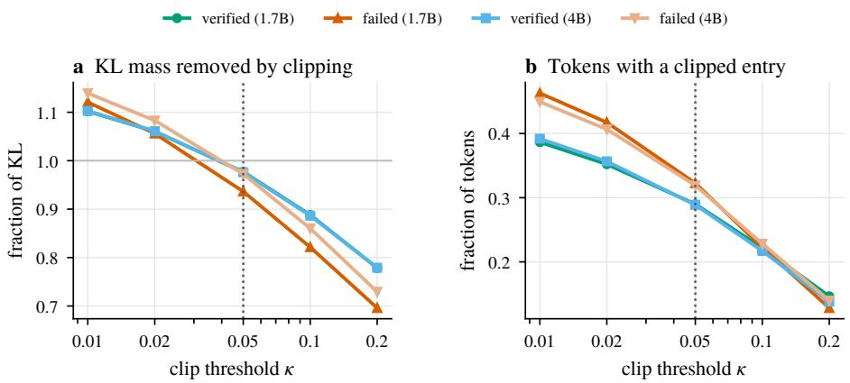  
Figure 4: Effect of the per-entry clip. (a) Fraction of the positive KL mass removed by the clip. Values above one indicate that the clipped terms exceed the total positive KL mass, resulting in a negative value of the clipped objective. (b) Fraction of tokens with at least one clipped vocabulary entry. The dotted line marks κ = 0.05, used by OPSD and all experiments in this work. Proposition 2 shows that clipped entries lose the teacher’s upward pull and receive a downward logit gradient.

Table 5: Training composition and dynamics. Statistics over 100 optimizer steps with 64 prob lems per step and K = 8 rollouts per problem for OASIS. “Problems receiving gradient” is the fraction of candidate problems with at least one verified rollout. “Selected scaffolds reaching the answer” is computed only among the scaffolds selected for supervision, while “Candidate rollouts hitting the length cap” is computed over all generated candidate rollouts. OASIS supervises fewer tokens because problems without a verified rollout are excluded and selected scaffolds are shorter on average, while its additional cost comes from rollout generation. Entropy, teacher–student top-1 agreement, and clipped-token fraction are measured on training batches, with early and late values computed over steps 2–34 and 68–100, respectively.
<table><tr><td rowspan="2"></td><td colspan="2">Qwen3-1.7B</td><td colspan="2">Qwen3-4B</td></tr><tr><td>OPSD</td><td>OASIS</td><td>OPSD</td><td>OASIS</td></tr><tr><td>Problems receiving gradient</td><td>100%</td><td>51.7%</td><td>100%</td><td>50.8%</td></tr><tr><td>Selected scaffolds reaching the answer</td><td>28.3%</td><td>100%</td><td>30.6%</td><td>100%</td></tr><tr><td>Candidate rollouts hitting the length cap</td><td>62.0%</td><td>58.0%</td><td>64.4%</td><td>63.1%</td></tr><tr><td>Mean supervised length (tokens)</td><td>859</td><td>603</td><td>883</td><td>646</td></tr><tr><td>Generated tokens</td><td>2.76M</td><td>43.5M</td><td>2.80M</td><td>44.8M</td></tr><tr><td>Supervised tokens</td><td>2.76M</td><td>1.98M</td><td>2.80M</td><td>2.07M</td></tr><tr><td>Student entropy (early → late)</td><td>0.40 → 0.70</td><td>0.25 → 0.49</td><td>0.35 → 0.69</td><td>0.28 → 0.67</td></tr><tr><td>Teacher-student top-1 (early → late)</td><td>0.932 → 0.888</td><td>0.929 → 0.931</td><td>0.938 → 0.882</td><td>0.926 → 0.853</td></tr><tr><td>Clipped tokens (early → late)</td><td>0.31 → 0.44</td><td>0.25 → 0.35</td><td>0.28 → 0.44</td><td>0.29 → 0.51</td></tr></table>

Prompts and contexts. Student and teacher prompts are reconstructed exactly as in training, including the thinking-mode setting. We evaluate the following reference context conditions: (1) Gold: the dataset’s written solution. (2) Own failed rollout: the failed rollout associated with the same training example and used as the OASIS context. (3) Own correct rollout: a verified rollout from the same problem, used when all sampled rollouts are correct. (4) Unrelated: the written solution of a different problem. (5) Shuffled gold: the gold solution with its lines randomly permuted. (6) Empty: the reference block and its instruction with no reference content. (7) Template only: the teacher prompt with the thinking-mode setting but without a reference block. (8) Answer only: the string The final answer is \boxed{a}. and (9) Gold, answer removed: the gold solution with boxed answer payloads and the final paragraph removed when it still states the answer.<sup>1</sup>

Table 6: Teacher signal at verified and failed states. Measurements use the gold reference on 200 rollouts per condition for Qwen3-1.7B. “Sampled” denotes the token actually produced by the student at the supervised state.
<table><tr><td>Quantity at the supervised state</td><td>Verified rollouts</td><td>Failed rollouts</td></tr><tr><td>Share of OPSD&#x27;s training scaffolds</td><td>28.3%</td><td>71.7%</td></tr><tr><td>KL(qt∥ pt) per token</td><td>0.274</td><td>0.181</td></tr><tr><td>Teacher entropy</td><td>0.297</td><td>0.461</td></tr><tr><td>Teacher probability on the sampled token</td><td>0.834</td><td>0.775</td></tr><tr><td>Teacher top-1 = sampled token</td><td>0.862</td><td>0.814</td></tr><tr><td>Tokens with a clipped entry  $( \kappa = 0 . 0 5 )$ </td><td>0.288</td><td>0.323</td></tr></table>

Signal probe. For each scaffold, we evaluate the student distribution $p _ { t }$ and the teacher distribution $q _ { t }$ at every scaffold position for each context, using the distillation temperature $T ~ = ~ 1 . 1$ . We measure the total-variation distance from the gold-context teacher, top-1 agreement, the teacher– student $\mathrm { K L } ( q _ { t } | p _ { t } )$ before and after clipping, teacher entropy, and the teacher probability assigned to the token sampled by the student. For position-dependent analyses, quantities are aggregated both by relative position within a scaffold and by absolute token position. Reported means are computed per scaffold, with 95% bootstrap intervals over scaffolds.

The decomposition in Figure 2 is a sequential attribution of the teacher–student KL gap. Starting from the student prompt, we successively add the thinking-mode setting, the reference block and its instruction, and finally the reference content. Each increment is reported as a fraction of the full gap. Because sequential attribution depends on the order of the additions, we also computed the corresponding decomposition using total variation. It gives the same qualitative ordering.

Recovery probe. For each scaffold, we retain the first $f \in \{ 0 . 1 , 0 . 3 , 0 . 5 , 0 . 7 , 0 . 9 \}$ fraction of its tokens and use the resulting prefix as the starting state for continuation. For each context, we sample four continuations at temperature 1.0, top- $\cdot p = 0 . 9 5$ , top-k = 20, with a maximum of 2048 new tokens.

A continuation is counted as a recovery if the last boxed answer in the prefix and continuation matches the ground-truth answer. We additionally record whether the continuation reproduces the scaffold’s original wrong answer and whether it produces no answer before reaching the token limit.

Recovery rates are first averaged over continuations for each problem and then over problems, with 95% bootstrap intervals. We exclude $f = 0$ because a thinking-mode continuation without a prefix frequently reaches the token limit before producing an answer, making it poorly comparable with the other cut fractions.

Failed scaffolds include both trajectories ending in an incorrect answer and trajectories that reach the token limit without producing an answer. An additional analysis restricted to scaffolds that end with an incorrect answer is reported in Appendix A.4.

## A.3 CLIPPING

Proposition 2 (Clipping Removes the Teacher’s Pull). Let $p , q \in \Delta ^ { | V | - 1 }$ denote the student and teacher probability distributions over vocabulary V, and let $e _ { a } = q _ { a } \log ( q _ { a } / p _ { a } )$ represent the perentry KL contribution. Define $U = \{ a \in V : e _ { a } \leq \kappa \}$ as the set ofunclipped tokens. For the clipped OPSD objective ${ \mathcal { L } } = \sum _ { a \in V }$ min $( e _ { a } , \kappa )$ , the gradient with respect to the student logit $z _ { j }$ is:

$$
g _ { j } = \frac { \partial \mathcal { L } } { \partial z _ { j } } = p _ { j } \sum _ { a \in U } q _ { a } - q _ { j } \cdot \mathbf { 1 } [ j \in U ] .\tag{8}
$$

Consequently, for any clipped token j /∈ U, the gradient simplifies to $\begin{array} { r } { g _ { j } = p _ { j } \sum _ { a \in U } q _ { a } > 0 . } \end{array}$ . Since $e _ { j } > \kappa > 0$ implies $q _ { j } > p _ { j }$ , the unclipped forward-KL gradient $p _ { j } - q _ { j }$ would be negative and raise $z _ { j } .$ Under clipping the sign is reversed, so a gradient-descent step $( \bar { \Delta } z _ { j } = - \eta g _ { j } )$ lowers $z _ { j } ,$ regardless ofhow strongly the teacher preferred token $j .$

The proof is given in Appendix A.1.2. Clipping therefore does not merely freeze a token’s update. Whenever an entry’s KL contribution exceeds $\kappa ,$ the teacher’s upward pull on that token is removed and the sign of its logit gradient is reversed, so the student receives no signal toward tokens the teacher prefers most strongly. Because all logits move together, the token’s probability need not fall, but it is no longer pushed toward the teacher.

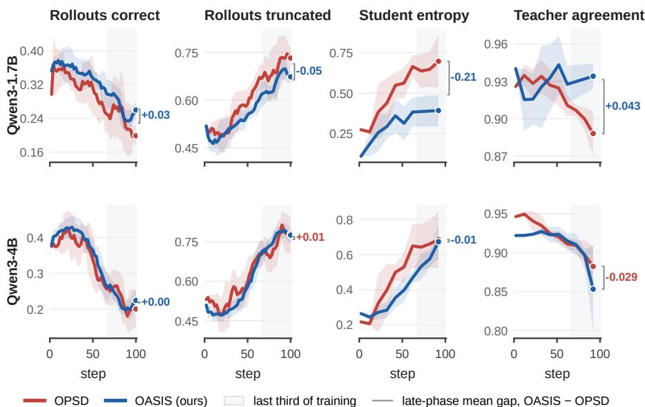  
Figure 5: Training dynamics at two scales (rows) for four metrics (columns). Lines represent trailing means with ±1 standard deviation bands. Brackets report the OASIS minus OPSD gap averaged over the shaded final third of training. At 1.7B, OASIS maintains a higher correct rate, less truncation, lower student entropy, and stable teacher agreement, whereas OPSD drifts. At 4B, both methods track each other for most of training and drift near the end, which aligns with the clipping effect described in Proposition 2. Metrics are computed on each method’s own training batches. Differences therefore reflect both changes in model behavior and changes in the selected trajectory distribution.

Figure 4 shows the fraction of positive KL mass removed by the per-entry clip as a function of κ, measured on verified and failed scaffolds. At the value used by OPSD and throughout our experiments, κ = 0.05, the clip removes 97% of the positive mass on verified scaffolds and 94% on failed scaffolds. Approximately three tokens in ten have at least one clipped entry. Because the clipped sum can become negative, the reported training loss is negative from the beginning of training.

Together with Proposition 2, these results provide a possible explanation for the late-training drift observed in both methods. Clipped entries lose the teacher’s upward pull, which can move the student further from the teacher and causes more entries to cross the clipping threshold. The clipped fraction increases from 0.31 to 0.44 for OPSD and from 0.25 to 0.35 for OASIS at 1.7B over 100 steps. The analysis nevertheless suggests that a larger threshold, or clipping the per-token divergence rather than individual vocabulary entries, may reduce this effect.

## A.4 ABLATIONS

Both ablations evaluate Qwen3-1.7B and vary a single component of the primary OASIS configuration. The default setup employs the shortest verified scaffold with K = 8 rollouts and is denoted by † in both tables.

Scaffold selection rule. Verification identifies which problems receive supervision, whereas the scaffold selection rule determines which verified rollout serves as the supervision trajectory. We compare the shortest and longest verified rollouts while holding the set of supervised problems constant. Consequently, the two variants differ solely in the specific trajectory used for training: the longest rollout provides more supervised tokens per problem, while the shortest offers a more compact supervision path.

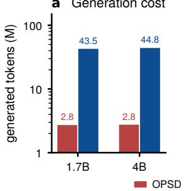

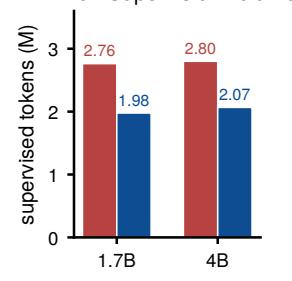

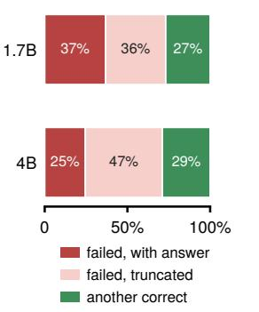  
Figure 6: Token budget over 100 optimizer steps. (a) Total tokens generated by OPSD and OASIS, shown on a logarithmic scale. OASIS generates roughly sixteen times more tokens because it samples $K \ : = \ : 8$ rollouts per problem. (b) Tokens receiving distillation supervision. OASIS supervises about 30% fewer tokens because problems without a verified rollout are excluded and verified scaffolds are shorter on average. (c) Teacher contexts used by OASIS: a failed rollout with a wrong answer, a failed rollout truncated at the token limit, or another verified rollout when every sampled rollout is correct.

Table 7: Effect of scaffold selection on Qwen3-1.7B using AIME 2024. Both variants use the same verified rollouts and supervise the same set of problems. Results are reported as mean ± standard deviation over three evaluation seeds.
<table><tr><td>Scaffold</td><td>Supervised length</td><td>Avg@12</td><td>Pass@12</td><td>Maj@12</td></tr><tr><td>Shortest verified†</td><td>603</td><td> $5 4 . 1 7 \pm 0 . 5 8$ </td><td> $8 0 . 0 0 \pm 0 . 0 0$ </td><td> $6 8 . 8 8 \pm 1 . 5 7$ </td></tr><tr><td>Longest verified</td><td>909</td><td> $5 2 . 3 3 \pm 0 . 5 1$ </td><td> $7 3 . 3 3 \pm 1 . 9 2$ </td><td> $6 0 . 0 0 \pm 1 . 9 2$ </td></tr></table>

Number of rollouts. The number of sampled rollouts K directly determines generation cost and the likelihood that a problem yields at least one verified trajectory. Lower values of K reduce computational cost but risk leaving more problems without a valid scaffold. Higher values increase inference overhead while supplying more candidate trajectories for scaffold selection. We compare $K = 4$ and $K = 8 ,$ , reporting total generation cost, and downstream benchmark metrics.

Table 8: Effect of the number of rollouts on Qwen3-1.7B using AIME 2024. Generated tokens are measured over 100 optimizer steps. Results are reported as mean ± standard deviation over three evaluation seeds.
<table><tr><td></td><td>K Generated tokens</td><td>Avg@12</td><td>Pass@12</td><td>Maj@12</td></tr><tr><td>4</td><td>22.8M</td><td> $5 2 . 7 7 \pm 0 . 2 9$ </td><td> $7 6 . 6 7 \pm 0 . 3 3$ </td><td> $6 6 . 6 7 \pm 0 . 9 6$ </td></tr><tr><td>8†</td><td>43.5M</td><td> $5 4 . 1 7 \pm 0 . 5 8$ </td><td> $8 0 . 0 0 \pm 0 . 0 0$ </td><td> $6 8 . 8 8 \pm 1 . 5 7$ </td></tr></table>

## A.5 IMPLEMENTATION DETAILS

Table 9 lists the training configuration, which is identical across methods. Three additional details of the released OPSD implementation are relevant to the reported results and are therefore kept unchanged across all experiments.

Loss normalization. Equation 3 averages over supervised tokens in the micro-batch rather than over sequences. Problems with no verified rollout contribute no tokens to either the numerator or denominator. A micro-batch in which a problem is masked therefore produces zero loss and zero gradient.

Masking. A problem without a verified rollout is excluded from the loss. Its tokens receive no supervision, and the problem is excluded from the normalization in Eq. 3. The only exception occurs when all problems in a micro-batch are masked. In this case, rather than discarding the update, we retain one problem and distill along its first rollout, even though that rollout is unverified. This exception is rare. In our Qwen3-1.7B run, it occurred for 1.6% of all problems encountered during training, corresponding to 3.0% of the problems that contributed a gradient. In addition, a runtime check verifies for every micro-batch that masked problems contribute no supervised tokens and that every training scaffold is verified, except for the logged all-masked exceptions.

```latex
Algorithm 1 One OASIS update
Require: problems $\{ x _ { i } \}$ with final answers $\left\{ { a } _ { i } \right\}$ , policy π<sub>θ</sub>, frozen teacher $\pi _ { \theta _ { 0 } }$ , rollouts per prob
lem K
1: for each problem $x _ { i }$ do
2: $\begin{array} { r } { \mathcal { V } ( x _ { i } \bar { \mathbf { \xi } } )  \{ y ^ { ( k ) } \} _ { k = 1 } ^ { K } , \quad y ^ { ( k ) } \sim \pi _ { \theta } ( \cdot  { | \ s ( x _ { i } ) ) } } \end{array}$
3: $\mathcal { Y } ^ { + } ( x _ { i } )  \{ y : \operatorname { a n s w e r } ( y ) = a _ { i } \}$
4: if $y ^ { + } ( x _ { i } ) = \hat { \emptyset }$ then mask $x _ { i }$ and continue ▷ rare all-masked-batch exception below
5: end if
6: y<sup>⋆</sup> ← shortest element of $y ^ { + } ( x _ { i } )$ ▷ Eq. 6
7: $r _ { i } \gets$ shortest element of $\mathcal { V } ( x _ { i } ) \dot { { \mid \mathcal { V } ^ { + } ( x _ { i } ) } }$ , else another verified rollout ▷ Eq. 7
8: $q _ { t }  \pi _ { \theta _ { 0 } } ( \cdot \mid u ( x _ { i } , r _ { i } ) , y _ { i , < t } ^ { \star } )$
9: $p _ { t } \gets \pi _ { \theta } ( \cdot \mid s ( x _ { i } ) , y _ { i , < t } ^ { \star } )$
10: end for
11: update θ with Eq. 3 over the unmasked problems
```

Table 9: Training configuration. Hyperparameters are identical across model sizes
<table><tr><td>Hyperparameter</td><td>Qwen3-1.7B</td><td>Qwen3-4B</td><td>Qwen3-8B</td></tr><tr><td>Optimization &amp; Batching</td><td></td><td></td><td></td></tr><tr><td>Optimizer steps</td><td>100</td><td>100</td><td>100</td></tr><tr><td>Problems per step</td><td>64</td><td>64</td><td>64</td></tr><tr><td>Problems trained per step</td><td>≤ 32</td><td>≤ 32</td><td>≤ 32</td></tr><tr><td>Rollouts per problem (K, OASIS)</td><td>8</td><td>8</td><td>8</td></tr><tr><td>Learning rate Clip constant κ</td><td> $5 \times 1 0 ^ { - 6 } .$ </td><td>linear decay, gradient clip 0.05, per vocabulary entry</td><td> $\| g \| \leq 0 . 1$ </td></tr><tr><td>Model Architecture &amp; Distillation</td><td></td><td></td><td></td></tr><tr><td>LoRA rank / α Distillation temperature</td><td></td><td>64 / 128, all attention and MLP projections</td><td></td></tr><tr><td>Teacher</td><td>Initial policy</td><td>1.1  $\pi _ { \theta _ { 0 } }$ </td><td>(frozen, LoRA disabled)</td></tr><tr><td>Student / Teacher template</td><td></td><td>Thinking disabled / Thinking enabled</td><td></td></tr><tr><td></td><td></td><td></td><td></td></tr><tr><td>Generation &amp; Evaluation</td><td></td><td></td><td></td></tr><tr><td>Rollout sampling</td><td></td><td>T = 1.1, top-p = 0.95, top-k = 20, ≤ 1024 new tokens</td><td></td></tr><tr><td>Evaluation metrics</td><td></td><td> $\operatorname { A v g } @ 1 2 , T = 1 . 0 , \operatorname { t o p } - p = 0 . 9 5 , \leq 3 8 , 9 1 2 \mathrm { ~ t o k e n s }$ </td><td></td></tr></table>

Compute and Hardware Resources. All experiments were conducted using 2× NVIDIA H100 GPUs and 8× NVIDIA A100 (80GB) GPUs. The generation of rollouts and teacher logit evaluations during the OASIS training pipeline were parallelized across the available GPU nodes.