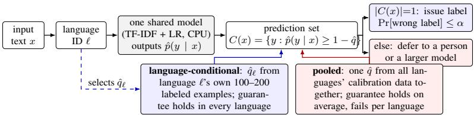
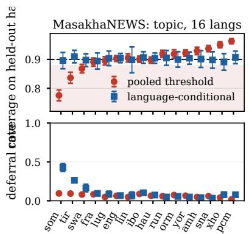
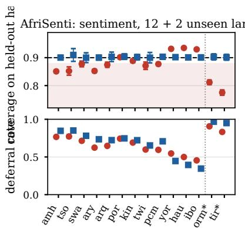

# One Threshold Does Not Fit All Languages: Language-Conditional Deferral for Reliable and Efficient Low-Resource Text Classification

Bhanu Prakash Vangala University of Missouri bv3hz@missouri.edu

Vangala Navya Amar Bio Tech Pvt Ltd vangalanavya.8@gmail.com

## Abstract

In the Global South, the lower-income countries of Africa, Asia, and Latin America where most of the world’s languages are spoken, a deployed text classifier usually runs on ordinary CPUs, serves many languages with a single model, has few labeled examples in any of them, and relies on people to catch its mistakes. Such a system is only useful if it can promise how often it will be wrong: at most a fixed fraction of the labels it assigns on its own may be incorrect, and everything else must go to a person. Split conformal prediction delivers this promise through a single confidence threshold, normally estimated on validation data pooled across languages. We ask whether the promise reaches every language, and it does not. On MasakhaNEWS (16 African languages) and AfriSenti (12 languages plus two never seen in training), a pooled threshold meets the 90% target on average but covers Somali at 77.5%, Tigrinya at 83.7%, and the two unseen languages at 77.5% and 81.2%. Estimating one threshold per language brings every language to between 89.1% and 91.0% without retraining, and it shows how unequal the cost of the promise is: keeping it means sending 43% of Somali news and over 80% of Amharic and Xitsonga tweets to a person, against under 8% of Nigerian Pidgin news. One or two hundred labels per language are enough and the models train in minutes on one CPU core, so the fix is affordable: calibrate, report, and budget human review one language at a time.

## 1 Introduction

The Global South is the usual name for the lower-income countries of Africa, Latin America, and much of Asia and Oceania. It is home to most of the world’s population and most of its roughly 7,000 languages, and almost all of those languages have little or no labeled data [Joshi et al., 2020]. When a ministry, a hospital network, or a newsroom in this setting deploys a text classifier, the conditions differ from those most NLP research assumes. There is no GPU, so the model must train and run on ordinary CPUs. There is no budget for one model per language, so a single model serves all of them. Labeled data exists in the hundreds of examples rather than the hundreds of thousands, and it is produced by communities of native speakers [Nekoto et al., 2020]. And because the classifier sorts things that matter, such as citizen complaints, health-hotline messages, or news that reaches an editor, a person reviews whatever the model is not sure about.

In this setting the property a deployer cares about is not average accuracy but how often the system will be wrong when it acts on its own. We call the corresponding promise a reliability contract: among all inputs, at most a fraction α receive a wrong automatic label, and the rest are handed to a person or to a larger, more expensive model. Selective prediction with a reject option is the classical way to obtain such a contract [Chow, 1970, Geifman and El-Yaniv, 2017], and split conformal prediction turns it into a guarantee that holds for any model, using nothing more than a held-out calibration set and a single confidence threshold [Vovk et al., 2005, Angelopoulos and Bates, 2023].

  
Figure 1: The deferral pipeline. One cheap model serves every language; a conformal threshold turns its probabilities into a prediction set, and only sets with exactly one label become automatic labels. The two policies differ only in where the threshold comes from.

The problem this paper studies is where that threshold comes from. The obvious engineering choice is to estimate one threshold on validation data pooled across all languages. The guarantee this produces is only marginal: it holds on average over the mix of languages in the calibration data and says nothing about any single language [Vovk, 2012, Romano et al., 2020]. Jones et al. [2021] showed that selective classification can widen gaps between groups, and languages are groups of exactly this kind. The failure is also easy to miss, because the dashboard reports the aggregate: it reads 90% coverage, and nobody checks Somali. So the question is concrete: does a single pooled threshold deliver the promised reliability to every language, and if not, what does it take, in labels and in human review, to deliver it?

We answer this on two benchmarks of African-language text classification built by African NLP communities [Adelani et al., 2023, Muhammad et al., 2023a], using a single CPU core, the regime in which low-resource languages are usually the first to lose out [Ahia et al., 2021, Alabi et al., 2022]. A pooled threshold satisfies the contract in aggregate while under-covering the lowest-resource languages by up to 12.5 points. Estimating one threshold per language, the Mondrian construction of Vovk [2012] that underlies equalized coverage [Romano et al., 2020, Gibbs et al., 2023], repairs this without retraining anything. It also reveals what the contract costs in each language, and it needs only 100 to 200 labeled examples per language. Code, seeds, and results accompany the submission.

## 2 Reliability contracts from a single cheap model

Problem statement. A deployment has a fixed classifier that outputs probabilities ${ \hat { p } } ( y \mid x )$ for inputs from L languages, and a target error rate α for automatic decisions. For every input it must decide whether to issue the model’s label or to defer the input to a person. We want a deferral rule with four properties: in every language, at most a fraction α of inputs receive a wrong automatic label; as little traffic as possible is deferred subject to that guarantee; no retraining is needed and only a small number of labeled examples per language; and the deferral rate of each language, which is its human-review cost, is visible to the deployer. Figure 1 shows the pipeline we study.

Model. For each task we train a single multilingual model on the union of all languages’ training sets: TF-IDF weights over character n-grams (lengths 2 to 5, within word boundaries) and word unigrams and bigrams, capped at 450k features, followed by multinomial logistic regression. The calibration layer sees nothing but the model’s probabilities, so everything that follows applies equally to a fine-tuned encoder or to a model served through an API.

Conformal selective prediction. We use the least-ambiguous set-valued classifier of Sadinle et al. [2019] in its split conformal form. Given a calibration set $\{ ( x _ { i } , y _ { i } ) \} _ { i = 1 } ^ { n }$ , we compute a score $s _ { i } = 1 - { \hat { p } } ( y _ { i } \mid x _ { i } )$ for each example and take the finite-sample quantile

$$
\begin{array} { r } { \hat { q } = s _ { ( k ) } , \qquad k = \lceil ( n + 1 ) ( 1 - \alpha ) \rceil , } \end{array}\tag{1}
$$

that is, the k-th smallest score. For a new input the prediction set is $C ( x ) = \{ y : \hat { p } ( y \mid x ) \geq 1 - \hat { q } \}$ and if calibration and test inputs are exchangeable, the true label lies in this set with probability at least 1 − α [Vovk et al., 2005, Lei et al., 2018]. The deployment rule is simple: if $C ( x )$ contains exactly one label, the system issues that label; otherwise the input is deferred. A wrong automatic label can only occur when a singleton set misses the true label, which is a miscoverage event, so the probability of a wrong automatic label over all traffic is at most α. This inequality is the reliability contract; we use α = 0.10 throughout.

  
Figure 2: Coverage (top) and deferral rate (bottom) per language at a 0.90 target (dashed), mean ± s.d. over 30 random splits. Trained languages are ordered by base accuracy; starred languages never appeared in training. A pooled threshold (red) over-covers well-resourced languages and under-covers hard ones (shaded region); a per-language threshold (blue) meets the target everywhere, at a very different deferral cost per language.

Pooled versus language-conditional calibration. The pooled policy computes a single qˆ from the calibration data of all languages together. The language-conditional policy computes a separate $\hat { q } _ { \ell }$ for each language ℓ from that language’s calibration data alone; this is the Mondrian construction of Vovk [2012] with language as the taxonomy, and it guarantees coverage of at least 1 − α within every language. Neither policy changes the trained model (unlike learning to defer [Madras et al., 2018, Mozannar and Sontag, 2020]); the conditional policy additionally needs the language of each input, which a multilingual deployment already needs for routing, and a few labeled examples per language.

## 3 Experiments

Data and protocol. MasakhaNEWS [Adelani et al., 2023] is news topic classification with seven categories in 16 African languages; training sets range from 608 articles (Lingala) to 3,309 (English), and we use the headline plus the first 1,000 characters of the body. AfriSenti [Muhammad et al., 2023a,b] is three-way tweet sentiment in 12 languages with training data plus Oromo and Tigrinya, which have development and test data only and therefore act as languages the model has never seen. Conformal validity assumes that calibration and evaluation data are exchangeable, so for every language we pool the official development and test splits and, for each of 30 random seeds, divide them into a calibration half and an evaluation half; all numbers are means (and standard deviations) over these seeds. The pooled threshold uses the calibration halves of the trained languages only, and the calibration-size ablation draws n ∈ {20, 50, 100, 200} examples from a language’s calibration half.

Efficiency and base quality. On a single CPU core, training takes 3.4 minutes for MasakhaNEWS and 1.3 minutes for AfriSenti, and the models occupy 40 MB and 25 MB. Accuracy on the official test splits averages 87.6% on MasakhaNEWS (macro-F1 82.4, about ten points below the best fully supervised result of Adelani et al. [2023]) and 62.9% on AfriSenti (macro-F1 57.4). The model is deliberately cheap; the point is that a correctly calibrated contract makes it safe to deploy.

## 3.1 A pooled threshold keeps the contract on average and breaks it per language

Figure 2 (top) contains the central result. With the pooled policy, aggregate coverage is $0 . 9 0 2 \pm 0 . 0 0 6$ on MasakhaNEWS and 0.901 ± 0.003 on AfriSenti, exactly the promised 0.90, but language by language the picture reverses. On MasakhaNEWS, Somali is covered at 0.775 ± 0.019, Tigrinya at

0.837 ± 0.019, and Swahili at $0 . 8 6 8 \pm 0 . 0 1 5 .$ while Nigerian Pidgin, isiXhosa, and chiShona reach 0.964, 0.951, and 0.938. On AfriSenti, seven of the twelve trained languages fall more than two points below the target, while Hausa, Igbo, and Yoruba are over-covered at 0.93. The reason is that the pooled quantile in Equation 1 is dominated by the languages with the most calibration examples and the most confident predictions, so it is too permissive exactly where the model is least sure. Concretely, a Somali article that the pooled system labels on its own is correct 79.5% of the time, not the 90% that the aggregate figure suggests.

The language-conditional policy removes this disparity. Every language lands between 0.891 and 0.910 on MasakhaNEWS and between 0.900 and 0.910 on AfriSenti, aggregate coverage stays at 0.902, and automatic Somali labels are now 94.4% correct. In numbers: three MasakhaNEWS and seven AfriSenti languages sit more than two points below target under the pooled threshold and none under the conditional one, whose overall deferral rises from 6.6% to 10.1% on MasakhaNEWS but falls from 59.4% to 58.4% on AfriSenti as review effort moves to the languages that need it.

## 3.2 The price of reliability is not the same in every language

Meeting the contract in every language makes its cost explicit (Figure 2, bottom). To label Somali news automatically at 90% reliability, the conditional policy has to defer 42.9% of Somali traffic, against 9.5% under the pooled threshold. Tigrinya needs 26.4%, Swahili 16.5%, and Amharic, Yoruba, and chiShona under 5%. On AfriSenti the spread is wider still: 84.7% of Amharic and 85.1% of Xitsonga tweets are deferred, compared with 34.6% of Igbo tweets. The deferral rate closely follows base accuracy (Spearman $\rho = - 0 . 7 0$ on MasakhaNEWS, −0.97 on AfriSenti). These rates are the human-review budget a deployment has to plan for in each language; a pooled threshold hides them and spends the budget on the languages that need it least.

Languages the model has never seen. With the pooled threshold, the system labels 9.3% of Oromo and 16.8% of Tigrinya tweets on its own, and those labels are correct only 33.8% and 37.6% of the time, which is chance level for three classes: a pooled threshold lets the model act confidently on a language it cannot read. A language-specific threshold estimated from a few hundred examples defers 96.8% and 95.0% of that traffic and restores 0.90 coverage.

## 3.3 How many labels does a language need, and where must they come from?

Per-language calibration needs labeled examples in each language, the scarcest resource in the Global South, but the requirement turns out to be modest. Averaged over languages, coverage is 0.904 with only 20 calibration examples and between 0.897 and 0.903 with 50 or more: the guarantee is unbiased even for tiny calibration sets. What shrinks with n is the variability of the coverage any one deployment experiences: the standard deviation across seeds falls from 0.06 at $n = 2 0$ to about 0.03 at $n = 1 0 0$ and 0.02 at $n = 2 0 0$ . Smaller calibration sets also defer more (17.5% at $n = 2 0$ against 10.9% with the full half on MasakhaNEWS); in practice, 100 to 200 labels per language are enough.

The labels also have to come from the right distribution. Calibrating on the official development splits and evaluating on the official test splits leaves MasakhaNEWS unchanged but drops AfriSenti’s aggregate coverage to 0.879, with per-language thresholds under-covering Moroccan Arabic (0.798), Algerian Arabic (0.848), and Nigerian Pidgin (0.848); random re-splits of the same data cover all three at 0.90. Those released splits are not exchangeable, and a contract certified on a benchmark holds in deployment only if the calibration data come from the traffic the system will actually see.

## 4 Recommendations and limitations

Our results support four practices for anyone who deploys a multilingual classifier with a human fallback. Calibrate the deferral threshold per language, never on pooled data. Report coverage and deferral per language, because the aggregate hides the gap. Budget human review per language from the measured deferral rates, treating a high rate as a reason to collect training data rather than to lower the bar. Two limits: a fine-tuned encoder would defer less than our cheap model, though the pooled-versus-conditional gap belongs to the calibration layer, not the model; and the conditional policy relies on language identification, itself weaker for low-resource languages. One threshold does not fit all languages, and the languages it fits worst are the ones this workshop exists for.

# Acknowledgments and Disclosure of Funding

Hidden in the anonymized submission.

## References

David Ifeoluwa Adelani, Marek Masiak, Israel Abebe Azime, Jesujoba Alabi, Atnafu Lambebo Tonja, Christine Mwase, Odunayo Ogundepo, Bonaventure F. P. Dossou, Akintunde Oladipo, Doreen Nixdorf, et al. MasakhaNEWS: News topic classification for African languages. In Proceedings ofthe 13th International Joint Conference on Natural Language Processing and the 3rd Conference ofthe Asia-Pacific Chapter ofthe Associationfor Computational Linguistics (IJCNLP-AACL), 2023.

Orevaoghene Ahia, Julia Kreutzer, and Sara Hooker. The low-resource double bind: An empirical study of pruning for low-resource machine translation. In Findings of the Association for Computational Linguistics: EMNLP 2021, 2021.

Jesujoba O. Alabi, David Ifeoluwa Adelani, Marius Mosbach, and Dietrich Klakow. Adapting pre-trained language models to African languages via multilingual adaptive fine-tuning. In Proceedings of the 29th International Conference on Computational Linguistics (COLING), 2022.

Anastasios N. Angelopoulos and Stephen Bates. Conformal prediction: A gentle introduction. Foundations and Trends in Machine Learning, 16(4):494–591, 2023.

C. K. Chow. On optimum recognition error and reject tradeoff. IEEE Transactions on Information Theory, 16 (1):41–46, 1970.

Yonatan Geifman and Ran El-Yaniv. Selective classification for deep neural networks. In Advances in Neural Information Processing Systems (NeurIPS), 2017.

Isaac Gibbs, John J. Cherian, and Emmanuel J. Candès. Conformal prediction with conditional guarantees. arXiv preprint arXiv:2305.12616, 2023.

Erik Jones, Shiori Sagawa, Pang Wei Koh, Ananya Kumar, and Percy Liang. Selective classification can magnify disparities across groups. In International Conference on Learning Representations (ICLR), 2021.

Pratik Joshi, Sebastin Santy, Amar Budhiraja, Kalika Bali, and Monojit Choudhury. The state and fate of linguistic diversity and inclusion in the NLP world. In Proceedings of the 58th Annual Meeting of the Associationfor Computational Linguistics (ACL), 2020.

Jing Lei, Max G’Sell, Alessandro Rinaldo, Ryan J. Tibshirani, and Larry Wasserman. Distribution-free predictive inference for regression. Journal ofthe American Statistical Association, 113(523):1094–1111, 2018.

David Madras, Toniann Pitassi, and Richard Zemel. Predict responsibly: Improving fairness and accuracy by learning to defer. In Advances in Neural Information Processing Systems (NeurIPS), 2018.

Hussein Mozannar and David Sontag. Consistent estimators for learning to defer to an expert. In Proceedings of the 37th International Conference on Machine Learning (ICML), 2020.

Shamsuddeen Hassan Muhammad, Idris Abdulmumin, Abinew Ali Ayele, Nedjma Ousidhoum, David Ifeoluwa Adelani, Seid Muhie Yimam, Ibrahim Sa’id Ahmad, Meriem Beloucif, Saif M. Mohammad, Sebastian Ruder, et al. AfriSenti: A Twitter sentiment analysis benchmark for African languages. In Proceedings ofthe 2023 Conference on Empirical Methods in Natural Language Processing (EMNLP), pages 13968–13981, 2023a.

Shamsuddeen Hassan Muhammad, Idris Abdulmumin, Seid Muhie Yimam, David Ifeoluwa Adelani, Ibrahim Sa’id Ahmad, Nedjma Ousidhoum, Abinew Ali Ayele, Saif M. Mohammad, Meriem Beloucif, and Sebastian Ruder. SemEval-2023 task 12: Sentiment analysis for African languages (AfriSenti-SemEval). In Proceedings ofthe 17th International Workshop on Semantic Evaluation (SemEval-2023), 2023b.

Wilhelmina Nekoto, Vukosi Marivate, Tshinondiwa Matsila, Timi Fasubaa, Taiwo Fagbohungbe, Solomon Oluwole Akinola, Shamsuddeen Muhammad, Salomon Kabongo Kabenamualu, Salomey Osei, Freshia Sackey, et al. Participatory research for low-resourced machine translation: A case study in African languages. In Findings ofthe Associationfor Computational Linguistics: EMNLP 2020, 2020.

Yaniv Romano, Rina Foygel Barber, Chiara Sabatti, and Emmanuel J. Candès. With malice toward none: Assessing uncertainty via equalized coverage. Harvard Data Science Review, 2(2), 2020.

Mauricio Sadinle, Jing Lei, and Larry Wasserman. Least ambiguous set-valued classifiers with bounded error levels. Journal ofthe American Statistical Association, 114(525):223–234, 2019.

Vladimir Vovk. Conditional validity of inductive conformal predictors. In Proceedings of the Asian Conference on Machine Learning (ACML), volume 25 of PMLR, pages 475–490, 2012.

Vladimir Vovk, Alexander Gammerman, and Glenn Shafer. Algorithmic Learning in a Random World. Springer, 2005.