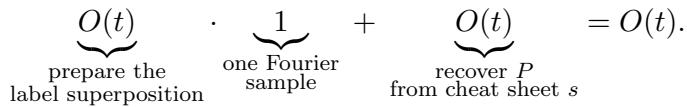
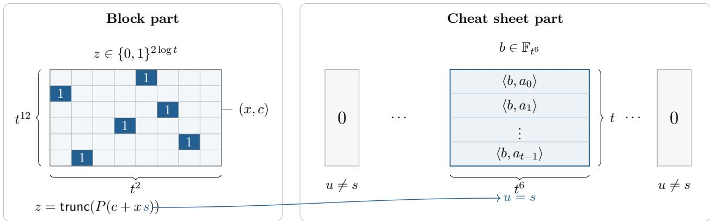
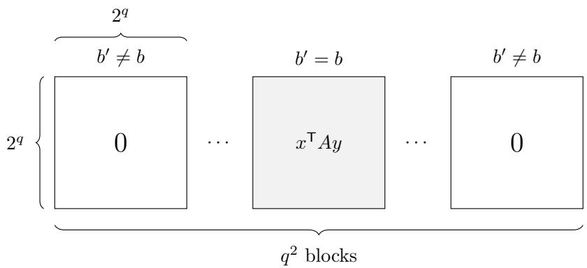

# Optimal Quantum-Classical Separations for Exact Learning

Srinivasan Arunachalam

Amin Shiraz Gilani

Nikhil S. Mande

IBM ResearchSrinivasan.Arunachalam@ibm.com

QuICS, University of Maryland asgilani@umd.edu

University of Liverpool mande@liverpool.ac.uk

## Abstract

We study exact learning with membership queries for concept classes ${ \mathcal { C } } \subseteq \{ 0 , 1 \} ^ { N }$ , focusing on the relationships among their deterministic, randomized, and quantum query complexities, denoted D(C), R(C), and $\mathsf Q ( \mathcal C )$ , respectively. The two canonical quantum speedups in this model are witnessed by Grover search and Bernstein-Vazirani, leading to the longstanding conjecture

$$
\mathsf { R } ( \mathcal { C } ) = O ( \mathsf { Q } ( \mathcal { C } ) ^ { 2 } + \mathsf { Q } ( \mathcal { C } ) \log N ) .
$$

We first refute this conjecture by constructing concept classes C and $\scriptstyle { \mathcal { C } } ^ { \prime }$ satisfying

$$
{ \mathsf { R } } ( { \mathcal { C } } ) = \Omega \left( { \frac { \mathsf { Q } ( { \mathcal { C } } ) ^ { 3 } \log N } { \log \mathsf { Q } ( { \mathcal { C } } ) } } \right)
$$

$$
\begin{array} { r } { \mathrm { a n d } \qquad \mathsf { D } ( \mathcal { C } ^ { \prime } ) = \Omega ( \mathsf { Q } ( \mathcal { C } ^ { \prime } ) ^ { 3 } \log N ) . } \end{array}
$$

The first bound matches the upper bound of Arunachalam et al. [Quantum’21] up to constant factors, while the second matches the upper bound of Servedio and Gortler [SICOMP’04]. In particular, this shows that the saving in the randomized upper bound of Arunachalam et al. fundamentally relies on randomness. Apart from characterizing the optimal relationship between classical and quantum query complexity, our results are the first to show that quantum speedups for learning can go beyond the Grover and Bernstein-Vazirani paradigms.

## Contents

1 Introduction 2   
1.1 Deterministic separation 3   
1.2 Randomized separation 5   
1.3 Other results 10   
2 Optimal quantum-randomized separation 13   
2.1 Warm up 13   
2.2 The concept class . 15   
2.3 Quantum upper bound . 17   
2.4 Randomized lower bound 19   
2.5 Putting it all together 26   
3 Optimal quantum-deterministic separation 26   
3.1 The concept class . 26   
3.2 Quantum upper bound . 26   
3.3 Deterministic lower bound 27   
3.4 Putting it all together 27   
Further results 28   
4.1 Booleanization of exact learning . 28   
4.2 Fractional combinatorial parameters 29

## 1 Introduction

Exact learning with membership queries is a foundational model of active learning, originating in the seminal work of Angluin [Ang88]. A concept class is a collection of Boolean functions ${ \mathcal { C } } \subseteq \{ c : \{ 0 , 1 \} ^ { n } \to \{ 0 , 1 \} \}$ . Equivalently, identifying each Boolean function with its truth table and writing $N = 2 ^ { n }$ , we may view $\mathcal { C }$ as a subset of $\{ 0 , 1 \} ^ { N }$ . The learner is given query access to an unknown target concept $c ^ { * } \in { \mathcal { C } }$ , with the goal of identifying $c ^ { * }$ . In the classical model, a membership query at $x \in \{ 0 , 1 \} ^ { n }$ returns the value $c ^ { * } ( x )$ . A deterministic learner must identify $c ^ { * }$ with certainty, whereas a randomized learner is required to succeed with probability at least $2 / 3$ A quantum learner is instead given quantum query access to $c ^ { * }$ , allowing superposition queries via the unitary

$$
| x , b \rangle \longmapsto | x , b \oplus c ^ { * } ( x ) \rangle .
$$

We denote by $\mathsf { D } ( \mathcal { C } ) , \mathsf { R } ( \mathcal { C } )$ , and $\mathsf Q ( \mathcal C )$ the deterministic, randomized, and bounded-error quantum query complexities of identifying an unknown concept in ${ \mathcal { C } } ,$ respectively.

The classical membership-query model has been studied extensively both within and beyond computational learning theory $[ \mathrm { B C G ^ { + } 9 6 }$ , Bsh13, Bsh18, BH19, HKLM20, CF20, Bsh25]. More broadly, it captures the fundamental black-box identification problem of determining an unknown function promised to belong to a known family, with connections to interpolation, functional verification, and black-box identity testing [Bsh13]. Roughly speaking, the query complexity of exact learning measures the amount of information that must be extracted from an unknown function in order to identify it completely. The quantum analogue has likewise received substantial attention [SG04, AS05, AIK<sup>+</sup>04, Kot14, AdW17, ACL<sup>+</sup>21]. In this setting, also studied under the name oracle identification, a basic question is how much quantum queries can reduce the identification of an unknown concept. This leads to a natural question first studied by Servedio and Gortler [SG04]:

```latex
What is the optimal relationship between classical and quantum learning?
Servedio and Gortler [SG04] made the first progress by proving the following theorem.
Theorem 1.1 ([SG04, Theorem 1]). For all ${ \mathcal { C } } \subseteq \{ 0 , 1 \} ^ { N }$ , we have $\mathsf { D } ( \mathcal { C } ) = O \big ( \mathsf { Q } ( \mathcal { C } ) ^ { 3 } \log N \big )$
Later, Arunachalam et al. $[ \mathrm { A C L ^ { + } 2 1 } ]$ improved their simulation, albeit in the randomized setting.
Theorem 1.2 ([ACL<sup>+</sup>21, Section 4]). For all ${ \mathcal { C } } \subseteq \{ 0 , 1 \} ^ { N }$ , we have $\begin{array} { r } { \mathsf { R } ( { \mathcal { C } } ) = O \left( \frac { \mathsf { Q } ( { \mathcal { C } } ) ^ { 3 } } { \log \mathsf { Q } ( { \mathcal { C } } ) } \log N \right) } \end{array}$
Apart from these simulations, the best known separations between quantum and classical learn
ing was by two well-known classes: (i) point functions, $\mathcal { C } = \{ e _ { i } : i \in [ N ] \}$ , for which the random
ized query complexity is $\Omega ( N )$ and the quantum query complexity is $O ( { \sqrt { N } } )$ by Grover’s algo
rithm [Gro96] and (ii) parity functions, ${ \mathcal { C } } = \{ \chi _ { S } : \chi _ { S } ( x ) = ( - 1 ) ^ { S \cdot x }$ for all $x \} _ { S \subseteq [ N ] }$ , for which the
randomized query complexity is ${ \cal O } ( \log N )$ and the quantum query complexity is $O ( 1 )$ by Fourier
sampling [BV97]. Apart from these two generic separations and reasonably natural generalizations
of them [AS05], no non-trivial separation was known between quantum and classical learning which
also accounted for the domain size.<sup>1</sup> This led to the natural question, raised and conjectured in sev
eral works [SG04, AS05, Mon07, AdW17, ACL<sup>+</sup>21], with its earliest explicit formulation appearing
two decades ago in [AS05, Question 4.4].
```

Conjecture 1.3. For every concept class ${ \mathcal { C } } \subseteq \{ c : \{ 0 , 1 \} ^ { n } \to \{ 0 , 1 \} \}$ , we have

$$
{ \sf R } ( { \mathcal { C } } ) = O \big ( { \sf Q } ( { \mathcal { C } } ) ^ { 2 } + { \sf Q } ( { \mathcal { C } } ) \log N \big ) .
$$

This bound was believed to be tight for the point function and the parity function class.

Main result Our main contribution in this work is in refuting this conjecture.<sup>2</sup>

Theorem 1.4. There exists ${ \mathcal { C } } \subseteq \{ 0 , 1 \} ^ { N }$ with $\mathsf Q ( \mathcal C ) = \omega ( 1 )$ and D(C) = Ω(Q(C)<sup>3</sup> log N).

Theorem 1.5. There exists ${ \mathcal { C } } \subseteq \{ 0 , 1 \} ^ { N }$ with $\mathsf Q ( \mathcal C ) = \omega ( 1 )$ and $\begin{array} { r } { \mathsf { R } ( { \mathcal { C } } ) = \Omega \Big ( \frac { \mathsf { Q } ( { \mathcal { C } } ) ^ { 3 } } { \log { \mathsf { Q } ( { \mathcal { C } } ) } } \log N \Big ) } \end{array}$

Putting these together with Theorem 1.1 and Theorem 1.2, our work gives the optimal relation between quantum and classical learning, both in the deterministic and randomized setting, upto constant factors. In particular, it refutes the two-decade-old conjecture (Conjecture 1.3) of Atıci and Servedio [AS05].

## 1.1 Deterministic separation

## 1.1.1 High-level overview

We begin with the deterministic setting, where the idea behind the separation is particularly simple. The two canonical quantum advantages in exact learning come from Grover search [Gro96, BBBV97] and Bernstein-Vazirani [BV97]: Grover gives a quadratic speedup for locating a hidden marked item, while Bernstein-Vazirani learns a hidden parity with one quantum query compared to the logarithmic classical lower bound.

Our construction combines these two advantages so that the classical costs multiply while the quantum costs add. We hide a Bernstein-Vazirani-amenable object at one of many possible locations. A deterministic learner must spend many queries ruling out such an object at each location, whereas a quantum learner can first locate the correct location using Grover search and then recover the hidden object using Bernstein-Vazirani. Our main observation is that a bilinear form provides exactly these two properties: classical queries reveal only one constraint at a time, while quantum queries can access many of its coordinates simultaneously. Fix $q \geq 2$ . Let $c _ { 0 }$ denote the all-zero function on $[ q ] ^ { 2 } \times ( \mathbb { F } _ { 2 } ^ { q } ) ^ { 2 }$ , and for each $b \in [ q ^ { 2 } ]$ and nonzero $A \in \mathbb { F } _ { 2 } ^ { q \times q }$ define

$$
\begin{array} { r } { c _ { b , A } ( b ^ { \prime } , x , y ) : = \underbrace { \mathbf { 1 } [ b ^ { \prime } = b ] } _ { \mathrm { G r o v e r ~ s t r u c t u r e } } \cdot \underbrace { x ^ { \top } A y } _ { \mathrm { B i l i n e a r ~ s t r u c t u r e } } . } \end{array}\tag{1}
$$

Our concept class is

$$
\mathcal { C } : = \{ c _ { 0 } \} \cup \{ c _ { b , A } : b \in [ q ^ { 2 } ] , \ A \in \mathbb { F } _ { 2 } ^ { q \times q } \setminus \{ 0 \} \} .\tag{2}
$$

For a concept $^ { c _ { b , A } }$ , all $q ^ { 2 } - 1 \ { \stackrel { \scriptscriptstyle \cdot \cdot } { \mathrm { b l o c k s } ^ { \prime \prime } } } \ b ^ { \prime } \neq b$ are identically zero, while the unique hidden block b contains the bilinear form associated with A. Quantumly, the hidden block can be located using $O ( q )$ queries, after which A can be recovered using another $O ( q )$ queries. Deterministically, however, each zero answer within a block imposes only one linear constraint on the $q ^ { 2 }$ entries of $A ,$ so ruling out a block can require $q ^ { 2 }$ queries. Since there are $q ^ { 2 }$ possible blocks, this leads to an $\Omega ( q ^ { 4 } )$ deterministic lower bound, compared with an $O ( q )$ quantum upper bound. Finally, $N = q ^ { 2 } 2 ^ { 2 q }$ , so log $N = \Theta ( q )$ , and therefore ${ \sf D } ( \mathcal { C } ) = \Omega ( { \sf Q } ( \mathcal { C } ) ^ { 3 }$ log N), proving Theorem 1.4.

## 1.1.2 Quantum and classical bounds

Quantum upper bound. Our quantum learner for the concept class described in Equation (1) and Equation (2) first locates the hidden block, then learns A.

Learning the hidden block. Let $A _ { b ^ { \prime } } = A \cdot { \bf 1 } [ b = b ^ { \prime } ]$ . The algorithm prepares a uniform superposition over $b ^ { \prime } , x , y$ and use one membership query as a phase query. $\mathrm { U p }$ to normalization, this produces

$$
\sum _ { b ^ { \prime } \in \left[ q ^ { 2 } \right] } \sum _ { x , y \in \mathbb { F } _ { 2 } ^ { q } } ( - 1 ) ^ { x ^ { \top } A _ { b ^ { \prime } } y } \left| b ^ { \prime } , y , x \right. .
$$

Applying a Hadamard transform to the x-register and using the orthogonality of characters the new state is

$$
\sum _ { b ^ { \prime } \in \left[ q ^ { 2 } \right] } \sum _ { y \in \mathbb { F } _ { 2 } ^ { q } } \left| b ^ { \prime } , y , A _ { b ^ { \prime } } y \right. .
$$

Thus every basis state corresponding to a zero block has 0 in its final register, whereas for the hidden block the final register contains $A y$ . Since $A \neq 0$ , we have rank $( A ) \geq 1$ , and hence

$$
\operatorname* { P r } _ { y \in \mathbb { F } _ { 2 } ^ { q } } [ A y \neq 0 ] = 1 - 2 ^ { - \operatorname { r a n k } ( A ) } \geq \frac { 1 } { 2 } .
$$

Since only one of the $q ^ { 2 }$ blocks is nonzero, the total probability mass on states with final register nonzero is at least $1 / 2 q ^ { 2 }$ . Amplitude amplification therefore boosts the probability of observing a basis state with nonzero final register to a constant using $O ( q )$ membership queries. The reflections required for amplitude amplification are eficiently implementable, since the good subspace is determined by whether the final register is nonzero and the initial state is prepared by a known unitary using one membership query. We then measure. If the final register is nonzero, the first register reveals the hidden block $b ;$ otherwise, the learner outputs $c _ { 0 }$

Learning A. Once b is known, we recover A column by column using Bernstein-Vazirani. This is done as follows: For each $j \in [ q ]$ , fix $y = e _ { j }$ and consider the function

$$
x \mapsto c _ { b , A } ( b , x , e _ { j } ) = x ^ { \top } A e _ { j } .
$$

Since $x ^ { \top } A e _ { j } = \langle x , A e _ { j } \rangle$ , this is precisely a Bernstein-Vazirani instance with hidden string $A e _ { j }$ Hence one Bernstein-Vazirani query recovers the jth column of A. Repeating this for $j = 1 , \dots , q$ recovers the entire matrix using q additional queries. Overall,

$$
\mathsf Q ( { \mathcal C } ) = { O } ( q ) .
$$

Deterministic lower bound. We prove the lower bound using an adversary argument. Consider a deterministic learner making fewer than $q ^ { 4 }$ queries, and consider the transcript obtained by answering 0 to every query. Since there are $q ^ { 2 }$ blocks, by averaging there exists a block $b ^ { \star }$ that receives fewer than $q ^ { 2 }$ queries. Let $( b ^ { \star } , x _ { 1 } , y _ { 1 } ) , \ldots , ( b ^ { \star } , x _ { t } , y _ { t } )$ be the queries made in block $b ^ { \star }$ , where $t < q ^ { 2 }$ . We claim that there exists a nonzero matrix $A ^ { \star } \in \mathbb { F } _ { 2 } ^ { q \times q }$ such that $x _ { s } ^ { \top } A ^ { \star } y _ { s } = 0$ for every $s \in [ t ]$ . Each condition $x _ { s } ^ { \top } A ^ { \star } y _ { s } = 0$ is a homogeneous linear equation in the $q ^ { 2 }$ entries of $A ^ { \star }$ . Since there are only $t < q ^ { 2 }$ such equations, the resulting homogeneous system has a nonzero solution. Therefore the all-zero transcript is consistent with both $c _ { 0 }$ and $c _ { b ^ { \star } , A ^ { \star } } ;$ queries outside block $b ^ { \star }$ are answered 0 automatically, while the choice of $A ^ { \star }$ ensures that every query inside block $b ^ { \star }$ is also answered 0. Hence no deterministic learner making fewer than $q ^ { 4 }$ queries can identify the target concept, and so $\mathsf { D } ( \mathcal { C } ) \geq q ^ { 4 }$ . Combining this with $\mathsf Q ( { \boldsymbol C } ) = { \boldsymbol O } ( { \boldsymbol q } )$ and log $N = \Theta ( q )$ , where the latter follows from $N = q ^ { 2 } 2 ^ { 2 q }$ , we obtain

$$
\mathsf { D } ( \mathcal { C } ) = \Omega ( q ^ { 4 } ) = \Omega \bigl ( \mathsf { Q } ( \mathcal { C } ) ^ { 3 } \log N \bigr ) .
$$

This proves Theorem 1.4.

## 1.2 Randomized separation

## 1.2.1 High-level overview

First observe that the deterministic separation above does not directly yield a randomized separation. Indeed, consider the concept class C described in Equation (1) and Equation (2). For uniformly random $x , y \in \mathbb { F } _ { 2 } ^ { q }$ , we have $\begin{array} { r } { \operatorname* { P r } [ x ^ { \top } A y = 1 ] = \frac { 1 } { 2 } ( 1 - 2 ^ { - \operatorname { r a n k } ( A ) } ) \geq \frac { 1 } { 4 } } \end{array}$ whenever $A \neq 0$ . Thus, for each $b ^ { \prime } \in [ q ^ { 2 } ]$ , a randomized learner can test whether $b ^ { \prime } = b \operatorname { u s i n g } O ( 1 )$ random queries to block $b ^ { \prime } .$ All zero blocks always return 0, while the hidden block is detected with constant probability. Once the hidden block b is found, the learner can recover A using $q ^ { 2 }$ queries: for every $i , j \in [ q ]$ query $( e _ { i } , e _ { j } )$ in block $b ,$ which returns $e _ { i } ^ { \top } A e _ { j } = A _ { i j }$ . Thus all entries of A can be recovered using $q ^ { 2 }$ queries. Hence the previous class satisfies ${ \mathsf { R } } ( { \mathcal { C } } ) = O ( q ^ { 2 } )$ in contrast with the $\mathsf { D } ( \mathcal { C } ) = \Omega ( q ^ { 4 } )$ lower bound outlined in the previous section.

As a first step towards our randomized separation, we modify the construction above, which yields a concept class C that already refutes Conjecture 1.3 by obtaining

$$
\mathsf { R } ( \mathcal { C } ) = \Omega ( \mathsf { Q } ( \mathcal { C } ) ^ { 2 } \log N ) .
$$

We discuss this candidate as a warm-up in Section 2.1. However, pushing beyond this requires new ideas. We discuss a second issue that we had to circumvent for our separation. Recall that $[ \mathrm { A C L ^ { + } 2 1 } ]$ showed the upper bound of

$$
{ \mathsf { R } } ( { \mathcal { C } } ) = O \left( { \frac { \mathsf { Q } ( { \mathcal { C } } ) ^ { 3 } \log N } { \log \mathsf { Q } ( { \mathcal { C } } ) } } \right) ,
$$

for all concept classes C. To obtain our stronger separation, we aim for a concept class satisfying

$$
\mathsf { R } ( { \mathcal C } ) = \Omega ( \mathsf { Q } ( { \mathcal C } ) ^ { 3 } ) \qquad \mathrm { a n d } \qquad \log N = \Theta ( \log \mathsf { Q } ( { \mathcal C } ) ) .
$$

The second requirement prevents us from using Bernstein-Vazirani in the same way as in the deterministic separation. Indeed, obtaining a factor-t classical cost from a parity on t bits requires a domain of size $2 ^ { t } .$ , and hence forces log $N = \Omega ( t )$ . We therefore need a diferent inner problem that retains a one-versus-t quantum-classical gap while having domain size only polynomial in t.

Our main idea is to move away from Bernstein-Vazirani as the main source of the separation and instead use a problem inspired by the hidden subgroup problem. In particular, consider the following hidden line problem over a finite field.

Let $t \geq 4$ be a power of two and let $s \in \mathbb { F } _ { t ^ { 6 } }$ be unknown. Define $F _ { s } : \mathbb { F } _ { t ^ { 6 } } ^ { 2 } \to \mathbb { F } _ { t ^ { 6 } }$ by

$$
F _ { s } ( x , c ) = P ( c + x s ) ,
$$

where $P$ is a polynomial whose precise form will be specified later. The function is constant on each afine line $c + x s = y$ , with the hidden parameter s determining the slope of these lines. If one had direct query access to $F _ { s }$ , then one quantum query followed by Fourier sampling would recover s with high probability. Our Boolean concept will encode these hidden-line values using two parts. In the first part, each pair $\textstyle ( x , c ) \in \mathbb { F } _ { t ^ { 6 } } ^ { 2 }$ indexes a block containing a unique marked address encoding $ { F _ { s } } ( x , c )$ . The second part contains auxiliary information that allows the learner to recover P eficiently once s is known.

Fix a block $( x , c )$ . It contains $t ^ { 2 }$ possible addresses and exactly one of them is marked, namely $P _ { \mathrm { t r u n c } } ( c + x s )$ . Thus, classically, uncovering the marked address in this block is an unstructured search problem of finding a unique marked element among $t ^ { 2 }$ possibilities, which is well known to require $\Omega ( t ^ { 2 } )$ queries. Quantumly, the same marked address can be found in $O ( t )$ queries using Grover search. Moreover, for any t blocks whose associated hidden inputs are distinct, their marked addresses are independent and uniform. Thus, heuristically, uncovering the marked addresses in t such blocks requires about $t \cdot t ^ { 2 } = t ^ { 3 }$ queries, suggesting an $\Omega ( t ^ { 3 } )$ randomized lower bound. There are, however, a few nontrivial issues in turning this intuition into the desired separation.

1. Hiding the marked addresses. For the randomized lower bound, it is not enough merely to hide each useful value at one of $t ^ { 2 }$ locations: the locations of the marked addresses must remain dificult to predict even for an adaptive learner. We therefore choose $P$ at random from a suitable family of degree-t polynomials. The randomness in the coeficients ensures that the values of $P$ at any t distinct inputs are independent and uniform. Consequently, after seeing fewer than t such values, the marked address corresponding to a new input remains uniform and unpredictable.

2. Hiding the slope. Even after a randomized learner discovers some marked addresses, the corresponding values should not determine the hidden slope s too quickly. As long as fewer than t distinct underlying inputs have been exposed, the corresponding polynomial values remain independent and uniform. We then show that collisions among these underlying inputs are unlikely, so a small number of revealed values gives essentially no information about s.

3. Recovering the polynomial. The previous two issues concern the randomized lower bound. On the quantum side, recovering the hidden slope s is not enough to identify the concept, since the polynomial P remains unknown. We therefore add an auxiliary “cheat sheet” component whose unique nonzero sheet is indexed by s. Once s has been recovered, the quantum learner can access this sheet and eficiently recover the coeficients of P. All other sheets are identically zero, and since there are many possible sheet addresses, a randomized learner cannot locate the active sheet without essentially learning s first.

With this motivation, we now formally define the concept class. Fix a binary basis $e _ { 1 } , \ldots , e _ { 6 \log { t } }$ of $\mathbb { F } _ { t ^ { 6 } }$ , and let trunc : $\mathbb { F } _ { t ^ { 6 } } \to \{ 0 , 1 \} ^ { 2 \log t }$ denote truncation to the first 2 log t coordinates. Since each element of $\{ 0 , 1 \} ^ { 2 \log t }$ has exactly $t ^ { 4 }$ preimages under trunc, truncation maps a uniform element of $\mathbb { F } _ { t ^ { 6 } }$ to a uniform element of $\{ 0 , 1 \} ^ { 2 \log t }$ . An unknown concept is indexed by a pair $( P , s )$ , where $s \in \mathbb { F } _ { t ^ { 6 } }$ and $P \in \mathbb { F } _ { t ^ { 6 } } [ X ]$ is the monic degree-t polynomial

$$
P ( X ) = X ^ { t } + \sum _ { j = 0 } ^ { t - 1 } a _ { j } X ^ { j } , \qquad a _ { 0 } , \dots , a _ { t - 1 } \in \mathbb { F } _ { t ^ { 6 } } .\tag{3}
$$

Thus P defines a function $P : \mathbb { F } _ { t ^ { 6 } } \to \mathbb { F } _ { t ^ { 6 } }$ . Write $P _ { \mathrm { t r u n c } } : = { \mathrm { t r u n c } } \circ P : \mathbb { F } _ { t ^ { 6 } } \to \{ 0 , 1 \} ^ { 2 \log t }$ . For each pair $( P , s )$ with $s \in \mathbb { F } _ { t ^ { 6 } }$ and P as in Equation (3), the concept $c _ { P , s }$ consists of two parts.

• Block part. For every pair $\textstyle ( x , c ) \in \mathbb { F } _ { t ^ { 6 } } ^ { 2 }$ , the coordinates $\{ ( x , c , z ) : z \in \{ 0 , 1 \} ^ { 2 \log t } \}$ form a block of size $t ^ { 2 } .$ . Exactly one coordinate in this block is marked, namely the coordinate with $z = P _ { \mathrm { t r u n c } } ( c + x s )$ . The concept takes value 1 at this coordinate and 0 at every other coordinate in the block.

$$
{ \mathrm { b l o c k ~ } } ( x , c ) ~ \underbrace { \left[ \begin{array} { l l } { ~ 0 } & { \left| \begin{array} { l l } { ~ 0 } \end{array} \right| } & { \cdots } \end{array} \right] } _ { z } \cdots \underbrace { \left[ \begin{array} { l } { ~ 1 } \\ { ~ 0 } \end{array} \right] } _ { t r u n c ( c + x s ) } \cdots \underbrace { \left[ \begin{array} { l l } { ~ 0 } & { \left| \begin{array} { l l } { ~ 0 } \end{array} \right| } & { } \right] } _ { } \end{array}
$$

Figure 1: Each block has one marked address, namely $z = P _ { \mathrm { t r u n c } } ( c + x s )$ . Finding the marked address reveals the value $P _ { \mathrm { t r u n c } } ( c + x s )$

There are $t ^ { 1 2 }$ choices of $( x , c )$ , and each block contains $t ^ { 2 }$ coordinates. Hence the block part contains $t ^ { 1 2 } \cdot t ^ { 2 } = t ^ { 1 4 }$ bits in total. See Figure 1 for a visual description of the block part.

• Cheat-sheet part. Recovering s alone does not identify the concept, since the polynomial P remains unknown. We therefore include one auxiliary sheet for each $u \in \mathbb { F } _ { t ^ { 6 } }$ . Every sheet with u $\neq$ s is identically zero, while the unique active sheet $u = s$ contains Hadamard encodings of the coeficients $a _ { 0 } , \ldots , a _ { t - 1 }$ of $P$ described in Equation (3). Concretely, the coordinate indexed by $( u , j , b )$ , where $j \in \{ 0 , \ldots , t - 1 \}$ and $b \in \mathbb { F } _ { t ^ { 6 } }$ , has value

$$
\mathbf { 1 } [ u = s ] \cdot \langle b , a _ { j } \rangle .
$$

Once s is known, the learner knows which sheet is active and can recover the coeficients of $P$ eficiently. There are $t ^ { 6 }$ choices of $u ,$ t choices of $j ,$ and $t ^ { 6 }$ choices of b. Hence the cheat-sheet part contains $t ^ { 6 } \cdot t \cdot t ^ { 6 } = t ^ { 1 3 }$ bits in total. See Figure 2 for a visual description of the cheat-sheet part.

$$
\begin{array} { r } { u _ { 1 } \neq s \left[ \begin{array} { c } { 0 } \\ { 0 } \\ { \vdots } \\ { 0 } \\ { \vdots } \\ { 0 } \end{array} \right] \quad \cdots \quad \underbrace { \left[ \begin{array} { c } { u = s } \\ { \left( \langle b , a _ { 0 } \rangle \right) b \in \mathbb { F } _ { \mathrm { f } } 6 } \\ { \left( \langle b , a _ { 1 } \rangle \right) b \in \mathbb { F } _ { \mathrm { f } } 6 } \\ { \vdots } \\ { \left( \langle b , a _ { t - 1 } \rangle \right) b \in \mathbb { F } _ { t } 6 } \end{array} \right] } _ { \ell ^ { 6 } \mathrm { e x i s ~ i n d e x ~ \ell ~ i n ~ : ~ } } \left[ \begin{array} { c } { 0 } \\ { 0 } \\ { \vdots } \\ { 0 } \\ { \ell ^ { 6 } } \end{array} \right] u _ { t ^ { 6 } } \neq s } \end{array}
$$

Figure 2: The cheat-sheet part consists of $t ^ { 6 }$ sheets indexed by $u \in \mathbb { F } _ { t ^ { 6 } }$ All sheets are zero except the active sheet $u = s .$ , whose j-th row is the Hadamard encoding $( b \mapsto \langle b , a _ { j } \rangle ) _ { b \in \mathbb { F } _ { t ^ { 6 } } }$ of the coeficients $a _ { j }$

The concept class $\mathcal { C } _ { t }$ is now implicitly defined to be the set of all Boolean-valued concepts, one for each $P ,$ s defined as above.

## 1.2.2 Quantum and classical bounds

Quantum upper bound. The quantum learner first recovers the hidden slope s from the block part. For every $( x , c ) \in \mathbb { F } _ { t ^ { 6 } } ^ { 2 }$ , exactly one of the $t ^ { 2 }$ addresses is marked, namely $z = P _ { \mathrm { t r u n c } } ( c + x s )$ Using exact amplitude amplification over the address register, the learner can therefore prepare

$$
\frac { 1 } { t ^ { 6 } } \sum _ { x , c \in \mathbb { F } _ { t ^ { 6 } } } | x , c , P _ { \mathrm { t r u n c } } ( c + x s ) \rangle
$$

using $O ( t )$ membership queries. Importantly, this can be done coherently with $( x , c )$ in superposition.

Next, apply $H ^ { \otimes 6 \log t }$ to each of the first two registers and measure them. Writing $y = c +$ xs and using orthogonality of characters, the resulting outcome $( \alpha , \beta )$ satisfies $\langle \alpha , x \rangle = \langle \beta , x s \rangle$ for every $x \in \mathbb { F } _ { t ^ { 6 } }$ . Whenever $\beta \neq 0$ , taking $x = e _ { i }$ for i = 1, . . . , 6 log t gives $\alpha _ { i } = \langle \beta , e _ { i } s \rangle$ , which is a system of 6 log t linear equations over $\mathbb { F } _ { 2 }$ that uniquely determines s. Indeed, suppose that $s ^ { \prime }$ is another solution. Then

$$
\langle \beta , x ( s - s ^ { \prime } ) \rangle = 0 \qquad \mathrm { f o r ~ e v e r y ~ } x \in \mathbb { F } _ { t ^ { 6 } } .
$$

$\mathrm { I f } \ s \ne s ^ { \prime } .$ , multiplication by $s - s ^ { \prime }$ is a bijection on $\mathbb { F } _ { t ^ { 6 } }$ , and hence $\langle \beta , y \rangle = 0$ for every $\boldsymbol { y } \in \mathbb { F } _ { t ^ { 6 } }$ , which implies $\beta = 0$ , a contradiction. Thus, whenever $\beta \neq 0$ , the outcome $( \alpha , \beta )$ uniquely determines s.

It remains to bound the probability of the exceptional case $\beta = 0$ . For every label $z \in \{ 0 , 1 \} ^ { 2 \log t }$ there are exactly $t ^ { 4 }$ elements w $\in \mathbb { F } _ { t ^ { 6 } }$ satisfying trunc $( w ) = z$ . Since $P$ has degree t, each equation $P ( y ) = w$ has at most t solutions. Hence

$$
| P _ { \mathrm { t r u n c } } ^ { - 1 } ( z ) | \leq t \cdot t ^ { 4 } = t ^ { 5 } .
$$

For $\beta = 0$ , necessarily $\alpha = 0$ . For each $z \in \{ 0 , 1 \} ^ { 2 \log t }$ , the amplitude of $| 0 , 0 , z \rangle$ is

$$
{ \frac { 1 } { t ^ { 1 2 } } } { \big | } \{ ( x , c ) \in \mathbb { F } _ { t ^ { 6 } } ^ { 2 } : P _ { \mathrm { t r u n c } } ( c + x s ) = z \} { \big | } = { \frac { | P _ { \mathrm { t r u n c } } ^ { - 1 } ( z ) | } { t ^ { 6 } } } ,
$$

since for each x there are exactly $| P _ { \mathrm { t r u n c } } ^ { - 1 } ( z ) |$ choices of c. Therefore

$$
\mathrm { P r } [ \beta = 0 ] = \frac { 1 } { { \dot { t } } ^ { 1 2 } } \sum _ { z \in \{ 0 , 1 \} ^ { 2 } \log } | P _ { \mathrm { t r u n c } } ^ { - 1 } ( z ) | ^ { 2 } \leq \frac { 1 } { { \dot { t } } ^ { 1 2 } } \left( \operatorname* { m a x } _ { z \in \{ 0 , 1 \} ^ { 2 } \log } | P _ { \mathrm { t r u n c } } ^ { - 1 } ( z ) | \right) \sum _ { z \in \{ 0 , 1 \} ^ { 2 } \log } | P _ { \mathrm { t r u n c } } ^ { - 1 } ( z ) | \leq \frac { 1 } { { \dot { t } } } ,
$$

where we used ${ \begin{array} { r } { \sum _ { z \in \{ 0 , 1 \} ^ { 2 \log t } } | P _ { \mathrm { t r u n c } } ^ { - 1 } ( z ) | = t ^ { 6 } } \end{array} }$ . Thus the learner recovers s with probability at least $1 - 1 / t$ using $O ( t )$ membership queries. Finally, once s is known, the learner knows which cheat sheet to query. Its t rows contain Hadamard encodings of the coeficients of P. Each coeficient can be recovered with one query, so all of $P$ is learned using another t queries. Therefore, the quantum query complexity is



Randomized lower bound. We prove that ${ \sf R } ( \mathcal { C } _ { t } ) = \Omega ( t ^ { 3 } )$ using Yao’s minimax principle and a sequence of hybrid experiments. Choose $s , a _ { 0 } , \ldots , a _ { t - 1 }$ independently and uniformly from $\mathbb { F } _ { t ^ { 6 } }$ , and fix a deterministic learner making at most D queries. We compare its execution under this distribution with three successively simpler experiments. Each hybrid removes one source of dependence on the hidden slope $s ,$ while changing the learner’s success probability by only a small amount. In the final experiment, the learner’s entire transcript is independent of $s ,$ at which point the desired lower bound is immediate. We now present the three hybrids and summarize the eventual lower bound afterwards.

1. We may assume the active cheat sheet is never queried. First modify the execution by answering every cheat-sheet query with 0, while leaving all block answers unchanged. Let $A$ be the event that, in this modified execution, the learner either queries the sheet indexed by s or outputs a concept with slope s.

The real and modified executions agree until the learner first queries the sheet indexed by s. Hence, if the learner succeeds in the real execution, then either it must query this sheet, or else the two executions remain identical throughout and its final output must have the correct slope. Therefore,

$$
\operatorname* { P r } [ { \mathrm { s u c c e s s } } ] \leq \operatorname* { P r } [ A ] .
$$

2. Replacing the polynomial labels by a random function. For any $r \leq t$ distinct points $y _ { 1 } , \ldots , y _ { r } \in \mathbb { F } _ { t ^ { 6 } }$ , the values $P ( y _ { 1 } ) , \ldots , P ( y _ { r } )$ are independent and uniform in $\mathbb { F } _ { t ^ { 6 } }$ . Hence $P _ { \mathsf { t r u n c } } ( y _ { 1 } ) , \ldots , P _ { \mathsf { t r u n c } } ( y _ { r } )$ are independent and uniform in $\{ 0 , 1 \} ^ { 2 \log t }$

For fixed s, every block query is an equality query of the form $\mathbf { 1 } [ P _ { \mathsf { t r u n c } } ( c + x s ) = z ]$ . We show that replacing $P _ { \mathrm { t r u n c } }$ by a fully random function $g : \mathbb { F } _ { t ^ { 6 } }  \{ 0 , 1 \} ^ { \bar { 2 } \log t }$ changes the probability of the event A from the previous step by at most

$$
\varepsilon _ { D } = { \binom { D } { t } } \left( { \frac { 2 } { t ^ { 2 } } } \right) ^ { t } .
$$

For D a suficiently small constant times $t ^ { 3 }$ , this error is exponentially small in $t .$

3. Replacing the random function by independent block labels. After the previous step, the label of block $( x , c ) \mathrm { i s } g ( c + x s )$ , where $g : \mathbb { F } _ { t ^ { 6 } }  \{ 0 , 1 \} ^ { 2 \log t }$ is a fully random function. We compare this with the independent-block experiment in which each block $( x , c )$ is assigned its own independent uniform label $U _ { x , c } \in \{ 0 , 1 \} ^ { 2 \log t }$ , reused on repeated queries to that block. The two experiments can be coupled to agree until two distinct queried blocks $( x , c )$ and $( x ^ { \prime } , c ^ { \prime } )$ satisfy

$$
c + x s = c ^ { \prime } + x ^ { \prime } s .
$$

Indeed, as long as all these hidden inputs are distinct, the corresponding values of the random function g are themselves independent and uniform in $\{ 0 , 1 \} ^ { 2 \log t }$ . For any fixed pair of distinct blocks, the above equality holds for at most one slope s: if $x = x ^ { \prime }$ , it is impossible since then $c \neq c ^ { \prime } .$ , while if $x \neq x ^ { \prime }$ , it requires $s = ( c ^ { \prime } - c ) / ( x - x ^ { \prime } )$ . In the independent-block experiment, all answers are independent of $s ,$ and hence so are the learner’s adaptive choices of which blocks to query. Conditioning on the resulting transcript therefore fixes at most D queried blocks while leaving s uniform in $\mathbb { F } _ { t ^ { 6 } }$ . A union bound over pairs shows that a collision occurs with probability at most ${ \binom { D } { 2 } } / t ^ { 6 }$ . Thus this replacement changes the probability of A by at most ${ \binom { D } { 2 } } / t ^ { 6 }$

Thus, after the three hybrid steps, we have reduced to an experiment in which the learner’s entire view is independent of the hidden slope s. The only remaining way to identify s is therefore to guess it, either through one of its cheat-sheet queries or in its final output. Hence the cheat-sheet addresses it queries, as well as its final slope guess, are independent of s. There are at most $D + 1$ such guesses, so the probability of the event A is at most $( D + 1 ) / t ^ { 6 }$ . Combining the three steps gives

$$
{ \mathrm { P r } } [ { \mathrm { s u c c e s s } } ] \leq { \frac { D + 1 } { t ^ { 6 } } } + { \binom { D } { t } } \left( { \frac { 2 } { t ^ { 2 } } } \right) ^ { t } + { \frac { \binom { D } { 2 } } { t ^ { 6 } } } .
$$

For $D = \lfloor t ^ { 3 } / 1 0 \rfloor$ , this is at most $O ( t ^ { - 3 } ) + ( e / 5 ) ^ { t } + 1 / 2 0 0 < 2 / 3$ for suficiently large t. Therefore, by Yao’s principle,

$$
{ \mathsf { R } } ( { \mathcal { C } } _ { t } ) \geq \underbrace { t } _ { { \mathrm { f i n d i n g ~ m a r k e d ~ a d d r e s s } } } \cdot \underbrace { t ^ { 2 } } _ { { \mathrm { q u e r i e s ~ p e r ~ a d d r e s s } } } = \Omega ( t ^ { 3 } ) .
$$

The $t ^ { 1 2 }$ blocks contribute $t ^ { 1 4 }$ coordinates and the $t ^ { 6 }$ cheat sheets contribute $t ^ { 1 3 }$ coordinates, giving domain size $N = t ^ { 1 4 } + t ^ { 1 3 } = \Theta ( t ^ { 1 4 } )$ , while the $t ^ { 6 t }$ choices of $P$ and $t ^ { 6 }$ choices of s define distinct concepts, so $| \mathcal { C } _ { t } | = t ^ { 6 ( t + 1 ) }$ . Hence the standard exact-learning lower bound of [SG04] gives

$$
\mathsf Q ( \mathcal C _ { t } ) = \Omega \biggl ( \frac { \log | \mathcal C _ { t } | } { \log N } \biggr ) = \Omega ( t ) .
$$

Together with the quantum upper bound, this yields ${ \sf Q } ( { \mathcal { C } } _ { t } ) = \Theta ( t )$ and log $N = \Theta ( \log { \mathsf { Q } ( \mathcal { C } _ { t } ) } )$ . Thus,

$$
{ \mathsf { R } } ( { \mathcal { C } } _ { t } ) = \Omega \left( { \frac { \mathsf { Q } ( { \mathcal { C } } _ { t } ) ^ { 3 } \log N } { \log \mathsf { Q } ( { \mathcal { C } } _ { t } ) } } \right) ,
$$

proving Theorem 1.5 and matching the general simulation upper bound of $[ \mathrm { A C L ^ { + } 2 1 } ]$ for this family.

## 1.3 Other results

We now present other structural results on exact learning with membership queries, that might be of independent interest.

## 1.3.1 Booleanization of quantum learnability

Every Boolean decision about an unknown concept is at most as hard as identifying the concept itself: one can first learn the concept and then evaluate the desired function with no extra queries. A natural question is to ask when the opposite direction is true: for what concept classes ${ \mathcal { C } } \subseteq \{ 0 , 1 \} ^ { N }$ is it true that some Boolean decision witnesses a matching quantum query lower bound? Equivalently,

For what promise domains $D \subseteq \{ 0 , 1 \} ^ { N }$ does there exist a partial Boolean function $f : D  \{ 0 , 1 \}$ whose quantum query complexity is asymptotically equal to that of identifying an unknown string in $D \ell$

For the full domain $D = \{ 0 , 1 \} ^ { N }$ , any maximally hard function for quantum query complexity (e.g., parity) easily witnesses such a lower bound, but it is not clear whether this remains true for an arbitrary restricted domain. Prior work used Boolean decisions to lower-bound exact learning $[ \mathrm { A I K ^ { + } 0 4 } ]$ and studied learning with respect to prescribed partitions [AS05]. We show that the answer to the question above is afirmative for every promise domain: every concept class admits a Boolean decision whose quantum query complexity matches that of learning the concept itself, i.e.,

$$
\mathsf Q ( \mathcal C ) = \Theta \left( \operatorname* { m a x } _ { P _ { 1 } \uplus P _ { 2 } = \mathcal C } \mathsf Q _ { \{ P _ { 1 } , P _ { 2 } \} } ( \mathcal C ) \right) .
$$

We defer the proof to Section 4.1. In contrast, we show that the analogous statement for randomized query complexity is false in a strong sense.

## 1.3.2 A new combinatorial measure

The extended teaching dimension (ETD) was introduced by Heged˝us [Heg95] in connection with the query complexity of exact learning, building on earlier work of Moshkov [Mos82]. In particular, ETD and its variants have been used to obtain upper bounds on the number of membership queries required for exact learning [Heg95, BCG02, BM18, Han24]. In a rather diferent line of work, Servedio and Gortler [SG04] introduced the γ-parameter, which had already appeared implicitly as a lower-bound measure in [BCKT94]. They showed that

$$
{ \sf Q } ( { \mathcal { C } } ) = \Omega \left( \frac { 1 } { \sqrt { \gamma ( { \mathcal { C } } ) } } \right) .\tag{4}
$$

Although ETD and $\gamma$ arose from diferent approaches to exact learning, they play closely related roles: both measure, in diferent ways, how much progress can be forced by a membership query. It is therefore natural to ask whether the two parameters are manifestations of the same underlying combinatorial phenomenon. We show that this is indeed the case after passing to natural fractional relaxations. We introduce fractional analogues fγ and fETD of $\gamma$ and ETD, respectively, satisfying

$$
{ \frac { 1 } { \gamma ( { \mathcal { C } } ) } } \leq { \frac { 1 } { \operatorname { f } \gamma ( { \mathcal { C } } ) } } \qquad { \mathrm { a n d } } \qquad { \mathrm { f E T D } } ( { \mathcal { C } } ) \leq \operatorname { E T D } ( { \mathcal { C } } ) .
$$

Our main structural observation is that the distinction between the two measures disappears completely after fractionalization: Lemma 4.9 shows that

$$
\frac { 1 } { \mathrm { f } \gamma ( \mathcal { C } ) } = \Theta \big ( \mathrm { f E T D } ( \mathcal { C } ) \big ) .
$$

This phenomenon is reminiscent of the relationship between block sensitivity and certificate complexity for Boolean functions. While bs and C can difer polynomially, Tal [Tal13] observed that their natural fractional relaxations coincide by linear programming duality: fb $\mathsf { \xi } _ { \mathsf { 3 } } ( f , x ) = \mathsf { F C } ( f , x )$ for every input x; see also [GSS16]. The analogy is particularly natural here because extended teaching dimension is closely related to certificate complexity, with a specifying set playing the role of a certificate. Lemma 4.9 shows that an analogous collapse occurs for the splitting parameter and extended teaching dimension in exact learning. Moreover, this common fractional parameter has direct consequences for query complexity.

Theorem 1.6. For every ${ \mathcal { C } } \subseteq \{ 0 , 1 \} ^ { N }$ ，

$$
\mathsf { Q } ( { \mathcal C } ) = \Omega \Bigl ( \sqrt { \mathrm { f E T D } ( { \mathcal C } ) } \Bigr ) , \qquad \mathsf { R } ( { \mathcal C } ) = O \left( \frac { \mathrm { f E T D } ( { \mathcal C } ) } { \log ( \mathrm { f E T D } ( { \mathcal C } ) + 1 ) } \log | { \mathcal C } | \right) .
$$

Equivalently, by Lemma 4.9,

$$
\mathsf { Q } ( { \mathcal { C } } ) = \Omega \left( \sqrt { \frac { 1 } { \mathsf { f } \gamma ( { \mathcal { C } } ) } } \right) , \qquad \mathsf { R } ( { \mathcal { C } } ) = O \left( \frac { 1 } { \mathsf { f } \gamma ( { \mathcal { C } } ) \log ( 1 / \mathsf { f } \gamma ( { \mathcal { C } } ) + 1 ) } \log | { \mathcal { C } } | \right) .
$$

The possibility that ETD might also yield quantum query lower bounds was raised by Arunachalam and de Wolf [AdW17]. Theorem 1.6 confirms this intuition after fractionalization: the fractional extended teaching dimension captures, up to constant factors, the same combinatorial quantity as the splitting parameter underlying the Servedio-Gortler quantum lower bound. The theorem can also be viewed as simultaneously refining two classical bounds. On the lower-bound side, it strengthens Eq. (4) by replacing $\gamma$ with the potentially smaller fractional parameter $\mathrm { f } \gamma$ . On the upper-bound side, our argument refines the randomized simulation of Arunachalam et al. $[ \mathrm { A C L ^ { + } 2 1 }$ , Theorem 10],

$$
{ \mathsf { R } } ( { \mathcal { C } } ) = O \left( { \frac { \mathsf { Q } ( { \mathcal { C } } ) ^ { 2 } } { \log \mathsf { Q } ( { \mathcal { C } } ) } } \log | { \mathcal { C } } | \right) ,
$$

and may be viewed as a fractional analogue of the classical bounds of [Heg95, Mos82] who showed

$$
\mathsf { D } ( \mathcal { C } ) = O \left( \frac { \mathrm { E T D } ( \mathcal { C } ) } { \log ( \mathrm { E T D } ( \mathcal { C } ) + 1 ) } \log | \mathcal { C } | \right) .
$$

There is one important distinction: the Heged˝us bound is deterministic, whereas ours is randomized. In exchange, our bound replaces ETD(C) by the potentially smaller and more refined quantity fETD(C). Our randomized upper bound is inspired by the framework of $[ \mathrm { A C L ^ { + } 2 1 }$ , Theorem 10].

AI statement. We used GPT-5.6 in the process of discovering most of our results, but notably the construction underlying our separation in Theorem 1.5. Our use of the model was iterative with a long thread of discussions. The model first provided us with a $\mathsf { R } = \Omega ( \mathsf { Q } ( \mathcal { C } ) ^ { 2 } \log N )$ separation, which itself emerged only after substantial back-and-forth, with several intermediate candidates and repeated simplifications. We present the final simplified version as a warm-up separation in Section 2.1. The final construction there is considerably simpler than the earlier versions considered during these discussions.

We then provided several possible ingredients and directions, including standard quantum query separations, the idea of totalizing a partial construction using a cheat-sheet gadget and how to use that to construct a learning separation. We then asked it to search for candidate exact-learning classes inspired by these. GPT-5.6 produced an initial “superquadratic” separation that ignored several nuances of exact learning and was considerably more complicated than necessary. After isolating the core mechanism, we suggested replacing the central gadget (i.e., Forrelation, which was its initial inspiration) by a hidden-shift problem (since it was using the Forrelation candidate as a 1 vs $\Omega ( n )$ quantum-classical query separation). GPT-5.6 then helped simplify the construction around this idea while preserving the same separation. The eventual construction was still fairly complicated, and the current version is after a substantial simplification. The resulting arguments were subsequently verified, refined, simplified and rewritten in final form by the authors and we take full responsibility for any mistakes.

## 2 Optimal quantum-randomized separation

## 2.1 Warm up

Before proving our optimal quantum-randomized separation, we first give a simpler construction that already refutes the Atıci-Servedio conjecture [AS05] (Conjecture 1.3).

$$
{ \sf R } ( { \mathcal { C } } ) = O \bigl ( { \sf Q } ( { \mathcal { C } } ) ^ { 2 } + { \sf Q } ( { \mathcal { C } } ) \log N \bigr ) .
$$

We first give the concept class witnessing this separation, together with a proof sketch of the quantum and classical bounds. For integers $\ell , m \geq 1$ , consider an unknown matrix $A \in \mathbb { F } _ { 2 } ^ { m \times \ell }$ and define the concept

$$
\boldsymbol { c } _ { A } : \mathbb { F } _ { 2 } ^ { \ell } \times \mathbb { F } _ { 2 } ^ { m } \to \{ 0 , 1 \} , \qquad \boldsymbol { c } _ { A } ( z , y ) = \mathbf { 1 } [ A z = y ] .
$$

Let

$$
\mathcal { C } _ { \ell , m } : = \{ c _ { A } : A \in \mathbb { F } _ { 2 } ^ { m \times \ell } \} .
$$

Thus, the learner is given membership-query access to an unknown matrix $A \in \mathbb { F } _ { 2 } ^ { m \times \ell }$ through queries of the form “is $A z = y ? { } ^ { \mathfrak { s } }$

Quantum upper bound. A pseudocode for our algorithm witnessing the upper bound is in Algorithm 1. The algorithm is described below: Write $r _ { 1 } , \ldots , r _ { m } \in \mathbb { F } _ { 2 } ^ { \ell }$ for the rows of A. We learn

Algorithm 1 Quantum exact learning algorithm for $\mathcal { C } _ { \ell , m }$ from Section 2.1   
Require: Query access to the oracle $O _ { A } : ( z , y ) \mapsto \mathbb { I } [ A z = y ]$ , where $A \in \mathbb { F } _ { 2 } ^ { m \times \ell }$ is unknown.   
1: For $i \in [ m ]$ , let $r _ { i } \in \mathbb { F } _ { 2 } ^ { \ell }$ denote the ith row of $A .$   
2: for $i = 1 , 2 , \dots , m$ do   
3: Define a phase oracle $O _ { i }$ acting on $| z \rangle$ as follows:   
4: Compute the known prefix $\left( \langle r _ { 1 } , z \rangle , \dots , \langle r _ { i - 1 } , z \rangle \right)$   
5: Grover-search to find the unique y satisfying $O _ { A } ( z , y ) = 1$   
6: Apply the phase $( - 1 ) ^ { y _ { i } }$ and uncompute.   
7: $r _ { i } \gets$ Bernstein-Vazirani $( O _ { i } )$   
8: end for   
9: return A.

them sequentially. To learn $r _ { i } .$ , we use Grover search to coherently recover the ith bit of $A z ,$ and then Bernstein-Vazirani to recover the linear form $z \mapsto r _ { i } \cdot z$ . How we do this is described below. Suppose $r _ { 1 } , \ldots , r _ { i - 1 }$ are already known. For any fixed $z \in \mathbb { F } _ { 2 } ^ { \ell }$ , the first $i - 1$ coordinates of $A z$ are known, so the set of possible values of $A z .$ namely $\{ y \in \mathbb { F } _ { 2 } ^ { m } : y _ { j } = r _ { j } \cdot z$ for every $j < i \}$ , has size $2 ^ { m - i + 1 }$ . The membership oracle itself serves as the Grover marking oracle, since $c _ { A } ( z , y ) = 1 \Longleftrightarrow$ $y = A z$ . The reflection about the uniform superposition over the candidate values of y is query-free: this superposition is prepared by a known unitary depending only on the previously learned rows $r _ { 1 } , \ldots , r _ { i - 1 }$ . Among these $2 ^ { m - i + 1 }$ candidates there is a unique correct value $y = A z$ . Hence, using the membership oracle to test whether a candidate $y$ satisfies $c _ { A } ( z , y ) = 1$ , exact Grover search (zero error) finds Az using $O \big ( 2 ^ { ( m - i + 1 ) / 2 } \big )$ membership queries.

Moreover, this search can be implemented coherently with $z$ in superposition. We can therefore compute the ith bit $( A z ) _ { i } = r _ { i } \cdot z$ into an ancilla while leaving z unchanged. Applying a phase conditioned on this ancilla and then uncomputing the search workspace implements the phase oracle

$$
| z \rangle \longmapsto ( - 1 ) ^ { r _ { i } \cdot z } | z \rangle .
$$

A Bernstein-Vazirani query to this phase oracle recovers the entire row $r _ { i }$ . For the query upper bound, summing the costs over all i gives

$$
\mathsf Q ( \mathcal C _ { \ell , m } ) = O \left( \sum _ { i = 1 } ^ { m } 2 ^ { ( m - i + 1 ) / 2 } \right) = O ( 2 ^ { m / 2 } ) .\tag{5}
$$

The matching lower bound follows by restricting to matrices of the form $A = ( a , 0 , \ldots , 0 )$ , which reduces learning to unstructured search over $a \in \mathbb { F } _ { 2 } ^ { m }$ . Hence $Q ( \mathcal { C } _ { \ell , m } ) = \Theta ( 2 ^ { m / 2 } )$

Randomized lower bound. We apply Yao’s minimax principle to the uniform distribution over $A \in \mathbb { F } _ { 2 } ^ { m \times \ell }$ . Fix a deterministic decision tree making at most $T$ queries, after removing queries whose answers are already forced by the preceding transcript. At a node $v ,$ let $\mathcal { A } _ { v }$ denote the set of matrices consistent with the transcript so far, and define

$$
D _ { v } : = \left\{ z \in \mathbb { F } _ { 2 } ^ { \ell } : A z = A ^ { \prime } z { \mathrm { ~ f o r ~ a l l ~ } } A , A ^ { \prime } \in { \mathcal { A } } _ { v } \right\} .
$$

Thus $D _ { v }$ is the subspace of inputs on which the value of the unknown linear map has already been determined. Suppose a nonredundant query $( z , y )$ receives answer 1. Then every matrix surviving this answer satisfies $A z = y$ , so z belongs to the new determined subspace. On the other hand, z did not belong to $D _ { v }$ before the query: otherwise Az was already fixed by the transcript, and the answer to $( z , y )$ would have been forced. Since $D _ { v }$ is a subspace, every 1-answer therefore increases dim $D _ { v }$ by at least one. As $D _ { v } \subseteq \mathbb { F } _ { 2 } ^ { \ell }$ , every root-to-leaf transcript contains at most ℓ answers equal to 1. Consequently, a depth-T decision tree has at most

$$
\sum _ { j = 0 } ^ { \ell } { \binom { T } { j } } \leq ( e T / \ell ) ^ { \ell }\tag{6}
$$

reachable leaves. Each leaf outputs a single matrix and hence can be correct on at most one of the $2 ^ { m \ell }$ possible targets. Therefore, success probability at least $2 / 3$ under the uniform distribution requires

$$
\sum _ { j = 0 } ^ { \ell } { \binom { T } { j } } \geq { \frac { 2 } { 3 } } 2 ^ { m \ell } .\tag{7}
$$

Equation (6) and Equation (7) imply $T = \Omega ( 2 ^ { m } \ell )$ . Yao’s minimax principle therefore gives

$$
\mathsf { R } ( { \mathcal C } _ { \ell , m } ) = \Omega ( 2 ^ { m } \ell ) .\tag{8}
$$

Finally, take $\ell = m$ . Since the domain of $\mathcal { C } _ { m , m }$ has size $N = 2 ^ { 2 m }$ , we have log $N = 2 m$ . Equation (5) and Equation (8) thus give the separation of

$$
\mathsf { R } ( \mathcal { C } ) = \Omega \big ( \mathsf { Q } ( \mathcal { C } ) ^ { 2 } \log N \big ) .
$$

The lower bound presented above is closely related to the search-by-hyperplane-queries lower bound of Yun [Yun15]. Yun’s result is stated over prime fields and for unrestricted afine-hyperplane queries, whereas our setting involves the restricted queries arising from the concept class above. We therefore included the short proof above for completeness.

## 2.2 The concept class

We now formally define the concept class that proves Theorem 1.5. An accompanying figure that describes concepts from this class is Figure 3.

Definition 2.1. Let $t \geq 4$ be a power of two. Fix a binary basis $e _ { 1 } , \ldots , e _ { 6 \log { t } }$ of $\mathbb { F } _ { t ^ { 6 } }$ . All inner products use coordinates in this basis and are taken over $\mathbb { F } _ { 2 }$ . Define truncation to the first 2 log t coordinates by the map

$$
\mathrm { t r u n c : } \mathbb { F } _ { t ^ { 6 } } \longrightarrow \{ 0 , 1 \} ^ { 2 \log t } , \qquad \mathrm { t r u n c } ( w _ { 1 } , \dots , w _ { 6 \log t } ) = ( w _ { 1 } , \dots , w _ { 2 \log t } ) .
$$

For an element $s \in \mathbb { F } _ { t ^ { 6 } }$ and a monic polynomial

$$
P ( X ) = X ^ { t } + \sum _ { j = 0 } ^ { t - 1 } a _ { j } X ^ { j } \in \mathbb { F } _ { t ^ { 6 } } [ X ]
$$

of degree t, write P<sub>trunc</sub> := trunc ◦ $P : \mathbb { F } _ { t ^ { 6 } }  \{ 0 , 1 \} ^ { 2 \log t }$ . For each pair $( P , s )$ as above, we define a concept $c _ { P , s }$ with a block part and a cheat sheet part. We use a first coordinate blk $o r$ sheet to indicate which part is being queried, with respective domains

$$
\mathcal { X } _ { t } ^ { \mathrm { b l k } } = \mathbb { F } _ { t ^ { 6 } } ^ { 2 } \times \{ 0 , 1 \} ^ { 2 \log t } , \qquad \mathcal { X } _ { t } ^ { \mathrm { s h e e t } } = \mathbb { F } _ { t ^ { 6 } } \times \{ 0 , \dots , t - 1 \} \times \mathbb { F } _ { t ^ { 6 } } .
$$

Block part. For $\boldsymbol { x } , \boldsymbol { c } \in \mathbb { F } _ { t ^ { 6 } }$ and $z \in \{ 0 , 1 \} ^ { 2 \log t }$ , define

$$
c _ { P , s } ( \mathsf { b } | \mathsf { k } , x , c , z ) = \mathbf { 1 } [ z = P _ { \mathsf { t r u n c } } ( c + x s ) ] .
$$

For each fixed $\textstyle ( x , c ) \in \mathbb { F } _ { t ^ { 6 } } ^ { 2 }$ , the corresponding block has $t ^ { 2 } ~ = ~ 2 ^ { 2 \log t }$ locations indexed $b y \ z \in$ $\{ 0 , 1 \} ^ { 2 \log t }$ , with a unique 1 $a t \ z = P _ { \mathrm { t r u n c } } ( c + x s )$

Cheat sheet part. For $u , b \in \mathbb { F } _ { t ^ { 6 } }$ and $j \in \{ 0 , \dots , t - 1 \}$ , define

$$
c _ { P , s } ( \mathsf { s h e e t } , u , j , b ) = \mathbf { 1 } [ u = s ] \langle b , a _ { j } \rangle .
$$

For each fixed $u \in \mathbb { F } _ { t ^ { 6 } }$ , the corresponding cheat sheet is the function $( j , b ) \mapsto c _ { P , s } ( \mathsf { s h e e t } , u , j , b )$ . It is identically zero for u $\neq s$ , while at $u = s$ its jth row is the linear function $b \mapsto \langle b , a _ { j } \rangle$ Concept definition. Let

$$
\mathcal { X } _ { t } : = \{ \mathsf { b } | \mathsf { k } \} \times \mathcal { X } _ { t } ^ { \mathrm { b l k } } \sqcup \{ \mathsf { s h e e t } \} \times \mathcal { X } _ { t } ^ { \mathrm { s h e e t } } .
$$

Thus an input to $c { P } , s$ is either a block query $( \mathsf { b } | \mathsf { k } , x , c , z )$ , on which

$$
c _ { P , s } ( \mathsf { b l k } , x , c , z ) = \mathbf { 1 } [ z = P _ { \mathsf { t r u n c } } ( c + x s ) ] ,
$$

or a cheat sheet query (sheet, $u , j , b )$ , on which

$$
c _ { P , s } ( \mathsf { s h e e t } , u , j , b ) = \mathbf { 1 } [ u = s ] \langle b , a _ { j } \rangle .
$$

We suppress the tags blk and sheet when the intended part is clear from context. Hence

$$
\mathcal { C } _ { t } = \left\{ c _ { P , s } : s \in \mathbb { F } _ { t ^ { 6 } } , \quad P ( X ) = X ^ { t } + \sum _ { j = 0 } ^ { t - 1 } a _ { j } X ^ { j } , \quad a _ { 0 } , \ldots , a _ { t - 1 } \in \mathbb { F } _ { t ^ { 6 } } \right\} .
$$

The domain size is

$$
N _ { t } : = | \mathcal { X } _ { t } | = t ^ { 1 4 } + t ^ { 1 3 } = \Theta ( t ^ { 1 4 } ) .
$$

The learner may make membership queries to either part in any adaptive order, and its goal is to identify the unknown concept, or equivalently, to recover both P and s.

  
Figure 3: The two parts of $c _ { P , s }$ . Each block (represented by rows in the block part) has a unique marked address; blank entries are zero. The cheat sheet part consists of $t ^ { 6 }$ sheets indexed by $u \in \mathbb { F } _ { t ^ { 6 } }$ : sheet s encodes the coeficients of P, and every other sheet is zero. The arrow shows that the s part that is uncovered in the block part serves as the pointer for the row in the cheat sheet part.

## 2.2.1 Useful facts

In this section we list useful facts about our concept class from Definition 2.1 which will be useful in the analysis of the quantum upper bound and classical lower bound subsequently.

Fact 2.2. Every label in $\{ 0 , 1 \} ^ { 2 \log t }$ has exactly t<sup>4</sup> preimages under trunc. Consequently, trunc sends a uniform element of $\mathbb { F } _ { t ^ { 6 } }$ to a uniform label in $\{ 0 , 1 \} ^ { 2 \log t }$

Proof. Using the fixed binary basis of $\mathbb { F } _ { t ^ { 6 } }$ , we identify $\mathbb { F } _ { t ^ { 6 } } \cong \mathbb { F } _ { 2 } ^ { 6 \log t } , \{ 0 , 1 \} ^ { 2 \log t } \cong \mathbb { F } _ { 2 } ^ { 2 \log t }$ and trunc simply discards the last 4 log t coordinates. Thus, for any fixed $z \in \{ 0 , 1 \} ^ { 2 \log t }$ , the first 2 log t coordinates are prescribed while the remaining 4 log t coordinates may be chosen arbitrarily. Hence

$$
| \mathrm { t r u n c ^ { - 1 } } ( z ) | = 2 ^ { 4 \log t } = t ^ { 4 } .
$$

Since every $z \in \{ 0 , 1 \} ^ { 2 \log t }$ has the same number of preimages, the image under trunc of a uniformly random element of $\mathbb { F } _ { t ^ { 6 } }$ is uniform on $\{ 0 , 1 \} ^ { 2 \log t }$ □

Fact 2.3. Let $P ( X ) = X ^ { t } + \textstyle \sum _ { i = 0 } ^ { t - 1 } a _ { j } X ^ { j } \in \mathbb { F } _ { t ^ { 6 } } [ X ]$ be monic of degree t. Then for every $z \in$ $\{ 0 , 1 \} ^ { 2 \log t } , | P _ { \mathrm { t r u n c } } ^ { - 1 } ( z ) | \leq t ^ { 5 }$ , and $P _ { \mathrm { t r u n c } }$ is nonconstant.

Proof. Fix $z \in \{ 0 , 1 \} ^ { 2 \log t }$ . By Fact 2.2, there are exactly $t ^ { 4 }$ elements $w \in \mathbb { F } _ { t ^ { 6 } }$ satisfying $\mathtt { t r u n c ( } w \mathtt { ) = }$ z. Therefore

$$
P _ { \mathrm { t r u n c } } ^ { - 1 } ( z ) = \bigcup _ { \mathrm { t r u n c } ( w ) = z } \{ y \in \mathbb { F } _ { t ^ { 6 } } : P ( y ) = w \} .
$$

For each such w, the polynomial $P ( X ) - w$ is monic (and hence a nonzero polynomial) of degree t, and hence has at most t roots. Consequently,

$$
| P _ { \mathrm { t r u n c } } ^ { - 1 } ( z ) | \leq \sum _ { w : \mathrm { t r u n c } ( w ) = z } | \{ y \in \mathbb { F } _ { t ^ { 6 } } : P ( y ) = w \} | \leq t ^ { 4 } \cdot t = t ^ { 5 } .
$$

Since $t ^ { 5 } < t ^ { 6 } = | \mathbb { F } _ { t ^ { 6 } } |$ , no fiber of $P _ { \mathrm { t r u n c } }$ is the entire domain, so $P _ { \mathrm { t r u n c } }$ is nonconstant.

Fact 2.4. The map $( P , s ) \longmapsto c _ { P , s }$ is injective. In particular, $| \mathcal { C } _ { t } | = t ^ { 6 ( t + 1 ) }$

Proof. Suppose $c _ { P , s } = c _ { P ^ { \prime } , s ^ { \prime } }$ . Taking $x = 0$ in the block part gives $P _ { \mathrm { t r u n c } } = P _ { \mathrm { t r u n c } } ^ { \prime } ;$ write f for this common function. Equality of the block parts then gives

$$
f ( y ) = f \bigl ( y + x ( s ^ { \prime } - s ) \bigr ) \qquad \mathrm { f o r ~ e v e r y ~ } y , x \in \mathbb { F } _ { t ^ { 6 } } .
$$

If $s \neq s ^ { \prime }$ , then multiplication by $s ^ { \prime } - s$ is a bijection of $\mathbb { F } _ { t ^ { 6 } }$ , so as x ranges over $\mathbb { F } _ { t ^ { 6 } }$ , the quantity $x ( s ^ { \prime } - s )$ also ranges over all of $\mathbb { F } _ { t ^ { 6 } }$ . Hence f is constant, contradicting Fact 2.3. Therefore $s = s ^ { \prime }$ At the cheat sheet address $u = s ,$ , equality of the concepts gives $\langle b , a _ { j } \rangle = \langle b , a _ { j } ^ { \prime } \rangle$ for every $b \in \mathbb { F } _ { t ^ { 6 } }$ and every $j \in \{ 0 , \ldots , t - 1 \}$ , and hence $a _ { j } = a _ { j } ^ { \prime }$ for every j. Thus $P = P ^ { \prime }$

Finally, since $\begin{array} { r } { P ( X ) = X ^ { t } + \sum _ { j = 0 } ^ { t - 1 } a _ { j } X ^ { j } } \end{array}$ is monic, each of its t coeficients $a _ { 0 } , \ldots , a _ { t - 1 }$ can be chosen independently from $\mathbb { F } _ { t ^ { 6 } }$ , giving $( t ^ { 6 } ) ^ { t } = t ^ { 6 t }$ choices for P. There are also $t ^ { 6 }$ choices for $s \in \mathbb { F } _ { t ^ { 6 } }$ 2 and therefore $\vert \mathcal { C } _ { t } \vert = t ^ { 6 t } \cdot t ^ { 6 } = t ^ { 6 ( t + 1 ) }$ □

Fact 2.5. Suppose $a _ { 0 } , \ldots , a _ { t - 1 }$ are independent and uniformly chosen from $\mathbb { F } _ { t ^ { 6 } }$ . Then for any distinct $y _ { 1 } , \ldots , y _ { r } \in \mathbb { F } _ { t ^ { 6 } }$ with $r \leq t$ , the random variables $P _ { \mathsf { t r u n c } } ( y _ { 1 } ) , \ldots , P _ { \mathsf { t r u n c } } ( y _ { r } )$ are independent and uniform in $\{ 0 , 1 \} ^ { 2 \log t }$

Proof. Fix distinct $y _ { 1 } , \dots , y _ { r } \in \mathbb { F } _ { t ^ { 6 } }$ with $r \leq t ,$ and write

$$
R ( X ) : = \sum _ { j = 0 } ^ { t - 1 } a _ { j } X ^ { j } , \qquad P ( X ) = X ^ { t } + R ( X ) .
$$

Consider the evaluation map

$$
\mathbb { F } _ { t ^ { 6 } } ^ { t } \to \mathbb { F } _ { t ^ { 6 } } ^ { r } , \qquad ( a _ { 0 } , \ldots , a _ { t - 1 } ) \mapsto \big ( R ( y _ { 1 } ) , \ldots , R ( y _ { r } ) \big ) .
$$

This map is surjective: for any prescribed values $v _ { 1 } , \ldots , v _ { r } \in \mathbb { F } _ { t ^ { 6 } }$ , polynomial interpolation gives a polynomial of degree at most $r - 1 < t$ taking value $v _ { i }$ at $y _ { i }$ for every i. Since the evaluation map is linear and surjective, all of its fibers have the same size. Hence, because $( a _ { 0 } , \ldots , a _ { t - 1 } )$ is uniform in $\mathbb { F } _ { t ^ { 6 } } ^ { t }$ , the vector $( R ( y _ { 1 } ) , \ldots , R ( y _ { r } ) )$ is uniform in $\mathbb { F } _ { t ^ { 6 } } ^ { r }$ . Adding the fixed vector $( y _ { 1 } ^ { t } , \ldots , y _ { r } ^ { t } )$ shows that $( \check { P } ( y _ { 1 } ) , \dots , P ( y _ { r } ) )$ is also uniform in $\mathbb { F } _ { t ^ { 6 } } ^ { r }$ . Finally, applying trunc coordinatewise and using Fact 2.2 shows that $( P _ { \mathrm { t r u n c } } ( y _ { 1 } ) , \dots , P _ { \mathrm { t r u n c } } ( y _ { r } ) )$ is uniform in $\bar { \left( \{ 0 , 1 \} ^ { 2 \log t } \right) } ^ { r }$ , equivalently the random variables $P _ { \mathsf { t r u n c } } ( y _ { 1 } ) , \ldots , P _ { \mathsf { t r u n c } } ( y _ { r } )$ are independent and uniform in $\{ 0 , \dot { 1 } \} ^ { 2 \log t }$ □

## 2.3 Quantum upper bound

We now show that the concept class $\mathcal { C } _ { t }$ can be learned with $O ( t )$ quantum membership queries.

Theorem 2.6. Let $t \geq 4$ be a power of two, and let $\mathcal { C } _ { t }$ be the concept class from Definition 2.1. Then

$$
\mathsf { Q } ( { \mathcal { C } } _ { t } ) = O ( t ) .
$$

Proof. Fix an unknown concept $c _ { P , s } \in { \mathcal { C } } _ { t }$ . We first recover the hidden slope s from the block part, and then learn P from the cheat sheet part.

• Prepare the uniform superposition over all block coordinates,

$$
\frac { 1 } { t ^ { 7 } } \sum _ { x , c \in \mathbb { F } _ { t ^ { 6 } } } \sum _ { z \in \{ 0 , 1 \} ^ { 2 \log t } } | x , c , z \rangle .
$$

For every pair $( x , c ) \in \mathbb { F } _ { t ^ { 6 } } ^ { 2 }$ , there is exactly one marked value of $z ,$ namely $z = P _ { \mathrm { t r u n c } } ( c + x s )$ Since there are $t ^ { 1 2 }$ choices of $( x , c )$ and $t ^ { 2 }$ choices of z, exactly a $1 / t ^ { 2 }$ fraction of the basis states are marked. We may therefore use exact amplitude amplification to prepare

$$
| \psi _ { P , s } \rangle : = \frac { 1 } { t ^ { 6 } } \sum _ { x , c \in \mathbb { F } _ { t ^ { 6 } } } | x , c , P _ { \mathrm { t r u n c } } ( c + x s ) \rangle\tag{9}
$$

using $O ( t )$ membership queries.

Apply the Hadamard transform $H ^ { \otimes 6 \log t }$ to each of the first two registers of Equation (9). This gives

$$
\frac { 1 } { t ^ { 1 2 } } \sum _ { \alpha , \beta , x , c \in \mathbb { F } _ { t ^ { 6 } } } ( - 1 ) ^ { \langle \alpha , x \rangle + \langle \beta , c \rangle } | \alpha , \beta , P _ { \mathrm { t r u n c } } ( c + x s ) \rangle .
$$

Writing $y = c + x s$ , this state becomes

$$
\frac { 1 } { t ^ { 1 2 } } \sum _ { \alpha , \beta , y \in \mathbb { F } _ { t ^ { 6 } } } ( - 1 ) ^ { \langle \beta , y \rangle } \left( \sum _ { x \in \mathbb { F } _ { t ^ { 6 } } } ( - 1 ) ^ { \langle \alpha , x \rangle + \langle \beta , x s \rangle } \right) | \alpha , \beta , P _ { \mathrm { t r u n c } } ( y ) \rangle .\tag{10}
$$

For fixed $s \in \mathbb { F } _ { t ^ { 6 } }$ , multiplication by s is an $\mathbb { F } _ { 2 } .$ -linear map on $\mathbb { F } _ { t ^ { 6 } }$ . Let $M _ { s } \in \mathbb { F } _ { 2 } ^ { ( 6 \log t ) \times ( 6 \log t ) }$ denote its matrix with respect to our fixed binary basis, so that $x s = M _ { s } x$ . Hence $\langle \beta , x s \rangle =$ $\langle \beta , M _ { s } x \rangle = \langle M _ { s } ^ { \top } \beta , x \rangle$ . The inner sum in Equation (10) is therefore equal to

$$
\sum _ { x \in \mathbb { F } _ { t ^ { 6 } } } ( - 1 ) ^ { \left. \alpha + M _ { s } ^ { \top } \beta , x \right. } .
$$

By orthogonality of characters, this sum equals $t ^ { 6 }$ when $\alpha = M _ { s } ^ { \top } \beta$ and is zero otherwise. Hence the state in Equation (10) simplifies to

$$
\frac { 1 } { t ^ { 6 } } \sum _ { \beta , y \in \mathbb { F } _ { t ^ { 6 } } } ( - 1 ) ^ { \langle \beta , y \rangle } \left. M _ { s } ^ { \top } \beta , \beta , P _ { \mathrm { t r u n c } } ( y ) \right. .
$$

Measuring the first two registers therefore returns a pair $( \alpha , \beta )$ satisfying $\alpha = M _ { s } ^ { \top } \beta . \mathrm { ~ I f ~ } \beta \neq 0$ then the relation $\alpha = M _ { s } ^ { \top } \beta$ uniquely determines s. Indeed, the ith coordinate of α is

$$
\alpha _ { i } = \langle \beta , e _ { i } s \rangle , \qquad i = 1 , \ldots , 6 \log t ,
$$

since the ith column of $M _ { s }$ is the coordinate vector of $e _ { i } s$ . These are 6 log t linear equations over $\mathbb { F } _ { 2 }$ in the 6 log t coordinate bits of s.

To see uniqueness, suppose $s ^ { \prime }$ also satisfies $\alpha = M _ { s ^ { \prime } } ^ { \top } \beta$ . Then $M _ { s - s ^ { \prime } } ^ { \top } \beta = 0$ , and hence $\langle \beta , x ( s -$ $s ^ { \prime } ) \rangle = 0$ for every $x \in \mathbb { F } _ { t ^ { 6 } }$ . If $s \neq s ^ { \prime }$ , multiplication by $s - s ^ { \prime }$ is a bijection of $\mathbb { F } _ { t ^ { 6 } }$ , so this

implies $\langle \beta , w \rangle = 0$ for every w $\in \mathbb { F } _ { t ^ { 6 } }$ , and therefore $\beta = 0$ , a contradiction. Thus s is uniquely determined whenever $\beta \neq 0$

It remains to bound the probability that $\beta = 0$ . Since $\alpha = M _ { s } ^ { \top } \beta$ , this also forces $\alpha = 0$ . For each $z \in \{ 0 , 1 \} ^ { 2 \log t }$ , the amplitude of $| 0 , 0 , z \rangle$ is

$$
\frac { 1 } { t ^ { 6 } } \left| \left\{ y \in \mathbb { F } _ { t ^ { 6 } } : P _ { \mathrm { t r u n c } } ( y ) = z \right\} \right| = \frac { | P _ { \mathrm { t r u n c } } ^ { - 1 } ( z ) | } { t ^ { 6 } } .
$$

Therefore

$$
\mathrm { P r } [ \beta = 0 ] = \frac { 1 } { t ^ { 1 2 } } \sum _ { z \in \{ 0 , 1 \} ^ { 2 \log t } } | P _ { \mathrm { t r u n c } } ^ { - 1 } ( z ) | ^ { 2 } .\tag{11}
$$

By Fact 2.3, ma $\tau _ { z } \left| P _ { \mathrm { t r u n c } } ^ { - 1 } ( z ) \right| \leq t ^ { 5 }$ . Moreover, $\begin{array} { r } { \sum _ { z } | P _ { \mathrm { t r u n c } } ^ { - 1 } ( z ) | = | \mathbb { F } _ { t ^ { 6 } } | = t ^ { 6 } } \end{array}$ since the fibers of $P _ { \mathrm { t r u n c } }$ partition $\mathbb { F } _ { t ^ { 6 } }$ . Hence Equation (11) gives

$$
\operatorname* { P r } [ \beta = 0 ] \leq \frac { 1 } { t ^ { 1 2 } } \left( \operatorname* { m a x } _ { z } | P _ { \mathrm { t r u n c } } ^ { - 1 } ( z ) | \right) \sum _ { z } | P _ { \mathrm { t r u n c } } ^ { - 1 } ( z ) | \leq \frac { t ^ { 1 1 } } { t ^ { 1 2 } } = \frac { 1 } { t } .
$$

Thus the hidden slope s is recovered with probability at least $1 - 1 / t$

• Finally, once s is known, the learner knows the unique active cheat sheet (recall Definition 2.1). Also recall that for each $j \in \{ 0 , \ldots , t - 1 \}$ , the jth row of the active sheet $u = s$ is the Boolean function

$$
\begin{array} { r } { b \longmapsto c _ { P , s } ( \mathsf { s h e e t } , s , j , b ) = \langle b , a _ { j } \rangle , } \end{array}
$$

where $a _ { j } \in \mathbb { F } _ { t ^ { 6 } } \cong \mathbb { F } _ { 2 } ^ { 6 \log t }$ is the jth coeficient of $P .$ . Thus each row is a Bernstein–Vazirani instance with hidden string $a _ { j }$ . One quantum membership query therefore recovers $a _ { j }$ exactly, and repeating this for $j = 0 , \ldots , t - 1$ recovers all coeficients of $P$ using t additional queries.

Combining the query cost of t from the last bullet to learn P with the $O ( t )$ queries used in the previous bullets to recover $s ,$ the total query complexity is $O ( t ) + t = O ( t )$ . The only possible failure occurs when the Fourier sample has $\beta = 0$ , which happens with probability at most $1 / t .$ Hence the learner succeeds with bounded error, proving $\mathsf Q ( \mathcal C _ { t } ) = { \cal O } ( t )$ □

## 2.4 Randomized lower bound

We now prove our randomized lower bound for $\mathcal { C } _ { t }$

Theorem 2.7. Let $t \geq 4$ be a power of two, and let $\mathcal { C } _ { t }$ be the concept class from Definition 2.1. Then

$$
{ \mathsf { R } } ( { \mathcal { C } } _ { t } ) = { \Omega } ( t ^ { 3 } ) .
$$

We prove the lower bound using Yao’s minimax principle [Yao77]. Choose $s , a _ { 0 } , \ldots , a _ { t - 1 }$ independently and uniformly from $\mathbb { F } _ { t ^ { 6 } }$ , where s is the hidden slope and $a _ { 0 } , \ldots , a _ { t - 1 }$ are the coeficients of the unknown polynomial $P ,$ , and let $\mu$ be the resulting distribution on $\mathcal { C } _ { t }$ . We will show that every deterministic learner making $D \ll t ^ { 3 }$ queries has success probability less than $2 / 3$ under the input distribution $\mu .$

We first describe the proof strategy. The idea is to compare the learner’s real execution under $\mu$ with a sequence of simpler fictitious executions. At each step, we modify how some queries are answered, and show that with high probability the learner cannot distinguish the modified execution from the previous one. After three such modifications, we arrive at an execution whose transcript is independent of the hidden slope s, and is therefore easy to analyze. Since the real execution is close to this final fictitious one, any learner that succeeds with high probability in the real experiment would also have to succeed in the fictitious experiment with noticeable probability, which we will show is impossible with $D \ll t ^ { 3 }$ queries.

1. First, we modify the execution by answering every cheat-sheet query with 0, while leaving all block answers unchanged. The real and modified executions agree until the learner first queries the active sheet $u = s$ . Thus, if the learner succeeds in the real execution, then either it queries the active sheet in both executions, or the two executions agree throughout and its final output has the correct slope s. It therefore sufices to bound the probability that, in the modified execution, the learner either queries the active sheet or outputs a concept with slope s.

2. Second, we replace $P _ { \mathrm { t r u n c } }$ by a uniformly random function $g : \mathbb { F } _ { t ^ { 6 } }  \{ 0 , 1 \} ^ { 2 \log t }$ . This makes the labels at distinct hidden inputs independent, removing the dependencies imposed by the polynomial. By Fact 2.5, $P _ { \mathrm { t r u n c } }$ is t-wise independent, but the learner may query more than t distinct hidden inputs, so this alone does not justify the replacement. We also use the fact that each block query only tests whether the label equals one specified address among $t ^ { 2 }$ possibilities. We prove that, when $D \ll t ^ { 3 }$ , this replacement changes the probability of the event from the previous bullet, namely that the learner queries the active sheet or outputs the correct slope, by only a small amount. Since the previous bullet bounds the learner’s success probability by the probability of this event, it sufices to bound its probability in the new experiment, allowing for this small error.

3. Finally, we assign each block $( x , c )$ an independent uniformly random marked address from $\{ 0 , 1 \} ^ { 2 \log t }$ , which remains fixed throughout the execution. To compare this with the previous experiment, observe that a random function g already assigns independent uniformly random marked addresses to blocks with distinct hidden inputs $c + x s$ . We can therefore arrange for the two experiments to give exactly the same answers unless two distinct queried blocks have the same hidden input. In the new experiment, the learner’s queries are independent of $s ,$ and each pair of distinct blocks has the same hidden input for at most one slope. A union bound thus bounds the probability of such a collision by ${ \binom { D } { 2 } } / t ^ { 6 }$ , which also bounds the change in the probability of the event tracked in the previous bullets.

In this final experiment, the learner’s entire transcript is independent of s. Its cheat-sheet queries and final output therefore give at most $D + 1$ guesses for a uniformly random slope in $\mathbb { F } _ { t ^ { 6 } }$ . Hence the probability that it queries the active sheet or outputs the correct slope is at most $( D + 1 ) / t ^ { 6 }$

Combining the three steps, the learner’s success probability in the real execution is at most

$$
( D + 1 ) / t ^ { 6 } + { \binom { D } { 2 } } / t ^ { 6 } + { \binom { D } { t } } ( 2 / t ^ { 2 } ) ^ { t } .
$$

Taking $D = \lfloor t ^ { 3 } / 1 0 \rfloor$ , the first term is $O ( t ^ { - 3 } )$ , the second is at most $1 / 2 0 0$ , and the third is at most $( 2 e D / t ^ { 3 } ) ^ { t } \leq ( e / 5 ) ^ { t }$ . Thus the success probability is less than $2 / 3$ for all suficiently large t. By Yao’s minimax principle, this proves $R ( \mathcal { C } _ { t } ) = \Omega ( t ^ { 3 } )$

We now formalize the hybrid argument. Fix a deterministic learner making at most D queries. We run this same learner in the real experiment and in each of the hybrids defined below. In each experiment, $T$ denotes the transcript produced in that experiment, including the queries, answers, and final output; its distribution therefore depends on the experiment. We may assume that the learner always outputs a concept in $\mathcal { C } _ { t } .$ , since replacing an invalid output by an arbitrary fixed concept in $\mathcal { C } _ { t }$ cannot decrease its success probability. By Fact 2.4, each concept has a unique parameter pair $( P , s )$ We can therefore read a slope guess from the learner’s output, which we denote by ${ \widehat { s } } ( T )$ . In the real experiment, successful identification of the target concept $c _ { P , s }$ necessarily implies ${ \widehat { s } } ( T ) = s$ . In the hybrids, we will track whether this slope guess is correct or the learner queries the sheet indexed by s.

## 2.4.1 Hybrid 1

Sample $( P , s )$ from µ exactly as in the original learning problem. Answer each block query $( x , c , z )$ by $\mathbf { 1 } [ P _ { \mathsf { t r u n c } } ( c + x s ) = z ]$ , but answer every cheat-sheet query by 0. Write $\mathrm { P r } _ { \mathrm { H 1 } }$ for probability in this experiment, and let T denote its transcript. Define

$$
A : = \{ { \mathrm { t h e ~ l e a r n e r ~ q u e r i e s ~ a ~ c h e a t ~ s h e e t ~ w i t h ~ a d d r e s s ~ } } u = s \} \cup \{ \widehat { s } ( T ) = s \} .\tag{12}
$$

Thus A occurs if the learner queries the active sheet or its final output has the correct slope. Querying the active sheet does not require the learner to recognize that it is active. Let $\operatorname* { P r } _ { \mu }$ [success] denote the probability that the fixed deterministic learner outputs the target concept $c _ { P , s }$ in the real experiment, where $( P , s ) \sim \mu$

Lemma 2.8. Let A be as in Equation (12). For every deterministic learner, $\mathrm { P r } _ { \mu } [ \mathrm { s u c c e s s } ] \ \leq$ $\mathrm { P r } _ { \mathrm { H 1 } } [ A ]$

Proof. Fix a pair $( P , s )$ and run the deterministic learner in both the real experiment and Hybrid 1 with this same pair. Block queries receive the same answers in both experiments, as do queries to inactive cheat sheets. Thus, until the learner first queries the active sheet, it receives the same answers and makes the same subsequent queries in both executions.

If the learner queries the active sheet in the real experiment, it makes the same query in Hybrid 1, since the two executions agree up to that query. Hence the first event in the definition of A from Equation (12) occurs in Hybrid 1. Otherwise, the learner never queries the active sheet in the real experiment, so the two executions agree throughout and have the same final output. If the learner succeeds in the real experiment, this output has slope s. Hence ${ \widehat { s } } ( T ) = s$ in Hybrid 1, so the second event in the definition of A occurs. In either case, whenever the learner succeeds in the real experiment, the event A occurs in Hybrid 1. Taking probabilities over $( P , s ) \sim \mu$

$$
\operatorname* { P r } _ { \mu } [ \operatorname { s u c c e s s } ] \leq \operatorname* { P r } _ { \mathrm { H 1 } } [ A ] ,
$$

proving the lemma.

## 2.4.2 Hybrid 2

Choose $s \in \mathbb { F } _ { t ^ { 6 } }$ uniformly at random and, independently, choose a uniformly random function $g : \mathbb { F } _ { t ^ { 6 } } \to \{ 0 , 1 \} ^ { 2 \log t }$ . Thus the values $g ( y )$ at distinct inputs are independent and uniform in $\{ 0 , 1 \} ^ { 2 \log t }$ . Answer each block query $( x , c , z )$ by $\mathbf { 1 } [ g ( c + x s ) = z ]$ , and continue to answer every cheat-sheet query by 0. Write $\mathrm { P r _ { H 2 } }$ for probability in this experiment.

The following lemma will allow us to compare Hybrid 1, where the marked address in block $( x , c )$ is $P _ { \mathrm { t r u n c } } ( c + x s )$ , with Hybrid 2, where it is $g ( c + x s )$ . By Fact 2.5, the values of $P _ { \mathrm { t r u n c } }$ on at most t distinct inputs are independent and uniform in $\{ 0 , 1 \} ^ { 2 \log t }$ . The learner may of course query more than t distinct inputs, so this fact alone does not justify replacing $P _ { \mathrm { t r u n c } }$ by a fully random function. The following lemma shows that such a replacement nevertheless changes the transcript distribution only slightly, because each query only tests whether a function value equals one specified address.

Lemma 2.9. Let X, Z be finite sets with $| Z | = \ell ,$ and let $k \geq 1$ . Let $F : X  Z$ be a random k-wise independent function, and let $G : X  Z$ be a uniformly random function. Then any deterministic adaptive algorithm making at most D equality queries of the form $\mathbf { 1 } [ F ( x ) = z ]$ in the first experiment and $\mathbf { 1 } [ G ( x ) = z ]$ in the second induces transcript distributions whose total variation distance is at most

$$
{ \binom { D } { k } } \left( { \frac { 2 } { \ell } } \right) ^ { k } .
$$

Proof. Let $\Delta _ { k } ( D )$ denote the supremum, over all deterministic decision trees of depth at most $D _ { ; }$ , of the total variation distance between the transcript distributions obtained when the queried function is k-wise independent and when it is fully random. We prove the desired bound by induction on k. Clearly $\Delta _ { 0 } ( D ) \le 1$ , while $\Delta _ { k } ( 0 ) = 0$ for every $k ,$ since a depth-zero decision tree makes no queries.

Fix a deterministic decision tree of depth at most $D$ and an event E of transcripts. Label each leaf by 1 if its transcript lies in $E ,$ , and by 0 otherwise, and let $h ( f )$ be the resulting output on a function $f : X \to Z$ . Follow the path obtained by answering 0 to every equality query, and let $( x _ { 1 } , z _ { 1 } ) , \dotsc , ( x _ { d } , z _ { d } )$ , where $d \leq D$ , be the queries encountered on this path. Let $h _ { 0 }$ be the label of the terminal leaf. For each $j$ and $b \in \{ 0 , 1 \}$ , let $h _ { j } ^ { b } : Z ^ { X } \to \{ 0 , 1 \}$ denote the Boolean function that maps an oracle $f : X \to Z$ to the final leaf label obtained by continuing the computation from the b-child of the jth node with oracle $f .$ . Then

$$
h ( f ) = h _ { 0 } + \sum _ { j = 1 } ^ { d } \mathbf { 1 } [ f ( x _ { j } ) = z _ { j } ] \big ( h _ { j } ^ { 1 } ( f ) - h _ { j } ^ { 0 } ( f ) \big ) .\tag{13}
$$

This identity follows by repeatedly expanding the computation along the all-zero path, starting from

$$
h ( f ) = h _ { 1 } ^ { 0 } ( f ) + { \bf 1 } [ f ( x _ { 1 } ) = z _ { 1 } ] \big ( h _ { 1 } ^ { 1 } ( f ) - h _ { 1 } ^ { 0 } ( f ) \big ) .
$$

Now suppose $k \geq 1$ . Since both $F$ and $G$ are uniform at every individual input,

$$
\operatorname* { P r } [ F ( x _ { j } ) = z _ { j } ] = \operatorname* { P r } [ G ( x _ { j } ) = z _ { j } ] = { \frac { 1 } { \ell } } .
$$

By the assumptions in the lemma, conditioned on $F ( x _ { j } ) = z _ { j }$ , the values of $F$ on any $k - 1$ distinct inputs diferent from $x _ { j }$ remain independent and uniform, while conditioned on $G ( x _ { j } ) = z _ { j }$ , the values of $G$ on the remaining inputs remain fully independent and uniform. Any subsequent query to $x _ { j }$ has a predetermined answer under this conditioning and may therefore be removed. Thus, for each $b \in \{ 0 , 1 \}$ },

$$
\begin{array} { r } { \left| \mathbb { E } \Big [ h _ { j } ^ { b } ( F ) \mid F ( x _ { j } ) = z _ { j } \Big ] - \mathbb { E } \Big [ h _ { j } ^ { b } ( G ) \mid G ( x _ { j } ) = z _ { j } \Big ] \right| \leq \Delta _ { k - 1 } ( D - j ) . } \end{array}\tag{14}
$$

Importantly, we condition only on the single event $F ( x _ { j } ) = z _ { j }$ (respectively $G ( x _ { j } ) = z _ { j } )$ , and not on the preceding zero answers along the all-zero path. This is what allows us to retain $( k - 1 )$ -wise independence after conditioning. Taking expectations in Equation (13) gives

$$
\mathbb { E } [ h ( F ) ] = h _ { 0 } + \frac { 1 } { \ell } \sum _ { j = 1 } ^ { d } \mathbb { E } \big [ h _ { j } ^ { 1 } ( F ) - h _ { j } ^ { 0 } ( F ) \big | F ( x _ { j } ) = z _ { j } \big ] ,
$$

and similarly

$$
\mathbb { E } [ h ( G ) ] = h _ { 0 } + \frac { 1 } { \ell } \sum _ { j = 1 } ^ { d } \mathbb { E } \big [ h _ { j } ^ { 1 } ( G ) - h _ { j } ^ { 0 } ( G ) \big | G ( x _ { j } ) = z _ { j } \big ] .
$$

Subtracting these expressions, applying the triangle inequality, and using Equation (14) for $b = 0 ,$ 1 gives

$$
| \mathbb { E } [ h ( F ) ] - \mathbb { E } [ h ( G ) ] | \leq \frac { 2 } { \ell } \sum _ { j = 1 } ^ { d } \Delta _ { k - 1 } ( D - j ) .
$$

Since h is the indicator of the chosen transcript event $E ,$ we have $\mathbb { E } [ h ( F ) ] = { \operatorname* { P r } } _ { F } [ E ]$ and $\mathbb { E } [ h ( G ) ] =$ $\mathrm { P r } _ { G } [ E ]$ . Since $d \leq D$ , taking the supremum over all deterministic decision trees of depth at most $D$ and all transcript events $E$ therefore gives

$$
\Delta _ { k } ( D ) \leq { \frac { 2 } { \ell } } \sum _ { j = 1 } ^ { D } \Delta _ { k - 1 } ( D - j ) .
$$

By induction,

$$
\Delta _ { k } ( D ) \leq \left( { \frac { 2 } { \ell } } \right) ^ { k } \sum _ { j = 1 } ^ { D } { \binom { D - j } { k - 1 } } = { \binom { D } { k } } \left( { \frac { 2 } { \ell } } \right) ^ { k } ,
$$

where the last equality uses $\begin{array} { r } { \sum _ { r = k - 1 } ^ { D - 1 } { \binom { r } { k - 1 } } = { \binom { D } { k } } } \end{array}$ . Since total variation distance is the maximum diference in the probability of an event, this proves the lemma. □

We now show that the transcript distributions in Hybrid 1 and Hybrid 2 are close in total variation distance.

Lemma 2.10. The joint distributions of $( s , T )$ in Hybrid 1 and Hybrid 2 have total variational distance at most

$$
\varepsilon _ { D } : = { \binom { D } { t } } \left( \frac { 2 } { t ^ { 2 } } \right) ^ { t } .
$$

Consequently, $\operatorname* { P r } _ { \mathrm { H 1 } } [ A ] \leq \operatorname* { P r } _ { \mathrm { H 2 } } [ A ] + \varepsilon _ { D }$

Proof. Fix a value of $s \in \mathbb { F } _ { t ^ { 6 } }$ . In Hybrid 1, every block query $( x , c , z )$ is an equality query to the function $P _ { \mathrm { t r u n c } }$ at the input $y = c + x s$ , i.e., $\mathbf { 1 } [ P _ { \mathrm { t r u n c } } ( y ) = z ]$ . By Fact 2.5, the values of $P _ { \mathrm { t r u n c } }$ on any set of at most t distinct inputs are independent and uniform in $\{ 0 , 1 \} ^ { 2 \log t }$ . In $\mathrm { H y }$ brid 2, these labels are instead generated by a fully random function $g : \mathbb { F } _ { t ^ { 6 } }  \{ 0 , 1 \} ^ { 2 \log t }$ . Therefore, by Lemma 2.9, conditioned on this fixed value of $s ,$ the two transcript distributions difer in total variation distance by at most

$$
{ \binom { D } { t } } \left( { \frac { 2 } { t ^ { 2 } } } \right) ^ { t } = \varepsilon _ { D } .
$$

Since s is uniform in both hybrids, averaging over s gives the same bound for the joint distributions of $( s , T )$ . Since A is an event determined by $( s , T )$ , we have $\operatorname* { P r } _ { \mathrm { H 1 } } [ A ] \leq \operatorname* { P r } _ { \mathrm { H 2 } } [ A ] + \varepsilon _ { D }$ □

## 2.4.3 Hybrid 3

In Hybrid 3, assign to each block $( x , c )$ an independent uniformly random marked address $U _ { x , c } \in$ $\{ 0 , 1 \} ^ { 2 \log t }$ , which is reused on repeated queries to the same block. Thus, a block query $( x , c , z )$ is answered by $\mathbf { 1 } [ U _ { x , c } = z ]$ . As in the previous hybrids, every cheat-sheet query is answered by 0. Write $\mathrm { P r _ { H 3 } }$ for probability in this experiment.

The only diference from Hybrid 2 is that there the marked address of block $( x , c )$ is $g ( c + x s )$ where g is a uniformly random function. Hence two distinct blocks receive the same marked address whenever they correspond to the same hidden input $c + x s = c ^ { \prime } + x ^ { \prime } s .$ , whereas in Hybrid 3 distinct blocks are assigned independent marked addresses.

Recall that T denotes the transcript produced by the learner in the hybrid under consideration, including its queries, the corresponding answers, and its final output.

Lemma 2.11. The joint distributions of $( s , T )$ in Hybrid 2 and Hybrid 3 difer in total variation distance by at most

$$
{ \binom { D } { 2 } } / t ^ { 6 } .
$$

Consequently, for A as in Equation (12), $\begin{array} { r } { \mathrm { P r } _ { \mathrm { H 2 } } [ A ] \le \mathrm { P r } _ { \mathrm { H 3 } } [ A ] + \binom { D } { 2 } / t ^ { 6 } } \end{array}$

Proof. We couple Hybrid 2 and Hybrid 3 as follows. Sample the same uniformly random slope s in both experiments. Whenever the learner queries a block $( x , c )$ for the first time, let $y = c + x s$ . If no previously queried block $( x ^ { \prime } , c ^ { \prime } )$ satisfies $c ^ { \prime } + x ^ { \prime } s = y .$ , sample a fresh uniformly random marked address $U \in \{ 0 , 1 \} ^ { 2 \log t }$ , set $g ( y ) : = U$ in Hybrid 2, and set $U _ { x , c } : = U$ in Hybrid 3. Repeated queries to the same block use the previously assigned marked address in both hybrids. Thus the two transcripts remain identical unless the learner queries two distinct blocks $( x , c ) \neq ( x ^ { \prime } , c ^ { \prime } )$ satisfying

$$
c + x s = c ^ { \prime } + x ^ { \prime } s .\tag{15}
$$

Let C denote the event that such a pair occurs among the queried blocks. Let $T _ { \mathrm { H 2 } }$ and $T _ { \mathrm { H 3 } }$ denote the transcripts in Hybrid 2 and Hybrid 3, respectively, under the coupling above, and set $X : = \left( s , T _ { \mathrm { H 2 } } \right)$ and ${ \cal Y } : = ( s , T _ { \mathrm { H 3 } } )$ . By construction, the marginal distributions of X and Y are precisely $( s , T ) _ { \mathrm { H 2 } }$ and $( s , T ) _ { \mathrm { H 3 } }$ , respectively. By the standard coupling inequality, the total variation distance between X and Y is bounded by

$$
d _ { \mathrm { T V } } ( X , Y ) \leq \mathrm { P r } [ X \neq Y ] .
$$

Under our coupling, $X = Y$ whenever C does not occur. Hence

$$
d _ { \mathrm { T V } } \big ( ( s , T ) _ { \mathrm { H 2 } } , ( s , T ) _ { \mathrm { H 3 } } \big ) \leq \mathrm { P r } [ C ] .
$$

It remains to bound $\mathrm { P r _ { H 3 } } [ C ]$ . Condition on the complete transcript T in Hybrid 3. Since the unique marked address assigned to each block is chosen independently of s, and every cheat-sheet query is answered by 0, the transcript is independent of s. Hence, conditioned on T, the slope s remains uniform in $\mathbb { F } _ { t ^ { 6 } }$ . The transcript contains at most D distinct queried blocks. Fix two distinct queried blocks $( x , c )$ and $( x ^ { \prime } , c ^ { \prime } )$ . If $x = x ^ { \prime } .$ , then $c + x s = c ^ { \prime } + x ^ { \prime } s$ implies $c = c ^ { \prime } .$ , and hence $( x , c ) = ( x ^ { \prime } , c ^ { \prime } )$ contradicting that the two blocks are distinct. If $x \neq x ^ { \prime } .$ , then $c + x s = c ^ { \prime } + x ^ { \prime } s$ is equivalent to $s = ( c ^ { \prime } - c ) / ( x - x ^ { \prime } )$ . Thus this equality holds for exactly one value of $s \in \mathbb { F } _ { t ^ { 6 } }$ , and therefore

$$
\operatorname* { P r } _ { \mathrm { H 3 } } \bigl [ c + x s = c ^ { \prime } + x ^ { \prime } s \mid T \bigr ] \leq \frac { 1 } { t ^ { 6 } } .
$$

A union bound over at most $\binom { D } { 2 }$ pairs of queried blocks gives $\begin{array} { r } { \operatorname* { P r } _ { \mathrm { H 3 } } [ C \mid T ] \leq \frac { { \binom { D } { 2 } } } { t ^ { 6 } } } \end{array}$ . Since this holds for every transcript $T$ , averaging over $T$ yields $\mathrm { P r } _ { \mathrm { H 3 } } [ C ] \leq { \binom { D } { 2 } } / t ^ { 6 }$ , proving the lemma. □

Lemma 2.12. In Hybrid 3, $\begin{array} { r } { \operatorname* { P r } _ { \mathrm { H 3 } } [ A ] \le \frac { D + 1 } { t ^ { 6 } } } \end{array}$

Proof. Condition on the complete transcript $T$ . In Hybrid 3, the marked address of each block is chosen independently of s, and every cheat-sheet query is answered by 0. Hence $T$ is independent of $s ,$ so conditioned on $T ,$ the slope s remains uniform in $\mathbb { F } _ { t ^ { 6 } }$

The transcript determines the at most D cheat-sheet addresses queried by the learner, as well as its final slope guess $\hat { s } ( T )$ . Therefore, conditioned on $T$ , the event A can occur only if s equals one of at most $D + 1$ specified elements of $\mathbb { F } _ { t ^ { 6 } }$ . Thus

$$
\operatorname* { P r } _ { \mathrm { H 3 } } [ A \mid T ] \leq { \frac { D + 1 } { t ^ { 6 } } } .
$$

Since this bound holds for every transcript $T$

$$
\operatorname* { P r } _ { \mathrm { H 3 } } [ A ] = \sum _ { T } \operatorname* { P r } _ { \mathrm { H 3 } } [ T ] \operatorname* { P r } _ { \mathrm { H 3 } } [ A \mid T ] \leq { \frac { D + 1 } { t ^ { 6 } } } ,
$$

proving the lemma.

## 2.4.4 Putting hybrids together

We now show how to put the hybrids together to obtain our randomized lower bound in Theorem 2.7.

Proof of Theorem 2.7. Recall the definition of A from Equation (12) and that $\mu$ is the distribution obtained by choosing $s , a _ { 0 } , \ldots , a _ { t - 1 }$ independently and uniformly from $\mathbb { F } _ { t ^ { 6 } }$ . We use Yao’s minimax principle [Yao77] and show that the success probability of any deterministic learner that makes less than $t ^ { 3 } / 1 0$ queries is small under the input distribution $\mu .$ Combining Lemmas 2.8 and 2.10 to 2.12 gives

$$
\operatorname* { P r } _ { \mu } [ \operatorname { s u c c e s s } ] \leq \operatorname* { P r } _ { \mathrm { H 1 } } [ A ] \leq \operatorname* { P r } _ { \mathrm { H 2 } } [ A ] + \varepsilon _ { D } \leq \operatorname* { P r } _ { \mathrm { H 3 } } [ A ] + { \frac { { \binom { D } { 2 } } } { t ^ { 6 } } } + \varepsilon _ { D } \leq { \frac { D + 1 } { t ^ { 6 } } } + { \frac { { \binom { D } { 2 } } } { t ^ { 6 } } } + \varepsilon _ { D } ,\tag{16}
$$

where

$$
\varepsilon _ { D } = { \binom { D } { t } } \left( { \frac { 2 } { t ^ { 2 } } } \right) ^ { t } .
$$

Now, let $D = t ^ { 3 } / 1 0$ . Thus

$$
\binom { D } { t } \left( \frac { 2 } { t ^ { 2 } } \right) ^ { t } \leq \left( \frac { e D } { t } \right) ^ { t } \left( \frac { 2 } { t ^ { 2 } } \right) ^ { t } = \left( \frac { 2 e D } { t ^ { 3 } } \right) ^ { t } \leq \left( \frac { e } { 5 } \right) ^ { t } ,
$$

while

$$
{ \frac { { \binom { D } { 2 } } + D + 1 } { t ^ { 6 } } } \leq { \frac { 1 } { 2 0 0 } } + O ( t ^ { - 3 } ) .
$$

Hence, for all suficiently large t, the right-hand side of Equation (16) is strictly smaller than $2 / 3$

Thus, for all suficiently large t, every deterministic learner making at most $t ^ { 3 } / 1 0$ queries has success probability less than $2 / 3$ under $\mu .$ By Yao’s minimax principle, ${ \sf R } ( \mathcal { C } _ { t } ) = \Omega ( t ^ { 3 } )$ □

## 2.5 Putting it all together

Theorem 1.5. There exists $\begin{array} { r } { \mathcal { C } \subseteq \{ 0 , 1 \} ^ { N } \ w i t h \ \mathsf { Q } ( \mathcal { C } ) = \omega ( 1 ) \ a n d \ \mathsf { R } ( \mathcal { C } ) = \Omega \Big ( \frac { \mathsf { Q } ( \mathcal { C } ) ^ { 3 } } { \log \mathsf { Q } ( \mathcal { C } ) } \log N \Big ) } \end{array}$

Proof. We have $| { \mathcal { C } } _ { t } | = t ^ { 6 ( t + 1 ) }$ from Fact 2.4 and $N _ { t } = \Theta ( t ^ { 1 4 } )$ from Definition 2.1. The standard quantum lower bound for exact learning [SG04, Theorem 10] implies

$$
\mathsf Q ( \mathcal C _ { t } ) = \Omega \biggl ( \frac { \log | \mathcal C _ { t } | } { \log N _ { t } } \biggr ) = \Omega \biggl ( \frac { 6 t \log t } { \log N _ { t } } \biggr ) = \Omega ( t ) .
$$

Hence log $N _ { t } = \Theta ( \log { \ Q ( \mathcal { C } _ { t } ) } )$ . Together with the quantum upper bound from Theorem 2.6, this gives ${ \sf Q } ( { \mathcal { C } } _ { t } ) = \Theta ( t )$ . Applying the randomized lower bound from Theorem 2.7, we obtain

$$
{ \sf R } ( \mathcal { C } _ { t } ) = \Omega ( t ^ { 3 } ) = \Omega \bigg ( { \sf Q } ( \mathcal { C } _ { t } ) ^ { 3 } \frac { \log N _ { t } } { \log { \sf Q } ( \mathcal { C } _ { t } ) } \bigg ) ,
$$

as required.

## 3 Optimal quantum-deterministic separation

In this section, we prove Theorem 1.4. Like before we first give the concept class, then describe the classical and quantum bounds.

## 3.1 The concept class

The construction is based on combining two standard sources of quantum speedup, Grover search and Bernstein-Vazirani. We partition the domain into $q ^ { 2 }$ blocks and choose one hidden block b. On every block $b ^ { \prime } \neq b ,$ the concept is identically zero, while on block b it is given by $( x , y ) \mapsto x ^ { \top } A y$ for an unknown nonzero matrix $A \in \mathbb { F } _ { 2 } ^ { q \times q }$ . We now formalize this construction.

Definition 3.1. Let $q \geq 2$ be an integer and let $\mathcal { X } _ { q } = [ q ^ { 2 } ] \times \mathbb { F } _ { 2 } ^ { q } \times \mathbb { F } _ { 2 } ^ { q }$ . For $b \in [ q ^ { 2 } ]$ and nonzero $A \in \mathbb { F } _ { 2 } ^ { q \times q }$ , define $c _ { b , A } : \mathcal { X } _ { q }  \{ 0 , 1 \}$ by

$$
c _ { b , A } ( b ^ { \prime } , x , y ) = \mathbf { 1 } [ b ^ { \prime } = b ] x ^ { \mathsf { T } } A y .
$$

Let $c _ { 0 }$ be the identically zero concept, and define

$$
\mathcal { C } _ { q } = \Big \{ c _ { b , A } : \mathcal { X } _ { q }  \{ 0 , 1 \} : b \in [ q ^ { 2 } ] , \ A \in \mathbb { F } _ { 2 } ^ { q \times q } \setminus \{ 0 \} \Big \} \cup \{ c _ { 0 } \} .
$$

## 3.2 Quantum upper bound

We first show that $\mathcal { C } _ { q }$ can be learned with $O ( q )$ quantum membership queries. The algorithm has two stages: first find the unique nonzero block, and then recover the matrix A.

Suppose first that the target concept is $^ { c _ { b , A } }$ with $A \neq 0$ . Since ker(A) is a proper subspace of $\mathbb { F } _ { 2 } ^ { q }$ , a uniformly random $\boldsymbol { y } \in \mathbb { F } _ { 2 } ^ { q }$ satisfies $A y \neq 0$ with probability at least $1 / 2 .$ . For every such $y ,$ exactly half of the vectors $\boldsymbol { x } \in \mathbb { F } _ { 2 } ^ { q }$ satisfy $x ^ { \top } A y = 1$ . Therefore at least a $1 / 4$ fraction of the coordinates in block b have value 1. Since all other $q ^ { 2 } - 1$ blocks are identically zero, at least a $1 / ( 4 q ^ { 2 } )$ fraction of the entire domain has value 1. By quantum search [BHMT02], we can therefore find a coordinate of value 1 using O(q) $O ( q )$ queries with probability at least $2 / 3$ . The block containing this coordinate must be b. If the target is $c _ { 0 }$ , quantum search reports failure, and we output $c _ { 0 }$

  
Figure 4: The concept $^ { c _ { b , A } }$ . Rows and columns within each block are indexed by $x , y ~ \in ~ \mathbb { F } _ { 2 } ^ { q }$ respectively. Only block b is nonzero. For $c _ { 0 } .$ , every block is zero.

It remains to recover A once b is known. For each $j \in [ q ]$ , fix $y = e _ { j }$ . Then

$$
x \mapsto c _ { b , A } ( b , x , e _ { j } ) = x ^ { \top } A e _ { j } = \langle x , A e _ { j } \rangle .
$$

Thus this is precisely a Bernstein-Vazirani instance with hidden string $A e _ { j } { \mathrm { . } }$ , the jth column of A. One query sufices to therefore recover $A e _ { j }$ exactly. Repeating this for all $j \in [ q ]$ recovers A using q queries. This uses $O ( q ) + q = O ( q )$ queries in total and succeeds with probability at least $2 / 3$ on every concept.

## 3.3 Deterministic lower bound

Next we give our deterministic lower bound of $q ^ { 4 }$ . Fix a correct deterministic learner of strictly smaller cost and consider an adversary that answers 0 to every query; in particular, these answers are consistent with $c _ { 0 }$ . Suppose the learner halts after fewer than $q ^ { 4 }$ queries. For each $b \in [ q ^ { 2 } ]$ , let $t _ { b }$ be the number of its queries to block b. Since $\textstyle \sum _ { b } t _ { b } < q ^ { 4 }$ , some block $b ^ { \star }$ satisfies $t _ { b ^ { \star } } < q ^ { 2 }$

Write the queries to that block as $( b ^ { \star } , x _ { 1 } , y _ { 1 } ) , \ldots , ( b ^ { \star } , x _ { t _ { b ^ { \star } } } , y _ { t _ { b ^ { \star } } } )$ . A matrix A consistent with their zero answers must satisfy

$$
x _ { i } ^ { \mathsf { T } } A y _ { i } = 0
$$

for every $i \in [ t _ { b ^ { \star } } ]$ . These are fewer than $q ^ { 2 }$ homogeneous linear constraints on the $q ^ { 2 }$ entries of $A _ { i }$ so there exists a nonzero matrix $A ^ { \star }$ satisfying all of them.

The concept $^ { c _ { b ^ { \star } } } , A ^ { \star }$ therefore answers 0 to every query in block $b ^ { \star }$ , and answers 0 to every query outside that block by definition. Hence the learner receives exactly the same transcript on $c _ { b ^ { \star } , A ^ { \star } }$ as on $c _ { 0 }$ , and, being deterministic, produces the same output on both concepts. It cannot identify both correctly, which is a contradiction.

## 3.4 Putting it all together

Theorem 1.4. There exists ${ \mathcal { C } } \subseteq \{ 0 , 1 \} ^ { N } \ w i t h \ \mathsf { Q } ( { \mathcal { C } } ) = \omega ( 1 ) \ a n d \ \mathsf { D } ( { \mathcal { C } } ) = \Omega ( \mathsf { Q } ( { \mathcal { C } } ) ^ { 3 } \log N )$

Proof. Let $\mathcal { C } _ { q }$ be as in Definition 3.1. Observe that the domain size of $\mathcal { C } _ { q }$ satisfies $N _ { q } = q ^ { 2 } 2 ^ { 2 q }$ , so log $N _ { q } = \Theta ( q )$ . Using our quantum upper bound of ${ \sf Q } ( \mathcal { C } _ { q } ) = O ( q )$ from Section 3.2 and log $N _ { q } =$ $\Theta ( q )$ , we have ${ \mathsf { Q } } ( { \mathcal { C } } _ { q } ) ^ { 3 } \log N _ { q } = O ( q ^ { 4 } )$ . The theorem now follows from our deterministic lower bound of $\mathsf { D } ( \mathsf C _ { q } ) \geq q ^ { 4 }$ from Section 3.3. □

This matches the general simulation upper bound $\mathsf { D } ( \mathsf { C } ) \ = \ { \cal O } ( \mathsf { Q } ( \mathsf { C } ) ^ { 3 } \log N )$ of Servedio and Gortler [SG04, Theorem 1] for this family.

## 4 Further results

## 4.1 Booleanization of exact learning

For every concept class, every Boolean decision about an unknown concept can be solved by first identifying the concept, and then evaluating the desired Boolean function. We show in this section that, quantumly, the converse holds up to a constant factor: every concept class admits a Boolean decision whose query complexity matches that of exact learning.

For any concept class ${ \mathcal { C } } \subseteq \{ 0 , 1 \} ^ { N }$ and any set ${ \mathcal { P } } \subseteq { \mathcal { C } }$ , define a “Booleanization” of C as the Boolean function that identifies an element of $\mathcal { P } , \mathrm { i . e . , } b _ { \mathcal { P } } ( c ) = \mathbf { 1 } [ c \in \mathcal { P } ]$ . Also define

$$
\mathbb { Q } _ { \mathrm { b o o l } } ( \mathcal { C } ) = \operatorname* { m a x } _ { \mathcal { P } \subseteq \mathcal { C } } \mathbb { Q } ( b _ { \mathcal { P } } ) \qquad \mathrm { a n d } \qquad \mathbb { R } _ { \mathrm { b o o l } } ( \mathcal { C } ) = \operatorname* { m a x } _ { \mathcal { P } \subseteq \mathcal { C } } \mathbb { R } ( b _ { \mathcal { P } } ) .
$$

We use the general adversary bound $[ \mathrm { L M R ^ { + } 1 1 } ]$ given below. For a function $f : D  E$ with $D \subseteq \{ 0 , 1 \} ^ { N }$ , define

$$
\operatorname { A d v } ^ { \pm } ( f ) : = \operatorname* { m a x } _ { \Gamma \neq 0 } \frac { \| \Gamma \| } { \operatorname* { m a x } _ { i \in [ N ] } \| \Gamma \circ \Delta _ { i } \| } ,\tag{17}
$$

where the maximum is over all real symmetric matrices Γ indexed by $D \times D$ such that $\Gamma _ { x , y } = 0$ whenever $f ( x ) = f ( y )$ , and $( \Delta _ { i } ) _ { x , y } : = \mathbf { 1 } [ x _ { i } \neq y _ { i } ]$ . Then ${ \sf Q } ( f ) = \Theta \big ( \mathrm { A d v } ^ { \pm } ( f ) \big )$

Theorem 4.1 (Quantum Booleanization). For every concept class ${ \mathcal { C } } \subseteq \{ 0 , 1 \} ^ { N }$

$$
\mathsf { Q } ( \mathcal { C } ) = \Theta ( \mathsf { Q } _ { \mathrm { b o o l } } ( \mathcal { C } ) ) .
$$

Proof. The inequality $\mathsf { Q } _ { \mathrm { b o o l } } ( \mathcal { C } ) \le \mathsf { Q } ( \mathcal { C } )$ is immediate. Let ${ \mathcal { P } } ^ { * }$ be a partition for which $\ Q _ { \mathrm { b o o l } } ( { \mathcal C } ) =$ $\mathsf Q ( b _ { \mathcal P ^ { * } } )$ . An algorithm that identifies c can also determine whether $c \in \mathcal { P } ^ { * }$ without making additional queries.

For the converse, we use the general adversary bound [LMR<sup>+</sup>11]. Let ${ \mathrm { I d ~ } } : { \mathcal { C } } \to { \mathcal { C } }$ be the function $\operatorname { I d } ( c ) = c$ . Let Γ be an optimal adversary matrix for Id. By the constraints on Γ given after Equation (17), its diagonal will be zero. Replacing Γ by −Γ, if necessary, choose a unit vector v such that

$$
v ^ { * } \Gamma v = \| \Gamma \| .\tag{18}
$$

For a sign vector $s \in \{ - 1 , 1 \} ^ { c }$ , let $S = \mathrm { d i a g } ( s )$ and $\begin{array} { r } { \Gamma _ { s } = \frac { \Gamma - S \Gamma S } { 2 } } \end{array}$ . Note that $\begin{array} { r } { ( \Gamma _ { s } ) _ { c , c ^ { \prime } } = \frac { 1 - s _ { c } s _ { c ^ { \prime } } } { 2 } \Gamma _ { c , c ^ { \prime } } } \end{array}$ and hence $( \Gamma _ { s } ) _ { c , c ^ { \prime } } = \Gamma _ { c , c ^ { \prime } }$ if $s _ { c } \neq s _ { c ^ { \prime } } .$ , while $( \Gamma _ { s } ) _ { c , c ^ { \prime } } = 0$ otherwise. Consequently, if $P _ { s } : = \{ c \in { \mathcal { C } }$ $s _ { c } = 1 \}$ , then $\Gamma _ { s }$ is a valid adversary matrix for $b _ { P _ { s } }$ . We have for $c \neq c ^ { \prime } , \mathbb { E } _ { s } [ s _ { c } s _ { c ^ { \prime } } ] = \mathbb { E } _ { s } [ s _ { c } ] \mathbb { E } _ { s } [ s _ { c ^ { \prime } } ] = 0$ Moreover, $\Gamma _ { c , c } = 0$ for every $c \in { \mathcal { C } }$ . Therefore, for all $c , c ^ { \prime } \in { \mathcal { C } }$

$$
\left( \mathbb { E } _ { s } [ S \Gamma S ] \right) _ { c , c ^ { \prime } } = \Gamma _ { c , c ^ { \prime } } \mathbb { E } _ { s } [ s _ { c } s _ { c ^ { \prime } } ] = 0 .
$$

Thus $\mathbb { E } _ { s } [ S \Gamma S ] = 0$ . For the choice of $v ^ { * }$ from Equation (18), we have $\begin{array} { r } { \mathbb E _ { s } \big [ v ^ { * } \Gamma _ { s } v \big ] = \frac { 1 } { 2 } v ^ { * } \Gamma v = \frac { 1 } { 2 } \| \Gamma \| } \end{array}$ By an averaging argument, this implies the existence of s for which

$$
\| \Gamma _ { s } \| \geq v ^ { \ast } \Gamma _ { s } v \geq \frac { 1 } { 2 } \| \Gamma \| .\tag{19}
$$

On the other hand, for any $x \in [ N ]$ 2

$$
\Gamma _ { s } \circ \Delta _ { x } = \frac { 1 } { 2 } \big ( \Gamma \circ \Delta _ { x } - S ( \Gamma \circ \Delta _ { x } ) S \big ) ,
$$

where we used that S is diagonal. Since conjugation by S preserves operator norm, the triangle inequality gives

$$
\| \Gamma _ { s } \circ \Delta _ { x } \| \leq \frac { 1 } { 2 } \left( \| \Gamma \circ \Delta _ { x } \| + \| S ( \Gamma \circ \Delta _ { x } ) S \| \right) = \| \Gamma \circ \Delta _ { x } \| .\tag{20}
$$

For the choice of s from Equation (19), Equations (19) and (20) give

$$
\frac { \| \Gamma _ { s } \| } { \operatorname* { m a x } _ { x \in [ N ] } \| \Gamma _ { s } \circ \Delta _ { x } \| } \geq \frac { \frac { 1 } { 2 } \| \Gamma \| } { \operatorname* { m a x } _ { x \in [ N ] } \| \Gamma \circ \Delta _ { x } \| } = \frac { 1 } { 2 } \mathrm { ~ A d v } ^ { \pm } ( \mathrm { I d } ) ,
$$

where the last equality uses our initial assumption that Γ is an optimal adversary matrix for Id. Since $\Gamma _ { s }$ is a valid adversary matrix for $b _ { \mathcal { P } _ { s } }$ as justified earlier, it follows that $\mathrm { A d v } ^ { \pm } ( b _ { \mathcal { P } _ { s } } ) \geq$ ${ \begin{array} { r l } { { \frac { 1 } { 2 } } } & { { \mathrm { A d v } } ^ { \pm } ( { \mathrm { I d } } ) } \end{array} }$ . Using the tightness of the general adversary bound [LMR<sup>+</sup>11],

$$
\mathrm { Q _ { \mathrm { b o o l } } } ( \mathcal { C } ) \geq \mathrm { Q } ( b _ { \mathcal { P } _ { s } } ) = \Omega \big ( \mathrm { A d v } ^ { \pm } ( b _ { \mathcal { P } _ { s } } ) \big ) = \Omega \big ( \mathrm { A d v } ^ { \pm } ( \mathrm { I d } ) \big ) = \Omega ( \mathrm { Q } ( \mathcal { C } ) ) ,
$$

which proves the claim.

The analogous statement fails for randomized query complexity, even when every Booleanization is solvable exactly with one query.

Theorem 4.2 (Randomized separation). For every integer m $\geq 2$ , there is a concept class $\mathcal { C } _ { m } \subseteq$ $\{ 0 , 1 \} ^ { 2 ^ { m } }$ with $| { \mathcal { C } } _ { m } | = m$ such that $\mathsf { R } _ { \mathrm { b o o l } } ( \mathcal { C } _ { m } ) = 1$ but $\mathsf { R } ( { \mathcal C } _ { m } ) = \Omega ( \log m )$

Proof. Let $\mathcal { C } _ { m } = \{ c _ { 1 } , \ldots , c _ { m } \}$ be the class of dictator functions, where each $c _ { j } : \{ 0 , 1 \} ^ { m }  \{ 0 , 1 \}$ is defined by $c _ { j } ( z ) = z _ { j }$ for every $z \in \{ 0 , 1 \} ^ { m }$ . Fix an arbitrary set ${ \mathcal { P } } \subseteq { \mathcal { C } } _ { m }$ , and define $z ^ { \mathcal { P } } \in \{ 0 , \overset { \cdot } { 1 } \} ^ { m }$ by $z _ { j } ^ { \mathcal { P } } = \mathbf { 1 } [ c _ { j } \in \mathcal { P } ]$ . If the unknown concept is $c _ { j }$ , then

$$
\begin{array} { r } { c _ { j } ( z ^ { \mathcal { P } } ) = z _ { j } ^ { \mathcal { P } } = \mathbf { 1 } [ c _ { j } \in \mathcal { P } ] = b _ { \mathcal { P } } ( c _ { j } ) . } \end{array}
$$

Thus every Booleanization can be computed deterministically with one query, and hence $\mathsf { R } _ { \mathrm { b o o l } } ( \mathcal { C } _ { m } ) =$ 1. On the other hand, each membership query returns only one bit. A standard informationtheoretic lower bound (see, e.g., [SG04, Lemma 8]) implies $\mathsf { R } ( { \mathcal C } _ { m } ) = \Omega ( \log m )$ □

## 4.2 Fractional combinatorial parameters

In this section we first define the standard parameters $\gamma$ and ETD from the literature and then go on to define their fractional analogs.

## 4.2.1 Existing parameters

Inspired by notation from [SG04], we use the splitting parameter

$$
\gamma ( \mathcal { C } ) : = \operatorname* { m i n } _ { S \subseteq \mathcal { C } } \operatorname* { m a x } _ { i \in [ N ] } \frac { \operatorname* { m i n } \left\{ | S _ { i , 0 } | , | S _ { i , 1 } | \right\} } { | S | } .
$$

Some intuition behind this definition is that if a learner maintains the set $s$ of concepts consistent with the answers seen so far, then whenever $| S | \ge 2$ , there is a query such that, regardless of the answer received, at least a $\gamma ( \mathcal { C } )$ fraction of the concepts in $\boldsymbol { \mathcal { S } }$ are eliminated.

The definition of $\gamma$ can equivalently be viewed distributionally: for each nontrivial subclass $s \subseteq { \mathcal { C } }$ , place the uniform distribution on the concepts in $s$ and zero mass on concepts outside ${ \mathcal { S } } .$ Then

$$
\gamma ( \mathcal { C } ) = \underset { \underset { | \mathcal { S } | \geq 2 } { \operatorname* { m i n } } } { \mathrm { m i n } } \underset { i \in [ N ] } { \mathrm { m a x } } \underset { c \sim \mathcal { S } } { \mathrm { m i n } } \{ \mathrm { P r } \left[ c _ { i } = 0 \right] , \underset { c \sim \mathcal { S } } { \mathrm { P r } } \left[ c _ { i } = 1 \right] \} .\tag{21}
$$

We will also use the density parameter of Bshouty and Makhoul [BM18, Equation (9)], defined by

$$
\operatorname { D E N } ( { \mathcal C } ) : = \operatorname* { m a x } _ { \underset { | S | \geq 2 } { \operatorname* { m a x } } } \frac { | S | - 1 } { \underset { i \in [ N ] } { \operatorname* { m a x } } \operatorname* { m i n } \{ | S _ { i , 0 } | , | S _ { i , 1 } | \} } .
$$

We first observe that $\mathrm { D E N } ( { \mathcal { C } } )$ is asymptotically equivalent to $1 / \gamma ( \mathcal { C } )$

Proposition 4.3. For every concept class C, DEN $\begin{array} { r } { ( \mathcal { C } ) \leq \frac { 1 } { \gamma ( \mathcal { C } ) } \leq 2 \mathrm { D E N } ( \mathcal { C } ) } \end{array}$

Proof. Writing $m ( S ) : = \operatorname* { m a x } _ { i \in [ N ] }$ min $\{ | S _ { i , 0 } | , | S _ { i , 1 } | \}$ , we have

$$
\frac { 1 } { \gamma ( \mathcal { C } ) } = \operatorname* { m a x } _ { \stackrel { S \subseteq \mathcal { C } } { | \mathcal { S } | \geq 2 } } \frac { | \mathcal { S } | } { m ( S ) } , \qquad \mathrm { D E N } ( \mathcal { C } ) = \operatorname* { m a x } _ { \stackrel { S \subseteq \mathcal { C } } { | \mathcal { S } | \geq 2 } } \frac { | \mathcal { S } | - 1 } { m ( S ) } .
$$

The claim follows from $| S | - 1 \leq | S | \leq 2 ( | S | - 1 )$ for $| S | \ge 2$

For $h \in \{ 0 , 1 \} ^ { N }$ , a set $S \subseteq [ N ]$ is a specifying set for h with respect to C if at most one concept in $\mathcal { C }$ agrees with h on every coordinate in S. The extended teaching dimension of $\mathcal { C }$ with respect to h is defined as

$$
\mathrm { E T D } ( \mathcal { C } , h ) : = \operatorname* { m i n } \left\{ | S | : S \subseteq [ N ] , \ \left| \left\{ c \in \mathcal { C } : c _ { i } = h _ { i } \mathrm { ~ f o r ~ e v e r y ~ } i \in S \right\} \right| \leq 1 \right\} .
$$

Equivalently, a specifying set can be represented by weights $w _ { 1 } , \ldots , w _ { N } \in \{ 0 , 1 \}$ , where $w _ { i } = 1$ if coordinate i is included in the set. Thus,

$$
\mathrm { E T D } ( { \mathcal C } , h ) = \operatorname* { m i n } _ { \substack { w _ { 1 } , \ldots , w _ { N } \in \{ 0 , 1 \} } } \left\{ \sum _ { i = 1 } ^ { N } w _ { i } : \sum _ { i : c _ { i } \neq h _ { i } } w _ { i } \ge 1 \mathrm { ~ f o r ~ e v e r y ~ } c \in { \mathcal C } \setminus \{ c ^ { * } \} \right\} .\tag{22}
$$

The extended teaching dimension of C is $\mathrm { E T D } ( \mathcal { C } ) : = \operatorname* { m a x } _ { h \in \{ 0 , 1 \} ^ { N } } \mathrm { E T D } ( \mathcal { C } , h )$ . The following proposition is thus immediate from Proposition 4.3 and the observation that $\mathrm { D E N } \le \mathrm { E T D } + 1 \ [ \mathrm { B M } 1 8 .$ Lemma 6].

Proposition 4.4. For all concept classes ${ \mathcal { C } } \subseteq \{ 0 , 1 \} ^ { N }$ , we have $\begin{array} { r } { \frac { 1 } { \gamma ( \mathcal { C } ) } = O ( \mathrm { E T D } ( \mathcal { C } ) ) } \end{array}$

## 4.2.2 Fractional measures

We now introduce fractional analogues of $\gamma$ and ETD. In the distributional formulation of $\gamma$ from Equation (21), the distribution is uniform on a nontrivial subclass ${ \mathcal { S } } \subseteq { \mathcal { C } } .$ and hence every concept has probability at most $1 / 2$ . We generalize this by allowing an arbitrary distribution on $\mathcal { C }$ subject to the same condition that no single concept has probability greater than $1 / 2$ . Similarly, in the formulation of ETD from Equation (22), a specifying set is represented by weights $w _ { i } \in \{ 0 , 1 \}$ on the coordinates; we generalize this by allowing arbitrary nonnegative weights. We show that these two fractional relaxations are equivalent up to constant factors.

Definition 4.5 (Fractional splitting parameter). Define

$$
\begin{array} { r } { \mathrm { f } \gamma ( \mathcal { C } ) : = \underset { \mu \mathrm { ~ d i s t r i b u t i o n ~ o n ~ } \mathcal { C } } { \mathrm { m i n } } \underset { \mathcal { C } } { \mathrm { m a x } } \operatorname* { m i n } \left\{ \mu ( \mathcal { C } _ { i , 0 } ) , \mu ( \mathcal { C } _ { i , 1 } ) \right\} . } \end{array}
$$

Thus, $\mathrm { f } \gamma ( { \mathcal { C } } )$ is the largest value such that for every distribution $\mu$ on $\mathcal { C }$ with no atom of mass greater than $1 / 2$ , there is a query such that, regardless of the answer received, at least an $\mathrm { f } \gamma ( { \mathcal { C } } )$ fraction of the probability mass is eliminated.

Proposition 4.6. For every concept class $\begin{array} { r } { \mathcal { C } \subseteq \{ 0 , 1 \} ^ { N } , \frac { 1 } { \gamma ( \mathcal { C } ) } \leq \frac { 1 } { \mathrm { f } \gamma ( \mathcal { C } ) } } \end{array}$

Proof. For every ${ \mathcal { S } } \subseteq { \mathcal { C } }$ with $| S | \ge 2$ , the uniform distribution on $\boldsymbol { \mathcal { S } }$ is feasible in the definition of $\mathrm { f } \gamma ( { \mathcal { C } } )$ . Hence $\mathrm { f } \gamma ( { \mathcal { C } } ) \leq \gamma ( { \mathcal { C } } )$ □

Definition 4.7 (Fractional extended teaching dimension). For $h \in \{ 0 , 1 \} ^ { N }$ , define

$$
\mathrm { \mathrm { f E T D } } ( \mathcal { C } , h ) : = \operatorname* { m i n } _ { w _ { 1 } , \epsilon  \epsilon \mathcal { C } } \{ \sum _ { i = 1 } ^ { N } w _ { i } : \sum _ { i : c _ { i } \neq h _ { i } } w _ { i } \ge 1 \ f o r \ e v e r y \ c \in \mathcal { C } \setminus \{ c ^ { * } \} \} .
$$

Define fETD(C) := max<sub>h∈{0,1}</sub>N fETD(C, h).

Proposition 4.8. For every concept class ${ \mathcal { C } } \subseteq \{ 0 , 1 \} ^ { N }$ , fETD(C) ≤ ETD(C).

Proof. Fix $h \in \{ 0 , 1 \} ^ { N }$ , and let $S \subseteq [ N ]$ be a minimum specifying set for h with respect to $\mathcal { C } .$ Set $w _ { i } = 1$ for $i \in S$ and $w _ { i } = 0$ otherwise. If there is a concept in $\mathcal { C }$ that agrees with $h$ on every coordinate in ${ \mathcal { S } } _ { : }$ choose it as $c ^ { * }$ ; otherwise choose $c ^ { * }$ arbitrarily from $\mathcal { C } .$ Since $\boldsymbol { \mathcal { S } }$ is a specifying set, every $c \in \mathcal { C } \setminus \{ c ^ { * } \}$ difers from $h$ on at least one coordinate in $s ,$ and hence $\textstyle \sum _ { i : c _ { i } \neq h _ { i } } w _ { i } \geq 1$ Thus the above weights form a feasible solution for $\mathrm { f E T D } ( { \mathcal { C } } , h )$ of value $| S | = \operatorname { E T D } ( \mathcal { C } , h )$ . Therefore $\mathrm { f E T D } ( { \mathcal { C } } , h ) \leq \mathrm { E T D } ( { \mathcal { C } } , h )$ , and taking the maximum over $h$ proves the claim. □

We next show that these two fractional relaxations coincide up to a constant factor. More precisely, the reciprocal of $\mathrm { f } \gamma ( { \mathcal { C } } )$ and $\mathrm { f E T D } ( { \cal C } )$ difer by at most a factor of two.

Lemma 4.9. For every concept class ${ \mathcal { C } } \subseteq \{ 0 , 1 \} ^ { N }$ with $| { \mathcal { C } } | \geq 2$ ，

$$
\mathrm { f E T D } ( { \mathcal { C } } ) \leq { \frac { 1 } { \operatorname { f } \gamma ( { \mathcal { C } } ) } } \leq 2 \mathrm { f E T D } ( { \mathcal { C } } ) .
$$

Proof. Fix $h \in \{ 0 , 1 \} ^ { N }$ , and define

$$
\beta _ { h } : = \operatorname* { m i n } _ { \mu } \operatorname* { m a x } _ { i \in [ N ] } \mu ( \{ c \in { \mathcal { C } } : c _ { i } \neq h _ { i } \} ) ,\tag{23}
$$

where the minimum is over distributions $\mu$ on $\mathcal { C }$ satisfying max<sub>c</sub> $\mu ( c ) \leq 1 / 2$ . For a fixed $\mu ,$ choosing each $h _ { i }$ to be the more likely bit at coordinate i makes $\mu ( \{ c \in \mathcal { C } : c _ { i } \neq h _ { i } \} ) = \operatorname* { m i n } \{ \mu ( \mathcal { C } _ { i , 0 } ) , \mu ( \mathcal { C } _ { i , 1 } ) \}$ Hence

$$
\operatorname* { f } _ { \gamma _ { i } ( \mathcal { C } ) } = \operatorname* { m i n } _ { \mu } \operatorname* { m a x } _ { i \in [ N ] } \operatorname* { m i n } \{ \mu ( \mathcal { C } _ { i , 0 } ) , \mu ( \mathcal { C } _ { i , 1 } ) \} = \operatorname* { m i n } _ { \mu } \operatorname* { m i n } _ { h \in \{ 0 , 1 \} ^ { N } } \operatorname* { m a x } _ { i \in [ N ] } \mu ( \{ c \in \mathcal { C } : c _ { i } \neq h _ { i } \} ) = \operatorname* { m i n } _ { h \in \{ 0 , 1 \} ^ { N } } \beta _ { h } .
$$

We have therefore shown that $\mathrm { f } \gamma ( \mathcal { C } ) = \mathrm { m i n } _ { h } \beta _ { h }$ . It remains to compare $1 / \beta _ { h }$ with fETD(C, h) for each fixed $h ,$ which we do by proving the two required inequalities separately.

• We first show $\mathrm { f E T D } ( \mathcal { C } , h ) \leq 1 / \beta _ { h }$ . We have

$$
\begin{array} { r l } & { \beta _ { h } = \underset { \mu } { \mathrm { i n } } \underset { i \in [ N ] } { \mathrm { m a x } } \mu ( \{ c \in \mathcal { C } : c _ { i } \neq h _ { i } \} ) } \\ & { \quad = \underset { \mu } { \mathrm { m i n } } \underset { p } { \mathrm { m a x } } \sum _ { i \in [ N ] } p _ { i } \mu ( \{ c \in \mathcal { C } : c _ { i } \neq h _ { i } \} ) } \\ & { \quad = \underset { p } { \mathrm { m a x } } \underset { \mu } { \mathrm { m i n } } \sum _ { i \in [ N ] } p _ { i } \mu ( \{ c \in \mathcal { C } : c _ { i } \neq h _ { i } \} ) , } \end{array}\tag{24}
$$

where $p$ ranges over distributions on [N], and $\mu$ ranges over feasible distributions on C. The second equality follows since the maximizing p may be taken to be a point mass, and the last equality follows from von Neumann’s minimax theorem.

Fix a maximizing distribution $p ,$ and let $c _ { 1 } , c _ { 2 } \in \mathcal { C }$ attain the two smallest values of $\sum _ { \substack { i : c _ { i } \neq h _ { i } } } p _ { i }$ in increasing order. Since every feasible distribution $\mu$ satisfies $\mu ( c ) \leq 1 / 2$ for every ${ \dot { c } } \in { \mathcal { C } }$ the minimizing $\mu$ must place probability exactly $1 / 2$ on each of $c _ { 1 }$ and $c _ { 2 }$ . By Equation (24),

$$
\beta _ { h } = \frac { 1 } { 2 } \left( \sum _ { i : ( c _ { 1 } ) _ { i } \neq h _ { i } } p _ { i } + \sum _ { i : ( c _ { 2 } ) _ { i } \neq h _ { i } } p _ { i } \right) \leq \sum _ { i : ( c _ { 2 } ) _ { i } \neq h _ { i } } p _ { i } .
$$

Since $c _ { 2 }$ attains the second-smallest value, it follows that $\textstyle \sum _ { i : c _ { i } \neq h _ { i } } p _ { i } \geq \beta _ { h }$ for every $c \in \mathcal { C } \backslash \{ c _ { 1 } \}$ Choosing $c ^ { * } = c _ { 1 }$ and setting $w _ { i } : = p _ { i } / \beta _ { h }$ in Definition 4.7 therefore gives a feasible solution for fETD(C, h) of total weight $1 / \beta _ { h }$ . Thus $\mathrm { f E T D } ( \mathcal { C } , h ) \leq 1 / \beta _ { h }$

• We next show that $1 / \beta _ { h } \le \mathrm { 2 f E T D } ( \mathcal { C } , h )$ . Let $c ^ { * }$ and $w _ { 1 } , \ldots , w _ { N }$ be an optimal solution to fETD(C, h) using the notation from Definition 4.7. In particular, we have

$$
\sum _ { i } w _ { i } = \mathrm { f E T D } ( \mathscr { C } , h ) .\tag{25}
$$

Fix any distribution $\mu$ that is feasible in the definition of $\beta _ { h }$ in Equation (23). Since $\mu ( c ^ { * } ) \leq$ $1 / 2$ , we have $\mu ( \mathcal { C } \setminus \{ c ^ { * } \} ) \geq 1 / 2$ . Thus,

$$
\sum _ { i \in [ N ] } w _ { i } \mu ( \{ c \in \mathcal { C } : c _ { i } \neq h _ { i } \} ) = \sum _ { c \in \mathcal { C } } \mu ( c ) \sum _ { i : c _ { i } \neq h _ { i } } w _ { i } \ge \sum _ { c \in \mathcal { C } \backslash \{ c ^ { * } \} } \mu ( c ) \ge \frac { 1 } { 2 } ,
$$

where the first inequality follows from the constraints in Definition 4.7, which give $\sum _ { i : c _ { i } \neq h _ { i } } w _ { i } \geq$ 1 for every $c \neq c ^ { * }$ , and the last inequality follows from $\mu ( c ^ { * } ) \leq 1 / 2$ . By Equation (25), the LHS above is a weighted average of the quantities $\mu ( \{ c \in { \mathcal { C } } : c _ { i } \neq h _ { i } \} )$ with total weight fETD(C, h). Hence there exists some $i \in [ N ]$ such that $\mu ( \{ c \in \mathcal { C } : c _ { i } \neq h _ { i } \} ) \geq 1 / ( 2 \mathrm { f E T D } ( \mathcal { C } , h ) )$ . Since this holds for every distribution $\mu$ feasible in Equation (23), we obtain $\beta _ { h } \ge 1 / ( 2 \mathrm { f E T D } ( \mathcal { C } , h ) )$ , or equivalently $1 / \beta _ { h } \le 2 \mathrm { f E T D } ( \mathcal { C } , h )$

Thus $\mathrm { f E T D } ( \mathcal { C } , h ) \leq 1 / \beta _ { h } \leq 2 \mathrm { f E T D } ( \mathcal { C } , h )$ for every h. Taking the maximum over $h ,$ and using $\begin{array} { r } { 1 / \mathrm { f } \gamma ( \mathcal { C } ) = \operatorname* { m a x } _ { h } 1 / \beta _ { h } . } \end{array}$ , proves the claim. □

The results in Propositions 4.6, 4.8, and Lemma 4.9 are summarized in Theorem 4.10 below.

Theorem 4.10. For all concept classes ${ \mathcal { C } } \subseteq \{ 0 , 1 \} ^ { N }$

$$
\frac { 1 } { \gamma ( \mathcal { C } ) } \leq \frac { 1 } { \mathrm { f } \gamma ( \mathcal { C } ) } , \qquad \mathrm { f E T D } ( \mathcal { C } ) \leq \mathrm { E T D } ( \mathcal { C } ) , \qquad \mathrm { f E T D } ( \mathcal { C } ) \leq \frac { 1 } { \mathrm { f } \gamma ( \mathcal { C } ) } \leq 2 \mathrm { f E T D } ( \mathcal { C } ) .
$$

## 4.2.3 Bounds in terms of fractional measures

We now relate these fractional parameters to the query complexity of exact learning. We first show that fETD lower bounds quantum query complexity quadratically.

Theorem 4.11. For every concept class ${ \mathcal { C } } ,$

$$
{ \sf Q } ( \mathcal { C } ) = \Omega \left( \sqrt { \frac { 1 } { { \sf f } \gamma ( \mathcal { C } ) } } \right) .
$$

Proof. Let $\mu$ be a distribution attaining the minimum in the definition of $\mathrm { f } \gamma ( { \mathcal { C } } )$ (Definition 4.5). Thus $\mu ( c ) \leq 1 / 2$ for every $c \in { \mathcal { C } }$ , and

$$
\operatorname* { m i n } \{ \mu ( { \mathcal { C } } _ { i , 0 } ) , \mu ( { \mathcal { C } } _ { i , 1 } ) \} \leq { \mathrm { f } } \gamma ( { \mathcal { C } } ) \qquad \forall i \in [ N ] .\tag{26}
$$

Consider the matrix Γ whose rows and columns are indexed by ${ \mathcal { C } } \times { \mathcal { C } } .$ , defined by

$$
\Gamma [ c , c ^ { \prime } ] = { \left\{ \begin{array} { l l } { { \sqrt { \mu ( c ) \mu ( c ^ { \prime } ) } } } & { c \neq c ^ { \prime } , } \\ { 0 } & { c = c ^ { \prime } . } \end{array} \right. }
$$

Let $v \in \mathbb { R } ^ { \mathcal { C } }$ be given by $v _ { c } = { \sqrt { \mu ( c ) } }$ . Since $\lVert \boldsymbol { v } \rVert = 1$ 2

$$
\begin{array} { r l } & { v ^ { \top } \Gamma v = \displaystyle \sum _ { \stackrel { c , c ^ { \prime } \in \mathcal { C } } { c \not \in \mathcal { C } } } v _ { c } \Gamma _ { c , c ^ { \prime } } v _ { c ^ { \prime } } = \displaystyle \sum _ { \stackrel { c , c ^ { \prime } \in \mathcal { C } } { c \not \in \mathcal { C } } } \mu ( c ) \mu ( c ^ { \prime } ) = \left( \displaystyle \sum _ { c \in \mathcal { C } } \mu ( c ) \right) ^ { 2 } - \displaystyle \sum _ { c \in \mathcal { C } } \mu ( c ) ^ { 2 } = 1 - \displaystyle \sum _ { c \in \mathcal { C } } \mu ( c ) ^ { 2 } } \\ & { \qquad \textstyle \geq 1 - \left( \operatorname* { m a x } _ { c \in \mathcal { C } } \mu ( c ) \right) \displaystyle \sum _ { c \in \mathcal { C } } \mu ( c ) \geq 1 / 2 . } \end{array}
$$

Since Γ is a real symmetric matrix, we have $\begin{array} { r } { \| \Gamma \| = \operatorname* { m a x } _ { \| \boldsymbol { x } \| = 1 } | \boldsymbol { x } ^ { \top } \Gamma \boldsymbol { x } | \ge | \boldsymbol { v } ^ { \top } \Gamma \boldsymbol { v } | \ge 1 / 2 . } \end{array}$

Fix $i \in [ N ]$ , and let $\Delta _ { i }$ denote the matrix with $( c , c ^ { \prime } )$ -entry equal to 1 if $c _ { i } \neq c _ { i } ^ { \prime }$ . Order the concepts so that those in $\mathcal { C } _ { i , 0 }$ come first and those in $\mathcal { C } _ { i , 1 }$ come second. Since $\Delta _ { i } ( c , c ^ { \prime } ) = 1$ exactly when $c _ { i } \neq c _ { i } ^ { \prime }$ , we can write

$$
\Gamma \circ \Delta _ { i } = \left( \begin{array} { c c } { { 0 } } & { { a b ^ { \top } } } \\ { { b a ^ { \top } } } & { { 0 } } \end{array} \right) ,
$$

where $a _ { c } = { \sqrt { \mu ( c ) } }$ for $c \in \mathcal { C } _ { i , 0 }$ and $b _ { c } ~ = ~ { \sqrt { \mu ( c ) } }$ for $c \in \mathcal { C } _ { i , 1 }$ . Since $\Gamma \circ \Delta _ { i }$ is symmetric, its operator norm is $\| a b ^ { \top } \| = \| a \| \| b \| = \sqrt { \mu ( \mathcal { C } _ { i , 0 } ) \mu ( \mathcal { C } _ { i , 1 } ) } \leq \sqrt { \mathrm { f } \gamma ( \mathcal { C } ) }$ by Equation (26). Therefore, by the positive-weight adversary bound $\left[ \mathrm { A m b 0 2 } \right]$

$$
\mathsf Q ( { \mathcal C } ) = \Omega \left( \frac { \| \Gamma \| } { \operatorname* { m a x } _ { i \in [ N ] } \| \Gamma \circ \Delta _ { i } \| } \right) = \Omega \left( \frac { 1 } { \sqrt { \mathsf { f } \gamma ( { \mathcal C } ) } } \right) .
$$

We next show that fETD also gives a randomized upper bound. The proof is inspired by the entropy-based argument of Arunachalam et al. $[ \mathrm { A C L ^ { + } 2 1 } ]$ , but replaces their use of the nonnegative adversary bound by the fractional extended teaching dimension.

Theorem 4.12. For every concept class ${ \mathcal { C } } \subseteq \{ 0 , 1 \} ^ { N }$

$$
{ \mathsf { R } } ( { \mathcal { C } } ) = O \left( { \frac { \operatorname { f E T D } ( { \mathcal { C } } ) \log | { \mathcal { C } } | } { \log \left( 1 + \operatorname { f E T D } ( { \mathcal { C } } ) \right) } } \right) .
$$

Proof. We use Yao’s minimax principle. Fix an arbitrary distribution $\mu$ on $\mathcal { C } .$ . We will construct a deterministic decision tree that has error at most $1 / 6$ under $\mu$ and expected depth at most

$$
d = O \left( { \frac { \mathrm { f E T D } ( { \mathcal { C } } ) } { 1 + \log ( \mathrm { f E T D } ( { \mathcal { C } } ) ) } } \log | { \mathcal { C } } | \right) .
$$

Truncating this tree after 6d queries and outputting an arbitrary concept if the tree has not already stopped gives a deterministic tree of depth 6d. By Markov’s inequality,

$$
\mathrm { P r } [ T > 6 d ] \leq \frac { \mathbb { E } [ T ] } { 6 d } \leq \frac { 1 } { 6 } ,
$$

where $T$ is a random variable denoting the depth of the original tree on an input drawn from $\mu .$ Hence the truncated deterministic decision tree has error at most $1 / 6 + 1 / 6 = 1 / 3$ under the input distribution $\mu .$ By Yao’s minimax principle, it therefore sufices to prove the stated bound on the expected depth of the tree constructed below.

The construction of the tree is straightforward. At a node $v ,$ let $\nu _ { v }$ denote the distribution on C obtained by conditioning $\mu$ on the transcript leading to v. If there exists a c with $\nu _ { v } ( c ) \geq 5 / 6 .$ the tree stops and outputs c. At every leaf $v ,$ the tree outputs a concept c satisfying $\nu _ { v } ( c ) \geq 5 / 6$ Hence, conditioned on reaching $v ,$ , the error probability is at most $1 / 6$ . Averaging over the leaves, the overall error of the tree under $\mu$ is at most $1 / 6$ as required. At an internal node, query a coordinate

$$
\begin{array} { r l } & { i _ { v } = \underset { i \in [ N ] } { \arg \operatorname* { m a x } } \operatorname* { m i n } \{ \nu _ { v } ( \mathcal { C } _ { i , 0 } ) , \nu _ { v } ( \mathcal { C } _ { i , 1 } ) \} . } \end{array}\tag{27}
$$

That is, $i _ { v }$ is a coordinate whose query guarantees the largest possible decrease in the posterior mass of the remaining concepts, regardless of the answer received. The remainder of the proof analyzes the expected depth of this tree.

Fix an arbitrary non-leaf node v, and define $h \in \{ 0 , 1 \} ^ { N }$ by choosing, for each $i \in [ N ]$ , a bit $h _ { i }$ satisfying $\nu _ { v } ( \mathcal { C } _ { i , h _ { i } } ) \geq \nu _ { v } ( \mathcal { C } _ { i , 1 - h _ { i } } )$ . In particular, this means

$$
\nu _ { v } ( \{ c \in \mathcal { C } : c _ { i } \neq h _ { i } \} ) = \operatorname* { m i n } \{ \nu _ { v } ( \mathcal { C } _ { i , 0 } ) , \nu _ { v } ( \mathcal { C } _ { i , 1 } ) \} \ \forall i \in [ N ] .\tag{28}
$$

Let $c ^ { * } \in { \mathcal { C } }$ and $w _ { 1 } , \dots , w _ { N } \ge 0$ attain $\mathrm { f E T D } ( { \mathcal { C } } , h )$ (see Definition 4.7). Since v is a non-leaf node, $\nu _ { v } ( c ^ { * } ) < 5 / 6$ . Taking the w -weighted sum of the minority masses, we obtain

$$
\begin{array} { r l } { \displaystyle \sum _ { i \in [ N ] } w _ { i } \operatorname* { m i n } \{ \nu _ { v } ( \mathcal { C } _ { i , 0 } ) , \nu _ { v } ( \mathcal { C } _ { i , 1 } ) \} = \displaystyle \sum _ { i \in [ N ] } w _ { i } \nu _ { v } \big ( \{ c \in \mathcal { C } : c _ { i } \neq h _ { i } \} \big ) = \displaystyle \sum _ { c \in \mathcal { C } } \nu _ { v } ( c ) \sum _ { i : c _ { i } \neq h _ { i } } w _ { i } } & { } \\ { = \displaystyle \sum _ { c \neq c ^ { * } } \nu _ { v } ( c ) \sum _ { i : c _ { i } \neq h _ { i } } w _ { i } + \nu _ { v } ( c ^ { * } ) \sum _ { i : c _ { i } ^ { * } \neq h _ { i } } w _ { i } } & { } \\ { \geq \sum _ { c \neq c ^ { * } } \nu _ { v } ( c ) = 1 - \nu _ { v } ( c ^ { * } ) > \frac { 1 } { 6 } , } & { } \end{array}\tag{29}
$$

where the first equality follows from Equation (28), the second equality is obtained by changing the order of summation, the first inequality follows from the defining constraints of $\mathrm { f E T D } ( { \mathcal { C } } , h )$ together with the nonnegativity of the weights (and hence nonnegativity of the second term on the second line), and the final equality uses that $\nu _ { v }$ is a distribution on $\mathcal { C } .$ The last inequality follows since $\nu _ { v } ( c ^ { * } ) < 5 / 6$ which holds since v is a non-leaf node.

Since $\begin{array} { r } { \sum _ { i } w _ { i } = \mathrm { f E T D } ( \mathcal { C } , h ) } \end{array}$ , Equation (29) implies existence of $i \in [ N ]$ such that

$$
\operatorname* { m i n } \{ \nu _ { v } ( \mathcal { C } _ { i , 0 } ) , \nu _ { v } ( \mathcal { C } _ { i , 1 } ) \} > \frac { 1 } { 6 \mathrm { f E T D } ( \mathcal { C } , h ) } \geq \frac { 1 } { 6 \mathrm { f E T D } ( \mathcal { C } ) } .
$$

By the definition of $i _ { v }$ in Equation (27), we therefore have

$$
\operatorname* { m i n } \{ \nu _ { v } ( \mathcal { C } _ { i _ { v } , 0 } ) , \nu _ { v } ( \mathcal { C } _ { i _ { v } , 1 } ) \} > \frac { 1 } { 6 \mathrm { f E T D } ( \mathcal { C } ) } .\tag{30}
$$

We now analyze the entropy decrease caused by the query at a non-leaf node v. Let C denote the random concept distributed according to $\nu _ { v } .$ , and let $B : = C _ { i _ { v } }$ be the answer to the query at v. Then the expected posterior entropy after the query is $H ( C \mid B )$ , and hence the expected entropy decrease is

$$
H ( C ) - H ( C \mid B ) = H ( B ) ,
$$

where the equality uses that B is a deterministic function of C since the tree is deterministic. Let $q _ { v } : = \operatorname* { m i n } \{ \nu _ { v } ( \mathcal { C } _ { i _ { v } , 0 } ) , \nu _ { v } ( \mathcal { C } _ { i _ { v } , 1 } ) \} \leq 1 / 2$ . Then B is a Bernoulli random variable with probabilities $q _ { v }$ and $1 - q _ { v }$ , and hence $H ( B ) = H _ { 2 } ( q _ { v } )$ . By Equation (30), we have $1 / ( 6 \mathrm { f E T D } ( \mathcal { C } ) ) < q _ { v } \leq 1 / 2$ . Since binary entropy is increasing on $[ 0 , 1 / 2 ]$ and since $H _ { 2 } ( p ) \geq p \log ( 1 / p )$ for all $p ,$

$$
H ( B ) = H _ { 2 } ( q _ { v } ) \geq H _ { 2 } \bigg ( \frac { 1 } { \mathrm { 6 f E T D } ( \mathcal { C } ) } \bigg ) = \Omega \bigg ( \frac { \log ( \mathrm { f E T D } ( \mathcal { C } ) + 1 ) } { \mathrm { f E T D } ( \mathcal { C } ) } \bigg ) .\tag{31}
$$

Let T be the random variable denoting the depth at which the tree stops on a random concept $C \sim \mu$ . For $t \geq 0$ , let $Z _ { t }$ denote the transcript after the first min $\{ t , T \}$ queries, and define

$$
H _ { t } : = H ( C \mid Z _ { t } ) = \sum _ { z } \operatorname* { P r } [ Z _ { t } = z ] H ( C \mid Z _ { t } = z ) .\tag{32}
$$

Let

$$
\delta : = \Omega \bigg ( \frac { \log ( \mathrm { f E T D } ( \mathcal { C } ) + 1 ) } { \mathrm { f E T D } ( \mathcal { C } ) } \bigg )\tag{33}
$$

be the lower bound from Equation (31) on the expected entropy decrease at every non-leaf node.

Fix $t \geq 0$ and condition on a particular value $Z _ { t } = z$ . If z is a transcript that leads to a leaf, then no further query is made and hence $Z _ { t + 1 } = Z _ { t }$ , so the entropy decrease is 0. If z is a transcript that leads to an internal node, then the tree makes a query at this node, and by Equation (31) the expected entropy decrease from this query, conditioned on $Z _ { t } = z .$ , is at least δ. Thus, for every possible transcript z,

$$
H ( C \mid Z _ { t } = z ) - \mathbb { E } [ H ( C \mid Z _ { t + 1 } ) \mid Z _ { t } = z ] \geq { \left\{ \begin{array} { l l } { 0 } & { { \mathrm { i f ~ } } z { \mathrm { ~ l e a d s ~ t o ~ a ~ l e a f , } } } \\ { \delta } & { { \mathrm { i f ~ } } z { \mathrm { ~ l e a d s ~ t o ~ a n ~ i n t e r n a l ~ n o d e . } } } \end{array} \right. }
$$

Averaging over all possible values of $Z _ { t }$ and recalling the definition of $H _ { t }$ from Equation (32), we therefore obtain

$$
\begin{array} { r l } & { H _ { t } - H _ { t + 1 } = \displaystyle \sum _ { z } \operatorname* { P r } [ Z _ { t } = z ] \left( H ( C \mid Z _ { t } = z ) - \mathbb { E } [ H ( C \mid Z _ { t + 1 } ) \mid Z _ { t } = z ] \right) } \\ & { \qquad \geq \delta \underbrace { \sum _ { z : z \in \operatorname* { l e a d s } \atop \mathrm { a n i n t e r n a l ~ n o d e } } \operatorname* { P r } [ Z _ { t } = z ] } _ { \mathrm { a n i n t e r n a l ~ n o d e } } = \delta \operatorname* { P r } [ T > t ] . } \end{array}
$$

Summing over $t \geq 0$ , we obtain

$$
\log | \mathcal { C } | \geq H ( C ) = H _ { 0 } \geq H _ { 0 } - \operatorname* { l i m } _ { t \to \infty } H _ { t } = \sum _ { t \geq 0 } ( H _ { t } - H _ { t + 1 } ) \geq \delta \sum _ { t \geq 0 } \operatorname* { P r } [ T > t ] = \delta \operatorname { \mathbb { E } } [ T ] .
$$

The last equality uses the standard identity $\begin{array} { r } { \mathbb { E } [ T ] = \sum _ { t > 0 } \operatorname* { P r } [ T > t ] } \end{array}$ for every nonnegative integervalued random variable $T .$ . Plugging back in the value of $\delta$ from Equation (33), we have

$$
\mathbb { E } [ T ] = O \left( \frac { \mathrm { f E T D } ( \mathcal { C } ) } { \log ( \mathrm { f E T D } ( \mathcal { C } ) + 1 ) } \log | \mathcal { C } | \right) ,
$$

which is precisely the expected-depth bound required at the beginning of the proof.

Lemma 4.9, Theorems 4.11 and 4.12 immediately yield Theorem 1.6.

## References

[ACL<sup>+</sup>21] Srinivasan Arunachalam, Sourav Chakraborty, Troy Lee, Manaswi Paraashar, and Ronald de Wolf. Two new results about quantum exact learning. Quantum, 5:587, 2021.

[AdW17] Srinivasan Arunachalam and Ronald de Wolf. Guest column: A survey of quantum learning theory. ACM Sigact News, 48(2):41–67, 2017.

[AIK<sup>+</sup>04] Andris Ambainis, Kazuo Iwama, Akinori Kawachi, Hiroyuki Masuda, Raymond H Putra, and Shigeru Yamashita. Quantum identification of boolean oracles. In Annual Symposium on Theoretical Aspects of Computer Science, pages 105–116. Springer, 2004.

[Amb02] Andris Ambainis. Quantum lower bounds by quantum arguments. Journal of Computer and System Sciences, 64(4):750–767, 2002.

[Ang88] Dana Angluin. Queries and concept learning. Machine Learning, 2:319–342, 1988.

[AS05] Alp Atıci and Rocco A Servedio. Improved bounds on quantum learning algorithms. Quantum Information Processing, 4(5):355–386, 2005.

[BBBV97] Charles H Bennett, Ethan Bernstein, Gilles Brassard, and Umesh Vazirani. Strengths and weaknesses of quantum computing. SIAM journal on Computing, 26(5):1510–1523, 1997.

[BCG<sup>+</sup>96] Nader H. Bshouty, Richard Cleve, Ricard Gavald\`a, Sampath Kannan, and Christino Tamon. Oracles and queries that are suficient for exact learning. Journal of Computer and System Sciences, 52(3):421–433, 1996.

[BCG02] Jos´e L. Balc´azar, Jorge Castro, and David Guijarro. A new abstract combinatorial dimension for exact learning via queries. Journal of Computer and System Sciences, 64(1):2–21, 2002.

[BCKT94] Nader H Bshouty, Richard Cleve, Sampath Kannan, and Christino Tamon. Oracles and queries that are suficient for exact learning. In Proceedings of the seventh annual conference on Computational learning theory, pages 130–139, 1994.

[Bel15] Aleksandrs Belovs. Quantum algorithms for learning symmetric juntas via the adversary bound. computational complexity, 24(2):255–293, 2015.

[BH19] Nader H. Bshouty and Catherine A. Haddad-Zaknoon. Adaptive exact learning of decision trees from membership queries. In Algorithmic Learning Theory, ALT, volume 98 of Proceedings of Machine Learning Research, pages 207–234. PMLR, 2019.

[BHMT02] Gilles Brassard, Peter Høyer, Michele Mosca, and Alain Tapp. Quantum amplitude amplification and estimation. In Quantum Computation and Information, volume 305 of Contemporary Mathematics, pages 53–74. American Mathematical Society, 2002.

[BM18] Nader H. Bshouty and Waseem Makhoul. On polynomial time constructions of minimum height decision tree. In 29th International Symposium on Algorithms and Computation, ISAAC, volume 123 of LIPIcs, pages 34:1–34:12, 2018.

[Bsh13] Nader H. Bshouty. Exact learning from membership queries: Some techniques, results and new directions. In Algorithmic Learning Theory, volume 8139 of Lecture Notes in Computer Science, pages 33–52. Springer, 2013.

[Bsh18] Nader H. Bshouty. Exact learning from an honest teacher that answers membership queries. Theoretical Computer Science, 733:4–43, 2018.

[Bsh25] Nader H. Bshouty. On exact learning of d-monotone functions. In Algorithms and Complexity - 14th International Conference, CIAC, volume 15679 of Lecture Notes in Computer Science, pages 34–50. Springer, 2025.

[BV97] Ethan Bernstein and Umesh Vazirani. Quantum complexity theory. SIAM Journal on computing, 26(5):1411–1473, 1997.

[CF20] Hunter Chase and James Freitag. Bounds in query learning. In Conference on Learning Theory, pages 1142–1160. PMLR, 2020.

[Gro96] Lov K Grover. A fast quantum mechanical algorithm for database search. In Proceedings of the twenty-eighth annual ACM symposium on Theory of computing, pages 212–219, 1996.

[GSS16] Justin Gilmer, Michael E. Saks, and Srikanth Srinivasan. Composition limits and separating examples for some boolean function complexity measures. Comb., 36(3):265–311, 2016.

[Han24] Steve Hanneke. The star number and eluder dimension: Elementary observations about the dimensions of disagreement. In Proceedings of the 37th Conference on Learning Theory, volume 247 of Proceedings of Machine Learning Research, pages 2308–2359. PMLR, 2024.

[Heg95] Tibor Heged˝us. Generalized teaching dimensions and the query complexity of learning. In Proceedings of the eighth annual conference on Computational learning theory, pages 108–117, 1995.

[HKLM20] Max Hopkins, Daniel Kane, Shachar Lovett, and Gaurav Mahajan. Point location and active learning: Learning halfspaces almost optimally. In 2020 IEEE 61st Annual Symposium on Foundations of Computer Science (FOCS), pages 1034–1044. IEEE, 2020.

[Kot14] Robin Kothari. An optimal quantum algorithm for the oracle identification problem. In 31st International Symposium on Theoretical Aspects of Computer Science, STACS, volume 25 of LIPIcs, pages 482–493. Schloss Dagstuhl - Leibniz-Zentrum f¨ur Informatik, 2014.

[LMR<sup>+</sup>11] Troy Lee, Rajat Mittal, Ben W Reichardt, Robert Spalek, and Mario Szegedy. Quan-<sup>ˇ</sup> tum query complexity of state conversion. In 2011 IEEE 52nd Annual Symposium on Foundations of Computer Science, pages 344–353. IEEE, 2011.

[Mon07] Ashley Montanaro. Structure, randomness and complexity in quantum computation. PhD thesis, University of Bristol, 2007.

[Mos82] Mikhail Yuryevich Moshkov. On conditional tests. In Doklady Akademii Nauk, volume 265, pages 550–552. Russian Academy of Sciences, 1982.

[SG04] Rocco A Servedio and Steven J Gortler. Equivalences and separations between quantum and classical learnability. SIAM Journal on Computing, 33(5):1067–1092, 2004.

[Tal13] Avishay Tal. Properties and applications of boolean function composition. In Innovations in Theoretical Computer Science, ITCS, pages 441–454. ACM, 2013.

[Yao77] Andrew Chi-Chin Yao. Probabilistic computations: Toward a unified measure of complexity. In 18th Annual Symposium on Foundations of Computer Science (SFCS 1977), pages 222–227. IEEE, 1977.

[Yun15] Aaram Yun. Generic hardness of the multiple discrete logarithm problem. In Annual International Conference on the Theory and Applications of Cryptographic Techniques, pages 817–836. Springer, 2015.