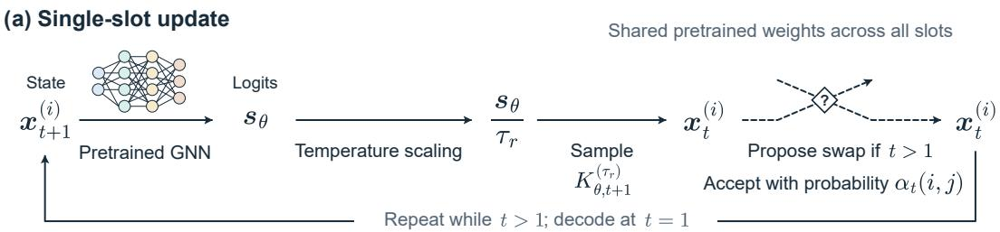
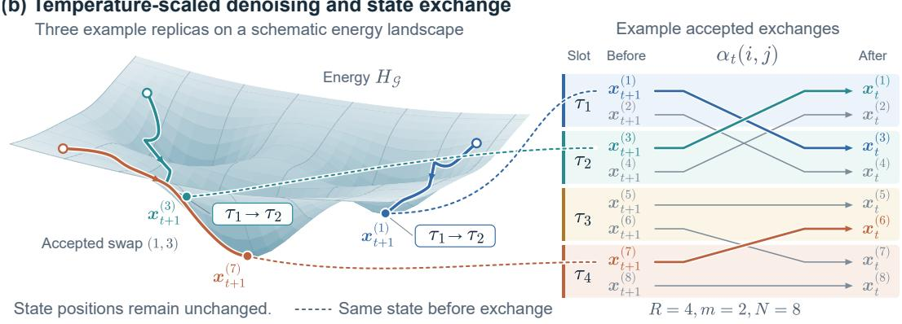
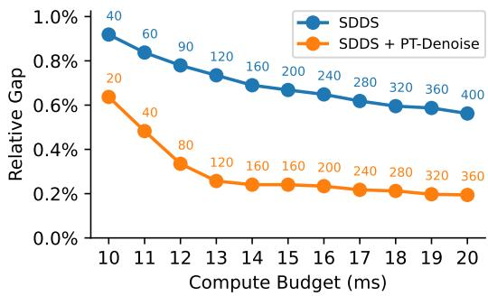

# PARALLEL TEMPERING FOR DIFFUSION-BASED COMBINATORIAL OPTIMIZATION

Arman Mielke<sup>1,2,3∗</sup> Uwe Bauknecht<sup>1</sup> Thilo Strauss<sup>4</sup> Mathias Niepert<sup>2,3,5</sup>

<sup>1</sup>ETAS Research <sup>2</sup>University of Stuttgart

<sup>3</sup>Max Planck Research School for Intelligent Systems (IMPRS-IS)

<sup>4</sup>School of AI and Advanced Computing, Xi’an Jiaotong-Liverpool University

<sup>5</sup>NEC Laboratories Europe

## ABSTRACT

Discrete diffusion models have emerged as a powerful paradigm for solving combinatorial optimization (CO) problems on graphs by learning to sample high-quality solutions. A common inference-time approach is to generate multiple candidate solutions independently and return the best-performing sample, improving solution quality at the expense of an increase in computational cost. In this work, we introduce PT-Denoise, an inference-time procedure that allows these concurrent denoising trajectories to interact through parallel tempering, without requiring retraining or fine-tuning of the underlying denoiser. Our method assigns a temperature to each diffusion process and allows processes to swap temperatures based on their relative performance. This dynamically reallocates promising, lowenergy trajectories to colder, more concentrated sampling regimes while allowing higher-energy states to escape local minima through randomized exploration. Experiments on canonical graph-structured CO problems show that our approach consistently improves the quality of the best solution found, while only adding minimal computational overhead.

## 1 INTRODUCTION

Combinatorial optimization (CO) problems over graphs, such as the maximum independent set (MIS), minimum dominating set (MDS), and maximum cut problems, are fundamental challenges in computer science and engineering. Many of these problems are NP-hard and are commonly addressed using approximation algorithms or problem-specific heuristics. Deep learning has emerged as an alternative paradigm, leveraging neural networks to learn problem-specific heuristics directly from data (Bello et al., 2016; Kool et al., 2019; Karalias & Loukas, 2020). Within this domain, generative models, and specifically diffusion models, have proven highly effective (Sun & Yang, 2023). They frame CO as sampling from a distribution over solutions and learn to iteratively denoise a uniform prior into high-quality CO solutions.

At inference time, a common strategy for improving solution quality is to generate multiple candidates independently. Here, a pretrained denoiser generates N candidate trajectories, and a non-learned decoder maps these candidates to feasible solutions. The final output is the best of the decoded solutions. Increasing N can improve the best solution found, but requires proportionally more denoiser evaluations. The corresponding increase in wall-clock time depends on batching and available parallel hardware. However, independent sampling at a fixed temperature does not use information about the relative progress of each trajectory in the ensemble to adapt each trajectory’s sampling behavior. We therefore ask whether coordinating these trajectories can improve the best final solution under a fixed budget of denoiser evaluations.

To address this limitation, we introduce PT-Denoise, an inference-time procedure that coordinates concurrent denoising trajectories, which we call replicas, through parallel tempering. Our approach requires no retraining, fine-tuning, or architectural modifications to the underlying pretrained denoiser. We assign a temperature parameter to each replica slot, thereby controlling the level of randomness in its denoising steps. Our approach periodically evaluates intermediate states and proposes state exchanges between slots at neighboring temperatures. This mechanism favors assigning lowerenergy states to colder, more concentrated sampling regimes and higher-energy states to hotter, more exploratory regimes, using intermediate energy as a surrogate for final decoded solution quality. Fig. 1 shows an overview of our approach.



  
Figure 1: Overview of our approach. Top: One diffusion step of a single replica within an ensemble. We alternate between diffusion steps and replica swaps. Bottom: Swapping replicas between rungs on the temperature ladder. Neighboring temperature rungs are paired; in this example, the pairs are $( \tau _ { 1 } , \tau _ { 2 } ) , ( \tau _ { 3 } , \tau _ { 4 } )$ . A uniform one-to-one matching is sampled between the slots of paired temperatures. Swaps are proposed between matched slots and accepted with probability $\alpha _ { t } ( i , j )$

Experiments on four graph-structured CO problems (MIS, MDS, maximum clique, and maximum cut) show that our approach improves mean best-of-N solution quality for both DiffUCO and SDDS, with small absolute runtime increases under the evaluated settings. We make the following contributions:

• A coordinated inference protocol: We propose PT-Denoise, a plug-and-play inference-time procedure that coordinates concurrent diffusion trajectories through state exchanges across temperatures without retraining the base model.

• Decoupled population and temperature ladder: Since trajectories have only a limited number of denoising steps in which to move across the temperature ladder, we maintain multiple trajectories per temperature rung. This allows increasing the population size without increasing the number of neighboring exchanges needed to traverse the ladder.

• Empirical evaluation under a fixed denoiser budget: We evaluate our approach across four graphstructured CO problems using two pretrained diffusion backbones, demonstrating improvements in mean solution quality and measuring the accompanying inference-time overhead.

## 2 RELATED WORK

Neural combinatorial optimization. Early neural approaches learn constructive heuristics through reinforcement learning, using recurrent networks (Bello et al., 2016), graph embeddings (Khalil et al., 2017), attention-based architectures (Kool et al., 2019), or progressive decision-deferring schemes (Ahn et al., 2020). Beyond reinforcement learning, Erdos Goes Neural (Karalias & Loukas, 2020;˝

Sun et al., 2022) combines unsupervised optimization of probabilistic relaxations with derandomized decoding, while Let the Flows Tell (Zhang et al., 2023) trains conditional GFlowNets to generate high-quality graph solutions. Li et al. (2018) use a learned model to guide a parallel tree search, a paradigm later critically evaluated by Böther et al. (2022). These approaches motivate learned solution generation; our focus is on coordinating trajectories from an existing diffusion solver at inference time.

Diffusion for combinatorial optimization. DIFUSCO (Sun & Yang, 2023) introduced graph-based diffusion solvers, while DiffUCO (Sanokowski et al., 2024) and SDDS (Sanokowski et al., 2025) developed methods for training discrete diffusion samplers against energy-based objectives without solution labels. DISCO (Zhao et al., 2025) improves solution quality and inference efficiency through a residual-based diffusion formulation. Closely related, GenSCO (Li et al., 2025b) treats generation as a search operator, alternating solution disruption and learned generation; its search loop is supported by a dedicated solution-enhancement training procedure. Our approach instead couples concurrent denoising trajectories through temperature exchanges, using an existing pretrained denoiser without retraining or fine-tuning.

Inference-time steering and interacting particles. Particle Guidance (Corso et al., 2024) couples diffusion trajectories through a joint potential to encourage diversity. Feynman–Kac steering (Singhal et al., 2025) resamples particles according to intermediate reward potentials, while soft value-based decoding (Li et al., 2025a) guides generation using estimates of future reward. Related sequential Monte Carlo methods derive importance-sampling corrections and proposal mechanisms to control discrete diffusion models (Lee et al., 2025; Ou et al., 2026). Our method uses energy-dependent exchanges between temperature groups: each exchange preserves the current collection of states while changing the sampling temperatures governing their subsequent evolution.

Parallel tempering and generative sampling. Parallel tempering coordinates replicas through exchanges across a temperature ladder (Swendsen & Wang, 1986; Geyer, 1991; Hukushima & Nemoto, 1996). Ensemble-based implementations and adaptive ladder selection were studied by Vousden et al. (2016). Accelerated Parallel Tempering (Zhang et al., 2026) incorporates neural transports, including flows and diffusion processes, into parallel tempering while preserving asymptotic consistency under its stated assumptions. Source Parallel Tempering (Wang et al., 2026) uses parallel tempering to guide flow-based models, but operates on continuous latent priors in the source space before generation. In contrast, our method couples discrete denoising trajectories across diffusion timesteps. CREPE (He et al., 2026) applies parallel tempering to inference-time control of pretrained diffusion models, including discrete masked diffusion, using replicas at different diffusion times. Our approach exchanges states at the same denoising time across different logit temperatures and assigns multiple replicas to each rung, allowing population size to increase without extending the ladder. We use this mechanism for finite-budget optimization. Temperature-scaled denoising generally does not preserve Boltzmann distributions, so the overall procedure does not inherit the classical parallel-tempering sampling guarantees.

## 3 BACKGROUND

Combinatorial optimization. A combinatorial optimization (CO) problem asks us to minimize an objective function $f : { \mathcal { F } } $ R on a discrete set $\mathcal { F }$ . Without loss of generality, maximization problems can be converted to minimization problems by changing the sign. Many CO problems admit natural graph representations. In particular, much of the machine learning literature for CO focuses on node subset problems (Karalias & Loukas, 2020; Zhang et al., 2023). Given a graph $\mathcal { G } = ( V , E )$ , the goal is to minimize an objective function $f _ { \mathcal { G } } : \mathcal { F } _ { \mathcal { G } } $ R over subsets of nodes, where ${ \mathcal { F } } _ { { \mathcal { G } } } \subseteq \{ 0 , 1 \} ^ { | V | }$ A relaxed energy function $H _ { \mathcal { G } } : [ 0 , 1 ] ^ { | V | } $ R is often used to evaluate approximate continuous solutions or solutions that do not meet the constraints. It usually consists of a term that relaxes the discrete objective function and one that softly enforces the CO problem’s constraints, and is designed to match the objective function $f _ { \mathcal G }$ on $\mathcal { F } _ { \mathcal G }$ (Karalias & Loukas, 2020).

Examples for frequently studied CO problems are as follows. The maximum independent set (MIS) problem asks us to find the largest subset of nodes $S \subseteq V$ in which no pair of nodes are neighbors. In the minimum dominating set (MDS) problem, the goal is to find the smallest subset $S \subseteq { \bar { V } }$ such that each node in $V$ is either in S or has a neighbor in S. The maximum cut problem asks us to find a subset $S \subseteq V$ that maximizes the number of edges between $S$ and $V \backslash { \dot { S } }$ . Finally, there is the maximum clique problem, where the goal is to find the largest clique, i.e. a subset of nodes where each node is connected to each other node in the set.

Diffusion for CO. Diffusion models for CO frame solving CO problems over graphs as generative modeling over the solution space $\mathcal { X } = \{ 0 , \dots , k - 1 \} ^ { | V | }$ disregarding constraints, where $k = 2$ for node subset problems (Sun $\bar { \& }$ Yang, 2023). The diffusion model can be trained to approximately sample from a Boltzmann distribution based on the CO problem’s energy function $H _ { \mathcal { G } } \colon$

$$
p _ { \mathcal { G } } ^ { \ast } ( \pmb { x } ) = \frac { 1 } { Z ( \mathcal { G } ) } \exp \bigl ( - \beta _ { B } H _ { \mathcal { G } } ( \pmb { x } ) \bigr ) , \qquad Z ( \mathcal { G } ) = \sum _ { \pmb { x } \in \mathcal { X } } \exp \bigl ( - \beta _ { B } H _ { \mathcal { G } } ( \pmb { x } ) \bigr ) ,
$$

where $\beta _ { B } > 0$ is an inverse temperature (Sanokowski et al., 2024; 2025). This assigns the highest probabilities to solutions x with low energy.

Discrete diffusion connects the target distribution $p _ { \mathcal G } ^ { \ast }$ to a simple reference distribution through a fixed corruption process and a learned denoising process. The forward process ${ \bf \nabla } _ { q } ( { \bf x } _ { 1 : T } \ \mid \ x _ { 0 } )$ is a non-trainable Markov chain that progressively corrupts an initial assignment $\scriptstyle { \mathbf { { \mathit { x } } } } _ { 0 }$ . For discrete variables, each variable is resampled from a categorical transition distribution determined by its current value and the timestep. A sampled value may coincide with the current value or replace it with another of the $k$ possible categories. The noise schedule progressively removes information about $\scriptstyle { \mathbf { { \vec { x } } } } _ { 0 }$ , making the terminal distribution approximately a factorized uniform prior,

$$
p ( \pmb { x } _ { T } ) = \prod _ { v \in V } \mathrm { C a t } \biggl ( \ b { x } _ { T , v } ; \frac { 1 } { k } \mathbf { 1 } \biggr ) .
$$

The reverse process learns to undo this corruption. Starting from an assignment sampled from $p ( { \pmb x } _ { T } )$ it applies learned categorical transitions conditioned on the graph G:

$$
p _ { \boldsymbol { \theta } } ( \mathbf { x } _ { 0 : T } \mid \mathcal { G } ) = p ( \mathbf { x } _ { T } ) \prod _ { t = 1 } ^ { T } p _ { \boldsymbol { \theta } } ( \mathbf { x } _ { t - 1 } \mid \mathbf { x } _ { t } , \mathcal { G } ) .\tag{1}
$$

The parameters $\theta$ are trained so that the resulting marginal distribution $p _ { \theta } ( \pmb { x } _ { 0 } \mid \mathcal { G } )$ approximates the target distribution $p _ { \mathcal { G } } ^ { \ast }$ over high-quality CO solutions.

At inference time, the forward process is discarded entirely. Generation proceeds by sampling initial states from the prior $p ( { \pmb x } _ { T } )$ and sequentially evaluating the transitions $p _ { \theta } ( \pmb { x } _ { t - 1 } \mid \pmb { x } _ { t } )$ down to $t = 0$ The reverse transition can be parameterized via a graph neural network (GNN) $\mathbf { \sigma } _ { \mathbf { \mathcal { S } } _ { \theta } } ( \mathbf { \mathcal { x } } _ { t } , t , \mathcal { G } ) \in \mathbb { R } ^ { | V | \times k }$ which predicts node-level logits based on the intermediate state ${ \mathbf { \nabla } } x _ { t } .$ , timestep t, and problem graph $\mathcal { G } \colon$

$$
K _ { \theta , t } ( \boldsymbol { x } _ { t - 1 } \mid \boldsymbol { x } _ { t } , \boldsymbol { \mathcal { G } } ) = \prod _ { v \in V } \mathrm { C a t } \Big ( \boldsymbol { x } _ { t - 1 , v } ; \operatorname { s o f t m a x } \big ( \boldsymbol { s } _ { \theta , v } ( \boldsymbol { x } _ { t } , t , \boldsymbol { \mathcal { G } } ) \big ) \Big ) .
$$

While the output of the reverse process $\mathbf { \boldsymbol { x } } _ { 0 } \in \mathcal { X }$ is discrete, it is not guaranteed to meet the CO problem’s constraints. To address this, the logits at the final denoising step ${ \pmb s } _ { \theta } ( { \pmb x } _ { 1 } , 1 , \mathcal { G } )$ are fed into a decoder $d _ { \mathcal { G } } : \mathbb { R } ^ { | V | \times k }  \mathcal { F } _ { \mathcal { G } }$ , an algorithm that constructs a feasible solution to the CO problem.

Parallel tempering. Parallel tempering, also known as replica exchange Markov chain Monte Carlo (MCMC) sampling (Swendsen & Wang, 1986; Geyer, 1991), is an algorithm used in statistical physics and computational chemistry to sample from multimodal distributions $p ^ { * } ( { \pmb x } ) \propto \exp ( - H \bar { ( } { \pmb x } ) / \tau )$ where $\tau \in \mathbb { R }$ is a temperature and H is an energy function.

Parallel tempering maintains a set of N replicas operating at distinct temperatures along a temperature ladder $\mathcal { T } = \bar { \{ \tau _ { 1 } < \tau _ { 2 } < \cdot \cdot \cdot < \tau _ { N } \} }$ , where typically $\tau _ { 1 } = 1$ . Each replica $i \in \{ 1 , \ldots , \mathsf { \bar { N } } \}$ evolves its sample $\mathbf { \boldsymbol { x } } ^ { ( i ) }$ independently, e.g. according to a standard MCMC algorithm. Replicas only interact periodically at predetermined intervals by swapping temperatures: For each pair of neighboring temperatures $\tau _ { i } , \tau _ { i + 1 }$ , replicas $i , j = i + 1$ swap according to the Metropolis–Hastings criterion with probability

$$
\alpha ( i , j ) = \mathrm { m i n } \Big \{ 1 , \mathrm { e x p } \big ( ( \beta _ { i } - \beta _ { j } ) ( H ( \pmb x ^ { ( i ) } ) - H ( \pmb x ^ { ( j ) } ) ) \big ) \Big \} ,\tag{2}
$$

where $\beta _ { i } = 1 / \tau _ { i }$ . High-temperature replicas explore broad regions of state space and can cross high-energy barriers easily, while low-temperature replicas exploit local minima.

Conflicts can arise if swaps between replica pairs $( i , i + 1 )$ and $( i + 1 , i + 2 )$ are proposed in the same iteration. To address this, a common approach is to group replica pairs $( i , i + 1 )$ into pairs with even i and pairs with odd $i ,$ and to alternate between proposing swaps using even and odd pairs (Hukushima & Nemoto, 1996).

## 4 METHOD

We consider a CO problem on a graph ${ \mathcal { G } } ,$ with feasible solutions ${ \mathcal { F } } _ { \mathcal { G } } \subseteq { \mathcal { X } }$ and objective $f _ { \mathcal { G } } : \mathcal { F } _ { \mathcal { G } }  \mathbb { R }$ to be minimized. A pretrained discrete denoiser and a non-learned decoder together define a stochastic procedure for generating feasible solutions. A common inference strategy (Sun & Yang, 2023; Sanokowski et al., 2024; 2025) is to generate N candidate solutions $\pmb { x } ^ { ( 1 ) } , \dots , \pmb { x } ^ { ( N ) } \in \bar { \mathcal { F } _ { \mathcal { G } } }$ independently and return

$$
\pmb { x } ^ { * } \in \underset { \pmb { x } \in \{ \pmb { x } ^ { ( 1 ) } , \pmb { \cdots } , \pmb { x } ^ { ( N ) } \} } { \arg \operatorname* { m i n } } f _ { \mathcal { G } } ( \pmb { x } ) .
$$

Increasing $N$ can improve the best solution found, but also increases the computational cost. We therefore ask whether coordinating a fixed number of denoising trajectories can improve their best final solution.

We propose PT-Denoise, an inference-time procedure that couples concurrent denoising trajectories through temperature exchanges. Different sampling temperatures control the randomness of the denoising transitions, while energy-dependent exchanges reassign intermediate states to these temperatures. The procedure uses the same pretrained denoiser throughout and requires no retraining or fine-tuning. Fig. 1 shows an overview of our approach.

Our objective is to improve

$$
\mathbb { E } \left[ \operatorname* { m i n } _ { i \in \{ 1 , \dots , N \} } f _ { \mathcal { G } } \left( \pmb { x } ^ { ( i ) } \right) \right]
$$

under a fixed inference budget. We use parallel tempering as an optimization mechanism. Importantly, we do not assume that the resulting denoising trajectories are equilibrium samples from tempered Boltzmann distributions, as this is not required for the problem of finding high-quality solutions.

Temperature-scaled denoising. Let $\pmb { \mathscr { s } } _ { \theta } ( \pmb { \mathscr { x } } _ { t } , t , \mathcal { G } ) \in \mathbb { R } ^ { | V | \times k }$ denote the logits of a pretrained reverse transition. For a sampling temperature $\tau > 0 .$ , define

$$
K _ { \theta , t } ^ { ( \tau ) } ( \boldsymbol { x } _ { t - 1 } \mid \boldsymbol { x } _ { t } , \boldsymbol { \mathcal { G } } ) = \prod _ { v \in V } \mathrm { C a t } \left( \boldsymbol { x } _ { t - 1 , v } ; \mathrm { \ s o f t m a x } \left( \frac { 1 } { \tau } \boldsymbol { s } _ { \theta , v } ( \boldsymbol { x } _ { t } , t , \boldsymbol { \mathcal { G } } ) \right) \right) .\tag{3}
$$

A $\mathrm { ~ t ~ } \tau = 1$ , this recovers the original reverse transition. Larger temperatures flatten the categorical distributions, whereas smaller temperatures concentrate probability on the denoiser’s preferred assignments. Note that the sampling temperature τ used here is separate from the inverse temperature $\beta _ { B }$ in the Boltzmann distribution used to train the model.

Temperature scaling acts on the transition distribution:

$$
K _ { \theta , t } ^ { ( \tau ) } ( \pmb { x } _ { t - 1 } \mid \pmb { x } _ { t } , \pmb { \mathcal { G } } ) \propto \left[ K _ { \theta , t } ^ { ( 1 ) } ( \pmb { x } _ { t - 1 } \mid \pmb { x } _ { t } , \pmb { \mathcal { G } } ) \right] ^ { 1 / \tau } ,\tag{4}
$$

where the normalizing constant depends on x, t, and $\tau .$ . Consequently, scaling the transition logits does not generally imply that intermediate or terminal states follow a Boltzmann distribution with temperature τ .

Concurrent denoising with parallel tempering. We maintain N replica slots. Each slot i has an assigned temperature $\tau _ { i }$ and contains an intermediate state $\mathbf { \boldsymbol { x } } _ { t } ^ { ( i ) }$ . Here, temperature subscripts index slots, and multiple slots may share the same temperature. All replicas follow the same denoising schedule. Starting from independent samples of the original prior, each slot generates its next state using

$$
\mathbf { \Delta x } _ { t } ^ { ( i ) } \sim K _ { \theta , t + 1 } ^ { ( \tau _ { i } ) } \big ( \cdot \mid \mathbf { \Delta x } _ { t + 1 } ^ { ( i ) } , \mathcal { G } \big ) .\tag{5}
$$

After a denoising transition, we evaluate each state using the energy function $H _ { \mathcal { G } }$ . This acts as a surrogate for the final solution quality at $t = 0$ after decoding, which we cannot measure directly.

For two slots i and $j$ at neighboring temperatures, we propose exchanging their states and accept with probability

$$
\alpha _ { t } ( i , j ) = \operatorname* { m i n } \Big \{ 1 , \exp \Big [ ( \beta _ { i } - \beta _ { j } ) \Big ( H _ { \mathcal { G } } ( \pmb { x } _ { t } ^ { ( i ) } ) - H _ { \mathcal { G } } ( \pmb { x } _ { t } ^ { ( j ) } ) \Big ) \Big ] \Big \} , \qquad \beta _ { i } = \frac { 1 } { \tau _ { i } } .\tag{6}
$$

```latex
Algorithm 1 Concurrent denoising with temperature exchange.
Inputs: Pretrained denoiser $s _ { \theta } ,$ graph G, decoder $d _ { \mathcal { G } } ,$ , prior $p _ { T }$ , temperature ladder $0 < \tau _ { 1 } < \cdots <$
$\tau _ { R } ,$ replicas per rung $m ,$ diffusion steps $T \geq 2 ,$ energy function $H _ { \mathcal { G } }$ , objective function $f _ { \mathcal { G } } .$
Setup: $N \gets R m ;$ partition replica slots $\overline { { \{ 1 , \ldots , N \} } }$ into disjoint $\mathcal { T } _ { 1 } , \ldots , \mathcal { T } _ { R }$ with $| { \mathcal { T } } _ { r } | = m .$ . Set
$\beta _ { i } \gets \tau _ { r } ^ { - 1 }$ for each $\bar { r } \in \{ 1 , \ldots , \bar { R } \}$ and $i \in \mathcal { Z } _ { r }$
(a) Denoising and selection (b) EXCHANGE $( X _ { t } , q )$
1: $\pmb { x } _ { T } ^ { ( i ) } \overset { \mathrm { i i d } } { \sim } p _ { T } , i = 1 , \dots , N ; q  0$ 1: $\mathcal { P }  \mathcal { P } ^ { \mathrm { o d d } }$ if q is even,
2: for $t = T - 1 , \dots , 1$ do otherwise $\hat { \mathcal { P } } \gets \mathcal { P } ^ { \mathrm { e v e n } }$
3: for $r = 1 , \ldots , R , i \in \mathcal { T } _ { r }$ do 2: for all $( r , s ) \in \mathcal { P }$ do
4: $\pmb { x } _ { t } ^ { ( i ) } \sim K _ { \theta , t + 1 } ^ { ( \tau _ { r } ) } ( \cdot \mid \pmb { x } _ { t + 1 } ^ { ( i ) } , \mathcal { G } )$ 3: 4: for all $\mathcal { M } $ UNIFORMMATCH $( i , j ) \in \mathcal { M }$ do $( \mathcal { T } _ { r } , \mathcal { T } _ { s } )$
5: if $t > 1$ then $\Delta \gets ( \beta _ { i } - \beta _ { j } ) \big [ H _ { \mathcal { G } } ( \pmb { x } _ { t } ^ { ( i ) } ) - H _ { \mathcal { G } } ( \pmb { x } _ { t } ^ { ( j ) } ) \big ]$
5:
6: $X _ { t } \gets ( \pmb { x } _ { t } ^ { ( i ) } ) _ { i = 1 } ^ { N }$ 6: $u \sim \mathrm { U n i f o r m } ( \bar { 0 , 1 } )$
7: $\boldsymbol X _ { t } \gets \mathrm { E x c H A N G E } ( \boldsymbol X _ { t } , \boldsymbol q )$ 7: if log $u < \mathrm { m i n } \{ 0 , \dot { \Delta } \}$ then
9: for 8: $i = 1 , \ldots , N$ $q  q + 1$ do 8: $( \pmb { x } _ { t } ^ { ( i ) } , \pmb { x } _ { t } ^ { ( j ) } )  ( \pmb { x } _ { t } ^ { ( j ) } , \pmb { x } _ { t } ^ { ( i ) } )$
$\pmb { x } ^ { ( i ) }  d _ { \mathcal { G } } \Big ( \pmb { s } _ { \theta } ( \pmb { x } _ { 1 } ^ { ( i ) } , 1 , \mathcal { G } ) \Big )$ 9: $X _ { t } = ( \mathbf { x } _ { t } ^ { ( i ) } ) _ { i = 1 } ^ { N }$
10:
10: return $X _ { t }$
11: $i ^ { \star } \in$ arg min $\cdot { \ i \in \{ 1 , . . . , N \} } \ f _ { \mathcal { G } } ( \pmb { x } ^ { ( i ) } )$
12: return $\pmb { x } ^ { ( i ^ { \star } ) }$
UNIFORMMATCH draws a uniformly random one-to-one matching. $\mathcal { P } ^ { \mathrm { o d d } }$ and $\mathcal { P } ^ { \mathrm { e v e n } }$ are the rung
pairings defined in Eq. (7). Sampling: Eqs. $( 3 ) , ( 5 ) ;$ exchange: Eq. (6); decoding: Eq. (8).
```

Temperatures remain attached to slots, so an accepted exchange changes the temperature used for the subsequent evolution of each exchanged state. $\mathrm { I f } \ \tau _ { i } < \tau _ { j }$ , an exchange that moves the lower-scoring, i.e. more promising, state into slot i is always accepted. The reverse exchange may also be accepted, allowing states to move between more concentrated and more randomized denoising transitions.

An exchange preserves the current collection of states, including its best score. Its effect is therefore on subsequent denoising: It changes the sampling temperature each state encounters. This differs from resampling, which can duplicate some states and discard others (Singhal et al., 2025).

Decoupling the temperature ladder from population size. We use a ladder of R distinct temperatures, $\bar { \mathcal { T } } = \{ \tau _ { 1 } < \cdot \cdot \cdot < \tau _ { R } \}$ , and assign m replica slots to each temperature, giving $N = R m$ replicas in total. Let $\mathcal { T } _ { r }$ denote the slots assigned to rung r. In this grouped notation, temperature subscripts index ladder rungs rather than slots; for each $i \in \mathcal { Z } _ { r }$ , the slot’s inverse temperature is $\beta _ { i } = 1 / \tau _ { r }$ . This construction follows the ensemble-tempering principle, maintaining multiple states at each temperature (Vousden et al., 2016).

This choice is motivated by the fact that using one replica per rung ties population size to the number of temperatures, potentially causing multiple problems. Since a state can move at most one rung per exchange step, a longer ladder can limit movement between its endpoints within a short denoising horizon. Allowing R and N to be adjusted separately allows us to increase the number of candidates without increasing the number of rungs they must traverse for the same temperature change. Moreover, increasing the number of temperatures means either increasing the maximum temperature, or decreasing the distance between temperatures. In the first case, larger parts at the top end of the temperature ladder turn to pure noise, ignoring the diffusion model’s learned distribution. In the second case, if the difference between neighboring temperatures becomes too small, the acceptance probability according to the Metropolis–Hastings criterion approaches 1, meaning that neighboring replicas will almost always swap regardless of energy. These problems are resolved by assigning multiple replica slots to each temperature.

To avoid conflicting exchanges, we alternate between the disjoint rung pairings

$$
\mathcal { P } ^ { \mathrm { o d d } } = \{ ( 1 , 2 ) , ( 3 , 4 ) , \ldots \} , \qquad \mathcal { P } ^ { \mathrm { e v e n } } = \{ ( 2 , 3 ) , ( 4 , 5 ) , \ldots \} ,\tag{7}
$$

retaining only pairs with indices in $\{ 1 , \ldots , R \}$ . For each active pair $( r , s )$ , we sample a uniform one-to-one matching between $\mathcal { T } _ { r }$ and $\mathcal { T } _ { s }$ and apply Eq. (6) to each matched pair. Because pairs are disjoint, their exchanges can be evaluated in parallel.

Table 1: Results on MIS. Top: diffusion methods. Center: learned non-diffusion methods. Bottom: non-learned heuristics.
<table><tr><td rowspan="2">Method</td><td colspan="3">RB Small</td><td colspan="3">RB Large</td></tr><tr><td>IS Size ↑</td><td>Relative  $\mathrm { G a p } \downarrow$ </td><td>Time</td><td>IS Size ↑</td><td>Relative Gap ↓</td><td>Time</td></tr><tr><td>DiffUCO</td><td> $1 9 . 7 4 { \pm } 0 . 0 3$ </td><td> $1 . 7 9 \% 2 0 . 1 5$ </td><td>12ms</td><td> $4 1 . 6 5 { \pm } 0 . 0 3$ </td><td> $3 . 4 8 \% { \pm } 0 . 0 8$ </td><td>303ms</td></tr><tr><td>DiffUCO + Temp. Ladder</td><td> $1 9 . 9 3 { \scriptstyle \pm 0 . 0 4 }$ </td><td> $0 . 8 3 \% { \pm } 0 . 1 8$ </td><td>12ms</td><td> $4 1 . 6 6 { \pm } 0 . 0 2$ </td><td> $3 . 4 5 \% { \pm } 0 . 0 5$ </td><td>303ms</td></tr><tr><td>DiffUCO + PT-Denoise (ours)</td><td> $2 0 . 0 1 { \scriptstyle \pm 0 . 0 1 }$ </td><td> $0 . 4 7 \% \pm 0 . 0 3$ </td><td>13ms</td><td> $4 1 . 6 8 { \pm } 0 . 0 2 $ </td><td> $3 . 4 0 \% { \pm } 0 . 0 6$ </td><td>303ms</td></tr><tr><td>SDDS</td><td> $1 9 . 9 5 { \scriptstyle \pm 0 . 0 2 }$ </td><td> $0 . 7 2 \% \pm 0 . 1 2$ </td><td>12ms</td><td> $4 1 . 9 7 { \scriptstyle \pm 0 . 0 7 }$ </td><td> $2 . 7 3 \% { \pm } 0 . 1 6$ </td><td>304ms</td></tr><tr><td>SDDS + Temp. Ladder</td><td> $2 0 . 0 1 { \scriptstyle \pm 0 . 0 2 }$ </td><td> $0 . 4 4 \% { \pm } 0 . 1 2$ </td><td>12ms</td><td> ${ \bf 4 1 . 9 9 } { \bf \pm 0 . 0 2 }$ </td><td> $2 . 6 9 \% \pm 0 . 0 9$ </td><td>303ms</td></tr><tr><td>SDDS + PT-Denoise (ours)</td><td>20.05±0.02</td><td> $\mathbf { 0 . 2 6 \% 1 0 . 0 8 }$ </td><td>13ms</td><td> $\mathbf { 4 2 . 0 1 { \pm 0 . 0 3 } }$ </td><td> $2 . 6 4 \% \pm 0 . 0 8$ </td><td>304ms</td></tr><tr><td>LwtD</td><td>19.01</td><td>5.42%</td><td>154ms</td><td>32.32</td><td>25.10%</td><td>906ms</td></tr><tr><td>INTEL</td><td>18.47</td><td>8.11%</td><td>1.57s</td><td>34.47</td><td>20.12%</td><td>2.43s</td></tr><tr><td>DGL</td><td>17.36</td><td>13.61%</td><td>1.53s</td><td>34.50</td><td>20.05%</td><td>2.87s</td></tr><tr><td>LTFT</td><td>19.18</td><td>4.57%</td><td>64ms</td><td>37.48</td><td>13.14%</td><td>524ms</td></tr><tr><td>KaMIS</td><td>20.10</td><td></td><td>10.10s</td><td>43.15</td><td></td><td>14.83s</td></tr><tr><td>Gurobi</td><td>19.98</td><td>0.60%</td><td>5.71s</td><td>40.90</td><td>5.21%</td><td>15.65s</td></tr></table>

Table 2: Results on MDS. Top: diffusion methods. Center: learned non-diffusion methods. Bottom: non-learned heuristics.
<table><tr><td rowspan="2">Method</td><td colspan="3">BA Small</td><td colspan="3">BA Large</td></tr><tr><td>DS Size ↓</td><td>Relative Gap ↓</td><td>Time</td><td>DS Size ↓</td><td>Relative Gap ↓</td><td>Time</td></tr><tr><td>DiffUCO</td><td> $2 8 . 0 1 { \scriptstyle \pm 0 . 0 5 }$ </td><td> $0 . 4 3 \% { \pm } 0 . 1 8$ </td><td>10ms</td><td> $1 0 4 . 0 1 { \scriptstyle \pm 0 . 0 2 }$ </td><td> $0 . 0 0 \% { \pm } 0 . 0 2$ </td><td>56ms</td></tr><tr><td>DiffUCO + PT-Denoise (ours)</td><td> $2 7 . 9 1 { \pm } 0 . 0 1$ </td><td> $0 . 0 8 \% 0 2 0 . 0 4$ </td><td>11ms</td><td> $1 0 3 . 9 2 { \scriptstyle \pm 0 . 0 1 }$ </td><td> $- 0 . 0 8 \% \pm 0 . 0 1$ </td><td>56ms</td></tr><tr><td>SDDS</td><td> $2 7 . 9 3 { \pm } 0 . 0 1$ </td><td> $0 . 1 4 \% \pm 0 . 0 4$ </td><td>10ms</td><td> $1 0 3 . 9 0 { \scriptstyle \pm 0 . 0 2 }$ </td><td> $- 0 . 1 1 \% \pm 0 . 0 2$ </td><td>56ms</td></tr><tr><td>SDDS + PT-Denoise (ours)</td><td>27.90±0.00</td><td> $\mathbf { 0 . 0 2 \% } \pm \mathbf { 0 . 0 1 }$ </td><td>11ms</td><td> $\mathbf { 1 0 3 . 8 4 \pm 0 . 0 3 }$ </td><td>-0.16%±0.03</td><td>57ms</td></tr><tr><td>EGN</td><td>30.68</td><td>10.00%</td><td>120ms</td><td>116.76</td><td>12.26%</td><td>472ms</td></tr><tr><td>EGN-Anneal</td><td>29.24</td><td>4.84%</td><td>122ms</td><td>111.50</td><td>7.20%</td><td>470ms</td></tr><tr><td>LTFT</td><td>28.61</td><td>2.58%</td><td>280ms</td><td>110.28</td><td>6.03%</td><td>3.86s</td></tr><tr><td>Gurobi</td><td>27.89</td><td></td><td>214ms</td><td>104.01</td><td></td><td>1.66s</td></tr></table>

Final decoding and computational cost. After reaching $t = 1$ , each replica is decoded using

$$
\pmb { x } ^ { ( i ) } = \pmb { d } _ { \mathcal { G } } \left( \pmb { s } _ { \theta } ( \pmb { x } _ { 1 } ^ { ( i ) } , 1 , \mathcal { G } ) \right) \in \mathcal { F } _ { \mathcal { G } } ,\tag{8}
$$

where $d _ { \mathcal { G } }$ is the same feasibility-ensuring decoder used by the base diffusion model. We return the candidate with the smallest $f _ { \mathcal G }$ . With $T - 1$ sampled transitions and one final denoiser evaluation for decoding, the procedure uses $N T$ per-replica denoiser evaluations, matching independent generation with the same N and T. The additional cost consists of intermediate score evaluations, random matching, and state exchanges. Each exchange sweep proposes at most $N / 2$ swaps. An exchange immediately before a common deterministic decoder only permutes the final collection of candidates and cannot change the returned objective value. It can therefore be omitted.

Exchanges assign intermediate states to different temperatures for subsequent denoising. The acceptance rule favors moving lower-energy states to colder temperatures, where sampling is more concentrated. Since lower energy corresponds to better objective values, this aims to refine promising states while allowing others to explore through more randomized transitions. An exchange itself leaves the current candidates unchanged and its benefit depends on whether intermediate energy predicts final decoded quality and whether the temperature reassignment improves subsequent denoising. Because temperature-scaled denoising does not generally preserve Boltzmann distributions, we treat parallel tempering as an optimization heuristic without claiming the sampling guarantees of classical parallel tempering. We summarize the complete denoising procedure in Alg. 1.

## 5 EXPERIMENTS

We evaluate whether coordinating diffusion trajectories through temperature exchange improves solution quality under a fixed budget of denoiser evaluations. Our experiments cover four graph CO problems in MIS, MDS, maximum cut, and maximum clique and compare PT-Denoise with independent sampling using the same diffusion backbones, alongside established CO baselines. We report both solution quality and inference time to assess the gains from coordination and its computational overhead. We build upon DiffUCO (Sanokowski et al., 2024) and SDDS (Sanokowski et al., 2025), using the same model architectures and trained weights. For PT-Denoise, we use N = 100 replicas and 18 diffusion steps in our experiments. To allow for a fair comparison, all diffusion baselines also sample 100 solutions using the same number of diffusion steps, and the best result is reported. We use conditional expectation (Sanokowski et al., 2024) as the decoder for PT-Denoise and all diffusion baselines.

Table 3: Results on maximum cut. Top: diffusion methods. Center: learned non-diffusion methods. Bottom: non-learned heuristics.
<table><tr><td rowspan="2">Method</td><td colspan="3">BA Small</td><td colspan="3">BA Large</td></tr><tr><td>Cut Size ↑</td><td>Relative Gap ↓</td><td>Time</td><td>Cut Size ↑</td><td>Relative Gap ↓</td><td>Time</td></tr><tr><td>DiffUCO</td><td>734.18±0.08</td><td> $- 0 . 4 5 \% \pm 0 . 0 1$ </td><td>9ms</td><td>2966.36±0.17</td><td>-0.75%±0.01</td><td>37ms</td></tr><tr><td>DiffUCO + PT-Denoise (ours)</td><td>734.55±0.01</td><td> $\mathbf { - 0 . 5 0 \% \bot 0 . 0 0 }$ </td><td>10ms</td><td>2966.64±0.18</td><td>-0.76%±0.00</td><td>38ms</td></tr><tr><td>SDDS</td><td>734.29±0.10</td><td>-0.47%±0.01</td><td>9ms</td><td>2966.29±0.26</td><td>-0.74%±0.01</td><td>38ms</td></tr><tr><td>SDDS + PT-Denoise (ours)</td><td>734.56±0.05</td><td>-0.50%±0.01</td><td>10ms</td><td>2966.89±0.30</td><td>-0.76%±0.01</td><td>38ms</td></tr><tr><td>EGN</td><td>693.45</td><td>5.12%</td><td>92ms</td><td>2870.34</td><td>2.51%</td><td>338ms</td></tr><tr><td>EGN-Anneal</td><td>696.73</td><td>4.67%</td><td>90ms</td><td>2863.23</td><td>2.76%</td><td>336ms</td></tr><tr><td>LTFT</td><td>704.30</td><td>3.64%</td><td>354ms</td><td>2864.61</td><td>2.71%</td><td>2.56s</td></tr><tr><td>Gurobi</td><td>730.87</td><td></td><td>1.57s</td><td>2944.38</td><td></td><td>7.86s</td></tr></table>

CO problems and datasets. Our evaluation closely follows the protocol established by Zhang et al. (2023); Sanokowski et al. (2024; 2025). We evaluate on four CO problems: MIS, MDS, maximum cut, and maximum clique. We use RB graphs (Xu et al., 2005) for MIS and max clique, and Barabási–Albert (BA) graphs (Barabási & Albert, 1999) for MDS and max cut. For each dataset, we evaluate on a small variant with 200-300 nodes and a large variant with 800-1200 nodes. For max clique, we only evaluate on RB small, following Sanokowski et al. (2024; 2025). All test sets contain 1,000 instances. The energy functions used for each CO problem are detailed in Appendix A.

Baselines. Our primary diffusion baselines are SDDS (Sanokowski et al., 2025) and DiffUCO (Sanokowski et al., 2024). On MIS, we compare against learned unsupervised baselines let the flows tell (LTFT) (Zhang et al., 2023) and learning what to defer (LwtD) (Ahn et al., 2020), supervised baselines DGL (Böther et al., 2022) and IN-TEL (Li et al., 2018), as well as the non-learned mixed-integer program solver Gurobi (Gurobi Optimization, LLC, 2026) and the non-

Table 4: Results on maximum clique. Top: diffusion methods. Center: learned non-diffusion methods. Bottom: non-learned heuristics.
<table><tr><td rowspan="2">Method</td><td colspan="3">RB Small</td></tr><tr><td>Clique Size ↑</td><td>Relative Gap ↓</td><td>Time</td></tr><tr><td>DiffUCO</td><td>18.24±0.14</td><td>4.27%±0.74</td><td>23ms</td></tr><tr><td>DiffUCO + PT-Denoise (ours)</td><td>18.91±0.13</td><td>0.75%±0.67</td><td>24ms</td></tr><tr><td>SDDS</td><td>18.98±0.00</td><td>0.37%±0.02</td><td>23ms</td></tr><tr><td>SDDS + PT-Denoise (ours)</td><td>18.99±0.00</td><td>0.33%±0.03</td><td>24ms</td></tr><tr><td>EGN</td><td>12.02</td><td>36.90%</td><td>82ms</td></tr><tr><td>EGN-Anneal</td><td>14.10</td><td>25.98%</td><td>82ms</td></tr><tr><td>LTFT</td><td>16.24</td><td>14.75%</td><td>84ms</td></tr><tr><td>Gurobi</td><td>19.05</td><td></td><td>230ms</td></tr></table>

learned heuristic solver KaMIS (Lamm et al., 2017). On MDS, max cut, and max clique, we compare with learned unsupervised baselines LTFT, Erd˝os goes neural (EGN) (Karalias & Loukas, 2020), and an annealed variant EGN-Anneal (Sun et al., 2022), as well as Gurobi. In our tables, results for all non-diffusion baselines are reported as in (Zhang et al., 2023). We note that Gurobi and KaMIS often have substantially longer runtimes than the other methods and should therefore not be compared directly in those cases.

Metrics. We report the value of the objective function f<sub>G</sub>, i.e. the size of the solution set (for MIS, MDS, and max clique) or resulting cut (for max cut). Mean and standard deviation are calculated over three published reference models<sup>1</sup> trained with different seeds. We also measure the execution time, averaged per CO problem instance. Finally, we report the relative gap to the best non-learned baseline. The relative gap (in %) is calculated as $( f _ { \mathcal { G } } ( \pmb { x } ) \hat { - } f _ { \mathcal { G } } ( \pmb { x } ^ { * } ) ) / f _ { \mathcal { G } } ( \bar { \pmb { x } } ^ { * } )$ · 100 for minimization problems and $( f _ { \mathcal { G } } ( \pmb { x } ^ { * } ) - f _ { \mathcal { G } } ( \pmb { x } ) ) / f _ { \mathcal { G } } ( \pmb { x } ^ { * } )$ · 100 for maximization problems. Here, x is the learned method’s predicted solution and $\mathbf { \nabla } _ { \mathbf { \mathcal { X } } } \ast \mathbf { \ v { x } }$ is the solution from the best non-learned baseline. Note that x<sup>∗</sup> is not necessarily the optimal solution, and the gap becomes negative if x is better than $\mathbf { \boldsymbol { x } } ^ { * }$

Results. We summarize our main empirical results in Tabs. 1 to 4. The best result among learned methods as well as each result for which the respective mean lies within one standard deviation of the best method are marked in bold. Across all four CO problems and on both small and large graphs, incorporating PT-Denoise consistently improves the solution quality of the base diffusion models, DiffUCO and SDDS. SDDS + PT-Denoise shows the best mean solution quality on all CO problems and datasets among evaluated learned methods.

On MIS (Tab. 1), PT-Denoise substantially reduces the relative gap to the best non-learned baseline. For instance, applying our method to DiffUCO reduces the relative gap from 1.79% to 0.47% on RB small, while SDDS + PT-Denoise achieves the best overall diffusion performance with a relative gap of 0.26%. The improvement persists on RB large, though to a much smaller extent. In addition to this, the augmented diffusion models substantially outperform all learned non-diffusion baselines and outperform Gurobi, approaching the performance of KaMIS while being orders of magnitude faster.

As an ablation, we also ran DiffUCO and SDDS on MIS using only a ladder of different temperatures, but without temperature swaps. For both diffusion models and both problem sizes, this performs better than a single temperature but worse than PT-Denoise. For MDS (Tab. 2), augmenting the base models with PT-Denoise strictly improves the dominating set sizes. Similarly, on max cut (Tab. 3), PT-Denoise increases the cut size across the board, but to a much lesser extent. On max clique (Tab. 4), where we only evaluate on small graphs, applying our method to DiffUCO reduces the relative gap from 4.27% to 0.75%, and applying it to SDDS results in the best performance overall by a small margin. In all of our experiments, using PT-Denoise adds at most 1ms per CO problem instance to the inference time. This means that any solution quality gained by using our method comes at very little additional computational cost.

  
Figure 2: The best relative gap achievable on MIS, RB small within each given per-instance compute budget. The numbers next to each data point indicate how many replicas can be processed within the compute budget.

Fig. 2 visualizes the solution quality achievable within a given per-instance time budget. This only uses replica counts divisible by 10, since we use 10 temperatures for PT-Denoise. Relative gaps w.r.t. KaMIS and inference times are averaged over three trained models. At every compute budget, using PT-Denoise reduces the relative gap.

## 6 CONCLUSION

We introduced PT-Denoise, a novel inference-time procedure that enhances discrete diffusion models for graph-structured CO by coupling concurrent denoising trajectories through parallel tempering. By assigning a temperature to each diffusion process and allowing them to swap temperatures, our approach enables both exploration and local refinement without requiring retraining or fine-tuning of the base model. Our empirical evaluations across four canonical CO problems demonstrate that our approach consistently improves the solution quality of state-of-the-art diffusion models, while incurring minimal computational overhead.

Limitations and future work. While this work focuses explicitly on CO, the parallel tempering approach is general and could be applied to other diffusion domains. Consequently, adapting PT-Denoise to other application areas remains an open direction for future research. Our approach relies on a relaxed energy function $H _ { \mathcal { G } }$ to evaluate particles and guide temperature swaps. While $H _ { \mathcal { G } }$ serves as an effective heuristic surrogate, it may not perfectly correlate with the final decoded solution quality at early denoising timesteps. A potential solution could lie in training a lightweight neural network to predict the final solution quality based on intermediate states.

## AI USE STATEMENT

In this work, we used large language models (LLMs) to help implement our method, write the scripts used to generate plots visualizing experimental results, and to suggest and improve formulations in the manuscript. LLMs were not used to develop theoretical models, conceptual frameworks or mathematical claims, to propose or refine hypotheses, to design or provide feedback on research methodology or experiments, to support qualitative and thematic data analysis, or to interpret results. All synthetic datasets were created using non-learned algorithms, with no LLM-assisted cleaning or reformatting. The remaining required disclosure tasks—assisting in the writing of proofs, providing critical ingredients for proving mathematical claims, and assisting with translation—are not applicable to this work. All LLM-generated code and text has been manually reviewed by the authors. We take responsibility for the final content of this work, including the code and text produced with the aid of LLMs.

## REPRODUCIBILITY STATEMENT

The code required to reproduce the experiments was submitted as supplementary material, and will be made public once the paper is accepted. This includes scripts for re-generating the datasets. We list hyperparameters and checkpoints used in the experiments in Appendix B, and the hardware we used in Appendix C.

## REFERENCES

Sungsoo Ahn, Younggyo Seo, and Jinwoo Shin. Learning what to defer for maximum independent sets. In Proceedings ofthe 37th International Conference on Machine Learning, volume 119 of Proceedings of Machine Learning Research, pp. 134–144. PMLR, Jul 2020.

Albert-László Barabási and Réka Albert. Emergence of scaling in random networks. Science, 286 (5439):509–512, 1999.

Irwan Bello, Hieu Pham, Quoc V Le, Mohammad Norouzi, and Samy Bengio. Neural combinatorial optimization with reinforcement learning. arXiv preprint arXiv:1611.09940, 2016.

Maximilian Böther, Otto Kißig, Martin Taraz, Sarel Cohen, Karen Seidel, and Tobias Friedrich. What’s wrong with deep learning in tree search for combinatorial optimization. In International Conference on Learning Representations, 2022.

Gabriele Corso, Yilun Xu, Valentin De Bortoli, Regina Barzilay, and Tommi Jaakkola. Particle guidance: non-i.i.d. diverse sampling with diffusion models. In International Conference on Learning Representations, pp. 22480–22507, 2024.

David J Earl and Michael W Deem. Parallel tempering: Theory, applications, and new perspectives. Physical Chemistry Chemical Physics, 7(23):3910–3916, 2005.

Charles J Geyer. Markov chain monte carlo maximum likelihood. In Computing science and statistics: Proceedings of the 23rd Symposium on the Interface, pp. 156–163. Interface Foundation of North America, 1991.

Gurobi Optimization, LLC. Gurobi optimizer reference manual, 2026.

Jiajun He, Paul Jeha, Peter Potaptchik, Leo Zhang, José Miguel Hernández Lobato, Yuanqi Du, Saifuddin Syed, and Francisco Vargas. Crepe: Controlling diffusion with replica exchange. In International Conference on Learning Representations, pp. 99464–99494, 2026.

Koji Hukushima and Koji Nemoto. Exchange monte carlo method and application to spin glass simulations. Journal ofthe Physical Society ofJapan, 65(6):1604–1608, 1996.

Nikolaos Karalias and Andreas Loukas. Erdos goes neural: An unsupervised learning framework for˝ combinatorial optimization on graphs. In Advances in Neural Information Processing Systems, volume 33, pp. 6659–6672. Curran Associates, Inc., 2020.

Elias Khalil, Hanjun Dai, Yuyu Zhang, Bistra Dilkina, and Le Song. Learning combinatorial optimization algorithms over graphs. In Advances in Neural Information Processing Systems, volume 30. Curran Associates, Inc., 2017.

Wouter Kool, Herke van Hoof, and Max Welling. Attention, learn to solve routing problems! In International Conference on Learning Representations, 2019.

Sebastian Lamm, Peter Sanders, Christian Schulz, Darren Strash, and Renato F. Werneck. Finding near-optimal independent sets at scale. J. Heuristics, 23(4):207–229, 2017.

Cheuk Kit Lee, Paul Jeha, Jes Frellsen, Pietro Lio, Michael Samuel Albergo, and Francisco Vargas. Debiasing guidance for discrete diffusion with sequential Monte Carlo. arXiv preprint arXiv:2502.06079, 2025.

Xiner Li, Yulai Zhao, Chenyu Wang, Gabriele Scalia, Gokcen Eraslan, Surag Nair, Tommaso Biancalani, Shuiwang Ji, Aviv Regev, Sergey Levine, and Masatoshi Uehara. Derivative-free guidance in continuous and discrete diffusion models with soft value-based decoding. In Advances in Neural Information Processing Systems, volume 38, Main Conference, pp. 95507–95545. Curran Associates, Inc., 2025a.

Yang Li, Lvda Chen, Haonan Wang, Runzhong Wang, and Junchi Yan. Generation as search operator for test-time scaling of diffusion-based combinatorial optimization. In Advances in Neural Information Processing Systems, volume 38, Main Conference, pp. 127168–127196. Curran Associates, Inc., 2025b.

Zhuwen Li, Qifeng Chen, and Vladlen Koltun. Combinatorial optimization with graph convolutional networks and guided tree search. In Advances in Neural Information Processing Systems, volume 31. Curran Associates, Inc., 2018.

Zijing Ou, Chinmay Pani, and Yingzhen Li. Inference-time scaling of discrete diffusion models via importance weighting and optimal proposal design. In International Conference on Learning Representations, pp. 36740–36775, 2026.

Sebastian Sanokowski, Sepp Hochreiter, and Sebastian Lehner. A diffusion model framework for unsupervised neural combinatorial optimization. In Proceedings of the 41st International Conference on Machine Learning, volume 235 of Proceedings of Machine Learning Research, pp. 43346–43367. PMLR, Jul 2024.

Sebastian Sanokowski, Wilhelm Berghammer, Haoyu Wang, Martin Ennemoser, Sepp Hochreiter, and Sebastian Lehner. Scalable discrete diffusion samplers: Combinatorial optimization and statistical physics. In International Conference on Learning Representations, pp. 87053–87082, 2025.

Raghav Singhal, Zachary Horvitz, Ryan Teehan, Mengye Ren, Zhou Yu, Kathleen Mckeown, and Rajesh Ranganath. A general framework for inference-time scaling and steering of diffusion models. In Proceedings of the 42nd International Conference on Machine Learning, volume 267 of Proceedings ofMachine Learning Research, pp. 55810–55827. PMLR, Jul 2025.

Haoran Sun, Etash K Guha, and Hanjun Dai. Annealed training for combinatorial optimization on graphs. arXiv preprint arXiv:2207.11542, 2022.

Zhiqing Sun and Yiming Yang. DIFUSCO: Graph-based diffusion solvers for combinatorial optimization. In Advances in Neural Information Processing Systems, volume 36, pp. 3706–3731. Curran Associates, Inc., 2023.

Robert Swendsen and Jian-Sheng Wang. Replica monte carlo simulation of spin-glasses. Physical Review Letters, 57:2607–2609, Nov 1986.

Will D Vousden, Will M Farr, and Ilya Mandel. Dynamic temperature selection for parallel tempering in markov chain monte carlo simulations. Monthly Notices of the Royal Astronomical Society, 455 (2):1919–1937, 2016.

Shih-Hsin Wang, Joel A. Keller, Taos Transue, Drake Benjamin Brown, Thomas Strohmer, and Bao Wang. Test-time guidance for flow-based generative models via parallel tempering on source distributions. In Proceedings ofthe 43rd International Conference on Machine Learning, Proceedings of Machine Learning Research. PMLR, 2026.

Ke Xu, Frédéric Boussemart, Fred Hemery, and Christophe Lecoutre. A simple model to generate hard satisfiable instances. In Proceedings ofthe 19th International Joint Conference on Artificial Intelligence, pp. 337–342. Morgan Kaufmann Publishers Inc., 2005.

Dinghuai Zhang, Hanjun Dai, Nikolay Malkin, Aaron C Courville, Yoshua Bengio, and Ling Pan. Let the flows tell: Solving graph combinatorial problems with GFlowNets. In Advances in Neural Information Processing Systems, volume 36, pp. 11952–11969. Curran Associates, Inc., 2023.

Leo Zhang, Peter Potaptchik, Jiajun He, Yuanqi Du, Arnaud Doucet, Francisco Vargas, Hai-Dang Dau, and Saifuddin Syed. Accelerated parallel tempering via neural transports. In International Conference on Learning Representations, pp. 90874–90907, 2026. Note: This work has previously been published under the title “Generalised parallel tempering: flexible replica exchange via flows and diffusions”.

Hang Zhao, Kexiong Yu, Yuhang Huang, Renjiao Yi, Chenyang Zhu, and Kai Xu. DISCO: Efficient diffusion solver for large-scale combinatorial optimization problems. Graphical Models, 141, 2025.

## A ENERGY FUNCTIONS

Following Sanokowski et al. (2024; 2025), we used these energy functions in our experiments:

$$
\mathrm { M I S : } \quad H _ { \mathcal { G } } ( \pmb { x } ) = - A \sum _ { i = 1 } ^ { | V | } \pmb { x } _ { i } + B \sum _ { ( i , j ) \in E } \pmb { x } _ { i } \cdot \pmb { x } _ { j }
$$

$$
\mathrm { M D S : } \quad H _ { \mathcal { G } } ( \pmb { x } ) = A \sum _ { i = 1 } ^ { | V | } \pmb { x } _ { i } + B \sum _ { i = 1 } ^ { | V | } ( 1 - \pmb { x } _ { i } ) \prod _ { j \in \mathcal { N } _ { \mathcal { G } } ( i ) } ( 1 - \pmb { x } _ { j } )
$$

$$
\mathrm { M a x ~ c u t : } \quad H _ { \mathcal { G } } ( \boldsymbol { x } ) = - \sum _ { ( i , j ) \in E } \frac { 1 - \sigma _ { i } \sigma _ { j } } { 2 } , \quad \mathrm { w h e r e ~ } \sigma _ { i } = 2 x _ { i } - 1
$$

$$
\mathrm { M a x \ c l i q u e : \quad } H _ { \mathcal { G } } ( \pmb { x } ) = - A \sum _ { i = 1 } ^ { | V | } \pmb { x } _ { i } + B \sum _ { ( i , j ) \notin E } \pmb { x } _ { i } \cdot \pmb { x } _ { j }
$$

Here, subscripts refer to indices of the vector, not diffusion time steps. $\mathcal { N } _ { \mathcal { G } } ( i )$ refers to the neighbors of node i in graph $\mathcal { G } = ( V , E )$ $A , B \in \mathbb { R }$ are hyperparameters; all experiments use $A = 1$ and $B = 1 . 1$

## B HYPERPARAMETERS

A common choice for parallel tempering is to space temperatures geometrically between a minimum and a maximum temperature, meaning that $\tau _ { i + 1 } / \tau _ { i } =$ const for all $i \in \{ 1 , . . . , R - 1 \}$ (Earl & Deem, 2005). The minimum temperature is usually set to $\tau _ { 1 } = 1$ . We follow these choices here.

For diffusion-related hyperparameters, we chose the same values used by Sanokowski et al. (2025). For comparability to DiffUCO and SDDS, our experiments use the trained models available here: https://github.com/ml-jku/DIffUCO/tree/main/Checkpoints. For SDDS, models trained using rKL with RL are used, as they perform better on most CO problems and datasets.

Tab. 5 lists the values chosen for each hyperparameter.

Table 5: Hyperparameters used in our experiments.
<table><tr><td>Hyperparameter</td><td>Small Datasets</td><td>Large Datasets</td></tr><tr><td>Minimum temperature  $\tau _ { 1 }$  Maximum temperature</td><td>1.0 5.0</td><td>2.5</td></tr><tr><td> $\tau _ { R }$  Number of temperatures  $R$ </td><td></td><td>10</td></tr><tr><td> $N$ </td><td></td><td></td></tr><tr><td>Number of replicas</td><td></td><td>100</td></tr><tr><td>Number of diffusion steps  $T$ </td><td></td><td>18</td></tr></table>

## C HARDWARE

Experiments were performed using an NVIDIA H100 GPU with 80GB of vRAM and an AMD EPYC 9654 96-Core processor.