# PATTERN FORMATION IN TRANSFORMERS

Erkan Turan1,∗,† Gaspard Abel2,3,∗ Maks Ovsjanikov1

1LIX, Ecole Polytechnique, IP Paris, France´

2Centre Borelli, ENS Paris-Saclay, Universite Paris-Saclay, France´

3Centre d’Analyse et de Mathematique Sociales, EHESS, CNRS, 75006 Paris, France´

## ABSTRACT

What are the inductive biases of a Transformer architecture? Existing theory on how the forward pass shapes representations either considers whether Transformers escape from rank collapse or demonstrates that self-attention drives tokens toward cluster patterns. The latter view arises from an elegant dynamical systems perspective, but relies on simplified architectural assumptions, and does not explain the rich structures observed in practice. This leaves a major open question: when a full Transformer escapes rank collapse, how does it structure token representations? Using pattern-formation theory, we show that the dynamical view of Transformers can account for Positional Encoding, Multi-Head Attention, and Output-Value geometry. We demonstrate that a full Transformer architecture imposes an inductive prior by selectively amplifying a rich set of previously unreported patterns, including traveling or rotating waves among others. We characterize the role of each architectural component in controlling which pattern is amplified, which ones stabilize, compete, or coexist. Finally, we show that these structures can act as a controllable dynamical prior that facilitates learning. By choosing both task-aligned positional encoding and weight initialization, we demonstrate improved data efficiency and accelerated optimization on controlled sequence tasks and with ConViT on CIFAR-10.

## 1 INTRODUCTION

Transformers are universal approximators (Yun et al., 2020; Dehghani et al., 2019) and Turing complete (Perez et al., 2019). These general results establish that Transformers can represent virtually´ any function in principle, but they say very little about the structural biases of the architecture itself. Specifically, what representations does a forward pass through a Transformer architecture naturally promote before learning takes place?

Existing theory that studies this question typically falls into one of two lines of work. The first focuses on rank collapse (or oversmoothing), which analyzes how repeated self-attention drives all token representations toward a common vector (Dong et al., 2021; Noci et al., 2022). The second, based on dynamical systems, characterizes the geometry of representations and shows that selfattention drives tokens into discrete clusters (Geshkovski et al., 2023; Bruno et al., 2026). Yet, these elegant global results are derived under strong simplifications, omitting Positional Encoding (PE), Multi-Head Attention (MHA), and feed-forward nonlinearities (FFN), and do not account for the complex spatial and sequential patterns that Transformers capture in practice. This gap raises a fundamental question: when a full Transformer escapes collapse, what structural priors can the architecture impose on its representations? More practically, how do these patterns affect learning, and can they be controlled at initialization?

In this paper, we show that signals that survive rank collapse in Transformers are neither arbitrary noise, nor clusters alone. Using pattern-formation theory (Cross & Hohenberg, 1993), we demonstrate that around the collapsed state, a randomly initialized Transformer can exhibit complex emerging modes. These joint token–feature modes are characterized by the Transformer’s architectural components and are preferentially selected and amplified with depth, revealing a set of spontaneously emerging structures: clusters, standing or traveling waves, and feature rotations. We call the propensity toward these representations a dynamical prior: a soft inductive bias present before learning and dictated by the architecture rather than by data. Recent evidence on the role of architectural biases in Transformers at initialization (Zheng et al., 2025; Li et al., 2026) motivates the application of our approach to guide the training of these models.

Our contributions are threefold: (1) We derive a matrix-valued dispersion relation (a frequencyresolved gain matrix) for a Transformer block to determine the structure of emerging modes and show how each architectural component contributes to it. We catalog the representations it can amplify, including the known clustered states and previously unreported standing, traveling, featurerotating and mixed ones (Sec. 4). (2) We derive amplitude equations that characterize how FFN and content-attention nonlinearities control saturation, phase drift and competition (Sec. 5). (3) We validate our theory, show how initializations that amplify task-relevant structure learn faster and are more data-efficient than gain-matched controls on controlled tasks and on CIFAR-10 with ConViT (Sec. 6) 1.

## 2 RELATED WORK

Signal propagation, rank collapse and oversmoothing. Self-attention in Transformers can rapidly collapse toward token-averaged representations (Dong et al., 2021; Kedia et al., 2024; Saada et al., 2025). This hinders training, as it has been shown to induce vanishing gradients (Noci et al., 2022). This rank collapse phenomenon also plagues graph neural networks (Oono & Suzuki, 2020), BERT and ViTs (Shi et al., 2022; Dovonon et al., 2025), where self-attention imposes a low-pass filter keeping only the homogeneous signal (Wang et al., 2022; Park & Kim, 2022). All of these ask whether the signal survives, whereas we consider what shape it takes.

Transformers as dynamical systems. Treating tokens as interacting particles (Lu et al., 2020) has enabled further characterization of how clusters (Geshkovski et al., 2023), multiscale dynamics (Bruno et al., 2026), and spectral selection (Tomihari & Karakida, 2026; Kuehn & Yoon, 2026) occur in Transformers. These works provide elegant global results, but typically have to consider simplified dynamics, such as single head, symmetric or identity values, no PE and no FFN. In contrast, our local analysis retains all key architectural components and determines their role in the emergence of structures in Transformers.

Initialization and inductive biases. On the design side, we rely on the observation that initialization-target alignment is necessary for efficient learning (Abbe et al., 2022), and that random networks and Transformers carry systematic architecture-dependent biases (Teney et al., 2024; Li et al., 2026; Subramaniam et al., 2026). We make one such bias explicit and controllable by showing theoretically how ConViT (d’Ascoli et al., 2021), mimetic (Trockman & Kolter, 2023) initializations and traveling waves (Keller & Welling, 2023; Keller et al., 2024) impose dynamical priors that facilitate the training of these architectures.

## 3 SETUP: INFORMATION FLOW THROUGH A TRANSFORMER AT INITIALIZATION

Transformer Architecture. Let $X = ( x _ { 1 } , \ldots , x _ { N } ) \in \mathbb { R } ^ { N \times d }$ denote N token representations $x _ { i } \in \mathbb { R } ^ { d }$ , with $h \in \{ 1 , \ldots , H \}$ indexing attention heads. For head h, let $Q _ { h } , K _ { h } , V _ { h } \stackrel { \cdot } { \in } \mathbb { R } ^ { d _ { h } \times d }$ be the query, key and value matrices and let $b _ { i j } ^ { ( h ) }$ denote the positional encoding. The attention weights are

$$
A _ { i j } ^ { ( h ) } ( X ) = \frac { \exp \Bigl ( d _ { h } ^ { - 1 / 2 } \langle Q _ { h } x _ { i } , K _ { h } x _ { j } \rangle + b _ { i j } ^ { ( h ) } \Bigr ) } { \sum _ { m = 1 } ^ { N } \exp \Bigl ( d _ { h } ^ { - 1 / 2 } \langle Q _ { h } x _ { i } , K _ { h } x _ { m } \rangle + b _ { i m } ^ { ( h ) } \Bigr ) } .\tag{1}
$$

Writing the output projection as $O = [ O _ { 1 } \cdot \cdot \cdot O _ { H } ]$ , define $M _ { h } : = O _ { h } V _ { h } \in \mathbb { R } ^ { d \times d }$ , with ran $\mathfrak { c } ( M _ { h } ) \le$ $d _ { h } .$ . The Multi-Head Attention is then expressed as: MH $\begin{array} { r } { \mathrm { A } ^ { ( \ell ) } ( X ) = \sum _ { h } \sum _ { j } A _ { i j } ^ { ( h ) } ( X ) M _ { h } ^ { ( \ell ) } x _ { j } } \end{array}$

Therefore, a Transformer block defines the mapping:

$$
[ \mathcal { F } ^ { ( \ell ) } ( X ) ] _ { i } = \mathcal { H } ^ { ( \ell ) } \left( x _ { i } + \mathrm { M H A } _ { i } ^ { ( \ell ) } ( X ) \right) , \qquad \mathcal { H } ^ { ( \ell ) } ( y ) = y + \phi ^ { ( \ell ) } ( y ) ,\tag{2}
$$

where $\phi ^ { ( \ell ) }$ is a Feed Forward Network (FFN). Repeated application of this block gives $X ^ { ( \ell + 1 ) } =$ $\mathcal { F } ^ { ( \ell ) } ( X ^ { ( \ell ) } )$ ). We omit LayerNorm to streamline the analysis; it has been reported as not strictly necessary to prevent rank collapse (Noci et al., 2022) and can be replaced by point-wise nonlinearities (Zhu et al., 2025). Pre-LN preserves the block structure of the linear theory but changes the base state (Remark A.3, App. A.9).

A result motivating our analysis is that, with small residual scalings, this architecture can be viewed as a Lie–Trotter splitting (Lu et al., 2020) of the form:

$$
\frac { d X } { d t } = \underbrace { \mathrm { { M H A } } ( X ) } _ { \mathcal { P } ( X ) : \mathrm { { p r o p a g a t i o n \ : a c r o s s \ : t o k e n s } } } + \underbrace { \mathrm { F F N } ( X ) } _ { \mathcal { L } ( X ) : \mathrm { l o c a l \ : p o i n t w i s e \ : d y n a m i c s } } .\tag{3}
$$

Equation 3 mirrors the classic reaction–diffusion (or pattern-forming) systems studied in dynamical systems, mathematical biology (Turing, 1952; Cross & Hohenberg, 1993; Cross & Greenside, 2009) (see App. L for a brief primer). In such systems, nonlocal coupling across positions $( \mathcal { P } )$ competes with local pointwise nonlinearities (L). A key property of such systems is that when a spatially uniform state becomes unstable, perturbations do not grow arbitrarily; instead, the coupling selectively amplifies specific spatial frequencies, causing structured patterns.

The collapsed state. In a Transformer, the spatially uniform state corresponds to rank collapse (Dong et al., 2021; Noci et al., 2022; Shi et al., 2022): the set of homogeneous states $\mathcal { M } = \{ \mathbf { 1 } \otimes a : a \in \mathbb { R } ^ { d } \}$ in which all N tokens share the exact same feature vector $a \in \mathbb { R } ^ { d }$ With uniform attention, without the residual and FFN, P acts as a pure averaging (diffusion) operator that contracts all tokens onto $\mathcal { M } .$ . While prior signal-propagation theory asks when M is attractive or avoided, we use the pattern-formation view to study what structures emerge when M becomes unstable.

## 4 THE TRANSFORMER MATRIX DISPERSION RELATION

Our goal in this section is to determine which structures a Transformer architecture preferentially amplifies at initialization. The starting point is to determine what can emerge from the homogeneous manifold M. To do so, consider a small heterogeneous perturbation $U \in \mathbb { R } ^ { N \times d }$ around collapsed state $X _ { \star } \in { \mathcal { M } }$ . The following simplified Theorem determines the dynamics of this perturbation when it passes a Transformer block.

Theorem 4.1 (Simplified Linear stability analysis). For a single-head Transformer and with the aforementioned notations, the homogeneous manifold M is invariant under a Transformer block ${ \mathcal F } .$ $\begin{array} { r } { \dot { \mathcal { F } } ( \mathbf { 1 } \otimes a ) = \mathbf { 1 } \otimes g ( a ) } \end{array}$ , with $g ( a ) : = \mathcal { H } ( a + V a )$ ).

Let $X _ { \star } = \mathbf { 1 } \otimes a _ { \star } \in \mathcal { M }$ with $g ( a _ { \star } ) = a _ { \star }$ , and let $A _ { \star } = A ( X _ { \star } )$ be the attention matrix at $X _ { \star }$ . Infirst order in U, token-level perturbations evolve through the Transformer map as:

$$
u _ { i } ^ { + } = C _ { \star } \Big [ u _ { i } + \sum _ { j } ( A _ { \star } ) _ { i j } V u _ { j } \Big ] ,\tag{4}
$$

where V is the value/output matrix and $C _ { \star }$ is the FFN Jacobian at $a _ { \star }$

Further, let $\{ \lambda _ { q } | q \in \{ 0 , \dots N - 1 \} \}$ be the eigenvalues of A⋆ with corresponding eigenvectors $e _ { q }$ (the index q becomes a frequency in Sec. 4.1). Then, after a Transformer update, a perturbation $U = e _ { q } \otimes v$ along $e _ { q }$ evolves as:

$$
U ^ { + } = e _ { q } \otimes J ( q ) v , \qquad J ( q ) = C _ { \star } ( I _ { d } + \lambda _ { q } V ) .\tag{5}
$$

The full version of this Theorem is in App. A.1. It states that the eigenvectors (or modes) $e _ { q }$ determine the available token-space structures, while the matrices $J ( q )$ determine whether each structure grows $( \rho ( J ( q ) ) > 1 )$ or decays $( \rho ( J ( q ) ) < 1 )$ with depth, and along which feature-space directions (the eigenvectors of $J ( q ) \dot { \rangle }$ ). A Transformer can therefore preferentially amplify particular joint token-feature structures even before learning: this is what we consider to be a dynamical prior. Note that a Jacobian analysis of weight-tied attention was conducted in Tomihari & Karakida (2026), but without PE and FFN, and in which the token-space structure of $A _ { \star }$ is left unresolved.

Inspired by pattern-formation theory, we call the matrix-valued map $q  J ( q )$ the Transformer Matrix Dispersion Relation. We build it progressively, to isolate the roles of PE, OV geometry, MHA, and the FFN, and finally use it to classify the structures promoted at linear order.

## 4.1 POSITIONAL ENCODING LIFTS HETEROGENEOUS SPACE DEGENERACY

We start with a single attention head without positional encoding and ask: do the linearized dynamics preferentially select a heterogeneous token-space structure?

Proposition 4.2 (No PE: frequency degeneracy). Without PE $( b _ { i j } = 0 )$ , any homogeneous state $X _ { \star } \in \mathcal { M }$ produces uniform attention, i.e. $A _ { \star } = N ^ { - 1 } \mathbf { 1 1 } ^ { \top }$ . The token-space then decomposes into the two invariant eigenspaces $\mathbb { R } ^ { N } = \operatorname { s p a n } \{ { \bf 1 } \} \oplus { \bf 1 } ^ { \perp }$ , corresponding respectively to the homogeneous mode and the (N − 1)-dimensional space of zero-mean heterogeneous modes. Their associated Jacobian matrices are

$$
J ( 0 ) = C _ { \star } ( I + V ) , \qquad J ( q ) = C _ { \star } \quad ( q \neq 0 ) .\tag{6}
$$

In linear order, all nonzero tokenfrequencies have identicalfeature-space amplification.

This result demonstrates that, in linear order, the value matrix V controls the preference between homogeneous and heterogeneous perturbations, consistent with the empirical observation that negative-identity $O V$ initialization provides improved performance in vision Transformers reported by Trockman $\dot { \& }$ Kolter (2023). However, without positional information, the dispersion relation cannot favor one heterogeneous structure over another 2. We next show that PE provides precisely the missing mechanism.

Proposition 4.3 (PE lifts frequency degeneracy). Suppose we have a relative PE, $i . e . \ b _ { i j } = b _ { r } ,$ where $r = i - j$ , with periodic boundary conditions. At any homogeneous state $X _ { \star } \in \mathcal { M }$ , the attention matrix is circulant: $[ A _ { \star } ] _ { i j } = A _ { i - j }$ . Therefore, $\forall k \in \{ 0 , \ldots , N - 1 \}$ , with $\begin{array} { r } { q = \frac { 2 \pi k } { N } , A , } \end{array}$ admits the N Fourier eigenpairs $( \bar { \lambda } ( q ) , e _ { q } )$ , and $J ( \bar { q } ) = C _ { \star } ( I _ { d } \dot { + } \lambda ( q ) V )$ as in $E q . 5 { : }$

$$
A _ { \star } e _ { q } = \lambda ( q ) e _ { q } , \qquad ( e _ { q } ) _ { j } = \mathrm { e } ^ { \mathrm { i } q j } , \qquad \lambda ( q ) = \sum _ { r } A _ { r } \mathrm { e } ^ { - \mathrm { i } q r } .\tag{7}
$$

This result gives positional encoding a direct dynamical interpretation: since $\lambda ( q )$ is the Fourier transform of the attention matrix, designing the positional encoding is designing a filter in tokenspace, while V and $C _ { \star }$ determine how each transmitted mode evolves in feature space. The Transformer can now preferentially amplify specific token-space structures. This completes, the picture exhibited by (Trockman & Kolter, 2023) where both negative $O V$ initialization and positional encodings appear crucial for efficient learning and improved performance in ViTs. Through our framework, we understand that negative OV allows to favor heterogeneous features while positional encodings allows the architecture to discern these heterogeneities via the emergence of Fourier modes. An extension of this result without periodic boundary conditions is presented in App. A.7.

## 4.2 MULTI-HEAD ATTENTION ENGINEERS THE DISPERSION RELATION

Distinguishing modes is not the same as being able to preferentially amplify a specific one. We therefore ask which modes a single attention head can select as the dominant growing mode. For a broad class of PEs, the answer is surprisingly restrictive.

Proposition 4.4 (Single-head PE select spectral edges). Assume that $C _ { \star } = c I , c > 0 , V = \eta I ,$ , and let the positional encoding be reflection symmetric with real Fourier spectrum $\lambda ( q )$ monotonically decreasing on $q \in [ 0 , \pi ]$ . Then

$$
\rho ( J ( q ) ) = c | 1 + \eta \lambda ( q ) | , \qquad \arg \operatorname* { m a x } _ { q \in [ 0 , \pi ] } \rho ( J ( q ) ) \subseteq \{ 0 , \pi \} .\tag{8}
$$

Hence, a single head can select either a low-frequency mode $( q _ { c } = 0 )$ or a high-frequency mode $( q _ { c } = \pi ) ,$ , but not an isolated intermediate wavelength. This extends to any $V \left( A p p . A \right)$

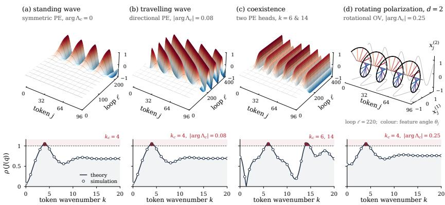  
Figure 1: Taxonomy of patterns in Transformers: 2D visualization of the propagation of the accessible modes, with their corresponding dispersion relation.

This result refines the usual low-pass picture of self-attention (Wang et al., 2022; Park & Kim, 2022): the sign of the OV gain decides whether a single head is low-pass $( \eta > 0 , q _ { c } = 0 )$ or high-pass $( - 2 / \bar { ( 1 + \lambda ( \pi ) ) } < \bar { \eta } < 0 , q _ { c } = \pi )$ , but never band-pass. The result covers reflection-symmetric localized positional encodings such as bidirectional ALiBi (Press et al., 2022) and the centered Gaussian kernel of ConViT (d’Ascoli et al., 2021). Isolated intermediate wavelengths therefore require positional encodings outside this class, such as causal ALiBi and off-center ConViT, or with RoPE (Su et al., 2024) that induces a non-symmetric, non-monotone positional profile on M (more details in App. A.8). We next show that multi-head attention provides another solution: different heads contribute distinct positional spectra and OV geometries, which combine into a matrix-valued filter capable of producing a richer dispersion relation.

Theorem 4.5 (Transformer Matrix Dispersion Relation). Suppose the PE is translation invariant, i.e. $b _ { i , j } = b _ { i - j } $ , let $X _ { \star } \in { \mathcal { M } }$ , and let $M _ { h } : = O _ { h } V _ { h }$ for a concatenated MHA of H heads. For a perturbation $U = e _ { q }$ ⊗ v along Fourier mode q, token-wise perturbations evolve as

$$
u _ { i } ^ { + } = \mathrm { e } ^ { \mathrm { i } q i } J ( q ) v , \qquad J ( q ) = C _ { \star } \left[ I + \mathcal { D } ( q ) \right] , \qquad \mathcal { D } ( q ) : = \sum _ { h = 1 } ^ { H } \lambda _ { h } ( q ) M _ { h } .\tag{9}
$$

Thus, MHA constructs a matrix-valued spectral filter $\mathcal { D } ( q )$ , rather than a simple token–feature coupling.

Eq. 9 is the central object of this work: at initialization, a Transformer block acts as a matrix-valued spectral filter on token-space modes. For each head, the positional encoding determines the scalar response $\lambda _ { h } ( q )$ , the $O V$ matrices $M _ { h }$ the feature directions through which that response acts, and the FFN Jacobian $C _ { \star }$ rescales the result.

Scope and weight tying. The results hold on all of M and along depth, also for layer-dependent blocks (App. A.10). Weight tying is thus not required for the linear theory; we introduce it only in Sec. 5, where depth as repeated iteration of the same map allows us to study the nonlinear stabilization of growing modes, as in Geshkovski et al. (2023); Bruno et al. (2026).

## 4.3 A CATALOGUE OF JOINT TOKEN–FEATURE PATTERNS

Now that the Transformer Matrix Dispersion Relation is laid out, we can turn its eigenpairs into concrete representations. The following proposition makes the growth of a joint token-feature mode explicit and shows how the phase of $\Lambda _ { c }$ and the geometry of $v _ { c }$ determine the resulting morphologies. Proposition 4.6 (Shape of the emerging patterns). Let a⋆ be a fixed point of g and $( \Lambda _ { c } , v _ { c } )$ a simple eigenpair of $J ( q _ { c } )$ with $| \Lambda _ { c } | > 1$ . The perturbation $U = e _ { q _ { c } } \otimes v _ { c }$ along mode $q _ { c }$ grows exponentially with depth and is oftheform

$$
u _ { j } ^ { ( \ell ) } \sim B _ { 0 } \Lambda _ { c } ^ { \ell } v _ { c } \mathrm { e } ^ { \mathrm { i } q _ { c } j } + \overline { { B _ { 0 } \Lambda _ { c } ^ { \ell } v _ { c } \mathrm { e } ^ { \mathrm { i } q _ { c } j } } } ,\tag{10}
$$

with $\Lambda _ { c } = \mathrm { e } ^ { \gamma _ { c } + i \omega _ { c } } , B _ { 0 } = | B _ { 0 } | \mathrm { e } ^ { \mathrm { i } \theta _ { 0 } }$ the initial perturbation amplitude. Writing $v _ { c } = v _ { \mathfrak { R } } + \mathrm { i } v _ { \mathfrak { I } }$ , Eq. 10 gives

$$
u _ { j } ^ { ( \ell ) } \simeq 2 | B _ { 0 } | \mathrm { e } ^ { \ell \gamma _ { c } } \left[ v _ { \Re } \cos \Theta _ { j \ell } - v _ { \Im } \sin \Theta _ { j \ell } \right] , \qquad \Theta _ { j \ell } = q _ { c } j + \ell \omega _ { c } + \theta _ { 0 } .\tag{11}
$$

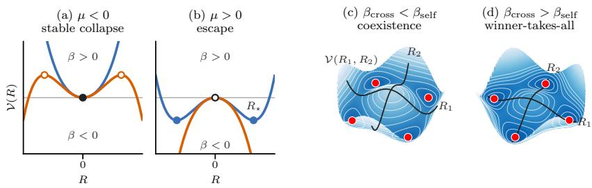  
Figure 2: Depth evolution descends an effective potential. (a,b) One critical mode, Eq. 12 (blue: $\beta > 0$ , orange: $\beta < 0 ;$ disks: stable states, circles: unstable): the dispersion relation sets $\mu ,$ the nonlinearities set $\beta .$ (c,d) Two critical modes, Eq. 19, over the signed amplitudes $( R _ { 1 } , R _ { 2 } )$ : the ratio of cross-suppression $\beta _ { \mathrm { c r o s s } }$ to self-saturation $\beta _ { \mathrm { s e l f } }$ decides where the wells are.

Eq. 11 gives a direct dictionary between the spectral data of $J ( q _ { c } )$ and the resulting representation. The wavenumber $q _ { c }$ sets the spatial scale across tokens, the growth rate $\gamma _ { c }$ controls amplification with depth, the phase $\omega _ { c }$ determines whether the pattern drifts across layers, and the real and imaginary parts of $v _ { c }$ describe its geometry in feature space. Different combinations therefore give rise to different morphologies, simulated in ${ \mathrm { F i g } } .$ 1: standing waves $( \omega _ { c } = 0 , v _ { c } \in \mathbb { R } ^ { d } )$ , traveling waves $( \omega _ { c } \neq 0$ , from a directional PE), feature rotations $( v _ { c } \in \bar { \mathbb { C } } ^ { d }$ , from non-symmetric $O V$ geometry), and their mixtures. Notably, traveling waves have been hard-designed into neural architectures (Keller & Welling, 2023; Keller et al., 2024) for sequence learning. We demonstrate here that they emerge spontaneously in Transformers whenever their PE is directional or their $O V$ non-symmetric.

## 5 PAST LINEAR ORDER: AMPLITUDE EQUATIONS FOR TRANSFORMERS

The dispersion relation in Sec. 4 answers a first question: which joint token-feature structures does a Transformer initially amplify? Linear growth, however, cannot be the end of the story. Once the selected structure becomes appreciable, the approximation underlying $J ( q )$ breaks down. This leaves three questions that are invisible to the dispersion relation: does a linearly growing mode stabilize at a finite amplitude? When several structures have exactly the same linear gain, which one is eventually realized? When distinct modes grow simultaneously, do they coexist or suppress one another? The non-linear analysis below addresses these questions with the second tool of patternformation theory, the amplitude equation (Cross & Hohenberg, 1993).

## 5.1 FROM LINEAR GROWTH TO FINITE-AMPLITUDE PATTERNS

Consider first a single critical mode $q _ { c }$ whose gain is close to the instability threshold, $\rho ( J ( q _ { c } ) ) =$ $1 + \mu$ with $| \mu | \ll 1$ . Near this threshold, the selected mode evolves slowly while modes whose gains remain strictly below one decay rapidly, so the token dynamics can be reduced to an analysis of amplitude of the critical modes. For a single stationary pattern with amplitude $B ,$ , the reduced dynamics has the generic form

$$
B ^ { + } - B = \mu B - \beta B ^ { 3 } = - \mathcal { V } ^ { \prime } ( B ) , \qquad \mathcal { V } ( B ) = - \frac { \mu } { 2 } B ^ { 2 } + \frac { \beta } { 4 } B ^ { 4 } , \qquad \mu = \rho \big ( J ( q _ { c } ) \big ) - 1 .\tag{12}
$$

The two coefficients have different meanings (Fig. 2). The linear coefficient $\mu$ is already determined by the dispersion relation of Sec. 4: it sets the curvature of the effective potential around the collapsed state, and therefore when that state loses stability. The nonlinear coefficient $\beta ,$ , by contrast, depends on terms discarded by the linearization and determines what replaces it. If $\mu > 0$ and $\beta > 0$ , nonlinear feedback counteracts linear instability and the pattern saturates at a finite amplitude $B _ { \star } = \sqrt { \mu / | \beta | }$ . If instead $\beta < 0$ , the cubic nonlinearity reinforces the instability.

## 5.2 AMPLITUDE EQUATIONS OF CLUSTERS AND TRAVELLING WAVES

We now study the effects of these higher-order terms on two representations: clusters and traveling waves. For clarity, we work with the scalar reduction $d = 1$ of the full Transformer block in Eq. 2 (the general d $> 1$ case reduce to the same form by projection onto the left eigenvector), around

$a _ { \star } = 0$ (the extension to $a _ { \star } \neq 0$ is sketched in App. F) with $O V$ gain η, content coupling $\chi ,$ and translation-invariant PE $b _ { i - j } { \mathrm { : } }$

$$
A _ { i j } ( x ) = { \frac { \mathrm { e } ^ { \chi x _ { i } x _ { j } + b _ { i - j } } } { \sum _ { m } \mathrm { e } ^ { \chi x _ { i } x _ { m } + b _ { i - m } } } } , \qquad H ( x ) = x + \eta A ( x ) x , \qquad F ( x ) = H ( x ) + \nu \phi ( H ( x ) ) ,\tag{13}
$$

Nonlinearity $\phi$ is smooth and $\phi ( 0 ) = 0 , \ : { C _ { \star } } = \alpha _ { 1 } : = 1 + \nu \phi ^ { \prime } ( 0 ) , \ : \alpha _ { 2 } : = \nu \phi ^ { \prime \prime } ( 0 ) / 2$ and $\alpha _ { 3 } : =$ $\nu \phi ^ { \prime \prime \prime } ( 0 ) / 6 .$ , where ν is the residual scale. H and F are the residual and Transformer mapping of Eq. $^ { 2 , }$ respectively. Expanding $F$ around $x = 0$ (Lemma B.1, App. B) separates the dispersion relation from the higher-order terms:

$$
\begin{array} { r } { F ( { \boldsymbol x } ) = \underbrace { \sum _ { \boldsymbol q } J ( { \boldsymbol q } ) \hat { \boldsymbol x } _ { \boldsymbol q } e _ { \boldsymbol q } } _ { \mathrm { d i s p e r s i o n \ r e l a t i o n } } + \underbrace { \alpha _ { 2 } ( L { \boldsymbol x } ) ^ { \circ 2 } + \alpha _ { 3 } ( L { \boldsymbol x } ) ^ { \circ 3 } } _ { \mathrm { F F N \ n o n l i n e a r i t y } } + \underbrace { \alpha _ { 1 } \eta { \boldsymbol \chi } { \boldsymbol \mathcal C } ( { \boldsymbol x } ) } _ { \mathrm { c o n t e n t \ a t e n t i o n } } + O ( \| { \boldsymbol x } \| ^ { 4 } ) , } \end{array}\tag{14}
$$

where $\textstyle x = \sum _ { q } { \hat { x } } _ { q } e _ { q }$ and $J ( q ) = \alpha _ { 1 } ( 1 + \eta \lambda _ { q } )$ is the dispersion relation of Theorem 4.1 with $V = \eta$ and $\lambda _ { q }$ the eigenvalues of $A _ { \star } = A ( 0 )$ . The FFN acts on the attention output $L \boldsymbol { x } : = ( \boldsymbol { I } + \eta A _ { \star } ) \boldsymbol { x }$ , and content-dependent attention is $\mathcal { C } ( \boldsymbol { x } ) : = \boldsymbol { x } \circ [ A _ { \star } x ^ { \circ 2 } - ( A _ { \star } x ) ^ { \circ 2 } ]$ (◦: component-wise product).

We expose a division of labor between Transformer components. We have shown that PE, OV geometry, and the linearized FFN determine which mode is initially amplified through $J ( q ) , \operatorname { i . e . , } \mu .$ We demonstrate here how content-dependent attention and higher order properties of FFN determine, through $\beta ,$ what happens to that mode once it has grown.

Theorem 5.1 (Clusters, simplified). Without PE and with a negative $O V$ gain, $\eta \in ( - 2 , 0 )$ , all heterogeneous modes share the amplification $J ( q \neq 0 ) = 1 + \mu$ (Proposition $4 . 2 ) .$ . Near threshold, the separation u of two balanced clusters, $x _ { i } = \pm u$ up to a small common shift, obeys

$$
u ^ { + } - u = \mu u - \beta _ { \mathrm { c l } } u ^ { 3 } , \qquad \beta _ { \mathrm { c l } } = - \eta \chi - \alpha _ { 3 } + \frac { 2 ( 1 + \eta ) } { \eta } \alpha _ { 2 } ^ { 2 } .\tag{15}
$$

If $\mu > 0$ and $\beta _ { \mathrm { c l } } > 0 ;$ , the clusters saturate at a finite separation $u _ { \star } = \sqrt { \mu / \beta _ { \mathrm { c l } } }$ , which is stable along the cluster direction. Against intra-clusterperturbations, it is stable onlyfor an odd activation $( \alpha _ { 2 } = 0 )$ with $\alpha _ { 3 } < 0 .$ . Thefull statement and proofare in App. C.

Non-linear effects on clustering. Here the instability is driven by the FFN $( C _ { \star } \ = \ \alpha _ { 1 } \ > \ 1 )$ with $\eta < 0$ stabilizing the mean, whereas the clusters of Geshkovski et al. (2023) are driven by attention with $V = I$ . Which structure emerges from the degenerate sector $\mathbf { 1 } ^ { \perp }$ is decided at cubic order, by ingredients absent from the dispersion relation. Negative-OV content attention, $\eta \chi <$ 0, is what holds a cluster: as it tightens, its members attend more to one another. Interestingly, an odd saturating activation $( \alpha _ { 3 } ~ < ~ 0 )$ adds damping, whereas any even part $\alpha _ { 2 } \neq 0$ makes one cluster spread, so GELU-type FFNs tend to break balanced clusters that tanh-type FFNs keep. Consequently, activations also bias the emerging structure, which to our knowledge was not noted before. This activation function induced structural bias is also present in message-passing GNNs (Turan et al., 2026).

Theorem 5.2 (Traveling waves, simplified). With a directional PE, the critical mode has a complex gain $J ( q _ { c } ) = ( 1 + \mu ) \mathrm { e } ^ { \mathrm { i } \omega _ { c } } :$ at linear order, the wave grows by $1 + \mu$ and advances by a phase $\omega _ { c }$ per layer. Near threshold, its amplitude G, measured in theframe moving with the wave, obeys

$$
G ^ { + } - G = \mu G - \beta _ { \mathrm { t r } } | G | ^ { 2 } G ,\tag{16}
$$

with a complex coefficient $\beta _ { \mathrm { t r } } . ~ I f \mu > 0$ and $\Re ( \beta _ { \mathrm { t r } } ) > 0 $ , the wave saturates at a stable amplitude $R _ { \star } = | G _ { \star } |$ and propagates at phase speed Ω per layer:

$$
R _ { \star } ^ { 2 } = \frac { \mu } { \mathfrak { R } ( \beta _ { \mathrm { t r } } ) } , \qquad \Omega = \omega _ { c } - \mathfrak { I } ( \beta _ { \mathrm { t r } } ) R _ { \star } ^ { 2 } .\tag{17}
$$

Thus the real part of $\beta _ { \mathrm { t r } }$ controls saturation, while its imaginary part gives the nonlinear correction to the propagation speed. Thefull statement and proofare in App. E.

As illustrated in Fig. 1(d), a complex eigenvector of $J ( q _ { c } )$ adds a feature-plane rotation; the same reduction applies after projection onto that eigenmode.

Scaling laws and design levers. All cases (clusters, traveling waves, and standing waves in App. D) predict amplitude scaling laws invisible at linear order: past threshold, cluster separation and wave amplitude grow as $\sqrt { \mu }$ , and the wave speed shifts linearly in $\mu \left( \mathrm { F i g . } 3 \mathrm { a , b } \right)$ . This section allowed us to refine the propagation–collapse dichotomy (Giorlandino & Goldt, 2026; Cowsik et al., 2025) into a refined family of stable structured representations as seen in Fig. 3c,d.

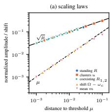

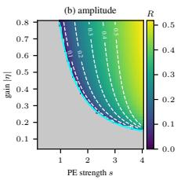

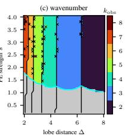

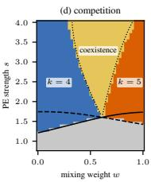  
Figure 3: Prediction of the amplitudes of representations. Lines: theory, colors: simulation, gray: collapsed state, cyan line: threshold max $_ { \dot { \boldsymbol { q } } } \left| \boldsymbol { J } ( \boldsymbol { q } ) \right| = 1$ . (a): Amplitude scaling laws for multiple patterns versus µ. (b): Amplitude heatmap of the traveling wave, in the $( | \eta | , s )$ map; white dashed: predicted $R _ { \star }$ . (c) Critical mode $k _ { \mathrm { o b s } }$ in the $( \Delta , s )$ map; black: theoretically predicted mode transitions (×: nonlinear selection differs); (d): Competition and coexistence of modes 4 (solid), 5 (dashed) in (w, s) with winner-takes-all exchange lines of Thm. 5.3 (dotted).

## 5.3 COMPETITION: WINNER-TAKES-ALL VERSUS COEXISTENCE

What happens when two modes become critical at once? The linear theory allows both to grow indistinguishably; the non-linear analysis predicts a competition: stable coexistence or winner-takesall.

Theorem 5.3 (Two-mode competition, simplified). Let two standing modes $q _ { 1 } , q _ { 2 }$ cross threshold together with the same gain $1 + \mu , \mu > 0$ . Their amplitudes obey

$$
B _ { i } ^ { + } - B _ { i } = \big ( \mu - \beta _ { \mathrm { s e l f } } | B _ { i } | ^ { 2 } - \beta _ { \mathrm { c r o s s } } | B _ { j } | ^ { 2 } \big ) B _ { i } , \qquad i \neq j \in \{ 1 , 2 \} ,\tag{18}
$$

where $\beta _ { \mathrm { s e l f } } > 0$ measures how each mode saturates itself and $\beta _ { \mathrm { c r o s s } }$ how strongly it suppresses the other. Equivalently, the moduli $R _ { i } = | B _ { i } |$ descend the effective potential

$$
R _ { i } ^ { + } - R _ { i } = - \frac { \partial \mathcal { V } } { \partial R _ { i } } , \qquad \mathcal { V } ( R _ { 1 } , R _ { 2 } ) = - \frac { \mu } { 2 } \big ( R _ { 1 } ^ { 2 } + R _ { 2 } ^ { 2 } \big ) + \frac { \beta _ { \mathrm { s e l f } } } { 4 } \big ( R _ { 1 } ^ { 4 } + R _ { 2 } ^ { 4 } \big ) + \frac { \beta _ { \mathrm { c r o s s } } } { 2 } R _ { 1 } ^ { 2 } R _ { 2 } ^ { 2 } ,\tag{19}
$$

$I f \beta _ { \mathrm { c r o s s } } < \beta _ { \mathrm { s e l f } }$ , the mixed state $R _ { 1 } ^ { 2 } = R _ { 2 } ^ { 2 } = \mu / ( \beta _ { \mathrm { s e l f } } + \beta _ { \mathrm { c r o s s } } )$ is the stable minimum and the two modes coexist; $i f \beta _ { \mathrm { c r o s s } } > \beta _ { \mathrm { s e l f } }$ , it becomes a saddle, the single-mode states $R _ { i } ^ { 2 } = \mu / \beta _ { \mathrm { s e l f } }$ are the stable minima, and the initial condition selects the winner (Fig. 2c,d). The full statement, for unequal gains, and the proof are in App. G.

Kernels and heads that transmit the mixed harmonics $q _ { 1 } \pm q _ { 2 }$ alter the cross-suppression through their stable-mode resolvents, and suppressing those harmonics weakens this route of competition.

## 6 EXPERIMENTS

We first validate the theoretical results of Secs. 4 and 5, and then provide practical evidence that accessible representations can induce dynamical priors at initialization on stylized experiments.

## 6.1 THE THEORY IS QUANTITATIVELY PREDICTIVE

First, we validate the theory of Sec. 5 by iterating the scalar map in Eq. 13 on a ring of $N = 3 2$ tokens, with a Transformer using $\phi = \mathrm { { t a n h } } , O V$ gain $| \eta |$ and gaussian PE $b _ { r } = s \bar { K } _ { \Delta } ( r )$ , where s is the PE strength and $\Delta$ the distance between two peaks (details in App. I.2). We measure the dominant Fourier modes, their amplitudes, and, for directional kernels, their phase advance.

The scaling laws of Fig. 3(a) validate our theoretical results on the amplitude growth of multiple representations close to criticality. Panel (b) confirms our predictions in Eq. 17 on how the wave amplitude R increases with gain $| \eta |$ and PE strength s. Panel (c) varies distance $\Delta$ between peaks (lobes) of the PE and tests whether the selected wavelength follows the theory $\begin{array} { r } { k _ { \mathrm { t h } } = \frac { N } { 2 \pi } } \end{array}$ arg ma $x _ { q } \mathinner { | { J ( q ) } | }$ Finally, (d) tests two-mode competition for modes $k = 4$ and $k = 5$ , when varying the preference for one mode or the other with mixing w. Our theory clearly distinguishes coexistence from winnertakes-all selection. Together, these results show that the theory predicts not only when collapse is avoided, but also the structure and dynamics of the pattern that replaces it.

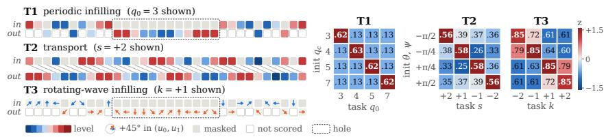  
Figure 4: Task–initialization alignment. Left: the periodic (T1), transport (T2) and rotation (T3) tasks (perturbed, partially masked targets). Right: AUC for each (task, initialization) pair; the color corresponds to the z-score. Higher scores in the diagonal support the dynamical prior induced by mode criticality.

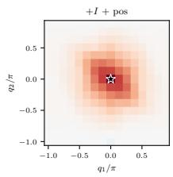

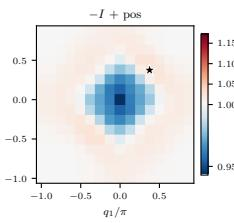  
(a)

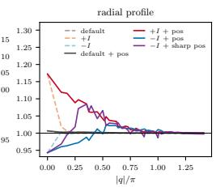  
(b)  
Figure 5: Dispersion-aware initialization of ConViT on CIFAR-10. (a) Heatmap of mode gains and radial profile of the dispersion relation for the initializations variants (colours: mode stability; ⋆: leading mode). (b) Final Accuracy, AUC and $t _ { 9 0 } ;$ all variants use localized PE, “sharp”: sharpened kernel.

## 6.2 ENGINEERING THE PRIOR ON CONTROLLED TASKS

Next, we test whether the dynamical prior we claim to provide can be aligned with a task, and if such an alignment helps the learning process, as stated in (Abbe et al., 2022). Each of the three tasks (Fig. 4, left) targets one of the identified structures and probes its attribute: T1 reconstructs periodic sequences of mode $q _ { 0 } ,$ favoring $q _ { c } = q _ { 0 }$ . T2 translates a structured sequence by a prescribed shift, probing the phase θ of the mode. T3 reconstructs under a prescribed feature-space rotation ψ, probing the eigenvector geometry of $J ( q )$ . More details are in App. J. For each task, using identical architectures, parameter counts and gains, we initialize 4 models that differ only in which token– feature mode they amplify. We then compute the AUC of their learning curves of each (task, init) tuple and report their z-scores.

The heatmaps of Fig. 4 (right) clearly indicate that task-aligned initializations benefit from a strong dynamical prior. It originates from engineering the architecture so that the critical mode at initialization is aligned with the problem at hand. Supplementary experiments shown in Fig. 7 show that this practical gain occurs most markedly early in training.

## 6.3 DISPERSION-AWARE INITIALIZATION OF CONVIT ON CIFAR-10

Finally, we train a weight-tied ConViT on CIFAR-10 (more details in App. K) for classification and show that engineering mode amplification facilitates learning in practical architectures. On the left of Fig. 5(a), we plot the dispersion relation for various parameterizations: localized and sharpened PE (d’Ascoli et al., 2021) variants shift amplification toward heterogeneous spatial modes. Reporting classification results in Fig. 5(b) shows that combining −I with localized PE substantially accelerates optimization; sharpening the dispersion structure helps further (91.5% test accuracy). This explains why mimetic initialization’s $\bar { O } V = - I$ (Trockman & Kolter, 2023) and ConViT’s localized kernels (d’Ascoli et al., 2021) help: together they move the leading multiplier of $J ( \mathbf { q } )$ off $\mathbf q = 0$ . In further experiments we track the dispersion relation during training (Fig. 13) which shows that heterogeneous patterns are favored.

## 7 CONCLUSION

In this paper, we show that a randomly initialized Transformer is not structureless once it escapes rank collapse: its forward pass multiplies each token frequency by a matrix-valued gain J(q), set by PE, OV geometry and the FFN, that amplifies specific joint token–feature structures such as traveling and rotative waves. This dynamical prior refines the binary propagate-or-collapse picture into a mode-resolved one. The nonlinear theory says which structures saturate, drift or coexist, and aligning the prior with the task accelerates optimization and improves data efficiency.

## ACKNOWLEDGMENTS

We would like to thank Julien Gaubil and Antoine Guedon for valuable discussions. Parts of this´ work were supported by the ERC Consolidator Grant 101087347 (VEGA), as well as gifts from Ansys Inc. and Adobe Research.

## AI USE STATEMENT

We used a large language model and coding assistant for two tasks: (i) editing the manuscript, i.e. tightening and restructuring prose and (ii) refining and formatting plots and figures. We have reviewed all AI-assisted work and take full responsibility for the content of this paper.

## REFERENCES

Emmanuel Abbe, Elisabetta Cornacchia, Jan Hazla, and Christopher Marquis. An initial alignment between neural network and target is needed for gradient descent to learn. In International Conference on Machine Learning, pp. 33–52. PMLR, 2022.

Giuseppe Bruno, Federico Pasqualotto, and Andrea Agazzi. A multiscale analysis of mean-field transformers in the moderate interaction regime. Advances in Neural Information Processing Systems, 38:133305–133341, 2026.

Jean-Marc Chomaz. Global instabilities in spatially developing flows: non-normality and nonlinearity. Annu. Rev. Fluid Mech., 37(1):357–392, 2005.

Aditya Cowsik, Tamra Nebabu, Xiaoliang Qi, and Surya Ganguli. Geometric dynamics of signal propagation predict trainability of transformers. Physical Review E, 112(5):055301, 2025.

Mark C Cross and Pierre C Hohenberg. Pattern formation outside of equilibrium. Reviews ofmodern physics, 65(3):851, 1993.

Michael Cross and Henry Greenside. Pattern formation and dynamics in nonequilibrium systems, volume 1. Cambridge University Press Cambridge, 2009.

Mostafa Dehghani, Stephan Gouws, Oriol Vinyals, Jakob Uszkoreit, and Lukasz Kaiser. Universal transformers. In International Conference on Learning Representations, 2019. URL https: //openreview.net/forum?id=HyzdRiR9Y7.

Yihe Dong, Jean-Baptiste Cordonnier, and Andreas Loukas. Attention is not all you need: Pure attention loses rank doubly exponentially with depth. In International conference on machine learning, pp. 2793–2803. PMLR, 2021.

Gbetondji Jean-Sebastien Dovonon, Michael M. Bronstein, and Matt J. Kusner. Setting the record straight on transformer oversmoothing. Transactions on Machine Learning Research, 2025.

Stephane d’Ascoli, Hugo Touvron, Matthew L Leavitt, Ari S Morcos, Giulio Biroli, and Levent´ Sagun. Convit: Improving vision transformers with soft convolutional inductive biases. In International conference on machine learning, pp. 2286–2296. PMLR, 2021.

Borjan Geshkovski, Cyril Letrouit, Yury Polyanskiy, and Philippe Rigollet. The emergence of clusters in self-attention dynamics. Advances in Neural Information Processing Systems, 36:57026– 57037, 2023.

Alessio Giorlandino and Sebastian Goldt. Two failure modes of deep transformers and how to avoid them: A unified theory of signal propagation at initialisation. In International Conference on Learning Representations, 2026.

Hermann Haken. Slaving principle revisited. Physica D: Nonlinear Phenomena, 97(1-3):95–103, 10 1996. ISSN 0167-2789. doi: 10.1016/0167-2789(96)00080-2. URL http://dx.doi. org/10.1016/0167-2789(96)00080-2.

Akhil Kedia, Mohd Abbas Zaidi, Sushil Khyalia, JungHo Jung, Harshith Goka, and Haejun Lee. Transformers get stable: An end-to-end signal propagation theory for language models. In Fortyfirst International Conference on Machine Learning, 2024. URL https://openreview. net/forum?id=30waYPIZUA.

T. Anderson Keller and Max Welling. Neural wave machines: Learning spatiotemporally structured representations with locally coupled oscillatory recurrent neural networks. In Proceedings of the 40th International Conference on Machine Learning, volume 202 of Proceedings of Machine Learning Research, pp. 16168–16189, 2023.

T. Anderson Keller, Lyle Muller, Terrence Sejnowski, and Max Welling. Traveling waves encode the recent past and enhance sequence learning. In The Twelfth International Conference on Learning Representations, 2024. URL https://openreview.net/forum?id=p4S5Z6Sah4.

Christian Kuehn and Jaeyoung Yoon. Spectral selection in symmetric self-attention dynamics. arXiv preprint arXiv:2604.26085, 2026.

Siquan Li, Yao Tong, Haonan Wang, and Tianyang Hu. Transformers are born biased: Structural inductive biases at random initialization and their practical consequences. arXiv preprint arXiv:2602.05927, 2026.

Yiping Lu, Zhuohan Li, Di He, Zhiqing Sun, Bin Dong, Tao Qin, Liwei Wang, and Tie-Yan Liu. Understanding and improving transformer from a multi-particle dynamic system point of view. In ICLR 2020 Workshop on Deep Differential Equations, 2020.

Lorenzo Noci, Sotiris Anagnostidis, Luca Biggio, Antonio Orvieto, Sidak Pal Singh, and Aurelien Lucchi. Signal propagation in transformers: Theoretical perspectives and the role of rank collapse. Advances in Neural Information Processing Systems, 35:27198–27211, 2022.

Kenta Oono and Taiji Suzuki. Graph neural networks exponentially lose expressive power for node classification. In International Conference on Learning Representations, 2020. URL https: //openreview.net/forum?id=S1ldO2EFPr.

Namuk Park and Songkuk Kim. How do vision transformers work? In International Conference on Learning Representations, 2022. URL https://openreview.net/forum?id= D78Go4hVcxO.

Ofir Press, Noah Smith, and Mike Lewis. Train short, test long: Attention with linear biases enables input length extrapolation. In International Conference on Learning Representations, 2022. URL https://openreview.net/forum?id=R8sQPpGCv0.

Jorge Perez, Javier Marinkovi´ c, and Pablo Barcel´ o. On the turing completeness of modern neural´ network architectures. In International Conference on Learning Representations, 2019. URL https://openreview.net/forum?id=HyGBdo0qFm.

Thiziri Nait Saada, Alireza Naderi, and Jared Tanner. Mind the gap: a spectral analysis of rank collapse and signal propagation in attention layers. In Forty-second International Conference on Machine Learning, 2025. URL https://openreview.net/forum?id=sRKtbGsebH.

Han Shi, JIAHUI GAO, Hang Xu, Xiaodan Liang, Zhenguo Li, Lingpeng Kong, Stephen M. S. Lee, and James Kwok. Revisiting over-smoothing in BERT from the perspective of graph. In International Conference on Learning Representations, 2022. URL https://openreview. net/forum?id=dUV91uaXm3.

Jianlin Su, Murtadha Ahmed, Yu Lu, Shengfeng Pan, Wen Bo, and Yunfeng Liu. Roformer: Enhanced transformer with rotary position embedding. Neurocomputing, 568:127063, 2024.

Vighnesh Subramaniam, David Mayo, Colin Conwell, Tomaso Poggio, Boris Katz, Brian Cheung, and Andrei Barbu. Training the untrainable: Introducing inductive bias via representational alignment. Advances in Neural Information Processing Systems, 38:96753–96791, 2026.

Damien Teney, Armand Mihai Nicolicioiu, Valentin Hartmann, and Ehsan Abbasnejad. Neural redshift: Random networks are not random functions. In 2024 IEEE/CVF Conference on Computer Vision and Pattern Recognition (CVPR), pp. 4786–4796. IEEE, 2024.

Akiyoshi Tomihari and Ryo Karakida. Recurrent self-attention dynamics: An energy-agnostic perspective from jacobians. Advances in Neural Information Processing Systems, 38:139928– 139961, 2026.

Lloyd N Trefethen. Pseudospectra of linear operators. SIAM review, 39(3):383–406, 1997.

Asher Trockman and J Zico Kolter. Mimetic initialization of self-attention layers. In International Conference on Machine Learning, pp. 34456–34468. PMLR, 2023.

Erkan Turan, Gaspard Abel, Maysam Behmanesh, Emery Pierson, and Maks Ovsjanikov. Beyond reLU: Bifurcation, oversmoothing, and topological priors. In Forty-third International Conference on Machine Learning, 2026. URL https://openreview.net/forum?id= AehiGqd7go.

Alan Turing. The chemical basis of morphogenesis. Philosophical Transactions of the Royal Society B, 237:37–72, 1952.

Peihao Wang, Wenqing Zheng, Tianlong Chen, and Zhangyang Wang. Anti-oversmoothing in deep vision transformers via the fourier domain analysis: From theory to practice. In International Conference on Learning Representations, 2022. URL https://openreview.net/forum? id=O476oWmiNNp.

Chulhee Yun, Srinadh Bhojanapalli, Ankit Singh Rawat, Sashank Reddi, and Sanjiv Kumar. Are transformers universal approximators of sequence-to-sequence functions? In International Conference on Learning Representations, 2020. URL https://openreview.net/forum? id=ByxRM0Ntvr.

Jianqiao Zheng, Xueqian Li, Hemanth Saratchandran, and Simon Lucey. Structured initialization for vision transformers. In Advances in Neural Information Processing Systems 38, NeurIPS 2025, pp. 146840–146865. Neural Information Processing Systems Foundation, Inc. (NeurIPS), 2025. doi: 10.52202/085713-4413. URL http://dx.doi.org/10.52202/085713-4413.

Jiachen Zhu, Xinlei Chen, Kaiming He, Yann LeCun, and Zhuang Liu. Transformers without normalization. In 2025 IEEE/CVF Conference on Computer Vision and Pattern Recognition (CVPR), pp. 14901–14911. IEEE, June, 2025. doi: 10.1109/cvpr52734.2025.01388. URL http://dx.doi.org/10.1109/cvpr52734.2025.01388.

## A PROOFS FOR THE MATRIX-VALUED LINEAR THEORY

This section proves the linear results of Sec. 4. Token states are columns $x _ { i } \in \mathbb { R } ^ { d }$ , and a perturbation is denoted $U = ( u _ { 1 } , \dotsc , u _ { N } )$ . For a token-space vector $s \in \mathbb { C } ^ { N }$ and a feature vector $\bar { \boldsymbol { v } } \in \mathbb { C } ^ { d }$ , we write $s \otimes v$ for the perturbation whose ith token is $s _ { i } v$

## A.1 FULL VERSION THEOREM 4.1 AND PROOF

Theorem A.1 (Linear stability and token–feature block decomposition). Let $\mathcal { M } : = \{ \mathbf { 1 } \otimes a : a \in$ $\mathbb { R } ^ { d } \}$ denote the homogeneous states. M is invariant under any Transformer block: ${ \mathcal { F } } ( \mathbf { 1 } \otimes a ) =$ $\mathbf { 1 } \otimes g ( a )$ with $g ( a ) : = \mathsf { \bar { \mathcal { H } } } ( a + V a )$ for a single head $\begin{array} { r } { ( V  \sum _ { h } \dot { M _ { h } } f o r \dot { M } H A ) . } \end{array}$ . Let $X _ { \star } = \mathbf { 1 } \otimes a _ { \star } \in \mathcal { M }$ and $U ^ { + } : = \mathcal { F } ( X _ { \star } { + } U ) { - } \mathcal { F } ( X _ { \star } )$ the evolution ofperturbation $U \in \mathbb { R } ^ { N } \otimes \mathbb { R } ^ { d }$ through a Transformer block. Then, to first order in U, the token-wise perturbation $u _ { i } ^ { + }$ evolves as:

$$
u _ { i } ^ { + } = C _ { \star } \left[ u _ { i } + \sum _ { j = 1 } ^ { N } ( A _ { \star } ) _ { i j } V u _ { j } \right] ,\tag{20}
$$

where $A _ { \star } = A ( X _ { \star } )$ and $C _ { \star } = D \mathcal { H } ( y _ { \star } ) = I _ { d } + D \phi ( a _ { \star } + V a _ { \star } )$ is the Jacobian of the residual FFN branch at $y _ { \star } = a _ { \star } + V a _ { \star } ( t h e \lambda = 1 b l o c k i s D g ( a _ { \star } ) = C _ { \star } ( I + V ) )$ . Equivalently, the full linearized Jacobian is $\mathcal { I } _ { \star } = \left( I _ { N } \otimes C _ { \star } \right) \left[ I _ { N } \otimes I _ { d } + \bar { A _ { \star } } \otimes \bar { V } \right] . \mathit { I f } \bar { A _ { \star } } = \bar { S } \bar { \Lambda } S ^ { - 1 }$ is diagonalizable, with $\boldsymbol { \Lambda } = \operatorname { d i a g } ( \lambda _ { 1 } , \ldots , \lambda _ { N } )$ , then

$$
( S ^ { - 1 } \otimes I _ { d } ) \mathcal { I } _ { \star } ( S \otimes I _ { d } ) = \bigoplus _ { k = 1 } ^ { N } J ( \lambda _ { k } ) , \qquad J ( \lambda ) = C _ { \star } \left[ I _ { d } + \lambda V \right] ,\tag{21}
$$

and $\begin{array} { r } { \operatorname { s p } ( \mathcal { T } _ { \star } ) = \bigcup _ { k } \operatorname { s p } ( J ( \lambda _ { k } ) ) } \end{array}$ holds even without diagonalizability (Schur form). Hence, the transverse dynamics decompose into independent token-space blocks indexed by the eigenmodes of $A _ { \star } .$ $H a _ { \star }$ is a fixed point of g, then $X ,$ ⋆ is a linearly stable fixed point of F if and only if

$$
\operatorname* { m a x } _ { \lambda \in \mathrm { s p } ( A _ { \star } ) } \rho ( J ( \lambda ) ) < 1 .\tag{22}
$$

Along an orbit $a _ { \ell } = g ^ { \ell } ( a _ { 0 } )$ on M, the transverse dynamics is the cocycle $U \mapsto \mathcal { I } ( a _ { \ell } ) U _ { : }$ , which splits into the products $\begin{array} { r } { \prod _ { \ell < L } J _ { \ell } ( \lambda _ { k , \ell } ) , J _ { \ell } ( \lambda ) = C ( a _ { \ell } ) [ I _ { d } + \lambda V ] } \end{array}$ , whenever the $A ( \mathbf { 1 } \otimes a _ { \ell } )$ share an eigenbasis. (Secs. 4.1–4.2).

Its proof is below.

Proof. Write the effective one-head attention output as

$$
\mathcal A _ { i } ( X ) : = \sum _ { j = 1 } ^ { N } A _ { i j } ( X ) V x _ { j } ,\tag{23}
$$

where, in the one-head setting, any output projection can be absorbed into V. Let

$$
y _ { i } ( X ) : = x _ { i } + A _ { i } ( X ) , \qquad [ { \mathcal { F } } ( X ) ] _ { i } = { \mathcal { H } } ( y _ { i } ( X ) ) .\tag{24}
$$

Every row of $A ( X )$ sums to one for every X:

$$
A ( X ) \mathbf { 1 } = \mathbf { 1 } .\tag{25}
$$

Consequently, at a homogeneous state $X = { \bf 1 } \otimes a$ all value vectors coincide and $\mathcal { A } _ { i } ( \mathbf { 1 } \otimes a ) = V a$ for every i, whatever the positional bias or mask; since H is token-wise, ${ \mathcal { F } } ( \mathbf { 1 } \otimes a ) = \mathbf { 1 } \otimes g ( a )$ with $g ( a ) = \dot { \mathcal { H } } ( a + V a )$ , which proves the invariance of M. Now fix $X _ { \star } = \mathbf { 1 } \otimes \mathrm { { } } \dot { a } _ { \star } \in \mathcal { M } .$ , not necessarily a fixed point. Differentiating the row-sum identity at X in an arbitrary direction U gives

$$
D A _ { X _ { \star } } [ U ] \mathbf { 1 } = 0 .\tag{26}
$$

We now differentiate the attention output. By the product rule,

$$
D A _ { i } ( X _ { \star } ) [ U ] = \sum _ { j } \left( D A _ { X _ { \star } } [ U ] \right) _ { i j } V a _ { \star } + \sum _ { j } ( A _ { \star } ) _ { i j } V u _ { j }\tag{27}
$$

$$
= \left[ \sum _ { j } \left( D A _ { X _ { \star } } [ U ] \right) _ { i j } \right] V a _ { \star } + \sum _ { j } ( A _ { \star } ) _ { i j } V u _ { j }\tag{28}
$$

$$
= \sum _ { j } ( A _ { \star } ) _ { i j } V u _ { j } ,\tag{29}
$$

where the first term vanishes by Eq. equation 26. Thus first-order changes in the attention weights do not act on the homogeneous value vector.

Let $y _ { \star } = a _ { \star } + V a .$ denote the common value of $y _ { i } ( X _ { \star } )$ and set

$$
C _ { \star } : = D \mathcal { H } ( y _ { \star } ) = I + D \phi ( y _ { \star } ) .\tag{30}
$$

Since H acts token-wise, the chain rule and Eq. equation 29 yield

$$
u _ { i } ^ { + } = C _ { \star } \left[ u _ { i } + \sum _ { j = 1 } ^ { N } ( A _ { \star } ) _ { i j } V u _ { j } \right] ,\tag{31}
$$

which is the first claim.

Viewing $U \in \mathbb { R } ^ { N } \otimes \mathbb { R } ^ { d }$ , this is equivalently

$$
{ \mathcal { T } } _ { \star } = \left( I _ { N } \otimes C _ { \star } \right) \left[ I _ { N } \otimes I _ { d } + A _ { \star } \otimes V \right] .\tag{32}
$$

If $A _ { \star } = S \Lambda S ^ { - 1 }$ with Λ = diag(λ1, . . . , λN ), then

$$
( S ^ { - 1 } \otimes I _ { d } ) \mathcal { I } _ { \star } ( S \otimes I _ { d } )\tag{33}
$$

$$
= ( I _ { N } \otimes C _ { \star } ) [ I _ { N } \otimes I _ { d } + \Lambda \otimes V ] = \bigoplus _ { k = 1 } ^ { N } C _ { \star } ( I _ { d } + \lambda _ { k } V ) .\tag{34}
$$

Hence the token eigenmodes of $A _ { \star }$ define invariant d-dimensional feature blocks

$$
J ( \lambda _ { k } ) = C _ { \star } ( I _ { d } + \lambda _ { k } V ) .\tag{35}
$$

If A is not diagonalizable, take a Schur decomposition $A _ { \star } ~ = ~ S T S ^ { * }$ with $T$ upper triangular: $( S ^ { * } \otimes I _ { d } ) \mathcal { I } _ { \star } ( S \tilde { \otimes } I _ { d } ) = ( I _ { N } \otimes C _ { \star } ) [ I _ { N } \otimes I _ { d } + T \otimes \stackrel { \cdot } { V } ]$ is block upper triangular with diagonal blocks $\begin{array} { r } { \dot { J } ( T _ { k k } ) , \operatorname { s o } \operatorname { s p } ( \mathcal { T } _ { \star } ) = \bigcup _ { k } \operatorname { s p } ( J ( \lambda _ { k } ) ) } \end{array}$ in all cases. Therefore

$$
\rho ( \mathcal { I } _ { \star } ) = \operatorname* { m a x } _ { \lambda \in \mathrm { s p } ( A _ { \star } ) } \rho ( J ( \lambda ) ) .\tag{36}
$$

When $a _ { \star }$ is a fixed point of $g , X _ { \star }$ is a fixed point of ${ \mathcal F } ,$ , and for a discrete-time map asymptotic linear stability is equivalent to all multipliers of the Jacobian lying strictly inside the unit circle; the stability criterion is precisely Eq. equation 22. Along an orbit $\bar { a _ { \ell } } = g ^ { \ell } ( \dot { a } _ { 0 } )$ the same computation at each $X _ { a _ { \ell } }$ gives $\begin{array} { r } { U ^ { ( \ell + 1 ) } = \mathcal { I } ( a _ { \ell } ) U ^ { ( \ell ) } + O ( \Vert U ^ { ( \ell ) } \Vert ^ { 2 } ) } \end{array}$ with $\mathcal { T } ( a _ { \ell } ) = ( I _ { N } \otimes C ( a _ { \ell } ) ) [ I _ { N } \otimes I _ { d } + A ( a _ { \ell } ) \otimes V ] \colon$ if the matrices $A ( a _ { \ell } )$ share the eigenbasis $S ,$ conjugating by $S \otimes I _ { d }$ block-diagonalizes every factor simultaneously and the L-step propagator is $\begin{array} { r } { \bigoplus _ { k } \prod _ { \ell < L } \breve { J } _ { \ell } ( \dot { \lambda } _ { k , \ell } ) } \end{array}$ , whose growth rate is the transverse Lyapunov exponent stated in the theorem. □

## A.2 PROOF OF PROPOSITION 4.2

Proof. With one head and $b _ { i j } = 0$ , the content logit is identical for every pair $( i , j )$ at a homogeneous state, because all queries are equal and all keys are equal. Each row of the softmax is therefore uniform:

$$
A _ { \star } = \frac { 1 } { N } \mathbf { 1 1 } ^ { \top } .\tag{37}
$$

The vector 1 is an eigenvector with eigenvalue 1, whereas every $x \in \mathbf { 1 ^ { \perp } }$ satisfies $A _ { \star } x = 0$ . Thus

$$
\mathbb { R } ^ { N } = \operatorname { s p a n } \{ { \bf 1 } \} \oplus { \bf 1 } ^ { \perp }\tag{38}
$$

is the required invariant decomposition. Substituting the two token-space eigenvalues $\lambda = 1$ and $\lambda = 0$ into Theorem 4.1 gives

$$
J ( 0 ) = C _ { \star } ( I + V ) , \qquad J ( q ) = C _ { \star } \quad ( q \neq 0 ) ,\tag{39}
$$

which is $\operatorname { E q . }$ . equation $^ { 6 . }$ Hence every nonzero token frequency has the same feature-space multipliers.

## A.3 PROOF OF PROPOSITION 4.3

Proof. Assume periodic relative positional logits with $b _ { i j } ~ = ~ b _ { i - j }$ . At a homogeneous state the content part of the one-head logit is independent of $i , j$ , and therefore cancels between numerator and denominator of the row softmax. Consequently

$$
( A _ { \star } ) _ { i j } = A _ { i - j } , \qquad A _ { r } = \frac { e ^ { b _ { r } } } { \sum _ { s } e ^ { b _ { s } } } ,\tag{40}
$$

so $A _ { \star }$ is circulant.

For the Fourier vector $( e _ { q } ) _ { j } = e ^ { \mathrm { i } q j }$ and the convention $r = i - j$ , we obtain

$$
\begin{array} { c } { ( A _ { \star } e _ { q } ) _ { i } = \displaystyle \sum _ { j } A _ { i - j } e ^ { \mathrm { i } q j } } \\ { = \displaystyle e ^ { \mathrm { i } q i } \sum _ { r } A _ { r } e ^ { - \mathrm { i } q r } . } \end{array}\tag{41}
$$

(42)

Thus

$$
A _ { \star } e _ { q } = \lambda ( q ) e _ { q } , \qquad \lambda ( q ) = \sum _ { \star } A _ { r } e ^ { - { \mathrm { i } } q r } .\tag{43}
$$

On the N-point periodic grid the distinct frequencies are $q = 2 \pi k / N , k = 0 , \dots , N - 1$

Applying Theorem 4.1 to the token eigenvalue $\lambda ( q )$ gives, for $U = e _ { q } \otimes v ,$

$$
U ^ { + } = e _ { q } \otimes J ( q ) v , \qquad J ( q ) = C _ { \star } [ I + \lambda ( q ) V ] ,\tag{44}
$$

Since the discrete Fourier transform is invertible, the full Jacobian is similar over $\mathbb { C }$ to $\operatorname { d i a g } _ { q } J ( q )$ and therefore

$$
\rho ( \mathcal { I } _ { \star } ) = \operatorname* { m a x } _ { q } \rho ( J ( q ) ) .\tag{45}
$$

This gives the stability condition of Theorem A.1. If $\lambda ( q )$ varies with $q ,$ then different token frequencies see different feature-space blocks, so the heterogeneous frequency degeneracy is lifted.

## A.4 PROOF OF PROPOSITION 4.4

Proof. Under the scalar specialization $C _ { \star } = c I , V = \eta I$

$$
J ( \boldsymbol q ) = c [ 1 + \eta \lambda ( \boldsymbol q ) ] I ,\tag{46}
$$

and hence

$$
\rho ( J ( q ) ) = c | 1 + \eta \lambda ( q ) | .\tag{47}
$$

Because $\lambda ( q )$ is real and monotone on $[ 0 , \pi ]$ , its image is the interval with endpoints λ(0) and $\lambda ( \pi )$ Define

$$
g ( x ) : = | 1 + \eta x | .\tag{48}
$$

The function $g$ is convex. Therefore its maximum over any compact interval is attained at an endpoint, which gives

$$
\operatorname* { m a x } _ { q \in [ 0 , \pi ] } \rho ( J ( q ) ) = c \operatorname* { m a x } \left\{ | 1 + \eta \lambda ( 0 ) | , | 1 + \eta \lambda ( \pi ) | \right\} .\tag{49}
$$

Thus an isolated interior frequency cannot be a strict maximizer. If $\eta \ne 0$ and $\lambda ( q )$ is strictly monotone, no interior point can tie an endpoint maximum, and

$$
\arg \operatorname* { m a x } _ { q \in [ 0 , \pi ] } \rho ( J ( q ) ) \subseteq \{ 0 , \pi \} ,\tag{50}
$$

as stated in the non-degenerate case. For a general $V$ with $C _ { \star } = c I$ , the eigenvalues of $J ( q )$ are $c ( 1 + \nu \lambda ( q ) ) , \nu \in \mathrm { s p } ( \bar { V } ) , \mathrm { s o } \rho ( J ( q ) ) = c \bar { \operatorname* { m a x } } _ { \nu } | 1 + \nu \lambda ( q ) |$ is a maximum of convex functions of $\lambda ( q )$ , hence convex, and the same endpoint argument applies. □

## A.5 PROOF OF THEOREM 4.5

Proof. For head h, write the post-output-projection contribution as

$$
\mathcal A _ { i } ^ { ( h ) } ( X ) : = \sum _ { j = 1 } ^ { N } { \cal A } _ { i j } ^ { ( h ) } ( X ) M _ { h } x _ { j } , \qquad M _ { h } = O _ { h } V _ { h } .\tag{51}
$$

The full pre-FFN residual state is

$$
y _ { i } ( X ) = x _ { i } + \sum _ { h = 1 } ^ { H } \mathcal { A } _ { i } ^ { ( h ) } ( X ) .\tag{52}
$$

As in the proof of Theorem 4.1, row-stochasticity gives

$$
D A _ { X _ { \star } } ^ { ( h ) } [ U ] \mathbf { 1 } = 0 .\tag{53}
$$

Since the value vector $M _ { h } a ,$ ⋆ is the same at every token, the derivative of the hth head is therefore

$$
D \mathcal { A } _ { i } ^ { ( h ) } ( X _ { \star } ) [ U ] = \sum _ { j = 1 } ^ { N } ( A _ { h , \star } ) _ { i j } M _ { h } u _ { j } .\tag{54}
$$

With $C _ { \star } = D \mathcal { H } ( y _ { \star } )$ , the full linearization is

$$
u _ { i } ^ { + } = C _ { \star } \left[ u _ { i } + \sum _ { h = 1 } ^ { H } \sum _ { j = 1 } ^ { N } ( A _ { h , \star } ) _ { i j } M _ { h } u _ { j } \right] .\tag{55}
$$

For translation-invariant relative positional logits, the content logit of each head is constant at $X _ { \star }$ and cancels from the row softmax. Therefore every $A _ { h , }$ ⋆ is circulant. Write

$$
A _ { h , \star } e _ { q } = \lambda _ { h } ( q ) e _ { q } .\tag{56}
$$

For the separated perturbation $U = e _ { q } \otimes v$ , Eq. equation 55 becomes

$$
u _ { i } ^ { + } = e ^ { \mathrm { i } q i } C _ { \star } \left[ I + \sum _ { h = 1 } ^ { H } \lambda _ { h } ( q ) M _ { h } \right] v .\tag{57}
$$

Thus the feature-space block in Fourier sector $q$ is

$$
J ( \boldsymbol { q } ) = C _ { \star } \left[ I + \sum _ { h = 1 } ^ { H } \lambda _ { h } ( \boldsymbol { q } ) M _ { h } \right] = C _ { \star } [ I + \mathcal { D } ( \boldsymbol { q } ) ] ,\tag{58}
$$

which is $\operatorname { E q } .$ . equation 9. Since the Fourier transform block-diagonalizes all circulant $A _ { h , }$ ⋆ simultaneously, the full Jacobian is similar to dia $ { \mathrm { g } } _ { q } ^ { } \ J ( q )$ and

$$
\rho ( \mathcal { T } _ { \star } ) = \operatorname* { m a x } _ { q } \rho ( J ( q ) ) .\tag{59}
$$

Hence a homogeneous fixed point is linearly stable exactly when max $_ { \cdot q } \rho ( J ( q ) ) < 1$ . Along an orbit $a \ell$ on $\mathcal { M }$ every $A _ { h } ( \boldsymbol a _ { \ell } )$ is circulant, since translation invariance holds at each homogeneous state, so the Fourier basis diagonalizes all layers simultaneously and the L-layer propagator of mode q is $\Pi _ { \ell < L } J _ { \ell } ( q )$ with $\begin{array} { r } { J _ { \ell } ( q ) = C ( a _ { \ell } ) [ I + \sum _ { h } \lambda _ { h } ( q ; a _ { \ell } ) M _ { h } ] } \end{array}$ □

## A.6 PROOF OF PROPOSITION 4.6

Proof. Let $v _ { c }$ be an eigenvector of the critical block:

$$
J ( q _ { c } ) v _ { c } = \Lambda _ { c } v _ { c } .\tag{60}
$$

Then $e _ { q _ { c } } \otimes v _ { c }$ is an eigenvector of the full complexified Jacobian. Because the Transformer parameters are real,

$$
J ( - q _ { c } ) = \overline { { J ( q _ { c } ) } } ,\tag{61}
$$

so $e _ { - q _ { c } } \otimes \overline { { v _ { c } } }$ is the conjugate mode with multiplier $\overline { { \Lambda _ { c } } }$

A real perturbation in the corresponding two-dimensional real invariant subspace can be written

$$
u _ { j } ^ { ( 0 ) } = B _ { 0 } v _ { c } e ^ { \mathrm { i } q _ { c } j } + \overline { { B _ { 0 } v _ { c } e ^ { \mathrm { i } q _ { c } j } } } .\tag{62}
$$

After ℓ applications of the linearized block,

$$
u _ { j } ^ { ( \ell ) } = B _ { 0 } \Lambda _ { c } ^ { \ell } v _ { c } e ^ { \mathrm { i } q _ { c } j } + \overline { { B _ { 0 } \Lambda _ { c } ^ { \ell } v _ { c } e ^ { \mathrm { i } q _ { c } j } } } ,\tag{63}
$$

which is Eq. equation 10.

Now write

$$
\Lambda _ { c } = e ^ { \gamma _ { c } + \mathrm { i } \omega _ { c } } , \qquad B _ { 0 } = | B _ { 0 } | e ^ { \mathrm { i } \theta _ { 0 } } , \qquad v _ { c } = a + \mathrm { i } b .\tag{64}
$$

Taking the real part explicitly gives

$$
u _ { j } ^ { ( \ell ) } = 2 | B _ { 0 } | e ^ { \ell \gamma _ { c } } \left[ a \cos \Theta _ { j \ell } - b \sin \Theta _ { j \ell } \right] , \qquad \Theta _ { j \ell } = q _ { c } j + \ell \omega _ { c } + \theta _ { 0 } ,\tag{65}
$$

which is Eq. equation 11 with the amplitude written explicitly as $| B _ { 0 } |$ . The standing, traveling, feature-rotating, and mixed cases are obtained by specializing $q _ { c } , \omega _ { c } ,$ , and the real and imaginary parts of $v _ { c }$ □

## A.7 OPEN BOUNDARIES: BULK EQUIVALENCE

Propositions 4.3–4.6 use periodic boundary conditions. The following statement makes precise the sense in which they describe the bulk of a sequence with open boundaries.

Proposition A.2 (Bulk equivalence). Let the positional kernel have finite range ξ, i.e. $A _ { r } ~ = ~ 0$ $f o r \left| r \right| > \xi ,$ , and let ${ \mathcal { F } } ^ { \mathrm { o } }$ and ${ \mathcal { F } } ^ { \mathrm { p } }$ denote the block with open and periodic boundary conditions on $N$ tokens. Then for every state X and every i with $\xi \dot { \mathbf { \zeta } } < i \mathbf { \beta } \leq \mathsf { \hat { N } } - \xi , \mathsf { [ } \mathcal { F } ^ { \mathrm { o } } ( X ) \rbrack _ { i } \mathbf { \beta } = \mathsf { [ } \mathcal { F } ^ { \mathrm { p } } ( X ) \rbrack _ { i }$ Consequently,for every $\dot { X }$ and every $L \geq 1$

$$
[ ( \mathcal { F } ^ { \circ } ) ^ { L } ( X ) ] _ { i } = [ ( \mathcal { F } ^ { \mathrm { p } } ) ^ { L } ( X ) ] _ { i } \qquad f o r a l l \ L \xi < i \leq N - L \xi ,\tag{66}
$$

and the same holdsfor the linearizations ${ \mathcal { T } } ^ { \mathrm { o } } , { \mathcal { T } } ^ { \mathrm { p } }$ at any homogeneous state.

Proof. Row i of the attention involves only the tokens $j$ with $A _ { i - j } \neq 0 .$ , i.e. $| i - j | \leq \xi .$ For $\xi < i \le N - \xi$ these are the same tokens in both settings, with the same content and positional logits and hence the same softmax normalizer, and no wrap-around index occurs. Since the FFN is tokenwise, $[ { \mathcal { F } } ^ { \mathrm { o } } ( X ) ] _ { i } = [ { \mathcal { F } } ^ { \mathrm { p } } ( X ) ]$ for such $i .$ For $L \ge 2 , [ \dot { \mathcal { F } } { } ^ { \mathrm { o } } ( X ^ { \mathrm { o } } ) ] .$ with $L \xi < i \leq N - L \xi$ depends only on the tokens $X _ { j } ^ { \mathrm { o } }$ with $| i - j | \le \xi$ , all of which satisfy $( L - \mathrm { i } ) \xi < j \le N - ( L - 1 ) \xi$ and therefore coincide with $\check { X _ { j } ^ { \mathrm { p } } }$ by induction. The statement for the linearizations follows by differentiating.

The dispersion relation is therefore a bulk property, exact on a core of $N - 2 L \xi$ tokens. For kernels with exponential tails (ALiBi, Gaussian), truncating at range $\xi$ changes each attention row by at most the tail mass $\delta ( \xi )$ in total variation, and the L-step discrepancy is $O \big ( L \delta ( \xi ) \operatorname* { m a x } _ { q } \rho ( J ( q ) ) ^ { \overline { { L } } } \big )$ negligible once $\xi$ is a few decay lengths. Two remarks. First, for reflection-symmetric kernels the open-boundary attention matrix is $\breve { A } ^ { \mathrm { o } } = D ^ { - 1 } T$ with $T$ symmetric Toeplitz and D the diagonal of row normalizers; it is similar to the symmetric matrix $\mathrm { { \bar { { D } } ^ { - 1 / 2 } } } T { \cal D } ^ { - 1 / 2 }$ , so its spectrum is real and close to the circulant symbol for localized kernels. For directional kernels $A ^ { \mathrm { o } }$ is a non-normal Toeplitz matrix whose eigenvalues do not converge to the circulant symbol (Trefethen, 1997): the periodic dispersion relation governs finite-depth growth but not the $L \to \infty$ spectrum, which is the distinction between convective and absolute instability in open flows (Chomaz, 2005). Second, the argument applies verbatim to causal attention with a local kernel: the rows $i > \xi$ are those of the circulant built from the one-sided kernel $A _ { r } \nVdash _ { r \geq 0 }$ , whose symbol is complex, so causal masking enters the theory as an extreme directional kernel.

## A.8 ROPE ON THE HOMOGENEOUS MANIFOLD

Remark A.3 (Homogeneous manifold, RoPE, LayerNorm and untied weights). (i) Theorems 4.1 and 4.5 hold at every point of M: along an orbit only $C ( \boldsymbol { a } _ { \ell } )$ (and, for RoPE, the kernel) varies, and finite-depth growth is governed by $\textstyle \prod _ { \ell } J _ { \ell } ( q )$ , which is what Sec. K.3.1 measures. (ii) RoPE is not an additive bias, but at $X _ { a }$ its logit is $a ^ { \top } Q ^ { \top } R _ { j - i } K a \colon$ a translation-invariant, generally non-symmetric kernel ofsize $O ( \| a \| ^ { 2 } )$ , so Theorem $4 . 5$ applies with an a-dependent symbol $\lambda ( q ; a )$ invisible at $a = 0 .$ . (iii) LayerNorm is pointwise: with pre-LN the block structure is preserved with ${ \mathcal { D } } ( q ) \to { \mathcal { D } } ( q ) D \mathrm { L N } ( a )$ and $C _ { \star } = I + { \cal D } \phi ( \mathrm { L N } ( y _ { \star } ) ) { \cal D } \mathrm { L N } ( y _ { \star } )$ , which requires a $\neq 0 ( A p p . A . 9 )$

Rotary encoding replaces the additive bias by position-dependent rotations of queries and keys: the logit is $d _ { h } ^ { - 1 / 2 } \langle R _ { i } Q x _ { i } , R _ { j } K x _ { j } \rangle = d _ { h } ^ { - 1 / 2 } x _ { i } ^ { \top } Q ^ { \top } R _ { j - i } K x _ { j }$ , where $R _ { r } = \oplus _ { k } R ( \theta _ { k } r )$ is blockdiagonal with $2 \times 2$ rotations at frequencies $\theta _ { 1 } , \ldots , \theta _ { d _ { h } / 2 }$ and $R _ { i } ^ { \top } R _ { j } = R _ { j - i }$ . At a homogeneous state $X _ { a }$ the logit equals

$$
b _ { r } ( a ) : = d _ { h } ^ { - 1 / 2 } a ^ { \top } Q ^ { \top } R _ { r } K a = d _ { h } ^ { - 1 / 2 } \sum _ { k } \Big [ \langle p _ { k } , k _ { k } \rangle \cos ( \theta _ { k } r ) + ( p _ { k } \times k _ { k } ) \sin ( \theta _ { k } r ) \Big ] , \qquad r = j - i ,\tag{67}
$$

where $p _ { k } , k _ { k } \in \mathbb { R } ^ { 2 }$ are the kth 2-blocks of $Q a$ and $K a$ and $p \times k = p _ { 1 } k _ { 2 } - p _ { 2 } k _ { 1 }$ . Hence $b _ { r } ( a )$ is translation invariant, the attention at $X _ { a }$ is circulant (on the ring, for $\begin{array} { r } { \theta _ { k } \in \frac { 2 \pi } { N } \mathbb { Z } ; } \end{array}$ otherwise up to the boundary effects of $\mathrm { A p p . ~ A . 7 } )$ , and Theorem 4.5 applies with the a-dependent symbol $\lambda ( q ; a )$ the DFT of $A _ { r } ( a ) \propto \operatorname { e } ^ { b _ { r } ( a ) }$ ; the proof is unchanged since the values $V { x _ { j } }$ are not rotated. Three properties follow. $( \mathrm { i } ) b _ { r } ( a ) = O ( \| a \| ^ { 2 } ) \colon \mathrm { a t } a = 0$ RoPE yields uniform attention and no wavelength selection, which is why the base state must be taken on $\mathcal { M }$ rather than at the origin. (ii) $b _ { r } ( a )$ is reflection symmetric only if all $p _ { k } \times k _ { k }$ vanish; generically it is directional, $\lambda ( q ; a )$ is complex, and RoPE supports traveling modes with a single head. (iii) $b _ { r } ( a )$ is not monotone: if one block dominates, $A _ { r } ( a ) \propto \mathrm { e } ^ { \rho \cos ( \theta _ { k } r - \varphi ) }$ is a periodic (von Mises) kernel of period $2 \pi / \theta _ { k }$ , whose DFT is supported on the multiples of $\theta _ { k }$ with $\lambda ( \pm \theta _ { k } ; a ) = \mathrm { e } ^ { \mp \mathrm { i } \varphi } I _ { 1 } ( \rho ) / I _ { 0 } ( \rho )$ dominating the non-zero frequencies $( I _ { n }$ the modified Bessel functions); for instance, for $\eta < 0$ and $\varphi = \pi$ the leading mode of $| \bar { L } _ { q } | = | 1 + \eta \lambda ( q ; a )$ | is the intermediate wavelength $q _ { c } = \pm \theta _ { k } ,$ , set jointly by the rotary frequency and the content a. Proposition 4.4 does not apply because its monotonicity hypothesis fails.

## A.9 LAYERNORM

Consider the pre-LN block $\begin{array} { r } { [ \mathcal { F } ( X ) ] _ { i } = \mathcal { H } \big ( x _ { i } + \sum _ { h } \sum _ { i } A _ { i j } ^ { ( h ) } ( \mathrm { L N } ( X ) ) M _ { h } \mathrm { L N } ( x _ { j } ) \big ) , \mathcal { H } ( y ) = y + } \end{array}$ $\phi ( \mathrm { L N } ( y ) )$ , with $\mathrm { L N } ( x ) = \gamma \circ z ( x ) + \beta , z ( x ) = ( x \stackrel {  } { - } \mu ( \bar { x } ) { \bf 1 } _ { d } ) / \sigma ( x )$ . Since LN is token-wise, $\mathrm { L N } \big ( X _ { a } \big )$ is homogeneous, so at $X _ { a }$ the values $M _ { h } \mathrm { L N } ( a )$ coincide across tokens and the content logits are constant: the two facts used in the proofs of Theorems 4.1 and 4.5. Repeating those proofs with the chain rule gives, for $\sigma ( a ) > 0$

$$
J ( q ) = C _ { \star } \Big [ I + \sum _ { h } \lambda _ { h } ( q ) M _ { h } N _ { 1 } \Big ] , \qquad N _ { 1 } = D \mathrm { L N } ( a ) ,
$$

$$
C _ { \star } = I + D \phi ( \mathrm { L N } ( y _ { \star } ) ) D \mathrm { L N } ( y _ { \star } ) , \qquad y _ { \star } = a + \sum _ { h } M _ { h } \mathrm { L N } ( a ) ,\tag{68}
$$

with

$$
D \mathrm { L N } ( x ) = \frac { 1 } { \sigma ( x ) } \mathrm { d i a g } ( \gamma ) \Big [ P - \frac { z ( x ) z ( x ) ^ { \top } } { d } \Big ] , \qquad P = I - { \textstyle \frac { 1 } { d } } { \bf 1 } _ { d } { \bf 1 } _ { d } ^ { \top } ,\tag{69}
$$

where $P - z z ^ { \top } / d$ is the orthogonal projector onto $\{ \mathbf { 1 } _ { d } , z ( x ) \} ^ { \perp }$ . Thus LayerNorm preserves the Fourier block structure and only inserts the rank-(d − 2) factor $N _ { 1 } \colon$ : it removes the mean and scale directions from the feature dynamics and rescales the coupling by $1 / \sigma ( a )$ . Two consequences follow. First, LN is singular at $a = 0$ , so the base state must be a point $a \neq 0$ of $\mathcal { M }$ . Second, with pre-LN the increment $\begin{array} { r } { g ( a ) - a = \sum _ { h } M _ { h } \mathrm { L N } ( a ) + \phi ( \mathrm { L N } ( y ( a ) ) ) } \end{array}$ is bounded and, for large $\| a \|$ depends on a only through the direction of $P a ;$ a fixed point of $g$ is therefore not guaranteed, the residual norm typically grows along depth, and the transverse coupling decays like $\bar { 1 } / \sigma ( a \ell )$ , which flattens the dispersion relation with depth (consistent with the reduced effect of positional sharpening under pre-LN in Table 1). Post-LN and normalization-free pointwise substitutes such as DyT (Zhu et al., 2025) renormalize the state, so fixed points on M exist and Sec. 5 applies, with the Taylor coefficients of the normalization contributing to $\alpha _ { 2 } , \alpha _ { 3 }$

## A.10 LAYER-DEPENDENT WEIGHTS

Nothing in the proofs of Theorems 4.1 and 4.5 uses that the block is the same at every layer. With layer-dependent parameters $( Q _ { h } ^ { ( \ell ) } , K _ { h } ^ { ( \ell ) } , M _ { h } ^ { ( \ell ) } , \phi ^ { ( \ell ) } )$ and translation-invariant PE, each layer is circulant at any homogeneous state, the Fourier basis diagonalizes all layers simultaneously, and the $L _ { - }$ layer transverse propagator of mode q is $\Pi _ { \ell < L } J _ { \ell } ( q )$ with $\begin{array} { r } { J _ { \ell } ( q ) = C ^ { ( \ell ) } ( a _ { \ell } ) [ I + \sum _ { h } \lambda _ { h } ^ { ( \ell ) } ( q ) M _ { h } ^ { ( \ell ) } ] } \end{array}$ exactly as along an orbit of the tied block. Weight tying is used only to speak of fixed points in Sec. 5.

## B CUBIC EXPANSION AND MINIMAL NONLINEAR CLOSURE

All scalar nonlinear results in Sec. 5 start from the same local expansion of Eq. equation 13. We derive it once, then use the linear sectors of Sec. 4 to determine which additional modes must be retained in each case. This makes the reduced ansatz a consequence of nonlinear mode generation rather than an independent assumption.

For the remainder estimates below we assume $\phi$ is $C ^ { 5 }$ in a neighborhood of the origin; the displayed coefficients depend only on its first three derivatives. Let $A _ { 0 } : = A ( 0 )$ and

$$
L : = I + \eta A _ { 0 } , \qquad J ( q ) = \alpha _ { 1 } L _ { q } , \qquad L _ { q } : = 1 + \eta \lambda _ { q } ,\tag{70}
$$

where the $\lambda _ { q }$ are the eigenvalues of $A _ { 0 }$ . For vectors, $x ^ { \circ m }$ denotes component-wise powers and u ◦ v the Hadamard product; $\Pi _ { q } y$ denotes the Fourier coefficient of y in sector q.

Lemma B.1 (Third-order expansion of the scalar Transformer map). For the scalar map in $E q .$ . 13 around $x = 0$

$$
F ( x ) = \alpha _ { 1 } L x + \alpha _ { 2 } ( L x ) ^ { \circ 2 } + \alpha _ { 3 } ( L x ) ^ { \circ 3 } + \alpha _ { 1 } \eta \chi { \mathcal { C } } ( x ) + O ( \| x \| ^ { 4 } ) ,\tag{71}
$$

where, writing $\begin{array} { r } { x = \sum _ { q } \hat { x } _ { q } e _ { q } , } \end{array}$ , the first-order term $\begin{array} { r } { \alpha _ { 1 } L x = \sum _ { q } J ( q ) \hat { x } _ { q } e _ { q } } \end{array}$ is the linear map of Theorem 4.1, $C _ { \star } ( I + A _ { \star } ^ { \mathsf { ^ { \star } } } V )$ , with $C _ { \star } = \alpha _ { 1 } , V = \eta$ and $A _ { \star } = A _ { 0 } ;$ it acts on each Fourier mode through the scalar dispersion relation $J ( q )$ . The content-attention term is

$$
\mathcal { C } ( \boldsymbol { x } ) : = \boldsymbol { x } \circ \left[ A _ { 0 } ( \boldsymbol { x } ^ { \circ 2 } ) - ( A _ { 0 } \boldsymbol { x } ) ^ { \circ 2 } \right] .\tag{72}
$$

In particular, the state dependence ofattentionfirst enters at cubic order at the zero state.

Proof. Row by row,

$$
A _ { i j } ( x ) = \frac { ( A _ { 0 } ) _ { i j } \mathrm { e } ^ { \chi x _ { i } x _ { j } } } { \sum _ { m } ( A _ { 0 } ) _ { i m } \mathrm { e } ^ { \chi x _ { i } x _ { m } } } .\tag{73}
$$

Since $\chi x _ { i } x _ { j } = O ( \| x \| ^ { 2 } )$ , expansion of the exponential and row normalizer gives

$$
A _ { i j } ( x ) = ( A _ { 0 } ) _ { i j } \left[ 1 + \chi x _ { i } x _ { j } - \chi x _ { i } \sum _ { m } ( A _ { 0 } ) _ { i m } x _ { m } + O ( \| x \| ^ { 4 } ) \right] .\tag{74}
$$

Multiplying by $x _ { j }$ and summing,

$$
A ( x ) x = A _ { 0 } x + \chi \mathcal { C } ( x ) + O ( \| x \| ^ { 5 } ) .\tag{75}
$$

Hence $H ( x ) = L x + \eta \chi \mathcal { C } ( x ) + O ( \| x \| ^ { 5 } )$ . Taylor expansion of ${ F ( x ) = H ( x ) + \nu \phi ( H ( x ) ) }$ gives Eq. 71. The content logit is quadratic at $x = 0$ , so no attention-dependent quadratic term appears. □

## B.1 FROM LINEAR SECTORS TO THE MINIMAL NONLINEAR ANSATZ

At linear order the Fourier sectors are independent: mode $q$ is multiplied by $J ( q )$ . Nonlinear products couple them by wave-vector addition. For a simple critical pair $\pm q _ { c } ,$ , write only its linear contribution as

$$
\begin{array} { r } { x _ { c } = B e _ { q _ { c } } + \overline { { B } } e _ { - q _ { c } } . } \end{array}\tag{76}
$$

The quadratic term in Lemma B.1 generates only

$$
0 , \quad \pm 2 q _ { c } ,\tag{77}
$$

whereas the direct cubic terms generate $\pm q _ { c }$ and $\pm 3 q _ { c }$ . We call the pair non-resonant if $4 q _ { c } \ne 0$ (mod 2π), so that $0 , \ \pm 2 q _ { c }$ and $\pm 3 q _ { c }$ are distinct from $\pm q _ { c }$ (this excludes $q _ { c } ~ = ~ \pi )$ , and if $| J ( 0 ) | , | J ( 2 q _ { c } ) | < 1$ . Under the non-resonance assumptions used below, the mean m and second harmonic are linearly stable. To obtain the equation for $B$ through cubic order, it is therefore sufficient to retain their $\dot { O } ( | B | ^ { 2 } )$ response:

$$
x _ { j } = { B } \mathrm { e } ^ { \mathrm { i } q _ { c } j } + \overline { { B } } \mathrm { e } ^ { - \mathrm { i } q _ { c } j } + m + Z \mathrm { e } ^ { 2 \mathrm { i } q _ { c } j } + \overline { { Z } } \mathrm { e } ^ { - 2 \mathrm { i } q _ { c } j } + O ( | B | ^ { 3 } ) ,\tag{78}
$$

where $Z$ is the quadratic amplitude factor. The third harmonic is indeed generated at $O ( | B | ^ { 3 } )$ , but its feedback into the critical sector occurs only beyond cubic order, so it does not need to be included in the minimal closure.

## C CLUSTERS: PROOF OF THEOREM 5.1

We first state the full version of Theorem 5.1.

Theorem C.1 (Clusters, full version of Theorem 5.1). Suppose there is no PE, N is even and $\eta \in ( - 2 , 0 )$ , so that the homogeneous direction is stable, while the heterogeneous sector $\mathbf { 1 } ^ { \perp }$ loses stability through $J ( q \neq 0 ) = \alpha _ { 1 } = 1 + \mu$ . For a balanced two-cluster pattern $x = u s + m \mathbf { 1 }$ $s _ { i } \in \{ \pm 1 \}$ and $\begin{array} { r } { \sum _ { i } s _ { i } = 0 , } \end{array}$ , the only quadratic mode generated by us is the homogeneous one. It is bound3 to the cluster amplitude as

$$
m = - \frac { \alpha _ { 2 } } { \eta } u ^ { 2 } + { \cal O } ( \mu u ^ { 2 } , u ^ { 4 } ) ,\tag{79}
$$

and

$$
u ^ { + } - u = \mu u - \beta _ { \mathrm { c l } } u ^ { 3 } + O ( \mu u ^ { 3 } , u ^ { 5 } ) , \qquad \beta _ { \mathrm { c l } } = - \eta \chi - \alpha _ { 3 } + { \frac { 2 ( 1 + \eta ) } { \eta } } \alpha _ { 2 } ^ { 2 } .\tag{80}
$$

$I f \mu > 0$ and $\beta _ { \mathrm { c l } } > 0 ,$ , then $u _ { \star } ^ { 2 } = \mu / \beta _ { \mathrm { c l } } + O ( \mu ^ { 2 } )$ and the branch is stable along the cluster line. Intra-cluster perturbations have multipliers $1 + \mu \pm 2 \alpha _ { 2 } u _ { \star } + O ( \mu )$ , so the balanced state is stable near threshold only $i f \alpha _ { 2 } = 0 ;$ in that case it is stable $i f \alpha _ { 3 } < 0$ (and marginal at cubic order when $\alpha _ { 3 } = 0 )$ .

Without PE,

$$
A _ { 0 } = \frac { 1 } { N } \mathbf { 1 } \mathbf { 1 } ^ { \top } , \qquad L = I + \frac { \eta } { N } \mathbf { 1 } \mathbf { 1 } ^ { \top } .\tag{81}
$$

Thus $L x = x$ on $\mathbf { 1 } ^ { \perp }$ and $L \mathbf { 1 } = L _ { 0 } \mathbf { 1 }$ with ${ \cal L } _ { 0 } = 1 + \eta$ . The heterogeneous multiplier is ${ \cal J } ( q \neq { }$ $0 ) = \alpha _ { 1 } = 1 + \mu$ , whereas the homogeneous multiplier $J ( 0 ) = \alpha _ { 1 } L _ { 0 }$ remains strictly inside the unit circle. The critical sector is degenerate, so we reduce on the balanced two-cluster direction and then check perturbations transverse to it.

Proof. Generated sector and slaving. Let $s _ { i } \in \{ \pm 1 \}$ with $\textstyle \sum _ { i } s _ { i } = 0$ . Since $s ^ { \circ 2 } = 1$ , the quadratic FFN term generated by the critical direction us has no heterogeneous component: it drives only the homogeneous sector. The minimal closure is therefore

$$
x = u s + m { \bf 1 } , \qquad m = O ( u ^ { 2 } ) .\tag{82}
$$

For $x = u s$ , balanced clusters give the exact attention weights

$$
A _ { i j } ( u s ) = \frac { 1 } { N } \big ( 1 + \operatorname { t a n h } ( \chi u ^ { 2 } ) s _ { i } s _ { j } \big ) ,\tag{83}
$$

so $A ( u s ) ( u s ) = \chi u ^ { 3 } s + O ( u ^ { 5 } )$ . Since $m = O ( u ^ { 2 } )$ , its effect on the attention weights enters only beyond cubic order.

Before separating the two sectors, write the whole cubic update on the minimal subspace. Because

$$
L ( u s + m { \bf 1 } ) = u s + L _ { 0 } m { \bf 1 } ,\tag{84}
$$

we have, through cubic order,

$$
( L x ) ^ { \circ 2 } = u ^ { 2 } \mathbf { 1 } + 2 L _ { 0 } m u s + O ( u ^ { 4 } ) ,\tag{85}
$$

$$
( L x ) ^ { \circ 3 } = u ^ { 3 } s + O ( u ^ { 4 } ) ,\tag{86}
$$

$$
\mathcal { C } ( x ) = u ^ { 3 } s + O ( u ^ { 4 } ) .\tag{87}
$$

Hence Lemma B.1 gives the unprojected expression

$$
\begin{array} { r l } & { F ( u s + m 1 ) = \Big [ J ( 0 ) m + \alpha _ { 2 } u ^ { 2 } \Big ] { \bf 1 } } \\ & { ~ + \left. \Big [ \alpha _ { 1 } u + 2 \alpha _ { 2 } L _ { 0 } m u + ( \alpha _ { 3 } + \alpha _ { 1 } \eta \chi ) u ^ { 3 } \Big ] s + { \cal O } ( \mu u ^ { 3 } , u ^ { 4 } ) . \right. } \end{array}\tag{88}
$$

The two displayed directions are linearly distinct: the first is the stable homogeneous sector and the second lies in the critical heterogeneous sector. Reading the coefficient of 1 therefore gives

$$
m ^ { + } = J ( 0 ) m + \alpha _ { 2 } u ^ { 2 } + O ( \mu u ^ { 2 } , u ^ { 4 } ) .\tag{89}
$$

Because $| J ( 0 ) | < 1$ while u changes only by $O ( \mu u , u ^ { 3 } )$ , the mean follows the slowly varying cluster amplitude:

$$
m = \frac { \alpha _ { 2 } } { 1 - J ( 0 ) } u ^ { 2 } + O ( u ^ { 4 } ) = - \frac { \alpha _ { 2 } } { \eta } u ^ { 2 } + O ( \mu u ^ { 2 } , u ^ { 4 } ) ,\tag{90}
$$

where the second equality evaluates the stable resolvent at onset.

Projection onto the cluster amplitude. We now read the coefficient of s in Eq. equation 88. The three cubic contributions are visible before the projection: content attention, the local cubic FFN,

and the quadratic FFN evaluated on the slaved mean. Using $\alpha _ { 1 } = 1 + \mu$ and absorbing the $O ( \mu u ^ { 3 } )$ correction gives

$$
{ \begin{array} { r l } & { u ^ { + } - u = \mu u + \left[ \underbrace { \eta \chi } _ { \mathrm { c o n t e n t a t e n t i o n } } + \underbrace { \alpha _ { 3 } } _ { \mathrm { c u b i c F I N } } + \underbrace { 2 \alpha _ { 2 } ( 1 + \eta ) { \frac { m } { u ^ { 2 } } } } _ { \mathrm { s l a v e d m e a n } } \right] u ^ { 3 } + O ( \mu u ^ { 3 } , u ^ { 5 } ) } \\ & { \qquad = \mu u + \left( \eta \chi + \alpha _ { 3 } - \frac { 2 ( 1 + \eta ) } { \eta } \alpha _ { 2 } ^ { 2 } \right) u ^ { 3 } + O ( \mu u ^ { 3 } , u ^ { 5 } ) = \mu u - \beta _ { \mathrm { c l } } u ^ { 3 } + O ( \mu u ^ { 3 } , u ^ { 5 } ) , } \end{array} }\tag{91}
$$

which is Eq. 80. For $\mu > 0$ and $\beta _ { \mathrm { c l } } > 0 , u _ { \star } ^ { 2 } = \mu / \beta _ { \mathrm { c l } } + O ( \mu ^ { 2 } )$ , and the multiplier along the cluster line is $1 - \bar { 2 } \mu + O ( \mu ^ { 2 } )$

Transverse stability. Because the entire zero-mean space is critical without PE, retain all of $\mathbf { 1 } ^ { \perp }$ . For a perturbation $\delta \in \{ { \bf 1 } , s \} ^ { \perp } \mathrm { a t } x _ { \star } = u _ { \star } s + m _ { \star } { \bf 1 }$ , Eq. equation 72 gives $D \mathcal { C } ( x _ { \star } ) \delta = u _ { \star } ^ { 2 } \delta$ , and $L \delta = \delta$ Hence

$$
\begin{array} { r } { D F ( x _ { \star } ) \delta = \alpha _ { 1 } \delta + 2 \alpha _ { 2 } u _ { \star } s \circ \delta + 2 \alpha _ { 2 } L _ { 0 } m _ { \star } \delta + 3 \alpha _ { 3 } u _ { \star } ^ { 2 } \delta + \alpha _ { 1 } \eta \chi u _ { \star } ^ { 2 } \delta + O ( u _ { \star } ^ { 3 } ) \delta . } \end{array}\tag{92}
$$

The involution $\delta \mapsto s \circ \delta$ has eigenvalues ±1 on this transverse space, so

$$
\Lambda _ { \perp } ^ { \pm } = 1 + \mu \pm 2 \alpha _ { 2 } u _ { \star } + ( 2 \alpha _ { 3 } - \beta _ { \mathrm { c l } } ) u _ { \star } ^ { 2 } + O ( u _ { \star } ^ { 3 } ) .\tag{93}
$$

If $\alpha _ { 2 } \neq 0 ,$ , one multiplier exceeds one because $u _ { \star } = O ( \mu ^ { 1 / 2 } ) \gg \mu . \mathrm { I f } \alpha _ { 2 } = 0$

$$
\Lambda _ { \perp } = 1 + \frac { 2 \alpha _ { 3 } } { \beta _ { \mathrm { c l } } } \mu + O ( \mu ^ { 2 } ) ,\tag{94}
$$

which is below one for $\beta _ { \mathrm { c l } } > 0$ exactly when $\alpha _ { 3 } < 0 ; \alpha _ { 3 } = 0$ is marginal at cubic order. This proves the theorem. □

## D STANDING WAVES

The standing-wave case is the cleanest illustration of the general mechanism: one critical Fourier pair quadratically generates a mean and a second harmonic, both of which are linearly stable and therefore slaved.

Proposition D.1 (Standing waves). Assume a reflection-symmetric scalar positional kernel and a simple non-resonant critical pair $\pm q _ { c }$ with

$$
J ( q _ { c } ) = 1 + \mu , \qquad | J ( q ) | < 1 \quad ( q \not \in \{ \pm q _ { c } \} )\tag{95}
$$

near $\mu = 0$ . Then the critical Fourier coefficient obeys

$$
B ^ { + } - B = \mu B - \beta _ { \mathrm { s t } } | B | ^ { 2 } B + O ( \mu | B | ^ { 3 } , | B | ^ { 5 } ) ,\tag{96}
$$

where, with $\lambda _ { c } : = \lambda _ { q _ { c } } , \lambda _ { 2 } : = \lambda _ { 2 q _ { c } } a n d L _ { c } : = L _ { q _ { c } }$

$$
\begin{array} { l } { \displaystyle - \beta _ { \mathrm { s t } } = \alpha _ { 1 } \eta \chi ( 2 + \lambda _ { 2 } - 3 \lambda _ { c } ^ { 2 } ) + 3 \alpha _ { 3 } L _ { c } ^ { 3 } } \\ { \displaystyle \qquad + 2 \alpha _ { 2 } ^ { 2 } L _ { c } ^ { 3 } \left[ \frac { 2 L _ { 0 } } { 1 - J ( 0 ) } + \frac { L _ { 2 q _ { c } } } { 1 - J ( 2 q _ { c } ) } \right] , } \end{array}\tag{97}
$$

all quantities on the right being evaluated at $\mu = 0 . \ I f \mu > 0$ and $\beta _ { \mathrm { s t } } > 0 ,$ , then $| B _ { \star } | ^ { 2 } = \mu / \beta _ { \mathrm { s t } } +$ $O ( \bar { \mu ^ { 2 } } )$ ; the phase is stationary.

Proof. Reflection symmetry makes all $\lambda _ { q }$ and $J ( q )$ real. Let $L _ { 2 } : = L _ { 2 q _ { c } }$

Generated sectors and slaving. The quadratic product of the critical pair generates only the mean and second harmonic. We therefore truncate the invariant graph at quadratic order,

$$
x _ { j } ^ { [ 2 ] } = B \mathrm { e } ^ { \mathrm { i } q _ { c } j } + \overline { { B } } \mathrm { e } ^ { - \mathrm { i } q _ { c } j } + m + Z \mathrm { e } ^ { 2 \mathrm { i } q _ { c } j } + \overline { { Z } } \mathrm { e } ^ { - 2 \mathrm { i } q _ { c } j } .\tag{98}
$$

The omitted cubic stable correction contains, in particular, the generated third harmonic, but it cannot feed back into $q _ { c }$ at cubic order. Here all $L _ { q }$ and $\lambda _ { q }$ are real. Substituting this truncation into

Lemma B.1 and collecting equal Fourier sectors gives the complete cubic update before any sector is discarded:

$$
\begin{array} { r l } & { F ( x ^ { [ 2 ] } ) = \left[ J ( 0 ) m + 2 \alpha _ { 2 } L _ { c } ^ { 2 } | B | ^ { 2 } \right] e _ { 0 } } \\ & { \qquad + \left\{ \left[ J ( q _ { c } ) B + 2 \alpha _ { 2 } L _ { c } \big ( L _ { 0 } m B + L _ { 2 } Z \overline { { B } } \big ) + 3 \alpha _ { 3 } L _ { c } ^ { 3 } | B | ^ { 2 } B + \alpha _ { 1 } \eta \chi ( 2 + \lambda _ { 2 } - 3 \lambda _ { c } ^ { 2 } ) | B | ^ { 2 } B \right] e _ { q _ { c } } + \mathrm { c . c . } \right\} } \\ & { \qquad + \left\{ \left[ J ( 2 q _ { c } ) Z + \alpha _ { 2 } L _ { c } ^ { 2 } B ^ { 2 } \right] e _ { 2 q _ { c } } + \mathrm { c . c . } \right\} } \\ & { \qquad + \left\{ \left[ 2 \alpha _ { 2 } L _ { c } L _ { 2 } B Z + \left( \alpha _ { 3 } L _ { c } ^ { 3 } + \alpha _ { 1 } \eta \chi ( \lambda _ { 2 } - \lambda _ { c } ^ { 2 } ) \right) B ^ { 3 } \right] e _ { 3 q _ { c } } + \mathrm { c . c . } \right\} + O ( | B | ^ { 4 } ) . \qquad ( 9 9 ) } \end{array}
$$

This makes the bookkeeping visible. The 0 and $2 q _ { c }$ sectors are forced at quadratic order and are stable; $q _ { c }$ receives the cubic feedback that controls saturation; and $3 q _ { c }$ is generated at cubic order but cannot return to $q _ { c }$ at the same order.

Reading the 0 and $2 q _ { c }$ lines of Eq. equation 99,

$$
\begin{array} { r } { m ^ { + } = J ( 0 ) m + 2 \alpha _ { 2 } L _ { c } ^ { 2 } | B | ^ { 2 } + O ( | B | ^ { 4 } ) , \qquad Z ^ { + } = J ( 2 q _ { c } ) Z + \alpha _ { 2 } L _ { c } ^ { 2 } B ^ { 2 } + O ( | B | ^ { 4 } ) . } \end{array}\tag{100}
$$

At stationary onset $J ( q _ { c } ) = 1$ , so

$$
m = \frac { 2 \alpha _ { 2 } L _ { c } ^ { 2 } } { 1 - J ( 0 ) } | B | ^ { 2 } + { \cal O } ( | B | ^ { 4 } ) , \qquad Z = \frac { \alpha _ { 2 } L _ { c } ^ { 2 } } { 1 - J ( 2 q _ { c } ) } B ^ { 2 } + { \cal O } ( | B | ^ { 4 } ) .\tag{101}
$$

The two denominators are exactly the stable linear resolvents of the generated sectors.

Projection onto the critical mode. We now read the $q _ { c }$ line of Eq. equation 99. In projection notation, its three nonlinear pieces are

$$
\Pi _ { q _ { c } } \mathcal { C } ( x _ { c } ) = ( 2 + \lambda _ { 2 } - 3 \lambda _ { c } ^ { 2 } ) | B | ^ { 2 } B ,\tag{102}
$$

$$
\Pi _ { q _ { c } } ( L x _ { c } ) ^ { \circ 3 } = 3 L _ { c } ^ { 3 } | B | ^ { 2 } B ,\tag{103}
$$

$$
\Pi _ { q _ { c } } \big [ ( L x ) ^ { \circ 2 } - ( L x _ { c } ) ^ { \circ 2 } \big ] = 2 L _ { c } \big ( L _ { 0 } m B + L _ { 2 } Z \overline { { B } } \big ) + O ( | B | ^ { 4 } ) .\tag{104}
$$

Thus the projections are simply a compact way of reading terms that are already explicit in Eq. equation 99. Substituting Eq. equation 101 into the last line and weighting the three pieces by the coefficients in Lemma B.1 gives

$$
\begin{array} { r l } & { - \beta _ { \mathrm { s t } } = \underbrace { \alpha _ { 1 } \eta \chi ( 2 + \lambda _ { 2 } - 3 \lambda _ { c } ^ { 2 } ) } _ { \mathrm { c o n t e n t ~ a t t e n t i o n } } + \underbrace { 3 \alpha _ { 3 } L _ { c } ^ { 3 } } _ { \mathrm { c u b i c ~ F F N } } } \\ & { \quad \quad \quad + \underbrace { 2 \alpha _ { 2 } ^ { 2 } L _ { c } ^ { 3 } \left[ \cfrac { 2 L _ { 0 } } { 1 - J ( 0 ) } + \cfrac { L _ { 2 } } { 1 - J ( 2 q _ { c } ) } \right] } _ { \mathrm { c l o r e n t ~ a t e n t i o n } } , } \end{array}\tag{105}
$$

slaved mean and second harmonic

which is Eq. equation 97. Hence Eq. equation 96 follows. All coefficients are real, so the phase is stationary. On the nonzero branch the radial multiplier is $1 - 2 \mu + O ( \mu ^ { 2 } )$ , while the slaved sectors retain multipliers $J ( 0 ) + O ( \mu )$ and $J ( 2 q _ { c } ) + O ( \bar { \mu } )$ strictly inside the unit circle. □

## E TRAVELING WAVES: PROOF OF THEOREM 5.2

We first state the full version of Theorem 5.2.

Theorem E.1 (Traveling waves, full version of Theorem 5.2). Assume a simple non-resonant critical pair ±qc for a directional kernel. Write its scalar dispersion gain as

$$
J ( q _ { c } ) = ( 1 + \mu ) \mathrm { e } ^ { \mathrm { i } \omega _ { c } } ,\tag{106}
$$

with $\mu = 0$ at onset and $\omega _ { c } \neq 0 .$ , and no strong resonance: $\mathrm { e } ^ { \mathrm { i } k \omega _ { c } } \neq 1 f o r k = 1 , \ldots , 4 . \ I f B _ { \ell }$ is the critical Fourier coefficient and $B _ { \ell } = \mathrm { e } ^ { \mathrm { i } \ell \omega _ { c } } G _ { \ell } ,$ , then

$$
G ^ { + } - G = \mu G - \beta _ { \mathrm { t r } } | G | ^ { 2 } G + O ( \mu | G | ^ { 3 } , | G | ^ { 5 } ) ,\tag{107}
$$

where the explicit coefficient $\beta _ { \mathrm { t r } } = - \mathrm { e } ^ { - \mathrm { i } \omega _ { c } } \beta _ { q _ { c } } ^ { \mathrm { t r } }$ is derived below, with $\beta _ { q _ { c } } ^ { \mathrm { t r } }$ in Eq. 117. The second harmonic is bound in a frame rotating at $2 \omega _ { c } . { \overline { { I f \mu } } } > 0$ and $\Re ( \beta _ { \mathrm { t r } } ) > 0 ,$ , the amplitude saturates at

$$
R _ { \star } ^ { 2 } = { \frac { \mu } { \mathfrak R ( \beta _ { \mathrm { t r } } ) } } + O ( \mu ^ { 2 } ) , \qquad \Omega = \omega _ { c } - \mathfrak S ( \beta _ { \mathrm { t r } } ) R _ { \star } ^ { 2 } + O ( R _ { \star } ^ { 4 } ) .\tag{108}
$$

Thus the real part of $\beta _ { \mathrm { t r } }$ controls saturation, while its imaginary part gives the nonlinear correction to the propagation speed.

For a directional kernel, $\lambda _ { - q } = \overline { { \lambda _ { q } } }$ and $L _ { - q } = \overline { { { L _ { q } } } }$ . At onset let

$$
\begin{array} { r } { J _ { c } : = J ( q _ { c } ) = \mathrm { e } ^ { \mathrm { i } \omega _ { c } } , \qquad \lambda _ { c } : = \lambda _ { q _ { c } } , \quad \lambda _ { 2 } : = \lambda _ { 2 q _ { c } } , \quad L _ { c } : = L _ { q _ { c } } , \quad L _ { 2 } : = L _ { 2 q _ { c } } . } \end{array}\tag{109}
$$

The generated sectors are the same as for a standing wave, but the second harmonic now rotates twice as fast as the critical mode.

Proof. The reduction is identical to the standing-wave calculation except for the linear phase accumulated by the generated harmonics.

Generated sectors and slaving. Use the quadratic truncation

$$
x _ { j } ^ { [ 2 ] } = B \mathrm { e } ^ { \mathrm { i } q _ { c } j } + \overline { { B } } \mathrm { e } ^ { - \mathrm { i } q _ { c } j } + m + Z \mathrm { e } ^ { 2 \mathrm { i } q _ { c } j } + \overline { { Z } } \mathrm { e } ^ { - 2 \mathrm { i } q _ { c } j } .\tag{110}
$$

As above, the omitted cubic stable correction cannot feed back into $q _ { c }$ at cubic order. Now $L _ { - q _ { c } } =$ $\overline { { L } } _ { c }$ and $L _ { - 2 q _ { c } } = \overline { { L } } _ { 2 }$ . The full cubic update of $x ^ { [ 2 ] }$ , before projecting onto any Fourier sector, is

$$
\begin{array} { l } { { F ( x ^ { [ 2 ] } ) = \Big [ J ( 0 ) m + 2 \alpha _ { 2 } | L _ { c } | ^ { 2 } | B | ^ { 2 } \Big ] e _ { 0 } } } \\ { { + \left\{ \Big [ J _ { c } B + 2 \alpha _ { 2 } \big ( L _ { c } L _ { 0 } m B + \overline { { { L } } } _ { c } L _ { 2 } Z \overline { { { B } } } \big ) + 3 \alpha _ { 3 } \big | L _ { c } \big | ^ { 2 } L _ { c } | B | ^ { 2 } B \right.} _ { \partial }  }  \\ { { \left. + \alpha _ { 1 } \eta \chi \big ( 2 ( 1 - | \lambda _ { c } | ^ { 2 } ) + \lambda _ { 2 } - \lambda _ { c } ^ { 2 } \big ) | B | ^ { 2 } B \Big ] e _ { q _ { c } } + \mathrm { c . c . } \right\} } } \\ { { + \left\{ \big [ J ( 2 q _ { c } ) Z + \alpha _ { 2 } L _ { c } ^ { 2 } B ^ { 2 } \big ] e _ { 2 q _ { c } } + \mathrm { c . c . } \right\} } } \\ { { + \left\{ \Big [ 2 \alpha _ { 2 } L _ { c } L _ { 2 } B Z + \big ( \alpha _ { 3 } L _ { c } ^ { 3 } + \alpha _ { 1 } \eta \chi ( \lambda _ { 2 } - \lambda _ { c } ^ { 2 } ) \big ) B ^ { 3 } \Big ] e _ { 3 q _ { c } } + \mathrm { c . c . } \right\} + O ( | B | ^ { 4 } ) . } } \end{array}\tag{111}
$$

The generated sectors are therefore exactly the same as in the standing case. What changes is their layer-to-layer phase: the mean is stationary, while the $2 q _ { c }$ coefficient forced by $B ^ { 2 }$ rotates with $J _ { c } ^ { \mathsf { \tilde { 2 } } } = e ^ { 2 \mathrm { i } \omega _ { c } }$

Reading the first and third lines of Eq. equation 111 gives

$$
\begin{array} { r } { m ^ { + } = J ( 0 ) m + 2 \alpha _ { 2 } | L _ { c } | ^ { 2 } | B | ^ { 2 } + O ( | B | ^ { 4 } ) , \qquad Z ^ { + } = J ( 2 q _ { c } ) Z + \alpha _ { 2 } L _ { c } ^ { 2 } B ^ { 2 } + O ( | B | ^ { 4 } ) . } \end{array}\tag{112}
$$

Hence

$$
m = \frac { 2 \alpha _ { 2 } | L _ { c } | ^ { 2 } } { 1 - J ( 0 ) } | B | ^ { 2 } + O ( | B | ^ { 4 } ) , \qquad Z = \frac { \alpha _ { 2 } L _ { c } ^ { 2 } } { \mathrm { e } ^ { 2 \mathrm { i } \omega _ { c } } - J ( 2 q _ { c } ) } B ^ { 2 } + O ( | B | ^ { 4 } ) .\tag{113}
$$

Relative to Eq. equation 101, only the second-harmonic resolvent changes: it is evaluated in the frame rotating at twice the critical phase.

Projection onto the critical mode. We now read the $q _ { c }$ line of Eq. equation 111. The same three mechanisms contribute, and in projection notation they are

$$
\Pi _ { q _ { c } } { \mathcal C } ( x _ { c } ) = \left[ 2 ( 1 - | \lambda _ { c } | ^ { 2 } ) + \lambda _ { 2 } - \lambda _ { c } ^ { 2 } \right] | B | ^ { 2 } B ,\tag{114}
$$

$$
\Pi _ { q _ { c } } ( L x _ { c } ) ^ { \circ 3 } = 3 | L _ { c } | ^ { 2 } L _ { c } | B | ^ { 2 } B ,\tag{115}
$$

$$
\Pi _ { q _ { c } } \big [ ( L x ) ^ { \circ 2 } - ( L x _ { c } ) ^ { \circ 2 } \big ] = 2 \big ( L _ { c } L _ { 0 } m B + \overline { { L } } _ { c } L _ { 2 } Z \overline { { B } } \big ) + O ( | B | ^ { 4 } ) .\tag{116}
$$

The complex conjugate on $L _ { c }$ in the second-harmonic feedback is essential: it is the $\left( - q _ { c } \right) + \left( 2 q _ { c } \right) =$ $q _ { c }$ interaction. Using Eq. equation 113 therefore gives, at onset,

$$
\begin{array} { r } { \beta _ { q _ { c } } ^ { \mathrm { t r } } = \underbrace { \alpha _ { 1 } \eta \chi \left[ 2 ( 1 - | \lambda _ { c } | ^ { 2 } ) + \lambda _ { 2 } - \lambda _ { c } ^ { 2 } \right] } _ { \mathrm { c o n t e n t ~ a t t e n t i o n } } + \underbrace { 3 \alpha _ { 3 } | L _ { c } | ^ { 2 } L _ { c } } _ { \mathrm { c u b i c ~ F F N } } } \\ { + \underbrace { 2 \alpha _ { 2 } ^ { 2 } L _ { c } | L _ { c } | ^ { 2 } \left[ \cfrac { 2 L _ { 0 } } { 1 - J ( 0 ) } + \cfrac { L _ { 2 } } { \mathrm { e } ^ { 2 \mathrm { i } \omega _ { c } } - J ( 2 q _ { c } ) } \right] } _ { \mathrm { s l a v e d ~ m e a n ~ a n d ~ s e c o n d ~ h a r m o n i c } } . } \end{array}\tag{117}
$$

Thus

$$
B ^ { + } = J ( q _ { c } ) B + \beta _ { q _ { c } } ^ { \mathrm { t r } } | B | ^ { 2 } B + O ( \mu | B | ^ { 3 } , | B | ^ { 5 } ) .\tag{118}
$$

Writing $J ( q _ { c } ) = ( 1 + \mu ) \mathrm { e } ^ { \mathrm { i } \omega _ { c } }$ and $B _ { \ell } = \mathrm { e } ^ { \mathrm { i } \ell \omega _ { c } } G _ { \ell }$ removes the linear rotation:

$$
G ^ { + } - G = \mu G + \beta _ { \mathrm { t r } } | G | ^ { 2 } G + O ( \mu | G | ^ { 3 } , | G | ^ { 5 } ) , \qquad \beta _ { \mathrm { t r } } : = \mathrm { e } ^ { - \mathrm { i } \omega _ { c } } \beta _ { q _ { c } } ^ { \mathrm { t r } } .\tag{119}
$$

Writing $G = R e ^ { \mathrm { i } \theta }$ then gives

$$
R ^ { + } - R = \mu R - \mathfrak { R } ( \beta _ { \mathrm { t r } } ) R ^ { 3 } + O ( \mu R ^ { 3 } , R ^ { 5 } ) , \qquad \theta ^ { + } - \theta = - \mathfrak { G } ( \beta _ { \mathrm { t r } } ) R ^ { 2 } + O ( R ^ { 4 } ) ,\tag{120}
$$

from which Eq. 108 follows. For a joint token–feature mode, projection onto the corresponding left eigenvector gives the same co-rotating normal form; a complex right eigenvector produces the feature-plane rotation described by Eq. equation 11. □

## F FIXED POINTS AWAY FROM THE ORIGIN

The previous analysis assumes $a _ { \star } = 0$ . The same reduction applies around a nonzero homogeneous fixed point $a _ { \star } \neq 0 ,$ , as may arise with biases or LayerNorm. The only qualitative difference is that content attention then contributes already at quadratic order.

Write

$$
x = a _ { \star } { \bf 1 } + u , \qquad y _ { \star } = ( 1 + \eta ) a _ { \star } , \qquad A _ { 0 } : = A ( a _ { \star } { \bf 1 } ) , \qquad L : = I + \eta A _ { 0 } ,
$$

with

$$
\alpha _ { k } : = \delta _ { k 1 } + { \frac { r } { k ! } } \phi ^ { ( k ) } ( y _ { \star } ) .
$$

For each attention row define

$$
\kappa _ { 2 , i } ( u ) : = ( A _ { 0 } u ^ { \circ 2 } ) _ { i } - ( A _ { 0 } u ) _ { i } ^ { 2 } ,
$$

and

$$
\kappa _ { 3 , i } ( u ) : = ( A _ { 0 } u ^ { \circ 3 } ) _ { i } - 3 ( A _ { 0 } u ^ { \circ 2 } ) _ { i } ( A _ { 0 } u ) _ { i } + 2 ( A _ { 0 } u ) _ { i } ^ { 3 } .
$$

Proof sketch. For a fixed row $i ,$

$$
\chi x _ { i } x _ { j } = \underbrace { \chi a _ { \star } ( a _ { \star } + u _ { i } ) } _ { \mathrm { i n d e p e n d e n t o f } j } + \chi ( a _ { \star } + u _ { i } ) u _ { j } ,
$$

so the first term cancels from the row softmax. The perturbed attention row is therefore an exponential tilt of $A _ { 0 }$ . Expanding its mean in cumulants gives

$$
[ A ( x ) x ] _ { i } = a _ { \star } + ( A _ { 0 } u ) _ { i } + \chi a _ { \star } \kappa _ { 2 , i } ( u ) + \chi u _ { i } \kappa _ { 2 , i } ( u ) + \frac { 1 } { 2 } ( \chi a _ { \star } ) ^ { 2 } \kappa _ { 3 , i } ( u ) + O ( \| u \| ^ { 4 } ) .
$$

Expanding the FFN around $y _ { \star }$ then yields

$$
u ^ { + } = \alpha _ { 1 } L u + \mathcal { N } _ { 2 } ( u ) + \mathcal { N } _ { 3 } ( u ) + O ( \Vert u \Vert ^ { 4 } ) ,
$$

with

$$
\begin{array} { r } { \mathcal { N } _ { 2 } ( u ) = \alpha _ { 2 } ( L u ) ^ { \circ 2 } + \alpha _ { 1 } \eta \chi a _ { \star } \kappa _ { 2 } ( u ) , } \end{array}
$$

and

$$
\mathcal { N } _ { 3 } ( u ) = \alpha _ { 3 } ( L u ) ^ { \circ 3 } + \alpha _ { 1 } \eta \chi u \circ \kappa _ { 2 } ( u ) + \frac { 1 } { 2 } \alpha _ { 1 } \eta ( \chi a _ { \star } ) ^ { 2 } \kappa _ { 3 } ( u ) + 2 \alpha _ { 2 } \eta \chi a _ { \star } ( L u ) \circ \kappa _ { 2 } ( u ) .
$$

Hence the center-manifold reduction is unchanged: the linear dispersion relation still determines the critical modes, while nonlinear interactions generate stable harmonics that slave to them. Compared with $a _ { \star } = 0$ , the new term

$$
\alpha _ { 1 } \eta \chi a _ { \star } \kappa _ { 2 } ( u )
$$

adds an attention-mediated quadratic forcing of the slaved modes. For example, for a standing critical pair $\pm q _ { c }$ , the mean and second-harmonic drives become

$$
p _ { 0 } = \alpha _ { 2 } L _ { c } ^ { 2 } + \alpha _ { 1 } \eta \chi a _ { \star } ( 1 - \lambda _ { c } ^ { 2 } ) , \qquad p _ { 2 } = \alpha _ { 2 } L _ { c } ^ { 2 } + \alpha _ { 1 } \eta \chi a _ { \star } ( \lambda _ { 2 } - \lambda _ { c } ^ { 2 } ) .
$$

The same slaving and projection steps therefore give

$$
B ^ { + } - B = \mu B + \beta _ { q _ { c } } ^ { \mathrm { s t } } | B | ^ { 2 } B + \cdot \cdot \cdot
$$

with modified coefficients. Setting $a _ { \star } = 0$ recovers the previous analysis.

## G PROOF OF THEOREM 5.3

We first state the full version of Theorem 5.3.

Theorem G.1 (Two-mode competition, full version of Theorem 5.3). In the reflection-symmetric scalar reduction, let two distinct standing modes $q _ { 1 } , q _ { 2 }$ be near critical, with all other sectors generated up to cubic order strictly stable and with no resonances $n _ { 1 } q _ { 1 } + n _ { 2 } q _ { 2 } \equiv 0$ (mod $N ) f o r$ $0 < | n _ { 1 } | + | n _ { 2 } | \le 4$ . Their amplitudes obey

$$
\begin{array} { r l } & { B _ { 1 } ^ { + } - B _ { 1 } = ( \mu _ { 1 } + \beta _ { 1 1 } | B _ { 1 } | ^ { 2 } + \beta _ { 1 2 } | B _ { 2 } | ^ { 2 } ) B _ { 1 } + \cdots , } \\ & { B _ { 2 } ^ { + } - B _ { 2 } = ( \mu _ { 2 } + \beta _ { 2 2 } | B _ { 2 } | ^ { 2 } + \beta _ { 2 1 } | B _ { 1 } | ^ { 2 } ) B _ { 2 } + \cdots , } \end{array}\tag{121}
$$

where $\mu _ { i } = J ( q _ { i } ) - 1$ , and the self-coupling $\beta _ { i i }$ and cross-coupling $\beta _ { i j } ,$ , negative when saturating and suppressing respectively, are computed below. At simultaneous onset the cross-couplings are symmetric to cubic order, $\beta _ { 1 2 } = \beta _ { 2 1 }$ , so the moduli $R _ { i } = \left| B _ { i } \right|$ obey

$$
R _ { i } ^ { + } - R _ { i } = - \frac { \partial \mathcal { V } } { \partial R _ { i } } , \qquad \mathcal { V } ( R _ { 1 } , R _ { 2 } ) = - \sum _ { i = 1 , 2 } \frac { \mu _ { i } } { 2 } R _ { i } ^ { 2 } - \sum _ { i = 1 , 2 } \frac { \beta _ { i i } } { 4 } R _ { i } ^ { 4 } - \frac { \beta _ { 1 2 } } { 2 } R _ { 1 } ^ { 2 } R _ { 2 } ^ { 2 } .\tag{122}
$$

In the symmetric case $\mu _ { i } = \mu > 0 , \beta _ { i i } = - \beta _ { \mathrm { s e l f } }$ and $\beta _ { i j } = - \beta _ { \mathrm { c r o s s } }$ with $\beta _ { \mathrm { s e l f } } > 0 \colon i f \beta _ { \mathrm { c r o s s } } < \beta _ { \mathrm { s e l f } } ,$ the mixed state $R _ { 1 } ^ { 2 } = R _ { 2 } ^ { 2 } = \mu / ( \beta _ { \mathrm { s e l f } } + \beta _ { \mathrm { c r o s s } } )$ is stable and the two modes coexist; $i f \beta _ { \mathrm { c r o s s } } > \beta _ { \mathrm { s e l f } }$ the two single-mode states $R _ { i } ^ { 2 } = \mu / \beta _ { \mathrm { s e l f } }$ are stable and the initial condition selects the winner.

Assume a reflection-symmetric scalar kernel and two distinct standing modes $q _ { 1 } , q _ { 2 }$ simultaneously near onset, all other sectors being strictly stable. Write

$$
x _ { j } = B _ { 1 } \mathrm { e } ^ { \mathrm { i } q _ { 1 } j } + \overline { { B } } _ { 1 } \mathrm { e } ^ { - \mathrm { i } q _ { 1 } j } + B _ { 2 } \mathrm { e } ^ { \mathrm { i } q _ { 2 } j } + \overline { { B } } _ { 2 } \mathrm { e } ^ { - \mathrm { i } q _ { 2 } j } + O ( | B | ^ { 2 } ) .\tag{123}
$$

The non-resonance condition of Theorem G.1 ensures that the quadratic products generate only stable sectors

$$
0 , \qquad \pm 2 q _ { 1 } , \qquad \pm 2 q _ { 2 } , \qquad \pm ( q _ { 1 } + q _ { 2 } ) , \qquad \pm ( q _ { 1 } - q _ { 2 } ) ,\tag{124}
$$

and that no other cubic wave-vector identity folds into $\pm q _ { 1 } \ : \mathrm { o r } \pm q _ { 2 }$

Proof. Generated sectors and slaving. Define the critical part

$$
x _ { c } : = B _ { 1 } e _ { q _ { 1 } } + \overline { { B } } _ { 1 } e _ { - q _ { 1 } } + B _ { 2 } e _ { q _ { 2 } } + \overline { { B } } _ { 2 } e _ { - q _ { 2 } } .\tag{125}
$$

Let $L _ { i } : = L _ { q _ { i } }$ and write the $O ( | B | ^ { 2 } )$ stable correction explicitly as

$$
\begin{array} { r l } & { x _ { s } = m + Z _ { 1 } e _ { 2 q _ { 1 } } + \overline { { Z } } _ { 1 } e _ { - 2 q _ { 1 } } + Z _ { 2 } e _ { 2 q _ { 2 } } + \overline { { Z } } _ { 2 } e _ { - 2 q _ { 2 } } } \\ & { \qquad + W _ { + } e _ { q _ { 1 } + q _ { 2 } } + \overline { { W } } _ { + } e _ { - ( q _ { 1 } + q _ { 2 } ) } + W _ { - } e _ { q _ { 1 } - q _ { 2 } } + \overline { { W } } _ { - } e _ { - ( q _ { 1 } - q _ { 2 } ) } . } \end{array}\tag{126}
$$

Before projecting anything, the quadratic product of the two critical pairs is

$$
\begin{array} { r l r } {  { ( L x _ { c } ) ^ { \circ 2 } = 2 \bigl ( L _ { 1 } ^ { 2 } | B _ { 1 } | ^ { 2 } + L _ { 2 } ^ { 2 } | B _ { 2 } | ^ { 2 } \bigr ) e _ { 0 } } } \\ & { } & { \qquad + [ L _ { 1 } ^ { 2 } B _ { 1 } ^ { 2 } e _ { 2 q _ { 1 } } + L _ { 2 } ^ { 2 } B _ { 2 } ^ { 2 } e _ { 2 q _ { 2 } } + 2 L _ { 1 } L _ { 2 } B _ { 1 } B _ { 2 } e _ { q _ { 1 } + q _ { 2 } } + 2 L _ { 1 } L _ { 2 } B _ { 1 } \overline { { B } } _ { 2 } e _ { q _ { 1 } - q _ { 2 } } + \mathrm { c . c . } ] . } \end{array}\tag{127}
$$

Thus the list of stable sectors in the theorem is read directly from the unprojected quadratic term. Through cubic order the full map is

$$
\begin{array} { c } { F ( x _ { c } + x _ { s } ) = \alpha _ { 1 } L ( x _ { c } + x _ { s } ) + \alpha _ { 2 } ( L x _ { c } ) ^ { \circ 2 } + 2 \alpha _ { 2 } ( L x _ { c } ) \circ ( L x _ { s } ) } \\ { + \alpha _ { 3 } ( L x _ { c } ) ^ { \circ 3 } + \alpha _ { 1 } \eta \chi { \mathscr C } ( x _ { c } ) + O ( | B | ^ { 4 } ) . } \end{array}\tag{128}
$$

The two direct cubic terms are supported on

$$
\pm q _ { 1 } , \pm q _ { 2 } , \pm 3 q _ { 1 } , \pm 3 q _ { 2 } , \pm ( 2 q _ { 1 } \pm q _ { 2 } ) , \pm ( q _ { 1 } \pm 2 q _ { 2 } ) .\tag{129}
$$

The non-resonance assumption ensures that none of the noncritical entries in this list folds back onto $\pm q _ { 1 } \ \mathrm { o r } \pm q _ { 2 }$ . Therefore the quadratically generated modes in Eq. equation 126 are the only stable modes that can feed back into a critical equation at cubic order.

At simultaneous standing onset $J ( q _ { i } ) = 1$ . Reading the coefficients of the quadratically generated sectors in Eq. equation 128 gives

$$
m = \frac { 2 \alpha _ { 2 } \left( L _ { 1 } ^ { 2 } | B _ { 1 } | ^ { 2 } + L _ { 2 } ^ { 2 } | B _ { 2 } | ^ { 2 } \right) } { 1 - J ( 0 ) } ,\tag{130}
$$

$$
Z _ { i } = \frac { \alpha _ { 2 } L _ { i } ^ { 2 } } { 1 - J ( 2 q _ { i } ) } B _ { i } ^ { 2 } ,\tag{131}
$$

$$
W _ { + } = \frac { 2 \alpha _ { 2 } L _ { 1 } L _ { 2 } } { 1 - J ( q _ { 1 } + q _ { 2 } ) } B _ { 1 } B _ { 2 } , \qquad W _ { - } = \frac { 2 \alpha _ { 2 } L _ { 1 } L _ { 2 } } { 1 - J ( q _ { 1 } - q _ { 2 } ) } B _ { 1 } \overline { { B } } _ { 2 } .\tag{132}
$$

The self-interaction of mode q is exactly the standing-wave calculation of Proposition D.1; its cubic coefficient is $\beta _ { i i } = - \beta _ { \mathrm { s t } } ( q _ { i } )$ , so that $\beta _ { \mathrm { s e l f } } = \beta _ { \mathrm { s t } }$

Projection onto one critical mode. Fix $i \neq j$ . To make the projection transparent, first display the terms of each unprojected polynomial in Eq. equation 128 that lie in sector $q _ { i } \colon$

$$
2 ( L x _ { c } ) \circ ( L x _ { s } ) \supset 2 \Bigl [ L _ { i } L _ { 0 } m B _ { i } + L _ { i } L _ { 2 q _ { i } } Z _ { i } \overline { { B } } _ { i } + L _ { j } L _ { q _ { i } + q _ { j } } W _ { + } \overline { { B } } _ { j } + L _ { j } L _ { q _ { i } - q _ { j } } W _ { - } B _ { j } \Bigr ] e _ { q _ { i } } ,\tag{133}
$$

$$
( L x _ { c } ) ^ { \circ 3 } \supset \Big [ 3 L _ { i } ^ { 3 } | B _ { i } | ^ { 2 } B _ { i } + 6 L _ { i } L _ { j } ^ { 2 } | B _ { j } | ^ { 2 } B _ { i } \Big ] e _ { q _ { i } } ,\tag{134}
$$

$$
\mathcal { C } ( x _ { c } ) \supset \Big [ ( 2 + \lambda _ { 2 q _ { i } } - 3 \lambda _ { q _ { i } } ^ { 2 } ) | B _ { i } | ^ { 2 } B _ { i }
$$

$$
\begin{array} { r } { + 2 \big ( 1 - \lambda _ { q _ { j } } ^ { 2 } + \lambda _ { q _ { i } + q _ { j } } + \lambda _ { q _ { i } - q _ { j } } - 2 \lambda _ { q _ { i } } \lambda _ { q _ { j } } \big ) | B _ { j } | ^ { 2 } B _ { i } \Big | e _ { q _ { i } } . } \end{array}\tag{135}
$$

All omitted terms lie in the noncritical cubic sectors listed above. Thus $\Pi _ { q _ { i } }$ simply extracts the displayed coefficients. In particular, the direct cross pieces are

$$
\Pi _ { q _ { i } } ( L x _ { c } ) ^ { \circ 3 } \supset 6 L _ { i } L _ { j } ^ { 2 } | B _ { j } | ^ { 2 } B _ { i } ,\tag{136}
$$

$$
\Pi _ { q _ { i } } { \mathcal C } ( x _ { c } ) \supset 2 \left[ 1 - \lambda _ { q _ { j } } ^ { 2 } + \lambda _ { q _ { i } + q _ { j } } + \lambda _ { q _ { i } - q _ { j } } - 2 \lambda _ { q _ { i } } \lambda _ { q _ { j } } \right] | B _ { j } | ^ { 2 } B _ { i } .\tag{137}
$$

The mean and mixed harmonics in Eq. equation 132 feed back through the quadratic FFN. Their contribution is

$$
\beta _ { i j } ^ { \mathrm { s l a v e } } = 4 \alpha _ { 2 } ^ { 2 } L _ { i } L _ { j } ^ { 2 } \left[ \frac { L _ { 0 } } { 1 - J ( 0 ) } + \frac { L _ { q _ { i } + q _ { j } } } { 1 - J ( q _ { i } + q _ { j } ) } + \frac { L _ { q _ { i } - q _ { j } } } { 1 - J ( q _ { i } - q _ { j } ) } \right] .\tag{138}
$$

Therefore the cross coefficient is the sum of direct attention, direct cubic FFN, and slaved feedback:

$$
\begin{array} { r l } & { \beta _ { i j } = \underbrace { 2 \alpha _ { 1 } \eta \chi \left[ 1 - \lambda _ { q _ { j } } ^ { 2 } + \lambda _ { q _ { i } + q _ { j } } + \lambda _ { q _ { i } - q _ { j } } - 2 \lambda _ { q _ { i } } \lambda _ { q _ { j } } \right] } _ { \mathrm { c o n t e n t a t t e n t i o n } } } \\ & { ~ + \underbrace { 6 \alpha _ { 3 } L _ { j } ^ { 2 } L _ { i } } _ { \mathrm { c u b i c F F N } } + \underbrace { 4 \alpha _ { 2 } ^ { 2 } L _ { i } L _ { j } ^ { 2 } \left[ \cfrac { L _ { 0 } } { 1 - J ( 0 ) } + \cfrac { L _ { q _ { i } + q _ { j } } } { 1 - J ( q _ { i } + q _ { j } ) } + \cfrac { L _ { q _ { i } - q _ { j } } } { 1 - J ( q _ { i } - q _ { j } ) } \right] } _ { \mathrm { s l a v e d ~ m e a n ~ a n d ~ m i x e d ~ h a r m o n i c s } } . } \end{array}\tag{139}
$$

This gives Eq. 121.

Coexistence versus exclusion. At simultaneous onset $J ( q _ { 1 } ) = J ( q _ { 2 } ) = 1$ implies $L _ { 1 } = L _ { 2 } ;$ because the symbol is even, Eq. equation 139 is symmetric under $i  j , \ s \mathbf { o } \ \beta _ { 1 2 } = \beta _ { 2 1 }$ to cubic order. The radial dynamics is therefore the gradient map of Eq. equation 19. In the symmetric case $\mu _ { i } = \mu > 0$ $\beta _ { i i } = - \beta _ { \mathrm { s e l f } }$ and $\beta _ { i j } = - \beta _ { \mathrm { c r o s s } }$ with $\beta _ { \mathrm { s e l f } } > 0$ , the mixed state has $R _ { 1 } ^ { 2 } \stackrel { \cdot } { = } R _ { 2 } ^ { 2 } = \mu / ( \beta _ { \mathrm { s e l f } } + \dot { \beta } _ { \mathrm { c r o s s } } )$ Linearizing the radial increment there gives

$$
- 2 \mu , \qquad - 2 \mu \frac { \beta _ { \mathrm { s e l f } } - \beta _ { \mathrm { c r o s s } } } { \beta _ { \mathrm { s e l f } } + \beta _ { \mathrm { c r o s s } } } ,\tag{140}
$$

so coexistence is stable for $\beta _ { \mathrm { c r o s s } } < \beta _ { \mathrm { s e l f } }$ . A single-mode state, say $R _ { 1 } ^ { 2 } = \mu / \beta _ { \mathrm { s e l f } }$ , has transverse multiplier

$$
1 + \mu \left( 1 - \frac { \beta _ { \mathrm { c r o s s } } } { \beta _ { \mathrm { s e l f } } } \right) + O ( \mu ^ { 2 } ) ,\tag{141}
$$

so it is stable against invasion by mode 2 exactly when $\beta _ { \mathrm { c r o s s } } > \beta _ { \mathrm { s e l f } }$ . By symmetry the same holds for the other single-mode state. □

## H EFFECTIVE POTENTIALS

The potential representation used in the main text follows directly from the cubic amplitude equations.

One mode. For a single critical mode, the amplitude equation in the co-rotating frame has the form

$$
G ^ { + } - G = \mu G - \Gamma | G | ^ { 2 } G + \cdot \cdot \cdot .\tag{142}
$$

Writing $G = R e ^ { \mathrm { i } \theta }$ gives, to cubic order,

$$
R ^ { + } - R = \mu R - \Re ( \Gamma ) R ^ { 3 } + \cdots ,\tag{143}
$$

while ℑ(Γ) produces the nonlinear phase drift. Defining

$$
\beta : = \Re ( \Gamma ) ,\tag{144}
$$

the radial dynamics becomes

$$
R ^ { + } - R = - \frac { d \mathcal { V } } { d R } ,\tag{145}
$$

with

$$
\mathcal { V } ( R ) = - \frac { \mu } { 2 } R ^ { 2 } + \frac { \beta } { 4 } R ^ { 4 } .\tag{146}
$$

For standing waves and clusters the cubic coefficient is real. For traveling waves, the potential describes only the radial dynamics, while the imaginary part of Γ controls the phase velocity.

Two competing modes. For two non-resonant standing modes, the amplitude equations are

$$
R _ { 1 } ^ { + } - R _ { 1 } = \left( \mu _ { 1 } + \beta _ { 1 1 } R _ { 1 } ^ { 2 } + \beta _ { 1 2 } R _ { 2 } ^ { 2 } \right) R _ { 1 } + \cdot \cdot \cdot ,\tag{147}
$$

$$
R _ { 2 } ^ { + } - R _ { 2 } = \left( \mu _ { 2 } + \beta _ { 2 2 } R _ { 2 } ^ { 2 } + \beta _ { 2 1 } R _ { 1 } ^ { 2 } \right) R _ { 2 } + \cdot \cdot \cdot .\tag{148}
$$

At onset, in the reflection-symmetric setting considered here, the two critical modes have the same linear multiplier and the cross-coupling is symmetric,

$$
\beta _ { 1 2 } = \beta _ { 2 1 } .\tag{149}
$$

The radial dynamics can therefore be written as

$$
R _ { i } ^ { + } - R _ { i } = - \frac { \partial \mathcal { V } } { \partial R _ { i } } ,\tag{150}
$$

with

$$
\mathcal V ( R _ { 1 } , R _ { 2 } ) = - \frac { \mu _ { 1 } } { 2 } R _ { 1 } ^ { 2 } - \frac { \mu _ { 2 } } { 2 } R _ { 2 } ^ { 2 } - \frac { \beta _ { 1 1 } } { 4 } R _ { 1 } ^ { 4 } - \frac { \beta _ { 2 2 } } { 4 } R _ { 2 } ^ { 4 } - \frac { \beta _ { 1 2 } } { 2 } R _ { 1 } ^ { 2 } R _ { 2 } ^ { 2 } .\tag{151}
$$

Now consider the symmetric saturating case

$$
\mu _ { 1 } = \mu _ { 2 } = \mu > 0 , \qquad \beta _ { 1 1 } = \beta _ { 2 2 } = - \beta _ { \mathrm { s e l f } } , \qquad \beta _ { 1 2 } = - \beta _ { \mathrm { c r o s s } } ,\tag{152}
$$

with $\beta _ { \mathrm { s e l f } } > 0$ . Then

$$
\mathcal V ( R _ { 1 } , R _ { 2 } ) = - \frac \mu 2 ( R _ { 1 } ^ { 2 } + R _ { 2 } ^ { 2 } ) + \frac { \beta _ { \mathrm { s e l f } } } { 4 } ( R _ { 1 } ^ { 4 } + R _ { 2 } ^ { 4 } ) + \frac { \beta _ { \mathrm { c r o s s } } } { 2 } R _ { 1 } ^ { 2 } R _ { 2 } ^ { 2 } .\tag{153}
$$

Its stationary points satisfy

$$
R _ { 1 } \left( - \mu + \beta _ { \mathrm { s e l f } } R _ { 1 } ^ { 2 } + \beta _ { \mathrm { c r o s s } } R _ { 2 } ^ { 2 } \right) = 0 ,\tag{154}
$$

$$
R _ { 2 } \left( - \mu + \beta _ { \mathrm { s e l f } } R _ { 2 } ^ { 2 } + \beta _ { \mathrm { c r o s s } } R _ { 1 } ^ { 2 } \right) = 0 .\tag{155}
$$

Besides the origin, there are two single-mode states,

$$
( R _ { 1 } ^ { 2 } , R _ { 2 } ^ { 2 } ) = \left( \frac { \mu } { \beta _ { \mathrm { s e l f } } } , 0 \right) , \qquad \left( 0 , \frac { \mu } { \beta _ { \mathrm { s e l f } } } \right) ,\tag{156}
$$

and a mixed state

$$
R _ { 1 } ^ { 2 } = R _ { 2 } ^ { 2 } = \frac { \mu } { \beta _ { \mathrm { s e l f } } + \beta _ { \mathrm { c r o s s } } } ,\tag{157}
$$

provided $\beta _ { \mathrm { s e l f } } + \beta _ { \mathrm { c r o s s } } > 0$

At either single-mode state, the Hessian of V has eigenvalues

$$
2 \mu , \qquad \mu \left( \frac { \beta _ { \mathrm { c r o s s } } } { \beta _ { \mathrm { s e l f } } } - 1 \right) .\tag{158}
$$

Therefore the single-mode states are minima when

$$
\beta _ { \mathrm { c r o s s } } > \beta _ { \mathrm { s e l f } } .\tag{159}
$$

In this regime, cross-suppression is stronger than self-saturation, so coexistence is unstable and either mode can suppress the other: the winner-takes-all regime.

At the mixed state, the Hessian eigenvalues are

$$
2 \mu , 2 \mu \frac { \beta _ { \mathrm { s e l f } } - \beta _ { \mathrm { c r o s s } } } { \beta _ { \mathrm { s e l f } } + \beta _ { \mathrm { c r o s s } } } .\tag{160}
$$

Hence the mixed state is a minimum when

$$
\beta _ { \mathrm { c r o s s } } < \beta _ { \mathrm { s e l f } } ,\tag{161}
$$

corresponding to stable coexistence of the two modes.

The transition occurs at

$$
\beta _ { \mathrm { c r o s s } } = \beta _ { \mathrm { s e l f } } ,\tag{162}
$$

where the cubic potential becomes degenerate along

$$
R _ { 1 } ^ { 2 } + R _ { 2 } ^ { 2 } = \frac { \mu } { \beta _ { \mathrm { s e l f } } } .\tag{163}
$$

Finally, near threshold these minima coincide with the stable fixed points of the cubic amplitude map. Indeed, linearizing

$$
R ^ { + } - R = - \nabla \mathcal { V } ( R )\tag{164}
$$

around a stationary point R⋆ gives

$$
\delta R ^ { + } = \left[ I - D ^ { 2 } \mathcal { V } ( R _ { \star } ) \right] \delta R .\tag{165}
$$

Since the Hessian eigenvalues are $O ( \mu )$ , for sufficiently small $\mu > 0 ,$ , a local minimum of V has all multipliers inside the unit circle. Thus the potential picture directly reproduces the coexistence and winner-takes-all regimes of the two-mode amplitude equations.

## I EXPERIMENTS

## I.1 EFFECTIVE-POTENTIAL FIGURE (FIGURE 2)

Figure 2 plots the effective potentials introduced in Sec. 5. For one critical mode, panels (a) and (b) show

$$
\mathcal V ( B ) = - \frac \mu 2 B ^ { 2 } + \frac \beta 4 B ^ { 4 } , \qquad B ^ { + } - B = - \mathcal V ^ { \prime } ( B ) ,
$$

for $\mu = - 1$ and $\mu = 1$ , respectively, with $\beta = - 1$ and $\beta = 1$ overlaid. The marked extrema illustrate stable and unstable amplitudes below and above the linear threshold. For two critical modes, panels (c) and (d) show schematic surfaces of

$$
\mathcal { V } ( R _ { 1 } , R _ { 2 } ) = - \sum _ { i = 1 } ^ { 2 } \frac { \mu _ { i } } { 2 } R _ { i } ^ { 2 } + \sum _ { i = 1 } ^ { 2 } \frac { \beta _ { \mathrm { s e l f } } } { 4 } R _ { i } ^ { 4 } + \frac { \beta _ { \mathrm { c r o s s } } } { 2 } R _ { 1 } ^ { 2 } R _ { 2 } ^ { 2 } ,
$$

with $\mu _ { 1 } = \mu _ { 2 } = \beta _ { \mathrm { s e l f } } = 1$ . When $\beta _ { \mathrm { c r o s s } } / \beta _ { \mathrm { s e l f } } = 0 . 4$ , the wells lie between the coordinate axes and both modes coexist; when the ratio is $2 . 5 ,$ the wells lie on the axes and the dynamics is winnertakes-all. These schematic surfaces use signed amplitudes $( R _ { 1 } , R _ { 2 } )$ to display the symmetry of the normal form.

## I.2 SCALAR-MODEL PHASE DIAGRAMS (FIGURE 3)

Figure 3 is generated by iterating the scalar map in Eq. equation 13 on a ring of $N = 3 2$ tokens. Except for the cluster series in panel (a), the feed-forward branch is r tanh(H) with $r = - 0 . 1$ , so that

$$
\alpha _ { 1 } = C _ { \star } = 0 . 9 , \qquad \alpha _ { 2 } = 0 , \qquad \alpha _ { 3 } = - { \frac { r } { 3 } } = { \frac { 1 } { 3 0 } } > 0 .\tag{166}
$$

Thus the cubic FFN term is destabilizing, and saturation is supplied by the state dependence of attention through $\eta \chi$ , with $\chi = 1 . 5$ . We use $\eta < 0$ and plot its magnitude |η|. The cluster series has no $\mathrm { P E } , \eta = - 0 . 6$ and the cubic branch $\phi ( y ) \dot { = } \mu y + \dot { \alpha } _ { 2 } y ^ { 2 } - y ^ { 3 } / 3$ with $\alpha _ { 2 } = 0 . 3$ (and $r = 1 )$ , so that $\alpha _ { 1 } = 1 + \mu , \alpha _ { 2 } = 0 . 3$ and $\alpha _ { 3 } = - 1 / 3 \colon$ the heterogeneous sector is critical as in Theorem 5.1, the even part makes the slaved mean $m = O ( \mu )$ , and it is started from a balanced two-cluster seed.

## The positional logits have the form

$$
b _ { r } = s K _ { \Delta } ( r ) ,\tag{167}
$$

where s is the peak positional logit, or PE strength. Panel (a) compares the numerical amplitudes and the square-root and linear growth in $\mu$ prediction obtained in Sec.5 for various representations: wave amplitude R, cluster size $u ,$ the coexisting modes $R _ { 1 , 2 } { \mathrm { : } }$ the angular speed of the traveling wave $\Omega - w _ { c }$ and finally cluster mean m. Panels (b) and (c) use symmetric two-lobe kernels $K _ { \Delta } ( r ) =$ $\mathrm { e } ^ { - ( r - \Delta ) ^ { 2 } / 2 } + \mathrm { e } ^ { - ( \bar { r } + \Delta ) ^ { 2 } / 2 }$ , with $\Delta = 4$ in panel (b), and $\eta = - 0 . 6$ in panel (c). In panel (a), each series sweeps η at a fixed kernel so as to set $\mu { \mathrm { : } }$ the standing wave uses $2 K _ { 4 }$ (critical mode $k _ { c }$ the minimizer of λ); the traveling wave uses the one-sided skewed lobe $\mathrm { e } ^ { - ( r - 4 ) ^ { 2 } / ( 2 \zeta _ { \pm } ^ { 2 } ) }$ , with $\zeta _ { - } = 0 . 7$ for $r \leq 4$ and $\zeta _ { + } = 2$ for $r > 4 ,$ , at $s = 1$ , whose Fourier symbol is complex and therefore supports traveling modes; and the coexisting modes $k = 4$ , 10 use $4 \bar { [ ( 1 - w _ { \star } ) K _ { 2 } + w _ { \star } K _ { 4 . 5 } ] }$ with lobe widths 0.7 and w⋆ tuned so that $\lambda _ { 4 } = \lambda _ { 1 0 }$ . Panel (d) uses the mixture $( 1 - w ) K _ { \Delta = 4 } + \bar { w } K _ { \Delta = 3 }$ , where the second lobe has width 0.7 and $| \eta | = 0 . 6$

At each grid point, we iterate the map for 5000 layers. The initial state is a small random perturbation of amplitude $1 0 ^ { - 3 }$ . In panel (d), we use two single-mode seeds

$$
\begin{array} { r } { x _ { j } ^ { ( 0 ) } = 0 . 0 5 \cos ( q _ { k } j ) + \mathrm { n o i s e } , \qquad k \in \{ 4 , 5 \} . } \end{array}\tag{168}
$$

After iteration, we Fourier analyse the state. Here R is the modulus of the critical Fourier coefficient, Ω is its phase advance over the final layer, and $k _ { \mathrm { o b s } }$ is the dominant observed wavenumber. In panel (d), the competition outcome is determined from the final amplitudes of modes 4 and 5 for the two initial seeds; bistability means that each seed retains its own mode. Gray regions indicate parameters for which the homogeneous state is linearly stable.

The overlays compare these measurements with the predictions of the amplitude theory. The linear threshold is

$$
\operatorname* { m a x } _ { q } | \Lambda ( q ) | = 1 , \qquad \Lambda ( q ) = \alpha _ { 1 } \big ( 1 + \eta \lambda ( q ) \big ) ,\tag{169}
$$

where $\lambda ( q )$ is the Fourier symbol of the positional attention kernel. For a selected standing mode, the predicted saturated amplitude is

$$
R _ { \star } ^ { 2 } = \frac { | \Lambda ( q _ { c } ) | - 1 } { \beta _ { q _ { c } } ^ { \mathrm { s t } } } .\tag{170}
$$

For the traveling-wave series of panel (a), the predicted phase advance and wavenumber is

$$
\Omega = \omega _ { c } - \Im ( \beta _ { \mathrm { t r } } ) R _ { \star } ^ { 2 } , \qquad k _ { c } = \frac { N } { 2 \pi } \arg \operatorname* { m a x } _ { q } | \Lambda ( q ) | .\tag{171}
$$

For panel (d), the cubic two-mode theory predicts the single-mode states

$$
R _ { i } ^ { 2 } = - \frac { \mu _ { i } } { \beta _ { i i } } , \qquad \mu _ { j } < \frac { \beta _ { j i } \mu _ { i } } { \beta _ { i i } }\tag{172}
$$

as the condition for the i-mode state to suppress mode $j .$

Near onset, where $| \Lambda ( q _ { c } ) | < 1 . 0 5$ , the simulated amplitude agrees with $R _ { \star }$ to within $3 \%$ in median error; over the full unstable region, the median error increases to 14%, as expected from a cubic truncation. The observed wavenumber matches the linear prediction at 96% of unstable grid points. The exceptions occur near transition lines and in the resonant sector $k _ { c } = 8$ , where $4 q _ { c } \equiv 0$ (mod 2π). Finally, the predicted competition phase agrees with the simulated outcome at 97% of the grid points.

## J CONTROLLED EXPERIMENTS: EXPLOITING STRUCTURED REPRESENTATIONS

In this section we give the full construction and evaluation protocol of the controlled experiments described in Section 6.2. The objective is to test consequences of the derived matrix dispersion relation as well as our realized taxonomy. The question we seek to answer is the following: if a task requires a privileged representation, does initializing to amplify the relevant joint token-feature structure provide an optimization advantage? To answer this question, we design three task families, and vary a theoretically identifiable property of the critical mode while holding the architecture, parameter count and maximal linear gain fixed.

## J.1 ARCHITECTURE AND GAIN-MATCHED DISPERSION ENGINEERING

All controlled experiments use the following setup. Periodic sequences of $N = 3 2$ tokens, feature width $d = { \bar { 3 2 } }$ , H = 4 attention heads and $L = 8$ looped interactions of the single weighttied Transformer block detailed in Section 3. We use relative positional encodings, the standard content-dependent query-key attention as presented, a residual MLP with tanh activation, and no normalization. We initialize the feedforward weights so that the point-wise residual Jacobian of the homogeneous state satisfies:

$$
C _ { * } = \xi I\tag{173}
$$

with $\xi \ : = \ : 0 . 9 .$ . For each engineered ”morpholog $\boldsymbol { \mathrm { y } } ^ { , \mathrm { s } }$ or structured-representation we calibrate OV matrices and relative positional encodings so that:

$$
\operatorname* { m a x } _ { q } \rho ( J ( q ) ) = \rho _ { t a r g e t } = 1 . 1 0\tag{174}
$$

and

$$
\rho ( J ( 0 ) ) = 0 . 9 5 \rho _ { t a r g e t }\tag{175}
$$

This ensures both that all selected morphologies have the same gain, and also that the homogeneous mode is not preferred at initialization.

By engineering this dispersion relation, we can controllably select among three morphologies:

• Standing-wave: we place the critical mode at $q _ { c } \in \{ 3 , 4 , 5 , 7 \}$

• Traveling-wave: in this case all morphologies share the same $q _ { c } = 4$ but the leading multiplier is assigned an additional token phase $\theta \in \{ - \frac { \pi } { 2 } , - \frac { \pi } { 4 } , \frac { \pi } { 4 } , + \frac { \pi } { 2 } \}$

• Feature-rotating: here we also initialize with $q _ { c } = 4$ but engineer feature operator for a critical mode inducing a feature-rotation $\psi \in \{ - \frac { \pi } { 2 } , - \frac { \pi } { 4 } , \frac { \pi } { 4 } , + \frac { \pi } { 2 } \}$

In addition to these engineered initializations we include the following baselines: a gain-matched random morphology with a seed-dependent random critical mode, a standard Transformer initialization with learned relative positional bias, and a standard initialization with sinusoidal absolute positional encoding.

## J.2 TASK FAMILIES

Here we describe the 3 task families designed to target a specified morphology.

T1: periodic infilling (wavelength) : this task consists in infilling a scalar periodic signal whose dominant mode is $q _ { c } \in \{ 3 , 4 , 5 , 7 \}$ . The signal is perturbed by random phases and amplitude, together with weak nuisance $q = 1 1$ and $q = 1 3$ components. The signal is quantized into 8 levels, giving 8 class labels. In addition to the signal perturbation, a block of 12 tokens is removed, and an additional 25 % of the token are randomly masked. The masked block is longer than one period for all carrier frequencies, which prevents the task from being solved by mere copying.

T2: shift (propagation direction) : input contains a dominant carrier frequency $q _ { 0 } = 4$ and weak nuisance modes $q = 3 , 5$ . These signals are again quantized into 8 classes. The output is the input sequence shifted by $s \in \{ - 2 , - 1 , \overset { \cdot } { + } 1 , + 2 \}$ , 25% of the tokens are masked. A solution to the task would be an accumulated phase shift of

$$
\theta _ { t a s k } = - \frac { 2 \pi q _ { 0 } s } { N }\tag{176}
$$

T3: rotating-wave infilling (feature rotation) : at token $j ,$ the input lies in a 2D feature-plane with angle: $\frac { 2 \pi q _ { 0 } j } { N } + \phi _ { 0 }$ , with $q _ { 0 } = 4$ , and is again quantized into 8 angular states giving 8 labels. We add phase perturbation, mask a block of 12 tokens and randomly mask 25 % of the tokens. The target simply shifts the feature vectors by k 8th turn with $k \in \{ - \ 2 , - 1 , + 1 , + 2 \}$ which would correspond to a rotation in feature space of:

$$
\psi _ { t a s k } = \frac { 2 \pi k } { 8 }\tag{177}
$$

The model must then recreate the carrier across token space while ensuring the correct rotation in feature space.

## J.3 TRAINING PROTOCOL AND METRICS

Optimization uses AdamW, with learning rate $2 \times 1 0 ^ { - 3 }$ , weight decay $1 0 ^ { - 4 }$ , gradient clipping at norm 1 and batch size of 64. Each run lasts 300 gradient steps. For the training-efficiency analysis we employ training data of size:

$$
n _ { t r a i n } \in \{ 1 6 , 3 2 , 6 4 , 1 2 8 , 2 5 6 , 5 1 2 \}\tag{178}
$$

## J.4 RESULTS

Figure 6 reports the complete engineered-arm/task grids. The predicted diagonal is visible on al three axes. Wavelength matching produces an especially sharp dissociation: the matched standing wave arms achieve mean early AUC between 0.619 and 0.626, whereas the frozen strongest mismatched arms are between 0.132 and 0.134. Propagation direction produces a smaller but consistent phase specificity: matched arms obtain early AUC 0.559–0.582, compared with 0.362–0.391 for the frozen mismatches. Feature-rotation sense is also resolved: matched arms obtain early AUC approximately 0.853–0.854, with matched-mismatched differences between 0.061 and 0.132 depending on rotation magnitude. Across all 12 tasks, every paired matched–mismatched comparison has the same-sign ordering for all 12 final seeds.

(c) theory predicts speed  
(b) learning curves, n = 256  
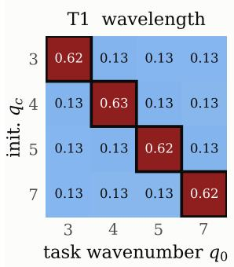

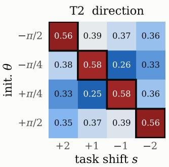

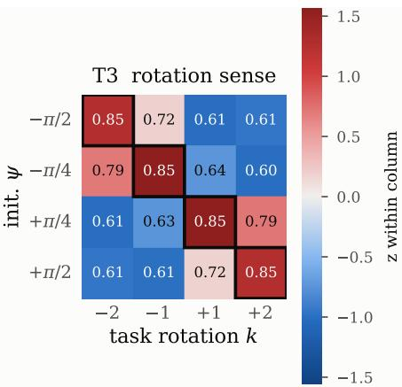  
Figure 6: Extended version of Fig. 4. Heatmap of AUC of learning curves for each (task, initialization) pair; color gives the z-scores. Higher scores in the diagonal support the dynamical prior induced by mode criticality.

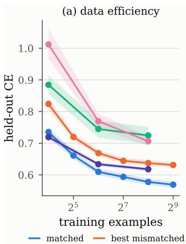

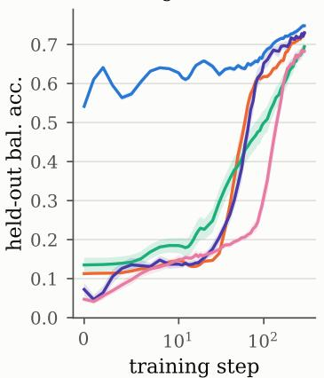

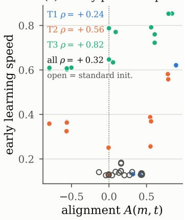  
Figure 7: Learning speed and data efficiency on T1: held-out cross-entropy versus training-set size (left) and learning curves (right) for the matched, mismatched and gain-matched random initializations.

## J.5 LEARNING SPEED AND DATA EFFICIENCY

Figure 7 gives complementary views of the effect. For T1, the matched morphology improves held out cross-entropy relative to the gain-matched random and mismatched structured controls across the training-set-size sweep, with the largest differences in the low-data regime. The corresponding learning curves show that most of the separation occurs early, motivating $A U C _ { e a r l y }$ as the primary statistic. The standard relative-PE baseline is an intentionally less controlled practitioner baseline, it is not gain matched and does not satisfy the fixed, C construction.

## K VISION EXPERIMENTS

We next test whether the same-dispersion relation based design principle applies in a less controlled image-classification setting. The goal is to alter the initialization of the 2-dimensional dispersion landscape of a ConViT-style attention block and test whether favoring heterogeneous spatial modes changes optimization on CIFAR-10.

## K.1 WEIGHT-TIED CONVIT ARCHITECTURE

To stay in line with our theory, we use a weight-tied ConViT, in which one Transformer block is applied repeatedly across depth. $\mathrm { ~ A ~ 2 ~ } \times 2$ patch embedding maps a $3 2 \times 3 2$ image to a $1 6 \times 1 6$ token grid $( N = 2 5 6 )$ . The embedding dimension is $d = 2 1 6$ , we employ $H = 9$ heads and have depth $L = 1 2$ Unless otherwise stated, we use a gated-positional self-attention (GPSA) as described in (d’Ascoli et al., 2021), and a periodic relative encoding to stay firmly in line with our theory. The architecture has no class token and no absolute positional embedding. Classification uses mean pooling followed by LayerNorm and a linear layer.

## K.2 INITIALIZATION

We compare seven initializations.

• default: uses standard small random weights and disables structured positional locality.

• +I, -I: these variants use a Mimetic-style (Trockman & Kolter, 2023) initialization for $Q K$ and initialize the full $O V$ operator, from a random matrix plus a positive or negative identity-biased component. It has the form $M _ { O V } = 0 . 4 Z \pm 0 . 4 I$

• +pos: these variants additionally initialize the GPSA positional logits with a localized ConViT positional encoding. Variants such as −I + pos combine negative mimetic with a localized positional kernel.

These initialization schemes allow us to separate the three ingredients suggested by the theory, namely the interplay of OV geometry and attention positional structure in selecting relevant heterogeneous structures.

## K.3 TWO-DIMENSIONAL DISPERSION RELATION

For a homogeneous embedded token state $x ^ { * }$ , our architecture allows exact computation of the matrix dispersion relation. For each positional frequency $q = ( q _ { 1 } , q _ { 2 } )$ , we have:

$$
J ( { \bf q } ) = C _ { * } [ I + \epsilon _ { a } \sum _ { h = 1 } ^ { H } \lambda _ { h } ( { \bf q } ) M _ { h } ]\tag{179}
$$

where $\epsilon _ { a }$ is the learned attention residual scale. In this particular case, and given our initialization this is analytically tractable. Figure 5 visualizes this 2d dispersion for various initializationpositional structure combination. As predicted by the theory, without positional encoding the dispersion is nearly flat or dominated by the homogeneous mode. Local positional encoding makes the dispersion relation frequency dependent. We see the interplay with $O V$ geometry, negativeidentity biased $O V$ amplifies heterogeneous segments while positive-identity biased $\bar { O V }$ amplifies the homogeneous mode. We believe this helps rationalize the empirical observations that led to this initialization in the original work Trockman & Kolter (2023)

## K.3.1 FINITE-DEPTH VALIDATION OF THE DISPERSION PREDICTION

Although the dispersion relation is a one-step local quantity, the tied network applies the same block $L = 1 2$ times. We therefore test whether it predicts finite-depth perturbation growth. For each Fourier sector q, we perturb the homogeneous state by $1 0 ^ { - 6 }$ along the leading eigenvector of $J _ { 0 } ( \mathbf { q } )$ and measure the perturbation norm after 12 tied steps. We compare it with the exact linear prediction

$$
w _ { L } ( \mathbf { q } ) = J ^ { ( L - 1 ) } ( \mathbf { q } ) \cdot \cdot \cdot J ^ { ( 0 ) } ( \mathbf { q } ) v _ { 0 } ( \mathbf { q } ) ,\tag{180}
$$

and the initialization-time proxy $\rho ( J ^ { ( 0 ) } ( \mathbf { q } ) ) ^ { L }$

As shown in $\operatorname { F i g } . 9 { \mathrm { : } }$ , the measured growth agrees with the exact linear evolution to below $5 \times 1 0 ^ { - 9 }$ relative error $\mathrm { f o r } + I { + } \mathrm { p o s } , - I { + } \mathrm { p o s }$ , and engineered initialization. Moreover, $\rho ( J _ { 0 } ( \mathbf { q } ) ) ^ { L }$ closely predicts the relative growth across Fourier sectors, with Pearson correlations 0.9984, 0.9993, and 0.9999, respectively. Thus, the initialization-time dispersion map accurately predicts which spatial modes are preferentially amplified through the full tied depth in the local regime.

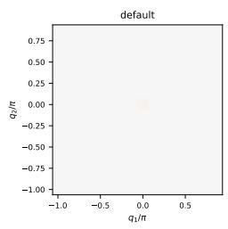

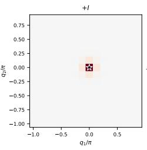

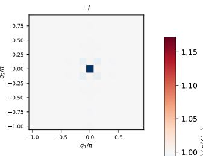

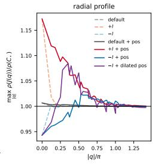

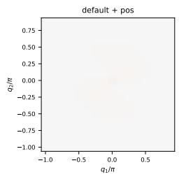

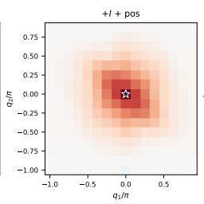

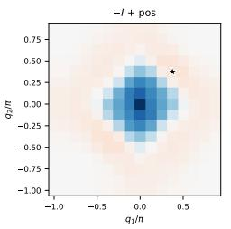

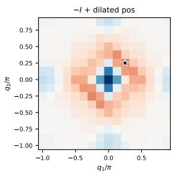  
Figure 8: Visualizations of the 2D dispersion relation for various combinations of positional structure and OV geometry

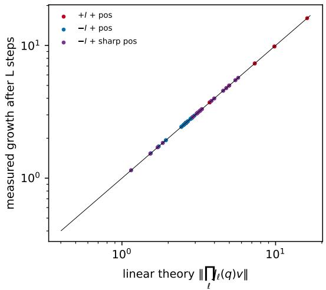

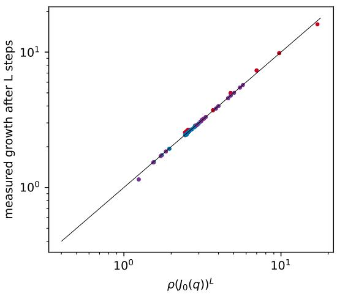  
Figure 9: Comparison of linear theory growth prediction vs actual deviation from homogeneous state from various positional encoding and OV geometry combinations

## K.4 CIFAR-10 TRAINING PROTOCOL

We use CIFAR-10 with a fixed class-balanced 45k/5k train/validation split and the standard 10k test set. Training uses random resized crops, horizontal flips, RandAugment, color jitter, random erasing, and standard normalization; full-data results are averaged over three seeds.

Models are trained for 100 full-data-equivalent epochs with AdamW (batch size 512, learning rate $3 \times 1 0 ^ { - 3 }$ , weight decay $1 0 ^ { - 2 } )$ , five epochs of warmup followed by cosine decay, and gradient clipping at norm 1. Biases, positional parameters, GPSA gates, and residual scales are exempt from weight decay. For data-efficiency experiments, we keep the number of optimization steps fixed to the full-data schedule across dataset fractions.

We report final test accuracy, test-accuracy AUC, and the first epoch $t _ { 9 0 }$ reaching 90% test accuracy; seeds that do not reach the threshold are excluded from $t _ { 9 0 }$ and the number of successful seeds is reported.

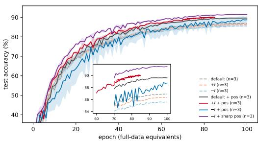

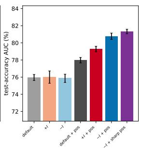

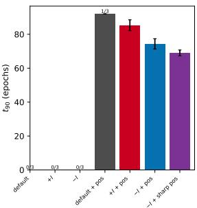  
Figure 10: CIFAR-10 optimization under dispersion-aware initialization. Test accuracy (left), test-accuracy AUC (middle), and epoch reaching 90% test accuracy (right), over three seeds. Localized positional attention combined with negative OV geometry accelerates training, with the engineered −I+ sharp-pos initialization performing best overall.

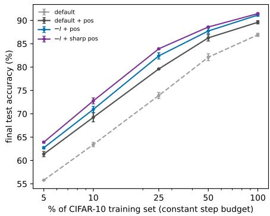

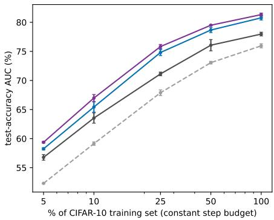  
Figure 11: Data efficiency on CIFAR-10. Final test accuracy (left) and test-accuracy AUC (right) for different training-set fractions. Error bars show one standard deviation across three seeds, except the 5% default baseline (n = 2). The engineered initialization remains strongest across the sweep.

## K.4.1 OPTIMIZATION RESULTS

Figure 10 summarizes the full-data results. OV sign alone has little effect without positional structure, whereas combining localized attention with negative OV geometry substantially accelerates optimization. Sharpening the positional kernel further improves learning speed, with a smaller improvement in final accuracy.

## K.4.2 DATA EFFICIENCY

We repeat the comparison using 5%–100% of the training set while keeping the optimization-step budget fixed. As shown in Fig. 11, the engineered initialization has the highest mean final accuracy and AUC at every evaluated fraction, with the largest gains over the unstructured default in the lowand intermediate-data regimes.

## K.4.3 TRAINING DIAGNOSTICS AND DISPERSION EVOLUTION

Figure 12 shows that the positional variants maintain heterogeneous token representations while both the attention residual scale and GPSA positional gate adapt during training. Thus, the engineered initialization biases the initial dynamics without freezing a prescribed attention operator.

We also recompute the two-dimensional dispersion relation from checkpoints (Fig. 13). Holding negative OV geometry fixed, the sharper positional kernel produces a stronger initial heterogeneousmode bias, but both spectra subsequently reorganize. Dispersion engineering therefore acts as an initial preference rather than a persistent spectral constraint.

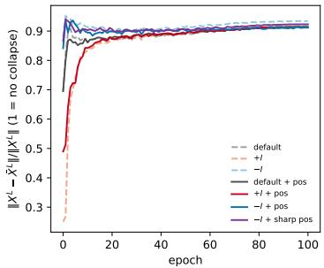

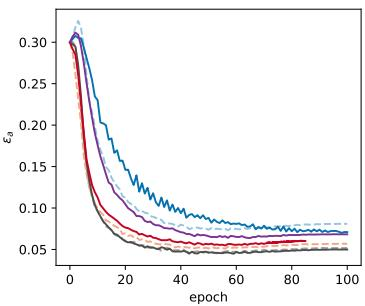

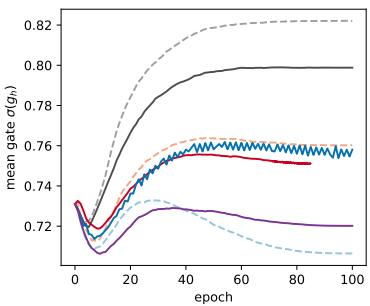  
Figure 12: Training diagnostics for the tied ConViT. Final-depth token heterogeneity (left), learned attention residual scale $\epsilon _ { a }$ (middle), and mean GPSA positional gate (right). Representations remain non-collapsed while the attention parameters adapt throughout training.

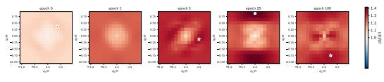  
−I+pos

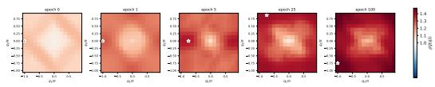  
engineered −I+sharp pos  
Figure 13: Evolution of the spatial dispersion relation. $\rho ( J ( \mathbf { q } ) )$ ) at epochs 0, 1, 5, 25, and 100 for one seed; stars denote the maximally amplified Fourier sector. Both initial spectra evolve substantially during training.

## K.4.4 ROBUSTNESS AND SCOPE

Table 1 summarizes two architectural ablations. The benefit of combining positional locality with negative OV geometry persists with pre-LN, although the additional gain from positional sharpening does not. In contrast, injecting the positional bias inside the content softmax (PSA) is markedly less stable at the same initialization scale, with several runs diverging. Thus, the effect is robust to normalization but depends on how positional structure enters attention.

## L A PATTERN-FORMATION PRIMER: THE SWIFT–HOHENBERG MODEL

This appendix illustrates, on the canonical pattern-forming Swift–Hohenberg model (Cross & Greenside, 2009), the two objects used in the main text: the dispersion relation and the amplitude equation. As in Eq. 3, the model couples a spatial propagation operator to local pointwise dynamics:

$$
\frac { \partial X } { \partial t } = \underbrace { - \left( q _ { 0 } ^ { 2 } + \Delta \right) ^ { 2 } X } _ { \mathcal { P } ( X ) : \mathrm { p r o p a g a t i o n } } + \underbrace { \mu X + \phi ( X ) } _ { \mathcal { L } ( X ) : \mathrm { l o c a l ~ d y n a m i c s } } \ ,\tag{181}
$$

where $\phi ( 0 ) = 0$ and $\phi ( X ) = \alpha _ { 0 } X + \alpha _ { 1 } X ^ { 2 } + \alpha _ { 2 } X ^ { 3 } + { \mathcal O } ( X ^ { 4 } )$ . The homogeneous state $X = 0$ is reminiscent of the collapsed Transformer state. To probe its stability, consider a perturbation $U \propto \mathrm { e } ^ { \sigma ( k ) t + \mathrm { i } k \cdot x }$ , where k encodes spatial scale and $\sigma ( k )$ its growth rate. Linearizing Eq. 181 gives the dispersion relation

$$
\sigma ( k ) = \mu + \alpha _ { 0 } - \left( q _ { 0 } ^ { 2 } - | k | ^ { 2 } \right) ^ { 2 } .\tag{182}
$$

Its sign determines whether a perturbation grows or decays, while its shape determines which mode is preferentially amplified: here the critical mode is $q _ { c } = q _ { 0 }$ . Thus, the dispersion relation simultaneously characterizes the loss of stability of the homogeneous state and the structure that emerges from it, as illustrated in Fig. 14.

Linear analysis, however, does not determine the fate of the emerging mode. Near onset, the solution is dominated by $U \approx B ( t ) \mathrm { e } ^ { \mathrm { i } q _ { c } x }$ , and nonlinear effects govern whether its amplitude diverges or saturates. Expanding Eq. 181 to the third order and projecting onto the critical mode yields reduced amplitude dynamics of the form

$$
\frac { d B } { d t } = - \frac { \partial \mathcal { V } } { \partial B } , \qquad \mathcal { V } ( B ) = - \frac { \sigma } { 2 } B ^ { 2 } + \frac { g ( \alpha _ { 1 } , \alpha _ { 2 } ) } { 4 } B ^ { 4 } .\tag{183}
$$

<table><tr><td>Initialization</td><td>Final acc. (%)</td><td>AUC (%)</td><td> $t _ { 9 0 }$ </td></tr><tr><td colspan="4">GPSA, no normalization</td></tr><tr><td> $\mathrm { d e f a u l t } + \mathrm { p o s }$ </td><td> $8 9 . 6 \pm 0 . 4$ </td><td> $7 8 . 0 \pm 0 . 3$ </td><td> $9 2 . 0 \left( 1 / 3 \right)$ </td></tr><tr><td> $- I + { \tt p o s }$ </td><td> $9 1 . 1 \pm 0 . 3$ </td><td> $8 0 . 8 \pm 0 . 4$ </td><td> $7 4 . 3 \pm 3 . 1$ </td></tr><tr><td> $- I + { \mathrm { s h a r p } } { \mathrm { p o s } }$ </td><td> ${ \bf 9 1 . 5 \pm 0 . 2 }$ </td><td> ${ \bf 8 1 . 3 \pm 0 . 3 }$ </td><td> ${ \bf 6 9 . 0 \pm 1 . 7 }$ </td></tr><tr><td colspan="4"> $G P S A , p r e { \cdot } L N$ </td></tr><tr><td> $\mathrm { d e f a u l t } + \mathrm { p o s }$ </td><td> $8 8 . 5 \pm 0 . 4$ </td><td> $7 7 . 0 \pm 0 . 4$ </td><td></td></tr><tr><td>-I + pos</td><td> ${ \bf 8 9 . 8 \pm 0 . 3 }$ </td><td> ${ \bf 7 9 . 5 \pm 0 . 4 }$ </td><td> $8 8 . 0 \left( 1 / 3 \right)$ </td></tr><tr><td>−I + sharp pos</td><td> $8 9 . 5 \pm 0 . 2 $ </td><td> $7 8 . 5 \pm 0 . 2$ </td><td></td></tr><tr><td colspan="4">PSA, no normalization</td></tr><tr><td>-I + pos</td><td> $8 7 . 3 \pm 0 . 1 \ : ( 2 / 3 )$ </td><td> $7 5 . 2 \pm 0 . 2 ( 2 / 3 )$ </td><td></td></tr><tr><td>−I + sharp pos</td><td> $8 6 . 8 \left( 1 / 3 \right)$ </td><td> $7 3 . 4 \ : ( 1 / 3 )$ </td><td></td></tr></table>

Table 1: Normalization and attention-form ablations. Parentheses indicate the number of contributing seeds when fewer than three runs are available; for $t _ { 9 0 } .$ , they indicate the number of seeds reaching 90% accuracy within 100 epochs.

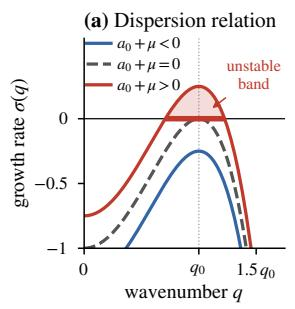

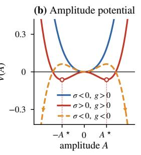

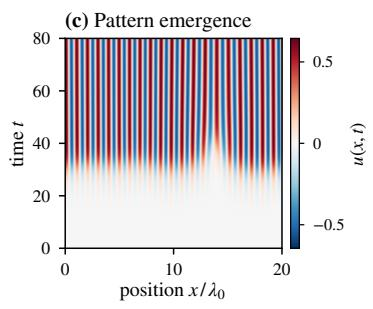  
Figure 14: The Swift-Hohenberg illustration: the dispersion relation (a) defines the emergent perturbations, the amplitude potential in (b) dictates their stability, leading to the apparition of patterns in (c).

The dispersion relation controls the stability of the homogeneous state, while the nonlinear coefficient $g ( \alpha _ { 1 } , \alpha _ { 2 } )$ controls the stabilization of the emerging structure; for $g > 0$ , the growing mode saturates at finite amplitude. We see in Fig. 14(b) the impact of $^ { g , }$ which can be viewed as engineer ing the stability landscape of the emergent pattern.

This example contains the two ingredients used in the main text: the dispersion relation determines when the homogeneous state loses stability and which structures become accessible, while nonlin earities determine their subsequent fate. Crucially, in this example the propagation operator ${ \mathcal { P } } ( X )$ diagonalizes along Fourier modes, reducing the stability analysis to independent spatial scales. In Transformers, positional encoding and multi-head attention play the analogous role (Theorem 4.5), giving rise to a matrix-valued dispersion relation.