# PLANETARY FEATURE FIELDS ARE SCALABLE EARTH REPRESENTATIONS

Arjun Rao \*   
University of British Columbia   
University of Copenhagen   
Vector Institute

Sebastian Loeschcke University of Copenhagen

Anthony Fuller Carleton University Vector Institute

Isaac Corley Taylor Geospatial

Nico Lang ✰ University of Copenhagen

✰ Joint advising

Evan Shelhamer ✰ University of British Columbia Vector Institute

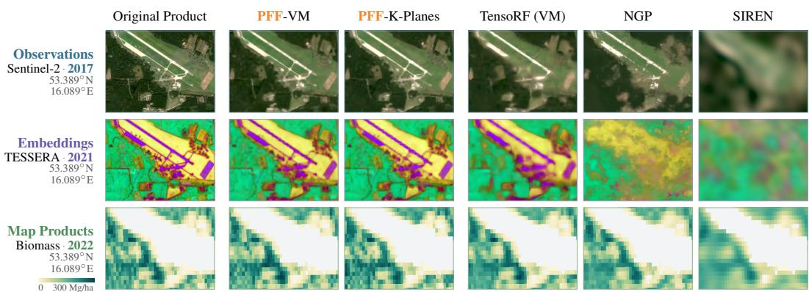  
Figure 1: Planetary Feature Fields (PFFs) jointly represent heterogeneous Earth observation (EO) products with high fidelity at high compression ratios (≈1800×). We present PFFs as spatially local, explicit–implicit (hybrid) neural fields that share a factored feature volume across raw observations, precomputed embeddings, and map products. Queried by space–time coordinates, this shared representation exploits redundancy across products, preserves downstream utility, and supports adding new timesteps and products while leaving the existing representation unchanged.

## ABSTRACT

Satellite observations, precomputed embeddings, and map products describe the same evolving Earth, yet are stored as independent, petabyte-scale data products. Their continued growth calls for compact representations of multiple products while preserving spatial and temporal detail. We introduce Planetary Feature Fields (PFFs), which exploit redundancy across data products by modeling them jointly as continuous functions of space and time at planetary scale. PFFs are spatially local explicit–implicit (hybrid) neural fields. Each field shares afactored feature volume—a decomposition of an explicit 3D grid with smaller factors— across products, while lightweight implicit decoders reconstruct individual products across multiple timesteps. PFFs reconstruct EO products over space and time more accurately than single-product fields at matched compression rates. At 1800× compression relative to the uncompressed source data, reconstructed features retain approximately 90% or more of the performance achieved with the original features on pixel-level segmentation, change detection, and patch-level classification tasks. PFFs can add new timesteps by extending their factored feature volumes and add new products by attaching new decoders, while leaving existing outputs unchanged. PFFs reduce end-to-end feature access latency by an order of magnitude relative to evaluated API and cloud-storage pipelines.

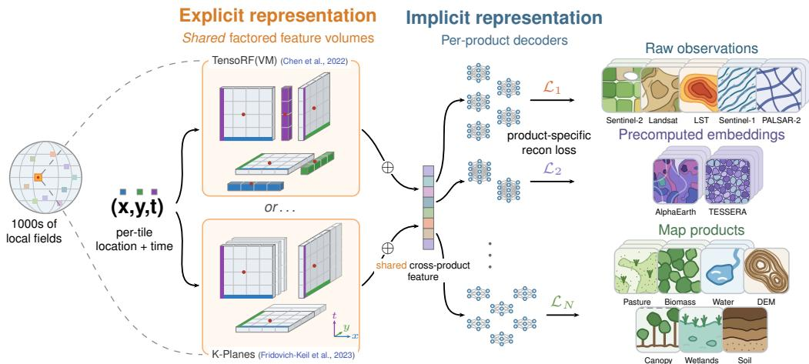  
Figure 2: PFF construction. Each regional PFF combines a shared explicit factored feature volume with product-specific implicit decoders. The volume represents a dense space–time feature grid using learned lines or planes. At a queried location and time, we combine factor values into a shared feature vector, which each decoder maps to its product’s native feature space. Thousands of regional PFFs extend this construction to planetary coverage.

## 1 INTRODUCTION

Learning compact representations of petabyte-scale Earth observation (EO) data is a central goal in machine learning for remote sensing, supporting socioeconomic (Aiken et al., 2023; Jean et al., 2016; Al Shafian & Hu, 2024), climatic (Rolnick et al., 2022; Dollinger et al., 2025), and ecological (You et al., 2017; Tseng et al., 2021; Zbinden et al., 2026; Tseng et al., 2023) applications. Raw observations, precomputed embeddings, and map products encode different properties of the same evolving Earth and can provide complementary information for mapping (Gordon et al., 2026; van der Plas et al., 2026; Rao & Rolf, 2025). Although these products differ in purpose, resolution, and semantics, they cover overlapping locations and times. They are nevertheless produced, stored, and updated independently, leaving an opportunity to share their representation while preserving the information needed to reconstruct each product. Such a shared representation must (i) preserve detail across space and time at planetary scale, (ii) be compact to store and support fast retrieval, and (iii) extend efficiently to new timesteps and products. These requirements are particularly difficult to reconcile for learned representations in EO. Pretrained models extract features from raw observations, but applying them across large geographic areas still requires substantial computation and access to large data archives (Ai2, 2026). Two alternatives reduce this dependence on raw inputs. Geographic location encoders provide compact implicit representations that retrieve features directly from geographic coordinates (Mai et al., 2022). At global scale, these implicit representations capture broad geographic structure but do not preserve spatial detail needed to reconstruct the source data (Dhakal et al., 2025; Rao et al., 2026a). They are therefore useful as spatial/geographic priors for downstream models (Mac Aodha et al., 2019), but are poor substitutes for the data from which they were learned. Precomputed embeddings instead store model outputs as explicit representations, preserving features at sampled locations and times without rerunning the source model (Czerkawski et al., 2024; Klemmer et al., 2026; Brown et al., 2025; Feng et al., 2026). This moves computation offline but results in substantial data storage and transfer costs. As temporal coverage grows, each timestep must be materialized and maintained as another global array, causing storage, transfer, and versioning costs to grow roughly linearly with time.1

We hypothesize that an ideal Earth representation is a hybrid, incorporating characteristics from both explicit and implicit representations and is optimized per scene. Our proposed solution to these usability issues is Planetary Feature Fields (PFFs), a global representation composed of spatially local explicit–implicit (hybrid) neural fields. Each field consists of an explicit factored feature volume (Yi et al., 2023), built from learned lines or planes shared across products, and lightweight product-specific MLP decoders (Figure 2). Our explicit–implicit approach makes it possible to represent products with different dimensions, resolutions, and statistics, achieving reconstruction with high fidelity at high compression ratios. We instantiate PFFs on 14 EO products (see Table 2) with observations spanning nine years (2017–2025), including five raw observations (Drusch et al., 2012; Torres et al., 2012; EROS Center, 2020; Shimada et al., 2014), two precomputed embeddings (Feng et al., 2026; Brown et al., 2025), and seven map products (Parente et al., 2024; Santoro & Cartus, 2026; Pickens et al., 2020; European Space Agency & Airbus, 2022; Lang et al., 2023; Lehner et al., 2025; Poggio et al., 2021).

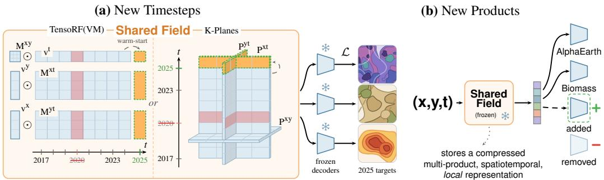  
Figure 3: PFFs are capable of continually learning (a) new timesteps and (b) new products. (a) New timesteps for one or more products requires a small addition to the shared field (0.2% params) and are trained with the rest of the PFF frozen. (b) New products are added by training only a decoder against the frozen shared field, and deprecated products can simply be discarded.

As new observations and products become available, especially over time, the challenge with learned representations (including implicit representations) is the need to repeatedly retrain on the new and historical data. We seek a learned representation that can be efficiently extended without forgetting historical data. PFFs support this growth by extending the temporal factors in their factored feature volumes for new timesteps and fitting additional decoders for new products. Because only the extended factors are trained, previous outputs remain unchanged (bit-exactly), preserving the features used by existing analyses. Adding a year of observations across multiple EO products takes only 2% of the time required for joint pretraining from scratch, while reaching 92% of the jointly trained model’s new-year reconstruction score (Figure 6). Furthermore, each regional field can be extended independently, so products with limited geographic coverage can be incorporated where observations exist without global retraining.

In summary, we make three contributions: (i) We introduce Planetary Feature Fields: spatially local explicit–implicit Earth representations that achieve high-fidelity reconstruction under large compression ratios (≈1800×) by sharing an explicit factored feature volume across data products. (ii) We demonstrate that PFF-reconstructed features at their canonical compression ratios retain ≈90% of downstream task performance on patch-level classification, high-resolution semantic segmentation, and change-detection tasks while retrieving features an order of magnitude faster than current APIs or cloud-based systems. (iii) We show that PFFs enable efficient continual learning of new timesteps and data products while leaving the existing representation unchanged.

## 2 PLANETARY FEATURE FIELDS

We use the term feature to refer to any space-time-indexed array of data about the Earth. These features include raw observations, precomputed embeddings, and map products, such as observations from the Sentinel-2 (optical) and Sentinel-1 (radar) satellites, embeddings (AlphaEarth (AE) (Brown et al., 2025), TESSERA (Feng et al., 2026)), and map products such as elevation data, canopy height, etc. We consider products indexed by $m \in \{ 1 , \ldots , M \}$ . For a geographic coordinate x and time coordinate t, let $\mathbf { y } _ { m } ( \mathbf { x } , t ) \in \mathbb { R } ^ { d _ { m } }$ denote the observed feature from product $m$ . Products may differ in spatial resolution, temporal coverage, dimensionality, and availability. We partition the geographic domain into bounded regions and learn a local function within each region. For product $m .$ , this function predicts $\hat { \mathbf { y } } _ { m } ( \mathbf { x } , \bar { t } ) = f _ { m } ( \mathbf { x } , t )$ , with parameters chosen so that $\hat { \mathbf { y } } _ { m } ( \mathbf { x } , t )$ reconstructs the corresponding feature where and when the data is available (Figure 5). The learned local functions replace the feature samples and form the representation used for reconstruction and downstream use.

(a)  
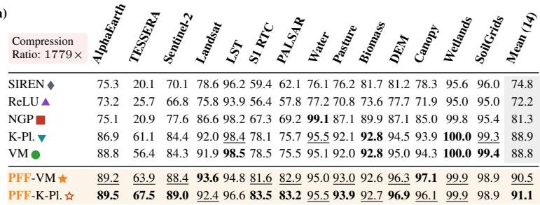

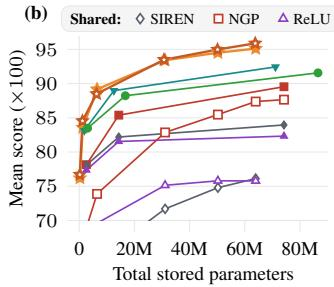  
Figure 4: Reconstruction results on PFFBench. (a) One shared PFF beats compression ratematched single-product neural fields on EO product reconstructions tested across 100 global PFF-BENCH tiles (see Figure 10). (b) Rate-distortion curves on the mean reconstruction metric (10-tile subset). Sharing the explicit representation is uniquely beneficial to factored feature volumes (NGP is an explicit–implicit representation, but not a factored feature volume). Full table shown in Table 5.

## 2.1 CONSTRUCTING PFFS

We learn a separate field for each region to concentrate representation capacity on local detail. Global coordinate models represent the Earth within one function, using spatial encodings such as spherical bases or tessellations (Rußwurm et al., 2024; Rao et al., 2026a; Cher et al., 2026). PFFs instead route each query to its tile and transform the location into that tile’s Cartesian coordinates. Each field therefore models a bounded region rather than the geometry of the entire Earth. We rescale each tile’s spatial extent to $[ 0 , 1 ] ^ { 2 }$ , so every field uses the same relative coordinates within its own region.

Within each region, the field must preserve local detail while representing products with different output spaces. Explicit neural fields fit data by optimizing values on coarse or sparse grids (Fridovich-Keil et al., 2022; Kim & Fridovich-Keil, 2025) or local primitives such as Gaussians (Kerbl et al., 2023). This works well when the goal is to reconstruct a single input, such as a single object or scene, but provides no structure to share or separate information across the multiple EO products. To separate common structure from product-specific outputs, PFFs use a hybrid field. The explicit part is a shared, coordinate-indexed set of arrays covering space and time. The implicit part consists of small product-specific MLPs that map this representation to each product.

Our explicit field must (i) compactly preserve spatial and temporal structure, (ii) allocate capacity asymmetrically across dense spatial axes and sparse temporal observations, and (iii) share information across products at high compression ratios. Requirement (ii) is specific and important to EO. Unlike most video data or dynamic scenes where time is sampled densely at the frame level, EO products are far more anisotropic: a region may contain thousands of samples along each spatial axis but only a handful of annual observations along time.

We store a region’s features across space, time, and products in a set of small, learned arrays rather than one large grid. These arrays are the factors in a factored feature volume (Yi et al., 2023). To query a location and time, we read and combine values from the factors into a shared feature vector. The factors let us choose different grid sizes for space and time, matching the dense spatial samples and sparse timesteps of EO data. This replaces storing $N _ { x } N _ { y } N _ { t } d _ { h }$ values of a dense grid, with spatial resolution $\bar { N } _ { x } , N _ { y }$ , temporal resolution $N _ { t }$ , and the shared feature dimension $d _ { h }$

We now fix one region and omit its index. Let $\mathbf { h } ( \mathbf { x } , t ) \in \mathbb { R } ^ { d _ { h } }$ denote the feature computed from its factors and $g _ { m }$ the decoder for product m:

$$
f _ { m } ( \mathbf { x } , t ) = g _ { m } ( \mathbf { h } ( \mathbf { x } , t ) ) .
$$

The shared feature h is an internal representation used by the product decoders. We construct h using either the vector–matrix (VM) decomposition of TensoRF (Chen et al., 2022) or the threeplane factorization of K-Planes (Fridovich-Keil et al., 2023). Both interpolate learned factors at the query coordinates, but differ in how these factors are stored and combined.

Writing $\mathbf { x } = ( x , y )$ , TensoRF(VM) pairs each scalar-valued plane factor $M _ { r } ^ { b c }$ with a line factor $v _ { r } ^ { a }$ along the remaining axis. Each orientation has $R _ { a }$ components with learned basis vectors $\mathbf { b } _ { r } ^ { a } \in$ $\mathbb { R } ^ { d _ { h } }$ . K-Planes instead stores vector-valued plane factors $\mathbf { P } ^ { x y } , \mathbf { P } ^ { x t }$ , and $\mathbf { P } ^ { y t }$ and combines them by elementwise multiplication, denoted ⊙. At a single resolution, the TensoRF(VM) and K-Planes constructions are:

$$
\begin{array} { r l r } { \mathbf { T e n s o R F ( V M ) } } & { \qquad } & { \mathbf { K . P l a n e s } } \\ & { \qquad } & { \mathrm { P l a n e - l i n e ~ f a c t o r s } } \\ { \mathbf { h } ( x , y , t ) = \sum _ { r = 1 } ^ { R _ { x } } v _ { r } ^ { x } ( x ) M _ { r } ^ { y t } ( y , t ) \mathbf { b } _ { r } ^ { x } } & { \qquad } & { \mathbf { h } ( x , y , t ) = \mathbf { P } ^ { x y } ( x , y ) } \\ & { + \sum _ { r = 1 } ^ { R _ { y } } v _ { r } ^ { y } ( y ) M _ { r } ^ { x t } ( x , t ) \mathbf { b } _ { r } ^ { y } + \sum _ { r = 1 } ^ { R _ { t } } v _ { r } ^ { t } ( t ) M _ { r } ^ { x y } ( x , y ) \mathbf { b } _ { r } ^ { t } . } & { \qquad } & { \odot \mathbf { P } ^ { x t } ( x , t ) \odot \mathbf { P } ^ { y t } ( y , t ) . } \end{array}
$$

Line and plane factors are queried with linear and bilinear interpolation. Spatial and temporal resolutions are chosen independently, with nine temporal entries for 2017–2025 in both constructions. Our canonical PFF uses VM with spatial resolution $S = 9 5 5$ and 65 vector–matrix components per orientation $( R _ { x } = R _ { y } = R _ { t } = 6 5 )$ ). The combined factors produce a shared feature of dimension $d _ { h } = 6 4$ . Our K-Planes PFF uses four spatial scales at resolutions $^ { 1 4 7 , }$ 294, 588, and 1176. Each plane stores 32 channels, and concatenating the features across scales gives $d _ { h } = 1 2 8$

## 2.2 OPTIMIZING PFFS

PFFs are trained jointly on datasets of products that may omit arbitrary timesteps, channels, spatial regions, or entire products (Figure 5). Each product supervises the shared field wherever observations are available. We mask missing values, so training does not require all products to be observed at the same location and time. Coarse products are mapped to a common 10 m grid by nearest-neighbor resampling, preserving source-cell and nodata values. Each coarse observation therefore supervises its spatial footprint without introducing interpo-

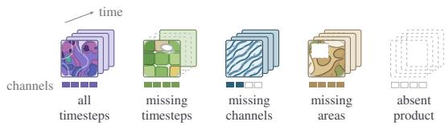  
Figure 5: PFFs are robust to missing data. We train with products that may be observed at every timestep, miss entire timesteps, carry only some of its channels, miss spatial information in one or more years, or be entirely absent from the region.

lated targets, which is essential when reconstructing derived map products. We use per-channel standardized mean-squared error for Euclidean-valued products and cosine distortion $1 - \cos ( \hat { \mathbf { y } } _ { m } , \mathbf { y } _ { m } )$ for unit-normalized embeddings. We average each product loss over its observed targets and combine the losses with equal weight.

A full regional product stack occupies a median of 227.5 GB in memory, making simple data loading to memory impractical. We instead maintain a fixed-capacity GPU buffer of randomly selected spatial block–year pairs, loading the same window from all available products through partial Cloud-Optimized GeoTIFF (COG) reads (Pollack, 2024). Each batch samples valid coordinates uniformly from the buffer and combines observed product losses, masking missing targets. Refreshing the resident blocks exposes the field to new observations while keeping memory use bounded (Figure 12). Training settings are detailed in Section C.1.

## 2.3 CONTINUALLY LEARNING PFFS

Learning a new timestep. A PFF stores time as an ordered sequence of learned parameter slices, each associated with a fixed calendar year. Queries interpolate each time-dependent factor between its neighboring slices before combining and decoding the features. To learn a new timestep, we append temporal slices without changing the existing slices or their calendar positions (Figure 3). We initialize these slices from the most recent available timestep, freeze all existing parameters, and train only the new slices using available observations and products in the new timestep. This construction applies to any factored feature volume that decomposes a dense grid into temporal factors. For TensoRF(VM), we extend $v _ { r } ^ { t } , M _ { r } ^ { x t }$ , and $M _ { r } ^ { y t }$ , adding 124K parameters (0.19% of a canonical PFF). For K-Planes, we extend ${ \dot { P } } ^ { x t }$ and $P ^ { y t }$ at every scale, adding 141K parameters (0.22%). Because existing parameters and interpolation weights remain unchanged, both variants preserve all outputs over previously represented years with bit-exact precision. Deprecating/deleting an exist-

(b) New Products

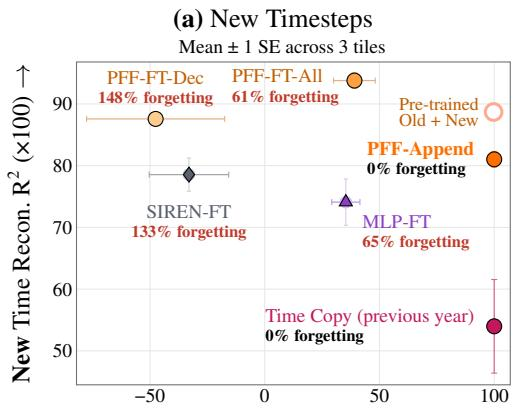  
Old ${ \tt R } ^ { 2 }$ Retained After New Time Adaptation (%) →

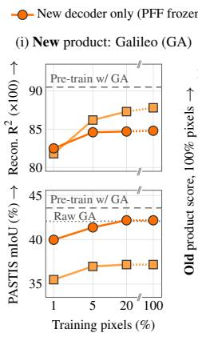

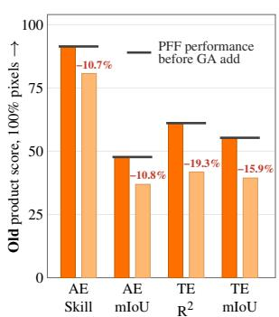  
Figure 6: Continual learning results. (a) Only training the small temporal slice (0.19% params) achieves ≈92% of joint pretraining’s new-year reconstruction while leaving existing years unchanged (PFF-Append). When the product decoders are trained with this slice (FT-Dec), or the entire PFF is finetuned (FT-All), existing-year retention collapses. (b) We add Galileo (GA) (Tseng et al., 2025) 10m embeddings to PFFs covering the PASTIS segmentation benchmark. Only training a new decoder on a small subset of pixels significantly outperforms finetuning the PFF on GA’s PASTIS mIoU while fully retaining AlphaEarth (AE) and TESSERA’s (TE) reconstruction and performance on PASTIS. Expanded in Figure 13.

ing temporal slice, however, does not maintain this bit-exact precision property since interpolation anchors are changed.

Learning a new product. After training a PFF, the shared field contains a compact spatiotemporal representation learned from the trained products. To incorporate a new product, we attach a new decoder $g _ { \mathrm { n e w } }$ per PFF that maps the existing shared field $\mathbf { h } ( \mathbf { x } , t )$ to this new feature. We freeze the shared field and every existing decoder, then train only $g _ { \mathrm { n e w } }$ using any reconstruction loss that matches the product’s properties. In our experiments, this decoder contains 1.25M parameters, or approximately 2% of a canonical PFF, and can be trained with a subset of the new product’s valid pixels. Since no existing parameter is updated, all previously supported products remain bit-exact.

## 3 EXPERIMENTS

We evaluate PFFs on reconstruction quality and downstream performance retention, using compression rate-matched single-product neural fields as baselines.

Baselines. We compare PFFs with a range of representation families: single-product ReLU MLPs with Fourier features (Tancik et al., 2020), SIREN (Sitzmann et al., 2020), Instant-NGP (iNGP) (Müller et al., 2022), K-Planes (Fridovich-Keil et al., 2023), and TensoRF(VM) (Chen et al., 2022). For each baseline, we match the combined parameter storage of the 14 fields to one PFF within each tile. We evaluate two simple allocations of the total parameter budget across the 14 products: uniform allocation and allocation proportional to each product’s source size in bits. Bit-proportional allocation improves embedding reconstruction but reduces fidelity on lower-dimensional sensor and map products, lowering the mean score (Table 5). Source size alone is therefore a poor guide to capacity allocation, and we use uniform allocation for the main experiments. All methods are fitted to the same regional extent: 8192 × 8192 pixels at 10 m resolution, following the AlphaEarth tiling manifest (Brown et al., 2025).

Reconstruction. We evaluate reconstruction on our 100-tile PFFBENCH dataset, totaling approximately 6.7 billion spatial locations and 16 TB of source data (Section B). Each product is scored on its native grid and observed years. Image metrics such as PSNR and SSIM, used in prior EO neural fields (Madadikhaljan et al., 2026), do not provide a common interpretation across physical measurements and learned vectors. We therefore report per-channel $R ^ { 2 }$ , averaged equally across channels, for Euclidean-valued products. For unit-normalized AlphaEarth vectors, we report angular skill, which measures the reduction in cosine distortion relative to the mean-direction predictor (Murphy, 1988). Both scores equal one for exact reconstruction and zero for the corresponding mean prediction.

Table 1: PFF features retain most downstream performance and can even outperform the original features. We report retention %: the percentage recovery of the Original features’ perfor mance. (a) PASTIS crop-type semantic segmentation. (b) FTW field delineation in Brazil and South Africa. (c) SwissCrop25 crop-type segmentation from 2019–2025. (d) EuroMineNet annual change detection. Original features are AlphaEarth (AE), TESSERA (TE), and Sentinel-2 (S2).
<table><tr><td rowspan="2">(a) PASTIS</td><td colspan="3">mIoU</td></tr><tr><td>AE</td><td>TE</td><td>S2</td></tr><tr><td>Original features</td><td>53.6</td><td>61.3</td><td>13.3</td></tr><tr><td>TensoRF(VM)</td><td>67%</td><td>69%</td><td>92%</td></tr><tr><td>K-Planes</td><td>69%</td><td>59%</td><td>91%</td></tr><tr><td>iNGP</td><td>46%</td><td>46%</td><td>75%</td></tr><tr><td>PFF-VM</td><td>90%</td><td>90%</td><td>136%</td></tr><tr><td>PFF-K-Planes</td><td>89%</td><td>87%</td><td>121%</td></tr></table>

<table><tr><td rowspan="2">(c) SwissCrop25</td><td colspan="3">OA</td><td colspan="3">Crop-type mIoU</td></tr><tr><td>AE</td><td>TE</td><td>S2</td><td>AE</td><td>TE</td><td>S2</td></tr><tr><td>Original features</td><td>52.4</td><td>53.8</td><td>32.9</td><td>4.9</td><td>6.1</td><td>0.9</td></tr><tr><td>TensoRF(VM)</td><td>94%</td><td>96%</td><td>101%</td><td>73%</td><td>80%</td><td>102%</td></tr><tr><td>K-Planes</td><td>93%</td><td>91%</td><td>106%</td><td>71%</td><td>65%</td><td>114%</td></tr><tr><td>iNGP</td><td>89%</td><td>88%</td><td>104%</td><td>57%</td><td>53%</td><td>115%</td></tr><tr><td>PFF-VM</td><td>100%</td><td>99%</td><td>104%</td><td>104%</td><td>92%</td><td>111%</td></tr><tr><td>PFF-K-Planes</td><td>99%</td><td>100%</td><td>104%</td><td>98%</td><td>97%</td><td>109%</td></tr></table>

<table><tr><td rowspan="2">(b) FTW</td><td colspan="2">Brazil (OR)</td><td colspan="2">S. Africa (IoU)</td></tr><tr><td>AE</td><td>S2</td><td>AE</td><td>S2</td></tr><tr><td>Original features</td><td>50.0</td><td>21.2</td><td>73.5</td><td>57.1</td></tr><tr><td>TensoRF(VM)</td><td>70%</td><td>69%</td><td>99%</td><td>101%</td></tr><tr><td>K-Planes</td><td>66%</td><td>64%</td><td>99%</td><td>96%</td></tr><tr><td>iNGP</td><td>22%</td><td>46%</td><td>93%</td><td>104%</td></tr><tr><td>PFF-VM</td><td>90%</td><td>90%</td><td>103%</td><td>105%</td></tr><tr><td>PFF-K-Planes</td><td>95%</td><td>103%</td><td>102%</td><td>121%</td></tr></table>

<table><tr><td rowspan="2">(d) EuroMineNet AUPRC</td><td></td><td>F1@r</td><td>AUPRC</td><td>F1@r</td></tr><tr><td colspan="2">AE</td><td colspan="2">TE</td></tr><tr><td>Original features</td><td>10.7</td><td>17.4</td><td>10.8</td><td>21.0</td></tr><tr><td>TensoRF(VM)</td><td>72%</td><td>79%</td><td>88%</td><td>90%</td></tr><tr><td>K-Planes</td><td>90%</td><td>99%</td><td>43%</td><td>41%</td></tr><tr><td>iNGP</td><td>37%</td><td>49%</td><td>32%</td><td>37%</td></tr><tr><td>PFF-VM</td><td>100%</td><td>97%</td><td>103%</td><td>97%</td></tr><tr><td>PFF-K-Planes</td><td>76%</td><td>86%</td><td>82%</td><td>80%</td></tr></table>

Downstream task retention. We test whether PFF reconstructions preserve predictive information, emphasizing fine spatial structure and interannual change. For each downstream task and product, we train a task-specific linear classifier on either the original features or their reconstructions. We report retention as the reconstructed-feature score divided by the source-feature score, expressed as a percentage; 100% matches the source and higher values indicate improvement. Our pixel-based tasks include PASTIS and SwissCrop25 crop-type and boundary segmentation (Sainte Fare Garnot & Landrieu, 2021; Lauber et al., 2026), field-instance recovery in the Brazil split of the Fields of the World dataset (FTW) (Kerner et al., 2025), and field-extent segmentation in the South Africa split of FTW. We selectively probe products, excluding products where raw features significantly underperform (for example, derived map products). We experiment with different combinations of concatenated features in Table 4. We evaluate temporal fidelity through annual mining-footprint segmentation and change detection on EuroMineNet (Yu et al., 2026), and crop mapping across years through SwissCrop25’s leave-one-year-out protocol. Dense evaluations use 10 m labels except for FTW’s native label lattice (nominally 6 m). For patch-level classification (see Table 3), we pool features using the stats pooling method in Corley et al. (2026b) and evaluate BigEarthNet-v2 (BEN-v2) under the GEO-Bench-2 geographic partition and So2Sat-LCZ42 (So2Sat) under geographic train, validation, and test splits (Clasen et al., 2025; Zhu et al., 2020; Simumba et al., 2026).

## 4 RESULTS

Sharing across products improves reconstruction at high compression ratios. PFFs with both VM and K-Planes-based factors improve reconstruction when shared across products, reducing mean normalized distortion by approximately 20% at matched storage (Figure 4). This advantage persists across multiple parameter budgets, but does not extend to every shared representation. For example, in Figure 4, we replace the factored volume with either a multi-resolution hash-grid of Müller et al. (2022), or a ReLU/SIREN coordinate network replicating STRAINER’s setup for transferable implicit neural representations (Vyas et al., 2024). Each produces a shared feature vector for product-specific decoders. These controls reconstruct less accurately when shared than when fitted independently to each product. The hash-grid result is particularly informative because it retains the explicit–implicit architecture in Figure 2 but removes the factorization. Together, these comparisons show that factored feature volumes support effective joint encoding of heterogeneous products; sharing an encoder and attaching separate decoders is not sufficient to obtain the same benefit. We visualize additional reconstructions in Figures 15 and 16.

PFFs can continually learn unseen timesteps and products without forgetting. We evaluate temporal adaptation on a seasonally varying PFFBENCH tile and regions affected by the Pacific Palisades fire and Sindh floods (Figure 6a). We add all products in 2025 to PFF-VMs trained on 2017–2024 for the first two regions, and 2022 after training on 2017–2021 for Sindh. Across the three regions, PFF-Append reaches approximately 92% of the joint-pretraining reconstruction score in 2% of the training time, while preserving earlier outputs bit-exactly. In contrast, finetuning the PFF or the product decoders in addition to the added temporal slice achieves higher newtimestep scores but exhibits catastrophic forgetting of existing timesteps (van de Ven et al., 2025). PFF-K-Planes also learns the new year while preserving earlier outputs (Figure 13). See Figure 14 for a qualitative result.

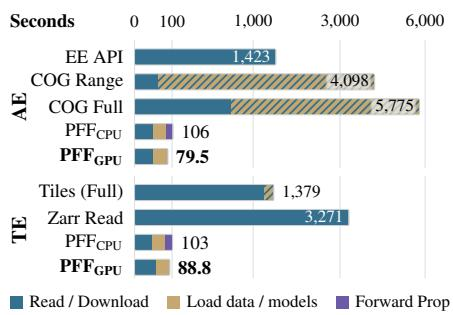  
Figure 7: PFFs materialize features an order of magnitude faster than API or cloud-based methods. Time (s) to materialize 1 million AE and TE embeddings visualized.

For new-product adaptation, we add Galileo embeddings

(Tseng et al., 2025) covering 17 PASTIS tiles (Figure 6b). Here, training only the new implicit decoders on 20% of the 2019 target pixels matches source performance (42.2% versus 42.1% mIoU) while preserving existing outputs. Conversely, finetuning the shared explicit field improves Galileo reconstruction but lowers its mIoU to 37.2% and reduces AlphaEarth and TESSERA relative mIoU by 10.8 and 15.9 percentage points. This divergence suggests that optimizing Galileo reconstruction alone can sacrifice task-relevant structure in the jointly learned field. Freezing the field preserves a representation shaped by 14 complementary products, which may benefit the new decoder’s downstream predictions. Galileo-only finetuning weakens this cross-product structure.

PFFs retain the original datasets’ downstream task performance at high compression ratios. We focus our evaluation on dense prediction tasks, where high spatial and temporal fidelity of the input is crucial. On PASTIS crop segmentation and FTW Brazil field-instance recall, both PFF variants improve retention over the strongest single-product baseline by 18–44 and 20–34 percentage points, respectively (Table 1). On EuroMineNet annual change detection, PFF-VM retains 97–103% of the original AE and TE performance across AUPRC and F1 at the true change rate. PFF-K-Planes retains 76–86%, showing that the two factorizations differ in how well they preserve features used to detect temporal change. For mining-footprint mapping, both PFF variants outperform the single product baselines on boundary F1 across all five products, despite similar overall pixel-level F1 (Table 6). Both variants outperform the original Sentinel-2 features on PASTIS and FTW South Africa. These gains may reflect complementary supervision and mild denoising, although our experiments do not isolate their contributions. For completeness, we also present patch-classification results on common benchmarks (Table 3). Local fields largely match source performance on BEN-v2, and PFF improves only modestly over a single-product TensoRF on So2Sat. This is expected behavior, as overly smooth reconstructions may retain coarse features relevant for patch-level interpretation.

PFFs materialize precomputed embeddings faster than standard data-access pipelines (Figure 7). We request one million AE or TE embeddings from 100 globally sampled regions (Figure 8). All methods run on the same eight-vCPU virtual machine with an NVIDIA L4 GPU, start with empty local caches, and return embeddings to system memory. Including checkpoint download and model loading, PFFs are 17.9× faster than Earth Engine for AE and 15.5× faster than full-tile downloads for TE. Most initial latency comes from downloading checkpoints and constructing inference sessions, rather than running the forward pass. We find PFFs to be especially fast as a data loader or a large-scale mapper. PFFs achieve an embedding throughput of 9.7 million AE embeddings per second on an NVIDIA H100 GPU (see Figure 9).

## 5 RELATED WORK

Neural fields encode signals as continuous, coordinate-based functions (Mildenhall et al., 2020; Chen & Zhang, 2019), with applications in view synthesis (Barron et al., 2021), video and signal compression (Chen et al., 2021b; Dupont et al., 2021; 2022b; Strümpler et al., 2022), medical imageto-volume reconstruction (Xu et al., 2023), shape modeling (Park et al., 2019), and multi-image super-resolution (Jyhne et al., 2026). As these representations have scaled, much of the literature has moved toward local or explicit–implicit parameterizations with voxel or feature grids (Peng et al., 2020; Liu et al., 2020; Fridovich-Keil et al., 2022; Kim & Fridovich-Keil, 2025), octrees (Yu et al., 2021a), hash encodings (Müller et al., 2022), and tensor or planar factorizations (Chen et al., 2022; Loeschcke et al., 2024; Fridovich-Keil et al., 2023; Yi et al., 2023; Cao & Johnson, 2023). PFFs are closest in spirit to feature-field methods, which distill pretrained image features into queryable 3D representations, including DFF (Kobayashi et al., 2022), N3F (Tschernezki et al., 2022), LERF (Kerr et al., 2023), F3RM (Shen et al., 2023), and FeatureNeRF (Ye et al., 2023). Other methods divide scenes into smaller neural fields to reconstruct large areas or speed up rendering, including Block-NeRF (Tancik et al., 2022), KiloNeRF (Reiser et al., 2021), Mega-NeRF (Turki et al., 2022), and Switch-NeRF (Mi & Xu, 2023). Functa and spatial functa motivate treating datasets as collections of neural fields (Dupont et al., 2022a; Bauer et al., 2023). Generalizable NeRFs predict fields from new input images (Yu et al., 2021b; Chen et al., 2021a). PFFs place observations, embeddings, and map products in the same regional factors, and test whether this joint representation improves reconstruction over separate fields at equal compression rates. Continual methods such as CLNeRF or CD-NGP update existing parameters using replay and parameter isolation, respectively (Cai & Müller, 2023; Liu et al., 2024). PFFs instead train added temporal slices or product decoders while freezing existing parameters, preserving earlier outputs bit-exactly.

Geographic location encoders learn continuous mappings from location to task values or reusable embeddings (Mac Aodha et al., 2019; Mai et al., 2022; Cole et al., 2023). Contrastive and retrievalbased training produce general-purpose geographic features (Klemmer et al., 2025; Cepeda et al., 2023; Mai et al., 2023; Dhakal et al., 2025), while recent methods use distillation (Dollinger et al., 2025; Lane et al., 2026; Corley et al., 2026a). These models learn global representations for prediction or transfer. Unlike location encoders, PFFs use spatially local fields as compact substitutes for dense, space–time-indexed EO products. Global retrieval remains simple: each query is routed to the regional field that contains its location. TerraCodec (Costa-Watanabe et al., 2025) instead targets data storage, compressing multispectral images and time series with pretrained transforms and entropy models. Pretrained neural codecs must generalize beyond the geographic distribution used for training. Direct fitting instead optimizes the representation on the data being stored, as in climate grids (Huang & Hoefler, 2023), hyperspectral imagery (Shi et al., 2024), and regional Sentinel-2 time series (Madadikhaljan et al., 2026). PFFs store multiple products in a shared explicit representation, so their aggregate compression ratio is not directly comparable to a codec for a single product alone. Storage costs also differ: PFFs encode regional data in learned parameters, while TerraCodec produces compressed files that require a separate, reusable model to decode. PFFs also allow reuse of their learned regional structure as new observations arrive, without refitting historical data and while keeping previous reconstructions unchanged.

## 6 LIMITATIONS AND CONCLUSION

Limitations. Directly comparing our compression ratios with prior work is non-trivial, as our ratios can easily be inflated by adding redundant embeddings (Rao et al., 2026b). For example, adding Galileo increases our compression ratio from 1800× to 2800× with the shared field unchanged (Figure 6b), while missing products may reduce the ratio similarly. Our comparisons account for product composition, coverage, numerical precision, and reconstruction quality. Each PFF is fitted at a fixed storage budget and does not support variable-rate compression. PFF reconstructions are lossy, and their effect on downstream performance depends on the task. Smoothing may leave patch level predictions largely unchanged but remove fine structures needed for high-resolution mapping. The same smoothing may also reduce noise and contribute to the gains we sometimes observe over the original features, although our experiments do not separate this effect from cross-product supervision.

Conclusion. We present a spatially local hybrid neural field capable of compressing 14 diverse EO products by sharing a common factored feature volume. PFF-materialized features better reconstruct the source features than compression rate-matched single-product neural fields, and significantly outperform other local fields on several downstream tasks. By using factored feature volumes, we demonstrate easy continual learning of our method to new timesteps and new products. We show that PFFs are capable of materializing features an order of magnitude faster than currently used cloud or API-based methods, and enable fast large-scale mapping efforts at low cost.

## ACKNOWLEDGMENTS

We thank Lucia Gordon and Vivian White for reviewing and providing feedback. SL is supported by the Danish Data Science Academy, which is funded by the Novo Nordisk Foundation (NNF21SA0069429) and VILLUM FONDEN (40516). AF is primarily supported by an NSERC PGS-D scholarship. We acknowledge Danish e-Infrastructure Cooperation (DeiC) and the Univer sity of Copenhagen (Denmark) for awarding this project access to the LUMI supercomputer, owned by the EuroHPC Joint Undertaking, hosted by CSC (Finland) and the LUMI consortium through the University of Copenhagen’s local allocation of DeiC National HPC resources. NL is supported by the Global Wetland Center (grant number NNF23OC0081089) from Novo Nordisk Foundation. ES is supported by a Canada CIFAR AI Chair and the Natural Sciences and Engineering Research Council of Canada (NSERC) Discovery Grant (RGPIN-2025-06878). Resources used in preparing this research were also provided, in part, by the Province of Ontario, the Government of Canada through CIFAR, and companies sponsoring the Vector Institute. This research used Killarney, Vulcan, and Fir compute clusters, with support from the Digital Research Alliance of Canada (alliancecan.ca), Compute Ontario (computeontario.ca), the BC DRI Group, Prairies DRI, the Vector Institute, and the Alberta Machine Intelligence Institute (Amii). This work was supported in part by the Pioneer Centre for AI, DNRF grant number P1. This research used the TGX RAILs advanced compute and data resource, which is supported by the National Science Foundation (award OAC-2232860) and the Taylor Geospatial Institute.

## REFERENCES

Ai2. The OlmoEarth platform: Geospatial inference at planetary scale, July 2026. URL https: //allenai.org/blog/olmoearth-infrastructure. Accessed: 2026-09-10.

Emily Aiken, Esther Rolf, and Joshua Blumenstock. Fairness and representation in satellite-based poverty maps: Evidence of urban-rural disparities and their impacts on downstream policy. In International Joint Conference on Artificial Intelligence (IJCAI), pp. 5888–5896, 2023. URL https://doi.org/10.24963/ijcai.2023/653.

Sultan Al Shafian and Da Hu. Integrating machine learning and remote sensing in disaster management: A decadal review of post-disaster building damage assessment. Buildings, 14(8):2344, 2024. URL https://doi.org/10.3390/buildings14082344.

Jonathan T. Barron, Ben Mildenhall, Matthew Tancik, Peter Hedman, Ricardo Martin-Brualla, and Pratul P. Srinivasan. Mip-NeRF: A multiscale representation for anti-aliasing neural radiance fields. In IEEE/CVF International Conference on Computer Vision (ICCV), 2021.

Matthias Bauer, Emilien Dupont, Andy Brock, Dan Rosenbaum, Jonathan Richard Schwarz, and Hyunjik Kim. Spatial functa: Scaling functa to ImageNet classification and generation. arXiv preprint arXiv: 2302.03130, 2023.

Christopher F. Brown, Michal R. Kazmierski, Valerie J. Pasquarella, William J. Rucklidge, Masha Samsikova, Chenhui Zhang, Evan Shelhamer, Estefania Lahera, Olivia Wiles, Simon Ilyushchenko, Noel Gorelick, Lihui Lydia Zhang, Sophia Alj, Emily Schechter, Sean Askay, Oliver Guinan, Rebecca Moore, Alexis Boukouvalas, and Pushmeet Kohli. AlphaEarth Foundations: An embedding field model for accurate and efficient global mapping from sparse label data. arXiv preprint arXiv:2507.22291, 2025.

Zhipeng Cai and Matthias Müller. CLNeRF: Continual learning meets NeRF. In IEEE/CVF International Conference on Computer Vision (ICCV), pp. 23128–23137, 2023.

Ang Cao and Justin Johnson. HexPlane: A fast representation for dynamic scenes. In IEEE/CVF Conference on Computer Vision and Pattern Recognition (CVPR), pp. 130–141, 2023.

Vicente Vivanco Cepeda, Gaurav Kumar Nayak, and Mubarak Shah. GeoCLIP: CLIP-inspired alignment between locations and images for effective worldwide geo-localization. In Advances in Neural Information Processing Systems (NeurIPS), 2023. URL https://openreview. net/forum?id=I18BXotQ7j.

Anpei Chen, Zexiang Xu, Fuqiang Zhao, Xiaoshuai Zhang, Fanbo Xiang, Jingyi Yu, and Hao Su. MVSNeRF: Fast generalizable radiance field reconstruction from multi-view stereo. In IEEE/CVF International Conference on Computer Vision (ICCV), pp. 14124–14133, 2021a.

Anpei Chen, Zexiang Xu, Andreas Geiger, Jingyi Yu, and Hao Su. TensoRF: Tensorial radiance fields. In European Conference on Computer Vision (ECCV), 2022.

Hao Chen, Bo He, Hanyu Wang, Yixuan Ren, Ser-Nam Lim, and Abhinav Shrivastava. NeRV: Neural representations for videos. In Advances in Neural Information Processing Systems (NeurIPS), 2021b.

Zhiqin Chen and Hao Zhang. Learning implicit fields for generative shape modeling. In IEEE/CVF Conference on Computer Vision and Pattern Recognition (CVPR), pp. 5939–5948, 2019.

Daniel Cher, Hamza Iqbal, Eric Xing, Brian Wei, and Nathan Jacobs. Tessellating the Earth: Learnable spherical Voronoi partitions for location encoding. In European Conference on Computer Vision (ECCV), 2026.

Kai Norman Clasen, Leonard Hackel, Tom Burgert, Gencer Sumbul, Begüm Demir, and Volker Markl. reBEN: Refined BigEarthNet dataset for remote sensing image analysis. In IEEE International Geoscience and Remote Sensing Symposium (IGARSS), pp. 1264–1268, 2025. URL https://doi.org/10.1109/IGARSS55030.2025.11242834.

Elijah Cole, Grant Van Horn, Christian Lange, Alexander Shepard, Patrick Leary, Pietro Perona, Scott Loarie, and Oisin Mac Aodha. Spatial implicit neural representations for global scale species mapping. In International Conference on Machine Learning (ICML), volume 202 of Proceedings of Machine Learning Research, pp. 6320–6342, 2023. URL https: //proceedings.mlr.press/v202/cole23a.html.

Isaac Corley, Arjun Rao, Esther Rolf, Konstantin Klemmer, Evan Shelhamer, Nils Lehmann, Marc Rußwurm, Gengchen Mai, Nathan Jacobs, and Hannah Kerner. MIND the gap: A geographic implicit neural representation with adjustable spatial scale. arXiv preprint arXiv:2609.25454, 2026a.

Isaac Corley, Caleb Robinson, Juan M. Lavista Ferres, and Inbal Becker-Reshef. From pixels to patches: Pooling strategies for Earth embeddings. In ICLR Workshop on Machine Learning for Remote Sensing, 2026b. URL https://openreview.net/forum?id=oPfOVLFIrU.

Julen Costa-Watanabe, Isabelle Wittmann, Benedikt Blumenstiel, and Konrad Schindler. Terra-Codec: Compressing optical Earth observation data. arXiv preprint arXiv:2510.12670, 2025.

Mikolaj Czerkawski, Marcin Kluczek, and J˛edrzej S. Bojanowski. Global and dense embeddings of Earth: Major TOM floating in the latent space. arXiv preprint arXiv:2412.05600, 2024.

Aayush Dhakal, Srikumar Sastry, Subash Khanal, Adeel Ahmad, Eric Xing, and Nathan Jacobs. RANGE: Retrieval augmented neural fields for multi-resolution geo-embeddings. In IEEE/CVF Conference on Computer Vision and Pattern Recognition (CVPR), pp. 24680–24689, 2025.

Johannes Dollinger, Damien Robert, Elena Plekhanova, Lukas Drees, and Jan Dirk Wegner. Climplicit: Climatic implicit embeddings for global ecological tasks. In ICLR Workshop on Tackling Climate Change with Machine Learning, 2025.

M. Drusch, U. Del Bello, S. Carlier, O. Colin, V. Fernandez, F. Gascon, B. Hoersch, C. Isola, P. Laberinti, P. Martimort, A. Meygret, F. Spoto, O. Sy, F. Marchese, and P. Bargellini. Sentinel-2: ESA’s optical high-resolution mission for GMES operational services. Remote Sensing of Environment, 120:25–36, 2012. URL https://doi.org/10.1016/j.rse.2011.11. 026.

Emilien Dupont, Adam Golinski, Milad Alizadeh, Yee Whye Teh, and Arnaud Doucet. COIN: COmpression with implicit neural representations. In ICLR Workshop on Neural Compression: From Information Theory to Applications, 2021. URL https://openreview.net/ forum?id=yekxhcsVi4.

Emilien Dupont, Hyunjik Kim, S. M. Ali Eslami, Danilo Jimenez Rezende, and Dan Rosenbaum. From data to functa: Your data point is a function and you can treat it like one. In International Conference on Machine Learning (ICML), 2022a.

Emilien Dupont, Hrushikesh Loya, Milad Alizadeh, Adam Golinski, Yee Whye Teh, and Arnaud Doucet. COIN++: Neural compression across modalities. Transactions on Machine Learning Research, 2022b. URL https://openreview.net/forum?id=NXB0rEM2Tq.

EROS Center. Landsat 8-9 Operational Land Imager / Thermal Infrared Sensor Level-2, Collection 2. U.S. Geological Survey, 2020. URL https://doi.org/10.5066/P9OGBGM6. Dataset.

European Space Agency and Airbus. Copernicus DEM – global and European digital elevation model. European Space Agency, 2022. URL https://doi.org/10.5270/ ESA-c5d3d65. Dataset collection; GLO-30 instance.

Zhengpeng Feng, Clement Atzberger, Sadiq Jaffer, Jovana Knezevic, Silja Sormunen, Robin Young, Madeline C. Lisaius, Markus Immitzer, Toby Jackson, James Ball, David A. Coomes, Anil Mad havapeddy, Andrew Blake, and Srinivasan Keshav. TESSERA: Temporal embeddings of surface spectra for Earth representation and analysis. In IEEE/CVF Conference on Computer Vision and Pattern Recognition (CVPR), pp. 34818–34831, 2026.

Sara Fridovich-Keil, Alex Yu, Matthew Tancik, Qinhong Chen, Benjamin Recht, and Angjoo Kanazawa. Plenoxels: Radiance fields without neural networks. In IEEE/CVF Conference on Computer Vision and Pattern Recognition (CVPR), 2022.

Sara Fridovich-Keil, Giacomo Meanti, Frederik Rahbæk Warburg, Benjamin Recht, and Angjoo Kanazawa. K-Planes: Explicit radiance fields in space, time, and appearance. In IEEE/CVF Conference on Computer Vision and Pattern Recognition (CVPR), 2023.

Lucia Gordon, Serge Belongie, Christian Igel, and Nico Lang. MMEarth-Bench: Global model adaptation via multimodal test-time training. In European Conference on Computer Vision (ECCV), 2026.

Noel Gorelick, Matt Hancher, Mike Dixon, Simon Ilyushchenko, David Thau, and Rebecca Moore. Google Earth Engine: Planetary-scale geospatial analysis for everyone. Remote Sensing of Environment, 202:18–27, 2017. URL https://doi.org/10.1016/j.rse.2017.06.031.

Langwen Huang and Torsten Hoefler. Compressing multidimensional weather and climate data into neural networks. In International Conference on Learning Representations (ICLR), 2023. URL https://openreview.net/forum?id=Y5SEe3dfniJ.

Neal Jean, Marshall Burke, Michael Xie, W Matthew Alampay Davis, David B Lobell, and Stefano Ermon. Combining satellite imagery and machine learning to predict poverty. Science, 353(6301): 790–794, 2016.

Sander R Jyhne, Christian Igel, Morten Goodwin, Per-Arne Andersen, Serge Belongie, and Nico Lang. SuperF: Neural implicit fields for multi-image super-resolution. In International Conference on Learning Representations (ICLR), volume 2026, pp. 99513–99536, 2026. URL https://openreview.net/forum?id=FiiItlSqqL.

Bernhard Kerbl, Georgios Kopanas, Thomas Leimkühler, and George Drettakis. 3D Gaussian splatting for real-time radiance field rendering. ACM Transactions on Graphics, 42(4):139, 2023. URL https://doi.org/10.1145/3592433.

Hannah Kerner, Snehal Chaudhari, Aninda Ghosh, Caleb Robinson, Adeel Ahmad, Eddie Choi, Nathan Jacobs, Chris Holmes, Matthias Mohr, Rahul Dodhia, Juan M Lavista Ferres, and Jennifer Marcus. Fields of The World: A machine learning benchmark dataset for global agricultural field boundary segmentation. Proceedings of the AAAI Conference on Artificial Intelligence, 39(27): 28151–28159, 2025. URL https://doi.org/10.1609/aaai.v39i27.35034.

Justin Kerr, Chung Min Kim, Ken Goldberg, Angjoo Kanazawa, and Matthew Tancik. LERF: Language embedded radiance fields. In IEEE/CVF International Conference on Computer Vision (ICCV), 2023.

Namhoon Kim and Sara Fridovich-Keil. Grids often outperform implicit neural representation at compressing dense signals. In Advances in Neural Information Processing Systems (NeurIPS), 2025. URL https://openreview.net/forum?id=OZljvntsto.

Konstantin Klemmer, Esther Rolf, Caleb Robinson, Lester Mackey, and Marc Rußwurm. SatCLIP: Global, general-purpose location embeddings with satellite imagery. In Proceedings of the AAAI Conference on Artificial Intelligence, volume 39, pp. 4347–4355, 2025.

Konstantin Klemmer, Esther Rolf, Marc Rußwurm, Gustau Camps-Valls, Mikolaj Czerkawski, Stefano Ermon, Alistair Francis, Nathan Jacobs, Hannah Kerner, Lester Mackey, Gengchen Mai, Oisin Mac Aodha, Markus Reichstein, Caleb Robinson, David Rolnick, Evan Shelhamer, Vincent Sitzmann, Devis Tuia, and Xiaoxiang Zhu. Earth Embeddings: Toward artificial intelligencecentric representations of our planet. IEEE Geoscience and Remote Sensing Magazine, pp. 2–15, 2026. URL https://doi.org/10.1109/MGRS.2026.3710416.

Sosuke Kobayashi, Eiichi Matsumoto, and Vincent Sitzmann. Decomposing NeRF for editing via feature field distillation. In Advances in Neural Information Processing Systems (NeurIPS), 2022.

Kevin Lane, Zhongying Wang, Esther Rolf, and Morteza Karimzadeh. SLED: Scalable location encoding via distillation. arXiv preprint arXiv:2608.06612, 2026.

Nico Lang, Walter Jetz, Konrad Schindler, and Jan Dirk Wegner. A high-resolution canopy height model of the Earth. Nature Ecology & Evolution, 7(11):1778–1789, 2023.

Thomas Lauber, Mehmet Ozgur Turkoglu, Sélène Ledain, and Helge Aasen. SwissCrop25: A national multi-year benchmark for operational crop mapping. In ECCV Workshop TerraBytes II, 2026. URL https://openreview.net/forum?id=17VbDRJojb.

Bernhard Lehner, Mira Anand, Etienne Fluet-Chouinard, Florence Tan, Filipe Aires, George H. Allen, Philippe Bousquet, Josep G. Canadell, Nick Davidson, Meng Ding, C. Max Finlayson, Thomas Gumbricht, Lammert Hilarides, Gustaf Hugelius, Robert B. Jackson, Maartje C. Korver, Liangyun Liu, Peter B. McIntyre, Szabolcs Nagy, David Olefeldt, Tamlin M. Pavelsky, Jean-Francois Pekel, Benjamin Poulter, Catherine Prigent, Jida Wang, Thomas A. Worthington, Dai Yamazaki, Xiao Zhang, and Michele Thieme. Mapping the world’s inland surface waters: an upgrade to the Global Lakes and Wetlands Database (GLWD v2). Earth System Science Data, 17:2277–2329, 2025. URL https://doi.org/10.5194/essd-17-2277-2025.

Lingjie Liu, Jiatao Gu, Kyaw Zaw Lin, Tat-Seng Chua, and Christian Theobalt. Neural sparse voxel fields. In Advances in Neural Information Processing Systems (NeurIPS), 2020.

Zhenhuan Liu, Shuai Liu, Zhiwei Ning, Jie Yang, Yifan Zuo, Yuming Fang, and Wei Liu. CD-NGP: A fast scalable continual representation for dynamic scenes. arXiv preprint arXiv:2409.05166, 2024.

Sebastian Bugge Loeschcke, Dan Wang, Christian Munklinde Leth-Espensen, Serge Belongie, Michael Kastoryano, and Sagie Benaim. Coarse-to-fine tensor trains for compact visual representations. In International Conference on Machine Learning (ICML), volume 235 of Proceedings of Machine Learning Research, pp. 32612–32642, 2024. URL https://proceedings.mlr. press/v235/loeschcke24a.html.

Oisin Mac Aodha, Elijah Cole, and Pietro Perona. Presence-only geographical priors for finegrained image classification. In IEEE/CVF International Conference on Computer Vision (ICCV), pp. 9596–9606, 2019.

Mojgan Madadikhaljan, Jonathan Prexl, Isabelle Wittmann, Conrad M Albrecht, and Michael Schmitt. Location is all you need: Continuous spatiotemporal neural representations of Earth observation data. In IEEE/CVF Conference on Computer Vision and Pattern Recognition (CVPR) Workshops, pp. 8000–8010, 2026.

Gengchen Mai, Krzysztof Janowicz, Yingjie Hu, Song Gao, Bo Yan, Rui Zhu, Ling Cai, and Ni Lao. A review of location encoding for GeoAI: Methods and applications. International Journal of Geographical Information Science, 36(4):639–673, 2022.

Gengchen Mai, Ni Lao, Yutong He, Jiaming Song, and Stefano Ermon. CSP: Self-supervised contrastive spatial pre-training for geospatial-visual representations. In International Conference on Machine Learning (ICML), 2023.

Zhenxing Mi and Dan Xu. Switch-NeRF: Learning scene decomposition with mixture of experts for large-scale neural radiance fields. In International Conference on Learning Representations (ICLR), 2023. URL https://openreview.net/forum?id=PQ2zoIZqvm.

Ben Mildenhall, Pratul P. Srinivasan, Matthew Tancik, Jonathan T. Barron, Ravi Ramamoorthi, and Ren Ng. NeRF: Representing scenes as neural radiance fields for view synthesis. In European Conference on Computer Vision (ECCV), 2020.

Thomas Müller, Alex Evans, Christoph Schied, and Alexander Keller. Instant neural graphics primitives with a multiresolution hash encoding. ACM Transactions on Graphics, 41(4):102, 2022. URL https://doi.org/10.1145/3528223.3530127.

Allan H Murphy. Skill scores based on the mean square error and their relationships to the correlation coefficient. Monthly Weather Review, 116(12):2417–2424, 1988.

Natural Earth. Admin 0 – countries (1:110m cultural vectors). https:// www.naturalearthdata.com/downloads/110m-cultural-vectors/ 110m-admin-0-countries/, 2024. Accessed: 2026-09-22.

Leandro Parente, Lindsey Sloat, Vinicius Mesquita, Davide Consoli, Radost Stanimirova, Tomislav Hengl, Carmelo Bonannella, Nathália Teles, Ichsani Wheeler, Maria Hunter, Steffen Ehrmann, Laerte Ferreira, Ana Paula Mattos, Bernard Oliveira, Carsten Meyer, Murat ¸Sahin, Martijn Witjes, Steffen Fritz, Ziga Malek, and Fred Stolle. Annual 30-m maps of global grassland class and extent (2000–2022) based on spatiotemporal machine learning. Scientific Data, 11:1303, 2024. URL https://doi.org/10.1038/s41597-024-04139-6.

Jeong Joon Park, Peter Florence, Julian Straub, Richard Newcombe, and Steven Lovegrove. DeepSDF: Learning continuous signed distance functions for shape representation. In IEEE/CVF Conference on Computer Vision and Pattern Recognition (CVPR), 2019.

Murray C Peel, Brian L Finlayson, and Thomas A McMahon. Updated world map of the Köppen-Geiger climate classification. Hydrology and Earth System Sciences, 11(5):1633–1644, 2007.

Songyou Peng, Michael Niemeyer, Lars Mescheder, Marc Pollefeys, and Andreas Geiger. Convolutional occupancy networks. In European Conference on Computer Vision (ECCV), 2020.

A. H. Pickens, M. C. Hansen, M. Hancher, S. V. Stehman, A. Tyukavina, P. Potapov, B. Marroquin, and Z. Sherani. Mapping and sampling to characterize global inland water dynamics from 1999 to 2018 with full Landsat time-series. Remote Sensing ofEnvironment, 243:111792, 2020. URL https://doi.org/10.1016/j.rse.2020.111792.

Laura Poggio, Luis M. de Sousa, Niels H. Batjes, Gerard B. M. Heuvelink, Bas Kempen, Eloi Ribeiro, and David Rossiter. SoilGrids 2.0: producing soil information for the globe with quantified spatial uncertainty. SOIL, 7:217–240, 2021. URL https://doi.org/10.5194 soil-7-217-2021.

Nathan Pollack. Cloud optimized GeoTIFF (COG) file format. Technical Report ESDS-RFC-049, NASA Earth Science Data and Information System Standards Coordination Office, 2024. URL https://doi.org/10.5067/DOC/ESCO/ESDS-RFC-049v1.

Radiant Earth. Source Cooperative. https://source.coop, 2026. Accessed: 2026-09-13.

Arjun Rao and Esther Rolf. Using multiple input modalities can improve data-efficiency and O.O.D. generalization for ML with satellite imagery. In TerraBytes ICML Workshop: Towards Global Datasets and Modelsfor Earth Observation, volume 292 of Proceedings ofMachine Learning Research, pp. 166–188, 2025. URL https://proceedings.mlr.press/v292/rao25a. html.

Arjun Rao, Ruth Crasto, Tessa Ooms, David Rolnick, Konstantin Klemmer, and Marc Rußwurm. Localized, high-resolution geographic representations with Slepian functions. In International Conference on Machine Learning (ICML), 2026a. URL https://openreview.net/ forum?id=eWQQ0tO0kB.

Arjun Rao, Marc Rußwurm, Konstantin Klemmer, and Esther Rolf. Measuring the intrinsic dimension of Earth representations. In International Conference on Learning Representations (ICLR), 2026b. URL https://openreview.net/forum?id=gQPD83DrGp.

Christian Reiser, Songyou Peng, Yiyi Liao, and Andreas Geiger. KiloNeRF: Speeding up neural radiance fields with thousands of tiny MLPs. In IEEE/CVF International Conference on Computer Vision (ICCV), 2021.

Caleb Robinson and Isaac Corley. Compressing Earth embeddings, 2026. URL https:// geospatialml.com/posts/compressing-earth-embeddings/.

David Rolnick, Priya L. Donti, Lynn H. Kaack, Kelly Kochanski, Alexandre Lacoste, Kris Sankaran, Andrew Slavin Ross, Nikola Milojevic-Dupont, Natasha Jaques, Anna Waldman-Brown, Alexandra Sasha Luccioni, Tegan Maharaj, Evan D. Sherwin, S. Karthik Mukkavilli, Konrad P. Kording, Carla P. Gomes, Andrew Y. Ng, Demis Hassabis, John C. Platt, Felix Creutzig, Jennifer Chayes, and Yoshua Bengio. Tackling climate change with machine learning. ACM Computing Surveys, 55(2):42, 2022. URL https://doi.org/10.1145/3485128.

Marc Rußwurm, Konstantin Klemmer, Esther Rolf, Robin Zbinden, and Devis Tuia. Geographic location encoding with spherical harmonics and sinusoidal representation networks. In International Conference on Learning Representations (ICLR), 2024. URL https://iclr.cc/ virtual/2024/poster/18690.

Vivien Sainte Fare Garnot and Loïc Landrieu. Panoptic segmentation of satellite image time series with convolutional temporal attention networks. In IEEE/CVF International Conference on Computer Vision (ICCV), pp. 4852–4861, 2021. URL https://doi.org/10.1109/ ICCV48922.2021.00483.

M. Santoro and O. Cartus. ESA Biomass Climate Change Initiative (Biomass\_cci): Global datasets of forest above-ground biomass for the years 2005–2012 and 2015–2024, v7.0. NERC EDS Centre for Environmental Data Analysis, May 2026. URL https://doi.org/10.5285/ 6429d1aafe1e43b9b414e4a5a7f8b903. Dataset, published 21 May 2026.

William Shen, Ge Yang, Alan Yu, Jansen Wong, Leslie Pack Kaelbling, and Phillip Isola. Distilled feature fields enable few-shot language-guided manipulation. In Conference on Robot Learning (CoRL), 2023.

Junqi Shi, Mingyi Jiang, Ming Lu, Tong Chen, Xun Cao, and Zhan Ma. HINER: Neural representation for hyperspectral image. In ACM International Conference on Multimedia (ACM MM), pp. 9837–9846, 2024.

Masanobu Shimada, Takuya Itoh, Takeshi Motooka, Manabu Watanabe, Tomohiro Shiraishi, Rajesh Thapa, and Richard Lucas. New global forest/non-forest maps from ALOS PALSAR data (2007– 2010). Remote Sensing of Environment, 155:13–31, 2014. URL https://doi.org/10. 1016/j.rse.2014.04.014.

Naomi Simumba, Nils Lehmann, Paolo Fraccaro, Hamed Alemohammad, Geeth De Mel, Salman Khan, Manil Maskey, Nicolas Longépé, Xiao Xiang Zhu, Hannah Kerner, Juan Bernabe Moreno, and Alexandre Lacoste. GEO-Bench-2: From performance to capability, rethinking evaluation in geospatial AI. Transactions on Machine Learning Research, 2026. URL https: //openreview.net/forum?id=NPf175jnP1.

Vincent Sitzmann, Julien N. P. Martel, Alexander W. Bergman, David B. Lindell, and Gordon Wetzstein. Implicit neural representations with periodic activation functions. In Advances in Neural Information Processing Systems (NeurIPS), 2020.

Yannick Strümpler, Janis Postels, Ren Yang, Luc Van Gool, and Federico Tombari. Implicit neural representations for image compression. In European Conference on Computer Vision (ECCV), 2022.

Matthew Tancik, Pratul P. Srinivasan, Ben Mildenhall, Sara Fridovich-Keil, Nithin Raghavan, Utkarsh Singhal, Ravi Ramamoorthi, Jonathan T. Barron, and Ren Ng. Fourier features let networks learn high frequency functions in low dimensional domains. In Advances in Neural Information Processing Systems (NeurIPS), 2020.

Matthew Tancik, Vincent Casser, Xinchen Yan, Sabeek Pradhan, Ben Mildenhall, Pratul P. Srinivasan, Jonathan T. Barron, and Henrik Kretzschmar. Block-NeRF: Scalable large scene neural view synthesis. In IEEE/CVF Conference on Computer Vision and Pattern Recognition (CVPR), 2022.

R. Torres, P. Snoeij, D. Geudtner, D. Bibby, M. Davidson, E. Attema, P. Potin, B. Rommen, N. Floury, M. Brown, I. Navas Traver, P. Deghaye, B. Duesmann, B. Rosich, N. Miranda, C. Bruno, M. L’Abbate, R. Croci, A. Pietropaolo, M. Huchler, and F. Rostan. GMES Sentinel-1 mission. Remote Sensing of Environment, 120:9–24, 2012. URL https://doi.org/10. 1016/j.rse.2011.05.028.

Vadim Tschernezki, Iro Laina, Diane Larlus, and Andrea Vedaldi. Neural feature fusion fields: 3D distillation of self-supervised 2D image representations. In International Conference on 3D Vision (3DV), 2022.

Gabriel Tseng, Ivan Zvonkov, Catherine Lilian Nakalembe, and Hannah Kerner. CropHarvest: A global dataset for crop-type classification. In NeurIPS Datasets and Benchmarks Track, 2021.

Gabriel Tseng, Ruben Cartuyvels, Ivan Zvonkov, Mirali Purohit, David Rolnick, and Hannah Kerner. Lightweight, pre-trained transformers for remote sensing timeseries. arXiv preprint arXiv:2304.14065, 2023.

Gabriel Tseng, Anthony Fuller, Marlena Reil, Henry Herzog, Patrick Beukema, Favyen Bastani, James R Green, Evan Shelhamer, Hannah Kerner, and David Rolnick. Galileo: Learning global & local features of many remote sensing modalities. In International Conference on Machine Learning (ICML), volume 267 of Proceedings ofMachine Learning Research, pp. 60280–60300, 2025. URL https://proceedings.mlr.press/v267/tseng25a.html.

Haithem Turki, Deva Ramanan, and Mahadev Satyanarayanan. Mega-NeRF: Scalable construction of large-scale NeRFs for virtual fly-throughs. In IEEE/CVF Conference on Computer Vision and Pattern Recognition (CVPR), pp. 12922–12931, 2022.

Gido M. van de Ven, Nicholas Soures, and Dhireesha Kudithipudi. 1.09 - continual learning and catastrophic forgetting. In John Wixted (ed.), Learning and Memory: A Comprehensive Reference, volume 1, pp. 153–168. Academic Press, third edition, 2025. URL https: //doi.org/10.1016/B978-0-443-15754-7.00073-0.

Thijs L van der Plas, Jacob JW Bakermans, Vishal Nedungadi, Gabriele Tij˙ unaityt¯ e, Marc Rußwurm,˙ and Ioannis N Athanasiadis. Better together: Evaluating the complementarity of Earth embedding models. arXiv preprint arXiv:2605.18667, 2026.

Kushal Vyas, Ahmed Imtiaz Humayun, Aniket Dashpute, Richard G. Baraniuk, Ashok Veeraraghavan, and Guha Balakrishnan. Learning transferable features for implicit neural representations. In Advances in Neural Information Processing Systems (NeurIPS), volume 37, pp. 42268–42291, 2024. URL https://doi.org/10.52202/079017-1337.

Junshen Xu, Daniel Moyer, Borjan Gagoski, Juan Eugenio Iglesias, P. Ellen Grant, Polina Golland, and Elfar Adalsteinsson. NeSVoR: Implicit neural representation for slice-to-volume reconstruction in MRI. IEEE Transactions on Medical Imaging, 42(6):1707–1719, 2023.

Jianglong Ye, Naiyan Wang, and Xiaolong Wang. FeatureNeRF: Learning generalizable NeRFs by distilling foundation models. In IEEE/CVF International Conference on Computer Vision (ICCV), 2023.

Brent Yi, Weijia Zeng, Sam Buchanan, and Yi Ma. Canonical factors for hybrid neural fields. In IEEE/CVF International Conference on Computer Vision (ICCV), pp. 3391–3403, 2023.

Jiaxuan You, Xiaocheng Li, Melvin Low, David Lobell, and Stefano Ermon. Deep Gaussian process for crop yield prediction based on remote sensing data. In Proceedings of the AAAI Conference on Artificial Intelligence, volume 31, 2017.

Alex Yu, Ruilong Li, Matthew Tancik, Hao Li, Ren Ng, and Angjoo Kanazawa. PlenOctrees for real-time rendering of neural radiance fields. In IEEE/CVF International Conference on Computer Vision (ICCV), 2021a.

Alex Yu, Vickie Ye, Matthew Tancik, and Angjoo Kanazawa. pixelNeRF: Neural radiance fields from one or few images. In IEEE/CVF Conference on Computer Vision and Pattern Recognition (CVPR), pp. 4576–4585, 2021b.

Weikang Yu, Vincent Nwazelibe, Xianping Ma, Xiaokang Zhang, Richard Gloaguen, Xiao Xiang Zhu, and Pedram Ghamisi. EuroMineNet: A multitemporal Sentinel-2 benchmark for spatiotemporal mining footprint analysis in the European Union (2015–2024). ISPRS Journal of Photogrammetry and Remote Sensing, 237:409–425, 2026.

Robin Zbinden, Wesley Monteith-Finas, Gencer Sumbul, Nina van Tiel, Chiara Vanalli, and Devis Tuia. MIAM: Modality imbalance-aware masking for multimodal ecological applications. In International Conference on Learning Representations (ICLR), 2026. URL https: //openreview.net/forum?id=oljjAkgZN4.

Xiao Xiang Zhu, Jingliang Hu, Chunping Qiu, Yilei Shi, Jian Kang, Lichao Mou, Hossein Bagheri, Matthias Haberle, Yuansheng Hua, Rong Huang, Lloyd Hughes, Hao Li, Yao Sun, Guichen Zhang, Shiyao Han, Michael Schmitt, and Yuanyuan Wang. So2Sat LCZ42: A benchmark data set for the classification of global local climate zones [software and data sets]. IEEE Geoscience and Remote Sensing Magazine, 8(3):76–89, 2020. URL https://doi.org/10.1109/MGRS. 2020.2964708.

Table 2: EO products used to train PFFs.
<table><tr><td colspan="2">Product</td><td>Source</td><td>d</td><td>GSD</td><td>Years</td><td>Units</td><td>Precision</td></tr><tr><td rowspan="5">obsrons Raw</td><td>Sentinel-2 s2pc</td><td>Sentinel-2 L2A</td><td>10</td><td>10m</td><td>2017-2025</td><td>surface reflectance</td><td>float16</td></tr><tr><td>Sentinel-1s1rtc</td><td>Sentinel-1 RTC, asc+desc</td><td>4</td><td>10m</td><td>2017-2025</td><td>γ0 dB</td><td>float16</td></tr><tr><td>Landsat landsat</td><td>Landsat C2 L2, L8/L9</td><td>6</td><td>30m</td><td>2017–2025</td><td>surface reflectance</td><td>float16</td></tr><tr><td>Temperature 1st</td><td>Landsat C2 L2 thermal</td><td>1</td><td>30m</td><td>2017-2025</td><td>oC</td><td>float16</td></tr><tr><td>PALSAR palsar</td><td>ALOS PALSAR-2 mosaic</td><td>2</td><td>20m</td><td>2017-2021</td><td>γ⁰ dB</td><td>float16</td></tr><tr><td rowspan="6">Mrecued aed proete emdings</td><td>AlphaEarth AE TESSERA TE</td><td>AlphaEarth Foundations TESSERA</td><td>64</td><td>10m</td><td>2017–2025</td><td>embedding</td><td>int8</td></tr><tr><td></td><td></td><td>128</td><td>10m</td><td>2017-2025</td><td>embedding</td><td>int8</td></tr><tr><td>Pasture gpw</td><td>Global Pasture Watch v2</td><td>3</td><td>30m</td><td>2017-2024</td><td>% cover</td><td>float16</td></tr><tr><td>Biomass agb Surface water water</td><td>ESA CCI Biomass v7.0</td><td>2</td><td>90m</td><td>2017-2024</td><td>Mg/ha (AGB, s.d.)</td><td>float16</td></tr><tr><td></td><td>GLAD surface water</td><td>1</td><td>30m</td><td>2017-2021</td><td>%</td><td>float16</td></tr><tr><td>Elevation dem</td><td>Copernicus DEM GLO-30</td><td>2</td><td>30m</td><td>static</td><td>m, degrees</td><td>float16</td></tr><tr><td rowspan="4">Static mdas</td><td>Canopy canopy</td><td>ETH Canopy Height 2020</td><td>2</td><td>10m</td><td>static</td><td>m (height, s.d.)</td><td>float16</td></tr><tr><td>Wetland g1wd</td><td>GLWD v2 wetland</td><td></td><td>1 464 m</td><td>static</td><td>%</td><td>float16</td></tr><tr><td>Soil soilgrids</td><td>SoilGrids v2.0, 0–5 cm</td><td></td><td>6 250m</td><td>static</td><td>6 soil properties</td><td>float16</td></tr><tr><td></td><td></td><td></td><td></td><td></td><td></td><td></td></tr></table>

Table 3: PFFs and most hybrid neural fields saturate performance on patch-level classification tasks. We report linear-probe transfer results using stats pooling. All values are percentages of the original features (gray). We also evaluate traditional geographic location encoders (fully implicit, global) SatCLIP (Klemmer et al., 2025), GeoCLIP (Cepeda et al., 2023), and Tessellating the Earth (TTE) (Cher et al., 2026) on classification tasks and report their retention as a percentage of AlphaEarth’s original features.
<table><tr><td>(a) BEN-v2</td><td colspan="2">AlphaEarth</td><td colspan="2">TESSERA</td><td colspan="2">Sentinel-2</td><td colspan="2">Landsat</td></tr><tr><td></td><td>Micro-F1</td><td>mAP</td><td>Micro-F1</td><td>mAP</td><td>Micro-F1</td><td>mAP</td><td>Micro-F1</td><td>mAP</td></tr><tr><td>Original features</td><td>74.9</td><td>68.8</td><td>74.2</td><td>68.3</td><td>61.5</td><td>51.8</td><td>58.6</td><td>47.3</td></tr><tr><td>TensoRF</td><td>100%</td><td>101%</td><td>101%</td><td>100%</td><td>102%</td><td>100%</td><td>101%</td><td>102%</td></tr><tr><td>K-Planes</td><td>100%</td><td>100%</td><td>101%</td><td>98%</td><td>99%</td><td>97%</td><td>98%</td><td>97%</td></tr><tr><td>iNGP</td><td>101%</td><td>101%</td><td>100%</td><td>95%</td><td>99%</td><td>97%</td><td>101%</td><td>101%</td></tr><tr><td>PFF-VM</td><td>100%</td><td>101%</td><td>101%</td><td>101%</td><td>103%</td><td>103%</td><td>103%</td><td>103%</td></tr></table>

<table><tr><td>(b) So2Sat</td><td colspan="2">AlphaEarth</td><td colspan="2">TESSERA</td><td colspan="2">Sentinel-2</td><td colspan="2">Landsat</td></tr><tr><td></td><td>OA</td><td>κ</td><td>OA</td><td>κ</td><td>OA</td><td>κ</td><td>OA</td><td>κ</td></tr><tr><td>Original features</td><td>63.2</td><td>59.6</td><td>65.1</td><td>61.4</td><td>62.4</td><td>58.6</td><td>55.6</td><td>51.1</td></tr><tr><td>TensoRF</td><td>98%</td><td>98%</td><td>97%</td><td>97%</td><td>88%</td><td>85%</td><td>96%</td><td>95%</td></tr><tr><td>K-Planes</td><td>97%</td><td>97%</td><td>95%</td><td>95%</td><td>83%</td><td>79%</td><td>92%</td><td>90%</td></tr><tr><td>iNGP</td><td>90%</td><td>88%</td><td>90%</td><td>89%</td><td>88%</td><td>86%</td><td>93%</td><td>92%</td></tr><tr><td>PFF-VM</td><td>99%</td><td>99%</td><td>99%</td><td>100%</td><td>90%</td><td>88%</td><td>98%</td><td>97%</td></tr></table>

Reference (Location Encoders) SatCLIP 20% / 4% GeoCLIP 30% / 18% TTE 20% / 4%

## A ADDITIONAL LATENCY EXPERIMENTS

PFF replaces stored EO feature products with local neural fields, so a query that previously read pixels is now an inference operation. We measure the scalability of this effort in practice on retrieval of AlphaEarth and TESSERA embeddings (Brown et al., 2025; Feng et al., 2026). PFF-materialized features can be used for large-scale model training where data loading is a bottleneck, or for largescale mapping efforts. We measure the time to materialize one million embeddings relative to public retrieval methods (Figure 7), the effect of memory capacity on serving multiple PFFs (Table 7), and resident-model throughput across hardware (Figure 9).

<table><tr><td rowspan="2">Representation</td><td colspan="2">Dim</td><td colspan="2">PASTIS mIoU ↑</td></tr><tr><td>VM</td><td>K-Pl</td><td>VM</td><td>K-Pl</td></tr><tr><td>R4 Shared feature</td><td>64</td><td>128</td><td>17.72</td><td>21.62</td></tr><tr><td>T Embedding Stack</td><td>192</td><td>192</td><td>55.68</td><td>55.52</td></tr><tr><td>CL Obs Stack</td><td>23</td><td>23</td><td>30.01</td><td>26.92</td></tr><tr><td>LLL Map Stack</td><td>17</td><td>17</td><td>13.00</td><td>12.94</td></tr><tr><td>All Stack</td><td>232</td><td>232</td><td>55.54</td><td>55.72</td></tr><tr><td>Single-product controls</td><td></td><td></td><td></td><td></td></tr><tr><td>Raw AE</td><td>64</td><td>64</td><td>53.56</td><td></td></tr><tr><td>Raw TE</td><td>128</td><td>128</td><td>61.32</td><td></td></tr><tr><td>PFF-reconstructed AE</td><td>64</td><td>64</td><td>48.20</td><td>47.66</td></tr><tr><td>PFF-reconstructed TE</td><td>128</td><td>128</td><td>54.58</td><td>53.33</td></tr></table>

Table 4: Probing shared and stacked PFF features. PASTIS test mIoU (%) from a pooled linear probe across 17 regional fields, using identical evaluation pixels and train-only standardization. Stack combine observations, embeddings, maps, or all 14 products. Bold / underline: best / second-best merging result per architecture. Gray rows show single-product controls; raw scores span both architectures.

Table 5: Reconstruction scores (↑) on PFFBENCH. Shared PFFs are compared with rate-matched single-product neural fields across 100 globally distributed tiles (Figure 10). Single-product fields use either uniform field budgets (1/14 per product) or bit-proportional budgets. Scores are means ×100, with one standard error across tiles beneath each score. Mean (14) averages products within each tile before aggregation. Bold and underline denote the best and second-best scores in each column, including ties.
<table><tr><td></td><td>Allocation</td><td>AlphaEarth</td><td>TESERA</td><td>Seunn-</td><td>asat</td><td>LST</td><td>STC</td><td>PALSSAR</td><td>Water</td><td>Pastuire</td><td>Bioass</td><td>DEM</td><td>Canopy</td><td>Wetadds</td><td>Soirids</td><td>Mea (4)</td></tr><tr><td>Solo VM</td><td>Uniform</td><td>88.8 ± 0.41</td><td>56.4 ± 0.90</td><td>84.3 ± 0.62</td><td>91.9 ± 0.37</td><td>98.5 ± 0.09</td><td>78.5 ±0.95</td><td>75.5 ± 1.28</td><td>95.1 ±0.46</td><td>92.0 ± 0.37</td><td>92.8 ± 0.67</td><td>95.0 ± 0.38</td><td>94.3 ± 0.33</td><td>100.0 ±&lt;0.01</td><td>99.4 ± 0.03</td><td>88.8 ±0.35</td></tr><tr><td></td><td>Bit-weighted</td><td>91.2 ± 0.31</td><td>65.1 ±0.81</td><td>83.0 ± 0.65</td><td>88.9 ±0.49</td><td>94.1 ± 0.31</td><td>71.0 ± 1.29</td><td>67.6 ±1.52</td><td>87.5 ± 1.13</td><td>85.6 ±0.68</td><td>83.5 ± 1.38</td><td>78.1 ± 1.10</td><td>71.2 ±1.08</td><td>94.9 ±0.25</td><td>95.8 ± 0.21</td><td>82.7 ±0.54</td></tr><tr><td>Solo K-Pl. Uniform</td><td></td><td>86.9 ± 0.42</td><td>61.1 ±0.90</td><td>84.4 ± 0.61</td><td>92.0 ± 0.36</td><td>98.4 ± 0.09</td><td>78.1 ±0.97</td><td>75.7 ± 1.27</td><td>95.5 ±0.42</td><td>92.1 ±0.37</td><td>92.8 ± 0.67</td><td>94.5 ± 0.41</td><td>93.9 ±0.36</td><td>100.0 ±&lt;0.01</td><td>99.3 ± 0.03</td><td>88.9 ±0.36</td></tr><tr><td></td><td>Bit-weighted</td><td>91.7 ± 0.32</td><td>69.1 ± 0.79</td><td>83.0 ± 0.65</td><td>88.5 ± 0.50</td><td>93.4 ± 0.35</td><td>69.4 ± 1.37</td><td>65.5 ±1.59</td><td>85.1 ± 1.23</td><td>84.3 ±0.75</td><td>82.0 ± 1.44</td><td>73.0 ± 1.18</td><td>59.1 ±1.39</td><td>87.6 ± 0.62</td><td>94.5 ± 0.27</td><td>80.4 ±0.59</td></tr><tr><td>PFF-VM</td><td>Shared</td><td>89.2 ±0.50</td><td>63.9 ±0.95</td><td>88.4 ± 0.65</td><td>93.6 ±0.45</td><td>94.8 ± 0.25</td><td>81.6 ± 0.73</td><td>82.9 ± 1.14</td><td>95.0 ±0.46</td><td>93.0 ± 0.26</td><td>92.6 ± 0.48</td><td>96.3 ± 0.22</td><td>97.1 ±0.25</td><td>99.9 ± 0.01</td><td>98.9 ± 0.04</td><td>90.5 ± 0.36</td></tr><tr><td>PFF-K-Pl.</td><td>Shared</td><td>89.5 ± 0.42</td><td>67.5 ± 0.89</td><td>89.0 ± 0.63</td><td>92.4 ± 0.33</td><td>96.6 ±0.16</td><td>83.5 ±0.67</td><td>83.2 ± 1.17</td><td>95.5 ±0.41</td><td>93.9 ±0.23</td><td>92.7 ± 0.52</td><td>96.9 ±0.18</td><td>96.1 ± 0.22</td><td>99.9 ± 0.01</td><td>98.9 ± 0.04</td><td>91.1 ±0.33</td></tr></table>

Experimental setup. We evaluate feature materialization speed using AlphaEarth (Brown et al., 2025) and TESSERA (Feng et al., 2026) embeddings. For each product, we construct two frozen traces of 106 coordinate–year queries within valid source coverage and use identical queries across methods. AlphaEarth and TESSERA queries span 100 regions and the years 2017–2025. We compare AlphaEarth retrieval through the Google Earth Engine API (Gorelick et al., 2017), HTTP range reads of source Cloud-Optimized GeoTIFFs (COGs), and complete COG downloads. The API uses batched reduceRegions requests, range reads retrieve and decode the required raster blocks, and complete downloads gather the requested pixels from local files. For TESSERA, we compare complete native-tile downloads with batched queries through GeoTessera’s Zarr reader, both accessing Source Cooperative (Radiant Earth, 2026). Retrieval clients use concurrent requests and bounded working sets to limit memory consumption. PFFs use compiled ONNX graphs with fp16 weights and fp32 computation, with a separate inference session for each region. All retrieval measurements run on the same Google Cloud virtual machine in Oregon (us-west1-a), with eight vCPUs, 32 GB of host memory, and an NVIDIA L4. Each run starts with empty local data and model caches and ends when all requested embeddings are available as ordered float32 vectors in memory (GPU or CPU). Timings include initialization, data or checkpoint acquisition, decoding or model loading, inference, and required memory transfers; training and ONNX export are excluded. GPU PFF inference writes directly into the output tensor, while CPU methods include the final transfer to GPU. We report mean latency over the two traces in Figure 7, retaining overlapping download and decoding work as a combined measured stage. Remote caches are not controlled, and API response time includes service computation and transfer. We separately evaluate repeated queries across the 100-region AlphaEarth PFF collection with checkpoints already on local disk (Table 7), and resident-model throughput across hardware with checkpoint loading excluded (Figure 9).

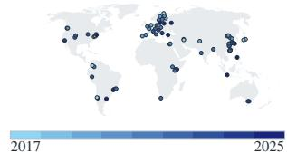  
Figure 8: We sample 106 points globally spanning 100 AlphaEarth COGs randomly across 2017–2025 to measure latency of feature materialization.

Table 6: EuroMineNet footprint mapping. Gray rows show original-feature scores (×100); other rows show retention relative to those scores. B-F1 measures mining-class F1 within three pixels of a ground-truth boundary; OF1 measures mining-class F1 over reconstructed site scenes.
<table><tr><td rowspan="2"></td><td colspan="2">AlphaEarth</td><td colspan="2">TESSERA</td><td colspan="2">Sentinel-2</td><td colspan="2">Landsat</td><td colspan="2">Sentinel-1</td></tr><tr><td>B-F1</td><td>OF1</td><td>B-F1</td><td>OF1</td><td>B-F1</td><td>OF1</td><td>B-F1</td><td>OF1</td><td>B-F1</td><td>OF1</td></tr><tr><td>Original features</td><td>66.5</td><td>78.0</td><td>67.4</td><td>77.3</td><td>63.9</td><td>70.7</td><td>56.4</td><td>64.8</td><td>49.6</td><td>45.7</td></tr><tr><td>TensoRF(VM)</td><td>97%</td><td>100%</td><td>94%</td><td>103%</td><td>85%</td><td>104%</td><td>89%</td><td>103%</td><td>91%</td><td>104%</td></tr><tr><td>K-Planes</td><td>97%</td><td>100%</td><td>94%</td><td>103%</td><td>85%</td><td>105%</td><td>90%</td><td>103%</td><td>92%</td><td>105%</td></tr><tr><td>iNGP</td><td>88%</td><td>98%</td><td>83%</td><td>100%</td><td>82%</td><td>102%</td><td>86%</td><td>101%</td><td>85%</td><td>100%</td></tr><tr><td>PFF-VM</td><td>99%</td><td>100%</td><td>98%</td><td>102%</td><td>91%</td><td>104%</td><td>97%</td><td>104%</td><td>98%</td><td>106%</td></tr><tr><td>PFF-K-Planes</td><td>99%</td><td>99%</td><td>99%</td><td>102%</td><td>93%</td><td>104%</td><td>100%</td><td>104%</td><td>100%</td><td>105%</td></tr></table>

Table 7: Serving PFFs on hardware-constrained environments. We benchmark serving $1 0 ^ { 6 }$ AlphaEarth embeddings with PFFs spread over approximately 100 fully valid regions globally across a variety of hardware environments. PFFs are faster to materialize compared to the Earth Engine API, even when run on a 2-core, 8 GB RAM CPU machine, averaging 6k embeddings/second compared to max API throughput of ≈1800 embeddings/s.  
Seconds to answer one query
<table><tr><td rowspan="2"></td><td colspan="3">A query = one request for 106 embeddings</td><td rowspan="2">Throughput</td></tr><tr><td>PFFs held in memory</td><td>First query Loads all 100 PFFs</td><td>Each later query Reloads what did not fit</td></tr><tr><td>Hardware Cascade Lake 2.8 GHz · 2 cores · 8 GB</td><td>13/100</td><td>178.1</td><td>167.5</td><td>(emb/s) 6.0k</td></tr><tr><td>Sapphire Rapids ·8 cores · 31 GB</td><td>60/100</td><td>57.4</td><td>32.7</td><td>30.6k</td></tr><tr><td>EPYC 7763 · 32 threads · 503 GB</td><td>100/100</td><td>26.5</td><td>14.5</td><td>69.1 k</td></tr><tr><td>NVIDIA L4 GPU· 24 GB</td><td>100/100</td><td>79.5</td><td>0.91</td><td>1.10M</td></tr></table>

Serving PFFs globally in compute-scarce environments. Table 7 evaluates repeated requests for $1 0 ^ { 6 }$ AlphaEarth embeddings across 100 regions on four hardware configurations: a Google Cloud virtual machine with two Intel Xeon vCPUs and 8 GB RAM, a c3-standard-8 VM with eight Sapphire Rapids vCPUs and 31 GB RAM, an HPC node with AMD EPYC 7763 processors and 503 GB RAM using 32 inference threads, and an NVIDIA L4 with 24 GB GPU memory. Each region has its own PFF, so answering a query requires evaluating 100 models. Checkpoints are already on local disk, but models must be loaded into memory before they can run. Keeping them in memory avoids this loading cost on subsequent queries. The 2-core, 8 GB machine retains 13 PFFs and reloads the other 87 for each query,

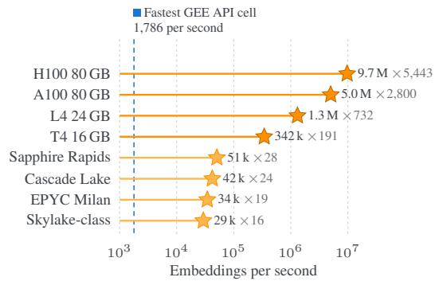  
Figure 9: PFF max throughput by hardware. CPUs use 8 threads. Multiplier comparisons are made against the fastest Google Earth Engine API throughput recorded on a virtual machine in us-west1-a.

taking 167.5 s to produce one million embeddings. The 31 GB machine retains 60 PFFs and completes subsequent queries in 32.7 s. Both the EPYC machine and the L4 GPU machine retain all 100 models, eliminating repeated model loading; they answer subsequent queries in 14.5 s and 0.91 s, respectively. The L4’s first query takes 79.5 s because it also loads the models, but subsequent queries sustain 1.10 million embeddings per second. Thus, even a small CPU machine can serve the full collection by loading models as needed, while sufficient memory and faster computation substantially reduce the cost of repeated access.

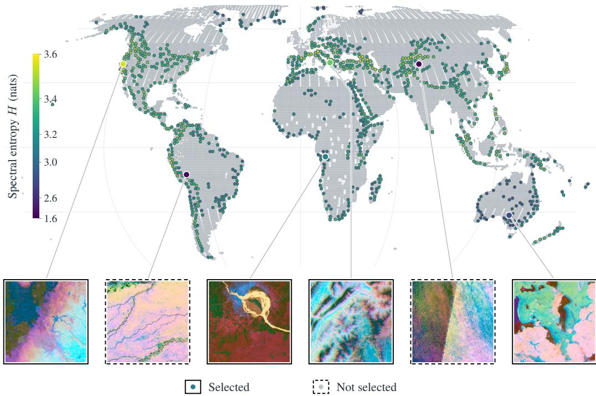  
Figure 10: Geographic coverage of PFFBENCH. Colored points show selected tile centers; gray points show the remaining eligible pool.

Peak throughput by hardware. Figure 9 measures how quickly a PFF can produce AlphaEarth embeddings once the model is loaded. We evaluate the same regional PFF on four CPU platforms, each using eight inference threads, and on NVIDIA T4 (16 GB), L4 (24 GB), A100 (80 GB), and H100 (80 GB) GPUs. The CPU platforms include Intel Xeon processors at 2.30 and 2.80 GHz, an Intel Xeon Platinum 8481C, and an AMD EPYC 7B13. We repeatedly evaluate a precomputed set of 8.4 million spatial coordinates for 2020, test several batch sizes, and measure sustained throughput at the fastest tested batch size on each machine. Model loading and coordinate preparation are excluded. All reported runs return embeddings to CPU memory, so GPU timings include transferring the results back to the host. CPU throughput ranges from 29k to 51k embeddings per second. The T4 produces 342k embeddings per second, while the L4, A100, and H100 reach 1.3, 5, and 9.70 million, respectively. The L4 explicitly enables TF32, and the A100 and H100 use the default CUDA settings documented as enabling TF32; the T4 and CPU runs use fp32 computation. These measurements significantly outperform current inference pipelines in EO. At max throughput on an NVIDIA H100, PFFs can materialize AlphaEarth features at 1.03 milliseconds per squared kilometer, assuming parallel compute in a setting similar to recent efforts to generate large maps (Ai2, 2026).

## B PFFBENCH

PFFBENCH contains 1,000 global tiles. Figures 10 and 11 visualize this full benchmark. Our main reconstruction evaluation in Figure 4 uses a 100-tile subset sampled from PFFBENCH. Selection balances multi-year product availability, geographic diversity, and variation in feature values. Of 33,385 AlphaEarth footprints (Brown et al., 2025), 21,370 have all nine years from 2017– 2025, at least 50% land-cell coverage, at least 60% of the nominal tile extent estimated from footprint bounds, and an assigned climate class. We additionally require at least 50% valid pixels in the 2019 overview used for scoring. TESSERA availability is checked against the v1.1 dClimate registry snapshot of 17 September 2026 (Feng et al., 2026).2 For each year from 2018–2025, at least $9 5 \%$ of registered blocks whose bounding boxes intersect the footprint within its UTM zone must be marked as embedded. Coverage in 2017 is optional. These filters retain 20,964 tiles.

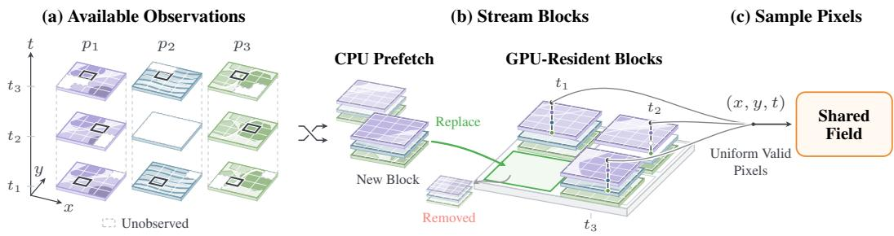  
Figure 12: Sampling across space, time, and products. (a) We randomly shuffle spatial block– year pairs from Cloud-Optimized GeoTIFFs (COGs), sampling across locations and years without replacement within each pass. (b) CPU workers read all available products for each selected block and year. Each stack has one layer per product; pixels with no observations are excluded. Prefetched blocks fill a fixed GPU buffer, where new blocks replace the oldest. (c) We sample uniformly, with replacement, from all valid pixels in this buffer, using the same coordinates for all active products.

We group candidates by continent and Köppen– Geiger climate group (Natural Earth, 2024; Peel et al., 2007). Each group receives a quota proportional to the square root of its candidate count, balancing coverage of smaller groups against the availability of tiles in larger groups. Quotas are rounded by largest remainder and capped at the available count; the two singleton groups receive no quota. Selected tile centers must be at least 100 km apart. These constraints spread the benchmark across the Earth without letting the largest groups dominate (Figure 10).

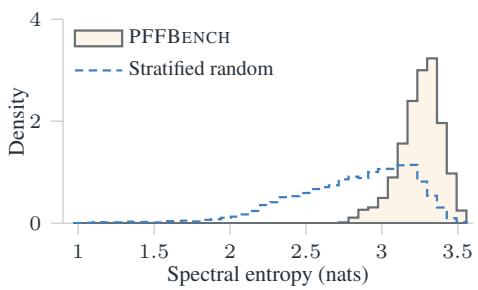  
Figure 11: Entropy ranking shifts the distribution toward higher scores. Mean H is 3.253 nats for PFFBENCH and 2.804 for constrained random selection (Cohen’s d = 1.15).

## Within each group, we prioritize tiles with greater

variation in their AlphaEarth values. We score the valid pixels of each tile’s 2019 80 m overview using mean per-band histogram entropy, $\begin{array} { r } { H _ { i } \ = \ - \frac { 1 } { 6 4 } \sum _ { b = 1 } ^ { 6 4 } \sum _ { k = 1 } ^ { 1 0 0 } p _ { i , b , k } \log p _ { i , b , k } } \end{array}$ , where $p _ { i , b , k }$ is the fraction of valid pixels in bin k of band b. We use 100 equal-width bins over the stored int8 range [−128, 128). This score provides a low-cost measure of feature-value diversity without fitting a neural field. We visit groups in round-robin order, selecting the highest-scoring candidate that satisfies the distance constraint until each quota is met or no eligible candidates remain. We fill the remaining places with the highest-scoring eligible tiles across the pool.

We compare the selected set with 20 random selections using the same quotas and distance constraint. Mean entropy increases from $2 . 8 \pm 0 . 0 0 5$ across these random selections to 3.2 for PFF-BENCH (Figure 11). Across the candidate pool, entropy also correlates with lossless zlib bytes per valid pixel (Spearman $\rho = 0 . 9 0 )$ , which is a rough proxy for neural compression reconstruction difficulty. PFFBENCH therefore emphasizes higher-entropy content rather than estimating average reconstruction performance over global land.

## C IMPLEMENTATION DETAILS AND HYPERPARAMETERS

## C.1 PFF TRAINING DETAILS

Training batches. We train every PFF jointly on all 14 products. Each 8192×8192 region is divided into $1 0 2 4 \times 1 0 2 4$ spatial blocks across the available years. We maintain a fixed-capacity GPU buffer containing several block–year pairs while CPU workers prefetch the next blocks. Each iteration samples 1,048,576 valid coordinates uniformly from the resident buffer. The same coordinates are used for all products, and missing targets are masked independently. The block–year list is traversed without replacement before reshuffling, while pixels may be sampled repeatedly while their block remains resident.

Decoders and losses. Each product uses a two-hidden-layer ReLU MLP decoder. We use width 1024 for AlphaEarth (Brown et al., 2025) and TESSERA (Feng et al., 2026) and 256 for the remaining products. AlphaEarth predictions are $\ell _ { 2 }$ -normalized and optimized with cosine distortion, $1 - \cos ( \hat { \mathbf { y } } , \mathbf { y } )$ . All other products are standardized per channel and optimized with mean-squared error in standardized units. Each product loss is averaged over its observed targets, and the product losses are summed with equal weight.

Optimization. We optimize the field and all decoders with Adam using $\beta _ { 1 } = 0 . 9 , \beta _ { 2 } = 0 . 9 9$ and $\epsilon = 1 0 ^ { - 8 }$ . For VM fields, we use a learning rate of $2 \times 1 0 ^ { - 2 }$ for the factors and $1 0 ^ { - 3 }$ for the basis projection and decoders. For K-Planes, we use $5 \times 1 0 ^ { - 3 }$ for the planes and $1 0 ^ { - 3 }$ for the decoders. Learning rates are warmed up linearly for 500 iterations and then cosine-decayed to 0.1 of their initial value. K-Planes additionally uses spatial total variation, temporal smoothness, and temporal $L _ { 1 }$ regularization with weights $\dot { 2 } \times 1 0 ^ { - \dot { 4 } } , 1 0 ^ { - 3 }$ , and $1 0 ^ { - 4 }$ , respectively. Training uses mixed precision (bf16).

Training length and checkpoint selection. For the experiments in this paper, every PFF is trained for 20,000 iterations. Every 1000 iterations, we evaluate a fixed set of uniformly sampled coordinates and retain the checkpoint with the lowest mean normalized distortion across products. We use $1 - R ^ { 2 }$ for Euclidean-valued products and 1 − skill for AlphaEarth.

## C.2 DOWNSTREAM EVALUATION

We evaluate whether reconstructed features preserve the information used by downstream models. For each benchmark, we extract one feature vector per labeled pixel from either the original product or its reconstruction at the same location and year. Features remain frozen, and each source is evaluated with the same labels, split, sampling procedure, and probe configuration. We report retention as

$$
1 0 0 \times { \frac { \mathrm { s c o r e ~ u s i n g ~ r e c o n s t r u c t e d ~ f e a t u r e s } } { \mathrm { s c o r e ~ u s i n g ~ o r i g i n a l ~ f e a t u r e s } } } .
$$

A retention of 100% matches the source features, while values above 100% indicate better downstream performance after reconstruction.

For PASTIS (Sainte Fare Garnot & Landrieu, 2021), SwissCrop25 (Lauber et al., 2026), and EuroMineNet (Yu et al., 2026), we transform each label-pixel center into the coordinate system of its regional field and query the corresponding location and calendar year. The original product is sampled at the same source cell. FTW is evaluated on its native chip grid, where the field is queried continuously at each chip-pixel center. In all cases, the probe receives only the feature vector at that pixel; we do not provide neighboring features or spatial context.

PASTIS. PASTIS provides dense crop labels over France with five official folds (Sainte Fare Garnot & Landrieu, 2021). We query all products at 2019, use folds 1–3 for training, fold 4 for validation, and fold 5 for testing. Background and void labels are removed, leaving 18 crop classes. We standardize the frozen features and fit a multinomial logistic-regression probe on up to 500,000 training pixels. The regularization parameter is selected from $\breve { C } \in \{ 0 . 1 , 1 , 1 0 \}$ using validation mIoU. We score the full test fold and report macro IoU over the 18 crop classes.

SwissCrop25. SwissCrop25 contains dense crop-type labels from 2019–2025 over Switzerland (Lauber et al., 2026). We follow its leave-one-year-out evaluation for test years 2021–2025: year T is held out for testing, year $T - 1$ is used for validation, and the remaining years are used for training.

This evaluates transfer across years, but is not a causal forecasting split because training may include observations after the test year. The label space contains 65 crop and 5 non-crop classes. Each fold contains approximately 1.5–1.6 billion labeled training pixels, making iterative optimization over individual pixels unnecessarily expensive. Because the probe is linear, we aggregate the training features into sufficient statistics—class counts, feature sums, and second moments—and solve the ridge-regression objective in closed form. This exactly recovers the linear solution while using all labeled training pixels, without storing or repeatedly iterating over the full matrix. Regularization and class weighting are selected using validation crop mIoU, and we report overall accuracy and mean IoU over the 65 crop classes, averaged across the five test years.

EuroMineNet. EuroMineNet provides annual mine-footprint masks with an official site-level train, validation, and test split (Yu et al., 2026). We evaluate the years 2017–2024. For each year, we standardize the frozen per-pixel features and fit a balanced logistic-regression probe to predict mine footprint.

We report two footprint metrics. Overall footprint F1 (OF1) measures pixel-level agreement over the complete reconstructed mine masks. Boundary F1 (B-F1) computes the same F1 score only within a three-pixel band around the ground-truth footprint boundary, emphasizing the spatial detail needed to localize mine edges. For both metrics, predictions are reassembled into full site scenes, accumulated across years, and averaged across test sites with weights proportional to the number of scored pixels.

For change detection, the probe receives consecutive-year features and their difference,

$$
[ \mathbf { f } _ { t } , \mathbf { f } _ { t - 1 } , \mathbf { f } _ { t } - \mathbf { f } _ { t - 1 } ] ,
$$

and predicts the XOR of the corresponding footprint masks. Only 0.52% of evaluated pixel pairs change. We therefore report area under the precision–recall curve (AUPRC) and F1@r. AUPRC measures how well changed pixels are ranked across all thresholds. For F1@r, if k pixel pairs change in the ground truth, the k highest-scoring predictions are labeled as change before computing F1. This evaluates whether the model places the correct amount of change in the correct locations.

Fields of the World. Fields of the World (FTW) provides field-boundary and field-extent labels across multiple countries (Kerner et al., 2025). We evaluate AlphaEarth and Sentinel-2 features in western Bahia, Brazil, and South Africa using the official train, validation, and test splits and the acquisition year associated with each region. Frozen features are standardized and evaluated with a balanced logistic-regression probe; $C \in \{ 0 . 1 , 1 , 1 0 \}$ is selected on the validation set.

The two regions require different metrics because their labels provide different supervision. The Brazil subset contains field annotations without labeled background, so false-positive fields cannot be interpreted reliably. We therefore report object recall: predicted field pixels are grouped into connected components, and a ground-truth field is recovered when a predicted component overlaps it at IoU > 0.5. South Africa contains labeled field and background pixels, so we report pixel IoU for field extent. Both evaluations use the native FTW label grid.

(a) PFF-VM  
Seasonal change  
2025 Pacific Palisades Fire  
2022 Sindh floods  
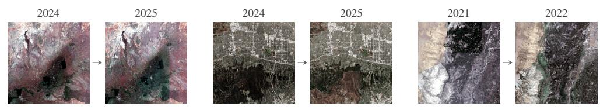

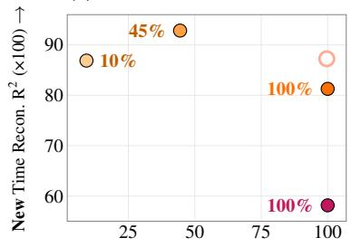  
(b) PFF-K-Planes

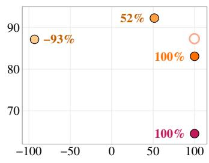

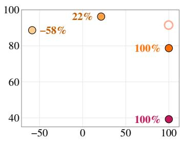

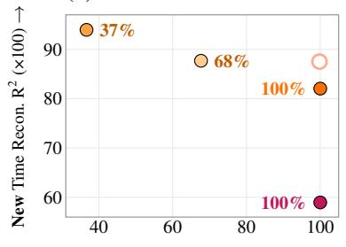

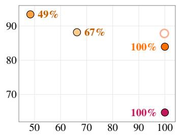  
Old R2 Retained After New Time Adaptation (%) →

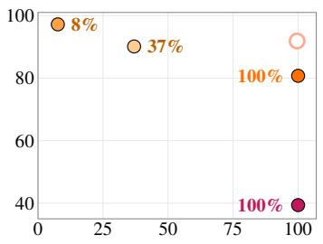  
Time Copy PFF-Append FT-All FT-Dec Pre-trained Old + New  
Figure 13: Continually learning new timesteps. Sentinel-2 observations show each region before and during the added year. (a, b) New-year reconstruction and old-year retention for PFF-VM and PFF-K-Planes. Labels report retention.

2025 Pacific Palisades Fire  
34.09°N 118.55°W  
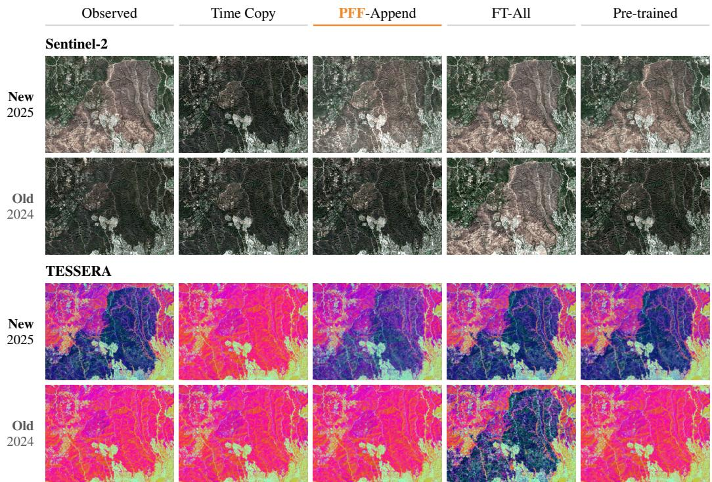  
Figure 14: Continual learning (PFF-VM) qualitative results on the Pacific Palisades burn scar area. Visualized Sentinel-2 (top) and TESSERA (bottom). Time copy and other nonparametric baselines are unable to capture spatial change in 2025 caused by the burn scar. PFF-Append captures this 2025 change while leaving the existing year (2024) unchanged, matching the pretrained result at ≈ 2% of its training time. Finetuning the PFF (FT-All) overfits to the spatial change and exhibits catastrophic forgetting on 2024.

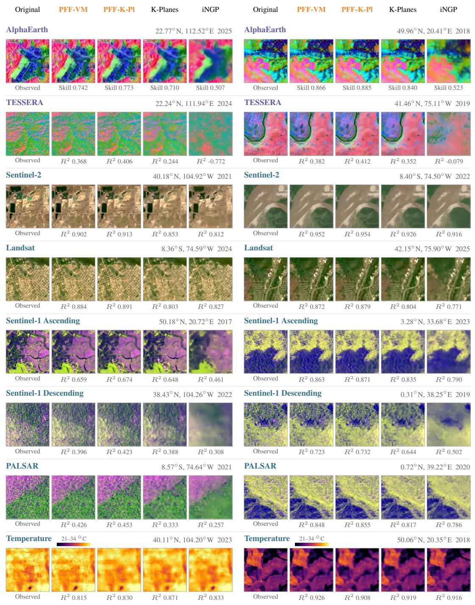  
Figure 15: Selected regional reconstructions: embeddings and observations. Two examples per view, curated for source structure and geographic/year variety. Each inset covers $2 . 5 6 \times \bar { 2 } . 5 6$ km (256 × 256 cells on the 10m product grid), north up. PFFs and compression rate-matched singleproduct neural fields occupy 64M parameters. We use per-crop PCA for embeddings, visible RGB for optical, co-pol, cross-pol, and their dB difference with per-crop stretches for SAR (Sentinel-1 ascending and descending orbits). AE scores are angular skill; other scores are channel-averaged $R ^ { 2 }$ (two polarizations for each Sentinel-1 orbit).

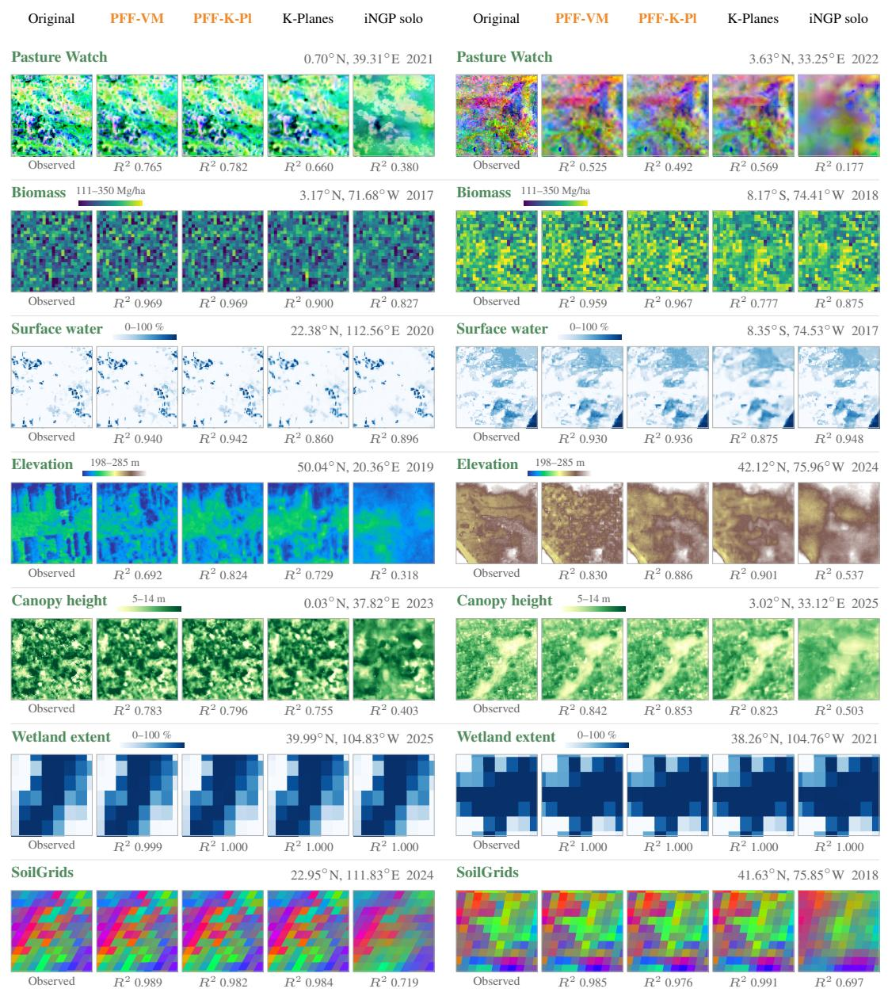  
Figure 16: Selected regional reconstructions: native-lattice maps. Two source-curated examples per product, each covering 2.56 × 2.56 km. Original cells retain their native sizes and footprints; every model is queried at those same cell centers. Cells are drawn without value interpolation. Dates identify field queries.