# POINTWISE OR PAIRWISE: WHEN DO PAIRWISE LOSSES HELP REWARD LEARNING, PROVABLY?

Junghyun Lee Kim Jaechul Graduate School of AI, KAIST Seoul 02455, Republic of Korea jh\_lee00@kaist.ac.kr

Sanghwa Kim Kim Jaechul Graduate School of AI, KAIST Seoul 02455, Republic of Korea tkdghk9667@kaist.ac.kr

Eun Jee Lee∗ Independent Researcher Cambridge, MA, USA ejlee.mail@gmail.com

Minsoo Ha∗ Graduate School of AI, POSTECH Pohang 37673, Republic of Korea minsoo0926@postech.ac.kr

Yeongjong Kim∗   
Samsung Research   
Seoul 06765, Republic of Korea yeong-j.kim@samsung.com

Seiyun Shin∗, Kwang-Sung Jun Graduate School of AI, POSTECH Pohang 37673, Republic of Korea seiyun923@gmail.com kwangsungjun@postech.ac.kr

## ABSTRACT

Pairwise losses are increasingly used for reward learning even when pointwise rewards are observed, with mixed empirical results. When and why do pairwise losses outperform pointwise losses? We study this question in a grouped offline contextual-bandit setting allowing multiple actions per context, capturing many reward learning scenarios. We compare VALUE REGRESSION (VR), which regresses observed rewards pointwise, with VALUE DIFFERENCE REGRESSION (VDR), which regresses reward differences between a pair of actions sampled under the same context. We consider a semiparametric model where the mean reward is the sum of a learnable action-dependent component and an arbitrary context-dependent yet action-independent nuisance, capturing context-specific disturbances. Using a unified localized analysis, we prove finite-sample regression guarantees for finite and linear function classes and translate them into offline-regret bounds. For finite classes, VDR eliminates the misspecification term in the VR bound and improves a reward-scale-dependent error term by averaging over actions within each context, a benefit absent from the corresponding VR term. For linear classes, neither method uniformly dominates: within-context differencing removes nuisance-induced bias but may increase estimation variance relative to using absolute rewards when the misspecification is sufficiently low. This yields a feature geometry-dependent bias–variance tradeoff, which we corroborate with numerical experiments.

## 1 INTRODUCTION

Modern machine learning increasingly relies on learned reward functions to turn limited supervision into reusable objectives that can be optimized at scale. Examples include reinforcement learning from human feedback (RLHF) (Christiano et al., 2017), Best-of-N test-time scaling (Huang et al., 2025), reward- or value-guided reasoning and search (Guan et al., 2025; Li & Li, 2025), and, outside language modeling, automated essay scoring and speech-quality assessment (Cao et al., 2026; Xie et al., 2022). In many of these settings, supervision is pointwise and numerical, such as human ratings (Wang et al., 2024b), verifier scores (Lambert et al., 2025), or search-derived value estimates (Guan et al., 2025). In such cases, it is natural to regress directly on the observed rewards.

Several methods, on the other hand, deliberately construct pairwise targets, such as preferences or reward differences between actions under the same context, even when pointwise values are available. In language-model reasoning, Guan et al. (2025) convert search-derived Q-values into high-Q/low-Q pairs and use a Bradley–Terry loss (Bradley & Terry, 1952) to train a process reward model. Cui et al. (2024) construct preference pairs from numerical GPT-4 ratings and use a margin-adjusted Bradley–Terry loss to train a reward model. Beyond language modeling, pairwise squared losses on numerical label differences have been used for magnitude-preserving ranking (Cortes et al., 2007) and as a component of regression objectives (Zhu et al., 2025). Related pairwise objectives also appear even when numerical labels, such as essay scores and speech-quality scores, are available (Cao et al., 2026; Xie et al., 2022). In these examples, pairing is an algorithmic choice rather than an inherent property of the raw feedback.

Despite the growing use of pairwise losses, the empirical benefits of pairing are not consistent. Some studies report ablation results supporting the advantages of pairing over pointwise objectives. For example, pairwise preference training improves mathematical reasoning accuracy over pointwise Q-value regression (Guan et al., 2025) and speech quality ordering accuracy over pointwise score regression (Cao et al., 2026). However, some other studies report that pairing does not always improve over pointwise alternatives. In reward-learning ablations on Atari games, neither preference-based training nor pointwise regression to returns consistently yields better downstream returns (Christiano et al., 2017). In ranking experiments, either objective can outperform the other depending on the choice of kernel (Pahikkala et al., 2013). These mixed results motivate a more rigorous understanding of which properties of the learning problem determine whether pairing helps downstream decisions.

We therefore ask:

Given pointwise reward data, when does learning a rewardfunction with pairwise losses lead to provably better downstream decisions than learning with pointwise losses?

We make significant progress towards answering this question through the lens of contextual bandits along with representative pairwise and pointwise losses.

## 1.1 THEORETICAL SETUP: GROUPED OFFLINE REWARD LEARNING

Let X be a context (prompt) space, A be an action (response) space with $| { \mathcal { A } } | < \infty ,$ , and ${ \mathcal { F } } \subseteq \{ f$ $\mathcal { X } \times \mathcal { A }  \mathbb { R } \}$ be a value function space. $r ^ { \star } : \mathcal { X } \times \mathcal { A }  \mathbb { R }$ is an unknown reward function.

Grouped dataset. With a prompt distribution $\rho \in \Delta ( \mathcal { X } )$ and behavior policy $\pi _ { \mathrm { r e f } } ( \cdot \mid x ) \in \Delta ( \mathcal { A } )$ the learner is given a (passively) collected, grouped offline dataset

$$
\mathcal { D } : = \{ ( x _ { i } , a _ { i , j } , r _ { i , j } ) \} _ { i \in [ N _ { x } ] , j \in [ N _ { a } ] } , \qquad N : = N _ { x } N _ { a } ,
$$

where the contexts $x _ { i } \sim \rho$ are $\mathrm { i . i . d . ; }$ conditional on $x _ { i } ,$ , the actions $a _ { i , j } \sim \pi _ { \mathrm { r e f } } ( \cdot \mid x _ { i } )$ are i.i.d.; and $r _ { i , j } = r ^ { \star } ( x _ { i } , a _ { i , j } ) + \eta _ { i , j }$ satisfying $| r _ { i , j } | \le R _ { \operatorname* { m a x } } a . s ,$ . for a known $R _ { \mathrm { m a x } } > 0$ . Conditional on $\mathcal { Z } : = \{ ( x _ { i } , a _ { i , j } ) \} _ { i , j }$ , the $\eta _ { i , j } \mathrm { ^ { \circ } s }$ are independent, their conditional laws depend on $\mathcal { Z }$ only through $( x _ { i } , a _ { i , j } ) .$ , and they satisfy $\widetilde { \mathbb { E } } [ \eta _ { i , j } \mid \mathcal { Z } ] = 0 , \mathbb { E } [ \eta _ { i , j } ^ { 2 } \mid \mathcal { Z } ] \le \sigma ^ { 2 }$ , and $| \eta _ { i , j } | \le 2 R _ { \mathrm { m a x } } . ^ { 1 }$ It may be that $N _ { a } \geq 2$ , as is the case when multiple candidate responses are sampled for reward modeling or group-based policy optimization (Cui et al., 2024; Guan et al., 2025; Shao et al., 2024). Henceforth, let $\bar { \mathbb { E } _ { x , a } } : = \bar { \mathbb { E } _ { x \sim \rho , a \sim \pi _ { \mathrm { r e f } } \left( \cdot | x \right) } }$ whenever there is no ambiguity.

Offline regret. The performance of a policy $\pi : \mathcal { X }  \Delta ( \mathcal { A } )$ is measured with the offline regret:

$$
\mathrm { R e g } ( \pi ) : = V ( r ^ { \star } ) - V ( \pi ) , \quad V ( \pi ) : = \mathbb { E } _ { \boldsymbol { x } \sim \boldsymbol { \rho } , \boldsymbol { a } \sim \pi ( \cdot | \boldsymbol { x } ) } \left[ r ^ { \star } ( \boldsymbol { x } , \boldsymbol { a } ) \right] ,\tag{1}
$$

where $V ( \pi )$ is the value of the policy π, and with a slight notation abuse, for $g \in { \mathcal { F } } , V ( g )$ is the value of the GREEDY policy $x \mapsto \arg \operatorname* { m a x } _ { a \in \mathcal { A } } g ( x , a )$ ), following the standard convention in value-based offline RL (Chen & Jiang, 2019). Define the centering operator $\mathcal { C } : f \mapsto \mathcal { C } f$ as

$$
\begin{array} { r } { \mathcal { C } f ( x , a ) : = f ( x , a ) - \mathbb { E } _ { a \sim \pi _ { \mathrm { r e f } } ( \cdot \vert x ) } [ f ( x , a ) ] , } \end{array}
$$

which is action-gap-preserving in the sense that $\mathcal { C } f ( x , a ) - \mathcal { C } f ( x , a ^ { \prime } ) = f ( x , a ) - f ( x , a ^ { \prime } )$ . Then, based on standard coverage-based arguments (Rashidinejad et al., 2022), we show that a bound on

Table 1: Centered squared prediction error bounds for VALUE REGRESSION (VR) and VALUE DIFFERENCE REGRESSION (VDR) over finite and linear classes. We omit universal constants; for $\mathcal { F } _ { \mathrm { l i n } } .$ we also suppress log $\frac { 1 } { \delta }$ factors. For $\mathcal { F } _ { \mathrm { l i n } } , \varepsilon _ { \mathrm { z } }$ and $\varepsilon _ { \mathrm { b l k } }$ measure the geometric impact of misspecification on VR $( \varepsilon _ { \mathrm { b l k } } : = \varepsilon _ { \mathrm { x } } + \varepsilon _ { \mathrm { a } } / N _ { a }$ in Eqn. (5)). $\alpha _ { 0 } \geq 1$ (resp. $\overset { \cdot } { \alpha } \mathrm { c } \geq 1 )$ quantifies how well-conditioned the (resp. centered) features are; see Assumption 2 (resp. Assumption 3). $1 \leq d _ { \mathrm { C } } \leq d$ is the dimension of the identifiable subspace for centered features.
<table><tr><td rowspan=1 colspan=1></td><td rowspan=1 colspan=1>(VR)</td><td rowspan=1 colspan=1>(VDR)</td></tr><tr><td rowspan=1 colspan=1> $| \mathcal F | < \infty ^ { \dagger }$ </td><td rowspan=1 colspan=1> $\overline { { 2 \varepsilon _ { \mathrm { a p r x } } + \left( \frac { F ^ { 2 } + F R _ { \mathrm { m a x } } } { N _ { x } } + \frac { \sigma ^ { 2 } } { N } \right) \log \frac { | \mathcal { F } | } { \delta } } }$ (Eqn. (2) of Theorem 3.1)</td><td rowspan=1 colspan=1> $\left( \frac { F ^ { 2 } } { N _ { x } } + \frac { \sigma ^ { 2 } + F R _ { \mathrm { m a x } } } { N } \right) \log { \frac { | \mathcal { F } | } { \delta } }$ (Eqn. (3) of Theorem 3.1)</td></tr><tr><td rowspan=1 colspan=1> $\mathcal { F } _ { \mathrm { l i n } } ^ { \mathrm { ~ \scriptsize ~ \frac { 1 } { \cdot } ~ } }$ </td><td rowspan=1 colspan=1> $\overline { { \varepsilon _ { \mathrm { a p r x } } + \frac { \varepsilon _ { \mathrm { b l k } } d } { N _ { x } } + \frac { \varepsilon _ { \mathrm { z } } d } { N _ { x } ^ { 2 } } + \frac { \sigma ^ { 2 } d } { N } + \frac { R _ { \mathrm { m a x } } ^ { 2 } \alpha _ { 0 } ^ { 2 } d } } }$ (Theorem 4.1)</td><td rowspan=1 colspan=1> $\frac { \sigma ^ { 2 } d _ { \mathrm { C } } } { N } + \frac { R _ { \mathrm { m a x } } ^ { 2 } \alpha _ { \mathrm { C } } ^ { 2 } d _ { \mathrm { C } } } { N ^ { 2 } }$ (Theorem 4.2)</td></tr></table>

† $F : = \operatorname* { s u p } _ { f \in { \mathcal { F } } } \left\| f \right\| _ { \infty } ,$ , and F may be much smaller than $R _ { \mathrm { m a x } } .$  
‡ $N _ { x }$ must be sufficiently large; see the theorems. Also, $\varepsilon _ { \mathrm { z } } = \varepsilon _ { \mathrm { b l k } } = 0$ when $\varepsilon _ { \mathrm { a p r x } } = 0$

the centered prediction error of a given value estimator $\hat { f } , \mathbb { E } [ ( \mathcal { C } \hat { f } - \mathcal { C } r ^ { \star } ) ^ { 2 } ]$ , implies an offline regret bound via GREEDY or PESSIMISM; see Proposition B.1 in Appendix B.

Weak realizability. We impose the following semiparametric-type weak realizability assumption on $r ^ { \star }$ (this subsumes realizability as it may be that $b ^ { \star } = 0 )$ :

Assumption 1 (Weak Realizability). There exist $f ^ { \star } \in { \mathcal { F } }$ and $b ^ { \star } : \mathcal { X }  \mathbb { R }$ such that $r ^ { \star } ( x , a ) =$ $f ^ { \star } ( x , a ) + b ^ { \star } ( x )$ . In particular, we do not assume realizability on either $b ^ { \star }$ or r⋆; only on $f ^ { \star } .$

As it may be that $r ^ { \star } \notin \mathcal { F } .$ , we define the misspecification error:

$$
\varepsilon _ { \mathrm { a p r x } } : = \operatorname* { i n f } _ { f \in \mathcal { F } } \mathbb { E } _ { x , a } \big [ ( f ( x , a ) - r ^ { \star } ( x , a ) ) ^ { 2 } \big ] \geq 0 .
$$

This arises in many scenarios. Under Bradley–Terry preferences (Bradley & Terry, 1952), adding a prompt-only term changes neither the preference model nor the optimal KL-regularized policy (Rafailov et al., 2023). Action-independent nuisances likewise arise in semiparametric contextual bandits and regression (Carranza et al., 2023; Foster & Syrgkanis, 2023; Greenewald et al., 2017; Kim & Paik, 2019; Kim et al., 2025; Krishnamurthy et al., 2018; Nie & Wager, 2021).

Algorithms: VR and VDR. We now introduce the two value estimators studied in this paper, which formalize the pointwise and pairwise approaches described at the beginning. For the pointwise loss, we consider VALUE REGRESSION (VR), which directly regresses the observed rewards:

$$
\hat { f } _ { N } ^ { \mathrm { V R } } \in \underset { f \in \mathcal { F } } { \arg \operatorname* { m i n } } \left\{ \widehat { \mathcal { L } } ^ { \mathrm { V R } } ( f ) : = \frac { 1 } { N _ { x } } \sum _ { i = 1 } ^ { N _ { x } } \frac { 1 } { N _ { a } } \sum _ { j = 1 } ^ { N _ { a } } \bigl ( f ( x _ { i } , a _ { i , j } ) - r _ { i , j } \bigr ) ^ { 2 } \right\} .\tag{VR}
$$

For the pairwise loss, there are many variations such as the Bradley–Terry loss (Bradley & Terry, 1952), margin loss (Chen et al., 2024), and squared difference loss (Xie et al., 2022). For ease of exposition, we choose a simple variant, VALUE DIFFERENCE REGRESSION (VDR), that regresses the reward difference: denoting $\Delta _ { i , j , k } ( f ) : = f ( x _ { i } , a _ { i , j } ) - f ( x _ { i } , a _ { i , k } )$ and $\begin{array} { r } { \widehat { \Delta } _ { i , j , k } ( r ) : = r _ { i , j } - r _ { i , k } } \end{array}$

$$
\hat { f } _ { N } ^ { \mathrm { V D R } } \in \underset { f \in \mathcal { F } } { \arg \operatorname* { m i n } } \left\{ \widehat { \mathcal { L } } ^ { \mathrm { V D R } } ( f ) : = \frac { 1 } { N _ { x } } \sum _ { i = 1 } ^ { N _ { x } } \frac { 1 } { \binom { N _ { a } } { 2 } } \sum _ { 1 \leq j < k \leq N _ { a } } \left( \Delta _ { i , j , k } ( f ) - \widehat { \Delta } _ { i , j , k } ( r ) \right) ^ { 2 } \right\} .\tag{VDR}
$$

Using the centering identity of Zhu et al. (2025, Corollary 2), $\widehat { \mathcal { L } } ^ { \mathrm { V D R } }$ can be evaluated exactly in linear time by centering residuals within each context (the essence is the identity $\mathbb { E } [ ( X - Y ) ^ { \tilde { 2 } } ] =$ $2 \mathbb { E } [ ( X - \mathbb { E } [ { \dot { X } } ] ) ^ { 2 } ]$ where X and $Y$ are i.i.d). Pair-selection strategies are also used in preference learning (Guan et al., 2025; Pukdee et al., 2026), but are outside our scope.

## 1.2 OUR CONTRIBUTIONS

Our main departure from the prior literature is the grouped offline dataset $\mathcal { D } \colon$ standard formulations typically require $N _ { a } = 1$ , whereas we allow for $N _ { a } \ \geq \ 2$ in which case the N triplets become $n o n { - } i . i . d .$ Thus, statistical accuracy may depend on not only $N$ but also $N _ { x } ;$ ; the term with $N _ { x }$ governs generalization across contexts, while the term with $N _ { a }$ governs concentration of withincontext variations. We focus on finite-sample guarantees with sharp dependence on these two sample sizes $N _ { x }$ and $N _ { a }$ , as well as on the complexity of $\mathcal { F } \left( \log | \mathcal { F } | , \dot { d } \right)$ , misspecification-related terms $( \varepsilon _ { \mathrm { a p r x } } , \varepsilon _ { \mathrm { z } } , \varepsilon _ { \mathrm { x } } , \varepsilon _ { \mathrm { a } } )$ , the reward scale $R _ { \mathrm { m a x } } ,$ and feature geometry-related terms $( \alpha _ { 0 } , \alpha _ { \mathrm { C } } , d _ { \mathrm { C } } )$

Our contributions are as follows, along with the rest of the paper’s organization:

Grouped finite-sample analysis (Section 2). Building on localized squared-loss analyses (Bartlett et al., 2005; Liang et al., 2015), we develop a common blockwise analysis recipe for VR and VDR that distinguishes terms governed by $1 / N _ { x }$ from those governed by $1 / N$

Finite classes (Section 3, first row of Table 1). Under weak realizability, VDR eliminates the $\varepsilon _ { \mathrm { a p r x } }$ appearing in the VR guarantee and improves the $F R _ { \mathrm { m a x } }$ term from the context scale $1 / N _ { x }$ to the full-sample scale $1 / N$ . We complement this by reporting an instance where VR fails yet VDR succeeds in achieving $\widetilde { \mathcal { O } } ( 1 / \sqrt { N } )$ offline regret.

Linear classes (Section 4, second row of Table 1). Next, we consider the linear class $\mathcal { F } _ { \mathrm { l i n } } : =$ $\{ ( x , a ) \mapsto \langle \phi ( x , a ) , \pmb \theta \rangle : \pmb \theta \in \mathbb { R } ^ { d } \}$ with a known feature map $\phi : \mathcal { X } \times \mathcal { A }  \mathbb { R } ^ { d }$ We show that neither method uniformly dominates: their relative performance depends on the feature geometry. While VDR eliminates the misspecification terms $\varepsilon _ { \mathrm { a p r x } } , \varepsilon _ { \mathrm { z } } , \varepsilon _ { \mathrm { x } } , \varepsilon _ { \mathrm { a } }$ present in the VR bound, their $N ^ { - 2 }$ terms scale with different geometric quantities: $\alpha _ { 0 } ^ { 2 }$ for ${ \mathrm { V R } } .$ , determined by the raw features, and $\alpha _ { \mathrm { { C } } } ^ { 2 }$ for VDR, determined by feature differences. This yields a geometric bias–variance tradeoff: VDR removes nuisance-induced misspecification error $( b i a s )$ , but its variance depends on the geometry of feature differences, which can be less favorable than the raw feature geometry governing VR. Numerical experiments on toy and real-world LLM tasks illustrate this tradeoff.

## 2 A LOCALIZED ANALYSIS FOR GROUPED REGRESSION

Let $\pmb { r } = ( r _ { i , j } ) _ { i \in [ N _ { x } ] , j \in [ N _ { a } ] }$ denote the vector of realized (noisy) rewards. We consider the following generic empirical and population squared losses:

$$
\widehat { \mathcal { L } } ( f ) : = \frac { 1 } { N _ { x } } \sum _ { i = 1 } ^ { N _ { x } } \left. \mathcal { T } _ { i } ( f - \boldsymbol { r } ) \right. _ { 2 } ^ { 2 } , \qquad \mathcal { L } ( f ) : = \mathbb { E } \left[ \left. \mathcal { T } _ { i } ( f - \boldsymbol { r } ^ { \star } ) \right. _ { 2 } ^ { 2 } \right] ,
$$

where $\begin{array} { r l r l r l } { { \mathcal { T } } } & { { } : } & { \mathbb { R } ^ { N _ { a } } } & { { } \to } & { \mathbb { R } ^ { m } } \end{array}$ is an algorithm-dependent linear transformation, $\begin{array} { r l } { { \mathcal { T } } _ { i } f } & { { } : = } \end{array}$ ${ \cal T } \left( \left( f ( x _ { i } , a _ { i , 1 } ) , \dots , f ( x _ { i } , a _ { i , N _ { a } } ) \right) \right)$ , and $\mathcal { T } _ { i } \bar { r } : = \mathcal { T } \left( ( \bar { r _ { i , 1 } } , \dots , r _ { i , N _ { a } } ) \right)$ . VR and VDR correspond to $\begin{array} { r } { \mathcal { T } ^ { \mathrm { V R } } : \pmb { u } \mapsto \frac { 1 } { \sqrt { N _ { a } } } \pmb { u } } \end{array}$ and $\mathcal { T } ^ { \mathrm { V D R } } : \boldsymbol { u } \mapsto \left( \begin{array} { l } { \boldsymbol { N } _ { a } } \\ { 2 } \end{array} \right) ^ { - 1 / 2 } ( \boldsymbol { u } _ { j } - \boldsymbol { u } _ { k } ) _ { 1 \leq j < k \leq N _ { a } }$ , respectively, for $\pmb { u } \in \mathbb { R } ^ { N _ { a } }$ We now define the following notion of empirical complexity measure:

Definition 2.1 (Localized block-offset modulus). For a comparator $f ^ { \circ } \in { \mathcal { F } }$ and $\lambda , r \geq 0 ,$ , define the localized block-offset modulus $\Psi ( r ; \lambda , f ^ { \circ } )$ as follows:

$$
\Psi ( r ; \lambda , f ^ { \circ } ) : = \operatorname* { s u p } _ { \stackrel { h \in \mathcal { F } - f ^ { \circ } } { \angle ( f ^ { \circ } + h ) - \mathscr { L } ( f ^ { \circ } ) \leq r } } \left[ \left( \mathscr { L } ( f ^ { \circ } + h ) - \mathscr { L } ( f ^ { \circ } ) \right) - \left( \widehat { \mathscr { L } } ( f ^ { \circ } + h ) - \widehat { \mathscr { L } } ( f ^ { \circ } ) \right) - \lambda \widehat { Q } ( h ) \right] ,
$$

$$
\begin{array} { r } { w h e r e ~ \mathcal { F } - f ^ { \circ } : = \{ f - f ^ { \circ } : f \in \mathcal { F } \} \ : a n d \widehat { Q } ( h ) : = \frac { 1 } { N _ { x } } \sum _ { i = 1 } ^ { N _ { x } } \| \mathcal { T } _ { i } h \| _ { 2 } ^ { 2 } . } \end{array}
$$

We now present a fixed-point inequality for the excess loss, whose proof is deferred to Appendix C.2:

Proposition 2.1 (Localized fixed-point inequality). Fix any comparator $f ^ { \circ } \in { \mathcal { F } }$ and any estimator $\hat { f } _ { N } \in \mathcal { F } .$ . Suppose that the following two conditions hold: denoting $h : = \hat { f } _ { N } - f ^ { \circ }$

(i) There is a constant $\lambda \geq 0$ such that our estimator ${ \widehat { f } } _ { N }$ satisfies

$$
\widehat { \mathcal { L } } ( \hat { f } _ { N } ) - \widehat { \mathcal { L } } ( f ^ { \circ } ) \leq - \lambda \widehat { Q } ( \hat { f } _ { N } - f ^ { \circ } ) ;
$$

(ii) There is a deterministic $\psi : \mathbb { R }  \mathbb { R }$ such that $\Psi ( r ; \lambda , f ^ { \circ } ) \leq \psi ( r )$ for all $r \geq 0 .$

Then, we have the following fixed-point inequality for the population excess loss:

$$
\begin{array} { r } { \mathcal { L } ( \hat { f } _ { N } ) - \mathcal { L } ( f ^ { \circ } ) \leq \operatorname* { s u p } \{ r \geq 0 : r \leq \psi ( r ) \} . } \end{array}
$$

Although seemingly abstract, Proposition 2.1 provides a common recipe for deriving tight statistical rates for VR and VDR over generic ${ \mathcal { F } } \colon$ verify conditions (i) and $( i i )$ . In our applications, condition (i) follows deterministically from the estimator’s loss geometry, whereas condition (ii) is established (with high probability) using problem-specific concentrations.

Relation to prior work. The fixed-point perspective in Proposition 2.1 follows the classical localization of empirical and Rademacher processes (Bartlett et al., 2005; Bousquet, 2002; Bousquet et al., 2002; Koltchinskii, 2011; Koltchinskii & Panchenko, 2000), all of which are based on Talagrand’s celebrated concentration inequalities (Talagrand, 1995; 1996a;b). For squared loss, related formulations include offset Rademacher process (Liang et al., 2015; Rakhlin & Sridharan, 2014), quadratic–multiplier and small-ball methods (Mendelson, 2014; 2018), and empirical-entropy characterizations of sharp rates (Rakhlin et al., 2017). In our modulus, $- \lambda \widehat { Q } ( h )$ corresponds to the quadratic term of the offset Rademacher process (Liang et al., 2015; Rakhlin & Sridharan, 2014).

Our main technical distinction is how we verify condition (ii) under grouped sampling. Working directly with the unsymmetrized block-offset modulus makes the two-level concentration structure explicit. For finite classes, we use scalar blockwise concentration and union bounds; for linear classes, we combine a lower-isometry event with direct vector and matrix concentration. This preserves the two sampling scales, separating contributions by $N _ { x } ^ { - 1 }$ and $N ^ { - 1 }$ with relevant dependencies.

## 3 FINITE CLASS: NUISANCE CANCELLATION AND GAINS FROM $N _ { a } \geq 2$

For finite classes, we consider $F : = \operatorname* { s u p } _ { f \in { \mathcal { F } } } \| f \| _ { \infty }$ , which may satisfy $F \ll { \cal R } _ { \mathrm { m a x } }$ . Since $f ^ { \star } \in { \mathcal { F } }$ F controls the within-context action gaps, whereas $R _ { \mathrm { m a x } }$ and $\varepsilon _ { \mathrm { a p r x } }$ may also reflect the nuisance $b ^ { \star }$ With this, we present the error bounds for finite classes: assuming $N _ { a } \geq 2$ for VDR,

Theorem 3.1 (VR & VDR Bound for Finite F). Let $1 \leq | \mathcal { F } | < \infty , \delta \in ( 0 , 1 )$ , and suppose that Assumption 1 holds. Then, each of the following holds with probability at least $1 - \delta \cdot$

$$
\mathbb { E } _ { x , a } \left[ \left( \mathcal { C } f _ { N } ^ { \mathrm { V R } } - \mathcal { C } r ^ { \star } \right) ^ { 2 } \right] \leq 2 \varepsilon _ { \mathrm { a p r x } } + \left( \frac { 2 2 F ^ { 2 } + 4 F R _ { \operatorname* { m a x } } } { N _ { x } } + \frac { 1 8 \sigma ^ { 2 } } { N } \right) \log \frac { | \mathcal { F } | } { \delta } ,\tag{2}
$$

$$
\mathbb { E } _ { x , a } \left[ \left( \mathcal { C } \hat { f } _ { N } ^ { \mathrm { V D R } } - \mathcal { C } r ^ { \star } \right) ^ { 2 } \right] \leq \frac { 8 } { 3 } \left( \frac { 7 F ^ { 2 } } { N _ { x } } + \frac { 1 2 \sigma ^ { 2 } + 8 F R _ { \operatorname* { m a x } } } { N } \right) \log \frac { 2 | \mathcal { F } | } { \delta } .\tag{3}
$$

Proof. Here, we showcase the localized analysis recipe (Section 2). As the analysis for VDR proceeds similarly, we only show the proof of VR here; VDR’s proof is presented in Appendix D.2.

We set $f _ { \mathrm { V R } } ^ { \circ } \in$ arg min $f \in { \mathcal { F } } ^ { \operatorname { V R } } ( f )$ , which satisfies $\begin{array} { r } { \mathcal { L } ^ { \mathrm { V R } } ( f _ { \mathrm { V R } } ^ { \circ } ) = \varepsilon _ { \mathrm { a p r x } } , \mathrm { i . e . } } \end{array}$

$$
\begin{array} { r } { \mathbb { E } _ { x , a } \left[ ( \mathscr { C } \hat { f } _ { N } ^ { \mathrm { V R } } - \mathscr { C } r ^ { \star } ) ^ { 2 } \right] \leq \mathbb { E } _ { x , a } \left[ ( \hat { f } _ { N } ^ { \mathrm { V R } } - r ^ { \star } ) ^ { 2 } \right] = \mathscr { L } ^ { \mathrm { V R } } ( \hat { f } _ { N } ^ { \mathrm { V R } } ) = \varepsilon _ { \mathrm { a p r x } } + \mathscr { L } ^ { \mathrm { V R } } ( \hat { f } _ { N } ^ { \mathrm { V R } } ) - \mathscr { L } ^ { \mathrm { V R } } ( f _ { \mathrm { V R } } ^ { \circ } ) , } \end{array}\tag{4}
$$

where the first inequality follows because the variance is bounded by the second moment: $\begin{array} { r } { \mathbb { E } [ ( \mathcal { C } g ( x , a ) ) ^ { 2 } ] = \mathbb { E } _ { x } [ \mathrm { V a r } [ g ( x , a ) ~ \mid ~ x ] ] \le \mathbb { E } [ g ( x , a ) ^ { 2 } ] } \end{array}$ $\mathrm { A s } ~ { \hat { f } } _ { N } ^ { \mathrm { V R } }$ is an empirical risk minimizer, condition (i) of Proposition 2.1 holds with $\bar { \lambda = } 0 .$ . As for $( i i )$ , the following lemma, proved in Appendix D.1.1, provides such ψ(·) that upper bounds the localized modulus with high probability:

$$
\begin{array} { r } { t _ { \delta } : = \log \frac { | \mathcal { F } | } { \delta } } \end{array}
$$

$$
\begin{array} { r } { v _ { \delta } : = \left( \frac { F ^ { 2 } } { N _ { x } } + \frac { \sigma ^ { 2 } } { N } \right) t _ { \delta } } \end{array}
$$

$$
1 - \delta \colon
$$

$$
\Psi ^ { \mathrm { v R } } ( r ; 0 , f _ { \mathrm { v R } } ^ { \mathrm { o } } ) \leq \psi ( r ) : = 4 \sqrt { v _ { \delta } \big ( r + 2 \varepsilon _ { \mathrm { a p r x } } \big ) } + \frac { 8 F ( F + R _ { \mathrm { m a x } } ) t _ { \delta } } { 3 N _ { x } } , \quad \forall r \geq 0 .
$$

We remark that the above lemma is obtained via one-sided Bernstein’s inequality (Bernstein, 1927) over the blocks $i \in [ N _ { x } ]$ , attaining per-block variance of $F ^ { 2 } + \sigma ^ { 2 } N _ { a } ^ { - 1 }$ instead of the naïve $F ^ { 2 } + \sigma ^ { 2 }$

The above lemma and Proposition 2.1 imply $\mathcal { L } ^ { \mathrm { V R } } ( \hat { f } _ { N } ^ { \mathrm { V R } } ) - \mathcal { L } ^ { \mathrm { V R } } ( f _ { \mathrm { V R } } ^ { \circ } ) \leq \bar { r } .$ , where

$$
\bar { r } : = \operatorname* { s u p } \left\{ r \geq 0 : r \leq 4 \sqrt { v _ { \delta } ( r + 2 \varepsilon _ { \mathrm { a p r x } } ) } + \frac { 8 F ( F + R _ { \operatorname* { m a x } } ) t _ { \delta } } { 3 N _ { x } } \right\} .
$$

Using Young’s inequality to separate $4 \sqrt { v _ { \delta } ( r + 2 \varepsilon _ { \mathrm { a p r x } } ) } \le \textstyle \frac { 1 } { 3 } ( r + 2 \varepsilon _ { \mathrm { a p r x } } ) + 1 2 v _ { \delta }$ and rearranging, we obtain $\begin{array} { r } { \bar { r } \le \varepsilon _ { \mathrm { a p r x } } + 1 8 v _ { \delta } + \frac { 4 F ( F + R _ { \operatorname* { m a x } } ) t _ { \delta } } { N _ { x } } } \end{array}$ . We conclude by combining this with Eqn. (4).

Comparison and discussion. The terms scaling with $N _ { x } ^ { - 1 }$ reflect variation across contexts; additional action samples reduce within-context fluctuations, but they do not provide information about unseen contexts without further structure on ${ \mathcal F } .$ . VR retains the approximation error $\varepsilon _ { \mathrm { a p r x } } ,$ even when this is caused entirely by the action-independent $b ^ { \star }$ . In contrast, VDR removes such dependency and moves the $F R _ { \mathrm { m a x } }$ factor from $N _ { x } ^ { - 1 } { \mathrm { t o } } \ \dot { N } ^ { - 1 }$ , which can be substantial when $R _ { \mathrm { m a x } } \gg \mathsf { \bar { F } }$

Also, note that Eqn. (2) is a non-exact oracle inequality (Lecué & Mendelson, 2012; Massart & Nédélec, 2006), as the coefficient of $\varepsilon _ { \mathrm { a p r x } }$ is two, not one. Indeed, it is known that ERM over an arbitrary finite $\mathcal { F }$ cannot admit an exact oracle inequality with the optimal rate of $\mathcal { O } ( \log ( \vert \mathcal { F } \vert / \delta ) / \bar { N } )$ (Lecué & Rigollet, 2014), while alternate aggregation-type estimators (Audibert, 2007; 2009; Lecué & Rigollet, 2014; Liang et al., 2015) can. In Appendix E, we prove an oracle inequality for the STAR ESTIMATOR (Audibert, 2007; 2009), adapted to our grouped dataset setting.

Failure of VR. We complement this with a separation result, whose proof is in Appendix G.1:

Theorem 3.2 (Failure of VR). There exists afinite-class instance satisfying Assumption 1 such that, for everyfixed $N _ { a } \geq 1 , \delta \in ( 0 , 1 )$ and sufficiently large $N _ { x } , \mathrm { R e g } ( \hat { \pi } _ { N } ^ { \check { \mathrm { V R } } - \mathrm { G R E E D Y } } ) \stackrel { * } { = } \Omega ( { \cal R } _ { \mathrm { m a x } } )$ , with probability at least $1 - \delta .$ Moreover, on the same instance with $N _ { a } \geq 2 , \mathrm { R e g } ( \hat { \pi } _ { N } ^ { \mathrm { V D R - G R E E D Y } } ) = 0$ with probability tending to one exponentially fast in $N _ { x } .$

## 4 LINEAR CLASSES: A GEOMETRIC BIAS–VARIANCE TRADEOFF

Unlike the finite-class setting, we show a geometric bias–variance tradeoff between VR and VDR. For clarity of exposition, we omit universal constants and log $\frac { 1 } { \delta }$ dependencies. Throughout, we use the random variables $X \sim \rho$ and $A , A ^ { \prime } , A _ { 1 } , \ldots , A _ { N _ { a } } \stackrel { i . i . d . } { \sim } \pi _ { \mathrm { r e f } } ( \cdot \mid X )$ . We denote $\operatorname { C o v } ( G ) : =$ $\mathbb { E } [ ( G - \mathbb { E } G ) ^ { 2 } ]$ for a random self-adjoint matrix G. All proofs are presented in Appendix F.

## 4.1 VR FOR LINEAR CLASS

Following the bounded statistical-leverage and approximation-error conditions of Hsu et al. (2014, Conditions 1 and 3), we similarly impose the following assumptions:

Assumption 2. $\Sigma : = \mathbb { E } [ \phi ( X , A ) \phi ( X , A ) ^ { \top } ] \succ \mathbf { 0 } .$ . Also, there exists $\alpha _ { 0 } \geq 1$ such that, for the whitenedfeature $\boldsymbol { z } ( \boldsymbol { x } , a ) : = \Sigma ^ { - 1 / 2 } \boldsymbol { \phi } ( \boldsymbol { x } , a )$

$$
\begin{array} { r } { \mathrm { e s s s u p } \left\| { z ( X , A ) } \right\| _ { 2 } \leq \alpha _ { 0 } \sqrt { d } , \qquad 0 \leq \varepsilon _ { z } : = d ^ { - 1 } \exp \left\| { e ^ { \circ } ( X , A ) z ( X , A ) } \right\| _ { 2 } ^ { 2 } < \infty , } \end{array}
$$

where $e ^ { \circ } ( x , a ) : = f ^ { \circ } ( x , a ) - r ^ { \star } ( x , a )$ with $f ^ { \circ } \in \arg$ minf∈F Ex,a[(f(x, a) − r⋆(x, a))2].

Remark 1 (Relation to Design Objective). The condition ess sup $\left. z ( X , A ) \right. _ { 2 } \leq \alpha _ { 0 } \sqrt { d }$ is closely related to the G-optimal design (Pukelsheim, 2006): $\begin{array} { r } { \left. z ( x , a ) \right. _ { 2 } ^ { 2 } = \left. \phi ( x , a ) \right. _ { \Sigma ^ { - 1 } } ^ { 2 } \leq \alpha _ { 0 } ^ { 2 } d . } \end{array}$ . Although ρ and $\pi _ { \mathrm { r e f } }$ are fixed in our setting, in the active learning scenario, by jointly optimizing $f o r \left( \rho , \pi _ { \mathrm { r e f } } \right)$ one could achieve $\alpha _ { 0 } = 1$ by the Kiefer–Wolfowitz theorem (Kiefer & Wolfowitz, 1960).

We define the random covariance matrix $\begin{array} { r } { G _ { N _ { a } } : = \frac { 1 } { N _ { a } } \sum _ { j = 1 } ^ { N _ { a } } z ( X , A _ { j } ) z ( X , A _ { j } ) ^ { \top } } \end{array}$ , and non-random, across- and within-context residual quantities

$$
\varepsilon _ { \mathrm { x } } : = \frac { 1 } { d } \mathbb { E } _ { X } \left[ \left\| \mathbb { E } _ { A } [ e ^ { \circ } z \mid X ] \right\| _ { 2 } ^ { 2 } \right] , \quad \varepsilon _ { \mathrm { a } } : = \frac { 1 } { d } \mathbb { E } _ { X } \left[ \mathbb { E } _ { A } \left[ \left\| e ^ { \circ } z - \mathbb { E } _ { A } [ e ^ { \circ } z \mid X ] \right\| _ { 2 } ^ { 2 } \mid X \right] \right] ,\tag{5}
$$

The upright subscripts x and a label the between-context and within-context components, respectively;   
both quantities are population scalars.

With this, we finally present the VR bound for the linear class.

Theorem 4.1 (VR Bound for $\mathcal { F } _ { \mathrm { l i n } } )$ . Let $\delta \in ( 0 , 1 )$ , and suppose that Assumptions 1 and 2 hold and $N _ { x } \geq$ max $\left\{ 1 8 \left\| \mathrm { C o v } ( G _ { N _ { a } } ) \right\| _ { \mathrm { o p } } , 2 \right\}$ log $\frac { 3 d } { \delta }$ . Then, with probability at least $1 - \delta , ^ { a }$

$$
\mathbb { E } _ { x , a } \Big [ ( \mathscr { C } \widehat { f } _ { N } ^ { \mathrm { V R } } - \mathscr { C } r ^ { \star } ) ^ { 2 } \Big ] \leq \varepsilon _ { \mathrm { a p r x } } + \widetilde { \mathcal { O } } \left( \frac { \varepsilon _ { \mathrm { x } } d } { N _ { x } } + \frac { \varepsilon _ { z } d } { N _ { x } ^ { 2 } } + \frac { ( \varepsilon _ { \mathrm { a } } + \sigma ^ { 2 } ) d } { N } + \frac { R _ { \operatorname* { m a x } } ^ { 2 } \alpha _ { 0 } ^ { 2 } d } { N ^ { 2 } } \right) .
$$

Finally, in the well-specified setting, $\varepsilon _ { \mathrm { a p r x } } = \varepsilon _ { \mathrm { z } } = \varepsilon _ { \mathrm { x } } = \varepsilon _ { \mathrm { a } } = 0$ in Theorem 4.1, and the error bound becomes $\begin{array} { r } { \widetilde { \mathcal { O } } \left( \frac { \sigma ^ { 2 } d } { N } + \frac { R _ { \mathrm { m a x } } ^ { 2 } \alpha _ { 0 } ^ { 2 } d } { N ^ { 2 } } \right) } \end{array}$ . Thus, in the well-specified case, no leading estimation term scales only as $N _ { x } ^ { - 1 }$ , and $R _ { \mathrm { m a x } }$ and $\alpha _ { 0 }$ appear only in the lower-order Bernstein correction.

Relation to random-design least squares. When $N _ { a } = 1$ , the residual and noise terms recover the first-order dependence of classical random-design OLS, including the tight well-specified rate $\sigma ^ { 2 } d / N$ under homoscedastic noise (Hsu et al., 2014, Theorem 1 and Remark 10). Our contribution is the grouped case $N _ { a } \geq 2$ , where the decompositions above identify which fluctuations scale with $N _ { x }$ and which benefit from all $N = N _ { x } N _ { a }$ observations. We discuss connections to misspecified linear regression (Amortila et al., 2024; Maran & Szepesvári, 2025) more broadly in Appendix A(3).

## 4.2 VDR FOR LINEAR CLASS

Define the centeredfeature $\overline { { \phi } } ( x , a ) : = \phi ( x , a ) - \mathbb { E } _ { a \sim \pi _ { \mathrm { r e f } } ( \cdot | x ) } [ \phi ( x , a ) ]$ , and its covariance as $\Sigma _ { \mathrm { { C } } } : =$ $\mathbb { E } _ { x , a } \left\lceil \overline { { \phi } } ( x , a ) \overline { { \phi } } ( x , a ) ^ { \top } \right\rceil$ . Let $d _ { \mathrm { C } } : = { \mathrm { r a n k } } ( \Sigma _ { \mathrm { C } } )$ . Whenever $d _ { \mathrm { C } } ~ \geq ~ 1$ , let $U _ { \mathrm { C } } ~ \in ~ \mathbb { R } ^ { d \times d _ { \mathrm { C } } }$ satisfy ${ \pmb U } _ { \mathrm { C } } ^ { \top } { \pmb U } _ { \mathrm { C } } = { \pmb I } _ { d _ { \mathrm { C } } }$ and co $\left( U _ { \mathrm { C } } \right) = \mathrm { r a n g e } ( \Sigma _ { \mathrm { C } } )$ , and define

$$
\begin{array} { r } { \overline { { \Sigma } } _ { \mathrm { C } } : = U _ { \mathrm { C } } ^ { \top } \Sigma _ { \mathrm { C } } U _ { \mathrm { C } } \succ \mathbf { 0 } , \qquad z _ { \mathrm { C } } ( x , a ) : = \overline { { \Sigma } } _ { \mathrm { C } } ^ { - 1 / 2 } U _ { \mathrm { C } } ^ { \top } \overline { { \phi } } ( x , a ) \in \mathbb { R } ^ { d _ { \mathrm { C } } } . } \end{array}
$$

Then, $\mathbb { E } [ z _ { \mathrm { C } } z _ { \mathrm { C } } ^ { \top } ] = I _ { d _ { \mathrm { C } } }$ and $\operatorname { \mathbb { E } } _ { A } [ z _ { \mathrm { C } } ( X , A ) \mid X ] = \mathbf { 0 } .$

Unlike VR, VDR does not identify directions of the parameter θ that add the same value to every action at a given context, since its loss depends only on within-context differences. Thus, we state the design assumption on its identifiable subspace as follows:

Assumption 3. $d _ { \mathrm { C } } \geq 1 _ {  }$ , and there is a $\alpha _ { \mathrm { { C } } } \geq 1$ s.t. ess sup $\begin{array} { r } { \left\| z _ { \mathrm { C } } ( X , A ) - z _ { \mathrm { C } } ( X , A ^ { \prime } ) \right\| _ { 2 } \leq \alpha _ { \mathrm { C } } \sqrt { 2 d _ { \mathrm { C } } } } \end{array}$

For $N _ { a } \geq 2$ , denoting $\begin{array} { r } { \overline { { z } } _ { \mathrm { C } , N _ { a } } ( X ) : = \frac { 1 } { N _ { a } } \sum _ { j = 1 } ^ { N _ { a } } z _ { \mathrm { C } } ( X , A _ { j } ) } \end{array}$ , define the random, sample covariance matrix $\begin{array} { r } { G _ { N _ { a } } ^ { \mathrm { C } } : = \frac { 1 } { N _ { a } - 1 } \sum _ { j = 1 } ^ { N _ { a } } \left( z _ { \mathrm { C } } ( X , A _ { j } ) - \overline { { z } } _ { \mathrm { C } , N _ { a } } ( X ) \right) \left( z _ { \mathrm { C } } ( X , A _ { j } ) - \overline { { z } } _ { \mathrm { C } , N _ { a } } ( X ) \right) ^ { \top } } \end{array}$

Theorem 4.2 (VDR Bound for $\mathcal { F } _ { \mathrm { l i n } } )$ . Let $N _ { a } \geq 2 , \delta \in ( 0 , 1 )$ , and suppose that Assumptions 1 and 3 hold, and $\begin{array} { r } { N _ { x } \geq \operatorname* { m a x } \left\{ 1 8 \left\| \mathrm { C o v } ( G _ { N _ { a } } ^ { \mathrm { C } } ) \right\| _ { \mathrm { o p } } , 2 \right\} \log \frac { 2 d _ { \mathrm { C } } } { \delta } } \end{array}$ . Then, w.p. at least $1 - \delta ,$

$$
\mathbb { E } _ { x , a } \left[ \left( \mathcal { C } f _ { N } ^ { \mathrm { V D R } } - \mathcal { C } r ^ { \star } \right) ^ { 2 } \right] \leq \widetilde { \mathcal { O } } \left( \frac { \sigma ^ { 2 } d _ { \mathrm { C } } } { N } + \frac { R _ { \operatorname* { m a x } } ^ { 2 } \alpha _ { \mathrm { C } } ^ { 2 } d _ { \mathrm { C } } } { N ^ { 2 } } \right) .
$$

Relation to orthogonalized regression. VDR shares the nuisance-cancellation principle of orthogonalized estimation in semiparametric contextual bandits and regression (Chernozhukov et al., 2018; Choi et al., 2023; Foster & Syrgkanis, 2023; Kim & Paik, 2019; Kim et al., 2025; Krishnamurthy et al., 2018; Robinson, 1988). These works typically observe a single action–reward outcome per observed context and construct an orthogonal score via centering or residualization. Our setting instead observes $N _ { a } \geq 2$ action–reward samples per observed context and forms within-context pairs; our analysis separates fluctuations across contexts from those that average over the repeated actions.

Interpreting the centered-feature geometry. dC is the dimension ofthefeature subspace generated by within-context action variation; intercepts and other action-invariant directions lie in ker $\scriptstyle ( \pmb { \Sigma } _ { \mathrm { C } } )$ For every $\pmb { v } \in \ker ( \Sigma _ { \mathrm { C } } ) , \mathbb { E } [ ( \pmb { v } ^ { \top } \mathcal { C } \phi ) ^ { 2 } ] = 0 , 5 0 \ \pmb { v } ^ { \top } \mathcal { C } \phi = 0$ almost surely. Thus, VDR identifies $\pmb { \theta } ^ { \star }$ only modulo this kernel, which suffices to identify ${ \dot { C } } { \dot { f } } ^ { \star }$ and all action gaps on the support of $\pi _ { \mathrm { r e f } }$ . In general, $d _ { \mathrm { C } } = d - \dim \ker ( \Sigma _ { \mathrm { C } } ) { \mathrm { : } }$ : it equals d without action-invariant directions, $d - 1$ with only an intercept, and less with additional such directions. We assume $d _ { \mathrm { C } } \geq 1$ (otherwise all modeled action gaps vanish on the behavior-policy support). Finally, $\alpha _ { \mathrm { { C } } }$ controls the maximal leverage of differences of whitened centered features on the identifiable subspace. When both design conditions hold, α can be smaller or larger than $\alpha _ { 0 } ;$ neither condition dominates, as we show next.

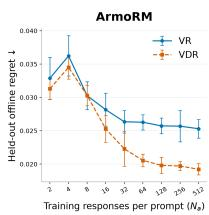

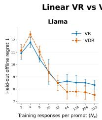

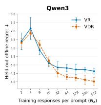

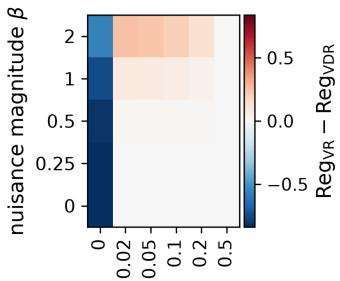  
cross-face probability δ  
Figure 1: Left: synthetic regret difference $\mathrm { R e g } _ { \mathrm { V R } } - \mathrm { R e g } _ { \mathrm { V D R } }$ as the cross-face probability $\delta$ and nuisance magnitude $\beta$ vary; negative values favor VR and positive values favor VDR. Right: realdata regret versus the number of labeled responses per training prompt; lower is better. Error bars are pointwise 95% Student-t intervals over five seeds.

## 4.3 COMPARING VR AND VDR: FEATURE GEOMETRY PERSPECTIVE

Comparing the bounds. Under Assumption 1, the action-independent nuisance $b ^ { \star } ( x )$ cancels from every within-context reward difference. Consequently, the VDR bound (Theorem 4.2) contains no misspecification-related terms, whereas the VR bound (Theorem 4.1) retains $\varepsilon _ { \mathrm { a p r x } }$ and the residual terms $\varepsilon _ { \mathrm { x } } , \varepsilon _ { \mathrm { a } }$ , and $\varepsilon _ { \mathrm { z } } , \mathrm { i } . \mathrm { e } .$ , VDR’s bound outperforms that of VR under large misspecification.

In the well-specified case $( \varepsilon _ { \mathrm { a p r x } } = \varepsilon _ { \mathrm { x } } = \varepsilon _ { \mathrm { a } } = \varepsilon _ { \mathrm { z } } = 0 )$ , the comparison is instead governed by the feature geometry. The displayed bounds reduce to $\widetilde { \mathcal { O } } ( \sigma ^ { 2 } d / N + R _ { \mathrm { m a x } } ^ { 2 } \alpha _ { 0 } ^ { 2 } d / N ^ { 2 } )$ for VR and $\widetilde { \mathcal { O } } ( \sigma ^ { 2 } d _ { \mathrm { C } } / N + R _ { \mathrm { m a x } } ^ { 2 } \alpha _ { \mathrm { C } } ^ { 2 } d _ { \mathrm { C } } / N ^ { 2 } )$ for VDR. Since $d _ { \mathrm { C } } \leq d ,$ , the leading variance term in the displayed VDR bound is no larger; with the sharper VR bound of Appendix F.1.3, however, it becomes $\sigma ^ { 2 } d _ { \mathrm { e f f } } / N$ with $d _ { \mathrm { e f f } } \leq d _ { \mathrm { C } }$ . The lower-order terms have no analogous uniform ordering across feature geometries, and hence, neither upper-bound uniformly dominates the other.

To concretely show this, we provide two simple examples where $\alpha _ { \mathrm { { C } } }$ can be arbitrarily larger than $\alpha _ { 0 } .$ , and vice versa. For $p \in ( 0 , 1 )$ , let $X = 1 , { \dot { A } } \sim \operatorname { B e r n o u l l i } ( p )$ , and set $\phi ( A ) = 1 + \mathbf { \bar { A } } \in \mathbf { \bar { \mathbb { R } } }$ . Then, $\Sigma = 1 + 3 p ,$ and $\Sigma _ { \mathrm { C } } = p ( 1 - p )$ , which gives $\alpha _ { 0 } = 2 / \sqrt { 1 + 3 p } = \Theta ( 1 )$ and $\alpha _ { \mathrm C } = 1 / \sqrt { 2 p ( 1 - p ) } =$ $\Theta ( p ^ { - 1 / 2 } )$ . Thus $\alpha _ { \mathrm { C } } / \alpha _ { 0 } \to \infty$ as $p \to 0 ^ { + }$ . Second, let $X \sim$ Bernoulli(p), $A \sim \mathrm { U n i f } ( \{ - 1 , + 1 \} )$ , and set $\phi ( X , A ) = ( X , A ) \in \mathbb { R } ^ { 2 }$ . Here $\pmb { \Sigma } = \mathrm { d i a g } ( p , 1 )$ , so $\alpha _ { 0 } = \sqrt { ( 1 + p ) / ( 2 p ) } = \Theta ( p ^ { - 1 / 2 } )$ Centering gives ${ \overline { { \phi } } } = ( 0 , A )$ , so $z _ { \mathrm { C } } = A$ and $\alpha _ { \mathrm { C } } = \sqrt { 2 }$ . Therefore $\alpha _ { 0 } / \alpha _ { \mathrm C }  \infty \mathrm { a s } p  0 ^ { + }$

Synthetic experiment. We consider linear contextual bandits with five-dimensional contexts and three-dimensional cube actions, indexed by a sampling probability $\delta \in [ 0 , 1 / 2 ]$ (distinct from the confidence level above) and an action-independent nuisance magnitude $\beta \in [ 0 , 2 ]$ . The true value depends only on the first action coordinate. At each context, the behavior policy favors one sign of this coordinate and samples the opposite with probability δ. When $\beta = 0$ and δ is small, VR can exploit absolute rewards while VDR has few comparisons between actions with different true values. Increasing $\beta$ misspecifies VR through an action-independent shift that cancels from VDR.

We fit both methods with $( N _ { x } , N _ { a } ) = ( 2 0 0 , 8 )$ and evaluate greedy-policy regret over 8 independent instances; details and ablations are deferred to Appendix H.1. The left panel of Figure 1 shows that when $\beta = 0$ , VR has lower regret in every instance for every tested $\delta > 0$ . At fixed $\delta = 0 . 0 2$ $\mathrm { R e g } _ { \mathrm { V R } } - \mathrm { R e g } _ { \mathrm { V D R } }$ changes from negative to positive as $\beta$ grows. These results illustrate the bias– variance tradeoff: VR benefits from absolute rewards under correct specification when informative within-context comparisons are rare, while VDR becomes preferable as nuisance-induced bias grows.

LLM experiment. We compare ℓ -regularized linear VR and VDR scorers on frozen LLM representations in a response-selection task. We collect 1,000 prompts from WildChat, UltraFeedback, GSM8K, MATH, MBPP, HelpSteer2, and TL;DR, and cache 1,000 Llama-3.2-3B-Instruct responses per prompt. Each response is represented by its 3,072-dimensional mean-pooled final-layer hidden state. Keeping the prompts, responses, and representations fixed, we repeat the experiment with rewards from Skywork-Reward-V2-Llama-3.1-8B, Skywork-Reward-V2-Qwen3-8B, and ArmoRM

Llama3-8B-v0.1. Across five seeds, both methods use the same 800 training prompts and sampled responses, are evaluated on 200 held-out prompts, and vary the number of labeled responses per training prompt from $N _ { a } = 2$ to 512; full details are deferred to Appendix H.2.

The right panel of Figure 1 shows that for $N _ { a } \geq 6 4$ , VDR has significantly lower mean regret for all three reward models (see paired intervals in Figure 4, Appendix H.2). At $N _ { a } = 5 1 2$ , the reductions are 9.7%, 13.0%, and 24.0% for Llama, Qwen3, and ArmoRM, respectively. Thus the preferred objective changes with the amount of within-prompt supervision. Although outside our theoretical scope, we also report a controlled MCTS math reasoning experiment in Appendix H.3, where a binary-preference variant of VDR achieves higher observed final-answer accuracy than VR with both linear and MLP heads.

## 5 CONCLUSION AND FUTURE WORK

We establish finite-sample prediction guarantees for VALUE REGRESSION (VR) and VALUE DIF-FERENCE REGRESSION (VDR) with grouped offline data (which imply offline-regret bounds under coverage). Our analysis distinguishes two sampling scales: $N _ { x }$ governs generalization across contexts, while $N _ { a }$ controls the averaging of within-context variability. For finite classes, VDR avoids the approximation-error term in the VR bound and improves a reward-scale term through repeated action observations. For linear classes, the comparison depends on feature geometry: differencing removes nuisance-induced bias, while fitting absolute rewards can reduce estimation variance under correct specification. Our experiments illustrate the resulting bias–variance tradeoff, with neither method uniformly preferred.

We conclude with some potential future directions. One is to assess whether the weak realizability assumption holds in LLM applications and other domains, and to identify weaker assumptions under which meaningful guarantees remain possible. Other directions include determining whether analogous tradeoffs arise under the Bradley–Terry model with logistic losses, understanding how pair selection affects VDR, and extending the analysis beyond pairwise comparisons (e.g., ranking).

## AI DISCLOSURE STATEMENT

In this work, we used generative AI tools to generate synthetic datasets; help develop theoretical models or conceptual frameworks; formulate mathematical claims and provide critical ingredients for their proofs; assist in writing proofs; propose or refine hypotheses; design or provide feedback on research methodology or experiments; implement methods; assist with translation; support qualitative and thematic data analysis; and interpret results. Dataset cleaning and reformatting were not applicable to this work. We also used generative AI tools to create or modify scientific figures or images; suggest experimental parameters; create or edit software code; draft portions of the paper; summarize or analyze existing literature; discover research topics or identify gaps; brainstorm; source or search for information; improve the paper’s readability; identify relevant literature; suggest the paper’s structure; and propose titles or keywords. We reviewed all AI-assisted work: all LLMgenerated proofs were verified and polished for readability by at least two authors, all cited literature was manually checked, and LLM-generated code was verified and tested for correctness by two authors. We take responsibility for the final content of this work, including all text, claims, and artifacts produced with the aid of generative AI.

## AUTHOR CONTRIBUTIONS

Junghyun Lee led the project, was responsible for the overall writing, and refined and finalized the proofs. Junghyun Lee also contributed to unifying the analyses of finite and linear function classes through localization.

Minsoo Ha reviewed the literature on pointwise and pairwise reward learning, organized prior methods by loss structure and downstream application, and contributed to writing parts of the introduction. Minsoo Ha also contributed to extending the STAR ESTIMATOR to the grouped-data setting for finite function classes.

Sanghwa Kim derived the initial theoretical upper bounds for VR and VDR and the lower bound for VR under finite function classes, laying the foundation for the integrated theory. Sanghwa Kim also contributed to verifying the mathematical proofs.

Yeongjong Kim designed and implemented the synthetic offline linear contextual bandit experiment, generated the data for the VR–VDR comparison, and conducted the ℓ2-regularized linear experiments on LLM representations. Yeongjong Kim also generated the MCTS training data for the mathematicalreasoning experiment.

Eun Jee Lee designed and conducted the MCTS-based mathematical-reasoning experiment, including training linear and MLP reward heads under the VR and binary-preference VDR objectives and performing the MCTS evaluation. Eun Jee Lee also extended the VR–VDR comparison on LLM representations to additional reward models and analyzed the results across choices of scorer head and reward model.

Seiyun Shin developed the lower-bound and separation results, including the construction showing that VR can incur constant regret while VDR succeeds. Seiyun Shin also contributed to establishing the agnostic minimax lower bound and was responsible for the final verification and presentation of these theoretical results.

Kwang-Sung Jun supervised the project, provided overall research direction, and coordinated the development of the work.

## REFERENCES

Philip Amortila, Nan Jiang, and Csaba Szepesvári. The Optimal Approximation Factors in Misspecified Off-Policy Value Function Estimation. In Proceedings ofthe 40th International Conference on Machine Learning, volume 202 of Proceedings of Machine Learning Research, pp. 768–790. PMLR, 23–29 Jul 2023. URL https://proceedings.mlr.press/v202/ amortila23a.html.

Philip Amortila, Tongyi Cao, and Akshay Krishnamurthy. Mitigating Covariate Shift in Misspecified Regression with Applications to Reinforcement Learning. In Proceedings of Thirty Seventh Conference on Learning Theory, volume 247 of Proceedings of Machine Learning Research, pp. 130–160. PMLR, 30 Jun–03 Jul 2024. URL https://proceedings.mlr.press/v247/ amortila24a.html.

Patrice Assouad. Deux remarques sur l’estimation. Comptes rendus des séances de l’Académie des sciences. Série 1, Mathématique, 1983.

Jean-Yves Audibert. Progressive mixture rules are deviation suboptimal. In Advances in Neural Information Processing Systems, volume 20, pp. 41–48. Curran Associates, Inc., 2007. URL https://proceedings.neurips.cc/paper\_files/paper/2007/ hash/ef575e8837d065a1683c022d2077d342-Abstract.html.

Jean-Yves Audibert. Fast learning rates in statistical inference through aggregation. The Annals of Statistics, 37(4):1591 – 1646, 2009. doi:10.1214/08-AOS623.

Jacob Austin, Augustus Odena, Maxwell Nye, Maarten Bosma, Henryk Michalewski, David Dohan, Ellen Jiang, Carrie Cai, Michael Terry, Quoc Le, and Charles Sutton. Program Synthesis with Large Language Models. arXiv preprint arXiv:2108.07732, 2021. URL https://arxiv.org/ abs/2108.07732.

Peter L. Bartlett, Olivier Bousquet, and Shahar Mendelson. Local Rademacher complexities. The Annals ofStatistics, 33(4):1497 – 1537, 2005. doi:10.1214/009053605000000282.

Sergei N. Bernstein. Sur l’extension du théoréme limite du calcul des probabilités aux sommes de quantités dépendantes. Mathematische Annalen, 97(1):1–59, Dec 1927. doi:10.1007/BF01447859.

Olivier Bousquet. Concentration Inequalities and Empirical Processes Theory Applied to the Analysis of Learning Algorithms. PhD thesis, École Polytechnique, 2002.

Olivier Bousquet, Vladimir Koltchinskii, and Dmitriy Panchenko. Some Local Measures of Complexity of Convex Hulls and Generalization Bounds. In Computational Learning Theory, pp. 59–73, Berlin, Heidelberg, 2002. Springer Berlin Heidelberg. doi:10.1007/3-540-45435-7\_5.

Ralph Allan Bradley and Milton E. Terry. Rank Analysis of Incomplete Block Designs: The Method of Paired Comparisons. Biometrika, 39(3-4):324–345, 1952. doi:10.1093/biomet/39.3-4.324.

Yifei Cao, Changhao Jiang, Jiabao Zhuang, Jiajun Sun, Ming Zhang, Zhiheng Xi, Hui Li, Shihan Dou, Yuran Wang, Yunke Zhang, Tao Ji, Tao Gui, Qi Zhang, and Xuanjing Huang. From Scores to Preferences: Redefining Evaluation Paradigm for Speech Quality Reward Modeling. In Findings of the Association for Computational Linguistics: ACL 2026, pp. 32731–32749, San Diego, California, United States, July 2026. Association for Computational Linguistics. doi:10.18653/v1/2026.findings-acl.1638.

Aldo Gael Carranza, Sanath Kumar Krishnamurthy, and Susan Athey. Flexible and Efficient Contextual Bandits with Heterogeneous Treatment Effect Oracles. In Proceedings of The 26th International Conference on Artificial Intelligence and Statistics, volume 206 of Proceedings of Machine Learning Research, pp. 7190–7212. PMLR, 25–27 Apr 2023. URL https://proceedings.mlr.press/v206/carranza23a.html.

Guoxin Chen, Minpeng Liao, Chengxi Li, and Kai Fan. Step-level Value Preference Optimization for Mathematical Reasoning. In Findings ofthe Associationfor Computational Linguistics: EMNLP 2024, pp. 7889–7903, Miami, Florida, USA, November 2024. Association for Computational Linguistics. doi:10.18653/v1/2024.findings-emnlp.463.

Jinglin Chen and Nan Jiang. Information-Theoretic Considerations in Batch Reinforcement Learning. In Proceedings of the 36th International Conference on Machine Learning, volume 97 of Proceedings of Machine Learning Research, pp. 1042–1051. PMLR, 09–15 Jun 2019. URL https://proceedings.mlr.press/v97/chen19e.html.

Victor Chernozhukov, Denis Chetverikov, Mert Demirer, Esther Duflo, Christian Hansen, Whitney Newey, and James Robins. Double/debiased machine learning for treatment and structural parameters. The Econometrics Journal, 21(1):C1–C68, 02 2018. doi:10.1111/ectj.12097.

Young-Geun Choi, Gi-Soo Kim, Seunghoon Paik, and Myunghee Cho Paik. Semi-parametric contextual bandits with graph-Laplacian regularization. Information Sciences, 645:119367, 2023. doi:10.1016/j.ins.2023.119367.

Paul F Christiano, Jan Leike, Tom Brown, Miljan Martic, Shane Legg, and Dario Amodei. Deep Reinforcement Learning from Human Preferences. In Advances in Neural Information Processing Systems, volume 30, pp. 4302–4310. Curran Associates, Inc., 2017. URL https://arxiv. org/abs/1706.03741.

Stéphan Clémençon, Gábor Lugosi, and Nicolas Vayatis. Ranking and Empirical Minimization of U-statistics. The Annals ofStatistics, 36(2):844 – 874, 2008. doi:10.1214/009052607000000910.

Karl Cobbe, Vineet Kosaraju, Mohammad Bavarian, Mark Chen, Heewoo Jun, Lukasz Kaiser, Matthias Plappert, Jerry Tworek, Jacob Hilton, Reiichiro Nakano, Christopher Hesse, and John Schulman. Training Verifiers to Solve Math Word Problems. arXiv preprint arXiv:2110.14168, 2021. URL https://arxiv.org/abs/2110.14168.

Corinna Cortes, Mehryar Mohri, and Ashish Rastogi. Magnitude-Preserving Ranking Algorithms. In Proceedings ofthe 24th International Conference on Machine Learning, ICML ’07, pp. 169–176, New York, NY, USA, 2007. Association for Computing Machinery. doi:10.1145/1273496.1273518.

Ganqu Cui, Lifan Yuan, Ning Ding, Guanming Yao, Bingxiang He, Wei Zhu, Yuan Ni, Guotong Xie, Ruobing Xie, Yankai Lin, Zhiyuan Liu, and Maosong Sun. ULTRAFEEDBACK: Boosting Language Models with Scaled AI Feedback. In Proceedings ofthe 41st International Conference on Machine Learning, volume 235 of Proceedings ofMachine Learning Research, pp. 9722–9744. PMLR, 21–27 Jul 2024. URL https://proceedings.mlr.press/v235/cui24f.html.

Simon S. Du, Sham M. Kakade, Ruosong Wang, and Lin F. Yang. Is a Good Representation Sufficient for Sample Efficient Reinforcement Learning? In International Conference on Learning Representations, 2020. URL https://openreview.net/forum?id=r1genAVKPB.

Amir-massoud Farahmand, Csaba Szepesvári, and Rémi Munos. Error Propagation for Approximate Policy and Value Iteration. In Advances in Neural Information Processing Systems, volume 23, pp. 568 – 576. Curran Associates, Inc., 2010. URL https://proceedings.neurips.cc/ paper/2010/hash/65cc2c8205a05d7379fa3a6386f710e1-Abstract.html.

Dylan J. Foster and Vasilis Syrgkanis. Orthogonal Statistical Learning. The Annals of Statistics, 51 (3):879 – 908, 2023. doi:10.1214/23-AOS2258.

Ragnar Frisch and Frederick V. Waugh. Partial Time Regressions as Compared with Individual Trends. Econometrica, 1(4):387–401, 1933. doi:10.2307/1907330.

Zhaolin Gao, Jonathan D Chang, Wenhao Zhan, Owen Oertell, Gokul Swamy, Kianté Brantley, Thorsten Joachims, J Andrew Bagnell, Jason D Lee, and Wen Sun. REBEL: Reinforcement Learning via Regressing Relative Rewards. Advances in Neural Information Processing Systems, 37:52354–52400, 2024. URL https://openreview.net/forum?id=yxjWAJzUyV.

Kristjan Greenewald, Ambuj Tewari, Susan Murphy, and Predag Klasnja. Action Centered Contextual Bandits. In Advances in Neural Information Processing Systems, volume 30, pp. 5979–5987. Curran Associates, Inc., 2017. URL https://proceedings.neurips.cc/paper\_files/ paper/2017/file/4fa177df22864518b2d7818d4db5db2d-Paper.pdf.

Xinyu Guan, Li Lyna Zhang, Yifei Liu, Ning Shang, Youran Sun, Yi Zhu, Fan Yang, and Mao Yang. rStar-Math: Small LLMs Can Master Math Reasoning with Self-Evolved Deep Thinking. In Proceedings of the 42nd International Conference on Machine Learning, volume 267 of Proceedings ofMachine Learning Research, pp. 20640–20661. PMLR, 13–19 Jul 2025. URL https://openreview.net/forum?id=5zwF1GizFa.

Dan Hendrycks, Collin Burns, Saurav Kadavath, Akul Arora, Steven Basart, Eric Tang, Dawn Song, and Jacob Steinhardt. Measuring Mathematical Problem Solving With the MATH Dataset. In Proceedings of the Neural Information Processing Systems Track on Datasets and Benchmarks, volume 1, 2021. URL https: //datasets-benchmarks-proceedings.neurips.cc/paper/2021/hash/ be83ab3ecd0db773eb2dc1b0a17836a1-Abstract-round2.html.

Daniel Hsu, Sham Kakade, and Tong Zhang. A tail inequality for quadratic forms of subgaussian random vectors. Electronic Communications in Probability, 17(52):1 – 6, 2012a. doi:10.1214/ECP.v17- 2079.

Daniel Hsu, Sham M. Kakade, and Tong Zhang. Random Design Analysis of Ridge Regression. In Proceedings of the 25th Annual Conference on Learning Theory, volume 23 of Proceedings of Machine Learning Research, pp. 9.1–9.24. PMLR, 2012b. URL https://proceedings. mlr.press/v23/hsu12.html.

Daniel Hsu, Sham M. Kakade, and Tong Zhang. Random Design Analysis of Ridge Regression. Foundations ofComputational Mathematics, 14(3):569–600, Jun 2014. doi:10.1007/s10208-014- 9192-1.

Audrey Huang, Adam Block, Qinghua Liu, Nan Jiang, Akshay Krishnamurthy, and Dylan J Foster. Is Best-of-N the Best of Them? Coverage, Scaling, and Optimality in Inference-Time Alignment. In Proceedings of the 42nd International Conference on Machine Learning, volume 267 of Proceedings ofMachine Learning Research, pp. 25075–25126. PMLR, 13–19 Jul 2025. URL https://openreview.net/forum?id=QnjfkhrbYK.

Binyuan Hui, Jian Yang, Zeyu Cui, Jiaxi Yang, Dayiheng Liu, Lei Zhang, Tianyu Liu, Jiajun Zhang, Bowen Yu, Keming Lu, Kai Dang, Yang Fan, Yichang Zhang, An Yang, Rui Men, Fei Huang, Bo Zheng, Yibo Miao, Shanghaoran Quan, Yunlong Feng, Xingzhang Ren, Xuancheng Ren, Jingren Zhou, and Junyang Lin. Qwen2.5-Coder Technical Report. arXiv preprint arXiv:2409.12186, 2024. URL https://arxiv.org/abs/2409.12186.

J. Kiefer and J. Wolfowitz. The Equivalence of Two Extremum Problems. Canadian Journal of Mathematics, 12:363–366, 1960. doi:10.4153/CJM-1960-030-4.

Gi-Soo Kim and Myunghee Cho Paik. Contextual Multi-armed Bandit Algorithm for Semiparametric Reward Model. In Proceedings of the 36th International Conference on Machine Learning, volume 97 of Proceedings of Machine Learning Research, pp. 3389–3397. PMLR, 09–15 Jun 2019. URL https://proceedings.mlr.press/v97/kim19d.html.

Seok-Jin Kim, Gi-Soo Kim, and Min-hwan Oh. Experimental Design for Semiparametric Bandits. In Proceedings of Thirty Eighth Conference on Learning Theory, volume 291 of Proceedings of Machine Learning Research, pp. 3215–3252. PMLR, 30 Jun–04 Jul 2025. URL https: //proceedings.mlr.press/v291/kim25a.html.

Vladimir Koltchinskii. Oracle Inequalities in Empirical Risk Minimization and Sparse Recovery Problems: École d’Été de Probabilités de Saint-Flour XXXVIII-2008. Lecture Notes in Mathematics. Springer Berlin, Heidelberg, 2011.

Vladimir Koltchinskii and Dmitriy Panchenko. Rademacher Processes and Bounding the Risk of Function Learning. In High Dimensional Probability II, pp. 443–457, Boston, MA, 2000. Birkhäuser Boston. doi:10.1007/978-1-4612-1358-1\_29.

Akshay Krishnamurthy, Zhiwei Steven Wu, and Vasilis Syrgkanis. Semiparametric Contextual Bandits. In Proceedings ofthe 35th International Conference on Machine Learning, volume 80 of Proceedings ofMachine Learning Research, pp. 2776–2785. PMLR, 10–15 Jul 2018. URL https://proceedings.mlr.press/v80/krishnamurthy18a.html.

Sanath Kumar Krishnamurthy, Vitor Hadad, and Susan Athey. Adapting to misspecification in contextual bandits with offline regression oracles. In Proceedings of the 38th International Conference on Machine Learning, volume 139 of Proceedings of Machine Learning Research, pp. 5805–5814. PMLR, 18–24 Jul 2021. URL https://proceedings.mlr.press/v139/ krishnamurthy21a.html.

Nathan Lambert, Jacob Morrison, Valentina Pyatkin, Shengyi Huang, Hamish Ivison, Faeze Brahman, Lester James Validad Miranda, Alisa Liu, Nouha Dziri, Xinxi Lyu, Yuling Gu, Saumya Malik, Victoria Graf, Jena D. Hwang, Jiangjiang Yang, Ronan Le Bras, Oyvind Tafjord, Christopher Wilhelm, Luca Soldaini, Noah A. Smith, Yizhong Wang, Pradeep Dasigi, and Hannaneh Hajishirzi. Tulu 3: Pushing Frontiers in Open Language Model Post-Training. In Second Conference on Language Modeling, 2025. URL https://openreview.net/forum?id=i1uGbfHHpH.

Tor Lattimore, Csaba Szepesvári, and Gellert Weisz. Learning with Good Feature Representations in Bandits and in RL with a Generative Model. In Proceedings of the 37th International Conference on Machine Learning, volume 119 of Proceedings of Machine Learning Research, pp. 5662–5670. PMLR, 13–18 Jul 2020. URL https://proceedings.mlr.press/v119/ lattimore20a.html.

Guillaume Lecué and Shahar Mendelson. General nonexact oracle inequalities for classes with a subexponential envelope. The Annals ofStatistics, 40(2):832 – 860, 2012. doi:10.1214/11-AOS965.

Guillaume Lecué and Philippe Rigollet. Optimal learning with Q-aggregation. The Annals of Statistics, 42(1):211 – 224, 2014. doi:10.1214/13-AOS1190.

Yunwen Lei, Antoine Ledent, and Marius Kloft. Sharper Generalization Bounds for Pairwise Learning. In Advances in Neural Information Processing Systems, volume 33, pp. 21236–21246. Curran Associates, Inc., 2020. URL https://proceedings.neurips.cc/paper/2020/hash/ f3173935ed8ac4bf073c1bcd63171f8a-Abstract.html.

Wendi Li and Yixuan Li. Process Reward Model with Q-value Rankings. In The Thirteenth International Conference on Learning Representations, 2025. URL https://openreview. net/forum?id=wQEdh2cgEk.

Tengyuan Liang, Alexander Rakhlin, and Karthik Sridharan. Learning with Square Loss: Localization through Offset Rademacher Complexity. In Proceedings of the Conference on Learning Theory (COLT), volume 40 of Proceedings of Machine Learning Research, pp. 1260–1285, Paris, France, 03–06 Jul 2015. PMLR. URL https://proceedings.mlr.press/v40/ Liang15.html.

Chris Yuhao Liu, Liang Zeng, Yuzhen Xiao, Jujie He, Jiacai Liu, Chaojie Wang, Rui Yan, Wei Shen, Fuxiang Zhang, Jiacheng Xu, and Yang Liu. Skywork-Reward-V2: Scaling Preference Data Curation via Human-AI Synergy. In The Fourteenth International Conference on Learning Representations, 2026. URL https://openreview.net/forum?id=ofgxkMLqic.

Dong C. Liu and Jorge Nocedal. On the Limited Memory BFGS Method for Large Scale Optimization. Mathematical Programming, 45(1):503–528, 1989. doi:10.1007/BF01589116.

Ilya Loshchilov and Frank Hutter. Decoupled Weight Decay Regularization. In International Conference on Learning Representations, 2019. URL https://openreview.net/forum? id=Bkg6RiCqY7.

Davide Maran and Csaba Szepesvári. Beyond Least Squares: Uniform Approximation and the Hidden Cost of Misspecification. In Advances in Neural Information Processing Systems, volume 38, Main Conference, pp. 168329–168377. Curran Associates, Inc., 2025. URL https://openreview. net/forum?id=2T2zMiqcY6.

Pascal Massart and Élodie Nédélec. Risk bounds for statistical learning. The Annals ofStatistics, 34 (5):2326 – 2366, 2006. doi:10.1214/009053606000000786.

Mathematical Association of America. American Mathematics Competitions: AMC 12 and AIME, 2024. URL https://maa.org/student-programs/amc/.

Shahar Mendelson. Learning without Concentration. In Proceedings of The 27th Conference on Learning Theory, volume 35 of Proceedings of Machine Learning Research, pp. 25–39, Barcelona, Spain, 13–15 Jun 2014. PMLR. URL https://proceedings.mlr.press/ v35/mendelson14.html.

Shahar Mendelson. Learning without concentration for general loss functions. Probability Theory and Related Fields, 171(1):459–502, Jun 2018. doi:10.1007/s00440-017-0784-y.

Meta. Llama-3.2-3B-Instruct Model Card. Hugging Face model card, 2024. URL https:// huggingface.co/meta-llama/Llama-3.2-3B-Instruct.

Yair Mundlak. On the Pooling of Time Series and Cross Section Data. Econometrica, 46(1):69–85, 1978. doi:10.2307/1913646.

Rémi Munos. Error Bounds for Approximate Policy Iteration. In Proceedings of the Twentieth International Conference on Machine Learning, ICML’03, pp. 560–567. AAAI Press, 2003. URL https://cdn.aaai.org/ICML/2003/ICML03-074.pdf.

Rémi Munos. Performance Bounds in Lp-norm for Approximate Value Iteration. SIAM Journal on Control and Optimization, 46(2):541–561, 2007. doi:10.1137/040614384.

X Nie and S Wager. Quasi-oracle estimation of heterogeneous treatment effects. Biometrika, 108(2): 299–319, 06 2021. doi:10.1093/biomet/asaa076.

Tapio Pahikkala, Antti Airola, Michiel Stock, Bernard De Baets, and Willem Waegeman. Efficient regularized least-squares algorithms for conditional ranking on relational data. Machine Learning, 93(2):321–356, 2013. doi:10.1007/s10994-013-5354-7.

Rattana Pukdee, Maria-Florina Balcan, and Pradeep Ravikumar. Reward Learning from Best-of-N Preference Data: Targets, Tradeoffs, and Design Principles. arXiv preprint arXiv:2605.30619, 2026. URL https://arxiv.org/abs/2605.30619.

Friedrich Pukelsheim. Optimal Design of Experiments, volume 50 of Classics in Applied Mathematics. Society for Industrial and Applied Mathematics (SIAM), 2006.

Rafael Rafailov, Archit Sharma, Eric Mitchell, Christopher D Manning, Stefano Ermon, and Chelsea Finn. Direct Preference Optimization: Your Language Model is Secretly a Reward Model. In Advances in Neural Information Processing Systems, volume 36, pp. 53728–53741. Curran Associates, Inc., 2023. URL https://openreview.net/forum?id=HPuSIXJaa9.

Alexander Rakhlin and Karthik Sridharan. Online Non-Parametric Regression. In Proceedings ofThe 27th Conference on Learning Theory, volume 35 of Proceedings ofMachine Learning Research, pp. 1232–1264, Barcelona, Spain, 13–15 Jun 2014. PMLR. URL https://proceedings. mlr.press/v35/rakhlin14.html.

Alexander Rakhlin, Karthik Sridharan, and Alexandre B. Tsybakov. Empirical entropy, minimax regret and minimax risk. Bernoulli, 23(2):789 – 824, 2017. doi:10.3150/14-BEJ679.

Paria Rashidinejad, Banghua Zhu, Cong Ma, Jiantao Jiao, and Stuart Russell. Bridging Offline Reinforcement Learning and Imitation Learning: A Tale of Pessimism. IEEE Transactions on Information Theory, 68(12):8156–8196, 2022. doi:10.1109/TIT.2022.3185139.

P. M. Robinson. Root-N-Consistent Semiparametric Regression. Econometrica, 56(4):931–954, 1988. doi:10.2307/1912705.

J. Jon Ryu, Jeongyeol Kwon, Benjamin Koppe, and Kwang-Sung Jun. Improved Offline Contextual Bandits with Second-Order Bounds: Betting and Freezing. In Proceedings of Thirty Eighth Conference on Learning Theory, volume 291 of Proceedings of Machine Learning Research, pp. 5015–5053. PMLR, 30 Jun–04 Jul 2025. URL https://proceedings.mlr.press/ v291/ryu25a.html.

Zhihong Shao, Peiyi Wang, Qihao Zhu, Runxin Xu, Junxiao Song, Xiao Bi, Haowei Zhang, Mingchuan Zhang, Y. K. Li, Y. Wu, and Daya Guo. DeepSeekMath: Pushing the Limits of Mathematical Reasoning in Open Language Models. arXiv preprint arXiv:2402.03300, 2024. URL https://arxiv.org/abs/2402.03300.

Paul Speckman. Kernel Smoothing in Partial Linear Models. Journal ofthe Royal Statistical Society: Series B (Methodological), 50(3):413–436, 1988. doi:10.1111/j.2517-6161.1988.tb01738.x.

Nisan Stiennon, Long Ouyang, Jeffrey Wu, Daniel Ziegler, Ryan Lowe, Chelsea Voss, Alec Radford, Dario Amodei, and Paul F. Christiano. Learning to summarize with human feedback. In Advances in Neural Information Processing Systems, volume 33, 2020. URL https://proceedings.neurips.cc/paper/2020/hash/ 1f89885d556929e98d3ef9b86448f951-Abstract.html.

Adith Swaminathan and Thorsten Joachims. Counterfactual Risk Minimization: Learning from Logged Bandit Feedback. In Proceedings of the 32nd International Conference on Machine Learning, volume 37 of Proceedings ofMachine Learning Research, pp. 814–823, Lille, France, 07– 09 Jul 2015. PMLR. URL https://proceedings.mlr.press/v37/swaminathan15. html.

Michel Talagrand. Concentration of measure and isoperimetric inequalities in product spaces. Publications Mathématiques de l’Institut des Hautes Études Scientifiques, 81(1):73–205, Dec 1995. doi:10.1007/BF02699376.

Michel Talagrand. A new look at independence. The Annals of Probability, 24(1):1 – 34, 1996a. doi:10.1214/aop/1042644705.

Michel Talagrand. New concentration inequalities in product spaces. Inventiones mathematicae, 126 (3):505–563, Nov 1996b. doi:10.1007/s002220050108.

Joel A. Tropp. An Introduction to Matrix Concentration Inequalities. Foundations and Trends® in Machine Learning, 8(1-2):1–230, 2015. doi:10.1561/2200000048.

Benjamin Van Roy and Shi Dong. Comments on the Du-Kakade-Wang-Yang Lower Bounds. arXiv preprint arXiv:1911.07910, 2019. URL https://arxiv.org/abs/1911.07910.

Haoxiang Wang, Wei Xiong, Tengyang Xie, Han Zhao, and Tong Zhang. Interpretable Preferences via Multi-Objective Reward Modeling and Mixture-of-Experts. In Findings of the Association for Computational Linguistics: EMNLP 2024, pp. 10582–10592, Miami, Florida, USA, 2024a. Association for Computational Linguistics. doi:10.18653/v1/2024.findings-emnlp.620.

Zhilin Wang, Yi Dong, Olivier Delalleau, Jiaqi Zeng, Gerald Shen, Daniel Egert, Jimmy J. Zhang, Makesh Narsimhan Sreedhar, and Oleksii Kuchaiev. HelpSteer 2: Open-source dataset for training top-performing reward models. In Advances in Neural Information Processing Systems, volume 37, pp. 1474–1501. Curran Associates, Inc., 2024b. URL https://openreview.net/forum? id=PvVKUFhaNy.

Sebastian Johann Wetzel, Kevin Ryczko, Roger Gordon Melko, and Isaac Tamblyn. Twin neural network regression. Applied AI Letters, 3(4):e78, 2022. doi:10.1002/ail2.78.

Jiayi Xie, Kaiwei Cai, Li Kong, Junsheng Zhou, and Weiguang Qu. Automated Essay Scoring via Pairwise Contrastive Regression. In Proceedings of the 29th International Conference on Computational Linguistics, pp. 2724–2733, Gyeongju, Republic of Korea, October 2022. International Committee on Computational Linguistics. URL https://aclanthology.org/ 2022.coling-1.240/.

Bin Yu. Assouad, Fano, and Le Cam. In David Pollard, Erik Torgersen, and Grace L. Yang (eds.), Festschriftfor Lucien Le Cam: Research Papers in Probability and Statistics, pp. 423–435. Springer New York, New York, NY, 1997. doi:10.1007/978-1-4612-1880-7\_29.

Zhiwei Zhang, Hui Liu, Xiaomin Li, Zhenwei Dai, Jingying Zeng, Fali Wang, Minhua Lin, Ramraj Chandradevan, Linlin Wu, Zhen Li, Chen Luo, Zongyu Wu, Xianfeng Tang, Qi He, and Suhang Wang. Bradley-Terry and Multi-Objective Reward Modeling Are Complementary. In The Fourteenth International Conference on Learning Representations, 2026. URL https://openreview.net/forum?id=3QHKJcwnpb.

Wenting Zhao, Xiang Ren, Jack Hessel, Claire Cardie, Yejin Choi, and Yuntian Deng. WildChat: 1M ChatGPT Interaction Logs in the Wild. In The Twelfth International Conference on Learning Representations, 2024. URL https://openreview.net/forum?id=Bl8u7ZRlbM.

Banghua Zhu, Michael Jordan, and Jiantao Jiao. Principled Reinforcement Learning with Human Feedback from Pairwise or K-wise Comparisons. In Proceedings of the 40th International Conference on Machine Learning, volume 202 of Proceedings of Machine Learning Research, pp. 43037–43067. PMLR, 23–29 Jul 2023. URL https://proceedings.mlr.press/v202/ zhu23f.html.

Dixian Zhu, Tianbao Yang, and Livnat Jerby. Gradient Aligned Regression via Pairwise Losses. In Proceedings of the 42nd International Conference on Machine Learning, volume 267 of Proceedings ofMachine Learning Research, pp. 80259–80281. PMLR, 13–19 Jul 2025. URL https://openreview.net/forum?id=1bnH3Q3zL6.

## CONTENTS

Introduction 1   
1.1 Theoretical Setup: Grouped Offline Reward Learning 2   
1.2 Our Contributions 4   
2 A Localized Analysis for Grouped Regression 4   
3 Finite Class: Nuisance Cancellation and Gains from $N _ { a } \geq 2$ 5   
4 Linear Classes: A Geometric Bias–Variance Tradeoff 6   
4.1 VR for Linear Class 6   
4.2 VDR for Linear Class 8   
4.3 Comparing VR and VDR: Feature Geometry Perspective 9   
5 Conclusion and Future Work 10   
A Related Work 20   
B Estimation Error to Offline Regret 22   
B.1 Coverage Coefficients and Regret Guarantees 22   
B.2 Proof of Proposition B.1: Offline Regret of GREEDY and PESSIMISM 22   
C Auxiliary Results for Grouped Regression 25   
C.1 VDR Population Loss and Centered Prediction Error 25   
C.2 Proof of Proposition 2.1: Localized Fixed-Point Inequality 25   
D Deferred Proofs from Section 3: Finite Class 26   
D.1 VALUE REGRESSION (VR) . 26   
D.1.1 Proof of Lemma 3.1: Localized Modulus for VR in Finite Class 26   
D.2 V D R (VDR) 27   
D.2.1 Proof of the VDR Bound in Theorem 3. 27   
D.2.2 Proof of Lemma D.1: Localized Modulus for VDR in Finite Class 28   
E Exact Oracle Inequality for Finite Class via the STAR ESTIMATOR 30   
E.1 STAR ESTIMATOR and Its Guarantee 30   
E.2 Proof of Theorem E.1: STAR ESTIMATOR Bound for Finite Class 30   
E.3 Proof of Lemma E.1: Localized Modulus for the STAR ESTIMATOR in Finite Class 31   
Deferred Proofs from Section 4: Linear Class 34   
F.1 VALUE REGRESSION (VR) 34   
F.1.1 Proof of Theorem 4.1: VR Bound for Linear $\mathcal { F } _ { \mathrm { l i n } }$ 34   
F.1.2 Proof of Lemma F.1: Localized Modulus for Linear VR 35   
F.1.3 Alternate Error Bound for Linear VR 37   
F.2 VALUE DIFFERENCE REGRESSION (VDR) 39   
F.2.1 Proof of Theorem 4.2: VDR Bound for Linear F . 39   
F.2.2 Proof of Lemma F.2 40   
G Lower Bounds 42   
G.1 Proof of Theorem 3.2: Failure Mode of VR 42   
G.2 Agnostic Minimax Lower Bound 44   
G.3 Proof of Theorem G.1: Agnostic Minimax Lower Bound 46   
H Deferred Experimental Details 51   
H.1 Controlled Synthetic Linear-Bandit Experiment 51   
H.2 LLM Response-Selection Experiment 55   
H.3 MCTS-Based Mathematical Reasoning Experiment 56

## A RELATED WORK

We review related work on reward modeling objectives, regression under misspecification, statistical guarantees for pointwise/pairwise regression, and decision-making in contextual bandits.

(1) Reward modeling objectives. Reward estimators can be trained to predict absolute numerical values, numerical differences between alternatives (Wetzel et al., 2022; Xie et al., 2022), or preferences. These objectives impose different requirements: pointwise VALUE REGRESSION (VR) fits individual reward labels, VALUE DIFFERENCE REGRESSION (VDR) fits their numerical gaps, and preference-ranking objectives fit comparison outcomes without directly matching observed gap magnitudes. Numerical-gap objectives have been studied in magnitude-preserving ranking and conditional ranking (Cortes et al., 2007; Pahikkala et al., 2013). Recent works have also demonstrated that combining pointwise regression with pairwise losses can improve predictive performance (Zhu et al., 2025) and value-guided reasoning (Chen et al., 2024). Preference-based reward modeling instead commonly fits comparison probabilities using the Bradley–Terry model (Bradley & Terry, 1952; Christiano et al., 2017; Zhu et al., 2023), with related comparison objectives used in LLM reward models (Guan et al., 2025; Zhang et al., 2026). These findings show that there is an intricate distinction between absolute prediction, gap prediction, and downstream decision quality. Our work studies VR and VDR constructed from the same numerical observations, separating their statistical behavior under a shared, grouped sampling model.

(2) Semiparametric estimation. Our weak realizability assumption has the semiparametric form $r ^ { \star } ( x , a ) \bar { = } f ^ { \star } ( x , a ) + b ^ { \star } ( x )$ , where $f ^ { \star } \in { \mathcal { F } }$ captures action-dependent variation and $\bar { b ^ { \star } }$ is an unknown action-independent nuisance function; neither $b ^ { \star }$ nor the complete reward function must belong to $\mathcal { F }$ . For linear $\mathcal { F }$ , our assumption has the structure of a classical partially linear model (Speckman, 1988), with a finite-dimensional action-dependent component and a nonparametric context-dependent nuisance. Paralleling the partialling-out construction of Robinson (1988), our VDR eliminate the nui sance $b ^ { \star }$ and target the within-context differences of $f ^ { \star }$ . These differences identify its centered component on the behavior-policy support, while action-invariant parameter directions remain unidentified. The related principle of removing shared variation also appears in partial regression and panel-data within transformations (Frisch & Waugh, 1933; Mundlak, 1978). Modern approaches use orthogonal scores and nuisance estimation to reduce sensitivity to nuisance-estimation errors (Chernozhukov et al., 2018; Foster & Syrgkanis, 2023); heterogeneous-treatment-effect estimation similarly isolates treatment contrasts through residualized objectives (Nie & Wager, 2021). In sequential decisionmaking, action-centered and semiparametric contextual bandits allow complex action-independent baselines while modeling action effects (Choi et al., 2023; Greenewald et al., 2017; Kim & Paik, 2019; Krishnamurthy et al., 2018). Carranza et al. (2023) develop contextual bandit algorithms based on heterogeneous-treatment-effect oracles, while Kim et al. (2025) use experimental design and orthogonalized regression for semiparametric bandits. We share the motivation of removing decision-irrelevant nuisance variation, but our setting instead compares pointwise regression with regression on within-context reward differences, examining how the regression objective and repeated action observation affect estimation and decision guarantees.

(3) Misspecified linear regression. Random-design linear regression under misspecification has been studied under different prediction and distribution-shift criteria. For out-of-sample $L _ { 2 }$ prediction, Hsu et al. (2012b; 2014) analyze ordinary least squares and ridge regression, quantifying the effects of approximation residuals and empirical-covariance errors. Our VR analysis (Theorem 4.1) belongs to this line: when $N _ { a } = 1$ , its bound has the same first-order structure, while for $N _ { a } \ \geq \ 2$ it further separates residual fluctuations across contexts from those averaged over all observations. Under adversarial covariate shift, Amortila et al. (2024) show that standard ERM can amplify $L _ { \infty }$ misspecification through distribution mismatch and develop a disagreement-based regression procedure that avoids this amplification. Maran & Szepesvári (2025) instead study uniform prediction for misspecified random-design linear models, identifying the Lebesgue constant of the population $L _ { 2 }$ projection as the sharp amplification factor for uniform approximation error in $L _ { \infty }$ . Related work characterizes optimal approximation factors for misspecified linear off-policy value-function estimation (Amortila et al., 2023). For downstream decisions, Lattimore et al. (2020) quantify the effect of uniform linear approximation error on bandit and RL guarantees, while Krishnamurthy et al. (2021) develop contextual bandit algorithms whose regret adapts to average reward-model misspecification using offline regression oracles. Our VR analysis extends the prediction-error perspective to repeated observations within contexts. The VDR comparison concerns a narrower form of misspecification: action-independent residuals can be removed before regression by differencing, whereas action-dependent residuals generally remain. Related coverage-dependent approximation errors and decision lower bounds are discussed in Appendix G.2.

(4) Statistical guarantees with grouped observations. Classical pairwise-learning theory addresses the dependence caused by reusing observations across pairs, using U-statistic and stability analyses (Clémençon et al., 2008; Lei et al., 2020). Our observations have an additional grouped structure: $N _ { a }$ action–reward observations share each of $N _ { x }$ contexts, and within-context differencing cancels the common nuisance. Treating each context block as an independent observation permits block-level analysis, but exploiting repeated action samples requires tracking within-block variation, which we do throughout our proofs.

Our analysis also connects to localization methods for squared-loss learning. Local Rademacher complexities characterize estimation rates through critical radii (Bartlett et al., 2005; Bousquet et al., $2 0 0 \bar { 2 } ;$ Koltchinskii, 2011), while offset Rademacher complexity uses a negative quadratic term to control stochastic fluctuations (Liang et al., 2015). The separation of quadratic and multiplier processes is also central to small-ball analyses of least squares (Mendelson, 2014). Our localized block-offset modulus follows these principles but is defined directly through the unsymmetrized excess-loss process. Evaluating it with the grouped sampling structure preserves the distinction between fluctuations across contexts and within contexts.

(5) Offline contextual bandits and RL. Offline contextual bandits study policy selection and learning from previously collected action–reward observations. Prior work addresses logging-policy mismatch through propensity-weighted objectives and variance control (Swaminathan & Joachims, 2015), and establishes policy guarantees through pessimism under limited coverage (Rashidinejad et al., 2022). In batch RL, Chen & Jiang (2019) study the roles of distribution coverage and function approximation in sample-efficient learning. Related analyses of approximate policy and value iteration connect value-function approximation errors to policy performance (Farahmand et al., 2010; Munos, 2003). More recently, Ryu et al. (2025) develop betting-based confidence bounds for off-policy selection and a freezing approach to off-policy learning, obtaining guarantees that adapt to second-order information. Related policy-optimization methods also use comparison objectives: DPO applies a preference loss to policy log-ratios (Rafailov et al., 2023), whereas REBEL fits differences of policy log-ratios onto numerical reward differences (Gao et al., 2024). Our work studies a complementary question: how pointwise versus pairwise value regression affects regret under structured misspecification and repeated action observations.

## B ESTIMATION ERROR TO OFFLINE REGRET

## B.1 COVERAGE COEFFICIENTS AND REGRET GUARANTEES

In this appendix, we present two offline RL algorithms along with their offline regret guarantees. To do so, we first define two notions of coverage coefficients, as commonly done in offline RL literature (Chen & Jiang, 2019; Rashidinejad et al., 2022). First, the policy-specific coverage: for each deterministic $\pi : \mathcal { X }  \mathcal { A }$

$$
C ( \pi ) : = \mathbb { E } _ { x \sim \rho } \left[ \frac { 1 } { \pi _ { \mathrm { r e f } } ( \pi ( x ) \mid x ) } \right] , \quad C ^ { \star } : = C ( \pi ^ { \star } ) ,
$$

where $\pi ^ { \star }$ is a fixed deterministic optimal policy, $\pi ^ { \star } ( x ) \in \arg \operatorname* { m a x } _ { a \in { \cal { A } } } r ^ { \star } ( x , a )$ , and we take the convention that $1 / 0 = \infty$ . Next, the $( { \mathcal { F } } .$ -restricted) all-policy coverage:

$$
C _ { \mathcal { F } } ^ { \infty } : = \mathbb { E } _ { x \sim \rho } \left[ \operatorname* { m a x } _ { a \in A _ { \mathcal { F } } ( x ) } \frac { 1 } { \pi _ { \mathrm { r e f } } ( a \mid x ) } \right] , \quad A _ { \mathcal { F } } ( x ) : = \left\{ a \in A : \exists f \in \mathcal { F } s . t . \ f ( x , a ) \ge \operatorname* { m a x } _ { b \in A } f ( x , b ) \right\} .
$$

Note that such a restricted variant of the all-policy coefficient in an F-dependent manner has been considered before, e.g., Chen & Jiang (2019, Appendix G). For every policy satisfying $\pi ( x ) \in { \mathcal { A } } _ { \mathcal { F } } ( x )$ one has $C ( \pi ) \leq C _ { \mathcal { F } } ^ { \infty }$ . There is no general ordering between $C ( \pi )$ and $\check { C } ^ { \star } = \check { C } \check { ( } \pi ^ { \star } )$ for arbitrary π; we can nevertheless construct instances in which $\bar { C } ^ { \star } \ll C _ { \mathcal { F } } ^ { \infty } \left( \mathrm { e . g . } \right.$ , Remark 3).

We now present offline regret upper bounds for the GREEDY and PESSIMISM policies:

Proposition B.1. Let $\hat { f } _ { N } \in \mathcal { F }$ be our estimator, and let $\mathcal { C } : \boldsymbol { \mathscr { g } } \mapsto \mathcal { C } \boldsymbol { \mathscr { g } }$ be the centering operator $\bar { \mathcal { C } } g ( x , a ) : = g ( x , a ) - \mathbb { E } _ { a ^ { \prime } \sim \pi _ { \mathrm { r e f } } ( \cdot \vert x ) } [ g ( x , a ^ { \prime } ) ]$ , which preserves the action gap. Suppose that Assumption 1 holds and that $\begin{array} { r } { \mathbb { E } _ { x , a } [ ( \mathcal { C } \hat { f } _ { N } - \mathcal { C } r ^ { \star } ) ^ { 2 } ] \leq \gamma _ { N } ^ { 2 } } \end{array}$ . Then,

• The GREEDY policy satisfies

$$
\mathrm { R e g } ( \hat { \pi } _ { N } ^ { \mathrm { G R E E D Y } } ) \leq 2 \sqrt { C _ { \mathcal { F } } ^ { \infty } - 1 } \gamma _ { N } , \quad \hat { \pi } _ { N } ^ { \mathrm { G R E E D Y } } ( x ) : = \underset { a \in \mathcal { A } } { \arg \operatorname* { m a x } } \hat { f } _ { N } ( x , a ) ;
$$

• The PESSIMISM policy satisfies

$$
\begin{array} { r l r } {  { \mathrm { R e g } \big ( \hat { \pi } _ { N } ^ { \mathrm { P E S S I M I S M } } \big ) \leq 2 \sqrt { C ^ { \star } - 1 } \gamma _ { N } , } } \\ & { } & { \hat { \pi } _ { N } ^ { \mathrm { P E S S I M I S M } } \in \arg \operatorname* { m a x } \{ \mathbb { E } _ { x \sim \rho } [ \hat { f } _ { N } ( x , \pi ( x ) ) ] - \gamma _ { N } \sqrt { C ( \pi ) - 1 } \} . } \\ & { } & { \pi { : } \mathcal { X } \to A } \end{array}
$$

Proof Sketch. We utilize the conditional mean-zero property of the centering operator and the Cauchy– Schwarz inequality. Although this is standard in offline RL (Rashidinejad et al., 2022), we provide the full proof in Appendix B.2. □

Implementation details. Despite the benefit of improving the coverage from $C _ { \mathcal { F } } ^ { \infty }$ to $C ^ { \star }$ , PES-SIMISM introduces some implementation difficulties. PESSIMISM requires computing $\mathbb { E } _ { x \sim \rho }$ and knowing $\gamma _ { N }$ and $C ( \pi )$ for each $\pi$ . The former can be approximated to an arbitrary precision via sampling from $\rho .$ The latter requires knowledge of $\pi _ { \mathrm { r e f } }$ and $\gamma _ { N }$ , which may be problematic.

For instance, consider the error bound of VR for finite class (Theorem 3.1), where $\gamma _ { N } ^ { 2 } = 2 \varepsilon _ { \mathrm { a p r x } } +$ $\begin{array} { r } { \left( \frac { 2 2 F ^ { 2 } + 4 F R _ { \mathrm { m a x } } } { N _ { x } } + \frac { 1 8 \sigma ^ { 2 } } { N } \right) \log \frac { | \mathcal { F } | } { \delta } } \end{array}$ . In this case, the learner needs a useful a priori upper bound on $\varepsilon _ { \mathrm { a p r x } }$ in addition to knowing $\pi _ { \mathrm { r e f } } . ~ \mathrm { A }$ worst-case bound of $\varepsilon _ { \mathrm { a p r x } } \leq 2 F ^ { 2 } + 2 R _ { \operatorname* { m a x } } ^ { 2 }$ may be utilized, but it can be too crude especially under small misspecification.

## B.2 PROOF OF PROPOSITION B.1: OFFLINE REGRET OF GREEDY AND PESSIMISM

Recall that ${ r ^ { \star } ( x , a ) = f ^ { \star } ( x , a ) + b ^ { \star } ( x ) }$ by Assumption 1, so $f ^ { \star } ( x , a ) - f ^ { \star } ( x , a ^ { \prime } ) = r ^ { \star } ( x , a ) -$ $r ^ { \star } ( x , a ^ { \prime } )$ for any context $x \in \chi .$ Thus, $r ^ { \star }$ and $f ^ { \star }$ share the optimal policy $\pi ^ { \star } ( x ) \in$ arg maxa∈A r⋆(x, a) = arg ma $\mathrm { x } _ { a \in \mathcal { A } } f ^ { \star } ( x , a )$ , and $\pi ^ { \star } ( x ) \ \in \ A _ { \mathcal { F } } ( x )$ . For notational simplicity, we denote $\Delta ( x , a ) : = \mathcal { C } \hat { f } _ { N } ( x , a ) - \mathcal { C } r ^ { \star } ( x , a )$ . By the definition of ${ \mathcal { C } } ,$ for every $x \in \mathcal { X }$

$$
\begin{array} { r l } & { \mathbb { E } _ { a \sim \pi _ { \mathrm { r e f } } ( \cdot | x ) } [ \Delta ( x , a ) \mid x ] = 0 \mathrm { ~ a n d ~ } } \\ & { \qquad \mathbb { E } _ { x , a } [ \Delta ( x , a ) ^ { 2 } ] = \mathbb { E } _ { x } \left[ \mathrm { V a r } _ { a \sim \pi _ { \mathrm { r e f } } ( \cdot | x ) } \big ( \hat { f } _ { N } ( x , a ) - r ^ { \star } ( x , a ) \mid x \big ) \right] \le \gamma _ { N } ^ { 2 } . } \end{array}\tag{6}
$$

If the relevant coverage coefficient is infinite, the corresponding bound is vacuous; hence, in what follows, we only use the inverse-propensity identities in the finite-coverage case.

Part 1: offline regret of the GREEDY policy. Since C preserves the action gap, for any $f \in { \mathcal { F } }$ f and $\mathcal { C } f$ have the same GREEDY policy πˆ since $f ( x , a ) \dot { - } f ( x , a ^ { \prime } ) = \mathcal { C } f ( x , \bar { a } ) \dot { - } \mathcal { C } f ( \dot { x , } \bar { a ^ { \prime } } )$ , and $\hat { \pi } ( x ) \in \mathcal { A } _ { \mathcal { F } } ( x )$ . Let $\begin{array} { r } { \hat { \pi } ( x ) : = \hat { \pi } _ { N } ^ { \mathrm { G R E D Y } } ( x ) = \arg \operatorname* { m a x } _ { a \in \mathcal { A } } \hat { f } _ { N } ( x , a ) } \end{array}$ , then $\hat { \pi } ( x ) \in \mathcal { A } _ { \mathcal { F } } ( x )$ . For any context $x \in \mathcal { X }$ , the suboptimality gap can be bounded by the maximum estimation error across all actions in $\mathcal { A } _ { \mathcal { F } } ( x ) \mathrm { a s : }$

$$
\begin{array} { r l } & { r ^ { \star } ( x , \pi ^ { \star } ( x ) ) - r ^ { \star } ( x , \hat { \pi } ( x ) ) } \\ & { = \textstyle { \mathcal { C } } r ^ { \star } ( x , \pi ^ { \star } ( x ) ) - { \mathcal { C } } r ^ { \star } ( x , \hat { \pi } ( x ) ) } \\ & { = \Big ( { \mathcal { C } } r ^ { \star } ( x , \pi ^ { \star } ( x ) ) - { \mathcal { C } } \hat { f } _ { N } ( x , \pi ^ { \star } ( x ) ) \Big ) + \Big ( { \mathcal { C } } \hat { f } _ { N } ( x , \pi ^ { \star } ( x ) ) - { \mathcal { C } } \hat { f } _ { N } ( x , \hat { \pi } ( x ) ) \Big ) } \\ & { \quad + \Big ( { \mathcal { C } } \hat { f } _ { N } ( x , \hat { \pi } ( x ) ) - { \mathcal { C } } r ^ { \star } ( x , \hat { \pi } ( x ) ) \Big ) } \\ & { \leq \Big ( { \mathcal { C } } r ^ { \star } ( x , \pi ^ { \star } ( x ) ) - { \mathcal { C } } \hat { f } _ { N } ( x , \pi ^ { \star } ( x ) ) \Big ) + \Big ( { \mathcal { C } } \hat { f } _ { N } ( x , \hat { \pi } ( x ) ) - { \mathcal { C } } r ^ { \star } ( x , \hat { \pi } ( x ) ) \Big ) } \\ & { \leq 2 \operatorname* { m a x } _ { \alpha \in { \mathcal { A } } _ { \mathcal { T } } ( x ) } | \Delta ( x , a ) | , } \end{array}
$$

where the first inequality holds since πˆ is the GREEDY policy of $\mathcal { C } \hat { f } _ { N }$ as well as of $\hat { f } _ { N }$ , and the last inequality holds since $\bar { \pi ^ { \star } } ( x ) , \hat { \pi } ( x ) \in \mathcal { A } _ { \mathcal { F } } ( x )$ . By Eqn. (6), for every $a \in \mathcal { A } _ { \mathcal { F } } ( x )$

$$
\begin{array} { r } { | \Delta ( x , a ) | = \left| \mathbb { E } _ { a ^ { \prime } \sim \pi _ { \mathrm { r e f } } ( \cdot | x ) } \left[ \left( \frac { \mathbb { 1 } \{ a ^ { \prime } = a \} } { \pi _ { \mathrm { r e f } } ( a \mid x ) } - 1 \right) \Delta ( x , a ^ { \prime } ) \right| x \right] } \\ { \leq \sqrt { \frac { 1 } { \pi _ { \mathrm { r e f } } ( a \mid x ) } - 1 } \sqrt { \mathbb { E } _ { a ^ { \prime } \sim \pi _ { \mathrm { r e f } } ( \cdot | x ) } [ \Delta ( x , a ^ { \prime } ) ^ { 2 } \mid x ] } . } \end{array}
$$

Taking the expectation over $x ~ \sim ~ \rho$ and applying the Cauchy–Schwarz inequality $( \mathbb { E } [ Y Z ] \ \leq$ $\sqrt { { \mathbb E } [ Y ^ { 2 } ] { \mathbb E } [ Z ^ { 2 } ] } )$ , we obtain:

$$
\begin{array} { r l } & { \mathrm { R e g } ( \tilde { \pi } _ { N } ^ { \mathrm { G R E E D } } ) = \mathbb { E } _ { x \sim \rho } \left[ r ^ { \star } ( x , \pi ^ { \star } ( x ) ) - r ^ { \star } ( x , \hat { \pi } ( x ) ) \right] } \\ & { \quad \quad \quad \quad \quad \leq 2 \mathbb { E } _ { x \sim \rho } \left[ \sqrt { \underset { a \in A _ { \mathcal { F } } ( x ) } { \operatorname* { m a x } } \left\{ \frac { 1 } { \pi _ { \mathrm { r e f } } ( a \mid x ) } - 1 \right\} } \sqrt { \mathbb { E } _ { a \sim \pi _ { \mathrm { r e f } } } [ \Delta ( x , a ) ^ { 2 } \mid x ] } \right] } \\ & { \quad \quad \quad \quad \quad \leq 2 \sqrt { \mathbb { E } _ { x \sim \rho } \left[ \underset { a \in A _ { \mathcal { F } } ( x ) } { \operatorname* { m a x } } \left\{ \frac { 1 } { \pi _ { \mathrm { r e f } } ( a \mid x ) } - 1 \right\} \right] } \sqrt { \mathbb { E } _ { x \sim \rho , a \sim \pi _ { \mathrm { r e f } } } [ \Delta ( x , a ) ^ { 2 } ] } } \\ & { \quad \quad \quad \quad \quad \leq 2 \sqrt { C _ { \mathcal { F } } ^ { \infty } - 1 } \gamma _ { N } . } \end{array}
$$

Part 2: offline regret of the PESSIMISM policy. First, for any deterministic policy $\pi : \mathcal { X }  \mathcal { A } .$ , we bound the policy evaluation error. Let $p _ { \pi } ( x ) : = \pi _ { \mathrm { r e f } } ( \pi ( x ) \mid x )$ . By Eqn. (6) and the Cauchy–Schwarz inequality, we have

$$
\begin{array} { r l } & { \left| \mathbb { E } _ { x \sim \rho } \left[ \Delta ( x , \pi ( x ) ) \right] \right| = \left| \mathbb { E } _ { x , a } \left[ \left( \frac { \mathbb { 1 } \{ a = \pi ( x ) \} } { p _ { \pi } ( x ) } - 1 \right) \Delta ( x , a ) \right] \right| } \\ & { \qquad \leq \sqrt { \mathbb { E } _ { x , a } \left[ \left( \frac { \mathbb { 1 } \{ a = \pi ( x ) \} } { p _ { \pi } ( x ) } - 1 \right) ^ { 2 } \right] } \sqrt { \mathbb { E } _ { x , a } [ \Delta ( x , a ) ^ { 2 } ] } } \\ & { \qquad \leq \gamma _ { N } \sqrt { C ( \pi ) - 1 } . } \end{array}
$$

Thus, for any policy π, the evaluation error is bounded by:

$$
\begin{array} { r } { \left| \mathbb { E } _ { x \sim \rho } \left[ \mathcal { C } \hat { f } _ { N } ( x , \pi ( x ) ) \right] - \mathbb { E } _ { x \sim \rho } \left[ \mathcal { C } r ^ { \star } ( x , \pi ( x ) ) \right] \right| = \left| \mathbb { E } _ { x \sim \rho } \left[ \Delta ( x , \pi ( x ) ) \right] \right| \leq \gamma _ { N } \sqrt { C ( \pi ) - 1 } . } \end{array}\tag{7}
$$

Recall that the pessimistic objective is $\mathbb { E } _ { x \sim \rho } [ \hat { f } _ { N } ( x , \pi ( x ) ) ] - \gamma _ { N } \sqrt { C ( \pi ) - 1 }$ . Since C preserves the action-gap for the fixed context x, we have

$$
\begin{array} { r l } & { \hat { \pi } _ { N } ^ { \mathrm { P E s s I M I s M } } \in \underset { \pi : \mathcal { X } \to \mathcal { A } } { \arg \operatorname* { m a x } } \left\{ \mathbb { E } _ { x \sim \rho } \left[ \hat { f } _ { N } ( x , \pi ( x ) ) \right] - \gamma _ { N } \sqrt { C ( \pi ) - 1 } \right\} } \\ & { \quad \quad \quad = \underset { \pi : \mathcal { X } \to \mathcal { A } } { \arg \operatorname* { m a x } } \left\{ \mathbb { E } _ { x \sim \rho } \left[ \mathcal { C } \hat { f } _ { N } ( x , \pi ( x ) ) \right] - \gamma _ { N } \sqrt { C ( \pi ) - 1 } \right\} . } \end{array}
$$

Thus, by the optimality of $\hat { \pi } _ { N } ^ { \mathrm { P E S S I M I S M } }$ w.r.t. this objective, it holds

$$
\begin{array} { r } { \mathbb { E } _ { x \sim \rho } \left[ \ell \hat { f } _ { N } ( x , \hat { \pi } _ { N } ^ { \mathrm { F E S M S M } } ( x ) ) \right] - \gamma _ { N } \sqrt { C \big ( \hat { \pi } _ { N } ^ { \mathrm { F E S M S M } } \big ) - 1 } \ge \mathbb { E } _ { x \sim \rho } \left[ \ell \hat { f } _ { N } ( x , \pi ^ { \star } ( x ) ) \right] - \gamma _ { N } \sqrt { C ( \pi ^ { \star } ) - 1 } . } \end{array}\tag{8}
$$

Together with the bound implied by Eqn. (7),

$$
\begin{array} { r l r } & { \mathbb { R } _ { n \times \rho } \Big \{ ( \hat { \mathbf { x } } _ { n } ^ { \mathrm { R S , n S u m s t } } ) } \\ & { = V \big ( \hat { \mathbf { x } } ^ { * } \big ) - V \big ( \hat { \mathbf { x } } _ { n } ^ { \mathrm { R S , n S u m s t } } \big ) } \\ & { = \mathbb { E } _ { n \times \rho } \Big [ r ^ { * } \big ( \hat { \mathbf { x } } _ { n } , \pi ^ { * } ( x ) \big ) - r ^ { * } \big ( \hat { \mathbf { x } } _ { n } , \hat { \mathbf { x } } _ { n } ^ { \mathrm { R S , n S u m s t } } \big ) \Big ] } \\ & { = \mathbb { E } _ { n \times \rho } \Big [ C r ^ { * } \big ( \hat { \mathbf { x } } _ { n } , \pi ^ { * } ( x ) \big ) - C r ^ { * } \big ( \hat { \mathbf { x } } _ { n } , \hat { \mathbf { x } } _ { n } ^ { \mathrm { R S , n S u m s t } } \big ) \Big ] \Big \} } \\ & { \leq \mathbb { E } _ { n \times \rho } \Big [ C r ^ { * } \big ( \hat { \mathbf { x } } _ { n } , \pi ^ { * } ( x ) \big ) \Big ] - \Big ( \mathbb { E } _ { n \sim \rho } \Big [ \big ( \hat { \mathbf { x } } _ { n } , \pi _ { n } ^ { \mathrm { R S , n S u m s t } } \big ) \Big ] - \gamma _ { \mathrm { N } } \sqrt { C ( \hat { \mathbf { x } } _ { n } ^ { \mathrm { R S , n S u m s t } } ) - 1 } } \\ &  \leq \mathbb { E } _ { n \sim \rho } \Big [ C r ^ { * } \big ( \hat { \mathbf { x } } _ { n } , \pi ^ { * } ( x ) \big ) \Big ] - \Big ( \mathbb { E } _ { n \sim \rho } \Big [ C f _ { n } \Big ( \hat { \mathbf { x } } _ { n } , \pi ^ { * } ( x ) \big ) \Big ] - \gamma _ { \mathrm { N } } \sqrt { C ( \hat { \mathbf { x } } _ { n } ^ { \mathrm { R S , n S u m s t } } ) - 1 } \Big \end{array}\tag{n. (7)}
$$

n. (8))

which completes the proof for both policies.

n. (7))

## C AUXILIARY RESULTS FOR GROUPED REGRESSION

For a comparator $f ^ { \circ } \in { \mathcal { F } }$ and a perturbation $h \in \mathcal { F } - f ^ { \circ }$ , define the population and empirical excess losses by

$$
\Delta ( h ; f ^ { \circ } ) : = \mathscr { L } ( f ^ { \circ } + h ) - \mathscr { L } ( f ^ { \circ } ) , \qquad \widehat { \Delta } ( h ; f ^ { \circ } ) : = \widehat { \mathscr { L } } ( f ^ { \circ } + h ) - \widehat { \mathscr { L } } ( f ^ { \circ } ) .
$$

## C.1 VDR POPULATION LOSS AND CENTERED PREDICTION ERROR

Recall that $\begin{array} { r } { \mathcal { C } f ( x , a ) = f ( x , a ) - \mathbb { E } _ { a ^ { \prime } \sim \pi _ { \operatorname { r e f } } ( \cdot \vert x ) } [ f ( x , a ^ { \prime } ) ] } \end{array}$ . The following identity will be used in both the finite- and linear-class VDR proofs.

Lemma C.1 (VDR population-loss identity). For every $f : \mathcal { X } \times \mathcal { A }  \mathbb { R } ,$

$$
\begin{array} { r } { \mathcal { L } ^ { \operatorname { v D R } } ( f ) = 2 \mathbb { E } _ { x , a } \left[ \left( \mathcal { C } f ( x , a ) - \mathcal { C } r ^ { \star } ( x , a ) \right) ^ { 2 } \right] . } \end{array}\tag{9}
$$

Under Assumption $I , { \mathcal { C } } f ^ { \star } = { \mathcal { C } } r ^ { \star }$ and $\mathcal { L } ^ { \mathrm { V D R } } ( f ^ { \star } ) = 0 .$ . In particular,

$$
\mathbb { E } _ { x , a } \left[ \left( \mathcal { C } f _ { N } ^ { \mathrm { V D R } } ( x , a ) - \mathcal { C } r ^ { \star } ( x , a ) \right) ^ { 2 } \right] = \frac { 1 } { 2 } \left( \mathcal { L } ^ { \mathrm { V D R } } ( \hat { f } _ { N } ^ { \mathrm { V D R } } ) - \mathcal { L } ^ { \mathrm { V D R } } ( f ^ { \star } ) \right) = \frac { 1 } { 2 } \mathcal { L } ^ { \mathrm { V D R } } ( \hat { f } _ { N } ^ { \mathrm { V D R } } ) .\tag{10}
$$

Proof. Let $A , A ^ { \prime } \sim \pi _ { \mathrm { r e f } } ( \cdot \mid X )$ independently and set $g = f - r ^ { \star }$ . Conditional on X,

$$
\begin{array} { r l } & { \mathbb { E } [ ( g ( X , A ) - g ( X , A ^ { \prime } ) ) ^ { 2 } \Big |  X ] = 2 \mathbb { E } [ ( g ( X , A ) - \mathbb { E } [ g ( X , A ) \mid X ] ) ^ { 2 } \Big |  X ] } \\ & { \qquad = 2 \mathbb { E } [ ( \mathcal { C } g ( X , A ) ) ^ { 2 } \mid X ] . } \end{array}
$$

Taking expectation over X proves Eqn. (9). Under Assumption $1 , f ^ { \star } ( x , a ) - r ^ { \star } ( x , a ) = - b ^ { \star } ( x )$ is action-independent, which gives $\boldsymbol { \mathcal { C } } \boldsymbol { f ^ { \star } } = \boldsymbol { \mathcal { C } } \boldsymbol { r ^ { \star } }$ and the remaining claims. □

## C.2 PROOF OF PROPOSITION 2.1: LOCALIZED FIXED-POINT INEQUALITY

Fix the comparator $f ^ { \circ } \in { \mathcal { F } }$ and denote

$$
h : = \hat { f } _ { N } - f ^ { \circ } , \qquad \hat { r } : = \Delta ( h ; f ^ { \circ } ) = \mathscr { L } ( \hat { f } _ { N } ) - \mathscr { L } ( f ^ { \circ } ) .
$$

By condition (i) and the definition of the empirical excess loss,

$$
\begin{array} { r } { \widehat { \Delta } ( h ; f ^ { \circ } ) = \widehat { \mathcal { L } } ( \widehat { f } _ { N } ) - \widehat { \mathcal { L } } ( f ^ { \circ } ) \leq - \lambda \widehat { Q } ( h ) . } \end{array}
$$

Therefore,

$$
\begin{array} { r l } & { \hat { r } = \left[ \Delta ( h ; f ^ { \circ } ) - \widehat { \Delta } ( h ; f ^ { \circ } ) - \lambda \widehat { Q } ( h ) \right] + \left[ \widehat { \Delta } ( h ; f ^ { \circ } ) + \lambda \widehat { Q } ( h ) \right] } \\ & { \quad \leq \Delta ( h ; f ^ { \circ } ) - \widehat { \Delta } ( h ; f ^ { \circ } ) - \lambda \widehat { Q } ( h ) . } \end{array}\tag{11}
$$

Suppose first that $\hat { r } > 0$ . Since $h \in \mathcal { F } - f ^ { \circ }$ and $\Delta ( h ; f ^ { \circ } ) = { \hat { r } }$ , the function h belongs to the set over which $\Psi ( \hat { r } ; \lambda , f ^ { \circ } )$ takes its supremum. Hence, by (11),

$$
\hat { r } \le \Psi \big ( \hat { r } ; \lambda , f ^ { \circ } \big ) \le \psi ( \hat { r } ) ,
$$

where the second inequality follows from condition (ii). Therefore,

$$
\hat { r } \in \{ r \geq 0 : r \leq \psi ( r ) \} \Longrightarrow { \mathcal { L } } ( \hat { f } _ { N } ) - { \mathcal { L } } ( f ^ { \circ } ) = \hat { r } \leq \operatorname* { s u p } \{ r \geq 0 : r \leq \psi ( r ) \} .
$$

It remains to consider $\hat { r } \le 0$ . Since $0 \in \mathcal { F } - f ^ { \circ }$ and

$$
\Delta ( 0 ; f ^ { \circ } ) = \widehat { \Delta } ( 0 ; f ^ { \circ } ) = \widehat { Q } ( 0 ) = 0 ,
$$

we have $\Psi ( 0 ; \lambda , f ^ { \circ } ) \ge 0$ . Condition (ii) therefore implies $\psi ( 0 ) \geq 0$ , so that

$$
0 \in \{ r \geq 0 : r \leq \psi ( r ) \} .
$$

Consequently,

$$
\begin{array} { r } { \mathcal { L } ( \hat { f } _ { N } ) - \mathcal { L } ( f ^ { \circ } ) = \hat { r } \le 0 \le \operatorname* { s u p } \{ r \ge 0 : r \le \psi ( r ) \} . } \end{array}
$$

This completes the proof.

## D DEFERRED PROOFS FROM SECTION 3: FINITE CLASS

## D.1 VALUE REGRESSION (VR)

D.1.1 PROOF OF LEMMA 3.1: LOCALIZED MODULUS FOR VR IN FINITE CLASS Recall that

$$
f ^ { \circ } : = f _ { \mathrm { V R } } ^ { \circ } \in \underset { g \in \mathcal { F } } { \arg \operatorname* { m i n } } \mathbb { E } _ { x , a } \left[ ( g - r ^ { \star } ) ^ { 2 } \right] , \qquad \mathbb { E } _ { x , a } \left[ ( f ^ { \circ } - r ^ { \star } ) ^ { 2 } \right] = \varepsilon _ { \mathrm { a p r x } } .
$$

Let

$$
t _ { \delta } : = \log \frac { | \mathcal { F } | } { \delta } , \qquad v _ { \delta } : = \left( \frac { F ^ { 2 } } { N _ { x } } + \frac { \sigma ^ { 2 } } { N } \right) t _ { \delta } .
$$

For any $f \in { \mathcal { F } }$ , let

$$
h : = f - f ^ { \circ } , \quad \quad \Delta _ { f } : = \Delta ( h ; f ^ { \circ } ) = \mathbb { E } _ { x , a } \left[ ( f - r ^ { \star } ) ^ { 2 } \right] - \varepsilon _ { \mathrm { a p r x } } .
$$

Since $f ^ { \circ }$ is a population minimizer, $\Delta _ { f } \geq 0 .$

Since $\lambda = 0$ , the localized block-offset modulus (Definition 2.1) specialized to VR is simply

$$
\Psi ( r ; 0 , f ^ { \circ } ) = \operatorname* { s u p } _ { \stackrel { f \in \mathcal { F } } { \Delta _ { f } \leq r } } \left[ \Delta _ { f } - \left( \widehat { \mathcal { L } } ( f ) - \widehat { \mathcal { L } } ( f ^ { \circ } ) \right) \right] .\tag{12}
$$

It therefore suffices to uniformly control the deviation between the population and empirical excess losses over $f \in { \mathcal { F } }$

More precisely, we will prove that, with probability at least $1 - \delta ,$ simultaneously for all $f \in { \mathcal { F } } .$

$$
\Delta _ { f } - \Big ( \widehat { \mathcal { L } } ( f ) - \widehat { \mathcal { L } } ( f ^ { \circ } ) \Big ) \leq 4 \sqrt { v _ { \delta } \big ( \Delta _ { f } + 2 \varepsilon _ { \mathrm { a p r x } } \big ) } + \frac { 8 F ( F + R _ { \operatorname* { m a x } } ) t _ { \delta } } { 3 N _ { x } } .\tag{13}
$$

Once this uniform deviation is established, the desired modulus bound follows by restricting to $\begin{array} { r } { \Delta _ { f } \le r . } \end{array}$

Reduction to blockwise concentration. For each $f \in { \mathcal { F } }$ , define

$$
U _ { i , j } ( f ) : = \big ( f ( x _ { i } , a _ { i , j } ) - r _ { i , j } \big ) ^ { 2 } - \big ( f ^ { \circ } ( x _ { i } , a _ { i , j } ) - r _ { i , j } \big ) ^ { 2 } , \qquad U _ { i } ( f ) : = \frac { 1 } { N _ { a } } \sum _ { j = 1 } ^ { N _ { a } } U _ { i , j } ( f ) .
$$

Then $\{ U _ { i } ( f ) \} _ { i = 1 } ^ { N _ { x } }$ are independent across $i \in [ N _ { x } ]$ , and

$$
\mathbb { E } [ U _ { i } ( f ) ] = \Delta _ { f } , \qquad \frac { 1 } { N _ { x } } \sum _ { i = 1 } ^ { N _ { x } } U _ { i } ( f ) = \widehat { \mathcal { L } } ( f ) - \widehat { \mathcal { L } } ( f ^ { \circ } ) .\tag{14}
$$

Range and two-level block variance. We next bound the range and variance of $U _ { i } ( f )$ , the two inputs needed for blockwise Bernstein concentration. Let

$$
q _ { f } ( x , a ) : = ( f ( x , a ) - r ^ { \star } ( x , a ) ) ^ { 2 } - ( f ^ { \circ } ( x , a ) - r ^ { \star } ( x , a ) ) ^ { 2 } .
$$

Writing $h = f - f ^ { \circ }$ and using $\boldsymbol { r } _ { i , j } = \boldsymbol { r } ^ { \star } ( x _ { i } , a _ { i , j } ) + \eta _ { i , j }$ gives

$$
U _ { i , j } ( f ) = q _ { f } ( x _ { i } , a _ { i , j } ) - 2 h ( x _ { i } , a _ { i , j } ) \eta _ { i , j } .\tag{15}
$$

Since $\| f \| _ { \infty } , \| f ^ { \circ } \| _ { \infty } \leq F$ and $| r _ { i , j } | \leq R _ { \operatorname* { m a x } } .$ , one can show that

$$
| U _ { i , j } ( f ) | \le 4 F ( F + R _ { \operatorname* { m a x } } ) .\tag{16}
$$

Moreover,

$$
q _ { f } ( x , a ) ^ { 2 } = h ( x , a ) ^ { 2 } \left( ( f ( x , a ) - r ^ { \star } ( x , a ) ) + \left( f ^ { \circ } ( x , a ) - r ^ { \star } ( x , a ) \right) \right) ^ { 2 }\tag{17}
$$

while

$$
h ( x , a ) ^ { 2 } \leq 2 \left( ( f ( x , a ) - r ^ { \star } ( x , a ) ) ^ { 2 } + ( f ^ { \circ } ( x , a ) - r ^ { \star } ( x , a ) ) ^ { 2 } \right) .\tag{18}
$$

Since $\mathbb { E } [ \eta _ { i , j } \mid x _ { i } , a _ { i , j } ] = 0$ and $\mathbb { E } [ \eta _ { i , j } ^ { 2 } \mid x _ { i } , a _ { i , j } ] \leq \sigma ^ { 2 }$ , Eqns. (15)–(18) imply

$$
\begin{array} { r l } & { \mathbb { E } [ U _ { i , j } ( f ) ^ { 2 } ] \leq 8 ( F ^ { 2 } + \sigma ^ { 2 } ) \mathbb { E } _ { x , a } \left[ ( f - r ^ { \star } ) ^ { 2 } + ( f ^ { \circ } - r ^ { \star } ) ^ { 2 } \right] } \\ & { \qquad = 8 ( F ^ { 2 } + \sigma ^ { 2 } ) \left( \Delta _ { f } + 2 \varepsilon _ { \mathrm { a p r x } } \right) . } \end{array}
$$

To retain the benefit of the $N _ { a }$ repeated action samples, define

$$
m _ { f } ( x ) : = \mathbb { E } _ { a \sim \pi _ { \mathrm { r e f } } ( \cdot | x ) } [ q _ { f } ( x , a ) ] .
$$

By Jensen’s inequality and Eqn. (17),

$$
\mathrm { V a r } ( m _ { f } ( X ) ) \leq 8 F ^ { 2 } \left( \Delta _ { f } + 2 \varepsilon _ { \mathrm { a p r x } } \right) .
$$

Conditional on $x _ { i }$ , the variables $\{ U _ { i , j } ( f ) \} _ { j = 1 } ^ { N _ { a } }$ are independent with common conditional mean $m _ { f } ( x _ { i } )$ . Hence, by the law of total variance,

$$
\begin{array} { l l l } { \displaystyle \mathrm { V a r } ( U _ { i } ( f ) ) = \left( 1 - \frac { 1 } { N _ { a } } \right) \mathrm { V a r } ( m _ { f } ( X ) ) + \frac { 1 } { N _ { a } } \mathrm { V a r } ( U _ { i , 1 } ( f ) ) } \\ { \displaystyle \qquad \leq 8 \left( F ^ { 2 } + \frac { \sigma ^ { 2 } } { N _ { a } } \right) \left( \Delta _ { f } + 2 \varepsilon _ { \mathrm { a p r x } } \right) . } \end{array}
$$

Uniform concentration and localization. Finally, Eqn. (16) implies

$$
\mathbb { E } \big [ U _ { i } ( f ) \big ] - U _ { i } ( f ) \le 8 F \big ( F + R _ { \operatorname* { m a x } } \big ) \qquad \mathrm { a l m o s t ~ s u r e l y . }
$$

Applying the one-sided Bernstein inequality to the independent mean-zero variables $\{ \mathbb { E } [ U _ { i } ( f ) ] -$ $U _ { i } ( f ) \} _ { i = 1 } ^ { N _ { x } }$ gives, for every fixed $f \in { \mathcal { F } }$ , with probability at least $1 - e ^ { - t }$

$$
\Delta _ { f } - \frac { 1 } { N _ { x } } \sum _ { i = 1 } ^ { N _ { x } } U _ { i } ( f ) \leq 4 \sqrt { \left( \frac { F ^ { 2 } } { N _ { x } } + \frac { \sigma ^ { 2 } } { N _ { x } N _ { a } } \right) \left( \Delta _ { f } + 2 \varepsilon _ { \mathrm { a p r x } } \right) t } + \frac { 8 F ( F + R _ { \mathrm { m a x } } ) t } { 3 N _ { x } } .\tag{19}
$$

Taking $t = t _ { \delta }$ and applying a union bound over $f \in { \mathcal { F } }$ , we obtain an event of probability at least $1 - \delta$ on which Eqn. (19) holds simultaneously for every $f \in { \mathcal { F } }$

Since $N = N _ { x } N _ { a }$ , Eqns. (14) and (19) give precisely the uniform deviation in Eqn. (13). Restricting Eqn. (13) to $\Delta _ { f } \leq r$ and taking the supremum in Eqn. (12) yields

$$
\Psi ( r ; 0 , f _ { \mathrm { V R } } ^ { \circ } ) \le 4 \sqrt { v _ { \delta } \left( r + 2 \varepsilon _ { \mathrm { a p r x } } \right) } + \frac { 8 F ( F + R _ { \mathrm { m a x } } ) t _ { \delta } } { 3 N _ { x } } , \qquad \forall r \ge 0 ,
$$

which proves the claim.

## D.2 VALUE DIFFERENCE REGRESSION (VDR)

## D.2.1 PROOF OF THE VDR BOUND IN THEOREM 3.1

We take $f _ { \mathrm { V D R } } ^ { \circ } = f ^ { \star }$ and $\lambda = 0$ . The proof has three steps: empirical risk minimization verifies condition (i) of Proposition 2.1, the modulus lemma below verifies condition (ii) and determines the fixed point, and Eqn. (10) converts the resulting excess-loss bound into centered prediction error.

Since $\hat { f } _ { N } ^ { \mathrm { V D R } }$ is an empirical risk minimizer, condition (i) holds. For condition (ii), let us first define

$$
t _ { \delta } : = \log \frac { 2 | \mathcal { F } | } { \delta } , \quad \beta _ { \delta } : = \left\lceil \frac { F ^ { 2 } } { N _ { x } } \left( \frac { 8 } { 3 } + \frac { 3 2 \lfloor N _ { a } ^ { 2 } / 4 \rfloor } { N _ { a } ( N _ { a } - 1 ) } \right) + \frac { 1 6 \sigma ^ { 2 } } { N _ { x } ( N _ { a } - 1 ) } + \frac { 6 4 F R _ { \operatorname* { m a x } } } { 3 N } \right\rceil t _ { \delta } .
$$

The following lemma, proved in Appendix D.2.2, controls the localized modulus.

Lemma D.1. With probability at least $1 - \delta ,$

$$
\Psi ( r ; 0 , f _ { \mathrm { V D R } } ^ { \circ } ) \leq \frac { 3 } { 4 } r + \frac { 1 } { 2 } \beta _ { \delta } , \qquad \forall r \geq 0 .\tag{20}
$$

On the event in Lemma D.1, condition (ii) holds. Therefore, Proposition 2.1 gives

$$
\mathcal { L } ^ { \mathrm { V D R } } ( \hat { f } _ { N } ^ { \mathrm { V D R } } ) - \mathcal { L } ^ { \mathrm { V D R } } ( f ^ { \star } ) \leq \operatorname* { s u p } \left\{ r \geq 0 : r \leq \frac { 3 } { 4 } r + \frac { 1 } { 2 } \beta _ { \delta } \right\} = 2 \beta _ { \delta } .
$$

By Lemma C.1,

$$
\mathbb { E } _ { \boldsymbol { x } , a } \left[ \left( \mathcal { C } \hat { f } _ { N } ^ { \mathrm { V D R } } - \mathcal { C } r ^ { \star } \right) ^ { 2 } \right] = \frac { 1 } { 2 } \mathcal { L } ^ { \mathrm { V D R } } ( \hat { f } _ { N } ^ { \mathrm { V D R } } ) \leq \beta _ { \delta } .
$$

It remains only to compare $\beta _ { \delta }$ with the displayed rate in Theorem 3.1. Since $N _ { a } \geq 2$ and $N = N _ { x } N _ { a }$

$$
\frac { \lfloor N _ { a } ^ { 2 } / 4 \rfloor } { N _ { a } ( N _ { a } - 1 ) } \le \frac { 1 } { 2 } , \qquad \frac { 1 } { N _ { x } ( N _ { a } - 1 ) } = \frac { N _ { a } } { N ( N _ { a } - 1 ) } \le \frac { 2 } { N } .
$$

Consequently,

$$
\begin{array} { r } { \beta _ { \delta } \leq \left( \frac { 5 6 F ^ { 2 } } { 3 N _ { x } } + \frac { 3 2 \sigma ^ { 2 } } { N } + \frac { 6 4 F R _ { \mathrm { m a x } } } { 3 N } \right) \log \frac { 2 | \mathcal { F } | } { \delta } } \\ { = \frac { 8 } { 3 } \left( \frac { 7 F ^ { 2 } } { N _ { x } } + \frac { 1 2 \sigma ^ { 2 } + 8 F R _ { \mathrm { m a x } } } { N } \right) \log \frac { 2 | \mathcal { F } | } { \delta } , } \end{array}
$$

which proves Eqn. (3) of Theorem 3.1.

## D.2.2 PROOF OF LEMMA D.1: LOCALIZED MODULUS FOR VDR IN FINITE CLASS

Here, let $f ^ { \circ } : = f _ { \mathrm { V D R } } ^ { \circ } = f ^ { \star }$ , and for any $f \in { \mathcal { F } }$ , write $g : = f - f ^ { \star }$

Define the population transformed squared error

$$
\begin{array} { r } { q _ { f } : = \Delta ( g ; f ^ { \star } ) = \mathcal { L } ^ { \mathrm { V D R } } ( f ) = 2 \mathbb { E } _ { x , a } \left[ \left( \mathcal { C } g ( x , a ) \right) ^ { 2 } \right] = 2 \mathbb { E } _ { x } \left[ \mathrm { V a r } _ { a \sim \pi _ { \mathrm { r e f } } ( \cdot \vert x ) } \big ( g ( x , a ) \big ) \right] . } \end{array}
$$

By the definition of the localized modulus, it is enough to prove that, with probability at least $1 - \delta ,$ simultaneously for all $f \in { \mathcal { F } }$

$$
q _ { f } - \widehat { \Delta } ( g ; f ^ { \star } ) \leq \frac 3 4 q _ { f } + \frac 1 2 \beta _ { \delta } .\tag{21}
$$

Indeed, restricting this inequality to $q _ { f } \leq r$ and taking the supremum immediately gives Eqn. (20). For the empirical quantities, let us denote

$$
g _ { i , j } : = g ( x _ { i } , a _ { i , j } ) , \qquad \bar { g } _ { i } : = \frac { 1 } { N _ { a } } \sum _ { j = 1 } ^ { N _ { a } } g _ { i , j } , \qquad \widetilde { g } _ { i , j } : = g _ { i , j } - \bar { g } _ { i } .
$$

We will repeatedly use the pairwise-centering identity

$$
\sum _ { j < k } ( u _ { j } - u _ { k } ) ^ { 2 } = N _ { a } \sum _ { j = 1 } ^ { N _ { a } } ( u _ { j } - \bar { u } ) ^ { 2 } .\tag{22}
$$

It gives the empirical transformed squared error

$$
{ \widehat { q } } _ { f } : = { \frac { 1 } { N _ { x } { \binom { N _ { a } } { 2 } } } } \sum _ { i = 1 } ^ { N _ { x } } \sum _ { j < k } ( g _ { i , j } - g _ { i , k } ) ^ { 2 } = { \frac { 2 } { N _ { x } ( N _ { a } - 1 ) } } \sum _ { i , j } { \widetilde { g } } _ { i , j } ^ { 2 } .
$$

Since $r ^ { \star } = f ^ { \star } + b ^ { \star }$ and the action-independent $b ^ { \star } ( x _ { i } )$ cancels from every within-context difference, another application of Eqn. (22) gives

$$
\widehat { \Delta } ( g ; f ^ { \star } ) = \widehat { q } _ { f } - Z _ { f } , \qquad Z _ { f } : = \frac { 4 } { N _ { x } ( N _ { a } - 1 ) } \sum _ { i , j } \widetilde { g } _ { i , j } \eta _ { i , j } .\tag{23}
$$

Thus, the pointwise deviation has the master decomposition

$$
q _ { f } - \widehat { \Delta } ( g ; f ^ { \star } ) = ( q _ { f } - \widehat { q _ { f } } ) + Z _ { f } .
$$

We control its two terms separately.

Step 1: control of the empirical quadratic term. For each block, define

$$
A _ { i } ( f ) : = \frac { 1 } { { \binom { N _ { a } } { 2 } } } \sum _ { j < k } ( g _ { i , j } - g _ { i , k } ) ^ { 2 } .
$$

Then $\{ A _ { i } ( f ) \} _ { i = 1 } ^ { N _ { x } }$ are independent, $\mathbb { E } [ A _ { i } ( f ) ] = q _ { f }$ , and

$$
0 \le A _ { i } ( f ) \le K _ { N _ { a } } , \qquad K _ { N _ { a } } : = \frac { 3 2 F ^ { 2 } \lfloor N _ { a } ^ { 2 } / 4 \rfloor } { N _ { a } ( N _ { a } - 1 ) } .\tag{24}
$$

Indeed, $g = f - f ^ { \star }$ takes values in an interval of length at most $4 F ,$ , and the maximum empirical variance of $N _ { a }$ numbers in an interval of length 4F gives Eqn. (24). Moreover,

$$
q _ { f } \le 8 F ^ { 2 } , \qquad \mathrm { V a r } ( A _ { i } ( f ) ) \le K _ { N _ { a } } q _ { f } .
$$

Hence, a one-sided Bernstein inequality followed by a union bound over $f \in { \mathcal { F } }$ gives, with probability at least $1 - \delta / 2$ , simultaneously for all $f \in { \mathcal { F } }$

$$
q _ { f } - \widehat { q } _ { f } \leq \sqrt { \frac { 2 K _ { N _ { a } } q _ { f } t _ { \delta } } { N _ { x } } } + \frac { 8 F ^ { 2 } t _ { \delta } } { 3 N _ { x } } .
$$

Using ${ \sqrt { a b } } \leq ( a + b ) / 2$ gives2

$$
\frac { 1 } { 2 } q _ { f } \le \widehat { q } _ { f } + d _ { \delta } , \qquad d _ { \delta } : = \left( K _ { N _ { a } } + \frac { 8 } { 3 } F ^ { 2 } \right) \frac { t _ { \delta } } { N _ { x } } .\tag{25}
$$

Step 2: control of the reward-noise term. Let

$$
c _ { \delta } : = \frac { \sigma ^ { 2 } t _ { \delta } } { N _ { x } ( N _ { a } - 1 ) } , \qquad b _ { \delta } : = \frac { 3 2 F R _ { \mathrm { m a x } } t _ { \delta } } { 3 N } .
$$

Conditional on all sampled contexts and actions, the variables $\{ \widetilde { g } _ { i , j } \eta _ { i , j } \} _ { i , j }$ are independent and mean zero. Moreover,

$$
\sum _ { i , j } \mathbb { E } \left[ \widetilde { g } _ { i , j } ^ { 2 } \eta _ { i , j } ^ { 2 } \middle | \{ x _ { k } , a _ { k , \ell } \} _ { k , \ell } \right] \leq \frac { \sigma ^ { 2 } N _ { x } ( N _ { a } - 1 ) } { 2 } \widehat { q } _ { f } ,
$$

and, since $g$ takes values in an interval of length at most $4 F _ { \cdot }$

$$
| \widetilde { g } _ { i , j } \eta _ { i , j } | \leq 8 F R _ { \operatorname* { m a x } } \frac { N _ { a } - 1 } { N _ { a } } .
$$

Thus, conditional Bernstein and a union bound over $f \in { \mathcal { F } }$ imply, with conditional probability at least $1 - \delta / 2$ , simultaneously for all $f \in { \mathcal { F } }$

$$
Z _ { f } \leq 4 \sqrt { c _ { \delta } \widehat { q _ { f } } } + b _ { \delta } .\tag{26}
$$

Step 3: combining the two events. Work on the intersection of Eqns. (25) and (26), which has probability at least $1 - \delta$ . By Eqns. (23) and (26),

$$
\begin{array} { r l r } { q _ { f } - \widehat { \Delta } ( g ; f ^ { \star } ) \leq q _ { f } - \widehat { q } _ { f } + 4 \sqrt { c _ { \delta } \widehat { q _ { f } } } + b _ { \delta } } \\ & { \leq q _ { f } - \frac { 1 } { 2 } \widehat { q } _ { f } + 8 c _ { \delta } + b _ { \delta } \quad } & { \mathrm { ( Y o u n g ' s ~ i n e q u a l i t y : ~ } 4 \sqrt { c _ { \delta } \widehat { q _ { f } } } \leq \frac { 1 } { 2 } \widehat { q } _ { f } + 8 c _ { \delta } . ) } \\ & { \leq \frac { 3 } { 4 } q _ { f } + \frac { 1 } { 2 } d _ { \delta } + 8 c _ { \delta } + b _ { \delta } . } & { \mathrm { ( E q n . ~ ( 2 5 ) ) } } \\ & { = \frac { 3 } { 4 } q _ { f } + \frac { 1 } { 2 } \beta _ { \delta } \quad } & { \mathrm { ( D e f i n i t i o n s ~ o f ~ } K _ { N _ { a } } , d _ { \delta } , c _ { \delta } , \mathrm { ~ a n d ~ } b _ { \delta } \mathrm { ) } } \end{array}
$$

Thus, the preceding display proves Eqn. (21). Restricting it to $q _ { f } \leq r$ and taking the supremum in the definition of $\Psi ( r ; 0 , f _ { \mathrm { V D R } } ^ { \circ } )$ yields

$$
\Psi ( r ; 0 , f _ { \mathrm { V D R } } ^ { \circ } ) \leq \frac { 3 } { 4 } r + \frac { 1 } { 2 } \beta _ { \delta } , \qquad \forall r \geq 0 .
$$

This proves the claim.

## E EXACT ORACLE INEQUALITY FOR FINITE CLASS VIA THE STAR ESTIMATOR

## E.1 STAR ESTIMATOR AND ITS GUARANTEE

Here, we show that a different squared-loss estimator, namely the STAR ESTIMATOR (Audibert, 2007; 2009; Liang et al., 2015), admits an exact oracle inequality in our problem setting, unlike the usual ERM, which achieves a non-exact oracle inequality (see the VR bound of Theorem 3.1).

Recall that $1 \leq | \mathcal F | < \infty$ with sup $_ { f \in \mathcal { F } } \| f \| _ { \infty } \leq F$ , and that the population and empirical VR losses are defined as

$$
\mathcal { L } ^ { \mathrm { V R } } ( f ) : = \mathbb { E } _ { x , a } \left[ ( f - r ^ { \star } ) ^ { 2 } \right] , \quad \widehat { \mathcal { L } } ^ { \mathrm { V R } } ( f ) : = \frac { 1 } { N } \sum _ { i = 1 } ^ { N _ { x } } \sum _ { j = 1 } ^ { N _ { a } } ( f ( x _ { i } , a _ { i , j } ) - r _ { i , j } ) ^ { 2 } .
$$

We now recall the STAR ESTIMATOR (STAR), first introduced by Audibert (2007) and later revisited by Liang et al. (2015):

Definition E.1 (STAR ESTIMATOR). For a given class F and function g, define the star hull

$$
\operatorname { s t a r } ( { \mathcal { F } } , g ) : = \{ \lambda g + ( 1 - \lambda ) f : f \in { \mathcal { F } } , \lambda \in [ 0 , 1 ] \} .
$$

The STAR ESTIMATOR $\hat { f } _ { N } ^ { \operatorname { S T A R } }$ is the following two-step squared-loss estimator:

$$
\hat { f } _ { N } ^ { \mathrm { S T A R } } \in \operatorname * { a r g m i n } _ { f \in \mathrm { s t a r } ( \mathcal { F } , \hat { g } _ { N } ) } \widehat { \mathcal { L } } ^ { \mathrm { v R } } ( f ) , \quad w h e r e \quad \hat { g } _ { N } \in \underset { f \in \mathcal { F } } { \arg \operatorname* { m i n } } \widehat { \mathcal { L } } ^ { \mathrm { v R } } ( f ) .
$$

Although star $( \mathcal { F } , \hat { g } _ { N } )$ is data-dependent, the output $\hat { f } _ { N } ^ { \operatorname { S T A R } }$ belongs to the deterministic function class

$$
{ \mathcal { H } } _ { \mathrm { s t a r } } : = \bigcup _ { g \in { \mathcal { F } } } \mathrm { s t a r } ( { \mathcal { F } } , g ) = \{ \lambda g + ( 1 - \lambda ) f : g , f \in { \mathcal { F } } , \lambda \in [ 0 , 1 ] \} .\tag{27}
$$

Since ${ \mathcal { H } } _ { \mathrm { s t a r } } \subseteq \mathrm { c o n v } ( { \mathcal { F } } )$ , we immediately have $\begin{array} { r } { \operatorname* { s u p } _ { g \in \mathcal { H } _ { \mathrm { s t a r } } } \| g \| _ { \infty } \leq F . } \end{array}$

We now state the error bound for STAR in the finite class, whose proof is presented in Appendix E.2:

Theorem E.1 (STAR ESTIMATOR Bound for Finite F). Let $\begin{array} { r } { \delta \in ( 0 , 1 ) , t _ { x } : = \log \frac { 2 | \mathcal { F } | ^ { 2 } ( N _ { x } + 1 ) } { \delta } } \end{array}$ , and

$$
\rho _ { \delta } : = \left( \frac { 1 3 3 1 } { 2 7 } F ^ { 2 } + \frac { 2 6 0 } { 3 } F R _ { \mathrm { m a x } } + 3 8 R _ { \mathrm { m a x } } ^ { 2 } \right) \frac { t _ { x } } { N _ { x } } + 3 8 \sigma ^ { 2 } \frac { t _ { x } } { N } .
$$

Then, with probability at least $1 - \delta ,$

$$
\mathbb { E } _ { x , a } \left[ \left( \mathcal { C } f _ { N } ^ { \mathrm { S T A R } } - \mathcal { C } r ^ { \star } \right) ^ { 2 } \right] \leq \varepsilon _ { \mathrm { a p r x } } + \rho _ { \delta } = \varepsilon _ { \mathrm { a p r x } } + \widetilde { \mathcal { O } } \left( \frac { F ^ { 2 } + R _ { \operatorname* { m a x } } ^ { 2 } } { N _ { x } } + \frac { \sigma ^ { 2 } } { N } \right) .
$$

Recall the error bound guarantee of VR (Theorem 3.1): $\begin{array} { r } { 2 \varepsilon _ { \mathrm { a p r x } } + \widetilde { \mathcal { O } } \left( \frac { F ^ { 2 } + F R _ { \mathrm { m a x } } } { N _ { x } } + \frac { \sigma ^ { 2 } } { N } \right) } \end{array}$ . Comparing the two, STAR reduces the coefficient of $\varepsilon _ { \mathrm { a p r x } }$ from two to one, at the price of $R _ { \operatorname* { m a x } } ^ { 2 }$ instead of $F R _ { \mathrm { m a x } }$ in the $N _ { x } ^ { - 1 }$ term. Order-wise, the two bounds are meaningfully different when $R _ { \operatorname* { m a x } } \gg F$ and $R _ { \mathrm { m a x } } ^ { 2 } / N _ { x } \stackrel { \sim } { \gg } \varepsilon _ { \mathrm { a p r x } } , \sigma ^ { 2 } / N$ , up to logarithmic factors, in which case the VR bound is smaller than the STAR bound.

## E.2 PROOF OF THEOREM E.1: STAR ESTIMATOR BOUND FOR FINITE CLASS

As done for VR, we set our comparator as $\begin{array} { r } { f ^ { \circ } \in \arg \operatorname* { m i n } _ { f \in \mathcal { F } } \left\{ \mathcal { L } ^ { \mathrm { V R } } ( f ) : = \mathbb { E } \left[ ( f - r ^ { \star } ) ^ { 2 } \right] \right\} } \end{array}$ , which satisfies $\begin{array} { r } { \mathcal { L } ^ { \mathrm { V R } } ( f ^ { \circ } ) = \varepsilon _ { \mathrm { a p r x } } , \mathrm { i . e . } } \end{array}$ .,

$$
\begin{array} { r } { \mathbb { E } _ { x , a } \left[ ( \hat { f } _ { N } ^ { \mathrm { S T A R } } - r ^ { \star } ) ^ { 2 } \right] = \varepsilon _ { \mathrm { a p r x } } + \underbrace { \mathcal { L } ^ { \mathrm { V R } } ( \hat { f } _ { N } ^ { \mathrm { S T A R } } ) - \mathcal { L } ^ { \mathrm { V R } } ( f ^ { \circ } ) } _ { ( * ) } . } \end{array}\tag{28}
$$

We again use Proposition 2.1 to tightly upper-bound (∗).

For $h \in \mathcal { H } _ { \mathrm { s t a r } } - f ^ { \circ }$ , define as before

$$
\Delta ( h ; f ^ { \circ } ) : = \mathcal { L } ^ { \mathrm { v R } } ( f ^ { \circ } + h ) - \mathcal { L } ^ { \mathrm { v R } } ( f ^ { \circ } ) ,
$$

$$
\widehat { \Delta } ( h ; f ^ { \circ } ) : = \widehat { \mathcal { L } } ^ { \mathrm { v R } } ( f ^ { \circ } + h ) - \widehat { \mathcal { L } } ^ { \mathrm { v R } } ( f ^ { \circ } ) , \qquad \widehat { Q } ( h ) : = \frac { 1 } { N } \sum _ { i , j } h ( x _ { i } , a _ { i , j } ) ^ { 2 } .
$$

First, unlike VR, Liang et al. (2015, Lemma 1) showed that the STAR ESTIMATOR satisfies condition (i) of Proposition 2.1 with nonzero $\textstyle \lambda = { \frac { 1 } { 1 8 } }$ , deterministica $ { ! }  { l ^ { \mathrm { y } : { 3 } } }$

$$
\widehat { \Delta } \bigl ( \widehat { f } _ { N } ^ { \mathrm { S T A R } } - f ^ { \circ } ; f ^ { \circ } \bigr ) \leq - \frac { 1 } { 1 8 } \widehat { Q } \bigl ( \widehat { f } _ { N } ^ { \mathrm { S T A R } } - f ^ { \circ } \bigr ) .
$$

For the STAR ESTIMATOR, we use the localized block-offset modulus with respect to $\mathcal { H } _ { \mathrm { s t a r } }$ , not ${ \mathcal { F } } _ { : }$ whose definition we recall here:

$$
\Psi ^ { \mathrm { S T A R } } ( r ) : = \operatorname* { s u p } _ { \stackrel { h \in \mathcal { H } _ { \mathrm { s t a r } } - f ^ { \circ } } { \Delta ( h ; f ^ { \circ } ) \leq r } } \left[ \Delta ( h ; f ^ { \circ } ) - \widehat { \Delta } ( h ; f ^ { \circ } ) - \frac { 1 } { 1 8 } \widehat { Q } ( h ) \right] .\tag{29}
$$

The following lemma, whose proof is provided in the next section, verifies condition (ii):

Lemma E.1. Let $\rho _ { \delta }$ be as defined in Theorem E.1. With probability at least $1 - \delta ,$

$$
\Psi ^ { \mathrm { S T A R } } ( r ) \leq \rho _ { \delta } , \qquad \forall r \geq 0 .\tag{30}
$$

On the event (30), the fixed-point argument of Proposition 2.1 gives

$$
\begin{array} { r } { \mathcal { L } ^ { \operatorname { V R } } \big ( \hat { f } _ { N } ^ { \operatorname { S T A R } } \big ) - \mathcal { L } ^ { \operatorname { V R } } \big ( f ^ { \circ } \big ) \leq \operatorname* { s u p } \big \{ r \geq 0 : r \leq \rho _ { \delta } \big \} = \rho _ { \delta } . } \end{array}
$$

Combining Eqn. (28) with the fact that the variance is bounded by the second moment4 gives,

$$
\begin{array} { r } { \mathbb { E } _ { x , a } \left[ \left( \mathcal { C } \hat { f } _ { N } ^ { \mathrm { S T A R } } - \mathcal { C } r ^ { \star } \right) ^ { 2 } \right] \leq \mathbb { E } _ { x , a } \left[ \left( \hat { f } _ { N } ^ { \mathrm { S T A R } } - r ^ { \star } \right) ^ { 2 } \right] \leq \varepsilon _ { \mathrm { a p r x } } + \rho _ { \delta } . } \end{array}
$$

This concludes the proof.

E.3 PROOF OF LEMMA E.1: LOCALIZED MODULUS FOR THE STAR ESTIMATOR IN FINITE CLASS

To derive a uniform high-probability bound over $\mathcal { H } _ { \mathrm { s t a r } }$ , we first construct a finite net of $\mathcal { H } _ { \mathrm { s t a r } }$ . For each element of the net, we apply Bernstein’s inequality to control the loss difference and the squared distance from $f ^ { \circ }$ . A union bound makes these bounds hold simultaneously over the net. We then extend them to every $s \in \mathcal { H } _ { \mathrm { s t a r } }$ using the approximation property of the net. Finally, combining these bounds yields a uniform bound on the localized modulus.

Step 1: construct a finite net over $\mathcal { H } _ { \mathrm { s t a r } } .$ . We construct a finite net of the deterministic class $\mathcal { H } _ { \mathrm { s t a l } }$ in Eqn. (27). Let

$$
\mathcal { H } _ { \mathrm { s t a r } , N _ { x } } : = \left\{ ( 1 - \alpha ) f + \alpha g : f , g \in \mathcal { F } , \alpha \in \left\{ 0 , \frac { 1 } { N _ { x } } , \ldots , 1 \right\} \right\} .
$$

Then $| \mathcal { H } _ { \mathrm { s t a r } , N _ { x } } | \leq | \mathcal { F } | ^ { 2 } ( N _ { x } + 1 )$ , and for any given $s \in \mathcal { H } _ { \mathrm { s t a r } }$ , there exist $\alpha _ { s } \in [ 0 , 1 ]$ and $f _ { 1 } , f _ { 2 } \in \mathcal { F }$ such that $s = ( 1 - \alpha _ { s } ) f _ { 1 } + \alpha _ { s } f _ { 2 }$

Let $\bar { \alpha } : = \lfloor N _ { x } \alpha _ { s } \rfloor / N _ { x }$ and $h = ( 1 - \bar { \alpha } ) f _ { 1 } + \bar { \alpha } f _ { 2 }$ . Then since $| \alpha _ { s } - \bar { \alpha } | \leq 1 / N _ { x }$

$$
\| s - h \| _ { \infty } = \| ( \bar { \alpha } - \alpha _ { s } ) f _ { 1 } + ( \alpha _ { s } - \bar { \alpha } ) f _ { 2 } \| _ { \infty }
$$

$$
\leq \| ( \bar { \alpha } - \alpha _ { s } ) f _ { 1 } \| _ { \infty } + \| ( \alpha _ { s } - \bar { \alpha } ) f _ { 2 } \| _ { \infty } \leq \frac { 2 F } { N _ { x } } .
$$

Therefore, for a given $s \in \mathcal { H } _ { \mathrm { s t a r } } .$ , there exists $h \in \mathcal { H } _ { \mathrm { s t a r } , N _ { x } }$ such that

$$
\left\| s - h \right\| _ { \infty } \leq \frac { 2 F } { N _ { x } } .\tag{31}
$$

Step 2: concentration bound via Bernstein’s inequality. Fix $h \in \mathcal { H } _ { \mathrm { s t a r } , N _ { z } }$ and denote

$$
d _ { h } : = h - f ^ { \circ } , \qquad D _ { h } : = \mathbb { E } _ { \boldsymbol { x } , a } [ d _ { h } ( \boldsymbol { x } , a ) ^ { 2 } ] , \qquad \widehat { D } _ { h } : = \frac { 1 } { N } \sum _ { i , j } d _ { h } ( x _ { i } , a _ { i , j } ) ^ { 2 } ,
$$

as well as

$$
\begin{array} { r l } & { \ell _ { h } ( x , a ) : = ( h ( x , a ) - r ^ { \star } ( x , a ) ) ^ { 2 } - ( f ^ { \circ } ( x , a ) - r ^ { \star } ( x , a ) ) ^ { 2 } , } \\ & { \Delta _ { h } : = \mathcal { L } ^ { \mathrm { V R } } ( h ) - \mathcal { L } ^ { \mathrm { V R } } ( f ^ { \circ } ) , \qquad \widehat { \Delta } _ { h } : = \widehat { \mathcal { L } } ^ { \mathrm { V R } } ( h ) - \widehat { \mathcal { L } } ^ { \mathrm { V R } } ( f ^ { \circ } ) . } \end{array}
$$

We first obtain uniform one-sided concentration bounds for $\Delta _ { h } - \widehat { \Delta } _ { h }$ and $D _ { h } - \widehat { D } _ { h }$ . For each within-block observation, define the loss difference and the corresponding block average by

$$
Z _ { i , j } ( h ) : = \big ( h ( x _ { i } , a _ { i , j } ) - r _ { i , j } \big ) ^ { 2 } - \big ( f ^ { \circ } ( x _ { i } , a _ { i , j } ) - r _ { i , j } \big ) ^ { 2 } , \quad Z _ { i } ( h ) : = \frac { 1 } { N _ { a } } \sum _ { j = 1 } ^ { N _ { a } } Z _ { i , j } ( h ) .
$$

Then the variables $\{ Z _ { i } ( h ) \} _ { i = 1 } ^ { N _ { x } }$ are independent, with $\mathbb { E } [ Z _ { i } ( h ) ] = \Delta _ { h }$ and $\begin{array} { r } { \frac { 1 } { N _ { x } } \sum _ { i } Z _ { i } ( h ) = \widehat { \Delta } _ { h } } \end{array}$ Since every function in $\mathcal { H } _ { \mathrm { s t a r } }$ and $f ^ { \circ }$ is bounded by $F$ and $| r _ { i , j } | \leq R _ { \operatorname* { m a x } } ,$

$$
| Z _ { i , j } ( h ) | \leq F ( F + 4 R _ { \operatorname* { m a x } } ) .\tag{32}
$$

Moreover, $\ell _ { h } ( x , a ) = d _ { h } ( x , a ) \bigl ( h ( x , a ) + f ^ { \circ } ( x , a ) - 2 r ^ { \star } ( x , a ) \bigr )$ , so

$$
\ell _ { h } ( x , a ) ^ { 2 } \leq 4 ( F + R _ { \operatorname* { m a x } } ) ^ { 2 } d _ { h } ( x , a ) ^ { 2 } .\tag{33}
$$

Since $Z _ { i , j } ( h ) = \ell _ { h } ( x _ { i } , a _ { i , j } ) - 2 d _ { h } ( x _ { i } , a _ { i , j } ) \eta _ { i , j }$ , the conditional mean-zero property of the reward noise gives

$$
\mathbb { E } [ Z _ { i , j } ( h ) ^ { 2 } ] \leq 4 \big ( ( F + R _ { \operatorname* { m a x } } ) ^ { 2 } + \sigma ^ { 2 } \big ) D _ { h } .
$$

Let $m _ { h } ( x ) : = \mathbb { E } _ { a \sim \pi _ { \mathrm { r e f } } ( \cdot | x ) } [ \ell _ { h } ( x , a ) ]$ . By Jensen’s inequality and Eqn. (33),

$$
\begin{array} { r l } & { \mathrm { V a r } ( m _ { h } ( X ) ) \leq \mathbb { E } _ { X } [ m _ { h } ( X ) ^ { 2 } ] = \mathbb { E } _ { X } [ ( \mathbb { E } _ { a } [ \ell _ { h } ( X , a ) ] ) ^ { 2 } ] } \\ & { \qquad \leq \mathbb { E } _ { X } [ \mathbb { E } _ { a } [ \ell _ { h } ( X , a ) ^ { 2 } ] ] \leq 4 ( F + R _ { \operatorname* { m a x } } ) ^ { 2 } \mathbb { E } _ { X , a } [ d _ { h } ( X , a ) ^ { 2 } ] } \\ & { \qquad \leq 4 ( F + R _ { \operatorname* { m a x } } ) ^ { 2 } D _ { h } } \end{array}
$$

Conditional on $x _ { i } .$ , the variables $\{ Z _ { i , j } ( h ) \} _ { j = \ j = \ j } ^ { N _ { a } }$ are independent with common conditional mean $m _ { h } ( x _ { i } )$ . Therefore, the law of total variance gives

$$
\begin{array} { r l } & { \mathrm { V a r } ( Z _ { 1 , 1 } ( h ) ) = \mathrm { V a r } ( \mathbb { E } [ Z _ { 1 , 1 } ( h ) | X ] ) + \mathbb { E } [ \mathrm { V a r } ( Z _ { 1 , 1 } ( h ) | X ) ] } \\ & { \qquad = \mathrm { V a r } ( m _ { h } ( X ) ) + \mathbb { E } [ \mathrm { V a r } ( Z _ { 1 , 1 } ( h ) | X ) ] } \end{array}\tag{34}
$$

Applying the law of total variance again and using Eqn. (34),

$$
\begin{array} { r l } & { \mathrm { V a r } ( Z _ { i } ( h ) ) = \mathrm { V a r } ( \mathbb { E } [ Z _ { i } ( h ) | X ] ) + \mathbb { E } [ \mathrm { V a r } ( Z _ { i } ( h ) | X ) ] } \\ & { \quad \quad \quad = \mathrm { V a r } ( m _ { h } ( X ) ) + \frac { 1 } { N _ { a } } \mathbb { E } \left[ \mathrm { V a r } ( Z _ { 1 , 1 } ( h ) \big | X ) \right] } \\ & { \quad \quad \quad = \left( 1 - \frac { 1 } { N _ { a } } \right) \mathrm { V a r } ( m _ { h } ( X ) ) + \frac { 1 } { N _ { a } } \mathrm { V a r } ( Z _ { 1 , 1 } ( h ) ) } \\ & { \quad \quad \quad \leq 4 \left( ( F + R _ { \operatorname* { m a x } } ) ^ { 2 } + \frac { \sigma ^ { 2 } } { N _ { a } } \right) D _ { h } . } \end{array}
$$

Define

$$
a : = t _ { x } \left( \frac { ( F + R _ { \mathrm { m a x } } ) ^ { 2 } } { N _ { x } } + \frac { \sigma ^ { 2 } } { N } \right) , \qquad b : = \frac { t _ { x } } { N _ { x } } .
$$

By one-sided Bernstein’s inequality, Eqn. (32), and a union bound over $h \in \mathcal { H } _ { \mathrm { s t a r } , N _ { x } }$ , with probability at least $1 - \delta / 2$ , simultaneously for all $h \in \mathcal { H } _ { \mathrm { s t a r } , N _ { x } }$

$$
\Delta _ { h } - \widehat { \Delta } _ { h } \leq \sqrt { 8 a D _ { h } } + \frac { 2 F ( F + 4 R _ { \operatorname* { m a x } } ) b } { 3 } .\tag{35}
$$

We also require a one-sided comparison between the population and empirical squared distances. For each block, let

$$
V _ { i } ( h ) : = \frac { 1 } { N _ { a } } \sum _ { j = 1 } ^ { N _ { a } } d _ { h } ( x _ { i } , a _ { i , j } ) ^ { 2 } .
$$

Since |dh| ≤ 2F, 0 ≤ Vi(h) ≤ 4F2, E[Vi(h)] = Dh, and Var(Vi(h)) ≤ 4F2Dh.

A second one-sided Bernstein inequality and union bound therefore give, with probability at least $1 - \delta / 2$ , simultaneously for all $h \in \mathcal { H } _ { \mathrm { s t a r } , N _ { x } }$ ，

$$
D _ { h } - \widehat { D } _ { h } \leq \sqrt { 8 F ^ { 2 } b D _ { h } } + \frac { 4 F ^ { 2 } b } { 3 } .\tag{36}
$$

Step 3: upper bound on the localized modulus. We then work on the intersection of Eqn. (35) and Eqn. (36), which has probability at least $1 - \delta .$

Let $s \in \mathcal { H } _ { \mathrm { s t a r } }$ be arbitrary and choose $h \in \mathcal { H } _ { \mathrm { s t a r } , N _ { x } }$ , whose existence is proved in Eqn. (31). Since $s , h , f ^ { \circ }$ are all bounded by F, while $| r ^ { \star } | , | r _ { i , j } | \le R _ { \mathrm { m a x } } .$ , we have:

$$
\begin{array} { c } { { \left| \Delta ( s - f ^ { \circ } ; f ^ { \circ } ) - \Delta _ { h } \right| \le \displaystyle \frac { 4 F ( F + R _ { \operatorname* { m a x } } ) } { N _ { x } } , } } \\ { { \left| \displaystyle \widehat { \Delta } ( s - f ^ { \circ } ; f ^ { \circ } ) - \widehat { \Delta } _ { h } \right| \le \displaystyle \frac { 4 F ( F + R _ { \operatorname* { m a x } } ) } { N _ { x } } , } } \\ { { \left| \displaystyle \widehat { Q } ( s - f ^ { \circ } ) - \widehat { D } _ { h } \right| \le \displaystyle \frac { 8 F ^ { 2 } } { N _ { x } } . } } \end{array}\tag{37}
$$

Then, with $\begin{array} { r } { c _ { 0 } : = \frac { 1 } { 1 8 } } \end{array}$ , combining Eqn. (35)– (37) gives the following: for every $s \in \mathcal { H } _ { \mathrm { s t a r } }$ r

$$
\begin{array} { r l } & { \Delta ( s - f ^ { \circ } ; f ^ { \circ } ) - \widehat { \Delta } ( s - f ^ { \circ } ; f ^ { \circ } ) - c _ { 0 } \widehat { Q } ( s - f ^ { \circ } ) } \\ & { \ \leq - c _ { 0 } D _ { h } + \Big ( \sqrt { 8 a } + c _ { 0 } \sqrt { 8 F ^ { 2 } b } \Big ) \sqrt { D _ { h } } + \frac { 4 c _ { 0 } F ^ { 2 } b } { 3 } + \frac { 2 F ( F + 4 R _ { \operatorname* { m a x } } ) b } { 3 } } \\ & { \qquad + \frac { 8 F ( F + R _ { \operatorname* { m a x } } ) + 8 c _ { 0 } F ^ { 2 } } { N _ { r } } . } \end{array}\tag{38}
$$

The right-hand side is now independent of the population excess loss of s. Maximizing its first two terms over $\sqrt { D _ { h } } \geq 0$ and using $c _ { 0 } = 1 / 1 8$ gives

$$
\operatorname* { s u p } _ { D _ { h } \geq 0 } \left\{ - c _ { 0 } D _ { h } + \left( \sqrt { 8 a } + c _ { 0 } \sqrt { 8 F ^ { 2 } b } \right) \sqrt { D _ { h } } \right\} = 3 6 a + \frac { 1 } { 9 } F ^ { 2 } b + 4 F \sqrt { a b } .
$$

Using $4 F \sqrt { a b } \le 2 a + 2 F ^ { 2 } b$ and $t _ { x } > 1$ , we obtain from Eqn. (38)

$$
\begin{array} { r l } & { \Delta ( s - f ^ { \circ } ; f ^ { \circ } ) - \widehat { \Delta } ( s - f ^ { \circ } ; f ^ { \circ } ) - c _ { 0 } \widehat { Q } ( s - f ^ { \circ } ) } \\ & { \leq 3 8 t _ { x } \left( \frac { \left( F + R _ { \operatorname* { m a x } } \right) ^ { 2 } } { N _ { x } } + \frac { \sigma ^ { 2 } } { N } \right) + \left( \frac { 5 9 } { 2 7 } F ^ { 2 } + \frac { 2 F ( F + 4 R _ { \operatorname* { m a x } } ) } { 3 } \right) \frac { t _ { x } } { N _ { x } } } \\ & { \qquad + \left( \frac 4 9 F ^ { 2 } + 8 F ( F + R _ { \operatorname* { m a x } } ) \right) \frac { t _ { x } } { N _ { x } } . } \end{array}
$$

Expanding $( F + { R _ { \mathrm { m a x } } } ) ^ { 2 }$ and collecting terms yields exactly

$$
\begin{array} { r l } & { \displaystyle \Delta ( s - f ^ { \circ } ; f ^ { \circ } ) - \widehat \Delta ( s - f ^ { \circ } ; f ^ { \circ } ) - \frac { 1 } { 1 8 } \widehat Q ( s - f ^ { \circ } ) } \\ & { \displaystyle \leq \underbrace { \left( \frac { 1 3 3 1 } { 2 7 } F ^ { 2 } + \frac { 2 6 0 } { 3 } F R _ { \operatorname* { m a x } } + 3 8 { R _ { \operatorname* { m a x } } } ^ { 2 } \right) \frac { t _ { x } } { N _ { x } } + 3 8 \sigma ^ { 2 } \frac { t _ { x } } { N } } _ { = \rho _ { \delta } } . } \end{array}\tag{39}
$$

Since Eqn. (39) holds for every $s \in \mathcal { H } _ { \mathrm { s t a r } }$ , restricting to $\Delta ( s - f ^ { \circ } ; f ^ { \circ } ) \le r$ and taking the supremum in Eqn. (29) gives

$$
\Psi ^ { \mathrm { S T A R } } ( r ) \leq \rho _ { \delta } , \qquad \forall r \geq 0 .
$$

This proves the lemma.

## F DEFERRED PROOFS FROM SECTION 4: LINEAR CLASS

## F.1 VALUE REGRESSION (VR)

## F.1.1 PROOF OF THEOREM 4.1: VR BOUND FOR LINEAR $\mathcal { F } _ { \mathrm { l i n } }$

Write $f _ { \mathrm { V R } } ^ { \circ } ( x , a ) = f ^ { \circ } ( x , a ) = \langle \phi ( x , a ) , \theta ^ { \circ } \rangle$ for the population least-squares projection defined in Assumption 2, where

$$
\pmb { \theta } ^ { \circ } \in \underset { \pmb { \theta } \in \mathbb { R } ^ { d } } { \arg \operatorname* { m i n } } \mathbb { E } _ { \boldsymbol { x } , a } \left[ \big ( \langle \phi ( \boldsymbol { x } , a ) , \pmb { \theta } \rangle - r ^ { \star } ( \boldsymbol { x } , a ) \big ) ^ { 2 } \right] .
$$

Throughout this subsection, $\mathcal { L } ^ { \mathrm { V R } }$ and $\widehat { \mathcal { L } } ^ { \mathrm { v R } }$ denote the generic losses in Section 2 instantiated with $\mathcal { T } = \breve { \mathcal { T } } ^ { \mathrm { v R } }$ . For $h = f - f _ { \mathrm { V R } } ^ { \circ }$ , the corresponding population and empirical excess losses are

$$
\begin{array} { r l } & { \Delta ( h ; f _ { \mathrm { V R } } ^ { \circ } ) : = \mathcal { L } ^ { \nabla \mathrm { R } } ( f _ { \mathrm { V R } } ^ { \circ } + h ) - \mathcal { L } ^ { \nabla \mathrm { R } } ( f _ { \mathrm { V R } } ^ { \circ } ) } \\ & { \qquad = \mathbb { E } _ { x , a } \left[ ( f _ { \mathrm { V R } } ^ { \circ } + h - r ^ { \star } ) ^ { 2 } - ( f _ { \mathrm { V R } } ^ { \circ } - r ^ { \star } ) ^ { 2 } \right] , } \end{array}
$$

and

$$
\begin{array} { l } { \widehat { \Delta } ( h ; f _ { \mathbb { V } \mathbb { V } } ^ { \circ } ) : = \widehat { \mathcal { L } } ^ { \mathbb { V } \mathbb { R } } ( f _ { \mathbb { V } \mathbb { R } } ^ { \circ } + h ) - \widehat { \mathcal { L } } ^ { \mathbb { V } \mathbb { R } } ( f _ { \mathbb { V } \mathbb { R } } ^ { \circ } ) } \\ { = \displaystyle \frac { 1 } { N _ { x } N _ { a } } \sum _ { i = 1 } ^ { N _ { x } } \sum _ { j = 1 } ^ { N _ { a } } \left[ \left( f _ { \mathbb { V } \mathbb { R } } ^ { \circ } ( x _ { i } , a _ { i , j } ) + h ( x _ { i } , a _ { i , j } ) - r _ { i , j } \right) ^ { 2 } - \left( f _ { \mathbb { V } \mathbb { R } } ^ { \circ } ( x _ { i } , a _ { i , j } ) - r _ { i , j } \right) ^ { 2 } \right] . } \end{array}
$$

The empirical quadratic term in the localized modulus is

$$
\widehat { Q } ( h ) = \widehat { Q } ^ { \mathrm { V R } } ( h ) : = \frac { 1 } { N _ { x } N _ { a } } \sum _ { i = 1 } ^ { N _ { x } } \sum _ { j = 1 } ^ { N _ { a } } h ( x _ { i } , a _ { i , j } ) ^ { 2 } .
$$

Thus, for this proof,

$$
\Psi ( r ; 1 , f _ { \mathrm { V R } } ^ { \circ } ) = \operatorname* { s u p } _ { \stackrel { h \in \mathcal { F } _ { \mathrm { i n } } - f _ { \mathrm { V R } } ^ { \circ } } { \Delta ( h ; f _ { \mathrm { V R } } ^ { \circ } ) \leq r } } \left[ \Delta ( h ; f _ { \mathrm { V R } } ^ { \circ } ) - \widehat { \Delta } ( h ; f _ { \mathrm { V R } } ^ { \circ } ) - \widehat { Q } ^ { \mathrm { V R } } ( h ) \right] .
$$

For the proof, let us denote $\begin{array} { r } { \varepsilon _ { \mathrm { b l k } } : = \varepsilon _ { \mathrm { x } } + \frac { \varepsilon _ { \mathrm { a } } } { N _ { a } } , t _ { \delta } : = \log \frac { 3 } { \delta } , } \end{array}$ , and

$$
\Gamma _ { \delta } : = 3 \sqrt { \frac { d \varepsilon _ { \mathrm { b l k } } } { N _ { x } } } \left( 1 + \sqrt { 8 t _ { \delta } } \right) + \frac { 4 \sqrt { \varepsilon _ { z } d } t _ { \delta } } { N _ { x } } + \sqrt { \frac { 3 \sigma ^ { 2 } d } { N } } \left( 1 + \sqrt { 8 t _ { \delta } } \right) + \frac { 8 R _ { \mathrm { m a x } } \alpha _ { 0 } \sqrt { d } t _ { \delta } } { N } .\tag{40}
$$

We now state the following lemma, whose proof is deferred to Appendix F.1.2, that bounds the localized modulus of VR in $\mathcal { F } _ { \mathrm { l i n } }$ :

Lemma F.1 (Localized modulus for linear $\operatorname { V R } )$ . Suppose the assumptions of Theorem 4.1 hold. Then, with probability at least $1 - \delta ,$

$$
\Psi ( r ; 1 , f _ { \mathrm { V R } } ^ { \circ } ) \leq \frac { 2 } { 3 } r + \frac { 1 } { 3 } \Gamma _ { \delta } ^ { 2 } , \qquad \forall r \geq 0 .
$$

The proof of Theorem 4.1 then proceeds using the same recipe.

Let

$$
\hat { \pmb { \theta } } _ { N } ^ { \mathrm { V R } } \in \underset { \pmb { \theta } \in \mathbb { R } ^ { d } } { \arg \operatorname* { m i n } } \frac { 1 } { N _ { x } } \sum _ { i = 1 } ^ { N _ { x } } \frac { 1 } { N _ { a } } \sum _ { j = 1 } ^ { N _ { a } } \left( \langle \pmb { \theta } , \pmb { \phi } ( x _ { i } , a _ { i , j } ) \rangle - r _ { i , j } \right) ^ { 2 } .
$$

Let $\widehat { h } _ { \mathrm { V R } } : = \hat { f } _ { N } ^ { \mathrm { V R } } - f _ { \mathrm { V R } } ^ { \circ }$ . The OLS normal equation gives

$$
\begin{array} { r } { \widehat { \Delta } \bigl ( \widehat { h } _ { \mathrm { V R } } ; f _ { \mathrm { V R } } ^ { \circ } \bigr ) = \widehat { \mathcal { L } } ^ { \mathrm { V R } } ( \widehat { f } _ { N } ^ { \mathrm { V R } } ) - \widehat { \mathcal { L } } ^ { \mathrm { V R } } ( f _ { \mathrm { V R } } ^ { \circ } ) = - \widehat { Q } ^ { \mathrm { V R } } ( \widehat { h } _ { \mathrm { V R } } ) . } \end{array}
$$

Thus condition (i) of Proposition 2.1 holds with $\lambda = 1$ . By Lemma F.1, condition (ii) holds on an event of probability at least 1 − δ. On this event,

$$
\mathcal { L } ^ { \mathrm { v R } } ( \hat { f } _ { N } ^ { \mathrm { v R } } ) - \mathcal { L } ^ { \mathrm { v R } } ( f _ { \mathrm { v R } } ^ { \circ } ) \leq \operatorname* { s u p } \left\{ r \geq 0 : r \leq \frac { 2 } { 3 } r + \frac { 1 } { 3 } \Gamma _ { \delta } ^ { 2 } \right\} = \Gamma _ { \delta } ^ { 2 } .
$$

Since $\mathcal { L } ^ { \mathrm { V R } } ( f _ { \mathrm { V R } } ^ { \circ } ) = \varepsilon _ { \mathrm { a p r x } }$ and we have $\begin{array} { r } { \mathbb { E } [ ( \mathcal { C } g ( x , a ) ) ^ { 2 } ] = \mathbb { E } _ { x } [ \mathrm { V a r } [ g ( x , a ) \mid x ] ] \le \mathbb { E } [ g ( x , a ) ^ { 2 } ] } \end{array}$ , the original argument gives

$$
\begin{array} { r } { \mathbb { E } _ { x , a } \left[ \left( \mathcal { C } \hat { f } _ { N } ^ { \mathrm { V R } } - \mathcal { C } r ^ { \star } \right) ^ { 2 } \right] \leq \mathbb { E } _ { x , a } \left[ \left( \hat { f } _ { N } ^ { \mathrm { V R } } - r ^ { \star } \right) ^ { 2 } \right] \leq \varepsilon _ { \mathrm { a p r x } } + \Gamma _ { \delta } ^ { 2 } . } \end{array}\tag{41}
$$

Finally, since $\varepsilon _ { \mathrm { b l k } } = \varepsilon _ { \mathrm { x } } + \varepsilon _ { \mathrm { a } } / N _ { a }$ and $N = N _ { x } N _ { a }$ , we have that

$$
\Gamma _ { \delta } ^ { 2 } = \widetilde { \mathcal { O } } \left( \frac { \varepsilon _ { \mathrm { x } } d } { N _ { x } } + \frac { \varepsilon _ { \mathrm { z } } d } { N _ { x } ^ { 2 } } + \frac { ( \varepsilon _ { \mathrm { a } } + \sigma ^ { 2 } ) d } { N } + \frac { R _ { \mathrm { m a x } } ^ { 2 } \alpha _ { 0 } ^ { 2 } d } { N ^ { 2 } } \right) .\tag{42}
$$

Combining Eqns. (41)–(42) proves Theorem 4.1.

## F.1.2 PROOF OF LEMMA F.1: LOCALIZED MODULUS FOR LINEAR VR

Write

$$
\begin{array} { r } { \pmb q ( x , a ) : = e ^ { \circ } ( x , a ) \ b z ( x , a ) , \qquad \pmb m ( x ) : = \mathbb { E } _ { A \sim \pi _ { \mathrm { r e f } } ( \cdot \vert x ) } [ \pmb q ( x , A ) ] . } \end{array}
$$

Since $\pmb { \theta } ^ { \circ }$ is the population least-squares projection over Rd, its normal equation gives

$$
\mathbb { E } _ { x , a } [ \phi ( x , a ) e ^ { \circ } ( x , a ) ] = \mathbf { 0 } , \qquad \mathrm { a n d ~ h e n c e } , \qquad \mathbb { E } _ { X } [ m ( X ) ] = \mathbf { 0 } .\tag{43}
$$

For the observed dataset, we define the following random quantities: for each $i \in [ N _ { x } ]$

$$
G _ { i } : = \frac { 1 } { N _ { a } } \sum _ { j = 1 } ^ { N _ { a } } z ( x _ { i } , a _ { i , j } ) z ( x _ { i } , a _ { i , j } ) ^ { \top } , \qquad q _ { i } : = \frac { 1 } { N _ { a } } \sum _ { j = 1 } ^ { N _ { a } } q ( x _ { i } , a _ { i , j } ) ,
$$

and “score vectors” averaged over $i \in [ N _ { x } ]$

$$
H : = \frac { 1 } { N _ { x } } \sum _ { i = 1 } ^ { N _ { x } } G _ { i } , \qquad t _ { \mathrm { m i s } } : = \frac { 1 } { N _ { x } } \sum _ { i = 1 } ^ { N _ { x } } q _ { i } , \qquad t _ { \eta } : = \frac { 1 } { N } \sum _ { i = 1 } ^ { N _ { x } } \sum _ { j = 1 } ^ { N _ { a } } z ( x _ { i } , a _ { i , j } ) \eta _ { i , j } .\tag{44}
$$

We now express $\Delta , { \widehat { \Delta } }$ , and $\widehat { Q } ^ { \mathrm { v R } }$ in the whitened coordinates. Fix $h = f - f _ { \mathrm { V R } } ^ { \circ } \in \mathcal { F } _ { \mathrm { l i n } } - f _ { \mathrm { V R } } ^ { \circ }$ , and write

$$
\pmb { w } : = \Sigma ^ { 1 / 2 } ( \pmb { \theta } - \pmb { \theta } ^ { \circ } ) , \qquad \hbar ( x , a ) = z ( x , a ) ^ { \top } \pmb { w } .
$$

The population normal equation gives

$$
\Delta ( h ; f _ { \mathrm { V R } } ^ { \circ } ) = \mathbb { E } _ { x , a } [ h ( x , a ) ^ { 2 } ] = \left\| \pmb { w } \right\| _ { 2 } ^ { 2 } .
$$

Moreover, $\widehat { Q } ^ { \mathrm { v R } } ( h ) = \pmb { w } ^ { \top } \pmb { H } \pmb { w }$ , and direct expansion of the empirical excess loss gives

$$
\widehat { \Delta } ( h ; f _ { \mathrm { V R } } ^ { \circ } ) = { \boldsymbol w } ^ { \top } \boldsymbol { H } \boldsymbol { w } + 2 { \boldsymbol w } ^ { \top } \boldsymbol { t } _ { \mathrm { m i s } } - 2 { \boldsymbol w } ^ { \top } \boldsymbol { t } _ { \eta } .
$$

Consequently, the process to be controlled is

$$
\Delta ( h ; f _ { \mathrm { V R } } ^ { \circ } ) - \widehat { \Delta } ( h ; f _ { \mathrm { V R } } ^ { \circ } ) - \widehat { Q } ^ { \mathrm { V R } } ( h ) = \left\| \boldsymbol { w } \right\| _ { 2 } ^ { 2 } - 2 \boldsymbol { w } ^ { \top } \boldsymbol { H } \boldsymbol { w } + 2 \boldsymbol { w } ^ { \top } ( t _ { \eta } - t _ { \mathrm { m i s } } ) .\tag{45}
$$

It is therefore enough to show, uniformly over h, that the right-hand side of Eqn. (45) is at most $2 \Delta ( h ; f _ { \mathrm { V R } } ^ { \circ } ) / 3 + \Gamma _ { \delta } ^ { 2 } / 3 ;$ restricting this bound to $\Delta ( h ; f _ { \mathrm { V R } } ^ { \circ } ) \stackrel { } { \mathop { \leq } { r } }$ concludes the proof.

We now prove the uniform bound through a lower-isometry event for H and concentration of the two score vectors, $t _ { \mathrm { m i s } }$ and $t _ { \eta } .$ We use the vector Bernstein inequality of Hsu et al. (2012a, Proposition 1.2): if independent5 mean-zero random vectors ${ \bf { \nabla } } _ { \bf { { y } } _ { k } }$ satisfy $\begin{array} { r } { \sum _ { k } \mathbb { E } \left\| y _ { k } \right\| _ { 2 } ^ { 2 } \leq v } \end{array}$ and $\| \pmb { y } _ { k } \| _ { 2 } \le L$ almost surely, then, with probability at least $1 - e ^ { - t }$

$$
\left\| \sum _ { k } { \pmb y } _ { k } \right\| _ { 2 } \leq \sqrt { v } \left( 1 + \sqrt { 8 t } \right) + \frac { 4 } { 3 } L t .\tag{46}
$$

This lets us avoid a separate covering argument.

Recall from Section 4.1 that $\begin{array} { r } { { \cal G } _ { N _ { a } } = \frac { 1 } { N _ { a } } \sum _ { j = 1 } ^ { N _ { a } } z ( X , A _ { j } ) z ( X , A _ { j } ) ^ { \top } } \end{array}$ where $\boldsymbol { z } ( \boldsymbol { x } , a ) = \Sigma ^ { - 1 / 2 } \boldsymbol { \phi } ( \boldsymbol { x } , a )$ and $\pmb { \Sigma } = \mathbb { E } _ { \boldsymbol { x } , a } [ \phi ( \boldsymbol { x } , a ) \phi ( \boldsymbol { x } , a ) ^ { \top } ]$

Step 1: lower isometry of the empirical Gram matrix. The matrices $G _ { i }$ are i.i.d. copies of $G _ { N _ { a } }$ and satisfy $\mathbb { E } [ G _ { i } ] = I _ { d } .$ . Moreover, $G _ { i } \succeq \mathbf { 0 }$ , and hence $\lambda _ { \operatorname* { m a x } } ( I _ { d } - G _ { i } ) \leq 1$

The one-sided matrix Bernstein inequality (Tropp, 2015, Theorem 6.6.1) therefore gives, with probability at least $1 - \delta / 3$

$$
\lambda _ { \operatorname* { m a x } } ( I _ { d } - H ) \leq \sqrt { \frac { 2 \left\| \mathrm { C o v } ( G _ { N _ { a } } ) \right\| _ { \mathrm { o p } } \log ( 3 d / \delta ) } { N _ { x } } } + \frac { 2 \log ( 3 d / \delta ) } { 3 N _ { x } } \leq \frac { 2 } { 3 } ,
$$

where the last step uses the sample-size condition from Theorem 4.1. Thus, we have6

$$
\pmb { H } \succeq \frac 1 3 \pmb { I } _ { d } .\tag{47}
$$

Step 2: control of the misspecification score. The blocks are independent, and Eqn. (43) implies $\mathbb { E } [ \bar { \pmb q } _ { i } ] = { \bf 0 }$ . Moreover, by conditioning on the context,

$$
\mathbb { E } \left[ \| \pmb { q } _ { i } \| _ { 2 } ^ { 2 } \right] = d \left( \varepsilon _ { \mathrm { x } } + \frac { \varepsilon _ { \mathrm { a } } } { N _ { a } } \right) = d \varepsilon _ { \mathrm { b l k } } .\tag{48}
$$

Assumption 2 gives $\begin{array} { r } { \| \pmb q _ { i } \| _ { 2 } \le \sqrt { \varepsilon _ { \mathrm { z } } d } } \end{array}$ . Applying Eqn. (46) to the independent block averages and using Eqn. (48), we obtain, with probability at least $1 - \delta / 3$

$$
\| t _ { \mathrm { m i s } } \| _ { 2 } \leq \underbrace { \sqrt { \frac { d \varepsilon _ { \mathrm { b l k } } } { N _ { x } } } \left( 1 + \sqrt { 8 t _ { \delta } } \right) + \frac { 4 \sqrt { \varepsilon _ { \mathrm { z } } d } t _ { \delta } } { 3 N _ { x } } } _ { = : B _ { \mathrm { m i s } } } .\tag{49}
$$

Step 3: control of the reward-noise score. On the event in Eqn. (47), condition on the complete context–action design $\{ ( x _ { i } , a _ { i , j } ) \} _ { i , j }$ . The vectors

$$
\pmb { y } _ { i , j } : = \frac { 1 } { N } \pmb { H } ^ { - 1 / 2 } \pmb { z } ( x _ { i } , a _ { i , j } ) \eta _ { i , j }
$$

are conditionally independent and mean zero. Since $\begin{array} { r } { \sum _ { i , j } z _ { i , j } z _ { i , j } ^ { \top } = N { \cal H } } \end{array}$

$$
\sum _ { i , j } \mathbb { E } \left[ \left\| y _ { i , j } \right\| _ { 2 } ^ { 2 } \middle | \{ ( x _ { i } , a _ { i , j } ) \} _ { i , j } \right] \leq \frac { \sigma ^ { 2 } } { N ^ { 2 } } \mathrm { t r } \left( H ^ { - 1 } \sum _ { i , j } z _ { i , j } z _ { i , j } ^ { \top } \right) = \frac { \sigma ^ { 2 } d } { N } ,
$$

where we denote $z _ { i , j } : = z ( x _ { i } , a _ { i , j } )$ . Also, using $| \eta _ { i , j } | \le 2 R _ { \mathrm { m a x } } .$ , Assumption 2, and Eqn. (47),

$$
\| \pmb { y } _ { i , j } \| _ { 2 } \le \frac { 2 R _ { \operatorname* { m a x } } \alpha _ { 0 } \sqrt { 3 d } } { N } .
$$

A conditional application of Eqn. (46) therefore yields, with conditional probability at least $1 - \delta / 3$

$$
\left\| t _ { \eta } \right\| _ { H ^ { - 1 } } \leq \underbrace { \sigma \sqrt { \frac { d } { N } } \left( 1 + \sqrt { 8 t _ { \delta } } \right) + \frac { 8 R _ { \operatorname* { m a x } } \alpha _ { 0 } \sqrt { 3 d } t _ { \delta } } { 3 N } } _ { = : B _ { \eta } } .
$$

Here $\| \pmb { v } \| _ { H ^ { - 1 } } : = \sqrt { \pmb { v } ^ { \top } H ^ { - 1 } \pmb { v } }$ . The conditional failure probability remains at most $\delta / 3$ after averaging over the design. Hence, by a union bound, the three events above hold simultaneously with probability at least $1 - \delta$

Step 4: combining the three events. Let $D : = \left\| t _ { \eta } - t _ { \mathrm { m i s } } \right\| _ { H ^ { - 1 } }$ . Cauchy–Schwarz and AM-GM inequality gives

$$
2 w ^ { \top } ( t _ { \eta } - t _ { \mathrm { m i s } } ) \leq 2 \left\| w \right\| _ { H } \left\| t _ { \eta } - t _ { \mathrm { m i s } } \right\| _ { H ^ { - 1 } } \leq \left\| w \right\| _ { H } ^ { 2 } + D ^ { 2 } .
$$

Together with Eqn. (45) and (47), this yields

$$
\begin{array} { r l r } {  { \Delta ( h ; f _ { \mathrm { V R } } ^ { \circ } ) - \widehat { \Delta } ( h ; f _ { \mathrm { V R } } ^ { \circ } ) - \widehat { Q } ^ { \mathrm { V R } } ( h ) \leq \| \pmb { w } \| _ { 2 } ^ { 2 } - \| \pmb { w } \| _ { H } ^ { 2 } + D ^ { 2 } } } \\ & { } & { \leq \frac { 2 } { 3 } \Delta ( h ; f _ { \mathrm { V R } } ^ { \circ } ) + D ^ { 2 } . } \end{array}\tag{50}
$$

On the same event,

$$
D \leq \sqrt { 3 } \left\| t _ { \mathrm { m i s } } \right\| _ { 2 } + \left\| t _ { \eta } \right\| _ { H ^ { - 1 } } \leq \sqrt { 3 } B _ { \mathrm { m i s } } + B _ { \eta } = \frac { \Gamma _ { \delta } } { \sqrt { 3 } } ,
$$

where the last equality follows from Eqn. (40). Thus $D ^ { 2 } \ \leq \ \Gamma _ { \delta } ^ { 2 } / 3 .$ . Restricting Eqn. (50) to $\Delta ( h ; f _ { \mathrm { V R } } ^ { \circ } ) \le r$ and taking the supremum in the definition of the localized block-offset modulus gives

$$
\Psi ( r ; 1 , f _ { \mathrm { V R } } ^ { \circ } ) \leq \frac { 2 } { 3 } r + \frac { 1 } { 3 } \Gamma _ { \delta } ^ { 2 } , \qquad \forall r \geq 0 .
$$

This proves the claim.

## F.1.3 ALTERNATE ERROR BOUND FOR LINEAR VR

Here, we present an alternate error bound for VR in $\mathcal { F } _ { \mathrm { l i n } }$ . To do so, we introduce additional notation regarding centered feature geometry.

With $\overline { { \phi } } ( x , a ) : = \phi ( x , a ) - \mathbb { E } _ { a \sim \pi _ { \mathrm { r e f } } ( \cdot | x ) } [ \phi ( x , a ) ]$ , define the following quantities (some of which appear in Section 4.2):

$$
\begin{array} { r l } & { \Sigma _ { \mathrm { C } } : = \mathbb { E } _ { x , a } \left[ \overline { { \phi } } ( x , a ) \overline { { \phi } } ( x , a ) ^ { \top } \right] , \qquad M _ { \mathrm { C } } : = \Sigma ^ { - 1 / 2 } \Sigma _ { \mathrm { C } } \Sigma ^ { - 1 / 2 } , } \\ & { \quad \kappa _ { \mathrm { C } } : = \| M _ { \mathrm { C } } \| _ { \mathrm { o p } } , \qquad d _ { \mathrm { e f f } } : = \mathrm { t r } ( M _ { \mathrm { C } } ) . } \end{array}
$$

Then we have that $\mathbf { 0 } \preceq M _ { \mathrm { C } } \preceq I _ { d }$ , and hence, $0 \leq \kappa _ { \mathrm { C } } \leq 1$ and $0 \leq d _ { \mathrm { e f f } } \leq d .$ Also define the centered bias

$$
\varepsilon _ { \vee \mathrm { R } , C } : = \mathbb { E } _ { x , a } \left[ \left( \mathcal { C } f _ { \vee \mathrm { R } } ^ { \circ } - \mathcal { C } r ^ { \star } \right) ^ { 2 } \right] = \mathbb { E } _ { X } \left[ \mathrm { V a r } _ { A } \big ( e ^ { \circ } ( X , A ) \mid X \big ) \right] \leq \varepsilon _ { \mathrm { a p r x } } .\tag{51}
$$

For notational convenience, let

$$
\Gamma _ { \delta , \mathrm { C } } : = 3 \sqrt { \frac { \kappa _ { \mathrm { C } } \varepsilon _ { \mathrm { b l k } } d } { N _ { x } } } \left( 1 + \sqrt { 8 t _ { \delta } } \right) + \frac { 4 \sqrt { \kappa _ { \mathrm { C } } \varepsilon _ { z } d } t _ { \delta } } { N _ { x } } + \sqrt { \frac { 3 \sigma ^ { 2 } d _ { \mathrm { e f f } } } { N } } \left( 1 + \sqrt { 8 t _ { \delta } } \right) + \frac { 8 R _ { \mathrm { m a x } } \alpha _ { 0 } \sqrt { \kappa _ { \mathrm { C } } d } t _ { \delta } } { N } .\tag{52}
$$

and

$$
\mathfrak { R } _ { N , \mathrm { C } } ^ { \mathrm { v R } } : = \frac { \kappa _ { \mathrm { C } } \varepsilon _ { \mathrm { x } } d } { N _ { x } } + \frac { \kappa _ { \mathrm { C } } \varepsilon _ { \mathrm { z } } d } { N _ { x } ^ { 2 } } + \frac { \kappa _ { \mathrm { C } } \varepsilon _ { \mathrm { a } } d + \sigma ^ { 2 } d _ { \mathrm { e f f } } } { N } + \frac { R _ { \mathrm { m a x } } ^ { 2 } \alpha _ { 0 } ^ { 2 } \kappa _ { \mathrm { C } } d } { N ^ { 2 } } .\tag{53}
$$

We now state the alternate error bound:

Theorem F.1 (Alternate Error Bound for Linear VR). Suppose that the assumptions of Theorem 4.1 hold. Then, with probability at least $1 - \delta ,$

$$
\begin{array} { r l } & { \mathbb { E } _ { x , a } \left[ \left( \mathcal { C } \hat { f } _ { N } ^ { \mathrm { V R } } - \mathcal { C } r ^ { \star } \right) ^ { 2 } \right] \leq \left( \sqrt { \varepsilon _ { \mathrm { V R } , C } } + \Gamma _ { \delta , \mathrm { C } } \right) ^ { 2 } } \\ & { \qquad \leq \varepsilon _ { \mathrm { V R } , C } + \widetilde { \mathcal { O } } \left( \sqrt { \varepsilon _ { \mathrm { V R } , C } \Re _ { N , \mathrm { C } } ^ { \mathrm { V R } } } + \Re _ { N , \mathrm { C } } ^ { \mathrm { V R } } \right) . } \end{array}
$$

Discussion. We compare the above with the original error bound of VR (Theorem 4.1) and the error bound of VDR (Theorem 4.2). First, in the well-specified case $( \varepsilon _ { \mathrm { a p r x } } = 0 )$ , the alternate error bound of VR is $\begin{array} { r } { \widetilde { \mathcal { O } } \left( \frac { \sigma ^ { 2 } d _ { \mathrm { e f f } } } { N } + \frac { R _ { \mathrm { m a x } } ^ { 2 } \alpha _ { 0 } ^ { 2 } \kappa _ { \mathrm { C } } d } { N ^ { 2 } } \right) } \end{array}$ , while the original error bound is $\begin{array} { r } { \widetilde { \mathcal { O } } \left( \frac { \sigma ^ { 2 } d } { N } + \frac { R _ { \mathrm { m a x } } ^ { 2 } \alpha _ { 0 } ^ { 2 } d } { N ^ { 2 } } \right) } \end{array}$ and the error bound of VDR is $\begin{array} { r } { \widetilde { \mathcal { O } } \left( \frac { \sigma ^ { 2 } d _ { \mathrm { C } } } { N } + \frac { R _ { \mathrm { m a x } } ^ { 2 } \alpha _ { \mathrm { C } } ^ { 2 } d _ { \mathrm { C } } } { N ^ { 2 } } \right) } \end{array}$ . As $d _ { \mathrm { e f f } } \leq d$ and $\kappa _ { \mathrm { C } } \leq 1$ , the alternate error bound is tighter than the original error bound, and the gap can be arbitrarily large. For example, let $X , A \in \{ - 1 , + 1 \} ^ { d }$ be independent Rademacher vectors and define $\phi ( X , A ) = \sqrt { 1 - \tau } X + \sqrt { \tau } A $ for some $\tau \in ( 0 , \bar { 1 } ]$ . Then $\bar { \Sigma } = { \cal I } _ { d }$ and $\pmb { \Sigma } _ { \mathrm { C } } = \tau \pmb { I } _ { d }$ , so that $d _ { \mathrm { e f f } } = \tau d$ and $\kappa _ { \mathrm { C } } = \tau ,$ while $\alpha _ { 0 } = \mathcal { O } ( 1 )$ Thus, the alternate error bound improves both terms of the original error bound by a factor of τ .

Even compared with VDR, the leading $N ^ { - 1 }$ term of the alternate error bound is no larger than the leading $N ^ { - 1 }$ term of the VDR bound, since $d _ { \mathrm { e f f } } \leq { d _ { \mathrm { C } } } . ^ { 7 }$ This comparison is strict whenever $d _ { \mathrm { e f f } } < d _ { \mathrm { C } }$ . On the other hand, the lower-order $N ^ { - 2 }$ terms of the alternate VR and VDR bounds are not uniformly ordered, since $\alpha _ { 0 }$ and $\alpha _ { \mathrm { { C } } }$ are not comparable in general.

There may also be cases in which $0 = \varepsilon _ { \mathrm { V R } , C } < \varepsilon _ { \mathrm { a p r x } } ,$ in which case the gap is even larger in favor of the alternate error bound. For example, let X and A be independent Rademacher random variables, let $\phi ( X , A ) = A $ , and let $r ^ { \star } ( X , A ) = { \bar { X } }$ . This satisfies weak realizability with $f ^ { \star } = 0$ and $b ^ { \star } ( X ) = X$ Moreover, the population VR projection is $f _ { \mathrm { V R } } ^ { \circ } = 0 ,$ , and hence $e ^ { \circ } \dot { (} X , A \dot { ) } = - X$ . It follows that $\varepsilon _ { \mathrm { a p r x } } = 1 \mathrm { b u t } \varepsilon _ { \mathrm { V R } , C } = 0$ , since $e ^ { \circ }$ is action-independent. In addition, $\varepsilon _ { \mathrm { x } } = 0$ and $\varepsilon _ { \mathrm { a } } = \varepsilon _ { \mathrm { z } } = 1$ . Thus, in the noiseless case, the alternate bound is $\widetilde { \mathcal { O } } ( N ^ { - 1 } + N _ { x } ^ { - 2 } )$ , whereas the original bound contains the constant approximation-error term $\varepsilon _ { \mathrm { a p r x } } = 1$

Finally, when $\varepsilon _ { \mathrm { V R } , C } > 0$ is constant, the square-root interaction in the alternate bound may yield a slower estimation remainder. For example, if $\kappa _ { \mathrm { C } } \varepsilon _ { \mathrm { x } } d / N _ { x }$ is the dominant term in $\Re _ { N , \mathrm { C } } ^ { \mathrm { V R } } .$ then the alternate bound scales, ignoring lower-order terms, as $\begin{array} { r } { \varepsilon _ { \mathrm { V R } , C } + \widetilde { \mathcal { O } } \left( \sqrt { \frac { \kappa _ { \mathrm { C } } \varepsilon _ { \mathrm { V R } , C } \varepsilon _ { \mathrm { x } } d } { N _ { x } } } \right) } \end{array}$ , whereas the original bound scales as $\varepsilon _ { \mathrm { a p r x } } + \widetilde { \mathcal { O } } \left( \frac { \varepsilon _ { \mathrm { x } } d } { N _ { x } } \right)$ . When $\varepsilon _ { \mathrm { V R } , C } < \varepsilon _ { \mathrm { a p r x } } .$ , however, neither bound uniformly dominates: the smaller centered approximation error of the alternate bound must be compared with its slower square-root remainder.

We now present the proof of the alternate error bound:

ProofofTheorem F.1. We retain the notation from the proof of Lemma F.1. By the arguments in Steps 1–2 of that proof, Eqn. (47) and Eqn. (49) hold simultaneously with probability at least $1 - 2 \delta / 3$ On the lower-isometry event, condition on the complete context–action design and define

$$
\pmb { y } _ { i , j } ^ { \mathrm { C } } : = \frac { 1 } { N } M _ { \mathrm { C } } ^ { 1 / 2 } \pmb { H } ^ { - 1 } z ( x _ { i } , a _ { i , j } ) \eta _ { i , j } .
$$

These vectors are conditionally independent and mean zero with conditional second moments bounded as

$$
\begin{array} { r l } & { \displaystyle \sum _ { i , j } \mathbb { E } \left[ \left\| y _ { i , j } ^ { \mathbf { C } } \right\| _ { 2 } ^ { 2 } \middle | \left\{ ( x _ { i } , a _ { i , j } ) \right\} _ { i , j } \right] \leq \frac { \sigma ^ { 2 } } { N ^ { 2 } } \operatorname { t r } \left( M _ { \mathrm { C } } ^ { 1 / 2 } H ^ { - 1 } \left( \displaystyle \sum _ { i , j } z _ { i , j } z _ { i , j } ^ { \top } \right) H ^ { - 1 } M _ { \mathrm { C } } ^ { 1 / 2 } \right) } \\ & { \quad \quad \quad \quad = \frac { \sigma ^ { 2 } } { N } \operatorname { t r } ( H ^ { - 1 } M _ { \mathrm { C } } ) \leq \frac { 3 \sigma ^ { 2 } d _ { \mathrm { e f f } } } { N } . } \end{array}
$$

Moreover,

$$
\left\| y _ { i , j } ^ { \mathrm { C } } \right\| _ { 2 } \leq \frac { 6 R _ { \operatorname* { m a x } } \alpha _ { 0 } \sqrt { \kappa _ { \mathrm { C } } d } } { N } ,
$$

where we used $\left. H ^ { - 1 } \right. _ { \mathrm { o p } } \leq 3 , \left. M _ { \mathrm { C } } \right. _ { \mathrm { o p } } = \kappa _ { \mathrm { C } } .$ and $\| z \| _ { 2 } \leq \alpha _ { 0 } { \sqrt { d } } .$ . Thus, a conditional application of vector Bernstein’s inequality (Eqn. (46)) gives, with conditional probability at least $1 - \delta / 3$

$$
\left\| M _ { \mathrm { C } } ^ { 1 / 2 } H ^ { - 1 } t _ { \eta } \right\| _ { 2 } \leq \underbrace { \sqrt { \frac { 3 \sigma ^ { 2 } d _ { \mathrm { e f f } } } { N } } \left( 1 + \sqrt { 8 t _ { \delta } } \right) + \frac { 8 R _ { \mathrm { m a x } } \alpha _ { 0 } \sqrt { \kappa _ { \mathrm { C } } d } t _ { \delta } } { N } } _ { = : B _ { \eta , \mathrm { C } } } .\tag{54}
$$

The conditional failure probability remains at most $\delta / 3$ after averaging over the design. Hence, the three events above hold simultaneously with probability at least $1 - \delta$

Similarly, the empirical normal equation and Eqn. (44) give

$$
\widehat { \pmb { w } } : = \Sigma ^ { 1 / 2 } \big ( \widehat { \pmb { \theta } } _ { N } ^ { \mathrm { V R } } - \pmb { \theta } ^ { \circ } \big ) \Longrightarrow H \widehat { \pmb { w } } = \pmb { t } _ { \eta } - \pmb { t } _ { \mathrm { m i s } } .
$$

Hence, by Eqn. (47), (49), (54),

$$
\begin{array} { r l } & { \mathbb { E } _ { x , a } \left[ \left( \mathcal { C } \hat { f } _ { N } ^ { \mathrm { V R } } - \mathcal { C } f _ { \mathrm { V R } } ^ { \circ } \right) ^ { 2 } \right] ^ { 1 / 2 } = \left\| M _ { \mathrm { C } } ^ { 1 / 2 } \hat { w } \right\| _ { 2 } } \\ & { \quad \quad \quad \quad \quad \quad \quad \leq \left\| M _ { \mathrm { C } } ^ { 1 / 2 } H ^ { - 1 } t _ { \mathrm { m i s } } \right\| _ { 2 } + \left\| M _ { \mathrm { C } } ^ { 1 / 2 } H ^ { - 1 } t _ { \eta } \right\| _ { 2 } } \\ & { \quad \quad \quad \quad \quad \leq 3 \sqrt { \kappa _ { \mathrm { C } } } B _ { \mathrm { m i s } } + B _ { \eta , \mathrm { C } } = \Gamma _ { \delta , \mathrm { C } } . } \end{array}\tag{55}
$$

The triangle inequality, Eqn. (51), and Eqn. (55) imply

$$
\begin{array} { r l } & { \mathbb { E } _ { x , a } \left[ \left( \mathcal { C } \hat { f } _ { N } ^ { \mathrm { V R } } - \mathcal { C } r ^ { \star } \right) ^ { 2 } \right] ^ { 1 / 2 } \leq \mathbb { E } _ { x , a } \left[ \left( \mathcal { C } \hat { f } _ { N } ^ { \mathrm { V R } } - \mathcal { C } f _ { \mathrm { V R } } ^ { \mathrm { o } } \right) ^ { 2 } \right] ^ { 1 / 2 } + \mathbb { E } _ { x , a } \left[ \left( \mathcal { C } f _ { \mathrm { V R } } ^ { \mathrm { o } } - \mathcal { C } r ^ { \star } \right) ^ { 2 } \right] ^ { 1 / 2 } } \\ & { \qquad \leq \sqrt { \varepsilon _ { \mathrm { V R } , C } } + \Gamma _ { \delta , \mathrm { C } } . } \end{array}
$$

Finally, Eqns. (52)–(53) give $\Gamma _ { \delta , \mathrm { C } } ^ { 2 } = \widetilde { \mathcal { O } } ( \mathfrak { R } _ { N , \mathrm { C } } ^ { \mathrm { V R } } )$ . This proves Theorem F.1.

## F.2 VALUE DIFFERENCE REGRESSION (VDR)

## F.2.1 PROOF OF THEOREM 4.2: VDR BOUND FOR LINEAR $\mathcal { F } _ { \mathrm { l i n } }$

Throughout this subsection, $\mathcal { L } ^ { \mathrm { V D R } }$ and $\widehat { \mathcal { L } } ^ { \mathrm { v D R } }$ denote the generic losses in Section 2 instantiated with $\mathcal { T } = \breve { \mathcal { T } } ^ { \mathrm { v D R } }$ , and the comparator is $f _ { \mathrm { V D R } } ^ { \circ } = f ^ { \star }$ . For $\bar { h ^ { \mathbf { \alpha } } } = f - f ^ { \star }$ , let $h _ { i , j } : = h ( x _ { i } , a _ { i , j } )$ . Under Assumption 1, the action-independent nuisance cancels from every within-context difference, so

$$
\begin{array} { r l } & { \Delta ( h ; f ^ { \star } ) : = \mathcal { L } ^ { \mathrm { V D R } } ( f ^ { \star } + h ) - \mathcal { L } ^ { \mathrm { V D R } } ( f ^ { \star } ) } \\ & { \qquad = \mathbb { E } _ { x , a , a ^ { \prime } } \left[ \big ( h ( x , a ) - h ( x , a ^ { \prime } ) \big ) ^ { 2 } \right] , } \end{array}\tag{56}
$$

and

$$
\begin{array} { l } { \displaystyle \widehat \Delta ( h ; f ^ { \star } ) : = \widehat { \mathcal L } ^ { \mathrm { V D R } } ( f ^ { \star } + h ) - \widehat { \mathcal L } ^ { \mathrm { V D R } } ( f ^ { \star } ) } \\ { = \displaystyle \frac { 1 } { N _ { x } \binom { N _ { a } } { 2 } } \sum _ { i = 1 } ^ { N _ { x } } \sum _ { 1 \leq j < k \leq N _ { a } } \left[ \left( h _ { i , j } - h _ { i , k } - ( \eta _ { i , j } - \eta _ { i , k } ) \right) ^ { 2 } - ( \eta _ { i , j } - \eta _ { i , k } ) ^ { 2 } \right] . } \end{array}
$$

The empirical quadratic term is

$$
\widehat { Q } ( h ) = \widehat { Q } ^ { \mathrm { V D R } } ( h ) : = \frac { 1 } { N _ { x } { \binom { N _ { a } } { 2 } } } \sum _ { i = 1 } ^ { N _ { x } } \sum _ { 1 \leq j < k \leq N _ { a } } ( h _ { i , j } - h _ { i , k } ) ^ { 2 } .\tag{57}
$$

Thus, in this subsection,

$$
\Psi ( r ; 1 , f ^ { \star } ) = \operatorname* { s u p } _ { h \in \mathcal { F } _ { \mathrm { l i n } } - f ^ { \star } } \left[ \Delta ( h ; f ^ { \star } ) - \widehat { \Delta } ( h ; f ^ { \star } ) - \widehat { Q } ^ { \mathrm { v D R } } ( h ) \right] .
$$

For the proof, let us denote $\begin{array} { r } { t _ { \delta } : = \log \frac { 2 } { \delta } } \end{array}$ and Define

$$
\Gamma _ { \delta } ^ { \mathrm { V D R } } : = \sqrt { \frac { 3 \sigma ^ { 2 } d _ { \mathrm { C } } } { N _ { x } ( N _ { a } - 1 ) } \left( 1 + \sqrt { 8 t _ { \delta } } \right) + \frac { 8 \sqrt { 2 } R _ { \mathrm { m a x } } \alpha _ { \mathrm { C } } \sqrt { d _ { \mathrm { C } } } t _ { \delta } } { N } } .
$$

Lemma F.2 (Localized modulus for linear VDR). Suppose the assumptions of Theorem 4.2 hold. Then, with probability at least $1 - \delta ,$

$$
\Psi ( r ; 1 , f ^ { \star } ) \leq \frac 2 3 r + \frac 2 3 ( \Gamma _ { \delta } ^ { \mathrm { v D R } } ) ^ { 2 } , \qquad \forall r \geq 0 .
$$

Again, we follow the same recipe.

Since $\mathcal { F } _ { \mathrm { l i n } }$ is parametrized by $\pmb \theta \in \mathbb { R } ^ { d }$ , let $\widehat { h } _ { \mathrm { V D R } } : = \widehat { f } _ { N } ^ { \mathrm { V D R } } - f ^ { \star }$ . The normal equation for linear VDR gives

$$
\widehat { \Delta } ( \widehat { h } _ { \mathrm { V D R } } ; f ^ { \star } ) = \widehat { \mathcal { L } } ^ { \mathrm { V D R } } ( \widehat { f } _ { N } ^ { \mathrm { V D R } } ) - \widehat { \mathcal { L } } ^ { \mathrm { V D R } } ( f ^ { \star } ) = - \widehat { Q } ^ { \mathrm { V D R } } ( \widehat { h } _ { \mathrm { V D R } } ) .
$$

Thus condition (i) of Proposition 2.1 holds with $\lambda = 1$ . By Lemma F.2, condition (ii) holds on an event of probability at least $1 - \delta .$ . On this event,

$$
\begin{array} { r l } & { \mathcal { L } ^ { \mathrm { V D R } } ( \hat { f } _ { N } ^ { \mathrm { V D R } } ) - \mathcal { L } ^ { \mathrm { V D R } } ( f ^ { \star } ) \leq \operatorname* { s u p } \bigg \{ r \geq 0 : r \leq \displaystyle \frac { 2 } { 3 } r + \frac { 2 } { 3 } ( \Gamma _ { \delta } ^ { \mathrm { V D R } } ) ^ { 2 } \bigg \} } \\ & { \qquad = 2 ( \Gamma _ { \delta } ^ { \mathrm { V D R } } ) ^ { 2 } . } \end{array}
$$

Lemma C.1 therefore yields

$$
\mathbb { E } _ { x , a } \left[ \left( \mathcal { C } f _ { N } ^ { \mathrm { V D R } } - \mathcal { C } r ^ { \star } \right) ^ { 2 } \right] \leq ( \Gamma _ { \delta } ^ { \mathrm { V D R } } ) ^ { 2 } = \widetilde { \mathcal { O } } \left( \frac { \sigma ^ { 2 } d _ { \mathrm { C } } } { N _ { x } ( N _ { a } - 1 ) } + \frac { R _ { \operatorname* { m a x } } ^ { 2 } \alpha _ { \mathrm { C } } ^ { 2 } d _ { \mathrm { C } } } { N ^ { 2 } } \right) .
$$

This proves Theorem 4.2.

## F.2.2 PROOF OF LEMMA F.2

Under Assumption 1, let us write $f ^ { \star } ( x , a ) = \langle \phi ( x , a ) , \theta ^ { \star } \rangle$ for some $\pmb { \theta } ^ { \star } \in \mathbb { R } ^ { d }$ . We first recall the centered features as defined in Section 4.2.

The centered feature is $\overline { { \phi } } ( x , a ) : = \phi ( x , a ) - \mathbb { E } _ { a \sim \pi _ { \mathrm { r e f } } ( \cdot | x ) } [ \phi ( x , a ) ]$ , and its covariance is $\Sigma _ { \mathrm { { C } } } : =$ $\mathbb { E } _ { x , a } \left\lceil \overline { { \phi } } ( x , a ) \overline { { \phi } } ( x , a ) ^ { \top } \right\rceil$ . Let $d _ { \mathrm { C } } : = { \mathrm { r a n k } } ( \Sigma _ { \mathrm { C } } )$ . Whenever $d _ { \mathrm { C } } ~ \geq ~ 1$ , let $U _ { \mathrm { C } } ~ \in ~ \mathbb { R } ^ { d \times d _ { \mathrm { C } } }$ satisfy $\pmb { U } _ { \mathrm { C } } ^ { \top } \pmb { U } _ { \mathrm { C } } = \pmb { I } _ { d _ { \mathrm { C } } }$ and col $( U _ { \mathrm { C } } ) = \mathrm { r a n g e } ( \Sigma _ { \mathrm { C } } )$ , and define

$$
\begin{array} { r } { \overline { { \Sigma } } _ { \mathrm { C } } : = U _ { \mathrm { C } } ^ { \top } \Sigma _ { \mathrm { C } } U _ { \mathrm { C } } \succ \mathbf { 0 } , \qquad z _ { \mathrm { C } } ( x , a ) : = \overline { { \Sigma } } _ { \mathrm { C } } ^ { - 1 / 2 } U _ { \mathrm { C } } ^ { \top } \overline { { \phi } } ( x , a ) \in \mathbb { R } ^ { d _ { \mathrm { C } } } . } \end{array}
$$

Then, $\mathbb { E } [ z _ { \mathrm { C } } z _ { \mathrm { C } } ^ { \top } ] = I _ { d _ { \mathrm { C } } }$ and $\operatorname { \mathbb { E } } _ { A } [ z _ { \mathrm { C } } ( X , A ) \mid X ] = \mathbf { 0 }$

For each observed block $i \in [ N _ { x } ]$ , define

$$
\overline { { z } } _ { i , \mathrm { C } } : = \frac { 1 } { N _ { a } } \sum _ { j = 1 } ^ { N _ { a } } z _ { \mathrm { C } } ( x _ { i } , a _ { i , j } ) , \quad \widetilde { z } _ { i , j } : = \frac { 1 } { \sqrt { 2 } } \left( z _ { \mathrm { C } } ( x _ { i } , a _ { i , j } ) - \overline { { z } } _ { i , \mathrm { C } } \right) , \quad G _ { i } ^ { \mathrm { C } } : = \frac { 2 } { N _ { a } - 1 } \sum _ { j = 1 } ^ { N _ { a } } \widetilde { z } _ { i , j } \widetilde { z } _ { i , j } ^ { \top } ,\tag{58}
$$

and

$$
\pmb { H } : = \frac { 1 } { N _ { x } } \sum _ { i = 1 } ^ { N _ { x } } \pmb { G } _ { i } ^ { \mathrm { C } } , \quad s : = \frac { 2 } { N _ { x } ( N _ { a } - 1 ) } \sum _ { i = 1 } ^ { N _ { x } } \sum _ { j = 1 } ^ { N _ { a } } \widetilde { z } _ { i , j } \eta _ { i , j } .\tag{59}
$$

Using the empirical Gram matrix and score in Eqn. (59), we now express the quantities recalled in Eqns. $( 5 6 ) \AA { - } ( 5 7 )$ in the identifiable centered-feature coordinates. Fix any $h = f { \ ' } - f ^ { \star }$ , where

$$
\begin{array} { r } { f ( \boldsymbol { x } , a ) = \langle \phi ( \boldsymbol { x } , a ) , \theta \rangle , \qquad \qquad \boldsymbol { w } : = \sqrt { 2 } \overline { { \Sigma } } _ { \mathrm { C } } ^ { 1 / 2 } \boldsymbol { U } _ { \mathrm { C } } ^ { \top } ( \theta - \theta ^ { \star } ) \in \mathbb { R } ^ { d _ { \mathrm { C } } } . } \end{array}
$$

For every $\pmb { v } \in \ker ( \pmb { \Sigma } _ { \mathrm { C } } ) , \mathbb { E } [ ( \pmb { v } ^ { \top } \mathcal { C } \phi ) ^ { 2 } ] = 0 ;$ hence $\overline { { \phi } } \in \mathrm { r a n g e } ( \Sigma _ { \mathrm { C } } )$ almost surely. It follows that

$$
\left( \phi ( x , a ) - \phi ( x , a ^ { \prime } ) \right) ^ { \top } ( \pmb { \theta } - \pmb { \theta } ^ { \star } ) = \frac { 1 } { \sqrt { 2 } } \big ( z _ { \mathrm { C } } ( x , a ) - z _ { \mathrm { C } } ( x , a ^ { \prime } ) \big ) ^ { \top } \pmb { w } \qquad \mathrm { a l m o s t ~ s u r e l y } .
$$

By Lemma C.1,

$$
\begin{array} { r } { \Delta ( h ; f ^ { \star } ) = \operatorname { \mathbb { E } } _ { x , a , a ^ { \prime } } \left[ \big ( h ( x , a ) - h ( x , a ^ { \prime } ) \big ) ^ { 2 } \right] = \| \pmb { w } \| _ { 2 } ^ { 2 } . } \end{array}\tag{60}
$$

Moreover,

$$
\widehat { Q } ^ { \mathrm { v D R } } ( h ) = \boldsymbol { w } ^ { \top } H \boldsymbol { w } .
$$

Since the action-independent nuisance $b ^ { \star } ( x _ { i } )$ cancels from every within-context difference, direct expansion of the empirical VDR excess loss gives

$$
\begin{array} { r } { \widehat { \Delta } ( h ; f ^ { \star } ) = \pmb { w } ^ { \top } \pmb { H } \pmb { w } - 2 \pmb { w } ^ { \top } \pmb { s } . } \end{array}
$$

Therefore, the process to be controlled is

$$
\begin{array} { r } { \Delta ( h ; f ^ { \star } ) - \widehat { \Delta } ( h ; f ^ { \star } ) - \widehat { Q } ^ { \mathrm { V D R } } ( h ) = \| \pmb { w } \| _ { 2 } ^ { 2 } - 2 \pmb { w } ^ { \top } \pmb { H } \pmb { w } + 2 \pmb { w } ^ { \top } \pmb { s } . } \end{array}\tag{61}
$$

It is therefore enough to show, uniformly over $h ,$ , that the right-hand side of $\mathrm { E q n . } \ ( 6 1 )$ is at most $2 \Delta ( h ; f ^ { \star } ) / 3 + 2 ( \Gamma _ { \delta } ^ { \mathsf { \breve { V } D R } } ) ^ { 2 } / 3 \colon$ restricting this bound to $\Delta ( h ; f ^ { \bar { \star } } ) \leq r$ concludes the proof.

Similarly, we prove the uniform bound through a lower-isometry event for H and concentration of s in the corresponding empirical norm.

Step 1: lower isometry of the empirical Gram matrix. The matrices $G _ { i } ^ { \mathrm { C } }$ are i.i.d. copies of $G _ { N _ { c } } ^ { \mathrm { C } }$ and satisfy $\mathbb { E } [ G _ { i } ^ { \mathrm { C } } ] = \pmb { I } _ { d _ { \mathrm { C } } }$ . Moreover, ${ G } _ { i } ^ { \mathrm { C } } \succeq \mathbf 0$ , and hence $\lambda _ { \operatorname* { m a x } } ( I _ { d _ { \mathrm { C } } } - G _ { i } ^ { \mathrm { C } } ) \leq 1$

The one-sided matrix Bernstein inequality (Tropp, 2015, Theorem 6.6.1) therefore gives, with probability at least $1 - \delta / 2$

$$
\begin{array} { r l } & { \lambda _ { \operatorname* { m a x } } ( I _ { d _ { \mathrm { C } } } - H ) \leq \sqrt { \frac { 2 \left\| \mathrm { C o v } ( G _ { N _ { a } } ^ { \mathrm { C } } ) \right\| _ { \mathrm { o p } } \log \left( 2 d _ { \mathrm { C } } / \delta \right) } { N _ { x } } } + \frac { 2 \log \left( 2 d _ { \mathrm { C } } / \delta \right) } { 3 N _ { x } } } \\ & { \qquad \leq \frac { 2 } { 3 } , } \end{array}
$$

where the last step uses the sample-size condition in Theorem 4.2. Thus,

$$
{ \pmb { { \cal H } } } \succeq \frac { 1 } { 3 } { \cal I } _ { \mathit { d } _ { \mathrm { C } } } .\tag{62}
$$

Step 2: control of the reward-noise score. On the event in Eqn. (62), condition on the complete context–action design $\{ ( x _ { i } , a _ { i , j } ) \} _ { i , j }$ . Then, the vectors

$$
{ \pmb y } _ { i , j } : = \frac { 2 } { N _ { x } ( N _ { a } - 1 ) } { \pmb H } ^ { - 1 / 2 } \widetilde { \pmb z } _ { i , j } \eta _ { i , j }
$$

are conditionally independent and mean zero. By Eqn. (58),

$$
\sum _ { i , j } \mathbb { E } \left[ \left. \pmb { y } _ { i , j } \right. _ { 2 } ^ { 2 } \Big | \left\{ ( x _ { i } , a _ { i , j } ) \right\} _ { i , j } \right] \le \frac { 4 \sigma ^ { 2 } } { N _ { x } ^ { 2 } ( N _ { a } - 1 ) ^ { 2 } } \operatorname { t r } \left( H ^ { - 1 } \sum _ { i , j } \widetilde { z } _ { i , j } \widetilde { z } _ { i , j } ^ { \top } \right) = \frac { 2 \sigma ^ { 2 } d _ { \mathrm { C } } } { N _ { x } ( N _ { a } - 1 ) } .
$$

On the other hand, Eqn. (58) gives

$$
\widetilde { z } _ { i , j } = \frac { 1 } { N _ { a } } \sum _ { k \neq j } \frac { z _ { \mathrm { C } } ( x _ { i } , a _ { i , j } ) - z _ { \mathrm { C } } ( x _ { i } , a _ { i , k } ) } { \sqrt { 2 } } .
$$

Thus, the triangle inequality and Assumption 3 imply

$$
\big \| \widetilde { z } _ { i , j } \big \| _ { 2 } \leq \frac { N _ { a } - 1 } { N _ { a } } \alpha _ { \mathrm { C } } \sqrt { d _ { \mathrm { C } } } .
$$

Using $| \eta _ { i , j } | \le 2 R _ { \mathrm { m a x } }$ and $\left\| \mathbfcal { H } ^ { - 1 / 2 } \right\| _ { \mathrm { o p } } \leq \sqrt { 3 }$ on Eqn. (62), we obtain

$$
\left\| y _ { i , j } \right\| _ { 2 } \leq \frac { 4 \sqrt { 3 } R _ { \operatorname* { m a x } } \alpha _ { \mathrm { C } } \sqrt { d _ { \mathrm { C } } } } { N _ { x } N _ { a } } = \frac { 4 \sqrt { 3 } R _ { \operatorname* { m a x } } \alpha _ { \mathrm { C } } \sqrt { d _ { \mathrm { C } } } } { N } .
$$

Applying the vector Bernstein inequality (Eqn. (46)) conditionally on the design gives, with conditional probability at least $1 - \delta / 2$

$$
\| s \| _ { H ^ { - 1 } } \leq \sqrt { \frac { 2 \sigma ^ { 2 } d _ { \mathrm { C } } } { N _ { x } ( N _ { a } - 1 ) } } \left( 1 + \sqrt { 8 t _ { \delta } } \right) + \frac { 1 6 \sqrt { 3 } R _ { \operatorname* { m a x } } \alpha _ { \mathrm { C } } \sqrt { d _ { \mathrm { C } } } t _ { \delta } } { 3 N } = \sqrt { \frac { 2 } { 3 } } \Gamma _ { \delta } ^ { \mathrm { V D R } } .\tag{63}
$$

The conditional failure probability remains at most $\delta / 2$ after averaging over the design. Hence, Eqns. (62)–(63) hold simultaneously with probability at least $1 - \delta$

Step 3: combining the two events. Let $D : = \| s \| _ { H ^ { - 1 } }$ . By Cauchy–Schwarz and AM-GM inequalities,

$$
2 w ^ { \top } s \leq 2 \left\| w \right\| _ { H } \left\| s \right\| _ { H ^ { - 1 } } \leq \left\| w \right\| _ { H } ^ { 2 } + D ^ { 2 } .
$$

Hence, using $H \succeq I _ { { d _ { \mathrm { C } } } } / 3$ and Eqn. (60),

$$
\begin{array} { r l } {  { \Delta ( h ; f ^ { \star } ) - \widehat { \Delta } ( h ; f ^ { \star } ) - \widehat { Q } ^ { \mathrm { V D R } } ( h ) \leq \| w \| _ { 2 } ^ { 2 } - w ^ { \top } H w + D ^ { 2 } } } \\ & { \leq \displaystyle \frac { 2 } { 3 } \Delta ( h ; f ^ { \star } ) + D ^ { 2 } } \\ & { \leq \displaystyle \frac { 2 } { 3 } \Delta ( h ; f ^ { \star } ) + \displaystyle \frac { 2 } { 3 } ( \Gamma _ { \delta } ^ { \mathrm { V D R } } ) ^ { 2 } . } \end{array}
$$

Restricting to $\Delta ( h ; f ^ { \star } ) \leq r$ and taking the supremum in the definition of $\Psi ( r ; 1 , f ^ { \star } )$ yields

$$
\Psi ( r ; 1 , f ^ { \star } ) \leq \frac 2 3 r + \frac 2 3 ( \Gamma _ { \delta } ^ { \mathrm { v D R } } ) ^ { 2 } , \qquad \forall r \geq 0 .
$$

This proves the claim.

## G LOWER BOUNDS

We first give an estimator-specific separation: under Assumption 1, VR can incur constant regret while VDR followed by greedy selection succeeds on the same instance. We then remove Assumption 1 and establish an agnostic minimax lower bound for arbitrary learners. Appendix G.1 proves the separation; Appendix G.2 states the minimax result along with a comparison to prior lower bounds. Lastly, Appendix G.3 proves it.

Throughout, $N = N _ { x } N _ { a }$ is the total number of observations in the grouped dataset. Unless otherwise specified, $\mathbb { E } _ { x , a }$ denotes $\mathbb { E } _ { x \sim \rho , a \sim \pi _ { \mathrm { r e f } } \left( \cdot | x \right) }$ . All policy values and regrets are evaluated using the true reward $r ^ { \star } .$

## G.1 PROOF OF THEOREM 3.2: FAILURE MODE OF VR

The proof first identifies a predictor $g$ that fits absolute rewards better than $f ^ { \star }$ but reverses the true action ordering. We then show that empirical VR selects g with high probability by concentrating over the $N _ { x }$ independent context blocks. On that event, greedy selection chooses the suboptimal action. Finally, we show that VDR followed by greedy selection succeeds on the same instance when $N _ { a } \geq 2 .$

Step 1: construction and population failure. First, recall that the approximation error is defined as:

$$
\varepsilon _ { \mathrm { a p r x } } : = \operatorname* { i n f } _ { f \in \mathcal { F } } \mathbb { E } _ { x \sim \rho , a \sim \pi _ { \mathrm { r e f } } ( \cdot | x ) } \left[ ( f ( x , a ) - r ^ { \star } ( x , a ) ) ^ { 2 } \right] .
$$

While $\varepsilon _ { \mathrm { a p r x } }$ measures how well the model class approximates the absolute reward values, greedy decision making depends only on the relative ordering of actions within each context. Consider the weak realizability model

$$
r ^ { \star } ( x , a ) = f ^ { \star } ( x , a ) + b ^ { \star } ( x )
$$

and choose noiseless observations, so $r _ { i , j } = r ^ { \star } ( x _ { i } , a _ { i , j } )$ and $\eta _ { i , j } = 0$ . The action-independent baseline $b ^ { \star } ( x )$ does not itself change the true action ordering. Nevertheless, ordinary VALUE REGRESSION can still fail when three ingredients are present: (1) the baseline varies across contexts, (2) the behavior policy correlates actions with contexts, and (3) the value class cannot represent the context-dependent baseline. In this case, different actions are observed under different mixtures of contexts, so the baseline can be absorbed into the fitted action values and reverse their ordering.

To make this precise, consider two contexts $\mathcal { X } = \{ x _ { 1 } , x _ { 2 } \}$ , with $\begin{array} { r } { \rho ( x _ { 1 } ) = \rho ( x _ { 2 } ) = \frac { 1 } { 2 } } \end{array}$ , and two actions $\mathcal { A } = \{ a _ { 1 } , a _ { 2 } \}$ . Fix a baseline magnitude $B > 0$ and an action gap $\Delta > 0$ , to be specified below, and define

$$
f ^ { \star } ( x , a _ { 1 } ) = \Delta , \quad f ^ { \star } ( x , a _ { 2 } ) = 0 , \quad \forall x \in \mathcal { X } ,
$$

and let

$$
b ^ { \star } ( x _ { 1 } ) = B , \quad b ^ { \star } ( x _ { 2 } ) = 0 .
$$

Now one can readily see that ${ r ^ { \star } ( x , a ) = f ^ { \star } ( x , a ) + b ^ { \star } ( x ) }$ , and $a _ { 1 }$ is the optimal action at both contexts, therefore

$$
r ^ { \star } ( x , a _ { 1 } ) - r ^ { \star } ( x , a _ { 2 } ) = \Delta .
$$

Now choose a behavior policy that correlates actions with contexts:

$$
\pi _ { \mathrm { r e f } } ( a _ { i } \mid x _ { j } ) : = p \mathbb { 1 } \{ i = j \} + ( 1 - p ) \mathbb { 1 } \{ i \neq j \} , \quad p \in ( 0 , 1 / 2 ) .
$$

Here one can observe that the policy makes the two actions appear in systematically different contexts. In particular,

$$
\begin{array} { r l r l } & { \pi _ { \mathrm { r e f } } ( a _ { 1 } \mid x _ { 1 } ) = p , } & { \pi _ { \mathrm { r e f } } ( a _ { 1 } \mid x _ { 2 } ) = 1 - p } \\ & { \pi _ { \mathrm { r e f } } ( a _ { 2 } \mid x _ { 1 } ) = 1 - p , } & { \pi _ { \mathrm { r e f } } ( a _ { 2 } \mid x _ { 2 } ) = p . } \end{array}
$$

Since $\textstyle \rho ( x _ { 1 } ) = \rho ( x _ { 2 } ) = { \frac { 1 } { 2 } } , \operatorname* { P r } ( A = a _ { 1 } ) = \operatorname* { P r } ( A = a _ { 2 } ) = { \frac { 1 } { 2 } }$ , and therefore by Bayes’ rule,

$$
\operatorname* { P r } ( X = x _ { 1 } \mid A = a _ { 1 } ) = p , \qquad \operatorname* { P r } ( X = x _ { 2 } \mid A = a _ { 1 } ) = 1 - p
$$

$$
\operatorname* { P r } ( X = x _ { 1 } \mid A = a _ { 2 } ) = 1 - p , \operatorname* { P r } ( X = x _ { 2 } \mid A = a _ { 2 } ) = p .
$$

Hence the action-wise conditional mean rewards under the behavior distribution are

$$
\begin{array} { r l } & { \mathbb { E } [ r ^ { \star } ( x , a ) \mid A = a _ { 1 } ] = p ( B + \Delta ) + ( 1 - p ) \Delta = \Delta + p B , } \\ & { \mathbb { E } [ r ^ { \star } ( x , a ) \mid A = a _ { 2 } ] = ( 1 - p ) B + p \cdot 0 = ( 1 - p ) B . } \end{array}
$$

Motivated by this, consider the predictor $g$ such that

$$
g ( x , a _ { 1 } ) : = \Delta + p B , \quad g ( x , a _ { 2 } ) : = ( 1 - p ) B , \quad \forall x \in \mathcal { X } ,
$$

and take the finite value function class $\mathcal { F } : = \{ f ^ { \star } , g \}$

We now compare the population squared risks of the two candidates. To this end, define the population squared-loss objective

$$
\begin{array} { r } { \mathcal { L } ^ { \mathrm { V R } } ( f ) : = \mathbb { E } _ { x \sim \rho , a \sim \pi _ { \mathrm { r e f } } ( \cdot | x ) } \left[ \left( f ( x , a ) - r ^ { \star } ( x , a ) \right) ^ { 2 } \right] , } \end{array}
$$

and let $f _ { \mathrm { V R } } ^ { \circ } \in \mathrm { a r g }$ min $. _ { f \in \mathcal { F } } \mathcal { L } ^ { \operatorname { V R } } ( f )$ denote the population VALUE REGRESSION solution. For $^ { g , }$ a direct calculation yields:

$$
\mathcal { L } ^ { \mathrm { V R } } ( g ) = \frac { p } { 2 } ( 1 - p ) ^ { 2 } B ^ { 2 } + \frac { 1 - p } { 2 } p ^ { 2 } B ^ { 2 } + \frac { 1 - p } { 2 } p ^ { 2 } B ^ { 2 } + \frac { p } { 2 } ( 1 - p ) ^ { 2 } B ^ { 2 } = p ( 1 - p ) B ^ { 2 } .
$$

On the other hand, since $f ^ { \star } ( x , a ) - r ^ { \star } ( x , a ) = - b ^ { \star } ( x )$

$$
\mathcal { L } ^ { \mathrm { V R } } ( f ^ { \star } ) = \mathbb { E } _ { x } [ b ^ { \star } ( x ) ^ { 2 } ] = \frac { B ^ { 2 } } { 2 } .
$$

Since $\begin{array} { r } { p ( 1 - p ) \leq \frac { 1 } { 4 } < \frac { 1 } { 2 } } \end{array}$ , we have $\mathcal { L } ^ { \mathrm { v R } } ( g ) < \mathcal { L } ^ { \mathrm { v R } } ( f ^ { \star } )$ and therefore

$$
f _ { \mathrm { V R } } ^ { \circ } = g , \quad \varepsilon _ { \mathrm { a p r x } } = p ( 1 - p ) B ^ { 2 } .
$$

Furthermore, we note that

$$
\begin{array} { c } { { g ( x , a _ { 2 } ) - g ( x , a _ { 1 } ) = ( 1 - p ) B - ( \Delta + p B ) } } \\ { { = ( 1 - 2 p ) B - \Delta . } } \end{array}
$$

Hence, whenever $( 1 - 2 p ) B > \Delta$ , the VR solution g prefers $a _ { 2 }$ at every context, while $a _ { 1 }$ is optimal at every context.

For a concrete instance at the natural reward scale, take

$$
p = \frac { 1 } { 4 } , \quad B = \frac { 3 } { 4 } R _ { \mathrm { m a x } } , \quad \Delta = \frac { 1 } { 8 } R _ { \mathrm { m a x } } .
$$

Then a straightforward yet tedious calculation yields:

$$
B + \Delta = \frac { 7 } { 8 } R _ { \mathrm { m a x } } \leq R _ { \mathrm { m a x } } ,
$$

so all rewards are in $[ 0 , R _ { \mathrm { m a x } } ]$ , while

$$
( 1 - 2 p ) B = \frac { 3 } { 8 } R _ { \mathrm { { m a x } } } > \frac { 1 } { 8 } R _ { \mathrm { { m a x } } } = \Delta ,
$$

so the population VR chooses the wrong action. Moreover, $\begin{array} { r } { \varepsilon _ { \mathrm { a p r x } } = p ( 1 - p ) B ^ { 2 } = \frac { 2 7 } { 2 5 6 } R _ { \mathrm { m a x } } ^ { 2 } } \end{array}$ implying that it is of order $R _ { \mathrm { m a x } } ^ { 2 }$ , while the induced GREEDY policy incurs

$$
\mathrm { R e g } ( f _ { \mathrm { V R } } ^ { \circ } ) = \Delta = \frac { 1 } { 8 } R _ { \mathrm { m a x } } .
$$

Step 2: empirical VR selects the same wrong predictor. It remains to transfer the strict population comparison to empirical VR. We keep the instance and the finite class $\mathcal { F } = \{ f ^ { \star } , g \}$ unchanged. The grouped dataset contains $N = N _ { x } N _ { a }$ observations, but the $N _ { a }$ observations within a block share the random context $x _ { i }$ . We therefore apply concentration to the $N _ { x }$ independent blocks, retaining the within-block average over all $N _ { a }$ actions. For block $i ,$ define

$$
D _ { i } = \frac { 1 } { N _ { a } } \sum _ { j = 1 } ^ { N _ { a } } \left[ \left( g ( x _ { i } , a _ { i , j } ) - r _ { i , j } \right) ^ { 2 } - \left( f ^ { \star } ( x _ { i } , a _ { i , j } ) - r _ { i , j } \right) ^ { 2 } \right] .
$$

Then $D _ { 1 } , \ldots , D _ { N _ { x } }$ are independent and

$$
\widehat { \mathcal { L } } ^ { \mathrm { v R } } ( g ) - \widehat { \mathcal { L } } ^ { \mathrm { v R } } ( f ^ { \star } ) = \frac { 1 } { N _ { x } } \sum _ { i = 1 } ^ { N _ { x } } D _ { i } ,
$$

$$
\mathbb { E } [ D _ { i } ] = \mathcal { L } ^ { \mathrm { v R } } ( g ) - \mathcal { L } ^ { \mathrm { v R } } ( f ^ { \star } ) = - \frac { 4 5 } { 2 5 6 } R _ { \mathrm { m a x } } ^ { 2 } .
$$

The single-observation loss differences at $( x _ { 1 } , a _ { 1 } ) , ( x _ { 1 } , a _ { 2 } ) , ( x _ { 2 } , a _ { 1 } )$ , and $( x _ { 2 } , a _ { 2 } )$ are, respectively, $( - 6 3 , - 1 3 5 , 9 , 8 1 ) R _ { \mathrm { m a x } } ^ { 2 } / 2 5 6$ . Every block average therefore satisfies

$$
- \frac { 1 3 5 } { 2 5 6 } R _ { \mathrm { m a x } } ^ { 2 } \leq D _ { i } \leq \frac { 8 1 } { 2 5 6 } R _ { \mathrm { m a x } } ^ { 2 } .
$$

Applying Hoeffding’s inequality to the $N _ { x }$ independent blocks gives

$$
\begin{array} { r l } { \displaystyle \operatorname* { P r } \left( \widehat { \mathcal { L } } ^ { \mathrm { V R } } ( g ) \geq \widehat { \mathcal { L } } ^ { \mathrm { V R } } ( f ^ { \star } ) \right) = \operatorname* { P r } \left( \frac { 1 } { N _ { x } } \displaystyle \sum _ { i = 1 } ^ { N _ { x } } D _ { i } \geq 0 \right) } & { } \\ { \displaystyle \leq \exp \left( - \frac { 2 N _ { x } \left( 4 5 R _ { \operatorname* { m a x } } ^ { 2 } / 2 5 6 \right) ^ { 2 } } { ( 2 1 6 R _ { \operatorname* { m a x } } ^ { 2 } / 2 5 6 ) ^ { 2 } } \right) } & { } \\ { \displaystyle = \exp \left( - \frac { 2 5 N _ { x } } { 2 8 8 } \right) . } \end{array}
$$

Consequently, on the event $\mathcal { E } = \left\{ \widehat { \mathcal { L } } ^ { \mathrm { V R } } ( g ) < \widehat { \mathcal { L } } ^ { \mathrm { V R } } ( f ^ { \star } ) \right\}$ , the unique empirical VR minimizer is $^ { g , }$ regardless of the ERM tie-breaking rule. The event has probability at least $1 - \exp ( - 2 5 N _ { x } / 2 8 8 )$ uniformly over $N _ { a } \geq 1$ . On this event, greedy selection from the empirical VR predictor chooses $a _ { 2 }$ at both contexts. Consequently,

$$
\operatorname { R e g } \left( \widehat { \pi } _ { N } ^ { \mathrm { V R - G R E E D Y } } \right) = \Delta = \frac { R _ { \mathrm { m a x } } } { 8 } .
$$

In conclusion, the VR claim of Theorem 3.2 holds with probability at least $1 - \delta$ whenever $N _ { x } \geq$ $\frac { 2 8 8 } { 2 5 } \log { \frac { 1 } { \delta } }$

Step 3: VDR succeeds on the same instance. For $N _ { a } \geq 2 .$ , one block containing both actions is enough to distinguish $f ^ { \star }$ from $g$ using reward differences. In particular, the baseline cancels from every within-context difference, so $\widehat { \mathcal { L } } ^ { \mathrm { V D R } } ( f ^ { \star } ) = 0$ . In contrast,

$$
\begin{array} { c } { { g ( x , a _ { 1 } ) - g ( x , a _ { 2 } ) = - \displaystyle \frac { 1 } { 4 } R _ { \mathrm { m a x } } , } } \\ { { { } } } \\ { { r ^ { \star } ( x , a _ { 1 } ) - r ^ { \star } ( x , a _ { 2 } ) = \displaystyle \frac { 1 } { 8 } R _ { \mathrm { m a x } } . } } \end{array}
$$

Therefore, if any context block contains both actions, $g$ has strictly positive VDR loss and $f ^ { \star }$ is the unique empirical VDR minimizer. For either context, the probability that all $N _ { a }$ sampled actions agree is $p ^ { \hat { N _ { a } } } + ( 1 - p ) ^ { N _ { a } }$ . Thus, for any ERM tie-breaking rule, independence across blocks gives

$$
\mathrm { P r } \left( \widehat { f } _ { N } ^ { \mathrm { V D R } } \neq f ^ { \star } \right) \leq \left[ p ^ { N _ { a } } + ( 1 - p ) ^ { N _ { a } } \right] ^ { N _ { x } } \leq \left( \frac 5 8 \right) ^ { N _ { x } } .
$$

Therefore, VDR followed by GREEDY action selection has zero regret with probability at least $1 - ( 5 / 8 ) ^ { \stackrel { \triangledown N _ { x } } { N _ { x } } }$ . This completes the proof.

## G.2 AGNOSTIC MINIMAX LOWER BOUND

We now ask whether the approximation and statistical terms in the regret bound can be improved without Assumption 1. The answer is negative in a worst-case sense: for every learner, some admissible true reward forces regret of order $\sqrt { C \varepsilon } + R _ { \mathrm { m a x } } \sqrt { C \log | \mathcal { F } | / N }$ with probability bounded away from zero. Unlike the preceding example, the learner may output any policy, not only one obtained from a predictor in ${ \dot { \mathcal { F } } } .$ . We write $\mathrm { R e g } _ { r }$ ⋆ when the dependence of regret on the true reward needs to be explicit.

For comparison, combining the finite-class VR prediction bound with the PESSIMISM policy guarantee in Appendix B yields, under the corresponding implementation assumptions, a regret upper bound whose leading terms are

$$
\sqrt { C ^ { \star } \varepsilon _ { \mathrm { a p r x } } } + R _ { \mathrm { m a x } } \sqrt { \frac { C ^ { \star } \log | \mathcal { F } | } { N } }
$$

when $N _ { a }$ is bounded. The lower bound below shows that these two dependencies are unavoidable in a worst-case sense over a coverage-budget class.

Theorem G.1 (Agnostic minimax lower bound). Let $C \geq 2 , R _ { \mathrm { m a x } } > 0 ,$ , and $d \geq 1$ be an integer, and $\begin{array} { r } { l e t \varepsilon \in \left[ 0 , \frac { R _ { \mathrm { m a x } } ^ { 2 ^ { - } } } { 3 2 C } \right] } \end{array}$ . For every pair of positive integers $N _ { x } , N _ { a }$ with $N = N _ { x } N _ { a } \geq C d ,$ there ex-

ists an instance $( \mathcal { X } , \mathcal { A } , \rho , \pi _ { \mathrm { r e f } } , \mathcal { F } , \mathcal { R } ^ { \star } )$ with $\begin{array} { r } { ( | A | , | \mathcal { F } | , | \mathcal { X } | ) = \left( 2 , 2 ^ { d } , d + \operatorname* { m a x } \left\{ 1 , \left\lceil \frac { 4 3 N \varepsilon } { R _ { \mathrm { m a x } } ^ { 2 } } \right\rceil \right\} \right) } \end{array}$

All observed rewards and all functions in $\mathcal { F }$ take values in $[ 0 , R _ { \mathrm { m a x } } ] ;$ , and the following hold.

(i) The coverage coefficients satisfy $C _ { \mathcal { F } } ^ { \infty } = C$ and $C ^ { \star } ( r ^ { \star } ) \leq C$ for every $r ^ { \star } \in \mathcal { R } ^ { \star }$ . Every true reward has approximation error exactly ε:

$$
\operatorname* { i n f } _ { f \in { \mathcal { F } } } \mathbb { E } _ { x , a } \left[ { \big ( } f ( X , A ) - r ^ { \star } ( X , A ) { \big ) } ^ { 2 } \right] = \varepsilon ,
$$

with the infimum attained. Conditional on the complete context–action design, the reward noise variables are independent, have mean zero, and are bounded in absolute value by $R _ { \mathrm { m a x } }$

(ii) The expected minimax regret satisfies

$$
\operatorname* { i n f } _ { \mathrm { ~ L ~ } r ^ { \star } \in \mathcal { R } ^ { \star } } \mathbb { E } _ { r ^ { \star } } ^ { \mathrm { L } } \left[ \mathrm { R e g } _ { r ^ { \star } } ( \widehat { \pi } _ { N } ) \right] \geq \frac { 1 } { 4 8 } \left( \sqrt { C \varepsilon } + R _ { \operatorname* { m a x } } \sqrt { \frac { C \log _ { 2 } | \mathcal { F } | } { N } } \right) .
$$

(iii) The constant-probability version also holds:

$$
\operatorname* { i n f } _ { \mathrm { ~ L ~ } r ^ { \star } \in \mathcal { R } ^ { \star } } \operatorname* { P r } _ { r ^ { \star } } ^ { \mathrm { ~ L ~ } } \left( \operatorname { R e g } _ { r ^ { \star } } ( \widehat { \pi } _ { N } ) \geq \frac { 1 } { 9 6 } \left[ \sqrt { C \varepsilon } + R _ { \operatorname* { m a x } } \sqrt { \frac { C \log _ { 2 } | \mathcal { F } | } { N } } \right] \right) \geq \frac { 1 } { 8 } .
$$

Here the infimum is over all measurable learners L that map the grouped dataset to a possibly randomized policy $\widehat \pi _ { N } : \mathcal X \to \Delta ( \mathcal A )$ . The outer expectations and probabilities include both the data and the learner’s internal randomness.

Related work. Coverage-dependent amplification of prediction error appears in the errorpropagation analyses of approximate dynamic programming and in batch RL (Chen & Jiang, 2019; Farahmand et al., 2010; Munos, 2003; 2007). Amortila et al. (2023) characterize optimal approximation factors for misspecified linear off-policy value-function estimation, which is distinct from the offline policy-learning problem considered here. Our statistical term is related to the single-policyconcentrability rates of Rashidinejad et al. (2022), but their pointwise coverage condition differs from our expectation-form coefficient. Theorem G.1 establishes a lower bound over a coverage-budget class; it does not identify $C ^ { \star }$ with $C _ { \mathcal { F } } ^ { \infty }$ at every member of the family.

For the misspecification term, two related lines of work are particularly relevant. First, lower bound for misspecified linear models use small uniform approximation errors to make identifying a nearoptimal action difficult (Du et ${ \mathrm { a l . , } }$ 2020; Lattimore et al., 2020; Van Roy & Dong, 2019). Our construction shares the idea of distributing uncertainty over many coordinates, but uses a finite function class, offline observations, and an average squared-error budget. Second, other lower bounds apply to restricted classes of learners or policies. Krishnamurthy et al. (2021, Theorem $2 )$ prove an average-misspecification lower bound for randomized policies induced by kernels in the convex hull of a model-induced kernel class. Amortila et al. (2024, Proposition 2.2) establish an asymptotic ERM lower bound under uniform misspecification; their subsequent discussion gives an obstruction for proper learners under $L _ { 2 }$ misspecification. Here the lower bound applies to arbitrary measurable learners, including learners that do not output a function in ${ \mathcal F } .$ . The number of misspecified contexts may grow with $N$ , so this is a finite-sample minimax statement rather than an asymptotic impossibility result at a fixed finite instance.

Remark 2 (No conflict with $L _ { \infty }$ -based possibility results). Amortila et al. (2024) show that disagreement-based regression can avoid coverage amplification relative to the uniform misspecification budget

$$
\varepsilon _ { \infty } = \operatorname* { i n f } _ { f \in \mathcal { F } } \| f - r ^ { \star } \| _ { \infty } .
$$

This does not contradict Theorem $G . l ,$ which is parameterized by average squared approximation error. On our instances, the approximation error ofthe matching in-classfunction is supported on

the pairs $( y _ { k } , a _ { 2 } )$ , whose total probability under $\rho \otimes \pi _ { \mathrm { r e f } }$ is $1 / ( 2 C )$ . Consequently,

$$
\varepsilon _ { \infty } = \sqrt { 2 C \varepsilon _ { \mathrm { a p r x } } } .
$$

The misspecification contribution to our lower bound is therefore oforder $\varepsilon _ { \infty }$ itself, not an additional coverage amplification ofthat uniform budget. Thus the lower bound in terms of $( C , \varepsilon _ { \mathrm { a p r x } } )$ does not imply adaptation to thefiner $L _ { \infty }$ approximation budget.

## G.3 PROOF OF THEOREM G.1: AGNOSTIC MINIMAX LOWER BOUND

Fix the parameters in Theorem G.1 and write $\bar { \varepsilon } = \varepsilon / R _ { \mathrm { m a x } } ^ { 2 } .$ For any fixed learner, it suffices to find a true reward for which regret is large. We encode the action preference at each context by an unknown sign: positive favors $a _ { 2 } ,$ and negative favors $a _ { 1 }$ . At zero gap, either action is optimal and that coordinate contributes no regret. Considering all sign assignments gives a hypercube, reducing policy learning to recovering the unknown action-preference signs. The reduction has two properties: First, expected regret equals a weighted sum of sign-error probabilities, whose weights sum to $S .$ Second, data distributions for neighboring sign vectors have total variation distance at most $1 / 2$ Weighted Assouad testing then gives a true reward with expected regret at least $S / 4$ . Because regret is always at most S, the same true reward has regret at least $S / 8$ with probability at least $1 / 8 .$ The construction below makes these thresholds at least the two rates in the theorem.

We first specify the instance and derive this regret reduction. We then verify the approximation and coverage requirements and bound the information in the grouped data. Constants are not optimized.

Step 1: construct the two context groups. The first block will carry d signs represented in $\mathcal { F } ;$ the second will carry m signs absent from the modeled action differences. We use normalized gaps $\Delta$ and $\Delta _ { 0 }$ to control their statistical and approximation contributions, respectively. Choose

$$
\begin{array} { c l c r } { { \Delta = \displaystyle \frac { 1 } { 3 } \sqrt { \frac { C d } { N } } \leq \displaystyle \frac { 1 } { 3 } , } } \\ { { \Delta _ { 0 } = \sqrt { 8 C \bar { \varepsilon } } \leq \displaystyle \frac { 1 } { 2 } , } } \\ { { m = \operatorname* { m a x } \left\{ 1 , \left\lceil 4 3 N \bar { \varepsilon } \right\rceil \right\} . } } \end{array}
$$

The inequalities use $N \geq C d$ and $C \bar { \varepsilon } \leq 1 / 3 2$ . The choice of m spreads the misspecification over enough contexts to keep each sign difficult to identify. When $\varepsilon = 0$ , we have $\Delta _ { 0 } = 0$ , and the misspecification block contributes no regret.

Set ${ \mathcal { X } } = \{ x _ { 1 } , \ldots , x _ { d } \} \cup \{ y _ { 1 } , \ldots , y _ { m } \} , { \mathcal { A } } = \{ a _ { 1 } , a _ { 2 } \}$ , and choose the context distribution and behavior policy as:

$$
\rho ( x _ { j } ) = \frac { 1 } { 2 d } , \qquad \rho ( y _ { k } ) = \frac { 1 } { 2 m } , \qquad \pi _ { \mathrm { r e f } } ( a _ { 2 } \mid x ) = \frac { 1 } { C } \quad \forall x \in \mathcal { X } .
$$

The x-contexts yield the statistical lower bound, while the y-contexts yield the misspecification lower bound. Since $\dot { C } \geq 2 .$ , we have

$$
\pi _ { \mathrm { r e f } } ( a _ { 1 } \mid x ) = 1 - { \frac { 1 } { C } } \geq { \frac { 1 } { C } } = \pi _ { \mathrm { r e f } } ( a _ { 2 } \mid x ) .
$$

For each $\sigma \in \{ - 1 , + 1 \} ^ { d }$ , define

$$
\begin{array} { c l l } { f _ { \sigma } ( x _ { j } , a _ { 1 } ) = \displaystyle \frac { R _ { \mathrm { m a x } } } { 2 } , } \\ { f _ { \sigma } ( x _ { j } , a _ { 2 } ) = \displaystyle \frac { R _ { \mathrm { m a x } } } { 2 } ( 1 + \sigma _ { j } \Delta ) , } \\ { f _ { \sigma } ( y _ { k } , a _ { 1 } ) = f _ { \sigma } ( y _ { k } , a _ { 2 } ) } \\ { \displaystyle = \displaystyle \frac { R _ { \mathrm { m a x } } } { 2 } . } \end{array}
$$

For $\tau \in \{ - 1 , + 1 \} ^ { m }$ , let $r _ { \sigma , \tau } ^ { \star }$ agree with $f _ { \sigma }$ everywhere except at the pairs $( y _ { k } , a _ { 2 } )$ , where

$$
r _ { \sigma , \tau } ^ { \star } ( y _ { k } , a _ { 2 } ) = \frac { R _ { \operatorname* { m a x } } } { 2 } ( 1 + \tau _ { k } \Delta _ { 0 } ) .
$$

Set

$$
\begin{array} { r l } & { \mathcal { F } : = \{ f _ { \sigma } : \sigma \in \{ - 1 , + 1 \} ^ { d } \} , } \\ & { \mathcal { R } ^ { \star } : = \{ r _ { \sigma , \tau } ^ { \star } : ( \sigma , \tau ) \in \{ - 1 , + 1 \} ^ { d } \times \{ - 1 , + 1 \} ^ { m } \} . } \end{array}
$$

Then $| \mathcal { F } | = 2 ^ { d }$ , so $d = \log _ { 2 } | \mathcal { F } |$ . All function values and true mean rewards lie in $[ R _ { \mathrm { { m a x } } } / 4 , 3 R _ { \mathrm { { m a x } } } / 4 ]$ When $\varepsilon > 0$ , the classes $\mathcal { F }$ and $\mathcal { R } ^ { \star }$ are disjoint; when $\varepsilon = 0 , \mathcal { R } ^ { \star } = \mathcal { F }$ as sets.

Generate the contexts and actions according to the grouped sampling scheme. Conditional on the complete context–action design, let the rewards be independent with

$$
r _ { i , j } = R _ { \mathrm { m a x } } B _ { i , j } , \qquad B _ { i , j } \sim \mathrm { B e r n o u l l i } \left( \frac { r ^ { \star } ( x _ { i } , a _ { i , j } ) } { R _ { \mathrm { m a x } } } \right) .
$$

Then the conditional reward mean is $r ^ { \star } ( x _ { i } , a _ { i , j } )$ , and

$$
\eta _ { i , j } = r _ { i , j } - r ^ { \star } ( x _ { i } , a _ { i , j } )
$$

is conditionally mean zero and bounded in absolute value by $R _ { \mathrm { m a x } }$

Step 2: reduce regret to sign recovery. The construction makes the optimal action depend on one sign at each context. This turns the learner’s regret into a weighted testing loss. Write $a ^ { + 1 } = a _ { 2 }$ and $a ^ { - 1 } = a _ { 1 }$ . Under $r _ { \sigma , \tau } ^ { \star }$ , the optimal action at $x _ { j }$ is $a ^ { \sigma _ { j } }$ , with gap $R _ { \mathrm { m a x } } \Delta / 2 .$ . At $y _ { k }$ , action $a ^ { \tau _ { k } }$ is optimal, with gap $R _ { \mathrm { m a x } } \dot { \Delta } _ { 0 } / 2 \cdot$ when $\Delta _ { 0 } = 0$ , both actions are optimal and this gap is zero. For every possibly randomized policy ${ \widehat { \pi } } : { \mathcal { X } } \to \Delta ( { \mathcal { A } } )$

$$
\mathrm { R e g } _ { \sigma , \tau } ( \widehat { \pi } ) = \sum _ { j = 1 } ^ { d } \alpha _ { j } \widehat { \pi } ( a ^ { - \sigma _ { j } } \mid \boldsymbol { x } _ { j } ) + \sum _ { k = 1 } ^ { m } \beta _ { k } \widehat { \pi } ( a ^ { - \tau _ { k } } \mid \boldsymbol { y } _ { k } ) ,\tag{64}
$$

where

$$
\alpha _ { j } = \frac { R _ { \mathrm { m a x } } \Delta } { 4 d } , \qquad \beta _ { k } = \frac { R _ { \mathrm { m a x } } \Delta _ { 0 } } { 4 m } .
$$

Each weight is the probability of its context multiplied by the action gap, so a wrong sign contributes exactly the corresponding regret. In particular, every policy satisfies $0 \leq \operatorname { R e g } _ { \sigma , \tau } ( \tilde { \widehat { \pi } } ) \leq S .$ , where

$$
S = \sum _ { j = 1 } ^ { d } \alpha _ { j } + \sum _ { k = 1 } ^ { m } \beta _ { k } = \frac { R _ { \operatorname* { m a x } } ( \Delta + \Delta _ { 0 } ) } { 4 } .
$$

To lower-bound the weighted error, we use the following weighted version of Assouad’s lemma (Assouad, 1983; Yu, 1997). In particular, we compare pairs of true rewards that differ at only one context. If their data distributions are close, a learner cannot reliably choose the correct action under both rewards.

Lemma G.1 (Weighted Assouad’s lemma). Let $\{ P _ { \omega } : \omega \in \{ - 1 , + 1 \} ^ { K } \}$ be probability measures on a common measurable space, and let $w _ { 1 } , \ldots , w _ { K } \geq 0 .$ . Suppose that, for each coordinate $\ell ,$ there is $\delta _ { \ell } \in [ 0 , 1 ]$ such that

$$
D _ { \mathrm { T V } } ( P _ { \omega } , P _ { \omega ^ { \prime } } ) \leq \delta _ { \ell }
$$

whenever ω and $\omega ^ { \prime }$ differ only at coordinate ℓ. Then every possibly randomized estimator $\widehat { \omega } \in$ $\{ - 1 , + 1 \} ^ { K }$ based on an observation from $P _ { \omega }$ satisfies

$$
\operatorname* { m a x } _ { \omega \in \{ - 1 , + 1 \} ^ { K } } \sum _ { \ell = 1 } ^ { K } w _ { \ell } \operatorname* { P r } _ { \omega } ( \widehat { \omega } _ { \ell } \neq \omega _ { \ell } ) \geq \frac { 1 } { 2 } \sum _ { \ell = 1 } ^ { K } w _ { \ell } ( 1 - \delta _ { \ell } ) .
$$

Proof. Pair each $\omega$ with its neighbor obtained by flipping coordinate ℓ. The sum of their testing error probabilities is at least $1 - \bar { D _ { \mathrm { T V } } } ( P _ { \omega } , P _ { \omega ^ { \prime } } )$ . Averaging over all sign vectors gives coordinate-wise error at least $( 1 - \delta _ { \ell } ) / 2$ . Multiply by $w _ { \ell } .$ sum over $\ell ,$ and use that the maximum is at least the uniform average. Randomized tests obey the same inequality because an independent random seed does not change total variation. □

To apply the lemma to an arbitrary learner, condition on its output policy and draw $A _ { j } \sim \widehat \pi _ { N } ( \cdot \mid x _ { j } )$ Set $\widehat { \sigma } _ { j } = + 1 \operatorname { i f } A _ { j } = a _ { 2 }$ , and set $\dot { \widehat { \sigma } } _ { j } = - 1$ otherwise. Define $\widehat { \tau } _ { k }$ analogously at each $y _ { k }$ . Equation (64)

shows that the weighted testing risk equals the learner’s expected regret. This reduction imposes no restriction to predictors in $\bar { \mathcal F }$ or to policies induced by such predictors. It remains to verify the theorem’s budgets and the neighboring-distribution condition in Lemma G.1.

Step 3: verify coverage and exact misspecification. We now check that the instance belongs to the class in the theorem. At each $x _ { j } .$ , both actions maximize some member of ${ \mathcal F } .$ At every $y _ { k }$ , both actions tie under every member of $\mathcal { F }$ . Thus $\mathcal { A } _ { \mathcal { F } } ( x ) = \mathcal { A }$ at every context, and

$$
C _ { \mathcal { F } } ^ { \infty } = \mathbb { E } _ { X } \left[ \operatorname* { m a x } _ { a \in \mathcal { A } } \frac { 1 } { \pi _ { \mathrm { r e f } } ( a \mid X ) } \right] = C .
$$

For every deterministic policy $\pi ,$ including any optimal policy,

$$
C ( \pi ) \leq C .
$$

This verifies the coverage-budget assertion in part (i). The precise dependence of $C ^ { \star }$ on the true reward is recorded in Remark 3 below.

Exact misspecification. For any $r ^ { \star } = r _ { \sigma , \tau } ^ { \star }$ and any $f _ { \sigma ^ { \prime } } \in \mathcal { F }$

$$
\begin{array} { l } { \displaystyle \mathbb { E } _ { x , a } \left[ \big ( f _ { \sigma ^ { \prime } } - r ^ { \star } \big ) ^ { 2 } \right] = \sum _ { j = 1 } ^ { d } \frac { 1 } { 2 d } \frac { 1 } { C } \frac { R _ { \operatorname* { m a x } } ^ { 2 } \Delta ^ { 2 } } { 4 } ( \sigma _ { j } ^ { \prime } - \sigma _ { j } ) ^ { 2 } + \displaystyle \sum _ { k = 1 } ^ { m } \frac { 1 } { 2 m } \frac { 1 } { C } \frac { R _ { \operatorname* { m a x } } ^ { 2 } \tau _ { k } ^ { 2 } \Delta _ { 0 } ^ { 2 } } { 4 } } \\ { = \frac { R _ { \operatorname* { m a x } } ^ { 2 } \Delta ^ { 2 } } { 2 C d } { d _ { \mathrm { H } } } ( \sigma ^ { \prime } , \sigma ) + \frac { R _ { \operatorname* { m a x } } ^ { 2 } \Delta _ { 0 } ^ { 2 } } { 8 C } , } \end{array}
$$

where $d _ { \mathrm { H } }$ denotes the unnormalized Hamming distance. The infimum is attained at $f _ { \sigma }$ , and hence

$$
\varepsilon _ { \mathrm { a p r x } } = \frac { R _ { \mathrm { m a x } } ^ { 2 } \Delta _ { 0 } ^ { 2 } } { 8 C } = \varepsilon .
$$

This completes part (i).

Uniform approximation error. The same construction gives

$$
\operatorname* { i n f } _ { f \in \mathcal { F } } \| f - r ^ { \star } \| _ { \infty } = \frac { R _ { \operatorname* { m a x } } \Delta _ { 0 } } { 2 } = \sqrt { 2 C \varepsilon } .
$$

In particular, every candidate has this absolute error on every $( y _ { k } , a _ { 2 } )$ , and $f _ { \sigma }$ agrees with $r _ { \sigma , \tau } ^ { \star }$ on all other pairs.

Step 4: bound the information in the grouped data. We next show that changing one sign changes the data distribution only slightly. Although the independent sampling units are context blocks, conditional independence of the rewards lets the KL divergence scale with the total number of observations $N = N _ { x } N _ { a }$ . Let $P _ { \sigma , \vec { \cdot } }$ denote the joint law of the grouped dataset under $r _ { \sigma , \tau } ^ { \star }$ . The $N$ triplets are not generally independent, but the context–action design has the same law under every hypothesis. Conditional on this design, the reward law is a product by construction. Consequently, writing $u = ( \sigma , \tau )$ and $v = ( \sigma ^ { \prime } , \tau ^ { \prime } )$ , the KL chain rule gives

$$
\begin{array} { l } { { \displaystyle { \cal D } _ { \mathrm { K L } } ( P _ { u } \| P _ { v } ) = \mathbb { E } _ { \mathrm { d e s i g n } } \sum _ { i = 1 } ^ { N _ { x } } \sum _ { j = 1 } ^ { N _ { a } } D _ { \mathrm { K L } } \left( \frac { r _ { u } ^ { \star } ( x _ { i } , a _ { i , j } ) } { R _ { \mathrm { m a x } } } , \frac { r _ { v } ^ { \star } ( x _ { i } , a _ { i , j } ) } { R _ { \mathrm { m a x } } } \right) } } \\ { { \displaystyle ~ = N \mathbb { E } _ { x , a } \left[ { \cal D } _ { \mathrm { K L } } \left( \frac { r _ { u } ^ { \star } ( X , A ) } { R _ { \mathrm { m a x } } } , \frac { r _ { v } ^ { \star } ( X , A ) } { R _ { \mathrm { m a x } } } \right) \right] . } } \end{array}
$$

The final equality uses linearity of expectation and the common marginal law of each observed context–action pair. It does not require the N triplets to be independent. For Bernoulli means $p , q \in ( 0 , 1 )$ , we use

$$
D _ { \mathrm { K L } } ( p , q ) \leq \frac { ( p - q ) ^ { 2 } } { q ( 1 - q ) } ,
$$

which follows by applying log $t \leq t - 1$ to the two terms in Bernoulli KL. We also use Pinsker’s inequality,

$$
D _ { \mathrm { T V } } ( P , Q ) \leq \sqrt { \frac { D _ { \mathrm { K L } } ( P \| Q ) } { 2 } } .
$$

σ-neighbors. Write $\sigma ^ { \oplus j }$ for $\sigma$ with its jth sign flipped. If two sign vectors differ only at coordinate $j \in [ d ]$ , the reward laws differ only at $( x _ { j } , a _ { 2 } )$ , an event of probability $1 / ( 2 d C )$ . At that pair, the Bernoulli parameters are $( 1 + \Delta ) / 2$ and $( 1 - \Delta ) / 2 .$ Since $\bar { \Delta ^ { 2 } } = C d / \bar { ( 9 N ) } \le 1 \bar { / 9 }$

$$
\begin{array} { l } { { \displaystyle { D _ { \mathrm { K L } } ( P _ { \sigma , \tau } \| P _ { \sigma ^ { \oplus j } , \tau } ) \leq \frac { N } { 2 d C } \frac { 4 \Delta ^ { 2 } } { 1 - \Delta ^ { 2 } } } } } \\ { { \displaystyle ~ \leq \frac { N } { 2 d C } \frac { 4 C d 9 } { 9 N } \frac { 9 } { 8 } } } \\ { { \displaystyle ~ = \frac { 1 } { 4 } . } } \end{array}
$$

Therefore,

$$
D _ { \mathrm { T V } } ( P _ { \sigma , \tau } , P _ { \sigma ^ { \oplus j } , \tau } ) \leq \sqrt { \frac { 1 } { 8 } } < \frac { 1 } { 2 } .
$$

τ-neighbors. Write $\tau ^ { \oplus k }$ for τ with its kth sign flipped. If the sign vectors differ only at coordinate $k \in [ m ]$ , the reward laws differ only at $( y _ { k } , a _ { 2 } )$ , an event of probability $1 / ( 2 m C )$ . Since $\Delta _ { 0 } ^ { 2 } =$ $8 C \bar { \varepsilon } \leq 1 / 4$ and $m \geq ( 1 2 8 / 3 ) N \bar { \varepsilon }$

$$
\begin{array} { r l } & { D _ { \mathrm { K L } } ( P _ { \sigma , \tau } \| P _ { \sigma , \tau \oplus \star } ) \leq \displaystyle \frac { N } { 2 m C } \frac { 4 \Delta _ { 0 } ^ { 2 } } { 1 - \Delta _ { 0 } ^ { 2 } } } \\ & { \qquad \leq \displaystyle \frac { N } { 2 m C } \frac { 4 \cdot 8 C \bar { \varepsilon } } { 3 / 4 } } \\ & { \qquad = \frac { 6 4 N \bar { \varepsilon } } { 3 m } } \\ & { \qquad \leq \displaystyle \frac { 1 } { 2 } . } \end{array}
$$

Thus their total variation distance is at most $1 / 2$ . The condition on m follows from $m \geq 4 3 N \bar { \varepsilon }$ and $4 3 \geq 1 2 8 / 3$ . When $\varepsilon = 0$ , neighboring laws in the τ coordinates coincide, and the bound is immediate.

Step 5: conclude the expectation and probability bounds. Apply Lemma G.1 with $K = d + m$ and parameter $\boldsymbol { \omega } = ( \sigma , \tau )$ . Use weights

$$
( \alpha _ { 1 } , \ldots , \alpha _ { d } , \beta _ { 1 } , \ldots , \beta _ { m } )
$$

and $\delta _ { \ell } = 1 / 2$ for every coordinate. Use the sign estimator from Step 2, whose weighted testing risk equals the expected policy regret. Hence, for every learner,

$$
\begin{array} { r l } { \displaystyle \operatorname* { m a x } _ { \sigma , \tau } \mathbb E _ { \sigma , \tau } \left[ \mathrm { R e g } _ { \sigma , \tau } ( \widehat \pi _ { N } ) \right] \geq \frac { 1 } { 4 } \left( \displaystyle \sum _ { j = 1 } ^ { d } \alpha _ { j } + \displaystyle \sum _ { k = 1 } ^ { m } \beta _ { k } \right) } & { } \\ & { = \frac { S } { 4 } } \\ & { = \frac { R _ { \operatorname* { m a x } } ( \Delta + \Delta _ { 0 } ) } { 1 6 } } \\ & { = \frac { R _ { \operatorname* { m a x } } \sqrt { \frac { C d } { N } } + \frac { \sqrt { C \epsilon } } { 4 \sqrt { 2 } } } { 4 8 } } \\ & { \geq \frac { 1 } { 4 8 } \left( \sqrt { C \varepsilon } + R _ { \operatorname* { m a x } } \sqrt { \frac { C d } { N } } \right) . } \end{array}
$$

Substituting $d = \log _ { 2 } | \mathcal { F } |$ and taking the infimum over learners proves part (ii). The argument also allows the learner to know $( \mathcal { X } , \mathcal { A } , \bar { \rho } , \pi _ { \mathrm { r e f } } , \mathcal { F } , \mathcal { R } ^ { \star } , \varepsilon , N _ { x } , N _ { a } )$ in advance, but not the unknown true reward.

Constant-probability lower bound. Fix a learner, choose $( \boldsymbol { \sigma } ^ { \star } , \boldsymbol { \tau } ^ { \star } )$ attaining the preceding maximum, and write

$$
Z = \mathrm { R e g } _ { \sigma ^ { \star } , \tau ^ { \star } } ( \widehat { \pi } _ { N } ) .
$$

The randomness in $Z$ includes the dataset and any internal randomness used to produce the policy. Action randomization is already averaged in the definition of policy regret. By Eqn. (64), $0 \le Z \le S$ almost surely and $\mathbb { E } [ Z ] \geq S / \dot { 4 } .$ . For every $t \in ( 0 , S )$

$$
\begin{array} { c } { \mathbb { E } [ Z ] \leq t \operatorname* { P r } ( Z < t ) + S \operatorname* { P r } ( Z \geq t ) } \\ { \leq t + S \operatorname* { P r } ( Z \geq t ) . } \end{array}
$$

Taking $t = S / 8$ gives

$$
\operatorname* { P r } ( Z \geq S / 8 ) \geq { \frac { S / 4 - S / 8 } { S } } = { \frac { 1 } { 8 } } .
$$

Moreover,

$$
\begin{array} { r l } & { \displaystyle \frac { S } { 8 } = \frac { R _ { \mathrm { m a x } } ( \Delta + \Delta _ { 0 } ) } { 3 2 } } \\ & { \quad = \frac { R _ { \mathrm { m a x } } } { 9 6 } \sqrt { \frac { C d } { N } } + \frac { \sqrt { C \varepsilon } } { 8 \sqrt { 2 } } } \\ & { \quad \geq \displaystyle \frac { 1 } { 9 6 } \left( \sqrt { C \varepsilon } + R _ { \mathrm { m a x } } \sqrt { \frac { C d } { N } } \right) . } \end{array}
$$

Taking the infimum over learners proves part (iii). This completes the proof.

Remark 3 (The expectation-form coverage coefficient). The behavior policy is identical across contexts, so the constructedfamily satisfies $C _ { F } ^ { \infty } = C _ { \cdot }$ . For an optimal deterministic policy, write

$$
t = \rho \{ x : \pi ^ { \star } ( x ) = a _ { 2 } \} .
$$

Then

$$
C ^ { \star } = t C + ( 1 - t ) \frac { C } { C - 1 } \leq C .
$$

For $\cdot _ { \varepsilon } > 0 ,$ , the optimal actions are unique and

$$
t = \frac { 1 } { 2 d } \sum _ { j = 1 } ^ { d } { { \bf 1 } \{ \sigma _ { j } = + 1 \} } + \frac { 1 } { 2 m } \sum _ { k = 1 } ^ { m } { { \bf 1 } \{ \tau _ { k } = + 1 \} } .
$$

Thus $C ^ { \star }$ varies with the true reward, whereas $C _ { \mathcal { F } } ^ { \infty }$ does not. For example, when $\varepsilon > 0$ and all signs are negative, $C ^ { \star } = C / ( C - 1 )$ while $C _ { \mathcal { F } } ^ { \infty } = C ,$ , so the two coefficients can differ arbitrarily as $C$ grows. This observation does not assert that this particular member attains the minimax lower bound: a learner that always chooses $a _ { 1 }$ is optimal on it. The theorem establishes a worst-case lower bound over the class $C ^ { \star } \leq C _ { : }$ , not a hard-instance lower bound with prescribed $C ^ { \star } = C \ll C _ { \mathcal { F } } ^ { \infty }$

## H DEFERRED EXPERIMENTAL DETAILS

Here, we provide the missing details from Section 4.3. We first give the complete construction and diagnostic results for the controlled synthetic experiment, then describe the LLM responseselection experiment, and finally present the downstream MCTS mathematical-reasoning experiment as promised. The first two experiments use the squared-loss VR and VDR objectives studied in the main text. The MCTS experiment instead uses a binary-preference variant of VDR and provides a complementary evaluation of relative supervision over absolute supervision.

## H.1 CONTROLLED SYNTHETIC LINEAR-BANDIT EXPERIMENT

Section 4.3 identifies two effects that can decide between VR and VDR for linear classes. First, even when the model is well specified, VDR learns only from within-context differences and can be hurt when the behavior policy rarely compares the actions that matter. Second, an action-independent nuisance $b ^ { \star }$ misspecifies VR but cancels from every VDR target. This experiment constructs a family of linear contextual bandits in which the two effects are controlled by separate parameters: the cross-face probability δ for the first and the nuisance magnitude $\beta$ for the second. A third parameter, the alignment $\rho ,$ controls the direction of the true value. We first specify the problem, then explain which quantities of the theory each parameter controls, and finally describe the estimators, protocol, and results. Throughout this subsection, $\rho$ and $\delta$ denote these experimental parameters, not the context distribution or the confidence level of the main text.

Contexts, actions, and features. Let $d _ { x } = 5$ and $d _ { a } = 3 $ . The context space is the unit sphere $\mathcal { X } = \mathbb { S } ^ { d _ { \boldsymbol { x } } - 1 } = \{ \boldsymbol { x } \in \mathbb { R } ^ { d _ { \boldsymbol { x } } } : \| \boldsymbol { x } \| _ { 2 } = 1 \}$ , and contexts are drawn from the uniform distribution $\rho \ : = \ : \mathrm { U n i f } ( \mathbb { S } ^ { d _ { x } - \tilde { 1 } } )$ . The context space is therefore continuous, and each data set contains $N _ { x }$ independent draws from it; we sample $X = Z / \| Z \| _ { 2 }$ with $Z \sim \mathcal { N } ( \mathbf { 0 } , I _ { d _ { x } } )$ . The action space consists of the eight normalized vertices of the cube in $\mathbb { R } ^ { d _ { a } }$

$$
\begin{array} { r } { \mathcal { A } = \left\{ a = \frac { 1 } { \sqrt { 3 } } \big ( s _ { 1 } , s _ { 2 } , s _ { 3 } \big ) ^ { \top } : s _ { 1 } , s _ { 2 } , s _ { 3 } \in \{ - 1 , + 1 \} \right\} , } \end{array}
$$

and we identify each action with its vector, writing $s _ { k } ( a ) : = \mathrm { s i g n } ( a _ { k } )$ . We use the bilinear feature map and the corresponding linear class

$$
\phi ( x , a ) = \mathrm { v e c } ( x a ^ { \top } ) \in \mathbb { R } ^ { d } , \qquad f _ { W } ( x , a ) = \langle \phi ( x , a ) , \mathrm { v e c } ( W ) \rangle = x ^ { \top } W a , \qquad W \in \mathbb { R } ^ { d _ { x } \times d _ { a } } ,
$$

so that $d = d _ { x } d _ { a } = 1 5$

Reward model. In each independently generated problem instance, we draw $\pmb { u } ^ { \star } \sim \mathrm { U n i f } ( \mathbb { S } ^ { d _ { x } - 1 } )$ independently of all contexts, and keep it fixed within the instance. For $\rho \in [ 0 , 1 ]$ , let

$$
c _ { \rho } = \sqrt { \rho } e _ { 1 } + \sqrt { 1 - \rho } e _ { 2 } \in \mathbb { R } ^ { d _ { a } } , \qquad W _ { \rho } ^ { \star } = \sqrt { d _ { x } d _ { a } } { \boldsymbol u } ^ { \star } c _ { \rho } ^ { \top } , \qquad f ^ { \star } : = f _ { { \boldsymbol W } _ { \rho } ^ { \star } } .
$$

Thus $f ^ { \star } ( x , a ) = \sqrt { 1 5 } ( x ^ { \top } { \pmb u } ^ { \star } ) ( { \pmb c } _ { \rho } ^ { \top } a )$ depends on the first action coordinate when $\rho = 1$ and on the second when $\rho ~ = ~ 0$ The factor $\sqrt { d _ { x } d _ { a } }$ normalizes the signal: $\mathbb { E } [ f ^ { \star } ( X , A ) ^ { 2 } ] = 1$ when $X \sim \mathrm { U n i f } ( \mathbb { S } ^ { d _ { x } - 1 } )$ and A is uniform on ${ \mathcal { A } } ,$ , and also under the behavior policy below. The reward is $r ^ { \star } = f ^ { \star } + b ^ { \star }$ , where the nuisance $\displaystyle b ^ { \star } ( x ) = \beta h ( x )$ with $\beta \geq 0$ does not depend on the action and

$$
h ( x ) = \frac { x _ { 1 } ^ { 2 } - 1 / d _ { x } } { \sqrt { 2 ( d _ { x } - 1 ) / ( d _ { x } ^ { 2 } ( d _ { x } + 2 ) ) } } .
$$

The constants are chosen so that $\mathbb { E } [ h ( X ) ] = 0$ and $\mathbb { E } [ h ( X ) ^ { 2 } ] = 1$ for $X \sim \mathrm { U n i f } ( \mathbb { S } ^ { d _ { x } - 1 } )$ , so $\beta$ is the root mean square of $b ^ { \star }$ under the context distribution. This reward satisfies Assumption 1 with $f ^ { \star } \in { \mathcal { F } } _ { \mathrm { l i n } }$ for every $\beta .$ However, $\mathcal { F } _ { \mathrm { l i n } }$ contains no nonzero action-independent function (because $x ^ { \top } W a = - x ^ { \top } W ( - a )$ and $- a \in { \mathcal { A } } )$ , so $r ^ { \star } \in \mathcal { F } _ { \mathrm { l i r } }$ n if and only if $\beta = 0$ . In other words, the model is well specified for VR exactly when $\beta = 0$

Behavior policy and data. Aface of the cube is the set of four actions sharing the same first sign $s _ { 1 }$ Each context favors the face $\tau ( x ) : = \mathrm { s i g n } ( x _ { 1 } ) \in \{ - 1 , + 1 \}$ (with $\mathrm { s i g n } ( 0 ) : = 1$ , a probability-zero event). For $\delta \in [ 0 , 1 / 2 ]$ , the behavior policy is

$$
\pi _ { \mathrm { r e f } } ( a \mid x ) = { \left\{ \begin{array} { l l } { ( 1 - \delta ) / 4 , } & { s _ { 1 } ( a ) = \tau ( x ) , } \\ { \delta / 4 , } & { s _ { 1 } ( a ) = - \tau ( x ) . } \end{array} \right. }
$$

That is, $A \sim \pi _ { \mathrm { r e f } } ( \cdot \mid x )$ lies on the favored face with probability $1 - \delta$ and on the opposite face with probability $\delta ,$ and, given its face, $s _ { 2 } ( A )$ and $s _ { 3 } ( A )$ are independent uniform signs. Every action has positive probability whenever $\delta > 0 ;$ the case $\delta = 0$ , in which the opposite face is never observed, is included only as a limiting case. Following Section 1, each data set consists of $x _ { i } \overset { \mathrm { i . i . d . } } { \sim } \operatorname { U n i f } ( \mathbb { S } ^ { d _ { x } - 1 } )$ for $i \in [ N _ { x } ] , a _ { i , j } \stackrel { \mathrm { i . i . d . } } { \sim } \pi _ { \mathrm { r e f } } ( \cdot \mid x _ { i } )$ for $j \in [ N _ { a } ]$ , and

$$
r _ { i , j } = f ^ { \star } ( x _ { i } , a _ { i , j } ) + \beta h ( x _ { i } ) + \eta _ { i , j } , \qquad \eta _ { i , j } = \sigma \xi _ { i , j } ,
$$

where the $\xi _ { i , j }$ are independent Rademacher signs, independent of all contexts and actions. We use $( N _ { x } , N _ { a } ) = ( 2 0 0 , 8 )$ and $\sigma = 0 . 5$

We now explain $\delta , \rho ,$ and $\beta .$ . Below, $X \sim \operatorname { U n i f } ( \mathbb { S } ^ { d _ { x } - 1 } ) { \mathrm { ~ a n d ~ } } A , A ^ { \prime } \stackrel { \mathrm { ~ i . i . d . } } { \sim } \pi _ { \mathrm { r e f } } ( \cdot \mid X )$

Role of δ: design constants. The conditional action moments are

$$
\mathbb { E } [ A \mid X = x ] = { \frac { ( 1 - 2 \delta ) \tau ( x ) } { \sqrt { 3 } } } e _ { 1 } , \qquad \operatorname { C o v } ( A \mid X = x ) = { \frac { 1 } { 3 } } \dim \displaystyle { \big ( } 4 \delta ( 1 - \delta ) , 1 , 1 { \big ) } = : D _ { \delta } .\tag{65}
$$

Hence $\mathbb { E } [ A A ^ { \top } \mid X ] = I _ { d _ { a } } / d _ { a }$ for every δ, so that $\Sigma = I _ { d } / d$ and $\| z ( X , A ) \| _ { 2 } = { \sqrt { d } } \colon$ the VR design constant is $\alpha _ { 0 } = 1$ in Assumption 2, regardless of δ. The centered covariance, in contrast, is $\Sigma _ { \mathrm { C } } \dot { = } D _ { \delta } \otimes \left( I _ { d _ { x } } / d _ { x } \right)$ (in the ordering of vec), and its eigenvalue along the first action coordinate is proportional to $4 \delta ( \mathrm { 1 } - \delta )$ . For $\delta > 0$ , we have $d _ { \mathrm { C } } = d ,$ and the smallest constant admissible in Assumption 3 is

$$
\alpha _ { \mathrm { C } } = \sqrt { \frac { 8 + 1 / ( \delta ( 1 - \delta ) ) } { 6 } } = \Theta ( \delta ^ { - 1 / 2 } ) \quad \mathrm { a s ~ } \delta \to 0 .
$$

$\mathbf { A } \mathbf { t } ~ { \boldsymbol { \delta } } = 0 .$ , the first action coordinate lies entirely in ker $\scriptstyle ( \pmb { \Sigma } _ { \mathrm { C } } )$ and $d _ { \mathrm { C } } = 1 0$ . This is a contextual version of the first example in Section 4.3. Note that small δ does not mean little within-context variation: the total variation tr $\operatorname { C o v } ( A \mid X ) = { \textstyle { \frac { 2 } { 3 } } } + { \frac { 4 } { 3 } } \delta ( 1 - \delta )$ is at least $2 / 3$ for every δ, but almost all of it lies in the second and third action coordinates.

Role of $\rho \colon$ alignment with within-context variation. Whether the first coordinate matters depends on the direction of the true value. Let $m ( x ) : = \mathbb { E } [ f ^ { \star } ( x , A ) \mid X = x ]$ , so that the centered value is $\mathcal { C } f ^ { \star } ( x , a ) = f ^ { \star } ( x , a ) - m ( x )$ . Since $\mathbb { E } [ f ^ { \star } ( X , \mathbf { \bar { A } } ) ^ { 2 } ] = \mathbf { \dot { \Omega } }$ , the conditional mean and centered component account for the following fractions of the target’s second moment:

$$
\kappa _ { \mathrm { m e a n } } ( \rho , \delta ) : = \mathbb { E } [ m ( X ) ^ { 2 } ] = \rho ( 1 - 2 \delta ) ^ { 2 } ,
$$

$$
\kappa _ { \mathrm { d i f f } } ( \rho , \delta ) : = \mathbb { E } \big [ ( \mathcal { C } f ^ { \star } ( X , A ) ) ^ { 2 } \big ] = \frac { 1 } { 2 } \mathbb { E } \big [ ( f ^ { \star } ( X , A ) - f ^ { \star } ( X , A ^ { \prime } ) ) ^ { 2 } \big ] = 1 - \rho ( 1 - 2 \delta ) ^ { 2 } ,\tag{66}
$$

which satisfy $\kappa _ { \mathrm { m e a n } } + \kappa _ { \mathrm { d i f f } } = 1$ . Because the VDR loss depends on the data only through withincontext reward differences, $\kappa _ { \mathrm { d i f f } }$ is the fraction of the signal that VDR observes; the remaining fraction $\kappa _ { \mathrm { m e a n } }$ is visible only through absolute reward levels, which VR also uses. When $\rho = 1$ , the optimal face at x is sign $( x ^ { \top } \pmb { u } ^ { \star } )$ , which differs from the favored face $\tau ( x )$ for a constant fraction of contexts, yet only $\kappa _ { \mathrm { d i f f } } = 4 \delta ( 1 - \delta )$ of the signal distinguishes the two faces within a context. At $( \rho , \delta ) = ( 1 , 0 ) , \kappa _ { \mathrm { d i f f } } = 0 ;$ : all observed actions at a context have the same true value, and VDR sees only noise.

Role of β: misspecification of $\operatorname { V R }$ . The nuisance affects VR only through its correlation with the features. By (65) and symmetry,

$$
\mathbb { E } [ b ^ { \star } ( X ) \phi ( X , A ) ] = \frac { \beta ( 1 - 2 \delta ) } { \sqrt { 3 } } \mathbb { E } \big [ h ( X ) | X _ { 1 } | \big ] \mathrm { v e c } ( e _ { 1 } e _ { 1 } ^ { \top } ) ,
$$

where ${ \mathbb E } [ h ( X ) | X _ { 1 } | ] > 0$ because h is centered and increasing in $| X _ { 1 } |$ . Hence the population VR fit is $W _ { \rho } ^ { \star }$ plus a multiple of $e _ { 1 } e _ { 1 } ^ { \intercal }$ proportional to $\beta ( 1 - 2 \delta )$ . This shift acts on the first action coordinate, which is exactly the coordinate that separates the two faces when $\rho = 1$ , and it vanishes only when $\beta = 0 \mathrm { o r } \delta = \bar { 1 / 2 }$ . The same nuisance cancels from every VDR target.

Together, these calculations suggest two regimes at $\rho = 1$ . When $\beta = 0$ and δ is small, VR is well specified with $\alpha _ { 0 } = 1$ , whereas VDR has a large $\alpha _ { \mathrm { { C } } }$ and observes little of the signal, so VR should be favored. $\operatorname { A s } \beta$ grows, the bias of VR grows in proportion while VDR is unaffected, so VDR should eventually be favored.

Estimators. Let $L _ { \mathrm { V R } } ( \boldsymbol { W } ) : = \widehat { \mathcal { L } } ( f _ { \boldsymbol { W } } )$ with $\mathcal { T } ^ { \mathrm { V R } }$ as in Section 2, and let $\begin{array} { r } { L _ { \mathrm { V D R } } ( \mathbf { { W } } ) : = \frac { 1 } { \mathit { \Omega } } \widehat { \mathcal { L } } ( f _ { W } ) } \end{array}$ with $\tau ^ { \mathrm { V D R } }$ . Writing $e _ { i , j } ( W ) : = f _ { W } ( x _ { i } , a _ { i , j } ) - r _ { i , j }$ and $\begin{array} { r } { \bar { e } _ { i } ( W ) : = N _ { a } ^ { - 1 } \sum _ { j } e _ { i , j } ( W ) } \end{array}$

$$
{ \cal L } _ { \mathrm { V R } } ( W ) = \frac { 1 } { N _ { x } N _ { a } } \sum _ { i = 1 } ^ { N _ { x } } \sum _ { j = 1 } ^ { N _ { a } } e _ { i , j } ( W ) ^ { 2 } , \qquad { \cal L } _ { \mathrm { V D R } } ( W ) = \frac { 1 } { N _ { x } ( N _ { a } - 1 ) } \sum _ { i = 1 } ^ { N _ { x } } \sum _ { j = 1 } ^ { N _ { a } } \bigl ( e _ { i , j } ( W ) - \bar { e } _ { i } ( W ) \bigr ) ^ { 2 } ,\tag{67}
$$

where the second expression follows from $\begin{array} { r } { \sum _ { j < k } ( e _ { i , j } - e _ { i , k } ) ^ { 2 } = N _ { a } \sum _ { j } ( e _ { i , j } - \bar { e } _ { i } ) ^ { 2 } } \end{array}$ . The extra factor $1 / 2$ in L does not change its minimizer; it gives the two losses the same expected value, $\sigma ^ { 2 }$ , when evaluated at the true reward with $\beta = 0$ , so that they are on a common scale when mixed below. The VR and VDR estimators of Sections 4.1 and 4.2 minimize these losses over $W ;$ ; both are computed in closed form from the corresponding sufficient statistics.

Data-driven selection between VR and VDR. Since neither objective dominates, a practitioner who does not know $\beta$ or $\delta$ would want to choose between them from the data. We therefore also consider the mixed objective

$$
\widehat { W } _ { \alpha } \in \mathop { \mathrm { a r g m i n } } _ { W } \left\{ ( 1 - \alpha ) L _ { \mathrm { V R } } ( W ) + \alpha L _ { \mathrm { V D R } } ( W ) + \lambda _ { \alpha } \| W \| _ { F } ^ { 2 } \right\} , \qquad \alpha \in \{ 0 , 0 . 0 5 , \ldots , 0 . 9 5 , 1 \} ,
$$

which interpolates between VR (α = 0) and VDR (α = 1). Here

$$
\lambda _ { \alpha } = 1 0 ^ { - 8 } \operatorname* { m a x } \left\{ \frac { \mathrm { t r } ( G _ { \alpha } ) } { d } , 1 \right\} , \qquad G _ { \alpha } : = ( 1 - \alpha ) G _ { \mathrm { V R } } + \alpha G _ { \mathrm { V D R } } ,
$$

where $G _ { \mathrm { V R } }$ and $G _ { \mathrm { V D R } }$ are the empirical Gram matrices of the two quadratic losses in (67). The ℓ -regularization serves only to stabilize the linear solve; in our design tr $( G _ { \alpha } ) / d < 1 , { \mathrm { s o } } \lambda _ { \alpha } = 1 0 ^ { - 8 }$ in practice. The same term is used at the endpoints $\alpha \in \{ 0 , 1 \}$ , so the reported VR and VDR fits are unregularized up to this negligible ridge. We choose α by five-fold cross-validation (CV) over contexts. Specifically, we partition the $N _ { x } = 2 0 0$ context blocks into five folds of 40 contexts each; for each fold, we fit $\widehat { \overline { { W } } } _ { \alpha }$ on the other four folds and compute $L _ { \mathrm { V D R } }$ on the held-out fold. The selected α minimizes the average of the five held-out losses, and the reported estimator is $\widehat { W } _ { \alpha }$ at the selected $\alpha ,$ fitted on all $N _ { x }$ contexts. Folds are formed over whole context blocks so that held-out actions never share a context with training actions. We validate with the VDR loss rather than the VR loss because the held-out VR loss contains the nuisance $b ^ { \star }$ and would reward fits that absorb it, whereas the held-out VDR loss is unaffected by $b ^ { \star }$ and, up to scaling and a noise constant, measures the centered prediction error that controls regret in Proposition B.1. We call this rule DIFFERENCE-CV (CV-best in Figure 3). As a reference that uses information unavailable in practice, ORACLE chooses α to minimize the true regret, computed with $W _ { \rho } ^ { \star }$ , on 2,000 additional simulated contexts.

Evaluation and protocol. Each fitted matrix $\widehat { W }$ defines the greedy policy $x \mapsto$ $\arg \operatorname* { m a x } _ { a \in \mathcal { A } } f _ { \widehat { W } } ( x , a )$ . We estimate its regret (1) on 10,000 fresh contexts by enumerating all eight actions; since $b ^ { \star }$ does not depend on the action, it does not affect the regret. We run two experiments.

• Crossover grid. With $\rho ~ = ~ 1$ , we vary $\delta ~ \in ~ \{ 0 , 0 . 0 2 , 0 . 0 5 , 0 . 1 , 0 . 2 , 0 . 5 \}$ and $\beta \in$ $\{ 0 , 0 . 2 5 , 0 . 5 , 1 , 2 \}$ to test the two regimes predicted above.

• Alignment sweep. With $( \delta , \beta ) = ( 0 . 0 2 , 0 )$ fixed, we vary $\rho \in \{ 0 , 0 . 2 5 , 0 . 5 , 0 . 7 5 , 0 . 9 , 1 \}$ The behavior policy, and hence the total within-context variation, is unchanged; only the direction of the true value moves toward the weak first coordinate. This tests whether what matters is the within-context variation in the direction ofthe true value (measured by $\kappa _ { \mathrm { d i f f } } )$ rather than its total amount.

For each condition, we generate eight independent problem instances and 20 training data sets per instance. Repetitions are first averaged within each problem instance, and the reported 95% intervals are computed from the eight independent instance means rather than by treating repetitions within an instance as independent.

Crossover results. Let $\Delta _ { \mathrm { R e g } } = \mathrm { R e g } _ { \mathrm { V R } } - \mathrm { R e g } _ { \mathrm { V D R } }$ , so that negative values favor VR and positive values favor VDR. Table 2 reports its mean over the grid, and the top-left panel of Figure 2 shows the same values as a heat map.

Both predicted regimes appear. When $\beta = 0$ , VR has lower regret in all eight problem instances for every tested $\delta > 0$ , so the VR-favored regime is not an artifact of the degenerate case $\delta = 0 ;$ the advantage shrinks as δ grows, consistent with $\alpha _ { \mathrm { { C } } }$ decreasing and $\kappa _ { \mathrm { d i f f } }$ increasing. For each $\delta \in \{ 0 . 0 2 , \bar { 0 . } 0 5 , 0 . 1 , 0 . 2 \}$ , the sign of $\Delta _ { \mathrm { R e g } }$ flips as $\beta$ grows. $\mathrm { A t } \delta = 0 . 0 2$ , for example, the paired mean difference and its 95% interval are $\hat { \cdot } - 0 . 0 0 4 0 \pm 0 . 0 0 0 5$ at $\beta = 0 , + 0 . 0 0 1 4 \pm 0 . 0 0 1 4 \mathrm { a t } \beta = 0 . 2 5$ and $+ 0 . 0 1 8 8 \pm 0 . 0 0 5 0$ at $\beta = 0 . 5 .$ Over the same range, the population bias of VR grows as 0, $0 . 1 2 9 , 0 . 2 5 9 , 0 . 5 1 8 ,$ and 1.036 for $\beta = 0 , 0 . 2 5 , 0 . 5 , 1 , 2 ,$ i.e., proportional to $\beta$ as predicted. Here the population bias is the root-mean-square centered error of the population VR fit (the minimizer of the expected VR loss under $\pi _ { \mathrm { r e f } }$ , with the same negligible ridge), computed on the 2,000 validation contexts, where predictions are centered by their mean over all eight actions;8 averaged over the eight problem instances. The row $\delta = 0 . 5$ is nearly flat because the VR bias vanishes at $\delta = 1 / 2$

The row $\delta = 0$ illustrates the effect of missing cross-face comparisons. Only the favored face is observed, and at $\rho = 1$ , the centered target $\mathcal { C } \breve { f ^ { \star } }$ is identically zero because $s _ { 1 } ( A ) = \tau ( X )$ almost surely. Thus, VDR cannot identify the cross-face value gaps needed by the greedy policy, and the regret guarantee of Proposition B.1 is vacuous. When $\beta = 0$ , VR can still identify $W _ { \rho } ^ { \star }$ because $\Sigma \succ 0 \colon$ variation in the favored face across contexts allows absolute reward levels to identify the coefficients associated with the first action coordinate. We include $\delta = 0$ as a boundary case and focus our comparisons on $\delta \geq 0 . 0 2$

Data-driven selection results. The remaining panels of Figure 2 evaluate DIFFERENCE-CV. For $\delta > 0 .$ , its selected α follows the same pattern as the ORACLE choice: it leans toward VR when $\beta = 0$ and moves to $\alpha \approx 1$ as $\beta$ grows. Its regret is then close to that of the better of VR and VDR throughout the grid. $\mathbf { A } \mathbf { t } \ \delta = 0$ , however, DIFFERENCE-CV falls behind the better endpoint, increasingly so for larger $\beta .$ . This is expected: its validation loss is itself a VDR loss and cannot assess a direction that no observed difference reveals.

Alignment sweep results. In this experiment, the behavior policy and the nuisance are fixed, and only the direction of the true value changes. $\mathbf { A t } \rho = 0 ,$ , the true value varies only within each face, $\kappa _ { \mathrm { d i f f } } = 1$ , and both methods have mean regret 0.0003. For every $\rho > 0$ , part of the true value moves into the weak first coordinate, and VR has lower mean regret than VDR (Figure 3, left). As ρ increases from 0 to 1, κ decreases from 1 to 0.0784 and $\kappa _ { \mathrm { m e a n } }$ increases from 0 to 0.9216, matching (66) (right panel). The results are consistent with a growing estimation disadvantage for VDR as the true value becomes more aligned with the weakly sampled first action direction.

Summary. The crossover and alignment experiments illustrate the geometric bias–variance tradeoff discussed in Section 4.3. In this construction, VR benefits from absolute reward levels under correct specification when cross-face comparisons are rare and the true value is aligned with the first action direction. For fixed $\delta < 1 / 2$ , its population coefficient bias grows linearly with the nuisance magnitude $\beta ,$ whereas the VDR objective is unchanged. The observed regret crossover shows how increasing misspecification can outweigh the estimation advantage of using absolute levels. Across the tested grid with $\delta > 0 ,$ , cross-validation with the VDR loss achieves regret close to that of the better objective without knowing which regime applies.

<table><tr><td> $\delta$ </td><td> $\beta = 0$ </td><td> $\beta = 0 . 2 5$ </td><td> $\beta = 0 . 5$ </td><td> $\beta = 1$ </td><td> $\beta = 2$ </td></tr><tr><td>0.00</td><td>-0.8390</td><td>-0.8330</td><td> $- 0 . 8 1 5 4$ </td><td> $- 0 . 7 4 7 2$ </td><td>-0.5686</td></tr><tr><td>0.02</td><td>-0.0040</td><td>+0.0014</td><td>+0.0188</td><td> $+ 0 . 0 8 1 3$ </td><td> $+ 0 . 2 4 8 5$ </td></tr><tr><td>0.05</td><td>-0.0013</td><td>+0.0036</td><td> $+ 0 . 0 1 8 9$ </td><td> $+ 0 . 0 7 3 7$ </td><td>+0.2298</td></tr><tr><td>0.10</td><td>-0.0007</td><td>+0.0033</td><td>+0.0157</td><td> $+ 0 . 0 5 9 2$ </td><td> $+ 0 . 1 9 7 8$ </td></tr><tr><td>0.20</td><td>-0.0002</td><td>+0.0019</td><td>+0.0090</td><td>+0.0340</td><td> $+ 0 . 1 2 5 0$ </td></tr><tr><td>0.50</td><td>-0.0001</td><td>+0.0000</td><td>+0.0002</td><td>+0.0012</td><td>+0.0045</td></tr></table>

Table 2: Mean greedy-regret difference $\Delta _ { \mathrm { R e g } }$ in the crossover grid $( \rho = 1 )$ . Negative values favor VR and positive values favor VDR.

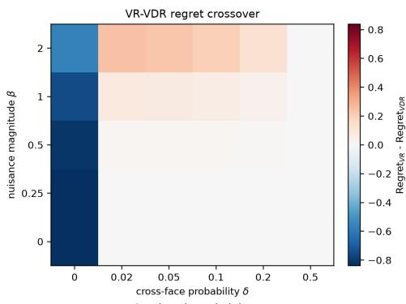

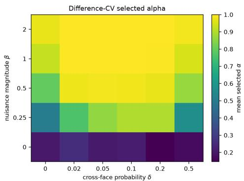

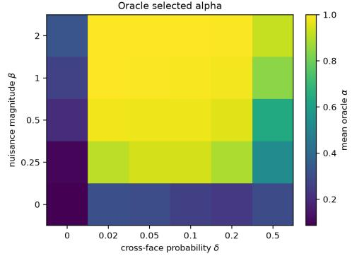

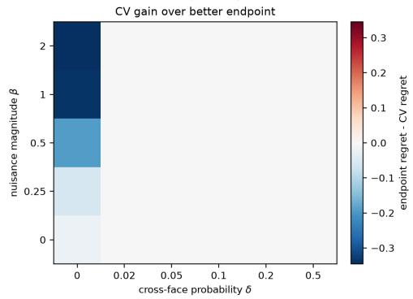  
Figure 2: Crossover grid $( \rho = 1 )$ . Top left: $\mathrm { R e g } _ { \mathrm { V R } } - \mathrm { R e g } _ { \mathrm { V D R } }$ ; negative values favor VR and positive values favor VDR. Top right and bottom left: mean α selected by DIFFERENCE-CV and by ORACLE. Bottom right: regret of the better of VR and VDR minus that of DIFFERENCE-CV; positive values mean that DIFFERENCE-CV improves on both.

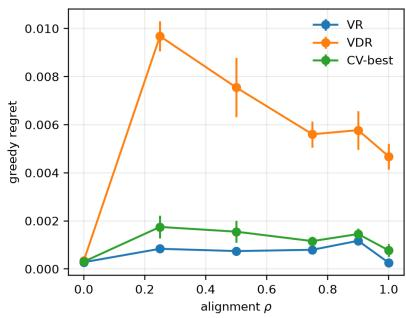

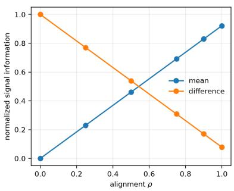  
Figure 3: Alignment sweep at fixed $( \delta , \beta ) = ( 0 . 0 2 , 0 )$ . Left: greedy-policy regret as the true value direction moves toward the weak first action coordinate; CV-best denotes DIFFERENCE-CV. Right: the fractions $\kappa _ { \mathrm { m e a n } } ~ ( ^ { \cdots } \mathrm { m e a n ^ { \cdots } } )$ and $\kappa _ { \mathrm { d i f f } } ~ ( ^ { \bullet \bullet } \mathrm { d i f f e r e n c e } ^ { \bullet \bullet } )$ of the target’s second moment contributed by its conditional mean and centered component, respectively; see (66).

## H.2 LLM RESPONSE-SELECTION EXPERIMENT

Data and representations. We curate 1,000 English prompts from WildChat (Zhao et al., 2024), UltraFeedback (Cui et al., 2024), GSM8K (Cobbe et al., 2021), MATH (Hendrycks et al., 2021), MBPP (Austin et al., 2021), HelpSteer2 (Wang et al., 2024b), and TL;DR (Stiennon et al., 2020), and cache 1,000 responses per prompt generated by Llama-3.2-3B-Instruct (Meta, 2024). Each response is represented by a 3,072-dimensional feature vector obtained by mean-pooling the generator’s finallayer hidden states over its response tokens. Keeping the prompts, responses, and representations fixed, we repeat the experiment with reward models Skywork-Reward-V2-Llama-3.1-8B and Skywork-Reward-V2-Qwen3-8B (Liu et al., 2026), and ArmoRM-Llama3-8B-v0.1 (Wang et al., 2024a).

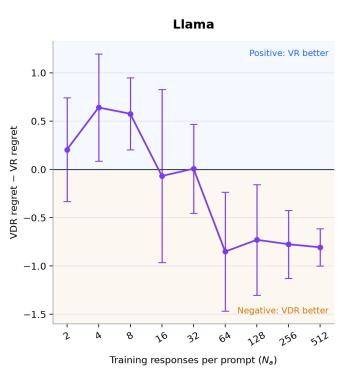

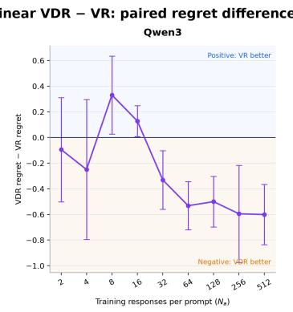

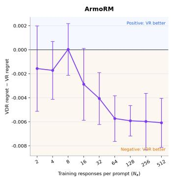  
Figure 4: Paired regret differences on the 200 evaluation prompts, $\mathrm { R e g } _ { \mathrm { V D R } } - \mathrm { R e g } _ { \mathrm { V R } } ,$ , with pointwise 95% Student-t confidence intervals over five seeds. Negative values favor VDR.

Training protocol. For each of five seeds, we split the prompts into $N _ { x } = 8 0 0$ training prompts and 200 evaluation prompts that are not used for fitting or selecting the regularization strengths. We vary the number of labeled responses per training prompt over $\bar { N _ { a } } \in \{ 2 , \bar { 4 } , 8 , 1 6 , 3 2 , 6 4 , 1 \bar { 2 8 } , 2 5 6 , 5 1 2 \}$ Within each seed and response budget, VR and VDR use the same sampled responses. To stabilize estimation in the 3,072-dimensional feature space, we use $\ell _ { 2 }$ -regularized versions of the objectives in Sections 4.1 and 4.2. Writing $\phi _ { i , j } = \phi ( x _ { i } , a _ { i , j } )$ , the estimators minimize

$$
\begin{array} { r l } & { ( \widehat { \theta } _ { \mathrm { V R } } , \widehat { c } ) \in \underset { \theta , c } { \arg \operatorname* { m i n } } \left\{ \underset { i = 1 } { \overset { N _ { x } } { \sum } } \underset { j = 1 } { \overset { N _ { a } } { \sum } } { \big ( } r _ { i , j } - \theta ^ { \top } \phi _ { i , j } - c \big ) ^ { 2 } + \lambda _ { \mathrm { V R } } \| \theta \| _ { 2 } ^ { 2 } \right\} , } \\ & { \widehat { \theta } _ { \mathrm { V D R } } \in \underset { \theta } { \arg \operatorname* { m i n } } \left\{ \underset { i = 1 } { \overset { N _ { x } } { \sum } } \underset { ( j , k ) \in \mathcal { P } _ { i } } { \sum } { \big [ } { \big ( } r _ { i , j } - r _ { i , k } { \big ) } - \theta ^ { \top } { \big ( } \phi _ { i , j } - \phi _ { i , k } { \big ) } { \big ] } ^ { 2 } + \lambda _ { \mathrm { V D R } } \| \theta \| _ { 2 } ^ { 2 } \right\} , } \end{array}
$$

where $\mathcal { P } _ { i }$ is the set of within-prompt pairs used for prompt $x _ { i }$ . VDR uses all $\binom { N _ { a } } { 2 }$ pairs when $N _ { a } \leq 3 2$ and samples $1 6 N _ { a }$ pairs without replacement otherwise. Features are standardized before fitting. We select $\lambda _ { \mathrm { V R } }$ and $\lambda _ {  { \mathrm { V D R } } }$ separately for each reward model, method, and response budget using validation regret on a 640/160 split of the training prompts, and then refit on all 800 training prompts. The VR intercept c is not penalized; VDR requires no intercept because it cancels under differencing.

Evaluation and results. Each fitted scorer ranks all 1,000 cached responses for every evaluation prompt and selects the response with the highest predicted score. For an evaluation prompt x, offline regret is the difference between the reward of its best cached response and that of the selected response. We average this quantity over the 200 evaluation prompts. The primary figure reports means and pointwise 95% Student-t confidence intervals over the five seeds.

Because both methods use the same train–test split and sampled responses within each seed, we also compute the seed-wise paired difference $\mathrm { R e g } _ { \mathrm { V D R } } - \mathrm { R e g } _ { \mathrm { V R } }$ . Figure 4 reports its mean and pointwise 95% Student-t confidence interval. For every $N _ { a } \geq 6 4$ , these intervals lie below zero under all three reward models.

## H.3 MCTS-BASED MATHEMATICAL REASONING EXPERIMENT

We complement our theoretical results with an LLM-based mathematical reasoning experiment, examining whether relative supervision can improve downstream decision quality even when numerical rewards are available. We compare VR with a binary-preference variant of VDR (which we refer to VDR for simplicity) for guiding Monte Carlo tree search (MCTS). Following the process-preference approach of Guan et al. (2025), we train reward models using either search-derived $Q \cdot$ -values or within-context preferences constructed from those values. Rather than evaluating selection from a fixed candidate pool, we measure how these learned models guide a sequence of reasoning steps toward correct final answers.

Data, labels, and representations. We use 1,000 competition mathematics problems from the American Mathematics Competitions (Mathematical Association of America, 2024): 800 AMC12 problems from the 2002–2024 contests and 200 AIME problems from the 2000–2024 contests.9 $\mathbf { A }$ context $x _ { i }$ contains a problem and its reasoning prefix; $a _ { i , j }$ is a candidate next step with label $r _ { i , j } : = Q ( x _ { i } , a _ { i , j } )$ . Labels are taken from an eight-rollout data-generation snapshot.

During data generation, final-outcome rewards (+1 for a correct answer and −1 for a recorded unsuccessful outcome) are backed up through the search tree. For a visited node $v ,$ the Q-value estimates eventual success under the generating policy and budget, and is defined as

$$
Q ( v ) = \frac { S ( v ) } { n ( v ) } = \frac { N _ { + } ( v ) - N _ { - } ( v ) } { N _ { + } ( v ) + N _ { - } ( v ) } = 2 \widehat { p } ( v ) - 1 ,
$$

where $S ( v )$ and $n ( v )$ are the reward sum and visit count; $N _ { + }$ and $N _ { - }$ count successful and unsuccessful continuations, and $\widehat { p }$ is their success frequency.

For each candidate step $^ { a , }$ we encode the parent context x (the problem, preceding reasoning steps, and prior execution observations) followed by a in the generation format, excluding a’s own execution output. We extract the final-layer hidden state at the last nonpadding token of frozen Qwen2.5-Coder-7B-Instruct (Hui et al., 2024). The resulting 3,584-dimensional vectors are standardized to obtain ϕ(x, a), using statistics fitted on training candidates during model selection and on training-plusvalidation candidates for the final refit.

Training objectives and protocol. A trainable linear or one-hidden-layer GELU head maps $\phi ( x , a )$ to a scalar score $f _ { \boldsymbol { \theta } } ( \boldsymbol { x } , \boldsymbol { a } )$ , while the Qwen backbone remains frozen. For VDR, this encoder–head combination is the process preference model (PPM); paired candidates are scored separately by the same head. VR learns an unpenalized global intercept; VDR fixes it to zero.

For each context $x _ { i } ,$ , let $P _ { i }$ contain preferred–rejected pairs, with $a _ { i , j }$ preferred to $\boldsymbol { a } _ { i , k }$ for $( j , k ) \in P _ { i }$ Let $E _ { i }$ denote their unique endpoint indices, $\mathbf { \bar { \Phi } } N _ { a , i } = | E _ { i } |$ , and $m _ { i } ^ { \mathrm { p o s } }$ and $m _ { i } ^ { \mathrm { n e g } }$ denote the datasetrecorded positive and negative role counts. VR regresses the numerical labels $r _ { i , j } = Q ( x _ { i } , a _ { i , j } )$ whereas VDR learns pairwise orderings using the ranking loss of Guan et al. (2025), with datasetspecific normalization: with $\sigma ( z ) = ( \bar { 1 + { e ^ { - z } } } ) ^ { - 1 }$

$$
\widehat { L } _ { \mathrm { V R } } ( f _ { \theta } ) = \frac { 1 } { N _ { x } } \sum _ { i = 1 } ^ { N _ { x } } \frac { 1 } { N _ { a , i } } \sum _ { j \in E _ { i } } \left( f _ { \theta } ( x _ { i } , a _ { i , j } ) - r _ { i , j } \right) ^ { 2 } ,
$$

$$
\widehat { L } _ { \mathrm { V D R } } ( f _ { \theta } ) = - \frac { 1 } { N _ { x } } \sum _ { i = 1 } ^ { N _ { x } } \frac { 1 } { m _ { i } ^ { \mathrm { p o s } } m _ { i } ^ { \mathrm { n e g } } } \sum _ { ( j , k ) \in P _ { i } } \log \sigma \big ( f _ { \theta } ( x _ { i } , a _ { i , j } ) - f _ { \theta } ( x _ { i } , a _ { i , k } ) \big ) .
$$

We train the linear heads using ridge/SVD with penalty $\lambda \| w \| _ { 2 } ^ { 2 }$ for VR, and L-BFGS (Liu & Nocedal, 1989) with $( \lambda / 2 ) \| w \| _ { 2 } ^ { 2 }$ penalty for VDR; both select $\lambda = 1$ . MLPs use AdamW (Loshchilov & Hutter, 2019), averaging context-wise errors for VR and summing role-count-weighted pair losses for VDR. We select the hyperparameters by validation loss, averaged over three training seeds for MLPs, then refit on training plus validation data.

We evaluate all 100 test problems with Qwen2.5-Coder-7B-Instruct using one MCTS tree, two iterations, four children per expansion, maximum depth $^ { 1 6 , }$ and token limits of 1,024 per step and 16,384 per context.

Results and discussion. VDR achieves higher observed accuracy than VR with both linear heads (16% versus 15%) and MLPs (13% versus 10%; Table 3).

The synthetic experiment in Appendix H.1 examines the bias–variance tradeoff by separately control ling nuisance magnitude and the geometry of within-context comparisons. The response-selection experiment in Appendix H.2 compares the objectives on real data without isolating the mechanism responsible for their relative performance. The present experiment asks whether preferences derived from numerical feedback can guide search toward correct final answers. Its observed gains provide additional evidence that relative supervision can be useful even when numerical rewards are available.

Table 3: Final-answer accuracy on 100 test problems under a common MCTS budget. Each method uses one search seed; MLPs use one prespecified refit.
<table><tr><td>Reward head</td><td>Accuracy (%)</td></tr><tr><td>Linear VR</td><td>15</td></tr><tr><td>Linear VDR</td><td>16</td></tr><tr><td>MLPVR</td><td>10</td></tr><tr><td>MLP VDR</td><td>13</td></tr></table>