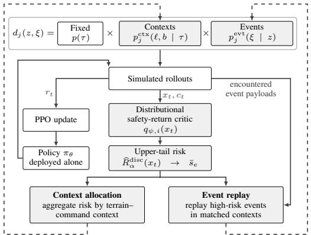
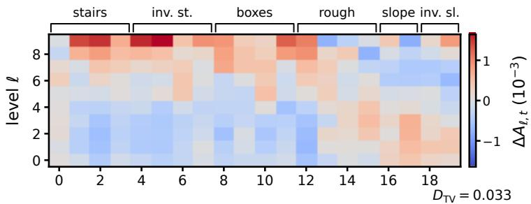
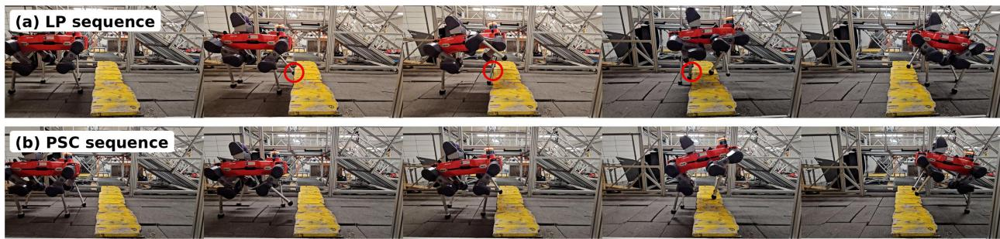

# PREDICTIVE SAFETY CURRICULA FOR ROBUST LEGGEDLOCOMOTION

Ivan Ovinnikov Pascal Sutter Christian Gehring Jordis Herrmann

ANYbotics AG Zürich, Switzerland

## ABSTRACT

Rare but consequential failures can persist in learned locomotion policies for legged robots even when average task performance is high, in part because standard curricula primarily adapt task difficulty rather than the distribution of safety-critical experience. We introduce Predictive Safety Curricula (PSC), a framework for allocating locomotion training experience using learned predictions of future safety cost. PSC trains a distributional safety critic from policy rollouts and uses its predictions to prioritize both terrain contexts and previously encountered randomized events. The resulting curriculum modifies the training distribution while leaving the task reward and policyoptimization loss unchanged. We evaluate PSC in controlled rough-terrain locomotion and in production locomotion systems. PSC improves reliability relative to standard terrain progression, advantage-based replay, and learning-progress curricula, with the largest gains on difficult terrain and under degraded observations. The same allocation principle transfers to two production locomotion stacks. On ANYmal-D hardware, PSC reduces shank-collision incidence by 63% relative to the learning-progress curriculum across three matched training seeds, with a reduction in every seed. On a production stair-climbing platform, PSC eliminates observed shank collisions in the evaluated hardware trials. These results show that learned predictions of future safety cost can provide an effective signal for allocating training experience toward rare failure modes and improving locomotion reliability.

Keywords curriculum learning, legged locomotion, reinforcement learning, robot safety, adaptive sampling

## 1 Introduction

Learning-based control has substantially expanded the capabilities of legged robots on complex and heterogeneous terrain. Despite this progress, policies with strong average performance can still exhibit rare but consequential unsafe outcomes, including lower-leg collisions and loss of balance under difficult conditions. Standard locomotion curricula prioritize task difficulty, average performance, or learning progress, and may therefore overlook conditions that appear equally successful on average but differ substantially in tail safety risk. This creates a gap between capability-driven training allocation and the rare safety-critical outcomes that limit reliable deployment.

Curriculum learning provides a natural mechanism for reallocating training experience. Performance-based terrain curricula adapt task difficulty as locomotion competence improves [1, 2], while Prioritized Level Replay and learningprogress curricula use policy-dependent signals to focus sampling on tasks with high estimated learning potential [3, 4]. These mechanisms support capability acquisition but do not explicitly target elevated safety risk. Estimating such risk is challenging: failures may be sparse within individual terrain–command contexts and change throughout training. As the number of terrain and randomization variables grows, maintaining reliable empirical safety estimates for each configuration becomes increasingly data inefficient.

We introduce Predictive Safety Curricula (PSC), a framework for directing locomotion training toward conditions associated with elevated predicted safety risk. PSC learns future safety cost from policy rollouts and uses these predictions to adapt subsequent training experience. Unlike safety critics used to constrain policy updates or intervene at deployment, PSC uses safety predictions to prioritize which experience is collected next: the task reward and loss function remain unchanged. The learned model supports both expected-cost and upper-tail prioritization and provides a common allocation signal across terrain and randomized environment variation.

  
(a) Predictive safety allocation for context $z =$ (τ, ℓ, b). Rollout states and costs train a shared safetyreturn critic. Its upper-tail risk is averaged into an episode score ${ \bar { s } } _ { e } .$ , which is aggregated by context and attached to event payloads encountered in that episode.

  
(b) Late-training context allocation under PSC relative to LP. Mean difference in empirical terrain-context allocation, $\Delta A _ { \ell , t } = A _ { \ell , t } ^ { \mathrm { P S C } } - A _ { \ell , t } ^ { \mathrm { L P } }$ averaged over $\hat { N } = 3$ training seeds. Positive values indicate contexts sampled more frequently by PSC. PSC induces a structured redistribution rather than uniformly favoring higher terrain levels.  
Figure 1: Predictive safety allocation and its effect on the late-training context distribution.

We evaluate PSC in both controlled and production-level locomotion settings. On ANYmal-D, a quadrupedal robot developed by ANYbotics, PSC improves reliability relative to standard terrain progression, Prioritized Level Replay, and learning-progress curricula, with the largest gains under more demanding terrain and observation conditions. Controlled ablations examine the effect of experience allocation based on mean and upper-tail safety risk and compare predicted risk with direct empirical safety statistics, while critic diagnostics assess whether the learned model identifies future safety-relevant outcomes. We further evaluate PSC in a production stair-climbing stack on ANYmal-X, an explosion-safe quadruped where avoiding lower-leg impacts is particularly important for hardware integrity. There, PSC substantially reduces such contacts while preserving traversal performance.

Our contributions are threefold. $F i r s t .$ , we introduce predictive safety allocation as a curriculum mechanism that uses a shared safety-return model to redistribute training experience, while the policy is still optimized for the original task reward using the unchanged reinforcement learning loss. Second, we characterize the role of safety prediction and risk readout through controlled curriculum ablations and critic diagnostics. Third, we validate the approach across a controlled locomotion benchmark, a production stair-climbing training stack, and repeated hardware trials with physically meaningful contact measurements.

## 2 Method

PSC converts predictions of future safety exposure from completed rollouts into priorities for subsequent training experience (Fig. 1a). We represent the training distribution through structured curriculum contexts and randomized environment events and use the same learned safety signal to adapt both components. Context allocation can operate alongside an existing capability curriculum that determines which structured conditions are currently available, while event allocation adapts the randomizations encountered within those conditions.

## 2.1 Training Conditions and Safety Returns

We consider a structured curriculum context $z = ( \tau , \ell , b ) \in \mathcal { Z }$ , where τ denotes terrain type $( \mathrm { e . g . }$ , stairs, slopes, or discrete obstacles), $\ell \in \{ 1 , \ldots , L \}$ the terrain difficulty level, and $b \in \{ 1 , \ldots , B \}$ an optional command bucket. Addi tional randomized environment variables such as friction, joint positions, actuator properties, or external perturbations, are represented by an event configuration ξ. At curriculum update $j ,$ the joint distribution of training conditions is factorized as

$$
d _ { j } ( z , \xi ) = p ( \tau ) p _ { j } ^ { \mathrm { c t x } } ( \ell , b \mid \tau ) p _ { j } ^ { \mathrm { e v t } } ( \xi \mid \tau , \ell , b ) ,\tag{1}
$$

where $p ( \tau )$ denotes the fixed terrain-type assignment, $p _ { j } ^ { \mathrm { c t x } }$ controls allocation over level–command contexts within each terrain type, and $p _ { i } ^ { \mathrm { { e v t } } }$ controls replayable randomized events within the selected context. Environment variables not controlled by either PSC sampler retain their original sampling procedures. This factorization separates allocation across structured task contexts from allocation over randomized environment events while allowing both to be adapted using the same learned safety signal. The locomotion polic $\pi _ { \boldsymbol { \theta } } { \left( a _ { t } \mid o _ { t } \right) }$ maps observation $o _ { t }$ to action $a _ { t }$ and is trained using the original task reward. PSC introduces a separate nonnegative safety cost

$$
c _ { t } = \sum _ { m = 1 } ^ { M } w _ { m } c _ { t } ^ { ( m ) } , \qquad w _ { m } \ge 0 , \qquad G _ { t } ^ { c } = \sum _ { k = t } ^ { T - 1 } \gamma _ { c } ^ { k - t } c _ { k } ,\tag{2}
$$

where $c _ { t } ^ { ( m ) }$ denotes task-specific safety component $m , \ w _ { m }$ its weight, and $\gamma _ { c } ~ \in ~ ( 0 , 1 ]$ the safety discount. The discounted return $G _ { t } ^ { c }$ represents cumulative future safety exposure from time t and provides the prediction target for the safety critic. The particular safety components and their parameters are properties of the locomotion task rather than of PSC and are specified in Sec. 3. PSC modifies the training-condition distribution $d _ { j }$ , thereby changing the induced trajectory distribution used for policy optimization. The safety cost trains an auxiliary critic whose predictions define curriculum priorities; it is not added to the task reward or PPO policy objective.

## 2.2 Shared Distributional Safety Critic

Given rollout features $x _ { t }$ , a critic parameterized by ψ predicts $K$ conditional quantiles of the discounted safety return $G _ { t } ^ { c }$ [5]:

$$
q _ { \psi , i } ( x _ { t } ) \approx F _ { G _ { t } ^ { c } | x _ { t } } ^ { - 1 } ( u _ { i } ) , \qquad u _ { i } = \frac { i - \frac { 1 } { 2 } } { K } , \quad i = 1 , \dots , K .\tag{3}
$$

Here $u _ { i }$ is the probability level of the i-th predicted quantile. Evenly spaced levels provide a uniform discretization of the conditional safety-return distribution, allowing both mean and upper-tail statistics to be obtained from the same critic. The function $F _ { G _ { t } ^ { c } | x _ { t } } ^ { - 1 }$ denotes the conditional quantile function, and $x _ { t }$ contains the state or observation features available to the safety critic.

A single critic is trained from trajectories collected across the full training distribution $d _ { j }$ . Safety observations from different curriculum contexts and randomized environment configurations can therefore contribute to a common predictive model when they induce similar risk-relevant states. Temporal bootstrapping further propagates observed safety outcomes to states preceding the corresponding interaction. For an n-step segment ending at or before episode termination, the distributional bootstrap targets are

$$
y _ { t , k } = \sum _ { r = 0 } ^ { n - 1 } \gamma _ { c } ^ { r } c _ { t + r } + \gamma _ { c } ^ { n } \chi _ { t + n } q _ { \bar { \psi } , k } ( x _ { t + n } ) ,\tag{4}
$$

where $\chi _ { t + n }$ is 0 at termination and 1 otherwise, and $\bar { \psi }$ denotes the Polyak-averaged target network parameters. The critic minimizes the standard quantile-Huber regression loss [5],

$$
\mathcal { L } ( \psi ) = \mathbb { E } _ { t } \left[ \frac { 1 } { K ^ { 2 } } \sum _ { i = 1 } ^ { K } \sum _ { k = 1 } ^ { K } \rho _ { u _ { i } } ^ { \kappa } ( y _ { t , k } - q _ { \psi , i } ( x _ { t } ) ) \right] ,\tag{5}
$$

with Huber threshold $\kappa .$

Modeling the conditional safety-return distribution allows the same learned predictor to support alternative risk summaries. We use an upper-tail readout for PSC and evaluate the corresponding mean readout as an ablation in Sec. 3.2.

## 2.3 From Safety Prediction to Curriculum Priority

Let $\alpha \in ( 0 , 1 )$ denote the target upper-tail mass. The state-conditioned upper-tail conditional value-at-risk (CVaR) is

$$
R _ { \alpha } ( x _ { t } ) = \frac { 1 } { \alpha } \int _ { 1 - \alpha } ^ { 1 } F _ { G _ { t } ^ { c } | x _ { t } } ^ { - 1 } ( u ) \mathrm { d } u .\tag{6}
$$

For the discrete quantile representation, let $q _ { \psi , ( 1 ) } ( x ) \leq \cdot \cdot \cdot \leq q _ { \psi , ( K ) } ( x )$ denote the predicted quantile values ordered by magnitude and define $k _ { \alpha } = \lceil \alpha K \rceil$ ⌉. We use

$$
\widehat { R } _ { \alpha } ^ { \mathrm { d i s c } } ( x ) = \frac { 1 } { k _ { \alpha } } \sum _ { i = K - k _ { \alpha } + 1 } ^ { K } q _ { \psi , ( i ) } ( x ) ,
$$

$$
\widehat { \mu } ( x ) = \frac { 1 } { K } \sum _ { i = 1 } ^ { K } q _ { \psi , ( i ) } ( x ) .\tag{7}
$$

We refer to $\widehat { R } _ { \alpha } ^ { \mathrm { d i s c } }$ and $\widehat { \mu }$ as the upper-tail and mean readouts of the predicted safety-return distribution. The safety cost determines which interactions contribute to future safety exposure, while the readout determines how the predicted distribution of that exposure enters curriculum allocation.

For each completed episode e of length $T _ { e }$ , the selected state-level readout s is averaged along the trajectory:

$$
\bar { s } _ { e } = \frac { 1 } { T _ { e } } \sum _ { t = 0 } ^ { T _ { e } - 1 } s ( x _ { e , t } ) , \qquad S _ { j } ( z ) = \frac { 1 } { | \mathscr { B } _ { j } ( z ) | } \sum _ { e \in \mathscr { B } _ { j } ( z ) } \bar { s } _ { e } .\tag{8}
$$

Here $B _ { j } ( z )$ contains the recent scored episodes associated with context z at update $j .$ PSC uses $s = \widehat { R } _ { \alpha } ^ { \mathrm { d i s c } }$ for upper-tail prioritization; the mean-readout ablation uses $s = \widehat { \mu }$ . The episode score $\bar { s } _ { e }$ provides the common signal for the two allocation pathways. For context allocation, recent episode scores are aggregated into $S _ { j } ( z )$ ; for event allocation, the episode score remains associated with randomized event realizations encountered during that trajectory.

As a non-predictive comparison, we additionally consider empirical CVaR computed directly from realized episode safety returns. For a context containing $n _ { z }$ buffered episodes, the empirical priority averages the largest max $\left( 1 , \left\lceil \alpha n _ { z } \right\rceil \right)$ values of $G _ { 0 } ^ { c }$ . Sec. 3.2 compares this direct empirical statistic with the learned state-conditioned priority.

## 2.4 Safety-Prioritized Context Allocation

For terrain type $\tau ,$ let $\mathcal { E } _ { \tau , j }$ denote the set of level–command pairs admitted by the underlying capability curriculum at update $j .$ PSC reallocates experience within this support by combining uniform exploration with safety-prioritized sampling:

$$
p _ { j } ^ { \mathrm { c t x } } ( \ell , b \mid \tau ) = \varepsilon U _ { \tau , j } ( \ell , b ) + ( 1 - \varepsilon ) \frac { \mathbf { 1 } \{ ( \ell , b ) \in \mathcal { E } _ { \tau , j } \} P _ { j } ( \tau , \ell , b ) } { \sum _ { ( \ell ^ { \prime } , b ^ { \prime } ) \in \mathcal { E } _ { \tau , j } } P _ { j } ( \tau , \ell ^ { \prime } , b ^ { \prime } ) } .\tag{9}
$$

Here $U _ { \tau , j }$ is uniform over the admissible set and ε controls uniform exploration. The underlying capability curriculum therefore determines which contexts are available, while PSC determines how experience is distributed among them. To maintain exploration, PSC combines the context score with terrain-level staleness and coverage:

$$
\begin{array} { r } { P _ { j } ( \tau , \ell , b ) = \lambda _ { S } \widetilde { S } _ { j } ( \tau , \ell , b ) + \lambda _ { a } \widetilde { a } _ { \ell , j } + \lambda _ { u } \widetilde { u } _ { \ell , j } . } \end{array}\tag{10}
$$

Here, $a \ell , j$ counts environment steps since level ℓ was last selected, and $u _ { \ell , j } = ( 1 + n _ { \ell , j } ) ^ { - 1 }$ , where $n _ { \ell , j }$ is its cumulative scored-episode count. Tildes denote independent normalization over the qualified support. Uninformative priorities yield uniform sampling over the admissible support. The weights $\lambda _ { S } , \lambda _ { a } , \lambda _ { u }$ and external capability curricula are specified in Sec. 3.

## 2.5 Safety-Prioritized Event Replay

PSC adapts $p _ { j } ^ { \mathrm { e v t } } ( \xi \mid z )$ by associating each sampled event realization $\xi$ with the safety score $\bar { s } _ { e }$ of the episode in which it occurred. For each context, previously sampled event realizations are retained in a small replay buffer and preferentially resampled according to their scores. At each event invocation, PSC either reuses a context-matched realization or draws a new one, preserving exploration and providing a fallback when no replay samples are available. Context allocation and event replay therefore act on complementary factors of Eq. (1) using the same learned safety signal.

## 3 Experiments

We evaluate PSC across three increasingly realistic settings. The public Isaac Lab ANYmal-D benchmark provides a controlled environment in which policy architecture, reward design, optimization budget, and terrain progression are matched across methods; we use it for the main multi-seed comparison and mechanism ablations. All policies are trained with Proximal Policy Optimization (PPO) [6], with the policy-learning algorithm and objective held fixed across curriculum variants. We then assess PSC in the more complex production ANYmal-X stair-climbing stack, and finally evaluate trained production policies on hardware using physically meaningful contact outcomes.

Task and baselines. The ANYmal-D policy tracks commanded planar velocities and yaw rates over procedurally generated rough terrain, with terrain difficulty represented by a discrete level ℓ. The underlying terrain curriculum determines which levels are available for training, while the adaptive methods redistribute experience within this support. For all adaptive methods, prioritized allocation is enabled only after the terrain curriculum reaches its maximum level. For PSC, we define an auxiliary safety signal that captures three common indicators of unsafe locomotion: excessive torso tilt, configurations in which the legs fold close to the robot base, and undesired thigh or shank contacts with the environment.

$$
c _ { t } = c _ { t } ^ { \mathrm { o r i } } + c _ { t } ^ { \mathrm { d i s t } } + c _ { t } ^ { \mathrm { u n d } } .\tag{11}
$$

The orientation term i $c _ { t } ^ { \mathrm { o r i } } = [ \cos ( 6 0 ^ { \circ } ) + g _ { t , z } ^ { B } ] _ { + }$ , where $g _ { t , z } ^ { B }$ is the vertical component of the unit gravity vector in the base frame. The proximity term is $c _ { t } ^ { \mathrm { d i s t } } = [ ( d _ { \mathrm { n o m } } - d _ { t } ) / d _ { \mathrm { n o m } } ] _ { + }$ , with $d _ { \mathrm { n o m } } = 0 . 3 5$ m and $d _ { t }$ the minimum distance from the base-link origin to the hip, thigh, or shank link origins. Finally, $\begin{array} { r } { c _ { t } ^ { \mathrm { u n d } } = \sum _ { r \in \mathcal { B } _ { \mathrm { u n d } } } { \mathbf { 1 } } \{ \operatorname* { m a x } _ { h } \} | F _ { t , h , r } \| _ { 2 } > 1 \mathrm { N } \} } \end{array}$ where $\boldsymbol { B _ { \mathrm { u n d } } }$ contains the thigh and shank bodies and $F _ { t , h , \prime }$ denotes the contact-force vector acting on body r at contact-history sample h of control step t. All terms have unit weight and $\gamma _ { c } = 0 . 9 9$ . The auxiliary safety cost itself does not enter the task reward or PPO loss; its constituent failure and collision events are already included as penalties in the locomotion reward.

We compare four curriculum strategies under the same locomotion learner. Baseline uses standard terrain progression without additional prioritization. PLR uses mean absolute generalized advantage and combines score- and stalenessbased priorities with $\rho = 0 . 1$ [3]. Learning progress (LP) uses the signed change between consecutive episodic-return estimates followed by softmax prioritization [4]. PSC derives priorities from predicted safety return. To compare prioritization strategies, PLR, LP, and PSC share the same admissible terrain–command support and randomized-event replay pathway while retaining their respective priority definitions and sampling rules. For PSC, we use $\lambda _ { S } = 0 . 7$ $\lambda _ { a } = 0 . 2$ , and $\lambda _ { u } = 0 . 1$ for predicted safety, staleness, and coverage. We use a buffer size of 64 per replayable event with a replay probability of 0.4.

Safety-return estimator. The safety critic predicts $K = 3 2$ quantiles of discounted safety return with upper-tail mass $\alpha = 0 . 0 5$ . Following Sec. 2.3, the upper-tail readout averages the largest $k _ { \alpha } = \lceil \alpha K \rceil = \dot { 2 }$ quantiles, corresponding to 6.25% of the discrete representation. Episode and context scores follow Eq. (8).

The critic receives the same uncorrupted privileged observations as the PPO value critic and is an independent ELU MLP with hidden widths (512, 256, 128). It uses one-step targets $( n = 1 ) , \gamma _ { c } = 0 . 9 9$ , quantile-Huber threshold $\kappa = 1$ and Polyak coefficient 0.01. Each terrain-level–command context retains the latest $N = 1 2 8$ episode scores and enables prioritization after the first completed episode. Predicted safety, staleness, and coverage are independently min–max normalized, combined as above, and mixed with uniform sampling with probability 0.3.

Training and cohort provenance. All ANYmal-D methods use the same interaction and optimization budget: 8192 parallel environments, 24-step rollouts, and 3000 PPO updates, totaling 589,824,000 transitions. Each rollout is optimized for five epochs over four minibatches using Adam with initial learning rate $1 0 ^ { - 3 }$ and an adaptive KL-based schedule. For PSC, the safety critic is optimized jointly with the policy using the same optimizer and schedule, updated once per PPO minibatch, with no separate warm-up. Experiments use Isaac Lab [7], and RSL-RL [8]. Unless otherwise stated, results use six training seeds {13, 19, 23, 31, 47, 61}.

Evaluation protocol. We evaluate the final checkpoint after 3000 PPO updates using deterministic actions. Each policy–condition pair runs for 3000 control steps in 1000 parallel environments at 50 Hz with a 40 s episode timeout. Environments are reset after termination, and statistics are computed over all episodes completed during evaluation; episodes truncated by the evaluation cutoff are omitted. Terrain and command assignments are shared across methods. Terrain cells are assigned deterministically by environment index on a $1 0 \times 2 0$ grid, and commands are drawn from $( v _ { x } , v _ { y } , \omega _ { z } ) \in \{ ( 0 , 0 , 0 ) , ( 0 . 5 , 0 , 0 ) , ( 1 , 0 , \dot { 0 } ) , ( 0 . 5 , 0 . 5 , 0 ) , ( 0 . 5 , 0 , 0 . 5 ) \}$

To vary occupancy of difficult terrain, we use

$$
p _ { v } ( \ell ) \propto ( \ell + 1 ) ^ { v - 1 } , \qquad v \in \{ 1 , 2 , 3 \} ,\tag{12}
$$

where $v = 1$ is uniform and larger v increasingly concentrates mass on higher terrain levels. Observation noise doubles the nominal policy-observation noise ranges. A fixed evaluation seed of 42 shares simulator randomization across methods within each condition.

An episode fails on illegal torso contact (net contact force $> 1 \mathrm { N } ) ;$ ; timeout at 40 s counts as success, and episodes truncated by the evaluation cutoff are excluded.

## 3.1 ANYmal-D Rough-Terrain Locomotion

Table 1 summarizes the main ANYmal-D comparison. PSC achieves the highest mean success across all six clean and observation-noise conditions. PSC achieves higher mean success than PLR across the evaluation grid, while the stronger LP curriculum narrows the gap. Relative to LP, PSC improves success by 0.16, 1.38, and 0.50 percentage points under clean $v = 1 , v = 2$ , and $v = 3$ , respectively. The largest separation occurs at $v = 2$ , where the evaluation distribution places greater mass on more difficult terrain while retaining sufficient occupancy across the curriculum.

Reliability on difficult terrain. Expressed as failure rate, clean $v = 2$ decreases from 6.19% for LP to 4.81% for PSC, a 22.3% relative reduction; at $v = 3 ,$ it decreases from 7.19% to 6.69%. Relative to PLR, failure decreases from 7.71% to 4.81% at $v = 2$ and from 9.24% to 6.69% at $v = 3$ . Thus, PSC retains its advantage as evaluation shifts toward harder terrain, with LP providing the stronger comparator.

Table 1: ANYmal-D success (%): mean ± sample standard deviation over six training seeds. v controls terrain occupancy. Bold denotes the highest mean.
<table><tr><td>Occupancy</td><td>Baseline</td><td>PLR</td><td>LP</td><td>PSC</td></tr><tr><td>v1 Clean v2 v3</td><td> $9 1 . 9 4 { \pm } 1 . 5 6 $   $9 1 . 2 0 { \pm } 1 . 5 0 \ $   $8 9 . 0 7 { \scriptstyle \pm 2 . 0 6 }$ </td><td> $9 3 . 3 1 { \pm } 3 . 1 3 $   $9 2 . 2 9 { \pm } 4 . 6 5$   $9 0 . 7 6 { \pm } 4 . 5 1 $ </td><td> $9 4 . 4 0 { \pm } 0 . 9 5 $   $9 3 . 8 1 { \pm } 1 . 0 0 $   $9 2 . 8 1 { \pm } 0 . 9 9$ </td><td>94.56±1.08  $\mathbf { 9 5 . 1 9 { \pm } 1 . 7 7 }$   $\mathbf { 9 3 . 3 1 \pm 1 . 3 6 }$ </td></tr><tr><td>e v1  $\frac { \texttt { \textsf { M } } } { \texttt { \textsf { E } } } \boldsymbol { v } 2$   $\bar { z } \ _ { v 3 }$ </td><td> $9 1 . 1 1 { \pm } 1 . 6 9 $   $8 8 . 8 1 { \pm } 2 . 6 5 $   $8 6 . 8 6 { \pm } 3 . 5 6 $ </td><td> $9 1 . 4 4 { \pm } 2 . 9 8 $   $8 9 . 5 4 { \pm } 3 . 5 1 $   $8 7 . 7 8 { \pm } 4 . 3 6$ </td><td> $9 2 . 2 7 { \pm } 1 . 7 8$   $9 1 . 2 0 { \pm } 2 . 1 1 $   $8 9 . 0 8 { \pm } 2 . 3 0 $ </td><td> $\mathbf { 9 2 . 8 2 \pm 1 . 0 1 }$   $\mathbf { 9 2 . 5 3 { \pm } 1 . 7 4 }$   $\mathbf { 8 9 . 9 2 \pm 1 . 7 1 }$ </td></tr></table>

Robustness to observation noise. PSC remains the highest-performing curriculum when policy observations are corrupted by noise. Relative to $\mathrm { L P } ,$ success improves by 0.55, 1.33, and 0.84 percentage points under noisy $v = 1$ $v = 2 .$ , and $v = 3 ,$ , respectively. The same ordering therefore persists under observation degradation, with the largest difference again occurring at $v = 2$

To examine how PSC changes the training distribution, Fig. 1b compares its late-training terrain-context allocation with LP. PSC produces a structured, terrain-dependent redistribution rather than uniformly favoring higher difficulty levels. The seed-mean distributions differ by 0.033 in terms of total variation distance, with per-seed distances of 0.043, 0.044, and 0.045.

## 3.2 Safety Prediction and Curriculum Ablation

We next examine how the safety signal used by PSC influences curriculum performance and whether the learned critic captures safety-relevant trajectory structure. All variants share the policy architecture, reward, sampling machinery, and training budget, with safety-cost changes stated explicitly where ablated. Curriculum results use the same six-seed cohort {13, 19, 23, 31, 47, 61} and six-condition ANYmal-D evaluation suite as the main comparison.

Risk readout and predictive estimation. We compare PSC (QC-CVaR) with predictive mean and empirical tail priorities. QC-mean uses the same quantile critic but averages its predicted quantiles, isolating the risk readout. Empirical CVaR instead computes an episode-level tail statistic from recent realized safety returns, replacing the state-conditioned predictive score and its temporal aggregation with a direct empirical priority.

Table 2 reports success averaged across evaluation conditions within each seed. QC-CVaR achieves $9 3 . 0 5 \pm 1 . 1 4 \%$ exceeding QC-mean $( 9 0 . 4 0 \pm 2 . 5 4 \% )$ and empirical CVaR (91.38 ± 3.17%) by paired differences of $2 . 6 6 \pm 2 . 9 6$ and $1 . 6 8 \pm 3 . 8 0$ percentage points, respectively. QC-CVaR is higher than QC-mean on five of six seeds, while the empirical comparison is less consistent. The results favor predictive upper-tail prioritization in this cohort, although seed-level variability precludes a strong causal attribution to the readout alone. QC-mean is also sensitive to the safety-cost composition: removing the undesired-contact term increases success to 91.17 ± 1.11%.

The ablations support predictive safety as a useful allocation signal without isolating a unique contribution from the upper-tail readout. Empirical tail statistics yield lower mean success and greater across-seed variability than learned state-conditioned priorities in this cohort.

Predictive quality of the safety critic. We evaluate the critic independently of final policy performance. Return prediction is measured by Spearman correlation between the mean prediction $\widehat { \mu } ( \boldsymbol { x } _ { t } )$ and Monte-Carlo discounted safety return $G _ { t } ^ { c }$ . To test whether high predicted risk identifies states preceding unsafe events, we use the state-level CVaR score to rank whether an event occurs within the next $H = 1 0 0$ control steps (2 s). We consider two outcomes: a collision, defined as the terminating illegal base contact (net force > 1 N), and a contact, defined as any thigh or shank contact above 1 N. Termination or timeout truncates the horizon, and incomplete windows at the evaluation cutoff are omitted. We report the area under the precision–recall curve (AUPRC) minus event prevalence and top-decile lift, defined as the event rate among the highest-scoring 10% of valid states divided by the overall event rate.

As shown in Table 3, the mean prediction correlates strongly with realized discounted safety return (Spearman $\rho = 0 . 7 7 3 )$ . High CVaR scores also concentrate subsequent unsafe events: states in the highest-scoring decile have 6.88× the overall collision rate and $2 . 8 1 \times$ the overall thigh-or-shank contact rate. AUPRC exceeds event prevalence by 0.079 for collisions and 0.461 for contacts. These results show that the critic ranks visited states by future safety exposure, supporting its use as a curriculum-priority signal.

Tail-mass sensitivity. We further examine sensitivity to the upper-tail mass α. Relative to the default configuration $( \alpha = 0 . 0 5 , 9 3 . 0 5 \pm 1 . 1 4 \% )$ , setting $\alpha = 0 . 0 1 , 0 . 1 0$ , and 0.20 yields 92.25±2.88%, 91.80±2.06%, and 91.28±1.31% mean success, respectively. Performance therefore decreases as the readout is broadened beyond the default tail mass,

Table 2: ANYmal-D safety-priority ablations. Success is averaged over the six evaluation conditions within each seed and reported as mean ± sample standard deviation over six training seeds. ∆ denotes the paired difference relative to QC-CVaR.  
Table 3: Safety-critic diagnostics over six seeds: mean ± sample standard deviation and 95% confidence interval. AUPRC gain is measured relative to event prevalence; top-decile lift has reference value one.
<table><tr><td>Priority</td><td>Success (%) ↑</td><td> $\Delta \left( \mathsf { p p } \right)$ </td></tr><tr><td>QC-mean</td><td> $9 0 . 4 0 \pm 2 . 5 4$ </td><td> $- 2 . 6 6 \pm 2 . 9 6$ </td></tr><tr><td>Empirical CVaR</td><td> $9 1 . 3 8 \pm 3 . 1 7$ </td><td> $- 1 . 6 8 \pm 3 . 8 0$ </td></tr><tr><td>QC-CVaR (PSC)</td><td> ${ \bf 9 3 . 0 5 \pm 1 . 1 4 }$ </td><td></td></tr></table>

<table><tr><td>Metric</td><td> $\mathrm { { M e a n } \pm { s . d . } }$ </td><td>95% CI</td></tr><tr><td> $\mathrm { S p e a r m a n } ( \widehat { \mu } , G _ { t } ^ { c } )$ </td><td> $0 . 7 7 3 \pm 0 . 0 1 8$ </td><td>[0.754, 0.792]</td></tr><tr><td>Collision AUPRC gain</td><td> $0 . 0 7 9 \pm 0 . 0 1 5$ </td><td>[0.063, 0.095]</td></tr><tr><td>Collision top-decile lift</td><td> $6 . 8 8 \pm 0 . 1 9$ </td><td>[6.68, 7.08]</td></tr><tr><td>Contact AUPRC gain</td><td> $0 . 4 6 1 \pm 0 . 0 0 9$ </td><td>[0.452,0.470]</td></tr><tr><td>Contact top-decile lift</td><td> $2 . 8 1 \pm 0 . 0 9$ </td><td>[2.72, 2.90]</td></tr></table>

Table 4: ANYmal-X stair-climbing teacher success (%): mean ± sample standard deviation over three training seeds. The final row averages settings within each seed.
<table><tr><td>Setting</td><td>Baseline</td><td>PLR</td><td>LP</td><td>PSC</td></tr><tr><td>v0</td><td> $9 9 . 9 9 \pm 0 . 0 1$ </td><td> $9 9 . 9 8 \pm 0 . 0 2$ </td><td> $9 9 . 9 9 \pm 0 . 0 2$ </td><td> $\mathbf { 1 0 0 . 0 0 \pm 0 . 0 0 }$ </td></tr><tr><td>v1</td><td> $9 9 . 6 5 \pm 0 . 1 7$ </td><td> $9 9 . 6 9 \pm 0 . 0 7$ </td><td> $9 9 . 6 7 \pm 0 . 1 9$ </td><td> ${ \bf 9 9 . 8 5 \pm 0 . 0 3 }$ </td></tr><tr><td>v1.5</td><td> $9 6 . 7 8 \pm 1 . 3 5$ </td><td> $9 6 . 3 2 \pm 0 . 7 4$ </td><td> $9 6 . 0 6 \pm 0 . 6 0$ </td><td> ${ \bf 9 7 . 3 5 \pm 0 . 8 7 }$ </td></tr><tr><td>v2</td><td> $8 9 . 9 6 \pm 1 . 7 6$ </td><td> $9 0 . 1 3 \pm 1 . 5 7$ </td><td> $9 0 . 5 4 \pm 0 . 3 0$ </td><td> ${ \bf 9 1 . 9 0 \pm 0 . 8 6 }$ </td></tr><tr><td>v2.5</td><td> $7 6 . 1 4 \pm 4 . 0 0$ </td><td> $7 6 . 2 9 \pm 3 . 0 3$ </td><td> $7 6 . 1 4 \pm 1 . 4 9$ </td><td> $\mathbf { 7 9 . 1 6 \pm 4 . 0 3 }$ </td></tr><tr><td>v3</td><td> $5 7 . 7 5 \pm 3 . 0 6$ </td><td> $5 9 . 1 1 \pm 2 . 2 2$ </td><td> $5 9 . 8 8 \pm 2 . 5 3 $ </td><td> ${ \bf 6 2 . 4 6 \pm 3 . 7 4 }$ </td></tr><tr><td>Mean</td><td> $8 6 . 7 1 \pm 1 . 6 9$ </td><td> $8 6 . 9 2 \pm 1 . 2 4$ </td><td> $8 7 . 0 4 \pm 0 . 6 0$ </td><td> ${ \bf 8 8 . 4 5 \pm 1 . 5 4 }$ </td></tr></table>

while the more concentrated $\alpha = 0 . 0 1$ variant remains closer to PSC. Among the tested settings, $\alpha = 0 . 0 5$ achieves the highest mean reliability.

## 3.3 ANYmal-X Stair Climbing

We next evaluate PSC in the production stair-climbing training stack used for ANYmal-X. Compared with ANYmal-D, this setting uses a different embodiment and a distinct production locomotion stack, providing a complementary test of predictive safety allocation under a substantially different training system.

Experimental setup. We compare PSC with the baseline curriculum, PLR, and LP using the same stair-climbing learner and matched training budget. Teacher policies are evaluated on a held-out stair-climbing task, distinct from the training task. Each episode consists of a single staircase traversal toward a commanded planar goal; timeout, out-of-bounds motion, illegal base contact, and excessive body tilt are treated as failures. We evaluate six settings {v0, v1, v1.5, v2, v2.5, v3} that jointly increase commanded speed and stair difficulty. Evaluation conditions are matched across methods. Each method is trained with three seeds, and results are reported as mean ± sample standard deviation over training seeds.

Student distillation. The production policies are deployed after teacher–student distillation, and the PSC advantage is largely preserved through this transfer. Across the six stair-climbing settings, PSC students achieve 87.76±1.70% mean success, compared with 86.72±0.71% for the baseline and 87.06±1.06% for PLR. A student distilled from the PSC teacher without PSC-based prioritization during distillation reaches 87.52±1.39%, indicating that most of the reliability improvement is captured by the teacher and retained through the production distillation pipeline.

Reliability in the production training stack. PSC achieves the highest mean success across all six stair-climbing conditions (Table 4). Averaged across settings, success reaches 88.45%, compared with 86.71% for the baseline, 86.92% for PLR, and 87.04% for LP. The corresponding improvements are 1.74, 1.53, and 1.41 percentage points, respectively.

The separation is larger in the more demanding settings. Relative to LP, the strongest comparator on average, PSC improves success by 1.36 percentage points at v2, 3.02 at v2.5, and 2.58 at v3. At the hardest setting, PSC succeeds in 62.46% of episodes, compared with 59.88% for LP and 57.75% for the baseline. The same ordering observed in the controlled ANYmal-D benchmark is also observed in the production stair-climbing training stack, with the clearest differences appearing in the more difficult evaluation regimes.

## 3.4 Hardware Evaluation

Simulation success does not fully characterize physical locomotion: policies that complete the same task may differ substantially in how they interact with the terrain. We therefore evaluate distilled production policies on ANYmal-D open-step walking (Fig. 2) and on the production stair-climbing platform, using lower-leg contact as the primary hardware outcome. All PSC components other than the locomotion policy are discarded after training.

  
Figure 2: Hardware evaluation on ANYmal-D. Representative open-step traversals under (a) LP and (b) PSC, shown as five-frame sequences from matched-view recordings. Quantitative results are reported in Table 5. Red circles mark annotated shank contacts.

Table 5: ANYmal-D open-step hardware evaluation over three matched training seeds, with 100 one-way crossings per seed and method. Values are mean ± sample s.d. across three seeds.  
Table 6: Production stair-climbing hardware evaluation over 50 ascent–descent pairs per policy. Shank-positive trials contain at least one lower-leg collision.
<table><tr><td>Metric</td><td>Baseline</td><td>LP</td><td>PSC</td></tr><tr><td>Shank-positive crossings</td><td>25.7±9.1</td><td>29.0±5.3</td><td>10.7±4.9</td></tr><tr><td>Foot-scuff events</td><td>31.0±24.6</td><td>14.3±1.5</td><td>29.0±9.6</td></tr></table>

<table><tr><td colspan="2">Metric Baseline</td><td>PSC</td></tr><tr><td>Shank-positive trials</td><td>33/50</td><td>0/50</td></tr><tr><td>Shank-collision events</td><td>41</td><td>0</td></tr><tr><td>Foot-scuff events</td><td>14</td><td>7</td></tr><tr><td>Completion</td><td>49/50</td><td>50/50</td></tr><tr><td>Stuck events</td><td>1</td><td>0</td></tr></table>

Protocol and metrics. Deployed policies are obtained through the same matched teacher–student pipeline. Contacts are manually annotated from recorded trials. A trial is shank-positive if at least one shank collision occurs; additional shank contacts within the same traversal contribute to the total event count but not to incidence. Foot scuffs are reported separately and are not classified as collision failures in the simulation safety definition. Policies are evaluated sequentially, with the robot software restarted when switching policies.

ANYmal-D open-step traversal. We evaluate production rough-terrain policies trained with the same teacher–student pipeline for three curricula. For each method, three matched seeds are evaluated on hardware using the final checkpoints, without hardware-based selection or fine-tuning; LP and PSC differ from the baseline only in their training-time prioritization. Policies traverse a 25 cm-high, 40 cm-deep open step at $( v _ { x } , v _ { y } , \omega _ { z } ) = ( 0 . 7 , 0 , 0 )$ , alternating direction between crossings. Each seed completes 100 one-way crossings, yielding 300 crossings per method. PSC reduces shank-positive crossings to $1 0 . 7 \pm 4 . 9$ per 100 crossings, compared with $2 5 . 7 \pm 9 . 1$ for the baseline and $2 9 . 0 \pm 5 . 3$ for LP (Table 5), corresponding to a 63.2% reduction relative to LP. PSC has fewer shank-positive crossings than both alternatives in all three seeds. Foot scuffs increase relative to LP (29.0 ± 9.6 vs. 14.3 ± 1.5 per 100 crossings), while remaining comparable to the baseline $( 3 1 . 0 \pm 2 4 . 6 ) $ . Because foot contacts are excluded from $\boldsymbol { B _ { \mathrm { u n d } } }$ , this suggests that PSC shifts contact away from the explicitly penalized shank rather than uniformly suppressing lower-limb contact, highlighting the specificity of the safety-cost definition.

Production stair climbing. We additionally deploy distilled students from Sec. 3.3 on the production stair-climbing system. Policies traverse a fixed staircase under matched conditions using the same commanded speed for both policies. Contacts are annotated using the same procedure as for ANYmal-D. Across 50 ascent–descent pairs, the baseline policy produces shank collisions in 33/50 trials and 41 individual shank-collision events, whereas no shank collision is observed with PSC. Foot scuffs decrease from 14 to 7, and completion increases from 49/50 to 50/50; the single unsuccessful baseline traversal ends with the robot stuck in the stairs. Observed mean traversal speeds are effectively identical between the two policies.

## 4 Related Work

Curriculum learning and adaptive environment sampling. Curriculum learning adapts the training distribution according to competence, learning progress, or task difficulty [9, 10]. Performance-based terrain progression is widely used in legged locomotion [1, 2], while perceptive methods additionally vary terrain and sensing conditions [11]. More general adaptive sampling methods prioritize environments using learning progress, policy uncertainty, or learning potential, including ALP-GMM [12], PLR [3], ACCEL [13], and Active Domain Randomization [14]. Recent locomotion-specific approaches include LP-ACRL [4] and HACL [15]. ADD learns an environment-conditioned task-return distribution and uses a CVaR-derived regret signal to guide a diffusion-based environment generator [16]. PSC instead uses predictions of future safety exposure to reallocate training experience over structured contexts and randomized environment events.

Risk-aware curricula and failure-driven sampling. RACGEN concentrates an auxiliary sampler on low-return contexts in heavy-tailed task distributions [17], while CeSoR combines adverse-condition sampling with a soft-risk policy objective [18]. Other approaches incorporate safety directly into curriculum construction: curriculum induction learns when to deploy a reset controller [19], while Safety-Prioritizing Curricula initially favor tasks with fewer constraint violations [20]. Failure predictors have also been used to search for rare catastrophic outcomes during evaluation [21], and TACL learns transition difficulty from success and failure labels to generate capability-matched trajectories [22]. PSC differs in learning a shared distribution of future safety cost from rollout states and using this prediction to determine where subsequent training experience is allocated.

Safety critics and distributional risk. Safety critics are commonly used to modify policy behavior or constrain policy optimization. CPO imposes cumulative-cost constraints on the policy update [23]; Recovery RL combines a safety critic with a recovery policy [24]; and Agile But Safe uses a reach-avoid value function for locomotion recovery [25]. Distributional safety critics further apply risk measures such as CVaR to reward–safety trade-offs [26]. PSC builds on distributional RL [5, 27, 28] and the standard CVaR risk measure [29], but uses the resulting safety prediction for a different intervention: selecting which simulated experience is collected next. Unlike risk-sensitive locomotion methods [30, 31], the safety model does not modify the task reward or PPO loss and is not used at deployment.

## 5 Conclusion

Closing the final gap toward near-perfect reliability is increasingly challenging, yet indispensable for the safe deployment of learned control policies on legged robots. Toward this goal, we introduced Predictive Safety Curricula (PSC), which uses predictions of future safety exposure to allocate locomotion training experience. A distributional safety critic drives both context allocation and randomized-event replay, concentrating experience in regions of the training distribution associated with elevated predicted risk. Across all evaluated ANYmal-D terrain and observation conditions, PSC achieves the highest mean reliability among the compared curricula. Ablations favor learned predictive priorities over direct empirical tail statistics, while critic diagnostics show that the learned scores meaningfully rank realized safety return and enrich subsequent collision and contact events.

The allocation principle transfers to production locomotion stacks and through teacher–student distillation. On ANYmal-D hardware, PSC reduces shank-collision incidence by 63% relative to the learning-progress curriculum across three matched training seeds, with a reduction in every seed. On the production stair-climbing platform, no shank collision is observed with PSC in the evaluated hardware trials, compared with 33/50 shank-positive trials for the baseline, at similar observed mean traversal speeds. Together, these results show that predictions of future safety exposure can provide a practical signal for deciding which experience a locomotion policy should train on.

Limitations and outlook. PSC currently relies on a hand-specified safety cost and can adapt experience only through environment variables exposed to the curriculum. The hardware results illustrate the first limitation directly: reducing targeted shank contacts does not necessarily suppress other interactions, such as foot scuffs that are absent from the safety cost. Future work should therefore consider structured safety predictions that preserve multiple failure modes rather than collapsing safety exposure into a single fixed scalar objective. On the allocation side, a natural extension is to move beyond reweighting and replay within a predefined environment parameterization toward actively discovering or generating conditions predicted to expose policy weaknesses. Together, richer safety representations and active failure-condition discovery would extend PSC from prioritizing safety-relevant experience within an existing curriculum to shaping the training distribution itself around the remaining reliability gaps.

## Acknowledgments

This work was supported in part by EuroHPC under project EHPC-AIF-2026FL01-031.

## References

[1] Joonho Lee, Jemin Hwangbo, Lorenz Wellhausen, Vladlen Koltun, and Marco Hutter. Learning quadrupedal locomotion over challenging terrain. Science Robotics, 5(47):eabc5986, 2020.

[2] Nikita Rudin, David Hoeller, Philipp Reist, and Marco Hutter. Learning to walk in minutes using massively parallel deep reinforcement learning. In Conference on Robot Learning, volume 164 of Proceedings of Machine Learning Research, pages 91–100, 2022.

[3] Minqi Jiang, Edward Grefenstette, and Tim Rocktäschel. Prioritized level replay. In International Conference on Machine Learning, volume 139 of Proceedings of Machine Learning Research, pages 4940–4950, 2021.

[4] Ziming Li, Chenhao Li, and Marco Hutter. Scaling rough terrain locomotion with automatic curriculum reinforcement learning. IEEE Robotics and Automation Letters, 11(8):9295–9302, 2026.

[5] Will Dabney, Mark Rowland, Marc G. Bellemare, and Rémi Munos. Distributional reinforcement learning with quantile regression. In AAAI Conference on Artificial Intelligence, 2018.

[6] John Schulman, Filip Wolski, Prafulla Dhariwal, Alec Radford, and Oleg Klimov. Proximal policy optimization algorithms. arXiv preprint arXiv:1707.06347, 2017.

[7] Mayank Mittal, Pascal Roth, James Tigue, et al. Isaac lab: A gpu-accelerated simulation framework for multimodal robot learning. arXiv preprint arXiv:2511.04831, 2025.

[8] Clemens Schwarke, Mayank Mittal, Nikita Rudin, David Hoeller, and Marco Hutter. Rsl-rl: A learning library for robotics research. arXiv preprint arXiv:2509.10771, 2025.

[9] Sanmit Narvekar, Bei Peng, Matteo Leonetti, Jivko Sinapov, Matthew E. Taylor, and Peter Stone. Curriculum learning for reinforcement learning domains: A framework and survey. Journal ofMachine Learning Research, 21(181):1–50, 2020.

[10] Rémy Portelas, Cédric Colas, Lilian Weng, Katja Hofmann, and Pierre-Yves Oudeyer. Automatic curriculum learning for deep RL: A short survey. arXiv preprint arXiv:2003.04664, 2020.

[11] Takahiro Miki, Joonho Lee, Jemin Hwangbo, Lorenz Wellhausen, Vladlen Koltun, and Marco Hutter. Learning robust perceptive locomotion for quadrupedal robots in the wild. Science Robotics, 7(62):eabk2822, 2022.

[12] Rémy Portelas, Cédric Colas, Katja Hofmann, and Pierre-Yves Oudeyer. Teacher algorithms for curriculum learning of deep RL in continuously parameterized environments. In Conference on Robot Learning, volume 100 of Proceedings ofMachine Learning Research, pages 835–853, 2020.

[13] Jack Parker-Holder, Minqi Jiang, Michael Dennis, Mikayel Samvelyan, Jakob Foerster, Edward Grefenstette, and Tim Rocktäschel. Evolving curricula with regret-based environment design. In International Conference on Machine Learning, volume 162 of Proceedings ofMachine Learning Research, pages 17473–17498, 2022.

[14] Bhairav Mehta, Manfred Diaz, Florian Golemo, Christopher J. Pal, and Liam Paull. Active domain randomization. In Conference on Robot Learning, volume 100 of Proceedings ofMachine Learning Research, pages 1162–1176, 2020.

[15] Prakhar Mishra, Amir Hossain Raj, Xuesu Xiao, and Dinesh Manocha. HACL: History-aware curriculum learning for fast locomotion. arXiv preprint arXiv:2505.18429, 2025.

[16] Hojun Chung, Junseo Lee, Minsoo Kim, Dohyeong Kim, and Songhwai Oh. Adversarial environment design via regret-guided diffusion models. In Advances in Neural Information Processing Systems, volume 37, pages 63715–63746, 2024.

[17] Cevahir Koprulu, Thiago D. Simão, Nils Jansen, and Ufuk Topcu. Risk-aware curriculum generation for heavytailed task distributions. In Conference on Uncertainty in Artificial Intelligence, volume 216 of Proceedings of Machine Learning Research, pages 1132–1142, 2023.

[18] Ido Greenberg, Yinlam Chow, Mohammad Ghavamzadeh, and Shie Mannor. Efficient risk-averse reinforcement learning. In Advances in Neural Information Processing Systems, 2022.

[19] Matteo Turchetta, Andrey Kolobov, Shital Shah, Andreas Krause, and Alekh Agarwal. Safe reinforcement learning via curriculum induction. In Advances in Neural Information Processing Systems, 2020.

[20] Cevahir Koprulu, Thiago D. Simão, Nils Jansen, and Ufuk Topcu. Safety-prioritizing curricula for constrained reinforcement learning. In International Conference on Learning Representations, 2025.

[21] Jonathan Uesato, Ananya Kumar, Csaba Szepesvári, Tom Erez, Avraham Ruderman, Keith Anderson, Krishnamurthy Dvijotham, Nicolas Heess, and Pushmeet Kohli. Rigorous agent evaluation: An adversarial approach to uncover catastrophic failures. In International Conference on Learning Representations, 2019.

[22] Rocky Liu, Tengyu Liu, Baoxiong Jia, Fangwei Zhong, Xinyi Tong, Hongzhao Xie, and Siyuan Huang. Trajectory-level automatic curriculum learning for legged locomotion on unstructured terrain. arXiv preprint arXiv:2608.16164, 2026.

[23] Joshua Achiam, David Held, Aviv Tamar, and Pieter Abbeel. Constrained policy optimization. In International Conference on Machine Learning, volume 70 of Proceedings ofMachine Learning Research, pages 22–31, 2017.

[24] Brijen Thananjeyan, Ashwin Balakrishna, Suraj Nair, Michael Luo, Krishnan Srinivasan, Minho Hwang, Joseph E. Gonzalez, Julian Ibarz, Chelsea Finn, and Ken Goldberg. Recovery RL: Safe reinforcement learning with learned recovery zones. IEEE Robotics and Automation Letters, 2021.

[25] Tairan He, Chong Zhang, Wenli Xiao, Guanqi He, Changliu Liu, and Guanya Shi. Agile but safe: Learning collision-free high-speed legged locomotion. In Robotics: Science and Systems, 2024.

[26] Qisong Yang, Thiago D. Simão, Simon H. Tindemans, and Matthijs T. J. Spaan. Safety-constrained reinforcement learning with a distributional safety critic. Machine Learning, 112(3):859–887, 2023.

[27] Marc G. Bellemare, Will Dabney, and Rémi Munos. A distributional perspective on reinforcement learning. In International Conference on Machine Learning, volume 70 of Proceedings of Machine Learning Research, pages 449–458, 2017.

[28] Will Dabney, Georg Ostrovski, David Silver, and Rémi Munos. Implicit quantile networks for distributional reinforcement learning. In International Conference on Machine Learning, volume 80 of Proceedings ofMachine Learning Research, pages 1096–1105, 2018.

[29] R. Tyrrell Rockafellar and Stanislav Uryasev. Conditional value-at-risk for general loss distributions. Journal of Banking & Finance, 26(7):1443–1471, 2002.

[30] Lukas Schneider, Jonas Frey, Takahiro Miki, and Marco Hutter. Learning risk-aware quadrupedal locomotion using distributional reinforcement learning. In IEEE International Conference on Robotics and Automation, 2024.

[31] Jiyuan Shi, Chenjia Bai, Haoran He, Lei Han, Dong Wang, Bin Zhao, Mingguo Zhao, Xiu Li, and Xuelong Li. Robust quadrupedal locomotion via risk-averse policy learning. In IEEE International Conference on Robotic and Automation, 2024.