# PREDICTIVE SELF-SUPERVISED LEARNING PROVABLY IDENTIFIES STOCHASTIC SIGNALS UNDER NUISANCE

Fabian A. Mikulasch 1& Friedemann Zenke 1,2

1Friedrich Miescher Institute for Biomedical Research, Basel, Switzerland 2Faculty of Science, University of Basel, Switzerland {firstname.lastname}@fmi.ch

## ABSTRACT

Self-supervised learning (SSL) by predicting in latent space, without generating the input data itself, learns highly abstract, useful representations. Intuitively, this success is often attributed to its ability to discard nuisance information that is irrelevant to prediction. However, this poses a conundrum: both stochastic variation in a prediction-relevant latent signal and true nuisance make observations partly unpredictable; how could they be distinguished? Surprisingly, we prove that common SSL methods can achieve exactly this, by implicitly instantiating a latentvariable model with stochastic dynamics and observation-private nuisance. We trace their ability to recover the stochastic signal to two complementary principles: Predictive mutual information maximization ensures that representations retain the information needed for prediction, while latent distribution matching constrains how this information is encoded, thereby making the retained signal identifiable. We confirm this identifiability result in simulations for Gaussian predictors, which recover the true signal up to an affine transformation even in dynamic, nuisanceladen environments.

## 1 INTRODUCTION

Self-supervised learning (SSL) has become a central paradigm for representation learning, enabling models to extract useful structure from unlabeled data across vision, language, and audio (Noroozi & Favaro, 2016; Oord et al., 2018; Dawid & LeCun, 2024; Gui et al., 2024). Its success is often attributed to a simple intuition: different observations in the same context share a context-specific signal while also containing observation-specific variation that should not be represented. For example, image augmentations alter image details without changing object identity, different modalities can provide different views of the same signal, and temporal observations combine an evolving signal with nonpredictive nuisance. By learning what is shared or predictable across observations, non-generative modeling is thought to retain the underlying signal while nuisance variables are not represented but left implicit in the generative model.

This nuisance-based explanation is pervasive, but it is rarely made explicit in statistical models. For example, non-generative modeling has been derived from the idea that representations should preserve the mutual information (MI) shared between observations, while unpredictable pixel-level nuisance might be ignored (Oord et al., 2018; Tian et al., 2020; Shwartz-Ziv et al., 2023; Rodr´ıguez Galvez´ et al., 2023; Shwartz Ziv & LeCun, 2024). Although these information-theoretic approaches provide an intuitive view of how nuisance is treated in non-generative models, they do not formally specify what exactly constitutes nuisance, and how the remaining signal is represented.

One route from the intuitive view to formal insights is given by identifiability theory. Results in nonlinear independent component analysis (ICA) and non-generative modeling show that latent variables can be recovered up to restricted transformations when the learned and true conditional distributions have suitable structure (Hyvarinen et al., 2019). This analysis has been extended to prove that non-generative models can identify the signal even under the presence of nuisance (von Kugelgen et al., 2021). These results require that the model is provided with different views of¨ the same data point, where nuisance is private to each view, and the signal variable is exactly the same for each view. However, this does not cover the more general setting where the signal can evolve stochastically itself. This raises the question: is it possible to distinguish noise in otherwise predictable dynamics from completely unpredictable nuisance?

Here we formalize implicit nuisance in stochastic latent variable models and study when nongenerative modeling recovers the nuisance-free signal. Our main contributions are:

Disentangling the roles of MI maximization and distribution matching. We show that in nongenerative SSL, predictive MI maximization and latent distribution matching (LDM) play distinct roles: MI maximization guarantees that representations retain all predictable information, while LDM alone is responsible for identification of the retained signal. This resolves prior ambiguity about the function of the terms in non-generative SSL objectives (Tschannen et al., 2020; Mikulasch & Zenke, 2026), showing that MI maximization and LDM are not sufficient on their own, but complement each other.

Identifiability under stochastic, private nuisance. We introduce a latent-variable model in which nuisance is private to each observation given a stochastically evolving signal, relaxing the deterministic shared-context assumption of prior identifiability results (von Kugelgen et al., 2021; Daunhawer ¨ et al., 2023). For exponential-family predictive models we prove that exact LDM together with predictive-information saturation recovers the true sufficient statistic as an affine readout of the learned statistic.

Affine recovery for Gaussian predictors. We specialize our general result to the practically relevant case of Gaussian predictive models, showing that the signal is recovered as an affine transformation of the learned representation whenever the latent dimensionality is large enough. We confirm this in simulations with stochastic latent dynamics and unpredictable nuisance, and in a stochastic variant of the Causal3DIdent benchmark, demonstrating recovery of causally coupled signal factors from high-dimensional images.

## 2 RELATED WORK

Theory of non-generative latent models. There has been significant interest in understanding non-generative modeling through theoretical analysis (e.g., Saunshi et al., 2019; Wang & Isola, 2020; Ben-Shaul et al., 2023). A line of work closely related to this article aims to connect contrastive methods (e.g., CPC) to latent variable models (von Kugelgen et al., 2021; Zimmermann et al., 2021;¨ Aitchison & Ganev, 2024; Nakamura et al., 2023; Bizeul et al., 2024; Mikulasch & Zenke, 2026). Others proposed information-theoretic interpretations of regularization-based methods (e.g., VICReg, Shwartz-Ziv et al., 2023) and clustering/contrastive methods (Rodr´ıguez Galvez et al., 2023).´

Identifiable latent variable models without nuisance. Identifiability is a core concept in linear ICA Hyvarinen & Oja (2000), which guarantees the recovery of ”true” underlying variables up to ¨ trivial transformations. The concept was later extended to nonlinear ICA using assumptions such as temporal structure or auxiliary variables (Sprekeler et al., 2014; Khemakhem et al., 2020; Hyvarinen et al., 2019; Roeder et al., 2021). More recently, these insights also enabled proving identifiability for non-generative models (Zimmermann et al., 2021; Laiz et al., 2025; Mikulasch & Zenke, 2026). While these models study identification under stochastic dynamics, they do not include nuisance in their generative model.

Identifiable latent variable models with nuisance. A related line of work studies identifiability in the presence of view-specific nuisances. Gresele et al. (2020) showed that shared sources can be identified from multiple nonlinear views despite view-specific corruptions. von Kugelgen et al.¨ (2021) and Lyu et al. (2022) extended this approach to show that common SSL methods might be used to extract the shared components between views. Daunhawer et al. (2023) transported these insights to multimodal settings, proving recovery of factors shared across modalities in the presence of modality-specific latent variation. These works establish that identifiability is possible when nuisance variables are present, but require deterministic relationships of the recovered variables between views.

## 3 THEORY

Before we develop our theory of predictive SSL under nuisance we briefly review the concepts of predictive MI maximization and latent distribution matching that lie at the core of our work.

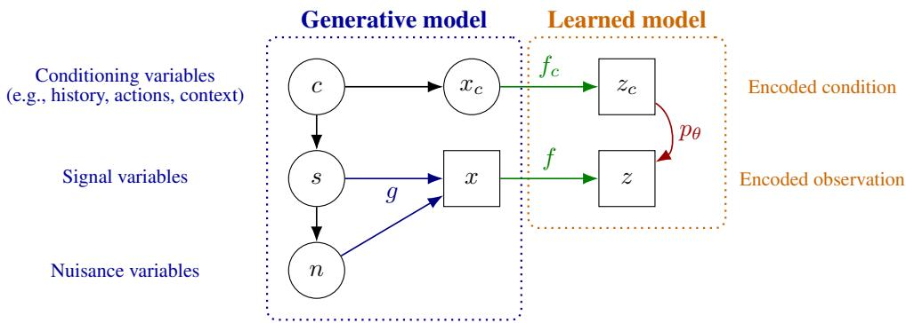  
Figure 1: Graphical model for observation-private nuisance. The three layers show (from left to right) unobserved latent variables, observations, and learned representations. Square nodes denote deterministically defined variables.

The specific loss function we are going to analyze has been used in several previous works. Initially, Oord et al. (2018) proposed InfoNCE, to maximize predictive MI $I [ z ; z _ { c } ]$ between representations z and predictive variables $z _ { c } .$ Later work has emphasized that the objective that is actually maximized by many of the common SSL algorithms, including InfoNCE (Oord et al., 2018), SimCLR (Chen et al., 2020), and VICReg (Shwartz-Ziv et al., 2023), has the general form (Aitchison & Ganev, 2024; Mikulasch & Zenke, 2026)

$$
\begin{array} { r l } & { \mathcal { F } ( f , f _ { c } , \theta ) = - D _ { \mathrm { K L } } [ q _ { f } ( z , z _ { c } ) \lVert p _ { \theta } ( z , z _ { c } ) ] + I _ { q _ { f } } [ z ; z _ { c } ] } \\ & { \qquad = \langle \log p _ { \theta } ( z , z _ { c } ) \rangle _ { q _ { f } ( z , z _ { c } ) } + H _ { q _ { f } } [ z ] + H _ { q _ { f } } [ z _ { c } ] \ . } \end{array}\tag{1}
$$

Here $q _ { f } ( z , z _ { c } )$ is the pushforward distribution of observations $p ( x , x _ { c } )$ through the observation encoder $z \ = \ f ( x )$ and condition encoder $z _ { c } = f _ { c } ( x _ { c } )$ , and $p _ { \theta } ( z , z _ { c } )$ is a latent model that is learned alongside. Different entropy estimators lead to different SSL algorithms—for example, KDE and log-determinant of covariance estimators can be related to SimCLR (Chen et al., 2020) and VICReg (Shwartz-Ziv et al., 2023), respectively (Mikulasch & Zenke, 2026). By this goal function, representations are not only required to be mutually informative, they are also required to follow a simple learned latent model $p _ { \theta } ( z , z _ { c } )$ via LDM. In the following we will therefore refer to Equation 1 as the InfoLDM goal function.

Commonly, but not necessarily, this goal function is simplified by ignoring the marginal of the conditioning variable and setting $p _ { \theta } ( z _ { c } ) = q _ { f } ( z _ { c } )$ , leading to

$$
\mathcal { F } ( f , f _ { c } , \theta ) = \langle \log p _ { \theta } ( z \mid z _ { c } ) \rangle _ { q _ { f } ( z , z _ { c } ) } + H _ { q _ { f } } [ z ] \mathrm { ~ . ~ }\tag{2}
$$

This is a well-known lower bound on the MI between latent variables (Poole et al., 2019), but we here analyze it with the clear framing that maximizing it performs both MI maximization and LDM.

## 3.1 EXPONENTIAL FAMILY STATISTICAL RECOVERY

The main theorem specifies when maximizing the InfoLDM goal function (Equation 1) recovers the signal s in the learned representation z up to simple transformations. For this we make the following assumptions, which are specified more rigorously in Appendix A.1.1.

Generative model. Let $s \in \mathcal { S } \subseteq \mathbb { R } ^ { d _ { s } }$ be a semantic signal variable, $\boldsymbol { n } \in \mathbb { R } ^ { d _ { n } }$ a noisy nuisance variable, and let c denote the true condition (or cause, context). Let $x = g ( s , n )$ be the observation, and $x _ { c }$ the observed condition. As before, let $z = f ( x ) \in \mathcal { Z } \subseteq \mathbb { R } ^ { d _ { z } }$ be the learned representation, and $z _ { c } = f _ { c } ( x _ { c } ) \in \mathcal { Z } _ { c } \subseteq \mathbb { R } ^ { d _ { z _ { c } } }$ the learned encoded condition. Finally, let $q _ { f } ( z , z _ { c } )$ be the pushforward distribution of observations, and $p _ { \theta } ( z , z _ { c } )$ the learned model (Figure 1).

Assumption 1. The nuisance is private to the current observation in the sense that

$$
n \perp \perp c \mid s .\tag{3}
$$

Assumption 2. The true predictive distribution is exponential family

$$
p ( s \mid c ) = h _ { s } ( s ) \exp \bigl ( \alpha ( c ) ^ { \top } \tau _ { \star } ( s ) - \psi ( \alpha ( c ) ) \bigr ) ,\tag{4}
$$

where $\tau _ { \star } : \mathcal { S }  \mathbb { R } ^ { r _ { s } }$ is a sufficient statistic, $h _ { s } \textbf { a }$ fixed carrier function, and $\alpha ( c )$ encodes the dependency on the condition c. Similarly, the learned latent model is exponential family

$$
p _ { \theta } ( z \mid z _ { c } ) = h _ { z } ( z ) \exp \bigl ( \beta ( z _ { c } ) ^ { \top } \tau _ { z } ( z ) - \phi ( \beta ( z _ { c } ) ) \bigr ) ,\tag{5}
$$

where the predictor $\beta ( z _ { c } )$ is learned, and $\tau _ { z } : \mathcal { Z }  \mathbb { R } ^ { r _ { z } }$

Assumption 3. By optimizing the InfoLDM goal function Equation 1 via $q _ { f } ( z , z _ { c } )$ and $p _ { \theta } ( z , z _ { c } )$ it is possible to reach the global optimum where

$$
D _ { \mathrm { K L } } [ q _ { f } ( z , z _ { c } ) \| p _ { \theta } ( z , z _ { c } ) ] = 0 , \qquad I _ { q _ { f } } [ z ; z _ { c } ] = I [ ( s , n ) ; c ] = I [ s ; c ] < \infty .\tag{6}
$$

Assumption 4. It is possible to choose $c _ { 0 } , c _ { 1 } , \ldots , c _ { r _ { s } }$ from the support of $p ( c )$ such that

$$
D : = \left[ \begin{array} { l } { ( \alpha ( c _ { 1 } ) - \alpha ( c _ { 0 } ) ) ^ { \top } } \\ { \qquad \vdots } \\ { ( \alpha ( c _ { r _ { s } } ) - \alpha ( c _ { 0 } ) ) ^ { \top } } \end{array} \right] \in \mathbb { R } ^ { r _ { s } \times r _ { s } }\tag{7}
$$

is invertible.

Assumption 5. For every condition c the random vector $\tau _ { \star } ( s )$ with $s \sim p ( s \mid c )$ is not contained in a proper affine hyperplane of $\mathbb { R } ^ { r _ { s } }$

Most of the presented assumptions are standard in the context of nonlinear identification theory. Assumption 1 can be understood as a definition of nuisance factors, similar to the definition by von Kugelgen et al. (2021). Assumptions 2, 4 and 5 are standard assumptions in the theory of exponential¨ family identification (e.g., Khemakhem et al., 2020). Chiefly, 4 and 5 ensure that all latent dimensions of the probabilistic model, not only a subset, are well constrained.

Assumption 3 is the strongest. It implicitly replaces common invertibility assumptions on the generative model. To see this relation consider that the generative model (Figure 1) together with the data processing inequality imply $I _ { q _ { f } } [ z ; z _ { c } ] \leq I [ x ; x _ { c } ] \bar { \leq } I [ s ; c ] = I [ ( s , n ) ; \bar { c } ]$ . At the optimum these inequalities become equalities, and in particular information has to be preserved in the observations $I [ x ; x _ { c } ] = I [ s ; c ]$ , restricting $g ( s , n )$ and $p ( x _ { c } \mid c )$ to be information-preserving. Additionally, this restriction implicitly requires that the latent representation is sufficiently high-dimensional to capture the required information, as will be demonstrated by Theorem 1.

With these assumptions in place we are ready to state our main result.

Theorem 1 (Exponential-family statistical recovery through InfoLDM). Suppose Assumptions 1, 2, 3, 4, and 5 hold, and the InfoLDM goalfunction (Equation 1) isfully maximized.

Then the dimension of the model sufficient statistic $r _ { z } \ge r _ { s } ,$ , and there is a full-row-rank matrix $A \in \mathbb { R } ^ { r _ { s } \times r _ { z } }$ and a vector $b \in \mathbb { R } ^ { r _ { s } }$ such that

$$
\boxed { \tau _ { \star } ( s ) = A \tau _ { z } ( z ) + b } \qquad a l m o s t s u r e l y .\tag{8}
$$

$I f \tau _ { \star }$ is injective, then s is almost surely a measurablefunction ofz. $I f r _ { z } = r _ { s } ,$ , then A is invertible and the two sufficient statistics are related by an invertible affine transformation.

The full proof is given in Appendix A.1.2. In broad strokes, the first step is to use successful MI maximization to show that $z _ { c }$ retains all information about s from $c ,$ and similarly z about c. This can be leveraged to directly relate the true and learned conditional probability distributions of s and z. From there the result follows via well established identifiability theory approaches for exponential family models (e.g., Khemakhem et al., 2020).

## 3.2 SPECIALIZATION TO GAUSSIAN PREDICTION

Theorem 1 is fairly general; here we aim to understand the behavior of commonly used non-generative models, which rely on Gaussianity assumptions. The goal function of many of these can be understood as approximately maximizing

$$
\mathcal { F } \propto \left. - \frac { 1 } { 2 \sigma ^ { 2 } } \parallel z - \mu _ { \theta } ( z _ { c } ) \parallel ^ { 2 } \right. _ { q _ { f } ( z , z _ { c } ) } + H _ { q _ { f } } [ z ] ,\tag{9}
$$

where $\mu _ { \theta }$ is a learned prediction function (cf. von Kugelgen et al., 2021; Mikulasch & Zenke, 2026).¨ This expression follows directly from the simplified goal function (Equation 2) by choosing pθ to be a Gaussian with fixed variance $\Sigma _ { \theta } = \sigma ^ { 2 } \mathbb { 1 }$ (Shwartz-Ziv et al., 2023; Mikulasch & Zenke, 2026). Further asserting

$$
p ( s \mid c ) = { \mathcal N } ( s ; \mu _ { \star } ( c ) , \Sigma _ { \star } ) , \qquad p _ { \theta } ( z \mid z _ { c } ) = { \mathcal N } ( z ; \mu _ { \theta } ( z _ { c } ) , \Sigma _ { \theta } ) , \qquad \Sigma _ { \star } \sim 0 , \quad \Sigma _ { \theta } \succ 0 ,\tag{10}
$$

Theorem 1 can be specialized to give the stronger result of affine recovery of $s .$

Corollary 1 (Gaussian affine recovery). Under the assumptions of Theorem 1 and Equation 10, necessarily $d _ { z } \geq d _ { s }$ , and there is afull-row-rank matrix $\boldsymbol { A } \in \mathbb { R } ^ { d _ { s } \times d _ { z } ^ { * } }$ and $b \in \mathbb { R } ^ { d _ { s } }$ such that

$$
s = A z + b \qquad a l m o s t s u r e l y .\tag{11}
$$

$I f d _ { z } = d _ { s }$ , then A is invertible.

This result follows immediately from Theorem 1 by the fact that the statistic of the fixed variance Gaussian distribution is the identity $\tau _ { \star } ( s ) = s$ and $\begin{array} { r } { \tau _ { z } ( z ) = z , } \end{array}$ and $d _ { s } = r _ { s } , d _ { z } = r _ { z }$

Intuitively, affine recovery fully relies on noise in the dynamics, as described in previous analyses (Zimmermann et al., 2021; Laiz et al., 2025; Mikulasch & Zenke, 2026): Noise in the true latent variables has Gaussian structure, and forcing learned variables to be Gaussian locally straightens latent coordinates around the predicted mean, which globally leads to an affine relation between true and recovered variables. Information sufficiency on the other hand supplies the model with a guarantee that all predictable signal variables are recovered. Note that nothing forces the model to discard nuisance variables entirely, except if the latent dimensionality of the model is restricted to match the dimensionality of the true signal. Similar results might be obtained for other exponentia family distributions, such as von Mises-Fisher for variables on the sphere.

## 4 SIMULATION EXPERIMENTS

To numerically verify our proof, we performed a range of control experiments. First, we followed a common recovery experimental setup (e.g., Zimmermann et al., 2021). Specifically, we generated length-five sequences with a signal following

$$
s _ { t + 1 } = \rho R s _ { t } + \sqrt { 1 - \rho ^ { 2 } } \epsilon _ { t } , \qquad \epsilon _ { t } \sim \mathcal { N } ( 0 , I ) ,
$$

where $\rho ~ = ~ 0 . 9$ and R is a fixed random orthogonal matrix. At every step, we independently sampled a 15-dimensional Gaussian nuisance variable and map the combined signal and nuisance through a fixed injective 3-layer multi-layer perceptron (MLP) with leaky ReLU activation to obtain a 100-dimensional observation. We varied the signal dimension $d _ { S }$ from 5 to 20.

To recover the signal variables we trained a 5-layer MLP mapping the input to a latent space with same dimension as the signal, $d _ { Z } = d _ { S }$ . Predictions were generated through an long short-term memory (LSTM) taking all previous timesteps and a linear prediction head. Training maximized the InfoLDM loss for Gaussian predictors (Equation 9), where the entropy was estimated through either kNN, KDE, or log-determinant of covariance (logdet) entropy estimators, as specified in Mikulasch & Zenke (2026). Simulations showed good affine signal recovery up to ten-dimensional latents, except for KDE entropy estimation, which showed slightly worse performance in this scenario (Table 1).

Table 1: $R ^ { 2 }$ of the learned representations with the true factors of variation for the numerical test, averaged over 5 runs plus minus standard deviations. We highlight well learned factors $( R ^ { 2 } > 0 . 9 )$
<table><tr><td>Entropy estimator</td><td> $d _ { s } = 5$ </td><td> $d _ { s } = 1 0$ </td><td> $d _ { s } = 1 5$ </td><td> $d _ { s } = 2 0$ </td></tr><tr><td>KDE</td><td> ${ \bf 0 . 9 2 \pm 0 . 1 6 }$ </td><td> $0 . 8 1 \pm 0 . 0 4$ </td><td> $0 . 6 0 \pm 0 . 0 8$ </td><td> $0 . 4 8 \pm 0 . 0 8$ </td></tr><tr><td>kNN</td><td> $\mathbf { 0 . 9 8 \pm 0 . 0 0 }$ </td><td> ${ \bf 0 . 9 5 \pm 0 . 0 4 }$ </td><td> $0 . 7 6 \pm 0 . 0 1$ </td><td> $0 . 6 4 \pm 0 . 0 2$ </td></tr><tr><td>logdet</td><td> $\mathbf { 0 . 9 9 \pm 0 . 0 0 }$ </td><td> ${ \bf 0 . 9 5 \pm 0 . 0 4 }$ </td><td> $0 . 7 8 \pm 0 . 0 2$ </td><td> $0 . 6 8 \pm 0 . 0 1$ </td></tr></table>

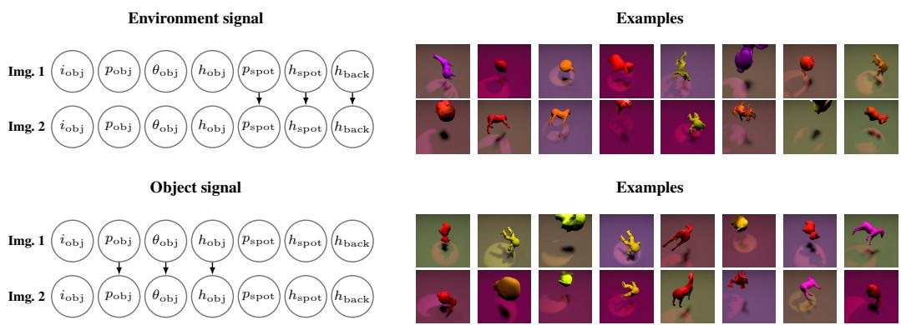  
Figure 2: Causal3DIdent image-pairs. The left diagrams show the true latent factors which are: object identity $( i _ { \mathrm { o b j } } ) .$ , position $( p _ { \mathrm { o b j - } x } ,$ etc., here displayed grouped), rotation $( \theta _ { \mathrm { o b j - } \alpha } , \mathsf { e t c . } )$ and hue $( h _ { \mathrm { o b j } } )$ spotlight position $( p _ { \mathrm { s p o t } } )$ , hue $( h _ { \mathrm { s p o t } } )$ , and background hue $( h _ { \mathrm { b a c k } } )$ . Arrows mark the factors causally coupled across image pairs. Right panels show example rendered image pairs. Even though factors between images are causally connected, there still exists significant variation due to noisy coupling.

## 4.1 IDENTIFYING STOCHASTIC CAUSAL RELATIONS BETWEEN IMAGES

As second example we tested signal recovery in high-dimensional images with strong, structured signal stochasticity, and structured, but independent nuisance. For this purpose we constructed image pairs in which a designated subset of generative factors was causally related. We based this on the Causal3DIdent dataset (von Kugelgen et al., 2021), which provides 11 image factors (Figure 2).¨ After mapping these factors to standard-normal coordinates, we sampled $s _ { 2 } = \rho s _ { 1 } + \sqrt { 1 - \rho ^ { 2 } }$ ϵ with $\epsilon \sim \mathcal { N } ( 0 , I )$ and $\rho = 0 . 9$ . Since Causal3DIdent provides a finite set of rendered images, we selected the second image uniformly from the $k = 1 6$ nearest neighbors of $s _ { 2 } .$ . All remaining factors, including object class, are thus random and determined by the selected image. We considered two settings: an object signal comprising object position, rotation, and hue, and an environment signal comprising spotlight position, spotlight hue, and background hue (Figure 2).

For signal recovery we used the same architecture and losses as in the numerical examples (Section 4), except for switching to a ResNet-18 as the image encoder. To give models the option to encode also nuisance we chose the latent dimension to be 10, similar to the total number of signal and nuisance factors. The simulations showed that learning consistent resulted in affine recovery of most of the causal factors, while performance depended on the entropy estimator, with KDE performing best in this scenario (Table 2). We further found that the entropy estimator also influenced whether or not nuisance variables were retained in the latent representation. Especially object position tended to be partly retained, which is sensible given the convolutional encoder; but also other variables were partly retained, an effect that became even more pronounced when computing nonlinear $R ^ { 2 }$ (Appendix, Table 3).

Table 2: $R ^ { 2 }$ of the learned representations with the true factors of variation for the stochastic Causal3DIdent dataset, averaged over 5 runs. Standard deviations are not displayed here but are mostly small $( < ~ 0 . 0 2 )$ except for unidentified signal / identified nuisance variables, indicating intermittent optimization failures. We highlight well learned factors $( R ^ { 2 } > 0 . 9 )$ in bold and signal factors with grey background.
<table><tr><td>Scenario</td><td>Entr. est.</td><td> $\scriptstyle p _ { 0 } \ b \ j - x$ </td><td> $p _ { \mathrm { o b j - } y }$ </td><td> $p _ { \mathrm { o b j - } z }$ </td><td> $\theta _ { \mathrm { o b j - } \alpha }$ </td><td> $\theta _ { \mathrm { o b j } - \beta }$ </td><td> $\theta _ { \mathrm { o b j - } \gamma }$ </td><td> $h _ { \mathrm { o b j } }$ </td><td> $p _ { \mathrm { s p o t } }$ </td><td> $h _ { \mathrm { { s p o t } } }$ </td><td> $h _ { \mathrm { b a c k } }$ </td></tr><tr><td>Env. signal</td><td>KDE</td><td>0.20</td><td>0.47</td><td>0.37</td><td>0.05</td><td>0.08</td><td>0.12</td><td>0.41</td><td>0.97</td><td>0.95</td><td>0.97</td></tr><tr><td>Env. signal</td><td>kNN</td><td>0.05</td><td>0.55</td><td>0.39</td><td>0.08</td><td>0.05</td><td>0.07</td><td>0.11</td><td>0.97</td><td>0.95</td><td>0.97</td></tr><tr><td>Env. signal</td><td>logdet</td><td>-0.01</td><td>-0.02</td><td>-0.00</td><td>-0.01</td><td>-0.00</td><td>-0.01</td><td>-0.01</td><td>0.98</td><td>0.76</td><td>0.99</td></tr><tr><td>Object signal</td><td>KDE</td><td>0.98</td><td>0.98</td><td>0.97</td><td>0.95</td><td>0.96</td><td>0.94</td><td>0.92</td><td>-0.01</td><td>0.01</td><td>0.13</td></tr><tr><td>Object signal</td><td>kNN</td><td>0.97</td><td>0.96</td><td>0.96</td><td>0.87</td><td>0.92</td><td>0.26</td><td>0.91</td><td>-0.01</td><td>-0.00</td><td>0.56</td></tr><tr><td>Object signal</td><td>logdet</td><td>0.98</td><td>0.97</td><td>0.97</td><td>0.92</td><td>0.95</td><td>0.91</td><td>0.87</td><td>0.15</td><td>-0.00</td><td>-0.00</td></tr></table>

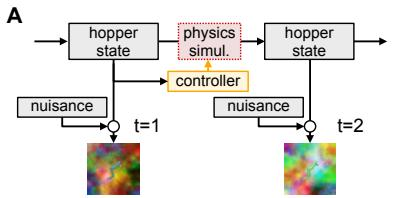

C  
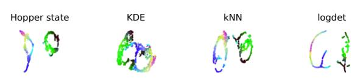

B  
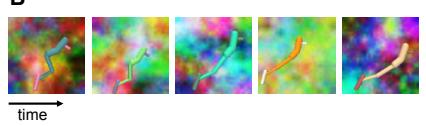

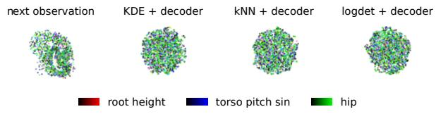

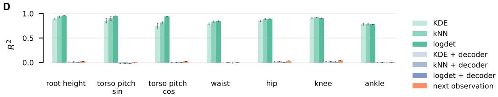  
Figure 3: Learning a world model for the controlled MuJoCo hopper. (A) Dataset generation. (B) Example timeseries. (C) UMAP of true signal (hopper state) and learned representations. Colors denote variable values. (D) $R ^ { 2 }$ of latent representations with hopper variables from linear readout.

## 4.2 LATENT WORLD MODEL WITH ACTIONS AND NUISANCE

In a last experiment we tested recovery and nuisance removal in a physical system with controlled actions. To that end we extended the MuJoCo suite (Todorov et al., 2012). We chose the hopper environment, where actions were defined by a pretrained controller (Nikulin et al., 2025), and for simulation diversity we added small Gaussian noise on both environment dynamics and controller actions. To introduce nuisance variables we sampled 12-dimensional independent Gaussian nuisance vectors per timestep that were then translated into nuisances such as color changes of the physical body and background contrast, as well as additional high-dimensional background colored noise (Figure 3A,B). We expected that latent representations would capture hopper state variables that are causally related through the simulation.

We used the same setup for learning as for the image dataset (Section 4.1) with a 16-dimensional latent state, while replacing the prediction head with an MLP that received the LSTM output and the encoded action. All models learned representations that allowed to linearly decode the hopper state (Figure 3D), while nonlinear decoding further improved $R ^ { 2 }$ , depending on the entropy estimator (Appendix, Figure 4). The nonlinear recovery probe is reasonable given that the environment does not explicitly follow the Gaussian dynamics of Corollary 1. We also trained models with an image encoder with attached gradient, resulting in representations that did not allow to decode hopper state, but consistently encoded parts of the nuisance variables (Appendix, Figure 4). As additional control we trained a model with the same predictor setup and an image decoder to predict the next observation, which did not result in better performance than direct decoding. This discrepancy can also be seen in the different topological structure of the latent representations (Figure 3C).

## 5 CONCLUSION AND LIMITATIONS

We proved that common SSL learning methods recover signal variables even in the presence of high-dimensional nuisance and stochastic latent dynamics, closing the gap between prior identifiability results, which considered either but not both. This answers the question posed at the outset: representations can formally distinguish unpredictable nuisance from mere stochastic variation in the predictable signal, because predictive MI maximization and LDM jointly constrain what is retained and how. Our result requires only few assumptions, the strongest of which are exponential family conditional distributions in the true latent variables, and an algorithm that successfully maximizes the InfoLDM loss; otherwise, the latent dynamics can be almost arbitrarily complicated, and nuisance can affect observations nontrivially. Future work should explore the viability and real-world relevance of predictive exponential family distributions beyond the Gaussian scenario tested here.

Our theory does not preclude that nuisance is encoded in the learned representation (orthogonally to the signal) if there is capacity to accommodate it, and entropy maximization in principle should encourage this (von Kugelgen et al., 2021; Mikulasch & Zenke, 2026). Empirically we found that¨ nuisance variables are often not decodable even if the latent dimensionality would permit it, either because they collapse, or because they are represented in a highly nonlinear manner that is not easily inverted. We also found that both signal recovery performance and nuisance leakage depended on the choice of entropy estimator, and the data it was applied to. This suggest that improved entropy estimation is one of the most pressing open problems towards robust and generally applicable SSL methods.

## AI USE STATEMENT

In this work, we used generative AI tools to assist in the writeup of proofs, correcting proofs, and to create or edit software code. We have not used generative AI tools to help develop theoretical models or conceptual frameworks, formulate mathematical claims, propose or refine hypotheses, design or provide feedback on research methodology or experiments, implement methods and generate synthetic data sets, or to interpret results. We have reviewed all AI-assisted work. LLM-generated code was verified and tested for correctness, proofs were checked and formalized in Lean and the Lean statements critically reviewed. We take responsibility for the final content of this work, including text, claims or artifacts produced with the aid of generative AI.

## ETHICS STATEMENT

This paper presents work whose goal is to advance the field of machine learning. There are many potential societal consequences of our work, none of which we feel must be specifically highlighted here.

## REPRODUCIBILITY STATEMENT

For reproducibility we provide all simulation and evaluation code, as well as Lean proof formalizations at https://github.com/fmi-basel/identifiable-stochastic-nuisance.

## ACKNOWLEDGMENTS

We thank Michael Hauri and all Zenke Lab members for their input and discussions. This project was supported by the Swiss National Science Foundation (Grant Number PCEFP3 202981) and the Novartis Research Foundation.

## REFERENCES

Aitchison, Laurence and Ganev, Stoil Krasimirov. InfoNCE is variational inference in a recognition parameterised model. Transactions on Machine Learning Research, 2024. ISSN 2835-8856. URL https://openreview.net/forum?id=chbRsWwjax.

Ben-Shaul, Ido, Shwartz-Ziv, Ravid, Galanti, Tomer, Dekel, Shai, and LeCun, Yann. Reverse engineering self-supervised learning. In Advances in Neural Information Processing Systems, volume 36, pp. 58324–58345, 2023. URL https://proceedings.neurips.cc/paper\_files/paper/2023/file/ b63ad8c24354b0e5bcb7aea16490beab-Paper-Conference.pdf.

Bizeul, Alice, Scholkopf, Bernhard, and Allen, Carl. A probabilistic model behind self- supervised¨ learning. Transactions on Machine Learning Research, 2024. ISSN 2835-8856. URL https: //openreview.net/forum?id=QEwz7447tR.

Chen, Ting, Kornblith, Simon, Norouzi, Mohammad, and Hinton, Geoffrey. A simple framework for contrastive learning of visual representations. In Proceedings of the 37th Interna-

tional Conference on Machine Learning, volume 119, pp. 1597–1607. PMLR, 2020. URL https://proceedings.mlr.press/v119/chen20j.html.

Daunhawer, Imant, Bizeul, Alice, Palumbo, Emanuele, Marx, Alexander, and Vogt, Julia E. Identifiability results for multimodal contrastive learning. In The Eleventh International Conference on Learning Representations, 2023. URL https://openreview.net/forum?id=U\_ 2kuqoTcB.

Dawid, Anna and LeCun, Yann. Introduction to latent variable energy-based models: a path toward autonomous machine intelligence. Journal ofStatistical Mechanics: Theory and Experiment, 2024 (10):104011, 2024. URL https://doi.org/10.1088/1742-5468/ad292b.

Gresele, Luigi, Rubenstein, Paul K., Mehrjou, Arash, Locatello, Francesco, and Scholkopf, Bernhard.¨ The incomplete rosetta stone problem: Identifiability results for multi-view nonlinear ica. In Proceedings ofThe 35th Uncertainty in Artificial Intelligence Conference, volume 115, pp. 217–227. PMLR, 2020. URL https://proceedings.mlr.press/v115/gresele20a.html.

Gui, Jie, Chen, Tuo, Zhang, Jing, Cao, Qiong, Sun, Zhenan, Luo, Hao, and Tao, Dacheng. A survey on self-supervised learning: Algorithms, applications, and future trends. IEEE Transactions on Pattern Analysis and Machine Intelligence, 46(12):9052–9071, 2024. URL https://doi. org/10.1109/TPAMI.2024.3415112.

Hyvarinen, Aapo, Sasaki, Hiroaki, and Turner, Richard. Nonlinear ica using auxiliary variables and generalized contrastive learning. In Proceedings of the Twenty-Second International Conference on Artificial Intelligence and Statistics, volume 89, pp. 859–868. PMLR, 2019. URL https: //proceedings.mlr.press/v89/hyvarinen19a.html.

Hyvarinen, A. and Oja, E. Independent component analysis: algorithms and applications. ¨ Neural Networks, 13(4):411–430, 2000. ISSN 0893-6080. URL https://www.sciencedirect. com/science/article/pii/S0893608000000265.

Khemakhem, Ilyes, Kingma, Diederik, Monti, Ricardo, and Hyvarinen, Aapo. Variational autoencoders and nonlinear ica: A unifying framework. In Proceedings of the Twenty Third International Conference on Artificial Intelligence and Statistics, volume 108, pp. 2207–2217. PMLR, 2020. URL https://proceedings.mlr.press/v108/khemakhem20a.html.

Laiz, Rodrigo Gonzalez, Schmidt, Tobias, and Schneider, Steffen. Self-supervised contrastive learning´ performs non-linear system identification. In The Thirteenth International Conference on Learning Representations, 2025. URL https://openreview.net/forum?id=ONfWFluZBI.

Lyu, Qi, Fu, Xiao, Wang, Weiran, and Lu, Songtao. Understanding latent correlation-based multiview learning and self-supervision: An identifiability perspective. In International Conference on Learning Representations, 2022. URL https://openreview.net/forum?id= 5FUq05QRc5b.

Mikulasch, Fabian A and Zenke, Friedemann. Understanding self-supervised learning via latent distribution matching. In Forty-third International Conference on Machine Learning, 2026. URL https://openreview.net/forum?id=schXkGSTus.

Nakamura, Hiroki, Okada, Masashi, and Taniguchi, Tadahiro. Representation uncertainty in selfsupervised learning as variational inference. In Proceedings ofthe IEEE/CVF International Conference on Computer Vision, pp. 16484–16493, 2023. URL https://doi.org/10.1109/ ICCV51070.2023.01511.

Nikulin, Alexander, Zisman, Ilya, Tarasov, Denis, Nikita, Lyubaykin, Polubarov, Andrei, Kiselev, Igor, and Kurenkov, Vladislav. Latent action learning requires supervision in the presence of distractors. In Proceedings of Machine Learning Research, volume 267, pp. 46427–46447, 2025. URL https://proceedings.mlr.press/v267/nikulin25a.html.

Noroozi, Mehdi and Favaro, Paolo. Unsupervised Learning of Visual Representations by Solving Jigsaw Puzzles. In Computer Vision – ECCV 2016, Lecture Notes in Computer Science, pp. 69–84. Springer International Publishing, 2016. ISBN 978-3-319-46466-4. URL https://doi.org/ 10.1007/978-3-319-46466-4\_5.

Oord, Aaron van den, Li, Yazhe, and Vinyals, Oriol. Representation learning with contrastive predictive coding. arXiv preprint arXiv:1807.03748, 2018.

Poole, Ben, Ozair, Sherjil, Van Den Oord, Aaron, Alemi, Alex, and Tucker, George. On variational bounds of mutual information. In Proceedings ofthe 36th International Conference on Machine Learning, volume 97, pp. 5171–5180. PMLR, 2019. URL https://proceedings.mlr. press/v97/poole19a.html.

Rodr´ıguez Galvez, Borja, Blaas, Arno, Rodriguez, Pau, Golinski, Adam, Suau, Xavier, Ramapuram,´ Jason, Busbridge, Dan, and Zappella, Luca. The role of entropy and reconstruction in multiview self-supervised learning. In Proceedings ofthe 40th International Conference on Machine Learning, volume 202, pp. 29143–29160. PMLR, 2023. URL https://proceedings.mlr. press/v202/rodri-guez-galvez23a.html.

Roeder, Geoffrey, Metz, Luke, and Kingma, Durk. On linear identifiability of learned representations. In Proceedings of the 38th International Conference on Machine Learning, volume 139, pp. 9030–9039. PMLR, 2021. URL https://proceedings.mlr.press/v139/ roeder21a.html.

Saunshi, Nikunj, Plevrakis, Orestis, Arora, Sanjeev, Khodak, Mikhail, and Khandeparkar, Hrishikesh. A theoretical analysis of contrastive unsupervised representation learning. In Proceedings ofthe 36th International Conference on Machine Learning, volume 97, pp. 5628–5637. PMLR, 2019. URL https://proceedings.mlr.press/v97/saunshi19a.html.

Shwartz Ziv, Ravid and LeCun, Yann. To compress or not to compress—self-supervised learning and information theory: A review. Entropy, 26(3):252, 2024. URL https://doi.org/10. 3390/e26030252.

Shwartz-Ziv, Ravid, Balestriero, Randall, Kawaguchi, Kenji, Rudner, Tim G. J., and Le-Cun, Yann. An information theory perspective on variance-invariance-covariance regularization. In Advances in Neural Information Processing Systems, volume 36, pp. 33965– 33998, 2023. URL https://proceedings.neurips.cc/paper\_files/paper/ 2023/file/6b1d4c03391b0aa6ddde0b807a78c950-Paper-Conference.pdf.

Sprekeler, Henning, Zito, Tiziano, and Wiskott, Laurenz. An extension of slow feature analysis for nonlinear blind source separation. Journal ofMachine Learning Research, 15(26):921–947, 2014. URL http://jmlr.org/papers/v15/sprekeler14a.html.

Tian, Yonglong, Krishnan, Dilip, and Isola, Phillip. Contrastive multiview coding. In European conference on computer vision, pp. 776–794. Springer, 2020. URL https://doi.org/10. 1007/978-3-030-58621-8\_45.

Todorov, Emanuel, Erez, Tom, and Tassa, Yuval. Mujoco: A physics engine for model-based control. In 2012 IEEE/RSJ International Conference on Intelligent Robots and Systems, pp. 5026–5033. IEEE, 2012. URL https://doi.org/10.1109/IROS.2012.6386109.

Tschannen, Michael, Djolonga, Josip, Rubenstein, Paul K., Gelly, Sylvain, and Lucic, Mario. On mutual information maximization for representation learning. In International Conference on Learning Representations, 2020. URL https://openreview.net/forum?id=rkxoh24FPH.

von Kugelgen, Julius, Sharma, Yash, Gresele, Luigi, Brendel, Wieland, Sch¨ olkopf, Bern-¨ hard, Besserve, Michel, and Locatello, Francesco. Self-supervised learning with data augmentations provably isolates content from style. In Advances in Neural Information Processing Systems, volume 34, pp. 16451–16467. Curran Associates, Inc., 2021. URL https://proceedings.neurips.cc/paper\_files/paper/2021/ file/8929c70f8d710e412d38da624b21c3c8-Paper.pdf.

Wang, Tongzhou and Isola, Phillip. Understanding contrastive representation learning through alignment and uniformity on the hypersphere. In Proceedings of the 37th International Conference on Machine Learning, volume 119, pp. 9929–9939. PMLR, 2020. URL https: //proceedings.mlr.press/v119/wang20k.html.

Zimmermann, Roland S., Sharma, Yash, Schneider, Steffen, Bethge, Matthias, and Brendel, Wieland. Contrastive learning inverts the data generating process. In Proceedings of the 38th International Conference on Machine Learning, volume 139, pp. 12979–12990. PMLR, 2021. URL https: //proceedings.mlr.press/v139/zimmermann21a.html.

## A APPENDIX

## A.1 MATHEMATICAL APPENDIX

## A.1.1 DETAILED ASSUMPTIONS

Assumption 1 (Private nuisance). The stochastic part of the model factorizes as

$$
p ( n , s , x _ { c } , c ) = p ( n \mid s ) p ( s \mid c ) p ( x _ { c } \mid c ) p ( c ) ,\tag{12}
$$

with $x = g ( s , n ) , z = f ( x )$ , and $z _ { c } = f _ { c } ( x _ { c } )$ . More specifically, the nuisance is private to the current observation in the sense that

$$
n \perp \perp c \mid s .\tag{13}
$$

The privacy condition has the equivalent information-theoretic form

$$
I [ ( s , n ) ; c ] = I [ s ; c ] + I [ n ; c \mid s ] = I [ s ; c ] .\tag{14}
$$

Thus the nuisance carries no information about the condition beyond the signal.

Assumption 2 (Exponential-family prediction). Let $\tau _ { \star } : \mathcal { S }  \mathbb { R } ^ { r _ { s } }$ be a sufficient statistic, and let $h _ { s } ( s )$ be afixed carrierfunction on $s .$ . For each condition c, let $\alpha ( c ) \in \mathbb { R } ^ { r _ { s } }$ be its natural parameter, and let ψ be the corresponding log-partitionfunction. The true predictivefamily is

$$
p ( s \mid c ) = h _ { s } ( s ) \exp \bigl ( \alpha ( c ) ^ { \top } \tau _ { \star } ( s ) - \psi ( \alpha ( c ) ) \bigr )\tag{15}
$$

for almost every condition c.

Similarly, let $\tau _ { z } : \mathcal { Z }  \mathbb { R } ^ { r _ { z } }$ be a sufficient statistic, and let $h _ { z } ( z )$ be afixed carrierfunction on $\mathcal { Z } .$ For each encoded condition $z _ { c } ,$ , let $\beta ( z _ { c } ) \in \mathbb { R } ^ { r _ { z } }$ be its learned natural parameter, and let ϕ be the corresponding log-partitionfunction. The learned predictive model is

$$
p _ { \theta } ( z \mid z _ { c } ) = h _ { z } ( z ) \exp \bigl ( \beta ( z _ { c } ) ^ { \top } \tau _ { z } ( z ) - \phi ( \beta ( z _ { c } ) ) \bigr )\tag{16}
$$

for almost every encoded condition $z _ { c } .$

As mentioned before, it is not necessary to assume any particular marginal distribution of the encoded conditioning variables $z _ { c } .$ . In the joint formulation, one may set $p _ { \theta } ( z _ { c } ) = q _ { f } ( z _ { c } )$ , so the KL term compares only the predictive conditionals (Equation 2).

Assumption 3 (Distribution matching and information saturation). Let $q _ { f } ( z , z _ { c } )$ be the encodedjoint distribution and let $p _ { \theta } ( z , z _ { c } )$ be a learned predictive model. Information-augmented predictive LDM uses the population objective

$$
\mathcal { F } ( f , f _ { c } , \theta ) = - D _ { \mathrm { K L } } \big [ q _ { f } ( z , z _ { c } ) \big | | p _ { \theta } ( z , z _ { c } ) \big ] + I _ { q _ { f } } [ z ; z _ { c } ] .\tag{17}
$$

We assume that an ideal population optimum is realizable through optimizing the model $p _ { \theta }$ , encoder $f ,$ and the condition encoder $f _ { c } ,$ at which

$$
D _ { \mathrm { K L } } [ q _ { f } ( z , z _ { c } ) \| p _ { \theta } ( z , z _ { c } ) ] = 0 , \qquad I _ { q _ { f } } [ z ; z _ { c } ] = I [ ( s , n ) ; c ] = I [ s ; c ] < \infty .\tag{18}
$$

As discussed in the main text, this assumption implicitly replaces common invertibility assumptions. It also implies that latent distributions match, and for the proof we define

$$
p ( z , z _ { c } ) : = q _ { f } ( z , z _ { c } ) = p _ { \theta } ( z , z _ { c } ) .\tag{19}
$$

Assumption 4 (Condition diversity). Even after excluding an arbitrary zero-probability subset of conditions, one can choose $c _ { 0 } , c _ { 1 } , \ldots , c _ { r _ { s } }$ such that

$$
D : = \left[ \begin{array} { l } { ( \alpha ( c _ { 1 } ) - \alpha ( c _ { 0 } ) ) ^ { \top } } \\ { \qquad \vdots } \\ { ( \alpha ( c _ { r _ { s } } ) - \alpha ( c _ { 0 } ) ) ^ { \top } } \end{array} \right] \in \mathbb { R } ^ { r _ { s } \times r _ { s } }\tag{20}
$$

is invertible.

Invertability requires the condition variation to span all $r _ { s }$ natural-parameter directions. In the proof, these directions supply $r _ { s }$ independent likelihood-ratio equations that recover every coordinate of the source sufficient statistic.

Assumption 5 (No affine redundancy in the source statistic). For every condition $c f o r$ which Equation 15 holds, the random vector $\tau _ { \star } ( s )$ with $s \sim p ( s \mid c )$ is not almost surely contained in a proper affine hyperplane of $\mathbb { R } ^ { r _ { s } }$

This assumption complements Assumption 4 and says that the sufficient statistic also genuinely uses all $r _ { s }$ coordinates.

## A.1.2 FULL PROOF OF THEOREM 1

Theorem 1 (Restated) (Exponential-family readout in InfoLDM). Suppose Assumptions 1, 2, 3, 4, and 5 hold, and the InfoLDM goal function (Equation $I ) i s f u l l y$ maximized.

Then the dimension of the model sufficient statistic $r _ { z } \ge r _ { s } ,$ and there is a full-row-rank matrix $A \in \mathbb { R } ^ { r _ { s } \times r _ { z } }$ and a vector $b \in \mathbb { R } ^ { r _ { s } }$ such that

$$
\boxed { \tau _ { \star } ( s ) = A \tau _ { z } ( z ) + b } \qquad a l m o s t s u r e l y .\tag{21}
$$

${ \mathit { I f } } \tau _ { \star }$ is injective, then s is almost surely a measurablefunction ofz. $I f r _ { z } = r _ { s }$ , then A is invertible and the two sufficient statistics are related by an invertible affine transformation.

Proof. The proof proceeds in four steps. In Step 1, we show that MI maximization implies that the learned context $z _ { c }$ and true context c are interchangeable for latent prediction. In Step 2, we show that it also implies that it is possible to equate the likelihood ratios of the learned representation z and the of true signal s with respect to some reference condition $c _ { 0 }$ . This is the key identity that explains why representations have to recover the signal.

The following two steps are closely related to previous exponential family identifiability proofs (Khemakhem et al., 2020). In Step 3 we use the above likelihood ratio, the exponential family assumption, and the condition diversity assumption to establish that there is an affine relation between the statistics $\tau _ { z } \left( z \right)$ and $\tau _ { \star } ( s )$ when z and s are sampled under $c _ { 0 }$ . Finally, we extend this result in Step 4 to the entire $p ( c )$ , and derive the full-rank and invertibility relating z and s.

Step 1: Information saturation and transfer. The chain rule of mutual information lets us compute

$$
\begin{array} { r l } & { I [ s ; c ] - I [ z ; z _ { c } ] = \left( I [ s ; c ] - I [ z ; c ] \right) + \left( I [ z ; c ] - I [ z ; z _ { c } ] \right) } \\ & { \qquad = \left( I [ s , z ; c ] - I [ z ; c ] \right) + \left( I [ z ; c , z _ { c } ] - I [ z ; z _ { c } ] \right) } \\ & { \qquad = I [ s ; c \mid z ] + I [ z ; c \mid z _ { c } ] . } \end{array}\tag{22}
$$

The second step follows, since from the generative model (Figure 1) and Assumption 1 we know that $z \perp \perp c \mid s$ and $z \perp { \perp z _ { c } } \mid c$ . Equation 22, together with Assumption 3 implies s $\perp \perp c \mid z$ and $z \perp \perp c \mid z _ { c } .$ Consequently, for almost every jointly occurring pair $( c , z _ { c } )$

$$
p ( z \mid c ) = p ( z \mid c , z _ { c } ) = p ( z \mid z _ { c } ) .\tag{23}
$$

Thus $p ( z \mid c )$ is a member of the learned exponential family for almost every condition c.

Step 2: Likelihood-ratio equality. The two conditional independences involving s tell us that the conditional distributions relating s and z are independent of c, i.e., $p ( z \mid s , c ) = p ( z \mid s )$ and $p ( s \mid z , c ) = p ( s \mid z )$ . Therefore, the following two factorizations hold for almost every condition c:

$$
p ( s , z \mid c ) = p ( z \mid s ) p ( s \mid c ) = p ( s \mid z ) p ( z \mid c ) .\tag{24}
$$

Because the conditional distributions between s and z in Equation 24 do not depend on c, they cancel when the distributions at c and some reference $c _ { 0 }$ are compared

$$
{ \frac { p ( s \mid c ) } { p ( s \mid c _ { 0 } ) } } = { \frac { p ( z \mid c ) } { p ( z \mid c _ { 0 } ) } }
$$

$$
\mathrm { f o r ~ a l m o s t } \mathrm { e v e r y } \left( s , z \right) \mathrm { g e n e r a t e d } \mathrm { u n d e r } c _ { 0 } .\tag{25}
$$

The ratios are well defined because all selected family members are strictly positive wherever their common carrier functions are positive.

Step 3: Locally affine relation. We now want to select a number of $r _ { s }$ different contexts $c _ { i }$ that constrain the relation between s and z. By using Equation 25 for any $c _ { i }$ we get

$$
{ \frac { p ( s \mid c _ { i } ) } { p ( s \mid c _ { 0 } ) } } = { \frac { p ( z \mid c _ { i } ) } { p ( z \mid c _ { 0 } ) } } \qquad { \mathrm { f o r ~ a l m o s t ~ e v e r y ~ } } ( s , z ) { \mathrm { ~ g e n e r a t e d ~ u n d e r ~ } } c _ { 0 } .\tag{26}
$$

Taking logarithms, and using the two exponential-family forms (Assumption 2) we get

$$
\begin{array} { r } { ( \alpha ( c _ { i } ) ^ { \top } - \alpha ( c _ { 0 } ) ^ { \top } ) \tau _ { \star } ( s ) - [ \psi ( \alpha ( c _ { i } ) ) - \psi ( \alpha ( c _ { 0 } ) ) ] = ( \beta _ { i } - \beta _ { 0 } ) ^ { \top } \tau _ { z } ( z ) - [ \phi ( \beta _ { i } ) - \phi ( \beta _ { 0 } ) ] . } \end{array}\tag{27}
$$

Here we chose parameters $\beta _ { i }$ for which (by the result of Step 1)

$$
p ( z \mid c _ { i } ) = h _ { z } ( z ) \exp \bigl ( \beta _ { i } ^ { \top } \tau _ { z } ( z ) - \phi ( \beta _ { i } ) \bigr ) .\tag{28}
$$

We now define $d _ { i } : = \alpha ( c _ { i } ) - \alpha ( c _ { 0 } )$ , and $e _ { i } : = \beta _ { i } - \beta _ { 0 }$ . With this notation Equation 27 becomes

$$
\begin{array} { r l r } { d _ { i } ^ { \top } \tau _ { \star } ( s ) = e _ { i } ^ { \top } \tau _ { z } ( z ) + h _ { i } , } & { } & { h _ { i } : = \psi ( \alpha ( c _ { i } ) ) - \psi ( \alpha ( c _ { 0 } ) ) - \phi ( \beta _ { i } ) + \phi ( \beta _ { 0 } ) . } \end{array}\tag{29}
$$

Let $D$ have rows $d _ { i } ^ { \top }$ , E have rows $e _ { i } ^ { \top }$ , and let $\boldsymbol { h } = ( h _ { 1 } , \dots , h _ { r _ { s } } ) ^ { \intercal }$ . Thus, stacking Equation 29 gives

$$
D \tau _ { \star } ( s ) = E \tau _ { z } ( z ) + h \qquad \mathrm { f o r ~ a l m o s t ~ e v e r y ~ } ( s , z ) \mathrm { g e n e r a t e d ~ u n d e r } c _ { 0 } .\tag{30}
$$

Finally, Assumption 4 lets us choose conditions $c _ { 0 } , c _ { 1 } , \ldots , c _ { r _ { s } }$ for which $D$ is invertible. This proves the readout for samples generated under $c _ { 0 }$ , with

$$
A : = D ^ { - 1 } E , \qquad b : = D ^ { - 1 } h .\tag{31}
$$

Step 4: Globalization, rank, and reconstruction. What remains is to extend this reference-condition identity to the full joint distribution, prove that A has full row rank, and derive the reconstruction conclusions.

For globalization, we note that for almost every condition $c ,$ the distribution $p ( s \mid c )$ has the same zero-probability sets as $p ( s \mid c _ { 0 } )$ because both are strictly positive on the common carrier. Multiplying these distributions with the same $p ( z \mid s )$ preserves this property for the conditional joint distributions of $p ( s , z \mid c )$ , i.e., any set of probability zero under $p ( s , z \mid c _ { 0 } )$ has probability zero under $p ( s , z \mid c )$ In particular, the set $\mathbf { \dot { \{ } }  ( s , z ) : \mathcal { T } _ { \star } ( s ) \neq \mathbf { \dot { A } } \tau _ { z } ( z ) + b \}$ has probability zero under $p ( s , z \mid c _ { 0 } )$ and hence under $p ( s , z \mid c )$ . The readout therefore holds conditionally for almost every condition c. Averaging over p(c) gives Equation 8 under the original joint distribution.

To show that A is full rank, assume it were not, i.e., rank $. ( A ) < r _ { s }$ . In this case the referencecondition identity (Equation 30) places $\tau _ { \star } ( s )$ in the proper affine subspace $b + \operatorname { i m } ( A )$ under $p ( s \mid c _ { 0 } )$ Because $p ( s \mid c _ { 0 } )$ is strictly positive on the common carrier, this contradicts Assumption 5. Thus rank $\mathbf { \nabla } [ A ) = r _ { s }$ and $r _ { z } \geq r _ { s }$ . When $r _ { z } = r _ { s } ,$ , the full-row-rank matrix A is square and hence invertible.

To reconstruct s from z we have to invert $\tau _ { \star } . \mathrm { ~ H ~ } \tau _ { \star }$ ⋆ is injective, the Lusin–Souslin theorem supplies a measurable inverse on its image, which may be extended measurably by a fixed value outside that image, so

$$
s = \tau _ { \star } ^ { - 1 } ( A \tau _ { z } ( z ) + b ) \qquad \mathrm { a l m o s t \ s u r e l y } .\tag{32}
$$

□

## A.2 LEAN FORMALIZATION

To verify the proof we translated it to compiling Lean code using generative AI. The declaration statisticReadout $\_ { \mathrm { o f _ { \mathrm { - } } } }$ \_exponentialFamily\_nuisanceLDM formalizes Theorem 1 after the mutual-information argument. Below is the header of the main function which includes the main assumptions and the conclusion. The line numbers refer to the actual Lean source, the full declaration and proof can be found in the source code at Lean/ExponentialFamilyReadout. lean.

758 theorem statisticReadout\_of\_exponentialFamily\_nuisanceLDM   
759 {Ω H V X Y : Type }   
760 [MeasurableSpace Ω] [StandardBorelSpace Ω]   
761 [MeasurableSpace H] [StandardBorelSpace H] [Nonempty H]   
762 [MeasurableSpace V] [StandardBorelSpace V] [Nonempty V]   
763 [MeasurableSpace X] [StandardBorelSpace X] [Nonempty X]   
764 [MeasurableSpace Y] [StandardBorelSpace Y] [Nonempty Y]   
765 (P : Measure Ω) [IsProbabilityMeasure P]   
766 (history : Ω → H) (view : Ω → V)   
767 (signal : Ω → X) (code : Ω → Y)   
768 (hhistory : Measurable history) (hview : Measurable view)   
769 (hsignal : Measurable signal) (hcode : Measurable code)   
770 (signal\_history\_given\_code : signal ⊥i[code, hcode; P] history)   
771 (code\_history\_given\_signal : code ⊥i[signal, hsignal; P] history)   
772 (code\_history\_given\_view : code ⊥i[view, hview; P] history)   
773 (code\_view\_given\_history : code ⊥i[history, hhistory; P] view)   
774 (sourceCarrier : Measure X) (codeCarrier : Measure Y)   
775 (sourceStatistic : X → EuclideanSpace R ι)

776 (codeStatistic : Y → EuclideanSpace R κ)   
777 (hsourceStatistic : Measurable sourceStatistic)   
778 (hcodeStatistic : Measurable codeStatistic)   
779 (sourcePartition : EuclideanSpace R ι → R)   
780 (codePartition : EuclideanSpace R κ → R)   
781 (sourceParameter : H → EuclideanSpace R ι)   
782 (learnedParameter : V → EuclideanSpace R κ)   
783 (hsourceConditional :   
784 condDistrib signal history P =m[P.map history]   
785 fun c 7→ statisticNaturalExpMeasure sourceCarrier sourceStatistic   
786 sourcePartition (sourceParameter c))   
787 (hlearnedConditional :   
788 condDistrib code view P =m[P.map view]   
789 fun v 7→ statisticNaturalExpMeasure codeCarrier codeStatistic   
790 codePartition (learnedParameter v))   
791 (hhistoryDiversity :   
792 ∀ good : Set H, (∀m c ∂P.map history, c ∈ good) →   
793 ∃ (c0 : H) (c : ι → H),   
794 c0 ∈ good ∧   
795 (∀ i, c i ∈ good) ∧   
796 Submodule.span R   
797 (Set.range fun i 7→ sourceParameter (c i) - sourceParameter c ) = ⊤)   
798 (hsourceNoAffineRedundancy :   
799 ∀ (w : EuclideanSpace R ι) (a : R),   
800 (fun x 7→ inner R w (sourceStatistic x)) =m[sourceCarrier]   
801 (fun \_ 7→ a) →   
802 w = 0) :   
803 ∃ (A : EuclideanSpace R κ →L[R] EuclideanSpace R ι)   
804 (b : EuclideanSpace R ι),   
805 (fun ω 7→ sourceStatistic (signal ω)) =m[P]   
806 (fun ω 7→ A (codeStatistic (code ω)) + b) ∧   
807 Function.Surjective A ∧   
808 Module.finrank R (EuclideanSpace R ι) ≤   
809 Module.finrank R (EuclideanSpace R κ) ∧   
810 (Function.Injective sourceStatistic →   
811 ∃ decoder : Y → X, Measurable decoder ∧   
812 signal =m[P] fun ω 7→ decoder (code ω)) ∧   
813 (Module.finrank R (EuclideanSpace R κ) =   
814 Module.finrank R (EuclideanSpace R ι) →   
815 Function.Bijective A) := by

This declaration reads in blocks as follows.

Lines 759–769: probability space and variables. Omega is the underlying probability space, and H, V, X, and Y are the state spaces of $c , z _ { c } , s , z .$ . The standard-Borel and measurability assumptions are the formal version of the measurable setup in Section 1. The finite types ι and κ index the coordinates of $\tau _ { \star }$ and $\tau _ { z }$ , so their finranks are $r _ { s }$ and $r _ { z }$

Lines 770–773: the four conditional independences. In the order shown, these are

$$
s \perp \mid c \mid z , \qquad z \perp \mid c \mid s , \qquad z \perp \mid c \mid z _ { c } , \qquad z \perp \mid z _ { c } \mid c .\tag{33}
$$

The second and fourth are the Markov consequences of Assumption 1. The first and third follow in the paper from

$$
I [ s ; c ] - I [ z ; z _ { c } ] = I [ s ; c \mid z ] + I [ z ; c \mid z _ { c } ] = 0 .\tag{34}
$$

Thus Lean starts at the exact conditional-independence consequences of MI saturation, rather than formalizing mutual information and the optimization problem.

Lines 774–790: the two exponential families. The names sourceCarrier, sourceStatistic, sourcePartition, and sourceParameter correspond to $h _ { s } , \tau _ { \star } , \psi , \alpha$ Their code-side counterparts correspond to $h _ { z } , \tau _ { z } , \phi , \beta$ The two hypotheses hsourceConditional and hlearnedConditional are the conditional families

$$
\begin{array} { r } { p ( s \mid c ) = h _ { s } ( s ) \exp \bigl ( \alpha ( c ) ^ { \top } \tau _ { \star } ( s ) - \psi ( \alpha ( c ) ) \bigr ) , } \end{array}\tag{35}
$$

$$
p ( z \mid z _ { c } ) = h _ { z } ( z ) \exp \bigl ( \beta ( z _ { c } ) ^ { \top } \tau _ { z } ( z ) - \phi ( \beta ( z _ { c } ) ) \bigr ) ,\tag{36}
$$

where statisticNaturalExpMeasure is the Lean implementation of the exponential-family distribution in Equation 15 and Equation 16. Lean’s eventual-equality notation means that the displayed equality may fail only on a zero-probability set.

Lines 791–802: diversity and nonredundancy. The hypothesis hconditionDiversity is Assumption 4 written without coordinates: after removing any zero-probability set of conditions, it selects $c _ { 0 }$ and a family (c ) whose differences $\alpha ( c _ { i } ) - \alpha ( c _ { 0 } )$ span the whole source-statistic space. The hypothesis hsourceNoAffineRedundancy is Assumption 5: if $\langle w , \tau _ { \star } ( s ) \rangle$ is almost surely constant on the carrier, then $w = 0$

Lines 803–815: conclusion. Lean returns a continuous linear map $A : \mathbb { R } ^ { r _ { z } }  \mathbb { R } ^ { r _ { s } }$ and an offset b with

$$
\tau _ { \star } ( s ) = A \tau _ { z } ( z ) + b \qquad \mathrm { a l m o s t \ s u r e l y } .\tag{37}
$$

Function.Surjective A is the full-row-rank conclusion rank $( A ) = r _ { s }$ , and the finrank inequality is $r _ { s } \ \leq \ r _ { z }$ . The last two lines add the two corollaries in Theorem 1: an injective $\tau _ { \star }$ gives a measurable decoder $z \mapsto s ,$ , and equal statistic dimensions make A bijective. The proof first establishes the likelihood-ratio identity at a reference condition and then extends it to the full model.

## A.3 SIMULATION DETAILS

Numerical evaluation. We generated 100000 training and 10000 test sequences of length five. The fixed observation map consisted of three affine layers with leaky-ReLU activations and mapped the concatenated signal and nuisance variables to 100-dimensional observations. The encoder was a five-layer MLP with 200 hidden units per layer and ReLU activations. Its output dimension matched the signal dimension, which was varied over $d _ { S } \in \{ 5 , 1 0 , 1 5 , 2 0 \}$ . A single-layer LSTM with 10 hidden units summarized the observation history, and a linear prediction head predicted the next latent state.

Models were trained for 20 epochs using Adam and a linearly decaying learning rate. Batch size was 256 for the kNN and log-determinant estimators. In this and the following experiments, entropy estimation was implemented as described by Mikulasch & Zenke (2026). We found that KDE performed poorly in this experiment and increased batchsize to 5096 (similar to von Kugelgen et al.,¨ 2021) and the number of samples to $5 \times 1 0 ^ { 6 }$ to improve performance.

Causal3DIdent. We based our experiment on the data of von Kugelgen et al. (2021) but resized ¨ images to 224×224 pixels. We used a ResNet-18 encoder producing a 10-dimensional representation, followed by a single-layer LSTM with 64 hidden units and a linear prediction head. Models were trained for 25 epochs with Adam. Batch sizes were 256 for the kNN and KDE estimators and 64 for the log-determinant estimator.

MuJoCo Hopper. We generated 100000 training and 1000 test rollouts from the DM-Control Hopper environment. Each sequence contained eight 128 × 128 rendered frames, separated by three control steps. Actions were produced by a pretrained controller (Nikulin et al., 2025) and perturbed with Gaussian exploration noise of standard deviation 0.1. Additional unobserved actuator noise with standard deviation 0.5 was applied before executing each action, making the controlled dynamics stochastic. Note that adding Gaussian noise every simulation step, not every render step, results in a system that does not fully follow the assumptions of Theorem 1. At every rendered timestep, independent nuisance variables modified the body and accent colors, camera position and field of view, illumination, and a procedurally generated colored background. The physical signal used for evaluation consisted of seven position variables and seven velocity variables.

Images were encoded by a ResNet-18 into a 16-dimensional latent state. A single-layer LSTM with 64 hidden units summarized the latent history. The three controller commands between consecutive frames were encoded by a GRU with 16 hidden units and supplied, together with the LSTM state, to a one-hidden-layer prediction MLP. For image decoding we used 4-layer upsampling CNNs trained with L2 loss. With attached decoder loss we approximately balanced latent prediction and image prediction loss via a Lagrange multiplier. For the observation prediction model we used the exact same setup without latent prediction loss and the decoder attached to the prediction module. Models were trained for 40 epochs using Adam. Batch sizes were 128, 512, 32, and 128 for the kNN, KDE, log-determinant estimators, and next observation prediction, respectively.

## A.4 ADDITIONAL RESULTS

## A.4.1 CAUSAL3DIDENT

Table 3: Nonlinear $R ^ { 2 }$ for the Causal3DIdent experiment (Table 2), computed with trained MLP predictor on held-out dataset.
<table><tr><td>Scenario</td><td>Entr. est.</td><td> $p _ { \mathrm { o b j - } x }$ </td><td> $p _ { \mathrm { o b j - } y }$ </td><td> $p _ { \mathrm { o b j - } z }$ </td><td> $\theta _ { \mathrm { o b j - } \alpha }$ </td><td> $\theta _ { \mathrm { o b j } - \beta }$ </td><td> $\theta _ { \mathrm { o b j - } \gamma }$ </td><td> $h _ { \mathrm { o b j } }$ </td><td>Pspot</td><td> $h _ { \mathrm { { s p o t } } }$ </td><td> $h _ { \mathrm { b a c k } }$ </td></tr><tr><td>Environment signal</td><td>kde</td><td>0.35</td><td>0.52</td><td>0.34</td><td>0.07</td><td>0.10</td><td>0.16</td><td>0.53</td><td>0.99</td><td>0.97</td><td>0.99</td></tr><tr><td>Environment signal</td><td>knn</td><td>0.21</td><td>0.47</td><td>0.34</td><td>0.08</td><td>0.06</td><td>0.08</td><td>0.16</td><td>0.98</td><td>0.96</td><td>0.98</td></tr><tr><td>Environment signal</td><td>logdet</td><td>-0.02</td><td>-0.02</td><td>-0.03</td><td>-0.02</td><td>-0.01</td><td>-0.00</td><td>-0.01</td><td>0.99</td><td>0.57</td><td>0.98</td></tr><tr><td>Object signal</td><td>kde</td><td>0.98</td><td>0.98</td><td>0.97</td><td>0.94</td><td>0.97</td><td>0.85</td><td>0.91</td><td>0.14</td><td>0.03</td><td>0.36</td></tr><tr><td>Object signal</td><td>knn</td><td>0.97</td><td>0.96</td><td>0.95</td><td>0.87</td><td>0.92</td><td>0.29</td><td>0.91</td><td>0.14</td><td>-0.04</td><td>0.69</td></tr><tr><td>Object signal</td><td>logdet</td><td>0.99</td><td>0.99</td><td>0.98</td><td>0.95</td><td>0.97</td><td>0.96</td><td>0.92</td><td>0.16</td><td>-0.04</td><td>-0.04</td></tr></table>

## A.4.2 HOPPER

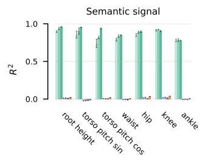

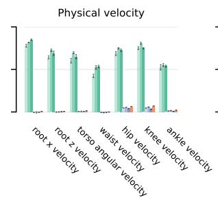

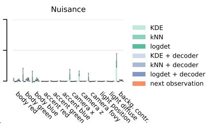

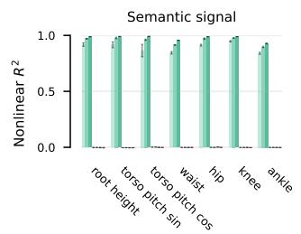

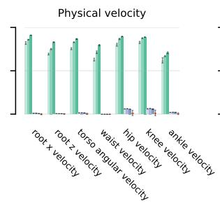

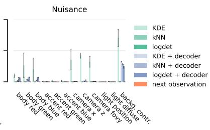  
Figure 4: Linear (Top) and nonlinear (Bottom) $R ^ { 2 }$ with physical (signal) and nuisance variables for the hopper experiment. Velocity is read out from LSTM state. Background pattern nuisance is not included.