# PROCEDURAL CORE: A COMPACT RECURRENTINITIALIZATION FOR VISION TRANSFORMERS

Zachary Shinnick1,∗ Christian Interno\`2 Hemanth Saratchandran1 Anton van den Hengel1,3 Damien Teney4

1Australian Institute for Machine Learning (AIML), Adelaide University

2Bielefeld University 3Metacognition AI 4Idiap Research Institute

Correspondence: zachary.shinnick@adelaide.edu.au

## ABSTRACT

Transformers are typically trained from random initialization, requiring all their capabilities to emerge from large-scale optimization. Recent work showed that a small amount of abstract procedurally generated data can help acquire generic inductive structure at low cost. However, this adds a pretraining stage that must be repeated for every target model. We propose Procedural Core, an initialization strategy that captures this generic structure into a compact set of weights that can be reused across models. We train a minimal recurrent transformer on procedural data, then expand its weights to initialize transformers of arbitrary width and depth. The resulting initialization improves performance on image classification, self-supervised visual learning (DINO), and modeling natural language (FINEWEB-EDU) and code (CODEPARROT). For image classification, expanding a 1M-parameter core to initialize an 85M-parameter ViT-Base improves IMA-GENET top-1 accuracy by 2.2 pp over standard random initialization. Our analysis identifies recurrence as essential for learning compact weights that transfer across models. In ViTs, we localize a key benefit in the suppression of high-norm tokens that produces substantial improvements in zero-shot segmentation (IMAGENET-S mAP 32.3 → 42.9), object localization (VOC07 CorLoc 9.9 → 18.4), and depth estimation (NYUV2 RMSE 1.104 → 0.998). This demonstrates that transformers need not start from a blank slate, and can be initialized with generic capabilities at low cost with no domain- or task-specific data.

€ Project page: zlshinnick.github.io/procedural-core/

## 1 INTRODUCTION

Recent work on large pretrained transformers shows that they learn mechanisms (Han et al., 2025; Lu et al., 2022) and representations (Buzeta et al., 2026; Huh et al., 2024; Gupta et al., 2025; Riachi et al., 2025) that transfer across tasks and modalities. This suggests that they contain some internal structure that is generic and broadly reusable. Motivated by this perspective, a growing body of work explores pretraining on abstract data generated procedurally, as an efficient way to acquire generic structure in the model weights (Zhang et al., 2024; Hu et al., 2025; Jiang et al., 2026a; Shinnick et al., 2025; 2026). Such a “procedural warm-up” uses data that is free of semantic or visual content, and this strategy can be strikingly data-efficient. In ViTs, Shinnick et al. (2026) show that allocating 1% of the training budget initially to non-visual procedural data1 can yield performance gains comparable to increasing natural image data by 28%. In language models, Jiang et al. (2026a) show that allocating 0.1% of the training budget initially to procedural data enables models to achieve the same loss while consuming just 55% of the natural language data.

Unfortunately, existing strategies with procedural data are not a simple drop-in replacement for standard random initialization. They require a dedicated training stage that needs to be repeated for each target model. The effects of this stage are tightly coupled with a specific architecture and model size. Note however that procedural data is, by definition, generated by simple algorithms and thus has a small description length (i.e. low Kolmogorov complexity). We therefore posit that the structure induced in the weights should also admit a compact representation. In principle, it may thus be possible to obtain the same effects with a simple deterministic procedure applicable to any target model. The central question of this work is therefore as follows: can the useful structure acquired by training on procedural data be compressed into a compact, transferable core?

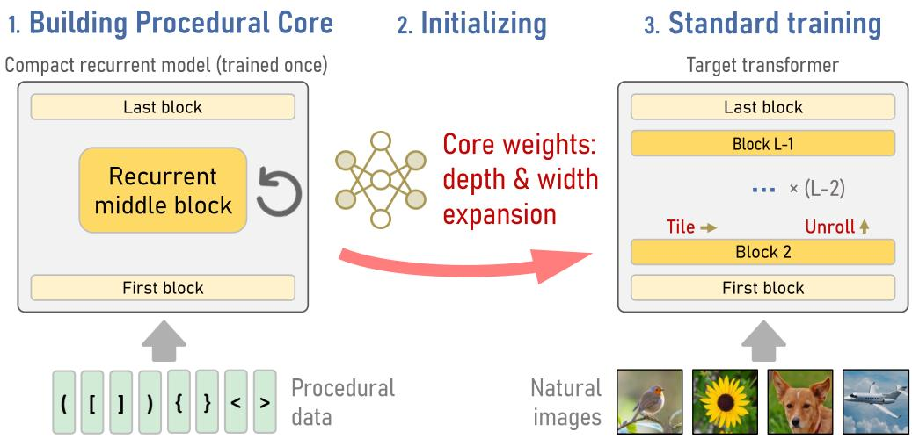  
Figure 1: We propose a generic initialization for transformers as an alternative to random weights. (Left) We first train a small auxiliary model to capture generic computations. We generate abstract training data with simple algorithms such as formal languages with nested structures (pictured as balanced parentheses). The model is recurrent in depth such that it captures regularities of the data in a minimal set of weights: the Procedural Core. (Middle) We unroll and expand the Procedural Core to initialize a target model of arbitrary width and depth. (Right) This bootstraps the subsequent standard training, improving convergence and generalization compared to a random initialization.

To address this question, we hypothesize that the mechanisms in models trained on procedural data could be implemented more compactly through recurrence. Existing models like Universal Transformers (Dehghani et al., 2019) already show that depth-wise recurrence can capture expressive computations with a small set of parameters, and recent work also shows that recurrence can benefit reasoning tasks (Saunshi et al., 2024). The Block-Recurrent Hypothesis (Jacobs et al., 2025) further suggests that deep transformers, including ViTs, approximate compact recurrent programs. This implies that multi-layer computations could often be represented more compactly with few reusable blocks. Together, these works indicate that recurrence is a natural mechanism for consolidating the structure in trained transformers into a compact representation.

Building on this perspective, we propose Procedural Core: a compact set of weights obtained by training a minimal recurrent auxiliary model on procedural data. More precisely, we train a small recurrent ViT with three unique blocks (input, recurrent middle block, output) and then use its weights to initialize larger architectures by unrolling the recurrent block in depth and tiling it in width (see Figure 1). This parameter sharing across layers forces the auxiliary model to encode its computa tions into a compact set of weights, acting as a regularizer and facilitating their reuse. Concretely, we now have a generic strategy to initialize useful structure in the weights of a transformer of any size, in a single deterministic step. Our choice of procedural data and training objective follows prior work (Shinnick et al., 2026; Jiang et al., 2026a). Our primary objective here is therefore to obtain comparable effects with a much more practical procedure.

We evaluate Procedural Core across model sizes and domains. We get consistent gains over random and structured initializations (Trockman & Kolter, 2023). For example, we expand our ∼1Mparameter core to initialize an 85M-parameter ViT-Base, then train it on IMAGENET-1K (Deng et al., 2009). This yields a +2.2 percentage point improvement in top-1 accuracy compared to a random initialization. Importantly, these gains extend to other applications, including self-supervised vision models (DINO) and language models trained on natural language (FINEWEB-EDU dataset, Penedo et al. 2024) and code (CODEPARROT dataset, HuggingFace 2022). These results suggest that the method instantiates generic structure in the weights that is broadly useful across domains.

We analyze why the Procedural Core transfers. We find that depth-wise parameter sharing distributes computation across a wider set of directions, including lower-energy components important for downstream transfer. In ViTs, this structure concentrates in the attention value/output pathway, where it suppresses high-norm token outliers and improves representations across segmentation, localization, and depth estimation. Our contributions are summarized as follows.

(1) An initialization strategy (Procedural Core) that instantiates useful structure in the weights of a transformer of any size, as an alternative to standard random weights. It uses a compact set of weights obtained by training a small recurrent model on procedural data (Section 3).

(2) An empirical evaluation of the proposed strategy for computer vision and language. On IMAGENET-1K, Procedural Core improves ViT-Base top-1 accuracy by +2.2 percentage points over standard random initialization. The benefits extend beyond classification, with improvements across a wide array of tasks including semantic segmentation (ADE20K: 26.6 → 28.8 mIoU), zero-shot segmentation (IMAGENET-S: 32.3 → 42.9 mAP), object localization (VOC07: 9.9 → 18.4 CorLoc), and depth estimation (NYUV2: 1.104 → 0.998 RMSE). We also observe gains with self-supervised DINO models and language models trained on natural language and code (Section 4).

(3) A mechanistic analysis of the benefits. We find that the recurrence distributes useful computations across a larger set of dominant directions. We also identify the attention value/output pathway as carrying much of the transferable structure, which we connect to the suppression of high-norm tokens and improvements in segmentation, localization, and depth estimation (Section 5).

## 2 RELATED WORK

Initialization of vision transformers. ViTs are typically initialized with random weights (Glorot & Bengio, 2010; He et al., 2016). Several works propose handcrafted patterns in attention layers e.g. to instill a convolution-like prior (Huang et al., 2020; Zhao et al., 2021; Trockman & Kolter, 2023; Zheng et al., 2025; Giri, 2025). Other approaches transfer structure from pretrained models, by distilling shared weight templates or expanding the weights of smaller models (Feng et al., 2025; Xu et al., 2023; Chen et al., 2022; Samragh et al., 2024; Panigrahi et al., 2024). In comparison, our approach transfers structure from an auxiliary model that provides compact, transferable weights by construction, through its recurrent architecture and its training on abstract data.

Pretraining on procedural data. A series of works on language modeling use data generated with formal languages or cellular automata to learn structure independently from semantics (Chiang & Lee, 2022; McCoy & Griffiths, 2023; Papadimitriou & Jurafsky, 2023; Lindemann et al., 2024; Wu et al., 2022; Zhang et al., 2024). Recent work uses such procedural data to pretrain large models before exposure to natural language (Hu et al., 2025; Jiang et al., 2026a; Shinnick et al., 2025) or images (Shinnick et al., 2026) to improve data efficiency and generalization. While these approaches require a new initial training phase, we amortize this phase by summarizing its outcome in a compact set of weights that can be reused in a single deterministic step to initialize a transformer of any size.

Training vision models on abstract data. There is a long history with synthetic images of fractals (Nakamura et al., 2023; 2024), contours (Kataoka et al., 2022), and structured noise (Baradad et al., 2021). Non-visual data like text, code, and mathematics (Du et al., 2025; Zheng et al., 2024; Han et al., 2025; Huh et al., 2024) can also foster capabilities for visual reasoning. Our work adds evidence for shared basic computations that transfer across tasks and modalities.

Recurrence and parameter sharing in transformers. Parameter sharing and depth-wise recurrence have been explored to improve efficiency and computational expressivity. For example, AL-BERT (Lan et al., 2020) shares parameters across layers to reduce memory usage, while the Universal Transformer (Dehghani et al., 2019) uses depth recurrence to enable iterative computation. Recent work further suggests that recurrence induces inductive biases beneficial for reasoning (Saunshi et al., 2024), and the Block-Recurrent Hypothesis (Jacobs et al., 2025) argues that deep ViTs approximate compact recurrent programs composed of reusable blocks. Our method uses depth recurrence as a way to obtain a compact set of weights from the procedural pretraining, which can be expanded to an arbitrary depth in the target model.

## 3 PROPOSED METHOD

We build on prior work that describes a procedural warm-up for ViTs (Shinnick et al., 2026) that exposes the model to non-visual data before standard pretraining on ImageNet. The data is generated with simple algorithms that produce sequences of abstract tokens. They teach the model to process compositional and nested patterns prior to the semantic information of image datasets. We adopt the data generation and training approach from Shinnick et al. (2026) as summarized below.

Generating procedural data. We generate sequences with nested compositional patterns, which prior work has shown to be effective for training ViTs (Shinnick et al., 2026). These sequences encode random push and pop operations on a stack, a last-in, first-out memory structure. The tokens have no meaning. For visualization, we represent them with various brackets and parentheses where push and pop symbols correspond respectively to opening and closing symbols. The sequences then resemble sequences of matching parentheses, such as: ( [ ] ) { } a.k.a. a Dyck language (Hu et al., 2025; Papadimitriou & Jurafsky, 2023). We use a vocabulary of 128 tokens (64 matched pairs) and sequences of length $N { = } H \times \dot { W }$ where $H \times W$ is the size of the target ViT’s input grid.

Training ViTs on non-visual data. We make it possible for ViTs to ingest abstract tokens by replacing their patch embedding layer (typically a linear projection) with an embedding layer as found in language models (i.e. a look-up table). The embeddings are initialized randomly and held frozen, such that all the learning with the procedural data happens in attention and MLP layers. After training on procedural data, these token embeddings are discarded, and the visual patch embeddings are then learned exclusively on standard visual data. The training objective with procedural data is a masked-token prediction objective. We only mask tokens that admit a unique valid completion (i.e. a subset of the closing tokens). To solve the task, the model must discover and simulate the stack-based process to predict valid completions. See Appendix A.1 for details.

Overview of our method. The procedural warm-up method of Shinnick et al. (2026) required an extra training phase to be repeated for every target architecture and size. Instead, we train a small auxiliary model on procedural data (Section 3.1) and expand its learned weights to initialize a target model of arbitrary depth and width (Section 3.2). As we show in Section 4, this approach promotes the learning of transferable structure. It also makes procedural initialization more accessible. Once learned, the core weights can initialize new models in a single efficient deterministic step, eliminating the need to repeat the procedural training.

## 3.1 LEARNING THE CORE WEIGHTS

We construct our auxiliary model as a ViT-Tiny with the embedding modification described in Section 3. To introduce recurrence, we tie all weights of blocks 2 to L - 1, where $L = 1 2$ is the number of blocks (one block refers to a pair of attention and MLP layers). The first and last blocks remain untied, as prior work shows that they perform specialized computations (McLeish et al., 2025; Skean et al., 2025). Our initial experiments also showed degraded performance with all layers tied. The resulting recurrent model is trained on procedural data following Shinnick et al. (2026).

The recurrence serves first as a regularizer, preventing layer-wise specialization. This encourages the model to learn general, transferable computations. Second, the recurrence produces a compact set of parameters that can be replicated to an arbitrary depth model, as described in Section 3.2.

## 3.2 EXPANDING THE CORE WEIGHTS TO ARBITRARY DEPTH AND WIDTH

After training the auxiliary model, we transfer the weights of its first, recurrent middle, and last blocks to initialize a target model of arbitrary (typically larger) depth and width.

Depth expansion. To initialize a model of depth ${ \tilde { L } } ,$ we copy the first and last blocks and replicate the recurrent middle block $\tilde { L } - 2$ times. The middle blocks are initialized identically but they are untied and free to diverge during the subsequent training.

Width expansion. To initialize a wider model, we tile each matrix of core weights $W \in \mathbb { R } ^ { d _ { \mathrm { o u t } } \times d _ { \mathrm { i n } } }$ as follows, rescaling the result to preserve its Frobenius norm:

$$
\widetilde { W } _ { i j } = W _ { ( i \ m o d \ d _ { \mathrm { o u t } } ) , ( j \ m o d \ d _ { \mathrm { i n } } ) } , \qquad \widetilde { W } \ \gets \ \widetilde { W } \ \| W \| _ { F } / \| \widetilde { W } \| _ { F } .\tag{1}
$$

Concatenated attention weights are split into their constituent Q, K, and $V$ matrices before expansion. Non-matrix parameters use neutral padding: 0 for biases and 1 for normalization scales.

## 4 EXPERIMENTS

## 4.1 SUPERVISED VISION TRANSFORMERS

Motivation. Prior work has demonstrated that an initial training phase on procedural data (or warmup) helps a ViT-B converge faster in a subsequent standard supervised training on ImageNet (Shinnick et al., 2026). We now evaluate whether our initialization provides similar benefits.

Experimental setup. We initialize a ViT-Base (85M parameters) with our method (expanding a set of ∼1M core weights) and train it for 300 epochs on IMAGENET-1K following a standard protocol and hyperparameters (Xu et al. 2023; see Appendix A.2 for details). We compare our initialization with three alternatives: the default initialization of ViTs with random weights from a truncated-normal distribution (Dosovitskiy, 2020); the Mimetic initialization that imitates the diagonal attention patterns of trained ViTs with a handcrafted formula (Trockman & Kolter, 2023); and the Procedural warm-up that directly pretrains the target model on the same procedural data as used with our method (Shinnick et al., 2026).

Results. Figure 2 shows that our initialization improves the top-1 accuracy over the default initialization by +2.2% and outperforms the other alternatives. It surpasses in particular the procedural warm-up both here and on CIFAR-100 (Appendix B.1). This supports the suitability of our small recurrent model to capture reusable structure from the procedural data. Figure 2 (right) also shows that the advantage persists throughout training rather than providing only an initial head start.

<table><tr><td>∆(%)</td><td>Top-1 (%)</td></tr><tr><td>Default initialization</td><td> $7 7 . 6 \pm 0 . 2$  +0.0</td></tr><tr><td>Mimetic initialization</td><td> $7 9 . 5 \pm 0 . 7$  +1.9</td></tr><tr><td>Procedural warm-up</td><td> $7 9 . 4 \pm 0 . 3$  +1.8</td></tr><tr><td>Procedural Core</td><td> ${ \bf 7 9 . 8 \pm 0 . 6 }$  +2.2</td></tr></table>

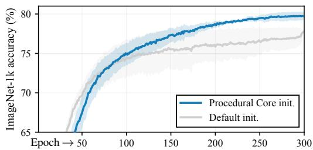  
EpochFigure 2: Procedural Core improves ViT-Base training on IMAGENET-1K. Left: Final top-1 accuracy (mean ± s.d. over three seeds). Right: Mean training trajectories over the same seeds, showing a persistent advantage over default initialization.

Downstream tasks. We evaluate in Appendix B.2 whether the gains persist beyond pretraining on IMAGENET-1K. The results show that the advantage persists after fine-tuning on CIFAR-100. Section 5.4 will show broader gains for segmentation, localization, and depth estimation.

## 4.2 SELF-SUPERVISED VISION TRANSFORMERS

Motivation. Having shown in Section 4.1 that Procedural Core improves large-scale supervised training, we now investigate whether these benefits extend to self-supervised vision models.

Experimental setup. We initialize a ViT-Small with our method and train it following DINO (Caron et al., 2021) for 300 epochs on IMAGENET-1K. We evaluate the DINO representations with k-NN classification below and with linear probing in Appendix B.3. Our baseline is a standard DINO model that we trained in the same standard conditions except for a random initialization (see Appendix A.3 for details).

<table><tr><td rowspan="2"></td><td colspan="2">k-NN accuracy (%)</td></tr><tr><td>100 200</td><td>300</td></tr><tr><td>Epoch Default</td><td>66.8 69.7</td><td>72.0</td></tr><tr><td>Proc. Core</td><td>67.4 (+0.6) 70.1 (+0.4)</td><td>72.3 (+0.3)</td></tr></table>

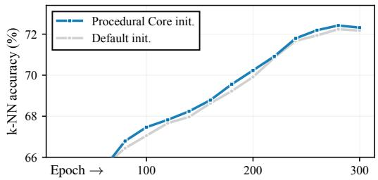  
Figure 3: Procedural Core improves representation learning with DINO on IMAGENET-1K. Left: k-NN accuracy at selected epochs. Right: k-NN accuracy throughout training.

Results. Figure 3 shows that our initialization slightly improves k-NN accuracy by +0.6% at epoch 100 and +0.3% at epoch 300. Although the advantage tends to narrow, it does persist as seen from the training curves. These results indicate that our method is not limited to a supervised setting.

## 4.3 TRANSFORMER-BASED LANGUAGE MODELS

Motivation. The original objective of Procedural Core is to instill generic structure in the model weights. The benefits should therefore extend beyond vision. We test this hypothesis by applying our method to initialize language models that we train on natural language and computer code.

Experimental setup. The transformers used as ViTs or language models have architectural differences, therefore we repeat the first step of our method (Section 3) to obtain a core set of weights suitable to initialize language models. The auxiliary model is a small GPT-2-style model (Radford et al., 2019) with tied (recurrent) middle blocks (see Appendix A.4 for details). We use its weights to initialize our target model, a larger 12-block model with 124M parameters. We train it for 2B tokens of either FINEWEB-EDU (Penedo et al. 2024; natural language) or CODEPAR-ROT (HuggingFace 2022; code). We also train these models from a default random initialization as baselines.

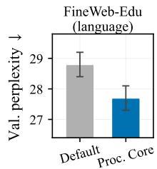

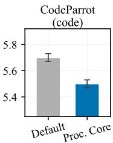  
Figure 4: Procedural Core improves language modeling compared to a default random initialization (lower is better; mean ± std. dev. over 3 seeds).

Results. Figure 4 shows that our initialization reduces validation perplexity by about 4% in both domains. Although these models are small, the training on 2B tokens corresponds to a Chinchillaoptimal scaling of ∼20 tokens/parameter (Hoffmann et al., 2022), which shows that the initialization provides a meaningful effect after extensive language pretraining.

## 5 ANALYSIS OF PROCEDURAL CORE

We have shown that Procedural Core consistently improves training and outperforms a direct warmup of the target model on the same procedural data. We now examine the impact of the architecture of the auxiliary model (Section 5.1), the spectral structure induced by recurrence and its functional importance (Section 5.2), and how the Procedural Core alters downstream computations (Section 5.3). We will show that Procedural Core suppresses high-norm tokens, which helps in particular on vision tasks with dense predictions (Section 5.4).

## 5.1 ARCHITECTURAL CHOICES AND ABLATIONS

Recurrent parameterization. We assess the impact of the weight tying in the auxiliary model. We apply our method to initialize ViT-Tiny models trained on CIFAR-100. We vary the number U of unique blocks in the auxiliary model while keeping the total depth fixed at L = 12. Figure 5a shows that transfer peaks at U = 3, which corresponds to the architecture used in our main experiments (independent input and output blocks plus a recurrent middle one). Moreover, a parameter-matched 3-layer non-recurrent model yields only a +1.7% improvement over the default random initialization, compared with +4.7% for our recurrent one (Figure 5b). This highlights the importance of the compression and recurrence.

Depth and width expansion. We evaluate the effectiveness of the proposed expansion on CIFAR-100. For the depth, we initialize ViT-Tiny models with varying numbers of layers as the target models. Figure 5c shows that the Procedural Core outperforms the default random initialization at every tested depth, with the gain increasing from +2.0% at 6 layers to +2.8% at 24 layers. For the width, we initialize ViT-Small models (which are wider than our auxiliary model) and compare the proposed tiling against a naive padding of the weight matrices with zeros. Figure 5d shows that transferring our weights with zero-padding already provides a significant gain over random weights. The tiling yields a further benefit by filling the whole width of the network with useful structure.

a)  
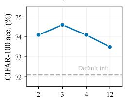

b)  
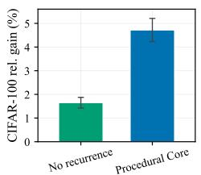

c)  
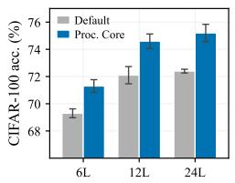

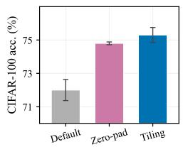  
d)  
Figure 5: Architectural choices and ablations of our method. (a) Transfer peaks with three unique auxiliary layers. (b) Removing recurrence substantially reduces transfer despite matching the parameter count. (c) The expansion in depth is effective with various number of layers in the target model. (d) The expansion in width is slightly more effective than a baseline with zero-padding.

## 5.2 SPECTRAL STRUCTURE AND ITS FUNCTIONAL IMPORTANCE

The Procedural Core exhibits a broader singular spectrum. We now try to understand why our recurrent auxiliary model is more effective than a direct warm-up of the target model on the same procedural data as in Shinnick et al. (2026). We examine weight matrices of models trained with the two methods and compare their cumulative singular-value energy in Figure 6.

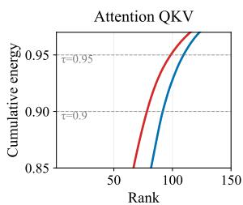

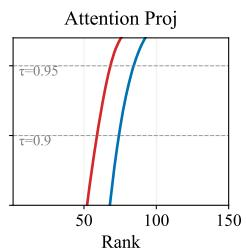

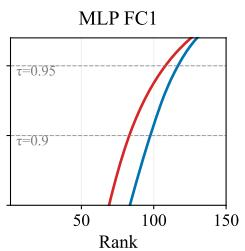

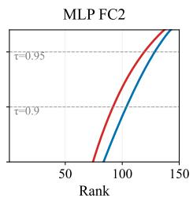  
Figure 6: Cumulative energy of singular values of different weight matrices in models trained with the Procedural Core recurrent architecture ( ) vs. a direct warm-up ( ) as in Shinnick et al. (2026).

The Procedural Core models consistently show a slower spectral decay. This can be interpreted as the computations being distributed across more directions in latent space. This observation is consistent across layers (see Appendix B.4 for the full results). We also evaluate whether this property is functionally important: we ranktruncate the weights of Procedural Core and warm-up models to their top-r singular directions and use them to initialize a ViT-Tiny trained on CIFAR-100. Figure 7 shows that the warm-up weights are much less sensitive to the truncation, whereas Procedural Core degrades sharply with lower ranks. This confirms that the transferable computations depend on a broader set of directions, and that this broader spectrum is functionally important.

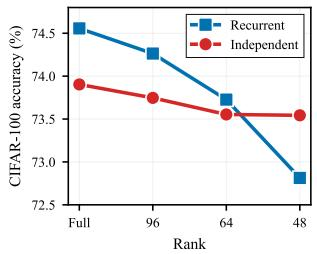  
Figure 7: Rank truncation hinders transfer more sharply with Proc. Core weights.

## 5.3 HOW DOES PROCEDURAL CORE ALTER COMPUTATIONS AFTER TRAINING?

Having established that Procedural Core contains functionally important structure as an initialization, we now examine how it changes the computations in the model after training on natural images.

Procedural Core prevents high-norm tokens. ViTs are known to develop outlier tokens with high norm, often in low-information regions (Darcet et al., 2024; Jiang et al., 2026b). Figure 8 examines how the norms of these tokens evolve in a representative image over the layers of a baseline model (with default initialization) vs. one initialized with Procedural Core. The two models are initially similar, but the default one develops clearer isolated high-norm outliers in middle and later blocks, whereas Procedural Core mitigates their emergence.

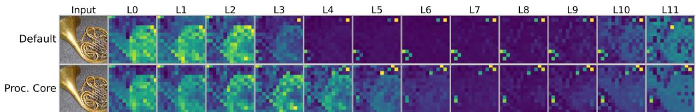  
Figure 8: Token dynamics across depth. Per-token hidden-state norms for default and Procedural Core initializations. High-norm outliers are suppressed from the middle blocks onwards with Procedural Core. Heatmaps are independently normalized; extended examples are in Appendix B.6.

We quantify this effect on 200 images from IMAGENET-1K in Figure 9 (details in Appendix B.6). Panel (a) tracks the bimodality of the token-norm distribution across depth, while panels (b,c) show the distributions at each model’s peak-bimodality block. Procedural Core reduces peak bimodality from 1.29 to 0.63 and the fraction of tokens above the high-norm cutoff from 2.20% to 1.39%. Panel (d) measures the attention mass received by high-norm tokens, whose peak falls from 50.4% to 17.7%. Next, we identify which components drive this change.

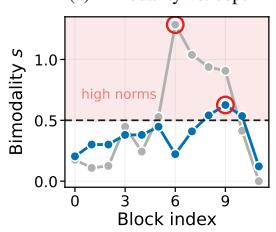

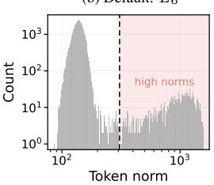

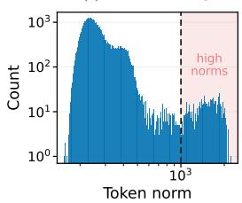

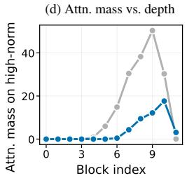  
Figure 9: Procedural Core suppresses high-norm tokens and reduces attention to them. Statistics on 200 IMAGENET-1K images. (a) Bimodality across depth. (b-c) Token-norm distributions at peak-bimodality blocks. (d) Attention mass received by high-norm tokens.

Transferable structure is concentrated in the value/output pathway. We ablate the effect of Procedural Core on specific weight matrices by shuffling their weights prior to image-based train ing. This destroys their internal structure without altering other properties like weight magnitudes. Figure 10 (a,b) shows that on both CIFAR-100 (ViT-T) and IMAGENET-1K (ViT-B), shuffling the attention V/proj. matrices causes the largest drop in performance, whereas shuffling Q/K/MLPs preserves much of the gains. Panels (c,d) show the corresponding effect on token dynamics: shuffling V/proj. restores a default-like attention to high-norm tokens and bimodality, while shuffling Q/K preserves the suppression. Together, these results identify the value/output pathway as carrying much of the transferable structure responsible for suppressing high-norm tokens.

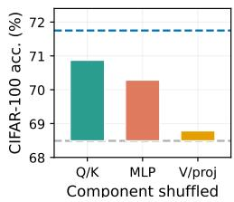  
(a)

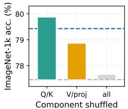  
(b)

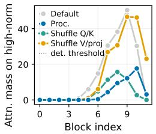  
(c)

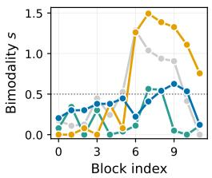  
(d)  
Figure 10: Transfer is concentrated in the value/output pathway. (a,b) Component-shuffling accuracy. (c,d) Shuffling V/proj. reverts to the default behavior with high-norm tokens, while shuffling Q/K preserves the Procedural Core effect.

## 5.4 IMPROVED REPRESENTATIONS BENEFIT A VARIETY OF VISUAL TASKS

Prior work shows that high-norm tokens interfere with the representation of local visual information (Darcet et al., 2024). Therefore, the suppression of high-norm tokens with Procedural Core should particularly benefit tasks that require spatially local information. Following (Jiang et al., 2026b), we evaluate frozen ViT-B backbones on semantic segmentation (ADE20K (Zhou et al.,

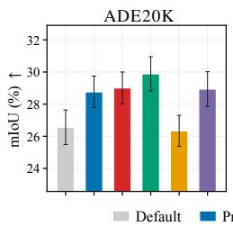

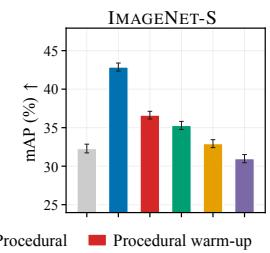

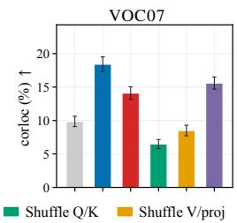

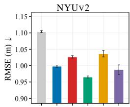  
Figure 11: Procedural Core improves representations, particularly for dense prediction tasks (segmentation, localization, and depth estimation; frozen-backbone performance). This is consistent with our finding of preserving local visual information by suppressing high-norm tokens.

2019)), zero-shot segmentation (IMAGENET-S (Gao et al., 2022)), unsupervised object localization (VOC07 (Everingham et al., 2010)), and monocular depth estimation (NYUV2 Silberman et al. (2012)). Full protocols and results are provided in Appendix B.7.

Figure 11 shows that Procedural Core improves performance across all four frozen-backbone eval uations, with particularly large gains on IMAGENET-S and VOC07. Consistent with the component analysis of Section 5.3, shuffling V/proj. removes much of the benefit, whereas shuffling Q/K retains most of it. Conversely, initializing only V/proj. and LayerNorm with Procedural Core (and other weights with a default random initialization) recovers strong performance across several tasks. Procedural Core also matches or exceeds the full direct warm-up on all four primary metrics. Under the stronger DeiT-III recipe, we observe no improvement in IMAGENET-1K classification, but retain gains in zero-shot segmentation and unsupervised object localization (see Appendix B.7).

## 6 DISCUSSION

We presented Procedural Core, a generic initialization for transformers obtained by training a small recurrent model on procedural data and expanding its compact weights to models of arbitrary size. This provides a deterministic alternative to random initialization that improves supervised and selfsupervised learning for vision, as well as language modeling on natural language and code.

Condensing the benefits of abstract data. Our method builds on recent works that demonstrated the value of an initial training phase on abstract data (Chiang & Lee, 2022; Hu et al., 2025; Jiang et al., 2026a; Zhang et al., 2024). Our contribution makes the benefits (improved convergence and generalization) much more accessible by dispensing with the need for a dedicated training phase. Instead, we prepare a core set of weights that can be reused to initialize new models of arbitrary size, as a direct replacement for a standard random initialization.

Recurrent transformers. Our method also builds on the success of looped transformers (Saunshi et al., 2025; Zhu et al., 2025). In our case, the depth-wise recurrence acts as a regularizer, forcing the model to implement generic computations in a compact set of weights. Our analysis shows that this makes the weights intrinsically more reusable.

Generic computations. The motivation for abstract data is to teach generic mechanisms, with training examples that avoid the noise and biases of natural data. Our results on multiple vision and language tasks support the broad effects of this approach. But prior work also shows that different types of procedural data improve different capabilities (Shinnick et al., 2025). An important scientific question is to determine which properties and structures in the data really matter, and how they lead to the acquisition of useful circuits for specific target tasks.

Limitations & future work. Our main experiments focus on standard ViTs. An extension to other architectures and larger scales is important as future work. With the heavily optimized DeiT-III recipe (see additional results in Appendix B.7 and discussion in Appendix C), the gains in ImageNet classification accuracy disappear, but the improvements persist for segmentation and localization, consistent with the improved representations found in Section 5.3. The interaction of Procedural Core with details of the training recipe could be studied and possibly optimized to amplify its benefits. The choice of the procedural data was inherited from prior work and could also be optimized or even substituted with mechanistic approaches to constructing model weights (Giannou et al., 2023).

## AI USE STATEMENT

Generative AI was used solely to assist with grammar and presentation. It did not contribute to the development of the core ideas, experimental design or execution, or analysis of the results.

## REPRODUCIBILITY STATEMENT

We provide detailed descriptions of our methods, experimental settings, and evaluation procedures in the main paper and appendix. We will release code to reproduce our experiments upon publication.

## REFERENCES

Manel Baradad, Jonas Wulff, Tongzhou Wang, Phillip Isola, and Antonio Torralba. Learning to see by looking at noise. In Adv. Neural Inform. Process. Syst. (NeurIPS), 2021.

Nicolas Buzeta, Felipe del Rio, Cristian Hinostroza, Denis Parra, Hans Lobel, and Rodrigo Toro Icarte. Seeing to generalize: How visual data corrects binding shortcuts. arXiv preprint arXiv:2602.15183, 2026.

Mathilde Caron, Hugo Touvron, Ishan Misra, Herve J ´ egou, Julien Mairal, Piotr Bojanowski, and´ Armand Joulin. Emerging properties in self-supervised vision transformers. In International Conference on Computer Vision (ICCV), 2021.

Cheng Chen, Yichun Yin, Lifeng Shang, Xin Jiang, Yujia Qin, Fengyu Wang, Zhi Wang, Xiao Chen, Zhiyuan Liu, and Qun Liu. bert2bert: Towards reusable pretrained language models. In Annual Meeting of the Association for Computational Linguistics (Volume 1: Long Papers), 2022.

Cheng-Han Chiang and Hung-Yi Lee. On the transferability of pre-trained language models: A study from artificial datasets. In AAAI, 2022.

Timothee Darcet, Maxime Oquab, Julien Mairal, and Piotr Bojanowski. Vision transformers need´ registers. In Int. Conf. Learn. Represent. (ICLR), 2024.

Mostafa Dehghani, Stephan Gouws, Oriol Vinyals, Jakob Uszkoreit, and Lukasz Kaiser. Universal transformers. In Int. Conf. Learn. Represent. (ICLR), 2019.

Jia Deng, Wei Dong, Richard Socher, Li-Jia Li, Kai Li, and Li Fei-Fei. Imagenet: A large-scale hierarchical image database. In IEEE Conf. Comput. Vis. Pattern Recog. (CVPR), 2009.

Alexey Dosovitskiy. An image is worth 16x16 words: Transformers for image recognition at scale. arXiv preprint arXiv:2010.11929, 2020.

Junhao Du, Chuqin Zhou, Ning Cao, Gang Chen, Yunuo Chen, Zhengxue Cheng, Li Song, Guo Lu, and Wenjun Zhang. Large language model for lossless image compression with visual prompts. arXiv preprint arXiv:2502.16163, 2025.

Mark Everingham, Luc Van Gool, Christopher K. I. Williams, John Winn, and Andrew Zisserman. The pascal visual object classes (voc) challenge. International Journal of Computer Vision, 2010.

Fu Feng, Yucheng Xie, Jing Wang, and Xin Geng. Wave: Weight templates for adaptive initialization of variable-sized models. In IEEE Conf. Comput. Vis. Pattern Recog. (CVPR), 2025.

Shanghua Gao, Zhong-Yu Li, Ming-Hsuan Yang, Ming-Ming Cheng, Junwei Han, and Philip Torr. Large-scale unsupervised semantic segmentation. IEEE transactions on pattern analysis and machine intelligence, 2022.

Angeliki Giannou, Shashank Rajput, Jy-yong Sohn, Kangwook Lee, Jason D Lee, and Dimitris Papailiopoulos. Looped transformers as programmable computers. In Int. Conf. Mach. Learn. (ICML). PMLR, 2023.

Adithya Giri. IBiT: Utilizing inductive biases to create a more data efficient attention mechanism. arXiv preprint arXiv:2509.22719, 2025.

Xavier Glorot and Yoshua Bengio. Understanding the difficulty of training deep feedforward neural networks. In International Conference on Artificial Intelligence and Statistics, 2010.

Sharut Gupta, Shobhita Sundaram, Chenyu Wang, Stefanie Jegelka, and Phillip Isola. Better together: Leveraging unpaired multimodal data for stronger unimodal models. arXiv preprint arXiv:2510.08492, 2025.

Junlin Han, Shengbang Tong, David Fan, Yufan Ren, Koustuv Sinha, Philip Torr, and Filippos Kokkinos. Learning to see before seeing: Demystifying llm visual priors from language pretraining. arXiv preprint arXiv:2509.26625, 2025.

Kaiming He, Xiangyu Zhang, Shaoqing Ren, and Jian Sun. Deep residual learning for image recognition. In IEEE Conf. Comput. Vis. Pattern Recog. (CVPR), 2016.

Jordan Hoffmann, Sebastian Borgeaud, Arthur Mensch, Elena Buchatskaya, Trevor Cai, Eliza Rutherford, DDL Casas, Lisa Anne Hendricks, Johannes Welbl, Aidan Clark, et al. Training compute-optimal large language models. arXiv preprint arXiv:2203.15556, 10, 2022.

Michael Y. Hu, Jackson Petty, Chuan Shi, William Merrill, and Tal Linzen. Between circuits and chomsky: Pre-pretraining on formal languages imparts linguistic biases. In Annual Meeting of the Association for Computational Linguistics, 2025.

Xiao Shi Huang, Felipe Perez, Jimmy Ba, and Maksims Volkovs. Improving transformer optimization through better initialization. In Int. Conf. Mach. Learn. (ICML), 2020.

HuggingFace. CodeParrot dataset cleaned, 2022.

Minyoung Huh, Brian Cheung, Tongzhou Wang, and Phillip Isola. Position: The platonic representation hypothesis. In Int. Conf. Mach. Learn. (ICML), 2024.

Mozes Jacobs, Thomas Fel, Richard Hakim, Alessandra Brondetta, Demba Ba, and T Andy Keller. Block-recurrent dynamics in vision transformers. 2025.

Liangze Jiang, Zachary Shinnick, Anton van den Hengel, Hemanth Saratchandran, and Damien Teney. Procedural pretraining: Warming up language models with abstract data. arXiv preprint arXiv:2601.21725, 2026a.

Nicholas Jiang, Amil Dravid, Alexei Efros, and Yossi Gandelsman. Vision transformers don’t need trained registers. Adv. Neural Inform. Process. Syst. (NeurIPS), 2026b.

Hirokatsu Kataoka, Ryo Hayamizu, Ryosuke Yamada, Kodai Nakashima, Sora Takashima, Xinyu Zhang, Edgar Josafat Martinez-Noriega, Nakamasa Inoue, and Rio Yokota. Replacing labeled real-image datasets with auto-generated contours. In IEEE Conf. Comput. Vis. Pattern Recog. (CVPR), 2022.

Zhenzhong Lan, Mingda Chen, Sebastian Goodman, Kevin Gimpel, Piyush Sharma, and Rad Soricut. Albert: A lite bert for self-supervised learning of language representations. In Int. Conf. Learn. Represent. (ICLR), 2020.

Matthias Lindemann, Alexander Koller, and Ivan Titov. SIP: Injecting a structural inductive bias into a seq2seq model by simulation. In Annual Meeting of the Association for Computational Linguistics, 2024.

Kevin Lu, Aditya Grover, Pieter Abbeel, and Igor Mordatch. Frozen pretrained transformers as universal computation engines. In AAAI, 2022.

R. Thomas McCoy and Thomas L. Griffiths. Modeling rapid language learning by distilling bayesian priors into artificial neural networks. arXiv preprint arXiv:2305.14701, 2023.

Sean McLeish, Ang Li, John Kirchenbauer, Dayal Singh Kalra, Brian R Bartoldson, Bhavya Kailkhura, Avi Schwarzschild, Jonas Geiping, Tom Goldstein, and Micah Goldblum. Teaching pretrained language models to think deeper with retrofitted recurrence. arXiv preprint arXiv:2511.07384, 2025.

Ryo Nakamura, Hirokatsu Kataoka, Sora Takashima, Edgar Josafat Martinez-Noriega, Rio Yokota, and Nakamasa Inoue. Pre-training vision transformers with very limited synthesized images. In Int. Conf. Comput. Vis. (ICCV), 2023.

Ryo Nakamura, Ryu Tadokoro, Ryosuke Yamada, Yuki M. Asano, Iro Laina, Christian Rupprecht, Nakamasa Inoue, Rio Yokota, and Hirokatsu Kataoka. Scaling backwards: Minimal synthetic pre-training? In Eur. Conf. Comput. Vis. (ECCV), 2024.

Abhishek Panigrahi, Nikunj Saunshi, Kaifeng Lyu, Sobhan Miryoosefi, Sashank Reddi, Satyen Kale, and Sanjiv Kumar. Efficient stagewise pretraining via progressive subnetworks. arXiv preprint arXiv:2402.05913, 2024.

Isabel Papadimitriou and Dan Jurafsky. Injecting structural hints: Using language models to study inductive biases in language learning. arXiv preprint arXiv:2304.13060, 2023.

Guilherme Penedo, Hynek Kydl´ıcek, Loubna Ben allal, Anton Lozhkov, Margaret Mitchell, Colinˇ Raffel, Leandro Von Werra, and Thomas Wolf. The fineweb datasets: Decanting the web for the finest text data at scale. In Adv. Neural Inform. Process. Syst. (NeurIPS), 2024.

Alec Radford, Jeffrey Wu, Rewon Child, David Luan, Dario Amodei, Ilya Sutskever, et al. Language models are unsupervised multitask learners. OpenAI Blog, 2019.

Roland Riachi, Kashif Rasul, Arjun Ashok, Prateek Humane, Alexis Roger, Andrew R Williams, Yuriy Nevmyvaka, and Irina Rish. Random initialization can’t catch up: The advantage of language model transfer for time series forecasting. arXiv preprint arXiv:2506.21570, 2025.

Mohammad Samragh, Iman Mirzadeh, Keivan Alizadeh Vahid, Fartash Faghri, Minsik Cho, Moin Nabi, Devang Naik, and Mehrdad Farajtabar. Scaling smart: Accelerating large language model pre-training with small model initialization. arXiv preprint arXiv:2409.12903, 2024.

Nikunj Saunshi, Stefani Karp, Shankar Krishnan, Sobhan Miryoosefi, Sashank J. Reddi, and Sanjiv Kumar. On the inductive bias of stacking towards improving reasoning. arXiv preprint arXiv:2409.19044, 2024.

Nikunj Saunshi, Nishanth Dikkala, Zhiyuan Li, Sanjiv Kumar, and Sashank J Reddi. Reasoning with latent thoughts: On the power of looped transformers. arXiv preprint arXiv:2502.17416, 2025.

Zachary Shinnick, Liangze Jiang, Hemanth Saratchandran, Anton van den Hengel, and Damien Teney. Transformers pretrained on procedural data contain modular structures for algorithmic reasoning. In ICML Workshop on Methods and Opportunities at Small Scale, 2025.

Zachary Shinnick, Liangze Jiang, Hemanth Saratchandran, Damien Teney, and Anton van den Hengel. Can you learn to see without images? procedural warm-up for vision transformers. In IEEE Conf. Comput. Vis. Pattern Recog. (CVPR), 2026.

Nathan Silberman, Derek Hoiem, Pushmeet Kohli, and Rob Fergus. Indoor segmentation and support inference from rgbd images. In Eur. Conf. Comput. Vis. (ECCV), 2012.

Oriane Simeoni, Gilles Puy, Huy V. Vo, Simon Roburin, Spyros Gidaris, Andrei Bursuc, Patrick ´ Perez, Renaud Marlet, and Jean Ponce. Localizing objects with self-supervised transformers and´ no labels. In Brit. Mach. Vis. Conf. (BMVC), 2021.

Oscar Skean, Md Rifat Arefin, Dan Zhao, Niket Patel, Jalal Naghiyev, Yann LeCun, and Ravid Shwartz-Ziv. Layer by layer: Uncovering hidden representations in language models. arXiv preprint arXiv:2502.02013, 2025.

Hugo Touvron, Matthieu Cord, and Herve J ´ egou. DeiT III: Revenge of the ViT. In ´ Eur. Conf. Comput. Vis. (ECCV), 2022.

Asher Trockman and J. Zico Kolter. Mimetic initialization of self-attention layers. arXiv preprint arXiv:2305.09828, 2023.

Yuhuai Wu, Felix Li, and Percy S. Liang. Insights into pre-training via simpler synthetic tasks. Adv. Neural Inform. Process. Syst. (NeurIPS), 2022.

Zhiqiu Xu, Yanjie Chen, Kirill Vishniakov, Yida Yin, Zhiqiang Shen, Trevor Darrell, Lingjie Liu, and Zhuang Liu. Initializing models with larger ones. arXiv preprint arXiv:2311.18823, 2023.

Shiyang Zhang, Aakash Patel, Syed A. Rizvi, Nianchen Liu, Sizhuang He, Amin Karbasi, Emanuele Zappala, and David van Dijk. Intelligence at the edge of chaos. arXiv preprint arXiv:2410.02536, 2024.

Jiawei Zhao, Florian Schafer, and Anima Anandkumar. Zero initialization: Initializing neural net-¨ works with only zeros and ones. arXiv preprint arXiv:2110.12661, 2021.

Boyang Zheng, Jinjin Gu, Shijun Li, and Chao Dong. Lm4lv: A frozen large language model for low-level vision tasks. arXiv preprint arXiv:2405.15734, 2024.

Jianqiao Zheng, Xueqian Li, Hemanth Saratchandran, and Simon Lucey. Structured initialization for vision transformers. arXiv preprint arXiv:2505.19985, 2025.

Bolei Zhou, Hang Zhao, Xavier Puig, Tete Xiao, Sanja Fidler, Adela Barriuso, and Antonio Torralba. Semantic understanding of scenes through the ade20k dataset. International journal of computer vision, 2019.

Rui-Jie Zhu, Zixuan Wang, Kai Hua, Tianyu Zhang, Ziniu Li, Haoran Que, Boyi Wei, Zixin Wen, Fan Yin, He Xing, et al. Scaling latent reasoning via looped language models. arXiv preprint arXiv:2510.25741, 2025.

## A TRAINING DETAILS

## A.1 PROCEDURAL CORE TRAINING SETUP

To obtain the Procedural Core, we follow the procedural warm-up framework introduced in (Shinnick et al., 2026). We use a ViT-T/16 backbone as the auxiliary model, trained for 15,000 steps using masked-token prediction on procedurally generated k-Dyck sequences. All procedural training was performed on a single NVIDIA H200 GPU.

Recurrent parameterization. The auxiliary model is structured with a distinct input layer (layer 0) and output layer (layer 11), while intermediate layers (1–10) share parameters.

Cross-instance parameterization. By default, we share parameters across $n = 3$ parallel instances trained with different random seeds. Empirically, cross-instance sharing provides only marginal and inconsistent gains. Attention and MLP weights are shared across instances, while LayerNorm and head parameters remain independent.

Table 1: Optimization settings used to train the auxiliary model for learning the Procedural Core.
<table><tr><td>Setting</td><td>Value</td></tr><tr><td>Batch size Training steps</td><td>256 15,000</td></tr><tr><td>Mask ratio Optimizer</td><td>0.5 (close-only) AdamW</td></tr><tr><td>Learning rate</td><td> $2 \times 1 0 ^ { - 3 }$ </td></tr><tr><td>Weight decay Betas</td><td>0.05</td></tr><tr><td></td><td>(0.9, 0.999) Cosine decay</td></tr><tr><td>LR schedule Warmup steps</td><td>1,000</td></tr></table>

Procedural data generation. We generate hierarchical procedural sequences following (Shinnick et al., 2026). Opening tokens are drawn from 64 distinct types and closing tokens from 64 corresponding types. Whenever structurally permissible, an opening token is sampled with probability $p _ { \mathrm { o p e n } } = 0 . 6$

## A.2 SUPERVISED IMAGE CLASSIFICATION

For IMAGENET-1K training (Figure 2), we adopt the standard ViT-B training protocol of (Xu et al., 2023). Optimization uses AdamW with cosine learning-rate decay and linear warmup, together with RandAugment, Mixup, CutMix, and label smoothing. We train for 300 epochs using a base learning rate of $2 \times 1 0 ^ { - 3 }$ , a batch size of 4096, and a 50-epoch linear warm-up. All supervised IMAGENET-1K experiments were conducted on either 8 NVIDIA H200 GPUs or 4 NVIDIA A100 GPUs, depending on availability. The training configuration and effective batch size were kept identical across runs.

For the fine-tuning experiment in Table 4, we initialize from the IMAGENET-1K ViT-B checkpoints and fine-tune on CIFAR-100. We follow the same optimization protocol as above, but reduce the batch size to 512 and train for 50 epochs with 5 warmup epochs and a base learning rate of $5 \times 1 0 ^ { - 4 }$

## A.3 SELF-SUPERVISED TRAINING (DINO)

We adopt the DINO framework (Caron et al., 2021) with a ViT-S/16 backbone. Training follows the standard configuration with multi-crop augmentation and momentum teacher updates, using AdamW with cosine learning-rate decay for 300 epochs (10 warmup epochs). The base learning rate is $5 \times 1 0 ^ { - 4 }$ , and the batch size is 64 per GPU across 4 NVIDIA A100 GPUs (total batch size 256).

We evaluate representation quality using the standard DINO weighted k-NN protocol, where L2- normalized ViT-S/16 features are compared using cosine similarity and each validation image is classified by a temperature-scaled vote over its $k = 2 0$ nearest neighbors (temperature $\tau = 0 . 0 7 )$ We additionally report linear evaluation results using the standard DINO protocol with a linear classifier trained on frozen backbone features.

## A.4 PROCEDURAL CORE FOR LANGUAGE MODELS

To obtain the Procedural Core for language modeling, we autoregressively train a GPT-2–style transformer (12 layers, hidden size 768, 12 attention heads) on procedurally generated k-Dyck sequences, using $k = 6 4$ opening and closing symbols and sequence length 2048.

Training is performed for 2,000 steps using AdamW with cosine learning-rate decay from $5 \times 1 0 ^ { - 4 } .$ including 200 warmup steps, and weight decay 0.1. The effective batch size is 32 sequences per update, corresponding to approximately 131M tokens of procedural training. Training is performed on a single NVIDIA RTX 4090 GPU.

We use the same recurrent auxiliary architecture described in Appendix A.1, where the input and output layers are distinct and the intermediate transformer blocks share parameters.

## A.5 LANGUAGE MODELING TRAINING DETAILS

We train GPT-2-style models (12 layers, 768 hidden size, 12 heads) with context length 1024 on both FINEWEB-EDU and CODEPARROT. Training is performed for a total of 2B tokens. For CODEPARROT, sequences are tokenized using the CodeParrot tokenizer and sampled from the codeparrot-clean splits. All other hyperparameters are listed in Table 2. All language training experiments were conducted on a single NVIDIA RTX 4090 GPU.

Table 2: GPT-2 Small training configuration for FINEWEB-EDU and CODEPARROT experiments.
<table><tr><td>Setting</td><td>Value</td></tr><tr><td>Architecture</td><td>GPT-2 Small (12L, 768D, 12H)</td></tr><tr><td>Context length</td><td>1024</td></tr><tr><td>Training budget</td><td>2B tokens</td></tr><tr><td>Effective batch size</td><td>32 sequences (32,768 tokens)</td></tr><tr><td>Optimizer</td><td>AdamW</td></tr><tr><td>Learning rate</td><td> $6 \times 1 0 ^ { - 4 }$  (cosine to  $6 \times 1 0 ^ { - 5 } )$ </td></tr><tr><td>Warmup</td><td>5% of total steps</td></tr><tr><td>Weight decay</td><td>0.1</td></tr><tr><td>Gradient clipping</td><td>1.0</td></tr></table>

## B ADDITIONAL EXPERIMENTAL RESULTS

## B.1 COMPARISON WITH PROCEDURAL WARM-UP

We additionally compare Procedural Core with standard procedural warm-up (Shinnick et al., 2026) on CIFAR-100. Using the same ViT-Tiny target architecture, Procedural Core improves top-1 accuracy from 73.9% to 74.6% (Table 3), despite avoiding procedural training of the target model itself.

## B.2 DOWNSTREAM TRANSFER AFTER IMAGENET PRETRAINING

We fine-tune the IMAGENET-1K-pretrained ViT-Base checkpoints on CIFAR-100 using an identical protocol across initializations (Section A.2). As shown in Table 4, Procedural Core achieves the highest downstream accuracy, indicating that its benefit persists after large-scale IMAGENET-1K training.

Table 3: Comparison with procedural warm-up on CIFAR-100. ViT-Tiny top-1 accuracy (mean ± std).
<table><tr><td></td><td>Top-1 Acc. (%)</td></tr><tr><td>Procedural warm-up</td><td> $7 3 . 9 \pm 0 . 1$ </td></tr><tr><td>Procedural Core (ours)</td><td> $7 4 . 6 \pm 0 . 5$ </td></tr></table>

Table 4: Downstream transfer on CIFAR-100. Fine-tuning accuracy after IMAGENET-1K pretraining (mean ± std over three seeds).
<table><tr><td>Initialization</td><td> ${ \mathrm { T o p } } { - } 1 \ ( \% )$ </td></tr><tr><td>Default init.</td><td> $8 8 . 4 \pm 0 . 8$ </td></tr><tr><td>Mimetic init.</td><td> $8 9 . 1 \pm 0 . 5$ </td></tr><tr><td>Procedural warm-up</td><td> $8 9 . 4 \pm 0 . 3$ </td></tr><tr><td>Procedural Core</td><td> $8 9 . 7 \pm 0 . 1$ </td></tr></table>

## B.3 LINEAR EVALUATION OF DINO REPRESENTATIONS

Linear-probe results (Table 5) show only marginal differences compared with k-NN evaluation. This is expected because a trainable linear classifier can partially compensate for weaker representations, whereas k-NN more directly reflects intrinsic representation quality.

## B.4 SPECTRAL ANALYSIS DETAILS

For each weight matrix $W \in \mathbb { R } ^ { m \times n }$ , we compute its singular value decomposition $W = U \Sigma V ^ { \top }$ with singular values $\{ \sigma _ { i } \}$ ordered by decreasing magnitude. We define the cumulative spectral energy captured by the top k singular directions as

$$
E ( k ) = \frac { \sum _ { i = 1 } ^ { k } \sigma _ { i } ^ { 2 } } { \sum _ { i = 1 } ^ { \operatorname* { m i n } ( m , n ) } \sigma _ { i } ^ { 2 } } .\tag{2}
$$

Slower saturation of $E ( k )$ indicates that spectral energy is distributed across more singular directions. In Figure 6 of the main text, we additionally report the number of singular directions required to capture 90% and 95% of the total spectral energy.

Figure 12 reports the corresponding spectra across layers. Across attention (QKV and projection) and MLP (FC1 and FC2) components, recurrently parameterized layers exhibit slower spectral decay than independently parameterized baselines, showing that the effect is consistent across depth.

## B.5 QUALITATIVE TOKEN-NORM ANALYSIS

Figure 13 provides additional qualitative examples of the token-norm dynamics discussed in the main text.

## B.6 TOKEN-NORM ANALYSIS DETAILS

All statistics use 200 IMAGENET-1K validation images, sampled once with a fixed seed and held constant across models. For each model and block, we pool the $\ell _ { 2 }$ norms of all patch-token hidden states over images, excluding zero norms. The CLS token is excluded throughout as both query and key. Algorithm 1 gives the detection procedure, applied independently at each block.

Table 5: Linear evaluation of DINO representations on IMAGENET-1K. Frozen ViT-S features evaluated with a linear classifier.
<table><tr><td>Initialization</td><td>Top-1 (%)</td></tr><tr><td>Default initialization</td><td>75.36</td></tr><tr><td>Procedural Core (ours)</td><td>75.42</td></tr></table>

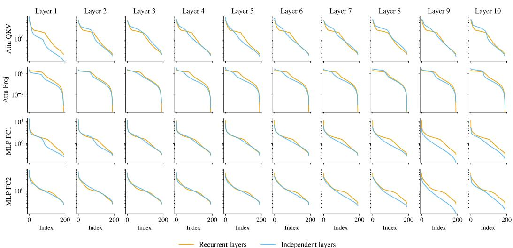  
Figure 12: Layer-wise singular value spectra under recurrent vs. independent parameterization. Singular value decay for attention and MLP weight matrices across layers 1–10. In the recurrent model, the middle layers share parameters, so the same spectrum appears across layers. Each subplot contrasts this with independently parameterized layers. Recurrent layers exhibit slower spectral decay, indicating a more distributed use of singular directions.

Algorithm 1 High-norm token detection at one block   
Require: pooled token norms $\{ n _ { i } \}$ ; bins $B = 2 0 0 ;$ smoothing window $w = 5$   
Ensure: bimodality s; cutoff c (or none)   
1: h ← histogram of $\left\{ \log _ { 1 0 } n _ { i } \right\}$ with B equal-width bins   
2: h ← moving average of h with window w   
3: p1 ← arg max h ▷ main mode   
4: v ← arg min $h _ { [ p _ { 1 } , p _ { 1 } + 0 . 9 ( B - p _ { 1 } ) ] }$ ▷ valley   
5: p2 ← arg max h[v, B] ▷ second mode   
6: $s \gets \log _ { 1 0 } ( \operatorname* { m a x } ( h _ { p _ { 2 } } , 0 . 5 ) /$ max $\left( h _ { v } , 0 . 5 \right) )$   
7: $\mathbf { i f } \ p _ { 1 }$ or v lies within 10 bins of the right edge then   
8: return s, none   
9: end if   
10: $c  1 0 ^ { e _ { v } }$ , where $e _ { v }$ is the left edge of bin v   
11: $f \gets$ fraction of tokens with $n _ { i } > c$   
12: $\mathbf { i f } s \geq 0 . 5$ and $f \in [ 0 . 1 \% , 2 0 \% ]$ then   
13: return s, c   
14: else   
15: return s, none   
16: end if

The statistic s measures, in orders of magnitude, how far the second mode rises above the valley separating it from the main mode. The threshold $s \geq 0 . 5$ requires approximately a factor-of-three separation, while the constraint on f rejects spurious detections arising from smooth heavy tails.

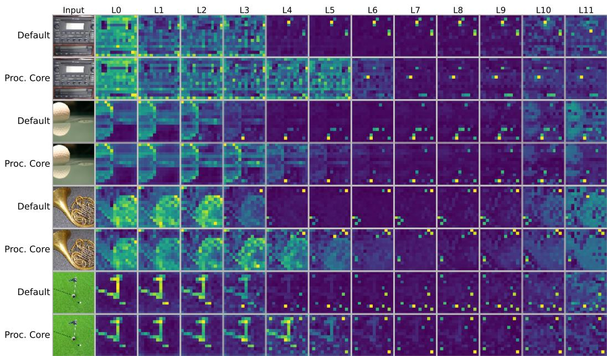  
Figure 13: Additional token-norm dynamics across depth. Per-token hidden-state norms across transformer blocks for default and Procedural Core initializations. The models begin with similar token-norm structure but increasingly diverge across depth, with the Procedural Core suppressing high-norm token outliers in later blocks.

Attention mass on high-norm tokens. This measurement is independent of the detection procedure above. At each block, we mark tokens whose norm exceeds three times the per-image median and sum the post-softmax attention mass they receive as keys from patch-token queries. We normalize by total attention mass and average over heads, queries, and images. The criterion is evaluated independently at every block and is therefore not tied to the cutoff c.

Component shuffling. The interventions in Section 5.3 independently permute the entries of one component of the initialization (Q/K, V/proj, or MLP) within each weight matrix before downstream training. This preserves marginal weight statistics while destroying learned structure; all other parameters remain unchanged.

## B.7 DOWNSTREAM VISUAL EVALUATION

Evaluation protocols. All backbones are frozen so that differences reflect the learned representation rather than further backbone training. On ADE20K, we train a 1 × 1 convolution on last-block patch tokens over the full 20,210-image training split for 10 epochs at 448 px and report mIoU on the 2,000 validation images. On IMAGENET-S, no parameters are trained: we threshold the CLSto-patch attention map at its per-image mean and score it against the ground-truth mask over all 4,276 images, reporting threshold-free mAP. On VOC07, we run LOST (Simeoni et al., 2021) on´ frozen value features over all 5,011 trainval images and report corloc. On NYUV2, we fit a linear log-depth head on the canonical 795/645 split and report RMSE. Uncertainties are 95% bootstrap intervals over evaluation images unless otherwise stated.

Figure 14 reports all downstream metrics, complementing the primary metrics presented in Figure 11 of the main text.

Component interventions. Shuffling V/proj removes much of the benefit of Procedural Core. It falls below the default baseline on ADE20K and VOC07 (26.34 mIoU and 8.50 corloc versus 26.56 and 9.86). Transplanting only V/proj and LayerNorm recovers much of the improvement on ADE20K, VOC07, and NYUV2, although not on IMAGENET-S. Shuffling Q/K largely preserves performance and is the strongest arm on ADE20K and NYUV2, but is weaker on VOC07, where the readout depends directly on feature geometry.

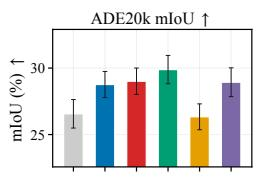

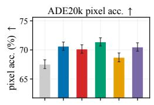

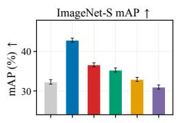

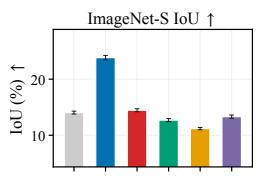

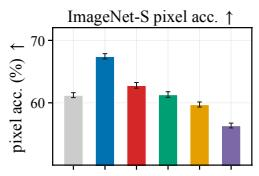

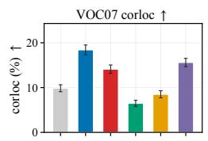

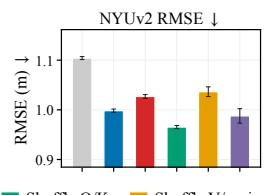

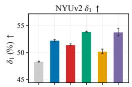  
V/proj+LN init

Figure 14: Full downstream evaluation across dense and localization tasks. Frozen ViT-B backbones evaluated on segmentation (ADE20K, IMAGENET-S), object localization (VOC07), and depth estimation (NYUV2). The Procedural Core improves over default initialization across the primary metrics; shuffling V/proj largely removes these gains, while transplanting V/proj+LN recovers much of them. Error bars denote 95% bootstrap intervals (NYUV2: s.d. over three readout seeds).  
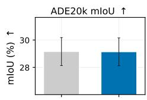

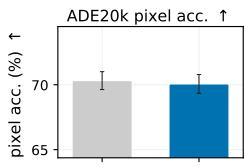

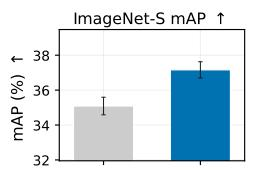

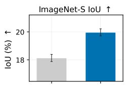

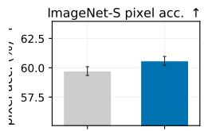

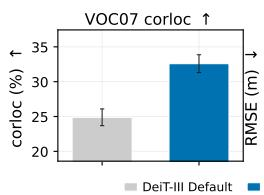

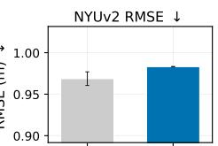

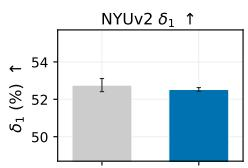  
Figure 15: Under the stronger DeiT-III recipe, gains concentrate on attention-based tasks. Full downstream evaluation under DeiT-III (Touvron et al., 2022). Procedural Core improves zero-shot segmentation on IMAGENET-S and unsupervised object localization on VOC07, while performance is broadly unchanged on the remaining tasks.

Aggregate comparison. Across all eight downstream metrics, a Friedman test rejects the null of equal ranks across the six arms $( \chi ^ { 2 } = 1 8 . 1 4 , p = 0 . 0 0 3 )$ . The Procedural Core achieves the best mean rank (2.00), and a Nemenyi post-hoc test at α = 0.05 separates it from both default initialization (4.88) and the V/proj-shuffled ablation (5.12).

Stronger DeiT-III training. We additionally repeat the evaluation using the stronger DeiT-III training recipe (Touvron et al., 2022). Procedural Core does not improve ImageNet classification (82.4% versus 82.5% top-1), is approximately level on ADE20K, and is slightly worse on NYUV2. However, improvements persist on the two attention-based tasks, with +2.07 mAP on IMAGENET-S and +7.70 corloc on VOC07 (Figure 15).

## C EXTENDED DISCUSSION AND LIMITATIONS

Why study standard architectures? Our goal in this work is not to develop a training recipe specialized to a particular state-of-the-art architecture, but to understand a more fundamental question: whether useful computational structure can be introduced directly through a transformer’s initialization, and how that structure influences subsequent learning. We therefore focus primarily on the standard ViT architecture, whose simplicity and extensive study provide a controlled setting for isolating the effect of initialization and performing targeted mechanistic interventions.

This setting also allows us to examine the same initialization across a broad range of applications. Beyond image classification, we study self-supervised learning, semantic and zero-shot segmentation, object localization, and depth estimation, as well as language modeling. Our analysis identifies recurrence and structure in the attention value/output pathway as important contributors to transfer. We expect these principles to help guide analogous approaches for more modern architectures such as XCiT and other transformer variants. Determining how the learned structure should be adapted to their architectural components is left to future work.

Interaction with modern training recipes. We additionally evaluate Procedural Core under the substantially stronger DeiT-III training recipe. In this setting, it does not improve ImageNet-1K classification, while gains persist on ImageNet-S zero-shot segmentation and VOC07 unsupervised object localization. DeiT-III simultaneously changes several aspects of downstream training, including optimization, augmentation, and regularization, and is itself a heavily optimized recipe for image classification.

Importantly, we do not retune this recipe specifically for models initialized with Procedural Core. The optimal training protocol for a structured initialization need not coincide with one developed for random initialization, and DeiT-III therefore should not be viewed as an upper bound on the potential benefit of the method. Alternative optimization, augmentation, or regularization choices may better preserve or amplify the computational structure introduced at initialization. Understanding these interactions, and potentially jointly designing initialization and downstream training recipes, is an important direction for future work.