# Post-Anomaly Detection Inference for Deep SVDD

Cao Le Cong Thanh University of Information Technology, Ho Chi Minh City, Vietnam Vietnam National University, Ho Chi Minh City, Vietnam

Dang Quang Vinh University of Information Technology, Ho Chi Minh City, Vietnam Vietnam National University, Ho Chi Minh City, Vietnam

Vo Nguyen Le Duy∗ University of Information Technology, Ho Chi Minh City, Vietnam Vietnam National University, Ho Chi Minh City, Vietnam

Reviewed on OpenReview: https: // openreview. net/ forum? id= f8XTHjxBig

23521437@gm.uit.edu.vn

23521786@gm.uit.edu.vn

duyvnl@uit.edu.vn

## Abstract

Deep Support Vector Data Description (Deep SVDD) has become a prominent framework for unsupervised anomaly detection by learning latent representations that compactly characterize normal data around a center. Despite its empirical success, anomaly decisions produced by Deep SVDD are typically made solely based on anomaly scores without rigor ous statistical guarantees, thereby limiting their reliability in safety-critical and high-stakes applications where false positives must be strictly controlled. In this paper, we propose PADI (Post-Anomaly Detection Inference), a novel framework that equips a trained and frozen Deep SVDD detector with statistically valid inference by leveraging the Selective Inference framework. Specifically, PADI performs inference conditional on the event that a test instance is identified as anomalous by Deep SVDD, thereby enabling rigorous statistical assessment of anomaly decisions. Based on this formulation, we derive valid selective p-values that quantify the statistical significance of the detected anomaly. Using these pvalues, we theoretically establish control of the false positive rate (FPR) at a user-specified significance level α (e.g., α = 0.05). Furthermore, we extend the proposed framework to Deep Semi-Supervised Anomaly Detection (Deep SAD), providing a principled approach for statistically reliable inference in semi-supervised anomaly detection settings. Extensive experiments on both synthetic and real-world benchmark datasets robustly support the theoretical findings. The results demonstrate that PADI consistently achieves proper FPR control while attaining superior true positive rates compared with existing approaches.

## 1 Introduction

Anomaly detection (AD) plays a fundamental role in modern machine learning, with applications spanning cybersecurity, healthcare, bioinformatics, industrial monitoring, finance, and autonomous systems (Ahmed et al., 2016; Litjens et al., 2017; Zong et al., 2018). Among existing approaches, Support Vector Data Description (SVDD) (Tax & Duin, 2004) has emerged as one of the most influential frameworks for one-class classification and unsupervised AD. The central idea of SVDD is to learn a compact description of normal data by enclosing the normal samples within a minimal hypersphere in a feature space, such that samples lying far from the learned description are identified as anomalies. Owing to its conceptual simplicity and strong empirical efectiveness, SVDD and its deep variants, particularly Deep SVDD (Ruf et al., 2018), have been successfully applied to a wide range of problems (Yi & Yoon, 2020; Gamper et al., 2020; You et al., 2021; Zhang et al., 2022; Kou et al., 2022).

Despite the empirical success, Deep SVDD sufers from a critical limitation: anomaly decisions are made based on anomaly scores or heuristic thresholds without rigorous statistical guarantees. In practice, this means that the false positive rate (FPR) cannot be reliably controlled. Such a limitation becomes particularly problematic in high-stakes applications where false positives may lead to severe consequences. For example, in bioinformatics and medical diagnosis, incorrectly flagging healthy patients or normal biological samples as anomalous may trigger unnecessary follow-up procedures, expensive laboratory analyses, or inappropriate clinical interventions. Similarly, in cybersecurity, excessive false positives can overwhelm security analysts, leading to alert fatigue and potentially causing truly malicious activities to be overlooked. These challenges highlight the importance of developing a statistically reliable method capable of quantifying the uncertainty of anomaly decisions and rigorously controlling the FPR.

A natural approach to addressing this problem is to formulate anomaly assessment as a statistical hypothesis testing problem. Specifically, given a test instance detected as anomalous by an SVDD-based detector, one aims to quantify its statistical significance. However, constructing valid statistical inference in this setting is highly challenging due to the well-known issue of double dipping (Kriegeskorte et al., 2009) or selection bias. The same data are used both to identify anomalous instances and to conduct statistical inference, resulting in invalid classical p-values and inflated FPR. Consequently, conventional (naive) statistical testing procedures fail to provide reliable FPR control for the Deep SVDD-based AD result.

To overcome this challenge, we leverage the framework of Selective Inference (SI) (Lee et al., 2016), which enables valid statistical inference after a data-driven selection procedure. Building upon this principle, we propose PADI (Post-Anomaly Detection Inference), a novel framework that equips a trained and frozen Deep SVDD detector with statistically valid post-AD inference. The key idea is to perform inference conditional on the event that a test sample is detected as anomalous by Deep SVDD. Based on this formulation, PADI derives valid selective p-values that quantify the statistical significance of the detected anomalies while provably controlling the FPR at a user-specified significance level α. Importantly, the proposed framework operates in a post hoc manner and does not require retraining or modifying the underlying anomaly detector.

Contributions. The main contributions of this work are summarized as follows:

• We formulate anomaly assessment in Deep SVDD under the SI framework and address the fundamental double-dipping issue arising from conducting inference after AD. Based on this formulation, we derive valid selective p-values and theoretically establish control of the FPR at a user-specified significance level α. The proposed PADI method operates in a post hoc manner and can be directly applied to trained and frozen Deep SVDD models without requiring any retraining or modification of the underlying detector. The proposed inference procedure additionally requires an independent set of normal data, from which normal reference samples are drawn for computing selective p-values. Furthermore, we extend PADI to deep semi-supervised AD model (Ruf et al., 2019).

• We provide a GPU-accelerated implementation of PADI to improve computational eficiency. By alleviating the computational burden associated with post-AD inference, this implementation extends the practica applicability of PADI to a broader range of deep architectures beyond simple fully connected networks.

• We conduct extensive experiments on both synthetic and real-world benchmark datasets to validate the proposed method. The experimental results consistently demonstrate that PADI achieves reliable FPR control while maintaining superior true positive rates compared with existing methods.

Related works. Unsupervised AD aims to identify abnormal or rare samples without requiring labeled anomaly instances during training. Early approaches include distance-based methods (Knorr et al., 2000), density-based techniques such as Local Outlier Factor (LOF) (Breunig et al., 2000), clustering-based methods (Jain et al., 1999). One-class classification methods, particularly One-Class SVM (Schölkopf et al., 2001) and Support Vector Data Description (SVDD) (Tax & Duin, 2004), have also become foundationa techniques due to their ability to characterize the distribution of normal data. More recently, deep learning has substantially advanced AD by enabling representation learning in high-dimensional and complex data domains. Representative deep anomaly detection approaches include autoencoder-based methods (Sakurada & Yairi, 2014), GAN-based methods such as f-AnoGAN (Schlegl et al., 2019), and Deep SVDD (Ruf et al., 2018). Although these deep learning-based methods often demonstrate strong AD performance, most of them still lack a principled statistical framework for rigorously quantifying the significance and reliability of anomaly decisions.

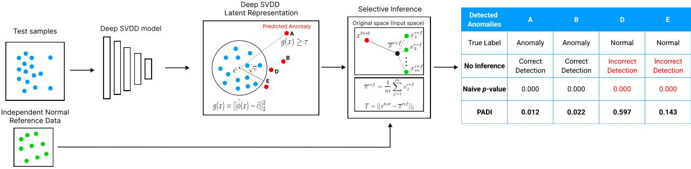  
Figure 1: Overview of the proposed PADI method. A trained and frozen Deep SVDD model first maps test instances into the latent space and selects anomalies whose distance-based anomaly scores exceed a fixed threshold. For each selected anomaly, PADI performs SI conditional on the anomaly-selection event induced by the Deep SVDD detector. Using independent normal reference samples, PADI computes a selective pvalue that quantifies the statistical significance of the detected anomaly while accounting for the selection event. The right panel illustrates how PADI difers from conventional inference: unlike naive p-values that ignore the anomaly-selection process, PADI provides statistically valid inference for detected anomalies.

Traditional statistical inference methods fail in this setting because their validity fundamentally relies on the target anomalies being predetermined prior to observing the data. When classical inference procedures are directly applied to anomalies identified by an anomaly detection (AD) algorithm, the resulting statistical tests become invalid due to selection bias, leading to the inability to properly control the FPR at the desired significance level. Selective Inference (SI) (Fithian et al., 2014; Lee et al., 2016) has emerged as a promising approach for addressing the invalidity of classical post-selection inference. The core idea of SI is to conduct inference conditional on the event that a particular hypothesis has been selected, thereby removing the selection bias and restoring statistical validity in the sense that the FPR is properly controlled. Following the seminal work of Lee et al. (2016), SI has been extensively studied and successfully applied to a broad range of machine learning and statistical problems, including feature selection (Lockhart et al., 2014; Fithian et al., 2014; Tibshirani et al., 2016; Yang et al., 2016; Suzumura et al., 2017; Le Duy & Takeuchi, 2022), changepoint detection (Umezu & Takeuchi, 2017; Hyun et al., 2018; Duy et al., 2020; Jewell et al., 2022), clustering (Lee et al., 2015; Inoue et al., 2017; Gao et al., 2024), image segmentation tasks (Tanizaki et al., 2020; Duy et al., 2022), saliency map analysis (Miwa et al., 2023), and attention map interpretation in vision transformers (Shiraishi et al., 2024).

Statistical inference for AD has recently begun to attract attention within the SI literature. Existing studies have explored SI for anomaly testing in the context of robust regression (Chen & Bien, 2020; Tsukurimich et al., 2022; Phong et al., 2025). The authors of Niihori et al. (2025) recently investigated the statistica significance of anomalies detected by a k-nearest-neighbor-based model. Their test statistic is constructed based on whether a test instance and its data-selected k-th nearest normal neighbor share the same underlying signal. The k-nearest-neighbor-based AD framework is fundamentally diferent from SVDD, resulting in distinct formulations of the selection event and, consequently, diferent challenges in developing the corresponding SI procedure. Kiet et al. (2026) further investigated selective inference (SI) for autoencoder-based AD following representation-learning-based domain adaptation, in contrast to our work, which focuses on SI for AD in the conventional, non-domain-adaptation setting. Moreover, their implementation is primarily designed for relatively simple operations in traditional fully connected neural networks, such as ReLU, and their experimental evaluation is conducted on tabular datasets. Consequently, their method cannot be directly applied to the more complex operations commonly encountered in CNN architectures, such as Conv2D, BatchNorm, and MaxPool, or to image data, which are also considered in our work. To the best of our knowledge, no existing study has explored the SI framework for quantifying the statistical significance of AD results produced by Deep SVDD.

## 2 Problem Statement

In this section, we formalize the post-AD inference for a trained Deep SVDD method. Each input instance is represented as a vector in $\mathbb { R } ^ { D }$ , where D denotes the input dimension. For tabular data, D is the number of numerical features. For image data, an input instance may be represented as a vectorized image; for example, a grayscale image patch of size $H \times W$ corresponds to $D = H W$ , whereas an image with C channels corresponds to $D = H W C$ . The Deep SVDD model is trained independently of the post-AD inference task and remains fixed during the test-time analysis. Given a test instance, the trained detector identifies it as anomalous according to its distance from a center in the latent representation space. Our objective is neither to modify the detector nor to perform inference on the training procedure itself. Instead, once a test sample has been identified as anomalous, we aim to statistically validate the detection result by quantifying the statistical significance of the discrepancy between the selected input instance and an independent reference set of observed normal instances.

## 2.1 A trained Deep SVDD model and its anomaly detection event

Let $\hat { \phi } : \mathbb { R } ^ { D }  \mathbb { R } ^ { p }$ denote the trained encoder, where $p$ is the latent dimension. Let $\boldsymbol { \hat { c } } \in \mathbb { R } ^ { p }$ denote the fixed latent center. For any input vector $\pmb { x } ^ { \mathrm { t e s t } } \in \mathbb { R } ^ { D }$ , the trained Deep SVDD assigns the following anomaly score:

$$
\begin{array} { r } { g ( { \pmb x } ^ { \mathrm { t e s t } } ) = \left\| \hat { \phi } ( { \pmb x } ^ { \mathrm { t e s t } } ) - \hat { \pmb c } \right\| _ { 2 } ^ { 2 } . } \end{array}\tag{1}
$$

Given a fixed threshold $\tau > 0$ , the detector classifies $\scriptstyle { \pmb x } ^ { \mathrm { t e s t } }$ as anomalous when $g ( { \pmb x } ^ { \mathrm { t e s t } } ) \geq \tau$ . Equivalently, we define the AD selection event through the following selection mapping:

$$
\mathcal { A } : \mathbb { R } ^ { D }  \{ 0 , 1 \} , \qquad \mathcal { A } ( { \pmb x } ^ { \mathrm { t e s t } } ) = \mathbb { I } \{ g ( { \pmb x } ^ { \mathrm { t e s t } } ) \geq \tau \} ,\tag{2}
$$

where $\mathbb { I } \{ \cdot \}$ denotes the indicator function. The mapping $\mathcal { A } ( \pmb { x } ^ { \mathrm { t e s t } } ) = 1$ indicates that the input instance $\scriptstyle { \pmb x } ^ { \mathrm { t e s t } }$ is selected by the trained Deep SVDD detector as an anomalous sample, whereas $\mathcal { A } ( \pmb { x } ^ { \mathrm { t e s t } } ) = 0$ corresponds to a non-anomalous decision.

The original Deep SVDD formulation includes both hard-boundary and soft-boundary variants, which difer only in the training objective used to learn the encoder. Since PADI focuses on the post-selection inference stage after the detector has been trained, the proposed framework is independent of the specific training variant. Once the encoder $\hat { \phi } ,$ center ${ \hat { c } } ,$ and anomaly-selection threshold τ are fixed, PADI applies the same selective inference procedure to either a hard-boundary or soft-boundary Deep SVDD detector. Here, τ denotes the anomaly-selection threshold used in our inference procedure and should not be confused with the radius parameter R in the soft-boundary Deep SVDD formulation. In our framework, τ is a fixed threshold that determines the anomaly selection event.

## 2.2 Statistical hypothesis testing for the detected anomaly

To formulate the statistical inference problem, we regard the test instance $\scriptstyle { \pmb x } ^ { \mathrm { t e s t } }$ as an observed realization of the random vector

$$
\begin{array} { r } { X ^ { \mathrm { t e s t } } = s ^ { \mathrm { t e s t } } + \varepsilon ^ { \mathrm { t e s t } } , } \end{array}
$$

where $\pmb { \mathscr { s } } ^ { \mathrm { t e s t } } \in \mathbb { R } ^ { D }$ denotes the unknown underlying signal vector, and $\varepsilon ^ { \mathrm { t e s t } }$ represents an additive noise vector following the Gaussian distribution $\mathcal { N } ( \mathbf { 0 } , \Sigma )$ . Here, $\Sigma \in \mathbb { R } ^ { D \times D }$ denotes the covariance matrix, which is assumed to be known a priori or estimated from an independent dataset. In practice, this assumption is reasonable in anomaly detection scenarios because normal samples are typically much more abundant than anomalous samples. Therefore, an independent set of normal observations can be used to estimate Σ without requiring additional anomalous data.

Additionally, we consider a collection of reference instances known to be normal: $X ^ { 1 , \mathrm { r e f } } , \ldots , X ^ { m , \mathrm { r e f } }$ where each reference instance is modeled as

$$
X ^ { j , \mathrm { r e f } } =  { s } ^ { \mathrm { r e f } } +  { \varepsilon } ^ { j , \mathrm { r e f } } , \qquad j \in [ m ] = \{ 1 , \ldots , m \} ,
$$

with $\pmb { s } ^ { \mathrm { r e f } } \in \mathbb { R } ^ { D }$ denoting the underlying normal signal vector. The noise vector $\varepsilon ^ { j , \mathrm { r e f } }$ is assumed to follow the Gaussian distribution $\varepsilon ^ { j , \mathrm { r e f } } \sim \mathcal { N } ( \mathbf { 0 } , \Sigma )$ , independently across $j .$ . The normal reference instances used for selective inference are assumed to be independent of the dataset used for estimating Σ. This separation ensures that the covariance matrix is treated as a fixed quantity during the selective inference procedure, which is consistent with the theoretical derivation.

Our objective is to determine whether the underlying signal associated with the test instance difers statistically significantly from that of the reference normal instances. This objective can be formulated as a hypothesis testing problem, consisting of the following null hypothesis $H _ { 0 }$ and alternative hypothesis $H _ { 1 }$

$$
\mathrm { H } _ { 0 } : s ^ { \mathrm { t e s t } } = s ^ { \mathrm { r e f } } \qquad \mathrm { v s . } \qquad \mathrm { H } _ { 1 } : s ^ { \mathrm { t e s t } } \neq s ^ { \mathrm { r e f } } .
$$

The test statistic for evaluating the above hypotheses is defined as follows:

$$
T \big ( \boldsymbol X ^ { \mathrm { t e s t } } , \boldsymbol X ^ { \mathrm { 1 , r e f } } , \ldots , \boldsymbol X ^ { m , \mathrm { r e f } } \big ) = \big \| \boldsymbol X ^ { \mathrm { t e s t } } - \boldsymbol { \bar { X } } ^ { \mathrm { r e f } } \big \| _ { 1 } ,\tag{3}
$$

where $\begin{array} { r } { \bar { X } ^ { \mathrm { r e f } } = \frac { 1 } { m } \sum _ { j = 1 } ^ { m } X ^ { j , \mathrm { r e f } } } \end{array}$ . We would like to note that the choice of the $\ell _ { 1 } { \mathrm { - n o r m } }$ is motivated by the desire to align our procedure with the seminal SI framework of Lee et al. (2016). Although the $\ell _ { 2 } { \mathrm { - n o r m } }$ could also be considered, its use would result in a test statistic of quadratic form. Such a statistic falls outside the theoretical framework established in Lee et al. (2016), upon which our SI procedure is based, where the test statistic is required to be a linear contrast of the data.

## 2.3 Decision making based on p-values and challenges

After obtaining the test statistic in (3), the next step is to compute the corresponding p-value. Given a significance level $\alpha \in [ 0 , 1 ] \ ( \mathrm { e . g . } , \alpha = 0 . 0 5 )$ , we reject the null hypothesis and conclude that the test instance is anomalous if the computed p-value is less than or equal to $\alpha .$ Conversely, if the p-value exceeds α, we conclude that there is insuficient statistical evidence to determine that the test instance is anomalous.

The p-value is defined as follows:

$$
p = \mathbb { P } _ { \mathrm { H _ { 0 } } } \Big ( \left| T \big ( X ^ { \mathrm { t e s t } } , X ^ { \mathrm { 1 , r e f } } , \ldots , X ^ { m , \mathrm { r e f } } \big ) \right| \geq \left| T \big ( x ^ { \mathrm { t e s t } } , x ^ { \mathrm { 1 , r e f } } , \ldots , x ^ { m , \mathrm { r e f } } \big ) \right| \Big ) ,\tag{4}
$$

where $\pmb { x } ^ { j , \mathrm { r e f } }$ denotes an observed realization of the random vector of $X ^ { j , \mathrm { r e f } }$ for each $j \in [ m ]$ , respectively. Unfortunately, computing the p-value in (4) is intractable because the test statistic depends on both the observed data and the AD result produced by the Deep SVDD model, for which no direct computation is available. A conventional (naive) approach computes the p-value while ignoring the fact that the test instance has been selected as anomalous by the trained Deep SVDD model. As a consequence, the resulting naive p-value is statistically invalid and fails to properly control the FPR. In particular, it does not satisfy the fundamental validity criterion required of a valid p-value:

$$
\begin{array} { r } { \mathbb P \Big ( \underbrace { p { \mathrm { - v a l u e } } \le \alpha \mid \mathrm { H } _ { 0 } { \mathrm { ~ i s ~ t r u e } } } _ { \mathrm { a ~ f a l s e ~ p o s i t i v e } } \Big ) = \alpha , \forall \alpha \in [ 0 , 1 ] , } \end{array}\tag{5}
$$

In the next section, we introduce a selective p-value for statistically testing anomalies detected by Deep SVDD, which satisfies the aforementioned validity criterion.

## 3 Proposed PADI Method

In this section, we introduce PADI, an SI-based method for computing statistically valid p-values for anomalies detected by a trained Deep SVDD model. Rather than relying on the unconditional null distribution of the test statistic in (3), the proposed method characterizes the null distribution conditional on the datadependent AD event induced by the Deep SVDD detector.

## 3.1 Representation of the test statistic as a linear contrast of the data vector

Let Y denote the $( m + 1 ) D$ -dimensional stacked vector formed by concatenating the test instance and the reference instances:

$$
\pmb { Y } = \mathrm { v e c } \left( \pmb { X } ^ { \mathrm { t e s t } } , \pmb { X } ^ { \mathrm { 1 , r e f } } , \dots , \pmb { X } ^ { m , \mathrm { r e f } } \right) \in \mathbb { R } ^ { ( m + 1 ) D } ,\tag{6}
$$

where $\mathrm { v e c } ( \cdot )$ denotes the operation that concatenates multiple vectors into a single column vector. We aim to represent the test statistic as a linear contrast of the vector Y. To this end, define the coordinate-wise sign pattern

$$
\begin{array} { r } { S ( Y ) = \mathrm { s i g n } \left( X ^ { \mathrm { t e s t } } - \bar { X } ^ { \mathrm { r e f } } \right) \in \{ - 1 , 1 \} ^ { D } } \end{array}\tag{7}
$$

Then, the test statistic in (3) admits the linear representation

$$
T ( { \cal Y } ) = \eta ^ { \top } { \cal Y } ,\tag{8}
$$

where η is the direction vector of the test statistic, defined as:

$$
\pmb { \eta } = \left( \begin{array} { c } { S ( \pmb { Y } ) } \\ { - \frac { 1 } { m } S ( \pmb { Y } ) } \\ { \vdots } \\ { - \frac { 1 } { m } S ( \pmb { Y } ) } \end{array} \right) \in \mathbb { R } ^ { ( m + 1 ) D } .\tag{9}
$$

## 3.2 Conditional distribution of the test statistic and the proposed selective p-value

To compute a statistically valid p-value, we need to characterize the sampling distribution of the test statistic in (3). To this end, we leverage the framework of conditional SI (Lee et al., 2016). Specifically, we consider the conditional distribution of the test statistic given the data-dependent selection event:

$$
\mathbb { P } \left( \pmb { \eta } ^ { \top } \pmb { Y } \mid \pmb { \mathcal { A } } ( \pmb { X } ^ { \mathrm { t e s t } } ) = \pmb { \mathcal { A } } ( \pmb { x } ^ { \mathrm { t e s t } } ) , \pmb { \mathcal { S } } ( \pmb { Y } ) = \pmb { \mathcal { S } } ( \pmb { y } ) \right) .\tag{10}
$$

Here, the first condition $\mathcal { A } ( X ^ { \mathrm { t e s t } } ) = \mathcal { A } ( x ^ { \mathrm { t e s t } } )$ represents the event that the AD result for the random vector $X ^ { \mathrm { t e s t } }$ coincides with the AD result obtained from the observed data $\scriptstyle { \pmb x } ^ { \mathrm { t e s t } }$ . The second condition $\begin{array} { r } { S ( \pmb { Y } ) = S ( \pmb { y } ) } \end{array}$ represents the event that the sign pattern defined in (7) for the random vector Y coincides with the observed sign pattern for y.

Based on the distribution in (10), we introduce the selective p-value defined as:

$$
p ^ { \mathrm { s e l e c t i v e } } = \mathbb { P } _ { H _ { 0 } } \Big ( | \eta ^ { \mathsf { T } } \boldsymbol { Y } | \ge | \eta ^ { \mathsf { T } } \boldsymbol { y } | | \ A ( \boldsymbol { X } ^ { \mathrm { t e s t } } ) = A ( \boldsymbol { x } ^ { \mathrm { t e s t } } ) , \mathcal { S } ( \boldsymbol { Y } ) = \mathcal { S } ( \boldsymbol { y } ) , \ \mathcal { Q } ( \boldsymbol { Y } ) = \mathcal { Q } ( \boldsymbol { y } ) \Big ) ,\tag{11}
$$

where Q(Y) denotes suficient statistic of the nuisance parameter, defined as:

$$
\boldsymbol { \mathcal Q } ( \boldsymbol { Y } ) = \left( I _ { ( m + 1 ) D } - \boldsymbol { b } \eta ^ { \intercal } \right) \boldsymbol { Y } , \quad \boldsymbol { b } = \frac { \boldsymbol { \tilde { \Sigma } } \eta } { \eta ^ { \intercal } \boldsymbol { \tilde { \Sigma } } \eta } , \quad \boldsymbol { \tilde { \Sigma } } = I _ { m + 1 } \otimes \boldsymbol { \Sigma } .\tag{12}
$$

Remark 1. The quantity $\mathcal { Q } ( Y )$ acts as a suficient statistic for the nuisance parameter, i.e., a parameter that influences the null distribution but is not of direct inferential interest. To properly characterize the null distribution, the efect of this nuisance parameter must be eliminated. In our framework, this is accomplished by conditioning on the suficient statistic Q(Y). This conditioning step is primarily technical and is standard in the SI literature (see Sec. 5 and Eq. (5.2) of Lee et al. (2016); Fithian et al. $( 2 0 1 \% )$

Intuitively, Eq. (12) decomposes the data vector Y into the scalar contrast of inferential interest $z = \pmb { \eta } ^ { \top } \pmb { Y }$ and the remaining nuisance component Q(Y), since $\pmb { Y } = \pmb { \mathcal { Q } } ( \pmb { Y } ) + \pmb { b } z$ . Conditioning on $\mathcal { Q } ( \pmb { Y } ) = \mathcal { Q } ( \pmb { y } )$ fixes this nuisance variation while leaving only z free to vary. Consequently, the remaining randomness is restricted to the one-dimensional afine line $\pmb { Y } = \pmb { a } + \pmb { b } z$ , as formalized in Theorem 2.

Theorem 1. The selective p-value proposed in (11) satisfies the property of a valid p-value:

$$
\begin{array} { r } { \mathbb { P } _ { H _ { 0 } } \left( p ^ { \mathrm { s e l e c t i v e } } \le \alpha \right) = \alpha , \quad \forall \alpha \in [ 0 , 1 ] } \end{array}
$$

Proof. The proof is given in Appendix A.1.

## 3.3 Tractable characterization of the conditioning event for selective p-value computation

The selective p-value in (11) requires evaluating the conditional distribution of the test statistic under the event that the anomaly selection and the associated conditioning information, including the sign pattern induced by the $\ell _ { 1 }$ test statistic, remain unchanged. Therefore, computing the selective p-value requires an explicit characterization of the set of data vectors satisfying these conditioning constraints. Since directly characterizing this event in the original high-dimensional space is intractable, we show that it can be reduced to a one-dimensional truncation problem along the afine line induced by the selective inference formulation.

Let us define the set of vectors Y satisfying the conditions in (11) as

$$
{ \mathcal { D } } = { \Big \{ } Y \in \mathbb { R } ^ { ( m + 1 ) D } \mid A ( X ^ { \operatorname { t e s t } } ) = A ( x ^ { \operatorname { t e s t } } ) , S ( Y ) = S ( y ) , { \mathcal { Q } } ( Y ) = { \mathcal { Q } } ( y ) { \Big \} } .\tag{13}
$$

Theorem 2. The set D in (13) can be expressed as

$$
{ \mathcal { D } } = \left\{ Y ( z ) = a + b z \mid z \in { \mathcal { Z } } \right\} ,\tag{14}
$$

where $\pmb { a } = \pmb { \mathcal { Q } } ( \pmb { y } )$ , b is defined in (12), and

$$
{ \mathcal { Z } } = \left\{ z \in \mathbb { R } \mid A ( X ^ { \operatorname { t e s t } } ( z ) ) = A ( x ^ { \operatorname { t e s t } } ) , S ( Y ( z ) ) = S ( y ) \right\} .\tag{15}
$$

Here, we note that $X ^ { \mathrm { t e s t } } ( z )$ corresponds to the first D components of the vector $\mathbf { { \cal Y } } ( z )$

Proof. The proof is provided in Appendix A.2.

Theorem 2 shows that the SI problem can be reduced from the original high-dimensional space to the scalar parameter space Z. Consequently, rather than analyzing the entire (m + 1)D-dimensional space, it is suficient to characterize the truncation region Z in a one dimensional space. Once $\mathcal { Z }$ is obtained, the selective p-value can be computed directly.

## 3.4 Identification of the truncation region Z

To compute the selective p-value in (11), we must identify the truncation region Z defined in (15). However, this region cannot be determined directly due to the complexity of the Deep SVDD selection event. To address this, we exploit the piecewise-linear structure of the encoder to identify Z through as follows:

• We decompose $\mathcal { Z }$ into two sub-problems: a sign-pattern constraint $\mathcal { Z } _ { \mathrm { s i g n } }$ and a Deep SVDD anomalyselection constraint $\mathcal { Z } _ { \mathrm { A D } }$

• We show that $\mathcal { Z } _ { \mathrm { s i g n } }$ reduces to D linear inequalities in the scalar $z ,$ and that $\mathcal { Z } _ { \mathrm { A D } }$ reduces to a quadratic inequality on each afine region of the frozen encoder.

• We construct Z by intersecting $\mathcal { Z } _ { \mathrm { s i g n } }$ with the union of the local solutions across all afine regions intersected by the one-dimensional path $X ^ { \mathrm { t e s t } } ( z )$

Assumption 1. Following Niihori et al. (2025), we assume that the frozen encoder $\hat { \phi } : \mathbb { R } ^ { D } \to \mathbb { R } ^ { p }$ is a piecewise-afine function. That is, the input space $\mathbb { R } ^ { D }$ can be partitioned into finitely many polyhedral regions, and on each region P the encoder acts as an afine map $\hat { \phi } ( { \pmb x } ) = L _ { \mathcal { P } } { \pmb x } + \beta _ { \mathcal { P } }$ for $\textbf { \em x } \in { \mathrm { ~ \mathcal { P } ~ } }$ , where $L _ { \mathcal { P } } \in \mathbb { R } ^ { p \times D }$ and $\beta _ { \mathcal { P } } \in \mathbb { R } ^ { p }$ are fixed for each region $\mathcal { P }$

Remark 2. Assumption 1 is satisfied by neural networks composed of afine layers (fully connected, convolution, batch normalization in inference mode) and piecewise-linear activations (ReLU, LeakyReLU) together with max-pooling. Since the Deep SVDD encoder used in this work consists exclusively of such layers, this assumption holds by construction.

Decomposition of Z. By Theorem 2, after conditioning on the nuisance suficient statistic, the data vector $\mathbf { Y }$ is restricted to the one-dimensional afine line $\pmb { Y } ( z ) = \pmb { a } + \pmb { b } z$ , and the test sample varies as $\begin{array} { r } { X ^ { \mathrm { t e s t } } ( z ) = a ^ { \mathrm { t e s t } } + b ^ { \mathrm { t e s t } } z } \end{array}$ . We decompose the truncation region as

$$
\mathcal { Z } = \mathcal { Z } _ { \mathrm { s i g n } } \cap \mathcal { Z } _ { \mathrm { A D } } ,\tag{16}
$$

where $\mathcal { Z } _ { \mathrm { s i g n } }$ enforces the sign pattern used to linearize the ℓ1-discrepancy, and $\mathcal { Z } _ { \mathrm { A D } }$ enforces the Deep SVDD anomaly-selection event $\mathcal { A } ( X ^ { \mathrm { t e s t } } ( z ) ) = \mathcal { A } ( x ^ { \mathrm { t e s t } } )$ . We characterize $\mathcal { Z } _ { \mathrm { s i g n } }$ and $\mathcal { Z } _ { \mathrm { A D } }$ through the following two lemmas.

Lemma 1 (Sign-pattern constraint). The sign-feasible set $\mathcal { Z } _ { \mathrm { s i g n } }$ is characterized by a set of D linear inequalities with respect to z, and can be obtained as a single interval.

Proof. The sign pattern $\mathcal { S } ( Y ( z ) ) = \mathcal { S } ( \pmb { y } )$ requires, for each coordinate $u = 1 , \ldots , D \colon$

$$
S _ { u } ( { \pmb y } ) \left( \alpha _ { u } + \gamma _ { u } z \right) > 0 ,
$$

where $\alpha _ { u }$ and $\gamma _ { u }$ are the intercept and slope of $X _ { u } ^ { \mathrm { t e s t } } ( z ) - \bar { X } _ { u } ^ { \mathrm { r e f } } ( z )$ , respectively. Each coordinate produces one linear inequality in z, yielding a single intersection interval. The detailed derivation is provided in Appendix B.1. □

Lemma 2 (Deep SVDD selection constraint). Let ${ \mathfrak { P } } _ { \mathrm { l i n e } }$ denote the finite collection of afine regions of $\hat { \phi }$ that are intersected by the path $X ^ { \mathrm { t e s t } } ( z )$ as z varies over R. Under Assumption 1, on each afine region $\mathcal { P } \in \mathfrak { P } _ { \mathrm { l i n e } }$ , the Deep SVDD anomaly-selection event reduces to a scalar quadratic inequality in z.

Proof. By Assumption 1, for $X ^ { \mathrm { t e s t } } ( z ) \in \mathcal { P }$ , the encoder output is afine in $z \colon \hat { \phi } ( X ^ { \mathrm { t e s t } } ( z ) ) = L _ { \mathcal { P } } ( a ^ { \mathrm { t e s t } } +$ $b ^ { \mathrm { t e s t } } z ) + \beta _ { \mathcal { P } }$ . Substituting this into the anomaly score definition $g ( X ^ { \mathrm { t e s t } } ( z ) ) = \| \hat { \phi } ( X ^ { \mathrm { t e s t } } ( z ) ) - \hat { c } \| _ { 2 } ^ { 2 }$ yields the quadratic function of z:

$$
\begin{array} { r } { g _ { \mathcal { P } } ( z ) = \| \boldsymbol { u } _ { 0 } ( \mathcal { P } ) + \boldsymbol { u } _ { 1 } ( \mathcal { P } ) z \| _ { 2 } ^ { 2 } = \kappa _ { 2 } ( \mathcal { P } ) z ^ { 2 } + \kappa _ { 1 } ( \mathcal { P } ) z + \kappa _ { 0 } ( \mathcal { P } ) , } \end{array}\tag{17}
$$

where ${ \pmb u } _ { 0 } ( { \mathcal P } ) = L _ { { \mathcal P } } { \pmb a } ^ { \mathrm { t e s t } } + \beta _ { \mathcal { P } } - \hat { c }$ and $\begin{array} { r } { { \bf \delta u } _ { 1 } ( \mathcal { P } ) = L _ { \mathcal { P } } b ^ { \mathrm { t e s t } } } \end{array}$ are constant vectors determined by the afine map on region P, and the coeficients are $\kappa _ { 2 } ( \mathcal { P } ) = \| \boldsymbol { \mathbf { u } } _ { 1 } ( \mathcal { P } ) \| _ { 2 } ^ { 2 } , \kappa _ { 1 } ( \mathcal { P } ) = 2 \boldsymbol { \mathbf { u } } _ { 0 } ( \mathcal { P } ) ^ { \top } \boldsymbol { \mathbf { u } } _ { 1 } ( \mathcal { P } ) , \kappa _ { 0 } ( \mathcal { P } ) = \| \boldsymbol { \mathbf { u } } _ { 0 } ( \mathcal { P } ) \| _ { 2 } ^ { 2 }$ . The anomaly-selection event $g ( X ^ { \mathrm { t e s t } } ( z ) ) \ge \tau$ restricted to region P therefore reduces to the quadratic inequality $g _ { \mathcal { P } } ( z ) \geq \tau$ . The explicit expressions and derivations are provided in Appendix B.2 and B.3. □

Remark 3. A similar piecewise-afine characterization for autoencoder-based models in the context of Selective Inference has been recently studied by Kiet et al. (2026). Although formulated for Deep SVDD, the quadratic-constraint argument in Lemma 2 does not depend on the Deep SVDD training objective and applies more generally to any fixed encoder satisfying Assumption 1 whose anomaly decision is obtained by comparing the $\ell _ { 2 }$ distance between its representation and a fixed center with a fixed nonnegative threshold.

Combined truncation region. Combining the results from Lemma 1 and Lemma 2 via (16), we now construct the full truncation region. Since the test sample $X ^ { \mathrm { t e s t } } ( z )$ may pass through diferent afine regions as z varies, the anomaly-selection constraint $\mathcal { Z } _ { \mathrm { A D } }$ is obtained by considering each region $\mathcal { P } \in \mathfrak { P } \mathrm { l i n e }$ separately. For each such region, define:

$\mathcal { Z } _ { \mathrm { r e g i o n } } ( \mathcal { P } )$ : the set of z-values for which $X ^ { \mathrm { t e s t } } ( z )$ lies in P (determined by linear inequalities; see Appendix B.2);

$\mathcal { Z } _ { \mathrm { s c o r e } } ( \mathcal { P } )$ : the set of z-values satisfying the quadratic anomaly-score constraint $g _ { \mathcal { P } } ( z ) \geq \tau$ from (17).

The full truncation region is then

$$
\mathcal { Z } = \mathcal { Z } _ { \mathrm { s i g n } } \cap \bigcup _ { \mathcal { P } \in \mathfrak { P } _ { \mathrm { l i n e } } } \left( \mathcal { Z } _ { \mathrm { r e g i o n } } ( \mathcal { P } ) \cap \mathcal { Z } _ { \mathrm { s c o r e } } ( \mathcal { P } ) \right) .\tag{18}
$$

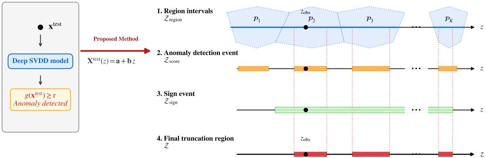  
Figure 2: Geometric illustration of the truncation region $\mathcal { Z }$ on the 1D line parametrized by z. The final region is constructed through four steps: (1) ${ \mathcal { Z } } _ { \mathrm { r e g i o n } }$ (blue) identifies the intervals where the line intersects the afine regions $\mathcal { P } _ { 1 } , \ldots , \mathcal { P } _ { K }$ . (2) $\mathcal { Z } _ { \mathrm { s c o r e } }$ (orange) defines the intervals where the quadratic anomaly score exceeds the threshold $\tau ,$ computed independently per region. (3) $\mathcal { Z } _ { \mathrm { s i g n } }$ (green) enforces the global sign-pattern constraint required to linearize the $\ell _ { 1 } .$ -norm discrepancy. (4) The final truncation region $\mathcal { Z } \ ( \mathrm { r e d } )$ is the intersection of the sign constraint with the union of region-specific valid scores. The observed test sample $z _ { \mathrm { o b s } }$ lies within this final valid set.

A geometric illustration of the truncation region $\mathcal { Z }$ on the one-dimensional line parameterized by z is shown in Fig. 2. Because ${ \mathfrak { P } } _ { \mathrm { l i n e } }$ is finite and the sets in Eq. (18) are defined by finitely many scalar linear or quadratic inequalities, $\mathcal { Z }$ is a finite union of intervals. After merging all overlapping interval pieces, we write

$$
\mathcal { Z } = \bigcup _ { \ell = 1 } ^ { K } \left[ \underline { { z _ { \ell } } } , \overline { { z } } _ { \ell } \right] , \qquad K < \infty .\tag{19}
$$

The resulting intervals are pairwise disjoint, and K is the number of intervals remaining after merging. Thus, K is obtained directly during the construction of Z.

Relation to over-conditioning. Let $\mathcal { P } _ { \mathrm { o b s } } \in \mathfrak { P } _ { \mathrm { l i n e } }$ denote the afine region containing the observed test sample $X ^ { \mathrm { t e s t } }$ . The over-conditioning (OC) baseline additionally conditions on this observed afine region, leading to the truncation region

$$
\mathcal { Z } _ { \mathrm { O C } } = \mathcal { Z } _ { \mathrm { s i g n } } \cap \mathcal { Z } _ { \mathrm { r e g i o n } } ( \mathcal { P } _ { \mathrm { o b s } } ) \cap \mathcal { Z } _ { \mathrm { s c o r e } } ( \mathcal { P } _ { \mathrm { o b s } } ) .
$$

In contrast, PADI does not condition on the afine-region identity and instead aggregates all afine regions intersected by $X ^ { \mathrm { t e s t } } ( z )$ , as in (18). Hence, $\mathcal { Z } _ { \mathrm { O C } } \subseteq \mathcal { Z }$ . OC is computationally simpler because it considers only the observed afine region, whereas PADI requires a line search across multiple afine regions. This reflects a computational–statistical trade-of: OC introduces additional conditioning that may reduce statistical power, while PADI avoids this conditioning at the cost of additional computation. This distinction is analogous to the single-polyhedron versus union-of-polyhedra cases discussed by Lee et al. (2016).

Finally, with the full truncation region $\mathcal { Z }$ represented as the finite union of intervals in Eq. (19), the selective p-value in Eq. (11) can be evaluated as the two-sided tail probability of $z = \pmb { \eta } ^ { \top } \pmb { Y }$ under its null Gaussian distribution truncated to $\mathcal { Z } .$

## 3.5 Algorithmic Summary of PADI

Sections 3.1–3.4 establish the statistical formulation and characterize the truncation region required for PADI. For clarity and reproducibility, Algorithm 1 summarizes the complete test-time procedure from a Deep SVDD anomaly decision to the selective p-value.

Algorithm 1 Post-Anomaly Detection Inference (PADI) for Deep SVDD   
Input: test instance $\boldsymbol x ^ { \mathrm { t e s t } }$ ; independent normal reference instances $\{ { \pmb x } ^ { j , \mathrm { r e f } } \} _ { j = 1 } ^ { m } ;$ frozen Deep SVDD encoder $\hat { \phi } ,$ fixed   
center cˆ, fixed threshold τ; covariance matrix $\Sigma ;$ significance level α.   
Output: selective p-value $p ^ { \mathrm { s e l e c t i v e } }$ and significance decision if $\boldsymbol x ^ { \mathrm { t e s t } }$ is selected as anomalous; otherwise, “not selected   
as anomalous.”   
1: Compute $g _ { \mathrm { o b s } } \gets g ( { \pmb x } ^ { \mathrm { t e s t } } ) = \| \hat { \phi } ( { \pmb x } ^ { \mathrm { t e s t } } ) - \hat { \pmb c } \| _ { 2 } ^ { 2 } .$   
2: if gobs $< \tau$ then   
3: return “not selected as anomalous”   
4: end if   
// Phase I: Construct the one-dimensional SI line   
5: Set $\textstyle { \bar { \pmb { x } } } ^ { \mathrm { r e f } }  { \frac { 1 } { m } } \sum _ { j = 1 } ^ { m } { \pmb { x } } ^ { j , \mathrm { r e f } }$   
6: Form $\pmb { y } \gets \mathrm { v e c } ( \pmb { x } ^ { \mathrm { \bar { t e s t } } } , \pmb { x } ^ { 1 , \mathrm { r e f } } , \dots , \pmb { x } ^ { m , \mathrm { r e f } } )$ and compute $\begin{array} { r } { S ( \pmb { y } ) = \mathrm { s i g n } ( \pmb { x } ^ { \mathrm { t e s t } } - \bar { \pmb { x } } ^ { \mathrm { r e f } } ) } \end{array}$   
7: Construct η from $\scriptstyle { S ( y ) }$ as in $( 9 ) .$   
8: Set $\tilde { \Sigma } \gets I _ { m + 1 } \otimes \Sigma , \ : b \gets \tilde { \Sigma } \eta / ( \eta ^ { \top } \tilde { \Sigma } \eta )$ $z _ { \mathrm { o b s } }  \eta ^ { \top } y ,$ and $\mathbf { a } \gets \mathcal { Q } ( \pmb { y } ) = \pmb { y } - b z _ { \mathrm { o b s } }$   
9: Define $\pmb { Y } ( z )  \pmb { a } +$ bz and extract $X ^ { \mathrm { t e s t } } ( z ) .$   
// Phase II: Identify the truncation region   
10: Compute $\mathcal { Z } _ { \mathrm { s i g n } }$ from the D sign inequalities in Lemma 1.   
11: Initialize $\mathcal { Z } _ { \mathrm { A D } }  \emptyset .$   
12: for each afine region $\mathcal { P } \in \mathfrak { P } \mathrm { l i n e }$ encountered by the line-search procedure do   
13: Determine $\mathcal { Z } _ { \mathrm { r e g i o n } } ( \mathcal { P } )$   
14: Form the local quadratic score $g _ { \mathcal { P } } ( z )$ as in (17).   
15: Compute $\mathcal { Z } _ { \mathrm { s c o r e } } ( \mathcal { P } )  \{ z \in \mathbb { R } : g _ { \mathcal { P } } ( z ) \geq \tau \}$   
16: $\mathcal { Z } _ { \mathrm { A D } }  \mathcal { Z } _ { \mathrm { A D } } \cup ( \mathcal { Z } _ { \mathrm { r e g i o n } } ( \mathcal { P } ) \cap \mathcal { Z } _ { \mathrm { s c o r e } } ( \mathcal { P } ) )$   
17: end for   
18: Set $\mathcal { Z }  \mathcal { Z } _ { \mathrm { s i g n } } \cap \mathcal { Z } _ { \mathrm { A D } }$ and represent $\mathcal { Z }$ as a finite union of disjoint intervals.   
// Phase III: Compute $p \textmd { - }$ value   
19: Compute $p ^ { \mathrm { s } }$ elective   
20: return $p ^ { \mathrm { s e l e c t i v e } }$ and reject $H _ { 0 }$ if $p ^ { \mathrm { s e l e c t i v e } } \leq \alpha .$

## 4 Extension to Deep Semi-Supervised Anomaly Detection

The proposed method also applies to Deep Semi-Supervised Anomaly Detection (Deep SAD) (Ruf et al., 2019). Deep SAD difers from Deep SVDD only during training: it incorporates a small amount of labeled data, encouraging known anomalies to be mapped far from the latent center and known normal samples to be mapped close to it. After training, the frozen Deep SAD detector uses exactly the same scoring rule as Deep SVDD: a test sample is assigned the anomaly score $g ( { \pmb x } ^ { \mathrm { t e s t } } ) = \| \hat { \phi } ( { \pmb x } ^ { \mathrm { t e s t } } ) - \hat { \pmb c } \| _ { 2 } ^ { 2 }$ and is declared anomalous when $g ( { \pmb x } ^ { \mathrm { t e s t } } ) \geq \tau$ . Because the functional form of the anomaly score and the selection rule are identical to those of Deep SVDD, the post-selection inference problem has the same structure once the encoder, center, and threshold are frozen. Specifically, the inferential target, the sign-pattern conditioning, the nuisance conditioning, and the one-dimensional afine-line reduction (Theorem 2) all remain unchanged. The only diference is that the frozen encoder $\hat { \phi }$ is obtained from Deep SAD training rather than Deep SVDD training; the anomaly-selection event and its mathematical characterization are of the same form.

Under Assumption 1, the frozen Deep SAD encoder is piecewise afine, so the anomaly score again becomes a quadratic function of z within each afine region along the nuisance-conditioned line. Consequently, the Deep SAD truncation region, denoted by ${ \mathcal { Z } } _ { \mathrm { S A D } } .$ is a finite union of intervals. Thus, the Deep SAD case can be handled by the same procedure summarized in Algorithm 1, with the frozen Deep SVDD encoder replaced by the frozen Deep SAD encoder and Z replaced by $\mathcal { Z } _ { \mathrm { S A D } }$

Corollary 1. Under the Gaussian test-reference model and the frozen piecewise-afine encoder assumption, the Deep SAD selective p-value satisfies

$$
\mathbb { P } _ { \mathrm { H } _ { 0 } } \left( p _ { \mathrm { S A D } } ^ { \mathrm { s e l e c t i v e } } \leq \alpha \right) = \alpha , \qquad \forall \alpha \in [ 0 , 1 ] .
$$

Thus, the Deep SAD case can be handled by the same PADI procedure, with the Deep SVDD truncation region replaced by the corresponding Deep SAD truncation region $\mathcal { Z } _ { \mathrm { S A D } }$

## 5 GPU-Based Parallelization of PADI

PADI requires repeated forward propagation through the frozen Deep SVDD encoder when identifying the selective truncation region. This line-search step is computationally expensive because, for many candidate values of the scalar parameter z, PADI must propagate both the current input X and its afine representation $A + B z$ through the encoder and update the feasible interval of z. To make this procedure practical for deep encoders, we implement the forward and interval-update operations using custom Numba-CUDA kernels. Our implementation follows the GPU-accelerated SI strategy of STAND-DA (Kiet et al., 2026). Specifically, for fully connected encoders, we reuse the shared-memory tiled matrix multiplication kernel MatMulMat and adapt the siReLU idea to LeakyReLU, resulting in the SILeakyReLU kernel. The only modification is that inactive units are scaled by the LeakyReLU negative slope rather than being set to zero. The main extension in PADI is the support for convolutional Deep SVDD encoders. For CNN encoders, fully connected kernels alone are insuficient because the encoder contains convolution, batch normalization, and max-pooling operations. We therefore implement additional CUDA kernels for Conv2D, BatchNorm, SIMaxPool, and the final fully connected layer. These kernels propagate X, A, and B consistently through the frozen encoder. Linear or afine layers, such as convolution, batch normalization in inference mode, and fully connected layers, only transform the afine representation. Piecewise-afine layers, such as LeakyReLU and max pooling, additionally induce selection events and therefore update the feasible interval.

The proposed GPU implementation reduces the computational cost of PADI for convolutional Deep SVDD encoders in three ways. First, the main afine operations in CNNs are parallelized at the feature-map level. Each convolutional output element is computed by a GPU thread from the corresponding input channels and kernel window, while batch normalization in inference mode is applied element-wise using fixed channel-wise parameters. Second, the outputs of piecewise-afine CNN layers are updated in parallel. LeakyReLU is applied simultaneously across feature-map elements, and max-pooling outputs are computed simultaneously across pooling windows. Third, local selection constraints are computed together with these parallel layer updates. Each thread not only computes its assigned LeakyReLU output or max-pooling output, but also derives the local constraint on z required to preserve the activation branch or pooling selection. These local constraints are merged on the GPU to update the feasible interval, avoiding repeated CPU-side scans over all feature-map elements or pooling windows. Fig. 3 illustrates the overall GPU-based parallelization of PADI, while the detailed CUDA operations for convolutional encoders are provided in Appendix C.

## 6 Experiments

In this section, we evaluate and compare the following methods:

\- PADI: the proposed method for Deep SVDD.

\- OC: an over-conditioning baseline that additionally conditions on the observed afine region of the frozen Deep SVDD encoder, with the truncation set constructed only from that region, analogous to $\mathcal { Z } _ { \mathrm { O C } }$ described in Section 3.4.

\- Naive: traditional statistical inference.

\- Op1: an ablation study that excludes the sign-pattern constraint in Appendix B.1.

\- Op2: another ablation study that excludes the anomaly detection event for Deep SVDD in Appendix B.3.

A method that fails to control the FPR at the target significance level is regarded as statistically invalid, and its TPR is therefore not further considered. Throughout all experiments, we set the significance level to $\alpha = 0 . 0 5$ . The anomaly threshold τ for each trained Deep SVDD model is fixed to the empirical 95th percentile of the anomaly scores computed on the normal training data. This ensures that τ is determined independently of the test instances and reference samples used during the post-selection inference stage. The experiments for the extension to Deep SAD are provided in Appendix D.

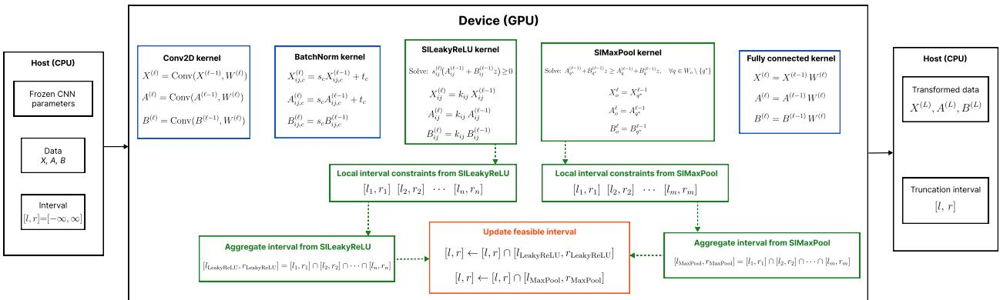  
Figure 3: GPU-based parallelization of PADI for convolutional Deep SVDD encoders. Before the linesearch computation, the frozen CNN parameters, the input data X, A, B, and the current feasible interva are copied to GPU memory. The forward propagation is performed by custom Numba-CUDA kernels for Conv2D, BatchNorm, SILeakyReLU, SIMaxPool, and the final fully connected layer. The Conv2D, BatchNorm, and fully connected kernels propagate the forward values and afine coeficients X, A, B. In addition, the SILeakyReLU and SIMaxPool kernels compute local interval constraints induced by the LeakyReLU branches and max-pooling indices. These local constraints are combined on the GPU to update the feasible interval. The final transformed data ${ \cal X } ^ { ( L ) } , { \cal A } ^ { ( L ) } , { \cal B } ^ { ( L ) }$ and the final interval are then returned to the host.

## 6.1 Synthetic Data Experiments

We conduct synthetic data experiments to evaluate both FPR control and TPR of the competing methods. We considered two types of covariance matrices: (i) Independence: $\Sigma = I _ { d } ,$ and (ii) Correlation: $\Sigma = \left[ 0 . 1 ^ { | i - j | } \right] _ { i , j } \in \mathbb { R } ^ { d \times d }$ . The independence setting represents a simplified scenario where the noise components across dimensions are uncorrelated. In contrast, the correlation setting introduces dependencies among dimensions and provides a more challenging scenario for evaluating the proposed inference procedure. Considering these two settings allows us to examine whether the validity of PADI is maintained under diferent covariance structures. In all synthetic experiments, the observed normal reference set used by the inference procedure is randomly sampled from an independent reference dataset generated from $\mathcal { N } ( \mathbf { 0 } _ { d } , \Sigma )$ which is generated separately from the test samples. For synthetic experiments, Σ is known by construction and is directly used in the inference procedure. The neural network encoder used in these experiments has a three-layer architecture [32, 16, 8] with Leaky ReLU activations, where the negative slope is set to 0.01. For the FPR experiment, we fix the data dimension at $d = 5$ and vary the sample size as $n \in \{ 2 0 0 , 4 0 0 , 6 0 0 , 8 0 0 \}$ For each value of $n ,$ the data are generated from $\mathcal { N } ( \mathbf { 0 } _ { d } , \Sigma )$ . The experiment is repeated 1000 times to com pute the empirical FPR at significance level $\alpha = 0 . 0 5$ . For the TPR experiment, we fix $d = 5$ and $n = 1 0 0 .$ and consider $\Delta \in \{ 1 . 5 , 2 , 2 . 5 , 3 \}$ . For each value of $\Delta .$ , we define $\mu _ { \Delta } = ( \Delta , \ldots , \Delta ) ^ { \top } \in \mathbb { R } ^ { d }$ and generate the data from $\mathcal { N } ( \mu _ { \Delta } , \Sigma )$ . The experiment is repeated 1000 times to compute the empirical TPR. Since TPR is meaningful only for statistically valid methods, we report TPR results only for methods that successfully control the FPR in the preceding experiment.

The results are shown in Fig. 4. In both the independent and correlated settings, PADI and OC successfully control the FPR around the significance level $\alpha = 0 . 0 5$ across all sample sizes. In contrast, the Naive approach produces substantially inflated FPR values in both covariance settings. This behavior confirms that directly applying classical hypothesis testing after anomaly detection leads to invalid inference because the anomaly selection event is ignored. The ablation results further highlight the necessity of each conditioning component in PADI. Op1, which removes the sign-pattern conditioning, fails to maintain FPR control, showing that this conditioning step is essential for handling the $\ell _ { 1 }$ test statistic. Similarly, Op2 fails when the anomaly-selection event is ignored, confirming that accounting for the Deep SVDD selection mechanism is necessary for valid post-selection inference. Therefore, Naive, $\mathrm { O p 1 }$ , and $\mathrm { O p 2 }$ are excluded from the TPR comparison. In the TPR experiments, PADI consistently achieves higher TPR than OC in both independent and correlated settings, and the gap becomes more pronounced as $\Delta$ increases. The higher TPR of PADI is consistent with the reduced conditioning discussed in Section 3.4. OC restricts inference to the observed afine region, whereas PADI retains all afine regions compatible with the same anomaly-selection event. These results indicate that PADI achieves stronger statistical TPR than OC while maintaining valid FPR control.

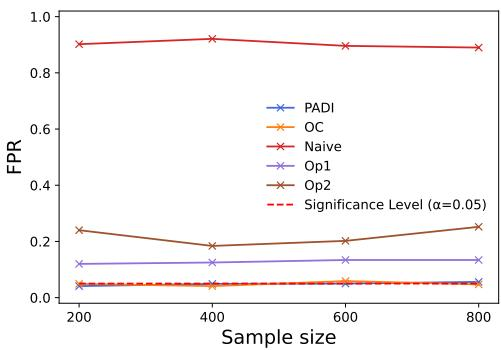  
(a) FPR on independent data

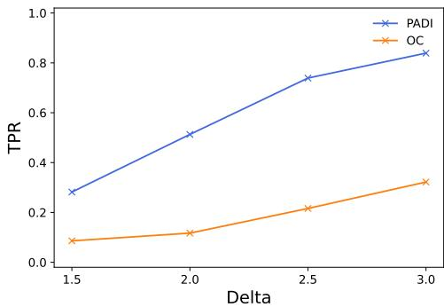  
(b) TPR on independent data

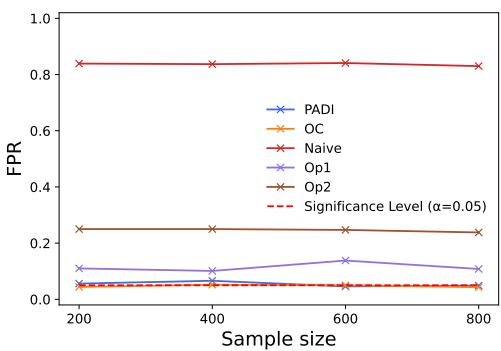  
(c) FPR on correlated data

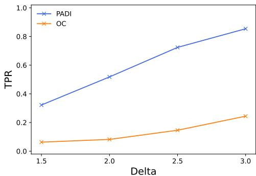  
(d) TPR on correlated data  
Figure 4: Results on synthetic data.

Runtime evaluation of CNN-based GPU kernels. We further evaluate the eficiency of the proposed Numba-CUDA kernels by comparing the runtime required to compute a selective p-value with a PyTorchbased implementation. The purpose of this experiment is to assess whether the custom CUDA kernels are beneficial for the repeated CNN forward propagation and feasible-interval updates required by PADI. All runtime experiments are conducted on an NVIDIA Tesla P100 GPU. We generate synthetic grayscale images of size $3 0 0 \times 3 0 0$ . Let $X \in \mathbb { R } ^ { 3 0 0 \times 3 0 0 }$ denote an image. For normal images, each pixel intensity is independently generated as

$$
X _ { h , w } \sim \mathcal { N } \left( \frac { 2 5 5 } { 2 } , 1 \right) , \quad h , w = 1 , \hdots , 3 0 0 .
$$

The generated pixel values are clipped to [0, 255] and normalized to [0, 1]. Each image is then divided into $3 0 \times 3 0$ patches with stride 30. Each patch is treated as an individual test instance. The normal reference set used in the inference step is independently generated from the same normal image distribution and processed using the same patch-extraction procedure.

The convolutional encoder is composed of blocks of the form

$$
\mathrm { C o n v 2 D }  \mathrm { B a t c h N o r m }  \mathrm { L e a k y R e L U }  \mathrm { M a x P o o l } .
$$

Each convolution uses a $3 \times 3$ kernel with padding 1, and max pooling uses a $2 \times 2$ window with stride 2.

We first evaluate the impact of encoder depth by varying the number of convolutional blocks in $\{ 4 , 5 , 6 , 7 \}$ The four-block architecture uses channel sizes 16, 32, 64, 128, with max pooling applied only in the first block. The deeper architectures are obtained by appending additional 128-channel blocks without max pooling. The results are shown in ${ \mathrm { F i g . } }$ . 5a. Across all tested network depths, the Numba-CUDA implementation requires substantially less computation time than the PyTorch-based implementation. Moreover, as the number of convolutional blocks increases, the runtime gap becomes more pronounced. These results indicate that the proposed custom CUDA kernels efectively accelerate the CNN-based line-search computation in PADI, especially when the frozen Deep SVDD encoder becomes deeper.

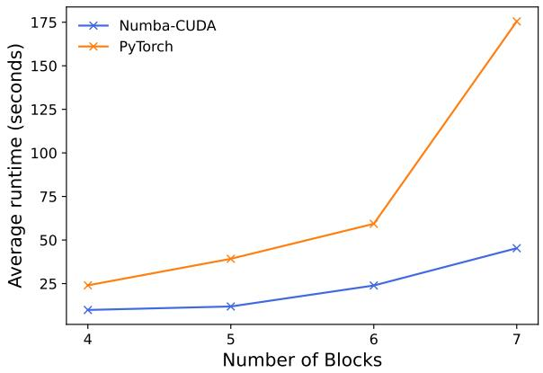  
(a) Diferent numbers of convolutional blocks.

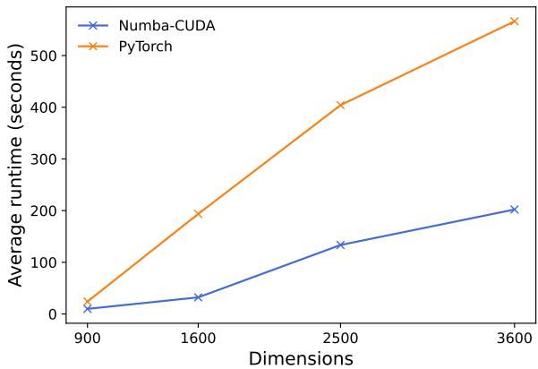  
(b) Diferent input dimensions.  
Figure 5: Runtime comparison between the proposed Numba-CUDA implementation and the PyTorch-based implementation for CNN-based PADI.

To further evaluate the scalability with respect to input dimensionality, we conduct an additional experiment using the same experimental setting described above. In this experiment, we fix the encoder architecture to the four-block network and vary the input patch size from 30×30, 40×40, 50×50, to 60×60, corresponding to input dimensions of 900, 1600, 2500, and 3600, respectively. The results are shown in Fig. 5b, the runtime increases with the input dimension for both implementations due to the increased number of computations. However, the Numba-CUDA implementation consistently achieves lower runtime than the PyTorch-based implementation across all tested input dimensions. These results demonstrate that the proposed custom CUDA kernels remain efective in accelerating the CNN-based line-search computation in PADI as the input dimensionality increases.

## 6.2 Real-World Tabular Data Experiments

We evaluate the proposed method on 5 real-world tabular datasets: Breast Cancer, Parkinson Disease, Pharmacy Medicine, Credit Fraud, and Pulsar Stars. These datasets cover diferent application domains and have feature dimensions ranging from 8 to 31. The neural network encoder used in these experiments has a seven-layer architecture [128, 64, 32, 16, 8, 4, 2] with Leaky ReLU activations, where the negative slope is set to 0.01. In all experiments, we retain only numerical features and standardize each dataset so that every feature has zero mean and unit variance before applying anomaly detection and statistical inference. The normal reference set used in the inference step is randomly sampled from a separate independent norma dataset that does not overlap with the test samples. The covariance matrix Σ is estimated using a separate set of normal samples that is independent of both the test samples and the reference samples used for selective inference.

The empirical FPR and TPR results are shown in Fig. 6. Across all five datasets, PADI and OC maintain the empirical FPR close to the target significance level, while the Naive approach exhibits severely inflated FPR values. The failure of the Naive approach is observed across datasets from diferent application domains, indicating that the selection bias caused by anomaly detection is an inherent issue of performing statistical inference after data-driven selection. Compared with OC, PADI achieves higher TPR on every evaluated dataset. This consistent advantage across datasets with diferent feature dimensions and application domains demonstrates that the proposed conditioning strategy can retain higher statistical power in various tabular anomaly detection scenarios.

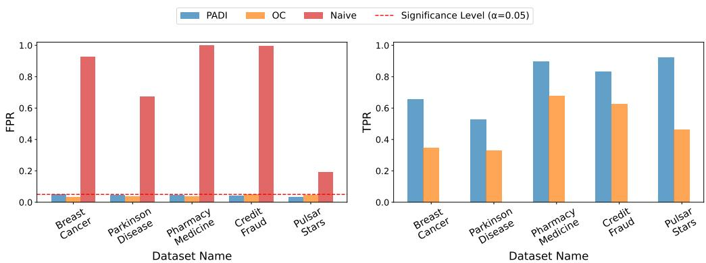  
Figure 6: Results on real tabular datasets. Left: empirical FPR of PADI, OC, and Naive. Right: empirical TPR of the statistically valid methods. PADI achieves stronger TPR than OC while preserving FPR control.

## 6.3 Real-World Image Data Experiments

In this experiment, we use the MVTec AD dataset (Bergmann et al., 2019; 2021) and evaluate five categories chosen to span both texture subtypes described in MVTec AD and to include an object case: Carpet and Grid are the two regular-texture categories, Tile and Wood are random-texture categories, and Zipper is an object category. This experiment is intended as a proof-of-concept evaluation of PADI in a patch-level image setting rather than as a comprehensive evaluation of all 15 MVTec AD categories. All images are converted to grayscale, resized to $3 0 0 \times 3 0 0$ , and converted to tensors in [0, 1]. Each resized image is then divided into non-overlapping $3 0 \times 3 0$ patches with stride 30. The patch-level setting is motivated by the localized nature of many defects in MVTec AD, which may occupy only a small fraction of an image (Bergmann et al., 2021). When the entire image is treated as a single test instance, the contribution of a small defective region to the overall discrepancy may be weak relative to the much larger normal region. This motivation is consistent with Huang et al. (2026), who show that analyzing local patches increases the relative visibility and signalto-noise ratio of small defects. Accordingly, each $3 0 \times 3 0$ patch is treated as a candidate test instance. Patch-level anomaly labels are obtained from the pixel-level ground-truth defect masks provided by MVTec AD. A patch is labeled anomalous if at least 5% of its pixels overlap with the defect region; otherwise, it is treated as normal. This mask-based labeling avoids incorrectly treating all patches from an anomalous image as anomalous, since defects in MVTec AD are usually localized to a small region. The convolutiona encoder consists of two convolutional blocks of the form Conv2D → BatchNorm → LeakyReLU → MaxPool, with channel sizes 8 and 16. Each convolution uses a $3 \times 3$ kernel with padding 1, and each max-pooling layer uses a $2 \times 2$ window with stride 2. The final fully connected layer maps the resulting feature vector to a 16-dimensional latent representation. The normal reference set used in the inference step is randomly sampled from a separate independent normal dataset that does not overlap with the test samples. The covariance matrix Σ is estimated using a separate set of normal samples that is independent of both the test samples and the reference samples used for selective inference.

The empirical FPR and TPR results are shown in Fig. 7. PADI and OC successfully control the empirical FPR around the target significance level across all five MVTec AD categories. In contrast, the Naive approach produces substantially inflated FPR values across all categories, demonstrating that conventional statistica testing becomes unreliable when applied after patch-level anomaly selection. Regarding detection power, PADI consistently achieves higher TPR than OC across all evaluated image categories. These results show that PADI maintains its advantage across diferent types of image anomalies evaluated in the experiments.

## 7 Limitations

PADI’s current exact derivation requires the frozen encoder to be piecewise afine, as stated in Assumption 1. Standard ReLU-based ResNets satisfy this requirement: convolutional and linear layers, inference-mode Batch Normalization, and average pooling are afine, whereas ReLU and max pooling are piecewise afine. Residual connections preserve this property, and stacking such residual blocks preserves it as well. In contrast,

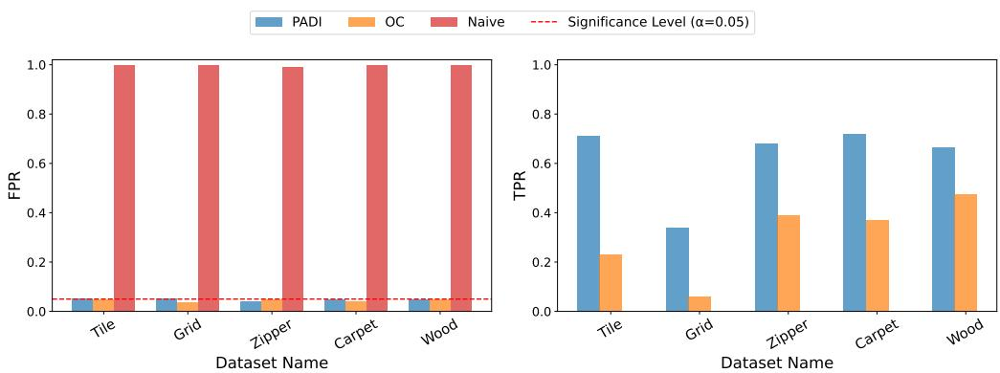  
Figure 7: Results on real image data from the MVTec AD dataset. Left: empirical FPR of PADI, OC, and Naive across five classes. Right: empirical TPR of the statistically valid methods. PADI maintains FPR control while achieving higher TPR than OC.

GELU, Layer Normalization, and standard self-attention are not piecewise afine. Architectures containing these operations, including standard ViTs, are therefore not directly covered by the current derivation. Extending PADI’s exact truncation-region construction to such architectures is left for future work.

Beyond this architectural limitation, PADI’s selective p-values should not be interpreted as unconditional guarantees of detector reliability. Their statistical validity relies on the fixed-detector setting in Section 2.1 and the statistical model and associated assumptions in Section 2.2. If these assumptions are violated, the p-values may be miscalibrated and the stated FPR-control guarantee may no longer hold. Accordingly, PADI should not be deployed in high-stakes settings without checking these assumptions and conducting domain-specific validation.

In particular, the current theoretical guarantee relies on the Gaussian test-reference model, which is used to derive the conditional null distribution of the selective p-value. Therefore, PADI provides exact finite-sample validity under the stated model assumptions rather than distribution-free validity. The assumptions regarding independent normal reference samples, fixed anomaly-selection thresholds, and known or independently estimated covariance matrices are required to ensure that the selective inference procedure is correctly calibrated. Extending the theoretical guarantee to more general data distributions or relaxing these assumptions remains an important direction for future work.

Another limitation concerns the interpretation of the selective p-value, which depends on the chosen test statistic. In the current formulation, PADI quantifies the statistical significance of the input-space $\ell _ { 1 }$ discrepancy between a selected test sample and the mean of independent normal reference samples, conditional on the Deep SVDD selection event. Therefore, the resulting p-value should not be interpreted as a universal probability of anomaly or a measure of semantic abnormality. For anomaly detection tasks where abnormality is defined by high-level semantic diferences rather than input-space deviations, the current test statistic may not capture the desired notion of abnormality, and an alternative inferential target or test statistic may be required. Developing selective inference procedures with more general test statistics for such broader notions of anomaly remains an important direction for future work.

## 8 Conclusion

In this paper, we proposed PADI, a statistically rigorous inference framework for Deep SVDD-based AD that associates detected anomalies with valid p-values. By formulating anomaly assessment within the SI framework, PADI addresses the double-dipping issue inherent in post-selection inference and provides theoretical guarantees for controlling the FPR at a user-specified significance level. The proposed method operates in a post hoc manner and can be seamlessly applied to trained and frozen Deep SVDD models without requiring retraining, while also extending naturally to deep semi-supervised anomaly detection. Extensive experiments on synthetic and real-world datasets demonstrate that PADI consistently achieves reliable FPR control while maintaining strong detection power. These results establish PADI as a practical and statistically sound framework for enhancing the reliability of Deep SVDD-based AD systems.

## Acknowledgements

This research was supported by The VNUHCM-University of Information Technology’s Scientific Research Support Fund.

## References

Mohiuddin Ahmed, Abdun Naser Mahmood, and Md Rafiqul Islam. A survey of anomaly detection techniques in financial domain. Future Generation Computer Systems, 55:278–288, 2016.

Paul Bergmann, Michael Fauser, David Sattlegger, and Carsten Steger. Mvtec ad–a comprehensive real-world dataset for unsupervised anomaly detection. In Proceedings of the IEEE/CVF conference on computer vision and pattern recognition, pp. 9592–9600, 2019.

Paul Bergmann, Kilian Batzner, Michael Fauser, David Sattlegger, and Carsten Steger. The mvtec anomaly detection dataset: a comprehensive real-world dataset for unsupervised anomaly detection. International Journal of Computer Vision, 129(4):1038–1059, 2021.

Markus M Breunig, Hans-Peter Kriegel, Raymond T Ng, and Jörg Sander. Lof: identifying density-based local outliers. In Proceedings of the 2000 ACM SIGMOD international conference on Management of data, pp. 93–104, 2000.

Shuxiao Chen and Jacob Bien. Valid inference corrected for outlier removal. Journal of Computational and Graphical Statistics, 29(2):323–334, 2020.

Vo Nguyen Le Duy, Hiroki Toda, Ryota Sugiyama, and Ichiro Takeuchi. Computing valid p-value for optimal changepoint by selective inference using dynamic programming. Advances in neural information processing systems, 33:11356–11367, 2020.

Vo Nguyen Le Duy, Shogo Iwazaki, and Ichiro Takeuchi. Quantifying statistical significance of neural networkbased image segmentation by selective inference. Advances in neural information processing systems, 35: 31627–31639, 2022.

William Fithian, Dennis Sun, and Jonathan Taylor. Optimal inference after model selection. arXiv preprint arXiv:1410.2597, 2014.

Jevgenij Gamper, Brandon Chan, Yee Wah Tsang, David Snead, and Nasir Rajpoot. Meta-svdd: Probabilistic meta-learning for one-class classification in cancer histology images. arXiv preprint arXiv:2003.03109, 2020.

Lucy L Gao, Jacob Bien, and Daniela Witten. Selective inference for hierarchical clustering. Journal of the American Statistical Association, 119(545):332–342, 2024.

Joseph Huang, Yichi Zhang, Xiaoyu Ji, Jingxi Yu, Wei Chen, Seunghyun Hwang, Qiang Qiu, Amy R Reibman, Edward J Delp, and Fengqing Zhu. Unsupervised defect detection for surgical instruments. In 2026 IEEE International Conference on Image Processing (ICIP), pp. 1–6. IEEE, 2026.

Sangwon Hyun, Max G’sell, and Ryan J Tibshirani. Exact post-selection inference for the generalized lasso path. 2018.

Shigenori Inoue, Yuta Umezu, Shoma Tsubota, and Ichiro Takeuchi. Post clustering inference for heterogeneous data. IEICE Technical Report; IEICE Tech. Rep., 117(293):69–76, 2017.

Anil K Jain, M Narasimha Murty, and Patrick J Flynn. Data clustering: a review. ACM computing surveys (CSUR), 31(3):264–323, 1999.

Sean Jewell, Paul Fearnhead, and Daniela Witten. Testing for a change in mean after changepoint detection. Journal of the Royal Statistical Society Series B: Statistical Methodology, 84(4):1082–1104, 2022.

Tran Tuan Kiet, Nguyen Thang Loi, and Vo Nguyen Le Duy. Statistical inference for autoencoder-based anomaly detection after representation learning-based domain adaptation. Statistics and Computing, 36 (4):138, 2026.

Edwin M Knorr, Raymond T Ng, and Vladimir Tucakov. Distance-based outliers: algorithms and applications. The VLDB Journal, 8(3):237–253, 2000.

Linlin Kou, Jiaxian Chen, Yong Qin, and Wentao Mao. The robust multi-scale deep-svdd model for anomaly online detection of rolling bearings. Sensors, 22(15):5681, 2022.

Nikolaus Kriegeskorte, W Kyle Simmons, Patrick SF Bellgowan, and Chris I Baker. Circular analysis in systems neuroscience: the dangers of double dipping. Nature neuroscience, 12(5):535–540, 2009.

Vo Nguyen Le Duy and Ichiro Takeuchi. More powerful conditional selective inference for generalized lasso by parametric programming. Journal of Machine Learning Research, 23(300):1–37, 2022.

Jason D Lee, Yuekai Sun, and Jonathan E Taylor. Evaluating the statistical significance of biclusters. Advances in neural information processing systems, 28, 2015.

Jason D Lee, Dennis L Sun, Yuekai Sun, Jonathan E Taylor, et al. Exact post-selection inference, with application to the lasso. The Annals of Statistics, 44(3):907–927, 2016.

Geert Litjens, Thijs Kooi, Babak Ehteshami Bejnordi, Arnaud Arindra Adiyoso Setio, Francesco Ciompi, Mohsen Ghafoorian, Jeroen Awm Van Der Laak, Bram Van Ginneken, and Clara I Sánchez. A survey on deep learning in medical image analysis. Medical image analysis, 42:60–88, 2017.

Richard Lockhart, Jonathan Taylor, Ryan J Tibshirani, and Robert Tibshirani. A significance test for the lasso. Annals of statistics, 42(2):413, 2014.

Daiki Miwa, Vo Nguyen Le Duy, and Ichiro Takeuchi. Valid p-value for deep learning-driven salient region. arXiv preprint arXiv:2301.02437, 2023.

Mizuki Niihori, Shuichi Nishino, Teruyuki Katsuoka, Tomohiro Shiraishi, Kouichi Taji, and Ichiro Takeuchi. Quantifying statistical significance of deep nearest neighbor anomaly detection via selective inference. Advances in Neural Information Processing Systems, 38:173174–173203, 2025.

Le Hong Phong, Ho Ngoc Luat, and Vo Nguyen Le Duy. Controllable ransac-based anomaly detection via hypothesis testing. Stat, 14(3):e70074, 2025.

Lukas Ruf, Robert Vandermeulen, Nico Goernitz, Lucas Deecke, Shoaib Ahmed Siddiqui, Alexander Binder, Emmanuel Müller, and Marius Kloft. Deep one-class classification. In International conference on machine learning, pp. 4393–4402. PMLR, 2018.

Lukas Ruf, Robert A Vandermeulen, Nico Görnitz, Alexander Binder, Emmanuel Müller, Klaus-Robert Müller, and Marius Kloft. Deep semi-supervised anomaly detection. arXiv preprint arXiv:1906.02694, 2019.

Mayu Sakurada and Takehisa Yairi. Anomaly detection using autoencoders with nonlinear dimensionality reduction. In Proceedings of the MLSDA 2014 2nd workshop on machine learning for sensory data analysis, pp. 4–11, 2014.

Thomas Schlegl, Philipp Seeböck, Sebastian M Waldstein, Georg Langs, and Ursula Schmidt-Erfurth. fanogan: Fast unsupervised anomaly detection with generative adversarial networks. Medical image analysis, 54:30–44, 2019.

Bernhard Schölkopf, John C Platt, John Shawe-Taylor, Alex J Smola, and Robert C Williamson. Estimating the support of a high-dimensional distribution. Neural computation, 13(7):1443–1471, 2001.

Tomohiro Shiraishi, Daiki Miwa, Teruyuki Katsuoka, Vo Nguyen Le Duy, Kouichi Taji, and Ichiro Takeuchi. Statistical test for attention map in vision transformer. arXiv preprint arXiv:2401.08169, 2024.

Shinya Suzumura, Kazuya Nakagawa, Yuta Umezu, Koji Tsuda, and Ichiro Takeuchi. Selective inference for sparse high-order interaction models. In International Conference on Machine Learning, pp. 3338–3347. PMLR, 2017.

Kosuke Tanizaki, Noriaki Hashimoto, Yu Inatsu, Hidekata Hontani, and Ichiro Takeuchi. Computing valid p-values for image segmentation by selective inference. In Proceedings of the IEEE/CVF conference on computer vision and pattern recognition, pp. 9553–9562, 2020.

David MJ Tax and Robert PW Duin. Support vector data description. Machine learning, 54(1):45–66, 2004.

Ryan J Tibshirani, Jonathan Taylor, Richard Lockhart, and Robert Tibshirani. Exact post-selection inference for sequential regression procedures. Journal of the American Statistical Association, 111(514):600–620, 2016.

Toshiaki Tsukurimichi, Yu Inatsu, Vo Nguyen Le Duy, and Ichiro Takeuchi. Conditional selective inference for robust regression and outlier detection using piecewise-linear homotopy continuation. Annals of the Institute of Statistical Mathematics, 74(6):1197–1228, 2022.

Yuta Umezu and Ichiro Takeuchi. Selective inference for change point detection in multi-dimensional sequences. arXiv preprint arXiv:1706.00514, 2017.

Fan Yang, Rina Foygel Barber, Prateek Jain, and John Laferty. Selective inference for group-sparse linear models. Advances in neural information processing systems, 29, 2016.

Jihun Yi and Sungroh Yoon. Patch svdd: Patch-level svdd for anomaly detection and segmentation. In Proceedings of the Asian conference on computer vision, 2020.

Zeyu You, Yichu Zhou, Tao Yang, and Wei Fan. Anomaly-injected deep support vector data description for text outlier detection. arXiv preprint arXiv:2110.14729, 2021.

Fengbin Zhang, Haoyi Fan, Ruidong Wang, Zuoyong Li, and Tiancai Liang. Deep dual support vector data description for anomaly detection on attributed networks. International Journal of Intelligent Systems, 37(2):1509–1528, 2022.

Bo Zong, Qi Song, Martin Renqiang Min, Wei Cheng, Cristian Lumezanu, Daeki Cho, and Haifeng Chen. Deep autoencoding gaussian mixture model for unsupervised anomaly detection. In International conference on learning representations, 2018.

## Appendix

## A Proofs of the main theorems

The proofs below instantiate the Gaussian-conditioning framework of Lee et al. (2016). The inherited steps are the conditional truncated-Gaussian validity argument and the one-dimensional afine-line reduction; relative to Lee et al., the application-specific step is the construction of the PADI truncation region $\mathcal { Z } .$ detailed in Appendix B.

## A.1 Proof of Theorem 1

Let

$$
\mathcal { O } ( Y ) = \big ( \boldsymbol { \mathcal { A } } ( \boldsymbol { X } ^ { \mathrm { t e s t } } ) , \boldsymbol { S } ( Y ) \big ) .
$$

Under $H _ { 0 } .$ , we have

$$
\eta ^ { \top } \boldsymbol { Y } \mid \{ \mathcal { O } ( \boldsymbol { Y } ) = \mathcal { O } ( \boldsymbol { y } ) , \mathcal { Q } ( \boldsymbol { Y } ) = \mathcal { Q } ( \boldsymbol { y } ) \} \sim \mathrm { T N } \left( 0 , \eta ^ { \top } \tilde { \Sigma } \eta , \mathcal { Z } \right) ,
$$

which is a truncated normal distribution with mean 0, variance $\eta ^ { \top } \tilde { \Sigma } \eta .$ , and truncation region Z. Because Z is a finite union of intervals, applying the probability integral transform to the conditional distribution of $| \eta ^ { \intercal } \mathbf { Y } |$ , using the argument of Theorem 5.2 and the corresponding union-of-intervals argument in Theorem 5.3 of Lee et al. (2016), yields the stated uniform distribution of $p ^ { \mathrm { s e l e c t i v e } }$

Therefore, under the null hypothesis,

$$
p ^ { \mathrm { s e l e c t i v e } } \mid \{ \mathcal { O } ( \mathbf { Y } ) = \mathcal { O } ( \pmb { y } ) , \mathcal { Q } ( \pmb { Y } ) = \mathcal { Q } ( \pmb { y } ) \} \sim \mathrm { U n i f } ( 0 , 1 ) .
$$

Thus,

$$
\mathbb { P } _ { H _ { 0 } } \left( p ^ { \mathrm { s e l e c t i v e } } \leq \alpha \ \big \vert \ \mathcal { O } ( \pmb { Y } ) = \mathcal { O } ( \pmb { y } ) , \mathcal { Q } ( \pmb { Y } ) = \mathcal { Q } ( \pmb { y } ) \right) = \alpha , \qquad \forall \alpha \in [ 0 , 1 ] .
$$

Next, we have

$$
\begin{array} { r l } & { \mathbb { P } _ { H _ { 0 } } \left( p ^ { \mathrm { s e l e c t i v e } } \leq \alpha \mid \mathcal { O } ( \pmb { Y } ) = \mathcal { O } ( \pmb { y } ) \right) } \\ & { = \displaystyle \int \mathbb { P } _ { H _ { 0 } } \left( p ^ { \mathrm { s e l e c t i v e } } \leq \alpha \mid \mathcal { O } ( \pmb { Y } ) = \mathcal { O } ( \pmb { y } ) , \mathcal { Q } ( \pmb { Y } ) = \mathcal { Q } ( \pmb { y } ) \right) \mathbb { P } _ { H _ { 0 } } \left( \mathcal { Q } ( \pmb { Y } ) = \mathcal { Q } ( \pmb { y } ) \mid \mathcal { O } ( \pmb { Y } ) = \mathcal { O } ( \pmb { y } ) \right) d \mathcal { Q } ( \pmb { y } ) } \\ & { = \displaystyle \int \alpha \mathbb { P } _ { H _ { 0 } } \left( \mathcal { Q } ( \pmb { Y } ) = \mathcal { Q } ( \pmb { y } ) \mid \mathcal { O } ( \pmb { Y } ) = \mathcal { O } ( \pmb { y } ) \right) d \mathcal { Q } ( \pmb { y } ) } \\ & { = \alpha \displaystyle \int \mathbb { P } _ { H _ { 0 } } \left( \mathcal { Q } ( \pmb { Y } ) = \mathcal { Q } ( \pmb { y } ) \mid \mathcal { O } ( \pmb { Y } ) = \mathcal { O } ( \pmb { y } ) \right) d \mathcal { Q } ( \pmb { y } ) } \\ & { = \alpha . } \end{array}
$$

Finally, averaging over all possible realizations of the selection event, we obtain

$$
\begin{array} { r l } & { \mathbb { P } _ { H _ { 0 } } \left( p ^ { \mathrm { s e l e c t i v e } } \leq \alpha \right) = \displaystyle \sum _ { \mathcal { O } ( y ) } \mathbb { P } _ { H _ { 0 } } \left( p ^ { \mathrm { s e l e c t i v e } } \leq \alpha \ \middle \vert \ \mathcal { O } ( Y ) = \mathcal { O } ( y ) \right) \mathbb { P } _ { H _ { 0 } } \left( \mathcal { O } ( Y ) = \mathcal { O } ( y ) \right) } \\ & { \qquad = \displaystyle \sum _ { \mathcal { O } ( y ) } \alpha \mathbb { P } _ { H _ { 0 } } \left( \mathcal { O } ( Y ) = \mathcal { O } ( y ) \right) = \alpha . } \end{array}
$$

This proves Theorem 1.

## A.2 Proof of Theorem 2

Conditional on $\begin{array} { r } { S ( \pmb { Y } ) = S ( \pmb { y } ) } \end{array}$ , the contrast direction η is fixed. Under the Gaussian model, Eqs. (5.2)–(5.3) of Lee et al. (2016) imply

$$
y = z _ { \mathrm { L e e } } + c ( \eta ^ { \top } y ) , \qquad z _ { \mathrm { L e e } } = ( I _ { n } - c \eta ^ { \top } ) y ,
$$

where $z _ { \mathrm { L e e } }$ is independent of $\eta ^ { \top } y .$ Under the correspondence $y  Y , \Sigma  \tilde { \Sigma }$ , and $c  b ,$ their vector $z _ { \mathrm { L e e } }$ corresponds to $\mathcal Q ( Y )$ , whereas our scalar $z = \eta ^ { \intercal } \mathbf { Y }$ corresponds to their contrast $\eta ^ { \top } \boldsymbol { y }$ . The short derivation below is included only to establish the notation used to characterize $\mathcal { Z } .$

Recall that

$$
z = \pmb { \eta } ^ { \top } \pmb { Y } , \qquad \pmb { \mathcal { Q } } ( \pmb { Y } ) = \left( I _ { ( m + 1 ) D } - \pmb { b } \pmb { \eta } ^ { \top } \right) \pmb { Y } = \pmb { Y } - \pmb { b } z ,
$$

where

$$
\pmb { b } = \frac { \tilde { \Sigma } \pmb { \eta } } { \pmb { \eta } ^ { \top } \tilde { \Sigma } \pmb { \eta } } .
$$

Let

$$
\begin{array} { r } { \pmb { a } = \pmb { \mathcal { Q } } ( \pmb { y } ) , \qquad z _ { \mathrm { o b s } } = \pmb { \eta } ^ { \top } \pmb { y } . } \end{array}
$$

Since $\mathcal { Q } ( Y ) = Y - b z$ , the condition $\mathcal { Q } ( \pmb { Y } ) = \mathcal { Q } ( \pmb { y } )$ implies

$$
\pmb { Y } - \pmb { b } z = \pmb { a } ,
$$

or equivalently,

$$
\pmb { Y } = \pmb { a } + \pmb { b } z .
$$

Hence, after conditioning on $\mathcal { Q } ( \pmb { Y } ) = \mathcal { Q } ( \pmb { y } )$ , the remaining randomness is indexed only by the scalar z along the one-dimensional afine line

$$
\pmb { Y } ( z ) = \pmb { a } + \pmb { b } z , \qquad z \in \mathbb { R } .
$$

The remaining non-nuisance conditions restrict z to the set

$$
\mathcal { Z } = \left\{ z \in \mathbb { R } \left| \begin{array} { l } { \mathcal { A } ( X ^ { \mathrm { t e s t } } ( z ) ) = \mathcal { A } ( x ^ { \mathrm { t e s t } } ) , } \\ { \mathcal { S } ( Y ( z ) ) = \mathcal { S } ( y ) } \end{array} \right. \right\} .
$$

Thus, the conditioning set D can be written as

$$
{ \mathcal { D } } = \left\{ Y ( z ) = a + b z \mid z \in { \mathcal { Z } } \right\} ,
$$

which proves Theorem 2.

## B Characterization of the Truncation Region

In this appendix, we provide the detailed derivations for the truncation region Z summarized in Section 3.4. As described in the main text, the truncation region is decomposed as

$$
\mathcal { Z } = \mathcal { Z } _ { \mathrm { s i g n } } \cap \mathcal { Z } _ { \mathrm { A D } } .
$$

We first decompose the afine-line representation $\pmb { Y } ( z ) = \pmb { a } + \pmb { b } z$ into its test and reference components, and then derive the two sub-problems, $\mathcal { Z } _ { \mathrm { s i g n } }$ and $\mathcal { Z } _ { \mathrm { A D } }$ , in detail.

By Theorem 2, conditioning on $\mathcal { Q } ( \pmb { Y } ) = \mathcal { Q } ( \pmb { y } )$ restricts the random vector $\mathbf { Y }$ to the one-dimensional afine line

$$
\pmb { Y } ( z ) = \pmb { a } + \pmb { b } z , \qquad z \in \mathbb { R } ,
$$

where $\boldsymbol { a } , \boldsymbol { b } \in \mathbb { R } ^ { ( m + 1 ) D }$ . Since Y is stacked in the order

$$
\begin{array} { r } { \pmb { Y } = \mathrm { v e c } \left( \pmb { X } ^ { \mathrm { t e s t } } , \pmb { X } ^ { \mathrm { 1 , r e f } } , \dots , \pmb { X } ^ { m , \mathrm { r e f } } \right) , } \end{array}
$$

we partition a and b conformably as

$$
\begin{array} { r } { a = \mathrm { v e c } \left( a ^ { \mathrm { t e s t } } , a ^ { 1 , \mathrm { r e f } } , \ldots , a ^ { m , \mathrm { r e f } } \right) , \qquad b = \mathrm { v e c } \left( b ^ { \mathrm { t e s t } } , b ^ { 1 , \mathrm { r e f } } , \ldots , b ^ { m , \mathrm { r e f } } \right) , } \end{array}
$$

where

$$
a ^ { \mathrm { t e s t } } , b ^ { \mathrm { t e s t } } \in \mathbb { R } ^ { D } , \qquad a ^ { j , \mathrm { r e f } } , b ^ { j , \mathrm { r e f } } \in \mathbb { R } ^ { D } , \quad j = 1 , \dots , m .
$$

Accordingly, each point on the afine line can be written as

$$
\begin{array} { r } { \pmb { Y } ( z ) = \mathrm { v e c } \left( \pmb { X } ^ { \mathrm { t e s t } } ( z ) , \pmb { X } ^ { \mathrm { 1 , r e f } } ( z ) , \dots , \pmb { X } ^ { m , \mathrm { r e f } } ( z ) \right) , } \end{array}
$$

where

$$
\begin{array} { r } { X ^ { \mathrm { t e s t } } ( z ) = { \pmb a } ^ { \mathrm { t e s t } } + { \pmb b } ^ { \mathrm { t e s t } } z \in \mathbb { R } ^ { D } , } \end{array}
$$

and, for each $j = 1 , \dots , m _ { ; }$

$$
X ^ { j , \mathrm { r e f } } ( z ) = { \pmb a } ^ { j , \mathrm { r e f } } + { \pmb b } ^ { j , \mathrm { r e f } } z \in \mathbb { R } ^ { D } .
$$

## B.1 Sign-pattern constraint

The sign-pattern constraint keeps fixed the signs used to linearize the $\ell _ { 1 }$ -discrepancy. Define the reference mean along the afine line by

$$
\bar { X } ^ { \mathrm { r e f } } ( z ) = \frac { 1 } { m } \sum _ { j = 1 } ^ { m } X ^ { j , \mathrm { r e f } } ( z ) .
$$

Using the block representation above, this can be written as

$$
\bar { \pmb { X } } ^ { \mathrm { r e f } } ( z ) = \bar { \pmb { a } } ^ { \mathrm { r e f } } + \bar { \pmb { b } } ^ { \mathrm { r e f } } z ,
$$

where

$$
\bar { \pmb { a } } ^ { \mathrm { r e f } } = \frac { 1 } { m } \sum _ { j = 1 } ^ { m } { \pmb { a } } ^ { j , \mathrm { r e f } } , \qquad \bar { \pmb { b } } ^ { \mathrm { r e f } } = \frac { 1 } { m } \sum _ { j = 1 } ^ { m } { \pmb { b } } ^ { j , \mathrm { r e f } } .
$$

For each coordinate $u = 1 , \ldots , D$ , we have

$$
x _ { u } ^ { \mathrm { t e s t } } ( z ) - \bar { x } _ { u } ^ { \mathrm { r e f } } ( z ) = \left( a _ { u } ^ { \mathrm { t e s t } } - \bar { a } _ { u } ^ { \mathrm { r e f } } \right) + \left( b _ { u } ^ { \mathrm { t e s t } } - \bar { b } _ { u } ^ { \mathrm { r e f } } \right) z .
$$

Let

$$
\alpha _ { u } = a _ { u } ^ { \mathrm { t e s t } } - \bar { a } _ { u } ^ { \mathrm { r e f } } , \qquad \gamma _ { u } = b _ { u } ^ { \mathrm { t e s t } } - \bar { b } _ { u } ^ { \mathrm { r e f } } .
$$

Then the sign event

$$
\mathcal { S } ( Y ( z ) ) = \mathcal { S } ( \pmb { y } )
$$

is equivalent to

$$
\mathcal { S } _ { u } ( \pmb { y } ) \left( \alpha _ { u } + \gamma _ { u } z \right) > 0 , \qquad \ u = 1 , \ldots , D .
$$

Thus, the sign-pattern feasible set is

$$
\mathcal { Z } _ { \mathrm { s i g n } } = \left\{ z \in \mathbb { R } \mid S _ { u } ( \pmb { y } ) \left( \alpha _ { u } + \gamma _ { u } z \right) > 0 , \quad u = 1 , \ldots , D \right\} .
$$

Each constraint is a linear inequality in the scalar variable z.

## B.2 Afine-region characterization of the frozen encoder

We next describe how the afine regions of the frozen encoder are used to characterize the Deep SVDD selection event. Recall from the decomposition above that the test sample varies along $X ^ { \mathrm { t e s t } } ( z ) = { \pmb a } ^ { \mathrm { t e s t } } +$ $b ^ { \mathrm { t e s t } } z .$ , and let ${ \mathfrak { P } } _ { \mathrm { l i n e } }$ denote the collection of afine regions intersected by this path (as introduced in Lemma 2). Each such region $\mathcal { P } \in \mathfrak { P } _ { \mathrm { l i n e } }$ is a polytope defined by $M _ { \mathcal { P } }$ linear inequalities: there exist a matrix $G _ { \mathcal { P } } \in \mathbb { R } ^ { M _ { \mathcal { P } } \times \mathbf { \dot { D } } }$ and a vector $\boldsymbol { h _ { \mathcal { P } } } \in \mathbb { R } ^ { M _ { \mathcal { P } } }$ such that

$$
\mathcal { P } = \left\{ \pmb { x } \in \mathbb { R } ^ { D } : G _ { \mathcal { P } } \pmb { x } \leq \pmb { h _ { \mathcal { P } } } \right\} .
$$

The set of z-values for which the test sample lies in the afine region $\mathcal { P }$ is

$$
\begin{array} { r } { \mathcal { Z } _ { \mathrm { r e g i o n } } ( \mathcal { P } ) = \left\{ z \in \mathbb { R } \mid G _ { \mathcal { P } } \left( { \boldsymbol a } ^ { \mathrm { t e s t } } + { \boldsymbol b } ^ { \mathrm { t e s t } } { \boldsymbol z } \right) \leq h _ { \mathcal { P } } \right\} . } \end{array}
$$

Each $\mathcal { Z } _ { \mathrm { r e g i o n } } ( \mathcal { P } )$ is characterized by finitely many linear inequalities in $z .$

## B.3 Deep SVDD selection constraint

The Deep SVDD detector selects the test sample as anomalous when $\mathcal { A } ( X ^ { \mathrm { t e s t } } ( z ) ) = \mathcal { A } ( x ^ { \mathrm { t e s t } } )$ , which by the definition of the anomaly score in (1) is equivalent to $g ( X ^ { \mathrm { t e s t } } ( z ) ) \ge \tau$

By Assumption 1, within each afine region $\mathcal { P } \in \mathfrak { P } \mathrm { l i n e } .$ , the encoder acts as $\hat { \phi } ( \pmb { x } ) = L _ { \mathcal { P } } \pmb { x } + \beta _ { \mathcal { P } }$ . Substituting the test-sample path $\begin{array} { r } { X ^ { \mathrm { t e s t } } ( z ) = a ^ { \mathrm { t e s t } } + b ^ { \mathrm { t e s t } } z } \end{array}$ from the decomposition at the beginning of this appendix, we obtain the following. For $z \in \mathcal { Z } _ { \mathrm { r e g i o n } } ( \mathcal { P } )$ , the point $X ^ { \mathrm { t e s t } } ( z )$ lies in region $\mathcal { P }$ , so the afine representation of the encoder on $\mathcal { P }$ gives

$$
\hat { \phi } ( X ^ { \mathrm { t e s t } } ( z ) ) - \hat { c } = L _ { { \mathcal { P } } } \left( { \pmb a } ^ { \mathrm { t e s t } } + { \pmb b } ^ { \mathrm { t e s t } } z \right) + \beta _ { { \mathcal { P } } } - \hat { c } .
$$

Separating the constant term and the coeficient of $z _ { i }$ , define

$$
u _ { 0 } ( \mathcal { P } ) = L _ { \mathcal { P } } a ^ { \mathrm { t e s t } } + \beta _ { \mathcal { P } } - \hat { c } , \qquad u _ { 1 } ( \mathcal { P } ) = L _ { \mathcal { P } } b ^ { \mathrm { t e s t } } .
$$

Then

$$
\hat { \phi } ( X ^ { \mathrm { t e s t } } ( z ) ) - \hat { c } = { \pmb u } _ { 0 } ( \mathcal { P } ) + { \pmb u } _ { 1 } ( \mathcal { P } ) z .
$$

Therefore, within afine region P, the Deep SVDD score along the path is

$$
\begin{array} { r } { g _ { \mathcal { P } } ( z ) = \left\| \pmb { u } _ { 0 } ( \mathcal { P } ) + \pmb { u } _ { 1 } ( \mathcal { P } ) z \right\| _ { 2 } ^ { 2 } . } \end{array}
$$

Expanding the squared norm gives a quadratic function of the scalar variable z:

$$
g _ { \mathcal { P } } ( z ) = \kappa _ { 2 } ( \mathcal { P } ) z ^ { 2 } + \kappa _ { 1 } ( \mathcal { P } ) z + \kappa _ { 0 } ( \mathcal { P } ) ,
$$

where

$$
\kappa _ { 2 } ( \mathcal { P } ) = \| \boldsymbol { u } _ { 1 } ( \mathcal { P } ) \| _ { 2 } ^ { 2 } , \qquad \kappa _ { 1 } ( \mathcal { P } ) = 2 \boldsymbol { u } _ { 0 } ( \mathcal { P } ) ^ { \top } \boldsymbol { u } _ { 1 } ( \mathcal { P } ) , \qquad \kappa _ { 0 } ( \mathcal { P } ) = \| \boldsymbol { u } _ { 0 } ( \mathcal { P } ) \| _ { 2 } ^ { 2 } .
$$

Consequently, within region ${ \mathcal { P } } _ { : }$ , the set of values of z for which the test sample is selected as anomalous by Deep SVDD is

$$
\mathcal { Z } _ { \mathrm { s c o r e } } ( \mathcal { P } ) = \left\{ z \in \mathbb { R } \mid \kappa _ { 2 } ( \mathcal { P } ) z ^ { 2 } + \kappa _ { 1 } ( \mathcal { P } ) z + \kappa _ { 0 } ( \mathcal { P } ) \ge \tau \right\} .
$$

Thus, on each afine region ${ \mathcal { P } } ,$ the Deep SVDD selection constraint reduces to a quadratic inequality in the one-dimensional variable z.

## C Details of GPU-Based Parallelization of PADI

This appendix provides implementation details for the GPU-based parallelization of PADI described in Section 5. The computational bottleneck of PADI comes from the line-search procedure used to identify the selective truncation region. During this procedure, the frozen Deep SVDD encoder is repeatedly evaluated along the scalar parameter z of the selective-inference line. At each evaluation, PADI propagates the ordinary forward values and their afine coeficients with respect to z, while updating the feasible interval whenever a layer induces a data-dependent selection constraint.

For fully connected encoders, PADI follows the GPU-based selective-inference implementation strategy of STAND-DA (Kiet et al., 2026), which provides CUDA kernels for matrix transformations and ReLU activation-pattern conditioning. We therefore do not repeat the fully connected implementation details here. The main GPU extension in PADI is the support for convolutional Deep SVDD encoders, which require additional kernels for convolution, batch normalization, LeakyReLU, max pooling, and the final fully connected layer.

Let L denote the total number of layers in the frozen encoder. Here, each operation is counted as one layer; for example, Conv2D, BatchNorm, LeakyReLU, MaxPool, and FullyConnected are all treated as separate layers. We use $\ell = 1 , \ldots , L$ to index these layers. At layer ℓ, let $\dot { X ^ { ( \ell ) } }$ denote the ordinary forward output, and let $A ^ { ( \ell ) }$ and $B ^ { ( \ell ) }$ denote the afine coeficients of the same layer output with respect to z. Thus, along the selective-inference line, the layer output is represented by

$$
\begin{array} { r } { X ^ { ( \ell ) } ( z ) = A ^ { ( \ell ) } + B ^ { ( \ell ) } z , } \end{array}
$$

Conv2D kernel. For a convolutional layer ℓ, the Conv2D kernel assigns one CUDA thread to one output feature-map element. Each thread computes the convolution over the corresponding input channels and spatial kernel window using the fixed filter $W ^ { ( \ell ) }$ . Since convolution is linear in its input, the ordinary forward values and afine coeficients are propagated as

$$
\begin{array} { r l } & { X ^ { ( \ell ) } = \mathrm { C o n v } \left( X ^ { ( \ell - 1 ) } , W ^ { ( \ell ) } \right) , } \\ & { } \\ & { A ^ { ( \ell ) } = \mathrm { C o n v } \left( A ^ { ( \ell - 1 ) } , W ^ { ( \ell ) } \right) , } \\ & { } \\ & { B ^ { ( \ell ) } = \mathrm { C o n v } \left( B ^ { ( \ell - 1 ) } , W ^ { ( \ell ) } \right) . } \end{array}
$$

In our implementation, convolutional layers are bias-free. If a convolutional bias is used, it should be added to $X ^ { ( \ell ) }$ and $A ^ { ( \ell ) }$ , but not to $B ^ { ( \ell ) }$ , since the bias is independent of $z .$ . The convolutional kernel does not introduce any selection constraint; it only propagates X, A, and B.

BatchNorm kernel. For a batch normalization layer ℓ, the layer is evaluated in inference mode. Hence, the running statistics and learned afine parameters are fixed. For channel $^ { c , }$ define

$$
s _ { c } ^ { ( \ell ) } = \frac { \gamma _ { c } ^ { ( \ell ) } } { \sqrt { ( \sigma _ { c } ^ { ( \ell ) } ) ^ { 2 } + \epsilon } } , \qquad t _ { c } ^ { ( \ell ) } = \beta _ { c } ^ { ( \ell ) } - s _ { c } ^ { ( \ell ) } \mu _ { c } ^ { ( \ell ) } ,
$$

where $\mu _ { c } ^ { ( \ell ) }$ and $( \sigma _ { c } ^ { ( \ell ) } ) ^ { 2 }$ are the frozen running mean and variance, and $\gamma _ { c } ^ { ( \ell ) }$ and $\beta _ { c } ^ { ( \ell ) }$ are the learned scale and shift parameters. For each tensor element (i, j, c), the CUDA kernel applies the channel-wise afine transformation

$$
\begin{array} { c } { { X _ { i j , c } ^ { ( \ell ) } = s _ { c } ^ { ( \ell ) } X _ { i j , c } ^ { ( \ell - 1 ) } + t _ { c } ^ { ( \ell ) } , } } \\ { { { A } _ { i j , c } ^ { ( \ell ) } = s _ { c } ^ { ( \ell ) } A _ { i j , c } ^ { ( \ell - 1 ) } + t _ { c } ^ { ( \ell ) } , } } \\ { { B _ { i j , c } ^ { ( \ell ) } = s _ { c } ^ { ( \ell ) } B _ { i j , c } ^ { ( \ell - 1 ) } . } } \end{array}
$$

The shift term afects the ordinary forward value X and the intercept coeficient A, but not the slope coeficient B. Since batch normalization in inference mode is afine, it does not add any new constraint on z. The kernel is parallelized element-wise, with one CUDA thread processing one feature-map element.

SILeakyReLU kernel. For a LeakyReLU layer ℓ, each feature-map element is processed independently by one CUDA thread. The role of this kernel is twofold: it preserves the observed LeakyReLU branch along the selective-inference line, and it propagates the ordinary forward value and afine coeficients through the fixed branch.

For each feature-map element, define the branch sign

$$
s _ { i j } ^ { ( \ell ) } = \left\{ \begin{array} { l l } { 1 , } & { X _ { i j } ^ { ( \ell - 1 ) } \geq 0 , } \\ { - 1 , } & { X _ { i j } ^ { ( \ell - 1 ) } < 0 . } \end{array} \right.
$$

Preserving the LeakyReLU branch is equivalent to imposing the linear inequality

$$
s _ { i j } ^ { ( \ell ) } \left( A _ { i j } ^ { \left( \ell - 1 \right) } + B _ { i j } ^ { \left( \ell - 1 \right) } z \right) \ge 0 .
$$

Each feature-map element therefore contributes one local linear constraint on z. In the CUDA implementation, the thread assigned to element $( i , j )$ converts this inequality into a local lower-bound or upper-bound candidate for the feasible interval. The local candidates generated by all threads are merged on the GPU to update the feasible interval.

After the branch constraint is computed, the kernel propagates X, A, and B through the selected LeakyReLU branch. Let $\rho$ denote the negative slope of LeakyReLU, and define the branch slope

$$
k _ { i j } ^ { ( \ell ) } = \left\{ \begin{array} { l l } { 1 , } & { X _ { i j } ^ { ( \ell - 1 ) } \geq 0 , } \\ { \rho , } & { X _ { i j } ^ { ( \ell - 1 ) } < 0 . } \end{array} \right.
$$

Then the propagated quantities are

$$
X _ { i j } ^ { ( \ell ) } = k _ { i j } ^ { ( \ell ) } X _ { i j } ^ { ( \ell - 1 ) } ,
$$

$$
A _ { i j } ^ { ( \ell ) } = k _ { i j } ^ { ( \ell ) } A _ { i j } ^ { ( \ell - 1 ) } ,
$$

$$
B _ { i j } ^ { ( \ell ) } = k _ { i j } ^ { ( \ell ) } B _ { i j } ^ { ( \ell - 1 ) } .
$$

The SILeakyReLU kernel extends the ReLU-based selective activation kernel of STAND-DA (Kiet et al., 2026) to LeakyReLU: inactive elements are not set to zero, but are multiplied by the negative slope $\rho .$

SIMaxPool kernel. For a max-pooling layer $\ell ,$ each output element copies the maximum value from a pooling window. Let $o = ( i , j )$ denote an output position and let $\mathcal { W } _ { o }$ be the set of input locations in the pooling window associated with $o .$ The maximum index is

$$
q ^ { \star } = \arg \operatorname* { m a x } _ { q \in \mathcal { W } _ { o } } X _ { q } ^ { ( \ell - 1 ) } .
$$

To preserve the same max-pooling selection along the line, the selected location must remain no smaller than every other location in the same window:

$$
A _ { q ^ { \star } } ^ { ( \ell - 1 ) } + B _ { q ^ { \star } } ^ { ( \ell - 1 ) } z \geq A _ { q } ^ { ( \ell - 1 ) } + B _ { q } ^ { ( \ell - 1 ) } z , \qquad \forall q \in \mathcal { W } _ { o } \setminus \{ q ^ { \star } \} .
$$

Equivalently,

$$
\left( B _ { q ^ { \star } } ^ { ( \ell - 1 ) } - B _ { q } ^ { ( \ell - 1 ) } \right) z \geq A _ { q } ^ { ( \ell - 1 ) } - A _ { q ^ { \star } } ^ { ( \ell - 1 ) } , \qquad \forall q \in \mathcal { W } _ { o } \setminus \{ q ^ { \star } \} .
$$

Thus, one max-pooling output element can generate multiple local linear constraints on $z ,$ one for each comparison inside the pooling window.

The SIMaxPool kernel assigns one CUDA thread to one output pooling position. The thread identifies $q ^ { \star }$ compares the selected location with the remaining locations in the same pooling window, and converts the resulting inequalities into local lower-bound or upper-bound candidates. These local candidates are merged on the GPU to update the feasible interval.

After the selected maximum index is fixed, the output and afine coeficients are propagated by copying the selected input location:

$$
\begin{array} { l } { { X _ { o } ^ { ( \ell ) } = X _ { q ^ { \star } } ^ { ( \ell - 1 ) } , } } \\ { { \ } } \\ { { A _ { o } ^ { ( \ell ) } = A _ { q ^ { \star } } ^ { ( \ell - 1 ) } , } } \\ { { \ } } \\ { { B _ { o } ^ { ( \ell ) } = B _ { q ^ { \star } } ^ { ( \ell - 1 ) } . } } \end{array}
$$

Final fully connected layer. After the convolutional blocks, the feature map is flattened and passed through the final fully connected layer. This layer is handled using the matrix multiplication kernel inherited from the STAND-DA implementation (Kiet et al., 2026). For the final fully connected layer ℓ with fixed weight matrix $W ^ { ( \ell ) }$ , the propagation is

$$
\begin{array} { l c r } { { X ^ { ( \ell ) } = X ^ { ( \ell - 1 ) } W ^ { ( \ell ) } , } } \\ { { \ } } \\ { { A ^ { ( \ell ) } = A ^ { ( \ell - 1 ) } W ^ { ( \ell ) } , } } \\ { { \ } } \\ { { B ^ { ( \ell ) } = B ^ { ( \ell - 1 ) } W ^ { ( \ell ) } . } } \end{array}
$$

In our implementation, the final fully connected layer is bias-free. This layer does not introduce any new selection constraint.

## D Experiments for the extension to Deep Semi-Supervised Anomaly Detection

We provide here additional experiments for the extension to Deep Semi-Supervised Anomaly Detection (Deep SAD). We compare the following methods:

\- PADI (extension to Deep SAD): the proposed SI method for Deep Semi-Supervised Anomaly Detection.

\- OC (extension to Deep SAD): an over-conditioning baseline that additionally conditions on the observed afine region of the frozen Deep SAD encoder, with the truncation set constructed only from that region, analogous to $\mathcal { Z } _ { \mathrm { O C } }$ described in Section 3.4.

\- Naive: traditional statistical inference.

\- Op1 (extension to Deep SAD): an ablation study that excludes the sign-pattern constraint.

\- Op2 (extension to Deep SAD): another ablation study that excludes the anomaly detection event for Deep SAD.

## D.1 Synthetic Data Experiments

We conduct synthetic data experiments for the extension to Deep SAD under the same setting as in Section 6.1. The results are shown in Fig. 8. Similar to the Deep SVDD experiments, PADI and OC maintain valid FPR control in both independent and correlated covariance settings. In contrast, the Naive approach produces inflated FPR values, showing that directly applying statistical testing after Deep SADbased anomaly selection leads to invalid inference due to the selection bias. The ablation results further illustrate the importance of the two conditioning components in PADI. Op1, which removes the sign-pattern conditioning, fails to control the FPR because the $\ell _ { 1 }$ test statistic can no longer be represented as the linear contrast assumed in the selective inference procedure. This prevents the construction of the correct conditional distribution for the selective p-value. $\mathrm { O p 2 }$ , which ignores the Deep SAD anomaly-selection event, also fails to maintain FPR control because the statistical test does not account for the data-dependent mechanism used to select anomalies. Although Op2 retains the sign-pattern conditioning, ignoring the detector selection event leaves the selection bias uncorrected. The similar behavior of these ablation variants to the Deep SVDD experiments confirms that both conditioning components remain necessary when extending PADI to the Deep SAD setting. For the TPR evaluation, PADI consistently achieves higher detection power than OC as the signal diference ∆ increases. The performance gap becomes larger for stronger anomaly signals, indicating that PADI preserves more statistical power while accounting for the necessary selection events. These results confirm that the proposed inference procedure can be naturally extended from Deep SVDD to Deep SAD without sacrificing statistical validity or detection power.

As shown in Figs. 4 and 8, Op2 consistently exhibits greater FPR inflation than Op1 under both independent and correlated covariance settings. This diference can be attributed to the extent to which data-dependent selection is accounted for in each ablation. Op1 retains the anomaly-selection adjustment, whereas Op2 discards it entirely. Although Op1 remains invalid because it does not fully account for the conditional treatment of the $\ell _ { 1 }$ statistic, retaining the anomaly-selection event can partially mitigate selection bias. In contrast, Op2 completely ignores the selection bias induced by the anomaly detector, leading to a greater distortion of the null distribution and, consequently, larger FPR inflation.

## D.2 Real Tabular Data

We evaluate the extension to Deep SAD on tabular datasets under the same setting as in Section 6.2. The results on real-world tabular datasets are shown in Fig. 9. PADI and OC consistently control the empirical FPR around the desired significance level across all evaluated datasets, whereas the Naive approach sufers from large FPR inflation. This observation indicates that the statistical validity provided by PADI is preserved even when the underlying anomaly detector is trained in a semi-supervised manner. In terms of TPR, PADI outperforms OC on all datasets. The consistent performance advantage of PADI over OC shows that the extension to Deep SAD retains the main benefit of PADI: avoiding unnecessary conditioning while still accounting for the data-dependent anomaly selection event. Therefore, the proposed framework provides a reliable post-selection inference procedure for both Deep SVDD and Deep SAD models.

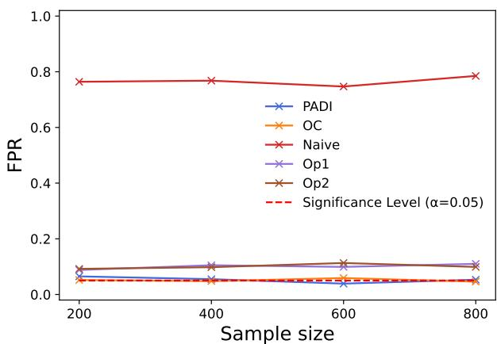  
(a) FPR on independent data

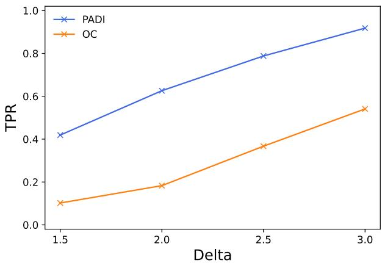  
(b) TPR on independent data

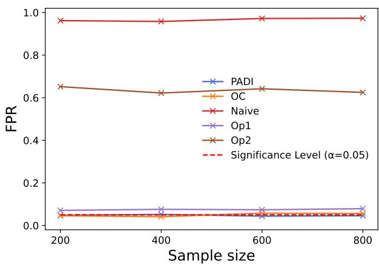  
(c) FPR on correlated data

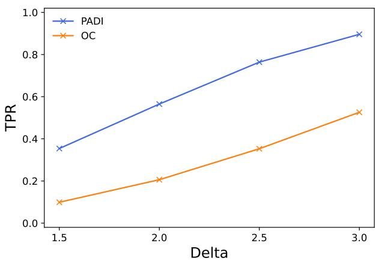  
(d) TPR on correlated data  
Figure 8: Results on synthetic data for the extension to Deep SAD.

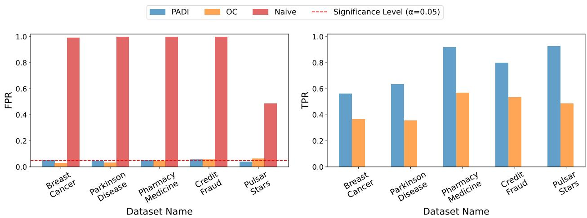

Figure 9: Results on real tabular datasets for the extension to Deep SAD. Left: empirical FPR of PADI, OC, and Naive. Right: empirical TPR of the statistically valid methods. PADI consistently achieves stronger TPR than OC while preserving FPR control.  
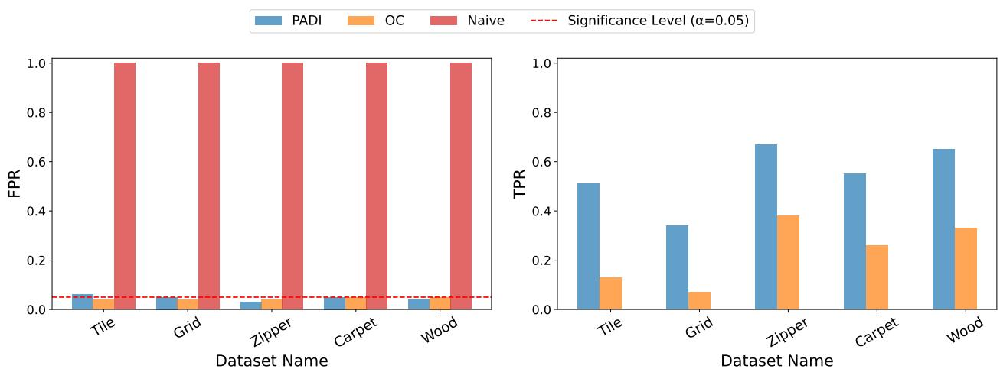  
Figure 10: Results on real image data from the MVTec AD dataset for the extension to Deep SAD. Left: empirical FPR of PADI, OC, and Naive across five classes. Right: empirical TPR of the statistically valid methods. PADI empirically maintains FPR close to the significance level while achieving higher TPR than OC.

## D.3 Real Image Data

In the real-image data experiment for the extension to Deep SAD, we used the same setting as in Section 6.3. The results on MVTec AD are shown in Fig. 10. Across all five image categories, PADI and OC maintain the empirical FPR around the target significance level, while the Naive approach produces inflated FPR values. This demonstrates that the selective inference framework remains valid when the encoder is obtained from Deep SAD training. Furthermore, PADI consistently achieves higher TPR than OC across diferent defect categories. The advantage of PADI is observed across diferent types of image anomalies considered in the experiments, including regular-texture, random-texture, and object categories.

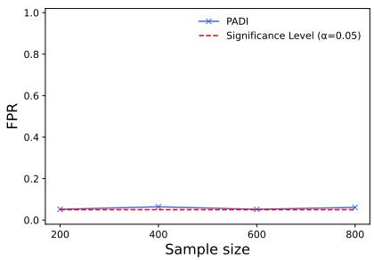  
(a) Skew-normal

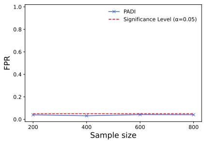  
(b) Student’s t

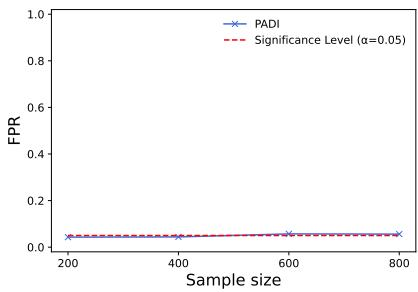  
(c) Laplace  
Figure 11: Empirical FPR of PADI under non-Gaussian data distributions.

## E Additional Experimental Analysis

## E.1 Robustness to Non-Gaussian Data Distributions

The theoretical guarantee of PADI is derived under the Gaussian test-reference model, which enables the characterization of the conditional null distribution after conditioning on the anomaly-selection event, the sign pattern, and the nuisance statistic. To further investigate the empirical robustness of PADI beyond the Gaussian assumption, we conduct additional synthetic experiments using several non-Gaussian distributions.

Specifically, we consider three diferent non-Gaussian settings: (i) the skew-normal distribution with a shape parameter of 0.3, (ii) the Student’s t-distribution with degrees of freedom $\mathrm { d f } \ = \ 7 .$ and (iii) the Laplace distribution with scale parameter $b = 0 . 8$ . For each distribution, the remaining experimental settings are kept identical to the synthetic FPR experiments in Section 6.1. We vary the sample size as $n \in \{ 2 0 0 , 4 0 0 , 6 0 0 , 8 0 0 \}$ and evaluate the empirical FPR at significance level $\alpha = 0 . 0 5$

The results are shown in Fig. 11. Across all three non-Gaussian distributions, PADI maintains the empirical FPR around the target significance level for all tested sample sizes. These results indicate that, although the current theoretical guarantee is established under Gaussian assumptions, the proposed method can remain empirically robust under several types of non-Gaussian data distributions considered in our experiments.

## E.2 Efect of the Reference Set Size

We further investigate how the number of independent normal reference samples afects the performance of PADI. In particular, we vary the size of the reference set while following the same data generation procedure as the independent setting described in 6.1. We consider reference set sizes of 5, 10, 15, and 20 samples.

Figure 12a reports the empirical FPR for diferent numbers of reference samples. Across diferent reference set sizes and test sample sizes, the empirical FPR remains consistently close to the target significance level $\alpha = 0 . 0 5$ . This confirms that the proposed selective inference procedure maintains FPR control and that the validity of PADI is not sensitive to the number of reference samples.

We also evaluate the efect of the reference set size on the TPR, as shown in Figure 12b. Although the reference set size afects the estimation of the normal reference distribution and may influence the statistical power of the test, the TPR values remain highly consistent across diferent reference set sizes. This indicates that, once a reasonable number of independent normal reference samples is available, increasing the reference set size provides limited additional improvement in detection performance.

## E.3 Efect of Data Dimension on FPR Control

We further investigate whether the validity of PADI is afected by the dimensionality of the data. Following the same data generation procedure as the independent setting described in 6.1, we vary the data dimension while keeping the other experimental configurations unchanged. Specifically, we evaluate PADI with dimensions $d \in \{ 2 0 , 4 0 , 6 0 , 8 0 \}$

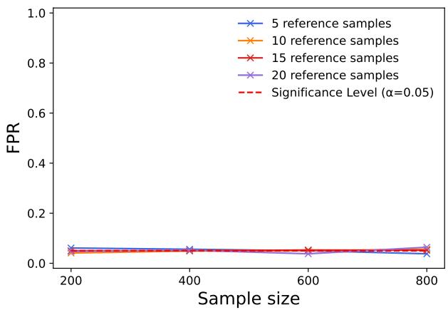  
(a) FPR.

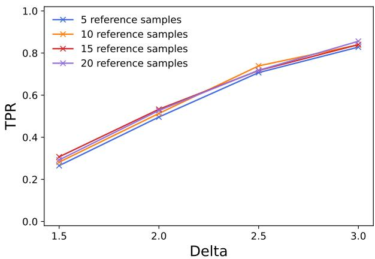  
(b) TPR.

Figure 12: Efect of the reference set size on the empirical FPR and TPR.  
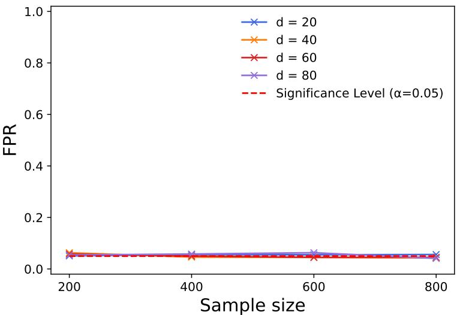  
Figure 13: Efect of the data dimension on the empirical FPR.

Figure 13 reports the empirical false positive rate (FPR) under diferent data dimensions. Across all considered dimensions and sample sizes, the empirical FPR remains consistently close to the target significance level $\alpha = 0 . 0 5$ . This result indicates that the selective inference procedure of PADI remains valid when varying the data dimension.

## E.4 Additional Evaluation for Synthetic Experiments

In the main synthetic experiments, we report TPR only for methods that successfully control the FPR at the target significance level, since statistical power comparison is meaningful only among methods that provide valid inference. To further analyze the behavior of all competing methods, we additionally report the TPR results of Naive, Op1, and Op2, despite their invalid FPR control.

The results are shown in ${ \mathrm { F i g . } }$ 14. Similar to the main experiments, PADI and OC maintain the empirical FPR around the target significance level in both independent and correlated covariance settings, whereas Naive, $\mathrm { O p 1 }$ , and $\mathrm { O p 2 }$ produce substantially inflated FPR values. As expected, Naive achieves the highest TPR among all methods in both covariance settings, followed by $\mathrm { O p 1 }$ and $\mathrm { O p 2 }$ . However, these higher TPR values are accompanied by uncontrolled $\mathrm { F P R } .$ , indicating that the increase in detection power is obtained at the cost of invalid statistical inference. Among the methods with valid FPR control, PADI consistently achieves higher TPR than OC as the signal diference ∆ increases. This additional evaluation further highlights the importance of considering both statistical validity and detection power when comparing post-selection inference methods.

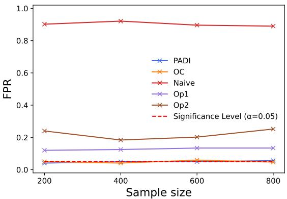  
(a) FPR on independent data

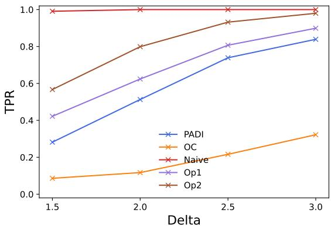  
(b) TPR on independent data

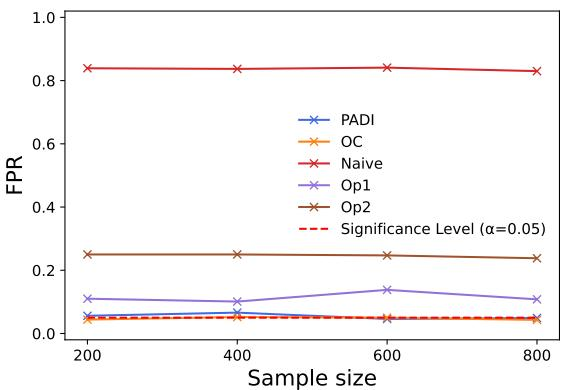  
(c) FPR on correlated data

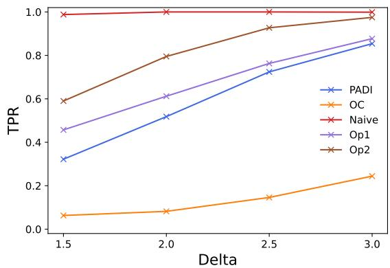  
(d) TPR on correlated data

Figure 14: Additional evaluation on synthetic data for all competing methods. Table 1: Runtime breakdown (in seconds) of the three phases in Algorithm 1 using the proposed Numba-CUDA implementation.
<table><tr><td></td><td>4 blocks</td><td>5 blocks</td><td>6 blocks</td><td>7 blocks</td></tr><tr><td>Phase I</td><td>0.01081</td><td>0.01102</td><td>0.01151</td><td>0.01142</td></tr><tr><td>Phase II</td><td>9.46515</td><td>12.71300</td><td>24.60653</td><td>45.99283</td></tr><tr><td>Phase III</td><td>0.24853</td><td>0.16548</td><td>0.19514</td><td>0.15108</td></tr></table>

## E.5 Runtime Breakdown of PADI

To further analyze the computational cost of PADI, we provide a runtime breakdown of the three phases described in Algorithm 1. The experiment follows the same setting as the “Diferent numbers of convolutional blocks” experiment described in the “Runtime evaluation of CNN-based GPU kernels” in 6.1, with the proposed Numba-CUDA implementation for CNN-based PADI. The runtime of each phase is reported for CNN encoders with diferent numbers of convolutional blocks.

The results show that Phase II dominates the overall computational cost across all tested encoder depths. This is expected because Phase II involves the iterative line search and repeated CNN forward propagations required to identify the feasible truncation region. In contrast, Phase I and Phase III introduce relatively small overhead, as they mainly involve constructing the selective inference direction and evaluating the final truncated Gaussian probability. As the number of convolutional blocks increases, the runtime of Phase II grows substantially, reflecting the additional cost of repeated forward passes through deeper encoders.

Table 2: Runtime Breakdown: Training, Inference, and the Proposed PADI Method
<table><tr><td>Stage</td><td>Runtime (s)</td></tr><tr><td>Deep SVDD training</td><td>615.34</td></tr><tr><td>Deep SVDD inference</td><td>0.9007</td></tr><tr><td>PADI</td><td>9.3698</td></tr></table>

## E.6 Runtime Breakdown: Training, Inference, and the Proposed PADI Method

We conducted an additional experiment to compare the runtime of the diferent stages and quantify the additional computational cost of performing selective inference after a Deep SVDD model has been trained and used for standard inference. We use the same experimental setting as that described in the “Runtime Evaluation of CNN-Based GPU Kernels” in §6.1, with the number of blocks fixed at four. All three stages— Deep SVDD training, standard Deep SVDD inference, and selective inference—are performed on an NVIDIA Tesla P100 GPU. For the SI stage, we use our proposed Numba-CUDA implementation for CNN-based PADI. The results are presented in Table 2.