# Predictive Geometry of Hidden Trajectories in Transformers

Timur Mudarisov<sup>1</sup> Mikhail Burtsev<sup>2</sup> Tatiana Petrova<sup>1</sup> Radu State<sup>1</sup>

<sup>1</sup>University of Luxembourg, Luxembourg <sup>2</sup>London Institute for Mathematical Sciences, London, UK

## Abstract

Decoder-only transformers are trained only through a terminal next-token prediction loss, yet this loss constrains every intermediate hidden state through the fixed downstream computation. We formalize this constraint by studying layerwise loss-to-go functions: the terminal loss obtained by continuing a candidate hidden state through the remaining transformer blocks. Around successful validation trajectories, we show that the local second-order geometry of these functions is governed, up to low-loss residual terms, by a pullback Fisher operator on hiddenstate space. Its spectrum identifies output-sensitive directions and approximately prediction-null directions, yielding a local observable subspace of the residual stream. For causal transformers, the same geometry induces a tokenwise curvature score: a Fisher-weighted sensitivity of the target logits to perturbations of each token’s hidden state. This score vanishes outside the causal ancestor set of the target and is controlled by downstream Jacobian couplings, making it a loss-aware alternative to attention magnitude. We estimate these quantities using matrix-free Jacobian-vector and vector-Jacobian products and evaluate them across decoderonly language models on WikiText, OpenWebText, and FineWeb. Empirically, the induced geometry predicts perturbation sensitivity, supports nonuniform layerwise rank allocation, yields competitive structured token-pruning signals, and improves low-rank student recovery when added to stronger autoregressive distillation objectives such as reverse KL and skew KL. These results support a predictive-geometric view of transformer computation: near successful trajectories, the terminal loss induces a thin, anisotropic set of output-relevant hidden-state directions that can be measured and exploited for compression and distillation.

## 1 Introduction

Large-scale decoder-only transformers [25, 5] are optimized through a next-token prediction loss applied only at the output layer, yet their computation proceeds through a sequence of intermediate hidden states. This raises a local question about trained models: near hidden-state trajectories on which the model already predicts well, which directions in residual-stream space are constrained by the terminal prediction loss, and which directions are approximately invisible to it? Answering this question would give a loss-based account of hidden-state geometry, rather than treating intermediate representation geometry as an empirical property detached from the objective used to train the model.

Recent empirical work suggests that transformer hidden states are structured and compressible rather than generic high-dimensional vectors. Prior work [24] shows that the intrinsic dimension of hidden representations follows a characteristic expansion-contraction profile across layers, while activation-space compression methods [3, 22, 28] demonstrate that low-rank approximations can often preserve model performance. These results indicate that hidden representations contain substantial redundancy. However, they largely characterize this structure empirically: they do not derive the relevant directions from the terminal prediction objective itself, nor do they provide a loss-aware notion of which hidden-state directions or token positions matter for the final prediction.

In this work, we start from the prediction loss. For a fixed trained decoder-only transformer, a layer, and a target position, we define a loss-to-go function: the terminal loss obtained by continuing a candidate intermediate hidden state through the fixed downstream transformer. We then study the local second-order geometry of this function around successful validation trajectories. In the low-loss regime, the dominant curvature is given by a pullback Fisher operator: the Fisher geometry of the output distribution pulled back through the downstream computation to the intermediate hidden state. This operator identifies output-sensitive directions in hidden-state space together with approximately prediction-null directions that leave the centered target logits unchanged to first order.

This local output-induced geometry leads to directly measurable quantities. The spectrum of the pullback Fisher operator measures how many output-sensitive directions are present at each layer, suggesting a data-dependent alternative to uniform rank allocation. Taking traces of this operator over token fibers defines a local token-level sensitivity score, measuring how much each token position contributes to the curvature of the target prediction. For causal transformers, this score is supported only on causal ancestors of the target token and is controlled by downstream Jacobian couplings, making it a loss-aware alternative to attention-based pruning heuristics [26, 17, 29]. We use these quantities as signals for matched-budget rank allocation and structured token pruning.

Our perspective connects representation geometry [24], compression and low-rank adaptation [3, 13, 11, 22], token pruning [26, 17, 29], mechanistic interpretability [6], and Fisher-based analyses of neural models [2, 15]. The focus here is specifically on the local predictive geometry of intermediate hidden states: the Fisher geometry induced by the terminal next-token loss and pulled back through the learned forward dynamics of a fixed trained transformer. This paper makes the following contributions:

1. Loss-induced hidden geometry. We define layerwise loss-to-go functions for fixed trained decoder-only transformers and show that, near successful hidden-state trajectories, their dominant local curvature is a pullback Fisher operator from the output distribution to the intermediate hidden state.

2. Observable and prediction-null directions. The pullback Fisher operator identifies outputsensitive directions and approximately prediction-null directions in residual-stream space, yielding a testable local decomposition of hidden-state perturbations.

3. Tokenwise predictive saliency. For causal transformers, we derive a tokenwise Fisher-Jacobian score $\kappa _ { \ell , s }$ that measures how much each token position contributes to target-logit curvature. The score is supported only on causal ancestors of the target and is controlled by downstream Jacobian couplings.

4. Geometry-guided reduction and recovery. We evaluate the resulting geometry across perturbation sensitivity, layerwise rank allocation, structured token pruning, and low-rank student distillation. Across these settings, the geometry provides loss-aware signals for preserving prediction-relevant hidden directions under compression.

## 2 Problem Statement

We study a fixed trained decoder-only pre-norm transformer at a fixed target position t. For an input prefix $s _ { \leq t } ,$ let

$$
X _ { \ell } ( s \_ t ) \in \mathcal { X } _ { t } : = \mathbb { R } ^ { t \times d } , \qquad \ell = 0 , \ldots , L ,
$$

denote the layer-ℓ hidden state, where d is the hidden dimension. The model induces a hidden trajectory

$$
X _ { 0 } ( s \_ t ) \to X _ { 1 } ( s \_ t ) \to \cdots \to X _ { L } ( s \_ t ) ,
$$

and the final prediction at position t is read out from $X _ { L }$ . Writing the layer dynamics as

$$
X _ { \ell + 1 } = B _ { \ell } ( X _ { \ell } ) , \qquad \Phi _ { \ell \to L } : = B _ { L - 1 } \circ \cdot \cdot \cdot \circ B _ { \ell } ,
$$

we analyze the geometry induced by the learned forward dynamics of afixed trained model, rather than the training dynamics themselves.

To measure prediction quality at position t, let $\phi$ be a terminal loss applied after the final readout, such as cross-entropy or

$$
\phi ( X _ { L } ) : = D _ { \mathrm { K L } } \big ( q \| p _ { t } ( \cdot \mid X _ { L } ) \big ) ,
$$

where $p _ { t } ( \cdot \ | \ X _ { L } )$ is the prediction induced by the final hidden state $X _ { L }$ . Define the layerwise loss-to-go

$$
{ \mathcal { I } } _ { \ell } ( X ) : = \phi { \big ( } \Phi _ { \ell \to L } ( X ) { \big ) } ,
$$

and the associated low-loss set

$$
\mathcal { A } _ { \varepsilon } ^ { \ell } : = \{ X \in \mathcal { X } _ { t } : \mathcal { I } _ { \ell } ( X ) \leq \varepsilon \} .
$$

Thus, $A _ { \varepsilon } ^ { \ell }$ consists of those intermediate states at layer ℓ that can still evolve, under the fixed downstream transformer, to terminal loss at most ε.

Our goal is to characterize the geometry of these layerwise low-loss sets and its consequences for transformer computation. In particular, we ask whether successful trajectories remain inside a pullback family of low-loss regions, whether the local geometry of these regions is effectively lower-dimensional than the ambient residual space $\mathcal { X } _ { t }$ , and how this prediction-relevant geometry is distributed across token positions through the causal computation graph. Answering these questions gives both a trajectory-level description of transformer computation beyond the final logits and a basis for loss-aware model-reduction signals, including layerwise low-rank compression and token-sparse computation.

## 3 Theory

We study the local geometry of intermediate hidden states that remain compatible with low terminal prediction loss. Throughout, we fix a trained decoder-only pre-norm transformer, a target position t, and a softmax readout, with terminal loss

$$
\phi ( z ) : = D _ { \mathrm { K L } } \big ( q \| \operatorname { s o f t m a x } ( z ) \big ) , \qquad z \in \mathbb { R } ^ { | \mathcal { V } | } .
$$

Proofs are presented in the Appendix A.

## 3.1 Local geometry of layerwise low-loss sets

Let

$$
X _ { \ell + 1 } = B _ { \ell } ( X _ { \ell } ) , \qquad \Phi _ { \ell \to L } : = B _ { L - 1 } \circ \cdots \circ B _ { \ell } , \qquad \Psi _ { \ell } ( X ) : = Z _ { t } \bigl ( \Phi _ { \ell \to L } ( X ) \bigr ) .
$$

Define the layerwise loss-to-go and low-loss set by

$$
\mathcal I _ { \ell } ( X ) : = \phi \big ( \Psi _ { \ell } ( X ) \big ) , \qquad \mathcal A _ { \varepsilon } ^ { \ell } : = \{ X \in \mathcal X _ { t } : \mathcal I _ { \ell } ( X ) \leq \varepsilon \} .\tag{1}
$$

Then

$$
\mathcal { A } _ { \varepsilon } ^ { \ell } = \Phi _ { \ell \to L } ^ { - 1 } ( \mathcal { A } _ { \varepsilon } ^ { L } ) , \qquad \mathcal { A } _ { \varepsilon } ^ { L } = \{ \boldsymbol { X } \in \mathscr { X } _ { t } : \phi ( Z _ { t } ( \boldsymbol { X } ) ) \leq \varepsilon \} ,\tag{2}
$$

so the main question is the local geometry of these sets near a successful hidden-state trajectory.

Theorem 1 (Local output geometry of low-loss sets). Let $X _ { \ell } ^ { * } \in \mathcal { X } _ { t }$ be a reference hidden state with

$$
\begin{array} { r } { \varepsilon _ { * } : = { \mathcal I } _ { \ell } ( X _ { \ell } ^ { * } ) , \qquad { \mathcal I } _ { \ell } ( X ) : = \phi ( \Psi _ { \ell } ( X ) ) , \qquad \phi ( z ) : = D _ { \mathrm { K L } } ( q \| \operatorname { s o f t m a x } ( z ) ) . } \end{array}
$$

Assume that $\Psi _ { \ell }$ is twice continuously differentiable in a neighborhood of $X _ { \ell } ^ { \ast }$ and that

$$
\left( \sum _ { a = 1 } ^ { | \mathcal { V } | } \| \nabla ^ { 2 } \Psi _ { \ell , a } ( X ) \| _ { \mathrm { o p } } ^ { 2 } \right) ^ { 1 / 2 } \leq M _ { \ell }
$$

in that neighborhood. For transformers with smooth activations and LayerNorm, this condition holds locally on neighborhoods where LayerNorm denominators are bounded awayfrom zero and attention probabilities remainfinite. Let

$$
\begin{array} { r } { P : = I - \frac { 1 } { | \mathcal { V } | } \mathbf { 1 } \mathbf { 1 } ^ { \top } , \qquad \bar { \Psi } _ { \ell } : = P \Psi _ { \ell } , \qquad \bar { J } _ { \ell } : = D \bar { \Psi } _ { \ell } ( X _ { \ell } ^ { * } ) , } \end{array}
$$

and let

$$
p ^ { * } : = \mathrm { s o f t m a x } ( \Psi _ { \ell } ( X _ { \ell } ^ { * } ) ) , \qquad F ^ { * } : = \mathrm { d i a g } ( p ^ { * } ) - p ^ { * } p ^ { * \top } .
$$

Then:

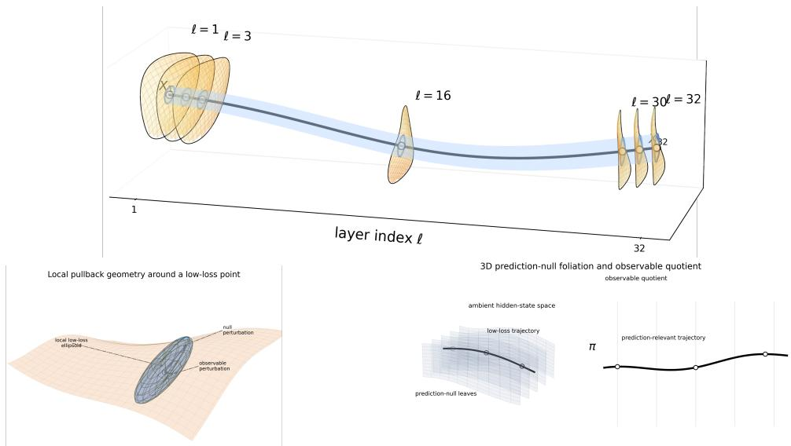  
Figure 1: Geometry of low-loss hidden trajectories. Top: hidden-state trajectory and layerwise low-loss sets $\mathbf { \mathcal { A } } _ { \varepsilon } ^ { \ell }$ . Bottom left: local pullback geometry near $X _ { \ell } ^ { \ast }$ . Bottom right: prediction-null foliation and observable quotient.

1. Local Hessian decomposition. The Hessian ofthe layerwise loss-to-go satisfies

$$
\nabla ^ { 2 } \mathcal { I } _ { \ell } ( X _ { \ell } ^ { \ast } ) = \bar { J } _ { \ell } ^ { \top } F ^ { \ast } \bar { J } _ { \ell } + R _ { \ell } ,\tag{3}
$$

where

$$
\| R _ { \ell } \| _ { \mathrm { o p } } \leq M _ { \ell } \| p ^ { * } - q \| _ { 2 } \leq M _ { \ell } \sqrt { 2 \varepsilon _ { * } } .\tag{4}
$$

Thus, at low loss, the dominant curvature term is the pullback of the Fisher geometry of the output distribution.

2. Pullback Fisher geometry. Define

$$
\begin{array} { r } { K _ { \ell } : = \bar { J } _ { \ell } ^ { \top } F ^ { * } \bar { J } _ { \ell } , \qquad g _ { \ell } ( \delta X , \delta X ) : = \langle \delta X , K _ { \ell } \delta X \rangle . } \end{array}\tag{5}
$$

For $X = X _ { \ell } ^ { * } + \delta X$ sufficiently close to $X _ { \ell } ^ { \ast }$

$$
\mathcal { I } _ { \ell } ( X ) = \mathcal { I } _ { \ell } ( X _ { \ell } ^ { * } ) + \langle \nabla \mathcal { I } _ { \ell } ( X _ { \ell } ^ { * } ) , \delta X \rangle + \frac { 1 } { 2 } g _ { \ell } ( \delta X , \delta X ) + O ( \sqrt { \varepsilon _ { * } } \| \delta X \| ^ { 2 } ) + O ( \| \delta X \| ^ { 3 } ) .\tag{6}
$$

Hence, near a low-loss point with small first-order term, the local low-loss set is approximated by an ellipsoidal tube.

3. Prediction-null directions. $I f \bar { J } _ { \ell }$ has constant rank r near $X _ { \ell } ^ { \ast }$ , then

$$
\mathcal { N } _ { \ell } : = \ker \bar { J } _ { \ell }\tag{7}
$$

consists offirst-order prediction-null directions.

## Informal summary of Theorem 1

A successful hidden-state trajectory stays inside a “tube” of low-loss states. This tube is thin in predictionrelevant directions and thick in null directions; removing the latter leaves a smaller observable space whose local geometry is described by $g _ { \ell } .$

## 3.2 Tokenwise geometric saliency in transformers

Let

$$
G _ { \ell } : = D B _ { \ell } ( X _ { \ell } ^ { * } ) , \qquad G _ { \ell } ^ { ( r \left. s ) \right.} : \mathbb { R } ^ { d }  \mathbb { R } ^ { d }
$$

denote the Jacobian of the ℓ-th block in token blocks. The operator $K _ { \ell }$ in (5) is the local outputsensitive curvature operator. For each token s, let

$$
P _ { s } : \mathcal { X } _ { t } \to \mathbb { R } ^ { d }
$$

project onto the s-th token fiber, and define the geometric contribution score

$$
\kappa _ { \ell , s } : = \mathrm { t r } ( P _ { s } K _ { \ell } P _ { s } ^ { \top } ) .\tag{8}
$$

Thus $\kappa _ { \ell , s }$ measures how much of the local output-sensitive curvature is carried by token s.

For each token pair $( s , r )$ , define

$$
w _ { \ell } ^ { ( r  s ) } : = \| G _ { \ell } ^ { ( r  s ) } \| _ { F } .
$$

These weights induce a causal directed token graph at layer ℓ. Let $\mathrm { A n c } _ { \ell : L - 1 } ( t )$ be the ancestor closure of the target token t under the composed layerwise graphs.

Proposition 1 (Tokenwise pullback saliency and causal support). Let $K _ { \ell } = \bar { J } _ { \ell } ^ { \top } F ^ { * } \bar { J } _ { \ell }$ be the pullback Fisher operatorfrom Theorem 1. For a token position $s \leq t ,$ let $P _ { s } : \mathcal { X } _ { t } \to \mathbb { R } ^ { d }$ denote projection onto the s-th tokenfiber, and define the downstream token-to-logit Jacobian

$$
H _ { \ell , s } : = D _ { X _ { \ell , s } } \bar { \Psi } _ { \ell } ( X _ { \ell } ^ { * } ) = \bar { J } _ { \ell } P _ { s } ^ { \top } \in \mathbb { R } ^ { | \mathcal { V } | \times d } .
$$

Define the tokenwise curvature score

$$
\kappa _ { \ell , s } : = \mathrm { t r } ( P _ { s } K _ { \ell } P _ { s } ^ { \top } ) .
$$

Then

1. Fisher-Jacobian identity.

$$
\begin{array} { r } { \kappa _ { \ell , s } = \mathrm { t r } \big ( H _ { \ell , s } ^ { \top } F ^ { * } H _ { \ell , s } \big ) = \Big \| F ^ { * 1 / 2 } H _ { \ell , s } \Big \| _ { F } ^ { 2 } . } \end{array}\tag{9}
$$

Thus $\kappa _ { \ell , \varepsilon }$ <sub>s</sub> is the Fisher-weighted squared sensitivity of the target-position logits to perturbations of token s at layer ℓ.

2. Causal support. Under the standard causal mask, if token s is not in the downstream ancestor set oftarget token tfrom layer ℓ to $L ,$ then

$$
H _ { \ell , s } = 0 , \qquad \kappa _ { \ell , s } = 0 .
$$

3. Pathwise coupling bound. $L e t G _ { m } ^ { ( r  u ) }$ denote the token-block Jacobian of block m, mapping perturbations at token u to perturbations at token r. Let $\Pi _ { \ell : s  t }$ be the set ofdirected causal paths from (ℓ, s) to the target token t at layer L. Then

$$
\kappa _ { \ell , s } \leq d \| F ^ { * } \| _ { \mathrm { o p } } \| D Z _ { t } ( X _ { L } ^ { * } ) \| _ { \mathrm { o p } } ^ { 2 } ( \sum _ { \pi \in \Pi _ { \ell : s \to t } } \prod _ { ( m , u \to r ) \in \pi } \| G _ { m } ^ { ( r  u ) } \| _ { \mathrm { o p } } ) ^ { 2 } .\tag{10}
$$

## Informal summary of Proposition 1

A token contributes to the output geometry only if it causally influences the target. Even among such ancestors, its contribution is small when its Jacobian coupling to the target is weak. Geometric importance is therefore both sparse and graded.

## 3.3 Geometry-guided reduction

The spectrum of $K _ { \ell }$ identifies prediction-relevant directions, while Proposition 1 shows that this geometry is often concentrated on a small subset of ancestor tokens. This suggests projecting onto the dominant eigenspace of $K _ { \ell }$ and pruning tokens with small $\kappa _ { \ell , s }$

Proposition 2 (Geometry-guided reduction with local loss guarantee). Let $K _ { \ell }$ be the pullback Fisher operator from Theorem 1, with eigenvalues

$$
\lambda _ { 1 } ( K _ { \ell } ) \geq \lambda _ { 2 } ( K _ { \ell } ) \geq \cdot \cdot \cdot \geq 0 .
$$

Let $\Pi _ { \ell } ^ { ( k ) }$ be the orthogonal projector onto the span of the top k eigenvectors of $K _ { \ell } .$ For a local hidden-state perturbation

$$
X = X _ { \ell } ^ { * } + \delta X ,
$$

define its geometry-guided reduction by

$$
\widetilde { X } : = X _ { \ell } ^ { \ast } + \Pi _ { \ell } ^ { ( k ) } \delta X .
$$

Assume that X and $\widetilde { X }$ lie in the neighborhood where Theorem 1 applies. Then the discarded component

$$
\delta X _ { \mathrm { t a i l } } : = ( I - \Pi _ { \ell } ^ { ( k ) } ) \delta X
$$

has local quadratic loss contribution bounded by

$$
\frac { 1 } { 2 } \left. \delta X _ { \mathrm { t a i l } } , K _ { \ell } \delta X _ { \mathrm { t a i l } } \right. \leq \frac { 1 } { 2 } \lambda _ { k + 1 } ( K _ { \ell } ) \| \delta X _ { \mathrm { t a i l } } \| ^ { 2 } .\tag{11}
$$

## 4 Empirical Validation and Geometry-Guided Reduction

The theory yields two kinds of objects. The first are descriptive observables of the hidden trajectory, such as the operator $K _ { \ell }$ and the tokenwise score $\kappa _ { \ell , s }$ , which can be measured directly on trained models and used to test the predictions of Theorem 1 and Proposition 1. The second are constructive objects, such as layerwise observable subspaces and tokenwise saliency rankings, which can be used to design reduced architectures and geometry-aware compression schemes.

This section evaluates the theory at two levels. First, we test whether the pullback-Fisher geometry is a faithful local description of hidden-state sensitivity: observable directions should be substantially more output-sensitive than prediction-null directions. Second, we test whether the same geometry is useful as an algorithmic signal for compression and recovery. This section evaluates the theory in five linked steps. Experiment 4.1 directly validates the local Taylor geometry induced by the pullback Fisher operator. Experiment 4.2 tests the observable/null anisotropy and effective observable dimension predicted by the low-loss tube picture. Experiment 4.3 uses the spectrum of $K _ { \ell }$ for matched-budget rank allocation. Experiment 4.4 uses the token-fiber trace $\kappa _ { \ell , s }$ for structured tokenupdate pruning. Experiment 4.5 uses the same geometry as a hidden-state recovery objective for low-rank student distillation.

Unless stated otherwise, all measurements are computed on held-out validation sequences from WIKITEXT [18], FINEWEB [21], and OPENWEBTEXT [8].

## 4.1 Experiment 0: Direct validation of local predictive geometry

Before using the pullback Fisher operator for reduction or recovery, we first test whether it captures the local predictive geometry predicted by Theorem 1. Specifically, we ask whether small perturbations of an intermediate hidden state produce terminal loss changes predicted by the local Taylor model induced by $K _ { \ell } .$ . For supervised cross-entropy, we compare a linear predictor, a Fisher quadratic predictor, and their sum: $\begin{array} { r } { \Delta \mathrm { C E } _ { \mathrm { l i n } } = \langle \nabla _ { X _ { \ell } } \mathrm { C E } , \delta X _ { \ell } \rangle , \Delta \mathrm { \dot { C } E } _ { \mathrm { q u a d } } = \frac { 1 } { 2 } \delta X _ { \ell } ^ { \top } K _ { \ell } \delta X _ { \ell } } \end{array}$ , and $\Delta C E _ { \mathrm { l i n + q u a d } } = \Delta C E _ { \mathrm { l i n } } + \Delta C E _ { \mathrm { q u a d } }$ . This separation is necessary because supervised one-hot CE is generally not stationary at the reference prediction, so the linear term need not vanish. To isolate the Fisher curvature term, we also evaluate teacher-KL with $q = p ^ { \star }$ , the model’s unperturbed prediction. In this stationary setting, the leading local term is $\begin{array} { r } { \Delta \mathrm { K L } ( \hat { p } ^ { \star } \| \hat { p } _ { \delta } ) \approx \frac 1 2 \delta X _ { \ell } ^ { \top } K _ { \ell } \delta \hat { X } _ { \ell } } \end{array}$

Figure 4 shows that supervised CE is first-order dominated: the linear-only and linear-plus-quadratic predictors nearly coincide, while the quadratic-only predictor is substantially weaker. In contrast, the teacher-KL quadratic predictor becomes strongly predictive at moderate radii, where the perturbation induced KL signal is measurable. Thus, Experiment 0 validates $K _ { \ell }$ as a local output-curvature or observability operator. The following experiments then use this geometry constructively: Experiment 1 studies observable and prediction-null directions, Experiment 2 uses the spectrum for rank allocation, Experiment 3 uses token-fiber traces for pruning, and Experiment 4 uses the quadratic form as a hidden-state recovery objective.

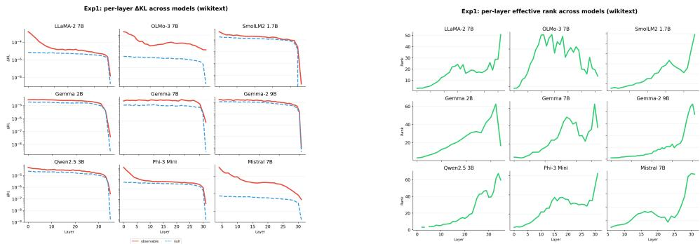  
Figure 2: Experiment 1: anisotropy and effective observable dimension across layers. Left: KL sensitivity of equal-norm observable and null perturbations across layers. Right: Effective observable rank across layers for multiple models.

## 4.2 Experiment 1: anisotropy and effective observable dimension

Guided by Theorem 1, we quantify how strongly each layer reacts to perturbations in observable versus prediction-null directions. For every model, layer $\mathbf { \bar { \boldsymbol { \ell } } } ,$ and target position t, we construct the local curvature operator $K _ { \ell } .$ , compute its top eigendirections, and use them to define an observable subspace together with its orthogonal complement. We then sample equal-norm perturbations in each subspace, apply them to $X _ { \ell } ( s )$ , and measure the resulting change in target-position KL divergence between the original and perturbed outputs.

To summarize the spectrum of $K _ { \ell } .$ , we report the effective observable rank via the participation ratio

$$
r _ { \mathrm { e f f } } ( K _ { \ell } ) : = \frac { \left( \sum _ { i } \lambda _ { i } ( K _ { \ell } ) \right) ^ { 2 } } { \sum _ { i } \lambda _ { i } ( K _ { \ell } ) ^ { 2 } } .\tag{12}
$$

This quantity serves as an empirical proxy for the low-dimensional prediction-relevant structure suggested by Theorem 1. Figure 2 shows a clear and consistent anisotropy across all models: observable perturbations are orders of magnitude more harmful than null perturbations at almost every layer, and the gap typically widens toward the later blocks. This indicates that the residual geometry becomes increasingly aligned with the final readout as the computation approaches the output layer. The right panel further shows that the effective observable rank grows gradually with depth, especially in the middle and later layers, but remains far below the ambient hidden dimension. Taken together, these trends support the view that decoder-only transformers concentrate most of their prediction-relevant information in a thin, highly anisotropic subset of hidden space, while a large fraction of directions remain nearly KL-neutral.

## 4.3 Experiment 2: geometry-guided rank allocation

Experiment 2 asks whether the layerwise geometry can be used to allocate low rank more effectively than uniform compression. Given a global compression budget, our geometry-guided method assigns a data-dependent rank k<sub>ℓ</sub> to each layer using the spectrum of $\bar { K _ { \ell } }$ . Concretely, for a threshold $\tau \in \{ 0 . 0 1 , 0 . 0 5 , 0 . 1 , 0 . 2 \}$ , we choose the smallest $k _ { \ell }$ such that

$$
\sum _ { i > k _ { \ell } } \lambda _ { i } ( K _ { \ell } ) \ \leq \ \tau \sum _ { i } \lambda _ { i } ( K _ { \ell } ) .\tag{13}
$$

Intuitively, τ controls how much spectral tail mass is discarded. As controlled matched-budget baselines, we use uniform SVD and uniform LoRA-style low-rank allocations [13, 11], assigning the same rank to every layer and matching the overall compression ratio.

For each model, dataset, and threshold τ , we report the perplexity increase

$$
\Delta \mathrm { P P L } = \mathrm { P P L } _ { \mathrm { c o m p r e s s e d } } - \mathrm { P P L } _ { \mathrm { b a s e } }\tag{14}
$$

and the corresponding advantage over the best matched uniform baseline,

$$
\Delta \mathrm { P P L } _ { \mathrm { a d v } } : = \Delta \mathrm { P P L } _ { \mathrm { u n i f o r m } } - \Delta \mathrm { P P L } _ { \mathrm { g e o m } } .\tag{15}
$$

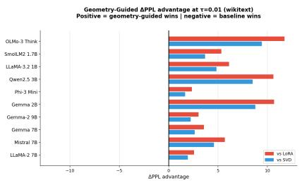

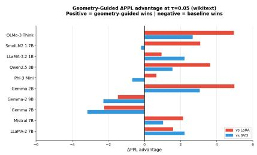

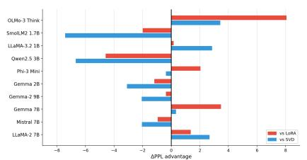

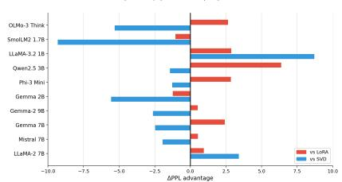  
Figure 3: Experiment 2: geometry-guided ∆PPL advantage on WIKITEXT for different spectral thresholds τ. Each panel reports $\Delta \mathrm { \bar { P P L } _ { a d v } } = \Delta \mathrm { P P L _ { u n i f o r m } } - \Delta \mathrm { P P L _ { g e o m } } ;$ larger values indicate that geometry-guided rank allocation degrades perplexity less than the best matched uniform baseline.

Larger $\Delta \mathrm { P P L } _ { \mathrm { a d v } }$ therefore indicates a stronger benefit from geometry-guided allocation. We evaluate ten decoder-only LLMs between roughly 1B and 9B parameters (see Table 2).

Figure 3 shows that geometry-guided rank allocation is most helpful at moderate thresholds (τ = 0.05 and $\tau \ : = \ : 0 . 1 )$ , where several small and medium models, including Gemma 2B, Qwen2.5 3B, SmolLM2 1.7B, and OLMo-3 7B, benefit from a nonuniform rank distribution. This suggests that these architectures contain a mix of strongly prediction-relevant and comparatively redundant layers. For larger and more homogeneous model families, especially some LLaMA and Gemma variants, the advantage is smaller, indicating that uniform low-rank compression is already close to optimal when layerwise spectra look similar.

## 4.4 Experiment 3: geometry-guided pruning

Experiment 3 studies whether the same geometric signals can guide structured pruning of layer updates. Starting from a compressed model, we rank tokenwise updates within each layer according to four policies: (i) the geometric saliency score $\kappa _ { \ell , s } , ( \mathrm { i i } )$ an attention-score baseline, (iii) a gradient activation saliency baseline $\| \nabla _ { X _ { \ell , s } } \mathcal { L } \odot X _ { \ell , s } \| _ { 1 }$ , and (iv) a random baseline. For a drop fraction $\rho \in \{ 0 . 0 5 , 0 . 1 0 , 0 . 2 0 , 0 . 3 0 \}$ , we prune the least important fraction of token-indexed updates under each policy and measure the resulting validation perplexity increase

$$
\Delta \mathrm { P P L } = \mathrm { P P L } _ { \mathrm { p r u n e d } } - \mathrm { P P L } _ { \mathrm { u n p r u n e d } } ,\tag{16}
$$

where lower is better. We run this experiment on the same family of decoder-only transformers as in Experiment 2 across WIKITEXT, OPENWEBTEXT, and FINEWEB. Figure 6 shows that both structured criteria, $\kappa _ { \ell , s }$ and attention score, substantially outperform random pruning across drop fractions. The κ-based policy is competitive with attention-based pruning and is slightly better in several model/drop-fraction settings. This suggests that the geometric score captures a loss-aware notion of token importance while attention remains a strong baseline for the pruning intervention studied here.

## 4.5 Experiment 4: predictive-geometry distillation of low-rank students

The preceding experiments test predictive geometry as a static signal: it identifies sensitive perturbation directions, allocates low-rank capacity across layers, and ranks tokenwise updates for pruning. We now ask a stronger question: can the same geometry improve training after compression? This turns the pullback-Fisher object from a diagnostic into a recovery objective for compressed students.

Given a teacher $T ,$ , we construct a compressed student S by replacing selected attention and MLP projections with rank-r low-rank factors,

$$
W \approx A B , \qquad A \in \mathbb { R } ^ { d _ { \mathrm { o u t } } \times r } , \qquad B \in \mathbb { R } ^ { r \times d _ { \mathrm { i n } } } .\tag{17}
$$

The student is trained with an output-level KD objective [12] and, optionally, a predictive-geometry regularizer on hidden states. The geometry term penalizes student errors according to their teacherpredictive effect rather than their Euclidean size: errors in output-sensitive directions are penalized more heavily, while errors in approximately prediction-null directions are allowed to be larger.

We separate the role of compression from the role of distillation by comparing two initializers, SVD and activation-aware SVD, and three KD objectives: forward KL [12], reverse KL [10], and skew KL [16]. For each KD objective, we evaluate both the base variant and its geometry-regularized counterpart. The main paired comparisons are therefore RKL versus RKL+Geo and SkewKL versus SkewKL+Geo at matched model, rank, seed, and initializer. Full implementation details are given in Appendix E.

Table 1: Geometry advantage over matched KD baselines. $\Delta _ { \mathrm { G e o } } = \mathrm { P P L } ( \mathrm { K D } ) - \mathrm { P P L } ( \mathrm { K D } + \mathrm { G e o } ) ;$ higher is better.
<table><tr><td>KD baseline</td><td>Pairs</td><td>Wins</td><td>Mean  $\Delta _ { \mathrm { G e o } }$  ↑</td><td>Median  $\Delta _ { \mathrm { G e o } }$  ↑</td><td>SVD mean</td><td>ASVD mean</td></tr><tr><td>FKL</td><td>14</td><td>8</td><td>-38.4</td><td>-12.6</td><td>-35.0</td><td>-41.7</td></tr><tr><td>RKL</td><td>14</td><td>9</td><td>21.3</td><td>12.3</td><td>44.5</td><td>-1.9</td></tr><tr><td>SkewKL</td><td>14</td><td>10</td><td>59.3</td><td>8.6</td><td>66.7</td><td>51.9</td></tr></table>

The geometry term is most useful when added to stronger autoregressive KD objectives. While adding geometry to forward KL does not improve average PPL, it improves reverse KL in 9/14 matched settings and skew KL in 10/14 matched settings. The largest average gain is obtained for skew KL, suggesting that predictive geometry is complementary to mode-seeking or skewed KD objectives rather than simply replacing output-level distillation.

## 5 Conclusion

We introduced a local Fisher-geometric view of hidden trajectories in decoder-only transformers. Starting from layerwise loss-to-go sets, we showed that, near successful validation trajectories and in the low-loss regime, the terminal prediction loss induces a pullback Fisher operator $K _ { \ell }$ on intermediate hidden states. This operator separates output-sensitive directions from approximately prediction-null directions, yielding a local observable structure inside the residual stream.

For causal transformers, the same geometry induces a tokenwise curvature score $\kappa _ { \ell , s } ,$ , which measures the contribution of each token position to local output-sensitive curvature and vanishes outside the causal ancestor set of the target. Together, the spectrum of $K _ { \ell }$ and its tokenwise traces provide loss-aware signals for where computation is concentrated, which directions should be preserved, and which components can be compressed with limited predictive damage.

Empirically, the proposed geometry gives a coherent and useful picture across multiple reduction settings. It predicts perturbation sensitivity, supports matched-budget layerwise rank allocation, yields competitive structured pruning signals, and provides an effective regularizer for low-rank student recovery when combined with stronger autoregressive distillation objectives. These results suggest that predictive geometry is not merely a descriptive diagnostic, but a practical mechanism for identifying and preserving the parts of the residual stream that matter for the model’s predictions.

Overall, our findings support the view that transformer computation near successful trajectories is organized around a thin, anisotropic set of prediction-relevant directions induced by the terminal loss. Measuring this geometry turns the final prediction objective into actionable local information inside the network, opening a path toward geometry-aware compression, distillation, and efficient inference methods that are directly tied to the model’s predictive behavior.

## References

[1] M. Abdin et al. Phi-3 technical report: A highly capable language model locally on your phone. arXiv preprint arXiv:2404.14219, 2024.

[2] S.-i. Amari. Natural gradient works efficiently in learning. Neural Computation, 10(2):251–276, 1998.

[3] S. Ashkboos, M. L. Croci, M. G. d. Nascimento, T. Hoefler, and J. Hensman. SliceGPT: Compress large language models by deleting rows and columns. In International Conference on Learning Representations, 2024.

[4] L. Ben Allal, A. Lozhkov, E. Bakouch, G. Martín Blázquez, G. Penedo, L. Tunstall, A. Marafioti, H. Kydlícek, A. Piqueres Lajarín, V. Srivastav, J. Lochner, C. Fahlgren, X.-S. Nguyen,ˇ C. Fourrier, B. Burtenshaw, H. Larcher, H. Zhao, C. Zakka, M. Morlon, C. Raffel, L. von Werra, and T. Wolf. SmolLM2: When smol goes big—data-centric training of a small language model. arXiv preprint arXiv:2502.02737, 2025.

[5] T. B. Brown, B. Mann, N. Ryder, M. Subbiah, J. Kaplan, P. Dhariwal, A. Neelakantan, P. Shyam, G. Sastry, A. Askell, et al. Language models are few-shot learners. Advances in Neural Information Processing Systems, 33:1877–1901, 2020.

[6] N. Elhage, N. Nanda, C. Olsson, T. Henighan, N. Joseph, B. Mann, A. Askell, Y. Bai, A. Chen, et al. A mathematical framework for transformer circuits. Transformer Circuits Thread, 2021.

[7] Gemma Team. Gemma: Open models based on Gemini research and technology. arXiv preprint arXiv:2403.08295, 2024.

[8] A. Gokaslan, V. Cohen, E. Pavlick, and S. Tellex. OpenWebText Corpus. https:// skylion007.github.io/OpenWebTextCorpus/, 2019. Open-source replication of the Web-Text corpus.

[9] A. Grattafiori et al. The Llama 3 herd of models. arXiv preprint arXiv:2407.21783, 2024.

[10] Y. Gu, L. Dong, F. Wei, and M. Huang. MiniLLM: Knowledge distillation of large language models. In International Conference on Learning Representations, 2024.

[11] S. Hayou, N. Ghosh, and B. Yu. LoRA+: Efficient low rank adaptation of large models. In International Conference on Machine Learning, 2024.

[12] G. Hinton, O. Vinyals, and J. Dean. Distilling the knowledge in a neural network. In NeurIPS Deep Learning and Representation Learning Workshop, 2015.

[13] E. J. Hu, Y. Shen, P. Wallis, Z. Allen-Zhu, Y. Li, S. Wang, L. Wang, and W. Chen. LoRA: Low-rank adaptation of large language models. International Conference on Learning Representations, 2022.

[14] A. Q. Jiang, A. Sablayrolles, A. Mensch, C. Bamford, D. S. Chaplot, D. de las Casas, F. Bressand, G. Lengyel, G. Lample, L. Saulnier, L. R. Lavaud, M.-A. Lachaux, P. Stock, T. Le Scao, T. Lavril, T. Wang, T. Lacroix, and W. El Sayed. Mistral 7B. arXiv preprint arXiv:2310.06825, 2023.

[15] R. Karakida and K. Osawa. Understanding approximate Fisher information for fast convergence of natural gradient descent in wide neural networks. In Advances in Neural Information Processing Systems, volume 33, pages 10891–10901, 2020.

[16] J. Ko, S. Kim, T. Chen, and S.-Y. Yun. DistiLLM: Towards streamlined distillation for large language models. In Proceedings of the 41st International Conference on Machine Learning, volume 235 of Proceedings ofMachine Learning Research, pages 24872–24895. PMLR, 2024.

[17] J. Li, L. L. Zhang, J. Xu, Y. Wang, S. Yan, Y. Xia, Y. Yang, T. Cao, H. Sun, W. Deng, Q. Zhang, and M. Yang. Constraint-aware and ranking-distilled token pruning for efficient transformer inference. In Proceedings of the 29th ACM SIGKDD Conference on Knowledge Discovery and Data Mining, 2023.

[18] S. Merity, C. Xiong, J. Bradbury, and R. Socher. Pointer sentinel mixture models. arXiv preprint arXiv:1609.07843, 2016.

[19] OLMo Team. OLMo 3. arXiv preprint arXiv:2512.13961, 2025.

[20] B. A. Pearlmutter. Fast exact multiplication by the Hessian. Neural Computation, 6(1):147–160, 1994.

[21] G. Penedo, H. Kydlícek, L. Ben Allal, A. Lozhkov, M. Mitchell, C. Raffel, L. von Werra, andˇ T. Wolf. The FineWeb datasets: Decanting the web for the finest text data at scale. arXiv preprint arXiv:2406.17557, 2024.

[22] J. Tian et al. FLAT-LLM: Fine-grained low-rank activation space transformation for large language model compression. In Findings of the Association for Computational Linguistics: EACL, 2026.

[23] H. Touvron, L. Martin, K. Stone, P. Albert, A. Almahairi, Y. Babaei, N. Bashlykov, S. Batra, P. Bhargava, S. Bhosale, et al. Llama 2: Open foundation and fine-tuned chat models. arXiv preprint arXiv:2307.09288, 2023.

[24] L. Valeriani, D. Doimo, F. Cuturello, A. Laio, A. Ansuini, and A. Cazzaniga. The geometry of hidden representations of large transformer models. In Advances in Neural Information Processing Systems, volume 36, 2023.

[25] A. Vaswani, N. Shazeer, N. Parmar, J. Uszkoreit, L. Jones, A. N. Gomez, Ł. Kaiser, and I. Polosukhin. Attention is all you need. In Advances in Neural Information Processing Systems, volume 30, 2017.

[26] H. Wang, B. Dedhia, and N. K. Jha. Zero-TPrune: Zero-shot token pruning through leveraging of the attention graph in pre-trained transformers. In Proceedings ofthe IEEE/CVF Conference on Computer Vision and Pattern Recognition (CVPR), pages 16070–16079, 2024.

[27] A. Yang, B. Yang, B. Zhang, B. Hui, B. Zheng, B. Yu, C. Li, D. Liu, F. Huang, H. Wei, et al. Qwen2.5 technical report. arXiv preprint arXiv:2412.15115, 2025.

[28] Z. Yuan, Y. Shang, Y. Song, Q. Wu, Y. Yan, and G. Sun. ASVD: Activation-aware singular value decomposition for compressing large language models. arXiv preprint arXiv:2312.05821, 2023.

[29] J. Yun, M. Kim, and Y. Kim. Focus on the core: Efficient attention via pruned token compression. In Findings ofthe Associationfor Computational Linguistics: EMNLP, 2023.

## A Proofs

This appendix gives the proofs of the theoretical results stated in Section 3. We use the same notation as in the main text. In particular, $\Psi _ { \ell } : \mathcal { X } _ { t }  \mathbb { R } ^ { | \mathcal { V } | }$ denotes the downstream logit map from layer ℓ to the target-position logits, and

$$
\mathcal { I } _ { \ell } ( X ) = \phi ( \Psi _ { \ell } ( X ) ) , \qquad \phi ( z ) = D _ { \mathrm { K L } } ( q \| \operatorname { s o f t m a x } ( z ) ) .
$$

We write $p ( z ) = \operatorname { s o f t m a x } ( z )$ . The centering projection

$$
P = I - { \frac { 1 } { | \mathcal { V } | } } \mathbf { 1 1 } ^ { \top }
$$

removes the logit-shift direction, which is invisible to the softmax.

## A.1 Preliminaries: softmax Fisher geometry

We first record elementary identities for the KL loss on logits.

Lemma 1 (Softmax Fisher identities). Let

$$
\phi ( z ) = D _ { \mathrm { K L } } ( q \parallel \mathrm { s o f t m a x } ( z ) ) , \qquad p = \mathrm { s o f t m a x } ( z ) .
$$

Then

$$
\nabla _ { z } \phi ( z ) = p - q , \qquad \nabla _ { z } ^ { 2 } \phi ( z ) = F ( p ) : = \operatorname { d i a g } ( p ) - p p ^ { \top } .
$$

Moreover,

$$
F ( p ) \mathbf { 1 } = 0 ,
$$

so the Hessian is invariant to additive shifts ofthe logits.

Proof. Since

$$
\phi ( z ) = \sum _ { a } q _ { a } \log q _ { a } - \sum _ { a } q _ { a } \log p _ { a } ( z ) ,
$$

and

$$
\log p _ { a } ( z ) = z _ { a } - \log \sum _ { b } e ^ { z _ { b } } ,
$$

we have

$$
\phi ( z ) = \mathrm { c o n s t } - \sum _ { a } q _ { a } z _ { a } + \log \sum _ { b } e ^ { z _ { b } } .
$$

Therefore

$$
\nabla _ { z } \phi ( z ) = - q + p .
$$

Differentiating $p = \operatorname { s o f t m a x } ( z )$ gives

$$
\frac { \partial p _ { a } } { \partial z _ { b } } = p _ { a } \big ( \delta _ { a b } - p _ { b } \big ) ,
$$

and hence

$$
\begin{array} { r } { \nabla _ { z } ^ { 2 } \phi ( z ) = \mathrm { d i a g } ( p ) - p \boldsymbol { p ^ { \intercal } } . } \end{array}
$$

Finally,

$$
F ( p ) \mathbf { 1 } = \mathrm { d i a g } ( p ) \mathbf { 1 } - p p ^ { \top } \mathbf { 1 } = p - p = 0 .
$$

## A.2 Proof of Theorem 1

Proof. We prove the three claims in order.

## 1. Local Hessian decomposition. Let

$$
\bar { \Psi } _ { \ell } = P \Psi _ { \ell } , \qquad \bar { J } _ { \ell } = D \bar { \Psi } _ { \ell } ( X _ { \ell } ^ { * } ) .
$$

Because the softmax is invariant to additive constants,

$$
\mathrm { s o f t m a x } ( \Psi _ { \ell } ( X ) ) = \mathrm { s o f t m a x } ( \bar { \Psi } _ { \ell } ( X ) )
$$

up to the harmless choice of centered logit representative. Thus we may differentiate through $\bar { \Psi } _ { \ell }$ . By the second-order chain rule,

$$
\nabla ^ { 2 } \mathcal { I } _ { \ell } ( X ) = D \bar { \Psi } _ { \ell } ( X ) ^ { \top } \nabla _ { z } ^ { 2 } \phi ( \bar { \Psi } _ { \ell } ( X ) ) D \bar { \Psi } _ { \ell } ( X ) + \sum _ { a = 1 } ^ { | \mathcal { V } | } \frac { \partial \phi } { \partial z _ { a } } ( \bar { \Psi } _ { \ell } ( X ) ) \nabla ^ { 2 } \bar { \Psi } _ { \ell , a } ( X ) .
$$

Evaluating at $X = X _ { \ell } ^ { * }$ , using Lemma 1, and writing

$$
p ^ { * } = \mathrm { s o f t m a x } ( \Psi _ { \ell } ( X _ { \ell } ^ { * } ) ) , \qquad F ^ { * } = \mathrm { d i a g } ( p ^ { * } ) - p ^ { * } p ^ { * \top } ,
$$

we obtain

$$
\nabla ^ { 2 } \mathcal { I } _ { \ell } ( X _ { \ell } ^ { \ast } ) = \bar { J } _ { \ell } ^ { \top } F ^ { \ast } \bar { J } _ { \ell } + R _ { \ell } ,
$$

where

$$
R _ { \ell } = \sum _ { a = 1 } ^ { | \mathcal { V } | } ( p _ { a } ^ { * } - q _ { a } ) \nabla ^ { 2 } \bar { \Psi } _ { \ell , a } ( X _ { \ell } ^ { * } ) .
$$

By Cauchy-Schwarz,

$$
\| R _ { \ell } \| _ { \mathrm { o p } } \leq \left( \sum _ { a = 1 } ^ { | \mathcal { V } | } ( p _ { a } ^ { * } - q _ { a } ) ^ { 2 } \right) ^ { 1 / 2 } \left( \sum _ { a = 1 } ^ { | \mathcal { V } | } \| \nabla ^ { 2 } \bar { \Psi } _ { \ell , a } ( X _ { \ell } ^ { * } ) \| _ { \mathrm { o p } } ^ { 2 } \right) ^ { 1 / 2 } .
$$

The second factor is bounded by $M _ { \ell }$ by assumption, hence

$$
\| R _ { \ell } \| _ { \mathrm { o p } } \leq M _ { \ell } \| p ^ { * } - q \| _ { 2 } .
$$

Since $\| u \| _ { 2 } \leq \| u \| _ { 1 }$ , and Pinsker’s inequality gives

$$
\Vert p ^ { * } - q \Vert _ { 1 } \leq \sqrt { 2 D _ { \mathrm { K L } } ( q \Vert p ^ { * } ) } = \sqrt { 2 \varepsilon _ { * } } ,
$$

we get

$$
\| R _ { \ell } \| _ { \mathrm { o p } } \leq M _ { \ell } \sqrt { 2 \varepsilon _ { * } } .
$$

## 2. Pullback Fisher geometry. Define

$$
K _ { \ell } = \bar { J } _ { \ell } ^ { \top } F ^ { * } \bar { J } _ { \ell } .
$$

By Taylor expansion of $\mathcal { T } _ { \ell }$ around $X _ { \ell } ^ { \ast }$ , for $X = X _ { \ell } ^ { * } + \delta X$

$$
\mathcal { I } _ { \ell } ( X _ { \ell } ^ { * } + \delta X ) = \mathcal { I } _ { \ell } ( X _ { \ell } ^ { * } ) + \langle \nabla \mathcal { I } _ { \ell } ( X _ { \ell } ^ { * } ) , \delta X \rangle + \frac { 1 } { 2 } \langle \delta X , \nabla ^ { 2 } \mathcal { I } _ { \ell } ( X _ { \ell } ^ { * } ) \delta X \rangle + O ( \| \delta X \| ^ { 3 } ) ,
$$

provided the third derivative is bounded in the neighborhood. Substituting the decomposition above gives

$$
\mathcal { I } _ { \ell } ( X _ { \ell } ^ { * } + \delta X ) = \mathcal { I } _ { \ell } ( X _ { \ell } ^ { * } ) + \langle \nabla \mathcal { I } _ { \ell } ( X _ { \ell } ^ { * } ) , \delta X \rangle + \frac { 1 } { 2 } \langle \delta X , K _ { \ell } \delta X \rangle + \frac { 1 } { 2 } \langle \delta X , R _ { \ell } \delta X \rangle + O ( \| \delta X \| ^ { 3 } ) .
$$

Using the bound on $R _ { \ell }$

$$
\begin{array} { r } { | \langle \delta X , R _ { \ell } \delta X \rangle | \leq M _ { \ell } \sqrt { 2 \varepsilon _ { * } } \| \delta X \| ^ { 2 } . } \end{array}
$$

Absorbing constants into the $O ( \cdot )$ notation gives

$$
\mathcal { I } _ { \ell } ( X _ { \ell } ^ { * } + \delta X ) = \mathcal { I } _ { \ell } ( X _ { \ell } ^ { * } ) + \langle \nabla \mathcal { I } _ { \ell } ( X _ { \ell } ^ { * } ) , \delta X \rangle + \frac { 1 } { 2 } \langle \delta X , K _ { \ell } \delta X \rangle + O ( \sqrt { \varepsilon _ { * } } \| \delta X \| ^ { 2 } ) + O ( \| \delta X \| ^ { 3 } ) .
$$

Thus, when the linear term is small, the local low-loss set is approximated by the ellipsoid induced by the quadratic form

$$
g _ { \ell } ( \delta X , \delta X ) = \langle \delta X , K _ { \ell } \delta X \rangle .
$$

If $K _ { \ell } u _ { i } = \lambda _ { i } u _ { i } .$ , then the quadratic approximation has radius proportional to $\lambda _ { i } ^ { - 1 / 2 }$ in direction $u _ { i } ,$ so high-curvature directions are thin and low-curvature directions are thick.

## 3. Prediction-null directions. If

$$
\delta X \in \ker \bar { J } _ { \ell } ,
$$

then

$$
D \bar { \Psi } _ { \ell } ( X _ { \ell } ^ { \ast } ) [ \delta X ] = 0 .
$$

Thus such directions do not change the centered target logits to first order. They are therefore first-order prediction-null directions.

If $\bar { J } _ { \ell }$ has locally constant rank r, the constant-rank theorem implies that ker $\bar { J } _ { \ell }$ forms a local null foliation of dimension dim $( \mathcal { X } _ { t } ) - r$ . The first-order observable variation is represented on the quotient

$$
\mathcal { O } _ { \ell } = \mathcal { X } _ { t } / \ker \bar { J } _ { \ell } ,
$$

or equivalently on any chosen r-dimensional complement of the null space.

Also based on the Theorem 1 we have:

Corollary 1 (Teacher-KL local geometry). Let $X _ { \ell } ^ { \star }$ be a reference hidden state and set

$$
q = p ^ { \star } : = \operatorname { s o f t m a x } ( \Psi _ { \ell } ( X _ { \ell } ^ { \star } ) ) .
$$

Then $X _ { \ell } ^ { \star }$ is a stationary point of the teacher-KL loss-to-go $J _ { \ell } ( X ) = D _ { \mathrm { K L } } ( p ^ { \star } \| \mathrm { s o f t m a x } ( \Psi _ { \ell } ( X ) ) )$ . In particular,

$$
\nabla J _ { \ell } ( X _ { \ell } ^ { \star } ) = 0 .
$$

Consequently, under the assumptions ofTheorem 1,

$$
J _ { \ell } ( X _ { \ell } ^ { \star } + \delta X ) - J _ { \ell } ( X _ { \ell } ^ { \star } ) = \frac { 1 } { 2 } \langle \delta X , K _ { \ell } \delta X \rangle + O ( \sqrt { \epsilon ^ { \star } } \| \delta X \| ^ { 2 } ) + O ( \| \delta X \| ^ { 3 } ) .
$$

For the usual supervised cross-entropy objective, $q = y$ is the one-hot next-token target. Then $p ^ { \star } - q$ is generally nonzero, even when the model predicts the correct token with high probability. The expansion in Theorem 1 therefore contains a potentially important linear term $\langle \bar { \nabla J } _ { \ell } ( X _ { \ell } ^ { \star } ) , \delta X \rangle$ In this setting $K _ { \ell }$ should be interpreted as the local output-curvature operator rather than as a complete approximation to the supervised loss change. For this reason, our direct Fisher-validation experiments use the teacher-KL choice to isolate the curvature term. A systematic evaluation of the full linear-plus-quadratic approximation for supervised cross-entropy is left to future work.

## A.3 Proof of Proposition 1

Proof. Let $P _ { s } : \mathcal { X } _ { t } \to \mathbb { R } ^ { d }$ be the projection onto the s-th token fiber. Its adjoint $P _ { s } ^ { \top } : \mathbb { R } ^ { d }  \mathcal { X } _ { t }$ inserts a token-level perturbation into position s. By definition,

$$
H _ { \ell , s } = D _ { X _ { \ell , s } } \bar { \Psi } _ { \ell } ( X _ { \ell } ^ { \ast } ) = \bar { J } _ { \ell } P _ { s } ^ { \top } .
$$

1. Fisher-Jacobian identity. The tokenwise score is

$$
\kappa _ { \ell , s } = \mathrm { t r } ( P _ { s } K _ { \ell } P _ { s } ^ { \top } ) .
$$

Using $K _ { \ell } = \bar { J } _ { \ell } ^ { \top } F ^ { * } \bar { J } _ { \ell }$ , we get

$$
\begin{array} { r } { P _ { s } K _ { \ell } P _ { s } ^ { \top } = P _ { s } \bar { J } _ { \ell } ^ { \top } F ^ { * } \bar { J } _ { \ell } P _ { s } ^ { \top } = H _ { \ell , s } ^ { \top } F ^ { * } H _ { \ell , s } . } \end{array}
$$

Therefore

$$
\kappa _ { \ell , s } = \mathrm { t r } ( H _ { \ell , s } ^ { \top } F ^ { * } H _ { \ell , s } ) .
$$

Since $F ^ { * }$ is positive semidefinite,

$$
\mathrm { t r } ( H _ { \ell , s } ^ { \top } F ^ { * } H _ { \ell , s } ) = \| F ^ { * 1 / 2 } H _ { \ell , s } \| _ { F } ^ { 2 } .
$$

2. Causal support. In a decoder-only transformer with a standard causal mask, perturbations can propagate only forward along causal edges from earlier token positions to later or equal target positions. If token s is not in the downstream ancestor set of the target token t from layer ℓ to $L ,$ then no directed computational path connects $X _ { \ell , s }$ to the target-position logits. Consequently,

$$
D _ { X _ { \ell , s } } \bar { \Psi } _ { \ell } ( X _ { \ell } ^ { * } ) = 0 ,
$$

that is,

$$
H _ { \ell , s } = 0 .
$$

The identity above then gives

$$
\kappa \ell , s = 0 .
$$

3. Pathwise coupling bound. Let $G _ { m } ^ { ( r  u ) }$ denote the token-block Jacobian of block m. By repeated application of the chain rule, the downstream Jacobian from $( \ell , s )$ to the target token at layer L can be written as a sum over directed causal paths:

$$
D _ { X _ { \ell , s } } X _ { L , t } = \sum _ { \pi \in \Pi _ { \ell : s  t } } \prod _ { ( m , u  r ) \in \pi } G _ { m } ^ { ( r  u ) } ,
$$

where the product is ordered along the path. Therefore,

$$
\| D _ { X _ { \ell , s } } X _ { L , t } \| _ { \mathrm { o p } } \leq \sum _ { \pi \in \Pi _ { \ell : s \to t } } \prod _ { ( m , u \to r ) \in \pi } \| G _ { m } ^ { ( r  u ) } \| _ { \mathrm { o p } } .
$$

Since

$$
H _ { \ell , s } = D Z _ { t } ( X _ { L } ^ { * } ) D _ { X _ { \ell , s } } X _ { L , t } ,
$$

we have

$$
\| H _ { \ell , s } \| _ { \mathrm { o p } } \leq \| D Z _ { t } ( X _ { L } ^ { * } ) \| _ { \mathrm { o p } } \sum _ { \pi \in \Pi _ { \ell : s  t } } \prod _ { ( m , u  r ) \in \pi } \| G _ { m } ^ { ( r  u ) } \| _ { \mathrm { o p } } .
$$

Finally,

$$
\begin{array} { r } { \kappa _ { \ell , s } = \mathrm { t r } ( H _ { \ell , s } ^ { \top } F ^ { * } H _ { \ell , s } ) \leq \| F ^ { * } \| _ { \mathrm { o p } } \| H _ { \ell , s } \| _ { F } ^ { 2 } . } \end{array}
$$

Using the same bound with the Frobenius norm, or absorbing the token hidden dimension into the constant if operator norms are used, yields

$$
\kappa _ { \ell , s } \leq \| F ^ { * } \| _ { \mathrm { o p } } \| D Z _ { t } ( X _ { L } ^ { * } ) \| _ { \mathrm { o p } } ^ { 2 } ( \sum _ { \pi \in \Pi _ { \ell : s \to t } } \prod _ { ( m , u \to r ) \in \pi } \| G _ { m } ^ { ( r  u ) } \| _ { \mathrm { o p } } ) ^ { 2 } .
$$

## A.4 Proof of Proposition 2

Proof. Let

$$
K _ { \ell } = \sum _ { i } \lambda _ { i } u _ { i } u _ { i } ^ { \top } , \qquad \lambda _ { 1 } \geq \lambda _ { 2 } \geq \cdot \cdot \cdot \geq 0 ,
$$

be an eigendecomposition of $K _ { \ell }$ . Since $\Pi _ { \ell } ^ { ( k ) }$ projects onto the span of $u _ { 1 } , \ldots , u _ { k }$ , we can write

$$
\delta X = \sum _ { i } a _ { i } u _ { i } , \qquad \delta X _ { \mathrm { t a i l } } = ( I - \Pi _ { \ell } ^ { ( k ) } ) \delta X = \sum _ { i > k } a _ { i } u _ { i } .
$$

Hence

$$
\langle \delta X _ { \mathrm { t a i l } } , K _ { \ell } \delta X _ { \mathrm { t a i l } } \rangle = \sum _ { i > k } \lambda _ { i } a _ { i } ^ { 2 } \le \lambda _ { k + 1 } \sum _ { i > k } a _ { i } ^ { 2 } = \lambda _ { k + 1 } \| \delta X _ { \mathrm { t a i l } } \| ^ { 2 } .
$$

This proves (11).

For the reduced state

$$
\widetilde { X } = X _ { \ell } ^ { * } + \Pi _ { \ell } ^ { ( k ) } \delta X ,
$$

Theorem 1 gives

$$
\begin{array} { r l } & { \mathcal { T } _ { \ell } ( \widetilde { X } ) = \mathcal { I } _ { \ell } ( X _ { \ell } ^ { * } ) + \left. \nabla \mathcal { I } _ { \ell } ( X _ { \ell } ^ { * } ) , \Pi _ { \ell } ^ { ( k ) } \delta X \right. + \displaystyle \frac { 1 } { 2 } \left. \Pi _ { \ell } ^ { ( k ) } \delta X , K _ { \ell } \Pi _ { \ell } ^ { ( k ) } \delta X \right. } \\ & { \quad \quad \quad + O \Big ( \sqrt { \varepsilon _ { * } } \| \Pi _ { \ell } ^ { ( k ) } \delta X \| ^ { 2 } \Big ) + O ( \| \Pi _ { \ell } ^ { ( k ) } \delta X \| ^ { 3 } ) . } \end{array}
$$

Since $\Pi _ { \ell } ^ { ( k ) }$ is an orthogonal projector,

$$
\begin{array} { r } { \| \Pi _ { \ell } ^ { ( k ) } \delta X \| \leq \| \delta X \| , } \end{array}
$$

so the remainder is bounded by

$$
O \big ( \sqrt { \varepsilon _ { * } } \| \delta X \| ^ { 2 } \big ) + O ( \| \delta X \| ^ { 3 } ) .
$$

Finally, the rank rule follows by using the spectral tail

$$
\sum _ { i > k } \lambda _ { i } ( K _ { \ell } )
$$

as a layerwise proxy for the total discarded output-sensitive curvature. If the tail is at most a fraction τ of the total curvature, then the discarded subspace contains only a controlled fraction of the layer’s local predictive curvature.

Table 2: Model checkpoints used in the experiments.
<table><tr><td>Model name in paper</td><td>Hugging Face checkpoint</td><td>Model reference</td><td>Params</td></tr><tr><td>SmolLM2-1.7B</td><td>HuggingFaceTB/SmolLM2-1.7B</td><td>[4]</td><td>1.7B</td></tr><tr><td>LLaMA-3.2-1B</td><td>meta-1lama/Llama-3.2-1B</td><td>[9]</td><td>1B</td></tr><tr><td>Qwen2.5-3B</td><td>Qwen/Qwen2.5-3B</td><td>[27]</td><td>3B</td></tr><tr><td>Phi-3 Mini</td><td>microsoft/Phi-3-mini-4k-instruct</td><td>[1]</td><td>3.8B</td></tr><tr><td>Mistral-7B</td><td>mistralai/Mistral-7B-vO.1</td><td>[14]</td><td>7B</td></tr><tr><td>LLaMA-2-7B</td><td>meta-1lama/Llama-2-7b-hf</td><td>[23]</td><td>7B</td></tr><tr><td>Gemma-2B</td><td>google/gemma-2-2b</td><td>[7]</td><td>2B</td></tr><tr><td>Gemma-7B</td><td>google/gemma-7b</td><td>[7]</td><td>7B</td></tr><tr><td>OLMo-3-7B</td><td>allenai/0LMo-3-7B</td><td>[19]</td><td>7B</td></tr><tr><td>Gemma-2-9B</td><td>google/gemma-2-9b</td><td>[7]</td><td>9B</td></tr></table>

## B Experimental Protocol

Appendix B collects experimental details shared across the perturbation, rank-allocation, pruning, and distillation experiments. The goal of these settings is to keep the geometry measurements local and comparable across models: the transformer weights are fixed, calibration and evaluation examples are separated, and curvature quantities are estimated without materializing the full pullback-Fisher matrix.

Models. We evaluate open decoder-only language models ranging from approximately 1B to 9B parameters. All models are evaluated without fine-tuning. We disable key-value caching during curvature estimation so that hidden-state perturbations are propagated through the full downstream computation.

Datasets. We use held-out text from WikiText, OpenWebText, and FineWeb. For each dataset, we sample fixed-length token sequences and choose target positions among non-padding tokens. Calibration examples are used only to estimate geometric quantities or baseline saliency scores; evaluation examples are disjoint unless otherwise stated.

Target positions. For each sequence, the target position is sampled from the second half of the non-padding context. This avoids degenerate early-token targets while preserving causal ancestry over a substantial prefix. All token-level scores are computed only over causal ancestors of the target position.

Precision and attention implementation. Forward passes are run in the inference precision of the model, typically bfloat16. Curvature products, Rayleigh quotients, trace estimates, and bootstrap statistics are accumulated in float32. For experiments involving Jacobian-vector or vector-Jacobian products, we use eager/math attention rather than fused flash attention, because fused attention kernels are not always compatible with higher-order automatic differentiation.

Matrix-free curvature products. We never materialize the pullback Fisher matrix $K _ { \ell } .$ . Products $K _ { \ell } v$ are computed by the sequence JVP-Fisher-VJP:

$$
v \mapsto J _ { \ell } v \mapsto F ^ { \star } J _ { \ell } v \mapsto J _ { \ell } ^ { \top } F ^ { \star } J _ { \ell } v .
$$

The middle multiplication by $F ^ { \star }$ is implemented as

$$
F ^ { \star } u = p ^ { \star } \odot u - p ^ { \star } \langle p ^ { \star } , u \rangle .
$$

## C Numerical Estimation of Predictive Geometry

This appendix describes how we estimate the geometric quantities used in Section 4 without explicitly forming the pullback Fisher matrix $K _ { \ell } .$ . The key observation is that all required quantities can be computed using matrix-free products with $K _ { \ell } ,$ implemented by Jacobian-vector products (JVPs) and vector-Jacobian products (VJPs). This follows the standard automatic differentiation approach to matrix-free curvature products, related to Pearlmutter’s Hessian-vector product method [20].

## C.1 Matrix-free multiplication by $K _ { \ell }$

Recall that

$$
K _ { \ell } = \bar { J } _ { \ell } ^ { \top } F ^ { * } \bar { J } _ { \ell } , \qquad \bar { J } _ { \ell } = D \bar { \Psi } _ { \ell } ( X _ { \ell } ^ { * } ) .
$$

For any vector $v \in \mathcal { X } _ { t }$

$$
K _ { \ell } v = \bar { J } _ { \ell } ^ { \top } F ^ { * } ( \bar { J } _ { \ell } v ) .
$$

Thus a product $K _ { \ell } v$ can be computed in three steps:

$$
u = \bar { J } _ { \ell } v , \qquad w = F ^ { * } u , \qquad K _ { \ell } v = \bar { J } _ { \ell } ^ { \top } w .
$$

The middle multiplication is cheap because

$$
F ^ { * } u = p ^ { * } \odot u - p ^ { * } \langle p ^ { * } , u \rangle .
$$

Therefore, no $| \nu | \times | \nu |$ Fisher matrix needs to be materialized.

Algorithm 1 Matrix-free multiplication by $K _ { \ell }$   
Require: Hidden state $X _ { \ell } ^ { \ast }$ , vector $v \in \mathcal { X } _ { t }$   
1: u ← DΨ<sup>¯</sup> <sub>ℓ</sub>(X<sup>∗</sup>)[v] ▷ JVP   
2: w ← p<sup>∗</sup> ⊙ u − p<sup>∗</sup>⟨p<sup>∗</sup>, u⟩   
3: z ← DΨ<sup>¯</sup> <sub>ℓ</sub>(X<sup>∗</sup>)<sup>⊤</sup>[w] ▷ VJP   
4: return z

## C.2 PyTorch implementation with JVP and VJP

In PyTorch, the downstream logit map

$$
\bar { \Psi } _ { \ell } : \mathcal { X } _ { t } \to \mathbb { R } ^ { | \mathcal { V } | }
$$

can be represented as a function that takes a layer-ℓ hidden state and runs only the remaining transformer blocks, final normalization, and language model head. Matrix-free products with $K _ { \ell }$ can then be implemented using torch.func.jvp and torch.func.vjp.

A schematic implementation is:

```python
import torch
from torch.func import jvp, vjp
def centered_logits_from_layer(x_l):
# Runs blocks ell,...,L-1, final norm, and lm_head.
# Returns target-position logits with mean removed.
logits = downstream_model_from_layer(x_l) # shape: [vocab]
return logits - logits.mean(dim=-1, keepdim=True)
def fisher_mv(p, u):
# F u = diag(p)u - p(p^T u)
return p * u - p * torch.sum(p * u, dim=-1, keepdim=True)
def K_mv(x_l_star, v):
# JVP: u = J v
logits_star, u = jvp(centered_logits_from_layer,
```

```python
(x_l_star,),
(v,))
p = torch.softmax(logits_star, dim=-1)
# Fisher multiplication
w = fisher_mv(p, u)
# VJP: z = J^T w
_, vjp_fn = vjp(centered_logits_from_layer, x_l_star)
z, = vjp_fn(w)
return z
```

In practice, one should avoid storing gradients for model parameters when only hidden-state derivatives are needed. The model weights are kept fixed, and x\_l\_star is treated as the differentiable input. Mixed precision can be used for the forward pass, but curvature estimation is often more stable in float32 or with accumulation in float32.

For models with key-value caching, the downstream function should be defined carefully so that the perturbation at layer ℓ is applied to the hidden state whose effect is being studied. Caches that would bypass the perturbed hidden state must be disabled or recomputed.

## C.3 Estimating traces and effective ranks with Hutchinson probes

For a symmetric matrix A, Hutchinson’s estimator gives

$$
\operatorname { t r } ( A ) = \mathbb { E } _ { \xi } [ \xi ^ { \top } A \xi ] ,
$$

where ξ has independent Rademacher entries, i.e. $\xi _ { i } \in \{ - 1 , + 1 \}$ with equal probability. With m probes,

$$
\widehat { \mathrm { t r } } ( A ) = \frac { 1 } { m } \sum _ { j = 1 } ^ { m } \xi _ { j } ^ { \top } A \xi _ { j } .
$$

This estimator is unbiased for $\operatorname { t r } ( A )$

For $A = K _ { \ell }$ , each term requires one matrix-free product $K _ { \ell } \xi _ { j }$ :

$$
\begin{array} { r } { \xi _ { j } ^ { \top } K _ { \ell } \xi _ { j } = \langle \xi _ { j } , K _ { \ell } \xi _ { j } \rangle . } \end{array}
$$

Thus

$$
\widehat { \mathrm { t r } } ( K _ { \ell } ) = \frac { 1 } { m } \sum _ { j = 1 } ^ { m } \langle \xi _ { j } , K _ { \ell } \xi _ { j } \rangle .
$$

The participation-ratio effective rank used in the main text is

$$
r _ { \mathrm { e f f } } ( K _ { \ell } ) = \frac { \mathrm { t r } ( K _ { \ell } ) ^ { 2 } } { \mathrm { t r } ( K _ { \ell } ^ { 2 } ) } .
$$

The denominator can also be estimated by Hutchinson:

$$
\mathrm { t r } ( K _ { \ell } ^ { 2 } ) = \mathbb { E } _ { \xi } [ \| K _ { \ell } \xi \| ^ { 2 } ] ,
$$

so

$$
\widehat { \mathrm { t r } } ( K _ { \ell } ^ { 2 } ) = \frac { 1 } { m } \sum _ { j = 1 } ^ { m } \| K _ { \ell } \xi _ { j } \| ^ { 2 } .
$$

This requires one $K _ { \ell } \cdot$ product per probe if $K _ { \ell } \xi _ { j }$ is stored for both the trace and squared-trace estimates.

Algorithm 2 Hutchinson estimates of tr $( K _ { \ell } )$ and $\mathrm { t r } ( K _ { \ell } ^ { 2 } )$   
Require: Matrix-free routine $v \mapsto K _ { \ell } v$ , number of probes m   
1: $s _ { 1 } \gets 0 , \quad s _ { 2 } \gets 0$   
2: for $j = 1 , \ldots , m$ do   
3: Sample Rademacher probe $\xi _ { j }$   
4: $y _ { j } \gets K _ { \ell } \xi _ { j }$   
5: $s _ { 1 } \gets s _ { 1 } + \langle \xi _ { j } , y _ { j } \rangle$   
6: $s _ { 2 } \gets s _ { 2 } + \langle y _ { j } , y _ { j } \rangle$   
7: end for   
8: $\widehat { \mathrm { t r } } ( K _ { \ell } ) \gets s _ { 1 } / m$   
9: $\widehat { \mathrm { t r } } ( K _ { \ell } ^ { 2 } ) \gets s _ { 2 } / m$   
10: $\widehat { r } _ { \mathrm { e f f } } \gets \widehat { \mathrm { t r } } ( K _ { \ell } ) ^ { 2 } / \widehat { \mathrm { t r } } ( K _ { \ell } ^ { 2 } )$   
11: return $\widehat { \mathrm { t r } } ( K _ { \ell } ) , \widehat { \mathrm { t r } } ( K _ { \ell } ^ { 2 } ) , \widehat { r } _ { \mathrm { e f f } }$

## C.4 Practical implementation details

Choice of target distribution $q .$ For local geometry around a trained model trajectory, we use either the one-hot next-token target or the model’s own unperturbed prediction as a teacher distribution. The teacher-KL choice

$$
q = p ^ { * }
$$

removes the first-order term at the reference point and directly measures local sensitivity of the output distribution to hidden-state perturbations. The one-hot choice corresponds to the usual supervised cross-entropy geometry but may have a nonzero first-order term.

Batching. All estimates are averaged over calibration examples and target positions. For a batch B, we estimate

$$
\bar { K } _ { \ell } = \frac { 1 } { | \boldsymbol { \mathcal { B } } | } \sum _ { ( \boldsymbol { x } , t ) \in \boldsymbol { \mathcal { B } } } K _ { \ell } ( \boldsymbol { x } , t ) .
$$

Matrix-free products with $\bar { K } _ { \ell }$ are implemented by averaging per-example products.

Numerical precision. Curvature estimates can be sensitive to numerical precision. We run the model forward pass in the precision used for inference, but accumulate Hutchinson statistics, Lanczos inner products, and Rayleigh quotients in float32. For very small models or diagnostic experiments, float64 can be used to validate the estimates.

Stopping criteria. For Lanczos, we use a fixed number of iterations q or stop when the change in the estimated leading eigenspace is below a tolerance. For Hutchinson trace estimation, we report the number of probes and use bootstrap confidence intervals over probes and calibration examples when reporting trace-derived quantities.

Memory. The method does not materialize $K _ { \ell }$ . Its memory overhead is dominated by the downstream forward graph needed for JVP/VJP and by the storage required for Lanczos basis vectors. For large models, one may checkpoint downstream blocks or process layers independently.

## D Additional Details for Local-Geometry and Token-Pruning Experiments

This section provides additional details for the experiments used to validate the predictive-geometry interpretation of the pullback Fisher operator. The goal of these experiments is not to show that a single Fisher-based heuristic dominates all possible alternatives, but rather to test two specific consequences of the theory: (i) the terminal prediction loss induces a measurable local geometry on intermediate hidden states, and (ii) the token-fiber trace of this geometry provides a useful loss-aware token saliency signal.

For a fixed trained decoder-only transformer, let $X _ { \ell } ^ { \star }$ denote the residual-stream state at layer ℓ along the unperturbed forward pass. Let the downstream computation from layer ℓ to the target-position logits be denoted by $\Psi _ { \ell } .$ . Around $X _ { \ell } ^ { \star }$ , the terminal predictive distribution induces the pullback Fisher operator

$$
\begin{array} { r } { K _ { \ell } = J _ { \ell } ^ { \top } F ^ { \star } J _ { \ell } , } \end{array}
$$

where $J _ { \ell }$ is the Jacobian of the downstream map from $X _ { \ell }$ to centered target logits, and

$$
F ^ { \star } = \mathrm { d i a g } ( p ^ { \star } ) - p ^ { \star } p ^ { \star \top }
$$

is the softmax Fisher matrix at the reference output distribution $p ^ { \star }$ . Intuitively, $K _ { \ell }$ measures which perturbations of the hidden state are locally visible to the terminal predictive distribution.

## D.1 Local Taylor Validation

The first experiment tests whether the local loss change induced by hidden-state perturbations is predicted by the Taylor expansion implied by the pullback Fisher geometry. This directly checks the central local-geometry claim: perturbations in hidden-state directions with large Fisher pullback curvature should produce larger changes in the terminal prediction.

For each model, layer $\ell ,$ and target token position, we first run the model normally and record the reference hidden state $X _ { \ell } ^ { \star }$ . We then sample random perturbations $\delta X _ { \ell }$ at several radii and inject $X _ { \ell } ^ { \star } + \delta X _ { \ell }$ at layer $\ell ,$ while keeping the downstream transformer fixed. We compare the true change in terminal loss to local predictors computed at the reference trajectory.

For supervised cross-entropy, the local approximation includes both the first-order term and the pullback-Fisher quadratic term:

$$
\Delta \mathrm { C E } \approx \langle \nabla _ { X _ { \ell } } \mathrm { C E } , \delta X _ { \ell } \rangle + \frac { 1 } { 2 } \delta X _ { \ell } ^ { \top } K _ { \ell } \delta X _ { \ell } .
$$

We also evaluate two ablations:

$$
\Delta \mathrm { C E } _ { \mathrm { l i n e a r } } = \left. \nabla _ { X _ { \ell } } \mathrm { C E } , \delta X _ { \ell } \right. ,
$$

and

$$
\Delta \mathrm { C E } _ { \mathrm { q u a d } } = \frac { 1 } { 2 } \delta X _ { \ell } ^ { \top } K _ { \ell } \delta X _ { \ell } .
$$

This distinction is important because supervised one-hot CE is not generally stationary at the reference prediction, so the linear term need not vanish.

For teacher-KL, we instead compare the true change in the KL divergence from the reference predictive distribution to the Fisher quadratic predictor:

$$
\Delta \mathrm { K L } ( p ^ { \star } \| p _ { \delta } ) \approx \frac { 1 } { 2 } \delta X _ { \ell } ^ { \top } K _ { \ell } \delta X _ { \ell } .
$$

In this setting, the reference point is stationary, so the Fisher quadratic term is the leading local contribution.

For each layer and perturbation radius, we report the coefficient of determination $R ^ { 2 }$ and correlation between the true loss change and the corresponding local predictor. We aggregate results across models by first averaging within each model and radius, and then averaging across models so that each model receives equal weight. For visualization only, degenerate $R ^ { 2 }$ values are clipped to $[ - 1 , 1 ]$ since very large negative $R ^ { 2 }$ values can occur when the true loss changes have near-zero variance. Outlier diagnostics are retained separately.

If the local predictive geometry is meaningful, we expect the teacher-KL quadratic approximation to explain a substantial fraction of the local KL change at perturbation radii where the signal is above numerical noise but still within the local regime. For supervised CE, we expect the linear-plusquadratic approximation to outperform the quadratic-only approximation. We do not necessarily expect a large gain over the linear-only predictor at very small radii, because supervised CE can be first-order dominated.

Thus the expected qualitative pattern is:

$$
\mathrm { C E _ { l i n e a r + q u a d r a t i c } \approx C E _ { l i n e a r } \gg C E _ { q u a d r a t i c - o n l y } }
$$

for small perturbations, while

$$
\mathrm { T e a c h e r K L _ { q u a d r a t i c } }
$$

should become predictive once the perturbation-induced KL signal is sufficiently measurable. This validates the interpretation of $K _ { \ell }$ as a curvature or observability operator, rather than as a complete supervised-CE predictor by itself.

Exp. 1 local approximation quality by radius (clipped)  
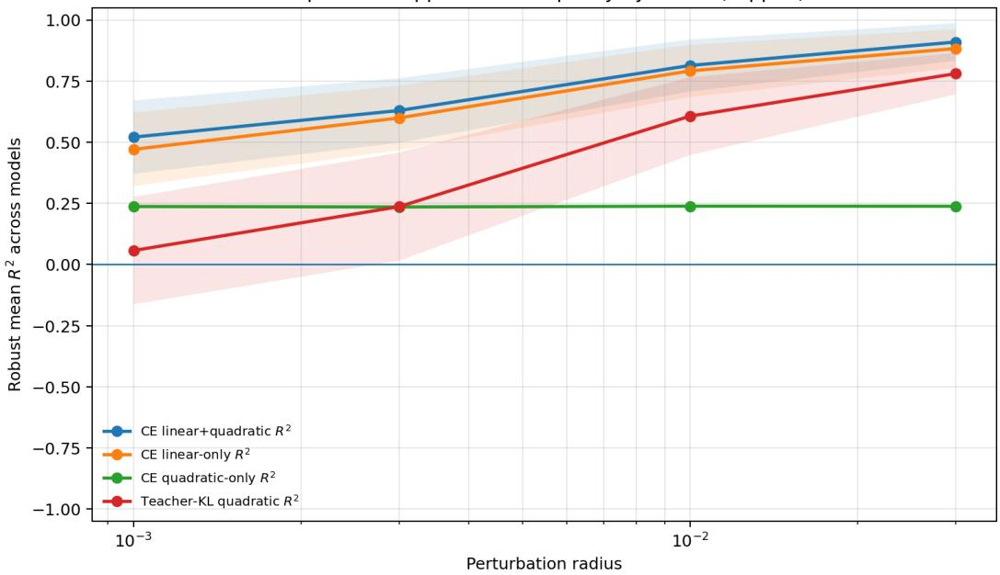  
Figure 4: Local hidden-state geometry predicts terminal loss changes. We perturb intermediate residual-stream states at different radii and compare the true terminal loss change to local predictors induced by the downstream map. For supervised CE, the linear-only and linear-plus-quadratic predictors are nearly indistinguishable, indicating that CE is first-order dominated in this perturbation regime. The quadratic-only CE predictor is substantially weaker, as expected because supervised one-hot CE is generally not stationary at the reference prediction. In contrast, the teacher-KL quadratic predictor isolates the pullback-Fisher curvature and becomes strongly predictive at moderate perturbation radii. Curves show model-averaged $R ^ { 2 } ;$ ; for visualization, ${ \bf \ddot { \boldsymbol { R } } ^ { \mathrm { 2 } } }$ values are clipped to [−1, 1] before aggregation to avoid degenerate-regression outliers.

Interpretation. A strong result for this experiment is not that the Fisher quadratic term alone predicts supervised CE. Rather, the intended conclusion is more precise: supervised CE requires the first-order term, while teacher-KL isolates the Fisher curvature. Therefore, the experiment separates two roles of the local geometry. The gradient term explains first-order supervised-loss sensitivity, whereas the pullback Fisher term captures second-order output-distribution sensitivity.

## D.2 Token-Fiber Saliency and Structured Token-Update Pruning

The third experiment evaluates whether the tokenwise trace of the pullback Fisher operator provides a useful loss-aware saliency score for token updates. The theory predicts that if a token position has small pullback-Fisher trace, then perturbations localized to that token position are less visible to the terminal predictive distribution. Such token updates should therefore be safer to prune.

Let $P _ { s }$ denote the projection onto the residual-stream coordinates corresponding to token position s. We define the tokenwise Fisher trace

$$
\kappa _ { \ell , s } = \mathrm { t r } \left( P _ { s } K _ { \ell } P _ { s } ^ { \top } \right) .
$$

Equivalently, $\kappa _ { \ell , s }$ measures the squared downstream sensitivity of token s’s hidden state, weighted by the output Fisher geometry. Large values indicate token positions whose hidden-state perturbations are locally visible to the final prediction, while small values indicate approximately prediction-insensitive token positions.

For each example and selected layer, we compute saliency scores over token positions. We then prune a fixed fraction $\rho$ of token updates according to each score, selecting the least salient positions for removal. The model is evaluated after the pruning intervention, and we measure the increase in cross-entropy relative to the unpruned forward pass:

$$
\Delta \mathrm { C E } = \mathrm { C E } _ { \mathrm { p r u n e d } } - \mathrm { C E } _ { \mathrm { b a s e } } .
$$

Lower ∆CE indicates a better pruning criterion.

In the main analysis, we report ∆CE rather than ∆PPL. Since perplexity exponentiates CE, rare catastrophic pruning failures can dominate mean ∆PPL and obscure the typical behavior. The CE difference is also equal to the log-perplexity ratio, making it a more stable primary metric:

$$
\Delta \mathrm { C E } = \log { \frac { \mathrm { P P L } _ { \mathrm { p r u n e d } } } { \mathrm { P P L } _ { \mathrm { b a s e } } } } .
$$

We compare the Fisher trace score against several alternative token saliency criteria:

• Random: randomly chosen token positions.

• Activation norm: token hidden-state norm.

• Attention: mean attention mass to the target position.

$J ^ { \top } J$ trace: unweighted downstream Jacobian sensitivity.

• Diagonal Fisher: a diagonal approximation to the Fisher weighting.

• Gradient-based scores: first-order loss heuristics such as gradient-times-activation and top-logit gradient.

These baselines separate several possible explanations. Random pruning checks whether any signal is present at all. Activation norm tests whether large hidden activations are sufficient. Attention tests whether standard attention weights already capture the relevant token saliency. The $J ^ { \top } J$ baseline tests whether the Fisher weighting itself adds value beyond unweighted downstream sensitivity. Gradient based scores provide strong first-order loss-aware baselines for the specific pruning intervention.

For each method and pruning fraction $\rho ,$ we report median or mean ∆CE across models. Aggregation is performed by first averaging within each model, method, and pruning fraction, and then averaging across models so that each model has equal weight.

We also report a Fisher-advantage plot:

$$
\Delta \mathrm { C E } _ { \mathrm { b a s e l i n e } } - \Delta \mathrm { C E } _ { \mathrm { F i s h e r } } .
$$

Positive values indicate that Fisher pruning causes a smaller CE increase than the baseline. This relative plot is useful for comparing Fisher directly to each alternative, but it should be interpreted together with the absolute ∆CE Pareto curves.

If the tokenwise pullback-Fisher trace captures prediction-relevant information, then Fisher pruning should be substantially better than random pruning and should outperform naive activation-based criteria. We also expect it to be competitive with attention and Jacobian-style baselines. We do not require Fisher to dominate all gradient-based heuristics, because those criteria use direct first-order loss information tailored to the specific pruning intervention.

The expected qualitative ranking is therefore:

Random and naive activation criteria worse than Fisher,

while Fisher should lie near the stronger loss-aware or geometry-aware baselines:

$$
{ \mathrm { F i s h e r } } \approx J ^ { \top } J \approx { \mathrm { A t t e n t i o n } } ,
$$

with direct gradient-based scores potentially competitive or stronger depending on the intervention.

Interpretation. This experiment should be interpreted as a practical validation that the pullback-Fisher trace contains usable token-level predictive information. A positive result is not necessarily that Fisher is the universally optimal pruning rule. Rather, the key conclusion is that the Fisher trace is a non-random, loss-aware geometric saliency score that identifies token updates whose removal produces smaller degradation than random or naive pruning. This supports the broader predictive-geometry view: the terminal loss induces a structured notion of local observability over token positions in the residual stream.

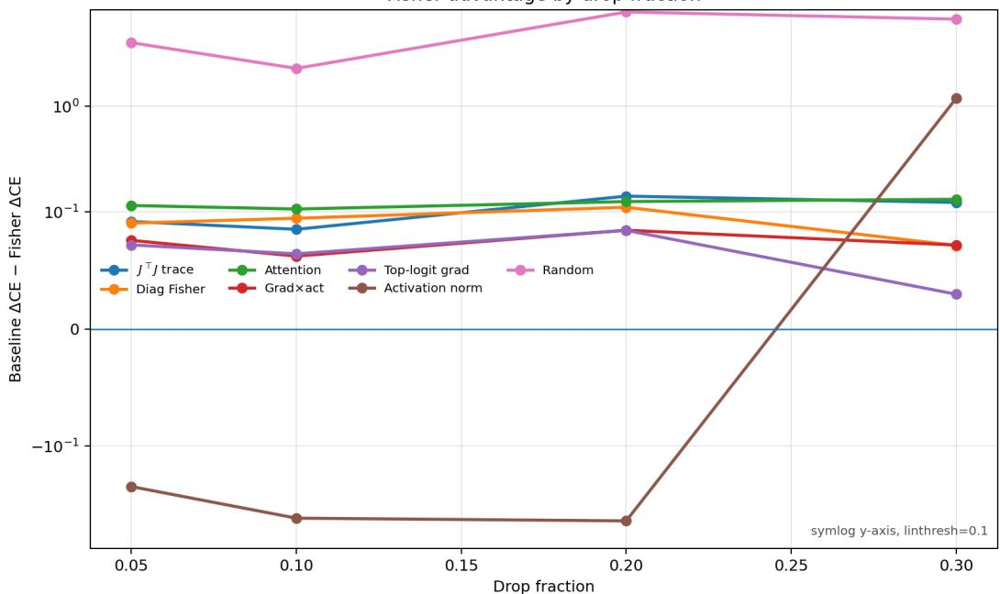  
Figure 5: Fisher token saliency is competitive with standard pruning baselines. We prune a fraction of token updates according to each baseline score and report the Fisher advantage $\Delta C E _ { \mathrm { b a s e l i n e } } - \Delta C E _ { \mathrm { F i s h e r } }$ Positive values indicate that Fisher pruning produces a smaller CE increase than the baseline. Fisher substantially outperforms random pruning and gives modest, consistent improvements over attention, $J ^ { \top } J .$ , diagonal-Fisher, and gradient-times-activation criteria in the aggregate. Activation norm is less stable across pruning fractions, performing better at small drop fractions but worse at the largest drop fraction. The y-axis uses a symlog scale with linear threshold 0.1 to show both small differences near zero and large improvements over weak baselines.

## E Details for Predictive-Geometry Distillation

## E.1 Low-Rank Student Construction

For each teacher model, we construct a compressed student by replacing selected linear layers with low-rank factors. We compress the attention projections

$$
q _ { \mathrm { p r o j } } , \quad k _ { \mathrm { p r o j } } , \quad v _ { \mathrm { p r o j } } , \quad o _ { \mathrm { p r o j } } ,\tag{18}
$$

and the MLP projections

$$
\mathrm { { g a t e } _ { p r o j } , \quad \mathrm { { u p } _ { p r o j } , \quad \mathrm { { d o w n } _ { p r o j } . } } }\tag{19}
$$

A full linear map W is replaced by

$$
W \approx A B , \qquad A \in \mathbb { R } ^ { d _ { \mathrm { o u t } } \times r } , \qquad B \in \mathbb { R } ^ { r \times d _ { \mathrm { i n } } } .\tag{20}
$$

Only the low-rank factors are trained during recovery; all other student parameters are frozen.

We evaluate two initializers. The first is ordinary truncated SVD. The second is activation-aware SVD. For activation-aware SVD, we collect diagonal activation second moments

$$
s _ { i } ^ { 2 } = \mathbb { E } [ x _ { i } ^ { 2 } ] ,\tag{21}
$$

where x is the input to the corresponding linear layer. We then compute a rank-r approximation to the scaled matrix

$$
W \deg ( s )\tag{22}
$$

and unscale the right factor. This minimizes the activation-weighted reconstruction objective

$$
\lVert ( W - { \hat { W } } ) \operatorname { d i a g } ( s ) \rVert _ { F } ^ { 2 } .\tag{23}
$$

This controls for the possibility that geometry-aware distillation only helps because ordinary SVD is a weak initializer.

## E.2 KD Objectives

We evaluate three output-level distillation objectives.

Forward KL.

$$
\mathcal { L } _ { \mathrm { F K L } } = D _ { \mathrm { K L } } ( p _ { T } | | p _ { S } ) = \sum _ { y } p _ { T } ( y ) \log \frac { p _ { T } ( y ) } { p _ { S } ( y ) } .\tag{24}
$$

Reverse KL.

$$
\mathcal { L } _ { \mathrm { R K L } } = D _ { \mathrm { K L } } ( p _ { S } \Vert p _ { T } ) = \sum _ { y } p _ { S } ( y ) \log \frac { p _ { S } ( y ) } { p _ { T } ( y ) } .\tag{25}
$$

Reverse KL is a stronger autoregressive distillation baseline because it is more mode-seeking and can be better matched to a lower-capacity student.

Skew KL.

$$
\mathcal { L } _ { \mathrm { S k e w K L } } = D _ { \mathrm { K L } } \left( p _ { T } \Vert \alpha p _ { T } + ( 1 - \alpha ) p _ { S } \right) .\tag{26}
$$

We use $\alpha = 0 . 1$ unless otherwise stated. For all KD objectives, logits are divided by temperature τ, and the KD loss is multiplied by $\tau ^ { 2 }$ . We use $\tau = 2$

## E.3 Predictive-Geometry Regularization

For each KD objective, we evaluate a geometry-regularized variant:

$$
\begin{array} { r } { \mathcal { L } = \mathcal { L } _ { \mathrm { K D } } + \lambda _ { \mathrm { C E } } \mathcal { L } _ { \mathrm { C E } } + \lambda _ { \mathrm { g e o } } \mathcal { L } _ { \mathrm { g e o } } . } \end{array}\tag{27}
$$

The ideal geometry term is the local pullback-Fisher quadratic

$$
\mathcal { L } _ { \mathrm { g e o } } = \frac { 1 } { | \mathcal { L } _ { \mathrm { g e o } } | } \sum _ { \ell \in \mathcal { L } _ { \mathrm { g e o } } } \frac { 1 } { 2 } \delta h _ { \ell } ^ { \top } K _ { \ell } ^ { T } \delta h _ { \ell } , \qquad \delta h _ { \ell } = h _ { \ell } ^ { S } - h _ { \ell } ^ { T } ,\tag{28}
$$

where

$$
K _ { \ell } ^ { T } = J _ { \ell } ^ { \top } F J _ { \ell }\tag{29}
$$

is the teacher pullback-Fisher operator induced by the downstream teacher map from layer ℓ to the output distribution.

In the current implementation, we use a readout-Fisher proxy for computational robustness across model families:

$$
h _ { \ell } \mapsto \mathrm { L M H e a d } ( \mathrm { F i n a l N o r m } ( h _ { \ell } ) ) .\tag{30}
$$

Thus,

$$
\mathcal { L } _ { \mathrm { g e o } } = \frac { 1 } { | \mathcal { L } _ { \mathrm { g e o } } | } \sum _ { \ell \in \mathcal { L } _ { \mathrm { g e o } } } \frac { 1 } { 2 } \Delta z _ { \ell } ^ { \top } F _ { T } \Delta z _ { \ell } ,\tag{31}
$$

where

$$
\Delta z _ { \ell } = g _ { T } ( h _ { \ell } ^ { S } ) - g _ { T } ( h _ { \ell } ^ { T } ) , \qquad g _ { T } ( h ) = \mathrm { L M H e a d } _ { T } ( \mathrm { F i n a l N o r m } _ { T } ( h ) ) .\tag{32}
$$

This preserves the output-Fisher weighting of hidden-state errors, but is weaker than the full downstream pullback-Fisher operator. We therefore report it as a readout-Fisher predictive-geometry regularizer.

## E.4 Experimental Grid

We evaluate two initializers:

$$
\{ \mathrm { S V D , A S V D } \} .\tag{33}
$$

For each initializer, we evaluate:

$$
\mathrm { \{ F K L , R K L , S k e w K L , F K L + G e o , R K L + G e o , S k e w K L + G e o \} } .\tag{34}
$$

The sweep is run on sub-billion-parameter models:

$$
\mathrm { S m o l L M 2 - 1 3 5 M , ~ \thinspace ~ S m o l L M 2 - 3 6 0 M , ~ \thinspace ~ Q w e n 2 . 5 - 0 . 5 B . }\tag{35}
$$

Unless otherwise stated, we use ranks

$$
r \in \{ 1 6 , 3 2 , 6 4 \} ,\tag{36}
$$

sequence length 256, batch size 1, temperature $\tau = 2 , \lambda _ { \mathrm { C E } } = 0 . 1$ , and $\lambda _ { \mathrm { g e o } } = 0 . 0 5$ . The geometry term is evaluated every 4 optimization steps on layers

$$
\{ 4 , 8 , 1 2 , 1 6 , 2 0 \} .\tag{37}
$$

For ASVD, activation statistics are collected from 16 calibration batches.

## E.5 Metrics

We report final perplexity,

$$
\mathrm { P P L } ( S ) ,\tag{38}
$$

where lower is better; the compression gap to the teacher,

$$
\Delta _ { \mathrm { t e a c h e r } } = \mathrm { P P L } ( S ) - \mathrm { P P L } ( T ) ,\tag{39}
$$

where lower is better; and the improvement over compressed initialization,

$$
\Delta _ { \mathrm { i n i t } } = \mathrm { P P L } ( S _ { \mathrm { i n i t } } ) - \mathrm { P P L } ( S _ { \mathrm { f i n a l } } ) ,\tag{40}
$$

where higher is better. We also report the teacher-KD divergence under the corresponding KD objective, where lower is better.

## E.6 Geometry Advantage

For each matched setting of model, initializer, rank, and seed, we compute

$$
A _ { \mathrm { g e o } } ( \mathcal { L } _ { \mathrm { K D } } ) = \mathrm { P P L } ( \mathcal { L } _ { \mathrm { K D } } ) - \mathrm { P P L } ( \mathcal { L } _ { \mathrm { K D } } + \mathcal { L } _ { \mathrm { g e o } } ) .\tag{41}
$$

A positive value means that adding the geometry term improves final perplexity. The main comparisons are

$$
A _ { \mathrm { g e o } } ( \mathrm { R K L } ) \qquad \mathrm { a n d } \qquad A _ { \mathrm { g e o } } ( \mathrm { S k e w K L } ) ,\tag{42}
$$

because they test whether geometry is complementary to stronger autoregressive KD objectives rather than only to vanilla forward-KL distillation.

## E.7 Theoretical examination

We briefly justify the geometry term used in predictive-geometry distillation. Let $h _ { \ell } ^ { T }$ and $h _ { \ell } ^ { S }$ denote teacher and student hidden states at layer $\ell ,$ and let

$$
\delta h _ { \ell } = h _ { \ell } ^ { S } - h _ { \ell } ^ { T } .
$$

Let $g _ { T }$ be the teacher readout map used by the regularizer. In the full version $g _ { T }$ is the downstream teacher map from layer ℓ to the target logits; in our implementation it is the readout-Fisher proxy described above. Write

$$
z _ { T } = g _ { T } ( h _ { \ell } ^ { T } ) , \qquad z _ { S } = g _ { T } ( h _ { \ell } ^ { S } ) , \qquad \Delta z = z _ { S } - z _ { T } ,
$$

and

$$
p _ { T } = \mathrm { s o f t m a x } ( z _ { T } ) , \qquad p _ { S } = \mathrm { s o f t m a x } ( z _ { S } ) .
$$

## E.7.1 Exact Fisher identity in logit space.

Consider the straight path

$$
z ( t ) = z _ { T } + t \Delta z , \qquad p ( t ) = \mathrm { s o f t m a x } ( z ( t ) ) .
$$

Define

$$
\psi ( t ) = D _ { \mathrm { K L } } \left( p _ { T } \Vert p ( t ) \right) .
$$

Then $\psi ( 0 ) = 0 , \psi ^ { \prime } ( 0 ) = 0$ , and

$$
\psi ^ { \prime \prime } ( t ) = { \Delta z } ^ { \top } F ( p ( t ) ) { \Delta z } ,
$$

where

$$
F ( p ( t ) ) = \mathrm { d i a g } ( p ( t ) ) - p ( t ) p ( t ) ^ { \top }
$$

is the softmax Fisher matrix. Therefore, by the integral form of Taylor’s theorem,

$$
D _ { \mathrm { K L } } ( p _ { T } \| p _ { S } ) = \int _ { 0 } ^ { 1 } ( 1 - t ) \Delta z ^ { \top } F ( p ( t ) ) \Delta z d t .\tag{43}
$$

Thus the exact teacher-student KL in logit space is a path-integrated Fisher energy.

## E.7.2 Local pullback to hidden space.

If $g _ { T }$ is differentiable at $h _ { \ell } ^ { T }$ , with Jacobian

$$
J _ { \ell } = D g _ { T } ( h _ { \ell } ^ { T } ) ,
$$

then

$$
\begin{array} { r } { \Delta z = J _ { \ell } \delta h _ { \ell } + O ( \| \delta h _ { \ell } \| ^ { 2 } ) . } \end{array}
$$

Using (43) and smoothness of $F ( p )$ , we obtain

$$
D _ { \mathrm { K L } } ( p _ { T } \Vert p _ { S } ) = \frac { 1 } { 2 } \delta h _ { \ell } ^ { \top } J _ { \ell } ^ { \top } F ( p _ { T } ) J _ { \ell } \delta h _ { \ell } + O ( \Vert \delta h _ { \ell } \Vert ^ { 3 } ) .\tag{44}
$$

Hence the quadratic predictive-geometry term

$$
\frac { 1 } { 2 } \delta h _ { \ell } ^ { \top } K _ { \ell } ^ { T } \delta h _ { \ell } , \qquad K _ { \ell } ^ { T } = J _ { \ell } ^ { \top } F ( p _ { T } ) J _ { \ell } ,\tag{45}
$$

is the local hidden-space pullback of the exact teacher-student KL induced by the hidden-state mismatch. This is why the regularizer penalizes hidden errors according to their effect on the teacher predictive distribution rather than their Euclidean size.

## E.7.3 When a small geometry regularizer helps.

Let

$$
A ( \theta ) = \mathcal { L } _ { \mathrm { K D } } ( \theta ) + \lambda _ { \mathrm { C E } } \mathcal { L } _ { \mathrm { C E } } ( \theta )
$$

be the base distillation objective, and let $G ( \theta )$ be the predictive- geometry regularizer. Suppose $\theta _ { 0 }$ i a nondegenerate local minimizer of A, with Hessian

$$
H _ { A } = \nabla ^ { 2 } A ( \theta _ { 0 } ) \succ 0
$$

on the trainable subspace. Let $\theta _ { \lambda }$ be the nearby local minimizer of

$$
A ( \theta ) + \lambda G ( \theta )
$$

for small $\lambda > 0$ . By the implicit function theorem,

$$
\theta _ { \lambda } = \theta _ { 0 } - \lambda H _ { A } ^ { - 1 } \nabla G ( \theta _ { 0 } ) + O ( \lambda ^ { 2 } ) .\tag{46}
$$

Therefore, for any differentiable evaluation functional $V ( \theta )$

$$
\begin{array} { r } { V ( \theta _ { \lambda } ) - V ( \theta _ { 0 } ) = - \lambda \big \langle \nabla V ( \theta _ { 0 } ) , H _ { A } ^ { - 1 } \nabla G ( \theta _ { 0 } ) \big \rangle + O ( \lambda ^ { 2 } ) . } \end{array}\tag{47}
$$

Thus, for sufficiently small λ, the geometry term improves V whenever

$$
\left. \nabla V ( \theta _ { 0 } ) , H _ { A } ^ { - 1 } \nabla G ( \theta _ { 0 } ) \right. > 0 .\tag{48}
$$

In particular, if $V = G$ , then

$$
\begin{array} { r } { G ( \theta _ { \lambda } ) - G ( \theta _ { 0 } ) = - \lambda \nabla G ( \theta _ { 0 } ) ^ { \top } H _ { A } ^ { - 1 } \nabla G ( \theta _ { 0 } ) + O ( \lambda ^ { 2 } ) . } \end{array}\tag{49}
$$

Hence, whenever $\nabla G ( \theta _ { 0 } ) \neq 0 .$ , a sufficiently small geometry weight locally decreases the predictivegeometry mismatch. The regularizer is therefore expected to help when the compressed student has hidden-state errors with large Fisher-weighted energy that are not already removed by the base KD objective. Conversely, if the base KD objective already controls these prediction-relevant hidden directions, or if the student error lies mostly in prediction-null directions, the geometry term may provide little benefit.

## Informal summary: when geometry helps distillation

The predictive-geometry regularizer is a hidden-state surrogate for teacher-student predictive mismatch. In logit space, the exact teacher-student KL is a path-integrated Fisher energy; locally, pulling this Fisher geometry back through the teacher readout gives the quadratic penalty

$$
\frac { 1 } { 2 } \delta h _ { \ell } ^ { \top } K _ { \ell } ^ { T } \delta h _ { \ell } .
$$

Thus the regularizer does not ask the student to match all hidden-state directions equally. It mainly penalizes errors in directions that the teacher uses for prediction.

Consequently, geometry regularization is expected to help when the compressed student makes errors with large Fisher-weighted energy, i.e. errors aligned with high-curvature directions of $K _ { \ell } ^ { T }$ , and when the base KD objective has not already corrected those directions. It may help little, or even hurt, when the student errors are mostly prediction-null, when the base KD loss already controls the relevant directions, or when the geometry weight is too large.

## E.8 Distillation Results

Table 1 reports the paired geometry advantage

$$
A _ { \mathrm { g e o } } ( \mathcal { L } _ { \mathrm { K D } } ) = \mathrm { P P L } ( \mathcal { L } _ { \mathrm { K D } } ) - \mathrm { P P L } ( \mathcal { L } _ { \mathrm { K D } } + \mathcal { L } _ { \mathrm { g e o } } ) ,
$$

computed over matched completed settings. Positive values indicate that adding the predictivegeometry term improves the compressed student at fixed model, initializer, rank, and seed. The geometry term is not uniformly beneficial for forward KL, but it improves stronger autoregressive KD objectives more reliably: RKL+Geo improves over RKL in 9/14 matched settings, and SkewKL+Geo improves over SkewKL in 10/14 matched settings. The largest average gain is obtained for SkewKL, suggesting that predictive geometry is complementary to mode-seeking and skewed KD objectives rather than simply replacing output-level distillation.

Because the sweep contains incomplete runs, we report paired statistics only on matched completed settings. A complete listing of finished and unfinished runs is provided in the supplementary tables.

Table 3: Completed KD-geometry sweep results for Qwen2.5-0.5B. Lower is better for PPL and KD divergence; higher is better for improvement over compressed initialization.
<table><tr><td>Model</td><td>Method</td><td>Rank</td><td>Compression</td><td>Init PPL↓</td><td>Final PPL ↓</td><td> $\Delta _ { \mathrm { i n i t } }$  ↑</td></tr><tr><td>Qwen2.5-0.5B</td><td>asvd+fkl</td><td>16</td><td>40.546x</td><td>2.44e+05</td><td>581.4</td><td>2.43e+05</td></tr><tr><td>Qwen2.5-0.5B</td><td>asvd+rkl</td><td>16</td><td>40.546x</td><td>2.44e+05</td><td>653.0</td><td>2.43e+05</td></tr><tr><td>Qwen2.5-0.5B</td><td>asvd+skewkl</td><td>16</td><td>40.546x</td><td>2.44e+05</td><td>551.2</td><td>2.43e+05</td></tr><tr><td>Qwen2.5-0.5B</td><td>svd+fkl</td><td>16</td><td>40.546x</td><td>2.15e+06</td><td>690.9</td><td>2.15e+06</td></tr><tr><td>Qwen2.5-0.5B</td><td>svd+fkl_geom</td><td>16</td><td>40.546x</td><td>2.15e+06</td><td>675.9</td><td>2.15e+06</td></tr><tr><td>Qwen2.5-0.5B</td><td>svd+rkl</td><td>16</td><td>40.546x</td><td>2.15e+06</td><td>761.5</td><td>2.15e+06</td></tr><tr><td>Qwen2.5-0.5B</td><td>svd+rkl_geom</td><td>16</td><td>40.546x</td><td>2.15e+06</td><td>756.7</td><td>2.15e+06</td></tr><tr><td>Qwen2.5-0.5B</td><td>svd+skewkl</td><td>16</td><td>40.546x</td><td>2.15e+06</td><td>690.9</td><td>2.15e+06</td></tr><tr><td>Qwen2.5-0.5B</td><td>svd+skewkl_geom</td><td>16</td><td>40.546x</td><td>2.15e+06</td><td>682.3</td><td>2.15e+06</td></tr><tr><td>Qwen2.5-0.5B</td><td>asvd+fkl</td><td>32</td><td>20.305x</td><td>1.63e+06</td><td>590.6</td><td>1.63e+06</td></tr><tr><td>Qwen2.5-0.5B</td><td>asvd+fkl_geom</td><td>32</td><td>20.305x</td><td>1.63e+06</td><td>665.4</td><td>1.63e+06</td></tr><tr><td>Qwen2.5-0.5B</td><td>asvd+rkl</td><td>32</td><td>20.305x</td><td>1.63e+06</td><td>598.1</td><td>1.63e+06</td></tr><tr><td>Qwen2.5-0.5B</td><td>asvd+rkl_geom</td><td>32</td><td>20.305x</td><td>1.63e+06</td><td>601.8</td><td>1.63e+06</td></tr><tr><td>Qwen2.5-0.5B</td><td>asvd+skewkl</td><td>32</td><td>20.305x</td><td>1.63e+06</td><td>503.3</td><td>1.63e+06</td></tr><tr><td>Qwen2.5-0.5B</td><td>asvd+skewkl_geom</td><td>32</td><td>20.305x</td><td>1.63e+06</td><td>495.5</td><td>1.63e+06</td></tr><tr><td>Qwen2.5-0.5B</td><td>svd+fkl</td><td>32</td><td>20.305x</td><td>77866</td><td>537.6</td><td>77328</td></tr><tr><td>Qwen2.5-0.5B</td><td>svd+fkl_geom</td><td>32</td><td>20.305x</td><td>77866</td><td>535.9</td><td>77330</td></tr><tr><td>Qwen2.5-0.5B</td><td>svd+rkl</td><td>32</td><td>20.305x</td><td>77866</td><td>648.9</td><td>77217</td></tr><tr><td>Qwen2.5-0.5B</td><td>svd+rkl_geom</td><td>32</td><td>20.305x</td><td>77866</td><td>617.1</td><td>77249</td></tr><tr><td>Qwen2.5-0.5B</td><td>svd+skewkl</td><td>32</td><td>20.305x</td><td>77866</td><td>556.4</td><td>77310</td></tr><tr><td>Qwen2.5-0.5B</td><td>svd+skewkl_geom</td><td>32</td><td>20.305x</td><td>77866</td><td>556.4</td><td>77310</td></tr><tr><td>Qwen2.5-0.5B</td><td>asvd+fkl</td><td>64</td><td>10.160x</td><td>6.49e+05</td><td>324.4</td><td>6.49e+05</td></tr><tr><td>Qwen2.5-0.5B</td><td>asvd+fkl_geom</td><td>64</td><td>10.160x</td><td>6.49e+05</td><td>362.0</td><td>6.49e+05</td></tr><tr><td>Qwen2.5-0.5B</td><td>asvd+rkl</td><td>64</td><td>10.160x</td><td>6.49e+05</td><td>418.2</td><td>6.49e+05</td></tr><tr><td>Qwen2.5-0.5B</td><td>asvd+rkl_geom</td><td>64</td><td>10.160x</td><td>6.49e+05</td><td>409.2</td><td>6.49e+05</td></tr><tr><td>Qwen2.5-0.5B</td><td>asvd+skewkl</td><td>64</td><td>10.160x</td><td>6.49e+05</td><td>343.2</td><td>6.49e+05</td></tr><tr><td>Qwen2.5-0.5B</td><td>asvd+skewkl_geom</td><td>64</td><td>10.160x</td><td>6.49e+05</td><td>357.5</td><td>6.49e+05</td></tr><tr><td>Qwen2.5-0.5B</td><td>svd+fkl</td><td>64</td><td>10.160x</td><td>1.53e+05</td><td>509.7</td><td>1.53e+05</td></tr><tr><td>Qwen2.5-0.5B</td><td>svd+fkl_geom</td><td>64</td><td>10.160x</td><td>1.53e+05</td><td>500.1</td><td>1.53e+05</td></tr><tr><td>Qwen2.5-0.5B</td><td>svd+rkl</td><td>64</td><td>10.160x</td><td>1.53e+05</td><td>521.0</td><td>1.53e+05</td></tr><tr><td>Qwen2.5-0.5B</td><td>svd+rkl_geom</td><td>64</td><td>10.160x 10.160x</td><td>1.53e+05 1.53e+05</td><td>534.2</td><td>1.53e+05</td></tr><tr><td>Qwen2.5-0.5B Qwen2.5-0.5B</td><td>svd+skewkl svd+skewkl_geom</td><td>64 64</td><td>10.160x</td><td>1.53e+05</td><td>462.4 453.8</td><td>1.53e+05 1.53e+05</td></tr><tr><td></td><td></td><td></td><td></td><td></td><td></td><td></td></tr></table>

Table 4: Completed KD-geometry sweep results for SmolLM2 models. Lower is better for PPL and KD divergence; higher is better for improvement over compressed initialization.
<table><tr><td>Model</td><td>Method</td><td>Rank</td><td>Compression</td><td>Init PPL</td><td>Final PPL↓</td><td> $\Delta _ { \mathrm { i n i t } } ~ \uparrow$ </td></tr><tr><td>SmolLM2-135M</td><td>asvd+fkl</td><td>32</td><td>10.868x</td><td>1.00e+08</td><td>713.0</td><td>1.00e+08</td></tr><tr><td>SmolLM2-135M</td><td>asvd+fkl geom</td><td>32</td><td>10.868x</td><td>1.00e+08</td><td>706.3</td><td>1.00e+08</td></tr><tr><td>SmolLM2-135M</td><td>asvd+rkl</td><td>32</td><td>10.868x</td><td>1.00e+08</td><td>831.4</td><td>1.00e+08</td></tr><tr><td>SmolLM2-135M</td><td>asvd+rkl_geom</td><td>32</td><td>10.868x</td><td>1.00e+08</td><td>808.3</td><td>1.00e+08</td></tr><tr><td>SmolLM2-135M</td><td>asvd+skewkl</td><td>32</td><td>10.868x</td><td>1.00e+08</td><td>690.9</td><td>1.00e+08</td></tr><tr><td>SmolLM2-135M</td><td>asvd+skewkl_geom</td><td>32</td><td>10.868x</td><td>1.00e+08</td><td>693.1</td><td>1.00e+08</td></tr><tr><td>SmolLM2-135M</td><td>svd+rkl_geom</td><td>32</td><td>10.868x</td><td>4.85e+08</td><td>2171</td><td>4.85e+08</td></tr><tr><td>SmolLM2-135M</td><td>svd+skewkl_geom</td><td>32</td><td>10.868x</td><td>4.85e+08</td><td>1850</td><td>4.85e+08</td></tr><tr><td>SmolLM2-135M</td><td>asvd+fkl</td><td>64</td><td>5.434x</td><td>8.94e+07</td><td>455.2</td><td>8.94e+07</td></tr><tr><td>SmolLM2-135M</td><td>asvd+fkl_geom</td><td>64</td><td>5.434x</td><td>8.94e+07</td><td>430.2</td><td>8.94e+07</td></tr><tr><td>SmolLM2-135M</td><td>asvd+rkl</td><td>64</td><td>5.434x</td><td>8.94e+07</td><td>501.7</td><td>8.94e+07</td></tr><tr><td>SmolLM2-135M</td><td>asvd+rkl_geom</td><td>64</td><td>5.434x</td><td>8.94e+07</td><td>486.2</td><td>8.94e+07</td></tr><tr><td>SmolLM2-135M</td><td>asvd+skewkl</td><td>64</td><td>5.434x</td><td>8.94e+07</td><td>423.5</td><td>8.94e+07</td></tr><tr><td>SmolLM2-135M</td><td>asvd+skewkl_geom</td><td>64</td><td>5.434x</td><td>8.94e+07</td><td>416.9</td><td>8.94e+07</td></tr><tr><td>SmolLM2-135M</td><td>svd+fkl</td><td>64</td><td>5.434x</td><td>1.52e+08</td><td>1127</td><td>1.52e+08</td></tr><tr><td>SmolLM2-135M</td><td>svd+fkl_geom</td><td>64</td><td>5.434x</td><td>1.52e+08</td><td>1079</td><td>1.52e+08</td></tr><tr><td>SmolLM2-135M</td><td>svd+rkl</td><td>64</td><td>5.434x</td><td>1.52e+08</td><td>1378</td><td>1.52e+08</td></tr><tr><td>SmolLM2-135M</td><td>svd+rkl_geom</td><td>64</td><td>5.434x</td><td>1.52e+08</td><td>1339</td><td>1.52e+08</td></tr><tr><td>SmolLM2-135M</td><td>svd+skewkl</td><td>64</td><td>5.434x</td><td>1.52e+08</td><td>1323</td><td>1.52e+08</td></tr><tr><td>SmolLM2-135M</td><td>svd+skewkl_geom</td><td>64</td><td>5.434x</td><td>1.52e+08</td><td>1306</td><td>1.52e+08</td></tr><tr><td>SmolLM2-360M</td><td>asvd+fkl</td><td>16</td><td>36.226x</td><td>1.79e+05</td><td>1089</td><td>1.78e+05</td></tr><tr><td>SmolLM2-360M</td><td>asvd+fkl_geom</td><td>16</td><td>36.226x</td><td>1.79e+05</td><td>1254</td><td>1.78e+05</td></tr><tr><td>SmolLM2-360M</td><td>asvd+rkl</td><td>16</td><td>36.226x</td><td>1.79e+05</td><td>1124</td><td>1.78e+05</td></tr><tr><td>SmolLM2-360M</td><td>asvd+rkl_geom</td><td>16</td><td>36.226x</td><td>1.79e+05</td><td>1082</td><td>1.78e+05</td></tr><tr><td>SmolLM2-360M</td><td>asvd+skewkl</td><td>16</td><td>36.226x</td><td>1.79e+05</td><td>1219</td><td>1.78e+05</td></tr><tr><td>SmolLM2-360M</td><td>asvd+skewkl_geom</td><td>16</td><td>36.226x</td><td>1.79e+05</td><td>939.6</td><td>1.78e+05</td></tr><tr><td>SmolLM2-360M</td><td>svd+fkl</td><td>16</td><td>36.226x</td><td>8.09e+07</td><td>1850</td><td>8.09e+07</td></tr><tr><td>SmolLM2-360M</td><td>svd+fkl_geom</td><td>16</td><td>36.226x</td><td>8.09e+07</td><td>2078</td><td>8.09e+07</td></tr><tr><td>SmolLM2-360M</td><td>svd+rkl</td><td>16</td><td>36.226x</td><td>8.09e+07</td><td>2199</td><td>8.09e+07</td></tr><tr><td>SmolLM2-360M</td><td>svd+rkl_geom</td><td>16</td><td>36.226x</td><td>8.09e+07</td><td>2039</td><td>8.09e+07</td></tr><tr><td>SmolLM2-360M</td><td>svd+skewkl</td><td>16</td><td>36.226x</td><td>8.09e+07</td><td>1805</td><td>8.09e+07</td></tr><tr><td>SmolLM2-360M</td><td>svd+skewkl_geom</td><td>16</td><td>36.226x</td><td>8.09e+07</td><td>1637</td><td>8.09e+07</td></tr><tr><td>SmolLM2-360M</td><td>asvd+fkl</td><td>32</td><td>18.113x</td><td>1.46e+06</td><td>726.5</td><td>1.46e+06</td></tr><tr><td>SmolLM2-360M</td><td>asvd+fkl_geom</td><td>32</td><td>18.113x</td><td>1.46e+06</td><td>754.4</td><td>1.46e+06</td></tr><tr><td>SmolLM2-360M</td><td>asvd+rkl</td><td>32</td><td>18.113x</td><td>1.46e+06</td><td>841.9</td><td>1.46e+06</td></tr><tr><td>SmolLM2-360M</td><td>asvd+rkl_geom</td><td>32</td><td>18.113x</td><td>1.46e+06</td><td>927.9</td><td>1.46e+06</td></tr><tr><td>SmolLM2-360M</td><td>asvd+skewkl</td><td>32</td><td>18.113x</td><td>1.46e+06</td><td>747.3</td><td>1.46e+06</td></tr><tr><td>SmolLM2-360M</td><td>asvd+skewkl_geom</td><td>32</td><td>18.113x</td><td>1.46e+06</td><td>754.4</td><td>1.46e+06</td></tr><tr><td>SmolLM2-360M</td><td>svd+fkl svd+fkl_geom</td><td>32</td><td>18.113x</td><td>2.01e+07</td><td>1462</td><td>2.01e+07</td></tr><tr><td>SmolLM2-360M</td><td>svd+rkl</td><td>32</td><td>18.113x</td><td>2.01e+07</td><td>1547</td><td>2.01e+07</td></tr><tr><td>SmolLM2-360M</td><td></td><td>32</td><td>18.113x</td><td>2.01e+07</td><td>2408</td><td>2.01e+07</td></tr><tr><td>SmolLM2-360M</td><td>svd+rkl_geom svd+skewkl</td><td>32</td><td>18.113x</td><td>2.01e+07</td><td>2276</td><td>2.01e+07</td></tr><tr><td>SmolLM2-360M</td><td>svd+skewkl_geom</td><td>32</td><td>18.113x</td><td>2.01e+07</td><td>1880</td><td>2.01e+07</td></tr><tr><td>SmolLM2-360M</td><td>asvd+fkl</td><td>32</td><td>18.113x</td><td>2.01e+07</td><td>1700</td><td>2.01e+07</td></tr><tr><td>SmolLM2-360M</td><td>asvd+fkl_geom</td><td>64</td><td>9.057x</td><td>78849</td><td>431.6</td><td>78418</td></tr><tr><td>SmolLM2-360M</td><td></td><td>64</td><td>9.057x</td><td>78849</td><td>449.5</td><td>78400</td></tr><tr><td>SmolLM2-360M</td><td>asvd+rkl</td><td>64</td><td>9.057x</td><td>78849</td><td>516.1</td><td>78333</td></tr><tr><td>SmolLM2-360M</td><td>asvd+rkl_geom</td><td>64</td><td>9.057x</td><td>78849</td><td>529.2</td><td>78320</td></tr><tr><td>SmolLM2-360M</td><td>asvd+skewkl</td><td>64</td><td>9.057x</td><td>78849</td><td>461.0</td><td>78388</td></tr><tr><td>SmolLM2-360M</td><td>asvd+skewkl_geom</td><td>64</td><td>9.057x</td><td>78849</td><td>367.8</td><td>78482</td></tr><tr><td>SmolLM2-360M</td><td>svd+fkl</td><td>64</td><td>9.057x</td><td>3.53e+07</td><td>1152</td><td>3.53e+07</td></tr><tr><td>SmolLM2-360M</td><td>svd+fkl_geom</td><td>64</td><td>9.057x</td><td>3.53e+07</td><td>1159</td><td>3.53e+07</td></tr><tr><td>SmolLM2-360M</td><td>svd+rkl</td><td>64</td><td>9.057x</td><td>3.53e+07</td><td>1453</td><td>3.53e+07</td></tr><tr><td>SmolLM2-360M</td><td>svd+rkl_geom</td><td>64</td><td>9.057x</td><td>3.53e+07 3.53e+07</td><td>1495 1193</td><td>3.53e+07 3.53e+07</td></tr><tr><td>SmolLM2-360M SmolLM2-360M</td><td>svd+skewkl svd+skewkl_geom</td><td>64 64</td><td>9.057x 9.057x</td></table>

Table 5: Paired geometry comparisons for stronger KD baselines. Lower PPL is better; $\Delta _ { \mathrm { G e o } } > 0$ means that adding geometry improves final PPL.
<table><tr><td>Model</td><td>Init.</td><td>Rank</td><td>RKL</td><td>RKL+Geo</td><td> $\Delta _ { \mathrm { G e o } }$  ←</td><td>SkewKL</td><td>SkewKL+Geo</td><td> $\Delta _ { \mathrm { G e o } } \uparrow$ </td></tr><tr><td>Qwen2.5-0.5B</td><td>ASVD</td><td>32</td><td>598.1</td><td>601.8</td><td>-3.8</td><td>503.3</td><td>495.5</td><td>7.8</td></tr><tr><td>Qwen2.5-0.5B</td><td>ASVD</td><td>64</td><td>418.2</td><td>409.2</td><td>9.1</td><td>343.2</td><td>357.5</td><td>-14.3</td></tr><tr><td>Qwen2.5-0.5B</td><td>SVD</td><td>16</td><td>761.5</td><td>756.7</td><td>4.8</td><td>690.9</td><td>682.3</td><td>8.6</td></tr><tr><td>Qwen2.5-0.5B</td><td>SVD</td><td>32</td><td>648.9</td><td>617.1</td><td>31.8</td><td>556.4</td><td>556.4</td><td>0.0</td></tr><tr><td>Qwen2.5-0.5B</td><td>SVD</td><td>64</td><td>521.0</td><td>534.2</td><td>-13.2</td><td>462.4</td><td>453.8</td><td>8.6</td></tr><tr><td>SmolLM2-135M</td><td>ASVD</td><td>32</td><td>831.4</td><td>808.3</td><td>23.1</td><td>690.9</td><td>693.1</td><td>-2.2</td></tr><tr><td>SmolLM2-135M</td><td>ASVD</td><td>64</td><td>501.7</td><td>486.2</td><td>15.5</td><td>423.5</td><td>416.9</td><td>6.6</td></tr><tr><td>SmolLM2-135M</td><td>SVD</td><td>64</td><td>1378</td><td>1339</td><td>38.4</td><td>1323</td><td>1306</td><td>16.5</td></tr><tr><td>SmolLM2-360M</td><td>ASVD</td><td>16</td><td>1124</td><td>1082</td><td>41.5</td><td>1219</td><td>939.6</td><td>279.5</td></tr><tr><td>SmolLM2-360M</td><td>ASVD</td><td>32</td><td>841.9</td><td>927.9</td><td>-86.0</td><td>747.3</td><td>754.4</td><td>-7.1</td></tr><tr><td>SmolLM2-360M</td><td>ASVD</td><td>64</td><td>516.1</td><td>529.2</td><td>-13.1</td><td>461.0</td><td>367.8</td><td>93.2</td></tr><tr><td>SmolLM2-360M</td><td>SVD</td><td>16</td><td>2199</td><td>2039</td><td>159.5</td><td>1805</td><td>1637</td><td>167.2</td></tr><tr><td>SmolLM2-360M</td><td>SVD</td><td>32</td><td>2408</td><td>2276</td><td>132.2</td><td>1880</td><td>1700</td><td>179.5</td></tr><tr><td>SmolLM2-360M</td><td>SVD</td><td>64</td><td>1453</td><td>1495</td><td>-41.6</td><td>1193</td><td>1106</td><td>86.5</td></tr></table>

## F Additional figures.

## F.1 Pruning results

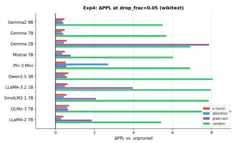

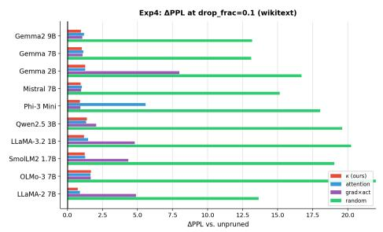

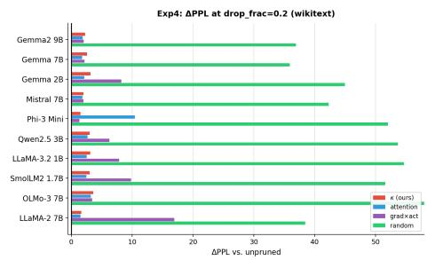

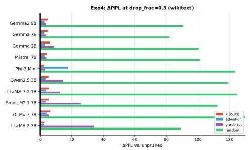  
Figure 6: Experiment 3: ∆PPL on WIKITEXT under structured pruning for four drop fractions $\rho \in \{ 0 . 0 5 , 0 . 1 0 , 0 . 2 0 , 0 . 3 0 \}$ . We compare our geometry-guided kappa criterion (red) to pruning based on attention scores (blue), a gradient-activation saliency baseline (purple), and random pruning (green); lower ∆PPL is better.

## F.2 Direct validation of the quadratic approximation.

Top-Fisher observed-ys-predicted correlation: FineWeb  
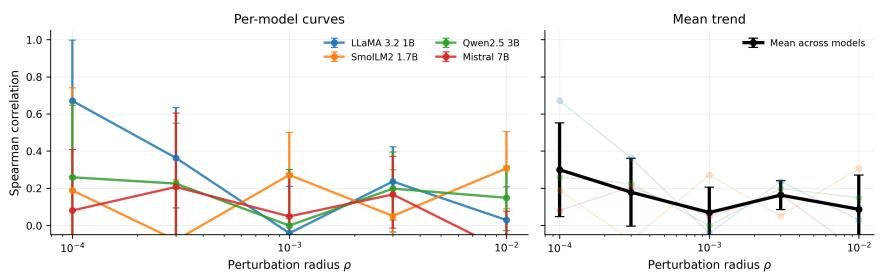  
Top-Fisher observed-vs-predicted correlation: WikiText

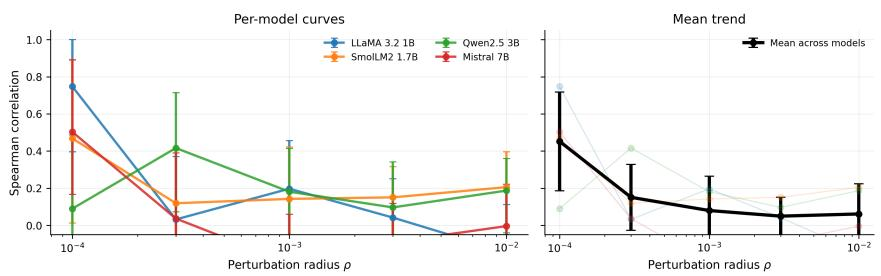  
Figure 7: Direct validation of the local pullback-Fisher approximation for top-Fisher perturbation directions on WikiText and FineWeb. For each dataset, the left panel shows the Spearman correlation between the observed teacher-KL increase and the quadratic prediction ${ \textstyle \frac { 1 } { 2 } } \alpha ^ { 2 } v ^ { \dagger } K _ { \ell } v$ for each model separately, as a function of the relative perturbation radius $\rho .$ The right panel shows the mean trend across models, with error bars denoting uncertainty across models. Correlations are highest at the smallest perturbation radii and generally decrease as $\rho$ grows, consistent with the local nature of Theorem 1.

## F.3 Compute costs

Table 6: Representative compute cost for geometry estimation on one dataset. GPU hours are approximate wall-clock estimates for computing all reported geometry statistics on the selected layer subset. Actual runtime depends on GPU type, attention implementation, and model checkpoint.
<table><tr><td>Model</td><td>Seq. len.</td><td>Examples</td><td>Model layers</td><td>GPU hours</td></tr><tr><td>LLaMA-3.2-1B</td><td>512</td><td>32</td><td>16</td><td>≈0.8</td></tr><tr><td>SmolLM2-1.7B</td><td>512</td><td>32</td><td>24</td><td>≈1.0</td></tr><tr><td>Gemma-2B</td><td>512</td><td>32</td><td>26</td><td>≈1.2</td></tr><tr><td>Qwen2.5-3B</td><td>512</td><td>32</td><td>36</td><td>≈2.0</td></tr><tr><td>Phi-3 Mini</td><td>512</td><td>32</td><td>32</td><td>≈ 2.2</td></tr><tr><td>LLaMA-2-7B</td><td>512</td><td>32</td><td>32</td><td>≈4.0</td></tr><tr><td>Mistral-7B</td><td>512</td><td>32</td><td>32</td><td>≈4.0</td></tr><tr><td>Gemma-7B</td><td>512</td><td>32</td><td>28</td><td>≈4.5</td></tr><tr><td>OLMo-3-7B</td><td>512</td><td>32</td><td>32</td><td>≈4.5</td></tr><tr><td>Gemma2-9B</td><td>512</td><td>32</td><td>42</td><td>≈6.0</td></tr></table>

## G Limitations and Future Directions

This work focuses on a local predictive-geometric description of hidden trajectories in trained decoder-only transformers. We view the following points as natural directions for extending the framework.

Local nature of the theory. Our theoretical results characterize layerwise loss-to-go functions near a reference hidden trajectory $X _ { \ell } ^ { \star }$ . This local viewpoint is deliberate: it lets us connect the terminal prediction loss to measurable curvature and observability structure inside the residual stream. A complementary direction is to understand how these local geometries fit together across larger regions of hidden-state space, and how such structure emerges during training.

Perturbation scale. The empirical Taylor validation depends on the perturbation radius. Very small radii can make the measured loss changes close to numerical or sampling noise, whereas very large radii can leave the local Taylor regime. This is why we report performance across radii rather than at a single scale. More adaptive choices of radius, possibly layer- or model-dependent, may give sharper local diagnostics.

Architectural scope. We study fixed trained decoder-only pre-norm transformers with causal self-attention and a standard softmax readout. This setting already covers a large class of language models and gives a clean causal interpretation of the token-fiber score $\kappa _ { \ell , s }$ . Extending the same predictive-geometric view to encoder-decoder models, bidirectional transformers, mixture-of-experts models, retrieval-augmented models, and architectures with explicit memory is an interesting next step.

Computation of geometric quantities. The pullback-Fisher operator $K _ { \ell } ,$ its spectral summaries, and the tokenwise scores $\kappa _ { \ell , s }$ can be estimated without materializing the full matrix, using matrix-free JVP/VJP products. Nevertheless, these estimates are more expensive than ordinary forward-pass statistics such as activation norms or attention weights. Improving the efficiency of trace, spectrum, and tokenwise-curvature estimation-for example through better probe sharing, sketching, or amortized estimators-would make the approach more practical for larger-scale deployment.

Reduction and pruning objectives. Our rank-allocation and token-pruning experiments are intended as controlled tests of whether predictive geometry provides useful loss-aware signals. The local theory suggests which directions or token updates are safer to discard near a reference trajectory, but it is not meant to replace full compression pipelines or task-specific pruning algorithms. In particular, direct gradient-based heuristics can be highly competitive for a fixed pruning intervention. A promising direction is to combine Fisher-geometric saliency with such first-order criteria, rather than treating them as mutually exclusive.

Geometry-aware distillation. The hidden-state geometry term is designed to complement outputlevel distillation by weighting student errors according to their predicted effect on the teacher’s output distribution. Our results suggest that this is most useful with stronger autoregressive KD objectives such as reverse KL or skew KL. Further work could study how the geometry term interacts with longer training budgets, larger students, different low-rank parameterizations, and instruction-tuned or chat models.

## NeurIPS Paper Checklist

## 1. Claims

Question: Do the main claims made in the abstract and introduction accurately reflect the paper’s contributions and scope?

## Answer: [Yes]

Justification: The abstract and introduction state the main theoretical and empirical contributions and explicitly describe the scope as local to neighborhoods of reference hidden-state trajectories. The claims are limited to fixed trained decoder-only transformers, local Fisher geometry, and the evaluated compression and pruning settings.

## 2. Limitations

Question: Does the paper discuss the limitations of the work performed by the authors?

Answer: [Yes]

Justification: The paper includes a dedicated Limitations section discussing the locality of the theory, architectural scope, computational cost of estimating curvature quantities, and the fact that the reduction guarantees are local rather than global compression guarantees.

## 3. Theory assumptions and proofs

Question: For each theoretical result, does the paper provide the full set of assumptions and a complete (and correct) proof?

Answer: [Yes]

Justification: The assumptions for Theorem 1 and Propositions 1–2 are stated in the main text, including smoothness, low-loss, causal-mask, and local-neighborhood assumptions. Full proofs are provided in Appendix A.

## 4. Experimental result reproducibility

Question: Does the paper fully disclose all the information needed to reproduce the main experimental results of the paper to the extent that it affects the main claims and/or conclusions of the paper (regardless of whether the code and data are provided or not)?

Answer: [Yes]

Justification: The paper describes the model checkpoints, datasets, target-position sampling, calibration procedure, perturbation normalization, matrix-free curvature estimation, baselines, and evaluation metrics in the experimental section and Appendix B. The experiments use publicly available models and datasets, subject to their original access requirements.

## 5. Open access to data and code

Question: Does the paper provide open access to the data and code, with sufficient instructions to faithfully reproduce the main experimental results, as described in supplemental material?

Answer: [Yes]

Justification: The experiments use public datasets and public model checkpoints. We provide reproducibility instructions and code for matrix-free pullback-Fisher estimation, perturbation validation, rank-allocation experiments, pruning experiments, and baseline comparisons in the supplemental material and code archive.

## 6. Experimental setting/details

Question: Does the paper specify all the training and test details (e.g., data splits, hyperparameters, how they were chosen, type of optimizer) necessary to understand the results?

Answer: [Yes]

Justification: The work evaluates fixed pretrained models and does not train new models. The paper specifies the datasets, splits, context length, calibration and evaluation sampling, target positions, perturbation radii, rank thresholds, pruning fractions, numerical precision, and baseline settings in Section 4 and Appendix B.

## 7. Experiment statistical significance

Question: Does the paper report error bars suitably and correctly defined or other appropriate information about the statistical significance of the experiments?

## Answer: [Yes]

Justification: The main experimental results report bootstrap confidence intervals or standard errors over validation examples, perturbation directions, and randomized numerical estimates where applicable. The paper states how error bars are computed and uses nonparametric bootstrap intervals rather than assuming normality.

## 8. Experiments compute resources

Question: For each experiment, does the paper provide sufficient information on the computer resources (type of compute workers, memory, time of execution) needed to reproduce the experiments?

## Answer: [Yes]

Justification: The paper reports representative wall-clock time, peak GPU memory, number of calibration tokens, number of curvature products, and hardware used for the main experiments in Table 6. We also describe the scaling of the matrix-free estimation cost with examples, layers, and probe directions.

## 9. Code of ethics

Question: Does the research conducted in the paper conform, in every respect, with the NeurIPS Code of Ethics https://neurips.cc/public/EthicsGuidelines?

## Answer: [Yes]

Justification: The work analyzes and compresses existing public language models using public text datasets and does not collect private data, involve human subjects, or deploy a system that makes decisions about individuals.

## 10. Broader impacts

Question: Does the paper discuss both potential positive societal impacts and negative societal impacts of the work performed?

## Answer: [Yes]

Justification: The paper discusses that geometry-guided compression and pruning may reduce the computational cost and energy use of language-model inference. It also notes the dual-use risk that cheaper inference can make both beneficial and harmful uses of language models more accessible.

## 11. Safeguards

Question: Does the paper describe safeguards that have been put in place for responsible release of data or models that have a high risk for misuse (e.g., pre-trained language models, image generators, or scraped datasets)?

## Answer: [N/A]

Justification: The paper does not release a new pretrained language model, image generator, or scraped dataset. It releases analysis and compression code for existing models, whose access conditions and safeguards are governed by the original model providers.

## 12. Licenses for existing assets

Question: Are the creators or original owners of assets (e.g., code, data, models), used in the paper, properly credited and are the license and terms of use explicitly mentioned and properly respected?

## Answer: [Yes]

Justification: The paper identifies and cites the existing model checkpoints, datasets, and software libraries used in the experiments. We follow the access restrictions and license terms of the original model and dataset providers, including gated-access requirements where applicable.

## 13. New assets

Question: Are new assets introduced in the paper well documented and is the documentation provided alongside the assets?

## Answer: [Yes]

Justification: The new asset introduced by the paper is code for estimating the proposed geometric quantities and reproducing the experiments. The released code includes documentation, commands, configuration options, and descriptions of the expected outputs; no new dataset or pretrained model checkpoint is introduced.

## 14. Crowdsourcing and research with human subjects

Question: For crowdsourcing experiments and research with human subjects, does the paper include the full text of instructions given to participants and screenshots, if applicable, as well as details about compensation (if any)?

## Answer: [N/A]

Justification: The paper does not involve crowdsourcing, user studies, annotation tasks, or research with human subjects.

## 15. Institutional review board (IRB) approvals or equivalent for research with human subjects

Question: Does the paper describe potential risks incurred by study participants, whether such risks were disclosed to the subjects, and whether Institutional Review Board (IRB) approvals (or an equivalent approval/review based on the requirements of your country or institution) were obtained?

## Answer: [N/A]

Justification: The paper does not involve human-subjects research, crowdsourcing, or collection of new data from individuals, so IRB approval or equivalent review is not applicable.

## 16. Declaration of LLM usage

Question: Does the paper describe the usage of LLMs if it is an important, original, or non-standard component of the core methods in this research? Note that if the LLM is used only for writing, editing, or formatting purposes and does not impact the core methodology, scientific rigor, or originality of the research, declaration is not required.

## Answer: [N/A]

Justification: The core methodology does not use an LLM as an original or non-standard research component.