# HAPMoE: Heterogeneity-Aware Automatic Parallelism Planning for Mixture-of-Experts Models Training

Mengyuan Fan1,2,\*, Peizhuang Cong1,\*, Zixiao Huang3,2,\*, Si Xu2, Tong Qiao2, Yanghao Li2, Jing Yang2, Tong Yang1,†, Quanlu Zhang2,†, Yu Wang3,†

1State Key Laboratory of Multimedia Information Processing,

School of Computer Science, Peking University

2Infinigence AI 3Tsinghua University

\*Equal contribution. †Corresponding authors.

Email: fanmengyuan@stu.pku.edu.cn

Correspondence: yangtongemail@gmail.com, zhangquanlu@infini-ai.com, yu-wang@tsinghua.edu.cn

## Abstract

As model sizes continue to scale, distributed training has become inevitable. Automatic parallelization techniques can derive efficient training parallelism strategies at low cost while achieving superior performance. The difficulty of this problem is jointly determined by the complexity of the model and the underlying compute cluster. Meanwhile, mixture-ofexperts (MoE) models are increasingly emerging as the dominant architecture and the rapid evolution of accelerator hardware has made cluster heterogeneity commonplace, posing substantial challenges to automatic paralleliza tion. However, existing approaches typically target either MoE architectures or heterogeneous clusters, failing to generalize to scenarios where both challenges coexist. To this end, we present HAPMoE, a heterogeneityaware automatic parallelism planner for MoE training. HAPMoE builds a lightweight MoE aware cost model and efficiently searches a six-dimensional parallel space, producing parallel plans directly deployable on Megatron-LM. Experiments show that HAPMoE improves end-to-end training throughput by up to 3.2× over baselines across heterogeneous clusters. Its non-uniform pipeline partitioning yields an additional up to 78% gains, and its pruning enhanced dynamic programming algorithm completes the search within 1 minute, demonstrating high efficiency and practical value in complex hardware environments.

## 1 Introduction

As large pretrained models continue to scale, distributed training strategies have become critical for computational efficiency (Naveed et al., 2025). Manual parallelization based on expert heuristics is inefficient and difficult to optimize for complex models and large search spaces, while automated parallelization search provides a systematic solution with minimal overhead compared to long training runs (Brakel et al., 2024; Liang et al., 2023; Chen et al., 2024). Given the increasing complexity of models and computing resources, efficient and accurate automated parallelization methods have become crucial for large-scale model training.

Two trends make this problem notably harder today. First, Mixture-of-Experts (MoE) has emerged as a dominant scaling approach by enabling sparse activation and conditional computation (Cai et al., 2025b). However, MoE introduces dynamic token routing, heavy All-to-All communication for dispatch/combine, and potentially severe expert load imbalance, complicating accurate performance prediction and stable scaling (Zhou et al., 2022; Hwang et al., 2023). Second, modern training infrastructure is increasingly heterogeneous–mixing accelerators of different generations or vendors, with non-uniform memory capacity and network characteristics–which amplifies pipeline imbalance and makes communication costs highly topologyand device-dependent (Um et al., 2024). Critically, existing auto-parallel systems rarely address these two trends simultaneously: heterogeneity-aware systems typically assume dense models and do not search MoE-specific dimensions (e.g., EP/TPE), whereas MoE-oriented planners usually assume homogeneous hardware and lack heterogeneityaware modeling and strategy search. As MoE is communication-critical and highly sensitive to bandwidth asymmetry, these assumptions often break down in heterogeneous MoE training.

To this end, we propose HAPMoE, a heterogeneityaware automatic parallelization system for MoE models. Given an unmodified Megatron-LM training script and a target heterogeneous cluster, HAPMoE runs a few warm-up iterations to profile key compute kernels and collective primitives, constructs an MoE-aware cost model that captures sparse expert execution, routing/dispatch behavior, and stage-level memory feasibility, and efficiently searches the 6D parallel space (DP, P P, T P, CP, EP, T P E) to output a deployable parallel plan with the parallel configuration, stage partitioning, device mapping, and recomputation policy. Experimental results across multiple MoE models and heterogeneous cluster scenarios demonstrate that HAPMoE substantially improves training efficiency in real-world production environments.

The main contributions of this paper are as follows:

• Heterogeneity-aware 6D MoE parallel search. We propose HAPMoE, which explicitly covers expert-centric dimensions (EP/TPE) on heterogeneous clusters. Across representative mixed-hardware clusters, HAPMoE improves end-to-end training throughput by up to 3.2×; moreover, in ablations on dense models and non-heterogeneous settings, HAPMoE consistently outperforms widely used baselines.

• Non-uniform PP/DP partitioning for heterogeneous MoE. We enable non-uniform pipeline/data-parallel partitioning by jointly optimizing stage-wise parallelism knobs and layer allocation across stages, rather than enforcing uniform (P P, DP) settings. Ablation results show that this design yields 4%–78% throughput gains depending on cluster composition.

• Pruning-enhanced DP search with subminute overhead. We propose a pruningenhanced dynamic programming search, which reduces the effective search space from ${ \cal O } ( P P \times N ^ { P P } \times H ^ { P P } )$ to ${ \cal O } ( P P \times$ $( N / P P ) ^ { P P } \times H )$ , enabling strategy search to complete within <1 minute in all evaluated settings.

## 2 Background and Related Work

## 2.1 Preliminary

Multi-dimensional Parallelism. Distributed training partitions data, parameters, activations, and computation across devices to overcome singledevice compute and memory limits. Data Parallelism (DP) replicates parameters and synchronizes gradients via All-Reduce, often with ZeRO for memory efficiency (Rajbhandari et al., 2020). Pipeline Parallelism (PP) assigns consecutive layers to different devices and overlaps micro-batches, but can suffer from bubbles under stage imbalance (Zheng et al., 2022). Tensor Parallelism (TP) shards operators and relies on collectives, performing well on homogeneous high-bandwidth systems but remaining sensitive to heterogeneity (Wang et al., 2022). Context Parallelism (CP) partitions the sequence dimension to reduce activation and KV memory at the cost of extra communication (Jiang et al., 2025). For MoE models, Expert Parallelism (EP) distributes experts with token routing and All-to-All exchange, improving scalability while introducing load imbalance (Hwang et al., 2023; Cai et al., 2025a); Tensor-Parallel Experts (TPE) further shard individual experts to support larger MoE models with higher configuration complexity (Zhang et al., 2025a).

Challenge of MoE Training. MoE models scale parameters through sparse activation and dynamic routing, keeping active compute close to that of smaller dense models (Zhou et al., 2022; Hwang et al., 2023). However, routing decisions can drift during training, causing uneven expert loads that are typically mitigated by load-balancing losses and capacity factors (Cong et al., 2024). Although sparse activation reduces activation cost, expert parameters and load variation increase memory pressure and out-of-memory risks, especially on heterogeneous devices. MoE training is also communication-intensive: dispatch/combine relies on All-to-All primitives and is highly sensitive to bandwidth asymmetry. These properties make MoE models scalable, but require resource-aware parallelism that jointly accounts for routing, communication, memory, and hardware heterogeneity.

## 2.2 Related Studies

Automatic parallelism. Automatic parallelism has progressed from basic strategy search to multidimensional optimization (Liang et al., 2023). Alpa (Zheng et al., 2022) and FlexFlow (Jia et al.,

2019) explore intra- and inter-operator search using ILP, dynamic programming, or execution simulation, while Unity (Unger et al., 2022) and AMP (Li et al., 2022) jointly optimize graph transformations and parallel strategies with cost models. Deep-Speed (Rajbhandari et al., 2022) provides practical heuristic-based 3D parallelism. For LLMs, Galvatron (Miao et al., 2022) and Merak (Lai et al., 2023) integrate multi-dimensional parallelism with pipeline-aware scheduling, and later work improves micro-batch scheduling, synchronization, and throughput prediction via fine-grained simulation (Choi et al., 2023; Li et al., 2024). These systems largely target dense models or homogeneous settings, limiting their applicability to heterogeneous MoE training.

Distributed training on heterogeneous clusters. Heterogeneous clusters introduce load imbalance and communication inefficiency due to differences in accelerator performance, memory, network, and software stacks. HeteroG (Yi et al., 2020) and BytePS (Jiang et al., 2020) improve utilization through resource-aware scheduling and unified communication. Recent systems further incorporate learning-based placement, NIC-aware parallelism, and end-to-end planning, as in HeterPS (Liu et al., 2023), Holmes (Yang et al., 2024), Poplar (Zhang et al., 2025b), and Metis (Um et al., 2024). Other techniques, including asynchronous execution, proportional control, mixed precision, and geo-distributed training (Tyagi and Sharma, 2025; Zong et al., 2025), improve robustness under dynamic resources. Nevertheless, many systems assume specific heterogeneity patterns or dense workloads, and remain brittle under extreme network variability and sparse routing (Strati et al., 2025; Guo et al., 2025).

Training acceleration for MoE. Large-scale MoE training requires coordinated optimization of routing, expert placement, and cross-device communication. MegaScale-MoE (Jin et al., 2026) and X-MoE (Yuan et al., 2025) reduce communication overhead through routing and expert-assignment optimizations, while ScMoE (Cai et al., 2025a) uses shortcut-connected experts to overlap Allto-All communication with computation. Faster-MoE (He et al., 2022) models dynamic expert workloads and optimizes load balancing and communication for large-scale MoE training. More recent systems target dynamic or heterogeneous training settings: HeterMoE (Wu et al., 2025) optimizes MoE training on heterogeneous GPUs, while

SYMI (Skiadopoulos et al., 2026) uses adaptive expert replication by decoupling model and optimizer state placement. These works show the importance of communication- and scheduling-aware MoE optimization, but do not fully integrate heterogeneous hardware modeling with global multi-dimensional parallelism search.

## 3 HAPMoE Design

Overview: HAPMoE implements a profile–model– search pipeline. It first runs a few warm-up iterations to profile device kernels and communication primitives, producing lookup tables for compute, memory, and collective latency. It then builds an MoE-aware cost model that captures sparse expert execution, routing overhead, and dispatch/combine communication under heterogeneous devices. Finally, HAPMoE performs a pruning-enhanced search to jointly decide the 6D parallel configuration π, a potentially non-uniform pipeline partition ${ \mathcal { L } } ,$ perstage device assignment $\{ h _ { i } \}$ , and recomputation policy $\{ r _ { i } \}$ . The resulting plan is directly deployable in Megatron-LM.

## 3.1 Problem Formulation

We consider automatic parallelization of an MoE Transformer with N layers on a heterogeneous cluster. The cluster is modeled as a device-type set $\mathcal { H } = \{ h _ { 1 } , \ldots , h _ { | \mathcal { H } | } \}$ , where each type h is profiled into a triple $\left( P _ { h } , C _ { h } , B _ { h } \right)$ representing peak compute, memory capacity, and effective bandwidth statistics, respectively. Each layer may contain an MoE block with $E$ experts and top-k routing.

Input: model parameters $( N , S , H , E , k )$ and training hyperparameters (batch sizes, optimizer settings, etc.); hardware inventory $\{ m _ { h } \}$ , memory budgets $\{ C _ { h } \}$ , and profiled bandwidth/collective characteristics.

Output: a 6D parallel configuration $\pi =$ (PP, TP, DP, EP, TPE, CP), a (possibly) nonuniform pipeline partition ${ \mathcal { L } } ~ = ~ \{ n _ { i } \} _ { i = 1 } ^ { P P }$ with $\textstyle \sum _ { i } n _ { i } = N$ , a per-stage device assignment $\{ h _ { i } \}$ and a per-stage recomputation choice $\{ r _ { i } \}$

Objective: minimize per-iteration latency under per-stage memory constraints:

$$
\begin{array} { r l } & { \underset { \pi , \mathcal { L } , \{ h _ { i } \} , \{ r _ { i } \} } { \operatorname* { m i n } } T _ { \mathrm { i t e r } } ( \pi , \mathcal { L } , \{ h _ { i } \} , \{ r _ { i } \} ) } \\ & { \quad \mathrm { s . t . } \quad M _ { \mathrm { s t a g e } } ( h _ { i } , n _ { i } , \pi , r _ { i } ) \leq C _ { h _ { i } } , \forall i . } \end{array}\tag{1}
$$

## 3.2 MoE-Aware Performance Modeling

We estimate stage cost by aggregating per-layer costs and evaluating them through profiled lookup tables. To keep the model lightweight, most terms are obtained by table lookup; we only expose the MoE-specific scaling and constraints below.

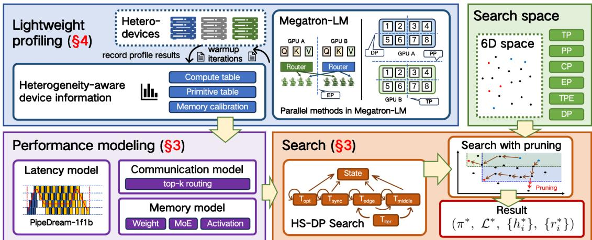  
Figure 1: Overview of HAPMoE. HAPMoE follows a profile-model-search pipeline: it first performs lightweight profiling to build device/primitive lookup tables, then constructs MoE-aware latency/communication/memory models under heterogeneity, and finally searches the 6D parallel space with pruning to output a Megatron-LMdeployable plan.

Compute and Routing. Let $t _ { \mathrm { d e n s e } } ( h , T P , C P )$ be the profiled time of a dense Transformer layer on device type h under $( T P , C P )$ , and let $t _ { \mathrm { f f n } } ( h , T P , C P )$ be the profiled dense FFN time (replaced by experts). With expert parallelism $E P$ and optional expert tensor parallelism $T P E$ , the per-layer compute time is:

$$
t _ { \mathrm { m o e } } ^ { \mathrm { c o m p } } \approx t _ { \mathrm { b a s e } } - t _ { \mathrm { f i n } } + \frac { 2 t _ { \mathrm { f i n } } } { \eta _ { h } \cdot E P \cdot T P E } + t _ { \mathrm { r o u t e } } ( h ) ,\tag{2}
$$

where $t _ { \mathrm { b a s e } } ~ = ~ t _ { \mathrm { d e n s e } } ( h , T P , C P )$ and $\begin{array} { r l } { t _ { \mathrm { f f n } } } & { { } = } \end{array}$ $t _ { \mathrm { f f n } } ( h , T P , C P )$ are obtained from profiling, and $\eta _ { h } \in ( 0 , 1 ]$ is a calibrated device-efficiency factor. We model router overhead $t _ { \mathrm { r o u t e } } ( h )$ as a linear term in token count and fit its coefficient during profiling, $\mathrm { i . e . , } t _ { \mathrm { r o u t e } } ( h ) \propto S \cdot B \cdot H$ . PP affects compute only through the stage layer count $n _ { i } .$ , while DP contributes via $T _ { \mathrm { d p - s y n c } } ( \pi )$ and $T _ { \mathrm { o p t } } ( \pi ) ( \mathrm { E q . } ( 4 ) )$ .

Token Redistribution Communication. For top-k routing, the dominant MoE communication is dispatch/combine of token activations across expert groups. We first estimate the communicated activation volume (bytes):

$$
D _ { \mathrm { m o e } } ( \pi ) = ( S \cdot B ) \cdot H \cdot \beta \cdot k \cdot \Big ( 1 - \frac { 1 } { E P } \Big ) ,\tag{3}
$$

where $\beta$ is bytes/element. Communication time depends on the collective primitive and the link type (intra-node, inter-node, or cross-type). We therefore use profiled primitive-specific functions tcomm $ f _ { \mathrm { p r i m } } ( D$ , world, link-type) and select the best feasible primitive for each candidate.

For native collectives, the overlap realized by the runtime is already reflected in the profiled end-to-end layer time; the separately modeled dispatch/combine term represents the exposed communication cost.

Load Imbalance. Routing may skew token-toexpert assignment. Let $\mathcal { T } _ { i }$ be tokens assigned to expert i. We quantify imbalance by

$$
\rho _ { \mathrm { i m b } } = \frac { \operatorname* { m a x } _ { i \in [ 1 , E ] } | \mathcal { T } _ { i } | } { \frac { 1 } { E } \sum _ { j = 1 } ^ { E } | \mathcal { T } _ { j } | } \geq 1 ,
$$

computed from router statistics (or a conservative default). We apply it to the MoE critical path as $t _ { \mathrm { m o e } }  t _ { \mathrm { m o e } } \cdot ( 1 + \gamma ( \rho _ { \mathrm { i m b } } - 1 ) )$ with $\gamma \in [ 0 , 1 ]$

HAPMoE targets stable deployment windows; when routing statistics change persistently, the routing profile can be refreshed and the sub-minute planner rerun.

Memory Model (stage-level). For stage i, we estimate $M _ { \mathrm { s t a g e } } = M _ { \mathrm { w } } + M _ { \mathrm { a c t } } + M _ { \mathrm { m o e - e x t r a } }$ . Weights (params+grads+optimizer states) are sharded by (TP, DP, EP, TPE), while activation memory scales with stored micro-batches and recomputation:

$$
\begin{array} { r } { M _ { \mathrm { w } } \propto \frac { n _ { i } } { T P \cdot E P \cdot T P E } \cdot \beta _ { \mathrm { o p t } } ( D P ) , } \\ { M _ { \mathrm { a c t } } \propto \frac { M _ { \mathrm { s t o r e } } \cdot n _ { i } } { T P } \cdot \xi ( r _ { i } ) . } \end{array}
$$

$M _ { \mathrm { { m o e - e x t r a } } }$ accounts for routing metadata and temporary dispatch buffers, scaled with expert parallelism. Given $( h _ { i } , n _ { i } , \pi )$ , HAPMoE selects the minimal $r _ { i }$ satisfying $M _ { \mathrm { s t a g e } } ( h _ { i } , n _ { i } , \pi , r _ { i } ) \le C _ { h _ { i } }$ . Here

$M _ { \mathrm { s t o r e } }$ is the number of micro-batches whose activations are kept by the pipeline schedule (e.g., 1F1B), and $\xi ( r _ { i } ) \in ( 0 , 1 ]$ is the activation-memory reduction factor $( \xi = 1$ means no recomputation).

## 3.3 Heterogeneity-Aware Device Modeling

The MoE-aware model in §3.3 estimates per-layer compute/communication/memory costs under heterogeneity. To evaluate a candidate parallel plan, however, we must further translate these local costs into the end-to-end per-iteration latency under the execution schedule. Therefore, we instantiate an iteration-level latency model on top of the profiled heterogeneous device primitives, so that each candidate plan can be scored by $T _ { \mathrm { i t e r } }$ during search.

Concretely, HAPMoE models heterogeneity through three profiled components: (i) a compute table for $t _ { \mathrm { d e n s e } } ( \cdot )$ and $t _ { \mathrm { f f n } } ( \cdot )$ under $( T P , C P )$ ; (ii) a communication primitive table for collective time $f _ { \mathrm { p r i m } } ( \cdot )$ across link types (intra-node, internode, and cross-type); (iii) a memory calibration that maps the analytical activation/optimizer terms to runtime-measured footprints. All device- and primitive-specific coefficients are obtained from a few warm-up iterations and cached; during search, we only perform table lookups and simple arithmetic.

Latency Model for 1F1B. We use the standard PipeDream-style 1F1B schedule, where pipeline stages alternate forward and backward passes over micro-batches; a schematic is provided in Appendix B. Let $t _ { f , i }$ and $t _ { b , i }$ denote the forward/backward time of one micro-batch on stage i. The iteration latency is decomposed as

$$
\begin{array} { l } { { \displaystyle T _ { \mathrm { i t e r } } = T _ { \mathrm { e d g e } } + T _ { \mathrm { m i d d l e } } + T _ { \mathrm { d p - s y n c } } + T _ { \mathrm { o p t } } } , } \\ { { \displaystyle T _ { \mathrm { e d g e } } = \sum _ { i = 1 } ^ { P P } ( t _ { f , i } + t _ { b , i } ) , } } \end{array}\tag{4}
$$

where $T _ { \mathrm { d p - s y n c } }$ and $T _ { \mathrm { o p t } }$ are obtained from profiled collectives and calibrated optimizer kernels. The steady-state term $T _ { \mathrm { m i d d l e } }$ is determined by the bottleneck pipeline stage under the 1F1B schedule; its full expression is provided in Appendix B.

## 3.4 Search Algorithm

Given the exponential search space, HAPMoE employs a heterogeneity-sensitive dynamic programming (HS-DP) search with pruning. The key is non-uniform layer assignment: the pipeline partition ${ \mathcal { L } } = \{ n _ { i } \} _ { i = 1 } ^ { P P }$ is allowed to vary across stages, so that stage workloads match the heterogeneous compute capacities $P _ { h _ { i } }$ , rather than enforcing uniform $N / P P$ layers per stage. Each candidate is evaluated by the iteration-level latency model in §3.3 (Eq. (4)) under memory feasibility constraints.

Dynamic Programming Formulation. We define DP[i, j, m] as the minimum predicted iteration latency when the first j layers are assigned to the first i pipeline stages, where m denotes the remaining device-group state after placing stage $\textit { i } ( i . e .$ available counts per device type). The state transition is:

$$
\begin{array} { r l } & { \mathrm { D P } [ i , j , m ] = \underset { k \in [ 1 , j - 1 ] } { \operatorname* { m i n } } \Bigl \{ \mathrm { D P } [ i - 1 , k , m ^ { \prime } ] } \\ & { \qquad h _ { e ^ { \prime } \in \mathcal { A } } ^ { k } } \\ & { \qquad + T _ { \mathrm { s t a g e } } ( h , k + 1 , j , \pi ) } \\ & { \qquad + T _ { \mathrm { c o m m } } ( h , h ^ { \prime } , k , j ) \Bigr \} , } \end{array}
$$

where $T _ { \mathrm { s t a g e } }$ aggregates per-layer compute/communication on device type h for layers $( k + 1 . . j )$ , and $T _ { \mathrm { c o m m } }$ accounts for crossstage communication between adjacent stages (with $h ^ { \prime }$ being the device type chosen for the neighboring stage). Both terms are computed via the profiled MoE and heterogeneity-aware models, and the resulting stage costs are assembled into $T _ { \mathrm { i t e r } }$ by Eq. (4). The complete HS-DP algorithm is presented in the appendix.

Pruning Strategies. The raw search space is ${ \cal O } ( P P \times \breve { N } ^ { P P } \times \breve { H } ^ { P P } )$ . We apply three prunings: (1) Load-balance pruning. Let $\begin{array} { r l } { w _ { h } } & { { } = } \end{array}$ $\begin{array} { r } { P _ { h } / \sum _ { h ^ { \prime } \in \mathcal { H } } P _ { h ^ { \prime } } } \end{array}$ ′ be the profiled compute fraction of type $h . \ n _ { i } ^ { - } \in \left[ \left( 1 - \delta \right) w _ { h _ { i } } N , \ \left( 1 + \delta \right) w _ { h _ { i } } N \right]$ , where δ (defaulting to 0.2) is a conservative tolerance for modeling noise and communication-induced imbalance. This reduces the partition enumeration from ${ \cal O } ( N ^ { P P } ) t 0 { \cal O } ( ( N / { P \hat { P } } ) ^ { P P } )$

(2) Memory Constraint. We enforce $M _ { \mathrm { s t a g e } } ( h , n _ { i } , \pi , r _ { i } ) \quad \le \quad C _ { h }$ by selecting the minimal feasible recomputation $r _ { i } ;$ otherwise prune.

(3) Heterogeneous Communication Pruning. We prefer forming EP groups within homogeneous subclusters. For cross-type communication, we prune when:

$$
T _ { \mathrm { c o m m } } ^ { \mathrm { h e t e r o } } > \eta \cdot \bar { T } _ { \mathrm { c o m p } } ,
$$

where $\begin{array} { r } { \bar { T } _ { \mathrm { c o m p } } = \frac { 1 } { P P } \sum _ { i = 1 } ^ { P P } ( t _ { f , i } + t _ { b , i } ) } \end{array}$ and $\eta = 2$ by default.

Combined, these reduce the effective space to $O ( P P \times ( N / P P ) ^ { P P } \times H )$

## 4 Megatron-LM Framework Integration

HAPMoE is designed for drop-in deployment on Megatron-LM-style training stacks, requiring no model-code refactoring or manual tuning of distributed knobs. Overall, HAPMoE provides a scriptin, script-out workflow: given the original training entry script, it automatically derives model/training metadata, performs short warm-up instrumentation, and emits a runnable launcher that reproduces the selected heterogeneous parallel plan.

Configuration extraction. HAPMoE parses Megatron-LM runtime arguments to recover the minimal metadata needed for deployment, including model shape (N, H, S), MoE settings (E, top-k), batch sizes, and optimizer/runtime options. These metadata serve as the canonical interface between Megatron-LM and HAPMoE, enabling consistent instantiation of profiling, feasibility checks, and plan materialization.

Lightweight runtime instrumentation. To avoid intrusive engineering, HAPMoE instruments only a few stable hook points in the training loop: (i) iteration-level time breakdown (forward/backward/optimizer), (ii) router statistics for dispatch/combine and imbalance, and (iii) runtime memory footprints. Instrumentation runs only for a few warm-up iterations and is fully removable for normal training, while producing cached tables consumed by the planner.

Plan materialization. Given the optimized plan $( \pi ^ { * } , \mathcal L ^ { * } , \{ h _ { i } ^ { * } \} , \{ r _ { i } ^ { * } \} )$ , HAPMoE translates it into Megatron-LM-executable process meshes and flags. This includes (i) standard knobs for (P P, T P, DP, EP, T P E, CP), (ii) a heterogeneous pipeline specification with explicit nonuniform layer partitions and stage-to-device mapping, and (iii) stage-wise recomputation directives to satisfy memory constraints (Eq. (1)). All settings are assembled into a standalone launcher script, ensuring reproducible execution without further manual edits.

## 5 Evaluation

We evaluate HAPMoE through 3 progressive scenarios: dense models on heterogeneous clusters, MoE models on homogeneous clusters, and the core scenario of MoE models on heterogeneous clusters. This systematic comparison benchmarks HAPMoE against existing works while highlighting its performance in complex heterogeneous MoE training.

<table><tr><td>Cluster Scale</td><td>Hardware Configuration</td><td>Symbol</td></tr><tr><td rowspan="2">16 (Homo.)</td><td>H800 (2×8)</td><td>16-1-h</td></tr><tr><td>910B (2×8) MI300X (2×8)</td><td>16-2-h 16-3-h</td></tr><tr><td rowspan="3">16 (Heter.)</td><td>H800 (1×8)+910B (1×8)</td><td>16-1</td></tr><tr><td>H800 (1×8)+MI300X (1 ×8)</td><td>16-2</td></tr><tr><td>910B (1×8)+MI300X (1×8)</td><td>16-3</td></tr><tr><td rowspan="3">24</td><td>H800 (1×8)+910B (2×8)</td><td>24-1</td></tr><tr><td>H800 (1×8)+MI300X (2×8)</td><td>24-2</td></tr><tr><td>910B (2×8)+MI300X (1×8)</td><td>24-3</td></tr><tr><td rowspan="3">32</td><td>H800 (2×8)+910B (2×8)</td><td>32-1</td></tr><tr><td>H800 (2×8)+MI300X (2×8)</td><td>32-2</td></tr><tr><td>910B (2×8)+MI300X (2×8)</td><td>32-3</td></tr></table>

Table 1: Symbol definitions of clusters

## 5.1 Experimental setup

Model. We employ two Mixtral-style MoE configurations, denoted Mixtral-S and Mixtral-L (Jiang et al., 2024), as well as the dense LLaMA-2 7B and 13B models. Detailed MoE configurations are provided in Appendix A. During training, the micro-batch size is fixed to 1, and the maximum sequence length is set to 4096. The global batch size is scaled with the cluster size. The system search space spans all six dimensions, enabling fine-grained parallel strategy exploration.

Cluster. Our experiments run on NVIDIA H800, AMD MI300X, and Ascend 910B accelerators. We construct both homogeneous and heterogeneous clusters by combining these devices. Detail specifications and cluster identifiers are listed in Table 1.

Baselines. For dense models on heterogeneous clusters, we compare HAPMoE with Megatron-Infinigence (MI)1, Alpa (Zheng et al., 2022), and Metis (Um et al., 2024). For MoE models on homogeneous clusters, we compare against MI, DeepSpeed-MoE (Rajbhandari et al., 2022), and Tutel (Hwang et al., 2023). For MoE models on heterogeneous clusters, we additionally include two adapted baselines: Metis-style, which searches heterogeneous PP/DP/TP/CP placement while fixing EP/TPE from homogeneous profiling, and HeterMoE-style, which applies MoE-layer-level scheduling and asymmetric expert assignment without global 6D search. All baselines use same model hyperparameters, precision, router configuration, global batch size, and measurement protocol.

Metrics. (1) MFU (Model FLOPs Utilization)

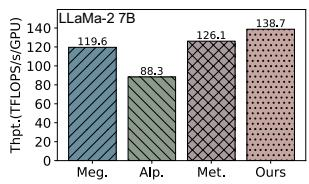

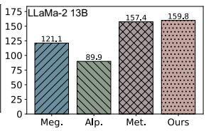

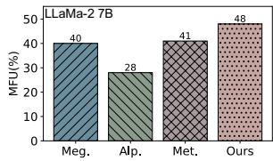

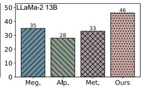

Figure 2: Performance of dense models on heterogeneous clusters: Throughput and MFU.  
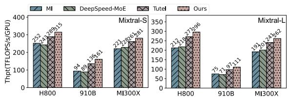

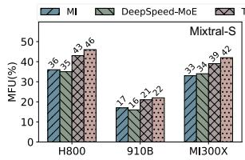

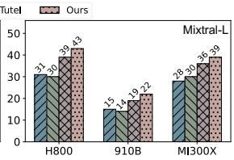  
Figure 3: Performance of MoE model on homogeneous clusters: Throughput and MFU.

measures hardware efficiency by weighting the peak floating-point operations of devices, which serves as a primary indicator of hardware efficiency in training clusters. (2) Throughput is measured in TFLOP/s/device to reflect the overall computational speed of the cluster. (3) Latency records the execution time of a single training iteration, which directly evaluates the efficiency of the searched parallel strategies. (4) Estimation Error measures the error rate of latency and VRAM usage between HAPMoE’s estimation and actual values in training, evaluating the reliability of HAPMoE in complex hardware settings.

## 5.2 Results of Dense Model on Heter. Clusters

## 5.3 Results of MoE Model on Homo. Clusters

We compared MI, Alpa, Metis, and HAPMoE on a heterogeneous cluster with 2×8 A100 and 2×8 910B accelerators, and the results are shown in Figure 2. For both LLaMA-2 7B and 13B, HAPMoE consistently achieves higher throughput and MFU, with gains increasing as model scale grows, owing to its ability to adaptively balance workloads across devices and efficiently explore the partitioning search space. In contrast, MI relies on manual tuning, Alpa assumes homogeneous devices, and Metis uses heuristic partitioning, which limits search space exploration. These indicate that HAPMoE can effectively mitigate cross-device imbalances and attain better hardware utilization in heterogeneous clusters.

As shown in Figure 3, the results demonstrate that across various homogeneous clusters and model scales, HAPMoE consistently outperforms in throughput and MFU, with gains becoming more pronounced as the model scale increases. This advantage stems from HAPMoE ’s routing-aware parallel configuration search and cost model, which explicitly accounts for routing-induced imbalance and dispatch costs to better balance expert workloads. In contrast, Megatron-MoE and DeepSpeed-MoE incur high All-to-All communication costs and uneven expert loads under large-scale parallelism, while Tutel lacks support for global parallel strategies because it only focuses on single-layer communication optimization.

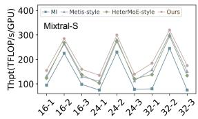

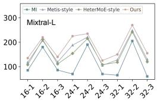

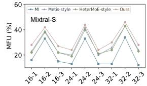

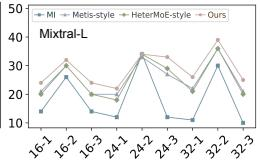

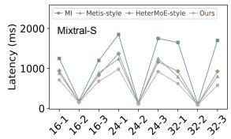

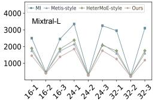  
Figure 4: Performance of MoE model on heterogeneous clusters: Throughput, MFU and Latency.

## 5.4 Results of MoE Model on Heter. Clusters

We conduct end-to-end experiments on Mixtral-S and Mixtral-L across the heterogeneous clusters defined in Table 1. Besides MI, we include two adapted baselines to better contextualize the results.

Metis-style extends heterogeneity-aware parallel planning to this setting by searching PP/DP/TP/CP placement while keeping MoEspecific EP/TPE fixed to the best feasible configuration from homogeneous profiling. HeterMoEstyle applies MoE-layer-level optimizations, including attention/expert disaggregation, overlapped execution, and asymmetric expert assignment, but does not perform global 6D parallel search.

<table><tr><td>Model</td><td>Method</td><td>Thpt.↑</td><td>MFU↑</td><td>Lat.↓</td></tr><tr><td>Mixtral-S</td><td>MI HeterMoE-style Metis-style HAPMoE</td><td>1.00× 1.40× 1.45× 1.67×</td><td>1.00× 1.46× 1.50× 1.72×</td><td>1.00× 0.72× 0.69× 0.56×</td></tr><tr><td>Mixtral-L</td><td>MI HeterMoE-style Metis-style HAPMoE</td><td>1.00× 1.47× 1.56× 1.78×</td><td>1.00× 1.50× 1.53× 1.73×</td><td>1.00× 0.73× 0.69× 0.58×</td></tr></table>

Table 2: Geometric mean performance on heterogeneous MoE clusters, normalized to MI. Higher is better for throughput and MFU, lower is better for latency.

Figure 4 reports the per-cluster throughput, MFU, and latency. Table 2 summarizes the geometric mean performance normalized to MI. Overall, HAPMoE achieves the best average performance on both models. Compared with MI, HAPMoE improves geometric-mean throughput by 1.67× on Mixtral-S and 1.78× on Mixtral-L, while reducing iteration latency to 0.56× and 0.58×, respectively. The baselines also improve over MI, confirming that both heterogeneous placement and MoE-layer scheduling are beneficial. Metis-style is generally stronger due to its global device-aware partitioning, while HeterMoE-style performs competitively on several communication-sensitive cases.

These results suggest that the key advantage of HAPMoE comes from jointly considering heterogeneous stage partitioning, device mapping, MoEspecific EP/TPE choices, and memory-feasible recomputation in a unified search space, rather than optimizing any single component in isolation.

## 5.5 Search Time and Accuracy Analysis

Figure 5 presents HAPMoE ’s strategy search time and the estimated accuracy for Latency and VRAM usage across different models and clusters. The results show that, regardless of model and cluster scale, search time remains consistently below 60 s, demonstrating the system’s high search efficiency. In terms of accuracy, estimation errors for both metrics remain low, indicating HAPMoE ’s reliability in performance prediction even under complex configurations. Existing studies typically focus on either MoE models or heterogeneous clusters and thus cannot be directly applied to scenarios combining both. By providing both low search overhead and high estimation accuracy, HAPMoE offers robust support for identifying and searching optimal parallel strategies for complex model training.

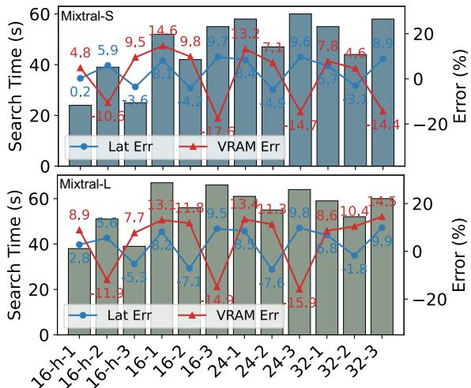

Figure 5: Search time and accuracy of HAPMoE
<table><tr><td>Cluster</td><td>16-1/2/3-h</td><td>16-2</td><td>32-1/2/3</td></tr><tr><td>Latency</td><td>1.12/1.18/1.10×</td><td>2.10×</td><td>2.30/1.35/2.80×</td></tr><tr><td>Thpt.</td><td>0.95/0.93/0.96×</td><td>0.69×</td><td>0.62/0.85/0.56×</td></tr></table>

Table 3: Performance change ratio by disabling nonuniform PP/DP

## 5.6 Disabling Non-uniform PP/DP

The performance with non-uniform PP/DP disabled (relative to HAPMoE) is shown in Table 3. On homogeneous clusters, enforcing uniform PP/DP results in only moderate degradation, increasing latency by 10-18%. However, as hardware heterogeneity increases, performance deteriorates sharply: in heterogeneous configurations, latency inflates to 2.3-3.4×, while throughput drops dramatically to 45-62%. Configurations involving 910B are particularly sensitive, as uniform partitioning causes the pipeline steady state to be dominated by the slowest stage, severely constraining overall execution efficiency. These results indicate that ignoring device-level performance disparities substantially amplifies pipeline imbalance, underscoring the necessity of non-uniform PP/DP to sustain efficiency on heterogeneous clusters.

Profile scaling. We further verify that small-scale profiles can guide larger deployments: 4-node profiles predict 16-node latency within about 10% error across homogeneous and heterogeneous settings, with detailed results in Appendix D.

## 6 Conclusion

We present HAPMoE, a heterogeneity-aware automatic parallelization framework that addresses both MoE sparsity and hardware diversity in large-scale model training. By combining lightweight profiling, an MoE-specific cost model, and an efficient 6-dimensional parallelism search, HAPMoE generates optimized hybrid strategies—including non-uniform pipeline and expert parallelism—balancing compute, communication, and memory. Experiments on dense LLMs and MoE models show up to 3.2× throughput improvement and up to 78% pipeline gain over SOTA baselines, with minimal search overhead under one minute. HAPMoE thus provides a practical, robust solution for efficiently scaling large Transformer models on heterogeneous accelerator clusters.

## Limitations

HAPMoE currently targets Megatron-LM-style Transformer and MoE training, and builds its plan from warm-up profiles before training starts. While we evaluate multiple heterogeneous accelerator settings, larger production-scale clusters may introduce stronger network contention, failures, and topology effects than those covered in our experiments. HAPMoE also does not yet support online scheduling or dynamic reconfiguration when routing distributions, workload characteristics, or device availability change during training. We leave larger-scale deployment studies and online adaptive scheduling to future work.

## Ethical considerations

This work studies training-system efficiency and does not introduce new datasets, human-subject data, or user-facing model capabilities. By improving hardware utilization, HAPMoE may reduce the compute cost and energy required for MoE training, while also making large-scale training more accessible. The experiments use existing model architectures and infrastructure measurements.

## Acknowledgments

This work was supported by the National Key Research and Development Program of China under Grant No.2024YFB2906603, and in part by the National Natural Science Foundation of China (NSFC) under Grant Nos. 62372009 and 62502014.

## References

Felix Brakel, Uraz Odyurt, and Ana-Lucia Varbanescu. 2024. Model parallelism on distributed infrastructure: A literature review from theory to llm casestudies. arXiv preprint arXiv:2403.03699.

Weilin Cai, Juyong Jiang, Le Qin, Junwei Cui, Sunghun Kim, and Jiayi Huang. 2025a. Shortcut-connected expert parallelism for accelerating mixture of experts. In Proceedings ofthe 42nd International Conference on Machine Learning, volume 267 of Proceedings of Machine Learning Research, pages 6211–6228. PMLR.

Weilin Cai, Juyong Jiang, Fan Wang, Jing Tang, Sunghun Kim, and Jiayi Huang. 2025b. A survey on mixture of experts in large language models. IEEE Transactions on Knowledge and Data Engineering.

Yanxi Chen, Xuchen Pan, Yaliang Li, Bolin Ding, and Jingren Zhou. 2024. Ee-llm: Large-scale training and inference of early-exit large language models with 3d

parallelism. In International Conference on Machine Learning, pages 7163–7189. PMLR.

Hyeonseong Choi, Byung Hyun Lee, Se Young Chun, and Jaehwan Lee. 2023. Towards accelerating model parallelism in distributed deep learning systems. Plos one, 18(11):e0293338.

Peizhuang Cong, Aomufei Yuan, Shimao Chen, Yuxuan Tian, Bowen Ye, and Tong Yang. 2024. Prediction is all moe needs: Expert load distribution goes from fluctuating to stabilizing. arXiv preprint arXiv:2404.16914.

Runsheng Benson Guo, Utkarsh Anand, Arthur Chen, and Khuzaima Daudjee. 2025. Cephalo: Harnessing heterogeneous gpu clusters for training transformer models. In Proceedings of the 39th ACM International Conference on Supercomputing, pages 368– 383.

Jiaao He, Jidong Zhai, Tiago Antunes, Haojie Wang, Fuwen Luo, Shangfeng Shi, and Qin Li. 2022. Faster-MoE: Modeling and optimizing training of largescale dynamic pre-trained models. In Proceedings of the 27th ACM SIGPLAN Symposium on Principles and Practice ofParallel Programming, PPoPP ’22, pages 120–134, New York, NY, USA. Association for Computing Machinery.

Changho Hwang, Wei Cui, Yifan Xiong, Ziyue Yang, Ze Liu, Han Hu, Zilong Wang, Rafael Salas, Jithin Jose, Prabhat Ram, HoYuen Chau, Peng Cheng, Fan Yang, Mao Yang, and Yongqiang Xiong. 2023. Tutel: Adaptive Mixture-of-Experts at scale. In Proceedings of Machine Learning and Systems, volume 5, pages 269–287. MLSys.

Zhihao Jia, Matei Zaharia, and Alex Aiken. 2019. Beyond data and model parallelism for deep neural networks. Proceedings of Machine Learning and Systems, 1:1–13.

Albert Q. Jiang, Alexandre Sablayrolles, Antoine Roux, Arthur Mensch, Blanche Savary, Chris Bamford, Devendra Singh Chaplot, Diego de las Casas, Emma Bou Hanna, Florian Bressand, Gianna Lengyel, Guillaume Bour, Guillaume Lample, Lélio Renard Lavaud, Lucile Saulnier, Marie-Anne Lachaux, Pierre Stock, Sandeep Subramanian, Sophia Yang, and 7 others. 2024. Mixtral of experts. arXiv preprint arXiv:2401.04088.

Chenyu Jiang, Zhenkun Cai, Ye Tian, Zhen Jia, Yida Wang, and Chuan Wu. 2025. Dcp: Addressing input dynamism in long-context training via dynamic context parallelism. In Proceedings ofthe ACM SIGOPS 31st Symposium on Operating Systems Principles, pages 221–236.

Yimin Jiang, Yibo Zhu, Chang Lan, Bairen Yi, Yong Cui, and Chuanxiong Guo. 2020. A unified architecture for accelerating distributed {DNN} training in heterogeneous {GPU/CPU} clusters. In 14th USENIX Symposium on Operating Systems Design and Implementation (OSDI 20), pages 463–479.

Chao Jin, Ziheng Jiang, Zhihao Bai, Zheng Zhong, Juncai Liu, Xiang Li, Ningxin Zheng, Xi Wang, Cong Xie, Qi Huang, Wen Heng, Yiyuan Ma, Wenlei Bao, Size Zheng, Xuegui Zheng, Yanghua Peng, Haibin Lin, Xuanzhe Liu, Xin Jin, and Xin Liu. 2026. MegaScale-MoE: Large-scale communicationefficient training of Mixture-of-Experts models in production. In Proceedings of the 21st European Conference on Computer Systems, EuroSys ’26, pages 366–382. Association for Computing Machinery.

Zhiquan Lai, Shengwei Li, Xudong Tang, Keshi Ge, Weijie Liu, Yabo Duan, Linbo Qiao, and Dongsheng Li. 2023. Merak: An efficient distributed dnn training framework with automated 3d parallelism for giant foundation models. IEEE Transactions on Parallel and Distributed Systems, 34(5):1466–1478.

Dacheng Li, Hongyi Wang, Eric Xing, and Hao Zhang. 2022. Amp: Automatically finding model parallel strategies with heterogeneity awareness. Advances in Neural Information Processing Systems, 35:6630– 6639.

Zongbiao Li, Xiezhao Li, Yinghao Cui, Yijun Chen, Zhixuan Gu, Yuxuan Liu, Wenbo Zhu, Fei Jia, Ke Liu, Qifeng Li, Junyao Zhan, Jiangtao Zhou, Chenxi Zhang, and Qike Liu. 2024. Automatically planning optimal parallel strategy for large language models. arXiv preprint arXiv:2501.00254.

Peng Liang, Yu Tang, Xiaoda Zhang, Youhui Bai, Teng Su, Zhiquan Lai, Linbo Qiao, and Dongsheng Li. 2023. A survey on auto-parallelism of large-scale deep learning training. IEEE Transactions on Parallel and Distributed Systems, 34(08):2377–2390.

Ji Liu, Zhihua Wu, Danlei Feng, Minxu Zhang, Xinxuan Wu, Xuefeng Yao, Dianhai Yu, Yanjun Ma, Feng Zhao, and Dejing Dou. 2023. Heterps: Distributed deep learning with reinforcement learning based scheduling in heterogeneous environments. Future Generation Computer Systems, 148:106–117.

Xupeng Miao, Yujie Wang, Youhe Jiang, Chunan Shi, Xiaonan Nie, Hailin Zhang, and Bin Cui. 2022. Galvatron: Efficient transformer training over multiple gpus using automatic parallelism. Proceedings ofthe VLDB Endowment, 16(3):470–479.

Humza Naveed, Asad Ullah Khan, Shi Qiu, Muhammad Saqib, Saeed Anwar, Muhammad Usman, Naveed Akhtar, Nick Barnes, and Ajmal Mian. 2025. A comprehensive overview of large language models. ACM Transactions on Intelligent Systems and Technology, 16(5):1–72.

Samyam Rajbhandari, Conglong Li, Zhewei Yao, Minjia Zhang, Reza Yazdani Aminabadi, Ammar Ahmad Awan, Jeff Rasley, and Yuxiong He. 2022. Deepspeed-moe: Advancing mixture-of-experts inference and training to power next-generation ai scale. In International conference on machine learning, pages 18332–18346. PMLR.

Samyam Rajbhandari, Jeff Rasley, Olatunji Ruwase, and Yuxiong He. 2020. Zero: Memory optimizations toward training trillion parameter models. In SC20: International Conferencefor High Performance Computing, Networking, Storage and Analysis, pages 1– 16. IEEE.

Mohammad Shoeybi, Mostofa Patwary, Raul Puri, Patrick LeGresley, Jared Casper, and Bryan Catanzaro. 2019. Megatron-lm: Training multi-billion parameter language models using model parallelism. arXiv preprint arXiv:1909.08053.

Athinagoras Skiadopoulos, Mark Zhao, Swapnil Gandhi, Thomas Norrie, Shrijeet Mukherjee, and Christos Kozyrakis. 2026. SYMI: Efficient Mixtureof-Experts training via model and optimizer state decoupling. In 23rd USENIX Symposium on Networked Systems Design and Implementation (NSDI 26), pages 75–92, Renton, WA. USENIX Association.

Foteini Strati, Zhendong Zhang, George Manos, Ixeia Sánchez Périz, Qinghao Hu, Tiancheng Chen, Berk Buzcu, Song Han, Pamela Delgado, and Ana Klimovic. 2025. Sailor: Automating distributed training over dynamic, heterogeneous, and geo-distributed clusters. In Proceedings of the ACM SIGOPS 31st Symposium on Operating Systems Principles, pages 204–220.

Sahil Tyagi and Prateek Sharma. 2025. Omnilearn: A framework for distributed deep learning over heterogeneous clusters. IEEE Transactions on Parallel and Distributed Systems.

Taegeon Um, Byungsoo Oh, Minyoung Kang, Woo-Yeon Lee, Goeun Kim, Dongseob Kim, Youngtaek Kim, Mohd Muzzammil, and Myeongjae Jeon. 2024. Metis: Fast automatic distributed training on heterogeneous gpus. In 2024 USENIX Annual Technical Conference (USENIX ATC 24), pages 563–578.

Colin Unger, Zhihao Jia, Wei Wu, Sina Lin, Mandeep Baines, Carlos Efrain Quintero Narvaez, Vinay Ramakrishnaiah, Nirmal Prajapati, Pat McCormick, Jamaludin Mohd-Yusof, Xi Luo, Dheevatsa Mudigere, Jongsoo Park, Misha Smelyanskiy, and Alex Aiken. 2022. Unity: Accelerating DNN training through joint optimization of algebraic transformations and parallelization. In 16th USENIX Symposium on Operating Systems Design and Implementation (OSDI 22), pages 267–284, Carlsbad, CA. USENIX Association.

Boxiang Wang, Qifan Xu, Zhengda Bian, and Yang You. 2022. Tesseract: Parallelize the tensor parallelism efficiently. In Proceedings ofthe 51st International Conference on Parallel Processing, ICPP ’22, pages 12:1–12:11. Association for Computing Machinery.

Yongji Wu, Xueshen Liu, Shuowei Jin, Ceyu Xu, Feng Qian, Z Morley Mao, Matthew Lentz, Danyang Zhuo, and Ion Stoica. 2025. Hetermoe: Efficient training of mixture-of-experts models on heterogeneous gpus. arXiv preprint arXiv:2504.03871.

Fei Yang, Shuang Peng, Ning Sun, Fangyu Wang, Yuanyuan Wang, Fu Wu, Jiezhong Qiu, and Aimin Pan. 2024. Holmes: Towards distributed training across clusters with heterogeneous nic environment. In Proceedings ofthe 53rd International Conference on Parallel Processing, pages 514–523.

Xiaodong Yi, Shiwei Zhang, Ziyue Luo, Guoping Long, Lansong Diao, Chuan Wu, Zhen Zheng, Jun Yang, and Wei Lin. 2020. Optimizing distributed training deployment in heterogeneous gpu clusters. In Proceedings ofthe 16th International Conference on emerging Networking EXperiments and Technologies, pages 93–107.

Yueming Yuan, Ahan Gupta, Jianping Li, Sajal Dash, Feiyi Wang, and Minjia Zhang. 2025. X-moe: Enabling scalable training for emerging mixture-ofexperts architectures on hpc platforms. In Proceedings of the International Conference for High Performance Computing, Networking, Storage and Analysis, pages 1315–1331.

Shulai Zhang, Ningxin Zheng, Haibin Lin, Ziheng Jiang, Wenlei Bao, Chengquan Jiang, Qi Hou, Weihao Cui, Size Zheng, Li-Wen Chang, Quan Chen, and Xin Liu. 2025a. COMET: Fine-grained computationcommunication overlapping for Mixture-of-Experts. In Proceedings of Machine Learning and Systems, volume 7. MLSys.

WenZheng Zhang, Yang Hu, Jing Shi, and Xiaoying Bai. 2025b. Poplar: Efficient scaling of distributed DNN training on heterogeneous GPU clusters. Proceedings ofthe AAAI Conference on Artificial Intelligence, 39(21):22587–22595.

Lianmin Zheng, Zhuohan Li, Hao Zhang, Yonghao Zhuang, Zhifeng Chen, Yanping Huang, Yida Wang, Yuanzhong Xu, Danyang Zhuo, Eric P. Xing, Joseph E. Gonzalez, and Ion Stoica. 2022. Alpa: Automating inter- and Intra-Operator parallelism for distributed deep learning. In 16th USENIX Symposium on Operating Systems Design and Implementation (OSDI 22), pages 559–578, Carlsbad, CA. USENIX Association.

Yanqi Zhou, Tao Lei, Hanxiao Liu, Nan Du, Yanping Huang, Vincent Zhao, Andrew M. Dai, Zhifeng Chen, Quoc V. Le, and James Laudon. 2022. Mixture-of-Experts with expert choice routing. In Advances in Neural Information Processing Systems, volume 35, pages 7103–7114.

Zan Zong, Minkun Guo, Mingshu Zhai, Yinan Tang, Jianjiang Li, and Jidong Zhai. 2025. Training large models on heterogeneous and geo-distributed resource with constricted networks. Big Data Mining and Analytics, 8(4):966–980.

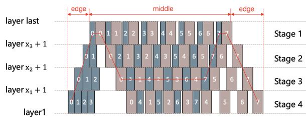  
Figure A: Illustration of the 1F1B pipeline schedule. Forward and backward passes are interleaved across micro-batches, and steady-state throughput is governed by the bottleneck stage.

## Appendix

## A Model Details

The first model, Mixtral-S $( M _ { 1 } )$ , is a medium-scale Mixtral-style MoE Transformer with 24 layers, a hidden size of 4096, an FFN dimension of 14336, and 32 attention heads with grouped-query attention (GQA=8). Its MoE module contains 8 experts with top-k = 2 routing and uses an all-gather dispatcher. The sequence length is 4096, the microbatch size is 1, and the global batch size is 256.

The second model, Mixtral-L $( M _ { 2 } )$ , is a larger Mixtral-style MoE configuration with 48 layers, a hidden size of 6144, an FFN dimension of 16384, and 48 attention heads, also using grouped-query attention with 8 groups. It contains 8 experts per MoE layer with top-k = 2 routing and uses an allto-all dispatcher, comprising approximately 122B parameters. The sequence length is 4096, the micro-batch size is 1, and the global batch size is 512.

Both models use BF16 mixed-precision training with a ZeRO-1 distributed optimizer. For Mixtral-L on the smallest clusters, the FP32 optimizer states are offloaded to host memory.

## B 1F1B Pipeline Schedule Illustration

Figure A illustrates the standard 1F1B schedule used by the iteration-level latency model in Section 3.3. The schedule separates warm-up/cooldown steps from the steady state, where throughput is determined by the bottleneck pipeline stage.

Let $s _ { \mathrm { m a x } } = \mathrm { a r g }$ maxi $( t _ { f , i } + t _ { b , i } )$ be the bottleneck stage and M be the number of micro-batches. The steady-state latency term is

Algorithm 1 Heterogeneity-aware search with   
pruning (HS-DP).   
1: Input: Layers 1..N, Stages PP, Devices H,   
Configs Π   
2: Output: Optimal $( \pi ^ { * } , \mathcal L ^ { * } , \{ h _ { i } ^ { * } \} , \{ r _ { i } ^ { * } \} )$   
3: Initialize $\mathrm { D P } [ i , j , m ]  \infty ; \mathrm { D P } [ 0 , N + 1 , \cdot ] $   
0   
4: Compute $n _ { \mathrm { m i n } , h } , n _ { \mathrm { m a x } , h }$ for each $h \in \mathcal H$   
5: for each stage $i = 1$ to PP do   
6: for each start layer $j = N$ to 1 do   
7: for each device $h \in { \mathcal { H } }$ and end layer   
$k \in [ j + 1 , N + 1 ]$ do   
8: $l a y e r s \gets k - j$   
9: if layers /∈ $[ n _ { \mathrm { m i n } , h } , n _ { \mathrm { m a x } , h } ]$ then   
10: continue {Pruning 1}   
11: end if   
12: for each config $\pi \in \Pi$ do   
13: Choose the minimum r such that   
$M _ { \mathrm { s t a g e } } ( h , l a y e r s , \pi , r ) \le C _ { h }$   
14: if no valid r then   
15: continue {Pruning 2}   
16: end if   
17: if Thetero comm $> \eta \cdot \bar { T } _ { \mathrm { c o m p } }$ then   
18: continue {Pruning 3}   
19: end if   
20: Compute $T _ { \mathrm { s t a g e } }$ and $T _ { \mathrm { c o m m } }$ via the   
MoE model   
21: Update $\mathsf { D P } [ i , j , m ]$   
22: end for   
23: end for   
24: end for   
25: end for   
26: Reconstruct optimal path via backtrace   
27: return $( \pi ^ { * } , \mathcal L ^ { * } , \{ h _ { i } ^ { * } \} , \{ r _ { i } ^ { * } \} )$

$$
\begin{array} { l } { \displaystyle T _ { \mathrm { m i d d l e } } = \sum _ { i = 1 } ^ { s _ { \mathrm { m a x } } } t _ { f , i } } \\ { \displaystyle \qquad + \left( M - s _ { \mathrm { m a x } } - 1 \right) \operatorname* { m a x } _ { 1 \leq i \leq P P } \left( t _ { f , i } + t _ { b , i } \right) . } \end{array}\tag{5}
$$

## C HS-DP algorithm pseudo-code

The main text presents the modeling and pruning principles, while Algorithm 1 in the appendix lists the complete end-to-end search routine, including stage construction, feasibility filtering, and DP transitions, to ensure reproducibility.

## D Detailed Results of Profile Scaling

To verify that profiling results based on a smallscale cluster can be reliably used for large-scale automatic parallel configuration search, we profile two models on a 4-node cluster and directly reuse the profiling results to guide parallel strategy search on a 16-node cluster. In homogeneous clusters, the predicted latency derived from 4-node profiling closely matches the measured latency at 16-node scale, with relative errors consistently bounded within approximately ±10% for both models. In heterogeneous clusters, the accuracy remains robust despite increased imbalance, with the maximum deviation around 14%. Table A presents the detailed prediction errors.

<table><tr><td colspan="2">Cluster</td><td rowspan="2">Model</td><td colspan="2">Latency (ms) Pred. Meas.</td><td rowspan="2">Error (%)</td></tr><tr><td>Profile</td><td>Training</td><td></td><td></td></tr><tr><td>H800 (4×8)</td><td>H800 (16×8)</td><td> $M _ { 1 }$ </td><td>620</td><td>658</td><td>-5.78</td></tr><tr><td> $\mathbf { M I } 3 0 0 \mathbf { X } \left( 4 \times 8 \right)$ </td><td>MI300X (16×8)</td><td> $M _ { 1 }$ </td><td>760</td><td>718</td><td>5.85</td></tr><tr><td> $\mathrm { H 8 0 0 } \left( 2 { \times } 8 \right) { + } \mathrm { M I 3 0 0 } \mathrm { X } \left( 2 { \times } 8 \right)$ </td><td>H800  $\left( 8 \times 8 \right) + \mathrm { M I 3 0 0 X } \left( 8 \times 8 \right)$ </td><td> $M _ { 1 }$ </td><td>780</td><td>847</td><td>-7.91</td></tr><tr><td> ${ \mathrm { H 8 0 0 } } \left( 2 \times 8 \right) + 9 1 0 { \mathrm { B } } \left( 2 \times 1 6 \right)$ </td><td>H800  $( 4 \times 8 ) \substack { + 9 1 0 \mathbf { B } \left( 2 \times 1 6 \right) }$ </td><td> $M _ { 1 }$ </td><td>1150</td><td>1336</td><td>-13.92</td></tr><tr><td>H800 (4×8)</td><td>H800 (16×8)</td><td> $M _ { 2 }$ </td><td>700</td><td>637</td><td>9.89</td></tr><tr><td>MI300X (4×8)</td><td>MI300X (16×8)</td><td> $M _ { 2 }$ </td><td>840</td><td>897</td><td>-6.35</td></tr><tr><td> $\mathrm { H 8 0 0 } \left( 2 { \times } 8 \right) { + } \mathrm { M I 3 0 0 } \mathrm { X } \left( 2 { \times } 8 \right)$ </td><td> ${ \mathrm { H 8 0 0 } } \left( { \mathrm { 8 } } { \times } { \mathrm { 8 } } \right) { + } { \mathrm { M I 3 0 0 } } { \mathrm { X } } \left( { \mathrm { 8 } } { \times } { \mathrm { 8 } } \right)$ </td><td> $M _ { 2 }$ </td><td>950</td><td>862</td><td>10.21</td></tr></table>

Table A: Predicted vs. measured latency of extrapolating 4-node profiling to larger-scale execution