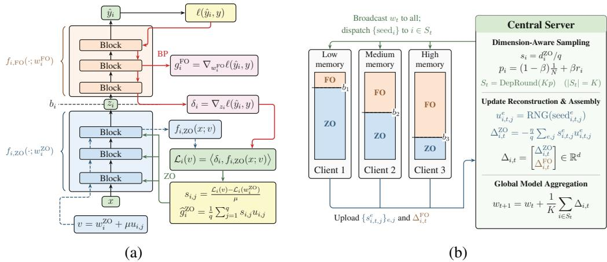
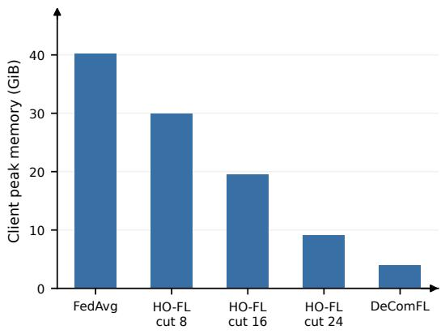
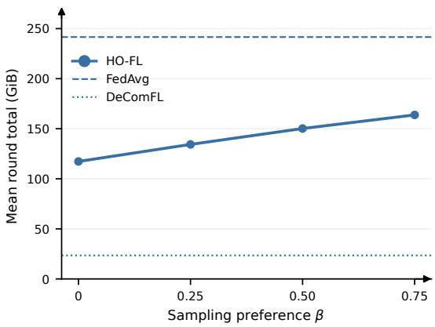

# HO-FL: HYBRID-ORDER FEDERATED LEARNING FOR HETEROGENEOUS EDGE DEVICES

Qiyuan Chen1,∗, Xian Wu1,\*, Yanan Ma2, Xianhao Chen1,†

1University of Hong Kong (hku.hk)

2City University of Hong Kong (cityu.edu.hk) qiyuanchen@connect.hku.hk, u3012772@connect.hku.hk yananma8-c@my.cityu.edu.hk, xcheneee@hku.hk

## ABSTRACT

Federated learning (FL) on memory-constrained edge devices faces a dilemma: first-order (FO) optimization (i.e., backpropagation) demands substantial memory, whereas zeroth-order (ZO) optimization suffers from severe convergence slowdown. To resolve this dilemma, we introduce HO-FL, a hybrid-order FL framework that trains a model’s bottom segment with ZO optimization and its top segment with FO optimization. Each device can flexibly select its order boundary according to its memory budget while participating in the training of the same global model. Moreover, our convergence analysis reveals a new, fundamental trade-off: clients with larger FO-trained segments can provide more accurate updates, but favoring them can underrepresent other clients’ data. We connect this trade-off to the bias and variance of actual multi-step local updates, yielding a sampling optimization problem and a practical dimension-aware approximation with direct model averaging. Experiments on language tasks examine task performance, client memory, and sampling under data heterogeneity. The results show that hybrid-order local training can retain much of the full-FO performance with substantially lower client memory requirements. Our code is available at https://github.com/HKU-WILL-Lab/HO-FL.

## 1 INTRODUCTION

Deploying and fine-tuning large language models (LLMs) directly on edge devices provides a promising paradigm for unlocking decentralized real-world data while preserving user data privacy (Wu et al., 2026). Federated learning (FL) (McMahan et al., 2017) has been widely explored as an effective framework to collaboratively adapt models across distributed clients without centralizing raw data. However, standard FL relies on first-order (FO) optimization via backpropagation (BP), which requires storing intermediate activations across model layers. For modern LLMs, these activations easily exceed the physical memory limits of commodity edge hardware, posing a severe memory bottleneck for on-device federated adaptation.

To mitigate this activation memory overhead, zeroth-order (ZO) optimization has been increasingly adopted in federated edge learning (Fang et al., 2022; Li et al., 2025). By estimating gradient directions solely through perturbed forward passes, ZO optimization avoids constructing a backward computation graph, thereby reducing client training memory to the inference level. Nevertheless, pure ZO gradient optimization incurs a severe variance penalty: random directional perturbations produce gradient estimators whose variance scales proportionally with the trainable parameter dimension d. Consequently, pure ZO federated algorithms typically require orders-of-magnitude more local iterations and communication rounds than their FO counterparts to reach target performance (Chen et al., 2026; Li et al., 2026), limiting their practicality for complex downstream tasks.

Recent efforts on hybrid-order (HO) optimization provide an appealing methodology to overcome this memory–accuracy dilemma. By partitioning the network architecture, HO optimization structurally decouples the optimization landscape: the bottom layers are optimized via BP-free ZO perturbations, while the top layers are trained using FO gradients. While early exploratory efforts have leveraged such hybrid updates within split learning paradigms (Chen et al., 2026; Lnu et al., 2026; Kou et al., 2026), directly adapting hybrid-order optimization to practical FL is hindered by heterogeneous edge constraints. In federated settings, real-world edge devices exhibit diverse physical memory capacities; enforcing a globally identical order boundary either exceeds the memory budget of resource-constrained devices or underutilizes the capacity of more capable ones.

These challenges lead to a natural question: Can we design afullyfederated hybrid-order optimization paradigm that accommodates heterogeneous edge hardware while retaining the convergence advantages of first-order training?

To answer this question, we propose HO-FL, a hybrid-order FL framework tailored for heterogeneous edge devices. In HO-FL, each client executes both ZO updates on the bottom segment and FO backpropagation on the top segment entirely on-device, performing multi-step local training and synchronizing with the central server only at the end of each round. To accommodate hardware disparity, HO-FL enables each client to configure a personalized order boundary matched to its local memory budget. To alleviate uplink communication overhead, HO-FL further encodes bottom ZO updates into compact scalar-seed pairs, requiring full-vector uploads only for the top FO parameters.

We establish the non-convex convergence of HO-FL, proving that the average gradient norm is bounded by $\begin{array} { r l } & { \mathcal { O } \big ( \sqrt { ( 1 + \frac { 1 } { q } \sum _ { i = 1 } ^ { N } p _ { i } d _ { i } ^ { \mathrm { Z O } } ) / T } \big ) + \mathcal { O } \big ( \zeta ^ { 2 } N \sum _ { i = 1 } ^ { N } ( p _ { i } - \frac { 1 } { N } ) ^ { 2 } \big ) } \end{array}$ . Here, the first term characterizes the optimization rate governed by the sampling-weighted ZO parameter dimension, while the second term quantifies the representation bias induced by client data heterogeneity $\zeta ^ { 2 }$ . Furthermore, our bound provides a unified theoretical guarantee, seamlessly recovering existing hybrid-order and federated convergence rates as special cases when clients participate uniformly $( p _ { i } = 1 / N )$ or share homogeneous order boundaries.

Crucially, this bound reveals a promising optimization opportunity: the two terms formalize a fundamental trade-off between local update quality and global data representation. While uniform sampling is unavoidably bottlenecked by noisy updates from ZO-dominated clients, non-uniform selection p can actively suppress gradient variance by prioritizing FO-dominant clients at the cost of a controlled representation penalty. Grounded in this trade-off, we design an efficient Dimension-Aware Client Sampling policy via dependent rounding, provably and empirically outperforms uniform sampling. Our main contributions are summarized as follows:

• Framework & Unified Convergence Theory: We propose HO-FL, the first fully federated hybrid-order optimization framework supporting client-adaptive order boundaries and compact seed-based uplink transmission. We establish a unified convergence theory for HO-FL, showing that the convergence bound decomposes into an optimization term $\begin{array} { r } { \mathcal { O } ( \sqrt { ( 1 + \frac { 1 } { q } \sum _ { i = 1 } ^ { N } p _ { i } d _ { i } ^ { \mathrm { Z O } } ) / T } ) } \end{array}$ and a sampling bias term $\begin{array} { r } { \mathcal { O } \big ( \zeta ^ { 2 } N \sum _ { i = 1 } ^ { N } ( p _ { i } - \frac { 1 } { N } ) ^ { 2 } \big ) } \end{array}$ , seamlessly subsuming existing hybrid-order analyses as special cases.

• Dimension-Aware Client Sampling: Grounded in our convergence theory, we formulate a dimension-aware client sampling policy via dependent rounding. Our strategy selectively prioritizes low-variance updates while bounding sampling bias, which is demonstrated both theoretically and empirically to accelerate global convergence over uniform client sampling.

• Empirical Validation: We evaluate HO-FL across diverse language understanding and generation benchmarks on OPT-125M, Qwen2.5-1.5B, and SmolLM3-3B. The results demonstrate that HO-FL closely approaches full first-order federated performance while slashing client peak memory by up to 77.4% on the most resource-constrained devices and substantially outperforming pure ZO baselines.

## 2 RELATED WORK

Zeroth-order optimization in federated learning. Zeroth-order (ZO) optimization avoids activation caching by estimating gradients via randomized finite differences, reducing client memory to inference levels (Malladi et al., 2023; Fang et al., 2022). To curb the communication overhead of exchanging perturbations, DeComFL (Li et al., 2025) and HiSo (Li et al., 2026) employ pseudorandom seed synchronization and Hessian guidance, respectively. Nevertheless, pure ZO federated algorithms inevitably suffer from gradient estimation variance that scales with the full parameter dimension d, severely slowing convergence. HO-FL circumvents this bottleneck by confining ZO optimization strictly to memory-critical bottom segments.

Hybrid-order optimization across distributed paradigms. To balance memory footprint and gradient accuracy, recent works partition networks into a bottom ZO segment and a top FO segment. Although existing methods realize this hybrid structure differently, they can be cast into a unified framework governed by boundary activations and localized surrogate objectives (see Appendix A for details): HOSL (Lnu et al., 2026) evaluates perturbations through end-to-end forward passes; HO-SFL (Chen et al., 2026) freezes cut-layer activation feedback to construct a linear surrogate; and HERON-SFL (Kou et al., 2026) introduces a client-side auxiliary network to decouple perturbations from server dependencies. However, these methods are fundamentally tied to split learning (SL) architectures, which require per-iteration activation transmissions and enforce identical order boundaries across all clients. In contrast, HO-FL executes both segments fully locally, allows clientadaptive order boundaries to fit their heterogeneous memory limits, and enables dimension-aware client sampling to enhance performance.

## 3 HO-FL: HYBRID-ORDER FEDERATED OPTIMIZATION

Problem formulation. We consider an FL system with N distributed edge clients, where each client $i \in \{ 1 , \ldots , N \}$ holds a local data distribution $\mathcal { D } _ { i }$ . Given global model parameters w $\in \mathbb { R } ^ { d }$ and a sample loss $\ell ( w ; x , y )$ , the global objective is:

$$
\operatorname* { m i n } _ { w \in \mathbb { R } ^ { d } } f ( w ) : = \frac { 1 } { N } \sum _ { i = 1 } ^ { N } f _ { i } ( w ) , \qquad \mathrm { w h e r e } \quad f _ { i } ( w ) : = \mathbb { E } _ { ( x , y ) \sim \mathcal { D } _ { i } } \left[ \ell ( w ; x , y ) \right] .\tag{1}
$$

Client sampling via dependent rounding. At each global round t, the server samples a cohort $S _ { t }$ of K distinct clients among N clients to participate in training. We characterize client participation via normalized selection probabilities $p _ { i }$ , which reflect the long-term proportion of selections allocated to client i over the cumulative sampling budget, satisfying $p _ { i } \in [ 0 , 1 / K ]$ and $\begin{array} { r } { \sum _ { i = 1 } ^ { N } p _ { i } = 1 } \end{array}$ While multiple sampling schemes can realize this marginal distribution, we draw the K distinct participants via dependent rounding (Gandhi et al., 2006), implemented as St = DepRound(Kp) in Algorithm 2. This choice ensures theoretical tractability, with structural properties detailed in Appendix C.4. The server then dispatches independent pseudorandom seeds $\{ \mathrm { s e e d } _ { i , t , j } ^ { e } \} _ { e = 0 , j = 1 } ^ { E - 1 , q }$ to each selected client $i \in S _ { t }$ for subsequent local ZO updates.

Memory-adaptive boundaries. Client i chooses a boundary $b _ { i }$ according to its memory constraint and partitioning its trainable parameters into two parts:

$$
\boldsymbol { w } _ { i } = \left[ ( w _ { i } ^ { \mathrm { Z O } } ) ^ { \top } , ( w _ { i } ^ { \mathrm { F O } } ) ^ { \top } \right] ^ { \top } ,\tag{2}
$$

where $w _ { i } ^ { \mathrm { Z O } } \in \mathbb { R } ^ { d _ { i } ^ { \mathrm { Z O } } }$ and $w _ { i } ^ { \mathrm { F O } } \in \mathbb { R } ^ { d _ { i } ^ { \mathrm { F O } } }$ denote the bottom and top parameter segments, respectively, satisfying $d _ { i } ^ { \mathrm { Z O } } + d _ { i } ^ { \mathrm { F O } } = \dot { d } .$ . Since clients can update the ZO segment without caching the corresponding activation, flexible order boundaries allow resource-constrained devices to participate by expanding $w _ { i } ^ { \mathrm { Z O } }$ , while enabling more capable devices to retain larger FO segments.

A hybrid-order local step. As illustrated in Figure 1(a), we represent the neural network on client i via a bottom sub-network $f _ { i , \mathrm { Z O } } ( \cdot ; w _ { i } ^ { \mathrm { Z O } } )$ and a top sub-network $f _ { i , \mathrm { F O } } ( \cdot ; w _ { i } ^ { \mathrm { F O } } )$ . For a minibatch $\xi = ( x , y )$ , the bottom segment first computes the boundary activation $z _ { i } = f _ { i , \mathrm { Z O } } ( x ; w _ { i } ^ { \mathrm { Z O } } )$ without caching intermediate activations. Feeding $z _ { i }$ into the top segment yields the task prediction $\hat { y } _ { i } = f _ { i , \mathrm { F O } } \overline { { ( z _ { i } ; w _ { i } ^ { \mathrm { F O } } ) } }$ and its associated loss $\ell ( \hat { y } _ { i } , y )$ . Subsequently, backpropagation through the top segment produces both the parameter gradient with respect to $w _ { i } ^ { \mathrm { { \bar { F O } } } }$ and the activation gradient with respect to $z _ { i } \mathrm { : }$

$$
g _ { i } ^ { \mathrm { F O } } = \nabla _ { w _ { i } ^ { \mathrm { F O } } } \ell ( w _ { i } ; \xi ) , \qquad \delta _ { i } = \nabla _ { z _ { i } } \ell ( f _ { i , \mathrm { F O } } ( z _ { i } ; w _ { i } ^ { \mathrm { F O } } ) , y ) .\tag{3}
$$

Following HO-SFL (Chen et al., 2026), we construct a local surrogate objective for the bottom parameters v:

$$
\begin{array} { r } { \mathcal { L } _ { i } ( v ) = \langle \delta _ { i } , f _ { i , \mathrm { Z O } } ( x ; v ) \rangle . } \end{array}\tag{4}
$$

  
Figure 1: Overview of the HO-FL framework. (a) Client-side hybrid-order step: the bottom segment $f _ { i , \mathrm { Z O } }$ is updated via ZO perturbations evaluated on surrogate objective $\mathcal { L } _ { i }$ guided by orderboundary activation feedback $\delta _ { i } .$ , while the top segment $f _ { i , \mathrm { F O } }$ performs standard BP. (b) System-level federated workflow: the server selects cohorts via dimension-aware dependent rounding, broadcasts $w _ { t }$ , and reconstructs full model updates in $\mathbb { R } ^ { d }$ via seed replay for global model aggregation.

By the chain rule, the gradient of this surrogate objective with respect to v exactly recovers the first-order gradient of the original loss. Introducing this surrogate eliminates the need for end-to-end forward passes with perturbed parameters, restricting ZO evaluations strictly to the bottom segment.

Using pseudorandom seeds dispatched by the server, the client generates q independent random perturbation vectors via a random number generator (RNG):

$$
u _ { i , j } = \mathrm { R N G } ( \mathrm { s e e d } _ { i , j } ) \sim \mathcal { N } ( 0 , I _ { d _ { i } ^ { \mathrm { Z O } } } ) , \qquad j = 1 , \dotsc , q .\tag{5}
$$

The client then estimates the ZO gradient for the bottom segment using simultaneous perturbation stochastic approximation (SPSA):

$$
s _ { i , j } = \frac { \mathcal { L } _ { i } ( w _ { i } ^ { \mathrm { Z O } } + \mu u _ { i , j } ) - \mathcal { L } _ { i } ( w _ { i } ^ { \mathrm { Z O } } ) } { \mu } , \qquad \widehat { g } _ { i } ^ { \mathrm { Z O } } = \frac { 1 } { q } \sum _ { j = 1 } ^ { q } s _ { i , j } u _ { i , j } ,\tag{6}
$$

In our framework, each client performs this hybrid-order update for E local steps per communication round. Algorithm 3 combines the forward pass, top-segment BP, and bottom-segment estimation in a single local loop. The boundary gradient $\delta _ { i }$ is recomputed at each step and held fixed within its q finite differences. Indexing the global round by t and the local iteration by $e ,$ both segment gradients are evaluated at $w _ { i , t } ^ { e }$ before the updates:

$$
\begin{array} { r l } & { w _ { i , t } ^ { \mathrm { Z O } , e + 1 } = w _ { i , t } ^ { \mathrm { Z O } , e } - \eta \widehat { g } _ { i , t } ^ { \mathrm { Z O } , e } , } \\ & { w _ { i , t } ^ { \mathrm { F O } , e + 1 } = w _ { i , t } ^ { \mathrm { F O } , e } - \eta g _ { i , t } ^ { \mathrm { F O } , e } , } \end{array} \quad \begin{array} { r l } & { e = 0 , \ldots , E - 1 . } \end{array}\tag{7}
$$

Client uploads. Upon completing E local steps, client i uploads only the sequence of directional projection scalars $\{ s _ { i , t , j } ^ { e } \}$ and the accumulated top-segment parameter difference:

$$
\begin{array} { r } { \Delta _ { i , t } ^ { \mathrm { F O } } = w _ { i , t } ^ { \mathrm { F O } , E } - w _ { i , t } ^ { \mathrm { F O } , 0 } . } \end{array}\tag{8}
$$

Because the random seeds are pre-assigned by the server, the client does not need to transmit the high-dimensional perturbation vectors. Compared to conventional FL where full model deltas in Rd must be uploaded, the ZO component in HO-FL achieves dimension-free uplink transmission. As a consequence, configuring a larger ZO segment not only alleviates peak activation memory on the client, but also substantially reduces uplink communication overhead.

Server reconstruction and aggregation. Upon collecting the local updates from the selected participant set $S _ { t } ,$ , the server calls RECONSTRUCT (Algorithm 4) to recover the bottom-segment param-

eter updates using the known seeds:

$$
u _ { i , t , j } ^ { e } = \mathrm { R N G } ( \mathrm { s e e d } _ { i , t , j } ^ { e } ) , \qquad \Delta _ { i , t } ^ { \mathrm { Z O } } = - \frac { \eta } { q } \sum _ { e = 0 } ^ { E - 1 } \sum _ { j = 1 } ^ { q } s _ { i , t , j } ^ { e } u _ { i , t , j } ^ { e } .\tag{9}
$$

The server then concatenates $\Delta _ { i , t } ^ { \mathrm { Z O } }$ and the received $\Delta _ { i , t } ^ { \mathrm { F O } }$ according to client i’s order boundary $b _ { i } ,$ reconstructing the full model update $\Delta _ { i , t } = [ ( \Delta _ { i , t } ^ { \mathrm { Z O } } ) ^ { \top } , ( \Delta _ { i , t } ^ { \mathrm { F O } } ) ^ { \top } ] ^ { \top } \in \mathbb { R } ^ { d }$ . Although participating devices adopt heterogeneous order boundaries, their updates are fully compatible in the shared parameter space, enabling direct coordinate-wise model averaging:

$$
w _ { t + 1 } = w _ { t } + \frac { 1 } { K } \sum _ { i \in S _ { t } } \Delta _ { i , t } .\tag{10}
$$

The updated model $w _ { t + 1 }$ is subsequently broadcast to clients for the next round. Under this design, the client uplink transmission per round requires only $\mathcal { O } ( E q + d _ { i } ^ { \mathrm { F O } } )$ elements, which scales gracefully even for overparameterized architectures. For stateful optimizers such as AdamW, the server exactly mirrors the client trajectory via deterministic replay, as elaborated in Appendix B.3.

Algorithm 1 HO-FL: hybrid-order federated optimization   
Require: w0; $\{ b _ { i } , { \mathcal { D } } _ { i } \} _ { i = 1 } ^ { N } ; T , K , E , q , \mu , \eta , \beta .$   
1: Set r by (16).   
2: $p _ { i } \gets ( \bar { 1 } - \beta ) / N + \beta r _ { i } , i = 1 , \dots , N .$   
3: for $t = 0 , \ldots , T - 1$ do   
// Server: sampling and broadcast   
4: $S _ { t } \gets \mathbf { D E P R O U N D } ( K p ) .$ ▷ Algorithm 2   
5: Broadcast $w _ { t } ;$ dispatch independent $\{ \mathrm { s e e d } _ { i , t , j } ^ { e } \} _ { e , j }$ to each $i \in S _ { t } .$   
// Clients: local hybrid-order training   
6: for each $i \in S _ { t }$ in parallel do   
7: $( \{ s _ { i , t , j } ^ { e } \} _ { e , j } , \hat { \Delta _ { i , t } ^ { \mathrm { r O } } } )$ CLIENTUPDATE $( i , t , w _ { t } )$ ▷ Algorithm 3   
8: Upload $\{ s _ { i , t , j } ^ { e } \} _ { e , j }$ and $\Delta _ { i , t } ^ { \mathrm { F O } }$   
9: end for   
// Server: reconstruction and direct averaging   
10: for each $i \in S _ { t }$ do   
11: ∆i,t RECONSTRUCT $( i , t , \{ s _ { i , t , j } ^ { e } \} _ { e , j } , \Delta _ { i , t } ^ { \mathrm { F O } } )$ ▷ Algorithm 4   
12: end for   
13: $\begin{array} { r } { w _ { t + 1 } \gets w _ { t } + \frac { 1 } { K } \sum _ { i \in S _ { t } } \Delta _ { i , t } . } \end{array}$ ▷ Eq. (10)   
14: end for   
15: return wT.

## 4 CONVERGENCE ANALYSIS

In this section, we analyze the theoretical convergence of the HO-FL local updates in (7) under non-convex objectives, establishing the theoretical foundation for our sampling policy in Section 5.

## 4.1 THEORETICAL ASSUMPTIONS

Our analysis builds upon standard regularity conditions in non-convex distributed and zeroth-orde optimization (Karimireddy et al., 2020; Chen et al., 2026). Specifically, we assume that each client objective $f _ { i }$ is L-smooth and the global loss is bounded below (Assumption C.1); reference stochastic gradients are conditionally unbiased with bounded variance (Assumption C.2); the local surrogate $\mathcal { L } _ { i }$ is $L _ { i } ^ { s }$ -smooth (Assumption C.3); and inter-client data divergence satisfies the affine heterogeneity condition with residual heterogeneity bound $\zeta ^ { 2 }$ (Assumption C.4). Formal mathematical statements and regularity discussions are deferred to Appendix C.1.

## 4.2 NON-CONVEX CONVERGENCE RATE

By controlling the multi-step local trajectory drift and hybrid gradient estimation variance (with intermediate descent guarantees deferred to Appendix C.5), and properly calibrating the step size and perturbation radius, we establish the following convergence rate of HO-FL.

Theorem 4.1 (Informal Statement of Non-Convex Convergence). Under Assumptions $C . l { - } C . 4 ,$ with the local step size η and perturbation radius µ suitably calibrated, the iterates of HO-FL satisfy:

$$
\frac { 1 } { T } \sum _ { t = 0 } ^ { T - 1 } \mathbb { E } \| \nabla f ( w _ { t } ) \| ^ { 2 } \leq \underbrace { \mathcal { O } \left( \sqrt { \frac { 1 + \frac { 1 } { q } \sum _ { i = 1 } ^ { N } p _ { i } d _ { i } ^ { \mathrm { Z O } } } { T } } \right) } _ { O p t i m i z a t i o n R a t e } + \underbrace { \mathcal { O } \left( \zeta ^ { 2 } N \sum _ { i = 1 } ^ { N } \left( p _ { i } - \frac { 1 } { N } \right) ^ { 2 } \right) } _ { S a m p l i n g R e p r e s e n t a t i o n B i a s } .\tag{11}
$$

Here, $\zeta ^ { 2 }$ represents the client data heterogeneity parameter defined in Assumption C.4. The formal statement with explicit step-size conditions and the complete proof is provided in Appendix C.6.

Theoretical generality. Theorem 4.1 provides a unified theoretical guarantee that subsumes existing hybrid-order paradigms as special cases. Specifically, under uniform client participation $( p _ { i } \stackrel { - } { = } 1 \dot { / } N )$ and a global identical order boundary $( d _ { i } ^ { \mathrm { Z O } } \equiv d ^ { \mathrm { \bar { Z } O } } )$ , the sampling representation bias vanishes, reducing the bound in (11) to:

$$
\frac { 1 } { T } \sum _ { t = 0 } ^ { T - 1 } \mathbb { E } \| \nabla f ( w _ { t } ) \| ^ { 2 } \leq \mathcal { O } \left( \sqrt { \frac { 1 + d ^ { \mathrm { Z O } } / q } { T } } \right) .\tag{12}
$$

This rate exactly recovers the non-convex convergence established in prior hybrid-order frameworks such as HO-SFL (Chen et al., 2026). Furthermore, at the architectural extremes, Eq. (12) naturally collapses to the canonical $\mathcal { O } ( 1 / \sqrt { T } )$ rate of FedAvg (Wang et al., 2024) for full first-order training $( d ^ { \mathrm { Z O } } = 0 )$ , and the $\mathcal { O } ( \sqrt { ( 1 + d / q ) / T } )$ rate of pure ZO-FL (Fang et al., 2022; Li et al., 2025) when updates are entirely zeroth-order $( d ^ { \mathrm { Z O } } = d )$ . This demonstrates that our convergence bound offers a strictly more general theoretical framework.

## 5 DIMENSION-AWARE CLIENT SAMPLING

Theorem 4.1 exposes an optimization opportunity: non-uniform selection p can lower the samplingweighted dimension by prioritizing FO-dominant updates, at the cost of a representation penalty $\mathcal { O } ( \breve { \zeta } ^ { 2 } N \| p - 1 / N \| ^ { 2 } )$ . This principled trade-off between directional variance reduction and data representation directly drives the algorithmic design of our dimension-aware sampling policy.

Problem formulation To design a principled sampling policy, we isolate the sampling-dependent terms in our multi-step trajectory descent bound (Proposition C.8). Suppressing the round index, let $U _ { i } : = ( w - w _ { i } ^ { E } ) / \bar { h }$ denote client i’s normalized local update with effective step size $h : = \eta E$ $a _ { i } : = \mathbb { E } [ U _ { i } ]$ be its expected trajectory, $v _ { i } : = \mathbb { E } \| U _ { i } - a _ { i } \| ^ { 2 }$ be its local variance, $\begin{array} { r } { \bar { a } : = \frac { 1 } { N } \sum _ { i } { a _ { i } } } \end{array}$ be the unweighted cohort mean, and $g : = \nabla f ( w )$ represent the true global gradient. Over the constrained simplex $\begin{array} { r } { \mathcal { C } : = \{ p \in \mathbb { R } ^ { N } : \sum _ { i } \overset { \vartriangle } { p _ { i } } = 1 , \stackrel { \triangledown } { \epsilon / N } \leq \stackrel { \vartriangle } { p _ { i } } \leq 1 / K \} } \end{array}$ , minimizing the descent bound yields the ideal statistical quadratic program (QP):

$$
\operatorname* { m i n } _ { p \in \mathcal { C } } \left\| \sum _ { i = 1 } ^ { N } p _ { i } a _ { i } - g \right\| ^ { 2 } + \frac { L h } { K } \sum _ { i = 1 } ^ { N } p _ { i } \left[ v _ { i } + 2 \| a _ { i } - \bar { a } \| ^ { 2 } \right] .\tag{13}
$$

Problem (13) serves as an optimal reference: the first term minimizes representation bias relative to $^ { g , }$ while the second penalizes cohort variance induced by local noise $v _ { i }$ and client drift dispersion $\bar { | } | a _ { i } - \bar { a } | | ^ { 2 }$ . However, solving (13) online is intractable because trajectory moments $\{ a _ { i } , v _ { i } \}$ and gradient g are unobservable prior to local execution.

Scalar relaxation and water-filling structure. To decouple directional cross-terms and eliminate the unknown gradient g, we relax the squared bias via Cauchy–Schwarz: $\begin{array} { r } { \| \sum _ { i } p _ { i } a _ { i } - g \| ^ { 2 } \leq } \end{array}$

$2 N H _ { a } \| p - u \| ^ { 2 } + 2 \| \bar { a } - g \| ^ { 2 }$ , where $\begin{array} { r } { H _ { a } : = \frac { 1 } { N } \sum _ { i } \Vert a _ { i } - \bar { a } \Vert ^ { 2 } } \end{array}$ measures empirical update dispersion and $u : = [ 1 / N , \ldots , 1 / N ] ^ { \top }$ . Dropping the p-independent offset $2 \| \bar { a } - g \| ^ { 2 }$ transforms (13) into a separable scalar program:

$$
\operatorname* { m i n } _ { p \in \mathcal { C } } \ A \| p - u \| ^ { 2 } + c ^ { \top } p , \quad \mathrm { w h e r e } \quad A : = 2 N H _ { a } , \quad c _ { i } : = \frac { L h } { K } \big [ v _ { i } + 2 \| a _ { i } - \bar { a } \| ^ { 2 } \big ] .\tag{14}
$$

When $A > 0$ , the KKT conditions admit a closed-form water-filling solution:

$$
p _ { i } ^ { \star } = \mathrm { c l i p } _ { [ \epsilon / N , 1 / K ] } \left( \frac { 1 } { N } - \frac { c _ { i } + \lambda } { 2 A } \right) ,\tag{15}
$$

where scalar dual multiplier λ enforces $\begin{array} { r } { \sum _ { i } p _ { i } ^ { \star } = 1 } \end{array}$ . Appendix D.1 provides the full relaxation and KKT derivations. Equation (15) reveals the qualitative behavior of optimal sampling: it prioritizes clients with smaller noise costs $c _ { i }$ up to the capacity cap $1 / K$ , while pulling coordinates toward uniform $1 / N$ to bound representation error.

The practical HO-FL policy. Evaluating runtime costs $c _ { i }$ remains costly as it requires dynamic variance tracking. To achieve zero runtime overhead while retaining the water-filling principle, we substitute $c _ { i }$ with the static dimension score $s _ { i } : = d _ { i } ^ { \mathrm { Z O } } / q ,$ , grounded in the $( d _ { i } ^ { \mathrm { Z O } } + \bar { 1 } ) / q$ variance penalty in Lemma C.5. Under this proxy, minimizing noise alone $( \operatorname* { m i n } _ { p \in { \mathcal { C } } } s ^ { \top } p )$ is greedily solved by saturating the K clients with the smallest scores at $1 / K$ , yielding $\begin{array} { r } { \dot { r } _ { i } : = \frac { 1 } { K } \mathbf { 1 } \{ i \in R \} } \end{array}$ , where $R$ denotes the greedy subset. Directly parameterizing the trade-off line segment connecting the representation-optimal distribution u and the noise-optimal distribution r produces our closed-form HO-FL policy:

$$
p _ { i } = ( 1 - \beta ) \frac { 1 } { N } + \beta r _ { i } , \qquad \beta \in [ 0 , 1 ) .\tag{16}
$$

Equation (16) automatically satisfies the bounded simplex constraints with $p _ { i } \leq 1 / K$ and coverage floor $p _ { i } \ge ( 1 - \beta ) / N$ Here, hyperparameter $\beta$ serves as an explicit control knob governing the theoretical trade-off in Theorem 4.1: setting $\beta = 0$ recovers uniform sampling and eliminates representation bias $( \| p - u \| ^ { 2 } = 0 )$ , whereas increasing β tilts selection toward FO-dominant clients, actively suppressing directional variance while analytically bounding representation bias by $N \| p - u \| ^ { 2 } = \dot { \beta } ^ { 2 } ( \dot { N } / K - \overline { { 1 } } )$ . Practical guidance for selecting a fixed $\beta$ provided in Appendix D.2.

## 6 EXPERIMENTS

In this section, we empirically evaluate HO-FL across diverse foundation models and downstream tasks, centered on three core research questions:

• RQ1 (Task Performance): Can HO-FL close the accuracy gap to full first-order federated optimization while accommodating heterogeneous client order boundary?

• RQ2 (Memory Feasibility): How effectively does hybrid-order local training reduce client peak activation memory, and what are the system-wide resource footprints?

• RQ3 (Heterogeneity & Trade-offs): How does the dimension-aware sampling policy (β) interact with data non-IIDness (α), and does it validate our theoretical convergence bound?

## 6.1 EXPERIMENTAL SETUP

Models and benchmarks. We evaluate HO-FL by fine-tuning OPT-125M, Qwen2.5-1.5B, and SmolLM3-3B (Zhang et al., 2022; Qwen et al., 2024; Hugging Face, 2025) with LoRA adapters (Hu et al., 2022) . The benchmarks include SST-2, BoolQ, SciQ, SQuAD 1.1, and AG News (Socher et al., 2013; Clark et al., 2019; Welbl et al., 2017; Rajpurkar et al., 2016; Zhang et al., 2015). Tasks are evaluated under IID client partitions, while AG News additionally incorporates Dirichlet labelskewed partitions $\operatorname { D i r } ( \alpha )$ with $\mathbf { \bar { \alpha } } \alpha \in \{ 1 , 0 . 5 , 0 . 1 \}$ to evaluate non-IID robustness.

Federated environment and baselines. We simulate an edge system of $N \ = \ 3 0$ clients with cohort size $K \ = \ 6$ over 160 communication rounds. Each active client executes $E \ = \ 5$ local AdamW steps. To emulate memory heterogeneity, clients are evenly partitioned across three label-independent boundary tiers (Table 1). We benchmark HO-FL $( \beta = 0 . 7 5 )$ against full-FO (FedAvg (McMahan et al., 2017), FedProx (Li et al., 2020)), pure-ZO DeComFL (Li et al., 2025), and the uniform sampling version of HO-FL $( \beta = 0 )$ . Implementation details are in Appendix E.

Table 1: Boundary tiers. Order Boundary setting across 3 tiers.
<table><tr><td rowspan="2">Model</td><td rowspan="2">Layers</td><td colspan="3">Order Boundary</td></tr><tr><td>T1</td><td>T2</td><td>T3</td></tr><tr><td>OPT-125M</td><td>12</td><td>3</td><td>6</td><td>9</td></tr><tr><td>Qwen2.5-1.5B</td><td>28</td><td>8</td><td>16</td><td>24</td></tr><tr><td>SmolLM3-3B</td><td>36</td><td>9</td><td>18</td><td>27</td></tr></table>

Table 2: Language-task accuracy (%). Reported as mean(SD) across three seeds. All tasks are IID except AG News $( \alpha = 0 . 5 )$
<table><tr><td>Model Task</td><td></td><td>FedAvg</td><td>FedProx</td><td>DeComFL</td><td>HO-FL  $( \beta = 0 )$ </td><td>HO-FL  $( \beta = 0 . 7 5 )$ </td></tr><tr><td>OPT-125M</td><td>SST-2</td><td> $8 7 . 0 4 _ { ( 0 . 1 1 ) }$ </td><td> $8 7 . 1 2 _ { ( 0 . 1 3 ) }$ </td><td> $5 1 . 9 5 _ { ( 0 . 0 0 ) }$ </td><td> $8 6 . 0 1 _ { ( 0 . 1 1 ) }$ </td><td> $8 6 . 5 4 _ { ( 0 . 2 4 ) }$ </td></tr><tr><td rowspan="4"></td><td>BoolQ</td><td> $5 9 . 8 4 _ { ( 0 . 3 7 ) }$ </td><td> $5 9 . 8 5 _ { ( 0 . 4 6 ) }$ </td><td> $5 5 . 8 7 _ { ( 0 . 0 5 ) }$ </td><td> $5 7 . 9 1 _ { ( 0 . 1 8 ) }$ </td><td> $5 9 . 4 4 _ { ( 0 . 9 6 ) }$ </td></tr><tr><td>SciQ</td><td> $2 5 . 5 0 _ { ( 1 . 3 0 ) }$ </td><td> $2 5 . 4 3 _ { ( 1 . 0 4 ) }$ </td><td> $2 5 . 5 3 _ { ( 0 . 8 5 ) }$ </td><td> $2 4 . 9 7 _ { ( 0 . 8 0 ) }$ </td><td> $2 6 . 1 0 _ { ( 1 . 6 4 ) }$ </td></tr><tr><td>AG News (α = 0.5)</td><td> $7 8 . 2 4 \dot { _ { ( 2 . 9 7 ) } }$ </td><td> $7 8 . 2 9 \dot { _ { ( 2 . 9 9 ) } }$ </td><td> $2 3 . 3 8 \dot { _ { ( 0 . 0 8 ) } }$ </td><td> $5 9 . 5 8 \dot { ( 2 . 2 4 ) }$ </td><td> $6 2 . 8 5 _ { ( 6 . 5 2 ) }$ </td></tr><tr><td>SST-2</td><td> $9 3 . 2 7 _ { ( 0 . 2 6 ) }$ </td><td> $9 3 . 4 3 _ { ( 0 . 2 6 ) }$ </td><td> $7 1 . 2 5 _ { ( 0 . 1 8 ) }$ </td><td> $9 1 . 0 9 _ { ( 0 . 1 8 ) }$ </td><td> $9 2 . 8 1 _ { ( 0 . 0 7 ) }$ </td></tr><tr><td rowspan="4">Qwen2.5-1.5B</td><td>BoolQ</td><td> $7 9 . 0 6 _ { ( 0 . 1 9 ) }$ </td><td> $7 9 . 1 1 _ { ( 0 . 0 8 ) }$ </td><td> $7 2 . 4 4 _ { ( 0 . 1 2 ) }$ </td><td> $7 7 . 0 0 _ { ( 0 . 4 0 ) }$ </td><td> $7 8 . 7 2 _ { ( 0 . 2 4 ) }$ </td></tr><tr><td>SciQ</td><td> $9 0 . 8 3 _ { ( 0 . 3 2 ) }$ </td><td> $9 0 . 8 7 _ { ( 0 . 3 1 ) }$ </td><td> $8 8 . 8 7 _ { ( 0 . 4 6 ) }$ </td><td> $9 0 . 1 7 _ { ( 0 . 2 5 ) }$ </td><td> $9 0 . 4 7 _ { ( 0 . 2 9 ) }$ </td></tr><tr><td>AG News (α = 0.5)</td><td> $8 8 . 1 5 _ { ( 0 . 2 1 ) }$ </td><td> $8 8 . 2 3 _ { ( 0 . 1 7 ) }$ </td><td> $5 5 . 8 3 \dot { ( } 0 . 0 8 \dot { ) }$ </td><td> $8 5 . 5 1 _ { ( 0 . 4 3 ) }$ </td><td> $8 6 . 6 9 \dot { _ { ( 0 . 5 6 ) } }$ </td></tr><tr><td>SST-2</td><td> $9 4 . 0 4 _ { ( 0 . 1 1 ) }$ </td><td> $9 4 . 0 7 _ { ( 0 . 0 7 ) }$ </td><td> $6 3 . 3 8 _ { ( 0 . 1 8 ) }$ </td><td> $9 3 . 1 6 _ { ( 0 . 0 7 ) }$ </td><td></td></tr><tr><td rowspan="4">SmolLM3-3B</td><td>BoolQ</td><td> $8 6 . 1 5 _ { ( 0 . 0 5 ) }$ </td><td> $8 6 . 0 1 _ { ( 0 . 1 4 ) }$ </td><td> $8 2 . 5 9 _ { ( 0 . 0 7 ) }$ </td><td> $8 4 . 3 2 _ { ( 0 . 1 2 ) }$ </td><td> $9 4 . 0 4 _ { ( 0 . 3 0 ) }$   $8 5 . 3 7 _ { ( 0 . 4 3 ) }$ </td></tr><tr><td>SciQ</td><td> $9 0 . 5 0 \dot { _ { ( 0 . 1 7 ) } }$ </td><td> $9 0 . 5 7 _ { ( 0 . 3 5 ) }$ </td><td> $8 9 . 1 3 _ { ( 0 . 3 8 ) }$ </td><td> $8 9 . 5 7 _ { ( 0 . 3 5 ) }$ </td><td> $8 9 . 7 7 _ { ( 0 . 2 1 ) }$ </td></tr><tr><td>AG News (α = 0.5)</td><td> $8 9 . 3 8 _ { ( 0 . 1 4 ) }$ </td><td> $8 9 . 3 7 _ { ( 0 . 1 8 ) }$ </td><td> $7 4 . 7 0 _ { ( 0 . 0 5 ) }$ </td><td> $8 7 . 1 1 _ { ( 0 . 2 2 ) }$ </td><td> $8 7 . 5 2 _ { ( 0 . 5 5 ) }$ </td></tr><tr><td></td><td></td><td></td><td></td><td></td><td></td></tr></table>

## 6.2 EMPIRICAL EVALUATION AND ANALYSIS

Downstream task performance (RQ1). As shown in Table 2, HO-FL with $\beta = 0 . 7 5$ closely approaches FO baselines accuracy across language understanding tasks, remaining within 0.5%–0.8% of FedAvg on most benchmarks while surpassing DeComFL by up to 34.59% (86.54% vs. 51.95% on OPT-125M/SST-2). Moreover, dimension-aware sampling consistently outperforms uniform hybrid selection with $\beta = 0$ , yielding up to a 3.27% accuracy gain under label skew on AG News at $\alpha = 0 . 5$

On generative QA evaluated on SQuAD 1.1 (Table 3), where pure ZO degrades severely as De-ComFL achieves only 8.54% F1 on OPT-125M, HO-FL reliably restores convergence by lifting to 52.43%. Specifically, dimension-aware sampling improves F1 over uniform hybrid selection by 1.3%–5.2% across architectures, narrowing the performance gap with FedAvg to within 0.7%–2.3%.

Table 3: SQuAD 1.1 performance (%). Full-validation EM/F1, reported as $\mathrm { m e a n } _ { \mathrm { ( S D ) } }$ across three seeds.
<table><tr><td colspan="5"></td><td rowspan="2">HO-FL  $( \beta = 0 )$ </td><td rowspan="2">HO-FL  $( \beta = 0 . 7 5 )$ </td></tr><tr><td>Model</td><td>Metric</td><td>FedAvg</td><td>FedProx</td><td>DeComFL</td></tr><tr><td rowspan="2">OPT-125M</td><td>EM</td><td> $4 3 . 9 5 _ { ( 0 . 0 4 ) }$ </td><td> $4 3 . 9 2 _ { ( 0 . 1 0 ) }$ </td><td> $1 . 2 9 _ { ( 0 . 0 5 ) }$ </td><td> $3 7 . 1 6 _ { ( 0 . 2 6 ) }$ </td><td> $4 1 . 8 7 _ { ( 0 . 3 2 ) }$ </td></tr><tr><td>F1</td><td> $5 4 . 6 8 \dot { _ { ( 0 . 0 2 ) } }$ </td><td> $5 4 . 6 5 _ { ( 0 . 0 8 ) }$ </td><td> $8 . 5 4 _ { ( 0 . 0 9 ) }$ </td><td> $4 7 . 2 4 _ { ( 0 . 2 1 ) }$ </td><td> $5 2 . 4 3 _ { ( 0 . 2 0 ) }$ </td></tr><tr><td rowspan="2">Qwen2.5-1.5B</td><td>EM</td><td> $7 9 . 6 5 _ { ( 0 . 1 4 ) }$ </td><td> $7 9 . 7 0 _ { ( 0 . 0 8 ) }$ </td><td> $6 1 . 7 0 _ { ( 0 . 1 1 ) }$ </td><td> $7 6 . 6 7 _ { ( 0 . 0 5 ) }$ </td><td> $7 8 . 7 1 _ { ( 0 . 1 9 ) }$ </td></tr><tr><td>F1</td><td> $8 7 . 5 9 _ { ( 0 . 0 7 ) }$ </td><td> $8 7 . 6 1 _ { ( 0 . 0 4 ) }$ </td><td> $7 3 . 1 4 _ { ( 0 . 1 6 ) }$ </td><td> $8 5 . 3 4 _ { ( 0 . 0 3 ) }$ </td><td> $8 6 . 9 2 _ { ( 0 . 1 0 ) }$ </td></tr><tr><td rowspan="2">SmolLM3-3B</td><td>EM</td><td> $8 1 . 5 2 _ { ( 0 . 1 0 ) }$ </td><td> $8 1 . 4 7 _ { ( 0 . 2 0 ) }$ </td><td> $4 7 . 9 8 _ { ( 0 . 0 9 ) }$ </td><td> $7 7 . 8 0 _ { ( 0 . 1 1 ) }$ </td><td> $7 9 . 5 4 _ { ( 0 . 2 0 ) }$ </td></tr><tr><td>F1</td><td> $8 9 . 9 3 _ { ( 0 . 1 0 ) }$ </td><td> $8 9 . 9 0 _ { ( 0 . 1 6 ) }$ </td><td> $6 8 . 4 3 _ { ( 0 . 0 4 ) }$ </td><td> $8 7 . 2 5 _ { ( 0 . 0 4 ) }$ </td><td> $8 8 . 5 7 _ { ( 0 . 1 3 ) }$ </td></tr></table>

  
(a)

  
(b)  
Figure 2: Single-client peak and system average memory footprints on Qwen2.5-1.5B. Left: measured single-client peak allocated memory across different order boundaries during local training (batch size 16 and length 1024). Right: round-averaged cohort memory demand $\overline { { C } } ( L )$ across participating clients $( N = \mathrm { \bar { 3 } 0 } , K = \mathrm { \bar { 6 } } )$ under varying $\beta .$

On-device memory footprint and feasibility (RQ2). As illustrated in Figure 2, HO-FL systematically resolves the activation memory bottleneck during local training. At sequence length 1024, full BP (FedAvg) incurs a prohibitive peak memory of 40.26 GiB on Qwen2.5-1.5B. By setting the boundary at block 24 to truncate the backward computation graph, HO-FL slashes peak allocated memory to 9.08 GiB—achieving a 77.4% reduction that brings 1.5B LLM adaptation within reach of commodity 12 GiB devices.

To evaluate distributed system overhead, we profile the expected cohort memory demand $\overline { { C } } ( L ) =$ $\begin{array} { r } { T ^ { - 1 } \sum _ { t } \sum _ { i \in S _ { t } } m _ { i } ( L ) } \end{array}$ at sequence length 1024 (Figure 2). Uniform hybrid sampling $( \beta { \bf \phi } = { \bf \phi } 0 )$ and dimension-aware sampling $( \beta = 0 . 7 5 )$ require an average of 117.32 GiB and 163.78 GiB per round, respectively, yielding substantial savings over homogeneous FedAvg (241.57 GiB). Although a higher $\beta$ moderately increases aggregate resource utilization by prioritizing FO-dominant clients, it accelerates global convergence while strictly respecting each client’s physical memory budget.

## 6.3 SAMPLING PREFERENCE AND DATA HETEROGENEITY (RQ3)

Table 4: Sampling preference and data heterogeneity. Qwen/AG News final test accuracy (%), reported as $\mathrm { m e a n } _ { \mathrm { ( S D ) } }$ across three seeds.
<table><tr><td>Distribution</td><td> $\beta = 0$ </td><td> $\beta = 0 . 2 5$ </td><td> $\beta = 0 . 5$ </td><td> $\beta = 0 . 7 5$ </td></tr><tr><td>IID</td><td> $8 6 . 7 5 _ { ( 0 . 1 3 ) }$ </td><td> $8 7 . 3 3 _ { ( 0 . 0 3 ) }$ </td><td> $8 7 . 5 8 _ { ( 0 . 0 8 ) }$ </td><td> $8 7 . 9 1 _ { ( 0 . 0 3 ) }$ </td></tr><tr><td> $\alpha = 1$ </td><td> $8 6 . 2 2 _ { ( 0 . 4 7 ) }$ </td><td> $8 6 . 6 4 _ { ( 0 . 2 3 ) }$ </td><td> $8 7 . 1 1 _ { ( 0 . 1 5 ) }$ </td><td> $8 7 . 2 6 _ { ( 0 . 2 9 ) }$ </td></tr><tr><td> $\alpha = 0 . 5$ </td><td> $8 5 . 5 1 _ { ( 0 . 4 3 ) }$ </td><td> $8 6 . 3 1 _ { ( 0 . 4 8 ) }$ </td><td> $8 6 . 5 8 _ { ( 0 . 4 4 ) }$ </td><td> $8 6 . 6 9 \dot { _ { ( 0 . 5 6 ) } }$ </td></tr><tr><td> $\alpha = 0 . 1$ </td><td> $8 3 . 3 9 \dot { _ { ( 1 . 4 6 ) } }$ </td><td> $8 3 . 8 3 _ { ( 0 . 9 2 ) }$ </td><td> $8 2 . 5 3 \dot { } _ { ( 1 . 8 1 ) }$ </td><td> $8 2 . 6 6 \dot { _ { ( 3 . 0 7 ) } }$ </td></tr></table>

On Qwen/AG News (Table 4), $\beta = 0 . 7 5$ improves over HO-FL $( \beta = 0 )$ by 1.17 points under IID, 1.04 points at $\alpha = 1$ , and 1.18 points at $\alpha = 0 . 5 ,$ , with gains in every seed. Under stronger skew $( \alpha = 0 . 1 ) , 0 . 2 5$ is preferable: 0.5 and 0.75 fall below HO-FL $( \beta = 0 )$ by 0.87 and 0.74 points, and 0.75 has SD 3.07. This supports the trade-off between update quality and data representation as shown in Theorem 4.1. Appendix E.6 further reports $E / q / \bar { \mu }$ ablations on OPT/SST-2.

## 7 CONCLUSION

In this paper, we presented HO-FL, the first fully federated hybrid-order learning framework designed for heterogeneous edge devices. By executing ZO optimization on the bottom segment and

FO backpropagation on the top segment entirely on each client, HO-FL enables memory-constrained devices to adapt their local order boundaries to memory budgets. Our theoretical analysis characterizes the convergence behavior of HO-FL and introduces a principled dimension-aware client sampling policy that balances directional gradient variance against global data representation. Extensive empirical evaluations across diverse tasks demonstrate that HO-FL achieves performance competitive with full first-order federated learning while slashing client peak memory by up to 77.4%. Promising avenues for future work include extending HO-FL to support runtime-adaptive order boundaries under fluctuating edge resources and developing dynamic schedules for β .

## REFERENCES

Qiyuan Chen, Xian Wu, Yi Wang, and Xianhao Chen. HO-SFL: Hybrid-order split federated learning with backprop-free clients and dimension-free aggregation. In International Conference on Machine Learning, 2026. URL https://arxiv.org/abs/2603.14773.

Christopher Clark, Kenton Lee, Ming-Wei Chang, Tom Kwiatkowski, Michael Collins, and Kristina Toutanova. BoolQ: Exploring the surprising difficulty of natural yes/no questions. In Proceedings ofthe Conference ofthe North American Chapter ofthe Associationfor Computational Linguistics: Human Language Technologies, pp. 2924–2936, 2019. doi: 10.18653/v1/N19-1300. URL https://aclanthology.org/N19-1300/.

Wenzhi Fang, Ziyi Yu, Yuning Jiang, Yuanming Shi, Colin N. Jones, and Yong Zhou. Communication-efficient stochastic zeroth-order optimization for federated learning. IEEE Transactions on Signal Processing, 70:5058–5073, 2022. doi: 10.1109/TSP.2022.3214122.

Rajiv Gandhi, Samir Khuller, Srinivasan Parthasarathy, and Aravind Srinivasan. Dependent round ing and its applications to approximation algorithms. Journal of the ACM, 53(3):324–360, 2006. doi: 10.1145/1147954.1147956.

Edward J. Hu, Yelong Shen, Phillip Wallis, Zeyuan Allen-Zhu, Yuanzhi Li, Shean Wang, Lu Wang, and Weizhu Chen. LoRA: Low-rank adaptation of large language models. In International Conference on Learning Representations, 2022. URL https://arxiv.org/abs/2106. 09685.

Hugging Face. SmolLM3-3B model card, 2025. URL https://huggingface.co/ HuggingFaceTB/SmolLM3-3B.

Sai Praneeth Karimireddy, Satyen Kale, Mehryar Mohri, Sashank Reddi, Sebastian Stich, and Ananda Theertha Suresh. SCAFFOLD: Stochastic controlled averaging for federated learning. In Proceedings ofthe 37th International Conference on Machine Learning, volume 119 of Proceedings of Machine Learning Research, pp. 5132–5143, 2020. URL https://proceedings. mlr.press/v119/karimireddy20a.html.

Mikhail Khodak, Renbo Tu, Tian Li, Liam Li, Maria-Florina Balcan, Virginia Smith, and Ameet Talwalkar. Federated hyperparameter tuning: Challenges, baselines, and connections to weightsharing. In Advances in Neural Information Processing Systems, volume 34, 2021. URL https: //arxiv.org/abs/2106.04502.

Zhoubin Kou, Zihan Chen, Jing Yang, and Cong Shen. Lean clients, full accuracy: Hybrid zerothand first-order split federated learning. arXiv preprint arXiv:2601.09076, 2026. URL https: //arxiv.org/abs/2601.09076.

Qinbin Li, Yiqun Diao, Quan Chen, and Bingsheng He. Federated learning on Non-IID data silos: An experimental study. In 2022 IEEE 38th International Conference on Data Engineering (ICDE), pp. 965–978, 2022. doi: 10.1109/ICDE53745.2022.00077. URL https: //doi.org/10.1109/ICDE53745.2022.00077.

Tian Li, Anit Kumar Sahu, Manzil Zaheer, Maziar Sanjabi, Ameet Talwalkar, and Virginia Smith. Federated optimization in heterogeneous networks. Proceedings of Machine Learning and Systems, 2:429–450, 2020. URL https://proceedings.mlsys.org/paper\_files/ paper/2020/hash/1f5fe83998a09396ebe6477d9475ba0c-Abstract.html.

Zhe Li, Bicheng Ying, Zidong Liu, Chaosheng Dong, and Haibo Yang. Achieving dimension-free communication in federated learning via zeroth-order optimization. In International Conference on Learning Representations, 2025. URL https://proceedings.iclr.cc/paper\_files/paper/2025/file/ 3b62aa13a97d50ab75e6763750093386-Paper-Conference.pdf.

Zhe Li, Bicheng Ying, Zidong Liu, Chaosheng Dong, and Haibo Yang. Converge faster, talk less: Hessian-informed federated zeroth-order optimization. In International Conference on Learning Representations, 2026. URL https://arxiv.org/abs/2506.02370.

Aakriti Lnu, Zhe Li, Dandan Liang, Chao Huang, Rui Li, and Haibo Yang. HOSL: Hybrid-order split learning for memory-constrained edge training. In International Symposium on Modeling and Optimization in Mobile, Ad Hoc, and Wireless Networks, pp. 1–8, 2026. doi: 10.23919/ WiOpt71098.2026.11568241. URL https://arxiv.org/abs/2601.10940.

Ilya Loshchilov and Frank Hutter. Decoupled weight decay regularization. In International Conference on Learning Representations, 2019. URL https://arxiv.org/abs/1711.05101.

Sadhika Malladi, Tianyu Gao, Eshaan Nichani, Alex Damian, Jason D. Lee, Danqi Chen, and Sanjeev Arora. Fine-tuning language models with just forward passes. In Advances in Neural Information Processing Systems, volume 36, pp. 53038–53075, 2023. URL https://arxiv. org/abs/2305.17333.

Brendan McMahan, Eider Moore, Daniel Ramage, Seth Hampson, and Blaise Agüera y Arcas. Communication-efficient learning of deep networks from decentralized data. In Proceedings of the 20th International Conference on Artificial Intelligence and Statistics, volume 54 of Proceedings of Machine Learning Research, pp. 1273–1282, 2017. URL https://proceedings. mlr.press/v54/mcmahan17a.html.

Qwen, An Yang, Baosong Yang, Beichen Zhang, Binyuan Hui, Bo Zheng, Bowen Yu, Chengyuan Li, Dayiheng Liu, Fei Huang, et al. Qwen2.5 technical report. arXiv preprint arXiv:2412.15115, 2024. URL https://arxiv.org/abs/2412.15115.

Pranav Rajpurkar, Jian Zhang, Konstantin Lopyrev, and Percy Liang. SQuAD: 100,000+ questions for machine comprehension of text. In Proceedings of the Conference on Empirical Methods in Natural Language Processing, pp. 2383–2392, 2016. doi: 10.18653/v1/D16-1264. URL https: //aclanthology.org/D16-1264/.

Richard Socher, Alex Perelygin, Jean Wu, Jason Chuang, Christopher D. Manning, Andrew Y. Ng, and Christopher Potts. Recursive deep models for semantic compositionality over a sentiment treebank. In Proceedings of the Conference on Empirical Methods in Natural Language Processing, pp. 1631–1642, 2013. URL https://aclanthology.org/D13-1170/.

Jianyu Wang, Rudrajit Das, Gauri Joshi, Satyen Kale, Zheng Xu, and Tong Zhang. On the unreasonable effectiveness of federated averaging with heterogeneous data. Transactions on Machine Learning Research, 2024. URL https://openreview.net/forum?id=zF76Ga4EPs.

Johannes Welbl, Nelson F. Liu, and Matt Gardner. Crowdsourcing multiple choice science questions. In Leon Derczynski, Wei Xu, Alan Ritter, and Tim Baldwin (eds.), Proceedings of the 3rd Workshop on Noisy User-generated Text, pp. 94–106, Copenhagen, Denmark, September 2017. Association for Computational Linguistics. doi: 10.18653/v1/W17-4413. URL https://aclanthology.org/W17-4413/.

Yebo Wu, Chunlin Tian, Jingguang Li, He Sun, Kahou Tam, Zhanting Zhou, Haicheng Liao, Jing Xiong, Zhijiang Guo, Li Li, and Chengzhong Xu. A survey on federated fine-tuning of large language models. Transactions on Machine Learning Research, 2026. URL https://arxiv. org/abs/2503.12016.

Susan Zhang, Stephen Roller, Naman Goyal, Mikel Artetxe, Moya Chen, Shuohui Chen, Christopher Dewan, Mona Diab, Xian Li, Xi Victoria Lin, et al. OPT: Open pre-trained transformer language models. arXiv preprint arXiv:2205.01068, 2022. URL https://arxiv.org/abs/ 2205.01068.

Xiang Zhang, Junbo Zhao, and Yann LeCun. Character-level convolutional networks for text classification. In Advances in Neural Information Processing Systems, volume 28, pp. 649–657. Curran Associates, Inc., 2015. URL https://proceedings.neurips.cc/paper\_files/ paper/2015/file/250cf8b51c773f3f8dc8b4be867a9a02-Paper.pdf.

## APPENDIX CONTENTS

A A Unified Formulation of Hybrid-Order Optimization 14   
A.1 Structural Decomposition and Forward Propagation 14   
A.2 Taxonomy of Local Surrogate Objectives 14   
A.3 Architectural Comparison: Split Computing vs. HO-FL 15   
B Algorithm and Communication Details 15   
B.1 Fixed-size dependent rounding 15   
B.2 Local updates and server reconstruction 16   
B.3 Seed Replay for Local AdamW . 17   
C Convergence Analysis 17   
C.1 Assumptions 18   
C.2 Moments of the Hybrid-Order Estimator 18   
C.3 Multi-Step Local Trajectory Analysis 20   
C.4 Dependent Rounding and Variance Reduction 21   
C.5 Multi-Step Trajectory Descent Guarantee 22   
C.6 Formal Non-Convex Convergence Guarantee 23   
D Dimension-Aware Sampling: Derivations and Practical Guidance 25   
D.1 Derivation of the Sampling Relaxation 25   
D.2 Choosing β in Practice 26   
E Experimental Details 27   
E.1 Datasets and Benchmark Configurations 27   
E.2 Model Architectures and LoRA Configuration 27   
E.3 Baseline Implementation Details 28   
E.4 IID sampling preference 28   
E.5 Memory profiles and local participation simulation 29   
E.6 Local training ablations 29

## A A UNIFIED FORMULATION OF HYBRID-ORDER OPTIMIZATION

This section formalizes the generalized hybrid-order (HO) optimization framework referenced in Section 2, unifying existing distributed hybrid-order paradigms under a common structural formulation.

## A.1 STRUCTURAL DECOMPOSITION AND FORWARD PROPAGATION

Consider a deep neural network partitioned across a specified cut layer into a bottom sub-network $f _ { \mathrm { Z O } } ( \cdot ; w ^ { \mathrm { Z O } } )$ and a top sub-network $f _ { \mathrm { F O } } ( \cdot ; w ^ { \mathrm { F O } } )$ . The parameter space is canonically decoupled as:

$$
\begin{array} { r l } & { \qquad w = \left[ ( w ^ { \mathrm { Z O } } ) ^ { \top } , ( w ^ { \mathrm { F O } } ) ^ { \top } \right] ^ { \top } \in \mathbb { R } ^ { d } , \qquad d ^ { \mathrm { Z O } } + d ^ { \mathrm { F O } } = d , } \\ & { \qquad w ^ { \mathrm { Z O } } \in \mathbb { R } ^ { d ^ { \mathrm { Z O } } } , \qquad w ^ { \mathrm { F O } } \in \mathbb { R } ^ { d ^ { \mathrm { F O } } } . } \end{array}\tag{17}
$$

Given an input sample x with target label $y ,$ forward execution proceeds sequentially through the boundary activation z to produce the task prediction $\hat { y } { : }$

$$
\begin{array} { c } { { z = f _ { \mathrm { Z O } } ( x ; w ^ { \mathrm { Z O } } ) , \qquad \hat { y } = f _ { \mathrm { F O } } ( z ; w ^ { \mathrm { F O } } ) , } } \\ { { \ell ( w ; x , y ) = \ell ( \hat { y } , y ) . } } \end{array}\tag{18}
$$

In all hybrid architectures, the top segment $w ^ { \mathrm { F O } }$ is optimized via standard first-order backpropagation, yielding the exact gradient $\boldsymbol { g } ^ { \mathrm { F }                                 \widetilde { \mathbf { O } } } = \nabla _ { w ^ { \mathrm { F O } } } \ell ( \hat { y } , \dot { y } )$ . The bottom segment $w ^ { \mathrm { Z O } }$ is updated via zeroth-order perturbations evaluated over a local surrogate objective $\mathcal { L } _ { \mathrm { l o c a l } } ( v )$ at candidate parameters v.

## A.2 TAXONOMY OF LOCAL SURROGATE OBJECTIVES

The fundamental distinction among existing distributed hybrid-order methods lies in how the surro gate objective $\mathcal { L } _ { \mathrm { l o c a l } } ( v )$ is constructed:

• Exact End-to-End Evaluation (HOSL (Lnu et al., 2026)): HOSL perturbs the bottom segment while evaluating the entire forward graph:

$$
\begin{array} { r } { \mathcal { L } _ { \mathrm { l o c a l } } ^ { \mathrm { H O S L } } ( v ) = \ell \left( f _ { \mathrm { F O } } ( f _ { \mathrm { Z O } } ( \boldsymbol { x } ; v ) ; w ^ { \mathrm { F O } } ) , y \right) . } \end{array}\tag{19}
$$

Each perturbation query requires transmitting the perturbed activation $f _ { \mathrm { Z O } } ( x ; v )$ to the server and returning the scalar loss, incurring substantial per-iteration communication.

• First-Order Activation Feedback (HO-SFL (Chen et al., 2026)): HO-SFL freezes the cutlayer activation gradient $\delta = \nabla _ { z } \ell ( f _ { \mathrm { F O } } ( z ; w ^ { \mathrm { F O } } ) , y )$ ) evaluated at the unperturbed anchor, forming a linear inner-product surrogate:

$$
\mathcal { L } _ { \mathrm { l o c a l } } ^ { \mathrm { H O - S F L } } ( v ) = \langle \delta , f _ { \mathrm { Z O } } ( x ; v ) \rangle .\tag{20}
$$

This formulation strictly confines all perturbation forward passes to the bottom sub-network, eliminating activation communication during the ZO search phase.

• Auxiliary Network Decoupling (HERON-SFL (Kou et al., 2026)): HERON-SFL attaches a lightweight client-side auxiliary classifier $h ( \cdot ; \theta )$ to approximate the top segment’s guidance locally:

$$
\mathcal { L } _ { \mathrm { l o c a l } } ^ { \mathrm { H E R O N } } ( v , \theta ) = \ell \left( h ( f _ { \mathrm { Z O } } ( x ; v ) ; \theta ) , y \right) .\tag{21}
$$

Both v and the auxiliary parameters $\theta$ are updated locally via ZO perturbations to minimize cross-node dependency, at the cost of auxiliary architectural modeling bias.

## A.3 ARCHITECTURAL COMPARISON: SPLIT COMPUTING VS. HO-FL

As summarized in Table 5, HOSL, HO-SFL, and HERON-SFL use Split Learning (SL) or Split Federated Learning (SFL) workflows, with cross-node activation transmissions between clients and the server.

In contrast, HO-FL adopts the computational efficiency of the linear surrogate (20) but breaks away from the split paradigm: it executes the complete hybrid-order pipeline on-device, natively accommodates client-adaptive boundaries $b _ { i }$ matched to heterogeneous physical memory constraints, and aggregates model updates after E local training steps using seed replay for the ZO segment and transmitted parameter differences for the FO segment.

Table 5: Structural comparison of distributed hybrid-order paradigms.
<table><tr><td>Method</td><td>System Paradigm</td><td>Boundary Flexibility</td><td>Activation Uploads</td><td>Local Steps per Aggregation</td></tr><tr><td>HOSL (Lnu et al., 2026)</td><td>Split Learning</td><td>Fixed (Single Client)</td><td>2q + 1 uploads / step</td><td>N/A (Single Client)</td></tr><tr><td>HO-SFL (Chen et al.,</td><td>Split FedLearning</td><td>Identical</td><td>1 upload / step</td><td>1</td></tr><tr><td>2026) HERON-SFL (Kou et al., 2026)</td><td>Split FedLearning</td><td>Identical</td><td>Every k local steps</td><td> $h \geq 1$ </td></tr><tr><td>HO-FL (Ours)</td><td>Federated Learning</td><td>Heterogeneous (Adaptive)</td><td>None (Fully On-Device)</td><td> ${ \boldsymbol { E } } \geq { \bf { 1 } }$ </td></tr></table>

## B ALGORITHM AND COMMUNICATION DETAILS

## B.1 FIXED-SIZE DEPENDENT ROUNDING

Given normalized inclusion probabilities $p _ { i } \in [ 0 , 1 / K ]$ with $\textstyle \sum _ { i } p _ { i } = 1$ , Algorithm 2 rounds $x =$ $K p$ to a binary vector. It preserves $\mathbb { E } [ X _ { i } ] = x _ { i }$ and $\begin{array} { r } { \sum _ { i } X _ { i } = \bar { K } } \end{array}$ exactly and satisfies $\mathbb { E } [ X _ { i } X _ { j } ] \leq$ $x _ { i } x _ { j }$ for $i \neq j$ . One randomized permutation is drawn before the pairwise procedure; the next two fractional entries are taken in this order. When all inputs are equal, permutation symmetry makes the output uniform over all K-subsets.

Algorithm 2 Function: DepRound   
Require: $x \in [ 0 , 1 ] ^ { N } , \textstyle \sum _ { i } x _ { i } = K \in \mathbb { N } .$   
1: function DEPROUND(x)   
2: π a uniformly random permutation of $\{ 1 , \ldots , N \}$   
3: while $| \{ i : 0 < x _ { i } < 1 \} | \geq 2$ do   
4: i, j  the first two fractional indices in order π.   
5: $\delta _ { + } \gets \operatorname* { m i n } ( 1 - x _ { i } , x _ { j } ) ; \delta _ { - } \gets \operatorname* { m i n } ( x _ { i } , 1 - x _ { j } )$   
6: a  Uniform(0, 1).   
7: if $a < \delta _ { - } / ( \delta _ { + } + \delta _ { - } )$ then   
8: $( x _ { i } , \dot { x _ { j } } ) \gets ( x _ { i } + \delta _ { + } , x _ { j } - \delta _ { + } ) .$   
9: else   
10: $( x _ { i } , x _ { j } )  ( x _ { i } - \delta _ { - } , x _ { j } + \delta _ { - } ) .$   
11: end if   
12: end while   
13: return $S = \{ i : x _ { i } = 1 \}$ ▷ Used by Algorithm 1   
14: end function

Every step preserves the sum, preserves each coordinate in expectation, and makes at least one coordinate integral. For a pair updated together, its product has conditional expected decrement $\delta _ { + } \delta _ { - } ;$ ; when only one coordinate of a fixed pair is updated, that pair’s product is a martingale. Thus pair products are supermartingales, giving the stated nonpositive inclusion covariances. Because the sum is an integer, one fractional coordinate cannot remain. Implementations snap values within floating-point tolerance of 0 or 1 and check the final cardinality.

The probability rule used in the main experiments. Let R contain the K clients with the smallest $d _ { i } ^ { \mathrm { { \bar { Z } O } } } / q ,$ , with ties resolved by a seeded random permutation drawn once at run start and retained for stable sorting throughout the run. For $u _ { i } = 1 / \bar { N }$

$$
r _ { i } = \frac { \mathbf { 1 } \{ i \in R \} } { K } , \qquad p _ { i } = ( 1 - \beta ) u _ { i } + \beta r _ { i } , \qquad S _ { t } = \mathrm { D e p R o u n d } ( K p ) .\tag{22}
$$

If all resource scores are equal, set $r = u$ . The IID main comparisons use $\beta = 0 . 7 5 ;$ the sampling sensitivity study uses $\beta \in \left\{ 0 , 0 . 2 5 , 0 . 5 , 0 . 7 5 \right\}$ , and the OPT/SST-2 local-training ablations fix $\beta =$ 0.5. The resource ranking and p are fixed before training and held constant across rounds. Dependent rounding uses a fresh random permutation each round to draw the participants. The resulting p always satisfies $p _ { i } \leq 1 / K$ and $\bar { p } _ { i } \geq ( 1 - \beta ) / N$

## B.2 LOCAL UPDATES AND SERVER RECONSTRUCTION

Algorithm 3 implements the E-step local update in (7) and returns the directional scalars and topsegment parameter difference. Transient quantities omit round and step indices and are recomputed at each step; $\ell ( \hat { y } _ { i } , y )$ denotes the prediction-space form of $\ell ( w _ { i } ; \xi )$ . Direction streams are independent across clients and steps and separate from minibatch and random-layer streams. For full-FO clients, the ZO loop and scalar record are empty.

Algorithm 3 Function: ClientUpdate   
Require: $b _ { i } , E , q , \mu , \eta$ and dispatched $\{ \mathrm { s e e d } _ { i , t , j } ^ { e } \} _ { e , j }$ from Algorithm 1.   
1: function $\mathbf { C } _ { \mathbf { L I E N T U P D A T E } } ( i , t , w _ { t } )$   
2: $w _ { i , t } ^ { 0 }  w _ { t } .$   
3: for $e = 0 , \ldots , E - 1$ do   
4: $\xi _ { i , t } ^ { e } = ( x , y ) \sim { \mathcal { D } } _ { i } .$   
// Forward and top-segment $B P$   
5: $z _ { i } \gets f _ { i , \mathrm { Z O } } ( x ; w _ { i , t } ^ { \mathrm { Z O } , e } )$ ▷ Forward without caching activation   
6: $\begin{array} { r } { \hat { y } _ { i } \gets f _ { i , \mathrm { F O } } ( z _ { i } ; w _ { i , t } ^ { \mathrm { F O } , e } ) . } \end{array}$   
7: $g _ { i } ^ { \mathrm { F O } } \gets \nabla _ { w _ { i + } ^ { \mathrm { F O } , e } } \ell ( \hat { y } _ { i } , y ) , \delta _ { i } \gets \nabla _ { z _ { i } } \ell ( \hat { y } _ { i } , y )$ ▷ Eq. (3)   
// Surrogate and directional scalars   
8: $\mathcal { L } _ { i } ( v ) \gets \langle \delta _ { i } , f _ { i , \mathrm { Z O } } ( x ; v ) \rangle$ ▷ Eq. (4)   
9: $\widehat { g } _ { i } ^ { \mathrm { Z O } } \ 0 .$   
10: if $\mathrm { \Delta } d _ { i } ^ { \mathrm { Z O } } > 0$ then   
11: for $j = 1 , \dotsc , q$ do   
12: $\begin{array} { r } { \dot { u } _ { i , j }  \mathrm { R N G } ( \mathrm { s e e d } _ { i , t , j } ^ { e } ) . } \end{array}$ ▷ Eq. (5)   
13: $\begin{array} { r } { s _ { i , t , j } ^ { e }  \frac { \mathcal { L } _ { i } ( w _ { i , t } ^ { \mathrm { Z O } , e } + \mu u _ { i , j } ) - \mathcal { L } _ { i } ( w _ { i , t } ^ { \mathrm { Z O } , e } ) } { \mu } } \end{array}$ ▷ $\operatorname { E q . }$ (6)   
14: $\begin{array} { r } { \widehat { g } _ { i } ^ { \mathrm { Z O } }  \widehat { g } _ { i } ^ { \mathrm { Z O } } + \frac { 1 } { q } s _ { i , t , j } ^ { e } \overline { { u } } _ { i , j } . } \end{array}$   
15: bend for   
16: end if   
// Update both segments at the same anchor   
17: $w _ { i , t } ^ { \mathrm { Z O , } e + 1 }  w _ { i , t } ^ { \mathrm { Z O , } e } - \eta \widehat { g } _ { i } ^ { \mathrm { Z O } } .$ ▷ Eq. (7)   
18: $w _ { i , t } ^ { \mathrm { \tiny { F O } , } e + 1 } \gets w _ { i , t } ^ { \mathrm { \tiny { F O } , } e } - \eta g _ { i } ^ { \mathrm { \tiny { F O } } } .$   
19: end for   
20: $\Delta _ { i , t } ^ { \mathrm { F O } }  w _ { i , t } ^ { \mathrm { F O } , E } - w _ { i , t } ^ { \mathrm { F O } , 0 } .$ ▷ Eq. (8)   
21: return $( \{ s _ { i , t , j } ^ { e } \} _ { e , j } , \Delta _ { i , t } ^ { \mathrm { F O } } )$   
22: end function

Algorithm 4 regenerates the directions from the shared seeds and recovers the bottom update using (9), allowing Algorithm 1 to average updates across heterogeneous boundaries via (10).

Algorithm 4 Function: Reconstruct   
Require: $b _ { i } , E , q , \eta$ and known $\{ \mathrm { s e e d } _ { i , t , j } ^ { e } \} _ { e , j }$ from Algorithm 1.   
1: function RECONSTRUCT(i, t, $\{ s _ { i , t , j } ^ { e } \} _ { e , j } , \Delta _ { i , t } ^ { \mathrm { F O } } )$   
2: $u _ { i , t , j } ^ { e } \gets \mathrm { R N G } ( \mathrm { s e e d } _ { i , t , j } ^ { e } ) , e = \bar { 0 } , \dots , E - 1 , j = 1 , \dots , q .$   
3: $\begin{array} { r } { \Delta _ { i , t } ^ { \mathrm { Z O } }  - \frac { \eta } { q } \sum _ { e = 0 } ^ { E - 1 } \sum _ { j = 1 } ^ { q } s _ { i , t , j } ^ { e } u _ { i , t , j } ^ { e } . } \end{array}$ ▷ Eq. (9)   
4: $\Delta _ { i , t }  [ \underline { { \Delta _ { i , t } ^ { \mathrm { Z O } } } } ] \in \mathbb { R } ^ { d } .$ ▷ Shared coordinates; boundary bi   
5: return $\bar { \Delta _ { i , t } } .$   
6: end function

## B.3 SEED REPLAY FOR LOCAL ADAMW

While our theoretical analysis in Section 4 is formulated with standard SGD, practical language model fine-tuning employs adaptive optimizers such as AdamW (Loshchilov & Hutter, 2019). Under SGD, bottom-segment updates depend linearly on perturbation directions, permitting direct closed-form reconstruction via Eq. (9). In contrast, AdamW applies non-linear coordinate-wise second-moment normalization and decoupled weight decay, which prevents the server from simply summing directional scalars across local iterations.

To retain dimension-free uplink communication under AdamW, HO-FL executes a deterministic seed replay at the server. Crucially, in our federated setting, each selected client’s local AdamW optimizer states (the first- and second-moment buffers m and v) are reset to zero upon selection at each round. This stateless convention eliminates the need to transmit or maintain bulky historical optimizer states across rounds, allowing the server to reconstruct the exact client trajectory using only the dispatched seeds and uploaded directional scalars:

1. Momentum Initialization: At the start of round t, the server initializes the client’s bottom parameters with the current global model segment, $w _ { i , t } ^ { \mathrm { Z O , 0 } } = w _ { t } ^ { \mathrm { Z O } }$ , and resets the moment buffers to zero $( m _ { - 1 } = 0 , v _ { - 1 } = 0 )$ .

2. Direction Regeneration & Gradient Recovery: For each local step $e \in \{ 0 , \ldots , E - 1 \}$ , the server regenerates the exact perturbation directions $u _ { i , t , j } ^ { e } = \mathrm { R N G } ( \mathrm { s e e d } _ { i , t , j } ^ { e } )$ using the synchronized seed sequence, reconstructing the zeroth-order gradient estimate:

$$
\widehat { g } _ { i , t } ^ { \mathrm { Z O } , e } = \frac { 1 } { q } \sum _ { j = 1 } ^ { q } s _ { i , t , j } ^ { e } u _ { i , t , j } ^ { e } .\tag{23}
$$

3. Synchronous AdamW Step: The server updates the local optimizer states and advances the parameter block via coordinate-wise AdamW:

$$
m _ { e } = \beta _ { 1 } m _ { e - 1 } + ( 1 - \beta _ { 1 } ) \hat { g } _ { i , t } ^ { \mathrm { Z O } , e } , \qquad v _ { e } = \beta _ { 2 } v _ { e - 1 } + ( 1 - \beta _ { 2 } ) ( \hat { g } _ { i , t } ^ { \mathrm { Z O } , e } ) ^ { 2 } ,\tag{24}
$$

$$
\widehat { m } _ { e } = \frac { m _ { e } } { 1 - \beta _ { 1 } ^ { e + 1 } } , \qquad \widehat { v } _ { e } = \frac { v _ { e } } { 1 - \beta _ { 2 } ^ { e + 1 } } ,\tag{25}
$$

$$
w _ { i , t } ^ { \mathrm { Z O } , e + 1 } = ( 1 - \eta _ { e } \lambda _ { \mathrm { w d } } ) w _ { i , t } ^ { \mathrm { Z O } , e } - \eta _ { e } \frac { \widehat { m } _ { e } } { \sqrt { \widehat { v _ { e } } } + \epsilon _ { \mathrm { o p t } } } .\tag{26}
$$

After executing all E steps, the server obtains the final bottom parameters $w _ { i , t } ^ { \mathrm { Z O } , E }$ and derives the exact bottom update $\Delta _ { i , t } ^ { \mathrm { Z O } } = w _ { i , t } ^ { \mathrm { Z O } , E } - w _ { t } ^ { \mathrm { Z O } }$

## C CONVERGENCE ANALYSIS

This appendix provides complete, self-contained proofs for the theoretical statements in Section 4 and Section 5.

## C.1 ASSUMPTIONS

Assumption C.1 (Objective Regularity). Each local function $f _ { i } : \mathbb { R } ^ { d }  \mathbb { I }$ R is continuously differentiable and L-smooth:

$$
\begin{array} { r } { \| \nabla f _ { i } ( w ) - \nabla f _ { i } ( v ) \| \leq L \| w - v \| , \quad \forall w , v \in  { \mathbb { R } } ^ { d } , \forall i \in [ N ] . } \end{array}\tag{27}
$$

Furthermore, the global objective function $\begin{array} { r } { f ( w ) : = \frac { 1 } { N } \sum _ { i = 1 } ^ { N } f _ { i } ( w ) } \end{array}$ is bounded below by $f _ { \mathrm { i n f } }$

Assumption C.2 (Unbiased Reference Stochastic Gradients). For any anchor parameter $w \in \mathbb { R } ^ { d }$ and a fresh stochastic minibatch $\xi ,$ conditional on the preceding local history, the reference mini batch gradient $G _ { i } ( w , \xi ) : = \nabla _ { w } \ell ( \dot { w } ; \xi )$ satisfies:

$$
\mathbb { E } _ { \xi } \left[ G _ { i } ( w , \xi ) \right] = \nabla f _ { i } ( w ) ,\tag{28}
$$

$$
\begin{array} { r } { \mathbb { E } _ { \xi } \left[ \| G _ { i } ( w , \xi ) - \nabla f _ { i } ( w ) \| ^ { 2 } \right] \leq \sigma _ { i } ^ { 2 } , } \end{array}\tag{29}
$$

$$
\begin{array} { r } { \mathbb { E } _ { \xi } \left[ \| \Pi _ { i } \big ( G _ { i } ( w , \xi ) - \nabla f _ { i } ( w ) \big ) \| ^ { 2 } \right] \leq \sigma _ { i , \mathrm { Z O } } ^ { 2 } \leq \sigma _ { i } ^ { 2 } , } \end{array}\tag{30}
$$

where $\Pi _ { i } : = \mathrm { d i a g } ( I _ { d _ { \hat { \cdot } } ^ { \mathrm { Z O } } } , 0 _ { d _ { \hat { \cdot } } ^ { \mathrm { F O } } } ) \in \mathbb R ^ { d \times d }$ is the orthogonal projector onto client i’s bottom segment.

Assumption C.3 (Surrogate Objective Regularity). For client i, let $\begin{array} { r l r l } { \delta _ { i } ( w , \xi ) } & { { } : = } & { } & { { } } \end{array}$ $\nabla _ { z _ { i } } \ell ( \dot { f _ { i , \mathrm { F O } } } ( z _ { i } ; w ^ { \mathrm { F O } } ) , \dot { y } )$ denote the boundary gradient evaluated at the unperturbed model w, where $z _ { i } = f _ { i , \mathrm { Z O } } ( x ; w ^ { \mathrm { Z O } } )$ . The local surrogate objective $\mathcal { L } _ { i } ( v ; w , \xi ) : = \langle \delta _ { i } ( w , \xi ) , f _ { i , \mathrm { Z O } } ( x ; v ) \rangle$ is $L _ { i } ^ { s }$ -smooth with respect to bottom parameters v:

$$
\begin{array} { r } { \| \nabla _ { v } \mathcal { L } _ { i } { \left( v _ { 1 } ; w , \xi \right) } - \nabla _ { v } \mathcal { L } _ { i } { \left( v _ { 2 } ; w , \xi \right) } \| \leq L _ { i } ^ { s } \| v _ { 1 } - v _ { 2 } \| , \quad \forall v _ { 1 } , v _ { 2 } \in { \mathbb R } ^ { d _ { i } ^ { \mathrm { Z O } } } . } \end{array}\tag{31}
$$

By the chain rule, evaluating the surrogate gradient at the unperturbed anchor recovers the exact bottom reference gradient:

$$
\nabla _ { v } \mathcal { L } _ { i } ( v ; w , \xi ) | _ { v = w ^ { \mathrm { Z O } } } = \nabla _ { w ^ { \mathrm { Z O } } } \ell ( w ; \xi ) .\tag{32}
$$

Assumption C.4 (Affine Gradient Heterogeneity). The local data heterogeneity $\begin{array} { r l } { H ( w ) } & { { } : = } \end{array}$ $\begin{array} { r } { \frac { 1 } { N } \sum _ { i = 1 } ^ { N } \| \nabla f _ { i } ( w ) - \nabla f ( w ) \| ^ { 2 } } \end{array}$ satisfies:

$$
H ( w ) \leq a _ { \mathrm { H } } \| \nabla f ( w ) \| ^ { 2 } + \zeta ^ { 2 } , \quad \forall w \in \mathbb { R } ^ { d } .\tag{33}
$$

Discussion of assumptions. The smoothness and stochastic-gradient conditions are standard in non-convex federated optimization (Karimireddy et al., 2020; Chen et al., 2026). Assumption C.4 is equivalent to SCAFFOLD’s bounded gradient dissimilarity condition (A1), with $G ^ { 2 } \stackrel { \cdot } { = } \zeta ^ { 2 }$ and $B ^ { 2 } \ = \ 1 + \ a _ { \mathrm { H } }$ Assumption C.3 expresses the same type of boundary-gradient and networkcurvature regularity used in HO-SFL (Chen et al., 2026), directly at the scalar local-objective level: a uniformly bounded boundary gradient and a Lipschitz bottom-network Jacobian imply the stated smoothness. Client-specific $L _ { i } ^ { \dot { s } }$ accommodate different order boundary.

Throughout, $p$ is fixed before training and held constant across rounds. The filtration $\mathcal { F } _ { t }$ contains $p ,$ $w _ { t } .$ , and all history before round t sampling and local training; $\mathbb { E } _ { t } [ \cdot ] = \mathbb { E } [ \cdot \mid \mathcal { F } _ { t } ]$

## C.2 MOMENTS OF THE HYBRID-ORDER ESTIMATOR

Let $\varepsilon _ { i } ( w ) : = \mathbb { E } [ \widehat { g } _ { i } ( w ) | w ] - \nabla f _ { i } ( w )$ denote the estimator bias. For $d _ { i } ^ { \mathrm { Z O } } > 0$ , we define the dimensional penalty and variance coefficients:

$$
\begin{array} { r l } & { \kappa _ { i } : = \frac { d _ { i } ^ { \mathrm { Z O } } + 1 } { q } , \qquad \rho _ { i } ^ { 2 } : = \mu ^ { 2 } ( L _ { i } ^ { s } ) ^ { 2 } d _ { i } ^ { \mathrm { Z O } } , } \\ & { \omega _ { i } ^ { 2 } : = \frac { \mu ^ { 2 } ( L _ { i } ^ { s } ) ^ { 2 } } { 4 } d _ { i } ^ { \mathrm { Z O } } ( d _ { i } ^ { \mathrm { Z O } } + 2 ) ( d _ { i } ^ { \mathrm { Z O } } + 4 ) , } \\ & { \nu _ { i } : = 2 \sigma _ { i } ^ { 2 } + 2 \kappa _ { i } \sigma _ { i , \mathrm { Z O } } ^ { 2 } + 2 \omega _ { i } ^ { 2 } . } \end{array}\tag{34}
$$

For full first-order clients $( d _ { i } ^ { \mathrm { Z O } } = 0 )$ , set $\kappa _ { i } = \rho _ { i } = \omega _ { i } = 0$ and $\nu _ { i } = \sigma _ { i } ^ { 2 }$

Lemma C.5 (Hybrid Estimator Moments). Under Assumptions C.2–C.3, the hybrid-order gradient estimator $\widehat { g } _ { i } ( \dot { w } ) \dot { = } [ ( \widehat { g } _ { i } ^ { \mathrm { Z O } } ) ^ { \top } , ( g _ { i } ^ { \mathrm { F O } } ) ^ { \top } ] ^ { \top }$ satisfies:

$$
\| \mathbb { E } [ \widehat { g } _ { i } ( w ) \mid w ] - \nabla f _ { i } ( w ) \| ^ { 2 } \leq \rho _ { i } ^ { 2 } ,\tag{35}
$$

$$
\begin{array} { r } { \mathbb { E } \left[ \Vert \widehat { g } _ { i } ( w ) - \mathbb { E } [ \widehat { g } _ { i } ( w ) \mid w ] \Vert ^ { 2 } \middle | w \right] \leq 2 \kappa _ { i } \Vert \Pi _ { i } \nabla f _ { i } ( w ) \Vert ^ { 2 } + \nu _ { i } , } \end{array}\tag{36}
$$

$$
\begin{array} { r } { \mathbb { E } \left[ \Vert \widehat { g } _ { i } ( w ) \Vert ^ { 2 } \middle | w \right] \leq 2 \Vert \nabla f _ { i } ( w ) \Vert ^ { 2 } + 2 \kappa _ { i } \Vert \Pi _ { i } \nabla f _ { i } ( w ) \Vert ^ { 2 } + \nu _ { i } . } \end{array}\tag{37}
$$

Proof. Fix model parameter w and minibatch $\xi ,$ with independent directions $u _ { 1 } , \ldots , u _ { q }$ drawn independently of $\xi .$ Applying Taylor’s theorem with integral remainder to the surrogate $\mathcal { L } _ { i } ( \cdot ; w , \xi )$ along perturbation direction $u \sim \mathcal N ( 0 , I _ { d _ { i } ^ { \mathrm { Z O } } } )$

$$
\frac { \mathcal { L } _ { i } ( \boldsymbol { w } ^ { \mathrm { Z O } } + \mu \boldsymbol { u } ) - \mathcal { L } _ { i } ( \boldsymbol { w } ^ { \mathrm { Z O } } ) } { \mu } \boldsymbol { u } = \boldsymbol { u } \boldsymbol { u } ^ { \intercal } \nabla _ { v } \mathcal { L } _ { i } ( \boldsymbol { w } ^ { \mathrm { Z O } } ) + R ( \boldsymbol { u } ) ,\tag{38}
$$

where $\begin{array} { r } { R ( u ) : = \int _ { 0 } ^ { 1 } u u ^ { \top } [ \nabla _ { v } \mathcal { L } _ { i } ( w ^ { \mathrm { Z O } } + \tau \mu u ) - \nabla _ { v } \mathcal { L } _ { i } ( w ^ { \mathrm { Z O } } ) ] \mathrm { d } \tau } \end{array}$ . By Assumption C.3, the remainder is bounded by:

$$
\| R ( u ) \| \leq \int _ { 0 } ^ { 1 } \| u \| ^ { 2 } L _ { i } ^ { s } \tau \mu \| u \| \mathrm { d } \tau = \frac { \mu L _ { i } ^ { s } } { 2 } \| u \| ^ { 3 } .\tag{39}
$$

For Gaussian perturbations $u \sim \mathcal { N } ( 0 , I _ { d _ { i } ^ { \mathrm { Z O } } } )$ , we have $\mathbb { E } [ u u ^ { \top } ] = I _ { d _ { i } ^ { \mathrm { Z O } } }$ and for any fixed vector $x \in \mathbb { R } ^ { d _ { i } ^ { \mathrm { Z O } } }$ :

$$
\mathbb { E } \left[ \left. \frac { 1 } { q } \sum _ { j = 1 } ^ { q } u _ { j } u _ { j } ^ { \top } x - x \right. ^ { 2 } \right] = \frac { d _ { i } ^ { \mathrm { Z O } } + 1 } { q } \Vert x \Vert ^ { 2 } = \kappa _ { i } \Vert x \Vert ^ { 2 } .\tag{40}
$$

Furthermore, by Jensen’s inequality and the standard Gaussian moment $\mathbb { E } [ \| u \| ^ { 6 } ] = d _ { i } ^ { \mathrm { Z O } } ( d _ { i } ^ { \mathrm { Z O } } +$ $2 ) ( d _ { i } ^ { \mathrm { Z O } } + 4 )$ :

$$
\mathbb { E } \left[ \left\| \frac { 1 } { q } \sum _ { j = 1 } ^ { q } R ( u _ { j } ) \right\| ^ { 2 } \right] \leq \frac { 1 } { q } \sum _ { j = 1 } ^ { q } \mathbb { E } \| R ( u _ { j } ) \| ^ { 2 } \leq \frac { \mu ^ { 2 } ( L _ { i } ^ { s } ) ^ { 2 } } { 4 } \mathbb { E } [ \| u \| ^ { 6 } ] = \omega _ { i } ^ { 2 } .\tag{41}
$$

Decompose the estimator as $\begin{array} { r } { \widehat { g } _ { i } ( w ) = \widehat { g } _ { i } ^ { 0 } ( w ) + [ ( \frac { 1 } { a } \sum _ { j } R ( u _ { j } ) ) ^ { \top } , 0 ^ { \top } ] ^ { \top } } \end{array}$ , where $\widehat { g } _ { i } ^ { 0 } ( w )$ denotes the b b bunperturbed linear component. Taking conditional expectations over the perturbation directions:

$$
\mathbb { E } _ { \boldsymbol { u } } [ \widehat { g } _ { i } ^ { 0 } ( \boldsymbol { w } ) ] = \left[ ( \nabla _ { \boldsymbol { v } } \mathcal { L } _ { i } ( \boldsymbol { w } ^ { \mathrm { Z O } } ) ) ^ { \top } , ( g _ { i } ^ { \mathrm { F O } } ) ^ { \top } \right] ^ { \top } = G _ { i } ( \boldsymbol { w } , \boldsymbol { \xi } ) .\tag{42}
$$

Taking expectations over minibatch $\xi$ yields $\mathbb { E } _ { \xi , u } [ \widehat { g } _ { i } ^ { 0 } ( w ) ] = \nabla f _ { i } ( w )$ . For the bias, Gaussian integration by parts gives $\begin{array} { r } { \mathbb E _ { u } \left[ \frac { \mathcal { L } _ { i } ( v + \mu u ) - \mathcal { L } _ { i } ( v ) } { \mu } u \right] = \mathbb E _ { u } [ \nabla _ { v } \mathcal { L } _ { i } ( v + \mu u ) ] } \end{array}$ . Therefore:

$$
\begin{array} { r l } & { \left\| \mathbb { E } [ \widehat { g } _ { i } ( w ) \mid w ] - \nabla f _ { i } ( w ) \right\| = \left\| \mathbb { E } _ { \xi , u } [ \nabla _ { v } \mathcal { L } _ { i } ( w ^ { \mathrm { Z O } } + \mu u ) - \nabla _ { v } \mathcal { L } _ { i } ( w ^ { \mathrm { Z O } } ) ] \right\| } \\ & { \qquad \leq \mu L _ { i } ^ { s } \mathbb { E } \| u \| \leq \mu L _ { i } ^ { s } \sqrt { d _ { i } ^ { \mathrm { Z O } } } = \rho _ { i } , } \end{array}\tag{43}
$$

proving (35). For variance, applying $\| x + y \| ^ { 2 } \leq 2 \| x \| ^ { 2 } + 2 \| y \| ^ { 2 }$ to the centered estimator:

$$
\begin{array} { r l } { \mathbb { E } \left[ \Vert \widehat { g } _ { i } ( w ) - \mathbb { E } \widehat { g } _ { i } ( w ) \Vert ^ { 2 } \right] \leq 2 \mathbb { E } \left[ \Vert \widehat { g } _ { i } ^ { 0 } ( w ) - \nabla f _ { i } ( w ) \Vert ^ { 2 } \right] + 2 \mathbb { E } \left[ \left. \displaystyle \frac { 1 } { q } \displaystyle \sum _ { j = 1 } ^ { q } R ( u _ { j } ) \right. ^ { 2 } \right] } & { } \\ { \leq 2 \left( \kappa _ { i } \mathbb { E } \Vert \Pi _ { i } G _ { i } ( w , \xi ) \Vert ^ { 2 } + \mathbb { E } \Vert G _ { i } ( w , \xi ) - \nabla f _ { i } ( w ) \Vert ^ { 2 } \right) + 2 \omega _ { i } ^ { 2 } } & { } \\ { \leq 2 \left( \kappa _ { i } \Vert \Pi _ { i } \nabla f _ { i } ( w ) \Vert ^ { 2 } + \kappa _ { i } \sigma _ { i , \mathrm { Z O } } ^ { 2 } + \sigma _ { i } ^ { 2 } \right) + 2 \omega _ { i } ^ { 2 } } & { } \\ { = 2 \kappa _ { i } \Vert \Pi _ { i } \nabla f _ { i } ( w ) \Vert ^ { 2 } + \nu _ { i } , } \end{array}\tag{44}
$$

which establishes (36). Eq. (37) follows directly by applying $\| x + y \| ^ { 2 } \leq 2 \| x \| ^ { 2 } + 2 \| y \| ^ { 2 }$ to the uncentered decomposition:

$$
\begin{array} { l l l } { \displaystyle \mathbb { E } \| \widehat { g } _ { i } ( w ) \| ^ { 2 } \leq 2 \mathbb { E } \| \widehat { g } _ { i } ^ { 0 } ( w ) \| ^ { 2 } + 2 \mathbb { E } \left\| \frac { 1 } { q } \sum _ { j = 1 } ^ { q } R ( u _ { j } ) \right\| ^ { 2 } } \\ { \displaystyle \leq 2 \| \nabla f _ { i } ( w ) \| ^ { 2 } + 2 \kappa _ { i } \| \Pi _ { i } \nabla f _ { i } ( w ) \| ^ { 2 } + 2 \sigma _ { i } ^ { 2 } + 2 \kappa _ { i } \sigma _ { i , \mathrm { Z O } } ^ { 2 } + 2 \omega _ { i } ^ { 2 } } \\ { \displaystyle = 2 \| \nabla f _ { i } ( w ) \| ^ { 2 } + 2 \kappa _ { i } \| \Pi _ { i } \nabla f _ { i } ( w ) \| ^ { 2 } + \nu _ { i } . } \end{array}
$$

For full first-order clients, the reference-gradient bounds give the stated moments directly. □

## C.3 MULTI-STEP LOCAL TRAJECTORY ANALYSIS

We analyze the local updates in (7), initialized at $w _ { i , t } ^ { 0 } = w _ { t }$ , with a common constant step size $\eta > 0$ and E local steps. Each step uses a fresh minibatch and independent Gaussian directions, with independent client training streams. Let $h : = \eta E$ and define the normalized trajectory and its conditional moments:

$$
\begin{array} { r l } & { { U } _ { i , t } : = \frac { w _ { t } - w _ { i , t } ^ { E } } { h } , \qquad a _ { i , t } : = \mathbb { E } _ { t } [ { U } _ { i , t } ] , } \\ & { { v } _ { i , t } : = \mathbb { E } _ { t } \| { U } _ { i , t } - { a } _ { i , t } \| ^ { 2 } . } \end{array}\tag{45}
$$

These statistics describe the local trajectory client i would execute from $w _ { t }$ , whether or not it is selected. Write

$$
\bar { a } _ { t } : = \frac { 1 } { N } \sum _ { i = 1 } ^ { N } a _ { i , t } , \qquad B _ { t } ( p ) : = \sum _ { i = 1 } ^ { N } p _ { i } a _ { i , t } - \nabla f ( w _ { t } ) .\tag{46}
$$

Direct model averaging gives $w _ { t + 1 } = w _ { t } - h M _ { t }$ , where $\begin{array} { r } { M _ { t } = \frac { 1 } { K } \sum _ { i \in S _ { t } } U _ { i , t } } \end{array}$

At round t, write $g _ { i , t } = \nabla f _ { i } ( w _ { t } )$ and $g _ { t } = \nabla f ( w _ { t } )$ . Define the local drift and average estimator bias along client i’s trajectory as

$$
\begin{array} { r l } & { d _ { i , t } : = \displaystyle \frac { 1 } { E } \sum _ { e = 0 } ^ { E - 1 } \mathbb { E } _ { t } [ \nabla f _ { i } ( w _ { i , t } ^ { e } ) - g _ { i , t } ] , } \\ & { \bar { \varepsilon } _ { i , t } : = \displaystyle \frac { 1 } { E } \sum _ { e = 0 } ^ { E - 1 } \mathbb { E } _ { t } \varepsilon _ { i } ( w _ { i , t } ^ { e } ) . } \end{array}\tag{47}
$$

Then $a _ { i , t } = g _ { i , t } + d _ { i , t } + \bar { \varepsilon } _ { i , t }$ , and the aggregate bias separates three sources of error:

$$
B _ { t } ( \boldsymbol { p } ) = \underbrace { \sum _ { i } ( p _ { i } - u _ { i } ) g _ { i , t } } _ { \mathrm { s e l e c t i o n ~ s k e w } } + \underbrace { \sum _ { i } p _ { i } d _ { i , t } } _ { \mathrm { l o c a l ~ t r a j e c t o r y ~ d r i f t } } + \underbrace { \sum _ { i } p _ { i } \bar { \varepsilon } _ { i , t } } _ { \mathrm { h y b r i d ~ a p p r o x i m a t i o n ~ b i a s } } ,\tag{48}
$$

where $\begin{array} { r } { u _ { i } \ = \ \frac { 1 } { N } } \end{array}$ . Retaining these vector sums preserves cancellation across clients (Wang et al., 2024).

Fix round index t and suppress notation t. Let $\tau : = \eta ^ { 2 } ( E - 1 ) ^ { 2 } , Q _ { i } : = \| g _ { i } \| ^ { 2 } + \kappa _ { i } \| \Pi _ { i } g _ { i } \| ^ { 2 }$ , and define the drift radius:

$$
D _ { i } : = 2 \tau ( 4 Q _ { i } + \nu _ { i } ) .\tag{49}
$$

Lemma C.6 (Local Trajectory Drift and Statistics). Under Assumptions C.1–C.3, if the step size satisfies $\begin{array} { r } { 4 ( 1 + \kappa _ { i } ) L ^ { 2 } \tau \stackrel { . } { \le } \frac { 1 } { 2 } } \end{array}$ , then for all $e \in \{ 0 , \ldots , E - 1 \}$ :

$$
\mathbb { E } _ { t } \Vert w _ { i } ^ { e } - w _ { t } \Vert ^ { 2 } \leq D _ { i } .\tag{50}
$$

Furthermore, the multi-step drift vector $d _ { i }$ and expected update $a _ { i }$ satisfy:

$$
\| d _ { i } \| ^ { 2 } \leq L ^ { 2 } D _ { i } , \qquad \| \bar { \varepsilon } _ { i } \| ^ { 2 } \leq \rho _ { i } ^ { 2 } , \qquad \| a _ { i } - g _ { i } \| ^ { 2 } \leq 2 L ^ { 2 } D _ { i } + 2 \rho _ { i } ^ { 2 } ,\tag{51}
$$

and the multi-step local variance satisfies:

$$
v _ { i } \leq 3 L ^ { 2 } D _ { i } + 3 \rho _ { i } ^ { 2 } + \frac { 3 } { E } \left( 4 \kappa _ { i } \| \Pi _ { i } g _ { i } \| ^ { 2 } + 4 \kappa _ { i } L ^ { 2 } D _ { i } + \nu _ { i } \right) .\tag{52}
$$

Proof. Let $\begin{array} { r } { R _ { i } : = \operatorname* { m a x } _ { 0 \leq e < E } \mathbb { E } _ { t } \| w _ { i } ^ { e } - w _ { t } \| ^ { 2 } } \end{array}$ . By Lemma C.5, L-smoothness, and $\| \Pi _ { i } x \| \leq \| x \|$

$$
\begin{array} { r l } & { \mathbb { E } _ { t } \| \widehat { g } _ { i } ( w _ { i } ^ { e } ) \| ^ { 2 } \leq 2 \mathbb { E } _ { t } \| \nabla f _ { i } ( w _ { i } ^ { e } ) \| ^ { 2 } + 2 \kappa _ { i } \mathbb { E } _ { t } \| \Pi _ { i } \nabla f _ { i } ( w _ { i } ^ { e } ) \| ^ { 2 } + \nu _ { i } } \\ & { \qquad \leq 4 \| \nabla f _ { i } ( w _ { t } ) \| ^ { 2 } + 4 \kappa _ { i } \| \Pi _ { i } \nabla f _ { i } ( w _ { t } ) \| ^ { 2 } + \nu _ { i } + 4 ( 1 + \kappa _ { i } ) L ^ { 2 } \mathbb { E } _ { t } \| w _ { i } ^ { e } - w _ { t } \| ^ { 2 } } \\ & { \qquad \leq 4 Q _ { i } + \nu _ { i } + 4 ( 1 + \kappa _ { i } ) L ^ { 2 } R _ { i } . } \end{array}\tag{53}
$$

Expanding the local iteration $\begin{array} { r } { w _ { i } ^ { e } - w _ { t } = - \eta \sum _ { s = 0 } ^ { e - 1 } \widehat { g } _ { i } ( w _ { i } ^ { s } ) } \end{array}$ and applying Cauchy–Schwarz:

$$
\mathbb { E } _ { t } \Vert w _ { i } ^ { e } - w _ { t } \Vert ^ { 2 } \leq \eta ^ { 2 } e \sum _ { s = 0 } ^ { e - 1 } \mathbb { E } _ { t } \Vert \widehat { g } _ { i } ( w _ { i } ^ { s } ) \Vert ^ { 2 } \leq \eta ^ { 2 } ( E - 1 ) ^ { 2 } \left[ 4 Q _ { i } + \nu _ { i } + 4 ( 1 + \kappa _ { i } ) L ^ { 2 } R _ { i } \right] .\tag{54}
$$

Taking the maximum over $e < E$ on both sides:

$$
R _ { i } \leq \tau ( 4 Q _ { i } + \nu _ { i } ) + 4 ( 1 + \kappa _ { i } ) L ^ { 2 } \tau R _ { i } \leq \tau ( 4 Q _ { i } + \nu _ { i } ) + \frac 1 2 R _ { i } .\tag{55}
$$

Subtracting $\scriptstyle { \frac { 1 } { 2 } } R _ { i }$ and multiplying by 2 proves (50). Next, by L-smoothness and Jensen’s inequality:

$$
\| d _ { i } \| ^ { 2 } = \left\| \frac { 1 } { E } \sum _ { e = 0 } ^ { E - 1 } \mathbb { E } _ { t } [ \nabla f _ { i } ( w _ { i } ^ { e } ) - g _ { i } ] \right\| ^ { 2 } \leq \frac { 1 } { E } \sum _ { e = 0 } ^ { E - 1 } L ^ { 2 } \mathbb { E } _ { t } \| w _ { i } ^ { e } - w _ { t } \| ^ { 2 } \leq L ^ { 2 } D _ { i } .\tag{56}
$$

Since $\lVert \varepsilon _ { i } ( w ) \rVert ^ { 2 } \leq \rho _ { i } ^ { 2 }$ uniformly, $\lVert \bar { \varepsilon } _ { i } \rVert ^ { 2 } \leq \rho _ { i } ^ { 2 }$ . Using $a _ { i } - g _ { i } = d _ { i } + \bar { \varepsilon } _ { i } \operatorname { a n d } \| x + y \| ^ { 2 } \leq 2 \| x \| ^ { 2 } + 2 \| y \| ^ { 2 }$ proves (51).

To bound the variance $v _ { i } = \mathbb { E } _ { t } \Vert U _ { i } - a _ { i } \Vert ^ { 2 }$ , decompose $\begin{array} { r } { U _ { i } = \frac { 1 } { E } \sum _ { e = 0 } ^ { E - 1 } \widehat { g } _ { i } ( w _ { i } ^ { e } ) } \end{array}$ into:

$$
U _ { i } = g _ { i } + \mathcal { R } _ { i } + \mathcal { Z } _ { i } + \mathcal { M } _ { i } ,\tag{57}
$$

where $\begin{array} { r } { \mathcal { R } _ { i } : = \frac { 1 } { E } \sum _ { e = 0 } ^ { E - 1 } ( \nabla f _ { i } ( w _ { i } ^ { e } ) - g _ { i } ) , \mathcal { Z } _ { i } : = \frac { 1 } { E } \sum _ { e = 0 } ^ { E - 1 } \varepsilon _ { i } ( w _ { i } ^ { e } ) } \end{array}$ , and $\begin{array} { r } { \mathcal { M } _ { i } : = \frac { 1 } { E } \sum _ { e = 0 } ^ { E - 1 } \mathcal { E } _ { i } ^ { e } } \end{array}$ with martingale difference (where $\mathcal { F } _ { i } ^ { e }$ contains $\mathcal { F } _ { t }$ and the client history before drawing step e randomness):

$$
\mathcal { E } _ { i } ^ { e } : = \widehat { g } _ { i } ( w _ { i } ^ { e } ) - \mathbb { E } [ \widehat { g } _ { i } ( w _ { i } ^ { e } ) \mid \mathcal { F } _ { i } ^ { e } ] .\tag{58}
$$

Because $\mathcal { E } _ { i } ^ { e }$ bis a martingale difference sequence $( { \mathbb E } _ { t } [ \langle { \mathcal E } _ { i } ^ { e } , { \mathcal E } _ { i } ^ { s } \rangle ] = 0$ for $e \neq s )$

$$
\begin{array} { r l } & { \mathbb { E } _ { t } \| \boldsymbol { \mathcal { M } } _ { i } \| ^ { 2 } = \displaystyle \frac { 1 } { E ^ { 2 } } \sum _ { e = 0 } ^ { E - 1 } \mathbb { E } _ { t } \| \boldsymbol { \mathcal { E } } _ { i } ^ { e } \| ^ { 2 } } \\ & { \qquad \leq \displaystyle \frac { 1 } { E ^ { 2 } } \sum _ { e = 0 } ^ { E - 1 } \left( 2 \kappa _ { i } \mathbb { E } _ { t } \| \Pi _ { i } \nabla f _ { i } ( w _ { i } ^ { e } ) \| ^ { 2 } + \nu _ { i } \right) } \\ & { \qquad \leq \displaystyle \frac { 1 } { E } \left( 4 \kappa _ { i } \| \Pi _ { i } g _ { i } \| ^ { 2 } + 4 \kappa _ { i } L ^ { 2 } D _ { i } + \nu _ { i } \right) . } \end{array}\tag{59}
$$

Since $a _ { i } = g _ { i } + \mathbb { E } _ { t } \mathcal { R } _ { i } + \mathbb { E } _ { t } \mathcal { Z } _ { i }$ , centering yields: $U _ { i } - a _ { i } = ( \mathcal { R } _ { i } - \mathbb { E } _ { t } \mathcal { R } _ { i } ) + ( \mathcal { Z } _ { i } - \mathbb { E } _ { t } \mathcal { Z } _ { i } ) + \mathcal { M } _ { i }$ Applying $\| x + y + z \| ^ { 2 } \leq 3 ( \| x \| ^ { 2 } + \| y \| ^ { 2 } + \| z \| ^ { 2 } )$ :

$$
v _ { i } \leq 3 \mathbb { E } _ { t } \Vert \mathcal { R } _ { i } \Vert ^ { 2 } + 3 \mathbb { E } _ { t } \Vert \mathcal { Z } _ { i } \Vert ^ { 2 } + 3 \mathbb { E } _ { t } \Vert M _ { i } \Vert ^ { 2 } \leq 3 L ^ { 2 } D _ { i } + 3 \rho _ { i } ^ { 2 } + \frac { 3 } { E } \left( 4 \kappa _ { i } \Vert \Pi _ { i } g _ { i } \Vert ^ { 2 } + 4 \kappa _ { i } L ^ { 2 } D _ { i } + \nu _ { i } \right) .\tag{60}
$$

which concludes the proof.

□

## C.4 DEPENDENT ROUNDING AND VARIANCE REDUCTION

Throughout, Var $_ t ( X ) : = \mathbb { E } _ { t } \| X - \mathbb { E } _ { t } X \| ^ { 2 }$ denotes the scalar conditional variance of a vector. Let selection vector $\grave { I _ { t } } \in \left\{ 0 , 1 \right\} ^ { N }$ indicate participating clients $( I _ { i , t } = \mathbb { I } ( i \in S _ { t } ) )$ ). Algorithm 2 ensures:

$$
\sum _ { i = 1 } ^ { N } I _ { i , t } = K , \qquad \mathbb { E } [ I _ { i , t } \mid { \mathcal F } _ { t } ] = K p _ { i } , \qquad \operatorname { C o v } ( I _ { i , t } , I _ { j , t } \mid { \mathcal F } _ { t } ) \le 0 \quad ( \forall i \ne j ) .\tag{61}
$$

Lemma C.7 (Variance of Averaged Local Updates). Under dependent rounding with independent client execution, the aggregated update $\begin{array} { r } { M _ { t } = \frac { 1 } { K } \sum _ { i = 1 } ^ { N } I _ { i , t } U _ { i , t } } \end{array}$ satisfies:

$$
\operatorname { V a r } ( M _ { t } \mid { \mathcal { F } } _ { t } ) \leq { \frac { 1 } { K } } \sum _ { i = 1 } ^ { N } p _ { i } \left[ v _ { i , t } + 2 \| a _ { i , t } - { \bar { a } } _ { t } \| ^ { 2 } \right] .\tag{62}
$$

Proof. Applying the law of total variance conditioned on filtration $\mathcal { F } _ { t } ^ { }$

$$
\operatorname { V a r } _ { t } ( M _ { t } ) = \mathbb { E } _ { t } \left[ \operatorname { V a r } _ { t } ( M _ { t } \mid I _ { t } ) \right] + \operatorname { V a r } _ { t } \left( \mathbb { E } _ { t } [ M _ { t } \mid I _ { t } ] \right) .\tag{63}
$$

Conditional on selection $I _ { t } ,$ , client local trajectories are statistically independent:

$$
\mathbb { E } _ { t } \left[ \operatorname { V a r } _ { t } ( M _ { t } \mid I _ { t } ) \right] = \mathbb { E } _ { t } \left[ \frac { 1 } { K ^ { 2 } } \sum _ { i = 1 } ^ { N } I _ { i , t } v _ { i , t } \right] = \frac { 1 } { K ^ { 2 } } \sum _ { i = 1 } ^ { N } ( K p _ { i } ) v _ { i , t } = \frac { 1 } { K } \sum _ { i = 1 } ^ { N } p _ { i } v _ { i , t } .\tag{64}
$$

For the second term, $\begin{array} { r } { \mathbb { E } _ { t } [ M _ { t } ~ \vert ~ I _ { t } ] ~ = ~ \frac { 1 } { K } \sum _ { i = 1 } ^ { N } I _ { i , t } a _ { i , t } } \end{array}$ . Let $C ~ \in ~ \mathbb { R } ^ { N \times N }$ denote the covariance matrix of $I _ { t }$ conditional on $\mathcal { F } _ { t }$ . Because $\textstyle \sum _ { i } I _ { i , t } = K$ is strictly constant, $\begin{array} { r } { \sum _ { j = 1 } ^ { N } C _ { i j } = 0 } \end{array}$ , implying $\begin{array} { r } { C _ { i i } = \sum _ { j \neq i } ( - C _ { i j } ) } \end{array}$ . Using negative correlation $C _ { i j } \le 0 ( i \neq j )$

$$
\begin{array} { l } { \displaystyle \mathrm { V a r } _ { t } \left( \frac { 1 } { K } \sum _ { i = 1 } ^ { N } I _ { i , t } a _ { i , t } \right) = \frac { 1 } { K ^ { 2 } } \sum _ { i = 1 } ^ { N } \sum _ { j = 1 } ^ { N } C _ { i j } \langle a _ { i , t } , a _ { j , t } \rangle } \\ { \displaystyle = \frac { 1 } { 2 K ^ { 2 } } \sum _ { i \neq j } ( - C _ { i j } ) \| a _ { i , t } - a _ { j , t } \| ^ { 2 } } \\ { \displaystyle \le \frac { 1 } { K ^ { 2 } } \sum _ { i \neq j } ( - C _ { i j } ) \left( \| a _ { i , t } - \bar { a } _ { t } \| ^ { 2 } + \| a _ { j , t } - \bar { a } _ { t } \| ^ { 2 } \right) } \\ { \displaystyle = \frac { 2 } { K ^ { 2 } } \sum _ { i = 1 } ^ { N } C _ { i i } \| a _ { i , t } - \bar { a } _ { t } \| ^ { 2 } . } \end{array}\tag{65}
$$

Since $I _ { i , t } \in \{ 0 , 1 \}$ is Bernoulli, $C _ { i i } = \mathrm { V a r } _ { t } ( I _ { i , t } ) = K p _ { i } ( 1 - K p _ { i } ) \leq K p _ { i }$ . Substituting this into (65):

$$
\mathrm { V a r } _ { t } \left( \frac { 1 } { K } \sum _ { i = 1 } ^ { N } I _ { i , t } a _ { i , t } \right) \le \frac { 2 } { K } \sum _ { i = 1 } ^ { N } p _ { i } \| a _ { i , t } - \bar { a } _ { t } \| ^ { 2 } .\tag{66}
$$

Combining (64) and (66) completes the proof.

## C.5 MULTI-STEP TRAJECTORY DESCENT GUARANTEE

The following proposition applies directly to the true E-step updates defined in (45), before bounding their bias and variance by model dimensions and heterogeneity.

Proposition C.8 (Multi-Step Trajectory Descent Guarantee). Let Assumptions $C . I { - } C . 3 \ h o l d .$ Fix integers $1 \le K \le N$ and $\bar { E } , T \geq 1$ , and a constant local step size $\eta > 0$ with $\begin{array} { r } { h = \eta E \le \frac { 1 } { L } } \end{array}$ . Fix p before training, with $\textstyle \sum _ { i } p _ { i } = 1$ and $\begin{array} { r } { 0 \leq p _ { i } \leq \frac { 1 } { K } } \end{array}$ . At each round, draw $S _ { t } = \mathrm { D e p R o u n d } ( K p )$ independently ofthe conditionally independent client training streams, so that $| S _ { t } | = K$ and $\operatorname* { P r } ( i \in$ $S _ { t } \mid \mathcal { F } _ { t } ) = \dot { K } p _ { i }$ . Then,for $\Delta : = f ( w _ { 0 } ) - f _ { \mathrm { i n f } }$

$$
\begin{array} { r l } & { \displaystyle \frac { 1 } { T } \sum _ { t = 0 } ^ { T - 1 } \mathbb { E } \| \nabla f ( { \boldsymbol w } _ { t } ) \| ^ { 2 } \leq \frac { 2 \Delta } { h T } + \frac { 1 } { T } \sum _ { t = 0 } ^ { T - 1 } \mathbb { E } \| { \boldsymbol B } _ { t } ( { \boldsymbol p } ) \| ^ { 2 } } \\ & { \qquad + \frac { L h } { K T } \displaystyle \sum _ { t = 0 } ^ { T - 1 } \mathbb { E } \sum _ { i = 1 } ^ { N } p _ { i } \left( { \boldsymbol v } _ { i , t } + 2 \| { \boldsymbol a } _ { i , t } - { \bar { \boldsymbol a } } _ { t } \| ^ { 2 } \right) , } \end{array}\tag{67}
$$

where ${ { \bar { a } } _ { t } }$ and $B _ { t } ( p )$ are defined in (46).

Proof. By L-smoothness of global objective $f ( w )$ (Assumption C.1):

$$
f ( w _ { t + 1 } ) \leq f ( w _ { t } ) + \langle \nabla f ( w _ { t } ) , w _ { t + 1 } - w _ { t } \rangle + \frac { L } { 2 } \| w _ { t + 1 } - w _ { t } \| ^ { 2 } .\tag{68}
$$

Substituting $w _ { t + 1 } - w _ { t } = - h M _ { t }$ and taking conditional expectations $\mathbb { E } _ { t } [ \cdot ] : = \mathbb { E } [ \cdot \mid \mathcal { F } _ { t } ]$

$$
\mathbb { E } _ { t } f ( w _ { t + 1 } ) \leq f ( w _ { t } ) - h \langle g _ { t } , \mathbb { E } _ { t } M _ { t } \rangle + \frac { L h ^ { 2 } } { 2 } \left( \Vert \mathbb { E } _ { t } M _ { t } \Vert ^ { 2 } + \mathrm { V a r } _ { t } ( M _ { t } ) \right) .\tag{69}
$$

Recall that $\begin{array} { r } { \mathbb { E } _ { t } M _ { t } = \sum _ { i } p _ { i } a _ { i , t } = g _ { t } + B _ { t } ( p ) } \end{array}$ . Using the algebraic identity $- 2 \langle a , b \rangle + \| b \| ^ { 2 } =$ $- \| a \| ^ { 2 } + \| b - a \| ^ { 2 }$

$$
- h \langle g _ { t } , \mathbb { E } _ { t } M _ { t } \rangle + \frac { h } { 2 } \| \mathbb { E } _ { t } M _ { t } \| ^ { 2 } = - \frac { h } { 2 } \| g _ { t } \| ^ { 2 } + \frac { h } { 2 } \| B _ { t } ( p ) \| ^ { 2 } .\tag{70}
$$

Since effective step size satisfies $L h \leq 1$ , we have $\begin{array} { r } { \frac { L h ^ { 2 } } { 2 } \leq \frac { h } { 2 } } \end{array}$ . Substituting (70) into (69):

$$
\mathbb { E } _ { t } f ( w _ { t + 1 } ) \le f ( w _ { t } ) - \frac { h } { 2 } \| g _ { t } \| ^ { 2 } + \frac { h } { 2 } \| B _ { t } ( p ) \| ^ { 2 } + \frac { L h ^ { 2 } } { 2 } \operatorname { V a r } _ { t } ( M _ { t } ) .\tag{71}
$$

Rearranging and bounding $\mathrm { V a r } _ { t } ( M _ { t } )$ via Lemma C.7:

$$
\| g _ { t } \| ^ { 2 } \leq \frac { 2 ( f ( w _ { t } ) - \mathbb { E } _ { t } f ( w _ { t + 1 } ) ) } { h } + \| B _ { t } ( p ) \| ^ { 2 } + \frac { L h } { K } \sum _ { i = 1 } ^ { N } p _ { i } \left( v _ { i , t } + 2 \| a _ { i , t } - \bar { a } _ { t } \| ^ { 2 } \right) .\tag{72}
$$

Taking total expectations, summing over $t ~ = ~ 0 , \ldots , T - 1$ , telescoping the objective values $\begin{array} { r } { \sum _ { t = 0 } ^ { T - 1 } ( \mathbb { E } f ( w _ { t } ) - \mathbb { E } f ( w _ { t + 1 } ) ) \ = \ f ( w _ { 0 } ) - \mathbb { E } f ( w _ { T } ) \ \leq \ f ( w _ { 0 } ) - \ f _ { \mathrm { i n f } } \ = \ \Delta } \end{array}$ , and dividing by $T$ completes the proof of Proposition C.8. □

## C.6 FORMAL NON-CONVEX CONVERGENCE GUARANTEE

The following theorem gives the formal version of Theorem 4.1, including the sampling, horizon, and parameter requirements. Let $a _ { \mathrm { H } } , \zeta \geq 0$ be the constants in Assumption C.4, and define

$$
M _ { p } : = \sum _ { i = 1 } ^ { N } p _ { i } d _ { i } ^ { \mathrm { Z O } } ( d _ { i } ^ { \mathrm { Z O } } + 2 ) ( d _ { i } ^ { \mathrm { Z O } } + 4 ) , \qquad \chi ^ { 2 } ( p ) : = N \sum _ { i = 1 } ^ { N } \left( p _ { i } - \frac { 1 } { N } \right) ^ { 2 } .\tag{73}
$$

Thus $M _ { p }$ controls the finite-difference remainder, and $\chi ^ { 2 } ( p )$ measures departure from uniform participation.

Theorem C.9 (Non-Convex Convergence of HO-FL with Fixed Sampling). Suppose Assumptions C.1–C.4 hold, with $\sigma _ { i } ^ { 2 } \leq \sigma ^ { 2 }$ and $L _ { i } ^ { s } \ \leq \ L _ { s }$ for all clients. Fix integers $1 \le K \le N$ and $E , q , T \geq 1$ , client boundaries, and a probability vector p satisfying $\textstyle \sum _ { i } p _ { i } = 1$ and $\begin{array} { r } { \frac { \epsilon } { N } \leq p _ { i } \leq \frac { 1 } { K } } \end{array}$ for a fixed $\epsilon \in \mathsf { \Gamma } ( 0 , 1 ]$ Use the local updates (7) and the dependent-rounding and independence conditions ofProposition C.8. Thefollowing explicit constants are sufficient:

$$
C _ { 0 } : = 1 + \left( 3 0 + \frac { 1 2 } { \epsilon } \right) \left[ ( 3 2 N + 8 \sigma ^ { 2 } ) L ^ { 2 } + 2 L _ { s } ^ { 2 } \right] + ( 5 4 N + 1 2 \sigma ^ { 2 } ) L ,
$$

$$
C _ { \star } : = \operatorname* { m a x } \left\{ 1 , 8 L ^ { 2 } \left( 1 + \frac { 2 N } { \epsilon } \right) , \left( \frac { 2 N L } { \epsilon } \right) ^ { 2 } , 1 4 4 C _ { 0 } ^ { 2 } ( 1 + a _ { \mathrm { H } } ) ^ { 2 } \right\} .\tag{74}
$$

Assume the sampling skew and training horizon satisfy

$$
a _ { \mathrm { H } } \chi ^ { 2 } ( p ) \leq \frac { 1 } { 1 2 } , \qquad T \geq C _ { \star } \left( 1 + \frac { 1 } { q } \sum _ { i = 1 } ^ { N } p _ { i } d _ { i } ^ { \mathrm { Z O } } \right) .\tag{75}
$$

Choose the common local step size and perturbation radius as

$$
\eta = \frac { \cdot } { E \sqrt { T \left( 1 + \frac { 1 } { q } \sum _ { i = 1 } ^ { N } p _ { i } d _ { i } ^ { \mathrm { Z O } } \right) } } ,\tag{76}
$$

$$
0 < \mu \leq \frac { 1 } { \sqrt { M _ { p } } } \left( \frac { 1 + \frac { 1 } { q } \sum _ { i = 1 } ^ { N } p _ { i } d _ { i } ^ { \mathrm { Z O } } } { T } \right) ^ { \frac { 1 } { 4 } } \quad i f M _ { p } > 0 .
$$

All clients use the same q and µ; i ${ } ^ { f } M _ { p } = 0 ,$ all clients use FO and no perturbation radius is needed. Then, with $\Delta = f ( w _ { 0 } ) - f _ { \mathrm { i n f } }$ and $\dot { C _ { \mathrm { r a t e } } } : = 4 \Delta + ( 8 + 6 \zeta ^ { 2 } ) C _ { 0 }$

$$
\frac { 1 } { T } \sum _ { t = 0 } ^ { T - 1 } \mathbb { E } \| \nabla f ( w _ { t } ) \| ^ { 2 } \leq C _ { \mathrm { r a t e } } \sqrt { \frac { 1 + \frac { 1 } { q } \sum _ { i = 1 } ^ { N } p _ { i } d _ { i } ^ { \mathrm { Z O } } } { T } + 6 \zeta ^ { 2 } N \sum _ { i = 1 } ^ { N } \left( p _ { i } - \frac { 1 } { N } \right) ^ { 2 } } .\tag{77}
$$

In particular, this yields the two-term  rate in (11). Its implicit constants can depend on $N , \overset { \cdot } { \epsilon } , L , L _ { s } , \sigma , a _ { \mathrm { H } } , \overset { \cdot } { \varsigma }$ and ∆, but not on $E , T , K , q , \mu , d _ { i } ^ { \mathrm { Z O } }$ or pi.

Proof. We first verify that the stated horizon and parameter choices imply every stability condition used below. Let $\kappa _ { \operatorname* { m a x } } = \operatorname* { m a x } _ { i } \kappa _ { i }$ and $\tau = \eta ^ { 2 } ( E ^ { \frac { \cdot } { } } - 1 ) ^ { 2 }$ . Coverage and $\dot { d } _ { i } ^ { \mathrm { Z O } } + \dot { 1 } \leq 2 { d } _ { i } ^ { \mathrm { Z O } }$ for a ZO client imply

$$
\kappa _ { \mathrm { m a x } } \leq \frac { 2 N } { \epsilon } \left( 1 + \frac { 1 } { q } \sum _ { i } p _ { i } d _ { i } ^ { \mathrm { Z O } } \right) .
$$

Substituting (76) and using (75) gives

$$
\begin{array} { c } { \displaystyle { L \eta E \leq \frac { L } { \sqrt { C _ { \star } } } \leq 1 , } } \\ { \displaystyle { 4 ( 1 + \kappa _ { \operatorname* { m a x } } ) L ^ { 2 } \tau \leq \frac { 4 L ^ { 2 } ( 1 + \frac { 2 N } { \epsilon } ) } { C _ { \star } } \leq \frac { 1 } { 2 } , } } \\ { \displaystyle { \frac { L \eta \kappa _ { \operatorname* { m a x } } } { K } \leq \frac { 2 N L } { \epsilon \sqrt { C _ { \star } } } \leq 1 . } } \end{array}\tag{78}
$$

Thus Proposition C.8 and Lemma C.6 apply. Define the proof coefficient

$$
A _ { p } ( \eta ) : = \frac { \eta \left( E + 1 + \frac { 1 } { q } \sum _ { i } p _ { i } d _ { i } ^ { \mathrm { Z O } } \right) } { K } + \eta ^ { 2 } ( E - 1 ) ^ { 2 } \left( 1 + \frac { 1 } { q } \sum _ { i } p _ { i } d _ { i } ^ { \mathrm { Z O } } \right) .\tag{79}
$$

Since $E , K \geq 1$ , the chosen step size bounds the local-drift term by $\textstyle { \frac { 1 } { T } }$ and gives

$$
\begin{array} { c c c } { { A _ { p } ( \eta ) \leq 2 \sqrt { \displaystyle \frac { 1 + \frac { 1 } { q } \sum _ { i } p _ { i } d _ { i } ^ { \mathrm { Z O } } } { T } } + \frac { 1 } { T } } } \\ { { \leq 3 \sqrt { \displaystyle \frac { 1 + \frac { 1 } { q } \sum _ { i } p _ { i } d _ { i } ^ { \mathrm { Z O } } } { T } } \leq \frac { 3 } { \sqrt { C _ { \star } } } . } } \end{array}\tag{80}
$$

By (74), this ensures $\begin{array} { r } { C _ { 0 } ( 1 + a _ { \mathrm { H } } ) A _ { p } ( \eta ) \le \frac { 1 } { 4 } } \end{array}$

Next, fix a round and suppress t. Write $g = \nabla f ( w _ { t } ) , g _ { i } = \nabla f _ { i } ( w _ { t } ) , H = H ( w _ { t } ) , G _ { 2 } = \| g \| ^ { 2 } + H _ { 1 }$ and $V = \operatorname { V a r } ( M _ { t } \mid { \mathcal { F } } _ { t } )$ . Using $Q _ { i } , D _ { i }$ from Lemma C.6, define $\begin{array} { r } { Q _ { p } = \sum _ { i } p _ { i } Q _ { i } , \overline { { D } } = \sum _ { i } p _ { i } D _ { i } . } \end{array}$ $\begin{array} { r } { \nu _ { p } = \sum _ { i } p _ { i } \nu _ { i } } \end{array}$ and $\begin{array} { r } { \dot { \rho _ { p } ^ { 2 } } = \sum _ { i } p _ { i } \rho _ { i } ^ { 2 } } \end{array}$ . Since $\| g _ { i } - g \| ^ { 2 } \leq N H$ and $\begin{array} { r } { \sum _ { i } p _ { i } \bar { ( 1 + \kappa _ { i } ) } \dot { = } 2 \big ( 1 + \frac { 1 } { q } \sum _ { i } \bar { p _ { i } } d _ { i } ^ { \mathrm { Z O } } \big ) } \end{array}$ the estimator moments imply

$$
\begin{array} { r l r } {  { Q _ { p } \le 4 N ( 1 + \frac { 1 } { q } \sum _ { i } p _ { i } d _ { i } ^ { \mathrm { Z O } } ) G _ { 2 } , } } \\ & { \nu _ { p } \le 4 \sigma ^ { 2 } ( 1 + \frac { 1 } { q } \sum _ { i } p _ { i } d _ { i } ^ { \mathrm { Z O } } ) + \frac { L _ { s } ^ { 2 } } { 2 } \mu ^ { 2 } M _ { p } , } & { \rho _ { p } ^ { 2 } \le L _ { s } ^ { 2 } \mu ^ { 2 } M _ { p } , } \\ & { \overline { { D } } = 2 \tau ( 4 Q _ { p } + \nu _ { p } ) . } \end{array}\tag{81}
$$

Cauchy–Schwarz gives

$$
\left\| \sum _ { i } \left( p _ { i } - \frac { 1 } { N } \right) g _ { i } \right\| ^ { 2 } \leq \chi ^ { 2 } ( p ) H .\tag{82}
$$

Combining this with the bias decomposition and Lemma C.6 yields

$$
\| B ( p ) \| ^ { 2 } \leq 3 \chi ^ { 2 } ( p ) H + 3 L ^ { 2 } \overline { { D } } + 3 \rho _ { p } ^ { 2 } .\tag{83}
$$

For the participation variance, let $r _ { i } = a _ { i } - g _ { i }$ and $\begin{array} { r } { \bar { r } = \frac { 1 } { N } \sum _ { i } r _ { i } } \end{array}$ . The coverage condition gives $\begin{array} { r } { \| \bar { \boldsymbol { r } } \| ^ { 2 } \leq \frac { 1 } { \epsilon } \sum _ { i } p _ { i } \| \boldsymbol { r } _ { i } \| ^ { 2 } } \end{array}$ , so

$$
\sum _ { i } p _ { i } \| a _ { i } - \bar { a } \| ^ { 2 } \leq 3 N H + 6 \left( 1 + \frac { 1 } { \epsilon } \right) ( L ^ { 2 } \overline { { \cal D } } + \rho _ { p } ^ { 2 } ) .\tag{84}
$$

Together with (52), Lemma C.7, and the verified stability bounds (78), this gives

$$
\begin{array} { l } { { \displaystyle \| B ( p ) \| ^ { 2 } + L h V \le 3 \chi ^ { 2 } ( p ) H + \left( 3 0 + \frac { 1 2 } { \epsilon } \right) L ^ { 2 } \overline { { { D } } } + \left( 1 8 + \frac { 1 2 } { \epsilon } \right) \rho _ { p } ^ { 2 } } } \\ { { + \frac { 6 N L \eta E } { K } H + \frac { 1 2 L \eta } { K } Q _ { p } + \frac { 3 L \eta } { K } \nu _ { p } . } } \end{array}\tag{85}
$$

Substitute (81). Since (78) also implies $L ^ { 2 } \tau \leq \frac { 1 } { 8 }$ and $\begin{array} { r } { \frac { L \eta } { K } \le 1 } \end{array}$ , the constant $C _ { 0 }$ in (74) bounds all resulting coefficients, yielding

$$
\begin{array} { r } { \| B ( p ) \| ^ { 2 } + L h V \le 3 \chi ^ { 2 } ( p ) H + C _ { 0 } A _ { p } ( \eta ) ( \| g \| ^ { 2 } + H + 1 ) + C _ { 0 } \mu ^ { 2 } M _ { p } . } \end{array}\tag{86}
$$

For all-FO training, the terms involving $\mu ^ { 2 } M _ { p }$ are understood as zero.

By (75), 3a $\begin{array} { r } { \mathbf { \nabla } _ { H } \chi ^ { 2 } ( p ) \le \frac { 1 } { 4 } } \end{array}$ , and the first part of the proof already established $\begin{array} { r } { C _ { 0 } ( 1 + a _ { \mathrm { H } } ) A _ { p } ( \eta ) \le \frac { 1 } { 4 } } \end{array}$ Substituting the affine heterogeneity bound into (86) therefore contributes at most ${ \frac { 1 } { 2 } } \| g \| ^ { 2 }$ to the right-hand side of Proposition C.8. Absorbing this term gives

$$
\frac { 1 } { T } \sum _ { t = 0 } ^ { T - 1 } \mathbb { E } \Vert g _ { t } \Vert ^ { 2 } \leq \frac { 4 \Delta } { \eta E T } + 2 C _ { 0 } ( 1 + \zeta ^ { 2 } ) A _ { p } ( \eta ) + 2 C _ { 0 } \mu ^ { 2 } M _ { p } + 6 \zeta ^ { 2 } \chi ^ { 2 } ( p ) .\tag{87}
$$

Finally, $\begin{array} { r } { \frac { 1 } { \eta E T } = \sqrt { ( 1 + \frac { 1 } { q } \sum _ { i } p _ { i } d _ { i } ^ { \mathrm { Z O } } ) / T } } \end{array}$ , while (76) bounds $\mu ^ { 2 } M _ { p }$ by the same quantity. Substitution into (87), together with (80), gives (77) with $C _ { \mathrm { r a t e } } = 4 \Delta + ( 8 + 6 \zeta ^ { 2 } ) C _ { 0 } ,$ □

The step size controls local drift directly, yielding a rate that isolates dimension and sampling effects without claiming speedup in E or K. Uniform participation removes the sampling-bias term; non-uniform participation trades a smaller sampling-weighted ZO dimension against residual data heterogeneity.

## D DIMENSION-AWARE SAMPLING: DERIVATIONS AND PRACTICAL GUIDANCE

This appendix supplies the derivations behind Section 5 and a practical procedure for choosing the fixed sampling preference $\beta .$ We first derive the scalar relaxation and its constrained solution, then quantify the role of $\beta$ and describe how to select it before training.

## D.1 DERIVATION OF THE SAMPLING RELAXATION

The statistical reference problem. Condition on the history before a round, and treat $a _ { i } , v _ { i } , g$ as fixed conditional statistics. Set $\mathcal { A } = [ a _ { 1 } , \dotsc , a _ { N } ]$ and $\begin{array} { r } { c _ { i } = \frac { { \bf \bar { \Delta } } L h } { K } [ v _ { i } + 2 \Vert a _ { i } - \bar { a } \Vert ^ { 2 } ] } \end{array}$ . The samplingdependent part of Proposition C.8 is

$$
J ( p ) = \| A p - g \| ^ { 2 } + c ^ { \top } p = p ^ { \top } A ^ { \top } A p - 2 g ^ { \top } A p + \| g \| ^ { 2 } + c ^ { \top } p .\tag{88}
$$

Its Hessian is $2 \mathcal { A } ^ { \top } \mathcal { A } \succeq 0$ , establishing convexity of (13). This is an optimum of the current condi tional bound; the practical policy uses a single probability vector fixed before training.

Scalar relaxation. Let $\begin{array} { r } { u _ { i } = \frac { 1 } { N } } \end{array}$ and $\begin{array} { r } { H _ { a } = \frac { 1 } { N } \sum _ { i } \Vert a _ { i } - \bar { a } \Vert ^ { 2 } } \end{array}$ . Since $\begin{array} { r } { \sum _ { i } ( p _ { i } - u _ { i } ) = 0 } \end{array}$

$$
A p - g = \sum _ { i } ( p _ { i } - u _ { i } ) ( a _ { i } - \bar { a } ) + ( \bar { a } - g ) ,
$$

$$
\begin{array} { r } { \| \boldsymbol { A } p - \boldsymbol { g } \| ^ { 2 } \leq 2 \left\| \displaystyle \sum _ { i } ( p _ { i } - u _ { i } ) ( a _ { i } - \bar { a } ) \right\| ^ { 2 } + 2 \| \bar { \boldsymbol { a } } - \boldsymbol { g } \| ^ { 2 } } \\ { \leq 2 \| \boldsymbol { p } - \boldsymbol { u } \| ^ { 2 } \displaystyle \sum _ { i } \| a _ { i } - \bar { a } \| ^ { 2 } + 2 \| \bar { \boldsymbol { a } } - \boldsymbol { g } \| ^ { 2 } . } \end{array}\tag{89}
$$

Thus $J ( p ) \leq A \| p - u \| ^ { 2 } + c ^ { \top } p + 2 \| \bar { u } - g \| ^ { 2 }$ , with $A = 2 N H _ { a }$ . The last term is independent of $p ,$ yielding (14). This removes $g$ from the sampling optimization, while its effect remains in the convergence analysis through $\bar { a } - g$ . The relaxation preserves client-level noise and update dispersion but discards directional cancellation and the cross term with ${ \bar { a } } - g$

KKT conditions and the clipped solution. For $A > 0$ , first consider $K < N$ and $\epsilon < 1$ , and write $\textstyle { \underline { { p } } } = { \frac { \epsilon } { N } }$ and $\begin{array} { r } { \overline { { p } } = \frac { 1 } { K } } \end{array}$ . The Lagrangian is

$$
\mathcal { I } ( p , \lambda , \alpha , \omega ) = A \| p - u \| ^ { 2 } + c ^ { \top } p + \lambda \Big ( \sum _ { i } p _ { i } - 1 \Big ) + \sum _ { i } \alpha _ { i } ( \underline { { p } } - p _ { i } ) + \sum _ { i } \omega _ { i } ( p _ { i } - \overline { { p } } ) ,
$$

where $\alpha _ { i } , \omega _ { i } \geq 0$ . Stationarity and complementary slackness require

$$
\begin{array} { c c } { 2 A ( p _ { i } - u _ { i } ) + c _ { i } + \lambda - \alpha _ { i } + \omega _ { i } = 0 , } & \\ { \alpha _ { i } ( p _ { i } - \underline { { p } } ) = 0 , \qquad \omega _ { i } ( \overline { { p } } - p _ { i } ) = 0 . } & \end{array}\tag{90}
$$

At an interior coordinate, both inequality multipliers vanish, giving $\begin{array} { r } { p _ { i } = u _ { i } - \frac { c _ { i } + \lambda } { 2 A } } \end{array}$ . At the lower bound, stationarity implies that this unconstrained value is at most $\underline { { p } } ;$ at the upper bound it is at least ${ \overline { { p } } } .$ Consequently,

$$
p _ { i } ^ { \star } = \mathrm { c l i p } _ { [ \epsilon / N , 1 / K ] } \left( \frac { 1 } { N } - \frac { c _ { i } + \lambda } { 2 A } \right) .\tag{91}
$$

Strict convexity makes $p ^ { \star }$ unique. The sum of its coordinates is continuous and nonincreasing in $\lambda .$ A valid bisection bracket is

$$
\lambda _ { \mathrm { l o } } = \operatorname* { m i n } _ { i } \left\{ 2 A \left( \frac { 1 } { N } - \frac { 1 } { K } \right) - c _ { i } \right\} , \qquad \lambda _ { \mathrm { h i } } = \operatorname* { m a x } _ { i } \left\{ 2 A \left( \frac { 1 } { N } - \frac { \epsilon } { N } \right) - c _ { i } \right\} .
$$

At these endpoints, the coordinate sums are $\begin{array} { r } { \frac { N } { K } \geq 1 } \end{array}$ and $\epsilon \leq 1$ , respectively. When $A = 0 ;$ the objective is linear: initialize every coordinate at $\frac { \epsilon } { N }$ and allocate the remaining mass in increasing order of $c _ { i } , \mathsf { u p }$ to $\textstyle { \frac { 1 } { K } }$ ; tied costs can share the allocation. If $K = N \mathrm { o r } \epsilon = 1$ , the feasible set is simply u .

## D.2 CHOOSING $\beta$ IN PRACTICE

HO-FL uses $\beta$ as a single preference parameter, selected before the training run and held fixed. The following guidelines combine scenario knowledge, a small validation budget, and desired participation coverage.

Starting from scenario knowledge. When client data are broadly representative of the same population and ZO dimensions differ substantially, $\beta = 0 . 7 5$ is a useful starting point. For intermediate heterogeneity, or limited prior knowledge, start from $\beta \ : = \ : 0 . 5$ . With pronounced client-specific data skew, start from $\beta = \mathsf { 0 } . 2 5 ; \beta = 0$ remains the uniform reference. Resource–data correlation matters as well: if the preferred clients represent only a narrow part of the population, a smaller preference is appropriate even when their dimension advantage is large. These values are empirical starting points, rather than universal heterogeneity thresholds. Table 4 illustrates the pattern on Qwen/AG News: 0.75 performs best under IID and the two milder skews, whereas 0.25 performs best at $\alpha = 0 . 1$ . Further IID comparisons appear in Appendix E.4.

A small-budget validation procedure. Without reliable scenario knowledge, we recommend comparing $\beta \in \{ 0 , 0 . 2 5 , 0 . 5 , \mathrm { { 0 } } . 7 5 \}$ in short pilot runs on a representative subset of the target task. Preserve the client partition structure, resource tiers, model boundaries, and any resource–data correlation. Evaluate on held-out validation data spanning all resource tiers, using the mean client validation loss to match the uniformly weighted client objective. Select the best candidate, favoring a smaller $\beta$ when validation differences are inconclusive, then fix it for the formal run. Federated validation and such successive-halving procedures are established approaches to hyperparameter selection (Khodak et al., 2021). This is a recommended deployment procedure; the experimental configurations and sensitivity sweeps used in this paper are reported in Appendix E.

Choosing a coverage budget. A complementary criterion requires no gradient or heterogeneity estimates. For a nonpreferred client $i \not \in { \dot { R } } ,$ exact inclusion probabilities imply

$$
\mathbb { E } \left[ \sum _ { t = 0 } ^ { T - 1 } \mathbf { 1 } \{ i \in S _ { t } \} \right] = T K p _ { i } = \frac { K T } { N } ( 1 - \beta ) .\tag{92}
$$

If the desired minimum expected participation count is m $\in [ 0 , K T / N ]$ , restrict candidates to

$$
\beta \leq 1 - \frac { m N } { K T } .\tag{93}
$$

For our N = 30, K = 6, and $T = 1 6 0$ setting, $\beta = 0 . 2 5 , 0 . 5 , 0 . 7 5$ correspond to 24, 16, 8 expected participations per nonpreferred client. This is an expectation, rather than a guaranteed count in every run. It translates the preference parameter into a concrete participation budget: choose an acceptable coverage level, then use scenario knowledge or validation to select among the remaining candidates. Once selected, β and the resource ranking remain fixed, so this procedure adds no online moment estimation to the training algorithm.

## E EXPERIMENTAL DETAILS

## E.1 DATASETS AND BENCHMARK CONFIGURATIONS

We evaluate all frameworks across five representative language understanding and generation benchmarks. Table 6 summarizes their task types, sample sizes, and evaluation metrics:

• SST-2 (Socher et al., 2013): The Stanford Sentiment Treebank binary classification task. Evaluated on the full official validation set (872 examples).

• BoolQ (Clark et al., 2019): A reading comprehension benchmark of natural yes/no questions paired with Wikipedia passages. Evaluated on the full official validation set (3,270 examples).

• SciQ (Welbl et al., 2017): A crowdsourced multiple-choice science examination benchmark spanning physics, chemistry, and biology. Evaluated on the official test set (1,000 examples).

• AG News (Zhang et al., 2015): A 4-class topic classification dataset (World, Sports, Business, Sci/Tech). We evaluate IID and non-IID settings with 4,000 training examples per client to control for quantity skew (Li et al., 2022). Non-IID class proportions follow Dir(α14), $\alpha \in$ 1, 0.5, 0.1 ; exhausted class pools are replenished by sampling with replacement, allowing duplicates within and across clients. Evaluation uses the standard test set (7,600 examples).

• SQuAD 1.1 (Rajpurkar et al., 2016): A challenging token-level extractive question answering benchmark. We adopt greedy auto-regressive decoding with a maximum prompt length of 512 tokens and a generation cap of 64 tokens. We report official Exact Match (EM) and Macro-F1 metrics on all 10,570 validation examples.

Table 6: Benchmark dataset statistics and evaluation protocols.
<table><tr><td>Dataset</td><td>Task</td><td>Train</td><td>Eval</td><td>Partition</td><td>Metric</td></tr><tr><td>SST-2</td><td>Sentiment Classification</td><td>67,349</td><td>872</td><td>IID</td><td>Accuracy (%)</td></tr><tr><td>BoolQ</td><td>Reading Comprehension (Y/N)</td><td>9,427</td><td>3,270</td><td>IID</td><td>Accuracy (%)</td></tr><tr><td>SciQ</td><td>Science QA (4 choices)</td><td>11,679</td><td>1,000</td><td>IID</td><td>Accuracy (%)</td></tr><tr><td>AG News</td><td>Topic Classification (4 classes)</td><td>120,000</td><td>7,600</td><td>IID / Dir(α)</td><td>Accuracy (%)</td></tr><tr><td>SQuAD 1.1</td><td>Extractive QA</td><td>87,599</td><td>10,570</td><td>IID</td><td>EM / F1 (%)</td></tr></table>

## E.2 MODEL ARCHITECTURES AND LORA CONFIGURATION

All pretrained foundation models are instantiated using their official HuggingFace checkpoints: facebook/opt-125m (12 transformer layers, hidden dimension 768), Qwen/Qwen2.5-1.5B (28 layers, hidden dimension 1536), and HuggingFaceTB/SmolLM3-3B (36 layers, hidden dimension 2048). The backbone network weights are fully frozen and cast to BF16 precision. Low-Rank Adaptation (LoRA) (Hu et al., 2022) is injected exclusively into the query and value projection matrices $( \bar { W } _ { q } , W _ { v } )$ across all attention modules:

• LoRA Hyperparameters: We configure adapter rank $r = 8 , \mathrm { L o R A }$ scaling factor $\alpha _ { \mathrm { l o r a } } = 1 6 .$ and zero dropout across all experiments. LoRA matrices A and B are stored in FP32 precision to guarantee numerical stability during zeroth-order gradient perturbations and finite-difference evaluations.

• Optimizer Configuration: Local training uses AdamW (Loshchilov & Hutter, 2019) with decoupled weight decay $5 \times 1 0 ^ { - 4 }$ , learning rate $1 0 ^ { - 5 }$ , momentum parameters $\left( \beta _ { 1 } , \beta _ { 2 } \right) \ =$ (0.9, 0.999), and stabilizer $\epsilon = 1 0 ^ { - 8 }$ . Optimizer momentum buffers are reset upon each client participation.

## E.3 BASELINE IMPLEMENTATION DETAILS

We compare HO-FL against the following state-of-the-art baselines using matched data partitions and seeds at the same number of communication rounds:

• FedAvg (McMahan et al., 2017): Executes standard backpropagation (FO) on all trainable LoRA adapters across the entire model. All selected clients update all adapters and transmit their parameter deltas.

• FedProx (Li et al., 2020): Adds a proximal regularization term $\frac { \mu _ { \mathrm { p r o x } } } { 2 } \| w - w _ { t } \| ^ { 2 }$ to the local objective to combat client drift under non-IID data distributions. We set $\mu _ { \mathrm { p r o x } } = 1 0 ^ { - 3 }$

• DeComFL (Li et al., 2025): A state-of-the-art pure zeroth-order federated optimization method. All trainable parameters are perturbed via randomized Gaussian directions $( q = 2 , \mu = 1 0 ^ { - 3 } )$ . Communication cost is dimension-free via shared seed generation. We adapt DeComFL to support local AdamW updates with deterministic replay.

${ \bf H O - F L } ( \beta = 0 ) \colon$ : Executes hybrid-order local updates identical to HO-FL across the heterogeneous client tiers, but samples participating clients uniformly at random $( p _ { i } = 1 / N$ , equivalent to setting $\beta = 0 )$ .

• HO-FL (Proposed): Employs the dimension-aware client sampling policy $p = ( 1 - \beta ) u + \beta r$ with dependent rounding $S _ { t } = \mathrm { D e p R o u n d } ( K p )$ , using $\beta = 0 . 7 5$ for IID benchmarks and exploring $\beta \in [ 0 , 0 . 7 5 ]$ on Dirichlet label partitions.

Training and evaluation. All models use AdamW with learning rate $1 0 ^ { - 5 }$ , moment coefficients (0.9, 0.999), numerical stabilizer $1 0 ^ { - 8 }$ , and weight decay $5 \times 1 0 ^ { - 4 } ;$ ; optimizer states reset at each client participation. FedProx uses a proximal coefficient of $1 0 ^ { - 3 }$ . The frozen backbone uses BF16, and the query/value LoRA adapters use FP32 with rank 8, scaling parameter 16, and zero dropout. The default configuration has $N = 3 0 , K = 6$ , batch size 16, $E = 5 , q = 2 , \mu = 1 0 ^ { - 3 }$ , and 160 rounds.

SST-2 and BoolQ use their full validation sets of 872 and 3,270 examples. SciQ uses the official 1,000-example test set. SQuAD uses greedy generation with a prompt cap of 512 tokens and an output cap of 64 tokens; Table 3 reports official v1.1 EM/F1 on all 10,570 validation examples. Intermediate SQuAD curves use a fixed 1,024-example subset. We report the final model throughout.

Seeds and sampling. All entries in Table 2, the Qwen/AG News sensitivity study, and the localtraining ablations use three seeds, reporting means and sample SDs. All SQuAD results use these three seeds. All SQuAD sampling comparisons use three matched seeds. Within each seed, comparisons preserve the client data, initialization, and resource assignment. The preferred set $R$ is fixed using the smallest actual trainable ZO dimensions divided by q, with an independent seeded tiebreaking permutation. HO-FL applies dependent rounding to $K p$ and directly averages the selected models.

## E.4 IID SAMPLING PREFERENCE

Table 7 compares sampling strengths using seed 42; Table 8 uses three seeds. Each comparison preserves the configuration within each seed. We use $\beta = 0 . 7 5$ for the IID main results. Relative to 0.5, it preserves SST-2 accuracy for both OPT and Qwen, preserves OPT/BoolQ accuracy, and improves Qwen/BoolQ and Qwen/SciQ by 0.55 and 0.30 points. OPT/SciQ decreases by 0.20 points while remaining near chance. On SQuAD, 0.75 improves both EM and F1 over 0.5 for all three models in every seed; the mean F1 gains are 1.27, 0.30, and 0.27 points for OPT, Qwen, and SmolLM3. The three-seed Qwen/AG News IID comparison in Table 4 also favors 0.75 over 0.5 in every seed.

Stronger preference increases the participation of clients with larger FO-trained segments. With three equally sized resource tiers, their expected per-round counts are $4 / 1 / 1$ at $\bar { \beta } ~ = ~ 0 . 5$ and

Table 7: IID sampling sensitivity. Final accuracy (%). All columns use HO-FL.
<table><tr><td>Model</td><td>Task</td><td> $\beta = 0$ </td><td> $0 . 2 5$ </td><td>0.5</td><td>0.75</td></tr><tr><td>OPT</td><td>SST-2 BoolQ SciQ</td><td>86.01 57.98 24.20</td><td>86.47 57.92 23.90</td><td>86.47 58.84 24.50</td><td>86.47 58.84 24.30</td></tr><tr><td>Qwen</td><td>SST-2 BoolQ SciQ</td><td>91.28 76.54 89.90</td><td>91.86 77.74 89.80</td><td>92.78 78.29 90.00</td><td>92.78 78.84 90.30</td></tr></table>

Table 8: SQuAD sampling sensitivity. Final full-validation EM/F1 (%), reported as mean(SD) accross three seeds.
<table><tr><td>Model</td><td>Metric</td><td> $\beta = 0$ </td><td>0.5</td><td>0.75</td></tr><tr><td rowspan="2">OPT</td><td>EM</td><td> $3 7 . 1 6 _ { ( 0 . 2 6 ) }$ </td><td> $4 0 . 6 8 _ { ( 0 . 2 3 ) }$ </td><td> $4 1 . 8 7 _ { ( 0 . 3 2 ) }$ </td></tr><tr><td>F1</td><td> $4 7 . 2 4 _ { ( 0 . 2 1 ) }$ </td><td> $5 1 . 1 6 _ { ( 0 . 1 9 ) }$ </td><td> $5 2 . 4 3 _ { ( 0 . 2 0 ) }$ </td></tr><tr><td rowspan="2">Qwen</td><td>EM</td><td> $7 6 . 6 7 _ { ( 0 . 0 5 ) }$ </td><td> $7 8 . 3 2 _ { ( 0 . 1 8 ) }$ </td><td> $7 8 . 7 1 _ { ( 0 . 1 9 ) }$ </td></tr><tr><td>F1</td><td> $8 5 . 3 4 _ { ( 0 . 0 3 ) }$ </td><td> $8 6 . 6 1 _ { ( 0 . 1 1 ) }$ </td><td> $8 6 . 9 2 _ { ( 0 . 1 0 ) }$ </td></tr><tr><td rowspan="2">Smol</td><td>EM</td><td> $7 7 . 8 0 _ { ( 0 . 1 1 ) }$ </td><td> $7 9 . 2 3 _ { ( 0 . 0 6 ) }$ </td><td> $7 9 . 5 4 _ { ( 0 . 2 0 ) }$ </td></tr><tr><td>F1</td><td> $8 7 . 2 5 _ { ( 0 . 0 4 ) }$ </td><td> $8 8 . 3 0 _ { ( 0 . 0 6 ) }$ </td><td> $8 8 . 5 7 _ { ( 0 . 1 3 ) }$ </td></tr></table>

5/0.5/0.5 at 0.75, ordered from the smallest to the largest ZO segment. The choice of 0.75 therefore favors task performance while retaining the per-device memory benefit of hybrid training. The heterogeneity study reports the full $\beta$ grid, and the local-training ablations below keep their fixed $\beta = 0 . 5$ setting.

## E.5 MEMORY PROFILES AND LOCAL PARTICIPATION SIMULATION

Profiles use Qwen2.5-1.5B, batch size 16, $E = 5 ,$ , and $q = 2$ , with FP32 query/value LoRA adapters and a frozen BF16 backbone. We use the maximum peak allocated bytes from three isolated measurements of a complete local participation, including optimizer state initialization. Only sequence length 1024 is displayed; FedProx is omitted from the memory comparison.

The right panel of Figure 2 is generated locally, without training a model. It retains the seed-42 client cut assignment and preferred set from the Qwen experiments, with ten clients each at cuts $8 / 1 6 / 2 4$ We set $\bar { p } _ { i } = ( 1 - \beta ) / 3 0 + \beta \mathbf { 1 } \{ i \in R \} / 6$ and simulate 160 rounds of fixed-size dependent rounding for each $\beta \in \{ 0 , 0 . 2 5 , 0 . 5 , 0 . 7 5 \}$ . Each round uses a fresh random processing order and randomness derived from the simulation seed and round index. Client profiles are summed for the six selected participants and averaged over rounds. The corresponding expectation is $6 \textstyle \sum _ { i } p _ { i } m _ { i } ( L )$ ; finite-round averages need not equal this expectation exactly. FedAvg and DeComFL use homogeneous profiles, so their round totals are six times their single-client requirement.

## E.6 LOCAL TRAINING ABLATIONS

We vary one parameter at a time on OPT-125M/SST-2 IID with HO-FL, fixing $\beta = 0 . 5$ and using three random seeds. The default $E = 5 , q = 2 , \mu = 1 0 ^ { - 3 }$ configuration is shared across the sweeps. Table 9 reports final full-validation accuracy and task loss.

Local steps E. For $E \in \{ 1 , 5 , 1 0 \}$ , we use 800, 160, and 80 rounds, respectively, so each run processes $^ { 7 6 , 8 0 0 }$ training examples. Mean accuracy is 86.47%, 86.39%, and 86.58%. In this range, increasing local work preserves performance while reducing the number of communication rounds; $E = 1 0$ also yields a lower final validation loss.

Direction count $q .$ For $q \in \{ 1 , 2 , 4 , 8 \}$ , mean accuracy is 86.51%, 86.39%, 86.47%, and 86.47%. Increasing the direction count does not produce a monotonic performance gain in this setting. A small number of directions is sufficient, supporting the default $q = 2$ with its lower local computation cost.

Table 9: Local-training sensitivity on OPT/SST-2 IID. HO-FL with $\beta = 0 . 5 ;$ mean $\pm$ sample SD across three seeds. All configurations process 76,800 training examples. The default is shared across the three sweeps.
<table><tr><td>Configuration</td><td>E</td><td>q</td><td> $\mu$ </td><td>Rounds</td><td> $\mathrm { A c c u r a c y } \left( \% \right)$ </td><td>Validation loss</td></tr><tr><td>Default</td><td>5</td><td>2</td><td> $1 0 ^ { - 3 }$ </td><td>160</td><td> $8 6 . 3 9 \pm 0 . 0 7$ </td><td> $0 . 3 4 9 8 \pm 0 . 0 0 3 8$ </td></tr><tr><td> $E = 1$ </td><td>1</td><td>2</td><td> $1 0 ^ { - 3 }$ </td><td>800</td><td> $8 6 . 4 7 \pm 0 . 4 1$ </td><td> $0 . 3 4 8 9 \pm 0 . 0 0 3 3$ </td></tr><tr><td> $E = 1 0$ </td><td>10</td><td>2</td><td> $1 0 ^ { - 3 }$ </td><td>80</td><td> $8 6 . 5 8 \pm 0 . 3 0$ </td><td> $0 . 3 4 0 6 \pm 0 . 0 0 0 8$ </td></tr><tr><td> $q = 1$ </td><td>5</td><td>1</td><td> $1 0 ^ { - 3 }$ </td><td>160</td><td> $8 6 . 5 1 \pm 0 . 1 8$ </td><td> $0 . 3 4 9 8 \pm 0 . 0 0 3 6$ </td></tr><tr><td> $q = 4$ </td><td>5</td><td>4</td><td> $1 0 ^ { - 3 }$ </td><td>160</td><td> $8 6 . 4 7 \pm 0 . 0 0$ </td><td> $0 . 3 4 9 8 \pm 0 . 0 0 3 8$ </td></tr><tr><td> $q = 8$ </td><td>5</td><td>8</td><td> $1 0 ^ { - 3 }$ </td><td>160</td><td> $8 6 . 4 7 \pm 0 . 1 1$ </td><td> $0 . 3 4 9 6 \pm 0 . 0 0 4 1$ </td></tr><tr><td> $\mu = 1 0 ^ { - 4 }$ </td><td>5</td><td>2</td><td> $1 0 ^ { - 4 }$ </td><td>160</td><td> $8 6 . 3 1 \pm 0 . 0 7$ </td><td> $0 . 3 4 9 6 \pm 0 . 0 0 3 6$ </td></tr><tr><td> $\mu = 1 0 ^ { - 2 }$ </td><td>5</td><td>2</td><td> $1 0 ^ { - 2 }$ </td><td>160</td><td> $8 6 . 3 5 \pm 0 . 0 0$ </td><td> $0 . 3 4 9 3 \pm 0 . 0 0 4 0$ </td></tr></table>

Perturbation radius $\mu .$ The radii $1 0 ^ { - 4 } , 1 0 ^ { - 3 }$ , and $1 0 ^ { - 2 }$ yield 86.31%, 86.39%, and 86.35% mean accuracy. The small variation across this range supports retaining $\mu = 1 0 ^ { - 3 }$ . Together, these sweeps show that performance is stable across the tested local-training parameters.