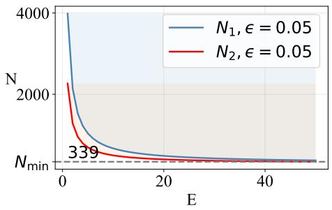
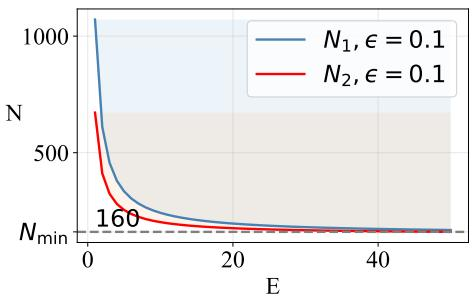
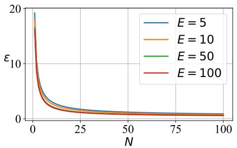
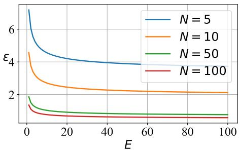

# How Many Samples Are Enough for Learning Across Domains?

Hong Zheng ∗

zhinhom@icloud.com

## Abstract

Understanding the fundamental mechanisms of learning is essential for designing systems with strong generalization. Recent studies have shown that increasing the number of train ing domains, or enlarging the distribution shift among them, improves generalization when each domain contains suficiently many data samples. However, the conditions under which the data samples can be considered suficient remain unexplored. In this work, we fill this gap by establishing criteria for per-domain sample requirements based on the presented learning bounds. These criteria not only reveal an inverse linear scaling law between the number of training domains and the number of samples required per domain, but also explain the fundamental rationale behind the assumption of data suficiency, thereby providing theoretical guidance for assessing the adequacy of existing datasets and constructing datasets. This difers from classical learning theory, as the number of samples required is highly dependent on the number of training domains. Additionally, we prove the close relationship between in-domain learning and out-of-domain generalization through the pre sented generalization bounds, and lastly discuss some key arguments.

Keywords: Machine Learning, Multi-domain Learning, Domain Generalization, Generalization Bound

## 1 Introduction

Despite the remarkable empirical success of modern machine learning (ML), theoretical understanding remains indispensable for explaining its behavior and guiding its practical applications. Beginning with the first theorem on the perceptron (Novikof, 1962) and culminating in the development of VC entropy and VC dimension (Vapnik, 1968), learning theory has established fundamental non-asymptotic learning bounds through the principle of uniform convergence and concentration inequalities. Under the independently and identically distributed (i.i.d.) data assumption, these bounds have served as fundamental analytical tools for guiding the design of robust ML models, learning systems, and datasets (Vapnik, 2013). However, their applicability becomes limited when the i.i.d. assumption no longer holds, such as in domain generalization (DG), where distribution shift occurs.

Recently, several works have developed theoretical frameworks in DG by assuming that data are independently but non-identically distributed (i.n.d.) to analyze learning behaviors and guide designs. Wang et al. (2024) and Dwork et al. (2026) show that the number of training domains significantly afects the generalization ability of trained ML models, arguing that increasing the number of training domains generally leads to better generalization on unseen domains. Zheng and Teng (2026) further shows that the need for a large number of training domains essentially arises from a large degree of distribution shift among training domains, i.e., suficient diversity of samples across the training domains. When the distribution shift among training domains is suficiently large, good generalization to unseen domains can be achieved, even if there are few training domains. These works share a common assumption: each training domain contains a suficient number of data samples, or even infinitely many samples. What constitutes a suficient number of samples, however, or under what conditions this assumption holds, has not been thoroughly investigated. Namely, existing theory lacks a principled characterization of the sample requirements for learning across domains. As a result, its applicability in guiding learning and practical applications is limited.

In this study, we address this limitation by establishing conditions under which the number of samples within each training domain is suficient to ensure reliable learning and generalization. These conditions, importantly, reveal an inverse linear scaling law with an irreducible intercept, showing that the required number of samples per domain decreases linearly as the number of training domains increases, up to the minimal requirement. This implies that the number of samples per domain cannot be arbitrarily small, even as the number of training domains tends to infinity. It reveals the fundamental reason behind the commonly adopted assumption in previous works that each training domain should contain a suficient number of samples. Consequently, these conditions provide theoretical guidance for dataset assessment and construction in DG.

Our main contributions are summarized as follows:

• We establish criteria for the per-domain sample requirements. Specifically, they are derived through the presented upper learning bounds under mild assumptions. The presented upper bounds not only characterize how the number of samples per domain afects learning but also recover previous theoretical results regarding the role of the number of training domains.

• We provide generalization bounds under distribution shift. These generalization bounds indicate that the tightness of the generalization error is closely related to the tightness of the learning bounds. Namely, they characterize how the generalization error behaves given a finite number of training domains whose samples satisfy the proposed criteria. This provides a theoretical justification for the relationship between in-domain learning performance and out-of-domain generalization.

## 2 Theoretical Results

## 2.1 Preliminares

We here introduce some notation and related concepts that will be used to derive our methods. Considering $\mathcal { X } \subset \mathbb { R }$ and $\mathcal { V } \subset \mathbb { R }$ being respectively an input and output space, we have a training set

$$
D = \{ \xi _ { 1 } = ( X , Y ) _ { 1 } , . . . , \xi _ { E } = ( X , Y ) _ { E } \}
$$

of size E in $\mathcal { D } = \mathcal { X } \times \mathcal { Y }$ drawn from unknown distributions in $\mathcal { P }$ . Assume that each $\xi \in D$ contains n data pairs $( x _ { l } , y _ { l } ) , \mathrm { i . e . , } ( X , Y ) : = \{ ( x _ { l } , y _ { l } ) \} _ { l = 1 } ^ { n }$ . Under DG, $( X , Y ) _ { i } { \sim } ^ { i . i . d . } P _ { i }$ for all $i \in [ E ]$ , and $P _ { i } \neq P _ { j }$ for all $i \neq j \in [ E ]$ . Thus, the overall samples follow an independent non-identically distributed $\mathrm { ( i . n . d . ) }$ assumption. The training set D is typically regarded as the source set, while the testing set $D _ { t }$ is regarded as the target set. Similarly, $P _ { i } \neq P _ { t }$ for all $i \in [ E ]$ and all $t \in [ E _ { t } ]$ , where $E _ { t }$ denotes the number of target domains in $D _ { t }$ . Furthermore, no information from $D _ { t }$ is available during training. In practice, $n _ { i } \neq n _ { j } , \forall i \neq j \in [ E ]$ ; thus, without loss of generality, to simplify the analysis, we let $\begin{array} { r } { N = E ^ { - 1 } \sum _ { i = 1 } ^ { E } n _ { i } } \end{array}$ denote the average number of data samples in each training domain.

We consider a hypothesis $h \in { \mathcal { H } } : \chi \to \ y = \{ 0 , 1 \}$ as a deterministic mapping for prediction, corresponding to a binary classification problem. Furthermore, we assume that all spaces and mappings are measurable and all sets are countable, which does not restrict the generality of the results presented hereafter.

We define the loss function as $\gamma : \mathcal { H } \times \mathcal { D }  \mathbb { R } _ { > 0 }$ , denoting $\gamma ( h , \xi )$ as the loss incurred by any hypothesis $h \in \mathcal H$ on sample $\xi \in \mathcal { D }$ . In domain $i ,$ the empirical loss and the expected loss can be expressed as $\begin{array} { r } { \gamma _ { N , i } ( h ) : = N ^ { - 1 } \sum _ { l = 1 } ^ { N } \gamma ( h , ( x _ { l } , y _ { l } ) _ { i } ) } \end{array}$ and $\mathbb { E } _ { \xi _ { i } } [ \gamma ( h ) ] : =$ $\mathbb { E } _ { \xi \sim P _ { i } } [ \gamma ( h , \xi ) ]$ , respectively. For all training domains, we denote the empirical loss by $\begin{array} { r } { \gamma _ { N , E } = E ^ { - 1 } \sum _ { i = 1 } ^ { E } \gamma _ { N , i } ( h ) } \end{array}$ . Note that the minimizers of min $\gamma _ { N , i } ( h )$ and $\gamma _ { N , E } ( h )$ are different, and both are essential to our subsequent derivations.

Given a class of measurable sets A, let $\mathcal { H } = \{ \mathbf { 1 } _ { A } , A \in \mathcal { A } \} \subseteq \{ h : \mathcal { X } \to \{ 0 , 1 \} \}$ denote the corresponding class of classifiers. Assuming that A is a VC-class, if $G _ { \mathcal { A } } ( K )$ denotes the supremum of $\# \{ A \cap { \mathcal { X } } ^ { \prime } , A \in { \mathcal { A } } \}$ over the collection of subsets $\mathcal { X } ^ { \prime }$ of X with cardinality $K$ then A has the VC property if $d _ { v c } = \operatorname* { s u p } \{ K : G _ { \mathcal { A } } ( K ) = 2 ^ { K } \} < \infty$ , where $d _ { v c }$ is called the VC-dimension of A (Vapnik, 1968). Denote by $P ( \mathcal { H } )$ the set of all joint distributions $P \in { \mathcal { P } }$ under domain i. Let $s \in \mathcal H$ denote the Bayes classifier, defined by $s ( x ) = \mathbf { 1 } _ { \eta ( x ) \geq 1 / 2 }$ , where $\eta ( x ) = P [ Y = 1 | X = x ]$ denotes the regression function of Y given $X = x$ . Consequently, both the regression function η and the Bayes classifier s depend on P (Massart and N´ed´elec, 2006).

For the DG setting, we assume that $\{ s _ { 1 } , \ldots , s _ { E } \}$ for D and $\{ s _ { 1 } , \ldots , s _ { E _ { t } } \}$ for $D _ { t }$ , indicating that each domain has its own Bayes classifier. This assumption is milder than assuming the existence of a single Bayes classifier shared by all domains. One important reason is that the latter requires $\cap _ { e = 1 } ^ { \overline { { E } } _ { a l l } }$ arg min $\mathbb { E } _ { \xi _ { e } } [ \gamma ( h ) ] \neq \emptyset$ , whereas assuming the existence of domainwise optimal hypotheses $\{ s _ { 1 } , \ldots , s _ { E _ { a l l } } \}$ only requires arg min $\mathbb { E } _ { \xi _ { e } } [ \gamma ( h ) ] \ \neq \ \varnothing , \forall e \ \in \ [ E _ { a l l } ]$ Here, $E _ { a l l }$ denotes the total number of domains. In other words, the domain-wise optimal hypothesis assumption removes the need for a shared minimizer, remaining applicable even under substantial distribution shifts.

At last, we introduce the following assumption on the hypothesis space, which is a common assumption in ML studies and ensures compatibility between measure and topology.

Assumption 1 There exist some countable subset $\mathcal { H ^ { \prime } }$ of H such that, for every $h \in \mathcal H$ , there exists sequence $\left( h _ { k } \right)$ of elements of $\mathcal { H ^ { \prime } }$ such that, for every $\xi \in \mathcal { D }$ , lim $\iota _ { k \to \infty } \gamma ( h _ { k } , \xi ) = \gamma ( h , \xi )$

## 2.2 Bounds

We first define the following relative loss between an assumed optimal hypothesis s and any hypothesis $h \in \mathcal H$ ，

$$
\ell ( h , s ) = \gamma ( h , \cdot ) - \gamma ( s , \cdot ) .
$$

This relative loss ℓ estimates the deviation of $h$ from $s ,$ enabling hypothesis evaluation under arbitrary data scenarios, including label noise (Massart and N´ed´elec, 2006; Wang et al., 2024). Specifically, $s ( x )$ corresponds to the true label without label noise and to the optimal prediction otherwise, always achieving the minimal loss.

By the considerations of the empirical loss and the expected loss, we define the corresponding relative empirical loss and expected loss as

$$
\ell _ { N , i } ( h , s ) = \gamma _ { N , i } ( h ) - \gamma _ { N , i } ( s )\tag{1}
$$

and

$$
\mathbb { E } _ { \xi _ { i } } [ \ell ( h , s ) ] = \mathbb { E } _ { \xi _ { i } } [ \gamma ( h ) ] - \mathbb { E } _ { \xi _ { i } } [ \gamma ( s ) ] ,\tag{2}
$$

respectively, in domain $i .$

Additionally, we consider the Tsybakov’s margin condition (Mammen and Tsybakov, 1999), defined as follows, to link the relative loss and the distance metric between hypotheses,

$$
\ell ( h , s ) \geq m ^ { \theta } d ^ { 2 \theta } ( h , s ) , \forall h \in \mathcal { H } ,\tag{3}
$$

where $m$ is a positive constant satisfying $m < 1$ . If the distribution $\eta ( x )$ is well behaved around $1 / 2$ , we consider $\theta = 1 , \operatorname { i . e . , } \ell ( h , s ) \geq m d ^ { 2 } ( h , s )$

Based on the above definitions, we begin by establishing the following learning bound.

Theorem 2 Assume that $0 ~ \leq ~ \gamma ~ \leq ~ M$ and that H satisfies Assumption 1, let A be a VC-class with dimension $d _ { v c } \geq 1$ . Assume that the margin condition (3) holds with $m \geq$ $\sqrt { d _ { v c } / N }$ . Given the training (source) set $D$ , let $\hat { h } \in$ arg $\mathrm { m i n } _ { h \in \mathcal { H } } \gamma _ { N , E } ( h )$ . Then, the following inequality holds with probability at least $1 - \delta$

$$
\frac { 1 } { E } \sum _ { i = 1 } ^ { E } \ell _ { N , i } ( \hat { h } , s _ { i } ) \leq \sqrt { 2 } M \sqrt { \frac { \ln ( 1 / \delta ) } { E N } } + \frac { \kappa d _ { v c } } { m N } .\tag{4}
$$

Here, $\kappa = C ( 1 + \log ( N m ^ { 2 } / d _ { v c } ) )$ , where C is an absolute constant.

Proof Considering the random variable $Z _ { i } = \ell _ { N , i } ( h , s )$ with $Z _ { i } \in [ - M , M ]$ , Lemma $7$ implies that the following inequality holds with probability at least $1 - \delta .$ , for any $h , s \in { \mathcal { H } }$ 2

$$
\frac { 1 } { E } \left( \sum _ { i } ^ { E } \ell _ { N , i } ( h , s ) - \mathbb { E } _ { \xi _ { i } } [ \ell ( h , s ) ] \right) \leq \sqrt { 2 } M \sqrt { \frac { \ln ( 1 / \delta ) } { E N } } .
$$

Let $\hat { s } _ { i } \in \arg \operatorname* { m i n } _ { h \in \mathcal { H } } \gamma _ { N , i } ( h )$ and $s _ { i }$ be the Bayes optimal classifier in domain $i ,$ and substitute $h$ and s into the above inequality, we obtain

$$
\frac { 1 } { E } \left( \sum _ { i } ^ { E } \ell _ { N , i } ( \hat { s } _ { i } , s _ { i } ) - \mathbb { E } _ { \xi _ { i } } [ \ell ( \hat { s } _ { i } , s _ { i } ) ] \right) \leq \sqrt { 2 } M \sqrt { \frac { \ln ( 1 / \delta ) } { E N } } .
$$

By Lemma 12, it follows that

$$
\mathbb { E } _ { \xi _ { i } } [ \ell ( \hat { s } _ { i } , s _ { i } ) ] \le \frac { \kappa d _ { v c } } { m N }
$$

$$
\frac { 1 } { E } \sum _ { i } ^ { E } \mathbb { E } _ { \xi _ { i } } [ \ell ( \hat { s } _ { i } , s _ { i } ) ] \leq \frac { \kappa d _ { v c } } { m N }
$$

This indicates that

$$
\frac { 1 } { E } \sum _ { i } ^ { E } \ell _ { N , i } ( \hat { s } _ { i } , s _ { i } ) \leq \sqrt { 2 } M \sqrt { \frac { \ln ( 1 / \delta ) } { E N } } + \frac { \kappa d _ { v c } } { m N } .
$$

Then, let $\hat { h } \in \arg$ min $\gamma _ { N , E } ( h )$ , by an algebraic fact,

$$
\frac { 1 } { E } \sum _ { i } ^ { E } \ell _ { N , i } ( \hat { h } , s _ { i } ) \leq \frac { 1 } { E } \sum _ { i } ^ { E } \ell _ { N , i } ( \hat { s } _ { i } , s _ { i } ) ,
$$

the proof is complete. Here, we should mention to readers that $\hat { h }$ is the minimizer for $\gamma _ { N , E } ( h )$ , whereas $\hat { s } _ { i }$ is the minimizer for $\gamma _ { N , i } ( h )$ for each $i \in [ E ]$ . Namely, $\gamma _ { N , E } ( \hat { h } ) \ \leq$ $\gamma _ { N , E } ( h )$ , $\forall h \in { \mathcal { H } } ,$ and let h be $s _ { i } ;$ then, $\begin{array} { r } { \gamma _ { N , E } ( \hat { h } ) \leq E ^ { - 1 } \sum _ { i \in E } \gamma _ { N , i } ( s _ { i } ) } \end{array}$ . Consequently, subtracting the same quantity from both sides preserves the inequality. 7

Remarks. (a) The left-hand side (LHS) represents the average relative empirical loss between the empirical risk minimizer hˆ and all Bayes classifiers in the source domains. Note that $\hat { h }$ is the empirical risk minimizer across domains. (b) There are two terms in the Right-Hand Side (RHS): the first term is the main order corresponding to a convergence rate of $\mathcal { O } ( M / \sqrt { E N } )$ , and the second term can be interpreted as a complexity term governed $d _ { v c }$ and N. (c) When $E \to \infty$ and $N  \infty$ , the upper bound becomes asymptotically tight. Given only the bounded condition M for the loss function or the relative loss, the convergence rates of the upper bound cannot be improved. This is ensured by Hoefdingtype concentration inequalities and does not require an explicit derivation of corresponding lower bounds. (d) The practical implication of the above bound is to characterize how small the training loss, or the relative training loss, can be driven during training.

The above bound clearly indicates that, as E and N increase, $\gamma ( \hat { h } , \cdot )  \gamma ( s _ { i } , \cdot ) , \forall i \in [ E ]$ which characterizes how E and N influence the prediction performance of $\hat { h }$ during training. Interestingly, this leads to the same conclusion as that presented in studies (Wang et al., 2024; Dwork et al., 2026), i.e., a large E leads to better-performing trained models. Then, define $\begin{array} { r } { \epsilon = E ^ { - 1 } \sum _ { i = 1 } ^ { E } \ell _ { N , i } ( \hat { h } , s _ { i } ) } \end{array}$ . Assuming $\epsilon > 0$ , we rewrite the above bound as follows:

$$
\epsilon \leq \sqrt { \frac { \chi } { E N } } + \frac { \kappa d _ { v c } } { m N } ,
$$

where $\chi = ( 2 M ) ^ { 2 } \ln ( 1 / \delta )$ . Therefore, the following inequality for N holds,

$$
N _ { 1 } \geq \frac { \chi } { 2 \epsilon ^ { 2 } E } + \frac { \kappa d _ { v c } } { \epsilon m } .\tag{5}
$$

Proof Since

$$
\epsilon \leq \sqrt { \frac { \chi } { E N } } + \frac { \kappa d _ { v c } } { m N } ,
$$

let $P = \sqrt { \chi / E }$ and $Q = \kappa d _ { v c } / m$ , we then obtain

$$
N \geq \left( \frac { 1 } { 2 \epsilon } \left( P + \sqrt { P ^ { 2 } + 4 \epsilon Q } \right) \right) ^ { 2 } ,
$$

i.e.,

$$
N \geq \left( \frac { 1 } { 2 \epsilon } \left( \sqrt { \frac { \chi } { E } } + \sqrt { \frac { \chi } { E } + 4 \epsilon \frac { \kappa d _ { v c } } { m } } \right) \right) ^ { 2 } .
$$

We then expand the square to obtain

$$
\begin{array} { l } { { N \ge \displaystyle \frac { 1 } { 2 \epsilon ^ { 2 } } \left( \frac { \chi } { E } + 2 \epsilon \cdot \frac { \kappa d _ { v c } } { m } + \sqrt { \frac { \chi } { E } } \cdot \sqrt { \frac { \chi } { E } + 4 \epsilon \frac { \kappa d _ { v c } } { m } } \right) } } \\ { { \ge \displaystyle \frac { \chi } { 2 \epsilon ^ { 2 } E } + \frac { \kappa d _ { v c } } { \epsilon m } + \Omega \ge \displaystyle \frac { \chi } { 2 \epsilon ^ { 2 } E } + \frac { \kappa d _ { v c } } { \epsilon m } . } } \end{array}
$$

The last inequality holds since $\Omega \geq 0$

Here, we subscript 1 to N to distinguish it from the result obtained in the next subsection, without any magical meaning. Simplifying the above result yields

$$
\begin{array} { r } { N _ { 1 } \geq \chi _ { \epsilon } E ^ { - 1 } + \mu _ { \epsilon } , } \end{array}
$$

where $\chi _ { \epsilon } = \chi / 2 \epsilon ^ { 2 }$ and $\mu _ { \epsilon } = \kappa d _ { v c } / \epsilon m$ Since $\kappa , \ \delta , \ d _ { v c }$ , and m are typically treated as constants in classical learning theory, for a given ϵ, the relationship between N and E follows an inverse linear scaling law with a nonzero irreducible intercept. In particular, when $E  \infty$ , we have $N _ { 1 } \geq \mu _ { \epsilon }$ . The irreducible intercept essentially limits N, which cannot be arbitrarily small, even if a theoretically large E can be obtained. This clearly explains the essential reason for assuming suficient data samples within each training domain in (Wang et al., 2024; Zheng and Teng, 2026). Now, by Inequality (5), we have a criterion for determining whether the data samples within each domain are suficient, which can be used for assessing the suficiency of existing data or constructing data.

Given a training set D with E training domains, where N satisfies the above criterion, the achievable generalization error is characterized by the following generalization bound.

Theorem 3 (Generalization Bound) Under the assumptions of Theorem 2, given the training (source) set D and the testing (target) set $D _ { t }$ , the following inequality holds with probability at least 1 − 2δ,

$$
\frac { 1 } { E _ { t } } \sum _ { t = 1 } ^ { E _ { t } } \mathbb { E } _ { \xi _ { t } } [ \ell ( \hat { h } , s _ { t } ) ] \leq 2 \sqrt { 2 } M \sqrt { \frac { \ln ( 1 / \delta ) } { E N } } + \frac { \kappa d _ { v c } } { m N } + C ^ { * } \lambda ^ { * } .
$$

Here, $\begin{array} { r } { \lambda ^ { * } : = \sum _ { t } \sum _ { i } \left( d _ { J S } ( P _ { t } , P _ { i } ) + d _ { J S } ( P _ { s _ { t } } , P _ { s _ { i } } ) \right) , C ^ { * } = ( 2 \sqrt { 2 } M ) / E E _ { t } , P _ { s e } : = P _ { ( s _ { e } ( X ) , Y ) } } \end{array}$ , for all $e \in [ E _ { a l l } ]$ , and $d _ { J S } ( P , Q ) = \sqrt { J S ( P | | Q ) }$ , where $J S ( \cdot | | \cdot )$ denotes the Jensen-Shannon divergence.

Proof According to Lemma 13, for any $h \in \mathcal H$ , any $P _ { i }$ and $Q _ { j }$ , we have

$$
\left| \mathbb { E } _ { P _ { i } } [ \gamma ] - \mathbb { E } _ { Q _ { j } } [ \gamma ] \right| \leq 2 { \sqrt { 2 } } M d _ { J S } ( P _ { i } , Q _ { j } ) .
$$

Then, extending this inequality to all source and target domains, we obtain

$$
\left| \frac { 1 } { E _ { t } } \sum _ { t } ^ { E _ { t } } \mathbb { E } _ { P _ { t } } [ \gamma ] - \frac { 1 } { E } \sum _ { i } ^ { E } \mathbb { E } _ { P _ { i } } [ \gamma ] \right| \leq C ^ { * } \sum _ { t } ^ { E _ { t } } \sum _ { i } ^ { E } d _ { J S } ( P _ { t } , P _ { i } ) ,
$$

where $C ^ { * } = ( 2 \sqrt { 2 } M ) / E E _ { t }$ . Let

$$
a = \frac { 1 } { E _ { t } } \sum _ { t } \mathbb { E } _ { \xi \sim P _ { t } } [ \gamma ( h , \xi ) - \gamma ( s _ { t } , \xi ) ]
$$

$$
b = \frac { 1 } { E _ { t } } \sum _ { t } \mathbb { E } _ { \xi \sim P _ { t } } [ \gamma ( s _ { t } , \xi ) ]
$$

$$
c = \frac { 1 } { E } \sum _ { i } \mathbb { E } _ { \xi \sim P _ { i } } [ \gamma ( h , \xi ) - \gamma ( s _ { i } , \xi ) ]
$$

$$
d = \frac { 1 } { E } \sum _ { i } \mathbb { E } _ { \xi \sim P _ { i } } [ \gamma ( s _ { i } , \xi ) ] .
$$

Applying the above inequality and the triangle inequality yields that

$$
| a - c | \leq | d - b | + C ^ { * } \sum _ { t } \sum _ { i } d _ { J S } ( P _ { t } , P _ { i } ) .
$$

Similarly, by Lemma 13, we obtain

$$
| d - b | = \left| \frac { 1 } { E } \sum _ { i } \mathbb { E } _ { \xi \sim P _ { i } } [ \gamma ( s _ { i } , \xi ) ] - \frac { 1 } { E _ { t } } \sum _ { t } \mathbb { E } _ { \xi \sim P _ { t } } [ \gamma ( s _ { t } , \xi ) ] \right| \leq C ^ { * } \sum _ { t } \sum _ { i } d _ { J S } ( P _ { s _ { t } } , P _ { s _ { i } } ) .
$$

Let $\begin{array} { r } { \lambda ^ { * } : = \sum _ { t } \sum _ { i } \left( d _ { J S } ( P _ { s _ { t } } , P _ { s _ { i } } ) + d _ { J S } ( P _ { t } , P _ { i } ) \right) } \end{array}$ , and this follows that

$$
| a - c | \leq C ^ { * } \lambda ^ { * } ,
$$

that is

$$
\frac { 1 } { E _ { t } } \sum _ { t } \mathbb { E } _ { \xi \sim P _ { t } } [ \gamma ( h , \xi ) - \gamma ( s _ { t } , \xi ) ] \le \frac { 1 } { E } \sum _ { i } \mathbb { E } _ { \xi \sim P _ { i } } [ \gamma ( h , \xi ) - \gamma ( s _ { i } , \xi ) ] + C ^ { * } \lambda ^ { * }
$$

$$
\frac { 1 } { E _ { t } } \sum _ { t } \mathbb { E } _ { \xi _ { t } } [ \ell ( h , s _ { t } ) ] \leq \frac { 1 } { E } \sum _ { i } \mathbb { E } _ { \xi _ { i } } [ \ell ( h , s _ { i } ) ] + C ^ { * } \lambda ^ { * } .
$$

By Lemma 7, with probability at least $1 - \delta .$ , we obtain

$$
\frac { 1 } { E } \sum _ { i } \mathbb { E } _ { \xi _ { i } } [ \ell ( h , s _ { i } ) ] \le \frac { 1 } { E } \sum _ { i } \ell _ { N , i } ( h , s _ { i } ) + \sqrt { 2 } M \sqrt { \frac { \ln ( 1 / \delta ) } { E N } } .
$$

This follows that

$$
\frac { 1 } { E _ { t } } \sum _ { t } \mathbb { E } _ { \xi _ { t } } [ \ell ( h , s _ { t } ) ] \leq \frac { 1 } { E } \sum _ { i } \ell _ { N , i } ( h , s _ { i } ) + \sqrt { 2 } M \sqrt { \frac { \ln ( 1 / \delta ) } { E N } } + C ^ { * } \lambda ^ { * } .
$$

Then, considering $\hat { h } \in \arg \operatorname* { m i n } \gamma _ { N , E } ( h )$ and applying Theorem $^ { 2 , }$ we complete the proof.

Remarks. (a) The LHS represents the average relative expected loss between $\hat { h }$ and the Bayes classifiers in the target domains, i.e., the generalization error. Note that this quantity is an expected value rather than an empirical one, and that $\hat { h }$ is the empirical risk minimizer across domains. (b) The RHS still contains the main order term and the complexity term, along with an additional term $\lambda ^ { * }$ . This term $\lambda ^ { * }$ captures two types of joint distribution discrepancies. $P _ { e }$ represents the original joint distribution, whereas $P _ { s _ { e } }$ represents the joint distribution induced by s. It characterizes the essential challenge in DG, $\mathrm { i . e . }$ , generalization is afected by the distribution discrepancy between the source and target domains. Unfortunately, there is nothing we can do about this term, as access to $D _ { t }$ is unavailable during learning and any information about the distribution is unknown. We further discuss this term in Section 2.4. (c) $d _ { J S } ( \cdot , \cdot )$ is a metric that satisfies symmetry and the triangle inequality. When the JS divergence is defined using the natural logarithm, $0 \leq d _ { J S } ( \cdot , \cdot ) \leq \sqrt { \ln { 2 } }$

Accordingly, given $\lambda ^ { * } , \hat { h }$ is theoretically guaranteed to perform well on unseen target domains as $E  \infty$ and $N  \infty$ . Since the parameters E and N are determined by the source domains, the above result implies that in-domain learning governs out-of-domain generalization, which is consistent with the empirical findings in (Miller et al., 2021), where this argument was validated without access to any information on $\lambda ^ { * }$ . In Section 2.4, we further exhibit how variations in E and N afect the generalization error through theoretical predictions.

## 2.3 Tighter Bounds

In the previous subsection, we mentioned that, based solely on the information provided by the bounded loss function, the convergence rate of bound (4) cannot be further improved. In this subsection, we assume that additional information is available for deriving learning and generalization bounds. Then, under this assumption, we investigate how the criterion for per-domain sample requirements can be established.

We first present the following learning bound.

Theorem 4 Assume that $0 ~ \leq ~ \gamma ~ \leq ~ M$ and that H satisfies Assumption 1, let A be a VC-class with dimension $d _ { v c } \geq 1$ . Assume that the margin condition (3) holds with $m ~ \geq ~ \sqrt { d _ { v c } / N }$ . Given the training (source) set $D ,$ let $\hat { h } \in \arg \operatorname* { m i n } _ { h \in \mathcal { H } } \gamma _ { N , E } ( h )$ , $\hat { s } _ { i } \in \arg \operatorname* { m i n } _ { h \in \mathcal { H } } \gamma _ { N , i } ( h ) , \forall i \in [ E ]$ , and

$$
\sigma ^ { 2 } = \frac { 1 } { E } \sum _ { i = 1 } ^ { E } V a r ( \ell _ { N , i } ( \hat { s } _ { i } , s _ { i } ) ) .
$$

Then, the following inequality holds with probability at least $1 - \delta$ 2

$$
\frac { 1 } { E } \sum _ { i = 1 } ^ { E } \ell _ { N , i } ( \hat { h } , s _ { i } ) \leq \sqrt { \frac { 2 \sigma ^ { 2 } \ln ( 1 / \delta ) } { E N } } + \frac { 4 M \ln ( 1 / \delta ) } { 3 E N } + \frac { \kappa d _ { v c } } { m N } .\tag{6}
$$

Proof Let $\begin{array} { r } { \hat { s } _ { i } \in \arg \operatorname* { m i n } _ { h \in \mathcal { H } } \gamma _ { N , i } ( h ) } \end{array}$ and $s _ { i }$ be the Bayes optimal classifier in domain $i .$ Consider the random variable $Z _ { i } = \ell _ { N , i } ( \hat { s } _ { i } , s _ { i } ) - \mathbb { E } _ { \xi _ { i } } [ \ell ( \hat { s } _ { i } , s _ { i } ) ]$ with $| Z _ { i } | \le 2 M$ . Then, we have

$$
\sigma ^ { 2 } = \frac { 1 } { E } \sum _ { i } ^ { E } V a r ( Z _ { i } ) = \frac { 1 } { E } \sum _ { i } ^ { E } V a r ( \ell _ { N , i } ( \hat { s } _ { i } , s _ { i } ) ) = \frac { 1 } { E N } \sum _ { i } ^ { E } \sum _ { l } ^ { N } V a r ( \ell _ { l , i } ( \hat { s } _ { i } , s _ { i } ) )
$$

Lemma 8 implies that the following inequality holds with probability at least $1 - \delta$

$$
\frac { 1 } { E } \left( \sum _ { i } ^ { E } \ell _ { N , i } ( \hat { s } _ { i } , s _ { i } ) - \mathbb { E } _ { \xi _ { i } } [ \ell ( \hat { s } _ { i } , s _ { i } ) ] \right) \leq \sqrt { \frac { 2 \sigma ^ { 2 } \ln ( 1 / \delta ) } { E N } } + \frac { 4 M \ln ( 1 / \delta ) } { 3 E N } .
$$

By Lemma 12, it follows that

$$
\mathbb { E } _ { \xi _ { i } } [ \ell ( \hat { s } _ { i } , s _ { i } ) ] \le \frac { \kappa d _ { v c } } { m N }
$$

$$
\frac { 1 } { E } \sum _ { i } ^ { E } \mathbb { E } _ { \xi _ { i } } [ \ell ( \hat { s } _ { i } , s _ { i } ) ] \leq \frac { \kappa d _ { v c } } { m N }
$$

This indicates that

$$
\frac { 1 } { E } \sum _ { i } ^ { E } \ell _ { N , i } ( \hat { s } _ { i } , s _ { i } ) \leq \sqrt { \frac { 2 \sigma ^ { 2 } \ln ( 1 / \delta ) } { E N } } + \frac { 4 M \ln ( 1 / \delta ) } { 3 E N } + \frac { \kappa d _ { v c } } { m N } .
$$

Then, let $\hat { h } \in$ arg min $\gamma _ { N , E } ( h )$ , by an algebraic fact,

$$
\frac { 1 } { E } \sum _ { i } ^ { E } \ell _ { N , i } ( \hat { h } , s _ { i } ) \leq \frac { 1 } { E } \sum _ { i } ^ { E } \ell _ { N , i } ( \hat { s } _ { i } , s _ { i } )
$$

the proof is complete.

Remarks. (a) The LHS is the average relative empirical loss of $\hat { h }$ with respect to the Bayes classifiers in the source domains. (b) The RHS consists of three terms: the main order term with a convergence rate $\mathcal { O } ( \sigma / \sqrt { E N } )$ , a bias term governed by M and EN, and a complexity term analogous to that in previous bounds. (c) Still, when $E \to \infty$ and $N \to \infty$ , the upper bound becomes tight. We say that the above bound is tighter than bound (4) because it incorporates $\sigma ^ { 2 }$ . This is a characteristic feature of Bernstein’s concentration inequality: when $\sigma ^ { 2 }$ is small, the above bound is tighter than Hoefding-type bounds. Accordingly, lower bounds for establishing the optimality of the convergence rate remain unnecessary. Here, $\sigma ^ { 2 }$ provides additional information beyond the boundedness of $\gamma$ by M, improving the convergence rate through the constant factor. However, when $\sigma ^ { 2 }$ is large, the tightness of the bound may deteriorate compared with bound (4). (d) The practical implication of bound (6) is similar to that of bound (4).

We further explain the additional information $\sigma ^ { 2 }$ . It measures the extent to which the empirical risk minimizer $\hat { s } _ { i }$ approaches the predictive performance of the Bayes classifier. To achieve $\sigma ^ { 2 } \to 0$ , classical learning theory requires suficiently many samples in each domain, further supporting the necessity of the suficient-sample assumption. We then rewrite the above bound as follows,

$$
\epsilon \leq \sqrt { \frac { \alpha } { E N } } + \frac { \beta } { 3 E N } + \frac { \kappa d _ { v c } } { m N } ,
$$

where $\alpha = 2 \sigma ^ { 2 } \ln ( 1 / \delta )$ and $\beta = 4 M \ln ( 1 / \delta )$ . Consequently, the following inequality for N holds,

$$
N _ { 2 } \ge \frac { \alpha } { 2 \epsilon ^ { 2 } E } + \frac { \beta } { 3 \epsilon E } + \frac { \kappa d _ { v c } } { \epsilon m }\tag{7}
$$

Proof Since

$$
\epsilon \leq \sqrt { \frac { \alpha } { E N } } + \frac { \beta } { 3 E N } + \frac { \kappa d _ { v c } } { m N } ,
$$

let $P = \sqrt { \alpha / E }$ and $Q = \beta / 3 E + \kappa d _ { v c } / m$ , we then obtain

$$
N \geq \left( \frac { 1 } { 2 \epsilon } \left( P + \sqrt { P ^ { 2 } + 4 \epsilon Q } \right) \right) ^ { 2 } ,
$$

i.e.,

$$
N \ge \left( \frac { 1 } { 2 \epsilon } \left( \sqrt { \frac { \alpha } { E } } + \sqrt { \frac { \alpha } { E } + 4 \epsilon ( \frac { \beta } { 3 E } + \frac { \kappa d _ { v c } } { m } ) } \right) \right) ^ { 2 } .
$$

Similarly, we square the above inequality and obtain

$$
\begin{array} { c } { { N \geq \displaystyle \frac { 1 } { 2 \epsilon ^ { 2 } } \left( \displaystyle \frac { \alpha } { E } + 2 \epsilon ( \displaystyle \frac { \beta } { 3 E } + \frac { \kappa d _ { v c } } { m } ) + \sqrt { \displaystyle \frac { \alpha } { E } } \sqrt { \displaystyle \frac { \alpha } { E } + 4 \epsilon ( \displaystyle \frac { \beta } { 3 E } + \frac { \kappa d _ { v c } } { m } ) } \right) } } \\ { { \geq \displaystyle \frac { \alpha } { 2 \epsilon ^ { 2 } E } + \displaystyle \frac { \beta } { 3 \epsilon E } + \displaystyle \frac { \kappa d _ { v c } } { \epsilon m } + \Omega \geq \displaystyle \frac { \alpha } { 2 \epsilon ^ { 2 } E } + \displaystyle \frac { \beta } { 3 \epsilon E } + \displaystyle \frac { \kappa d _ { v c } } { \epsilon m } . } } \end{array}
$$

The last inequality holds since $\Omega \geq 0$

Here, the subscript 2 is used to distinguish this result from that in Inequality (5). Simplifying the above result yields

$$
N _ { 2 } \geq \alpha _ { \epsilon } E ^ { - 1 } + \mu _ { \epsilon } ,
$$

where $\alpha _ { \epsilon } = \alpha / 2 \epsilon ^ { 2 } + \beta / 3 \epsilon$ . According to this inequality, the inverse relationship between E and N still holds, and the intercept still exists. The above lower bound for N is also tighter than the lower bound (5), and we will further discuss this in Section 2.4. At this point, when $\sigma ^ { 2 }$ is available, we have a tighter criterion for determining whether the data samples within each domain are suficient. This makes the estimation of N more precise.

Accordingly, the achievable generalization error is characterized by the following generalization bound.

Theorem 5 (Generalization Bound) Under the assumptions of Theorem $^ { 4 , }$ let

$$
\hat { \sigma } ^ { 2 } = \frac { 1 } { E } \sum _ { i = 1 } ^ { E } V a r ( \ell _ { N , i } ( \hat { h } , s _ { i } ) ) .
$$

Given the training (source) set D and the testing (target) set $D _ { t }$ , the following inequality holds with probability at least 1 − 2δ,

$$
\frac { 1 } { E _ { t } } \sum _ { t = 1 } ^ { E _ { t } } \mathbb { E } _ { \xi _ { t } } [ \ell ( \hat { h } , s _ { t } ) ] \leq \sqrt { \frac { 2 \sigma ^ { 2 } \ln ( 1 / \delta ) } { E N } } + \sqrt { \frac { 2 \hat { \sigma } ^ { 2 } \ln ( 1 / \delta ) } { E N } } + \frac { 8 M \ln ( 1 / \delta ) } { 3 E N } + \frac { \kappa d _ { v c } } { m N } + C ^ { * } \lambda ^ { * } .
$$

Proof The proof is similar to that of Theorem $s ,$ and follows by applying Lemma 13 to obtain the following result

$$
\frac { 1 } { E _ { t } } \sum _ { t } \mathbb { E } _ { \xi _ { t } } [ \ell ( h , s _ { t } ) ] \leq \frac { 1 } { E } \sum _ { i } \mathbb { E } _ { \xi _ { i } } [ \ell ( h , s _ { i } ) ] + C ^ { * } \lambda ^ { * } .
$$

Let $\hat { h } \in \arg$ min $\gamma _ { N , E } ( h )$ . Substituting h with $\hat { h } ,$ we obtain

$$
\frac { 1 } { E _ { t } } \sum _ { t } \mathbb { E } _ { \xi _ { t } } [ \ell ( \hat { h } , s _ { t } ) ] \leq \frac { 1 } { E } \sum _ { i } \mathbb { E } _ { \xi _ { i } } [ \ell ( \hat { h } , s _ { i } ) ] + C ^ { * } \lambda ^ { * } .
$$

Considering the random variable $Z _ { i } = \ell _ { N , i } ( \hat { h } , s _ { i } ) - \mathbb { E } _ { \xi _ { i } } [ \ell ( \hat { h } , s _ { i } ) ]$ with $| Z _ { i } | \le 2 M$ , we have

$$
\hat { \sigma } ^ { 2 } = \frac { 1 } { E } \sum _ { i } V a r ( \ell _ { N , i } ( \hat { h } , s _ { i } ) )
$$

By Lemma 8, with probability at least $1 - \delta .$ , we obtain

$$
\frac { 1 } { E } \sum _ { i } \mathbb { E } _ { \xi _ { i } } [ \ell ( \hat { h } , s _ { i } ) ] \leq \frac { 1 } { E } \sum _ { i } \ell _ { N , i } ( \hat { h } , s _ { i } ) + \sqrt { \frac { 2 \hat { \sigma } ^ { 2 } \ln ( 1 / \delta ) } { E N } } + \frac { 4 M \ln ( 1 / \delta ) } { 3 E N } .
$$

This follows that

$$
\frac { 1 } { E _ { t } } \sum _ { t } \mathbb { E } _ { \xi _ { t } } [ \ell ( \hat { h } , s _ { t } ) ] \leq \frac { 1 } { E } \sum _ { i } \ell _ { N , i } ( \hat { h } , s _ { i } ) + \sqrt { \frac { 2 \hat { \sigma } ^ { 2 } \ln ( 1 / \delta ) } { E N } } + \frac { 4 M \ln ( 1 / \delta ) } { 3 E N } + C ^ { * } \lambda ^ { * } .
$$

Then, by applying Theorem 4, the proof is completed.

Remarks. (a) The LHS represents the average relative expected loss between $\hat { h }$ and the Bayes classifiers in the target domains. (b) By the introduced $\hat { \sigma } ^ { 2 }$ , the main order term has a convergence rate of $\mathcal { O } ( ( \hat { \sigma } + \sigma ) / \sqrt { E N } )$ , while the bias and complexity terms on the RHS are similar to those in bound (6). (c) If both $\hat { \sigma } ^ { 2 }$ and $\sigma ^ { 2 }$ are suficiently small, the above generalization bound is tighter than that in Theorem 3 for a given $\lambda ^ { * }$

Based on the above bound, given $\lambda ^ { * }$ , the generalization ability of $\hat { h }$ is theoretically guaranteed, provided that $E$ and N tend to infinity, which is consistent with the conclusion of Theorem 3. Interestingly, $\hat { \sigma } ^ { 2 }$ is, in fact, the variance of ϵ. Namely, the generalization ability of $\hat { h }$ is still determined by learning, which further validates the relationship between in-domain learning and out-of-domain generalization.

  
Figure 1: Examples illustrating the advantage of pursuing tighter upper bounds. The solid lines corresponding to $N _ { 1 }$ and $N _ { 2 }$ are obtained from our criteria by considering the equality case, while the shaded regions denote the feasible regions defined by the inequality case. $N _ { m i n }$ denotes the limiting value of both $N _ { 1 }$ and $N _ { 2 }$ as $E  \infty$ . As illustrated, given $\epsilon , ~ N _ { 2 }$ provides a more precise estimation of $N$ Eventually, as E increases, both $N _ { 1 }$ and $N _ { 2 }$ approach $N _ { m i n }$

## 2.4 Discussion

(1) On the choice of N. At the beginning, we define $\begin{array} { r } { N = E ^ { - 1 } \sum _ { i = 1 } ^ { E } n _ { i } } \end{array}$ to simplify the analysis. We then present the lower bounds for N and interpret these bounds as criteria that should be satisfied by each individual training domain. The purpose is to provide a theoretical guarantee for the suficient sample assumption in each training domain. If one does not accept the use of the average sample size $N ,$ one can replace N with $E ^ { - 1 } \sum _ { i = 1 } ^ { E }$ ni in these inequalities, for example, Inequality (5), to obtain

$$
\sum _ { i = 1 } ^ { E } n _ { i } \geq \chi _ { \epsilon } + E \mu _ { \epsilon } .
$$

Then, by letting $\begin{array} { r } { N ^ { \prime } = \sum _ { i \in [ E \setminus j ] } n _ { i } . } \end{array}$ the following inequality can be used to assess whether the data samples in any domain $j \in [ E ]$ are suficient:

$$
n _ { j } \ge \chi _ { \epsilon } + E \mu _ { \epsilon } - N ^ { \prime } .
$$

(2) Tighter bounds. Previously, we stated that, when only the boundedness of the loss function is available, it is no longer possible to uniformly improve the convergence rate of the learning bound at the exponential scale. Then, by introducing $\sigma ^ { 2 }$ , the convergence rate is improved at the level of the constant factor. This leads to a tighter lower bound on N, $\mathrm { i . e . }$ , a more precise criterion for per-domain sample requirements. The advantage of this criterion can be illustrated by the following example.

Considering $\epsilon = 0 . 0 5$ and $\epsilon = 0 . 1$ , by setting $\chi = ( 2 \times 1 ) ^ { 2 } \times \ln ( 1 / 0 . 0 1 ) , m = 0 . 2$ $\kappa d _ { v c } = 1 , \alpha = 2 \times 1 \times \ln ( 1 / 0 . 0 1 )$ , and $\beta = 4 \times \ln ( 1 / 0 . 0 1 )$ , we plot the bound of $N _ { 1 }$ and $N _ { 2 }$ with respect to $E ,$ as shown in Figure 1. As shown in this figure, the estimation of N based on the tighter lower bound is more precise. Note that a smaller ϵ requires a larger value of N and leads to a larger $N _ { m i n }$

(3) Recent Works. Here, we discuss several recent works on learning and generalization bounds, while omitting their specific formulations. Interested readers are referred to the corresponding references for details.

The lower bound in (Wang et al., 2024) highlights the importance of $E$ in DG, showing that increasing E tightens the lower bound on the minmax risk. A similar conclusion was obtained in (Dwork et al., 2026) through an upper-bound analysis. Both analyses implicitly assume suficiently large N (or even $N = \infty )$ , leaving the role of N unexplored and limiting their applicability to practical scenarios with limited samples.

The upper bounds in (Zheng and Teng, 2026) show that, under certain conditions, a suficiently large distribution shift among training domains enables the learned model to approach the invariant prediction model (Peters et al., 2016). Their results suggest that, when N is suficient, increasing E mainly aims to introduce larger distribution shifts across source domains. However, their analysis relies on the Kullback-Leibler divergence, which implicitly assumes absolute continuity between domain distributions, a strong assumption in DG.

An upper bound in (Tong et al., 2023) characterizes the efects of E and N on learning and reveals their inverse relationship. However, it requires a suficiently small feature dimension; otherwise, the efects of E and N become negligible, limiting its applicability in determining N. Moreover, their impacts on generalization are not discussed.

This work does not aim to surpass existing bounds. If one insists on such a comparison, our bounds achieve a faster convergence rate of $\mathcal { O } ( 1 / \sqrt { E N } )$

Finally, we discuss the following learning bound,

Theorem 6 Assume that $0 \leq \gamma \leq M$ . Given the training (source) set $D$ , the following inequality holds with probability at least $1 - \delta$ , for any $h \in \mathcal H$

$$
\frac { 1 } { E } \sum _ { i = 1 } ^ { E } \left( \gamma _ { N , i } ( h ) - \mathbb { E } _ { \xi _ { i } } [ \gamma ( h ) ] \right) \leq M \sqrt { \frac { \ln ( 1 / \delta ) } { 2 E N } }
$$

Proof Considering the random variable $Z _ { i } = \gamma _ { N , i } ( h )$ with $Z _ { i } \in [ 0 , M ]$ , Lemma 7 implies that the following inequality holds with probability at least $1 - \delta$ , for any $h \in \mathcal H$ 2

$$
\frac { 1 } { E } \sum _ { i } ^ { E } \left( \gamma _ { N , i } ( h ) - \mathbb { E } _ { \xi _ { i } } [ \gamma ( h ) ] \right) \leq M \sqrt { \frac { \ln ( 1 / \delta ) } { 2 E N } } ,
$$

which completes the proof.

Remarks. This bound is a standard learning consistency bound in DG. As $E N \to \infty$ , the empirical learning process becomes increasingly consistent with the expected risk.

This bound, however, violates the assumption of suficient samples within each domain, as it implies $N  1$ when $E \to \infty$ . Consequently, despite ensuring learning consistency, this bound provides limited guidance for establishing criteria and practical learning problems. $( 4 ) \lambda ^ { * }$ . A similar term was first introduced in (Ben-David et al., 2010) as $\lambda = \epsilon _ { S } ( h ^ { * } ) +$ $\epsilon _ { T } ( h ^ { * } )$ , where $\begin{array} { r } { h ^ { * } = \arg \operatorname* { m i n } _ { h \in \mathcal { H } } ( \epsilon _ { S } ( h ) + \epsilon _ { T } ( h ) ) } \end{array}$ . When λ is suficiently small, the adaptability of the learned classifier between the source domain S and the target domain $T$ can be characterized by the H-divergence; and vice versa. Inspired by theirs, several studies have also introduced related terms to characterize the challenge of learning across domains, such as $\hat { \Delta }$ in (Rosenfeld and Garg, 2023).

  
Figure 2: Theoretical predictions for ε by controlling E and N. The left subfigure shows the results of $\varepsilon ( N )$ with fixed E, while the right subfigure shows the results of $\varepsilon ( E )$ with fixed N. The left subfigure demonstrates that, for diferent values of $E , \varepsilon$ eventually converges to similar asymptotic values as N increases. The right subfigure demonstrates that, however, for diferent values of $N _ { ; }$ , ε converges to diferent asymptotic values as E increases.

In real-world applications, $\lambda ^ { * }$ is often modeled by assuming that target-domain data differ from, yet are related $^ { \mathrm { t o , } }$ source-domain data. Explicitly evaluating it requires knowledge of the underlying distributions, which is generally impractical.

(5) Limitations. A limitation of our results is the bounded-loss assumption, i.e., $0 ~ \leq$ $\gamma \leq M$ , and the requirement of $\sigma ^ { 2 }$ and $\hat { \sigma } ^ { 2 }$ for the bounds (6) and related generalization bounds. Without these assumptions, the bounds cannot efectively guide DG learning or determine sample suficiency. Moreover, assuming $\mathcal { V } = \{ 0 , 1 \}$ limits their direct application to regression tasks, unless Y is transformed into $[ 0 , 1 ]$

(6) Theoretical Predictions. We define $\varepsilon = \textstyle E _ { t } { \overset { \cdot } { - 1 } } \sum _ { t = 1 } ^ { E _ { t } } \mathbb { E } _ { \xi _ { t } } [ \ell ( { \hat { h } } , s _ { t } ) ]$ and consider the equality case of the generalization bound. This yields the following result:

$$
\varepsilon = \sqrt { \frac { \chi _ { 2 } } { E N } } + \frac { \kappa d _ { v c } } { m N } + C ^ { * } \lambda ^ { * } ,
$$

where $\chi _ { 2 } = ( 4 M ) ^ { 2 } \ln ( 1 / \delta )$ . The parameters in the above equality are chosen as follows and are not of particular significance: $\chi _ { 2 } = ( 4 \cdot M ) \cdot \ln ( 1 / \delta ) , M = 1 . 0 , \delta = 0 . 0 1 , \kappa = 1 . 0 , d _ { v c } = 3$ $m = 0 . 2$ , and $C ^ { * } \lambda ^ { * } = \sqrt { \ln ( 2 ) } / 2$

Based on these parameters, we present the theoretical predictions in Figure 2 by varying $E$ and N separately: Group A (the left subfigure) : fixing E and varying N; Group B (the right one): fixing N and varying E.

As exhibited in the figure, we observe that the prediction results substantially difer across diferent groups. This can be explained by our criterion (5). Based on the selected values of the above parameters, if we aim to achieve $\varepsilon  1 . 0 , \mathrm { i . e . , } \epsilon  0 . 5 8$ , the intercept term requires at least $N \geq 2 5$ . In Group A, all results satisfy this condition regardless of $E _ { i }$ , and after increasing N to 25, ε decreases to around 1.0. However, in Group B, only the results with $N = 5 0$ and $N = 1 0 0$ satisfy this condition.

(7) Applications. If the assumptions of Inequalities (5) and (7) hold in practical applications, then, for a desired ϵ, these criteria can be applied as follows. (1) When the datasets are given, they can be used to determine whether the available samples are suficient for ERM. One particular case is when $N _ { m a x } < \chi _ { \epsilon } E ^ { - 1 } + \mu _ { \epsilon }$ , where $N _ { m a x } = \operatorname* { m a x } \{ n _ { i } , . . . , n _ { E } \}$ corresponding to the small-sample learning problem (Vapnik, 2013). In this case, Structural Risk Minimization may be preferred over ERM or ERM-based learning objectives. (2) When the datasets are constructed by researchers, they can serve as guidelines for data collection.

## 3 Related Works

We briefly review several theoretical works and representative learning methods in DG. For more details, we refer the reader to the cited references.

Theoretical Bounds: From the VC bounds (Vapnik, 2013) to the Massart-type bounds (Massart and N´ed´elec, 2006), the principles of machine learning have been progressively established. These theories provide foundations for analyzing learning behaviors and guiding applications (Li and Liu, 2024). Early work (Ben-David et al., 2010) on learning across domains inspired subsequent studies, particularly in representation learning. More recently, several works have investigated the role of training domains. For example, Wang et al. (2024); Dwork et al. (2026) study how many domains should be used for training, while Zheng and Teng (2026) shows that the degree of distribution shift among source domains afects generalization. Theoretical bounds have also been developed for specific learning methods (Rosenfeld and Garg, 2023; Tong et al., 2023). Together, these works have laid the foundation for DG.

Learning Methods: The concept of DG was first presented by Muandet 2013, and has since attracted extensive research. A representative approach, invariant risk minimization (Arjovsky et al., 2019), inspired methods such as IRM-Games (Ahuja et al., 2020) and P-IRM (Choraria et al., 2023), which assume that invariant features learned from source domains generalize to out-of-distribution domains. However, their efectiveness has been questioned, and failure conditions have been analyzed (Rosenfeld et al., 2020; Wang et al., 2022). Causality-based methods (Christiansen et al., 2021; Wang et al., 2023) have also been proposed but require stronger assumptions. More recently, regularization-based methods (Galanti et al., 2023; Levy and Abramovich, 2023) have shown promise for improving DG and facilitating its practical application.

## 4 Conclusion

In this work, based on the presented criteria, we answer the question of how many samples are suficient for learning across domains. In fact, we consider the sample requirement for a single domain, i.e., how many samples an individual sub-domain should contain in the DG setting. This result difers from classical results, such as VC bounds, in that it is linked to the number of training domains; that is, the sample requirement varies with the number of training domains. We argue that this result also provides a guarantee for single-domain generalization. However, we do not provide experiments to validate the theoretical predictions, which constitutes a limitation of this work. We leave such validation to interested readers. As an aside, with the development of large models, we are concerned about researchers’ interest in the fundamental mechanisms of ML.

## Acknowledgments

I would like to express my sincere gratitude to my supervisors, Prof. T & Prof. L, for providing me with the time, freedom, and support to pursue my own research interests and ideas throughout my studies.

## Appendix A.

In this appendix, we provide only the lemmas, along with their proofs, used to prove our main theorems.

## A.1 Lemmas

Lemma 7 (Hoefding Inequality under i.n.d. Settings) Let $Z _ { 1 } , \ldots , Z _ { n }$ be n independent random variables with $Z _ { i } \in [ a _ { i } , b _ { i } ]$ for each $i \in [ n ]$ . Define $\begin{array} { r } { S _ { n } = \sum _ { i = 1 } ^ { n } Z _ { i } } \end{array}$ . Then for any $\varepsilon > 0$

$$
P \left\{ S _ { n } - \mathbb { E } [ S _ { n } ] \ge \varepsilon \right\} \le \exp \left\{ - \frac { 2 \varepsilon ^ { 2 } } { \sum _ { i = 1 } ^ { n } ( b _ { i } - a _ { i } ) ^ { 2 } } \right\} .
$$

Proof This is a classical inequality, and thus we omit the proof here. For more details, please refer to (Boucheron et al., 2003). For clarity on how this lemma is applied in our case, we provide the following simple example. Consider $Z _ { i } = \gamma ( h , \xi _ { i } )$ as the i-th random variable and $\begin{array} { r } { S _ { n } = \sum _ { i = 1 } ^ { n } Z _ { i } } \end{array}$ , and assume that $Z _ { i } \in [ 0 , M _ { i } ]$ . Then, based on this inequality, we have

$$
P \left\{ S _ { n } - \mathbb { E } [ S _ { n } ] \geq \varepsilon \right\} \leq e x p \left\{ - \frac { 2 \varepsilon ^ { 2 } } { \sum _ { i = 1 } ^ { n } M _ { i } ^ { 2 } } \right\} .
$$

If we consider $Z _ { i } = \ell _ { N , i } ( h , s )$ and assume $Z _ { i } \in [ - M _ { i } , M _ { i } ]$ , the above result still holds with diferent coeficients. ■

Lemma 8 (Bernstein’s Inequality) Let $Z _ { 1 } , \ldots , Z _ { n }$ be independent real-valued random variables with zero mean, and assume that $| Z _ { i } | \le b , \forall i \in [ n ]$ , with probability one. Let

$$
\sigma ^ { 2 } = \frac { 1 } { n } \sum _ { i = 1 } ^ { n } V a r \{ Z _ { i } \} .
$$

Then for any $\varepsilon > 0$

$$
P \left\{ { \frac { 1 } { n } } \sum _ { i = 1 } ^ { n } Z _ { i } \geq \varepsilon \right\} \leq \exp \left\{ { \frac { - n \varepsilon ^ { 2 } } { 2 ( \sigma ^ { 2 } + \varepsilon b / 3 ) } } \right\} .
$$

Proof This is a classical inequality, and thus we omit the proof here. For more details, please refer to (Boucheron et al., 2003). We only illustrate how it is applied in our cases. We

consider $Z _ { i } = \gamma ( h , \xi _ { i } ) - \mathbb { E } _ { \xi _ { i } } [ \gamma ( h , \xi _ { i } ) ]$ as the i-th random variable and assume that $| Z _ { i } | \le M$ Then, based on this inequality, we have

$$
P \left\{ \frac { 1 } { n } \sum _ { i = 1 } ^ { n } \gamma ( h , \xi _ { i } ) - \mathbb { E } _ { \xi _ { i } } [ \gamma ( h , \xi _ { i } ) ] \geq \varepsilon \right\} \leq \exp \left\{ \frac { - n \varepsilon ^ { 2 } } { 2 ( \sigma ^ { 2 } + \varepsilon M / 3 ) } \right\} .
$$

Here, $\sigma = V a r ( \gamma ( h , \xi _ { i } ) )$ . If we consider $Z _ { i } = \ell _ { N , i } ( h , s )$ and assume $| Z _ { i } | \le 2 M$ , the above result still holds with diferent coeficients. ■

Remarks. For the above inequalities, we consider only the one-sided formulation. This means that the corresponding high-probability inequalities are associated with $\ln ( 1 / \delta )$ , regardless of whether the left-hand side is in the form of empirical minus expected or expected minus empirical. If one considers the two-sided formulation, the corresponding high-probability inequalities are associated with $\ln ( 2 / \delta )$ , again regardless of the direction of the deviation. In either case, our main results still hold, with the only diference being a change in the coeficient within ln(·).

Definition 9 Let $\mathcal { C } _ { 1 }$ be the class of nondecreasing and continuous functions $\psi$ from $\mathbb { R } _ { \geq 0 }$ to $\mathbb { R } _ { \geq 0 }$ such that $x \to \psi ( x ) / x$ is nonincreasing on $( 0 , + \infty )$ and $\psi ( 1 ) \geq 1$

Definition 10 Let $\ell ( s , S ) = \operatorname* { i n f } _ { h \in \mathcal { H } } \ell ( s , h )$ be a bias term. Given some nonnegative number $\rho ,$ consider a ρ-empirical risk minimizer, that $i s ,$ any estimator sˆ taking values in $\mathcal { H }$ such that $\begin{array} { r } { \gamma _ { N } \big ( \hat { s } \big ) \leq \rho + \operatorname* { i n f } _ { h \in \mathcal H } \gamma _ { N } \big ( h \big ) } \end{array}$

Lemma 11 (The Main Theorem in (Massart and N´ed´elec, 2006)) Let $\gamma \ : \ \mathcal { H } \ \times$ $\mathcal { D }  \mathbb { R } _ { > 0 }$ be a loss function such that s minimizes $\mathbb { E } [ \gamma ( h , \cdot ) ]$ when h varies in H. Let $\begin{array} { r } { \gamma _ { N } ( h ) = ( 1 / N ) \sum _ { l \in [ N ] } \gamma ( h , ( x _ { l } , y _ { l } ) ) , \mathbb { E } _ { \xi } [ \gamma ( h ) ] = \mathbb { E } _ { \xi } [ \gamma ( h , \xi ) ] } \end{array}$ , and $\bar { \gamma } _ { N } ( h ) = \gamma _ { N } ( h ) - \mathbb { E } _ { \xi } [ \gamma ( h ) ]$ and consider d satisfying ${ \cal V } a r _ { P } [ \gamma ( h , \cdot ) - \gamma ( s , \cdot ) ] \leq d ^ { 2 } ( h , s ) , \forall h \in \mathscr { H }$ . Let $\phi$ and w belong the class of functions $\mathcal { C } _ { 1 }$ defined above and let H satisfying the separability Assumption 1. Assume that, on the one hand

$$
d ( s , h ) \leq w ( \sqrt { \ell ( s , h ) } ) , \forall h \in \mathcal { H } ,
$$

Here, d represents some pseudo-distance on $\mathcal { H } \times \mathcal { H }$ . And that, on the other hand, one has, for every $u \in \mathcal { H } ^ { \prime }$ 2

$$
\sqrt { N } \mathbb { E } \left[ \operatorname* { s u p } _ { h \in \mathcal { H } ^ { \prime } , d ( u , h ) \le \sigma } \left[ \bar { \gamma } _ { N } ( u ) - \bar { \gamma } _ { N } ( h ) \right] \right] \leq \phi ( \sigma )\tag{8}
$$

for every positive $\sigma$ such that $\phi ( \sigma ) \leq \sqrt { N } \sigma ^ { 2 }$ . Let $\varepsilon _ { * }$ be the unique positive solution of the equation

$$
\sqrt { N } \varepsilon _ { * } ^ { 2 } = \phi ( w ( \varepsilon _ { * } ) ) .\tag{9}
$$

Then, there exists an absolute constant κ such that, for every $v \geq 1$ , the following inequality holds:

$$
P \left[ \ell ( s , \hat { s } ) > 2 \rho \right. \left. + 2 \ell ( s , S ) + \kappa v \varepsilon _ { \ast } ^ { 2 } \right] \leq \mathrm { e } ^ { - v } .
$$

Here, $\hat { s } \in \arg \operatorname* { m i n } _ { h \in \mathcal { H } } \gamma _ { N } ( h )$ . In particular, the following risk bound is available:

$$
\begin{array} { r } { \mathbb { E } [ \ell ( s , \hat { s } ) ] \le 2 ( \rho \ + \ell ( s , S ) + \kappa \varepsilon _ { * } ^ { 2 } ) . } \end{array}
$$

Proof Since this lemma is the main theorem in (Massart and N´ed´elec, 2006), the proof is omitted here. For details, please refer to page 2347 and see the proof of Theorem 2.

Lemma 12 Assume that H satisfies Assumption 1, and let A be a VC-class with dimension $d _ { v c } \geq 1$ . Assume that the margin condition (3) holds with $m \geq \sqrt { d _ { v c } / N }$ . There exists an absolute constant C such that, if sˆ denotes an empirical risk minimizer over H, the following inequality holds:

$$
\mathbb { E } \left[ \ell ( s , \hat { s } ) \right] \leq C \left( \frac { d _ { v c } ( 1 + \log ( N m ^ { 2 } / d _ { v c } ) ) } { m N } \right) .
$$

Remarks. (a) Considering the borderline case $m = \sqrt { d _ { v c } / N }$ , the above inequality is consistent with the well-known VC bound, i.e., $\mathbb { E } [ \ell ( s , \hat { s } ) ] \ \leq \ C \sqrt { d _ { v c } / N }$ Note that the initial bounds on the expected risk for a VC class established in (Vapnik, 2013) included an additional logarithmic factor, whereas this factor can be eliminated (see (Lugosi, 2002)) by employing chaining techniques and the concept of universal entropy. (b) This version of the lemma is a simplified one, as we only consider a bound related to the VC-dimension. For more details, please refer to the original work. (c) Here, $\hat { s } = \arg \operatorname* { m i n } _ { \boldsymbol { h } \in \mathcal { H } } \left( \gamma _ { \boldsymbol { N } } ( \boldsymbol { h } ) \right)$

Proof In fact, the proof of this lemma is provided in (Massart and N´ed´elec, 2006), so we can omit it here. However, this lemma is important to our results; therefore, we reproduce the proof process, and some important details are given on page 2339 and in the Appendix of (Massart and N´ed´elec, 2006).

In order to apply Lemma 11 to the classification setting, assuming that the Bayes classifier is the target to be estimated, so that $s ( x ) = \mathbf { 1 } _ { \eta ( x ) \geq 1 / 2 } ,$ where $\eta ( x ) = P [ Y = 1 | X =$ $x ]$ . Then, we take d to be the $L _ { 2 } ( \mu )$ -distance and $\mathcal { H } = \{ \mathbf { 1 } _ { A } , \dot { A } \in \mathcal { A } \}$ , where $\mathcal { A }$ is a VC-class.

Then, the main task is to compute the moduli of continuity $\phi$ and $w .$ . The condition (3), $\mathrm { i . e . , } \ell ( s , h ) \geq m d ^ { 2 } ( s , h ) , \forall h \in \mathcal { H }$ , implies that the modulus of continuity w can be taken as

$$
w ( \varepsilon ) = m ^ { - 1 / 2 } \varepsilon .
$$

To evaluate $\phi ,$ we first introduce own way to measuring the $\mathrm { ^ { 6 6 } s i z e ^ { 9 } }$ of the class A: the random combinatorial entropy. This entropy is defined as $\mathrm { H } _ { A } = \log \# \{ A \cap \{ X _ { 1 } , \ldots , X _ { N } \} , A \in \mathcal { A } \}$ which is related to the VC-dimension $d _ { v c }$ of A via Sauer’s lemma (see (Lugosi, 2002)) which ensures that $\mathrm { H } _ { \mathcal { A } } \leq d _ { v c } ( 1 + \log ( N / d _ { v c } ) )$ whenever $N \geq d _ { v c }$ . Then, we have

$$
\phi ( \sigma ) = K \sigma \sqrt { ( 1 \vee \mathbb { E } [ \mathrm { H } _ { \mathcal { A } } ] ) } ,
$$

or

$$
\phi ( \sigma ) = K \sigma \sqrt { d _ { v c } ( 1 + \log ( \sigma ^ { - 1 } \vee 1 ) ) } ,
$$

for an absolute constant K. In both case above, the assumption (8) is satisfied and we can apply Lemma 11 with $w \equiv 1$ or w define by the above. When $\phi$ is given by the first

equation above, the solution $\varepsilon _ { * }$ of Equation (9) can be explicitly computed by $w \equiv 1$ or $w ( \varepsilon ) = m ^ { - 1 / 2 } \varepsilon$ . Hence, the result of Lemma 11 holds with

$$
\varepsilon _ { * } ^ { 2 } = \left( \frac { K ^ { 2 } ( 1 \vee \mathbb { E } [ \mathrm { H } _ { A } ] ) } { m N } \right) \wedge \sqrt { \frac { K ^ { 2 } ( 1 \vee \mathbb { E } [ \mathrm { H } _ { A } ] ) } { N } } .
$$

In the second case of $\phi , \ w \equiv 1$ implies by Equation (9) that $\varepsilon _ { * } ^ { 2 } = K \sqrt { { d _ { v c } } / { N } }$ , while if $w ( \varepsilon ) = m ^ { - 1 / 2 } \varepsilon$ , then

$$
\varepsilon _ { * } ^ { 2 } = K \varepsilon _ { * } \sqrt { \frac { d _ { v c } } { N } } \sqrt { 1 + \log ( ( \sqrt { m } \varepsilon _ { * } ) \vee 1 ) } .
$$

Since $1 + \log ( ( \sqrt { m } \varepsilon _ { * } ) \vee 1 ) \geq 1$ and $K \geq 1$ , we derive from the above result that

$$
\varepsilon _ { * } ^ { 2 } \geq \frac { d _ { v c } } { m N } .
$$

Plugging this inequality in the logarithmic factor of the result in the second case of $\phi$ yields

$$
\varepsilon _ { * } ^ { 2 } \leq K \varepsilon _ { * } \sqrt { \frac { d _ { v c } } { m N } } \sqrt { 1 + \log ( ( N m ^ { 2 } / d _ { v c } ) \vee 1 ) } .
$$

Hence,

$$
\varepsilon _ { * } ^ { 2 } \leq K ^ { 2 } \frac { d _ { v c } ( 1 + \log ( ( N m ^ { 2 } / d _ { v c } ) \vee 1 ) ) } { m N } .
$$

Thus, the result of Lemma 11 holds with

$$
\varepsilon _ { \ast } ^ { 2 } = K ^ { 2 } \left[ \frac { d _ { v c } ( 1 + \log ( ( N m ^ { 2 } / d _ { v c } ) \vee 1 ) ) } { m N } \wedge \sqrt { \frac { d _ { v c } } { N } } \right] .
$$

Then, we complete the proof.

Remarks. There is a basic assumption for Lemma 11 and Lemma 12, which is that the data are i.i.d. Namely, these lemmas hold within a single domain in DG.

Lemma 13 (Expectation Bound via Jensen-Shannon divergence) Let P and $Q$ be two probability distributions. Let $f : { \mathcal { Z } } \to \mathbb { R }$ be a measurable function satisfying

$$
\| f \| _ { \infty } : = \operatorname* { s u p } _ { Z \in { \mathcal { Z } } } | f ( Z ) | \leq M \leq \infty .
$$

Then,

$$
| \mathbb { E } _ { P } [ f ] - \mathbb { E } _ { Q } [ f ] | \le 2 M \sqrt { 2 J S ( P | | Q ) } ,
$$

or

$$
| \mathbb { E } _ { P } [ f ] - \mathbb { E } _ { Q } [ f ] | \leq 2 \sqrt { 2 } M d _ { J S } ( P , Q ) .
$$

Proof The result follows from standard inequalities in information theory. First, by a standard total variation bound,

$$
| \mathbb { E } _ { P } [ f ] - \mathbb { E } _ { Q } [ f ] | \leq 2 \left\| f \right\| _ { \infty } d _ { T V } ( P , Q ) .
$$

Applying the Pinsker’s inequality, we have

$$
\begin{array} { l } { \displaystyle \left( \frac 1 2 d _ { T V } ( P , Q ) \right) ^ { 2 } \le \frac 1 2 K L ( P | | M ) } \\ { \displaystyle \left( \frac 1 2 d _ { T V } ( P , Q ) \right) ^ { 2 } \le \frac 1 2 K L ( Q | | M ) . } \end{array}
$$

Here, $M = ( P + Q ) / 2 , d _ { T V } ( P , M ) = ( 1 / 2 ) d _ { T V } ( P , Q )$ , and $d _ { T V } ( Q , M ) = ( 1 / 2 ) d _ { T V } ( P , Q )$ Then, according to $J S ( P ; Q ) = 1 / 2 K L ( P ; M ) + 1 / 2 K L ( Q ; M )$ , we obtain

$$
2 \left( \frac { 1 } { 2 } d _ { T V } ( P , Q ) \right) ^ { 2 } \leq \frac { 1 } { 2 } J S ( P | | Q ) .
$$

Here, we clarify how this lemma can be used to derive some results in our paper. Let $Z = ( h ( X ) , Y )$ and consider $\gamma$ as $f .$ . Then, assuming $\| \gamma \| _ { \infty } \leq M$ , we have

$$
\begin{array} { r l } & { \mathbb { E } _ { Z \sim P } [ | \gamma ( Z ) | ] - \mathbb { E } _ { Z \sim Q } [ | \gamma ( Z ) | ] \le 2 M \sqrt { 2 J S ( P _ { ( h ( X ) , Y ) } | | Q _ { ( h ( X ) , Y ) } ) } , } \\ & { \qquad \le 2 M \sqrt { 2 J S ( P _ { ( X , Y ) } | | Q _ { ( X , Y ) } ) } , } \end{array}
$$

considering $| a | - | b | \leq | a - b |$ . The last inequality is a consequence of the Data Processing Inequality from information theory, and $h$ is the same for both $P$ and $Q .$ . If this condition does not hold, $\mathrm { i . e . , } h _ { 1 }$ for $P$ and $h _ { 2 }$ for $Q ,$ we obtain

$$
\begin{array} { r } { \mathbb { E } _ { Z \sim P } [ | \gamma ( Z ) | ] - \mathbb { E } _ { Z \sim Q } [ | \gamma ( Z ) | ] \le 2 M \sqrt { 2 J S ( P _ { ( h _ { 1 } ( X ) , Y ) } | | Q _ { ( h _ { 2 } ( X ) , Y ) } ) } . } \end{array}
$$

## References

K. Ahuja, K. Shanmugam, K. Varshney, and A. Dhurandhar. Invariant risk minimization games. In International Conference on Machine Learning, pages 145–155. PMLR, 2020.

M. Arjovsky, L. Bottou, I. Gulrajani, and D. Lopez-Paz. Invariant risk minimization. arXiv preprint arXiv:1907.02893, 2019.

S. Ben-David, J. Blitzer, K. Crammer, A. Kulesza, F. Pereira, and J. W. Vaughan. A theory of learning from diferent domains. Machine learning, 79(1):151–175, 2010.

S. Boucheron, G. Lugosi, and O. Bousquet. Concentration inequalities. In Summer school on machine learning, pages 208–240. Springer, 2003.

M. Choraria, I. Ferwana, A. Mani, and L. R. Varshney. Learning optimal features via partial invariance. Proceedings of the AAAI Conference on Artificial Intelligence, 37(6): 7175–7183, Jun. 2023.

R. Christiansen, N. Pfister, M. E. Jakobsen, N. Gnecco, and J. Peters. A causal framework for distribution generalization. IEEE Transactions on Pattern Analysis and Machine Intelligence, 44(10):6614–6630, 2021.

C. Dwork, L. Hu, and H. Shao. How many domains sufice for domain generalization? a tight characterization via the domain shattering dimension. Advances in Neural Information Processing Systems, 38:115008–115034, 2026.

T. Galanti, M. Xu, L. Galanti, and T. Poggio. Norm-based generalization bounds for sparse neural networks. Advances in Neural Information Processing Systems, 36:42482–42501, 2023.

T. Levy and F. Abramovich. Generalization error bounds for multiclass sparse linear classifiers. Journal of Machine Learning Research, 24(151):1–35, 2023.

S. Li and Y. Liu. Concentration inequalities for general functions of heavy-tailed random variables. In Forty-first International Conference on Machine Learning, 2024.

G. Lugosi. Pattern classification and learning theory. In Principles of nonparametric learning, pages 1–56. Springer, 2002.

E. Mammen and A. B. Tsybakov. Smooth discrimination analysis. The Annals of Statistics, 27(6):1808–1829, 1999.

P. Massart and E. N´ed´elec. Risk bounds for statistical learning. ´ The Annals of Statistics, 34(5):2326–2366, 2006.

J. P. Miller, R. Taori, A. Raghunathan, S. Sagawa, P. W. Koh, V. Shankar, P. Liang, Y. Carmon, and L. Schmidt. Accuracy on the line: on the strong correlation between outof-distribution and in-distribution generalization. In International conference on machine learning, pages 7721–7735. PMLR, 2021.

K. Muandet, D. Balduzzi, and B. Sch¨olkopf. Domain generalization via invariant feature representation. In International conference on machine learning, pages 10–18. PMLR, 2013.

A. B. Novikof. On convergence proofs on perceptrons. In Proceedings of the Symposium on the Mathematical Theory of Automata, volume 12, pages 615–622. New York, NY, 1962.

J. Peters, P. B¨uhlmann, and N. Meinshausen. Causal inference by using invariant prediction: identification and confidence intervals. Journal of the Royal Statistical Society Series B: Statistical Methodology, 78(5):947–1012, 2016.

E. Rosenfeld and S. Garg. (almost) provable error bounds under distribution shift via disagreement discrepancy. Advances in Neural Information Processing Systems, 36:28761– 28784, 2023.

E. Rosenfeld, P. K. Ravikumar, and A. Risteski. The risks of invariant risk minimization. In International Conference on Learning Representations, 2020.

P. Tong, W. Su, H. Li, J. Ding, Z. Haoxiang, and S. X. Chen. Distribution free domain generalization. In International Conference on Machine Learning, pages 34369–34378. PMLR, 2023.

V. Vapnik. On the uniform convergence of relative frequencies of events to their probabilities. In Doklady Akademii Nauk USSR, volume 181, pages 781–787, 1968.

V. Vapnik. The nature of statistical learning theory. Springer science & business media, 2013.

H. Wang, H. Si, B. Li, and H. Zhao. Provable domain generalization via invariant-feature subspace recovery. In International Conference on Machine Learning, pages 23018–23033. PMLR, 2022.

X. Wang, M. Saxon, J. Li, H. Zhang, K. Zhang, and W. Y. Wang. Causal balancing for domain generalization. In The Eleventh International Conference on Learning Representations, 2023.

Y. Wang, Y. Wu, and H. Zhang. Lost domain generalization is a natural consequence of lack of training domains. In Proceedings of the AAAI Conference on Artificial Intelligence, volume 38, pages 15689–15697, 2024.

H. Zheng and F. Teng. Distribution shift is key to learning invariant prediction. Proceedings of the AAAI Conference on Artificial Intelligence, 40(34):28812–28820, Mar. 2026.