# ID Balancing: Stable Training of Extremely Sparse MoE via PID-Based Load Control

Peng Jin∗, Zihan Qiu∗, Zekun Wang∗, Bo Zheng∗, Yang Xu, Tian Xie, Xiao Li, Huaqing Zhang, Haoran Lian, Rui Men, Dayiheng Liu† Qwen Team, Alibaba Token Hub, Alibaba Group ∗Equal contribution. †Corresponding authors.

## Abstract

Scaling Large Language Models (LLMs) via Mixture-of-Experts (MoE) enables massive parameter growth with nearly constant per-token computation. However, further scaling the parameter count requires increasingly sparse routing, where expert load imbalance becomes more severe. This imbalance reduces parameter utilization and training eficiency, and can undermine training stability, becoming a bottleneck to reliable scaling. In this work, we unify two representative auxiliary-loss-free methods as incomplete Proportional–Integral–Derivative (PID) controllers: DeepSeek’s loss-free method acts as a fixed-step integral controller, while Kimi K3’s Quantile Balancing functions as a generalized proportional controller. Building on this control perspective, we propose ID Balancing, an Integral–Derivative controller. It scales its integral term with load error and activates its derivative term only when imbalance worsens, enabling stronger corrections for large or worsening errors and smaller updates near balance. Evaluated across Top-10, Top-5, and Top-3 routing over 768 experts, ID Balancing reduces worstcase backbone MaxVio and training-average backbone MinVio by over 50% and 12%, respectively, relative to the best baselines in the Top-3 setting. When the total parameter count increases from 18.9B to 69.9B (Top-10-of-768), ID Balancing’s worst-case backbone MaxVio remains nearly unchanged and is approximately 89.6% lower than that of the auxiliary-loss baseline. ID Balancing also maintains competitive language-modeling and downstream performance. The advantages of ID Balancing grow as sparsity increases, making it a promising solution for scaling larger, sparser MoE models.

Auxiliary loss DeepSeek loss-free Quantile Balancing ID Balancing (ours)

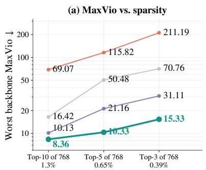

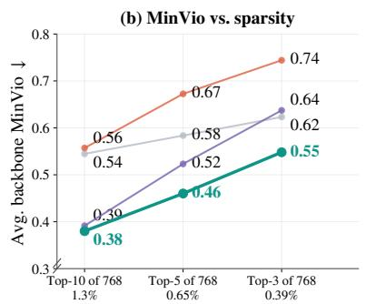

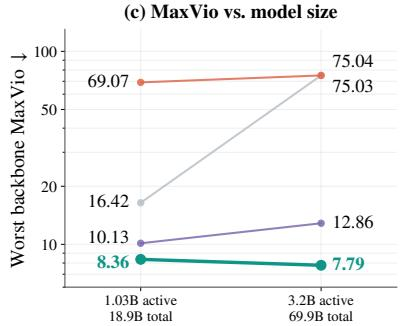  
Figure 1: ID Balancing maintains load control as routing becomes sparser and model capacity grows. (a) Worst backbone MaxVio for Top-10, Top-5, and Top-3 routing over 768 experts. (b) Training-average backbone MinVio, expressed as a decimal ratio, across the same settings. Models in (a) and (b) have 18.9B total parameters and are trained on 120B tokens. (c) Worst backbone MaxVio as total parameters increase from 18.9B to 69.9B (1.03B to 3.2B active) under fixed Top-10-of-768 routing, using the first 30k and 50k steps of the small and large models, respectively.

## 1 Introduction

Mixture-of-Experts (MoE) provides an eficient way to scale large language models (LLMs) through sparse expert activation (Jacobs et al., 1991; Roller et al., 2021). For each token, a router selects only K experts from a pool of E. With K fixed, adding experts increases total capacity without increasing the number of expert evaluations per token. This allows model capacity to grow under a fixed per-token compute budget. As the expert pool expands, the active fraction K/E decreases, making extremely sparse routing a natural direction for MoE scaling (Dai et al., 2024; Puigcerver et al., 2024).

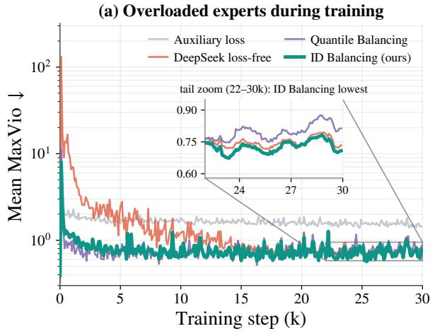

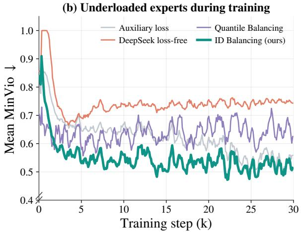  
Figure 2: ID Balancing limits transient overload and sustained underload in highly sparse MoE training. Results use Top-3-of-768 routing in an 18.9B-parameter model trained on 120B tokens, with metrics averaged over 20 backbone layers. (a) Mean MaxVio on a logarithmic scale (↓). (b) Mean MinVio (↓). ID Balancing achieves the lowest training-average underload.

As routing becomes sparser, maintaining balanced expert loads becomes more dificult. Small changes near the Top-K selection boundary alter token assignments, making expert loads sensitive to router scores (Lepikhin et al., 2021; Zhou et al., 2022). Overloaded experts slow down MoE computation (He et al., 2022; 2021; Nie et al., 2022), while underloaded experts receive insuficient training and leave part of the model capacity unused. This imbalance limits both training eficiency and the benefits of adding more experts. Fig. 1 illustrates these challenges as routing becomes sparser or model capacity grows. Efective load control is therefore a key requirement for reliably training larger, sparser MoE models.

Existing auxiliary-loss-free methods (Wang et al., 2024b; Liu et al., 2024; Team et al., 2026) adjust expert biases using routing feedback. We interpret these updates through a unified Proportional–Integral– Derivative (PID) framework (Johnson & Moradi, 2005), where expert biases form the control state and deviations from uniform load provide the feedback signal. DeepSeek’s loss-free method acts as a fixedstep integral controller, applying the same correction to small and large load errors. Kimi K3’s Quantile Balancing acts as a generalized proportional controller, setting the bias from a target computed on the current batch without explicitly accumulating past load errors. Fig. 2 illustrates the transient overload and sustained underload observed under Top-3-of-768 routing. This control perspective links their update methods to their limitations and motivates a more adaptive response: corrections should scale with the load error and respond when the imbalance worsens.

Building on this control perspective, we propose ID Balancing, an Integral–Derivative controller for stable training of highly sparse MoE models. Its integral term applies larger corrections to larger load errors and smaller corrections near balance. Its derivative term uses changes in load error to add an extra correction only when the imbalance worsens. ID Balancing accumulates these corrections in the expert bias and omits the proportional term. Re-centering after each update removes the common bias component without changing routing decisions. The method requires only O(E) token-count feedback per layer and adds no balancing gradient to the language-modeling objective.

We evaluate ID Balancing with Top-10, Top-5, and Top-3 routing over 768 experts and model sizes up to 69.9B total parameters. We also test load control at a constant learning rate 2.3× the standard peak. In the Top-3 setting, ID Balancing reduces worst-case backbone MaxVio (Wang et al., 2024b) and trainingaverage backbone MinVio by more than 50% and 12%, respectively, relative to the best baselines. Under fixed Top-10-of-768 routing, its worst-case backbone MaxVio remains nearly unchanged as total parameters increase from 18.9B to 69.9B. These load-control improvements are accompanied by competitive language-modeling and downstream performance. Our contributions are:

• We propose a unified PID view of auxiliary-loss-free MoE balancing that connects existing update methods to their control behavior. Under this view, DeepSeek’s loss-free method acts as fixed-step integral control, while Quantile Balancing acts as generalized proportional control.

• We propose ID Balancing, combining a magnitude-aware integral term with a worsening-gated derivative term. The method adjusts expert biases using only O(E) token-count feedback per layer, without adding a balancing gradient to the language-modeling objective.

• We validate ID Balancing across routing sparsities, model scales, and training conditions. Further analyses show efective load control during continued pretraining, improved backbone load balance, and fewer inactive experts at inference.

## 2 Loss-Free Balancing as PID Control

Section 2.1 introduces the three PID branches. We then formulate MoE load balancing as a control problem in Section 2.2 and examine the two methods in Section 2.3.

## 2.1 The PID Controller

A Proportional–Integral–Derivative (PID) controller (Podlubny, 1994; Ang et al., 2005; Visioli, 2006; Shah & Agashe, 2016; Aström & Hägglund, 2005) uses feedback to drive a system toward a target. At step $t ,$ it computes the error $e _ { t }$ as the target minus the measured output and produces a control signal $u _ { t }$ . The proportional branch responds to the current error, the integral branch accumulates past errors, and the derivative branch responds to changes in error (Isaksson & Graebe, 2002). A standard discrete-time form is:

$$
u _ { t } = \underbrace { K _ { p } e _ { t } } _ { \mathrm { p r o p o r t i o n a l } } + \underbrace { K _ { i } \sum _ { \tau \leq t } e _ { \tau } } _ { \mathrm { i n t e g r a l } } + \underbrace { K _ { d } \left( e _ { t } - e _ { t - 1 } \right) } _ { \mathrm { d e r i v a t i v e } } ,\tag{1}
$$

where $K _ { p } , K _ { i } , K _ { d } \ge 0$ are the gains of the three branches, and $\tau$ indexes the steps up to t. Eq. 1 is linear in the error. For MoE balancing, we use a generalized PID view that preserves the temporal roles of the three branches while allowing nonlinear feedback transformations. This view provides a common basis for comparing how expert-bias updates use feedback over time.

## 2.2 Load Balancing as a Control Problem

Consider an MoE layer with E routed experts and a Top-K router. For a token representation $\mathbf { x } \in \mathbb { R } ^ { d } ,$ , the router computes logits $\mathbf { z } = W _ { r } \mathbf { x } ,$ where d is the hidden size and $W _ { r } \in \mathbb { R } ^ { E \times d }$ is the router weight matrix. An activation function σ maps each logit to an expert score $s _ { i } = \sigma ( z _ { i } )$ . Loss-free methods maintain a non-trainable bias $b _ { i }$ for each expert and select experts using:

$$
\mathcal { T } ( \mathbf { x } ) = \mathrm { T o p K } _ { i \in [ E ] } ( s _ { i } + b _ { i } ) ,\tag{2}
$$

where $\left[ E \right] = \left\{ 1 , \ldots , E \right\}$ and $\tau ( \mathbf { x } )$ contains the indices of the K largest biased scores. The router obtains combination weights by normalizing the selected experts’ original scores $s _ { i } ,$ without the biases.

At training step $t ,$ let $n _ { i } ^ { ( t ) }$ be the number of tokens assigned to expert i. The uniform target load and normalized load error are:

$$
\bar { n } ^ { ( t ) } = \frac { 1 } { E } \sum _ { i = 1 } ^ { E } n _ { i } ^ { ( t ) } , \qquad e _ { i } ^ { ( t ) } = \frac { \bar { n } ^ { ( t ) } - n _ { i } ^ { ( t ) } } { \bar { n } ^ { ( t ) } } ,\tag{3}
$$

where $\bar { n } ^ { ( t ) } > 0$ for any nonempty batch. Negative errors indicate overload, while positive errors indicate underload. MaxVio and MinVio measure the largest deviations in these two directions, as defined in Eq. 13. These quantities define a feedback loop with uniform load as the target. The bias vector $\mathbf { b } ^ { ( t ) }$ serves as both the persistent controller state and the routing input, while the token-count vector $\mathbf { n } ^ { ( t ) }$ is the measured output. After each step, the controller uses the error vector $\mathbf { e } ^ { ( t ) }$ to update the bias, which changes routing decisions and expert loads at the next step.

## 2.3 Existing Methods through a PID Lens

We compare expert-bias updates by how they use routing feedback over time. $\operatorname { L e t } \mathbf { P } ^ { ( t ) } , \mathbf { I } ^ { ( t ) } , \mathbf { D } ^ { ( t ) } \in \mathbb { R } ^ { E }$ denote the proportional, integral, and derivative contributions. In a PID form, the next bias is:

$$
\mathbf { b } ^ { ( t + 1 ) } = \mathbf { P } ^ { ( t ) } + \mathbf { I } ^ { ( t ) } + \mathbf { D } ^ { ( t ) } .\tag{4}
$$

The proportional branch uses the current measurement or a target computed from the current batch. The integral branch accumulates past load errors, while the derivative branch uses the error change $\mathbf { e } ^ { ( t ) } - \mathbf { e } ^ { ( t - 1 ) }$ . These temporal roles define the branches, allowing nonlinear feedback transformations rather than requiring the linear dependence in Eq. 1.

```latex
Algorithm 1 ID Balancing bias update, one MoE layer, per training iteration.
Require: expert count $E ,$ active experts K, integral gain $K _ { i } ,$ derivative gain $K _ { d }$
1: $b _ { i }  0 , \ \bar { e } _ { i } ^ { \mathrm { p r e v } }  0$ for all $i \in [ E ]$ ▷ bias and previous error
2: for each training iteration do
3: route the batch by $\mathcal { T } ( \mathbf { x } ) = \mathrm { T o p K } _ { i \in [ E ] } ( s _ { i } + b _ { i } )$ ▷ Eq. 2; bias frozen during the step
4: n<sub>i</sub> ← number of tokens assigned to expert i ▷ summed over microbatches and the data-parallel
group
5: $\begin{array} { r } { \bar { n }  \frac { 1 } { E } \sum _ { i = 1 } ^ { E } n _ { i } } \end{array}$ ▷ uniform target load
6: for each expert $i \in [ E ]$ do
7: $e _ { i } \gets ( \bar { n } ^ { - } n _ { i } ) / \bar { n }$ ▷ normalized load error, Eq. 3
8: $\Delta e _ { i } \gets e _ { i } - e _ { i } ^ { \mathrm { p } }$ rev
9: $g _ { i } \gets \mathbb { 1 } [ e _ { i } ^ { \mathrm { p r e v } } \Delta e _ { i } > 0 ]$ ▷ 1 if the imbalance is worsening $( e _ { i } ^ { \mathrm { p r e v } }$ not yet updated)
10: $b _ { i } \gets \dot { b _ { i } } + K _ { i } e _ { i } + K _ { d } \dot { g _ { i } } \Delta e _ { i }$ ▷ accumulate integral + gated derivative
11: $e _ { i } ^ { \mathrm { p r e v } }  e _ { i }$
12: end for
13: $\begin{array} { r } { \begin{array} { r } { b _ { i }  b _ { i } - \frac { 1 } { E } \sum _ { j = 1 } ^ { E } b _ { j } } \end{array} } \end{array}$ for all $i \in [ E ]$ ▷ center to zero mean
14: end for
```

In MoE routing, the bias $\mathbf { b } ^ { ( t ) }$ is both a persistent controller state and the control input to the next Top-K decision. Eq. 4 uses the position form, which directly gives the next bias. The same update can also be written in an incremental form by adding $\Delta \mathbf { b } ^ { ( t ) } = \mathbf { b } ^ { ( t + 1 ) } - \mathbf { b } ^ { ( t ) }$ to the current bias. We use this generalized PID model as an interpretation of how a method uses feedback, not as a claim that every method follows the linear rule in Eq. 1. Under this view, DeepSeek loss-free maps to integral control, while Quantile Balancing can be interpreted as a generalized proportional controller.

DeepSeek’s loss-free method as fixed-step integral control. DeepSeek’s loss-free method (Wang et al., 2024b; Liu et al., 2024) updates each expert bias according to the sign of its load error. Starting from $\mathbf { b } ^ { ( 0 ) } = \mathbf { 0 } .$ , the update is:

$$
\mathbf { b } ^ { ( t + 1 ) } = \mathbf { b } ^ { ( t ) } + \eta \mathrm { s i g n } ( \mathbf { e } ^ { ( t ) } ) = \eta \sum _ { \tau \leq t } \mathrm { s i g n } ( \mathbf { e } ^ { ( \tau ) } ) = \mathbf { I } ^ { ( t ) } ,\tag{5}
$$

where $\eta > 0$ is the step size and $\mathrm { s i g n } ( \cdot )$ acts elementwise. The update raises the bias of underloaded experts and lowers that of overloaded experts. The cumulative sum in Eq. 5 shows that the bias stores past sign errors. Under our generalized PID view, this corresponds to fixed-step integral control with $\mathbf { \bar { P } } ^ { ( t ) } = \mathbf { \bar { D } } ^ { ( t ) } = \mathbf { 0 }$ . However, the sign operation discards error magnitude: every nonzero error receives a correction of size $\eta ,$ regardless of the severity of the imbalance.

Quantile Balancing as generalized proportional control. Quantile Balancing (Team et al., 2026) computes a target bias from the current batch’s score distribution. Let $\mathbf { S } ^ { ( t ) } \in \mathbb { R } ^ { m \times E }$ contain the scores for m tokens, where $S _ { i , j } ^ { ( t ) }$ is the score of expert j for token i. The method sets the next bias directly to this target:

$$
\mathbf { b } ^ { ( t + 1 ) } = \mathcal { Q } ( \mathbf { S } ^ { ( t ) } , \mathbf { b } ^ { ( t ) } ) = \mathbf { P } ^ { ( t ) } .\tag{6}
$$

The corresponding increment, $\mathcal { Q } ( \mathbf { S } ^ { ( t ) } , \mathbf { b } ^ { ( t ) } ) - \mathbf { b } ^ { ( t ) }$ , corrects the deviation from the current target.

Following Kimi K3, the target assigns approximately $q = m K / E$ tokens to each expert. For token $i ,$ let $\alpha _ { i } ^ { ( t ) }$ be the (K+1)-th largest biased score $\dot { S } _ { i , r } ^ { ( t ) } + b _ { r } ^ { ( t ) }$ over $r \in [ E ]$ . The target bias for expert j is:

$$
\begin{array} { r } { \mathcal { Q } _ { j } ( \mathbf { S } ^ { ( t ) } , \mathbf { b } ^ { ( t ) } ) = - \operatorname { q u a n t i l e } _ { 1 - K / E } \big ( \{ S _ { i , j } ^ { ( t ) } - \alpha _ { i } ^ { ( t ) } \} _ { i = 1 } ^ { m } \big ) , } \end{array}\tag{7}
$$

where $S _ { i , j } ^ { ( t ) } - \alpha _ { i } ^ { ( t ) }$ is the score margin relative to the current cutof. With these cutofs held fixed, the target places approximately $K / E$ of the biased margins above zero, matching the desired load $q .$ Ties and integer rounding afect the exact count.<sup>1</sup> The target changes with the batch score distribution and depends on the current bias through $\alpha _ { i } ^ { ( t ) }$ . The update therefore retains state dependence, but does not explicitly accumulate past load errors. Under our generalized PID view, this direct response to a batchdependent target forms a nonlinear proportional branch with $\mathbf { I } ^ { ( t ) } = \mathbf { D } ^ { ( t ) } = \mathbf { 0 }$

(a) Worst-case overloaded expert during training  
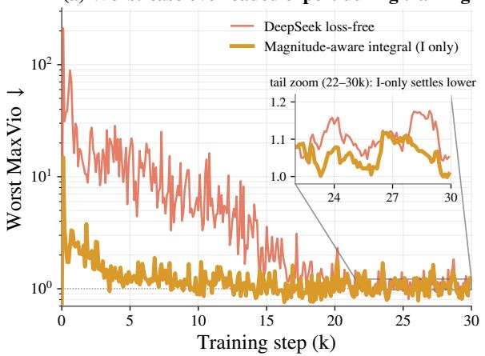

(b) Underloaded experts during training  
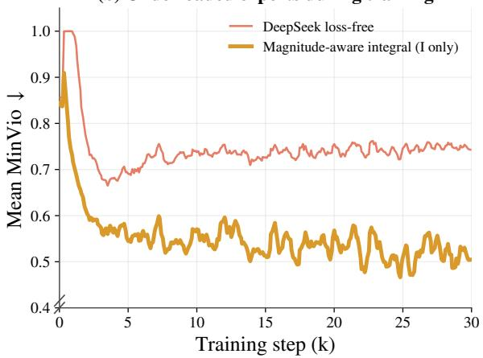  
Figure 3: Magnitude-aware integral control reduces early overload and sustained underload. We compare the integral-only update with DeepSeek’s loss-free method in an 18.9B model using Top-3-of-768 routing and 120B training tokens. (a) Maximum MaxVio across the 20 backbone layers, shown on a logarithmic scale (↓). (b) Mean MinVio across the same layers (↓).

Auxiliary loss as gradient-based balancing. Auxiliary-loss methods (Shazeer et al., 2017; Lepikhin et al., 2021; Xue et al., 2024) encourage balanced expert loads by adding a diferentiable term to the training objective. For a batch of T tokens, a common form is:

$$
\mathcal { L } _ { \mathrm { a u x } } = \alpha \sum _ { i = 1 } ^ { E } f _ { i } P _ { i } , \qquad f _ { i } = \frac { 1 } { T } \sum _ { \mathbf { x } } \mathbb { 1 } [ i \in \mathcal { T } ( \mathbf { x } ) ] , \qquad P _ { i } = \frac { 1 } { T } \sum _ { \mathbf { x } } p _ { i } ( \mathbf { x } ) ,\tag{8}
$$

where the sums cover all tokens in the batch and $\mathbb { 1 } [ \cdot ]$ is the indicator function. Here, $f _ { i }$ is the fraction of tokens assigned to expert $i ,$ and $P _ { i }$ is its average router probability, with $p _ { i } ( \mathbf { x } ) = \mathrm { s o f t m a x } _ { i } ( W _ { r } \mathbf { x } )$ . The coeficient α controls the loss strength and absorbs constant scaling factors. The balancing loss updates the router weights $W _ { r }$ through the same optimization process as the language-modeling objective. It influences token assignments through gradients on these weights, without maintaining a separate control bias. This places auxiliary-loss balancing outside the expert-bias control family in Eq. 4.

Implications for load control. DeepSeek’s loss-free method uses a fixed step regardless of error magnitude, creating a trade-of between response speed and precision. Its limited response to large errors is consistent with the early mean MaxVio spike of 132 in Fig. 2. Near balance, the same step risks overshooting the target. Quantile Balancing instead follows a target derived from each batch’s score distribution. Changes in this target help explain its larger late-stage bias drift in Fig. 5. These observations motivate corrections that scale with the load error and respond more strongly when the imbalance worsens.

## 3 ID Balancing

Building on the control view in Section 2.3, ID Balancing responds to both the magnitude and the evolution of load errors. It changes only the expert-bias update, retaining the routing rule in Eq. 2 and the normalized error in Eq. 3. The controller combines a magnitude-aware integral term with a derivative term that activates only when the imbalance worsens. It omits the proportional term and re-centers the bias after each update to remove its common component. Algorithm 1 gives the complete update.

Magnitude-aware integral term. DeepSeek’s loss-free method uses only the sign of the load error, giving every nonzero error the same correction size. To adapt the response to the severity of the imbalance, we scale the update by the normalized error itself:

$$
b _ { i } ^ { ( t + 1 ) } = b _ { i } ^ { ( t ) } + K _ { i } e _ { i } ^ { ( t ) } ,\tag{9}
$$

where $K _ { i } \geq 0$ is the integral gain shared by all experts. The correction grows with $| e _ { i } ^ { ( t ) } |$ and shrinks as the expert approaches its target load. Since the bias accumulates these corrections, the update retains the memory of integral control. The integral update also preserves a zero-mean bias when initialized at $\mathbf { b } ^ { ( 0 ) } = \mathbf { 0 }$ , because $\begin{array} { r } { \sum _ { i } e _ { i } ^ { ( t ) } = 0 } \end{array}$ by Eq. 3. The fixed-sign update lacks this property: $\sum _ { i } \mathrm { s i g n } ( e _ { i } ^ { ( t ) } )$ is generally nonzero, allowing the common bias component to drift. Fig. 3 compares the two integral updates. Scaling by error magnitude reduces the worst-layer MaxVio peak and lowers sustained underload, showing stronger early correction and better expert utilization.

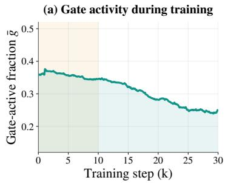

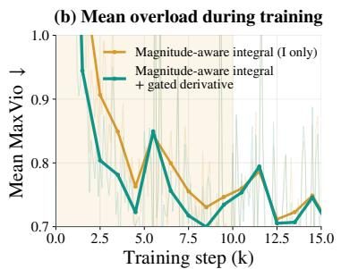

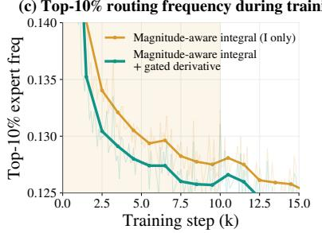  
Figure 4: The worsening-gated derivative term reduces early overload and expert concentration. We compare magnitude-aware integral control with and without the derivative term in an 18.9B model using Top-3-of-768 routing and 120B training tokens. Metrics are averaged over 20 backbone layers. $( \mathbf { a } ) \bar { g } ^ { ( t ) }$ is the fraction of active gates averaged over the 20 backbone layers. (b) Mean MaxVio (↓). (c) Share of token assignments routed to the busiest 10% of experts (→ 0.10), with a balanced target of 0.10.

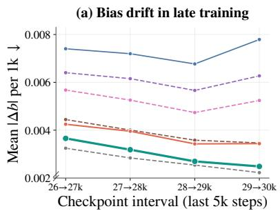

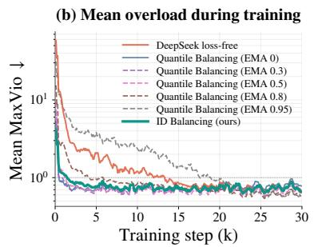

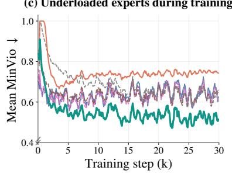  
Figure 5: EMA smoothing reduces bias drift but slows load correction in Quantile Balancing. We compare the original update $( \rho = 0 )$ , its EMA variants, DeepSeek’s loss-free method, and ID Balancing in an 18.9B model using Top-3-of-768 routing and 120B training tokens. All other comparisons use Quantile Balancing without EMA. (a) Mean absolute bias change |∆b| between checkpoints 1k steps apart during the final 5k steps (↓). (b) Mean MaxVio on a logarithmic scale (↓). (c) Mean MinVio (↓).

Worsening-gated derivative term. The integral term responds to error magnitude but does not distinguish growing from shrinking errors of the same size. To capture this diference, we compute the change in error:

$$
\Delta e _ { i } ^ { ( t ) } = e _ { i } ^ { ( t ) } - e _ { i } ^ { ( t - 1 ) } ,\tag{10}
$$

where $e _ { i } ^ { ( - 1 ) } = 0$ . We retain only changes that move an existing imbalance farther from zero:

$$
g _ { i } ^ { ( t ) } = \mathbb { 1 } \Big [ e _ { i } ^ { ( t - 1 ) } \Delta e _ { i } ^ { ( t ) } > 0 \Big ] \in \{ 0 , 1 \} ,\tag{11}
$$

where 1[·] is the indicator function. The gate opens when the previous error and its change have the same sign, so the imbalance grows without crossing zero. It remains closed when the error is unchanged, moves toward zero, or crosses zero. It is also closed at the first step. The correction $K _ { d } g _ { i } ^ { ( t ) } \Delta e _ { i } ^ { ( t ) }$ is accumulated in the bias alongside the integral update. It uses the error diference as its input, but difers from a classical derivative output by being both gated and accumulated. Fig. 4 shows that the active-gate fraction decreases from about 0.38 early in training to 0.25 later. Adding the gated correction lowers early load violations, while the trajectories approach those of the integral-only update as training progresses.

Why ID Balancing omits the proportional term. ID Balancing sets $K _ { p } = 0$ and controls expert loads through accumulated bias corrections. Under the generalized PID view in Section 2.3, Quantile Balancing follows a target computed from the current batch. As the score distribution changes, so does the target, leading to larger late-stage bias changes in our experiments. Smaller changes in relative expert biases limit perturbations to the Top-K selection boundary, helping stabilize routing. Smoother bias trajectories are also desirable for weight merging, such as averaging nearby checkpoints, where the merged weights must remain compatible with the routing state. Lower bias drift may reduce this mismatch risk by keeping the routing states of the source checkpoints closer. To examine the trade-of between bias smoothing and load control, we add exponential moving average (EMA) smoothing (Winters, 1960; Hunter, 1986) to Quantile Balancing only as a diagnostic: $\bar { \mathbf { b } } ^ { ( t + 1 ) } \bar { \mathbf { \xi } } = \rho \mathbf { b } ^ { ( t ) } + \left( 1 - \rho \right) \bar { \mathcal { Q } } ( \mathbf { \bar { S } } ^ { ( t ) } , \mathbf { b } ^ { ( t ) } )$ . Here, $0 \leq \rho < 1$ controls the smoothing strength, and $\rho = 0$ recovers the original update without EMA.

Table 1: ID Balancing improves backbone load control while maintaining competitive LM loss. We compare Top-3, Top-5, and Top-10 routing over 768 experts in 18.9B models trained on 120B tokens. All summaries use the same 30k-step window. Backbone Last1k and Avg. metrics are averaged over 20 layers, while Worst MaxVio is the maximum across layers and steps. MTP metrics are reported separately.
<table><tr><td rowspan="3">Method</td><td rowspan="3">Act./Total</td><td colspan="5">Backbone</td><td rowspan="2">MTP Module</td><td colspan="5"></td></tr><tr><td rowspan="2">LM</td><td colspan="2">MaxVio ↓</td><td colspan="2">MinVio ↓</td><td rowspan="2"></td><td colspan="2">MaxVio ↓</td><td colspan="2">MinVio ↓</td></tr><tr><td>loss Last1k</td><td>Avg.</td><td>Worst</td><td>Last1k Avg.</td><td>Last1k</td><td>Avg.</td><td>Worst</td><td>Last1k</td></tr><tr><td>Top-3 of 768 experts, 120B tokens</td><td></td><td></td><td></td><td></td><td></td><td></td><td></td><td></td><td></td><td></td><td></td><td>Avg.</td></tr><tr><td>Auxiliary loss</td><td rowspan="3">0.87B / 18.9B</td><td>1.7527</td><td>1.4809</td><td>1.7239</td><td>70.76</td><td>0.5462</td><td>0.6232</td><td>3.8952</td><td>4.4639</td><td>43.38</td><td>0.6580</td><td>0.7502</td></tr><tr><td>DeepSeek loss-free</td><td>1.7426</td><td>0.7314</td><td>1.9356</td><td>211.19</td><td>0.7487</td><td>0.7441</td><td>0.7477</td><td>0.8930</td><td>17.32</td><td>0.6868</td><td>0.6533</td></tr><tr><td>Quantile Balancing</td><td>1.7432</td><td>0.8093</td><td>0.7985</td><td>31.11</td><td>0.6504</td><td>0.6373</td><td>1.8777</td><td>1.2071</td><td>30.89</td><td>0.7106</td><td>0.7083</td></tr><tr><td colspan="2">ID Balancing</td><td>1.7426</td><td>0.7026</td><td>0.7931</td><td>15.33</td><td>0.5266</td><td>0.5480</td><td>1.0165</td><td>0.9698</td><td>33.42</td><td>0.5832</td><td>0.5782</td></tr><tr><td colspan="2">Top-5 of 768 experts, 120B tokens</td><td></td><td></td><td></td><td></td><td></td><td></td><td></td><td></td><td></td><td></td><td></td></tr><tr><td>Auxiliary loss</td><td rowspan="3">0.91B / 18.9B</td><td>1.7378</td><td>1.0296</td><td>1.2925</td><td>50.48</td><td>0.4537</td><td>0.5836</td><td>2.8407</td><td>3.1892</td><td>42.60</td><td>0.6006</td><td>0.6851</td></tr><tr><td>DeepSeek loss-free</td><td>1.7280</td><td>0.5821</td><td>1.4814</td><td>115.82</td><td>0.6741</td><td>0.6725</td><td>0.6515</td><td>0.7284</td><td>15.75</td><td>0.5517</td><td>0.5376</td></tr><tr><td>Quantile Balancing</td><td>1.7303</td><td>0.6376</td><td>0.6394</td><td>21.16</td><td>0.5335</td><td>0.5232</td><td>1.2480</td><td>0.8683</td><td>7.73</td><td>0.5516</td><td>0.5698</td></tr><tr><td colspan="2">ID Balancing</td><td>1.7299</td><td>0.5404</td><td>0.6498</td><td>10.33</td><td>0.4238</td><td>0.4601</td><td>0.7808</td><td>0.7710</td><td>28.76</td><td>0.4754</td><td>0.4750</td></tr><tr><td colspan="2">Top-10 of 768 experts, 120B tokens</td><td></td><td></td><td></td><td></td><td></td><td></td><td></td><td></td><td></td><td></td><td></td></tr><tr><td colspan="2">Auxiliary loss</td><td>1.7180</td><td>0.6862</td><td>1.0342</td><td>16.42</td><td>0.3631</td><td>0.5446</td><td>2.0145</td><td>2.2781</td><td>22.74</td><td>0.4511</td><td>0.5589</td></tr><tr><td colspan="2">DeepSeek loss-free</td><td>1.7121</td><td>0.4418</td><td>0.9715</td><td>69.07</td><td>0.5534</td><td>0.5571</td><td>0.5828</td><td>0.6066</td><td>14.79</td><td>0.4752</td><td>0.4237</td></tr><tr><td colspan="2">Quantile Balancing 1.03B / 18.9B</td><td>1.7133</td><td>0.4776</td><td>0.4832</td><td>10.13</td><td>0.4060</td><td>0.3914</td><td>0.8642</td><td>0.6878</td><td>5.16</td><td>0.4443</td><td>0.4263</td></tr><tr><td colspan="2">ID Balancing</td><td>1.7118</td><td>0.3863</td><td>0.5110</td><td>8.36</td><td>0.3282</td><td>0.3800</td><td>0.6070</td><td>0.5942</td><td>21.98</td><td>0.4938</td><td>0.3842</td></tr></table>

Fig. 5 shows that stronger smoothing reduces bias drift but weakens early load control. ID Balancing achieves low bias drift and efective load balance through its integral and gated derivative updates, without additional EMA smoothing.

Zero-mean centering step. The integral update has zero mean because $\begin{array} { r } { \sum _ { i } e _ { i } ^ { ( t ) } = 0 } \end{array}$ . Gating does not preserve this property: $\sum _ { i } g _ { i } ^ { ( t ) } \Delta e _ { i } ^ { ( t ) }$ is generally nonzero, allowing the mean bias to drift as derivative corrections accumulate. Adding the same constant to every expert bias leaves the score ranking and the selected set $\tau ( \mathbf { x } )$ unchanged. We therefore remove this common component after each update. This centering removes common bias drift but does not bound the diferences between expert biases.

The complete ID Balancing update. Combining the integral and gated derivative corrections with recentering gives:

$$
\begin{array} { r l } & { \widetilde { b } _ { i } ^ { ( t + 1 ) } = b _ { i } ^ { ( t ) } + \underbrace { K _ { i } e _ { i } ^ { ( t ) } } _ { \mathrm { m a g n i t u d e - a w a r e ~ i n t e g r a l } } + \underbrace { K _ { d } g _ { i } ^ { ( t ) } \Delta e _ { i } ^ { ( t ) } } _ { \mathrm { w o r s e n i n g - g a t e d ~ d e r i v a t i v e } } , } \\ & { b _ { i } ^ { ( t + 1 ) } = \widetilde { b } _ { i } ^ { ( t + 1 ) } - \displaystyle \frac { 1 } { E } \sum _ { j = 1 } ^ { E } \widetilde { b } _ { j } ^ { ( t + 1 ) } . } \end{array}\tag{12}
$$

where $\widetilde { b } _ { i } ^ { ( t + 1 ) }$ is the bias before re-centering and $K _ { d } \ge 0$ is the derivative gain. The second line ensures $\begin{array} { r } { \sum _ { i } b _ { i } ^ { ( t + 1 ) } = 0 } \end{array}$ . The resulting bias controls routing at the next step.

## 4 Experiments

Section 4.1 evaluates load balance and model quality during standard and continued pretraining, followed by downstream evaluation. Section 4.2 examines higher learning rates and optimization dynamics. We then analyze layer-wise load balance and inference-time expert utilization in Section 4.3. Finally, Section 4.4 isolates the efects of the integral and derivative gains and motivates the default setting $K _ { i } \stackrel { \cdot } { = } K _ { d } = 6 \times 1 0 ^ { - 3 }$

## 4.1 Model Quality

Small-model validation. Our main comparison uses the Qwen-3.8-Next (Qiu et al., 2026) architecture with 20 Transformer layers, one multi-token prediction (MTP) module (Gloeckle et al., 2024), and 768 routed experts per MoE layer. The model has approximately 18.9B total parameters and 0.87–1.03B active parameters, depending on the routing setting. We train Top-3, Top-5, and Top-10 variants on 120B tokens with a global batch size of 1024. The learning rate peaks at $2 . 5 \hat { 4 } \times 1 0 ^ { - 3 }$ and follows cosine decay to $3 \times 1 0 ^ { - 5 }$ . All comparisons use the same 30k-step window, with backbone and MTP load metrics reported separately. We compare Auxiliary loss, DeepSeek’s loss-free method, Quantile Balancing, and ID Balancing using the same architecture, data, and optimizer settings. DeepSeek’s loss-free method uses a bias-update step size of $\eta = 0 . 0 0 1$ , following the DeepSeek-V3 technical report (Liu et al., 2024). The Auxiliary loss baseline uses a balancing coeficient of $\overset { \cdot } { \alpha } = 0 . 0 5$ , except in the coeficient sweep in Fig. 8. Quantile Balancing uses its original update without EMA, except in the diagnostic experiment in Fig. 5. The main ID Balancing runs use $K _ { i } \stackrel { - } { = } K _ { d } = 6 \times 1 0 ^ { - 3 } .$ , with gain ablations in Section 4.4. For continued pretraining, we reduce both gains by 1000× to $6 \times 1 0 ^ { - 6 }$ , as examined in Fig. 6. We measure expert overload and underload relative to the uniform target $\bar { n } ^ { ( t ) }$ defined in Eq. 3:

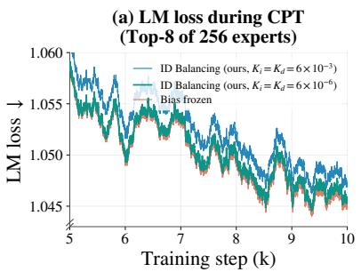

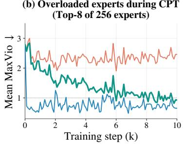

(c) Underloaded experts during CPT (Top-8 of 256 experts)  
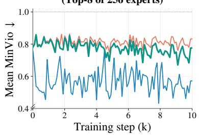

(d) LM loss during CPT (Top-10 of 768 experts)  
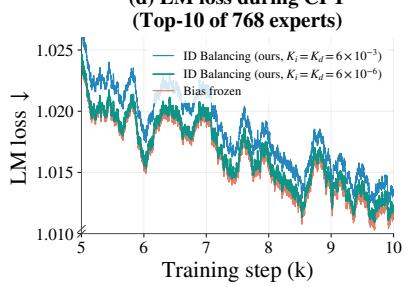

(e) Overloaded experts during CPT (Top-10 of 768 experts)  
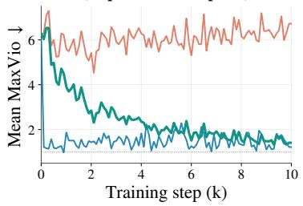

(f) Underloaded experts during CPT (Top-10 of 768 experts)  
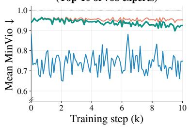  
Figure 6: Reduced ID Balancing gains limit load drift while retaining competitive LM loss during continued pretraining. We compare full gains $( K _ { i } = K _ { d } = 6 \times 1 0 ^ { - 3 } )$ , gains reduced by 1000× $( 6 \times$ $1 0 ^ { - 6 } ) ,$ , and a frozen bias in 28-layer models at a constant learning rate of $\mathrm { 3 \times 1 0 ^ { - 5 } }$ . The frozen setting matches the continued-pretraining baselines for DeepSeek’s loss-free method and Quantile Balancing. The top and bottom rows use Top-8-of-256 and Top-10-of-768 routing, respectively. (a, d) LM loss with 201-step smoothing (↓). (b, e) Mean MaxVio (↓). (c, f) Mean MinVio (↓).

$$
\mathrm { M a x V i o } ^ { ( t ) } = \frac { \operatorname* { m a x } _ { i } n _ { i } ^ { ( t ) } - \bar { n } ^ { ( t ) } } { \bar { n } ^ { ( t ) } } , \qquad \mathrm { M i n V i o } ^ { ( t ) } = \frac { \bar { n } ^ { ( t ) } - \operatorname* { m i n } _ { i } n _ { i } ^ { ( t ) } } { \bar { n } ^ { ( t ) } } ,\tag{13}
$$

where $n _ { i } ^ { ( t ) }$ is the token count of expert i at step t. Here, max<sub>i</sub> $n _ { i } ^ { ( t ) }$ and $\mathrm { m i n } _ { i } n _ { i } ^ { ( t ) }$ are the largest and smallest numbers of tokens assigned to any of the $E ^ { ' }$ routed experts in the layer at step $t ,$ respectively. MaxVio measures the largest relative overload and is bounded by $E / K - 1$ . MinVio measures the largest relative deficit and lies in [0, 1], reaching 1 when an expert receives no tokens. Lower values are better for both metrics. Last1k and Avg. denote means over the final 1k steps and the full training window, respectively. Backbone values are averaged over the 20 layers, except Worst MaxVio, which takes the maximum over both layers and steps. MTP metrics are computed separately, and LM loss is averaged over the final 1k steps. Act./Total lists active and total parameter counts. Darker green indicates lower LM loss, darker red indicates larger load violations, and bold marks the best value in each column within a block. Tab. 1 shows similar LM loss among the three bias-based methods, with a maximum gap of 0.0023, while Auxiliary loss has the highest loss in every setting. The diferences in backbone load balance are larger. ID Balancing achieves the lowest Worst and Last1k MaxVio, as well as the lowest Last1k and Avg. MinVio, across all three routing settings. In Top-3, it reduces Worst MaxVio from 211.19 for DeepSeek’s method and 31.11 for Quantile Balancing to 15.33. Quantile Balancing retains lower Avg. backbone MaxVio in Top-5 and Top-10, while ID Balancing is best in Top-3.

Table 2: ID Balancing maintains competitive downstream performance. Results use Top-8-of-256 and Top-10-of-768 routing. Avg. is the mean across nine benchmarks covering knowledge, STEM, reasoning, multilingual understanding, and code generation. Block headers list active and total parameter counts. Higher scores are better, and bold marks the best result in each column within a block.
<table><tr><td rowspan="2">Method</td><td colspan="3">Knowledge</td><td colspan="2">STEM</td><td rowspan="2">Reasoning BBH</td><td rowspan="2">Multilingual</td><td colspan="2">Code</td><td rowspan="2">Avg.</td></tr><tr><td>MMLU</td><td>MMLU-Pro</td><td>SuperGPQA</td><td>MATH GSM8K</td><td></td><td>MMMLU</td><td>EvalPlus MultiPL-E</td></tr><tr><td colspan="10">Top-8 of 256 experts, 3.0B / 24.8B, 560B tokens</td></tr><tr><td>Auxiliary loss</td><td>68.00</td><td>47.10</td><td>27.36</td><td>47.12</td><td>74.94</td><td>69.57</td><td>59.82</td><td>51.51</td><td>46.22</td><td>54.63</td></tr><tr><td>DeepSeek loss-free</td><td>70.08</td><td>47.23</td><td>27.43</td><td>45.84</td><td>76.54</td><td>71.09</td><td>60.61</td><td>53.96</td><td>46.66</td><td>55.49</td></tr><tr><td>Quantile Balancing</td><td>70.49</td><td>48.06</td><td>27.61</td><td>48.54</td><td>74.37</td><td>69.94</td><td>60.17</td><td>52.27</td><td>42.46</td><td>54.88</td></tr><tr><td>ID Balancing</td><td>69.58</td><td>48.19</td><td>27.52</td><td>47.92</td><td>74.49</td><td>72.91</td><td>60.78</td><td>56.48</td><td>44.40</td><td>55.81</td></tr><tr><td colspan="10">Top-10 of 768 experts, 3.2B / 69.9B, 560B tokens</td></tr><tr><td>Auxiliary loss</td><td>71.67</td><td>50.91</td><td>30.15</td><td>50.74</td><td>79.08</td><td>71.09</td><td>63.62</td><td>56.55</td><td>49.28</td><td>58.12</td></tr><tr><td>DeepSeek loss-free</td><td>72.02</td><td>50.11</td><td>30.10</td><td>50.72</td><td>77.37</td><td>72.47</td><td>64.07</td><td>57.65</td><td>51.52</td><td>58.45</td></tr><tr><td>Quantile Balancing</td><td>72.37</td><td>51.14</td><td>30.40</td><td>50.86</td><td>75.40</td><td>73.42</td><td>64.13</td><td>57.94</td><td>51.41</td><td>58.56</td></tr><tr><td>ID Balancing</td><td>72.09</td><td>51.46</td><td>29.95</td><td>50.30</td><td>78.17</td><td>73.96</td><td>63.58</td><td>56.90</td><td>51.52</td><td>58.66</td></tr></table>

Table 3: ID Balancing and Quantile Balancing maintain load control at a higher learning rate. Results use a 1.03B-active/18.9B-total model with Top-10-of-768 routing, trained on 120B tokens at a constant learning rate of $5 . 8 6 \times 1 0 ^ { - 3 }$ (2.3× the standard peak). Both methods yield lower backbone load violations than Auxiliary loss and DeepSeek’s loss-free method.
<table><tr><td rowspan="3">Method</td><td colspan="6">Backbone</td><td colspan="6">MTP Module</td></tr><tr><td rowspan="2">LM loss</td><td colspan="3">MaxVio ↓</td><td colspan="2">MinVio ↓</td><td colspan="3">MaxVio ↓</td><td colspan="2">MinVio ↓</td></tr><tr><td>Last1k</td><td>Avg.</td><td>Worst</td><td>Last1k</td><td>Avg.</td><td>Last1k</td><td>Avg.</td><td>Worst</td><td>Last1k</td><td>Avg.</td></tr><tr><td>Auxiliary loss</td><td>2.0099</td><td>3.1383</td><td>2.8379</td><td>20.89</td><td>0.8423</td><td>0.8458</td><td>3.5640</td><td>3.0533</td><td>4.83</td><td>0.6569</td><td>0.7130</td></tr><tr><td>DeepSeek loss-free</td><td>2.0031</td><td>1.3755</td><td>1.7811</td><td>72.54</td><td>0.8730</td><td>0.8269</td><td>0.5033</td><td>0.7124</td><td>17.98</td><td>0.6105</td><td>0.5514</td></tr><tr><td>Quantile Balancing</td><td>2.0009</td><td>0.5021</td><td>0.4979</td><td>2.96</td><td>0.4083</td><td>0.3938</td><td>0.6243</td><td>0.5836</td><td>10.77</td><td>0.4346</td><td>0.4308</td></tr><tr><td>ID Balancing</td><td>2.0007</td><td>0.6437</td><td>0.7274</td><td>11.97</td><td>0.4828</td><td>0.4950</td><td>0.4642</td><td>0.5068</td><td>7.20</td><td>0.3940</td><td>0.3927</td></tr></table>

Maintaining active load control during continued pretraining. DeepSeek’s loss-free method freezes expert biases during continued pretraining (Liu et al., 2024). This avoids routing changes caused by bias updates but also removes active load correction (Gupta et al., 2023). As the model adapts to a new data distribution, expert loads may shift while the bias remains fixed (Gururangan et al., 2020; Ke et al., 2023). We therefore examine whether smaller ID Balancing gains preserve active load control without disrupting adaptation. We compare full gains $( K _ { i } = K _ { d } = \bar { 6 } \times 1 0 ^ { - 3 } )$ , gains reduced by 1000× $( K _ { i } = K _ { d } = \bar { 6 } \times \mathrm { { i 0 ^ { - 6 } } ) }$ , and a frozen bias in two 28-layer models using Top-8-of-256 and Top-10-of-768 routing. Fig. 6 shows the trade-of. Full gains yield the highest LM loss, while freezing the bias leaves substantial load imbalance. With Top-8-of-256 routing, the frozen baseline reaches mean MaxVio of 2.2– 2.5 and MinVio of about 0.83. With Top-10-of-768 routing, MaxVio remains between 6 and 7, and MinVio reaches about 0.95, indicating severe expert underuse. The reduced gains maintain LM loss within 0.001 of the frozen baseline during the second half of continued pretraining, while improving load balance. Mean MaxVio settles near 1 with Top-8-of-256 routing and falls from about 6 to 1.4 with Top-10-of-768 routing. These results show that small bias updates correct load drift while retaining LM performance close to that of a frozen bias. We use the reduced gains as the default for continued pretraining. The DeepSeek and Quantile Balancing baselines keep their expert biases frozen during this stage.

Downstream quality. We evaluate models trained on 560B tokens across nine benchmarks. The evaluated models use Top-8-of-256 and Top-10-of-768 routing. MMLU (5-shot) (Hendrycks et al., 2021a), MMLU-Pro (5-shot, Chain of Thought) (Wang et al., 2024c), and SuperGPQA (5-shot, Chain of Thought) (Du et al., 2026) assess general knowledge. MATH (4-shot, Chain of Thought) (Hendrycks et al., 2021b) and GSM8K (4-shot, Chain of Thought) (Cobbe et al., 2021) assess mathematical problem solving, while BBH (3-shot, Chain of Thought) (Suzgun et al., 2023) evaluates reasoning. MMMLU (5-shot) (OpenAI, 2024) evaluates multilingual understanding, while EvalPlus (0-shot; the average over HumanEval (Chen et al., 2021), MBPP (Austin et al., 2021), HumanEval+ and MBPP+) and MultiPL-E (0-shot; Python, C++, Java, PHP, TypeScript, C#, Bash, JavaScript) (Cassano et al., 2023) evaluate code generation. Tab. 2 shows that ID Balancing achieves an average score of 55.81 under Top-8-of-256 routing. Under Top-10- of-768 routing, ID Balancing improves the average score from 58.12 to 58.66 relative to Auxiliary loss and scores higher than this baseline on five of the nine benchmarks. These results show that ID Balancing maintains competitive downstream quality alongside improved load balance.

(a) Overloaded experts during training  
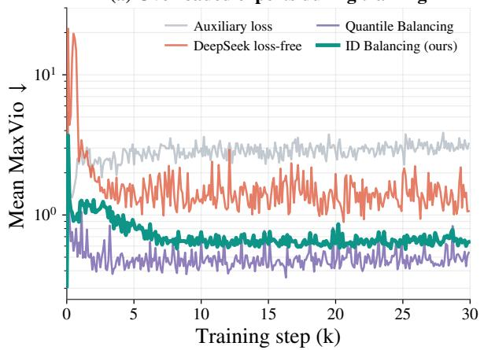

(b) Underloaded experts during training  
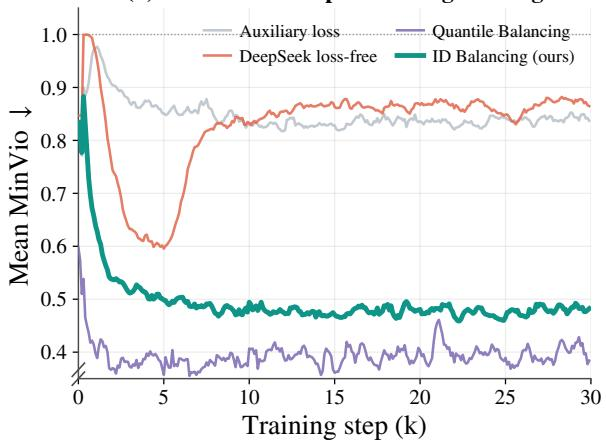  
Figure 7: ID Balancing and Quantile Balancing maintain lower backbone overload and underload at a higher learning rate. Results use Top-10-of-768 routing and 120B training tokens at a constant learning rate of $5 . 8 6 \times 1 0 ^ { - 3 }$ (2.3× the standard peak). Metrics are averaged over 20 backbone layers. (a) Mean MaxVio on a logarithmic scale (↓), showing a large early spike for DeepSeek’s loss-free method. (b) Mean MinVio (↓), showing more severe underload for Auxiliary loss and DeepSeek’s loss-free method.

(a) Language-modeling loss during training  
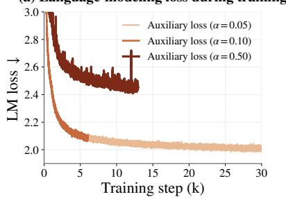

(b) Overloaded experts during training  
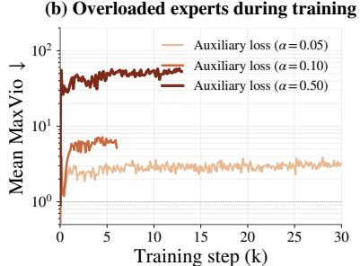

(c) Underloaded experts during training  
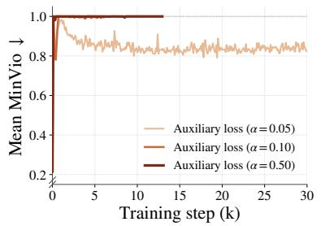  
Figure 8: Larger auxiliary-loss coeficients worsen LM loss and load balance at a higher learning rate. We compare $\mathbf { \bar { \alpha } } \alpha \in \{ 0 . 0 5 , 0 . 1 0 , 0 . 5 0 \}$ in a 1.03B-active/18.9B-total model with Top-10-of-768 routing at a constant learning rate of $5 . 8 6 \times 1 0 ^ { - 3 }$ (2.3× the standard peak). Training targets 120B tokens, but both larger-α runs terminate before 30k steps. Load metrics are averaged over 20 backbone layers. (a) LM loss (↓), with higher values at larger coeficients. (b) Mean MaxVio on a logarithmic scale (↓), exceeding 50 for $\dot { \alpha } = 0 . 5 0 . \dot { ( \mathbf { c } ) }$ Mean MinVio (↓), reaching 1.0 for both larger coeficients.

## 4.2 Training Stability

Building on the standard-training results in Section 4.1, we examine load control at a higher learning rate. We also track gradient norms and MoE-output magnitudes to assess training dynamics beyond load balance.

Load control at a higher learning rate. We train the Top-10-of-768 model for 120B tokens at a constant learning rate of $5 . 8 6 \times 1 0 ^ { - 3 }$ , or 2.3× the standard peak. This tests load control while the learning rate remains high throughout training. Tab. 3 and Fig. 7 show that ID Balancing and Quantile Balancing maintain lower backbone load violations than Auxiliary loss and DeepSeek’s loss-free method. Their Last1k backbone MaxVio values are 0.6437 and 0.5021, compared with 3.1383 and 1.3755 for the two baselines. Quantile Balancing gives the strongest backbone balance, while ID Balancing achieves the lowest LM loss of 2.0007 and the lowest Last1k and Avg. MTP MaxVio of 0.4642 and 0.5068. These results show efective load control at the tested learning rate, with diferent trade-ofs between backbone and MTP balance. Auxiliary loss updates the router weights W<sub>r</sub> through the same optimization process as the LM objective. Increasing its coeficient does not restore load balance in the tested range. Fig. 8 compares $\alpha \in \{ 0 . 0 5 , 0 . 1 0 , 0 . 5 0 \}$ : larger coeficients yield higher LM loss, reaching about 2.45 for α = 0.50, compared with about 2.01 for $\mathit { \check { \alpha } } = \ : 0 . 0 5$ $\mathrm { A t } \ \dot { \alpha } \ = \ 0 . \ \breve { 5 } 0$ , mean MaxVio exceeds 50. Both largercoeficient runs reach mean MinVio of 1.0 and terminate before 30k steps. The bias-based methods avoid balancing gradients, but difer in their response to load errors. DeepSeek’s fixed-step update gives the same correction to every nonzero error, limiting its response to severe imbalance. Its worst backbone

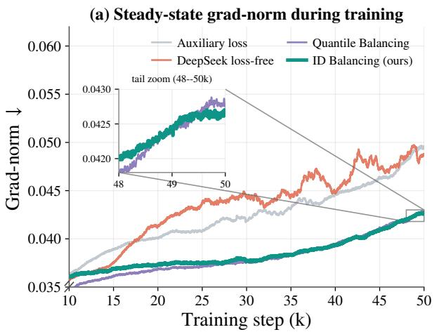

(b) MoE-output magnitude during training  
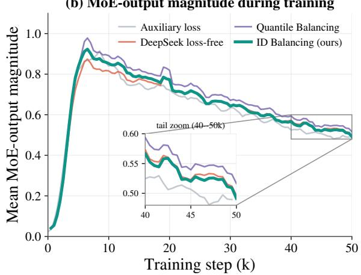  
Figure 9: Load-balancing methods show distinct gradient and activation dynamics. Results use a 3.0Bactive/24.8B-total model with Top-8-of-256 routing over 50k steps. (a) Global gradient norm. ID Balancing and Quantile Balancing have lower, smoother trajectories, while DeepSeek’s loss-free method shows stronger late-stage fluctuations. (b) MoE-output magnitude averaged over the 28 backbone layers.

MaxVio reaches 72.54. ID Balancing scales corrections with the error magnitude, consistent with the lower transient overload observed in Fig. 3. Quantile Balancing directly updates the bias toward the current batch’s target and achieves the tightest backbone balance in this stress test. The comparison highlights two efective responses: error-scaled accumulation and direct batch-wise target correction.

Gradient and activation dynamics. We examine the global gradient norm and mean MoE-output magnitude in a Top-8-of-256 model with 3.0B active and 24.8B total parameters. Fig. 9 reports both signals, with output magnitudes averaged over the 28 backbone layers (Wang et al., 2024a; Xiong et al., 2020). ID Balancing and Quantile Balancing end with gradient norms near 0.043, below Auxiliary loss at 0.050 and DeepSeek’s loss-free method at 0.049. DeepSeek’s method also shows stronger late-stage fluctuations. MoE-output magnitudes rise early and then decline, with Quantile Balancing ending near 0.54 and the other methods near 0.51–0.52. ID Balancing thus maintains a lower, smoother gradient norm while retaining an output scale close to those of Auxiliary loss and DeepSeek’s loss-free method.

## 4.3 Model Characteristics

Training-time characteristics. Fig. 10 complements the aggregate results in Tab. 1 by reporting MaxVio and MinVio for all 20 backbone layers under Top-3-of-768 routing. The top and bottom rows show the training average and the final 1k-step average, respectively. Auxiliary loss shows substantial variation in both metrics across layers, with only modest improvement in the final 1k steps. DeepSeek’s lossfree method has particularly high training-average overload in deeper layers: MaxVio reaches about 6.0 at layer 19, compared with 0.9 over the final 1k steps. Despite this lower late-stage overload, MinVio remains near 1.0 in several layers, indicating persistent underutilization. Quantile Balancing and ID Balancing maintain more consistent load control across layers, with smaller diferences between their training-average and final-stage profiles. ID Balancing achieves lower or comparable MaxVio and lower MinVio than Quantile Balancing across all 20 layers. Its aggregate advantage therefore reflects improvements throughout the backbone. For all four methods, MinVio generally increases in deeper layers. ID Balancing limits underload but does not eliminate this shared depth-wise trend.

Expert utilization at inference. We evaluate expert utilization in continued-pretrained models by recording layer-wise loads and router scores in prefill mode on nine downstream benchmarks. Each layer value is averaged over the benchmarks. The evaluated models use Top-8-of-256 and Top-10-of-768 routing. Models within each setting share the same architecture. ID Balancing uses $K _ { i } = \bar { K } _ { d } = 6 \times 1 0 ^ { - 6 }$ during continued pretraining. Fig. 11(a, d) reports the inactive-expert ratio, the fraction of experts receiving no evaluation token. Under Top-8-of-256 routing, its average ratio is 3.1%, compared with 3.5% for DeepSeek’s loss-free method, 4.1% for Quantile Balancing, and 4.7% for Auxiliary loss. Under Top-10-of-768 routing, it reduces the average ratio from 8.4% to 6.4% and the first-layer ratio from 9.3% to 2.6% relative to Auxiliary loss. These results show fewer unused experts on the evaluation data, consistent with the lower training-time MinVio in Fig. 10. Under Top-8-of-256 routing, inactive ratios generally increase in deeper layers across methods. Fig. 11(b, e) reports the top-K gating-score entropy, $\textstyle H _ { \mathrm { t o p } - K } = - \sum _ { i = 1 } ^ { K }$ w log w in nats, where $w _ { i }$ is the normalized combination weight of selected expert i. Higher entropy indicates a more even mixture over selected experts. Under Top-8-of-256 routing, the lossfree methods have slightly higher entropy than Auxiliary loss on average across layers, while diferences among DeepSeek’s loss-free method, Quantile Balancing, and ID Balancing are small. Fig. 11(c, f) reports the full-pool selection-score entropy, $\begin{array} { r } { H _ { \mathrm { f u l l } } = - \sum _ { e = 1 } ^ { E } p _ { e } \log p _ { e } } \end{array}$ . For Auxiliary loss, $p _ { e }$ is the softmax probability over router logits. For the loss-free methods, it is obtained by clamping the biased sigmoid score $\sigma ( z _ { e } ) + b _ { e }$ to non-negative values and normalizing across experts. Higher entropy indicates a flatter score distribution. Its absolute values are not directly comparable across these score families. Under Top-8-of-256 routing, the loss-free score distributions become sharper with depth, while Auxiliary loss shows the opposite trend.

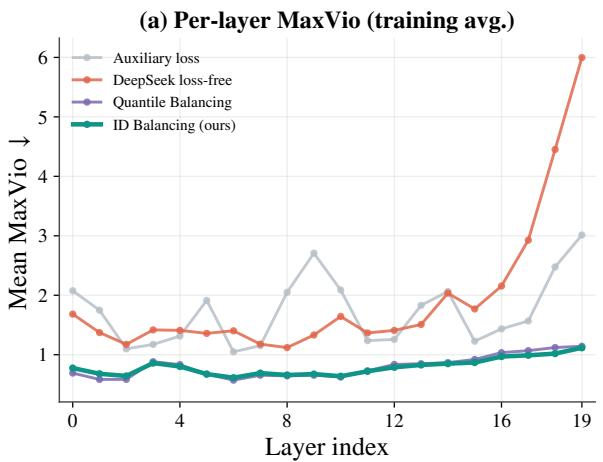

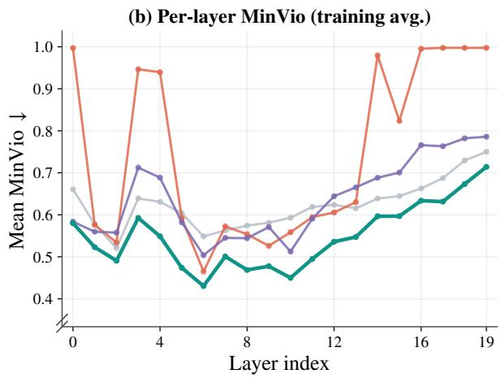

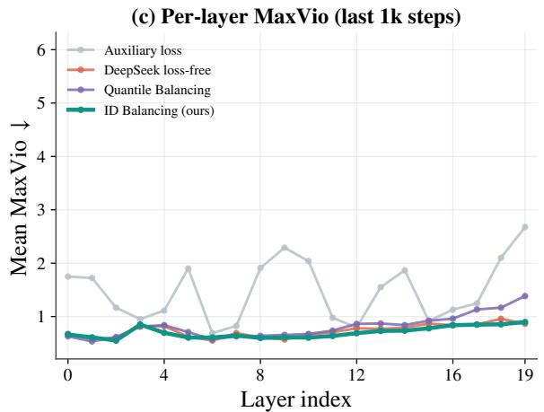

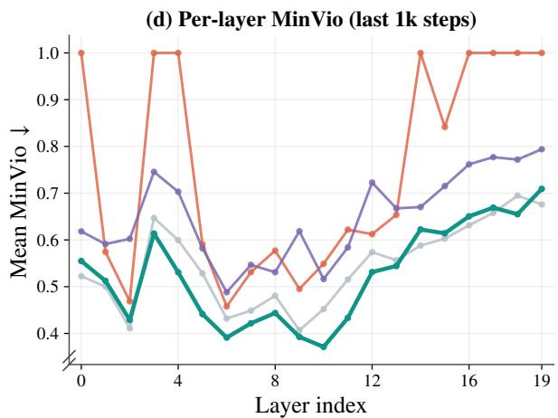  
Figure 10: ID Balancing maintains consistent overload and underload control across layers. Results use Top-3-of-768 routing over 30k steps and cover all 20 backbone layers. The top and bottom rows show the training average and the final 1k-step average, respectively. $( \mathbf { a } , \mathbf { c } )$ MaxVio (↓). (b, d) MinVio (↓). ID Balancing achieves lower or comparable MaxVio and lower MinVio than Quantile Balancing across all layers. MinVio generally increases with depth for all four methods.

## 4.4 Ablations

Integral gain $K _ { i }$ in isolation. With $K _ { d } = 0 ,$ we vary $K _ { i } \in \{ 3 , 6 , 9 \} \times 1 0 ^ { - 3 }$ . Fig. 12 shows that the smallest gain corrects early backbone imbalance more slowly, while the trajectories become similar later. Increasing $K _ { i }$ from $3 \times 1 0 ^ { - 3 } \mathrm { t o } 6 \times 1 0 ^ { - 3 }$ reduces training-average backbone MaxVio from 0.9459 to 0.8003 and worst-case MaxVio from 23.26 to 14.96 (Tab. 4). A further increase to $9 \times 1 0 ^ { - 3 }$ lowers the average only slightly, to 0.7872, but raises worst-case backbone MaxVio to 20.13 and worst-case MTP MaxVio from 15.18 to 35.56. The smallest gain retains the lowest LM loss and several final-stage and MTP load metrics. We therefore choose $K _ { i } \ = \ \mathrm { { \bar { 6 } } \times 1 0 ^ { - 3 } }$ for its stronger early correction and lowest worst-case backbone MaxVio, while avoiding the larger MTP violations at $9 \times \mathrm { { i 0 ^ { - 3 } } }$

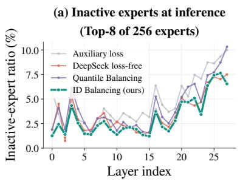

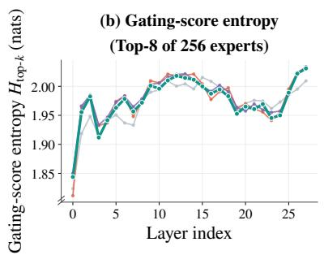

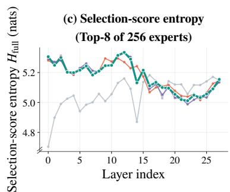

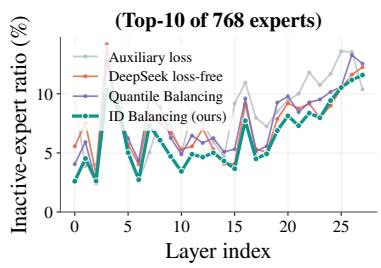

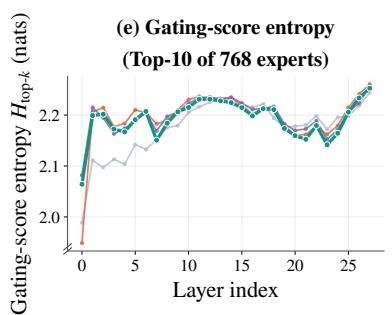

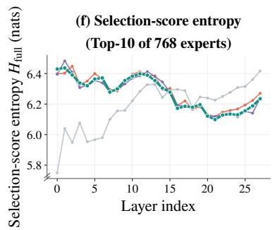  
Figure 11: ID Balancing reduces expert inactivity relative to Auxiliary loss. Results are averaged by layer over nine downstream benchmarks. The top and bottom rows use Top-8-of-256 and Top-10-of-768 routing, respectively. (a, d) Inactive-expert ratio, the fraction of experts receiving no evaluation token (↓). $( \check { \boldsymbol { \mathbf { b } } } , \boldsymbol { \mathbf { e } } )$ Top-K gating-score entropy, where a larger value means a more even mixture over selected experts. $( \mathbf { c } , \hat { \mathbf { f } } )$ Full-pool selection-score entropy, where a larger value means a flatter selection-score distribution.

Table 4: An integral gain of $K _ { i } = 6 \times 1 0 ^ { - 3 }$ yields the lowest worst-case backbone MaxVio among the tested gains. Results use a 0.87B-active/18.9B-total model with $\mathrm { T o p \mathrm { - } 3 \mathrm { - } O f \mathrm { - } 7 6 8 }$ routing over 30k steps. We fix $K _ { d } = 0$ and vary $K _ { i } \in \{ 3 , 6 , 9 \} \times 1 0 ^ { - 3 }$ . Increasing $K _ { i }$ to $9 \times { \bar { 1 0 } } ^ { - 3 }$ further reduces training-average backbone violations but worsens MTP balance. Lower values are better for all metrics.
<table><tr><td rowspan="3">Setting</td><td colspan="6">Backbone</td><td colspan="5">MTP module</td></tr><tr><td>LM</td><td colspan="3">MaxVio ↓</td><td colspan="2">MinVio ↓</td><td colspan="2">MaxVio ↓</td><td colspan="2">MinVio ↓</td></tr><tr><td>loss</td><td>Last1k</td><td>Avg.</td><td>Worst</td><td>Last1k</td><td>Avg.</td><td>Last1k</td><td>Avg.</td><td>Worst</td><td>Last1k</td></tr><tr><td>Integral gain  $K _ { i } ,$ </td><td>integral term only,</td><td></td><td> $K _ { d } { = } 0$ </td><td></td><td></td><td></td><td></td><td></td><td></td><td></td><td></td></tr><tr><td> $K _ { i } = 3 \times 1 0 ^ { - 3 }$ </td><td>1.7422</td><td>0.6759</td><td>0.9459</td><td>23.26</td><td>0.5190</td><td>0.5777</td><td>0.6375</td><td>0.7991</td><td>9.14</td><td>0.5603</td><td>0.5775</td></tr><tr><td> $K _ { i } = 6 \times 1 0 ^ { - 3 }$ </td><td>1.7431</td><td>0.6924</td><td>0.8003</td><td>14.96</td><td>0.5233</td><td>0.5527</td><td>0.8557</td><td>0.8862</td><td>15.18</td><td>0.5848</td><td>0.5714</td></tr><tr><td> $K _ { i } = 9 \times 1 0 ^ { - 3 }$ </td><td>1.7429</td><td>0.6831</td><td>0.7872</td><td>20.13</td><td>0.5263</td><td>0.5436</td><td>0.9222</td><td>1.0388</td><td>35.56</td><td>0.6279</td><td>0.5800</td></tr></table>

Derivative gain $K _ { d }$ and early load control. With $K _ { i } = 6 \times 1 0 ^ { - 3 } .$ , we vary $K _ { d } \in \{ 0 , 3 , 6 , 1 2 \} \times 1 0 ^ { - 3 }$ using $K _ { d } = 0$ as the integral-only baseline. Adding the derivative term improves early backbone load control, while later trajectories remain similar (Fig. 13(a)). The default $\dot { K _ { d } } = 6 \times 1 0 ^ { - 3 }$ reduces mean backbone MaxVio from 2.0020 to 1.9330 over 0–1k steps and from 0.9059 to 0.8612 over 1–5k steps, with lower MinVio in both intervals (Tab. 5). Over 1–5k steps, it also reduces the sampled cumulative excess above layer-mean MaxVio $V _ { t } ~ = ~ 1$ by 57.9% relative to the integral-only baseline, using unsmoothed observations (Fig. 13(b)). These early gains come with a trade-of in MTP balance. Larger derivative gains reduce backbone overload over 1–5k steps but increase MTP overload. At the default gain, trainingaverage MTP MaxVio rises from 0.8862 to 0.9698, while training-average backbone MaxVio improves only modestly, from 0.8003 to 0.7931. We choose $K _ { d } = 6 \times 1 0 ^ { - 3 }$ because it provides stronger backbone control over 1–5k steps than $3 \times 1 0 ^ { - 3 }$ , with less MTP overload than $1 2 \times 1 0 ^ { - 3 }$ . It also yields the lowest LM loss and training-average backbone MinVio among the tested gains.

## 5 Related Work

Sparse mixture-of-experts. Transformer architectures and large-scale pretraining have driven progress in language modeling (Vaswani et al., 2017; Radford et al., 2019; Brown et al., 2020), followed by instruction tuning and conversational models (Ouyang et al., 2022; OpenAI, 2022; Achiam et al., 2023). Sparse MoE models extend this scaling direction by increasing total capacity through conditional expert activation, with a smaller increase in per-token computation (Du et al., 2022; Rajbhandari et al., 2022; Muennighof et al., 2025; Puigcerver et al., 2024; He, 2024; Yang et al., 2025a). Switch Transformer (Fedus et al., 2022) and GShard (Lepikhin et al., 2021) use Top-1 and Top-2 routing, respectively, while BASE Layers (Lewis et al., 2021), Hash Layers (Roller et al., 2021), and Expert Choice (Zhou et al., 2022) explore alternative token–expert assignments. Sparse activation also extends beyond standard feed-forward experts: MoH (Jin et al., 2025b) applies selective activation to attention heads, and MoE++ (Jin et al., 2025a) combines feed-forward and zero-computation experts. Our work addresses the load-control challenge that arises as the active fraction of a Top-K MoE decreases.

Table 5: Larger derivative gains reduce backbone overload over 1–5k steps but increase MTP overload. Results use a 0.87B-active/18.9B-total model with Top-3-of-768 routing over 30k steps. We fix $K _ { i } \ =$ $6 \times 1 0 ^ { - 3 }$ and vary $K _ { d } \in \{ 0 , 3 , 6 , 1 2 \} \times 1 0 ^ { - 3 }$ , with $K _ { d } = 0$ as the integral-only baseline. Load metrics summarize the indicated early intervals and the full training window $\left( \operatorname { A v g } . \right)$
<table><tr><td rowspan="3">Setting</td><td colspan="6">Backbone</td><td colspan="4">MTP module</td></tr><tr><td>LM</td><td colspan="2">0–1k steps</td><td colspan="2">1–5k steps</td><td colspan="2"> $\operatorname { A v g } .$ </td><td colspan="2">0–5k steps</td><td colspan="2"> $\operatorname { A v g } .$ </td></tr><tr><td>loss</td><td>MaxVio ↓</td><td>MinVio ↓</td><td>MaxVio ↓</td><td>MinVio ↓</td><td>MaxVio ↓</td><td>MinVio ↓</td><td>MaxVio ↓</td><td>MinVio ↓</td><td>MaxVio ↓ MinVio ↓</td></tr><tr><td colspan="9">Derivative gain Kd, fixed</td><td></td><td></td></tr><tr><td> $K _ { d } = 0 ( \mathrm { I } \mathrm { o n l y } )$ </td><td>1.7431</td><td> $K _ { i } = 6 \times 1 0 ^ { - 3 }$  2.0020</td><td>0.7955</td><td>0.9059</td><td>0.5989 0.8003</td><td>0.5527</td><td>1.4965</td><td>0.6222</td><td>0.8862</td><td>0.5714</td></tr><tr><td> $K _ { d } = 3 \times 1 0 ^ { - 3 }$ </td><td>1.7428</td><td>1.8900</td><td>0.7853</td><td>0.8869 0.5992</td><td>0.7910 0.7931</td><td>0.5485</td><td>1.7454</td><td>0.6201</td><td>0.9459</td><td>0.5799</td></tr><tr><td> $K _ { d } = 6 \times 1 0 ^ { - 3 }$ </td><td>1.7426</td><td>1.9330</td><td>0.7791</td><td>0.8612</td><td>0.5899</td><td>0.5480 0.5501</td><td>1.7724 2.0382</td><td>0.6336</td><td>0.9698</td><td>0.5782</td></tr><tr><td> $K _ { d } = 1 2 \times 1 0 ^ { - 3 }$ </td><td>1.7427</td><td>1.8100</td><td>0.7644</td><td>0.8131</td><td>0.5833</td><td>0.7812</td><td></td><td>0.6048</td><td>1.0922</td><td>0.5660</td></tr></table>

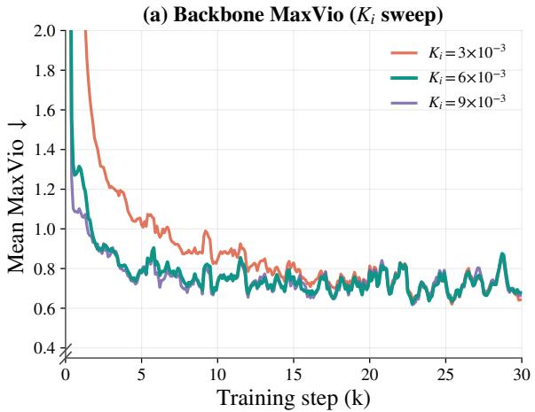

(b) Backbone MinVio (Ki sweep)  
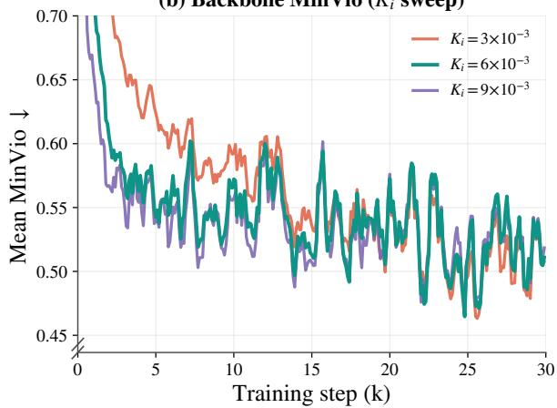  
Figure 12: A small integral gain responds slowly to the early imbalance, while larger gains converge to similar backbone trajectories. Results use Top-3-of-768 routing over 30k steps with $K _ { d } = 0$ . We compare $K _ { i } \in \{ 3 , 6 , 9 \} \times \mathrm { { 1 0 ^ { - 3 } } }$ . (a) Mean backbone MaxVio (↓). (b) Mean backbone MinVio (↓).

Balancing through an auxiliary loss. Auxiliary-loss methods encourage balanced routing by combining each expert’s token fraction with its average router probability (Fedus et al., 2022). The resulting gradients update the same router weights as the language-modeling objective, introducing a trade-of between the two objectives (Yu et al., 2020; Sener & Koltun, 2018; Liu et al., 2021). System-level approaches such as LocMoE (Li et al., 2024) and MegaBlocks (Gale et al., 2023) further address eficient MoE execution. ID Balancing controls expert selection through a separate bias update, without adding a balancing gradient to the training objective.

Auxiliary-loss-free balancing. Auxiliary-loss-free methods add an expert-specific bias for Top-K selection and exclude it from the combination weights (Wang et al., 2024b; Liu et al., 2024). DeepSeek’s loss-free method updates this bias using the sign of the load error. Its fixed step discards error magnitude, creating a trade-of between correcting large errors and avoiding overshoot near balance. Kimi K3’s Quantile Balancing (Team et al., 2026) instead computes a batch-dependent target bias from quantiles of router-score margins. At inference, the learned bias is frozen and routing uses ordinary Top-K selec tion. We propose a generalized PID view that organizes these updates by how they use feedback over time: DeepSeek’s loss-free method acts as fixed-step integral control, while Quantile Balancing acts as generalized proportional control. This view motivates ID Balancing, which combines magnitude-aware integral control with a worsening-gated derivative correction.

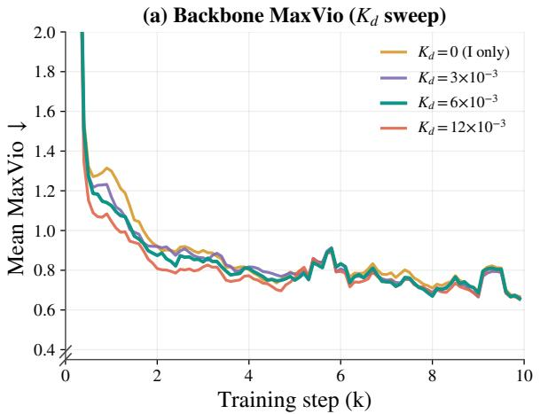

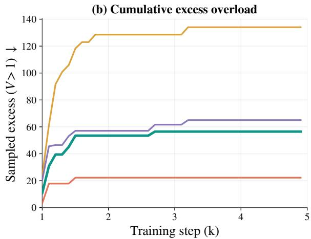  
Figure 13: The derivative term reduces early backbone overload. Results use Top-3-of-768 routing with $\ l { K } _ { i } ^ { \top } = 6 \times 1 0 ^ { - 3 }$ and $K _ { d } \in \{ 0 , 3 , 6 , 1 2 \} \times 1 0 ^ { - 5 } _ { }$ , where $K _ { d } = 0$ is the integral-only baseline. Let V<sub>t</sub> denote mean MaxVio over the 20 backbone layers. (a) $V _ { t }$ over the first 10k steps, smoothed with a five-point moving average. (b) Cumulative excess above $V _ { t } = 1$ over 1–5k steps.

## 6 Conclusion

Efective load control is essential to using the capacity of larger, sparser MoE models. We propose a generalized PID view of auxiliary-loss-free balancing and use it to develop ID Balancing, which combines magnitude-aware integral control with a worsening-gated derivative correction and zero-mean bias centering. The method requires only O(E) token-count feedback per layer and adds no balancing gradient to the language-modeling objective. Experiments across routing sparsities, model sizes, and learning-rate settings show efective load control while maintaining competitive language-modeling and downstream performance. Reduced gains retain active load correction during continued pretraining, and further analyses show consistent backbone load control across layers and fewer inactive experts on evaluation data. These results support ID Balancing as a practical approach to load control for larger, sparser MoE models.

## Limitations

Our evaluation covers several routing sparsities, model sizes, and training conditions within a family of decoder-only MoE models using fixed Top-K routing. Extending the evaluation to other architectures and routing methods is a natural next step. The accumulated worsening-gated derivative update is supported empirically. The scaling experiments compare complete model configurations that difer in depth, width, active and total parameters, and training duration, so they assess load control across configurations without isolating the efect of model size alone.

## References

Josh Achiam, Steven Adler, Sandhini Agarwal, Lama Ahmad, Ilge Akkaya, Florencia Leoni Aleman, Diogo Almeida, Janko Altenschmidt, Sam Altman, Shyamal Anadkat, et al. Gpt-4 technical report. arXiv preprint arXiv:2303.08774, 2023.

Kiam Heong Ang, Gregory Chong, and Yun Li. Pid control system analysis, design, and technology. IEEE transactions on control systems technology, 13(4):559–576, 2005.

Karl J Aström and Tore Hägglund. Advanced PID control. John Wiley & Sons, 2005.

Jacob Austin, Augustus Odena, Maxwell Nye, Maarten Bosma, Henryk Michalewski, David Dohan, Ellen Jiang, Carrie Cai, Michael Terry, Quoc Le, et al. Program synthesis with large language models. arXiv preprint arXiv:2108.07732, 2021.

Tom Brown, Benjamin Mann, Nick Ryder, Melanie Subbiah, Jared D Kaplan, Prafulla Dhariwal, Arvind Neelakantan, Pranav Shyam, Girish Sastry, Amanda Askell, et al. Language models are few-shot learners. In NeurIPS, pp. 1877–1901, 2020.

Federico Cassano, John Gouwar, Daniel Nguyen, Sydney Nguyen, Luna Phipps-Costin, Donald Pinckney, Ming-Ho Yee, Yangtian Zi, Carolyn Jane Anderson, Molly Q Feldman, et al. Multipl-e: A scalable and

polyglot approach to benchmarking neural code generation. IEEE Transactions on Software Engineering, 49(7):3675–3691, 2023.

Mark Chen, Jerry Tworek, Heewoo Jun, Qiming Yuan, Henrique Ponde De Oliveira Pinto, Jared Kaplan, Harri Edwards, Yuri Burda, Nicholas Joseph, Greg Brockman, et al. Evaluating large language models trained on code. arXiv preprint arXiv:2107.03374, 2021.

Karl Cobbe, Vineet Kosaraju, Mohammad Bavarian, Mark Chen, Heewoo Jun, Lukasz Kaiser, Matthias Plappert, Jerry Tworek, Jacob Hilton, Reiichiro Nakano, et al. Training verifiers to solve math word problems. arXiv preprint arXiv:2110.14168, 2021.

Damai Dai, Chengqi Deng, Chenggang Zhao, RX Xu, Huazuo Gao, Deli Chen, Jiashi Li, Wangding Zeng, Xingkai Yu, Yu Wu, et al. Deepseekmoe: Towards ultimate expert specialization in mixture-of-experts language models. In ACL, pp. 1280–1297, 2024.

Tri Dao and Albert Gu. Transformers are ssms: Generalized models and eficient algorithms through structured state space duality. arXiv preprint arXiv:2405.21060, 2024.

Nan Du, Yanping Huang, Andrew M Dai, Simon Tong, Dmitry Lepikhin, Yuanzhong Xu, Maxim Krikun, Yanqi Zhou, Adams Wei Yu, Orhan Firat, et al. Glam: Eficient scaling of language models with mixtureof-experts. In ICML, pp. 5547–5569, 2022.

Xeron Du, Yifan Yao, Kaijing Ma, Bingli Wang, Tianyu Zheng, Minghao Liu, Yiming Liang, Xiaolong Jin, Zhenlin Wei, Chujie Zheng, et al. Supergpqa: Scaling llm evaluation across 285 graduate disciplines. In NeurIPS, 2026.

William Fedus, Barret Zoph, and Noam Shazeer. Switch transformers: Scaling to trillion parameter models with simple and eficient sparsity. Journal of Machine Learning Research, 23(120):1–39, 2022.

Trevor Gale, Deepak Narayanan, Clif Young, and Matei Zaharia. Megablocks: Eficient sparse training with mixture-of-experts. In MLSys, pp. 288–304, 2023.

Fabian Gloeckle, Badr Youbi Idrissi, Baptiste Rozière, David Lopez-Paz, and Gabriel Synnaeve. Better & faster large language models via multi-token prediction. arXiv preprint arXiv:2404.19737, 2024.

Kshitij Gupta, Benjamin Thérien, Adam Ibrahim, Mats L Richter, Quentin Anthony, Eugene Belilovsky, Irina Rish, and Timothée Lesort. Continual pre-training of large language models: How to (re) warm your model? arXiv preprint arXiv:2308.04014, 2023.

Suchin Gururangan, Ana Marasović, Swabha Swayamdipta, Kyle Lo, Iz Beltagy, Doug Downey, and Noah A Smith. Dont stop pretraining: Adapt language models to domains and tasks. In ACL, pp. 8342–8360, 2020.

Jiaao He, Jiezhong Qiu, Aohan Zeng, Zhilin Yang, Jidong Zhai, and Jie Tang. Fastmoe: A fast mixture-ofexpert training system. arXiv preprint arXiv:2103.13262, 2021.

Jiaao He, Jidong Zhai, Tiago Antunes, Haojie Wang, Fuwen Luo, Shangfeng Shi, and Qin Li. Fastermoe: modeling and optimizing training of large-scale dynamic pre-trained models. In PPoPP, pp. 120–134, 2022.

Xu Owen He. Mixture of a million experts. arXiv preprint arXiv:2407.04153, 2024.

Dan Hendrycks, Collin Burns, Steven Basart, Andy Zou, Mantas Mazeika, Dawn Song, and Jacob Steinhardt. Measuring massive multitask language understanding. In ICLR, 2021a.

Dan Hendrycks, Collin Burns, Saurav Kadavath, Akul Arora, Steven Basart, Eric Tang, Dawn Song, and Jacob Steinhardt. Measuring mathematical problem solving with the math dataset. arXiv preprint arXiv:2103.03874, 2021b.

J Stuart Hunter. The exponentially weighted moving average. Journal ofquality technology, 18(4):203–210, 1986.

AJ Isaksson and SF Graebe. Derivative filter is an integral part of pid design. IEE Proceedings-Control Theory and Applications, 149(1):41–45, 2002.

Robert A Jacobs, Michael I Jordan, Steven J Nowlan, and Geofrey E Hinton. Adaptive mixtures of local experts. Neural computation, 3(1):79–87, 1991.

Peng Jin, Bo Zhu, Yuan Li, and Shuicheng Yan. Moe++: Accelerating mixture-of-experts methods with zero-computation experts. In ICLR, pp. 50832–50856, 2025a.

Peng Jin, Bo Zhu, Li Yuan, and Shuicheng Yan. Moh: Multi-head attention as mixture-of-head attention. In ICML, 2025b.

Michael A Johnson and Mohammad H Moradi. PID control. Springer, 2005.

Zixuan Ke, Yijia Shao, Haowei Lin, Tatsuya Konishi, Gyuhak Kim, and Bing Liu. Continual pre-training of language models. arXiv preprint arXiv:2302.03241, 2023.

Dmitry Lepikhin, HyoukJoong Lee, Yuanzhong Xu, Dehao Chen, Orhan Firat, Yanping Huang, Maxim Krikun, Noam Shazeer, and Zhifeng Chen. Gshard: Scaling giant models with conditional computation and automatic sharding. In ICLR, 2021.

Mike Lewis, Shruti Bhosale, Tim Dettmers, Naman Goyal, and Luke Zettlemoyer. Base layers: Simplifying training of large, sparse models. In ICML, pp. 6265–6274, 2021.

Jing Li, Zhijie Sun, Xuan He, Li Zeng, Yi Lin, Entong Li, Binfan Zheng, Rongqian Zhao, and Xin Chen. Locmoe: A low-overhead moe for large language model training. arXiv preprint arXiv:2401.13920, 2024.

Aixin Liu, Bei Feng, Bing Xue, Bingxuan Wang, Bochao Wu, Chengda Lu, Chenggang Zhao, Chengqi Deng, Chenyu Zhang, Chong Ruan, et al. Deepseek-v3 technical report. arXiv preprint arXiv:2412.19437, 2024.

Bo Liu, Xingchao Liu, Xiaojie Jin, Peter Stone, and Qiang Liu. Conflict-averse gradient descent for multitask learning. In NeurIPS, pp. 18878–18890, 2021.

Niklas Muennighof, Luca Soldaini, Dirk Groeneveld, Kyle Lo, Jacob Morrison, Sewon Min, Weijia Shi, Pete Walsh, Oyvind Tafjord, Nathan Lambert, et al. Olmoe: Open mixture-of-experts language models. In ICLR, pp. 62061–62121, 2025.

Xiaonan Nie, Pinxue Zhao, Xupeng Miao, Tong Zhao, and Bin Cui. Hetumoe: An eficient trillion-scale mixture-of-expert distributed training system. arXiv preprint arXiv:2203.14685, 2022.

OpenAI. Introducing chatgpt. CoRR, 2022. URL https://openai.com/blog/chatgpt.

OpenAI. Multilingual massive multitask language understanding (mmmlu). Dataset available at Hugging Face, 2024.

Long Ouyang, Jefrey Wu, Xu Jiang, Diogo Almeida, Carroll Wainwright, Pamela Mishkin, Chong Zhang, Sandhini Agarwal, Katarina Slama, Alex Ray, et al. Training language models to follow instructions with human feedback. In NeurIPS, pp. 27730–27744, 2022.

Igor Podlubny. Fractional-order systems and fractional-order controllers. Institute ofExperimental Physics, Slovak Academy of Sciences, Kosice, 12(3):1–18, 1994.

Joan Puigcerver, Carlos Riquelme Ruiz, Basil Mustafa, and Neil Houlsby. From sparse to soft mixtures of experts. In ICLR, pp. 28435–28445, 2024.

Zihan Qiu, Zekun Wang, Xiao Li, Yanpeng Li, Yang Xu, Yixuan Wang, Huaqing Zhang, Rui Men, Bochao Mao, Chengruidong Zhang, et al. On the design of qwen3. 8-next architecture: Evaluation, eficiency, and training stability. arXiv preprint arXiv:2608.30320, 2026.

Alec Radford, Jefrey Wu, Rewon Child, David Luan, Dario Amodei, Ilya Sutskever, et al. Language models are unsupervised multitask learners. OpenAI blog, 1(8):9, 2019.

Samyam Rajbhandari, Conglong Li, Zhewei Yao, Minjia Zhang, Reza Yazdani Aminabadi, Ammar Ahmad Awan, Jef Rasley, and Yuxiong He. Deepspeed-moe: Advancing mixture-of-experts inference and training to power next-generation ai scale. In ICML, pp. 18332–18346, 2022.

Stephen Roller, Sainbayar Sukhbaatar, Jason Weston, et al. Hash layers for large sparse models. In NeurIPS, pp. 17555–17566, 2021.

Ozan Sener and Vladlen Koltun. Multi-task learning as multi-objective optimization. In NeurIPS, 2018.

Pritesh Shah and Sudhir Agashe. Review of fractional pid controller. Mechatronics, 38:29–41, 2016.

Noam Shazeer, Azalia Mirhoseini, Krzysztof Maziarz, Andy Davis, Quoc Le, Geofrey Hinton, and Jef Dean. Outrageously large neural networks: The sparsely-gated mixture-of-experts layer. arXiv preprint arXiv:1701.06538, 2017.

Yutao Sun, Li Dong, Shaohan Huang, Shuming Ma, Yuqing Xia, Jilong Xue, Jianyong Wang, and Furu Wei. Retentive network: A successor to transformer for large language models. arXiv preprint arXiv:2307.08621, 2023.

Mirac Suzgun, Nathan Scales, Nathanael Schärli, Sebastian Gehrmann, Yi Tay, Hyung Won Chung, Aakanksha Chowdhery, Quoc Le, Ed H Chi, Denny Zhou, et al. Challenging big-bench tasks and whether chain-of-thought can solve them. In Findings of the ACL, pp. 13003–13051, 2023.

Kimi Team, Tongtong Bai, Yifan Bai, Yiping Bao, Jianfeng Cai, Xinyuan Cai, Peizhou Cao, Yuxuan Cao, Ziwei Chai, Y Charles, et al. Kimi k3: Open frontier intelligence. arXiv preprint arXiv:2607.24653, 2026.

Ashish Vaswani, Noam Shazeer, Niki Parmar, Jakob Uszkoreit, Llion Jones, Aidan N Gomez, Łukasz Kaiser, and Illia Polosukhin. Attention is all you need. In NeurIPS, 2017.

Antonio Visioli. Practical PID control. Springer, 2006.

Hongyu Wang, Shuming Ma, Li Dong, Shaohan Huang, Dongdong Zhang, and Furu Wei. Deepnet: Scaling transformers to 1,000 layers. IEEE Transactions on Pattern Analysis and Machine Intelligence, 46 (10):6761–6774, 2024a.

Lean Wang, Huazuo Gao, Chenggang Zhao, Xu Sun, and Damai Dai. Auxiliary-loss-free load balancing strategy for mixture-of-experts. arXiv preprint arXiv:2408.15664, 2024b.

Yubo Wang, Xueguang Ma, Ge Zhang, Yuansheng Ni, Abhranil Chandra, Shiguang Guo, Weiming Ren, Aaran Arulraj, Xuan He, Ziyan Jiang, et al. Mmlu-pro: A more robust and challenging multi-task language understanding benchmark. In NeurIPS, pp. 95266–95290, 2024c.

Peter R Winters. Forecasting sales by exponentially weighted moving averages. Management science, 6 (3):324–342, 1960.

Ruibin Xiong, Yunchang Yang, Di He, Kai Zheng, Shuxin Zheng, Chen Xing, Huishuai Zhang, Yanyan Lan, Liwei Wang, and Tieyan Liu. On layer normalization in the transformer architecture. In ICML, pp. 10524–10533, 2020.

Fuzhao Xue, Zian Zheng, Yao Fu, Jinjie Ni, Zangwei Zheng, Wangchunshu Zhou, and Yang You. Openmoe: An early efort on open mixture-of-experts language models. arXiv preprint arXiv:2402.01739, 2024.

An Yang, Anfeng Li, Baosong Yang, Beichen Zhang, Binyuan Hui, Bo Zheng, Bowen Yu, Chang Gao, Chengen Huang, Chenxu Lv, et al. Qwen3 technical report. arXiv preprint arXiv:2505.09388, 2025a.

Songlin Yang, Bailin Wang, Yikang Shen, Rameswar Panda, and Yoon Kim. Gated linear attention transformers with hardware-eficient training. In ICML, pp. 56501–56523, 2024.

Songlin Yang, Jan Kautz, and Ali Hatamizadeh. Gated delta networks: Improving mamba2 with delta rule. In ICLR, pp. 29687–29707, 2025b.

Tianhe Yu, Saurabh Kumar, Abhishek Gupta, Sergey Levine, Karol Hausman, and Chelsea Finn. Gradient surgery for multi-task learning. In NeurIPS, pp. 5824–5836, 2020.

Yanqi Zhou, Tao Lei, Hanxiao Liu, Nan Du, Yanping Huang, Vincent Zhao, Andrew M Dai, Quoc V Le, James Laudon, et al. Mixture-of-experts with expert choice routing. In NeurIPS, pp. 7103–7114, 2022.

## A Experimental Setup

## A.0.1 Scaling Setups

Model architectures. We evaluate three hybrid MoE configurations that cover diferent expert-pool and model scales. Their specifications are summarized in Tab. A. All three models combine full attention and gated linear attention (Yang et al., 2024; 2025b; Dao & Gu, 2024; Sun et al., 2023), with one full-attention layer every four Transformer layers. Each MoE layer contains one shared expert in addition to the routed experts. The input embedding and output head are untied.

Table A: Architectural specifications for the evaluated MoE models. Parameter counts include the input embedding and untied output head, and exclude the MTP module. Active parameters include all dense and shared components together with the routed experts selected by Top-K.
<table><tr><td>Specification</td><td>Small MoE</td><td>Medium MoE</td><td>Large MoE</td></tr><tr><td>Transformer layers</td><td>20</td><td>28</td><td>28</td></tr><tr><td>Hidden size</td><td>1024</td><td>2048</td><td>2048</td></tr><tr><td>Vocabulary size</td><td>248320</td><td>248320</td><td>248320</td></tr><tr><td>Softmax-attention heads</td><td>16</td><td>16</td><td>16</td></tr><tr><td>Query groups</td><td>2</td><td>2</td><td>2</td></tr><tr><td>Softmax-attention head dimension</td><td>256</td><td>256</td><td>256</td></tr><tr><td>Full-attention interval</td><td>4</td><td>4</td><td>4</td></tr><tr><td>Linear-attention key/value dimension</td><td>128 / 128</td><td>128 / 128</td><td>128 / 128</td></tr><tr><td>Linear-attention key/value heads</td><td>8/ 32</td><td>16 / 32</td><td>16 / 32</td></tr><tr><td>Per-expert FFN size</td><td>384</td><td>512</td><td>512</td></tr><tr><td>Routed experts</td><td>768</td><td>256</td><td>768</td></tr><tr><td>Shared experts</td><td>1</td><td>1</td><td>1</td></tr><tr><td>Top-K</td><td>3 / 5 / 10</td><td>8</td><td>10</td></tr><tr><td>Tied input/output embeddings</td><td>No</td><td>No</td><td>No</td></tr><tr><td>Total parameters</td><td>18.9B</td><td>24.8B</td><td>69.9B</td></tr><tr><td>Activē parameters</td><td>0.87B / 0.91B / 1.03B</td><td>3.0B</td><td>3.2B</td></tr></table>