# Importance-Aware Feature Sparsification for Wireless Split Learning

Bumjun Kim, Graduate Student Member, IEEE, Yoon Huh, Graduate Student Member, IEEE, and Wan Choi, Fellow, IEEE

Abstract—Wireless split learning (SL) reduces on-device computation by offloading upper layers to a server, yet transmitting high-dimensional intermediate features at each iteration remains a major communication bottleneck. Existing methods select features at the client side using task-agnostic criteria such as magnitude, statistics, or clustering, which increases client-side processing and often degrades accuracy under nonindependent and identically distributed (non-i.i.d.) client data. We propose importance-aware class-balanced sparsification (ICS), a lightweight approach in which the server ranks feature channels using Grad-CAM-based scores obtained from the true-class logit during backpropagation. The per-class scores are aggregated into a class-balanced, label-agnostic importance vector that mitigates head-class bias under label skew, and each client reuses this vector in the next round to retain the top-N feature channels, incurring no additional client-side forward or backward passes. We further derive a non-asymptotic convergence bound that isolates the sparsification-induced error and characterizes how the sparsification ratio and mini-batch size jointly affect convergence under a fixed communication budget, and we analyze the communication and computational overhead of ICS against representative baselines. Beyond sequential CNN-based SL, we extend ICS to parallel split learning and to transformer-based models. Experiments show that ICS consistently outperforms the baselines, with larger gains under severe non-i.i.d. partitions.

Index Terms—Communication-efficient split learning, Grad-CAM, sparsification, compression, heterogeneous data.

## I. INTRODUCTION

Driven by the expansion of the internet of things (IoT) and advances in next generation wireless technologies, the number of edge devices that capture data in real time continues to grow at an extraordinary pace. These devices produce diverse and large volumes of information including sensor readings, user profiles, and video streams, which now power AI applications across healthcare, natural language processing, transportation, and other domains. The conventional centralized learning (CL) trains models at a server by collecting raw data from devices, yet this approach increasingly confronts hard limits because data must leave its source devices, which heightens privacy risk and collides with regulatory requirements [2]. Consequently, CL is often impractical for modern edge intelligence, motivating approaches that keep data local while still enabling collaborative training.

Federated learning (FL) [3]–[6] enables collaborative model training while keeping data local to each client. In FL, clients update their models using private data and transmit only parameter updates or gradients to a central server, thereby reducing the risk of sensitive information leakage. While this paradigm avoids direct exposure of raw data, it still requires fully on-device training, which can be prohibitive for resourceconstrained clients. For example, ResNet-50 has roughly 25M parameters and requires more than 3.8 GFLOPs for a single forward pass [7]; the backward pass doubles or even triples the computation, while also increasing memory usage due to activations and optimizer states. On devices such as smartphones, wearables, and IoT nodes, these requirements translate into higher latency, energy consumption, and thermal load, often becoming the practical bottleneck in FL deployments.

Split learning (SL) [8]–[11] addresses this bottleneck by redistributing computation between clients and the server. The network is partitioned at a designated cut layer into a lightweight client-side model and a heavier server-side model. During training, each client performs the forward pass only up to the cut layer, producing intermediate features that are transmitted to the server. The server then completes the forward pass, computes the loss, backpropagates through its portion of the model, and returns the gradients with respect to the intermediate features. Using these gradients, clients update their local parameters. This division shifts the most compute- and memory-intensive layers to the server, significantly reducing on-device FLOPs and activation footprints, thereby lowering energy consumption and end-to-end latency. In the vanilla SL protocol involving multiple clients, this interaction is typically performed sequentially, only one client communicates with the server at a time, forcing clients to take turns. This split topology is also maintained during the inference phase. The client computes and transmits the intermediate features, and the server performs the remaining forward pass to return the final result [12]–[14].

Despite these advantages, SL still suffers from high training latency due to sequential client-server interactions [15], [16] and per-iteration transmission of high-dimensional intermediate features [17]–[19]. To alleviate the waiting overhead caused by sequential client participation, parallel split learning (PSL) methods [15], [16] allow multiple clients to perform client-side computation and transmit intermediate features in parallel. However, such parallelism comes at the cost of supporting simultaneous uplink transmissions within the same training iteration, which requires larger aggregate uplink resources in wireless systems. Moreover, it does not reduce the intermediate feature overhead transmitted by each client. Since intermediate features must be uploaded at every iteration, their cumulative communication cost can dominate the overall training overhead, regardless of whether clients participate sequentially or in parallel.

TABLE I  
COMPARISON OF FL, SEQUENTIAL SL AND PSL.
<table><tr><td>Paradigm</td><td>Main idea</td><td>Client-side computation</td><td>Uplink communication overhead</td></tr><tr><td>FL</td><td>Each client trains the full model locally, and the server aggregates the uploaded model updates.</td><td>Full forward/backward pass over the entire model at each client, i.e.,  $\mathcal { O } ( \mathcal { C } _ { d } + \mathcal { C } _ { s } )$ </td><td>Model updates are uploaded from the clients, i.e.,  $\mathcal { O } ( K ( P _ { d } ^ { - } + P _ { s } ) )$  in total.</td></tr><tr><td>Sequential SL</td><td>The model is split into client-side and server-side parts, and clients communicate with the server sequentially.</td><td>Forward/backward pass only over the client-side model at each client, i.e.,  $\mathcal { O } ( \mathcal { C } _ { d } )$ </td><td>Intermediate features are uploaded se- quentially, i.e., O(K BCUV) in total.</td></tr><tr><td>PSL</td><td>Multiple clients perform client-side com- putation and transmit intermediate features to the server in parallel. Client-side models are synchronized after the local updates.</td><td>Forward/backward pass over the client-side model at each client, i.e.,  $\mathcal { O } ( \mathcal { C } _ { d } )$ </td><td>Intermediate features and client-side model updates are uploaded, i.e.,  $\mathcal { O } ( K ( B \bar { C } U V + P _ { d } ) )$  in total.</td></tr></table>

To reduce the intermediate feature overhead, several communication-efficient SL methods were proposed. Existing studies typically decide which elements of the intermediate feature are retained for uplink transmission based on random sampling [20], magnitudes [17], feature statistics [18], or clustering [19]. Although these methods reduce the number of transmitted feature elements, their selection strategies are generally computed on the client side. This partially contradicts the primary motivation of SL, which is to offload computationally demanding operations from resource-constrained clients to the server. Moreover, these strategies do not reflect the taskspecific contribution of each feature to the final prediction, making it difficult to ensure that the transmitted features are task-relevant.

This issue becomes more critical under non-independent and identically distributed (non-i.i.d.) client data. In practical wireless learning scenarios, clients often collect data from diverse environments, resulting in heterogeneous data distributions. Under such data skew, feature selection based solely on client-side information can be biased toward locally dominant classes. As a result, the transmitted features may overrepresent client-specific characteristics rather than class-balanced task relevance, which can degrade the global training performance. Therefore, an effective sparsification strategy for wireless SL should be communication-efficient, task-aware, robust to noni.i.d. data skew, and lightweight at the client side.

Motivated by these observations, we propose an importanceaware class-balanced sparsification (ICS), inspired by gradient-weighted class activation mapping (Grad-CAM) [21], originally developed in the context of explainable AI (XAI). Grad-CAM measures the contribution of intermediate features to class-specific predictions, highlighting the most salient intermediate feature channels. Recently, Grad-CAM has been used to guide resource allocation in semantic communication systems. In particular, the authors in [22] employed Grad-CAM-inspired feature importance scores on a pre-trained JSCC encoder to learn a feature importance predictor at the transmitter, which is then used to allocate space–time resources during inference. In contrast, our work integrates Grad-CAM directly into the training loop of wireless SL under distributed clients with non-i.i.d. data, transforming it from a post-hoc interpretability tool into a core component of the SL training process. The server computes all importance scores during the backpropagation stage, eliminating the need for any transmitter-side processing.

Specifically, the server computes class-specific importance vectors, and aggregates them into a class-balanced, labelagnostic importance vector. This class-balanced vector design ensures robustness to client label skew, while its labelagnostic design enables reuse of the sparsification during inference, where ground-truth labels are unavailable. This importance vector is then returned to the client and reused in the subsequent iteration to sparsify intermediate features for uplink transmission, ensuring that only the most discriminative channels are transmitted within a given bandwidth budget. Crucially, this entire process is performed by the server, imposing no additional computation overhead on the resourceconstrained clients. This design choice strictly adheres to the core philosophy of SL, which is to offload demanding computations away from the clients.

Furthermore, we provide a convergence analysis that addresses a critical aspect often overlooked in wireless SL. Unlike in FL, the uplink overhead in SL scales directly with the mini-batch size. Our analysis explicitly quantifies the error introduced by the sparsification ratio and characterizes its joint interaction with the batch size, revealing a fundamental trade-off between stochastic gradient variance and per-sample information fidelity under a fixed communication budget.

Beyond the sequential SL, we further extend ICS to PSL. Since multiple clients transmit intermediate features in parallel in the framework, the server constructs a shared class-balanced importance vector by aggregating importance scores across participating clients.

## A. Related Works

1) Distributed Learning Frameworks: FL keeps raw data local but requires each client to train the full model and upload model updates, imposing substantial computation and memory burden on resource-constrained clients. In contrast, sequential SL partitions the model between the client and the server, so each client executes only the client-side model while exchanging intermediate features and activation gradients with the server. PSL further reduces sequential waiting time by allowing multiple clients to perform client-side computation and upload intermediate features in parallel, which requires larger aggregate uplink resources within the same training iteration. These differences highlight that SL-based frameworks reduce client-side computation but make intermediate feature transmission a central communication bottleneck. Table I summarizes the main differences among FL, sequential SL and PSL with the main notations defined in Table III.

TABLE II  
COMPARISON OF COMMUNICATION-EFFICIENT SPLIT LEARNING METHODS.
<table><tr><td>Method</td><td>Selection criterion</td><td>Task-aware importance</td><td>No extra client-side computation</td><td>Non-i.i.d. consideration</td></tr><tr><td>RS [20]</td><td>Random sampling</td><td>x</td><td>√</td><td>x</td></tr><tr><td>TS [17]</td><td>Feature magnitude</td><td>x</td><td>x</td><td>x</td></tr><tr><td>RTS [23]</td><td>Feature magnitude + random sampling</td><td>x</td><td>x</td><td>x</td></tr><tr><td>FedLite [19]</td><td>Feature clustering</td><td>x</td><td>x</td><td>x</td></tr><tr><td>SplitFC [18]</td><td>Feature statistics</td><td>x</td><td>x</td><td>x</td></tr><tr><td>Proposed ICS</td><td>Grad-CAM-based channel importance</td><td>√</td><td>√</td><td>√</td></tr></table>

2) Parallel Split Learning Methods: PSL [15], [16] was developed to mitigate the waiting time caused by sequential client participation by transmitting intermediate features to the server in parallel. CPSL [24] extended this idea by grouping clients into multiple clusters, where clients are trained in parallel within each cluster and inter-cluster aggregation is performed sequentially to further reduce training latency.

More recently, several studies addressed system-level optimization issues in PSL frameworks. ESFL [25] jointly optimized the model splitting point and server-side computing resource allocation under heterogeneous device resources. AdaptSFL [26] adaptively controlled the model splitting point and client-side aggregation interval using convergence analysis. The authors in [27] further considered dynamic wireless environments by jointly optimizing model splitting, serverside computing resource allocation, and transmission power control. HSFL [28] extended to hierarchical systems through tier-wise model aggregation and model splitting optimization.

## 3) Communication-Efficient Split Learning Methods: 5

Communication-efficient SL methods aim to reduce the transmission overhead caused by high-dimensional intermediate features. FedLite [19] introduced a scalable SL framework for resource-constrained clients by clustering similar intermediate features and applying gradient correction to compressed features. SplitFC [18] further reduced communication overhead through adaptive feature-wise compression, where intermediate feature vectors are sparsified according to standarddeviation-based probabilities. Randomized and magnitudebased sparsification methods [17], [20], [23] were also studied to reduce the intermediate feature overhead by selecting only a subset of feature elements for uplink transmission.

Although these methods reduce the number of transmitted feature elements, they still have important limitations. First, feature selection is generally performed at the client side, requiring additional operations such as feature clustering, feature-statistics computation, or magnitude-based ranking before transmission. This increases the preprocessing burden on resource-constrained clients. Second, these methods select features without explicitly considering their task-specific contribution to the final prediction. Therefore, the retained features may fail to preserve task-relevant information, especially under non-i.i.d. client data.

To further clarify the novelty of ICS, Table II compares ICS with existing communication-efficient SL methods. Unlike other approaches, ICS evaluates feature importance using Grad-CAM-based class-specific saliency computed at the server. The resulting class-balanced importance vector allows clients to sparsify intermediate features without additional neural network computation at the client side, while preserving task-aware and non-i.i.d.-robust feature selection.

## B. Contributions

The main contributions of this paper are as follows:

• Importance-aware feature sparsification: We propose a novel sparsification method, termed ICS, which leverages Grad-CAM to evaluate the task-specific importance of intermediate features. By using importance vectors computed at the server in previous iterations as surrogates, the proposed approach enables efficient clientside feature compression without incurring additional forward–backward passes at the client side.

• Class-balanced label-agnostic importance vector: We design a class-balanced aggregation mechanism that converts class-specific importance vectors into a unified label-agnostic importance vector. This design mitigates class bias under non-i.i.d. client data and preserves classbalanced task-relevant features, while also enabling feature sparsification during inference where ground-truth labels are unavailable.

• Theoretical analysis: We provide a theoretical analysis of ICS in terms of both system overhead and convergence. For the overhead analysis, we analyze the uplink communication overhead and the computational complexity of ICS against conventional SL and existing communication-efficient SL methods. The analysis shows that ICS reduces the transmitted intermediate feature overhead without transmitting additional mask indices and shifts the importance-estimation cost from the clients to the server. For the convergence analysis, we derive a non-asymptotic bound that explicitly characterizes the sparsification error and reveals the trade-off between the mini-batch size and the sparsification ratio under a fixed uplink communication budget.

TABLE III NOTATIONS AND DESCRIPTIONS.
<table><tr><td>Symbol</td><td>Description</td></tr><tr><td> $K$ </td><td>Number of clients.</td></tr><tr><td> $_ T$ </td><td>Number of iterations.</td></tr><tr><td> $E$ </td><td>Number of local steps.</td></tr><tr><td> $B$ </td><td>Mini-batch size.</td></tr><tr><td> $L$ </td><td>Number of output classes.</td></tr><tr><td> $\mathcal { L }$ </td><td>Per-sample loss function.</td></tr><tr><td> $C , U , V$ </td><td>Dimension of feature channel, height and width.</td></tr><tr><td> $z _ { k } ^ { t , e } , \tilde { z } _ { k } ^ { t , e }$ </td><td>Original and sparsified intermediate feature.</td></tr><tr><td> $\eta ^ { t }$ </td><td>Learning rate at iteration t.</td></tr><tr><td> $N$ </td><td>Number of retained feature channels after sparsification.</td></tr><tr><td> $R$ </td><td>Sparsification ratio  $R = N / C .$ </td></tr><tr><td> $I _ { k } ^ { t }$ </td><td>Class-balanced importance vector.</td></tr><tr><td> $S$ </td><td>Smoothness constant.</td></tr><tr><td> $\beta$ </td><td>Momentum coefficient for EMA in ICS.</td></tr><tr><td> $\psi ^ { 2 }$ </td><td>Bounded client heterogeneity.</td></tr><tr><td> $m _ { k } ^ { t , e }$ </td><td>Update error caused by sparsification.</td></tr><tr><td> $\mathcal { C } _ { d } , \mathcal { C } _ { s }$ </td><td>Computational costs of client-side and server-side models.</td></tr><tr><td> $P _ { d } , P _ { s }$ </td><td>Numbers of client-side and server-side model parameters.</td></tr></table>

• Extension to PSL frameworks: We extend ICS beyond sequential SL to PSL. In the setting, the server constructs a shared class-balanced importance vector by aggregating Grad-CAM-based importance scores across participating clients, enabling importance-aware sparsification under parallel client participation.

• Extensive experimental validation: We validate ICS across diverse tasks and datasets, showing consistent accuracy gains and faster convergence over baselines, especially under non-i.i.d. client data. In addition, we supplement these results with a qualitative Grad-CAM-based ablation study for the classification task, which visually confirms that ICS consistently identifies important, taskrelevant features.

## C. Notations

For clarity, the key notations used in the paper are summarized in Table III.

## II. SYSTEM MODEL

Consider a split learning framework with a central parameter server and K local clients, each equipped with a single antenna. The goal is to collaboratively train a global model $\theta = \left[ \theta _ { d } \parallel \theta _ { s } \right]$ , where $\theta _ { d }$ and $\theta _ { s }$ are the client-side and server-side model parameters, respectively, and $[ \cdot \parallel \cdot ]$ denotes concatenation. Each client $k \in \mathcal { K } = \{ 0 , . . . , K - 1 \}$ holds a local dataset $\mathcal { D } _ { k } = \{ ( x _ { i } , y _ { i } ) \} _ { i = 1 } ^ { D _ { k } }$ , where $x _ { i }$ is an input image, $y _ { i } \in \{ 0 , 1 \} ^ { L }$ is its corresponding one-hot encoded label with the total number of classes $L ,$ , and $D _ { k } = \left| \mathcal { D } _ { k } \right|$ . Let the global dataset be $\begin{array} { r } { \mathcal { D } = \bigcup _ { k \in \mathcal { K } } \mathcal { D } _ { k } } \end{array}$ . For each client, the local objective function is

$$
F _ { k } ( \theta _ { k } ) = \frac { 1 } { | \mathscr { D } _ { k } | } \sum _ { ( x _ { i } , y _ { i } ) \in \mathscr { D } _ { k } } \mathcal { L } ( f _ { s } ( f _ { d } ( x _ { i } ; \theta _ { d , k } ) ; \theta _ { s , k } ) , y _ { i } ) ,\tag{1}
$$

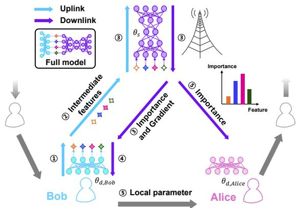  
Fig. 1. System model of proposed framework with the numbered stages.

where $f _ { d } ( \mathbf { \nabla } \cdot \mathbf { \nabla } ; \theta _ { d , k } )$ and $f _ { s } ( \mathbf { \nabla } \cdot \mathbf { \nabla } ; \theta _ { s , k } )$ representing the clientside feature extraction and server-side classification mapping parameterized by the parameters $\theta _ { d , k }$ and $\theta _ { s , k }$ , respectively. The global objective function is formulated as $\begin{array} { r l } { F ( \theta ) } & { { } = } \end{array}$ $\begin{array} { r } { \sum _ { k \in \mathcal { K } } \frac { | \mathcal { D } _ { k } | } { | \mathcal { D } | } F _ { k } ( \bar { \theta } _ { k } ) } \end{array}$

Fig. 1 represents our system model with the numbered stages described below. The SL protocol is executed over $T$ communication rounds. The client and the server update $\theta _ { k } ^ { t , 0 }$ using the client’s dataset $\mathcal { D } _ { k }$ by employing a mini-batch stochastic gradient descent (SGD) algorithm. The update rule is therefore

$$
\boldsymbol { \theta } _ { k } ^ { t , e + 1 } = \boldsymbol { \theta } _ { k } ^ { t , e } - \eta ^ { t } \nabla F _ { k } ^ { t , e } ( \boldsymbol { \theta } _ { k } ^ { t , e } ) ,\tag{2}
$$

where $e \in \{ 0 , \ldots , E - 1 \}$ is the index of local step given the total local steps E, and $\eta ^ { t }$ denotes the learning rate at global iteration t. Here, $\nabla F _ { k } ^ { t , e } ( \theta _ { k } ^ { t , e } )$ denotes the stochastic gradient with respect to the complete parameters $\theta _ { k } ^ { t , \epsilon }$ . We use an explicit subscript when referring to the gradient with respect to a specific component. In each iteration t at local step $e ,$ for every client $k \in \mathcal { K }$ , the following stages are carried out:

1) Client-side Feature Extraction: Client k draws a random mini-batch $B _ { k } ^ { t , e } ~ \subset ~ { \mathcal { D } } _ { k }$ of size B. Let $x _ { k } ^ { t , e } ~ =$ $\{ x _ { k , b } ^ { t , e } \} _ { b = 1 } ^ { B }$ be the input data in the mini-batch $\vec { B _ { k } ^ { t , e } }$ of client k at iteration t and local step e. Then, the minibatch is processed by the local feature extractor $f _ { \underline { { d } } }$ to produce intermediate features $\boldsymbol { z } _ { k } ^ { t , e } = \left[ z _ { k , 1 } ^ { t , e } , \ldots , z _ { k , B } ^ { t , e } \right] ^ { \intercal } \in$ $\mathbf { \mathbb { R } } ^ { B \times C \times U \times V }$ , where C denotes the number of feature channels and $U \times V$ are the layer dimensions. This step can be expressed as $z _ { k } ^ { t , e } = f _ { d } ( \dot { x } _ { k } ^ { t , e } ; \theta _ { d , k } ^ { t , e } )$

2) Uplink Transmission: The intermediate feature $z _ { k } ^ { t , e }$ together with its corresponding labels, is transmitted to the server over the wireless uplink. Prior to transmission, client k applies sparsification to $z _ { k } ^ { t , e }$ by the proposed ICS in accordance with the uplink capacity constraints, as described in Section III later, such that the received signal can be treated as effectively noise-free.

3) Server-side Computation: Upon reception, the server completes the forward pass by computing

$$
\hat { y } _ { k } ^ { t , e } = f _ { s } ( z _ { k } ^ { t , e } ; \theta _ { s , k } ^ { t , e } ) \in \mathbb { R } ^ { B \times L } .\tag{3}
$$

The server evaluates the per-sample loss $\begin{array} { r l r } { \mathcal { L } _ { v e c } ( \hat { y } _ { k } ^ { t , e } , y _ { k } ^ { t , e } ) } & { { } \in } & { \mathbb { R } ^ { B } } \end{array}$ using the true labels $y _ { k } ^ { t , e } ~ \in ~ \mathbb { R } ^ { B \times L }$ . Then, the server computes the minibatch loss $F _ { k } ( \theta _ { k } ^ { t , e } )$ by averaging loss vector, i.e., $\begin{array} { r } { F _ { k } ( \boldsymbol { \theta } _ { k } ^ { t , e } ) = \frac { 1 } { B } \sum _ { b = 1 } ^ { B } \mathcal { L } _ { v e c , b } \in \mathbb { R } } \end{array}$ . The server updates the model as

$$
\theta _ { s , k } ^ { t , e + 1 } = \theta _ { s , k } ^ { t , e } - \eta ^ { t } \nabla _ { \theta _ { s , k } ^ { t , e } } F _ { k } ( \theta _ { k } ^ { t , e } )\tag{4}
$$

by performing a mini-batch SGD. The server transmits the gradient with respect to the received activation $\begin{array} { r } { \nabla _ { z _ { k } ^ { t , e } } F _ { k } ( \bar { \theta } _ { k } ^ { t , e } ) ~ = ~ \frac { \partial F _ { k } ( \theta _ { k } ^ { t , e } ) } { \partial z _ { \iota . } ^ { t , e } } ~ \in ~ \mathbb { R } ^ { B \times C \times U \times V } } \end{array}$ and importance vector $I _ { k } ^ { t , e + 1 }$ , described in Section III later, to client $k .$

4) Client Update: Client k uses the returned gradient $\nabla _ { z _ { k } ^ { t , e } } F _ { k } ( \bar { \theta _ { k } ^ { t , e } } )$ to perform a local parameter update, producing new local parameters $\theta _ { d , k } ^ { t , e + 1 }$ via

$$
\boldsymbol { \theta } _ { d , k } ^ { t , e + 1 } = \boldsymbol { \theta } _ { d , k } ^ { t , e } - \eta ^ { t } \nabla _ { \boldsymbol { \theta } _ { d , k } ^ { t , e } } F _ { k } ( \boldsymbol { \theta } _ { k } ^ { t , e } ) ,\tag{5}
$$

where $\begin{array} { r } { \nabla _ { \theta _ { d , k } ^ { t } } F _ { k } ( \theta _ { k } ^ { t , e } ) = \left( \frac { \partial z _ { k } ^ { t , e } } { \partial \theta _ { d , k } ^ { t , e } } \right) ^ { \top } \nabla _ { z _ { k } ^ { t , e } } F _ { k } ( \theta _ { k } ^ { t , e } ) } \end{array}$ . After the updates, if $e < E - \mathrm { i }$ , the client k and the server repeat the stages 1-4. For $e = E - 1$ , the client k and the server perform the stage 5.

5) Transmission of Local Parameters and Importance: After completing the local updates, client k transmits the updated local parameters $\theta _ { d , k } ^ { t , \dot { E } }$ to client $k + 1$ . Separately, the server transmits importance vector to client $k + 1$ for use in the next iteration. When the model is updated by the last client $K - 1$ , the updated local parameters are transmitted to client $k = 0$ , becoming $\theta _ { d , 0 } ^ { t + 1 , 0 }$ , while the server also forwards the corresponding importance vector to client 0.

After these T iterations, the training process concludes.

## III. IMPORTANCE-AWARE CLASS- BALANCED FEATURE SPARSIFICATION

## A. Conventional Grad-CAM for Model Interpretability

Grad-CAM is a gradient-based attribution method that identifies which regions of an input image most strongly influence a model’s prediction. It works by backpropagating the gradients of a target class score into a chosen intermediate convolutional layer and computing importance weights for each feature channel. These weights are then combined with the corresponding activation maps to generate a coarse localization map that highlights the image regions most relevant to the decision. Since Grad-CAM is applied to a fixed, pretrained model, it assumes that the model parameters are already converged and thus measures the contribution of intermediate features to the final output without considering ongoing learning iterations.

The following procedure describes how Grad-CAM evaluates the relevance of a particular intermediate feature. Because the method is applied post-hoc to a pre-trained network, the training iteration index is omitted.

1) Feature Extraction: During the forward propagation, let $A _ { c } \in \mathbb { R } ^ { U \times V }$ denote the layer feature map corresponding to the c-th feature channel of a selected intermediate layer, with $c \in \{ 1 , \ldots , C \}$ . Here, U and $V$ are the layer dimensions. Each feature channel encodes different semantic components of the input.

2) Gradient Calculation: For a target class $\ell ,$ compute the partial derivatives of the predicted score $\hat { y } _ { \ell }$ with respect to each feature map:

$$
\frac { \partial \hat { y } _ { \ell } } { \partial A _ { c } } \in \mathbb { R } ^ { U \times V } .\tag{6}
$$

These gradients quantify how changes in each feature map affect the predicted score for class ℓ. Since each feature channel in CNN models captures different characteristics of the input in the training process, the gradients reflect the sensitivity of the class score to these distinct features, thereby indicating their relative importance.

3) Feature Channel-wise Importance Weighting: Aggregate the layer gradient information to produce a single importance coefficient for each feature channel:

$$
\alpha _ { c , \ell } = \frac { 1 } { U V } \sum _ { u = 1 } ^ { U } \sum _ { v = 1 } ^ { V } \frac { \partial \hat { y } _ { \ell } } { \partial A _ { c } ( u , v ) } .\tag{7}
$$

The scalar $\alpha _ { c , \ell }$ represents the overall contribution of feature channel c to the class score $\hat { y } _ { \ell }$

4) Saliency Map Generation: The class-discriminative localization map, $P _ { \ell } ~ \in ~ \mathbb { R } ^ { U \times V }$ , is first computed as a weighted linear combination of the feature maps $A _ { c }$ using their corresponding weights $\alpha _ { c , \ell } \colon$

$$
P _ { \ell } = \sum _ { c = 1 } ^ { C } \alpha _ { c , \ell } A _ { c } .\tag{8}
$$

To produce the final saliency map and focus only on features that have a positive influence on the prediction, a ReLU activation is applied:

$$
H _ { \ell } = \mathop { \mathrm { R e L U } } \left( P _ { \ell } \right) .\tag{9}
$$

The resulting $H _ { \ell }$ is the saliency map used for visualization, highlighting the specific image regions that positively contributed to the prediction for class ℓ.

In section VI, these saliency maps are employed to validate the efficacy of our proposed framework.

## B. Importance-Aware Class-Balanced Sparsification

The intermediate feature outputs transmitted from clients to the server are typically high-dimensional, driving substantial communication cost. A naive remedy to reduce communication burden is to select top feature elements by magnitude, since large features often dominate the output. However, although high-magnitude features can significantly influence the overall output, they do not necessarily capture the performance-critical aspects. This is because the overall output reflects contributions from both the true label and non-target labels, meaning that high-magnitude features might include features unrelated to the true label, whereas low-magnitude features might include crucial features related to the true label.

To address this, we take inspiration from Grad-CAM, which explicitly measures the contribution of intermediate feature channels to the score of the true class. By leveraging such class-specific importance information, we can more reliably identify and preserve the feature components that are most critical for correct prediction. In standard usage, Grad-CAM is computed post-hoc by performing a full forward and backward pass through both client-side and server-side models to obtain gradients with respect to the intermediate features. However, in SL, the client only executes its forward pass before transmission and thus cannot compute the real-time Grad-CAM weights prior to sending intermediate features.

Algorithm 1 Proposed ICS SL framework   
Input: Clients $\overline { { K = \{ 0 , \ldots , K - 1 \} } }$ , rounds T, batch size B,   
ratio R, momentum β, learning rate $\eta ^ { t }$   
1: Initialize $\theta _ { d , 0 } ^ { 0 } , \theta _ { s , 0 } ^ { 0 } , M _ { k , \ell } ^ { 0 }  0 \stackrel { \cdot } { \in } \mathbb { R } ^ { C } , \forall k , \ell ;$   
2: for $t = 0$ to $T - 1$ do   
3: for $k = 0$ to $K - 1$ do   
AT THE CLIENT-SIDE   
4: Draw $B _ { k } ^ { t }$ of size B   
5: Obtain intermediate feature as $z _ { k } ^ { t } \gets f _ { d } ( x _ { k } ^ { t } ; \theta _ { d , k } ^ { t } )$   
6: Sparsify $z _ { k } ^ { t }$ using (10)   
7: Transmit $( \tilde { z } _ { k } ^ { t } , y _ { k } ^ { t } )$ to server   
AT THE SERVER-SIDE   
8: Obtain logit as $\hat { y } _ { k } ^ { t } \gets f _ { s } ( \tilde { z } _ { k } ^ { t } ; \theta _ { s , k } ^ { t } )$   
9: Obtain $\nabla _ { \tilde { z } _ { k } ^ { t } } F _ { k } ( \theta _ { k } ^ { i } )$ using (12)   
10: Update server-side parameters as   
$\theta _ { s , k + 1 } ^ { t }  \theta _ { s , k } ^ { t } - \mathsf { \bar { \eta } } ^ { t } \nabla _ { \theta _ { s , k } ^ { t } } F _ { k } ( \theta _ { k } ^ { t } )$   
11: for $b = 1$ to B do   
12: Update $\zeta _ { k + 1 , b } ^ { t }$ using (13)   
13: end for   
14: for $\ell = 1$ to $L$ do   
15: Update $\zeta _ { k + 1 , \ell } ^ { t }$ using (14)   
16: Update $M _ { k + 1 , \ell } ^ { t }$ using (15)   
17: end for   
18: Obtain $I _ { k + 1 } ^ { t }$ through (16)   
19: Transmit $\dot { \nabla } _ { \tilde { z } _ { k } ^ { t } } F _ { k } ( \theta _ { k } ^ { t } )$ to client k   
20: if $k + 1 \leq \tilde { K } - 1$ then   
21: Transmit $I _ { k + 1 } ^ { t }$ to client $k + 1$   
22: else   
23: Transmit $I _ { k + 1 } ^ { t }$ to client 0   
24: end if   
AT THE CLIENT-SIDE   
25: Update client-side parameters as   
$\begin{array} { r } { \dot { \theta } _ { d , k + 1 } ^ { t }  \dot { \eta } ^ { t } \nabla _ { \theta _ { d , k } ^ { t } } F _ { k } ( \theta _ { k } ^ { t } ) } \end{array}$   
26: if $k + \dot { 1 } \le K - 1$ then   
27: Send $\theta _ { d , k + 1 } ^ { t }$ to client $k + 1$   
28: else   
29: Send $\theta _ { d , k + 1 } ^ { t }$ to client 0   
30: end if   
31: end for   
32: end for

To circumvent this, we propose using the importance scores from the previous communication round as a proxy for the current round. In the following description, the numbers in bold parentheses (Line ·) indicate the corresponding line numbers in Algorithm 1. As described in Section II, client k first draws a mini-batch and obtains the intermediate feature $z _ { k } ^ { t 1 }$ through client-side feature extraction (Lines 4–5). Before transmission, client k uses the importance vector $I _ { k } ^ { t } \in \mathbb { R } ^ { C }$ received from the previous communication round. The client then applies a sparsification operator $\boldsymbol { \mathcal { S } } ( \cdot )$ that, for each sample $b ,$ ranks the entries of $z _ { k , b } ^ { t }$ by leveraging the feature channellevel scores in $I _ { k } ^ { t }$ and selects the top-N elements (Line 6). The sparsification ratio is defined as $\textstyle R = { \frac { N } { C } }$ . The resulting transmitted intermediate feature is

$$
\tilde { z } _ { k } ^ { t } = S ( z _ { k } ^ { t } ; I _ { k } ^ { t } ) \in \mathbb { R } ^ { B \times C \times U \times V } ,\tag{10}
$$

where $s$ preserves only N feature channel entries according to the importance-weighted ranking and zeroes out the rest.

The client then transmits the sparsified intermediate feature $\tilde { z } _ { k } ^ { t }$ to the server (Line 7). Upon receiving it, the server completes the forward pass and obtains $\hat { y } _ { k } ^ { t }$ by processing $\tilde { z } _ { k } ^ { t }$ through its subsequent layers, parameterized by $\theta _ { s , k } ^ { t } ,$ to generate the output logits (Line 8). Let $\hat { y } _ { k , b , \ell } ^ { t }$ denote the logit for class ℓ corresponding to the b-th sample in the mini-batch of client k at iteration t.

To train the model, the server computes a loss function using cross-entropy by comparing the predicted logits with the ground-truth labels:

$$
\mathcal { L } ( \hat { y } _ { k , b } ^ { t } , y _ { k , b } ^ { t } ) = - \sum _ { \ell = 1 } ^ { L } y _ { k , b , \ell } ^ { t } \log \left( \frac { \exp ( \hat { y } _ { k , b , \ell } ^ { t } ) } { \sum _ { j = 1 } ^ { L } \exp ( \hat { y } _ { k , b , j } ^ { t } ) } \right)\tag{11}
$$

During backpropagation, the gradient of the loss with respect to the intermediate feature is computed using the chain rule. For the gradient of mini-batch sample $\boldsymbol { x } _ { k , b } ^ { t }$ in $\tilde { z } _ { k , b } ^ { t } ,$ denoted as $\frac { \partial F _ { k } ( \theta _ { k } ^ { t } ) } { \partial \tilde { z } _ { k , b } ^ { t } }$ , we have (Line 9)

$$
\frac { \partial F _ { k } ( \theta _ { k } ^ { t } ) } { \partial \tilde { z } _ { k , b } ^ { t } } = \frac { 1 } { B } \sum _ { \ell = 1 } ^ { L } \frac { \partial \mathcal { L } } { \partial \hat { y } _ { k , b , \ell } ^ { t } } \frac { \partial \hat { y } _ { k , b , \ell } ^ { t } } { \partial \tilde { z } _ { k , b } ^ { t } } .\tag{12}
$$

Then, the server updates the model by performing a minibatch SGD (Line 10). In this formulation, $\frac { \partial \hat { y } _ { k , b , \ell } ^ { t } } { \partial \tilde { z } _ { k , b } ^ { t } } \in \overline { { \mathbb { R } } } ^ { C \times U \times V }$ is equivalent to calculating the Grad-CAM over C feature channels, which quantifies the sensitivity of the logit for class ℓ at the layer information $( u , v )$ of sample b.

To derive a label-specific importance measure for each feature channel, the computed gradients are aggregated over the layer dimensions (Lines 11–13):

$$
\zeta _ { k + 1 , b } ^ { t } = \frac { 1 } { W } \sum _ { u = 1 } ^ { U } \sum _ { v = 1 } ^ { V } \frac { \partial \hat { y } _ { k , b , \ell _ { b } } ^ { t } } { \partial \tilde { z } _ { k , b } ^ { t } ( u , v ) } \in \mathbb { R } ^ { C } ,\tag{13}
$$

where $\hat { y } _ { k , b , \ell _ { b } } ^ { t }$ denotes the logit corresponding to the true class $\ell _ { b }$ for the b-th sample of client k at time t. $W = U \times V$ is the normalization factor, and U and V denote the layer dimensions of $\tilde { z } _ { k } ^ { t }$ . This aggregation yields a feature channelwise importance score that reflects the contribution of each feature channel to the prediction of the true class.

As the unified importance vector aims to capture intermediate feature channels that are universally significant across all labels, it is ideally computed under an i.i.d. assumption regarding class distributions. However, the data held by clients in SL environments typically exhibit non-i.i.d. characteristics, leading to potentially biased estimations if naively averaged across samples.

To address this challenge, we first compute the classspecific importance vectors by averaging per-sample importance vectors obtained in (13) over the corresponding subsets of samples belonging to each label. Formally, for client k at iteration t, we define the subset of samples with label ℓ as $\boldsymbol { B _ { k , \ell } ^ { t } } ~ = ~ \{ \boldsymbol { x } _ { k , b } ^ { t } ~ \vert ~ \boldsymbol { y } _ { k , b , \ell } ^ { t } ~ = ~ 1 \}$ and compute the class-specific importance vector $\zeta _ { k + 1 , \ell } ^ { t } \in \mathbb { R } ^ { C }$ as (Line 15)

$$
\zeta _ { k + 1 , \ell } ^ { t } = \frac { 1 } { B _ { k , \ell } ^ { t } } \sum _ { b \in B _ { k , \ell } ^ { t } } \zeta _ { k + 1 , b } ^ { t } ,\tag{14}
$$

where $B _ { k , \ell } ^ { t } = | B _ { k , \ell } ^ { t } |$ . To ensure temporal stability and mitigate abrupt changes between consecutive iterations, we maintain an exponential moving average (EMA) memory, denoted as $M _ { k . \ell } ^ { t } \in \mathbb { R } ^ { C }$ , for each client k and label ℓ. The EMA memory is updated using a momentum coefficient $\beta \in ( 0 , 1 )$ as follows (Line 16):

$$
\begin{array} { r } { M _ { k + 1 , \ell } ^ { t } = \beta M _ { k , \ell } ^ { t } + ( 1 - \beta ) \zeta _ { k + 1 , \ell } ^ { t } , } \end{array}\tag{15}
$$

where M is initialized with 0 at the beginning.

Finally, the importance vector is the uniform average of the current EMA memories across all classes (Line 18):

$$
I _ { k + 1 } ^ { t } = \frac { 1 } { | \mathcal { P } _ { k + 1 } ^ { t } | } \sum _ { \ell \in \mathcal { P } _ { k + 1 } ^ { t } } M _ { k + 1 , \ell } ^ { t } ,\tag{16}
$$

where $\mathcal { P } _ { k + 1 } ^ { t } = \{ \ell \mid M _ { k + 1 , \ell } ^ { t } \neq 0 \}$ . This averaging scheme balances potential class imbalance inherent in non-i.i.d. settings by assigning equal weight to every class that has contributed at least once to the feature channel importance scores. After computing the aggregated importance vector $I _ { k + 1 } ^ { t }$ , the server returns the activation gradient $\nabla _ { \tilde { z } _ { k } ^ { t } } F _ { k } ( \theta _ { k } ^ { t } )$ to client k for clientside backpropagation and forwards $I _ { k + 1 } ^ { t }$ to client $k + 1$ for the next training step (Lines 19–21). Note that when the model is updated by the last client $K - 1$ , the server forwards $I _ { 0 } ^ { t + 1 }$ to client 0 for the next iteration (Line 23). Meanwhile, client k uses the returned activation gradient $\nabla _ { \tilde { z } _ { k } ^ { t } } F _ { k } ( \theta _ { k } ^ { t } )$ to update the client-side model parameters, resulting in $\theta _ { d , k + 1 } ^ { t }$ (Line 25). After the client-side update, the updated client-side model parameters are forwarded to the next client in the sequential order, or to client 0 if $k = K - 1$ (Lines 26–30). Fig. 1 provides an overall framework of our proposed scheme.

Remark 1. Although ICS is described above using CNN intermediate features of shape $\mathbb { R } ^ { B \times C \times U \times V }$ , its importance estimation does not particularly rely on convolution-specific operation. It requires only the gradient of the true-class logit with respect to the intermediate feature, aggregated over the non-feature axes to obtain a feature-wise importance score. Hence, ICS applies to any architecture in which a sparsifiable feature dimension can be identified and the remaining axes can be pooled. For a transformer-based model with a token embedding tensor $z \in \mathbb { R } ^ { B \times \dot { d } _ { T O K } \times d _ { E M B } }$ , the embedding dimension plays the role of the CNN feature channel and the importance is aggregated over the token axis, as empirically validated in Section VI.

TABLE IV  
RUNTIME COMPARISON OF COMMUNICATION-EFFICIENT SL METHODS.
<table><tr><td>Method</td><td>Client-side sparsification (msec/batch)</td><td>Server-side additional runtime (msec/batch)</td></tr><tr><td>RS</td><td>0.4133</td><td>0.0</td></tr><tr><td>TS</td><td>0.5099</td><td>0.0</td></tr><tr><td>RTS</td><td>0.5357</td><td>0.0</td></tr><tr><td>FedLite</td><td>31.7882</td><td>0.0</td></tr><tr><td>SplitFC</td><td>0.8106</td><td>0.0</td></tr><tr><td>ICS</td><td>0.0928</td><td>6.1702 (effectively 0.0)</td></tr></table>

## IV. THEORETICAL ANALYSIS

## A. Communication Overhead Analysis

We first analyze the uplink overhead, since reducing clientside communication burden is particularly important in wireless SL. In conventional SL, each client transmits the full intermediate feature $z _ { k } ^ { t } \in \mathbb { R } ^ { B \times C \times U \times V }$ , yielding a per-client uplink overhead of O(BCUV). With the sparsification ratio $\begin{array} { r } { \dot { R } = \frac { N } { C } } \end{array}$ , transmitting only N out of C feature channels reduces this to $\mathcal { O } ( B R C U V )$ .

For communication-efficient SL methods whose selection pattern is determined at the client side [17], [20], [23], the server cannot infer the retained channels from the received features alone. Hence, additional mask index information must be transmitted. Since the sparsification pattern differs across samples, the index overhead scales with the mini-batch size, yielding $\mathcal { O } ( B R C U V + B R C \log C )$ . For SplitFC [18], the selection is made over the CUV feature positions rather than the feature channels, so its index is generated over CUV positions, yielding $\mathcal { O } ( B R C U V + R C U V \log ( C U V ) )$ . FedLite [19] instead transmits a codebook together with the codeword indices of the clustered sub-vectors. With Q centroids and $n _ { s u b }$ sub-vectors per sample, the codebook requires $\mathcal { O } ( Q d _ { s u b } )$ and the per-sample indices require $\mathcal { O } ( B n _ { s u b } \log Q )$ , yielding a per-client uplink overhead of $\mathcal { O } ( Q d _ { s u b } + B n _ { s u b } \log Q )$ , where $d _ { s u b }$ is the sub-vector dimension.

In contrast, ICS uses the server-generated importance vector $I _ { k } ^ { t } \in \mathbb { R } ^ { C }$ , which is shared with the client before sparsification. Since the client selects the retained elements using a deterministic top-N rule based on $I _ { k } ^ { t } ,$ , the server can infer the retained elements directly from $I _ { k } ^ { t } .$ Thus, under the same sparsification ratio, ICS achieves a per-client uplink overhead of O(BRCUV) without transmitting any additional mask index information.

## B. Computational Complexity Analysis

All methods share the same vanilla SL forward and backward pass on the client-side and server-side, whose costs are denoted by $\mathcal { C } _ { d }$ and ${ \mathcal { C } } _ { s } ,$ respectively. Thus, we omit them and focus on the additional preprocessing for feature selection, which consists of 1) computing the selection scores; 2) selecting the retained features. The gathering of selected features into the retained tensor is also omitted as common to all methods.

RS [20] randomly generates the mask without accessing the feature values, requiring only O(C) to select N out of C feature channels. TS [17] and RTS [23] scan the intermediate feature at a cost of O(BCUV ), then rank the per-channel scores for each sample, yielding $\mathcal { O } ( B C U V + B C \log C )$ SplitFC [18] computes feature-vector-wise statistics at a cost of $\mathcal { O } ( B C U V )$ and then selects over the CUV feature elements, yielding $\mathcal { O } ( B C U V + C U V \log ( C U V ) )$ . Since its selection is made over feature elements rather than feature channels, its selection cost scales with CUV rather than $C ,$ making it heavier than the feature channel-wise methods. FedLite [19] applies K-means clustering to the intermediate feature, comparing every sub-vector against $Q$ centroids over J iterations, yielding $\mathcal { O } ( Q J B C U V )$ . Its iterative clustering thus makes it the most expensive, exceeding the selectionbased methods by a factor $( Q J )$

In contrast, ICS applies a deterministic top-N rule to the length-C importance vector $I _ { k } ^ { t } ,$ , so its additional clientside cost is only $\mathcal { O } ( C )$ , far below the $\mathcal { O } ( B C U V )$ scan of the other methods. Although this matches the order of RS, ICS is even lighter in practice, since the client only reads the server-generated vector $I _ { k } ^ { t }$ without generating a mask from the features. The importance computation is instead shifted to the server, which reuses the forward-pass logits to compute the importance measure at a cost $\mathcal { C } _ { I M }$ . While this estimation is performed sequentially after the serverside update in our implementation, this estimation does not depend on the updated parameters and can thus be run in parallel with the update. Since it backpropagates only the trueclass logit to the intermediate feature, it traverses a strictly shorter path than the full-loss backward of the update. The subsequent spatial pooling, class-wise averaging, and EMA updates operate only on the $C$ feature channels and incur minimal computational overhead, making their cost negligible compared with that of the neural network. The importance estimation is therefore completed within the update and fully hidden behind it, reducing its effective additional runtime to zero. This allocation aligns with the SL principle, keeping the resource-constrained client nearly free of selection overhead while delegating the heavier importance computation to the resourceful server.

To complement this analysis, we measure the actual runtime overhead of each method under the setting in Section VI. Table IV reports the per-batch client- and server-side overhead, excluding the common forward and backward computations so that only the method-specific cost is compared.

## C. Convergence Analysis

For theoretical derivation, we make the following assumptions typically made in analyzing the distributed learning family [29]–[31].

Assumption 1. Let $\mathcal { S } : \mathbb { R } ^ { C }  \mathbb { R } ^ { C }$ be a proposed sparsification operator and N be the number of non-zero elements satisfying $0 < N < C .$ . Then, for all $x \in \mathbb { R } ^ { C } , s$ is an unbiased operator and its variance satisfies E $[ \| S ( x ) - x \| _ { 2 } ^ { 2 } ] \ \leq$ $\left( 1 - { \frac { N } { C } } \right) \left\| x \right\| _ { 2 } ^ { 2 }$

Assumption 2. For all θ, the local objective function $F _ { k } ( \theta )$ is S-smooth, i.e., $\| \nabla F _ { k } ( \theta ) - \nabla F _ { k } ( \theta ^ { \prime } ) \| _ { 2 } \le S \| \theta - \theta ^ { \prime } \| _ { 2 }$ , thereby $\begin{array} { r } { F _ { k } ( { \boldsymbol { \theta } } ^ { \prime } ) ~ \leq ~ F _ { k } ( { \boldsymbol { \theta } } ) + \nabla F _ { k } ( { \boldsymbol { \theta } } ) ^ { \intercal } ( { \boldsymbol { \theta } } ^ { \prime } - { \boldsymbol { \theta } } ) + \frac { S } { 2 } \| { \boldsymbol { \theta } } ^ { \prime } - { \boldsymbol { \theta } } \| _ { 2 } ^ { 2 } } \end{array}$ , where $\nabla F _ { k } ( \theta _ { k } ) ~ = ~ [ \nabla _ { \theta _ { d } } F _ { k } ( \theta _ { k } ) \| \nabla _ { \theta _ { s } } F _ { k } ( \theta _ { k } ) ]$ . The global objective function $F ( \theta )$ , being the average of the local objectives, is then also S-smooth, and lower bounded as $F ( \theta ) \geq F ( \theta ^ { * } )$ ∀θ.

Assumption 3. The stochastic gradient at each client is unbiased such as $\mathbb { E } [ \nabla F _ { k } ( \boldsymbol { B } _ { k } ^ { e } ; \boldsymbol { \theta } ) ] = \nabla F _ { k } ( \boldsymbol { \theta } )$ and its variance is bounded as $\begin{array} { r } { \mathbb { E } [ \| \nabla F _ { k } ( \boldsymbol { B } _ { k } ^ { e } ; \boldsymbol { \theta } ) - \nabla F _ { k } ( \boldsymbol { \theta } ) \| _ { 2 } ^ { 2 } ] \le \frac { \sigma ^ { 2 } } { B } } \end{array}$ for all θ, client k and local steps e with a constant $\sigma ^ { 2 } > 0 .$

Assumption 4. There exists a constant $\psi ^ { 2 }$ such that $\begin{array} { r } { \frac { 1 } { K } \sum _ { k = 0 } ^ { K ^ { - 1 } } \| \nabla F _ { k } ( \theta ) - \nabla F ( \theta ) \| _ { 2 } ^ { 2 } \leq \psi ^ { 2 } } \end{array}$

Assumption 5. The expected squared norm of the gradient and intermediate feature at each client are upper bounded as $\mathbb { E } [ \| \nabla F _ { k } ( \theta _ { k } ^ { e } ) \| _ { 2 } ^ { 2 } ] \le G ^ { 2 }$ and $\mathbb { E } [ \| z _ { k , b } ^ { e } \| _ { 2 } ^ { 2 } ] \le \delta ^ { 2 }$ for all client $k ,$ local steps e, sample b, respectively.

Theorem 1. Under Assumptions 1, 2, 3, 4, 5 and given the sparsification ratio $\begin{array} { r } { R = \frac { N } { C } , } \end{array}$ , proposed SL with learning rate $\begin{array} { r } { \eta ^ { t } = \frac { 1 } { K E \sqrt { T } } } \end{array}$ has a convergence rate as below:

$$
\begin{array} { r l } & { \mathbb { E } \left[ \displaystyle \frac { 1 } { T } \sum _ { t = 0 } ^ { T - 1 } \| \nabla F ( \theta ^ { t } ) \| _ { 2 } ^ { 2 } \right] \leq \frac { 2 } { \sqrt { T } } \mathbb { E } [ F ( \theta ^ { 0 } ) - F ( \theta ^ { * } ) ] + 2 \psi ^ { 2 } } \\ & { + \displaystyle \frac { 2 S ^ { 2 } } { 3 T } \left( \frac { \sigma ^ { 2 } } { B } + G ^ { 2 } \right) + \frac { 2 S } { \sqrt { T } } \left( \frac { \sigma ^ { 2 } } { B } + G ^ { 2 } + \Lambda ^ { 2 } \left( 1 - R \right) B \delta ^ { 2 } \right) , } \end{array}
$$

where $\Lambda ^ { 2 } = \Lambda _ { 0 } ^ { 2 } ( \Lambda _ { 1 } ^ { 2 } + \Lambda _ { 2 } ^ { 2 } \Lambda _ { 3 } ^ { 2 } )$ . Here, $\Lambda _ { 0 } , \ \Lambda _ { 1 } , \ \Lambda _ { 2 }$ and $\Lambda _ { 3 }$ are spectral norm upper-bound $\begin{array} { r } { o f \frac { \partial \mathcal { L } } { \partial \hat { y } _ { k , b } ^ { t , e } } , \frac { \partial ^ { 2 } \hat { y } _ { k , b , \ell } ^ { t , e } } { \partial z _ { k } ^ { t , e } \partial \theta _ { s , k } ^ { t , e } } , \frac { \partial ^ { 2 } \hat { y } _ { k , b , \ell } ^ { t , e } } { \partial \left( z _ { k } ^ { t , e } \right) ^ { 2 } } } \end{array}$ and $\frac { \partial z _ { k } ^ { t , e } } { \partial \theta _ { d , k } ^ { t , e } } ~ \forall k , t , \ell ,$ respectively.

Proof: See Appendix A.

The bound yields two practical insights. First, as in FL, client data heterogeneity directly limits convergence. In particular, the term $2 \psi ^ { 2 }$ does not vanish with T. Second, unlike ${ \mathrm { F L } } ,$ the uplink overhead in SL scales with the mini-batch size B because each round transmits B intermediate features. Under a fixed communication budget, increasing B reduces the stochastic gradient variance $\frac { \sigma ^ { 2 } } { B }$ but forces a lower sparsification ratio $R ,$ which increases the sparsification error term $\Lambda ^ { 2 } ( 1 - R ) B \delta ^ { 2 }$ . Hence, a larger B is not always better in $\mathrm { S L }$ and choosing B carefully is crucial. Empirical evidence for this trade-off appears in Section VI.

Remark 2. Our convergence analysis is established under mini-batch SGD, where the effect of sparsification enters through a single gradient-variance term. Adaptive optimizers such as Adam introduce additional moment-based dynamics, which require a different technical treatment and therefore fall outside the scope of our SGD-focused analysis. However, importantly, this does not affect the main insight: the variance–sparsification tradeoff identified in our analysis is optimizer-independent and also arises when Adam is used, because any sparsification-induced deviation in the stochastic gradient propagates through the update rule regardless of how the optimizer normalizes it. Moreover, the proposed sparsification mechanism is fully compatible with adaptive optimizers, as it operates directly on intermediatefeature tensors and does not depend on optimizer-specific structures.

## V. EXTENSION TO PARALLEL SPLIT LEARNING

The system model in Section II considers the standard sequential SL protocol, where clients communicate with the server one at a time. In this setting, the importance vector computed at the server after processing client k is transmitted to the next client k+1 and used for sparsifying its intermediate features. However, this sequential importance-forwarding rule is not directly applicable to PSL, where multiple clients upload their intermediate features to the server within the same communication round. In this section, we extend the proposed ICS framework to PSL. The main difference lies in how the importance vector is constructed and shared. Instead of maintaining a client-wise importance vector that follows the sequential client order, the server maintains a shared iteration-wise importance vector $I ^ { t } \in \mathbb { R } ^ { C }$ , computed by aggregating Grad-CAM-based importance scores over the mini-batches of all participating clients. This shared vector is then broadcast to all clients and used for sparsification in the next communication round.

Each client $k \in \mathcal { K }$ draws a mini-batch $B _ { k } ^ { t }$ of size B at iteration t and computes the intermediate feature as $z _ { k } ^ { t } \ =$ $f _ { d } ( x _ { k } ^ { t } ; \theta _ { d , k } ^ { t } ) ~ \in ~ \mathbb { R } ^ { B \times C \times U \times V }$ . Using the shared importance vector received from the previous round $I ^ { t } \in \mathbb { R } ^ { C }$ , client k sparsifies its intermediate feature as

$$
\tilde { z } _ { k } ^ { t } = S ( z _ { k } ^ { t } ; I ^ { t } ) \in \mathbb { R } ^ { B \times C \times U \times V } ,\tag{17}
$$

where $\boldsymbol { \mathcal { S } } ( \cdot )$ is the sparsification operator defined in ${ \mathrm { S e c } } -$ tion III-B. The sparsified intermediate feature $\tilde { z } _ { k } ^ { t }$ and the corresponding labels are then transmitted to the server.

Upon receiving the sparsified intermediate features from all participating clients, the server completes the forward pass for each client as

$$
\begin{array} { r } { \hat { y } _ { k } ^ { t } = f _ { s } ( \tilde { z } _ { k } ^ { t } ; \theta _ { s } ^ { t } ) \in \mathbb { R } ^ { B \times L } . } \end{array}\tag{18}
$$

Using the same loss function in (11), the server computes the client-wise loss $\mathcal { L } ( \hat { y } _ { k , b } ^ { t } , y _ { k , b } ^ { t } )$ , from which it obtains the server-side gradient $\nabla _ { \theta _ { s . k } ^ { t } } F _ { k } ( \theta _ { k } ^ { t } )$ and the activation gradient $\nabla _ { \tilde { z } _ { k } ^ { t } } F _ { k } ( \theta _ { k } ^ { t } )$ . The server-side gradients are aggregated to update the server-side model as

$$
\boldsymbol { \theta } _ { s } ^ { t + 1 } = \boldsymbol { \theta } _ { s } ^ { t } - \eta ^ { t } \frac { 1 } { K } \sum _ { k \in \mathcal { K } } \nabla _ { \theta _ { s } ^ { t } } \boldsymbol { F } _ { k } ( \boldsymbol { \theta } _ { k } ^ { t } ) .\tag{19}
$$

The server also updates the shared importance vector for the next iteration $t + 1$ . Unlike the sequential SL setting, where class-specific importance is updated from the mini-batch of a single client, PSL allows the server to update class-specific importance using the mini-batches of all participating clients. Following the notation in Section III-B, $B _ { k , \ell } ^ { t }$ denotes the subset of samples with label ℓ in the mini-batch of client $k .$ . Then, the total number of samples with label ℓ across the participating clients is given by $\begin{array} { r } { B _ { \ell } ^ { t } = \sum _ { k \in \mathcal { K } } | B _ { k , \ell } ^ { t } | } \end{array}$

For each sample $x _ { k , b } ^ { t } \ \in \ \mathcal { B } _ { k , \ell } ^ { t } ,$ the server first computes the sample-wise importance vector following (13). The classspecific importance vector for PSL is then obtained by averaging over all samples of class ℓ across the participating clients:

$$
\zeta _ { \ell } ^ { t + 1 } = \frac { 1 } { B _ { \ell } ^ { t } } \sum _ { k \in \mathcal { K } } \sum _ { \substack { x _ { k , b } ^ { t } \in \mathcal { B } _ { k , \ell } ^ { t } } } \zeta _ { k , b } ^ { t + 1 } .\tag{20}
$$

This aggregation uses the collection of samples available at the server in the same PSL iteration, thereby providing a more balanced estimate of class-specific feature importance than a client-wise estimate under non-i.i.d. data distributions. As in Section III-B, to ensure temporal stability, the server maintains an EMA memory $M _ { \ell } ^ { t } \in \mathbb { R } ^ { \dot { C } }$ for each class ℓ and updates it as

$$
\begin{array} { r } { M _ { \ell } ^ { t + 1 } = \beta M _ { \ell } ^ { t } + ( 1 - \beta ) \zeta _ { \ell } ^ { t + 1 } , } \end{array}\tag{21}
$$

where $\beta \in \mathsf { \Gamma } ( 0 , 1 )$ is the momentum coefficient and $M _ { \ell } ^ { t }$ is initialized with 0 at the beginning $t = 0$ . Finally, the shared class-balanced importance vector is obtained by averaging the EMA memories over the observed classes:

$$
I ^ { t + 1 } = \frac { 1 } { | \mathcal { P } ^ { t + 1 } | } \sum _ { \ell \in \mathcal { P } ^ { t + 1 } } M _ { \ell } ^ { t + 1 } ,\tag{22}
$$

where $\mathcal { P } ^ { t + 1 } = \{ \ell \ | \ M _ { \ell } ^ { t + 1 } \neq 0 \}$ . After the server-side computation, the server sends the activation gradient $\nabla _ { \tilde { z } _ { k } ^ { t } } F _ { k } ( \theta _ { k } ^ { t } )$ individually to each client $k \in \mathcal { K }$ for client-side model updates. Each client then updates its client-side model parameters in parallel as

$$
\boldsymbol { \theta } _ { d , k } ^ { t + 1 } = \boldsymbol { \theta } _ { d , k } ^ { t } - \eta ^ { t } \nabla _ { \boldsymbol { \theta } _ { d , k } ^ { t } } F _ { k } ( \boldsymbol { \theta } _ { k } ^ { t } ) ,\tag{23}
$$

where $\begin{array} { r l } & { \nabla _ { \theta _ { d , k } ^ { t } } F _ { k } ( \theta _ { k } ^ { t } ) = \left( \frac { \partial z _ { k } ^ { t } } { \partial \theta _ { d , k } ^ { t } } \right) ^ { \top } \nabla _ { \tilde { z } _ { k } ^ { t } } F _ { k } ( \theta _ { k } ^ { t } ) } \end{array}$ . In addition, the server broadcasts the shared importance vector $I ^ { t + 1 }$ to all clients, which is used for sparsifying intermediate features in the next iteration $t + 1$

Next, for the client-side updates synchronization, the server aggregates the updated client-side parameters as

$$
\boldsymbol { \theta } _ { d } ^ { t + 1 } = \frac { 1 } { K } \sum _ { k \in \mathcal { K } } \boldsymbol { \theta } _ { d , k } ^ { t + 1 } .\tag{24}
$$

The aggregated client-side model $\theta _ { d } ^ { t + 1 }$ is then distributed to all clients for the next iteration. Note that this clientside synchronization step does not change the proposed ICS sparsification and importance-update procedures.

## VI. NUMERICAL RESULTS

In this section, we present simulation results to demonstrate the effectiveness of the proposed ICS framework. All experiments are conducted using Python 3.8 on an Ubuntu server equipped with NVIDIA GeForce RTX 3090 GPUs. The evaluation is conducted on CIFAR-100 [32], which contains 60,000 color images of size 32 × 32 grouped into 100 finegrained classes (with 600 images per class). Among these, 50,000 images are used for training and 10,000 for testing. The 100 classes are further organized into 20 superclasses, each comprising five semantically related classes.

In i.i.d. setting, the training data is evenly and randomly distributed across all clients, ensuring that each client possesses a representative subset of the entire dataset. Moreover, in noni.i.d. setting, the training data is partitioned across 10 local clients using a Dirichlet distribution. Specifically, for each class $\ell ,$ we sample a probability vector $p _ { \ell } \sim { \mathrm { D i r i c h l e t } } ( \alpha )$ and assign the samples of class ℓ to client k in proportion to $_ { p _ { \ell , k } }$ . This procedure induces varying class compositions across clients controlled by the concentration parameter α, i.e., smaller α yields more skewed, heterogeneous splits.

Mini-batches of size 512 are drawn independently at each client. Both client and server-side models are optimized using SGD with an initial learning rate of 0.01, momentum of 0.9, and weight decay of $5 \times 1 0 ^ { - 4 }$ . A cosine annealing schedule is applied to decay the learning rate. For reproducibility, random seeds are fixed for data partitioning and model initialization. The client-side model is a lightweight ResNet variant comprising two residual layers, totaling approximately 675K parameters. The server-side model employs a deeper ResNet-style architecture with three groups of residual blocks, amounting to roughly 19.94M parameters. Unless otherwise specified, the sparsification ratio is set to $R = 0 . 2$

Regarding the baseline schemes in the simulation, we consider the following frameworks. To ensure a comprehensive comparison, we select one representative method from each major category of communication-efficient SL feature selection, namely random sampling, magnitude-based selection and its randomized variant, feature-statistics-based selection, and clustering-based compression.For FedLite, the compressed payload consists of codebooks and codewords generated by clustering intermediate features. Since its discrete compression does not always allow an exact match to the target budget, we select the configuration with the closest communication cost that is no smaller than that of ICS. Thus, FedLite is allowed to use an equal or slightly larger communication budget, making the comparison conservative in favor of the baseline.

• TS [17], [33]: Each client selects and transmits only the elements of the feature with the largest magnitudes. Specifically, after forwarding the client-side model, clients identify the top-N elements with the highest absolute values and sparsify the rest.

• RS [20], [33]: Each client selects and transmits only the elements of the feature randomly without considering their magnitudes or positions within the vectors.

• RTS [23]: Each client selects and transmits a subset of the features by combining deterministic top-N selection with random sampling. Specifically, after forwarding the client-side model, clients first identify top-N elements with the highest absolute values and then, with a controlled probability, randomly select a few additional elements from the remaining elements.

• FedLite [19]: Each client compresses intermediate features by clustering similar features and transmitting the corresponding codebook and codewords to the server. In our implementation, we use its activation-clusteringbased compression component as a baseline, without applying the additional gradient correction scheme, in order to focus on uplink intermediate feature compression and for fair comparisons.

• SplitFC [18]: Each client performs standard-deviationbased adaptive feature sparsification. Specifically, clients compute the standard-deviation of each intermediate feature vector and assign higher retention probabilities to feature vectors with larger standard-deviations. We do not apply the additional adaptive quantization, so that the comparison focuses on feature sparsification under the same sparsification ratio for fair comparisons.

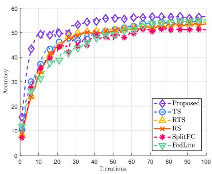  
Fig. 2. Test accuracy of CIFAR-100 classification under i.i.d. datasets.

Note that unlike ICS, all these baselines except RS incur additional client-side processing before transmission, such as magnitude ranking (TS, RTS), clustering and codebook generation (FedLite), or statistics computation (SplitFC).

Comparison of Test Accuracy under i.i.d. Datasets. We evaluate the performance of the proposed ICS framework on the CIFAR-100 dataset and compare it with baseline methods. As shown in Fig. 2, ICS consistently outperforms all baseline methods. This superior performance can be attributed to its capability to effectively capture and retain intermediate features that are intrinsically significant to SL model’s predictive performance. Interestingly, TS demonstrates only marginal performance gains compared to RS and RTS. This outcome highlights a key distinction between SL and traditional FL. Specifically, it indicates that merely selecting intermediate feature elements based on magnitude alone does not translate effectively into improved performance in SL.

It is also worth noting that ICS improves test accuracy faster than the baselines even in the early stage of training. This is notable because Grad-CAM is conventionally applied as a post-hoc tool for converged models. In contrast, ICS uses the true-class gradient with respect to the intermediate feature as a training-time importance metric, computed by the server during backpropagation at every iteration. It therefore quantifies the sensitivity of the current true-class score to each feature channel, and is updated as training progresses rather than relying on a fixed importance pattern. The earlystage gain suggests that this metric provides a useful tasksensitive selection criterion even when training starts from random initialization.

Comparison of Test Accuracy under Non-i.i.d. Datasets. We further evaluate the performance of our proposed ICS framework under non-i.i.d. data distribution settings. In this experiment, datasets are generated using the Dirichlet distribution with concentration parameter $\alpha = 0 . 5$ . Fig. 3 presents the test accuracy of various sparsification strategies at the same sparsification ratio. Due to the inherently higher learning difficulty under non-i.i.d. conditions, the model requires more training iterations to converge, specifically, 200 iterations are executed. Fig. 3 shows that ICS consistently outperforms all baseline methods, demonstrating both superior final accuracy and notably faster convergence. Compared to the i.i.d. scenario, our approach achieves more pronounced advantages in terms of convergence speed under non-i.i.d. conditions. This is primarily because ICS selectively transmits intermediate features universally important across all true labels, whereas baseline methods perform sparsification without considering such universal relevance, thus limiting their convergence efficiency in non-i.i.d. environments.

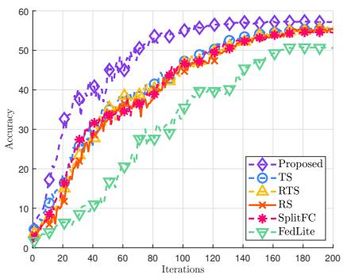  
Fig. 3. Test accuracy of CIFAR-100 classification with Dirichlet $\alpha = 0 . 5 .$

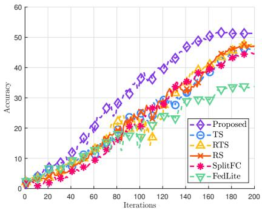  
Fig. 4. Test accuracy of CIFAR-100 classification with Dirichle $\alpha = 0 . 1$

Effects of Non-i.i.d. Levels. To further evaluate the robustness of the proposed ICS under varying degrees of data heterogeneity, we conduct additional experiments by changing the Dirichlet concentration parameter α used for client data partitioning. Specifically, we consider $\alpha \in \{ 0 . 0 5 , 0 . 1 \}$ , which induces more severe non-i.i.d. data partitions than the $\alpha = 0 . 5$ setting considered in Fig. 3. In Figs. 4 and 5, we present the corresponding test accuracy of ICS and the baseline methods.

As α decreases, all methods generally exhibit performance degradation due to the increasing discrepancy among client data distributions. However, ICS consistently outperforms the baselines, and the performance gap becomes more pronounced as the data distribution becomes more heterogeneous. In particular, the performance gap is most evident when $\alpha = 0 . 0 5$ where the client data distributions become highly label-skewed and baseline sparsification methods are more likely to select features biased toward locally dominant classes. The advantage of ICS is closely related to its class-balanced importance aggregation. Unlike the baseline methods, ICS estimates classspecific importance vectors and aggregates them in a classbalanced manner, thereby reducing the influence of locally dominant labels on the sparsification policy. This allows ICS to better preserve feature channels that are discriminative across classes and maintain its effectiveness even under severe non-i.i.d. data distributions.

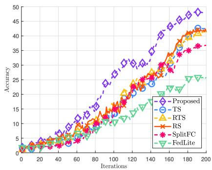  
Fig. 5. Test accuracy of CIFAR-100 classification with Dirichlet $\alpha = 0 . 0 5$

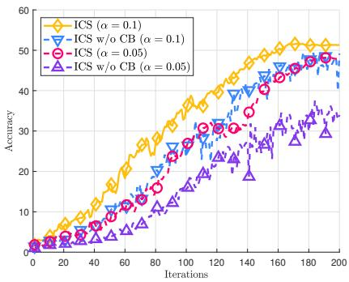  
Fig. 6. Test accuracy of ICS and ICS w/o CB on CIFAR-100 with Dirichlet $\alpha = 0 . 1$ and $\alpha = 0 . 0 5 .$

Effects of Class-Balanced Importance Aggregation. We further examine the contribution of the class-balanced aggregation criterion in ICS. For this purpose, we compare ICS with ICS w/o CB [1], where CB denotes class balance. In ICS w/o CB, the importance vector is obtained by directly averaging the sample-wise importance vectors within each mini-batch, while all other procedures are kept identical to those of ICS.

Fig. 6 shows the test accuracy under the same experimental setting as Fig. 3. To better reveal the effect of class-balanced aggregation, we consider two severe non-i.i.d. settings with $\alpha = 0 . 1$ and $\alpha = 0 . 0 5$ . The results show that ICS consistently outperforms ICS w/o CB in both cases. In addition, ICS exhibits more stable training behavior, whereas ICS w/o CB shows larger accuracy fluctuations, particularly when $\alpha = 0 . 0 5$ . These results show that class-balanced aggregation mitigates the effect of mini-batch label imbalance when constructing the importance vector, leading to higher accuracy and more stable training under severe non-i.i.d. data heterogeneity.

Effects of Mini-batch Size and Sparsification Ratio. Fig. 7 represents the test accuracy of CIFAR-100 with various minibatch size and sparsification ratio under a fixed communication budget. In SL, each client transmits intermediate features of shape $B \times C \times U \times V$ to the server, where B denotes the local mini-batch size and $C , U , V$ are the feature channel, height, and width dimensions of the layer feature tensor, respectively.

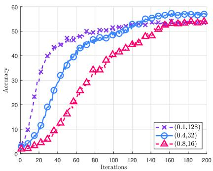  
Fig. 7. Test accuracy of CIFAR-100 classification under different sparsification ratio and mini-batch size pair.

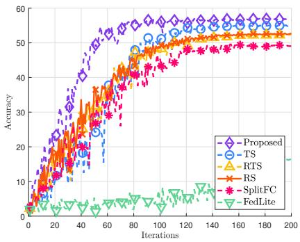  
Fig. 8. Test accuracy on CIFAR-100 classification under PSL with Dirichlet $\alpha = 0 . 5$

We fix the total number of transmitted elements per iteration and vary $B \in \{ 1 2 8 , 3 2 , 1 6 \}$ alongside the sparsification ratio $\begin{array} { r } { R = \frac { N } { C } \in \{ 0 . 1 , 0 . 4 , 0 . 8 \} } \end{array}$ , respectively.

Our results reveal an inherent trade-off between minibatch size B and sparsification ratio R in communicationconstrained SL, as predicted from Theorem 1. Specifically, increasing the mini-batch size leads to a higher total number of transmitted data samples. However, due to the lower R, each individual sample conveys less information, potentially impeding the training process. Conversely, while a smaller B with a higher R transmits fewer samples overall, it may still hinder convergence despite each sample carrying more information. Moreover, we find that higher B setups yield more rapid increases in test accuracy during the first few epochs, indicating that exposure to a larger variety of examples outweighs per-sample fidelity at the outset. As training progresses, the advantage shifts toward higher R, which reduce the per-epoch accuracy gap by preserving fuller feature information after broad sample exposure.

Evaluation under PSL. We further evaluate the proposed ICS framework under the PSL setting described in Section V. Fig. 8 shows the test accuracy under the PSL setting with Dirichlet $\alpha = 0 . 5$ and mini-batches of size 32. The proposed ICS achieves the best performance among all the compared methods, demonstrating that the shared importance vector remains effective even when multiple clients participate in parallel.

An interesting observation is that FedLite exhibits a larger performance degradation than that in the sequential SL setting. This may be due to the interaction between its data-dependent codebook construction and client-side model aggregation. Under PSL, each client performs local updates in parallel using features generated from its own non-i.i.d. data, and the resulting client-side models are then aggregated into a single model for the next iteration. Since each client compresses its features with an independently estimated codebook, the local updates of different clients are shaped by client-dependent quantization errors. When these models are aggregated, the differing quantization errors may not be canceled and instead mix into a single model, which can yield less coherent updates. This effect recurs at every aggregation step and is more pronounced under the non-i.i.d. partition with $\alpha = 0 . 5$ , where the parallel client-side models can diverge more strongly. In contrast, ICS uses a shared server-generated importance vector, allowing all clients to sparsify their intermediate features according to the same task-aware criterion. This shared sparsification rule helps maintain consistency across parallel client updates, making ICS more compatible with PSL.

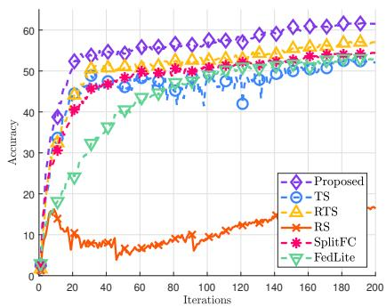  
Fig. 9. Test accuracy of CIFAR-100 classification with transformer-based SL.

Generalization to Transformer-based SL Models. To verify that ICS is not limited to CNN-based architectures, we further evaluate it with a transformer-based SL model. Following Remark 1, we evaluate ICS on CIFAR-100 using a split transformer model, where sparsification is applied along the embedding dimension $d _ { E M B }$ of the token embedding tensor. The model has eight transformer encoder layers with embedding dimension 256, eight attention heads, MLP ratio 4, and dropout 0.1. The first two encoder layers are placed on the client side, while the remaining six encoder layers, followed by layer normalization, mean pooling over patch tokens, and the classification head, are placed on the server side. The experiment is conducted with 10 clients under i.i.d. partitioning using AdamW with learning rate $3 \times 1 0 ^ { - 3 }$ , weight decay $1 0 ^ { - 2 }$ and cosine learning-rate decay. As shown in Fig. 9, ICS achieves stable training performance, whereas RS fails to train reliably under the same communication budget. This result verifies that ICS can be extended to transformerbased SL by applying feature-wise sparsification along the embedding dimension.

Generalization to a Different Dataset. To assess the generalizability of our approach across different datasets, we conduct additional experiments on CIFAR-10. The experimental setup was identical to that used for CIFAR-100, except for a fixed mini-batch size of 256, a learning rate of 0.1 and a total of 50 iterations. As illustrated in Fig. 10, ICS consistently outperforms alternative sparsification schemes. These results underscore the importance of effectively preserving critical intermediate feature information and demonstrate the broad applicability of our approach across multiple datasets.

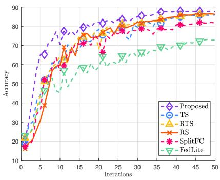  
Fig. 10. Test accuracy of CIFAR-10 classification under i.i.d. datasets.

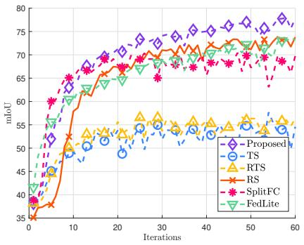  
Fig. 11. mIoU of segmentation under Oxford-IIIT Pet datasets.

Generalization to a Different Task. We further validate the generalizability of ICS by extending our evaluation to a segmentation task using the Oxford-IIIT Pet dataset [34]. This task requires the model to produce pixel-level predictions and is thus highly sensitive to the quality of spatial information. Both the client and the server were trained using AdamW, allowing us to examine whether the relative behavior of the methods persists under an adaptive optimizer. Figs. 11 and 12 illustrate the validation of mean intersection over union (mIoU) and pixel accuracy, respectively. The results reveal a significant shift in the relative performance of the baseline methods compared to the classification tasks. While ICS consistently achieves the highest mIoU and accuracy, TS and RTS show a clear performance degradation compared with the other methods. This trend differs from the classification results, where the three baselines exhibited comparable performance.

This performance gap can be attributed to the inherent characteristics of semantic segmentation. In such datasets, background regions typically occupy a dominant portion of the image and are easier to recognize than object regions, which are often small and spatially localized. This object and background imbalance can bias magnitude-based feature selection schemes to predominately capture background patterns. Accordingly, TS and RTS are more likely to retain background dominant feature channels while discarding object dominant feature channels, leading to degraded performance. This observation is consistent with prior studies reporting that semantic segmentation datasets exhibit object and background imbalance, where background pixels overshadow object class statistics and suppress gradients for object regions [35].

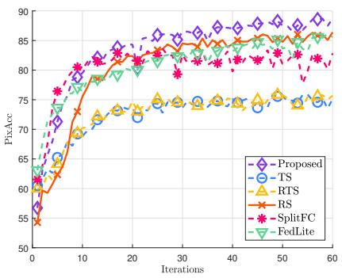  
Fig. 12. Pixel accuracy of segmentation under Oxford-IIIT Pet datasets.

In contrast, RS and SplitFC do not rely on magnitude and therefore avoid such background-driven bias. Their stochastic selection introduces a regularization effect, similar in spirit to feature channel-wise dropout. This likely encourages the encoder to learn redundant and diverse representations for the object classes, distributing information across multiple feature channels. While RS and SplitFC demonstrate strong robustness, their efficacy relies on redundancy learned through stochastic selection. ICS, in contrast, achieves consistently superior accuracy by selecting feature channels based on their server-calculated gradient importance. Crucially, its classbalanced aggregation mechanism directly mitigates the background dominance that is an inherent limitation of TS. By applying equal weighting to the importance scores of the object classes and the background class, ICS prevents the importance vector from collapsing onto background-dominant feature channels. These results suggest that ICS performs well not only on image-level classification tasks but also on pixellevel segmentation tasks.

Ablation Study. To provide a deeper qualitative understanding of why our proposed ICS achieves superior performance, we visualize the feature-level importance retained by each sparsification method. For this analysis, we adopt the same experimental setup used for CIFAR-100 i.i.d. scenarios and employ Grad-CAM [21] to generate saliency maps derived from the transmitted feature channels.

Fig. 13 presents these visualizations for representative test samples from the CIFAR-100 dataset, including ground-truth labels. Within each subfigure, the columns display the original image, the resulting saliency heatmap, and an overlay of the two, respectively. The rows correspond to the different sparsification methods being compared, specifically, the rows represent ICS, TS, RS, RTS, SplitFC, and FedLite, respectively. As shown across all subfigures, heatmaps of ICS are localized and concentrate almost exclusively on the meaning-

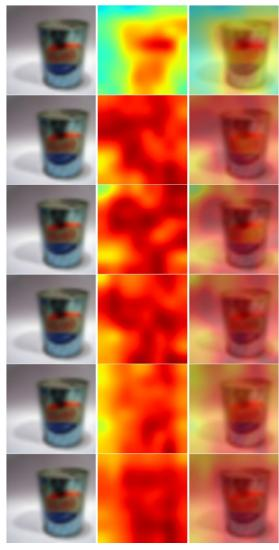  
Label ‘can’

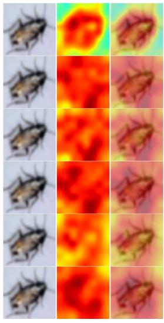  
Label ‘cockroach’

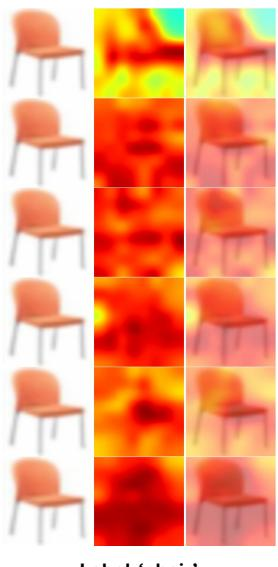  
Label ‘chair’

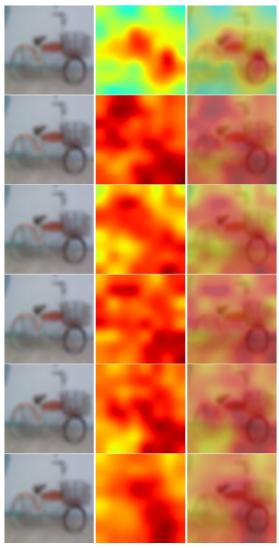  
Label ‘bicycle

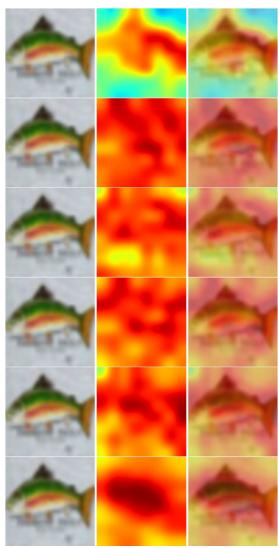  
Label ‘fish’

Fig. 13. Comparison of feature saliency maps for sampled images from five different labels. For each sample, the first, second, and third columns show the original image, the Grad-CAM saliency map, and their overlay, respectively. Each row corresponds to a different sparsification method: ICS (row 1), TS (row 2), RS (row 3), RTS (row 4), SplitFC (row 5), and FedLite (row 6).

ful regions of the objects. This indicates that our importanceaware mechanism effectively identifies and prioritizes the most discriminative feature channels for the task.

In contrast, the saliency map for RS exhibits no discernible spatial structure, as expected given its random and featureagnostic selection strategy. Similarly, the maps for TS and RTS appear consistently diffuse, failing to localize the target objects and instead spreading attention across irrelevant background regions. The maps for SplitFC and FedLite also show limited object localization. This is because SplitFC selects features based on feature-level statistics rather than their direct contribution to the task objective, while FedLite compresses intermediate features through clustering-based codebook construction without explicitly preserving task-discriminative feature channels. These results visually reinforce our core hypothesis that feature magnitude, feature statistics, and clusteringbased representation compression is an unreliable indicator of feature importance. The qualitative evidence thus complements our quantitative findings, explaining why ICS achieves superior accuracy and convergence by transmitting only the most salient and informative features.

## VII. CONCLUSION

This paper introduced ICS, an importance-aware classbalanced sparsification method for wireless split learning. The server estimates Grad-CAM-based channel importance from the true-class logit during backpropagation and aggregates it into a class-balanced, label-agnostic vector, which each client reuses in the next round to transmit only the most discriminative feature channels without any additional client-side computation. The class-balanced design mitigates the bias that arises under non-i.i.d. client data, and the convergence analysis reveals a trade-off between the mini-batch size and the sparsification ratio under a fixed communication budget. We further showed that ICS extends to parallel split learning through a shared server-generated importance vector and to transformerbased models along the embedding dimension. Experiments across classification and semantic segmentation, several heterogeneity levels, and different architectures confirmed that ICS consistently outperforms existing communication-efficient SL baselines while keeping the client-side overhead minimal.

## APPENDIX A PROOF OF THEOREM 1

To begin with, we first recall the global model, i.e. $\theta ^ { t } = $ $[ \theta _ { d } ^ { t } | | \theta _ { s } ^ { t } ]$ . The model update can be represented as

$$
\theta ^ { t + 1 } = \theta ^ { t } - \sum _ { k = 0 } ^ { K - 1 } \sum _ { e = 0 } ^ { E - 1 } \eta ^ { t } \nabla F _ { k } ( \tilde { z } _ { k } ^ { t , e } , \mathcal { B } _ { k } ^ { t , e } ; \theta _ { k } ^ { t , e } ) ,\tag{25}
$$

where $\eta ^ { t }$ is learning rate at iteration t, E is the number of local steps, $\nabla F _ { k } ( \tilde { z } _ { k } ^ { t , e } , B _ { k } ^ { t , e } ; \theta _ { k } ^ { t , e } )$ represents the concatenated stochastic gradients with sparsification of client k and the server, i.e. $\begin{array} { r l } { \nabla F _ { k } ( \tilde { z } _ { k } ^ { t , e } , \boldsymbol { { B } } _ { k } ^ { t , e } ; \boldsymbol { \theta } _ { k } ^ { t , e } ) } & { { } = } \end{array}$ $[ \nabla _ { { \theta } _ { \mathfrak { d } \ L } ^ { t , e } } F _ { k } ( \tilde { z } _ { k } ^ { t , e } , \mathcal { B } _ { k } ^ { t , e } ; { \theta } _ { k } ^ { t , e } ) | | \nabla _ { { \theta } _ { \mathfrak { s } \ L } ^ { t , e } } F _ { k } ( \tilde { z } _ { k } ^ { t , e } , \mathcal { B } _ { k } ^ { t , \tilde { e } } ; { \theta } _ { k } ^ { t , e } ) ]$

Next, using S-smoothness, the following inequality holds:

$$
\begin{array} { r } { \mathbb { E } [ F ( \theta ^ { t + 1 } ) - F ( \theta ^ { t } ) ] \leq \underbrace { \mathbb { E } [ \nabla F ( \theta ^ { t } ) ^ { \top } ( \theta ^ { t + 1 } - \theta ^ { t } ) ] } _ { ( a ) } } \\ { + \frac { S } { 2 } \underbrace { \mathbb { E } [ \| \theta ^ { t + 1 } - \theta ^ { t } \| _ { 2 } ^ { 2 } ] } _ { ( b ) } . } \end{array}\tag{26}
$$

Now we can derive an upper bound of (a) in (26) as follows:

$$
\begin{array} { r l } & { ( a ) = - \eta ^ { t } \displaystyle \sum _ { k = 0 } ^ { K - 1 } \sum _ { e = 0 } ^ { E - 1 } \mathbb { E } \left[ \nabla F ( \theta ^ { t } ) ^ { \mathsf { T } } \nabla F _ { k } ( \theta _ { k } ^ { t , e } ) \right] } \\ & { \quad = - \frac { \eta ^ { t } K E } { 2 } \mathbb { E } \left[ \left. \nabla F ( \theta ^ { t } ) \right. _ { 2 } ^ { 2 } \right] } \\ & { \quad \quad - \frac { \eta ^ { t } } { 2 } \displaystyle \sum _ { k = 0 } ^ { K - 1 } \sum _ { e = 0 } ^ { E - 1 } \mathbb { E } \left[ \left. \nabla F _ { k } ( \theta _ { k } ^ { t , e } ) \right. _ { 2 } ^ { 2 } \right] } \end{array}\tag{27}
$$

$$
+ \frac { \eta ^ { t } } { 2 } \underbrace { \sum _ { k = 0 } ^ { K - 1 } \sum _ { e = 0 } ^ { E - 1 } \mathbb { E } \left[ \left. \nabla F ( \theta ^ { t } ) - \nabla F _ { k } ( \theta _ { k } ^ { t , e } ) \right. _ { 2 } ^ { 2 } \right] } _ { ( a . 1 ) } ,\tag{28}
$$

where the first equality is due to Assumption 3 and the second equality comes from a simple property, such as $- \mathbf { a } ^ { T } \mathbf { b } \ =$ $\begin{array} { r } { \frac 1 2 ( - \| \mathbf { a } \| _ { 2 } ^ { 2 } - \| \mathbf { b } \| _ { 2 } ^ { 2 } + \| \mathbf { a } - \mathbf { b } \| _ { 2 } ^ { 2 } ) } \end{array}$ . For $( a . 1 )$ in (28), by adding, subtracting $\nabla F _ { k } ( \theta ^ { t } )$ and using $\| \mathbf { a } + \mathbf { b } \| _ { 2 } ^ { 2 } \leq 2 \| \mathbf { a } \| _ { 2 } ^ { 2 } + 2 \| \mathbf { b } \| _ { 2 } ^ { 2 }$ we have

$$
\begin{array} { r l } {  { ( a . 1 ) \leq \sum _ { k = 0 } ^ { K - 1 } \sum _ { e = 0 } ^ { K - 1 } \mathbb { E } \Bigg [ 2 \| \nabla F ( \theta ^ { t } ) - \nabla F _ { k } ( \theta ^ { t } ) \| _ { 2 } ^ { 2 } } } \\ & { + \ 2 \| \nabla F _ { k } ( \theta ^ { t } ) - \nabla F _ { k } ( \theta _ { k } ^ { t , e } ) \| _ { 2 } ^ { 2 } \Bigg ] } \end{array}\tag{29}
$$

$$
\leq 2 K E \psi ^ { 2 } + 2 \underbrace { \sum _ { k = 0 } ^ { K - 1 } \sum _ { e = 0 } ^ { E - 1 } \mathbb { E } \left[ \left. \nabla F _ { k } ( \theta ^ { t } ) - \nabla F _ { k } ( \theta _ { k } ^ { t , e } ) \right. _ { 2 } ^ { 2 } \right] } _ { ( a . 1 . 1 ) } ,\tag{30}
$$

where the second inequality comes from Assumption 4. For (a.1.1) in (30), using S-smoothness, we have

$$
\left( a . 1 . 1 \right) \le S ^ { 2 } \sum _ { k = 0 } ^ { K - 1 } \sum _ { e = 0 } ^ { E - 1 } \mathbb { E } \left[ \left\| \theta _ { 0 } ^ { t , 0 } - \theta _ { k } ^ { t , e } \right\| _ { 2 } ^ { 2 } \right]\tag{31}
$$

$$
\begin{array} { r l }   { = S ^ { 2 } \sum _ { k = 0 } ^ { K - 1 } \sum _ { e = 0 } ^ { E - 1 } \mathbb { E } \Bigg [ \Big \| \sum _ { i = 0 } ^ { k - 1 } \sum _ { j = 0 } ^ { E - 1 } \eta ^ { t } \nabla F _ { i } ( B _ { i } ^ { t , j } ; \theta _ { i } ^ { t , j } ) } \\ & { \qquad + \sum _ { h = 0 } ^ { e - 1 } \eta ^ { t } \nabla F _ { k } ( B _ { k } ^ { t , h } ; \theta _ { k } ^ { t , h } ) \Big \| _ { 2 } ^ { 2 } \Bigg ] } \end{array}\tag{32}
$$

$$
\leq S ^ { 2 } \sum _ { k = 0 } ^ { K - 1 } \sum _ { e = 0 } ^ { E - 1 } ( k E + e ) \left( \sum _ { i = 0 } ^ { k - 1 } \sum _ { j = 0 } ^ { E - 1 } \mathbb { E } \left[ \| \eta ^ { t } \nabla F _ { i } ( \mathcal { B } _ { i } ^ { t , j } ; \theta _ { i } ^ { t , j } ) \| _ { 2 } ^ { 2 } \right] \right.
$$

$$
+ \sum _ { h = 0 } ^ { e - 1 } \mathbb { E } [ \| \eta ^ { t } \nabla F _ { k } ( \mathcal { B } _ { k } ^ { t , h } ; \theta _ { k } ^ { t , h } ) \| _ { 2 } ^ { 2 } ] )\tag{33}
$$

$$
= S ^ { 2 } \sum _ { k = 0 } ^ { K - 1 } \sum _ { e = 0 } ^ { E - 1 } ( k E + e ) ( \eta ^ { t } ) ^ { 2 } \Biggl ( \sum _ { i = 0 } ^ { k - 1 } \sum _ { j = 0 } ^ { E - 1 } \mathbb { E } \Bigl [ \| \nabla F _ { i } ( \theta _ { i } ^ { t , j } ) \| _ { 2 } ^ { 2 }
$$

$$
+ \| \nabla F _ { i } ( \boldsymbol { \mathcal { B } } _ { i } ^ { t , j } ; \boldsymbol { \theta } _ { i } ^ { t , j } ) - \nabla F _ { i } ( \boldsymbol { \theta } _ { i } ^ { t , j } ) \| _ { 2 } ^ { 2 } \Big ] + \sum _ { h = 0 } ^ { e - 1 } \mathbb { E } \Big [ \| \nabla F _ { k } ( \boldsymbol { \theta } _ { k } ^ { t , h } ) \| _ { 2 } ^ { 2 }
$$

$$
+ \left\| \nabla F _ { k } ( \boldsymbol { \mathcal { B } } _ { k } ^ { t , h } ; { \boldsymbol { \theta } } _ { k } ^ { t , h } ) - \nabla F _ { k } ( { \boldsymbol { \theta } } _ { k } ^ { t , h } ) \| _ { 2 } ^ { 2 } \right] \bigg )\tag{34}
$$

$$
\leq S ^ { 2 } ( \eta ^ { t } ) ^ { 2 } \sum _ { k = 0 } ^ { K - 1 } \sum _ { e = 0 } ^ { E - 1 } ( k E + e ) ^ { 2 } \left( \frac { \sigma ^ { 2 } } { B } + G ^ { 2 } \right)\tag{35}
$$

$$
= S ^ { 2 } ( \eta ^ { t } ) ^ { 2 } \left( \frac { \sigma ^ { 2 } } { B } + G ^ { 2 } \right) \frac { K E ( K E - 1 ) ( 2 K E - 1 ) } { 6 }\tag{36}
$$

$$
\leq \frac { 1 } { 3 } S ^ { 2 } ( \eta ^ { t } ) ^ { 2 } \left( \frac { \sigma ^ { 2 } } { B } + G ^ { 2 } \right) ( K E ) ^ { 3 } ,\tag{37}
$$

where the first equality is obtained by recursively applying the sequential SL update rule up to the beginning of the e-th local step of client k. Specifically, before the e-th local update of client $k ,$ the model has already been updated by all E local steps of clients $0 , \ldots , k - 1$ and by the first e local steps of client k, starting from $\theta _ { 0 } ^ { t , 0 }$ , which gives

$$
\begin{array} { r l } { \displaystyle \theta _ { k } ^ { t , e } = \theta _ { 0 } ^ { t , 0 } - \eta ^ { t } \Bigg ( \displaystyle \sum _ { i = 0 } ^ { k - 1 } \displaystyle \sum _ { j = 0 } ^ { E - 1 } \nabla F _ { i } ( \mathcal { B } _ { i } ^ { t , j } ; \theta _ { i } ^ { t , j } ) } & { } \\ { \displaystyle + \displaystyle \sum _ { h = 0 } ^ { e - 1 } \nabla F _ { k } ( \mathcal { B } _ { k } ^ { t , h } ; \theta _ { k } ^ { t , h } ) \Bigg ) . } \end{array}\tag{38}
$$

Substituting this expansion into $\theta _ { 0 } ^ { t , 0 } - \theta _ { k } ^ { t , e }$ yields the first equality. The second inequality is due to Cauchy–Schwarz inequality, and the second equality is obtained by adding and subtracting $\nabla F _ { i } ( \theta _ { i } ^ { t , j } )$ and $\nabla \dot { F } _ { k } ( \boldsymbol { \theta } _ { k } ^ { t , h } )$ . The cross terms in the equality go to zero due to the unbiasedness. The third inequality comes from Assumptions 3 and 5. The last inequality is due to $K E - 1 \le K E$ and $2 K E - 1 \le 2 K E$

Before upper-bound (b) in (26), we first introduce the following Lemma 1 for upper-bound (b).

Lemma 1. Under Assumptions 1, 5, and let

$$
m _ { k } ^ { t , e } = \nabla F _ { k } ( \tilde { z } _ { k } ^ { t , e } , \mathcal { B } _ { k } ^ { t , e } ; \theta _ { k } ^ { t , e } ) - \nabla F _ { k } ( z _ { k } ^ { t , e } , \mathcal { B } _ { k } ^ { t , e } ; \theta _ { k } ^ { t , e } )\tag{39}
$$

where $m _ { k } ^ { t , e } = [ m _ { d , k } ^ { t , e } | | m _ { s , k } ^ { t , e } ]$ , be the update error caused by the sparsification operator $\boldsymbol { \mathcal { S } } ( \cdot )$ . Then, $m _ { k } ^ { t , e }$ is upper-bounded as

$$
\mathbb { E } \| m _ { k } ^ { t , e } \| _ { 2 } ^ { 2 } \leq \Lambda ^ { 2 } \left( 1 - \frac { N } { C } \right) B \delta ^ { 2 } ,\tag{40}
$$

where $\Lambda ^ { 2 } = \Lambda _ { 0 } ^ { 2 } ( \Lambda _ { 1 } ^ { 2 } + \Lambda _ { 2 } ^ { 2 } \Lambda _ { 3 } ^ { 2 } )$ . Here, $\Lambda _ { 0 } , \Lambda _ { 1 }$ , Λ2 and $\Lambda _ { 3 }$ are spectral norm upper-bound of $\frac { \partial \mathcal { L } } { \partial \hat { y } _ { k , b } ^ { t , e } } , \frac { \partial ^ { 2 } \hat { y } _ { k , b , \ell } ^ { t , e } } { \partial z _ { k } ^ { t , e } \partial \theta _ { s , k } ^ { t , e } } , \frac { \partial ^ { 2 } \hat { y } _ { k , b , \ell } ^ { t , e } } { \partial \left( z _ { k } ^ { t , e } \right) ^ { 2 } }$ and $\frac { \partial \boldsymbol { z } _ { k } ^ { t , e } } { \partial \boldsymbol { \theta } _ { d , k } ^ { t , e } } \ \forall k , t , \boldsymbol { \ell } ,$ respectively.

Proof: See Appendix B.

Next, using Cauchy–Schwarz inequality, (b) in (26) can be expressed as

$$
\begin{array} { r l r } { ( b ) \leq K E ( \eta ^ { t } ) ^ { 2 } \displaystyle \sum _ { k = 0 } ^ { K - 1 } \sum _ { \ell = 0 } ^ { K - 1 } \mathbb { E } \left[ \| \nabla F _ { k } ( B _ { k } ^ { t , e } ; \theta _ { k } ^ { t , e } ) + m _ { k } ^ { t , e } \| _ { 2 } ^ { 2 } \right] } \\ { \leq 2 K E ( \eta ^ { t } ) ^ { 2 } \underbrace { \displaystyle \sum _ { k = 0 } ^ { K - 1 } \sum _ { e = 0 } ^ { K - 1 } \mathbb { E } \left[ \| \nabla F _ { k } ( B _ { k } ^ { t , e } ; \theta _ { k } ^ { t , e } ) \| _ { 2 } ^ { 2 } \right] } _ { ( b , 1 ) } } \\ { + 2 K E ( \eta ^ { t } ) ^ { 2 } \displaystyle \sum _ { k = 0 } ^ { K - 1 } \sum _ { e = 0 } ^ { K - 1 } \mathbb { E } \left[ \| m _ { k } ^ { t , e } \| _ { 2 } ^ { 2 } \right] , } & { \quad \mathrm { ( f ~ o ~ r ~ } \quad \mathrm { ~ a ~ n ~ d ~ \ ' ~ } \quad \mathrm { ~ a ~ n ~ d ~ \ ' ~ } \quad \mathrm { ~ a ~ n ~ d ~ \ ' ~ } \quad \mathrm { ~ a ~ n ~ d ~ \ ' ~ } \quad \mathrm { ~ a ~ n ~ d ~ \ ' ~ } \quad } \end{array}\tag{41}
$$

where $z _ { k } ^ { t , e }$ in $\nabla F _ { k } ( z _ { k } ^ { t , e } , { \boldsymbol { B } } _ { k } ^ { t , e } ; { \boldsymbol { \theta } } _ { k } ^ { t , e } )$ is omitted for ease of notation. The first inequality follows from $\begin{array} { r } { \| \sum _ { r = 1 } ^ { K E } \mathbf { a } _ { r } \| _ { 2 } ^ { 2 } \leq } \end{array}$ $\begin{array} { r } { K E \sum _ { r = 1 } ^ { K E } \| \mathbf { a } _ { r } \| _ { 2 } ^ { 2 } } \end{array}$ and the second inequality follows from $\| \mathbf { a } + \mathbf { \overline { { b } } } \| _ { 2 } ^ { 2 } \leq 2 \| \mathbf { a } \| _ { 2 } ^ { 2 } + 2 \| \mathbf { b } \| _ { 2 } ^ { 2 }$

By adding and subtracting $\nabla F _ { k } ( \theta _ { k } ^ { t , e } )$ in (b.1), we can get

$$
( \boldsymbol { b } . 1 ) = \sum _ { k = 0 } ^ { K - 1 } \sum _ { e = 0 } ^ { E - 1 } \mathbb { E } \Big [ \| \boldsymbol { \nabla } F _ { k } ( \boldsymbol { B } _ { k } ^ { t , e } ; \boldsymbol { \theta } _ { k } ^ { t , e } ) - \boldsymbol { \nabla } F _ { k } ( \boldsymbol { \theta } _ { k } ^ { t , e } ) \| _ { 2 } ^ { 2 }
$$

$$
+ \| \nabla F _ { k } ( \theta _ { k } ^ { t , e } ) \| _ { 2 } ^ { 2 } ]\tag{42}
$$

$$
\leq \frac { K E \sigma ^ { 2 } } { B } + K E G ^ { 2 } ,\tag{43}
$$

where the cross term in the equality goes to zero due to the unbiasedness, i.e., E $\left\lceil \nabla F _ { k } ( \mathcal { B } _ { k } ^ { t , \cdot } ; \boldsymbol { \theta } _ { k } ^ { t , \cdot } ) \right\rceil ^ { - } = \mathbb { E } \left\lceil \nabla F _ { k } ( \boldsymbol { \theta } _ { k } ^ { t , e } ) \right\rceil$ , and the inequality comes from Assumptions 3 and 5. Finally, by using Lemma 1 for upper-bound (b.2) in (41) and substitute (43) into (41), (b) in (26) can be upper-bounded as

$$
( b ) \leq 2 K ^ { 2 } E ^ { 2 } ( \eta ^ { t } ) ^ { 2 } \left( \frac { \sigma ^ { 2 } } { B } + G ^ { 2 } + \Lambda ^ { 2 } \left( 1 - \frac { N } { C } \right) B \delta ^ { 2 } \right)\tag{44}
$$

Substituting the above inequalities to (26), we get

$$
\begin{array} { r l r } {  { \mathbb { E } [ F ( \theta ^ { t + 1 } ) - F ( \theta ^ { t } ) ] \le - \frac { \eta ^ { t } K E } { 2 } \mathbb { E } [ \| \nabla F ( \theta ^ { t } ) \| _ { 2 } ^ { 2 } ] + \eta ^ { t } K E \psi ^ { 2 } } } \\ & { } & { + \frac { 1 } { 3 } S ^ { 2 } ( \eta ^ { t } ) ^ { 3 } ( \frac { \sigma ^ { 2 } } { B } + G ^ { 2 } ) ( K E ) ^ { 3 } + S K ^ { 2 } E ^ { 2 } ( \eta ^ { t } ) ^ { 2 } ( \frac { \sigma ^ { 2 } } { B }  } \\ & { } & {  + G ^ { 2 } + \Lambda ^ { 2 } ( 1 - \frac { N } { C } ) B \delta ^ { 2 } ) . \qquad ( 4 5 ) } \end{array}
$$

Averaging the above inequality over iteration from 0 to $T - 1$ and applying $\begin{array} { r } { \eta ^ { t } = \frac { 1 } { K E \sqrt { T } } } \end{array}$ , we can get

$$
\begin{array} { r l } & { \mathbb { E } \left[ \displaystyle \frac { 1 } { T } \sum _ { t = 0 } ^ { T - 1 } \| \nabla F ( \theta ^ { t } ) \| _ { 2 } ^ { 2 } \right] \leq \frac { 2 } { \sqrt { T } } \mathbb { E } [ F ( \theta ^ { 0 } ) - F ( \theta ^ { * } ) ] + 2 \psi ^ { 2 } } \\ & { + \displaystyle \frac { 2 S ^ { 2 } } { 3 T } \left( \frac { \sigma ^ { 2 } } { B } + G ^ { 2 } \right) + \frac { 2 S } { \sqrt { T } } \left( \frac { \sigma ^ { 2 } } { B } + G ^ { 2 } + \Lambda ^ { 2 } \left( 1 - R \right) B \delta ^ { 2 } \right) , } \end{array}\tag{46}
$$

where the first term in the right-hand side is upper-bounded as $\begin{array} { r } { \mathbb { E } [ F ( \theta ^ { 0 } ) - F ( \theta ^ { T } ) ] \le \mathbb { E } [ F ( \theta ^ { 0 } ) - F ( \theta ^ { * } ) ] } \end{array}$ ] since $\bar { F } ( \theta ^ { T } ) \ge F ( \theta ^ { * } )$

## APPENDIX B PROOF OF LEMMA 1

We first begin with the server-side error. For ease of notation, we omit indices of k and e. Similar to [19], using the definition of the server-side gradient, the update error caused by sparsification can be expressed as

$$
\| m _ { s } ^ { t } \| _ { 2 } ^ { 2 } = \left\| \frac { 1 } { B } \sum _ { b = 0 } ^ { B - 1 } \frac { \partial \mathcal { L } } { \partial \hat { y } _ { b } ^ { t } } \left( \frac { \partial \hat { y } _ { b , \ell } ^ { t } ( \tilde { z } _ { k } ^ { t } ; \theta _ { s } ^ { t } ) } { \partial \theta _ { s } ^ { t } } - \frac { \partial \hat { y } _ { b , \ell } ^ { t } ( z _ { k } ^ { t } ; \theta _ { s } ^ { t } ) } { \partial \theta _ { s } ^ { t } } \right) \right\| _ { 2 } ^ { 2 }\tag{47}
$$

where $\tilde { z } ^ { t }$ and $z ^ { t }$ denote intermediate feature after sparsification and before sparsification, respectively. Next using the mean value theorem,

$$
\begin{array} { l } { \displaystyle | | { \boldsymbol m } _ { s } ^ { t } | | _ { 2 } ^ { 2 } \leq \operatorname* { m a x } _ { b } \left\| \frac { \partial \mathcal { L } } { \partial \hat { y } _ { b } ^ { t } } \frac { \partial ^ { 2 } \hat { y } _ { b , \ell } ^ { t } ( z _ { k } ^ { t } ; \theta _ { s } ^ { t } ) } { \partial z \partial \theta _ { s } ^ { t } } ( \tilde { z } ^ { t } - z ^ { t } ) \right\| _ { 2 } ^ { 2 } } \\ { \leq \Lambda _ { 0 } ^ { 2 } \Lambda _ { 1 } ^ { 2 } \left( 1 - \frac { N } { C } \right) B \delta ^ { 2 } } \end{array}\tag{48}
$$

(49)

where the second inequality is due to Assumptions 1 and 5.   
Here, $\Lambda _ { 0 }$ and $\Lambda _ { 1 }$ are spectral norm upper-bound of $\frac { \partial \mathcal { L } } { \partial \hat { y } _ { b } ^ { t } }$ and   
$\partial ^ { 2 } \hat { y } _ { b , \ell } ^ { t } ( z ^ { t } ; \theta _ { s } ^ { t } )$ b,ℓ s∂zt∂θt , respectively.

Similar to the server-side error, the update error caused by sparsification at the client-side can be expressed as

$$
\| m _ { d } ^ { t } \| _ { 2 } ^ { 2 } = \| \frac { 1 } { B } \sum _ { b = 0 } ^ { B - 1 } \frac { \partial \mathcal { L } } { \partial \hat { y } _ { b } ^ { t } } ( \frac { \partial \hat { y } _ { b , \ell } ^ { t } ( \tilde { z } ^ { t } ; \theta _ { s } ^ { t } ) } { \partial \tilde { z } ^ { t } } 
$$

$$
-  \frac { \partial \hat { y } _ { b , \ell } ^ { t } ( z ^ { t } ; \theta _ { s } ^ { t } ) } { \partial z ^ { t } } ) \frac { \partial z ^ { t } } { \partial \theta _ { d } ^ { t } }  _ { 2 } ^ { 2 }\tag{50}
$$

$$
\leq \operatorname* { m a x } _ { b } \| \frac { \partial \mathcal { L } } { \partial \hat { y } _ { b } ^ { t } } \frac { \partial ^ { 2 } \hat { y } _ { b , \ell } ^ { t } } { \partial ( z ^ { t } ) ^ { 2 } } \frac { \partial z ^ { t } } { \partial \theta _ { d } ^ { t } } ( z ^ { t } - \tilde { z } ^ { t } ) \| _ { 2 } ^ { 2 }\tag{51}
$$

$$
\leq \Lambda _ { 0 } ^ { 2 } \Lambda _ { 2 } ^ { 2 } \Lambda _ { 3 } ^ { 2 } \left( 1 - \frac { N } { C } \right) B \delta ^ { 2 } ,\tag{52}
$$

where $\hat { y } _ { b , \ell } ^ { t } ( \tilde { z } ^ { t } ; \theta _ { s } ^ { t } )$ and $\hat { y } _ { b , \ell } ^ { t } ( z ^ { t } ; \theta _ { s } ^ { t } )$ denote the logit forwarded with the sparsified intermediate feature $\tilde { z } ^ { t }$ and non-sparsified intermediate feature $z ^ { t }$ , respectively. The first inequality comes from the mean-value theorem and the second inequality is due to Assumptions 1 and 5. Here, $\Lambda _ { 0 } , \Lambda _ { 2 }$ and $\Lambda _ { 3 }$ are spectral norm upper-bound of $\begin{array} { r } { \frac { \partial \mathcal { L } } { \partial \hat { y } _ { b } ^ { t } } , \frac { \partial ^ { 2 } \hat { y } _ { b , \ell } ^ { t } } { \partial ( z ^ { t } ) ^ { 2 } } } \end{array}$ and $\frac { \partial z ^ { t } } { \partial { \theta } _ { d } ^ { t } }$ , respectively.

Finally, combining the above inequalities, the error becomes

$$
\mathbb { E } \Vert m ^ { t } \Vert _ { 2 } ^ { 2 } \leq \Lambda ^ { 2 } \left( 1 - \frac { N } { C } \right) B \delta ^ { 2 } ,\tag{53}
$$

where $\Lambda ^ { 2 } = \Lambda _ { 0 } ^ { 2 } ( \Lambda _ { 1 } ^ { 2 } + \Lambda _ { 2 } ^ { 2 } \Lambda _ { 3 } ^ { 2 } )$

## REFERENCES

[1] B. Kim, Y. Huh, and W. Choi, “Feature sparsification based on feature importance for wireless split learning,” in Proceedings of the IEEE Vehicular Technology Conference (VTC), 2025, pp. 1–5.

[2] M. Chen, D. Gund ¨ uz, K. Huang, W. Saad, M. Bennis, A. V. Feljan,¨ and H. V. Poor, “Distributed learning in wireless networks: Recent progress and future challenges,” IEEE Journal on Selected Areas in Communications, vol. 39, no. 12, pp. 3579–3605, 2021.

[3] B. Kim, H. Seo, and W. Choi, “Privacy-enhanced over-the-air federated learning via client-driven power balancing,” IEEE Transactions on Communications, vol. 73, no. 12, pp. 15 537–15 553, 2025.

[4] Y. Huh, B. Kim, and W. Choi, “Feature reconstruction aided federated learning for image semantic communication,” in Proceedings of the IEEE Global Communications Conference (GLOBECOM), 2025, pp. 4669–4674.

[5] M. F. Ul Abrar and N. Michelusi, “Biased federated learning under wireless heterogeneity,” IEEE Transactions on Wireless Communications, vol. 25, pp. 16 449–16 462, 2026.

[6] F. P.-C. Lin, C. G. Brinton, and N. Michelusi, “Federated learning with communication delay in edge networks,” in Proceedings of the IEEE Global Communications Conference (GLOBECOM), 2020, pp. 1–6.

[7] K. He, X. Zhang, S. Ren, and J. Sun, “Deep residual learning for image recognition,” in Proceedings ofthe IEEE Conference on Computer Vision and Pattern Recognition (CVPR), 2016, pp. 770–778.

[8] P. Vepakomma, O. Gupta, T. Swedish, and R. Raskar, “Split learning for health: Distributed deep learning without sharing raw patient data,” arXiv preprint arXiv:1812.00564, 2018.

[9] Z. Lin, G. Qu, X. Chen, and K. Huang, “Split learning in 6G edge networks,” IEEE Wireless Communications, vol. 31, no. 4, pp. 170–176, 2024.

[10] Z. Lin, G. Zhu, Y. Deng, X. Chen, Y. Gao, K. Huang, and Y. Fang, “Efficient parallel split learning over resource-constrained wireless edge networks,” IEEE Transactions on Mobile Computing, vol. 23, no. 10, pp. 9224–9239, 2024.

[11] Q. Lan, Q. Zeng, P. Popovski, D. Gund ¨ uz, and K. Huang, “Progressive¨ feature transmission for split classification at the wireless edge,” IEEE Transactions on Wireless Communications, vol. 22, no. 6, pp. 3837– 3852, 2023.

[12] J. Lee, H. Lee, and W. Choi, “Wireless channel adaptive DNN split inference for resource-constrained edge devices,” IEEE Communications Letters, vol. 27, no. 6, pp. 1520–1524, 2023.

[13] Y. Huh, H. Seo, and W. Choi, “Universal joint source-channel coding for modulation-agnostic semantic communication,” IEEE Journal on Selected Areas in Communications, vol. 43, no. 7, pp. 2560–2574, 2025.

[14] Y. Huh, J. Kang, and W. Choi, “Markov-enforced discrete diffusion model for digital semantic symbol error correction,” IEEE Transactions on Communications, pp. 1–1, 2026.

[15] J. Jeon and J. Kim, “Privacy-sensitive parallel split learning,” in Proceedings of the International Conference on Information Networking (ICOIN), 2020, pp. 7–9.

[16] C. Thapa, P. C. M. Arachchige, S. Camtepe, and L. Sun, “SplitFed: When federated learning meets split learning,” in Proceedings of the AAAI Conference on Artificial Intelligence (AAAI), 2022, pp. 8485–8493.

[17] W. Zhou, Z. Qu, S.-H. Lyu, M. Cai, and B. Ye, “Mask-encoded sparsification: Mitigating biased gradients in communication-efficient split learning,” in Proceedings of the European Conference on Artificial Intelligence (ECAI), 2024, pp. 2806–2813.

[18] Y. Oh, J. Lee, C. G. Brinton, and Y.-S. Jeon, “Communication-efficient split learning via adaptive feature-wise compression,” IEEE Transactions on Neural Networks and Learning Systems, vol. 36, no. 6, pp. 10 844– 10 858, 2025.

[19] J. Wang, H. Qi, A. S. Rawat, S. Reddi, S. Waghmare, F. X. Yu, and G. Joshi, “FedLite: A scalable approach for federated learning on resource-constrained clients,” arXiv preprint arXiv:2201.11865, 2022.

[20] J. Zhang, W. Ni, and D. Wang, “Federated split learning with model pruning and gradient quantization in wireless networks,” IEEE Transactions on Vehicular Technology, vol. 74, no. 4, pp. 6850–6855, 2025.

[21] R. R. Selvaraju, M. Cogswell, A. Das, R. Vedantam, D. Parikh, and D. Batra, “Grad-CAM: Visual explanations from deep networks via gradient-based localization,” in Proceedings of the IEEE International Conference on Computer Vision (ICCV), 2017, pp. 618–626.

[22] K. Zhou, G. Zhang, Y. Cai, Q. Hu, G. Yu, and A. L. Swindlehurst, “Feature allocation for semantic communication with space-time importance awareness,” IEEE Transactions on Wireless Communications, vol. 24, no. 10, pp. 8847–8862, 2025.

[23] F. Zheng, C. Chen, L. Lyu, and B. Yao, “Reducing communication for split learning by randomized top-k sparsification,” in Proceedings of the International Joint Conference on Artificial Intelligence (IJCAI), 2023, pp. 4665–4673.

[24] W. Wu, M. Li, K. Qu, C. Zhou, X. Shen, W. Zhuang, X. Li, and W. Shi, “Split learning over wireless networks: Parallel design and resource management,” IEEE Journal on Selected Areas in Communications, vol. 41, no. 4, pp. 1051–1066, 2023.

[25] G. Zhu, Y. Deng, X. Chen, H. Zhang, Y. Fang, and T. F. Wong, “ESFL: Efficient split federated learning over resource-constrained heterogeneous wireless devices,” IEEE Internet ofThings Journal, vol. 11, no. 16, pp. 27 153–27 166, 2024.

[26] Z. Lin, G. Qu, W. Wei, X. Chen, and K. K. Leung, “AdaptSFL: Adaptive split federated learning in resource-constrained edge networks,” IEEE Transactions on Networking, vol. 33, no. 6, pp. 2993–3008, 2025.

[27] X. Wang, S. Song, Z. Zhang, X. Hou, Z. Li, T. Xing, and X.-P. Zhang, “Split federated learning for resource-constrained edge computing networks,” IEEE Transactions on Consumer Electronics, vol. 71, no. 4, pp. 11 001–11 013, 2025.

[28] Z. Lin, W. Wei, Z. Chen, C.-T. Lam, X. Chen, Y. Gao, and J. Luo, “Hierarchical split federated learning: Convergence analysis and system optimization,” IEEE Transactions on Mobile Computing, vol. 24, no. 10, pp. 9352–9367, 2025.

[29] Y. Li and X. Lyu, “Convergence analysis of sequential split learning on heterogeneous data,” arXiv preprint arXiv:2302.01633, 2023.

[30] B. Kim and W. Choi, “Two stage wireless federated LoRA fine-tuning with sparsified orthogonal updates,” arXiv preprint arXiv:2505.00333, 2025.

[31] Y. Huh, B. Kim, and W. Choi, “Federated learning enhanced by feature reconstruction for semantic communication module updates of agents,” arXiv preprint arXiv:2508.03248v3, 2026.

[32] A. Krizhevsky, “Learning multiple layers of features from tiny images,” University of Toronto, Tech. Rep., 2009.

[33] S. U. Stich, J.-B. Cordonnier, and M. Jaggi, “Sparsified SGD with memory,” in Advances in Neural Information Processing Systems (NeurIPS), 2018, pp. 4452–4463.

[34] O. M. Parkhi, A. Vedaldi, A. Zisserman, and C. V. Jawahar, “Cats and dogs,” in Proceedings of the IEEE Conference on Computer Vision and Pattern Recognition (CVPR), 2012, pp. 3498–3505.

[35] E. Tappeiner, M. Welk, and R. Schubert, “Tackling the class imbalance problem of deep learning-based head and neck organ segmentation,” International Journal of Computer Assisted Radiology and Surgery, vol. 17, no. 11, pp. 2103–2111, 2022.

Bumjun Kim (Graduate Student Member, IEEE) received the B.S. degree from the Department of Electronic Engineering, Jeonbuk National University, Jeonju, South Korea, in 2020. He is currently pursuing the Ph.D. degree with the Department of Electrical and Computer Engineering, Seoul National University, Seoul. His research interests include wireless communications, distributed learning and semantic communication.

Yoon Huh (Graduate Student Member, IEEE) received the B.S. degree (summa cum laude) from the School of Electrical and Electronics Engineering, Yonsei University, Seoul, South Korea, in 2022. He is currently pursuing the Ph.D. degree with the Department of Electrical and Computer Engineering, Seoul National University, Seoul, South Korea. His research interests include wireless communication, semantic communication, and deep learning.

Wan Choi (Fellow, IEEE) is Professor of Department of Electrical and Computer Engineering, Seoul National University, Seoul, Korea. He is Director of Institute of New Media and Communications (INMC), Seoul National University, from Feb. 2025. From Feb. 2007 to Feb. 2020, he was Professor of School of Electrical Engineering, Korea Advanced Institute of Science and Technology (KAIST), Daejeon, Korea. He received the B.Sc. and M.Sc. degrees from the School of Electrical Engineering and Computer Science (EECS), Seoul National Univer-

sity (SNU), Seoul, Korea, in 1996 and 1998, respectively, and the Ph.D. degree in the Department of Electrical and Computer Engineering at the University of Texas at Austin in 2006. From 1998 to 2003, he was a Senior Member of the Technical Staff of the R&D Division of KT, Korea, where he researched 3G CDMA systems.

He is the recipient of IEEE Vehicular Technology Society Jack Neubauer Memorial Award (Best System Paper Award) in 2002. He also received the IEEE Vehicular Technology Society Dan Noble Fellowship Award, the IEEE Communication Society Asia Pacific Young Researcher Award, the NAAI Distinguished Artificial Intelligence Scholar Award, the Okawa Foundation Research Grant Award, the Haedong Research Award and the Haedong Young Scholar Award from KICS, and the Irwin-Jacobs Award from Qualcomm and KICS. While at the University of Texas at Austin, he was the recipient of William S. Livingston Graduate Fellowship and Information and Telecommunication Fellowship from Ministry of Information and Communication (MIC), Korea. He is an Area Editor for the IEEE Transactions on Wireless Communications from Aug. 2022 and an Editor for the IEEE Transactions on Vehicular Technology from Apr. 2011. He is the co-Editor-in-Chief of IEEE/KICS Journal of Communications and Networks from Dec. 2024. He served as the Executive Editor Chair for the IEEE Transactions on Wireless Communications (2019- 2021) and Executive Editor (2014-2019). He was also an Editor for the IEEE Transactions on Wireless Communications (2009-2014), for the IEEE Wireless Communications Letter (2012-2017), and as Guest Editor for the IEEE Journal on Selected Areas in Communications, IEEE Communications Magazine, and IEEE Open Journal of the Communications Society. He is a member of National Academy of Engineering of Korea (NAEK).