# In a Streaming World, Should You Stand Still? A Comprehensive Benchmark of Anomaly Detection in Streams

Magali Parrino   
EDF R&D   
Chatou, France   
ENS, PSL University, CNRS, Inria   
Paris, France   
magali.parrino@edf.fr   
Pierre Stephan   
EDF R&D   
Chatou, France   
pierre.stephan@edf.fr   
Antoine Ajenjo   
EDF R&D   
Chatou, France   
antoine.ajenjo@edf.fr

Pierre Senellart DI ENS, ENS, PSL University, CNRS, Inria Paris, France pierre.senellart@ens.fr

Emmanuel Remy   
EDF R&D   
Chatou, France   
emmanuel.remy@edf.fr   
Paul Boniol   
DI ENS, ENS, PSL University, CNRS,   
Inria   
Paris, France   
paul.boniol@inria.fr

## Abstract

Time series anomaly detection (TSAD) is increasingly deployed in streaming settings, where data arrive sequentially and may exhibit non-stationarity. As a result, several works from the recent literature propose streaming anomaly detection methods that rely on incremental updates to adapt over time. However, most of these approaches originate from the streaming outlier detection literature and largely ignore core characteristics of time series anomalies. Moreover, their empirical evaluation is typically conducted on synthetic or small-scale benchmarks with limited diversity, making it unclear whether streaming methods are truly advantageous in real istic TSAD scenarios. In this work, we carry out the first large-scale experimental study comparing streaming and static TSAD methods under a unified streaming evaluation benchmark. We consider a realistic setting in which an initial batch of data is available for model training, followed by online evaluation of both detection accuracy and computational eficiency. In addition, we propose a distribution-drift dataset of real time series, called TSB-drift, to isolate scenarios where streaming updates are theoretically justified. Our results show that, contrary to common assumptions, static TSAD methods significantly outperform streaming approaches in most streaming settings. Such finding highlights a critical gap between the design of existing streaming methods and the requirements of modern TSAD, and calls for a rethinking of how streaming capabilities should be integrated into TSAD.

## CCS Concepts

• Information systems → Data stream mining; • Computing methodologies → Anomaly detection; • Mathematics of computing → Time series analysis.

Keywords Time Series, Stream, Anomaly Detection, Benchmark

ACM Reference Format: Magali Parrino, Antoine Ajenjo, Emmanuel Remy, Pierre Stephan, Pierre Senellart, and Paul Boniol. 2026. In a Streaming World, Should You Stand Still? A Comprehensive Benchmark of Anomaly Detection in Streams. In Proceedings ofthe 32nd ACMSIGKDD Conference on Knowledge Discovery and Data Mining V.2 (KDD ’26), August 09–13, 2026, Jeju Island, Republic ofKorea. ACM, New York, NY, USA, 12 pages. https://doi.org/10.1145/3770855.3817495

## KDD Availability Link:

The source code of this paper has been made publicly available at https: //doi.org/10.5281/zenodo.20310651.

## 1 Introduction

Time series anomaly detection (TSAD) plays a critical role in a wide range of real-world applications, including industrial control [29], energy production [2], healthcare [20] and Internet-of-Things (IoT) platforms [19]. In many of these fields, data are generated continuously and must be processed sequentially, motivating the development of TSAD methods suitable for Streaming settings. As a consequence, recent years have seen increasing interest in streaming anomaly detection approaches [15, 43, 53] that incrementally update their models to handle evolving data distributions [18].

A common assumption is that streaming TSAD methods are inherently better suited for streaming data than static alternatives. In particular, update mechanisms [14, 28], forgetting factors [7, 23], or incremental model updates [34, 44], are often presented as essential tools for dealing with non-stationarity [53]. However, it remains unclear whether existing streaming methods actually deliver superior performance when applied to realistic TSAD tasks.

This uncertainty lies in the conceptual gap between the literature on streaming anomaly detection and on TSAD. Much of the streaming literature focuses on point-wise outlier detection, where each observation is treated independently and anomalies are defined as individual points [3, 23, 28, 34, 40, 44]. In contrast, TSAD fundamentally relies on the temporal structure of the data: anomalies often manifest as subsequences [10, 27] or collective patterns that become apparent when contextualized within a broader temporal window. Ignoring these characteristics can lead to well-suited models for detecting isolated outliers but poorly designed to identify anomalies commonly encountered in real-world time series [38, 56].

A second equally important issue concerns evaluation practices. Most streaming anomaly detection methods are evaluated on synthetic datasets [15, 36, 53] or on a small number of narrowly scoped real-world time series [43, 53]. These benchmarks often lack diversity in terms of domains, temporal characteristics, anomaly types and degrees of non-stationarity. Meanwhile, recent work in TSAD literature has introduced large-scale, heterogeneous benchmarks [32] that better reflect the variety of real-world applications. To date, however, these modern benchmarks have not been used to assess streaming anomaly detection methods. Therefore, the aforementioned limitations raise a fundamental question:

## Do streaming anomaly detection methods actually perform better than static TSAD methods when evaluated in streaming settings?

In this paper, we address this question through our proposed benchmark, called StrAD. We evaluate a large collection of static and streaming methods under a unified streaming evaluation framework. Our setting assumes an initial batch of data for model training, followed by sequential processing of incoming data. We operate in an unsupervised context, so the time series may contain anom alies within the training batch. Static methods are trained once and remain unchanged, while streaming methods apply their update mechanisms during the online phase. Importantly, we define stream ing methods not merely as those capable of real-time execution, but as methods that explicitly rely on model updates to improve eficiency or accuracy in the presence of distribution drifts. Static methods used in streaming settings are called Online methods.

Our results reveal a striking finding: online TSAD methods consistently outperform streaming approaches in most streaming settings, often by a substantial margin. This performance gap persists even though streaming methods are explicitly designed to adapt over time. Results on TSB-drift, our novel distributiondrift subset of TSB-AD-M [32], reveal that, although the performance gap narrows in the presence of concept drifts, streaming methods do not manage to reverse the trend. These findings challenge prevailing assumptions in the streaming TSAD literature and highlight important limitations of current streaming approaches. Rather than demonstrating an inherent advantage of streaming methods, our study suggests that efective time series modeling and anomaly representation remain more critical than incremental model updates alone. Overall, our contributions are as follows:

• We first properly define the concept of Static, Online and Streaming TSAD methods (Section 2.3).

• We carefully describe our experimental benchmark StrAD and introduce a novel dataset subset of TSB-AD-M, called TSB-drift that contains only real-world time series that man ifest a concept drift (Section 3).

• We present our experimental results comparing static, online and streaming TSAD methodologies on both TSB-AD benchmark and TSB-drift (Section 4).

• We conclude by discussing the implications of these results for potential future research (Section 5).

• We release our code and results in our repository 1.

## 2 Background and Related Work

We now introduce formal definitions relevant for this paper. A time series $T \in \mathbb { R } ^ { n }$ is a sequence of values $T _ { i } \in \mathbb { R } \left[ T _ { 0 } , T _ { 1 } , . . . , T _ { n - 1 } \right]$ where $n = \left| T \right|$ is the length of � , and �� is the $i ^ { t h }$ point of � . A subsequence of � of length ℓ starting at position � is defined as $T _ { i , \ell } = [ T _ { i } , T _ { i + 1 } , \dots , T _ { i + \ell - 1 } ]$ with $i \in [ 0 , n - \ell ]$

A multivariate time series is a collection of � univariate time series of equal length �. Formally, we denote T $\in \mathbb { R } ^ { ( D , n ) }$ as ${ \boldsymbol { \mathsf { T } } } =$ $[ { T ^ { ( 0 ) } , T ^ { ( 1 ) } , \cdot . . , T ^ { ( D - 1 ) } } ]$ , where for each dimension $j \in [ 0 , D - 1 ]$ , the corresponding univariate time series is $T ^ { ( j ) } = [ T _ { 0 } ^ { ( j ) } , T _ { 1 } ^ { ( \bar { j } ) } , . . . , \bar { T } _ { n - 1 } ^ { ( j ) } ]$ with $T _ { i } ^ { ( j ) } \in \mathbb { R } { \mathrm { ~ f o r ~ } } i \in [ 0 , n - 1 ]$ . Moreover, a subsequence of dimension � of length ℓ starting at position � is defined as $T _ { i , \ell } ^ { ( j ) }$ . The corresponding multivariate subsequence of length ℓ starting at position � is then $\mathbf { T _ { i , \ell } } = [ T _ { i , \ell } ^ { ( 0 ) } , T _ { i , \ell } ^ { ( 1 ) } , \ldots , T _ { i , \ell } ^ { ( D - 1 ) } ]$

The output of an anomaly detection algorithm applied to a time series T is commonly expressed as an anomaly score sequence $S _ { \mathrm { T } } = [ S _ { \mathrm { T } , 0 } , S _ { \mathrm { T } , 1 , . . . , } S _ { \mathrm { T } , n - 1 } ]$ , where $S _ { \mathbf { T } , i } ~ \in ~ \mathbb { R }$ denotes the anomaly score associated with point $T _ { i }$ . Higher scores typically indicate a higher degree of abnormality.

When available, the ground-truth annotation is represented by a label sequence $Y = \left[ y _ { 0 } , y _ { 1 } , \dotsc , y _ { n - 1 } \right]$ , where $y _ { i } \in \{ 0 , 1 \}$ indicates whether point $T _ { i }$ is normal $( y _ { i } = 0 )$ or anomalous $( y _ { i } = 1 )$ . These labels are used exclusively for evaluation purposes and are not accessible to the detection algorithms during training or inference when in unsupervised settings.

Anomaly detection in time series is predominantly studied as an unsupervised learning problem, as prior information about anomalies or even normal behavior is often unavailable in real-world scenarios. Moreover, most practical applications involve multivariate time series. Consequently, throughout the remainder of this paper, we restrict our study to unsupervised anomaly detection methods operating on multivariate time series.

## 2.1 Time Series Anomaly Detection (TSAD)

A large panel of TSAD methods have been proposed in the literature [10]. The latter can be grouped into three main categories, (i) distance-based, (ii) density-based, and (iii) prediction-based.

2.1.1 Distance-based. These methods utilize distances between subsequences to detect anomalies. We can identify three sub-categories: (i) discord-based, i.e., methods that focus on the analysis of subsequences for the purpose of detecting anomalies in time series, mainly by employing nearest neighbor distances among subsequences [46, 59, 60]; (ii) proximity-based, i.e., methods measuring the density of the neighborhood of particular subsequences [13]; and (iii) clustering-based, i.e., methods using the distance to a cluster partition [9, 12].

2.1.2 Density-based. These methods detect anomalies by evaluating the density of the points or subsequences into a specific representation space. We identify four sub-categories: (i) distributionbased such as the HBOS [21] method, which estimates the distribution of each feature using histograms and detects anomalies as points that fall into low-density regions ; (ii) graph-based in which a method, such as Series2Graph [11], converts the time series into graphs to facilitate the detection of anomalies ; (iii) tree-based such as Isolation Forest [30] which groups points or subsequences into diferent trees ; and (iv) encoding-based methods, such as PCA that projects data onto a lower dimensional subspace to identify the deviations from the dominant structure.

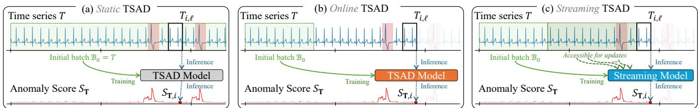  
Figure 1: Static, Online, and Streaming Time Series Anomaly Detection

2.1.3 Prediction-based. These methods detect anomalies using prediction errors to a given self-supervised task. We can identify two sub-categories: (i) forecasting-based, such as recurrent [33] or convolutional neural network [35] that use the past values as input, predict the following one, and use the forecasting error as the anomaly score; and (ii) reconstruction-based, such as AutoEncoder approaches [42] trained to reconstruct the time series and that use the reconstruction error as an anomaly score.

## 2.2 Streaming Anomaly Detection

There are two main challenges when it comes to streaming TSAD: the unknown incoming data, whose distribution can be drastically diferent from the historical data and may force an update of the model, and the computational constraints: limited memory and short execution time in case of real-time analysis [22, 39, 44, 51].

2.2.1 Concept Drift. In non-stationary environments, the underlying data distribution can change over time, resulting in what is known as Concept Drift. In the seminal work [18], it is formally defined as occurring between two time points $t _ { 0 }$ and $t _ { 1 }$ if the joint distribution $P _ { t } ( X , Y )$ ) of the input variables � and the labels � changes, such that: $\exists X \ : \ P _ { t _ { 0 } } ( X , Y ) \ \neq \ P _ { t _ { 1 } } ( X , Y )$ . However , concept drift was initially introduced in the context of supervised learning [18], where both the labels � and the data � are available. It enabled the distinction between virtual drift (changes in the incoming data distribution � (�)) and real concept drift (changes in � (� |�)).

In unsupervised settings, � is unavailable, hence we cannot directly measure � (� |�). We follow the common assumption in streaming literature [15, 53] that significant changes in �(�) serve as a proxy for concept drift. A shift in � (�) means that the statistical patterns learned during training no longer match the incoming data. In this paper, we consider a concept drift to occur when the distribution difers between historical and new data.

2.2.2 Update Mechanism (UM). To handle concept drift, streaming models contain an update mechanism. We identify two categories: (i) numerical and (ii) structural updates. In the former, models set their internal geometry during the training phase (using random projections for models such as LODA [39] and xStream [34], or space partitioning for RSHash [44], HSTree [51] and SDOstream [23]). The update will merely consist in adjusting frequency counts or mass profile in these fixed regions. As such, HSTree walks down the fixed trees until the new point reaches a leaf and raises the mass of every node on the path. Structural updates, on the other hand, correspond to evolving structures that adapt to concept drifts. RRCF [22] inserts and deletes nodes for each new arrival while MCOD [28] manages dynamical clustering within sliding windows. This process, although better for capturing complex shifts, results in higher computational cost.

2.2.3 Memory Management (MM). Three strategies exist: (i) tumbling memory, (ii) sliding memory and (iii) soft forgetting. The former includes methods that compare a reference window with a current building window. Once the current window matches the size of the reference window, it is tumbled as the new reference window, and a new current window is built incrementally. The latter is used in xStream [34] and HSTree [51]. In contrast, models employing sliding memory operate under a First In First Out paradigm, removing the oldest data when new data are added, whether as individual points (e.g., SWKNN [40], MCOD [28], RRCF [22], RSHash [44]) or small batches (e.g., LEAP [14]). Finally, soft forgetting regroups less abrupt memory management. SDOstream [23] employs an aging mechanism, assigning a decreasing weight to observations so that historical data has a diminishing impact on current evaluations. MemStream [7] maintains a fixed-size memory of normal points, adding a new point only if it is suficiently normal and discarding the oldest entry.

## 2.3 Static vs. Online vs. Streaming Methods

We now distinguish TSAD methods based on data availability for anomaly score computation and model updates ability. The latter constitutes the major diference between (i) Static, (ii) Online, (iii) Streaming methods, depicted in Figure 1 and defined as follows.

Definition 1 (Static Method). A static method computes the anomaly score at timestamp � using the entire multivariate time series T. Formally, the anomaly score �� at timestamp � may depend on any observation $T _ { k } ^ { ( j ) }$ for all dimensions $j \in [ 0 , D - 1 ]$ and all timestamps $k \in [ 0 , | \mathbf { T } | - \overset { \sim } { 1 } ]$ . There is no temporal ordering constraint.

Definition 2 (Online Method). An online method assumes access to an initial batch $\mathcal { B } _ { 0 } = \mathbf { T } _ { 0 , m }$ for some � < �. After this initial batch, the model parameters are fixed. For any timestamp $i \geq m ,$ the anomaly score $s _ { i }$ is computed using only $\mathcal { B } _ { 0 }$ and $T _ { k } ^ { \bar { ( j ) } }$ with $k \in [ i - \ell , i ]$ and $j \in [ 0 , D - 1 ]$ . No model updates are performed..

Definition 3 (Streaming Method). A streaming method processes the time series sequentially and allows model updates over time. At timestamp �, the anomaly score $s _ { i }$ is computed using observations available up to time $i , \mathrm { i } . \mathbf { e } . , T _ { k } ^ { ( j ) }$ with $k \leq i$ and $j \in [ 0 , D - 1 ]$ . After computing ��, the model may update its internal state or parameters.

These notions are closely related to those introduced in a recent streaming survey [17]. In practice, most methods in TSAD literature (cf. Section 2.1) are static methods, assuming access to the full time series. Nevertheless, many of these approaches can naturally be deployed in an online setting, by performing training on a initial batch $\mathcal { B } _ { 0 } ,$ , followed by inference on incoming observations without further model updates. This observation suggests that static-online boundary is often methodological rather than intrinsic, and that static formulations do not prevent practical online use.

## 2.4 Gap in Existing Evaluations

Despite extensive research on both static and streaming TSAD, current benchmarks exhibit the following three major limitations:

2.4.1 Streams are Time Series. Data streams consist of ordered observations collected over time. However, the literature on stream outlier detection, largely treats streams as generic sequences of data points [53], arguing that computational requirements fundamentally difer. Thus, time-series–specific characteristics are often not explicitly considered. This abstraction has led to a separation be tween the literature on streaming and TSAD, where TSAD methods are typically overlooked in streaming evaluations.

2.4.2 Anomalies are not Only Points. Anomalies are not restricted to isolated observations but also manifest as subsequences [10, 16, 27], often referred to as collective anomalies [16]. Detecting such anomalous patterns over contiguous time intervals is a central challenge in the TSAD literature [10]. Nevertheless, this notion is sometimes overlooked even within TSAD, especially for multivariate time series, where the complexity of jointly modeling temporal and cross-dimensional structure can lead to a focus on point-wise anomalies. This disconnect is even sharper in streaming outlier literature, which prioritizes identifying point anomalies [3, 23, 28, 34, 40, 44] over anomalous contiguous sequences.

2.4.3 Is Concept Drift even Real? While concept drift is inherent in real-world time series and its treatment is recognized as a central methodological challenge in online and streaming anomaly detection, existing anomaly detection benchmarks provide limited evidence of its occurrence in real time series. In particular, there is a lack of diverse real datasets with explicitly identified concept drift regarding anomaly detection. Many benchmarks rely on synthetically generated drift patterns [15, 53], or employ real-world datasets without conducting a dedicated drift analysis [43, 53]. As noted by [15], current streaming datasets typically focus either on anomaly detection or on concept drift, but rarely address both simultaneously. As a result, the practical impact of concept drift on TSAD methods’ performance remains dificult to assess under realistic evaluation settings.

## 2.5 Objectives and Research Questions

Based on the above-mentioned evaluation gaps for Streaming anomaly detection, the objective of this paper is to propose a comprehensive benchmark and experimental evaluation, aiming to answer the following research questions:

Table 1: Datasets in StrAD. Drift: # of TS with Concept Drift, % of Dimensions with Drifts (ratio), and Type
<table><tr><td colspan="3">General</td><td colspan="3">Drift</td></tr><tr><td>Dataset</td><td>Category (Field)</td><td># TS</td><td>µ(D)</td><td># TS ratio</td><td>Type</td></tr><tr><td>Genesis</td><td>Sensor (Robotics)</td><td>1</td><td>18</td><td>0/1</td><td>0</td></tr><tr><td>MITDB</td><td>Medical</td><td>13</td><td>13</td><td>0% 0/13 0%</td><td>0</td></tr><tr><td>PSM</td><td>Facility</td><td>1</td><td>25</td><td>0/1</td><td>0</td></tr><tr><td>SVDB</td><td>Medical</td><td>31</td><td>2</td><td>0% 0/31 0%</td><td>0</td></tr><tr><td>MSL</td><td>Sensor (Aerospace)</td><td>16</td><td>16</td><td>0/16 0%</td><td>0</td></tr><tr><td colspan="6">represented in TSB-drift</td></tr><tr><td>Daphnet</td><td>Human Activity</td><td>1</td><td>9</td><td>1/1</td><td>{CP}</td></tr><tr><td>GHL</td><td>Sensor (Industry)</td><td>25</td><td>19</td><td>11% 23/25 15%</td><td>{C, CP, RW}</td></tr><tr><td>SMD</td><td>Facility</td><td>22</td><td>38</td><td>15/22 13%</td><td>{C, CP, P, RW}</td></tr><tr><td>LTDB</td><td>Medical</td><td>5</td><td>2</td><td>1/5 67%</td><td>{P}</td></tr><tr><td>TAO</td><td>Environment</td><td>13</td><td>3</td><td>8/13 54%</td><td>{c}</td></tr><tr><td>OPP.</td><td>Human Activity</td><td>8</td><td>248</td><td>7/8 23%</td><td>{CP, RW}</td></tr><tr><td>CreditCard</td><td>Finance</td><td>1</td><td>29</td><td>1/1 3%</td><td>{CP}</td></tr><tr><td>CATSv2</td><td>Sensor (Dynamic System)</td><td>6</td><td>17</td><td>5/6 20%</td><td>{C, P, RW}</td></tr><tr><td>SMAP</td><td>Sensor (Telemetry)</td><td>27</td><td>25</td><td>5/27 4%</td><td>{C,CP}</td></tr><tr><td>SWaT</td><td>Sensor (Cybersecurity)</td><td>2</td><td>59</td><td>1/2 2%</td><td>{C,CP}</td></tr><tr><td>GECCO</td><td>Sensor (Water quality)</td><td>1</td><td>9</td><td>1/1 11% 5%</td><td>{C}</td></tr><tr><td>Exathlon</td><td>Facility</td><td>27</td><td>21</td><td>5/27</td><td>{CP,RW}</td></tr></table>

(Q1) Do TSAD methods significantly perform better in static settings rather than in online settings?

(Q2) Are streaming approaches more relevant than online approaches in streaming settings?

(Q3) Are streaming approaches more appropriate than online ones in case of concept drift?

(Q4) Do streaming methods balance accuracy and eficiency best?

## 3 StrAD: Our Proposed Benchmark

To address these questions, we introduce StrAD, a benchmark designed to enable a systematic evaluation of unsupervised and multivariate anomaly detection methods in streaming settings. StrAD evaluates SOTA streaming models and a broad spectrum of TSAD methods on real-world data. Overall StrAD contributions are:

• An evaluation on 17 real-world datasets (c.f. Table 1).

• The introduction of TSB-drift, a carefully designed collection of time series with clear concept drifts (c.f. Table 1).

• 19 static and online TSAD methods (c.f. Table 3).

• 10 streaming anomaly detection methods (c.f. Table 4).

## 3.1 TSB-drift: a Concept-Drift Subset

To the best of our knowledge, no current streaming benchmark explicitly evaluates performance of anomaly detection on real-world data with identified concept drift. To address this gap, we introduce TSB-drift, a curated subset of real-world time series exhibiting clear concept drifts. This subset is constructed from the TSB-AD benchmark [32].

3.1.1 TSB-AD-M as a starting point. TSB-AD-M consists in 200 multivariate real-world time series from 17 diferent datasets as presented in Table 1. Those datasets are recurrent in TSAD [5, 50, 54, 56] and were selected to avoid identified flaws in widely used datasets [32, 54, 56]. TSB-AD-M is divided into two subsets: TSB-AD-M-Tuning, which contains 20 time series dedicated to hyperparameter tuning, and TSB-AD-M-Eval, which includes the remaining 180 time series used for performance evaluation. Each time series is accompanied by a predefined training segment, ensuring reproducibility and fair comparison across methods. We use the latter as the initial batch $\mathcal { B } _ { 0 }$ for online and streaming methods.

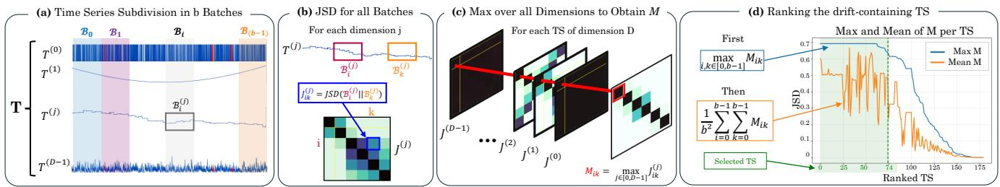  
Figure 2: Illustration of TSB-drift Construction

3.1.2 Building TSB-drift. We derive TSB-drift from TSB-AD-M by quantifying distributional changes within each series. The goal is to identify time series with significant changes in at least one dimension, ensuring a high-confidence set of drifting series.

(Step a): Batch subdivision. Each multivariate time series T is subdivided into consecutive batches of equal size, as illustrated in Figure 2(a). The batch size is the training size $t r ,$ so that for the �-th dimension: $\mathcal { B } _ { i } ^ { ( j ) } = T _ { i \times t r , t r } ^ { ( j ) }$ , with $i \in \left[ 0 , \frac { n } { t r } - 1 \right]$ . This choice retains the training batch as a historical reference in a streaming context. It balances computational eficiency with the need to preserve the training batch as a historical reference in a streaming context.

(Step b): Measuring distributional change. To quantify distribution changes in the data distribution across batches, we use the Jensen-Shannon Divergence ��� which is a symmetric and bounded variant of the Kullback-Leibler divergence $D _ { \mathrm { K L } }$ . Formally, let $\mathcal { B } _ { i } ^ { ( j ) }$ and $\mathcal { B } _ { k } ^ { ( j ) }$ be two batches. We estimate their respective empirical distributions $P _ { \mathcal { B } _ { i } ^ { ( j ) } }$ and $P _ { \mathcal { B } _ { k } ^ { ( j ) } }$ by binning the data over the support X and obtain as follows:

$$
D _ { \mathrm { K L } } ( \mathcal { B } _ { i } ^ { ( j ) } \parallel \mathcal { B } _ { k } ^ { ( j ) } ) = \sum _ { x \in \mathcal { X } } P _ { \mathcal { B } _ { i } ^ { ( j ) } } ( x ) \log \left( P _ { \mathcal { B } _ { i } ^ { ( j ) } } ( x ) / P _ { \mathcal { B } _ { k } ^ { ( j ) } } ( x ) \right)\tag{1}
$$

$$
\begin{array} { r } { J _ { i k } ^ { ( j ) } = J S D ( \mathcal { B } _ { i } ^ { ( j ) } \parallel \mathcal { B } _ { k } ^ { ( j ) } ) = \frac { 1 } { 2 } D _ { \mathrm { K L } } ( \mathcal { B } _ { i } ^ { ( j ) } \parallel A _ { i k } ^ { ( j ) } ) + \frac { 1 } { 2 } D _ { \mathrm { K L } } ( \mathcal { B } _ { k } ^ { ( j ) } \parallel A _ { i k } ^ { ( j ) } ) } \end{array}\tag{2}
$$

In the above equation, we have $A _ { i k } ^ { ( j ) } = \textstyle { \frac { 1 } { 2 } } ( \mathcal { B } _ { i } ^ { ( j ) } + \mathcal { B } _ { k } ^ { ( j ) } )$ . By computing $J _ { i k } ^ { ( j ) }$ for every pair of batches $( \mathcal { B } _ { i } ^ { ( j ) } , \mathcal { B } _ { k } ^ { ( j ) } )$ across all dimensions (Figure 2(b)), we obtain � divergence matrices $J ^ { ( j ) }$

(Step c): Aggregating across dimensions. The divergence information across dimensions is aggregated into a single drift matrix $M ,$ where each cell is $M _ { i , k } = \operatorname* { m a x } _ { j } J _ { i k } ^ { ( j ) }$ as shown in Figure 2(c). This max-pooling approach ensures that a significant drift occurring even in a single dimension is captured.

(Step d): Selecting series with strong drift. We finally rank series primarily by the maximum of� and secondarily by the global mean of � to favor long-lasting drifts. As shown in Figure 2(d), a subset of series displays substantial drifts. We retain the top 75 time series, forming a high-confidence set of series with significant drifts.

3.1.3 Drift Characterisation. The matrices $J ^ { ( j ) }$ obtained for each dimension of the time series allow us to identify recurrent drift patterns through the database as theoretically defined in [18, 53]. As illustrated in Table 2, diagonal heatmaps correspond to continuous drifts (C), block matrices to change points (CP) and cobbled heatmaps to periodic drifts (P). We name random-walks (RW)

Table 2: Characteristic Patterns Throughout TSB-drift (Training Batch $\mathcal { B } _ { 0 }$ is Highlighted in Green)  
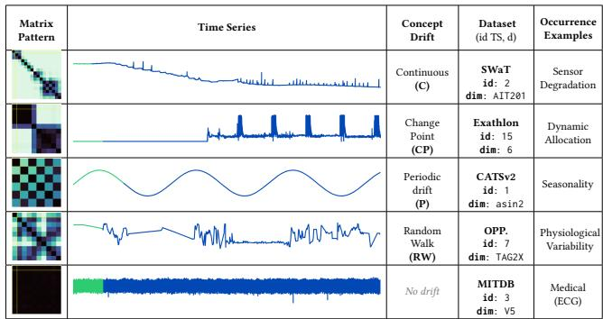

the drifts where we could find no distinctive patterns. Finally, dark heatmaps show the absence of drift.

3.1.4 Synthetic Validation. We validate our methodology using a controlled synthetic suite. We create multivariate time series containing each identified drift patterns, as well as a No Drift baseline. We also implement a Virtual Drift scenario to ensure that our approach distinguishes real concept drifts from simple noise fluctuations. More details are available in Appendix B.1. Our methodology successfully detect all drifts. Moreover, it correctly categorize the Virtual Drift as a low magnitude shift (���� ≈ 0.3) that does not reach our selection values $( m a x M \ge 0 . 6 5 )$

## 3.2 TSAD methods in StrAD

StrAD incorporates a diverse set of time-series anomaly detection (TSAD) methods (Static and Online) and Streaming algorithms. This selection enables a systematic comparison across diferent modeling paradigms, computational profiles and adaptation strategies.

3.2.1 Static/Online TSAD. Table 3 shows our representative set of TSAD approaches. The selection balances well-established classical techniques with state-of-the-art deep learning models to compare diverse modeling paradigms and computational profiles.

More specifically, we include Proximity-based (LOF [13], KNN [25]), Clustering-based (KMeansAD [25], CBLOF [26]), Distributionbased (MCD [41], HBOS [21], OCSVM [45]), Encoding-based (PCA [1], RobustPCA [37]) and Tree-based methods (IForest [30]). These approaches remain highly relevant in modern benchmarks [5, 32, 54]. Moreover, their relatively low computational overhead make them particularly pertinent in streaming settings. As such, they provide essential reference points for assessing whether more elaborate models yield significant performance improvements.

Table 3: Static/Online TSAD Methods in StrAD (∗: For Online settings, |�| is the Size of the Initial Batch B )
<table><tr><td>Acronym</td><td>Method</td><td>Type</td><td>Complexity</td></tr><tr><td colspan="4">Distance-based</td></tr><tr><td>LOF</td><td>LOF [13]</td><td>Proximity</td><td> $O ( | T | \times D ) ^ { * }$ </td></tr><tr><td>KNN</td><td>k-NN [25]</td><td>Proximity</td><td> $O ( | T | \times D ) ^ { * }$ </td></tr><tr><td>KMAD</td><td>k-Means [25]</td><td>Clustering</td><td>O(D)</td></tr><tr><td>CBLOF</td><td>CBLOF [26]]</td><td>Clustering</td><td>O(D)</td></tr><tr><td colspan="4">Density-based</td></tr><tr><td>IF</td><td>Isolation Forest [30]</td><td>Tree</td><td>O(log(|T|))*</td></tr><tr><td>MCD HBOS</td><td>MCD [41]</td><td>Distribution</td><td>O(D2)</td></tr><tr><td></td><td>HBOS [21]</td><td>Distribution</td><td>O(D)</td></tr><tr><td>SVM</td><td>OCSVM [45]</td><td>Distribution</td><td>O(D)</td></tr><tr><td>PCA</td><td>PCA [47]</td><td>Encoding</td><td>O(D)</td></tr><tr><td>RPCA</td><td>RobustPCA [37]</td><td>Encoding</td><td>O(D)</td></tr><tr><td colspan="4">Prediction-based</td></tr><tr><td>CNN</td><td>CNN [35]</td><td>Forecasting</td><td> $O ( \ell \times D )$ </td></tr><tr><td>LSTM</td><td>LSTMAD [33]</td><td>Forecasting</td><td> $O ( \ell \times D )$ </td></tr><tr><td>AT</td><td>AnomalyTransformer [57]</td><td>Reconstruction</td><td> $O ( \ell ^ { 2 } \times D + \ell \times D ^ { 2 } )$ </td></tr><tr><td>AE</td><td>AutoEncoder [42]</td><td>Reconstruction</td><td> $O ( \ell \times D )$ </td></tr><tr><td>TrAD</td><td>TranAD [52]</td><td>Reconstruction</td><td> $O ( \ell ^ { 2 } \times D + \ell \times D ^ { 2 } )$ </td></tr><tr><td>TN</td><td>TimesNet [55]</td><td>Reconstruction</td><td> $O ( \ell \times \log ( \ell ) \times D )$ </td></tr><tr><td>USAD</td><td>USAD [4]</td><td>Reconstruction</td><td> $O ( \ell \times D )$ </td></tr><tr><td>OA</td><td>OmniAnomaly [49]</td><td>Reconstruction</td><td> $O ( \ell \times D )$ </td></tr><tr><td>FITS</td><td>FITS [58]</td><td>Reconstruction</td><td> $O ( \ell \times \log ( \ell ) \times D )$ </td></tr></table>

Table 4: Streaming TSAD in StrAD (∗: Independent to � but Dependent to model hyper-parameters)
<table><tr><td>Acronym</td><td>Method</td><td>UM (Sec 2.2.2)</td><td>MM (Sec 2.2.3)</td><td>Complexity</td></tr><tr><td colspan="5">Numerical</td></tr><tr><td>LODA</td><td>LODA [39]</td><td>Projections</td><td>Tumbling Window</td><td>O(D)</td></tr><tr><td>xS</td><td>xStream [34]</td><td>Projections</td><td>Tumbling Window</td><td>O(D)</td></tr><tr><td>RSH</td><td>RSHash [44]</td><td>Partitioning</td><td>Sliding Window (Point)</td><td>O(1)*</td></tr><tr><td>HST</td><td>HSTree [51]</td><td>Partitioning</td><td>Tumbling Window</td><td>0(1)*</td></tr><tr><td>SDOs</td><td>SDOstream [23]</td><td>Partitioning</td><td>Soft Forgetting (Aging)</td><td>O(D)</td></tr><tr><td colspan="5">Structural</td></tr><tr><td>RRCF</td><td>RRCF [22]</td><td>Tree</td><td>Sliding Window (Point)</td><td>O(log(l))</td></tr><tr><td>MCOD</td><td>MCOD [28]</td><td>Clustering</td><td>Sliding Window (Point)</td><td>O(D)</td></tr><tr><td>LEAP</td><td>LEAP [14]</td><td>Proximity</td><td>Sliding Window (Batch)</td><td>O(D)</td></tr><tr><td>SKNN</td><td>SWKNN [40]</td><td>Proximity</td><td>Sliding Window (Point)</td><td>O(D)</td></tr><tr><td>MemS</td><td>MemStream [7]</td><td>Encoding</td><td>Soft Forgetting (Selective)</td><td>O(D)</td></tr></table>

The Prediction-based category covers a wide range of methods, including Recurrent and Convolutional methods (LSTMAD [33], CNN [35]), AutoEncoders (AE [42], USAD [4], OmniAnomaly [49]), Transformers (Anomaly Transformer [57], TranAD [52]) and two Frequency-based encoding (TimesNet [55], FITS [58]).

The complexity described in Table 3 refers to the inference complexity (i.e., score computation), where � is the time series dimensionality, |� | the time series length, and ℓ the window-size. Training cost is ignored since all models are trained ofline. In streaming set tings, inference latency is the most relevant metric for deployment.

3.2.2 Streaming TSAD. The streaming methods selected in Table 4 represent the state-of-the-art in streaming TSAD, covering a wide range of adaptation and memory strategies.

The Numerical category comprises Projection-based (LODA [39], xStream [34]) and Partitioning-based (RSHash [44], HSTree [51], SDOstream [23]). These methods achieve high eficiency by maintaining simple statistics within predefined regions of the data space, making them particularly suitable for streaming scenarios.

The structural category features methods with dynamically evolving internal representations. This group includes Tree-based (RRCF [22]), Clustering-based (MCOD [28]), Proximity-based (LEAP [14], SWKNN [40]) and Encoding-based mechanisms (MemStream [7]).

Finally, our selection also balances diferent memory management philosophies, ranging from rigid Tumbling and Sliding windows, to more nuanced forgetting mechanisms.

## 3.3 From TSAD to Streaming Settings

We aim to compare both Online and Streaming methods in the same benchmark. Thus, we define in this section a common training and normalization procedure.

3.3.1 Initial Batch. If needed, models in Table 3 and 4 are trained on an initial subset of the time series, considered as the historical data in a streaming context. The inference of the anomaly score will then be based on the incoming data, which, depending on the nature of the model, can be a point or a sliding window. There is no retraining for Online models, as opposed to Streaming models, which are based on intrinsic update and/or forgetting mechanism applicable on any incoming data.

3.3.2 Input Normalization. In this paper, we apply z-score standardization as a preprocessing if needed. The mean and standard deviation are computed exclusively from the initial batch and then applied to the incoming stream. The latter is chosen for two reasons: (i) It ensures model agnosticism: local normalization on a per-window basis lack the temporal context to calculate meaningful statistics. (ii) It prevents anomalies from skewing the normalization parameters, a common risk in window-based scaling.

## 4 Empirical Evaluation

We now discuss the experimental results addressing the research questions introduced in Section 2.5. We provide in Appendix A the hyper-parameter calibration. All implementations are available in our repository StrAD.

Implementation details. We use the implementation of the TSB-AD benchmark [32] for the Static/Online methods, in Python. As for the Streaming methods, we use MCOD and LEAP’s original Java implementations, and the C++ implementations of xStream, SWKNN and SDOstream using the dSalmon [24] library. RRCF, HSTree and RSHash are added using the Python library Pysad [61]. Finally, we adapt MemStream’s [7] code to our pipeline.

Evaluation Measure. The choice of evaluation metric is critical, as many metrics have been shown to exhibit biases [32, 48, 54]. This study focuses on parameter-free evaluation measures, such as the Area Under the Curve (AUC) and the Volume Under the Surface (VUS) [8]. Moreover, as we are not interested in detecting precursors but the anomalies themsleves, and since allowing delay tolerance after the true event contradicts the streaming purpose, VUS’s temporal tolerance is not the most appropriate for this study. Additionally, the Area Under a Receiver Operating Characteristic Curve (AUC-ROC) metric tends to produce overly optimistic results on highly imbalanced datasets [48], which is typically the case in anomaly detection. Consequently, the Area Under the Precision-Recall Curve (AUC-PR) is preferred in this study.

## 4.1 Static vs. Online TSAD models (Q1)

As shown in Figure 3, we start by comparing Static and Online methods. While the overall performances may appear similar in Figure 3 (1a), performances vary per method (Figure 3 (1b)). Figure 3 (2) breaks down the mean performance of the four best performing models in each data category of Table 1. We focus on the top performers to ensure a ’Best-in-Class’ comparison, efectively evaluating the theoretical upper bounds of each paradigm. We observe strong diferences: environment data, which encompasses the TAO dataset, has a large amount of point anomalies throughout the time series. Local anomaly detection, enabled by the online context, better highlights the anomalies, and therefore explains the substantial gap in performance. In contrast, medical data exhibit high regularity and low noise levels. Static methods can leverage the entire time series, making them particularly efective for sequence anomalies.

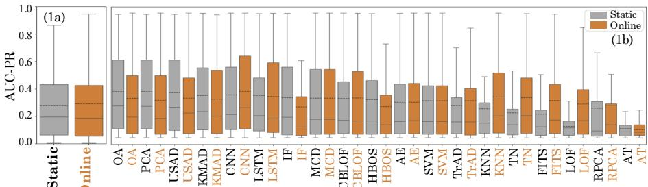

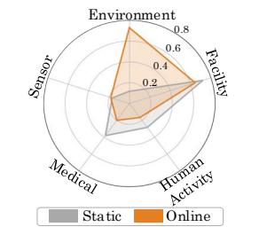  
(1) Models’ performance: Static vs Online (1a) Global (1b) Per model

Figure 3: Static vs. Online Accuracy Evaluation on TSB-AD-M: (1) Overall, (2) by Data Category.  
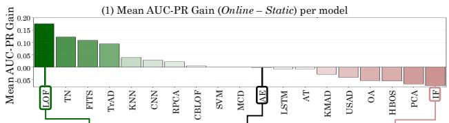

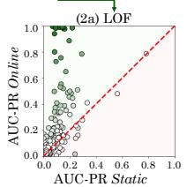

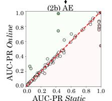  
(2) AUC-PR Online vs Static

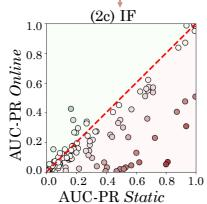  
Figure 4: (1) AUC-PR gain from Static to Online Settings; (2) Online vs Static on TSB-AD-M for (2a) LOF, (2b) AE, (2c) IF.

We then measure in Figure 4 the performance shifts from Static to Online. We observe three groups: (i) significant improvement, (ii) stable performance, and (iii) performance drop. In the first group, in green, which goes from LOF (Figure 4 (2a)) to KNN, we find the Proximity-based methods, as well as the two Prediction-based methods that use Fourier transform to encode the incoming data. For Proximity-based methods, the Static environment often sufers from the multiple similar anomalies problem, where anomalies mask one another due to their global density. The local context provided by the Online environment eliminates this problem, resulting in substantial gains ofperformance. As for TimesNet and FITS, in static environment, the Fourier transform is calculated over the entire time series, meaning the spectral representation can be polluted by non-stationarity. By shifting to an online window, these models better capture the local periodicities, making them more sensitive to temporal deviations that would otherwise be diluted.

Amongst the methods that under-perform in Online settings, Density-based methods drop the most, such as IForest shown in

Figure 4 (2c). In static context, these models benefit from a comprehensive representation of the data’s distribution. The Online setting freezes the distribution of the training batch as reference. With concept drift, this frozen representation becomes obsolete.

Finally, several models present no significant change. For deep learning-based methods (such as AutoEncoder in Figure 4 (2b)), the transition from static to Online is almost transparent, as their architecture is already window-based by design. Similarly, semisupervised methods, such as OCSVM and MCD, use the training subset to define the boundaries of a normal space. Thus, Static and Online settings are essentially the same for these approaches.

Answer to Q1: Neither static nor online settings are superior;   
performance depends on the model’s underlying logic.

## 4.2 Online vs. Streaming TSAD models (Q2)

We now compare accuracy performances of Online methods versus Streaming methods in streaming context. Figure 5 (1a) presents counter intuitive results: on average, Online methods significantly outperform Streaming methods. To ensure this performance gap is not merely due to the initial training batch size, we conduct an ablation study. We evaluate the performance across reduced training sizes of 75% and 50% of their original lengths. The results confirm that Online dominance is structural rather than data-dependent: Online methods maintain a significant lead across all settings, presenting on average a 64% gain at full training size, 49% gain at 75% training size, and 47% gain even when the training data is cut in half. More details are available in Appendix C. This assessment is reinforced when looking at the models’ individual performances in Figure 5 (1b). Only SWKNN is part of the top half of the benchmark models, and amongst the bottom ten, seven of those methods are Streaming. This performance disparity remains agnostic of the application domain, as shown in Figure 5 (2). The top performing Online methods beat or equal the top Streaming methods in every domain.

We propose several hypotheses to explain these findings. Our primary one lies with the architectural target of Streaming algorithms. As explained in Section 2.4, most of them are designed for point outlier detection, meaning they aim to identify isolated instances that fall outside a local density or distance threshold. Therefore, collective anomalies in real-world data are missed.

To assess the plausibility of this hypothesis, we obtain the critical diference diagrams of the four best models of each category on TSB-AD-M (Figure 5(3a)) and on a subset containing only point anomalies (Figure 5(3b)). Figure 5(3a) highlights a significant diference of performance between the best Online model, CNN, and the best Streaming model, SWKNN. Moreover, there are three Online models before SWKNN. Conversely, when it comes to detecting point outliers, Figure 5(3b) shows no significant diference between the eight methods. Streaming models are more competitive regarding point-wise anomalies than sequences anomalies. A second explanation for the diference between Streaming and Online is the model complexity. Streaming methods are by essence designed for eficient update, relying on lightweight, incremental algorithms. Conversely, some Online methods are based on high capacity architectures which can better capture subtle temporal dependencies.

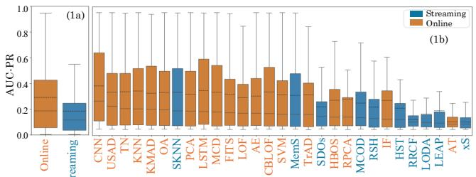  
St (1) Models’ Performance: Online vs Streaming (1a) Global (1b) Per model

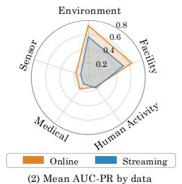

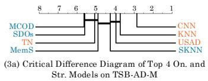

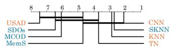

Figure 5: Online vs. Streaming Accuracy on TSB-AD-M: (1) Overall, (2) by Data Category, (3) Critical Diference Diagrams (� = 0.05) on (3a) TSB-AD-M and (3b) Point Anomalies Time Series.  
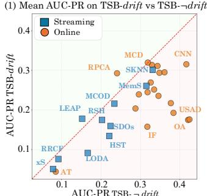

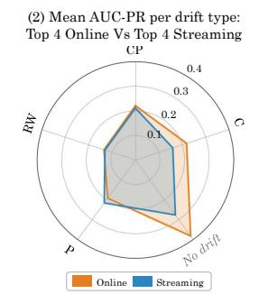

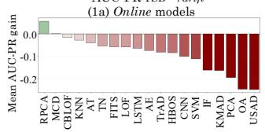

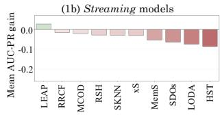  
Figure 6: (1) TSB-drift vs TSB-¬drift accuracy; Mean AUC-PR gain of TSB-drift on TSB-¬drift for (1a) Online models and (1b) Streaming models; (2) Mean performance on drift-types

Answer to Q2: Our benchmark StrAD shows that streaming approaches are less accurate than online models on real-world data. Streaming methods sufer from a focus on point outliers and struggle to detect temporal nuances.

## 4.3 Evaluation on TSB-drift (Q3)

In this section, we evaluate the robustness of Online and Streaming methods through drifts identified in TSB-drift. Figure 6 (1) presents the mean performance of every method on TSB-drift compared to TSB-AD-M without TSB-drift (written as TSB-¬drift in the rest of the paper). Methods below the identity line (highlighted in red) are less performant on TSB-drift. Nearness to this diagonal can serve as a proxy for drift resilience. In this regard, we observe that a large majority of the Streaming methods are amongst the closest to the diagonal. It is further highlighted in Figure 6 (1a) and (1b), presenting the mean loss when evaluated on TSB-drift compared to TSB-¬drift. 70% of the Streaming methods (ranging from LEAP to MemStream) show lower performance degradation than 70% of the Online methods (from FITS to USAD). And even the less robust Streaming model, HSTree, is less impacted than 7 Online models. It is further highlighted in Figure 6 (2), showing the mean performance of the top 4 models of each category (CNN, USAD, TimesNet and KNN for Online models, and SWKNN, MemStream, SDOstream and MCOD for Streaming ones) on the time series presenting each identified type of drift (presented in Section 3.1.3). We can see that in three out of the four types identified (change point, random walk and periodic), there is almost no performance gap. Interestingly, in the case of continuous drift, Online methods maintain a lead, though the gap is halved compared to the non-drifted time series. The resilience to continuous drifts for the top four Online models compared to their Streaming counterparts can be explained by the fact that it is a slow drift. If the models (in particular CNN, USAD and TimesNet) learn a temporal pattern rather than absolute values, they can still recognize the shape despite the drift.

Nevertheless, this robustness to drift does not translate into absolute superiority. The highest-performing methods remain overwhelmingly Online. The resilience shown by the Streaming methods does not bridge the substantial gap highlighted in Section 4.2.

Answer to Q3: While streaming approaches demonstrate superior resilience to concept drifts, they are not necessarily the more appropriate in terms of absolute accuracy.

## 4.4 Eficiency of Online vs. Streaming (Q4)

We now evaluate the computational eficiency of Online versus Streaming methods. Figure 7(1) depicts AUC-PR versus average throughput (average number of inference computations per second) for all time series in TSB-AD. Methods in the top right corner are slower but more accurate, while those in the bottom left corner are the fastest but show the worst accuracy. The top right corner is the ideal sector. We observe a Pareto frontier, highlighted by the red dotted line, that illustrates a fundamental Performance-Eficiency Trade-of. The Streaming models on the Pareto frontier (SDOstream

RPCA KNN LEAP MemS PCA CNN SDOs SKNN

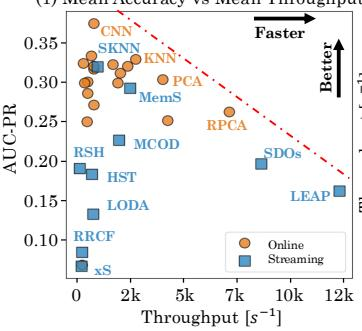

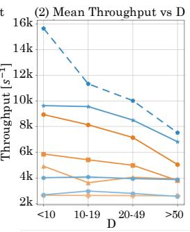

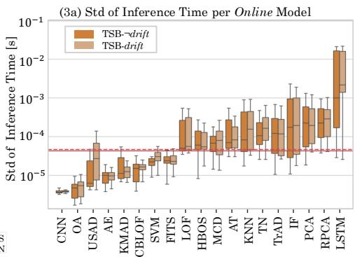

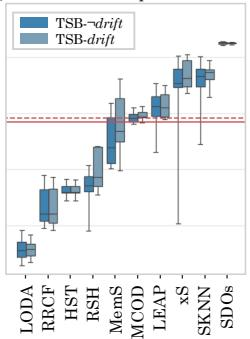  
Figure 7: Scalability Evaluation on TSB-AD-M: (1) Accuracy vs Throughput; (2) Throughput vs Number of Dimensions; (3) Inference time standard deviation on TSB-¬drift and TSB-drift for (3a) Online and (3b) Streaming models (Red line highlights median on TSB-¬drift and dotted line on TSB-drift)

and LEAP) confirm what has been previously underlined: by focusing on high temporal eficiency, those methods have sacrificed TSAD performance on complex data. Conversely, accurate methods are mainly Online methods with deep architectures, whose structural complexity limits iteration speed.

Figure 7(2) focuses on the Pareto frontier methods, depicting throughput versus the number of dimension. LEAP is represented by a discontinued line, because it does not return an anomaly score per point, but rather per small batch (of size 32). The bins in Figure 7(2) are not strictly equivalent (respectively 58, 45, 54 and 23 time series per bin). As expected, increasing dimensionality negatively impacts the computational eficiency of the methods. Despite this, even the slowest frontier method, CNN, maintains a mean throughput of 770 point scored per second. Thus, this method remains applicable for high-precision monitoring, like electrocardiogram [20], or industrial vibration monitoring, that can operate in the 500-800Hz [29]. However in high velocity domains, like network intrusion detection [19], high-speed fiber optics links operate at Gbps rates, making such deep models wholly unsuitable.

Finally, we assess the runtime stability in Figure 7(3). We show two boxplots per model for the standard deviation of the inference time across TSB-drift and TSB-¬drift. The red full lines represent the median of all models on TSB-¬drift, while the red dotted line is on TSB-drift. Globally, Online methods exhibit higher stability by one order of magnitude. This is expected, as the updating process causes computational instability. Furthermore, concept drifts slightly exacerbate this instability for Streaming methods, as the two medians are almost equal for the Online models, but the TSB-drift median is distinctly higher for Streaming methods in Figure 7(3b).

From a practical deployment perspective, these findings outline clear architectural boundaries governed by operational constraints. While streaming methods ofer minimal memory footprints and high throughput ideal for resource-constrained contexts or highvelocity data streams, their lightweight nature inherently limits capacity. Conversely, online methods trade higher computational and memory overhead for structural capacity, making them better suited for environments where prediction accuracy on complex, collective anomalies outweighs strict sub-millisecond latency bounds.

Answer to Q4: While online methods are more accurate, streaming methods dominate the computational higheficiency end ofthe spectrum, making them irreplaceable in high velocity domains.

## 5 Conclusion

We now conclude on the key findings of our experimental evaluation on our novel benchmark StrAD and discuss the implications of our work for future research.

Why Do Online Methods Perform Better? Online methods mitigate anomaly camouflage inherent in static settings by limiting temporal context. This helps proximity-based models avoid multiple similar anomalies problem and allows Fourier-based models to focus on dominant frequencies without long-term non-stationarity. Additionally, their higher model capacity enables better temporal dependency modeling than lightweight Streaming approaches.

Limitations of Current Streaming TSAD. The most significant limitation is the legacy focus on point-wise outliers. Real-world anomalies often consist in collective anomalies, manifesting as pattern changes rather than simple value spikes. Most native Streaming algorithms are built on lightweight distance or density metrics designed to identify isolated points and therefore fail to capture such patterns.

Implications for Future Research. The observed performance gap indicates that native Streaming TSAD still underexplores collective anomalies. Therefore, in a streaming world, we should stand still. But for how long? The performance gap identified in our benchmark suggests that native Streaming TSAD still has the entire spectrum of collective anomalies left to explore. However, rather than merely simplifying deep models for incremental updates, a more promising frontier may lie in Streaming Automated Anomaly Detection. While AutoAD [6, 31, 50] has proven efective in Static settings by improving performance and easing model selection for non-experts, its extension to streaming scenarios remains largely unexplored. The latter is a promising research direction for Streaming TSAD.

## Acknowledgments

Funding This work was sponsored by the ANRT-CIFRE Grant No.   
2025/0400 as part of the PhD thesis of the first author.

## References

[1] Charu C Aggarwal. 2015. Outlier Analysis. Springer.

[2] Ahmad N. Alkuwari, Saif Al-Kuwari, and Marwa Qaraqe. 2022. Anomaly Detection in Smart Grids: A Survey from Cybersecurity Perspective. In 3rd International Conference On Smart Grid And Renewable Energy (SGRE). Institute ofElectrical and Electronics Engineers Inc., United States. doi:10.1109/SGRE53517.2022.9774221

[3] Fabrizio Angiulli and Fabio Fassetti. 2007. Detecting distance-based outliers in streams ofdata. In Proceedings ofthe Sixteenth ACM Conference on Information and Knowledge Management, CIKM2007, Lisbon, Portugal, November6-10, 2007, MárioJ. Silva, Alberto H. F. Laender, Ricardo A. Baeza-Yates, Deborah L. McGuinness, Bjørn Olstad, Øystein Haug Olsen, and André O. Falcão (Eds.). ACM, 811–820. doi:10.1145/1321440.1321552

[4] Julien Audibert, Pietro Michiardi, Frédéric Guyard, Sébastien Marti, and Maria A. Zuluaga. 2020. USAD: UnSupervised Anomaly Detection on Multivariate Time Series. In KDD ’20: The 26th ACM SIGKDD Conference on Knowledge Discovery and Data Mining, Virtual Event, CA, USA, August 23-27, 2020, Rajesh Gupta, Yan Liu, Jiliang Tang, and B. Aditya Prakash (Eds.). ACM, 3395–3404. doi:10.1145 3394486.3403392

[5] Julien Audibert, Pietro Michiardi, Frédéric Guyard, Sébastien Marti, and Maria A. Zuluaga. 2022. Do deep neural networks contribute to multivariate time series anomaly detection? Pattern Recognit. 132 (2022), 108945. doi:10.1016/J.PATCOG. 2022.108945

[6] Maroua Bahri, Flavia Salutari, Andrian Putina, and Mauro Sozio. 2022. AutoML: state of the art with a focus on anomaly detection, challenges, and research directions. Int. J. Data Sci. Anal. 14, 2 (2022), 113–126. doi:10.1007/S41060-022- 00309-0

[7] Siddharth Bhatia, Arjit Jain, Shivin Srivastava, Kenji Kawaguchi, and Bryan Hooi. 2022. MemStream: Memory-Based Streaming Anomaly Detection. In WWW ’22: The ACM Web Conference 2022, Virtual Event, Lyon, France, April 25 - 29, 2022, Frédérique Laforest, Raphaël Troncy, Elena Simperl, Deepak Agarwal, Aristides Gionis, Ivan Herman, and Lionel Médini (Eds.). ACM, 610–621. doi:10.1145 3485447.3512221

[8] Paul Boniol, Ashwin K. Krishna, Marine Bruel, Qinghua Liu, Mingyi Huang, Themis Palpanas, Ruey S. Tsay, Aaron J. Elmore, Michael J. Franklin, and John Paparrizos. 2025. VUS: efective and eficient accuracy measures for time-series anomaly detection. VLDB J. 34, 3 (2025), 32. doi:10.1007/S00778-025-00907-X

[9] Paul Boniol, Michele Linardi, Federico Roncallo, Themis Palpanas, Mohammed Meftah, and Emmanuel Remy. 2021. Unsupervised and scalable subsequence anomaly detection in large data series. VLDB J. 30, 6 (2021), 909–931. doi:10. 1007/S00778-021-00655-8

[10] Paul Boniol, Qinghua Liu, Mingyi Huang, Themis Palpanas, and John Paparrizos. 2024. Dive into Time-Series Anomaly Detection: A Decade Review. CoRR abs/2412.20512 (2024). arXiv:2412.20512 doi:10.48550/ARXIV.2412.20512

[11] Paul Boniol and Themis Palpanas. 2020. Series2Graph: Graph-based Subsequence Anomaly Detection for Time Series. Proc. VLDB Endow. 13, 11 (2020), 1821–1834. http://www.vldb.org/pvldb/vol13/p1821-boniol.pdf

[12] Paul Boniol, John Paparrizos, Themis Palpanas, and Michael J. Franklin. 2021. SAND: Streaming Subsequence Anomaly Detection. Proc. VLDB Endow. 14, 10 (2021), 1717–1729. doi:10.14778/3467861.3467863

[13] Markus M. Breunig, Hans-Peter Kriegel, Raymond T. Ng, and Jörg Sander. 2000. LOF: Identifying Density-Based Local Outliers. In Proceedings ofthe 2000 ACM SIGMOD International Conference on Management ofData, May 16-18, 2000, Dallas, Texas, USA, Weidong Chen, Jefrey F. Naughton, and Philip A. Bernstein (Eds.). ACM, 93–104. doi:10.1145/342009.335388

[14] Lei Cao, Di Yang, Qingyang Wang, Yanwei Yu, Jiayuan Wang, and Elke A. Run densteiner. 2014. Scalable distance-based outlier detection over high-volume data streams. In IEEE 30th International Conference on Data Engineering, Chicago, ICDE 2014, IL, USA, March 31 - April 4, 2014, Isabel F. Cruz, Elena Ferrari, Yufei Tao, Elisa Bertino, and Goce Trajcevski (Eds.). IEEE Computer Society, 76–87. doi:10.1109/ICDE.2014.6816641

[15] Yang Cao, Yixiao Ma, Ye Zhu, and Kai Ming Ting. 2025. Revisiting streaming anomaly detection: benchmark and evaluation. Artif. Intell. Rev. 58, 1 (2025), 8. doi:10.1007/S10462-024-10995-W

[16] Varun Chandola, Arindam Banerjee, and Vipin Kumar. 2009. Anomaly detection: A survey. ACM Comput. Surv. 41, 3 (2009), 15:1–15:58. doi:10.1145/1541880. 1541882

[17] Lucas Correia, Jan-Christoph Goos, Philipp Klein, Thomas Bäck, and Anna V. Kononova. 2024. Online Model-based Anomaly Detection in Multivariate Time Series: Taxonomy, Survey, Research Challenges and Future Directions. CoRR abs/2408.03747 (2024). arXiv:2408.03747 doi:10.48550/ARXIV.2408.03747

[18] João Gama, Indre Zliobaite, Albert Bifet, Mykola Pechenizkiy, and Abdelhamid Bouchachia. 2014. A survey on concept drift adaptation. ACM Comput. Surv. 46, 4 (2014), 44:1–44:37. doi:10.1145/2523813

[19] P. García-Teodoro, J. Díaz-Verdejo, G. Maciá-Fernández, and E. Vázquez. 2009. Anomaly-based network intrusion detection: Techniques, systems and challenges. Computers and Security 28, 1 (2009), 18–28. doi:10.1016/j.cose.2008.08.003

[20] Ary Goldberger, Luís Amaral, Leon Glass, Jefrey Hausdorf, Plamen Ivanov, Roger Mark, Joseph Mietus, George Moody, Chung-Kang Peng, and H. Stanley.

2000. PhysioBank, PhysioToolkit, and PhysioNet : Components of a New Research Resource for Complex Physiologic Signals. Circulation 101 (07 2000), E215–20. doi:10.1161/01.CIR.101.23.e215

[21] Markus Goldstein and Andreas R. Dengel. 2012. Histogram-based Outlier Score (HBOS): A fast Unsupervised Anomaly Detection Algorithm. In KI.

[22] Sudipto Guha, Nina Mishra, Gourav Roy, and Okke Schrijvers. 2016. Robust Random Cut Forest Based Anomaly Detection on Streams. In Proceedings ofthe 33nd International Conference on Machine Learning, ICML 2016, New York City, NY, USA, June 19-24, 2016 (JMLR Workshop and Conference Proceedings, Vol. 48), Maria-Florina Balcan and Kilian Q. Weinberger (Eds.). JMLR.org, 2712–2721. http://proceedings.mlr.press/v48/guha16.htm

[23] Alexander Hartl, Félix Iglesias, and Tanja Zseby. 2020. SDOstream: Low-Density Models for Streaming Outlier Detection. In 28th European Symposium on Artificial Neural Networks, Computational Intelligence and Machine Learning, ESANN 2020, Bruges, Belgium, October 2-4, 2020. 661–666. https://www.esann.org/sites/default/ files/proceedings/2020/ES2020-143.pdf

[24] Alexander Hartl, Félix Iglesias Vázquez, and Tanja Zseby. 2024. dSalmon: High-Speed Anomaly Detection for Evolving Multivariate Data Streams. 153–169. doi:10. 1007/978-3-031-48885-6\_10

[25] D. M. Hawkins. 1980. Identification ofOutliers. Springer. doi:10.1007/978-94-015- 3994-4

[26] Zengyou He, Xiaofei Xu, and Shengchun Deng. 2003. Discovering cluster-based local outliers. Pattern Recognit. Lett. 24, 9-10 (2003), 1641–1650. doi:10.1016/S0167- 8655(03)00003-5

[27] Eamonn J. Keogh, Jessica Lin, and Ada Wai-Chee Fu. 2005. HOT SAX: Eficiently Finding the Most Unusual Time Series Subsequence. In Proceedings ofthe 5th IEEE International Conference on Data Mining (ICDM) 2005), 27-30 November 2005, Houston, Texas, USA. IEEE Computer Society, 226–233. doi:10.1109/ICDM.2005.79

[28] Maria Kontaki, Anastasios Gounaris, Apostolos N. Papadopoulos, Kostas Tsichlas, and Yannis Manolopoulos. 2011. Continuous monitoring of distance-based out liers over data streams. In Proceedings ofthe 27th International Conference on Data Engineering, ICDE 2011, April 11-16, 2011, Hannover, Germany, Serge Abiteboul, Klemens Böhm, Christoph Koch, and Kian-Lee Tan (Eds.). IEEE Computer Society, 135–146. doi:10.1109/ICDE.2011.5767923

[29] Yaguo Lei, Jing Lin, Zhengjia He, and Ming J. Zuo. 2013. A review on empirical mode decomposition in fault diagnosis ofrotating machinery. Mechanical Systems and Signal Processing 35, 1 (2013), 108–126. doi:10.1016/j.ymssp.2012.09.015

[30] Fei Tony Liu, Kai Ming Ting, and Zhi-Hua Zhou. 2008. Isolation Forest. In Proceedings ofthe 8th IEEE International Conference on Data Mining (ICDM 2008), December 15-19, 2008, Pisa, Italy. IEEE Computer Society, 413–422. doi:10.1109/ ICDM.2008.17

[31] Qinghua Liu, Seunghak Lee, and John Paparrizos. 2025. TSB-AutoAD: Towards Automated Solutions for Time-Series Anomaly Detection [E, A & B]. Proc. VLDB Endow. 18, 11 (2025), 4364–4379. doi:10.14778/3749646.3749699

[32] Qinghua Liu and John Paparrizos. 2024. The Elephant in the Room: Towards A Reliable Time-Series Anomaly Detection Benchmark. In Advances in Neural Information Processing Systems 38: Annual Conference on Neural Information Processing Systems 2024, NeurIPS 2024, Vancouver, BC, Canada, December 10 - 15, 2024, Amir Globersons, Lester Mackey, Danielle Belgrave, Angela Fan, Ulrich Paquet, Jakub M. Tomczak, and Cheng Zhang (Eds.). http://papers.nips. cc/paper\_files/paper/2024/hash/c3f3c690b7a99fba16d0efd35cb83b2c-Abstract-Datasets\_and\_Benchmarks\_Track.html

[33] Pankaj Malhotra, Lovekesh Vig, Gautam Shrof, and Puneet Agarwal. 2015. Long Short Term Memory Networks for Anomaly Detection in Time Series. In 23rd European Symposium on Artificial Neural Networks, ESANN2015, Bruges, Belgium, April 22-24, 2015. https://www.esann.org/sites/default/files/proceedings/legacy/ es2015-56.pdf

[34] Emaad A. Manzoor, Hemank Lamba, and Leman Akoglu. 2018. xStream: Outlier Detection in Feature-Evolving Data Streams. In Proceedings ofthe 24th ACM SIGKDD International Conference on Knowledge Discovery & Data Mining, KDD 2018, London, UK, August 19-23, 2018, Yike Guo and Faisal Farooq (Eds.). ACM, 1963–1972. doi:10.1145/3219819.3220107

[35] Mohsin Munir, Shoaib Ahmed Siddiqui, Andreas Dengel, and Sheraz Ahmed. 2019. DeepAnT: A Deep Learning Approach for Unsupervised Anomaly Detection in Time Series. IEEE Access 7 (2019), 1991–2005. doi:10.1109/ACCESS.2018.2886457

[36] Antonios Ntroumpogiannis, Michail Giannoulis, Nikolaos Myrtakis, Vassilis Christophides, Eric Simon, and Ioannis Tsamardinos. 2023. A meta-level analysis of online anomaly detectors. VLDB J. 32, 4 (2023), 845–886. doi:10.1007/S00778- 022-00773-X

[37] Randy C. Pafenroth, Kathleen Kay, and Les Servi. 2018. Robust PCA for Anomaly Detection in Cyber Networks. CoRR abs/1801.01571 (2018). arXiv:1801.01571 http://arxiv.org/abs/1801.01571

[38] John Paparrizos, Yuhao Kang, Paul Boniol, Ruey S. Tsay, Themis Palpanas, and Michael J. Franklin. 2022. TSB-UAD: An End-to-End Benchmark Suite for Univari ate Time-Series Anomaly Detection. Proc. VLDB Endow. 15, 8 (2022), 1697–1711. doi:10.14778/3529337.3529354

[39] Tomás Pevný. 2016. Loda: Lightweight on-line detector of anomalies. Mach. Learn. 102, 2 (2016), 275–304. doi:10.1007/S10994-015-5521-0

[40] Sridhar Ramaswamy, Rajeev Rastogi, and Kyuseok Shim. 2000. Eficient Algorithms for Mining Outliers from Large Data Sets. In Proceedings ofthe 2000 ACM SIGMOD International Conference on Management ofData, May 16-18, 2000, Dallas, Texas, USA, Weidong Chen, Jefrey F. Naughton, and Philip A. Bernstein (Eds.). ACM, 427–438. doi:10.1145/342009.335437

[41] Peter J. Rousseeuw. 1984. Least Median of Squares Regression. J. Amer. Statist. Assoc. 79, 388 (1984), 871–880. doi:10.1080/01621459.1984.10477105

[42] Mayu Sakurada and Takehisa Yairi. 2014. Anomaly Detection Using Autoencoders with Nonlinear Dimensionality Reduction. In Proceedings ofthe MLSDA 2014 2nd Workshop on Machine Learning for Sensory Data Analysis, Gold Coast, Australia, QLD, Australia, December 2, 2014, Ashfaqur Rahman, Jeremiah D. Deng, and Jiuyong Li (Eds.). ACM, 4. doi:10.1145/2689746.2689747

[43] Rebecca Salles, Benoit Lange, Reza Akbarinia, Florent Masseglia, Eduardo S. Ogasawara, and Esther Pacitti. 2025. Scalable and accurate online multivariate anomaly detection. Inf. Syst. 131 (2025), 102524. doi:10.1016/J.IS.2025.102524

[44] Saket Sathe and Charu C. Aggarwal. 2018. Subspace histograms for outlier detection in linear time. Knowl. Inf. Syst. 56, 3 (2018), 691–715. doi:10.1007/S10115- 017-1148-8

[45] Bernhard Schölkopf, Robert C. Williamson, Alexander J. Smola, John Shawe-Taylor, and John C. Platt. 1999. Support Vector Method for Novelty Detection. In Advances in Neural Information Processing Systems 12, [NIPS Conference, Denver, Colorado, USA, November 29 - December 4, 1999], Sara A. Solla, Todd K. Leen, and Klaus-Robert Müller (Eds.). The MIT Press, 582–588. http://papers.nips.cc/paper/ 1723-support-vector-method-for-novelty-detection

[46] Pavel Senin, Jessica Lin, Xing Wang, Tim Oates, Sunil Gandhi, Arnold P. Boedihardjo, Crystal Chen, and Susan Frankenstein. 2015. Time series anomaly discovery with grammar-based compression. In Proceedings of the 18th International Conference on Extending Database Technology, EDBT2015, Brussels, Belgium, March 23-27, 2015, Gustavo Alonso, Floris Geerts, Lucian Popa, Pablo Barceló, Jens Teubner, Martín Ugarte, Jan Van den Bussche, and Jan Paredaens (Eds.). OpenProceedings.org, 481–492. doi:10.5441/002/EDBT.2015.42

[47] Mei-Ling Shyu, Shu-Ching Chen, Kanoksri Sarinnapakorn, and Liwu Chang. 2003. A Novel Anomaly Detection Scheme Based on Principal Component Classifier. In Foundations and New Directions ofData Mining Workshop at ICDM 2003.

[48] Sondre Sørbø and Massimiliano Ruocco. 2024. Navigating the metric maze: a taxonomy of evaluation metrics for anomaly detection in time series. Data Min. Knowl. Discov. 38, 3 (2024), 1027–1068. doi:10.1007/S10618-023-00988-8

[49] Ya Su, Youjian Zhao, Chenhao Niu, Rong Liu, Wei Sun, and Dan Pei. 2019. Robust Anomaly Detection for Multivariate Time Series through Stochastic Recurrent Neural Network. In Proceedings ofthe 25th ACM SIGKDD International Conference on Knowledge Discovery & Data Mining, KDD 2019, Anchorage, AK, USA, August 4-8, 2019, Ankur Teredesai, Vipin Kumar, Ying Li, Rómer Rosales, Evimaria Terzi, and George Karypis (Eds.). ACM, 2828–2837. doi:10.1145/3292500.3330672

[50] Emmanouil Sylligardos, John Paparrizos, Themis Palpanas, Pierre Senellart, and Paul Boniol. 2025. MSAD: A deep dive into model selection for time series anomaly detection. VLDB J. 34, 6 (2025), 72. doi:10.1007/S00778-025-00949-1

[51] Swee Chuan Tan, Kai Ming Ting, and Fei Tony Liu. 2011. Fast Anomaly Detection for Streaming Data. In IJCAI 2011, Proceedings ofthe 22nd International Joint Conference on Artificial Intelligence, Barcelona, Catalonia, Spain, July 16-22, 2011, Toby Walsh (Ed.). IJCAI/AAAI, 1511–1516. doi:10.5591/978-1-57735-516-8/IJCAI11-254

[52] Shreshth Tuli, Giuliano Casale, and Nicholas R. Jennings. 2022. TranAD: Deep Transformer Networks for Anomaly Detection in Multivariate Time Series Data. Proc. VLDB Endow. 15, 6 (2022), 1201–1214. doi:10.14778/3514061.3514067

[53] Félix Iglesias Vázquez, Alexander Hartl, Tanja Zseby, and Arthur Zimek. 2023. Anomaly detection in streaming data: A comparison and evaluation study. Expert Syst. Appl. 233 (2023), 120994. doi:10.1016/J.ESWA.2023.120994

[54] Dennis Wagner, Tobias Michels, Florian C. F. Schulz, Arjun Nair, Maja Rudolph, and Marius Kloft. 2023. TimeSeAD: Benchmarking Deep Multivariate Time-Series Anomaly Detection. Trans. Mach. Learn. Res. 2023 (2023). https://openreview. net/forum?id=iMmsCI0JsS

[55] Haixu Wu, Tengge Hu, Yong Liu, Hang Zhou, Jianmin Wang, and Mingsheng Long. 2023. TimesNet: Temporal 2D-Variation Modeling for General Time Series Analysis. In The Eleventh International Conference on Learning Representations, ICLR 2023, Kigali, Rwanda, May 1-5, 2023. OpenReview.net. https://openreview. net/forum?id=jz\_Uqw384Oq

[56] Renjie Wu and Eamonn J. Keogh. 2022. Current Time Series Anomaly Detection Benchmarks are Flawed and are Creating the Illusion of Progress (Extended Abstract). In 38th IEEE International Conference on Data Engineering, ICDE 2022, Kuala Lumpur, Malaysia, May 9-12, 2022. IEEE, 1479–1480. doi:10.1109/ICDE53745. 2022.00116

[57] Jiehui Xu, Haixu Wu, Jianmin Wang, and Mingsheng Long. 2022. Anomaly Transformer: Time Series Anomaly Detection with Association Discrepancy. In The Tenth International Conference on Learning Representations, ICLR 2022, Virtual Event, April 25-29, 2022. OpenReview.net. https://openreview.net/forum?id= LzQQ89U1qm\_

[58] Zhijian Xu, Ailing Zeng, and Qiang Xu. 2024. FITS: Modeling Time Series with 10k Parameters. In The Twelfth International Conference on Learning Representations,

ICLR 2024, Vienna, Austria, May 7-11, 2024. OpenReview.net. https://openreview. net/forum?id=bWcnvZ3qMb

[59] Dragomir Yankov, Eamonn J. Keogh, and Umaa Rebbapragada. 2008. Disk aware discord discovery: finding unusual time series in terabyte sized datasets. Knowl. Inf. Syst. 17, 2 (2008), 241–262. doi:10.1007/S10115-008-0131-9

[60] Chin-Chia Michael Yeh, Yan Zhu, Liudmila Ulanova, Nurjahan Begum, Yifei Ding, Hoang Anh Dau, Diego Furtado Silva, Abdullah Mueen, and Eamonn J. Keogh. 2016. Matrix Profile I: All Pairs Similarity Joins for Time Series: A Unifying View That Includes Motifs, Discords and Shapelets. In IEEE 16th International Conference on Data Mining, ICDM 2016, December 12-15, 2016, Barcelona, Spain, Francesco Bonchi, Josep Domingo-Ferrer, Ricardo Baeza-Yates, Zhi-Hua Zhou, and Xindong Wu (Eds.). IEEE Computer Society, 1317–1322. doi:10.1109/ICDM. 2016.0179

[61] Selim Firat Yilmaz and Suleyman Serdar Kozat. 2020. PySAD: A Streaming Anomaly Detection Framework in Python. CoRR abs/2009.02572 (2020). arXiv:2009.02572 https://arxiv.org/abs/2009.02572

## A Hyperparameters Calibration

For reproducibility purposes, we keep the hyperparameters proposed by the TSB-AD [32] benchmark for the static and online configurations. The parameters search ranges for the streaming implementations are determined from previous benchmarks [15, 36, 53] and recommendations from the original papers. Grid search is done on the Tuning subset of TSB-AD-M and the tuned hyperparameters are chosen based on the best median performance. We present below the search grid in Table 5 and tuned hyperparameters obtained for this study in Table 6.

Table 5: Hyperparameter Search Grid for the Evaluated Streaming Models
<table><tr><td>Model</td><td>Hyperparameter</td><td>Search Range</td></tr><tr><td rowspan="3">RRCF</td><td>num_trees</td><td>{2, 4, 8, 16, 20, 25}</td></tr><tr><td>shingle_size</td><td>{2, 4, 8}</td></tr><tr><td>tree_size</td><td>{256, 512}</td></tr><tr><td rowspan="3">RSHash</td><td>sampling_points</td><td>{500, 1000}</td></tr><tr><td>decay</td><td>{0.01, 0.015, 0.02}</td></tr><tr><td>num_components</td><td>{50, 100, 200, 300}</td></tr><tr><td rowspan="3">HSTree</td><td>num_hash_fns</td><td>{1, 2, 4}</td></tr><tr><td>window_size</td><td>{50, 100, 200, 250}</td></tr><tr><td>num_trees</td><td>{10, 25, 50, 100} {10, 15}</td></tr><tr><td rowspan="2">MemStream</td><td>max_depth</td><td>{32, 64, 256, 512, 1024}</td></tr><tr><td>memory_len beta</td><td>{10, 1, 0.1, 0.01, 0.001}</td></tr><tr><td rowspan="4">LEAP</td><td>k</td><td></td></tr><tr><td>R</td><td>{5, 10, 20, 40} {0.5, 1.0, 2.0}</td></tr><tr><td>slidingWindow</td><td>{256, 512}</td></tr><tr><td>slide</td><td>{32, 64}</td></tr><tr><td rowspan="3">MCOD</td><td>k</td><td>{5, 10, 20, 40}</td></tr><tr><td>R</td><td>{0.5, 1.0, 2.0}</td></tr><tr><td>W</td><td>{64, 256, 512, 1024}</td></tr><tr><td rowspan="4">xStream</td><td>window</td><td>{64, 128, 256}</td></tr><tr><td>n_estimators</td><td>{50, 100, 200}</td></tr><tr><td>n_projections</td><td></td></tr><tr><td>depth</td><td>{50, 100, 200} {10, 15, 20}</td></tr><tr><td rowspan="2">SWKNN</td><td>slidingWindow</td><td>{64, 128, 256, 512, 1024}</td></tr><tr><td>k</td><td>{5, 10, 15, 20, 30, 40}</td></tr><tr><td rowspan="2">SDOstream</td><td>k</td><td>{200, 500, 1000, 1500}</td></tr><tr><td>T</td><td>{128, 256, 512}</td></tr><tr><td></td><td>X</td><td>{3, 6, 10}</td></tr></table>

Table 6: Optimal Hyperparameters for the Evaluated Streaming Models
<table><tr><td>Model</td><td>Tuned hyperparameters</td></tr><tr><td>RRCF</td><td>{num_trees : 16, shingle_size: 8, tree_size: 512}</td></tr><tr><td>RSHash</td><td>{sampling_points : 1000, decay: 0.01, num_components: 300, num_hash_fns: 2}</td></tr><tr><td>HSTree</td><td>{window_size : 200, num_trees: 25, max_depth: 15}</td></tr><tr><td>MemStream</td><td>{memory_len : 32, beta: 0.001}</td></tr><tr><td>LEAP</td><td>{k : 40, R: 2.0, slidingWindow: 256, slide: 32}</td></tr><tr><td>MCOD</td><td>{k : 5, R: 1.0, W: 1024}</td></tr><tr><td>xStream</td><td>{window : 256, n_estimators: 200, n_projections: 50, depth: 20}</td></tr><tr><td>SWKNN</td><td>{slidingWindow : 64, k: 40}</td></tr><tr><td>SDOstream</td><td>{k : 1000, T: 512, x: 10}</td></tr></table>

## B More on TSB-drift

## B.1 Synthetic Drift Validation

We create a synthetic suite, designed to manifest Real Concept Drift (where the relationship � (� |�) changes) by defining anomalies relative to an evolving local distribution. The base signal is $T _ { i } =$ $\mu _ { i } + \epsilon _ { i } + s _ { i }$ with $\epsilon _ { i } \sim { \cal N } ( 0 , 0 . 1 )$ and sparse spikes �� the labeled anomalies (for $i \in [ 0 , n - 1 ]$ , where $n \ = \ | T |$ the length of the time series). We validated our methodology across the following scenarios:

• Continuous Drift: Linear mean evolution, $\mu _ { i } = \delta \cdot i , \delta = 3 / n .$

• Change Point: An abrupt regime shift at midpoint, $\mu _ { i } = 0$ if $i < n / 2$ else 2.5.

• Periodic Drift: Toggling distribution parameters every 2×�� steps, $\mu _ { i } = 2 \mathrm { i f } \lfloor i / 2 t _ { r } \rfloor$ is odd else 0.

• Random Walk: Stochastic non-stationarity, $\begin{array} { r } { \mu _ { i } = \sum _ { k = 1 } ^ { i } \eta _ { k } , \eta _ { k } \sim } \end{array}$ N(0, 0.05).

• Virtual Drift (Noise Shift): To ensure our threshold distinguishes between CD and simple noise increases, we simulated a variance shift: $\sigma = 0 . 1  0 . 4 \mathrm { a t } i = n / 2 ( \mu _ { i }$ constant).

Plots and codes are available on our repository.

## B.2 Complex Drift Characterisation

Table 7: Examples of Complex Patterns Throughout TSBdrift (Training Batch B0 is Highlighted in Green)  
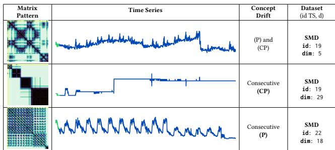

Of the identified patterns illustrated in Table 2, we can ensue more complex combinations that are still visually identifiable with the matrix patterns such as those identified in Table 7. Among those, we have the re-occurrence of the same pattern, like consecutive Change Points, or a change of periodicity. But we also have the succession of diferent patterns, such as the sudden interruption of a Periodic pattern.

## C Ablation Study

We conduct this study on time series having at least a 1000 points in the initial training size, as some models cannot have an training batch size lower than 500 points, due to their hyperparameters. The study is therefore conducted on 142 times series, representing 15 out of the 17 datasets (the only time series from CreditCard and the 13 from TAO have an initial training batch size of 500 points and could not be included). The results are summarized in Table 8;

Table 8: Ablation Study: Mean AUC-PR Performance Across Diferent Initial Training Batch Sizes.
<table><tr><td>Training Size</td><td>Mean Online</td><td>Mean Streaming</td><td>Relative Online Gain (%)</td></tr><tr><td>Full (100%)</td><td>0.2807</td><td>0.1713</td><td>+63.91</td></tr><tr><td>75%</td><td>0.2742</td><td>0.1847</td><td>+48.51</td></tr><tr><td>50%</td><td>0.2701</td><td>0.1836</td><td>+47.10</td></tr></table>