# Inference Auctions

Keegan Harris∗1, Siddharth Prasad∗2, Asher Trockman∗3, Nika Haghtalab†1, and Michael I. Jordan†1,4

1University of California, Berkeley 2Toyota Technological Institute at Chicago 3Google Research 4Inria & École Normale Supérieure {keegan.harris,nika,michael\_jordan}@berkeley.edu sprasad@ttic.edu, trockman@google.com

## Abstract

When inference demand exceeds available compute capacity, model providers must decide which requests should be served first. Users have diferent tolerances for delay from an LLM API, but current priority pricing schemes compress these diferences into coarse fixed-price service tiers. We desi n an inference auction that allows users to bid for faster service. Our auction allocates priority in an economically eficient way without sacrificing latency, and we develop fast algorithms for implementing prices that incentivize truthful bidding. We also design an autobidding agent for our inference auction, where users specify an inference budget and the autobidder dynamically adjusts its bids over time to maximize user utility subject to the budget constraint. Experiments validate the practicality of our auction: it increases s stem welfare while maintainin the cache utilization and latenc advanta es of SGLang, a state-of-the-art inference serving framework.

## 1 Introduction

Large-scale LLM inference requires allocation of shared compute resources across diferent users’ requests. During periods of heavy trafic, model providers need to determine which requests to serve first, and how much to charge for faster service. Users can difer substantially in their willingness to pay for earlier service. For example, an interactive request may be sensitive to delays that are inconsequential for a background job. Today, most major model providers allocate priority through a small number of fixed-price service tiers (typically two or three), with higher-paying requests receiving priority over lower-paying ones during times of high trafic [e.g., 3, 6, 23, 38, 49]. These coarse tiers give users limited scope to express their latency preferences, and as a result, priority is allocated in an economically ineficient way.

The design of a more expressive and eficient market for inference priority raises new challenges that are absent from conventional queuing systems and transaction-fee markets. Modern inference engines process prompts with the same prefix by reusing the key-value (KV) cache across their shared prefix, so the time it takes to serve a request depends on which requests have already been served [e.g., 34, 41, 52]. For example, interrupting a batch of requests that all share a long common prefix to serve unrelated requests may cause the common prefix to be evicted from the KV cache, disrupting cache reuse and harming request throughput. Serving that same batch of common- prefix requests contiguously instead will generally yield improved throughput due to better cache utilization. This form of prefix-aware scheduling and KV cache management is implemented in state-of-the-art inference serving frameworks such as SGLang [52], leading to significant latency and throughput gains. A good market design should not sacrifice these performance gains.

We design an inference auction that allows users to bid for priority. Our key observation is that preserving the cache-reuse benefits of prefix-aware serving systems still leaves freedom to de- cide which groups of requests receive priority, enabling significant gains in social welfare while retaining the cache optimality of practical serving systems. Our key contributions, in more detail, are as follows:

Inference Auction Design (Section 2 and Section 3). We develop the first inference auction, a way for LLM providers to prioritize requests by letting users bid for faster service. Each bid repre- sents the user’s reported value for moving a request from the back of the scheduling queue to the front, with value increasing linearly as the request moves earlier in the schedule. Our goal is to max- imize social welfare—the total value users derive from their assigned priorities—while retaining cache optimality. A key aspect of our inference auction design is to constrain the resulting schedule of requests to be a depth-first-search (DFS) schedule, that is, it must correspond to a DFS traversal of the radix tree of requests (a tree in which requests that share a prompt prefix share a path from the root). Inference auctions corresponding to such DFS schedules maximize KV cache hit rate due to optimal prefix sharing. We show that the welfare-maximizing DFS schedule corresponds to the DFS traversal that orders a node’s children by average bid across requests in their subtrees, and can therefore be computed very eficiently. We pair our scheduling rule with Vickrey–Clarke–Groves (VCG) payments that incentivize truthful bidding. Computing VCG payments naively requires recomputing an optimal schedule for each user, causing a quadratic worst-case dependence on the number of requests. We develop an algorithm that computes all payments in quasilinear run-time by decomposing each user’s welfare externality into local changes along the radix tree.

Autobidding Agents for Inference Auctions (Section 4). Inference users typically submit many requests over time and must manage their inference budget. Even when truthful reporting is optimal in each auction in isolation, users still need to choose how aggressively to bid across requests so that their inference budget is spent where it is most valuable. To address this, we design an autobidding agent that adjusts a user’s bids over time to maximize their cumulative utility, subject to a budget constraint. Our autobidding algorithm scales each request’s value by a multiplier and adjusts this multiplier over time using gradient descent. We show that this strategy achieves $O ( { \sqrt { T } } )$ regret relative to the optimal-in-hindsight bidding policy on a sequence of � inference auctions. We also characterize the welfare loss when users have diferent pacing multipliers: we show that welfare only decreases when these diferences reverse the ordering of requests in the DFS schedule, and we bound the resulting ineficiency by the variation in pacing multipliers across the radix subtrees.

Experiments (Section 5). We implement our inference auction as a scheduling layer in front of an unmodified SGLang server and evaluate it across several workloads with various shared prefix structures. Compared to a bid-blind, cache-optimal request ordering, our mechanism improves overall welfare by 12–18.6% under i.i.d. request valuations and up to 100% when valuations are non-i.i.d., all while leaving cache hit rate and average time-to-first-token virtually unchanged. Simultaneously, we find that our mechanism enjoys ∼80% of the welfare of the unconstrained schedule ordered by decreasing bids. In contrast, this unconstrained schedule sharply reduces cache hit rates, which results in an increase in average latency by as much as 12×.

## 2 Cache-Optimal Schedules and Our Bidding Environment

Serving an autoregressive language model has two stages. During prefill, the model processes a request’s prompt and stores its keys and values in the KV cache. During decoding, it generates output tokens while reusing the cached keys and values. Modern inference engines interleave the two stages across requests, typically prioritizing the decode steps of requests already in progress. Our mechanism determines the order in which queued requests are admitted for prefill.

The KV cache entries for a prompt prefix can be reused by other requests which share that prefix, reducing prefill computation. Because cache capacity is limited, this reuse depends on the request scheduling order: processing requests with a long shared prefix consecutively can avoid evicting and recomputing their common entries. The inference engine SGLang [52] puts this principle into practice by storing shared token prefixes in a radix tree and scheduling requests in the order of a DFS traversal of that tree, which is a longest-prefix-match order and is cache-optimal. A key aspect of our auction design is to allow bids to only afect the ordering of children in a DFS traversal of the request radix tree. This ensures that no matter the precise economics of the auction (e.g., schedules, payments, incentives), we maintain the cache eficiency of prefix-aware scheduling. We now formally introduce the elements of the auction environment.

Notation. ${ \mathcal { S } } _ { n }$ denotes the set of all permutations of $\{ 1 , \ldots , n \}$ . For a set of indexed elements $\mathbf { a } _ { 1 : m } : = \{ \mathbf { a } _ { 1 } , \dots , \mathbf { a } _ { m } \}$ , we write $\mathbf { a } _ { - i } : = \mathbf { a } _ { 1 : m } \mid \{ \mathbf { a } _ { i } \}$ to denote $\mathbf { a } _ { 1 : m }$ with element � excluded.

Requests and Scheduling Batches. We consider a setting where a model provider is serving requests to a single LLM on one inference worker. Requests arrive asynchronously and are pe-riodically grouped into scheduling batches of � queued requests. We treat the formation of these batches as exogenous: our mechanism determines the relative prefill priority of requests within a batch, but not which requests enter the batch.1

Let $\mathcal { R } : = \{ 1 , \ldots , n \}$ be the requests in a batch. There are $m \leq n$ inference users who may each submit multiple requests. We use $\mathcal { R } _ { i } \subseteq \mathcal { R }$ to denote the set of requests submitted by user �, where $\textstyle \bigcup _ { i = 1 } ^ { m } \mathcal { R } _ { i } = \mathcal { R }$ and $\mathcal { R } _ { i } \cap \mathcal { R } _ { j } = \emptyset$ for all $i \neq j$ . A schedule is a permutation $\sigma \in \mathcal S _ { n }$ , where $\sigma ( r )$ is the position of request � within the batch. Smaller positions receive earlier prefill service, and the scheduler admits requests for prefill according to this ordering. Each request is represented by its sequence of prompt tokens. Let � denote the total number of prompt tokens across all requests in R, counting tokens separately for each request. The shared-prefix structure of R is captured by a radix tree.

Definition 2.1 (Request Radix Tree). The radix tree for a set of requests is the rooted, edge-labeled tree obtained by merging common prefixes and contracting every non-branching path into a single edge. Each request is represented by an auxiliary leaf node (that stores request metadata, e.g., user ID and user bid), and the lowest common ancestor of two request leaves represents their longest shared prefix. T denotes the request-augmented radix tree. For a node u, let C(u) denote its children, $\mathcal { L } ( \mathfrak { u } )$ denote the request leaves in the subtree rooted at $\mathsf { u } , d ( \mathsf { u } ) : = | \mathcal { C } ( \mathsf { u } ) |$ , and $N ( { \mathfrak { u } } ) : =$ $| \mathcal { L } ( \mathfrak { u } ) |$ . The maximum branching factor of T is $\nu : = \mathrm { m a x } _ { \mathrm { u } } \left| \mathcal { C } ( \mathrm { u } ) \right|$ . See Figure 5 for an example.

Of particular interest are schedules that process all requests in one radix subtree before moving on to another, that is, they correspond to DFS traversals of T.

Definition 2.2 (DFS Schedule). A schedule � is a DFS schedule if for every node u, the leaves belonging to each child subtree ${ \mathsf { c } } \in \mathcal { C } ( \mathfrak { u } )$ appear contiguously in �. Let $\mathcal { D } ( \top ) \subseteq \mathcal S _ { n }$ denote the set of DFS schedules for T.

Under the assumption that the KV cache is large enough to hold the longest request in the batch, schedules in $\mathcal { D } ( \mathsf { T } )$ enjoy the optimal cache hit rate by Theorem 3.1 in Zheng et al. [52].

Values and Priority. The user who submits request � has a private value $\upsilon _ { r } \geq 0$ for receivin earlier service. The fractional priority received by request � under schedule � is $\begin{array} { r } { x _ { r } ( \sigma ) : = \frac { | s \in \mathbb { R } : \bar { \sigma ( s ) } > \sigma ( r ) | } { n - 1 } } \end{array}$ The first request has fractional priority 1, the last has fractional priority 0, and a request scheduled ahead of an �-fraction of the batch receives priority �. Let $\mathbf { v } _ { i } : = [ \nu _ { r } ] _ { r \in \mathcal { R } _ { i } }$ denote the vector of user �’s values for his requests and $\mathbf { x } _ { i } ( \sigma ) : = [ x _ { r } ( \sigma ) ] _ { r \in \mathcal { R } _ { i } }$ be the vector of the corresponding fractional priorities under �. User �’s total value under $\sigma ,$ interpreted as his maximum willingness-to-pay for fractional priority $\mathbf { x } _ { i } ( \sigma )$ , is $V _ { i } ( \sigma ) : = \langle \mathbf { v } _ { i } , \mathbf { x } _ { i } ( \sigma ) \rangle$ and the welfare of � is $W ( \boldsymbol { \sigma } ; \mathbf { v } _ { 1 : m } ) : = \sum _ { i = 1 } ^ { m } V _ { i } ( \boldsymbol { \sigma } )$ .

Fractional priority provides a simple rank-based proxy for queueing delay and the resulting time-to- first-token (TTFT). Modeling value as being linear in fractional priority is a design choice to keep the bidding language simple: users only need to report how much they value moving a request from the back of the scheduling batch to the front, rather than specify a potentially complex value function over TTFT. Our experiments show that bidding according to fractional priority leads to schedules that closely track realized TTFT, supporting fractional priority as a practical proxy for latency.

Bids, Schedules, and Payments. Each request � has a corresponding user bid $b _ { r } \geq 0$ , interpreted as the user’s reported value for � receiving full priority. Let $\mathbf { b } _ { i } : = [ b _ { r } ] _ { r \in \mathcal { R } _ { i } }$ be the vector of user �’s bids. An inference auction is a mechanism which maps bids to a DFS schedule and user payments.

Definition 2.3 (Inference Auction). Given a radix tree T, an inference auction consists of (1) a scheduling rule $A : \mathbb { R } _ { + } ^ { n } \to { \mathcal { D } } ( { \mathsf { T } } )$ mapping bids to DFS schedules and (2) a payment rule $p : \mathbb { R } _ { + } ^ { n } \to \mathbb { R } _ { + } ^ { m }$ mapping bids to payments, where $p _ { i } ( { \bf { b } } _ { 1 : m } )$ is the payment charged to user �.

Any inference auction enjoys optimal cache utilization by Theorem 3.1 of Zheng et al. [52].

We make the standard assumption that users have quasilinear utility, so a user with true values $\mathbf { v } _ { i }$ obtains utility $V _ { i } ( A (  { \mathbf { b } } _ { 1 : m } ) ) - p _ { i } (  { \mathbf { b } } _ { 1 : m } )$ in an inference auction with scheduling rule � and payment rule $p .$ Our goal in the sequel is to design an inference auction that maximizes welfare over D(T) while incentivizing truthful bidding. A simple symmetry argument shows that the welfare loss due to restricting to D(T) is no more than 50%.2

Proposition 2.4. For any $\begin{array} { r } { \mathbf { v } _ { 1 : m } , \operatorname* { m a x } _ { \sigma \in \mathcal { D } ( \mathbb { T } ) } W ( \sigma ; \mathbf { v } _ { 1 : m } ) \geq \frac { 1 } { 2 } \operatorname* { m a x } _ { \sigma \in \mathcal { S } _ { n } } W ( \sigma ; \mathbf { v } _ { 1 : m } ) . } \end{array}$

## 3 Welfare-Optimal Inference Auctions

We now design a welfare-maximizing (or economically eficient) inference auction that is simple and tractable. In Section 3.1, we design a scheduling rule that maximizes reported user welfare. The scheduling rule admits a clean algorithm: at every node of the radix tree, visit its children in decreasing order of their average sub-tree bid. In Section 3.2, we implement VCG prices that incentivize truthful bidding. Although these payments are defined through a separate counterfactual optimization for each user, we show that they can be computed in quasilinear total run-time. Taken together, our scheduling and payment rules maximize true user welfare and can be implemented with very little overhead compared to the time it takes to construct and traverse the radix tree.3

## 3.1 Implementing Welfare-Maximizing DFS Schedules

Since we restrict to DFS schedules, the scheduler’s only decision is how to order the children of each internal node in the radix tree. For a node $\mathbf { u } ,$ let $\begin{array} { r } { F _ { b } ( \mathbf { u } ) : = \sum _ { r \in \mathcal { L } ( \mathbf { u } ) } b _ { r } } \end{array}$ denote the sum of bids in the subtree rooted at u. We will show that reported welfare is maximized by visiting the children of every internal node in decreasing order of $F _ { b } ( \mathbf { u } ) / N ( \mathbf { u } )$

ALGORITHM 1: Average-Bid DFS ALGORITHM 2: DFS(u, �)   
Scheduling Rule $\bar { A } ( { \bf \delta b } _ { 1 : m } )$ if u is a leaf then   
Let u be the root of the radix tree T �.append(u)   
Initialize $L \gets [ ]$ $[ \mathsf { c } _ { 1 } , \hdots , \mathsf { c } _ { d ( \mathsf { u } ) } ] \gets \mathcal { C } ( \mathsf { u } )$ sorted in descending order of $F _ { b } / N$   
DFS(u, �) for $k = 1 , \ldots , d ( \mathsf { u } )$ do   
return � $\mathsf { D F S } ( \mathsf { c } _ { k } , L )$

For intuition as to why this is the case, consider two children c and d of the same internal node. If c is visited before d, every request in $\mathcal { L } ( \mathsf { c } )$ is scheduled ahead of every request in $\mathcal { L } ( { \mathsf { d } } )$ , and these cross-subtree pairs contribute $\frac { N ( { \mathsf { d } } ) F _ { b } ( { \mathsf { c } } ) } { n - 1 }$ to reported welfare. Visiting d before c instead contributes $\frac { N ( \mathsf { c } ) F _ { b } ( \mathsf { d } ) } { n - 1 }$ . It is therefore welfare-improving to place c before d whenever $N ( { \mathsf { d } } ) F _ { b } ( { \mathsf { c } } ) \geq N ( { \mathsf { c } } ) F _ { b } ( { \mathsf { d } } )$ or equivalently when $F _ { b } ( \mathsf { c } ) / N ( \mathsf { c } ) \geq F _ { b } ( \mathsf { d } ) / N ( \mathsf { d } )$ . The following theorem shows that applying this local rule independently at every branch produces a globally-optimal DFS schedule.

Theorem 3.1. Given bid vectors $ { \mathbf { b } } _ { 1 : m }$ , the average-bid DFS scheduling rule $\bar { A } ( { \bf { b } } _ { 1 : m } )$ given by Algo-rithm 1 returns a cache-optimal schedule � that maximizes $W ( \sigma ;  { \mathbf { b } } _ { 1 : m } )$ among all DFS schedules. Furthermore, this schedule can be computed in $O ( M + n \log \nu )$ expected run-time.

Figure 6 illustrates an example of an average-bid DFS schedule.

## 3.2 Computing VCG Payments

The average-bid DFS of Algorithm 1 yields a schedule that maximizes reported welfare, but our ultimate goal is to maximize welfare with respect to users’ true values. Vickrey [48]-Clarke [13]-Groves [24] (VCG) payments ensure this property by charging each user for the welfare loss that his bids impose on the other users. When paired with a scheduling rule that maximizes reported welfare over a fixed set of feasible outcomes, these payments make truthful bidding (i.e., bidding $\mathbf b _ { i } = \mathbf v _ { i } )$ an optimal strategy for users with quasilinear utility. We instantiate the VCG mechanism with average-bid DFS schedules and D(T) as the feasible set:

Definition 3.2 (VCG payment rule). Let $h _ { i } ( \mathbf { b } _ { - i } ) = \operatorname* { m a x } _ { \sigma \in \mathcal { D } ( \mathbb { T } ) } W \big ( \sigma ; ( 0 , \mathbf { b } _ { - i } ) \big )$ denote the maximum reported welfare the other users could obtain if user �’s bids were set to zero while its requests remain in the radix tree.4 The VCG payment rule charges user �

$$
p _ { i } ^ { \mathtt { V C G } } ( \mathbf { b } _ { 1 : m } ) = h _ { i } ( \mathbf { b } _ { - i } ) - \sum _ { j \neq i } \langle \mathbf { b } _ { j } , \mathbf { x } _ { j } ( \bar { A } ( \mathbf { b } _ { 1 : m } ) ) \rangle .
$$

The inference auction with average-bid DFS schedules and VCG payments satisfies the following properties:

1. Eficiency: Under truthful bidding, true welfare $W ( \sigma ; { \mathbf { v } } _ { 1 : m } )$ is maximized over DFS schedules.

2. Incentive compatibility (IC): $V _ { i } ( \bar { A } ( \mathbf { v } _ { i } , \mathbf { b } _ { - i } ) ) - p _ { i } ^ { \mathrm { v c g } } ( \mathbf { v } _ { i } , \mathbf { b } _ { - i } ) \geq V _ { i } ( \bar { A } ( \mathbf { b } _ { i } , \mathbf { b } _ { - i } ) ) - p _ { i } ^ { \mathrm { v c g } } ( \mathbf { b } _ { i } , \mathbf { b } _ { - i } )$ for all ${ \bf v } _ { i } , { \bf b } _ { i } , { \bf b } _ { - i }$ . This makes truthful bidding an optimal strategy.

3. Individual rationality (IR): $V _ { i } ( \bar { A } ( \mathbf { v } _ { i } , \mathbf { b } _ { - i } ) ) - p _ { i } ^ { \mathtt { V C G } } ( \mathbf { v } _ { i } , \mathbf { b } _ { - i } ) \geq 0$ for all $\mathbf { v } _ { i } , \mathbf { b } _ { - i }$

4. No positive transfers: $p _ { i } ^ { \mathtt { V C G } } ( \mathbf { b } _ { 1 : m } ) \geq 0$ for all bid vectors $ { \mathbf { b } } _ { 1 : m }$

Furthermore by Krishna and Perry [33], these payments maximize the model provider’s revenue among all IC and IR mechanisms that implement the welfare-maximizing DFS schedule.

Eficient Payment Computation. Naively computing VCG payments for each user consists of repeatedly zeroing out that user’s bids and rerunning Algorithm 1. This approach takes �(�� log �) time, which is quadratic in � if each user has only a single request. While such a quadratic dependence on � is unavoidable if the goal is to return the welfare-optimal DFS traversal when each user is excluded, we are able to bypass this barrier since we only need the optimal welfare values. As a result, our algorithm enjoys an improved runtime of �(min{�, ��} log �).

The key idea behind our algorithm (Appendix B.2) is easiest to see when each user submits a single request. Suppose we set the bid of request � to zero. At every internal node on the path from the root to �’s leaf, only the average bid of the child containing � changes. This average can only decrease, and so the afected child can only move later in the welfare-optimal traversal while all other children retain their relative order. Siblings that remain on the same side of the afected child do not contribute to the user’s payment, while each sibling that overtakes it contributes a local externality. Since the children are already sorted by average bid from the average-bid DFS schedule, a binary search identifies the siblings that overtake the afected child. Summing these local efects via pre-computed prefix sums over the root-to-leaf path then gives the user’s VCG payment.

When a user submits multiple requests, zeroing out all of his bids may afect multiple children of a given internal node. However the same principle still applies: jointly reorder the afected children according to their modified average bids and merge them with the unchanged children.

Theorem 3.3. Given as input the processed radix tree T, where at every node u (1) $F _ { b } ( \mathfrak { u } )$ and $N ( \mathfrak { u } )$ are stored and (2) its children are sorted in decreasing order of average bid, all VCG payments $p _ { 1 } ^ { \mathtt { V C G } } ( \mathbf { b } _ { 1 : m } ) , \dotsc , p _ { m } ^ { \mathtt { V C G } } ( \mathbf { b } _ { 1 : m } )$ can be computed in �(min{�, ��} log �) total run-time.

The end-to-end run-time of implementing the welfare-optimal DFS schedule with VCG prices is therefore $O ( M + \operatorname* { m i n } \{ M , m n \} \log \nu )$

## 4 Autobidding Agents for Inference Auctions

The VCG mechanism makes truthful bidding optimal within any single scheduling batch. However, inference users typically have many requests that need to be served over time, and they may have a budget allocated for the total amount they can spend in a given time period. This budget constraint couples the user’s bids, as bidding truthfully in every batch can exhaust the budget too early. Motivated by autobidding systems in online advertising,5 we develop an autobidding agent for inference auctions: an online policy that converts a user’s values and remaining budget into bids, without requiring a model of future demand or competing bids.

Repeated Auction Model. Consider a sequence of � scheduling batches. In batch $t \in [ T ]$ , let ${ \mathsf { T } } ^ { ( t ) }$ be the request radix tree, $\mathcal { R } _ { 1 } ^ { ( t ) }$ be the autobidder’s requests, $\mathbf { v } _ { 1 } ^ { ( t ) } = [ \nu _ { r } ^ { ( t ) } ] _ { r \in \mathcal { R } _ { 1 } ^ { ( t ) } }$ be his value vector, $\mathbf { b } _ { 1 } ^ { ( t ) }$ be his bid vector, and $\mathbf { b } _ { 2 : m } ^ { ( t ) }$ be the other users’ bids.6 We consider the welfare-maximizing inference auction of Section 3. Given bids $\mathbf { b } _ { 1 : m } ^ { ( t ) } .$ , the mechanism selects schedule $\bar { A } ^ { ( t ) } (  { \mathbf { b } } _ { 1 : m } ^ { ( t ) } )$ and charges the autobidder his VCG payment $p _ { 1 } ^ { ( t ) } ( \mathbf { b } _ { 1 : m } ^ { ( t ) } )$ . The autobidder’s value in batch � is $V _ { 1 } ^ { ( t ) } ( \pmb { \sigma } ^ { ( t ) } ) : = \langle \mathbf { v } _ { 1 } ^ { ( t ) } , \mathbf { x } _ { 1 } ^ { ( t ) } ( \pmb { \sigma } ^ { ( t ) } ) \rangle$ . The autobidder has total budget $B = T \gamma$ (where $\gamma > 0$ is the target spend per batch), and seeks to maximize cumulative utility subject to the budget constraint $\begin{array} { r }  \bar { \sum _ { t = 1 } ^ { T } p _ { 1 } ^ { ( \bar { t } ) } ( \mathbf { b } _ { 1 : m } ^ { ( t ) } ) \leq T \gamma } \end{array}$ . We measure the performance of the autobidder through the notion of regret.

Definition 4.1 (Autobidder Regret). For a realized sequence of instances $( \mathbf { v } _ { 1 } ^ { ( t ) } , \top ^ { ( t ) } , \mathbf { b } _ { 2 : m } ^ { ( t ) } ) _ { t = 1 } ^ { T } \sim \mathcal { P } _ { . }$

ALGORITHM 3: Pacing Autobidder for Welfare-Optimal Inference Auctions   
Input: Target spend $\gamma ,$ step size $\eta > 0$   
Initialize $\bar { B ^ { ( 1 ) } } \stackrel {  } { = } T \gamma , \stackrel {  } { \mu ^ { ( 1 ) } } = \stackrel {  } { 0 }$   
for $t = 1 , \dots , T$ do   
Let $\begin{array} { r } { \alpha ^ { ( t ) } = \frac { 1 } { 1 + \mu ^ { ( t ) } } } \end{array}$ and bid $\mathbf { b } _ { 1 } ^ { ( t ) } = \alpha ^ { ( t ) } \mathbf { v } _ { 1 } ^ { ( t ) } \mathbb { 1 } \{ \| \alpha ^ { ( t ) } \mathbf { v } _ { 1 } ^ { ( t ) } \| _ { 1 } \le B ^ { ( t ) } \}$   
Observe payment $p _ { 1 } ^ { ( t ) } ( \mathbf { b } _ { 1 : m } ^ { ( t ) } )$ and update budget $B ^ { ( t + 1 ) } \gets B ^ { ( t ) } - p _ { 1 } ^ { ( t ) } ( \mathbf { b } _ { 1 : m } ^ { ( t ) } )$   
Update $\boldsymbol { \mu } ^ { ( t + 1 ) } \gets \left[ \boldsymbol { \mu } ^ { ( t ) } + \eta ( p _ { 1 } ^ { ( t ) } ( \mathbf { b } _ { 1 : m } ^ { ( t ) } ) - \boldsymbol { \gamma } ) \right] _ { + }$

the optimal cumulative utility in hindsight is

$$
\mathsf { O P T } ( T ) : = \operatorname* { m a x } _ { \mathbf { b } _ { 1 } ^ { ( 1 ) } , \ldots \mathbf { b } _ { 1 } ^ { ( T ) } } \left\{ \sum _ { t = 1 } ^ { T } V _ { 1 } ^ { ( t ) } ( \pmb { \sigma } ^ { ( t ) } ) - p _ { 1 } ^ { ( t ) } ( \mathbf { b } _ { 1 : m } ^ { ( t ) } ) \ : \ \sum _ { t = 1 } ^ { T } p _ { 1 } ^ { ( t ) } ( \mathbf { b } _ { 1 : m } ^ { ( t ) } ) \leq T \gamma \right\} .
$$

Regret is the expected diference between OPT(�) and the autobidder’s cumulative utility; i.e.,

$$
R ( T ) : = \mathbb { E } \left[ \mathrm { O P T } ( T ) - \sum _ { t = 1 } ^ { T } ( V _ { 1 } ^ { ( t ) } ( \sigma ^ { ( t ) } ) - p _ { 1 } ^ { ( t ) } ( \mathbf { b } _ { 1 : m } ) ) \right] .
$$

Value Pacing. At every timestep, our autobidder scales the request values by a common pacing factor $\alpha ^ { ( t ) }$ , bids $\mathbf { b } _ { 1 } ^ { ( t ) } = \alpha ^ { ( t ) } \mathbf { v } _ { 1 } ^ { ( t ) }$ , and updates the pacing factor $\alpha ^ { ( t ) }  \alpha ^ { ( t + 1 ) }$ . The pacing factor decreases when spending exceeds the per-batch target $\gamma ,$ and increases when spending falls below the target. Pseudocode for our autobidding agent is given in Algorithm 3.

Theorem 4.2. Suppose that $( \mathbf { v } _ { 1 } ^ { ( t ) } , \mathsf { T } ^ { ( t ) } , \mathbf { b } _ { 2 : m } ^ { ( t ) } ) _ { t = 1 } ^ { T }$ are drawn i.i.d. from an unknown distribution P. Let $K : = \mathrm { m a x } _ { t \in [ T ] } | \mathcal { R } _ { 1 } ^ { ( t ) } | , \| \mathbf { v } _ { 1 } ^ { ( t ) } \| _ { \infty } \leq C _ { \mathrm { m } }$ , and suppose that schedules and payments are assigned according to the inference auction of Section 3. Then if $\eta = \Theta ( 1 / { \sqrt { T } } )$ , Algorithm 3 obtains regret $R ( T ) = O ( \mathrm { p o l y } ( C , K , \gamma ) \sqrt { T } )$ when � is suficiently large.

The proof proceeds via a reduction to Balseiro et al. [8], who study online allocation problems with generic concave reward functions and resource constraints. The main technical dificulty is showing that their framework actually applies in our setting. The distributional assumption models a stationary serving environment in which request values, prefix structures, and competing bids can vary across batches but arise from a stable workload.

Welfare Under Heterogeneous Pacing. When multiple autobidders pace independently, their multipliers can difer, and so their bids will generally not be proportional to a common pacing factor. This can lead to a loss in per-batch social welfare compared to the welfare under truthful reporting. We now quantify this loss as a function of the request radix tree’s structure.

For the remainder of this section, we suppress the batch index and write each bid as $b _ { r } = \alpha _ { r } \upsilon _ { r }$ . For a subtree c, let $\begin{array} { r } { F _ { \nu } ( \mathsf { c } ) : = \sum _ { r \in \mathcal { L } ( \mathsf { c } ) } \nu _ { r } } \end{array}$ and define its value-weighted pacingfactor by $\alpha ( \mathsf { c } ) : = F _ { b } ( \mathsf { c } ) / F _ { \nu } ( \mathsf { c } )$ Definition 4.3 (Node Pacing Condition Number). The condition number of node u is $\kappa _ { \mathsf { U } } : =$ max $\mathtt { : } \{ \alpha ( \mathtt { c } ) : \mathtt { c } \in \mathcal { C } ( \mathtt { u } ) , F _ { \nu } ( \mathtt { c } ) > 0 \} / \operatorname* { m i n } \{ \alpha ( \mathtt { c } ) : \mathtt { c } \in \mathcal { C } ( \mathtt { u } ) , F _ { \nu } ( \mathtt { c } ) > 0 \}$ , with $\kappa _ { \mathrm { u } } : = 1$ if at most one child of u has $F _ { \nu } ( { \mathsf { c } } ) > 0$

Condition number measures how unevenly sibling subtrees are paced. When $\kappa _ { \mathrm { { u } } } = 1$ , pacing preserves the welfare-maximizing order, whereas larger values of $\kappa _ { \mathrm { u } }$ result in greater local distortion. The following theorem formalizes this relationship by lower-bounding the realized welfare at a single timestep in terms of the node-level condition numbers.

Theorem 4.4. Suppose that each request � has corresponding bid $b _ { r } = \alpha _ { r } \upsilon _ { r }$ for pacing factors $\alpha _ { 1 } , \ldots , \alpha _ { n } \in ( 0 , 1 ]$ , and let $\Omega _ { \mathrm { u } }$ denote the marginal contribution of node u to the optimal DFS welfare. Then the social welfare for the batch is bounded as

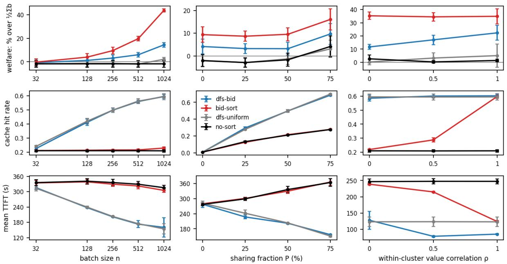  
Figure 1: Stars topology. Welfare, cache hit rate, and mean TTFT, varying: batch size � (left), sharing fraction � with �=256 (middle), and within-cluster bid correlation � (right).

$$
\frac { W ( \bar { A } (  { \mathbf { b } } _ { 1 : m } ) ;  { \mathbf { v } } _ { 1 : m } ) } { \operatorname* { m a x } _ { \sigma \in \mathcal { D } ( T ) } W ( \sigma ;  { \mathbf { v } } _ { 1 : m } ) } \geq \frac { \sum _ { \mathfrak { u } } \Omega _ { \mathfrak { u } } / \kappa _ { \mathfrak { u } } } { \sum _ { \mathfrak { u } } \Omega _ { \mathfrak { u } } } \geq \frac { 1 } { \operatorname* { m a x } _ { \mathfrak { u } } \kappa _ { \mathfrak { u } } } .
$$

Theorem 4.4 isolates the economically relevant source of ineficiency from value pacing in inference auctions. Pacing dispersion only matters when it changes the average-bid ordering of sibling subtrees, and the loss in welfare is weighted by $1 / \kappa _ { \mathrm { u } }$ . Heterogeneous request-level pacing may therefore be harmless when it “averages out” within subtrees; what matters more is any systematic pacing variation across sibling subtrees that directly compete for scheduling priority. See Figure 7 for an example.

## 5 Experiments

Experiment Setup. We evaluate our algorithm as a layer on top of the SGLang [52] inference system across several semi-synthetic workloads, on a single 80GB H100 serving a 32B LLM [15]. We assume the server is saturated: a waiting queue holds $Q = 1 0 2 4$ queries, which we split into batches of � before ordering with our algorithm. When � ≠ � we do not flush the KV cache in between batches. We configure SGLang to process queries first-come-first-served to preserve their order.

Algorithms. dfs-bid is the average-bid DFS of Algorithm 1 with VCG payments as in Section 3.2. dfs-uniform runs the same DFS with all bids equal (meant to replicate SGLang’s longest-prefixmatch policy); bid-sort sorts queries by bid and ignores the prefix tree (it is the unconstrained welfare maximizer in Proposition 2.4); no-sort serves queries in arrival order. Values are synthetic, drawn i.i.d. (unless otherwise noted) from 1 + Pareto(1.5), and bids are truthful. Every number reported is a mean of three trials with 1-standard-error bars.

Workloads. We construct semi-synthetic workloads from real LLM evaluation data, covering three basic radix tree topologies: stars, chains, and 3-ary trees. For stars, mixshare mixes SQuAD [43] questions sharing an article as a prefix with GSM8K [14] questions sharing few-shot examples; in mixshare-P, a �% of the queries share prefixes and the rest are singletons. For chains we replay

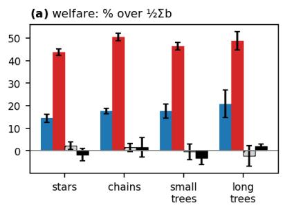

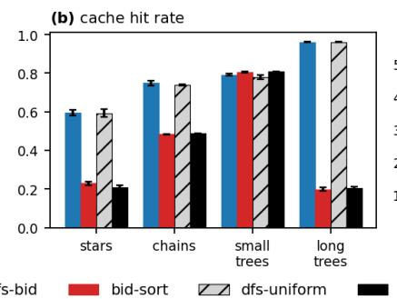

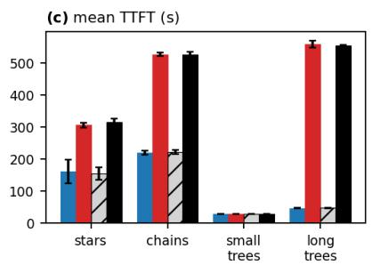

Figure 2: Tree topologies at � = �. When the workload exceeds the cache (all topologies except small trees), bid-sort pays for its welfare lead (left) in cache misses (middle) and latency (right).  
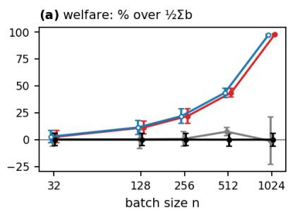

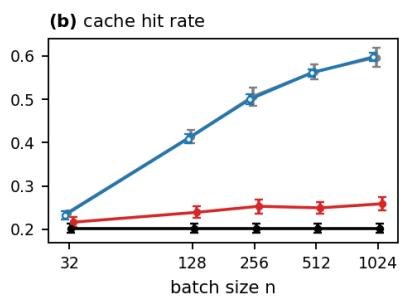

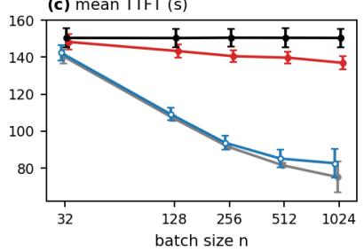  
Figure 3: One cluster has non-zero bids, everyone else bids zero (mixshare-50). dfs-bid matches bidsort’s welfare (left; curves ofset slightly for readability) while keeping dfs-uniform’s hit rate (middle) and latency (right).

SWE-agent [50] trajectories. For trees, we run tree-of-thought [51] in a short variant and a long variant over articles of 3–5k tokens. Prompts are ≈1k tokens on stars, 3k on chains, and 160 or 4k on the two tree variants, with 60–97% of tokens shared (Appendix D.2). The model’s weights leave a 23k-token KV cache; the short trees fit in the cache entirely and serve as a control, while the other workloads force cache eviction.

Results. We measure welfare on the realized order, i.e., with queries ranked by TTFT, and plot it as the percentage above ${ \frac { 1 } { 2 } } \sum _ { r } b _ { \scriptscriptstyle { r } }$ (this quantity is the expected welfare of a uniformly random DFS order). We also report the cache hit rate as reported by SGLang and the mean TTFT over the queue.

In every experiment, dfs-bid and dfs-uniform have the same cache hit rate and the same TTFT, but dfs-bid has substantially higher welfare. bid- sort has higher welfare, but it interleaves queries that share a prefix, significantly reducing cache hit rate. At $n \ = \ Q .$ , dfs-bid’s welfare is within 19– 22% of bid-sort’s welfare, well under the 50% that Proposition 2.4 allows.

The first column of Figure 1 varies the batch size on mixshare-50. With more queries in a batch there are more shared prefixes to group, so both

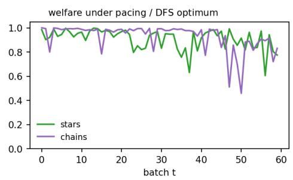  
Figure 4: Welfare under autobidding when $T =$ 60. Details are in Appendix D.11.

DFS orders gain cache hits and get faster with � while bid-sort and no-sort do not. In terms of welfare, dfs-bid’s lead over dfs-uniform grows from 1% at $n = 3 2 .$ , with few shared prefixes per batch, to 12% at $n = Q$ . The second column varies the sharing fraction at $n = 2 5 6$ with the same result: more sharing helps the DFS orders and hurts the flat ones, and dfs-bid stays 4–7% above dfs-uniform. The third column varies $\rho ,$ how much values are correlated within clusters. bid-sort is substantially slower than dfs-bid until � = 1, when cluster members are naturally grouped by having the same bid; even then, dfs-bid achieves competitive welfare with better TTFT.

Figure 2 repeats the comparison at � = � across tree topologies. bid-sort’s TTFT is 2.4× dfs-bid’s on chains and 12× on long trees. The short trees are the exception since they fit in the cache, so nothing is ever evicted and every order gets the same hit rate and the same TTFT regardless of how it schedules. This is the one case where the DFS restriction buys nothing and costs 20% of welfare.

Figure 3 shows the case most favorable to our mechanism (and perhaps the most realistic): one cluster of queries with a shared prefix has non-zero bids, and every other request bids zero. Serving that cluster first is both the unconstrained optimum and a DFS order, so dfs-bid matches bid-sort’s welfare at every batch size while keeping dfs-uniform’s hit rate, and bid-sort pays about 1.5× the TTFT.

Finally, in Figure 4 we simulate the pacing autobidders of Algorithm 3 on the same trees. Au- tobidding in repeated auctions causes welfare to decrease by about 10% on average compared to the single-shot setting, and welfare is always above what Theorem 4.4 predicts.

## 6 Related Work

Prefix-Aware LLM Serving. Modern LLM serving frameworks improve request throughput via continuous batching and eficient management of the KV cache. vLLM [34] uses ideas from virtual memory and paging to reduce KV cache fragmentation. SGLang [52] stores requests in a radix tree and uses longest prefix matching to increase cache reuse across requests. Preble [45] jointly optimizes prefix reuse and load balancing across multiple GPUs, while BatchLLM [53] groups requests with common prefixes ofline and coordinates their execution. Dexter et al. [17] study optimal request scheduling under a certain arrival pattern when cached requests are stored in a radix tree, and they propose a new family of scheduling policies which interpolate between first-come- first-served and longest prefix matching. Llumnix [46] and QoServe [22] support diferentiated latency objectives and request prioritization. Another related line of work studies fairness in LLM serving [11, 44]. Our inference auction is the first approach that prioritizes economic eficiency.

Priority Auctions and Queues. The idea of allowing delay-sensitive users to purchase queue priority has a long history [e.g., 1, 21, 28, 29, 31, 32, 37]. LLM inference difers from these classical models because inference requests are not computationally independent from one another. To the best of our knowledge, our work is the first to design incentive-compatible priority mechanisms for LLM inference serving.

Autobidding Agents. Autobidding has been studied extensively in online ad auctions; see Aggarwal et al. [2] for a recent survey. Balseiro and Gur [10] provide an adaptive pacing algorithm which scales bids according to realized expenditure. Balseiro et al. [8] generalize their algorithm to online mirror descent and weaken several theoretical assumptions. Subsequent work studies social welfare and learning dynamics when autobidders interact in repeated ad auctions [e.g. 5, 9, 16, 20, 36, 39]. While our pacing autobidding algorithm is similar to some that are typically used in ad auctions, our welfare guarantees leverage the specific structure of the radix tree and are unique to our LLM inference setting.

LLMs and Incentives. Our results are broadly related to the growing body of work at the intersection of game theory, mechanism design, and generative AI. Chen et al. [12], Guo et al. [25], and Liu et al. [35] study pricing and incentives for LLM routing, while Harris et al. [27] and Anagnostides et al. [4] design incentive-aware credit assignment schemes for AI-generated content. Velasco et al. [47] study social ineficiency resulting from model providers’ incentives to increase test-time compute in order to increase revenue; they propose having model providers bid in a reverse second-price auction to resolve this ineficiency. There is also a line of work which designs auctions for ad placements in LLM-generated text [18, 19, 26]. Finally, Ji et al. [30] also combine an inference system with auction design in the context of distributed computing; specifically, procuring edge devices for speculative decoding.

## 7 Conclusion

We design the first inference auction, a mechanism for allocating LLM serving capacity during times of high request volume. Our inference auction enjoys the following key properties: (1) forcing the winning schedule to be a DFS schedule ensures cache optimality, (2) welfare maximization corresponds to a simple DFS comparator that orders radix subtrees by average bid, and (3) VCG payments, which incentivize truthful bidding, can be implemented with negligible computational overhead. We also design a pacing autobidder that learns how to bid in repeated inference auctions under a budget constraint. Our autobidder dynamically adjusts bids based on realized spending, and achieves sublinear regret relative to the optimal-in-hindsight bidding policy. When users in a batch run pacing autobidders independently, we bound the resulting welfare loss by the diferences in the efective pacing factors of sibling subtrees. In experiments, our inference auction improves social welfare while retaining the caching and latency advantages of SGLang. Our work demonstrates how economic objectives can be incorporated directly into LLM serving infrastructure without sacrificing performance.

There are several exciting directions for future research. Serving large-scale systems may require joint orchestration of auctions, request routing, and cache management across multiple inference workers. Support for richer latency preferences is also an interesting direction. Finally, collusion- proof inference auction design is important to prevent strategic coordination across users.

## Acknowledgments

We would like to thank Annie Ulichney for helpful comments and suggestions. This work was funded by the European Union (ERC-2022-SYG-OCEAN-101071601), the NSF Institute for Foundations of Machine Learning under grant CCF-2505865, the National Science Foundation under grant CCF-2145898, the Ofice of Naval Research under grant N00014-24-1-2159, a Google Research Scholar Award, an Alfred P. Sloan fellowship, and a Schmidt Science AI2050 fellowship. Views and opinions expressed are however those of the author(s) only and do not necessarily reflect those of the European Union or the European Research Council Executive Agency. Neither the European Union nor the granting authority can be held responsible for them.

## References

[1] Philipp Afeche and Haim Mendelson. Pricing and priority auctions in queueing systems with a generalized delay cost structure. Management Science, 50(7):869–882, 2004.

[2] Gagan Aggarwal, Ashwinkumar Badanidiyuru, Santiago R Balseiro, Kshipra Bhawalkar, Yuan Deng, Zhe Feng, Gagan Goel, Christopher Liaw, Haihao Lu, Mohammad Mahdian, et al. Auto-bidding and auctions in online advertising: A survey. ACM SIGecom Exchanges, 22(1):159–183, 2024.

[3] Amazon Web Services. Optimize costs with Amazon Bedrock provisioned throughput and service tiers, 2026. URL https://docs.aws.amazon.com/bedrock/latest/userguide/ service-tiers-inference.html.

[4] Ioannis Anagnostides, Kshipra Bhawalkar, Christopher Liaw, Aranyak Mehta, Renato Paes Leme, Yifeng Teng, Grigoris Velegkas, and Weiqiang Zheng. Compensation design. arXiv preprint arXiv:2607.14438, 2026.

[5] Ioannis Anagnostides, Ian Gemp, Georgios Piliouras, and Kelly Spendlove. Chaos in autobidding auctions. arXiv preprint arXiv:2602.09118, 2026.

[6] Anthropic. Service tiers, 2026. URL https://platform.claude.com/docs/en/api/ service-tiers.

[7] Maria-Florina Balcan, Siddharth Prasad, and Tuomas Sandholm. Bicriteria multidimensional mechanism design with side information. Advances in Neural Information Processing Systems, 36:40832–40852, 2023.

[8] Santiago Balseiro, Haihao Lu, and Vahab Mirrokni. Dual mirror descent for online allocation problems. In International Conference on Machine Learning, pages 613–628. PMLR, 2020.

[9] Santiago Balseiro, Yuan Deng, Jieming Mao, Vahab Mirrokni, and Song Zuo. Robust auction design in the auto-bidding world. Advances in Neural Information Processing Systems, 34: 17777–17788, 2021.

[10] Santiago R Balseiro and Yonatan Gur. Learning in repeated auctions with budgets: Regret minimization and equilibrium. Management Science, 65(9):3952–3968, 2019.

[11] Shiyi Cao, Yichuan Wang, Ziming Mao, Pin-Lun Hsu, Liangsheng Yin, Tian Xia, Dacheng Li, Shu Liu, Yineng Zhang, Yang Zhou, et al. Locality-aware fair scheduling in LLM serving. arXiv preprint arXiv:2501.14312, 2025.

[12] Haolong Chen, Zhengyuan Xin, Liang Zhang, Lei Xue, and Guangxu Zhu. Error-aware reverse auction mechanism for large language model routing. arXiv preprint arXiv:2608.12719, 2026.

[13] Edward H Clarke. Multipart pricing of public goods. Public Choice, pages 17–33, 1971.

[14] Karl Cobbe, Vineet Kosaraju, Mohammad Bavarian, Mark Chen, Heewoo Jun, Lukasz Kaiser, Matthias Plappert, Jerry Tworek, Jacob Hilton, Reiichiro Nakano, Christopher Hesse, and John Schulman. Training verifiers to solve math word problems. arXiv preprint arXiv:2110.14168, 2021.

[15] DeepSeek-AI. DeepSeek-R1: Incentivizing reasoning capability in LLMs via reinforcement learning. arXiv preprint arXiv:2501.12948, 2025.

[16] Yuan Deng, Jieming Mao, Vahab Mirrokni, and Song Zuo. Towards eficient auctions in an auto-bidding world. In Proceedings of the Web Conference 2021, pages 3965–3973, 2021.

[17] Gregory Dexter, Shao Tang, Ata Fatahi, Qingquan Song, Tejas Dharamsi, and Aman Gupta. LLM query scheduling with prefix reuse and latency constraints. Advances in Neural Information Processing Systems, 38:94356–94379, 2026.

[18] Avinava Dubey, Zhe Feng, Rahul Kidambi, Aranyak Mehta, and Di Wang. Auctions with LLM summaries. In Proceedings of the 30th ACM SIGKDD Conference on Knowledge Discovery and Data Mining, pages 713–722, 2024.

[19] Paul Duetting, Vahab Mirrokni, Renato Paes Leme, Haifeng Xu, and Song Zuo. Mechanism design for large language models. In Proceedings of the ACM Web Conference 2024, pages 144–155, 2024.

[20] Jason Gaitonde, Yingkai Li, Bar Light, Brendan Lucier, and Aleksandrs Slivkins. Budget pacing in repeated auctions: Regret and eficiency without convergence. arXiv preprint arXiv:2205.08674, 2022.

[21] Amihai Glazer and Refael Hassin. Stable priority purchasing in queues. Operations Research Letters, 4(6):285–288, 1986.

[22] Kanishk Goel, Jayashree Mohan, Nipun Kwatra, Ravi Shreyas Anupindi, and Ramachandran Ramjee. Qoserve: Breaking the silos of LLM inference serving. In Proceedings ofthe 31st ACM International Conference on Architectural Support for Programming Languages and Operating Systems, Volume 2, pages 1492–1507, 2026.

[23] Google. Gemini API: Priority inference, 2026. URL https://ai.google.dev/gemini-api/ docs/priority-inference.

[24] Theodore Groves. Incentives in teams. Econometrica, pages 617–631, 1973.

[25] Zhendong Guo, Wenchao Bai, and Jiahui Jin. Pricing online llm services with data-calibrated stackelberg routing game. In Proceedings of the AAAI Conference on Artificial Intelligence, volume 40, pages 17005–17013, 2026.

[26] MohammadTaghi Hajiaghayi, Sébastien Lahaie, Keivan Rezaei, and Suho Shin. Ad auctions for LLMs via retrieval augmented generation. Advances in Neural Information Processing Systems, 37:18445–18480, 2024.

[27] Keegan Harris, Siddharth Prasad, and Asher Trockman. In-context credit assignment via the core. arXiv preprint arXiv:2605.06920, 2026.

[28] Rafael Hassin. Decentralized regulation of a queue. Management Science, 41(1):163–173, 1995.

[29] Birgit Heydenreich, Debasis Mishra, Rudolf Müller, and Marc Uetz. Optimal mechanisms for single machine scheduling. In International Workshop on Internet and Network Economics, pages 414–425. Springer, 2008.

[30] Mingtao Ji, Lei Jiao, Bin Tang, Zhihao Qu, Chen Chen, and Baoliu Ye. Incentivizing and orchestrating cloud-edge LLM speculative decoding via auctions. In 2026 IEEE 46th International Conference on Distributed Computing Systems (ICDCS), pages 425–435. IEEE, 2026.

[31] Thomas Kittsteiner and Benny Moldovanu. Priority auctions and queue disciplines that depend on processing time. Management Science, 51(2):236–248, 2005.

[32] Leonard Kleinrock. Optimum bribing for queue position. Operations Research, 15(2): 304–318, 1967.

[33] Vijay Krishna and Motty Perry. Eficient mechanism design. Available at SSRN 64934, 1998.

[34] Woosuk Kwon, Zhuohan Li, Siyuan Zhuang, Ying Sheng, Lianmin Zheng, Cody Hao Yu, Joseph Gonzalez, Hao Zhang, and Ion Stoica. Eficient memory management for large language model serving with PagedAttention. In Proceedings of the 29th Symposium on Operating Systems Principles, pages 611–626, 2023.

[35] Hongze Liu, Chang Guo, Yingzeng Li, Mengru Wang, Jiong Lou, Shijing Yuan, Hefeng Zhou, Chentao Wu, and Jie Li. Iemas: An incentive-eficiency routing framework for open agentic web ecosystems. arXiv preprint arXiv:2603.17302, 2026.

[36] Brendan Lucier, Sarath Pattathil, Aleksandrs Slivkins, and Mengxiao Zhang. Autobidders with budget and ROI constraints: Eficiency, regret, and pacing dynamics. arXiv preprint arXiv:2301.13306, 2023.

[37] Manipushpak Mitra. Mechanism design in queueing problems. Economic Theory, 17(2): 277–305, 2001.

[38] OpenAI. Priority processing, 2026. URL https://developers.openai.com/api/docs/ guides/priority-processing.

[39] Renato Paes Leme, Georgios Piliouras, Jon Schneider, Kelly Spendlove, and Song Zuo. Complex dynamics in autobidding systems. In Proceedings of the 25th ACM Conference on Economics and Computation, pages 75–100, 2024.

[40] Siddharth Prasad, Maria Florina Balcan, and Tuomas Sandholm. Weakest bidder types and new core-selecting combinatorial auctions. In Proceedings of the AAAI Conference on Artificial Intelligence, volume 40, pages 17206–17214, 2026.

[41] Ruoyu Qin, Zheming Li, Weiran He, Jialei Cui, Feng Ren, Mingxing Zhang, Yongwei Wu, Weimin Zheng, and Xinran Xu. Mooncake: Trading more storage for less computation—a {KVCache-centric} architecture for serving {LLM} chatbot. In 23rd USENIX Conference on File and Storage Technologies (FAST 25), pages 155–170, 2025.

[42] Qwen Team. Qwen2.5 technical report. arXiv preprint arXiv:2412.15115, 2025.

[43] Pranav Rajpurkar, Jian Zhang, Konstantin Lopyrev, and Percy Liang. SQuAD: 100,000+ questions for machine comprehension of text. In Proceedings of the 2016 Conference on Empirical Methods in Natural Language Processing, 2016.

[44] Ying Sheng, Shiyi Cao, Dacheng Li, Banghua Zhu, Zhuohan Li, Danyang Zhuo, Joseph E Gonzalez, and Ion Stoica. Fairness in serving large language models. In 18th USENIX Symposium on Operating Systems Design and Implementation (OSDI 24), pages 965–988, 2024.

[45] Vikranth Srivatsa, Zijian He, Reyna Abhyankar, Dongming Li, and Yiying Zhang. Preble: Eficient distributed prompt scheduling for LLM serving. In International Conference on Learning Representations, volume 2025, pages 37057–37082, 2025.

[46] Biao Sun, Ziming Huang, Hanyu Zhao, Wencong Xiao, Xinyi Zhang, Yong Li, and Wei Lin. Llumnix: Dynamic scheduling for large language model serving. In 18th USENIX Symposium on Operating Systems Design and Implementation (OSDI 24), pages 173–191, 2024.

[47] Ander Artola Velasco, Dimitrios Rontogiannis, Stratis Tsirtsis, and Manuel Gomez-Rodriguez. Test-time compute games. arXiv preprint arXiv:2601.21839, 2026.

[48] William Vickrey. Counterspeculation, auctions, and competitive sealed tenders. Journal of Finance, 16(1):8–37, 1961.

[49] xAI. Priority processing, 2026. URL https://docs.x.ai/developers/ advanced-api-usage/priority-processing.

[50] John Yang, Carlos E. Jimenez, Alexander Wettig, Kilian Lieret, Shunyu Yao, Karthik Narasimhan, and Ofir Press. SWE-agent: Agent-computer interfaces enable automated software engineering. In Advances in Neural Information Processing Systems, 2024.

[51] Shunyu Yao, Dian Yu, Jefrey Zhao, Izhak Shafran, Thomas L. Grifiths, Yuan Cao, and Karthik Narasimhan. Tree of thoughts: Deliberate problem solving with large language models. In Advances in Neural Information Processing Systems, 2023.

[52] Lianmin Zheng, Liangsheng Yin, Zhiqiang Xie, Chuyue Sun, Jef Huang, Cody H Yu, Shiyi Cao, Christos Kozyrakis, Ion Stoica, Joseph E Gonzalez, et al. SGLang: Eficient execution of structured language model programs. Advances in Neural Information Processing Systems, 37:62557–62583, 2024.

[53] Zhen Zheng, Xin Ji, Taosong Fang, Fanghao Zhou, Chuanjie Liu, and Gang Peng. BatchLLM: Optimizing large batched LLM inference with global prefix sharing and throughput-oriented token batching. Proceedings of Machine Learning and Systems, 8:1742–1756, 2026.

## A Appendix for Section 2: Cache-Optimal Schedules and Our Bidding Environment

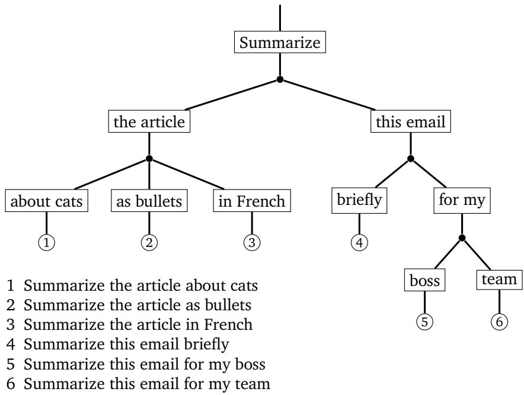  
Figure 5: A request radix tree. Each request is a root-to-leaf path; requests with a common prefix share the path from the root to their lowest common ancestor, and non-branching paths are contracted into a single edge. The maximum branching factor of this tree is 3. Requests in the same subtree are easier to store together in the KV cache, as their shared prefixes only need to be stored once.

Proposition 2.4. For any $\begin{array} { r } { \mathbf { v } _ { 1 : m } , \operatorname* { m a x } _ { \sigma \in \mathcal { D } ( \mathbb { T } ) } W ( \sigma ; \mathbf { v } _ { 1 : m } ) \geq \frac { 1 } { 2 } \operatorname* { m a x } _ { \sigma \in \mathcal { S } _ { n } } W ( \sigma ; \mathbf { v } _ { 1 : m } ) . } \end{array}$

Proof. Let $\sigma \in \mathcal { D } ( \top )$ be any feasible schedule and let $\pi$ be the reverse of $\sigma .$ . We have $\pi \in { \mathcal { D } } ( 7 )$ since � is attainable by reversing all child orderings in the DFS traversal of T corresponding to $\sigma .$ . For any user � and request $r ,$ we have ${ \bf x } _ { i } ( \sigma ) [ r ] + { \bf x } _ { i } ( \pi ) [ r ] = 1$ , so $W ( \pmb { \sigma } ; \mathbf { v } _ { 1 : m } ) + W ( \pmb { \pi } ; \mathbf { v } _ { 1 : m } ) =$ $\scriptstyle \sum _ { i = 1 } ^ { m } \| \mathbf { v } _ { i } \| _ { 1 }$ . Therefore, at least one of � or � generates welfare at least $\begin{array} { r } { \frac { 1 } { 2 } \sum _ { i = 1 } ^ { m } \| \mathbf { v } _ { i } \| _ { 1 } } \end{array}$ , and so $\begin{array} { r } { \operatorname* { m a x } _ { \sigma \in \mathcal { D } ( \mathbb { T } ) } W ( \sigma ; \mathbf { v } _ { 1 : m } ) \ge \frac { 1 } { 2 } \sum _ { i = 1 } ^ { m } \| \mathbf { v } _ { i } \| _ { 1 } \ge \frac { 1 } { 2 } \operatorname* { m a x } _ { \sigma \in \mathcal { S } _ { n } } W ( \sigma ; \mathbf { v } _ { 1 : m } ) } \end{array}$ □

## B Appendix for Section 3: Welfare-Optimal Inference Auctions

Discussion on VCG Payments. The Clarke [13] pivot term $h _ { i } ( \mathbf { b } _ { - i } )$ in VCG payments is often (informally) framed as the maximum welfare the bidders excluding � could obtain when bidder � is removed from the auction, while we define it by zeroing out that bidder’s bids. In typical multi-item multi-bidder auction settings, there is no distinction. In our setting, actually evicting �’s requests would alter the radix tree of requests and change the ground set of feasible schedules to allow requests to go un-served. In addition to the fact that all requests should eventually be served, a payment scheme based on eviction would incur outward payments made by the system to the users. Indeed, any zero-bidder would have to be paid because the maximum welfare enjoyed by the remaining bidders decreases when that zero-bidder is evicted, since each remaining bidder would win lower fractional priority.

In our setting, the correct formulation of VCG involves the minimum value of the maximum welfare the bidders excluding � could obtain over all possible “types” (bids) for bidder �, which is attained when � is a zero bidder. This is precisely the reasoning folded into the enhancement of VCG based on “weakest types” [see, e.g., 7, 33, 40].

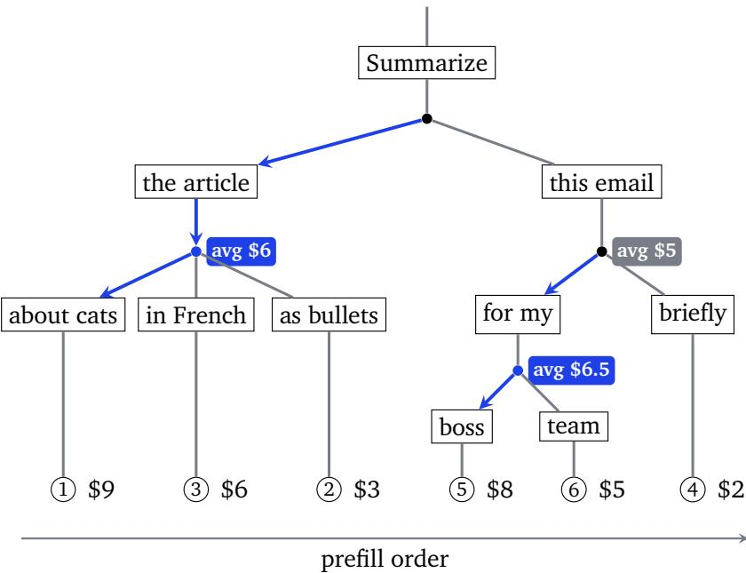  
Figure 6: The welfare-maximizing DFS schedule on an example radix tree. At every internal node, children are visited in decreasing order of average subtree bid (blue marks the child visited first). The resulting schedule is 1, 3, 2, 5, 6, 4. Note that request 5 bids \$8 but is served after request 2, which bids \$3. This is because request 5 belongs to a subtree with a lower average bid, and a DFS schedule cannot interleave the two subtrees.

For completeness, we include below the standard arguments demonstrating that VCG in our setting is indeed eficient, incentive compatible, individually rational, and incurs no positive transfers.

Under VCG prices, eficiency follows from Theorem 3.1. To see why these payments incentivize truthful bidding, fix the bids b−� of the other users. If user � bids according to b�, his utility can be written as

$$
V _ { i } ( \bar { A } ( \mathbf { b } _ { i } , \mathbf { b } _ { - i } ) ) - p _ { i } ^ { \mathrm { V G G } } ( \mathbf { b } _ { i } , \mathbf { b } _ { - i } ) = W ( \bar { A } ( \mathbf { b } _ { i } , \mathbf { b } _ { - i } ) ; ( \mathbf { v } _ { i } , \mathbf { b } _ { - i } ) ) - h _ { i } ( \mathbf { b } _ { - i } ) .
$$

$h _ { i } ( \mathbf { b } _ { - i } )$ does not depend on $\mathbf { b } _ { i : }$ and $W ( \bar { A } ( \mathbf { b } _ { i } , \mathbf { b } _ { - i } ) ; ( \mathbf { v } _ { i } , \mathbf { b } _ { - i } ) )$ is maximized when $\mathbf b _ { i } = \mathbf v _ { i }$ by Theo- rem 3.1. Therefore, it is a (weakly) dominant strategy for each user to bid truthfully, independent of the bids of the other users. Individual rationality holds because user �’s values and priorities are non-negative. Under truthful bidding, user �’s utility is $\begin{array} { r } { \operatorname* { m a x } _ { \sigma \in \mathcal { D } ( \mathbb { T } ) } W \big ( \sigma ; ( { \mathbf { v } } _ { i } , { \mathbf { b } } _ { - i } ) \big ) - h _ { i } \big ( { \mathbf { b } } _ { - i } \big ) } \end{array}$ Now consider the schedule that maximizes the other users’ welfare when �’s bids are zero. That schedule remains feasible when � bids truthfully. Under it, total welfare is $h _ { i } ( \mathbf { b } _ { - i } ) + V _ { i } ( \sigma ) \geq h _ { i } ( \mathbf { b } _ { - i } )$ since $V _ { i } ( \sigma ) \geq 0$ . Finally, no positive transfers follows because $h _ { i } ( \mathbf { b } _ { - i } )$ is the maximum welfare available to the other users, and is always at least the welfare they receive under the selected schedule.

## B.1 Algorithm for Computing the Welfare-Maximizing Schedule

Theorem 3.1. Given bid vectors $ { \mathbf { b } } _ { 1 : m _ { \mathrm { ~ } } }$ , the average-bid DFS scheduling rule $\bar { A } ( { \bf { b } } _ { 1 : m } )$ given by Algo-rithm 1 returns a cache-optimal schedule � that maximizes $W ( \sigma ;  { \mathbf { b } } _ { 1 : m } )$ among all DFS schedules. Furthermore, this schedule can be computed in �(� + � log �) expected run-time.

Let $\begin{array} { r } { \Phi ( \sigma ; \mathbf { b } _ { 1 : m } ) : = ( n - 1 ) W ( \sigma ; \mathbf { b } _ { 1 : m } ) = \sum _ { r = 1 } ^ { n } b _ { r } \cdot | \{ j : \sigma ( r ) < \sigma ( j ) \} | = \sum _ { r = 1 } ^ { n } \sum _ { j > _ { \sigma ^ { r } } } b _ { r } } \end{array}$ . Maximizing $W ( \cdot ; { \bf b } _ { 1 : m } )$ over a set of feasible schedules is equivalent to maximizing its un-normalized version $\Phi ( \cdot ; { \mathbf b } _ { 1 : m } )$

Proof. Let $\sigma \in \mathcal { D } ( \mathcal { T } )$ be a valid DFS leaf ordering. For u an internal node (that is, not a leaf node) of T, let $\mathsf { c } _ { 1 } , \hdots , \mathsf { c } _ { d ( \mathsf { u } ) }$ be the children of u, labeled in the DFS order induced by �. So, all leaves under child ${ \mathsf { C } } _ { j }$ are visited before all leaves under child $\mathsf { C } _ { k }$ for all $1 \leq j < k \leq d ( \mathsf { u } )$ . The un-normalized welfare contribution from ordered leaf pairs in $\mathcal { L } ( \mathsf { c } _ { j } ) \times \mathcal { L } ( \mathsf { c } _ { k } )$ for $j < k$ is therefore $\begin{array} { r } { \sum _ { i _ { 1 } \in \mathcal { L } ( \mathsf { c } _ { j } ) } \sum _ { i _ { 2 } \in \mathcal { L } ( \mathsf { c } _ { k } ) } b _ { i _ { 1 } } = N ( \mathsf { c } _ { k } ) F _ { b } ( \mathsf { c } _ { j } ) } \end{array}$ . It follows that un-normalized welfare can be written as

$$
\Phi ( \sigma ; { \bf b } _ { 1 : m } ) = \sum _ { { \bf u } } \sum _ { 1 \leq j < k \leq d ( { \bf u } ) } N ( c _ { k } ) F _ { b } ( \mathsf c _ { j } ) .
$$

We show that $\Phi \mathopen { } \mathclose \bgroup \left( \sigma ;  { \mathbf { b } } _ { 1 : m } \aftergroup \egroup \right)$ is maximized by visiting the children of any internal node u in descending order of $F _ { b } / N$ . Suppose $\mathsf { c } _ { j } , \mathsf { c } _ { j + 1 } \in \mathsf { \mathcal { C } } ( \mathsf { u } )$ are adjacent in the DFS traversal with $F _ { b } ( \mathsf { c } _ { j } ) / N ( \mathsf { c } _ { j } ) \ <$ $F _ { b } ( \mathsf { c } _ { j + 1 } ) / N ( \mathsf { c } _ { j + 1 } )$ . This pair contributes $N ( \mathsf { c } _ { j + 1 } ) F _ { b } ( \mathsf { c } _ { j } )$ to Φ. Swapping their order contributes $N ( \mathsf { c } _ { j } ) F _ { b } ( \mathsf { c } _ { j + 1 } ) > N ( \mathsf { c } _ { j + 1 } ) F _ { b } ( \mathsf { c } _ { j } )$ to welfare without impacting the contribution of any other pair in $\mathcal { C } ( \mathfrak { u } )$ (since the relative ordering of ${ \mathsf { C } } _ { j }$ and $\mathsf C _ { j + 1 }$ with respect to all other children is preserved). Therefore, each inner sum of $\begin{array} { r } { \sum _ { 1 \le j < k \le d ( \mathsf { u } ) } N \big ( \mathsf { c } _ { k } \big ) F _ { b } \big ( \mathsf { c } _ { j } \big ) } \end{array}$ is independently maximized for each u by visiting $\mathcal { C } ( \mathfrak { u } )$ in descending order of average bid, so average-bid DFS is a welfare optimal DFS traversal.

Runtime analysis: A radix tree can be constructed in $O ( M + n ) = O ( M )$ expected time using hash tables for child lookup. Let ${ \sf T } = ( V , E )$ be the radix tree and let �(u) denote the number of children of internal node u. Note that $d ( \mathsf { u } ) \leq \nu$ by definition, and let � be the total number of internal nodes. It takes $O ( | V | )$ time to compute $F _ { b } ( \mathfrak { u } )$ for every node, since each node is processed a constant number of times across all computations. Sorting at each internal node u takes $O ( d ( \mathsf { u } ) \log ( d ( \mathsf { u } ) ) )$ time. The time it takes to sort all nodes is $\begin{array} { r } { O ( \sum _ { \mathbf { u } } d ( \mathbf { u } ) \log ( d ( \mathbf { u } ) ) ) = O ( \sum _ { \mathbf { u } } d ( \mathbf { u } ) } \end{array}$ log $\nu ) = O ( \left| E \right| \left| \log \nu \right) =$ $O ( | V | \log \nu )$ . A DFS schedule following this order outputs the order in $O ( | V | )$ time. Finally, since a radix tree has no internal node with exactly one child, we have that $\begin{array} { r } { n + I - 1 = | E | = \sum _ { u } d ( u ) \geq 2 I } \end{array}$ and so $V \leq 2 n - 1$ □

## B.2 Algorithm for Computing VCG Prices

In this subsection we abbreviate $F _ { b }$ as � for brevity. Let $[ x ] _ { + } : = \operatorname* { m a x } \{ x , 0 \}$

Fix an internal node u and let $\mathsf { c } _ { 1 } , \ldots , \mathsf { c } _ { d }$ denote its children sorted in descending average-bid order, so

$$
\frac { F ( \mathsf { c } _ { 1 } ) } { N ( \mathsf { c } _ { 1 } ) } \geq \cdots \geq \frac { F ( \mathsf { c } _ { d } ) } { N ( \mathsf { c } _ { d } ) } .
$$

Consider some user �. Let

$$
Z _ { \mathsf { c } _ { j } } [ i ] : = \sum _ { r \in \mathcal { R } _ { i } \cap \mathcal { L } ( \mathsf { c } _ { j } ) } b _ { r }
$$

denote user �’s aggregate bid across his requests under child ${ \mathsf { C } } _ { j } .$ . After zeroing out user �’s bids, the total bid under child ${ \mathsf { C } } _ { j }$ is

$$
G _ { i } ( \mathsf { c } _ { j } ) : = F ( \mathsf { c } _ { j } ) - Z _ { \mathsf { c } _ { j } } [ i ] .
$$

Lemma B.1. For any user � and internal node u, the welfare externality at u due to � is

$$
E _ { i } ( { \mathsf { u } } ) : = \sum _ { 1 \leq j < k \leq d } \left[ G _ { i } ( \mathsf { c } _ { k } ) N ( \mathsf { c } _ { j } ) - G _ { i } ( \mathsf { c } _ { j } ) N ( \mathsf { c } _ { k } ) \right] _ { + } .
$$

Consequently, $\begin{array} { r } { ( n - 1 ) p _ { i } ^ { \mathtt { V C G } } = \sum _ { \mathsf { u } } E _ { i } ( \mathsf { u } ) } \end{array}$

Proof. In the original descending average-bid order, pair $j < k$ of children contributes $G _ { i } ( \mathsf { c } _ { j } ) N ( \mathsf { c } _ { k } )$ to the other users’ welfare. The counterfactual optimal ordering sorts children in decreasing order of $G _ { i } / N , s 0 j < k$ contributes max $\left\{ G _ { i } ( \mathsf { c } _ { j } ) N ( \mathsf { c } _ { k } ) , G _ { i } ( \mathsf { c } _ { k } ) N ( \mathsf { c } _ { j } ) \right\}$ to welfare. So, the externality—that

is, the welfare gain in the counterfactual optimum—is precisely $\left[ G _ { i } ( \mathsf { c } _ { k } ) N ( \mathsf { c } _ { j } ) - G _ { i } ( \mathsf { c } _ { j } ) N ( \mathsf { c } _ { k } ) \right] _ { + }$ Summing over all child pairs yields the claimed externality $E _ { i } ( \mathfrak { u } )$ . To compute the VCG price it sufices to sum $E _ { i } ( \mathfrak { u } )$ over all internal nodes and normalize. □

Preprocessing. For $t = 1 , \ldots , d _ { \colon }$ , let

$$
P _ { F } [ t ] : = \sum _ { k = 1 } ^ { t } F ( \mathsf c _ { k } ) ; \quad P _ { N } [ t ] : = \sum _ { k = 1 } ^ { t } N ( \mathsf c _ { k } ) .
$$

Computing these prefix sums is a $O ( d ( \mathfrak { u } ) )$ run-time operation at each node. So, the overall run-time of prefix sum computation is $\begin{array} { r } { O ( \sum _ { \mathsf { u } } d ( \mathsf { u } ) ) = O ( n ) } \end{array}$ . This computation is done once and the same prefix sums are used in the price calculation for all bidders.

## B.2.1 Computing local externalities

Let $\mathcal { A } _ { \mathsf { u } } [ i ] : = \{ j \in \{ 1 , \dots , d \} : Z _ { \mathsf { c } _ { i } } [ i ] > 0 \}$ denote the set of afected child indices; enumerate $\mathcal { A } _ { \sf u } [ i ]$ as $j _ { 1 } < \ldots < j _ { a }$ (so $F ( \mathfrak { c } _ { j _ { 1 } } ) / N ( \mathfrak { c } _ { j _ { 1 } } ) \geq \cdot \cdot \cdot \geq F ( \mathfrak { c } _ { j _ { a } } ) / N ( \mathfrak { c } _ { j _ { a } } ) )$ . We now show how to compute $E _ { i } ( \mathfrak { u } )$ at a given node, assuming that at each internal node we have access to $F , N , P _ { F } , N _ { F } , \mathcal { A } _ { \mathsf { u } } [ i ]$ , and $Z _ { \mathsf { c } _ { j _ { s } } } [ i ]$ for all $j _ { s } \in \mathcal { A } _ { \sf u } [ i ]$ . (We will show how to perform bottom-up computation of A and $Z$ in Section B.2.2.)

Pairs of children are of three types: unafected-unafected, afected-unafected, afected-afected. Unafected-unafected pairs have zero externality since zeroing out �’s bids does not change their relative ordering.

Afected-unafected pairs. Let ${ \mathsf C } _ { j _ { s } }$ be an afected child whose average bid has decreased from $F ( \mathsf { c } _ { j _ { s } } ) / N ( \mathsf { c } _ { j _ { s } } )$ to $G _ { i } ( \mathsf C _ { j _ { s } } ) / N ( \mathsf C _ { j _ { s } } )$ . An unafected child before ${ \mathsf C } _ { j _ { s } }$ , that is, an unafected child $\mathsf { C } _ { k }$ with $k \ < \ j _ { s }$ , stays before ${ \mathsf C } _ { j _ { s } }$ . An unafected child $\mathsf C _ { k }$ with $k > j _ { s }$ overtakes ${ \mathsf C } _ { j _ { s } }$ if and only if $F ( \mathsf { c } _ { k } ) / N ( \mathsf { c } _ { k } ) > G _ { i } ( \mathsf { c } _ { j _ { s } } ) / N ( \mathsf { c } _ { j _ { s } } )$

Run binary search to find

$$
p _ { s } : = \operatorname* { m a x } \left\{ k \in \{ j _ { s } , \dots , d \} : \frac { F ( \mathsf { c } _ { k } ) } { N ( \mathsf { c } _ { k } ) } > \frac { G _ { i } ( \mathsf { c } _ { j _ { s } } ) } { N ( \mathsf { c } _ { j _ { s } } ) } \right\} .
$$

So, all unafected children in the interval $( j _ { s } , p _ { s } ]$ overtake ${ \mathsf C } _ { j _ { s } }$ in the counterfactual optimal ordering. Let $U _ { s } : = ( j _ { s } , p _ { s } ] \cap ( [ d ] \setminus \mathcal { A } _ { i } ( \mathsf { u } ) )$ denote this set of unafected children. The externality due to all such unafected children $\mathsf { c } _ { k } , k \in U _ { s } ,$ , from overtaking ${ \mathsf C } _ { j _ { s } }$ is $F ( \mathsf { c } _ { k } ) N ( \mathsf { c } _ { j _ { s } } ) - G _ { i } ( \mathsf { c } _ { j _ { s } } ) N ( \mathsf { c } _ { k } )$ , and so the total externality from all afected-unafected child pairs is

$$
\sum _ { s = 1 } ^ { a } \left( N ( \mathsf { c } _ { j _ { s } } ) \sum _ { k \in U _ { s } } F ( \mathsf { c } _ { k } ) - G _ { i } ( \mathsf { c } _ { j _ { s } } ) \sum _ { k \in U _ { s } } N ( \mathsf { c } _ { k } ) \right) .
$$

We now show how to compute this quantity via prefix sums. For $s = 1 , \ldots , a$ compute afected child prefix sums

$$
P _ { \cal F } ^ { \cal A } [ s ] : = \sum _ { \ell = 1 } ^ { s } { \cal F } ( \mathsf { c } _ { j _ { \ell } } ) ; \quad P _ { \cal N } ^ { \cal A } [ s ] : = \sum _ { \ell = 1 } ^ { s } { \cal N } ( \mathsf { c } _ { j _ { \ell } } ) .
$$

Run binary search to compute $q _ { s } : = \operatorname* { m a x } \{ \ell : j _ { \ell } \leq p _ { s } \}$ . Then,

$$
\sum _ { k \in U _ { s } } F ( \subset _ { k } ) = \underbrace { \left( P _ { F } [ p _ { s } ] - P _ { F } [ j _ { s } ] \right) } _ { \mathrm { t o t a l ~ b i d ~ u n d e r } } - \underbrace { \left( P _ { F } ^ { A } [ r _ { s } ] - P _ { F } ^ { A } [ s ] \right) } _ { \mathrm { t o t a l ~ b i d ~ u n d e r } } = : S _ { F } [ s ]
$$

ALGORITHM 5: Process(u)   
if u is a leaf with request $r \in \mathcal { R } _ { i }$ then   
if $b _ { r } > 0$ then   
$\mathsf { \bar { Z } _ { u } } \gets \{ i \mapsto b _ { r } \}$   
else if $b _ { r } = 0$ then   
ALGORITHM 4: VCG Payments $Z _ { \mathrm { u } } \gets \emptyset$   
Initialize $P _ { i } \gets 0$ for each user � return $Z _ { \mathrm { u } }$   
Initialize $Z _ { \mathrm { u } } \doteq \emptyset , \mathcal { A } _ { \mathrm { u } } \gets \emptyset$   
Let u be the root of the radix tree T   
for $j = 1 , \ldots , d ( \mathsf { u } )$ do   
Process(u)   
$Z _ { \mathsf { c } _ { j } } \gets \mathsf { P r o c e s s } ( \mathsf { c } _ { j } )$   
return $[ P _ { i } / ( n - 1 ) ] _ { i = 1 } ^ { m }$   
for $( i , z ) \in Z _ { \mathsf { c } _ { j } }$ do   
$\mathcal { A } _ { \bf u } [ i ]$ .append $( ( j , z ) )$   
$Z _ { \mathsf { u } } [ i ] \gets Z _ { \mathsf { u } } [ i ] + z$   
for $i \in \mathcal { A } _ { \sf u } . \mathrm { k e y s }$ do   
$P _ { i }  P _ { i }$ + LocalExternality $\left( \mathsf { u } , \mathcal { A } _ { \mathsf { u } } [ i ] \right)$   
return $Z _ { \mathrm { u } }$

and

$$
\sum _ { k \in { \cal U } _ { s } } N ( { \mathsf C } _ { k } ) = \underbrace { ( P _ { N } [ p _ { s } ] - P _ { N } [ j _ { s } ] ) } _ { \mathrm { t o t a l ~ l e a v e s ~ u n d e r } } - \underbrace { \left( P _ { N } ^ { A } [ r _ { s } ] - P _ { N } ^ { A } [ s ] \right) } _ { \mathrm { t o t a l ~ l e a v e s ~ u n d e r } } = : S _ { N } [ s ] .
$$

$S 0 _ { ; }$ , the total externality from afected-unafected pairs is

$$
\sum _ { s = 1 } ^ { a } \left( N ( \mathsf { c } _ { j _ { s } } ) S _ { F } [ s ] - G _ { i } ( \mathsf { c } _ { j _ { s } } ) S _ { N } [ s ] \right) .\tag{1}
$$

Afected-afected pairs. Sort the afected children in descending order of modified average bid. Let � denote the sorting order, so

$$
\frac { G _ { i } ( \mathsf C _ { j _ { \pi ( 1 ) } } ) } { N ( \mathsf C _ { j _ { \pi ( 1 ) } } ) } \geq \cdots \geq \frac { G _ { i } ( \mathsf C _ { j _ { \pi ( a ) } } ) } { N ( \mathsf C _ { j _ { \pi ( a ) } } ) } .
$$

The total externality from pairs of afected children is

$$
\sum _ { 1 \leq s < t \leq a } G _ { i } ( \mathsf { c } _ { j _ { \pi ( s ) } } ) N ( \mathsf { c } _ { j _ { \pi ( t ) } } ) - \sum _ { 1 \leq s < t \leq a } G _ { i } ( \mathsf { c } _ { j _ { s } } ) N ( \mathsf { c } _ { j _ { t } } ) .\tag{2}
$$

For any ordering $\ell _ { 1 } , \ldots , \ell _ { a }$ of afected children, a sum of the form $\begin{array} { r } { \sum _ { 1 \leq s < t \leq a } G _ { i } ( \mathsf { c } _ { \ell _ { s } } ) N ( \mathsf { c } _ { \ell _ { t } } ) } \end{array}$ can be computed in $O ( a )$ run-time: initialize $\begin{array} { r } { ( R , C ) \ \gets \ ( \sum _ { t = 1 } ^ { a } N ( \mathsf { c } _ { \ell _ { t } } ) , 0 ) } \end{array}$ ; for $s = 1 , \ldots , a$ do $R \gets$ $R - N ( \mathsf { c } _ { \ell _ { s } } ) , C \gets C + G _ { i } ( \mathsf { c } _ { \ell _ { s } } ) R ;$ return �.

Finally, the total externality $E _ { i } ( \mathfrak { u } )$ is the sum of expressions (1) and (2). We perform for each afected child one binary search on a list of size $O ( d ( \mathfrak { u } ) )$ and another on a list of size �. Prefix sum computation of $P _ { F } ^ { A } , P _ { N } ^ { A }$ and afected-afected pair externality computation are $O ( a )$ run-time computations. Sorting takes run-time �(� log �). So, the overall run-time for computing $E _ { i } ( \mathfrak { u } )$ is �(� log �(u)).

## B.2.2 Computing all prices

Let LocalExternality $\left( \mathsf { u } , \mathcal { A } _ { u } [ i ] \right)$ return $E _ { i } ( \mathfrak { u } )$ , where ${ \mathcal { A } } _ { u } [ i ] = [ ( j _ { 1 } , Z _ { \mathsf { c } _ { j _ { 1 } } } [ i ] ) , \ldots , ( j _ { a } , Z _ { \mathsf { c } _ { j _ { a } } } [ i ] ) ]$ is a list containing the children of u afected by � and $Z _ { \mathsf { c } _ { j _ { s } } } [ i ]$ is �’s aggregate bid under ${ \mathsf C } _ { j _ { s } }$

Algorithm 4 computes VCG payments via a bottom-up computation of afected children and aggregate bids (Algorithm 5).

## B.2.3 Run-time analysis

Global prefix sum arrays $P _ { F } , P _ { N }$ can be constructed in $\begin{array} { r } { O ( \sum _ { \mathsf { u } } d ( \mathsf { u } ) ) = O ( n ) } \end{array}$ run-time.

Let $\begin{array} { r } { \Gamma : = \sum _ { \mathsf { u } } \sum _ { i } | A _ { \mathsf { u } } [ i ] | } \end{array}$ . Observe that $\begin{array} { r } { \Gamma = \sum _ { \mathbf { u } } \sum _ { i = 1 } ^ { d ( \mathbf { u } ) } \left| Z _ { \mathbf { c } _ { j } } \right| = \sum _ { \mathbf { u } \neq \mathrm { r o o t } ( \mathsf { T } ) } \left| Z _ { \mathbf { u } } \right| } \end{array}$ . Indeed, every entry $( i , z ) \in Z _ { \mathsf { c } _ { i } }$ appends exactly one pair $( j , z ) \ \mathrm { t o } \ \mathcal { A } _ { \mathrm { u } } [ \dot { i } ]$ , and every element of every afected-child list arises in this way.

Process called on the root of T visits every node once, and every entry of the hash map $Z _ { \mathsf { c } _ { j } }$ is visited. Each call to LocalExternality(�, Au[�]) incurs $O ( | \mathcal { A } _ { \mathsf { u } } [ i ] | \log d ( \mathsf { u } ) )$ run-time. So, the total run-time across all calls to LocalExternality is $O ( \sum _ { \mathbf { u } } \sum _ { i } | \mathcal { A } _ { \mathbf { u } } [ i ] | \log d ( \mathbf { u } ) ) \leq O ( \Gamma \log \nu )$

The total run-time of Process on the root of T (Algorithm 4) is therefore $O ( n + \Gamma \log \nu )$

We next bound Γ in terms of the input size. For each non-root node u and each entry $( i , z ) \in Z _ { \mathbf { u } _ { \perp } }$ charge this entry to an arbitrary positive-bid request $r \in \mathcal { R } _ { i } \cap \mathcal { L } ( \mathbf { u } )$ . A request � can receive at most one charge from each non-root node on its root-to-leaf path, and so its total charge is at most depth (�). Consequently, $\begin{array} { r } { \Gamma = \sum _ { \boldsymbol { \mathsf { u } } \neq \mathrm { r o o t } ( \mathbb { T } ) } \left| Z _ { \boldsymbol { \mathsf { u } } } \right| \le \sum _ { r = 1 } ^ { n } \mathrm { d e p t h } _ { \mathsf { T } } ( r ) \le M + n = O ( M ) } \end{array}$

Also, $\Gamma = { \cal O } ( m n )$ , since each map $Z _ { \mathrm { u } }$ contains at most one entry per user and the radix tree has $O ( n )$ nodes. ${ \bf S } 0 , \Gamma = O ( \operatorname* { m i n } \{ M , m n \} )$

We have therefore proven Theorem 3.3.

Theorem 3.3. Given as input the processed radix tree T, where at every node u $( 1 ) F _ { b } ( \mathfrak { u } )$ and $N ( \mathfrak { u } )$ are stored and (2) its children are sorted in decreasing order of average bid, all VCG payments $p _ { 1 } ^ { \mathtt { V C G } } ( \mathbf { b } _ { 1 : m } ) , \dotsc , p _ { m } ^ { \mathtt { V C G } } ( \mathbf { b } _ { 1 : m } )$ can be computed in �(min{�, ��} log �) total run-time.

## C Appendix for Section 4: Autobidding Agents for Inference Auctions

Theorem 4.2. Suppose that $( \mathbf { v } _ { 1 } ^ { ( t ) } , \mathsf { T } ^ { ( t ) } , \mathbf { b } _ { 2 : m } ^ { ( t ) } ) _ { t = 1 } ^ { T }$ are drawn i.i.d. from an unknown distribution P. Let $K : = \mathrm { m a x } _ { t \in [ T ] } | \mathcal { R } _ { 1 } ^ { ( t ) } | , \| \mathbf { v } _ { 1 } ^ { ( t ) } \| _ { \infty } \leq C$ , and suppose that schedules and payments are assigned according to the inference auction of Section 3. Then if $\eta = \Theta ( 1 / { \sqrt { T } } )$ , Algorithm 3 obtains regret $R ( T ) = O ( \mathrm { p o l y } ( C , K , \gamma ) \sqrt { T } )$ when � is suficiently large.

Proof Sketch. The framework of Balseiro et al. [8] requires (1) a convex and bounded action set that contains a “do nothing” action, (2) nonnegative, bounded, concave rewards, and (3) nonnegative, bounded resource consumption. To obtain the required action set, we first subtract the priority received by a zero bid, which is independent of the autobidder’s report, and consider only additional priority. For any fixed auction instance, the finitely many feasible schedules induce a finite menu of priority-and-payment outcomes. Allowing randomization over this menu produces a bounded and convex action set with zero as a feasible option, as well as nonnegative and bounded expected utility. Under VCG, the autobidder’s paced bid selects exactly the menu option that maximizes incremental utility after penalizing its payment by the current budget multiplier. Thus, the two algorithms coincide until the remaining budget is no greater than the largest possible payment. Finally, the randomized hindsight benchmark is at least as strong as our original deterministic benchmark in Definition 4.1. □

Proof. Since bids, values, and prompts are all finite, P will have finite support without loss of generality.

Define the shorthand $\mathbf { x } ^ { ( t ) } ( \mathbf { b } _ { 1 } ) : = \mathbf { x } _ { 1 } ( \bar { A } ( \mathbf { b } _ { 1 } , \mathbf { b } _ { 2 : m } ^ { ( t ) } ) )$ . Because the zero bid vector can receive positive priority for free, define $\mathbf { x } ^ { ( t , 0 ) } : = \mathbf { x } ^ { ( t ) } ( \mathbf { 0 } )$ and $\widehat { \mathbf { a } } ^ { ( t ) } ( \mathbf { b } _ { 1 } ) : = \mathbf { x } ^ { ( t ) } ( \mathbf { b } _ { 1 } ) - \mathbf { x } ^ { ( t , 0 ) }$ . Thus $\mathbf { a } ^ { ( t ) } ( \mathbf { b } _ { 1 } )$ is the vector of incremental priorities obtained through bidding according to vector $\mathbf { b } _ { 1 }$ in round �. The baseline value $\textstyle \sum _ { t = 1 } ^ { T } \langle \mathbf { v } _ { 1 } ^ { ( t ) } , \mathbf { x } ^ { ( t , 0 ) } \rangle$ is independent of the autobidder’s reports and therefore does not afect either the optimal bidding policy or regret.

<table><tr><td></td><td>Our Notation</td><td>Balseiro et al. [8]</td></tr><tr><td>Time Horizon:</td><td>T</td><td> $T$ </td></tr><tr><td>Capacity:</td><td> $T \gamma$ </td><td> $T \rho$ </td></tr><tr><td>Action Set: Decision</td><td> $\begin{array} { r } { \mathbb { Y } = \left\{ \mathbf { y } \geq \mathbf { 0 } : \sum _ { k } \mathbf { y } [ k ] \leq 1 \right\} } \end{array}$ </td><td>Generic action set  $\mathcal { X }$ </td></tr><tr><td>Variable: Reward</td><td>Menu selection vector  $y \in \mathcal { Y }$ </td><td>Action  $x _ { t } \in \mathcal X$ </td></tr><tr><td>Function:</td><td> $\sum _ { k } ( \langle \mathbf { v } _ { 1 } ^ { ( t ) } , \mathbf { a } ^ { ( t ) } [ k ] \rangle - \mathbf { p } ^ { ( t ) } [ k ] ) \mathbf { y } [ k ]$ </td><td> $f _ { t } ( x )$ </td></tr><tr><td>Resource</td><td></td><td></td></tr><tr><td>Consumption:</td><td> $\langle \mathbf { y } , \mathbf { p } ^ { ( t ) } \rangle$ </td><td> $b _ { t } x _ { t }$ </td></tr><tr><td>Dual Variable: Primal</td><td> $\mu ^ { ( t ) }$ </td><td> $\mu _ { t }$ </td></tr><tr><td>Objective:</td><td></td><td></td></tr><tr><td></td><td> $\underset { \boldsymbol { \nu } } { \sum } ( \langle \boldsymbol { \mathbf { v } } _ { 1 } ^ { ( t ) } , \boldsymbol { \mathbf { a } } ^ { ( t ) } [ k ] \rangle - ( 1 + \boldsymbol { \mu } ^ { ( t ) } ) \boldsymbol { \mathbf { p } } ^ { ( t ) } [ k ] ) \mathbf { y } [ k ]$  max y∈y k</td><td> $\operatorname* { m a x } _ { x _ { t } \in \mathcal { X } } \{ f _ { t } ( x _ { t } ) - \mu _ { t } ^ { \top } b _ { t } x _ { t } \}$ </td></tr></table>

Table 1: Notation translation between our setting and Balseiro et al. [8].

Fix a round � and hold the other users’ requests and bids fixed. As the autobidder varies its bid vector $\mathbf { b } _ { 1 } \in \mathbb { R } _ { + } ^ { | \mathcal { R } _ { 1 } ^ { ( t ) } | }$ , the VCG mechanism presents it with a finite menu of incremental-priority vector and payment pairs

$$
\begin{array} { r } { \mathfrak { M } ^ { ( t ) } : = \left\{ \left( \mathbf { a } ^ { ( t ) } ( \mathbf { b } _ { 1 } ) , p ^ { ( t ) } ( \mathbf { b } _ { 1 } ) \right) : \mathbf { b } \in \mathbb { R } _ { + } ^ { | \mathcal { R } _ { 1 } ^ { ( t ) } | } \right\} . } \end{array}
$$

Because this menu is finite, we can vectorize its distinct elements as $\begin{array} { r } { \mathbf { \mathcal { M } } ^ { ( t ) } = \{ ( \mathbf { a } ^ { ( t ) } [ k ] , \mathbf { p } ^ { ( t ) } [ k ] ) \} _ { k = 1 } ^ { K ^ { ( t ) } } } \end{array}$ where $\mathbf { a } ^ { ( t ) } [ k ]$ is itself a vector of length $| \mathcal { R } _ { 1 } ^ { ( t ) } | . ^ { 7 }$ Since every menu outcome is induced by a feasible DFS schedule, we have that $K ^ { ( t ) } \leq n !$ . We can “convexify” the menu $\mathbf { \mathcal { M } } ^ { ( t ) }$ by introducing a vector $\mathbf { y } \in \mathbb { R } _ { + } ^ { n ! }$ with $\begin{array} { r } { \sum _ { k = 1 } ^ { n ! } \mathbf { y } [ k ] \le 1 } \end{array}$ , where we interpret $\mathbf { y } [ k ]$ as the probability of selecting menu item $k . ^ { 8 }$ Let Y be the set of all such vectors y.

Define $\begin{array} { r } { f ^ { ( t ) } ( \mathbf { y } ) : = \sum _ { k = 1 } ^ { n ! } ( \langle \mathbf { v } _ { 1 } ^ { ( t ) } , \mathbf { a } ^ { ( t ) } [ k ] \rangle - \mathbf { p } ^ { ( t ) } [ k ] ) \mathbf { y } [ k ] } \end{array}$ and $\begin{array} { r } { \langle \mathbf { c } ^ { ( t ) } , \mathbf { y } \rangle : = \sum _ { k = 1 } ^ { n ! } \mathbf { p } ^ { ( t ) } [ k ] \mathbf { y } [ k ] } \end{array}$ . This now is a valid instance of the online allocation framework of Balseiro et al. [8] with one resource: The action set Y is convex, bounded, and contains the zero action. The reward function and resource consumption are both nonnegative and linear. Because the autobidder has at most � requests and every request value is at most $C , \langle \mathbf { v } _ { 1 } ^ { ( t ) } , \mathbf { a } ^ { ( t ) } [ k ] \rangle \leq \| \mathbf { v } _ { 1 } ^ { ( t ) } \| _ { 1 } \leq K C$ . After replacing negative utility menu items with the zero item, every remaining menu item satisfies $0 \leq \langle \mathbf { v } _ { 1 } ^ { ( t ) } , \mathbf { a } ^ { ( t ) } [ k ] \rangle - \mathbf { p } ^ { ( t ) } [ k ] \leq$ �� and $0 \leq \mathbf { p } ^ { ( t ) } [ k ] \leq \langle \mathbf { v } _ { 1 } ^ { ( t ) } , \mathbf { a } ^ { ( t ) } [ k ] \rangle \leq K C$ . Thus rewards and resource consumption are both bounded by ��, and the resource capacity is $T \gamma$

Algorithm 3 is the same as Algorithm 1 in Balseiro et al. [8] specialized to online gradient descent and using our notation, up to its stopping time. To see this, fix a round � and hold ${ \mathsf { T } } ^ { ( t ) }$ and $\mathbf { b } _ { 2 : m } ^ { ( t ) }$ fixed. Let $W _ { - 1 } ^ { ( t ) } ( \sigma )$ denote the welfare of all players except the autobidder under $\sigma ,$ and let $\begin{array} { r } { \boldsymbol { h } _ { 1 } ^ { ( t ) } : = \operatorname* { m a x } _ { \boldsymbol { \sigma } \in \mathcal { D } ( \mathbb { T } ^ { ( t ) } ) } \boldsymbol { W } _ { - 1 } ^ { ( t ) } ( \boldsymbol { \sigma } ) } \end{array}$ . Under VCG, bidding according to bid vector $\mathbf { b } _ { 1 }$ selects

$$
\bar { A } ^ { ( t ) } ( \mathbf { b } _ { 1 } , \mathbf { b } _ { 2 : m } ^ { ( t ) } ) \in \arg \operatorname* { m a x } _ { \sigma \in \mathcal { D } ( \mathbb { T } ^ { ( t ) } ) } \left\{ \langle \mathbf { b } _ { 1 } , \mathbf { x } _ { 1 } ( \sigma ) \rangle + W _ { - 1 } ^ { ( t ) } ( \sigma ) \right\}
$$

and incurs the user-level payment $p ^ { ( t ) } ( \mathbf { b } _ { 1 } , \mathbf { b } _ { 2 : m } ^ { ( t ) } ) = h _ { 1 } ^ { ( t ) } - W _ { - 1 } ^ { ( t ) } ( \bar { A } ^ { ( t ) } ( \mathbf { b } _ { 1 } , \mathbf { b } _ { 2 : m } ^ { ( t ) } ) )$ . Substituting in the definitions of $\mathbf { a } ^ { ( t ) }$ and $p ^ { ( t ) }$ gives

$$
\langle \mathbf { b } _ { 1 } , \mathbf { a } ^ { ( t ) } ( \mathbf { b } _ { 1 } ) \rangle - p ^ { ( t ) } ( \mathbf { b } _ { 1 } , \mathbf { b } _ { 2 : m } ^ { ( t ) } ) = \langle \mathbf { b } _ { 1 } , \mathbf { x } ^ { ( t ) } ( \mathbf { b } _ { 1 } ) \rangle + W _ { - 1 } ^ { ( t ) } ( \bar { A } ^ { ( t ) } ( \mathbf { b } _ { 1 } , \mathbf { b } _ { 2 : m } ^ { ( t ) } ) ) - ( \langle \mathbf { b } _ { 1 } , \mathbf { x } ^ { ( t ) } ( \mathbf { 0 } ) \rangle + h _ { 1 } ^ { ( t ) } ) .
$$

For a fixed bid vector $\mathbf { b } _ { 1 } ,$ the final term on the right-hand side does not depend on the schedule that is selected. Therefore, maximizing $\langle \mathbf { b } _ { 1 } , \mathbf { a } ^ { ( t ) } ( \bar { \mathbf { b } } _ { 1 } ) \rangle - p ^ { ( t ) } ( \mathbf { b } _ { 1 } , \mathbf { b } _ { 2 : m } ^ { ( t ) } )$ is equivalent to maximizing $\langle \mathbf { b } _ { 1 } , \mathbf { x } _ { 1 } ( \sigma ) \rangle + W _ { - 1 } ^ { ( t ) } ( \sigma )$ . This is exactly reported total welfare, which is precisely what the VCG allocation rule maximizes.

Using our notation, the primal step of the dual mirror descent algorithm of Balseiro et al. [8] selects a menu item maximizing $\langle \mathbf { \bar { v } } _ { 1 } ^ { ( t ) } , \mathbf { a } \rangle - ( 1 + \mu ^ { ( t ) } ) p$ . The VCG mechanism implements this menu choice when the submitted bid vector is $\begin{array} { r } { \tilde { \mathbf { b } } ^ { ( t ) } = \frac { \mathbf { v } _ { 1 } ^ { ( t ) } } { 1 + \mu ^ { ( t ) } } } \end{array}$

Let � be the stopping time used by Balseiro et al. [8], namely the first round after which cumulative spending is within �� of the total budget $T \gamma$ . For every $t \leq \tau$ , minimality of the stopping time implies that $B ^ { ( t ) } > C K$ . Because $\| \alpha ^ { ( t ) } \mathbf { v } _ { 1 } ^ { ( \bar { t } ) } \| _ { 1 } \leq C K < B ^ { ( t ) }$ in every round $t \leq \tau _ { \perp }$ , both Algorithm 3 and Algorithm 1 in Balseiro et al. [8] therefore execute the menu item induced by $\alpha ^ { ( t ) } \mathbf { v } _ { 1 } ^ { ( t ) }$ , incur the same payment, and perform the same dual update in every round through �. The proof of Theorem 1 in Balseiro et al. [8] bounds regret by the primal-dual gap accumulated through �, together with a term $C K \mathbb { E } [ T - \tau ]$ accounting for the remaining rounds. The former depends only on the algorithms’ behavior through �, while their stopping-time bound controls the latter. Since rewards are nonnegative, the rewards earned after � may be discarded when lower-bounding Algorithm 3’s total reward. Thus the algorithms need not coincide after �. All assumptions for Theorem 1 in Balseiro et al. [8] now hold, and so translating it into our notation gives the desired regret guarantee. Finally, it is worth noting that the guarantees of Balseiro et al. [8] are with respect to an adversary optimizing over Y. However the convexified hindsight benchmark can only be larger than the deterministic hindsight optimum, so this bound holds in our setting as well.

The regret bound in Balseiro et al. [8] give us the guarantee

$$
R ( T ) \leq 2 ( C ^ { 2 } K ^ { 2 } + \gamma ^ { 2 } ) \eta T + \frac { C K } { \gamma \eta } \left( \frac { C K } { \gamma } + 1 \right) + \frac { C ^ { 2 } K ^ { 2 } } { \gamma } .
$$

Setting $\begin{array} { r } { \eta = \sqrt { \frac { \frac { C K } { \gamma } ( \frac { C K } { \gamma } + 1 ) } { 2 T ( C ^ { 2 } K ^ { 2 } + \gamma ^ { 2 } ) } } } \end{array}$ gives us a regret bound of

$$
R ( T ) \le 2 \sqrt { \frac { C K } { \gamma } ( \frac { C K } { \gamma } + 1 ) \cdot 2 ( C ^ { 2 } K ^ { 2 } + \gamma ^ { 2 } ) T } + \frac { C ^ { 2 } K ^ { 2 } } { \gamma } ,
$$

as long as $\begin{array} { r } { T \ge \frac { C ^ { 3 } K ^ { 3 } } { 2 \gamma ( C ^ { 2 } K ^ { 2 } + \gamma ^ { 2 } ) } \big ( \frac { C K } { \gamma } + 1 \big ) } \end{array}$

Lemma C.1 (DFS Welfare Decomposition). If a DFS schedule � visits the children $\mathsf { c } _ { 1 } , \hdots , \mathsf { c } _ { d ( \mathsf { u } ) }$ of each internal node u in that order, then

$$
( n - 1 ) W ( \sigma ; { \mathbf v } ) = \sum _ { { \mathbf u } } \sum _ { 1 \le j < k \le d ( { \mathbf u } ) } N ( \mathsf C _ { j } ) N ( \mathsf C _ { k } ) \bar { \nu } ( \mathsf C _ { j } ) .\tag{3}
$$

Consequently,

$$
( n - 1 ) \operatorname* { m a x } _ { \sigma \in \mathfrak { D } ( T ) } W ( \sigma ; \mathbf { v } ) = \sum _ { \mathfrak { u } } \sum _ { \{ \mathfrak { c } , \mathfrak { d } \} \subseteq \mathfrak { C } ( \mathfrak { u } ) } N ( \mathfrak { c } ) N ( \mathfrak { d } ) \operatorname* { m a x } \{ \bar { \nu } ( \mathfrak { c } ) , \bar { \nu } ( \mathfrak { d } ) \} .\tag{4}
$$

Proof. Both equations follow from the same reasoning as in the proof of Theorem 3.1.

Theorem 4.4. Suppose that each request � has corresponding bid $b _ { r } = \alpha _ { r } \upsilon _ { r }$ for pacing factors $\alpha _ { 1 } , \ldots , \alpha _ { n } \in ( 0 , 1 ]$ , and let $\Omega _ { \mathrm { u } }$ denote the marginal contribution of node u to the optimal DFS welfare. Then the social welfare for the batch is bounded as

$$
\frac { W ( \bar { A } (  { \mathbf { b } } _ { 1 : m } ) ;  { \mathbf { v } } _ { 1 : m } ) } { \operatorname* { m a x } _ { \sigma \in \mathcal { D } ( T ) } W ( \sigma ;  { \mathbf { v } } _ { 1 : m } ) } \geq \frac { \sum _ { \mathbf { u } } \Omega _ { \mathbf { u } } / \kappa _ { \mathbf { u } } } { \sum _ { \mathbf { u } } \Omega _ { \mathbf { u } } } \geq \frac { 1 } { \operatorname* { m a x } _ { \mathbf { u } } \kappa _ { \mathbf { u } } } .
$$

Proof. Fix an internal node u and an unordered pair of children $\{ { \mathsf { c } } , { \mathsf { d } } \}$ . Without loss of generality suppose that $\bar { \nu } ( \mathsf { c } ) \geq \bar { \nu } ( \mathsf { d } )$ . The maximum welfare contribution of this pair is therefore $N ( { \mathsf { c } } ) N ( { \mathsf { d } } ) { \bar { \nu } } ( { \mathsf { c } } )$ We now compare this with the contribution under the average-bid order:

1. If $\bar { A } (  { \mathbf { b } } _ { 1 : m } )$ places c before d, then the pair contributes exactly $N ( { \mathsf { c } } ) N ( { \mathsf { d } } ) { \bar { \nu } } ( { \mathsf { c } } )$ , and so it obtains its maximum possible contribution.

2. Now suppose that $\bar { A } (  { \mathbf { b } } _ { 1 : m } )$ places d before c. Because the children are ordered by descending average bid, $\bar { b } ( \mathsf { d } ) \geq \bar { b } ( \mathsf { c } )$ . By Definition 4.3, we have that $\bar { b } ( { \mathsf c } ) = \alpha ( { \mathsf c } ) \bar { \nu } ( { \mathsf c } )$ and $\bar { b } ( \mathsf { d } ) = \alpha ( \mathsf { d } ) \bar { \nu } ( \mathsf { d } )$ and so $\alpha ( { \mathsf { d } } ) \bar { \nu } ( { \mathsf { d } } ) \geq \alpha ( { \mathsf { c } } ) \bar { \nu } ( { \mathsf { c } } )$ . Rearranging terms, we have that

$$
\frac { \bar { \nu } ( { \mathsf d } ) } { \bar { \nu } ( { \mathsf c } ) } \geq \frac { \alpha ( { \mathsf c } ) } { \alpha ( { \mathsf d } ) } \geq \frac { 1 } { \kappa _ { \mathsf u } }
$$

and therefore the pair’s welfare contribution is $\begin{array} { r } { N ( \mathtt { c } ) N ( \mathtt { d } ) \bar { \upsilon } ( \mathtt { d } ) \ge \frac { 1 } { \kappa _ { \mathtt { u } } } N ( \mathtt { c } ) N ( \mathtt { d } ) \bar { \upsilon } ( \mathtt { c } ) } \end{array}$

Therefore, whether or not the average-bid order agrees with the average value order, every unordered pair of children of u obtains at least $1 / \kappa _ { \mathrm { u } }$ of its maximum possible welfare contribution. Summing over all unordered pairs and internal nodes, we get that

$$
\begin{array} { l } { ( n - 1 ) W ( \sigma ; \mathbf { v } _ { 1 : m } ) = \displaystyle \sum _ { \mathbf { u } ~ \mathbf { \epsilon } _ { \mathsf { d } } \in \mathcal { C } ( \mathbf { u } ) , \mathbf { \epsilon } \llangle \bar { \mathbf { u } } ( \mathbf { b } _ { 1 : m } ) ^ { \mathsf { d } } } N ( c ) N ( \mathsf { d } ) \bar { \upsilon } ( \mathbf { c } ) } \\ { \displaystyle \geq \displaystyle \sum _ { \mathbf { u } } \frac { 1 } { \kappa _ { \mathsf { u } } } \sum _ { \{ \mathbf { c } , \mathsf { d } \} \subseteq \mathcal { C } ( \mathbf { u } ) } N ( \mathsf { c } ) N ( \mathsf { d } ) \operatorname* { m a x } \{ \bar { \upsilon } ( \mathbf { c } ) , \bar { \upsilon } ( \mathsf { d } ) \} } \end{array}
$$

by Equation 3. To obtain the final result, we can apply Equation 4 to get

$$
\frac { W ( \bar { A } ( \mathbf { b } _ { 1 : m } ) ; \mathbf { v } _ { 1 : m } ) } { \operatorname* { m a x } _ { \sigma \in \mathcal { D } ( T ) } W ( \sigma ; \mathbf { v } _ { 1 : m } ) } \geq \frac { \sum _ { \mathbf { u } } \frac { 1 } { \kappa _ { \mathbf { u } } } \sum _ { \{ \mathfrak { c } , \mathbf { d } \} \subseteq \mathfrak { C } ( \mathbf { u } ) } N ( \mathfrak { c } ) N ( \mathbf { d } ) \operatorname* { m a x } \{ \bar { \nu } ( \mathfrak { c } ) , \bar { \nu } ( \mathbf { d } ) \} } { \sum _ { \mathbf { u } } \sum _ { \{ \mathfrak { c } , \mathbf { d } \} \subseteq \mathfrak { C } ( \mathbf { u } ) } N ( \mathfrak { c } ) N ( \mathbf { d } ) \operatorname* { m a x } \{ \bar { \nu } ( \mathfrak { c } ) , \bar { \nu } ( \mathbf { d } ) \} } \geq \frac { 1 } { \operatorname* { m a x } _ { \mathbf { u } } \kappa _ { \mathbf { u } } } .
$$

where $\begin{array} { r } { \Omega _ { \mathbf { u } } : = \frac { 1 } { n - 1 } \sum _ { \{ \mathsf { c } , \mathsf { d } \} \subseteq \mathcal { C } ( \mathbf { u } ) } N ( \mathsf { c } ) N ( \mathsf { d } ) \operatorname* { m a x } \{ F _ { \nu } ( \mathsf { c } ) / N ( \mathsf { c } ) , F _ { \nu } ( \mathsf { d } ) / N ( \mathsf { d } ) \} . } \end{array}$

## D Appendix for Section 5: Experiments

## D.1 Setup Details

We use SGLang v0.5.179 serving DeepSeek-R1-Distill-Qwen-32B in bf16 with the engine’s defaults, except that we fix its static memory fraction at 0.85, which leaves a 23k-token KV cache. Prefix caching and LRU eviction are handled by SGLang. Every query decodes at most 128 tokens, so TTFT is dominated by prefill and caching. The queue in front of the server holds � queries, splits them into $Q / n$ batches, orders each batch with one of our algorithms, and sends them sequentially without pausing the engine. The cache is cleared once per experiment (not between batches). The queue sends about 20 queries per second and the engine serves 3 to 4, so the engine’s own queue has a few hundred entries for the whole run; TTFT is almost entirely time spent waiting in the queue (in the order we sent). The queue tokenizes prompts with the model’s tokenizer, so the tree it optimizes is the same one built by SGLang.

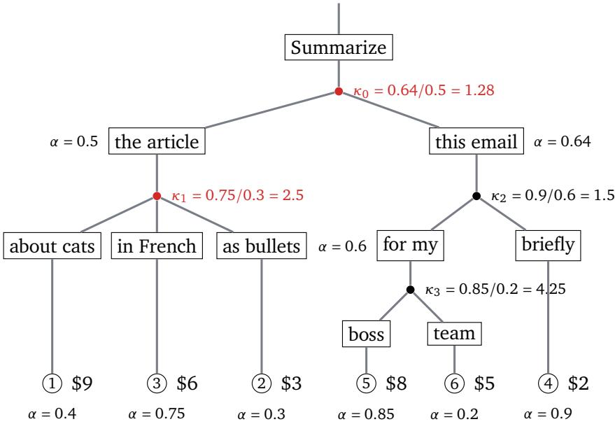  
Figure 7: Welfare under heterogeneous pacing. Leaves show true values $\upsilon _ { r }$ and pacing factors $\alpha _ { r } ,$ so that $b _ { r } = \alpha _ { r } \upsilon _ { r }$ . Internal subtrees are labeled with their value-weighted pacing factor $\alpha ( \mathsf { c } ) = F _ { b } ( \mathsf { c } ) / F _ { \nu } ( \mathsf { c } )$ and $\kappa _ { \mathrm { u } }$ is the ratio of the largest to smallest $\alpha ( \mathsfit { c } )$ among the children of u. Red nodes are where paced bids reverse the value-optimal order. At the root, “this email” now has the higher average bid (3.2 versus 3), and under “the article,” request 3 now outbids request 1 (4.5 versus 3.6). The realized schedule is $5 , 6 , 4 , 3 , 1 , 2 ,$ which attains $8 7 / 9 9 \approx 0 . 8 8$ of the optimal DFS welfare. Theorem 4.4 guarantees at least $\begin{array} { r } { \sum _ { \mathsf { u } } \Omega _ { \mathsf { u } } / \kappa _ { \mathsf { u } } \big / \sum _ { \mathsf { u } } \Omega _ { \mathsf { u } } \approx 0 . 6 3 } \end{array}$ , and hence at least $1 / \mathrm { m a x } _ { \mathrm { u } } \kappa _ { \mathrm { u } } \approx 0 . 2 4$ . Node 3 has the largest condition number but no reversal, so it loses nothing.

We ran the experiments on three H100 nodes with slightly varying hardware. Welfare and hit rate do not depend on the machine; TTFT does, so throughout the paper we only compare TTFTs measured on the same machine. The threshold, correlation, and long-tree experiments are from the second machine and the one-cluster experiment from the third; everything else is from the first.

Welfare is measured with respect to the final ordering of queries ranked by TTFT. It agrees with the welfare of the planned average-bid DFS order to within 1.3% for all results, so we report only the realized value. Raw welfare varies substantially from trial to trial because a heavy-tailed draw puts a diferent amount of value in the batch each time, and it moves every algorithm together (Figure 9), which is why we plot the percentage over $\begin{array} { r } { { \frac { 1 } { 2 } } \sum _ { r } b _ { r } } \end{array}$ . Cache hit rate is defined as the number of cached prompt tokens divided by the total number of prompt tokens, as reported by SGLang. All completion times, when reported, record the time from the first send to the last completion of the batch. The queue itself is a Python prototype: for a batch of 1024 queries it computes the order in under a millisecond and the VCG payments in 0.3 s by naive per-user recomputation (Appendix D.10 has the fast version), while actually serving the batch takes on the order of minutes.

## D.2 Workloads

mixshare mixes three kinds of queries: SQuAD questions, 32 per article, with the article as a shared prefix; GSM8K questions over one of 12 few-shot prefixes; and singletons that share only a short instruction. In mixshare-P, �% of the queries belong to one of the shared prefix clusters. agent replays logged SWE-agent trajectories, where each call’s prompt is the history up to that

call, so call � is a prefix of call $k + 1$ . tot replays tree-of-thought on GSM8K (3-ary thought trees of depth 3). tot-long is the same, with a SQuAD article of 3-5k tokens as the root of every tree; since each thought is a single sentence, nearly every token of every prompt is the article, which is why its shared prefixes are so long and its unique sufixes so short. Table 2 gives the tree statistics of one $Q = 1 0 2 4$ instance of each and Figure 8 the per-query distributions. Note the third column of the table: every workload but tot exceeds the KV cache several times over.
<table><tr><td>workload</td><td>total tokens</td><td>distinct tokens</td><td>distinct / KV cache</td><td>shared fraction</td><td>prompt</td><td>median tokens per query shared prefix</td><td>unique suffix</td><td>queries at interior nodes</td></tr><tr><td>stars</td><td>2.05M</td><td>781k</td><td>33.7</td><td>0.62</td><td>1086</td><td>381</td><td>57</td><td>0</td></tr><tr><td>chains</td><td>3.32M</td><td>437k</td><td>18.9</td><td>0.87</td><td>2854</td><td>2852</td><td>0</td><td>876</td></tr><tr><td>short trees</td><td>168k</td><td>23k</td><td>1.0</td><td>0.86</td><td>159</td><td>147</td><td>12</td><td>357</td></tr><tr><td>long trees</td><td>4.07M</td><td>124k</td><td>5.4</td><td>0.97</td><td>4143</td><td>4127</td><td>15</td><td>335</td></tr></table>

Table 2: Radix-tree statistics of one � = 1024 instance of each workload. Distinct tokens is the total edge length of the tree; a query’s shared prefix is its longest common prefix with any other query. Stars corresponds to mixshare-50, chains corresponds to agent, short trees corresponds to tot, and long trees corresponds to tot-long.

## D.3 Batch Size and Sharing Fraction

Figure 9 gives the raw welfare and TTFT behind the first two columns of Figure 1. In the sharing sweep at $n = 2 5 6$ , nothing can be cached at $P = 0$ and the algorithms difer only through the order itself. As � grows, the completion time of the two DFS orders falls from about 560 s to 330 s while that of bid-sort and no-sort rises to 740 s. In the batch-size sweep on mixshare-50, no-sort does not depend on � by construction, which is a useful consistency check; for dfs-bid, the hit rate goes from 0.23 at $n = 3 2$ to 0.60 at $n = Q$ and mean TTFT from 316 s to 160 s. The ratio of the best DFS welfare to the unconstrained optimum falls gently with sharing, from 0.83 at � = 0 to 0.78 at $P = 7 5 \%$ , as deeper trees hit the DFS restriction more often. While one might expect dfs-bid and bid-sort to agree at $P = 0$ , singletons in our dataset contain a very short shared instruction, causing us to serve one group before another.

## D.4 Diferent Tree Topologies

Figures 10, 11, and 12 vary the batch size on diferent radix tree topologies: chains, short trees, and long trees. On chains at $n = Q .$ , dfs-bid beats dfs-uniform by 16% at the same hit rate and TTFT, while bid-sort wins welfare by 48% and pays with a 0.48 hit rate (versus dfs-bid’s 0.75) and 2.4× the TTFT. no-sort and bid-sort have the same hit rate at every $n ,$ since sorting a random order by bid leaves it random from the cache’s point of view. Short trees fit in the cache, so nothing is evicted. Here, every algorithm has the same 28 s TTFT. Long trees are where the DFS restriction of our inference auction has the largest impact. dfs-bid keeps a 0.96 hit rate and a 46 s TTFT, and bid-sort drops to 0.20 and 559 s, because every branch it interleaves recomputes a 4k-token prefix.

## D.5 Correlated Values

The main results draw bids i.i.d. per query, which is the case of many users sharing a prefix with unrelated values and the hardest case for dfs-bid. To interpolate toward the case where one user owns a whole cluster, we draw values from a Gaussian copula with within-cluster correlation � and the same Pareto marginal. A cluster is a set of queries sharing at least 128 prefix tokens on stars, a trajectory on chains, and a tree on trees; singletons are unafected. Each cluster � draws $Z _ { c } \sim \mathcal { N } ( 0 , 1 )$ and each query � in it draws $\epsilon _ { r } \sim \mathcal { N } ( 0 , 1 )$ ; its value is $\nu _ { r } = 1 + ( 1 - \Phi ( z _ { r } ) ) ^ { - 1 / 1 . 5 }$ with $z _ { r } = \sqrt { \rho } Z _ { c } + \sqrt { 1 - \rho } \epsilon _ { r } . \mathrm { ~ S o ~ } \rho = 0 \mathrm { ~ i s ~ i . i . d }$ . and $\rho = 1$ gives every query in a cluster the same value.

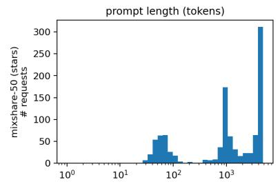

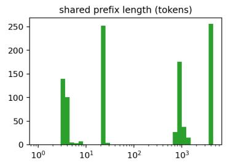

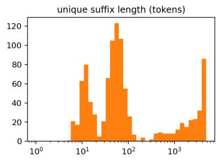

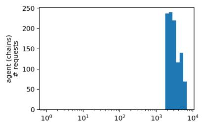

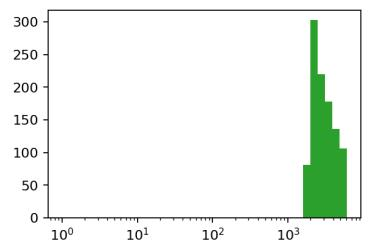

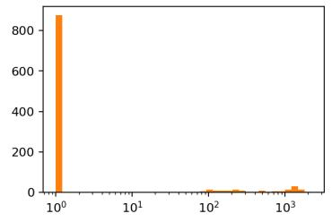

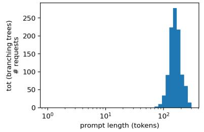

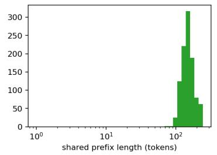

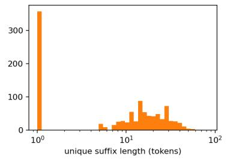

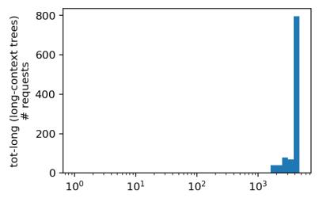

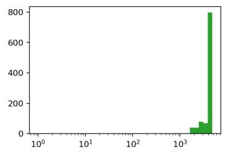

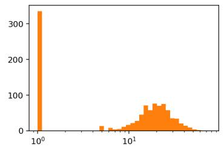  
Figure 8: Per-query distributions of prompt, shared prefix, and unique sufix length (log scale).

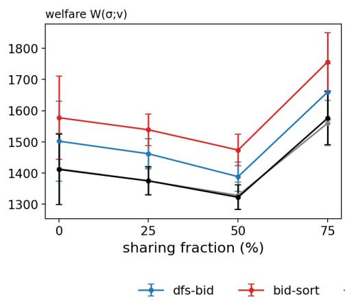

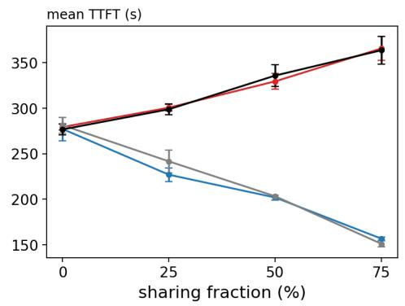

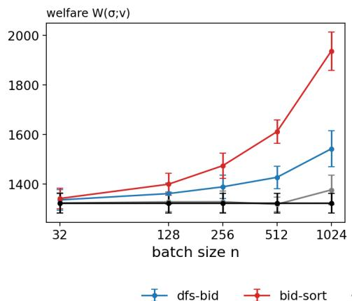  
dfs-bidbid-sortIdfs-uniformno-sort

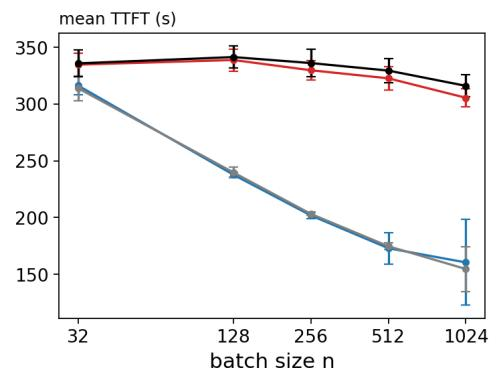  
Figure 9: Raw welfare and mean TTFT for the sharing-fraction (top) and batch-size (bottom) sweeps of Figure 1.

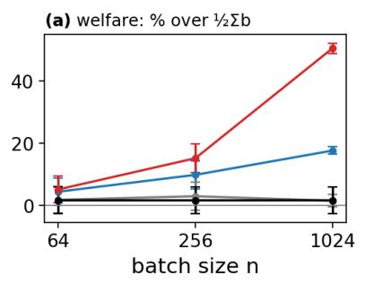

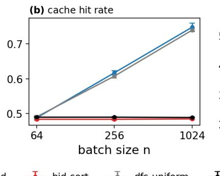

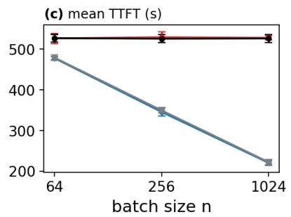  
Figure 10: Chains (agent) against batch size �.

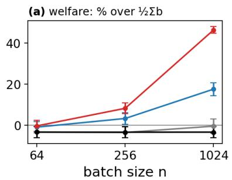

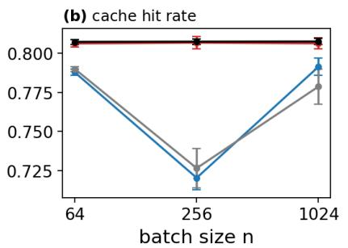

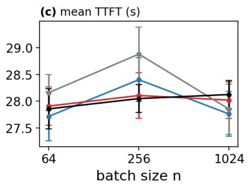  
dfs-bidbid-sortdfs-uniformno-sort

Figure 11: Short trees (tot) against batch size �. The workload fits in the cache, so hit rate and TTFT do not depend on the order.  
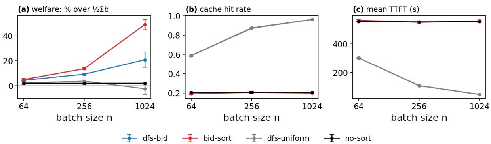  
Figure 12: Long trees (tot-long) against batch size �, second machine.

Figure 13 plots welfare against � on stars and the right column of Figure 1 displays the engine results at $\rho \in \{ 0 , 0 . 5 , 1 \}$ . dfs-bid gains as $\rho$ grows because the value-sorted order and the tree-contiguous order agree more often: the best DFS welfare rises from 0.83 to 0.91 of the unconstrained optimum. bid-sort does not gain, and it still thrashes the cache at $\rho = 0 . 5$ (hit rate 0.29 against 0.60). At $\rho = 1$ its order happens to keep clusters together and its hit rate matches dfs-bid’s, but dfs-bid is still faster (mean TTFT 85 s against 124 s), because it serves short high-value clusters first.

Figure 14 repeats this experiment on chains and long trees at $n = Q$ . On long trees at $\rho = 1$ the two optima coincide: dfs-bid reaches 0.999 of the unconstrained welfare at the same hit rate and TTFT as bid-sort. On chains it reaches 0.90, and the remaining gap is the cost of the DFS restriction when trajectories on the same task share interior nodes with other users. On both, bid-sort recovers the cache only at $\rho = 1 ;$ ; at $\rho = 0 . 5$ its TTFT is still $2 \times$ dfs-bid’s on chains and 10× on long trees.

## D.6 One Cluster Bids

We consider now a situation similar to that of the highest-correlation setting of the experiments in Figures 13 and 14 (though in the original setting of i.i.d. Pareto bids). We draw one cluster of queries with a shared prefix at random among the clusters with at least eight members (32 to 58 queries on these instances). That cluster keeps its Pareto bids. Every other bid is set to zero (Figure 3).

This bid distribution is meant to model a realistic scenario where most users do not submit any bid for priority (such users still participate in the auction and must be served in a timely fashion).

within-cluster value correlation ρ  
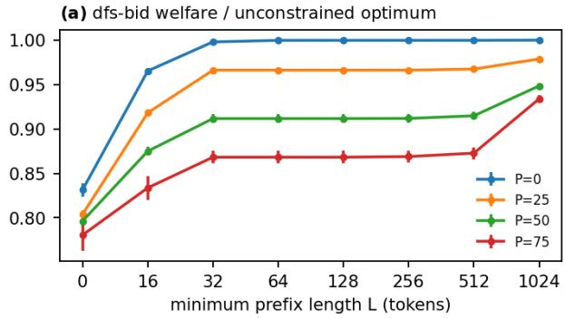

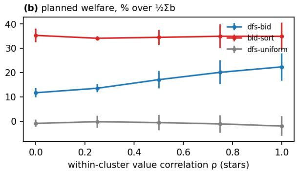  
Figure 13: Ofline sweeps on the planned orders, three trials. (a) dfs-bid’s welfare as a fraction of the unconstrained optimum against the minimum-prefix threshold �, per sharing fraction. (b) Planned welfare of each algorithm against within-cluster value correlation $\rho .$

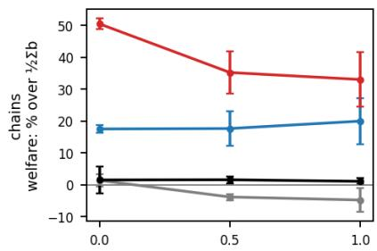

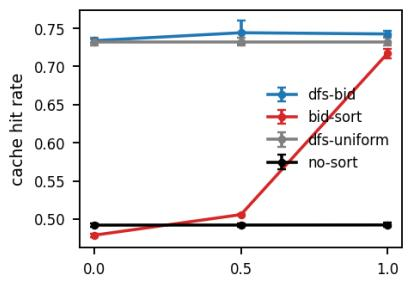

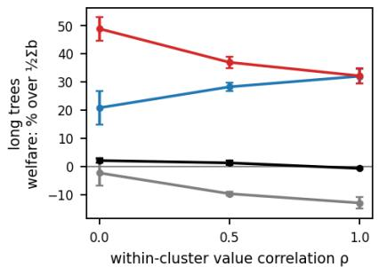

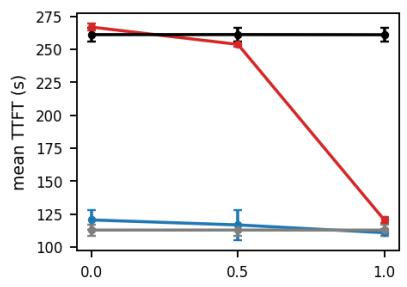

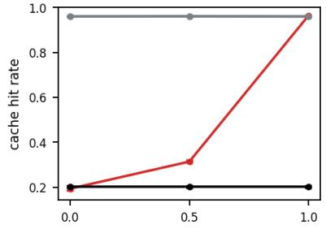

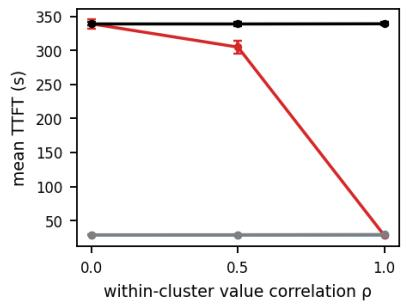  
Figure 14: Within-cluster value correlation $\rho$ on chains (top) and long trees (bottom) at $n = Q ,$ , third machine.

Serving the cluster with non-zero bids first corresponds to both the unconstrained optimum and a DFS order, so dfs-bid matches bid-sort’s welfare at every where the paying cluster gets its first tokens in about a second under either algorithm. The margin over the bid-blind algorithms grows with $n ,$ from nothing at $n = 3 2$ , where a batch rarely holds more than one or two members of the cluster, to about 100 points at $n = Q$ . dfs-bid’s hit rate and completion time equal dfs-uniform’s at every �, while bid-sort’s hit rate stays near 0.25 and its TTFT is about 1.5× at every � above 32.

## D.7 Online Arrivals

The main protocol has the whole queue present at $t = 0$ , so the batch-size sweep in Figure 1 shows the benefit of a larger batch but not its cost (the wait for the batch to fill). Here the 1024 queries of mixshare-50 arrive as a Poisson process at 4 or 1 per second, a batch is released when its �-th query arrives, and TTFT is measured from arrival. no-sort is batched the same way, so the batching cost is common to all algorithms. Table 3 reports means over three trials.

<table><tr><td>rate</td><td>n</td><td>wait</td><td>DFS-BID mean TTFT</td><td>hit</td><td>NO-SORT mean TTFT</td></tr><tr><td>4/s</td><td>64</td><td>8</td><td>150</td><td>0.33</td><td>211</td></tr><tr><td>4/s</td><td>512</td><td>63</td><td>160</td><td>0.56</td><td>314</td></tr><tr><td>1/s</td><td>64</td><td>31</td><td>45</td><td>0.30</td><td>47</td></tr><tr><td>1/s</td><td>512</td><td>254</td><td>328</td><td>0.56</td><td>406</td></tr></table>

Table 3: Poisson arrivals on mixshare-50. “Wait” is the mean time from a query’s arrival to the release of its batch; all times in seconds.

At 4 queries per second the server is saturated: the queue arrives in about 250 s and takes over 500 s to serve. Going from $n = 6 4$ to $n = 5 1 2$ adds 55 s of batch wait but changes dfs-bid’s mean TTFT by between −7 and +29 s across trials, because the added wait mostly replaces time the query would have spent waiting in the engine, while the hit rate rises from 0.33 to 0.56. The same change costs no-sort 100 s and buys it nothing. At 1 query per second the server keeps up with arrivals, there is no queue to hide the wait, and $n = 5 1 2$ costs about 280 s of TTFT. Under load a large batch is nearly free; under light load a timeout should release batches long before they fill.

## D.8 Second Model

Table 4 repeats our main experiments with Qwen2.5-7B-Instruct [42] in place of the 32B model, on the same instances and with the KV cache capped at the same number of tokens. The two models share a tokenizer, so the trees are identical. Welfare agrees to the unit in every experiment and hit rates are very similar; time metrics are smaller due to the smaller size of the model.

## D.9 Other Value Distributions

Figure 15 repeats the mixshare-50 and chains experiments at � = � with bids pulled from diferent distributions, namely uniform and lognormal. The cache hit rate and TTFT does not change, since they depend on the tree and not on the bids. dfs-bid’s gain over dfs-uniform is positive and significant under every distribution and grows with the tail, as does bid-sort’s gain over dfs-bid.

## D.10 Fast VCG Payments

The experiments compute payments by rerunning the allocation once per user, which incurs a quadratic run-time. We also implemented the algorithm of Theorem 3.3, which re-sorts only the

<table><tr><td colspan="2"></td><td colspan="2">welfare</td><td colspan="2">hit rate</td><td colspan="2">completion time (s)</td></tr><tr><td>experiment</td><td>algorithm</td><td>7B</td><td>32B</td><td>7B</td><td>32B</td><td>7B</td><td>32B</td></tr><tr><td rowspan="4"> $\mathbf { M I X S H A R E - } 5 0 , n = Q$ </td><td>DFS-BID</td><td>1541</td><td>1542</td><td>0.60</td><td>0.60</td><td>87</td><td>319</td></tr><tr><td>BID-SORT</td><td>1936</td><td>1936</td><td>0.22</td><td>0.23</td><td>163</td><td>615</td></tr><tr><td>DFS-UNIFORM</td><td>1376</td><td>1376</td><td>0.60</td><td>0.59</td><td>91</td><td>322</td></tr><tr><td>NO-SORT</td><td>1322</td><td>1322</td><td>0.21</td><td>0.21</td><td>165</td><td>629</td></tr><tr><td rowspan="2"> $\mathbf { M I X S H A R E - } 7 5 , n = 2 5 6$ </td><td>DFS-BID</td><td>1660</td><td>1660</td><td>0.70</td><td>0.69</td><td>81</td><td>327</td></tr><tr><td>BID-SORT</td><td>1757</td><td>1757</td><td>0.29</td><td>0.28</td><td>188</td><td>739</td></tr><tr><td rowspan="2"> $\mathbf { A G E N T } , n = Q$ </td><td>DFS-BID</td><td>1853</td><td>1854</td><td>0.82</td><td>0.75</td><td>77</td><td>438</td></tr><tr><td>BID-SORT</td><td>2375</td><td>2375</td><td>0.49</td><td>0.48</td><td>227</td><td>1076</td></tr><tr><td rowspan="2"> $\mathrm { T o r } , n = Q$ </td><td>DFS-BID</td><td>1686</td><td>1686</td><td>0.86</td><td>0.79</td><td>54</td><td>61</td></tr><tr><td>BID-SORT</td><td>2098</td><td>2098</td><td>0.78</td><td>0.81</td><td>53</td><td>60</td></tr></table>

Table 4: Qwen2.5-7B-Instruct against the 32B model on identical instances; means over three trials.

mixshare-50 and agent chains, Q = 1024: paired margins by value distribution  
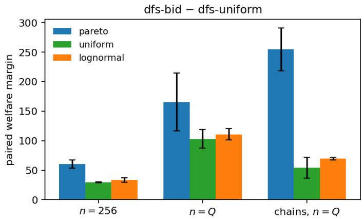  
Figure 15: Welfare gain on mixshare-50 and agent under Pareto, uniform on [1, 5], and lognormal (� = 0.5) values with the same mean.

afected children on a user’s root-to-leaf paths. Its payments agree with the naive computation to $1 0 ^ { - 1 2 }$ on random trees and on our stored instances, and at $n = 1 0 2 4$ it takes 34 ms while the naive algorithm takes 370 ms on average.

## D.11 Autobidding

We simulate Algorithm 3 over $T = 6 0$ batches of $n = 2 5 6$ . For stars, each shared-prefix cluster belongs to a distinct user. For chains, each trajectory belongs to a distinct user. Half the users pace toward a target spend of half their mean truthful payment with step size $\eta = 0 .$ .1 normalized by the target; the rest bid truthfully. Figure 16 shows the usual behavior of dual descent with a fixed step: spend runs above the target while the multiplier is small and below it once the multiplier has grown. Welfare under pacing averages 0.91 of the DFS optimum at true values on stars and 0.93 on chains, and the bound of Theorem 4.4 holds in every batch.

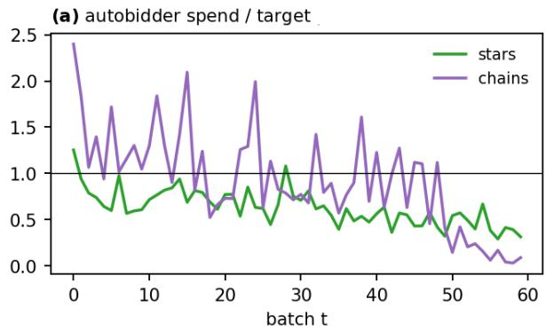

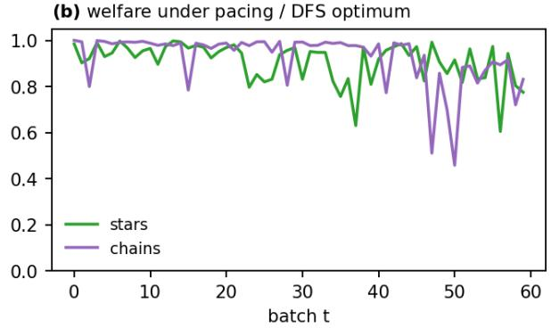  
Figure 16: Pacing autobidders over $T = 6 0$ batches of $n = 2 5 6 ,$ half the users pacing and half truthful. (a) Spend relative to the per-batch target. (b) Welfare under pacing as a fraction of the DFS optimum at true values.