# LEARNING FUNCTIONAL SUBSPACES FOR NEURAL NETWORK COMPRESSION

Massimo Bini1,2,3 Anders Christensen4 Stephan Alaniz5 Judah Goldfeder6 Ole Winther7,8 Yann LeCun9 Ravid Shwartz-Ziv9 Zeynep Akata1,2,3

1Helmholtz Munich, 2Technical University of Munich, 3MCML, 4Orbital Industries 5LTCI, Tel´ ecom Paris, Institut Polytechnique de Paris, ´ 6Columbia University, 7University of Copenhagen, 8Technical University of Denmark, 9New York University

## ABSTRACT

Modern transformers pair impressive capabilities with substantial memory and compute demands. Low-rank weight factorization reduces both while keeping the matrices dense, and thus efficient on standard hardware. Existing methods, however, choose the subspace to remove from each weight matrix with local closedform criteria: activation energy, layer-wise reconstruction error, or a quadratic approximation of the loss. These criteria ignore how errors propagate through the network, so at high compression the errors compound with depth and performance collapses. We introduce Learnable Subspace Projections (LSP), which instead learns the subspaces to discard end-to-end. Each linear layer, or tied group of layers that read the same activations, is assigned an orthogonal projector. All projectors are optimized jointly against a global objective—the KL divergence to the dense model’s output distribution or the model’s original training loss—while the pretrained weights remain frozen. Projectors are initialized from a whitened SVD truncation, and ranks are allocated by the output KL each projector induces per parameter saved. After training, the projectors merge into standard low-rank factors, with each tied group sharing one factor. In attention, this also lets the model cache one narrow latent in place of full keys and values. Across LLMs (OPT-125M/1.3B, Qwen3-4B, Llama-2-7B) and ViT-B/16, LSP outperforms baselines, and its advantage widens as compression increases. At −70% compression, LSP brings Llama-2-7B to 10.9 WikiText-2 perplexity and 42.2% mean zero-shot accuracy, versus 13.3 and 36.0% for the strongest baseline. The factorized model decodes up to 1.6× faster than the dense model at small batch sizes, and aching the shared latent shrinks the combined memory of weights and KV cache by 13.5× at a 128k-token context, versus at most 6.5× for untied baseline factorizations.

## 1 INTRODUCTION

Transformers (Vaswani et al., 2017) have become the dominant architecture in deep learning, owing to their flexibility, scalability, and strong performance across tasks and modalities. Their uniform design enables rapid development and stable scaling; however, it also leaves trained models highly redundant. Large models exhibit low intrinsic dimensionality (Aghajanyan et al., 2021; Kuzborski & Abbasi Yadkori, 2025), with their capabilities concentrated in a low-dimensional subspace of their parameters. Compression exploits this redundancy to reduce memory and compute while preserving the model’s behavior.

Low-rank compression is a natural way to realize these savings, replacing each weight matrix with the product of two smaller factors. Yet this redundancy is not directly visible in the weights’ spectra. The singular values of pretrained Transformer weights decay slowly, so naive truncated SVD severely degrades performance (Hsu et al., 2022). Practical low-rank compression instead builds on an empirical observation: the activations flowing between layers lie in low-dimensional subspaces (Yu & Wu, 2023; Yuan et al., 2024; Garg et al., 2024; Skean et al., 2025). Existing methods read the useful subspace off activation statistics, either from the energy of the layer input, as in ASVD (Yuan et al., 2024), SliceGPT (Ashkboos et al., 2024), and MoDeGPT (Lin et al., 2025), or from the reconstruction error of the layer output, as in SVD-LLM (Wang et al., 2025d) and Swift-SVD (Qi et al., 2026). Either criterion captures the layer, not the network: a low-energy direction is discarded whether or not the network’s output depends on it (Figure 1), and a layer-wise optimum says nothing about how its residual error propagates downstream. Loss-aware methods bring the network in through a local surrogate—Fisher-weighted reconstruction in FW-SVD (Hsu et al., 2022) or a quadratic curvature model in LLM-Surgeon (van der Ouderaa et al., 2024)—but such surrogates hold only for small perturbations of the dense weights, whereas aggressive compression moves far from them. Dobi-SVD (Wang et al., 2025b) optimizes the loss directly, but learns only the permatrix truncation rank. The loss thus shapes local approximations, sets ranks, or repairs the weights after truncation; in none of these methods does the network loss itself choose which directions are removed. What compression has to identify, then, is the network’s functional subspace: the directions whose retention preserves its behavior on the data of interest. Our starting observation is that choosing a subspace amounts to choosing an orthogonal projector: applying a rank-r projector to a weight matrix leaves it with rank at most r, so it factors into two thin matrices. The search for the functional subspace can thus be cast as a search over projectors. This raises our central question: can we obtain better compressed models by learning which subspace to remove, optimizing the projectors end-to-end against thefrozen network’s output?

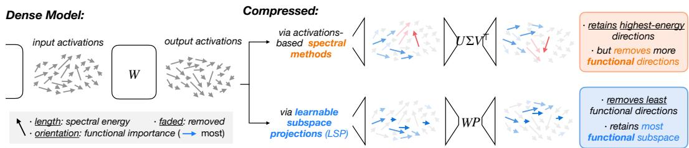  
Figure 1: Spectral energy is not function. Each arrow is a direction in the input activation space of a linear layer W: its length is the spectral energy it carries, its orientation how much the network output depends on it (horizontal right: most), and faded arrows are removed. Activation-based lowrank compression (top) keeps the highest-energy directions, even when the output barely depends on them (red), and can discard functional ones (blue). LSP (bottom) learns the projector P against the network output, removing the directions the output is least sensitive to, whatever their energy.

We propose Learnable Subspace Projections (LSP), which does exactly this: every projector is learned against a global objective, by default the KL divergence to the dense model’s output distribution, or alternatively the model’s original training objective, a variant we denote LSP T. Our contributions are:

(1) Learned subspace projections. Layers that read the same activations (Q/K/V, gate/up) form a tied group and share one projector; we optimize all projectors jointly across the network with the pretrained weights frozen. An activation-space parameterization with fused QR orthonormalization keeps this tractable at billion-parameter scale.

(2) Whitened initialization and measured-KL allocation. Each projector is initialized from a whitened truncation, recast as an orthogonal projector and extended to tied groups. To decide how many directions each layer or tied group removes, we apply each projector in isolation, measure the KL divergence it induces on the model output, and allocate the budget by KL cost per saved parameter. The model at initialization, which we call NoLSP, serves as a control that isolates the effect of learning.

(3) Efficient low-rank inference. After training, the projectors merge into plain low-rank factors, so the deployed model contains no LSP-specific operations. At the same compression ratio it requires the same FLOPs per token as other factorizations, yet the input factor shared by each tied group speeds up small-batch decoding and, in a latent-cache deployment, stores one narrow latent per group where untied factorizations store two (one each for keys and values), shrinking the KV cache.

Because LSP applies to any linear layer, the same recipe transfers across Transformer models without architecture-specific surgery. LSP outperforms pruning and SVD baselines by a margin that grows with the compression ratio, and on ViT it degrades least among the compared methods when calibration and evaluation distributions differ.

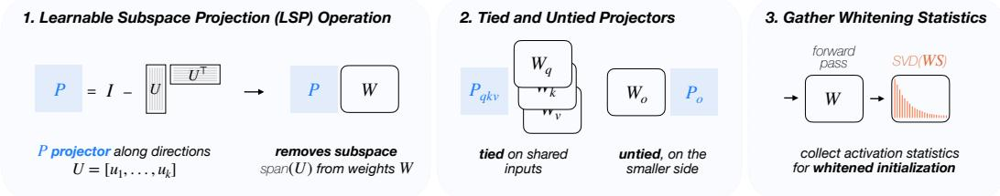

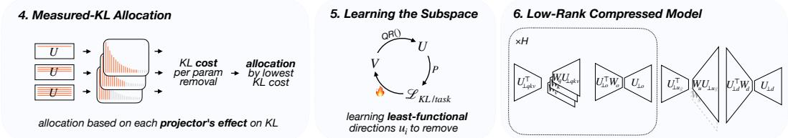  
Figure 2: Overview of LSP. (1) An orthogonal projector $\pmb { P } = \pmb { I } - \pmb { U } \pmb { U } ^ { \top }$ removes the learned U W 4. Learning u4. Optimizationsubspace span(U) from the input or output of W. (2) Layers that read the same activations (Q/K/V, q ℱ WvUℱgate/up) share a tied projector; the remaining (untied) layers are projected on their smaller side. (3) U Ξ∥ − !UCalibration activations give the whitened SVD of WS, whose trailing directions initialize U. (4) U!The KL divergence that each candidate truncation induces on the model output, per saved parameter, findingΞsets how many directions each unit removes. (5) The unconstrained V is trained, with W frozen, ΞKL/taskon the KL to the dense model or on the task loss; $U = \mathrm { q f } ( V )$ directions uiis its orthonormal QR factor, so the removed directions are those the output depends on least. (6) The trained projectors decompose into low-rank factors $U _ { \perp } \pmb { U } _ { \perp } ^ { \top }$ , and are merged with the frozen weights.

## 2 LEARNABLE SUBSPACE PROJECTIONS (LSP)

LSP compresses a pretrained network into its functional subspace: each targeted linear layer, or tied group of layers that read the same activations, is composed with a learned orthogonal projector, and all projectors are optimized end-to-end against the model output with the pretrained weights frozen. Figure 2 summarizes the pipeline, Section 2.1 gives the formulation, Section 2.2 the whitened initialization and measured-KL allocation, and Section 2.3 the training procedure and the merge into low-rank factors.

## 2.1 LEARNING SUBSPACE PROJECTIONS

Projector parameterization. Consider a linear layer ${ \pmb y } = { \pmb W } { \pmb x } + { \pmb b }$ with $W \in \mathbb { R } ^ { d _ { \mathrm { o u t } } \times d _ { \mathrm { i n } } }$ ; the bias is left unchanged throughout. To remove k input directions, we learn $U \in \mathbb { R } ^ { d _ { \mathrm { i n } } \times k }$ with orthonormal columns and apply the orthogonal projector $\dot { \pmb { P } } = \pmb { I } - \pmb { U } \pmb { U } ^ { \top }$ to the weight:

$$
W P = W - ( W U ) U ^ { \top } ,\tag{1}
$$

which, as a result, has rank at most $d _ { \mathrm { i n } } - k$ . Orthonormality holds by construction: we optimize an unconstrained $V \in \mathbb { R } ^ { d _ { \mathrm { i n } } \times k }$ and set $U = \operatorname { q f } ( V )$ , the orthogonal factor of its thin QR decomposition, on every forward pass. Since P is invariant under $U \mapsto { \overline { { U O } } }$ for any orthogonal O, the effective variable is the removed subspace span(U), which equals span(V ) whenever V has full column rank. The output-side form is PW, with $\dot { \boldsymbol { U } } \in \mathbb { R } ^ { d _ { \mathrm { o u t } } \times \dot { \boldsymbol { k } } }$ and rank at most $d _ { \mathrm { o u t } } - k .$

Tied groups and projection side. Q/K/V read the same normalized activation, as do gate/up; each such tied group shares a single tied projector on this common input. Every other layer is projected on its smaller side, where, for a full-rank weight, each removed direction lowers the rank by one and U is smallest. Sharing lets the group retain a higher rank at the same parameter budget and, tying K/V on the input side, cache a single latent instead of full keys and values (Section 2.3).

Practical design choices. Three choices make training scalable and stable; details are in Section A.2. (i) Activation-spaceform. We compute $\pmb { W } ( \pmb { x } - \mathbf { U } ( \pmb { U } ^ { \top } \pmb { x } ) )$ ) without forming WP, which would materialize a dense $d _ { \mathrm { o u t } } \times d _ { \mathrm { i n } }$ matrix and its gradient per layer, and a fused QR backward stores $O ( d _ { \mathrm { i n } } k + k ^ { 2 } )$ per layer, versus $\mathcal { O } ( d _ { \mathrm { i n } } k ^ { 2 } )$ for an explicit Gram–Schmidt loop. (ii) Warm-up and direction dropout. Training uses $\begin{array} { r } { P _ { \alpha , m } = \dot { I } - \alpha U \mathrm { d i a g } ( m ) U ^ { \top } } \end{array}$ : α ramps from 0 to 1 over the first epoch to avoid abrupt output changes, and a random mask $m \in \{ 0 , 1 \} ^ { k }$ temporarily keeps some removed directions, acting as dropout. (iii) Orthogonality penalty. A penalty $\mathcal { L } _ { \mathrm { o r t } }$ on correlations between the columns of $\breve { V }$ (Equation (9)) stabilizes QR and its gradient.

## 2.2 WHITENED INITIALIZATION AND MEASURED-KL ALLOCATION

Before training, each compressed unit—a tied group or an individual layer—needs a subspace to start from and a number of directions to remove. The subspace comes from an ordered whitened basis, so that removing k directions amounts to dropping its trailing k vectors; the number comes from the KL divergence each candidate truncation induces on the model output, allocated under the global parameter budget. The basis is thus spectral, the allocation loss-aware.

Whitened initialization. We initialize from a whitened truncation, which scores directions by their effect on the layer output, as introduced by Wang et al. (2025d), and extend it in two ways: from a per-matrix truncation to a tied group, and from an operator that is orthogonal only on the output side to a projector on either side. Dropping the layer index, let $\pmb { X } \in \mathbb { R } ^ { n \times d _ { \mathrm { i n } } }$ hold n calibration inputs, with positive-definite Gram matrix $\begin{array} { r } { \bar { G } = \frac { 1 } { n } \dot { X } ^ { \top } X = S S ^ { \top } } \end{array}$ (S its Cholesky factor), so that a candidate weight Z has reconstruction error $\begin{array} { r } { \boldsymbol { \mathcal { E } } ( \boldsymbol { \mathsf { Z } } ) = \frac { 1 } { n } \| ( W - \boldsymbol { Z } ) \boldsymbol { X } ^ { \top } \| _ { F } ^ { 2 } = \| ( W - \boldsymbol { Z } ) \boldsymbol { S } \| _ { F } ^ { 2 } . } \end{array}$ The whitened truncation minimizes it at rank r by keeping the leading r singular directions of $\begin{array} { r } { W S = U ^ { w } \Sigma ^ { w } ( V ^ { w } ) ^ { \top } } \end{array}$ and discarding the trailing $k = d - r ,$ d being the dimension of the projected side; subscripts r and >r denote the corresponding blocks of columns:

$$
\begin{array} { r } { \widehat { \pmb { W } } = \pmb { U } _ { r } ^ { w } ( \pmb { U } _ { r } ^ { w } ) ^ { \top } \pmb { W } = \pmb { W } \pmb { S } \pmb { V } _ { r } ^ { w } ( \pmb { V } _ { r } ^ { w } ) ^ { \top } \pmb { S } ^ { - 1 } , \qquad \pmb { \mathcal { E } } ( \widehat { \pmb { W } } ) = \sum _ { i > r } ( \sigma _ { i } ^ { w } ) ^ { 2 } . } \end{array}\tag{2}
$$

The two forms are the same matrix. The first is an orthogonal projector applied on the output side, and we use it as is. The second, applied on the input side, keeps $K = \mathrm { s p a n } ( S V _ { r } ^ { w } )$ and zeroes span $( S V _ { > r } ^ { w } )$ , two subspaces that are not orthogonal unless $G \propto I ,$ so it is oblique; there we replace it by the orthogonal projector onto K, which removes the orthogonal complement span $( S ^ { - \top } V _ { > r } ^ { w } )$

Proposition 1 (Orthogonal recast). Let $C _ { r } = S V _ { r } ^ { w } , C _ { > r } = S V _ { > r } ^ { w }$ , and $P _ { i n i t } = C _ { r } C _ { r } ^ { + }$ be the orthogonal projector onto K. (i) On the output side, $( { I - U _ { > r } ^ { w } ( U _ { > r } ^ { w } ) ^ { \top } } ) W \ = \ \widehat { W }$ attains the optimum $\textstyle \sum _ { i > r } ( \sigma _ { i } ^ { w } ) ^ { 2 }$ . (ii) On the input side, $\begin{array} { r } { \mathcal { E } ( W P _ { i n i t } ) = \sum _ { i > r } ( \sigma _ { i } ^ { w } ) ^ { 2 } + \| \Sigma _ { r } ^ { w } C _ { r } ^ { + } C _ { > r } \| _ { F } ^ { 2 } } \end{array}$ , and if $\sigma _ { r } ^ { w } > 0$ the excess term vanishes if and only $i f C _ { r } ^ { \top } C _ { > r } = 0 .$ (iii) For a group tied on its input, the summed error under one shared kept subspace equals that of the row-stacked whitened weight $\bar { W } S ,$ , whose leading right singular subspace minimizes it, and (ii) applies to $\bar { \boldsymbol { W } } ;$ a group tied on its output is symmetric, with the column-stacked weight, its leading left singular subspace, and (i).

The proof is in Section A.3. The initialized layer thus agrees with the whitened truncation on the kept subspace $\kappa .$ , while on directions $C _ { > r } ,$ which the truncation zeroes, it retains their least-squares component along $C _ { r } ;$ the excess is that component weighted by the kept singular values, and it vanishes when the whitened truncation is itself orthogonal, as for an isotropic input Gram matrix.

Measured-KL rank allocation. Units differ in how much the model output depends on them, so we measure each unit’s sensitivity directly and remove parameters where the measured cost per saved parameter is lowest; sensitive units keep more rank or stay dense. For a unit u, removing the trailing k directions of its initialized basis, with the rest of the network dense, costs

$$
\begin{array} { r } { \Delta _ { u } ( k ) = \mathbb { E } _ { \pmb { x } \sim \mathcal { D } _ { \mathrm { { a l o c } } } } D _ { \mathrm { K L } } \big ( p _ { \theta _ { 0 } } ( \cdot \cdot \mid \pmb { x } ) \big | \big | p _ { \theta _ { 0 } \setminus ( \pmb { u } , k ) } ( \cdot \mid \pmb { x } ) \big ) , } \end{array}\tag{3}
$$

where $\mathcal { D } _ { \mathrm { a l l o c } }$ is the subset of the calibration set $\mathcal { D } _ { \mathrm { c a l } }$ used for allocation and $\theta _ { 0 } \backslash ( u , k )$ denotes the dense model with only this truncation applied. Measuring $\Delta _ { u }$ needs no gradients and no new SVDs: the dense model’s outputs are cached once, and every candidate reuses the unit’s ordered basis. We measure it on a grid of removal fractions and interpolate the running maximum of each curve, so that the resulting estimate $\tilde { \Delta } _ { u }$ is nondecreasing in k. Starting from the dense model, the allocator repeatedly takes the move $k  k ^ { \prime }$ with the smallest marginal cost $\big ( \tilde { \Delta } _ { u } ( k ^ { \prime } ) - \tilde { \Delta } _ { u } ( k ) \big ) / \big ( s _ { u } ( k ^ { \prime } ) - s _ { u } ( k ) \big )$ , where $s _ { u } ( k )$ is the number of parameters the unit saves after factorization, counting shared factors once, until the target savings are reached (Section ${ \bf A . } 4 )$ . Unlike curvature-based estimates (van der Ouderaa et al., 2024), which hold only near the dense weights, this measures finite truncations through the full network, with joint training handling the combined effect of independently measured units.

## 2.3 TRAINING PROCEDURE

We replace each targeted linear layer with its LSP counterpart and initialize it as in Section 2.2: we construct the whitened bases, allocate ranks by measured $\mathrm { K L , }$ and set $\{ V _ { \ell } \}$ accordingly. We then optimize all $\{ V _ { \ell } \}$ jointly at fixed ranks, with every pretrained parameter frozen, against

$$
\mathcal { L } _ { \mathrm { t o t a l } } = \mathcal { L } _ { \mathrm { o b j } } \big ( f \big ( \cdot ; \{ P _ { \alpha , m } ^ { ( \ell ) } \} \big ) \big ) + \lambda _ { \mathrm { o r t } } \mathcal { L } _ { \mathrm { o r t } } .\tag{4}
$$

By default, $\mathcal { L } _ { \mathrm { o b j } }$ is the output-distillation loss (Hinton et al., 2015)

$$
{ \mathcal { L } } _ { \mathrm { K L } } = \mathbb { E } _ { { \pmb { x } } \sim \mathcal { D } _ { \mathrm { c a l } } } \mathrm { K L } \big ( p _ { \mathrm { d e n s e } } ( \cdot \mid { \pmb { x } } ) \big | \big | p _ { \mathrm { c o m p r e s s e d } } ( \cdot \mid { \pmb { x } } ) \big ) ,\tag{5}
$$

where p is the distribution over the next token for LLMs, averaged over all positions, and over the last Transformer block’s output for the ViT, averaged over tokens. Alternatively, $\mathcal { L } _ { \mathrm { o b j } }$ is the model’s original training loss (next-token or classification cross-entropy), a variant we denote $\mathrm { L S P } ^ { T }$ . The teacher is the same network with its projectors disabled $( \alpha = 0 )$ , run without gradient tracking, so no second copy of the weights is stored. We use a linear-warmup cosine learning-rate schedule with early stopping on a held-out validation split, and keep the best validation epoch (Section B).

Choice of objective. Distillation is the default: it targets the dense model’s full output distribution rather than a single target, and for classifiers it needs no labels, so any unlabeled pool can serve for calibration (Section 3.2). The task loss $( \mathrm { L S P } ^ { T } )$ instead fits the calibration data directly, so it can specialize the model when the calibration data matches the deployment task; in our experiments, $\dot { \mathrm { L S P } } ^ { T }$ reaches its best validation score in fewer epochs on average (Section F).

Merging. After training, each projector is folded into its weight, a step we call merging. For an input-side projector, let the columns of $U _ { \perp } \in \mathbb { R } ^ { d _ { \mathrm { i n } } \times r }$ , with $r = d _ { \mathrm { i n } } - k$ , form an orthonormal basis of span(U)⊥. Then $\pmb { P } = \pmb { U } _ { \perp } \pmb { U } _ { \perp } ^ { \top }$ , and the merged weight factorizes exactly:

$$
\begin{array} { r } { W P = ( W U _ { \perp } ) U _ { \perp } ^ { \top } = B A , \quad \quad A = U _ { \perp } ^ { \top } \in \mathbb { R } ^ { r \times d _ { \mathrm { i n } } } , \quad B = W U _ { \perp } \in \mathbb { R } ^ { d _ { \mathrm { o u } } \times r } , } \end{array}\tag{6}
$$

a rank-r factorization with $( d _ { \mathrm { i n } } + d _ { \mathrm { o u t } } )$ r parameters; on the output side, $\scriptstyle P W = U _ { \bot } ( U _ { \bot } ^ { \top } W )$ . Every member of an input-tied group shares A, which is stored and applied once; in attention, the common latent z = Ax suffices to reconstruct both keys and values, so the KV cache can store z alone.

## 3 EXPERIMENTS

We evaluate LSP up to −70% compression on decoder language models (Section 3.1) and on vision transformers (Section 3.2), then measure inference efficiency (Section 3.3) and analyze the subspaces LSP learns (Section 3.4).

Setup. For language models we compress OPT-125M/1.3B (Zhang et al., 2022), Qwen3- 4B (Yang et al., 2025) and Llama-2-7B (Touvron et al., 2023). We report WikiText-2 (Merity et al., 2016) test perplexity, calibrating as SliceGPT does on 1024 sequences of 2048 tokens from the training split, and zero-shot accuracy on six benchmarks with the calibration data given in Section 3.1. Early stopping and every tuned setting are selected on held-out validation splits. On Qwen3-4B, whose groupedquery K and V are a quarter of Q’s width, K and V share an output-side projector and Q is projected alone; every other model ties Q/K/V on the input side (Section B). For vision we compress a ViT-B/16 (Dosovitskiy et al., 2021) finetuned on CIFAR-100 (Krizhevsky, 2009) and report source accuracy and linear-probe transfer. A compression ratio is the fraction of the parameters of the linear layers (no embeddings, no head) that is removed. All baselines run from their official code with the same calibration data and precision as LSP; SVD baselines are evaluated in factorized form, with tunable settings swept around the official optima (Section B).

Table 1: Wikitext-2 perplexity (↓) of LLMs at $- 3 0 / 5 0 / 7 0 \%$ . One of the two LSP variants has the lowest perplexity in all 12 settings, by a margin that grows with the ratio; at −70% both variants beat every baseline on all four models.
<table><tr><td>Comp.</td><td>Method</td><td>OPT-125M OPT-1.3B Qwen3-4B Llama2-7B</td><td></td><td></td><td></td></tr><tr><td>Dense (Base)</td><td></td><td>27.9</td><td>14.7</td><td>8.0</td><td>5.5</td></tr><tr><td rowspan="9">aecions/ recoruc. -30% losw-are</td><td>NoLSP</td><td>48.5</td><td>23.0</td><td>16.8</td><td>9.4</td></tr><tr><td>ASVD</td><td>106.8</td><td>396.1</td><td>154.5</td><td>98.2</td></tr><tr><td>SliceGPT</td><td>51.7</td><td>23.9</td><td>15.0</td><td>10.3</td></tr><tr><td>SVD-LLM (W)</td><td>48.7</td><td>20.2</td><td>19.1</td><td>10.4</td></tr><tr><td>Swift-SVD</td><td>47.0</td><td>19.8</td><td>15.6</td><td>10.4</td></tr><tr><td>LLM-Surgeon</td><td>31.7</td><td>16.2</td><td>11.2</td><td>8.9</td></tr><tr><td>Dobi-SVD</td><td>63.2</td><td>23.8</td><td>18.5</td><td>10.0</td></tr><tr><td>SVD-LLM</td><td>31.1</td><td>13.9</td><td>10.3</td><td>6.5</td></tr><tr><td>LSPT (Ours) LSP (Ours)</td><td>24.5 31.0</td><td>12.9 15.7</td><td>9.2 9.1</td><td>6.4 6.6</td></tr><tr><td>actions/ recruc.</td><td></td><td></td><td></td><td></td><td></td></tr><tr><td rowspan="9">-50% los-are</td><td>NoLSP</td><td>206.9</td><td>81.2</td><td>43.5</td><td>29.8</td></tr><tr><td>ASVD</td><td>1463.2</td><td>5213.1</td><td>3586.5</td><td>&gt;104</td></tr><tr><td>SliceGPT</td><td>97.2</td><td>57.8</td><td>32.0</td><td>25.2</td></tr><tr><td>SVD-LLM (W)</td><td>126.5</td><td>44.2</td><td>82.1</td><td>30.2</td></tr><tr><td>Swift-SVD</td><td>114.9</td><td>39.5</td><td>41.4</td><td>29.4</td></tr><tr><td>LLM-Surgeon</td><td>47.3</td><td>22.5</td><td>25.8</td><td>17.8</td></tr><tr><td>Dobi-SVD</td><td>183.1</td><td>54.0</td><td>39.3</td><td>28.1</td></tr><tr><td>SVD-LLM</td><td>54.5</td><td>18.7</td><td>14.1</td><td>8.4</td></tr><tr><td>LSPT (Ours)</td><td>30.6</td><td>16.4</td><td>12.5</td><td>8.4</td></tr><tr><td>recruec.</td><td>LSP (Ours)</td><td>35.4</td><td>18.5</td><td>11.4</td><td>8.0</td></tr><tr><td rowspan="9">aectons/ -70% lossw-are</td><td>NoLSP</td><td>1899</td><td>922.8</td><td>1274</td><td>222.8</td></tr><tr><td>ASVD</td><td>3849.0</td><td>9080.1</td><td>8991.4</td><td>&gt;105</td></tr><tr><td>SliceGPT</td><td>290.1</td><td>262.7</td><td>89.0</td><td>86.3</td></tr><tr><td>SVD-LLM (W)</td><td>633.4</td><td>590.0</td><td>2246.7</td><td>214.9</td></tr><tr><td>Swift-SVD</td><td>561.0</td><td>412.8</td><td>1458.5</td><td>203.6</td></tr><tr><td>LLM-Surgeon</td><td>113.7</td><td>53.9</td><td>371.0</td><td>105.0</td></tr><tr><td>Dobi-SVD</td><td>759.6</td><td>338.3</td><td>92.5</td><td>61.2</td></tr><tr><td>SVD-LLM</td><td></td><td>36.0</td><td>22.5</td><td>13.3</td></tr><tr><td>LSPT (Ours)</td><td>187.6 42.4</td><td>23.3</td><td>19.4</td><td>13.0</td></tr><tr><td>LSP (Ours)</td><td>48.9</td><td>22.4</td><td>16.2</td><td></td><td>10.9</td></tr></table>

Table 2: Zero-shot accuracy (↑, %). Left: Llama-2-7B at 30/50/70% compression, every method calibrated on Alpaca. Right: Qwen3-4B at 20/40/60% compression, C4 calibration. Both LSP variants lead every baseline in mean accuracy at every ratio, by a margin that grows with the ratio.
<table><tr><td></td><td colspan="8">Llama-2-7B (Alpaca calibration)</td><td colspan="8">Qwen3-4B (C4 calibration)</td></tr><tr><td>Method</td><td>Comp. ARC-e PIQA Openb. WinoG. HellaS. MathQA Avg.</td><td></td><td></td><td></td><td></td><td></td><td></td><td></td><td>Comp. ARC-e PIQA Openb. WinoG. HellaS. MathQA Avg.</td><td></td><td></td><td></td><td></td><td></td><td></td><td></td></tr><tr><td>Dense (Base)</td><td></td><td>75.6</td><td>77.8</td><td>32.8</td><td>69.9</td><td>57.1</td><td>28.1</td><td>56.9</td><td></td><td>79.0</td><td>77.9</td><td>32.0</td><td>70.3</td><td>54.6</td><td>53.8</td><td>61.3</td></tr><tr><td>SVD-LLM (W)</td><td></td><td>61.4</td><td>67.2</td><td>24.4</td><td>61.3</td><td>38.7</td><td>23.0</td><td>46.0</td><td></td><td>59.0</td><td>70.5</td><td>22.4</td><td>59.4</td><td>40.1</td><td>26.5</td><td>46.3</td></tr><tr><td>Swift-SVD</td><td></td><td>61.6</td><td>68.1</td><td>24.0</td><td>61.5</td><td>38.9</td><td>23.0</td><td>46.2</td><td></td><td>63.6</td><td>72.2</td><td>26.8</td><td>64.2</td><td>45.7</td><td>28.6</td><td>50.2</td></tr><tr><td>Dobi-SVD</td><td>-30%</td><td>53.3</td><td>64.1</td><td>20.4</td><td>57.5</td><td>35.7</td><td>22.8</td><td>42.3</td><td>-20%</td><td>57.5</td><td>69.0</td><td>22.6</td><td>62.9</td><td>41.5</td><td>26.7</td><td>46.7</td></tr><tr><td>SVD-LLM</td><td></td><td>68.5</td><td>72.7</td><td>30.2</td><td>64.7</td><td>49.0</td><td>24.3</td><td>51.6</td><td></td><td>63.1</td><td>72.7</td><td>27.2</td><td>64.9</td><td>47.6</td><td>31.2</td><td>51.1</td></tr><tr><td>LSPT (Ours)</td><td></td><td>71.3</td><td>74.6</td><td>30.2</td><td>63.3</td><td>50.7</td><td>27.3</td><td>52.9</td><td></td><td>77.7</td><td>77.1</td><td>29.0</td><td>65.1</td><td>51.0</td><td>38.6</td><td>56.4</td></tr><tr><td>LSP (Ours)</td><td></td><td>71.2</td><td>75.4</td><td>30.0</td><td>64.0</td><td>50.4</td><td>26.4</td><td>52.9</td><td></td><td>78.3</td><td>76.7</td><td>30.8</td><td>65.6</td><td>51.8</td><td>40.0</td><td>57.2</td></tr><tr><td>SVD-LLM (W)</td><td></td><td>41.0</td><td>58.4</td><td>17.4</td><td>52.2</td><td>29.6</td><td>21.9</td><td>36.8</td><td></td><td>36.3</td><td>59.6</td><td>13.0</td><td>50.8</td><td>29.3</td><td>22.3</td><td>35.2</td></tr><tr><td>Swift-SVD</td><td></td><td>41.8</td><td>58.7</td><td>19.0</td><td>52.5</td><td>29.8</td><td>22.1</td><td>37.3</td><td></td><td>50.8</td><td>66.1</td><td>18.4</td><td>58.8</td><td>34.1</td><td>23.2</td><td>41.9</td></tr><tr><td>Dobi-SVD</td><td>-50%</td><td>36.4</td><td>57.7</td><td>16.2</td><td>51.7</td><td>29.3</td><td>22.0</td><td>35.6</td><td>-40%</td><td>38.0</td><td>60.7</td><td>15.0</td><td>55.6</td><td>32.2</td><td>21.6</td><td>37.2</td></tr><tr><td>SVD-LLM</td><td></td><td>57.3</td><td>65.7</td><td>24.6</td><td>57.4</td><td>39.9</td><td>22.5</td><td>44.6</td><td></td><td>58.1</td><td>67.5</td><td>21.2</td><td>58.3</td><td>39.7</td><td>23.4</td><td>44.7</td></tr><tr><td>LSPT (Ours)</td><td></td><td>64.3</td><td>69.6</td><td>25.0</td><td>57.5</td><td>43.6</td><td>23.6</td><td>47.3</td><td></td><td>69.7</td><td>72.7</td><td>27.2</td><td>60.5</td><td>45.7</td><td>27.7</td><td>50.6</td></tr><tr><td>LSP (Ours)</td><td></td><td>65.2</td><td>70.8</td><td>24.6</td><td>58.6</td><td>43.4</td><td>23.9</td><td>47.8</td><td></td><td>70.6</td><td>72.3</td><td>28.8</td><td>60.9</td><td>45.4</td><td>26.5</td><td>50.7</td></tr><tr><td>SVD-LLM (W)</td><td></td><td>28.7</td><td>53.4</td><td>14.8</td><td>49.3</td><td>26.5</td><td>20.3</td><td>32.2</td><td></td><td>26.9</td><td>54.5</td><td>12.4</td><td>50.0</td><td>26.5</td><td>21.6</td><td>32.0</td></tr><tr><td>Swift-SVD</td><td></td><td>28.8</td><td>52.7</td><td>13.8</td><td>49.4</td><td>26.4</td><td>20.0</td><td>31.9</td><td></td><td>30.2</td><td>56.1</td><td>12.6</td><td>49.3</td><td>27.3</td><td>22.2</td><td>33.0</td></tr><tr><td>Dobi-SVD</td><td>-70%</td><td>29.3</td><td>54.9</td><td>14.4</td><td>52.6</td><td>26.5</td><td>21.5</td><td>33.2</td><td>-60%</td><td>28.1</td><td>55.5</td><td>14.6</td><td>52.0</td><td>27.1</td><td>21.9</td><td>33.2</td></tr><tr><td>SVD-LLM</td><td></td><td>39.5</td><td>58.2</td><td>16.2</td><td>50.9</td><td>29.9</td><td>21.3</td><td>36.0</td><td></td><td>36.9</td><td>59.4</td><td>14.8</td><td>51.1</td><td>30.7</td><td>20.8</td><td>35.6</td></tr><tr><td>LSPT (Ours)</td><td></td><td>50.3</td><td>63.2</td><td>20.0</td><td>52.9</td><td>33.8</td><td>22.0</td><td>40.4</td><td></td><td>55.5</td><td>68.7</td><td>21.6</td><td>53.7</td><td>37.6</td><td>22.9</td><td>43.3</td></tr><tr><td>LSP (Ours)</td><td></td><td>55.6</td><td>66.1</td><td>21.8</td><td>51.7</td><td>36.1</td><td>21.9</td><td>42.2</td><td></td><td>56.9</td><td>68.8</td><td>21.2</td><td>55.3</td><td>37.3</td><td>23.3</td><td>43.8</td></tr></table>

Baselines. Activation- and reconstruction-based baselines, constructed from activation statistics or reconstruction criteria: SliceGPT (Ashkboos et al., 2024), ASVD (Yuan et al., 2024), SVD-LLM (W) (Wang et al., 2025d), whose whitening minimizes the layer-wise reconstruction error, and Swift-SVD (Qi et al., 2026), which reaches the same per-layer optimum from the output covariance and adds a per-matrix rank allocation. Loss-aware baselines use gradients of the loss: LLM-Surgeon (van der Ouderaa et al., 2024), through a Kronecker-factored curvature model, and Dobi-SVD (Wang et al., 2025b), which learns only the per-matrix truncation rank within a closed-form basis, run without its quantization step so that parameter counts match. SVD-LLM is reported also with its LoRA recovery fine-tuning. On vision we compare with SliceGPT, SVD-LLM (W), FLAR-SVD (Thoma et al., 2025), and PELA (Guo et al., 2024). The last two are proposed on vision models, with PELA retraining all parameters by distilling every block’s output features from the dense model. NoLSP is the non-trained version of LSP, controlling for the learning stage at fixed initialization, ranks and ties.

## 3.1 LARGE LANGUAGE MODELS

Perplexity. Table 1 reports WikiText-2 test perplexity at −30/50/70% compression. One of the two LSP variants has the lowest perplexity in all 12 model–ratio settings, and the margin grows with the ratio. At −70% the training-free SVD methods deteriorate sharply, and so does NoLSP, the untrained initialization at the same ranks: learning the directions is what keeps the compressed models usable. No loss-aware baseline closes the gap at −70%, including LoRA-recovered SVD-LLM, the strongest baseline on the three larger models. The task loss (LSP T) leads mostly on the smaller models and at lower ratios, where it can fall below dense test perplexity (both OPT models at −30%). Since the calibration text is the WikiText-2 training split, this reflects specialization to the evaluation domain (Section 2.3); LoRA-recovered SVD-LLM shows the same effect on OPT-1.3B. Distillation (LSP) leads instead on the larger models and at higher ratios.

Zero-shot accuracy. Optimizing compression on a target objective raises a natural concern: does the compressed model retain general capabilities, or is the retained capacity overfit to the calibration objective? Table 2 follows two protocols from the literature on six commonsense, science and math benchmarks, OpenBookQA (Mihaylov et al., 2018), ARC-easy (Clark et al., 2018), WinoGrande (Sakaguchi et al., 2019), HellaSwag (Zellers et al., 2019), PIQA (Bisk et al., 2020) and MathQA (Amini et al., 2019): Llama-2-7B at −30/50/70% with Alpaca calibration (Taori et al., 2023), following Wang et al. (2025d), and Qwen3-4B at −20/40/60% with C4 calibration (Raffel et al., 2020), following Qi et al. (2026). We compare with the low-rank baselines, the closest to LSP (Section B). Both LSP variants lead the strongest training-free baseline in mean accuracy at every ratio, by 6.7–10.5 points on Llama-2-7B and 6.2–10.8 on Qwen3-4B. The two objectives are within two points of each other, with distillation ahead or tied in every setting.

## 3.2 VISION TRANSFORMERS

Vision models let us control the calibration data cleanly: we can change the composition of the calibration set at a fixed size, and evaluate the compressed network both on its source task and, through linear-probes, on unseen datasets. We use this to ask how much each method depends on seeing the evaluation distribution at compression time. We build two calibration pools of the same size: a single pool of 47k CIFAR-100 training images, in-domain with the model and its evaluation task, and a diverse pool that keeps 10k of them and adds Food-101 (Bossard et al., 2014), CIFAR-10 (Krizhevsky, 2009), EuroSAT (Helber et al., 2018), STL-10 (Coates et al., 2011) and DTD (Cimpoi et al., 2014), capped at 10k images each. The added datasets share no label space with CIFAR-100, so Table 3 compares only label-free methods: the training-free baselines; PELA, whose feature distillation needs no labels; and LSP, whose distillation target is the dense model’s output features for every image, whatever its source.

Accuracy under calibration shift. Calibrated indomain, the training-free baselines are close to LSP at 30%, but the gap opens with the ratio (Table 3): at −70% LSP still scores 85.9 against the dense model’s 89.9, where the strongest training-free baseline falls to 77.1. PELA, which retrains every weight, is the only baseline on par with LSP. Moving the calibration data away from the evaluation distribution costs every method source accuracy, and LSP the least; since the two pools are matched in size, this isolates the composition of the calibration data from its amount.

Table 3: ViT-B/16 compressed on a single pool (∼47k CIFAR-100 images) or a diverse pool (∼47k images from CIFAR-100, Food-101, CIFAR-10, EuroSAT, STL-10 and DTD). Source: CIFAR-100 accuracy; Transfer: mean linear-probe accuracy on Pets, Aircraft and Places365, in neither pool; Gain: diverse minus single transfer, computed before rounding.

Downstream transfer. Transfer is the mean frozenfeature linear-probe accuracy over Pets (Parkhi et al., 2012), Aircraft (Maji et al., 2013) and Places365 (Zhou et al., 2017), none of them in any calibration pool, and Gain compares the two pools at matched size. Calibration diversity helps the baselines little, while LSP has the largest gain at every ratio and the best transfer on the diverse pool at all three ratios, including −50% and −70%, where it trails on the single pool (per-target breakdown in Section G). Label-free training alone does not explain this: PELA trains on the same pools with the same budget, reaches the best

<table><tr><td rowspan="2">Comp. Method</td><td colspan="2">Single pool</td><td colspan="2">Diverse pool</td></tr><tr><td></td><td>Source Transfer</td><td>Source Transfer Gain</td><td></td></tr><tr><td>Dense (Base)</td><td>89.9 86.3</td><td>47.4</td><td>89.9</td><td>47.4</td></tr><tr><td rowspan="6">-30%</td><td>SliceGPT SVD-LLM (W)</td><td>38.5</td><td>85.1</td><td>40.0 +1.5</td></tr><tr><td>88.2 88.8</td><td>41.2</td><td>87.7</td><td>42.3 +1.1</td></tr><tr><td>FLAR-SVD 89.2</td><td>43.6</td><td>88.6</td><td>44.7 +1.1</td></tr><tr><td>PELA</td><td>42.3</td><td>88.9</td><td>43.9 +1.6</td></tr><tr><td>LSP (Ours) 89.4</td><td>43.9</td><td>89.2</td><td>47.5 +3.7</td></tr><tr><td>SliceGPT 83.3</td><td>33.8</td><td>78.8</td><td>36.9 +3.2</td></tr><tr><td rowspan="6">-50%</td><td>SVD-LLM (W) FLAR-SVD</td><td>86.2 38.1</td><td>84.1</td><td>38.6 +0.5</td></tr><tr><td>86.4 88.5</td><td>38.1</td><td>83.1</td><td>36.2 -2.0</td></tr><tr><td>PELA</td><td>40.1</td><td>87.8</td><td>41.8</td></tr><tr><td>LSP (Ours)</td><td></td><td></td><td>+1.7</td></tr><tr><td>88.3</td><td>37.6</td><td>87.7</td><td>44.7 +7.1</td></tr><tr><td rowspan="6">SliceGPT -70% PELA</td><td>66.3</td><td>26.6</td><td>44.5</td><td>29.7 +3.1</td></tr><tr><td>SVD-LLM (W) 77.1</td><td>31.7</td><td>66.2</td><td>33.4 +1.7</td></tr><tr><td>FLAR-SVD 71.5</td><td>26.6</td><td>64.6</td><td>27.9 +1.3</td></tr><tr><td>85.3</td><td>34.1</td><td>82.8</td><td>38.3 +4.2</td></tr><tr><td>85.9</td><td>33.0</td><td>84.6</td><td>39.6</td></tr><tr><td>LSP (Ours)</td><td></td><td></td><td></td><td>+6.6</td></tr></table>

single-pool transfer at −50 and −70%, but gains less from diversity than LSP at every ratio. A label-free KL objective therefore not only gives most of the best results on both language and vision benchmarks, but also opens to a new axis for compression toward better zero-shot performance, exploiting unlabeled data to mimic the original abilities of the dense model.

## 3.3 INFERENCE EFFICIENCY

Table 4 compares decode throughput and the longest context that fits on one GPU for Llama-2- 7B at all three ratios $( \mathrm { L S P } ^ { T }$ has the same factor shapes and is omitted). Table 5 details the −70% checkpoints in two deployments of the same factorized model: with a standard full-width KV cache, in which throughput is measured (SDPA, CUDA-graph decoding), and with a latent cache, for which cache size and context capacity are computed (Section E).

Decode throughput. At small batch sizes, decoding is memory-bound: each step reads every weight once. At the same compression ratio, all factorizations read about the same number of weight bytes, so what separates them is how these bytes are split into matrix multiplies, since small multiplies achieve lower memory bandwidth than large ones. LSP issues fewer of them: a tied group runs one shared input factor for Q/K/V where an untied factorization runs three, and a unit the allocator leaves dense (Section 3.4) runs as one matrix multiply rather than two. It is the fastest factorized model in all model–ratio settings we measure (Section E); on Llama-2-7B, it decodes faster than the dense model at every ratio (1.21×, 1.36×, and 1.56× at −30, −50, and −70%), whereas every untied factorization is slower than dense at −30%.

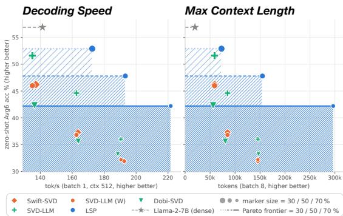

Table 4: Inference efficiency on Llama-2-7B. Zero-shot accuracy (Avg over the six benchmarks of Table 2) $\mathrm { a t \ - 3 0 / 5 0 / 7 0 \% }$ compression (marker size) against CUDA-graph-compiled decode throughput at batch 1 and 512 tokens of context (left), and against the number of tokens per sequence whose weights and latent KV cache fit on one GH200 at batch size 8 (right). Lines trace the Pareto frontier at each ratio (dotted, dashed, solid), hatched in the color of the method that attains it.  
Table 5: Inference efficiency of $- 7 0 \%$ compressed Llama-2-7B. The factorized methods match on weights and FLOPs; $\mathrm { L S P } ^ { * } \mathrm { s }$ tied lowrank projector caches one narrow latent per layer instead of separate K and $\mathrm { v , }$ so its KV cache is $2 . 2 { - } 2 . 6 \times$ smaller than the untied factorizations’ and $1 4 . 7 \times$ smaller than dense, it holds the longest context on one GPU; LSP also decodes fastest at full-width KV cache.
<table><tr><td></td><td>Dense SVD- Swift-</td><td>LLM</td><td>SVD</td><td>Dobi- SVD</td><td>LSP (Ours)</td></tr><tr><td>Memory (batch 8)</td><td></td><td></td><td></td><td></td><td></td></tr><tr><td>Weights (GiB)</td><td>12.55</td><td>4.11</td><td>4.11</td><td>4.12</td><td>4.11</td></tr><tr><td>KV floats/tok/layer vs. dense</td><td>8192</td><td>1228 6.7×</td><td>1228 6.7×</td><td>1434 5.7×</td><td>556 14.7×</td></tr><tr><td>W+KV @128k (GiB) vs. dense</td><td>524.6</td><td>80.9 6.5×</td><td>80.9 6.5×</td><td>93.7 5.6×</td><td>38.9 13.5×</td></tr><tr><td>Max ctx (k tokens)</td><td>19.7</td><td>145.8</td><td>145.8</td><td>124.9</td><td>322.1</td></tr><tr><td colspan="6">Compute and speed (batch 1)</td></tr><tr><td>Prefill TFLOPs @2k</td><td>29.26</td><td>10.69</td><td>10.69</td><td>10.71</td><td>10.69</td></tr><tr><td>Decode GFLOP/step @2k</td><td>14.29</td><td>5.22</td><td>5.22</td><td>5.23</td><td>5.22</td></tr><tr><td>Decode tok/s @512</td><td>141</td><td>191</td><td>193</td><td>189</td><td>221</td></tr><tr><td>@4k</td><td>85</td><td>100</td><td>101</td><td>99</td><td>108</td></tr><tr><td>@16k</td><td>36</td><td>38</td><td>38</td><td>38</td><td>40</td></tr></table>

Latent-cache memory. Factorizing $W = B A$ (Equation (6)) does not by itself shrink the KV cache, since B restores the full width, but caching the latent $z = A x$ does, given a dedicated attention implementation (Section A.6). As in MLA and Palu (DeepSeek-AI, 2024; Chang et al., 2025), the value factor absorbs into the output projection, while under rotary embeddings keys are rebuilt from the latent at each step, at a cost linear in context length and latent width that any latent factorization pays; the latent cache thus serves capacity rather than speed. A tied group caches one latent where an untied factorization caches two, and the allocator compresses Q/K/V strongly (Section 3.4), so LSP has the narrowest cache (Table 5). At −70%, with 128k cached tokens and batch size 8, weights plus cache take 13.5× less memory than dense, against at most 6.5× for untied factorizations. A 95.5 GiB GPU thus holds about 320k cached tokens per sequence, against at most 146k: a memory capacity well beyond Llama-2-7B’s 4k training context.

## 3.4 WHAT DOES LSP COMPRESS?

Allocation. On Llama-2-7B measured-KL allocation is far from uniform (Figure 3, left). The Q/K/V groups are compressed far more than the MLP projections, even though each direction removed from gate/up saves more parameters (26,112) than one removed from Q/K/V (16,384): per saved parameter, attention inputs are markedly cheaper to compress. This is what keeps the shared K/V latent narrow at high ratios (about a seventh of full rank at −70%), and hence drives the KV-cache savings of Section 3.3. Later blocks retain more rank than earlier ones at every ratio, and at low compression many units (untied layers or tied groups) stay dense, 53 of 128 at −30%: a unit is factorized only when its allocated rank falls below the break-even rank at which the two factors become smaller than the dense weight. The same contrast between attention and MLP projections holds across all LLMs (Figure 4).

Retained subspace. Let w be the i-th singular vector of an original weight on its projected side, and $a _ { i } = \| P \pmb { w _ { i } } \| _ { 2 } \in [ 0 , 1 ]$ . Projection shrinks the i-th rank-one term of the weight from $\sigma _ { i }$ to $\sigma _ { i } a _ { i } .$ so $\Delta _ { i } = \sigma _ { i } ( a _ { i } - 1 )$ is the amplitude lost along that direction (Figure 3, middle). Unlike weight-SVD truncation, removal has no sharp cutoff: it spans the whole spectrum, deepest on the leading directions in Q/K/V and inside the spectrum in the other projections. Learning shifts it further (Figure 3, right): relative to NoLSP, which shares the allocated ranks, LSP generally removes more of its high singular directions (left part) in exchange for small singular direction ones (right part). The leading direction changes most: direction 1 has the largest absolute difference to NoLSP. Notice that learning, the only difference between the two, lowers perplexity at −70% from 222.8 to 10.9 (Table 1). The weight spectrum thus ranks directions poorly: whitened truncation discards trailing directions the output depends on, and learning corrects it, most strongly along the leading direction.

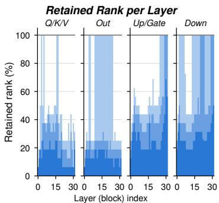  
LSP, rank kept: −30/−50/−70% (15-point grid)

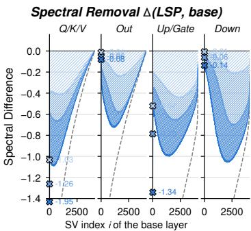  
∆(LSP, base): -30/-50/-70%at σ1---σ(base

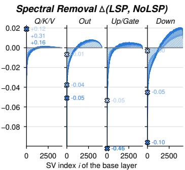  
∆(LSP,NoLSP): -30/-50/-70%at σ1  
Figure 3: Rank allocation and spectral removal on Llama-2-7B. Left: fraction of full rank retained by each unit after compression, by block and projection type; measured-KL allocation is far from uniform. Middle: amplitude $\Delta _ { i }$ lost along each singular direction of the original weights; average over layers; Right: difference to NoLSP, $\sigma _ { i } ( a _ { i } ^ { \mathrm { L S P } } - a _ { i } ^ { \mathrm { N o L S P } } )$ ; the leading direction changes most, and outside Q/K/V LSP removes more of it and retains more of the trailing directions, most visibly in the down projection. All panels show runs $\mathrm { a t - 3 0 / 5 0 / 7 0 \% }$ compression (light to dark). Crosses give the delta for $\sigma _ { 1 }$ . Plots for more models and layers in Section D.

## 4 RELATED WORK

Pruning. Pruning removes weights scored by magnitude (Han et al., 2015; 2016), by their movement during fine-tuning (Sanh et al., 2020), or by a local quadratic model of the loss (LeCun et al., 1990; Hassibi et al., 1993). At LLM scale, the scores come from layer-wise reconstruction (Frantar & Alistarh, 2023), activation-scaled magnitudes (Sun et al., 2024), gradient-based group importance (Ma et al., 2023) or layer redundancy (Men et al., 2025). Recent methods learn what to remove against a global objective with the weights frozen, as semi-structured masks (Fang et al., 2024; Liu et al., 2025) or per-block widths (Gao et al., 2024b), part of a broader shift from local to global criteria in structured pruning (Wang et al., 2026). LSP brings this idea to low-rank compression: the removed set is a continuous subspace rather than a set of coordinates, so no discrete relaxation i needed, and the savings are realized as dense low-rank factors.

Low-rank compression. Trained weights are not low-rank themselves, so most low-rank methods rely on the activations lying in lower-dimensional subspaces (Yuan et al., 2024; Garg et al., 2024). They choose the removed subspace per layer in closed form, either from activation statistics, as in ASVD (Yuan et al., 2024), SliceGPT (Ashkboos et al., 2024), MoDeGPT (Lin et al., 2025), FLAR-SVD (Thoma et al., 2025) and further variants (Huang et al., 2025; Li et al., 2025; Chiang et al., 2026), or from the layer’s output reconstruction error, as in SVD-LLM (Wang et al., 2025d) and Swift-SVD (Qi et al., 2026). Acting on one layer in isolation, these criteria do not see the network output, and their errors accumulate through depth (Odema et al., 2026). Where the loss is used, it enters through a local surrogate, as in FW-SVD (Hsu et al., 2022) and LLM-Surgeon (van der Ouderaa et al., 2024), or by fine-tuning the weights after truncation, as in SVD-LLM’s LoRA stage and PELA (Guo et al., 2024); LSP instead optimizes the removed subspace itself against the network output, with the weights frozen.

Rank allocation and shared bases. Beyond choosing directions, compression also decides how the remaining capacity is laid out across the network. Ranks are allocated non-uniformly across matrices from measured or estimated sensitivity (Yuan et al., 2024; Wang et al., 2025c; Qi et al., 2026) or learned through a relaxation of the truncation position (Wang et al., 2025b), and factors are shared among matrices, across layers (Wang et al., 2025a) or among the Q/K/V projections that read the same activation (Wang et al., 2025e). The latter two adapt the structure of the compressed model to the network, but the basis at each rank remains closed-form. LSP uses the same two levers: projectors are tied within each group of layers that share an input, and ranks are allocated per compression unit by applying whitened projections and measuring the change in output KL (Section 2.2).

## 5 CONCLUSION

We introduced Learnable Subspace Projections (LSP), which compresses a pretrained network by learning, for each linear layer, the subspace the network can do without. Its premise is that statistical redundancy, whether measured by activation energy or by layer-wise reconstruction error, is not functional redundancy. LSP therefore selects the removed subspaces against the network output: it allocates ranks by measured output KL and optimizes all projectors jointly, with the pretrained weights frozen. Across four decoder LLMs, one of its two objectives attains the lowest perplexity in all twelve model–ratio settings, and both achieve the best zero-shot accuracy among low-rank methods. The margin grows with the compression ratio: at −70% on Llama-2-7B, LSP reaches 10.9 perplexity, against 13.3 for the strongest baseline and 222.8 without learning. On a vision transformer, it is the most robust to calibration shift and transfers best when calibrated on diverse unlabeled data. The merged model is also the fastest factorization we measure, decoding up to 1.56× faster than the dense model. Its shared latent reduces the memory of weights and KV cache by 13.5× at a 128k-token context, twice the savings of untied factorizations.

## ACKNOWLEDGMENTS

Our work was partially funded by the ERC (853489 - DEXIM) and the Alfried Krupp von Bohlen und Halbach Foundation, which we thank for their support. The authors gratefully acknowledge the Gauss Centre for Supercomputing e.V. (www.gausscentre.eu) for funding this project by providing computing time on the Supercomputer JUPITER at Julich Supercomputing Centre (JSC). This work¨ was supported by the EuroHPC JU and the Gauss Centre for Supercomputing (GCS) through funding by the European Commission, German Federal Ministry of Research, Technology and Space (BMFTR), the Ministry of Culture and Science of the State of North Rhine-Westphalia (MKW). This work also benefited from Hi! PARIS and state funding managed by the French National Research Agency (ANR) under the France 2030 program, reference ANR-23-IACL-0005.

## AI DISCLOSURE STATEMENT

In this work, we used generative AI tools for: design or provide feedback on research methodology or experiments (feedback to double-check for correctness); implement methods (implementation portions; tested and manually checked); assist in formulating mathematical claims, providing critical ingredients, and helping writing proofs (with each step checked by two authors), refine hypotheses, support qualitative and thematic data analysis (data visualization and organization, tested and manually checked), interpret results (summarization). We have not used generative AI tools for: help develop theoretical models or conceptual frameworks, assist with translation, clean and reformat dataset, generating synthetic data. We take responsibility for the final content of this work, including text, claims or artifacts produced with the aid of generative AI.

## ETHICS STATEMENT

By substantially lowering the parameter and compute footprint of large models, LSP contributes to the democratization of pretrained transformers, making strong language and vision models deployable on edge devices and in domain-specialized applications where retraining from scratch is infeasible. As with any compression method, the compressed model is a lossy approximation of the original; while our experiments show small aggregate degradation, this loss may be unevenly distributed across subpopulations, domains, or rare-event behaviors that the calibration distribution under-represents. We recommend that downstream practitioners evaluate compressed models on the same fairness, robustness, and safety metrics they would apply to the dense baseline before deploying them.

## REFERENCES

Armen Aghajanyan, Sonal Gupta, and Luke Zettlemoyer. Intrinsic dimensionality explains the effectiveness of language model fine-tuning. In Chengqing Zong, Fei Xia, Wenjie Li, and Roberto Navigli (eds.), Proceedings ofthe 59th Annual Meeting ofthe Associationfor Computational Linguistics and the 11th International Joint Conference on Natural Language Processing (Volume 1: Long Papers), pp. 7319–7328, Online, August 2021. Association for Computational Linguistics. doi: 10.18653/v1/2021.acl-long.568. URL https://aclanthology.org/2021. acl-long.568/.

Aida Amini, Saadia Gabriel, Peter Lin, Rik Koncel-Kedziorski, Yejin Choi, and Hannaneh Hajishirzi. Mathqa: Towards interpretable math word problem solving with operation-based formalisms, 2019.

Saleh Ashkboos, Maximilian L. Croci, Marcelo Gennari do Nascimento, Torsten Hoefler, and James Hensman. SliceGPT: Compress Large Language Models by Deleting Rows and Columns. In International Conference on Learning Representations (ICLR), 2024.

Massimo Bini, Karsten Roth, Zeynep Akata, and Anna Khoreva. Ether: Efficient finetuning of large-scale models with hyperplane reflections. In International Conference on Machine Learning (ICML), 2024.

Yonatan Bisk, Rowan Zellers, Ronan Le Bras, Jianfeng Gao, and Yejin Choi. PIQA: Reasoning about physical commonsense in natural language. In Proceedings of the AAAI Conference on Artificial Intelligence, 2020.

Lukas Bossard, Matthieu Guillaumin, and Luc Van Gool. Food-101 – mining discriminative components with random forests. In European Conference on Computer Vision, 2014.

Chi-Chih Chang, Wei-Cheng Lin, Chien-Yu Lin, Chong-Yan Chen, Yu-Fang Hu, Pei-Shuo Wang, Ning-Chi Huang, Luis Ceze, and Kai-Chiang Wu. Palu: Compressing kv-cache with low-rank projection. In International Conference on Learning Representations (ICLR), 2025.

Hung-Yueh Chiang, Chi-Chih Chang, Yu-Chen Lu, Chien-Yu Lin, Kai-Chiang Wu, Mohamed S. Abdelfattah, and Diana Marculescu. UniQL: Unified quantization and low-rank compression for adaptive edge LLMs. In The Fourteenth International Conference on Learning Representations, 2026. URL https://openreview.net/forum?id=iOGu4wtDTF.

M. Cimpoi, S. Maji, I. Kokkinos, S. Mohamed, and A. Vedaldi. Describing textures in the wild. In Proceedings of the IEEE Conf. on Computer Vision and Pattern Recognition (CVPR), 2014.

Peter Clark, Isaac Cowhey, Oren Etzioni, Tushar Khot, Ashish Sabharwal, Carissa Schoenick, and Oyvind Tafjord. Think you have solved question answering? try arc, the ai2 reasoning challenge, 2018. URL https://arxiv.org/abs/1803.05457.

Adam Coates, Andrew Ng, and Honglak Lee. An Analysis of Single Layer Networks in Unsupervised Feature Learning. In AISTATS, 2011. https://cs.stanford.edu/˜acoates/ papers/coatesleeng\_aistats\_2011.pdf.

DeepSeek-AI. Deepseek-v2: A strong, economical, and efficient mixture-of-experts language model, 2024. URL https://arxiv.org/abs/2405.04434.

Alexey Dosovitskiy, Lucas Beyer, Alexander Kolesnikov, Dirk Weissenborn, Xiaohua Zhai, Thomas Unterthiner, Mostafa Dehghani, Matthias Minderer, Georg Heigold, Sylvain Gelly, Jakob Uszkoreit, and Neil Houlsby. An image is worth 16x16 words: Transformers for image recognition at scale. In International Conference on Learning Representations, 2021. URL https: //openreview.net/forum?id=YicbFdNTTy.

Carl Eckart and Gale Young. The approximation of one matrix by another of lower rank. Psychometrika, 1(3):211–218, 1936.

Gongfan Fang, Hongxu Yin, Saurav Muralidharan, Greg Heinrich, Jeff Pool, Jan Kautz, Pavlo Molchanov, and Xinchao Wang. MaskLLM: Learnable semi-structured sparsity for large language models. In Advances in Neural Information Processing Systems (NeurIPS), 2024. Spotlight.

Elias Frantar and Dan Alistarh. Sparsegpt: massive language models can be accurately pruned in one-shot. In Proceedings of the 40th International Conference on Machine Learning, ICML’23. JMLR.org, 2023.

Leo Gao, Jonathan Tow, Baber Abbasi, Stella Biderman, Sid Black, Anthony DiPofi, Charles Foster, Laurence Golding, Jeffrey Hsu, Alain Le Noac’h, Haonan Li, Kyle McDonell, Niklas Muennighoff, Chris Ociepa, Jason Phang, Laria Reynolds, Hailey Schoelkopf, Aviya Skowron, Lintang Sutawika, Eric Tang, Anish Thite, Ben Wang, Kevin Wang, and Andy Zou. The language model evaluation harness, 07 2024a. URL https://zenodo.org/records/12608602.

Shangqian Gao, Chi-Heng Lin, Ting Hua, Tang Zheng, Yilin Shen, Hongxia Jin, and Yen-Chang Hsu. DISP-LLM: Dimension-independent structural pruning for large language models. In Advances in Neural Information Processing Systems (NeurIPS), 2024b.

Isha Garg, Christian Koguchi, Eshan Verma, and Daniel Ulbricht. Revealing the utilized rank of subspaces of learning in neural networks. In ICML Workshop, 2024. URL https://arxiv. org/abs/2407.04797.

Yangyang Guo, Guangzhi Wang, and Mohan Kankanhalli. PELA: Learning parameter-efficient models with low-rank approximation. In Proceedings of the IEEE/CVF Conference on Computer Vision and Pattern Recognition (CVPR), pp. 15699–15709, June 2024.

Song Han, Jeff Pool, John Tran, and William J. Dally. Learning both weights and connections for efficient neural network. In Corinna Cortes, Neil D. Lawrence, Daniel D. Lee, Masashi Sugiyama, and Roman Garnett (eds.), Advances in Neural Information Processing Systems 28: Annual Conference on Neural Information Processing Systems 2015, December 7-12, 2015, Montreal, Quebec, Canada, pp. 1135–1143, 2015. URL https://proceedings.neurips.cc/paper/ 2015/hash/ae0eb3eed39d2bcef4622b2499a05fe6-Abstract.html.

Song Han, Huizi Mao, and William J. Dally. Deep compression: Compressing deep neural network with pruning, trained quantization and huffman coding. In Yoshua Bengio and Yann LeCun (eds.), 4th International Conference on Learning Representations, ICLR 2016, San Juan, Puerto Rico, May 2-4, 2016, Conference Track Proceedings, 2016. URL http://arxiv.org/abs/ 1510.00149.

Babak Hassibi, David G. Stork, Gregory Wolff, and Takahiro Watanabe. Optimal brain surgeon: extensions and performance comparisons. In Proceedings ofthe 7th International Conference on Neural Information Processing Systems, NIPS’93, pp. 263–270, San Francisco, CA, USA, 1993. Morgan Kaufmann Publishers Inc.

Patrick Helber, Benjamin Bischke, Andreas Dengel, and Damian Borth. Introducing eurosat: A novel dataset and deep learning benchmark for land use and land cover classification. In IGARSS 2018-2018 IEEE International Geoscience and Remote Sensing Symposium, pp. 204–207. IEEE, 2018.

Geoffrey Hinton, Oriol Vinyals, and Jeff Dean. Distilling the knowledge in a neural network, 2015. URL https://arxiv.org/abs/1503.02531.

Yen-Chang Hsu, Ting Hua, Sungen Chang, Qian Lou, Yilin Shen, and Hongxia Jin. Language model compression with weighted low-rank factorization. In International Conference on Learning Representations, 2022. URL https://openreview.net/forum?id=uPv9Y3gmAI5.

Xinhao Huang, You-Liang Huang, and Zeyi Wen. Sola: Leveraging soft activation sparsity and low-rank decomposition for large language model compression. In Proceedings of the AAAI Conference on Artificial Intelligence, 2025.

Alex Krizhevsky. Learning multiple layers of features from tiny images. Technical report, 2009.

Ilja Kuzborskij and Yasin Abbasi Yadkori. Low-rank bias, weight decay, and model merging in neural networks, 2025. URL https://arxiv.org/abs/2502.17340.

Yann LeCun, John S. Denker, and Sara A. Solla. Optimal brain damage, pp. 598–605. Morgan Kaufmann Publishers Inc., San Francisco, CA, USA, 1990. ISBN 1558601007.

Wei Li, Lujun Li, Hao Gu, You-Liang Huang, Mark G. Lee, Shengjie Sun, Wei Xue, and Yike Guo. Moe-SVD: Structured mixture-of-experts LLMs compression via singular value decomposition. In Forty-second International Conference on Machine Learning, 2025. URL https: //openreview.net/forum?id=acJ3vdFljk.

Chi-Heng Lin, Shangqian Gao, James Seale Smith, Abhishek Patel, Shikhar Tuli, Yilin Shen, Hongxia Jin, and Yen-Chang Hsu. MoDeGPT: Modular decomposition for large language model compression. In International Conference on Learning Representations (ICLR), 2025.

Hongyi Liu, Rajarshi Saha, Zhen Jia, Youngsuk Park, Jiaji Huang, Shoham Sabach, Yu-Xiang Wang, and George Karypis. ProxSparse: Regularized learning of semi-structured sparsity masks for pretrained LLMs. In Proceedings of the 42nd International Conference on Machine Learning (ICML), 2025. URL https://arxiv.org/abs/2502.00258.

Xinyin Ma, Gongfan Fang, and Xinchao Wang. Llm-pruner: On the structural pruning of large language models. In Advances in Neural Information Processing Systems, 2023.

S. Maji, J. Kannala, E. Rahtu, M. Blaschko, and A. Vedaldi. Fine-grained visual classification of aircraft. Technical report, 2013.

Xin Men, Mingyu Xu, Qingyu Zhang, Qianhao Yuan, Bingning Wang, Hongyu Lin, Yaojie Lu, Xianpei Han, and Weipeng Chen. Shortgpt: Layers in large language models are more redundant than you expect. In Findings of the Association for Computational Linguistics: ACL 2025, pp. 20192–20204, 2025.

Stephen Merity, Caiming Xiong, James Bradbury, and Richard Socher. Pointer sentinel mixture models, 2016.

Todor Mihaylov, Peter Clark, Tushar Khot, and Ashish Sabharwal. Can a suit of armor conduct electricity? a new dataset for open book question answering. In EMNLP, 2018.

Mohanad Odema, Gabrielle De Micheli, Dayin Gou, Nilesh Malpeddi, Prathamesh Vaste, and Jacob Song. Understanding calibration and truncation error propagation in training-free lowrank compression for LLMs. In Conference on Language Modeling (COLM), 2026. URL https://arxiv.org/abs/2608.08506.

Omkar M. Parkhi, Andrea Vedaldi, Andrew Zisserman, and C. V. Jawahar. Cats and dogs. In IEEE Conference on Computer Vision and Pattern Recognition, 2012.

Ruoling Qi, Yirui Liu, Xuaner Wu, Xiangyu Wang, Ming Li, Chen Chen, Jian Chen, Yin Chen, and Qizhen Weng. Swift-SVD: Theoretical optimality meets practical efficiency in low-rank LLM compression. In Forty-third International Conference on Machine Learning, 2026. URL https://openreview.net/forum?id=nAQ4h8FpdM.

Colin Raffel, Noam Shazeer, Adam Roberts, Katherine Lee, Sharan Narang, Michael Matena, Yanqi Zhou, Wei Li, and Peter J. Liu. Exploring the limits of transfer learning with a unified text-to-text transformer. J. Mach. Learn. Res., 21(1), January 2020. ISSN 1532-4435.

Keisuke Sakaguchi, Ronan Le Bras, Chandra Bhagavatula, and Yejin Choi. Winogrande: An adversarial winograd schema challenge at scale. arXiv preprint arXiv:1907.10641, 2019.

Victor Sanh, Thomas Wolf, and Alexander M. Rush. Movement pruning: adaptive sparsity by finetuning. In Proceedings of the 34th International Conference on Neural Information Processing Systems, NIPS ’20, Red Hook, NY, USA, 2020. Curran Associates Inc. ISBN 9781713829546.

Oscar Skean, Md Rifat Arefin, Dan Zhao, Niket Nikul Patel, Jalal Naghiyev, Yann LeCun, and Ravid Shwartz-Ziv. Layer by layer: Uncovering hidden representations in language models. In Fortysecond International Conference on Machine Learning, 2025. URL https://openreview. net/forum?id=WGXb7UdvTX.

Mingjie Sun, Zhuang Liu, Anna Bair, and J Zico Kolter. A simple and effective pruning approach for large language models. In The Twelfth International Conference on Learning Representations, 2024. URL https://openreview.net/forum?id=PxoFut3dWW.

Rohan Taori, Ishaan Gulrajani, Tianyi Zhang, Yann Dubois, Xuechen Li, Carlos Guestrin, Percy Liang, and Tatsunori B. Hashimoto. Stanford alpaca: An instruction-following llama model. https://github.com/tatsu-lab/stanford\_alpaca, 2023.

Moritz Thoma, Jorge Villasante, Emad Aghajanzadeh, Shambhavi Balamuthu Sampath, Pierpaolo Mori, Maximilian Groetzinger, Daniil Dylkin, Manoj-Rohit Vemparala, Nael Fasfous, Alexander Frickenstein, Daniel Mueller-Gritschneder, and Ulf Schlichtmann. Flar-svd: Fast and latencyaware singular value decomposition for model compression. In Proceedings of the Computer Vision and Pattern Recognition Conference (CVPR) Workshops, pp. 1898–1907, June 2025.

Hugo Touvron, Louis Martin, Kevin Stone, Peter Albert, Amjad Almahairi, Yasmine Babaei, Nikolay Bashlykov, Soumya Batra, Prajjwal Bhargava, Shruti Bhosale, Dan Bikel, Lukas Blecher, Cristian Canton Ferrer, Moya Chen, Guillem Cucurull, David Esiobu, Jude Fernandes, Jeremy Fu, Wenyin Fu, Brian Fuller, Cynthia Gao, Vedanuj Goswami, Naman Goyal, Anthony Hartshorn, Saghar Hosseini, Rui Hou, Hakan Inan, Marcin Kardas, Viktor Kerkez, Madian Khabsa, Isabel Kloumann, Artem Korenev, Punit Singh Koura, Marie-Anne Lachaux, Thibaut Lavril, Jenya Lee, Diana Liskovich, Yinghai Lu, Yuning Mao, Xavier Martinet, Todor Mihaylov, Pushkar Mishra, Igor Molybog, Yixin Nie, Andrew Poulton, Jeremy Reizenstein, Rashi Rungta, Kalyan Saladi, Alan Schelten, Ruan Silva, Eric Michael Smith, Ranjan Subramanian, Xiaoqing Ellen Tan, Binh Tang, Ross Taylor, Adina Williams, Jian Xiang Kuan, Puxin Xu, Zheng Yan, Iliyan Zarov, Yuchen Zhang, Angela Fan, Melanie Kambadur, Sharan Narang, Aurelien Rodriguez, Robert Stojnic, Sergey Edunov, and Thomas Scialom. Llama 2: Open foundation and fine-tuned chat models, 2023. URL https://arxiv.org/abs/2307.09288.

Tycho FA van der Ouderaa, Markus Nagel, Mart van Baalen, Yuki M Asano, and Tijmen Blankevoort. The llm surgeon. In International Conference of Learning Representations (ICLR), 2024.

Ashish Vaswani, Noam Shazeer, Niki Parmar, Jakob Uszkoreit, Llion Jones, Aidan N Gomez, Łukasz Kaiser, and Illia Polosukhin. Attention is all you need. In Advances in Neural Information Processing Systems, 2017.

Jingcun Wang, Yu-Guang Chen, Ing-Chao Lin, Bing Li, and Grace Li Zhang. Basis sharing: Crosslayer parameter sharing for large language model compression. In The Thirteenth International Conference on Learning Representations, 2025a.

Qinsi Wang, Jinghan Ke, Masayoshi Tomizuka, Kurt Keutzer, and Chenfeng Xu. Dobi-SVD: Differentiable SVD for LLM compression and some new perspectives. In The Thirteenth International Conference on Learning Representations, 2025b. URL https://openreview.net/ forum?id=kws76i5XB8.

Xin Wang, Samiul Alam, Zhongwei Wan, Hui Shen, and Mi Zhang. SVD-LLM V2: Optimizing singular value truncation for large language model compression. In Proceedings of the 2025 Conference of the Nations of the Americas Chapter of the Association for Computational Linguistics: Human Language Technologies (NAACL-HLT), pp. 4287–4296, 2025c. URL https://aclanthology.org/2025.naacl-long.217/.

Xin Wang, Yu Zheng, Zhongwei Wan, and Mi Zhang. SVD-LLM: Truncation-aware singular value decomposition for large language model compression. In International Conference on Learning Representations (ICLR), 2025d. URL https://openreview.net/forum?id= LNYIUouhdt.

Yutong Wang, Haiyu Wang, and Sai Qian Zhang. QSVD: Efficient low-rank approximation for unified query-key-value weight compression in low-precision vision-language models. In Advances in Neural Information Processing Systems (NeurIPS), 2025e. URL https://arxiv.org/ abs/2510.16292. Spotlight.

Ziyan Wang, Enmao Diao, Qi Le, Pu Wang, Minwoo Lee, Shu-ping Yeh, Evgeny Stupachenko, Hao Feng, and Li Yang. From local to global: Revisiting structured pruning paradigms for large language models. In Proceedings ofthe 64th Annual Meeting ofthe Associationfor Computational Linguistics (Volume 1: Long Papers), 2026.

An Yang, Anfeng Li, Baosong Yang, Beichen Zhang, Binyuan Hui, Bo Zheng, Bowen Yu, Chang Gao, Chengen Huang, Chenxu Lv, Chujie Zheng, Dayiheng Liu, Fan Zhou, Fei Huang, Feng Hu, Hao Ge, Haoran Wei, Huan Lin, Jialong Tang, Jian Yang, Jianhong Tu, Jianwei Zhang, Jianxin Yang, Jiaxi Yang, Jing Zhou, Jingren Zhou, Junyang Lin, Kai Dang, Keqin Bao, Kexin Yang, Le Yu, Lianghao Deng, Mei Li, Mingfeng Xue, Mingze Li, Pei Zhang, Peng Wang, Qin Zhu, Rui Men, Ruize Gao, Shixuan Liu, Shuang Luo, Tianhao Li, Tianyi Tang, Wenbiao Yin, Xingzhang Ren, Xinyu Wang, Xinyu Zhang, Xuancheng Ren, Yang Fan, Yang Su, Yichang Zhang, Yinger Zhang, Yu Wan, Yuqiong Liu, Zekun Wang, Zeyu Cui, Zhenru Zhang, Zhipeng Zhou, and Zihan Qiu. Qwen3 technical report, 2025. URL https://arxiv.org/abs/2505.09388.

Hao Yu and Jianxin Wu. Compressing transformers: features are low-rank, but weights are not! In Proceedings of the Thirty-Seventh AAAI Conference on Artificial Intelligence and Thirty-Fifth Conference on Innovative Applications of Artificial Intelligence and Thirteenth Symposium on Educational Advances in Artificial Intelligence, AAAI’23/IAAI’23/EAAI’23. AAAI Press, 2023. ISBN 978-1-57735-880-0. doi: 10.1609/aaai.v37i9.26304. URL https://doi.org/10. 1609/aaai.v37i9.26304.

Zhihang Yuan, Yuzhang Shang, Yue Song, Qiang Wu, Yan Yan, and Guangyu Sun. Asvd: Activation-aware singular value decomposition for compressing large language models, 2024. URL https://arxiv.org/abs/2312.05821.

Rowan Zellers, Ari Holtzman, Yonatan Bisk, Ali Farhadi, and Yejin Choi. Hellaswag: Can a machine really finish your sentence? In Proceedings of the 57th Annual Meeting of the Association for Computational Linguistics, 2019.

Susan Zhang, Stephen Roller, Naman Goyal, Mikel Artetxe, Moya Chen, Shuohui Chen, Christopher Dewan, Mona T. Diab, Xian Li, Xi Victoria Lin, Todor Mihaylov, Myle Ott, Sam Shleifer, Kurt Shuster, Daniel Simig, Punit Singh Koura, Anjali Sridhar, Tianlu Wang, and Luke Zettlemoyer. Opt: Open pre-trained transformer language models. CoRR, abs/2205.01068, 2022. URL http://dblp.uni-trier.de/db/journals/corr/corr2205.html# abs-2205-01068.

Bolei Zhou, Agata Lapedriza, Aditya Khosla, Aude Oliva, and Antonio Torralba. Places: A 10 million image database for scene recognition. IEEE Transactions on Pattern Analysis and Machine Intelligence, 2017.

## A METHOD DETAILS

## A.1 OPTIMALITY OF THE ORTHOGONAL PROJECTOR

Section 2.1 applies the projector $\pmb { P } = \pmb { I } - \pmb { U } \pmb { U } ^ { \top }$ . The following proposition is why that particular operator: once the removed subspace is fixed, the orthogonal projector is the unique least-disruptive map that annihilates it.

Proposition. Let $S \subset \mathbb { R } ^ { d }$ have orthonormal basis $U \in \mathbb { R } ^ { d \times k }$ , and let $\pmb { P } = \pmb { I } - \pmb { U } \pmb { U } ^ { \top }$ denote the orthogonal projector onto $S ^ { \perp }$ . Among all $Q \in \mathbb { R } ^ { d \times d }$ with $Q u = 0$ for every $u \in S , P$ is the unique minimizer of $\| \pmb { I } - \pmb { Q } \| _ { F }$ , attaining the optimal value $\sqrt { k }$

Proof. Write $Q \ = \ I - E$ so the annihilation constraint $Q U \ = \ 0$ becomes $E U = U$ . Let $U _ { \perp } \in \mathbb { R } ^ { d \times ( d - k ) }$ complete $U$ to an orthonormal basis of $\mathbb { R } ^ { d }$ . In this basis, every admissible E has the block form

$$
\begin{array} { r } { E \ = \ [ U \quad U _ { \bot } ] \left[ \begin{array} { l l } { I _ { k } } & { C } \\ { 0 } & { D } \end{array} \right] [ U \quad U _ { \bot } ] ^ { \top } , \qquad C \in \mathbb { R } ^ { k \times ( d - k ) } , \ D \in \mathbb { R } ^ { ( d - k ) \times ( d - k ) } , } \end{array}\tag{7}
$$

where the constraint $E U = U$ has fixed the $( 1 , 1 )$ block to $\scriptstyle { I _ { k } }$ and the (2, 1) block to 0, while C and D are free. Orthogonal invariance of the Frobenius norm and the block decomposition give

$$
\| E \| _ { F } ^ { 2 } \ = \ \| I _ { k } \| _ { F } ^ { 2 } + \| C \| _ { F } ^ { 2 } + \| D \| _ { F } ^ { 2 } \ = \ k + \| C \| _ { F } ^ { 2 } + \| D \| _ { F } ^ { 2 } \ \ge \ k ,\tag{8}
$$

with equality iff $C = 0$ and $\pmb { D } = 0$ . In that case $\mathbf { } E = U U ^ { \top }$ and $Q = I - U U ^ { \top } = P$ , establishing optimality and uniqueness. □

The proposition settles the operator, not the subspace: which directions are removed is chosen by the whitened criterion of Section 2.2 at initialization and by the loss thereafter, whereas among all maps that annihilate a given $S$ only P leaves $S ^ { \perp }$ untouched. Because $_ { r }$ is a projector $( P ^ { 2 } = { \overline { { P } } } )$ the modulated operator of Section 2.1 at ${ \pmb m } = { \bf 1 }$ is the convex combination $( 1 - \alpha ) I + \alpha P $ , a true interpolation between identity and projection rather than an arbitrary contraction.

## A.2 PRACTICAL DESIGN CHOICES

This section details the tied groups and the three design choices of Section 2.1. Throughout, ℓ indexes projectors (one per untied layer or tied group), $d _ { \ell }$ is the dimension of the projected side, and $k _ { \ell }$ is the number of removed directions.

Activation-space form. Applying the projector through the activation keeps no dense $d _ { \mathrm { o u t } } \times d _ { \mathrm { i n } }$ projected weight in the autograd graph: the only additional state is $U _ { \ell }$ and the narrow activation $\bar { \pmb { U } } _ { \ell } ^ { \top } { \pmb x } \in \mathbb { R } ^ { k _ { \ell } }$ per token, on top of the activations the frozen network already stores. The fused QR backward retains $O ( d _ { \ell } k _ { \ell } + k _ { \ell } ^ { \bar { 2 } } )$ state, compared with $\mathcal { O } ( d _ { \ell } k _ { \ell } ^ { 2 } )$ for an explicit Gram–Schmidt loop; both return an orthonormal basis of span $( \hat { \mathbf { V } _ { \ell } } )$ when $V _ { \ell }$ has full column rank, and hence the same projector in exact arithmetic. Since $k _ { \ell } \leq d _ { \ell } .$ the projector and QR state totals $\textstyle { \mathcal { O } } ( \sum _ { \ell } d _ { \ell } k _ { \ell } )$ over the network, plus $\mathcal { O } ( \sum _ { \ell } k _ { \ell } )$ per token for the narrow activations.

Tied groups. For an input-tied group G, we apply Equation (1) to the row-stacked weight $[ W ^ { 1 } ; \hdots ; \hat { W } ^ { | \mathcal { G } | } ] \in \mathbb { R } ^ { ( \sum _ { m } \hat { d } _ { \mathrm { o u t } } ^ { m } ) \times d _ { \mathrm { i n } } }$ . At a common rank $r ,$ the merged group costs r $\begin{array} { r } { ( d _ { \mathrm { i n } } + \sum _ { m \in \mathcal { G } } d _ { \mathrm { o u t } } ^ { m } ) } \end{array}$ parameters, against $r \textstyle \sum _ { m \in { \mathcal { G } } } ( d _ { \mathrm { i n } } + d _ { \mathrm { o u t } } ^ { m } )$ for |G| separate factorizations (Equation (6)). Sharing thus saves $( | \mathcal { G } | - 1 ) d _ { \mathrm { i n } } r$ parameters, which the group can spend on a higher rank, at the cost of constraining all members to the same input subspace. The same construction applies to an output-tied group, whose members write the same output: the weights are column-stacked, the output factor is shared, each member keeps its own input factor, and the merged group costs $\begin{array} { r } { r \left( d _ { \mathrm { o u t } } + \sum _ { m \in \mathcal { G } } d _ { \mathrm { i n } } ^ { m } \right) } \end{array}$ parameters (Equation (18)).

Warm-up, direction dropout, and orthogonality penalty. A projector that removes k directions is never the identity: $\| \pmb { I } - \pmb { P } \| _ { F } = \sqrt { k }$ for every $U _ { \ast }$ , an analogue of the fixed distance of reflections from the identity noted by Bini et al. (2024). The ramp of α in $P _ { \alpha , m }$ (Section 2.1) therefore starts training from the identity. The mask entries $m _ { i } \sim$ Bernoulli( $1 - p )$ are redrawn at every step, independently for each member of a tied group over the shared U. We apply no $1 / ( 1 - p )$ rescaling: it would give each removed direction the coefficient $1 { - } \alpha / ( 1 { - } p )$ , which becomes negative as $\alpha  1$ and would reflect the direction rather than remove it. Without rescaling, at $\alpha = 1$ the modulated P is an orthogonal projector onto the complement of the directions removed at that step. Both $\alpha < 1$ and the mask relax the target rank during training; it is reached only at $\alpha = 1$ and ${ m } = 1$

The orthogonality penalty acts on the unconstrained columns of $V _ { \ell } { : }$

$$
\mathcal { L } _ { \mathrm { o r t } } = \sum _ { \ell : k _ { \ell } > 1 } \frac { 1 } { k _ { \ell } ( k _ { \ell } - 1 ) } \sum _ { i \neq j } \big | \langle \pmb { v } _ { i } ^ { ( \ell ) } , \pmb { v } _ { j } ^ { ( \ell ) } \rangle \big | .\tag{9}
$$

It discourages correlated columns, which in practice stabilizes QR and its gradient; orthonormality of $U _ { \ell }$ itself is already enforced by QR. We use the raw inner product rather than a cosine: the columns are unit-norm at initialization, and since the optimizer applies no weight decay, the raw form also keeps their norms from growing. Unlike P itself, direction dropout and the penalty depend on the chosen basis of $\operatorname { s p a n } ( V _ { \ell } )$ , so during training the optimization is not fully invariant to rotations within the subspace; the exported projector is.

## A.3 WHITENED INITIALIZATION AND ITS EXCESS ERROR

We prove Proposition 1. Drop the superscript w from the SVD of W S and complete the singular bases to $[ U _ { r } \ \bar { U } _ { > r } ]$ and $[ V _ { r } \ \bar { V } _ { > r } ]$ , padding $\Sigma _ { > r }$ with zero singular values where needed, so that $\begin{array} { r } { \| \Sigma _ { > r } \| _ { F } ^ { 2 } = \sum _ { i > r } \sigma _ { i } ^ { 2 } } \end{array}$ . As in the proposition, $C _ { r } = { S V _ { r } } , \bar { C _ { > r } } = { S V _ { > r } } , { \ K } = \mathrm { s p a n } ( C _ { r } )$ and $P _ { \mathrm { i n i t } } = C _ { r } C _ { r } ^ { + }$ . Since $\left[ V _ { r } \ V _ { > r } \right]$ is orthogonal, rotating by it preserves the Frobenius norm, so for any Z

$$
\begin{array} { r } { \mathcal { E } ( Z ) = \| ( W - Z ) C _ { r } \| _ { F } ^ { 2 } + \| ( W - Z ) C _ { > r } \| _ { F } ^ { 2 } , \qquad W C _ { r } = U _ { r } \Sigma _ { r } , \quad W C _ { > r } = U _ { > r } \Sigma _ { > r } . } \end{array}\tag{10}
$$

(i) Output side. $( { \cal I } - { \cal U } _ { > r } { \cal U } _ { > r } ^ { \top } ) { \cal W } = { \cal U } _ { r } { \cal U } _ { r } ^ { \top } { \cal W }$ , the first form of Equation (2), so its error is the optimum $\| \pmb { \Sigma } _ { > r } \| _ { F } ^ { 2 }$

(ii) Input side. Since ${ \cal C } _ { r } ^ { \top } { \cal S } ^ { - \top } { \cal V } _ { > r } = { \cal V } _ { r } ^ { \top } { \cal V } _ { > r } = 0$ and the dimensions add to $d _ { \mathrm { i n } } ,$ removing $\mathrm { s p a n } ( \mathbf { \bar { S } } ^ { - \top } \mathbf { V } _ { > r } )$ leaves exactly $\kappa .$ so the initialized weight is $W P _ { \mathrm { i n i t } }$ . In Equation (10), the error on $C _ { r }$ vanishes because $P _ { \mathrm { i n i t } } C _ { r } \dot { = } C _ { r }$ , and the error on $\bar { C _ { > r } }$ is

$$
W ( I - P _ { \mathrm { i n i t } } ) C _ { > r } = U _ { > r } \Sigma _ { > r } - U _ { r } \Sigma _ { r } C _ { r } ^ { + } C _ { > r } .\tag{11}
$$

The two terms have orthogonal column spaces, giving

$$
\mathcal { E } ( W P _ { \mathrm { i n i t } } ) = \lVert \boldsymbol { \Sigma } _ { > r } \rVert _ { F } ^ { 2 } + \lVert \boldsymbol { \Sigma } _ { r } \boldsymbol { C } _ { r } ^ { + } \boldsymbol { C } _ { > r } \rVert _ { F } ^ { 2 } ,\tag{12}
$$

where the first term is the optimal rank-r error and the second the excess. Because $\pmb { S }$ is invertible, $C _ { r }$ has full column rank and $\begin{array} { r } { C _ { r } ^ { + } = ( C _ { r } ^ { \top } C _ { r } ) ^ { - 1 } C _ { r } ^ { \top } } \end{array}$ ; if $\sigma _ { r } > 0 , \Sigma _ { r }$ is invertible as well, so the excess vanishes if and only if $\dot { C } _ { r } ^ { \top } C _ { > r } \stackrel { \cdot } { = } 0 . \stackrel { \cdot } { C } _ { r } ^ { + } \dot { C } _ { > r }$ holds the least-squares coefficients of the removed input directions on the kept ones, so the excess is their squared norm weighted by the kept singular values.

(iii) Tied groups. For |G| layers sharing their input, and hence $S ,$ such as Q/K/V, one shared kept subspace constrains the row-stacked approximation of $\bar { \pmb { W } } = [ \pmb { W } _ { 1 } ; \dots ; \pmb { W } _ { | \mathcal { G } | } ]$ to rank $r ,$ and the summed error is $\begin{array} { r } { \sum _ { m } \| ( \boldsymbol { W } _ { m } - \widehat { \boldsymbol { W } } _ { m } ) \boldsymbol { S } \| _ { F } ^ { 2 } = \| ( \bar { \boldsymbol { W } } - \widehat { \boldsymbol { W } } ) \boldsymbol { S } \| _ { F } ^ { 2 } } \end{array}$ . By Eckart–Young (Eckart & Young, 1936), the leading right singular subspace of WS¯ gives the optimal shared subspace in whitened coordinates, and (ii) applies to W¯ . For |G| layers sharing one output subspace, such as K and V under grouped-query attention, with input factors $S _ { m } .$ , a shared output projector $P _ { \mathrm { o u t } }$ gives the summed error $\begin{array} { r } { \sum _ { m } ^ { \bullet } \| ( \dot { \bar { I } } - P _ { \mathrm { o u t } } ) \pmb { W } _ { m } \pmb { S } _ { m } \| _ { F } ^ { 2 } = \| ( I - \ddot { P } _ { \mathrm { o u t } } ) [ \pmb { W } _ { 1 } \pmb { S } _ { 1 } \cdot \hat { \cdot } \hat { \pmb { W } } _ { | \mathcal { G } | } \pmb { S } _ { | \mathcal { G } | } ] \| _ { F } ^ { 2 } } \end{array}$ , which the leading left singular subspace of the column-stacked whitened weight minimizes, and (i) applies. Output tying shares output coordinates rather than a projected activation, so on its own it yields no single latent to cache. □

Alternative recast. One could instead remove the whitened truncation’s null space $\operatorname { s p a n } ( C _ { > r } )$ itself. With $P _ { > r } = C _ { > r } C _ { > r } ^ { + }$ , the same split gives

$$
\mathcal { E } \big ( W ( I - P _ { > r } ) \big ) = \| \Sigma _ { > r } \| _ { F } ^ { 2 } + \| \Sigma _ { > r } C _ { > r } ^ { + } C _ { r } \| _ { F } ^ { 2 } .\tag{13}
$$

Neither excess dominates in general: the alternative’s is weighted by the smaller singular values $\Sigma _ { > r } ,$ but involves $C _ { > r } ^ { + } ,$ which can amplify error when the removed directions are ill-conditioned. We use $P _ { \mathrm { i n i t } }$ , which reproduces the whitened truncation exactly on the kept subspace.

Numerical stabilization and output-side bases. The implementation accumulates the unnormalized input Gram matrix $\mathbf { } H \mathbf { \Psi } = \mathbf { \Psi } _ { n } G$ . Cholesky is first attempted without a ridge; if it fails, the implementation replaces H by $H + \eta I$ , with $\eta = - \lambda _ { \mathrm { m i n } } ( \dot { H } ) + 1 0 ^ { - 6 }$ , and retries. Scaling the Cholesky factor by $1 / \sqrt { n }$ gives a factor of $G + ( \eta / n ) I$ , so the whitened optimum and the excess identities then concern the regularized objective

$$
\mathcal { E } _ { \eta } ( Z ) = \mathcal { E } ( Z ) + ( \eta / n ) \| \boldsymbol { W } - Z \| _ { F } ^ { 2 } ,\tag{14}
$$

with $\eta = 0$ when the first factorization succeeds. For an output-tied group, the implementation instead decomposes the summed bias-free output Gram matrix, proportional to $\begin{array} { r } { \sum _ { m } \bar { W } _ { m } G _ { m } W _ { m } ^ { \top } } \end{array}$ its eigenvectors are the left singular vectors of $[ { \pmb W } _ { 1 } { \pmb S } _ { 1 } ~ \cdot \cdot ~ { \pmb W } _ { | \mathscr { G } | } \hat { \pmb S } _ { | \mathscr { G } | } ] .$ , so no input Cholesky factor is required. The added ridge, 0.01 times the mean diagonal, shifts eigenvalues without changing eigenspaces in exact arithmetic.

## A.4 MEASURED-KL ALLOCATION

This section states the allocator of Section 2.2 in full. For a unit u with projected dimension $d _ { u }$ dense parameter count $N _ { u } ,$ and factor count $c _ { u } ( r )$ at retained rank r (input- or output-tied costs of Section A.2, counting each shared factor once), removing the trailing k basis directions saves

$$
s _ { u } ( k ) = \left\{ \begin{array} { l l } { 0 , } & { k = 0 ( \mathrm { d e n s e } ) , } \\ { N _ { u } - c _ { u } ( d _ { u } - k ) , } & { k > 0 , } \end{array} \right.\tag{15}
$$

which is negative for small $k ,$ since a shallow truncation stores more parameters than the dense unit. Each measurement applies the actual initialized orthogonal projector, including the input-side recast of Proposition 1, and $\bar { \Delta } _ { u } ( 0 ) = 0$ . We evaluate $\Delta _ { u }$ on a grid of removal fractions, replace each curve of Equation (3) by its running maximum so that it is nondecreasing, and interpolate linearly between grid counts, yielding $\widetilde { \Delta } _ { u }$ . For a target compression ratio τ, allocation uses the separable surrogate

$$
\operatorname* { m i n } _ { \{ k _ { u } \} } \sum _ { u } \widetilde { \Delta } _ { u } ( k _ { u } ) \quad \mathrm { s u b j e c t ~ t o } \quad \sum _ { u } s _ { u } ( k _ { u } ) \geq \tau \sum _ { u } N _ { u } , \qquad k _ { u } \in { \cal K } _ { u } ,\tag{16}
$$

where $\kappa _ { u }$ contains zero and the grid removal counts. Starting with all units dense, we solve it greedily: among all units and all grid counts $k ^ { \prime } > k$ with $s _ { u } ( k ^ { \prime } ) > s _ { u } ( k )$ , we take the move with the smallest marginal cost

$$
\frac { \widetilde { \Delta } _ { u } ( k ^ { \prime } ) - \widetilde { \Delta } _ { u } ( k ) } { s _ { u } ( k ^ { \prime } ) - s _ { u } ( k ) } ,\tag{17}
$$

until the target is reached. Because a move may span several grid points, a unit’s first move can jump past the break-even rank; sensitive units may never move and stay dense. An integer search finally trims the last move to the closest attainable target.

## A.5 LSP ALGORITHM

Algorithm 1 states the pipeline of Sections 2.1 to 2.3 end to end.

Algorithm 1 LSP.   
Require: model M; calibration set $\mathcal { D } _ { \mathrm { c a l } } ;$ held-out validation set $\mathcal { D } _ { \mathrm { v a l } } ;$ target compression $\tau ;$ epochs   
$E ;$ modulation epochs $E _ { \alpha } ;$ dropout $p ;$ orthogonality weight $\lambda _ { \mathrm { o r t } } ;$ learning rate η; patience   
$P ;$ merge tolerance ϵSVD   
1: Replace each targeted linear layer (all but the head and the embeddings) with its LSP counter  
part; tie compatible input groups (Q/K/V, gate/up), or K/V on the output side under grouped  
query routing   
2: Gather on $\mathcal { D } _ { \mathrm { c a l } }$ without gradients: collect the input Gram for each input-side unit and each   
member’s bias-free output Gram for an output-side unit   
3: Build bases: use the row-stacked whitened weight for input-tied groups, or the summed output   
Gram for output-tied groups (Section A.3)   
4: Measure: cache dense outputs on $\mathcal { D } _ { \mathrm { a l l o c } } \subseteq \mathcal { D } _ { \mathrm { c a l } } ;$ truncate one unit at a time over the removal   
grid and record $\Delta _ { u } ( k )$ (Equation (3))   
5: Allocate: take running maxima and interpolate; compare all higher grid endpoints by marginal   
KL per parameter saved (Equation (17)); integer-trim only the last selected interval to the nearest   
target   
6: Measure the KL of the joint allocation and compare it with $\sum _ { u } \widetilde { \Delta } _ { u } ( k _ { u } )$ ; fix the selected ranks   
for training   
7: Initialize: select each unit’s trailing $k _ { u }$ directions; set $V  \operatorname { q f } ( S ^ { - \top } V _ { > r } ^ { w } )$ for an input-side   
unit, or use the trailing output-Gram eigenvectors for an output-side unit $\triangleright N o L S P$ at the se  
lected ranks and ties   
8: Set up Adam over $\{ V _ { \ell } \}$ with a linear-warmup cosine schedule over E epochs; every pretrained   
weight and bias stays frozen   
9: for epoch $e = 1 , \ldots , E$ or until early stop do   
10: for micro-batch in $\mathcal { D } _ { \mathrm { c a l } }$ do   
11: α ← min $\left( 1 , \ t / ( E _ { \alpha } N _ { \mu } ) \right) \triangleright t =$ cumulative micro-batch index, starting at 1; $N _ { \mu } =$   
micro-batches per epoch per replica   
12: for compressed unit do   
13: $U \gets \mathrm { q f } ( V ) ;$ draw $m \sim { \mathrm { B e r n o u l l i } } ( 1 - p ) ^ { k }$ , independently per member of a tied   
group   
14: Forward with $P _ { \alpha , m } = I - \alpha U \mathrm { d i a g } ( m ) U ^ { \top }$ , applied in activation space   
15: if distillation then   
16: pdense ← forward of the same M with the projections disabled, without gradients ▷ n   
second copy ofthe weights   
17: $\overline { { \mathcal { L } } }  \mathcal { L } _ { \mathrm { o b j } } + \dot { \lambda } _ { \mathrm { o r t } } \dot { \mathcal { L } } _ { \mathrm { o r t } } , \quad \mathcal { L } _ { \mathrm { o b j } } \in \{ \mathcal { L } _ { \mathrm { K L } } ( L S P ) , \mathcal { L } _ { \mathrm { t a s k } } ( L S P ^ { T } ) \}$   
18: Backprop; update $\{ V _ { \ell } \}$ and step the schedule after each gradient-accumulation window   
19: Evaluate on $\mathcal { D } _ { \mathrm { v a l } }$ (validation perplexity for language models, accuracy for the ViT); record   
$\{ V _ { \ell } \}$ if best so far; break if no improvement for $\breve { P }$ epochs   
20: Restore the best-validation $\{ V _ { \ell } \}$   
21: Merge at $\alpha = 1 , m = 1$ (Section $_ { \mathrm { A } . 6 ) : }$ : factor the row-stacked input-projected or column  
stacked output-projected weights by thin SVD, sharing A or B respectively; drop singular   
values below ϵ   
22: return permanently compressed model $M ^ { \prime }$

## A.6 MERGE DETAILS

An input-tied group factors as $W _ { m } { \pmb P } = B _ { m } { \pmb A }$ with $B _ { m } = { W _ { m } } { U _ { \perp } }$ and shared $A = U _ { \perp } ^ { \top } , U _ { \perp } \in$ 1 $\mathbb { R } ^ { d _ { \mathrm { i n } } \times r }$ an orthonormal basis of $\operatorname { s p a n } ( \pmb { U } ) ^ { \perp }$ in the input space and $r = d _ { \mathrm { i n } } - k _ { \mathcal { G } }$ (Equation (6)). An output-tied group factors as

$$
\begin{array} { r } { P W _ { m } \ = \ B A _ { m } , \qquad B \ = U _ { \perp } \in \mathbb { R } ^ { d _ { \mathrm { o u } } \times r } , \quad A _ { m } \ = \ U _ { \perp } ^ { \top } W _ { m } \in \mathbb { R } ^ { r \times d _ { \mathrm { i n } } ^ { m } } , } \end{array}\tag{18}
$$

with $U _ { \perp }$ an orthonormal basis of $\operatorname { s p a n } ( \pmb { U } ) ^ { \perp }$ in the output space and $r = d _ { \mathrm { o u t } } - k _ { \mathcal { G } }$ . In both cases the shared factor is the bare basis and the per-member factor carries the weight. Both factorizations are exact before numerical truncation and leave the bias unchanged. In practice, factors are read from a thin SVD of the merged weight, row-stacked for an input tie and column-stacked for an output tie. If all r latent directions are nonzero, this differs from the displayed factors only by an invertible change of latent basis. Rank deficiency or the numerical merge tolerance can reduce the exported rank below r; dropping nonzero singular values at that tolerance introduces a further approximation.

For input-tied K/V, a latent cache stores $z = A$ x and reconstructs keys and values as $B _ { k } ;$ z and $\boldsymbol { B _ { v } } \boldsymbol { z }$ adding biases and applying rotary embeddings after reconstruction. Output-tied K/V share B but generally need separate latents $\boldsymbol { A } _ { k } \boldsymbol { x }$ and $A _ { v } x ;$ when K/V are both input-tied with Q and output-tied with each other, the input latent z still suffices and the output tie only narrows $\scriptstyle B _ { k }$ and $\scriptstyle { B _ { v } }$ . Either latent-cache implementation requires changes beyond replacing linear layers with two factors. No QR, modulation or direction dropout remains after export; merging uses the evaluation projector $P _ { \alpha = 1 , m = 1 }$ of Section 2.1.

## A.7 LIMITATIONS

(i) The measured-KL allocation is a local surrogate: isolated unit costs omit interactions, and the current strategy has no global-optimality guarantee. This makes the allocation uncertain on quality in specific settings: in a few cases uniform ranks can still be preferred; however empirical evidence shows that measured KL is still better, since it is able to adapt to different architectures: performance improvement over Qwen3-4B, OPT-1.3B, and two out of three compression ranges of Llama-2-7B. (ii) Compression is also not free: LSP requires both the KL measurements and projection training, although the measurements are reusable across ratios and objectives. On the other hand, compression is a one-off cost that is repaid by the inference savings of Section 3.3 and LSP justifies thi with the strong performance. (iii) Tied groups only lead to savings with latent cache if KV are tied on the input side. This means our best configuration for Qwen3-4B does not gain in efficiency as much as the input-tied version does. This represents a performance-efficiency trade-off, as shown in Table 12: tying KV on the output side leads to the best performance, but one can choose to tie KV on the input side for improved inference efficiency instead.

## B IMPLEMENTATION DETAILS

Shared configuration. The main accuracy tables use the measured-KL allocation of Equations (3) and (17) against the compressible-linear parameter count, the whitened initialization of Section 2.2 with a Cholesky whitener, shared-input tying (with the Qwen exception below), a linear-warmup cosine schedule, Adam with no weight decay, modulation ramped to 1 over the first epoch, $\lambda _ { \mathrm { o r t } } =$ 0.05, and a factorization tolerance of 0.05 below which singular directions are dropped at merge. Weights are loaded in bf16; compression arithmetic (covariance accumulation, Cholesky, SVD, QR) runs in fp32 on Qwen3-4B and Llama-2-7B and in fp64 on OPT-125M, OPT-1.3B and ViT-B/16.

KL-measurement settings and tying. The allocation subset $\mathcal { D } _ { \mathrm { a l l o c } }$ holds 128K calibration tokens for the LLMs and 4,096 images for the ViT, and $\Delta _ { u }$ compares the dense and the truncated model’s next-token or class distributions. The removal grids are $i / 8 ( i = 1 , \dots , 7 )$ on OPT and ViT, and i/16 $( i = 1 , \dots , 1 5 )$ on Qwen3-4B and Llama-2-7B. Each measurement truncates one unit with every other unit dense, and the allocation is not refined jointly afterwards. Measuring units in isolation is an additive surrogate: on the selected allocations the joint KL of the compressed model exceeds the sum of the isolated costs by 2.1–4.3× on Llama-2-7B, 1.7–3.3× on Qwen3-4B, 2.2–4.6× on the OPT models and 1.5–14× on the ViT, generally rising with the ratio. On Qwen3-4B, K and V share an output-side factor, following the grouped-query routing, rather than the forced Q/K/V input tie; the allocation leaves them mostly dense (Table 12).

Replicates. Table 6 provides evidence of LSP robustness, reporting the standard deviations over three seeds for LSP results in Section 3.

Per-model settings. Calibration is 1024 sequences of 2048 tokens for the decoder models and 10,000 images for the ViT covariance pass, with a per-epoch draw of 1024 sequences (4096 images) for the training stage. Batch sizes are 32 on the OPT models, 8 globally on Qwen3-4B and Llama-2-7B (four-way data parallel at micro-batch 1), and 512 on ViT. Per-direction dropout is $p = 0 . 0 5$ (0.1 on Llama-2-7B). Validation is a held-out split throughout, so that no test data is seen during selection.

Table 6: Seed sensitivity of LSP and $\mathrm { L S P } ^ { T } \colon$ mean ± standard deviation over three full-pipeline seeds, each run read at its own validation-selected epoch. The LLMs are WikiText-2 perplexity, ViT-B/16 is CIFAR-100 accuracy on the single (CIFAR-100 only) pool.
<table><tr><td>Model</td><td>Metric</td><td>Method</td><td>-30%</td><td>-50%</td><td>-70%</td></tr><tr><td rowspan="2">OPT-125M</td><td rowspan="2">ppl↓</td><td> $\mathrm { L S P } ^ { T }$ </td><td> $2 4 . 4 8 \pm 0 . 1 1$ </td><td> $3 0 . 6 3 \pm 0 . 2 8$ </td><td> $4 2 . 4 1 \pm 0 . 0 6$ </td></tr><tr><td>LSP</td><td> $3 0 . 9 5 \pm 0 . 4 2$ </td><td> $3 5 . 3 5 \pm 0 . 6 7$ </td><td> $4 8 . 8 8 \pm 0 . 2 4$ </td></tr><tr><td rowspan="2">OPT-1.3B</td><td rowspan="2">ppl↓</td><td> $\mathrm { L S P } ^ { T }$ </td><td> $1 2 . 9 3 \pm 0 . 0 2$ </td><td> $1 6 . 4 2 \pm 0 . 1 1$ </td><td> $2 3 . 3 3 \pm 0 . 2 6$ </td></tr><tr><td>LSP</td><td> $1 5 . 7 0 \pm 0 . 1 5$ </td><td> $1 8 . 5 1 \pm 0 . 1 1$ </td><td> $2 2 . 3 9 \pm 0 . 3 0$ </td></tr><tr><td rowspan="2">Qwen3-4B</td><td rowspan="2">ppl↓</td><td> $\mathrm { L S P } ^ { T }$ </td><td> $9 . 2 0 \pm 0 . 0 3$ </td><td> $1 2 . 4 8 \pm 0 . 0 2$ </td><td> $1 9 . 4 0 \pm 0 . 1 4$ </td></tr><tr><td>LSP</td><td> $9 . 1 3 \pm 0 . 0 7$ </td><td> $1 1 . 4 2 \pm 0 . 1 0$ </td><td> $1 6 . 1 8 \pm 0 . 0 8$ </td></tr><tr><td rowspan="2">Llama-2-7B</td><td rowspan="2">ppl ↓</td><td> $\mathrm { L S P } ^ { T }$ </td><td> $6 . 3 9 \pm 0 . 0 1$ </td><td> $8 . 4 3 \pm 0 . 0 6$ </td><td> $1 3 . 0 3 \pm 0 . 1 0$ </td></tr><tr><td>LSP</td><td> $6 . 6 2 \pm 0 . 0 5$ </td><td> $8 . 0 5 \pm 0 . 0 8$ </td><td> $1 0 . 9 4 \pm 0 . 1 2$ </td></tr><tr><td rowspan="2">ViT-B/16</td><td rowspan="2"> $\operatorname { a c c } \uparrow$ </td><td> $\mathrm { L S P } ^ { T }$ </td><td> $8 9 . 2 6 \pm 0 . 1 3$ </td><td> $8 7 . 8 0 \pm 0 . 1 7$ </td><td> $8 4 . 2 1 \pm 0 . 0 6$ </td></tr><tr><td>LSP</td><td> $8 9 . 3 8 \pm 0 . 1 9$ </td><td> $8 8 . 3 2 \pm 0 . 1 4$ </td><td> $8 5 . 9 2 \pm 0 . 4 8$ </td></tr></table>

Selection. The epoch is selected on validation data, and the selected epoch’s projections are the ones merged and reported. The learning rate is swept, keeping the best validation setting per model and ratio, which is the same rule applied to every baseline that exposes a tunable knob.

Compression ratio. A ratio is the fraction of the parameters of the compressible linear layers that is removed — the layers LSP substitutes, excluding embeddings, the language-model head and the normalizations — counted on the merged model with shared factors counted once. This is the denominator SVD-LLM, Swift-SVD and Dobi-SVD also report against, so nominal ratios are directly comparable. The measured-KL allocator greedily fills the budget and integer-trims its last move, and realized savings land within 0.25 points of nominal in every cell (−30.0–30.2, −50.0– 50.2 and −70.0–70.2%).

Baselines. All baselines are using the same calibration budget of 1024 sequences of 2048 tokens, run with bf16 weights and compression arithmetic in fp32 or fp64 (following LSP), and, for the SVD methods, are evaluated in factorized form. Where a baseline exposes a tuning knob we sweep it around the published value and keep the best per model and ratio: SVD-LLM’s recovery learning rate against its single published one, Dobi-SVD’s γ learning rate around the released default, Swift-SVD’s allocation α over its own eleven-point grid, and ASVD’s α. Dobi-SVD is run without its quantization step so that parameter counts match; Swift-SVD’s OPT rows are bias-corrected; SVD-LLM’s recovery stage is LoRA of rank 8 on the calibration corpus of the table it appears in. Notice that LSP keeps original weights frozen, and learns to compress their subspace, which means it does not move from the original subspace but only projects. SVD-LLM-v2 (Wang et al., 2025c) and MoDeGPT (Lin et al., 2025), though relevant, could not be reported as no official implementation has been released. The ViT ports of SVD-LLM (W) and SliceGPT are adapted from the official released implementation, while FLAR-SVD and PELA come from their official implementation. PELA, specifically, re-trains all the network’s weights with the objective to copy the dense model’s intermediate features, which acts as a recovery fine-tuning stage.

Evaluation. Perplexity follows the SparseGPT and SliceGPT convention: the test split is joined, tokenized once and cut into non-overlapping 2048-token windows. Zero-shot accuracy is measured with the EleutherAI harness (Gao et al., 2024a) at zero shots on the merged model, and we report plain accuracy.

Benchmarks. The choice of benchmarks follows other compression methods in the literature. In Table 1 we report perplexity for a diverse mix of pruning and low-rank compression methods, as reported by Ashkboos et al. (2024); van der Ouderaa et al. (2024); Wang et al. (2025d;b); Qi et al. (2026). For zero-shot performance (Table 2) we restrict the analysis to low-rank compression methods (Wang et al., 2025d;b; Qi et al., 2026), since they are the closest to LSP. Specifically, we report the same six benchmark evaluations as baselines do, and calibrate on the same datasets. While Alpaca-calibrated compression follows our compression ratios reported for other tables, for C4-calibrated compression we follow same procedure as Swift-SVD, with compression ratios of $- 2 0 \% / 4 0 \% / 6 0 \%$ , to introduce further richness in compression ratios. We re-evaluate all methods and benchmarks for evaluation fairness, using the same setup for calibration and evaluation for all methods.

## C INITIALIZATION, TYING AND ALLOCATION

We ablate three choices: the spectral initialization, sharing a projector across a tied group, and allocating ranks from output KL. The initialization and tying ablations use a shape-based uniform allocation, so that within each table only the stated factor changes.

Uniform allocation. The uniform control assigns every compressed matrix the same retained fraction $\rho$ of its dense parameter count, before accounting for ties:

$$
r _ { \ell } = \bigg \vert \rho \frac { d _ { \mathrm { i n } } d _ { \mathrm { o u t } } } { d _ { \mathrm { i n } } + d _ { \mathrm { o u t } } } \bigg \vert , \qquad k _ { \ell } = d _ { \ell } - r _ { \ell } ,\tag{19}
$$

where $d _ { \ell }$ is the projected dimension: min $( d _ { \mathrm { i n } } , d _ { \mathrm { o u t } } )$ for an individual layer, $d _ { \mathrm { i n } }$ for an input-tied group and $d _ { \mathrm { o u t } }$ for an output-tied group. $\mathbf { A }$ tied group uses $k _ { \mathcal { G } } = \operatorname* { m i n } _ { \ell \in \mathcal { G } } k _ { \ell } ,$ , and $\rho$ is set by binary search on the merged parameter count, shared factors counted once.

Initialization. Before training, neither start dominates (Table 7): the whitened truncation is better on OPT-1.3B and Llama-2-7B, the plain Gram on Qwen3-4B and on OPT-125M at −30 and −50%, and all cells are far from dense. The untrained ordering does not carry over to training: on OPT-125M, where the plain start leads by up to $2 \times$ untrained, the whitened start ends about 2% lower in perplexity at every ratio (Table 8), and on Llama-2-7B it also stays ahead after training (Table 9). We therefore keep the whitened truncation.

Tying. Table 9 crosses initialization and tying on Llama-2-7B, with the tied and separate arms searched to the same parameter target (realized savings within 0.15 points). The whitened start leads under both tyings, by 1.9–3.0 Avg6 points and 20–33% in perplexity. Tying raises Avg6 at every ratio for both starts (0.3–3.1 points, most at −30%), while perplexity is mixed beyond −30%. A tied group stores its input factor once, so it keeps a higher rank at a fixed budget, and its shared latent is what the cache advantage of Section 3.3 rests on.

Allocation. Table 10 compares the measured-KL allocation on OPT-1.3B with three alternatives searched to the same realized savings: the uniform retained parameters of Equation (19), a uniform removed rank (the same fraction of directions removed from every unit), and a budget read off a diagonal Fisher of the calibration loss. Measured KL is best on both metrics at every ratio, by 0.2–0.9 perplexity and 0.7–1.0 Avg6 points over the best alternative.

Measured-KL against uniform allocation. Table 11 compares measured-KL and uniform allocation on zero-shot accuracy, for the models and calibration sets of Table 2. Measured allocation leads in mean accuracy in five of six settings, by up to 3.8 points (Qwen3-4B, −20%), and trails by 0.4 points on Llama-2-7B at −50%. Per benchmark it leads in 26 of 36 cells, including ARC-e and PIQA in every setting, while WinoGrande favours the uniform rule in four of six. On Qwen3-4B the

Table 7: Initialization before training. WikiText-2 test perplexity of the training-free truncation at uniform allocation, from the whitened truncation of Section 2.2 (Whitened, NoLSP at uniform allocation) or from the trailing directions of the plain activation Gram (Plain), removing the same number of parameters per unit.
<table><tr><td></td><td></td><td colspan="2">-30%</td><td colspan="2">-50%</td><td colspan="2">-70%</td></tr><tr><td>Model</td><td>Dense</td><td>Whitened</td><td>Plain</td><td>Whitened</td><td>Plain</td><td>Whitened</td><td>Plain</td></tr><tr><td>OPT-125M</td><td>27.6</td><td>582</td><td>282</td><td>664</td><td>534</td><td>1,538</td><td>2,211</td></tr><tr><td>OPT-1.3B</td><td>14.6</td><td>26.1</td><td>52.5</td><td>74.4</td><td>571</td><td>814</td><td>18,786</td></tr><tr><td>Qwen3-4B</td><td>7.9</td><td>40.1</td><td>29.4</td><td>255</td><td>125</td><td>7,186</td><td>4,449</td></tr><tr><td>Llama-2-7B</td><td>5.5</td><td>9.2</td><td>13.8</td><td>22.1</td><td>36.9</td><td>172</td><td>215</td></tr></table>

Table 8: Initialization before and after training, OPT-125M. WikiText-2 test perplexity (dense 27.6) of the training-free truncation and of LSP distilled from it, only the initialization changed.
<table><tr><td></td><td colspan="2">-30%</td><td colspan="2">-50%</td><td colspan="2">-70%</td></tr><tr><td>OPT-125M</td><td>Whitened</td><td>Plain</td><td>Whitened</td><td>Plain</td><td>Whitened</td><td>Plain</td></tr><tr><td>Untrained</td><td>582</td><td>282</td><td>664</td><td>534</td><td>1,538</td><td>2,211</td></tr><tr><td>Trained (LSP)</td><td>31.7</td><td>32.3</td><td>35.9</td><td>36.6</td><td>44.8</td><td>45.8</td></tr></table>

Table 9: Initialization and tying after training, Llama-2-7B. LSP distilled on Alpaca, uniform removed rank per layer, the better of two learning rates per arm; WikiText-2 test perplexity and mean zero-shot accuracy (Avg6) of the validation-selected epoch.
<table><tr><td></td><td></td><td colspan="2">-30%</td><td colspan="2">-50%</td><td colspan="2">-70%</td></tr><tr><td>Initialization</td><td>Q/K/V, gate/up</td><td>PPL</td><td>Avg6</td><td>PPL</td><td>Avg6</td><td>PPL</td><td>Avg6</td></tr><tr><td>Whitened</td><td>tied</td><td>12.2</td><td>52.5</td><td>21.8</td><td>47.3</td><td>37.9</td><td>42.0</td></tr><tr><td>Whitened</td><td>untied</td><td>14.8</td><td>50.4</td><td>21.3</td><td>47.0</td><td>38.2</td><td>41.5</td></tr><tr><td>Plain</td><td>tied</td><td>16.4</td><td>50.6</td><td>30.7</td><td>45.3</td><td>49.8</td><td>39.3</td></tr><tr><td>Plain</td><td>untied</td><td>22.2</td><td>47.5</td><td>27.9</td><td>44.0</td><td>47.6</td><td>38.8</td></tr></table>

Table 10: Rank allocation, OPT-1.3B. Four budgets at the same realized savings (within 0.05 points), whitened tied initialization, distilled on WikiText-2, the better of two learning rates per arm; WikiText-2 test perplexity and Avg6 of the validation-selected epoch.
<table><tr><td rowspan="2">Allocation</td><td colspan="2">-30%</td><td colspan="2">-50%</td><td colspan="2">-70%</td></tr><tr><td>PPL</td><td>Avg6</td><td>PPL</td><td>Avg6</td><td>PPL</td><td>Avg6</td></tr><tr><td>Uniform retained parameters (Equation (19))</td><td>16.5</td><td>41.1</td><td>18.7</td><td>37.8</td><td>24.2</td><td>35.0</td></tr><tr><td>Uniform removed rank</td><td>16.8</td><td>40.6</td><td>18.9</td><td>37.6</td><td>23.4</td><td>35.4</td></tr><tr><td>Diagonal Fisher</td><td>16.7</td><td>41.4</td><td>18.6</td><td>38.1</td><td>25.6</td><td>34.5</td></tr><tr><td>Measured KL (ours)</td><td>15.6</td><td>42.4</td><td>17.9</td><td>38.8</td><td>23.2</td><td>36.3</td></tr></table>

Table 11: Uniform against measured-KL allocation, zero-shot accuracy (↑, %). Uniform is the retained fraction of Equation (19); Measured KL is the per-unit KL cost of Equation (3). Same whitened initialization, distillation objective (LSP) and realized budget; the Qwen3-4B pair also differs in K/V routing (Table 12). Llama-2-7B is calibrated on Alpaca and compressed by −30/50/70%, Qwen3-4B on C4 by −20/40/60%, as in Table 2.
<table><tr><td>Allocation</td><td>Comp.</td><td>ARC-e</td><td>PIQA</td><td>Openb.</td><td>WinoG.</td><td>HellaS.</td><td>MathQA</td><td>Avg.</td></tr><tr><td colspan="9">Llama-2-7B (Alpaca calibration)</td></tr><tr><td>Dense (Base)</td><td>一</td><td>75.6</td><td>77.8</td><td>32.8</td><td>69.9</td><td>57.1</td><td>28.1</td><td>56.9</td></tr><tr><td>Uniform Measured KL</td><td>-30%</td><td>70.3 71.2</td><td>74.5 75.4</td><td>30.6 30.0</td><td>63.4 64.0</td><td>50.0 50.4</td><td>25.5 26.4</td><td>52.4 52.9</td></tr><tr><td>Uniform Measured KL</td><td>-50%</td><td>64.3 65.2</td><td>70.6 70.8</td><td>25.8 24.6</td><td>59.8 58.6</td><td>43.8 43.4</td><td>24.8 23.9</td><td>48.2 47.8</td></tr><tr><td>Uniform Measured KL</td><td>-70%</td><td>53.2 55.6</td><td>64.4 66.1</td><td>19.0 21.8</td><td>53.4 51.7</td><td>35.3 36.1</td><td>22.1 21.9</td><td>41.2 42.2</td></tr><tr><td colspan="9">Qwen3-4B (C4 calibration)</td></tr><tr><td>Dense (Base)</td><td>一</td><td>79.0</td><td>77.9</td><td>32.0</td><td>70.3</td><td>54.6</td><td>53.8</td><td>61.3</td></tr><tr><td>Uniform Measured KL</td><td>-20%</td><td>74.1 78.3</td><td>74.4 76.7</td><td>26.0 30.8</td><td>64.2 65.6</td><td>49.6 51.8</td><td>32.1 40.0</td><td>53.4</td></tr><tr><td>Uniform Measured KL</td><td>-40%</td><td>67.2 70.6</td><td>71.4 72.3</td><td>25.2</td><td>61.8</td><td>44.7</td><td>26.0</td><td>57.2 49.4</td></tr><tr><td>Uniform</td><td></td><td>55.2</td><td>67.8</td><td>28.8 20.6</td><td>60.9 55.5</td><td>45.4</td><td>26.5</td><td>50.7</td></tr><tr><td>Measured KL</td><td>-60%</td><td>56.9</td><td>68.8</td><td>21.2</td><td>55.3</td><td>38.3 37.3</td><td>22.6 23.3</td><td>43.3 43.8</td></tr></table>

measured runs also change the K/V routing, which Table 12 separates from the allocation. The gain comes at the cost of the KL measurements (Section F), although one set of measurements serves every ratio and both objectives; the effect on the deployed shape is given in Table 14.

K/V routing on Qwen3-4B. Table 12 crosses the two allocations with forced Q/K/V input tying and with the grouped-query routing (K and V share an output-side factor, Q is projected alone), at fixed objective, learning rate, epoch budget and realized savings. Under the uniform allocation, routing changes Avg6 by at most 0.6 points and narrows the cache by about 8%. Under the measured allocation, the output-side routing is ahead at every ratio (0.5–1.6 Avg6 points, 2–5% in perplexity), but K and V stay almost uncompressed, so the cache is as wide as the dense model’s at −20 and −40%. At matched input tying, measured allocation leads by 3.0 Avg6 points at −20% and trails by 0.1 and 0.4 at −40 and −60%. The wide measured cache follows from the KL measurements: per parameter saved, truncating the K/V pair costs about an order of magnitude more KL than any other unit type, so greedy allocation buys it last, whereas the uniform rule compresses every unit.

Table 12: Allocation and K/V routing, Qwen3-4B. LSP distilled on C4, same learning rate, epoch budget and realized savings; gate/up are tied in every arm. Q/K/V, input: one shared input projection for Q, K and V. K/V, output: the grouped-query routing, with K and V sharing an output-side factor and Q projected alone. The uniform Q/K/V row is that table’s Uniform cell. Avg6 and C4 test perplexity of the validation-selected epoch; KV is the floats cached per token per layer (dense 2048). Best per column in bold.
<table><tr><td></td><td></td><td colspan="3">-20%</td><td colspan="3">-40%</td><td colspan="3">-60%</td></tr><tr><td>Allocation</td><td>Tied group</td><td>Avg6</td><td>PPL</td><td>KV</td><td>Avg6</td><td>PPL</td><td>KV</td><td>Avg6</td><td>PPL</td><td>KV</td></tr><tr><td>Uniform</td><td>Q/K/V, input</td><td>53.4</td><td>15.9</td><td>1357</td><td>49.4</td><td>18.4</td><td>1018</td><td>43.3</td><td>23.0</td><td>679</td></tr><tr><td>Uniform</td><td>K/V, output</td><td>54.0</td><td>16.0</td><td>1242</td><td>49.3</td><td>18.6</td><td>932</td><td>42.9</td><td>23.6</td><td>622</td></tr><tr><td>Measured KL</td><td>Q/K/V, input</td><td>56.4</td><td>15.0</td><td>1822</td><td>49.3</td><td>17.9</td><td>1701</td><td>42.9</td><td>23.2</td><td>1282</td></tr><tr><td>Measured KL</td><td>K/V, output</td><td>56.9</td><td>14.7</td><td>2048</td><td>50.9</td><td>17.1</td><td>2048</td><td>44.2</td><td>22.4</td><td>1920</td></tr></table>

## D WHAT LSP COMPRESSES, ACROSS MODELS

Figure 4 repeats the allocation measurement of Section 3.4 on the measured-KL checkpoints of OPT-125M, OPT-1.3B, Qwen3-4B and the CIFAR-100 ViT-B/16, and Figure 5 repeats its spectral measurement on single blocks of OPT-1.3B and Llama-2-7B.

Where the budget goes. On OPT-125M, Q/K/V blocks are the least compressed at all compression budgets, especially the last layers, which stay uncompressed at all compression ratios. For both OPT models, the last layers tend to be less compressed than earlier layers. For Qwen3-4B, an interesting behavior appears: because of non-tying Q and K/V together, Q becomes the most compressed layer at all compression ratios, while K/V layers are almost never compressed (only for few early layer, at −70% compression). In addition, MLP layers are also compressed less, especially the downprojection one. The ViT instead shows a pattern where middle layers get compressed less, at all compression ratios.

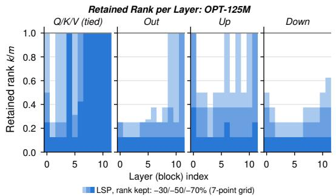

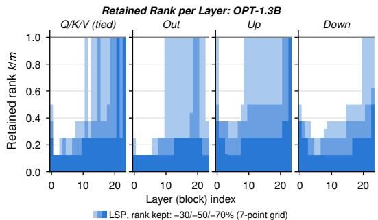

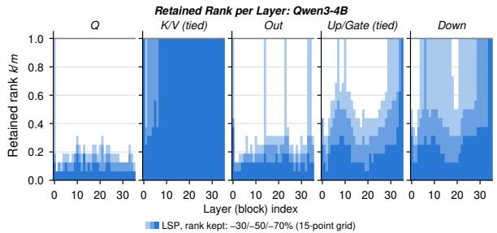

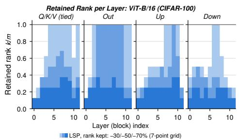  
Figure 4: Rank allocation across models. Retained rank r as a fraction of the full rank d, by block and projection type, for the measured-KL LSP checkpoints of OPT-125M, OPT-1.3B, Qwen3-4B and the CIFAR-100 ViT-B/16; the same panel for Llama-2-7B is Figure 3 (left). Shades stack the three ratios, −30% lightest behind and −70% darkest in front, so each shade’s top edge is that ratio’s profile wherever the allocations nest; r/d = 1 is a unit the allocator left dense. The removal grid is 7 points on OPT-125M, OPT-1.3B and the ViT and 15 on Qwen3-4B. Qwen3-4B has grouped-query attention, so Q is projected alone and K/V share an output-side factor, and each gets its own panel.

What the removal looks like, block by block. Figure 5 repeats the two spectral panels of Figure 3 for an early, a middle and a late block of OPT-1.3B (blocks 3, 12 and 21 of 24) and Llama-2-7B (blocks 4, 16 and 28 of 32). Removal looks as in Llama’s average: it spreads over the whole spectrum rather than the tail a weight SVD would cut, deepens with the ratio, and reaches the first singular direction, most strongly in the up projection on OPT-1.3B (direction 1 loses 2.5–4.4 of its amplitude in block 3) and in the tied Q/K/V on Llama-2-7B (0.7–2.3). Deeper blocks are spared more: OPT-1.3B’s block 21 keeps Q/K/V dense at every ratio and its other projections almost intact at −30%, and on Llama-2-7B block 16 keeps its Q/K/V, output and down projections dense at −30% and block 28 its up and down projections. The difference to NoLSP is small in every block, so the thin difference of the averaged measurement is not an averaging artifact: at most 2.5% of the removal in the Llama-2-7B blocks shown (median over all compressed units 1.0%), and on OPT-1.3B growing with depth, from 1–2% in block 3 to 5.8% in the down projection of block 21 (median 1.6%). Its sign pattern holds across depth: LSP removes more of the leading quarter of directions and keeps more of the trailing half than NoLSP in 171 of the 180 compressed OPT-1.3B units and 244 of the 248 Llama-2-7B units at −50% and −70%.

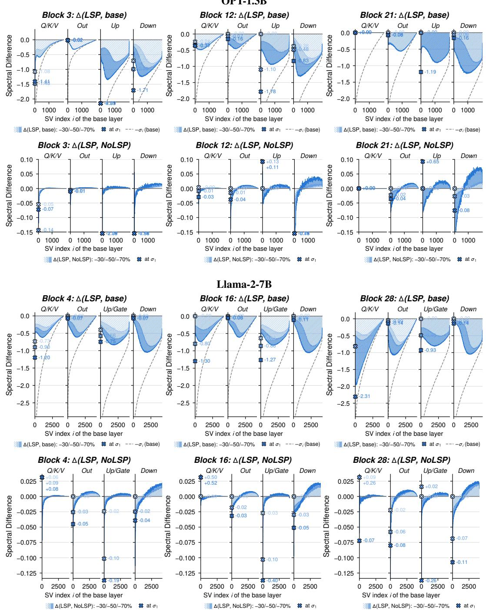  
Figure 5: Spectral removal in single blocks. The two spectral panels of Figure 3 for an early, a middle and a late block (columns) of OPT-1.3B (blocks 3, 12, 21 of 24, top) and Llama-2-7B (blocks 4, 16, 28 of 32, bottom), on the measured-KL checkpoints of Table 1. For each model, the first row is the amplitude lost along each original singular direction, $\Delta _ { i } = \sigma _ { i } ( a _ { i } - 1 )$ , with −σ of the uncompressed layer dashed, and the second the difference to NoLSP, $\sigma _ { i } ( a _ { i } ^ { \mathrm { L S P } } - a _ { i } ^ { \mathrm { N o L S P } } )$ , at the same measured-KL ranks. Each row shares one vertical axis. Shades are the $- 3 0 / 5 0 / 7 0 \%$ runs (light to dark), the bands are a running mean over 9 directions, a missing band is a unit left dense at that ratio, and tied Q/K/V and up/gate panels average their member matrices; crosses give the raw value on direction 1, parked on the axis edge when outside it.

## E INFERENCE EFFICIENCY

Table 13 extends Table 5 to all three ratios on the WikiText-2-calibrated Llama-2-7B checkpoints. Throughout this section, throughput is measured on one GH200 in bf16 with SDPA and CUDAgraph decoding, at batch 1 and with a full-width KV cache, while latent-cache widths and context capacities are analytical estimates computed from the factor widths, assuming a latent cache (Section A.6) and counting persistent tensors only; context capacities assume a 95.5 GiB device with 6 GiB headroom. At weights and FLOPs matched to within 2%, LSP decodes fastest at every ratio, 15–26% ahead of the best untied factorization at 512 tokens, and its latent cache is 1.2×, 1.9× and 2.2× narrower. Every untied baseline factorization decodes slower than the dense model at −30%, while LSP is faster than dense at every ratio (1.21×, 1.36× and 1.56× at −30%, −50% and −70%). This margin is a short-context one: it falls to 1.11× at 16k tokens, where reading the cache dominates.

Allocation at deployment. Table 14 compares the uniform and measured-KL allocations on the same checkpoints; at a given ratio both hold the same weights (8.93, 6.52 and 4.11 GiB) and decode FLOPs. The measured budget decodes faster at every ratio (10, 17 and 6%), partly because a unit it leaves dense runs as one matrix multiply instead of two. Its cache is 38% wider at −30%, where a few Q/K/V groups stay uncompressed and cache full-width K and V, but 8 and 22% narrower at −50 and −70%, where it compresses attention harder. Both allocations hold longer contexts and decode faster than every untied factorization of Table 13, so the advantage over them does not depend on the allocation.

K/V routing at deployment. Table 15 gives the deployment cost of the four Qwen3-4B arms of Table 12. Within a ratio they hold the same weights (6.14, 4.78 and 3.43 GiB) and issue the same decode FLOPs (7.80, 6.35 and 4.89 GFLOP per step). The allocation sets the speed: the measured budget is faster than the uniform one in all six pairs (22, 10 and 8% at −20%, −40% and −60%) because it leaves units dense, whereas the uniform rule factorizes every layer and decodes slower than the dense model at −20 and −40%. Input tying is 2–4% faster than the output-side routing in all six pairs, since one shared input factor serves Q, K and V in a single matrix multiply. The routing mainly decides the cache, in a direction set by the allocation: it narrows the uniform cache by about 8% and widens the measured one to or near the dense width. No configuration wins on all three axes: uniform with output-side K/V holds the longest context but is the slowest, measured with input tying is the fastest, and measured with output-side K/V is the most accurate but caches nearly as much as the dense model.

Table 13: Inference efficiency of compressed Llama-2-7B at every ratio, the checkpoints of Table 1, on one GH200 (bf16, SDPA). Memory, analytic from the checkpoints’ ranks (factors vs. dense): weights, floats cached per token per layer with the latent KV cache (z = Ax; a unit the measured-KL allocation leaves uncompressed stays dense and caches full-width K/V), weights plus KV cache at 128k tokens and batch 8, and the longest context that fits 95.5 GiB at batch 8. Speed: FLOPs to prefill 2k tokens and per decode step at 2k context, and measured CUDA-graph-compiled decode tok/s at batch 1 for 512, 4k and 16k tokens of context. Best factorized method per ratio in bold.
<table><tr><td rowspan="2">Method</td><td colspan="4">Memory</td><td colspan="5">Compute and speed (batch 1)</td></tr><tr><td>Weights (GiB)</td><td>KV floats /token/layer</td><td>Weights+KV @128k, b8 (GiB)</td><td>Max ctx (k tok, b8)</td><td>Prefill TFLOPs @2k GFLOP/step</td><td>Decode</td><td>Decode tok/s @512 @4k @16k</td><td></td><td></td></tr><tr><td>Llama-2-7B (dense)</td><td>12.55</td><td>8192</td><td>524.6</td><td>19.7</td><td>29.26</td><td>14.29</td><td>142</td><td>85</td><td>36</td></tr><tr><td colspan="10">-30%</td></tr><tr><td>SVD-LLM (W)</td><td>8.93</td><td>2866 (2.9×)</td><td>188.1 (2.8×)</td><td>59.0</td><td>21.30</td><td>10.40</td><td>135</td><td>83</td><td>35</td></tr><tr><td>Swift-SVD</td><td>8.93</td><td>2866 (2.9×)</td><td>188.1 (2.8×)</td><td>59.0</td><td>21.30</td><td>10.40</td><td>137</td><td>83</td><td>36</td></tr><tr><td>Dobi-SVD</td><td>9.06</td><td>3279 (2.5×)</td><td>214.0 (2.5×)</td><td>51.4</td><td>21.59</td><td>10.54</td><td>136</td><td>83</td><td>35</td></tr><tr><td>LSP (Ours)</td><td>8.93</td><td>2316 (3.5×)</td><td>153.7 (3.4×)</td><td>73.0</td><td>21.30</td><td>10.40</td><td>172</td><td>95</td><td>37</td></tr><tr><td colspan="10">-50%</td></tr><tr><td>SVD-LLM (W)</td><td>6.52</td><td>2048 (4.0×)</td><td>134.5 (3.9×)</td><td>85.0</td><td>16.00</td><td>7.81</td><td>163</td><td>92</td><td>37</td></tr><tr><td>Swift-SVD</td><td>6.52</td><td>2048 (4.0×)</td><td>134.5 (3.9×)</td><td>85.0</td><td>16.00</td><td>7.81</td><td>164</td><td>92</td><td>37</td></tr><tr><td>Dobi-SVD</td><td>6.53</td><td>2060 (4.0×)</td><td>135.2 (3.9×)</td><td>84.5</td><td>16.01</td><td>7.82</td><td>164</td><td>93</td><td>37</td></tr><tr><td>LSP (Ours)</td><td>6.52</td><td>1096 (7.5×)</td><td>75.0 (7.0×)</td><td>158.8</td><td>16.00</td><td>7.81</td><td>193</td><td>101</td><td>38</td></tr><tr><td colspan="10">-70%</td></tr><tr><td>SVD-LLM (W)</td><td>4.11</td><td>1228 (6.7×)</td><td>80.9 (6.5×)</td><td>145.8</td><td>10.69</td><td>5.22</td><td>191</td><td>100</td><td>38</td></tr><tr><td>Swift-SVD</td><td>4.11</td><td>1228 (6.7×)</td><td>80.9 (6.5×)</td><td>145.8</td><td>10.69</td><td>5.22</td><td>193</td><td>101</td><td>38</td></tr><tr><td>Dobi-SVD</td><td>4.12</td><td>1434 (5.7×)</td><td>93.7 (5.6×)</td><td>124.9</td><td>10.71</td><td>5.23</td><td>189</td><td>99</td><td>38</td></tr><tr><td>LSP (Ours)</td><td>4.11</td><td>556 (14.7×)</td><td>38.9 (13.5×)</td><td>322.1</td><td>10.69</td><td>5.22</td><td>221</td><td>108</td><td>40</td></tr></table>

Table 14: Deployment cost of the allocation, Llama-2-7B. The uniform and measured-KL allocations compared in Table 11, here on the WikiText-2-calibrated checkpoints, on one GH200, Q/K/V tied on the input side. KV: floats cached per token per layer, and Max ctx: the longest context (k tokens) that fits 95.5 GiB at batch 8, both analytic from the checkpoints’ ranks, counting a unit the allocator left uncompressed as caching full-width K,V. tok/s: measured CUDA-graph-compiled decode throughput at batch 1 and 512 tokens of context, both allocations in the same session, best of two passes. Within a ratio both hold the same weights and issue the same decode FLOPs.
<table><tr><td></td><td colspan="3">-30%</td><td colspan="3">-50%</td><td colspan="3">-70%</td></tr><tr><td>Allocation</td><td>KV</td><td>Max ctx</td><td>tok/s</td><td>KV</td><td>Max ctx</td><td>tok/s</td><td>KV</td><td>Max ctx</td><td>tok/s</td></tr><tr><td>Llama-2-7B (dense)</td><td>8192</td><td>19.7</td><td>142</td><td>8192</td><td>19.7</td><td>142</td><td>8192</td><td>19.7</td><td>141</td></tr><tr><td>Uniform</td><td>1673</td><td>101.0</td><td>157</td><td>1195</td><td>145.6</td><td>165</td><td>717</td><td>249.8</td><td>209</td></tr><tr><td>Measured KL</td><td>2316</td><td>73.0</td><td>172</td><td>1096</td><td>158.8</td><td>193</td><td>556</td><td>322.1</td><td>221</td></tr></table>

Measured-KL allocation with K/V tied on the output side is the most accurate configuration at every ratio (Table 12), so we use it as the default. When deployment efficiency matters more, LSP supports the other trade-offs: uniform allocation with output-side K/V holds the longest context, and measured allocation with input-side tying decodes fastest.

Table 15: Deployment cost of allocation and K/V routing, Qwen3-4B. The four arms of Table 12 on one GH200. KV: floats cached per token per layer, and Max ctx: the longest context that fits 95.5 GiB at batch 8, both analytic from the merged checkpoints’ ranks, counting a unit the allocator left uncompressed as caching full-width K,V. tok/s: measured CUDA-graph-compiled decode throughput at batch 1 and 512 tokens of context, best of two passes. Within a ratio all four arms hold the same weights and issue the same decode FLOPs, given in the text.
<table><tr><td></td><td></td><td colspan="4">-20%</td><td colspan="4">-40%</td><td colspan="4">-60%</td></tr><tr><td>Allocation</td><td>Tied group</td><td>KV</td><td>Max ctx tok/s</td><td></td><td>Avg6</td><td>KV</td><td>Max ctx tok/s</td><td></td><td>Avg6</td><td>KV</td><td>Max ctx tok/s</td><td></td><td>Avg6</td></tr><tr><td>Qwen3-4B (dense)</td><td></td><td>2048</td><td>74.6</td><td>175</td><td>61.3</td><td>2048</td><td>74.6</td><td>175</td><td>61.3</td><td>2048</td><td>74.6</td><td>175</td><td>61.3</td></tr><tr><td>Uniform</td><td>Q/K/V, input</td><td>1357</td><td>114.5</td><td>147</td><td></td><td>53.4 1018</td><td>155.1</td><td>170</td><td>49.4</td><td>679</td><td>236.3</td><td>186</td><td>43.3</td></tr><tr><td>Uniform</td><td>K/V, output</td><td>1242</td><td>125.1</td><td>144</td><td>54.0</td><td>932</td><td>169.4</td><td>165</td><td>49.3</td><td>622</td><td>257.9</td><td>179</td><td>42.9</td></tr><tr><td>Measured KL Q/K/V, input</td><td></td><td>1822</td><td>85.3</td><td>180</td><td>56.4</td><td>1701</td><td>92.8</td><td>187</td><td>49.3</td><td>1282</td><td>125.2</td><td>201</td><td>42.9</td></tr><tr><td>Measured KL K/V, output</td><td></td><td>2048</td><td>75.9</td><td>176</td><td>56.9</td><td>2048</td><td>77.1</td><td>182</td><td>50.9</td><td>1920</td><td>83.6</td><td>193</td><td>44.2</td></tr></table>

## F COMPRESSION COST

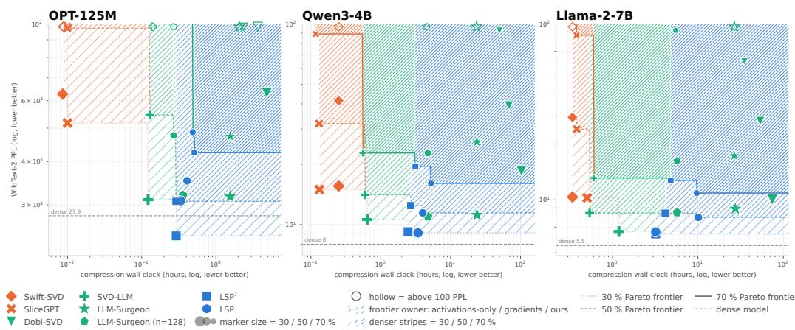  
Figure 6: Compression cost with measured-KL allocation on three LLMs. WikiText-2 perplexity at −30/50/70% compression (marker size) against wall-clock hours. LSP costs include initialization, training through the selected epoch, and the full KL measurement on the 7-point grid on OPT-125M and the 15-point grid on Qwen3-4B and Llama-2-7B.

Figure 6 compares LSP’s compression cost with that of activation-based methods (SliceGPT, Swift-SVD) and loss-aware ones (LLM-Surgeon, Dobi-SVD, SVD-LLM), on OPT-125M, Qwen3-4B and Llama-2-7B. Giving the loss-aware baselines more budget does not close the gap. LLM-Surgeon calibrated on LSP’s 1024 sequences costs 4–6× more than at its default 128, and its perplexity does not improve. Dobi-SVD, trained for 20 epochs on the same 1024 samples, costs 2–103 wall-clock hours and stays far behind: 61.2 against 10.9 perplexity on Llama-2-7B at −70%.

Compression cost is paid once per model and ratio, and it is small next to the cost of serving the compressed model. We argue it should therefore not drive the choice between methods, whereas accuracy and inference efficiency (Section 3.3) are paid on every query. Even so, LSP is Paretooptimal at higher budgets: at every model–ratio setting, one of its two objectives gives the lowest perplexity, within 0.5–10 wall-clock hours. Only methods that are cheaper and less accurate share the frontier: SVD-LLM with LoRA recovery, SliceGPT and Swift-SVD. LSP T converges faster than LSP, reaching its validation optimum at up to 2.5× lower cost (4.1 against 10.1 hours on Llama-2-7B at −50%), though at a higher perplexity at −50 and −70%. The KL measurement is a substantial fixed cost: 0.17, 1.74 and 1.11 wall-clock hours on OPT-125M, Qwen3-4B and Llama-2-7B. The LSP points use individual-run perplexities, which can differ from the three-seed means of Table 1.

## G TRANSFER ON THE GROWING CALIBRATION POOL

Table 16 breaks down the ViT transfer results of Table 3 by calibration pool and target. The pools grow from CIFAR-100 alone (10k images) to the six-dataset pool of Table 3 (47k), with the same images for every method. LSP’s mean transfer rises with every added dataset at every ratio, and on the full pool it is best on all three targets at every ratio; the baselines gain less and not always monotonically (FLAR-SVD at −50% loses 4.4 points when CIFAR-10 and EuroSAT are added). The last row of each method is CIFAR-100 alone at the size of the full pool. For LSP, this extra CIFAR-100 data changes mean transfer by +1.2, −0.6 and +0.8 points at −30/50/70%, whereas the diverse pool exceeds this size-matched control by 3.7, 7.1 and 6.6 points (the Gain of Table 3): the gain comes from pool composition, not size.

Table 16: Complete downstream-transfer results for compressed ViT-B/16, for every calibration pool and target. Compressed on: the datasets in the pool (✓) and its size, the same pools for every method; $\checkmark ^ { \dagger }$ is CIFAR-100 alone at the size of the six-dataset pool. Transfer to: linear-probe accuracy on Pets, Aircraft and Places365, absent from every pool, and their mean; Source: CIFAR-100 accuracy through the original head. $\mathrm { L S P } ^ { T }$ needs CIFAR-100 labels. Best per column, pool and ratio in bold.
<table><tr><td></td><td colspan="3">Compressed on</td><td colspan="3">Transfer to</td><td>Source</td></tr><tr><td></td><td>F0--1101 CAA-10 EUrSAT ST-10</td><td></td><td></td><td></td><td></td><td></td><td></td></tr><tr><td>CIA-R-0 Method</td><td></td><td>DTD Images</td><td>Pets</td><td></td><td>Aircraft Places365</td><td>Mean</td><td>CIFAR-100</td></tr><tr><td>Dense (Base)</td><td></td><td></td><td>71.9</td><td>36.9</td><td>33.5</td><td>47.4</td><td>89.9</td></tr><tr><td colspan="8">-30% parameters</td></tr><tr><td></td><td>ハンンンバ vv√</td><td>10k 20k</td><td>67.1</td><td>32.3</td><td>31.2 327</td><td>43.6</td><td>88.7</td></tr><tr><td>FLAR-SVD</td><td>√&gt;</td><td></td><td>68.6</td><td>34.1</td><td>32.7</td><td>45.0</td><td>8877</td></tr><tr><td></td><td></td><td>40k</td><td>68.6</td><td>33.2</td><td></td><td>44.9</td><td></td></tr><tr><td></td><td></td><td>47k</td><td>68.4</td><td>33.3</td><td>32.4</td><td>44.7</td><td>88.6</td></tr><tr><td></td><td></td><td>47k</td><td>66.9</td><td>32.7</td><td>31.1</td><td>43.6</td><td>88.8</td></tr><tr><td></td><td>ンンンンパ</td><td></td><td></td><td></td><td>29.5</td><td></td><td></td></tr><tr><td></td><td></td><td></td><td>63.2</td><td></td><td>31.1</td><td>41.2</td><td>88.2</td></tr><tr><td>SVD-LLM (W)</td><td></td><td></td><td>63.3</td><td></td><td>32.3 28.8</td><td>41.5</td><td>87.9</td></tr><tr><td></td><td>vvv</td><td>√√ S</td><td>64.4</td><td></td><td>32.2</td><td>41.9</td><td>87.8</td></tr><tr><td></td><td></td><td>√√</td><td>64.7</td><td></td><td>32.6</td><td>三 299 42.3</td><td>87.7</td></tr><tr><td></td><td>ンンンン</td><td></td><td>63.0</td><td></td><td>31.2</td><td>41.2</td><td>88.2</td></tr><tr><td></td><td></td><td>47k</td><td>66.2</td><td></td><td>32.9 30.1</td><td>43.1</td><td>89.1</td></tr><tr><td>PELA</td><td>vvv</td><td>10k 20k</td><td>65.0</td><td>32.2</td><td></td><td>42.5</td><td></td></tr><tr><td></td><td>√&gt;</td><td>S 40k</td><td>67.3</td><td>34.1</td><td>30.3 30.1</td><td>43.8</td><td>88.9</td></tr><tr><td></td><td></td><td>√ √ 47k</td><td>67.1</td><td>34.2</td><td>30.5</td><td>43.9</td><td>88.9</td></tr><tr><td></td><td></td><td>47k</td><td>66.0</td><td>31.1</td><td>29.8</td><td>42.3</td><td>89.2</td></tr><tr><td>LSPT (Ours)</td><td>vt</td><td></td><td>67.8</td><td>33.9</td><td>30.8</td><td>44.2</td><td>89.3</td></tr><tr><td></td><td></td><td>47k</td><td></td><td></td><td></td><td></td><td></td></tr><tr><td></td><td></td><td>10k</td><td>66.0 70.6</td><td>32.4 36.8</td><td>29.8</td><td>42.7 46.5</td><td>89.3</td></tr><tr><td>LSP (Ours)</td><td></td><td>20k</td><td>71.3</td><td>37.2</td><td>32.1 32.0</td><td>46.8</td><td>89.3 89.2</td></tr><tr><td></td><td>vvv S</td><td>40k</td><td>71.7</td><td>37.7</td><td>30.</td><td>47.5</td><td>89.2</td></tr><tr><td></td><td>ンンンンハ</td><td>47k</td><td>47k 67.3</td><td></td><td>33.8</td><td>43.9</td><td>89.4</td></tr><tr><td>-50% parameters</td><td></td><td></td><td></td><td></td><td></td><td></td><td>86.2</td></tr><tr><td></td><td>ノンンンバ vvv</td><td></td><td>10k 58.1 20k</td><td>27.2</td><td>28.7</td><td>38.0</td><td>86.1</td></tr><tr><td>FLAR-SVD</td><td>二</td><td></td><td>61.1</td><td>30.8</td><td>29.7</td><td>40.5</td><td>83.5</td></tr><tr><td></td><td></td><td>40k</td><td>54.3</td><td>27.0</td><td></td><td>36.1 36.2</td><td>83.1</td></tr><tr><td></td><td></td><td>47k</td><td>54.9</td><td>26.9</td><td>201</td><td></td><td>86.4</td></tr><tr><td></td><td></td><td>47k</td><td>58.6</td><td>27.5</td><td>28.3</td><td>38.1</td><td>86.1</td></tr><tr><td></td><td></td><td>10k</td><td>58.6</td><td>28.3</td><td>26.6</td><td>37.8</td><td>84.9</td></tr><tr><td>SVD-LLM (W)</td><td></td><td>20k</td><td>59.6</td><td>29.1</td><td>27.0</td><td>38.6</td><td>84.4</td></tr><tr><td></td><td></td><td>√ 40k</td><td>59.6</td><td>28.9</td><td>27.2</td><td>38.6</td><td>86.1.</td></tr><tr><td></td><td>vvv V</td><td>√√√ 47k</td><td>60.1</td><td>28.4</td><td>27.1</td><td>38.6</td><td></td></tr><tr><td></td><td>ンンンンハ</td><td>47k</td><td>58.4</td><td>28.7</td><td>27.2</td><td>38.1</td><td></td></tr><tr><td></td><td>ンンンン</td><td>10k</td><td>62.6</td><td>29.7</td><td>28.5</td><td>40.3</td><td>87.9</td></tr><tr><td>PELA</td><td>vv√</td><td>20k</td><td>61.6</td><td>30.9</td><td>28.1</td><td>40.2</td><td>87.7</td></tr><tr><td></td><td>√√</td><td>40k</td><td>64.6</td><td>31.3</td><td>29.3</td><td>41.7</td><td>87.0</td></tr><tr><td></td><td></td><td></td><td>63.6</td><td>32.3</td><td>28.3</td><td>41.8</td><td></td></tr><tr><td>LSPT (Ours)</td><td></td><td></td><td>62.0</td><td>30.0</td><td></td><td>40.1</td><td>88..5</td></tr><tr><td></td><td>√t</td><td>47k</td><td>56.0</td><td>23.7</td><td>25.7</td><td>35.1</td><td>87.8</td></tr><tr><td></td><td></td><td>47k</td><td>58.9</td><td>28.1</td><td></td><td>38.2</td><td></td></tr><tr><td></td><td></td><td>10k</td><td>63.2</td><td>31.7</td><td>2</td><td>41.1</td><td>8.</td></tr><tr><td>LSP (Ours)</td><td></td><td>20k 40k</td><td>67.5</td><td>34.4</td><td></td><td>44.1</td><td>88.0</td></tr><tr><td></td><td>vvv V</td><td></td><td>68.2</td><td>35.2</td><td>30.7</td><td>44.7</td><td>87.7</td></tr><tr><td></td><td>ンンンンハ</td><td>47k 47k</td><td>58.7</td><td>26.9</td><td>27.3</td><td>37.6</td><td>88.3</td></tr><tr><td>-70% parameters</td><td></td><td></td><td></td><td></td><td>23.7</td><td>27.3</td><td>70.7</td></tr></table>