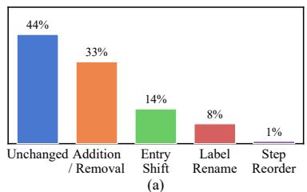
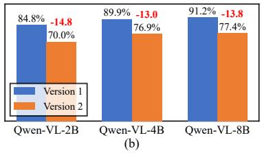
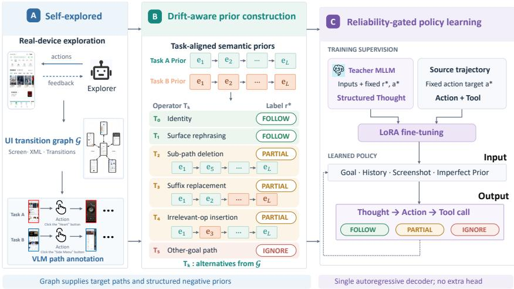
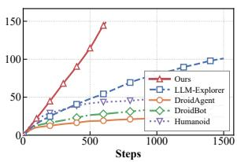
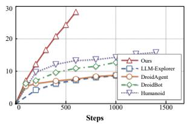
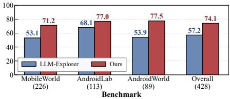

# LEARNING RELIABLE GUI AGENTS UNDER IMPERFECT PRIORS

Bo Han1, Qianyi Wang1, Shuai Liu1, Xiong Zifan1

Changqiao Wu2, Yuanfa Li2, Pengzhi Gao2, Wei Liu2, Jian Luan2, Heng Qu2

Yunpeng Song1, Zhongmin Cai1

1Xi’an Jiaotong University

2MiLM Plus, Xiaomi Inc.

## ABSTRACT

GUI agents built on large language and vision-language models still struggle on unseen applications and complex multi-step tasks, as completing real GUI tasks depends on app-specific, temporally volatile operational knowledge that is scarce in pretraining corpora. Retrieval-augmented execution offers a natural remedy but faces two coupled bottlenecks: knowledge at scale is hard to acquire, and self-collected priors inevitably drift from the live environment due to version updates, promotions, ads, A/B tests, and personalization. We therefore argue that GUI agents should not pursue perfect knowledge but learn to act correctly under imperfect priors, and propose our framework that couples knowledge acquisition with noise-robust utilization: a structured exploration strategy traverses interactive elements, builds a UI state-transition graph, and synthesizes (task, trajectory) pairs via a VLM without human annotation; a noise-aware training strategy, grounded in a taxonomy of real GUI drift patterns, injects five types of realistic errors into self-explored trajectories to teach the agent to assess prior reliability before acting. Experiments on physical devices and online emulator benchmarks show that our method discovers more unique screens, covers more benchmark tasks, and more effectively rejects erroneous priors while leveraging correct ones, with accuracy gains that transfer across datasets.

## 1 INTRODUCTION

GUI agents built on large language models and vision-language models have made rapid progress on mobile and desktop automation (Hong et al., 2024; Cheng et al., 2024; Wang et al., 2024; Zhang et al., 2025a; You et al., 2024; Qin et al., 2025; Wu et al., 2024), but they remain brittle on unseen applications and long-horizon tasks (Rawles et al., 2024; Xu et al., 2025; Kong et al., 2025a; Xie et al., 2024). A single screenshot is rarely enough. Completing a real task often depends on app-specific, temporally volatile operational knowledge, such as hidden entry points, preconditions that make a setting visible, or whether a salient button is actually an advertisement. Such knowledge is scarce in pretraining corpora and hard to infer from pixels alone. Retrieval-augmented execution (Lewis et al., 2020) offers a natural remedy by retrieving historical trajectories at decision time (Kong et al., 2025b; Zhu et al., 2025; Lee et al., 2024; Zhou et al., 2026), yet instantiating it on GUIs raises two coupled and still-open problems: how to acquire such knowledge at scale, and how to use it when it is imperfect.

Bottleneck 1: scalable acquisition. High-quality trajectories are typically collected through manual annotation or user demonstrations (Rawles et al., 2023; Deng et al., 2023; Xu et al., 2025), both of which are expensive and unable to cover the long tail of apps. Autonomous exploration provides an alternative (Wen et al., 2024; Yoon et al., 2024; Li et al., 2017; Zhao et al., 2025), but it comes with structural limitations. Without a user intent to anchor behavior, control-semantics annotations are partly inferential (Wang et al., 2021; Li et al., 2020); exploration operates under a finite budget; and login states, server-side routing, and personalized content are largely beyond reach. Automatically acquired GUI knowledge should therefore be treated not as ground truth, but as self-explored priors: potentially incomplete, outdated, or noisy hints whose applicability agents must assess against the current task and execution state.

Bottleneck 2: reliability under GUI drift. Even high-quality priors become unreliable over time, since GUIs drift across multiple scales. To characterize this phenomenon, we curate 176 tasks from 20 popular apps that span paired old and new versions, and manually compare the completion trajectories across versions. As summarized in Figure 1(a), only 44% of the tasks retain identical trajectories after an update, while the remainder fall into a small, recurring set of drift patterns: step addition or removal, entry-point or path shift, control renaming, and goalmismatched or distracting detours. These patterns are consistent with the 74.6% of paired screens across versions that show visual differences (Lu et al., 2025). Beyond versioning, promotional campaigns, ads, A/B testing, and regional routing continue to reshuffle interfaces. Figure 1(b) quantifies the cost of ignoring this property: even when supplied with correct trajectories from older versions, three competitive fine-tuned models still drop noticeably on newer versions, echoing the well-documented instability of naively appending retrievals in RAG (Yoran et al., 2023; Fang et al., 2024; Wei et al., 2024; Cuconasu et al., 2024).

  
Figure 1: (a) GUI drift patterns across app versions; (b) task success drops on newer versions.

## We cast GUI automation as sequential decision making under

retrieval-augmented, imperfect priors. The agent is conditioned on a path-structured prior π that may deviate from the unobserved oracle $\pi ^ { \star }$ along any of the drift axes above. Rather than chasing perfect knowledge, we train the agent to act correctly under imperfect priors. We propose SAGE (Self-explored, Assessment-Guided Execution), which combines three components to support this goal. (i) Self-explored priors. Building on UI-graph construction (Wen et $\mathrm { { a l . } }$ , 2024; Li et al., 2017), the agent traverses interactive elements on real devices with semantic-region budgeting and recovery-aware backtracking, and uses a multimodal annotator to synthesize tasks from reachable paths. This procedure yields retrievable $( g , \pi ^ { \star } )$ pairs at scale without human involvement. (ii) Drift-aware perturbation. Guided by the taxonomy in Figure 1(a), a family of operators $\{ T _ { k } \}$ maps clean priors to a mixture $\mathcal { D } _ { \Pi }$ that approximates deployment-time retrieval noise, with each operator paired with a deterministic reliability label. (iii) Reliability-gated policy. The policy factorizes as $\begin{array} { r } { \bar { p } _ { \theta } ( a | \cdot ) = \sum _ { r } p _ { \theta } ( r | \cdot ) p _ { \theta } ( a | \cdot , r ) } \end{array}$ with $r \in \{ \mathrm { F o L L O W }$ , PARTIAL, IGNORE}, so the agent commits to an explicit reliability decision before acting. In this way, it learns to follow reliable priors, override conflicting ones, and selectively use partial ones (Asai et al., 2023; Yan et al., 2024).

Contributions. (1) We present an annotation-free exploration pipeline that constructs a deduplicated UI transition graph and yields task-aligned retrievable priors at scale. (2) We introduce a reliabilitygated policy trained on a drift-aware prior distribution $\mathcal { D } _ { \Pi }$ , which turns retrieval noise into explicit supervision and forces an explicit FOLLOW/PARTIAL/IGNORE decision before acting. (3) We construct a benchmark of clean and systematically perturbed (task, trajectory) pairs for retrievalaugmented GUI agents. Upon acceptance, we will publicly release the core implementation and the public-data portion of the benchmark.

## 2 RELATED WORK

GUI agents and online benchmarks. Multimodal foundation models have moved GUI agents from static interface understanding to real software interaction, from single-step grounding (Cheng et al., 2024; Hong et al., 2024) to mobile agents tuned or reinforced for multi-step execution (Zhang et al., 2025b; Zhou et al., 2025; Xu et al., 2026; Yan et al., 2025; Alibaba, 2025), including the Qwen3-VL backbones we adopt (Bai et al., 2025). Realistic evaluation is enabled by reproducible Android environments with state-based checking (Rawles et al., 2024; Xu et al., 2025; Kong et al., 2025a) and by their Chinese-app counterparts (Xie et al., 2026; Zhang et al., 2026). These works primarily ask whether an agent can complete a task in a given environment; we ask how app-specific operational knowledge can be acquired at scale and used robustly when it is unreliable.

App exploration as a knowledge source. Autonomous exploration has long served mobile testing and GUI data collection, from UI-guided event generation (Li et al., 2017) to LLM-guided semantic exploration that reduces invalid interactions (Yoon et al., 2024; Zhao et al., 2025). Raw traces, however, are highly redundant: transient UI changes create spurious states, while functionally equivalent controls are repeatedly explored, yielding fragmented trajectories rather than a connected graph with shared states. We therefore consolidate traces through state deduplication, control-function merging, and transition alignment, treating the resulting transitions and paths as priors that can be audited, perturbed, and used for robust learning.

  
Figure 2: Overview of SAGE. Semantic-guided exploration builds a deduplicated UI graph G and task-aligned priors. Drift-aware operators $\{ T _ { k } \}$ construct $\mathcal { D } _ { \Pi }$ with reliability labels. Teachergenerated thoughts supervise a LoRA-fine-tuned policy that assesses priors as FOLLOW, PARTIAL, or IGNORE before acting.

Retrieval augmentation for GUI agents. Retrieval-augmented generation is standard for knowledgeintensive tasks (Lewis et al., 2020). In GUI agents, analogous ideas appear as app memory, trajectory memory, and page- or task-level knowledge bases: explore–select–derive–recall subtask memory (Lee et al., 2024), automated dynamic analysis for app-specific knowledge (Wen et al., 2024), and exploration- or demonstration-based operation knowledge (Zhang et al., 2025a). For long-horizon planning, trajectory and multifaceted experience memories (Kong et al., 2025b; Zhu et al., 2025) and dual-path Manager–Operator retrieval (Zhou et al., 2026) demonstrate the value of external priors. Prior work mainly focuses on knowledge acquisition and retrieval, often assuming retrieved content is usable. Our work instead targets unreliable priors and interactive noise arising from changing interface states and action consequences.

## 3 METHOD

SAGE combines self-explored prior acquisition (Sec. 3.2), drift-aware perturbation (Sec. 3.3), and reliability-gated action generation (Secs. 3.1 and 3.4), as shown in Figure 2.

## 3.1 PROBLEM FORMULATION

GUI decision process. We model a GUI task as a contextual decision process $( S , { \mathcal { A } } , { \mathcal { G } } , { \mathcal { T } } , \rho )$ with observable states $s$ (screenshot plus accessibility metadata), executable actions A, naturallanguage goals ${ \mathcal { G } } .$ , a non-stationary transition kernel $\dot { \mathcal T } : \mathcal S \times \mathcal A  \Delta ( \mathcal S )$ induced by the live app, and a completion indicator $\rho .$ . At step t, the agent observes $s _ { t } .$ , conditions on goal g and history $h _ { < t } = ( s _ { < t } , a _ { < t } )$ , and emits $a _ { t } \in { \mathcal { A } } .$

Retrieval-augmented, imperfect priors. The agent is given a path-structured prior $\pi =$ $( \bar { e } _ { 1 } , \dots , \bar { e } _ { L } ) \in \Pi$ retrieved from an external store, where each $\bar { e } _ { \ell }$ narrates a pre-state, triggering control, and post-state in natural language, yielding a policy $p _ { \theta } ( a _ { t } \mid s _ { t } , h _ { < t } , g , \pi )$ . Let $\pi ^ { \star } ( g )$ be the (unobserved) oracle path for $g$ in the live environment. A real retriever returns π $\cdot \sim q ( \pi \mid g , \mathcal { K } )$ , and the gap between π and $\pi ^ { \star } ( g )$ is characterized by GUI drift: step insertion/removal, entry-point shift, control renaming, and goal mismatch. We denote by $\mathcal { D } _ { \Pi }$ the (unknown, non-stationary) effective distribution over deployment-time priors.

Reliability-gated policy. We introduce a latent reliability variable $\begin{array} { r l r l } { r } & { { } \in } & { \mathcal { R } } & { { } = } \end{array}$ {FOLLOW, PARTIAL, IGNORE} and factorize

$$
p _ { \theta } ( a _ { t } \mid s _ { t } , h _ { < t } , g , \pi ) = \sum _ { r \in { \mathcal R } } \underbrace { p _ { \theta } ( r \mid s _ { t } , h _ { < t } , g , \pi ) } _ { \mathrm { r e l i a b i l i t y ~ a s s e s s o r } } \underbrace { p _ { \theta } ( a _ { t } \mid s _ { t } , h _ { < t } , g , \pi , r ) } _ { \mathrm { r e l i a b i l i t y - c o n d i t i o n e d ~ a c t o r } } .\tag{1}
$$

At inference, $( r , a _ { t } )$ are realized jointly via autoregressive decoding, so Eq. 1 is implemented without explicit marginalization. This turns prior reliability from an unobserved nuisance into an explicit intermediate variable the agent must commit to before acting.

Learning objective. Given a task distribution $\mathcal { D } _ { \mathrm { t a s k } }$ over $( g , h _ { < t } , s _ { t } , a _ { t } ^ { \star } )$ and a prior distribution $\mathcal { D } _ { \Pi } ( \cdot \mid g , \bar { h } _ { < t } )$ whose reliability is determined by its relation to the trajectory (Sec. 3.3), we train

$$
\operatorname* { m i n } _ { \theta } \mathbb { E } _ { ( g , h _ { < t } , s _ { t } , a _ { t } ^ { \star } ) \sim \mathcal { D } _ { \mathrm { u s } } } \Big [ - \log p _ { \theta } \big ( r ^ { \star } \mid s _ { t } , h _ { < t } , g , \pi \big ) - \log p _ { \theta } \big ( a _ { t } ^ { \star } \mid s _ { t } , h _ { < t } , g , \pi , r ^ { \star } \big ) \Big ] ,\tag{2}
$$

where $r ^ { \star }$ is induced by the (known) perturbation producing π. Two design questions remain: how to obtain $\mathcal { D } _ { \mathrm { t a s k } }$ at scale without annotation, and how to choose $\mathcal { D } _ { \Pi }$ so that training-time priors cover deployment-time drift.

## 3.2 SELF-EXPLORED PRIOR ACQUISITION

To supply application-specific priors without requiring human demonstrations, we explore real apps and organize observed transitions into a UI transition graph $\mathcal { G } = ( \nu , \mathcal { E } )$ , under three principles. Paths in G provide the operational experience from which we construct task-aligned priors and synthesizing tasks $\mathcal { D } _ { \mathrm { t a s k } }$

Semantic-region action abstraction. Flat enumeration over raw controls wastes budget on repeti tive list items and ads. A multimodal annotator instead partitions each screen into four region types, navigation,functional, homogeneous content, distraction, and the policy samples under a per-region budget $B _ { \mathrm { n a v } } \geq B _ { \mathrm { f u n c } } \gg B _ { \mathrm { h o m o g } } \geq B _ { \mathrm { d i s t r a c t } } = 0$ . Each frontier node further maintains a candidate queue ordered by region priority, local exploration status, and control-level deduplication (by normalized bounds and semantic signatures), avoiding repeated interaction with semantically equivalent controls. The induced prior distribution concentrates on high-value functional paths likely to align with user intents (Cases in Appendix E).

Structure–visual state deduplication. To prevent dynamic content (refresh, personalization, ads) from fragmenting the state space, two screens $s , s ^ { \prime }$ are merged when

$$
S _ { \mathrm { x m l } } ( s , s ^ { \prime } ) = \frac { \vert \mathcal { P } ( s ) \cap \mathcal { P } ( s ^ { \prime } ) \vert } { \vert \mathcal { P } ( s ) \cup \mathcal { P } ( s ^ { \prime } ) \vert } \ge \tau _ { \mathrm { x m l } } , \quad \mathrm { a n d } \quad \phi _ { \mathrm { v i s } } ( s , s ^ { \prime } ) = 1 ,\tag{3}
$$

where $\mathcal { P } ( \cdot )$ is the set of XML control paths and $\phi _ { \mathrm { v i s } }$ is a VLM equivalence check. The conjunctive rule suppresses spurious nodes from recommendation refreshes while preventing false merges between visually similar but functionally distinct screens.

Recovery-aware backtracking as graph repair. After each interaction, the explorer returns to the parent node. When a backtracking attempt lands on an unexpected screen, we treat it not as a failure but as evidence: the observed transition is recorded as a new edge, and we attempt graph-based replay from the root to the frontier, restarting the app only when no path exists. All edges in $\mathcal { G }$ are thus executable and verified by construction.

From graph to task-aligned priors. We enumerate paths $\pi ^ { \star } = ( e _ { 1 } , \ldots , e _ { L } )$ in G and invoke a multimodal annotator to synthesize goals g consistent with their functional endpoints. Each edge is described in natural language via its pre-state, action, and post-state to form e¯, whose concatenation gives the trajectory-level prior $\pi ^ { \star } = [ \bar { e } _ { 1 } ; \ldots ; \bar { e } _ { L } ]$ . Unlike raw low-level logs, this abstraction exposes only action–outcome semantics and is invariant to coordinate perturbations or DOM reshuffles, making the prior a retrievable procedural hint that must still be verified at execution.

Table 1: Drift-aware perturbation operators. $T _ { 2 } – T _ { 4 }$ additionally annotate trustworthy edge indices. $T _ { 3 } , T _ { 5 }$ draw from other paths in the same ${ \mathcal { G } } ,$ keeping noisy priors in-distribution.
<table><tr><td>k</td><td>Operator  $T _ { k }$ </td><td>Empirical drift analog</td><td>Simulated failure mode</td><td> $r ^ { \star }$ </td></tr><tr><td>0</td><td>identity</td><td>clean retrieval</td><td>none</td><td>FOLLOW</td></tr><tr><td>1</td><td>surface rephrasing</td><td>control renaming</td><td>lexical/stylistic variation</td><td>FOLLOW</td></tr><tr><td>2</td><td>sub-path deletion</td><td>step removal</td><td>missing intermediate operation</td><td>PARTIAL</td></tr><tr><td>3</td><td>suffix branch replacement</td><td>entry-point/path shift</td><td>correct prefix, stale suffix</td><td>PARTIAL</td></tr><tr><td>4</td><td>irrelevant-op insertion</td><td>ads, permissions, overlays</td><td>noisy or unrelated step</td><td>PARTIAL</td></tr><tr><td>5</td><td>other-goal path substitution</td><td>wrong-goal retrieval</td><td>coherent but irrelevant prior</td><td>IGNORE</td></tr></table>

## 3.3 DRIFT-AWARE PERTURBATION AS A SHAPED PRIOR DISTRIBUTION

Naive training on $\mathcal { D } _ { \mathrm { t a s k } } \times \{ \pi ^ { \star } \}$ induces unconditional prior trust and collapse under deployment drift. We instead construct $\mathcal { D } _ { \Pi }$ using drift-aware perturbation operators $T _ { k } : \bar { \Pi }  \Pi , k \in \bar { \mathcal { K } } = \{ 0 , \ldots , 5 \}$ grounded in Figure $\mathrm { 1 ( a ) \{ s \} }$ taxonomy, each with a deterministic rule assigning $r ^ { \star }$ (Table 1). The training prior distribution is the mixture:

$$
{ \mathcal { D } } _ { \Pi } ( \pi \mid \pi ^ { \star } ) = \sum _ { k \in { \mathcal { K } } } w _ { k } \delta { \big ( } \pi - T _ { k } ( \pi ^ { \star } ) { \big ) } , \qquad \sum _ { k } w _ { k } = 1 ,\tag{4}
$$

with $\{ w _ { k } \}$ as hyperparameters. Eq. 4 (i) exposes the agent to all three reliability regimes in calibrated proportions, preventing degeneracy toward blind following $( w _ { 0 } \to 1 )$ ) or blind ignoring $( w _ { 5 }  1 )$ , and (ii) provides an inductive bias that supp(D ) covers deployment-time drift, verified empirically in Sec. 4.2.

Coupling with exploration. Because $T _ { 3 } , T _ { 5 }$ sample alternative paths from the same ${ \mathcal { G } } ,$ exploration quality directly governs the hardness of negative priors: a denser G yields PARTIAL/IGNORE negatives that are topologically adjacent to the target path, so scale and diversity of self-exploration are not merely data-quantity concerns but shape the hardness spectrum of $\mathcal { D } _ { \Pi }$

## 3.4 LEARNING OBJECTIVE AND TRAINING

Step-level decomposition. Each $( \pi ^ { \star } , g )$ yields a trajectory $\tau = ( s _ { 0 } , a _ { 1 } , \dots , a _ { L } , s _ { L } )$ , decomposed into $L { + 1 }$ step samples including a terminal STOP supervision. For each step we sample $k \sim \mathrm { C a t } ( w )$ apply $T _ { k }$ , and obtain an input $\left( s _ { t } , h _ { < t } , g , \pi \right)$ with targets $( r ^ { \star } , a _ { t } ^ { \star } )$

Structured response and three consistency checks. The model emits ⟨Thought, Action, Tool⟩, where Thought verbalizes the reliability decision, Action summarizes it in natural language, and Tool is the executable action. The reliability decision is structured around three checks: goal consistency (does π serve the same intent as $g ) _ { ; }$ , history consistency (is $h _ { < t }$ compatible with a prefix of π), and UI grounding (is the next suggested operation supported by $s _ { t } )$ . Their joint outcome deterministically maps to r: all pass yields FOLLOW; partial passes yield PARTIAL with the set of trusted edge indices; a goal-consistency failure yields IGNORE.

Teacher annotation. Thought is supervised by a strong multimodal teacher conditioned on $( s _ { t } , h _ { < t } , g , \pi , r ^ { \star } , a _ { t } ^ { \star } )$ , which we view as teacher-forced rationalization: since $r ^ { \star }$ and $a _ { t } ^ { \star }$ are already fixed by the perturbation and the annotated trajectory, the teacher only articulates the justification. $\mathtt { \bar { A } C t i o n }$ and Tool are reconstructed deterministically from $\pi ^ { \star }$ , preventing hallucinated teacher actions from corrupting supervision.

Training loss. Let $y = ( \mathrm { T h o u g h t } , \mathrm { A c t i o n } , \mathrm { T o o l } )$ . We minimize the segment-weighted teacherforced NLL

$$
\mathcal { L } ( \theta ) = \mathbb { E } _ { ( s _ { t } , h _ { < t } , g , \pi , y ^ { \star } ) } \sum _ { i } \lambda _ { c ( i ) } \big ( - \log p _ { \theta } ( y _ { i } ^ { \star } \mid y _ { < i } ^ { \star } , s _ { t } , h _ { < t } , g , \pi ) \big ) ,\tag{5}
$$

with $c ( i ) \in \{ \mathtt { t h o u g h t } , \mathtt { a c t i o n } , \mathtt { t o o l } \}$ . Tokens encoding r and the trusted-edge indices in Thought are upweighted, making Eq. 5 a concrete instantiation of $\operatorname { E q } . 2$ with a rationale term. Since

  
(a) # of Unique Screens

  
(b) # of Explored Activities

  
(c) Subtask Coverage  
Figure 3: Exploration efficiency and downstream utility. (a) # of average deduplicated screens vs. steps. (b) # of average activities. (c) Subtask coverage (%) on MobileWorld / AndroidLab / AndroidWorld under the same budget; numbers in parentheses denote subtask counts.

the same decision state is paired with priors of different reliability, the model cannot minimize Eq. 5 by copying π; it must learn when to follow, extract, or override.

Why explicit reliability supervision. Explicit r provides direct credit assignment over trustworthy prior segments and separates FOLLOW/PARTIAL/IGNORE into distinct follow, filter, and override behaviors; its contribution is isolated empirically in Sec. 4.5.

Implementation. We fine-tune Qwen3-VL and GUI-specialized VLM backbones with LoRA using Eq. 5. Reliability assessment and action generation share one autoregressive decoder, requiring no auxiliary heads.

## 4 EXPERIMENTS

We evaluate whether SAGE effectively couples knowledge acquisition with robust utilization of imperfect priors. Specifically, we examine (i) whether self-exploration yields denser and more task-relevant priors, and (ii) whether reliability-gated policies act robustly under imperfect priors. Learning experiments draw from three trajectory sources in the same format: CUTG (ours, from self-explored graphs) and two public sets CMGUI and ChiM-Nav; full statistics are in Appendix B.

## 4.1 EXPLORATION EFFICIENCY AND TASK-RELEVANT COVERAGE

## Setup. We evaluate exploration along two complementary axes.

(i) In-the-wild efficiency. On 20 Android apps spanning 5 categories (social, shopping, travel, media, utilities; full list in Appendix M), we compare against four representative baselines: two LLM-driven explorers, LLM-Explorer (Zhao et al., 2025) and DroidAgent (Yoon et al., 2024), and two classical UI explorers, DroidBot (Li et al., 2017) and Humanoid (Li et al., 2019). All methods start from identical initial states (freshly installed app, logged-out where applicable). For fair comparison, all LLM-based methods use the same backbone (Qwen3-VL-Plus) and the same screen-deduplication rule based on view-hierarchy hashing; classical baselines follow their original implementations. We report two effi ciency curves: # of deduplicated screens and # of distinct activities reached as a function of step count.

(ii) Task-relevant coverage. To measure whether exploration actually reaches interfaces that matter for downstream tasks, we evaluate on three benchmarks, MobileWorld, AndroidLab, and AndroidWorld (129 / 85 / 75 tasks). Each task is decomposed into atomic subtasks (226 / 113 / 89 in total), and each subtask is tied to a single target interface that must be visited to complete it. A subtask is covered if any explored trajectory visits its target interface (matched by activity name and a semantic check on key UI elements). The decomposition and target-interface labels were independently produced by two of the authors, and disagreements were resolved through discussion, ensuring consistency with the ground truth provided by the benchmarks. We compare against the strongest in-the-wild baseline (LLM-Explorer) under the same per-app budget, and report per-benchmark coverage rates as well as the overall average.

Results. Figure 3(a,b) shows that our explorer reaches ∼148 deduplicated screens and ∼28 activities within 600 steps, whereas LLM-Explorer requires ∼1,500 steps to reach 101 screens and 10 activities, and the remaining baselines plateau below 55 screens. On benchmark coverage (Figure 3(c)), our method improves over LLM-Explorer on every benchmark (71.2 vs. 53.1, 77.0 vs. 68.1, 77.5 vs. 53.9), with an overall gain of +16.9 points (74.1 vs. 57.2). Together, the two views suggest that SAGE covers more interfaces required for the tasks, producing a denser pool of candidate priors.

## 4.2 ROBUSTNESS TO IMPERFECT PRIORS

Table 2: Accuracy gains (in percentage points) over the no-prior baseline across different prior conditions. Higher is better. Shaded rows denote our method; subscripts indicate absolute improvement over the SFT baseline (↑ / ↓). Avg. is the unweighted mean over all prior conditions.
<table><tr><td rowspan="2">Backbone</td><td rowspan="2">Method</td><td colspan="8">Accuracy gain over no-prior (pp) ↑</td></tr><tr><td>Correct</td><td>Local</td><td>Noise</td><td>Omit</td><td>Rewrite</td><td>Other</td><td></td><td>Avg.</td></tr><tr><td>Qwen3-VL-2B</td><td>SFT OURS</td><td>6.53 21.63↑15.10</td><td>0.41 4.90 ↑4.49</td><td>6.53 13.06 ↑6.53</td><td>0.82 9.80↑8.98</td><td>3.27 11.84↑8.57</td><td></td><td>0.00 8.98 ↑8.98 11.70↑8.77</td><td>2.93</td></tr><tr><td>Qwen3-VL-4B</td><td>SFT OURS</td><td>18.37 21.63↑3.26</td><td>3.67 6.53 ↑2.86</td><td>11.02 13.47 ↑2.45</td><td>4.49 7.35 ↑2.86</td><td></td><td>8.57 13.47 ↑4.90</td><td>4.49 4.90 ↑0.41 11.23 ↑2.79</td><td>8.44</td></tr><tr><td>Qwen3-VL-8B</td><td>SFT OURS</td><td>13.06 20.41 ↑7.35</td><td>-3.67 8.16 ↑11.83</td><td>3.67</td><td>-1.63 11.84↑8.17 8.98↑10.61</td><td></td><td>4.90</td><td>-1.63</td><td>2.45 1 15.51↑10.61 6.12↑7.75 11.84↑9.39</td></tr><tr><td>MAI-UI-2B</td><td>SFT OURS</td><td>10.61 17.14↑6.53</td><td>0.41 2.04↑1.63</td><td>6.12 8.57 ↑2.45</td><td>3.27 5.31 ↑2.04</td><td></td><td>4.08 8.98↑4.90</td><td>-1.63 0.41 ↑2.04</td><td>3.81 7.08↑3.27</td></tr><tr><td>GELab-Zero-4B</td><td>SFT OURS</td><td>6.53 12.24↑5.71</td><td>-0.41 4.49 ↑4.90</td><td>2.45 7.35 ↑4.90</td><td>2.04 4.49 ↑2.45</td><td></td><td>2.45 8.98 ↑6.53</td><td>-3.27 4.90↑8.17</td><td>1.63 7.08↑5.45</td></tr></table>

Setup. Using self-explored CUTG trajectories, we test whether reliability-gated training improves prior utilization under controlled imperfections. SFT is trained with standard action supervision and receives priors only at inference, whereas Ours uses prior-conditioned Full-CoT supervision with an explicit FOLLOW, PARTIAL, IGNORE tag; both are evaluated with the same priors. Thus, the SFT comparison evaluates the benefit of the full prior-aware training scheme over direct prior injection; the contribution of explicit reliability supervision is isolated separately against Part-CoT in Sec. 4.5.

Evaluation protocol. Each test instance is presented under six prior conditions, each with a ground-truth reliability tag that a well-calibrated policy should emit: Correct (FOLLOW), Rewrite (paraphrased; FOLLOW), Omit (intermediate steps removed; PARTIAL), Noise (irrelevant steps inserted; PARTIAL), Local (locally perturbed suffix; PARTIAL), and Other (path toward a different goal; IGNORE). We report the marginal step-accuracy gain $\Delta \ = \ \mathrm { A c c } ( \mathrm { w i t h \ p r i o r } ) - \mathrm { A c c } ( \mathrm { n o \ p r i o r } )$ A robust agent should show large positive $\Delta$ under FOLLOW conditions and non-negative $\Delta$ under PARTIAL/IGNORE conditions.

Results. Table 2 shows that Ours yields higher prior-induced gains than SFT across all five backbones and six prior conditions, improving the backbone-level means by 2.79–9.39 pp. On Qwen3- VL-8B, SFT incurs negative gains under Local, Omit, and Other (−3.67, −1.63, and −1.63 pp), whereas Ours achieves 8.16, 8.98, and 6.12 pp. Ours also obtains larger gains from Correct priors on every backbone, including 6.53 → 21.63 pp on Qwen3-VL-2B. Thus, the full training scheme improves utilization of both reliable and imperfect priors in the evaluated settings. To verify that reliability assessment extends beyond synthetic perturbations, we further evaluate on manually annotated held-out real cross-version drift; Appendix O reports class-wise F1 and Macro-F1 across four backbones.

## 4.3 ONLINE BENCHMARK

Setup. We compare SFT and Ours on online tasks with exploration-derived priors, using Qwen3- VL-4B and GUI-OWL-1.5-4B trained on CUTG under the offline protocol. We evaluate 144 exploration-covered tasks from AndroidWorld, AndroidLab, and MobileWorld, with task-specific priors constructed from the exploration graphs. Execution environments are initialized according to task configurations rather than exploration states, so even graph-relative Correct priors may not fully match the execution tasks.

Table 3: Mean online task success rate gains (∆, in percentage points) over each method’s own no-prior baseline on 144 tasks across three benchmarks. Values are averaged equally over all prior conditions. Higher is better. Shaded rows denote our method; subscripts indicate absolute improvement over the SFT baseline (↑ / ↓).
<table><tr><td rowspan="2">Backbone</td><td rowspan="2">Method</td><td colspan="3">Mean success rate gain over no-prior (pp) ↑</td></tr><tr><td>AndroidWorld</td><td>AndroidLab</td><td>MobileWorld</td></tr><tr><td rowspan="2">Qwen3-VL-4B</td><td>SFT</td><td>-6.80</td><td>-10.32</td><td>-6.20</td></tr><tr><td>OURS</td><td>-2.60 ↑4.20</td><td>0.31 ↑10.63</td><td>7.70↑13.90</td></tr><tr><td rowspan="2">GUI-OWL-1.5-4B</td><td>SFT</td><td>-7.66</td><td>-1.52</td><td>-2.34</td></tr><tr><td>OURS</td><td>-1.70↑5.96</td><td>1.26↑2.78</td><td>5.22↑7.56</td></tr></table>

Table 4: Cross-dataset generalization under different prior conditions. Values are accuracy gains (in percentage points) over the no-prior setting. Each pair of columns reports Ours (shaded) and SFT; the larger value in each pair is bolded.
<table><tr><td rowspan=2 colspan=15>Corr.     Local     Noise     Other    Rewrite     Omit     Avg.Model    Train → TestOursSFTOursSFTOursSFTOursSFT</td></tr><tr><td rowspan=1 colspan=2>Ours SFT</td><td rowspan=1 colspan=2>Ours SFT</td><td rowspan=1 colspan=2>Ours SFT</td></tr><tr><td rowspan=1 colspan=1>CMGUI → CUTG</td><td rowspan=1 colspan=1>13.06</td><td rowspan=1 colspan=1>6.94</td><td rowspan=1 colspan=1>6.53</td><td rowspan=1 colspan=1>-3.27</td><td rowspan=1 colspan=1>7.35</td><td rowspan=1 colspan=1>4.08</td><td rowspan=1 colspan=1>2.86</td><td rowspan=1 colspan=1>-4.08</td><td rowspan=1 colspan=1>4.90</td><td rowspan=1 colspan=1>2.45</td><td rowspan=1 colspan=1>4.90</td><td rowspan=1 colspan=1>0.41</td><td rowspan=1 colspan=1>6.60</td><td rowspan=1 colspan=1>1.09</td></tr><tr><td rowspan=1 colspan=1>CMGUI → ChiM</td><td rowspan=1 colspan=1>15.50</td><td rowspan=1 colspan=1>3.10</td><td rowspan=1 colspan=1>12.40</td><td rowspan=1 colspan=1>0.00</td><td rowspan=1 colspan=1>15.50</td><td rowspan=1 colspan=1>3.88</td><td rowspan=1 colspan=1>1.55</td><td rowspan=1 colspan=1>-4.65</td><td rowspan=1 colspan=1>13.95</td><td rowspan=1 colspan=1>3.10</td><td rowspan=1 colspan=1>13.18</td><td rowspan=1 colspan=1>5.43</td><td rowspan=1 colspan=1>12.01</td><td rowspan=1 colspan=1>1.81</td></tr><tr><td rowspan=2 colspan=1>CUTG → CMGUIQwen3-2BCUTG → ChiM</td><td rowspan=1 colspan=1>7.19</td><td rowspan=1 colspan=1>3.77</td><td rowspan=1 colspan=1>3.77</td><td rowspan=1 colspan=1>3.42</td><td rowspan=1 colspan=1>6.85</td><td rowspan=1 colspan=1>5.48</td><td rowspan=1 colspan=1>-4.79</td><td rowspan=1 colspan=1>-3.42</td><td rowspan=1 colspan=1>3.42</td><td rowspan=1 colspan=1>2.40</td><td rowspan=1 colspan=1>7.53</td><td rowspan=1 colspan=1>6.16</td><td rowspan=1 colspan=1>3.99</td><td rowspan=1 colspan=1>2.97</td></tr><tr><td rowspan=1 colspan=1>10.85</td><td rowspan=1 colspan=1>2.33</td><td rowspan=1 colspan=1>8.53</td><td rowspan=1 colspan=1>0.00</td><td rowspan=1 colspan=1>6.98</td><td rowspan=1 colspan=1>2.33</td><td rowspan=1 colspan=1>-1.55</td><td rowspan=1 colspan=1>-1.55</td><td rowspan=1 colspan=1>7.75</td><td rowspan=1 colspan=1>3.88</td><td rowspan=1 colspan=1>10.85</td><td rowspan=1 colspan=1>7.75</td><td rowspan=1 colspan=1>7.23</td><td rowspan=1 colspan=1>2.46</td></tr><tr><td rowspan=1 colspan=1>ChiM → CMGUI</td><td rowspan=1 colspan=1>6.51</td><td rowspan=1 colspan=1>0.00</td><td rowspan=1 colspan=1>5.48</td><td rowspan=1 colspan=1>-1.71</td><td rowspan=1 colspan=1>4.79</td><td rowspan=1 colspan=1>1.71</td><td rowspan=1 colspan=1>-0.34</td><td rowspan=1 colspan=1>-2.40</td><td rowspan=1 colspan=1>5.48</td><td rowspan=1 colspan=1>3.77</td><td rowspan=1 colspan=1>7.88</td><td rowspan=1 colspan=1>2.05</td><td rowspan=1 colspan=1>4.97</td><td rowspan=1 colspan=1>0.57</td></tr><tr><td rowspan=1 colspan=1>ChiM → CUTG</td><td rowspan=1 colspan=1>8.98</td><td rowspan=1 colspan=1>5.31</td><td rowspan=1 colspan=1>0.41</td><td rowspan=1 colspan=1>-2.45</td><td rowspan=1 colspan=1>7.76</td><td rowspan=1 colspan=1>4.49</td><td rowspan=1 colspan=1>2.04</td><td rowspan=1 colspan=1>-1.22</td><td rowspan=1 colspan=1>4.49</td><td rowspan=1 colspan=1>1.22</td><td rowspan=1 colspan=1>4.49</td><td rowspan=1 colspan=1>-0.82</td><td rowspan=1 colspan=1>4.70</td><td rowspan=1 colspan=1>1.09</td></tr><tr><td rowspan=1 colspan=1>CMGUI → CUTG</td><td rowspan=1 colspan=1>13.47</td><td rowspan=1 colspan=1>13.06</td><td rowspan=1 colspan=1>6.53</td><td rowspan=1 colspan=1>2.45</td><td rowspan=1 colspan=1>9.39</td><td rowspan=1 colspan=1>6.94</td><td rowspan=1 colspan=1>5.71</td><td rowspan=1 colspan=1>1.63</td><td rowspan=1 colspan=1>3.67</td><td rowspan=1 colspan=1>4.08</td><td rowspan=1 colspan=1>4.49</td><td rowspan=1 colspan=1>3.27</td><td rowspan=1 colspan=1>7.21</td><td rowspan=1 colspan=1>5.24</td></tr><tr><td rowspan=1 colspan=1>CMGUI → ChiM</td><td rowspan=1 colspan=1>12.40</td><td rowspan=1 colspan=1>6.98</td><td rowspan=1 colspan=1>8.53</td><td rowspan=1 colspan=1>4.65</td><td rowspan=1 colspan=1>13.95</td><td rowspan=1 colspan=1>5.43</td><td rowspan=1 colspan=1>3.88</td><td rowspan=1 colspan=1>-1.55</td><td rowspan=1 colspan=1>11.63</td><td rowspan=1 colspan=1>7.75</td><td rowspan=1 colspan=1>7.75</td><td rowspan=1 colspan=1>6.20</td><td rowspan=1 colspan=1>9.69</td><td rowspan=1 colspan=1>4.91</td></tr><tr><td rowspan=2 colspan=1>CUTG → CMGUIQwen3-4BCUTG → ChiM</td><td rowspan=1 colspan=1>7.88</td><td rowspan=1 colspan=1>3.42</td><td rowspan=1 colspan=1>5.82</td><td rowspan=1 colspan=1>1.37</td><td rowspan=1 colspan=1>5.82</td><td rowspan=1 colspan=1>1.71</td><td rowspan=1 colspan=1>-0.34</td><td rowspan=1 colspan=1>-1.03</td><td rowspan=1 colspan=1>5.48</td><td rowspan=1 colspan=1>4.45</td><td rowspan=1 colspan=1>7.88</td><td rowspan=1 colspan=1>4.79</td><td rowspan=1 colspan=1>5.42</td><td rowspan=1 colspan=1>2.45</td></tr><tr><td rowspan=1 colspan=1>16.28</td><td rowspan=1 colspan=1>13.18</td><td rowspan=1 colspan=1>10.85</td><td rowspan=1 colspan=1>4.65</td><td rowspan=1 colspan=1>14.73</td><td rowspan=1 colspan=1>12.40</td><td rowspan=1 colspan=1>1.55</td><td rowspan=1 colspan=1>4.65</td><td rowspan=1 colspan=1>8.53</td><td rowspan=1 colspan=1>10.08</td><td rowspan=1 colspan=1>13.95</td><td rowspan=1 colspan=1>13.95</td><td rowspan=1 colspan=1>10.98</td><td rowspan=1 colspan=1>9.82</td></tr><tr><td rowspan=1 colspan=1>ChiM → CMGUI</td><td rowspan=1 colspan=1>3.42</td><td rowspan=1 colspan=1>1.37</td><td rowspan=1 colspan=1>2.40</td><td rowspan=1 colspan=1>1.37</td><td rowspan=1 colspan=1>3.08</td><td rowspan=1 colspan=1>1.37</td><td rowspan=1 colspan=1>0.68</td><td rowspan=1 colspan=1>-1.37</td><td rowspan=1 colspan=1>2.40</td><td rowspan=1 colspan=1>1.03</td><td rowspan=1 colspan=1>3.42</td><td rowspan=1 colspan=1>1.71</td><td rowspan=1 colspan=1>2.57</td><td rowspan=1 colspan=1>0.91</td></tr><tr><td rowspan=1 colspan=1>ChiM → CUTG</td><td rowspan=1 colspan=1>17.96</td><td rowspan=1 colspan=1>11.43</td><td rowspan=1 colspan=1>6.94</td><td rowspan=1 colspan=1>0.82</td><td rowspan=1 colspan=1>11.84</td><td rowspan=1 colspan=1>4.90</td><td rowspan=1 colspan=1>4.90</td><td rowspan=1 colspan=1>-0.41</td><td rowspan=1 colspan=1>8.98</td><td rowspan=1 colspan=1>3.67</td><td rowspan=1 colspan=1>5.71</td><td rowspan=1 colspan=1>2.86</td><td rowspan=1 colspan=1>9.39</td><td rowspan=1 colspan=1>3.88</td></tr><tr><td rowspan=1 colspan=1>CMGUI → CUTG</td><td rowspan=1 colspan=1>14.69</td><td rowspan=1 colspan=1>15.51</td><td rowspan=1 colspan=1>6.12</td><td rowspan=1 colspan=1>3.67</td><td rowspan=1 colspan=1>12.24</td><td rowspan=1 colspan=1>11.84</td><td rowspan=1 colspan=1>5.71</td><td rowspan=1 colspan=1>2.86</td><td rowspan=1 colspan=1>6.53</td><td rowspan=1 colspan=1>6.94</td><td rowspan=1 colspan=1>4.49</td><td rowspan=1 colspan=1>4.49</td><td rowspan=1 colspan=1>8.30</td><td rowspan=1 colspan=1>7.55</td></tr><tr><td rowspan=1 colspan=1>CMGUI → ChiM</td><td rowspan=1 colspan=1>7.75</td><td rowspan=1 colspan=1>2.33</td><td rowspan=1 colspan=1>4.65</td><td rowspan=1 colspan=1>1.55</td><td rowspan=1 colspan=1>8.53</td><td rowspan=1 colspan=1>2.33</td><td rowspan=1 colspan=1>-1.55</td><td rowspan=1 colspan=1>-5.43</td><td rowspan=1 colspan=1>5.43</td><td rowspan=1 colspan=1>3.10</td><td rowspan=1 colspan=1>8.53</td><td rowspan=1 colspan=1>5.43</td><td rowspan=1 colspan=1>5.56</td><td rowspan=1 colspan=1>1.55</td></tr><tr><td rowspan=2 colspan=1>CUTG → CMGUIQwen3-8BCUTG → ChiM</td><td rowspan=1 colspan=1>12.67</td><td rowspan=1 colspan=1>5.14</td><td rowspan=1 colspan=1>9.59</td><td rowspan=1 colspan=1>4.45</td><td rowspan=1 colspan=1>12.67</td><td rowspan=1 colspan=1>3.77</td><td rowspan=1 colspan=1>-0.68</td><td rowspan=1 colspan=1>0.68</td><td rowspan=1 colspan=1>8.22</td><td rowspan=1 colspan=1>3.42</td><td rowspan=1 colspan=1>11.30</td><td rowspan=1 colspan=1>4.79</td><td rowspan=1 colspan=1>8.96</td><td rowspan=1 colspan=1>3.71</td></tr><tr><td rowspan=1 colspan=1>10.85</td><td rowspan=1 colspan=1>10.08</td><td rowspan=1 colspan=1>7.75</td><td rowspan=1 colspan=1>6.98</td><td rowspan=1 colspan=1>10.08</td><td rowspan=1 colspan=1>11.63</td><td rowspan=1 colspan=1>-1.55</td><td rowspan=1 colspan=1>3.10</td><td rowspan=1 colspan=1>13.95</td><td rowspan=1 colspan=1>9.30</td><td rowspan=1 colspan=1>11.63</td><td rowspan=1 colspan=1>10.08</td><td rowspan=1 colspan=1>8.79</td><td rowspan=1 colspan=1>8.53</td></tr><tr><td rowspan=1 colspan=1>ChiM → CMGUI</td><td rowspan=1 colspan=1>2.74</td><td rowspan=1 colspan=1>2.05</td><td rowspan=1 colspan=1>2.40</td><td rowspan=1 colspan=1>1.37</td><td rowspan=1 colspan=1>2.05</td><td rowspan=1 colspan=1>1.37</td><td rowspan=1 colspan=1>1.71</td><td rowspan=1 colspan=1>-0.68</td><td rowspan=1 colspan=1>2.05</td><td rowspan=1 colspan=1>1.71</td><td rowspan=1 colspan=1>2.74</td><td rowspan=1 colspan=1>2.05</td><td rowspan=1 colspan=1>2.28</td><td rowspan=1 colspan=1>1.31</td></tr><tr><td rowspan=1 colspan=1>ChiM → CUTG</td><td rowspan=1 colspan=1>16.33</td><td rowspan=1 colspan=1>10.61</td><td rowspan=1 colspan=1>4.90</td><td rowspan=1 colspan=1>1.63</td><td rowspan=1 colspan=1>11.43</td><td rowspan=1 colspan=1>8.98</td><td rowspan=1 colspan=1>5.31</td><td rowspan=1 colspan=1>2.86</td><td rowspan=1 colspan=1>11.02</td><td rowspan=1 colspan=1>6.94</td><td rowspan=1 colspan=1>3.67</td><td rowspan=1 colspan=1>3.27</td><td rowspan=1 colspan=1>8.78</td><td rowspan=1 colspan=1>5.71</td></tr><tr><td rowspan=1 colspan=1>CMGUI → CUTG</td><td rowspan=1 colspan=1>12.65</td><td rowspan=1 colspan=1>13.06</td><td rowspan=1 colspan=1>4.49</td><td rowspan=1 colspan=1>0.00</td><td rowspan=1 colspan=1>6.94</td><td rowspan=1 colspan=1>9.39</td><td rowspan=1 colspan=1>1.63</td><td rowspan=1 colspan=1>3.67</td><td rowspan=1 colspan=1>6.12</td><td rowspan=1 colspan=1>8.98</td><td rowspan=1 colspan=1>3.27</td><td rowspan=1 colspan=1>6.12</td><td rowspan=1 colspan=1>5.85</td><td rowspan=1 colspan=1>6.87</td></tr><tr><td rowspan=1 colspan=1>CMGUI → ChiM</td><td rowspan=1 colspan=1>20.16</td><td rowspan=1 colspan=1>9.30</td><td rowspan=1 colspan=1>13.18</td><td rowspan=1 colspan=1>0.78</td><td rowspan=1 colspan=1>15.50</td><td rowspan=1 colspan=1>8.53</td><td rowspan=1 colspan=1>0.78</td><td rowspan=1 colspan=1>-4.65</td><td rowspan=1 colspan=1>12.40</td><td rowspan=1 colspan=1>6.98</td><td rowspan=1 colspan=1>13.95</td><td rowspan=1 colspan=1>10.08</td><td rowspan=1 colspan=1>12.66</td><td rowspan=1 colspan=1>5.17</td></tr><tr><td rowspan=2 colspan=1>CUTG → CMGUIMAI-2BCUTG → ChiM</td><td rowspan=1 colspan=1>12.33</td><td rowspan=1 colspan=1>6.51</td><td rowspan=1 colspan=1>4.79</td><td rowspan=1 colspan=1>3.77</td><td rowspan=1 colspan=1>7.88</td><td rowspan=1 colspan=1>6.16</td><td rowspan=1 colspan=1>3.42</td><td rowspan=1 colspan=1>-8.90</td><td rowspan=1 colspan=1>9.25</td><td rowspan=1 colspan=1>7.19</td><td rowspan=1 colspan=1>11.64</td><td rowspan=1 colspan=1>6.51</td><td rowspan=1 colspan=1>8.22</td><td rowspan=1 colspan=1>3.54</td></tr><tr><td rowspan=1 colspan=1>10.08</td><td rowspan=1 colspan=1>10.08</td><td rowspan=1 colspan=1>7.75</td><td rowspan=1 colspan=1>4.65</td><td rowspan=1 colspan=1>10.85</td><td rowspan=1 colspan=1>10.85</td><td rowspan=1 colspan=1>-0.78</td><td rowspan=1 colspan=1>-3.10</td><td rowspan=1 colspan=1>6.98</td><td rowspan=1 colspan=1>9.30</td><td rowspan=1 colspan=1>11.63</td><td rowspan=1 colspan=1>12.40</td><td rowspan=1 colspan=1>7.75</td><td rowspan=1 colspan=1>7.36</td></tr><tr><td rowspan=1 colspan=1>ChiM → CMGUI</td><td rowspan=1 colspan=1>5.14</td><td rowspan=1 colspan=1>4.79</td><td rowspan=1 colspan=1>1.71</td><td rowspan=1 colspan=1>1.71</td><td rowspan=1 colspan=1>3.77</td><td rowspan=1 colspan=1>5.82</td><td rowspan=1 colspan=1>-3.42</td><td rowspan=1 colspan=1>-6.85</td><td rowspan=1 colspan=1>3.42</td><td rowspan=1 colspan=1>5.14</td><td rowspan=1 colspan=1>4.79</td><td rowspan=1 colspan=1>4.79</td><td rowspan=1 colspan=1>2.57</td><td rowspan=1 colspan=1>2.57</td></tr><tr><td rowspan=1 colspan=1>ChiM → CUTG</td><td rowspan=1 colspan=1>17.14</td><td rowspan=1 colspan=1>10.61</td><td rowspan=1 colspan=1>1.63</td><td rowspan=1 colspan=1>-2.86</td><td rowspan=1 colspan=1>8.57</td><td rowspan=1 colspan=1>6.53</td><td rowspan=1 colspan=1>3.67</td><td rowspan=1 colspan=1>0.82</td><td rowspan=1 colspan=1>8.98</td><td rowspan=1 colspan=1>4.90</td><td rowspan=1 colspan=1>6.12</td><td rowspan=1 colspan=1>3.27</td><td rowspan=1 colspan=1>7.68</td><td rowspan=1 colspan=1>3.88</td></tr><tr><td rowspan=1 colspan=1>CMGUI → CUTG</td><td rowspan=1 colspan=1>13.06</td><td rowspan=1 colspan=1>-2.45</td><td rowspan=1 colspan=1>5.71</td><td rowspan=1 colspan=1>-2.86</td><td rowspan=1 colspan=1>8.57</td><td rowspan=1 colspan=1>-2.45</td><td rowspan=1 colspan=1>4.08</td><td rowspan=1 colspan=1>-4.49</td><td rowspan=1 colspan=1>6.12</td><td rowspan=1 colspan=1>-4.08</td><td rowspan=1 colspan=1>2.45</td><td rowspan=1 colspan=1>-8.16</td><td rowspan=1 colspan=1>6.67</td><td rowspan=1 colspan=1>-4.08</td></tr><tr><td rowspan=1 colspan=1>CMGUI → ChiM</td><td rowspan=1 colspan=1>10.08</td><td rowspan=1 colspan=1>4.65</td><td rowspan=1 colspan=1>6.20</td><td rowspan=1 colspan=1>4.65</td><td rowspan=1 colspan=1>10.85</td><td rowspan=1 colspan=1>7.75</td><td rowspan=1 colspan=1>-0.78</td><td rowspan=1 colspan=1>3.88</td><td rowspan=1 colspan=1>8.53</td><td rowspan=1 colspan=1>3.10</td><td rowspan=1 colspan=1>10.08</td><td rowspan=1 colspan=1>6.98</td><td rowspan=1 colspan=1>7.49</td><td rowspan=1 colspan=1>5.17</td></tr><tr><td rowspan=2 colspan=1>CUTG → CMGUIGELab-4BCUTG → ChiM</td><td rowspan=1 colspan=1>5.14</td><td rowspan=1 colspan=1>-3.08</td><td rowspan=1 colspan=1>2.40</td><td rowspan=1 colspan=1>-3.08</td><td rowspan=1 colspan=1>4.45</td><td rowspan=1 colspan=1>-2.40</td><td rowspan=1 colspan=1>-0.68</td><td rowspan=1 colspan=1>-4.11</td><td rowspan=1 colspan=1>6.51</td><td rowspan=1 colspan=1>-1.03</td><td rowspan=1 colspan=1>5.82</td><td rowspan=1 colspan=1>-1.37</td><td rowspan=1 colspan=1>3.94</td><td rowspan=1 colspan=1>-2.51</td></tr><tr><td rowspan=1 colspan=1>10.85</td><td rowspan=1 colspan=1>-2.33</td><td rowspan=1 colspan=1>6.20</td><td rowspan=1 colspan=1>-6.98</td><td rowspan=1 colspan=1>8.53</td><td rowspan=1 colspan=1>-6.98</td><td rowspan=1 colspan=1>-4.65</td><td rowspan=1 colspan=1>-5.43</td><td rowspan=1 colspan=1>1.55</td><td rowspan=1 colspan=1>-4.65</td><td rowspan=1 colspan=1>7.75</td><td rowspan=1 colspan=1>1.55</td><td rowspan=1 colspan=1>5.04</td><td rowspan=1 colspan=1>-4.14</td></tr><tr><td rowspan=1 colspan=1>ChiM → CMGUI</td><td rowspan=1 colspan=1>4.45</td><td rowspan=1 colspan=1>3.77</td><td rowspan=1 colspan=1>4.45</td><td rowspan=1 colspan=1>2.05</td><td rowspan=1 colspan=1>6.51</td><td rowspan=1 colspan=1>3.08</td><td rowspan=1 colspan=1>3.42</td><td rowspan=1 colspan=1>-1.03</td><td rowspan=1 colspan=1>0.34</td><td rowspan=1 colspan=1>3.77</td><td rowspan=1 colspan=1>5.48</td><td rowspan=1 colspan=1>3.08</td><td rowspan=1 colspan=1>4.11</td><td rowspan=1 colspan=1>2.45</td></tr><tr><td rowspan=1 colspan=1>ChiM → CUTG</td><td rowspan=1 colspan=1>10.61</td><td rowspan=1 colspan=1>9.39</td><td rowspan=1 colspan=1>1.63</td><td rowspan=1 colspan=1>0.00</td><td rowspan=1 colspan=1>7.76</td><td rowspan=1 colspan=1>6.53</td><td rowspan=1 colspan=1>1.63</td><td rowspan=1 colspan=1>2.04</td><td rowspan=1 colspan=1>6.94</td><td rowspan=1 colspan=1>3.27</td><td rowspan=1 colspan=1>1.63</td><td rowspan=1 colspan=1>2.45</td><td rowspan=1 colspan=1>5.03</td><td rowspan=1 colspan=1>3.95</td></tr></table>

Results. Table 3 shows that Ours achieves higher mean ∆ than SFT for both backbones on all three benchmarks, with improvements of 2.78–13.90 pp. On AndroidWorld, where priors hurt both methods, Ours reduces the declines from −6.80 to −2.60 pp and from −7.66 to −1.70 pp. These results support the effectiveness of reliability-aware training in online prior utilization, while showing that imperfect priors can still impair task completion.

## 4.4 CROSS-DATASET GENERALIZATION

Setup. To test whether prior assessment transfers as a skill rather than as dataset-specific memorization, we evaluate all six train→test pairs over {CUTG, CMGUI, ChiM-Nav} (in-domain diagonals excluded) across five backbones, retaining the six-way perturbation taxonomy of Sec 4.2. Each cell of Table 4 reports Ours / SFT as percentage-point gains over the no-prior baseline.

Results. Across all 30 backbone–transfer settings, Ours raises the mean prior-induced gain from 3.19 to 6.81 pp, exceeding SFT on mean ∆ in 28 settings and matching it in one (Table 4). For GELab-4B trained on CUTG, SFT has negative mean gains on both unseen datasets, whereas Ours remains positive. Goal-mismatched priors remain challenging: under Other, both methods sometimes degrade, and SFT performs better in some settings. These results support transfer of prior-assessment behavior across the evaluated datasets, while indicating limited robustness to misleading priors.

## 4.5 ABLATION STUDY

Table 5: In-domain ablation. Values are mean accuracy gains (pp) over each variant’s own no-prior baseline, averaged equally across prior conditions. Average further averages over the three datasets. Ours is shaded; the best value in each group is bolded.
<table><tr><td rowspan="3">Model</td><td colspan="3">CUTG</td><td colspan="3">CMGUI</td><td colspan="4">ChiM-Nav</td><td colspan="4">Average</td></tr><tr><td>Ori. SFT</td><td>Part- CoT</td><td>Ours</td><td>Ori. SFT</td><td></td><td>Part- CoT</td><td>Ours</td><td>Ori. SFT</td><td>CoT</td><td>Part-</td><td>Ours</td><td>Ori. SFT</td><td>Part- CoT</td><td>Ours</td></tr><tr><td>Qwen3-VL-2B</td><td>3.06 2.93 6.53</td><td></td><td>11.70</td><td>1.03 3.66 2.17</td><td></td><td></td><td>4.97</td><td>4.391.03</td><td>38.66</td><td></td><td>9.82</td><td>2.832.545.79</td><td></td><td>8.83</td></tr><tr><td>Qwen3-VL-4B</td><td>4.83 8.44 4.42</td><td></td><td>11.23</td><td>0.571.492.28</td><td></td><td></td><td>2.40</td><td>6.59 6.72</td><td>5.95</td><td>10.21</td><td></td><td>4.00 5.554.22</td><td></td><td>7.95</td></tr><tr><td>Qwen3-VL-8B</td><td>5.31 2.45 9.59</td><td></td><td>11.84</td><td>0.57 2.052.40</td><td></td><td></td><td>1.77</td><td>4.005.82</td><td>11.11</td><td>10.59</td><td></td><td>3.29 3.447.70</td><td></td><td>8.07</td></tr><tr><td>MAI-UI-2B</td><td>0.48 3.81 5.03</td><td></td><td>7.08</td><td>4.62 2.574.28</td><td></td><td></td><td>6.96</td><td>4.78 2.335.56</td><td></td><td>7.50</td><td></td><td>3.29 2.904.96</td><td></td><td>7.18</td></tr><tr><td>GELab-Zero-4B 0.54 1.633.33</td><td></td><td></td><td>7.08</td><td>2.001.432.28</td><td></td><td></td><td>1.66</td><td>3.36 3.7510.21</td><td></td><td>13.18</td><td></td><td>1.97 2.27 5.27</td><td></td><td>7.31</td></tr></table>

Setup. We assess how task-level fine-tuning changes prior-induced gains relative to the original backbones and isolate the additional contribution of explicit reliability-label supervision within CoT training. Under in-domain settings across three datasets, we compare Ori., SFT, Part-CoT, and Ours to separate ordinary fine-tuning from explicit prior-assessment supervision. Part-CoT and Ours are matched in inputs, Action/Tool targets, training, and evaluation, differing only in explicit reliability-label supervision. We report mean ∆ over all prior conditions.

Results. (i) Training-induced changes in prior utilization. Table 5 shows that the base models already benefit from priors, with an overall mean ∆ of 3.08 pp. Ours raises this mean to 7.87 pp, an additional 4.79 pp, and improves over Ori. in 14 of the 15 settings. By comparison, SFT raises the mean by only 0.26 pp, with increases in 9 settings and decreases in 6. These results demonstrate that our training further strengthens prior-induced gains beyond the original backbones’ existing capabilities, whereas ordinary action fine-tuning does not consistently produce such improvements.(ii) Contribution of explicit reliability supervision. Ours achieves a higher mean ∆ than Part-CoT in 12 of the 15 backbone–dataset settings, including all five backbones on CUTG, and raises the overall mean from 5.59 to 7.87 pp. The three exceptions occur on CMGUI for Qwen3-VL-8B and GELab-Zero-4B, and on ChiM-Nav for Qwen3-VL-8B. Under the matched training setup, these results support the additional contribution of explicit reliability-label supervision beyond the remaining CoT supervision across most evaluated settings.

## 5 CONCLUSION

We presented SAGE, which couples annotation-free acquisition of task-aligned GUI priors with reliability-aware learning under drift-inspired perturbations. Across five backbones and three datasets, explicit prior assessment improves prior-induced gains and cross-dataset transfer; online evaluation extends this advantage to end-to-end execution. These findings support treating GUI knowledge as imperfect priors and learning when to follow, partially use, or ignore it.

## REFERENCES

Alibaba. MobiZen-GUI: An extensible mobile automation framework. https://github.com/ alibaba/MobiZen-GUI, 2025. GitHub repository.

Akari Asai, Zeqiu Wu, Yizhong Wang, Avirup Sil, and Hannaneh Hajishirzi. Self-rag: Learning to retrieve, generate, and critique through self-reflection. In The Twelfth International Conference on Learning Representations, 2023.

Shuai Bai, Yuxuan Cai, Ruizhe Chen, Keqin Chen, Xionghui Chen, Zesen Cheng, Lianghao Deng, Wei Ding, Chang Gao, Chunjiang Ge, et al. Qwen3-vl technical report. arXiv preprint arXiv:2511.21631, 2025.

Kanzhi Cheng, Qiushi Sun, Yougang Chu, Fangzhi Xu, Li YanTao, Jianbing Zhang, and Zhiyong Wu. Seeclick: Harnessing gui grounding for advanced visual gui agents. In Proceedings ofthe 62nd Annual Meeting of the Association for Computational Linguistics (Volume 1: Long Papers), pp. 9313–9332, 2024.

Florin Cuconasu, Giovanni Trappolini, Federico Siciliano, Simone Filice, Cesare Campagnano, Yoelle Maarek, Nicola Tonellotto, and Fabrizio Silvestri. The power of noise: Redefining retrieval for rag systems. In Proceedings ofthe 47th International ACM SIGIR Conference on Research and Development in Information Retrieval, pp. 719–729, 2024.

Xiang Deng, Yu Gu, Boyuan Zheng, Shijie Chen, Sam Stevens, Boshi Wang, Huan Sun, and Yu Su. Mind2web: Towards a generalist agent for the web. Advances in Neural Information Processing Systems, 36:28091–28114, 2023.

Feiteng Fang, Yuelin Bai, Shiwen Ni, Min Yang, Xiaojun Chen, and Ruifeng Xu. Enhancing noise robustness of retrieval-augmented language models with adaptive adversarial training. In Proceedings of the 62nd Annual Meeting of the Association for Computational Linguistics (Volume 1: Long Papers), pp. 10028–10039, 2024.

Wenyi Hong, Weihan Wang, Qingsong Lv, Jiazheng Xu, Wenmeng Yu, Junhui Ji, Yan Wang, Zihan Wang, Yuxiao Dong, Ming Ding, et al. Cogagent: A visual language model for gui agents. In Proceedings of the IEEE/CVF conference on computer vision and pattern recognition, pp. 14281–14290, 2024.

Quyu Kong, Xu Zhang, Zhenyu Yang, Nolan Gao, Chen Liu, Panrong Tong, Chenglin Cai, Hanzhang Zhou, Jianan Zhang, Liangyu Chen, et al. Mobileworld: Benchmarking autonomous mobile agents in agent-user interactive and mcp-augmented environments. arXiv preprint arXiv:2512.19432, 2025a.

Yi Kong, Dianxi Shi, Guoli Yang, Chenlin Huang, Xiaopeng Li, Songchang Jin, et al. Mapagent: Trajectory-constructed memory-augmented planning for mobile task automation. arXiv preprint arXiv:2507.21953, 2025b.

Sunjae Lee, Junyoung Choi, Jungjae Lee, Munim Hasan Wasi, Hojun Choi, Steve Ko, Sangeun Oh, and Insik Shin. Mobilegpt: Augmenting llm with human-like app memory for mobile task automation. In Proceedings ofthe 30th Annual International Conference on Mobile Computing and Networking, pp. 1119–1133, 2024.

Patrick Lewis, Ethan Perez, Aleksandra Piktus, Fabio Petroni, Vladimir Karpukhin, Naman Goyal, Heinrich Kuttler, Mike Lewis, Wen-tau Yih, Tim Rockt¨ aschel, et al. Retrieval-augmented genera-¨ tion for knowledge-intensive nlp tasks. Advances in neural information processing systems, 33: 9459–9474, 2020.

Yang Li, Gang Li, Luheng He, Jingjie Zheng, Hong Li, and Zhiwei Guan. Widget captioning: Generating natural language description for mobile user interface elements. In Proceedings ofthe 2020 conference on empirical methods in natural language processing (EMNLP), pp. 5495–5510, 2020.

Yuanchun Li, Ziyue Yang, Yao Guo, and Xiangqun Chen. Droidbot: a lightweight ui-guided test input generator for android. In 2017 IEEE/ACM 39th international conference on software engineering companion (ICSE-C), pp. 23–26. IEEE, 2017.

Yuanchun Li, Ziyue Yang, Yao Guo, and Xiangqun Chen. Humanoid: A deep learning-based approach to automated black-box android app testing. In 2019 34th IEEE/ACM International Conference on Automated Software Engineering (ASE), pp. 1070–1073. IEEE, 2019.

Yuheng Lu, Qian Yu, Hongru Wang, Zeming Liu, Wei Su, Yanping Liu, Yuhang Guo, Maocheng Liang, Yunhong Wang, and Haifeng Wang. Transbench: Breaking barriers for transferable graphical user interface agents in dynamic digital environments. In Findings of the Association for Computational Linguistics: ACL 2025, pp. 12464–12478, 2025.

Yujia Qin, Yining Ye, Junjie Fang, Haoming Wang, Shihao Liang, Shizuo Tian, Junda Zhang, Jiahao Li, Yunxin Li, Shijue Huang, et al. Ui-tars: Pioneering automated gui interaction with native agents. arXiv preprint arXiv:2501.12326, 2025.

Christopher Rawles, Alice Li, Daniel Rodriguez, Oriana Riva, and Timothy Lillicrap. Androidinthewild: A large-scale dataset for android device control. In A. Oh, T. Naumann, A. Globerson, K. Saenko, M. Hardt, and S. Levine (eds.), Advances in Neural Information Processing Systems, volume 36, pp. 59708–59728. Curran Associates, Inc., 2023. URL https://proceedings.neurips.cc/paper\_files/paper/2023/file/ bbbb6308b402fe909c39dd29950c32e0-Paper-Datasets\_and\_Benchmarks. pdf.

Christopher Rawles, Sarah Clinckemaillie, Yifan Chang, Jonathan Waltz, Gabrielle Lau, Marybeth Fair, Alice Li, William Bishop, Wei Li, Folawiyo Campbell-Ajala, et al. Androidworld: A dynamic benchmarking environment for autonomous agents. arXiv preprint arXiv:2405.14573, 2024.

Bryan Wang, Gang Li, Xin Zhou, Zhourong Chen, Tovi Grossman, and Yang Li. Screen2words: Automatic mobile ui summarization with multimodal learning. In The 34th Annual ACM Symposium on User Interface Software and Technology, pp. 498–510, 2021.

Junyang Wang, Haiyang Xu, Jiabo Ye, Ming Yan, Weizhou Shen, Ji Zhang, Fei Huang, and Jitao Sang. Mobile-agent: Autonomous multi-modal mobile device agent with visual perception. arXiv preprint arXiv:2401.16158, 2024.

Zhepei Wei, Wei-Lin Chen, and Yu Meng. Instructrag: Instructing retrieval-augmented generation via self-synthesized rationales. arXiv preprint arXiv:2406.13629, 2024.

Hao Wen, Yuanchun Li, Guohong Liu, Shanhui Zhao, Tao Yu, Toby Jia-Jun Li, Shiqi Jiang, Yunhao Liu, Yaqin Zhang, and Yunxin Liu. Autodroid: Llm-powered task automation in android. In Proceedings of the 30th annual international conference on Mobile computing and networking, pp. 543–557, 2024.

Zhiyong Wu, Zhenyu Wu, Fangzhi Xu, Yian Wang, Qiushi Sun, Chengyou Jia, Kanzhi Cheng, Zichen Ding, Liheng Chen, Paul Pu Liang, et al. Os-atlas: A foundation action model for generalist gui agents. arXiv preprint arXiv:2410.23218, 2024.

Tianbao Xie, Danyang Zhang, Jixuan Chen, Xiaochuan Li, Siheng Zhao, Ruisheng Cao, Toh J Hua, Zhoujun Cheng, Dongchan Shin, Fangyu Lei, et al. Osworld: Benchmarking multimodal agents for open-ended tasks in real computer environments. Advances in Neural Information Processing Systems, 37:52040–52094, 2024.

Yiping Xie, Song Chen, Jingxuan Xing, Wei Jiang, Zekun Zhu, Yingyao Wang, Pi Bu, Jun Song, Yuning Jiang, and Bo Zheng. Secagent: Efficient mobile gui agent with semantic context. arXiv preprint arXiv:2603.08533, 2026.

Haiyang Xu, Xi Zhang, Haowei Liu, Junyang Wang, Zhaozai Zhu, Shengjie Zhou, Xuhao Hu, Feiyu Gao, Junjie Cao, Zihua Wang, et al. Mobile-agent-v3. 5: Multi-platform fundamental gui agents. arXiv preprint arXiv:2602.16855, 2026.

Yifan Xu, Xiao Liu, Xueqiao Sun, Siyi Cheng, Hao Yu, Hanyu Lai, Shudan Zhang, Dan Zhang, Jie Tang, and Yuxiao Dong. Androidlab: Training and systematic benchmarking of android autonomous agents. In Proceedings of the 63rd Annual Meeting of the Association for Computational Linguistics (Volume 1: Long Papers), pp. 2144–2166, 2025.

Haolong Yan, Jia Wang, Xin Huang, Yeqing Shen, Ziyang Meng, Zhimin Fan, Kaijun Tan, Jin Gao, Lieyu Shi, Mi Yang, et al. Step-gui technical report. arXiv preprint arXiv:2512.15431, 2025.

Shi-Qi Yan, Jia-Chen Gu, Yun Zhu, and Zhen-Hua Ling. Corrective retrieval augmented generation, 2024. URL https://arxiv.org/abs/2401.15884.

Juyeon Yoon, Robert Feldt, and Shin Yoo. Intent-driven mobile gui testing with autonomous large language model agents. In 2024 IEEE Conference on Software Testing, Verification and Validation (ICST), pp. 129–139. IEEE, 2024.

Ori Yoran, Tomer Wolfson, Ori Ram, and Jonathan Berant. Making retrieval-augmented language models robust to irrelevant context. arXiv preprint arXiv:2310.01558, 2023.

Keen You, Haotian Zhang, Eldon Schoop, Floris Weers, Amanda Swearngin, Jeffrey Nichols, Yinfei Yang, and Zhe Gan. Ferret-ui: Grounded mobile ui understanding with multimodal llms. In European Conference on Computer Vision, pp. 240–255. Springer, 2024.

Chi Zhang, Zhao Yang, Jiaxuan Liu, Yanda Li, Yucheng Han, Xin Chen, Zebiao Huang, Bin Fu, and Gang Yu. Appagent: Multimodal agents as smartphone users. In Proceedings of the 2025 CHI Conference on Human Factors in Computing Systems, pp. 1–20, 2025a.

Le Zhang, Yixiong Xiao, Xinjiang Lu, Jingjia Cao, Yusai Zhao, Jingbo Zhou, Lang An, Zikan Feng, Wanxiang Sha, Yu Shi, et al. Omegause: Building a general-purpose gui agent for autonomous task execution. arXiv preprint arXiv:2601.20380, 2026.

Zhong Zhang, Yaxi Lu, Yikun Fu, Yupeng Huo, Shenzhi Yang, Yesai Wu, Han Si, Xin Cong, Haotian Chen, Yankai Lin, et al. Agentcpm-gui: Building mobile-use agents with reinforcement fine-tuning. In Proceedings ofthe 2025 Conference on Empirical Methods in Natural Language Processing: System Demonstrations, pp. 155–180, 2025b.

Shanhui Zhao, Hao Wen, Wenjie Du, Cheng Liang, Yunxin Liu, Xiaozhou Ye, Ye Ouyang, and Yuanchun Li. Llm-explorer: Towards efficient and affordable llm-based exploration for mobile apps. In Proceedings of the 31st Annual International Conference on Mobile Computing and Networking, pp. 589–603, 2025.

Hanzhang Zhou, Xu Zhang, Panrong Tong, Jianan Zhang, Liangyu Chen, Quyu Kong, Chenglin Cai, Chen Liu, Yue Wang, Jingren Zhou, et al. Mai-ui technical report: Real-world centric foundation gui agents. arXiv preprint arXiv:2512.22047, 2025.

Yuxiang Zhou, Jichang Li, Yanhao Zhang, Haonan Lu, and Guanbin Li. Mobile-agent-rag: Driving smart multi-agent coordination with contextual knowledge empowerment for long-horizon mobile automation. In Proceedings of the AAAI Conference on Artificial Intelligence, volume 40, pp. 29939–29947, 2026.

Zichen Zhu, Hao Tang, Yansi Li, Dingye Liu, Hongshen Xu, Kunyao Lan, Danyang Zhang, Yixuan Jiang, Hao Zhou, Chenrun Wang, et al. Moba: multifaceted memory-enhanced adaptive planning for efficient mobile task automation. In Proceedings of the 2025 Conference of the Nations of the Americas Chapter of the Association for Computational Linguistics: Human Language Technologies (System Demonstrations), pp. 535–549, 2025.

## A ADDITIONAL EXPLORATION DETAILS

The explorer constructs a UI transition graph on controlled real devices without human demonstrations or step-by-step human action annotation. At each frontier state, candidate controls are grouped by semantic region type, local exploration status, and control-level deduplication. Navigation and functional regions are prioritized, homogeneous content regions receive a limited interaction budget, and distraction regions such as advertisements or promotional cards are assigned zero budget when identified by the multimodal annotator.

After each executed action, the explorer attempts to recover to the parent state. If recovery lands on an unexpected screen, the observed transition is recorded as a graph edge rather than discarded.

The system then attempts graph-based replay from the root to the target frontier and restarts the app only when replay is not available. This recovery-aware procedure keeps the graph executable while reducing fragmentation caused by dynamic content, recommendations, overlays, and loading states.

Task-aligned priors are derived by enumerating reachable paths in the graph and using a multimodal annotator to synthesize task descriptions and edge-level natural-language operation summaries. This process produces retrievable task–trajectory priors without human demonstrations or manual step labels.

## B DATASET CONSTRUCTION AND STATISTICS

We construct learning data from three trajectory sources. CUTG is built from our self-explored UI transition graphs. We enumerate reachable paths from the graphs, filter invalid or duplicate candidates with automatic rules, and use a strong multimodal model to annotate edge-level and trajectory-level priors. The annotation uses the pre-action screen, the action information, the post-action screen, and the merged trajectory visualization. CMGUI is a public GUI trajectory dataset. We extract a subset and preserve its original train/test split. ChiM-Nav is used directly and converted into the same trajectory format.

For each source, we construct three prompt-style variants. Direct contains no external knowledge and no reasoning requirement, and is used to train models that directly output the final action. No-CoT keeps the external prior but removes the explicit reasoning trace. Full-CoT keeps the external prior and supervises a structured Thought describing how the model should use the knowledge before outputting the action. In the main experiments, models marked as SFT are fine-tuned on Direct and evaluated with No-CoT prompts, while models marked as Ours are fine-tuned on Full-CoT and evaluated with Full-CoT prompts. Thus, both settings receive the same external priors at test time, but only -Ours is trained with explicit prior assessment.

Table 6: Dataset statistics. Direct contains one sample per decision state, while Full-CoT and No-CoT expand each Direct sample into six knowledge conditions. Counts are reported as train/test samples; image counts denote the number of unique screen images used by each source.
<table><tr><td>Source</td><td>Direct</td><td>Full-CoT</td><td>No-CoT</td><td>Images</td></tr><tr><td>CUTG</td><td>1,789 / 245</td><td>10,734 /1,470</td><td>10,734 / 1,470</td><td>707</td></tr><tr><td>CMGUI</td><td>1,996 / 292</td><td>11,976 / 1,752</td><td>11,976 /1,752</td><td>2,257</td></tr><tr><td>ChiM-Nav</td><td>555 / 129</td><td>3,330 / 774</td><td>3,330 / 774</td><td>684</td></tr><tr><td>Total</td><td>4,340 / 666</td><td>26,040 / 3,996</td><td>26,040 / 3,996</td><td>3,648</td></tr></table>

For artifact release, we provide the processed and unified-format data derived from public sources, including CMGUI and ChiM-Nav, subject to their original licenses and terms of use. The released JSON splits include the Direct and Full-CoT variants, together with image manifests and materialization scripts when direct image redistribution is restricted. The No-CoT setting is an evaluation prompt variant generated from the same prior-conditioned samples rather than a separate released JSON split. We do not release the self-explored CUTG data, including raw screenshots, complete trajectories, or account-related app states, because they may contain private or license-sensitive mobile-app content.

Across all configurations, the generated train/test files contain 65,078 samples. This number counts different supervision formats derived from the same underlying trajectories; it should not be interpreted as the number of unique GUI states or unique task paths.

## C PRIOR PERTURBATION DETAILS

For each trajectory-level prior, we construct one clean prior and five perturbed priors. These variants expose the model to external knowledge with different reliability levels. We use the following prior conditions throughout the experiments:

• Correct denotes the clean prior that is consistent with the annotated trajectory.

• Local replacement keeps a correct path prefix but replaces later steps with a locally incorrect branch, simulating priors that are partially useful but later misleading.

• Noise injection inserts irrelevant or weakly related operations into the path, simulating retrieval noise, dynamic distractions, or irrelevant interface entries.

• Other endpoint path replaces the prior with a complete path to a different target, simulating a structurally coherent but goal-mismatched prior.

• Semantic rewrite keeps the operation path unchanged but rewrites the knowledge description, simulating expression variation or UI wording changes.

• Step omission removes or truncates intermediate steps, simulating incomplete exploration coverage or over-compressed path summaries.

These perturbations are not intended as arbitrary text augmentation. They represent common reliability failures of self-explored GUI priors: expression variation, missing information, local conflict, irrelevant noise, and goal mismatch. During training, these prior variants are aligned with the same step-level decision process, enabling the model to learn whether a prior should be followed, partially used, or ignored.

## D TRAINING AND EVALUATION PROTOCOL

All trainable models are fine-tuned using LoRA for three epochs. We use multimodal SFT data in ShareGPT-style format, where each sample contains the current screen image, task instruction, action history, external prior, and the supervised assistant response. The Full-CoT response contains three parts: Thought, Action, and tool call. Thought contains the prior assessment decision; Action describes the next GUI operation in natural language; and tool call gives the executable mobile action.

For -SFT models, we train on Direct data and evaluate with No-CoT prompts. For -Ours models, we train on Full-CoT data and evaluate with Full-CoT prompts. This evaluation protocol ensures that both models receive external priors at test time, while only -Ours has been trained to explicitly assess prior reliability.

The main LoRA training configuration uses LoRA rank 16, LoRA alpha 32, LoRA dropout 0.05, and applies LoRA to all supported target modules. We use bf16 training, gradient checkpoint, a cosine learning-rate schedule, warmup ratio 0.05, and learning rate 5e-5. The maximum sequence length is 8192. We use batch size 1 with gradient accumulation 4, adjusting the number of GPUs according to model size.

We report step accuracy and marginal accuracy gain:

$$
\Delta = \mathrm { A c c } ( \mathrm { w i t h \ p r i o r } ) - \mathrm { A c c } ( \mathrm { n o \ p r i o r } ) .
$$

A positive $\Delta$ means that the given prior condition improves action accuracy relative to the no-prior input, while a negative $\Delta$ means that the prior misleads the model. In cross-dataset evaluation, we exclude diagonal train-test pairs and report only off-diagonal transfer settings.

## E CASES OF EXPLORATION

As described in Sec. 3.2, during exploration, our method prioritizes interacting with controls that are likely to lead to new screens. For controls that lead to homogeneous interfaces (e.g., various product detail pages), only two are explored by design to avoid unbounded traversal of similar screens. This is illustrated in Figure 4, where red boxes indicate the controls being explored on the current screen. In subfigure (a), only two video items are explored, as they lead to similar video playback interfaces. In contrast, subfigure (b) shows a screen where different functional paths are covered more comprehensively, as the corresponding controls lead to distinct functional interfaces.

## F DATA AVAILABILITY AND REPRODUCIBILITY

At submission time, we provide an anonymized supplementary package for review. The package contains the core implementation, prompt templates, dataset manifests, image materialization scripts,

守护解放西·探案 季 纪录片榜Top10  

  
天网：罪案疑云

  
锻刀大赛 第5季

  
萌宠成长记 第二季(中配版）

  
恶海捕蟹记 第五季

  
这就是中国

  
(a)

输入降落机场

  
(b)  
Figure 4: Exploration strategies for different interface types. Red boxes indicate the controls being explored. In (a), only two homogeneous video items are explored as they lead to similar video playback interfaces; in (b), diverse functional controls are explored comprehensively.

preprocessing scripts, and evaluation scripts needed to inspect the pipeline and verify the benchmark format.

Upon acceptance, we will publicly release the core implementation and the public-data portion of the benchmark. The release will include processed CMGUI and ChiM-Nav Direct and Full-CoT JSON splits, image manifests, prompt templates, representative training configurations, preprocessing scripts, dataset construction scripts, and evaluation scripts. The No-CoT setting is implemented as a prompt/evaluation variant and can be generated from the released prior-conditioned samples rather than stored as a separate split.

To protect privacy and avoid unnecessary redistribution of sensitive operational traces, we will not release account credentials, API keys, server addresses, local machine paths, raw ADB dumps, raw full-device exploration logs, raw self-explored screenshots, complete CUTG trajectories, or private app states. For public datasets, redistribution follows the original licenses and terms of use; when direct image redistribution is restricted, we provide image manifests and materialization scripts instead.

## G STATISTICAL SIGNIFICANCE

To assess the robustness of the observed gains to data splitting, we construct three additional train– test splits under the same grouping and overlap constraints used in the main evaluation. For each additional split, we compare Ours against SFT on four representative backbones.

For each backbone–split setting, we estimate a 95% confidence interval for the difference in mean prior-induced accuracy gain, $\Delta _ { \mathrm { O u r s } } - \Delta _ { \mathrm { S F T } }$ , using paired bootstrap resampling with $B = 5 { , } 0 0 0$ Across the three additional splits and four backbones, all 12 estimated differences are positive, and 10 of the 12 confidence intervals have lower bounds above zero. Averaged across the three splits, the differences are +9.97, +6.60, +9.00, and +9.93 pp for Qwen3-VL-2B, Qwen3-VL-4B, MAI-UI-2B, and GELab-Zero-4B, respectively.

These results indicate that the average advantage of our method persists across the tested data splits, although its magnitude varies across backbones and splits.

## H COMPUTE RESOURCES

All experiments were conducted on a single server equipped with 8 NVIDIA RTX 4090 GPUs, each with 24GB of GPU memory. The same server was used for model fine-tuning, inference, and evaluation.

For LoRA fine-tuning, 2B and 4B models were trained on a single RTX 4090 GPU. For 8B models, we used two RTX 4090 GPUs with DeepSpeed support. Inference and evaluation were also performed on the same server. A 2B model requires approximately half of one RTX 4090 GPU for serving under our evaluation configuration, a 4B model requires one RTX 4090 GPU, and an 8B model requires two RTX 4090 GPUs.

The reported experiments use parameter-efficient LoRA fine-tuning rather than full-parameter training. This keeps the compute cost moderate and allows all reported model variants to be trained and evaluated on the above 8-GPU server. We report the hardware configuration and GPU allocation used for the experiments, but do not report exact wall-clock runtime for each training and evaluation run.

## I LLM USAGE IN THE RESEARCH PIPELINE

LLMs and multimodal LLMs are used as core components of our method, not only for writing assistance. In the exploration stage, multimodal models are used to help analyze interface semantics and verify whether two observed screens correspond to the same semantic interface. In prior construction, a multimodal model generates edge-level semantic descriptions from the pre-transition screen, the triggering action, and the post-transition screen. In prior simulation, a language model is used to generate natural-language perturbations such as semantic rewrites. In robust learning, a teacher multimodal model generates the Thought field for explicit prior assessment.

The teacher model is not used to determine the final ground-truth action. The final Action and executable tool call are reconstructed from the annotated trajectory. This design uses the teacher model for semantic reasoning while reducing the risk of introducing incorrect action or coordinate labels from teacher-model hallucination.

## J LIMITATIONS

Our method has several limitations. First, the exploration module relies on screenshots and accessibility trees. If an app provides incomplete accessibility metadata, uses heavily customized rendering, or blocks automation, state deduplication and control parsing may become less reliable. Second, real mobile apps contain dynamic factors such as login states, regional content, advertisements, A/B tests, and temporary campaigns. Although our framework treats self-explored knowledge as imperfect priors rather than facts, severe interface drift may still reduce retrieval quality and action grounding.

Third, our learning experiments are conducted on fixed train/test splits from CUTG, CMGUI, and ChiM-Nav, and on a limited set of model backbones. While we evaluate multiple model families, perturbation types, and cross-dataset transfer settings, the results may not cover all app categories, languages, or interaction patterns. Fourth, our training pipeline uses teacher multimodal models to generate semantic priors and Thought annotations. This improves scalability but may introduce teacher biases or annotation errors.

Finally, real-device exploration and teacher-model annotation introduce non-negligible engineering and computational costs. Although our pipeline reduces manual annotation effort, scaling it to many apps still requires stable device execution, app-state management, model serving, and repeated quality checks.

## K BROADER IMPACTS AND SAFEGUARDS

GUI agents can reduce the cost of mobile task automation, GUI testing, and GUI data construction. Robust use of imperfect self-explored priors may improve the reliability of agents deployed in dynamic apps, where blindly following stale or noisy knowledge can cause failures. This may benefit accessibility tools, software testing, and the construction of safer mobile automation systems.

The same capability also has potential risks. GUI automation could be misused for unauthorized app interaction, spam, large-scale scraping, or actions that violate an application’s terms of service. Screenshots collected during exploration may contain sensitive information if real personal accounts are used. In addition, incorrect agent actions may cause unintended changes in app state, especially when deployed outside controlled research settings.

To mitigate these risks, our experiments use controlled devices and test accounts, avoid releasing credentials or private user data, and do not publicly release raw self-explored screenshots. The proposed framework does not include mechanisms for bypassing authentication, payment, access control, or platform security restrictions. We intend the method for research on GUI robustness, GUI testing, and controlled automation rather than unauthorized operation of third-party applications.

## L ASSET LICENSES AND RELEASED ARTIFACTS

We use existing public GUI trajectory datasets, benchmarks, model backbones, and baseline implementations only according to their stated licenses and terms of use. For each public dataset or benchmark used in this paper, including CMGUI and ChiM-Nav, we cite the original paper or repository and preserve the original train/test split when applicable. The released processed data derived from these public datasets follows the corresponding original licenses and terms of use, and we provide attribution, source links, access dates, and preprocessing descriptions in the released package.

We release the core implementation needed for data conversion, prior construction, perturbation generation, prompt formatting, training, and evaluation. The released code package includes environment specifications, configuration files, and scripts for reproducing experiments on the public-data portion of our benchmark. We do not release account credentials, raw private app states, raw self-explored screenshots, or complete trajectories from our self-explored mobile-app data. The self-explored data are used only for the reported controlled research experiments because they may contain app content, dynamic recommendations, advertisements, account states, or other information requiring privacy, licensing, and terms-of-service review.

Table 7: Per-app exploration results at the 600th exploration step. Scr. and Act. denote the number of deduplicated screens and distinct activities reached, respectively. The best value in each (app, metric) cell is bolded; “–” marks runs that crashed before completion.
<table><tr><td rowspan="2">App</td><td colspan="2">DroidBot</td><td colspan="2">DroidAgent</td><td colspan="2">LLM-Explorer</td><td colspan="2">Humanoid</td><td colspan="2">Ours</td></tr><tr><td>Scr.</td><td>Act.</td><td>Scr.</td><td>Act.</td><td>Scr.</td><td>Act.</td><td>Scr.</td><td>Act.</td><td>Scr.</td><td>Act.</td></tr><tr><td>Ctrip</td><td>32</td><td>12</td><td>11</td><td>8</td><td>60</td><td>1</td><td>16</td><td>4</td><td>219</td><td>19</td></tr><tr><td>Bilibili</td><td>34</td><td>9</td><td>30</td><td>16</td><td>56</td><td>10</td><td>54</td><td>15</td><td>196</td><td>45</td></tr><tr><td>NetEase Cloud Music</td><td>19</td><td>12</td><td>2</td><td>3</td><td>84</td><td>1</td><td>40</td><td>22</td><td>188</td><td>34</td></tr><tr><td>Amap</td><td>10</td><td>2</td><td>11</td><td>2</td><td>103</td><td>6</td><td>17</td><td>2</td><td>142</td><td>2</td></tr><tr><td>Douban</td><td>44</td><td>30</td><td>一</td><td>一</td><td>45</td><td>8</td><td>69</td><td>38</td><td>120</td><td>52</td></tr><tr><td>Kuaishou</td><td>62</td><td>15</td><td>26</td><td>6</td><td>10</td><td>4</td><td>45</td><td>15</td><td>208</td><td>37</td></tr><tr><td>Taobao</td><td>19</td><td>9</td><td>12</td><td>8</td><td>61</td><td>8</td><td>44</td><td>18</td><td>103</td><td>15</td></tr><tr><td>Xiaohongshu</td><td>39</td><td>16</td><td>37</td><td>25</td><td>66</td><td>8</td><td>52</td><td>18</td><td>176</td><td>29</td></tr><tr><td>Ximalaya</td><td>11</td><td>2</td><td>30</td><td>2</td><td>88</td><td>7</td><td>42</td><td>6</td><td>63</td><td>3</td></tr><tr><td>Qunar Travel</td><td>17</td><td>9</td><td>5</td><td>7</td><td>65</td><td>9</td><td>31</td><td>11</td><td>154</td><td>14</td></tr><tr><td>iQIYI</td><td>25</td><td>10</td><td>37</td><td>12</td><td>25</td><td>10</td><td>66</td><td>11</td><td>147</td><td>24</td></tr><tr><td>Tencent Video</td><td>33</td><td>11</td><td>0</td><td>1</td><td>38</td><td>10</td><td>32</td><td>12</td><td>140</td><td>15</td></tr><tr><td>Youdao Dictionary</td><td>38</td><td>15</td><td>14</td><td>5</td><td>52</td><td>11</td><td>73</td><td>26</td><td>138</td><td>47</td></tr><tr><td>DiDi</td><td>31</td><td>8</td><td>11</td><td>4</td><td>11</td><td>5</td><td>25</td><td>7</td><td>117</td><td>19</td></tr><tr><td>YOUKU</td><td>5</td><td>4</td><td>55</td><td>21</td><td>65</td><td>9</td><td>61</td><td>13</td><td>117</td><td>16</td></tr><tr><td>QQ</td><td>55</td><td>13</td><td>38</td><td>11</td><td>58</td><td>6</td><td>60</td><td>16</td><td>192</td><td>36</td></tr><tr><td>Baidu Netdisk</td><td>20</td><td>7</td><td>19</td><td>8</td><td>51</td><td>9</td><td>45</td><td>4</td><td>145</td><td>49</td></tr><tr><td>Quark</td><td>15</td><td>2</td><td>5</td><td>2</td><td>47</td><td>6</td><td>20</td><td>3</td><td>150</td><td>2</td></tr><tr><td>DingTalk</td><td>38</td><td>33</td><td>11</td><td>6</td><td>92</td><td>14</td><td>46</td><td>18</td><td>134</td><td>80</td></tr><tr><td>Fanqie Changting</td><td>9</td><td>4</td><td>8</td><td>3</td><td>9</td><td>4</td><td>33</td><td>7</td><td>113</td><td>34</td></tr><tr><td>Average</td><td>27.8</td><td>11.2</td><td>19.1</td><td>7.9</td><td>54.3</td><td>7.3</td><td>43.6</td><td>13.3</td><td>148.1</td><td>28.6</td></tr></table>

## M APP SUBSET FOR REAL-DEVICE BASELINE COMPARISON

For comparison with baseline exploration methods, we select twenty widely used mobile applications from our full explored app collection, covering online shopping, entertainment, social media, and travel scenarios. All methods are evaluated on the same app versions using three real Android devices under the same 8-hour interaction budget. Table 7 reports the number of unique screens and activities reached by each method at the 600th step for each app. Note that droidagent failed to reproduce on Douban.

## N LOSS-WEIGHT SENSITIVITY

Setup. We examine the sensitivity of Full-CoT training to the Thought : Action : Tool loss weights on CUTG using Qwen3-VL-2B and Qwen3-VL-4B. We compare the default ratio 1:1:1 with three alternatives that double the weight of one response component, while keeping the data, train–test split, and all other training settings fixed. For each setting, we report the mean prior-induced accuracy gain, $\begin{array} { r } { \overline { { \Delta } } = \frac { 1 } { 6 } \sum _ { k = 1 } ^ { 6 } \left[ \operatorname { A c c } _ { k } - \operatorname { A c c } _ { \mathrm { n o - p r i o r } } \right] } \end{array}$ , where the no prior accuracy is measured separately for each trained model.

Table 8: Loss-weight sensitivity on CUTG. Values are mean accuracy gains (pp) over each model’s own no-prior baseline, averaged over six prior conditions. Bold indicates the best result per backbone.
<table><tr><td>Thought:Action:Tool</td><td>Qwen3-VL-2B</td><td>Qwen3-VL-4B</td></tr><tr><td>1:1:1 (default)</td><td>+11.70</td><td>+11.23</td></tr><tr><td>2:1:1</td><td>+9.52</td><td>+8.91</td></tr><tr><td>1:2:1</td><td>+10.51</td><td>+9.13</td></tr><tr><td>1:1:2</td><td>+8.76</td><td>+10.05</td></tr></table>

Table 9: Reliability assessment on held-out real cross-version GUI drift. We report class-wise F1 and Macro-F1 (%) against manually annotated FOLLOW/PARTIAL/IGNORE labels. Best results in each column are bolded.
<table><tr><td>Backbone</td><td>FOLLOW F1</td><td>PARTIAL F1</td><td>IGNORE F1</td><td>Macro-F1</td></tr><tr><td>GELab-Zero-4B</td><td>92.09</td><td>64.08</td><td>64.97</td><td>73.71</td></tr><tr><td>MAI-UI-2B</td><td>91.40</td><td>56.57</td><td>60.24</td><td>69.41</td></tr><tr><td>Qwen3-VL-2B</td><td>91.33</td><td>54.55</td><td>65.54</td><td>70.47</td></tr><tr><td>Qwen3-VL-4B</td><td>90.00</td><td>56.41</td><td>58.62</td><td>68.34</td></tr><tr><td>Average</td><td>91.21</td><td>58.82</td><td>63.57</td><td>70.48</td></tr></table>

Results. Table 8 shows positive mean gains under all tested weight settings for both backbones. The default 1:1:1 ratio yields the highest mean gain in each case. Doubling an individual component weight reduces the gain by 1.19 to 2.94 pp for Qwen3-VL-2B and 1.17 to 2.31 pp for Qwen3-VL-4B. Thus, positive prior-induced gains persist under these local weight changes, although their magnitude varies. These results support the default ratio within the tested configurations; they do not establish a globally optimal weighting or a ranking by absolute action accuracy.

## O RELIABILITY ASSESSMENT ON HELD-OUT REAL DRIFT

Setup. To directly evaluate reliability assessment under real GUI drift, we construct a held-out cross-version drift set that is not used for training. Each prior is manually annotated with one of the three reliability labels FOLLOW, PARTIAL, or IGNORE. We then compare the reliability decision generated by each trained model against these human annotations and report class-wise F1 and Macro-F1. Unlike the controlled perturbation evaluation in Sec. 4.2, these labels are derived from real cross-version drift rather than from the synthetic perturbation operator that generated the prior.

Results. Table 9 shows that all four backbones achieve at least 90% F1 on FOLLOW, with an average of 91.21%. The average F1 scores for PARTIAL and IGNORE are 58.82% and 63.57%, respectively, yielding an average Macro-F1 of 70.48% across backbones. PARTIAL is consistently the most challenging category, whereas FOLLOW is identified reliably across all models. These results provide direct evidence that the learned reliability decisions transfer to held-out real cross-version drift rather than only to the synthetic perturbation taxonomy used during training.