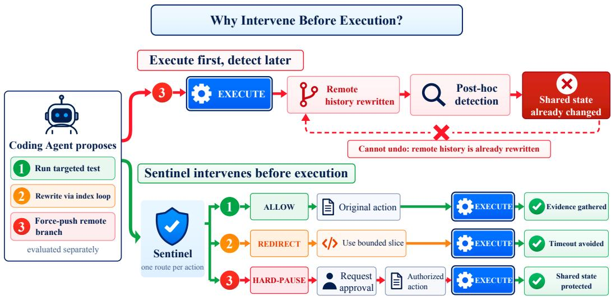
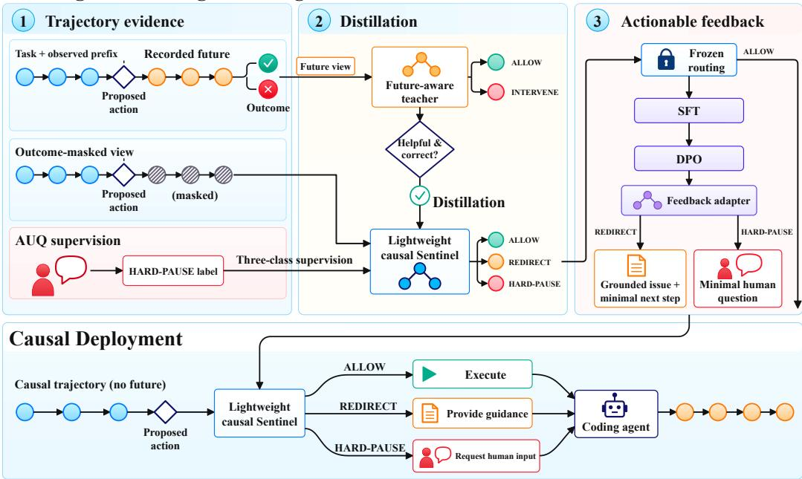
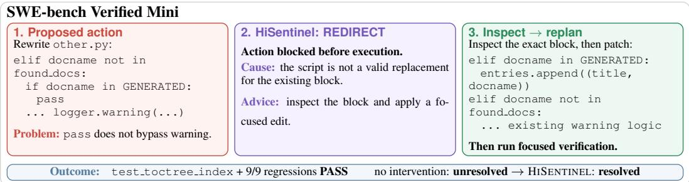

# LEARNING WHEN AND HOW TO INTERVENE: A HINDSIGHT-DISTILLED SENTINEL FOR CODING AGENTS

Jiangrui Zhao1, Chenglong Li2, Meng Zhang3, Xiaoting Du1∗

1Beijing University of Posts and Telecommunications

2Beijing University of Technology 3Meta

## ABSTRACT

Coding agents solve repository-level tasks through sequences of actions, where a single erroneous action can misdirect subsequent decisions and increase recovery costs. Existing approaches use execution feedback for recovery or specialized checks to block errors, but deciding before execution whether intervention will benefit eventual task completion remains challenging. To address this challenge, we propose HISENTINEL, a hindsight-distillation framework that trains lightweight 0.6B and 1.7B sentinels to select pre-execution interventions aimed at improving task completion rather than correcting every imperfect action. A privileged teacher uses recorded execution outcomes as evidence for intervention judgments, which are distilled into a causal student that receives only the pre-action context and proposed action. Beyond identifying whether and when to intervene, the sentinel must also provide actionable feedback that helps the coding agent recover or obtain necessary human input. To support these capabilities, we introduce SWE-INTERVENE, an action-level dataset constructed from software-engineering trajectories that annotates whether an action should be allowed, autonomously redirected, or paused for human assistance, together with corresponding intervention feedback. Across SWE-bench Verified Mini and Ask or Assume, HISENTINEL consistently improves task completion across Sentinel scales and coding-agent families, with gains of up to 14% and 10%, respectively, while maintaining competitive token consumption. These results demonstrate that lightweight pre-execution intervention can effectively prevent error propagation and improve the reliability of autonomous coding agents.

## 1 INTRODUCTION

Large language models now power coding agents that solve repository-level software-engineering tasks by navigating codebases, editing files, executing commands, and running tests (Jimenez et al., 2024; Yang et al., 2024; Wang et al., 2025). Because these agents operate through multi-step interaction loops, a poor action can alter the environment, mislead subsequent decisions, and propagate into failed repairs, redundant exploration, or ultimately task failure (Chen et al., 2025; Majgaonkar et al., 2025; Gandhi et al., 2025). Critically, an early mistake may remain latent for several steps and become apparent only after recovery has become difficult or impossible (Zhao et al., 2026c).

Evidence from Terminal-Bench highlights this gap: among 1,184 failed CLI-agent trajectories, half committed their decisive error by step 7 and became unrecoverable around step 12, while the first observable failure appeared only around step 16; prefix monitoring detected just 3.7–8.7% of failures before lock-in (Merrill et al., 2026; Zhao et al., 2026c). Existing process critics review recent steps and provide periodic corrective feedback (Gandhi et al., 2025), while trajectory diagnosis can locate decisive errors after a run (Wang et al., 2026; Zhang et al., 2026c). Yet feedback may arrive after a harmful action has executed, and retrospective diagnosis cannot prevent it. This leaves open how to judge an action when it is first proposed.

  
Figure 1: Pre-execution intervention for coding agents. The Sentinel evaluates each proposed action before execution and selects ALLOW, REDIRECT, or HARD-PAUSE.

As illustrated in Figure 1, this motivates moving intervention earlier: after the agent proposes an action but before the environment executes it. At this boundary, a Sentinel can prevent a harmful action from changing the environment, rather than attempting to recover from its consequences afterward. We formulate this as a three-way decision among ALLOW, REDIRECT, and HARD-PAUSE: allowing appropriate actions, redirecting errors the agent can correct autonomously, and pausing when progress requires information, authorization, or access available only from a human.

However, moving intervention before execution creates a fundamental information gap. The execution result provides the most direct evidence of whether a proposed action is appropriate, yet this evidence is inherently unavailable at the time of intervention. The Sentinel must therefore anticipate whether an action threatens eventual task completion using only the pre-execution context and the proposed action.

To bridge this gap, we propose HISENTINEL, a hindsight-distilled framework that transfers knowledge available after execution into a model that acts before execution. During training, a privileged teacher observes both the proposed action and its recorded execution result, allowing it to judge the action using evidence of what actually occurred. Its judgments are then distilled into a lightweight causal Sentinel that receives only the pre-execution context and proposed action. At deployment, the Sentinel can therefore intervene without access to future observations while benefiting from supervision informed by execution hindsight.

Beyond deciding whether to intervene, the Sentinel must communicate how the agent should proceed. We therefore optimize feedback generation separately, training the Sentinel to provide concise, evidence-grounded guidance that suggests a minimal correction or requests the specific human input needed to continue.

To train both intervention decisions and feedback, we introduce SWE-INTERVENE, an action-level dataset constructed by selecting decision nodes from natural software-engineering trajectories. Each node preserves the task, complete pre-action context, and exact proposed action, and is annotated as a three-way decision.

We evaluate HISENTINEL at two levels: intervention decisions and feedback quality on frozen indomain tests and external trajectory-diagnosis benchmarks, and end-to-end performance with coding agents on SWE-BENCH VERIFIED MINI and ASK-OR-ASSUME. We measure task completion, unnecessary interventions, and inference overhead (Hobbhahn, 2025; Edwards & Schuster, 2026).

In summary, our contributions are as follows:

• We formulate real-time intervention at the boundary between action proposal and execution as a three-way decision among ALLOW, REDIRECT, and HARD-PAUSE, targeting eventual task completion rather than merely detecting imperfect actions.

• We introduce SWE-INTERVENE, an action-level dataset for learning when and how to intervene in natural software-engineering trajectories.

• We propose HISENTINEL, which distills execution hindsight from a privileged teacher into a lightweight pre-execution Sentinel and trains it to generate concise corrective feedback that guides subsequent agent behavior.

## 2 RELATED WORK

Trajectory-based Agent Analysis. Agent evaluation has evolved from final task success and progress-based metrics in AGENTBOARD (Ma et al., 2024) to trace-level failure attribution and localization in WHO&WHEN and TRAIL (Zhang et al., 2025b; Deshpande et al., 2025). Recent methods further analyze realistic trajectories through learned or structured diagnosis, including AGENTRACER, TRAJAUDIT, FALAT, TRAJDEBUG, and LONGRCA (Zhang et al., 2026a; Ou et al., 2025; Liu et al., 2026; Barke et al., 2026; Wang et al., 2026; Rafi et al., 2026; Shu et al., 2026; Zhao et al., 2026c; Qi et al., 2026; Zhang et al., 2026c). Unlike these primarily diagnostic approaches, HISENTINEL asks whether intervention at the current node has sufficient evidence to improve eventual task completion over autonomous recovery.

Learning with Privileged Information. Learning with privileged information transfers trainingonly evidence from an informed teacher to a restricted student (Vapnik & Izmailov, 2015; Chen et al., 2020; Cai et al., 2024). Recent work extends this paradigm to LLMs: LEAP uses privileged environment states to provide corrective feedback for LLM agents (Choudhury & Sodhi, 2025), while OPSD conditions a self-teacher on verified solutions and π-DISTILL jointly optimizes privileged and unprivileged policies (Zhao et al., 2026b; Penaloza et al., 2026). Related methods exploit futureconditioned, short-context, or trajectory-derived privilege (Fang et al., 2026; Zhang et al., 2026b; Dat et al., 2026; Chen et al., 2026), although privileged context can be harmful when unrealizable from the student view (Kaur et al., 2026; Shrestha & Tessier, 2026). In contrast, HISENTINEL uses realized software-engineering continuations as privileged evidence for intervention utility, rather than supervising task actions or reasoning trajectories.

## 3 SWE-INTERVENE: DATASET CONSTRUCTION

SWE-INTERVENE draws action-level instances from OPEN-SWE-TRACES, SWE-HERO, and SWE-CHAT (Ahmad et al., 2026; Ludwig et al., 2026; Baumann et al., 2026). Using human-defined guidelines, GPT-5.5 (OpenAI, 2026) labels decision points as ALLOW, REDIRECT, or HARD-PAUSE; SWE-CHAT AskUserQuestion (AUQ) interactions supply natural HARD-PAUSE cases. A two-stage human audit rejects 25.3% of intervention candidates. The resulting data comprise 5,680 training and 1,243 held-out test instances (82.0%/18.0%); the test set includes 1,122 natural and 121 AUQ instances. We de-duplicate training data against every downstream benchmark in Section 5.1 using instance identities and normalized task, repository, and trajectory signatures. Appendix A.1 details the sources, audit, and de-duplication.

## 4 HISENTINEL

Figure 2 presents the overall framework of HISENTINEL. During training, a future-aware teacher uses recorded outcomes to provide privileged intervention supervision, which is distilled into a lightweight causal sentinel, while AUQ-derived samples supply supervision for HARD-PAUSE. A separate feedback adapter is optimized to generate actionable guidance or human-assistance requests. At deployment, the sentinel observes only the trajectory prefix and proposed action, and intervenes before execution when necessary.

## 4.1 PROBLEM FORMULATION

We consider a coding agent solving a software-engineering task u through a sequence of actions and environment observations. At step t, the agent has observed a trajectory prefix $h _ { t }$ and proposes an

Training with Privileged Hindsight  
  
Figure 2: Overview of HISENTINEL. Privileged hindsight is used only during training, while the deployed causal sentinel selects an intervention before the proposed action is executed.  
action $a _ { t } .$ Before the action is executed, HISENTINEL evaluates the pre-action context

$$
\boldsymbol { x } _ { t } = ( u , h _ { t } , a _ { t } ) ,\tag{1}
$$

and returns an intervention route $\hat { y } _ { t }$ together with feedback $r _ { t }$ when intervention is required. The route and feedback determine how the coding agent proceeds. Our objective is to intervene when there is sufficient reason to expect an improvement in eventual task completion relative to autonomous continuation, rather than to correct every locally imperfect action.

Table 1: Intervention actions used by HISENTINEL.
<table><tr><td>Action</td><td>Operational definition</td></tr><tr><td>ALLOW</td><td>Execute the proposed action without intervention because there is insufficient evidence that intervening would improve task completion.</td></tr><tr><td>REDIRECT</td><td>Withhold the proposed action and provide corrective feedback, prompting the agent to revise its plan and propose a new action autonomously.</td></tr><tr><td>HARD-PAUSE</td><td>Suspend execution and request missing information, authorization, or preferences from a human before the agent continues.</td></tr></table>

The three routes induce different runtime control flows. Under ALLOW, $\overline { { r _ { t } = \emptyset } }$ and $a _ { t }$ is executed unchanged. Under REDIRECT, $r _ { t }$ provides corrective guidance; the original action is withheld, and the agent proposes a revised action conditioned on the feedback. Under HARD-PAUSE, $r _ { t }$ specifies a question for the human, and execution remains suspended until the answer is returned to the agent.

For training, let $e _ { t }$ denote the retrospective evidence available at a decision point, such as its recorded continuation and task outcome or an observed agent–human interaction. Following the annotation criteria in Section 3, this evidence informs the intervention label

$$
y _ { t } = { \cal A } ( x _ { t } , e _ { t } ) \in \mathcal { V } , \qquad \mathcal { V } = \{ \mathrm { A L L O W , R E D I R E C T , H A R D - P A U S E } \} .\tag{2}
$$

The annotation assesses whether intervention has a concrete reason to help task completion, including whether the agent is already able to recover autonomously. Each logged decision point reveals only its realized continuation, so $y _ { t }$ is a hindsight-informed judgment rather than a measured difference between outcomes under alternative routes. HISENTINEL learns $p _ { \theta } ( y _ { t } \mid x _ { t } )$ ; at deployment, neither $e _ { t }$ nor any subsequent outcome is available.

## 4.2 HINDSIGHT-GUIDED INTERVENTION DISTILLATION

Our goal is to transfer the evidence contained in completed trajectories into a lightweight sentinel that must operate before action execution. We therefore introduce Hindsight-Guided Intervention Distillation (HGID). A privileged teacher observes the future and task outcome, while the causal student receives only the task, trajectory prefix, and proposed action. Distillation is applied only when the future improves the teacher’s prediction over the corresponding outcome-masked view.

Because natural HARD-PAUSE events are scarce, the teacher predicts only ALLOW or INTERVENE. AUQ-derived HARD-PAUSE examples are excluded from teacher training because their suffixes occur after the missing information has already been supplied, but they remain available for threeclass student supervision. To support subsequent feedback generation, we formulate routing as generative classification: the model predicts the route through its native language-modeling head rather than a separate classification head (Raffel et al., 2020; Zhang et al., 2025a; He et al., 2025). The generated route can consequently serve as the prefix for producing corrective guidance or a request for human assistance.

$$
b _ { t } = g ( y _ { t } ) = \left\{ \begin{array} { l l } { \mathrm { A L L O W } , } & { y _ { t } = \mathrm { A L L O W } , } \\ { \mathrm { I N T E R V E N E } , } & { y _ { t } \in \{ \mathrm { R E D I R E C T } , \mathrm { H A R D - P A U S E } \} . } \end{array} \right.\tag{3}
$$

Given the causal input $x _ { t }$ and its recorded future $f _ { t } ,$ , the teacher is optimized by

$$
\mathcal { L } _ { \mathrm { t e a c h e r } } = - \mathbb { E } _ { ( x _ { t } , f _ { t } , b _ { t } ) \sim \mathcal { D } _ { F } } \log p _ { \phi } ( b _ { t } \mid x _ { t } , f _ { t } ) ,\tag{4}
$$

where $\mathcal { D } _ { F }$ contains trajectories with valid future evidence. The student retains the full three-class output space and is trained on the complete dataset, including AUQ-derived examples:

$$
\begin{array} { r } { \mathcal { L } _ { \mathrm { r o u t e } } = - \mathbb { E } _ { ( x _ { t } , y _ { t } ) \sim \mathcal { D } } \log p _ { \theta } ( y _ { t } \mid x _ { t } ) . } \end{array}\tag{5}
$$

Both models express their decisions through the native generative output space, without introducing a separate classification head. To align the binary teacher with the three-class student, we aggregate the student probabilities as

$$
\begin{array} { r } { \bar { p } _ { \theta } ( \mathrm { A L L O W } \mid x _ { t } ) = p _ { \theta } ( \mathrm { A L L O W } \mid x _ { t } ) , \quad \quad \quad } \\ { \bar { p } _ { \theta } ( \mathrm { I N T E R V E N E } \mid x _ { t } ) = p _ { \theta } ( \mathrm { R E D I R E C T } \mid x _ { t } ) + p _ { \theta } ( \mathrm { H A R D - P A U S E } \mid x _ { t } ) . } \end{array}\tag{6}
$$

This decomposition allows the teacher to supervise whether an intervention is warranted, while the three-class labels determine whether that intervention should be autonomous redirection or human assistance.

We use helpfulness gate to further prevent uninformative teacher predictions from dominating student learning. For each valid trajectory, we compare the teacher’s future-aware prediction with a control view in which the privileged outcome is removed. Distillation is enabled only when the future-aware teacher predicts the correct binary label and assigns it a higher probability than the control view:

$$
m _ { t } = \mathbb { I } \left[ \operatorname { a r g m a x } _ { b } p _ { \phi } ( b \mid x _ { t } , f _ { t } ) = b _ { t } \land p _ { \phi } ( b _ { t } \mid x _ { t } , f _ { t } ) > p _ { \phi } ( b _ { t } \mid x _ { t } , \mathcal { O } ) \right] .\tag{7}
$$

The final student objective combines direct three-class supervision with selective future distillation:

$$
\begin{array} { r l } & { \mathcal { L } _ { \mathrm { H G I D } } = \mathcal { L } _ { \mathrm { r o u t e } } } \\ & { ~ + ~ \lambda \mathbb { E } _ { ( x _ { t } , f _ { t } ) \sim \mathcal { D } _ { F } } \left[ m _ { t } \tau ^ { 2 } D _ { \mathrm { K L } } \big ( p _ { \phi } ^ { \tau } ( \cdot \mid x _ { t } , f _ { t } ) \mid \mid \bar { p } _ { \theta } ^ { \tau } ( \cdot \mid x _ { t } ) \big ) \right] , } \end{array}\tag{8}
$$

where $\tau$ is the distillation temperature and λ controls the strength of privileged supervision. After training, the teacher and all future information are removed, leaving a lightweight three-class sentinel that operates solely on the causal pre-action context.

## 4.3 FROM INTERVENTION DECISIONS TO ACTIONABLE FEEDBACK

A route label alone does not specify how the agent should recover. We therefore activate a feedback module after the routing decision. For REDIRECT, it generates a grounded problem description and a minimal actionable suggestion; for HARD-PAUSE, it asks for the missing information, authorization, or preference. ALLOW requires no feedback.

We first perform supervised fine-tuning (SFT) on the annotated feedback in SWE-INTERVENE. Given the causal context $x _ { t }$ , fixed route $y _ { t } .$ , and annotated response $r _ { t } ^ { + }$ , the feedback module is optimized with teacher forcing:

$$
\mathcal { L } _ { \mathrm { S F T } } = - \mathbb { E } \left[ \frac { 1 } { \lvert r _ { t } ^ { + } \rvert } \sum _ { k = 1 } ^ { \lvert r _ { t } ^ { + } \rvert } \log \pi _ { \phi } \left( r _ { t , k } ^ { + } \mid x _ { t } , y _ { t } , r _ { t , < k } ^ { + } \right) \right] .\tag{9}
$$

This stage teaches the basic structure and content of intervention feedback.

Starting from the SFT policy, we further refine feedback quality using DPO (Rafailov et al., 2023) over preferred and rejected responses $( r _ { t } ^ { + } , r _ { t } ^ { - } )$ . Let

$$
\Delta _ { \psi } = \log \frac { \pi _ { \psi } ( r _ { t } ^ { + } \mid x _ { t } , y _ { t } ) } { \pi _ { \mathrm { r e f } } ( r _ { t } ^ { + } \mid x _ { t } , y _ { t } ) } - \log \frac { \pi _ { \psi } ( r _ { t } ^ { - } \mid x _ { t } , y _ { t } ) } { \pi _ { \mathrm { r e f } } ( r _ { t } ^ { - } \mid x _ { t } , y _ { t } ) } ,\tag{10}
$$

where $\pi _ { \mathrm { r e f } }$ is a frozen copy of the SFT policy. We retain an NLL term on the preferred response while optimizing the preference objective:

$$
\mathcal { L } _ { \mathrm { f e e d b a c k } } = \mathcal { L } _ { \mathrm { N L L } } ( r _ { t } ^ { + } ) - \eta \mathbb { E } \left[ \log \sigma ( \beta \Delta _ { \psi } ) \right] .\tag{11}
$$

Both SFT and DPO update only the feedback module. We freeze the routing parameters learned through HGID and condition feedback generation on the fixed predicted route. Consequently, feedback training cannot change whether the sentinel selects ALLOW, REDIRECT, or HARD-PAUSE; it only improves the response produced after an intervention is selected.

## 5 EXPERIMENTS

## 5.1 EXPERIMENTAL SETUP

Models. We use Qwen3-Coder-30B-A3B-Instruct as the privileged teacher and instantiate the lightweight sentinels with Qwen3-0.6B and Qwen3-1.7B (Team, 2025). At deployment, we use MINI-SWE-AGENT (Yang et al., 2024) as the coding-agent harness and evaluate the sentinels with two open-weight coding agents: Qwen3-Coder-30B-A3B-Instruct and Devstral-Small-2-24B-Instruct-2512 (Rastogi et al., 2025). The latter is a comparably sized model specialized for agentic software-engineering tasks, allowing us to evaluate whether the learned intervention policy transfers across coding-agent families. We additionally evaluate Claude-Sonnet-4.6 (Anthropic, 2026) as a closed-source reference to assess transfer to a frontier proprietary coding agent.

Benchmarks. We evaluate HiSentinel on static intervention recognition and end-to-end task completion. For static recognition, SWE-Intervene evaluates three-way action classification among ALLOW, REDIRECT, and HARD-PAUSE; RootSE (Wang et al., 2026) localizes root causes in failed coding trajectories; and the PROGRAM subset of R-Judge (Yuan et al., 2024) classifies programrelated reasoning trajectories as safe or unsafe. For end-to-end evaluation, SWE-bench Verified Mini (Hobbhahn, 2025) is a 50-task subset of SWE-bench Verified (Jimenez et al., 2024) preserving its performance, test-pass-rate, and difficulty distributions, with results closely matching the full benchmark across 16 models. Ask or Assume (Edwards & Schuster, 2026) masks task-critical details to test clarification behavior; we stratify 100 of its 500 tasks by repository and difficulty to approximate the full-set distribution. We cap each task at 30 minutes and 100 agent steps.

Baselines. For static intervention recognition, Step-by-Step makes predictions from the causal prefix by examining actions sequentially. Post-hoc baselines observe the complete trajectory: Allat-Once diagnoses it in a single prompt; AgentRx identifies failures by synthesizing and checking constraints in multi-agent trajectories (Barke et al., 2026); TrajAudit uses an investigator agent with context reduction to locate decisive errors (Wang et al., 2026); and RCTA traces candidate errors through segment summaries, dependencies, and agent handoffs (Zhang et al., 2026c).

Table 3: Results on static intervention-recognition benchmarks. No data from RootSE or R-Judge are used for training. M-F1 and I-F1 denote Macro-F1 and Intervention F1. BAcc denote Balanced accuracy. For RootSE, T@k counts predictions within k steps of the annotated earliest decisive error. Cost denotes the average total number of input and output tokens per trajectory.
<table><tr><td rowspan="3">Backbone</td><td rowspan="3">Method</td><td colspan="3">In-Domain</td><td colspan="6">OOD</td></tr><tr><td colspan="3">SWE-Intervene</td><td colspan="3">RootSE</td><td colspan="3">R-Judge</td></tr><tr><td>M-F1 ↑</td><td>I-F1 ↑</td><td>Cost ↓</td><td>T@0↑</td><td>T@1↑</td><td>Cost↓</td><td>BAcc ↑</td><td>M-F1 ↑</td><td>Cost ↓</td></tr><tr><td rowspan="6">Qwen3-0.6B</td><td>Step-by-Step</td><td>27.23</td><td>21.21</td><td>8.08K</td><td>3.92</td><td>10.78</td><td>0.12M</td><td>60.68</td><td>60.61</td><td>0.58K</td></tr><tr><td>All-at-Once</td><td>28.88</td><td>29.79</td><td>8.08K</td><td>3.92</td><td>6.86</td><td>0.07M</td><td>60.02</td><td>60.77</td><td>0.66K</td></tr><tr><td>TrajAudit</td><td>30.23</td><td>19.13</td><td>10.16K</td><td>0.00</td><td>3.92</td><td>0.10M</td><td>50.66</td><td>34.92</td><td>1.80K</td></tr><tr><td>RCTA</td><td>28.61</td><td>19.75</td><td>11.28K</td><td>2.94</td><td>10.78</td><td>0.03M</td><td>50.00</td><td>32.09</td><td>1.30K</td></tr><tr><td>AgentRx</td><td>25.78</td><td>25.51</td><td>9.16K</td><td>0.98</td><td>7.84</td><td>2.28M</td><td>49.17</td><td>31.72</td><td>3.40K</td></tr><tr><td>HiSentinel (Ours)</td><td>79.99</td><td>75.22</td><td>5.91K</td><td>9.80</td><td>16.67</td><td>0.07M</td><td>65.09</td><td>61.68</td><td>1.71K</td></tr><tr><td rowspan="6">Qwen3-1.7B</td><td>Step-by-Step</td><td>29.10</td><td>36.46</td><td>8.10K</td><td>3.92</td><td>12.75</td><td>0.06M</td><td>52.76</td><td>35.99</td><td>0.37K</td></tr><tr><td>All-at-Once</td><td>27.31</td><td>31.38</td><td>8.10K</td><td>3.92</td><td>10.78</td><td>0.07M</td><td>57.48</td><td>56.04</td><td>0.66K</td></tr><tr><td>TrajAudit</td><td>29.94</td><td>38.42</td><td>10.26K</td><td>2.94</td><td>8.82</td><td>0.10M</td><td>57.48</td><td>55.77</td><td>1.30K</td></tr><tr><td>RCTA</td><td>27.94</td><td>35.89</td><td>11.42K</td><td>2.94</td><td>11.76</td><td>0.04M</td><td>49.61</td><td>36.89</td><td>1.29K</td></tr><tr><td>AgentRx</td><td>27.94</td><td>33.92</td><td>9.23K</td><td>2.94</td><td>12.74</td><td>3.09M</td><td>66.14</td><td>65.60</td><td>3.51K</td></tr><tr><td>HiSentinel (Ours)</td><td>81.77</td><td>78.97</td><td>5.91K</td><td>9.80</td><td>15.69</td><td>0.08M</td><td>66.14</td><td>65.09</td><td>1.24K</td></tr></table>

For end-to-end evaluation, Stepby-Step is a prompt-only baseline that inspects each proposed action before execution. SWE-PRM provides taxonomy-guided corrective feedback every five executed steps (Gandhi et al., 2025), while Steer, Don’t Solve uses an SFT- and DPO-trained critic to provide high-level guidance at the same interval (Gandhi et al., 2026). Because its DPO training data are not publicly available, we directly use the strongest publicly released checkpoint.

## 5.2 EXPERIMENT RESULTS

Static intervention recognition. HISENTINEL substantially outperforms prompt-based and posthoc baselines on the in-domain SWE-INTERVENE test set, while requiring fewer tokens per trajectory. The advantage also transfers to RootSE and R-Judge, neither of which is used for training: HISENTINEL provides the strongest failure-localization results on RootSE and achieves the best or competitive classification

Table 2: End-to-end results. SWE-V Mini denotes SWEbench Verified Mini; SDS denotes STEER, DON’T SOLVE. Res.: resolved (%). Cost: average input and output tokens per trajectory (millions).
<table><tr><td rowspan="2">Agent</td><td rowspan="2">Backbone</td><td rowspan="2">Method</td><td colspan="2">SWE-V Mini</td><td colspan="2">Ask or Assume</td></tr><tr><td>Res. ↑</td><td>Cost↓</td><td>Res. ↑</td><td>Cost↓</td></tr><tr><td rowspan="2">Sonnet- 4.6</td><td></td><td>Base</td><td>60.00</td><td>0.26</td><td>58.00</td><td>0.47</td></tr><tr><td>Qwen3-1.7B</td><td>HISENTINEL</td><td>66.00</td><td>0.41</td><td>61.00</td><td>0.82</td></tr><tr><td rowspan="8">Qwen3- Coder</td><td></td><td>Base</td><td>30.00</td><td>0.29</td><td>23.00</td><td>0.26</td></tr><tr><td></td><td>Reflexion</td><td>34.00</td><td>0.31</td><td>20.00</td><td>0.36</td></tr><tr><td>SDS-4B</td><td>SDS</td><td>28.00</td><td>0.57</td><td>24.00</td><td>0.44</td></tr><tr><td rowspan="3">Qwen3-0.6B</td><td>Step-by-Step</td><td>18.00</td><td>0.12</td><td>20.00</td><td>0.30</td></tr><tr><td>SWE-PRM</td><td>32.00</td><td>0.38</td><td>22.00</td><td>0.32</td></tr><tr><td>HISENTINEL</td><td>36.00</td><td>0.38</td><td>28.00</td><td>0.34</td></tr><tr><td>Step-by-Step</td><td>32.00</td><td>0.45</td><td>21.00</td><td>0.33</td></tr><tr><td rowspan="3">Qwen3-1.7B</td><td>SWE-PRM</td><td>20.00</td><td>0.35</td><td>25.00</td><td>0.36</td></tr><tr><td>HISENTINEL</td><td>44.00</td><td>0.43</td><td>33.00</td><td>0.39</td></tr><tr><td>Base</td><td>20.00</td><td>1.16</td><td>19.00</td><td>1.25</td></tr><tr><td rowspan="2">Devstral</td><td>Reflexion</td><td>24.00</td><td>1.31</td><td>21.00</td><td>1.40</td></tr><tr><td>SDS-4B SDS</td><td>24.00</td><td>1.46</td><td>20.00</td><td>1.53</td></tr><tr><td rowspan="3">Qwen3-0.6B</td><td>Step-by-Step</td><td>18.00</td><td>1.21</td><td>18.00</td><td>1.31</td></tr><tr><td>SWE-PRM</td><td>22.00</td><td>1.28</td><td>21.00</td><td>1.35</td></tr><tr><td>HISENTINEL</td><td>26.00</td><td>1.30</td><td>24.00</td><td>1.39</td></tr><tr><td rowspan="3">Qwen3-1.7B</td><td>Step-by-Step</td><td>22.00</td><td>1.25</td><td>20.00</td><td>1.34</td></tr><tr><td>SWE-PRM</td><td>24.00</td><td>1.30</td><td>22.00</td><td>1.39</td></tr><tr><td>HISENTINEL</td><td>30.00</td><td>1.34</td><td>27.00</td><td>1.44</td></tr></table>

performance on R-Judge. These results show that the learned intervention policy generalizes beyond the annotation distribution used for training.

End-to-end agent performance. More importantly, the improved intervention decisions translate into consistently higher task completion rates. Across Qwen3-Coder, Devstral, and Sonnet-4.6, both HISENTINEL variants improve over the corresponding unassisted agents and competing intervention methods on SWE-bench Verified Mini and Ask or Assume. The largest gains are obtained with the 1.7B model: for Qwen3-Coder, it improves resolution from 30% to 44% on SWE-bench Verified Mini and from 23% to 33% on Ask or Assume. Similar improvements with Devstral and the stronger Sonnet-4.6 agent indicate that HISENTINEL is not tied to a particular coding model. Although monitoring introduces additional token cost, the cost remains comparable to other feedback-based baselines while yielding substantially larger improvements in task completion.

## 5.3 ABLATION STUDY

Table 4: Ablations of HISENTINEL. (a) Routing on SWE-INTERVENE: M-F1/I-F1 denote threeclass/Intervention F1; R-F1/HP-F1 denote class-wise F1. (b) Feedback groundedness (Ground.) and actionability (Action.) pass rates. (c) Resolved rate and cost on SWE-bench Verified Mini. F1, pass rates, and resolved rates are percentages.
<table><tr><td>(a) Intervention routing</td></tr><tr><td>Variant M-F1</td><td>I-F1</td><td>R-F1</td><td>HP-F1</td></tr><tr><td>w/ 3-Class Teacher</td><td>75.53</td><td>74.42</td><td>62.87 80.00</td></tr><tr><td>w/ Classification Head</td><td>66.92</td><td>67.22</td><td>58.91 88.36</td></tr><tr><td>w/o Distillation</td><td>76.42</td><td>73.31 60.30</td><td>86.74</td></tr><tr><td>w/ Causal Teacher</td><td>77.16</td><td>75.08 68.22</td><td>84.63</td></tr><tr><td>w/o Route SFT</td><td>68.91</td><td>61.84</td><td>54.73 84.26</td></tr><tr><td>w/o Helpfulness Gate</td><td>78.72</td><td>77.41</td><td>61.06 91.18</td></tr><tr><td>w/ Self-Distillation</td><td>76.30</td><td>74.46</td><td>61.21 88.67</td></tr><tr><td>w/ Joint Feedback</td><td>78.67</td><td>77.96</td><td>57.30 92.49</td></tr><tr><td>HISENTINEL (Full)</td><td>81.77</td><td>78.97</td><td>66.30 92.90</td></tr></table>

<table><tr><td>(b) Feedback quality Variant</td><td>Ground. Action.</td></tr><tr><td>w/ Joint Feedback 66.9 w/o DPO</td><td>63.2</td></tr><tr><td>69.4 HISENTINEL (Full) 76.8</td><td>65.8 73.5</td></tr><tr><td></td><td></td></tr><tr><td>(c) SWE-bench Verified Mini Variant Resolved↑</td><td>Cost↓</td></tr><tr><td>w/o Distillation</td><td>34.00 0.43</td></tr><tr><td>w/ Causal Teacher 36.00</td><td>0.42</td></tr><tr><td>HISENTINEL (Full) 44.00</td><td>0.43</td></tr></table>

Ablation setup. We ablate HISENTINEL on teacher supervision, routing, and feedback learning. All variants use the 1.7B backbone with the same data and optimization settings. Due to the cost of interactive evaluation, we select two representative routing ablations for the end to end study.

Routing. On SWE-INTERVENE, the full model achieves 81.77 M-F1 and 78.97 I-F1. Ablating distillation, replacing the future-aware teacher with a causal or self-distilled alternative, or removing the helpfulness gate consistently degrades performance, supporting the contribution of each component in HGID. Alternative routing implementations, including a classification head and removing route SFT, lead to substantially larger drops.

Feedback learning. With routing held fixed, the full model reaches 76.8% groundedness and 73.5% actionability. Joint training lowers these rates to 66.9% and 63.2%, while removing DPO yields 69.4% and 65.8%, respectively.

End to end impact. On SWE-bench Verified Mini, removing distillation and using a causal teacher reduce resolution from 44% to 34% and 36%, despite their smaller gaps in static F1 and nearly identical token costs. Both variants make fewer false alarms but also miss more necessary interventions. A coding agent can sometimes recognize a low-risk false alarm and continue productively; when an intervention is missed, the flawed action proceeds. This asymmetry makes intervention recall especially consequential during execution.

## 5.4 ANALYSIS

## 5.4.1 DOES HISENTINEL BENEFIT FROM PRECISE OR FREQUENT INTERVENTION?

Effective oversight depends on intervening well, not often: mistimed feedback can derail an otherwise successful trajectory. We judge each intervention solely from the task, proposed action, and pre-intervention trajectory, since even rare stochastic continuations could make poor guidance appear successful; final rescues and regressions are reported separately. On SWE-BENCH VERIFIED MINI, 109 of HISENTINEL’s 242 interventions (45.0%) are beneficial, 106 neutral, and 27 harmful; eight rescues and one regression raise the resolved count from 15/50 to 22/50. STEP-BY-STEP has one beneficial intervention among 24 (4.2%) and one rescue without regression; SWE-PRM has three among 284 (1.1%), one rescue, and six regressions. Thus, HISENTINEL’s gains reflect intervention quality rather than frequency.

## 5.4.2 WHY WE RECOMPUTE THE CAUSAL PREFIX

Since each monitoring input largely extends the preceding causal prefix by one step, cross-step KV reuse appears to be a natural optimization. We evaluate per-task BF16 exact-prefix caching for the 1.7B HISENTINEL, but do not adopt it in the final system. In the cached run, untruncated calls reuse 86.4% of their input tokens; however, 906/1,869 calls require left truncation, for which reuse falls to 3.2%, limiting the token-weighted overall reuse ratio to 29.8%. Compared with full-prefix recomputation, the observed mean number of processed Sentinel tokens decreases only from 382K to 299K per task (22%), while mean end-to-end time remains similar (757 s vs. 763 s). A matched audit of 896 token-identical routing calls further identifies 13 routing flips and three effective-intervention flips. On SWE-BENCH VERIFIED MINI, these differences reduce resolution from 22/50 with full recomputation to 18/50 with cross-step caching. We therefore recompute the complete causal prefix at every monitoring step, while retaining ordinary within-generation KV caching.

## 5.4.3 CASE STUDY: REDIRECTING AN INEFFECTIVE PATCH

Figure 3 shows a representative REDIRECT episode from the 1.7B HISENTINEL run on sphinx-doc sphinx-10673. The task requires Sphinx to suppress missing-document warnings for documents generated by extensions while preserving the warnings for genuinely missing documents. The coding agent attempted to implement this behavior with a nested branch containing an empty pass, which still allowed execution to reach the existing warning logic. HISENTINEL blocked the edit and requested a focused, evidence-grounded correction. The agent then inspected the relevant block and moved the generated-document check before the missing-document branch. The resulting run passed test toctree index and all nine regression tests, whereas the paired no-intervention run remained unresolved. This episode illustrates how a REDIRECT steers the agen toward a concrete corrective action rather than merely providing a post-hoc warning.

  
Figure 3: A representative causal intervention. The displayed REDIRECT is one local episode in the trajectory; the final resolved/unresolved labels are produced by the official SWE-bench evaluator.

## 6 CONCLUSION

We introduced HISENTINEL, a pre-execution intervention framework that distills outcome-aware judgments from a privileged teacher into a lightweight causal Sentinel. Seeing only the observed trajectory and proposed action, it chooses among ALLOW, REDIRECT, and HARD-PAUSE, and provides actionable feedback when intervention is needed. We also introduced SWE-INTERVENE to study these decisions on natural coding trajectories. The 1.7B model achieves 81.77 macro-F1 and 78.97 intervention F1 on this benchmark and transfers to RootSE and R-Judge. In end-to-end evaluation with Qwen3-Coder, it improves resolution from 30% to 44% on SWE-bench Verified Mini and from 23% to 33% on Ask or Assume, with gains also observed for Devstral and Sonnet-4.6. These results show that hindsight supervision can improve coding agents through timely, useful intervention.

## AI USE STATEMENT

Generative AI tools were used in this work to assist with language editing, the preparation and refinement of figures and tables, data annotation, and evaluation as LLM judges. All AI-assisted materials and annotations were reviewed and verified by the authors to ensure accuracy and faithful representation of the research. These tools were not used to independently produce experimental results, conduct scientific analyses, or formulate research conclusions. The authors retain full responsibility for all content presented in this paper.

## REFERENCES

Wasi Uddin Ahmad, Nikolai Ludwig, Somshubra Majumdar, and Boris Ginsburg. Open-swe-traces: Advancing dual-mode multilingual distillation for software engineering agents. arXiv preprint arXiv:2606.16038, 2026.

Anthropic. Claude sonnet 4.6. Anthropic, 2026. URL https://www.anthropic.com/ claude/sonnet. Accessed: 2026-09-20.

Shraddha Barke, Arnav Goyal, Alind Khare, Avaljot Singh, Suman Nath, and Chetan Bansal. Agentrx: Diagnosing ai agent failures from execution trajectories. arXiv preprint arXiv:2602.02475, 2026.

Joachim Baumann, Vishakh Padmakumar, Xiang Li, John Yang, Diyi Yang, and Sanmi Koyejo. Swe-chat: Coding agent interactions from real users in the wild. arXiv preprint arXiv:2604.20779, 2026.

Yang Cai, Xiangyu Liu, Argyris Oikonomou, and Kaiqing Zhang. Provable partially observable reinforcement learning with privileged information. Advances in Neural Information Processing Systems, 37:63790–63857, 2024.

Dian Chen, Brady Zhou, Vladlen Koltun, and Philipp Krahenb¨ uhl. Learning by cheating. In¨ Conference on robot learning, pp. 66–75. PMLR, 2020.

Yutong Chen, Guangfu Guo, Zhichao Xu, and Kunpeng Liu. Dualopsd: Adaptive privileged teachers for on-policy self-distillation. arXiv preprint arXiv:2608.26019, 2026.

Zhi Chen, Wei Ma, and Lingxiao Jiang. Beyond final code: A process-oriented error analysis of software development agents in real-world github scenarios. arXiv preprint arXiv:2503.12374, 2025.

Sanjiban Choudhury and Paloma Sodhi. Better than your teacher: Llm agents that learn from privileged ai feedback. In International Conference on Learning Representations, volume 2025, pp. 10457–10493, 2025.

Phuong Tuan Dat, Qi Li, and Xinchao Wang. dopsd: On-policy self-distillation for diffusion language models. arXiv preprint arXiv:2607.04428, 2026.

Darshan Deshpande, Varun Gangal, Hersh Mehta, Jitin Krishnan, Anand Kannappan, and Rebecca Qian. Trail: Trace reasoning and agentic issue localization. arXiv preprint arXiv:2505.08638, 2025.

Nicholas Edwards and Sebastian Schuster. Ask or assume? uncertainty-aware clarification-seeking in coding agents. arXiv preprint arXiv:2603.26233, 2026.

Pengcheng Fang, Hongli Chen, and Xiaohao Cai. Privileged foresight distillation: Zero-cost future correction for world action models. arXiv preprint arXiv:2604.25859, 2026.

Yujian Gan, Changling Li, Jinxia Xie, Luou Wen, Matthew Purver, and Massimo Poesio. Clarq4llm: A benchmark for models clarifying and requesting information in task-oriented dialog. IEEE Transactions on Audio, Speech and Language Processing, 2026.

Shubham Gandhi, Jason Tsay, Jatin Ganhotra, Kiran Kate, and Yara Rizk. When agents go astray: Course-correcting swe agents with prms. arXiv preprint arXiv:2509.02360, 2025.

Shubham Gandhi, Yiqing Xie, Atharva Naik, Ruichen Zhu, and Carolyn Rose. Steer, don’t solve: Training small critic models for large code agents. arXiv preprint arXiv:2606.21811, 2026.

Mingqian He, Fei Zhao, Chonggang Lu, Ziyan Liu, Yue Wang, and Haofu Qian. Gencls++: Pushing the boundaries of generative classification in llms through comprehensive sft and rl studies across diverse datasets. arXiv preprint arXiv:2504.19898, 2025.

Marius Hobbhahn. SWE-bench Verified Mini. https://github.com/mariushobbhahn/ SWEBench-verified-mini, 2025. GitHub repository, accessed September 18, 2026.

Carlos E Jimenez, John Yang, Alexander Wettig, Shunyu Yao, Kexin Pei, Ofir Press, and Karthik Narasimhan. Swe-bench: Can language models resolve real-world github issues? In International Conference on Learning Representations, volume 2024, pp. 54107–54157, 2024.

Simran Kaur, Narutatsu Ri, Yinghui He, Liam Fowl, and Sanjeev Arora. Rethinking on-policy self-distillation for thinking models. arXiv preprint arXiv:2607.05184, 2026.

Belinda Li, Been Kim, and Zi Wang. Questbench: Can llms ask the right question to acquire information in reasoning tasks? Advances in Neural Information Processing Systems, 38, 2026.

Shuyang Liu, Yang Chen, Rahul Krishna, Saurabh Sinha, Jatin Ganhotra, and Reyhaneh Jabbarvand. Process-centric analysis of agentic software systems. Proceedings of the ACM on Programming Languages, 10(OOPSLA1):1961–1988, 2026.

Jiarui Lu, Thomas Holleis, Yizhe Zhang, Bernhard Aumayer, Feng Nan, Haoping Bai, Shuang Ma, Shen Ma, Mengyu Li, Guoli Yin, et al. Toolsandbox: A stateful, conversational, interactive evaluation benchmark for llm tool use capabilities. In Findings of the Association for Computational Linguistics: NAACL 2025, pp. 1160–1183, 2025.

Nikolai Ludwig, Wasi Uddin Ahmad, Somshubra Majumdar, and Boris Ginsburg. From swe-zero to swe-hero: Execution-free to execution-based fine-tuning for software engineering agents. arXiv preprint arXiv:2604.01496, 2026.

Chang Ma, Junlei Zhang, Zhihao Zhu, Cheng Yang, Yujiu Yang, Yaohui Jin, Zhenzhong Lan, Lingpeng Kong, and Junxian He. Agentboard: An analytical evaluation board of multi-turn llm agents. Advances in neural information processing systems, 37:74325–74362, 2024.

Oorja Majgaonkar, Zhiwei Fei, Xiang Li, Federica Sarro, and He Ye. Understanding code agent behaviour: An empirical study of success and failure trajectories. arXiv preprint arXiv:2511.00197, 2025.

Mike Merrill, Alexander Shaw, Nicholas Carlini, Boxuan Li, Harsh Raj, Ivan Bercovich, Lin Shi, Jeong Shin, Thomas Walshe, E Kelly Buchanan, et al. Terminal-bench: Benchmarking agents on hard, realistic tasks in command line interfaces. In International Conference on Learning Representations, volume 2026, pp. 40903–40986, 2026.

OpenAI. GPT-5.5 System Card. https://openai.com/index/ gpt-5-5-system-card/, April 2026.

Tianyue Ou, Wanyao Guo, Apurva Gandhi, Graham Neubig, and Xiang Yue. Agentdiagnose: An open toolkit for diagnosing llm agent trajectories. In Proceedings of the 2025 Conference on Empirical Methods in Natural Language Processing: System Demonstrations, pp. 207–215, 2025.

Emiliano Penaloza, Dheeraj Vattikonda, Nicolas Gontier, Alexandre Lacoste, Laurent Charlin, and Massimo Caccia. Privileged information distillation for language models. arXiv preprint arXiv:2602.04942, 2026.

Yunjia Qi, Zehua Yin, Xintong Shi, Hao Peng, Songyuanyi Lu, Yixian Liu, Richeng Xuan, Yuhong Liu, Zhichao Hu, Xiaozhi Wang, et al. Trajdebug: Tracing error lifecycle to identify critical failures in long-horizon agent trajectories. arXiv preprint arXiv:2608.06346, 2026.

Rafael Rafailov, Archit Sharma, Eric Mitchell, Christopher D Manning, Stefano Ermon, and Chelsea Finn. Direct preference optimization: Your language model is secretly a reward model. Advances in neural information processing systems, 36:53728–53741, 2023.

Colin Raffel, Noam Shazeer, Adam Roberts, Katherine Lee, Sharan Narang, Michael Matena, Yanqi Zhou, Wei Li, and Peter J Liu. Exploring the limits of transfer learning with a unified text-to-text transformer. Journal ofmachine learning research, 21(140):1–67, 2020.

Md Nakhla Rafi, Md Ahasanuzzaman, Dong Jae Kim, Zhijie Wang, and Tse-Hsun Chen. Falat: Tracing failures in llm agent trajectories via dependency-guided search. arXiv preprint arXiv:2606.00765, 2026.

Abhinav Rastogi, Adam Yang, Albert Q Jiang, Alexander H Liu, Alexandre Sablayrolles, Amelie´ Heliou, Am ´ elie Martin, Anmol Agarwal, Andy Ehrenberg, Andy Lo, et al. Devstral: Fine-tuning ´ language models for coding agent applications. arXiv preprint arXiv:2509.25193, 2025.

Samyak Shrestha and Alexander Tessier. Rethinking privileged information in on-policy selfdistillation. arXiv preprint arXiv:2608.18271, 2026.

Rui Shu, Chun Yong Chong, Xin Zhou, Yun Peng, Zihan Wu, Xu Han, Zeyang Zhuang, Guowen Yuan, and Yuan Wang. What resolve rate hides: Trajectory structure diagnostics for coding agents. arXiv preprint arXiv:2607.06184, 2026.

Qwen Team. Qwen3 technical report, 2025. URL https://arxiv.org/abs/2505.09388.

Vladimir Vapnik and Rauf Izmailov. Learning using privileged information: similarity control and knowledge transfer. The Journal ofMachine Learning Research, 16(1):2023–2049, 2015.

Minxing Wang, Xiaofei Xie, and Yintong Huo. Trajaudit: Automated failure diagnosis for agentic coding systems. arXiv preprint arXiv:2605.26563, 2026.

Xingyao Wang, Boxuan Li, Yufan Song, Frank F Xu, Xiangru Tang, Mingchen Zhuge, Jiayi Pan, Yueqi Song, Bowen Li, Jaskirat Singh, et al. Openhands: An open platform for ai software developers as generalist agents. In International Conference on Learning Representations, volume 2025, pp. 65882–65919, 2025.

John Yang, Carlos Jimenez, Alexander Wettig, Kilian Lieret, Shunyu Yao, Karthik Narasimhan, and Ofir Press. Swe-agent: Agent-computer interfaces enable automated software engineering. Advances in Neural Information Processing Systems, 37:50528–50652, 2024.

Tongxin Yuan, Zhiwei He, Lingzhong Dong, Yiming Wang, Ruijie Zhao, Tian Xia, Lizhen Xu, Binglin Zhou, Fangqi Li, Zhuosheng Zhang, et al. R-judge: Benchmarking safety risk awareness for llm agents. In Findings of the Association for Computational Linguistics: EMNLP 2024, pp. 1467–1490, 2024.

Guibin Zhang, Junhao Wang, Junjie Chen, Wangchunshu Zhou, Kun Wang, and Shuicheng Yan. Agentracer: Who is inducing failure in the llm agentic systems? In International Conference on Learning Representations, volume 2026, pp. 11377–11399, 2026a.

Lunjun Zhang, Arian Hosseini, Hritik Bansal, Seyed Mehran Kazemi, Aviral Kumar, and Rishabh Agarwal. Generative verifiers: Reward modeling as next-token prediction. In International Conference on Learning Representations, volume 2025, pp. 12476–12505, 2025a.

Shaokun Zhang, Ming Yin, Jieyu Zhang, Jiale Liu, Zhiguang Han, Jingyang Zhang, Beibin Li, Chi Wang, Huazheng Wang, Yiran Chen, et al. Which agent causes task failures and when? on automated failure attribution of llm multi-agent systems. arXiv preprint arXiv:2505.00212, 2025b.

Xinsen Zhang, Zhenkai Ding, Tianjun Pan, Run Yang, Chun Kang, Xue Xiong, and Jingnan Gu. Opsdl: On-policy self-distillation for long-context language models. arXiv preprint arXiv:2604.17535, 2026b.

Yunfei Zhang, Boyu Feng, Changhua Pei, Zexin Wang, Zhihuang Peng, Xinlong Liu, Hengyue Jiang, Difeng Ma, Jiayi Zhang, Yongzhou Yao, et al. Longrca bench: Diagnosing responsible roles and root causes in long-horizon agent failures. arXiv preprint arXiv:2608.15242, 2026c.

Jiale Zhao, Ke Fang, and Lu Cheng. When and what to ask: Askbench and rubric-guided rlvr for llm clarification. In Findings of the Association for Computational Linguistics: ACL 2026, pp. 17120–17140, 2026a.

Siyan Zhao, Zhihui Xie, Mengchen Liu, Jing Huang, Guan Pang, Feiyu Chen, and Aditya Grover. Self-distilled reasoner: On-policy self-distillation for large language models. arXiv preprint arXiv:2601.18734, 2026b.

Xiangxin Zhao, Han Li, Shuaiting Li, Tianyi Zhao, Earl T Barr, Federica Sarro, and He Ye. Failure as a process: An anatomy of cli coding agent trajectories. arXiv preprint arXiv:2607.09510, 2026c.

## A APPENDIX

## A.1 SWE-INTERVENE: CONSTRUCTION AND QUALITY AUDIT

## A.1.1 DATA SOURCES AND INSTANCE CONSTRUCTION

SWE-INTERVENE is constructed from three complementary sources of software-engineering agent trajectories. OPEN-SWE-TRACES (Ahmad et al., 2026) provides repository-level trajectories generated by coding agents, while SWE-HERO (Ludwig et al., 2026) contributes trajectories containing diverse development and debugging behaviors. We further use SWE-CHAT (Baumann et al., 2026), which contains naturally occurring interactions between coding agents and developers. The resulting dataset contains 6,923 action-level instances, as summarized in Table 5.

Table 5: Composition of SWE-INTERVENE.
<table><tr><td colspan="2">Source Instances</td><td>Proportion</td></tr><tr><td>OPEN-SWE-TRACES</td><td>3,451</td><td>49.85%</td></tr><tr><td>SWE-HERO</td><td>1,089</td><td>15.73%</td></tr><tr><td>SWE-CHAT</td><td>2,383</td><td>34.42%</td></tr><tr><td>Total</td><td>6,923</td><td>100%</td></tr></table>

The unit of annotation is a decision point immediately before the execution of a proposed action. Each instance contains the task description u, the relevant trajectory prefix $h _ { t } ,$ the complete proposed action ${ \boldsymbol { a } } _ { t } ,$ and an intervention label $y _ { t }$ . The recorded continuation and task outcome are retained as privileged evidence for annotation and teacher training, but are excluded from the causal input available to the deployed sentinel.

Rather than labeling every step uniformly, we prioritize decision-critical nodes. In failed trajectories, these include points at which an error begins to propagate, the agent overlooks decisive evidence, or intervention could prevent an incorrect completion claim. We also retain ALLOW instances in which the agent is making reasonable progress, including imperfect actions from which it is already recovering autonomously. This distinction prevents the dataset from reducing intervention detection to local error detection.

## A.1.2 ANNOTATION PROTOCOL

GPT-5.5 (OpenAI, 2026) assigns one of the three labels defined in Section 4.1, following criteria and annotation guidelines written by human researchers. The annotator is shown the task, relevant history, complete proposed action, and recorded continuation. It is explicitly instructed to judge whether intervention at the current node would improve the probability of eventual task completion relative to allowing the agent to continue, rather than whether the action could merely be made more standardized or efficient.

For every candidate intervention, the annotation process considers three questions:

1. Does the identified problem materially threaten task completion, rather than merely reflect an imperfect or nonstandard operation?

2. Has the agent already recognized the problem and begun a reasonable recovery process?

3. What concrete loss would an intervention prevent, or what current obstacle would it remove, compared with autonomous continuation?

A node is labeled REDIRECT only when there is concrete evidence that the proposed action may impede task completion and corrective guidance can enable autonomous recovery. A node is labeled HARD-PAUSE when progress depends on task-specific information, authorization, or preferences unavailable to the agent. Otherwise, including cases in which the agent is already correcting its own mistake, the node is labeled ALLOW.

## A.1.3 RECONSTRUCTING NATURAL HARD-PAUSE INSTANCES

Naturally occurring HARD-PAUSE events are rare in standard coding-agent trajectories. We therefore extract additional examples from SWE-CHAT interactions containing AskUserQuestion (AUQ) calls. These interactions provide direct evidence that the agent encountered information, authorization, or a user preference that it could not infer autonomously.

For each retained AUQ interaction, we reconstruct the decision point immediately before the question is issued. The current AUQ call and its corresponding human response are removed from the causal input, so the sentinel must infer the need for assistance solely from information available at that decision point. Earlier AUQ exchanges may remain in the history only when they occurred strictly before the reconstructed decision point; their responses are therefore part of the legitimately observed state rather than privileged future information. Multiple valid HARD-PAUSE nodes may be extracted from one trajectory, but all nodes from the same trajectory are assigned to the same data split. We perform splitting and de-duplication at the trajectory level, yielding zero trajectory overlap between training and held-out evaluation data.

We retain only AUQ cases in which the requested information is necessary for current progress. Questions that are optional, premature, already answered by the task context, or unrelated to a present obstacle are excluded. Because the suffix following an AUQ call is conditioned on the human response, reconstructed AUQ instances provide only causal three-class supervision for the student and are never used to construct privileged-future targets for the teacher.

## A.1.4 TWO-STAGE QUALITY AUDIT

We conduct a two-stage human audit focused on provisional REDIRECT and HARD-PAUSE instances, since unnecessary intervention can disrupt an otherwise successful trajectory. In the first stage, reviewers inspect the complete task context, proposed action, existing label, and recorded continuation using the three criteria above. The original annotation is retained when it is well supported; revision is required only when the trajectory provides clear evidence that the intervention is unnecessary or temporally misplaced.

The second stage independently cross-checks proposed removals and ambiguous cases. Particular attention is paid to nodes involving superficially suspicious operations, such as commands that obscure exit codes, repeated searches, or repeated builds. Such patterns are not treated as interventionworthy by themselves: they are retained only when the surrounding task state establishes a concrete threat to completion. Semantic judgments are made from the trajectory content; automatic scripts are used only for deterministic extraction and schema validation, not for assigning or revising labels.

Among 2,252 provisional intervention candidates, the audit removes 570 instances that lack sufficient evidence for intervention, corresponding to a rejection rate of 25.3%. The remaining 1,682 candidates exhibit a concrete completion-relevant failure risk or an obstacle that cannot be resolved without external assistance.

The most common rejection cases involve locally imperfect but recoverable actions, problems that the agent has already recognized and is actively addressing, and HARD-PAUSE labels placed before external information is actually required. This audit aligns the dataset with the central objective of HISENTINEL: intervening when doing so is likely to improve final task completion, rather than correcting every detectable imperfection.

Table 6: Results of the intervention-candidate audit.
<table><tr><td>Audit outcome</td><td>Instances</td></tr><tr><td>Provisional intervention candidates</td><td>2,252</td></tr><tr><td>Retained after audit</td><td>1,682</td></tr><tr><td>Rejected after audit</td><td>570</td></tr><tr><td>Rejection rate</td><td>25.3%</td></tr></table>

## A.2 TRAINING DETAILS.

We use the same training hyperparameters for the 0.6B and 1.7B HISENTINEL models unless otherwise specified. Training consists of causal routing supervision with future-view distillation, feedback SFT, and feedback preference optimization. The routing model is kept fixed during feedback optimization. Table 7 summarizes the complete configuration.

## A.3 EVALUATION-TIME HARD-PAUSE PROTOCOL

Following the evaluation design of ASK-OR-ASSUME and established protocols for agents operating under missing or underspecified information, including ASKBENCH, CLARQ-LLM, TOOLSAND-BOX, and QUESTBENCH (Edwards & Schuster, 2026; Zhao et al., 2026a; Gan et al., 2026; Lu et al., 2025; Li et al., 2026), we implement HARD-PAUSE as a controlled interaction with a proxy user rather than granting the evaluated agent direct access to the complete task specification. The evaluated agent initially observes only the underspecified task input. When the sentinel emits HARD-PAUSE, execution is suspended and the agent’s clarification question is forwarded to a proxy-user API.

Each proxy-user request contains only three components: a fixed role instruction defining the information boundary, the agent’s exact clarification question, and the withheld complete task specification as private evidence available exclusively to the proxy user. The proxy API is not given the reference solution or patch, hidden tests, verifier outputs, evaluation labels, sentinel route or risk score, future trajectory, or any other indication of the action expected from the evaluated agent. Consequently, the complete specification cannot enter the agent context except through an admissible answer to a clarification question.

The proxy user is instructed to return only the minimum information that directly answers the submitted question and is explicitly supported by the withheld specification. It must not provide chain-of-thought reasoning, implementation advice, code, patches, test outcomes, unsolicited requirements, additional hints, or information merely inferred from the intended solution. If the requested information is not present in the withheld specification, the proxy must abstain rather than speculate. This knowledge-boundary restriction follows the general provider-agent practice used in missing-information benchmarks, in which the simulated user possesses private task facts but is prevented from revealing a complete solution.

The resulting clarification is inserted verbatim into the interaction as the user’s response, after which execution resumes from the paused state. Each admitted HARD-PAUSE produces at most one proxyuser response and remains subject to the same fixed intervention budget and cooldown used throughout evaluation. We log every query and response for auditing. Proxy-user latency and token usage are reported separately and are excluded from the evaluated model’s inference cost, while the wallclock task time includes the complete interaction.

The same proxy-user API is available to every baseline in all end-to-end benchmarks, under the information boundary and response restrictions described above. Baselines may request clarification when they determine that human input is needed; access to the API is not exclusive to HISENTINEL. In our runs, the other baselines rarely invoked it, consistent with their lack of training to recognize missing information and initiate clarification.

Table 7: Training hyperparameters of HISENTINEL. The settings are shared by the Qwen3-0.6B and Qwen3-1.7B variants. The feedback learning rate decays to its floor after the first epoch.  
Hyperparameter Value   
General configuration   
Backbones Qwen3-0.6B and Qwen3-1.7B   
Future-view teacher Frozen Qwen3-Coder-30B-A3B-Instruct   
Numerical precision BF16   
Optimizer $\mathrm { A d a m W } , \beta _ { 1 } = 0 . 9 , \beta _ { 2 } = 0 . 9 5$   
Weight decay 0.01   
Gradient clipping 1.0   
LoRA configuration Rank $3 2 , \alpha = 6 4 ,$ dropout = 0.05   
LoRA target modules q proj, k proj, v proj, and o proj   
Maximum causal input length 16,384 tokens   
Causal routing andfuture-view distillation   
Training records 5,680   
Epochs / optimizer steps 2 / 710   
Effective batch size 16   
Epoch seeds 42 and 43   
Learning rate $5 \times 1 0 ^ { - 5 }$   
LR schedule 12-step linear warmup followed by cosine decay   
Routing objective Three-class route-token CE over ALLOW, REDIRECT, and HARD-  
PAUSE   
Class-prior adjustment τ = 0.85   
Distillation objective Two-view future-to-causal binary-logit distillation   
KD temperature / maximum weight $T = 2 . 0 / \lambda _ { \mathrm { m a x } } = 0 . 2 5$   
KD-weight warmup 20 optimizer steps   
Feedback supervised fine-tuning   
Training records 1,345   
Epochs / optimizer steps 5 / 425   
Batch size 16   
Epoch seeds 42, 43, 44, 45, and 46   
Learning rate $1 \times 1 0 ^ { - 4 } .$ decayed to a floor of $1 \times 1 0 ^ { - 5 }$   
LR schedule 5-step linear warmup followed by cosine decay   
Objective Mean next-token CE over feedback tokens and EOS   
Route-token loss None; routing parameters remain fixed   
Feedback preference optimization   
Training pairs 800   
Optimizer steps / maximum batch size 50 / 16 pairs   
Random seed 42   
Learning rate $5 \times 1 0 ^ { - 6 }$   
LR schedule 5-step linear warmup followed by cosine decay   
DPO coefficient β = 0.1   
Loss weights Preferred-response NLL = 1.0; DPO loss = 1.0   
Reference policy Frozen feedback-SFT checkpoint   
Dropout Disabled during preference optimization