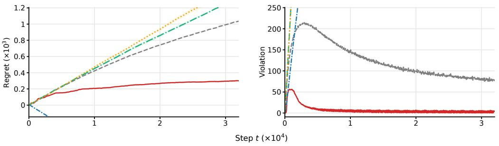
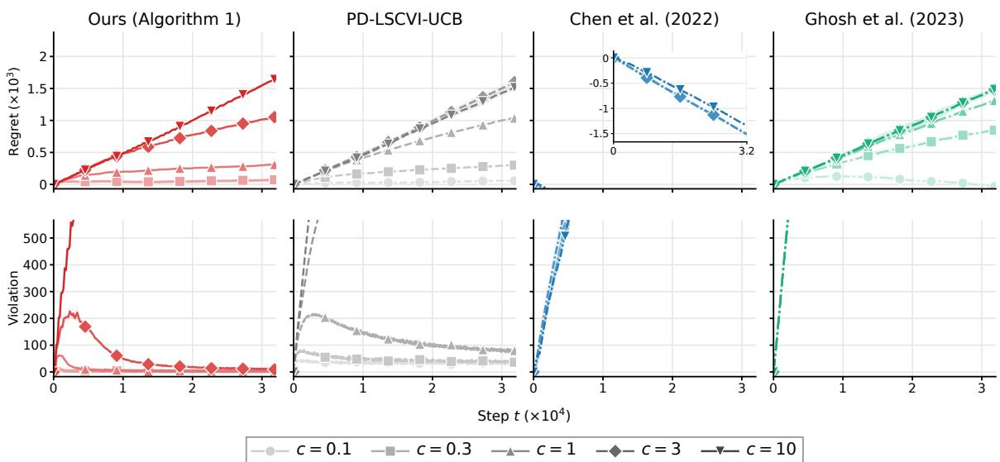

# Learning Infinite-Horizon Average-Reward CMDPs via State Augmentation

Kihyun Yu1,⋆ Seoungbin Bae1,⋆ Dabeen Lee2

1 KAIST 2 Seoul National University {khyu99, sbbae31}@kaist.ac.kr, dabeenl@snu.ac.kr

## Abstract

We study infinite-horizon average-reward constrained Markov decision processes (CMDPs) under the weakly communicating assumption. Existing high-probabilit guarantees for this setting either require computationally ineficient algorithms or have suboptimal dependence on the number of interactions T. We propose, to the best of our knowledge, the first computationally eficient algorithm that achieves Oe(√T) regret and cumulative constraint violation with high probability in the tabular setting. The √T dependence is optimal up to logarithmic fac- tors. Our approach incorporates cumulative constraint violation into the state and defines a reshaped reward through diferences of a Huber potential. The added state determines the penalty on further violations while the reward function remains fixed on the augmented state space. Since the added state has known deterministic dynamics, only the original transition kernel needs to be estimated. The bounded slope of the Huber potential keeps the per-step reward bounded, and the potential diferences telescope to relate the reshaped return to the original cumulative reward and the terminal potential. These properties allow us to apply finite-horizon approximation and optimistic value iteration with clipping, as used in unconstrained average-reward MDPs, without worsening the regret rate in T.

## 1 Introduction

In reinforcement learning (RL), actions that improve task performance may also increase resource consumption or the risk of undesirable outcomes (Garc´ıa and Fern´andez, 2015). For example, a robotic controller must account for safety costs while learning to perform its task (Achiam et al., 2017). Constrained Markov decision processes (CMDPs) model these requirements by maximizing expected reward subject to prescribed bounds on expected costs (Altman, 2021). When the transition dynamics are unknown, the learner must acquire information about the efects of its actions on both reward and constraint satisfaction. Its performance is therefore measured by regret relative to an optimal feasible policy and by the constraint violation accumulated during learning.

Learning in CMDPs has been studied extensively in the finite-horizon (Efroni et al., 2020; Qiu et al., 2020; Liu et al., 2021; M¨uller et al., 2024) and discounted settings (Chen et al., 2021b; Xu et al., 2021; Ding et al., 2023). The infinite-horizon average-reward setting remains less understood, although it directly describes continuing tasks whose performance is evaluated over long periods (Mahadevan, 1996; Sutton and Barto, 2018). In this setting, the agent interacts with the environment without resets, and both reward and constraint costs are evaluated through their long-run averages. For example, wireless transmission control can be formulated as minimizing average power consumption subject to a bound on average delay (Djonin and Krishnamurthy, 2007). The average-reward formulation captures these requirements without choosing a terminal horizon or a discount factor. This distinction also matters for feasibility: a bound on discounted cost need not enforce the corresponding bound on long-run average cost (Agnihotri et al., 2024).

We consider weakly communicating CMDPs, which allow stationary policies with multiple recurrent classes and are more general than ergodic and unichain CMDPs (Puterman, 1994). Learning in this setting inherits the dificulty of controlling bias spans in average-reward MDPs, since transition estimation errors depend on the variation of value functions across states. Algorithms for average-reward MDPs address this dificulty through span regularization or constraints (Bartlett and Tewari, 2009; Fruit et al., 2018), or through value function clipping (Hong et al., 2025).

Constraints on average costs, however, introduce further obstacles, making the analysis of weakly communicating CMDPs more challenging. An optimal constrained policy need not be greedy with respect to its reward action-value function, because a greedy policy may violate the constraint (Ghosh et al., 2023). Consequently, the Bellman optimality arguments used to control spans in unconstrained optimistic planning do not carry over directly (Chen et al., 2022). A common approach is to incorporate the constraint into the reward through a dual multiplier. However, updating this multiplier changes the reward used for planning and hence the value functions. Controlling this additional variation complicates the analysis of existing primal-dual algorithms (Ghosh et al., 2023; Yu et al., 2026). For example, in the finite-horizon approximation of Yu et al. (2026), updating the multiplier once per episode of length H yields a dual-regret bound of order HT after balancing the step-size terms. This term exceeds order $\sqrt { T }$ when H grows with T; see Appendix F.

In fact, existing results for weakly communicating CMDPs either require computationally ineficient algorithms or have suboptimal bounds on regret and constraint violation. In the tabular setting, Chen et al. (2022) solve a linear program under a finite-horizon approximation and achieves $\widetilde { \mathcal { O } } ( T ^ { 2 / 3 } )$ bounds on both quantities after T interactions. They give another algorithm that improves the bounds to $\widetilde { \mathcal { O } } ( \sqrt { T } )$ by adding span constraints, but these constraints make the planning problem nonconvex. For CMDPs with linear function approximation, Ghosh et al. (2023) obtain $\widetilde { \mathcal { O } } ( \sqrt { T } )$ bounds with a computationally ineficient algorithm, and $\widetilde { \mathcal { O } } ( T ^ { 3 / 4 } )$ bounds with an eficient primal-dual algorithm. More recently, Yu et al. (2026) establish strong duality for weakly communicating CMDPs and improve the eficient bounds in the linear setting to $\widetilde { \mathcal { O } } ( T ^ { 2 / 3 } )$

Eficient $\widetilde { \mathcal { O } } ( \sqrt { T } )$ regret guarantees exist under stronger assumptions, including ergodicity (Agarwal et al., 2022a; Chen et al., 2022; Ghosh et al., 2023). Posterior-sampling algorithms also achieve $\widetilde { \mathcal { O } } ( \sqrt { T } )$ Bayesian regret and constraint violation for ergodic or communicating CMDPs (Agarwal et al., 2022b; Provodin et al., 2024). Results for genera policy parameterizations consider ergodic or unichain models and include approximationerror terms that can grow linearly with T (Bai et al., 2024; Satheesh and Aggarwal, 2026). These diferences in assumptions and performance criteria are summarized in Table 1 in Appendix A.

These results leave open whether a computationally eficient algorithm can achieve $\widetilde { \mathcal { O } } ( \sqrt { T } )$ regret and cumulative constraint violation for weakly communicating average-reward CMDPs. In this work, we resolve this question in the tabular setting. Our contributions are summarized as follows.

• We propose State-Augmented Clipped Value Iteration with Upper Confidence Bound (SA-CVI-UCB, Algorithm 1) that achieves $\widetilde { \mathcal { O } } ( \sqrt { T } )$ regret and constraint violation with high probability (Theorem 2). To the best of our knowledge, this is the first computationally eficient algorithm with $\widetilde { \mathcal { O } } ( \sqrt { T } )$ guarantees for weakly communicating tabular average-reward CMDPs. The $\sqrt { T }$ dependence is optimal up to logarithmic factors when regret and constraint violation are controlled simultaneously (Jaksch et al., 2010; Singh et al., 2023). With a direct implementation of backward value iteration, the algorithm uses $\mathcal { O } ( S ^ { 2 } A T ^ { 5 / 2 } )$ arithmetic operations over T interactions.

• We develop a state-augmented formulation for regret analysis in average-reward CMDPs, combining a state variable that tracks cumulative constraint violation with a new reshaped reward based on a Huber potential. State augmentation has previously been used with safety budgets to enforce almost-sure constraints (Sootla et al., 2022b). In our formulation, the added state determines the penalty on further violations while the reward function on the augmented state space remains fixed. Since the transition of the added state is known and deterministic, only the original transition kernel needs to be estimated. We define the reshaped reward through diferences of the Huber potential, whose bounded slope keeps the per-step reward bounded. The potential diferences telescope, so the cumulative reshaped reward equals the original cumulative reward minus the terminal potential. Together, state augmentation and the reshaped reward allow us to apply techniques used for unconstrained average-reward MDPs without worsening the regret rate in T. Specifically, we combine finite-horizon approximation (Wei et al., 2021; Chen et al., 2022; Yu et al., 2026) with optimistic value iteration and value function clipping (Hong et al., 2025; Chae et al., 2025) to obtain $\widetilde { \mathcal { O } } ( \sqrt { T } )$ regret and constraint violation in the original CMDP.

## 2 Problem Setting

Average-Reward CMDPs We consider a constrained Markov decision process (CMDP) $\boldsymbol { \mathcal { M } } = ( \boldsymbol { \mathcal { S } } , \boldsymbol { \mathcal { A } } , \boldsymbol { P } , \boldsymbol { s } _ { 1 } , \boldsymbol { r } , \boldsymbol { g } )$ , where $\boldsymbol { \mathcal { S } }$ and A are finite state and action spaces, respectively, P is the transition kernel, $s _ { 1 } \in { \mathcal { S } }$ is the initial state, and $r , g : \mathcal { S } \times \mathcal { A }  \mathbb { R }$ are the reward and constraint functions, respectively. Here, $P ( s ^ { \prime } \mid s , a )$ denotes the probability of transitioning from state s to $s ^ { \prime }$ after taking action a. We assume that $r ( s , a ) \in [ 0 , 1 ]$ and $g ( s , a ) \in [ - 1 , 1 ]$ for all $( s , a ) \in S \times \mathcal { A }$ . Moreover, we assume that r and g are known and deterministic, while the transition kernel $P$ is unknown.

Let Π denote the set of stationary randomized policies. For any $\pi \in \Pi$ and initial state $s \in { \mathcal { S } }$ we define the average reward, or gain, as $J _ { r } ^ { \pi } ( s ) = \operatorname* { l i m } _ { T \to \infty } ( 1 / T ) \mathbb { E } _ { \pi } [ \sum _ { t = 1 } ^ { T } r ( s _ { t } , a _ { t } ) \mid s _ { 1 } = s ]$ where the expectation is taken over the trajectory generated by $P$ and π. We define $J _ { g } ^ { \pi } ( s )$ analogously by replacing $r$ with $g .$ Given the initial state $s _ { 1 }$ , the average-reward CMDP is formulated as

$$
\operatorname* { s u p } _ { \pi \in \Pi } \quad J _ { r } ^ { \pi } ( s _ { 1 } ) \quad \mathrm { s . t . } \quad J _ { g } ^ { \pi } ( s _ { 1 } ) \geq 0 .
$$

The agent interacts with the unknown CMDP for $T$ steps, starting from $s _ { 1 }$ . At each step $t \in [ T ]$ , the agent observes the current state $s _ { t } ,$ , chooses an action $a _ { t } \in \mathcal A$ based on $a _ { t } \sim \pi _ { t } ( \cdot | s _ { t } )$ , where $\pi _ { t }$ denotes the agent’s policy. Subsequently, the agent observes the next state $s _ { t + 1 } \sim P ( \cdot \mid s _ { t } , a _ { t } )$ . We evaluate the learning algorithm in terms of regret and constraint violation, defined as

$$
\mathrm { R e g r e t } ( T ) = \sum _ { t = 1 } ^ { T } \bigl ( J _ { r } ^ { * } - r ( s _ { t } , a _ { t } ) \bigr ) , \qquad \mathrm { V i o l a t i o n } ( T ) = \sum _ { t = 1 } ^ { T } \bigl ( - g ( s _ { t } , a _ { t } ) \bigr ) .
$$

Here, Regret(T) measures the cumulative reward gap relative to the optimal stationary policy, while Violation(T) measures the cumulative constraint violation. Finally, we impose the standard Slater condition, which ensures strict feasibility of the CMDP (Singh et al., 2023; Yu et al., 2026).

Assumption 1 (Slater condition). There exists a stationary policy $\bar { \pi } \in \Pi$ such that $J _ { g } ^ { \bar { \pi } } ( s _ { 1 } ) \geq \gamma$ for some Slater constant $\gamma > 0$ . We assume that $\gamma$ is known, while the Slater policy ¯π is unknown.

Weakly Communicating CMDPs Throughout the paper, we assume that the underlying MDP is weakly communicating. In particular, an MDP is weakly communicating if its state space can be partitioned into two sets such that all states in the first set communicate with one another under some stationary deterministic policies, while every state in the second set is transient under every stationary policy (Puterman, 1994). This assumption is weaker than the commonly imposed unichain and ergodic assumptions.

Unlike unconstrained weakly communicating MDPs, a weakly communicating CMDP does not necessarily admit an optimal stationary policy. Following previous works (Chen et al., 2022; Ghosh et al., 2023; Yu et al., 2026), we therefore impose the following assumption.

Assumption 2 (Existence of an optimal stationary policy). There exists an optimal stationary policy $\pi ^ { * } \in \arg \operatorname* { m a x } _ { \pi \in \Pi } \{ J _ { r } ^ { \pi } ( s _ { 1 } ) : J _ { g } ^ { \pi } ( s _ { 1 } ) \geq 0 \}$ such that its reward and constraint gains are independent of the initial state. Namely, there exist constants $J _ { r } ^ { * }$ and $J _ { g } ^ { * }$ such that $J _ { r } ^ { \pi ^ { * } } ( s ) = J _ { r } ^ { * }$ and $J _ { g } ^ { \pi ^ { * } } ( s ) = J _ { g } ^ { * }$ for all $s \in { \mathcal { S } }$

We denote by $v _ { r } ^ { * }$ and $v _ { g } ^ { \ast }$ the bias functions associated with $\pi ^ { * }$ and the reward and constraint functions, respectively, defined as $\begin{array} { r } { v _ { r } ^ { * } ( s ) = \operatorname* { l i m } _ { T \to \infty } ( 1 / T ) \sum _ { t = 1 } ^ { T } \mathbb { E } _ { \pi ^ { * } } [ \sum _ { i = 1 } ^ { t } ( r ( s _ { i } , a _ { i } ) - J _ { r } ^ { * } ) } \end{array}$ $s _ { 1 } = s ]$ and $\begin{array} { r } { v _ { g } ^ { * } ( s ) = \operatorname* { l i m } _ { T \to \infty } ( 1 / T ) \sum _ { t = 1 } ^ { T } \mathbb { E } _ { \pi ^ { * } } \bigl [ \sum _ { i = 1 } ^ { t } ( g ( s _ { i } , a _ { i } ) - J _ { g } ^ { * } ) \mid s _ { 1 } = s \bigr ] } \end{array}$ . For any $V : S $ R, we define its span as $\begin{array} { r } { \operatorname { s p } ( V ) = \operatorname* { m a x } _ { s \in { \mathcal { S } } } V ( s ) - \operatorname* { m i n } _ { s \in { \mathcal { S } } } V ( s ) } \end{array}$

## 3 Algorithm

In this section, we propose a computationally eficient algorithm for learning weakly communicating average-reward CMDPs that achieves rate-optimal guarantees in $T .$ . Our algorithm can be viewed as casting the original CMDP into an augmented MDP and then applying a learning algorithm to it. Importantly, the main technical novelty lies in the design of the augmented MDP: (i) state augmentation for regret analysis in the average-reward setting, and (ii) a new reshaped reward based on a Huber potential.

Before presenting our approach, we discuss the limitations of occupancy-measure optimization and primal-dual methods for weakly communicating average-reward CMDPs. Existing high-probability guarantees in this setting either require computationally ineficient planning or have suboptimal dependence on $T .$ . For instance, Algorithm 4 in Chen et al. (2022) achieves rate-optimal guarantees by imposing explicit constraints on the spans of the value functions induced by the occupancy measures. These constraints make the feasible region generally nonconvex, and no eficient method for solving the resulting optimization problem is known. This motivates an approach that is both computationally eficient and rate-optimal in $T .$

Another widely used approach is to incorporate the constraint into the reward through a dual multiplier $z _ { k }$ , leading to the composite reward $r + z _ { k } g$ —called the primal-dual method. However, its direct extension to the average-reward setting becomes nontrivial. In particular, rate-optimal algorithms for unconstrained average-reward MDPs rely critically on controlling the deviation of value functions across iterations (Hong and Tewari, 2025). Once the dual multiplier is introduced, the variation of $z _ { k }$ induces additional variation in the composite reward and hence in the value functions, which makes the same rate-optimal analysis dificult in the constrained setting; see Section F for more details. This suggests that incorporating the constraint information into the reward leads to suboptimal guarantees due to the additional variation in the composite reward.

## 3.1 State-Augmented MDP

Motivated by the failure of primal-dual approaches, our method can be summarized as follows: to avoid the additional variation induced by incorporating the constraint information into the reward, we instead incorporate it into the state space, inspired by Sootla et al. (2022b). Intuitively, this avoids the additional variation while preserving the desired statistical guarantees, since the evolution of the safety state is predictable from the current augmented state and action; see (1).

Technically, the augmented (unconstrained) MDP $\widetilde { \mathcal { M } } = ( \widetilde { S } , A , \widetilde { P } , ( s _ { 1 } , z _ { 1 } ) , \widetilde { r } )$ is defined as follows. We introduce a safety state $z _ { t }$ and augment the original state space to $\widetilde { \cal S } = { \cal S } \times \mathcal { Z }$ where $\mathcal { Z } = \{ \Delta n : n \in \mathbb { Z } , | \Delta n | \le 2 T \}$ with $\Delta = 1 / \sqrt { T }$ . Given $z _ { 1 } = 0$ , the safety state evolves as $z _ { t + 1 } = \Pi _ { \mathcal { Z } } \big ( z _ { t } - g \big ( s _ { t } , a _ { t } \big ) \big )$ ), where $\Pi _ { \mathcal { Z } }$ returns the closest element in $\mathcal { Z }$ . For simplicity, let $\psi ( s , z , a ) = \Pi _ { \mathcal { Z } } ( z - g ( s , a ) )$ . We then define the augmented transition kernel and reshaped reward as

$$
{ \widetilde P } ( s ^ { \prime } , z ^ { \prime } \mid s , z , a ) = P ( s ^ { \prime } \mid s , a ) \cdot \mathbb { 1 } \{ z ^ { \prime } = \psi ( s , z , a ) \} ,\tag{1}
$$

$$
\tilde { r } ( s , z , a ) = r ( s , a ) + \Phi _ { W } ( z ) - \Phi _ { W } ( \psi ( s , z , a ) ) ,\tag{2}
$$

for each $( s , z , a ) \in \mathcal S \times \mathcal Z \times \mathcal A$ and $( s ^ { \prime } , z ^ { \prime } ) \in \mathcal { S } \times \mathcal { Z }$ . This defines an unconstrained MDP over the augmented state space ${ \widetilde { \cal S } } .$ Here, $\Phi _ { W } : \mathbb { R } \to \mathbb { R } _ { + }$ is a nondecreasing potential function, whose formal definition will be provided later.

The safety state $z _ { t }$ and the reshaped reward $\tilde { r }$ can be interpreted as follows. Intuitively, $z _ { t }$ tracks the cumulative constraint violation up to step t: ignoring the projection, $z _ { t } ~ \approx$ $\begin{array} { r } { - \sum _ { \tau = 1 } ^ { t - 1 } g ( s _ { \tau } , a _ { \tau } ) } \end{array}$ , so a large positive $z _ { t }$ indicates accumulated constraint violation, whereas a negative zt indicates accumulated constraint surplus. Accordingly, since $\Phi _ { W }$ is nondecreasing, the potential diference term in (2) acts as a regularization term for constraint satisfaction: actions that decrease the safety state receive a nonnegative regularization term (i.e., a bonus), whereas actions that increase it receive a nonpositive one (i.e., a penalty). Thus, this term plays a role analogous to the penalty induced by a dual multiplier, with the magnitude of the regularization determined by the current safety state. Consequently, optimizing the reshaped reward naturally balances reward maximization and constraint satisfaction, motivating an unconstrained learning problem over the augmented MDP.

Motivation of $\tilde { r }$ We describe the design motivation for ${ \tilde { r } } ,$ as it plays a critical role in our analysis. From a technical perspective, $\tilde { r }$ provides a natural bridge from the regret analysis of the augmented MDP to that of the original CMDP. In particular, its potential-diference form in (2) admits the telescoping structure, i.e., $\begin{array} { r } { \sum _ { t = 1 } ^ { T } \bigl ( \Phi _ { W } ( z _ { t } ) - \Phi _ { W } ( z _ { t + 1 } ) \bigr ) = - \Phi _ { W } ( z _ { T + 1 } ) } \end{array}$ ， since $z _ { 1 } = 0$ and $\Phi _ { W } ( 0 ) = 0$ Based on this, the cumulative reshaped reward can be expressed as

$$
\sum _ { t = 1 } ^ { T } \tilde { r } ( s _ { t } , z _ { t } , a _ { t } ) = \sum _ { t = 1 } ^ { T } r ( s _ { t } , a _ { t } ) - \Phi _ { W } ( z _ { T + 1 } ) .\tag{3}
$$

This relation allows us to translate a regret bound for the augmented MDP, expressed in terms of $\tilde { r } ( s _ { t } , z _ { t } , a _ { t } )$ , into a bound on the original regret together with the terminal potential, which serves as a useful ingredient for controlling both regret and violation; see Step 2 of Section 4.

Choice of $\Phi _ { W }$ : Huber Potential Previously, we discussed that the potential-diference structure in the design of ˜r provides a bridge between the augmented MDP and the original CMDP in the analysis. The remaining question is whether we can successfully carry out the regret analysis for the augmented MDP. To this end, several regularity conditions are typically required; for example, the reshaped reward $\tilde { r }$ should be suficiently bounded. However, for common choices of potential functions such as quadratic or exponential potentials, $\tilde { r }$ may become large because these potentials are not globally Lipschitz. In particular, since the safety state z can grow with $T ,$ the potential diference $\Phi ( z ) - \Phi ( \psi ( s , z , a ) )$ may also become large, leading to an unfavorable dependence on $T$ in the regret analysis.

This observation motivates us to choose a potential function with favorable regularity properties, such as Lipschitzness. For this purpose, we use the Huber potential $\Phi _ { W }$ , defined as

follows: for constants $\Lambda , W > 0$

$$
\Phi _ { W } ( x ) = \left\{ \begin{array} { l l } { 0 , } & { x \le 0 , } \\ { \Lambda x ^ { 2 } / ( 2 W ) , } & { 0 < x \le W , } \\ { \Lambda \left( x - W / 2 \right) , } & { x > W . } \end{array} \right.\tag{4}
$$

For comparison of potential functions, since $\Phi _ { W } ( x )$ grows linearly when $x > W$ , it is globally Lipschitz, whereas quadratic and exponential potentials are not. Besides, the Huber potential satisfies additional properties that are useful in our analysis, which are summarized in the following lemma.

Lemma 1. Let $\Phi _ { W } : \mathbb { R } \to \mathbb { R }$ be defined as in (4). Then we have the following properties:

1. $0 \leq \Phi _ { W } ^ { \prime } ( x ) \leq \Lambda$ for all $x \in \mathbb { R }$

$$
\begin{array} { r } { \mathrm { ~ \mathcal { Q } . ~ } \Phi _ { W } ^ { \prime } ( y ) x \le \Phi _ { W } ( x + y ) - \Phi _ { W } ( y ) \le \Phi _ { W } ^ { \prime } ( y ) x + \Lambda x ^ { 2 } / ( 2 W ) ~ f o r ~ a l l ~ x , y \in \mathbb { R } . } \end{array}
$$

3. For any $\lambda \in [ 0 , \Lambda )$ and $x \in \mathbb { R } _ { i }$ , we have $( \Lambda - \lambda ) [ x ] _ { + } \leq \Phi _ { W } ( x ) - \lambda x + \Lambda W / 2 .$

Comparison of Augmented RL While our state augmentation is related to that of Sootla et al. (2022b), the main diference in the resulting augmented MDP lies in the reshaped reward. In both approaches, the augmented state tracks cumulative constraint information, up to a diference in the sign convention for the safety state $z _ { t }$ . For the reshaped reward, Sootla et al. (2022b) imposes an infinite regularization once the constraint is violated. In a reward-maximization form, their reshaped objective can be expressed as

$$
\tilde { r } ( s , z , a ) = \left\{ \begin{array} { l l } { r ( s , a ) , } & { z \geq 0 , } \\ { - \infty , } & { z < 0 , } \end{array} \right.
$$

thereby targeting almost-sure constraint satisfaction. In contrast, our reshaped reward (2) uses the potential diference $\Phi _ { W } ( z ) - \Phi _ { W } ( \psi ( s , z , a ) )$ , which remains uniformly bounded due to the Lipschitzness of the Huber potential. This choice is tailored to our regret analysis, allowing us to control the augmented value functions while retaining the telescoping structure needed to bound regret and constraint violation.

## 3.2 Description of Algorithm

We present the proposed State-Augmented Clipped Value Iteration with Upper Confidence Bound (SA-CVI-UCB) in Algorithm 1. The algorithm adopts the finite-horizon approximation framework with K episodes and horizon H, so that $T = K H$ . Accordingly, we use the trajectory notation $s _ { h } ^ { k } , \bar { a } _ { h } ^ { k }$ instead of $s _ { t } , a _ { t }$ , with the correspondence $t = ( k - 1 ) H + h$ The algorithmic parameter choices, including K and H, are summarized in (5). In each episode $k \in [ K ]$ , the algorithm first performs backward value iteration over the augmented state space $\widetilde { S } = \boldsymbol { S } \times \mathcal { Z }$ using the empirical transition kernel $\hat { P } _ { k }$ . It then executes the greedy policy for H steps while updating the safety state according to $\psi$ , and finally updates the empirical transition model.

Algorithm 1 State-Augmented Clipped Value Iteration with UCB (SA-CVI-UCB)   
Input: the optimism parameter $\beta ;$ the number of steps $\overline { { T ; } }$ the horizon length H and   
$K = T / H ;$ the Slater constant $\gamma ;$ the clipping parameter $C$ and span $\mathrm { s p } ( v _ { r } ^ { * } ) , \mathrm { s p } ( v _ { g } ^ { * } )$ ; the   
parameter for Lyapunov function $W ;$ the discretization gap $\Delta ;$   
Initialize: $z _ { 1 } ^ { 1 }  0 ; V _ { k , H + 1 } ( s , z )  0 ; \mathcal { Z } = \{ \Delta n : n \in \mathbb { Z } , | \Delta n | \leq 2 T \}$ ;   
$\hat { P } _ { 1 } ( s ^ { \prime } | s , a ) \gets 1 / S$ and $N _ { 1 } ( s , a , s ^ { \prime } ) , N _ { 1 } ( s , a )  0 \quad \forall ( s , a , s ^ { \prime } ) \in S \times \mathcal { A } \times \mathcal { S } ;$   
$\tilde { r } ( s , a , z ) \gets r ( s , a ) + \Phi _ { W } ( z ) - \Phi _ { W } ( \psi ( s , z , a ) ) \quad \forall ( s , a , z ) \in \mathcal { S } \times \mathcal { A } \times \mathcal { Z } ;$   
1: for $k = 1 , \ldots , K$ do   
2: for $h = H , \ldots , 1$ do   
3: for $( s , a , z ) \in \mathcal { S } \times \mathcal { A } \times \mathcal { Z }$ do   
4: $\begin{array} { r } { \underline { { Q } } _ { k , h } ( s , a , z )  \tilde { r } ( s , a , z ) + \hat { P } _ { k } ( \cdot | s , a ) ^ { \top } V _ { k , h + 1 } ( \cdot , \psi ( s , a , z ) ) + \beta / \sqrt { N _ { k } ( s , a ) \vee 1 } } \end{array}$   
5: $\begin{array} { r } { \widetilde { V } _ { k , h } ( s , z )  \operatorname* { m a x } _ { a \in \mathcal { A } } Q _ { k , h } ( s , a , z ) } \end{array}$   
6: $V _ { k , h } ( s , z ) \gets \widetilde { V } _ { k , h } ( s , z ) \wedge ( \operatorname* { m i n } _ { s ^ { \prime } \in S } \widetilde { V } _ { k , h } ( s ^ { \prime } , z ) + 2 C )$   
7: end for   
8: end for   
9: $N _ { k + 1 } ( \cdot , \cdot , \cdot )  N _ { k } ( \cdot , \cdot , \cdot )$ and $N _ { k + 1 } ( \cdot , \cdot )  N _ { k } ( \cdot , \cdot )$   
10: for $h = 1 , \ldots , H$ do   
11: Take $a _ { h } ^ { k } \in \arg \operatorname* { m a x } _ { a \in \mathcal { A } } Q _ { k , h } ( s _ { h } ^ { k } , a , z _ { h } ^ { k } )$   
12: Observe $s _ { h + 1 } ^ { k } \sim P ( \cdot | s _ { h } ^ { k } , a _ { h } ^ { k } )$   
13: $N _ { k + 1 } ( s _ { h } ^ { k } , a _ { h } ^ { k } , s _ { h + 1 } ^ { k } ) \gets N _ { k + 1 } ( s _ { h } ^ { k } , a _ { h } ^ { k } , s _ { h + 1 } ^ { k } ) + 1$   
14: $N _ { k + 1 } ( s _ { h } ^ { k } , a _ { h } ^ { k } ) \gets N _ { k + 1 } ( s _ { h } ^ { k } , a _ { h } ^ { k } ) + 1$   
15: $z _ { h + 1 } ^ { k } \gets \psi ( s _ { h } ^ { k } , z _ { h } ^ { k } , a _ { h } ^ { k } )$   
16: end for   
17: $s _ { 1 } ^ { k + 1 }  s _ { H + 1 } ^ { k }$ and $z _ { 1 } ^ { k + 1 } \gets z _ { H + 1 } ^ { k }$   
$\hat { P } _ { k + 1 } ( s ^ { \prime } | s , a ) \longleftarrow \left\{ { N _ { k + 1 } ( s , a , s ^ { \prime } ) / N _ { k + 1 } ( s , a ) } \right.$ if $N _ { k } ( s , a ) > 0 ,$   
18: $\forall ( s , a , s ^ { \prime } ) \in S \times \mathcal { A } \times \mathcal { S }$   
1/S if $N _ { k } ( s , a ) = 0 ,$   
19: end for

In Lines 4–6, the backward recursion constructs an optimistic value estimate for the augmented MDP. Importantly, the true transition kernel $\textstyle P ( \cdot \mid s , a )$ is unknown, while the next safety state $\psi ( s , a , z )$ is deterministic. Hence, $\hat { P } _ { k }$ is estimated using all visits to $( s , a )$ , independently of the safety state, and the bonus $\beta / \sqrt { N _ { k } ( s , a ) \vee 1 }$ accounts only for uncertainty in P.

In Line 6, for each fixed $z \in { \mathcal { Z } }$ , the algorithm clips the value-function estimate across the original state space. As shown in Section 4, the comparator value function in the augmented MDP has span at most 2C for every fixed safety state. Therefore, clipping at this level preserves optimism while allowing the statistical error to depend on the tighter span parameter $C ,$ whereas without clipping one would rely on the na¨ıve span bound of H for $\widetilde { V } _ { k , h }$ . This step is crucial for obtaining the desired regret bound.

After planning, in Lines 10–18, the algorithm executes the action $a _ { h } ^ { k } \in \arg \operatorname* { m a x } _ { a } Q _ { k , h } \big ( s _ { h } ^ { k } , a , z _ { h } ^ { k } \big )$ and observes the next state $s _ { h + 1 } ^ { k }$ . The safety state is then updated deterministically as $\boldsymbol { z } _ { h + 1 } ^ { k } = \boldsymbol { \psi } ( s _ { h } ^ { k } , a _ { h } ^ { k } , z _ { h } ^ { k } )$ . Both components of the augmented state are carried across episode boundaries, and the empirical transition kernel is updated using the cumulative transition

counts.

## 3.3 Main Result

We present our main result. We choose the algorithmic parameters as follows:

$$
\begin{array} { r l } & { \delta \in ( 0 , 1 / 3 ) , \ \Delta = 1 / \sqrt { T } , \ \Lambda = 2 / \gamma , \ W = K = H = \sqrt { T } , } \\ & { C = \operatorname { s p } ( v _ { r } ^ { * } ) + \Lambda \operatorname { s p } ( v _ { g } ^ { * } ) + \displaystyle \frac { \Lambda } { W } \left( \operatorname { s p } ( v _ { g } ^ { * } ) ^ { 2 } + 2 H ( \operatorname { s p } ( v _ { g } ^ { * } ) + 2 ) ^ { 2 } \right) + \frac { H \Lambda \Delta } { 2 } , } \\ & { \beta = 2 C S \sqrt { \log ( 2 T S ^ { 2 } | A | / \delta ) / 2 } . } \end{array}\tag{5}
$$

Moreover, let $\mathrm { s p } ( v _ { \lambda ^ { * } } ^ { * } )$ denote the span of the optimal bias function with respect to the composite reward $r + \lambda ^ { * } g$ . where $\lambda ^ { * }$ is the optimal dual multiplier; see Appendix B. Note that this quantity appears only in the analysis and it not required by the algorithm. Then, we have the following result.

Theorem 2. For any $\delta \in ( 0 , 1 / 3 )$ , with probability at least $1 - 3 \delta$ , we have

$$
\begin{array} { r l } & { \quad \mathrm { R e g r e t } ( T ) \leq \widetilde { \mathcal { O } } \left( \left( \mathrm { s p } ( v _ { r } ^ { * } ) + \displaystyle \frac { 1 } { \gamma } ( \mathrm { s p } ( v _ { g } ^ { * } ) + \mathrm { s p } ( v _ { g } ^ { * } ) ^ { 2 } + 1 ) \right) S ^ { 2 } A \sqrt { T } \right) , } \\ & { \quad \mathrm { V i o l a t i o n } ( T ) \leq \widetilde { \mathcal { O } } \left( ( \mathrm { s p } ( v _ { r } ^ { * } ) + \mathrm { s p } ( v _ { g } ^ { * } ) + \mathrm { s p } ( v _ { g } ^ { * } ) ^ { 2 } ) S ^ { 2 } A \sqrt { T } + \mathrm { s p } ( v _ { \lambda ^ { * } } ^ { * } ) \sqrt { T } \right) . } \end{array}
$$

The theorem shows that SA-CVI-UCB achieves $\widetilde { \mathcal { O } } ( \sqrt { T } )$ regret and constraint violation, up to problem-dependent factors involving $S , A , \gamma ,$ and the relevant bias spans. In particular, these results establish SA-CVI-UCB as the first computationally eficient algorithm to achieve rate-optimal guarantees in this setting. Here, the running time of SA-CVI-UCB is polynomial in $S , A ,$ and $T .$ . Under the parameter choice (5), we have $\vert \mathcal { Z } \vert \le 4 T ^ { 3 / 2 } + 1$ , and in each episode, Lines $4 { - } 6$ compute $Q _ { k , h } ( s , a , z )$ for all $( h , s , a , z ) \in [ H ] \times \mathcal { S } \times \mathcal { A } \times \mathcal { Z }$ with $\mathcal O ( S )$ operations each. Hence, the total running time over K episodes is $\mathcal { O } ( K H S ^ { 2 } A | \mathcal { Z } | ) =$ $\mathcal { O } ( S ^ { 2 } A T ^ { 5 / 2 } )$

Why does the augmentation technique work? Some readers may wonder, in principle, why the state-augmentation technique leads to rate-optimal guarantees in the averagereward setting. To address this, we highlight two useful properties of the augmented formulation in our setting. First, $\tilde { r }$ is a fixed reward function on the augmented state space, while the constraint information evolves through the Markovian safety state. Hence, the additional reward variation and value function deviation induced by a changing dual multiplier is avoided. Second, since $g$ is known and deterministic, the transition of the safety state is also known. Therefore, in the tabular setting, state augmentation introduces no additional unknown transition dynamics, and the learner only needs to estimate the original transition kernel $\textstyle P ( \cdot \mid s , a )$ . These properties make the augmented formulation particularly suitable for obtaining rate-optimal guarantees in the average-reward setting.

## 4 Analysis

In this section, we present the analysis of Theorem 2. To establish bounds on $\mathrm { R e g r e t } ( T )$ and Violation(T), our proof proceeds in the following three-step framework. The detailed

proofs are deferred to Appendix C.

$$
\underbrace { \mathrm { R e g r e t } _ { \mathrm { a u g } } ( T ) } _ { \mathrm { S t e p ~ 1 } } \xrightarrow [ \mathrm { S t e p ~ 2 } ] { } \mathrm { R e g r e t } ( T ) + \Phi _ { W } \bigl ( z _ { T + 1 } \bigr ) \xrightarrow [ \mathrm { S t e p ~ 3 } ] { } \mathrm { R e g r e t } ( T ) , \mathrm { V i o l a t i o n } ( T ) .
$$

First, we establish a regret bound for the augmented MDP under the reshaped reward $\tilde { r }$ and transition kernel ${ \widetilde { P } } .$ We denote this regret by ${ \mathrm { R e g r e t } } _ { \mathrm { a u g } } ( T )$ and formally define it as $\begin{array} { r } { \mathrm { R e g r e t } _ { \mathrm { a u g } } ( T ) = \sum _ { k = 1 } ^ { K } ( V _ { \tilde { r } , 1 } ^ { \pi ^ { * } } ( s _ { 1 } ^ { k } , z _ { 1 } ^ { k } ) - \sum _ { h = 1 } ^ { H } \tilde { r } ( s _ { h } ^ { k } , a _ { h } ^ { k } , z _ { h } ^ { k } ) ) } \end{array}$ , where $\begin{array} { r } { V _ { \tilde { r } , 1 } ^ { \pi ^ { * } } ( s , z ) = \mathbb { E } _ { \tilde { P } , \pi ^ { * } } [ \sum _ { h = 1 } ^ { H } \tilde { r } ( s _ { h } , a _ { h } , z _ { h } ) \ | } \end{array}$ $s _ { 1 } = s , z _ { 1 } = z ]$ . Second, we transfer this bound to the original CMDP to obtain a bound on Regret $( T ) + \Phi _ { W } ( z _ { T + 1 } )$ . Finally, we use this bound to separately control Regret(T) and Violation(T).

Before going through each step, we introduce the key lemma underlying our analysis. Roughly, this lemma ensures that the two quantities— $\mathrm { s p } ( V _ { \tilde { r } , h } ^ { \pi ^ { * } } ( \cdot , z ) )$ and $H J _ { r } ^ { * } - V _ { \tilde { r } , 1 } ^ { \pi ^ { * } } ( s , z ) -$ are small, as $C = \widetilde { \mathcal { O } } ( 1 )$ under the parameter choice (5). For comparison, this lemma can be viewed as an analogue of Lemma 2 in Wei et al. (2020), which considers the simpler setting of average-reward MDPs without state augmentation.

Lemma 3. Let C be defined in (5). Then we have, for all $( h , s , z ) \in [ H ] \times \mathcal { S } \times \mathcal { Z }$

1. sp(Vπ∗r,h˜ (·, z)) ≤ 2C,

2. HJ∗r − Vπr,˜ 1 (s, z) ≤ C.

Each property plays a crucial role in establishing Steps 1 and 2, respectively. In particular, the first statement ensures that the benchmark value function appearing in $\mathrm { R e g r e t } _ { \mathrm { a u g } } ( T )$ has a uniformly bounded span, which is essential for controlling the regret in the augmented MDP. Moreover, the second statement provides a bridge between ${ \mathrm { R e g r e t } } _ { \mathrm { a u g } } ( T )$ and Regret(T), since $V _ { \tilde { r } , 1 } ^ { \pi ^ { * } }$ and $J _ { r } ^ { * }$ serve as the respective benchmarks for these two regret metrics. Given this lemma, we are now ready to proceed through each step.

Step 1: Analysis of the Augmented MDP To bound $\mathrm { R e g r e t } _ { \mathrm { a u g } } ( T )$ , we first introduce the following decomposition:

$$
\begin{array} { l } { { \mathrm { R e g r e t } _ { { \mathrm { a u g } } } ( T ) \leq \displaystyle \sum _ { k = 1 } ^ { K } \left( V _ { \bar { r } , 1 } ^ { \pi ^ { * } } ( s _ { 1 } ^ { k } , z _ { 1 } ^ { k } ) - V _ { k , 1 } ( s _ { 1 } ^ { k } , z _ { 1 } ^ { k } ) \right) } } \\ { { \qquad + \displaystyle \sum _ { k = 1 } ^ { K } \displaystyle \sum _ { h = 1 } ^ { H } \left( P ( \cdot | s _ { h } ^ { k } , a _ { h } ^ { k } ) ^ { \top } V _ { k , h + 1 } ( \cdot , z _ { h + 1 } ^ { k } ) - V _ { k , h + 1 } ( s _ { h + 1 } ^ { k } , z _ { h + 1 } ^ { k } ) \right) } } \\ { { \qquad + \displaystyle \sum _ { k = 1 } ^ { K } \displaystyle \sum _ { h = 1 } ^ { H } \displaystyle \frac { 2 \beta } { \sqrt { N _ { k } ( s _ { h } ^ { k } , a _ { h } ^ { k } ) \vee 1 } } . } } \end{array}
$$

Here, the second and third summations on the right-hand side can be bounded by $\widetilde { \mathcal { O } } ( C \sqrt { T } )$ and $\widetilde { \mathcal { O } } ( \beta \sqrt { S A T } )$ , respectively, using standard arguments. The first summation is nonpositive by the following optimism lemma.

Lemma 4 (Optimism). Let $\delta \in ( 0 , 1 )$ . With probability at least $1 - \delta$ , simultaneously for all $( k , h , s , z ) \in [ K ] \times [ H ] \times \mathcal { S } \times \mathcal { Z }$ , we have $V _ { \tilde { r } , h } ^ { \pi ^ { * } } ( s , z ) \leq V _ { k , h } ( s , z )$

The first statement of Lemma 3 plays a crucial role in establishing this lemma. In particular, a standard UCB analysis ensures that $V _ { \tilde { r } , h } ^ { \pi ^ { * } } ( s , z ) \le \widetilde { V } _ { k , h } ( s , z )$ , where $\widetilde { V } _ { k , h } ( s , z )$ denotes the unclipped value function estimate. The first statement of Lemma 3 then ensures that this optimism property is preserved even after clipping. As a consequence, combining these bounds yields

$$
\mathrm { R e g r e t _ { a u g } } ( T ) \leq \widetilde { \mathcal { O } } ( \sqrt { T } ) .\tag{6}
$$

Step 2: Transfer to the Original CMDP Next, based on the bound on ${ \mathrm { R e g r e t } } _ { \mathrm { a u g } } ( T )$ we establish a bound on Regret $( T ) + \Phi _ { W } ( z _ { T + 1 } )$ . To this end, by the telescoping structure induced by the design of ${ \tilde { r } } ,$ we have

$$
\mathrm { R e g r e t } _ { \mathrm { a u g } } ( T ) = \mathrm { R e g r e t } ( T ) + \Phi _ { W } ( z _ { T + 1 } ) + \sum _ { k = 1 } ^ { K } \left( V _ { \tilde { r } , 1 } ^ { \pi ^ { * } } ( s _ { 1 } ^ { k } , z _ { 1 } ^ { k } ) - H J _ { r } ^ { * } \right) .
$$

Here, the summation $\begin{array} { r } { \sum _ { k = 1 } ^ { K } \Big ( V _ { \tilde { r } , 1 } ^ { \pi ^ { * } } ( s _ { 1 } ^ { k } , z _ { 1 } ^ { k } ) - H J _ { r } ^ { * } \Big ) } \end{array}$ on the right-hand side represents the conversion error between the augmented MDP and the original CMDP. By the second statement of Lemma $^ { 3 , }$ this error term can be lower bounded by $- C K$ . Since $K = { \sqrt { T } }$ , combining this with the bound on $\mathrm { R e g r e t _ { a u g } } ( T ) \leq \widetilde { \mathcal { O } } ( \sqrt { T } )$ yields

$$
\mathrm { R e g r e t } ( T ) + \Phi _ { W } ( z _ { T + 1 } ) \leq \widetilde { \mathcal { O } } ( \sqrt { T } ) .\tag{7}
$$

Step 3: Obtaining Regret(T) and Violation(T) To conclude the analysis, we derive separate bounds on regret and constraint violation using $( 7 )$ . In particular, since $\Phi _ { W }$ is nonnegative, the bound on Regret(T) follows directly. We therefore focus on obtaining a bound on Violation(T).

This step, however, is nontrivial for the Huber potential. For comparison, in the case of a quadratic or exponential potential, it sufices to na¨ıvely lower bound Regret $( T ) \geq - T$ Combining this with (7) then yields $z _ { T + 1 } \leq \widetilde { \mathcal { O } } ( \sqrt { T } )$ , which concludes the analysis since $z _ { T + 1 }$ approximates Violation $( T )$ up to the discretization error $\Delta T$ . In contrast, since the Huber potential $\Phi _ { W } ( x )$ grows linearly when $x \ge W$ , the same argument no longer yields the desired bound.

To overcome this issue, our strategy is as follows. Instead of using the na¨ıve lower bound Regret $( T ) \geq - T$ , we exploit a sharper lower bound derived from strong duality; see $\mathrm { A p \mathrm { - } }$ pendix B for details. In particular,

$$
- \lambda ^ { * } z _ { T + 1 } \lesssim \mathrm { R e g r e t } ( T ) ,
$$

where $\lambda ^ { * }$ denotes the optimal dual variable associated with the original CMDP, which is guaranteed to satisfy $\lambda ^ { * } \leq 1 / \gamma$ , and $\lesssim$ denotes an informal inequality used to emphasize intuition. Combining this lower bound with (7) yields

$$
\Phi _ { W } ( z _ { T + 1 } ) - \lambda ^ { * } z _ { T + 1 } \leq \widetilde { \mathcal { O } } ( \sqrt { T } ) .
$$

  
Ours (Algorithm 1) PD-LSCVI-UCB Chen et al. (2022) Ghosh et al. (2023) Random  
Figure 1: Plots of regret and constraint violation for $T = 3 2 { , } 0 0 0$ steps. Each plot represents the average over 10 trials, and shaded regions indicate 95% confidence intervals.

To derive a bound on $z _ { T + 1 }$ from this relation, we use the third statement of Lemma 1, which states that $( \Lambda - \lambda ^ { * } ) [ z _ { T + 1 } ] _ { + } \le \Phi _ { W } ( z _ { T + 1 } ) - \lambda ^ { * } z _ { T + 1 } + \Lambda W / 2$ . Combining this with the facts that $\Lambda - \lambda ^ { * } \geq 1 / \gamma$ and $W = { \sqrt { T } }$ yields

$$
z _ { T + 1 } \leq \widetilde { \mathcal { O } } ( \sqrt { T } ) .\tag{8}
$$

Finally, again, since $z _ { T + 1 }$ approximates Violation(T) up to the discretization error, we obtain Violation $( T ) \leq { \widetilde { \mathcal { O } } } ( { \sqrt { T } } )$

## 5 Numerical Experiments

We evaluate Algorithm 1 on a tabular CMDP obtained by modifying the CMDP of Yu et al. (2026). In the early states of the chain, the reward is given to the action that lowers the constraint value, so the policy that maximizes the reward violates the constraint and the algorithm must trade of the reward against the constraint. We compare Algorithm 1 with four baselines, (i) PD-LSCVI-UCB (Yu et al., 2026), (ii) Algorithm 3 of Chen et al. (2022), (iii) Algorithm 2 of Ghosh et al. (2023), and (iv) a random policy. We repeat 10 simulations with $T = 3 2 { , } 0 0 0$ steps and report the cumulative regret and constraint violation, which are summarized in Figure 1. Algorithm 1 achieves sublinear regret and constraint violation, whereas the constraint violation of Algorithm 2 of Ghosh et al. (2023) grows linearly. Compared with PD-LSCVI-UCB, Algorithm 1 achieves lower regret and constraint violation. Algorithm 3 of Chen et al. (2022) attains negative regret at the cost of a constraint violation that grows linearly.

We also examine the sensitivity of each algorithm to the scale of its bonus term, and find that Algorithm 1 achieves sublinear regret and constraint violation for every scale $c \leq 1$ whereas every baseline incurs linear regret or constraint violation for some c. The results are shown in Figure 2. Additional experiments and experimental details are deferred to Section E.

## 6 Conclusion

We studied infinite-horizon average-reward CMDPs under the weakly communicating assumption. Our algorithm, SA-CVI-UCB, is computationally eficient and achieves rateoptimal $\widetilde { \mathcal { O } } ( T ^ { 1 / 2 } )$ regret and constraint violation in the tabular setting. The main idea is to incorporate cumulative constraint violation into the state space and design the reshaped reward using a Huber potential. This formulation keeps the reshaped reward bounded while avoiding the additional reward variation caused by changing dual multipliers. The algorithm combines this formulation with finite-horizon approximation, optimistic value iteration, and value function clipping. It remains open whether the same computational eficiency and rate-optimal guarantees can be achieved for weakly communicating averagereward linear CMDPs. We refer the reader to Section F for a detailed discussion of this extension and the limitations of the primal-dual approach.

## References

Yasin Abbasi-Yadkori, D´avid P´al, and Csaba Szepesv´ari. Improved algorithms for linear stochastic bandits. Advances in neural information processing systems, 24, 2011.

Joshua Achiam, David Held, Aviv Tamar, and Pieter Abbeel. Constrained policy optimization. In International conference on machine learning, pages 22–31. PMLR, 2017.

Mridul Agarwal, Qinbo Bai, and Vaneet Aggarwal. Concave utility reinforcement learning with zero-constraint violations. Transactions on Machine Learning Research, 2022a.

Mridul Agarwal, Qinbo Bai, and Vaneet Aggarwal. Regret guarantees for model-based reinforcement learning with long-term average constraints. In Conference on Uncertainty in Artificial Intelligence, pages 22–31. PMLR, 2022b.

Akhil Agnihotri, Rahul Jain, and Haipeng Luo. ACPO: A policy optimization algorithm for average MDPs with constraints. In International Conference on Machine Learning, pages 397–415. PMLR, 2024.

Leopoldo Agorio, Sean Van Alen, Miguel Calvo-Fullana, Santiago Paternain, and Juan Andr´es Bazerque. Multi-agent assignment via state augmented reinforcement learning. In Learning for Dynamics and Control Conference, volume 242, pages 1202–1213. PMLR, 2024. URL https://proceedings.mlr.press/v242/agorio24a.html.

Eitan Altman. Constrained Markov decision processes. Routledge, 2021.

Santiago Amaya-Corredor, Miguel Calvo-Fullana, and Anders Jonsson. Scalable constrained multi-agent reinforcement learning via state augmentation and consensus for separable dynamics. arXiv preprint arXiv:2605.30461, 2026. URL https://arxiv.org/abs/2605 .30461.

Qinbo Bai, Washim Uddin Mondal, and Vaneet Aggarwal. Learning general parameterized policies for infinite horizon average reward constrained MDPs via primal-dual policy gradient algorithm. In Advances in Neural Information Processing Systems, volume 37, pages 108566–108599, 2024.

Peter L. Bartlett and Ambuj Tewari. REGAL: A regularization based algorithm for reinforcement learning in weakly communicating MDPs. In Conference on Uncertainty in Artificial Intelligence, pages 35–42, 2009.

Victor Boone and Zihan Zhang. Achieving tractable minimax optimal regret in average reward MDPs. In Advances in Neural Information Processing Systems, volume 37, pages 26728–26769, 2024.

Miguel Calvo-Fullana, Santiago Paternain, Luiz F. O. Chamon, and Alejandro Ribeiro. State augmented constrained reinforcement learning: Overcoming the limitations of learning with rewards. IEEE Transactions on Automatic Control, 69(7):4275–4290, 2024.

Nicolas Carrara, Edouard Leurent, Romain Laroche, Tanguy Urvoy, Odalric-Ambrym Maillard, and Olivier Pietquin. Budgeted reinforcement learning in continuous state space. In Advances in Neural Information Processing Systems, volume 32, 2019. URL https://proceedings.neurips.cc/paper/2019/hash/4fe5149039b52765bde64beb9 f674940-Abstract.html.

Agustin Castellano, Hancheng Min, Juan Andr´es Bazerque, and Enrique Mallada. Reinforcement learning with almost sure constraints. In Proceedings of the 4th Annual Learning for Dynamics and Control Conference, volume 168 of Proceedings of Machine Learning Research, pages 559–570. PMLR, 2022. URL https://proceedings.mlr.pr ess/v168/castellano22a.html.

Woojin Chae, Kihyuk Hong, Yufan Zhang, Ambuj Tewari, and Dabeen Lee. Learning infinite-horizon average-reward linear mixture MDPs of bounded span. In Proceedings of The 28th International Conference on Artificial Intelligence and Statistics, volume 258 of Proceedings of Machine Learning Research, pages 2737–2745. PMLR, 2025. URL https://proceedings.mlr.press/v258/chae25a.html.

Liyu Chen, Rahul Jain, and Haipeng Luo. Learning infinite-horizon average-reward markov decision process with constraints. In International Conference on Machine Learning, pages 3246–3270. PMLR, 2022.

Xiaoyu Chen, Jiachen Hu, Lihong Li, and Liwei Wang. Eficient reinforcement learning in factored MDPs with application to constrained RL. In International Conference on Learning Representations, 2021a. URL https://arxiv.org/abs/2008.13319.

Yi Chen, Jing Dong, and Zhaoran Wang. A primal-dual approach to constrained markov decision processes. arXiv preprint arXiv:2101.10895, 2021b.

Yinlam Chow, Mohammad Ghavamzadeh, Lucas Janson, and Marco Pavone. Riskconstrained reinforcement learning with percentile risk criteria. Journal of Machine Learning Research, 18(167):1–51, 2018. URL https://jmlr.org/papers/v18/15-6 36.html.

Dongsheng Ding, Chen-Yu Wei, Kaiqing Zhang, and Alejandro Ribeiro. Last-iterate convergent policy gradient primal-dual methods for constrained mdps. Advances in Neural Information Processing Systems, 36:66138–66200, 2023.

Dejan V. Djonin and Vikram Krishnamurthy. Q-learning algorithms for constrained Markov decision processes with randomized monotone policies: Application to MIMO transmission control. IEEE Transactions on Signal Processing, 55(5):2170–2181, 2007.

Yonathan Efroni, Shie Mannor, and Matteo Pirotta. Exploration-exploitation in constrained mdps. arXiv preprint arXiv:2003.02189, 2020.

Ronan Fruit, Matteo Pirotta, Alessandro Lazaric, and Ronald Ortner. Eficient bias-spanconstrained exploration-exploitation in reinforcement learning. In International Conference on Machine Learning, pages 1578–1586. PMLR, 2018.

Javier Garc´ıa and Fernando Fern´andez. A comprehensive survey on safe reinforcement learning. Journal of Machine Learning Research, 16(42):1437–1480, 2015.

Arnob Ghosh and Mehrdad Moharrami. Online learning in risk sensitive constrained MDP. In Aarti Singh, Maryam Fazel, Daniel Hsu, Simon Lacoste-Julien, Felix Berkenkamp, Tegan Maharaj, Kiri Wagstaf, and Jerry Zhu, editors, Proceedings of the 42nd International Conference on Machine Learning, volume 267 of Proceedings of Machine Learning Research, pages 19406–19425. PMLR, 13–19 Jul 2025. URL https://proceedings.ml r.press/v267/ghosh25c.html.

Arnob Ghosh, Xingyu Zhou, and Ness Shrof. Achieving sub-linear regret in infinite horizon average reward constrained MDP with linear function approximation. In The Eleventh International Conference on Learning Representations, 2023. URL https://openrevi ew.net/forum?id=zZhX4eYNeeh.

Edwin Hamel-De le Court, Francesco Belardinelli, and Alexander W. Goodall. Probabilistic shielding for safe reinforcement learning. In Proceedings of the AAAI Conference on Artificial Intelligence, volume 39, pages 16091–16099, 2025. doi: 10.1609/aaai.v39i15.33 767. URL https://ojs.aaai.org/index.php/AAAI/article/view/33767.

Jiafan He, Dongruo Zhou, and Quanquan Gu. Near-optimal policy optimization algorithms for learning adversarial linear mixture mdps. In International Conference on Artificial Intelligence and Statistics, pages 4259–4280. PMLR, 2022.

Kihyuk Hong and Ambuj Tewari. A computationally eficient algorithm for infinite-horizon average-reward linear MDPs. In Forty-second International Conference on Machine Learning, 2025.

Kihyuk Hong, Woojin Chae, Yufan Zhang, Dabeen Lee, and Ambuj Tewari. Reinforcement learning for infinite-horizon average-reward linear MDPs via approximation by discounted-reward MDPs. In The 28th International Conference on Artificial Intelligence and Statistics, 2025. URL https://openreview.net/forum?id=yNeoBG7WOP.

Thomas Jaksch, Ronald Ortner, and Peter Auer. Near-optimal regret bounds for reinforcement learning. Journal of Machine Learning Research, 11(51):1563–1600, 2010.

Hao Jiang, Tien Mai, Pradeep Varakantham, and Huy Hoang. Reward penalties on augmented states for solving richly constrained RL efectively. In Proceedings of the AAAI Conference on Artificial Intelligence, volume 38, pages 19867–19875, 2024. doi: 10.1609/aaai.v38i18.29962. URL https://ojs.aaai.org/index.php/AAAI/article/ view/29962.

Chi Jin, Zhuoran Yang, Zhaoran Wang, and Michael I Jordan. Provably eficient reinforcement learning with linear function approximation. In Conference on learning theory, pages 2137–2143. PMLR, 2020.

Tao Liu, Ruida Zhou, Dileep Kalathil, Panganamala Kumar, and Chao Tian. Learning policies with zero or bounded constraint violation for constrained mdps. Advances in Neural Information Processing Systems, 34:17183–17193, 2021.

Sridhar Mahadevan. Average reward reinforcement learning: Foundations, algorithms, and empirical results. Machine Learning, 22(1–3):159–195, 1996.

Jeremy McMahan. Deterministic policies for constrained reinforcement learning in polynomial time. In Advances in Neural Information Processing Systems, volume 37, pages 94453–94489, 2024. URL https://proceedings.neurips.cc/paper\_files/paper/202 4/hash/ab9f9cfe97da3665e08f50ade9f8c4d6-Abstract-Conference.html.

Jeremy McMahan. Polynomial-time approximability of constrained reinforcement learning. In International Conference on Machine Learning, volume 267, pages 43417–43439. PMLR, 2025a. URL https://proceedings.mlr.press/v267/mcmahan25b.html.

Jeremy McMahan. Anytime-constrained equilibria in polynomial time. In International Conference on Machine Learning, volume 267, pages 43399–43416. PMLR, 2025b. URL https://proceedings.mlr.press/v267/mcmahan25a.html.

Jeremy McMahan and Xiaojin Zhu. Anytime-constrained reinforcement learning. In Proceedings of the 27th International Conference on Artificial Intelligence and Statistics, volume 238 of Proceedings of Machine Learning Research, pages 4321–4329. PMLR, 2024. URL https://proceedings.mlr.press/v238/mcmahan24a.html.

Adrian M¨uller, Pragnya Alatur, Volkan Cevher, Giorgia Ramponi, and Niao He. Truly noregret learning in constrained mdps. In International Conference on Machine Learning, pages 36605–36653. PMLR, 2024.

Danil Provodin, Maurits Clemens Kaptein, and Mykola Pechenizkiy. Eficient exploration in average-reward constrained reinforcement learning: Achieving near-optimal regret with posterior sampling. In International Conference on Machine Learning, pages 41144– 41162. PMLR, 2024.

Martin L Puterman. Markov Decision Processes: Discrete Stochastic Dynamic Programming. John Wiley & Sons, Inc., 1994.

Shuang Qiu, Xiaohan Wei, Zhuoran Yang, Jieping Ye, and Zhaoran Wang. Upper confidence primal-dual reinforcement learning for cmdp with adversarial loss. Advances in Neural Information Processing Systems, 33:15277–15287, 2020.

Anirudh Satheesh and Vaneet Aggarwal. Regret analysis of unichain average reward constrained MDPs with general parameterization. arXiv preprint arXiv:2602.08000, 2026.

Rahul Singh, Abhishek Gupta, and Ness B. Shrof. Learning in constrained Markov decision processes. IEEE Transactions on Control of Network Systems, 10(1):441–453, 2023. Preprint arXiv:2002.12435, 2020.

Aivar Sootla, Alexander Cowen-Rivers, Jun Wang, and Haitham Bou Ammar. Enhancing safe exploration using safety state augmentation. In Advances in Neural Information Processing Systems, volume 35, 2022a. URL https://proceedings.neurips.cc/paper \_files/paper/2022/hash/debd0ae2083160397a22a4a8831c7230-Abstract-Confere nce.html.

Aivar Sootla, Alexander I Cowen-Rivers, Taher Jaferjee, Ziyan Wang, David H Mguni, Jun Wang, and Haitham Ammar. Saute RL: Almost surely safe reinforcement learning using state augmentation. In Kamalika Chaudhuri, Stefanie Jegelka, Le Song, Csaba Szepesvari, Gang Niu, and Sivan Sabato, editors, Proceedings of the 39th International Conference on Machine Learning, volume 162 of Proceedings of Machine Learning Research, pages 20423–20443. PMLR, 17–23 Jul 2022b. URL https://proceedings.mlr.press/v162/s ootla22a.html.

Richard S. Sutton and Andrew G. Barto. Reinforcement Learning: An Introduction. MIT Press, second edition, 2018.

Kaiwen Wang, Dawen Liang, Nathan Kallus, and Wen Sun. A reductions approach to risksensitive reinforcement learning with optimized certainty equivalents. In Forty-second International Conference on Machine Learning, 2025. URL https://openreview.net /forum?id=kzoNjAtwby.

Zepeng Wang, Xiaochuan Shi, Chao Ma, Libing Wu, and Jia Wu. CCPO: Conservatively constrained policy optimization using state augmentation. In ECAI 2023, volume 372 of Frontiers in Artificial Intelligence and Applications, pages 2599–2606. IOS Press, 2023. doi: 10.3233/FAIA230566. URL https://doi.org/10.3233/FAIA230566.

Chen-Yu Wei, Mehdi Jafarnia Jahromi, Haipeng Luo, Hiteshi Sharma, and Rahul Jain. Model-free reinforcement learning in infinite-horizon average-reward markov decision processes. In International conference on machine learning, pages 10170–10180. PMLR, 2020.

Chen-Yu Wei, Mehdi Jafarnia Jahromi, Haipeng Luo, and Rahul Jain. Learning infinitehorizon average-reward MDPs with linear function approximation. In International Conference on Artificial Intelligence and Statistics, pages 3007–3015. PMLR, 2021.

Honghao Wei, Xin Liu, and Lei Ying. A provably-eficient model-free algorithm for infinitehorizon average-reward constrained markov decision processes. In Proceedings of the AAAI Conference on Artificial Intelligence, volume 36, pages 3868–3876, 2022.

Huan Xu and Shie Mannor. Probabilistic goal markov decision processes. In International Joint Conference on Artificial Intelligence, pages 2046–2052, 2011. URL https://www. ijcai.org/Proceedings/11/Papers/341.pdf.

Tengyu Xu, Yingbin Liang, and Guanghui Lan. Crpo: A new approach for safe reinforcement learning with convergence guarantee. In International Conference on Machine Learning, pages 11480–11491. PMLR, 2021.

Yang Xu, Swetha Ganesh, Washim Uddin Mondal, Qinbo Bai, and Vaneet Aggarwal. Global convergence for average reward constrained MDPs with primal-dual actor critic algorithm. In Advances in Neural Information Processing Systems, volume 38, 2025. URL https:

//papers.nips.cc/paper\_files/paper/2025/hash/857af2ae549352c584b8f1953c3 8198d-Abstract-Conference.html.

Zhaoxing Yang, Haiming Jin, Yao Tang, and Guiyun Fan. Risk-aware constrained reinforcement learning with non-stationary policies. In Proceedings of the 23rd International Conference on Autonomous Agents and Multiagent Systems, pages 2029–2037. International Foundation for Autonomous Agents and Multiagent Systems, 2024. URL https://www.ifaamas.org/Proceedings/aamas2024/pdfs/p2029.pdf.

Kihyun Yu, Beomhan Baek, and Dabeen Lee. Learning weakly communicating averagereward cmdps: Strong duality and improved regret. arXiv preprint arXiv:2605.11586, 2026.

Zihan Zhang and Xiangyang Ji. Regret minimization for reinforcement learning by evaluating the optimal bias function. In Advances in Neural Information Processing Systems, volume 32, 2019. URL https://papers.nips.cc/paper\_files/paper/2019/hash/9e9 84c108157cea74c894b5cf34efc44-Abstract.html.

Zihan Zhang and Qiaomin Xie. Sharper model-free reinforcement learning for averagereward Markov decision processes. In Proceedings of Thirty Sixth Conference on Learning Theory, volume 195, pages 5476–5477. PMLR, 2023. URL https://proceedings.mlr. press/v195/zhang23b.html.

## A Related Work

Average-Reward CMDPs Average-reward CMDPs model continuing tasks in which an agent maximizes long-term average reward subject to long-term average constraints (Altman, 2021). Model-based methods establish finite-time regret guarantees for average-reward CMDPs (Singh et al., 2023; Chen et al., 2022). Model-free algorithms also achieve sublinear expected regret and nonpositive expected cumulative constraint violation for suficiently large T (Wei et al., 2022). Under the ergodic assumption, Chen et al. (2022) obtain $\widetilde { \mathcal { O } } ( \sqrt { T } )$ regret and $\widetilde { \mathcal { O } } ( 1 )$ constraint violation. Under the weakly communicating assumption, their eficient finite-horizon approximation gives $\widetilde { \mathcal { O } } ( T ^ { 2 / 3 } )$ bounds for both quantities. They also achieve $\widetilde { \mathcal { O } } ( \sqrt { T } )$ bounds by imposing span constraints on the finite-horizon value functions induced by the occupancy measure, but the resulting feasible region is generally nonconvex and no eficient solution method is known. For linear CMDPs, the eficient finite-horizon algorithm of Ghosh et al. (2023) obtains $\widetilde { \mathcal { O } } ( T ^ { 3 / 4 } )$ bounds. Yu et al. (2026) establish strong duality for weakly communicating CMDPs and improve these bounds to $\widetilde { \mathcal { O } } ( T ^ { 2 / 3 } )$ through primal-dual clipped value iteration. Posterior-sampling methods also provide Bayesian regret guarantees for communicating CMDPs (Provodin et al., 2024). Under the ergodic assumption, general policy parameterizations have been studied through primal-dual policy gradient (Bai et al., 2024) and actor-critic methods (Xu et al., 2025). Satheesh and Aggarwal (2026) analyze actor-critic methods under the unichain assumption. Our work obtains computational eficiency together with $\widetilde { \mathcal { O } } ( \sqrt { T } )$ regret and constraint violation with high probability for weakly communicating tabular CMDPs.

Our algorithm also builds on techniques for unconstrained average-reward MDPs. In the tabular setting, optimistic planning gives regret guarantees for communicating and weakly communicating MDPs (Jaksch et al., 2010; Bartlett and Tewari, 2009; Zhang and Ji, 2019; Boone and Zhang, 2024). Fruit et al. (2018) obtain eficient exploration under the weakly communicating assumption by controlling the bias span. Model-free approaches combine optimistic Q-learning with discounted-reward approximation (Wei et al., 2020; Zhang and Xie, 2023). For linear MDPs, Wei et al. (2021) develop eficient value-iteration algorithms based on finite-horizon approximation. Hong et al. (2025) combine discounted-reward approximation with value function clipping to achieve $\widetilde { \mathcal { O } } ( \sqrt { T } )$ regret. Hong and Tewari (2025) further remove the dependence of the computational complexity on the state-space size through eficient clipping and deviation-controlled value iteration. We adapt optimistic value iteration and value function clipping to a state-augmented MDP. The augmented formulation incorporates cumulative constraint violation into the state and avoids the additional reward variation caused by changing dual multipliers, which complicates the primal-dual extension of these techniques to CMDPs. More broadly, unconstrained average-reward MDPs have been studied extensively, with computationally eficient algorithms achieving minimaxoptimal regret up to logarithmic factors in the tabular setting. We refer the reader to Boone and Zhang (2024) and the references therein for further discussion of this literature.

CMDPs via State Augmentation State augmentation allows policies to use constraint information that is not contained in the original state. One approach incorporates Lagrange multipliers into the state space. Calvo-Fullana et al. (2024) develop this approach for average-reward CMDPs, learning policies conditioned on the multipliers and updating the multipliers during execution to obtain asymptotic feasibility and near-optimality in expectation. This formulation retains dual updates and has also been extended to distributed multi-agent problems (Agorio et al., 2024; Amaya-Corredor et al., 2026). Another approach augments the state with a budget or cumulative cost. For expected discounted-cost constraints, Carrara et al. (2019) augment the state and action with a budget and establish a budgeted Bellman optimality equation. For episodic RL with knapsack constraints and finitely supported costs on a discrete grid, Chen et al. (2021a) track the remaining budgets and exploit the resulting factored transition structure to obtain $\widetilde { \mathcal { O } } ( \sqrt { T } )$ regret with nearoptimal dependence on S, A, H, and T. The computational cost depends exponentially on the number of constraints.

Table 1: Comparison of guarantees for learning infinite-horizon average-reward CMDPs with unknown transitions after T steps. Problem-dependent factors are suppressed. Bounds hold with high probability unless marked as expected or Bayesian guarantees. WC denotes weak communication; the WC results assume an optimal stationary policy with state-independent gains. Additional assumptions and diferences in performance criteria are specified below.
<table><tr><td>Algorithm</td><td>Setting</td><td>Assumption</td><td>Regret</td><td>Violation Efficient</td><td></td></tr><tr><td>Wei et al. (2022)ª</td><td>Tabular Ergodic</td><td></td><td> $\widetilde { \mathcal { O } } ( T ^ { 5 / 6 } )$ </td><td>0</td><td>√</td></tr><tr><td>Agarwal et al.  $( 2 0 2 2 \mathrm { a } ) ^ { a , b }$ </td><td>Tabular Ergodic</td><td></td><td> $\widetilde { \mathcal { O } } ( \sqrt { T } )$ </td><td>0</td><td>√</td></tr><tr><td>Agarwal et al. (2022b)c</td><td>Tabular Ergodic</td><td></td><td> $\widetilde { \mathcal { O } } ( \sqrt { T } )$ </td><td> $\widetilde { \mathcal { O } } ( \sqrt { T } )$ </td><td>√</td></tr><tr><td>Chen et al. (2022) (Alg. 1)</td><td></td><td>Tabular Ergodic</td><td> $\widetilde { \mathcal { O } } ( \sqrt { T } )$ </td><td>(1)</td><td>√</td></tr><tr><td>Singh et al. (2023)</td><td>Tabular</td><td> $\mathrm { U n i c h a i n } ^ { d }$ </td><td> $\mathcal { \widetilde { O } } ( T ^ { 2 / 3 } )$ </td><td> $\widetilde { \mathcal { O } } ( T ^ { 2 / 3 } )$ </td><td>√e</td></tr><tr><td>Ghosh et al. (2023) (Alg. 3)f</td><td>Linear</td><td>Ergodic</td><td> $\widetilde { \mathcal { O } } ( \sqrt { T } )$ </td><td> $\widetilde { \mathcal { O } } ( \sqrt { T } )$ </td><td>√</td></tr><tr><td>Provodin et al. (2024)c,g</td><td></td><td>Tabular Communicating</td><td> $\widetilde { \mathcal { O } } ( \sqrt { T } )$ </td><td> $\widetilde { \mathcal { O } } ( \sqrt { T } )$ </td><td>√</td></tr><tr><td>Bai et al. (2024)h</td><td></td><td>General Ergodic</td><td> $\widetilde { \mathcal { O } } ( T ^ { 4 / 5 } ) \quad \widetilde { \mathcal { O } } ( T ^ { 4 / 5 } )$ </td><td></td><td>√</td></tr><tr><td>Satheesh and Aggarwal (2026)i</td><td>General</td><td>Unichain</td><td> $\begin{array} { r l } { \widetilde { \mathcal { O } } ( \sqrt { T } ) } & { { } \widetilde { \mathcal { O } } ( \sqrt { T } ) } \end{array}$ </td><td></td><td>√</td></tr><tr><td>Chen et al. (2022) (Alg. 3)</td><td>Tabular WC</td><td></td><td> $\widetilde { \mathcal { O } } ( T ^ { 2 / 3 } ) \quad \widetilde { \mathcal { O } } ( T ^ { 2 / 3 } )$ </td><td></td><td>√</td></tr><tr><td>Chen et al. (2022) (Alg. 4)</td><td>Tabular WC</td><td></td><td> $\begin{array} { r l } { \widetilde { \mathcal { O } } ( \sqrt { T } ) } & { { } \widetilde { \mathcal { O } } ( \sqrt { T } ) } \end{array}$ </td><td></td><td>x</td></tr><tr><td>Ghosh et al. (2023) (Alg. 1)j</td><td>Linear</td><td>WC</td><td> $\begin{array} { r l } { \widetilde { \mathcal { O } } ( \sqrt { T } ) } & { { } \widetilde { \mathcal { O } } ( \sqrt { T } ) } \end{array}$ </td><td></td><td>x</td></tr><tr><td>Ghosh et al. (2023) (Alg. 2)</td><td>Linear</td><td>WC</td><td> $\widetilde { \mathcal { O } } ( T ^ { 3 / 4 } ) \quad \widetilde { \mathcal { O } } ( T ^ { 3 / 4 } )$ </td><td></td><td>√</td></tr><tr><td>Yu et al. (2026)</td><td>Linear</td><td>WC</td><td> $\widetilde { \mathcal { O } } ( T ^ { 2 / 3 } ) \quad \widetilde { \mathcal { O } } ( T ^ { 2 / 3 } )$ </td><td></td><td>√</td></tr><tr><td>Ours (Algorithm 1)</td><td>Tabular WC</td><td></td><td> $\begin{array} { r l } { \widetilde { \mathcal { O } } ( \sqrt { T } ) } & { { } \widetilde { \mathcal { O } } ( \sqrt { T } ) } \end{array}$ </td><td></td><td>√</td></tr></table>

aZero aggregate violation holds under the stated suficiently-large-T conditions. For Wei et al. (2022), both bounds hold in expectation, and zero violation means nonpositive expected signed cumulative violation, not safety at every step. bThe row reports UC-CURL, which covers Lipschitz concave objectives and convex constraints, including standard CMDPs, under a Slater condition. cBayesian guarantees, averaging over the transition prior and interaction randomness, under the stated strict-feasibility and horizon conditions. dBounds hold in expectation. In addition to unichain structure, the analysis uses uniform geometric convergence and a finite worst-policy state-to-state hitting time. eThe optimistic planning problem admits an LP reformulation using state-action-next-state occupancy measures. fRequires uniform mixing and a uniformly positive definite stationary feature Gram matrix under every stationary policy (Assumptions 4 and 5). gRequires a prior supported on models with bounded diameter, a strictly feasible policy inducing an irreducible and aperiodic chain, and suficiently large T. hExpected trajectory guarantees under general policy parameterization, with smoothness and Fisher non-degeneracy assumptions. The displayed rates omit the policy approximation term. iExpected guarantees under general policy parameterization, with bounded Lipschitz scores, Fisher non-degeneracy, critic approximation and uniform hitting-time assumptions. The displayed rates omit the policy and critic approximation terms. The violation bound uses average costs of policy iterates rather than costs realized along the trajectory. jRequires the optimal policy to belong to a class of soft-max policies.

Budget augmentation has also been studied under several notions of safety. Saut´e RL (Sootla et al., 2022b) incorporates a remaining safety budget into the state and reshapes the objective to target almost-sure constraint satisfaction. Under the stated regularity assumptions, its optimal value functions converge to those of the infinite-penalty formulation as the violation penalty tends to infinity. Simmer (Sootla et al., 2022a) studies how to schedule the safety budget during training under expected-cost and almost-sure constraints, with empirical improvements in safe exploration. For terminating MDPs with binary damage, Castellano et al. (2022) characterize the minimum safety budget. They give sample-complexity guarantees for learning this budget from a generative model, assuming a positive lower bound on nonzero probabilities in the joint transition and damage kernel. For anytime constraints, which must hold at every step almost surely, McMahan and Zhu (2024) use cumulative-cost augmentation to derive planning and learning algorithms, together with hardness and approximation results. Related constructions support equilibrium computation in anytime-constrained Markov games (McMahan, 2025b). For probabilistic stateavoidance constraints, Hamel-De le Court et al. (2025) construct a shield on an augmented MDP that guarantees safety and preserves the constrained optimum when the safety dynamics are known. Using value-demand augmentation, McMahan (2024) compute feasible policies that are near-optimal among deterministic policies under a time-space-recursive constraint. McMahan (2025a) use artificial budget variables to obtain bicriteria approximation guarantees that allow a small constraint violation. These works study diferent feasibility criteria or planning objectives from the regret and cumulative violation considered here.

Risk Criteria via State Augmentation State augmentation also helps handle nonlinear criteria applied to cumulative rewards or costs. Xu and Mannor (2011) track accumulated reward in probabilistic-goal and chance-constrained MDPs. For conditional value-atrisk constraints, Chow et al. (2018) develop actor-critic methods on an augmented MDP and prove almost-sure convergence to locally optimal policies under their sampling and approximation assumptions. Yang et al. (2024) instead condition policies on the quantile level of accumulated cost. For episodic CMDPs with an entropic-risk constraint, Ghosh and Moharrami (2025) introduce a continuous budget variable and use a primal-dual algorithm to obtain $\widetilde { \mathcal { O } } ( K ^ { 3 / 4 } )$ regret and constraint violation over K episodes with high probability. Wang et al. (2025) reduce finite-horizon learning with optimized certainty equivalent objectives to risk-neutral learning in an augmented MDP.

Reward Penalties on Augmented States Closely related to our reward design, Wang et al. (2023) combine safety-state augmentation with state-dependent reward penalties and an adaptive penalty multiplier in the discounted setting. Jiang et al. (2024) combine cumulative-cost augmentation with trajectory-dependent reward penalties in finite-horizon problems. They give penalty conditions under which optimal policies of the augmented MDP satisfy expected-cost or chance constraints, and relate a modified penalty to excessloss constraints. The discounted reward adjustments in Jiang et al. (2024) also admit a telescoping representation. We study continuing, weakly communicating average-reward CMDPs and track cumulative constraint violation throughout learning. Our reshaped reward uses a Huber potential whose bounded derivative keeps the per-step reward adjustment bounded. We use this property and a quadratic remainder bound to control the augmented finite-horizon value functions under an optimal policy of the original CMDP. In particular, we bound their span across the original states uniformly over the added state and control the shortfall from the original average-reward benchmark (Lemma 3). These bounds allow us to apply finite-horizon approximation and optimistic value iteration with clipping. Together with a strong-duality argument, this yields a computationally eficient algorithm with $\widetilde { \mathcal { O } } ( \sqrt { T } )$ regret and constraint violation with high probability.

## B Strong Duality

In this section, we introduce several lemmas that are associated with the strong duality of weakly communicating average-reward CMDPs (Yu et al., 2026), which will be used for Step 3 of Section 4. We have the following results.

Lemma 5 (Theorem 1 in Yu et al. (2026)). Let $\boldsymbol { \mathcal { M } } = ( \boldsymbol { \mathcal { S } } , \boldsymbol { \mathcal { A } } , \boldsymbol { P } , \boldsymbol { r } , \boldsymbol { g } )$ be a weakly communicating average-reward CMDP with $S , | { \mathcal { A } } | < \infty$ , and let $s _ { 1 } \in S$ be any initial state. Suppose that the CMDP M is feasible. Then the following properties hold:

1. There exists $\lambda ^ { * } \geq 0$ such that $\begin{array} { r } { D ( \lambda ^ { * } ) = \operatorname* { i n f } _ { \lambda \geq 0 } D ( \lambda ) } \end{array}$

2. Strong duality, i. $. e . , J _ { r } ^ { * } ( s _ { 1 } ) = D ( \lambda ^ { * } )$

By utilizing the strong duality result, we can show the following lemma, which states optimal dual variable is bounded in terms of the Slater constant $\gamma .$

Lemma 6 (Lemma 3 in Yu et al. (2026)). Suppose that Slater’s condition holds, i.e., there exists a stationary policy π¯ such that $J _ { g } ^ { \bar { \pi } } ( s _ { 1 } ) \geq \gamma \ f o r$ some $\gamma > 0$ . Let $\lambda ^ { * }$ denote the optimal dual variable defined in Lemma 5. Then $\lambda ^ { * } \le 1 / \gamma$

Given a bounded optimal dual variable λ∗, which is guaranteed by Lemmas 5 and 6, we consider an unconstrained average-reward MDP with respect to the reward function $r + \lambda ^ { * } g$ Then, the Bellman optimality condition implies the following: there exists $J _ { \lambda ^ { * } } ^ { * } \in \mathbb { R }$ and $v _ { \lambda ^ { * } } ^ { * } : S \to \mathbb { R }$ such that for all $( s , a ) \in \mathcal S \times \mathcal A$

$$
J _ { \lambda ^ { * } } ^ { * } + v _ { \lambda ^ { * } } ^ { * } ( s ) \geq r ( s , a ) + \lambda ^ { * } g ( s , a ) + P v _ { \lambda ^ { * } } ^ { * } ( s , a )\tag{9}
$$

Finally, we introduce the following lemma that states when Slater’s condition holds, then Regret(T) can be lower bounded in terms of Violation(T).

Lemma 7 (Lemma 7 in Yu et al. (2026)). Let $v _ { \lambda ^ { * } } ^ { * }$ ∗ be defined in (9). With probability at least $1 - \delta$ ,

$$
\mathrm { R e g r e t } ( T ) \geq - \lambda ^ { * } \mathrm { V i o l a t i o n } ( T ) - \mathrm { s p } \big ( { v } _ { \lambda ^ { * } } ^ { * } \big ) \sqrt { 2 T \log ( 1 / \delta ) } - \mathrm { s p } \big ( { v } _ { \lambda ^ { * } } ^ { * } \big ) .
$$

## C Deferred Proofs of Sections 3 and 4

## C.1 Proof of Lemma 1

Lemma 8 (Restatement of Lemma 1). Let $\Phi _ { W } : \mathbb { R } \to \mathbb { R }$ be defined as in (4). Then we have the following properties:

1. $0 \leq \Phi _ { W } ^ { \prime } ( x ) \leq \Lambda$ for all $x \in \mathbb { R }$

2. $\begin{array} { r } { \Phi _ { W } ( x + y ) - \Phi _ { W } ( y ) \le \Phi _ { W } ^ { \prime } ( y ) x + \frac { \Lambda } { 2 W } x ^ { 2 } \ f o r \ a l l \ x , y \in \mathbb { R } . } \end{array}$

3. $\Phi _ { W } ^ { \prime } ( y ) x \le \Phi _ { W } ( x + y ) - \Phi _ { W } ( y )$ for all $x , y \in \mathbb { R }$

4. For any $\lambda \in [ 0 , \Lambda )$ and $x \in \mathbb { R }$ , we have $\begin{array} { r } { \Phi _ { W } ( x ) - \lambda x \ge ( \Lambda - \lambda ) [ x ] _ { + } - \frac { \Lambda W } { 2 } } \end{array}$

Proof. The first statement is clear, since we have

$$
\Phi _ { W } ^ { \prime } ( x ) = { \left\{ \begin{array} { l l } { 0 } & { { \mathrm { i f ~ } } x \leq 0 , } \\ { ( \Lambda / W ) x } & { { \mathrm { i f ~ } } 0 < x \leq W , } \\ { \Lambda } & { { \mathrm { i f ~ } } W < x . } \end{array} \right. }\tag{10}
$$

We prove the second and third statements. By (10), we have for any $x , y \in \mathbb { R }$ such that $x \leq y$

$$
0 \leq \Phi _ { W } ^ { \prime } ( y ) - \Phi _ { W } ^ { \prime } ( x ) \leq \frac { \Lambda } { W } ( y - x )\tag{11}
$$

While $0 \leq \Phi _ { W } ^ { \prime } ( y ) - \Phi _ { W } ^ { \prime } ( x )$ is trivial, as $\Phi _ { W } ^ { \prime }$ is nondecreasing, the $\Phi _ { W } ^ { \prime } ( y ) - \Phi _ { W } ^ { \prime } ( x ) \leq$ $( \Lambda / W ) ( y - x )$ can be shown by the following arguments. When $x , y \le 0$ or $W \leq x , y ,$ the statement is trivial. When $x \leq 0 < y \leq W$ , we have $\Phi _ { W } ^ { \prime } ( y ) - \Phi _ { W } ^ { \prime } ( x ) = ( \Lambda / W ) y \le$ $( \Lambda / W ) ( y - x )$ . When $x < 0 \leq W < y ,$ , we have $\Phi _ { W } ^ { \prime } ( y ) - \Phi _ { W } ^ { \prime } ( x ) = \Lambda \leq ( \Lambda / W ) ( y - x )$ Finally, when $0 < x \leq W < y .$ , we have $\Phi _ { W } ^ { \prime } ( y ) - \Phi _ { W } ^ { \prime } ( x ) \leq \Lambda - ( \Lambda / W ) x \leq ( \Lambda / W ) ( y - x )$ Therefore, (11) is true. Then it follows that

$$
0 \leq \int _ { 0 } ^ { 1 } \left( \Phi _ { W } ^ { \prime } ( y + \tau x ) - \Phi _ { W } ^ { \prime } ( y ) \right) x d \tau \leq \int _ { 0 } ^ { 1 } { \frac { \Lambda } { W } } \tau x ^ { 2 } d \tau = { \frac { \Lambda } { 2 W } } x ^ { 2 }
$$

where the inequality follows from (10). Moreover, $\begin{array} { r } { \int _ { 0 } ^ { 1 } ( \Phi _ { W } ^ { \prime } ( y + \tau x ) - \Phi _ { W } ^ { \prime } ( y ) ) } \end{array}$ xdτ can be rewritten as follows.

$$
\begin{array} { r } { \displaystyle \int _ { 0 } ^ { 1 } \left( \Phi _ { W } ^ { \prime } ( y + \tau x ) - \Phi _ { W } ^ { \prime } ( y ) \right) x d \tau = \displaystyle \int _ { 0 } ^ { 1 } \Phi _ { W } ^ { \prime } ( y + \tau x ) x d \tau - \Phi _ { W } ^ { \prime } ( y ) x } \\ { = \displaystyle \int _ { 0 } ^ { x } \Phi _ { W } ^ { \prime } ( y + \tau ^ { \prime } ) d \tau ^ { \prime } - \Phi _ { W } ^ { \prime } ( y ) x } \\ { = \Phi _ { W } ( y + x ) - \Phi _ { W } ( y ) - \Phi _ { W } ^ { \prime } ( y ) x } \end{array}
$$

where the second equality follows from the substitution $\tau ^ { \prime } = x \tau$ , and the last equality follows from the fundamental theorem of calculus. Combining these leads to

$$
0 \leq \Phi _ { W } ( y + x ) - \Phi _ { W } ( y ) - \Phi _ { W } ^ { \prime } ( y ) x \leq \frac { \Lambda } { 2 W } x ^ { 2 } .
$$

Note that this implies the second and third statements.

Consider $\lambda \in [ 0 , \Lambda )$ . To prove the fourth statement, we consider the following three cases: $( \mathrm { i } ) \ x \leq 0 , ( \mathrm { i i } ) \ 0 < x \leq W$ , and (iii) $W < x$ . For (i), we have $\Phi _ { W } ( x ) - \lambda x = - \lambda x \ge 0 \ge$ $- { \frac { \Lambda W } { 2 } } = ( \Lambda - \lambda ) [ x ] _ { + } - { \textstyle { \frac { \Lambda W } { 2 } } }$ . For (ii), we have

$$
\Phi _ { W } ( x ) - \lambda x - ( \Lambda - \lambda ) [ x ] _ { + } + \frac { \Lambda W } { 2 } = \frac { \Lambda } { 2 W } x ^ { 2 } - \Lambda x + \frac { \Lambda W } { 2 } = \frac { \Lambda } { 2 W } ( x - W ) ^ { 2 } \geq 0 .
$$

Therefore, $\begin{array} { r } { \Phi _ { W } ( x ) - \lambda x \ge ( \Lambda - \lambda ) [ x ] _ { + } - \frac { \Lambda W } { 2 } } \end{array}$ when (ii). For (iii), we have

$$
\Phi _ { W } ( x ) - \lambda x = \Lambda ( x - \frac { W } { 2 } ) - \lambda x = ( \Lambda - \lambda ) [ x ] _ { + } - \frac { \Lambda W } { 2 } .
$$

Finally, these imply that the third statement holds.

## C.2 Proof of Lemma 3

We first prove the following lemma, which is useful to show Lemma 3.

Lemma 9. Define C as

$$
C = \mathrm { s p } ( v _ { r } ^ { * } ) + \Lambda \mathrm { s p } ( v _ { g } ^ { * } ) + \frac { \Lambda } { W } \left( \mathrm { s p } ( v _ { g } ^ { * } ) ^ { 2 } + 2 H ( \mathrm { s p } ( v _ { g } ^ { * } ) + 2 ) ^ { 2 } \right) + \frac { H \Lambda \Delta } { 2 } .\tag{12}
$$

Then we have, for all $( h , s , z ) \in [ H ] \times \mathcal { S } \times \mathcal { Z }$

$$
\left| ( H - h + 1 ) J _ { r } ^ { * } + \Phi _ { W } ( z ) - \Phi _ { W } \left( z - ( H - h + 1 ) J _ { g } ^ { * } \right) - V _ { \bar { r } , h } ^ { \pi ^ { * } } ( s , z ) \right| \le C .
$$

Proof. Recall that $\tilde { P } ( s ^ { \prime } , z ^ { \prime } | s , a , z ) = \mathbb { 1 } \{ z ^ { \prime } = \Pi _ { \mathcal { Z } } ( z - g ( s , a ) ) \} \cdot P ( s ^ { \prime } | s , a )$ . Hence, given $s _ { h ^ { \prime } } , a _ { h ^ { \prime } } , z _ { h ^ { \prime } }$ , we have $z _ { h ^ { \prime } + 1 } = \Pi _ { \mathcal { Z } } \big ( z _ { h ^ { \prime } } - g \big ( s _ { h ^ { \prime } } , a _ { h ^ { \prime } } \big ) \big )$ for each $h ^ { \prime } .$ Then it follows that

$$
\begin{array} { r l } & { V _ { \gamma , h } ^ { \pi } ( s , z ) } \\ & { \quad = \mathbb { E } _ { \tilde { \mathcal { P } } , \pi } [ \displaystyle \sum _ { h = h } ^ { H } \hat { Y } ( s _ { h } , a _ { h } , z _ { h } , z _ { h } ) | s _ { h } = s , z _ { h } = z ] } \\ & { \quad = \mathbb { E } _ { \tilde { \mathcal { P } } , \pi } [ \displaystyle \sum _ { h = h } ^ { H } ( r ( s _ { h } , a _ { h } , z _ { h } ) + \Phi _ { W } ( z _ { h } ) - \Phi _ { W } ( \Pi _ { \mathcal { Z } } ( z _ { h } , - g ( s _ { h } , a _ { h } , \tilde { z } ) ) ) ) | s _ { h } = s , z _ { h } = z ] } \\ & { \quad = \mathbb { E } _ { \tilde { \mathcal { P } } , \pi ^ { * } } [ \displaystyle \sum _ { h = h } ^ { H } ( r ( s _ { h } , a _ { h } , \tilde { a } _ { h } ) + \Phi _ { W } ( z _ { h } ) - \Phi _ { W } ( z _ { h } , + 1 ) ) | s _ { h } = s , z _ { h } = z ] } \\ & { \quad = \mathbb { E } _ { \tilde { \mathcal { P } } , \pi ^ { * } } [ \displaystyle \sum _ { h = h } ^ { H } ( s _ { h } , r _ { \tilde { \mathcal { P } } } ( s _ { h } , a _ { h } , \tilde { a } _ { h } ) + \Phi _ { W } ( z _ { h } ) - \Phi _ { W } ( z _ { H + 1 } ) ) | s _ { h } = s , z _ { h } = z ] } \\ & { \quad = \mathbb { E } _ { \tilde { \mathcal { P } } , \pi ^ { * } } [ \displaystyle \sum _ { h = h } ^ { H } r ( s _ { h } , a _ { h } , r ) + \Phi _ { W } ( z _ { h } ) - \Phi _ { W } ( z _ { H + 1 } ) | s _ { h } = s , z _ { h } = z ] . } \end{array}\tag{13}
$$

Moreover, since $z _ { h ^ { \prime } + 1 } = \Pi _ { \mathcal { Z } } \big ( z _ { h ^ { \prime } } - g \big ( s _ { h ^ { \prime } } , a _ { h ^ { \prime } } \big ) \big )$ , we have for all $h ^ { \prime } \in [ H ]$

$$
| z _ { h ^ { \prime } + 1 } - ( z _ { h ^ { \prime } } - g ( s _ { h ^ { \prime } } , a _ { h ^ { \prime } } ) ) | \leq \frac { \Delta } { 2 } .
$$

Then it follows that

$$
\begin{array} { r l } & { \left| z _ { H + 1 } - \left( z _ { h } - \displaystyle \sum _ { h ^ { \prime } = h } ^ { H } g ( s _ { h ^ { \prime } } , a _ { h ^ { \prime } } ) \right) \right| = \left| \displaystyle \sum _ { h ^ { \prime } = h } ^ { H } \left( z _ { h ^ { \prime } + 1 } - ( z _ { h ^ { \prime } } - g ( s _ { h ^ { \prime } } , a _ { h ^ { \prime } } ) ) \right) \right| } \\ & { \qquad \le \displaystyle \sum _ { h ^ { \prime } = h } ^ { H } | z _ { h ^ { \prime } + 1 } - ( z _ { h ^ { \prime } } - g ( s _ { h ^ { \prime } } , a _ { h ^ { \prime } } ) ) | } \\ & { \qquad \le \displaystyle \frac { \left( H - h + 1 \right) \Delta } { 2 } . } \end{array}
$$

It leads to

$$
\begin{array} { l } { \displaystyle \left| \Phi _ { W } \big ( z _ { H + 1 } \big ) - \Phi _ { W } \left( z _ { h } - \sum _ { h ^ { \prime } = h } ^ { H } g ( s _ { h ^ { \prime } } , a _ { h ^ { \prime } } ) \right) \right| \leq \Lambda \left| z _ { H + 1 } - \left( z _ { h } - \sum _ { h ^ { \prime } = h } ^ { H } g ( s _ { h ^ { \prime } } , a _ { h ^ { \prime } } ) \right) \right| } \\ { \leq \frac { ( H - h + 1 ) \Lambda \Delta } { 2 } } \end{array}
$$

where the first inequality follows from the Lipschitzness of $\Phi _ { W }$ , i.e., $| \Phi _ { W } ( y ) - \Phi _ { W } ( x ) | \leq$ $\Lambda | y - x |$ . Then we have

$$
\begin{array} { r l } & { \mathbb { E } _ { \tilde { P } , \pi ^ { * } } \left[ \Phi _ { W } ( z _ { H + 1 } ) \middle | s _ { h } = s , z _ { h } = z \right] \leq \mathbb { E } _ { \tilde { P } , \pi ^ { * } } \left[ \Phi _ { W } \left( z _ { h } - \displaystyle \sum _ { h ^ { \prime } = h } ^ { H } g ( s _ { h ^ { \prime } } , a _ { h ^ { \prime } } ) \right) \middle | s _ { h } = s , z _ { h } = z \right] } \\ & { \qquad + \frac { \left( H - h + 1 \right) \Lambda \Delta } { 2 } . } \end{array}\tag{14}
$$

By applying (14) to (13), we have

$$
\begin{array} { r l } { \displaystyle  V _ { \xi , h } ^ { \mathrm { s c } } ( s , z ) \leq \mathbb { E } _ { \hat { \mathcal { F } } _ { \hat { \epsilon } } , s } \Bigg [ \displaystyle \sum _ { y = h } ^ { H } \hat { r } ( s _ { W } , a _ { P } | s | , s _ { P } = s , z _ { h } = z ) \Bigg ] } \\ { + \mathbb { E } _ { \hat { \mathcal { F } } _ { \hat { \epsilon } } , s } \Bigg [ \displaystyle \sum _ { y = s } ^ { H } \hat { r } ( z _ { h } ) - \Phi _ { W } ( z _ { h } - \displaystyle \sum _ { y = h } ^ { H } g ( s _ { W } , a _ { P } ) ) \Bigg | s _ { B } - s , z _ { P } - z _ { P } \Bigg ] } \\ { + \displaystyle \frac { ( H - h + 1 ) \Delta \Delta } { 2 } } \\ { - \mathbb { E } _ { \hat { \mathcal { F } } _ { \epsilon } , s } \Bigg [ \displaystyle \sum _ { y = h } ^ { H } ( s _ { W } , a _ { P } ) \Big | s _ { B } - s \Bigg ] } \\ { + \Phi _ { W } ( z ) - \mathbb { E } _ { \hat { \mathcal { F } } _ { \epsilon } , s } \Bigg [ \displaystyle \Phi _ { W } ( z - \displaystyle \sum _ { y = h } ^ { H } g ( s _ { W } , a _ { P } ) ) \Big | s _ { h } = s \Bigg ] } \\ { + \displaystyle \frac { ( H - h + 1 ) \Delta } { 2 } } \end{array}\tag{15}
$$

where the second equality is true since terms in the expectations do not include $\{ z _ { h ^ { \prime } } \} _ { h ^ { \prime } = h + 1 } ^ { H + 1 }$ it can be rewritten using $P$ rather than $\tilde { P }$ along with the fact that $\mathbb { E } _ { { \tilde { P } } , \pi ^ { * } } [ \Phi _ { W } ( z _ { h } ) | z _ { h } = z ] =$ $\Phi _ { W } ( z )$ . By applying (15) to the desired term, we have

$$
\begin{array} { r l } & { \left| ( H - h + 1 ) J _ { r } ^ { * } + \Phi _ { W } ( z ) - \Phi _ { W } ( z - ( H - h + 1 ) J _ { g } ^ { * } ) - V _ { r _ { h } ^ { * } } ^ { \pi ^ { * } } ( s , z ) \right| } \\ & { \leq \underbracket { \left| ( H - h + 1 ) J _ { r } ^ { * } - { \mathbb { E } } _ { P , \pi ^ { * } } \cdot \left[ \biguplus _ { b ^ { * } } ^ { H } r ( s _ { h } , a _ { h ^ { * } } ) \big | s _ { h } = s \right] \right| } _ { ( 1 ) } } \\ & { \ + \underbracket { \left| { \mathbb { E } } _ { P , \pi ^ { * } } \cdot \left[ \Phi _ { W } \left( z - \sum _ { h ^ { * } = h } ^ { H } g ( s _ { h ^ { * } } , a _ { h ^ { * } } ) \right) \big | s _ { h } = s \right] - \Phi _ { W } ( z - ( H - h + 1 ) J _ { g } ^ { s _ { * } } ) \right| } _ { ( 1 ) } } \\ & { \ + \underbracket { ( H - h + 1 ) \Lambda \Delta } _ { 2 } . } \end{array}\tag{16}
$$

For (I), by Lemma 20, we have

$$
( \mathrm { I } ) \leq \operatorname { s p } ( v _ { r } ^ { * } ) .
$$

Next, we bound (II). To show this, recall that for all $s \in { \mathcal { S } }$

$$
J _ { g } ^ { * } + v _ { g } ^ { * } ( s ) = \sum _ { a \in \mathcal { A } } \pi ^ { * } ( a | s ) ( g ( s , a ) + P v _ { g } ^ { * } ( s , a ) ) .
$$

Then it follows that for each $h ^ { \prime } \in [ H ]$ ，

$$
\mathbb { E } _ { P , \pi ^ { * } } \left[ \underbrace { g ( s _ { h ^ { \prime } } , a _ { h ^ { \prime } } ) + v _ { g } ^ { * } ( s _ { h ^ { \prime } + 1 } ) - v _ { g } ^ { * } ( s _ { h ^ { \prime } } ) - J _ { g } ^ { * } } _ { \triangleq \xi _ { h ^ { \prime } } } \big | \mathcal { F } _ { h ^ { \prime } } \right] = 0\tag{17}
$$

where $\mathcal { F } _ { h ^ { \prime } } = \sigma ( s _ { 1 } , a _ { 1 } , \dotsc , a _ { h ^ { \prime } - 1 } , s _ { h ^ { \prime } } )$ . Moreover, we define $\xi _ { h ^ { \prime } } = g ( s _ { h ^ { \prime } } , a _ { h ^ { \prime } } ) + v _ { g } ^ { \ast } ( s _ { h ^ { \prime } + 1 } ) -$ $v _ { g } ^ { * } ( s _ { h ^ { \prime } } ) - J _ { g } ^ { * }$ . By summing $\xi _ { h ^ { \prime } }$ over $h ^ { \prime } = h , \ldots , H$ , we have

$$
\sum _ { h ^ { \prime } = h } ^ { H } \xi _ { h ^ { \prime } } = \sum _ { h ^ { \prime } = h } ^ { H } g ( s _ { h ^ { \prime } } , a _ { h ^ { \prime } } ) + v _ { g } ^ { * } ( s _ { H + 1 } ) - v _ { g } ^ { * } ( s _ { h } ) - ( H - h + 1 ) J _ { g } ^ { * } .
$$

It can be rewritten as for any $z \in { \mathcal { Z } }$ and $h \in [ H ]$

$$
z - \sum _ { h ^ { \prime } = h } ^ { H } g ( s _ { h ^ { \prime } } , a _ { h ^ { \prime } } ) + v _ { g } ^ { * } ( s _ { h } ) - v _ { g } ^ { * } ( s _ { H + 1 } ) + \sum _ { h ^ { \prime } = h } ^ { H } \xi _ { h ^ { \prime } } = z - ( H - h + 1 ) J _ { g } ^ { * } .
$$

Now, we apply the second statement of Lemma 8. Then it follows that

$$
\begin{array} { l } { \displaystyle \Phi _ { W } \left( z - \sum _ { h ^ { \prime } = h } ^ { H } g ( s _ { h ^ { \prime } } , a _ { h ^ { \prime } } ) \right) - \Phi _ { W } ( z - ( H - h + 1 ) J _ { g } ^ { * } ) } \\ { \displaystyle \le \Phi _ { W } ^ { \prime } \left( z - ( H - h + 1 ) J _ { g } ^ { * } \right) \left( v _ { g } ^ { * } ( s _ { H + 1 } ) - v _ { g } ^ { * } ( s _ { h } ) - \sum _ { h ^ { \prime } = h } ^ { H } \xi _ { h ^ { \prime } } \right) } \\ { \displaystyle \ + \frac { \Lambda } { 2 W } \left( v _ { g } ^ { * } ( s _ { H + 1 } ) - v _ { g } ^ { * } ( s _ { h } ) - \sum _ { h ^ { \prime } = h } ^ { H } \xi _ { h ^ { \prime } } \right) ^ { 2 } } \end{array}
$$

By taking $\mathbb { E } _ { P , \pi ^ { * } } [ \cdot | s _ { h } = s ]$ , we have

$$
\begin{array} { r l } & { \mathbb { E } _ { P , \pi ^ { * } } \Bigg [ \Phi _ { W } \left( z - \displaystyle \sum _ { h ^ { \prime } = h } ^ { H } g ( s _ { h ^ { \prime } } , a _ { h ^ { \prime } } ) \right) \vert s _ { h } = s \Bigg ] - \Phi _ { W } ( z - ( H - h + 1 ) J _ { g } ^ { \epsilon } ) } \\ & { \leq \Phi _ { W } ^ { \prime } \left( z - ( H - h + 1 ) J _ { g } ^ { \ast } \right) \underbrace { \mathbb { E } _ { P , \pi ^ { * } } \Bigg [ v _ { g } ^ { \ast } ( s _ { H + 1 } ) - v _ { g } ^ { \ast } ( s ) - \displaystyle \sum _ { h ^ { \prime } = h } ^ { H } \xi _ { h ^ { \prime } } \vert s _ { h } = s \Bigg ] } _ { ( \mathrm { I I I } ) } } \\ & { \quad + \frac { \displaystyle \Lambda } { 2 W } \underbrace { \mathbb { E } _ { P , \pi ^ { * } } \Bigg [ \left( v _ { g } ^ { \ast } ( s _ { H + 1 } ) - v _ { g } ^ { \ast } ( s _ { h } ) - \displaystyle \sum _ { h ^ { \prime } = h } ^ { H } \xi _ { h ^ { \prime } } \right) ^ { 2 } \vert s _ { h } = s \Bigg ] } _ { ( \mathrm { I V } ) } . } \end{array}\tag{18}
$$

Next, we bound (III) and (IV) individually. For (III), note that

$$
\mathbb { E } _ { P , \pi ^ { * } } \left[ \sum _ { h ^ { \prime } = h } ^ { H } \xi _ { h ^ { \prime } } | s _ { h } = s \right] = \mathbb { E } _ { P , \pi ^ { * } } \left[ \sum _ { h ^ { \prime } = h } ^ { H } \mathbb { E } _ { P , \pi ^ { * } } [ \xi _ { h ^ { \prime } } | \mathcal { F } _ { h ^ { \prime } } ] | s _ { h } = s \right] = 0
$$

where the first equality follows from the tower rule, and the second equality follows from (17). Moreover, we have $v _ { g } ^ { \ast } ( s _ { H + 1 } ) - v _ { g } ^ { \ast } ( s ) \leq \mathrm { s p } ( v _ { g } ^ { \ast } )$ almost surely. Then we have

$$
| ( \mathrm { I I I } ) | \leq \operatorname { s p } ( v _ { g } ^ { * } ) .
$$

To bound (IV), we have

$$
\begin{array} { r l } & { \mathrm { ( I V ) } \le 2 \mathbb { E } _ { P , \pi ^ { * } } \left[ \mathrm { s p } ( v _ { g } ^ { * } ) ^ { 2 } + \left( \displaystyle \sum _ { h ^ { \prime } = h } ^ { H } \xi _ { h ^ { \prime } } \right) ^ { 2 } | s _ { h } = s \right] } \\ & { \qquad = 2 \mathrm { s p } ( v _ { g } ^ { * } ) ^ { 2 } + 2 \mathbb { E } _ { P , \pi ^ { * } } \left[ \displaystyle \sum _ { h ^ { \prime } = h } ^ { H } \xi _ { h ^ { \prime } } ^ { 2 } | s _ { h } = s \right] } \\ & { \qquad \le 2 \mathrm { s p } ( v _ { g } ^ { * } ) ^ { 2 } + 2 ( H - h + 1 ) ( \mathrm { s p } ( v _ { g } ^ { * } ) + 2 ) ^ { 2 } } \end{array}
$$

where the first inequality follows from the fact that $( x + y ) ^ { 2 } \leq 2 x ^ { 2 } + 2 y ^ { 2 }$ for all $x , y \in \mathbb { R }$ 2 and the last inequality is due to $| \xi _ { h ^ { \prime } } | \le 2 + \mathrm { s p } ( v _ { g } ) ^ { * }$ for all $h ^ { \prime } \in [ H ]$ , as $J _ { g } ^ { * } \in [ - 1 , 1 ]$ and

$g ( s _ { h ^ { \prime } } , a _ { h ^ { \prime } } ) \in [ - 1 , 1 ]$ . Note that the equality can be shown by the following argument.

$$
\begin{array} { r l } & { \mathbb { E } _ { P , \pi ^ { * } } \left[ \left( \displaystyle \sum _ { h ^ { \prime } = h } ^ { H } \xi _ { h ^ { \prime } } \right) ^ { 2 } | s _ { h } = s \right] = \mathbb { E } _ { P , \pi ^ { * } } \left[ \displaystyle \sum _ { h ^ { \prime } = h } ^ { H } \xi _ { h ^ { \prime } } ^ { 2 } + \displaystyle \sum _ { h \leq h ^ { \prime \prime } , h ^ { \prime \prime } \leqq h ^ { \prime } } \xi _ { h ^ { \prime \prime } } \xi _ { h ^ { \prime \prime } } | s _ { h } = s \right] } \\ & { \qquad = \mathbb { E } _ { P , \pi ^ { * } } \left[ \displaystyle \sum _ { h ^ { \prime } = h } ^ { H } \xi _ { h ^ { \prime } } ^ { 2 } | s _ { h } = s \right] } \end{array}
$$

where the second equality follows from for any $h ^ { \prime \prime }$ and $h ^ { \prime \prime \prime }$ such that $h ^ { \prime \prime } < h ^ { \prime \prime \prime }$ , we have $\begin{array} { r } { \mathbb { E } _ { P , \pi ^ { * } } [ \xi _ { h ^ { \prime \prime } } \xi _ { h ^ { \prime \prime \prime } } ] = \mathbb { E } _ { P , \pi ^ { * } } [ \xi _ { h ^ { \prime \prime } } \mathbb { E } _ { P , \pi ^ { * } } [ \xi _ { h ^ { \prime \prime \prime } } | \mathcal { F } _ { h ^ { \prime \prime \prime } } ] ] = 0 } \end{array}$ by the tower rule. By applying bounds on (III) and (IV) to (18), we have

$$
\begin{array} { r l } & { \mathbb { E } _ { P , \pi ^ { * } } \left[ \Phi _ { W } \left( z - \displaystyle \sum _ { h ^ { \prime } = h } ^ { H } g ( s _ { h ^ { \prime } } , a _ { h ^ { \prime } } ) \right) | s _ { h } = s \right] - \Phi _ { W } ( z - ( H - h + 1 ) J _ { g } ^ { * } ) } \\ & { \le \Phi _ { W } ^ { \prime } \left( z - ( H - h + 1 ) J _ { g } ^ { * } \right) | ( \Pi \Pi ) | + ( \Pi \nabla ) } \\ & { \le \Lambda \operatorname { s p } ( v _ { g } ^ { * } ) + \displaystyle \frac { \Lambda } { W } \left( \operatorname { s p } ( v _ { g } ^ { * } ) ^ { 2 } + 2 ( H - h + 1 ) ( \operatorname { s p } ( v _ { g } ^ { * } ) + 2 ) ^ { 2 } \right) . } \end{array}\tag{19}
$$

By applying the same argument with the third statement of Lemma 8, we have

$$
\mathbb { E } _ { P , \pi ^ { * } } \left[ \Phi _ { W } \left( z - \sum _ { h ^ { \prime } = h } ^ { H } g ( s _ { h ^ { \prime } } , a _ { h ^ { \prime } } ) \right) | s _ { h } = s \right] - \Phi _ { W } ( z - ( H - h + 1 ) J _ { g } ^ { * } ) \ge - \Lambda \operatorname { s p } ( v _ { g } ^ { * } )\tag{20}
$$

where the only diferences are the direction of inequality, and the absence of (IV). Then by (19) and (20), we have

$$
\begin{array} { r l } & { \mathrm { ( I I ) } = \left| \mathbb { E } _ { P , \pi ^ { * } } \left[ \Phi _ { W } \left( z - \displaystyle \sum _ { h ^ { \prime } = h } ^ { H } g ( s _ { h ^ { \prime } } , a _ { h ^ { \prime } } ) \right) \right] - \Phi _ { W } ( z - ( H - h + 1 ) J _ { g } ^ { * } ) \right| } \\ & { \quad \le \Lambda \operatorname { s p } ( v _ { g } ^ { * } ) + \displaystyle \frac { \Lambda } { W } \left( \mathrm { s p } ( v _ { g } ^ { * } ) ^ { 2 } + 2 ( H - h + 1 ) ( \mathrm { s p } ( v _ { g } ^ { * } ) + 2 ) ^ { 2 } \right) . } \end{array}
$$

Finally, by applying bounds on (I) and (II) to (16), we have

$$
\begin{array} { l } { \displaystyle \Big | ( H - h + 1 ) J _ { r } ^ { * } + \Phi _ { W } ( z ) - \Phi _ { W } \big ( z - ( H - h + 1 ) J _ { g } ^ { * } \big ) - V _ { \bar { r } , h } ^ { \pi ^ { * } } ( s , z ) \Big | } \\ { \displaystyle \le \mathtt { s p } ( v _ { r } ^ { * } ) + \Lambda \mathtt { s p } ( v _ { g } ^ { * } ) + \frac { \Lambda } { W } \left( \mathtt { s p } ( v _ { g } ^ { * } ) ^ { 2 } + 2 ( H - h + 1 ) ( \mathtt { s p } ( v _ { g } ^ { * } ) + 2 ) ^ { 2 } \right) + \frac { ( H - h + 1 ) \Lambda \Delta } { 2 } } \\ { \displaystyle \le C . } \end{array}
$$

This concludes the proof of the first statement.

Lemma 10 (Restatement of Lemma 3). Let C defined in (12). Then we have, for all $( h , s , z ) \in [ H ] \times \mathcal { S } \times \mathcal { Z }$

1. sp(Vπ∗r,h˜ (·, z)) ≤ 2C,

$$
\begin{array} { r } { \mathcal { Q } . \ H J _ { r } ^ { * } - V _ { \tilde { r } , 1 } ^ { \pi ^ { * } } ( s , z ) \leq C . } \end{array}
$$

Proof. We prove the first statement. For a fixed $z \in { \mathcal { Z } }$ and any $s ^ { \prime } , s ^ { \prime \prime } \in \mathcal { S }$ , we have

$$
\begin{array} { r l } & { | V _ { \tilde { r } , h } ^ { \pi ^ { * } } ( s ^ { \prime } , z ) - V _ { \tilde { r } , h } ^ { \pi ^ { * } } ( s ^ { \prime \prime } , z ) | } \\ & { \le \Big | ( H - h + 1 ) J _ { r } ^ { * } + \Phi _ { W } ( z ) - \Phi _ { W } ( z - ( H - h + 1 ) J _ { g } ^ { * } ) - V _ { \tilde { r } , h } ^ { \pi ^ { * } } ( s ^ { \prime } , z ) \Big | } \\ & { \quad + \Big | ( H - h + 1 ) J _ { r } ^ { * } + \Phi _ { W } ( z ) - \Phi _ { W } ( z - ( H - h + 1 ) J _ { g } ^ { * } ) - V _ { \tilde { r } , h } ^ { \pi ^ { * } } ( s ^ { \prime \prime } , z ) \Big | } \\ & { \le 2 C } \end{array}
$$

where the first inequality follows from the triangle inequality, and the second inequality follows from (9). Then it follows that

$$
\mathrm { s p } ( V _ { \tilde { r } , h } ^ { \pi ^ { * } } ( \cdot , z ) ) = \operatorname* { m a x } _ { s ^ { \prime } , s ^ { \prime \prime } } \left| V _ { \tilde { r } , h } ^ { \pi ^ { * } } ( s ^ { \prime } , z ) - V _ { \tilde { r } , h } ^ { \pi ^ { * } } ( s ^ { \prime \prime } , z ) \right| \le 2 C .
$$

Next, we prove the second statement. By Lemma $9 _ { ; }$

$$
\begin{array} { r } { ( H - h + 1 ) J _ { r } ^ { * } + \Phi _ { W } ( z ) - \Phi _ { W } ( z - ( H - h + 1 ) J _ { g } ^ { * } ) - V _ { \tilde { r } , h } ^ { \pi ^ { * } } ( s , z ) \le C . } \end{array}
$$

Note that since $J _ { g } ^ { * } \geq 0$ , we have $z \ge z - ( H - h + 1 ) J _ { a } ^ { * }$ . Then since $\Phi _ { W }$ is a nondecreasing function, we have $\Phi _ { W } ( z ) - \Phi _ { W } \bigl ( z - ( H - h + 1 ) J _ { q } ^ { * } \bigr ) \ge 0$ . Therefore, it follows that

$$
( H - h + 1 ) J _ { r } ^ { * } - V _ { \tilde { r } , h } ^ { \pi ^ { * } } ( s , z ) \leq C .
$$

## C.3 Deferred proofs for Step 1 of Section 4

Lemma 11. Suppose that $\Delta \leq 1$ . We have $z _ { h } ^ { k } \in \mathcal { Z }$ for all $( k , h ) \in [ K ] \times [ H ]$

Proof. For all $( k , h ) \in [ K ] \times [ H ]$ , recall that $z _ { h + 1 } ^ { k } = \Pi _ { \mathcal { Z } } ( z _ { h } ^ { k } - g ( s _ { h } ^ { k } , a _ { h } ^ { k } ) )$ . Moreover, note that

$$
\begin{array} { r l } & { | z _ { h + 1 } ^ { k } - z _ { h } ^ { k } | = \Big | \Pi _ { \mathcal { Z } } \big ( z _ { h } ^ { k } - g \big ( s _ { h } ^ { k } , a _ { h } ^ { k } \big ) \big ) - z _ { h } ^ { k } \Big | } \\ & { \qquad = \Big | \Pi _ { \mathcal { Z } } \big ( z _ { h } ^ { k } - g \big ( s _ { h } ^ { k } , a _ { h } ^ { k } \big ) \big ) - \big ( z _ { h } ^ { k } - g \big ( s _ { h } ^ { k } , a _ { h } ^ { k } \big ) \big ) + g \big ( s _ { h } ^ { k } , a _ { h } ^ { k } \big ) \Big | } \\ & { \qquad \le \Big | \Pi _ { \mathcal { Z } } \big ( z _ { h } ^ { k } - g \big ( s _ { h } ^ { k } , a _ { h } ^ { k } \big ) \big ) - \big ( z _ { h } ^ { k } - g \big ( s _ { h } ^ { k } , a _ { h } ^ { k } \big ) \big ) \Big | + \Big | g \big ( s _ { h } ^ { k } , a _ { h } ^ { k } \big ) \Big | } \\ & { \qquad \le \displaystyle \frac { \Delta } { 2 } + 1 } \end{array}
$$

where the last inequality follows from the error due to the projection onto the grid with gap $\Delta$ is at most $\Delta / 2$ , and the fact that $g ( s _ { h } ^ { k } , a _ { h } ^ { k } ) \in [ - 1 , 1 ]$ . Recall that $z _ { H + 1 } ^ { k } = z _ { h } ^ { k + 1 }$ and

$z _ { 1 } ^ { 1 } = 0$ . Then we have for all $( k , h ) \in [ K ] \times [ H ]$

$$
\begin{array} { l } { | z _ { h + 1 } ^ { k } | = \displaystyle \left| \sum _ { k = 1 } ^ { K } \sum _ { h = 1 } ^ { H } ( z _ { h + 1 } ^ { k } - z _ { h } ^ { k } ) \right| } \\ { \displaystyle \quad \leq \sum _ { k = 1 } ^ { K } \sum _ { h = 1 } ^ { H } \Big | z _ { h + 1 } ^ { k } - z _ { h } ^ { k } \Big | } \\ { \displaystyle \quad \leq \frac { \Delta T } { 2 } + T } \\ { \displaystyle \quad < 2 T . } \end{array}
$$

Then it implies that $| z _ { h } ^ { k } | \leq 2 T$ for all $( k , h ) \in [ K ] \times [ H ]$ . Since $z _ { h } ^ { k }$ is obtained from $\Pi _ { \mathcal { Z } }$ , we have

$$
z _ { h } ^ { k } \in \{ \Delta n : n \in \mathbb { Z } , | \Delta n | \le 2 T \} = \mathcal { Z } .
$$

Lemma 12. Suppose that $S \geq 2$ . With probability at least $1 - \delta$ , for all $( k , h , s , a , z ) \in$ $[ K ] \times [ H ] \times \mathcal { S } \times \mathcal { A } \times \mathcal { Z }$ , we have

$$
\left| \left( \hat { P } _ { k } ( \cdot | s , a ) - P ( \cdot | s , a ) \right) ^ { \top } V _ { k , h + 1 } ( \cdot , \psi ( s , a , z ) ) \right| \leq \frac { \beta } { \sqrt { N _ { k } ( s , a ) \vee 1 } }
$$

where $\beta = 2 C S \sqrt { \log ( 2 T S ^ { 2 } | A | / \delta ) / 2 }$

Proof. Fix $( k , h , s , a , z ) \in [ K ] \times [ H ] \times { \mathcal { S } } \times { \mathcal { A } } \times { \mathcal { Z } }$ . By the algorithm, we have $\begin{array} { r l } { \sum _ { s ^ { \prime } } \hat { P } _ { \boldsymbol { k } } ( s ^ { \prime } | s , a ) = } & { { } } \end{array}$ 1. Then we have

$$
\begin{array} { r } { \bigg | \bigg ( \hat { P } _ { k } ( \cdot | s , a ) - P ( \cdot | s , a ) \bigg ) ^ { \top } V _ { k , h + 1 } ( \cdot , \psi ( s , a , z ) ) \bigg | \leq 2 C \left\| \hat { P } _ { k } ( \cdot | s , a ) - P ( \cdot | s , a ) \right\| _ { 1 } } \end{array}\tag{21}
$$

where the inequality follows from Lemma 19, and the fact that $\mathrm { s p } ( V _ { k , h } ( \cdot , \psi ( s , a , z ) ) ) \leq 2 C$ Next, we consider the following two cases: (i) $N _ { k } ( s , a ) = 0$ and (ii) $N _ { k } ( s , a ) > 0$ . For (i), the desired statement becomes trivial, i.e., when $S \geq 2$

$$
2 C \left\| \hat { P } _ { k } ( \cdot | s , a ) - P ( \cdot | s , a ) \right\| _ { 1 } \leq 4 C \leq \frac { \beta } { \sqrt { N _ { k } ( s , a ) \vee 1 } } .
$$

For (ii), it can be shown as follows. Fix $k , s , a , s ^ { \prime }$ . Let $n = N _ { k } ( s , a )$ , and define the random process $\{ X _ { i } \} _ { i = 1 } ^ { n }$ such that

$$
X _ { i } = \left\{ \begin{array} { l l } { { 1 } } & { { \mathrm { i f ~ } s ^ { \prime } \mathrm { ~ i s ~ v i s i t e d ~ i m m e d i a t e l y ~ a f t e r ~ t h e ~ } i t h \mathrm { ~ v i s i t ~ t o ~ } ( s , a ) , } } \\ { { 0 } } & { { \mathrm { o t h e r w i s e . } } } \end{array} \right.
$$

Then, $\{ X _ { i } \} _ { i = 1 } ^ { n }$ are i.i.d. random variables that satisfy $\mathbb { E } [ X _ { i } ] = P ( s ^ { \prime } | s , a )$ for all i. By Hoefding’s inequality, with probability at least $1 - \delta$ 2

$$
\left| \frac { 1 } { n } \sum _ { i = 1 } ^ { n } X _ { i } - P ( s ^ { \prime } | s , a ) \right| \leq \sqrt { \frac { \log ( 2 / \delta ) } { 2 n } } .
$$

By letting $\delta  \delta / ( T S ^ { 2 } | \mathcal { A } | )$ and applying a union bound over $n , s , a , s ^ { \prime }$ , we have

$$
\left| \frac { 1 } { n } \sum _ { i = 1 } ^ { n } X _ { i } - P ( s ^ { \prime } | s , a ) \right| \leq \sqrt { \frac { \log ( 2 T S ^ { 2 } | A | / \delta ) } { 2 n } } , \forall ( n , s , a , s ^ { \prime } ) \in [ T ] \times \mathcal { S } \times \mathcal { A } \times \mathcal { S } .
$$

Note that the above inequality holds for all $n \in [ T ]$ , we can substitute $n = N _ { k } ( s , a )$ Moreover, we have $\begin{array} { r } { ( 1 / n ) \sum _ { i = 1 } ^ { n } X _ { i } = N _ { k } ( s , a , s ^ { \prime } ) / ( N _ { k } ( s , a ) \vee 1 ) = \hat { P } _ { k } ( s ^ { \prime } | s , a ) } \end{array}$ . Thus, it follows that

$$
| \hat { P } _ { k } ( s ^ { \prime } | s , a ) - P ( s ^ { \prime } | s , a ) | \leq \sqrt { \frac { \log ( 2 T S ^ { 2 } | A | / \delta ) } { 2 N _ { k } ( s , a ) } } , \forall ( k , s , a , s ^ { \prime } ) \in [ K ] \times \mathcal { S } \times \mathcal { A } \times \mathcal { S } .
$$

By summing this over $s ^ { \prime } \in \mathcal { S }$ , we have

$$
\left\| \hat { P } _ { k } ( \cdot | s , a ) - P ( \cdot | s , a ) \right\| _ { 1 } \leq S \sqrt { \frac { \log ( 2 K S ^ { 2 } | A | / \delta ) } { 2 N _ { k } ( s , a ) } } , \forall ( k , s , a ) \in [ K ] \times S \times \mathcal { A } .
$$

Finally, for both cases (i) and (ii), we have shown that, with probability at least $1 - \delta$

$$
2 C \left\| \hat { P } _ { k } ( \cdot | s , a ) - P ( \cdot | s , a ) \right\| _ { 1 } \leq 2 C S \sqrt { \frac { \log ( 2 K S ^ { 2 } | A | / \delta ) } { 2 ( N _ { k } ( s , a ) \vee 1 ) } } , \forall ( k , s , a ) \in [ K ] \times S \times \mathcal { A }
$$

By applying this to (21), with probability at least $1 - \delta .$ , for $( k , s , a ) \in [ K ] \times S \times A$ , we have

$$
\bigg | \bigg ( \hat { P } _ { k } ( \cdot | s , a ) - P ( \cdot | s , a ) \bigg ) ^ { \top } V _ { k , h + 1 } ( \cdot , \psi ( s , a , z ) ) \bigg | \leq 2 C S \sqrt { \frac { \log ( 2 K S ^ { 2 } | A | / \delta ) } { 2 ( N _ { k } ( s , a ) \vee 1 ) } }
$$

as desired.

Lemma 13 (Restatement of Lemma 4). Suppose that Lemma 12 holds. For any $( k , h , s , z ) \in$ $[ K ] \times [ H ] \times \mathcal { S } \times \mathcal { Z }$ , we have

$$
V _ { \tilde { r } , h } ^ { \pi ^ { * } } ( s , z ) \leq V _ { k , h } ( s , z ) .
$$

Proof. Fix $k \in [ K ]$ . We prove the statement by induction on $h = H + 1 , \ldots , 1$ . For the base case, since $V _ { k , H + 1 } ( s , z )$ is initialized to be 0, we have $V _ { \tilde { r } , H + 1 } ^ { \pi ^ { * } } ( s , z ) = V _ { k , H + 1 } ( s , z ) = 0$ for all $( s , z ) \in \mathcal { S } \times \mathcal { Z }$ . Now, we assume that $V _ { \tilde { r } , h + 1 } ^ { \pi ^ { * } } ( s , z ) \leq V _ { k , h + 1 } ( s , z )$ for all $( s , z ) \in \mathcal { S } \times \mathcal { Z }$ . For simplicity, define the auxiliary function ψ such that

$$
\begin{array} { r } { \psi ( s , a , z ) = \Pi _ { \mathcal { Z } } ( z - g ( s , a ) ) . } \end{array}
$$

Note that

$$
\begin{array} { r l r } & { } & { Q _ { \tilde { r } , h } ^ { \pi ^ { * } } ( s , a , z ) = \tilde { r } ( s , a , z ) + \displaystyle \sum _ { s ^ { \prime } \in S , z ^ { \prime } \in \mathbb { R } } \tilde { P } ( s ^ { \prime } , z ^ { \prime } | s , a , z ) V _ { \tilde { r } , h + 1 } ^ { \pi ^ { * } } ( s ^ { \prime } , z ^ { \prime } ) } \\ & { } & { \quad \quad \quad \quad \quad \quad \quad \quad \quad \quad \quad \quad \quad \quad \quad \quad \quad \quad \quad \quad \quad \quad \quad } \\ & { } & { \quad \quad \quad \quad \quad \quad \quad \quad \quad \quad \quad \quad \quad \quad \quad \quad \quad \quad \quad \quad \quad \quad \quad \quad \quad \quad \quad \quad \quad \quad } \\ & { } & { \quad \quad \quad \quad \quad \quad \quad \quad \quad \quad \quad \quad \quad \quad \quad \quad \quad \quad \quad \quad \quad \quad \quad \quad \quad \quad \quad \quad \quad \quad } \\ & { } & { \quad \quad \quad \quad \quad \quad \quad \quad \quad \quad \quad \quad \quad \quad \quad \quad \quad \quad \quad \quad \quad \quad \quad \quad \quad \quad \quad \quad } \end{array}
$$

where the first equality follows from the definition of the Q-function, and the last equality follows from the definition of $\tilde { P } ( s ^ { \prime } , z ^ { \prime } | s , a , z ) = \mathbb { 1 } \{ z ^ { \prime } = \Pi _ { \mathcal { Z } } ( z - g ( s , a ) ) \} P ( s ^ { \prime } | s , a ) = \mathbb { 1 } \{ z ^ { \prime } =$ $\psi ( s , a , z ) \} P ( s ^ { \prime } | s , a )$ . Then it follows that

$$
\begin{array} { r l } & { \boldsymbol { Q } _ { k , h } ( s , a , z ) - \boldsymbol { Q } _ { \bar { r } , h } ^ { \pi } ( s , a , z ) } \\ & { \quad = \hat { P } _ { k } ( \cdot | s , a ) ^ { \top } V _ { k , h + 1 } ( \cdot , \psi ( s , a , z ) ) - P ( \cdot | s , a ) ^ { \top } V _ { \bar { r } , h + 1 } ^ { \pi ^ { * } } ( s ^ { \prime } , \psi ( s , a , z ) ) + \frac { \beta } { \sqrt { N _ { k } ( s , a ) } } } \\ & { \quad = \Big ( \hat { P } _ { k } ( \cdot | s , a ) - P ( \cdot | s , a ) \Big ) ^ { \top } V _ { k , h + 1 } ( \cdot , \psi ( s , a , z ) ) } \\ & { \quad \quad + P ( \cdot | s , a ) ^ { \top } \Big ( V _ { k , h + 1 } ( \cdot , \psi ( s , a , z ) ) - V _ { \bar { r } , h + 1 } ^ { \pi ^ { * } } ( \cdot , \psi ( s , a , z ) ) \Big ) + \frac { \beta } { \sqrt { N _ { k } ( s , a ) } } } \\ & { \quad > 0 } \end{array}
$$

where the inequality follows from Lemma 12, i.e., $( \hat { P } _ { k } ( \cdot | s , a ) - P ( \cdot | s , a ) ) ^ { \top } V _ { k , h + 1 } ( \cdot , \psi ( s , a , z ) ) \geq$ $- \beta / \sqrt { N _ { k } ( s , a ) }$ , and the induction hypothesis, i.e., $V _ { k , h + 1 } ( s , z ) \geq V _ { \tilde { r } , h + 1 } ^ { \pi ^ { * } } ( s , z )$ . Then we have for all $( s , z ) \in \mathcal { S } \times \mathcal { Z }$

$$
\widetilde V _ { k , h } ( s , z ) = \operatorname* { m a x } _ { a \in \mathcal { A } } Q _ { k , h } ( s , a , z ) \ge \sum _ { a \in \mathcal { A } } \pi ^ { * } ( a | s ) Q _ { \widetilde { r } , h } ^ { \pi ^ { * } } ( s , a , z ) = V _ { \widetilde { r } , h } ^ { \pi ^ { * } } ( s , z ) .\tag{22}
$$

Recall that $\begin{array} { r } { V _ { k , h } ( s , z ) = \widetilde { V } _ { k , h } ( s , z ) \wedge ( \operatorname* { m i n } _ { s ^ { \prime } } \widetilde { V } _ { k , h } ( s ^ { \prime } , z ) + 2 C ) } \end{array}$ for all $z \in { \mathcal { Z } }$ by the algorithm. Then it follows that for all $( s , z ) \in \mathcal { S } \times \mathcal { Z }$

$$
\begin{array} { r l } & { V _ { k , h } ( s , z ) = \widetilde { V } _ { k , h } ( s , z ) \wedge ( \underset { s ^ { \prime } } { \operatorname* { m i n } } \widetilde { V } _ { k , h } ( s ^ { \prime } , z ) + 2 C ) } \\ & { \qquad \ge V _ { \tilde { r } , h } ^ { \pi ^ { * } } ( s , z ) \wedge ( \underset { s ^ { \prime } } { \operatorname* { m i n } } V _ { \tilde { r } , h } ^ { \pi ^ { * } } ( s ^ { \prime } , z ) + 2 C ) } \\ & { \qquad = V _ { \tilde { r } , h } ^ { \pi ^ { * } } ( s , z ) } \end{array}
$$

where the inequality follows from (22), and the last equality follows from the first statement of Lemma 10. This concludes the induction, implying that $V _ { k , h } ( s , z ) \geq V _ { \tilde { r } . h } ^ { \pi ^ { * } } ( s , z )$ for all $( h , s , z ) \in [ H ] \times \mathcal { S } \times \mathcal { Z }$ . Since we can apply the same argument for all $k ,$ we conclude the proof. □

## Lemma 14. With probability at least $1 - \delta$ , we have

$$
\sum _ { k = 1 } ^ { K } \sum _ { h = 1 } ^ { H } \Big ( P ( \cdot | s _ { h } ^ { k } , a _ { h } ^ { k } ) ^ { \top } V _ { k , h + 1 } ( \cdot , z _ { h + 1 } ^ { k } ) - V _ { k , h + 1 } ( s _ { h + 1 } ^ { k } , z _ { h + 1 } ^ { k } ) \Big ) \leq 2 C \sqrt { 2 T \log ( 2 / \delta ) } .
$$

Proof. Recall that $\mathcal { F } _ { k , h } ~ = ~ \sigma ( s _ { 1 } , a _ { 1 } , \ldots , s _ { h } ^ { k } , a _ { h } ^ { k } )$ . Note that $z _ { h + 1 } ^ { k }$ is $\mathcal { F } _ { k , h }$ -measurable, and $V _ { k , h + 1 }$ is $\mathcal { F } _ { k - 1 , H }$ -measurable. Then it follows that

$$
\begin{array} { r } { P ( \cdot | s _ { h } ^ { k } , a _ { h } ^ { k } ) ^ { \top } V _ { k , h + 1 } ( \cdot , z _ { h + 1 } ^ { k } ) = \mathbb E \left[ V _ { k , h + 1 } ( s _ { h + 1 } ^ { k } , z _ { h + 1 } ^ { k } ) | \mathcal F _ { k , h } \right] . } \end{array}
$$

Define $X _ { k , h } = P ( \cdot | s _ { h } ^ { k } , a _ { h } ^ { k } ) ^ { \top } V _ { k , h + 1 } ( \cdot , z _ { h + 1 } ^ { k } ) - V _ { k , h + 1 } ( s _ { h + 1 } ^ { k } , z _ { h + 1 } ^ { k } )$ , which satisfies $\mathbb { E } [ X _ { k , h } | \mathcal { F } _ { k , h } ] =$ 0. Thus, $\{ X _ { k , h } \} _ { k \in [ K ] , h \in [ H ] }$ is a martingale diference sequence. Then by the Azuma-Hoefding inequality, with probability at least $1 - \delta$ , we have

$$
\sum _ { k = 1 } ^ { K } \sum _ { h = 1 } ^ { H } X _ { k , h } \leq 2 C \sqrt { 2 T \log ( 2 / \delta ) } .
$$

Lemma 15. We have

$$
\sum _ { k = 1 } ^ { K } \sum _ { h = 1 } ^ { H } \frac { 2 \beta } { \sqrt { N _ { k } ( s _ { h } ^ { k } , a _ { h } ^ { k } ) \vee 1 } } \leq 4 \beta H S A + 6 \beta \sqrt { S A T } .
$$

Proof. Note that

$$
\begin{array} { c } { \displaystyle \sum _ { k = 1 } ^ { K } \sum _ { h = 1 } ^ { H } \frac { 1 } { \sqrt { N _ { k } ( s _ { h } ^ { k } , a _ { h } ^ { k } ) \vee 1 } } = \displaystyle \sum _ { k = 1 } ^ { K } \sum _ { h = 1 } ^ { H } \frac { 1 } { \sqrt { N _ { k } ( s _ { h } ^ { k } , a _ { h } ^ { k } ) \vee 1 } } } \\ { \displaystyle = \sum _ { s \in S } \sum _ { a \in A } \sum _ { k = 1 } ^ { K } \frac { \sum _ { h = 1 } ^ { H } \mathbb { 1 } \left\{ s _ { h } ^ { k } = s , a _ { h } ^ { k } = a \right\} } { \sqrt { N _ { k } ( s , a ) \vee 1 } } . } \end{array}
$$

Note that

$$
\begin{array} { r l } & { \displaystyle \sum _ { k = 1 } ^ { K } \frac { \sum _ { h = 1 } ^ { H } \mathbb { 1 } \{ s _ { h } ^ { k } = s , a _ { h } ^ { k } = a \} } { \sqrt { N _ { k } ( s , a ) \vee 1 } } } \\ & { = \displaystyle \sum _ { k : N _ { k } ( s , a ) < H } \frac { \sum _ { h = 1 } ^ { H } \mathbb { 1 } \{ s _ { h } ^ { k } = s , a _ { h } ^ { k } = a \} } { \sqrt { N _ { k } ( s , a ) \vee 1 } } + \displaystyle \sum _ { k : N _ { k } ( s , a ) \geq H } \frac { \sum _ { h = 1 } ^ { H } \mathbb { 1 } \{ s _ { h } ^ { k } = s , a _ { h } ^ { k } = a \} } { \sqrt { N _ { k } ( s , a ) \vee 1 } } } \\ & { = \displaystyle \sum _ { k : N _ { k } ( s , a ) < H } \frac { \sum _ { h = 1 } ^ { H } \mathbb { 1 } \{ s _ { h } ^ { k } = s , a _ { h } ^ { k } = a \} } { \sqrt { N _ { k } ( s , a ) \vee 1 } } + \displaystyle \sum _ { k : N _ { k } ( s , a ) \geq H } \frac { \sum _ { h = 1 } ^ { H } \mathbb { 1 } \{ s _ { h } ^ { k } = s , a _ { h } ^ { k } = a \} } { \sqrt { N _ { k } ( s , a ) \vee 1 } } . } \end{array}\tag{23}
$$

We bound the first term. For simplicity, let $k _ { 0 } = \operatorname* { m a x } \{ k \in [ K ] : N _ { k } ( s , a ) < H \}$ . Recall that $N _ { k } ( s , a )$ denotes the number of visits to $( s , a )$ up to $k - 1$ episode. Then, we know that

$$
\begin{array} { r l } { \displaystyle \sum _ { k : N _ { k } ( s , a ) < H } \displaystyle \sum _ { h = 1 } ^ { H } \frac { 1 \{ s _ { h } ^ { k } = s , a _ { h } ^ { k } = a \} } { \sqrt { N _ { k } ( s , a ) \vee 1 } } \leq \displaystyle \sum _ { k : N _ { k } ( s , a ) < H } \displaystyle \sum _ { h = 1 } ^ { H } \mathbb { 1 } \{ s _ { h } ^ { k } = s , a _ { h } ^ { k } = a \} } & { } \\ & { = \displaystyle \sum _ { k = 1 } ^ { B _ { 0 } } \displaystyle \sum _ { h = 1 } ^ { H } \{ s _ { h } ^ { k } = s , a _ { h } ^ { k } = a \} } \\ & { = \displaystyle \sum _ { k = 1 } ^ { H } \displaystyle \sum _ { h = 1 } ^ { H } \mathbb { 1 } \{ s _ { h } ^ { k } = s , a _ { h } ^ { k } = a \} + \displaystyle \sum _ { h = 1 } ^ { H } \mathbb { 1 } \{ s _ { h } ^ { k _ { 0 } } = s , a _ { h } ^ { k _ { 0 } } = a \} } \\ & { \leq N _ { k _ { 0 } } ( s , a ) + H } \\ & { \leq 2 H } \end{array}\tag{24}
$$

where the first inequality follows from $\sqrt { N _ { k } ( s , a ) \vee 1 } \geq 1$ , the first equality follows from the definition of $k _ { 0 } .$ , the second inequality follows from the definition of $N _ { k _ { 0 } } ( s , a )$ and the fact that $\textstyle \sum _ { h = 1 } ^ { H } \mathbb { 1 } \{ s _ { h } ^ { k _ { 0 } } = s , a _ { h } ^ { k _ { 0 } } = a \} \stackrel { - } { \leq } H$ , and the last inequality is again due to the definition of $k _ { 0 }$ .

We then bound the second term. For each k such that $N _ { k } ( s , a ) \geq H$ , we have

$$
\begin{array} { r l } {  { N _ { k + 1 } ( s , a ) = N _ { k } ( s , a ) + \sum _ { h = 1 } ^ { H } \mathbb { 1 } \{ s _ { h } ^ { k } = s , a _ { h } ^ { k } = a \} } \quad } & { } \\ & { \leq N _ { k } ( s , a ) + H } \\ & { \leq 2 N _ { k } ( s , a ) . } \end{array}\tag{25}
$$

Then it follows that

$$
\begin{array} { r l } { \displaystyle \sum _ { k : N _ { k } ( s , \alpha ) \geq H } \displaystyle \sum _ { i = 1 } ^ { H } \mathbb { 1 } \left\{ s _ { h } ^ { k } = s , a _ { h } ^ { k } = \alpha \right\} = \displaystyle \sum _ { k : N _ { k } ( s , \alpha ) \geq H } \displaystyle \sum _ { i = 1 } ^ { H } \mathbb { 1 } \left\{ s _ { h } ^ { k } = s , a _ { h } ^ { k } = \alpha \right\} } & { } \\ { \displaystyle } & { = 3 \displaystyle \sum _ { k : N _ { k } ( s , \alpha ) \geq H } \displaystyle \sum _ { i = 1 } ^ { H } \mathbb { 1 } \left\{ s _ { h } ^ { k } = s , a _ { h } ^ { k } = \alpha \right\} } \\ { \displaystyle } & { \leq 3 \displaystyle \sum _ { k : N _ { k } ( s , \alpha ) \geq H } \frac { \sum _ { h = 1 } ^ { H } \mathbb { 1 } \left\{ s _ { h } ^ { k } = s , a _ { h } ^ { k } = \alpha \right\} } { \sqrt { N _ { k } ( s , \alpha ) } } } \\ { \displaystyle } & { = 3 \displaystyle \sum _ { k : N _ { k } ( s , \alpha ) \geq H } \frac { \sum _ { h = 1 } ^ { H } \mathbb { 1 } \left\{ s _ { h } ^ { k } = s , a _ { h } ^ { k } = \alpha \right\} } { \sqrt { N _ { k + 1 } ( s , \alpha ) } + \sqrt { N _ { k } ( s , \alpha ) } } } \\ { \displaystyle } & { = 3 \displaystyle \sum _ { k : N _ { k } ( s , \alpha ) \geq H } \left( \sqrt { N _ { k + 1 } ( s , \alpha ) } - \sqrt { N _ { k } ( s , \alpha ) } \right) } \\ { \displaystyle } & { \leq 3 \sqrt { N _ { k + 1 } ( s , \alpha ) } } \end{array}\tag{26}
$$

where the inequality follows from (25), $\mathrm { i . e . , ~ } 4 N _ { k } ( s , a ) \geq 2 N _ { k } ( s , a ) \geq N _ { k + 1 } ( s , a )$ , and the third equality follows from the fact that $\begin{array} { r } { \sum _ { h = 1 } ^ { H } \mathbb { 1 } \{ s _ { h } ^ { k } = s , a _ { h } ^ { k } = a \} = N _ { k + 1 } ( s , a ) - N _ { k } ( s , a ) = } \end{array}$ $( \sqrt { N _ { k + 1 } ( s , a ) } - \sqrt { N _ { k } ( s , a ) } ) ( \sqrt { N _ { k + 1 } ( s , a ) } + \sqrt { N _ { k } ( s , a ) } )$ . By applying (24) and (26) to (23), we have

$$
\sum _ { k = 1 } ^ { K } \frac { \sum _ { h = 1 } ^ { H } \mathbb { 1 } \{ s _ { h } ^ { k } = s , a _ { h } ^ { k } = a \} } { \sqrt { N _ { k } ( s , a ) \vee 1 } } \leq 2 H + 3 \sqrt { N _ { K + 1 } ( s , a ) } .
$$

By summing this over $( s , a ) \in S \times \mathcal { A }$ , we have

$$
\begin{array} { r l } { \displaystyle \sum _ { s \in \mathcal { S } } \displaystyle \sum _ { a \in \mathcal { A } } \displaystyle \sum _ { k = 1 } ^ { K } \frac { \prod _ { h = 1 } ^ { H } 1 \left\{ s _ { h } ^ { k } = s , a _ { h } ^ { k } = a \right\} } { \sqrt { N _ { k } ( s , a ) \vee 1 } } \leq 2 H S A + 3 \displaystyle \sum _ { s , a } \sqrt { N _ { K + 1 } ( s , a ) } } & { } \\ { \leq 2 H S A + 3 \sqrt { S A } \displaystyle \sqrt { \displaystyle \sum _ { s , a } N _ { K + 1 } ( s , a ) } } & { } \\ { \leq 2 H S A + 3 \sqrt { S A T } . } \end{array}
$$

Finally, we have shown that

$$
\begin{array} { c l c r } { \displaystyle \sum _ { k = 1 } ^ { K } \sum _ { h = 1 } ^ { H } \displaystyle \frac { 2 \beta } { \sqrt { N _ { k } ( s _ { h } ^ { k } , a _ { h } ^ { k } ) \vee 1 } } \leq 2 \beta \displaystyle \sum _ { s \in \cal S } \sum _ { a \in \cal A } \sum _ { k = 1 } ^ { K } \displaystyle \frac { \sum _ { h = 1 } ^ { H } \mathbb { 1 } \{ s _ { h } ^ { k } = s , a _ { h } ^ { k } = a \} } { \sqrt { N _ { k } ( s , a ) \vee 1 } } } & \\ { \leq 4 \beta H S A + 6 \beta \sqrt { S A T } . } & \end{array}
$$

This concludes the proof.

Lemma 16 (Formal statement of (6)). Suppose that Lemmas $\it { 1 2 }$ and $1 \mathit { 4 }$ hold. Then we have

$$
\mathrm { R e g r e t } _ { a u g } ( T ) \leq 2 C \sqrt { 2 T \log ( 2 / \delta ) } + 4 \beta H S A + 6 \beta \sqrt { S A T } .
$$

Proof. For each $k \in [ K ]$ , we have

$$
\begin{array} { r l } & { V _ { \vec { r } , 1 } ^ { \pi ^ { * } } ( s _ { 1 } ^ { k } , z _ { 1 } ^ { k } ) - \displaystyle \sum _ { h = 1 } ^ { H } \widetilde { r } ( s _ { h } ^ { k } , a _ { h } ^ { k } , z _ { h } ^ { k } ) = \underbrace { V _ { \vec { r } , 1 } ^ { \pi ^ { * } } ( s _ { 1 } ^ { k } , z _ { 1 } ^ { k } ) - V _ { k , 1 } ( s _ { 1 } ^ { k } , z _ { 1 } ^ { k } ) } _ { \mathrm { ( I ) } } } \\ & { \qquad + \underbrace { V _ { k , 1 } ( s _ { 1 } ^ { k } , z _ { 1 } ^ { k } ) - \displaystyle \sum _ { h = 1 } ^ { H } \widetilde { r } ( s _ { h } ^ { k } , a _ { h } ^ { k } , z _ { h } ^ { k } ) } _ { \mathrm { ( I I ) } } . } \end{array}
$$

Note that $( \mathrm { I } ) \leq 0$ by Lemma 13, and (II) can be rewritten as follows.

$$
\begin{array} { l } { { V _ { k , 1 } ( s _ { 1 } ^ { k } , z _ { 1 } ^ { k } ) - \displaystyle \sum _ { h = 1 } ^ { H } \widetilde { r } ( s _ { h } ^ { k } , a _ { h } ^ { k } , z _ { h } ^ { k } ) = V _ { k , 1 } ( s _ { 1 } ^ { k } , z _ { 1 } ^ { k } ) - \widetilde { V } _ { k , 1 } ( s _ { 1 } ^ { k } , z _ { 1 } ^ { k } ) + \widetilde { V } _ { k , 1 } ( s _ { 1 } ^ { k } , z _ { 1 } ^ { k } ) - Q _ { k , 1 } ( s _ { 1 } ^ { k } , a _ { 1 } ^ { k } , z _ { 1 } ^ { k } ) } } \\ { { \displaystyle \qquad + \left( \widehat { P } _ { k } ( \cdot \vert s _ { 1 } ^ { k } , a _ { 1 } ^ { k } ) - P ( \cdot \vert s _ { 1 } ^ { k } , a _ { 1 } ^ { k } ) \right) ^ { \top } V _ { k , 2 } ( \cdot , z _ { 2 } ^ { k } ) } } \\ { { \displaystyle \qquad + P ( \cdot \vert s _ { 1 } ^ { k } , a _ { 1 } ^ { k } ) ^ { \top } V _ { k , 2 } ( \cdot , z _ { 2 } ^ { k } ) - V _ { k , 2 } ( s _ { 2 } ^ { k } , z _ { 2 } ^ { k } ) } } \\ { { \displaystyle \qquad + \beta / \sqrt { N _ { k } ( s _ { 1 } ^ { k } , a _ { 1 } ^ { k } ) \vee 1 } } } \\ { { \displaystyle \qquad + V _ { k , 2 } ( s _ { 2 } ^ { k } , z _ { 2 } ^ { k } ) - \frac { H } { h - 2 } \widetilde { r } ( s _ { h } ^ { k } , a _ { h } ^ { k } , z _ { h } ^ { k } ) . } } \end{array}
$$

Each term can be bounded as follows. Due to the fact that $z _ { 1 } ^ { k } \in { \mathcal { Z } }$ (Lemma 11) and the design of the clipping operation, we have ${ V } _ { k , 1 } ( s _ { 1 } ^ { k } , z _ { 1 } ^ { k } ) - \tilde { V } _ { k , 1 } ( s _ { 1 } ^ { k } , \bar { z } _ { 1 } ^ { k } ) \leq 0$ . Since $\tilde { V } _ { k , 1 } ( s _ { 1 } ^ { k } , z _ { 1 } ^ { k } ) =$ $\begin{array} { l } { \operatorname* { m a x } _ { a } Q _ { k , 1 } ( s _ { 1 } ^ { k } , a , z _ { 1 } ^ { k } ) \ = \ Q _ { k , 1 } ( s _ { 1 } ^ { k } , a _ { 1 } ^ { k } , z _ { 1 } ^ { k } ) } \end{array}$ , we have $\tilde { V } _ { k , 1 } ( s _ { 1 } ^ { k } , z _ { 1 } ^ { k } ) - Q _ { k , 1 } ( s _ { 1 } ^ { k } , a _ { 1 } ^ { k } , z _ { 1 } ^ { k } ) \stackrel {  } { = } \stackrel { \bf { 0 } }$ . By Lemma 12, we have $\begin{array} { r } { ( \hat { P } _ { k } ( \cdot \vert s _ { 1 } ^ { k } , a _ { 1 } ^ { k } ) - P ( \cdot \vert s _ { 1 } ^ { k } , a _ { 1 } ^ { k } ) ) ^ { \top } V _ { k , 2 } ( \cdot , z _ { 2 } ^ { k } ) \leq \beta / \sqrt { N _ { k } ( s _ { 1 } ^ { k } , a _ { 1 } ^ { k } ) \vee 1 } } \end{array}$ . Applying these yields

$$
\begin{array} { r l } & { V _ { k , 1 } ( \boldsymbol { s } _ { 1 } ^ { k } , \boldsymbol { z } _ { 1 } ^ { k } ) - \displaystyle \sum _ { h = 1 } ^ { H } \widetilde { r } ( \boldsymbol { s } _ { h } ^ { k } , \boldsymbol { a } _ { h } ^ { k } , \boldsymbol { z } _ { h } ^ { k } ) \leq P ( \cdot | \boldsymbol { s } _ { 1 } ^ { k } , \boldsymbol { a } _ { 1 } ^ { k } ) ^ { \top } V _ { k , 2 } ( \cdot , \boldsymbol { z } _ { 2 } ^ { k } ) - V _ { k , 2 } ( \boldsymbol { s } _ { 2 } ^ { k } , \boldsymbol { z } _ { 2 } ^ { k } ) } \\ & { \qquad + \displaystyle \frac { 2 \beta } { \sqrt { N _ { k } ( \boldsymbol { s } _ { 1 } ^ { k } , \boldsymbol { a } _ { 1 } ^ { k } ) \vee 1 } } + V _ { k , 2 } ( \boldsymbol { s } _ { 2 } ^ { k } , \boldsymbol { z } _ { 2 } ^ { k } ) - \displaystyle \sum _ { h = 2 } ^ { H } \widetilde { r } ( \boldsymbol { s } _ { h } ^ { k } , \boldsymbol { a } _ { h } ^ { k } , \boldsymbol { z } _ { h } ^ { k } ) . } \end{array}
$$

Due to the recursion, we have

$$
\begin{array} { l } { \displaystyle ( \mathrm { I I } ) = V _ { k , 1 } ( s _ { 1 } ^ { k } , z _ { 1 } ^ { k } ) - \sum _ { h = 1 } ^ { H } { \widetilde { r } } ( s _ { h } ^ { k } , a _ { h } ^ { k } , z _ { h } ^ { k } ) } \\ { \displaystyle \quad \le \sum _ { h = 1 } ^ { H } \Big ( P ( \cdot | s _ { h } ^ { k } , a _ { h } ^ { k } ) ^ { \top } V _ { k , h + 1 } ( \cdot , z _ { h + 1 } ^ { k } ) - V _ { k , h + 1 } ( s _ { h + 1 } ^ { k } , z _ { h + 1 } ^ { k } ) \Big ) } \\ { \displaystyle \quad + \sum _ { h = 1 } ^ { H } \frac { 2 \beta } { \sqrt { N _ { k } ( s _ { h } ^ { k } , a _ { h } ^ { k } ) \vee 1 } } . } \end{array}
$$

By applying bounds on (I) and (II), we have

$$
\begin{array} { l } { { \displaystyle V _ { \bar { r } , 1 } ^ { \pi ^ { * } } ( s _ { 1 } ^ { k } , z _ { 1 } ^ { k } ) - \sum _ { h = 1 } ^ { H } \widetilde { r } ( s _ { h } ^ { k } , a _ { h } ^ { k } , z _ { h } ^ { k } ) \leq \sum _ { h = 1 } ^ { H } \left( P ( \cdot | s _ { h } ^ { k } , a _ { h } ^ { k } ) ^ { \top } V _ { k , h + 1 } ( \cdot , z _ { h + 1 } ^ { k } ) - V _ { k , h + 1 } ( s _ { h + 1 } ^ { k } , z _ { h + 1 } ^ { k } ) \right) } } \\ { { \displaystyle \quad \qquad + \sum _ { h = 1 } ^ { H } \frac { 2 \beta } { \sqrt { N _ { k } ( s _ { h } ^ { k } , a _ { h } ^ { k } ) \vee 1 } } } . } \end{array}
$$

By summing this over $k = 1 , \ldots , K$ , we have

$$
\begin{array} { r l } & { \displaystyle \sum _ { k = 1 } ^ { K } \left( V _ { \vec { r } , 1 } ^ { \pi ^ { * } } ( s _ { 1 } ^ { k } , z _ { 1 } ^ { k } ) - \sum _ { h = 1 } ^ { H } \widetilde { r } ( s _ { h } ^ { k } , a _ { h } ^ { k } , z _ { h } ^ { k } ) \right) } \\ & { \le \displaystyle \sum _ { k = 1 } ^ { K } \sum _ { h = 1 } ^ { H } \left( P ( \cdot | s _ { h } ^ { k } , a _ { h } ^ { k } ) ^ { \top } V _ { k , h + 1 } ( \cdot , z _ { h + 1 } ^ { k } ) - V _ { k , h + 1 } ( s _ { h + 1 } ^ { k } , z _ { h + 1 } ^ { k } ) \right) + \displaystyle \sum _ { k = 1 } ^ { K } \sum _ { h = 1 } ^ { H } \frac { 2 \beta } { \sqrt { N _ { k } ( s _ { h } ^ { k } , a _ { h } ^ { k } ) \vee 1 } } } \\ & { \le 2 C \sqrt { 2 T \log ( 2 / \delta ) } + 4 \beta H S A + 6 \beta \sqrt { S A T } . } \end{array}
$$

## C.4 Deferred proofs for Step 2 of Section 4

Lemma 17 (Formal statement of (7)). Suppose that Lemmas $\it { 1 2 }$ and $1 \mathit { 4 }$ hold. Then we have

$$
\mathrm { R e g r e t } ( T ) + \Phi _ { W } ( z _ { T + 1 } ) \leq 2 C \sqrt { 2 T \log ( 2 / \delta ) } + 4 \beta H S A + 6 \beta \sqrt { S A T } + K C .
$$

Proof. Recall that $\tilde { r } ( s , a , z ) = r ( s , a ) + \Phi _ { W } ( z ) - \Phi _ { W } ( \psi ( s , a , z )$ and $\Phi _ { W } ( z _ { 1 } ^ { 1 } ) = 0$ . Then we have

$$
\begin{array} { l } { \displaystyle - \sum _ { t = 1 } ^ { T } \widetilde { r } \big ( s _ { t } , a _ { t } , z _ { t } \big ) = - \sum _ { t = 1 } ^ { T } \big ( r \big ( s _ { t } , a _ { t } \big ) + \Phi _ { W } ( z _ { t } ) - \Phi _ { W } \big ( \psi ( s _ { t } , a _ { t } , z _ { t } ) \big ) \big ) } \\ { = - \displaystyle \sum _ { t = 1 } ^ { T } \big ( r \big ( s _ { t } , a _ { t } \big ) + \Phi _ { W } ( z _ { t } ) - \Phi _ { W } ( z _ { t + 1 } ) \big ) } \\ { = - \displaystyle \sum _ { t = 1 } ^ { T } r \big ( s _ { t } , a _ { t } \big ) + \Phi _ { W } \big ( z _ { T + 1 } \big ) } \end{array}
$$

Then we have

$$
\begin{array} { l } { { \displaystyle \mathrm { R e g r e t } _ { \mathrm { a u g } } ( T ) = \sum _ { k = 1 } ^ { K } \left( V _ { \tilde { r } , 1 } ^ { \pi ^ { * } } ( s _ { 1 } ^ { k } , z _ { 1 } ^ { k } ) - \sum _ { h = 1 } ^ { H } \tilde { r } ( s _ { h } ^ { k } , a _ { h } ^ { k } , z _ { h } ^ { k } ) \right) } } \\ { ~ = T J _ { r } ^ { * } - \displaystyle \sum _ { t = 1 } ^ { T } r ( s _ { t } , a _ { t } ) + \Phi _ { W } ( z _ { T + 1 } ) + \sum _ { k = 1 } ^ { K } V _ { \tilde { r } , 1 } ^ { \pi ^ { * } } ( s _ { 1 } ^ { k } , a _ { 1 } ^ { k } ) - T J _ { r } ^ { * } } \\ { ~ = \mathrm { R e g r e t } ( T ) + \Phi _ { W } ( z _ { T + 1 } ) + \displaystyle \sum _ { k = 1 } ^ { K } V _ { \tilde { r } , 1 } ^ { \pi ^ { * } } ( s _ { 1 } ^ { k } , a _ { 1 } ^ { k } ) - T J _ { r } ^ { * } } \end{array}
$$

Then it can be rewritten as

$$
\mathrm { R e g r e t } ( T ) + \Phi _ { W } ( z _ { T + 1 } ) = \mathrm { R e g r e t } _ { \mathrm { a u g } } ( T ) + \sum _ { k = 1 } ^ { K } \left( H J _ { r } ^ { * } - V _ { \tilde { r } , 1 } ^ { \pi ^ { * } } ( s _ { 1 } ^ { k } , a _ { 1 } ^ { k } ) \right) .
$$

By Lemma 16, we have

$$
\mathrm { R e g r e t } _ { \mathrm { a u g } } ( T ) \leq 2 C \sqrt { 2 T \log ( 2 / \delta ) } + 4 \beta H S A + 6 \beta \sqrt { S A T } .
$$

By Lemma 10, we have

$$
\sum _ { k = 1 } ^ { K } \Big ( H J _ { r } ^ { * } - V _ { \tilde { r } , 1 } ^ { \pi ^ { * } } \big ( s _ { 1 } ^ { k } , a _ { 1 } ^ { k } \big ) \Big ) \leq K C .
$$

Finally, we have

$$
\mathrm { R e g r e t } ( T ) + \Phi _ { W } ( z _ { T + 1 } ) \leq 2 C \sqrt { 2 T \log ( 2 / \delta ) } + 4 \beta H S A + 6 \beta \sqrt { S A T } + K C .
$$

□

## C.5 Deferred proofs for Step 3 of Section 4

Lemma 18 (Formal statement of (8)). Suppose that Lemmas $\gamma , \ I 2 ,$ and $1 \mathit { 4 }$ hold. Then we have

$$
z _ { T + 1 } \leq \widetilde { \mathcal { O } } \left( ( \mathrm { s p } ( v _ { r } ^ { * } ) + \mathrm { s p } ( v _ { g } ^ { * } ) + \mathrm { s p } ( v _ { g } ^ { * } ) ^ { 2 } ) S ^ { 2 } A \sqrt { T } \right)
$$

Proof. Recall that, by Lemmas 17 and $^ { 7 , }$ we have

$$
\mathrm { R e g r e t } ( T ) + \Phi _ { W } \bigl ( z _ { T + 1 } \bigr ) \leq 2 C \sqrt { 2 T \log ( 2 / \delta ) } + 4 \beta H S A + 6 \beta \sqrt { S A T } + K C ,
$$

$$
\mathrm { R e g r e t } ( T ) \geq - \lambda ^ { * } \mathrm { V i o l a t i o n } ( T ) - \mathrm { s p } \big ( { v } _ { \lambda ^ { * } } ^ { * } \big ) \sqrt { 2 T \log ( 1 / \delta ) } - \mathrm { s p } \big ( { v } _ { \lambda ^ { * } } ^ { * } \big ) .
$$

These lead to

$$
\begin{array} { r l r } & { } & { \Phi _ { W } ( z _ { T + 1 } ) \le 2 C \sqrt { 2 T \log ( 2 / \delta ) } + 4 \beta H S A + 6 \beta \sqrt { S A T } + K C } \\ & { } & { ~ + \lambda ^ { * } \mathrm { V i o l a t i o n } ( T ) + \mathrm { s p } ( v _ { \lambda ^ { * } } ^ { * } ) \sqrt { 2 T \log ( 1 / \delta ) } + \mathrm { s p } ( v _ { \lambda ^ { * } } ^ { * } ) } \end{array}
$$

Moreover, by applying a similar argument in the proof of Lemma 11, we can show the following.

$$
\begin{array} { r l } { \displaystyle | \mathrm { V i o l a t i o n } ( T ) - z _ { T + 1 } | = \left| \displaystyle \sum _ { i = 1 } ^ { T } ( 0 - g ( s _ { t } , a _ { t } ) ) ) - z _ { T + 1 } \right| } \\ { \displaystyle } & { = \left| - \displaystyle \sum _ { k = 1 } ^ { T } g ( s _ { t } , a _ { t } ) - \displaystyle \sum _ { i = 1 } ^ { T } ( z _ { t + 1 } - z _ { k } ) \right| } \\ { \displaystyle } & { = \left| \displaystyle \sum _ { i = 1 } ^ { T } ( z _ { t } - g ( s _ { t } , a _ { t } ) - z _ { t + 1 } ) \right| } \\ { \displaystyle } & { \le \displaystyle \sum _ { k = 1 } ^ { T } | z _ { t } - g ( s _ { t } , a _ { t } ) - z _ { t + 1 } | } \\ { \displaystyle } & { \le \frac { \Delta T } { 2 T } } \end{array}\tag{27}
$$

Thus, we have

$$
\begin{array} { r l } & { \Phi _ { W } ( z _ { T + 1 } ) \leq 2 C \sqrt { 2 T \log ( 2 / \delta ) } + 4 \beta H S A + 6 \beta \sqrt { S A T } + K C } \\ & { \phantom { \frac { 1 } { 1 } } + \lambda ^ { * } z _ { T + 1 } + \lambda ^ { * } \left| \mathrm { V i o l a t i o n } ( T ) - z _ { T + 1 } \right| } \\ & { \phantom { \frac { 1 } { 1 } } + \operatorname { s p } ( v _ { \lambda ^ { * } } ^ { * } ) \sqrt { 2 T \log ( 1 / \delta ) } + \operatorname { s p } ( v _ { \lambda ^ { * } } ^ { * } ) } \\ & { \leq 2 C \sqrt { 2 T \log ( 2 / \delta ) } + 4 \beta H S A + 6 \beta \sqrt { S A T } + K C } \\ & { \phantom { \frac { 1 } { 1 } } + \lambda ^ { * } z _ { T + 1 } + \frac { \lambda ^ { * } \Delta T } { 2 } + \operatorname { s p } ( v _ { \lambda ^ { * } } ^ { * } ) \sqrt { 2 T \log ( 1 / \delta ) } + \operatorname { s p } ( v _ { \lambda ^ { * } } ^ { * } ) . } \end{array}
$$

Then it can be rewritten as

$$
\begin{array} { r l r } & { } & { \Phi _ { W } ( z _ { T + 1 } ) - \lambda ^ { * } z _ { T + 1 } \le 2 C \sqrt { 2 T \log ( 2 / \delta ) } + 4 \beta H S A + 6 \beta \sqrt { S A T } + K C } \\ & { } & { \qquad + \displaystyle \frac { \lambda ^ { * } \Delta T } { 2 } + \mathrm { s p } ( v _ { \lambda ^ { * } } ^ { * } ) \sqrt { 2 T \log ( 1 / \delta ) } + \mathrm { s p } ( v _ { \lambda ^ { * } } ^ { * } ) . \qquad } \end{array}
$$

By the fourth statement of Lemma 8, we have $( \Lambda - \lambda ^ { * } ) z _ { T + 1 } - \Lambda W / 2 \le \Phi _ { W } ( z _ { T + 1 } ) - \lambda ^ { * } z _ { T + 1 }$ Then it follows that

$$
\begin{array} { r l r } {  { ( \Lambda - \lambda ^ { * } ) z _ { T + 1 } - \Lambda W / 2 \le 2 C \sqrt { 2 T \log ( 2 / \delta ) } + 4 \beta H S A + 6 \beta \sqrt { S A T } + K C } } \\ & { } & { ~ + ~ \frac { \lambda ^ { * } \Delta T } { 2 } + \operatorname { s p } ( v _ { \lambda ^ { * } } ^ { * } ) \sqrt { 2 T \log ( 1 / \delta ) } + \operatorname { s p } ( v _ { \lambda ^ { * } } ^ { * } ) . ~ } \end{array}
$$

Recall that $\Lambda = 2 / \gamma$ and $\lambda ^ { * } \leq 1 / \gamma$ by Lemma 6. Thus, we have $\Lambda - \lambda ^ { * } \geq 1 / \gamma$ . Then it follows that

$$
\begin{array} { c } { \displaystyle z _ { T + 1 } \leq 2 \gamma C \sqrt { 2 T \log ( 2 / \delta ) } + 4 \gamma \beta H S A + 6 \gamma \beta \sqrt { S A T } + \gamma K C } \\ { \displaystyle + \frac { \gamma \lambda ^ { * } \Delta T } { 2 } + \mathrm { s p } ( v _ { \lambda ^ { * } } ^ { * } ) \sqrt { 2 T \log ( 1 / \delta ) } + \gamma \mathrm { s p } ( v _ { \lambda ^ { * } } ^ { * } ) + \frac { \gamma \Lambda W } { 2 } . } \end{array}
$$

Again, recall that $\lambda ^ { * } \le 1 / \gamma , 0 \le \gamma \le 1$ , and the algorithmic parameter choice (5), i.e.,

$$
\begin{array} { r l } & { \displaystyle \Delta = \frac { 1 } { \sqrt { T } } , \ W = K = H = \sqrt { T } , } \\ & { \displaystyle C = \mathrm { s p } ( v _ { r } ^ { * } ) + \Lambda \mathrm { s p } ( v _ { g } ^ { * } ) + \frac { \Lambda } { W } \left( \mathrm { s p } ( v _ { g } ^ { * } ) ^ { 2 } + 2 H ( \mathrm { s p } ( v _ { g } ^ { * } ) + 2 ) ^ { 2 } \right) + \frac { H \Lambda \Delta } { 2 } , } \\ & { \quad \displaystyle = \mathcal { O } \left( \mathrm { s p } ( v _ { r } ^ { * } ) + \frac { 1 } { \gamma } ( \mathrm { s p } ( v _ { g } ^ { * } ) + \mathrm { s p } ( v _ { g } ^ { * } ) ^ { 2 } ) + \frac { 1 } { \gamma } \right) , } \\ & { \displaystyle \beta = 2 C S \sqrt { \mathrm { l o g } ( 2 T S ^ { 2 } | A | / \delta ) / 2 } } \\ & { \quad \le \widetilde { \mathcal { O } } \left( S \mathrm { s p } ( v _ { r } ^ { * } ) + \frac { S } { \gamma } ( \mathrm { s p } ( v _ { g } ^ { * } ) + \mathrm { s p } ( v _ { g } ^ { * } ) ^ { 2 } ) + \frac { S } { \gamma } \right) . } \end{array}
$$

Then it follows that

$$
z _ { T + 1 } \leq \widetilde { \mathcal { O } } \left( ( \mathrm { s p } ( v _ { r } ^ { * } ) + \mathrm { s p } ( v _ { g } ^ { * } ) + \mathrm { s p } ( v _ { g } ^ { * } ) ^ { 2 } ) { S ^ { 2 } } A \sqrt { T } + \mathrm { s p } ( v _ { \lambda ^ { * } } ^ { * } ) \sqrt { T } \right)
$$

## C.6 Proof of Theorem 2

By a union bound, Lemmas 7, 12, and 14 hold with probability at least $1 - 3 \delta$ . Throughout the proof, suppose that these lemmas hold. Then, by Lemma 17, we have

$$
\mathrm { R e g r e t } ( T ) + \Phi _ { W } ( z _ { T + 1 } ) \leq 2 C \sqrt { 2 T \log ( 2 / \delta ) } + 4 \beta H S A + 6 \beta \sqrt { S A T } + K C .\tag{28}
$$

For Regret(T), since $\Phi _ { W } ( z _ { T + 1 } ) \geq 0 .$ , it directly follows that

$$
\begin{array} { r l r } {  { \operatorname { R e g r e t } ( T ) \le 2 C \sqrt { 2 T \log ( 2 / \delta ) } + 4 \beta H S A + 6 \beta \sqrt { S A T } + K C } } \\ & { } & { \le \widetilde { \mathcal { O } } ( ( \operatorname { s p } ( v _ { r } ^ { * } ) + \frac { 1 } { \gamma } ( \operatorname { s p } ( v _ { g } ^ { * } ) + \operatorname { s p } ( v _ { g } ^ { * } ) ^ { 2 } + 1 ) ) S ^ { 2 } A \sqrt { T } ) } \end{array}
$$

Next, we bound Violation(T). By Lemma 18, we have

$$
z _ { T + 1 } \leq \widetilde { \mathcal { O } } \left( ( \mathrm { s p } ( v _ { r } ^ { * } ) + \mathrm { s p } ( v _ { g } ^ { * } ) + \mathrm { s p } ( v _ { g } ^ { * } ) ^ { 2 } ) S ^ { 2 } A \sqrt { T } + \mathrm { s p } ( v _ { \lambda ^ { * } } ^ { * } ) \sqrt { T } \right) .
$$

Moreover, by (27), we have | Violation $( T ) - z _ { T + 1 } | \leq \Delta T / 2 \leq \widetilde { \mathcal { O } } ( \sqrt { T } )$ . Then it follows that

$$
\begin{array} { r l } & { \mathrm { V i o l a t i o n } ( T ) \leq z _ { T + 1 } + \vert \mathrm { V i o l a t i o n } ( T ) - z _ { T + 1 } \vert } \\ & { \qquad \leq \tilde { \mathcal { O } } \left( ( \operatorname { s p } ( v _ { r } ^ { * } ) + \operatorname { s p } ( v _ { g } ^ { * } ) + \operatorname { s p } ( v _ { g } ^ { * } ) ^ { 2 } ) { S ^ { 2 } } A \sqrt { T } + \operatorname { s p } ( v _ { \lambda ^ { * } } ^ { * } ) \sqrt { T } \right) . } \end{array}
$$

## D Auxiliary Lemmas

Lemma 19. Let $d \in \mathbb { Z } _ { + }$ , and let $p , q \in [ 0 , 1 ] ^ { d }$ such that $\begin{array} { r } { \sum _ { i = 1 } ^ { d } p _ { i } = \sum _ { i = 1 } ^ { d } q _ { i } = 1 } \end{array}$ . Let $v \in \mathbb { R } ^ { d }$ Then we have $| ( p - q ) ^ { \top } v | \leq \operatorname { s p } ( v ) | | p - q | | _ { 1 }$

Proof. Let $v _ { i _ { \operatorname* { m i n } } } = \arg \operatorname* { m i n } _ { j \in [ d ] } v _ { j }$ . Note that

$$
\begin{array}{c} \begin{array} { r l } & { | ( p - q ) ^ { \top } v | = | \displaystyle \sum _ { i = 1 } ^ { d } ( p _ { i } - q _ { i } ) v _ { i } | } \\ & { \phantom { | } = | \displaystyle \sum _ { i = 1 } ^ { d } ( p _ { i } - q _ { i } ) ( v _ { i } - v _ { i _ { \operatorname* { m i n } } } ) |  } \\ & { \phantom { | } \leq | | p - q | | _ { 1 } \cdot \displaystyle \operatorname* { m a x } _ { j \in [ d ] } | v _ { j } - v _ { i _ { \operatorname* { m i n } } } | } \\ & { \phantom { | } = | | p - q | | _ { 1 } \cdot \mathrm { s p } ( v ) } \end{array}   \end{array}
$$

where the second equality follows from the fact that $\begin{array} { r } { \sum _ { i = 1 } ^ { d } ( p _ { i } - q _ { i } ) v _ { i _ { \operatorname* { m i n } } } = 0 } \end{array}$ , the inequality follows from the Cauchy-Schwarz inequality, and the last equality follows from $\operatorname* { m a x } _ { j \in [ d ] } | v _ { j } -$ $v _ { i _ { \mathrm { m i n } } } | = \operatorname { s p } ( v )$

Lemma 20 (Lemma 4 in Chen et al. (2022)). For any stationary policy $\pi$ and reward function $r \in \mathbb { R } ^ { S \times | \mathcal { A } | }$ such that $J _ { r } ^ { \pi } ( s ) = J _ { r } ^ { \pi }$ for all $s \in { \mathcal { S } }$ , we have $| V _ { r , h } ^ { \pi } ( s ) - ( H - h + 1 ) J _ { r } ^ { \pi } | \leq$ $\operatorname { s p } ( v _ { r } ^ { \pi } )$ for $( s , h ) \in \mathcal { S } \times [ H ]$

## E Experimental Details

Environment We use a tabular CMDP constructed by modifying the MDP of He et al. (2022) to incorporate a constraint and an infinite-horizon setting, following Yu et al. (2026). The state space is $\mathcal { S } = \{ 0 , \ldots , H _ { \mathrm { e n v } } + 1 \}$ , and the action space is $\mathcal { A } = \{ - 1 , 1 \} ^ { m - 1 }$ . For each state $s \in \{ 0 , \ldots , H _ { \mathrm { e n v } } - 1 \}$ and action $a \in { \mathcal { A } }$ , the constraint value is $g ( s , a ) = \operatorname { s c o r e } ( a )$ where score $( a )$ denotes the fraction of positive components in a. The process transitions to state $s + 1$ with probability $0 . 9 5 - 0 . 0 1 \cdot \mathbf { 1 } _ { m - 1 } ^ { \top } a$ and to state $H _ { \mathrm { e n v } } + 1$ otherwise. State $H _ { \mathrm { e n v } }$ yields reward 0 and state $H _ { \mathrm { e n v } } + 1$ yields reward 1. Both states incur zero constraint value and transition back to state 0, which makes the process infinite-horizon. The reward for $s \in$ $\{ 0 , \dots , H _ { \mathrm { e n v } } - 1 \} { \mathrm { i s } } r ( s , a ) = 0 . 4 \cdot ( 1 - \operatorname { s c o r e } ( a ) )$ for $s < H _ { \mathrm { e n v } } / 2$ and $r ( s , a ) = 0 . 4 \cdot \mathrm { s c o r e } ( a )$ for $s \ge H _ { \mathrm { e n v } } / 2 .$ , so in the early states the reward is given to the action that lowers the constraint value, whereas the CMDP of Yu et al. (2026) uses $r ( s , a ) = 0 . 4 \cdot \mathrm { s c o r e } ( a )$ in every state. We choose $H _ { \mathrm { e n v } } = 6 , m = 2 , b = 0 . 7$ , and $s _ { 1 } = 0$ . We solve linear programs over occupancy measures to compute the optimal policy, $J _ { r } ^ { * }$ , and the Slater constant $\gamma = \operatorname* { m a x } _ { \pi } J _ { g } ^ { \pi } - b$ . We then compute the bias spans of the optimal policy.

Metrics and hyperparameters We report regret and constraint violation as

$$
\mathrm { R e g r e t } ( t ) = \sum _ { \tau = 1 } ^ { t } ( J _ { r } ^ { * } - r ( s _ { \tau } , a _ { \tau } ) ) , \qquad \mathrm { V i o l a t i o n } ( t ) = \left[ \sum _ { \tau = 1 } ^ { t } ( b - g ( s _ { \tau } , a _ { \tau } ) ) \right] _ { + } .
$$

Algorithm 1 is run with the shifted constraint function $g - b .$ . For Algorithm 1, we set $\Lambda = 2 / \gamma$ and $H = W = \lfloor { \sqrt { T } } \rfloor$ as in Theorem 2, and $\Delta = 0 . 1 / [ 0 . 1 \sqrt { T } ] \leq 1 / \sqrt { T }$ , for which the values of $g - b$ are integer multiples of $\Delta$ so that the projection $\Pi _ { \Delta }$ has no rounding error.

  
Figure 2: Plots of regret and constraint violation when the bonus term of each algorithm is multiplied by $c \in \{ 0 . 1 , 0 . 3 , 1 , 3 , 1 0 \}$ , where lighter curves correspond to smaller c. Each plot represents the average over 3 trials, and shaded regions indicate 95% confidence intervals.

Following the adaptive clipping parameter $\zeta _ { k } = \operatorname { s p } ( v _ { r } ^ { * } ) + \lambda _ { k } \operatorname { s p } ( v _ { g } ^ { * } )$ of Yu et al. (2026), we use the clipping parameter $C _ { k } = \operatorname { s p } ( v _ { r } ^ { * } ) + \Phi _ { W } ^ { \prime } ( z _ { 1 } ^ { k } ) \operatorname { s p } ( v _ { g } ^ { * } )$ , which replaces Λ in C by the slope of ΦW at $z _ { 1 } ^ { k }$ , and set the bonus term to $\beta _ { k } = C _ { k } | S |$ , omitting the constant and the logarithmic factor. For the baselines, we use one-hot features with $d = | S | | A | = 1 6$ and follow the parameter choices of Yu et al. (2026). That is, (i) for PD-LSCVI-UCB, we set $H = T ^ { 1 / 3 }$ the clipping parameter $\zeta _ { k } .$ , and $\beta _ { k } = ( \zeta _ { k } + 1 ) d ,$ and (ii) for Algorithm 2 of Ghosh et al. (2023), we follow its default parameters except that $H = \lceil T ^ { 1 / 4 } \rceil$ and $\beta = d H$ . (iii) For Algorithm 3 of Chen et al. (2022), we set $H = \lceil ( T / | S | ^ { 2 } | A | ) ^ { 1 / 3 } \rceil = 7$ and solve its linear program over occupancy measures in every episode. Its constraint $\langle \nu , c \rangle \leq H \tau + \mathrm { s p } ( v _ { c } ^ { * } )$ is written with the cost $c = 1 - g$ and the threshold $\tau = 1 - b$ , which is equivalent to $\langle \nu , g \rangle \geq H b - \mathrm { s p } ( v _ { g } ^ { * } )$ For its Bernstein-type confidence set, we use the radius $\sqrt { \bar { P } _ { k } ( s ^ { \prime } \mid s , a ) / N _ { k } ( s , a ) } + 1 / N _ { k } ( s , a )$ around the empirical transition $\bar { P } _ { k }$ , omitting the constants and the logarithmic factor, and the sensitivity experiment below multiplies this radius by c.

Sensitivity to the bonus term The bonus terms above omit constants and logarithmic factors. To examine the sensitivity to their scale, we multiply the bonus term of each algorithm by $c \in \{ 0 . 1 , 0 . 3 , 1 , 3 , 1 0 \}$ , where $c = 1$ corresponds to Figure 1, and repeat 3 simulations. The results are summarized in Figure 2. Algorithm 1 achieves sublinear regret and constraint violation for every $c \leq 1$ , its constraint violation is at most that of PD-LSCVI-UCB for every $c ,$ and its regret is smaller than or comparable to that of PD-LSCVI-UCB for every c. The regret of Algorithm 3 of Chen et al. (2022) is negative for every c, as shown in the inset, and its constraint violation is about $\operatorname { s p } ( v _ { g } ^ { * } )$ per episode for every c, since the slack in its linear program does not depend on c.

## F Discussions and Future Work

Extension to linear CMDPs We discuss whether Algorithm 1 extends to averagereward linear CMDPs, where $P ( s ^ { \prime } | s , a ) = \langle \phi ( s , a ) , \pmb { \mu } ( s ^ { \prime } ) \rangle , r ( s , a ) = \langle \phi ( s , a ) , \pmb { \theta } _ { r } \rangle$ , and $g ( s , a ) =$ $\langle \phi ( s , a ) , \theta _ { g } \rangle$ for a known feature map $\phi : \mathcal { S } \times \mathcal { A }  \mathbb { R } ^ { d }$ (Ghosh et al., 2023; Yu et al., 2026). Most of the analysis does not depend on the tabular structure. Lemmas 3 and 9 use only the Poisson equation of $\pi ^ { * }$ and the properties of $\Phi _ { W }$ . The violation analysis in the proof of Theorem 2 uses only strong duality. The empirical transition kernel can be replaced by least-squares value iteration for each debt value z. The sum of bonus terms in Lemma 15 can be bounded by the elliptical potential lemma (Abbasi-Yadkori et al., 2011). The value function clipping can be applied for each z as in Yu et al. (2026).

The dificulty lies in Lemma 12. In the tabular setting, the concentration of $\hat { P } _ { k }$ holds for all bounded functions at once, and no covering argument is needed. In the linear setting, the regression error must be controlled uniformly over the class of value functions, and the bonus term scales with the square root of its log covering number (Jin et al., 2020). In Algorithm 1, the backup at $( s , a , z )$ uses $V _ { k , h + 1 } \big ( \cdot , \Pi _ { \Delta } \big ( z - g ( s , a ) \big ) \big )$ . The value function at a fixed z therefore depends on the regression weights of every debt value reachable from z in one step. When $g$ is linear in the features, there are up to $2 / \Delta$ such debt values, and the log covering number is $O ( d / \Delta + d ^ { 2 } )$ instead of $\mathcal { O } ( d ^ { 2 } )$ . Balancing the resulting bonus term $\widetilde { \mathcal { O } } ( d ^ { 3 / 2 } \sqrt { T / \Delta } )$ against the projection error $\mathcal { O } ( \Delta T / \gamma )$ gives $\Delta \asymp T ^ { - 1 / 3 }$ and $\widetilde { \mathcal { O } } ( T ^ { 2 / 3 } )$ regret and constraint violation. This matches the bound of Yu et al. (2026) but not the $\widetilde { \mathcal { O } } ( \sqrt { T } )$ bound of Theorem 2. Designing an algorithm that resolves the growth of the covering number due to the reachable debt values is left for future work.

Limitations of the Primal-Dual Approach In Section 3, we discuss that extending the primal-dual approach to the average-reward setting is nontrivial. Here, we justify this by explaining the following two points: (i) the limitation of Yu et al. (2026)—a primaldual algorithm for learning CMDPs—and (ii) the dificulty of extending Hong and Tewari (2025)—an algorithm for unconstrained setting—to the constrained setting.

For (i), Yu et al. (2026) proposes a primal-dual algorithm based on finite-horizon approximation that achieves only the suboptimal guarantee $\widetilde { \mathcal { O } } ( T ^ { 2 / 3 } )$ . While their algorithm shares a similar structure with ours in that it also uses finite-horizon approximation, it incorporates the dual multiplier into the reward. In particular, the dual multiplier $\lambda _ { k + 1 }$ is updated in each episode k, which can be simplified as $\begin{array} { r } { \lambda _ { k + 1 } = \lambda _ { k } - \eta \sum _ { h = 1 } ^ { H } g ( s _ { h } ^ { k } , a _ { h } ^ { k } ) } \end{array}$ , where $\eta$ is a step size. From the perspective of regret analysis, however, this update is problematic. Specifically, since $\textstyle \sum _ { h = 1 } ^ { H ^ { - } } g ( \bar { s } _ { h } ^ { k } , a _ { h } ^ { k } )$ can be as large as H, the standard dual-regret analysis incurs a term of the form $\lambda ^ { 2 } / ( 2 \eta ) + \eta K H ^ { 2 } / 2$ , which cannot be bounded by $\widetilde { \mathcal { O } } ( \sqrt { T } )$ under the relation $T = K H$ . Consequently, their regret guarantee is limited to $\widetilde { \mathcal { O } } ( T ^ { 2 / 3 } )$

For (ii), Hong and Tewari (2025) proposes a deviation-controlled value iteration algorithm for learning average-reward MDPs. A key step in their analysis is to control the deviation of value functions, whose analogue in our setting is $\| V _ { k , h + 1 } - V _ { k + 1 , h + 1 } \| _ { \infty }$ . However, when a dual multiplier $\lambda _ { k }$ is introduced, the algorithm operates with respect to the episodedependent composite reward $r _ { k } = r + \lambda _ { k } g$ . Consequently, even when the estimated transition kernel is fixed across consecutive episodes, the deviation satisfies a recursion of the form

$$
\begin{array} { r } { \| V _ { k , h + 1 } - V _ { k + 1 , h + 1 } \| _ { \infty } \approx \| r _ { k + 1 } - r _ { k } \| _ { \infty } + \| \hat { P } _ { k } ( V _ { k + 1 , h + 2 } - V _ { k , h + 2 } ) \| _ { \infty } . } \end{array}
$$

Here, the additional variation term $\| r _ { k + 1 } - r _ { k } \| _ { \infty } .$ , which is absent in the unconstrained setting, is induced by the primal-dual extension. Since $\lambda _ { k + 1 } \neq \lambda _ { k }$ , this creates an additional obstacle to directly extending their deviation-control argument to the constrained setting.

## Use of Generative-AI Tools

In this work, we used generative AI tools to obtain correct state augmentations via Huber potential, to find related work on state augmentation in reinforcement learning, and to assist with the implementation of numerical experiments. The potential-diference reward design, the drafting of the manuscript, and theoretical developments and proofs were carried out by the authors. We have carefully reviewed all AI-assisted work, including the experimental code. We take responsibility for the final content of this work, including text, claims, proofs, and artifacts produced with the aid of generative AI.