# Learning to Explain While Planning: Rule-Aligned Diffusion Planning for Autonomous Driving

Jiaxi Ye Chunji Lv Guoren Wang Changsheng Li∗ Beijing Institute of Technology

## ABSTRACT

Diffusion planners exhibit strong capabilities in generating multimodal trajectories. However, existing methods primarily rely on expert demonstrations to fit trajectory distributions, learning statistical correlations among scenes, behaviors, and trajectories without explicitly modeling driving rules. In long-tail scenarios where expert data are scarce, the lack of behaviors to imitate may lead to trajectories that violate safety or compliance requirements. Moreover, their generation process lacks rule-level explanations, making it difficult to determine which rules drive trajectory adjustments, when they take effect, and how strongly they act, thereby limiting failure diagnosis, safety validation, and targeted improvement. To address these limitations, we propose the Rule-Aligned Diffusion Planner (RADP), which incorporates differentiable driving rules into the diffusion objective during training, turning rule knowledge into intrinsic behavioral principles beyond finite demonstrations. We further introduce Rule-Pressure Attribution (RPA), which constructs supervision signals from gradients of rule losses with respect to predicted trajectories and employs a lightweight attribution head to estimate the optimization pressure exerted by each rule online. To assess the closed-loop behavioral relevance of these attributions, we propose a temporal risk-alignment protocol that evaluates whether current rule pressures reflect corresponding risks during subsequent closed-loop execution. Experiments on nuPlan show that RADP improves closed-loop planning in challenging safety-critical scenarios, while RPA exhibits consistent temporal alignment with subsequent rule-specific risks, validating both intrinsic rule learning and rule-level interpretability.

## 1 INTRODUCTION

Diffusion models provide expressive representations of multimodal trajectory distributions and have achieved strong closed-loop planning performance. However, existing diffusion planners learn driving behavior mainly by imitating expert trajectories. Requirements such as collision avoidance, lane compliance, and speed-limit compliance are typically implicit in the data distribution rather than explicit training objectives. When expert demonstrations do not adequately cover complex interactions and long-tail states, a planner may learn superficial behavior patterns without acquiring transferable rule constraints. Although rewards or costs can guide diffusion sampling at inference time, such rules remain external optimization signals and do not directly shape the learned generative policy. Consequently, rule compliance remains decoupled from the model’s learned generative capability, potentially leading to inconsistent behavior under distribution shifts and safety-critical situations insufficiently represented in the training data.

Diffusion planners also lack faithful rule-level explanations of their planning decisions. Existing interpretability techniques, including attention visualization and saliency mapping, are predominantly post-hoc: they analyze a decision after it has been produced and identify influential input features or internal activations. However, feature importance does not directly reveal the semantic objectives that drive trajectory optimization, nor does it quantify when and how strongly a particular driving rule acts on the generated trajectory. Such post-hoc explanations are therefore weakly connected to the planner’s actual optimization mechanism and cannot naturally provide rule-level explanations together with trajectory generation. In safety-critical autonomous driving, this limitation makes it difficult to determine why a behavior was selected, localize the causes of planning failures, validate safety properties, and perform targeted model improvement.

We therefore propose the Rule-Aligned Diffusion Planner (RADP), which jointly optimizes the diffusion objective and differentiable driving rules during training. The rules directly participate in learning the trajectory distribution, without requiring additional rule guidance or trajectory optimization at inference. Building on RADP, we introduce Rule-Pressure Attribution (RPA): the gradient magnitude of each rule cost with respect to the predicted trajectory represents its local optimization pressure and supervises a lightweight attribution head. The planner can thus produce a trajectory and its rule-level explanation within the same planning cycle.

To evaluate whether rule attributions reflect closed-loop driving conditions, we introduce a temporal risk-alignment protocol that associates each rule’s current attribution with its corresponding risk over a future rollout window starting at the same planning frame. The protocol measures whether higher rule-specific risks are accompanied by higher attribution pressures. Experiments on nuPlan show that RADP maintains broadly comparable overall planning performance while improving collision and TTC metrics in challenging safety-critical scenarios. The attribution head approximates the gradient teacher, and its outputs exhibit stable temporal correspondence with subsequent rule-specific risks.

Our contributions are summarized as follows:

• We propose a rule-aligned diffusion planning framework that integrates differentiable driving rules into training, enabling rule-consistent planning without inference-time rule-based refinement.

• We introduce online rule-pressure attribution, which distills trajectory-gradient-based rule pressures into a lightweight head, providing efficient rule-aware explanations alongside trajectory generation.

• We develop a temporal risk-alignment protocol that relates rule pressures to corresponding future risks in closed-loop rollouts, providing empirical validation of the effectiveness and behavioral relevance of our attributions.

## 2 RELATED WORK

Diffusion Planning. Diffusion models have become a strong framework for multimodal trajectory prediction and planning, extending denoising probabilistic modeling and Transformer denoisers (Ho et al., 2020; Peebles & Xie, 2023) to sequential decision-making and visuomotor policies (Ajay et al., 2023; Chi et al., 2023). MotionDiffuser supports controllable multi-agent sampling through differentiable costs (Jiang et al., 2023); Diffusion Planner uses a Transformer-based diffusion architecture for joint prediction and closed-loop planning (Zheng et al., 2025); and DiffusionDrive im proves inference efficiency with multimodal anchors and a truncated diffusion schedule (Liao et al., 2025). Despite their planning performance, these methods learn behavior mainly from demonstrations and do not explicitly represent semantic rules for compliance reasoning or decision explana tion.

Rule and Constraint Integration in Learned Planning. Beyond fitting expert trajectory distributions, prior work introduces additional objectives into generative planning to improve safety and controllability. Diffuser (Janner et al., 2022) guides sampling toward task-specific rewards; MotionDiffuser (Jiang et al., 2023) uses differentiable costs that encode physical priors and user preferences; Diffusion-ES (Yang et al., 2024) combines diffusion sampling with evolutionary search to support black-box and non-differentiable objectives; and guided conditional diffusion (Zhong et al., 2023) applies semantic constraints, including traffic rules, during denoising for controllable traffic simulation. SafeDiffuser embeds control-barrier conditions into denoising to enforce safety specifications (Ames et al., 2017; Xiao et al., 2025), while diffusion predictive control imposes explicit state and action constraints on sampled controls (Romer et al., 2025¨ ); reward-based diffusion policy learning instead connects policy scores to action-value gradients (Psenka et al., 2024). Despite different formulations, these objectives primarily constrain or guide sampling after the diffusion mode has been learned, rather than making semantic driving rules part of policy training.

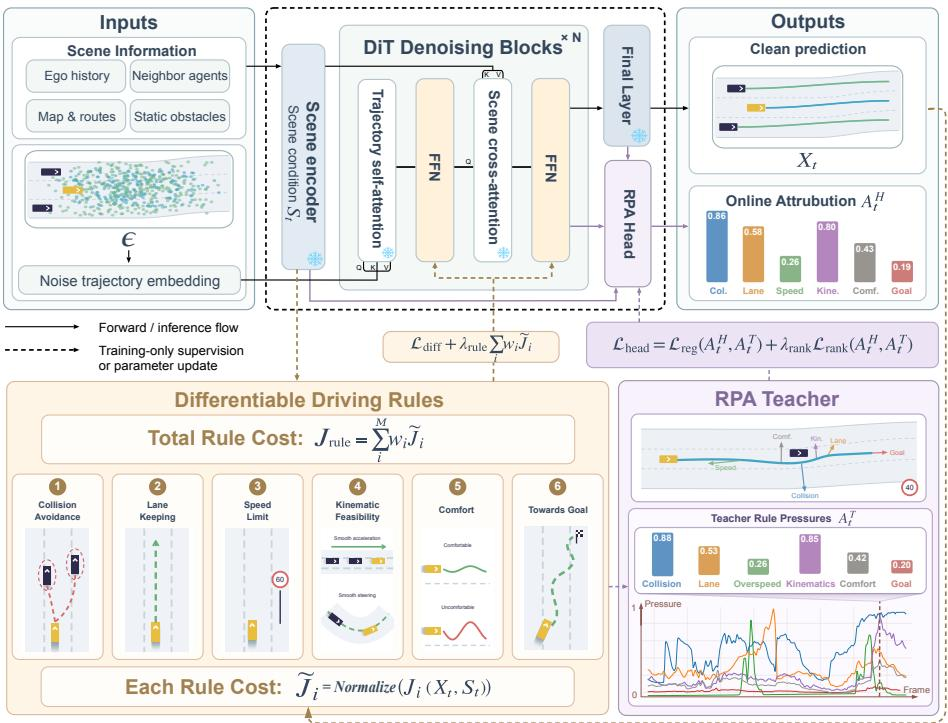  
Figure 1: Overview of RADP.

Explainable Diffusion Planning. Existing explainability methods use gradients, saliency, and attention propagation to identify factors underlying neural-network outputs (Simonyan et al., 2013; Sundararajan et al., 2017) and related visual explanations (Selvaraju et al., 2017; Abnar & Zuidema, 2020; Arrieta et al., 2020); work on diffusion models further studies cross-attention, the denoising process, and training-data contribution (Tang et al., 2023; Park et al., 2024; Dai & Gifford, 2023). Driving-specific approaches expose interpretable cost volumes and intermediate predictions (Zeng et al., 2019), generate textual rationales grounded by visual attention (Kim et al., 2018), or rank nearby agents using interaction attention (Hazard et al., 2022). Interpretable trajectory representations (Ivanovic et al., 2021), action-oriented features (Xiao et al., 2021), and language aligned with intermediate driving outputs (Ding et al., 2025) provide complementary forms of transparency. Together with PlanT’s object-level attention (Renz et al., 2023) and InterFuser’s semantic intermediate features (Shao et al., 2023), these methods explain input objects, representations, or visual evidence. They do not directly quantify the corrective pressure exerted by individual driving rules. We instead use gradients of differentiable rules with respect to the trajectory as attribution supervision for online rule-pressure estimation.

## 3 METHOD

## 3.1 PROBLEM SETUP AND METHOD OVERVIEW

Given the scene observation $S _ { t }$ at planning time t, RADP produces a future ego trajectory together with its online rule-level attribution within the same planning cycle, as illustrated in Figure 1. The observation contains the histories of the ego vehicle and other traffic participants, map elements, route information, and static obstacles; ϵ denotes the diffusion noise. The figure further summarizes how differentiable rules first adapt the planner and subsequently provide gradient-based supervision for the attribution head, with these supervision paths used only during training. We write the overall input–output relation as

$$
( X _ { t } , A _ { t } ^ { H } ) = \mathcal { F } _ { \theta , \phi } ( S _ { t } ; \epsilon ) , \qquad X _ { t } \in \mathbb { R } ^ { H \times d } , \quad A _ { t } ^ { H } \in \mathbb { R } _ { \ge 0 } ^ { M } ,\tag{1}
$$

where $X _ { t } ~ = ~ P _ { \theta } ( S _ { t } ; \epsilon )$ is the predicted ego trajectory over a horizon of $H$ steps, and $A _ { t } ^ { H }$ is the non-negative rule-pressure vector produced by the online attribution head $f _ { \phi }$ . We use $M = 6$ channels: physical collision avoidance, lane-boundary compliance, speed-limit compliance, kinematic feasibility, comfort, and goal progress.

Table 1: Six rule channels for planning and attribution.
<table><tr><td>Rule channel</td><td>Violation signal</td><td>Purpose</td></tr><tr><td>Collision</td><td>Insufficient ego-agent clearance</td><td>Avoid imminent collisions</td></tr><tr><td>Lane</td><td>Route-corridor boundary violation</td><td>Maintain lane and route compliance</td></tr><tr><td>Speed</td><td>Speed above the legal limit</td><td>Enforce speed-limit compliance</td></tr><tr><td>Kinematics</td><td>Excess acceleration, braking, or steering</td><td>Ensure dynamic feasibility</td></tr><tr><td>Comfort</td><td>Excess jerk or control variation</td><td>Encourage smooth motion</td></tr><tr><td>Goal</td><td>Insufficient route progress</td><td>Preserve planning efficiency</td></tr></table>

The method is trained in two stages. Section 3.2 defines the differentiable rule costs

$$
\mathcal { I } = \{ J _ { i } ( X _ { t } , S _ { t } ) \} _ { i = 1 } ^ { M } ,\tag{2}
$$

and Section 3.3 incorporates them into the diffusion objective for lightweight planner adaptation. With the adapted planner frozen, Section 3.4 constructs gradient-based rule-pressure targets, and Section 3.5 distills them into an online attribution head. At inference, only the planner and attribution head are executed, without teacher gradients, rule guidance, or trajectory optimization.

## 3.2 DIFFERENTIABLE DRIVING RULES

All rules operate on trajectories in physical coordinates at 0.1 s resolution and are differentiable with respect to the predicted ego trajectory. For rule $i ,$ we first define a trajectory-level cost $J _ { i } ( X _ { t } , S _ { t } )$ that measures the overall degree to which trajectory $X _ { t }$ violates that rule in scene $S _ { t } \mathbf { \mathrm { : } }$

$$
J _ { i } ( X _ { t } , S _ { t } ) = \operatorname { A g g } _ { i , h , n } \lbrack m _ { i , h , n } \varphi _ { \sigma _ { i } } ( z _ { i , h , n } ( X _ { t } , S _ { t } ) ) \rbrack .\tag{3}
$$

Equation equation 3 compactly maps local violations to a trajectory-level cost. Reading it from the inside out, $z _ { i , h , n } ( X _ { t } , S _ { t } )$ is the local physical violation of rule i at future step h with respect to interaction entity n. The index n is used only for interactive rules such as collision avoidance and is omitted for rules that depend solely on the ego state. We use the convention $z _ { i , h , n } > 0$ for a violation and $z _ { i , h , n } \leq 0$ for rule satisfaction or a remaining safety margin. For example, collision uses the required safety distance minus the actual box separation, whereas speed-limit compliance uses the predicted speed minus the permitted speed.

To convert this signed, physically dimensioned quantity into a non-negative and differentiable local penalty, we use

$$
\varphi _ { \sigma _ { i } } ( z ) = \left[ \frac { 1 } { \beta } \mathrm { s o f t p l u s } \Bigg ( \frac { \beta z } { \sigma _ { i } } \Bigg ) \right] ^ { 2 } , \qquad \beta = 1 0 .\tag{4}
$$

Here $\sigma _ { i }$ is the physical scale of rule i. The function approximates $[ \operatorname* { m a x } ( 0 , z / \sigma _ { i } ) ] ^ { 2 } ;$ : its value is close to zero when the rule is satisfied and increases smoothly with violation severity. In Eq. equation $3 ,$ $m _ { i , h , n }$ is an applicability or risk gate that masks invalid or irrelevant local constraints, while $\operatorname { A g g } _ { i }$ aggregates the valid time steps and interaction entities into the scalar $J _ { i }$ . We instantiate six semantic channels covering collision, lane, speed, kinematics, comfort, and goal progress, as summarized in Table 1. Their complete definitions are provided in Appendix B.

Because the resulting rule costs have different typical numerical ranges, we normalize them before combining them in the planner objective. For sample $b ,$

$$
\widetilde { J } _ { i } ^ { \left( b \right) } = \frac { J _ { i } ^ { \left( b \right) } } { s _ { i } ^ { \left( r \right) } } ,\tag{5}
$$

Here $s _ { i } ^ { ( r ) }$ is a stop-gradient EMA scale maintained separately for rule i during training (EMA decay 0.99, lower bounded by $1 0 ^ { - 3 } )$ . This normalization balances complete rule costs in joint training without changing their physical definitions. The attribution teacher uses the gradient of the unnormalized $J _ { i } .$

As an example, collision avoidance uses oriented ego boxes constructed from the predicted rearaxle states and the nuPlan Pacifica geometry. Let $d _ { h , n } ^ { \mathrm { { b o x } } }$ be the signed box separation computed by the separating-axis theorem. The collision violation is

$$
z _ { h , n } ^ { \mathrm { c o l } } = d _ { h , n } ^ { \mathrm { s a f e } } - d _ { h , n } ^ { \mathrm { b o x } } , \qquad d _ { h , n } ^ { \mathrm { s a f e } } = d _ { 0 } + t _ { \mathrm { h e a d } } c _ { h , n } + \frac { c _ { h , n } ^ { 2 } } { 2 a _ { \mathrm { b r a k e } } } ,\tag{6}
$$

where $c _ { h , n } \geq 0$ is the closing speed and $d _ { 0 } = 0 . 5 \mathrm { m }$ . Thus, $z _ { h , n } ^ { \mathrm { c o l } } > 0$ indicates insufficient clearance. We use $\sigma _ { \mathrm { c o l } } = 0 . 5$ m and a detached gate based on distance, closing speed, TTC, and violation severity to suppress irrelevant interactions. The resulting penalties are aggregated into $J _ { \mathrm { c o l } }$ , with other-agent trajectories treated as fixed context.

## 3.3 RULE-ALIGNED PLANNER TRAINING

We build on Diffusion Planner (Zheng et al., 2025), which models the joint future trajectories of the ego vehicle and surrounding agents with an $x _ { 0 }$ -prediction objective. We retain its masked ego– neighbor reconstruction loss ${ \mathcal { L } } _ { \mathrm { d i f f } }$ and augment it with differentiable rule costs (full baseline formulation in Appendix A):

$$
\mathcal { L } _ { \mathrm { R A D P } } = \mathcal { L } _ { \mathrm { d i f f } } + \lambda _ { \mathrm { r u l e } } \sum _ { i = 1 } ^ { M } w _ { i } \widetilde { J } _ { i } ,\tag{7}
$$

where $M \ = \ 6 , \ \widetilde J _ { i }$ is the normalized cost of rule $i ,$ and $w _ { i }$ controls its contribution to planner training. We set $\lambda _ { \mathrm { r u l e } } ~ = ~ 0 . 0 0 4$ and use $( w _ { \mathrm { c o l } } , w _ { \mathrm { l a n e } } , w _ { \mathrm { s p e e d } } , w _ { \mathrm { k i n } } , w _ { \mathrm { c o m f o r t } } , w _ { \mathrm { g o a l } } ) ~ =$ $( 2 . 5 , 0 . 8 , 0 . { \overset { \cdot } { 8 } } , 0 . 5 , 0 . 8 , 1 . 5 )$ . Starting from the baseline checkpoint, we fine-tune lightweight LoRA adapters in the decoder (Hu et al., 2022).

## 3.4 GRADIENT-PRESSURE TEACHER

Rule-gradient teacher. For a generated trajectory $X _ { t }$ , the gradient of a differentiable rule cost indicates the first-order trajectory change required to reduce that cost. We therefore define the teacher pressure for rule i as the root-mean-square magnitude of its trajectory gradient:

$$
g _ { i } ^ { T } ( t ) = \left( \frac { 1 } { D } \left\| \nabla _ { X _ { t } } J _ { i } ( X _ { t } , S _ { t } ) \right\| _ { 2 } ^ { 2 } \right) ^ { 1 / 2 } , \qquad D = H d .\tag{8}
$$

The resulting $g _ { i } ^ { T } ( t )$ is an independent, non-negative measure of the trajectory’s sensitivity to rule i: a larger value means that this rule exerts stronger local pressure on the current plan.

Scale-calibrated attribution. Gradient magnitudes can differ systematically across rules. We estimate a positive calibration scale $\kappa _ { i }$ for each rule from the training split and define the teacher attribution as

$$
A _ { i } ^ { T } ( t ) = \log \left( 1 + \frac { g _ { i } ^ { T } ( t ) } { \kappa _ { i } + \varepsilon } \right) .\tag{9}
$$

The logarithm attenuates rare extreme gradients while preserving their order. The resulting $A _ { i } ^ { T } ( t )$ is a calibrated, rule-specific measure of local trajectory sensitivity, which we use as supervision for the online attribution head.

## 3.5 ONLINE ATTRIBUTION HEAD

Computing Eq. equation 9 for all rules requires repeated backward passes. We amortize this computation with an attribution head $f _ { \phi }$ . Its base input combines the ego token from the final DPM denoising call with geometric features of the generated trajectory:

$$
z _ { t } = [ h _ { t } ^ { \mathrm { D P M } } ; q ( X _ { t } ) ] .\tag{10}
$$

The head also receives the scene condition encoding $S _ { t }$ , which jointly contains surrounding-agent, map, route, and lane information. Using $z _ { t }$ as a query, it attends to the scene encoding and aggregates the context relevant to the current generated trajectory:

$$
c _ { t } = \operatorname { M H A } _ { \operatorname { s c e n e } } ( z _ { t } , S _ { t } , S _ { t } ) , \qquad A _ { i } ^ { H } ( t ) = \operatorname { S o f t p l u s } ( f _ { \phi , i } ( [ z _ { t } ; c _ { t } ] ) ) .\tag{11}
$$

Invalid tokens in the scene condition encoding are masked in attention. We instantiate one independent two-layer MLP for each rule. All six MLPs receive the shared representation $[ z _ { t } ; c _ { t } ]$ , but their output parameters are not shared, producing independent non-negative pressures. The scene encoding lets the head combine the current trajectory with agent interactions and road and route constraints, rather than relying only on a compressed ego feature. This computation is summarized in Figure 2.

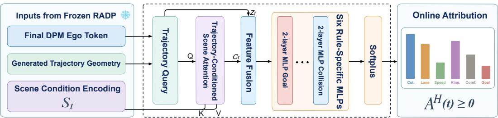  
Figure 2: Online rule-pressure attribution head.

The planner parameters $\theta$ are frozen, and only $\phi$ is trained on cached teacher targets. Our training objective combines weighted pressure regression with a ranking term:

$$
\begin{array} { r } { \mathcal { L } _ { \mathrm { h e a d } } = \mathcal { L } _ { \mathrm { r e g } } ( A ^ { H } , A ^ { T } ) + \lambda _ { \mathrm { r a n k } } \mathcal { L } _ { \mathrm { r a n k } } . } \end{array}\tag{12}
$$

We use a weighted Smooth- $. L _ { 1 }$ regression loss and a within-mini-batch pairwise ranking loss, with additional weight on safety-critical rules and high-pressure Teacher targets. The head is trained solely on cached gradient-teacher attributions. At inference, it reuses planner features in the same forward pass and does not alter the generated trajectory; closed-loop rollout risks are reserved exclusively for evaluating attribution quality.

## 4 EXPERIMENTS

## 4.1 EXPERIMENTAL SETUP

We evaluate RADP from three complementary perspectives. First, we assess closed-loop planning performance on the nuPlan val14, test14-random, and test14-hard reactive splits (Caesar et al., 2021; Karnchanachari et al., 2024). We compare RADP with Diffusion Planner across the overall score and all reported metric components, and further compare the overall score with representative learning-based planners. Non-reactive results are retained in Table 9 in the appendix. Second, on synchronized closed-loop planning frames, we evaluate how faithfully the online attribution head approximates the gradient-based Teacher. Third, we examine whether each rule-specific attribution is aligned with the corresponding driving condition observed during closed-loop execution. We evaluate six attribution channels against seven future-risk endpoints: each channel has one matched endpoint, while the collision channel is additionally evaluated against TTC risk as a complementary measure of imminent safety. Thus, TTC is an auxiliary evaluation endpoint rather than a seventh Head output. Detailed risk endpoints and statistical procedures are provided in Appendix B.

## 4.2 PLANNER PERFORMANCE

Table 2: Closed-loop planning performance with reactive agents.
<table><tr><td>Split</td><td>Planner</td><td>Score</td><td>Collision</td><td>TTC</td><td>Drivable</td><td>Progress</td><td>Speed</td><td>Comfort</td></tr><tr><td rowspan="2">val14</td><td>Diffusion Planner</td><td>82.70</td><td>92.98</td><td>87.84</td><td>97.85</td><td>96.60</td><td>98.29</td><td>89.45</td></tr><tr><td>RADP(ours)</td><td>81.37</td><td>94.01</td><td>89.53</td><td>98.03</td><td>94.90</td><td>98.87</td><td>89.27</td></tr><tr><td rowspan="2">test14-random</td><td>Diffusion Planner</td><td>82.82</td><td>94.06</td><td>89.66</td><td>98.08</td><td>97.70</td><td>97.07</td><td>85.44</td></tr><tr><td>RADP(ours)</td><td>84.48</td><td>96.36</td><td>91.95</td><td>98.08</td><td>96.93</td><td>97.98</td><td>87.36</td></tr><tr><td rowspan="2">test14-hard</td><td>Diffusion Planner</td><td>68.94</td><td>86.95</td><td>79.78</td><td>94.85</td><td>92.65</td><td>97.39</td><td>85.29</td></tr><tr><td>RADP(ours)</td><td>70.62</td><td>92.10</td><td>83.46</td><td>95.59</td><td>90.07</td><td>98.29</td><td>85.29</td></tr></table>

As reported in Table 2, RADP improves the reactive score and safety metrics on both test splits. On val14-r, safety also improves, but lower progress reduces the aggregate score, revealing a safety–efficiency trade-off. The broader comparison in Table 3 further shows that RADP achieves the highest reported scores on test14-random and test14- hard while remaining competitive on val14.

Table 3: Literature-reported reactive nuPlan scores.
<table><tr><td>Type</td><td>Planner</td><td>Val14-R</td><td>Hard-R</td><td>Random-R</td></tr><tr><td>Expert</td><td>Log-replay</td><td>80.32</td><td>68.80</td><td>75.86</td></tr><tr><td rowspan="7">Learned</td><td>PDM-Open</td><td>54.24</td><td>35.83</td><td>57.23</td></tr><tr><td>UrbanDriver</td><td>64.11</td><td>49.95</td><td>67.15</td></tr><tr><td>GameFormer</td><td>8.69</td><td>6.69</td><td>9.31</td></tr><tr><td>PlanTF</td><td>76.95</td><td>61.61</td><td>79.58</td></tr><tr><td>PLUTO</td><td>78.11</td><td>59.74</td><td>78.62</td></tr><tr><td>Diffusion Planner</td><td>82.70</td><td>68.94</td><td>82.82</td></tr><tr><td>RADP (ours)</td><td>81.37</td><td>70.62</td><td>84.48</td></tr></table>

## 4.3 ATTRIBUTION EVALUATION

We evaluate two complementary properties. On the same closed-loop planning frame, scene state, and generated trajectory, macro Spearman, MAE, and Top-1 agreement respectively measure whether the Head preserves the Teacher’s pressure ordering, numerical values, and dominant-rule decision. Complete definitions are provided in Appendix B.5.

Attribution $A _ { i } ( t _ { k } )$ describes the pressure exerted by rule i on the trajectory generated at planning time $t _ { k } .$ . To determine whether this pressure corresponds to actual driving conditions, we construct future-risk targets from the same closed-loop rollout. Let $v _ { i } ^ { \mathrm { r o l l o u t } } ( \tau )$ denote the instantaneous severity of rule-i risk observed at execution time τ. The future risk associated with the current planning frame is

$$
R _ { i } ( t _ { k } ) = \mathrm { A g g } _ { \tau \in [ t _ { k } , t _ { k } + H _ { i } ] } v _ { i } ^ { \mathrm { r o l l o u t } } ( \tau ) ,\tag{13}
$$

where $H _ { i }$ is a rule-specific horizon and Agg reduces frame-wise severity within the window to a continuous risk value. Collision and TTC use a two-second window because they describe immi nent hazards. Lane boundary, speed limit, kinematics, comfort, and goal progress use an eightsecond window. Rule-specific severity functions and aggregation operators are fixed, together with all horizons and thresholds, before inspecting attribution results and are shared by Teacher and Head. Hence, $R _ { i } ( t _ { k } )$ is an independent closed-loop evaluation target, not a training label.

We then test behavioral validity against $R _ { i } ( t _ { k } )$ Scenario-wise temporal Spearman measures whether attribution and subsequent rule-matched risk rise and fall consistently; AUPRC evaluates retrieval of future high-risk frames across thresholds; and Lift@10% measures risk-event enrichment among the highest- attribution 10% of frames. Within-scenario temporal shuffling serves as a control. Complete thresholds, eligibility criteria, formulas, and bootstrap procedures are provided in Appendix B.6.

## 4.3.1 CLOSED-LOOP HEAD–TEACHER FIDELITY

On synchronized reactive frames, Table 4 shows that the Head consistently tracks the Teacher in pressure ranking, absolute magnitude, and dominant-rule identification, while both remain positively aligned with subsequent rule-matched risks.

Table 4: Head–Teacher fidelity and future-risk alignment in reactive closed-loop simulation.
<table><tr><td rowspan="2">Reactive split</td><td colspan="3">Head-Teacher fidelity</td><td colspan="2">Future-risk alignment</td></tr><tr><td>Macro Spearman ↑</td><td>MAE↓</td><td>Top-1 ↑</td><td>Teacher  $\rho _ { \mathrm { m a c r o } }$ </td><td>↑ Head  $\rho _ { \mathrm { m a c r o } } ~ \cdot$  个</td></tr><tr><td>val14</td><td>0.536</td><td>0.216</td><td>70.6%</td><td>0.235</td><td>0.207</td></tr><tr><td>test14-random</td><td>0.570</td><td>0.200</td><td>71.7%</td><td>0.199</td><td>0.177</td></tr><tr><td>test14-hard</td><td>0.554</td><td>0.238</td><td>71.9%</td><td>0.221</td><td>0.192</td></tr></table>

## 4.3.2 TEMPORAL RISK ALIGNMENT

Table 5 details the alignment of Teacher and Head pressures with matched driving conditions on val14-r, where collision pressure is evaluated against both physical contact and auxiliary TTC risk. Complete confidence intervals are provided in the appendix.

Table 5: Frame-level future-risk alignment on val14-r.
<table><tr><td rowspan="2">Channel</td><td rowspan="2">Risk endpoint</td><td rowspan="2">Pos. rate</td><td colspan="2">AUPRC ↑</td><td colspan="2">Lift@10%↑</td><td colspan="2">Temporalρ↑</td><td colspan="2">Shuffled ρ</td></tr><tr><td>Teacher</td><td>Head</td><td>Teacher</td><td>Head</td><td>Teacher</td><td>Head</td><td>Teacher</td><td>Head</td></tr><tr><td rowspan="2">Collision</td><td>Physical collision</td><td>2.37%</td><td>0.540</td><td>0.514</td><td>1.823</td><td>1.598</td><td>0.234</td><td>0.160</td><td>0.001</td><td>-0.002</td></tr><tr><td>TTC risk (aux.)</td><td>4.11%</td><td>0.555</td><td>0.489</td><td>1.926</td><td>1.610</td><td>0.237</td><td>0.158</td><td>-0.000</td><td>-0.000</td></tr><tr><td>Lane</td><td>Lane-boundary risk</td><td>49.31%</td><td>0.911</td><td>0.840</td><td>1.518</td><td>1.340</td><td>0.314</td><td>0.234</td><td>0.001</td><td>0.000</td></tr><tr><td>Speed</td><td>Overspeed risk</td><td>6.87%</td><td>0.779</td><td>0.761</td><td>1.890</td><td>1.895</td><td>0.303</td><td>0.297</td><td>-0.001</td><td>-0.001</td></tr><tr><td>Kinematics</td><td>Kinematic risk</td><td>0.013%</td><td>0.167</td><td>0.250</td><td>0.000</td><td>0.000</td><td>0.112</td><td>0.159</td><td>-0.000</td><td>0.000</td></tr><tr><td>Comfort</td><td>Comfort risk</td><td>0.102%</td><td>0.376</td><td>0.371</td><td>1.750</td><td>1.750</td><td>0.102</td><td>0.122</td><td>0.000</td><td>-0.000</td></tr><tr><td>Goal progress</td><td>Route-progress deficit</td><td>47.06%</td><td>0.850</td><td>0.798</td><td>1.804</td><td>1.626</td><td>0.343</td><td>0.316</td><td>0.005</td><td>0.027</td></tr></table>

For the five endpoints with sufficient events, Head AUPRC clearly exceeds the positive-rate baseline and Lift@10% indicates risk enrichment among high-pressure frames. Specifically, AUPRC should be compared with the positive event rate, Lift@10% with 1, and temporal correlation with 0. Across rule categories, the observed positive temporal correlations, together with near-zero correlations after temporal shuffling, further support a meaningful temporal association between predicted rule pressures and subsequent rule-specific risks.

## 4.4 EFFICIENCY

As reported in Table 6, adding the attribution Head leaves end-to-end planning latency essentially unchanged: planner-only and planner-plus-Head inference require 251.05 and 245.50 ms per step respectively. Thus, online attribution introduces no measurable end-to-end overhead in this evaluation.

Table 6: Mean inference latency on an RTX 4080.
<table><tr><td>Method</td><td>Latency (ms)</td><td>Overhead</td></tr><tr><td>Planner only</td><td>251.05</td><td></td></tr><tr><td>Planner + Head</td><td>245.50</td><td>-1.64%</td></tr><tr><td>Planner + exact Teacher</td><td>465.29</td><td>+89.18%</td></tr><tr><td>Planner + gradient guidance</td><td>571.10</td><td>+130.76%</td></tr><tr><td>Exact Teacher on cached states</td><td>62.51</td><td>1.00×</td></tr><tr><td>Head on cached states</td><td>8.18</td><td>7.65× faster</td></tr></table>

In contrast, computing the exact Teacher online increases latency to 465.29 ms, and inference-time collision-gradient guidance requires 571.10 ms. The cached-state comparison excludes trajectory generation and measures only the additional attribution computation on the same stored planner states. Under this setting, the Head requires 8.18 ms compared with 62.51 ms for the exact Teacher, yielding a 7.65× attribution speedup.

## 4.5 QUALITATIVE ANALYSIS

Left-turn scenario. The rollout contains two collision-critical interactions near frames 100 and 140, where front-agent clearance and TTC decrease (Figure 3(b)); after frame 80, the signed routecorridor clearance also falls and becomes negative (Figure 3(c)). Given these observed risks, the Head correctly raises collision pressure around both interactions and increases lane pressure as the boundary is approached, while keeping speed, kinematic, and comfort pressures comparatively low (Figure 3(a)). The matched snapshots further show that RADP maintains greater separation than the baseline (Figure 4), providing a qualitative counterpart to Table 4 and Table 5.

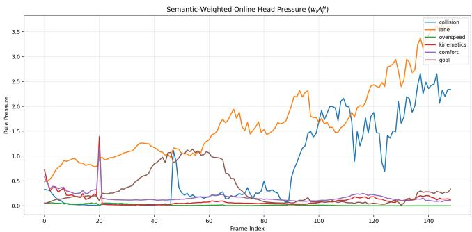  
(a) online rule pressure $A _ { i } ^ { H }$

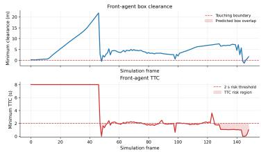

(b) Front-agent clearance and TTC  
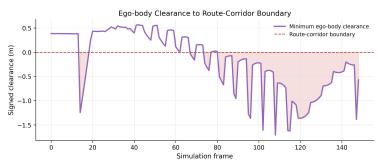  
(c) Signed route-corridor clearance

Figure 3: A starting left turn case from test14-hard-r. (a) shows the Head’s frame-wise rule pressures. (b) reports front-agent clearance and TTC. (c) shows signed ego-body clearance to the route-corridor boundary.

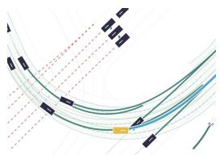  
(a) Baseline, frame 100

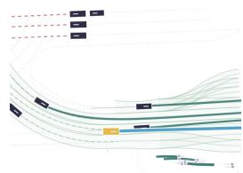  
(b) Baseline, frame 140

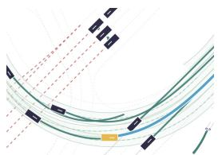  
(c) RADP, frame 100

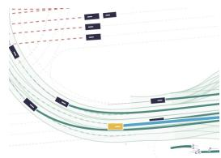  
(d) RADP, frame 140  
Figure 4: Matched closed-loop views. Baseline and RADP are shown near the two critical interactions; yellow and blue denote the ego vehicle and neighbors.

## 4.6 ABLATION STUDY

Rule supervision improves planning and safety over the rule-free and unnormalized variants. Collision-only inference guidance performs substantially worse, supporting training-time rule integration (Table 7).

Table 7: Rule ablations on test14-hard-r (↑). Training variants use the same configuration; collision guidance is applied during DPM sampling.
<table><tr><td>Setting</td><td>Score</td><td>Collision</td><td>TTC</td><td>Drivable</td><td>Progress</td><td>Speed</td><td>Comfort</td></tr><tr><td>Collision-Guided Diffusion Planner</td><td>59.92</td><td>76.65</td><td>68.75</td><td>90.44</td><td>95.96</td><td>96.00</td><td>60.66</td></tr><tr><td>FFN-LoRA (no rules)</td><td>69.20</td><td>88.42</td><td>81.62</td><td>95.96</td><td>90.44</td><td>98.37</td><td>86.03</td></tr><tr><td>No normalization</td><td>67.78</td><td>85.11</td><td>77.57</td><td>93.75</td><td>93.38</td><td>95.93</td><td>84.56</td></tr><tr><td>RADP</td><td>70.62</td><td>92.10</td><td>83.46</td><td>95.59</td><td>90.07</td><td>98.29</td><td>85.29</td></tr></table>

## 5 LIMITATIONS AND CONCLUSION

RADP internalizes differentiable driving rules during diffusion training and predicts rule-specific optimization pressures online. We use the trajectory-gradient magnitude $\| \nabla _ { X } J _ { i } \|$ , rather than the rule cost $J _ { i } ,$ as the attribution target: while $J _ { i }$ measures the current rule violation, its gradient more directly reflects how strongly the rule would locally modify the generated trajectory. Moreover, the current framework assumes a predefined rule set and fixed rule weights, and thus cannot adapt its rule priorities to changing scenarios or preferences. Comparisons with other attribution familie are also non-trivial because their explanations are not directly aligned with our rule-specific risk endpoints. Future work will explore intervention-based validation, adaptive rule weighting, broader rule sets, and principled comparisons with other explanation methods.

## AI USE STATEMENT

We used generative AI tools to aid or polish the writing of the manuscript and to support retrieval and discovery, such as identifying potentially relevant related work. All AI-assisted text and retrieved references were reviewed and verified by the authors.

## ETHICS STATEMENT

This work is computational and uses the publicly available nuPlan dataset and simulation framework. It does not involve human-subject experiments or private personal data. Because autonomous driving is safety-critical, the simulation results reported in this paper should not be interpreted as evidence of real-world deployment readiness. Practical deployment would require extensive real-world testing, safety validation, and appropriate human oversight.

## REPRODUCIBILITY STATEMENT

We provide detailed descriptions of the planner architecture, differentiable driving rules, rule normalization, gradient-based Teacher, online attribution Head, and training procedure in the main paper and appendix. We also document the evaluation splits, closed-loop simulation settings, risk endpoints, attribution metrics, temporal controls, and statistical procedures. Code, configuration files, trained checkpoints, and evaluation scripts will be released to facilitate reproducibility.

## REFERENCES

Samira Abnar and Willem Zuidema. Quantifying attention flow in transformers. In Proceedings of the 58th Annual Meeting of the Association for Computational Linguistics, pp. 4190–4197. Association for Computational Linguistics, 2020. doi: 10.18653/v1/2020.acl-main.385. URL https://aclanthology.org/2020.acl-main.385/.

Anurag Ajay, Yilun Du, Abhi Gupta, Joshua Tenenbaum, Tommi Jaakkola, and Pulkit Agrawal. Is conditional generative modeling all you need for decision-making? In International Conference on Learning Representations, 2023. URL https://openreview.net/forum?id= sP1fo2K9DFG.

Aaron D. Ames, Xiangru Xu, Jessy W. Grizzle, and Paulo Tabuada. Control barrier function based quadratic programs for safety critical systems. IEEE Transactions on Automatic Control, 62(8): 3861–3876, 2017. doi: 10.1109/TAC.2016.2638961.

Alejandro Barredo Arrieta, Natalia D´ıaz-Rodr´ıguez, Javier Del Ser, Adrien Bennetot, Siham Tabik, Alberto Barbado, Salvador Garc´ıa, Sergio Gil-Lopez, Daniel Molina, Richard Benjamins, Raja´ Chatila, and Francisco Herrera. Explainable artificial intelligence (xai): Concepts, taxonomies, opportunities and challenges toward responsible ai. Information Fusion, 58:82–115, 2020. doi: 10.1016/j.inffus.2019.12.012.

Holger Caesar, Juraj Kabzan, Kok Seang Tan, Whye Kit Fong, Eric Wolff, Alex Lang, Luke Fletcher, Oscar Beijbom, and Sammy Omari. nuplan: A closed-loop ml-based planning benchmark for autonomous vehicles. In CVPR Workshop on Autonomous Driving, 2021. URL https:// arxiv.org/abs/2106.11810.

Cheng Chi, Siyuan Feng, Yilun Du, Zhenjia Xu, Eric Cousineau, Benjamin Burchfiel, and Shuran Song. Diffusion policy: Visuomotor policy learning via action diffusion. In Robotics: Science and Systems, 2023. URL https://www.roboticsproceedings.org/rss19/p026. html.

Zheng Dai and David K. Gifford. Training data attribution for diffusion models. arXiv preprint arXiv:2306.02174, 2023. URL https://arxiv.org/abs/2306.02174.

Kairui Ding, Boyuan Chen, Yuchen Su, Huan-ang Gao, Bu Jin, Chonghao Sima, Xiaohui Li, Wuqiang Zhang, Paul Barsch, Hongyang Li, and Hao Zhao. Hint-ad: Holistically aligned interpretability in end-to-end autonomous driving. In Proceedings of The 8th Conference on Robot Learning, volume 270 of Proceedings of Machine Learning Research, pp. 3742–3765. PMLR, 2025. URL https://proceedings.mlr.press/v270/ding25a.html.

Christopher Hazard, Akshay Bhagat, Balarama Raju Buddharaju, Zhongtao Liu, Yunming Shao, Lu Lu, Sammy Omari, and Henggang Cui. Importance is in your attention: Agent importance prediction for autonomous driving. In Proceedings of the IEEE/CVF Conference on Computer Vision and Pattern Recognition Workshops, pp. 2532–2535, 2022. URL https://openaccess.thecvf.com/content/CVPR2022W/Precognition/ html/Hazard\_Importance\_Is\_in\_Your\_Attention\_Agent\_Importance\_ Prediction\_for\_Autonomous\_CVPRW\_2022\_paper.html.

Jonathan Ho, Ajay Jain, and Pieter Abbeel. Denoising diffusion probabilistic models. In Advances in Neural Information Processing Systems, volume 33, pp. 6840– 6851, 2020. URL https://proceedings.neurips.cc/paper/2020/hash/ 4c5bcfec8584af0d967f1ab10179ca4b-Abstract.html.

Edward J. Hu, Yelong Shen, Phillip Wallis, Zeyuan Allen-Zhu, Yuanzhi Li, Shean Wang, Lu Wang, and Weizhu Chen. Lora: Low-rank adaptation of large language models. In International Conference on Learning Representations, 2022. URL https://openreview.net/forum?id= nZeVKeeFYf9.

Boris Ivanovic, Amine Elhafsi, Guy Rosman, Adrien Gaidon, and Marco Pavone. Mats: An interpretable trajectory forecasting representation for planning and control. In Proceedings ofthe Conference on Robot Learning, volume 155 of Proceedings ofMachine Learning Research, pp. 2243– 2256. PMLR, 2021. URL https://proceedings.mlr.press/v155/ivanovic21a. html.

Michael Janner, Yilun Du, Joshua B. Tenenbaum, and Sergey Levine. Planning with diffusion for flexible behavior synthesis. In Proceedings of the 39th International Conference on Machine Learning, volume 162 of Proceedings of Machine Learning Research, pp. 9902–9915. PMLR, 2022. URL https://proceedings.mlr.press/v162/janner22a.html.

Chiyu Max Jiang, Andre Cornman, Cheolho Park, Ben Sapp, Yin Zhou, and Dragomir Anguelov. Motiondiffuser: Controllable multi-agent motion prediction using diffusion. In Proceedings of the IEEE/CVF Conference on Computer Vision and Pattern Recognition, pp. 9644–9653, 2023. URL https://openaccess.thecvf.com/content/CVPR2023/html/Jiang\_ MotionDiffuser\_Controllable\_Multi-Agent\_Motion\_Prediction\_Using\_ Diffusion\_CVPR\_2023\_paper.html.

Napat Karnchanachari, Dimitris Geromichalos, Kok Seang Tan, Nanxiang Li, Christopher Eriksen, Shakiba Yaghoubi, Noushin Mehdipour, Gianmarco Bernasconi, Whye Kit Fong, Yiluan Guo, and Holger Caesar. Towards learning-based planning: The nuplan benchmark for real-world autonomous driving. arXiv preprint arXiv:2403.04133, 2024. URL https://arxiv.org/ abs/2403.04133.

Jinkyu Kim, Anna Rohrbach, Trevor Darrell, John Canny, and Zeynep Akata. Textual explanations for self-driving vehicles. In Proceedings of the European Conference on Computer Vision, pp. 563–578, 2018. URL https://openaccess.thecvf.com/content\_ECCV\_2018/ html/Jinkyu\_Kim\_Textual\_Explanations\_for\_ECCV\_2018\_paper.html.

Bencheng Liao, Shaoyu Chen, Haoran Yin, Bo Jiang, Cheng Wang, Sixu Yan, Xinbang Zhang, Xiangyu Li, Ying Zhang, Qian Zhang, and Xinggang Wang. Diffusiondrive: Truncated diffusion model for end-to-end autonomous driving. In Proceedings of the IEEE/CVF Conference on Computer Vision and Pattern Recognition, pp. 12037–12047, 2025. URL https://openaccess.thecvf.com/content/CVPR2025/html/ Liao\_DiffusionDrive\_Truncated\_Diffusion\_Model\_for\_End-to-End\_ Autonomous\_Driving\_CVPR\_2025\_paper.html.

Ji-Hoon Park, Yeong-Joon Ju, and Seong-Whan Lee. Explaining generative diffusion models via visual analysis for interpretable decision-making process. arXiv preprint arXiv:2402.10404, 2024. URL https://arxiv.org/abs/2402.10404.

William Peebles and Saining Xie. Scalable diffusion models with transformers. In Proceedings of the IEEE/CVF International Conference on Computer Vision, pp. 4195–4205, 2023. URL https://openaccess.thecvf.com/content/ICCV2023/html/Peebles\_ Scalable\_Diffusion\_Models\_with\_Transformers\_ICCV\_2023\_paper.html.

Michael Psenka, Alejandro Escontrela, Pieter Abbeel, and Yi Ma. Learning a diffusion model policy from rewards via q-score matching. In Proceedings ofthe 41st International Conference on Machine Learning, volume 235 of Proceedings of Machine Learning Research, pp. 41163–41182. PMLR, 2024. URL https://proceedings.mlr.press/v235/psenka24a.html.

Katrin Renz, Kashyap Chitta, Otniel-Bogdan Mercea, A. Sophia Koepke, Zeynep Akata, and Andreas Geiger. Plant: Explainable planning transformers via object-level representations. In Proceedings of The 6th Conference on Robot Learning, volume 205 of Proceedings of Machine Learning Research, pp. 459–470. PMLR, 2023. URL https://proceedings.mlr. press/v205/renz23a.html.

Ralf Romer, Alexander von Rohr, and Angela P. Schoellig. Diffusion predictive control with con- ¨ straints. In Proceedings of the 7th Annual Learning for Dynamics and Control Conference, volume 283 of Proceedings of Machine Learning Research, pp. 791–803. PMLR, 2025. URL https://proceedings.mlr.press/v283/romer25a.html.

Ramprasaath R. Selvaraju, Michael Cogswell, Abhishek Das, Ramakrishna Vedantam, Devi Parikh, and Dhruv Batra. Grad-cam: Visual explanations from deep networks via gradient-based localization. In Proceedings of the IEEE International Conference on Computer Vision, pp. 618– 626, 2017. URL https://openaccess.thecvf.com/content\_iccv\_2017/html/ Selvaraju\_Grad-CAM\_Visual\_Explanations\_ICCV\_2017\_paper.html.

Hao Shao, Letian Wang, Ruobing Chen, Hongsheng Li, and Yu Liu. Safety-enhanced autonomous driving using interpretable sensor fusion transformer. In Proceedings of The 6th Conference on Robot Learning, volume 205 of Proceedings ofMachine Learning Research, pp. 726–737. PMLR, 2023. URL https://proceedings.mlr.press/v205/shao23a.html.

Karen Simonyan, Andrea Vedaldi, and Andrew Zisserman. Deep inside convolutional networks: Visualising image classification models and saliency maps. arXiv preprint arXiv:1312.6034, 2013. URL https://arxiv.org/abs/1312.6034.

Mukund Sundararajan, Ankur Taly, and Qiqi Yan. Axiomatic attribution for deep networks. In Proceedings of the 34th International Conference on Machine Learning, volume 70 of Proceedings of Machine Learning Research, pp. 3319–3328. PMLR, 2017. URL https://proceedings. mlr.press/v70/sundararajan17a.html.

Raphael Tang, Linqing Liu, Akshat Pandey, Zhiying Jiang, Gefei Yang, Karun Kumar, Pontus Stenetorp, Jimmy Lin, and Ferhan Ture. What the daam: Interpreting stable diffusion using cross attention. In Proceedings of the 61st Annual Meeting of the Association for Computational Linguistics (Volume 1: Long Papers), pp. 5644–5659. Association for Computational Linguistics, 2023. doi: 10.18653/v1/2023.acl-long.310. URL https://aclanthology.org/2023. acl-long.310/.

Wei Xiao, Tsun-Hsuan Wang, Chuang Gan, Ramin Hasani, Mathias Lechner, and Daniela Rus. Safediffuser: Safe planning with diffusion probabilistic models. In International Conference on Learning Representations, 2025. URL https://proceedings.iclr.cc/paper\_files/paper/2025/hash/ f95606d8e870020085990d9650b4f2a1-Abstract-Conference.html.

Yi Xiao, Felipe Codevilla, Christopher Pal, and Antonio M. Lopez. Action-based representation´ learning for autonomous driving. In Proceedings of the Conference on Robot Learning, volume 155 of Proceedings of Machine Learning Research, pp. 232–246. PMLR, 2021. URL https: //proceedings.mlr.press/v155/xiao21a.html.

Brian Yang, Huangyuan Su, Nikolaos Gkanatsios, Tsung-Wei Ke, Ayush Jain, Jeff Schneider, and Katerina Fragkiadaki. Diffusion-es: Gradient-free planning with diffusion for autonomous driving and zero-shot instruction following. arXiv preprint arXiv:2402.06559, 2024. URL https: //arxiv.org/abs/2402.06559.

Wenyuan Zeng, Wenjie Luo, Simon Suo, Abbas Sadat, Bin Yang, Sergio Casas, and Raquel Urtasun. End-to-end interpretable neural motion planner. In Proceedings of the IEEE/CVF Conference on Computer Vision and Pattern Recognition, pp. 8660–8669, 2019. URL https: //openaccess.thecvf.com/content\_CVPR\_2019/html/Zeng\_End-To-End\_ Interpretable\_Neural\_Motion\_Planner\_CVPR\_2019\_paper.html.

Yinan Zheng, Ruiming Liang, Kexin Zheng, Jinliang Zheng, Liyuan Mao, Jianxiong Li, Weihao Gu, Rui Ai, Shengbo Eben Li, Xianyuan Zhan, and Jingjing Liu. Diffusion-based planning for autonomous driving with flexible guidance. In International Conference on Learning Representations, 2025. URL https://arxiv.org/abs/2501.15564.

Ziyuan Zhong, Davis Rempe, Danfei Xu, Yuxiao Chen, Sushant Veer, Tong Che, Baishakhi Ray, and Marco Pavone. Guided conditional diffusion for controllable traffic simulation. In 2023 IEEE International Conference on Robotics and Automation, pp. 3560–3566, 2023. doi: 10. 1109/ICRA48891.2023.10161463. URL https://ieeexplore.ieee.org/document/ 10161463/.

## A BASELINE DIFFUSION OBJECTIVE

Following Diffusion Planner (Zheng et al., 2025), the forward process and clean-trajectory prediction are

$$
q ( { \bf X } ^ { ( k ) } \mid { \bf X } ^ { ( 0 ) } ) = { \mathcal N } \Big ( \sqrt { \bar { \alpha } _ { k } } { \bf X } ^ { ( 0 ) } , ( 1 - \bar { \alpha } _ { k } ) { \bf I } \Big ) , \qquad { \widehat { \bf X } } ^ { ( 0 ) } = \mu _ { \theta } ( { \bf X } ^ { ( k ) } , k , S _ { t } ) .\tag{14}
$$

The masked reconstruction objective is

$$
\begin{array} { r } { \mathcal { L } _ { \mathrm { d i f f } } = \mathcal { L } _ { \mathrm { n b r } } + 2 \mathcal { L } _ { \mathrm { e g o } } , } \end{array}\tag{15}
$$

$$
\mathcal { L } _ { \mathrm { e g o } } = \mathbb { E } \left[ \frac { 1 } { H } \sum _ { h = 1 } ^ { H } \| \widehat { X } _ { \mathrm { e g o } , h } ^ { ( 0 ) } - X _ { \mathrm { e g o } , h } ^ { ( 0 ) } \| _ { 2 } ^ { 2 } \right] ,\tag{16}
$$

$$
\mathcal { L } _ { \mathrm { n b r } } = \mathbb { E } \left[ \frac { 1 } { | \mathcal { V } | } \sum _ { ( b , n , h ) \in \mathcal { V } } { \| \widehat { X } _ { b , n , h } ^ { ( 0 ) } - X _ { b , n , h } ^ { ( 0 ) } \| _ { 2 } ^ { 2 } } \right] ,\tag{17}
$$

where V excludes padded agents and unavailable future states.

## B RULE AND RISK DEFINITIONS

Planner adaptation, gradient supervision, and Head outputs use the same six semantic channels listed in Table 1:

$$
\mathcal { R } _ { \mathrm { t r a i n } } = \mathcal { R } _ { \mathrm { a t t r } } = \{ \mathrm { c o l l i s i o n , l a n e , o v e r s p e e d , k i n e m a t i c s , c o m f o r t , g o a l } \} .\tag{18}
$$

Thus, the planner rule loss, Teacher targets, and Head outputs are fully aligned in semantics and dimensionality. Underspeed and traffic-light costs do not form independent training or attribution channels. TTC is likewise not an attribution channel: the TTC row uses collision pressure as its score and evaluates the same attribution against a distinct future-risk endpoint.

## B.1 TRAJECTORY DENORMALIZATION AND FINITE DIFFERENCES

Rules operate on denormalized trajectories at 0.1 s resolution. Predicted states represent rear-axle position and heading; collision computation further uses the nuPlan Pacifica length, width, and rearaxle-to-center offset to construct oriented boxes. Speed, acceleration, jerk, curvature, and curvature rate are obtained by finite differences over the current ego state and future trajectory. Invalid map points, padded agents, and unavailable future states are excluded by masks.

## B.2 COMPLETE INSTANTIATION OF RULE COSTS

Collision. In addition to Eq. equation 6, the implementation uses $t _ { \mathrm { h e a d } } ~ = ~ 0 . 8$ s and $a _ { \mathrm { b r a k e } } ~ =$ $4 . 0 \mathrm { m } / \mathrm { s } ^ { 2 }$ . For each future time and obstacle,

$$
\tau _ { h , n } = \frac { [ d _ { h , n } ^ { \mathrm { b o x } } ] _ { + } } { \operatorname* { m a x } ( c _ { h , n } , 1 0 ^ { - 3 } ) } .\tag{19}
$$

A stop-gradient soft gate combines box separation, closing speed, a 4 s TTC threshold, and the safety-distance deficit, with a hard cutoff beyond 20 m. Active terms are combined by a softmaxweighted mean with temperature 8, so that the most critical interactions receive greater weight.

Lane. Each predicted point is matched to the nearest route-polyline point. Its tangent defines a normal direction and signed lateral error $e _ { h }$ . If the available left and right widths are $w _ { h } ^ { L }$ and $w _ { h } ^ { R }$ respectively,

$$
z _ { h } ^ { L } = e _ { h } + W _ { \mathrm { e g o } } / 2 - w _ { h } ^ { L } ,\tag{20}
$$

$$
z _ { h } ^ { R } = - e _ { h } + W _ { \mathrm { e g o } } / 2 - w _ { h } ^ { R } ,\tag{21}
$$

$$
J _ { \mathrm { l a n e } } = J ( z ^ { L } ; 0 . 5 ) + J ( z ^ { R } ; 0 . 5 ) + 0 . 0 5 J ( | e | ; 2 . 0 ) ,\tag{22}
$$

where $J ( z ; \sigma )$ denotes Eq. equation 4 averaged over valid points. The final term is a weak centerline regularizer and does not replace the ego-body boundary constraints.

Table 8: Principal rule constants used in the implementation.
<table><tr><td>Rule</td><td>Threshold</td><td>Physical scale σ</td><td>Weight wi</td><td>Other constants</td></tr><tr><td>Collision</td><td> $\begin{array} { c c c c c l } { { d _ { 0 } } } & { { = } } & { { 0 . 5 \mathrm { m } , \enspace { \scriptstyle t _ { \mathrm { h e a d } } } } } & { { = } } & { { 0 . 8 \mathrm { s } , } } \end{array}$   $a _ { \mathrm { b r a k e } } = 4 . 0 \ : \mathrm { m / s ^ { 2 } }$ </td><td>0.5 m</td><td>2.5</td><td>Active distance 20 m, risk TTC 4 s, soft- max α = 8</td></tr><tr><td>Lane</td><td>Ego-body boundary crossing</td><td>0.5 m</td><td>0.8</td><td>Centerline weight 0.05, center scale 2.0 m</td></tr><tr><td>Speed</td><td> $v > v ^ { \mathrm { 1 i m } }$ </td><td>1.0 m/s</td><td>0.8</td><td>Time steps without a valid speed limit are masked out</td></tr><tr><td>Kinematics</td><td> $a _ { \mathrm { l o n } } \leq 6 , - a _ { \mathrm { l o n } } \leq 8 , | a _ { \mathrm { l a t } } | \leq 4 . 5 ,$   $| \kappa | \leq 0 . 3 5$ </td><td>1, 1, 1, 0.05</td><td>0.5</td><td></td></tr><tr><td>Comfort</td><td> $| j _ { \mathrm { l o n } } | , | j _ { \mathrm { l a t } } | \le 8 . 3 7 , | \dot { \kappa } | \le 0 . 3 0$ </td><td>1,1,0.1</td><td>0.8</td><td></td></tr><tr><td>Goal progress</td><td>Reachable/expert progress deficit</td><td>5.0 m</td><td>1.5</td><td>Lateral weight 0.1, monotonicity weight 0.2, stopping buffer 2 m</td></tr></table>

Speed. Let $v _ { h } ^ { \mathrm { l i m } }$ be the statutory speed limit of the nearest valid route lane. The current sixdimensional planner and attribution implementation uses only the atomic overspeed cost,

$$
J _ { \mathrm { o v e r } } = J ( v - v ^ { \mathrm { l i m } } ; 1 . 0 ) .\tag{23}
$$

Time steps without a valid route-lane speed limit are masked out. Road curvature, low-speed deviation, and free-road status do not enter this channel, preserving its semantics as pressure from exceeding the statutory speed limit.

Kinematics and comfort. The kinematic cost is

$$
\begin{array} { r l } & { J _ { \mathrm { k i n } } = J ( a _ { \mathrm { l o n } } - 6 ; 1 ) + J ( - a _ { \mathrm { l o n } } - 8 ; 1 ) } \\ & { \phantom { J } + J ( | a _ { \mathrm { l a t } } | - 4 . 5 ; 1 ) + J ( | \kappa | - 0 . 3 5 ; 0 . 0 5 ) , } \end{array}\tag{24}
$$

(25)

where acceleration is measured in $\mathrm { m } / \mathrm { s } ^ { 2 }$ and curvature in $\mathrm { m } ^ { - 1 }$ . The comfort cost is

$$
J _ { \mathrm { c o m f } } = J ( | j _ { \mathrm { l o n } } | - 8 . 3 7 ; 1 ) + J ( | j _ { \mathrm { l a t } } | - 8 . 3 7 ; 1 ) + J ( | \dot { \kappa } | - 0 . 3 0 ; 0 . 1 ) .\tag{26}
$$

Goal progress. Let $s _ { h }$ denote cumulative progress after projecting the trajectory onto the route. The target $s ^ { \star }$ is determined by the valid expert-future endpoint when available; otherwise, reachable progress is computed from the current speed and a nominal acceleration of $0 . 5 \mathrm { m } / \mathrm { s } ^ { 2 }$ and clipped at the route endpoint. When a red light ahead is active, the target is capped at 2 m before the stop line. Traffic-light state therefore constrains a reasonable progress target but does not define a seventh attribution channel. The cost is

$$
J _ { \mathrm { g o a l } } = J ( s ^ { \star } - s _ { H } ; 5 . 0 ) + 0 . 1 J ( d _ { H } ^ { \mathrm { r o u t e } } ; 0 . 5 ) + 0 . 2 J ( s _ { h - 1 } - s _ { h } ; 5 . 0 ) .\tag{27}
$$

## B.3 RULE CONSTANTS AND AGGREGATION

All six differentiable rules use fixed physical thresholds and calibration constants, which are col lected in Table 8.

Except for collision, costs are averaged over valid active elements; collision uses the softmaxweighted mean above. During planner training, a stop-gradient EMA scale $s _ { i } ^ { ( r ) }$ is maintained for each complete rule cost with decay 0.99 and lower bound $1 0 ^ { - 3 }$ , and $\widetilde { J } _ { i } = \dot { J } _ { i } / \mathrm { s g } ( s _ { i } ^ { ( r ) } )$ . Teacher targets are always computed from gradients of atomic costs $J _ { i }$ before semantic weighting or EMA normalization.

## B.4 EXTERNAL ROLLOUT-RISK ENDPOINTS

The $v _ { i } ^ { \mathrm { r o l l o u t } }$ in $\operatorname { E q } .$ equation 13 is constructed from executed ego and agent states in the same closedloop simulation. It is not the differentiable rule cost and is not used to train the head. Specifically: (i) physical collision is a positive-area overlap between ego and tracked-agent boxes; (ii) TTC risk uses the reciprocal of nuPlan’s per-frame TTC; (iii) lane risk uses the signed ego-body margin to the route/drivable boundary, with 0.30 m or less treated as an event; (iv) overspeed uses the positive part of the nuPlan speed-limit exceedance; (v) kinematics uses normalized violations of longitudinal/lateral acceleration and curvature; (vi) comfort uses the maximum ratio of longitudinal jerk, lateral jerk, and curvature rate to their thresholds; and (vii) goal risk uses incomplete reference-route progress, with an event threshold at an ego-to-expert progress ratio below 0.80.

For planning frame $t _ { k } ,$ collision and TTC use a 2 s future window, while lane, speed, kinematics, comfort and goal use 8 s. Severity in each window is aggregated by a pre-specified rule-specific operator. Temporal Spearman is computed within each scenario having sufficient temporal variation and then averaged across scenarios. The shuffled control permutes attribution only within the same scenario, preserving its marginal distribution. Confidence intervals use 10,000 scenario-level bootstrap resamples.

## B.5 COMPLETE HEAD–TEACHER FIDELITY METRICS

Let F be the valid synchronized frames and M the number of rules. We compute per-rule correlation and its macro-average as

$$
\rho _ { i } ^ { H , T } = \mathrm { S p e a r m a n } \left( \{ A _ { i } ^ { H } ( t ) \} _ { t \in \mathcal { F } } , \{ A _ { i } ^ { T } ( t ) \} _ { t \in \mathcal { F } } \right) , \qquad \rho _ { \mathrm { m a c r o } } ^ { H , T } = \frac { 1 } { M } \sum _ { i = 1 } ^ { M } \rho _ { i } ^ { H , T } .\tag{28}
$$

Numerical agreement and dominant-rule agreement are

$$
\mathrm { M A E } ^ { H , T } = \frac { 1 } { M | \mathcal { F } | } \sum _ { i = 1 } ^ { M } \sum _ { t \in \mathcal { F } } | A _ { i } ^ { H } ( t ) - A _ { i } ^ { T } ( t ) | ,\tag{29}
$$

$$
\mathrm { T o p - 1 } ^ { H , T } = \frac { 1 } { | \mathcal { F } | } \sum _ { t \in \mathcal { F } } \mathbf { 1 } \Big [ \arg \operatorname* { m a x } _ { i } A _ { i } ^ { H } ( t ) = \arg \operatorname* { m a x } _ { i } A _ { i } ^ { T } ( t ) \Big ] .\tag{30}
$$

## B.6 COMPLETE TEMPORAL-ALIGNMENT METRICS

For rule i and scenario n, continuous temporal alignment is

$$
\rho _ { i , n } ^ { \mathrm { t e m p } } = \mathrm { S p e a r m a n } ( \{ A _ { i , n } ( t _ { k } ) \} _ { k } , \{ R _ { i , n } ( t _ { k } ) \} _ { k } ) , \qquad \rho _ { i } ^ { \mathrm { t e m p } } = \frac { 1 } { | \mathcal { N } _ { i } ^ { \rho } | } \sum _ { n \in \mathcal { N } _ { i } ^ { \rho } } \rho _ { i , n } ^ { \mathrm { t e m p } } ,\tag{31}
$$

where $\mathcal { N } _ { i } ^ { \rho }$ contains scenarios with enough valid frames and non-constant attribution and risk sequences. For attribution source $Q \in \{ T , { \bar { H } } \}$ , the reported macro score averages all seven evaluated endpoints,

$$
\rho _ { \mathrm { m a c r o } } ^ { Q } = \frac { 1 } { 7 } \sum _ { e \in \mathcal { E } } \rho _ { e } ^ { Q } , \quad \mathcal { E } = \{ \mathrm { c o l l i s i o n } , \mathrm { T T C } , \mathrm { l a n e } , \mathrm { s p e e d } , \mathrm { k i n e m a t i c s } , \mathrm { c o m f o r t } , \mathrm { g o a l } \} .\tag{32}
$$

Physical collision and TTC are separate endpoints that share the collision attribution channel. With a pre-specified threshold, $y _ { i , n } ( t _ { k } ) \bar { ( } = \mathbf { 1 } [ R _ { i , n } \bar { ( } t _ { k } ) > \delta _ { i } ]$ . AUPRC uses attribution as the continuous event-retrieval score and is macro-averaged over eligible scenarios. If $\mathcal { T } _ { i , n } ^ { 1 0 }$ is the top 10% of valid frames ranked by attribution, then

$$
\mathrm { L i f t @ 1 0 \% } _ { i , n } = \frac { | \mathcal T _ { i , n } ^ { 1 0 } | ^ { - 1 } \sum _ { t _ { k } \in \mathcal T _ { i , n } ^ { 1 0 } } { y _ { i , n } ( t _ { k } ) } } { | \mathcal T _ { i , n } | ^ { - 1 } \sum _ { t _ { k } \in \mathcal T _ { i , n } } { y _ { i , n } ( t _ { k } ) } } , \qquad \mathrm { L i f t @ 1 0 \% } = \frac { 1 } { | \mathcal N _ { i } ^ { L } | } \sum _ { n \in \mathcal N _ { i } ^ { L } } \mathrm { L i f t @ 1 0 \% } _ { i , n } .\tag{33}
$$

The random-ranking AUPRC baseline equals the positive-event rate. The temporal control permutes attribution within each scenario before recomputing Spearman. All 95% confidence intervals use 10,000 scenario-level bootstrap resamples, retaining all correlated frames of each sampled scenario.

## C ADDITIONAL EXPERIMENTAL DETAILS

## C.1 NON-REACTIVE PLANNING RESULTS

For completeness, Table 9 reports the corresponding non-reactive aggregate scores. These results are supplementary to the reactive evaluation emphasized in the main text.

Table 9: Closed-loop planning scores with non-reactive agents (↑).
<table><tr><td>Split</td><td>Diffusion Planner</td><td>RADP</td></tr><tr><td>val14</td><td>89.65</td><td>88.72</td></tr><tr><td>test14-random</td><td>88.88</td><td>89.46</td></tr><tr><td>test14-hard</td><td>75.01</td><td>74.80</td></tr></table>

## C.2 PLANNER ADAPTATION

We initialize from the released Diffusion Planner checkpoint. The DiT contains three blocks, each ordered as self-attention, mlp1, scene-conditioned cross-attention, and mlp2. All baseline parameters are frozen, and LoRA is inserted only into

$$
\{ \mathtt { m l p 1 . f c 1 , m l p 1 . f c 2 , m l p 2 . f c 1 , m l p 2 . f c 2 } \}\tag{34}
$$

of every block. For original linear layer $W _ { 0 }$

$$
W _ { \mathrm { e f f } } x = W _ { 0 } x + \frac { \alpha } { r } B A x , \qquad r = 8 , \quad \alpha = 1 6 ,\tag{35}
$$

with LoRA dropout 0.05. Twelve linear modules are replaced, yielding 24 trainable $A / B$ tensors; attention, AdaLN, the encoder, input projection, and final trajectory layer remain frozen. Adaptation uses batch size 128, learning rate $2 \times 1 0 ^ { - 5 }$ , and random seed 3407.

## C.3 TEACHER CALIBRATION AND CACHING

To make gradients with different physical dimensions comparable, we collect RMS gradients for the six attribution channels over 100 calibration batches from the training split and use the 75th percentile of each channel’s non-negative gradients as $\kappa _ { i }$ . Equation equation 9 then produces logcompressed absolute pressures without normalization across the rule dimension.

With the planner frozen, caching records the final-DPM denoising state used in closed-loop inference: final DiT agent tokens, ego-trajectory geometry, route polylines, neighbor masks, and teacher pressures. The training cache contains 100,000 samples from processed; the validation cache contains 20,000 non-overlapping samples from new processed.

## C.4 TRAJECTORY-CONDITIONED SCENE ATTENTION HEAD DETAILS

The attribution head operates on the final denoising representation produced by the frozen rulealigned planner. The token dimension is 192. For each planning frame, we construct a trajectoryconditioned query $z _ { t }$ by combining the final-DPM ego token with geometric features extracted from the generated ego trajectory. The scene-condition representation consists of the valid context tokens provided by the planner encoder, covering surrounding agents, map elements, route information, and lane geometry. All planner-side representations are detached and remain frozen during attributionhead training.

To recover rule-relevant scene context, $z _ { t }$ attends to the scene-condition tokens through a six-head multi-head attention module,

$$
c _ { t } = \mathrm { M H A } _ { \mathrm { s c e n e } } ( z _ { t } , S _ { t } , S _ { t } ) ,
$$

where $S _ { t }$ denotes the valid scene-condition token set and the corresponding validity masks are applied during attention. This trajectory-conditioned attention allows the same generated trajectory to retrieve different contextual evidence depending on the surrounding traffic and road geometry, rather than aggregating agent and route information through separate attention branches.

The query representation $z _ { t }$ and attended scene context c are concatenated and passed to six rulespecific prediction branches, corresponding to collision, lane, overspeed, kinematics, comfort, and goal progress. Each branch uses an independent two-layer MLP with hidden dimension 256 and an unshared scalar output layer. Softplus is applied to each scalar output to obtain a non-negative rule pressure. Thus, the six branches share the trajectory and scene representations but do not share their final prediction parameters.

The attribution head is trained from scratch for 50 epochs with batch size 512 using AdamW, a learning rate of $1 0 ^ { - 4 }$ , and weight decay $1 0 ^ { - 4 }$ . The Smooth-L1 regression loss uses transition parameter $\beta _ { \mathrm { H u b e r } } = 0 . 2$ . To improve learning in the high-pressure tail, collision samples above the 75th percentile of positive collision pressure are sampled with a $3 . 0 \times$ multiplier and assigned a regression weight of 2.0. Lane samples above the 85th percentile are sampled with a 1.5× multiplier. For the remaining rule channels, samples above the corresponding 85th-percentile pressure threshold are sampled with a $1 . 5 \times$ multiplier and assigned a loss weight of 1.25. The pairwise-ranking loss is weighted by $0 . 2 ,$ , uses temperature 0.2, and ignores teacher-pressure pairs whose absolute difference is below 0.05.

Throughout attribution-head training, all planner parameters, including the LoRA adapters, remain frozen. The head is supervised exclusively by the calibrated gradient-pressure Teacher targets cached from the frozen planner; future closed-loop rollout risks are never used as training supervision.

## C.5 EVALUATION REPRODUCIBILITY

Teacher and head use the same planner checkpoint, scene state, and generated trajectory at each frame. Head–teacher fidelity is computed directly on these synchronized frames. For behavioral alignment, $A _ { i } ( t _ { k } )$ is paired with future risk over $[ t _ { k } , t _ { k } + H _ { i } ]$ in the same rollout. The random AUPRC baseline equals the positive-event rate, and Lift@10% uses the highest-attribution 10% of all valid frames. All thresholds, windows, and aggregation operators are fixed before inspecting head results and shared by teacher and head.

## C.6 LATENCY DETAILS

End-to-end latency is measured over five fixed test14-hard-r scenarios, while cached-state attribution is measured over 500 synchronized frames. The former includes trajectory generation, whereas the latter isolates attribution computation; all measurements use the same RTX 4080. The complete mean and standard-deviation results are reported in Table 10.

Table 10: Inference latency details on an RTX 4080. Values are mean ± standard deviation; lower is better.
<table><tr><td>Method</td><td>Latency (ms)</td><td>Overhead</td></tr><tr><td>Planner only</td><td> $2 5 1 . 0 5 \pm 3 9 . 0 4$ </td><td></td></tr><tr><td>Planner + Head</td><td> $2 4 5 . 5 0 \pm 3 0 . 4 3$ </td><td> $- 1 . 6 4 \% \pm 6 . 6 7 \%$ </td></tr><tr><td>Planner + exact Teacher</td><td> $4 6 5 . 2 9 \pm 6 6 . 4 6$ </td><td> $+ 8 9 . 1 8 \% \pm 3 8 . 3 5 \%$ </td></tr><tr><td>Planner + gradient guidance</td><td> $5 7 1 . 1 0 \pm 5 2 . 6 4$ </td><td> $+ 1 3 0 . 7 6 \% \pm 3 0 . 0 1 \%$ </td></tr><tr><td>Exact Teacher on cached states</td><td> $6 2 . 5 1 \pm 3 . 6 9$ </td><td>1.00×</td></tr><tr><td>Head on cached states</td><td> $8 . 1 8 \pm 1 . 2 0$ </td><td>7.65× faster</td></tr></table>

## C.7 COMPLETE CONFIDENCE INTERVALS FOR MAIN-TEXT ATTRIBUTION RESULTS

The scenario-bootstrap 95% confidence intervals omitted from the main text for readability are reported in Table 11 and Table 12. Resampling is performed at the scenario level so that correlated frames from the same scenario are not treated as independent observations.

Table 11: 95% confidence intervals for Head–Teacher fidelity and macro-averaged future-risk alignment on reactive splits.
<table><tr><td rowspan="2">Reactive split</td><td colspan="3">Head-Teacher fidelity 95% CI</td><td colspan="2">Future-risk alignment 95% CI</td></tr><tr><td>Macro Spearman</td><td>MAE</td><td>Top-1</td><td>Teacher  $\rho _ { \mathrm { m a c r o } }$ </td><td>Head  $\rho _ { \mathrm { m a c r o } }$ </td></tr><tr><td>val14</td><td>[0.525, 0.547]</td><td>[0.209, 0.222]</td><td>[69.4, 71.8]%</td><td>[0.213, 0.256]</td><td>[0.183, 0.229]</td></tr><tr><td>test14-random</td><td>[0.552, 0.588]</td><td>[0.188, 0.212]</td><td>[69.5, 73.9]%</td><td>[0.133, 0.258]</td><td>[0.119, 0.233]</td></tr><tr><td>test14-hard</td><td>[0.537, 0.571]</td><td>[0.224, 0.251]</td><td>[69.7, 74.0]%</td><td>[0.184, 0.255]</td><td>[0.151, 0.231]</td></tr></table>

Table 12: Scenario-bootstrap 95% confidence intervals for rule-wise future-risk alignment on val14- r.
<table><tr><td>Attribution channel</td><td>Risk endpoint</td><td>Teacher AUPRC</td><td>Head AUPRC</td><td>Teacher Lift@10%</td><td>Head Lift@10%</td><td>Teacher ρ</td><td>Head ρ</td></tr><tr><td>Collision</td><td>Physical collision</td><td>[0.481,0.604]</td><td>[0.452,0.578]</td><td>[1.388,2.257]</td><td>[1.184,2.019]</td><td>[0.158,0.302]</td><td>[0.077,0.252]</td></tr><tr><td>Collision</td><td>TTC risk</td><td>[0.516,0.598]</td><td>[0.450,0.527]</td><td>[1.640,2.212]</td><td>[1.334,1.896]</td><td>[0.196,0.274]</td><td>[0.115,0.198]</td></tr><tr><td>Lane</td><td>Lane-boundary risk</td><td>[0.894,0.928]</td><td>[0.815,0.864]</td><td>[1.422,1.617]</td><td>[1.260,1.428]</td><td>[0.283,0.345]</td><td>[0.206,0.265]</td></tr><tr><td>Speed</td><td>Overspeed risk</td><td>[0.725,0.829]</td><td>[0.701,0.816]</td><td>[1.553,2.254]</td><td>[1.556,2.285]</td><td>[0.198,0.402]</td><td>[0.200,0.388]</td></tr><tr><td>Kinematics</td><td>Kinematic risk</td><td>[0.167,0.167]</td><td>[0.250,0.250]</td><td>[0.000,0.000]</td><td>[0.000,0.000]</td><td>[0.079,0.143]</td><td>[0.123,0.194]</td></tr><tr><td>Comfort</td><td>Comfort risk</td><td>[0.162,0.679]</td><td>[0.156,0.598]</td><td>[0.000,4.375]</td><td>[0.000,3.500]</td><td>[0.072,0.133]</td><td>[0.089,0.155]</td></tr><tr><td>Goal progress</td><td>Route-progress deficit</td><td>[0.829,0.871]</td><td>[0.774,0.822]</td><td>[1.687,1.924]</td><td>[1.513,1.740]</td><td>[0.314,0.370]</td><td>[0.286,0.345]</td></tr></table>

## D ADDITIONAL COLLISION-AVOIDANCE CASES

We further compare matched Baseline and RADP rollouts on four test14-hard-r scenarios for which the Baseline incurs an at-fault collision while RADP does not. For each scenario, the upper row shows the Baseline and the lower row shows RADP at exactly the same simulation indices. The four columns correspond to approximately three, two, and one second before the Baseline’s first geomet ric contact, followed by the contact frame itself. Yellow boxes denote the ego vehicle, dark boxes denote other traffic participants, cyan curves show the trajectory planned at the displayed frame, and orange curves show the executed ego history. At the contact frame, the colliding participant and the Baseline ego outline are highlighted in red. All panels use the original nuPlan vector-map geometry and a fixed world-coordinate viewport within each scenario.

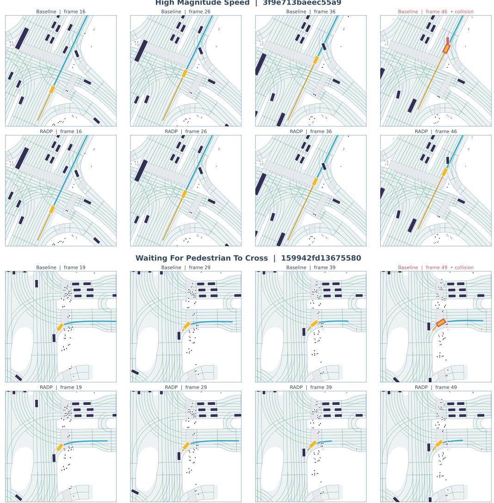  
Figure 5: Matched collision-avoidance rollouts. Top: a high-speed vehicle interaction (token 3f9e713baeec55a9). Bottom: a pedestrian-crossing interaction (token 159942fd13675580). The Baseline makes contact in the final column, whereas RADP remains collision-free at the corresponding frame.

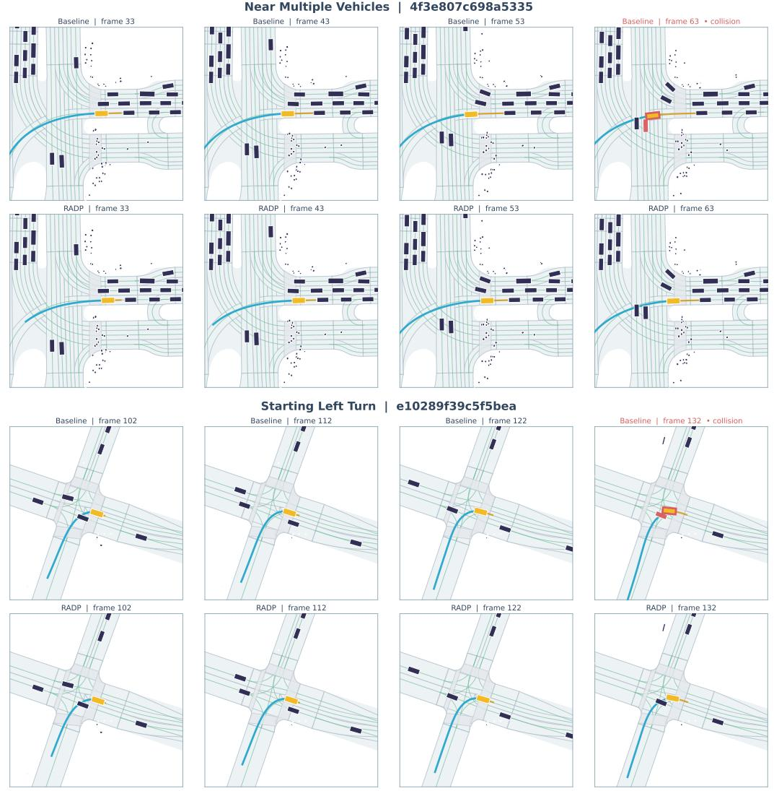  
Figure 6: Additional matched collision-avoidance rollouts. Top: a dense multi-vehicle interaction (token 4f3e807c698a5335). Bottom: a left-turn vehicle conflict (token e10289f39c5f5bea). Identical frame indices are used for Baseline and RADP in every column.