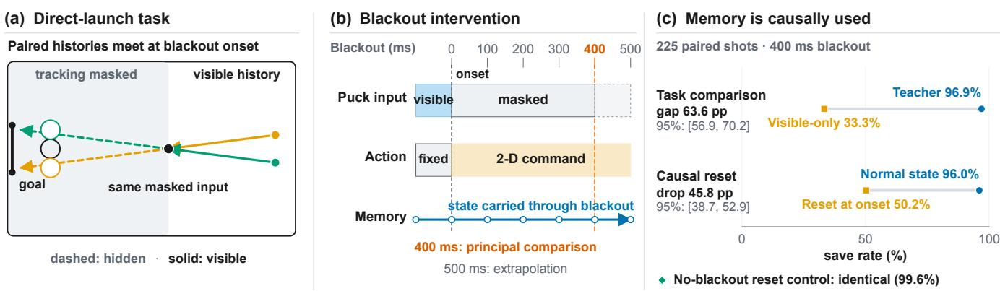
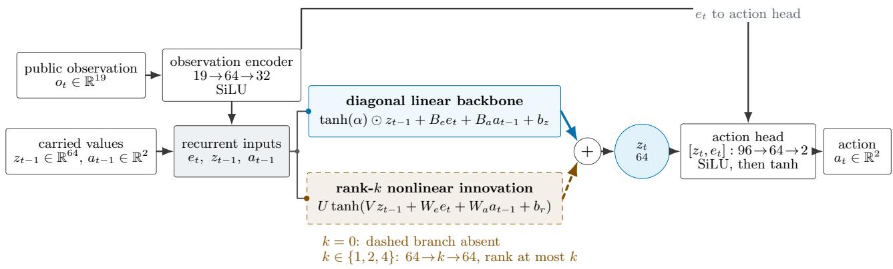
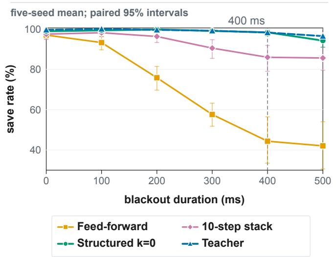
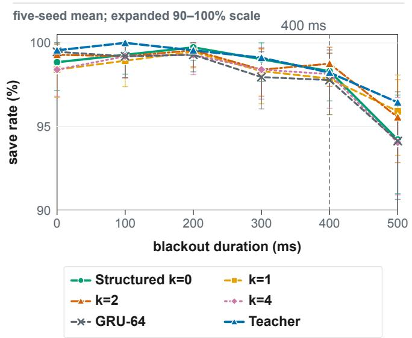
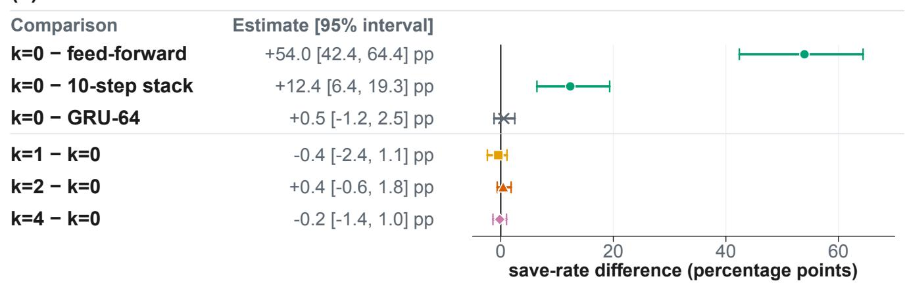
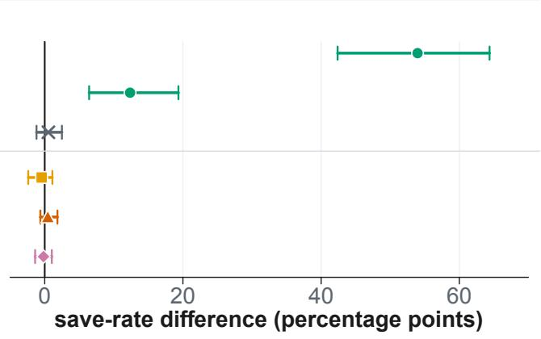
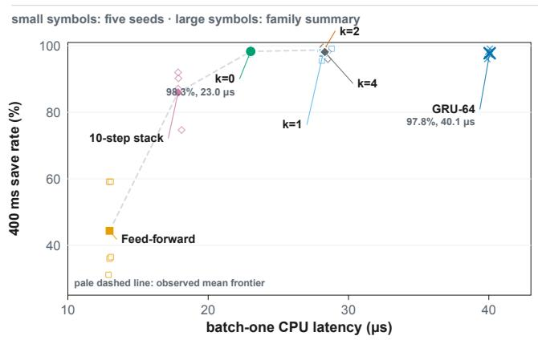
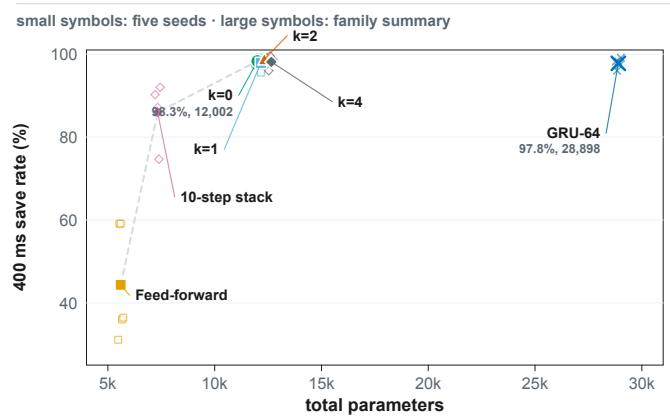

# Linear Recurrent Memory Sufices to Distil a World-Model Policy for Robot Air Hockey

F. Olivia Fan and Oliver Obst UNSW Sydney, NSW 2052, Australia

## Abstract

Does memory-dependent control need nonlinear recurrent dynamics? We study simulated air-hockey defence under temporary loss of puck tracking. A DreamerV3 teacher outperforms a memoryless policy under tracking loss, while resetting the teacher’s recurrent state sharply reduces performance, which demonstrates that the task requires memory. We distil this teacher into compact recurrent policies with a 64 dimensional state, with a combination of a diagonal linear recurrence and an optional rank-k nonlinear innovation while retaining nonlinear observation encoders and action heads. Across five matched seeds, the purely linear recurrent model (k = 0) matches both the GRU baseline and the teacher throughout the tested range of tracking loss. Increasing nonlinear innovation rank providing no measured benefits. This result is obtained on a fresh test split, which will be only opened after all models and analyses are frozen. The linear model requires fewer recurrent parameters and less computation than GRU, but performs comparably. These results suggest that, for this memory dependent control task, nonlinear representation learning around a simple linear memory mechanism can be suficient, and that nonlinear recurrent dynamics are not necessarily required. These conclusions are limited to the simulated task, teacher, state dimension, and blackout horizon considered here, and to policies whose observation encoder and action head remain nonlinear.

## 1 Introduction

An air-hockey defender that temporarily loses sight of the puck must continue acting without knowing its current position. Tracking can fail because of occlusion, dropped frames, or sensing faults, leaving the controller without information about where the puck is and where it is going. During this interval, successful defence depends on information retained from earlier observations.

For control at 50 Hz, a fixed-size recurrent state can retain information from earlier observations without storing an ever-growing history. In this work, we ask how complex that recurrent update needs to be.

We study this question through policy distillation. A DreamerV3 world-model agent [Hafner et al., 2023] is first trained as a history-dependent teacher and achieves strong performance during temporary tracking loss. Smaller students are then trained to reproduce the teacher’s actions and closed-loop behaviour without access to its latent state. The students must therefore learn their own compact representation of the history needed for control.

The puck follows relatively simple dynamics during the tracking-loss interval, suggesting that useful memory may depend more on retaining and propagating information than on complex state-dependent transformations. Is a linear recurrent update suficient to reproduce the teacher’s closed-loop behaviour? We hold the encoder, action head, 64-dimensional recurrent state, training budget, optimisation schedule and paired evaluation fixed, and vary the recurrent transition. Our structured family uses a diagonal linear recurrence augmented by a rank-k nonlinear innovation, with $k \in \{ 0 , \bar { 1 } , 2 , 4 \}$ . We compare these models with feed-forward, finite-history and GRU-64 students.

Before comparing recurrent architectures, we establish that memory is actually required by the task. Observation-alias shot pairs create situations in which identical current observations require diferent actions depending on the preceding puck trajectory. We further intervene on the teacher’s recurrent state at blackout onset to test whether information carried from the visible period contributes to its defence.

This paper makes three contributions. First, we introduce a tracking-loss defence task with observationalias pairs, together with behavioural and recurrent-state interventions that establish its dependence on memory. Second, we introduce a fixed-state structured fam ily whose innovation rank controls nonlinear recurrence while the surrounding architecture remains fixed. Third, a five-seed paired evaluation finds no clear save-rate gain from nonlinear recurrence through 400 ms under clean observations, with 88% fewer recurrent-core parameters for k = 0 than GRU-64. A supplementary test asks whether this comparison depends on accurate visible positions: without retraining, k = 0 retains a higher save rate than GRU-64 under the tested 5 mm noise and 400 ms blackout. This changes the measurement condition, not the task or puck dynamics.

## 2 Related Work

Robot air hockey. This work builds directly on the model-based agent and observation-stack controller developed for the robot air-hockey challenge [Orsula, 2024]. Competition experience has identified sensing dropouts, timing, and deployment constraints as recurring problems [Liu et al., 2024]. We isolate temporary puck tracking loss in a controlled one-shot defence, giving up fullmatch realism in exchange for exact replay and paired evaluation.

Memory under partial observability. When the puck disappears, the current observation is not enough and the policy needs memory. Recurrent networks are the classical approach to solve these problems. They keep performing even when observations randomly flicker of [Hausknecht and Stone, 2015], and real robots rely on the same idea, falling back on memory whenever their camera fail in the field [Miki et al., 2022]. World model agents such as DreamerV3 also carry memory in a recurrent latent state [Hafner et al., 2023]. What remains unclear is that what kind of memory a given task needs. Across a broad benchmark, no memory architecture wins on every task [Morad et al., 2023]. That is the question we target. We use DreamerV3 only as a strong teacher that already has memory, and ask how small and how simple a recurrent student can be while still copying its behaviour when tracking is lost.

Behavioural policy transfer. Copying a large teacher into a small student is a proven recipe. Policy distillation showed that a compact network can reproduce a much larger agent’s behaviour [Rusu et al., 2015]. A similar idea is widely used in robotics, where a teacher is trained in simulation with access to rich information transfers its behaviour to a lightweight recurrent student that operates using only a history of sensor observations [Lee et al., 2020]. We use this recipe since when teacher is frozen, every student copies the exact same behaviour, then any diference between students can only come from their architecture. More specifically, we match the teacher’s actions only [Rusu et al., 2015] instead of its internal state. Since a student acting on its own may meet situations that are poorly represented in teacher generated dataset, we add one round of dataset aggregation [Ross et al., 2011]. We collect states visited by each student, ask the teacher what it would have done and then retrain on these additional examples. To keep the comparison controlled, all student families are given the same aggregation budget.

Structured recurrence. Finally, we consider how much recurrent nonlinearity the student actually needs. There are two existing approaches representing exact different choices. Low-rank recurrent networks show that the rank of a nonlinear recurrent controls what it can compute [Mastrogiuseppe and Ostojic, 2018]. At the other end, linear recurrent models have shown that complex nonlinear recurrence is not always necessary. Structured linear models using diagonal and low-rank [Gu et al., 2021] or diagonal [Orvieto et al., 2023] dynamics, can efectively model long sequences. These ideas have also been extended to reinforcement learning under partial observability [Lu et al., 2023]. Related work has also considered that trained nonlinear recurrent networks can be approximated by linear models [Stolzenburg et al., 2025]. What remains less explored between these two extremes, especially on control tasks where memory is essential, is a controlled comparison. We address this with a model that combines a diagonal linear transition with a rank-k nonlinear component. By varying k while keeping the teacher, dataset, training budget, and remaining network architecture fixed, we can isolate the efect of recurrent nonlinearity.

## 3 Method

## 3.1 Teacher and policy boundary

All teacher and student policies receive the same public interface. Its 19 values comprise seven joint positions, seven joint velocities, the planar positions of the mallet and puck, and a visibility flag. The action is a two-dimensional normalised mallet target, converted to low-level commands by the unchanged upstream controller with fixed stifness and damping. The interface supplies no observation stack, opponent state, remaining blackout duration, puck velocity or privileged simulator state. The finite-history baseline explicitly bufers ten public puck observations; the other policies receive only the current observation at each step. Estimating puck motion therefore requires information carried across control steps, even while the puck is visible.

The teacher is a DreamerV3 agent [Hafner et al., 2023], using the size1m preset. It was trained from scratch on the task reward for one million environment steps. We evaluated the retained checkpoints on 1 125 paired validation episodes and selected the checkpoint at 700 000 steps based on its validation save rate. The selected checkpoint is frozen and used without further parameter updates during data collection or evaluation.

For distillation, causal state ablation, principal evaluation and the noise extension, we run the teacher de terministically, taking the mode of its categorical latent state and the mean actor action. The earlier PPO mem ory comparison uses the upstream evaluation path. Recurrent state is reset only when an episode ends, for both teacher and recurrent students, except during the explicit state-ablation intervention. A visibility change otherwise does not reset the policy state. At each step, a recurrent student receives the current public observation together with its previously requested command. Both the recurrent state and previous command are initialised consistently at the beginning of each episode.

  
Figure 1: Why the task needs memory. (a) The two shots in a pair reach the same point when tracking stops, then continue towards opposite sides of the goal. The defender must remember which way the puck was moving. (b) Tracking stops after 100 ms, but the policy keeps acting. We test blackouts from 0 to 500 ms; 400 ms is the main comparison. (c) At 400 ms, the teacher clearly outperforms the policy without memory. The teacher also performs much worse if its state is erased when tracking stops. Both comparisons use the same 225 shots. Ranges show paired-bootstrap 95% confidence intervals. Erasing state has no efect when tracking remains available.

## 3.2 Structured recurrent student

We keep the student architecture fixed across variants and vary only the recurrent core. The 19-dimensional public observation is mapped by a two-layer sigmoidweighted linear unit (SiLU) encoder to a 32-dimensional representation $x _ { t } .$ The recurrent state $z _ { t }$ has dimension $n = 6 4$ . The current feature vector and recurrent state are concatenated and passed through a 64-unit SiLU hidden layer, followed by a two-dimensional tanh output for the mallet command. Any performance diference between variants can therefore be attributed more directly to the structure of the recurrent update rather than to diferences in the surrounding policy network.

The recurrent state is updated according to

$$
\begin{array} { r l } & { z _ { t } = A z _ { t - 1 } + B _ { x } x _ { t } + B _ { a } a _ { t - 1 } + b _ { z } } \\ & { ~ + U \operatorname { t a n h } ( V z _ { t - 1 } + W _ { x } x _ { t } + W _ { a } a _ { t - 1 } + b _ { r } ) } \end{array}
$$

where $a _ { t - 1 }$ is the command requested at the previous control step. The first line provides a simple linear memory mechanism. Each component of the previous state is propagated independently through the diagonal matrix A, with contributions from the current observation and previous action. The second line allows the model to modify this through a low-rank nonlinear pathway. The dimension k of this pathway determines how many nonlinear combinations of recurrent state can directly influence the update.

We use

$$
A = \mathrm { d i a g } ( \operatorname { t a n h } \alpha )
$$

with learned α. This guarantees that the diagonal entries and the eigenvalues of A remain between −1 and 1. The diagonal structure also keeps recurrent propagation linear in the state dimension, with a cost of $O ( n )$ per control step. Individually, the 64 state channels behave as leaky memory traces with learned timescales. We initialise these timescales logarithmically between 40 ms and 2 s. Since the longest blackout lasts 500 ms, this initialisation provides memory timescales both shorter and substantially longer than the period for which puck observations may be unavailable.

The innovation rank k directly controls the amount of state-dependent nonlinearity in the recurrent update. In particular,

$$
\operatorname { r a n k } \left( { \frac { \partial z _ { t } } { \partial z _ { t - 1 } } } - A \right) \leq k .
$$

We verify this property by automatic diferentiation for each variant. Importantly, this bound applies only to the nonlinear correction of the instantaneous recurrent Jacobian, and it does not restrict the recurrent state dimension or the complexity of the encoder and action head. When $k = 0$ , there is no innovation branch and the recurrent update is fully linear in the previous state, encoded observation, and previous action. We compare k ∈ {0, 1, 2, 4} while holding all remaining architectural dimensions fixed. Within each matched training seed, non-innovation parameters are initialised identically across ranks, so the variants difer at initialisation only through their innovation branch.

## 3.3 Behavioural policy distillation

Students are trained to imitate the frozen teacher using behavioural distillation. The target at each step is the teacher’s deterministic action mean after public action clipping, and the student is optimised using mean squared error between its command and the teacher target. Only teacher actions are used as supervision. Teacher hidden states, latent variables, and true puck state are not exposed to the student. All student families are initially trained on the same teacher-generated dataset of 20 000 complete episodes, containing 713 257 transitions.

  
Figure 2: Structured recurrent student family. The public observation is encoded once and supplied both to the recurrent update and the nonlinear action head. The solid blue branch is the shared stable diagonal linear backbone. The dashed orange branch is the optional rank-k nonlinear innovation; it is absent for k = 0. All variants carry the same 64-value state and previous two-dimensional action. Only the state-dependent recurrent correction is rank controlled: the observation encoder and action head remain nonlinear in every variant.

Training only on teacher-controlled trajectories introduces a distribution shift at evaluation time, since student actions may lead to states that are not represented in the original dataset. To reduce this efect, we apply one round of DAgger-style data collection for each student family [Ross et al., 2011]. The five matched seeds in each family are first trained on the common teacher dataset. Each collector then runs 4 000 closedloop episodes under the same paired shot and blackout schedule, which generates 20 000 shadow episodes for each family.

The frozen teacher then relabels each valid step along these student-generated trajectories. During relabelling, the teacher maintains its own recurrent state while following the observation sequence generated by the student. At each step, it receives the same public observation available to the student together with the student’s previously requested command, and provides the action it would have taken along that trajectory. Shadow trajectories are collected and retained separately for each student family.

Final training combines each family’s 20 000 shadow episodes with the 20 000 common teacher episodes. We then train five new models from scratch rather than continuing from the collector checkpoints for each family. The optimisation budget is identical across families, and no family-specific hyperparameter tuning is performed. Checkpoint selection uses only ofline validation action error and is independent of closed-loop performance.

Recurrent training uses sequences of 64 steps. When an episode spans multiple training chunks, its recurrent state is carried from one chunk to the next rather than reset. The imitation loss is evaluated at every valid step and weighted so that each complete episode contributes equally regardless of duration. Finally, although collection schedules and episode budgets are identical across families, episode length depends on the behaviour policy.

Realised transition and teacher-query counts can therefore difer, and are reported separately for each family.

## 3.4 Comparisons and measurements

We compare seven distilled student families with diferent forms of memory. Four students use the structured recurrent architecture with a fixed state dimension of $n = 6 4$ and innovation rank $k \in \{ 0 , 1 , 2 , 4 \}$ . A GRU-64 uses the same encoder, action head, 64-dimensional recurrent state and previous-command input, but replaces the structured recurrent update with a conventional GRU.

We also include two non-recurrent alternatives. The finite-history student uses a multilayer perceptron (MLP) over current proprioception and a ten-step history of masked puck observations (approximately 200 ms). The memoryless student receives only the current observation. In addition, we train a separate memoryless PPO policy with two 256-unit tanh hidden layers directly from reward. This policy is used only as a taskvalidity control and is not included among the distilled families.

All distilled families share the same teacher dataset, shadow data collection schedule and episode budget, optimisation budget, five matched training seeds, paired shot and blackout schedule, and inference protocol. Shadow trajectories are family-specific since they are generated by each family’s own collector policies. This is the distribution shift that the DAgger-style correction is intended to capture.

We evaluate behaviour primarily through save rate across blackout durations, and additionally report the gap relative to the teacher, per-step action error against teacher labels, and contact-aware outcome categories to help interpret diferences in closed-loop behaviour. Eficiency is measured separately in terms of storage, computation and runtime. Storage includes total and recurrent-core parameter counts, together with carriedstate and recurrent-state memory. Computation is reported as multiply-adds per step, and runtime is measured using batch-one CPU latency. We report these separately because parameter count, arithmetic cost and measured execution time do not need to scale together.

The main evaluation uses a fresh set of 225 shots at blackout lengths {0, 5, 10, 15, 20, 25} steps, with 25 steps retained as the predeclared extrapolation condition, giving 1 350 episodes per checkpoint and 6 750 per family. All 35 final checkpoints, paired validation results, and eficiency measurements were frozen before the test split was opened. The split was released for a single final evaluation, with no subsequent retraining or checkpoint reselection.

Family-level uncertainty is estimated with a 10 000- replicate paired hierarchical cluster bootstrap over training seeds and evaluation units, using common resamples across compared families. Observation-alias pairs are treated as single clusters so that their two shots remain paired. The single-policy comparisons do not contain a training-seed level and therefore use a paired episode bootstrap over matched shot-blackout conditions.

For the post-hoc subgroup analysis and supplementary noise experiment, we use 10 000 paired bootstrap replicates over training seeds and shot units. Each alias pair is one unit; individual support shots are stratified by target region. Resampling preserves the observed stratum sizes and uses common draws across policies and, for the noise experiment, noise levels and blackout du rations. The teacher has no training-seed resampling. These percentile intervals are pointwise 95% intervals without multiplicity adjustment and do not replace the principal intervals.

Latency measurements use batch-one float32 inference on an Intel Core Ultra 9 285 CPU (24 cores), with one process and one thread pinned to logical CPU 0 under Linux. Each checkpoint receives 10 000 warmup calls followed by ten blocks of 10 000 timed calls. We compute the median and 95th percentile of the ten block-mean latencies, then report the median of each statistic across five training seeds. These are not percentiles of individual-call latency. Timing includes the encoder, memory update and action head, but excludes simulation, rendering, inverse kinematics and checkpoint loading. Structured models use a compiled float32 reduction kernel verified bit-exact against the canonical evaluator; GRU and non-recurrent baselines use BLASbacked NumPy. We therefore treat multiply-adds as the primary architecture-level cost measure and latency as implementation-specific.

Reproducibility. Code, configurations, analysis and figure-generation scripts are available in the public repository1 under the tag acra-2026-submission.

## 4 Air-Hockey Tracking-Loss Task

We study a controlled air-hockey set-piece in MuJoCo, where a simulated KUKA iiwa defends its goal against a directly launched puck. The environment runs at 50 Hz with a 2.5 s episode timeout. We launch the puck directly rather than having an opponent strike it, allowing the same initial shot to be reproduced exactly across policies and blackout conditions. This removes variation due to opponent behaviour and impact dynamics and lets us study tracking loss in isolation, at the expense of representing only a set-piece rather than complete airhockey play.

At the beginning of an episode, the puck remains visible for five control steps (100 ms) while the defender’s mallet is held fixed. The policy takes control at the next step, when masking begins. Keeping the mallet fixed during the visible prefix prevents the policy from using its own pre-blackout motion as an additional record of the observed puck trajectory. We then mask the puck for one contiguous interval of {0, 5, 10, 15, 20} steps, corresponding to 0–400 ms, and include a predeclared 25-step (500 ms) condition to test extrapolation beyond the main blackout range. During this interval, the puck position components and visibility flag are set to zero. The principal experiments use deterministic observations; the supplementary noise test changes only visible puck-position measurements.

We construct observation-alias pairs to make temporal information necessary for successful defence. The paired shots reach nearly the same puck position when masking begins but approach from diferent trajectories and continue towards opposite sides of the goal. At blackout onset, masking produces identical current public observations despite the diferent defensive actions required. The preceding observation history distinguishes the two shots. To prevent this history from being indirectly encoded in the robot state before blackout, the mallet re mains fixed during the visible prefix. Consequently, a deterministic memoryless policy must initially respond identically to both members of a pair. The identical observation guarantee applies at blackout onset: once control begins, robot observations can diverge as poli cies act and interact with the puck.

We audit the generated trajectories to confirm that this ambiguity holds in the realised simulator states. Across 90 alias families, paired shots difer by at most 8.1 mm in their last visible puck position and produce bit-identical public observations at blackout onset. At that instant, a privileged controller requires actions separated by at least 0.315 in the normalised action space. The audit therefore establishes ambiguity in the current observation at the start of blackout, rather than identical observation sequences throughout the subsequent defence.

The direct launch v3 distribution contains 900 training, 225 validation, and 225 task-validation shots generated from independent split seeds. The principal test uses a separate 225-shot split that remains held out until the evidence release procedure.

We classify outcomes as concession, return, arrest, safe deflection, miss or unresolved timeout. Returns, arrests and safe deflections count as saves; all other outcomes, including simulator or safety faults, are scored as failures. The training reward is +1 for a save, −1 for a concession, +0.2 at first contact, and zero otherwise. This reward is used only for the reward-trained teacher and PPO baseline, not for the distilled students.

We additionally evaluate 216 calibration shots to establish the dificulty range of the task. An inactive defender concedes 208 shots and a fixed-centre defender concedes 209, while a privileged controller with access to the true puck state saves 214. No simulator faults occur in these calibration episodes. These controls show that the task is dificult without an appropriate defensive response while remaining almost completely solvable when the relevant puck state is available.

Supplementary noise setup. To test sensitivity to measurement error, we evaluate the frozen teacher and all five existing seeds of $k = 0 , k = 4$ and GRU-64 without retraining. These students compare the linear update with the largest tested innovation rank and a conventional recurrent baseline. We use 225 fresh shots from the same distribution (90 alias pairs and 45 support shots), crossed with 0 and 400 ms blackouts and percoordinate noise standard deviations of 0, 1 and 5 mm: 21 600 episodes. This extension was designed after inspecting the principal results; its conditions and analysis were fixed before evaluation.

At every visible observation, including the actionlocked prefix, we add zero-mean Gaussian noise independently across coordinates and time to the puck position, converting millimetres to normalised coordinates before clipping. Each shot unit has one standard-normal trace, scaled across noise levels and shared across poli cies, training seeds and blackout durations; alias-pair members share a trace. Hidden positions remain zero, and visibility, proprioception, dynamics and save criteria are unchanged. The clean condition uses these same fresh shots, not the principal-test rates. The noise levels are synthetic, not calibrated to a physical tracker.

## 5 Results

## 5.1 Memory requirement

We first test whether successful defence under tracking loss requires memory. Using the same 225 shots at each blackout length (1 125 paired episodes per policy), we compare the teacher with the best validation-qualified seed from three independently trained memoryless PPO policies. With no blackout, both perform well. The teacher saves 99.6% of shots and PPO saves 90.7%. However, at 400 ms, the teacher retains a 96.9% save rate while PPO falls to 33.3%. This gives a diference of 63.6 percentage points, with a 95% confidence interval of [56.9, 70.2]. The gap increases by 54.7 points from 0 to 400 ms (Fig. 1c), showing that the performance difference grows specifically with tracking loss.

To test whether the teacher relies on its recurrent memory, we reset its recurrent state at the onset of each blackout. No other aspect of inference or evaluation is changed. Under a 400 ms blackout, the reset reduces the teacher’s save rate from 96.0% to 50.2%, a paired decrease of 45.8 percentage points, with a 95% confidence interval of [38.7, 52.9]. In the non-blackout condition, the reset is never triggered and all 225 episode records remain byte-identical between runs. The teacher’s robustness to blackout therefore depends strongly on information retained in its recurrent state.

## 5.2 Closed-loop imitation and distribution correction

Ofline imitation alone did not guarantee reliable closedloop behaviour. An initial diagnostic found that, at the 95th percentile, the nearest-history distance from student-generated trajectories to the training set was 16.8 times larger than for teacher-controlled validation trajectories. After an initial sequence-loss weighting error was corrected, a $k = 2$ pilot trained only on teachercontrolled trajectories still saved only 67.1% of nonblackout validation shots. The distance diagnostic and corrected pilot are separate runs.

We therefore apply the shadow-teacher correction. After one correction round, the same $k = 2$ architecture and seed achieved a 98.7% save rate without blackout and 98.4% across the paired validation grid. The experiment is intended to diagnose distribution shift rather than to establish an advantage specific to $k = 2$ . Every student family in the main study receives the same correction schedule and collection budget.

## 5.3 Principal recurrent-complexity comparison

The main test results are shown in Table 1 and Fig. 3. At a 400 ms blackout, the feed-forward student saves 44.4% of shots and the ten-step history student saves 86.0%. All recurrent models perform substantially better, with save rates 98.3%, 97.9%, 98.8%, and 98.1% for structured $k = 0 , 1 , 2 ,$ 4 and 97.8% for GRU-64. The teacher achieves 98.2%.

At 400 ms, the $k = 0$ student has a higher save rate than both non-recurrent students. The $k = 0$ student outperforms the feed-forward model by 54.0 percentage points (95% CI [42.4, 64.4]) and the ten-step history model by 12.4 points ([6.4, 19.3]). The ten-step model performs well for shorter blackouts but begins to fall behind once the blackout exceeds its approximately 200 ms history window. The diferences between recurrent architectures are much smaller. The paired $k = 0$ minus GRU-64 diference is 0.5 percentage points (95% CI [−1.2, 2.5]), although the GRU recurrent core has 8.3 times as many parameters. Increasing the innovation rank also provides no consistent improvement. The differences relative to $k = 0$ are −0.4 points for $k = 1$ ([−2.4, 1.1]), +0.4 for $k = 2 \ ( [ - 0 . 6 , 1 . { \overset { \cdot } { 8 } } ] )$ , and −0.2 for $\dot { k } = 4 ( [ - \dot { 1 } . 4 , 1 . 0 ] )$

At the predeclared 500 ms extrapolation, recurrent models achieve between 94.0% and 95.9%, compared with 96.4% for the teacher, 85.6% for the ten-step history model, and 42.0% for the feed-forward student. These aggregate rates remain higher for recurrent students but do not establish equivalence among recurrent architectures.

(a) Memory baselines  

(b) Recurrent comparison  

(c) 400 ms contrasts  

  
Figure 3: Principal behavioural results. (a) The feed-forward student deteriorates sharply when the puck is hidden. A ten-step observation stack helps, while the structured k = 0 student remains close to the teacher through the main 400 ms range. (b) On an expanded 90–100% scale, all four structured students and GRU-64 remain close to the teacher. The 500 ms point is an extrapolation beyond the main range. Student curves are means over five matched seeds; bars show paired-bootstrap 95% confidence intervals. The teacher is one frozen policy. (c) Paired diferences at 400 ms, where positive values favour the first policy named. The intervals show a clear k = 0 advantage over feed-forward and finite-stack memory, but no clear diference from GRU-64 or from adding rank-1, rank-2, or rank-4 nonlinear recurrent corrections.

Post-hoc shot breakdown. We separate the existing test records into 180 alias shots (90 pairs) and 45 support shots. Every structured model saves all alias shots across all six blackout durations and five seeds; at 400 ms, the feed-forward student saves 50.9%. The alias shots therefore expose a memory-dependent contrast but cannot distinguish the structured models. On support shots, k = 0 and GRU-64 both save 91.6% at 400 ms. At 500 ms, their rates fall to 71.1% and 73.8%, compared with 82.2% for the teacher. The paired $k = 0$ minus GRU-64 diference is −2.7 percentage points, with a pointwise 95% interval of [−15.6, 10.7]. Support rates for k = 1, 2, 4 at 500 ms are 79.6%, 77.8% and 70.2%, respectively. These exploratory estimates leave scope for diferences among recurrent models; the perfect observed alias rates are not guarantees for unseen shots.

## 5.4 Eficiency and compression

All recurrent students carry the same 64-dimensional float32 state, requiring 256 bytes, or 264 bytes when the previous command is included. The main diference is therefore the cost of updating that state. The k = 0 model has 12 002 parameters compared with 28 898 for GRU-64, 58.5% fewer. Its recurrent core is considerably smaller, with 2 304 parameters compared with 19 200 (88.0% fewer). Across the complete policy, $k = 0$ requires 11 776 rather than 28 352 multiply-adds per step (58.5% fewer).

<table><tr><td>Family</td><td>400 ms save (%, 95% CI)</td><td></td><td>Overall save (%)</td><td>Total params</td><td>Recurrent core params</td><td>Carried state (B)</td><td>Recurrent state (B)</td><td>MACs per step</td><td>CPU latency median / p95 (µs)</td></tr><tr><td>Feed-forward</td><td></td><td>44.4 [33.5, 56.4]</td><td>73.6</td><td>5,602</td><td>0</td><td>0</td><td>0</td><td>5,440</td><td>12.97 / 13.08</td></tr><tr><td>Ten-step stack</td><td></td><td>86.0 [79.0, 91.8]</td><td>93.7</td><td>7,330</td><td>0</td><td>120</td><td>0</td><td>7,168</td><td>17.86 /17.99</td></tr><tr><td>Structured k = 0</td><td></td><td>98.3 [96.5, 99.6]</td><td>99.0</td><td>12,002</td><td>2,304</td><td>264</td><td>256</td><td>11,776</td><td>23.03 23.15</td></tr><tr><td>Structured k = 1</td><td>97.9</td><td>[95.7, 99.4]</td><td>98.6</td><td>12,165</td><td>2,467</td><td>264</td><td>256</td><td>11,938</td><td>28.20 28.39</td></tr><tr><td>Structured k = 2</td><td>98.8</td><td>[97.4,99.7]</td><td>99.0</td><td>12,328</td><td>2,630</td><td>264</td><td>256</td><td>12,100</td><td>28.26 28.43</td></tr><tr><td>Structured k = 4</td><td></td><td>98.1 [96.1, 99.6]</td><td>98.7</td><td>12,654</td><td>2,956</td><td>264</td><td>256</td><td>12,424</td><td>28.31 28.61</td></tr><tr><td>GRU-64</td><td></td><td>97.8 [95.7, 99.4]</td><td>98.7</td><td>28,898</td><td>19,200</td><td>264</td><td>256</td><td>28,352</td><td>40.06 40.33</td></tr></table>

Table 1: Complete comparison of the seven student families. The 400 ms column reports the five-seed mean and pairedbootstrap 95% confidence interval. Overall save rate pools the five predeclared 0–400 ms conditions and excludes the 500 ms extrapolation. For each latency statistic (median or p95), entries are medians across five seeds of that statistic computed from block-mean latencies on one pinned Intel Core Ultra 9 285 CPU core. Carry includes every value retained between control steps; recurrent state excludes the previous action and the finite observation stack.

The CPU benchmark shows the same direction of improvement, with batch-one latency decreasing from $4 0 . 0 6 \mu \mathrm { s }$ for GRU-64 to $2 3 . 0 3 \mu \mathrm { s }$ for $k = 0$ . Since the two models use diferent implementations, multiply-adds provide the cleaner architecture-level comparison. The compiled structured kernel was also verified against the canonical evaluator and reproduces the same validation trajectories exactly.

Figure 4 shows that $k = 0$ achieves a high save rate at the lowest measured cost among the recurrent families. The $k = 2$ model has a slightly higher observed mean at additional cost, although the confidence interval for its paired diference from $k = 0$ includes zero. Compared with GRU-64, $k = 0$ uses fewer parameters and multiplyadds; the paired confidence interval for their 400 ms saverate diference includes zero.

## 5.5 Sensitivity to puck-position noise

Does noise in visible puck positions change the recurrent comparison? Table 2 reports all conditions from the supplementary setup. At 5 mm and 400 ms, $k = 0$ saves 98.5%, compared with 92.9% for GRU-64. Their paired diference is 5.6 percentage points (pointwise 95% interval [2.8, 9.0]); the k = 0 minus k = 4 diference is 4.0 points ([1.1, 8.1]). Relative to clean observations on these same shots, the changes are +0.4 points for $k = 0$ ([0.0, 1.1]) and −3.9 for GRU-64 ([−6.9, −1.3]).

The k = 0–GRU-64 diference is clearest on alias shots: at 5 mm and 400 ms, k = 0 saves all of them, versus 94.1% for GRU-64; their support-shot diference remains uncertain (4.4 points, [−1.3, 11.6]). The ordering is not uniform: without blackout at 5 mm, k = 4 saves more support shots than $k = 0$ (paired $k = 0$ minus $k = 4 \div$ −4.0 points, $[ - 8 . 4 , - 0 . 9 ] )$ Thus the aggregate result at 400 ms does not establish that the linear update is preferable in every condition.

<table><tr><td rowspan="2">Policy / σ</td><td colspan="2">No blackout</td><td colspan="2">400 ms blackout</td></tr><tr><td>0</td><td>1 5</td><td>0 1</td><td>5</td></tr><tr><td>k = 0</td><td>98.6 98.3</td><td>98.4</td><td>98.1 98.0</td><td>98.5</td></tr><tr><td>k = 4</td><td>98.5 98.6</td><td>98.9</td><td>97.6 97.5</td><td>94.5</td></tr><tr><td>GRU-64</td><td>99.4 99.2</td><td>97.9</td><td>96.8 96.8</td><td>92.9</td></tr><tr><td>Teacher</td><td>99.1 99.1</td><td>98.7</td><td>97.3 96.9</td><td>96.0</td></tr></table>

Table 2: Save rates (%) on 225 fresh shots per condition, without retraining. Student entries average five seeds; the teacher is one frozen policy. Noise σ is per-coordinate Gaussian standard deviation in mm. Paired pointwise 95% intervals for the main diferences are reported in the text.

## 6 Discussion and Limitations

Memory is important for this task, but the recurrent update can be relatively simple. The memoryless baseline performs well with visible observations but degrades as blackouts lengthen. Resetting the teacher’s state at blackout onset also reduces its save rate, showing that information retained before blackout contributes to defence. After correcting distribution shift under student control, recurrent students recover aggregate performance close to the teacher through 400 ms.

In the clean-observation principal test at 400 ms, the paired comparisons show no clear save-rate gain from increasing innovation rank or replacing the linear update with GRU-64. The noise extension shows that $k = 0 \mathrm { { s } }$ high save rate does not depend on exact visible positions under the tested perturbations. It does not identify why its performance changes less than that of GRU-64 at 5 mm and 400 ms. The k = 0 policy also remains nonlinear in its encoder and action head; only the recurrent update is linear.

Hidden puck motion is approximately ballistic over the short blackout, so preserving information from earlier positions may matter more than state-dependent nonlinear computation. Nonlinear processing remains available in the encoder and action head. This is a possible explanation of the clean-observation result, not a mechanism established by the experiments or an explanation

(a) Performance versus latency  

(b) Performance versus model size  
  
Figure 4: Performance–cost frontier at 400 ms tracking loss. Small symbols show the five matched training seeds; large, directly labelled symbols show each family’s five-seed mean save rate. Their horizontal positions use the median measured latency in (a) and the fixed parameter count in (b). Seed points in (b) are ofset slightly because all seeds within a family have the same parameter count. The pale dashed line joins the non-dominated observed family summaries. Structured k = 0 records 98.3% saves with 12,002 parameters and 23.0 µs latency, while GRU-64 records 97.8% with 28,898 parameters and 40.1 µs. Their paired save-rate diference is 0.5 points with a 95% interval of [−1.2, 2.5]; k = 0 uses 58.5% fewer parameters and has 42.5% lower measured latency. The figure describes the measured trade-of rather than selecting a universally best architecture.

of the noise diference.

The ten-step stack loses access to visible puck observations once a blackout exceeds its approximately 200 ms window. Yet at 400 ms it saves 94.6% of alias shots and 51.6% of support shots. The breakdown does not identify whether current robot state, earlier actions or other correlations explain its success after visible samples leave the window.

Distillation also exposes distribution shift: student actions lead to histories that difer from the teachercontrolled training data. Even after correcting the ofline training procedure, imitation alone gives poor closedloop performance. For the k = 2 pilot, one round of shadow-teacher correction using teacher-labelled student trajectories largely closes this gap.

Student training targets the teacher’s actions, not its latent state. Similar aggregate save rates in the principal test do not establish formal equivalence, which the analysis was not designed to test.

The experiments use one simulated air-hockey setpiece, one teacher, a 64-dimensional principal state and five training seeds per student family. Ceiling efects limit the clean comparison: all structured models save the 180 alias shots, while support-shot uncertainty remains broad at 500 ms. The noise extension changes the observations but not the dynamics. One Gaussian trace per shot unit does not measure the full variation across repeated noise realisations, and the levels are not sensor-calibrated. Pointwise intervals across multiple conditions do not establish a general architecture ranking. Correlated or biased tracking errors, longer or repeated occlusions and physical robot deployment remain untested.

## 7 Conclusion

We studied whether state-dependent nonlinear recurrence is necessary to distil a history-dependent airhockey defence from a world-model teacher. In the cleanobservation principal test at 400 ms, we find no clear save-rate advantage over a linear recurrent update. The k = 0 student’s save rate is 0.1 percentage points above the teacher and 0.5 points above GRU-64 (rounded to one decimal place), and increasing the innovation rank to $k \in \{ 1 , 2 , 4 \}$ produces only small paired diferences. At 500 ms, the post-hoc support-shot comparison leaves diferences among recurrent models unresolved.

On fresh shots with 5 mm per-coordinate Gaussian noise and 400 ms blackout, the frozen k = 0 student saves 98.5%, compared with 92.9% for GRU-64; supportshot diferences remain unresolved. At the same 64- dimensional state size, k = 0 uses 88.0% fewer recurrentcore parameters and 58.5% fewer whole-policy multiplyadds per step than GRU-64. The evidence supports testing linear recurrent memory as an eficient baseline in this setting, not formal equivalence or general suficiency. Correlated tracking errors, repeated occlusions and changing puck dynamics are distinct tests of that conclusion.

AI-use disclosure. The authors used OpenAI Codex for language editing, code assistance, and workflow automation. The authors reviewed all generated material and take responsibility for the ideas, claims, experiments, results, and text.

## References

[Gu et al., 2021] Albert Gu, Karan Goel, and Christopher R´e. Eficiently modeling long sequences with structured state spaces. arXiv preprint arXiv:2111.00396, 2021.

[Hafner et al., 2023] Danijar Hafner, Jurgis Pasukonis, Jimmy Ba, and Timothy Lillicrap. Mastering diverse domains through world models. arXiv preprint arXiv:2301.04104, 2023.

[Hausknecht and Stone, 2015] Matthew J Hausknecht and Peter Stone. Deep recurrent q-learning for partially observable mdps. In AAAI fall symposia, volume 45, page 141, 2015.

[Lee et al., 2020] Joonho Lee, Jemin Hwangbo, Lorenz Wellhausen, Vladlen Koltun, and Marco Hutter. Learning quadrupedal locomotion over challenging terrain. Science robotics, 5(47):eabc5986, 2020.

[Liu et al., 2024] Puze Liu, Jonas G¨unster, Niklas Funk, Simon Gr¨oger, Dong Chen, Haitham Bou-Ammar, Julius Jankowski, Ante Mari´c, Sylvain Calinon, Andrej Orsula, Miguel Olivares-Mendez, Hongyi Zhou, Rudolf Lioutikov, Gerhard Neumann, Amarildo Likmeta, Amirhossein Zhalehmehrabi, Thomas Bonenfant, Marcello Restelli, Davide Tateo, Ziyuan Liu, and Jan Peters. A retrospective on the Robot Air Hockey Challenge: Benchmarking robust, reliable, and safe learning techniques for real-world robotics. In Advances in Neural Information Processing Systems, volume 37, pages 9690–9726. Curran Associates, Inc., 2024.

[Lu et al., 2023] Chris Lu, Yannick Schroecker, Albert Gu, Emilio Parisotto, Jakob Foerster, Satinder Singh, and Feryal Behbahani. Structured state space models for in-context reinforcement learning. Advances in Neural Information Processing Systems, 36:47016– 47031, 2023.

[Mastrogiuseppe and Ostojic, 2018] Francesca Mastrogiuseppe and Srdjan Ostojic. Linking connectivity, dynamics, and computations in low-rank recurrent neural networks. Neuron, 99(3):609–623.e29, 2018.

[Miki et al., 2022] Takahiro Miki, Joonho Lee, Jemin Hwangbo, Lorenz Wellhausen, Vladlen Koltun, and Marco Hutter. Learning robust perceptive locomotion for quadrupedal robots in the wild. Science robotics, 7(62):eabk2822, 2022.

[Morad et al., 2023] Steven Morad, Ryan Kortvelesy, Matteo Bettini, Stephan Liwicki, and Amanda Prorok. Popgym: Benchmarking partially observable reinforcement learning. arXiv preprint arXiv:2303.01859, 2023.

[Orsula, 2024] Andrej Orsula. Learning to play air hockey with model-based deep reinforcement learning. arXiv preprint arXiv:2406.00518, 2024.

[Orvieto et al., 2023] Antonio Orvieto, Samuel L. Smith, Albert Gu, Anushan Fernando, Caglar Gulcehre, Razvan Pascanu, and Soham De. Resurrecting

recurrent neural networks for long sequences. In Proceedings of the 40th International Conference on Machine Learning, volume 202 of Proceedings of Machine Learning Research, pages 26670–26698. PMLR, 2023.

[Ross et al., 2011] St´ephane Ross, Geofrey Gordon, and Drew Bagnell. A reduction of imitation learning and structured prediction to no-regret online learning. In Proceedings of the Fourteenth International Conference on Artificial Intelligence and Statistics, volume 15 of Proceedings of Machine Learning Research, pages 627–635. PMLR, 2011.

[Rusu et al., 2015] Andrei A. Rusu, Sergio Gomez Colmenarejo, Caglar Gulcehre, Guillaume Desjardins, James Kirkpatrick, Razvan Pascanu, Volodymyr Mnih, Koray Kavukcuoglu, and Raia Hadsell. Policy distillation. arXiv preprint arXiv:1511.06295, 2015.

[Stolzenburg et al., 2025] Frieder Stolzenburg, Sandra Litz, Olivia Michael, and Oliver Obst. Eficient timeseries approximation with linear recurrent neural networks: architecture learning and predictive power. Neural Computing and Applications, 37(32):27027– 27055, 2025.