# Looped Diffusion Transformer

Yong Xien Chng∗,†,1,2, Tianyi Chen∗,1,2, Wenwen Tong1, Haiwen Diao3, Zhongang Cai1, Lei Yang1, Ziwei Liu3, Lewei Lu1, Dahua Lin1, Gao HuangB,2

∗ Equal Contribution † Project Lead B Corresponding Author

1SenseTime Research 2LeapLab, Tsinghua University 3Nanyang Tehnological Univesity

## Abstract

Improving text-to-image models has traditionally relied on increasing model size or the number of denoising steps. In this work, we explore an alternative way to scale computation by repeatedly running shared Transformer blocks within each denoising step, effectively increasing computational depth while keeping the parameter count fixed. This looped computation enables iterative refinement of internal representations without explicit reasoning tokens. However, naive looping fails to consistently improve image quality. We trace this problem to weak supervision across intermediate loops and unregulated attention updates that progressively erode local information. To overcome these challenges, we propose Looped Diffusion Transformer (Looped-DiT), which combines deep supervision across intermediate loops with self-modulating attention to stabilize looped feature updates. Under matched-parameter and matched-compute settings, Looped-DiT consistently outperforms non-looped baselines. Notably, a 260M-parameter looped model can surpass a model 6.5× larger across multiple text-to-image benchmarks while requiring 4.9× lower inference compute. Beyond this performance gain, we find that looped computation can offer a more effective form of iterative computation for diffusion models, with increasing loop depth yielding larger gains than adding more denoising steps under a fixed inference budget. Furthermore, deeper loops can progressively correct mistakes made in earlier loops, exhibiting behaviors suggestive of latent reasoning. Together, these results show that looped computation offers a promising way to scale visual generation models.

Date: October 1, 2026

Codebase: https://github.com/OpenSenseNova/Looped-DiT

(a) T2I Reasoning Benchmark Performance  
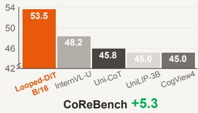

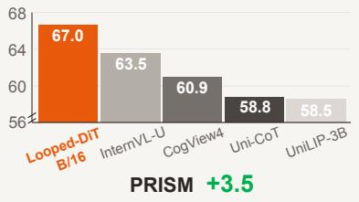

(c) Looping Unlocks Latent Reasoning  

(b) Inference Efficiency  
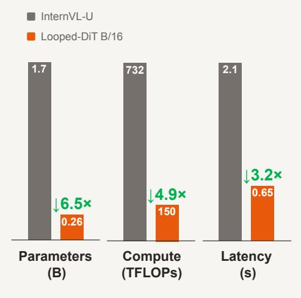  
Figure 1 Looping is a parameter-efficient way to scale text-to-image generation models. (a) Increasing loop depth greatly improves text-to-image reasoning performance. (b) These gains are achieved with far fewer parameters and lower inference cost. (c) Self-correction emerges across loops.

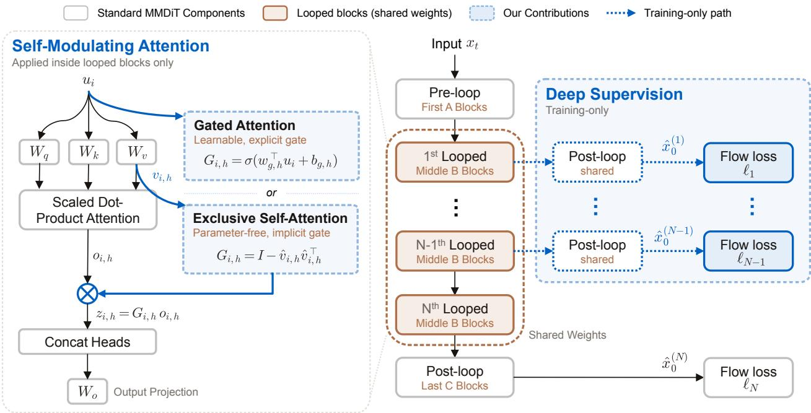  
Figure 2 Overview of Looped-DiT. Shared middle blocks are repeated N times within each denoising step. Self-Modulating Attention (left) regulates attention updates with token-dependent, headwise gates. Deep Supervision (right) decodes each intermediate loop output through the shared post-loop blocks, supervising all predictions against the same clean-image target.

## 1 Introduction

Scaling laws [24] show that increasing model size, data, and training compute systematically improves language modeling performance, motivating the search for more efficient ways to scale computation. The two dominant approaches each come with a cost. Deeper or wider Transformers [47] require proportionally more parameters, while chain-of-thought reasoning [52] increases inference-time computation through longer token sequences. Looped Transformers [7, 14] offer an alternative scaling strategy by repeatedly applying shared middle blocks to refine hidden states, thereby increasing computational depth without increasing parameter count or sequence length. This property is especially attractive for text-to-image generation, where models such as Qwen-Image [54] and FLUX.2 [25] have grown to billions of parameters, imposing substantial deployment costs.

The appeal of looping for image generation extends beyond computational efficiency. Generating a coherent image requires more than literal prompt following. The model must 1 infer the implied visual content, 2 resolve interdependent constraints, and 3 identify and correct inconsistencies as generation evolves. Because these processes are inherently visual, looping offers a natural way to perform them directly in hidden representations without explicit textual reasoning. This refinement also integrates naturally with standard diffusion training, since intermediate-loop predictions can be supervised against the same target image without external annotations.

To investigate the potential of looping for text-to-image generation, we introduce it into MiniT2I [49], a minimal pixel-space Multimodal Diffusion Transformer (MMDiT) with a simple architecture and training pipeline. As shown in Fig. 2, we divide its Transformer blocks into three sequential groups, with pre-loop and post-loop blocks surrounding a middle group of looped blocks. Within each denoising step, the pre-loop and post-loop blocks each run once, while the looped blocks run N times with parameters shared across loops to repeatedly update the hidden states. This simple setup allows us to systematically examine whether looping improves performance, characterize the properties that emerge as loop depth increases, and compare looping with alternative strategies for scaling computation.

However, our initial experiments in Fig. 3(a) show that naive looping does not reliably improve generation quality. Performance can remain below the non-looped baseline at shallow loop depths, saturate as more loops are added, and eventually decline beyond the training loop depth. One possible explanation for the performance decline is that repeatedly applying the same transformation produces redundant updates that overwrite or attenuate information in the image-token representations. To probe this hypothesis, we examine how well spatial information is preserved across loops by fitting a ridge-regression [20] probe at each loop depth to predict each image token’s 2D patch-grid coordinates from its hidden state. As shown in Fig. 3(b), $R ^ { 2 }$ drops from 0.865 after the $1 ^ { \mathrm { s t } }$ loop to 0.562 after $8 ^ { \mathrm { t h } }$ loops, an absolute decrease of 0.303, indicating that spatial position becomes progressively less linearly decodable. Together, these findings suggest that effective looping requires both meaningful supervision of intermediate loop predictions and the ability to adaptively regulate the strength ofattention updates as representations evolve across loops.

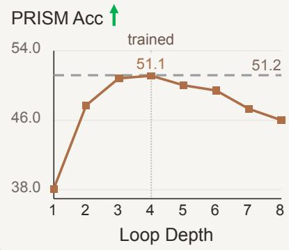

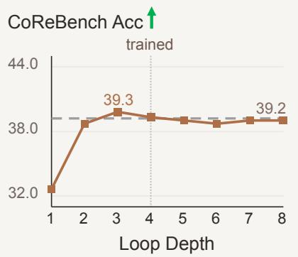

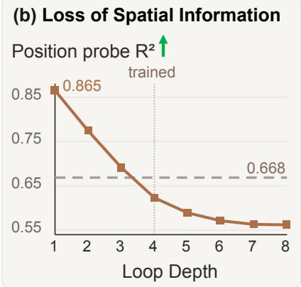  
Figure 3 Limitations of na¨ıve looping in MMDiT. (a) Increasing inference loop depth beyond that used in training initially improves performance, then saturates and degrades. (b) This degradation coincides with a steady loss of linearly decodable spatial information under a ridge-regression probe.

To meet these requirements, we introduce Looped Diffusion Transformer (Looped-DiT), combines intermediate-loop Deep Supervision with Self-Modulating Attention to regulate attention updates as representations evolve across loops. To our knowledge, this is the first systematic study of looped computation for text-to-image generation. We investigate whether looped computation can improve parameter efficiency, use inference-time compute more effectively, and support latent visual reasoning. Our contributions are summarized as follows:

1. We demonstrate the effectiveness of looping as a parameter-efficient scaling approach for text-to-image generation. Notably, a 260M-parameter Looped-DiT outperforms non-looped models with roughly 6.5× more parameters across multiple text-to-image benchmarks while requiring 4.9× lower inference compute.

2. We provide evidence for loop depth as a complementary axis for inference-time scaling. Under matched inference compute, allocating additional computation to increasing loop depth yields greater gains than allocating it to more denoising steps.

3. We provide evidence that looping can support latent visual reasoning through iterative hidden-state refinement, with deeper loops progressively correcting earlier errors and resolving interdependent constraints without explicit textual reasoning traces.

## 2 Looped Multimodal Diffusion Transformer

In this section, we describe Looped Diffusion Transformer (Looped-DiT). Looped-DiT is built on MiniT2I [49], a pixel-space denoiser based on MMDiT [11]. We use MiniT2I as our backbone because its simple training pipeline provides a controlled setting for studying loop depth. Looped-DiT increases computational depth by repeatedly applying a shared group of Transformer blocks. As shown in Fig. 2, we partition the network into a pre-loop stage A, a looped stage $B ,$ and a post-loop stage C. Given a noisy image x and text condition $y ,$ let $h _ { \mathrm { i n p u t } }$ denote the corresponding image and text token representations. The forward computation is

$$
h ^ { ( 0 ) } = \mathcal { A } ( h _ { \mathrm { i n p u t } } ) \qquad h ^ { ( r ) } = \mathcal { B } ( h ^ { ( r - 1 ) } ) , \quad r = 1 , \dots , N , \qquad \hat { x } _ { 0 } = \mathcal { C } ( h ^ { ( N ) } ) .\tag{1}
$$

Here, N denotes loop depth. At each iteration, B updates both image and text hidden states, which become the input to the next iteration. Since the parameters of B are shared across iterations, increasing N increases effective computational depth without increasing parameter count. This looped computation occurs within each denoising step before the sampler advances, allowing loop depth to be varied independently of the number of denoising steps. To address the limitations of na¨ıve looping, Looped-DiT further incorporates Deep Supervision for intermediate loop predictions and Self-Modulating Attention to regulate attention updates across loops.

## 2.1 Deep Supervision

Supervising only the final prediction requires gradients to backpropagate through all subsequent iterations to reach earlier loop states. As loop depth increases, this creates a long, indirect optimization path that deprives earlier states of direct learning signals. Inspired by prior work [27], we introduce Deep Supervision, which applies the flow-matching objective to predictions at every loop depth rather than relying solely on the final state.

Specifically, for each loop depth $n = 1 , \ldots , N$ , we decode the corresponding hidden state through the shared post-loop stage as

$$
\begin{array} { r } { \hat { x } _ { 0 } ^ { ( n ) } = \mathcal { C } \Big ( h ^ { ( n ) } \Big ) . } \end{array}
$$

We express the flow-matching loss [30] in terms of clean-image prediction. Given a training image $x _ { 0 } ,$ , we construct the noisy input as

$$
x _ { t } = t x _ { 0 } + ( 1 - t ) \tilde { \epsilon } , \qquad \tilde { \epsilon } \sim \mathcal { N } \big ( 0 , \sigma _ { \mathrm { n o i s e } } ^ { 2 } I \big ) , \qquad t \in ( 0 , 1 ) .
$$

All loop predictions share the same noisy input and timestep, and each is supervised against the same clean image x0 using

$$
\ell _ { n } = \mathbb { E } \left[ \frac { \| \hat { x } _ { 0 } ^ { ( n ) } - x _ { 0 } \| _ { 2 } ^ { 2 } } { d _ { x } c ( t ) ^ { 2 } } \right] c ( t ) = \operatorname* { m a x } \{ 1 - t , \tau \} .\tag{2}
$$

Here, $d _ { x }$ is the number of image elements, and $\tau > 0$ prevents the loss weight from diverging as t approaches one. The overall training objective combines supervision across loop depths as

$$
\mathcal { L } = \sum _ { n = 1 } ^ { N } w _ { n } \ell _ { n } , \quad w _ { n } \ge 0 ,\tag{3}
$$

where $w _ { n }$ controls the supervision strength at loop n. Because intermediate predictions reuse the shared post-loop stage C and are decoded only during training, Deep Supervision introduces no additional parameters or inference overhead.

## 2.2 Self-Modulating Attention

Standard softmax attention controls the relative contributions of source tokens but not the strength of the resulting update. As the same shared blocks are repeatedly applied across loops, their attention updates can become redundant, potentially overwriting or attenuating image-token representations. We therefore use Self-Modulating Attention to regulate repeated updates across loops based on the current hidden states. We study two realizations of this idea in this work: Gated Attention [38], which explicitly scales each attention-head output with a learned gate, and Exclusive Self Attention [62], which applies a state-dependent projection that removes the component along the token’s own value direction. We briefly describe both mechanisms below and provide further details and analysis in Appendix A.3.

For a token i in either modality, let $u _ { i }$ denote its normalized hidden state. The output of attention head h is $o _ { i , h } =$ $\begin{array} { r } { \sum _ { j } \alpha _ { i j , h } v _ { j , h } } \end{array}$ , where $\alpha _ { i j , h }$ is the attention weight assigned to source token j and $v _ { j , h }$ is its value vector. The sum runs over both image and text tokens. Both mechanisms modulate the resulting head output as $z _ { i , h } = G _ { i , h } o _ { i , h }$ before head concatenation and output projection, where $G _ { i , h }$ denotes the corresponding modulation factor.

For Gated Attention, the modulation $G _ { i , h }$ is a token-dependent scalar gate,

$$
G _ { i , h } ^ { \mathrm { g a t e } } = \sigma \left( w _ { g , h } ^ { \top } u _ { i } + b _ { g , h } \right) ,\tag{4}
$$

where $w _ { g , h }$ and $b _ { g , h }$ are modality-specific gate parameters. The resulting scalar explicitly controls the strength of each head contribution to the residual update.

<table><tr><td>Model</td><td>Params</td><td>GenEval</td><td>DPG</td><td>PRISM</td><td>CoRe</td><td>Spatial</td><td>TIIF-Short</td><td>Average</td></tr><tr><td colspan="9">Non-CoT models</td></tr><tr><td>E-MMDiT [43]</td><td>0.30B</td><td>69.1</td><td>80.4</td><td>51.6</td><td>30.7</td><td>45.7</td><td>63.4</td><td>56.8</td></tr><tr><td>SANA-0.6B [55]</td><td>0.59B</td><td>65.8</td><td>83.3</td><td>56.4</td><td>39.8</td><td>47.4</td><td>69.4</td><td>60.4</td></tr><tr><td>DeCo-XXL/16 [34]</td><td>1.1B</td><td>82.0</td><td>82.0</td><td>52.6</td><td>34.8</td><td>49.8</td><td>70.4</td><td>61.9</td></tr><tr><td>URSA-0.6B [8]</td><td>0.86B</td><td>64.1</td><td>85.6</td><td>59.6</td><td>43.4</td><td>52.0</td><td>67.6</td><td>62.1</td></tr><tr><td>TiM-T2I [51]</td><td>0.87B</td><td>82.8</td><td>83.2</td><td>51.4</td><td>36.7</td><td>48.2</td><td>70.6</td><td>62.2</td></tr><tr><td>DreamLite [13]</td><td>0.39B</td><td>71.6</td><td>85.2</td><td>55.5</td><td>42.2</td><td>53.9</td><td>72.6</td><td>63.5</td></tr><tr><td>CogView4 [63]</td><td>6.4B</td><td>73.0</td><td>85.1</td><td>60.9</td><td>45.0</td><td>53.3</td><td>66.9</td><td>64.0</td></tr><tr><td>MiniT2I-B/16 [49]</td><td>0.26B</td><td>87.5</td><td>84.1</td><td>55.6</td><td>44.0</td><td>52.0</td><td>75.0</td><td>66.4</td></tr><tr><td>MiniT2I-L/16 [49]</td><td>0.91B</td><td>88.3</td><td>84.8</td><td>58.9</td><td>44.4</td><td>52.2</td><td>75.0</td><td>67.3</td></tr><tr><td>UniLiP-3B [45]</td><td>1.6B</td><td>90.3</td><td>83.4</td><td>58.5</td><td>45.0</td><td>51.6</td><td>78.2</td><td>67.8</td></tr><tr><td>InternVL-U [46]</td><td>1.7B</td><td>85.0</td><td>85.2</td><td>63.5</td><td>48.2</td><td>54.5</td><td>77.7</td><td>69.0</td></tr><tr><td colspan="9">CoT-Reasoning models</td></tr><tr><td>GoT-R1 [10]</td><td>6.9B</td><td>72.5</td><td>84.0</td><td>56.4</td><td>42.2</td><td>50.0</td><td>74.1</td><td>63.2</td></tr><tr><td>T2I-R1 [23]</td><td>6.9B</td><td>78.8</td><td>84.7</td><td>57.1</td><td>35.5</td><td>49.7</td><td>77.6</td><td>63.9</td></tr><tr><td>Uni-CoT [37]</td><td>6.6B</td><td>81.2</td><td>84.1</td><td>58.8</td><td>45.8</td><td>53.8</td><td>76.8</td><td>66.8</td></tr><tr><td>Looped-DiT B/16 (Ours)</td><td>0.26B</td><td>87.4</td><td>87.0</td><td>67.0</td><td>53.5</td><td>54.6</td><td>79.7</td><td>71.5</td></tr></table>

Table 1 Comparison with state-of-the-art text-to-image models across six benchmarks.

For Exclusive Self Attention, the modulation $G _ { i , h }$ instead takes the form of a projection operator that removes the component along the token’s own value direction,

$$
G _ { i , h } ^ { \mathrm { x s a } } = I - \hat { v } _ { i , h } \hat { v } _ { i , h } ^ { \top } \qquad \hat { v } _ { i , h } = \frac { v _ { i , h } } { \vert \vert v _ { i , h } \vert \vert _ { 2 } } .\tag{5}
$$

Applying this projection to the attention output eliminates the self-value term, yielding

$$
z _ { i , h } ^ { \mathrm { x s a } } = G _ { i , h } ^ { \mathrm { x s a } } \sum _ { j \neq i } \alpha _ { i j , h } v _ { j , h } .\tag{6}
$$

Unlike Gated Attention, which explicitly controls update magnitude through a learnable gate, XSA regulates the update through a parameter-free, state-dependent projection. Since these modulation mechanisms are designed specifically to regulate repeated attention updates under looping, we apply them only within the looped stage B of Looped-DiT.

## 3 Experiments

In this section, we systematically evaluate Looped-DiT. We first examine its parameter efficiency, inference efficiency, and reasoning capability across varying loop depths. We then analyze whether alternative scaling strategies can reproduce the benefits of looping. Finally, we ablate Deep Supervision and Self-Modulating Attention.

We base Looped-DiT on MiniT2I [49], a minimal pixel-space MMDiT, and train two variants, which we denote as B/16 and B/32 according to their patch sizes. We divide the 17 MMDiT blocks in the model into a split of 6, 5, 6, and loop the middle 5 blocks for N = 4 times. We evaluate our models on both general and reasoning-related datasets, including DPG-Bench [22], PRISM [12], T2I-CoReBench [28], SpatialGenEval [50], GenEval [16], and TIIF-Short [53]. Unless otherwise specified, we use B/16 for the main results in Sec. 3.1 and the more lightweight B/32 for the analyses in Sec. 3.2 and ablations in Sec. 3.3. When avg. results are reported, they are computed over all 6 datasets for B/16 and 4 reasoning-related datasets for B/32. Full implementation details for all these experiments are provided in App. A.1.

## 3.1 Main Results

Parameter efficiency. Tab. 1 compares Looped-DiT B/16 with state-of-the-art text-to-image models under their official inference settings. As shown in the table, Looped-DiT B/16 achieves the best results on DPG-Bench, PRISM, T2I-CoReBench, SpatialGenEval and TIIF-Short, while using substantially fewer parameters than competing models. Notably, compared with the next-best model, InternVL-U, Looped-DiT B/16 achieves a 2.5-point higher avg. score with 6.5× fewer parameters.

(a) Avg Score vs Inference FLOPs  
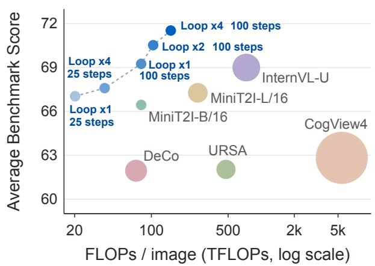

(b) Avg Score vs Latency  
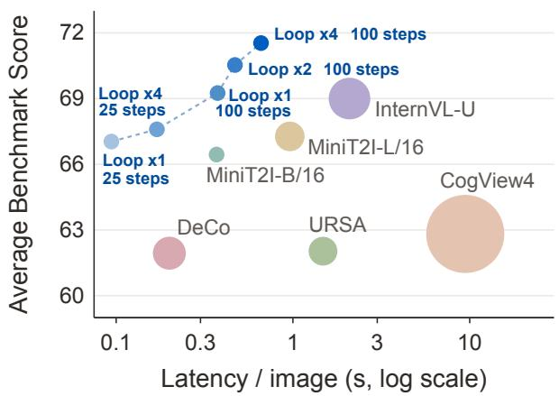

Figure 4 Performance-efficiency trade-offs across state-of-the-art text-to-image models. Average Score denotes the mean performance across 6 benchmarks. Blue circles denote Looped-DiT B/16 with varying loop depth and denoising steps.  
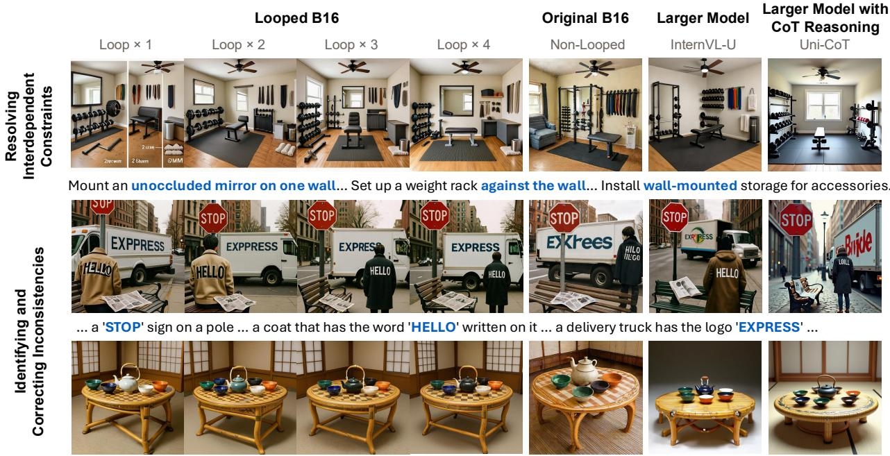  
… Five ceramic tea bowls in different colors - emerald green, deep indigo, pure white , charcoal black, and sunset orange …

Figure 5 Qualitative results of Looped-DiT B/16. Across successive loops, the model resolves spatial constraints and corrects inconsistencies.

Inference efficiency. Fig. 4 compares the performance–efficiency trade-off between Looped-DiT B/16 and state-of-theart text-to-image models in terms of inference compute and latency. Looped-DiT B/16 traces the Pareto frontier under both metrics, with loop depth and denoising steps providing flexible control over the inference budget.

Reasoning capability. Qualitatively, Looped-DiT B/16 exhibits behaviors consistent with constraint resolution and selfcorrection, two reasoning-related demands outlined in the introduction. As shown in Fig. 5, successive loops introduce missing content, reorganize objects to satisfy spatial constraints, and correct rendering errors or remove extraneous objects, while such errors remain in the shown larger non-looped and explicit CoT baselines. Fig. 4 further shows consistent performance gains as the loop count increases from 1 to 4, providing quantitative support for progressive refinement.

## 3.2 Necessity of Looping

Although looping improves performance and computational efficiency, it remains unclear whether these benefits are specific to looped computation or can be attained through alternative strategies. We therefore critically examine the necessity of looping here. Using the lightweight B/32 variant, we test whether its gains can be reproduced by increasing model depth or width, taking additional denoising steps, or introducing explicit chain-of-thought reasoning.

<table><tr><td>Model</td><td>Train GFLOPs</td><td>Inference Params Effective Hidden GFLOPs</td><td>(M)</td><td>depth</td><td>dim</td><td>DeepSup Looping</td><td></td><td>Avg. ↑</td></tr><tr><td>MiniT2I B/32</td><td>441</td><td>146</td><td>260</td><td>17</td><td>768</td><td>X</td><td>X</td><td>55.2</td></tr><tr><td>Deeper MiniT2I B/32</td><td>809</td><td>267</td><td>473</td><td>32</td><td>768</td><td>x</td><td>x</td><td>57.7 (+2.6)</td></tr><tr><td>Wider MiniT2I B/32</td><td>805</td><td>268</td><td>489</td><td>17</td><td>1056</td><td>x</td><td>x</td><td>58.6 (+3.5)</td></tr><tr><td>Deeper MiniT2I B/32 w. DeepSup</td><td>1,246</td><td>267</td><td>473</td><td>32</td><td>768</td><td>√</td><td>x</td><td>58.1 (+3.0)</td></tr><tr><td>Looped-DiT B/32 (Ours)</td><td>1,246</td><td>267</td><td>260</td><td>32</td><td>768</td><td>√</td><td>√</td><td>59.1 (+4.0)</td></tr></table>

Table 2 Benefits of looping under matched parameter and different compute budgets.

Do the gainsfrom looping persist when controllingfor model size and compute? Tab. 2 compares Looped-DiT B/32 with non-looped baselines under matched parameter, inference-compute, and training-compute settings. The deeper baseline replaces four passes through the five shared middle blocks with 20 distinct blocks to match the effective depth of 32, while the wider baseline increases the hidden dimension to approximately match the forward-pass compute. For the training-compute-matched baseline, we additionally apply Deep Supervision to the deeper model to match the training compute of Looped-DiT B/32. Looped-DiT B/32 improves the average score by 4.0 points over the parameter-matched baseline and outperforms both inference-compute-matched baselines despite using fewer parameters. Under matched training compute, it achieves 59.1 compared with 58.1 for the deeper baseline. These results show that the gains from looping persist across these parameter and compute settings

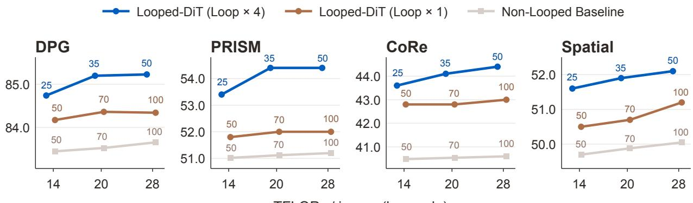  
TFLOPs / image (log scale)  
Figure 6 Loop iterations versus additional denoising steps. We compare 4-loop inference with single-pass inference using the same looped checkpoint or the non-looped model. Both single-pass settings use additional denoising steps to match the per-image inference FLOPs of 4-loop inference.

Is increasing loop depth more effective than adding denoising steps? Fig. 6 compares varying the loop depth of Looped-DiT B/32 with reallocating the same inference budget to additional denoising steps. We consider two nonlooped baselines, one using the same checkpoint with looping disabled, thereby holding the learned weights and training history fixed, and the other using the same architecture trained without looping. From 25- to 50-step settings, allocating compute to loop depth consistently yields higher performance than allocating it to additional denoising steps, showing that looping is a more effective use of inference compute.

<table><tr><td>Capability</td><td>CoT</td><td>Looping</td><td>Both</td></tr><tr><td>Benchmark avg.</td><td>+2.1</td><td>+4.0</td><td>+5.5</td></tr><tr><td colspan="4">Constraint resolution (Looping-favored)</td></tr><tr><td>PRISM / Long Text CoRe / Multi-Relation</td><td>+3.1 +1.2</td><td>+9.1 +8.3</td><td>+9.4 +8.4</td></tr><tr><td>CoRe / Procedural</td><td>+4.7</td><td>+9.4</td><td>+9.6</td></tr><tr><td>Spatial / Orientation</td><td>+0.0</td><td>+6.0</td><td>+6.2</td></tr><tr><td>Spatial / Motion</td><td>+0.1</td><td>+6.0</td><td>+6.3</td></tr><tr><td colspan="4">Inferring implied visual content (CoT-favored)</td></tr><tr><td>CoRe / Generalization</td><td>+22.2</td><td>+7.5</td><td>+24.5</td></tr><tr><td>CoRe / Hypothetical</td><td>+9.4</td><td>+3.5</td><td>+11.6</td></tr><tr><td>CoRe / Reconstructive</td><td>+6.2</td><td>+3.4</td><td>+8.9</td></tr></table>

Table 3 Complementary gains from looping and textual CoT over the non-looped model with original prompts. Both combines looping with CoT rewriting.

Is looping complementary to textual CoT? We compare CoT-based prompt rewriting for the non-looped model (CoT), looping with original prompts (Looping), and their combination (Both). For prompt rewriting, Qwen3 [57] is instructed to make the intended content explicit and clarify spatial layout, without adding unrelated details. Consistent with the constraint-resolution and self-correction behavior observed above, Tab. 3 shows larger gains from looping on subtasks that require joint satisfaction of relational, procedural, or spatial constraints. Adding CoT rewriting offers little further benefit on these subtasks. Conversely, CoT yields larger gains on subtasks requiring the model to infer the implied visual content from examples and rules. Combining the two achieves the highest overall score, suggesting complementary strengths across different aspects of visual generation.

## 3.3 Ablation Study

<table><tr><td rowspan="2">Looping</td><td rowspan="2">DeepSup</td><td rowspan="2">Attention</td><td colspan="5">Benchmarks ↑</td></tr><tr><td>DPG</td><td>PRISM</td><td>CoRe</td><td>Spatial</td><td>Avg.</td></tr><tr><td>x</td><td>X</td><td>x</td><td>82.0</td><td>51.2</td><td>39.2</td><td>48.3</td><td>55.2</td></tr><tr><td>√</td><td>x</td><td>x</td><td>84.4</td><td>51.1</td><td>39.3</td><td>49.9</td><td>56.2</td></tr><tr><td>√</td><td>Exponential</td><td>x</td><td>84.3</td><td>52.1</td><td>41.0</td><td>51.0</td><td>57.1</td></tr><tr><td>√</td><td>Final + Mean</td><td>x</td><td>84.4</td><td>53.9</td><td>40.6</td><td>50.9</td><td>57.5</td></tr><tr><td>√</td><td>x</td><td>Gated</td><td>84.0</td><td>53.0</td><td>39.5</td><td>49.7</td><td>56.6</td></tr><tr><td>√</td><td>x</td><td>XSA</td><td>84.2</td><td>54.5</td><td>43.2</td><td>52.1</td><td>58.5</td></tr><tr><td>√</td><td>Final + Mean</td><td>XSA</td><td>85.3</td><td>54.4</td><td>44.5</td><td>52.3</td><td>59.1</td></tr></table>

Table 4 Component ablations. Avg. is the mean over the four reported benchmarks. DeepSup denotes deep supervision; ✗ indicates final-loop only supervision. The loop weights $\left( { { w _ { 1 } } , { w _ { 2 } } , { w _ { 3 } } , { w _ { 4 } } } \right)$ are $\left( ^ { 1 } / 8 , { } ^ { 1 } / 4 , { } ^ { 1 } / 2 , 1 \right)$ for Exponential and $\left( ^ { 1 } / 3 , { } ^ { 1 } / 3 , { } ^ { 1 } / 3 , { } 1 \right)$ for Final + Mean. Gated and XSA are self-modulating attention variants.

Component ablations. Tab. 4 summarizes the contributions of looping, deep supervision, and self-modulating attention. Looping alone improves over the baseline model. For deep supervision, we compare two weighting schemes: Exponential assigns exponentially smaller weights to earlier loops, and Final + Mean adds the final-loop loss to the mean loss over earlier loops. Both outperform final-loop-only supervision, with Final + Mean performing better. For self-modulating attention, both Gated and XSA improve over unmodulated attention, with XSA providing larger gains. Combining Final + Mean supervision with XSA yields the highest average score.

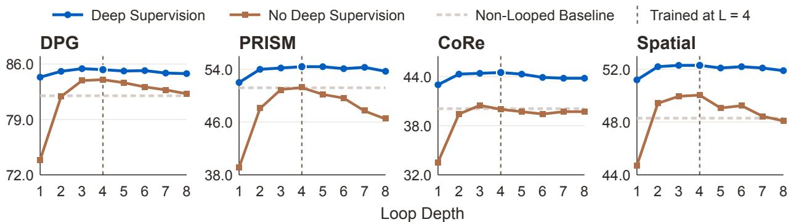

Figure 7 Deep supervision improves the standard 4-loop result, stabilizes early exits, and maintains performance beyond the training loop count. The model trains at 4 loops and infers at 1–8 loops.  
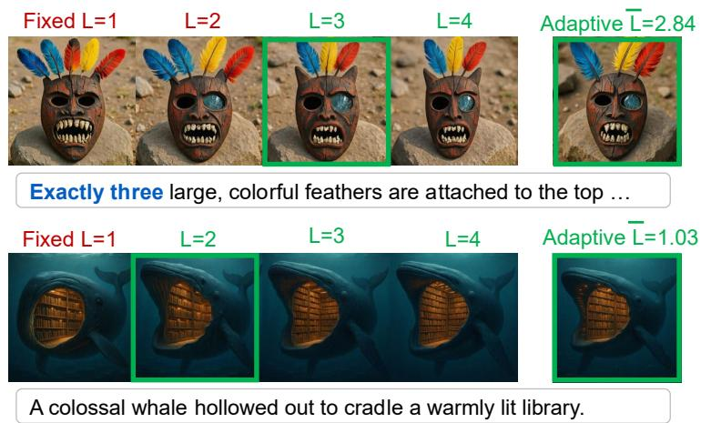

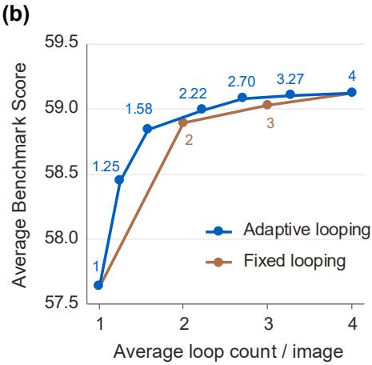  
Figure 8 Adaptive looping results. (a) By choosing different loop counts for each case, adaptive looping produces correct images with lower average loop loop counts compared to fixed looping. (b) Adaptive looping unlocks compute–performance trade-off without retraining, and also reaches better performance with fewer per-image loops. The numbers denote average per-image loops.

Deep supervision improves both single-pass and multi-loop performance. Fig. 7 shows that deep supervision improves performance across 1–8 inference loops, substantially reduces the penalty for early exit, and maintains performance beyond the 4 loops used during training. Notably, even the single-loop setting of the loop-trained model outperforms the standard non-looped baseline. Additional inference loops provide further gains with the same model.

The model’s robust performance across different loop counts also enables adaptive looping, where a lightweight gating network is introduced to decide whether to exit after each loop. The network consists of a cross-attention layer that extracts information from post-loop activations using 4 learnable queries, followed by an MLP head that predicts the expected benefit of continuing after the r-th loop, denoted as $\hat { y } _ { r }$ . We define its training target as the largest achievable future loss reduction per additional loop:

$$
y _ { r } = \operatorname* { m a x } \left\{ 0 , \operatorname* { m a x } _ { k = r + 1 , \ldots , N } \frac { \ell _ { r } - \ell _ { k } } { k - r } \right\} , \quad \quad r = 1 , 2 , \ldots , N - 1 ,\tag{7}
$$

where $\ell _ { k }$ denotes the reconstruction error between the k-th loop prediction and the ground-truth image. The target does not assume that the last pass is the most accurate exit; if no later exit improves upon the current prediction, it is set to zero. At inference time, we set a threshold λ and continue looping while ${ \hat { y } } _ { r } > \lambda .$ , while stopping at the first loop for which $\hat { y } _ { r } \le \lambda$ . By varying λ, we can adjust the average number of loops according to the computation budget without retraining. Fig. 8(a) shows qualitative examples in which adaptive looping uses enough loops to produce correct images while avoiding additional computation that offers little benefit once the prompt requirements are satisfied. Fig. 8(b) shows quantitative results that adaptive looping outperforms fixed-loop inference at matched mean loop counts, halves the performance drop in a few-loop setting (at 1.25 loops), and reaches a comparable performance plateau earlier (at 2.70 loops).

(a) Position probe R²  
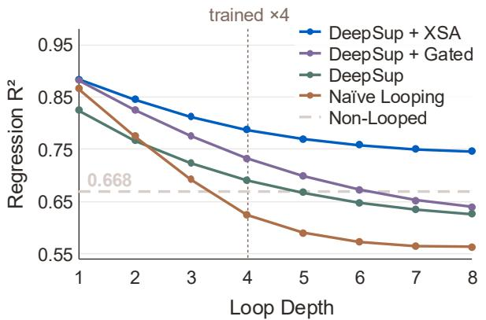  
(c) XSA suppresses excessive attention updates

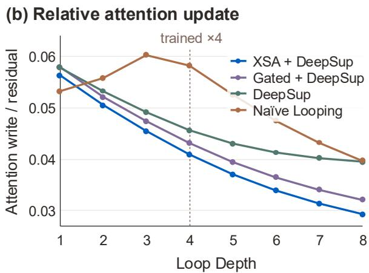

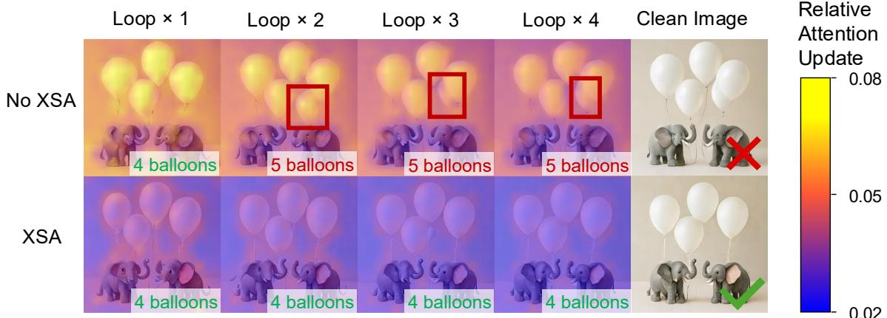  
Prompt: a playful image of 2 toy elephants and 4 white balloons  
Figure 9 Self-modulating attention reduces excessive writing. (a) Ridge-regression $R ^ { 2 }$ for decoding token positions from post-loop activations. (b) Attention-update norm relative to the residual-stream norm. (c) An example of XSA reducing redundant attention updates, and thus preventing an error that would be introduced by looping without XSA at the same denoising step.

Self-modulating attention mitigates excessive updates across loops. Tab. 5 shows that XSA yields a larger gain for the looped model (+1.6) than for the parameter-matched (−0.1) and compute-matched (+0.7) non-looped baselines, suggesting that modulation is especially important under repeated updates. We hypothesize that unmodulated attention produces excessive updates across loops that progressively overwrite critical token information. Fig. 9(a) and Fig. 9(b) support this hypothesis. As loop count increases, unmodulated attention exhibits the largest relative update norm and the strongest decline in token-position decodability, measured by $R ^ { 2 } ,$ while XSA maintains the smallest updates and the highest position decodability, with Gated Attention in between. This ordering also matches their benchmark performance in Tab. 4. Fig. 9(c) shows the same effect qualitatively. Without modulation, later loops continue modifying an already-correct image and introduce an extraneous object, whereas XSA suppresses later updates and preserves the existing structure. Together, these results suggest that self-modulating attention limits excessive updates across loops and helps preserve critical token information.

<table><tr><td>Looping</td><td>Effective Deep depth</td><td>Sup</td><td>Attention</td><td> $\begin{array} { c } { { \mathrm { A v g . } } } \\ { { \mathrm { s c o r e \uparrow } } } \end{array}$  ∆xSA</td></tr><tr><td colspan="5">Non-looped, parameter-matched</td></tr><tr><td>x X</td><td>17</td><td>x</td><td>x XSA</td><td>55.2 55.1</td></tr><tr><td></td><td>17</td><td>x</td><td></td><td>-0.1</td></tr><tr><td colspan="5">Non-looped, compute-matched</td></tr><tr><td>X x</td><td>32 32</td><td>√</td><td>x XSA</td><td>58.1 58.8</td></tr><tr><td></td><td></td><td>√</td><td></td><td>+0.7</td></tr><tr><td colspan="5">Looped</td></tr><tr><td>√</td><td>32</td><td>√</td><td>x</td><td>57.5</td></tr><tr><td>√</td><td>32</td><td>√</td><td>XSA</td><td>59.1 +1.6</td></tr></table>

Table 5 Gains from XSA with and without looping. Non-looped depths 17 and 32 match the looped model’s parameter count and forward FLOPs, respectively. ∆XSA is the point gain over the paired variant without XSA.

## 4 Related Works

We summarize the most relevant work here and provide a more comprehensive discussion in Appendix A.2. Looped Transformers [7, 14] have been widely studied in language modeling as a way to increase computational depth by repeatedly applying shared blocks without adding parameters. Closest to our setting, Elastic Looped Transformers [18] apply this principle to class-conditional image and video generation, allowing loop depth to vary at inference. We build on MMDiT [11] to study loop-depth scaling in text-to-image generation, focusing on parameter efficiency and compositional and spatial reasoning. Beyond parameter efficiency, we also examine how looping changes the allocation of inference compute. This connects to few-step and one-step methods [33, 59], which improve inference efficiency by reducing the number of denoising steps. Under a fixed inference budget, we find that increasing loop depth yields larger gains than adding more denoising steps, suggesting that looped computation can provide a more effective form of iterative computation for diffusion models. Together, these connections position our work at the intersection of Looped Transformers, text-to-image diffusion models, and efficient inference.

## 5 Conclusions

We introduce Looped-DiT, which repeatedly applies shared Transformer blocks within each denoising step to increase computational depth without increasing parameter count. To our knowledge, this is the first systematic investigation of looped computation for text-to-image generation. We find that naive looping is unreliable and progressively degrades spatial information, highlighting the need for intermediate supervision and adaptive regulation for effective looped computation. Importantly, controlled comparisons indicate that the resulting gains cannot be simply explained by scaling model depth or width, allocating the same inference compute to additional denoising steps, or introducing explicit textual reasoning. Beyond these performance gains, successive loops exhibit behaviors suggestive of latent visual reasoning, with iterative refinement of hidden representations progressively resolving constraints and correcting earlier errors. Together, these findings establish looping as a promising parameter-efficient way to improve future text-to-image models.

## References

[1] Sangmin Bae, Adam Fisch, Hrayr Harutyunyan, Ziwei Ji, Seungyeon Kim, and Tal Schuster. Relaxed recursive transformers: Effective parameter sharing with layer-wise lora. In International Conference on Learning Representations, volume 2025, pages 34282–34327, 2025.

[2] Sangmin Bae, Yujin Kim, Reza Bayat, Sungnyun Kim, Jiyoun Ha, Tal Schuster, Adam Fisch, Hrayr Harutyunyan, Ziwei Ji, Aaron Courville, et al. Mixture-of-recursions: Learning dynamic recursive depths for adaptive token-level computation. Advances in Neural Information Processing Systems, 38:96572–96617, 2026.

[3] Soravit Changpinyo, Piyush Sharma, Nan Ding, and Radu Soricut. Conceptual 12m: Pushing web-scale image-text pre-training to recognize long-tail visual concepts. In 2021 IEEE/CVF Conference on Computer Vision and Pattern Recognition (CVPR), pages 3557–3567. IEEE, 2021.

[4] Jiuhai Chen, Zhiyang Xu, Xichen Pan, Yushi Hu, Can Qin, Tom Goldstein, Lifu Huang, Tianyi Zhou, Saining Xie, Silvio Savarese, et al. Blip3-o: A family of fully open unified multimodal models-architecture, training and dataset. arXiv preprint arXiv:2505.09568, 2025.

[5] Junsong Chen, Jincheng Yu, Chongjian Ge, Lewei Yao, Enze Xie, Zhongdao Wang, James Kwok, Ping Luo, Huchuan Lu, and Zhenguo Li. PixArt-α: Fast training of diffusion transformer for photorealistic text-to-image synthesis. In International Conference on Learning Representations, 2024.

[6] Junying Chen, Zhenyang Cai, Pengcheng Chen, Shunian Chen, Ke Ji, Xidong Wang, Yunjin Yang, and Benyou Wang. Sharegpt-4o-image: Aligning multimodal models with gpt-4o-level image generation. arXiv preprint arXiv:2506.18095, 2025.

[7] Mostafa Dehghani, Stephan Gouws, Oriol Vinyals, Jakob Uszkoreit, and Łukasz Kaiser. Universal transformers. arXiv preprint arXiv:1807.03819, 2018.

[8] Haoge Deng, Ting Pan, Fan Zhang, Yang Liu, Zhuoyan Luo, Yufeng Cui, Wenxuan Wang, Chunhua Shen, Shiguang Shan, Zhaoxiang Zhang, and Xinlong Wang. Uniform discrete diffusion with metric path for video generation. arXiv preprint arXiv:2510.24717, 2025. URL https://arxiv.org/abs/2510.24717.

[9] Mingyang Deng, He Li, Tianhong Li, Yilun Du, and Kaiming He. Generative modeling via drifting. arXiv preprint arXiv:2602.04770, 2026.

[10] Chengqi Duan, Rongyao Fang, Yuqing Wang, Kun Wang, Linjiang Huang, Xingyu Zeng, Hongsheng Li, and Xihui Liu. GoT-R1: Unleashing reasoning capability of MLLM for visual generation with reinforcement learning. arXiv preprint arXiv:2505.17022, 2025. URL https://arxiv.org/abs/2505.17022.

[11] Patrick Esser, Sumith Kulal, Andreas Blattmann, Rahim Entezari, Jonas Muller, Harry Saini, Yam Levi, Dominik Lorenz, Axel¨ Sauer, Frederic Boesel, et al. Scaling rectified flow transformers for high-resolution image synthesis. In Forty-first international conference on machine learning, 2024.

[12] Rongyao Fang, Aldrich Yu, Chengqi Duan, Linjiang Huang, Shuai Bai, Yuxuan Cai, Kun Wang, Si Liu, Xihui Liu, and Hongsheng Li. Flux-reason-6m & prism-bench: A million-scale text-to-image reasoning dataset and comprehensive benchmark. In International Conference on Learning Representations, volume 2026, pages 63157–63186, 2026.

[13] Kailai Feng, Yuxiang Wei, Bo Chen, Yang Pan, Hu Ye, Songwei Liu, Chenqian Yan, and Yuan Gao. DreamLite: A lightweight on-device unified model for image generation and editing. arXiv preprint arXiv:2603.28713, 2026. URL https://arxiv. org/abs/2603.28713.

[14] Jonas Geiping, Sean McLeish, Neel Jain, John Kirchenbauer, Siddharth Singh, Brian Bartoldson, Bhavya Kailkhura, Abhinav Bhatele, and Tom Goldstein. Scaling up test-time compute with latent reasoning: A recurrent depth approach. Advances in Neural Information Processing Systems, 38:41340–41391, 2026

[15] Zhengyang Geng, Mingyang Deng, Xingjian Bai, Zico Kolter, and Kaiming He. Mean flows for one-step generative modeling. Advances in Neural Information Processing Systems, 38:75460–75482, 2026.

[16] Dhruba Ghosh, Hanna Hajishirzi, and Ludwig Schmidt. Geneval: An object-focused framework for evaluating text-to-image alignment. ArXiv, abs/2310.11513, 2023. URL https://api.semanticscholar.org/CorpusID:264288728.

[17] Angeliki Giannou, Shashank Rajput, Jy-yong Sohn, Kangwook Lee, Jason D Lee, and Dimitris Papailiopoulos. Looped transformers as programmable computers. In International Conference on Machine Learning, pages 11398–11442. PMLR, 2023.

[18] Sahil Goyal, Swayam Agrawal, Gautham Govind Anil, Prateek Jain, Sujoy Paul, and Aditya Kusupati. Elt: Elastic looped transformers for visual generation, 2026. URL https://arxiv.org/abs/2604.09168.

[19] Shibo Hao, Sainbayar Sukhbaatar, DiJia Su, Xian Li, Zhiting Hu, Jason Weston, and Yuandong Tian. Training large language models to reason in a continuous latent space. arXiv preprint arXiv:2412.06769, 2024.

[20] Trevor Hastie, Robert Tibshirani, and Jerome Friedman. The Elements of Statistical Learning. Springer Series in Statistics. Springer New York Inc., New York, NY, USA, 2001.

[21] Jonathan Ho and Tim Salimans. Classifier-free diffusion guidance. arXiv preprint arXiv:2207.12598, 2022.

[22] Xiwei Hu, Rui Wang, Yixiao Fang, Bin Fu, Pei Cheng, and Gang Yu. Ella: Equip diffusion models with llm for enhanced semantic alignment. arXiv preprint arXiv:2403.05135, 2024.

[23] Dongzhi Jiang, Ziyu Guo, Renrui Zhang, Zhuofan Zong, Hao Li, Le Zhuo, Shilin Yan, Pheng-Ann Heng, and Hongsheng Li T2I-R1: Reinforcing image generation with collaborative semantic-level and token-level CoT. arXiv preprint arXiv:2505.00703, 2025. URL https://arxiv.org/abs/2505.00703.

[24] Jared Kaplan, Sam McCandlish, Tom Henighan, Tom B Brown, Benjamin Chess, Rewon Child, Scott Gray, Alec Radford, Jeffrey Wu, and Dario Amodei. Scaling laws for neural language models. arXiv preprint arXiv:2001.08361, 2020.

[25] Black Forest Labs. FLUX.2: Frontier Visual Intelligence. https://bfl.ai/blog/flux-2, 2025.

[26] Zhenzhong Lan, Mingda Chen, Sebastian Goodman, Kevin Gimpel, Piyush Sharma, and Radu Soricut. Albert: A lite bert for self-supervised learning of language representations. arXiv preprint arXiv:1909.11942, 2019.

[27] Chen-Yu Lee, Saining Xie, Patrick Gallagher, Zhengyou Zhang, and Zhuowen Tu. Deeply-supervised nets. In Artificial intelligence and statistics, pages 562–570. Pmlr, 2015.

[28] Ouxiang Li, Yuan Wang, Xinting Hu, Huijuan Huang, Rui Chen, Jiarong Ou, Xin Tao, Pengfei Wan, Xiaojuan Qi, and Fuli Feng. Easier painting than thinking: Can text-to-image models set the stage, but not direct the play? In International Conference on Learning Representations, volume 2026, pages 86729–86758, 2026.

[29] Shanchuan Lin, Anran Wang, and Xiao Yang. Sdxl-lightning: Progressive adversarial diffusion distillation. arXiv preprint arXiv:2402.13929, 2024.

[30] Yaron Lipman, Ricky TQ Chen, Heli Ben-Hamu, Maximilian Nickel, and Matt Le. Flow matching for generative modeling. arXiv preprint arXiv:2210.02747, 2022.

[31] Xingchao Liu, Xiwen Zhang, Jianzhu Ma, Jian Peng, et al. Instaflow: One step is enough for high-quality diffusion-based text-to-image generation. In The twelfth international conference on learning representations, 2023.

[32] Ilya Loshchilov and Frank Hutter. Decoupled weight decay regularization. arXiv preprint arXiv:1711.05101, 2017.

[33] Simian Luo, Yiqin Tan, Longbo Huang, Jian Li, and Hang Zhao. Latent consistency models: Synthesizing high-resolution images with few-step inference. arXiv preprint arXiv:2310.04378, 2023.

[34] Zehong Ma, Longhui Wei, Shuai Wang, Shiliang Zhang, and Qi Tian. DeCo: Frequency-decoupled pixel diffusion for end-to-end image generation. arXiv preprint arXiv:2511.19365, 2025. URL https://arxiv.org/abs/2511.19365.

[35] OpenDatasets. dalle-3-dataset (laion dall-e 3 discord dataset), 2023. URL https://huggingface.co/datasets/ OpenDatasets/dalle-3-dataset.

[36] William Peebles and Saining Xie. Scalable diffusion models with transformers. In 2023 IEEE/CVF International Conference on Computer Vision (ICCV), pages 4172–4182. IEEE, 2023.

[37] Luozheng Qin, Jia Gong, Yuqing Sun, Tianjiao Li, Mengping Yang, Xiaomeng Yang, Chao Qu, Zhiyu Tan, and Hao Li. Uni-CoT: Towards unified chain-of-thought reasoning across text and vision. arXiv preprint arXiv:2508.05606, 2025. URL https://arxiv.org/abs/2508.05606.

[38] Zihan Qiu, Zekun Wang, Bo Zheng, Zeyu Huang, Kaiyue Wen, Songlin Yang, Rui Men, Le Yu, Fei Huang, Suozhi Huang, et al. Gated attention for large language models: Non-linearity, sparsity, and attention-sink-free. Advances in Neural Information Processing Systems, 38:100092–100118, 2026.

[39] Yuxi Ren, Xin Xia, Yanzuo Lu, Jiacheng Zhang, Jie Wu, Pan Xie, Xing Wang, and Xuefeng Xiao. Hyper-sd: Trajectory segmented consistency model for efficient image synthesis. Advances in neural information processing systems, 37:117340– 117362, 2024.

[40] Tim Salimans and Jonathan Ho. Progressive distillation for fast sampling of diffusion models. arXiv preprint arXiv:2202.00512, 2022.

[41] Axel Sauer, Dominik Lorenz, Andreas Blattmann, and Robin Rombach. Adversarial diffusion distillation. In European Conference on Computer Vision, pages 87–103. Springer, 2024.

[42] Nikunj Saunshi, Nishanth Dikkala, Zhiyuan Li, Sanjiv Kumar, and Sashank J Reddi. Reasoning with latent thoughts: On the power of looped transformers. In International Conference on Learning Representations, volume 2025, pages 14855–14881, 2025.

[43] Tong Shen, Jingai Yu, Dong Zhou, Dong Li, and Emad Barsoum. E-MMDiT: Revisiting multimodal diffusion transformer design for fast image synthesis under limited resources. arXiv preprint arXiv:2510.27135, 2025. URL https://arxiv.org/ abs/2510.27135.

[44] Yang Song, Prafulla Dhariwal, Mark Chen, and Ilya Sutskever. Consistency models. arXiv preprint arXiv:2303.01469, 2023.

[45] Hao Tang, Chenwei Xie, Xiaoyi Bao, Tingyu Weng, Pandeng Li, Yun Zheng, and Liwei Wang. UniLiP: Adapting CLIP for unified multimodal understanding, generation and editing. arXiv preprint arXiv:2507.23278, 2025. URL https://arxiv. org/abs/2507.23278.

[46] Changyao Tian, Danni Yang, Guanzhou Chen, Erfei Cui, Zhaokai Wang, Yuchen Duan, Penghao Yin, Sitao Chen, Ganlin Yang, Mingxin Liu, Zirun Zhu, Ziqian Fan, Leyao Gu, Haomin Wang, Qi Wei, Jinhui Yin, Xue Yang, Zhihang Zhong, Qi Qin, Yi Xin, Bin Fu, Yihao Liu, Jiaye Ge, Qipeng Guo, Gen Luo, Hongsheng Li, Yu Qiao, Kai Chen, and Hongjie Zhang. InternVL-U: Democratizing unified multimodal models for understanding, reasoning, generation and editing. arXiv preprint arXiv:2603.09877, 2026. URL https://arxiv.org/abs/2603.09877.

[47] Ashish Vaswani, Noam Shazeer, Niki Parmar, Jakob Uszkoreit, Llion Jones, Aidan N Gomez, Łukasz Kaiser, and Illia Polosukhin. Attention is all you need. Advances in neural information processing systems, 30, 2017.

[48] Shaowen Wang, Ge Zhang, Kairong Luo, Yuhao Wu, Shaofan Liu, Jiaheng Liu, Wenhao Huang, Shen Yan, and Jian Li. Smelt: Scaling laws for compute-matched moe looped transformers. arXiv preprint arXiv:2609.01343, 2026.

[49] Xianbang Wang, Hanhong Zhao, Yiyang Lu, Kangyang Zhou, Linrui Ma, and Kaiming He. Minit2i: A minimalist baseline for text-to-image generation, 2026. URL https://peppaking8.github.io/#/post/minit2i.

[50] Zengbin Wang, Xuecai Hu, Yong Wang, Feng Xiong, Man Zhang, and Xiangxiang Chu. Everything in its place: Benchmarking spatial intelligence of text-to-image models. arXiv preprint arXiv:2601.20354, 2026.

[51] Zidong Wang, Yiyuan Zhang, Xiaoyu Yue, Xiangyu Yue, Yangguang Li, Wanli Ouyang, and Lei Bai. Transition models: Rethinking the generative learning objective. arXiv preprint arXiv:2509.04394, 2025. URL https://arxiv.org/abs/2509. 04394.

[52] Jason Wei, Xuezhi Wang, Dale Schuurmans, Maarten Bosma, Fei Xia, Ed Chi, Quoc V Le, Denny Zhou, et al. Chain-of-thought prompting elicits reasoning in large language models. Advances in neural information processing systems, 35:24824–24837, 2022.

[53] Xinyu Wei, Jinrui Zhang, Zeqing Wang, Hongyang Wei, Zhen Guo, Bairui Li, and Lei Zhang. Tiif-bench: How does your t2i model follow your instructions? arXiv preprint arXiv:2506.02161, 2025.

[54] Chenfei Wu, Jiahao Li, Jingren Zhou, Junyang Lin, Kaiyuan Gao, Kun Yan, Sheng-ming Yin, Shuai Bai, Xiao Xu, Yilei Chen, et al. Qwen-image technical report. arXiv preprint arXiv:2508.02324, 2025.

[55] Enze Xie, Junsong Chen, Junyu Chen, Han Cai, Haotian Tang, Yujun Lin, Zhekai Zhang, Muyang Li, Ligeng Zhu, Yao Lu, et al. Sana: Efficient high-resolution image synthesis with linear diffusion transformers. arXiv preprint arXiv:2410.10629, 2024.

[56] Kevin Xu and Issei Sato. A formal comparison between chain of thought and latent thought. arXiv preprint arXiv:2509.25239 2025.

[57] An Yang, Anfeng Li, Baosong Yang, Beichen Zhang, Binyuan Hui, Bo Zheng, Bowen Yu, Chang Gao, Chengen Huang, Chenxu Lv, et al. Qwen3 technical report. arXiv preprint arXiv:2505.09388, 2025.

[58] Liu Yang, Kangwook Lee, Robert Nowak, and Dimitris Papailiopoulos. Looped transformers are better at learning learning algorithms. In International conference on learning representations, volume 2024, pages 42195–42214, 2024.

[59] Tianwei Yin, Michael Gharbi, Richard Zhang, Eli Shechtman, Fredo Durand, William T Freeman, and Taesung Park. One-step¨ diffusion with distribution matching distillation. In 2024 IEEE/CVF Conference on Computer Vision and Pattern Recognition (CVPR), pages 6613–6623. IEEE, 2024.

[60] Chengting Yu, Xiaobo Shu, Yadao Wang, Yizhen Zhang, Haoyi Wu, Jiaang Li, Rujiao Long, Ziheng Chen, Yuchi Xu, Bo Zheng, et al. Mesh: Memory-as-state-highways for recursive transformers. In International Conference on Learning Representations, volume 2026, pages 147865–147892, 2026.

[61] Chengting Yu, Xiaobo Shu, Yadao Wang, Yizhen Zhang, Haoyi Wu, You Wu, Rujiao Long, Ziheng Chen, Yuchi Xu, Wenbo Su et al. Spiralformer: Looped transformers can learn hierarchical dependencies via multi-resolution recursion. arXiv preprint arXiv:2602.11698, 2026.

[63] Wendi Zheng, Jiayan Teng, Zhuoyi Yang, Weihan Wang, Jidong Chen, Xiaotao Gu, Yuxiao Dong, Ming Ding, and Jie Tang. CogView3: Finer and faster text-to-image generation via relay diffusion. arXiv preprint arXiv:2403.05121, 2024. URL https://arxiv.org/abs/2403.05121.

[62] Shuangfei Zhai. Exclusive self attention. arXiv preprint arXiv:2603.09078, 2026.

## Appendix

## A Appendix

## A.1 Implementation Details

<table><tr><td>Configuration</td><td>Looped-DiT B/32</td><td>Looped-DiT B/16</td></tr><tr><td>Image resolution</td><td> $5 1 2 \times 5 1 2$ </td><td> $5 1 2 \times 5 1 2$ </td></tr><tr><td>Patch size</td><td>32</td><td>16</td></tr><tr><td>Image tokens</td><td>256</td><td>1024</td></tr><tr><td>Joint sequence length</td><td>512</td><td>1280</td></tr><tr><td>Hidden dimension</td><td>768</td><td>768</td></tr><tr><td>Unique MMDiT blocks</td><td>17</td><td>17</td></tr><tr><td>Pre / loop / post blocks</td><td> $6 / 5 / 6$ </td><td> $6 / 5 / 6$ </td></tr><tr><td>Training loop depth</td><td>4</td><td>4</td></tr><tr><td>Effective block applications</td><td>32</td><td>32</td></tr><tr><td>Attention heads</td><td>12</td><td>12</td></tr><tr><td>Head dimension</td><td>64</td><td>64</td></tr><tr><td>SwiGLU hidden dimension</td><td>2048</td><td>2048</td></tr><tr><td>Text preamble blocks</td><td>2</td><td>2</td></tr><tr><td>Patch-embedding bottleneck</td><td>128</td><td>128</td></tr><tr><td>Maximum text length</td><td>256</td><td>256</td></tr><tr><td>Parameters</td><td>260M</td><td>260M</td></tr></table>

Table 6 Model configurations. Looped-DiT B/32 and Looped-DiT B/16 share the same Transformer backbone and differ mainly in patch size and the resulting image-token sequence length.

Model architecture. We adopt MiniT2I [49], a pixel-space denoiser based on the MMDiT architecture [11], as our backbone. Its simple architecture and training pipeline provide a controlled setting for studying loop depth. Image and text streams are processed through separate pathways and interact through joint attention. We retain the original embedding layers, pre-RMSNorm, query/key normalization, and rotary position embeddings, with no explicit timestep conditioning.

We train two Looped-DiT variants at $5 1 2 \times 5 1 2$ resolution, denoted B/32 and B/16 according to their patch sizes. B/32 produces 256 image tokens, while B/16 produces 1024. The resulting models contain 260.2M and 258.1M parameters, respectively. Both comprise 17 MMDiT blocks with a hidden dimension of 768, 12 attention heads of dimension 64, and a SwiGLU feed-forward hidden dimension of 2048.

To introduce looped computation, we divide the 17 MMDiT blocks as evenly as possible into pre-loop, looped, and post-loop groups, yielding a [6, 5, 6] split. Given our resource constraints, we use this partition and a training loop depth of four as simple defaults rather than exhaustively optimized choices. Alternative partitions and training loop depths are left for future exploration. During training, the middle five blocks are repeated four times with shared parameters. This yields 32 effective block applications per denoising step while retaining only 17 unique parameterized blocks. Self-Modulating Attention is applied within the looped blocks to regulate the strength of attention updates across loops. At inference, loop depth can be varied without changing the model parameters. Unless otherwise stated, we use an inference loop depth of four. We use B/16 for the main results and B/32 for ablation studies. Tab. 6 summarizes the full model configurations.

Training objective. We train all our models directly in pixel space using a flow-matching objective [30]. Given a clean image x and noise $\epsilon \sim \mathcal { N } ( 0 , 4 I )$ , we construct the noisy image as

$$
x _ { t } = t x + ( 1 - t ) \epsilon ,\tag{8}
$$

where t is sampled from a logit-normal distribution with $\mu = - 0 . 8$ and $\sigma = 0 . 8$ . The target and predicted velocity fields are then defined as

$$
v = \frac { x - x _ { t } } { \operatorname* { m a x } ( 1 - t , 0 . 0 5 ) } , \qquad \hat { v } = \frac { \hat { x } _ { 0 } - x _ { t } } { \operatorname* { m a x } ( 1 - t , 0 . 0 5 ) } ,\tag{9}
$$

<table><tr><td rowspan="2">Hyperparameter</td><td colspan="2">Looped-DiT B/32</td><td colspan="2">Looped-DiT B/16</td></tr><tr><td>Pretrain</td><td>Fine-tune</td><td>Pretrain</td><td>Fine-tune</td></tr><tr><td>Training steps</td><td>250K</td><td>40K</td><td>500K</td><td>80K</td></tr><tr><td>Global batch size</td><td></td><td>1024</td><td></td><td></td></tr><tr><td>Nodes × GPUs Optimizer</td><td> $2 \times 8$ </td><td> $2 \times 8$  AdamW</td><td> $4 \times 8$ </td><td> $4 \times 8$ </td></tr><tr><td>Adam  $( \beta _ { 1 } , \beta _ { 2 } )$ </td><td></td><td>(0.9, 0.95)</td><td></td><td></td></tr><tr><td>Weight decay</td><td></td><td>0</td><td></td><td></td></tr><tr><td>Peak learning rate</td><td></td><td> $4 \times 1 0 ^ { - 4 }$ </td><td></td><td></td></tr><tr><td>Initial learning rate</td><td></td><td></td><td></td><td></td></tr><tr><td>Warmup steps</td><td> $^ 1 _ { \mathrm { 5 K } } \times 1 0 ^ { - 6 }$ </td><td></td><td> $^ 1 _ { \mathrm { \Sigma \times 1 0 ^ { - 6 } } }$ </td><td></td></tr><tr><td>LR schedule</td><td>Warmup → Constant</td><td>Constant</td><td>Warmup → Constant</td><td>Constant</td></tr><tr><td>Gradient clipping</td><td></td><td>0.1</td><td></td><td></td></tr><tr><td>EMA decay</td><td></td><td>0.99995</td><td></td><td></td></tr><tr><td>Condition dropout</td><td></td><td>0.10</td><td></td><td></td></tr><tr><td>Noise scale</td><td></td><td>2.0</td><td></td><td></td></tr><tr><td>t distribution</td><td></td><td></td><td></td><td></td></tr><tr><td></td><td></td><td>LogitNormal(−0.8, 0.8)</td><td></td><td></td></tr><tr><td>Deep-supervision weighting</td><td></td><td>final+mean (1/3, 1/3, 1/3, 1)</td><td></td><td></td></tr></table>

Table 7 Training hyperparameters. Hyperparameters are shared across model scales and training stages unless otherwise noted.

and we minimize the mean-squared error $\| \hat { v } - v \| _ { 2 } ^ { 2 }$ . During training, we use a noise scale of 2.0 and drop the text condition with probability 0.1 to enable classifier-free guidance [21].

To directly supervise intermediate loop states, we apply Deep Supervision to predictions at loop depths 1, 2, and 3. Each intermediate hidden state is passed through the six shared post-loop blocks, followed by the final normalization and prediction layers, and is optimized against the same flow-matching target as the final prediction at loop depth 4. Intuitively, the final prediction should receive greater weight because it is produced after the full sequence of loop refinements, whereas earlier predictions correspond to intermediate states. We compare two weighting schemes for the four loop predictions, namely final+mean weighting $( ^ { 1 } / 3 , ^ { 1 } / 3 , ^ { 1 } / 3 , 1 )$ and exponential weighting $( ^ { 1 } / 8 , ^ { 1 } / 4 , ^ { 1 } / 2 , 1 )$ . Based on results with the B/32 architecture, we find that final+mean weighting achieves the best performance and therefore adopt it for B/16. These intermediate predictions are used exclusively during training and incur no additional parameters or inference-time computation.

Optimization. We optimize all our models using AdamW [32] with a global batch size of 1024 and a peak learning rate of $4 \times 1 0 ^ { - 4 }$ . During pretraining, the learning rate is linearly increased from $1 0 ^ { - 6 } { \mathrm { ~ t o ~ } } 4 \times 1 0 ^ { - 4 }$ over the first 5K steps and remains constant thereafter. Fine-tuning continues directly at this constant learning rate without additional warmup. B/32 is pretrained for 250K steps and fine-tuned for an additional 40K steps, while B/16 is pretrained for 500K steps and fine-tuned for an additional 80K steps. Tab. 7 summarizes the full optimization configuration.

Training data. We use the same training-data setup as MiniT2I [49], pretraining Looped-DiT on CC12M [3] and fine-tuning it on a mixture of BLIP3o-60K [4], DALL-E 3 [35], and ShareGPT-4o-Image [6]. Based on published papers and publicly released code and data, Looped-DiT and MiniT2I use the least training data among the models compared in Tab. 1. Among the remaining models that disclose their training-set size, all use at least twice as much data, while the others do not report their training-set size. We apply the same preprocessing to all training images, resizing each image so that its shorter side is 512 pixels, center-cropping it to $5 1 2 \times 5 1 2 .$ , and normalizing it to $[ - 1 , 1 ]$ . We use no random flipping or additional image augmentation.

Evaluation benchmarks. We evaluate Looped-DiT B/16 on six complementary text-to-image benchmarks covering compositional alignment, instruction following, and visual reasoning. GenEval [16] measures object-centric com positional alignment, including counting, color, and spatial relations, while DPG-Bench [22] evaluates adherence to dense prompts containing multiple objects, attributes, and relationships. TIIF-Bench [53] evaluates fine-grained instruction following across prompts of varying complexity. We use only its short-prompt split because our small-scale training setup primarily uses short captions with a maximum length of 256 tokens, making the long-prompt setting less representative of our training regime. T2I-CoReBench [28] targets complex composition and multi-step reasoning, PRISM-Bench [12] evaluates prompt-image alignment and reasoning across diverse challenging generation tasks, and SpatialGenEval [50] focuses specifically on spatial understanding and reasoning in information-dense scenes. For the B/32 analyses and ablations, we use DPG-Bench, T2I-CoReBench, PRISM-Bench, and SpatialGenEval. We focus on these four benchmarks because they are more directly related to the aspects of visual reasoning central to our study, particularly inferring implied visual content and resolving interdependent compositional and spatial constraints. Unless otherwise specified, when average results are reported, they are computed over all six benchmarks for B/16 and these four benchmarks for B/32.

<table><tr><td>Configuration</td><td>Params</td><td>Training</td><td>Inference</td></tr><tr><td>Compute-matched (Deeper)</td><td></td><td>GFLOPs</td><td>GFLOPs</td></tr><tr><td>Compute-matched (Wider)</td><td>473M (1.82×) 489M (1.88×)</td><td>809 (1.83×) 805 (1.83×)</td><td>267 (1.83×) 268 (1.84×)</td></tr><tr><td>Parameter-matched (MiniT2I-B/32)</td><td></td><td></td><td></td></tr><tr><td></td><td>260M (1.00×)</td><td>441 (1.00×)</td><td>146 (1.00×)</td></tr><tr><td>+ Looping</td><td>260M (1.00×)</td><td>809 (1.83×)</td><td>267 (1.83×)</td></tr><tr><td>+ XSA + DeepSup</td><td>260M (1.00×)</td><td>809 (1.83×)</td><td>267 (1.83×)</td></tr><tr><td></td><td>260M (1.00×)</td><td>1,246 (2.83×)</td><td>267 (1.83×)</td></tr><tr><td>+ DeepSup + XSA (ours)</td><td>260M (1.00×)</td><td>1,246 (2.83×)</td><td>267 (1.83×)</td></tr></table>

Table 8 Training and inference cost. Training GFLOPs are measured per sample for one full training step, including forward and backward computation and, when applicable, the Deep Supervision exits. Inference GFLOPs are measured per denoising forward pass. Parenthesized values are relative to the parameter-matched MiniT2I-B/32 baseline.

Inference and evaluation. Unless otherwise stated, we evaluate checkpoints obtained using an exponential moving average (EMA) of the model weights. We use Euler sampling with 100 denoising steps, classifier-free guidance [21] with a scale of 6.0, and loop depth N = 4. Sampling is initialized from N(0, 4I). To reduce variance from stochastic image generation, we report the average score over three independent evaluation runs with different sampling seeds. To study inference-time scaling, we additionally vary loop depth from 1 to 8 and the number of denoising steps under matched inference-compute budgets. For latency comparisons, all models are evaluated on a single NVIDIA H100 GPU with batch size 1. We discard the first few generations as warm-up and report the mean latency over the next 100 generations.

Training and inference cost. Tab. 8 reports the training and inference costs of the model configurations considered in our experiments using the Looped-DiT B/32 backbone. The compute-matched comparisons in the main paper are based on inference rather than training compute. Deep Supervision increases training compute because the intermediate states at loop depths 1–3 are decoded through the shared six-block post-loop stage. Our full model therefore requires 1,246 GFLOPs per sample per training step, compared with 809 and 805 GFLOPs for the Deeper and Wider baselines, respectively, or approximately 1.54× their training compute. This overhead is confined to training. At inference, the intermediate predictions are not evaluated, so Deep Supervision adds neither parameters nor inference compute. The full model thus retains the inference cost of the corresponding looped model and approximately matches the Deeper and Wider baselines. Moreover, this additional cost is incurred only during training and is amortized over subsequent generations. XSA introduces negligible computational overhead and does not change the reported training or inference GFLOPs. Overall, our method concentrates its additional computation during training while preserving the inference efficiency of the looped model.

## A.2 Additional Related Work

Diffusion Transformersfor Text-to-Image Generation. DiT [36] establishes Transformers [47] as scalable backbones for diffusion models, motivating their adoption in text-to-image generation. PixArt-α [5] demonstrates that Transformerbased text-to-image models can be trained efficiently at scale, while Stable Diffusion 3 [11] introduces MMDiT with modality-specific parameters and joint attention over image and text tokens. SANA [55] improves high-resolution generation efficiency through linear attention and highly compressed latent representations, whereas Qwen-Image [54] scales multimodal diffusion Transformers toward stronger text rendering and complex visual generation. In contrast to these efforts on architectural design, representation learning, and model scaling, we study repeatedly applying shared Transformer blocks as a parameter-efficient way to increase computational depth in text-to-image generative models.

Few-Step and One-Step Text-to-Image Generation. The iterative sampling process of diffusion and flow models has motivated substantial work on reducing the number of model evaluations required for generation. Progressive distilla tion [40] progressively compresses multi-step diffusion samplers, while Consistency Models [44] learn mappings that support one- or few-step generation. Building on these approaches, text-to-image methods including Latent Consistency Models [33], InstaFlow [31], SDXL-Turbo [41], SDXL-Lightning [29], DMD [59], and Hyper-SD [39] further accelerate generation through consistency learning, flow-based formulations, adversarial distillation, or distribution matching. Recent work also develops objectives designed directly for one-step inference. MeanFlow [15] learns average velocity over finite time intervals without pretrained teachers or distillation, while Drifting Models [9] shift distribution evolution from iterative inference to training. In contrast to approaches that reduce the number of external refinement steps, we investigate whether iterative computation can instead be internalized through loop depth, providing a complementary axis for allocating inference compute between sampling steps and hidden-state refinement.

Looped Transformers. Looped Transformers increase computational depth by repeatedly applying shared parameters. Early approaches such as Universal Transformers [7] and ALBERT [26] explored looped computation and cross-layer parameter sharing, while later work showed that looping can support iterative algorithm execution and in-context learning [17, 58]. More recent studies connect loop depth to reasoning, showing that additional hidden-state computation can complement or substitute for explicit chain-of-thought generation [14, 42, 56]. Related work on latent and looped computation includes Coconut [19], which performs reasoning in continuous latent states, Relaxed Recursive Transformers [1], which introduce greater flexibility in parameter-shared depth, and Mixture-of-Recursions [2], which adaptively allocates recursion depth across tokens. Other work extends looped computation with explicit state memory in MeSH [60], multi-resolution processing in SpiralFormer [61], and recurrence within mixture-of-experts models in SMELT [48]. Closest to our setting, Elastic Looped Transformers (ELT) [18] study looped computation for class conditional image and video generation, with an emphasis on varying the number of loop iterations at inference time. They observe a similar degradation at early loop exits and address it through intra-loop self-distillation, where shallower loop configurations are trained to match the maximum-loop configuration. In contrast, our Deep Supervision directly optimizes intermediate-loop predictions with the same training objective as the final prediction, without requiring a teacher configuration or distillation objective. Our setting also differs fundamentally from ELT, which does not consider text-to-image generation. We extend looped computation to open-ended text-to-image generation, where the model must interpret and satisfy diverse natural-language constraints rather than a single class label, and investigate whether repeated hidden-state refinement can support latent visual reasoning. To our knowledge, this is the first systematic stud of looped computation for text-to-image generation.

## A.3 Additional Details on Self-Modulating Attention

We provide additional details for the two realizations of Self-Modulating Attention (SMA) used in Looped-DiT: Gated Attention [38] and Exclusive Self Attention (XSA) [62].

Placement within the attention block. SMA is applied after scaled dot-product attention and before head concatenation and output projection. For token i and attention head h, standard attention produces

$$
o _ { i , h } = \sum _ { j } \alpha _ { i j , h } v _ { j , h } ,\tag{10}
$$

where the sum is taken over the joint sequence of image and text tokens. SMA transforms $o _ { i , h }$ into a modulated output $z _ { i , h }$ . The outputs from all heads are then concatenated and passed through the standard output projection,

$$
\Delta _ { i } = W _ { O } \operatorname { C o n c a t } \left( z _ { i , 1 } , \dots , z _ { i , H } \right) .\tag{11}
$$

Thus, SMA changes what each attention head writes to the residual stream without modifying the attention weights themselves.

We apply SMA only within the looped stage B, while the pre-loop and post-loop stages use standard attention. Since the parameters of B are shared across loop iterations, any learned SMA parameters are shared as well. The modulation itself nevertheless changes across loops because it is recomputed from the current hidden states.

Gated Attention. For Gated Attention, let $u _ { i }$ denote the normalized hidden state of token i. The modulation for head h is a token-dependent scalar gate,

$$
G _ { i , h } ^ { \mathrm { g a t e } } = \sigma \left( w _ { g , h } ^ { \top } u _ { i } + b _ { g , h } \right) ,\tag{12}
$$

where $w _ { g , h }$ and $b _ { g , h }$ are modality-specific gate parameters, with separate parameters for image and text tokens. The output of head h is then modulated as

$$
z _ { i , h } ^ { \mathrm { g a t e } } = G _ { i , h } ^ { \mathrm { g a t e } } o _ { i , h } .\tag{13}
$$

The gate therefore explicitly controls the magnitude of each head contribution before head concatenation and output projection.

Exclusive Self Attention. XSA provides a parameter-free realization of SMA. For token i and head h, let

$$
\hat { v } _ { i , h } = \frac { v _ { i , h } } { \lVert v _ { i , h } \rVert _ { 2 } }\tag{14}
$$

denote the normalized value vector of the token itself. XSA defines the modulation

$$
\begin{array} { r } { G _ { i , h } ^ { \mathrm { x s a } } = I - \hat { v } _ { i , h } \hat { v } _ { i , h } ^ { \top } , } \end{array}\tag{15}
$$

which projects the attention output onto the subspace orthogonal to the token’s own value direction. The modulated head output is

$$
z _ { i , h } ^ { \mathrm { x s a } } = G _ { i , h } ^ { \mathrm { x s a } } o _ { i , h } .\tag{16}
$$

Since

$$
G _ { i , h } ^ { \mathrm { x s a } } v _ { i , h } = 0 ,\tag{17}
$$

the direct self-value contribution is eliminated. Expanding the attention output gives

$$
\begin{array} { r l r } & { } & { z _ { i , h } ^ { \mathrm { x s a } } = G _ { i , h } ^ { \mathrm { x s a } } \displaystyle \sum _ { j } \alpha _ { i j , h } v _ { j , h } } \\ & { } & { \qquad = \displaystyle \sum _ { j \neq i } \alpha _ { i j , h } G _ { i , h } ^ { \mathrm { x s a } } v _ { j , h } . } \end{array}\tag{18}
$$

This also shows that XSA is not equivalent to simply scaling the attention output by $1 - \alpha _ { i i , h }$ . The projection removes not only the token’s direct self-value contribution but also any component of the remaining value vectors that lies along the token’s own value direction.

Because $G _ { i , h } ^ { \mathrm { x s a } }$ is an orthogonal projection,

$$
\left\| z _ { i , h } ^ { \mathrm { x s a } } \right\| _ { 2 } \leq \left\| o _ { i , h } \right\| _ { 2 } ,\tag{19}
$$

so XSA is non-expansive at the individual-head output before the output projection.

Comparison of modulation mechanisms. Gated Attention and XSA realize Self-Modulating Attention in different ways. Gated Attention explicitly controls the magnitude of each head output through a learned scalar gate, whereas XSA constrains the update through a parameter-free, state-dependent projection. Both mechanisms operate on the attention output before it is written back to the residual stream, and both are recomputed from the current representation at every loop iteration. This allows the shared looped blocks to adapt their attention updates as the hidden states evolve across repeated passes.

## A.4 Limitations and Future Work

Our study has several limitations that suggest directions for future work. First, our experiments focus on MiniT2I-based MMDiT models at approximately 260M parameters and 512 × 512 resolution. While the results consistently support looped computation in this controlled setting, it remains unclear how these findings scale to substantially larger models, latent-space architectures, and higher-resolution generation. Evaluating looped computation across these settings is an important direction for future work.

Second, due to resource constraints, we use a fixed [6, 5, 6] pre-loop, looped, and post-loop partition and a training loop depth of four rather than exhaustively exploring the design space. Future work could study how loop placement, training depth, and the fraction of shared blocks interact with model scale and inference budget.

Third, Deep Supervision increases training computation because intermediate loop states are additionally decoded during optimization. Although this overhead is absent at inference, reducing the training cost of intermediate supervision or developing more efficient objectives for learning useful intermediate states would further improve the overall efficiency of looped models.

Finally, our evidence for latent visual reasoning is primarily behavioral and representational. The progressive correction of errors across loops is consistent with iterative reasoning, but does not provide a complete mechanistic account of how these behaviors emerge. More direct analyses of information flow and computation across loop iterations may help clarify when iterative hidden-state refinement constitutes reasoning and how such behavior changes with scale.