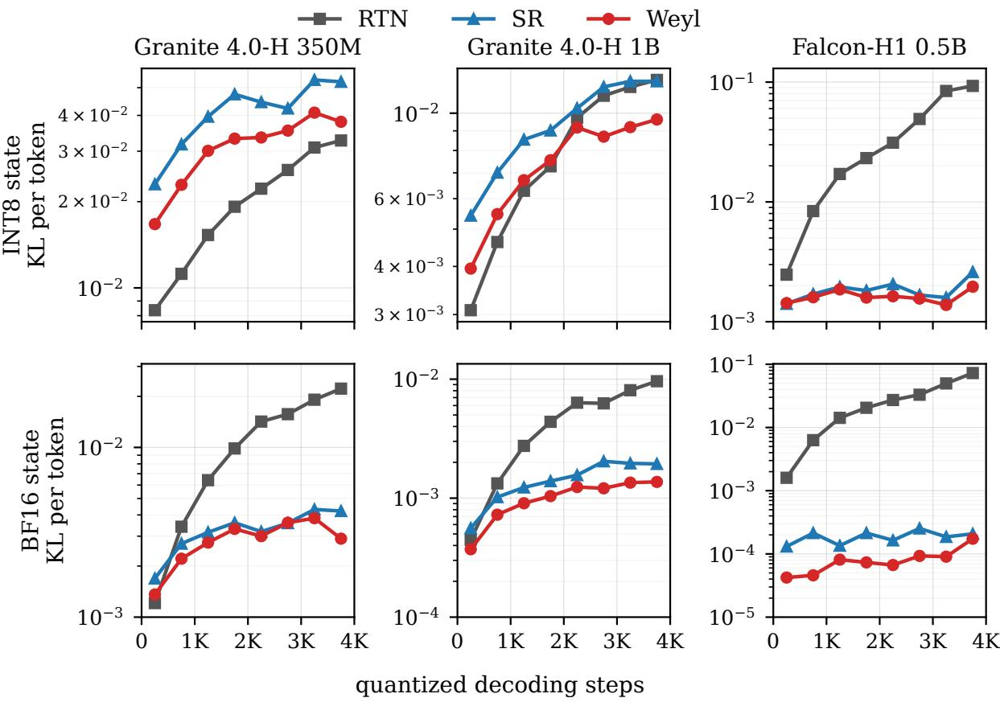
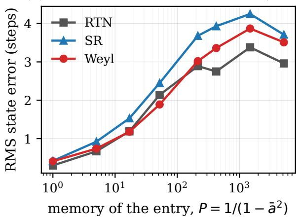
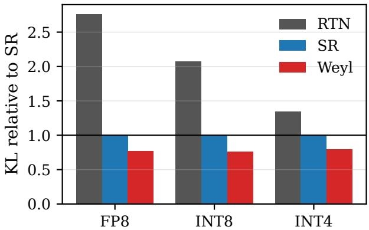
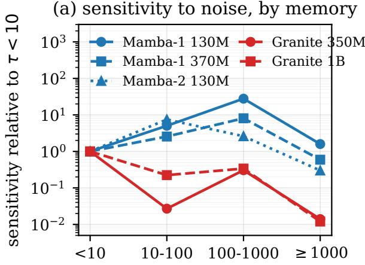
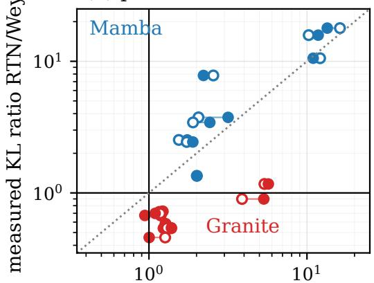

# Low-Discrepancy Dither for Quantized Recurrent State Caches

Snigdha Chandan Khilar Independent Researcher snkhilar@gmail.com

## Abstract

Mamba-style and hybrid language models carry a fixed-size recurrent state from one token to the next. Storing that state in low precision saves memory trafic, but every rounding error is fed back into the next update, so the choice of rounding rule matters more than it does for weights or activations. Production systems currently use stochastic rounding (sr). We compare it with round-to-nearest (rtn) and with a deterministic alternative, a golden-ratio Weyl dither, which needs no random numbers. Across six pure Mamba models and three hybrid models, the Weyl dither gives lower KL divergence to the full-precision model than sr in all 15 settings of our main comparison (by 11–49%, with a median of 31%), keeps that advantage over 4096 quantized decoding steps, is never significantly worse in any setting, and costs nothing extra; on the Mamba models the gain is worth about a quarter of a bit per stored value. rtn behaves diferently: because it silently discards updates smaller than half a quantization step, its error keeps growing as decoding continues. On one hybrid family it is the best rule for the first few hundred to two thousand steps, but on all three hybrid models we followed through 4096 steps it loses ground as decoding continues, and in five of six such settings it falls behind the Weyl dither, by up to 400 times. A simple analysis explains the ordering of the three rules, and we document three implementation mistakes that silently remove the benefit. All code is available at https://github.com/nssprogrammer/ssm-dither.

## 1 Introduction

A transformer remembers the past by keeping every previous token’s keys and values. A state-space model such as Mamba (Gu and Dao, 2023; Dao and Gu, 2024) instead compresses the past into a fixed-size state: a few megabytes of numbers per sequence that are read, updated, and written back at every generated token. Hybrid models interleave such layers with attention (NVIDIA, 2026a; IBM, 2025). Because the state is touched at every step, storing it in 16 or 8 bits instead of 32 is an attractive way to save memory bandwidth.

The dificulty is that the state is recurrent. Whatever rounding error we make when writing the state at step t is the starting point of step t+1, and some entries of the state remember for thousands of steps. Rounding errors therefore do not stay small and independent, as they would for a weight matrix; they can pile up. Production teams have run into this. The Nemotron 3 Super report found that simply casting the Mamba state to FP16 made generations up to 37% longer, and switched to stochastic rounding (NVIDIA, 2026a); the Nemotron 3 Ultra report compares several cache formats under both rules (NVIDIA, 2026b); serving systems now expose the stochastic-rounding generator as a setting (SGLang Team, 2026).

This paper asks a narrow, practical question: when a recurrent state must be stored in a given low-precision format, which rounding rule should be used? We compare three rules, which difer only in how they decide whether to round a value up or down (Section 2):

• Round-to-nearest (rtn): always round to the closest representable value.

• Stochastic rounding (sr): round up with probability equal to the fractional distance to the grid point below, using a fresh random number each time. Unbiased on average.

• Weyl dither: like sr, but the “random” number is replaced by a deterministic, evenly spread sequence (0.618, 0.236, 0.854, . . . , the fractional parts of multiples of the golden ratio). Equally unbiased in the long run, but with far less clumping.

What we find. (i) Replace sr with the Weyl dither. It lowers the damage to the model’s predictions in all settings of our main comparison, across pure Mamba and hybrid models, four storage formats, and horizons up to 4096 quantized steps, and it is never significantly worse anywhere (Table 1, Figure 1). It needs no random-number generator and costs no more than the cheapest sr. (ii) Why it works. In an idealized setting the accumulated error of any such rule equals a classical measure of how evenly its sequence is spread, the discrepancy (Proposition 1). Real models follow the predicted ordering of nine diferent sequences, the gain comes from long-memory state entries, and replaying each entry’s recurrence in isolation reproduces the size of the gain (Section 6.2). (iii) Round-to-nearest gets worse the longer you decode. It throws away small updates, so its error grows roughly linearly with the number of quantized steps. On the Granite hybrids it is the best rule at first, but on all three hybrids we followed through 4096 steps it loses ground, and on the pure Mamba models it is the worst rule throughout (Section 6.3). (iv) Three silent pitfalls. Increments close to a simple fraction, per-entry ofsets that alias with the time sequence (a natural choice, Knuth’s hash constant, does exactly this), and computing the dither phase in float32 all remove the benefit while the code appears to work (Section 6.4).

Scope and honesty. Deterministic low-discrepancy rounding itself is not new: Wu (2021) proposed it as a lower-variance alternative to sr. Our contribution is to study it where rounding errors are fed back, which changes what matters. Our models are small (130M–1.4B parameters) and our GPU is a single T4. Every experiment’s decision rule was written into its notebook before it ran; we report the tests that failed alongside those that passed, and describe several of our own coding errors in Appendix E.

## 2 Setup: States, Formats, and Rounding Rules

The recurrent state and its memory. In a Mamba layer each state entry evolves as

$$
h _ { t } = a _ { t } h _ { t - 1 } + w _ { t } ,\tag{1}
$$

where $a _ { t } \in ( 0 , 1 )$ is an input-dependent decay and $w _ { t }$ is the new information written at step t. The decay sets how long an entry remembers: a disturbance fades by a factor a per step, so after about $\tau = 1 / ( 1 - a )$ steps it has mostly gone. We call τ the entry’s time constant. Trained models mix very diferent time constants: in the five models where we measured it, most entries forget within a few tokens, but 13–23% have $\tau \geq 1 0 0$ and up to 5% have $\tau \geq 1 0 0 0$ . Mamba-2 and the hybrid models share one decay per head over a block of entries.

Low-precision storage. Decoding kernels compute the update in FP32 and round only when writing the new state back. In integer formats such as INT8, entries are grouped into blocks that share one scale s (the block’s largest magnitude divided by 127), and each value is stored as an integer multiple of s; the gap s between neighbouring representable values is the quantization step.

Our main INT8 setting stores the scale in FP32; an FP16 scale, used in our earlier experiments, clips the largest value in about half of the blocks (Appendix E). FP8 (E4M3) uses a block scale plus an 8-bit floating-point value; BF16 needs no scale. Blocks hold 16 entries for the Mamba models and the state dimension (128) for the hybrids.

Rounding with a threshold. All three rules fit one formula. To store x with step s, write $x / s = k + f$ with integer k and fraction $f \in [ 0 , 1 )$ , and store

$$
Q _ { u } ( x ) = s \lfloor x / s + u \rfloor = { \left\{ \begin{array} { l l } { s ( k + 1 ) } & { { \mathrm { i f ~ } } u \geq 1 - f , } \\ { s k } & { { \mathrm { o t h e r w i s e , } } } \end{array} \right. }\tag{2}
$$

for a threshold $u \in [ 0 , 1 )$ . rtn uses $\begin{array} { r } { u = \frac { 1 } { 2 } } \end{array}$ always. sr draws u uniformly at random each time, so it rounds up with probability exactly $f$ and is unbiased. A Weyl dither uses $\displaystyle u _ { i , t } = \{ o _ { i } + t \alpha \}$ for entry i at step t, where $\{ \cdot \}$ is the fractional part, $\alpha = \varphi - 1 \approx 0 . 6 1 8$ is the golden-ratio increment, and $o _ { i }$ is a fixed per-entry ofset so that neighbouring entries do not move in lockstep (we generate ofsets with a two-dimensional low-discrepancy sequence over block and position; Section 6.4 explains why this choice matters, and Appendix B gives the exact formula and a 32-bit integer implementation). Over any stretch of steps, the Weyl thresholds cover [0, 1) almost perfectly evenly, so an entry is rounded up in very nearly a fraction f of the steps, with much less clumping than random draws. For floating-point formats the same rule is applied on the local grid of representable values.

Two regimes. In the decode regime, used for all main results, the prompt is processed in full precision and only the states written during generation are quantized, as in a server. In the everytoken regime, a stress test used in our earlier experiments, the state is quantized at every position including the prompt (Appendices C and D).

## 3 Why the Rules Behave Diferently

Consider a single entry following (1) with a fixed step s; let $\hat { h } _ { t } = Q _ { u _ { t } } ( a _ { t } \hat { h } _ { t - 1 } + w _ { t } )$ be the stored value and $e _ { t } = \ddot { h } _ { t } - h _ { t }$ its error. Proofs are in Appendix A.

Round-to-nearest discards small updates. Suppose an entry should drift upward by 0.3 of a step at every token. rtn rounds each attempt back down, so the stored value never moves while the true value keeps climbing:

Lemma 1 (Write erasure). If the stored value is on the grid and the exact update $\delta _ { t } ~ = ~ ( a _ { t } -$ $1 ) \hat { h } _ { t - 1 } + w _ { t }$ satisfies $| \delta _ { t } | < s / 2$ , then under rtn the stored value does not change and the update is lost entirely.

Small updates are typical of exactly the entries that matter over long spans: long-memory entries $( a _ { t } \approx 1 )$ that receive small writes. sr and the Weyl dither avoid this, because they round up in a fraction $f$ of the steps.

How errors accumulate: discrepancy. The cleanest case is perfect memory and a constant write, the example above. Then the stored value moves up by one step whenever the threshold falls above $1 - f .$ so after $T$ steps the error is simply a counting error: how far the number of thresholds that fall above $1 - f$ is from its ideal value $T f$ . That counting error is, by definition, bounded by the star discrepancy $D _ { T } ^ { * }$ of the threshold sequence, the classical measure of how unevenly $T$ points fill the interval [0, 1) (Kuipers and Niederreiter, 1974):

Proposition 1 (Accumulated error is discrepancy). Let $a _ { t } = 1$ and $w _ { t } = w$ for all $t , \ \hat { h } _ { 0 } = h _ { 0 }$ on the grid, and $f = \{ w / s \}$ . For any threshold sequence $u _ { 1 } , \ldots , u _ { T }$

$$
e _ { T } = - s \big ( \# \{ t \leq T : u _ { t } < 1 - f \} - T ( 1 - f ) \big ) ,
$$

$$
| e _ { T } | \le s T D _ { T } ^ { * } ( u _ { 1 } , . . . , u _ { T } ) ,
$$

and the bound is attained for the worst f.

Corollary 1. In this setting $( a )$ rtn’s error grows linearly, $| e _ { T } | = s T$ min $( f , 1 - f ) ; ( b )$ sr’s error is zero on average but its typical size grows like $s { \sqrt { T f ( 1 - f ) } } ; ( c )$ the Weyl dither’s error stays below $\displaystyle C s \left( 1 + \log T \right)$ for every $f ;$ and $( d ) \ a$ Weyl increment close to a simple fraction, such as $\frac { 1 } { 2 } + \epsilon ,$ is as bad as rtn for up to $1 / ( 8 \epsilon )$ steps.

Round-to-nearest’s short-term advantage. The opposite situation also occurs. When updates are larger than a step, the fraction f is efectively random from step to step, and then rtn’s error is the smaller one:

Lemma 2 (Per-write noise). $_ { I f f }$ is uniform on $[ 0 , 1 )$ and independent of the threshold, the mean squared rounding error is $s ^ { 2 } / 1 2$ under rtn and $s ^ { 2 } / 6$ under sr or an evenly spread Weyl dither.

So rtn makes half the noise per write, but it can lose small updates entirely, and those losses add up. Which efect dominates depends on the model, on how the network uses its state, and on how long one decodes, which is what Section 6.3 measures.

What the theory does not cover. Real entries have decay $a < 1$ , writes whose fractions change over time, and a block scale that moves every step. The analysis therefore predicts the ordering of the rules, not the size of the gains; in real models the Weyl-to-sr error ratio turns out to be a roughly constant factor rather than a gap that widens with memory (Section 6.2).

## 4 How We Measured

Models. Pure Mamba: Mamba-1 130M and 370M (Gu and Dao, 2023) and Mamba-2 130M (Dao and Gu, 2024) in the decode regime (plus Mamba-1 790M and 1.4B and Mamba-2 370M in the every-token regime). Hybrids: Granite 4.0-H 350M and 1B (IBM, 2025), which interleave Mamba-2 layers with a few attention layers, and Falcon-H1 0.5B, in which every layer runs attention and a Mamba-2 mixer side by side (used in the long-horizon study). All weights and activations are FP32; only the recurrent state is quantized.

Verification. Every model is checked before any result is recorded. For the Mamba models we use our own step-by-step PyTorch runners, whose logits match the reference implementation exactly (Mamba-1) or to $1 . 3 \times 1 0 ^ { - 3 }$ (Mamba-2). For the hybrids we use the Hugging Face implementation and round the Mamba states in its cache after every decoding step; we check that decoding reproduces the full forward pass, that the states are found in the cache, and that zeroing them changes the next prediction. Two further models, Falcon-H1 1.5B and Zamba2 1.2B, failed these checks under the available library version (a decoding mismatch of 12–20 logits and a loading error) and are excluded.

What we measure. The main metric is the KL divergence, per token, between the next-token distribution $p _ { t }$ of the full-precision model and the distribution $q _ { t }$ of the model with a quantized state, $\begin{array} { r } { \mathrm { K L } ( p _ { t } \parallel q _ { t } ) = \sum _ { v } p _ { t } ( v ) \log \left( p _ { t } ( v ) / q _ { t } ( v ) \right) } \end{array}$ over the vocabulary, evaluated along the same text (teacher forcing) and averaged over positions and documents. It measures how much the quantized model’s predictions difer, whether or not a downstream task happens to notice. Pure Mamba: 32 chunks of WikiText-103 test (Merity et al., 2017), 1024 full-precision tokens followed by 1024 quantized positions. Hybrids: 32 PG-19 test books (Rae et al., 2020), a 2048-token full-precision prefill, then 512 quantized decoding steps; for the long-horizon study, 8 books and 4096 quantized steps.

Statistics and decision rules. Relative KL reductions come with 95% bootstrap intervals over documents; for the Mamba models sr was run with two seeds and the bootstrap resamples both documents and seeds. We call a comparison significant when its 95% lower bound is above zero. Each experiment’s hypotheses and pass criteria were written into its notebook before it ran.

## 5 Experimental Environment and Code

Hardware and software. Every experiment ran in a hosted Kaggle notebook on a single NVIDIA Tesla T4 GPU (16 GB of memory, of which about 14.6 GB is usable). The software stack was Python 3.12, PyTorch (version 2.10 with CUDA 12.8 in the final runs), and Hugging Face Transformers 5.0.0, which provides the hybrid models. Model weights, activations, and matrix multiplications all ran in FP32 on the GPU, with TF32 disabled, so that the only low-precision arithmetic in any run is the state rounding under study. The Triton kernel timings of Section 6.5 were measured on the same T4.

How the runs were organized. Each experiment is one self-contained notebook: it downloads its models and data, verifies each model against the reference implementation (Section 4), runs all rounding rules on identical inputs, and writes every per-document result to a JSON file; every number in this paper is printed by a notebook or computed from its printed values. A single notebook ran for up to a few hours of GPU time. The long-horizon runs were the most demanding: to fit the 16 GB GPU, the rounding rules were decoded in two groups, each in lockstep with a full-precision copy of the model, with 2–8 documents per batch.

Use of the CPU. Before any GPU run, every notebook was executed end to end on a CPU-only machine with tiny, randomly initialized models of the same architectures, to catch errors before spending GPU time. The statistical analysis (bootstrap confidence intervals over documents and seeds) and the discrepancy calculations also ran on the CPU.

Code. All experimentation code is available at https://github.com/nssprogrammer/ssm-dit her: the notebook for every experiment, the rounding rules, the exact step-by-step Mamba runners, the hooks for the hybrid models, the Triton kernel, and the script that produces the figures, together with a map from every table, figure, and number in this paper to the notebook and printed output that produce it.

Table 1: Decode regime: KL divergence to the full-precision model $( \times 1 0 ^ { - 3 }$ , lower is better) for the three rounding rules, and the relative KL reduction of the Weyl dither over sr, estimate [95% lower bound]. INT8 uses an FP32 block scale. Pure Mamba: 32 WikiText-103 chunks, 1024 quantized positions after a 1024-token full-precision prefix, sr over two seeds. Hybrids: 32 PG-19 books, 512 quantized decoding steps after a 2048-token prefill, sr with one seed. Bold: best rule in the row.
<table><tr><td></td><td colspan="3">INT8</td><td colspan="3">FP8 (E4M3)</td><td colspan="3">BF16</td></tr><tr><td>Model</td><td>RTN</td><td>SR</td><td>Weyl</td><td>RTN</td><td>SR</td><td>Weyl</td><td>RTN</td><td>SR</td><td>Weyl</td></tr><tr><td>Mamba-1 130M</td><td>1.73</td><td>0.88</td><td>0.58</td><td>15.7</td><td>8.35</td><td>6.40</td><td>1.98</td><td>0.215</td><td>0.129</td></tr><tr><td>Mamba-1 370M</td><td>1.75</td><td>0.65</td><td>0.44</td><td>17.0</td><td>6.48</td><td>4.98</td><td>1.64</td><td>0.157</td><td>0.095</td></tr><tr><td>Mamba-2 130M</td><td>26.9</td><td>4.15</td><td>2.83</td><td>23.9</td><td>23.5</td><td>17.6</td><td>3.55</td><td>0.707</td><td>0.358</td></tr><tr><td>Granite 4.0-H 350M</td><td>7.69</td><td>22.7</td><td>16.3</td><td>41.6</td><td>114</td><td>68.3</td><td>1.15</td><td>1.74</td><td>1.24</td></tr><tr><td>Granite 4.0-H 1B</td><td>3.12</td><td>5.55</td><td>3.94</td><td>5.70</td><td>12.7</td><td>11.3</td><td>0.426</td><td>0.542</td><td>0.375</td></tr><tr><td>Weyl vs. SR: KL reduction, estimate [lower bound] (%)</td><td></td><td></td><td></td><td></td><td></td><td></td><td></td><td></td><td></td></tr><tr><td>Mamba-1 130M</td><td></td><td>34.1 [32.1]</td><td></td><td></td><td>23.4 [20.9]</td><td></td><td></td><td>39.9 [38.2]</td><td></td></tr><tr><td>Mamba-1 370M</td><td></td><td>32.1 [30.2]</td><td></td><td></td><td>23.2 [20.6]</td><td></td><td></td><td>39.4 [36.7]</td><td></td></tr><tr><td>Mamba-2 130M</td><td></td><td>31.7 [29.1]</td><td></td><td></td><td>25.4 [19.4]</td><td></td><td></td><td>49.3 [46.4]</td><td></td></tr><tr><td>Granite 4.0-H 350M</td><td></td><td>28.5 [19.4]</td><td></td><td></td><td>40.4 [31.8]</td><td></td><td></td><td>28.8 [19.0]</td><td></td></tr><tr><td>Granite 4.0-H 1B</td><td></td><td>28.9 [25.1]</td><td></td><td></td><td>10.7 [ 2.4]</td><td></td><td></td><td>30.8 [26.8]</td><td></td></tr></table>

## 6 Results

## 6.1 The Weyl dither beats stochastic rounding

Table 1 is the core comparison: five models, three formats, 32 documents each. In all 15 cells the Weyl dither has lower KL than sr, and in all 15 the 95% lower bound is above zero. The reductions range from 11% to 49%, with a median of 31%; the smallest is Granite 1B at FP8 (11%, lower bound 2%). sr is not the best rule in any cell.

It holds over long generations. Figure 1 follows three hybrid models through 4096 quantized decoding steps. The Weyl curve (red) stays below the sr curve (blue) in every panel. Averaged over the whole horizon, the Weyl dither lowers KL by 25% and 13% (Granite 350M, INT8 and BF16), 21% and 30% (Granite 1B), and 12% [lower bound 4%] and 56% [48%] (Falcon-H1 0.5B). Between the first and the last 512 steps the advantage shrinks by no more than 5 points in 4 of the 6 panels; it shrinks on Granite 1B at INT8 (from 27% to 21%) and on Falcon-H1 at BF16 (from 68% to 17%), where KL values are around 10−4 and the last block is noisy.

How much is it worth? A 30% lower KL is easiest to interpret in bits. We stored the Mamba states as INT4, INT6, INT7, and INT8 under both dithers and asked how many bits sr would need to match the Weyl dither’s KL. The answer is consistently a little more: the Weyl dither at INTk matches sr at about INT(k + 0.25) (range +0.16 to +0.30 bits over three models and three widths). That is a modest saving, but it comes for free.

Earlier and broader evidence. In the every-token stress regime, on six Mamba models from 130M to 1.4B parameters, the Weyl dither beat sr in all 15 resolved settings (20–29% lower KL) and did not lose its advantage with model size (Appendix D); on LAMBADA (Paperno et al., 2016) with INT4 states it was more accurate on all six models (mean +1.0 point). In sampled generation the per-step KL fell by 15–29%, but we found no detectable diference in the quality of the sampled text as judged by the full-precision model (Appendix C).

  
Figure 1: How the damage evolves over a long generation. KL per token, averaged over consecutive blocks of 512 quantized decoding steps, for three hybrid models (columns) and two storage formats (rows; INT8 with an FP32 block scale); 8 PG-19 books, 2048-token full-precision prefill. rtn’s error keeps growing, while the two dithers level of; the Weyl dither stays below sr throughout.

## 6.2 Why the Weyl dither wins

Evenness of the sequence predicts the damage. We tested nine threshold sequences: four golden-ratio-like increments, per-entry increments, sr, and three increments deliberately placed near simple fractions $\bigl ( \frac { 1 } { 4 } , \frac { 1 } { 3 } , \frac { 1 } { 2 } \mathrm { \ p l u s \ 2 ^ { - 1 2 } } \bigr )$ . Ranked by their local discrepancy (how evenly each run of 256 consecutive thresholds covers [0, 1)), they are also ranked by the damage they cause $( \rho = 0 . 9 3 ^ { - }$ 1.00; Table 8 in Appendix C). The near-rational increments are the worst deterministic rules, and ${ \frac { 1 } { 2 } } + 2 ^ { - 1 2 }$ is about 40 times worse than sr, exactly as Corollary 1(d) predicts. Among the well-spread increments the diferences are within 5%, so what matters is the class, not the golden ratio itself.

The gain lives in long-memory entries. Using the Weyl dither only on the 25% of entries with the longest memory, and sr everywhere else, keeps 75–87% of the full gain; using it only on the other 75% keeps 15–28%.

The recurrence alone reproduces the size of the gain. To separate the rounding from the rest of the network, we recorded, from one full-precision decoding pass, each entry’s true decay $a _ { t }$ and write $w _ { t } ,$ and replayed its recurrence with rounding, $\hat { h } _ { t } = Q ( a _ { t } \hat { h } _ { t - 1 } + w _ { t } )$ , ignoring how errors spread through later layers. The replayed error ratio Weyl/sr at INT8 is 0.74, 0.71, 0.73, 0.74,

0.71 on the five models of Table 1 (earlier protocol; Appendices C and D); the measured KL ratios were 0.73, 0.72, 0.70, 0.70, 0.74. The Weyl advantage is thus a property of the state recurrence itself and can be predicted without running the quantized model. Broken down by memory length, the replayed ratio is lowest for time constants of 10–100 steps (0.60–0.68) and closer to 1 for the longest memories (0.81–0.94): the gain is a roughly constant factor over the window that matters, not the ever-widening gap of the idealized limit.

## 6.3 Round-to-nearest: good at first, then worse and worse

rtn is the rule whose behaviour depends most on the model. On the pure Mamba models it is the worst rule in every cell of Table 1, 1.4 to 17 times worse than the Weyl dither. On the Granite hybrids, over the first 512 decoding steps, it is the best rule at INT8 and FP8.

Figure 1 shows that this Granite advantage is temporary. rtn’s per-token KL (grey) climbs steadily as decoding continues, by a factor of 4–45 over 4096 steps, while the dithers level of. On Granite 1B at INT8 it falls behind the Weyl dither after about 2000–2500 steps and is worse in the final block on all 8 books; at BF16 it falls behind within the first 1000 steps on both Granite models and ends 7 times worse than Weyl. Only Granite 350M at INT8 keeps rtn ahead through 4096 steps, although the gap has halved. On Falcon-H1 0.5B, the second hybrid family, rtn is worse from the very first block and ends 47 times (INT8) and 418 times (BF16) worse than the Weyl dither. rtn’s ratio to Weyl grew over the horizon in all 6 panels, as pre-specified for both families.

This is Lemma 1 and Corollary 1(a) in action: updates that rtn discards are lost for good, so its error keeps accumulating, while Lemma 2 explains why it can start out ahead. Most generation benchmarks, and our own earlier evaluations, stop after a few hundred quantized steps, which is exactly the window in which rtn looks best.

Why Granite starts out favouring rtn remains open. We tried hard to explain the shorthorizon Granite advantage and report four attempts that did not succeed (details in Appendix D): replaying the recurrence predicts that the dither should win on Granite too; a noise-injection probe showed that Granite’s predictions are unusually sensitive to short-memory state, but weighting the replayed errors by these sensitivities still mispredicts most Granite cells; a rule that uses rtn only for short-memory entries recovers only part of rtn’s early advantage; and persistent, slowly drifting errors turned out to be no less harmful than random ones. The early advantage is real bu model-specific, and it fades with the horizon.

## 6.4 Three silent pitfalls

Each of these removes the benefit while the code runs without error.

Increments near a simple fraction. An increment such as $0 . 5 + 2 \AA ^ { - 1 2 }$ looks irrational but produces long runs of alternating thresholds; it was about 40 times worse than sr (Table 8).

Ofsets that alias with time. The per-entry ofsets $o _ { i }$ must not be generated with the same increment as time: if $o _ { i } = \left\{ i \alpha \right\}$ , then entry i + 1 receives exactly the threshold that entry i gets one step later, and neighbouring entries round in near-lockstep.

Observation 1 (Space–time aliasing). If $o _ { i } = \{ i \beta \}$ with $\beta \equiv \alpha$ (mod 1), then $u _ { i + 1 , t } = u _ { i , t + 1 }$

This is easy to do by accident. In 32-bit fixed point the golden increment is 2654435769, and Knuth’s multiplicative hash constant (Knuth, 1998), a natural way to scramble indices, is 2654435761: the same number up to $8 { \cdot } 2 ^ { - 3 2 }$ . With Knuth ofsets our GPU kernel had 34–40% higher KL on Mamba-2 at INT4; ofsets from a diferent low-discrepancy sequence, $o _ { r , c } = \{ 0 . 7 5 4 8 8 r +$ 0.56984 c}, removed the loss.

Computing the phase in float32. We first computed $\{ o _ { i } + t \alpha \}$ with float32 ofsets. Once tα is large, float32 no longer has enough precision to distinguish the ofsets, so many entries end up with the same threshold sequence:

Observation 2 (Phase precision). With a p-bit significand and $t \alpha \in [ 2 ^ { k } , 2 ^ { k + 1 } )$ , at most $2 ^ { p - 1 - k }$ distinct threshold sequences survive. In float32 this is 8192 at t = 2047, 2048 at t = 8191, and 512 at t = 32767.

Up to 2000 steps this was harmless (median change in KL 0.1% over 97 afected configurations), but at a 32K-token context it made the Weyl dither appear worse than sr. The fix is to reduce tα modulo 1 in double precision, or to use an integer phase counter, before adding the ofset. All results in this paper use the corrected version, and a regression test checks it.

## 6.5 Other settings and cost

Periodic checkpointing. Some systems keep intermediate states in full precision and round only every few steps. With rounding at every 8th write, the Weyl advantage mostly disappeared on the hybrids and shrank on Mamba (FP8 lower bounds 0.4–7.6%), and rtn was competitive; these runs used short horizons (512–1024 steps), where rtn is at its best.

Other techniques. Keeping the 10% longest-memory entries in FP16 and the rest in INT4 composes well: the Weyl dither still beats sr by 23–24%. A block Hadamard rotation before INT4 quantization does not: with rotation, sr beats the Weyl dither (KL 0.166 vs. 0.235 on Mamba-1 130M), although rotation hurt every rule compared with no rotation, and at INT8 rotation plus Weyl was the best combination.

Cost. The Weyl threshold is a few integer operations on the block index, position, and step, with no stored state. In a Triton (Tillet et al., 2019) kernel for the INT8 state update it took 1.00–1.13 times the time of rtn on a T4. sr with Triton’s default Philox generator took 2–4 times as long, but sr driven by a cheap integer hash is as accurate as Philox sr (within 2.5% on Mamba and 9% on Granite), and recent GPUs round stochastically in hardware (NVIDIA, 2026c). We therefore claim equal cost, not a speed advantage.

## 7 Related Work

Stochastic and dithered rounding. sr is unbiased and prevents stagnation in long sums (Forsythe, 1959; Higham, 2002; Connolly et al., 2021; Croci et al., 2022), and made low-precision training possible (Gupta et al., 2015). Dithered quantization is classical (Schuchman, 1964; Gray and Stockham, 1993), and Wu (2021) proposed deterministic low-discrepancy dither rounding. Noise shaping and sigma–delta modulation (Schreier and Temes, 2005) are the classical answer to quantization inside a feedback loop, but they need the previous rounding error to be stored, which doubles the size of a state cache; at equal storage only the choice of threshold remains, and that is what we study.

Quantizing state-space models. Post-training quantization of Mamba weights and activations includes Quamba (Chiang et al., 2025), MambaQuant (Xu et al., 2025), and Q-Mamba (Chen et al., 2025), which also compresses the state cache; DAMP (Zhang et al., 2026) assigns precisions to recurrent-state channels by decay. For attention models, the analogous question is key–value cache quantization (Liu et al., 2024; Hooper et al., 2024), where errors are not fed back. Closest to our setting, the Nemotron 3 reports store the Mamba state with sr and compare formats under rtn and sr at a scale far beyond ours (NVIDIA, 2026a,b). These works choose which precision to store; we ask how to round into it.

## 8 Limitations and Conclusion

Limitations. Our models are small (130M–1.4B parameters) and run in FP32 apart from the state, in research code rather than production kernels; we report no end-to-end throughput. Two larger hybrids could not be verified with the available library version. The long-horizon study uses 8 documents and teacher-forced text, and measures KL rather than generation length or task accuracy, where we found no detectable diferences. The Mamba models cannot be tested beyond their 2048-token training length. The analysis covers an idealized regime and explains the ordering of the rules, not the size of the gains. We could not explain why Granite favours rtn early in decoding. The code was written with an AI assistant; three consequential errors were found and corrected (Appendix E), and an independent reimplementation has not yet been done. Decision rules were written down before each experiment but not registered externally.

Conclusion. For storing a recurrent state in low precision, the evidence supports three practical rules. First, do not use stochastic rounding: a golden-ratio Weyl dither was better or statistically tied in every setting we measured, over long generations too, at no extra cost. Second, be careful with round-to-nearest: it can look best in short evaluations on some hybrid models, but because it discards small updates its error keeps growing, and over long generations it fell behind the Weyl dither in five of six settings, by up to 400 times. Third, implement the dither carefully: use an increment far from simple fractions, ofsets that do not alias with time, and a phase computed in double precision or integers.

## References

Chen, T., Chen, Y., Wang, P., Xu, W., Zhu, Z., and Cheng, J. (2025). Q-Mamba: Towards more eficient Mamba models via post-training quantization. In Findings of the Association for Computational Linguistics: ACL 2025, pages 10594–10610.

Chiang, H.-Y., Chang, C.-C., Frumkin, N., Wu, K.-C., and Marculescu, D. (2025). Quamba: A post-training quantization recipe for selective state space models. In International Conference on Learning Representations.

Cobbe, K., Kosaraju, V., Bavarian, M., Chen, M., Jun, H., Kaiser, L., Plappert, M., Tworek, J., Hilton, J., Nakano, R., Hesse, C., and Schulman, J. (2021). Training verifiers to solve math word problems. arXiv preprint arXiv:2110.14168.

Connolly, M. P., Higham, N. J., and Mary, T. (2021). Stochastic rounding and its probabilistic backward error analysis. SIAM Journal on Scientific Computing, 43(1):A566–A585.

Croci, M., Fasi, M., Higham, N. J., Mary, T., and Mikaitis, M. (2022). Stochastic rounding: Implementation, error analysis and applications. Royal Society Open Science, 9(3):211631.

Dao, T. and Gu, A. (2024). Transformers are SSMs: Generalized models and eficient algorithms through structured state space duality. In Proceedings of the 41st International Conference on Machine Learning.

Forsythe, G. E. (1959). Reprint of a note on rounding-of errors. SIAM Review, 1(1):66–67.

Gao, L., Biderman, S., Black, S., Golding, L., Hoppe, T., Foster, C., Phang, J., He, H., Thite, A., Nabeshima, N., Presser, S., and Leahy, C. (2020). The Pile: An 800GB dataset of diverse text for language modeling. arXiv preprint arXiv:2101.00027.

Gray, R. M. and Stockham, Jr., T. G. (1993). Dithered quantizers. IEEE Transactions on Information Theory, 39(3):805–812.

Gu, A. and Dao, T. (2023). Mamba: Linear-time sequence modeling with selective state spaces. arXiv preprint arXiv:2312.00752.

Gupta, S., Agrawal, A., Gopalakrishnan, K., and Narayanan, P. (2015). Deep learning with limited numerical precision. In Proceedings of the 32nd International Conference on Machine Learning.

Higham, N. J. (2002). Accuracy and Stability of Numerical Algorithms. SIAM, 2nd edition.

Hooper, C., Kim, S., Mohammadzadeh, H., Mahoney, M. W., Shao, Y. S., Keutzer, K., and Gholami, A. (2024). KVQuant: Towards 10 million context length LLM inference with KV cache quantization. In Advances in Neural Information Processing Systems.

IBM (2025). IBM Granite 4.0: Hyper-eficient, high performance hybrid models for enterprise. https://www.ibm.com/new/announcements/ibm-granite-4-0-hyper-efficient-high-per formance-hybrid-models. Accessed September 2026.

Knuth, D. E. (1998). The Art of Computer Programming, Volume 3: Sorting and Searching. Addison-Wesley, 2nd edition.

Kuipers, L. and Niederreiter, H. (1974). Uniform Distribution of Sequences. Wiley.

Liu, Z., Yuan, J., Jin, H., Zhong, S., Xu, Z., Braverman, V., Chen, B., and Hu, X. (2024). KIVI: A tuning-free asymmetric 2bit quantization for KV cache. In Proceedings of the 41st International Conference on Machine Learning.

Merity, S., Xiong, C., Bradbury, J., and Socher, R. (2017). Pointer sentinel mixture models. In International Conference on Learning Representations.

NVIDIA (2026a). Nemotron 3 Super: Open, eficient mixture-of-experts hybrid Mamba-transformer model for agentic reasoning. arXiv preprint arXiv:2604.12374.

NVIDIA (2026b). Nemotron 3 Ultra: Open, eficient mixture-of-experts hybrid Mamba-transformer model for agentic reasoning. arXiv preprint arXiv:2606.15007.

NVIDIA (2026c). Nemotron-labs-3-puzzle-75b-a9b: Compressing hybrid MoE LLMs. arXiv preprint arXiv:2607.04371.

Paperno, D., Kruszewski, G., Lazaridou, A., Pham, N. Q., Bernardi, R., Pezzelle, S., Baroni, M., Boleda, G., and Fern´andez, R. (2016). The LAMBADA dataset: Word prediction requiring a broad discourse context. In Proceedings of the 54th Annual Meeting of the Association for Computational Linguistics, pages 1525–1534.

Rae, J. W., Potapenko, A., Jayakumar, S. M., and Lillicrap, T. P. (2020). Compressive transformers for long-range sequence modelling. In International Conference on Learning Representations.

Schreier, R. and Temes, G. C. (2005). Understanding Delta-Sigma Data Converters. Wiley-IEEE Press.

Schuchman, L. (1964). Dither signals and their efect on quantization noise. IEEE Transactions on Communication Technology, 12(4):162–165.

SGLang Team (2026). NVIDIA Nemotron3-Ultra serving guide (Mamba SSM stochastic rounding options). https://docs.sglang.io/cookbook/autoregressive/NVIDIA/Nemotron3-Ultra. Accessed September 2026.

Tillet, P., Kung, H. T., and Cox, D. (2019). Triton: An intermediate language and compiler for tiled neural network computations. In Proceedings of the 3rd ACM SIGPLAN International Workshop on Machine Learning and Programming Languages, pages 10–19.

Wolf, T. et al. (2020). Transformers: State-of-the-art natural language processing. In Proceedings of the 2020 Conference on Empirical Methods in Natural Language Processing: System Demonstrations, pages 38–45.

Wu, C. W. (2021). Dither computing: A hybrid deterministic-stochastic computing framework. In Proceedings of the 28th IEEE Symposium on Computer Arithmetic (ARITH).

Xu, Z., Yue, Y., Hu, X., Yang, D., Yuan, Z., Jiang, Z., Chen, Z., Yu, J., Xu, C., and Zhou, S. (2025). MambaQuant: Quantizing the Mamba family with variance aligned rotation methods. In International Conference on Learning Representations.

Zhang, T., Tan, J., Sun, P., Yu, Y., Jiang, Z., Xie, Y., Cai, X., and Zeng, Z. (2026). DAMP: Decay-aware mixed-precision recurrent-state quantization. arXiv preprint arXiv:2608.27513.

## Appendix

## A Proofs

Throughout, $\{ x \} = x - \lfloor x \rfloor$ , and for $u _ { 1 } , \ldots , u _ { T } \in [ 0 , 1 )$ we write $A _ { T } ( x ) = \# \{ t \leq T : u _ { t } < x \}$ . The star discrepancy and the (extreme) discrepancy are

$$
D _ { T } ^ { * } = \underset { x \in [ 0 , 1 ] } { \operatorname* { s u p } } \Big | \frac { A _ { T } ( x ) } { T } - x \Big | , \qquad D _ { T } = \underset { 0 \leq a < b \leq 1 } { \operatorname* { s u p } } \Big | \frac { \# \{ t \leq T : u _ { t } \in [ a , b ) \} } { T } - ( b - a ) \Big | ,
$$

and satisfy $D _ { T } ^ { * } \leq D _ { T } \leq 2 D _ { T } ^ { * }$ (Kuipers and Niederreiter, 1974, Ch. 2, Thm. 1.3).

Proof of Lemma 1. Write $\hat { h } _ { t - 1 } = k s$ with $k \in  { \mathbb { Z } }$ . The pre-rounding value is $a _ { t } \hat { h } _ { t - 1 } + w _ { t } =$ $\hat { h } _ { t - 1 } + \delta _ { t } .$ , so rtn gives $\begin{array} { r } { \hat { h } _ { t } = s \lfloor k + \delta _ { t } / s + \frac { 1 } { 2 } \rfloor = s ( k + \lfloor \delta _ { t } / s + \frac { 1 } { 2 } \rfloor ) . \mathrm { ~ I f ~ } | \delta _ { t } | < s / 2 } \end{array}$ then $\delta _ { t } / s + \textstyle \frac { 1 } { 2 } \in ( 0 , 1 )$ the floor is 0, and $\hat { h } _ { t } = \hat { h } _ { t - 1 }$ . The residual is $\hat { h } _ { t } - ( \hat { h } _ { t - 1 } + \delta _ { t } ) = - \delta _ { t }$ □

Proof of Proposition 1. Write $w / s = m + f$ with $m = \lfloor w / s \rfloor$ . We show by induction that $\hat { h } _ { t } \in s \mathbb { Z }$ and $\hat { h } _ { t } = \hat { h } _ { t - 1 } + s \left( m + 1 \{ u _ { t } \geq 1 - f \} \right)$ . If $\hat { h } _ { t - 1 } = k s$ , then $\hat { h } _ { t } = s \lfloor k + m + f + u _ { t } \rfloor =$ $s \left( k + m + \lfloor f + u _ { t } \rfloor \right)$ , and since $f + u _ { t } \in [ 0 , 2 ) , \lfloor f + u _ { t } \rfloor = \mathbf { 1 } \{ u _ { t } \geq 1 - f \}$ . Summing over $t ,$

$$
\hat { h } _ { T } - h _ { 0 } = s \big ( T m + T - A _ { T } ( 1 - f ) \big ) , \qquad h _ { T } - h _ { 0 } = T w = s ( T m + T f ) ,
$$

so $e _ { T } = s \left( T ( 1 - f ) - A _ { T } ( 1 - f ) \right) = - s \left( A _ { T } ( 1 - f ) - T ( 1 - f ) \right)$ . The bound $| e _ { T } | \le s T D _ { T } ^ { * }$ is immediate from the definition. As f ranges over $[ 0 , 1 ) , x = 1 - f$ ranges over (0, 1]; since $x = 0$ contributes 0 to the supremum, $\operatorname* { s u p } _ { f } | e _ { T } | = s T D _ { T } ^ { * }$ □

Proof of Corollary 1. (a) rtn has $\begin{array} { r } { u _ { t } \equiv \frac { 1 } { 2 } . } \end{array}$ so $A _ { T } ( 1 - f ) = T { \mathrm { ~ i f ~ } } f < { \frac { 1 } { 2 } }$ and 0 otherwise. Hence $e _ { T } = - s T f$ for $\begin{array} { r } { f < \frac { 1 } { 2 } } \end{array}$ (every fractional part of every write is erased) and $\overline { { e } } _ { T } = s T ( 1 - f )$ for $\begin{array} { r } { f \geq \frac { 1 } { 2 } } \end{array}$ (b) Under sr, $N _ { T } : \bar { = } T - A _ { T } ( 1 - f ) = \# \{ t : u _ { t } \geq 1 - f \}$ is a sum of $T$ independent $\operatorname { B e r n o u l l i } ( \bar { f } )$ variables, and $e _ { T } = s ( N _ { T } - T f ) . \ ( \mathrm { c } )$ Let $u _ { t } = \{ o + t \alpha \}$ . Rotating the circle by o maps an interva to an interval or to a union of two intervals, so $D _ { T } ( \{ o + t \alpha \} ) \ : \leq \ : 2 D _ { T } ( \{ t \alpha \} )$ . If α is irrational with bounded partial quotients, $T D _ { T } ( \{ t \alpha \} ) = O ( \log T )$ (Kuipers and Niederreiter, 1974, Ch. 2, §3). Combining with $D _ { T } ^ { * } \leq D _ { T }$ and Proposition 1 gives $| e _ { T } | \le C _ { \alpha } s ( 1 + \log T )$ for all $f$ and $o .$ The golden ratio conjugate $\varphi - 1 = [ 0 ; 1 , 1 , 1 , \ldots ]$ has all partial quotients equal to one. (d) Let $\alpha = { \frac { 1 } { 2 } } + \epsilon$ with $\epsilon > 0$ and $T \leq 1 / ( 8 \epsilon ) , \mathrm { s o } \ 0 < t \epsilon \leq \frac { 1 } { 8 }$ for $t \leq T$ . For even $t , u _ { t } = \left\{ o + t \epsilon \right\}$ lies in the arc $[ { \overline { { o } } } , o + { \frac { 1 } { 8 } } ] { \mathrm { ~ ( m o d ~ 1 ) ~ } }$ ; for odd $\begin{array} { r } { t , u _ { t } = \{ o + \frac { 1 } { 2 } + t \epsilon \} } \end{array}$ lies in $[ o \pm \mathit { \Pi } _ { 2 } ^ { 1 } , o \pm \mathit { \Pi } _ { 8 } ^ { 5 } ]$ . The two complementary open arcs $( o + \frac { 1 } { 8 } , o + \frac { 1 } { 2 } )$ and $( o + \frac { 5 } { 8 } , o + 1 )$ each have length $\frac { 3 } { 8 }$ and contain no $u _ { t }$ . The point 0 lies in the interior of at most one of them, so at least one is an interval inside $[ 0 , 1 ) ;$ taking half-open subintervals $[ a , b )$ of it with $b - a  \frac { 3 } { 8 }$ gives $\begin{array} { r } { D _ { T } \ge ~ \frac { 3 } { 8 } } \end{array}$ , hence $D _ { T } ^ { * } \geq \frac { 3 } { 1 6 }$ , and Proposition 1 gives sup $\begin{array} { r } { { \bf \Pi } _ { f } \left| e _ { T } \right| \ge \frac { 3 } { 1 6 } s T } \end{array}$ □

Error with decay (background for Section 6.2). For general $a _ { t } \in ( 0 , 1 ]$ and any rounding rule, the error obeys $e _ { t } = a _ { t } e _ { t - 1 } + r _ { t }$ with residual $r _ { t } = \hat { h } _ { t } - \left( a _ { t } \hat { h } _ { t - 1 } + w _ { t } \right)$ , so $\begin{array} { r } { { \dot { e } } _ { T } = \sum _ { t = 1 } ^ { T } b _ { t } r _ { t } } \end{array}$ with $\begin{array} { r } { b _ { t } = \prod _ { k = t + 1 } ^ { T } a _ { k } } \end{array}$ (for $e _ { 0 } = 0 )$ . The weights are nondecreasing in t with $b _ { T } = 1$ . With tail sums $\begin{array} { r } { R _ { m } = \sum _ { t = m } ^ { T } r _ { t } . } \end{array}$ summation by parts gives $\begin{array} { r } { e _ { T } = b _ { 1 } R _ { 1 } + \sum _ { t = 2 } ^ { T } ( b _ { t } - b _ { t - 1 } ) R _ { t } , } \end{array}$ a combination of the $R _ { m }$ with nonnegative coeficients summing to $b _ { T } = 1$ , hence $| e _ { T } | \leq \operatorname* { m a x } _ { 1 \leq m \leq T } | R _ { m } |$ . Under constant decay $^ { a , }$ the weights of residuals older than $\approx 1 / ( 1 - a )$ steps are small, which motivates measuring the dither’s discrepancy over windows of roughly memory length $\left( \mathrm { L D } _ { W } \right)$ . We do not claim a bound on the windowed residual sums in the general case, where the fractional parts vary with t.

Proof of Observation 1. $u _ { i + 1 , t } = \{ ( i + 1 ) \beta + t \alpha \} = \{ i \beta + ( t + 1 ) \alpha + ( \beta - \alpha ) \} = u _ { i , t + 1 }$ when $\beta \equiv \alpha$ (mod 1). In 32-bit fixed point, with $H = 2 6 5 4 4 3 5 7 6 1$ and $\Phi = 2 6 5 4 4 3 5 7 6 9 .$ , the accumulators $( i + 1 ) H + t \Phi$ and $i H + ( t + 1 ) \Phi$ difer by $H - \Phi = - 8 ;$ after the 8-bit shift that produces a 24-bit dither they coincide except when a carry crosses the shifted-out bits. □

Proof of Lemma 2. Write $x / s = k + f$ with $k \in \mathbb { Z }$ . Under rtn the residual is −sf if $\begin{array} { r } { f < \frac { 1 } { 2 } } \end{array}$ and $s ( 1 - f )$ otherwise, i.e. s times a variable uniform on $[ - \frac { 1 } { 2 } , \frac { 1 } { 2 } )$ when f is uniform, so $\mathbb { E } r ^ { 2 } =$ $s ^ { 2 } / 1 2$ . With u uniform and independent of $f , Q _ { u } ( x ) = s ( k + 1 \{ u \geq 1 - f \} )$ , so given f the residual is $s ( 1 - f )$ with probability f and $- s f$ with probability $1 - f ; \operatorname { \mathbb { E } } [ r ^ { 2 } \mid f ] = s ^ { 2 } f ( 1 - f )$ and $\textstyle \mathbb { E } r ^ { 2 } = s ^ { 2 } \int _ { 0 } ^ { 1 } f ( 1 - f ) d f = s ^ { 2 } / 6$ . For an equidistributed deterministic dither the same holds for time averages when the fractional parts are independent of the dither phase. With i.i.d. residuals of variance $\sigma ^ { 2 }$ and constant decay $a , e _ { t } = a e _ { t - 1 } + r _ { t }$ has stationary variance $\sigma ^ { 2 } / ( 1 - a ^ { 2 } )$ □

Proof of Observation 2. A floating-point number with a p-bit significand in $[ 2 ^ { k } , 2 ^ { k + 1 } )$ has spacing $2 ^ { k + 1 - p }$ . The computed sum $\mathrm { H } ( o _ { i } + t \alpha )$ with $o _ { i } \in [ 0 , 1 )$ and tα $\in [ 2 ^ { k } , 2 ^ { k + 1 } )$ (for $k \geq 1$ the sum stays in $[ 2 ^ { k } , 2 ^ { k + 2 } ) )$ is a multiple of $2 ^ { k + 1 - p }$ , so its fractional part takes at most $2 ^ { p - 1 - k }$ values: ofsets that difer by less than the spacing produce the same stream. For float32, $p = 2 4 ; t = 2 0 4 7$ gives tα $\approx 1 2 6 5 \in [ 2 ^ { 1 0 } , 2 ^ { 1 1 } )$ and $2 ^ { 1 3 } = 8 1 9 2$ values; $t = 8 1 9 1$ gives $[ 2 ^ { 1 2 } , 2 ^ { 1 3 } )$ and 2048; t = 32767 gives $[ 2 ^ { 1 4 } , 2 ^ { 1 5 } )$ and 512. Reducing tα modulo 1 in float64 first leaves a sum in [0, 2) and keeps ofsets exact to $2 ^ { - 2 3 }$ □

## B Experimental Details

Models and assets. Mamba-1: state-spaces/mamba-{130m,370m,790m,1.4b}-hf; Mamba-2: AntonV/mamba $2 \mathrm { - } \{ 1 3 0 \mathrm { m } , 3 7 0 \mathrm { m } \} \mathrm { - h f }$ (community conversions of the state-spaces Mamba-2 release; we verified that they reproduce the reference implementation, Section 4). These models were trained on the Pile (Gao et al., 2020) with 2048-token contexts; the state-spaces checkpoints are distributed under the Apache-2.0 license (for the conversions, see their model cards). Hybrids: ibm-granite/granite-4.0-h-{350m,1b}-base and, for GSM8K, ibm-granite/granite-4.0-h-1b (Apache-2.0; 28 and 36 Mamba-2 layers with state size 128), and tiiuae/Falcon-H1-0.5B-Base (36 layers, each with attention and a Mamba-2 mixer in parallel; 24 heads of $6 4 \times 1 2 8$ state; see its model card for license terms). Data: WikiText-103 test and validation (Merity et al., 2017, CC BY-SA 3.0); PG-19 test (Rae et al., 2020) via the emozilla/pg19-test mirror; LAMBADA-OpenAI test (Paperno et al., 2016) as distributed by EleutherAI; GSM8K test (Cobbe et al., 2021) (see the dataset cards for license terms). Software: PyTorch, Hugging Face Transformers 5.0.0 (Wolf et al., 2020), Triton (Tillet et al., 2019). Under Transformers 5.0.0 the Mamba output layer was not tied to the input embeddings at load time; we tie it explicitly and every run stops if perplexity exceeds 200.

Runners. Mamba-1: the selective scan is evaluated step by step in FP32 with the state-write hook; $\bar { A } = \exp ( A \Delta )$ $\bar { B } x = \Delta B x$ , conv and gating exactly as in the reference. Mamba-2: perhead scalar decay $\exp ( A _ { h } \Delta _ { t , h } )$ , state $( P \times N ) = ( 6 4 \times 1 2 8 )$ per head, grouped $B , C ,$ gated RMS normalization. For quantization the Mamba-2 state is viewed as blocks of 16 consecutive entries along N. A decoding-step path (used for the Mamba-1 generation experiments) was verified against the parallel path (max $| \Delta \mathrm { l o g i t } | \le 6 . 5 \times 1 0 ^ { - 4 } )$ . Granite: the Hugging Face implementation in FP32; after prefill and after every decoding step, a hook rounds the Mamba-2 states in the cache (viewed as blocks along the state dimension). Without the mamba ssm kernels, the reference prefill scan materializes tensors quadratic in the chunk length per head; we replaced it with a chunk-by-chunk scan with the same mathematics (verified against a token-by-token recurrence to $6 \times 1 0 ^ { - 7 } )$ and computed long-prefill attention in query chunks (verified against SDPA to $1 . 3 \times 1 0 ^ { - 6 }$ and in the full model to $6 \times 1 0 ^ { - 4 }$ on logits up to 194).

Decode regime. Main comparison (Table 1): 32 chunks (Mamba) or 32 books (Granite); INT8 with an FP32 block scale; sr with seeds 0 and 1 on Mamba and one seed on Granite; Weyl ofsets with seed 0. Long horizons (Figure 1): 8 books, a 2048-token FP32 prefill and 4096 teacher-forced decoding steps; the three rules of each format are decoded in lockstep with an FP32 copy of the model, with 2–8 documents per batch, and KL is averaged over blocks of 512 steps. Falcon-H1 follows the Granite protocol, with its Mamba states rounded in the Hugging Face cache after every step. Earlier decode-regime protocol, Mamba: each 2048-token chunk is processed with FP32 states for the first 1024 positions; the state written at position 1023 and every later state is quantized; KL is averaged over positions 1024–2047. Granite: FP32 prefill of $L \in \{ 2 0 4 8 , 8 1 9 2 , 3 2 7 6 8 \}$ tokens, the state at the end of prefill is quantized, then 512 decoding steps teacher-forced on the document’s continuation, each followed by quantization. KL per document is averaged over the 512 steps. Checkpointing (CC=8): only every 8th write is quantized, counted from the end of prefill. Hash sr: $u = { \mathrm { f m i x } } 3 2 ( i \cdot { \mathrm { 0 x } } 9 { \mathsf { E } } 3 7 7 9 { \mathrm { B } } 1 + t \cdot { \mathrm { 0 x } } 8 5 { \mathsf { E } } { \mathrm { B } } { \mathsf { G } } { \mathrm { A } } 7 7 + \ldots ) / 2 ^ { 3 2 }$ truncated to 24 bits (unit tests: mean 0.4997, variance 0.0834, lag-1 correlation $- 5 \times 1 0 ^ { - 5 } )$ . A multiplicative noise probe, $h  h ( 1 + 2 ^ { - 8 } \xi )$ at every write, measures the model’s own sensitivity at each length; on Granite its KL grew by only 1.39× (350M) and $1 . 1 7 \times \mathrm { ( 1 B ) }$ from 2K to 32K.

Memory bins. Mamba: $\bar { a } = \exp ( A \overline { { \Delta } } )$ with $\overline { { \Delta } }$ the mean step size of each channel on eight 1024- token validation chunks. Granite: per head, from the mean step size over the prefill of documents 0–3 (read from each Mamba layer’s input projection). Bins by time constant $\tau = 1 / ( 1 - \bar { a } ) \mathrm { : ~ } < 1 0$ $1 0 \mathrm { - 1 0 0 , 1 0 0 \mathrm { - 1 0 0 0 , \geq 1 0 0 0 \mathrm { s t e p s } } }$ . Share of entries with τ ≥ 100: 14.9%, 13.1%, 23.4%, 14.6%, 15.5% (Mamba-1 130M, 370M, Mamba-2 130M, Granite 350M, 1B); with $\tau \geq 1 0 0 0 colon 2 . 1 \% , 3 . 0 \% , 4 . 5 \%$ 0.5%, 4.6%.

Open-loop replay. From one FP32 decoding pass we record, for every stored entry, $h _ { t }$ and $a _ { t }$ and form $w _ { t } = h _ { t } - a _ { t } h _ { t - 1 }$ . For Granite, $a _ { t }$ is read from the layer’s step size; we verified it by checking that $w _ { t }$ is rank one per head, as $w _ { t } = \Delta _ { t } x _ { t } \otimes B _ { t }$ requires $( \sigma _ { 2 } / \sigma _ { 1 } \approx 2 \times 1 0 ^ { - 8 }$ , versus 0.08–0.21 with a neighbouring head’s step size). The replay starts from the quantized end-of-prefill state and iterates $\hat { h } _ { t } = Q ( a _ { t } \hat { h } _ { t - 1 } + w _ { t } )$ for each rule and format. The state error of a layer and bin is $\sum ( \hat { h } _ { t } - h _ { t } ) ^ { 2 } / \sum h _ { t } ^ { 2 }$ over entries, documents, and steps; model-level errors average over layers.

Noise sensitivity. At every write from the end of prefill, entries in the target bin receive $n =$ $\sigma _ { b } \mathrm { R M S } _ { 1 6 } ( h ) \xi ,$ with $\mathrm { R M S } _ { 1 6 }$ the root mean square of the 16-entry block and $\sigma _ { b } = 2 ^ { - 5 } , 2 ^ { - 6 } , 2 ^ { - 7 } , 2 ^ { - 8 }$ from short to long memory. The resulting state error is accumulated open-loop as $e _ { t } = a _ { t } e _ { t - 1 } + n _ { t }$ in the replay’s metric. Sensitivity of bin b is KL divided by that error. Runs: each bin alone, all bins together (additivity), and bin 100–1000 at half amplitude with the same noise realization (linearity). The composed prediction for a rule is $\sum _ { b } s _ { b } E _ { b } ( \mathrm { r u l e } )$ with $E _ { b }$ the replayed error.

Ofset near-aliasing. For ofsets $o _ { r , c } = \{ \beta r + \gamma c \}$ and increment $\alpha ,$ , define the separation $d =$ min $\| \Delta _ { r } \beta + \Delta _ { c } \gamma - \ell \alpha \|$ over neighbor ofsets $| \Delta _ { r } | , | \Delta _ { c } | \leq 2$ (not both zero) and time shifts $| \ell | \leq 1 6 .$ with ∥ · ∥ the distance to the nearest integer. Two Weyl streams with the same increment are rotations of each other, and their correlation at the matching lag is $1 - 6 d ( 1 - d )$ . Knuth ofsets have $d = 0$ (exact aliasing); the generators we use (0.7549 and 0.5698, those of the two-dimensional $R _ { 2 }$ low-discrepancy sequence built from the plastic number) have $d = 0 . 0 0 1 5$ . A random search over $( \beta , \gamma )$ finds $d \approx 0 . 0 0 5$ ; whether larger separation helps is an open question.

Formats. INTb: symmetric, $q _ { \mathrm { m a x } } = 2 ^ { b - 1 } - 1$ , block scale $s = \operatorname* { m a x } | h | / q _ { \operatorname* { m a x } }$ , kept in FP32 in the main comparison and the long-horizon study and rounded to FP16 in the earlier experiments (Table 9 compares the two), values clamped to $[ - q _ { \mathrm { m a x } } , q _ { \mathrm { m a x } } ]$ . FP8-E4M3: block scale max $| h | / 4 4 8$ in FP32, then rounding on the E4M3 grid (3 mantissa bits, minimum exponent −6, subnormals, saturation at 448). FP16/BF16: no scale. All formats are simulated in FP32 with (2) applied to the grid of the local exponent; round-to-nearest simulation matches native $\mathrm { P y }$ Torch casts bit for bit on $2 \times 1 0 ^ { 5 }$ random values spanning 34 binades.

Dithers. Weyl (float): $u _ { r , c , t } = \{ o _ { r , c } + t \alpha \}$ with $o _ { r , c } = \{ 0 . 7 5 4 8 7 7 6 6 6 2 ( r + 1 ) + 0 . 5 6 9 8 4 0 2 9 1 0 ( c + 1 ) +$ $0 . 1 2 3 4 5 6 7 \ell + 0 . 3 1 4 1 5 9 2 \sigma \}$ for block r, position $c ,$ layer $\ell ,$ seed $\sigma ,$ and $\alpha = \varphi - 1$ unless stated. Hardware form: 32-bit accumulator $\left( A ( r + 1 ) + B ( c + 1 ) + L \ell + S \sigma + t \Phi \right)$ mod $2 ^ { 3 2 }$ with A, B, L, S the above constants times $2 ^ { 3 2 }$ and $\Phi = 2 6 5 4 4 3 5 7 6 9 \colon$ ; the dither is the top 24 bits divided by $2 ^ { 2 4 }$ . sr: torch.rand (Philox) per write; in the kernel, tl.rand. Local discrepancy $\mathrm { L D _ { 2 5 6 } }$ : mean over 64 random start times and ofsets of the star discrepancy of 256 consecutive dither values; for per-entry increments, the mean over 400 increments; for sr, the mean over 200 draws of 256 uniforms.

Evaluation. KL and NLL are computed from the final hidden states of the FP32 and quantized runs through the same output layer. Text selection. WikiText-103: the raw test split is joined with blank lines, tokenized, and cut into consecutive 2048-token chunks, of which the first 32 are used (the main comparison, and Mamba-1 130M in the every-token regime) or the first 16 (other every-token and earlier decode-regime runs). PG-19: the books of the test split are taken in dataset order, and the first 32 (main comparison), 16 or fewer (earlier Granite runs; Table 14), or 8 (long horizons) books with at least prefill + decoding steps + 1 tokens are used, each truncated to that length; the selection therefore depends on the required length and the model’s tokenizer. Generation prompts are 256-token segments of the WikiText-103 test set disjoint from the evaluation chunks. Calibration statistics (memory $P )$ use eight 1024-token validation chunks. Relative reductions $1 - \overline { { \mathrm { K L } } } _ { A } / \overline { { \mathrm { K L } } } _ { B }$ and their intervals use 2000 paired bootstrap resamples of chunks or books (prompts for generation; examples within each model for LAMBADA, averaged over models); where sr was run with two seeds, the bootstrap also resamples seeds. Seeds: sr used seed 0, and seeds 0 and 1 where two are reported; deterministic rules need none. Every-token numbers use seed 0 except where Table 7 averages two seeds; the earlier decode-regime Mamba numbers (Table 13) average 5 (130M) or 3 seeds for sr and Weyl; the main comparison uses two sr seeds on Mamba and one on Granite.

## C Additional Results

Error magnitude versus structure (every-token regime). With the correct scale handling (Appendix E), the rounding residual of rtn on writes smaller than half a step is biased against the write direction by −0.064 and −0.058 steps at INT4 (Mamba-1 130M, 370M) and −0.053 and −0.047 at INT8, while sr and the Weyl dither are unbiased $( | \cdot | \le 0 . 0 0 0 2 )$ . Figure 2 shows the consequence: rtn has the smallest root-mean-square state error at every memory length, yet 1.3– $2 . 8 \times$ the output KL of sr. The size of the error is not what matters; its structure is. The Weyl dither’s time-averaged residual is also near zero, and its state error is up to 23% lower than sr’s.

(a) size of the stored-state error (INT8)  

(b) damage to the predictions  
  
Figure 2: Mamba-1 130M, every-token regime. (a) RMS stored-state error in quantizer steps (INT8) by memory length: rtn is smallest. (b) Output KL to FP32 at 2k tokens relative to sr: rtn is worst.

Table 2: Free-running generation (1024 greedy tokens, 64 prompts): per-step KL between the quantized-cache model and an FP32 cache fed the same tokens; relative reduction of Weyl vs. sr with 95% CI over prompts. †Below resolution (sr $\mathrm { K L } < 1 0 ^ { - 4 } )$
<table><tr><td rowspan="2">Model Fmt</td><td colspan="2"> $\mathrm { K L } ~ ( \times 1 0 ^ { - 3 } )$ </td><td rowspan="2">Weyl vs. SR (%)</td></tr><tr><td>RTN</td><td>SR Weyl</td></tr><tr><td>130M FP8</td><td>16.65</td><td>1.81 1.28</td><td>29.4 [12.2, 44.8]</td></tr><tr><td>130M INT8</td><td>4.22</td><td>0.24 0.19</td><td>21.5 [−4.1, 38.2]</td></tr><tr><td>130M INT4</td><td>142.6</td><td>20.7 13.7</td><td>33.9 [10.5, 51.5]</td></tr><tr><td>370M FP8</td><td>5.60</td><td>0.86 0.54</td><td>36.8 [20.6, 49.5] †</td></tr><tr><td>370M INT8</td><td>1.89</td><td>0.09 0.05</td><td></td></tr><tr><td>370M INT4</td><td>70.4</td><td>11.0 7.6</td><td>30.9 [14.8, 45.4]</td></tr></table>

Free-running generation. Every-token regime, greedy decoding (Table 2): the Weyl dither lowers per-step KL relative to sr by 29–37% at FP8 and INT4; INT8 is not resolved. Decode regime, sampled at temperature 0.8 (48 prompts of 256 tokens, 512 new tokens; lockstep FP32 twin): Mamba-1 130M FP8 sr 0.00560, Weyl 0.00397 (+29.0%, lower bound +17.3%); INT4 0.05262, 0.04459 (+15.2%, +1.5%); 370M FP8 0.00393, 0.00299 (+23.9%, +14.8%); INT4 0.03832, 0.03093 (+19.3%, +10.3%). FP32-judged perplexity of the sampled text, sr/Weyl: 6.66/7.05, 8.08/7.95, 5.79/5.85, 5.95/6.21 (per-prompt perplexities range from about 1.5 to 19, so these diferences are within noise); distinct-4 rates 0.837/0.826, 0.864/0.858, 0.855/0.872, 0.839/0.853.

At 8K and 32K prefills, hash sr gave 23.3 and 31.2 (350M) and 6.17 and 5.76 (1B), within 9% of Philox sr everywhere (Table 14). Weyl INT8 (block 128) versus sr at 2K with block 32: +21.9% [12.8] (350M), +21.6% [16.6] (1B). FP16 was below the floor at every length.

Replayed rtn/sr error in the shortest bin (INT8): 0.46, 0.85, 0.50, 0.50, 0.51 (same model order). Replayed Weyl/sr error by bin (INT8, same bins): Mamba-1 130M 0.91, 0.68, 0.75, 0.81; 370M 0.73, 0.63, 0.73, 0.84; Mamba-2 130M 0.72, 0.60, 0.74, 0.82; Granite 350M 0.73, 0.66, 0.80, 0.90; 1B 0.69, 0.64, 0.78, 0.94. At BF16 the replayed rtn/Weyl ratio in the two longest bins is 11.5–29.8 on Mamba and 5.9–13.2 on Granite. Weyl/sr replay versus measured KL: 0.74/0.73, 0.71/0.72, 0.73/0.70, 0.74/0.70, 0.71/0.74; the composed prediction gives 0.78, 0.73, 0.69, 0.78,

Table 3: LAMBADA accuracy (%) with an INT4 state cache (every-token regime).
<table><tr><td>Model</td><td>FP32 RTN</td><td>SR</td><td>Weyl</td><td>Weyl-SR</td></tr><tr><td>Mamba-1 130M</td><td>44.25 37.92</td><td>40.81</td><td>43.00</td><td>+2.19</td></tr><tr><td>Mamba-1 370M</td><td>55.62 46.46</td><td>52.84</td><td>53.66</td><td>+0.82</td></tr><tr><td>Mamba-1 790M 61.71</td><td>55.37</td><td>59.93</td><td>60.37</td><td>+0.45</td></tr><tr><td>Mamba-1 1.4B 64.95</td><td>58.47</td><td>63.21</td><td>63.44</td><td>+0.23</td></tr><tr><td>Mamba-2 130M 43.97</td><td></td><td>38.54</td><td>39.22</td><td>+0.68</td></tr><tr><td>Mamba-2 370M 55.93</td><td></td><td>51.27</td><td>52.82</td><td>+1.55</td></tr></table>

Table 4: Granite, decode regime, all rules at 2K prefill $( \mathrm { K L } \times 1 0 ^ { - 3 } )$ . Hash: integer-hash sr; Opt.: Weyl with ofsets optimized for neighbor separation; Gated: rtn for entries whose magnitude is below one step, Weyl above (exploratory). †Below the floor (10−4).
<table><tr><td>Model</td><td>Format</td><td>RTN</td><td>SR</td><td>Hash</td><td>Weyl</td><td>Opt.</td><td>Gated</td></tr><tr><td>350M</td><td> $\mathrm { F P 1 6 ^ { \dag } }$ </td><td>0.071</td><td>0.048</td><td></td><td>0.032</td><td></td><td></td></tr><tr><td>350M</td><td>BF16</td><td>1.16</td><td>1.68</td><td></td><td>1.29</td><td></td><td></td></tr><tr><td>350M</td><td>FP8</td><td>43.7</td><td>107</td><td></td><td>64.8</td><td></td><td></td></tr><tr><td>350M</td><td>INT8 (128)</td><td>7.98</td><td>24.7</td><td>22.6</td><td>17.4</td><td>16.6</td><td>15.4</td></tr><tr><td>350M</td><td>INT8 (32)</td><td>5.66</td><td>13.4</td><td></td><td>10.5</td><td></td><td></td></tr><tr><td>350M</td><td>INT8 (16)</td><td>4.07</td><td>8.98</td><td></td><td>7.00</td><td></td><td>6.00</td></tr><tr><td>350M</td><td>INT8, CC=8</td><td>3.37</td><td>8.60</td><td></td><td>8.74</td><td></td><td></td></tr><tr><td>350M</td><td>INT4</td><td></td><td>449</td><td></td><td>402</td><td></td><td></td></tr><tr><td>1B</td><td>FP16†</td><td>0.029</td><td>0.016</td><td></td><td>0.0096</td><td></td><td></td></tr><tr><td>1B</td><td>BF16</td><td>0.435</td><td>0.525</td><td></td><td>0.372</td><td></td><td></td></tr><tr><td>1B</td><td>FP8</td><td>5.64</td><td>12.5</td><td></td><td>10.4</td><td></td><td></td></tr><tr><td>1B</td><td>INT8 (128)</td><td>3.22</td><td>6.05</td><td>5.95</td><td>4.49</td><td>4.52</td><td>4.01</td></tr><tr><td>1B</td><td>INT8 (32)</td><td>1.78</td><td>3.14</td><td></td><td>2.46</td><td></td><td></td></tr><tr><td>1B</td><td>INT8 (16)</td><td>1.30</td><td>2.32</td><td></td><td>1.86</td><td></td><td>1.77</td></tr><tr><td>1B</td><td>INT8, CC=8</td><td>0.835</td><td>2.15</td><td></td><td>2.12</td><td></td><td></td></tr><tr><td>1B</td><td>INT4</td><td></td><td>137</td><td></td><td>112</td><td></td><td></td></tr></table>

0.74. INT4 (Mamba, exploratory), measured versus composed rtn/Weyl: 1.14/0.86, 1.43/1.06,   
0.42/1.10.

The Hadamard rows used a single golden-ratio increment shared by all 16 rotated coordinates, and predate our quantizer correction. We re-tested rotation at INT4 with the corrected quantizer in the decode regime (Section 6.5): the shared-increment Weyl dither still lost to sr (KL 0.235 vs. 0.166 on Mamba-1 130M; 0.155 vs. 0.115 on 370M), per-entry increments reached parity (0.174 and 0.113), and rotation hurt every rule compared with no rotation. A plausible cause is the one behind Observation 1: a dither correlated across entries, which the inverse rotation concentrates. At INT8 with the corrected quantizer, Hadamard with the shared-increment Weyl dither gave KL 0.00075 (130M) and 0.00072 (370M), versus 0.00103 and 0.00085 for sr with Hadamard; per-entry increments gave 0.00084 and 0.00069.

LAMBADA with FP8 states. Mamba-1 130M: rtn 42.03, sr 43.57, Weyl 44.07 (FP32 44.25);   
370M: 52.75, 54.86, 55.56 (55.62); 790M: 60.37, 61.34, 61.81 (61.71).

Generation, FP32-judged perplexity of generated text. Mamba-1 130M (FP32 reference 1.080): FP8 rtn/sr/Weyl 1.088/1.080/1.078; INT8 1.080/1.080/1.081; INT4 1.159/1.098/1.088.

Table 5: The rtn reversal, INT8, FP8, and BF16. Measured: KL ratio rtn/Weyl (Tables 13, 4). Replay: state-error ratio from the open-loop replay. Composed: replay errors weighted by the measured noise sensitivities. $S _ { w }$ : memory-weighted fraction of writes smaller than half a step. Ratios > 1 mean the dither wins.
<table><tr><td>Model</td><td>Format</td><td>Measured</td><td>Replay</td><td>Composed</td><td> $S _ { w }$ </td></tr><tr><td>Mamba-1 130M</td><td>INT8</td><td>2.53</td><td>1.55</td><td>1.75</td><td>0.83</td></tr><tr><td rowspan="4">Mamba-1 370M</td><td>FP8</td><td>2.44</td><td>1.73</td><td>1.90</td><td>0.89</td></tr><tr><td>BF16</td><td>15.80</td><td>10.26</td><td>11.78</td><td>0.62</td></tr><tr><td>INT8</td><td>3.75</td><td>2.06</td><td>3.17</td><td>0.83</td></tr><tr><td>FP8</td><td>3.43</td><td>1.90</td><td>2.43</td><td>0.90</td></tr><tr><td rowspan="3">Mamba-2 130M</td><td>BF16</td><td>17.86</td><td>16.17</td><td>13.44</td><td>0.62</td></tr><tr><td>INT8</td><td>7.80</td><td>2.56</td><td>2.21</td><td>0.81</td></tr><tr><td>FP8</td><td>1.35</td><td>2.01</td><td>2.01</td><td>0.86</td></tr><tr><td rowspan="3">Granite 350M</td><td>BF16</td><td>10.55</td><td>12.11</td><td>10.95</td><td>0.49</td></tr><tr><td>INT8 (128) INT8</td><td>0.46</td><td>1.27</td><td>1.00</td><td>0.90</td></tr><tr><td>(32)</td><td>0.54</td><td>1.38</td><td>1.23</td><td>0.87</td></tr><tr><td rowspan="8">Granite 1B</td><td>INT8 (16)</td><td>0.58</td><td>1.28</td><td>1.27</td><td>0.85</td></tr><tr><td>FP8</td><td>0.67</td><td>1.19</td><td>0.94</td><td>0.87</td></tr><tr><td>BF16</td><td>0.90</td><td>3.88</td><td>5.33</td><td>0.58</td></tr><tr><td>INT8 (128)</td><td>0.72</td><td>1.16</td><td>1.17</td><td>0.92</td></tr><tr><td>INT8 (32)</td><td>0.72</td><td>1.22</td><td>1.21</td><td>0.90</td></tr><tr><td>INT8 (16)</td><td>0.70</td><td>1.18</td><td>1.09</td><td>0.88</td></tr><tr><td>FP8</td><td>0.54</td><td>1.30</td><td>1.39</td><td>0.88</td></tr><tr><td>BF16</td><td>1.17</td><td>5.38</td><td>5.70</td><td>0.60</td></tr></table>

Table 6: Replay by memory bin (INT8, primary block) and noise sensitivity (KL per unit state error) by memory bin $\tau < 1 0 .$ 10–100, 100–1000, ≥ 1000.
<table><tr><td></td><td>Replay RTN/Weyl by bin</td><td></td><td>Sensitivity by bin</td></tr><tr><td>Mamba-1 130M 0.51</td><td>2.00 1.91</td><td>4.41</td><td>0.013 0.065 0.361 0.021</td></tr><tr><td>Mamba-1 370M 1.16</td><td>2.62 3.21</td><td>3.98</td><td>0.047 0.121 0.381 0.028</td></tr><tr><td>Mamba-2 130M 0.69</td><td>1.71 2.67</td><td>1.45</td><td>0.150 1.124 0.390 0.045</td></tr><tr><td>Granite 350M</td><td>0.69 1.54 1.08</td><td>1.29</td><td>44.6 1.21 13.6 0.61</td></tr><tr><td>Granite 1B</td><td>0.74 1.491.22</td><td>0.62</td><td>3.93 0.88 1.33 0.049</td></tr></table>

Mamba-1 370M (1.078): FP8 1.085/1.085/1.083; INT8 1.078/1.078/1.080; INT4 1.131/1.102/1.096. Agreement with the FP32 model’s own greedy continuation is a chaotic statistic (a single difering token changes the rest) and was not used for decisions.

8192-token contexts (withdrawn). Our earlier experiments compared the Weyl dither and sr at 8192 tokens on Mamba-1 (beyond the training length), where the advantage shrank and at INT8 on 370M reversed. Those runs computed the dither with the float32 phase of Observation 2, which at 8K leaves 2048 distinct streams for 24,576–32,768 entries per layer; we withdraw them. Beyond the training length, quantized caches sometimes lower perplexity (370M INT8: 13.04 vs. 15.15 for FP32), consistent with the FP32 model itself degrading, and multiplicative state noise causes 34× (370M) and 4× (130M) more KL beyond position 2048 than before it; both observations do not involve the dither.

Table 7: All formats, Mamba-1 at 2k tokens (KL to FP32; sr and Weyl averaged over two seeds), including block-16 Hadamard rotation over the state dimension (these rotation runs predate the quantizer correction of Appendix $\operatorname { E } ;$ the corrected INT4 values are in Section 6.5). FP16 and BF16 rows, and INT8 for 370M, are below the resolution floor (sr $\mathrm { K L } < 1 0 ^ { - 3 } )$ and are not used for any claim.
<table><tr><td colspan="2"></td><td colspan="3">Mamba-1 130M</td><td colspan="3">Mamba-1 370M</td></tr><tr><td>Format</td><td>Rotation</td><td>RTN</td><td>SR</td><td>Weyl</td><td>RTN</td><td>SR</td><td>Weyl</td></tr><tr><td>FP16</td><td></td><td>0.00007</td><td>0.00001</td><td>0.00000</td><td>0.00008</td><td>0.00000</td><td>0.00000</td></tr><tr><td>BF16</td><td></td><td>0.00372</td><td>0.00027</td><td>0.00016</td><td>0.00372</td><td>0.00020</td><td>0.00012</td></tr><tr><td>FP8</td><td></td><td>0.02751</td><td>0.01002</td><td>0.00761</td><td>0.03332</td><td>0.00832</td><td>0.00628</td></tr><tr><td>INT8</td><td></td><td>0.00249</td><td>0.00122</td><td>0.00091</td><td>0.00322</td><td>0.00095</td><td>0.00071</td></tr><tr><td>INT4</td><td></td><td>0.17835</td><td>0.13332</td><td>0.10471</td><td>0.15621</td><td>0.09988</td><td>0.07931</td></tr><tr><td>INT8</td><td>Hadamard</td><td>0.00727</td><td>0.00102</td><td>0.00075</td><td>0.00287</td><td>0.00086</td><td>0.00073</td></tr><tr><td>INT4</td><td>Hadamard</td><td>NaN</td><td>0.27777</td><td>2.09308</td><td> $\mathrm { N a N }$ </td><td>0.18353</td><td>1.03565</td></tr></table>

Table 8: Dither sequences at 2k tokens (KL to FP32). $\mathrm { L D _ { 2 5 6 } } \mathrm { : }$ local star discrepancy.
<table><tr><td>Dither</td><td> $\mathrm { L D _ { 2 5 6 } }$ </td><td>130M INT4</td><td>130M FP8</td><td>370M INT4</td><td>370M FP8</td></tr><tr><td> $\mathrm { W e y l } , \alpha = \sqrt { 2 } - 1$ </td><td>0.0069</td><td>0.10413</td><td>0.00761</td><td>0.07783</td><td>0.00625</td></tr><tr><td> $\mathrm { W e y l } , \alpha = 1 / ( 2 + \varphi )$ </td><td>0.0075</td><td>0.10429</td><td>0.00780</td><td>0.08086</td><td>0.00624</td></tr><tr><td> ${ \mathrm { W e y l } } , \alpha = \varphi - 1$ </td><td>0.0078</td><td>0.10499</td><td>0.00763</td><td>0.07999</td><td>0.00619</td></tr><tr><td> $\mathrm { W e y l } , \alpha = e - 2$ </td><td>0.0097</td><td>0.10606</td><td>0.00789</td><td>0.08042</td><td>0.00648</td></tr><tr><td>Weyl, per-entry  $\alpha \in [ 0 . 2 , 0 . 8 ]$ </td><td>0.0188</td><td>0.12100</td><td>0.00892</td><td>0.09326</td><td>0.00737</td></tr><tr><td>SR</td><td>0.0539</td><td>0.13242</td><td>0.00996</td><td>0.09970</td><td>0.00825</td></tr><tr><td> $\mathrm { W e y l } , \alpha = { \textstyle { \frac { 1 } { 4 } } } + 2 ^ { - 1 2 }$ </td><td>0.1379</td><td>0.34878</td><td>0.02369</td><td>0.29036</td><td>0.02167</td></tr><tr><td> $\mathrm { W e y l } , \alpha = { \textstyle { \frac { 1 } { 3 } } } + 2 ^ { - 1 2 }$ </td><td>0.2063</td><td>1.03765</td><td>0.04392</td><td>0.63777</td><td>0.03938</td></tr><tr><td> $\mathrm { W e y l } , \alpha = { \textstyle { \frac { \mathtt { Y } } { 2 } } } + 2 ^ { - 1 2 }$ </td><td>0.3347</td><td>5.42363</td><td>0.13937</td><td>2.38907</td><td>0.12015</td></tr></table>

## D Earlier Protocols, the Search for a Mechanism, and Long Horizons

Every-token regime. Table 12 gives the every-token results summarized in Section 6.1 (FP16 block scale; 2048 tokens of WikiText-103; one sr seed).

Decode regime with the earlier protocol. Before the main comparison (Table 1: FP32 block scale, 32 documents), the decode regime was run with an FP16 block scale and 16 documents (Table 13) and, for Granite, with prefills of 2K, 8K, and 32K tokens (Table 14). Of the 28 settings above the resolution floors of that protocol $( 1 0 ^ { - 3 }$ for Mamba, $1 0 ^ { - 4 }$ for Granite), the Weyl dither beat sr with a lower bound above zero in $2 6 ;$ the other two had positive estimates (Mamba-2 INT4, +17%; Granite 1B INT8 at 32K on four documents, +13%). Under a common floor of $1 0 ^ { - 3 }$ the count is 25 of 27. Checkpointed settings were not counted.

Explaining the short-horizon rtn advantage on Granite. The rest of this section describes our attempts, in order. They were all made on the 512-step protocol, before the long-horizon study showed that the advantage is temporary.

Lemmas 1 and 2 describe two opposing forces, and the replay measures both. For short-memory entries $( \tau < 1 0 )$ , the replayed INT8 error ratio rtn/sr is 0.46, 0.50, 0.50, 0.51 on four models, as Lemma 2 predicts (0.85 on Mamba-1 370M, unexplained); for long-memory entries rtn is up to 30× worse (BF16), as Lemma 1 predicts. Neither the decay spectra, which are similar in both families, nor the balance of the two forces in the state explains the reversal: aggregated over all entries, the replayed state error favors the Weyl dither on every model, including Granite (1.16– 1.38× at INT8 and FP8). Our pre-specified test that the replay picks the winning rule failed (10 of 19 cells correct, criterion 16); so did an even cheaper statistic, the memory-weighted fraction of sub-half-step writes $( \rho = - 0 . 5 3 )$

Table 9: FP16 versus FP32 block scale at INT8 (KL to FP32, 2k tokens). Rounding the FP16 scale to nearest clips the block maximum in 50.1% of blocks (unit test on $1 0 ^ { 5 }$ random blocks). At INT4 the scale precision has no measurable efect (Mamba-1 130M Weyl: 0.10499 vs. 0.10509; sr: 0.13242 vs. 0.13111).
<table><tr><td rowspan="2">Model</td><td colspan="2">FP16 scale</td><td colspan="2">FP32 scale</td><td rowspan="2">Weyl+FP32 vs. SR+FP16</td></tr><tr><td>SR</td><td>Weyl</td><td>SR</td><td>Weyl</td></tr><tr><td>Mamba-1 130M</td><td>0.00120</td><td>0.00091</td><td>0.00097</td><td>0.00065</td><td>-45.8%</td></tr><tr><td>Mamba-1 370M</td><td>0.00096</td><td>0.00072</td><td>0.00079</td><td>0.00053</td><td>-44.8%</td></tr><tr><td>Mamba-1 790M</td><td>0.00073</td><td>0.00054</td><td>0.00061</td><td>0.00041</td><td>-43.8%</td></tr><tr><td>Mamba-1 1.4B</td><td>0.00083</td><td>0.00059</td><td>0.00072</td><td>0.00044</td><td>-47.0%</td></tr></table>

Table 10: Ofsets for the hardware dither (KL to FP32, 2k tokens). Knuth: ofsets from the multiplicative hash (aliased with the time increment). Non-aliased: independent generators. Aliased float: $u _ { i , t } = \{ ( i + t ) \varphi \}$ . All rows use 16 evaluation chunks (the Mamba-1 130M entries in Table 12 use 32).
<table><tr><td>Model</td><td>Format</td><td>Weyl (float)</td><td>Knuth (fixed pt.)</td><td>Non-aliased (fixed pt.)</td><td>Aliased (float)</td></tr><tr><td>Mamba-1 130M</td><td>FP8</td><td>0.00806</td><td>0.00787</td><td>0.00790</td><td></td></tr><tr><td>Mamba-1 130M</td><td>INT4</td><td>0.11161</td><td>0.11159</td><td>0.11118</td><td></td></tr><tr><td>Mamba-2 130M</td><td>FP8</td><td>0.01880</td><td>0.01954</td><td>0.01894</td><td>0.01929</td></tr><tr><td>Mamba-2 130M</td><td>INT8</td><td>0.00323</td><td>0.00325</td><td>0.00322</td><td>0.00325</td></tr><tr><td>Mamba-2 130M</td><td>INT4</td><td>0.53080</td><td>0.74169</td><td>0.50917</td><td>0.70346</td></tr><tr><td>Mamba-2 370M</td><td>FP8</td><td>0.00747</td><td>0.00846</td><td>0.00737</td><td></td></tr><tr><td>Mamba-2 370M</td><td>INT8</td><td>0.00225</td><td>0.00239</td><td>0.00223</td><td></td></tr><tr><td>Mamba-2 370M</td><td>INT4</td><td>0.30179</td><td>0.40357</td><td>0.31233</td><td>0.38364</td></tr></table>

The reversal therefore arises between the state and the output. After seeing this, we formed a hypothesis and tested it causally: in the hybrids, the output relies unusually strongly on shortmemory state. We injected Gaussian noise, scaled to each 16-entry block like a quantization error, into one memory bin at a time and measured KL per unit of state error. The pre-specified separation held (Figure 3a): relative to the short-memory bin, sensitivity to the τ = 10–100 and 100–1000 bins is 2.6–28 on Mamba and 0.03–0.34 on Granite. In absolute terms Granite is more sensitive in every bin, and extremely so to short-memory state (44.6 and 3.9 per unit error, versus 0.013–0.15 on Mamba), which is where rtn has half a dither’s error. The noise responses were linear and additive (all-bins KL within 10% of the sum; halving the noise gave 0.24–0.28 of the KL). Yet weighting the replayed errors by these sensitivities still mispredicts 8 of 10 Granite cells (Figure 3b; 11 of 19 correct overall), and at BF16 it predicts a 5× rtn loss where the measured KL is a tie.

Table 11: State-write kernel on a T4 (median microseconds over 7 interleaved rounds of 50 launches; INT8 storage, 16 values per FP16 scale, synthetic in-kernel update).
<table><tr><td>Values</td><td>copy</td><td>RTN</td><td>SR</td><td>Weyl (Knuth)</td><td>Weyl (non-aliased)</td><td>SR/RTN</td><td>Weyl/RTN</td></tr><tr><td>1.0M</td><td>17.7</td><td>25.2</td><td>49.6</td><td>25.4</td><td>25.2</td><td>1.97</td><td>1.00</td></tr><tr><td>4.2M</td><td>40.5</td><td>43.5</td><td>168.8</td><td>48.7</td><td>49.2</td><td>3.88</td><td>1.13</td></tr><tr><td>16.8M</td><td>153.5</td><td>154.7</td><td>472.6</td><td>167.5</td><td>166.3</td><td>3.06</td><td>1.08</td></tr></table>

Table 12: Every-token regime (WikiText-103, 2048 tokens): KL to the FP32 model, and the relative KL reduction of the Weyl dither over sr with 95% paired-bootstrap intervals. †sr KL below the resolution floor of $1 0 ^ { - 3 } ;$ reported, not counted. rtn was not run for 790M and 1.4B.
<table><tr><td></td><td></td><td colspan="4">FP8 (10 bits)</td><td colspan="3">INT8 (9 bits)</td><td colspan="3">INT4 (5 bits)</td></tr><tr><td>Model</td><td>PPL</td><td>RTN</td><td>SR</td><td></td><td>Weyl</td><td>RTN</td><td>SR</td><td>Weyl</td><td>RTN</td><td>SR</td><td>Weyl</td></tr><tr><td>Mamba-1 130M</td><td>21.64</td><td></td><td>.0275</td><td>.0100</td><td>.0076</td><td>.0025</td><td>.0012</td><td>.0009</td><td>.178</td><td>.132</td><td>.105</td></tr><tr><td>Mamba-1 370M</td><td></td><td>15.09</td><td>.0333</td><td>.0083</td><td>.0062</td><td>.0032</td><td>.0010†</td><td>.0007</td><td>.156</td><td>.100</td><td>.080</td></tr><tr><td>Mamba-1 790M</td><td></td><td>12.54</td><td></td><td>.0064</td><td>.0048</td><td></td><td>.0007†</td><td>.0005</td><td></td><td>.069</td><td>.053</td></tr><tr><td>Mamba-1 1.4B</td><td></td><td>11.29</td><td></td><td>.0074</td><td>.0053</td><td></td><td>.0008†</td><td>.0006</td><td></td><td>.075</td><td>.060</td></tr><tr><td>Mamba-2 130M</td><td></td><td>21.24</td><td>.1271</td><td>.0263</td><td>.0188</td><td>.0538</td><td>.0046</td><td>.0032</td><td>1.614</td><td>.679</td><td>.531</td></tr><tr><td>Mamba-2 370M</td><td></td><td>15.03</td><td>.0892</td><td>.0102</td><td>.0075</td><td>.0413</td><td>.0030</td><td>.0023</td><td>3.792</td><td>.393</td><td>.302</td></tr><tr><td colspan="10">Relative KL reduction, Weyl vs. SR (%), [95% CI]</td></tr><tr><td>Mamba-1 130M</td><td></td><td></td><td>23.4 [21.9, 24.8]</td><td></td><td></td><td>24.3 [22.3, 26.2]</td><td></td><td></td><td>20.7 [17.8, 23.5]</td><td></td></tr><tr><td>Mamba-1 370M</td><td></td><td></td><td>24.9</td><td>[22.8, 27.0]</td><td></td><td>25.1 </td><td>[23.0, 27.1]†</td><td></td><td>19.8 [16.9, 22.6]</td><td></td></tr><tr><td>Mamba-1 790M</td><td></td><td>25.9</td><td>[23.8, 28.0]</td><td></td><td>25.1</td><td>[23.0, 27.3]†</td><td></td><td></td><td>22.7 [19.7, 25.5]</td><td></td></tr><tr><td>Mamba-1 1.4B</td><td></td><td></td><td>28.7 [27.2, 30.1]</td><td></td><td></td><td>28.3 [25.5, 30.9]†</td><td></td><td></td><td>20.4 [18.1, 22.7]</td><td></td></tr><tr><td>Mamba-2 130M</td><td></td><td></td><td>28.5 [23.1, 33.7]</td><td></td><td></td><td>29.0 [27.0, 31.0]</td><td></td><td></td><td>21.8 [ 9.5, 32.5]</td><td></td></tr><tr><td>Mamba-2 370M</td><td></td><td></td><td>26.4 [22.8, 29.9]</td><td></td><td></td><td>25.3 [21.5, 28.5]</td><td></td><td></td><td>23.2 [18.3, 27.9]</td><td></td></tr><tr><td></td><td></td><td></td><td></td><td></td><td></td><td></td><td></td><td></td><td></td><td></td></tr></table>

A memory-gated rule. If rtn helps short-memory entries (Lemma 2) and the dither helps long-memory ones (Lemma 1), a rule that uses rtn for entries with time constant below $\tau ^ { * }$ and the Weyl dither otherwise, assigned once from calibration decays, might be near-best everywhere. With $\tau ^ { * } = 1 0$ it matched the Weyl dither on the Mamba models to within 0.4% (the rounding of shortmemory entries hardly matters there), but on Granite it recovered only part of rtn’s advantage (for example 13.0 vs. 7.69 for rtn and 16.3 for Weyl, $\times 1 0 ^ { - 3 }$ , Granite 350M INT8). With $\tau ^ { * } = 1 0 0$ rtn on 85% of the entries and the Weyl dither on the 15% with the longest memory, KL was still 23–76% above pure rtn on three of the four Granite INT8/FP8 settings. The pre-specified tests failed (within 5% of the better pure rule in 10 of 15 cells, criterion 12; better in 0 of 15, criterion 8). Most of rtn’s early advantage on Granite therefore comes from how the longest-memory entries are rounded.

Stale drift versus noise. rtn’s error in a long-memory entry is a slow drift rather than fresh noise. We injected, per memory bin, either fresh Gaussian noise at every write or one fixed random direction added at every write (a persistent, stale perturbation), and compared KL per unit of accumulated state error. The drift-to-noise sensitivity ratio was 0.55–1.08 on Mamba and 0.84–1.09 on Granite in the 10–100 and 100–1000 bins (linearity checks 0.25–0.31, expected 0.25): persistent errors are about as harmful as random ones on both families, and the pre-specified separation failed. A composition using drift sensitivities for rtn’s errors picked the winner in 12 of 19 cells (criterion 16). In the shortest-memory bin, drift was catastrophic on Mamba-1 (KL 12.2 on 130M),

Table 13: Decode regime (FP32 prefill, quantized decoding): KL to the FP32 model $( \times 1 0 ^ { - 3 } )$ and the Weyl-vs-sr KL reduction, estimate [95% lower bound] in %. Mamba: WikiText-103, 1024-token prefill, 1024 decoding positions, sr and Weyl averaged over 5 (130M) or 3 seeds. Granite: PG-19, 2048-token prefill, 512 decoding steps. †Below the resolution floor; not counted. rtn INT4 was not run on Granite.
<table><tr><td></td><td colspan="3">BF16</td><td colspan="3">FP8</td><td colspan="3">INT8</td><td colspan="3">INT4</td></tr><tr><td>Model</td><td>RTN</td><td>SR</td><td>Weyl</td><td>RTN</td><td>SR</td><td>Weyl</td><td>RTN</td><td>SR</td><td>Weyl</td><td>RTN</td><td>SR</td><td>Weyl</td></tr><tr><td>Mamba-1 130M</td><td>2.07</td><td>0.21</td><td>0.13</td><td>15.6</td><td>8.37</td><td>6.41</td><td>1.90</td><td>1.03</td><td>0.75</td><td>88.7</td><td>95.4</td><td>77.7</td></tr><tr><td>Mamba-1 370M</td><td>1.74</td><td>0.17</td><td>0.10</td><td>17.4</td><td>6.56</td><td>5.07</td><td>2.13</td><td>0.79</td><td>0.57</td><td>78.3</td><td>67.0</td><td>54.8</td></tr><tr><td>Mamba-2 130M</td><td>3.63</td><td>0.66</td><td>0.34</td><td>22.5</td><td>21.3</td><td>16.7</td><td>22.8</td><td>4.16</td><td>2.92</td><td>178</td><td>506</td><td>421</td></tr><tr><td>Granite 350M</td><td>1.16</td><td>1.68</td><td>1.29</td><td>43.7</td><td>107</td><td>64.8</td><td>7.98</td><td>24.7</td><td>17.4</td><td></td><td>449</td><td>402</td></tr><tr><td>Granite 1B</td><td>0.44</td><td>0.53</td><td>0.37</td><td>5.64</td><td>12.5</td><td>10.4</td><td>3.22</td><td>6.05</td><td>4.49</td><td></td><td>137</td><td>112</td></tr><tr><td>Weyl vs. SR, estimate [lower bound] (%)</td><td></td><td></td><td></td><td></td><td></td><td></td><td></td><td></td><td></td><td></td><td></td><td></td></tr><tr><td>Mamba-1 130M</td><td></td><td>38.6 [36.7]†</td><td></td><td></td><td>23.4 [22.0]</td><td></td><td></td><td>27.3 [25.4]</td><td></td><td></td><td>18.5 [16.9]</td><td></td></tr><tr><td>Mamba-1 370M</td><td></td><td>41.5 [38.5]†</td><td></td><td></td><td>22.6 [20.7]</td><td></td><td></td><td>28.1 [26.8]†</td><td></td><td></td><td>18.2 [15.1]</td><td></td></tr><tr><td>Mamba-2 130M</td><td></td><td>48.1 [44.5]†</td><td></td><td></td><td>21.9 [16.5]</td><td></td><td></td><td>29.9 [27.8]</td><td></td><td></td><td>16.7 [−0.9]</td><td></td></tr><tr><td>Granite 350M</td><td></td><td>22.8 [ 8.8]</td><td></td><td></td><td>39.5 [28.1]</td><td></td><td></td><td>29.3 [21.4]</td><td></td><td></td><td>10.4 [ 4.0]</td><td></td></tr><tr><td>Granite 1B</td><td></td><td>29.2 [23.5]</td><td></td><td></td><td>16.8 [11.5]</td><td></td><td></td><td>25.8 [20.6]</td><td></td><td></td><td>18.3 [14.0]</td><td></td></tr></table>

Table 14: Granite, decode regime, INT8: KL $( \times 1 0 ^ { - 3 }$ , block 128) by prefill length, and the Weylvs-sr reduction, estimate [95% lower bound] in %, at block 128, block 16, and with checkpointing (CC=8: FP32 intermediate states, rounding every 8th write; block 128). 16 documents, except 8 (1B, 8K; 350M, 32K) and 4 (1B, 32K).
<table><tr><td rowspan="2">Model Prefill</td><td colspan="2">KL, block 128</td><td colspan="3">Weyl vs. SR (%)</td></tr><tr><td>RTN</td><td>SR Weyl</td><td>128</td><td>16</td><td>CC=8</td></tr><tr><td>350M 2K</td><td></td><td>7.98 24.7</td><td>17.4</td><td>29 [21]</td><td>22 [15] -2 [−18]</td></tr><tr><td>350M 8K</td><td></td><td>7.87 24.6</td><td>16.6</td><td>33 [24] 24 [17]</td><td>9 [-3]</td></tr><tr><td>350M 32K</td><td></td><td>9.71 31.8 19.0</td><td>40 [29]</td><td>24 [6]</td><td>31 [12]</td></tr><tr><td>1B 2K</td><td>3.22 6.05</td><td>4.49</td><td></td><td>26 [21] 20 [16]</td><td>1 [−5]</td></tr><tr><td>1B 8K</td><td></td><td>2.77 5.79 4.76</td><td></td><td>18 [10] 26 [20]</td><td>4 [−12]</td></tr><tr><td>1B</td><td>32K</td><td>2.83 5.87</td><td>5.09</td><td>13 [−21]</td><td>19 [17] −5 [−15]</td></tr></table>

far outside the linear regime; that bin was not used in any decision.

Long horizons. Table 15 gives the per-block KL behind Figure 1. All rules for a model are decoded in lockstep with a full-precision twin, so per-step KL needs no stored reference; the INT8 and BF16 rules were run in two groups to fit memory. Falcon-H1 0.5B ran under transformers 5.0.0 and passed all three verification checks (decode vs. full forward to $7 \times 1 0 ^ { - 5 }$ on logits up to 54; 36 states found; zeroing them changed the next logits by up to 8.3). Falcon-H1 1.5B failed the first check under the same version (12–20 logits at every step) and Zamba2 1.2B did not load; neither is reported. Pre-specified outcomes: Granite, rtn/Weyl ratio grew in $4 / 4$ cells, Weyl-vs-sr gap held in 3/4; Falcon-H1, 2/2 and $1 / 2$ , and Weyl beat sr over the whole horizon in $2 / 2$ (INT8 +12.1% [4.4], BF16 +55.7% [47.8]).

Storage-equivalent bits. KL of sr and Weyl on the Mamba models (32 chunks, FP16 block scale), INT4/INT6/INT7/INT8, ×10−3. Mamba-1 130M: sr 96.0, 9.00, 3.00, 1.01; Weyl 79.5, 6.60, 2.16, 0.729. Mamba-1 370M: sr 66.2, 6.38, 2.14, 0.764; Weyl 54.4, 4.88, 1.61, 0.550. Mamba-2

  
time constant τ of the entries (steps)

(b) predicted vs. measured  
  
predicted KL ratio RTN/Weyl  
state error only weighted by sensitivity

Figure 3: (a) Output sensitivity to noise injected into one memory bin, per unit of state error, relative to the short-memory bin $( \tau < 1 0 )$ . (b) Measured KL ratio rtn/Weyl versus the prediction from state error alone (open) and from state error weighted by the measured sensitivities (filled); 19 cells, INT8, FP8, and BF16. Granite cells in the upper-left quadrant are mispredicted.  
Table 15: KL per token $( \times 1 0 ^ { - 3 } )$ in the first and last 512-step blocks of 4096 quantized decoding steps, and the Weyl-vs-sr reduction in those blocks, estimate [95% lower bound]; 8 documents.
<table><tr><td colspan="3"></td><td colspan="3">First 512</td><td colspan="3">Last 512</td><td colspan="4">Weyl vs. SR (%)</td></tr><tr><td>Model</td><td>Fmt</td><td>RTN</td><td>SR</td><td>Weyl</td><td>RTN</td><td>SR</td><td></td><td>Weyl</td><td>First</td><td></td><td>Last</td><td></td></tr><tr><td>Granite 350M</td><td>INT8</td><td>8.36</td><td>23.0</td><td></td><td>16.7</td><td>32.7</td><td>52.4</td><td>38.0</td><td>27.5</td><td>[22.0]</td><td></td><td>27.5 [23.8]</td></tr><tr><td>Granite 350M</td><td>BF16</td><td>1.21</td><td>1.69</td><td></td><td>1.36</td><td>22.2</td><td>4.22</td><td>2.90</td><td>19.3</td><td>[−0.7]</td><td>31.3 [13.3]</td><td></td></tr><tr><td>Granite 1B</td><td>INT8</td><td>3.08</td><td>5.42</td><td></td><td>3.95</td><td>12.2</td><td>12.1</td><td>9.63</td><td>27.2</td><td>[19.8]</td><td>20.7 [13.2]</td><td></td></tr><tr><td>Granite 1B</td><td>BF16</td><td>0.446</td><td>0.559</td><td></td><td>0.372</td><td>9.61</td><td>1.94</td><td>1.37</td><td>33.5</td><td>[26.4]</td><td></td><td>29.4 [19.1]</td></tr><tr><td>Falcon-H1 0.5B</td><td>INT8</td><td>2.47</td><td>1.41</td><td></td><td>1.43</td><td>92.9</td><td>2.60</td><td>1.96</td><td>-1.3</td><td>[−39.8]</td><td></td><td>24.6 [13.3]</td></tr><tr><td>Falcon-H1 0.5B</td><td>BF16</td><td>1.60</td><td>0.131</td><td>0.042</td><td></td><td>72.6</td><td>0.208</td><td>0.174</td><td>67.7 [54.8]</td><td></td><td>16.7 [-6.1]</td><td></td></tr></table>

130M: sr 639, 37.9, 12.9, 4.34; Weyl 468, 28.7, 9.63, 3.05. Interpolating log KL of sr linearly in bits, the Weyl dither at INT4, INT6, INT7 matches sr at INT4.16–4.22, INT6.25–6.28, and INT7.27–7.30.

## E Protocol Log and Negative Results

The project ran as a sequence of experiments; each experiment’s hypotheses and pass criteria were written into its notebook before it ran. Errors in our own code are described below because they afected which results are reported.

Invalid first run. In the first run the Mamba output layer was randomly initialized because Transformers 5.0.0 did not tie it to the embeddings; reported perplexities were $\sim 1 0 ^ { 1 2 }$ . The comparison against the reference implementation passed because both used the same untied layer. All results in this paper come from later runs, which tie the layer and stop on implausible perplexity. An output-weighted diagonal rescaling of the state (a “gauge” foldable into B and C) was only evaluated in that invalid run. We did not pursue it further, for a theoretical reason: under block-absmax integer quantization, the optimal diagonal rescaling reduces to equalizing ranges, independent of output weighting.

Rounding the scale up. To remove the clipping of the block maximum, one intermediate experiment multiplied the scale by $1 + 2 ^ { - 9 }$ before rounding it to FP16. This makes the maximum land just below the top level; rtn then rounds it back up, inflating the largest entry by a factor $\approx 1 + 2 ^ { - 9 }$ at every write. Entries with decay $a > 1 / ( 1 + 2 ^ { - 9 } ) \approx 0 . 9 9 8$ then grow exponentially (in a scalar simulation, a state that should decay to $3 \times 1 0 ^ { - 4 }$ over 8000 steps grew to $\sim 1 0 ^ { 3 } )$ , and INT8 rtn KL rose from 0.0025 to 10.3. Its control runs without the change reproduced the earlier results exactly. The FP32 scale in Table 9 removes clipping without this instability.

Float32 phase. The dither was computed as $\{ o _ { i } + t \varphi \}$ with float32 ofsets (Observation 2). It was found when Weyl appeared to lose to sr only at 32K on Granite; a unit test showed 512 distinct streams at t = 32767. We reran every afected configuration (97 on Mamba, 120 on Granite) with the phase reduced in float64 and recomputed every decision with unchanged criteria: median KL ratio corrected/flawed 0.999 on Mamba $\mathrm { ( a l l \le 2 K }$ steps) and 0.974 on Granite, 0.47–0.84 for INT8 at 32K. Round-to-nearest, sr, and the integer kernel were unafected.

Models excluded by verification. Under transformers 5.0.0, Falcon-H1 1.5B decoded with an error of 12–20 logits at every step while its full forward pass was normal, and Zamba2 1.2B failed to load (tied shared-block weights). The verification step skipped both, and no results were recorded.

Horizon of the earlier evaluations. Every Granite comparison before the long-horizon study used 512 quantized steps. That study showed that this is the window in which rtn looks best, which changed the paper’s conclusions about rtn.

Early Granite conclusions. Before the phase correction, our first Granite experiment concluded that the Weyl advantage vanishes at long context; the corrected rerun reverses this. The rtn advantage on Granite was unafected by the correction.

Other negative results. Hadamard rotation of the 16-entry block helped sr modestly at INT8 and hurt every rule at INT4 (Table 7). Per-entry Weyl increments were 17–20% worse than a shared increment at FP8, as their larger discrepancy predicts (Table 8). The 8K results beyond the Mamba training length were withdrawn (Appendix C).