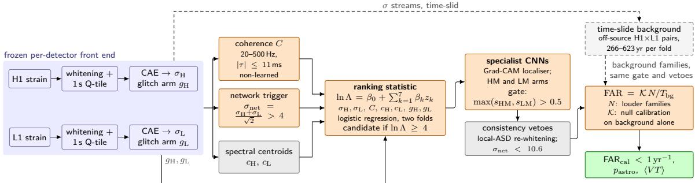
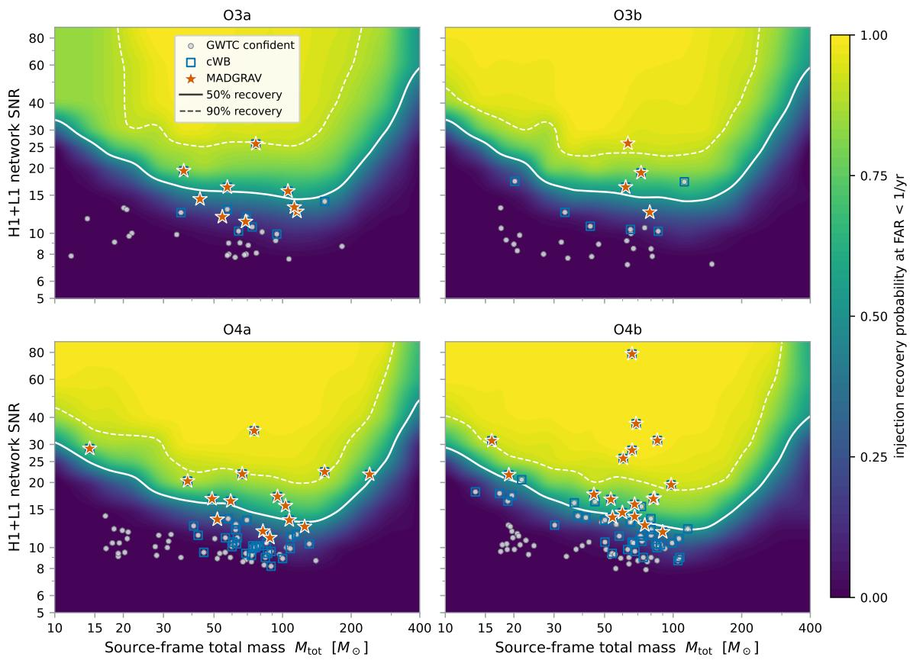
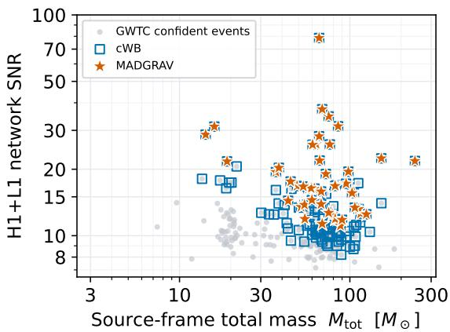
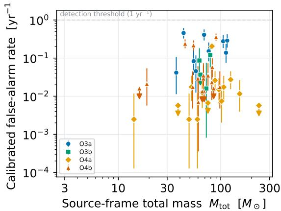
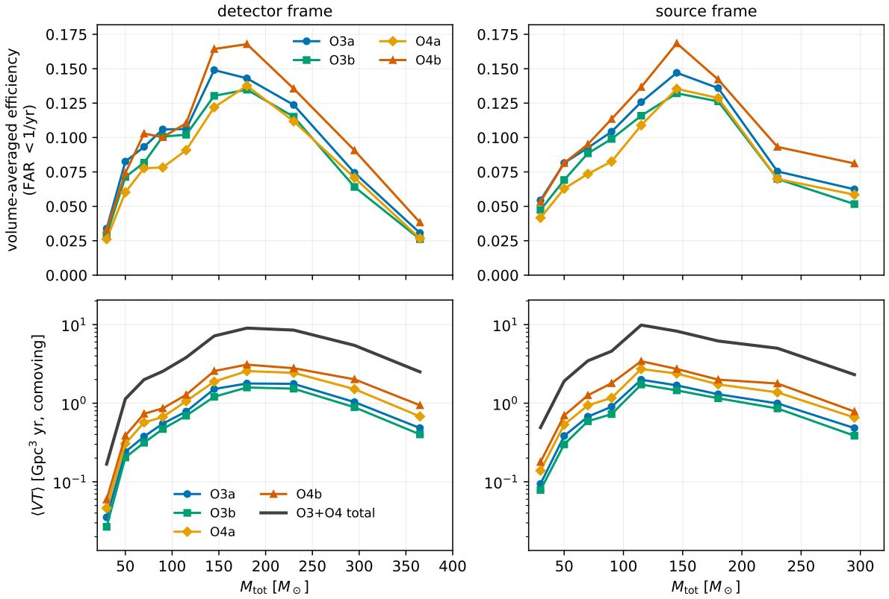
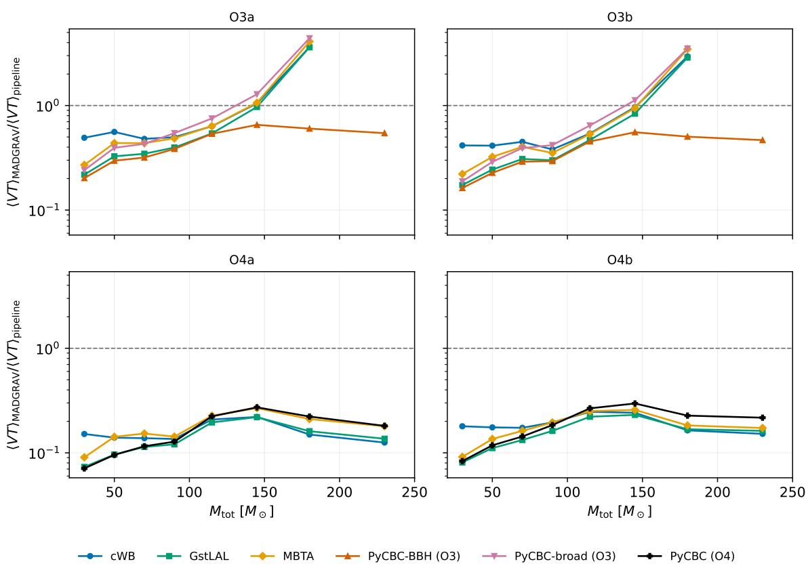
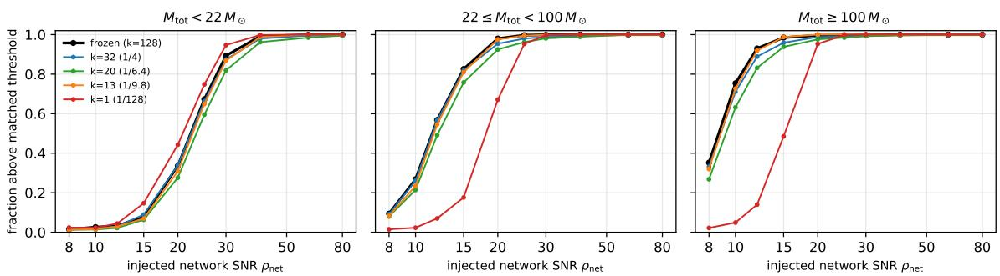

Journal Name

Crossmark

PAPER

RECEIVED dd Month yyyy

REVISED dd Month yyyy

# MADGRAV: a multilevel anomaly-detection pipeline for gravitational-wave searches applied to LIGO data

Gianluca Inguglia1 , Huw Haigh1 , Ulyana Dupletsa1 , Alessandro Longo2,3

1Marietta Blau Institute for Particle Physics, Austrian Academy of Sciences, Vienna, Austria   
2Universit\`a degli Studi di Urbino ‘Carlo Bo’, I-61029 Urbino, Italy   
3INFN, Sezione di Firenze, I-50019 Sesto Fiorentino, Firenze, Italy

E-mail: gianluca.inguglia@oeaw.ac.at, huw.haigh@oeaw.ac.at, ulyana.dupletsa@oeaw.ac.at, alessandro.longo@uniurb.it, alessandro.longo@fi.infn.it

Keywords: gravitational wave detection, anomaly detection, LIGO interferometers, machine learning, weakly modelled pipelines, binary black holes

## Abstract

We present the results of MADGRAV, a deep-learning-based search for high-mass compact binary coalescences, applied to the data collected by the LIGO interferometers during the third observing run and during the first and second part of the fourth observing run. The MADGRAV pipeline consists of a series of sequential convolutional neural networks that perform anomaly detection, glitch classification, coherence testing, and signal ranking. Data from the Hanford and Livingston LIGO detectors are studied (both individually and in coherence) by way of 1 second Q-transform windows. Of the candidates that survive every stage of the pipeline, 48 reach the significance threshold, and we report 47 gravitational wave detections characterised by a false alarm rate below 1 yr−1 with a probability of astrophysical origin pastro > 0.9. Of the 47 detections, 44 are shared with the minimally modelled coherent WaveBurst search. The observed total source-frame masses, extracted from oficial gravitational wave transient catalogues, are in the 14–236 $M _ { \odot }$ range with a median of 69 M , and a median SNR of 16. We note that the recovered fraction of confident detections rises with mass: for LIGO detectors network SNR > 10 the pipeline recovers 8.1% of confident catalog events below 30 M , 39.8% between 30 and 100 $M _ { \odot }$ , and 53.3% above 100 $M _ { \odot } ,$ corresponding to 33.3%, 45.5% and 53.3% of the events detected by coherent WaveBurst in the same bins. These results suggest that anomaly detection pipelines can serve as an independent detection channel complementary to matched filtering in the high-mass high-SNR regime.

## 1 Introduction

Searches for gravitational waves (GWs) from compact binary coalescences (CBCs) in the LIGO-Virgo-KAGRA (LVK) detectors [1] can be categorised into two main classes: matched filtering, which is optimal when the signal waveform is known [2, 3] and with minimally modelled burst searches [4, 5]. The (LVK) catalogs GWTC-2.1 [6], GWTC-3 [7], GWTC-4.0 [8, 9], and GWTC-5.0 [10, 11] combine the template-based pipelines GstLAL [12], PyCBC [13], and MBTA [14] with the minimally modelled coherent WaveBurst (cWB) pipeline [4, 5]. For suficiently high detector-frame masses [15] the observable signal may shrink to a few cycles in the sensitive band of current GW observatories, and the presence of possible features that may be incompletely represented in search template banks, such as higher-order modes, precession, eccentricity, provide further motivation for unmodelled or weakly modelled searches. GW190521 [16] and, most recently GW231123 [17] are examples of IMBH production in mergers where cWB had a very important role in their detection.

Several machine learning searches have also been developed, for example [18, 19, 20, 21, 22]; while most utilise waveforms templates directly in their training sample and therefore partially inherit the model dependence of matched filtering, unsupervised and semi-supervised alternatives have also been explored; examples include convolutional and recurrent autoencoder anomaly searches [23, 24, 25, 26], the machine learning burst pipeline MLy [27], autoencoders trained exclusively on simulated noise [28], and template-free searches that use inter-detector coincidence as the training objective itself [29]. Here we present MADGRAV, a Multilevel Anomaly Detection pipeline for GRAVitational wave science. MADGRAV takes the anomaly detection route and further develops the model proposed by the authors in [26]: its core discriminator is a convolutional autoencoder (CAE) whose reconstruction behavior separates candidate astrophysical transients from detector noise, with a minimal template bank used as a means of weak supervision to increase the discriminating power of the autoencoder to flag potential signal of interest as anomalies with respect to typical detector noise. MADGRAV originates from the anomaly-detection pipeline we introduced for Einstein Telescope mock data in Ref. [26]. The pipeline presented herein adapts that original work to real data from the LIGO network, and includes additional layers of convolutional neural networks (CNNs) to suppress glitch contamination and implements detector coherence. Section 2 describes the full architecture and training, Section 3 introduces the blind search performed on LIGO data, and the results are shown and compared to other pipelines in Sections 4 and 5, respectively. Section 6 provides an outlook for future development and deployment of the pipeline.

## 2 The MADGRAV pipeline

MADGRAV operates on time–frequency representations of whitened strain from the two LIGO detectors with an architecture derived from the convolutional-autoencoder pipeline of Ref. [26], re-engineered for the realistic two-detector LIGO network and tested on real LIGO data collected in the third and fourth observing runs, specifically in the so-called O3a,b and O4a,b. This work made use of gwpy [30], PyTorch [31], NumPy [32], and SciPy [33], and all codes to reproduce the results are available in the public MADGRAV repository [34].

## 2.1 Architecture and training

The encoder component of the CAE consists of three convolutional blocks (3 × 3 kernels; 32, 64, and 128 filters), each followed by batch normalization, ReLU activation, dropout $( p = 0 . 2 )$ , and $2 \times 2$ max-pooling whose switch indices are retained. The flattened latent space has $1 2 8 \times 3 2 \times 1 6 = 6 5 { , } 5 3 6$ dimensions. The latent space is deliberately overcomplete: the separation between signal and noise reconstruction errors is produced by the margin objective[Eq. (1)]. Appendix A shows that compressing the latent space by up to a factor of four leaves the detections and the injection eficiency unchanged at fixed false-alarm rate (FAR), and that stronger compression degrades them. The decoder mirrors the encoder and max-unpools with the retained switch indices, so the reconstruction is registered pixel-for-pixel with the input, and the detection feature is a reconstruction error (mean squared error) on that registered map. A single linear layer mapping the latent vector to a signal–noise logit is retained from [26] but enters neither the training objective of the frozen model nor the detection statistic. Following [26], the training objective penalises the model when signal-injected spectrograms are reconstructed with an MSE comparable to that of noise-only 1–s Q-Transform segments (to which we will refer to as tiles). Denoting by $\mathcal { L } _ { \mathrm { n o i s e } }$ and $\mathcal { L } _ { \mathrm { a n o m } }$ the mean reconstruction MSE of noise-only and signal-injected tiles in a batch, the loss is

$$
{ \mathcal { L } } = { \mathcal { L } } _ { \mathrm { n o i s e } } + \lambda \operatorname { R e L U } ( m { \bar { \mathcal { L } } } _ { \mathrm { n o i s e } } - { \mathcal { L } } _ { \mathrm { a n o m } } ) ,\tag{1}
$$

where $\bar { \mathcal { L } } _ { \mathrm { n o i s e } }$ is the noise term held fixed (no gradient) inside the margin, so that the second term drives the signal reconstruction error up rather than the noise error down. The ReLU returns zero once $\mathcal { L } _ { \mathrm { a n o m } } \geq m \bar { \mathcal { L } } _ { \mathrm { n o i s e } }$ , i.e. once signals reconstruct at least m times worse than noise. We use $m = 3$ and $\lambda = 2$

The per-window reconstruction error is calculated and standardised with respect to statistical fluctuations expected in noise-only samples. These per-detector significance values $( \sigma _ { \mathrm { H } } , \sigma _ { \mathrm { L } } )$ constitute the anomaly score of a given window. The CAE is trained in two stages: ten epochs of unsupervised reconstruction of O3a detector noise (MSE on noise-only tiles), followed by ten epochs of fine-tuning with the margin objective of Eq. (1) on paired noise-only and signal-injected tiles. Injections are drawn from a bank of binary black hole merger waveforms (102, 400 waveforms using as an approximant IMRPhenomPv2 [35]) with primary source masses of 10– $\cdot 1 2 0 M _ { \odot }$ , mass ratios up to 6, luminosity distances 100–5000 Mpc, and isotropic sky locations and orientations, projected onto both detectors and rescaled to network SNR $\rho _ { \mathrm { n e t } }$ uniform in [8, 25]. The model is trained using uniquely coincident O3a LIGO Livingston and Hanford data that satisfy CAT1 and CAT2 data-quality vetoes [36, 6] and carry no hardware injection flag. We randomly select 32 of the 143 available 4096 s blocks, giving 36.4 h per detector. For each detector, the strain is whitened against an amplitude spectral density (ASD) estimate, we select whitened segments of 4 s length and their central 2 s window region is transformed with a multi-resolution Q-transform [37]

$( Q \in [ 4 , 6 4 ] , 1 0 { - } 1 2 9 1 \mathrm { H z } )$ , of the 2 s Q-transform region we select the central 1 s resampled onto a 256 × 128 frequency–time tile and min–max normalized for further analysis (these 1 s Q-Transform segments are used for training and are the data the full pipeline works with). The final zoom to 256 × 128 reduces each tile by a factor ∼39 in pixel count $( 0 . 5 \mathrm { H z } \times 2 . 0 \mathrm { m s } \to 5 . 0 \mathrm { H z } \times 7 . 9 \mathrm { m s } )$ which reduces the computational cost, including that of the time-slide background estimation $( \sim 1 0 ^ { 9 }$ samples), by the same factor. The downsampling was decided based on a measurement: on the recovered events, whitened noise decorrelates in ∼6.6 ms while the coherent chirp track remains correlated over ∼12 ms for $M _ { \mathrm { t o t } } \gtrsim 6 0 M _ { \odot } ,$ so the 7.9 ms time bin lies between the two scales and averages down incoherent fluctuations while preserving the signal. The Q-transform kernel bandwidth also sets a correlation length of ∼14 Hz, leaving the 5.0 Hz binning oversampled by ∼2.8. A future version of MADGRAV can in principle benefit by further optimising frequency and time resolution per mass bin search.

Segmenting the 32 data blocks at 4 s with a 2 s stride yields 131,008 tiles, split $6 0 / 2 0 / 2 0$ into 78,606 training, 26,201 validation, and 26,201 test tiles. If one of the selected blocks contains a known signal, we remove from that segment a section of ±64 s around the GPS time of the event (we perform this removal in seven instances). Weak supervision is applied via pairing every noise tile with one injected tile built from the same window; the waveform is drawn uniformly with replacement from the projected bank (102,400 projections) and placed with a uniform random time ofset of up $\mathrm { t o \pm 0 . 5 s }$ , such that the training and validation splits carry 78,606 and 26,201 injections respectively. We use the Adam optimiser [38] (learning rate $1 0 ^ { - 3 }$ , weight decay $1 0 ^ { - 5 }$ , batch size 64, with plateau learning-rate halving) in both stages; the frozen model is the fine-tuning epoch that maximises the number of validation injections whose reconstruction error exceeds the 3σ point of the validation-noise distribution. The resulting trained model is frozen and utilised throughout the rest of the analysis. The CAE assigns per-detector anomaly scores on the 1 s tiles over the coincident data; we define the network excess significance of a zero-lag window,

$$
\sigma _ { \mathrm { n e t } } = \frac { \sigma _ { \mathrm { H } } + \sigma _ { \mathrm { L } } } { \sqrt { 2 } } .\tag{2}
$$

A threshold at $\sigma _ { \mathrm { n e t } } > 4 . 0$ is set to produce an anomaly detection trigger.

Three auxiliary networks share one compact topology derived from the CAE: four convolutional blocks $( 3 \times 3$ kernels; 16, 32, 64, 128 filters; batch normalization, ReLU, $2 \times 2$ pooling), global average pooling, and a 128 → 64 → 1 fully connected head with dropout (0.3). The first network is the glitch arm which analyses detector tiles individually, and it is trained on bank injections whose 85 % is from from the same IMRPhenomPv2 bank as the weak supervision of the CAE and and 15 % from a higher mass IMRPhenomXPHM bank (with $M _ { \mathrm { t o t } } \in \left[ 1 0 0 , 4 0 0 \right] M _ { \odot } , q \leq 4 )$ , versus σ-stratified real O3a tiles extracted from the detectors-stream (with $\sigma _ { H , L } \in [ 1 , 3 ] , [ 3 , 6 ] , [ 6 , m a x ] )$ This network is deployed as a five-seed ensemble: five networks difering only in random initialization and batch order are averaged in the logit. The tiles of both zero-lag LIGO detectors are then scored, and one seed of the CNN is used as a gradient-weighted class activation mapping (Grad-CAM [39]) to locate the time where the signal-like evidence peaks in the anomaly score distribution (we find consistency between all seeds and select randomly). After the glitch arm, two “specialist” CNNs take as input a coincident two-channel $\mathrm { H 1 / L 1 }$ tile stack: one restricted in band in the 20–140 Hz region, and the other in 50–500 Hz. The reason for separating the frequency is that diferent glitches afect diferent frequencies, and targeting a specific frequency range provides better glitch classification. Both specialists are trained by binary cross entropy on Q-Transform tiles of both LIGO detectors, with injected bank signals as positives (the IMRPhenomXPHM higher-mass bank, detector-frame $M _ { \mathrm { t o t } }$ 100–400 $M _ { \odot } , q \le 4 , f _ { \operatorname* { m i n } } = 2 0$ Hz, for the low-frequency specialist and the IMRPhenomPv2 lower-mass, $M _ { \mathrm { t o t } } < 1 0 0 M _ { \odot }$ , for the high-frequency one), and real time-slid loud coincidences extracted from data with CAE per-detector $\sigma > 5$ as negatives, $\mathcal { O } ( 1 0 ^ { 3 } )$ examples. The low-frequency specialist, therefore, takes as an input the two-channel (Hanford, Livingston) Q-transform tiles in the 20–140 Hz band, targeting the promotion of short, low-frequency morphologies of massive binaries and the suppression of low frequency glitches; the high-frequency specialist is its 50–500 Hz counterpart. Both tiles are centered on a common trigger time selected by the Grad-CAM.

An essential aspect of the search is the cross-detector coherence statistic, which quantifies whether excess power is consistent between sites,

$$
C = \frac { 2 \ \operatorname* { m a x } _ { | \tau | \leq \tau _ { \mathrm { m a x } } } \left| \sum _ { t } x _ { \mathrm { H } } ( t ) x _ { \mathrm { L } } ( t + \tau ) \right| } { \sum _ { t } x _ { \mathrm { H } } ^ { 2 } ( t ) + \sum _ { t } x _ { \mathrm { L } } ^ { 2 } ( t ) } ,\tag{3}
$$

where $x _ { \mathrm { H , L } }$ are the whitened strain series band-limited to a single 20–500 Hz band in the 1 s analysis window and $\tau _ { \operatorname* { m a x } } = 1 1$ ms bounds the lag at the inter-site light-travel time. Instrumental

transients are incoherent between the detectors, so this statistic anchors the separation of coincident glitches from astrophysical signals. For all signal candidates we evaluate coherence, which will enter in the final ranking statistics

## 2.2 Detection flow

Gravitational wave detection in MADGRAV proceeds therefore in three subsequent stages. On a 1 s stride extracted over the coincident data, each detector whitened and $\mathrm { Q } -$ -Transformed windows are scored once and cached: the CAE anomaly score $\sigma _ { d } ,$ , and the glitch-arm logit $g _ { d }$ (the five-seed ensemble mean) are computed for every window, before any threshold. Second, the zero-lag Hanford—Livingston windows are formed and the network excess significance [Eq. 2] is required to exceed $\sigma _ { \mathrm { n e t } } > 4 . 0$ to trigger the gate. The cross-correlation statistic [Eq. (3)] is evaluated per trigger, completing the feature vector. Finally, a log-likelihood ratio statistic including all information is built

$$
\ln { \Lambda } = \beta _ { 0 } + \sum _ { k = 1 } ^ { 7 } \beta _ { k } \frac { x _ { k } - \mu _ { k } } { s _ { k } } ,\tag{4}
$$

from seven per-candidate features $x _ { k } { : }$ the per-detector CAE anomaly scores $\sigma _ { \mathrm { H } } , \sigma _ { \mathrm { L } } ;$ the two-detector statistic $C ,$ the lag-maximized cross-correlation of the band-limited whitened series, symmetrically normalized to [0, 1] over lags within the light-travel window; the two per-detector spectral centroids, the energy-weighted mean frequency over the band-restricted central window of the whitened series; and the two gated glitch-arm scores. The coeficients $\beta$ were fitted by ridge-regularized, class-balanced logistic regression of time-slid of-source pairings against bank injections scored through the full pipeline, with the coherence coeficient constrained non-negative; $\mu _ { k }$ and $s _ { k }$ are the per-fold means and standard deviations of that fit pooled training sample.

A trigger is admitted as a candidate if ln $\Lambda \geq 4 . 0$ . Only then are the specialist arms evaluated: admitted candidates are CNN scored on band-cropped two-detector tiles, at a common time placement taken from the Hanford glitch-arm activation map, and must satisfy the the glitch arm gate $g _ { \mathrm { n e t } } \ge g _ { \mathrm { m i n } }$ (Sec. 3) and glitch specialist gate max(sHM, sLM) > 0.5.

Each candidate FAR is then evaluated in the two ranking channels $c \in \{ \ln \Lambda , \sigma _ { \mathrm { n e t } } \}$ ; in channel $c ,$ $N _ { c }$ is the number of time-slide background families of the candidate observing run that pass the same glitch arm and glitch specialist gate, at or above it a its $\sigma _ { \mathrm { n { e t } } }$ . The counting applies a local-spectrum consistency veto to candidate (Sec. 3). Background triggers sharing the same 4 s Livingston window across all Hanford partners and slides are counted once (one “family”). The detection statistic is minc $N _ { c } ,$ converted to a FAR with a measured efective trials factor $N _ { \mathrm { e f f } }$ [Sec. 3, Eq. (5)]. The statistic of record (Sec. 3) keeps this arm-conditioned counting but drops the $\sigma _ { \mathrm { n { e t } } }$ channel, excludes the zero-lag foreground from the background, and replaces the asserted factor-4 trials correction under which the candidates were originally selected by an empirically measured calibration factor. Figure 1 shows a flow chart of the full MADGRAV pipeline. The complete

  
Figure 1: Detection flow of MADGRAV. The shaded band is the frozen per-detector front end (whitening, 1 s Q-tile, autoencoder score σ, glitch arm $g ) ;$ orange boxes are the network-level stages, from the $\sigma _ { \mathrm { n { e t } } }$ trigger through the likelihood-ratio ranking of Eq. (4) and the gated specialist networks to the false-alarm rate; grey boxes are non-learned stages. Solid arrows follow a zero-lag candidate; dashed arrows indicate the time-slid background.

model (CAE, glitch arms, LR coeficients, and all thresholds) was frozen after the training based on the O3a segments as described above, and applied without retraining to O3b, O4a, and O4b.

## 3 Blind search and significance estimation

We analyze the public 4 kHz GWOSC strain [40, 41, 42] for Hanford–Livingston coincident segments of O3a, O3b, O4a, and O4b. The scanned foreground consists of 725, 556, 818, and 1086 data segments corresponding to 106.8, 96.4, 125.6, and 114.1 days of coincident livetime, respectively (442.9 days in total). The segment lists are the GWOSC H1 DATA ∩ L1 DATA coincident inventories (≥ 16 s) of each run. For all runs the thresholds were fixed in advance and candidate triggers were cross-matched to the catalogs only after the FAR assignment was complete.

The noise background was measured with time slides. Within each observing run, the analysis segments were assigned alternating two indexed subsets (0 and 1). Background coincidences were then formed from time shifted pairings of Hanford and Livingston segments belonging to the same subset. Every candidate was ranked (and its false-alarm rate measured) against the time-slide background of its own subset with the log-likelihood ratio model fitted only on the other half, so that no candidate or background trigger is ever scored by a model that has previously seen it. The resulting background livetimes per subset are between 266 and 623 years: O3a 370 and 405 yr; O3b 288 and 266 yr; O4a 495 and $5 7 7 { \mathrm { y r } } ;$ O4b 623 and 520 yr, for subset 0 and 1, respectively. We restricted the background trigger to time-slide windows satisfying the same $\sigma _ { \mathrm { n e t } } > 4 . 0$ condition that defines a foreground trigger. The detection statistic minimizes the family rank over the two ranking channels (Sec. 2.2); the FAR is

$$
\mathrm { F A R } = N _ { \mathrm { e f f } } \frac { \mathrm { m i n } _ { c } N _ { c } } { T _ { \mathrm { b g } } } ,\tag{5}
$$

where $N _ { \mathrm { e f f } }$ is the trials factor of the minimum over the two channels. Equation (8) below supersedes this form for every quoted number: the empirical factor K is measured at trials factor unity and absorbs $N _ { \mathrm { e f f } }$ , so the two are never applied together. Here $N _ { c }$ is the integer count of loud background families in the candidate observing run, $T _ { \mathrm { b g } }$ that fold background livetime, and $N _ { \mathrm { e f f } }$ the efective trials factor of the minimum

$$
N _ { \mathrm { e f f } } ( x ) = \frac { R _ { \mathrm { m i n } } ( x ) } { \operatorname* { m a x } _ { c } R _ { c } ( x ) } ,\tag{6}
$$

where $R _ { \mathrm { m i n } } ( x )$ is the rate per unit background time at which families reach min $N _ { c } / T _ { \mathrm { b g } } < x$ under their own leave-one-out ranks, and $R _ { c } ( x )$ is the same rate in channel c alone $( N _ { \mathrm { e f f } } = 1 . 8 6 \ – 1 . 9 7$ with 90% intervals of ±0.3; O4b fold 1 uses a mildly x-dependent value, 1.57 at $1 \mathrm { y r } ^ { - 1 }$ , because the consistency test rejected a single value there (Appendix B)). The candidates own zero-lag pair is the only exclusion from its background. For every detection we recover min $N _ { c }$ and attach an exact 90% Poisson interval [43], the upper limit replacing the count by $\begin{array} { r } { N _ { \mathrm { u p } } = \frac { 1 } { 2 } \chi _ { 0 . 9 0 } ^ { 2 } \bigl [ 2 ( N + 1 ) \bigr ] } \end{array}$ candidates with $N = 0$ are therefore quoted as 90% upper limits, $\mathrm { F A R } < { \mathcal K } \times \bar { 2 . 3 0 } / T _ { \mathrm { b g } }$

Injection campaigns. The eficiency, sensitive-volume, and $p _ { \mathrm { a s t r o } }$ estimates below use a single per-run injection campaign scored through the identical frozen chain and the adopted background counting. A signal population is drawn in equal parts from three banks: a low-mass bank (IMRPhenomPv2, non-spinning projections; $M _ { \mathrm { t o t } } \in \left[ 1 0 , 2 2 \right] M _ { \odot } , q \le 6 )$ , the stellar bank of Sec. 2.1 (IMRPhenomPv2, non-spinning projections; $m _ { 1 } \in \left[ 1 0 , 1 2 0 \right] M _ { \odot } , q \le 6 )$ , and an ultramassive bank (IMRPhenomXPHM, precessing; detector-frame $M _ { \mathrm { t o t } } \in \left[ 1 5 0 , 4 0 0 \right] M _ { \odot } , q \le 4$ , lower starting frequency), which together give detector-frame support from 10 to 400 $M _ { \odot }$ . Sky position, orientation, and polarization are isotropic; each injection is placed on a network–SNR grid of 13 levels spanning $\rho _ { \mathrm { n e t } } = 5 { - } 8 0$ , and later importance-weighted to a uniform-in-volume distance prior within the sampled sphere $( \propto \rho ^ { - 4 } ; \mathrm { S e c . ~ 4 . 1 } )$ . The grid must span the population at uniform weights: the $\rho ^ { - 4 }$ weights are renormalized over the sampled levels, so a ceiling low enough to exclude the loud tail redistributes that weight onto levels at which the search is ineficient and biases ⟨V T⟩ low. The campaigns comprise 122 850, 70 200, 58 500, and 70 200 scored injections in O3a, O3b, O4a, and O4b, respectively—5 850 per host segment on 21, 12, 10, and 12 segments; 307 226 of the 321 750 survive the horizon-validity cut. The specialist arms were trained on Q-transform crops of the stellar and ultramassive banks against O3a background triggers, and the glitch arm on bank injections versus σ-stratified real O3a tiles (Sec. 2.1).

Surviving candidates are re-whitened against a local ±64 s Welch ASD estimate; a candidate is vetoed if both localized arm scores fall below 0.5 or, for a network-channel candidate, if $\sigma _ { \mathrm { n { e t } } }$ falls below 4.0 under local whitening.

Two selection rules were studied using the injection population alone and are applied identically to candidates, to every time-slide background pair and to the injections that measure the eficiency: an upper veto $\sigma _ { \mathrm { n e t } } < 1 0 . 6$ (99% of gate-passing injections) and a glitch-arm gate $g _ { \mathrm { n e t } } \equiv ( g _ { \mathrm { H } } + g _ { \mathrm { L } } ) / \sqrt { 2 } \geq g _ { \mathrm { m i n } } = - 4 . 0 2$ , the first percentile of $g _ { \mathrm { n e t } }$ over the 57 641 gate-passing,

triggering injections of the campaign above (≤ 1% injection loss). The loudest time-slide families are chance coincidences of two short broadband instrumental transients, which the specialist arms score as signal-like as the detections but the glitch arm separates (median $g _ { \mathrm { H } } / g _ { \mathrm { L } } = + 2 . 5 / + 3 . 3$ for the detections against $- 1 . 6 / - 3 . 0$ for ∼50 loudest families); the gate passes all 48 candidates and removes 37% of the background families that set the FARs (40% of the summed louder-family counts).

We quote FAR as the primary significance and additionally report a per-event probability of astrophysical origin, $p _ { \mathrm { a s t r o } } ,$ constructed in direct analogy to the cWB method [44, 9]. Each run signal density is measured from the injection campaign above, pushed through the identical adopted counting that defines the quoted FARs and reweighted to the published-catalog total-mass distribution; the noise density is analytic and pinned to its time-slide null expectation rather than fitted. The construction, fitted mixture parameters, and three systematic checks are given in Appendix C.

Every gate-passing, veto-surviving time-slide family is treated as a pseudo-foreground candidate and assigned a FAR by the identical procedure used for a real candidate, ranked against the remaining background with its own pair excluded. If the quoted FAR were exact, the number $n ( x )$ of such families assigned FAR < x would equal $E ( x ) = x T _ { \mathrm { b g } } ;$ the ratio

$$
K ( x ) = { \frac { n ( x ) } { E ( x ) } } , \qquad E ( x ) = x T _ { \mathrm { b g } } ,\tag{7}
$$

is therefore a direct, foreground-free measurement of how far the quoted rate is from the true one.   
The test involves no zero-lag data.

Two properties fix its interpretation. For a plain unconditioned rank the ratio is unity by construction—the r-th loudest family has $\mathrm { F A R } = r / T _ { \mathrm { b g } } .$ so exactly $x T _ { \mathrm { b g } }$ families fall below x—and we reproduce $\mathcal { K } = 1 . 0 0$ for a single-channel rank in all four runs. And a veto applied consistently to both the candidate and the background leaves a rank unchanged, which we also verify (1.00 before and after).

Evaluated on the full pseudo-foreground population of each run, the adopted statistic gives $\mathcal { K } = 5 . 6 0 , 4 . 5 9$ , 1.43 and 3.62 for O3a, O3b, O4a and O4b. The dominant contribution is the arm-conditioned counting: because a family is counted only when it beats the candidate on loudness and on the candidate own arm score, the count is a conditional tally rather than a rank, and it runs 3–13% of the corresponding rank. Taking the minimum over the two channels contributes a further factor measured at 1.9, close to the value 2 expected for independent channels and reduced below it only by their correlation. The statistic of record is therefore

$$
\mathrm { F A R } _ { \mathrm { c a l } } = \mathcal { K } \frac { \operatorname* { m i n } _ { c } N _ { c } } { T _ { \mathrm { b g } } } ,\tag{8}
$$

evaluated with the per-run K above. Two properties of this statistic must be stated explicitly, because they difer from the general form of Eq. (5) and because every number in this paper is computed from them. First, the minimum is taken over the two arms and not over the two channels: the $\sigma _ { \mathrm { n { e t } } }$ channel is removed entirely and every candidate is ranked on ln Λ alone, so that minc $N _ { c } $ min $\left( N ^ { \mathrm { H M } } , N ^ { \mathrm { L M } } \right)$ . Second, those counts remain conditioned on the candidate own arm scores, a family entering $N ^ { \dot { a } }$ only if its arm score exceeds the candidate. K is measured on exactly this rank function and at trials factor unity, so it already absorbs the $N _ { \mathrm { e f f } }$ of Sec. 3 and is not applied on top of it.

Every FAR quoted in this paper is $\mathrm { F A R } _ { \mathrm { c a l } }$ , and we require it to lie below $1 \mathrm { y r } ^ { - 1 }$ ; of the 48 candidates passing the raw threshold, 47 satisfy this.

## 4 Results

The injection campaign of Sec. 3 underlies what show in Fig. 2: each injection is recovered through the same sliding grid, glitch gate and local-ASD veto as a real candidate, and carries the sub-tile placement loss. Figure 2 also shows the detected events per observing run, showing an excellent agreement between expectations and observations. In Fig. 3a we place the detected events in the catalog mass–SNR plane. Every detection is consistent with a confident event of the published catalogs; and no candidate without a catalog counterpart survives the analysis.

Table 1 gives the resulting eficiency. Recovery reaches 50% near $\rho _ { \mathrm { n e t } } \simeq 1 5$ –20 and plateaus at 0.86–0.97 rather than at unity: a residual few per cent of even the loudest injections are lost, so an extrapolation to perfect recovery at high SNR would be wrong. Comparing simulation with data at each detection’s own cell (Table 2). The search returns 47 detections at calibrated $\mathrm { F A R } < 1 \mathrm { y r } ^ { - 1 }$ : 9,

  
Figure 2: Injection recovery over the source-frame total mass—network SNR plane, one panel per run. Colour is the recovery probability at $\mathrm { F A R } < 1 \mathrm { y r } ^ { - 1 } ;$ white curves are the 50% (solid) and 90% (dashed) contours. Grey circles are GWTC confident H1–L1 coincident events, blue squares cWB and orange stars MADGRAV detections. The grid used contains 16 logarithmic mass bins and 13 SNR levels $( \rho _ { \mathrm { n e t } } = 5 \substack { - 8 0 } )$ with $\geq 4 0$ injections per cell.

<table><tr><td> $\underline { { \rho \mathbf { n e t } } }$ </td><td>5</td><td>6</td><td>7</td><td>8</td><td>10</td><td>12</td><td>15</td><td>20</td><td>25</td><td>30</td><td>40</td><td>60</td><td>80</td></tr><tr><td>O3a</td><td>0.00</td><td>0.00</td><td>0.00</td><td>0.01</td><td>0.07</td><td>0.18</td><td>0.39</td><td>0.55</td><td>0.72</td><td>0.84</td><td>0.92</td><td>0.92</td><td>0.89</td></tr><tr><td>O3b</td><td></td><td>0.00</td><td>0.00</td><td>0.01</td><td>0.05</td><td>0.15</td><td>0.36</td><td>0.53</td><td>0.69</td><td>0.82</td><td>0.93</td><td>0.96</td><td>0.96</td></tr><tr><td>O4a</td><td>0.00</td><td>0.00</td><td>0.00</td><td>0.00</td><td>0.04</td><td>0.12</td><td>0.32</td><td>0.52</td><td>0.73</td><td>0.83</td><td>0.92</td><td>0.96</td><td>0.97</td></tr><tr><td>O4b</td><td>0.00</td><td>0.00</td><td>0.00</td><td>0.01</td><td>0.06</td><td>0.18</td><td>0.41</td><td>0.59</td><td>0.79</td><td>0.88</td><td>0.95</td><td>0.97</td><td>0.97</td></tr></table>

Table 1: Recovery fraction at $\mathrm { F A R } < 1 \mathrm { y r } ^ { - 1 }$ versus injected H1+L1 network SNR. A dash marks a level absent for that run. Values are run averages over the injected mass mix, not per-cell eficiencies.

<table><tr><td>Run</td><td>Comparable</td><td>Found</td><td> $\overline { { \mathrm { P r e d i c t e d } } }$ </td><td>Difference</td></tr><tr><td>O3a</td><td>37</td><td>9</td><td> $\overline { { 7 . 8 \pm 1 . 8 } }$ </td><td>+0.69σ</td></tr><tr><td>O3b</td><td>31</td><td>4</td><td> $4 . 0 \pm 1 . 1$ </td><td>-0.03σ</td></tr><tr><td>O4a</td><td>76</td><td>15</td><td> $1 1 . 6 \pm 2 . 2$ </td><td>+1.54σ</td></tr><tr><td>O4b</td><td>86</td><td>18</td><td> $2 3 . 2 \pm 2 . 7$ </td><td> $- 1 . 8 8 \sigma$ </td></tr><tr><td>Total</td><td>230</td><td>46</td><td> $\overline { { 4 6 . 5 \pm 4 . 1 } }$ </td><td>-0.13σ</td></tr></table>

Table 2: Detections found versus predicted, evaluated at each event own $( M _ { \mathrm { t o t } } , \rho _ { \mathrm { n e t } } )$ cell. Uncertainties are Poisson-binomial.

4, 15, and 19 in O3a, O3b, O4a, and O4b, respectively, with $4 6 . 5 \pm 4 . 1$ predicted detctions. Table 3 lists all 47 with their recovered background counts translated into 90% intervals and the per-event pastro (all 47 have $p _ { \mathrm { { a s t r o } } } > 0 . 9 0$ and 42 of them $\geq 0 . 9 9 )$ . All 46 adopted detections with a published source-frame mass lie inside the measured region; GW240406 062847 has no published mass.

Nine detections have no louder background family in their full time-slide set and are bounded below FAR $< 0 . 0 0 6 \mathrm { - } 0 . 0 3 7 \mathrm { y r } ^ { - 1 }$ (90%, Fig. 3b), the tightest being GW231226 101520 and GW230927 153832. These detections include GW250114 082203 and GW240920 124024 in O4b, both $\mathrm { a t < 0 . 0 1 3 y r ^ { - 1 } }$ . A further 23 detections have $\mathrm { F A R } < 0 . 0 5 \mathrm { y r } ^ { - 1 }$ . GW231123, the most massive binary black hole reported to date [17], is recovered at $\mathrm { F A R } = 0 . 0 0 6 \mathrm { y r } ^ { - 1 }$

Two diferent network SNRs are quoted in the catalog literature: the network matched-filter SNR reported by the parameter-estimation analyses, and the network SNR of the triggering search pipeline. For the 269 confident events the two difer by more than 2% for 166 of them. Table 3 and this section take the parameter-estimation value, from the GWOSC event API releases of GWTC-2.1, GWTC-3, GWTC-4.0/4.1 and GWTC-5.0 [6, 7, 8, 10], as the common starting point; the table reports it as published and ${ \mathrm { F i g . } }$ 3a the H1+L1-only value derived from it below, so the two are related by a stated conversion rather than being two independently sourced numbers.

That published value is a network number, taken over whichever detectors were observing at the time of detection. Since this search uses Hanford and Livingston only, an HLV event network SNR overestimates the Hanford–Livingston network SNR. We therefore consider the two-detector value available to this search, written $\rho _ { \mathrm { H 1 + L 1 } }$ throughout and referred to as the H1+L1 network SNR

$$
\rho _ { \mathrm { H 1 + L 1 } } = \rho _ { \mathrm { n e t } } \frac { \sqrt { \rho _ { \mathrm { H 1 } } ^ { 2 } + \rho _ { \mathrm { L 1 } } ^ { 2 } } } { \sqrt { \sum _ { d } \rho _ { d } ^ { 2 } } } ,\tag{9}
$$

in which the published network value $\rho _ { \mathrm { n e t } }$ sets the scale and the per-detector ratio removes the Virgo quadrature contribution. Writing the correction as a ratio allows a search pipeline measurement to correct a parameter-estimation number, since the overall normalization, and with it the diference between the two conventions, cancels out. For an event observed only by H1 and L1 the factor is exactly unity.

The per-detector SNRs $\rho _ { d }$ are not published in the event API and were recovered from the search data products. For O4 they are tabulated directly in the GWTC-4.0/4.1/5.0 search summary files. For O3 no such table is released, and they were parsed from the GWTC-2.1 and GWTC-3 trigger files; the reconstruction reproduces the coincidence SNR recorded in the same file exactly, and the published network value. Where several pipelines report the same event we take the coincidence that used the most detectors.

Source-frame total masses of the detected population span $1 4 { - } 2 3 6 M _ { \odot }$ with median 69 $M _ { \odot }$ . The faintest detection has an H1+L1 SNR of 11.1. The fraction of events recovered with respect to the oficial catalogs rises with mass: 5.6% below $3 0 M _ { \odot } ,$ 20.3% for 30–60 $M _ { \odot } ,$ 24.2% for 60– $\cdot 1 0 0 M _ { \odot }$ and 33.3% above $1 0 0 M _ { \odot }$ . Denominators here are the 232 confident events observed by H1 and L1 simultaneously, not the full 269, as 37 events were recorded by a single LIGO detector, or by one LIGO detector and Virgo, and no Hanford–Livingston coincident search can be performed. None of these, however, is a cWB detection either, so the same restriction applies to both columns. Restricting further to the events this search is most sensitive to, specifically events characterised by $\rho _ { \mathrm { H 1 + L 1 } } > 1 0$ , raises the recovered fractions to 8.1% below 30 $M _ { \odot } ,$ , 39.8% between 30 and 100 $M _ { \odot }$ and 53.3% above 100 $M _ { \odot }$ (3 of 37, 35 of 88 and 8 of 15 events), corresponding to 33.3%, 45.5% and 53.3% of absolute cWB detections in the same three bins. O3 observing run detections have higher FARs than O4 detections of comparable $\sigma _ { \mathrm { n { e t } } }$ (median $0 . 1 2 \mathrm { y r } ^ { - 1 }$ against $0 . 0 2 \mathrm { y r } ^ { - 1 }$ in O4), as it can be seen in Fig. 3b. The O3 background exhibits more loud coherent-glitch families relative to signal, so more background families outrank each O3 candidate. Remarkably, GW190521 [16] is not recovered although it triggers the anomaly detection: it ranks at $\mathrm { F A R } = 2 . 4 2 \mathrm { y r } ^ { - 1 }$ under the calibrated statistic (175 louder background families in 405 yr); this miss indicates a current limitation of the pipeline due to the ranking statistic and to glitch suppression (more is discussed in Sec. 6).

<table><tr><td>Event</td><td>Run</td><td> $\overline { { { M _ { \mathrm { t o t } } } \ [ M _ { \odot } ] } }$ </td><td> $\underline { { \rho _ { \mathrm { n e t } } } }$ </td><td>ρH1+L1</td><td> $\sigma _ { \mathrm { n e t } }$ </td><td>N</td><td> $\overline { { \mathrm { F A R ~ } [ \mathrm { y r } ^ { - 1 } ] } }$ </td><td> $\overline { { \mathrm { F A R } _ { \mathrm { i n c l } } } }$ </td><td> $\underline { { p _ { \mathrm { a s t r o } } } }$ </td><td>cWB</td></tr><tr><td>GW190408_181802</td><td>O3a</td><td>43</td><td>14.6</td><td>14.4</td><td>5.8</td><td>30</td><td>0.454</td><td>0.454</td><td>1.00</td><td>√</td></tr><tr><td>GW190412</td><td>O3a</td><td>37</td><td>19.8</td><td>19.4</td><td>6.1</td><td>3</td><td>0.041</td><td>0.041</td><td>1.00</td><td>√</td></tr><tr><td>GW190513_205428</td><td>O3a</td><td>54</td><td>12.5</td><td>11.9</td><td>5.9</td><td>6</td><td>0.083</td><td>0.083</td><td>1.00</td><td></td></tr><tr><td>GW190519_153544</td><td>O3a</td><td>106</td><td>15.9</td><td>15.7</td><td>7.5</td><td>20</td><td>0.276</td><td>0.276</td><td>1.00</td><td>√</td></tr><tr><td>GW190521_074359</td><td>O3a</td><td>76</td><td>25.9</td><td>25.9</td><td>8.1</td><td>10</td><td>0.151</td><td>0.151</td><td>1.00</td><td>√</td></tr><tr><td>GW190602_175927</td><td>O3a</td><td>116</td><td>13.2</td><td>12.6</td><td>8.8</td><td>19</td><td>0.288</td><td>0.288</td><td>1.00</td><td>√</td></tr><tr><td>GW190706_222641</td><td>O3a</td><td>113</td><td>13.4</td><td>13.2</td><td>8.2</td><td>10</td><td>0.138</td><td>0.138</td><td>1.00</td><td>√</td></tr><tr><td>GW190727_060333</td><td>O3a</td><td>69</td><td>11.7</td><td>11.3</td><td>6.5</td><td>27</td><td>0.409</td><td>0.409</td><td>1.00</td><td>√</td></tr><tr><td>GW190828_063405</td><td>O3a</td><td>57</td><td>16.5</td><td>16.3</td><td>6.7</td><td>3</td><td>0.045</td><td>0.045</td><td>1.00</td><td>√</td></tr><tr><td>GW191222_033537</td><td>O3b</td><td>79</td><td>12.5</td><td>12.5</td><td>7.3</td><td>7</td><td>0.121</td><td>0.121</td><td>1.00</td><td>√</td></tr><tr><td>GW200129_065458</td><td>O3b</td><td>63</td><td>26.8</td><td>26.0</td><td>8.5</td><td>0</td><td>&lt; 0.037</td><td>&lt; 0.037</td><td>1.00</td><td></td></tr><tr><td>GW200224_222234</td><td>O3b</td><td>72</td><td>20.0</td><td>19.0</td><td>10.1</td><td>1</td><td>0.016</td><td>0.016</td><td>1.00</td><td>√</td></tr><tr><td>GW200311_115853</td><td>O3b</td><td>62</td><td>17.8</td><td>16.3</td><td>8.1</td><td>5</td><td>0.086</td><td>0.086</td><td>1.00</td><td>√</td></tr><tr><td>GW230601_224134</td><td>O4a</td><td>107</td><td>13.4</td><td>13.4</td><td>6.9</td><td>6</td><td>0.017</td><td>0.017</td><td>1.00</td><td>√</td></tr><tr><td>GW230627_015337</td><td>O4a</td><td>14</td><td>28.7</td><td>28.7</td><td>6.2</td><td>1</td><td>0.002</td><td>0.002</td><td>1.00</td><td>√</td></tr><tr><td>GW230628_231200</td><td>04a</td><td>59</td><td>16.4</td><td>16.4</td><td>6.8</td><td>1</td><td>0.002</td><td>0.002</td><td>1.00</td><td>√</td></tr><tr><td>GW230707-124047</td><td>O4a</td><td>82</td><td>11.9</td><td>11.9</td><td>5.1</td><td>71</td><td>0.205</td><td>0.323</td><td>0.91</td><td>√</td></tr><tr><td>GW230824_033047</td><td>04a</td><td>88</td><td>11.1</td><td>11.1</td><td>4.6</td><td>9</td><td>0.026</td><td>0.029</td><td>1.00</td><td>√</td></tr><tr><td>GW230914_111401</td><td>04a</td><td>96</td><td>17.2</td><td>17.2</td><td>7.5</td><td>6</td><td>0.015</td><td>0.015</td><td>1.00</td><td>√</td></tr><tr><td>GW230919_215712</td><td>04a</td><td>49</td><td>16.8</td><td>16.8</td><td>4.7</td><td>1</td><td>0.002</td><td>0.002</td><td>1.00</td><td>√</td></tr><tr><td>GW230922_040658</td><td>04a</td><td>125</td><td>12.5</td><td>12.5</td><td>5.6</td><td>11</td><td>0.027</td><td>0.027</td><td>1.00</td><td>√</td></tr><tr><td>GW230924_124453</td><td>O4a</td><td>52</td><td>13.5</td><td>13.5</td><td>5.4</td><td>6</td><td>0.017</td><td>0.017</td><td>1.00</td><td>√</td></tr><tr><td>GW230927_153832</td><td>04a</td><td>38</td><td>20.3</td><td>20.3</td><td>5.8</td><td>0</td><td>&lt; 0.006</td><td>&lt; 0.006</td><td>1.00</td><td>√</td></tr><tr><td>GW231028_153006</td><td>04a</td><td>153</td><td>22.4</td><td>22.4</td><td>8.9</td><td>4</td><td>0.012</td><td>0.012</td><td>1.00</td><td>√</td></tr><tr><td>GW231102_071736</td><td>O4a</td><td>102</td><td>15.6</td><td>15.6</td><td>7.2</td><td>3</td><td>0.007</td><td>0.007</td><td>1.00</td><td>√</td></tr><tr><td>GW231123_135430</td><td>04a</td><td>236</td><td>21.8</td><td>21.8</td><td>9.1</td><td>0</td><td>&lt; 0.006</td><td>&lt; 0.006</td><td>1.00</td><td>√</td></tr><tr><td>GW231206_233901</td><td>O4a</td><td>66</td><td>21.9</td><td>21.9</td><td>8.2</td><td>5</td><td>0.012</td><td>0.012</td><td>1.00</td><td>√</td></tr><tr><td>GW231226_101520</td><td>04a</td><td>75</td><td>34.7</td><td>34.7</td><td>9.2</td><td>0</td><td>&lt; 0.007</td><td>&lt; 0.007</td><td>1.00</td><td>√</td></tr><tr><td>GW240514_121713</td><td>O4b</td><td>83</td><td>16.9</td><td>16.9</td><td>6.8</td><td>10</td><td>0.058</td><td>0.070</td><td>1.00</td><td>√</td></tr><tr><td>GW240615_113620</td><td>O4b</td><td>60</td><td>26.4</td><td>25.8</td><td>8.9</td><td>1</td><td>0.007</td><td>0.007</td><td>1.00</td><td>√</td></tr><tr><td>GW240621_195059</td><td>O4b</td><td>66</td><td>28.2</td><td>28.2</td><td>8.5</td><td>0</td><td>&lt; 0.013</td><td>&lt; 0.013</td><td>1.00</td><td>√</td></tr><tr><td>GW240705_053215</td><td>O4b</td><td>82</td><td>16.8</td><td>16.8</td><td>6.7</td><td>4</td><td>0.023</td><td>0.023</td><td>1.00</td><td>√</td></tr><tr><td>GW240919_061559</td><td>O4b</td><td>68</td><td>16.9</td><td>15.9</td><td>7.5</td><td>5</td><td>0.029</td><td>0.029</td><td>1.00</td><td>√</td></tr><tr><td>GW240920_124024</td><td>O4b</td><td>69</td><td>37.4</td><td>37.4</td><td>8.7</td><td>0</td><td>&lt; 0.013</td><td>&lt; 0.013</td><td>1.00</td><td>√</td></tr><tr><td>GW240925_005809</td><td>O4b</td><td>16</td><td>31.2</td><td>31.2</td><td>6.4</td><td>0</td><td>&lt; 0.016</td><td>&lt; 0.016</td><td>1.00</td><td>√</td></tr><tr><td>GW241006_015333</td><td>O4b</td><td>45</td><td>17.6</td><td>17.6</td><td>6.8</td><td>41</td><td>0.238</td><td>0.424</td><td>0.98</td><td>√</td></tr><tr><td>GW241102_124058</td><td>O4b</td><td>19</td><td>21.7</td><td>21.7</td><td>4.4 5.7</td><td>3 5</td><td>0.021 0.035</td><td>0.021 0.035</td><td>1.00 1.00</td><td>√ √</td></tr><tr><td>GW241102_144729 GW241127_061008</td><td>O4b O4b</td><td>75 85</td><td>12.7 31.3</td><td>12.7 31.3</td></table>

Table 3: The 47 MADGRAV detections at calibrated $\mathrm { F A R } < 1 \mathrm { y r } ^ { - 1 } . \ M _ { \mathrm { t o t } }$ is the published sourceframe total mass and $\rho _ { \mathrm { n e t } }$ the published network matched-filter SNR [6, 7, 8, 10], over the full observing network; $\rho _ { \mathrm { H 1 + L 1 } }$ is the H1+L1-only value of Eq. (9), the quantity this coincident search could reach and the axis of Fig. 3a. The two difer only where Virgo also observed. $\sigma _ { \mathrm { n { e t } } }$ is the MADGRAV network excess significance. Events with no louder background family $( N = 0 )$ carry a 90% upper limit. $p _ { \mathrm { a s t r o } }$ is a per-run Poisson-mixture (FGMC) fit on the foreground-excluded FAR axis. The last column marks candidates also identified by cWB at $\mathrm { F A R } < 1 \mathrm { y r } ^ { - 1 }$

  
(a)

  
(b)  
Figure 3: Left (a): Source-frame total mass versus H1+L1 network matched-filter SNR for the confident events of GWTC-2.1, GWTC-3, GWTC-4.0, and GWTC-5.0 that were observed by Hanford and Livingston simultaneously (grey), the 120 identified by cWB at $\mathrm { F A R } < 1 \mathrm { y r } ^ { - 1 }$ (blue squares), and the MADGRAV detections at calibrated $\mathrm { F A R } < 1 \mathrm { y r } ^ { - 1 }$ (orange stars). GW240406 062847, an event we detected, has no published source-frame total mass [10] and is not shown in the plot. Right (b): Calibrated FAR with 90% Poisson intervals versus source-frame total mass for the 46 detections (47 less GW240406 062847). Arrows denote 90% upper limits for the 9 events with no louder background family in their full time-slide set (266–623 yr per observing run).

## 4.1 Sensitive volume–time

To convert the detection eficiency into an astrophysical sensitivity we form, per run, a sensitive volume–time (Fig. 4). The eficiency is measured by recovering the injection campaign through the identical adopted counting that defines the quoted FARs, applying the identical detection criterion. Injections are importance-weighted to a population uniform in comoving volume

$$
w _ { j } = \rho _ { j } ^ { - 4 } \Delta \rho _ { j } J ( z _ { j } ) , J ( z ) = \frac { \mathrm { d } V _ { \mathrm { m a x } } / \mathrm { d } D _ { L } } { 4 \pi D _ { L } ^ { 2 } } ,\tag{10}
$$

where $\rho _ { j } ^ { - 4 } \Delta \rho _ { j }$ is the Euclidean uniform volume weight of the network SNR grid level $\rho _ { j } \in [ 5 , 8 0 ]$ (13 levels, each carrying its Voronoi width $\Delta \rho _ { j } )$ , following the weighted Monte Carlo construction reported in [45], and the Jacobian J, evaluated at the injection implied luminosity distance, converts that weight to the comoving, (1 + z)-dilated measure of $V _ { \mathrm { m a x } }$ below $( J \to 1 \mathrm { ~ a s ~ } z \to 0 ;$ median 0.5%–0.6% over the campaign). In a mass bin b,

$$
\varepsilon _ { b } = { \frac { \sum _ { j \in b } w _ { j } \ d _ { j } } { \sum _ { j \in b } w _ { j } } } ,\tag{11}
$$

where $d _ { j } \in \{ 0 , 1 \}$ records whether injection j satisfies the detection criterion; injections whose network SNR falls below $\rho _ { \mathrm { m i n } } = 5$ are counted as undetected. Each injection is paired with the horizon of its own bank template (the stellar and ultramassive banks difer in approximant and starting frequency): $D _ { j }$ is the luminosity distance at which that template reaches network SNR $\rho _ { \mathrm { m i n } }$ under the run reference spectra (leakage-free, rebuilt from the full-run strain; Appendix B), the same spectra that set the injections’ physical amplitudes, converted to a comoving volume $\begin{array} { r } { V _ { \mathrm { m a x } } ( z ) = \int \mathrm { d } V _ { c } / ( 1 + z ) } \end{array}$ (flat $\Lambda \mathrm { C D M } , H _ { 0 } = 6 7 . 9 \mathrm { k m } s ^ { - 1 } M p c ^ { - 1 } , \Omega _ { m } = 0 . 3 0 6 5$ , the GWTC-3 release convention). Every injection has a definite implied redshift $z _ { j }$ , and its contribution is assigned to the source-frame mass bin containing $M _ { \mathrm { t o t } } ^ { \mathrm { d e t } } / ( 1 + z _ { j } )$ while its normalization is taken over its detector-frame cohort $B ( j )$ , so that volume migrates strictly down-mass and the total is conserved. Collecting these, the sensitive volume–time of source-frame mass bin b is

$$
\langle V T \rangle _ { b } = T _ { \mathrm { o b s } } \sum _ { j : M _ { \mathrm { t o t } } ^ { \mathrm { d e t } } / ( 1 + z _ { j } ) \in b } \frac { w _ { j } d _ { j } V _ { \mathrm { m a x } } ( D _ { j } ) } { \sum _ { i \in B ( j ) } w _ { i } } .\tag{12}
$$

$T _ { \mathrm { o b s } }$ is the wall-clock analyzed coincident time (0.26–0.34 yr per run). The Monte Carlo support of a bin is quantified by the efective sample size $\begin{array} { r } { N _ { \mathrm { i n j } } ^ { \mathrm { e f f } } = ( \sum _ { j \in b } w _ { j } ) ^ { 2 } / \sum _ { j \in b } w _ { j } ^ { 2 } } \end{array}$ , not to be confused with the trials factor $N ^ { \mathrm { e f f } }$ of Eq. (6); bins falling below $N _ { \mathrm { i n j } } ^ { \mathrm { e f f } } = 3 0 0$ are masked, following the accuracy requirement for empirically measured selection functions of Ref. [46]. One convention makes these curves conservative relative to published pipeline sensitivities: the quoted FARs inherit the halved analyzed-time denominator of the FAR convention.

The observing runs reported in Fig. 4 difer for two reasons. First, the volume-averaged eficiency at the detection threshold peaks at $0 . 1 5 , 0 . 1 4 .$ , 0.14 and 0.17 in O3a–O4b, so no run approaches unity. The curves peak at $M _ { \mathrm { t o t } } \approx 1 0 0 - 1 3 0 M _ { \odot } \ ( \mathrm { O 3 a } + \mathrm { O 3 b } \approx 3 . 7 , \mathrm { O 3 } + \mathrm { O 4 }$ ≈ ${ \bar { 9 . 9 \operatorname { G p c } ^ { 3 } \operatorname { y r } ) } }$ and turn over towards 300 $M _ { \odot }$ as in the dedicated O3 IMBH searches [15]. Weighting $\langle V T \rangle ( m )$ by the catalog source-frame mass distribution predicts an O4 share of 63% against the observed $3 4 / 4 7 = 7 2 \% \ ( P = 0 . 4 2 )$ , and an $\mathrm { O 3 a / O 3 b }$ ratio of 1.06 against $9 / 4$ observed $( P = 0 . 4 2 )$ : O3a returns 1.9 its predicted share, an insignificant excess whose sign matches the residual discussed below.

  
Figure 4: Left: volume-averaged eficiency of the search at the detection criterion (calibrated $\mathrm { F A R } <$ $1 \mathrm { y r } ^ { - 1 } )$ versus detector-frame total mass, per observing run. Right: the corresponding comoving sensitive volume–time $\langle V T \rangle$ versus source-frame total mass (see text): per-injection horizons at physical network SNR 5 under the run-median release spectra, comoving $\begin{array} { r } { V _ { \mathrm { m a x } } = \int \mathrm { d } V _ { c } / ( 1 + z ) } \end{array}$ (flat ΛCDM, $H _ { 0 } = 6 7 . 9 , \Omega _ { m } = 0 . 3 0 6 5 )$ , and the source-frame rebin implied by each injection redshift. Both panels average over a population uniform in comoving volume with $( 1 + z ) ^ { - 1 }$ rate dilation. Points whose injection support falls below $N _ { \mathrm { i n j } } ^ { \mathrm { e f f } } = 3 0 0$ [46] after the source-frame rebin are not shown (330– $\ – 4 0 0 M _ { \odot }$ in every run: the bank detector-frame ceiling of 400 $M _ { \odot }$ starves that source-frame bin at the horizons, $z \sim 0 . 3 – 0 . 5 )$ ; the $2 6 0 { - } 3 3 0 M _ { \odot }$ points are lower bounds for the same reason.

## 5 Comparison with existing searches

As previously mentioned, during O3a-to-O4b observing runs the published catalogs contain 269 confident detections (44, 35, 86, and 104 in O3a–O4b; $p _ { \mathrm { { a s t r o } } } \geq 0 . 5$ for GWTC-2.1/3, FAR < 1 yr−1 for GWTC-4.0/5.0) [6, 7, 8, 10]. Of these, 120 (45%) were identified by cWB at $\mathrm { F A R } < 1 \mathrm { y r } ^ { - 1 }$ [47] (15, 9, 44, and 52 per run; for O3a we use the cWB results of GWTC-2 [48], since the GWTC-2.1 reanalysis did not rerun cWB). MADGRAV 47 detections correspond to 17% of the catalog population and 39% of the cWB count. 44 of the 47 are shared with cWB: the MADGRAV detection set is a subset of cWB, with the exclusion of 3 events. GW240406 062847, the only detection without a published total mass; the other two, GW190513 205428 and GW200129 065458, are moderate-mass binaries recovered here that cWB did not report below $1 \mathrm { y r } ^ { - 1 }$ . These fractions use the full published catalogs as denominator, and are conservative lower bounds on the per-segment eficiency for two independent reasons: the catalogs include events outside the scanned Hanford–Livingston coincident segments (230 of the 269 confident events fall within them), and they include the 37 events that have no H1+L1 coincidence at all and that no coincident search could reach (Sec. 4). The mass-binned fractions of Sec. 4 remove the second of these; the comparison here is left on the full catalogs so that it can be read against the published per-pipeline counts without restriction.

MADGRAV blind search vs LVK pipelines at matched $\mathsf { F A R } < 1 \mathsf { y r } ^ { - 1 }$ , our population (comoving, release-absolute PSDs, Neff ≥ 300)  
  
Figure 5: Ratio of MADGRAV comoving ⟨VT⟩ to the LVK pipelines’ at matched FAR $< 1 \mathrm { y r } ^ { - 1 }$ per run, versus source-frame total mass. Both sides are injection-set integrals on the same population and exposure: the numerator from the campaign of Sec. 3, the denominator from the GWTC-3 and GWTC-5.0 sensitivity-injection releases [49, 50] reweighted to it [51]. Points with fewer than $N _ { \mathrm { i n i } } ^ { \mathrm { e f f } } = 3 0 0$ reweighted injections are dropped, which sets both limits: the releases lose support above 230 $M _ { \odot } .$ , and below 20 $M _ { \odot }$ the source-frame rebin migrates volume down-mass on the MADGRAV side alone.

A sensitivity comparison at matched threshold is shown in Fig. 5. The pipeline sensitivities are not taken from published tables: they are derived from the LVK sensitivity-injection releases for O3 [49] and O4 [50] at exactly our conventions (population, mass frame, cosmology, volume law, FAR) using the importance-reweighting estimator described with the releases [51], and the estimator is closure-validated by reproducing each release own surveyed ⟨V T⟩ under the release conventions to $2 \times 1 0 ^ { - 5 }$ . Both sides weight the population uniformly in comoving volume with $( 1 + z ) ^ { - 1 }$ rate dilation (Sec. 4.1). The published external benchmarks, the O3 IMBH search [15], are read from those works at their own conventions and not recomputed here. In O3a the MADGRAV reaches 0.20–0.54 of the matched filtering pipelines and 0.48–0.56 of cWB sensitivity in 20– $\cdot 1 0 0 M _ { \odot }$ , rising to 0.54–1.28 and 0.63–1.05 at 100–160 $M _ { \odot } ;$ in O3b the ratios are 0.16–0.45 below 100 $M _ { \odot }$ and 0.45–1.12 at $1 0 0 { - } 1 6 0 M _ { \odot }$ , closing most of the gap to matched filtering pipelines and cWB at the top of the mass range where the search is designed to operate. The 160– $- 2 0 0 M _ { \odot }$ bin shows ratios of 2.9–4.4 against every pipeline except $\mathrm { P y C B C - B B H }$ (0.50–0.60. The count ratio against cWB exceeds the corresponding $\langle V T \rangle$ ratio below 100 $M _ { \odot }$ , where most catalog events lie, in O4 and marginally in O3: O3a $9 / 1 5 = 0 . 6 0$ against 0.48–0.56, O3b 0.44 against 0.38–0.45, O4a 0.33 against 0.14–0.15, and O4b 0.35 against 0.17–0.20. This ordering is expected rather than anomalous: the two quantities are conditioned diferently. The count ratio is evaluated on catalog events—that is, conditioned on the event having been detected by some pipeline—a population with median network SNR 9.9–10.6 in O4, whereas ⟨VT⟩ integrates an unconditioned astrophysical population whose comoving volume weighting places its median at SNR 7.0. The search eficiency difers sharply between those regimes: for $M _ { \mathrm { t o t } } \geq 2 0 M _ { \odot }$ it is below 0.01 at $\rho _ { \mathrm { n e t } } = 8 .$ , 0.05–0.09 at 10, 0.17–0.26 at 12, 0.42–0.54 at 15 and $0 . 6 8 - 0 . 7 6 \mathrm { a t } 2 0 .$ A search whose SNR threshold is higher than its comparators must therefore rank better on catalog counts than on volume-averaged sensitivity, and the gap is wider in O4 because the template pipelines reach at $\mathrm { S N R } \sim 7$ is greater there.

Applied directly to the catalog population the two measures are in agreemnt: summing this search per-cell recovery probability over the comparable catalog events of each run (Table 2) predicts 7.8, 4.0, 11.6 and 23.2 detections in O3a O3b, O4a and O4b against 9, 4, 15 and 18 found, the ratios are 0.86, 1.00, 0.77 and 1.29. In O4 the search sits at 0.07–0.20 of the pipelines below 100 $M _ { \odot }$ , peaks at 0.20–0.30 at 100–160 $M _ { \odot } .$ , and declines to 0.13–0.22 by $2 0 0 { - } 2 6 0 M _ { \odot }$ . With the reference spectra corrected (Sec. 4.1) the horizon is restored while the eficiency term is renormalized in the opposite direction, so this deficit is a property of the search itself and not solely of its spectra. The GWTC-5.0 release provides a single $\mathrm { P y C B C }$ search, plotted as such in the O4 panels of Fig. 5. Fig. 5 uses the comoving, source-frame numerator of Fig. 4, so the two are mutually consistent; the mass-ceiling lower-bound caveat on the $2 6 0 { - } 3 3 0 M _ { \odot }$ bin applies to both.

## 6 Discussion and outlook

We have demonstrated that an anomaly-detection-based deep learning pipeline, trained on O3a data and frozen before testing it on O3a-to-O4b observing runs, detects 47 binary black hole mergers at a calibrated $\mathrm { F A R } < 1 \mathrm { y r } ^ { - 1 }$ . The search returned zero detections without a catalog counterpart, indicating not only the capability to detect events, but also its ability to suppress environmental or instrumental transient noise that might mimic real events.

Most of the events that MADGRAV does not recover are missed due to diferent aspects. Of the 139 confident catalog events with $M _ { \mathrm { t o t } } > 1 0 M _ { \odot }$ observed in Hanford–Livingston coincidence at $\rho _ { \mathrm { H 1 + L 1 } } > 1 0$ , this search recovers 47; we have investigated each of the 92 missed detections. None is explained by data coverage, in fact all segments containing events have been scanned by the pipeline. Of the 92 events missed, 62 (corresponding to $6 7 \%$ never produce a $\sigma _ { \mathrm { n e t } } > 4$ trigger. The trigger statistic sums two per-detector anomaly scores, each of which floors near zero below single-detector $\mathrm { S N R } \sim 7 { - } 8 ,$ and these events are typically asymmetric, with one detector well above threshold and the other near zero; 24 events (corresponding to 26%) produce a trigger but are then lost in the ranking, falling below the ln $\Lambda = 4 . 0$ candidate floor. Of the remaining 6, 2 are either rejected as glitches or scored with FAR above threshold (such as GW190521).

We can also identify classes of missed events based on their total source-frame mass. Below 30 $M _ { \odot }$ the loss is almost entirely at the trigger level, in fact, $2 9 / 3 2$ never fire the trigger. Between 30 and $1 0 0 M _ { \odot }$ the two causes are comparable, 31 don’t fire the trigger and 20 sufer from the ranking statistics. Above $1 0 0 M _ { \odot }$ the trigger is the minority cause, 2 of 7, and the ranking statistic is the main cause for outranking signal candidates. This suggests that next version of

MADGRAV will have to include multiple modifications to improve its eficiency over a broader region of total source-frame masses and SNR.

The ranking-limited class is not a glitch-gate problem, and lowering the candidate floor would not necessarily recover its events. Of the 77 events that fire the trigger, 53 are above ln $\Lambda = 4 . 0$ threshold and 48 of those pass the CNN gate: the gate rejects most of the background triggers it sees, but only two real catalog events. Lowering the threshold to admit the 23 ranking-limited events above 30 $M _ { \odot }$ would also require regenerating the time-slide background with the same lowered threshold, which in turn would increase the FAR, as a factor 2–3 more background triggers at ln $\Lambda \geq 3$ , for example.

We conclude that for an updated version of MADGRAV several components could be improved. First, the trigger sums two independently floored per-detector scores; combining the detectors before thresholding is the change that would act on the two thirds of the misses that never trigger. Second an improved CNN stage using not only real data, but also a set of simulated glitches can help suppress the glitch contamination and maintaining a lower FAR. Various latent space compressions have been explored, and although most levels of compression, including the overcomplete case, reach very similar sensitivities, as shown in Appendix A some optimisation per mass region might help recovering more events, particularly in the lower mass region.

A possible further enhancement of the pipeline sensitivity can come from the features extracted during the pipeline workflow that contribute to ln Λ: these could be combined in a gradient algorithm to find the ideal hyperplane that allows optimal separation between real signal and glitches or noise, as done for example in [47].

Based on the evidence presented here, we think that anomaly-detection searches for gravitational waves are not anymore just a proof of concept but they are an independent, calibrated detection channel for the massive BH binary mergers.

## Acknowledgments

We thank the LVK bursts group and all-sky-short subgroup for useful feedback during the preparation of this work. The computational results have been achieved using the Austrian Scientific Computing (ASC) infrastructure, including the Vienna Scientific Cluster (VSC-5), the MUSICA (Multi-Site Computer Austria) system, and the project OAW-MUSICA-2026. This¨ research has made use of data or software obtained from the Gravitational Wave Open Science Center (gwosc.org) [40, 41, 42], a service of the LIGO Scientific Collaboration, the Virgo Collaboration, and KAGRA. This material is based upon work supported by NSF’s LIGO Laboratory which is a major facility fully funded by the National Science Foundation, as well as the Science and Technology Facilities Council (STFC) of the United Kingdom, the Max-Planck-Society (MPS), and the State of Niedersachsen/Germany for support of the construction of Advanced LIGO and construction and operation of the GEO600 detector. Additional support for Advanced LIGO was provided by the Australian Research Council. Virgo is funded, through the European Gravitational Observatory (EGO), by the French Centre National de Recherche Scientifique (CNRS), the Italian Istituto Nazionale di Fisica Nucleare (INFN) and the Dutch Nikhef, with contributions by institutions from Belgium, Germany, Greece, Hungary, Ireland, Japan, Monaco, Poland, Portugal, Spain. KAGRA is supported by Ministry of Education, Culture, Sports, Science and Technology (MEXT), Japan Society for the Promotion of Science (JSPS) in Japan; National Research Foundation (NRF) and Ministry of Science and ICT (MSIT) in Korea; Academia Sinica (AS) and National Science and Technology Council (NSTC) in Taiwan. We acknowledge the following uses of generative AI tools in preparing this manuscript. Claude Code was used to support the organisation of the structure and documentation of the public code repository, to produce the pipeline flowchart in figure 1 from an author written description, and to diagnose formatting problems in the bibliography style file. Grammarly was used for spelling and grammar checks of author written text. No AI tool was used to generate scientific content, data, results, or references, and the authors take full responsibility for the content of the manuscript.

## A Diferent latent space compressions

To test whether the detections depend on the overcomplete latent (Sec. 2.1) or on the full training procedure, we retrained the CAE on an independent draw of 32 of the 143 O3a blocks (36.4 h per detector) with the same signal bank, recipe and hyperparameters, with the addition of a bottleneck layer of k channels at the narrowest layer (two 1 × 1 convolutions, 128 → k → 128; latent k × 512 dimensions) for k = 32, 20, 13 and 1, i.e. compression factors 4, 6.4, 9.8 and 128 of the model presented in the paper. All models, the frozen one included, were re-standardised on a common sample of 3000 O3a noise windows per detector and compared at matched FAR. Each model threshold reproduces the frozen model fraction of $9 \times 1 0 ^ { 6 }$ random Hanford–Livingston noise pairs above $\sigma _ { \mathrm { n e t } } = 4$ (the model operating point). The comparison is at the trigger level.

At the matched threshold every margin-trained model down to k = 13 triggers on all 47 detections, on the near-miss GW190521 030229, and on the same 83 catalogue events as the frozen model (Table 4; k = 32 adds one below-floor event, GW230609 064958). The unsupervised stage alone triggers on at most 3 of the 136 catalogue events at any width.

We study the same 64,350 seeded injections of the campaign of Sec. 3 on all compression models and show the results in Fig. 6. For k = 32 the recovered fraction is within one percentage point of the frozen model overall and within two in every mass range, identical from $\rho _ { \mathrm { n e t } } = 6 0$ , with the only deficit, 4 points, at $\rho _ { \mathrm { n e t } } = 1 0 ^ { - 1 2 }$ for $M _ { \mathrm { t o t } } \geq 1 0 0 M _ { \odot }$ . For k = 20 the model is 3 percentage

<table><tr><td>Model</td><td>k</td><td>latent dim.</td><td>detected</td><td>GW190521</td><td>all</td></tr><tr><td>frozen</td><td>128</td><td>65,536</td><td>47/47</td><td>yes</td><td>83</td></tr><tr><td>bottleneck</td><td>32</td><td>16,384</td><td>47/47</td><td>yes</td><td>84</td></tr><tr><td>bottleneck</td><td>20</td><td>10,240</td><td>47/47</td><td>yes</td><td>76</td></tr><tr><td>bottleneck</td><td>13</td><td>6,656</td><td>47/47</td><td>yes</td><td>83</td></tr><tr><td>bottleneck</td><td>1</td><td>512</td><td>24/47</td><td>yes</td><td>38</td></tr></table>

Table 4: Catalog events above the matched threshold: the 47 detections, the near-miss GW190521, and all 136 scorable GWTC events $( M _ { \mathrm { t o t } } > 1 0 M _ { \odot }$ , H–L coincident, $\rho _ { \mathrm { H L } } > 1 0 )$

points less eficient overall. $\mathrm { A t } ~ k = 1 3$ the overall fraction still matches, but the noise tail is much heavier: a noise-pair tail of $1 0 ^ { - 4 }$ requires $\sigma _ { \mathrm { n e t } } = 9 . 6$ , against 6.1 for the frozen model and 5.4 for k = 32. At k = 1 the model recovers nothing below $\rho _ { \mathrm { n e t } } = 2 0$ for $M _ { \mathrm { t o t } } > 2 2 M _ { \odot }$ , but it interestingly exceeds the frozen model below 22 $M _ { \odot }$ , which suggests that a mass-targeted model or ensemble is a natural extension.

We conclude that a compression of the latent space dimensions up to a factor of 4 does not impact on the number of detections or on the overall eficiency of the model; such compression could easily be adopted. Beyond a compression factor of 6 it reduces the eficiency, and beyond a factor 10 it afects the dynamic range. However it should be mentioned that the separation between signals and noise comes from the margin objective and not from the latent space size, in fact the same architecture trained jointly from the first epoch, or with the unsupervised stage alone, does not recover the catalog events.

  
Figure 6: Trigger-level injection recovery versus network SNR per detector-frame mass stratum at the production operating point. Black: frozen model; colours: bottleneck widths k.

## B Validation and calibration checks

Reference spectra. The reference spectra that set injection amplitudes and horizons (Sec. 4.1) are rebuilt for every run from full-run GWOSC strain with a 4 s transform (0.25 Hz resolution). They reproduce the published BNS inspiral ranges of all four runs to 0.94–1.06.

Systematics of ⟨VT⟩. Eficiencies on 25 event-free segments per run relative to the event-hosting segments are 1.50 $( 2 0 – 4 0 M _ { \odot } )$ falling to 1.00 (above 200 $M _ { \odot } )$ in O3a, 0.88–0.99 in O3b and 1.00–1.13 in O4, so no correction is applied. The per-segment eficiency spread gives a ⟨V T⟩ systematic of $\sigma _ { \mathrm { r e l } } = 0 . 6 2 \ ( 2 0 { - } 4 0 \ M _ { \odot } )$ falling to 0.04 (330–400) in O3a and 0.21 to 0.01 in O3b.

Empirical null calibration. The pseudo-foreground construction of Sec. 3, applied to all gate-passing background families at $x = 1 \mathrm { y r } ^ { - 1 }$ , gives $K = 5 . 6 0 \ \mathrm { ( O 3 a ) }$ , 4.59 (O3b), 1.43 (O4a) and 3.62 (O4b) against the foreground-excluded background, with the glitch-arm gate applied to the pseudo-foreground population and to its background as to the candidates (without the gate: 5.54, 4.54, 2.34, 5.46; the gate removes the glitch pairs that dominated the O4 pseudo-foreground, so K drops where the background was glitch-dominated and is unchanged in O3). We performed three checks to establish what K measures. A single-channel unconditioned rank returns $\mathcal { K } = 1 . 0 0$ in all four runs. We also find that only 2 of 6 624 passing background families lie within ±4 s of an undetected confident catalog event. The minimum over the two channels implies a factor 1.75–1.94; the arm-conditioned counting supplies the remainder and varies per event (0.7–265), so K is quoted per run.

Zero-lag census. Four unmatched zero-lag triggers had $\mathrm { F A R } < 1 \mathrm { y r } ^ { - 1 }$ before the consistency veto (three in O3b, one in O4b); all four were removed by it. After the veto, two unmatched triggers remain, both in O3a, at 2.4 and $4 . 7 \mathrm { y r } ^ { - 1 }$ , against ≈ 3 expected below $5 \mathrm { y r } ^ { - 1 }$ in 0.61 yr of analyzed time, and none below 1 $\mathrm { y r } ^ { - 1 }$ against ≈ 0.6 expected—consistent with a calibrated statistic.

Foreground excision. The time-slide background of a detected event can be constructed either containing its own windows paired with other slides or excluding every background pair within ±4 s of a detection in its segment. Table 3 reports both FARs: the two agree to $5 \times 1 0 ^ { - 5 } \mathrm { y r } ^ { - 1 }$ for all but eight events, K moves by less than0.61 (inclusive-background values under the gate: 5.58, 4.61, 2.03, 4.04 against exclusive 5.60, 4.59, 1.43, 3.62; the largest move is O4a, where the gate leaves few glitch families in the pseudo-foreground) in every run, and one O4b detection (GW240406 062847) rises above $\cdot \mathrm { y r } ^ { - 1 }$ under the inclusive background.

## C Construction of $p _ { \mathrm { a s t r o } }$

The per-event probability of astrophysical origin quoted alongside the primary FAR is a two-component Poisson mixture (FGMC), fitted per run in analogy to the cWB method of GWTC-4.0 [44, 9]. The fit variable is the per-arm foreground-excluded FAR $x = \mathrm { F A R } _ { \mathrm { e x c l } }$ before the calibration factor $\kappa ,$ on $x \in [ 0 , x _ { \mathrm { m a x } } ]$ with $x _ { \mathrm { m a x } } = 1 \mathrm { y r } ^ { - 1 } ; \kappa$ enters only through the admission rule, applied identically to candidates and injections. With $\Lambda _ { s } , \Lambda _ { n }$ the expected signal and noise counts and $p _ { s } , p _ { n }$ their densities on $[ 0 , x _ { \mathrm { m a x } } ]$ , the extended likelihood of the observed $\{ x _ { i } \} _ { i = 1 } ^ { N }$ and the per-event probability are

$$
{ \mathcal L } ( \Lambda _ { s } , \Lambda _ { n } ) = e ^ { - ( \Lambda _ { s } + \Lambda _ { n } ) } \prod _ { i = 1 } ^ { N } \bigl [ \Lambda _ { s } p _ { s } ( x _ { i } ) + \Lambda _ { n } p _ { n } ( x _ { i } ) \bigr ] , \qquad p _ { \mathrm { a s t r o } } ( x _ { i } ) = \frac { \Lambda _ { s } p _ { s } ( x _ { i } ) } { \Lambda _ { s } p _ { s } ( x _ { i } ) + \Lambda _ { n } p _ { n } ( x _ { i } ) } .\tag{13}
$$

The FAR of a noise candidate is uniform, $p _ { n } ( x ) = x _ { \mathrm { m a x } } ^ { - 1 }$ , and $\Lambda _ { n } = x _ { \operatorname* { m a x } } T _ { \mathrm { a n } }$ , with $T _ { \mathrm { a n } }$ the analyzed coincident exposure (half the wall-clock livetime of Sec. 4.1, since each 4 s window contributes a 2 s analyzed tile). Setting $\Lambda _ { n }$ to its null expectation makes the estimate self-calibrating (a free $\Lambda _ { n }$ would be unconstrained by 4–19 candidates per run); only $\Lambda _ { s }$ is fitted

We measure the signal density $p _ { s }$ using the per-run injections of Sec. 3 that pass through the identical chain, gate, veto and per-arm counting and that produce the candidate FARs. $p _ { s }$ is the histogram of x over injections and following the full detection criterion, weighted uniform-in-comoving-volume (Sec. 4.1) and reweighted in total mass to the published catalog distribution; intervals are 5–95% ranges over 200 bootstrap replicates. The pinned noise counts are $\Lambda _ { n } = 0 . 1 4 6 , 0 . 1 3 2 , 0 . 1 7 2$ and 0.156 in O3a–O4b, versus the fitted $\Lambda _ { s } = 8 . 9 8$ , 3.99, 14.91 and 18.89: the mixture is signal-dominated by two orders of magnitude.

We test the construction in two ways. First, we let the noise count $\Lambda _ { n }$ float instead of pinning it to the time-slide null expectation. The fit returns 1.16 in O3a and drives $\Lambda _ { n }$ to zero in the other three runs, where a few candidates cannot constrain $\mathrm { i t } ;$ the lowest $p _ { \mathrm { a s t r o } }$ of the 47 detections changes from 0.913 to 0.970. Second, we multiplied the noise count by the calibration factor, $\Lambda _ { n } \to { \mathcal { K } } \Lambda _ { n }$ , as a conservative choice. 42 detections stay above 0.95; the two lowest, GW240406 062847 (O4b), and GW230707 124047 (O4a), drop to 0.83 and 0.88. No quoted value uses this limit. Two properties of the values follow from the construction. At fixed fit, $p _ { \mathrm { a s t r o } }$ decreases monotonically with FAR, so it never reorders candidates and adds no detection beyond the FAR threshold. Where the signal density reaches the floor of the injection campaign, the value is an upper bound; this is the case for GW190521 030229 $( p _ { \mathrm { a s t r o } } < 1 0 ^ { - 3 } )$

## References

[1] LIGO Scientific Collaboration, Virgo Collaboration and KAGRA Collaboration 2020 Living Reviews in Relativity 23 3 ISSN 1433-8351 URL https://doi.org/10.1007/s41114-020-00026-9

[2] Wainstein L A, Zubakov V D and Mullin A A 1963 American Journal of Physics 31 68–68 ISSN 0002-9505 URL https://doi.org/10.1119/1.1969250

[3] Allen B, Anderson W G, Brady P R, Brown D A and Creighton J D E 2012 Phys. Rev. D 85 122006 [arXiv:gr-qc/0509116]

[4] Klimenko S et al. 2016 Phys. Rev. D 93 042004 [arXiv:1511.05999]

[5] Drago M, Klimenko S, Lazzaro C, Milotti E, Mitselmakher G, Necula V, O’Brian B, Prodi G A, Salemi F, Szczepanczyk M, Tiwari S, Tiwari V, V G, Vedovato G and Yakushin I 2021 SoftwareX 14 100678 ISSN 2352-7110 URL https://www.sciencedirect.com/science/article/pii/S2352711021000236

[6] Abbott R et al. (LIGO Scientific, VIRGO) 2024 Phys. Rev. D 109 022001 [arXiv:2108.01045]

[7] Abbott R et al. (KAGRA, VIRGO, LIGO Scientific) 2023 Phys. Rev. X 13 041039 [arXiv:2111.03606]

[8] Abac A G et al. (LIGO Scientific, VIRGO, KAGRA) 2026 Astrophys. J. Lett. 1004 L22 [arXiv:2508.18082]

[9] Abac A G et al. (LIGO Scientific, VIRGO, KAGRA) 2026 Astrophys. J. Lett. 1004 L21 [arXiv:2508.18081]

[10] Abac A G et al. (LIGO Scientific, VIRGO, KAGRA) 2026 [arXiv:2605.27225]

[11] Abac A G et al. (LIGO Scientific, VIRGO, KAGRA) 2026 [arXiv:2605.27223]

[12] Messick C, Blackburn K, Brady P, Brockill P, Cannon K, Cariou R, Caudill S, Chamberlin S J, Creighton J D E, Everett R, Hanna C, Keppel D, Lang R N, Li T G F, Meacher D, Nielsen A, Pankow C, Privitera S, Qi H, Sachdev S, Sadeghian L, Singer L, Thomas E G, Wade L, Wade M, Weinstein A and Wiesner K 2017 Phys. Rev. D 95 042001 [arXiv:1604.04324]

[13] Usman S A et al. 2016 Class. Quant. Grav. 33 215004 [arXiv:1508.02357]

[14] Aubin F et al. 2021 Class. Quant. Grav. 38 095004 [arXiv:2012.11512]

[15] Abbott R et al. (LIGO Scientific, VIRGO, KAGRA) 2022 Astron. Astrophys. 659 A84 [arXiv:2105.15120]

[16] Abbott R et al. (LIGO Scientific, Virgo) 2020 Phys. Rev. Lett. 125 101102 [arXiv:2009.01075]

[17] Abac A G et al. (LIGO Scientific, VIRGO, KAGRA) 2025 Astrophys. J. Lett. 993 L25 [arXiv:2507.08219]

[18] George D and Huerta E A 2018 Phys. Rev. D 97 044039 [arXiv:1701.00008]

[19] Gabbard H, Williams M, Hayes F and Messenger C 2018 Phys. Rev. Lett. 120 141103 [arXiv:1712.06041]

[20] Sch¨afer M B et al. 2023 Phys. Rev. D 107 023021 [arXiv:2209.11146]

[21] Marx E et al. 2025 Phys. Rev. D 111 042010 [arXiv:2403.18661]

[22] Chan M L, Heng I S and Messenger C 2020 Phys. Rev. D 102 043022 [arXiv:1912.13517]

[23] Morawski F, Bejger M, Cuoco E and Petre L 2021 Mach. Learn. Sci. Tech. 2 045014 [arXiv:2103.07688]

[24] Moreno E A, Borzyszkowski B, Pierini M, Vlimant J R and Spiropulu M 2022 Mach. Learn. Sci. Tech. 3 025001 [arXiv:2107.12698]

[25] Raikman R et al. 2024 Mach. Learn. Sci. Tech. 5 025020 [arXiv:2309.11537]

[26] Inguglia G, Haigh H, Vitulova K and Dupletsa U 2026 Phys. Lett. B 874 140272 [arXiv:2511.13154]

[27] Skliris V, Norman M R K and Sutton P J 2024 Phys. Rev. D 110 104034 [arXiv:2009.14611]

[28] Guo Y Y, Mohanty S D, Qunying X and Liu Y X 2025 [arXiv:2508.19772]

[29] Ratner D 2026 Phys. Rev. D 113 122005 [arXiv:2601.11842]

[30] Macleod D M, Areeda J S, Coughlin S B, Massinger T J and Urban A L 2021 SoftwareX 13 100657 ISSN 2352-7110 URL https://www.sciencedirect.com/science/article/pii/S2352711021000029

[31] Paszke A, Gross S, Massa F, Lerer A, Bradbury J, Chanan G, Killeen T, Lin Z, Gimelshein N, Antiga L, Desmaison A, K¨opf A, Yang E, DeVito Z, Raison M, Tejani A, Chilamkurthy S, Steiner B, Fang L, Bai J and Chintala S 2019 PyTorch: An Imperative Style, High-Performance Deep Learning Library Advances in Neural Information Processing Systems 32 (NeurIPS 2019) ed Wallach H, Larochelle H, Beygelzimer A, d’Alch´e Buc F, Fox E and Garnett R (Red Hook, NY: Curran Associates) pp 8024–8035 [arXiv:1912.01703]

[32] Harris C R, Millman K J, van der Walt S J, Gommers R, Virtanen P, Cournapeau D, Wieser E, Taylor J, Berg S, Smith N J, Kern R, Picus M, Hoyer S, van Kerkwijk M H, Brett M, Haldane A, del R´ıo J F, Wiebe M, Peterson P, G´erard-Marchant P, Sheppard K, Reddy T, Weckesser W, Abbasi H, Gohlke C and Oliphant T E 2020 Nature 585 357–362 [arXiv:2006.10256]

[33] Virtanen P, Gommers R, Oliphant T E, Haberland M, Reddy T, Cournapeau D, Burovski E, Peterson P, Weckesser W, Bright J, van der Walt S J, Brett M, Wilson J, Millman K J, Mayorov N, Nelson A R J, Jones E, Kern R, Larson E, Carey C J, Polat ˙I, Feng Y, Moore E W, VanderPlas J, Laxalde D, Perktold J, Cimrman R, Henriksen I, Quintero E A, Harris C R, Archibald A M, Ribeiro A H, Pedregosa F, van Mulbregt P and SciPy 1 0 Contributors 2020 Nature Methods 17 261–272 [arXiv:1907.10121]

[34] Inguglia G, Haigh H and Dupletsa U 2026 MADGRAV: a multilevel anomaly-detection pipeline for gravitational-wave searches https://github.com/ginguglia/MADGRAV

[35] Hannam M, Schmidt P, Boh´e A, Haegel L, Husa S, Ohme F, Pratten G and P¨urrer M 2014 Phys. Rev. Lett. 113 151101 [arXiv:1308.3271]

[36] Davis D et al. (LIGO) 2021 Class. Quant. Grav. 38 135014 [arXiv:2101.11673]

[37] Chatterji S, Blackburn L, Martin G and Katsavounidis E 2004 Class. Quant. Grav. 21 S1809–S1818 [arXiv:gr-qc/0412119]

[38] Kingma D P and Ba J 2015 Adam: A method for stochastic optimization in Proc. 3rd International Conference on Learning Representations (ICLR) [arXiv:1412.6980]

[39] Selvaraju R R, Cogswell M, Das A, Vedantam R, Parikh D and Batra D 2016 arXiv e-prints arXiv:1610.02391 [arXiv:1610.02391]

[40] Abbott R et al. (KAGRA, VIRGO, LIGO Scientific) 2023 Astrophys. J. Suppl. 267 29 [arXiv:2302.03676]

[41] Abac A G et al. (LIGO Scientific, Virgo, KAGRA) 2026 Astrophys. J. 1004 232 [arXiv:2508.18079]

[42] Abac A G et al. (LIGO Scientific, VIRGO, KAGRA) 2026 [arXiv:2605.27090]

[43] Garwood F 1936 Biometrika 28 437–442 ISSN 00063444 URL http://www.jstor.org/stable/2333958

[44] Farr W M, Gair J R, Mandel I and Cutler C 2015 Phys. Rev. D 91 023005 [arXiv:1302.5341]

[45] Tiwari V 2018 Class. Quant. Grav. 35 145009 [arXiv:1712.00482]

[46] Farr W M 2019 Research Notes of the American Astronomical Society 3 66 [arXiv:1904.10879]

[47] Mishra T et al. 2022 Phys. Rev. D 105 083018 [arXiv:2201.01495]

[48] Abbott R et al. (LIGO Scientific, Virgo) 2021 Phys. Rev. X 11 021053 [arXiv:2010.14527]

[49] Collaborations L V K 2021 GWTC-3: Compact binary coalescences observed by LIGO and Virgo during the second part of the third observing run — O1+O2+O3 search sensitivity estimates Zenodo, doi:10.5281/zenodo.5546676

[50] Collaborations L V K 2026 GWTC-5.0: search sensitivity estimates (O4a+O4b sensitivity-injection release) Zenodo, doi:10.5281/zenodo.19500064

[51] Essick R et al. 2025 Phys. Rev. D 112 102001 [arXiv:2508.10638]